# Projection-Free Multi-level Algorithms for Stochastic Constrained Compositional Optimization

Wei Jiang<sup>1,2</sup>

Sifan Yang<sup>2,3</sup>

jiang wei@njust.edu.cn

yangsf@lamda.nju.edu.cn

Wenhao Yang<sup>2,3</sup>

yangwh@lamda.nju.edu.cn

Yibo Wang<sup>2,3</sup>

wangyb@lamda.nju.edu.cn

Yuanyu Wan<sup>4</sup>

wanyy@zju.edu.cn

Zechao Li<sup>1</sup>

zechao.li@njust.edu.cn

Lijun Zhang<sup>2,3</sup>

zhanglj@lamda.nju.edu.cn

<sup>1</sup>School of Computer Science and Engineering, Nanjing University of Science and Technology, China

<sup>2</sup>State Key Laboratory of Novel Software Technology, Nanjing University, China

<sup>3</sup>School of Artificial Intelligence, Nanjing University, China

<sup>4</sup>School of Software Technology, Zhejiang University, China

## Abstract

This paper studies projection-free algorithms for stochastic constrained multi-level compositional optimization. In this context, the objective function is a nested composition of several smooth functions, and the decision set is closed and convex. Since projection onto the constraint set can be computationally expensive, we develop projection-free methods that rely on linear minimization oracles. For non-convex objectives, we propose variance-reduced projection-free algorithms and establish complexity guarantees under both the Frank-Wolfe gap and the gradient mapping criteria. We also develop momentum-based methods that achieve convergence guarantees under weaker smoothness assumptions. Additionally, by using a stage-wise design, we derive a parameter-free variant that preserves the same complexities for the Frank-Wolfe gap. Such a design can be further used to develop algorithms for convex and strongly convex functions whose rates match those of single-level projectionfree counterparts. Finally, we consider finite-sum problems and derive complexities for non-convex, convex, and strongly convex objectives. Numerical experiments across multiple tasks demonstrate the efectiveness of the proposed methods.

Keywords: projection-free methods, constrained optimization, multi-level optimization, Frank-Wolfe gap, gradient mapping

## 1 Introduction

In this paper, we investigate projection-free algorithms for stochastic constrained multi-level compositional optimization of the form

$$
\operatorname* { m i n } _ { \mathbf { x } \in \mathcal { X } } F ( \mathbf { x } ) = f _ { K } \circ f _ { K - 1 } \circ \cdot \cdot \cdot \circ f _ { 1 } ( \mathbf { x } ) ,\tag{1}
$$

where is a closed convex set. We assume that each function $f _ { i }$ and its gradient are accessible only through unbiased stochastic estimations, denoted by $f _ { i } ( \cdot ; \xi )$ and $\nabla f _ { i } ( \cdot ; \xi )$ such that $\mathbb { E } _ { \xi } \left[ f _ { i } ( \cdot ; \xi ) \right] = f _ { i } ( \cdot )$ and $\mathbb { E } _ { \xi } \left[ \nabla f _ { i } ( \cdot ; \xi ) \right] = \nabla f _ { i } ( \cdot )$ , where $\xi$ denotes a sample drawn from the oracle. Problem (1) arises in a range of machine learning applications, including reinforcement learning (Dann et al., 2014), government planning (Bruno et al., 2016), risk management (Dentcheva et al., 2017), model-agnostic meta-learning (Ji et al., 2020), robust learning (Li et al., 2021), risk-averse portfolio optimization (Shapiro et al., 2021), and graph neural network training (Balasubramanian et al., 2021).

Although stochastic multi-level optimization has been investigated extensively in recent years (Yang et al., 2019; Balasubramanian et al., 2021; Zhang and Xiao, 2021; Chen et al., 2021; Jiang et al., 2022b; Zhang et al., 2024; Zhang and Gao, 2025; Jiang et al., 2025b), most existing work focuses on unconstrained settings $( \mathrm { i . e . , } \ X = \mathbb { R } ^ { d } )$ . In many practical problems, such as risk-averse portfolio optimization, the decision set is constrained (e.g., x lies in a simplex), and standard approaches enforce feasibility via projection operations. However, projections are usually computationally intensive, motivating projection-free methods that replace the projection operation (a convex optimization problem) with multiple steps of eficient linear minimization (Xiao et al., 2022).

Projection-free methods typically rely on two oracles: (i) a Stochastic First-order Oracle (SFO), which takes x and returns $( f ( \mathbf { x } ; \boldsymbol { \xi } ) , \nabla f ( \mathbf { x } ; \boldsymbol { \xi } ) )$ for a sample ξ; and (ii) a Linear Minimization Oracle (LMO), which takes a direction d and outputs arg $\scriptstyle \operatorname* { m i n } _ { \mathbf { x } \in \mathcal { X } } \left. \mathbf { x } , \mathbf { d } \right.$ . The performance of projection-free algorithms is typically measured by the number of SFO and LMO calls required to achieve an acceptable solution. For non-convex objectives, such a solution x is usually defined by the Frank-Wolfe gap (Lacoste-Julien, 2016):

$$
\mathcal { F } ( \mathbf { x } ) : = \operatorname* { m a x } _ { \hat { \mathbf { x } } \in \mathcal { X } } \langle \hat { \mathbf { x } } - \mathbf { x } , - \nabla F ( \mathbf { x } ) \rangle \leq \epsilon ,\tag{2}
$$

where ϵ is a small value. More recently, the gradient mapping criterion (Qu et al., 2018) has also been used:

$$
\mathcal { G } ( \mathbf { x } ) : = \left\| \beta \left( \mathbf { x } - \Pi _ { \mathcal { X } } \left( \mathbf { x } - \frac { 1 } { \beta } \nabla F ( \mathbf { x } ) \right) \right) \right\| ^ { 2 } \leq \epsilon ,\tag{3}
$$

where $\Pi _ { \mathcal { X } }$ denotes projection onto and $\beta$ is a positive constant. Notably, when $\chi = \mathbb { R } ^ { d }$ this reduces to the standard stationary point $\| \nabla F ( \mathbf { x } ) \| ^ { 2 } \leq \epsilon$ for unconstrained stochastic optimization. For convex or strongly convex objectives, the optimal gap criterion is used instead, expressed as

$$
F ( \mathbf { x } ) - \operatorname* { m i n } _ { \hat { \mathbf { x } } \in \mathcal { X } } F ( \hat { \mathbf { x } } ) \leq \epsilon ,\tag{4}
$$

which measures the diference between the objective and the optimal value.

The current projection-free approach for stochastic multi-level compositional optimization, LiNASA+ICG (Xiao et al., 2022), combines the linearized NASA (Ghadimi et al., 2020) estimator with inexact conditional gradient (Balasubramanian and Ghadimi, 2018) and provides guarantees under the gradient mapping criterion. It finds an acceptable point with $\mathcal { O } ( \epsilon ^ { - 2 } )$ SFO calls and $\mathcal { O } ( \epsilon ^ { - 3 } )$ LMO calls. However, it has several limitations: (i) its SFO complexity does not match the state-of-the-art $\mathcal { O } ( \epsilon ^ { - 1 . 5 } )$ rate for stochastic unconstrained problems; (ii) its analysis focuses solely on gradient mapping and does not provide results under the more widely used Frank-Wolfe gap; and (iii) the method is restricted to nonconvex objectives, and it is unclear how to obtain improved rates for convex/strongly convex objectives or for finite-sum structures.

To address these issues, we propose new algorithms that leverage the variance-reduction estimator (Cutkosky and Orabona, 2019) to track both inner function values and the overall gradient more accurately. Coupled with a tailored Frank-Wolfe procedure (Jaggi, 2013), this approach improves the rate for gradient mapping and also enables the analysis for Frank-Wolfe gap. Moreover, by using larger batch sizes, we can reduce the number of iterations and thus improve LMO complexity while maintaining the same SFO rate. We further develop a stage-wise algorithm with warm starts and establish guarantees for convex and strongly convex objectives. Compared with previous methods, this paper makes the following contributions:

1. We provide the first theoretical guarantees for the Frank-Wolfe gap in the multi-level setting (Theorem 1). The resulting rates match those of single-level projection-free methods (Zhang et al., 2019; Yurtsever et al., 2019).

2. For gradient mapping (Theorem 3), we obtain an improved SFO complexity of $\mathcal { O } ( \epsilon ^ { - 1 . 5 } )$ and an LMO complexity of $\mathcal { O } ( \epsilon ^ { - 2 . 5 } )$ ). The SFO complexity matches the lower bound (Arjevani et al., 2019), and the LMO complexity can be further reduced to $\mathcal { O } ( \epsilon ^ { - 2 } )$ using larger batch sizes.

3. We establish complexity results for convex (Theorem 6) and strongly convex objectives (Theorem 7), deriving optimal SFO rates for these settings, which have not been studied in prior projection-free multi-level optimization.

A preliminary version of this work (Jiang et al., 2024) was presented at the 41st International Conference on Machine Learning (ICML 2024). This journal version substantially extends the conference paper in the following aspects:

1. We develop a fully parameter-free algorithm with a stage-wise design and a refined analysis. This method does not require problem-dependent parameters to set hyperparameters and preserves the same complexities under the Frank-Wolfe gap measure (Theorem 2).

2. We propose a simpler momentum-based projection-free algorithm that attains the rates under a weaker smoothness assumption (instead of average smoothness), improving the LMO complexity compared to prior results (Theorem 4, 5).

3. We further investigate the finite-sum setting, where we can periodically compute exact function values and gradients and reuse them to refine our estimators. This yields improved complexities for non-convex (Theorem 8, 9), convex (Theorem 10), and strongly convex functions (Theorem 11).

4. We provide additional experimental results, including the newly proposed methods and more datasets, to demonstrate empirical efectiveness more comprehensively.

We compare our theoretical results with existing methods under the Frank-Wolfe gap in Table 1, under the gradient mapping criterion in Table 2, and under the optimal gap in Table 3, which also present diferences from the conference version.

## 2 Related Work

This section reviews prior work on stochastic multi-level compositional optimization and stochastic projection-free methods.

Table 1: Summary of results for projection-free methods under the Frank-Wolfe gap. We compare our methods with 1-SFW (Zhang et al., 2019) and SPIDER-FW (Yurtsever et al., 2019). \*PF denotes parameter-free methods.
<table><tr><td>Method</td><td>Assumptions</td><td>Level Batch size</td><td>SFO</td><td>LMO</td><td>PF*</td></tr><tr><td>1-SFW SPIDER-FW</td><td>Average Smooth</td><td>1</td><td>1  $\mathcal { O } \left( \epsilon ^ { - 3 } \right)$  Ω(ε−1)  $\mathcal { O } \left( \epsilon ^ { - 3 } \right)$ </td><td>O (∈−3) O (€−2)</td><td>X X</td></tr><tr><td>Theorem 1</td><td>Average Smooth</td><td>K</td><td>1  $\mathcal { O } \left( \epsilon ^ { - 3 } \right)$  Ω(∈−1) O (ε−3)</td><td>O (∈−3) O (∈−2)</td><td>X X</td></tr><tr><td>Theorem 2 (new) Average Smooth</td><td></td><td>K</td><td>1 O (€−3) Ω(ε−1) O (€−3)</td><td>O (∈−3) O (€−2)</td><td>√ √</td></tr><tr><td>Theorem 4 (new)</td><td>Smooth</td><td>K</td><td>Ω(∈−2) O (€−4)</td><td>O (∈−2)</td><td>√</td></tr><tr><td>Theorem 8 (new)</td><td>Finite-sum + Smooth</td><td>K</td><td>1  $\mathcal { O } \left( \sqrt { m } \epsilon ^ { - 2 } \right)$   $\Omega \left( { \sqrt { m } } \right)$   $\mathcal { O } \left( \sqrt { m } \epsilon ^ { - 2 } \right)$ </td><td>0  $\left( \sqrt { m } \epsilon ^ { - 2 } \right)$   $\mathcal { O } \left( \epsilon ^ { - 2 } \right)$ </td><td>√ √</td></tr></table>

Table 2: Summary of results for projection-free algorithms under the gradient mapping. We compare our methods with NCGS (Qu et al., 2018), SGD+ICG (Balasubramanian and Ghadimi, 2018), and LiNASA+ICG (Xiao et al., 2022)
<table><tr><td>Method</td><td>Assumptions</td><td></td><td>Level Batch size</td><td>SFO</td><td>LMO</td></tr><tr><td>Theorem 3</td><td>Average Smooth</td><td>K</td><td>1  $\Omega \left( \epsilon ^ { - 0 . 5 } \right)$ </td><td> $\mathcal { O } \left( \epsilon ^ { - 1 . 5 } \right)$   $\mathcal { O } \left( \epsilon ^ { - 1 . 5 ^ { \prime } } \right)$ </td><td> $\mathcal { O } \left( \epsilon ^ { - 2 . 5 } \right)$  O (€−2)</td></tr><tr><td>NCGS SGD+ICG</td><td>Smooth</td><td>1</td><td>Ω (∈−1) Ω (∈−1)</td><td>0 (∈−2) 0 (€−2)</td><td>O (∈−2) 0 (∈−2)</td></tr><tr><td>LiNASA+ICG Theorem 5 (new)</td><td>Smooth</td><td>K</td><td>1  $\Omega \left( \epsilon ^ { - 1 } \right)$ </td><td>0 (∈−2) (€−2) 0</td><td>O (∈−3)  ${ \mathcal O } \left( \epsilon ^ { - 2 } \right)$ </td></tr><tr><td>Theorem 9 (new)</td><td>Finite-sum +Smooth</td><td>K</td><td>1  $\Omega \left( { \sqrt { m } } \right)$ </td><td> $\mathcal { O } \left( \sqrt { m } \epsilon ^ { - 1 } \right)$  0(√m€−1)</td><td>O  $\left( \sqrt { m } \epsilon ^ { - 2 } \right)$   $\mathcal { O } \left( \epsilon ^ { - 2 } \right)$ </td></tr></table>

## 2.1 Stochastic Multi-Level Compositional Optimization

Stochastic compositional optimization has been studied extensively, with most work focusing on two-level settings (Wang et al., 2017a,b; Zhang and Xiao, 2019; Ghadimi et al., 2020; Chen et al., 2021; Qi et al., 2021; Jiang et al., 2022a, 2023; Yu et al., 2024; Jiang et al., 2025a). Multi-level compositional optimization was first investigated by Yang et al. (2019). Building on multi-timescale stochastic approximation (Wang et al., 2017a), they proposed a multi-level stochastic gradient method with sample complexity $\mathcal { O } \left( 1 / \epsilon ^ { ( 7 + K ) / 2 } \right)$ for K-level problems. This rate improves to $\mathcal { O } \left( 1 / \epsilon ^ { ( 3 + K ) / 4 } \right)$ , when the function is strongly convex. Motivated by the NASA estimator (Ghadimi et al., 2020), Balasubramanian et al. (2021) used a linearized averaging estimator for tracking inner function values, obtaining $\mathcal { O } \left( 1 / \epsilon ^ { 4 } \right)$

Table 3: Summary of results for projection-free algorithms under optimal gap. Here, CVX represents convex functions and SC stands for λ-strongly convex functions. We compare our methods with 1-SFW (Zhang et al., 2019), SPIDER-FW (Yurtsever et al., 2019), and SCGS (Lan and Zhou, 2016).
<table><tr><td>Method</td><td>Assumptions Level Batch size</td><td></td><td></td><td>SFO</td><td>LMO</td></tr><tr><td>1-SFW SPIDER-FW</td><td>CVX</td><td>1</td><td>1  $\Omega \left( \epsilon ^ { - 1 } \right)$ </td><td> $\mathcal { O } \left( \epsilon ^ { - 2 } \right)$   ${ \mathcal O } \left( \epsilon ^ { - 2 } \right)$ </td><td> $\mathcal { O } \left( \epsilon ^ { - 2 } \right)$   ${ \mathcal O } \left( \epsilon ^ { - 1 } \right)$ </td></tr><tr><td>Theorem 6</td><td>CVX</td><td>K</td><td>1  $\Omega \left( \epsilon ^ { - 1 } \right)$ </td><td> $\mathcal { O } \left( \epsilon ^ { - 2 } \right)$   ${ \mathcal O } \left( \epsilon ^ { - 2 } \right)$ </td><td> $\mathcal { O } \left( \epsilon ^ { - 2 } \right)$   ${ \mathcal O } \left( \epsilon ^ { - 1 } \right)$ </td></tr><tr><td>Theorem 10 (new)</td><td>Finite-sum +CVX</td><td>K</td><td>1  $\Omega \left( \sqrt { m } \right)$ </td><td> $\mathcal { O } \left( \sqrt { m } \epsilon ^ { - 1 } \right)$   $\mathcal { O } \left( \sqrt { m } \epsilon ^ { - 1 } \right)$ </td><td> $\mathcal { O } \left( \sqrt { m } \epsilon ^ { - 1 } \right)$ </td></tr><tr><td>SCGS</td><td>SC</td><td>1</td><td> $\Omega \left( \epsilon ^ { - 1 } \right)$ </td><td> $\mathcal { O } \left( \lambda ^ { - 1 } \epsilon ^ { - 1 } \right)$ </td><td> $\mathcal { O } \left( \epsilon ^ { - 1 } \right)$   $\mathcal { O } \left( \epsilon ^ { - 1 } \right)$ </td></tr><tr><td>Theorem 7</td><td>SC</td><td>K</td><td>1  $\Omega \left( \epsilon ^ { - 1 } \right)$ </td><td> $\mathcal { O } \left( \lambda ^ { - 1 } \epsilon ^ { - 1 } \right)$   $\mathcal { O } \left( \lambda ^ { - 1 } \epsilon ^ { - 1 } \right)$ </td><td> $\mathcal { O } \left( \epsilon ^ { - 2 } \right)$   ${ \mathcal O } \left( \epsilon ^ { - 1 } \right)$ </td></tr><tr><td>Theorem 11 (new)</td><td>Finite-sum +SC</td><td>K</td><td>1  $\Omega \left( \sqrt { m } / \lambda \right)$ </td><td> $\widetilde { \mathcal { O } } \left( \sqrt { m } \lambda ^ { - 1 } \right)$   $\widetilde { \mathcal { O } } \left( \sqrt { m } \lambda ^ { - 1 } \right)$ </td><td> $\widetilde { \mathcal { O } } \left( \sqrt { m } \epsilon ^ { - 1 } \right)$   $\widetilde { \mathcal { O } } \left( \lambda \epsilon ^ { - 1 } \right)$ </td></tr></table>

sample complexity for non-convex objectives. This rate was also obtained in a concurrent work (Chen et al., 2021) by employing variance reduction to evaluate the function value.

Later, Zhang and Xiao (2021) applied nested variance reduction to approximate gradients and improved the sample complexity to the optimal $\mathcal { O } ( \epsilon ^ { - 3 } )$ . However, their method requires a large and increasing batch size of $\mathcal { O } ( \epsilon ^ { - 1 } )$ . To address this issue, Jiang et al. (2022b) proposed SMVR, which attains the same optimal rate with a constant batch size, and further achieves $\mathcal { O } ( \epsilon ^ { - 2 } )$ for convex objectives and $\mathcal { O } \left( ( \lambda \epsilon ) ^ { - 1 } \right)$ for λ-strongly convex objectives. More recently, Gao (2023) studied decentralized stochastic multi-level optimization and established level-independent convergence in decentralized settings. Despite these advances, the above methods apply only to unconstrained problems.

## 2.2 Stochastic Projection-Free Algorithms

The most classical projection-free method, Frank-Wolfe algorithm (Frank and Wolfe, 1956), was initially developed for smooth convex optimization with polyhedral domains and later extended to general compact convex sets by Jaggi (2013). In the stochastic setting, Hazan and Kale (2012) proposed a projection-free method for online smooth convex optimization, and Hazan and Luo (2016) incorporated variance reduction into stochastic Frank-Wolfe. Inspired by accelerated gradient methods (Nesterov, 1983), Lan and Zhou (2016) introduced stochastic conditional gradient sliding (SCGS), achieving SFO complexity of $\mathcal { O } ( \lambda ^ { - 1 } \epsilon ^ { - 1 } )$ and LMO complexity of $\mathcal { O } ( \epsilon ^ { - 1 } )$ for smooth λ-strongly convex optimization. Besides that, projection-free methods have also been widely studied in online convex optimization (Hazan and Minasyan, 2020; Wan et al., 2020, 2022; Mhammedi, 2022; Garber and Kretzu, 2023).

For non-convex objectives, Reddi et al. (2016) proposed SVFW, which achieves SFO complexity $\mathcal { O } ( \epsilon ^ { - 1 0 / 3 } )$ and LMO complexity $\mathcal { O } ( \epsilon ^ { - 2 } )$ under the Frank-Wolfe gap. Using the SPIDER variance-reduction technique (Fang et al., 2018), Yurtsever et al. (2019) developed SPIDER-FW and improved the SFO complexity to $\mathcal { O } ( \epsilon ^ { - 3 } )$ , at the cost of a large batch size $\mathcal { O } ( \epsilon ^ { - 1 } )$ . To avoid large batches, Zhang et al. (2019) proposed the one-sample stochastic Frank-Wolfe algorithm (1-SFW), which attains the same SFO complexity with LMO complexity of $\mathcal { O } ( \epsilon ^ { - 3 } )$ . Beyond the Frank-Wolfe gap, Qu et al. (2018) and Balasubramanian and Ghadimi (2018) analyzed projection-free methods under the gradient mapping criterion and obtained $\mathcal { O } ( \epsilon ^ { - 2 } )$ complexity for both SFO and LMO, using a batch size $\mathcal { O } ( \epsilon ^ { - 1 } )$ per iteration.

In the multi-level setting, Xiao et al. (2022) proposed a projection-free conditional gradient-type algorithm that combines linearized NASA with inexact conditional gradient (Balasubramanian and Ghadimi, 2018). It achieves SFO complexity $\mathcal { O } ( \epsilon ^ { - 2 } )$ and LMO complexity $\mathcal { O } ( \epsilon ^ { - 3 } )$ under the gradient mapping criterion. However, its SFO rate does not match the $\mathcal { O } ( \epsilon ^ { - 1 . 5 } )$ complexity achieved by variance-reduced methods for unconstrained multi-level optimization. Moreover, the analysis is limited to non-convex objectives for the gradient mapping criterion, which motivates the methods developed in this paper.

## 3 Projection-free Variance Reduction for Non-convex Functions

This section presents projection-free variance-reduced algorithms for stochastic multi-level compositional optimization in the non-convex setting. We first state the assumptions and then provide guarantees under two criteria: the Frank-Wolfe gap and the gradient mapping.

## 3.1 Assumptions

We begin with standard assumptions commonly used in compositional optimization, variance reduction and projection-free analysis (Zhang et al., 2019; Yuan et al., 2019; Chen et al., 2020; Huang et al., 2020; Zhang and Xiao, 2021; Jiang et al., 2022b).

Assumption 1 We suppose $F \left( \mathbf { x } _ { 1 } \right) - \operatorname* { m i n } _ { \mathbf { x } \in \mathcal { X } } F ( \mathbf { x } ) \leq \Delta _ { F }$ for the initial point $\mathbf { x } _ { 1 }$ . The feasible set  is closed and convex with bounded diameter, i.e., ma $\mathbf { x _ { x , y \in \mathcal { X } } } \left\| \mathbf { x } - \mathbf { y } \right\| \leq D$

Assumption 2 All functions $f _ { 1 } , \ldots , f _ { K }$ are $L _ { f } – L i p s c h i t z$ continuous, and their Jacobians $\nabla f _ { 1 } , \ldots , \nabla f _ { K }$ are $L _ { J } – L i p s c h i t z$ continuous on the bounded domain $\mathcal { X }$

Remark: Under Assumption 2, the objective F is L<sub>F</sub>-smooth, where $\begin{array} { r } { L _ { F } : = L _ { f } ^ { 2 K - 1 } L J \sum _ { i = 1 } ^ { K } \frac { 1 } { L _ { f } ^ { i } } } \end{array}$ (Jiang et al., 2022b).

Assumption 3 For $1 \leq i \leq K$ , we assume that:

$$
\mathbb { E } _ { \xi _ { t } ^ { i } } \left[ f _ { i } ( \mathbf { x } ; \xi _ { t } ^ { i } ) \right] = f _ { i } ( \mathbf { x } ) , \quad \mathbb { E } _ { \xi _ { t } ^ { i } } \left[ \nabla f _ { i } ( \mathbf { x } ; \xi _ { t } ^ { i } ) \right] = \nabla f _ { i } ( \mathbf { x } ) ,
$$

$$
\begin{array} { r } { \mathbb { E } _ { \xi _ { t } ^ { i } } \left[ \left\| f _ { i } ( \mathbf { x } ; \xi _ { t } ^ { i } ) - f _ { i } ( \mathbf { x } ) \right\| ^ { 2 } \right] \leq \sigma ^ { 2 } , \quad \mathbb { E } _ { \xi _ { t } ^ { i } } \left[ \left\| \nabla f _ { i } ( \mathbf { x } ; \xi _ { t } ^ { i } ) - \nabla f _ { i } ( \mathbf { x } ) \right\| ^ { 2 } \right] \leq \sigma _ { J } ^ { 2 } , } \end{array}
$$

where $\{ \xi _ { t } ^ { i } \} _ { i = 1 } ^ { K }$ are mutually independent.

Assumption 4 (Average smoothness and Lipschitz) For $1 \leq i \leq K$ , we assume that:

$$
\begin{array} { r } { \mathbb { E } _ { \xi _ { t } ^ { i } } \left[ \left\| f _ { i } ( \mathbf { x } ; \xi _ { t } ^ { i } ) - f _ { i } ( \mathbf { y } ; \xi _ { t } ^ { i } ) \right\| ^ { 2 } \right] \leq L _ { f } ^ { 2 } \left\| \mathbf { x } - \mathbf { y } \right\| ^ { 2 } , } \\ { \mathbb { E } _ { \xi _ { t } ^ { i } } \left[ \left\| \nabla f _ { i } ( \mathbf { x } ; \xi _ { t } ^ { i } ) - \nabla f _ { i } ( \mathbf { y } ; \xi _ { t } ^ { i } ) \right\| ^ { 2 } \right] \leq L _ { J } ^ { 2 } \left\| \mathbf { x } - \mathbf { y } \right\| ^ { 2 } . } \end{array}
$$

## 3.2 Results for Frank-Wolfe Gap

We first analyze sample complexity under the Frank-Wolfe gap criterion. The primary procedure of our algorithm involves estimating the gradient of the objective function and then employing the Frank-Wolfe method to replace the projection operation. Note that the gradient of the multi-level function exhibits a nested structure; thus, the estimation error accumulates as the level becomes deeper. To control this accumulation, we adopt the STORM variance-reduction technique (Cutkosky and Orabona, 2019) to track both inner function values and the overall gradient. At iteration t, for each level $i ,$ we draw a mini-batch $\{ \xi _ { t } ^ { i , 1 } , \dots , \xi _ { t } ^ { i , B _ { 1 } } \}$ of size $B _ { 1 }$ and maintain a variance-reduced estimator ${ \bf u } _ { t } ^ { i }$ to track the inner function value $f _ { i } ( \cdot )$ via

$$
\mathbf { u } _ { t } ^ { i } = ( 1 - \alpha ) \mathbf { u } _ { t - 1 } ^ { i } + \frac { 1 } { B _ { 1 } } \sum _ { j = 1 } ^ { B _ { 1 } } f _ { i } ( \mathbf { u } _ { t } ^ { i - 1 } ; \xi _ { t } ^ { i , j } ) - ( 1 - \alpha ) \frac { 1 } { B _ { 1 } } \sum _ { j = 1 } ^ { B _ { 1 } } f _ { i } ( \mathbf { u } _ { t - 1 } ^ { i - 1 } ; \xi _ { t } ^ { i , j } ) .\tag{5}
$$

This evaluation ensures that the estimation error is reduced over time. We then build a similar variance-reduced estimator $\mathbf { v } _ { t }$ for evaluating $\nabla F ( \mathbf { x } _ { t } )$ as:

$$
\mathbf { v } _ { t } = ( 1 - \alpha ) \mathbf { v } _ { t - 1 } + \frac { 1 } { B _ { 1 } } \sum _ { j = 1 } ^ { B _ { 1 } } \left[ \prod _ { i = 1 } ^ { K } \nabla f _ { i } ( \mathbf { u } _ { t } ^ { i - 1 } ; \xi _ { t } ^ { i , j } ) \right] - ( 1 - \alpha ) \frac { 1 } { B _ { 1 } } \sum _ { j = 1 } ^ { B _ { 1 } } \left[ \prod _ { i = 1 } ^ { K } \nabla f _ { i } ( \mathbf { u } _ { t - 1 } ^ { i - 1 } ; \xi _ { t } ^ { i , j } ) \right] .\tag{6}
$$

After obtaining the gradient estimation, we follow the framework of the Frank-Wolfe algorithm (Jaggi, 2013), but use the estimator $\mathbf { v } _ { t }$ to replace the gradient required in the original algorithm as follows:

$$
\mathbf { z } _ { t } = \arg \operatorname* { m i n } _ { \mathbf { x } \in \mathcal { X } } \langle \mathbf { x } , \mathbf { v } _ { t } \rangle , \quad \mathbf { x } _ { t + 1 } = \mathbf { x } _ { t } + \eta ( \mathbf { z } _ { t } - \mathbf { x } _ { t } ) .
$$

This yields our Projection-free Multi-level Variance Reduction (PMVR) method, summarized in Algorithm 1 (PMVR). For initialization (when iteration $t = 1 )$ , we use mini-batch averages: $\begin{array} { r } { \mathbf { u } _ { 1 } ^ { i } = \frac { 1 } { B _ { 0 } } \sum _ { j = 1 } ^ { B _ { 0 } } f _ { i } ( \mathbf { u } _ { 1 } ^ { i - 1 } ; \boldsymbol { \xi } _ { 1 } ^ { i , j } ) } \end{array}$ and $\begin{array} { r } { \mathbf { v } _ { 1 } = \frac { 1 } { B _ { 0 } } \sum _ { j = 1 } ^ { B _ { 0 } } \left[ \prod _ { i = 1 } ^ { K } \nabla f _ { i } ( \mathbf { u } _ { 1 } ^ { i - 1 } ; \boldsymbol { \xi } _ { 1 } ^ { i , j } ) \right] } \end{array}$ , where $B _ { 0 }$ is the initial batch size. We now present the complexity of Algorithm 1 (PMVR) in terms of the Frank-Wolfe gap $\mathcal F ( \cdot )$ in equation (2). Noting that using larger batches reduces the number of iterations and thus can improve the LMO complexity. Accordingly, we provide both constant-batch and large-batch guarantees.

Theorem 1 Under Assumptions 1,2,3,4, PMVR-v1 enjoys the following guarantees:

(i) By setting $B _ { 1 } = \Omega ( 1 ) , \eta = \Theta ( \epsilon ^ { 2 } )$ , and $\alpha = \Theta ( \epsilon ^ { 2 } )$ , we can ensure that $\mathbb { E } \left[ \mathcal { F } ( \mathbf { x } _ { \tau } ) \right] \leq \epsilon$ within $\mathcal { O } ( \epsilon ^ { - 3 } )$ iterations.

(ii) By setting $B _ { 1 } = \Omega ( \epsilon ^ { - 1 } ) , \eta = \Theta ( \epsilon )$ , and $\alpha = \Theta ( \epsilon )$ , we can ensure that $\begin{array} { r } { \mathbb { E } \left[ \mathcal { F } ( \mathbf { x } _ { \tau } ) \right] \leq \epsilon } \end{array}$ within $\mathcal { O } ( \epsilon ^ { - 2 } )$ iterations.

Algorithm 1 PMVR/PMM Algorithm   
1: Input: parameters T, η, α, initial points $( \mathbf { x } _ { 1 } , \mathbf { u } _ { 1 } , \mathbf { v } _ { 1 } )$   
2: for time step $t = 1$ to $T$ do   
3: Set ${ \bf u } _ { t } ^ { 0 } = { \bf x } _ { t }$   
4: for level $i = 1$ to K do   
5: (PMVR) Compute the function estimator ${ \bf u } _ { t } ^ { i }$ according to equation (5)   
6: (PMM) Compute the function estimator ${ \bf u } _ { t } ^ { i }$ according to equation (7)   
7: end for   
8: (PMVR) Compute the gradient estimator $\mathbf { v } _ { t }$ according to equation (6)   
9: (PMM) Compute the gradient estimator $\mathbf { v } _ { t }$ according to equation (8)   
10: (v1) Compute $\begin{array} { r } { \mathbf { z } _ { t } = \arg \operatorname* { m i n } _ { \mathbf { x } \in \mathcal { X } } \langle \mathbf { x } , \mathbf { v } _ { t } \rangle } \end{array}$   
11: (v2) Compute $\mathbf { z } _ { t } = \mathrm { I F W } ( \mathbf { x } _ { t } , \beta )$   
12: Update the weight: $\mathbf { x } _ { t + 1 } = \mathbf { x } _ { t } + \eta ( \mathbf { z } _ { t } - \mathbf { x } _ { t } )$   
13: end for   
14: Choose $\tau$ uniformly at random from $\{ 1 , \ldots , T \}$   
15: Return $\left( \mathbf { x } _ { \tau } , \mathbf { u } _ { \tau } , \mathbf { v } _ { \tau } \right)$   
Algorithm 2 Stage-wise PMVR   
1: Input: initial points $( \mathbf { x } _ { 0 } , \mathbf { u } _ { 0 } , \mathbf { v } _ { 0 } )$   
2: for stage $s = 1$ to $S$ do   
3: $( { \bf x } _ { s } , { \bf u } _ { s } , { \bf v } _ { s } ) = \mathrm { P M V R }$ (with parameters $T _ { s } , \eta _ { s } , \alpha _ { s }$ and initialization $\bigl ( \mathbf { x } _ { s - 1 } , \mathbf { u } _ { s - 1 } , \mathbf { v } _ { s - 1 } \bigr ) \bigr )$   
4: end for   
5: Return $\mathbf { x } _ { S }$

Remark: (i) With constant batch size, the theorem implies $\mathcal { O } ( \epsilon ^ { - 3 } )$ complexity for both SFO and LMO calls, matching the rates for projection-free single-level problems (Zhang et al., 2019). (ii) With a large batch size $B _ { 1 } = \Omega ( \epsilon ^ { - 1 } )$ , we obtain SFO complexity of $\mathcal { O } ( \epsilon ^ { - 3 } )$ and LMO complexity of $\mathcal { O } ( \epsilon ^ { - 2 } )$ , consistent with the existing single-level projection-free results (Yurtsever et al., 2019).

## 3.3 Parameter-free Variants

Although we developed projection-free algorithms with provable guarantees, they require problem-dependent parameters to set up hyperparameters. In this subsection, we present a fully parameter-free algorithm that achieves similar rates without knowing problem constants. Specifically, we design a multi-stage scheme with stages $s = \{ 1 , 2 , \ldots , S \}$ . At the beginning of each stage, we reset the hyperparameters $\{ T _ { s } , \eta _ { s } , \alpha _ { s } \}$ , and initialize each stage with the output of the previous one. In each stage s, the algorithm is executed for $T _ { s } = 2 ^ { s - 1 }$ iterations, efectively doubling the iteration numbers after each stage. Equivalently, at iteration t, the current stage index can be identified as $s ( t ) = 1 + \lfloor \log _ { 2 } t \rfloor$ , with $T _ { s ( t ) } = 2 ^ { \lfloor \log _ { 2 } t \rfloor }$ . The complete algorithm is summarized in Algorithm 2. Next, we present the theoretical guarantees for this stage-wise algorithm.

Theorem 2 Under Assumptions 1,2,3,4, Stage-wise PMVR-v1 guarantees the following:

Algorithm 3 Inner Frank-Wolfe Method (IFW)   
1: Input: initial point $\mathbf { x } _ { t } ,$ parameter $\overline { { \beta } }$   
2: Initialize ${ \bf w } _ { 1 } = { \bf x } _ { t }$   
3: for inner step $n = 1$ to N do   
4: Compute $\mathbf { s } = \arg \operatorname* { m i n } _ { \hat { \mathbf { s } } \in \mathcal { X } } \left. \mathbf { v } _ { t } + \beta \left( \mathbf { w } _ { n } - \mathbf { x } _ { t } \right) , \hat { \mathbf { s } } \right.$   
5: Set $\mathbf { w } _ { n + 1 } = \left( 1 - \gamma _ { t } \right) \mathbf { w } _ { n } + \gamma _ { t } \mathbf { s }$   
6: end for   
7: Return ${ \bf z } _ { t } = { \bf w } _ { N + 1 }$

(i) By setting $T _ { s } = 2 ^ { s - 1 } , B _ { 1 } ^ { s } = 1$ , and $\eta _ { s } = \alpha _ { s } = T _ { s } ^ { - 2 / 3 }$ , we can ensure that $\mathbb { E } \left[ \mathcal { F } ( \mathbf { x } _ { \tau } ) \right] \leq \epsilon$ within $\mathcal { O } ( \epsilon ^ { - 3 } )$ iterations.

(ii) By setting $T _ { s } = 2 ^ { s - 1 } , B _ { 1 } ^ { s } = \sqrt { T _ { s } }$ , and $\eta _ { s } = \alpha _ { s } = T _ { s } ^ { - 1 / 2 }$ , we can ensure $\mathbb { E } \left[ \mathcal { F } ( \mathbf { x } _ { \tau } ) \right] \leq \epsilon$ within $\mathcal { O } ( \epsilon ^ { - 2 } )$ iterations.

Remark: The stage-wise schedule matches the SFO and LMO complexities in Theorem 1 while avoiding problem-dependent constants to set hyper-parameters.

## 3.4 Results for Gradient Mapping

We now analyze complexity under the gradient mapping criterion $\mathcal { G } ( \cdot )$ defined in equation (3). To deal with the gradient mapping, our PMVR-v1 algorithm only requires minimal modifications to fit this criterion. Using Proposition 2 of Xiao et al. (2022), gradient mapping can be decomposed into two components:

$$
\mathcal { G } ( \mathbf { x } _ { t } ) \leq - 4 \beta \operatorname* { m i n } _ { \mathbf { w } \in \mathcal { X } } g ( \mathbf { w } , \mathbf { x } _ { t } , \mathbf { v } _ { t } ) + 2 \left. \nabla F ( \mathbf { x } _ { t } ) - \mathbf { v } _ { t } \right. ^ { 2 } ,
$$

where $g ( \mathbf { w } , \mathbf { x } _ { t } , \mathbf { v } _ { t } ) = \langle \mathbf { v } _ { t } , \mathbf { w } - \mathbf { x } _ { t } \rangle + \frac { \beta } { 2 } \| \mathbf { w } - \mathbf { x } _ { t } \| ^ { 2 }$ . Since our PMVR method has already employed variance-reduced techniques to ensure that the gradient estimation error E $\left\lceil \left\| \nabla F ( \mathbf { x } _ { t } ) - \mathbf { v } _ { t } \right\| ^ { 2 } \right\rceil$ decreases over time, we can reuse this part and focus on controlling the $\begin{array} { r } { - \operatorname* { m i n } _ { \mathbf { w } \in \mathcal { X } } g ( \mathbf { w } , \mathbf { x } _ { t } , \mathbf { v } _ { t } ) } \end{array}$ term. To address this constrained quadratic minimization problem, we design a sub-algorithm, modified from the Frank-Wolfe method (Jaggi, 2013), which runs for N loops. At inner iteration n, we compute:

$$
\mathbf { s } = \arg \operatorname* { m i n } _ { \hat { \mathbf { s } } \in \mathcal { X } } \left. \mathbf { v } _ { t } + \beta \left( \mathbf { w } _ { n } - \mathbf { x } _ { t } \right) , \hat { \mathbf { s } } \right. , \quad \mathbf { w } _ { n + 1 } = \left( 1 - \gamma _ { t } \right) \mathbf { w } _ { n } + \gamma _ { t } \mathbf { s } .
$$

Note that $\mathbf { v } _ { t } + \beta \left( \mathbf { w } _ { n } - \mathbf { x } _ { t } \right)$ is the gradient of $g ( \mathbf { w } _ { n } , \mathbf { x } _ { t } , \mathbf { v } _ { t } )$ with respect to w at $\mathbf { w } = \mathbf { w } _ { n }$ Thus, we obtain the PMVR-v2 method by replacing Step 10 of Algorithm 1 with Algorithm 3 and can provide the guarantees for gradient mapping in the following theorem.

Theorem 3 Under Assumptions $\begin{array} { r } { \boldsymbol { \mathit { 1 , 2 , 3 , 4 } } , } \end{array}$ our PMVR-v2 enjoys the following guarantees:

(i) By setting $B _ { 1 } = \Omega ( 1 ) , \ : N = \Omega ( \epsilon ^ { - 1 } ) , \ : \eta = \Theta ( \sqrt { \epsilon } )$ , and $\alpha = \Theta ( \epsilon )$ ), we can ensure $\mathbb { E } \left[ \mathcal { G } ( \mathbf { x } _ { \tau } ) \right] \leq \epsilon$ in $\mathcal { O } ( \epsilon ^ { - 1 . 5 } )$ iterations.

(ii) $B y ~ s e t t i n g ~ B _ { 1 } = \Omega ( \epsilon ^ { - 0 . 5 } ) , ~ N = \Omega ( \epsilon ^ { - 1 } ) , ~ \eta = \Theta ( 1 ) , ~ a n d ~ \alpha = \Theta ( \sqrt { \epsilon } )$ , we can ensure E $\begin{array} { r } { [ \mathcal { G } ( \mathbf { x } _ { \tau } ) ] \leq \epsilon } \end{array}$ in $\mathcal { O } ( \epsilon ^ { - 1 } )$ iterations.

Remark: (i) With constant batch size, PMVR-v2 yields $\mathcal { O } ( \epsilon ^ { - 1 . 5 } )$ SFO complexity and $\mathcal { O } ( \epsilon ^ { - 2 . 5 } )$ LMO complexity, improving upon LiNASA+ICG (Xiao et al., 2022) (which attains $\mathcal { O } ( \epsilon ^ { - 2 } )$ SFO and $\mathcal { O } ( \epsilon ^ { - 3 } )$ LMO complexities). (ii) With $B _ { 1 } = \Omega ( \epsilon ^ { - 0 . 5 } )$ , PMVR-v2 achieves $\mathcal { O } ( \epsilon ^ { - 1 . 5 } )$ SFO and $\mathcal { O } ( \epsilon ^ { - 2 } )$ LMO complexities. These rates improve upon single-level methods such as NCGS (Qu et al., 2018) and SGD+ICG (Balasubramanian and Ghadimi, 2018), which use larger batch size $\mathcal { O } ( \epsilon ^ { - 1 } )$ and have worse SFO complexity $\mathcal { O } ( \epsilon ^ { - 2 } )$ . Notably, our SFO complexity of $\mathcal { O } ( \epsilon ^ { - 1 . 5 } )$ also matches the lower bound for stochastic unconstrained optimization (Arjevani et al., 2019).

## 4 Projection-free Momentum-based Methods for Non-convex Functions

In this section, we develop momentum-based projection-free methods for non-convex multilevel compositional optimization under weaker smoothness assumptions. In particular, unlike the variance-reduced methods in the previous section, the results here do not rely on the average smoothness/Lipschitz assumptions. We first provide guarantees under the Frank-Wolfe gap and then extend the approach to the gradient mapping criterion.

## 4.1 Results for Frank-Wolfe Gap

Although the variance-reduced methods achieve improved complexity, their analysis relies on average smoothness and average Lipschitz conditions (Assumption 4), which are stronger than the standard smoothness/Lipschitz assumptions typically used in stochastic optimization. Momentum-based methods are known to yield convergence guarantees under standard smoothness assumptions. We therefore develop a simpler momentum-based projection-free algorithm and provide its theoretical guarantees.

The momentum-based method difers from PMVR primarily in the construction of the function and gradient estimators. Instead of the STORM-type variance-reduced updates, we use exponential moving averages. For each level $i ,$ we maintain an estimator ${ \bf u } _ { t } ^ { i }$ to track the inner function value $f _ { i } ( \cdot )$ via

$$
\mathbf { u } _ { t } ^ { i } = ( 1 - \alpha ) \mathbf { u } _ { t - 1 } ^ { i } + \alpha \frac { 1 } { B _ { 1 } } \sum _ { j = 1 } ^ { B _ { 1 } } f _ { i } ( \mathbf { u } _ { t } ^ { i - 1 } ; \boldsymbol { \xi } _ { t } ^ { i , j } ) .\tag{7}
$$

This update is simpler and controls the estimation error over time without Assumption 4. Similarly, we employ a momentum-based estimator $\mathbf { v } _ { t }$ to evaluate the overall gradient by

$$
\mathbf { v } _ { t } = ( 1 - \alpha ) \mathbf { v } _ { t - 1 } + \alpha \frac { 1 } { B _ { 1 } } \sum _ { j = 1 } ^ { B _ { 1 } } \left[ \prod _ { i = 1 } ^ { K } \nabla f _ { i } ( \mathbf { u } _ { t } ^ { i - 1 } ; \boldsymbol { \xi } _ { t } ^ { i , j } ) \right] .\tag{8}
$$

The remaining steps follow PMVR, replacing projections with a Frank-Wolfe update. The full method is given in Algorithm 1 (PMM). Next, we present the complexity guarantees with respect to the Frank-Wolfe gap.

Theorem 4 Under Assumptions 1,2,3, by setting $B _ { 1 } = T , \eta = T ^ { - 1 / 2 }$ , and $\alpha = 1 / 2$ , our PMM-v1 algorithm ensures $\mathbb { E } \left[ \mathcal { F } ( \mathbf { x } _ { \tau } ) \right] \leq \mathcal { O } ( 1 / \sqrt { T } )$ .

Remark: (i) To ensure $\mathbb { E } \left[ \mathcal { F } ( \mathbf { x } _ { \tau } ) \right] \leq \epsilon .$ , we require $B _ { 1 } = T = \Omega ( \epsilon ^ { - 2 } )$ . Therefore, the resulting SFO and LMO complexities are $\mathcal { O } ( \epsilon ^ { - 4 } )$ and $\mathcal { O } ( \epsilon ^ { - 2 } )$ , respectively. (ii) As in Section 3.3, the above result can be made fully parameter-free via a stage-wise schedule with $B _ { 1 } ^ { s } = T _ { s }$ $\eta _ { s } = T _ { s } ^ { - 1 / 2 }$ , and $\alpha _ { s } = 1 / 2$ for stage-wise PMM-v1.

## 4.2 Results for Gradient Mapping

We consider the gradient mapping criterion $\mathcal { G } ( \cdot )$ in this subsection. As in PMVR-v2, we replace Step 10 in Algorithm 1 (PMM) with the inner Frank-Wolfe procedure (Algorithm 3), yielding PMM-v2. Then, we can obtain the guarantees for gradient mapping below.

Theorem 5 Under Assumptions 1,2,3, by setting $B _ { 1 } = N = T , \eta = \Theta ( 1 )$ , and $\alpha = 1 / 2$ our PMM-v2 algortithm can ensure $\mathbb { E } \left[ \mathscr { G } ( \mathbf { x } _ { \tau } ) \right] \leq \mathscr { O } ( 1 / T )$

Remark: To ensure $\mathbb { E } \left[ \mathcal { G } ( \mathbf { x } _ { \tau } ) \right] \leq \epsilon$ , we require $B _ { 1 } = N = T = \Omega ( \epsilon )$ Therefore, the SFO complexity $B _ { 1 } T$ and the LMO complexity NT are both $\mathcal { O } ( \epsilon ^ { - 2 } )$ . Notably, the $\mathcal { O } ( \epsilon ^ { - 2 } )$ SFO complexity matches the lower bound for stochastic unconstrained optimization under standard smoothness assumptions (Arjevani et al., 2019) and is thus optimal.

## 5 The Proposed Methods for Convex and Strongly Convex Functions

In addition to the non-convex analyses in previous sections, we study the cases where the objective function F is convex or strongly convex, defined as follows.

Assumption 5 A function $F : \mathcal X \mapsto \mathbb R$ is convex if

$$
F ( \mathbf { y } ) \geq F ( \mathbf { x } ) + \langle \nabla F ( \mathbf { x } ) , \mathbf { y } - \mathbf { x } \rangle , \quad \forall \mathbf { x } , \mathbf { y } \in \mathcal { X } .
$$

Assumption 6 A function $F : \mathcal X \mapsto \mathbb R$ is λ-strongly convex if

$$
F ( \mathbf { y } ) \geq F ( \mathbf { x } ) + \langle \nabla F ( \mathbf { x } ) , \mathbf { y } - \mathbf { x } \rangle + { \frac { \lambda } { 2 } } \| \mathbf { y } - \mathbf { x } \| ^ { 2 } , \quad \forall \mathbf { x } , \mathbf { y } \in \mathcal { X } .
$$

When F is convex (or strongly convex), any local optimal point is globally optimal. Accordingly, we measure progress using the optimal gap in equation (4). Next, we consider the case for convex and strongly convex functions, respectively.

## 5.1 Convex Objectives

First, we investigate the case for convex functions. To obtain optimal-gap guarantees, we adopt the stage-wise warm-start framework of Algorithm 2. Specifically, we run Algorithm 1 (PMVR) for S stages. At stage s we use a new set of parameters $\{ T _ { s } , \eta _ { s } , \alpha _ { s } \}$ and initialize the algorithm with the output from the previous stage $\left( \mathbf { x } _ { s - 1 } , \mathbf { u } _ { s - 1 } , \mathbf { v } _ { s - 1 } \right)$ . By decreasing $\eta _ { s }$ and $\alpha _ { s }$ while increasing $T _ { s }$ across stages, we can ensure geometric decay of the expected optimal gap, namely $\begin{array} { r } { \mathbb { E } \left[ F ( \mathbf { x } _ { s } ) - F _ { \star } \right] \leq \frac { 1 } { 2 } \mathbb { E } \left[ F ( \mathbf { x } _ { s - 1 } ) - F _ { \star } \right] } \end{array}$ . Let $\begin{array} { r } { S = \mathcal { O } ( \log ( \frac { \epsilon _ { 1 } } { \epsilon } ) ) } \end{array}$ and define $\epsilon _ { s } = \epsilon _ { 1 } / 2 ^ { s }$ , where $\epsilon _ { 1 }$ is a positive constant. We can obtain the guarantees for the optimal gap in the following theorem.

Theorem 6 For convex objectives, under Assumptions $\begin{array} { r } { \boldsymbol { \mathit { 1 , 2 , 3 , 4 } } , } \end{array}$ Stage-wise PMVR-v1 enjoys the following guarantees:

(i) By setting $B _ { 1 } = \Omega ( 1 ) , \eta _ { s } = \Theta ( \epsilon _ { s } ^ { 2 } ) , \alpha _ { s } = \Theta ( \epsilon _ { s } ^ { 2 } )$ , and $T _ { s } = \Omega ( \epsilon _ { s } ^ { - 2 } )$ , we can ensure that E $[ F ( \mathbf { x } _ { S } ) ] - \operatorname* { m i n } _ { \hat { \mathbf { x } } } F ( \hat { \mathbf { x } } ) \leq \epsilon ~ i n ~ \mathcal { O } ( \epsilon ^ { - 2 } ) ~ i t e r a t i o n s$   
(ii) $B y ~ s e t t i n g ~ B _ { 1 } = \Omega ( \epsilon _ { s } ^ { - 1 } ) , ~ \eta _ { s } = \Theta ( \epsilon _ { s } ) , ~ \alpha _ { s } = \Theta ( \epsilon _ { s } )$ , and $T _ { s } = \Omega ( \epsilon _ { s } ^ { - 1 } )$ , we can ensure E $[ F ( \mathbf { x } _ { S } ) ] - \operatorname* { m i n } _ { \hat { \mathbf { x } } } F ( \hat { \mathbf { x } } ) \leq \epsilon \ i n \ \mathcal { O } ( \epsilon ^ { - 1 } )$ iterations.

Remark: (i) With constant batch size, the above result implies $\mathcal { O } ( \epsilon ^ { - 2 } )$ complexity for both SFO and LMO, matching the best-known rates for single-level projection-free methods (Zhang et al., 2019). The $\mathcal { O } ( \epsilon ^ { - 2 } )$ SFO rate is already optimal for stochastic convex optimization (Agarwal et al., 2012). (ii) With a large batch size $B _ { 1 } = \Omega ( \epsilon ^ { - 1 } )$ , the method achieves the same SFO complexity and improves the LMO complexity to $\mathcal { O } ( \epsilon ^ { - 1 } )$ , consistent with single-level projection-free methods such as SPIDER-FW (Yurtsever et al., 2019).

## 5.2 Strongly Convex Objectives

For strongly convex objectives, we incorporate a quadratic regularization term in the conditional-gradient step. Specifically, instead of using arg min $\mathsf { \Pi } _ { \mathbf { x } \in \mathcal { X } } \langle \mathbf { x } , \mathbf { v } _ { t } \rangle$ in Algorithm 1, we aim to approximately solve the strongly convex quadratic surrogate

$$
\operatorname* { m i n } _ { \mathbf { w } \in \mathcal { X } } g ( \mathbf { w } , \mathbf { x } _ { t } , \mathbf { v } _ { t } ) : = \left\{ \langle \mathbf { w } , \mathbf { v } _ { t } \rangle + \frac { \lambda } { 4 } \| \mathbf { w } - \mathbf { x } _ { t } \| ^ { 2 } \right\} .
$$

We solve this sub-problem using only LMO calls by running a Frank-Wolfe procedure (Jaggi, 2013) for N inner iterations. At inner iteration n, we compute

$$
\mathbf { s } = \arg \operatorname* { m i n } _ { \hat { \mathbf { s } } \in \mathcal { X } } \left. \mathbf { v } _ { t } + \frac { \lambda } { 2 } \left( \mathbf { w } _ { n } - \mathbf { x } _ { t } \right) , \hat { \mathbf { s } } \right. , \quad \mathbf { w } _ { n + 1 } = \left( 1 - \gamma _ { t } \right) \mathbf { w } _ { n } + \gamma _ { t } \mathbf { s } ,\tag{9}
$$

where $\mathbf { v } _ { t } + \frac { \lambda } { 2 } ( \mathbf { w } _ { n } - \mathbf { x } _ { t } )$ is the gradient of $g ( \mathbf { w } , \mathbf { x } _ { t } , \mathbf { v } _ { t } )$ with respect to w at $\mathbf { w } = \mathbf { w } _ { n }$ . Overall, we retain the stage-wise warm-start design of Algorithm 2 and use the PMVR-v2 variant with $\beta = \lambda / 2$ . With $\epsilon _ { s } = \epsilon _ { 1 } / 2 ^ { s }$ and $\epsilon _ { 1 } \geq 0$ , we obtain the following guarantees.

Theorem 7 For strongly convex objective functions, under Assumptions ${ \it 1 , 2 , 3 , 4 . }$ , our proposed Stage-wise PMVR-v2 algorithm enjoys the following guarantees:

(i) Setting B<sub>1</sub> = Ω(1), N = Ω(λϵ<sup>−1</sup>), η<sub>s</sub> = Θ(λϵ<sub>s</sub>), α<sub>s</sub> = Θ(λϵ<sub>s</sub>), and $T _ { s } = \Omega ( \lambda ^ { - 1 } \epsilon _ { s } ^ { - 1 } )$

ensure E $\left[ F ( \mathbf { x } _ { S } ) \right] -$ min<sub>xˆ</sub> $F ( \hat { \mathbf { x } } ) \leq \epsilon$ in $\begin{array} { r } { S = \mathcal { O } ( \log ( \frac { \epsilon _ { 1 } } { \epsilon } ) ) } \end{array}$ stages.

(ii) By s $\ L _ { { \sf 3 } e t t i n g } \ L _ { 1 } = \Omega ( \epsilon _ { s } ^ { - 1 } ) , N = \Omega ( \lambda \epsilon ^ { - 1 } ) , \eta _ { s } = \Theta ( \lambda ) , \alpha _ { s } = \Theta ( \lambda )$ , and $T _ { s } = \Omega ( \lambda ^ { - 1 } )$

$$
\begin{array} { r } { \updownarrow \left[ F ( \mathbf { x } _ { S } ) \right] - \operatorname* { m i n } _ { \hat { \mathbf { x } } } F ( \hat { \mathbf { x } } ) \leq \epsilon } \end{array}
$$

$$
\begin{array} { r } { S = \mathcal { O } ( \log ( \frac { \epsilon _ { 1 } } { \epsilon } ) ) } \end{array}
$$

Remark: (i) With constant batch size, we obtain SFO complexity of $\mathcal { O } ( \lambda ^ { - 1 } \epsilon ^ { - 1 } )$ and LMO complexity of $\mathcal { O } ( \epsilon ^ { - 2 } )$ . Notably, the $\mathcal { O } ( \lambda ^ { - 1 } \epsilon ^ { - 1 } )$ SFO complexity we obtained is already optimal for stochastic unconstrained strongly convex problems (Agarwal et al., 2012). (ii) With a large batch size, the SFO complexity remains of the same order, while the LMO complexity improves to $\mathcal { O } ( \epsilon ^ { - 1 } )$ , matching the known single-level projection-free results for strongly convex objectives (Lan and Zhou, 2016).

## 6 The Proposed Methods for Finite-sum Structure

In this section, we consider the case where each level has a finite-sum structure. We first present guarantees for non-convex objectives, and then provide the results for convex and strongly convex settings.

## 6.1 Results for Non-convex Functions

For the multi-level finite-sum problem, we assume that the function in each level i can be written as $\begin{array} { r } { f _ { i } ( \mathbf { x } ) = \frac { 1 } { m } \sum _ { j = 1 } ^ { m } f _ { i } ( \mathbf { x } ; \xi ^ { i , j } ) } \end{array}$ . This structure allows us to periodically compute exact function values and Jacobians, which can be reused to build more accurate estimators. Specifically, at iteration $t = 1$ and every I iterations (i.e., when t mod $I = 0 )$ , we set a snapshot index $\tau = t$ and compute the exact quantities $f _ { i } ( { \bf u } _ { \tau } ^ { i - 1 } )$ and $\nabla f _ { i } ( \mathbf { u } _ { \tau } ^ { i - 1 } )$ for each level i. At other iterations, we construct estimators using the snapshot information. For the inner functions, we use

$$
\mathbf { u } _ { t } ^ { i } = ( 1 - \alpha ) \mathbf { u } _ { t - 1 } ^ { i } + \alpha \mathbf { h } _ { t } ^ { i } + ( 1 - \alpha ) \frac { 1 } { B _ { 1 } } \sum _ { j = 1 } ^ { B _ { 1 } } \left( f _ { i } ( \mathbf { u } _ { t } ^ { i - 1 } ; \xi _ { t } ^ { i , j } ) - f _ { i } ( \mathbf { u } _ { t - 1 } ^ { i - 1 } ; \xi _ { t } ^ { i , j } ) \right) ,\tag{10}
$$

where $\mathbf { h } _ { t } ^ { i }$ is an unbiased estimator of $f _ { i } ( { \mathbf { u } } _ { t } ^ { i - 1 } )$ defined by

$$
\mathbf { h } _ { t } ^ { i } = \frac { 1 } { B _ { 1 } } \left( \sum _ { j = 1 } ^ { B _ { 1 } } f _ { i } ( \mathbf { u } _ { t } ^ { i - 1 } ; \boldsymbol { \xi } _ { t } ^ { i , j } ) - f _ { i } ( \mathbf { u } _ { \tau } ^ { i - 1 } ; \boldsymbol { \xi } _ { t } ^ { i , j } ) \right) + f _ { i } ( \mathbf { u } _ { \tau } ^ { i - 1 } ) .\tag{11}
$$

Using this new estimator, we can ensure faster decay of the estimation error with appropriate parameter choices. We also employ a similar design of the gradient estimator, such that

$$
\mathbf { v } _ { t } = ( 1 - \alpha ) \mathbf { v } _ { t - 1 } + \alpha \mathbf { z } _ { t } + ( 1 - \alpha ) \left( \frac { 1 } { B _ { 1 } } \sum _ { j = 1 } ^ { B _ { 1 } } \left[ \prod _ { i = 1 } ^ { K } \nabla f _ { i } ( \mathbf { u } _ { t } ^ { i - 1 } ; \xi _ { t } ^ { i , j } ) - \prod _ { i = 1 } ^ { K } \nabla f _ { i } ( \mathbf { u } _ { t - 1 } ^ { i - 1 } ; \xi _ { t } ^ { i , j } ) \right] \right)\tag{12}
$$

where $\mathbf { z } _ { t }$ is an unbiased estimator of $\begin{array} { r } { \prod _ { i = 1 } ^ { K } \nabla f _ { i } ( \mathbf u _ { t } ^ { i - 1 } ) } \end{array}$ given by

$$
\mathbf { z } _ { t } = \frac { 1 } { B _ { 1 } } \sum _ { j = 1 } ^ { B _ { 1 } } \left[ \prod _ { i = 1 } ^ { K } \nabla f _ { i } ( \mathbf { u } _ { t } ^ { i - 1 } ; \xi _ { t } ^ { i , j } ) - \prod _ { i = 1 } ^ { K } \nabla f _ { i } ( \mathbf { u } _ { \tau } ^ { i - 1 } ; \xi _ { t } ^ { i , j } ) \right] + \prod _ { i = 1 } ^ { K } \nabla f _ { i } ( \mathbf { u } _ { \tau } ^ { i - 1 } ) .\tag{13}
$$

The resulting method is summarized in Algorithm 4 and is referred to as PMFS (Projectionfree Multi-level method for Finite-sum Structure). Next, we state the theoretical guarantee for the proposed methods under the Frank-Wolfe gap.

Theorem 8 Under Assumptions ${ 1 , 2 , 3 , 4 } ;$ , our PMFS-v1 enjoys the following guarantees:

(i) By setting $B _ { 1 } = 1 , I = m / B _ { 1 } , \alpha = B _ { 1 } / m$ and $\eta = m ^ { - 1 / 4 } T ^ { - 1 / 2 }$ , we can ensure that E $\left[ \mathcal { F } ( \mathbf { x } _ { \tau } ) \right] \leq \epsilon$ within $\mathcal { O } ( \sqrt { m } \epsilon ^ { - 2 } )$ iterations.

(ii) By setting $B _ { 1 } = \sqrt { m } , I = m / B _ { 1 } , \alpha = B _ { 1 } / m a n d \eta = T ^ { - 1 / 2 }$ , we can ensure that E $\left[ \mathcal { F } ( \mathbf { x } _ { \tau } ) \right] \leq \epsilon$ within $\mathcal { O } ( \epsilon ^ { - 2 } )$ iterations.

Remark: (i) With constant batch size, both the SFO and LMO complexities are $\mathcal { O } ( \sqrt { m } \epsilon ^ { - 2 } )$ (ii) With batch size $B _ { 1 } = \sqrt { m }$ , the SFO complexity is $\mathcal { O } ( \sqrt { m } \epsilon ^ { - 2 } )$ and the LMO complexity improves to $\mathcal { O } ( \epsilon ^ { - 2 } )$ , consistent with projection-free results for single-level finite-sum objectives (Beznosikov et al., 2024). (iii) As in Section 3.3, the result can be made parameter-free via a stage-wise schedule, e.g., $\eta _ { s } = m ^ { - 1 / 4 } T _ { s } ^ { - 1 / 2 }$ (constant batch) and $\eta _ { s } = T _ { s } ^ { - 1 / 2 }$ (large batch) for Stage-wise PMFS-v1.

Algorithm 4 PMFS Algorithm   
1: Input: parameters T, η, α, initial points $( \mathbf { x } _ { 1 } , \mathbf { u } _ { 1 } , \mathbf { v } _ { 1 } )$   
2: for time step $t = 1$ to T do   
3: Set ${ \bf u } _ { t } ^ { 0 } = { \bf x } _ { t }$   
4: if $t = = 1$ or t mod $I = = 0$ then   
5: Set $\tau = t$ and compute $f _ { i } ( \mathbf { u } _ { t } ^ { i } )$ and $\nabla f _ { i } ( \mathbf { u } _ { t } ^ { i } )$ for every layer i   
6: end if   
7: for level $i = 1$ to K do   
8: Compute the function estimator ${ \bf u } _ { t } ^ { i }$ according to equation (10)   
9: end for   
10: Compute the gradient estimator $\mathbf { v } _ { t }$ according to equation (12)   
11: (v1) Compute $\begin{array} { r } { \mathbf { z } _ { t } = \arg \operatorname* { m i n } _ { \mathbf { x } \in \mathcal { X } } \langle \mathbf { x } , \mathbf { v } _ { t } \rangle } \end{array}$   
12: (v2) Compute $\mathbf { z } _ { t } = \mathrm { I F W } ( \mathbf { x } _ { t } , \beta )$   
13: Update the weight: $\mathbf { x } _ { t + 1 } = \mathbf { x } _ { t } + \eta ( \mathbf { z } _ { t } - \mathbf { x } _ { t } )$   
14: end for   
15: Choose τ uniformly at random from $\{ 1 , \ldots , T \}$   
16: Return $\left( \mathbf { x } _ { \tau } , \mathbf { u } _ { \tau } , \mathbf { v } _ { \tau } \right)$

We next consider the gradient mapping criterion $\mathcal { G } ( \cdot )$ . As in PMVR-v2, we only need to replace Step 11 of Algorithm 4 with the inner Frank-Wolfe subroutine (Algorithm 3), yielding PMFS-v2. We can obtain the guarantees for gradient mapping below.

Theorem 9 Under Assumptions $\begin{array} { r } { \boldsymbol { \mathit { 1 , 2 , 3 , 4 } } , } \end{array}$ our PMFS-v2 enjoys the following guarantees:

(i) $B y$ setting $B _ { 1 } = \Omega ( 1 ) , I = m / B _ { 1 } , N = \Omega ( \epsilon ^ { - 1 } ) , \eta = \Theta ( 1 / \sqrt { m } )$ , and $\alpha = \Theta ( 1 / m )$ , we can ensure $\mathbb { E } \left[ \mathcal { G } ( \mathbf { x } _ { \tau } ) \right] \leq \epsilon$ in $\mathcal { O } ( \sqrt { m } \epsilon ^ { - 1 } )$ iterations.

(ii) By setting $B _ { 1 } = \Omega ( \sqrt { m } ) , I = m / B _ { 1 } , N = \Omega ( \epsilon ^ { - 1 } ) , \eta = \Theta ( 1 )$ , and $\alpha = \Theta ( 1 / \sqrt { m } )$ , we can ensure E $\begin{array} { r } { [ \mathcal { G } ( \mathbf { x } _ { \tau } ) ] \leq \epsilon } \end{array}$ in $\mathcal { O } ( \epsilon ^ { - 1 } )$ iterations.

Remark: (i) With constant batch size, the resulting SFO complexity is $\mathcal { O } ( \sqrt { m } \epsilon ^ { - 1 } )$ and the LMO complexity is $\mathcal { O } ( \sqrt { m } \epsilon ^ { - 2 } )$ . (ii) With batch size $\mathcal { O } ( \sqrt { m } )$ , the SFO complexity remains $\mathcal { O } ( \sqrt { m } \epsilon ^ { - 1 } )$ , while the LMO complexity improves to $\mathcal { O } ( \epsilon ^ { - 2 } )$

## 6.2 Results for Convex and Strongly Convex Functions

We now provide optimal-gap guarantees for convex and strongly convex objectives, using the same stage-wise framework, i.e., Algorithm 2. At stage s, we run Algorithm 4 with parameters $\left( T _ { s } , \eta _ { s } , \alpha _ { s } \right)$ and initialize it with the previous stage output $( \mathbf { x } _ { s - 1 } , \mathbf { u } _ { s - 1 } , \mathbf { v } _ { s - 1 } )$ Let $\epsilon _ { s } = \epsilon _ { 1 } / 2 ^ { s }$ , where $\epsilon _ { 1 } \geq 0$ is a constant. We obtain the following optimal-gap guarantees.

```latex
Theorem 10 For convex functions, under Assumptions 1,2,3,4, our Stage-wise PMFS-v1
enjoys the following guarantees:
(i) Setting $B _ { 1 } = \Omega ( 1 ) , I = m / B _ { 1 } , \eta _ { s } = \Theta ( \epsilon _ { s } / \sqrt { m } ) , \alpha _ { s } = \Theta ( 1 / m )$ , and $T _ { s } = \Omega ( \sqrt { m } \epsilon _ { s } ^ { - 1 } )$ ,
we can ensure E $\left[ F ( \mathbf { x } _ { \cal { S } } ) \right] -$ min<sub>xˆ</sub> $F ( \hat { \mathbf { x } } ) \leq \epsilon$ in $\mathcal { O } ( \sqrt { m } \epsilon ^ { - 1 } )$ iterations.
(ii) By setting $B _ { 1 } = \Omega ( \sqrt { m } ) , I = m / B _ { 1 } , \eta _ { s } = \Theta ( \epsilon _ { s } ) , \alpha _ { s } = \Theta ( 1 / \sqrt { m } ) ,$ , and $T _ { s } = \Omega ( \epsilon _ { s } ^ { - 1 } )$ ，
we can ensure $\begin{array} { r } { \mathbb { E } \left[ F ( \mathbf { x } _ { S } ) \right] - \operatorname* { m i n } _ { \hat { \mathbf { x } } } F ( \hat { \mathbf { x } } ) \leq \epsilon ~ i n ~ \mathcal { O } ( \sqrt { m } \epsilon ^ { - 1 } ) ~ i t e r a t i o n s . } \end{array}$
```

Remark: (i) With constant batch size, both SFO and LMO complexities are $\mathcal { O } ( \sqrt { m } \epsilon ^ { - 1 } )$ . (ii) With batch size $\mathcal { O } ( \sqrt { m } )$ , the SFO complexity remains $\mathcal { O } ( \sqrt { m } \epsilon ^ { - 1 } )$ and the LMO complexity improves to $\mathcal { O } ( \epsilon ^ { - 1 } )$

For strongly convex objectives, we retain the stage-wise design of Algorithm 2 with the PMFS-v2 variant and set $\beta = \lambda / 2$ . The resulting optimal-gap guarantees are as follows.

Theorem 11 For strongly convex function, under Assumptions $\begin{array} { r } { \boldsymbol { 1 , 2 , 3 , 4 } , } \end{array}$ our proposed Stagewise PMFS-v2 algorithm enjoys the following guarantees:

(i) Setting $B _ { 1 } = \Omega ( 1 ) , I = m / B _ { 1 } , N = \Omega ( \lambda \epsilon ^ { - 1 } ) , \eta _ { s } = \Theta ( \lambda / \sqrt { m } ) , \alpha _ { s } = \Theta ( 1 / m )$ , and $T _ { s } = \Omega ( \sqrt { m } / \lambda )$ , we ensure $\begin{array} { r } { \mathbb { E } \left[ F ( \mathbf { x } _ { S } ) \right] - \operatorname* { m i n } _ { \hat { \mathbf { x } } } F ( \hat { \mathbf { x } } ) \leq \epsilon ~ i n ~ \mathcal { O } ( \log ( \frac { \epsilon _ { 1 } } { \epsilon } ) ) } \end{array}$ stages.

(ii) By setting $B _ { 1 } = \Omega ( \sqrt { m } / \lambda ) , I = m / B _ { 1 } , N = \Omega ( \lambda \epsilon ^ { - 1 } ) , \eta _ { s } = \Theta ( 1 ) , \alpha _ { s } = \Theta ( 1 / ( \lambda \sqrt { m } ) )$ and $T _ { s } = \Omega ( 1 )$ , we can ensure $\begin{array} { r } { \mathbb { E } \left[ F ( \mathbf { x } _ { S } ) \right] - \operatorname* { m i n } _ { \hat { \mathbf { x } } } F ( \hat { \mathbf { x } } ) \leq \epsilon } \end{array}$ within $\mathcal { O } ( \log ( \frac { \epsilon _ { 1 } } { \epsilon } ) )$ stages.

Remark: (i) With constant batch size, the SFO complexity is $\mathcal { O } ( \sqrt { m } / \lambda \log ( 1 / \epsilon ) )$ and the LMO complexity is $\mathcal { O } ( \sqrt { m } / \epsilon \log ( 1 / \epsilon ) )$ . (ii) With a large batch size, the SFO complexity remains of the same order, while the LMO complexity improves to $\mathcal { O } ( \lambda / \epsilon \log ( 1 / \epsilon ) )$ , consistent with single-level strongly convex projection-free results (Lan and Zhou, 2016).

## 7 Experiments

In this section, we evaluate the proposed methods on three benchmark problems. We compare against existing stochastic multi-level algorithms, including A-TSCGD (Yang et al., 2019), NLASG (Balasubramanian et al., 2021), Nested-SPIDER (Zhang and Xiao, 2021), SCSC (Chen et al., 2021), and SMVR (Jiang et al., 2022b). For our methods, we tune the momentum parameter α over $\{ 0 . 0 1 , 0 . 0 3 , 0 . 0 5 , 0 . 1 , 0 . 3 \}$ and choose the inner-loop length N for PMVR-v2 from 10, 50, 100 . For the remaining methods, we try the hyperparameters suggested in their original papers when available, and also perform a grid search to select the best parameters. The learning rates are tuned over 0.001, 0.005, 0.01, 0.05, 0.1 . All experiments are conducted on a personal laptop.

## 7.1 Matrix Optimization with Low-Rank Constraints

Following prior work on multi-level optimization (Xiao et al., 2022), we conduct experiments on matrix optimization with low-rank constraints. Specifically, we consider the matrix-valued single-index model (Yang et al., 2017) with a low-rank constraint:

$$
y = | \langle A , B ^ { \star } \rangle _ { F } | ^ { 2 } + \epsilon , \quad \mathrm { r a n k } ( B ^ { \star } ) \leq s ,
$$

where $A , B \in \mathbb { R } ^ { m \times n } , \epsilon \sim \mathcal { N } \left( 0 , \sigma ^ { 2 } \right) , \langle \cdot , \cdot \rangle _ { F }$ denotes the Frobenius inner product, and s is a positive integer smaller than both m and n. To recover a low-rank matrix $B ^ { \star }$ given A and y, we minimize the mean squared loss function under a nuclear norm constraint:

$$
\operatorname* { m i n } _ { B } F ( B ) = \mathbb { E } \left[ \left( y - | \langle A , B \rangle _ { F } | ^ { 2 } \right) ^ { 2 } \right] \quad \mathrm { s . t . } \quad \| B \| _ { \star } \leq s .
$$

In this problem, projection onto the nuclear-norm ball typically requires a full singular value decomposition (SVD), whereas each Frank-Wolfe linear minimization step only requires computing the singular vector pair corresponding to the largest singular value, which is substantially cheaper (Jaggi, 2013).

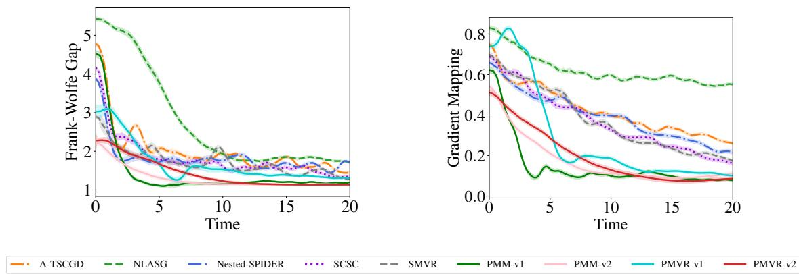  
Figure 1: Results for matrix optimization with low-rank constraints.

In line with the setup in Xiao et al. (2022), we set $B ^ { \star } = \boldsymbol { v } \boldsymbol { v } ^ { \top } / \left. \boldsymbol { v } \boldsymbol { v } ^ { \top } \right. ,$ , where v is randomly sampled from the normal distribution via numpy.random.normal(). We also generate matrix A by $A = I + E$ , with $E _ { i , j } \stackrel { i . i . d . } { \sim } \mathcal { N } \left( 0 , 0 . 3 \right)$ . Figure 1 reports the Frank-Wolfe gap and the gradient mapping versus running time. All curves are averaged over 50 runs. As can be seen, our methods demonstrate a more rapid decrease in both criteria compared to other approaches, especially for the gradient mapping criterion, demonstrating the superiority of our proposed methods.

## 7.2 Mean-variance Risk-averse Optimization

We next consider mean-variance risk-averse portfolio optimization (Shapiro et al., 2021), a commonly used benchmark for multi-level methods (Yang et al., 2019; Balasubramanian et al., 2021; Zhang and Xiao, 2021; Chen et al., 2021). Suppose we have d assets to invest over periods $l = \{ 1 , \ldots , L \}$ , and $\mathbf { r } _ { l } \in \mathbb { R } ^ { d }$ represents the payof of d assets at time step l. The goal is to maximize investment returns and minimize risk simultaneously. A suitable approach for this purpose is the mean-variance risk-averse optimization model, where risk is defined as the variance. The problem can be written as

$$
\operatorname* { m i n } _ { \mathbf { x } \in \mathcal { X } } F ( \mathbf { x } ) = - \frac { 1 } { L } \sum _ { l = 1 } ^ { L } \langle \mathbf { r } _ { l } , \mathbf { x } \rangle + \frac { \lambda } { L } \sum _ { l = 1 } ^ { L } \left( \langle \mathbf { r } _ { l } , \mathbf { x } \rangle - \langle \bar { \mathbf { r } } , \mathbf { x } \rangle \right) ^ { 2 } ,
$$

where $\begin{array} { r } { \bar { \bf r } = \frac { 1 } { L } \sum _ { l = 1 } ^ { L } { \bf r } _ { l } } \end{array}$ , and the decision variable x denotes the investment quantities in d assets. The domain is a simplex, ensuring that $\| \mathbf { x } \| _ { 1 } = 1$ for any $\mathbf { x } \in \mathcal { X }$ . This problem can be modeled as a stochastic two-level constrained compositional optimization problem, with each layer expressed as

$$
f _ { 1 } ( { \bf x } ) = \left( - \frac { 1 } { L } \sum _ { l = 1 } ^ { L } \langle { \bf r } _ { l } , { \bf x } \rangle , { \bf x } \right) , \quad f _ { 2 } ( { \bf y } _ { 1 } , { \bf y } _ { 2 } ) = { \bf y } _ { 1 } + \frac { \lambda } { L } \sum _ { l = 1 } ^ { L } \left( \langle { \bf r } _ { l } , { \bf y } _ { 2 } \rangle + { \bf y } _ { 1 } \right) ^ { 2 } ,
$$

where $f _ { 1 } ( \cdot )$ is the inner function and $f _ { 2 } ( \cdot )$ is the outer function such that $F ( \mathbf { x } ) = f _ { 2 } ( f _ { 1 } ( \mathbf { x } ) )$

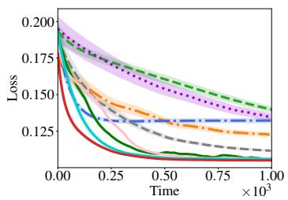

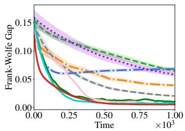  
(a) Industry-10

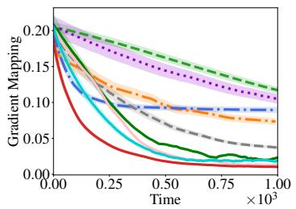

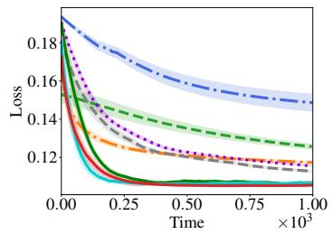

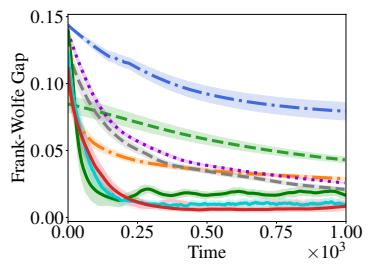  
(b) Industry-12

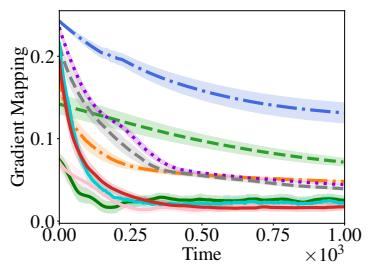

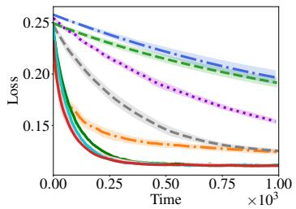

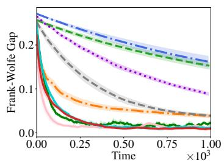  
(c) Industry-17

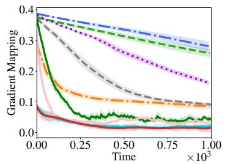  
Figure 2: Results for mean-variance risk-averse portfolio optimization.

For experimental validation, we use real-world datasets Industry-10, Industry-12, and Industry-17 from the Kenneth R. French Data Library<sup>1</sup>. These datasets contain payofs for 10, 12, and 17 industrial assets over 25,105 consecutive periods. For projection-based methods, we implement simplex projection using a well-known eficient projection method (Duchi et al., 2008). Figure 2 reports the objective value F(x), the Frank-Wolfe gap, and the gradient mapping, averaged over 50 runs. It is observed that our proposed methods (PMVR-v1,v2, and PMM-v1,v2) tend to converge more rapidly compared to other algorithms in all tasks. The loss value, Frank-Wolfe gap, and gradient mapping of our PMVR-v2 decrease most quickly in both datasets, validating the efectiveness of the proposed method.

## 7.3 Mean-deviation Risk-averse Optimization

Finally, we consider the problem of mean-deviation risk-averse portfolio optimization, in which the risk is measured by the standard deviation. The mathematical formulation of this

<table><tr><td>A-TSCGD</td><td></td><td>NLASG</td><td>Nested-SPIDER</td><td></td><td>. SCSC</td><td></td><td>SMVR</td><td></td><td>PMM-v1</td><td>PMM-v2</td><td>PMVR-v1</td><td>PMVR-v2</td></tr></table>

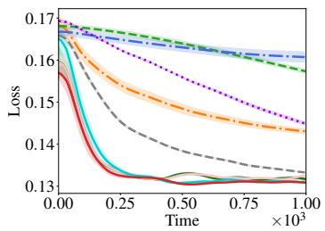

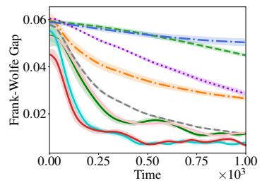  
(a) Industry-10

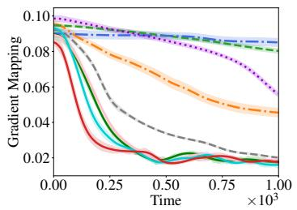

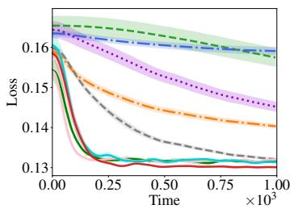

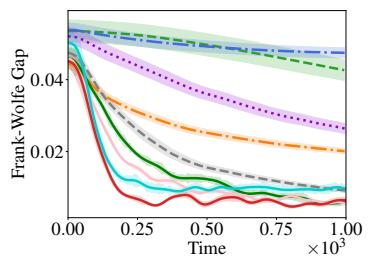  
(b) Industry-12

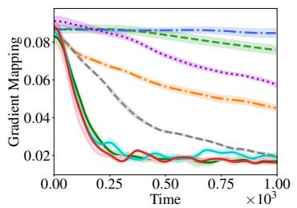

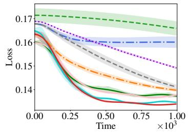

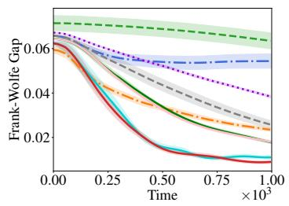  
(c) Industry-17

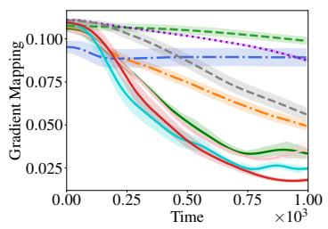  
Figure 3: Results for mean-deviation risk-averse portfolio optimization.

problem can be presented as:

$$
\operatorname* { m a x } _ { \mathbf { x } \in \mathcal { X } } \frac { 1 } { L } \sum _ { l = 1 } ^ { L } \left. \mathbf { r } _ { l } , \mathbf { x } \right. - \lambda \sqrt { \frac { 1 } { L } \sum _ { t = 1 } ^ { L } \left( \left. \mathbf { r } _ { l } , \mathbf { x } \right. - \left. \overline { { \mathbf { r } } } , \mathbf { x } \right. \right) ^ { 2 } } ,
$$

where $\begin{array} { r } { \overline { { \bf r } } = \frac { 1 } { L } \sum _ { l = 1 } ^ { L } { \bf r } _ { l } . } \end{array}$ ,  is the probability simplex, and the decision variable x denotes the investment quantity vector in the d assets. As shown by Jiang et al. (2022b), this is a three-level compositional optimization problem.

In the experiments, we also evaluate diferent methods on the real-world datasets Industry-10, Industry-12, and Industry-17. Figure 3 reports the objective value, the Frank-Wolfe gap, and the gradient mapping, averaged over 10 runs. As can be seen, our methods (especially PMVR-v2) demonstrate faster convergence compared to other algorithms in terms of loss value, Frank-Wolfe gap, and gradient mapping across all tasks.

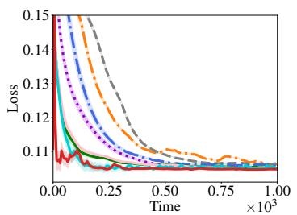

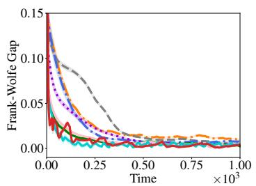  
(a) Industry-10

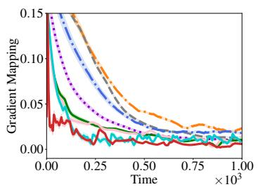

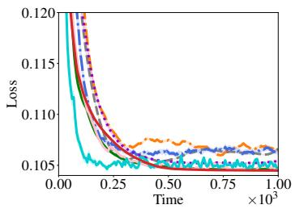

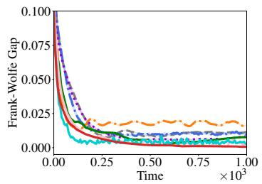  
(b) Industry-12

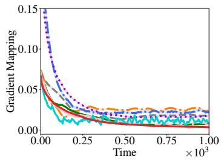

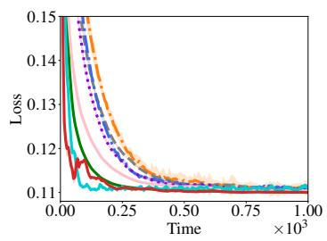

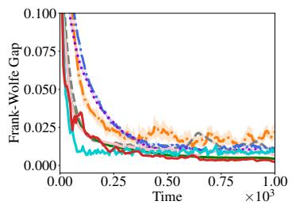  
(c) Industry-17

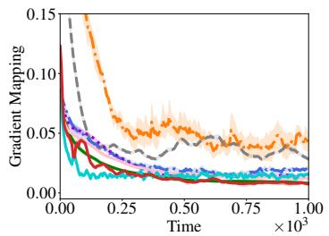

<table><tr><td></td><td>PMM-v1</td><td>---- PMM-v2</td><td></td><td>—-: PMVR-v1</td><td></td><td>…PMVR-v2</td><td></td><td>SwPMVR-v1</td><td>SwPMVR-v2</td><td>PMFS</td><td>SwPMFS</td></tr></table>

Figure 4: Results for mean-variance risk-averse portfolio optimization.

## 7.4 Variants Comparison

In this subsection, we compare the diferent algorithmic variants proposed in this paper: PMM-v1/v2, PMVR-v1/v2, the finite-sum variant PMFS, and their stage-wise counterparts for convex, strongly convex, and finite-sum objectives (SwPMVR-v1, SwPMVR-v2, and SwPMFS). Specifically, we evaluate these methods on the mean-variance risk-averse portfolio optimization problem introduced in Section 7.2, whose objective function is convex. The experimental results are presented in Figure 4. As illustrated, the finite-sum variants (PMFS and SwPMFS) achieve the best overall performance in terms of the objective value, Frank-Wolfe gap, and gradient mapping. Moreover, the stage-wise variants (SwPMVR-v1/v2) consistently outperform their non-stage-wise counterparts (PMVR-v1/v2 and PMM-v1/v2), demonstrating the empirical benefit of gradually decreasing the hyperparameters.

Next, we compare PMM and PMVR. The PMM algorithm is designed under the general smoothness condition and utilizes a simpler estimator, whereas PMVR is explicitly tailored to the average smoothness assumption. In practice, we observe that PMVR performs better when the batch size is large. For example, in Figures 2 and 3, where the batch size is set to 128, PMVR outperforms PMM in most instances. To further investigate the efect of batch size, we repeated the experiments from Section 7.2 with a smaller batch size of 32 (Figure 5). Under this setting, PMM outperforms PMVR. This behavior can be attributed to PMVR’s reliance on the average smoothness condition. Unlike standard smoothness, which applies only to the global objective function, average smoothness depends on the properties of individual samples. When the batch size is small, individual samples have a greater influence. Consequently, sample-level outliers can inflate the average smoothness constant or even violate the average smoothness assumption. Conversely, larger batches efectively smooth out this variability, rendering PMVR more stable and efective.

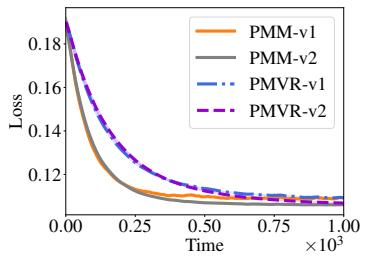

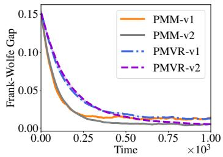  
(a) Industry-10

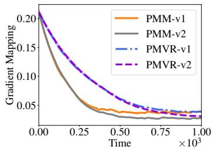

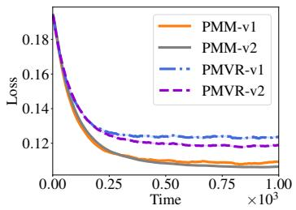

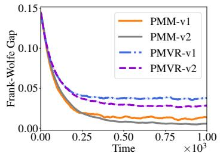  
(b) Industry-12

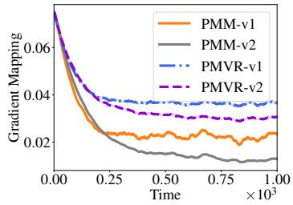

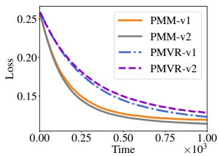

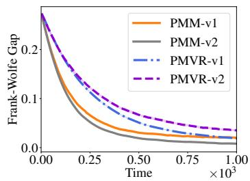  
(c) Industry-17

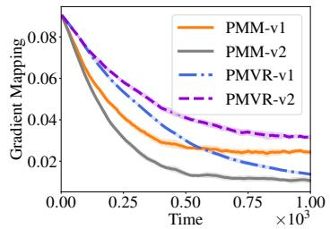  
Figure 5: Results for mean-variance risk-averse portfolio optimization.

Based on these observations, we provide the following practical guidelines for selecting among the proposed variants. When the objective function is convex or strongly convex, the stage-wise algorithms are preferable. When the problem has a finite-sum structure and full gradients are available, PMFS and its stage-wise variant are the most efective among the proposed methods. For nonconvex objectives, when full gradients are unavailable or too expensive to compute, PMVR and PMM are recommended. Between these two methods, PMM is more suitable for smaller batch sizes, whereas PMVR is preferable when larger batch sizes can be used. Finally, we give a concise summary below.

1. Stage-wise PMFS: for convex objectives with a finite-sum structure.

2. Stage-wise PMVR: for convex objectives.

3. PMFS: for non-convex objectives with a finite-sum structure.

4. PMVR: for non-convex objectives when large batch sizes can be used.

5. PMM: for non-convex objectives when smaller batch sizes are required.

## 8 Conclusion

In this paper, we investigate projection-free algorithms for stochastic constrained multi-level compositional optimization. Our methods improve prior projection-free multi-level results under the gradient mapping criterion and provide the first guarantees under the Frank-Wolfe gap in this setting. We also introduce a stage-wise parameter-free variant which avoids knowing problem-dependent parameters, and a momentum-based approach that removes the stronger average-smoothness assumptions. In addition, we derive guarantees for convex and strongly convex objectives and extend the approach to finite-sum settings. Empirical results on several benchmarks corroborate the practical benefits of the proposed methods.

## Appendix A. Proof of Theorem 1

Note that when estimating the gradient, we use the term $\begin{array} { r } { \prod _ { i = 1 } ^ { K } \nabla f _ { i } ( \mathbf { u } _ { t } ^ { i - 1 } ) } \end{array}$ to approximate $\nabla F ( \mathbf { x } _ { t } )$ . We first bound this estimation error as follows.

Lemma 12 For $K \geq 2$ , we can obtain the following guarantee:

$$
\sum _ { t = 1 } ^ { T } \mathbb { E } \left[ \left. \prod _ { i = 1 } ^ { K } \nabla f _ { i } ( { \mathbf { u } } _ { t } ^ { i - 1 } ) - \nabla F ( { \mathbf { x } } _ { t } ) \right. ^ { 2 } \right] \leq K L _ { F } ^ { 2 } \sum _ { t = 1 } ^ { T } \sum _ { i = 1 } ^ { K - 1 } \mathbb { E } \left[ \left. { \mathbf { u } } _ { t } ^ { i } - f _ { i } ( { \mathbf { u } } _ { t } ^ { i - 1 } ) \right. ^ { 2 } \right] .
$$

Proof According to the Lemma 4 of the literature (Jiang et al., 2022b), we know that

$$
\mathbb { E } \left[ \left\| \nabla F ( { \mathbf x } _ { t } ) - \prod _ { i = 1 } ^ { K } \nabla f _ { i } ( { \mathbf u } _ { t } ^ { i - 1 } ) \right\| ^ { 2 } \right] \leq K \sum _ { i = 1 } ^ { K - 1 } C _ { i } ^ { 2 } \mathbb { E } \left[ \left\| f _ { i } ( { \mathbf u } _ { t } ^ { i - 1 } ) - { \mathbf u } _ { t } ^ { i } \right\| ^ { 2 } \right] ,
$$

where $C _ { i } : = L _ { f } ^ { K - 1 } L _ { J } ( 1 + L _ { f } + \dots + L _ { f } ^ { K - i - 1 } ) \le L _ { F }$ . Summing up, we complete the proof.   
Next, we can bound the gradient estimation error as follows.

Lemma 13 The gradient estimator $\mathbf { v } _ { t }$ enjoys the following guarantee:

$$
\begin{array} { r l } & { \frac { 1 } { T } \displaystyle \sum _ { t = 1 } ^ { T } \mathbb { E } \left[ \left\| \mathbf { v } _ { t } - \prod _ { i = 1 } ^ { K } \nabla f _ { i } ( \mathbf { u } _ { t } ^ { i - 1 } ) \right\| ^ { 2 } \right] \leq \frac { 1 } { \alpha T } \mathbb { E } \left[ \left\| \mathbf { v } _ { 1 } - \prod _ { i = 1 } ^ { K } \nabla f _ { i } ( \mathbf { u } _ { 1 } ^ { i - 1 } ) \right\| ^ { 2 } \right] } \\ & { \qquad + 2 K ^ { 2 } \sigma _ { J } ^ { 2 } L _ { f } ^ { 2 K - 2 } \displaystyle \frac { \alpha } { B _ { 1 } } + 2 K L _ { J } ^ { 2 } L _ { f } ^ { 2 K - 2 } \frac { 1 } { B _ { 1 } \alpha T } \displaystyle \sum _ { t = 1 } ^ { T } \sum _ { i = 1 } ^ { K } \mathbb { E } \left[ \left\| \mathbf { u } _ { t + 1 } ^ { i - 1 } - \mathbf { u } _ { t } ^ { i - 1 } \right\| ^ { 2 } \right] . } \end{array}
$$

Proof According to the definition of $\mathbf { v } _ { t } .$ , we know that:

$$
\begin{array} { r l } & { \mathbb { E } [ | \mathbf { v } _ { 1 } - \frac { \lambda } { \tau } \mathbf { E } ^ { \lambda } ( \mathbf { r } ; \lambda ) \mathbf { f } ^ { \lambda } | ^ { 2 } ] } \\ & { = \mathbb { E } [ | \frac { \lambda } { B _ { 1 } } - \frac { \lambda } { \tau } \mathbf { E } ^ { \lambda } ( \mathbf { r } ; \lambda ) \mathbf { f } ^ { \lambda } | ^ { 2 } ] } \\ & { = - \mathbb { E } [ | \frac { 1 } { B _ { 1 } } - \frac { \lambda } { \tau } \mathbf { E } ^ { \lambda } ( \mathbf { r } ; \lambda ) \mathbf { f } ^ { \lambda } | ^ { 2 } ] + ( 1 - \alpha ) ( \exp { - \tau } | \frac { 1 } { B _ { 1 } } \sum _ { i = 1 } ^ { B _ { i } } \exp { [ \tau ( \lambda \mathbf { r } ^ { i } ) \mathbf { f } ^ { \lambda } ] } | ^ { 2 } ) - \frac { \kappa } { \tau } \Bigg [ \mathrm { E } ^ { \lambda } ( \mathbf { r } ; \lambda ) \mathbf { f } ^ { \lambda } \mathbf { f } ^ { \lambda } \mathbf { f } ^ { \lambda } \mathbf { f } ^ { \lambda } \mathbf { f } ^ { \lambda } \mathbf { f } ^ { \lambda } \mathbf { f } ^ { \lambda } \Bigg ] \Bigg ] } \\ &  = \mathbb { E } [ | 1 - \alpha + ( \exp { - \tau } \frac { \lambda } { \tau } \mathrm { E } ^ { \lambda } \mathrm { E } ^ { \lambda } \mathrm { E } ^ { \lambda } ) | ^ { 2 } + \exp { - \tau } \Bigg [ \frac { 1 } { B _ { 1 } } \sum _ { i = 1 } ^ { B _ { i } } \exp { - \tau } \exp { - \tau } \exp { - \tau } \exp { - \tau } \exp { - \tau } \exp { - \tau } \exp { - \tau } \exp { - \tau } \exp { - \tau } \exp { - \tau } \exp { - \tau } \exp { - \tau } \exp { - \tau } \exp { - \tau } \exp { - \tau } \exp { - \tau } \exp  -  \end{array}
$$

where the last equality is due to $( a + b ) ^ { 2 } \leq 2 a ^ { 2 } + 2 b ^ { 2 }$ and the fact that

$$
\begin{array} { r } { \mathbb { E } \left[ \alpha \left( \frac { 1 } { B _ { 1 } } \displaystyle \sum _ { j = 1 } ^ { B _ { 1 } } \displaystyle \prod _ { i = 1 } ^ { K } \nabla f _ { i } ( \mathbf { u } _ { t - 1 } ^ { i - 1 } ; \boldsymbol { \xi } _ { t } ^ { i , j } ) - \displaystyle \prod _ { i = 1 } ^ { K } \nabla f _ { i } ( \mathbf { u } _ { t - 1 } ^ { i - 1 } ) \right) + \displaystyle \prod _ { i = 1 } ^ { K } \nabla f _ { i } ( \mathbf { u } _ { t - 1 } ^ { i - 1 } ) - \displaystyle \prod _ { i = 1 } ^ { K } \nabla f _ { i } ( \mathbf { u } _ { t } ^ { i - 1 } ) \right. } \\ { \left. - \frac { 1 } { B _ { 1 } } \displaystyle \sum _ { j = 1 } ^ { B _ { 1 } } \displaystyle \prod _ { i = 1 } ^ { K } \nabla f _ { i } ( \mathbf { u } _ { t - 1 } ^ { i - 1 } ; \boldsymbol { \xi } _ { t } ^ { i , j } ) + \frac { 1 } { B _ { 1 } } \displaystyle \sum _ { j = 1 } ^ { B _ { 1 } } \displaystyle \prod _ { i = 1 } ^ { K } \nabla f _ { i } ( \mathbf { u } _ { t } ^ { i - 1 } ; \boldsymbol { \xi } _ { t } ^ { i , j } ) \right] = 0 . } \end{array}
$$

Then, we would bound the two terms, respectively. First, we have that:

$$
\begin{array} { r l } { \| \frac { 1 } { \mu _ { 0 } } \| _ { \infty } ^ { \infty } \| \nabla \mu ( \mu ) \| ^ { 2 } } & { = \frac { 1 } { \mu _ { 0 } } \| \frac { 1 } { \mu _ { 0 } } \| \nabla \mu ( \mu ) \| ^ { 2 } , } \\ & { = \frac { 1 } { \mu _ { 0 } } \| \frac { 1 } { \mu _ { 0 } } \| \nabla \mu ( \mu ) \| ^ { 2 } , } \\ & { = \frac { 1 } { \mu _ { 0 } } \| \frac { 1 } { \mu _ { 0 } } \| \nabla \mu ( \mu ) \| ^ { 2 } , } \\ & { = \frac { 1 } { \mu _ { 0 } } \| \frac { 1 } { \mu _ { 0 } } \| \nabla \mu ( \mu ) \| ^ { 2 } , } \\ & { = \frac { 1 } { \mu _ { 0 } } \| \nabla \mu ( \mu ) \| ^ { 2 } , } \\ & { \quad \quad \quad \quad \quad \quad \quad \quad \quad \quad \quad \quad \quad \quad \mu _ { 0 } ^ { \infty } \| _ { \infty } ^ { \infty } \| \nabla \mu ( \mu ) \| ^ { 2 } , } \\ & { = \frac { 1 } { \mu _ { 0 } } \| \nabla \mu ( \mu ) \| ^ { 2 } , } \\ & { = \frac { 1 } { \mu _ { 0 } } \| \frac { 1 } { \mu _ { 0 } } \| \nabla \mu ( \mu ) \| ^ { 2 } , } \\ & { = \frac { 1 } { \mu _ { 0 } } \| \frac { 1 } { \mu _ { 0 } } \| \nabla \mu ( \mu ) \| ^ { 2 } , } \\ & { = \frac { 1 } { \mu _ { 0 } } \| \frac { 1 } { \mu _ { 0 } } \| \nabla \mu ( \mu ) \| ^ { 2 } , } \\ & { \quad \quad \quad \quad \quad \quad \quad \quad \quad \quad \quad \quad \quad \quad \mu _ { 0 } ^ { \infty } \| _ { \infty } \| \nabla \mu ( \mu ) \| ^ { 2 } , } \\ &  = \frac { 1 } { \mu _ { 0 } } \| \frac { 1 } { \mu _ { 0 } } \| \nabla \mu ( \mu )  \end{array}
$$

When dealing with the second term, we have

$$
\begin{array} { r l } &  \times \{ | \begin{array} { l l } { \mathcal { S } _ { 1 } ^ { \mathrm { R } } \frac { \mathcal { S } _ { 1 } ^ { \mathrm { R } } } { \omega ^ { 2 } } \Bigg [ \mathrm { i } \frac { \mathcal { S } _ { 2 } ^ { \mathrm { R } } \mathcal { S } _ { 1 } ^ { \mathrm { R } } } { \omega ^ { 2 } } \Bigg [ \mathrm { i } \frac { \mathcal { S } _ { 2 } ^ { \mathrm { R } } } { \omega ^ { 2 } } \Bigg ] ^ { 2 } \frac { \mathcal { S } _ { 2 } ^ { \mathrm { R } } } { \omega ^ { 2 } } \Bigg [ \mathrm { i } \gamma \omega ^ { 2 } \omega ^ { 2 } \Bigg ] ^ { 2 } ( \mathrm { E } ^ { 2 } \omega ^ { 2 } ) ^ { 2 } + \mathrm { i } \frac { \mathcal { S } _ { 1 } ^ { \mathrm { R } } \mathcal { S } _ { 2 } ^ { \mathrm { R } } } { \omega ^ { 2 } } \Bigg [ \mathrm { i } \gamma \omega ^ { 2 } \mathrm { S } _ { 2 } ^ { \mathrm { R } } \Bigg ] ^ { 2 } \Bigg [ \mathrm { i } \gamma \omega ^ { 2 } \mathrm { S } _ { 2 } ^ { \mathrm { R } } \Bigg ] ^ { 2 } } \\ { \quad + \mathrm { i } \frac { \mathcal { S } _ { 2 } ^ { \mathrm { R } } } { \omega ^ { 2 } } \Bigg [ \mathrm { i } \frac { \mathcal { S } _ { 1 } ^ { \mathrm { R } } \mathcal { S } _ { 2 } ^ { \mathrm { R } } } { \omega ^ { 2 } } \Bigg ] ^ { 2 } \Bigg [ \mathrm { i } \gamma \mathrm { S u } ^ { 2 } \mathrm { S } _ { 2 } ^ { \mathrm { R } } \Bigg ] ^ { 2 } \Bigg [ \mathrm { i } \gamma \mathrm { S u } ^ { 2 } \mathrm { S } _ { 2 } ^ { \mathrm { R } } \Bigg ] ^ { 2 } } \\  \quad + \mathrm { i } \frac { \mathcal { S } _ { 2 } ^ { \mathrm { R } } } { \omega ^ { 2 } } \Bigg [ \mathrm { i } \Bigg [ \mathrm { i } \frac  \mathcal { S } _ { 2 } ^ { \mathrm { R } } \mathcal { S } _  1 \end{array} \end{array}\tag{14}
$$

where the first two steps are due to the fact that

$$
\mathbb { E } \left[ \frac { 1 } { B _ { 1 } } \sum _ { j = 1 } ^ { B _ { 1 } } \left( \prod _ { i = 1 } ^ { K } \nabla f _ { i } ( \mathbf { u } _ { t - 1 } ^ { i - 1 } ; \boldsymbol { \xi } _ { t } ^ { i , j } ) - \prod _ { i = 1 } ^ { K } \nabla f _ { i } ( \mathbf { u } _ { t } ^ { i - 1 } ; \boldsymbol { \xi } _ { t } ^ { i , j } ) \right) - \prod _ { i = 1 } ^ { K } \nabla f _ { i } ( \mathbf { u } _ { t - 1 } ^ { i - 1 } ) + \prod _ { i = 1 } ^ { K } \nabla f _ { i } ( \mathbf { u } _ { t } ^ { i - 1 } ) \right] = 0
$$

To this end, we can conclude that:

$$
\begin{array} { r l } & { \mathbb { E } \left[ \left. \mathbf { v } _ { t } - \displaystyle \prod _ { i = 1 } ^ { K } \nabla f _ { i } ( \mathbf { u } _ { t } ^ { i - 1 } ) \right. ^ { 2 } \right] \leq ( 1 - \alpha ) \mathbb { E } \left[ \left. \mathbf { v } _ { t - 1 } - \displaystyle \prod _ { i = 1 } ^ { K } \nabla f _ { i } ( \mathbf { u } _ { t - 1 } ^ { i - 1 } ) \right. ^ { 2 } \right] } \\ & { \qquad + \ 2 K ^ { 2 } \sigma _ { J } ^ { 2 } L _ { f } ^ { 2 K - 2 } \displaystyle \frac { \alpha ^ { 2 } } { B _ { 1 } } + 2 K L _ { J } ^ { 2 } L _ { f } ^ { 2 K - 2 } \displaystyle \frac { 1 } { B _ { 1 } } \displaystyle \sum _ { i = 1 } ^ { K } \mathbb { E } \left[ \left. \mathbf { u } _ { t } ^ { i - 1 } - \mathbf { u } _ { t - 1 } ^ { i - 1 } \right. ^ { 2 } \right] . } \end{array}
$$

Summing up over t and rearranging, we complete the proof for this lemma.

Next, we bound the estimation error of the function value estimator in the following lemma.

Lemma 14 The inner function estimator $\mathbf { u } _ { t }$ ensures that:

$$
\begin{array} { r l } & { \frac { 1 } { T } \displaystyle \sum _ { t = 1 } ^ { T } \displaystyle \sum _ { i = 1 } ^ { K } \mathbb { E } \left[ \left\| \mathbf { u } _ { t } ^ { i } - f _ { i } ( \mathbf { u } _ { t } ^ { i - 1 } ) \right\| ^ { 2 } \right] \leq \frac { \displaystyle \sum _ { i = 1 } ^ { K } \mathbb { E } \left[ \left\| \mathbf { u } _ { 1 } ^ { i } - f _ { i } ( \mathbf { u } _ { 1 } ^ { i - 1 } ) \right\| ^ { 2 } \right] } { \alpha T } } \\ & { \qquad \quad + 2 K \sigma ^ { 2 } \displaystyle \frac { \alpha } { B _ { 1 } } + \frac { 2 L _ { f } ^ { 2 } } { \alpha B _ { 1 } T } \displaystyle \sum _ { t = 1 } ^ { T } \displaystyle \sum _ { i = 1 } ^ { K } \mathbb { E } \left[ \left\| \mathbf { u } _ { t + 1 } ^ { i - 1 } - \mathbf { u } _ { t } ^ { i - 1 } \right\| ^ { 2 } \right] . } \end{array}
$$

Proof According to the definition of ${ \bf u } _ { t } ^ { i }$ , we have:

$$
\begin{array} { r l } & { \mathbb { E } [ \| \mathbf { u } _ { k } ^ { - 1 } - f _ { i } ( \mathbf { u } _ { k - 1 } ^ { - 1 } ) \| ^ { 2 } ] } \\ & { = \mathbb { E } [ \| ( 1 - \alpha ) ( \mathbf { u } _ { 1 } ^ { + 1 } - f _ { i } ( \mathbf { u } _ { k - 1 } ^ { - 1 } ) ) + \alpha _ { i j } \frac { B _ { 1 } } { \gamma - 1 } ( f _ { i } ( \mathbf { u } _ { k - 1 } ^ { - 1 } ; \xi _ { k } ^ { + 1 } ) - f _ { i } ( \mathbf { u } _ { k - 1 } ^ { - 1 } ) )  } \\ & { \qquad + f _ { i } ( \mathbf { u } _ { 1 } ^ { + 1 } ) - f _ { i } ( \mathbf { u } _ { k - 1 } ^ { - 1 } ) - \frac { 1 } { B _ { 1 } } ( \frac { B _ { 1 } } { \gamma - 1 } ( f _ { i } ( \mathbf { u } _ { 1 } ^ { - 1 } ; \xi _ { k } ^ { + 1 } ) - f _ { i } ( \mathbf { u } _ { i } ^ { - 1 } ; \xi _ { k } ^ { + 1 } ) ) ) \| ^ { 2 } ] } \\ & { \leq ( 1 - \alpha ) ^ { 2 } \mathbb { E } [ \| \mathbf { u } _ { 2 - 1 } ^ { + 1 } - f _ { i } ( \mathbf { u } _ { i - 1 } ^ { + 1 } ) \| ^ { 2 } , \ \frac { 2 \alpha ^ { 2 } } { 2 B _ { 1 } } \mathbb { E } [ \| f _ { i } ( \mathbf { u } _ { 1 - 1 } ^ { + 1 } ; \xi _ { i } ^ { + 1 } ) - f _ { i } ( \mathbf { u } _ { i - 1 } ^ { + 1 } ) \| ^ { 2 } ] } \\ &  \qquad + 2 \mathbb { E } [ \| \frac { 1 } { B _ { 1 } } \frac { B _ { 1 } } { \gamma - 1 } ( f _ { i } ( \mathbf { u } _ { 1 } ^ { - 1 } ; \xi _ { k } ^ { + 2 } ) - \end{array}
$$

where the last inequality is because of

$$
\begin{array} { r l } & { \quad \mathbb { E } \left[ \left\| \frac { 1 } { B _ { 1 } } \displaystyle \sum _ { j = 1 } ^ { B _ { 1 } } \left( f _ { i } ( \mathbf { u } _ { t - 1 } ^ { i - 1 } ; \boldsymbol { \xi } _ { t } ^ { i , j } ) - f _ { i } ( \mathbf { u } _ { t } ^ { i - 1 } ; \boldsymbol { \xi } _ { t } ^ { i , j } ) - f _ { i } ( \mathbf { u } _ { t - 1 } ^ { i - 1 } ) + f _ { i } ( \mathbf { u } _ { t } ^ { i - 1 } ) \right) \right\| ^ { 2 } \right] } \\ & { \quad \leq \frac { 1 } { B _ { 1 } ^ { 2 } } \displaystyle \sum _ { j = 1 } ^ { B _ { 1 } } \mathbb { E } \left[ \left\| f _ { i } ( \mathbf { u } _ { t - 1 } ^ { i - 1 } ; \boldsymbol { \xi } _ { t } ^ { i , j } ) - f _ { i } ( \mathbf { u } _ { t } ^ { i - 1 } ; \boldsymbol { \xi } _ { t } ^ { i , j } ) \right\| ^ { 2 } \right] \leq \frac { 1 } { B _ { 1 } } L _ { f } ^ { 2 } \left\| \mathbf { u } _ { t - 1 } ^ { i - 1 } - \mathbf { u } _ { t } ^ { i - 1 } \right\| ^ { 2 } . } \end{array}
$$

This leads to the fact that:

$$
\begin{array} { r } { \displaystyle \sum _ { i = 1 } ^ { K } \mathbb { E } \left[ \left\| \mathbf { u } _ { t } ^ { i } - f _ { i } ( \mathbf { u } _ { t } ^ { i - 1 } ) \right\| ^ { 2 } \right] \leq ( 1 - \alpha ) \displaystyle \sum _ { i = 1 } ^ { K } \mathbb { E } \left\| \mathbf { u } _ { t - 1 } ^ { i } - f _ { i } ( \mathbf { u } _ { t - 1 } ^ { i - 1 } ) \right\| ^ { 2 } } \\ { \displaystyle + \frac { 2 \alpha ^ { 2 } \sigma ^ { 2 } K } { B _ { 1 } } + \frac { 2 } { B _ { 1 } } L _ { f } ^ { 2 } \displaystyle \sum _ { i = 1 } ^ { K } \left\| \mathbf { u } _ { t - 1 } ^ { i - 1 } - \mathbf { u } _ { t } ^ { i - 1 } \right\| ^ { 2 } . } \end{array}
$$

By summing up and rearranging, we finish the proof of this lemma.

Then, we bound the term ${ \textstyle \sum _ { i = 1 } ^ { K } } \mathbb { E } \left[ \left\| \mathbf { u } _ { t + 1 } ^ { i - 1 } - \mathbf { u } _ { t } ^ { i - 1 } \right\| ^ { 2 } \right]$

Lemma 15 We can obtain the following guarantee.

$$
\begin{array} { r l } & { \displaystyle \sum _ { i = 1 } ^ { K } \mathbb { E } \left[ \left\| \mathbf { u } _ { t + 1 } ^ { i - 1 } - \mathbf { u } _ { t } ^ { i - 1 } \right\| ^ { 2 } \right] } \\ & { \le \left( \displaystyle \sum _ { i = 1 } ^ { K } \left( 2 L _ { f } ^ { 2 } \right) ^ { i - 1 } \right) \left( \mathbb { E } \left[ \eta ^ { 2 } \left\| \mathbf { z } _ { t } - \mathbf { x } _ { t } \right\| ^ { 2 } \right] + \displaystyle \frac { 2 \alpha ^ { 2 } \sigma ^ { 2 } K } { B _ { 1 } } + 2 \alpha ^ { 2 } K \displaystyle \sum _ { i = 1 } ^ { K } \mathbb { E } \left[ \left\| \mathbf { u } _ { t } ^ { i } - f _ { i } ( \mathbf { u } _ { t } ^ { i - 1 } ) \right\| ^ { 2 } \right] \right) . } \end{array}
$$

Proof (1) For the first level, $\mathrm { i } . \mathrm { e } . , i = 1$ , we have:

$$
\begin{array} { r } { \mathbb { E } \left[ \left\| \mathbf { u } _ { t + 1 } ^ { i - 1 } - \mathbf { u } _ { t } ^ { i - 1 } \right\| ^ { 2 } \right] = \mathbb { E } \left[ \left\| \mathbf { x } _ { t + 1 } - \mathbf { x } _ { t } \right\| ^ { 2 } \right] = \mathbb { E } \left[ \eta ^ { 2 } \left\| \mathbf { z } _ { t } - \mathbf { x } _ { t } \right\| ^ { 2 } \right] . } \end{array}
$$

(2) For other levels, i.e., $2 \leq i \leq K$ , we have:

$$
\begin{array} { r l } & { \mathbb { E } \left[ \left\| \mathbf { u } _ { t + 1 } ^ { \star \star } - \mathbf { u } _ { t } ^ { \star \star } \right\| ^ { 2 } \right] } \\ & { = \mathbb { E } \left[ \Bigg \| \alpha \left( f _ { - 1 } ( \mathbf { u } _ { t } ^ { \star } | ^ { 2 } ) - \mathbf { u } _ { t } ^ { \star } \right) + \frac { 1 } { B _ { 1 } } \sum _ { i = 1 } ^ { B _ { 1 } } ( f _ { i - 1 } ^ { \star } ( \mathbf { u } _ { t } ^ { \star } | ^ { 2 } ) \xi _ { t - 1 } ^ { i - 1 } ) - f _ { i - 1 } ( \mathbf { u } _ { t } ^ { \star } \cdot 2 \xi _ { t + 1 } ^ { i - 1 } ) ^ { i } ) \right\| } \\ & { \qquad + \alpha \left( \frac { 1 } { B _ { 1 } } \sum _ { j = 1 } ^ { B _ { 1 } } f _ { i - 1 } ( \mathbf { u } _ { t } ^ { \star \star 2 } ; \xi _ { t - 1 } ^ { i } ) ) - f _ { - 1 } ( \mathbf { u } _ { t } ^ { \star \star } - 2 ) \right) \Bigg \| ^ { 2 } \Bigg ] } \\ & { \leq 2 \mathbb { E } \Bigg [ \Bigg \| \alpha \left( f _ { - 1 } ( \mathbf { u } _ { t } ^ { \star } | ^ { 2 } ) - \mathbf { u } _ { t } ^ { \star \star } \right) + \alpha \left( \frac { 1 } { B _ { 1 } } \sum _ { j = 1 } ^ { B _ { 1 } } f _ { i - 1 } ( \mathbf { u } _ { t } ^ { \star \star } ; 2 \xi _ { t + 1 } ^ { i - 1 } ) \right) - f _ { i - 1 } ( \mathbf { u } _ { t } ^ { \star \star } ) ^ { i } \Bigg ) \Bigg \| _ { 2 } ^ { 2 } \Bigg ] } \\ &  \qquad + 2 L _ { j } ^ { 2 } \mathbb { E } \left[ \left\| \mathbf { u } _ { t + 1 } ^ { \star } - \mathbf { u } _ { t } ^ { \star \star } \right\| ^ { 2 } \right] + \frac { 2 } { B _ { 1 } } \sum  \end{array}
$$

Denote $\Upsilon _ { t } ^ { i } = \mathbb { E } \left\lceil \left\| \mathbf { u } _ { t } ^ { i } - f _ { i } ( \mathbf { u } _ { t } ^ { i - 1 } ) \right\| ^ { 2 } \right\rceil$ and $Q _ { t } ^ { i } = \mathbb { E } \left[ \left. \mathbf { u } _ { t + 1 } ^ { i - 1 } - \mathbf { u } _ { t } ^ { i - 1 } \right. ^ { 2 } \right]$ , we have $Q _ { t } ^ { i } \leq 2 L _ { f } ^ { 2 } Q _ { t } ^ { i - 1 } +$ $\begin{array} { r } { 2 \alpha ^ { 2 } \Upsilon _ { t } ^ { i - 1 } + \frac { 2 \alpha ^ { 2 } \sigma ^ { 2 } } { B _ { 1 } } } \end{array}$ for $i \geq 2$ . Then we can get:

$$
\begin{array} { r l } & { Q _ { t } ^ { 1 } \leq \mathbb { E } \left[ \eta ^ { 2 } \left. z _ { t } - \mathbf { x } _ { t } \right. ^ { 2 } \right] } \\ & { Q _ { t } ^ { 2 } \leq \left( 2 L _ { f } ^ { 2 } \right) \mathbb { E } \left[ \eta ^ { 2 } \left. z _ { t } - \mathbf { x } _ { t } \right. ^ { 2 } \right] + \frac { 2 \alpha ^ { 2 } \sigma ^ { 2 } } { R _ { 1 } } + 2 \alpha ^ { 2 } \Upsilon _ { t } ^ { 1 } } \\ & { Q _ { t } ^ { 3 } \leq \left( 2 L _ { f } ^ { 2 } \right) ^ { 2 } \mathbb { E } \left[ \eta ^ { 2 } \left. z _ { t } - \mathbf { x } _ { t } \right. ^ { 2 } \right] + \frac { 2 \alpha ^ { 2 } \sigma ^ { 2 } } { R _ { 1 } } \left( 1 + 2 L _ { f } ^ { 2 } \right) + 2 \alpha ^ { 2 } \left( 2 L _ { f } ^ { 2 } \Upsilon _ { t } ^ { 1 } + \Upsilon _ { t } ^ { 2 } \right) } \\ & { \qquad \cdots } \\ & { Q _ { t } ^ { \frac { \beta } { \alpha } } \leq \left( 2 L _ { f } ^ { 2 } \right) ^ { i - 1 } \mathbb { E } \left[ \eta ^ { 2 } \left. z _ { t } - \mathbf { x } _ { t } \right. ^ { 2 } \right] + \frac { 2 \alpha ^ { 2 } \sigma ^ { 2 } } { B _ { 1 } } \displaystyle \sum _ { j = 1 } ^ { i - 1 } \left( 2 L _ { f } ^ { 2 } \right) ^ { j - 1 } + 2 \alpha ^ { 2 } \displaystyle \sum _ { j = 1 } ^ { i - 1 } \left( 2 L _ { f } ^ { 2 } \right) ^ { i - 1 - j } \Upsilon _ { t } ^ { j } } \\ &  \qquad \leq \left( 2 L _ { f } ^ { 2 } \right) ^ { i - 1 } \mathbb { E } \left[ \eta ^ { 2 } \left. z _ { t } - \mathbf { x } _ { t } \right. ^ { 2 } \right] + \frac { 2 \alpha ^ { 2 } \sigma ^ { 2 } } { B _ { 1 } } \displaystyle \sum _ { j = 1 } ^  \end{array}
$$

When summing up, we have:

$$
\begin{array} { r l } & { \quad \displaystyle \sum _ { i = 1 } ^ { K } \mathbb { E } \left[ \left\| \mathbf { u } _ { t + 1 } ^ { i - 1 } - \mathbf { u } _ { t } ^ { i - 1 } \right\| ^ { 2 } \right] = \sum _ { i = 1 } ^ { K } Q _ { t } ^ { i } } \\ & { \leq \displaystyle \sum _ { i = 1 } ^ { K } \left( 2 L _ { f } ^ { 2 } \right) ^ { i - 1 } \mathbb { E } \left[ \eta ^ { 2 } \left\| \mathbf { z } _ { t } - \mathbf { x } _ { t } \right\| ^ { 2 } \right] + \frac { 2 \alpha ^ { 2 } \sigma ^ { 2 } K } { B _ { 1 } } \displaystyle \sum _ { i = 1 } ^ { K } \left( 2 L _ { f } ^ { 2 } \right) ^ { i - 1 } + 2 \alpha ^ { 2 } K \sum _ { j = 1 } ^ { K } \sum _ { l = 1 } ^ { K } \left( 2 L _ { f } ^ { 2 } \right) ^ { K - l } \Upsilon _ { t } ^ { j } } \\ & { \leq \left( \displaystyle \sum _ { i = 1 } ^ { K } \left( 2 L _ { f } ^ { 2 } \right) ^ { i - 1 } \right) \left( \mathbb { E } \left[ \eta ^ { 2 } \left\| \mathbf { z } _ { t } - \mathbf { x } _ { t } \right\| ^ { 2 } \right] + \frac { 2 \alpha ^ { 2 } \sigma ^ { 2 } K } { B _ { 1 } } + 2 \alpha ^ { 2 } K \sum _ { i = 1 } ^ { K } \Upsilon _ { t } ^ { j } \right) } \\ &  \leq \left( \displaystyle \sum _ { i = 1 } ^ { K } \left( 2 L _ { f } ^ { 2 } \right) ^ { i - 1 } \right) \left( \mathbb { E } \left[ \eta ^ { 2 } \left\| \mathbf { z } _ { t } - \mathbf { x } _ { t } \right\| ^ { 2 } \right] + \frac { 2 \alpha ^ { 2 } \sigma ^ { 2 } K } { B _ { 1 } } + 2 \alpha ^ { 2 } K \sum _ { j = 1 } ^ { K } \mathbb { E } \left[ \left\| \mathbf { u } _ { t } ^ { i } - f _ { i } ( \mathbf { u } _ { t } ^ { i - 1 } ) \right\| ^ { 2 } \right] \right) \end{array}
$$

Next, we bound the error of the gradient estimator.

Lemma 16 Denote that the constants $\begin{array} { r } { L _ { 1 } = \left( 2 K L _ { J } ^ { 2 } L _ { f } ^ { 2 K - 2 } + 4 K L _ { F } ^ { 2 } L _ { f } ^ { 2 } \right) \left( \sum _ { i = 1 } ^ { K } \left( 2 L _ { f } ^ { 2 } \right) ^ { i - 1 } \right) } \end{array}$ ${ \cal L } _ { 2 } = 2 ( 2 K ^ { 2 } \sigma _ { J } ^ { 2 } L _ { f } ^ { 2 K - 2 } + 4 K ^ { 2 } L _ { F } ^ { 2 } \sigma ^ { 2 } + 2 L _ { 1 } \sigma ^ { 2 } K ) + 2 L _ { 1 } D ^ { 2 } + 2 L _ { f } ^ { 2 K }$ , we can ensure that:

$$
\frac { 1 } { T } \sum _ { t = 1 } ^ { T } \mathbb { E } \left[ \left\| \nabla F ( \mathbf { x } _ { t } ) - \mathbf { v } _ { t } \right\| ^ { 2 } \right] \leq \frac { L _ { 2 } } { \alpha B _ { 0 } T } + \frac { \alpha L _ { 2 } } { B _ { 1 } } + \frac { L _ { 2 } \eta ^ { 2 } } { \alpha B _ { 1 } } .
$$

Proof Since $\begin{array} { r } { \mathbb { E } \left[ \left\| \mathbf { v } _ { 1 } - \prod _ { i = 1 } ^ { K } \nabla f _ { i } ( \mathbf { u } _ { 1 } ^ { i - 1 } ) \right\| ^ { 2 } \right] \leq \frac { L _ { f } ^ { 2 K } } { B _ { 0 } } , \sum _ { i = 1 } ^ { K } \mathbb { E } \left[ \left\| \mathbf { u } _ { 1 } ^ { i } - f _ { i } ( \mathbf { u } _ { 1 } ^ { i - 1 } ) \right\| ^ { 2 } \right] \leq \frac { K \sigma ^ { 2 } } { B _ { 0 } } } \end{array}$ , by setting $\begin{array} { r } { \alpha \leq \frac { B _ { 1 } L _ { F } ^ { 2 } } { 2 L _ { 1 } } } \end{array}$ , we can deduce that:

$$
\begin{array} { r l } & { \frac { 1 } { T } \displaystyle \sum _ { t = 1 } ^ { Z } \mathbb { E } \left[ \left\| \mathbf { v } _ { 1 } ^ { X } - \frac { \mathbf { A } } { \mathbf { D } _ { t } ^ { X } } \mathbf { f } ^ { X } ( \mathbf { a } _ { 1 } ^ { - - 1 } ) \right\| ^ { 2 } \right] \frac { 2 4 R ^ { 2 } L ^ { 2 } } { T } \displaystyle \sum _ { t = 1 } ^ { R \times \frac { L } { 2 } } \sum _ { \mathbf { c } = 2 } ^ { R \times \frac { L } { 2 } } \mathbb { E } \left[ \left\| \mathbf { u } _ { 1 } ^ { X } - \dot { f } \mathbf { u } _ { 1 } ^ { ( - 1 ) } \right\| ^ { 2 } \right] } \\ & { \times \displaystyle \frac { \sum _ { t = 1 } ^ { R ^ { 2 } R ^ { 2 } + 2 R ^ { 2 } + 2 } } { 2 8 R ^ { 3 } L ^ { 2 } } - ( 2 R ^ { 2 } c ^ { 2 } ) \delta _ { T } ^ { 2 R } \delta _ { T } ^ { 2 R } \delta _ { T } ^ { 2 R } + 4 R ^ { 2 } c ^ { 2 } \delta _ { T } ^ { 2 R } \delta _ { 1 } ^ { 2 } } \\ & { - \frac { 2 4 R ^ { 2 } c ^ { 2 } } { 2 8 R ^ { 3 } L ^ { 2 } } + 3 5 8 \mathrm { R e } _ { 1 } ^ { \mathcal { R } _ { 1 } L ^ { 2 } } \displaystyle \sum _ { t = 1 } ^ { N } \sum _ { \mathbf { c } = 2 } ^ { N } \mathbb { E } \left[ \left\| \mathbf { u } _ { 1 } ^ { X } - \mathbf { u } _ { 1 } ^ { ( - 1 ) } \right\| ^ { 2 } \right] } \\ & { \leq \frac { L ^ { 2 } } { T } \displaystyle \sum _ { t = 1 } ^ { R \times \frac { L } { 2 } } + 2 8 R ^ { 2 } c ^ { 2 } \delta _ { T } ^ { 2 R } \delta _ { 1 } ^ { 2 } - 4 R ^ { 2 } c ^ { 2 } \delta _ { T } ^ { 2 R } \delta _ { 1 } ^ { 2 } } \\ &  - \frac { 2 8 R ^ { 2 } }  \end{array}
$$

Thus, we have

$$
\begin{array} { r l } & { \displaystyle \frac { 1 } { T } \sum _ { t = 1 } ^ { T } \mathbb { E } \left[ \left\| \mathbf { v } _ { t } - \prod _ { i = 1 } ^ { K } \nabla f _ { i } ( \mathbf { u } _ { t } ^ { i - 1 } ) \right\| ^ { 2 } \right] + \frac { K L _ { F } ^ { 2 } } { T } \sum _ { t = 1 } ^ { T } \sum _ { i = 1 } ^ { K - 1 } \mathbb { E } \left[ \left\| \mathbf { u } _ { t } ^ { i } - f _ { i } ( \mathbf { u } _ { t } ^ { i - 1 } ) \right\| ^ { 2 } \right] } \\ & { \displaystyle \leq \frac { L _ { f } ^ { 2 K } + 2 K ^ { 2 } L _ { F } ^ { 2 } \sigma ^ { 2 } } { \alpha B _ { 0 } T } + ( 2 K ^ { 2 } \sigma _ { J } ^ { 2 } L _ { f } ^ { 2 K - 2 } + 4 K ^ { 2 } L _ { F } ^ { 2 } \sigma ^ { 2 } + 2 L _ { 1 } \sigma ^ { 2 } K ) \frac { \alpha } { B _ { 1 } } + \frac { L _ { 1 } \eta ^ { 2 } D ^ { 2 } } { \alpha B _ { 1 } } . } \end{array}
$$

Then, we can obtain:

$$
\begin{array} { l } { \displaystyle \frac { 1 } { T } \sum _ { t = 1 } ^ { T } \mathbb { E } \left[ \| v _ { i } - \nabla F ( \mathbf { x } _ { i } ) \| ^ { 2 } \right] } \\ { \displaystyle \leq \frac { 2 } { T } \sum _ { t = 1 } ^ { T } \mathbb { E } \left[ \left\| v _ { i } - \prod _ { i = 1 } ^ { K } \nabla f _ { i } ( \mathbf { u } _ { t } ^ { { i - 1 } } ) \right\| ^ { 2 } \right] + \frac { 2 } { T } \sum _ { i = 1 } ^ { T } \mathbb { E } \left[ \left\| \prod _ { i = 1 } ^ { K } \nabla f _ { i } ( \mathbf { u } _ { t } ^ { i - 1 } ) - \nabla F ( \mathbf { x } _ { i } ) \right\| ^ { 2 } \right] } \\ { \displaystyle \leq \frac { 2 } { T } \sum _ { t = 1 } ^ { T } \mathbb { E } \left[ \left\| v _ { i } - \prod _ { i = 1 } ^ { K } \nabla f _ { i } ( \mathbf { u } _ { t } ^ { { i - 1 } } ) \right\| ^ { 2 } \right] + \frac { 2 K L _ { F } ^ { 2 } } { T } \sum _ { t = 1 } ^ { T } \sum _ { s = 1 } ^ { K - 1 } \mathbb { E } \left[ \left\| \mathbf { u } _ { t } ^ { { i } } - f _ { i } ( \mathbf { u } _ { t } ^ { { i - 1 } } ) \right\| ^ { 2 } \right] } \\ { \displaystyle \leq \frac { 2 L _ { F } ^ { 2 } + 1 + K L _ { F } ^ { 2 } L _ { F } ^ { 2 } \sigma ^ { 2 } } { \alpha B _ { 0 } T } + 2 ( 2 K ^ { 2 } \sigma _ { 2 } ^ { 2 } L _ { f } ^ { 2 K - 2 } + 4 K ^ { 2 } L _ { F } ^ { 2 } \sigma ^ { 2 } + 2 L _ { 1 } \sigma ^ { 2 } K ) \frac { \alpha } { B _ { 1 } } + \frac { 2 L _ { 1 } \eta ^ { 2 } D ^ { 2 } } { \alpha B _ { 1 } } } \\  \displaystyle \leq \frac { L _ { 2 } } { \alpha B _ { 0 } T } + \frac { \alpha L _ { 2 } }  B _  1  \end{array}
$$

The rest proof of the Theorem: Denote the Frank-Wolfe gap as $\mathcal { F } ( \mathbf { x } ) : = \mathrm { m a x } _ { \hat { \mathbf { x } } \in \mathcal { X } } \langle \hat { \mathbf { x } } -$ ${ \mathbf { x } } , - \nabla F ( { \mathbf { x } } ) \rangle$ and $\begin{array} { r } { \mathbf { z } _ { t } ^ { \star } = \arg \operatorname* { m a x } _ { \hat { \mathbf { x } } \in \mathcal { X } } \langle \hat { \mathbf { x } } - \mathbf { x } , - \nabla F ( \mathbf { x } ) \rangle } \end{array}$ .

$$
\begin{array} { r l } { F \left( \mathbf { x } _ { t + 1 } \right) \leq F \left( \mathbf { x } _ { t } \right) + \left. \nabla F \left( \mathbf { x } _ { t } \right) , \mathbf { x } _ { t + 1 } - \mathbf { x } _ { t } \right. + \displaystyle \frac { L _ { F } } { 2 } \left. \mathbf { x } _ { t + 1 } - \mathbf { x } _ { t } \right. ^ { 2 } } & { } \\ { \leq F \left( \mathbf { x } _ { t } \right) + \eta \left. \nabla F \left( \mathbf { x } _ { t } \right) , \mathbf { z } _ { t } - \mathbf { x } _ { t } \right. + \eta ^ { 2 } \displaystyle \frac { L } { 2 } D ^ { 2 } } & { } \\ { = F \left( \mathbf { x } _ { t } \right) + \eta \left. \mathbf { v } _ { t } , \mathbf { z } _ { t } - \mathbf { x } _ { t } \right. + \eta \left. \nabla F \left( \mathbf { x } _ { t } \right) - \mathbf { v } _ { t } , \mathbf { z } _ { t } - \mathbf { x } _ { t } \right. + \eta \displaystyle \frac { 2 L _ { F } } { 2 } D ^ { 2 } } & { } \\ { \leq F \left( \mathbf { x } _ { t } \right) + \eta \left. \mathbf { v } _ { t } , \mathbf { z } _ { t } ^ { * } - \mathbf { x } _ { t } \right. + \eta \left. \nabla F \left( \mathbf { x } _ { t } \right) - \mathbf { v } _ { t } , \mathbf { z } _ { t } - \mathbf { x } _ { t } \right. + \eta ^ { 2 } \displaystyle \frac { L _ { F } } { 2 } D ^ { 2 } } & { } \\ { = F \left( \mathbf { x } _ { t } \right) + \eta \left. \nabla F \left( \mathbf { x } _ { t } \right) , \mathbf { z } _ { t } ^ { * } - \mathbf { x } _ { t } \right. + \eta \left. \nabla F \left( \mathbf { x } _ { t } \right) - \mathbf { v } _ { t } , \mathbf { z } _ { t } - \mathbf { z } _ { t } ^ { * } \right. + \eta ^ { 2 } \displaystyle \frac { L _ { F } } { 2 } D ^ { 2 } } & { } \\  \leq F \ \end{array}
$$

That is to say:

$$
\begin{array} { l } { \displaystyle \mathbb { E } [ \mathcal { F } ( { \mathbf x } _ { \tau } ) ] = \mathbb { E } \left[ \frac { 1 } { T } \sum _ { t = 1 } ^ { T } \mathcal { F } ( { \mathbf x } _ { t } ) \right] } \\ { \displaystyle \le \frac { \mathbb { E } [ F \left( { \mathbf x } _ { 1 } \right) - F \left( { \mathbf x } _ { T + 1 } \right) ] } { \eta T } + D \cdot \mathbb { E } \left[ \frac { 1 } { T } \sum _ { t = 1 } ^ { T } \| \nabla F \left( { \mathbf x } _ { t } \right) - { \mathbf x } _ { t } \| \right] + \eta \frac { L _ { P } } { 2 } D ^ { 2 } } \\ { \displaystyle \le \frac { \Delta _ { F } } { \eta T } + D \sqrt { \mathbb { E } \left[ \frac { 1 } { T } \sum _ { t = 1 } ^ { T } \| \nabla F \left( { \mathbf x } _ { t } \right) - { \mathbf x } _ { t } \| ^ { 2 } \right] } + \eta \frac { L _ { F } } { 2 } D ^ { 2 } } \\ { \displaystyle \le \frac { \Delta _ { F } } { \eta T } + D \sqrt { \frac { L _ { 2 } } { \alpha B _ { 0 } T } + \frac { \alpha L _ { 2 } } { B _ { 1 } } + \frac { L _ { 2 } \eta ^ { 2 } } { \alpha B _ { 1 } } } + \eta \frac { L _ { F } } { 2 } D ^ { 2 } } \end{array}
$$

By setting $T = \mathcal { O } \left( \epsilon ^ { - 2 } \right) , \eta = \alpha = \Theta \left( \epsilon \right) , B _ { 0 } = B _ { 1 } = \Omega \left( \epsilon ^ { - 1 } \right)$ , we can ensure E $\left[ \mathcal { F } ( \mathbf { x } _ { \tau } ) \right] \leq \epsilon .$ By setting $T = \mathcal { O } \left( \epsilon ^ { - 3 } \right) , \eta = \alpha = \Theta \left( \epsilon ^ { 2 } \right) , B _ { 0 } = \Omega \left( \epsilon ^ { - 1 } \right) , \bar { B } _ { 1 } = \Omega \left( 1 \right)$ , we can also ensure $\begin{array} { r } { \mathbb { E } \left[ \mathcal { F } ( \mathbf { x } _ { \tau } ) \right] \leq \epsilon . } \end{array}$

## Appendix B. Proof of Theorem 2

Since $2 ^ { 0 } + 2 ^ { 1 } + \cdot \cdot \cdot + 2 ^ { S - 1 } < 2 ^ { S }$ , running the algorithm for T iterations guarantees at least $S = \lfloor \log ( T ) \rfloor$ complete stages. In the theoretical analysis, we can simply use the output of the last complete stage $S = \lfloor \log ( T ) \rfloor$ , which has been at least run for ${ \bar { 2 } } ^ { S - 1 } \geq T / 4$ iterations. Note that in the previous analysis, we have already proved that

$$
\begin{array} { r l } & { \mathbb { E } \left[ \displaystyle \frac { 1 } { T } \sum _ { t = 1 } ^ { T } \mathcal { F } ( { \mathbf x } _ { t } ^ { s } ) \right] \le \displaystyle \frac { \mathbb { E } \left[ F \left( { \mathbf x } _ { 1 } ^ { s } \right) - F ( { \mathbf x } _ { T + 1 } ^ { s } ) \right] } { \eta _ { s } T _ { s } } + D \sqrt { \frac { L _ { 2 } } { \alpha _ { s } B _ { 0 } ^ { s } T _ { s } } + \frac { \alpha _ { s } L _ { 2 } } { B _ { 1 } ^ { s } } + \frac { L _ { 2 } \eta _ { s } ^ { 2 } } { \alpha _ { s } B _ { 1 } ^ { s } } } + \eta _ { s } \frac { L _ { F } } { 2 } D ^ { 2 } } \\ & { \qquad \le \displaystyle \frac { L _ { f } ^ { K } D } { \eta _ { s } T _ { s } } + D \sqrt { \frac { L _ { 2 } } { \alpha _ { s } B _ { 0 } ^ { s } T _ { s } } + \frac { \alpha _ { s } L _ { 2 } } { B _ { 1 } ^ { s } } + \frac { L _ { 2 } \eta _ { s } ^ { 2 } } { \alpha _ { s } B _ { 1 } ^ { s } } } + \eta _ { s } \frac { L _ { F } } { 2 } D ^ { 2 } , } \end{array}
$$

where the last inequality is due to the fact that function F is $L _ { f } ^ { K }$ Lipschitz continuous.

First, when setting $B _ { 0 } ^ { s } = B _ { 1 } ^ { s } = \sqrt { T _ { s } }$ and $\eta _ { s } = \alpha _ { s } = 1 / \sqrt { T _ { s } } .$ , the hyper-parameters for the last complete stage S is $T _ { S } = T / 4 , B _ { 0 } ^ { S } = B _ { 1 } ^ { S } = \sqrt { T } / 2$ and $\eta _ { S } = \alpha _ { S } = 2 / \sqrt { T }$ . Thus, the output of the last complete stage is

$$
\mathbb { E } \left[ \frac { 1 } { T } \sum _ { t = 1 } ^ { T } \mathcal { F } ( \mathbf { x } _ { t } ^ { s } ) \right] \leq \frac { 2 L _ { f } ^ { K } D } { \sqrt { T } } + D \sqrt { \frac { 4 L _ { 2 } } { T } + \frac { 4 L _ { 2 } } { T } + \frac { 4 L _ { 2 } } { T } } + \frac { L _ { F } } { \sqrt { T } } D ^ { 2 } = \mathcal { O } \left( \frac { 1 } { \sqrt { T } } \right) ,
$$

Second, when setting $B _ { 0 } ^ { s } = T _ { s } ^ { 1 / 3 } , B _ { 1 } ^ { s } = 1$ and $\eta _ { s } = \alpha _ { s } = T _ { s } ^ { - 2 / 3 }$ , the hyper-parameters for the last complete stage S is $T _ { s } = T / 4 , B _ { 0 } ^ { S } = ( T / 4 ) ^ { 1 / 3 } , B _ { 1 } ^ { S } = 1$ and $\eta _ { S } = \alpha _ { S } = ( T / 4 ) ^ { - 2 / 3 }$ Thus, the output of the last complete stage is

$$
\mathbb { E } \left[ \frac { 1 } { T } \sum _ { t = 1 } ^ { T } \mathcal { F } \left( \mathbf { x } _ { t } ^ { s } \right) \right] \leq \mathcal { O } \left( \frac { 1 } { T ^ { 1 / 3 } } \right) ,
$$

which completes the proof of this Theorem.

## Appendix C. Proof of Theorem 3

In the previous analysis of Lemma 16, we simply reduce $\eta ^ { 2 } \left\| \mathbf { z } _ { t } - \mathbf { x } _ { t } \right\| ^ { 2 } \leq \eta ^ { 2 } D ^ { 2 }$ . To obtain the rate for gradient mapping, we have to keep this term. That is to say, we rewrite the Lemma 16 as follows

$$
\begin{array} { r l } & { \displaystyle \frac { 1 } { T } \sum _ { t = 1 } ^ { T } \mathbb { E } \left[ \left\| \mathbf { v } _ { t } - \frac { K } { 1 - 1 } \nabla f _ { \mathrm { i } } ( \mathbf { u } _ { t } ^ { \mathrm { i } - 1 } ) \right\| ^ { 2 } \right] + \frac { 2 K L _ { T } ^ { 2 } } { T } \displaystyle \sum _ { t = 1 } ^ { T } \sum _ { \ell = 1 } ^ { K - 1 } \mathbb { E } \left[ \left\| \mathbf { u } _ { t } ^ { \mathrm { i } } - f _ { \mathrm { i } } ( \mathbf { u } _ { t } ^ { \mathrm { i } - 1 } ) \right\| ^ { 2 } \right] } \\ & { \leq \frac { L _ { T } ^ { 2 } K + 2 K ^ { 2 } L _ { T } ^ { 2 } \sigma ^ { 2 } } { \alpha B _ { 0 } T } + ( 2 K ^ { 2 } \sigma _ { \mathrm { p } } ^ { 2 } L _ { t } ^ { 2 } K ^ { 2 } - 2 + K ^ { 2 } L _ { T } ^ { 2 } \sigma ^ { 2 } ) \frac { \alpha } { B _ { 1 } } } \\ & { \quad + \frac { L _ { 1 } } { \alpha B _ { 1 } } \left( \eta ^ { 2 } \frac { 1 } { T } \displaystyle \sum _ { t = 1 } ^ { T } \| \mathbf { z } _ { t } - \mathbf { x } _ { t } \| ^ { 2 } + \frac { 2 \alpha ^ { 2 } \sigma ^ { 2 } K } { B _ { 1 } } + 2 \alpha ^ { 2 } K \frac { 1 } { T } \displaystyle \sum _ { \ell = 1 } ^ { T } \sum _ { i = 1 } ^ { K } \mathbb { E } \left[ \left\| \mathbf { u } _ { t } ^ { i } - f _ { \mathrm { i } } ( \mathbf { u } _ { t } ^ { i - 1 } ) \right\| ^ { 2 } \right] \right) } \\ &  \leq \frac { L _ { T } ^ { 2 K + 2 } K ^ { 2 } L _ { T } ^ { 2 } \sigma ^ { 2 } } { \alpha B _ { 0 } T } + ( 2 K ^ { 2 } \sigma _ { \mathrm { p } } ^ { 2 } L _ { f } ^ { 2 K - 2 } + K ^ { 2 } L _ { T } ^ \end{array}
$$

Thus, by setting $L _ { 3 } = 2 ( 2 K ^ { 2 } \sigma _ { J } ^ { 2 } L _ { f } ^ { 2 K - 2 } + 4 K ^ { 2 } L _ { F } ^ { 2 } \sigma ^ { 2 } + 2 L _ { 1 } \sigma ^ { 2 } K ) + 2 L _ { 1 } + 2 L _ { f } ^ { 2 K }$ , we have

$$
\begin{array} { l } { \displaystyle \frac { 1 } { T } \sum _ { t = 1 } ^ { T } \mathbb { E } \left[ \| \mathbf { v } _ { t } - \nabla F ( \mathbf { x } _ { t } ) \| ^ { 2 } \right] } \\ { \displaystyle \leq \frac { 2 } { T } \sum _ { t = 1 } ^ { T } \mathbb { E } \left[ \left\| \mathbf { v } _ { t } - \prod _ { i = 1 } ^ { K } \nabla f _ { i } ( \mathbf { u } _ { t } ^ { i - 1 } ) \right\| ^ { 2 } \right] + \frac { 2 K L _ { F } ^ { 2 } } { T } \sum _ { t = 1 } ^ { T } \sum _ { i = 1 } ^ { K - 1 } \mathbb { E } \left[ \left\| \mathbf { u } _ { t } ^ { i } - f _ { i } ( \mathbf { u } _ { t } ^ { i - 1 } ) \right\| ^ { 2 } \right] } \\ { \displaystyle \leq \frac { L _ { 3 } } { \alpha B _ { 0 } T } + \frac { \alpha L _ { 3 } } { B _ { 1 } } + \frac { L _ { 3 } \eta ^ { 2 } } { \alpha B _ { 1 } } \frac { 1 } { T } \sum _ { t = 1 } ^ { T } \| \mathbf { z } _ { t } - \mathbf { x } _ { t } \| ^ { 2 } } \end{array}
$$

According to Proposition 2 of Xiao et al. (2022), we know that the gradient mapping satisfies

$$
\| \mathcal { G } ( \mathbf { x } _ { t } , \beta ) \| ^ { 2 } \leq - 4 \beta g ( \mathbf { x } _ { t } , \mathbf { v } _ { t } ) + 2 \mathbb { E } \left[ \| \nabla F ( \mathbf { x } _ { t } ) - \mathbf { v } _ { t } \| ^ { 2 } \right] ,
$$

$$
\begin{array} { r } { \mathrm { w h e r e ~ } g ( \mathbf x _ { t } , \mathbf v _ { t } ) = \operatorname* { m i n } _ { \mathbf y \in \mathcal X } \Big \{ \langle \mathbf v _ { t } , \mathbf y - \mathbf x \rangle + \frac { \beta } { 2 } \| \mathbf y - \mathbf x _ { t } \| ^ { 2 } \Big \} . } \end{array}
$$

Due to the convergence of Frank-Wolfe algorithm (Jaggi, 2013), we know that

$$
\langle \mathbf { v } _ { t } , \mathbf { z } _ { t } - \mathbf { x } \rangle + \frac { \beta } { 2 } \| \mathbf { z } _ { t } - \mathbf { x } _ { t } \| ^ { 2 } \leq g ( \mathbf { x } _ { t } , \mathbf { v } _ { t } ) + \frac { 2 \beta D ^ { 2 } } { N + 2 } ,
$$

which is widely used in the analysis of Frank-Wolfe algorithm (Xiao et al., 2022; Zhang et al., 2019; Wan et al., 2021; Wan and Zhang, 2021).

Denote $\begin{array} { r } { \mathbf { y } ^ { \star } = \operatorname* { m i n } _ { \mathbf { y } \in \mathcal { X } } \left\{ \langle \mathbf { v } _ { t } , \mathbf { y } - \mathbf { x } \rangle + \frac { \beta } { 2 } \| \mathbf { y } - \mathbf { x } _ { t } \| ^ { 2 } \right\} } \end{array}$ . Set $\begin{array} { r } { \eta \le \frac { \beta } { 2 L _ { F } } } \end{array}$ , and then we have,

$$
\begin{array} { r l } { F \left( { \bf x } _ { + } \right) \leq F \left( { \bf x } _ { + } \right) + \left. V F \left( { \bf x } _ { + } \right) , { \bf x } _ { + } , \ldots , { \bf x } _ { + } \right. + \frac { L _ { F } ^ { 2 } \left( { \bf x } _ { + } \right) } { 2 } \left| { \bf x } _ { + } + { \bf x } _ { + } \right| ^ { 2 } } & { } \\ & { \leq F \left( { \bf x } _ { + } \right) + \left. V \left( F \left( { \bf x } _ { + } \right) , { \bf x } _ { + } , \ldots , { \bf x } _ { + } \right) , + \pi \right. + \frac { L _ { F } ^ { 2 } \left( { \bf x } _ { + } \right) } { 2 } \left| { \bf x } _ { - } + { \bf x } _ { + } \right| ^ { 2 } } \\ & { - F \left( { \bf x } _ { + } \right) + \left. V \left( { \bf x } _ { + } , { \bf x } _ { + } , { \bf x } _ { + } \right) , + \nu _ { \infty } \right| ^ { 2 } \sqrt { F \left( { \bf x } _ { + } \right) } , \ldots , { \bf x } _ { 1 } , + \nu _ { \infty } \right. + \gamma _ { \infty } ^ { 2 } \frac { L _ { F } ^ { 2 } } { 2 } \left| { \bf x } _ { - } - { \bf x } _ { + } \right| ^ { 2 } } \\ &  = F \left( { \bf x } _ { + } \right) + \left. V \left( { \bf x } _ { + } , { \bf x } _ { - } , { \bf x } _ { + } \right) , + \frac { N _ { F } ^ { 2 } } { 2 } \left| { \bf x } _ { + } , \ldots , { \bf x } _ { 1 } \right| ^ { 2 } + \eta \left. \nabla F \left( { \bf x } _ { - } \right) , { \bf x } _ { 1 } , - { \bf x } _ { 1 } \right. + \eta \frac { L _ { F } ^ { 2 } } { 2 } \left| { \bf x } _ { - } , { \bf x } _ { 1 } \right| ^  \end{array}
$$

As a result,

$$
- g ( \mathbf { x } _ { t } , \mathbf { v } _ { t } ) \leq \frac { F ( \mathbf { x } _ { t } ) - F \left( \mathbf { x } _ { t + 1 } \right) } { \eta } + \frac { 2 \beta D ^ { 2 } } { N + 2 } + \frac { 2 } { \beta } \mathbb { E } \left[ \left. \nabla F ( \mathbf { x } _ { t } ) - \mathbf { v } _ { t } \right. ^ { 2 } \right] - \frac { \beta } { 8 } \Vert \mathbf { z } _ { t } - \mathbf { x } _ { t } \Vert ^ { 2 } .
$$

So, we have:

$$
\begin{array} { l } { \displaystyle \| { \mathcal G } ( \mathbf { x } _ { t } , \beta ) \| ^ { 2 } \leq - 4 \beta g ( \mathbf { x } _ { t } , \mathbf { v } _ { t } ) + 2 \mathbb { E } \left[ \| \nabla F ( \mathbf { x } _ { t } ) - \mathbf { v } _ { t } \| ^ { 2 } \right] } \\ { \displaystyle \qquad \leq \frac { 4 \beta \left( F ( \mathbf { x } _ { t } ) - F \left( \mathbf { x } _ { t + 1 } \right) \right) } { \eta } + \frac { 8 \beta ^ { 2 } D ^ { 2 } } { N + 2 } + 1 0 \mathbb { E } \left[ \| \nabla F ( \mathbf { x } _ { t } ) - \mathbf { v } _ { t } \| ^ { 2 } \right] - \frac { \beta ^ { 2 } } { 2 } \| \mathbf { z } _ { t } - \mathbf { x } _ { t } \| ^ { 2 } . } \end{array}
$$

Finally, by setting $\eta \leq \sqrt { \frac { \beta ^ { 2 } \alpha B _ { 1 } } { 2 0 L _ { 3 } } }$ , we have

$$
\begin{array} { l } { \displaystyle \frac { 1 } { T } \sum _ { t = 1 } ^ { T } \| \mathcal { G } ( { \mathbf x } _ { t } , \beta ) \| ^ { 2 } } \\ { \displaystyle \le \frac { 4 \beta \Delta _ { F } } { \eta T } + \frac { 8 \beta ^ { 2 } D ^ { 2 } } { N } + \frac { 1 0 } { T } \sum _ { t = 1 } ^ { T } \mathbb { E } \left[ \left\| \nabla F ( { \mathbf x } _ { t } ) - { \mathbf v } _ { t } \right\| ^ { 2 } \right] - \frac { \beta ^ { 2 } } { 2 } \frac { 1 } { T } \sum _ { t = 1 } ^ { T } \| { \mathbf z } _ { t } - { \mathbf x } _ { t } \| ^ { 2 } } \\ { \displaystyle \le \frac { 4 \beta \Delta _ { F } } { \eta T } + \frac { 8 \beta ^ { 2 } D ^ { 2 } } { N } + \frac { 1 0 L _ { 3 } } { \alpha B _ { 0 } T } + \frac { 1 0 L _ { 3 } \alpha } { B _ { 1 } } + \left( \frac { 1 0 \eta ^ { 2 } L _ { 3 } } { \alpha B _ { 1 } } - \frac { \beta ^ { 2 } } { 2 } \right) \frac { 1 } { T } \sum _ { t = 1 } ^ { T } \| { \mathbf z } _ { t } - { \mathbf x } _ { t } \| ^ { 2 } } \\ { \displaystyle \le \frac { 4 \beta \Delta _ { F } } { \eta T } + \frac { 8 \beta ^ { 2 } D ^ { 2 } } { N } + \frac { 1 0 L _ { 3 } } { \alpha B _ { 0 } T } + \frac { 1 0 L _ { 3 } \alpha } { B _ { 1 } } } \end{array}
$$

By setting $\alpha = \Theta ( \sqrt { \epsilon } ) , \eta = \Theta ( 1 ) , N = T = \mathcal { O } ( \epsilon ^ { - 1 } ) , B _ { 0 } = B _ { 1 } = \Omega ( \epsilon ^ { - 0 . 5 } )$ , We can ensure that E $\left\lceil \left\| \mathcal { G } ( \mathbf { x } _ { \tau } , \beta ) \right\| ^ { 2 } \right\rceil \leq \epsilon$ . This guarantee can also be satisfied by setting $\alpha = \Theta \left( \epsilon \right) , \eta =$ $\Theta \left( \epsilon ^ { 0 . 5 } \right) ^ { \sim } , T = \mathcal { O } \left( \epsilon ^ { - 1 . 5 } \right) , B _ { 0 } = \Omega ( \epsilon ^ { - 0 . 5 } ) , B _ { 1 } = \Omega \left( 1 \right) , N = \mathcal { O } ( \epsilon ^ { - 1 } )$

## Appendix D. Proof of Theorem 4

First, we bound the estimation error of the function estimator ${ \bf u } _ { t } ^ { i } ,$ as well as the diference between iteration steps.

Lemma 17 By ensuring that $B _ { 1 } \le \alpha ^ { 2 } B _ { 0 } T$ , we can obtain the following inequalities:

$$
\frac { 1 } { T } \sum _ { t = 1 } ^ { T } \mathbb { E } \left[ \left. \mathbf { u } _ { t } ^ { i } - f _ { i } ( \mathbf { u } _ { t } ^ { i - 1 } ) \right. ^ { 2 } \right] \leq \frac { 2 L _ { f } ^ { 2 } } { \alpha ^ { 2 } T } \sum _ { t = 1 } ^ { T } \mathbb { E } \left[ \left. \mathbf { u } _ { t + 1 } ^ { i - 1 } - \mathbf { u } _ { t } ^ { i - 1 } \right. ^ { 2 } \right] + \frac { 2 \alpha \sigma ^ { 2 } } { B _ { 1 } } ;
$$

$$
\frac { 1 } { T } \sum _ { t = 1 } ^ { T } \mathbb { E } \left[ \left. \mathbf { u } _ { t + 1 } ^ { i } - \mathbf { u } _ { t } ^ { i } \right. ^ { 2 } \right] \leq \frac { \alpha ^ { 2 } \sigma ^ { 2 } } { B _ { 1 } } + \frac { 2 \alpha ^ { 2 } L _ { f } ^ { 2 } } { T } \sum _ { t = 1 } ^ { T } \mathbb { E } \left[ \left. \mathbf { u } _ { t + 1 } ^ { i - 1 } - \mathbf { u } _ { t } ^ { i - 1 } \right. ^ { 2 } \right]
$$

$$
+ \frac { 2 \alpha ^ { 2 } } { T } \sum _ { t = 1 } ^ { T } \mathbb { E } \left[ \left. f _ { i } ( \mathbf { u } _ { t } ^ { i - 1 } ) - \mathbf { u } _ { t } ^ { i } \right. ^ { 2 } \right] .
$$

Proof Considering that $\begin{array} { r } { \mathbf { u } _ { t } ^ { i } = ( 1 - \alpha ) \mathbf { u } _ { t - 1 } ^ { i } + \alpha \frac { 1 } { B _ { 1 } } \sum _ { j = 1 } ^ { B _ { 1 } } f _ { i } ( \mathbf { u } _ { t } ^ { i - 1 } ; \boldsymbol { \xi } _ { t } ^ { i , j } ) } \end{array}$ , we have:

$$
\begin{array} { r l } & { \mathbb { E } \left[ \left| \mathbf { u } _ { t - 2 } ^ { i } - \mathcal { L } ( \mathbf { u } _ { t } ^ { i } ) ^ { 1 } \right| ^ { 2 } \right] } \\ & { = \mathbb { E } \left[ \left\| ( 1 - \alpha ) \left( \mathbf { u } _ { t - 1 } ^ { i } - \mathcal { L } ( \mathbf { u } _ { t } ^ { i } ^ { 1 } ) \right) \right) + \alpha \left( \frac { 1 } { R _ { 1 } } \sum _ { i = 1 } ^ { R } ( \mathbf { u } _ { t } ^ { i } \cdot \mathbf { 1 } \xi _ { i } ^ { i , j } ) - \mathcal { L } ( \mathbf { u } _ { t } ^ { i } ^ { i } ) ^ { 1 } \right) \right) \right\| ^ { 2 } \right] } \\ & { = ( 1 - \alpha ) ^ { 2 } \mathbb { E } \left[ \left\| \mathbf { u } _ { t - 1 } ^ { i } - \mathcal { L } ( \mathbf { u } _ { t } ^ { i } ^ { 1 } ) \right\| ^ { 2 } \right] + \alpha ^ { 2 } \mathbb { E } \left[ \left\| \frac { 1 } { R _ { 1 } } \sum _ { i = 1 } ^ { R } \int _ { \mathbb { S } } ( \mathbf { u } _ { t } ^ { i } \cdot \mathbf { 1 } \xi _ { i } ^ { i , j } ) - \mathcal { L } ( \mathbf { u } _ { t } ^ { i } ) \right\| ^ { 2 } \right] } \\ & { \leq ( 1 - \alpha ) ^ { 2 } \mathbb { E } \left[ \left\| \mathbf { u } _ { t - 1 } ^ { i } - \mathcal { L } ( \mathbf { u } _ { t - 1 } ^ { i } ) \right\| ^ { 2 } \right] + ( 1 - \alpha ) ^ { 2 } ( 1 + \frac { 1 } { \alpha } ) \mathbb { E } \left[ \left\| \mathcal { L } ( \mathbf { u } _ { t - 1 } ^ { i } ) - \mathcal { L } ( \mathbf { u } _ { t } ^ { i - 1 } ) \right\| ^ { 2 } \right] + \frac { \alpha ^ { 2 } \sigma ^ { 2 } } { B _ { 1 } } } \\ &  \leq ( 1 - \alpha ) \mathbb { E } \left[ \left\| \mathbf { u } _ { t - 1 } ^  i \end{array}
$$

Summing up and rearranging, we can obtain:

$$
\begin{array} { r l } & { \displaystyle \frac { 1 } { T } \sum _ { t = 1 } ^ { T } \mathbb { E } \left[ \left\| \mathbf { u } _ { t } ^ { i } - f _ { i } ( \mathbf { u } _ { t } ^ { i - 1 } ) \right\| ^ { 2 } \right] \leq \frac { \mathbb { E } \left[ \left\| \mathbf { u } _ { 1 } ^ { i } - f _ { i } ( \mathbf { u } _ { 1 } ^ { i - 1 } ) \right\| ^ { 2 } \right] } { \alpha T } + \frac { 2 L _ { f } ^ { 2 } } { \alpha ^ { 2 } T } \displaystyle \sum _ { t = 1 } ^ { T } \mathbb { E } \left[ \left\| \mathbf { u } _ { t + 1 } ^ { i - 1 } - \mathbf { u } _ { t } ^ { i - 1 } \right\| ^ { 2 } \right] + \frac { \alpha \sigma ^ { 2 } } { B _ { 1 } } } \\ & { \quad \quad \quad \quad \quad \leq \frac { \sigma ^ { 2 } } { \alpha T B _ { 0 } } + \frac { 2 L _ { f } ^ { 2 } } { \alpha ^ { 2 } T } \displaystyle \sum _ { t = 1 } ^ { T } \mathbb { E } \left[ \left\| \mathbf { u } _ { t + 1 } ^ { i - 1 } - \mathbf { u } _ { t } ^ { i - 1 } \right\| ^ { 2 } \right] + \frac { \alpha \sigma ^ { 2 } } { B _ { 1 } } } \\ & { \quad \quad \quad \quad \quad \leq \frac { 2 L _ { f } ^ { 2 } } { \alpha ^ { 2 } T } \displaystyle \sum _ { t = 1 } ^ { T } \mathbb { E } \left[ \left\| \mathbf { u } _ { t + 1 } ^ { i - 1 } - \mathbf { u } _ { t } ^ { i - 1 } \right\| ^ { 2 } \right] + \frac { 2 \alpha \sigma ^ { 2 } } { B _ { 1 } } } \end{array}
$$

where the last inequality is by setting $B _ { 1 } \le \alpha ^ { 2 } B _ { 0 } T$

Next, we bound the diference of function estimators between adjacent steps:

$$
\mathbb { E } \left[ \left\| \mathbf { u } _ { t + 1 } ^ { i } - \mathbf { u } _ { t } ^ { i } \right\| ^ { 2 } \right] = \alpha ^ { 2 } \mathbb { E } \left[ \left\| \frac { 1 } { B _ { 1 } } \sum _ { j = 1 } ^ { B _ { 1 } } f _ { i } ( \mathbf { u } _ { t + 1 } ^ { i - 1 } ; \xi _ { t + 1 } ^ { i , j } ) - \mathbf { u } _ { t } ^ { i } \right\| ^ { 2 } \right]
$$

$$
= \alpha ^ { 2 } \mathbb { E } \left[ \left. \frac { 1 } { B _ { 1 } } \sum _ { j = 1 } ^ { B _ { 1 } } f _ { i } ( \mathbf { u } _ { t + 1 } ^ { i - 1 } ; \xi _ { t + 1 } ^ { i , j } ) - f _ { i } ( \mathbf { u } _ { t + 1 } ^ { i - 1 } ) + f _ { i } ( \mathbf { u } _ { t + 1 } ^ { i - 1 } ) - \mathbf { u } _ { t } ^ { i } \right. ^ { 2 } \right]
$$

$$
= \alpha ^ { 2 } \mathbb { E } \left[ \left. \frac { 1 } { B _ { 1 } } \sum _ { j = 1 } ^ { B _ { 1 } } f _ { i } ( \mathbf { u } _ { t + 1 } ^ { i - 1 } ; \xi _ { t + 1 } ^ { i , j } ) - f _ { i } ( \mathbf { u } _ { t + 1 } ^ { i - 1 } ) \right. ^ { 2 } \right] + \alpha ^ { 2 } \mathbb { E } \left[ \left. f _ { i } ( \mathbf { u } _ { t + 1 } ^ { i - 1 } ) - \mathbf { u } _ { t } ^ { i } \right. ^ { 2 } \right]
$$

$$
= \frac { \alpha ^ { 2 } \sigma ^ { 2 } } { B _ { 1 } } + \alpha ^ { 2 } \mathbb { E } \left[ \left. f _ { i } ( \mathbf { u } _ { t + 1 } ^ { i - 1 } ) - f _ { i } ( \mathbf { u } _ { t } ^ { i - 1 } ) + f _ { i } ( \mathbf { u } _ { t } ^ { i - 1 } ) - \mathbf { u } _ { t } ^ { i } \right. ^ { 2 } \right]
$$

$$
\leq \frac { \alpha ^ { 2 } \sigma ^ { 2 } } { B _ { 1 } } + 2 \alpha ^ { 2 } \mathbb { E } \left[ \left. f _ { i } ( \mathbf { u } _ { t + 1 } ^ { i - 1 } ) - f _ { i } ( \mathbf { u } _ { t } ^ { i - 1 } ) \right. ^ { 2 } \right] + 2 \alpha ^ { 2 } \mathbb { E } \left[ \left. f _ { i } ( \mathbf { u } _ { t } ^ { i - 1 } ) - \mathbf { u } _ { t } ^ { i } \right. ^ { 2 } \right]
$$

$$
\leq \frac { \alpha ^ { 2 } \sigma ^ { 2 } } { B _ { 1 } } + 2 \alpha ^ { 2 } L _ { f } ^ { 2 } \mathbb { E } \left[ \left\| \mathbf { u } _ { t + 1 } ^ { i - 1 } - \mathbf { u } _ { t } ^ { i - 1 } \right\| ^ { 2 } \right] + 2 \alpha ^ { 2 } \mathbb { E } \left[ \left\| f _ { i } ( \mathbf { u } _ { t } ^ { i - 1 } ) - \mathbf { u } _ { t } ^ { i } \right\| ^ { 2 } \right] .
$$

Summing up, we obtain that

$$
\frac { 1 } { T } \sum _ { t = 1 } ^ { T } \mathbb { E } \left[ \left. \mathbf { u } _ { t + 1 } ^ { i } - \mathbf { u } _ { t } ^ { i } \right. ^ { 2 } \right] \leq \frac { \alpha ^ { 2 } \sigma ^ { 2 } } { B _ { 1 } } + \frac { 2 \alpha ^ { 2 } L _ { f } ^ { 2 } } { T } \sum _ { t = 1 } ^ { T } \mathbb { E } \left[ \left. \mathbf { u } _ { t + 1 } ^ { i - 1 } - \mathbf { u } _ { t } ^ { i - 1 } \right. ^ { 2 } \right]
$$

$$
+ \frac { 2 \alpha ^ { 2 } } { T } \sum _ { t = 1 } ^ { T } \mathbb { E } \left[ \left. f _ { i } ( \mathbf { u } _ { t } ^ { i - 1 } ) - \mathbf { u } _ { t } ^ { i } \right. ^ { 2 } \right] .
$$

Lemma 18 By setting that $C _ { i + 1 } = 5 + 6 L _ { f } ^ { 2 } C _ { i }$ , we can obtain the following inequalities:

$$
\frac { 1 } { T } \sum _ { t = 1 } ^ { T } \mathbb { E } \left[ \left\| \mathbf { u } _ { t } ^ { i } - f _ { i } ( \mathbf { u } _ { t } ^ { i - 1 } ) \right\| ^ { 2 } \right] \leq C _ { i } \left( \frac { \eta ^ { 2 } D ^ { 2 } } { \alpha ^ { 2 } } + \frac { \sigma ^ { 2 } } { B _ { 1 } } \right)
$$

$$
\frac { 1 } { T } \sum _ { t = 1 } ^ { T } \mathbb { E } \left[ \left\| \mathbf { u } _ { t + 1 } ^ { i } - \mathbf { u } _ { t } ^ { i } \right\| ^ { 2 } \right] \leq C _ { i } \alpha ^ { 2 } \left( \frac { \eta ^ { 2 } D ^ { 2 } } { \alpha ^ { 2 } } + \frac { \sigma ^ { 2 } } { B _ { 1 } } \right)
$$

Proof We would prove by Induction.

(1) For i = 1, by noting that ${ \bf u } _ { t } ^ { 0 } = { \bf x } _ { t }$ and setting $C _ { 1 } = 5 + 6 L _ { f } ^ { 2 }$ , we have

$$
\frac { 1 } { T } \sum _ { t = 1 } ^ { T } \mathbb { E } \left[ \left. \mathbf { u } _ { t } ^ { 1 } - f _ { 1 } ( \mathbf { u } _ { t } ^ { 0 } ) \right. ^ { 2 } \right]
$$

$$
\leq \frac { 2 L _ { f } ^ { 2 } } { \alpha ^ { 2 } T } \sum _ { t = 1 } ^ { T } \mathbb { E } \left[ \left\| \mathbf { u } _ { t + 1 } ^ { 0 } - \mathbf { u } _ { t } ^ { 0 } \right\| ^ { 2 } \right] + \frac { 2 \alpha \sigma ^ { 2 } } { B _ { 1 } } \leq \frac { 2 L _ { f } ^ { 2 } } { \alpha ^ { 2 } T } \sum _ { t = 1 } ^ { T } \mathbb { E } \left[ \left\| \mathbf { x } _ { t + 1 } - \mathbf { x } _ { t } \right\| ^ { 2 } \right] + \frac { 2 \alpha \sigma ^ { 2 } } { B _ { 1 } }
$$

$$
\leq \frac { 2 L _ { f } ^ { 2 } } { \alpha ^ { 2 } } \eta ^ { 2 } D ^ { 2 } + \frac { 2 \alpha \sigma ^ { 2 } } { B _ { 1 } } \leq ( 2 L _ { f } ^ { 2 } + 2 ) \left( \frac { \eta ^ { 2 } D ^ { 2 } } { \alpha ^ { 2 } } + \frac { \sigma ^ { 2 } } { B _ { 1 } } \right) \leq C _ { 1 } \left( \frac { \eta ^ { 2 } D ^ { 2 } } { \alpha ^ { 2 } } + \frac { \sigma ^ { 2 } } { B _ { 1 } } \right) ,
$$

as well as the following guarantee

$$
\begin{array} { l } { { \displaystyle \frac { 1 } { T } \sum _ { t = 1 } ^ { T } \mathbb { E } \left[ \left\| \mathbf { u } _ { t + 1 } ^ { 1 } - \mathbf { u } _ { t } ^ { 1 } \right\| ^ { 2 } \right] } } \\ { { \displaystyle \leq \frac { \alpha ^ { 2 } \sigma ^ { 2 } } { B _ { 1 } } + \frac { 2 \alpha ^ { 2 } L _ { f } ^ { 2 } } { T } \sum _ { t = 1 } ^ { T } \mathbb { E } \left[ \left\| \mathbf { u } _ { t + 1 } ^ { 0 } - \mathbf { u } _ { t } ^ { 0 } \right\| ^ { 2 } \right] + \frac { 2 \alpha ^ { 2 } } { T } \sum _ { t = 1 } ^ { T } \mathbb { E } \left[ \left\| f _ { 1 } ( \mathbf { u } _ { t } ^ { 0 } ) - \mathbf { u } _ { t } ^ { 1 } \right\| ^ { 2 } \right] } } \\ { { \displaystyle \leq \frac { \alpha ^ { 2 } \sigma ^ { 2 } } { B _ { 1 } } + 2 \alpha ^ { 2 } L _ { f } ^ { 2 } \eta ^ { 2 } D ^ { 2 } + 2 \alpha ^ { 2 } \left( \frac { 2 L _ { f } ^ { 2 } } { \alpha ^ { 2 } } \eta ^ { 2 } D ^ { 2 } + \frac { 2 \alpha \sigma ^ { 2 } } { B _ { 1 } } \right) } } \\ { { \displaystyle \leq ( 6 L _ { f } ^ { 2 } + 5 ) \alpha ^ { 2 } \left( \frac { \eta ^ { 2 } D ^ { 2 } } { \alpha ^ { 2 } } + \frac { \sigma ^ { 2 } } { B _ { 1 } } \right) \leq C _ { 1 } \alpha ^ { 2 } \left( \frac { \eta ^ { 2 } D ^ { 2 } } { \alpha ^ { 2 } } + \frac { \sigma ^ { 2 } } { B _ { 1 } } \right) } } \end{array}
$$

(2) Suppose that for $i = k ,$ , we have that $\begin{array} { r l } & { \frac { 1 } { T } \sum _ { t = 1 } ^ { T } \mathbb { E } \left\lceil \left\| \mathbf { u } _ { t } ^ { k } - f _ { k } ( \mathbf { u } _ { t } ^ { k - 1 } ) \right\| ^ { 2 } \right\rceil \leq C _ { k } \left( \frac { \eta ^ { 2 } D ^ { 2 } } { \alpha ^ { 2 } } + \frac { \sigma ^ { 2 } } { B _ { 1 } } \right) } \end{array}$ as well as $\begin{array} { r l } & { \frac { 1 } { T } \sum _ { t = 1 } ^ { T } \mathbb { E } \left[ \left. \mathbf { u } _ { t + 1 } ^ { k } - \mathbf { u } _ { t } ^ { k } \right. ^ { 2 } \right] \leq C _ { k } \alpha ^ { 2 } \left( \frac { \eta ^ { 2 } D ^ { 2 } } { \alpha ^ { 2 } } + \frac { \sigma ^ { 2 } } { B _ { 1 } } \right) } \end{array}$ . Then, for $i = k + 1$ , we have:

$$
\begin{array} { r l } & { \displaystyle \frac { 1 } { T } \sum _ { t = 1 } ^ { T } \mathbb { E } \left[ \left\| \mathbf { u } _ { t } ^ { k + 1 } - f _ { k + 1 } ( \mathbf { u } _ { t } ^ { k } ) \right\| ^ { 2 } \right] \leq \frac { 2 L _ { f } ^ { 2 } } { \alpha ^ { 2 } T } \displaystyle \sum _ { t = 1 } ^ { T } \mathbb { E } \left[ \left\| \mathbf { u } _ { t + 1 } ^ { k } - \mathbf { u } _ { t } ^ { k } \right\| ^ { 2 } \right] + \frac { 2 \alpha \sigma ^ { 2 } } { B _ { 1 } } } \\ & { \quad \quad \quad \quad \quad \quad \leq \displaystyle \frac { 2 L _ { f } ^ { 2 } } { \alpha ^ { 2 } } C _ { k } \alpha ^ { 2 } \left( \frac { \eta ^ { 2 } D ^ { 2 } } { \alpha ^ { 2 } } + \frac { \sigma ^ { 2 } } { B _ { 1 } } \right) + \frac { 2 \alpha \sigma ^ { 2 } } { B _ { 1 } } } \\ & { \quad \quad \quad \quad \quad \leq ( 2 + 2 L _ { f } ^ { 2 } C _ { k } ) \left( \frac { \eta ^ { 2 } D ^ { 2 } } { \alpha ^ { 2 } } + \frac { \sigma ^ { 2 } } { B _ { 1 } } \right) \leq C _ { k + 1 } \left( \frac { \eta ^ { 2 } D ^ { 2 } } { \alpha ^ { 2 } } + \frac { \sigma ^ { 2 } } { B _ { 1 } } \right) , } \end{array}
$$

as well as the fact that

$$
\begin{array} { r l } & { \quad \frac { 1 } { T } \displaystyle \sum _ { t = 1 } ^ { T } \mathbb { E } \left[ \left\| \mathbf { u } _ { t + 1 } ^ { k + 1 } - \mathbf { u } _ { t } ^ { k + 1 } \right\| ^ { 2 } \right] } \\ & { \leq \frac { \alpha ^ { 2 } \sigma ^ { 2 } } { B _ { 1 } } + \frac { 2 \alpha ^ { 2 } L _ { f } ^ { 2 } } { T } \displaystyle \sum _ { t = 1 } ^ { T } \mathbb { E } \left[ \left\| \mathbf { u } _ { t + 1 } ^ { k } - \mathbf { u } _ { t } ^ { k } \right\| ^ { 2 } \right] + \frac { 2 \alpha ^ { 2 } } { T } \displaystyle \sum _ { t = 1 } ^ { T } \mathbb { E } \left[ \left\| f _ { k + 1 } ( \mathbf { u } _ { t } ^ { k } ) - \mathbf { u } _ { t } ^ { k + 1 } \right\| ^ { 2 } \right] } \\ & { \leq \frac { \alpha ^ { 2 } \sigma ^ { 2 } } { B _ { 1 } } + 2 \alpha ^ { 2 } L _ { f } ^ { 2 } C _ { k } \alpha ^ { 2 } \left( \frac { \eta ^ { 2 } D ^ { 2 } } { \alpha ^ { 2 } } + \frac { \sigma ^ { 2 } } { B _ { 1 } } \right) + 2 \alpha ^ { 2 } ( 2 + 2 L _ { f } ^ { 2 } C _ { k } ) \left( \frac { \eta ^ { 2 } D ^ { 2 } } { \alpha ^ { 2 } } + \frac { \sigma ^ { 2 } } { B _ { 1 } } \right) } \\ & { \leq ( 5 + 6 L _ { f } ^ { 2 } C _ { k } ) \alpha ^ { 2 } \left( \frac { \eta ^ { 2 } D ^ { 2 } } { \alpha ^ { 2 } } + \frac { \sigma ^ { 2 } } { B _ { 1 } } \right) \leq C _ { k + 1 } \alpha ^ { 2 } \left( \frac { \eta ^ { 2 } D ^ { 2 } } { \alpha ^ { 2 } } + \frac { \sigma ^ { 2 } } { B _ { 1 } } \right) . } \end{array}
$$

Thus, we have proved this lemma via Induction. Also, by setting that $C _ { 0 } = 1$ and noting that $C _ { i + 1 } = 5 + 6 L _ { f } ^ { 2 } C _ { i }$ for $i \geq 1$ , we know that $C _ { i } = ( 5 + 6 L _ { f } ^ { 2 } ) ^ { i }$

## Lemma 19 We have the following guarantee:

$$
\begin{array} { l } { \displaystyle \frac { 1 } { T } \sum _ { t = 1 } ^ { T } \mathbb { E } \left[ \| \mathbf { v } _ { t } - \nabla F ( \mathbf { x } _ { t } ) \| ^ { 2 } \right] } \\ { \displaystyle \leq \frac { ( \sigma ^ { 2 } + L _ { f } ^ { 2 } ) ^ { K } } { B _ { 0 } \alpha T } + \frac { 4 L _ { F } ^ { 2 } } { \alpha ^ { 2 } } \eta ^ { 2 } D ^ { 2 } + 4 K L _ { F } ^ { 2 } \displaystyle \sum _ { i = 1 } ^ { K - 1 } C _ { i } \left( \frac { \eta ^ { 2 } D ^ { 2 } } { \alpha ^ { 2 } } + \frac { \sigma ^ { 2 } } { B _ { 1 } } \right) + \alpha \frac { K ^ { 2 } \sigma ^ { 2 } } { B _ { 1 } } ( \sigma ^ { 2 } + L _ { f } ^ { 2 } ) ^ { K - 1 } } \end{array}
$$

Proof Considering the definition of $\mathbf { v } _ { t + 1 }$ , we have

$$
\begin{array} { r l } & { \mathbb { E } \left[ \left[ \mathcal { S } _ { x } , \ \gamma \in \mathcal { S } _ { x , x } \right] , \quad \beta \in \mathbb { Z } \right] } \\ & { \leq \mathbb { E } \left[ \left( \frac { \beta } { 2 } \right) \left( \gamma \leq \alpha \right) - \alpha \right) \mathbb { E } \left[ \frac { \beta } { 2 } \frac { \alpha } { \alpha } \frac { \beta } { \alpha } \Bigg [ \Bigg [ \frac { \beta } { 2 } \gamma \leq \alpha + \beta \alpha \right] ^ { 2 } , \quad \beta \in \mathbb { Z } \right] } \\ & { \qquad \times \left( \frac { \beta } { 2 } \right) \Bigg [ \Bigg [ \frac { \gamma } { 2 } \alpha \eta \epsilon ^ { 2 } \right] - \alpha \right) \mathbb { E } \left[ \left( \frac { \beta } { 2 } \right) \Bigg ] } \\ & { \leq \mathbb { E } \left[ \left( \frac { \beta } { 2 } \right) \left( \alpha + \alpha \right) - \alpha ^ { 2 } \eta \epsilon \epsilon \alpha + \frac { \beta } { 2 } \Bigg [ \Bigg ] \Bigg [ \mathbb { E } \eta \epsilon ^ { 2 } \right] - \alpha ^ { 2 } \eta \epsilon \alpha + \frac { \beta } { 2 } \Bigg [ \mathbb { E } \eta \epsilon ^ { 2 } \Bigg ] ^ { 2 } } \\ & { \qquad \times \left( \alpha + \alpha \right) - \alpha ^ { 2 } \eta \epsilon \alpha + \frac { \beta } { 2 } \Bigg [ \left( \alpha + \alpha \right) - \alpha ^ { 2 } \eta \epsilon \alpha + \frac { \beta } { 2 } \Bigg ] ^ { 2 } } \\ & { \qquad \times \alpha \left( \alpha + \alpha \right) - \alpha ^ { 2 } \eta \epsilon \alpha + \frac { \beta } { 2 } \Bigg [ \left( \alpha + \alpha \right) - \alpha ^ { 2 } \eta \epsilon \alpha + \frac { \beta } { 2 } \Bigg ] ^ { 2 } } \\ &  \leq \mathbb { E } \left[ \left( \frac { \beta } { 2 } \right) \left( \alpha + \alpha ^ { 2 } \eta \epsilon \alpha + \frac { \beta } { 2 } \right) - \alpha ^ { 2 } \eta \epsilon \alpha + \frac { \beta } { 2 } \Bigg ] \left[ \left( \alpha + \alpha \right) - \alpha ^ { 2 } \eta \epsilon \alpha + \end{array}
$$

Summing up and rearranging, we proved the conclusion by noting that E $\begin{array} { r } { \left[ \lVert \mathbf { v } _ { 1 } - \nabla F ( \mathbf { x } _ { 1 } ) \rVert ^ { 2 } \right] \leq } \end{array}$ $\begin{array} { r } { ( \sigma ^ { 2 } + L _ { f } ^ { 2 } ) ^ { K } / B _ { 0 } \mathrm { ~ a n d ~ } \frac { 1 } { T } \sum _ { t = 1 } ^ { T } \mathbb { E } \left[ \left\| \mathbf { u } _ { t + 1 } ^ { i } - f _ { i } ( \mathbf { u } _ { t + 1 } ^ { i - 1 } ) \right\| ^ { 2 } \right] \leq C _ { i } \left( \frac { \eta ^ { 2 } D ^ { 2 } } { \alpha ^ { 2 } } + \frac { \sigma ^ { 2 } } { B _ { 1 } } \right) } \end{array}$

Proof of the Theorem: Next, we can finish the proof as follows. Set $B _ { 0 } = 1 , B _ { 1 } = T$ $\eta = 1 / \sqrt { T }$ and α is a positive constant within (0, 1), and we have:

$$
\begin{array} { r l } & { \quad \mathbb { E } \left[ \displaystyle \frac { 1 } { T } \sum _ { t = 1 } ^ { T } \mathcal { F } \left( \mathbf { x } _ { t } \right) \right] \leq \displaystyle \frac { 1 } { \eta T } + D \sqrt { \mathbb { E } \left[ \displaystyle \frac { 1 } { T } \sum _ { t = 1 } ^ { T } \| \nabla F \left( \mathbf { x } _ { t } \right) - \mathbf { v } _ { t } \| ^ { 2 } \right] } + \eta \frac { L _ { F } } { 2 } D ^ { 2 } } \\ & { \leq \mathcal { O } \left( \displaystyle \frac { 1 } { \eta T } + \sqrt { \displaystyle \frac { 1 } { B _ { 0 } \alpha T } + \frac { 1 } { \alpha ^ { 2 } } \eta ^ { 2 } + \displaystyle \frac { \eta ^ { 2 } } { \alpha ^ { 2 } } + \frac { 1 } { B _ { 1 } } + \alpha \displaystyle \frac { 1 } { B _ { 1 } } } + \eta \right) } \\ & { \leq \mathcal { O } \left( \displaystyle \frac { 1 } { \sqrt { T } } \right) . } \end{array}
$$

## Appendix E. Proof of Theorem 5

In the previous analysis of Lemma 18, we simply reduce $\begin{array} { r } { \frac { 1 } { T } \sum _ { t = 1 } ^ { T } \| \mathbf { z } _ { t } - \mathbf { x } _ { t } \| ^ { 2 } \leq D ^ { 2 } } \end{array}$ . In this case, we keep this term and rewrite Lemma 18 as follows.

Lemma 20 By setting that $C _ { i + 1 } = 5 + 6 L _ { f } ^ { 2 } C _ { i }$ , we can obtain the following inequalities:

$$
\frac { 1 } { T } \sum _ { t = 1 } ^ { T } \mathbb { E } \left[ \left. \mathbf { u } _ { t } ^ { i } - f _ { i } ( \mathbf { u } _ { t } ^ { i - 1 } ) \right. ^ { 2 } \right] \leq C _ { i } \left( \frac { \eta ^ { 2 } } { \alpha ^ { 2 } } \left( \frac { 1 } { T } \sum _ { t = 1 } ^ { T } \left. \mathbf { z } _ { t } - \mathbf { x } _ { t } \right. ^ { 2 } \right) + \frac { \sigma ^ { 2 } } { B _ { 1 } } \right) ,
$$

$$
\frac { 1 } { T } \sum _ { t = 1 } ^ { T } \mathbb { E } \left[ \left. \mathbf { u } _ { t + 1 } ^ { i } - \mathbf { u } _ { t } ^ { i } \right. ^ { 2 } \right] \leq C _ { i } \alpha ^ { 2 } \left( \frac { \eta ^ { 2 } } { \alpha ^ { 2 } } \left( \frac { 1 } { T } \sum _ { t = 1 } ^ { T } \left. \mathbf { z } _ { t } - \mathbf { x } _ { t } \right. ^ { 2 } \right) + \frac { \sigma ^ { 2 } } { B _ { 1 } } \right) .
$$

Then, following a very similar analysis, we can have that

$$
\begin{array} { r l } & { \displaystyle \frac { 1 } { T } \sum _ { t = 1 } ^ { T } \mathbb { E } \left[ \| \mathbf { v } _ { t } - \nabla F ( \mathbf { x } _ { t } ) \| ^ { 2 } \right] \leq \frac { ( \sigma ^ { 2 } + L _ { f } ^ { 2 } ) ^ { K } } { B _ { 0 } \alpha T } + \frac { 4 L _ { F } ^ { 2 } } { \alpha ^ { 2 } } \eta ^ { 2 } \left( \frac { 1 } { T } \sum _ { t = 1 } ^ { T } \| \mathbf { z } _ { t } - \mathbf { x } _ { t } \| ^ { 2 } \right) } \\ & { \quad + 4 K L _ { F } ^ { 2 } \displaystyle \sum _ { i = 1 } ^ { K - 1 } C _ { i } \left( \frac { \eta ^ { 2 } } { \alpha ^ { 2 } } \left( \frac { 1 } { T } \sum _ { t = 1 } ^ { T } \| \mathbf { z } _ { t } - \mathbf { x } _ { t } \| ^ { 2 } \right) + \frac { \sigma ^ { 2 } } { B _ { 1 } } \right) + \alpha \frac { K ^ { 2 } \sigma ^ { 2 } } { B _ { 1 } } ( \sigma ^ { 2 } + L _ { f } ^ { 2 } ) ^ { K - 1 } . } \end{array}
$$

Finally, by setting $\begin{array} { r } { N = B _ { 1 } = T , \eta \le \operatorname* { m i n } \left\{ \frac { \beta } { 4 L _ { F } } , \frac { \alpha \beta } { \sqrt { 2 \left( 4 L _ { F } ^ { 2 } + 4 K L _ { F } ^ { 2 } \sum _ { i = 1 } ^ { K - 1 } C _ { i } \right) } } \right\} , \alpha = \Theta ( 1 ) } \end{array}$ and $B _ { 0 } = \Omega ( 1 )$ , we have

$$
\begin{array} { r l } & { \mathbb { E } \left[ \frac { 1 } { Y } \displaystyle \sum _ { i = 1 } ^ { N } | \mathcal { G } ( { \bf x } , \delta ) | ^ { 2 } \right] } \\ & { \le \frac { 4 \beta \Delta _ { F } } { \eta I } ~ \exp { \frac { \delta \beta ^ { 2 } \eta ^ { 2 } } { N } } ~ \frac { 1 0 } { N } \displaystyle \sum _ { i = 1 } ^ { T } \mathbb { E } \left[ \left| \nabla F ( { \bf x } _ { i } ) - { \bf x } _ { i } \right| ^ { 2 } \right] - \frac { \beta ^ { 2 } } { 2 } \frac { 1 } { T } \displaystyle \sum _ { i = 1 } ^ { T } \| { \bf z } _ { i } - { \bf x } _ { i } \| ^ { 2 } } \\ & { \le \frac { 4 \beta \Delta _ { F } } { \eta I } + \frac { 8 3 ^ { 2 } D ^ { 2 } } { N } + \frac { ( \beta ^ { 2 } + \frac { L _ { f } ^ { 2 } } { 2 } ) ^ { k } } { B _ { 0 } \alpha T } + \frac { \sigma ^ { 2 } } { B _ { 1 } } \left( 4 K L _ { F } ^ { \frac { K - 1 } { \eta } } C _ { i } + K ^ { 2 } ( \sigma ^ { 2 } + L _ { f } ^ { 2 } ) ^ { k - 1 } \right) } \\ & { ~ + \left( \frac { 1 } { T } \displaystyle \sum _ { i = 1 } ^ { N } \| \alpha _ { \nu } - { \bf x } _ { i } \| ^ { 2 } \right) \left( \frac { \eta ^ { 2 } } { \alpha ^ { 2 } } \left( 4 L _ { F } ^ { 2 } + 4 K L _ { F } ^ { 2 } \displaystyle \sum _ { i = 1 } ^ { K - 1 } C _ { i } \right) - \frac { \beta ^ { 2 } } { 2 } \right) } \\ & { \le \mathcal { O } \left( \frac { 1 } { \alpha ^ { 2 } T } - \frac { 1 } { N } + \frac { 1 } { B _ { 0 } \alpha T } + \frac { 1 } { B _ { 1 } } \right) } \\ & { \le \mathcal { O } \left( \frac { 1 } { \gamma } \right) . } \end{array}
$$

Thus, we finish the proof for this Theorem.

## Appendix F. Proof of Theorem 6

According to the equation (C.21) of Yurtsever et al. (2019), for Algorithm 1 (PMVR) with convex objectives, we have that

$$
\mathbb { E } \left[ F \left( \mathbf { x } _ { t + 1 } \right) \right] - F _ { \star } \le \left( 1 - \eta \right) \left( \mathbb { E } \left[ F \left( \mathbf { x } _ { t } \right) \right] - F _ { \star } \right) + \eta D \mathbb { E } \left. \nabla F \left( \mathbf { x } _ { t } \right) - \mathbf { v } _ { t } \right. + \eta ^ { 2 } \frac { L _ { F } D ^ { 2 } } { 2 }
$$

Then, we have:

$$
\begin{array} { r l } & { \frac { 1 } { T } \frac { \displaystyle Y } { \varepsilon - 1 } \mathbb { E } [ F ( { \mathbf x } _ { \varepsilon } ) ] - F _ { * } } \\ & { \le \frac { ( \mathbb { E } [ F ( { \mathbf x } _ { 1 } ) ] - F _ { * } ) } { \displaystyle \eta T } ~ ; \frac { D } { \tau } \sum _ { i = 1 } ^ { T } \mathbb { E } \| \nabla F ( { \mathbf x } _ { i } ) - { \mathbf x } _ { i } \| ~ ; \frac { I _ { * } \cdot D ^ { 2 } } { 2 } } \\ & { \le \frac { ( \mathbb { E } [ F ( { \mathbf x } _ { 1 } ) ] - F _ { * } ) } { \displaystyle \eta T } + \mathcal { D } \sqrt { \frac { 1 } { T } \sum _ { i = 1 } ^ { 2 } \mathbb { E } \| \nabla F ( { \mathbf x } _ { i } ) - { \mathbf x } _ { i } \| ^ { 2 } } + \eta \frac { L _ { F } D ^ { 2 } } { 2 } } \\ & { \le \frac { ( \mathbb { E } [ F ( { \mathbf x } _ { 1 } ) ] - F _ { * } ) } { \displaystyle \eta T } + \mathcal { D } \sqrt { \frac { 2 \mathbb { E } \left[ \left\| { \mathbf x } _ { 1 } - \prod _ { i = 1 } ^ { K } \nabla { \hat { T } } _ { i } ( { \mathbf x } _ { 1 } ^ { \mathbf { i } - 1 } ) \right\| ^ { 2 } \right] + 2 K L _ { F } ^ { 2 } \sum _ { i = 1 } ^ { K } \mathbb { E } \left[ \left\| { \mathbf x } _ { 1 } ^ { \mathbf { i } } - { \hat { f } } _ { i } ( { \mathbf u } _ { 1 } ^ { \mathbf { i } - 1 } ) \right\| ^ { 2 } \right] } } } \\ & { ~ + \mathcal { D } \sqrt { \frac { \displaystyle C L _ { 2 } } { \delta _ { 1 } } + \frac { \eta ^ { 2 } L _ { 2 } } { \delta _ { 1 } } } + \eta \frac { L _ { F } D ^ { 2 } } { 2 } , } \end{array}
$$

Next, we denote $\begin{array} { r } { \Gamma _ { s } = \frac { 1 } { T } \sum _ { t = 1 } ^ { T } \left. \mathbf { v } _ { t } - \prod _ { i = 1 } ^ { K } \nabla f _ { i } ( \mathbf { u } _ { t } ^ { i - 1 } ) \right. ^ { 2 } + \frac { K L _ { F } ^ { 2 } } { T } \sum _ { t = 1 } ^ { T } \sum _ { i = 1 } ^ { K } \left. \mathbf { u } _ { t } ^ { i } - f _ { i } ( \mathbf { u } _ { t } ^ { i - 1 } ) \right. ^ { 2 } } \end{array}$ for stage s and we denote $\mathbf { x } ^ { s }$ as the output of Algorithm2. Then, we have:

$$
\mathbb { E } \left[ F \left( \mathbf { x } ^ { s } \right) - F _ { \star } \right] \leq \frac { \mathbb { E } \left[ F \left( \mathbf { x } ^ { s - 1 } \right) - F _ { \star } \right] } { \eta _ { s } T _ { s } } + D \sqrt { \frac { 2 \Gamma _ { s - 1 } } { \alpha _ { s } T _ { s } } } + D \sqrt { \frac { \alpha _ { s } L _ { 2 } } { B _ { 1 } ^ { s } } + \frac { \eta _ { s } ^ { 2 } L _ { 2 } } { \alpha _ { s } B _ { 1 } ^ { s } } } + \eta _ { s } \frac { L _ { F } D ^ { 2 } } { 2 } .
$$

Also, according to the previous analysis, we have that:

$$
\Gamma _ { s } \leq \frac { \Gamma _ { s - 1 } } { \alpha _ { s } T _ { s } } + \frac { \alpha _ { s } L _ { 2 } } { B _ { 1 } ^ { s } } + \frac { L _ { 2 } \eta _ { s } ^ { 2 } } { \alpha _ { s } B _ { 1 } ^ { s } }
$$

Set $\begin{array} { r } { \epsilon _ { s } = \left( \frac { 1 } { 2 } \right) ^ { s - 1 } , \eta _ { s } = \alpha _ { s } \leq \frac { \epsilon _ { s } } { 2 L _ { F } D ^ { 2 } } , B _ { 1 } ^ { s } \geq \left( 6 4 L _ { 2 } D ^ { 2 } + 3 L _ { 2 } \right) \frac { \eta _ { s } } { \epsilon _ { s } ^ { 2 } } , T _ { s } \geq \frac { 1 2 8 D ^ { 2 } + 1 2 + 4 \Delta _ { F } + 3 \Gamma _ { 0 } + 3 2 D ^ { 2 } \Gamma _ { 0 } } { \eta _ { s } } } \end{array}$ We can guarantee that $\mathbb { E } \left[ F \left( \mathbf { x } ^ { s } \right) - F _ { \star } \right] \leq \epsilon _ { s }$ and $\mathbb { E } \left[ \Gamma _ { s } \right] \le \epsilon _ { s } ^ { 2 }$ . We will use Induction to prove. Proof When $s = 1$ , we have:

$$
\mathbb { E } \left[ F \left( \mathbf { x } ^ { 1 } \right) - F _ { \star } \right] \leq \frac { \Delta _ { F } } { \eta _ { 1 } T _ { 1 } } + D \sqrt { \frac { 2 \Gamma _ { 0 } } { \alpha _ { 1 } T _ { 1 } } } + D \sqrt { \frac { \alpha _ { 1 } L _ { 2 } } { B _ { 1 } ^ { 1 } } + \frac { \eta _ { 1 } ^ { 2 } L _ { 2 } } { \alpha _ { 1 } B _ { 1 } ^ { 1 } } } + \eta _ { 1 } \frac { L _ { F } D ^ { 2 } } { 2 } \leq \epsilon _ { 1 } = 1
$$

where $\Gamma _ { 0 } = L _ { f } ^ { 2 K } + 2 K ^ { 2 } L _ { F } ^ { 2 } \sigma ^ { 2 }$ . Also, we have that:

$$
\Gamma _ { 1 } \le \frac { \Gamma _ { 0 } } { \alpha _ { 1 } T _ { 1 } } + \frac { \alpha _ { 1 } L _ { 2 } } { B _ { 1 } ^ { 1 } } + \frac { L _ { 2 } \eta _ { 1 } ^ { 2 } } { \alpha _ { 1 } B _ { 1 } ^ { 1 } } \le \epsilon _ { 1 } ^ { 2 } = 1
$$

Then, assume $\mathbb { E } \left[ F \left( \mathbf { x } ^ { s } \right) - F _ { \star } \right] \leq \epsilon _ { s }$ and E $[ \Gamma _ { s } ] \le \epsilon _ { s } ^ { 2 }$ , we prove that it holds for stage $s + 1$

$$
\begin{array} { r l } & { \mathbb { E } \left[ F \left( \mathbf { x } ^ { s + 1 } \right) - F _ { \star } \right] } \\ & { \leq \frac { \epsilon _ { s } } { \eta _ { s + 1 } T _ { s + 1 } } + D \sqrt { \frac { 2 \epsilon _ { s } ^ { 2 } } { \alpha _ { s + 1 } T _ { s + 1 } } } + D \sqrt { \frac { \alpha _ { s + 1 } L _ { 2 } } { B _ { 1 } ^ { s + 1 } } + \frac { \eta _ { s + 1 } ^ { 2 } L _ { 2 } } { \alpha _ { s + 1 } B _ { 1 } ^ { s + 1 } } } + \eta _ { s + 1 } \frac { L _ { F } D ^ { 2 } } { 2 } } \\ & { \leq \frac { \epsilon _ { s } } { 8 } + \frac { \epsilon _ { s } } { 8 } + \frac { \epsilon _ { s } } { 8 } + \frac { \epsilon _ { s } } { 8 } = \epsilon _ { s } / 2 = \epsilon _ { s + 1 } . } \end{array}
$$

We also know that

$$
\Gamma _ { s + 1 } \leq \frac { \epsilon _ { s } ^ { 2 } } { \alpha _ { s + 1 } T _ { s + 1 } } + \frac { \alpha _ { s + 1 } L _ { 2 } } { B _ { 1 } ^ { s + 1 } } + \frac { L _ { 2 } \eta _ { s + 1 } ^ { 2 } } { \alpha _ { s + 1 } B _ { 1 } ^ { s + 1 } } \leq \frac { \epsilon _ { s } ^ { 2 } } { 1 2 } + \frac { \epsilon _ { s } ^ { 2 } } { 1 2 } + \frac { \epsilon _ { s } ^ { 2 } } { 1 2 } = \epsilon _ { s } ^ { 2 } / 4 = \epsilon _ { s + 1 } ^ { 2 } .
$$

So we prove that $\begin{array} { r } { \mathbb { E } \left[ F \left( \mathbf { x } ^ { s } \right) - F _ { \star } \right] \leq \left( \frac { 1 } { 2 } \right) ^ { s - 1 } } \end{array}$ with $\begin{array} { r } { \eta _ { s } = \alpha _ { s } \leq \frac { \epsilon _ { s } } { 2 L _ { F } D ^ { 2 } } , B _ { 1 } ^ { s } \geq ( 6 4 L _ { 2 } D ^ { 2 } + 3 L _ { 2 } ) \frac { \eta _ { s } } { \epsilon _ { s } ^ { 2 } } } \end{array}$ $\begin{array} { r } { T _ { s } \geq \frac { 1 2 8 D ^ { 2 } + 1 2 + 4 \Delta _ { F } + 3 \Gamma _ { 0 } + 3 2 D ^ { 2 } \Gamma _ { 0 } } { \eta _ { s } } } \end{array}$

This condition can be satisfied by setting that $\eta _ { s } = \alpha _ { s } = \Theta ( \epsilon _ { s } ) , B _ { 1 } ^ { s } = \Omega ( \epsilon _ { s } ^ { - 1 } )$ and $T _ { s } = \Omega ( \epsilon _ { s } ^ { - 1 } )$ [Large batch version]. This can also be achieved by setting that $\eta _ { s } = \alpha _ { s } = \Theta ( \epsilon _ { s } ^ { 2 } )$ $B _ { 1 } ^ { s } = \Omega ( 1 )$ and $T _ { s } = \Omega ( \epsilon _ { s } ^ { - 2 } )$ [Constant Batch]. To ensure E $\left[ F \left( \mathbf { x } ^ { s } \right) - F _ { \star } \right] \leq \epsilon .$ , set $S = \log _ { 2 } ( \frac { 2 } { \epsilon } )$ and the SFO rate is $\begin{array} { r } { \sum _ { s = 1 } ^ { S } T ^ { s } B _ { 1 } ^ { s } = \mathcal { O } \left( \sum _ { s = 1 } ^ { S } 2 ^ { \left( 2 s \right) } \right) = \mathcal { O } \left( \frac { 1 } { \epsilon ^ { 2 } } \right) } \end{array}$

## Appendix G. Proof of Theorem 7

We assume $F ( \mathbf { x } )$ is λ-strongly convex function. Note that we have proved:

$$
F \left( \mathbf { x } _ { t + 1 } \right) \leq F \left( \mathbf { x } _ { t } \right) + \eta \left. \mathbf { v } _ { t } , \mathbf { z } _ { t } - \mathbf { x } _ { t } \right. + \eta \left. \nabla F \left( \mathbf { x } _ { t } \right) - \mathbf { v } _ { t } , \mathbf { z } _ { t } - \mathbf { x } _ { t } \right. + \eta ^ { 2 } \frac { L _ { F } } { 2 } \left. \mathbf { z } _ { t } - \mathbf { x } _ { t } \right. ^ { 2 } .
$$

Set $\begin{array} { r } { \eta \le \frac { \lambda } { 4 L _ { F } } } \end{array}$ . Since we know that

$$
\eta \left. \mathbf { v } _ { t } , \mathbf { z } _ { t } - \mathbf { x } _ { t } \right. + \frac { \eta \lambda } { 4 } \left\| \mathbf { z } _ { t } - \mathbf { x } _ { t } \right\| ^ { 2 } \leq \eta \left. \mathbf { v } _ { t } , \mathbf { x } ^ { \star } - \mathbf { x } _ { t } \right. + \frac { \eta \lambda } { 4 } \left\| \mathbf { x } ^ { \star } - \mathbf { x } _ { t } \right\| ^ { 2 } + \frac { \eta \lambda D ^ { 2 } } { N } ,
$$

and $\begin{array} { r l } & { \langle \nabla F ( { \mathbf x } _ { t } ) , { \mathbf x } ^ { \star } - { \mathbf x } _ { t } \rangle \leq F _ { \star } - F ( { \mathbf x } _ { t } ) - \frac { \lambda } { 2 } \left\| { \mathbf x } _ { t } - { \mathbf x } ^ { \star } \right\| ^ { 2 } } \end{array}$ for λ-strongly convex function, we have

$$
F \left( \mathbf { x } _ { t + 1 } \right) - F ( \mathbf { x } _ { t } )
$$

$$
\begin{array} { l } { \displaystyle \leq \eta \left. \nabla F ( \mathbf { x } _ { t } ) - \mathbf { v } _ { t } , \mathbf { z } _ { t } - \mathbf { x } ^ { \star } \right. + \eta \left. \nabla F ( \mathbf { x } _ { t } ) , \mathbf { x } ^ { \star } - \mathbf { x } _ { t } \right. + \displaystyle \frac { \eta \lambda } { 4 } \left\| \mathbf { x } ^ { \star } - \mathbf { x } _ { t } \right\| ^ { 2 } + \displaystyle \frac { \eta \lambda D ^ { 2 } } { N } - \frac { \eta \lambda } { 8 } \left\| \mathbf { z } _ { t } - \mathbf { x } _ { t } \right\| ^ { 2 } } \\ { \displaystyle \leq \eta ( F _ { \star } - F ( \mathbf { x } _ { t } ) ) - \displaystyle \frac { \eta \lambda } { 4 } \left\| \mathbf { x } ^ { \star } - \mathbf { x } _ { t } \right\| ^ { 2 } + \displaystyle \frac { \eta \lambda } { 1 6 } \left\| \mathbf { z } _ { t } - \mathbf { x } ^ { \star } \right\| ^ { 2 } + \displaystyle \frac { 4 \eta } { \lambda } \left\| \nabla F ( \mathbf { x } _ { t } ) - \mathbf { v } _ { t } \right\| ^ { 2 } + \displaystyle \frac { \eta \lambda D ^ { 2 } } { N } - \displaystyle \frac { \eta \lambda } { 8 } \left\| \mathbf { z } _ { t } - \mathbf { x } _ { t } \right\| ^ { 2 } } \\ { \displaystyle \leq \eta ( F _ { \star } - F ( \mathbf { x } _ { t } ) ) + \displaystyle \frac { 4 \eta } { \lambda } \left\| \nabla F ( \mathbf { x } _ { t } ) - \mathbf { v } _ { t } \right\| ^ { 2 } + \displaystyle \frac { \eta \lambda D ^ { 2 } } { N } - \displaystyle \frac { \eta \lambda } { 2 4 } \left\| \mathbf { z } _ { t } - \mathbf { x } _ { t } \right\| ^ { 2 } . } \end{array}
$$

So we have:

$$
F \left( \mathbf { x } _ { t + 1 } \right) - F _ { \star } \leq ( 1 - \eta ) ( F \left( \mathbf { x } _ { t } \right) - F _ { \star } ) + \frac { 4 \eta } { \lambda } \left. \nabla F ( \mathbf { x } _ { t } ) - \mathbf { v } _ { t } \right. ^ { 2 } + \frac { \eta \lambda D ^ { 2 } } { N } .
$$

Summing up and rearranging, we obtain:

$$
\frac { 1 } { T } \sum _ { i = 1 } ^ { T } ( F \left( \mathbf { x } _ { t } \right) - F _ { \star } ) \leq \frac { F \left( \mathbf { x } _ { 1 } \right) - F _ { \star } } { \eta T } + \frac { 4 } { \lambda T } \sum _ { t = 1 } ^ { T } \| \nabla F \left( \mathbf { x } _ { t } \right) - \mathbf { v } _ { t } \| ^ { 2 } + \frac { \lambda D ^ { 2 } } { N }
$$

Next, we denote $\mathbf { x } ^ { s }$ as the output for stage s. Then, we have:

$$
\begin{array} { r } { \mathbb { E } \left[ F \left( \mathbf { x } ^ { s } \right) \right] - F _ { \star } \le \frac { F \left( \mathbf { x } _ { s - 1 } \right) - F _ { \star } } { \eta _ { s } T _ { s } } + \frac { 8 \Gamma _ { s - 1 } } { \lambda \alpha _ { s } T _ { s } } + \frac { 4 \alpha _ { s } L _ { 3 } } { \lambda B _ { 1 } ^ { s } } + \frac { 4 \eta _ { s } ^ { 2 } L _ { 3 } D ^ { 2 } } { \lambda \alpha _ { s } B _ { 1 } ^ { s } } + \frac { \lambda D ^ { 2 } } { N } , } \\ { \Gamma _ { s } \le \frac { \Gamma _ { s - 1 } } { \alpha _ { s } T _ { s } } + \frac { \alpha _ { s } L _ { 3 } } { B _ { 1 } ^ { s } } + \frac { L _ { 3 } \eta _ { s } ^ { 2 } D ^ { 2 } } { \alpha _ { s } B _ { 1 } ^ { s } } . \qquad \quad } \end{array}
$$

Set that $\begin{array} { r } { \epsilon _ { s } = ( \frac { 1 } { 2 } ) ^ { s - 1 } , B _ { 1 } ^ { s } \geq \frac { 8 0 \alpha _ { s } L _ { 3 } ( 1 + D ^ { 2 } ) } { \lambda \epsilon _ { s } } , N \geq \frac { 1 0 \lambda D ^ { 2 } } { \epsilon _ { s } } , T _ { s } \geq \frac { ( 1 6 0 + 5 \Delta _ { F } ) } { \eta _ { s } } , B _ { 0 } = \operatorname* { m a x } \{ \frac { \Gamma _ { 0 } } { 4 \lambda } , 1 \} } \end{array}$ . We can guarantee that E $\left[ \hat { F } \left( \mathbf { x } ^ { s } \right) - \hat { F } _ { \star } \right] \leq \epsilon _ { s }$ and E $[ \ddot { \Gamma _ { s } } ] \leq \lambda \epsilon _ { s }$ . We will use Induction to prove. Proof When $s = 1$ , we have:

$$
\Gamma _ { 1 } \leq \frac { \Gamma _ { 0 } } { \alpha _ { 1 } T _ { 1 } B _ { 0 } } + \frac { \alpha _ { 1 } L _ { 3 } } { B _ { 1 } ^ { 1 } } + \frac { L _ { 3 } \eta _ { 1 } ^ { 2 } D ^ { 2 } } { \alpha _ { 1 } B _ { 1 } ^ { 1 } } \leq \lambda \epsilon _ { 1 } = \lambda ,
$$

where $B _ { 0 }$ is the batch size used in the first iteration of the first stage. Also, we have that:

$$
\mathbb { E } \left[ F \left( \mathbf { x } ^ { 1 } \right) - F _ { \star } \right] \leq \frac { \Delta _ { F } } { \eta _ { 1 } T _ { 1 } } + \frac { 8 \Gamma _ { 0 } } { \lambda \alpha _ { 1 } T _ { 1 } B _ { 0 } } + \frac { 4 \alpha _ { 1 } L _ { 3 } } { \lambda B _ { 1 } ^ { 1 } } + \frac { 4 \eta _ { 1 } ^ { 2 } L _ { 3 } D ^ { 2 } } { \lambda \alpha _ { 1 } B _ { 1 } ^ { 1 } } + \frac { \lambda D ^ { 2 } } { N } \leq \epsilon _ { 1 } = 1
$$

Assume $\mathbb { E } \left[ \Gamma _ { s } \right] \le \lambda \epsilon _ { s }$ and $\mathbb { E } \left[ F \left( \mathbf { x } ^ { s } \right) - F _ { \star } \right] \leq \epsilon _ { s } .$ , we would prove that it holds for stage $s + 1$

$$
\begin{array} { r l } & { \Gamma _ { s + 1 } \leq \displaystyle \frac { \Gamma _ { s } } { \alpha _ { s + 1 } T _ { s + 1 } } + \frac { \alpha _ { s + 1 } L _ { 3 } } { B _ { 1 } ^ { s + 1 } } + \frac { L _ { 3 } \eta _ { s + 1 } ^ { 2 } D ^ { 2 } } { \alpha _ { s + 1 } B _ { 1 } ^ { s + 1 } } } \\ & { \qquad \leq \displaystyle \frac { \lambda \epsilon _ { s } } { \alpha _ { s + 1 } T _ { s + 1 } } + \frac { \alpha _ { s + 1 } L _ { 3 } } { B _ { 1 } ^ { s + 1 } } + \frac { L _ { 3 } \eta _ { s + 1 } ^ { 2 } D ^ { 2 } } { \alpha _ { s + 1 } B _ { 1 } ^ { s + 1 } } \leq \frac { \lambda \epsilon _ { s } } { 2 } = \lambda \epsilon _ { s + 1 } } \end{array}
$$

Besides, we know that

$$
\begin{array} { l } { \displaystyle \mathbb { E } \left[ F \left( \mathbf { x } ^ { s + 1 } \right) - F _ { \star } \right] \leq \frac { \epsilon _ { s } } { \eta _ { s + 1 } T _ { s + 1 } } + \frac { 8 \Gamma _ { s } } { \lambda \alpha _ { s + 1 } T _ { s + 1 } } + \frac { 4 \alpha _ { s + 1 } L _ { 3 } } { \lambda B _ { 1 } ^ { s + 1 } } + \frac { 4 \eta _ { s + 1 } ^ { 2 } L _ { 3 } D ^ { 2 } } { \lambda \alpha _ { s + 1 } B _ { 1 } ^ { s + 1 } } + \frac { \lambda D ^ { 2 } } { N } } \\ { \leq \frac { \epsilon _ { s } } { 2 } = \epsilon _ { s + 1 } } \end{array}
$$

So we have proved that $\begin{array} { r } { \mathbb { E } \left[ F \left( \mathbf { x } ^ { s } \right) - F _ { \star } \right] \leq \left( \frac { 1 } { 2 } \right) ^ { s - 1 } } \end{array}$ with $\begin{array} { r } { \epsilon _ { s } = ( \frac { 1 } { 2 } ) ^ { s - 1 } , B _ { 1 } ^ { s } \geq \frac { 8 0 \alpha _ { s } L _ { 3 } ( 1 + D ^ { 2 } ) } { \lambda \epsilon _ { s } } , N \geq } \end{array}$ $\begin{array} { r } { \frac { 1 0 \lambda D ^ { 2 } } { \epsilon _ { s } } , T _ { s } \ge \frac { \left( 1 6 0 + 5 \Delta _ { F } \right) } { \eta _ { s } } , B _ { 0 } = \mathrm { m a x } \{ \frac { \Gamma _ { 0 } } { 4 \lambda } , 1 \} } \end{array}$ ■

This condition can be satisfied by setting that $\eta _ { s } = \alpha _ { s } = \Theta ( \lambda ) , T _ { s } = \Omega ( \lambda ^ { - 1 } )$ $B _ { 1 } ^ { s } \ =$ $\begin{array} { r } { \Omega ( \epsilon _ { s } ^ { - 1 } ) , N = \Omega ( \frac { \lambda } { \epsilon _ { s } } ) } \end{array}$ (Large Batch) or by setting that $\eta _ { s } = \alpha _ { s } = \Theta ( \lambda \epsilon _ { s } ) , T _ { s } = \Omega ( \lambda ^ { - 1 } \epsilon _ { s } ^ { - 1 } )$ $\begin{array} { r } { B _ { 1 } ^ { s } = \Omega ( 1 ) , N = \Omega ( \frac { \lambda } { \epsilon _ { s } } ) } \end{array}$ (Constant Batch).

To ensure E $\left[ F \left( \mathbf { x } ^ { s } \right) - F _ { \star } \right] \leq \epsilon .$ , set $S = \log _ { 2 } ( \frac { 2 } { \epsilon } )$ , and the SFO rate is $\begin{array} { r } { \sum _ { s = 1 } ^ { S } T _ { s } B _ { 1 } ^ { s } = } \end{array}$ $\begin{array} { r } { \mathcal { O } ( 1 ) \cdot \sum _ { s = 1 } ^ { S } \frac { 2 ^ { s - 1 } } { \lambda } = \mathcal { O } ( \frac { 1 } { \lambda \epsilon } ) } \end{array}$

## Appendix H. Proof of Theorem 8

First, we can bound the term $\begin{array} { r } { \mathbb { E } \left[ \left\| \mathbf { v } _ { t } - \prod _ { i = 1 } ^ { K } \nabla f _ { i } ( \mathbf { u } _ { t } ^ { i - 1 } ) \right\| ^ { 2 } \right] } \end{array}$ as follows.

Lemma 21

$$
\frac { 1 } { T } \sum _ { t = 1 } ^ { T } \mathbb { E } \left[ \left. \mathbf { v } _ { t } - \prod _ { i = 1 } ^ { K } \nabla f _ { i } ( \mathbf { u } _ { t } ^ { i - 1 } ) \right. ^ { 2 } \right] \leq \frac { 4 K } { \alpha B _ { 1 } T } L _ { J } ^ { 2 } L _ { f } ^ { 2 K - 2 } \sum _ { t = 1 } ^ { T } \sum _ { i = 1 } ^ { K } \left. \mathbf { u } _ { t } ^ { i - 1 } - \mathbf { u } _ { t + 1 } ^ { i - 1 } \right. ^ { 2 } .
$$

Proof According to the definition of $\mathbf { v } _ { t } ,$ we know that:

$$
\begin{array} { r l }  \mathbb { E } \{ | [ \begin{array} { l } { \hat { \mathbf { x } } \cdot \mathbf { u } ^ { \mathrm { s } } \cdot \mathbf { u } ^ { \mathrm { s } } ] | ^ { 2 } } \\  \leq [ \{ \begin{array} { l l } { \hat { \mathbf { x } } \cdot \mathbf { u } ^ { \mathrm { s } } \cdot \mathbf { u } ^ { \mathrm { i n } } \cdot \mathbf { b } ^ { \mathrm { i n } } \} \{ \mathbf { I } \} ^ { 2 } } \\ { \hat { \mathbf { x } } \cdot \mathbf { u } ^ { \mathrm { i n } } \cdot \mathbf { b } ^ { \mathrm { i n } } \{ \mathbf { E } \} ^ { 2 } \{ \mathbf { I } \} ^ { 2 } } \\  \frac { 1 } { 2 } \{ \mathbf { I } \} ^ { 2 } \{ \mathbf { S } ^ { \mathrm { i n } } \cdot \mathbf { u } ^ { \mathrm { i n } } \cdot \mathbf { b } ^ { \mathrm { i n } } \} \{ \mathbf { I } \} ^ { 2 } \{ \mathbf { I } \} ^ { 2 } \{ \mathbf { I } \} ^ { 3 } \{ \mathbf { E } \} ^ { 3 } \cdot \hat { \mathbf { u } ^ { \mathrm { i n } } \cdot \mathbf { E } ^ { \mathrm { i n } } \} ^ { \frac { 1 } { 2 } } \}  } \\   -  \frac { 1 } { 2 } \{ \mathbf { I } \} \} ^ { 2 } \hat { \mathbf { x } \cdot \mathbf { u } } ^ { \mathrm { i n } } \{ \mathbf { I } \} ^ { 2 } \{ \mathbf { I } \} ^ { 4 } \{ \mathbf { I } \} ^ { 4 } \cdot \hat { \mathbf { y } \cdot \mathbf { u } ^ { \mathrm { i n } } \cdot \mathbf { B } ^ { \mathrm { i n } } \} \{ \mathbf { I } \} ^ { 2 } \hat { \mathbf { x } } \{ \mathbf { I } \} ^ { 5 } \} \{ \mathbf { I } \} ^ { 5 }  } \\  \leq -  \frac { 1 } { 2 } \{ \mathbf { I } \} ^ { 2 } \hat { \mathbf { x } } \cdot \mathbf \end{array} \end{array} \end{array}
$$

where the last inequality is due to equation (14) and the fact that

$$
\begin{array}{c} \begin{array} { r l } & { \mathcal { L } [ | \begin{array} { l } { \mathbf { \Phi } _ { x } [ \mathbf { \Phi } _ { y } ( \mathbf { E } ) ] } \\ { \mathbf { \Phi } _ { x } [ \mathbf { \Phi } _ { y } ( \mathbf { E } ) ] } \end{array} | } \\ & { \quad \le \frac { 1 } { \sqrt { 6 } } | \begin{array} { l } { 1 } \\ { \sqrt { 1 } } \\ { 1 } \end{array} | _ { \mathbf { x } } \frac { \sqrt { 6 } } { \sqrt { 6 } } [ | \begin{array} { l l l } { 1 } \\ { 0 } \\ { 0 } \\ { 0 } \end{array} | _ { \mathbf { x } } [ | \mathbf { x } | \le | \mathbf { y } | \le | \mathbf { y } | \le \mathbf { y } | \mathbf { z } | ] } \\ { \phantom { \frac { 1 } { 6 } } [ | \begin{array} { l l l } { 1 } \\ { 0 } \end{array} | _ { \mathbf { y } } | \le | \mathbf { y } | \le \mathbf { y } | \mathbf { z } | } \end{array} | ]  \\ { \qquad \le \frac { 1 } { \sqrt { 6 } } | \begin{array} { l l l } { 1 } \\ { 0 } \\ { 0 } \end{array} | _ { \mathbf { x } } [ | \begin{array} { l l l } { 1 } \\ { 0 } \\ { 0 } \end{array} | _ { \mathbf { y } } | \le | \begin{array} { l l l } { 1 } \\ { 0 } \end{array} | _ { \mathbf { x } } | \le | \mathbf { y } | \le \mathbf { y } | \mathbf { z } | } \end{array} | ]  \\  \qquad + \frac { 1 } { \sqrt { 6 } } | \begin{array} { l l l } { 1 } \\ { 0 } \\ { 0 } \end{array} | _ { \mathbf { y } } | \le | \begin{array} { l l l } { 1 } \\ { 0 } \\ { 0 } \end{array} | _ { \mathbf { x } } | | \begin{array} { l l l } { 1 } \\ { 0 } \end{array} | _ { \mathbf { y } } | \begin
$$

Summing up over t and rearranging, set $\alpha = 1 / I$ , we have:

$$
\begin{array} { l } { \displaystyle \frac { 1 } { T } \sum _ { t = 1 } ^ { T } \mathbb { E } \left[ \left\| \mathbf { v } _ { t } - \overset { K } { \prod } \nabla \xi ( \mathbf { u } _ { t } ^ { * } ) \mathbf { \xi } ^ { 1 } \right\| ^ { 2 } \right] } \\ { \displaystyle \leq 2 \alpha \frac { K } { B _ { 1 } T } L ^ { 2 } L ^ { 2 } L ^ { 2 K - 2 } \sum _ { t = 1 } ^ { K } \frac { \mathcal { N } } { \cos T } \left\| \mathbf { u } _ { t } ^ { * - 1 } - \mathbf { u } _ { t + 1 } ^ { * - 1 } \right\| ^ { 2 } + \frac { 2 K } { \alpha B _ { 1 } T } L ^ { 2 } L ^ { 2 K } \sum _ { t = 1 } ^ { K } \sum _ { t = 1 } ^ { \mathcal { N } } \mathbb { E } \left[ \left\| \mathbf { u } _ { t - 1 } ^ { t - 1 } - \mathbf { u } _ { t } ^ { * - 1 } \right\| ^ { 2 } \right] } \\ { \displaystyle \leq 2 \alpha \frac { K } { B _ { 1 } T } L ^ { 2 } L ^ { 2 K - 2 } \sum _ { t = 1 } ^ { K } \frac { \mathcal { N } } { 1 - \alpha } \left\| \sum _ { t = 1 } ^ { K } \mathbf { u } _ { t } ^ { * } - \mathbf { u } _ { t + 1 } ^ { * - 1 } \right\| ^ { 2 } + \frac { 2 K } { \alpha B _ { 1 } T } L ^ { 2 } L ^ { 2 K - 2 } \sum _ { t = 1 } ^ { K } \mathbb { E } \left[ \left\| \mathbf { u } _ { t + 1 } ^ { * - 1 } - \mathbf { u } _ { t } ^ { * } \right\| ^ { 2 } \right] } \\  \displaystyle \leq 2 \alpha \frac { K ^ { 2 } } { B _ { 1 } T } L ^ { 2 } L ^ { 2 K - 2 } \sum _ { t = 1 } ^ { K } \frac { \mathcal { N } } { 1 - \alpha } \left\| \mathbf { u } _ { t } ^ { * } \mathbf { \xi } ^ { 1 } - \mathbf { u } _ { t + 1 } ^ { * - 1 } \right\| ^ { 2 } + \frac { 2 K }  \alpha B _  1  \end{array}
$$

Next, we bound the estimation error of the function value estimator in the following lemma.

Lemma 22

$$
\frac { 1 } { T } \sum _ { t = 1 } ^ { T } \sum _ { i = 1 } ^ { K } \mathbb { E } \left[ \left\| \mathbf { u } _ { t } ^ { i } - f _ { i } ( \mathbf { u } _ { t } ^ { i - 1 } ) \right\| ^ { 2 } \right] \leq \frac { 4 L _ { f } ^ { 2 } } { \alpha B _ { 1 } T } \sum _ { t = 1 } ^ { T } \sum _ { i = 1 } ^ { K } \mathbb { E } \left[ \left\| \mathbf { u } _ { t + 1 } ^ { i - 1 } - \mathbf { u } _ { t } ^ { i - 1 } \right\| ^ { 2 } \right] .
$$

Proof Following the very similar analysis, we have:

$$
\begin{array} { r l } & { \quad \mathbb { E } \left[ \left\| \mathbf { u } _ { t } ^ { i } - f _ { i } ( \mathbf { u } _ { t } ^ { i - 1 } ) \right\| ^ { 2 } \right] } \\ & { \leq ( 1 - \alpha ) ^ { 2 } \mathbb { E } \left\| \mathbf { u } _ { t - 1 } ^ { i } - f _ { i } ( \mathbf { u } _ { t - 1 } ^ { i - 1 } ) \right\| ^ { 2 } + 2 \alpha ^ { 2 } \mathbb { E } \left[ \left\| \mathbf { h } _ { t } ^ { i } - f _ { i } ( \mathbf { u } _ { t } ^ { i - 1 } ) \right\| ^ { 2 } \right] } \\ & { \qquad + 2 ( 1 - \alpha ) ^ { 2 } \mathbb { E } \left[ \left\| \displaystyle \frac { 1 } { B _ { 1 } } \displaystyle \sum _ { j = 1 } ^ { B _ { 1 } } \left( f _ { i } ( \mathbf { u } _ { t - 1 } ^ { i - 1 } ; \xi _ { t } ^ { i , j } ) - f _ { i } ( \mathbf { u } _ { t } ^ { i - 1 } ; \xi _ { t } ^ { i , j } ) - f _ { i } ( \mathbf { u } _ { t - 1 } ^ { i - 1 } ) + f _ { i } ( \mathbf { u } _ { t } ^ { i - 1 } ) \right) \right\| ^ { 2 } \right] } \\ & { \qquad + ( 1 - \alpha ) \mathbb { E } \left\| \mathbf { u } _ { t - 1 } ^ { i } - f _ { i } ( \mathbf { u } _ { t - 1 } ^ { i - 1 } ) \right\| ^ { 2 } + \displaystyle \frac { 2 \alpha ^ { 2 } L _ { f } ^ { 2 } } { B _ { 1 } } \left\| \mathbf { u } _ { T } ^ { i - 1 } - \mathbf { u } _ { t } ^ { i - 1 } \right\| ^ { 2 } + \displaystyle \frac { 2 L _ { f } ^ { 2 } } { B _ { 1 } } \left\| \mathbf { u } _ { t - 1 } ^ { i - 1 } - \mathbf { u } _ { t } ^ { i - 1 } \right\| ^ { 2 } . } \end{array}
$$

This leads to the fact that:

$$
\begin{array} { r l } & { \displaystyle \frac { 1 } { T } \sum _ { t = 1 } ^ { T } \sum _ { i = 1 } ^ { K } \mathbb { E } \left[ \left\| \mathbf { u } _ { t } ^ { i } - f _ { i } ( \mathbf { u } _ { t } ^ { i - 1 } ) \right\| ^ { 2 } \right] } \\ & { \displaystyle \leq \frac { 2 \alpha L _ { f } ^ { 2 } } { B _ { 1 } T } \sum _ { t = 1 } ^ { T } \sum _ { i = 1 } ^ { K } \left\| \mathbf { u } _ { \tau } ^ { i - 1 } - \mathbf { u } _ { t + 1 } ^ { i - 1 } \right\| ^ { 2 } + \frac { 2 L _ { f } ^ { 2 } } { \alpha B _ { 1 } T } \displaystyle \sum _ { t = 1 } ^ { T } \sum _ { i = 1 } ^ { K } \left\| \mathbf { u } _ { t + 1 } ^ { i - 1 } - \mathbf { u } _ { t } ^ { i - 1 } \right\| ^ { 2 } } \\ & { \displaystyle \leq \frac { 2 \alpha L _ { f } ^ { 2 } T ^ { 2 } } { B _ { 1 } T } \displaystyle \sum _ { t = 1 } ^ { T } \displaystyle \sum _ { i = 1 } ^ { K } \left\| \mathbf { u } _ { t + 1 } ^ { i - 1 } - \mathbf { u } _ { t } ^ { i - 1 } \right\| ^ { 2 } + \displaystyle \frac { 2 L _ { f } ^ { 2 } } { \alpha B _ { 1 } T } \displaystyle \sum _ { t = 1 } ^ { T } \sum _ { i = 1 } ^ { K } \left\| \mathbf { u } _ { t + 1 } ^ { i - 1 } - \mathbf { u } _ { t } ^ { i - 1 } \right\| ^ { 2 } } \\ & { \displaystyle \leq \frac { 4 L _ { f } ^ { 2 } } { \alpha B _ { 1 } T } \displaystyle \sum _ { t = 1 } ^ { T } \sum _ { i = 1 } ^ { K } \left\| \mathbf { u } _ { t + 1 } ^ { i - 1 } - \mathbf { u } _ { t } ^ { i - 1 } \right\| ^ { 2 } . } \end{array}
$$

By summing up and rearranging, we finish the proof of this lemma.

Then, we bound the term ${ \textstyle \sum _ { i = 1 } ^ { K } } \mathbb { E } \left[ \left\| \mathbf { u } _ { t + 1 } ^ { i - 1 } - \mathbf { u } _ { t } ^ { i - 1 } \right\| ^ { 2 } \right]$

Lemma 23 We can obtain the following guarantee.

$$
\begin{array} { r l } {  { \sum _ { t = 1 } ^ { T } \sum _ { i = 1 } ^ { K } \mathbb { E } [ \| \mathbf { u } _ { t + 1 } ^ { i - 1 } - \mathbf { u } _ { t } ^ { i - 1 } \| ^ { 2 } ] } } \\ & { \leq ( \sum _ { i = 1 } ^ { K } ( 4 L _ { f } ^ { 2 } ) ^ { i - 1 } ) ( \sum _ { t = 1 } ^ { T } \mathbb { E } [ \eta ^ { 2 } \| \mathbf { z } _ { t } - \mathbf { x } _ { t } \| ^ { 2 } ] + 2 \alpha ^ { 2 } K \sum _ { t = 1 } ^ { T } \sum _ { i = 1 } ^ { K } \mathbb { E } [ \| \mathbf { u } _ { t } ^ { i } - f _ { i } ( \mathbf { u } _ { t } ^ { i - 1 } ) \| ^ { 2 } ] ) . } \end{array}
$$

Proof (1) For the first level, $\mathrm { i } . \mathrm { e } . , i = 1$ , we have:

$$
\sum _ { t = 1 } ^ { T } \mathbb { E } \left[ \left\| \mathbf { u } _ { t + 1 } ^ { i - 1 } - \mathbf { u } _ { t } ^ { i - 1 } \right\| ^ { 2 } \right] = \sum _ { t = 1 } ^ { T } \mathbb { E } \left[ \left\| \mathbf { x } _ { t + 1 } - \mathbf { x } _ { t } \right\| ^ { 2 } \right] = \sum _ { t = 1 } ^ { T } \mathbb { E } \left[ \eta ^ { 2 } \left\| \mathbf { z } _ { t } - \mathbf { x } _ { t } \right\| ^ { 2 } \right] .
$$

(2) For other levels, i.e., $2 \leq i \leq K$ , we have:

$$
\begin{array} { r l } & { \quad \displaystyle \sum _ { \ell = 1 } ^ { n } \bigg [ \Big \vert \| u _ { \ell + 1 } ^ { - \ell - 1 } - u _ { \ell } ^ { - \ell } \| ^ { \ell } \bigg ] } \\ & { \quad - \displaystyle \sum _ { \ell = 1 } ^ { n } \bigg [ \bigg \vert \alpha \big ( h _ { \ell + 1 } ^ { - \ell - 1 } - u _ { \ell } ^ { - \ell } \big ) + \big \vert \big ^ { \ell - 1 } - \alpha \big \vert ^ { \ell } \bigg ] ^ { \ell } \bigg [ f _ { \ell - 1 } \big \langle u _ { \ell } ^ { \ell + 1 } \big \rangle \big \vert \mathcal { A } _ { \ell + 1 } ^ { - \ell } \big \rangle - f _ { \ell } \big \vert ( \mathrm { i } \mathrm { i } \mathrm { i } \mathrm { i } \mathrm { i } \mathrm { i } \mathrm { i } \mathrm { i } \mathrm { i } ^ { \ell - \ell } ) \big \vert \mathcal { A } _ { \ell } ^ { - \ell } \bigg ] \bigg ] \Bigg \vert ^ { \ell } } \\ & { \quad \le \displaystyle \sum _ { \ell = 1 } ^ { n } \sum _ { \ell } \bigg [ \Big \vert \| f _ { \ell } \| _ { \ell } \big \langle \mathrm { i } \mathrm { i } \mathrm { i } \mathrm { i } _ { \ell } ^ { \ell } \big \rangle _ { 1 } - u _ { \ell } ^ { \ell } \big \vert \mathrm { 1 } \mathrm { i } \mathrm { i } \frac { \ell } { \sqrt { n _ { \ell - 1 } } } - \xi _ { \ell } \mathrm { i } \mathrm { i } \langle u _ { \ell } ^ { \ell } \big \rangle \Big \vert ^ { \ell } \bigg ] \times 2 L _ { \ell } ^ { \ell } \bigg [ \| u _ { \ell } ^ { \ell } \| _ { \ell } ^ { 2 } - u _ { \ell } ^ { \ell } \| ^ { \ell } \bigg ] ^ { \ell } } \\ &  \quad \le 2 \sigma ^ { 2 } \displaystyle \sum _ { \ell = 1 } ^ { n } \bigg [ \Big \vert f _ { \ell } \| _ { \ell } \big \langle \mathrm { i } \mathrm { i } \mathrm { i } _ { \ell } ^ { \ell } \big \rangle _   \end{array}
$$

Denote that $\begin{array} { r } { \Upsilon ^ { i } = \sum _ { t = 1 } ^ { T } \mathbb { E } \left\lceil \left\| \mathbf { u } _ { t } ^ { i } - f _ { i } ( \mathbf { u } _ { t } ^ { i - 1 } ) \right\| ^ { 2 } \right\rceil } \end{array}$ and $\begin{array} { r } { Q ^ { i } = \sum _ { t = 1 } ^ { T } \mathbb { E } \left[ \left. \mathbf { u } _ { t + 1 } ^ { i - 1 } - \mathbf { u } _ { t } ^ { i - 1 } \right. ^ { 2 } \right] } \end{array}$ , we have $Q ^ { i } \leq 4 L _ { f } ^ { 2 } Q ^ { i - 1 } + 2 \alpha ^ { 2 } \Upsilon ^ { i - 1 }$ for $i \geq 2$ . Then we can get:

$$
\begin{array} { r l } & { Q ^ { 1 } \leq \mathbb { E } \left[ \eta ^ { 2 } \left. \mathbf { z } _ { t } - \mathbf { x } _ { t } \right. ^ { 2 } \right] } \\ & { Q ^ { 2 } \leq \left( 4 L _ { f } ^ { 2 } \right) \mathbb { E } \left[ \eta ^ { 2 } \left. \mathbf { z } _ { t } - \mathbf { x } _ { t } \right. ^ { 2 } \right] + 2 \alpha ^ { 2 } \Upsilon _ { t } ^ { 1 } } \\ & { Q ^ { 3 } \leq \left( 4 L _ { f } ^ { 2 } \right) ^ { 2 } \mathbb { E } \left[ \eta ^ { 2 } \left. \mathbf { z } _ { t } - \mathbf { x } _ { t } \right. ^ { 2 } \right] + 2 \alpha ^ { 2 } \left( 4 L _ { f } ^ { 2 } \boldsymbol { \Upsilon } _ { t } ^ { 1 } + \boldsymbol { \Upsilon } _ { t } ^ { 2 } \right) } \\ & { \quad \cdot \cdot \cdot } \\ & { Q ^ { i } \leq \left( 4 L _ { f } ^ { 2 } \right) ^ { i - 1 } \mathbb { E } \left[ \eta ^ { 2 } \left. \mathbf { z } _ { t } - \mathbf { x } _ { t } \right. ^ { 2 } \right] + 2 \alpha ^ { 2 } \displaystyle \sum _ { j = 1 } ^ { i - 1 } \left( 4 L _ { f } ^ { 2 } \right) ^ { i - 1 - j } \boldsymbol { \Upsilon } _ { t } ^ { i } } \\ & { \quad \leq \left( 4 L _ { f } ^ { 2 } \right) ^ { i - 1 } \mathbb { E } \left[ \eta ^ { 2 } \left. \mathbf { z } _ { t } - \mathbf { x } _ { t } \right. ^ { 2 } \right] + 2 \alpha ^ { 2 } \displaystyle \sum _ { j = 1 } ^ { K } \displaystyle \sum _ { t = 1 } ^ { K } \left( 4 L _ { f } ^ { 2 } \right) ^ { K - l } \boldsymbol { \Upsilon } _ { t } ^ { j } . } \end{array}
$$

When summing up, we have:

$$
\begin{array} { r l } & { \quad \displaystyle \sum _ { t = 1 } ^ { T } \sum _ { i = 1 } ^ { K } \mathbb { E } \left[ \left\| \mathbf { u } _ { t + 1 } ^ { i - 1 } - \mathbf { u } _ { t } ^ { i - 1 } \right\| ^ { 2 } \right] = \sum _ { t = 1 } ^ { T } \sum _ { i = 1 } ^ { K } Q _ { t } ^ { i } } \\ & { \leq \displaystyle \sum _ { t = 1 } ^ { T } \sum _ { i = 1 } ^ { K } \left( 4 L _ { f } ^ { 2 } \right) ^ { i - 1 } \mathbb { E } \left[ \eta ^ { 2 } \left\| \mathbf { z } _ { t } - \mathbf { x } _ { t } \right\| ^ { 2 } \right] + 2 \alpha ^ { 2 } K \sum _ { t = 1 } ^ { T } \displaystyle \sum _ { j = 1 } ^ { K } \sum _ { l = 1 } ^ { K } \left( 4 L _ { f } ^ { 2 } \right) ^ { K - l } \Upsilon _ { t } ^ { j } } \\ & { \leq \left( \displaystyle \sum _ { i = 1 } ^ { K } \left( 4 L _ { f } ^ { 2 } \right) ^ { i - 1 } \right) \left( \displaystyle \sum _ { t = 1 } ^ { T } \mathbb { E } \left[ \eta ^ { 2 } \left\| \mathbf { z } _ { t } - \mathbf { x } _ { t } \right\| ^ { 2 } \right] + 2 \alpha ^ { 2 } K \sum _ { t = 1 } ^ { T } \sum _ { i = 1 } ^ { K } \mathbb { E } \left[ \left\| \mathbf { u } _ { t } ^ { i } - f _ { i } ( \mathbf { u } _ { t } ^ { i - 1 } ) \right\| ^ { 2 } \right] \right) } \end{array}
$$

Thus, we complete the proof of this lemma.

Next, we bound the error of gradient estimator as follows. Denote that the constants as $\begin{array} { r } { L _ { 1 } = \left( 4 K L _ { J } ^ { 2 } L _ { f } ^ { 2 K - 2 } + 8 K L _ { f } ^ { 2 } L _ { f } ^ { 2 } \right) \left( \sum _ { i = 1 } ^ { K } \left( 2 L _ { f } ^ { 2 } \right) ^ { i - 1 } \right) } \end{array}$ , and setting $\begin{array} { r } { \alpha \leq \frac { B _ { 1 } L _ { F } ^ { 2 } } { 2 L _ { 1 } } } \end{array}$ , we can deduce:

$$
\begin{array} { r l } & { \quad \displaystyle \frac { 1 } { T } \sum _ { t = 1 } ^ { T } \mathbb { E } \left[ \left\| \mathbf { v } _ { t } - \prod _ { i = 1 } ^ { K } \nabla f _ { i } ( \mathbf { u } _ { t } ^ { i - 1 } ) \right\| ^ { 2 } \right] + \frac { 2 K L _ { F } ^ { 2 } } { T } \sum _ { t = 1 } ^ { T } \sum _ { i = 1 } ^ { K - 1 } \mathbb { E } \left[ \left\| \mathbf { u } _ { t } ^ { i } - f _ { i } ( \mathbf { u } _ { t } ^ { i - 1 } ) \right\| ^ { 2 } \right] } \\ & { \leq \frac { 4 K L _ { J } ^ { 2 } L _ { f } ^ { 2 K - 2 } + 8 K L _ { F } ^ { 2 } L _ { f } ^ { 2 } \sum _ { t = 1 } ^ { T } \sum _ { i = 1 } ^ { K } \mathbb { E } \left[ \left\| \mathbf { u } _ { t + 1 } ^ { i - 1 } - \mathbf { u } _ { t } ^ { i - 1 } \right\| ^ { 2 } \right] } { \alpha B _ { 1 } T } } \\ & { \leq \frac { L _ { 1 } } { \alpha B _ { 1 } } \left( \eta ^ { 2 } D ^ { 2 } + 2 \alpha ^ { 2 } K \frac { 1 } { T } \sum _ { t = 1 } ^ { T } \sum _ { i = 1 } ^ { K } \mathbb { E } \left[ \left\| \mathbf { u } _ { t } ^ { i } - f _ { i } ( \mathbf { u } _ { t } ^ { i - 1 } ) \right\| ^ { 2 } \right] \right) } \\ & { \leq \frac { L _ { 1 } \eta ^ { 2 } D ^ { 2 } } { \alpha B _ { 1 } } + \frac { K L _ { F } ^ { 2 } } { T } \sum _ { t = 1 } ^ { T } \displaystyle \sum _ { i = 1 } ^ { K } \mathbb { E } \left[ \left\| \mathbf { u } _ { t } ^ { i } - f _ { i } ( \mathbf { u } _ { t } ^ { i - 1 } ) \right\| ^ { 2 } \right] . } \end{array}
$$

Then, we can obtain:

$$
\begin{array} { r l } & { \frac { 1 } { T } \displaystyle \sum _ { t = 1 } ^ { T } \mathbb { E } \left[ \left\| \mathbf { v } _ { t } - \nabla F ( \mathbf { x } _ { t } ) \right\| ^ { 2 } \right] } \\ & { \leq \frac { 2 } { T } \displaystyle \sum _ { t = 1 } ^ { T } \mathbb { E } \left[ \left\| \mathbf { v } _ { t } - \prod _ { i = 1 } ^ { K } \nabla f _ { i } ( \mathbf { u } _ { t } ^ { i - 1 } ) \right\| ^ { 2 } \right] + \frac { 2 K L _ { F } ^ { 2 } } { T } \displaystyle \sum _ { t = 1 } ^ { T } \sum _ { i = 1 } ^ { K - 1 } \mathbb { E } \left[ \left\| \mathbf { u } _ { t } ^ { i } - f _ { i } ( \mathbf { u } _ { t } ^ { i - 1 } ) \right\| ^ { 2 } \right] } \\ & { \leq \frac { 2 L _ { 1 } \eta ^ { 2 } D ^ { 2 } } { \alpha B _ { 1 } } } \end{array}
$$

By setting $\begin{array} { r } { I = \frac { m } { B _ { 1 } } } \end{array}$ and $\alpha = 1 / I$ , We have already shown that

$$
\begin{array} { r l } & { \quad \mathbb { E } \left[ \mathcal { F } ( { \mathbf x } _ { \star } ) \right] = \mathbb { E } \left[ \displaystyle \frac { 1 } { T } \sum _ { t = 1 } ^ { T } \mathcal { F } ( { \mathbf x } _ { t } ) \right] } \\ & { \le \displaystyle \frac { \mathbb { E } \left[ P \left( { \mathbf x } _ { \star } \right) - P \left( { \mathbf x } _ { \star + 1 } \right) \right] } { \eta T } + D \cdot \mathbb { E } \left[ \displaystyle \frac { 1 } { T } \sum _ { \mathbf { k } = 1 } ^ { T } \| \nabla F ( { \mathbf x } _ { \star } ) - { \mathbf x } _ { \star } \| \right] + \eta \frac { L _ { F } } { 2 } D ^ { 2 } } \\ & { \le \displaystyle \frac { \Delta _ { F } } { \eta T } + D \sqrt { \mathbb { E } \left[ \displaystyle \frac { 1 } { T } \sum _ { t = 1 } ^ { T } \| \nabla F ( { \mathbf x } _ { t } ) - { \mathbf x } _ { t } \| ^ { 2 } \right] } + \eta \frac { L _ { F } } { 2 } D ^ { 2 } } \\ & { \le \displaystyle \frac { \Delta _ { F } } { \eta T } + D \sqrt { \displaystyle \frac { 2 L _ { 1 } \eta ^ { 2 } D ^ { 2 } } { \alpha B _ { 1 } } } + \eta \frac { L _ { F } } { 2 } D ^ { 2 } } \\ & { \le \displaystyle \frac { \Delta _ { F } } { \eta T } + D \sqrt { \displaystyle \frac { 2 L _ { 1 } \eta ^ { 2 } m D ^ { 2 } } { B _ { 1 } ^ { 2 } } } + \eta \frac { L _ { F } } { 2 } D ^ { 2 } . } \end{array}
$$

By setting $\eta = 1 / \sqrt { T } , B _ { 1 } = \sqrt { m }$ , we can ensure $\mathbb { E } \left[ \mathcal { F } ( \mathbf { x } _ { \tau } ) \right] \leq \mathcal { O } \left( 1 / \sqrt { T } \right)$

By setting $\begin{array} { r } { \eta = \frac { 1 } { m ^ { 1 / 4 } T ^ { 1 / 2 } } , B _ { 1 } = 1 } \end{array}$ , we can ensure $\begin{array} { r } { \mathbb { E } \left[ \mathcal { F } ( \mathbf { x } _ { \tau } ) \right] \leq \mathcal { O } \left( \frac { m ^ { 1 / 4 } } { T ^ { 1 / 2 } } \right) } \end{array}$

## Appendix I. Proof of Theorem 9

In the previous analysis, we simply reduced $\eta ^ { 2 } \left\| \mathbf { z } _ { t } - \mathbf { x } _ { t } \right\| ^ { 2 } \leq \eta ^ { 2 } D ^ { 2 }$ . To obtain the rate for gradient mapping, we keep this term. By setting $\begin{array} { r } { \alpha \leq \frac { B _ { 1 } L _ { F } ^ { 2 } } { 2 L _ { 1 } } } \end{array}$ , we can deduce that:

$$
\begin{array} { l } { \displaystyle \frac { 1 } { T } \sum _ { t = 1 } ^ { T } \mathbb { E } \left[ \left\| \mathbf { v } _ { t } - \prod _ { i = 1 } ^ { K } \nabla f _ { i } ( \mathbf { u } _ { t } ^ { i - 1 } ) \right\| ^ { 2 } \right] + \frac { 2 K L _ { F } ^ { 2 } } { T } \sum _ { t = 1 } ^ { T } \displaystyle \sum _ { i = 1 } ^ { K - 1 } \mathbb { E } \left[ \left\| \mathbf { u } _ { t } ^ { i } - f _ { i } ( \mathbf { u } _ { t } ^ { i - 1 } ) \right\| ^ { 2 } \right] } \\ { \displaystyle \leq \frac { L _ { 1 } } { \alpha B _ { 1 } } \left( \eta ^ { 2 } \frac { 1 } { T } \sum _ { t = 1 } ^ { T } \| \mathbf { z } _ { t } - \mathbf { x } _ { t } \| ^ { 2 } + 2 \alpha ^ { 2 } K \frac { 1 } { T } \sum _ { t = 1 } ^ { T } \sum _ { i = 1 } ^ { K } \mathbb { E } \left[ \left\| \mathbf { u } _ { t } ^ { i } - f _ { i } ( \mathbf { u } _ { t } ^ { i - 1 } ) \right\| ^ { 2 } \right] \right) } \\ { \displaystyle \leq \frac { L _ { 1 } \eta ^ { 2 } } { \alpha B _ { 1 } T } \sum _ { t = 1 } ^ { T } \| \mathbf { z } _ { t } - \mathbf { x } _ { t } \| ^ { 2 } + \frac { K L _ { F } ^ { 2 } } { T } \sum _ { t = 1 } ^ { T } \displaystyle \sum _ { i = 1 } ^ { K } \mathbb { E } \left[ \left\| \mathbf { u } _ { t } ^ { i } - f _ { i } ( \mathbf { u } _ { t } ^ { i - 1 } ) \right\| ^ { 2 } \right] . } \end{array}
$$

Thus, we have

$$
\begin{array} { l } { \displaystyle \frac { 1 } { T } \sum _ { t = 1 } ^ { T } \mathbb { E } \left[ \| \mathbf { v } _ { t } - \nabla F ( { \mathbf x } _ { t } ) \| ^ { 2 } \right] } \\ { \displaystyle \le \frac { 2 } { T } \sum _ { t = 1 } ^ { T } \mathbb { E } \left[ \left\| \mathbf { v } _ { t } - \prod _ { i = 1 } ^ { K } \nabla f _ { i } ( \mathbf { u } _ { t } ^ { i - 1 } ) \right\| ^ { 2 } \right] + \frac { 2 K L _ { F } ^ { 2 } } { T } \sum _ { t = 1 } ^ { T } \sum _ { i = 1 } ^ { K - 1 } \mathbb { E } \left[ \left\| \mathbf { u } _ { t } ^ { i } - f _ { i } ( \mathbf { u } _ { t } ^ { i - 1 } ) \right\| ^ { 2 } \right] } \\ { \displaystyle \le \frac { 2 L _ { 1 } \eta ^ { 2 } } { \alpha B _ { 1 } } \frac { 1 } { T } \sum _ { t = 1 } ^ { T } \| \mathbf { z } _ { t } - { \mathbf x } _ { t } \| ^ { 2 } . } \end{array}
$$

By setting $\begin{array} { r } { \alpha = B _ { 1 } / m , \eta \le \sqrt { \frac { \beta ^ { 2 } \alpha B _ { 1 } } { 4 0 L _ { 1 } } } = \frac { \beta B _ { 1 } } { \sqrt { 4 0 m L _ { 1 } } } } \end{array}$ , we can prove that

$$
\begin{array} { l } { \displaystyle \frac { 1 } { T } \sum _ { t = 1 } ^ { T } \| \mathcal { G } ( \mathbf { x } _ { t } , \beta ) \| ^ { 2 } } \\ { \displaystyle \leq \frac { 4 \beta \Delta _ { F } } { \eta T } + \frac { 8 \beta ^ { 2 } D ^ { 2 } } { N } + \frac { 1 0 } { T } \sum _ { t = 1 } ^ { T } \mathbb { E } \left[ \| \nabla F ( \mathbf { x } _ { t } ) - \mathbf { v } _ { t } \| ^ { 2 } \right] - \frac { \beta ^ { 2 } } { 2 } \frac { 1 } { T } \sum _ { t = 1 } ^ { T } \| \mathbf { z } _ { t } - \mathbf { x } _ { t } \| ^ { 2 } } \\ { \displaystyle \leq \frac { 4 \beta \Delta _ { F } } { \eta T } + \frac { 8 \beta ^ { 2 } D ^ { 2 } } { N } + \left( \frac { 2 0 \eta ^ { 2 } L _ { 1 } } { \alpha B _ { 1 } } - \frac { \beta ^ { 2 } } { 2 } \right) \frac { 1 } { T } \sum _ { t = 1 } ^ { T } \| \mathbf { z } _ { t } - \mathbf { x } _ { t } \| ^ { 2 } \leq \frac { 4 \beta \Delta _ { F } } { \eta T } + \frac { 8 \beta ^ { 2 } D ^ { 2 } } { N } } \end{array}
$$

Set $N = \Omega ( \epsilon ^ { - 1 } )$ . We ensure $\mathbb { E } \left[ \left. \mathcal { G } ( \mathbf { x } _ { t } , \beta ) \right. ^ { 2 } \right] \leq \epsilon$ by choosing $\alpha = \Theta ( 1 / \sqrt { m } ) , \eta = \Theta ( 1 )$ $T = \Omega ( \epsilon ^ { - 1 } ) , B _ { 1 } = \Omega ( \sqrt { m } )$ , or setting $\alpha = \Theta \bar { ( 1 / m ) } , \eta = \Theta \left( 1 / \sqrt { m } \right) , T = \Omega \left( \sqrt { m } \epsilon ^ { - 1 } \right) , B _ { 1 } =$ Ω (1).

## Appendix J. Proof of Theorem 10

Note that in the previous analysis, we have proved that

$$
\begin{array} { c } { \displaystyle \frac { 1 } { T } \sum _ { t = 1 } ^ { T } \mathbb { E } \left[ F \left( \mathbf { x } _ { t } \right) \right] - F _ { \star } \leq \frac { \left( \mathbb { E } \left[ F \left( \mathbf { x } _ { 1 } \right) \right] - F _ { \star } \right) } { \eta T } + D \sqrt { \frac { 1 } { T } \sum _ { t = 1 } ^ { T } \mathbb { E } \left. \nabla F \left( \mathbf { x } _ { t } \right) - \mathbf { v } _ { t } \right. ^ { 2 } } + \eta \frac { L _ { F } D ^ { 2 } } { 2 } } \\ { \leq \frac { \left( \mathbb { E } \left[ F \left( \mathbf { x } _ { 1 } \right) \right] - F _ { \star } \right) } { \eta T } + D \sqrt { \frac { 2 L _ { 1 } D ^ { 2 } \eta ^ { 2 } } { \alpha B _ { 1 } } } + \eta \frac { L _ { F } D ^ { 2 } } { 2 } . } \end{array}
$$

Next, we denote $\mathbf { x } ^ { s }$ as the output of Algorithm 3 for the stage s. Then, we have:

$$
\mathbb { E } \left[ F \left( \mathbf { x } ^ { s } \right) - F _ { \star } \right] \leq \frac { \mathbb { E } \left[ F \left( \mathbf { x } ^ { s - 1 } \right) - F _ { \star } \right] } { \eta _ { s } T _ { s } } + D ^ { 2 } \sqrt { \frac { 2 L _ { 1 } \eta _ { s } ^ { 2 } } { \alpha _ { s } B _ { 1 } ^ { s } } } + \eta _ { s } \frac { L _ { F } D ^ { 2 } } { 2 } .
$$

Set $\begin{array} { r } { \epsilon _ { s } = \left( \frac { 1 } { 2 } \right) ^ { s - 1 } , \eta _ { s } \le \frac { \epsilon _ { s } } { 3 L _ { F } D ^ { 2 } } , B _ { 1 } ^ { s } \ge D ^ { 2 } \sqrt { 1 8 L _ { 1 } n } \frac { \eta _ { s } } { \epsilon _ { s } } , T _ { s } \ge \frac { 6 + 3 \Delta _ { F } } { \eta _ { s } } } \end{array}$ . We can guarantee that $\mathbb { E } \left[ F \left( \mathbf { x } ^ { s } \right) - F _ { \star } \right] \leq \epsilon _ { s }$ . We will use Induction to give the proof:

Proof When $s = 1$ , we have:

$$
\mathbb { E } \left[ F \left( \mathbf { x } ^ { 1 } \right) - F _ { \star } \right] \leq \frac { \Delta _ { F } } { \eta _ { 1 } T _ { 1 } } + D ^ { 2 } \sqrt { \frac { 2 L _ { 1 } \eta _ { 1 } ^ { 2 } } { \alpha _ { 1 } B _ { 1 } ^ { 1 } } } + \eta _ { 1 } \frac { L _ { F } D ^ { 2 } } { 2 } \leq \epsilon _ { 1 } = 1
$$

Assume that $\mathbb { E } \left[ F \left( \mathbf { x } ^ { s } \right) - F _ { \star } \right] \leq \epsilon _ { s }$ , we would prove that it holds for stage $s + 1$ as well.

$$
\mathbb { E } \left[ F \left( \mathbf { x } ^ { s + 1 } \right) - F _ { \star } \right] \leq \frac { \epsilon _ { s } } { \eta _ { s + 1 } T _ { s + 1 } } + D ^ { 2 } \sqrt { \frac { 2 L _ { 1 } \eta _ { s + 1 } ^ { 2 } } { \alpha _ { s + 1 } B _ { 1 } ^ { s + 1 } } } + \eta _ { s + 1 } \frac { L _ { F } D ^ { 2 } } { 2 } \leq \epsilon _ { s } / 2 = \epsilon _ { s + 1 }
$$

So we prove $\begin{array} { r } { \mathbb { E } \left[ F \left( \mathbf { x } ^ { s } \right) - F _ { \star } \right] \leq \left( \frac { 1 } { 2 } \right) ^ { s - 1 } } \end{array}$ with $\begin{array} { r } { \eta _ { s } \le \frac { \epsilon _ { s } } { 3 L _ { F } D ^ { 2 } } , B _ { 1 } ^ { s } \ge D ^ { 2 } \sqrt { 1 8 L _ { 1 } m } \frac { \eta _ { s } } { \epsilon _ { s } } , T _ { s } \ge \frac { 6 + 3 \Delta _ { F } } { \eta _ { s } } } \end{array}$ This condition can be satisfied by setting that $\eta _ { s } = \Theta ( \epsilon _ { s } ) , B _ { 1 } ^ { s } = \Omega ( \sqrt { m } )$ and $T _ { s } = \Omega ( \epsilon _ { s } ^ { - 1 } )$ or $\eta _ { s } = \Theta ( \epsilon _ { s } / \sqrt { m } ) , B _ { 1 } ^ { s } = \Omega ( 1 )$ and $T _ { s } = \Omega ( \sqrt { m } \epsilon _ { s } ^ { - 1 } )$ . To ensure $\mathbb { E } \left[ F \left( \mathbf { x } ^ { s } \right) - F _ { \star } \right] \leq \epsilon .$ , set $S = \log _ { 2 } ( \frac { 2 } { \epsilon } )$ , and the SFO rate is $\begin{array} { r } { \sum _ { s = 1 } ^ { S } T ^ { s } B _ { 1 } ^ { s } = \mathcal { O } \left( \sqrt { m } \sum _ { s = 1 } ^ { S } 2 ^ { s } \right) = \mathcal { O } \left( \frac { \sqrt { m } } { \epsilon } \right) } \end{array}$

## Appendix K. Proof of Theorem 11

When $F ( \mathbf { x } )$ is λ-strongly convex and set $\begin{array} { r } { \eta \le \frac { \lambda } { 4 L _ { F } } } \end{array}$ , we have:

$$
F \left( { \bf x } _ { t + 1 } \right) - F _ { \star } \le ( 1 - \eta ) ( F \left( { \bf x } _ { t } \right) - F _ { \star } ) + \frac { 4 \eta } { \lambda } \left\| \nabla F ( { \bf x } _ { t } ) - { \bf v } _ { t } \right\| ^ { 2 } + \frac { \eta \lambda D ^ { 2 } } { N } - \frac { \eta \lambda } { 2 4 } \left\| { \bf z } _ { t } - { \bf x } _ { t } \right\| ^ { 2 } .
$$

Summing up and setting $\begin{array} { r } { \eta _ { s } = \eta \leq \frac { \lambda B _ { 1 } ^ { s } } { \sqrt { 1 9 2 L _ { 1 } m } } , T = \frac { 2 } { \eta } = \frac { 2 \sqrt { 1 9 2 L _ { 1 } m } } { \lambda B _ { 1 } ^ { s } } } \end{array}$ , we obtain

$$
\begin{array} { l } { \displaystyle \frac { 1 } { T } \sum _ { i = 1 } ^ { T } ( F \left( { \mathbf x } _ { t } \right) - F _ { \star } ) } \\ { \displaystyle \le \frac { F \left( { \mathbf x } _ { 1 } \right) - F _ { \star } } { \eta T } + \frac { 4 } { \lambda T } \displaystyle \sum _ { \{ t = 1 \} } ^ { T } \| \nabla F \left( { \mathbf x } _ { t } \right) - { \mathbf v } _ { t } \| ^ { 2 } + \frac { \lambda D ^ { 2 } } { N } - \frac { \lambda } { 2 4 T } \displaystyle \sum _ { i = 1 } ^ { T } \| { \mathbf z } _ { t } - { \mathbf x } _ { t } \| ^ { 2 } } \\ { \displaystyle \le \frac { F \left( { \mathbf x } _ { 1 } \right) - F _ { \star } } { \eta T } + \frac { \lambda D ^ { 2 } } { N } + \left( \frac { 8 L _ { 1 } \eta ^ { 2 } } { \lambda \alpha B _ { 1 } } - \frac { \lambda } { 2 4 } \right) \frac { 1 } { T } \displaystyle \sum _ { i = 1 } ^ { T } \| { \mathbf z } _ { t } - { \mathbf x } _ { t } \| ^ { 2 } } \\ { \displaystyle \le \frac { F \left( { \mathbf x } _ { 1 } \right) - F _ { \star } } { 2 } + \frac { \lambda D ^ { 2 } } { N } } \end{array}
$$

Next, we denote $\mathbf { x } ^ { s }$ as the output for stage s. Then, we have:

$$
\mathbb { E } \left[ F \left( \mathbf { x } ^ { s } \right) \right] - F _ { \star } \le \frac { F \left( \mathbf { x } _ { s - 1 } \right) - F _ { \star } } { 2 } + \frac { \lambda D ^ { 2 } } { N } \le \frac { F \left( \mathbf { x } _ { 1 } \right) - F _ { \star } } { 2 ^ { s - 1 } } + \frac { 2 \lambda D ^ { 2 } } { N }
$$

To ensure E $\left\lceil F \left( \mathbf { x } ^ { S } \right) - F _ { \star } \right\rceil \leq \epsilon$ , set that $S = \log _ { 2 } ( \frac { 2 \Delta _ { F } } { \epsilon } )$ and $N = \Omega ( \lambda / \epsilon )$ . For constant batch size $B _ { 1 } ^ { s } = \mathring \Omega ( 1 )$ , we choose $\eta _ { s } = \Theta ( \lambda / \sqrt { m } ) , \alpha _ { s } = \Theta ( 1 / m )$ , and $T = \Omega ( \sqrt { m } / \lambda )$ . For large batch size $B _ { 1 } ^ { s } = \Omega ( \sqrt { m } / \lambda )$ , we choose $\eta _ { s } = \Theta ( 1 ) , \alpha _ { s } = \Theta ( 1 / ( \lambda \sqrt { m } ) )$ and $T = \Omega ( 1 )$

Thus, the SFO complexity is $\begin{array} { r } { \sum _ { s = 1 } ^ { S } T _ { s } B _ { 1 } ^ { s } = \mathcal { O } ( 1 ) \cdot \sum _ { s = 1 } ^ { S } \frac { \sqrt { m } } { \lambda } = \mathcal { O } ( \frac { \sqrt { m } } { \lambda } S ) = \mathcal { O } ( \frac { \sqrt { m } } { \lambda } \log ( \frac { 1 } { \epsilon } ) ) } \end{array}$ and the LMO rate is $\begin{array} { r } { \sum _ { s = 1 } ^ { S } T _ { s } = \mathcal { O } ( \frac { \sqrt { m } } { \lambda B _ { 1 } ^ { s } } \log ( \frac { 1 } { \epsilon } ) ) } \end{array}$

## References

Alekh Agarwal, Peter L. Bartlett, Pradeep Ravikumar, and Martin J. Wainwright. Information-theoretic lower bounds on the oracle complexity of stochastic convex optimization. IEEE Transactions on Information Theory, 58(5):3235–3249, 2012.

Yossi Arjevani, Yair Carmon, John C. Duchi, Dylan J. Foster, Nathan Srebro, and Blake E. Woodworth. Lower bounds for non-convex stochastic optimization. ArXiv e-prints, arXiv:1912.02365, 2019.

Krishnakumar Balasubramanian and Saeed Ghadimi. Zeroth-order nonconvex stochastic optimization: Handling constraints, high dimensionality, and saddle points. Foundations of Computational Mathematics, 22:35–76, 2018.

Krishnakumar Balasubramanian, Saeed Ghadimi, and Anthony Nguyen. Stochastic multilevel composition optimization algorithms with level-independent convergence rates. ArXiv e-prints, arXiv:2008.10526, 2021.

Aleksandr Beznosikov, David Dobre, and Gauthier Gidel. Sarah frank-wolfe: Methods for constrained optimization with best rates and practical features. In Proceedings of the 41 International Conference on Machine Learning, 2024.

Sergio Bruno, Shabbir Ahmed, Alexander Shapiro, and Alexandre Street. Risk neutral and risk averse approaches to multistage renewable investment planning under uncertainty. European Journal of Operational Research, 250(3):979–989, 2016.

Cheng Chen, Luo Luo, Weinan Zhang, and Yong Yu. Eficient projection-free algorithms for saddle point problems. In Advances in Neural Information Processing Systems, volume 33, pages 10799–10808, 2020.

Tianyi Chen, Yuejiao Sun, and Wotao Yin. Solving stochastic compositional optimization is nearly as easy as solving stochastic optimization. IEEE Transactions on Signal Processing, 69:4937–4948, 2021.

Ashok Cutkosky and Francesco Orabona. Momentum-based variance reduction in non-convex SGD. In Advances in Neural Information Processing Systems 32, pages 15210–15219, 2019.

Christoph Dann, Gerhard Neumann, and Jan Peters. Policy evaluation with temporal diferences: a survey and comparison. Journal of Machine Learning Research, 15:809–883, 2014.

Darinka Dentcheva, Spiridon I. Penev, and A. Ruszczynski. Statistical estimation of composite risk functionals and risk optimization problems. Annals of the Institute of Statistical Mathematics, 69(4):737–760, 2017.

John C. Duchi, Shai Shalev-Shwartz, Yoram Singer, and Tushar Chandra. Eficient projections onto the l1-ball for learning in high dimensions. In Proceedings of the 25th International Conference on Machine Learning, 2008.

Cong Fang, Chris Junchi Li, Zhouchen Lin, and T. Zhang. Spider: Near-optimal nonconvex optimization via stochastic path integrated diferential estimator. ArXiv e-prints, arXiv:1807.01695, 2018.

Marguerite Frank and Philip Wolfe. An algorithm for quadratic programming. Naval Research Logistics Quarterly, 3:95–110, 1956.

Hongchang Gao. Stochastic multi-level compositional optimization algorithms over networks with level-independent convergence rate. ArXiv e-prints, arXiv:2306.03322, 2023.

Dan Garber and Ben Kretzu. Projection-free online exp-concave optimization. ArXiv e-prints, arXiv:2302.04859, 2023.

Saeed Ghadimi, A. Ruszczynski, and Mengdi Wang. A single timescale stochastic approximation method for nested stochastic optimization. SIAM Journal on Optimization, 30(1): 960–979, 2020.

Elad Hazan and Satyen Kale. Projection-free online learning. In Proceedings of the 29th International Conference on Machine Learning, pages 521–528, 2012.

Elad Hazan and Haipeng Luo. Variance-reduced and projection-free stochastic optimization. In Proceedings of the 33rd International Conference on Machine Learning, pages 1263–1271, 2016.

Elad Hazan and Edgar Minasyan. Faster projection-free online learning. In Proceedings of the 33rd Annual Conference on Learning Theory, pages 1877–1893, 2020.

Feihu Huang, Lue Tao, and Songcan Chen. Accelerated stochastic gradient-free and projection-free methods. In Proceedings of the 37th International Conference on Machine Learning, volume 119, pages 4519–4530, 2020.

Martin Jaggi. Revisiting Frank-Wolfe: Projection-free sparse convex optimization. In Proceedings of the 30th International Conference on Machine Learning, pages 427–435, 2013.

Kaiyi Ji, Junjie Yang, and Yingbin Liang. Multi-step model-agnostic meta-learning: Convergence and improved algorithms. ArXiv e-prints, arXiv:2002.07836, 2020.

Wei Jiang, Gang Li, Yibo Wang, Lijun Zhang, and Tianbao Yang. Multi-block-single-probe variance reduced estimator for coupled compositional optimization. In Advances in Neural Information Processing Systems 35, 2022a.

Wei Jiang, Bokun Wang, Yibo Wang, Lijun Zhang, and Tianbao Yang. Optimal algorithms for stochastic multi-level compositional optimization. In Proceedings of the 39th International Conference on Machine Learning, pages 10195–10216, 2022b.

Wei Jiang, Jiayu Qin, Lingyu Wu, Changyou Chen, Tianbao Yang, and Lijun Zhang. Learning unnormalized statistical models via compositional optimization. In Proceedings of the 40th International Conference on Machine Learning, pages 15105–15124, 2023.

Wei Jiang, Sifan Yang, Wenhao Yang, Yibo Wang, Yuanyu Wan, and Lijun Zhang. Projectionfree variance reduction methods for stochastic constrained multi-level compositional optimization. In Proceedings of the 41st International Conference on Machine Learning, pages 21962–21987, 2024.

Wei Jiang, Jiayu Qin, Lingyu Wu, Changyou Chen, Tianbao Yang, and Lijun Zhang. Optimizing unnormalized statistical models through compositional optimization. IEEE Transactions on Pattern Analysis and Machine Intelligence, pages 1–12, 2025a.

Wei Jiang, Sifan Yang, Yibo Wang, Tianbao Yang, and Lijun Zhang. Revisiting stochastic multi-level compositional optimization. IEEE Transactions on Pattern Analysis and Machine Intelligence, 47(7):5613–5624, 2025b.

Simon Lacoste-Julien. Convergence rate of frank-wolfe for non-convex objectives. ArXiv e-prints, arXiv:1607.00345, 2016.

Guanghui Lan and Yi Zhou. Conditional gradient sliding for convex optimization. SIAM Journal on Optimization, 26(2):1379–1409, 2016.

Tian Li, Ahmad Beirami, Maziar Sanjabi, and Virginia Smith. On tilted losses in machine learning: Theory and applications. ArXiv e-prints, arXiv:2109.06141, 2021.

Zakaria Mhammedi. Exploiting the curvature of feasible sets for faster projection-free online learning. ArXiv e-prints, arXiv:2205.11470, 2022.

Yurii Nesterov. A method for solving the convex programming problem with convergence rate $\mathcal { O } ( 1 / k ^ { 2 } )$ . Soviet Mathematics Doklady, 27(2):372–376, 1983.

Qi Qi, Zhishuai Guo, Yi Xu, Rong Jin, and Tianbao Yang. An online method for a class of distributionally robust optimization with non-convex objectives. ArXiv e-prints, arXiv:2006.10138, 2021.

Chao Qu, Yan Li, and Huan Xu. Non-convex conditional gradient sliding. In Proceedings of the 35th International Conference on Machine Learning, pages 4208–4217, 2018.

Sashank J. Reddi, Suvrit Sra, Barnab´as P´oczos, and Alex Smola. Stochastic Frank-Wolfe methods for nonconvex optimization. Annual Allerton Conference on Communication, Control, and Computing, pages 1244–1251, 2016.

Alexander Shapiro, Darinka Dentcheva, and Andrzej Ruszczynski. Lectures on Stochastic Programming: Modeling and Theory. Society for Industrial and Applied Mathematics, 2021.

Yuanyu Wan and Lijun Zhang. Projection-free online learning over strongly convex sets. In Proceedings of the 35th AAAI Conference on Artificial Intelligence, pages 10076–10084, 2021.

Yuanyu Wan, Wei-Wei Tu, and Lijun Zhang. Projection-free distributed online convex optimization with ( T) communication complexity. In Proceedings of the 37th International Conference on Machine Learning, pages 9818–9828, 2020.

Yuanyu Wan, Bo Xue, and Lijun Zhang. Projection-free online learning in dynamic environments. In Proceedings of the 35th AAAI Conference on Artificial Intelligence, pages 10067–10075, 2021.

Yuanyu Wan, Guanghui Wang, Wei-Wei Tu, and Lijun Zhang. Projection-free distributed online learning with sublinear communication complexity. Journal of Machine Learning Research, 23(172):1–53, 2022.

Mengdi Wang, Ethan X. Fang, and Han Liu. Stochastic compositional gradient descent: algorithms for minimizing compositions of expected-value functions. Mathematical Programming, 161(1-2):419–449, 2017a.

Mengdi Wang, Ji Liu, and Ethan X. Fang. Accelerating stochastic composition optimization. Journal of Machine Learning Research, 18:105:1–105:23, 2017b.

Tesi Xiao, Krishnakumar Balasubramanian, and Saeed Ghadimi. A projection-free algorithm for constrained stochastic multi-level composition optimization. In Advances in Neural Information Processing Systems 35, pages 19984–19996, 2022.

Shuoguang Yang, Mengdi Wang, and Ethan X. Fang. Multilevel stochastic gradient methods for nested composition optimization. SIAM Journal on Optimization, 29(1):616–659, 2019.

Zhuoran Yang, Krishnakumar Balasubramanian, and Han Liu. High-dimensional non-Gaussian single index models via thresholded score function estimation. In Proceedings of the 34th International Conference on Machine Learning, pages 3851–3860, 2017.

Dingzhi Yu, Yunuo Cai, Wei Jiang, and Lijun Zhang. Eficient algorithms for empirical group distributional robust optimization and beyond. ArXiv e-prints, arXiv:2403.03562, 2024.

Kun Yuan, Bicheng Ying, Jiageng Liu, and Ali H. Sayed. Variance-reduced stochastic learning by networked agents under random reshufling. IEEE Transactions on Signal Processing, 67(2):351–366, 2019.

Alp Yurtsever, Suvrit Sra, and Volkan Cevher. Conditional gradient methods via stochastic path-integrated diferential estimator. In Proceedings of the 36th International Conference on Machine Learning, pages 7282–7291, 2019.

Junyu Zhang and Lin Xiao. A stochastic composite gradient method with incremental variance reduction. In Advances in Neural Information Processing Systems 33, pages 9075–9085, 2019.

Junyu Zhang and Lin Xiao. Multilevel composite stochastic optimization via nested variance reduction. SIAM Journal on Optimization, 31(2):1131–1157, 2021.

Mingrui Zhang, Zebang Shen, Aryan Mokhtari, Hamed Hassani, and Amin Karbasi. One sample stochastic frank-wolfe. In International Conference on Artificial Intelligence and Statistics, 2019.

Xinwen Zhang and Hongchang Gao. On the convergence of stochastic smoothed multi-level compositional gradient descent ascent. In The Thirty-ninth Annual Conference on Neural Information Processing Systems, 2025.

Xinwen Zhang, Ali Payani, Myungjin Lee, Richard Souvenir, and Hongchang Gao. A federated stochastic multi-level compositional minimax algorithm for deep AUC maximization. In Proceedings of the 41st International Conference on Machine Learning, pages 59601–59640, 2024.