# QUENCHED ENSEMBLE SAMPLING

David Yallup

Kavli Institute for Cosmology Cambridge Institute of Astronomy, University of Cambridge, Madingley Road, Cambridge, CB3 0HA, UK

## ABSTRACT

Some of the sharpest challenges in sampling from the energy functions of physical systems arise at phase transitions, where the density of states changes abruptly and many sampling algorithms stall. Nested sampling is a particle method that traverses the density of states under a hard energy constraint and is known to be robust to such transitions, but its application in high dimension is limited by the difficulty of sampling under that constraint. In this work we introduce Quenched Ensemble Sampling, which generalises the hard constraint to a family of repulsive potentials at the energy boundary. This preserves the quenched path of monotonically decreasing energy while making the constrained target amenable to scalable gradient-based kernels. We demonstrate on synthetic models of phase transitions that our method estimates the marginal likelihood and draws posterior samples across a first-order transition where popular alternatives such as tempering fail. We apply the procedure to marginal likelihood estimation in Bayesian neural networks, enabling model comparison between network architectures. Finally, in a high-dimensional continuous lattice field theory, we show that this method traverses a first-order transition and estimates the partition function.

## 1 INTRODUCTION

Estimating the marginal likelihood is a central problem in Bayesian inference, and is particularly challenging for sampling algorithms. The marginal likelihood is defined as the integral, $\begin{array} { r } { Z \stackrel { \cdot } { = } \int \mathcal { L } ( x ) \stackrel { \cdot } { \pi } ( \stackrel { \cdot } { x } ) } \end{array}$ dx, of a likelihood L over a prior π on parameters x. In Bayesian inference this is the normalising constant of the posterior, and is central to Bayesian model comparison (Llorente et al., 2023). Estimation of this integral is typically performed by introducing a series of interpolating distributions between the prior and posterior, where the integral can then be approximated by a series of ratios of normalising constants along this path. The most common approach is to use a temperature ladder, where the interpolating distributions are proportional to $\mathcal { L } ^ { \beta _ { k } } \bar { ( } x ) \pi ( x )$ for a discrete schedule of inverse temperatures $0 ~ { \overset { \cdot } { = } } ~ \beta _ { 0 } < \beta _ { 1 } < \cdots < \beta _ { K } = 1$ This ladder is traversed sequentially in annealed importance sampling (AIS) (Neal, 2001) and sequential Monte Carlo (SMC) (Doucet et al., 2001), or held concurrently as exchanging replicas in parallel tempering (Swendsen & Wang, 1986). This makes the integral numerically tractable, and brings additional benefits for exploring the posterior landscape: at high temperatures the interpolating distributions flatten the energy barriers between modes, allowing transitions that are inaccessible at β = 1 (Syed et al., 2022).

Complementary to these approaches, it is possible to formulate a vertical path through the density of states, rather than a horizontal path through temperature (Polson & Scott, 2015). This is the basis of nested sampling (Skilling, 2006), which has been applied to a wide range of problems in physics (Partay et al.´ , 2010; Ashton et al., 2022). This approach writes the marginal likelihood as an integral over the prior volume at monotonically increasing values of the likelihood; we review thi construction in detail in Section 2. The path of increasing likelihood is notably robust to first-order phase transitions, allowing the path of distributions to traverse regions of parameter space that hold a vanishing fraction of the prior mass, and which are therefore inaccessible to tempering methods. However, its practical implementation relies on sampling under a hard constraint, which degrades the efficiency of gradient-based MCMC kernels (Kroupa et al., 2025).

In this work we introduce Quenched Ensemble Sampling, a method that preserves the attractive features of the path of increasing likelihood level sets, while incorporating a family of repulsive potentials at the hard constraint that allow the particles to efficiently move in high-dimensional spaces with standard gradient-based MCMC kernels (Fearnhead et al., 2025). This path follows a trajectory of monotonically decreasing energy in an extended state space, which when implemented with an ensemble of particles, allows for a Sequential Monte Carlo sampler to be constructed that is robust to first order phase transitions. We formulate this procedure using motivations from statistical physics, highlighting the importance of this quenched path in the context of sampling from Boltzmann dis tributions, and demonstrate its performance on a range of problems, including synthetic models of phase transitions, a high-dimensional lattice field theory problem, and marginal likelihood estimation in Bayesian neural networks.

The key contributions of this work are:

• We formulate an adaptive SMC sampler over a quenched family of distributions, and show that a family of repulsive potentials at the energy level defines a soft microcanonical ensemble, admitting gradient-based MCMC mutation kernels.

• We demonstrate that this formulation connects classic nested sampling and tempering, with a family of potentials that interpolates between the two, generalising the nested sampling path to a broader family of distributions that hold a distribution of effective temperatures, rather than a hard constraint or isothermal ensemble (Appendix B).

• We provide a practical implementation that incorporates a well-tuned local gradient-based Metropolis-adjusted Langevin Algorithm (MALA) MCMC kernel (Roberts & Tweedie, 1996) using the particle ensemble, and directly contrast with the tempering path on challenging black box high dimensional inference problems, which are inaccessible to standard nested sampling implementations.

## 2 BACKGROUND

To motivate the quenched path, we review the formulation of Bayesian inference in the language of statistical mechanics, and the connection between the marginal likelihood and the partition function. Connecting the statistical mechanics and Bayesian inference perspectives, we write the canonical (Boltzmann) density—in Bayesian terms, the tempered posterior—at inverse temperature $\beta = 1 / T$ as

$$
\rho _ { \beta } ( x ) = \frac { 1 } { Z ( \beta ) } \mathscr { L } ^ { \beta } ( x ) \pi ( x ) , \qquad Z ( \beta ) = \int \mathscr { L } ^ { \beta } ( x ) \pi ( x ) \mathrm { d } x ,\tag{1}
$$

where the Boltzmann factor $e ^ { - \beta U ( x ) } = \mathcal { L } ^ { \beta } ( x )$ is the tempered likelihood, with energy $U ( x ) =$ $- \log \mathcal { L } ( x )$ , and the prior π plays the role of the phase-space measure (Table 1). Samples from $\rho _ { \beta } ( x )$ constitute the canonical ensemble, and the normalising constant $Z ( \beta )$ is the partition function, a central quantity in statistical mechanics; at $\beta = 1$ it is the marginal likelihood, whose estimation underpins Bayesian model comparison. In a statistical mechanics context, this integral is often written in terms of the density of states,

$$
g ( E ) = \int \delta { \bigl ( } E - U ( x ) { \bigr ) } \pi ( x ) \mathrm { d } x ,\tag{2}
$$

the prior mass of configurations (microstates) per unit energy at E—the analogue of the density of microstates, with the prior as the a priori measure—giving

$$
Z ( \beta ) = \int { \mathcal { L } } ^ { \beta } ( x ) \pi ( x ) \mathrm { d } x = \int g ( E ) e ^ { - \beta E } \mathrm { d } E ,\tag{3}
$$

which expresses the partition function as a Laplace transform of the density of states. This is an integral on the energy axis, which motivates the vertical likelihood representation. The insight of nested sampling (Skilling, 2006) lies in defining the cumulative density of states, $\begin{array} { r } { G ( E ) = \int _ { - \infty } ^ { E } g ( u ) \mathrm { d } u , } \end{array}$ the fraction of prior mass at energies below E. Writing $E ( G )$ for the generalized inverse of the non-decreasing function $G ( E )$ , and substituting $g ( E ) \mathrm { d } E = \mathrm { d } G .$ , gives

$$
Z ( \beta ) = \int g ( E ) e ^ { - \beta E } \mathrm { d } E = \int e ^ { - \beta E } \mathrm { d } G ( E ) = \int _ { 0 } ^ { 1 } e ^ { - \beta E ( G ) } \mathrm { d } G .\tag{4}
$$

Table 1: Dictionary between Bayesian inference and statistical mechanics. The prior plays the role of the (usually implicit) a priori phase-space measure, and consequently enters the statisticalmechanics description only through the density of states, which is the prior mass per unit energy rather than a microstate count.
<table><tr><td>Bayesian inference</td><td>Statistical mechanics</td></tr><tr><td>Prior  $\pi ( x ) \mathrm { d } x$ </td><td>Phase-space measure  $\mathrm { d } \mu ( x )$ </td></tr><tr><td>Negative log-likelihood — log L(x)</td><td>Energy  $U ( x )$ </td></tr><tr><td>Tempered likelihood  $\mathcal { L } ^ { \beta } ( x )$ </td><td>Boltzmann factor  $e ^ { - \beta U ( x ) }$ </td></tr><tr><td>Tempered posterior  $\rho _ { \beta } ( x )$ </td><td>Canonical (Boltzmann) distribution</td></tr><tr><td>Marginal likelihood  $\dot { Z } = Z ( 1 )$ </td><td>Partition function  $Z ( \beta )$ </td></tr><tr><td>Likelihood level set  $\{ { \mathcal { L } } ( x ) > \lambda \}$ </td><td>Energy level set  $\{ U ( x ) < E \}$ </td></tr><tr><td>Prior density of – log L</td><td>Density of states  $g ( E )$ </td></tr><tr><td>Cumulative prior mass  $G ( E )$  (prior volume X)</td><td>Cumulative density of states</td></tr></table>

This replaces the density of states $g ( E )$ , which is defined only through infinitesimal energy shells and is therefore challenging to estimate numerically, with its cumulative counterpart $G ( E )$ , a prior probability that can be estimated directly by sampling. Eq. (4) is the vertical representation of the partition function: all dependence on the D-dimensional parameter space is absorbed into the onedimensional monotone curve $E ( G )$ , and estimation reduces to resolving this curve at exponentially small values of G.

## 2.1 NESTED SAMPLING AND ITS LIMITATIONS

The nested sampling procedure was proposed by Skilling (2006) as a generic particle method whose central computational requirement is efficient sampling from the constrained prior $\pi ^ { * } ( x ) =$ $\pi ( x ) \mathbf { 1 } \{ U ( x ) < E \}$ . In practice, the most common approaches are to use rejection sampling with adaptive proposals (Feroz et al., 2009) in low dimensions and slice sampling (Neal, 2003) as an MCMC mutation kernel that can scale to higher dimensions (Handley et al., 2015; Yallup, 2026). Problem-specific variants have made the method scalable to high dimensions: proximal operators in convex problems (McEwen et al., 2023), cluster moves in Potts models (Murray et al., 2005), and factorized blocked Gibbs samplers for hierarchical models (Yallup et al., 2026). However, as a general-purpose method, it has seen limited application beyond $D \sim 1 0 ^ { 2 }$ , where slice sampling becomes computationally expensive.

This limitation arises from the hard constraint: away from its boundary, the constrained target $\pi ^ { * } ( x )$ inherits the score ∇ log $\pi ^ { * } ( x )$ from the prior, which typically carries no useful information about the energy landscape. The dominant paradigm for extending nested sampling to high dimensions in general problems has been to employ reflective Hamiltonian dynamics (Skilling, 2019; Lemos et al., 2024). However, these methods have been unable to meaningfully change the scaling of the method and have been shown to be biased in high dimensions (Kroupa et al., 2025). Instead of trying to construct an MCMC kernel that can efficiently sample under a hard constraint, we take a different approach and ask if we can soften the hard constraint whilst preserving the properties of the path of monotonically decreasing energy.

The work of Salomone et al. (2025) has addressed the consistency and bias of normalizing constant estimation by framing nested sampling as a Sequential Monte Carlo method. We follow the volume accounting from this work, using incremental importance weights to measure the volume ratio between successive levels rather than assigning it from the order-statistic law of the classic nested sampling algorithm (Chopin & Robert, 2010). For a fixed schedule, this affords the unbiasedness results central to SMC (Del Moral, 2004). We nevertheless retain and recommend an inherently adaptive level schedule. This is both natural for the quenched path with its moving support and immensely practical for phase transitions. As in adaptive SMC more generally, this introduces a finite-particle bias (Beskos et al., 2016). We separate the measured-volume accounting from the effect of adaptation in Appendices C.1 and C.2.

## 2.2 SCALABLE MCMC KERNELS

Setting aside distributions with hard constraints, there has been substantial progress in the robust implementation of scalable Markov chain Monte Carlo (MCMC) methods (Fearnhead et al., 2025). By incorporating the gradient of the energy function, $\nabla U ( x )$ , these methods can suppress the random-walk behaviour of vanilla MCMC. Under standard assumptions, random-walk methods exhibit $\mathcal { O } ( D )$ scaling (Roberts & Rosenthal, 2016), whereas Hamiltonian Monte Carlo (HMC) (Duane et al., 1987; Neal, 2011) and the Metropolis-adjusted Langevin algorithm (MALA) (Roberts & Tweedie, 1996; Roberts & Rosenthal, 1998) can achieve $\mathcal { O } ( D ^ { 1 / 4 } )$ and $\mathcal { O } ( D ^ { 1 / 3 } )$ scaling, respectively (Roberts & Rosenthal, 2016; Beskos et al., 2013). Incorporating such scalable MCMC kernels into tempered SMC has enabled applications to problems with thousands of dimensions (Buchholz et al., 2021).

This is challenging however for nested sampling, as many recent developments in scalable and efficient MCMC build on these ideas and do not transfer cleanly to hard-constrained targets. Softening the constraint makes innovations in gradient based MCMC kernels such as the Barker proposal MCMC (Livingstone & Zanella, 2022) and isokinetic samplers (Robnik et al., 2023) available to the quenched path. In this work, we use MALA as a proof of principle and develop a recipe for a well-tuned kernel, using the particle ensemble to precondition the proposal and permit efficient application across a variety of problems without hand-tuning. We apply the same kernel within adaptive tempered SMC as a control, providing the key comparison that isolates the effect of the quenched path from that of the MCMC kernel itself.

MALA uses the score of the target density to add a drift term to the standard random-walk Metropolis proposal. The kernel acts on a particle x by proposing a new position $x ^ { \prime }$ according to

$$
\boldsymbol { x } ^ { \prime } = \boldsymbol { x } + \frac { \epsilon ^ { 2 } } { 2 } \boldsymbol { M } ^ { - 1 } \nabla \log \rho ( \boldsymbol { x } ) + \epsilon \boldsymbol { M } ^ { - 1 / 2 } \eta , \qquad \eta \sim \mathcal { N } ( 0 , I ) ,\tag{5}
$$

where ϵ is the step size and $M$ is a positive-definite mass matrix, so the proposal covariance is $\epsilon ^ { 2 } M ^ { - 1 }$ . The proposal is then accepted with probability

$$
\alpha ( x , x ^ { \prime } ) = \operatorname* { m i n } \Big ( 1 , \frac { \rho ( x ^ { \prime } ) q ( x \mid x ^ { \prime } ) } { \rho ( x ) q ( x ^ { \prime } \mid x ) } \Big ) ,\tag{6}
$$

where $q ( x ^ { \prime } \mid x )$ is the proposal density. The step size ϵ is typically tuned to achieve an optimal acceptance rate, which is known to be around 0.574 for MALA in high dimensions (Roberts & Rosenthal, 1998).

## 3 METHOD

Quenching a configuration in molecular simulation commonly refers to rapidly relaxing it towards an energy minimum, typically performed with fast gradient descent methods (Thompson et al., 2022). We present Quenched Ensemble Sampling (QES), a Sequential Monte Carlo sampler that generalises this idea to a population of particles. The population is evolved down a ladder of decreasing energy levels by a combination of reweighting, resampling, and mutation, and the evidence is obtained from the measured level volumes. The resulting sequence of distributions that the particles follow simulates a series of thermodynamic quenches.

## 3.1 THE SOFTENED LEVEL SET

At a given energy level E, we define a target

$$
\rho _ { E } ( x ) \propto \pi ( x ) \left( E - U ( x ) \right) _ { + } ^ { \nu } ,\tag{7}
$$

where $\nu > - 1$ is a fixed parameter, and $( \cdot ) _ { + } = \operatorname* { m a x } ( \cdot , 0 )$ . The soft microcanonical factor $( E - U ) _ { + } ^ { \nu }$ is hence a repulsive potential at the level, so that $\rho _ { E }$ vanishes continuously at the boundary of its support $\{ \bar { U } ~ < ~ E \bar  \}$ . Setting $\nu = 0$ recovers the hard constrained prior at energy E, which is the target of nested sampling, and ν can be set arbitrarily large to increase the repulsive force from the boundary. Pragmatically we use $\nu = 2$ for the mobility and efficiency reasons detailed in Appendix B, and find this choice effective for most applications. The support of $\rho _ { E }$ is still confined to the level set $\{ U \ < \ E \}$ , but its boundary is softened such that the score is defined throughout so can inform MCMC dynamics (Figure 1).

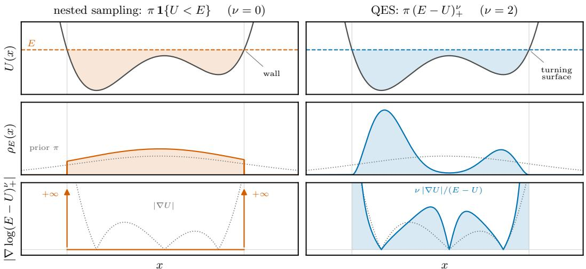  
Figure 1: Illustration of QES against nested sampling, on a one-dimensional asymmetric double well (unit Gaussian prior). Top: the energy landscape U with the level E as a waterline. Middle: the profile of $\rho _ { E }$ under the two choices of ν. Bottom: the resulting score of $\rho _ { E } ;$ for $\nu > 0$ it is a smooth informative gradient throughout the interior of the level set, vanishing only at stationary points of U. The dotted reference is the magnitude of the gradient of U.

This family is the conditional of an exact augmentation at fixed temperature. Fix $\nu > - 1$ and consider the joint density on (x, E)

$$
p ( x , E ) \propto \pi ( x ) \left( E - U ( x ) \right) _ { + } ^ { \nu } e ^ { - E } .\tag{8}
$$

Integrating out E with the substitution $s = E - U ( x )$ gives $\begin{array} { r } { \int _ { 0 } ^ { \infty } s ^ { \nu } e ^ { - ( s + U ) } \mathrm { d } s = \Gamma ( \nu + 1 ) e ^ { - U ( x ) } } \end{array}$ so the x-marginal of $\operatorname { E q . } \left( 8 \right)$ is exactly the posterior, with $\Gamma ( \nu + 1 )$ the only constant. Its conditionals are

$$
x \mid E \sim \rho _ { E } , \quad \quad E \mid x \sim U ( x ) + { \mathrm { G a m m a } } ( \nu + 1 , 1 ) .\tag{9}
$$

Where E is styled as an auxiliary slice variable. The E conditional also informs the meaning of $\nu ,$ $\nu + 1$ is the mean energy headroom, in nats, between the level and a particle’s own energy. As this is a scale defined in energy (or log-likelihood) space, we see that picking a fixed ν is justifiable, and this headroom need not necessarily scale with dimension.

Closely related power-law targets arise in microcanonical Monte Carlo methods (Ray, 1991). In the nested sampling context, Habeck (2015) introduced auxiliary variable “demon” constructions, while Baldock et al. (2017) developed a related total-enthalpy HMC method for atomistic systems. These constructions tie the choice of ν to the number of degrees of freedom in the augmented system. QES instead fixes ν independently of both problem and dimension, and measures successive level volume ratios using SMC importance weights rather than assigning them through nested-sampling order statistics. The inner mutation admits any kernel that can consume the differentiable log density in Eq. (7), allowing flexible implementation of modern gradient-based MCMC methods. This makes the soft microcanonical approach directly applicable to general Bayesian inference problems and, in our experiments, substantially improves upon classical nested sampling.

## 3.2 PARTITION FUNCTION FROM LEVEL VOLUMES

The cumulative density of states defined by Eq. (2) gives the level volume $\begin{array} { r } { G ( E ) = \int _ { - \infty } ^ { E } g ( u ) } \end{array}$ du. This extends naturally to the soft microcanonical family of Eq. (7), whose level volume is

$$
G _ { \nu } ( E ) = \mathbb { E } _ { \pi } { \bigl [ } ( E - U ) _ { + } ^ { \nu } { \bigr ] } = \int _ { - \infty } ^ { E } g ( u ) ( E - u ) ^ { \nu } \mathrm { d } u .\tag{10}
$$

The same Gamma identity used above expresses the evidence as the one-dimensional integral

$$
Z = \frac { 1 } { \Gamma ( \nu + 1 ) } \int _ { - \infty } ^ { \infty } G _ { \nu } ( E ) e ^ { - E } \mathrm { d } E ,\tag{11}
$$

valid for every $\nu > - 1$

Consecutive levels $E ^ { \prime } < E$ are related by the pointwise ratio

$$
r ( x ) = \left( \frac { ( E ^ { \prime } - U ( x ) ) _ { + } } { ( E - U ( x ) ) _ { + } } \right) ^ { \nu } , \qquad \frac { G _ { \nu } ( E ^ { \prime } ) } { G _ { \nu } ( E ) } = \mathbb { E } _ { \rho _ { E } } \bigl [ r \bigr ] .\tag{12}
$$

Given a weighted particle population $\{ ( x _ { i } , w _ { i } ) \} _ { i = 1 } ^ { N }$ targeting $\rho _ { E } .$ , with $\textstyle \sum _ { i } w _ { i } = 1$ , the incremental ratio is estimated before mutation by

$$
{ \widehat r } _ { E  E ^ { \prime } } = \sum _ { i = 1 } ^ { N } w _ { i } r ( x _ { i } ) , \qquad { \widehat G } _ { \nu } ( E ^ { \prime } ) = { \widehat G } _ { \nu } ( E ) { \widehat r } _ { E  E ^ { \prime } } .\tag{13}
$$

The same reweighting moves the population to the next target, since

$$
\rho _ { E } ( x ) r ( x ) = \frac { G _ { \nu } ( E ^ { \prime } ) } { G _ { \nu } ( E ) } \rho _ { E ^ { \prime } } ( x ) .\tag{14}
$$

After a resampling or branching step, an MCMC kernel invariant for $\rho _ { E ^ { \prime } }$ is applied to rejuvenate the population and move duplicated particles apart. Repeating these steps down the level ladder estimates $G _ { \nu }$ through a telescoping product of importance-weight averages. This is the standard SMC normalising constant estimator (Doucet et al., 2001), applied here to softened level-set volumes as the path to the marginal likelihood.

## 3.3 ALGORITHM

With the definitions of the previous sections, we can now compose the complete algorithm. We assume that the reference distribution $\pi$ is easy to sample and that the energy U is differentiable. With a target population of N particles, the algorithm can be initialised by drawing N samples from π and setting the initial level $E _ { 0 }$ to the maximum energy in that population. Although this is a valid starting point, in practice we find it more robust to draw a larger anchor population of, say, 10N samples and choose $E _ { 0 }$ by bisection until the importance weights $( E _ { 0 } - U ) _ { + } ^ { \nu }$ have effective sample size (ESS) N. The empirical mean of these weights initializes $G _ { \nu } ( E _ { 0 } )$ , and their normalized values are resampled to form the N-particle working population (Appendix A.1). This protects the initial importance step from extreme weights in the tail of the prior-energy distribution.

Given N particles approximately distributed as $\rho _ { E _ { k } }$ , we can apply the algorithm described in Algorithm 1 to transition to the next level $E _ { k + 1 } < E _ { k }$ The algorithm consists of three main steps: (1) dissecting the current population to choose the next energy level, (2) reweighting and branching the population to account for the new level, and (3) mutating the particles with an MCMC kernel invariant to $\rho _ { E _ { k + 1 } }$ . The next level is found by bisection until the prospective reweighted population reaches a prescribed effective sample size. Here $K _ { E }$ denotes the complete inner MCMC mutation block: its construction and number of internal steps are unrestricted, provided that it leaves $\rho _ { E }$ invariant. The process is repeated until the contribution to the marginal likelihood from the active particles becomes negligible compared to the accumulated marginal likelihood, at which point we terminate and compute the final estimate of Z using quadrature on the ladder of levels.

Choice of mutation kernel. The estimator requires an invariant mutation kernel, where there are a vast array of choices. We employ Metropolis-adjusted Langevin dynamics as detailed in Section 2.2, with a kernel pre-tuning recipe defined in this section. This proves to be a relatively robust choice, and the automated tuning we implement is effective for a variety of problems covered in Section 4, this also defines a strong baseline for tempered SMC which we provide as well in the code implementation. Following the pretuning pattern of Buchholz et al. (2021), we use the accumulated gradient information from the previous level to construct a diagonal preconditioner. Writing this score $s ^ { ( i ) } = \nabla \log \rho \big ( x ^ { ( i ) } \big )$  for the score at particle i of the ensemble, we set $M ^ { - 1 } = \mathrm { d i a g } ( \bar { \sigma _ { 1 } ^ { 2 } } , . . . , \sigma _ { D } ^ { 2 } )$ with

$$
\sigma _ { j } ^ { - 1 } = \operatorname * { m e d i a n } \limits _ { i } \Bigl \| s ^ { ( i ) } \Bigr \| \biggl \langle \frac { s _ { j } ^ { 2 } } { \| s \| ^ { 2 } } \biggr \rangle ^ { 1 / 2 } ,\tag{15}
$$

Algorithm 1 One quenched level transition   
Require: Weighted ensemble $\{ ( x _ { j } , w _ { j } ) \} _ { j = 1 } ^ { N }$ targeting $\rho _ { E _ { k } }$ , with $\textstyle \sum _ { j } w _ { j } = 1$   
Require: Current level volume $\widehat { G } _ { \nu , k }$ and an MCMC kernel $K _ { E }$ that leaves $\rho _ { E }$ invariant   
1: Dissect. Choose $E _ { k + 1 } < E _ { k }$ by bisection until the ESS of $\{ w _ { j } r ( x _ { j } ) \} _ { j = 1 } ^ { N }$ reaches its target.   
2: Measure. At the pre-mutation positions, compute $\begin{array} { r } { \widehat { r } _ { k } \gets \sum _ { j } w _ { j } r ( x _ { j } ) } \end{array}$ and $\widehat { G } _ { \nu , k + 1 } \gets \widehat { G } _ { \nu , k } \widehat { r } _ { k }$   
3: Reweight. Set $w _ { j }  w _ { j } r ( x _ { j } ) / \widehat { r } _ { k }$ for every particle.   
4: Branch. Replace each zero-weight particle by a copy of a survivor drawn by weight; assign   
half the donor weight to each copy.   
5: Resample. When required, based on a second ESS threshold, resample the ensemble and reset   
all $w _ { j } \gets 1 / N .$   
6: Mutate. Apply $K _ { E _ { k + 1 } }$ independently to every particle.   
Ensure: $\{ ( x _ { j } , w _ { j } ) \} _ { j = 1 } ^ { N } , E _ { k + 1 }$ , and $\widehat { G } _ { \nu , k + 1 }$

where $\langle \cdot \rangle$ averages over mutation steps and the weighted ensemble, and the scale is the ensemble median of each walker’s step-averaged norm. This is a natural choice: the anisotropy $ { \langle s _ { j } ^ { 2 } / \| s \| ^ { 2 } \rangle }$ is the direction normalised Fisher information metric of the target, frozen across the mutation chain (Girolami & Calderhead, 2011). Rather than using the mean of the score norm as a scale we use the median since the additional boundary proximity term $( E - U ) ^ { - 1 }$ that appears in this particular score can diverge for particles near the boundary, and the median is robust to this. The step size ϵ is adapted across levels by constant-gain stochastic approximation (Robbins & Monro, 1951), driving the acceptance rate observed at the previous level towards 0.574, the gain is held constant rather than decayed, since E moves at every level and the optimal step size drifts with it.

Two properties of Eq. (15) are important for embedding in a particle method. First, the metric is read from the score rather than from the spread of the particles. The particle cloud covariance, the nested sampling default (Yallup et al., 2026), estimates the extent of the ensemble. On a multimodal target that extent is the separation between modes rather than the width of any one of them, so the metric degrades on the type of problem that particle methods are commonly invoked on. Using the averaged local score of Eq. (15) composes only the local property of the target, so is well defined even on massively multimodal targets such as Bayesian neural networks. Second, neither M nor ϵ changes while the mutation kernel is applied to the level set. Both are constants of a level, set from the ensemble at the level above, maintaining the required invariance for an unbiased estimator. The measured acceptance stays in the range 0.53–0.57 throughout Section 4.

The adaptive schedule. Choosing $E _ { k + 1 }$ from the current population makes the schedule adaptive, and adaptive schedules cost exact unbiasedness. The estimator stays consistent, but $\mathbb { E } [ \hat { Z } ] = Z$ no longer holds at finite N. This is a property of adaptive SMC generally, and of nested sampling in particular, whose energy threshold is likewise read off the current particles—Salomone et al. (2025) show that the fixed-threshold form of nested sampling is unbiased while the adaptive form is only consistent. The nature of the moving maximum E is that progressing to $E _ { k + 1 }$ pushes the target fraction of the population out of the support of $\rho _ { E _ { k + 1 } }$ , this form of progression naturally benefits from an adaptive schedule. If too large a jump is taken in tempering the population collapses to a single particle, in the case of nested sampling it could cause all particles to be outside the support of the next target, and the algorithm would fail. Hence, initially running with an adaptive schedule is a practical necessity, and we find that it does not introduce a significant bias in practice; its finite-particle consequence is detailed in Appendix C.2. Due to the length of the ladder of energy levels that naturally emerges on the quenched path, we hold a second ESS target for resampling the full population weights, which we implement using systematic resampling. As detailed in Appendix C.4, this allows many energy levels to be crossed without resampling, which at the cadence of the quenched path is often unnecessary and can be detrimental to population diversity.

Termination. Unlike SMC, where the invariant target is the canonical ensemble, quenched sampling would theoretically continue quenching until the energy of each particle is at the global minimum. One can either truncate at a chosen energy level, or use the standard criterion of Skilling (2006), estimating the remaining integral mass from $G _ { \nu } ( \dot { E } ) e ^ { - U _ { \mathrm { m i n } } }$ , where $U _ { \mathrm { m i n } }$ is the current lowest particle energy, and stopping when this estimate falls below $e ^ { \mathrm { d l o g \bar { z } } }$ times the accumulated integral.

We adopt dlogz = −3 as a default, which is standard for typical Bayesian posterior targets (Handley et al., 2015). For targets with a first-order transition, the threshold must be deepened so that termination occurs beyond the transition rather than in the broad phase, as detailed in Appendix A.2. Finally Eq. (11) can be evaluated by quadrature on the ladder of quenched transitions. Equally weighted posterior draws can be obtained from the augmentation in Eq. (8) by sampling a level with probability proportional to $G _ { \nu } ( E ) e ^ { - E } { \mathrm { d } } E$ , then subsequently sampling a particle from that level’s cloud. The full weighted-pool construction is detailed in Appendix C.3.

## 4 EXPERIMENTS

We demonstrate the method on three sets of experiments.

(i) Analytic targets, including a Gaussian with no transition and a spike–slab mixture with a first-order transition, to test scalability and accuracy against exact results (Section 4.1).

(ii) Bayesian neural network inference and model comparison on UCI classification benchmarks (Section 4.2).

(iii) A lattice $\phi ^ { 6 }$ field theory with a first-order transition, to test traversal of a discontinuous phase transition at scale in a physical model (Section 4.3).

Across the examples we primarily compare against tempered SMC using the same inner kernel and tuning. For the BNN tasks we also compare against scalable MCMC methods, including NUTS (Hoffman & Gelman, 2014) and MCLMC (Robnik et al., 2023), and on the analytic targets we include a gradient-free nested sampling baseline (Yallup, 2026). Experimental configurations are detailed in Appendix A.2. All experiments are implemented in JAX (Bradbury et al., 2018) using blackjax (Cabezas et al., 2024) and run on a Google Cloud (2024) TPU v6e (Trillium) accelerator. All sampling uses single precision float32 numerics, enabling efficient computation on a variety of accelerator backends.

## 4.1 ANALYTIC TARGETS

We summarize QES against tempered SMC using the same inner MCMC kernel, and against classic nested sampling using slice sampling, in Table 2. All three methods use $N = 1 0 0 { \bar { 0 } }$ particles or live points. QES and tempered SMC choose their next level at a target ESS of 0.95. Their MALA mutation budget is max $( 1 6 , \sqrt { D } )$ steps per level, rounded up to the next power of two; nested sampling instead uses 2D slice steps per replacement. In QES, full resampling is triggered separately when the carried-weight ESS falls below 0.5N, as motivated in Appendix C.4.

The Gaussian target combines a unit Gaussian prior with a narrower likelihood, $\sigma = 0 . 5 ,$ and tests scaling over $D \in \{ 1 0 , 1 0 0 , 1 0 0 0 , 1 0 0 0 0 \}$ . QES remains accurate well beyond the range reached by the nested sampling baseline, although a small sub-nat residual bias emerges at $D \bar { = } 1 0 ^ { 4 }$ . We attribute this to the increased length of the QES path along with the accumulated finite-N effects, as detailed in Appendix C. Even at $\bar { D } = 1 0 ^ { 2 }$ , the baseline nested sampling implementation shows some emerging bias, which is due primarily to imperfect mixing of the slice kernel at this scale and fixed mutation budget. Tempered SMC is more accurate at $D = 1 0 ^ { 4 }$ , as expected on this unimodal target. At fixed target ESS, the number of quenched levels grows linearly with dimension, compared with $\sqrt { D }$ for tempering, so QES requires more gradient evaluations. However, the number of quenched levels carrying appreciable posterior weight grows as $\sqrt { D }$ , while it remains roughly constant for tempering. From $\mathbf { \bar { \mathit { D } } } = 1 0 0$ onward on this benchmark, the larger QES pool outweighs the longer path and gives a higher pooled Kish ESS per gradient evaluation (Appendix C.3).

Quenching distinguishes itself from tempering on the spike–slab benchmark: a diffuse Gaussian slab and a narrow spike at the origin, scaled so that the spike carries 90% of the posterior mass. This provides a controlled first-order transition. Reaching the spike requires a deeper termination threshold for QES and nested sampling. Across the tested dimensions and ESS schedules, tempered SMC remains approximately 2.3 nats low, whereas the QES estimates are consistent with the analytic value within the seed variation. The large nominal SMC Kish ESS on these runs measures weight concentration within the sampled phase and does not certify convergence of the path.

Table 2: The analytic test problems (target definitions in Appendix A.3): evidence bias against the exact log Z and pooled Kish ESS per $1 \mathrm { { 0 ^ { 6 } } }$ gradient evaluations. Gaussian evidence errors use ten seeds; the ESS values and remaining results use three. The bimodal test problem tests against mode occupancy, the diagnostic that detects mode loss. The ESS convention is one Kish calculation after pooling the full per-particle weight vectors from every rung, as defined in Appendix C.3, divided by that run’s own gradient count. NS uses slice sampling and counts likelihood evaluations as opposed to gradients, dashes mark cells not run due to computational cost. Tempering is consistent with the analytic value where there is no transition and 2.3 nats low wherever there is one, while matching QES on mode balance. QES starts to exhibit a residual bias on the Gaussian at $D = 1 0 ^ { 4 }$
<table><tr><td></td><td></td><td colspan="3">∆log Z</td><td colspan="3">ESS per  $1 0 ^ { 6 }$  gradients</td></tr><tr><td>target</td><td>D</td><td>QES</td><td>SMC</td><td>NS</td><td>QES</td><td>SMC</td><td>NS</td></tr><tr><td>Gaussian</td><td>10</td><td> $- 0 . 0 2 \pm 0 . 0 4$ </td><td> $+ 0 . 0 1 \pm 0 . 0 3$ </td><td> $+ 0 . 0 1 \pm 0 . 0 8$ </td><td>21519</td><td>26507</td><td>126</td></tr><tr><td></td><td>100</td><td> $- 0 . 0 2 \pm 0 . 0 8$ </td><td> $+ 0 . 0 2 \pm 0 . 0 5$ </td><td> $+ 0 . 6 6 \pm 0 . 0 7$ </td><td>13384</td><td>7933</td><td>2.47</td></tr><tr><td></td><td>1000</td><td> $- 0 . 2 1 \pm 0 . 3 6$ </td><td> $- 0 . 0 2 \pm 0 . 1 2$ </td><td>一</td><td>2972</td><td>1228</td><td>一</td></tr><tr><td></td><td>10000</td><td> $- 0 . 8 9 \pm 0 . 7 1$ </td><td> $- 0 . 1 2 \pm 0 . 1 8$ </td><td>一</td><td>266</td><td>101</td><td>1</td></tr><tr><td>spike-slab</td><td>10</td><td> $- 0 . 0 1 \pm 0 . 0 3$ </td><td> $- 2 . 2 9 \pm 0 . 0 0$ </td><td> $+ 0 . 0 9 \pm 0 . 0 9$ </td><td>6564</td><td>48393</td><td>19</td></tr><tr><td></td><td>50</td><td> $+ 0 . 1 6 \pm 0 . 2 1$ </td><td> $- 2 . 3 0 \pm 0 . 0 0$ </td><td> $+ 0 . 1 9 \pm 0 . 1 3$ </td><td>3707</td><td>26233</td><td>0.94</td></tr><tr><td></td><td>200</td><td> $+ 0 . 0 4 \pm 0 . 3 2$ </td><td> $- 2 . 3 2 \pm 0 . 0 1$ </td><td>一</td><td>2698</td><td>13168</td><td>一</td></tr><tr><td></td><td>500</td><td> $+ 0 . 2 2 \pm 0 . 1 2$ </td><td> $- 2 . 3 2 \pm 0 . 0 5$ </td><td></td><td>702</td><td>3957</td><td></td></tr><tr><td></td><td></td><td colspan="3">mode occupancy (true 0.5)</td><td colspan="3">ESS per  $1 0 ^ { 6 }$  gradients</td></tr><tr><td></td><td>D</td><td>QES</td><td>SMC</td><td>NS</td><td>QES</td><td>SMC</td><td>NS</td></tr><tr><td>bimodal</td><td>10</td><td> $0 . 4 9 \pm 0 . 2 4$ </td><td> $0 . 5 1 \pm 0 . 0 2$ </td><td> $0 . 5 1 \pm 0 . 2 2$ </td><td>4494</td><td>7080</td><td>7.77</td></tr><tr><td></td><td>50</td><td> $0 . 6 0 \pm 0 . 1 9$ </td><td> $0 . 4 9 \pm 0 . 0 4$ </td><td> $0 . 6 1 \pm 0 . 1 6$ </td><td>2679</td><td>2916</td><td>0.46</td></tr><tr><td></td><td>100</td><td> $0 . 4 6 \pm 0 . 1 3$ </td><td> $0 . 4 5 \pm 0 . 0 5$ </td><td>一</td><td>2044</td><td>1984</td><td></td></tr><tr><td></td><td>200</td><td> $0 . 6 3 \pm 0 . 2 5$ </td><td> $0 . 5 2 \pm 0 . 2 0$ </td><td></td><td>1479</td><td>1448</td><td></td></tr></table>

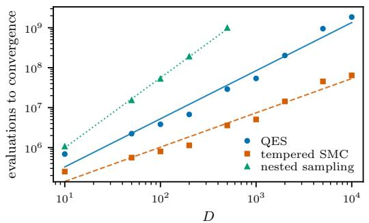

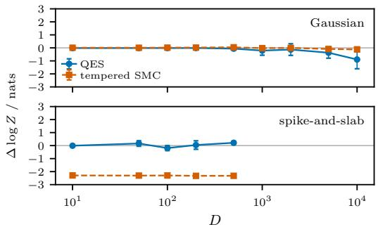  
Figure 2: Cost and accuracy order the three methods oppositely. $L e f t { \mathrm { : } }$ evaluations to convergence against dimension on the Gaussian, each method run to its own criterion at $N = 1 0 0 0$ , with a fitted power law evals $= C D ^ { \alpha }$ . The cost exponents are $\alpha = 0 . 8 6$ for tempered SMC, 1.21 for QES and 1.75 for nested sampling. $R i g h t \cdot$ evidence bias on a shared symmetric axis, Gaussian and spike– slab. Nested sampling counts likelihood evaluations, the other two count gradients, so cost is not exactly comparable.

Finally, we test a strongly anisotropic bimodal mixture whose coordinate standard deviations range from $\mathrm { i 0 ^ { - 2 } \ t o \ 1 }$ . The modes are not traversed by a local chain within the tested mutation budget, so the particle population must preserve both. Because losing one symmetric mode leaves the marginal likelihood unchanged, we instead report mode occupancy, whose exact value is 0.5. Both QES and tempered SMC recover the balance on average (Appendix C.4), and their pooled Kish ESS per gradient becomes comparable as the dimension grows.

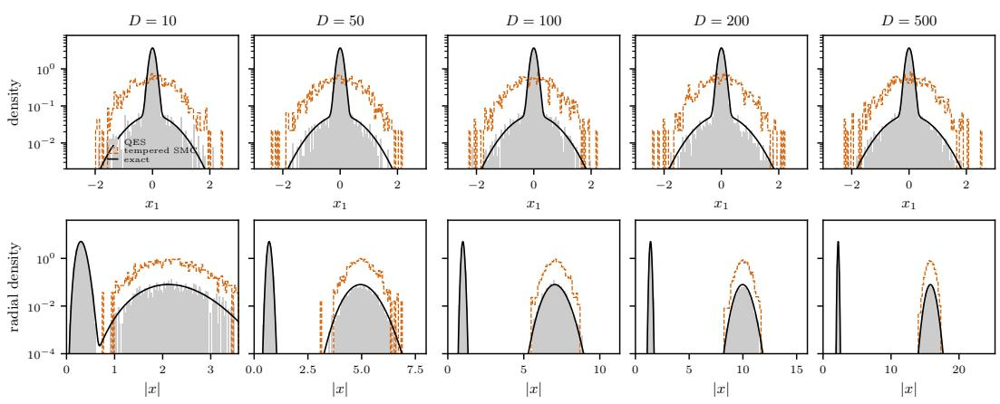  
Figure 3: Posterior reconstruction on the spike–slab target against closed form. Top: marginal in the first coordinate on a logarithmic density axis, so the slab—which carries 10% of the evidence but is ten times wider—is visible beside the spike. Bottom: radial density, where the two phases are disjoint shells at $| x | = \tau _ { j } \sqrt { D }$ and the coexistence gap is explicit, empty to within sampling noise over four decades and widening with dimension. The spike is slightly under-weighted at the largest two dimensions, although the corresponding evidence estimates remain consistent with the analytic values within the seed variation.

## 4.2 BAYESIAN NEURAL NETWORKS

A Bayesian treatment of neural networks places a prior on the weights and biases of a network and attempts to sample from the posterior distribution of these parameters given a training dataset (Izmailov et al., 2021). As well as being highly multimodal, high dimensional and having challenging posterior geometry to sample from, it is understood that the training of networks can exhibit phase transition properties (Montanari & Zhong, 2022; Power et al., 2022). We consider this task a demonstration of three facets of the method: the ability to competitively scale to (small) neural network scale problems with other state-of-the-art samplers, the ability to return a marginal likelihood estimate for model comparison, and the ability to scan for phase transitions in the posterior landscape.

We take benchmark neural network fitting tasks from Sommer et al. (2024): five classification datasets from the UCI repository (Kelly et al.). Each task is fit with a fully connected $2 \times 1 6$ tanh network, giving between 528 and 1280 parameters depending on the input data dimension. We place independent standard normal priors on the network parameters and scale each layer’s weight contribution by $1 / \sqrt { d _ { \mathrm { i n } } }$ , where $d _ { \mathrm { i n } }$ is the number of input connections to each neuron, this ensures effective weights have variance $1 / d _ { \mathrm { i n } }$ . We use a fixed 90–10 train–test split, fit a full batch, and report efficiency as ESS per million gradient evaluations and predictive accuracy as the posteriorpredictive mixture NLL as defined in Appendix A.3.

QES and tempered SMC are matched using the same population of 1000 particles, the same inner kernel and preconditioner, 96 inner MCMC steps per level, a target ESS of 0.9, and a convergence criterion of dlogz = −3 for QES. We additionally compare against ensembles of NUTS chains (Hoffman & Gelman, 2014) and MCLMC chains (Robnik et al., 2023), using standard window adaptation for NUTS and the MCLMC tuning procedure of Sommer et al. (2024) (with the deep ensemble initialisation omitted). We use 1000 chains to match the particle methods’ parallel ensemble size, and normalize efficiency by each method’s actual number of gradient evaluations, including warmup and tuning. The full chain budgets and ESS conventions are given in the table caption and Appendix ${ \mathrm { A } } . { \bar { 2 } } .$ where we note that strict comparison between particle methods and chains is difficult due to difference in implementation. As summarized in Table 3, all methods give very similar predictive NLL, with MCLMC trailing slightly on two of the five tasks, while NUTS is the most efficient under the tested budgets. At comparable predictive accuracy, QES returns between 1.4 and 2.0 times the pooled Kish ESS per gradient of tempered SMC across the five tasks, while successfully exploring these BNN posteriors from prior initialization.

Table 3: Posterior comparison on UCI classification tasks, each metric is averaged across three seeds. Performance is measured by the posterior-predictive NLL on a held out test set, and the efficiency is measured by the ESS per million gradient evaluations, including warmup and tuning. For each particle run, one Kish calculation pools the per-particle weights from every rung of the ladder. The chain methods get the rank-normalised bulk ESS of Vehtari et al. (2021) over all 1000 chains jointly, which is not strictly comparable to the pooled Kish ESS but can be used as a qualitative comparison. Corresponding model comparison results are given in Table 4.
<table><tr><td></td><td></td><td colspan="4">test NLL</td><td colspan="4">ESS per 10⁶ gradients</td></tr><tr><td></td><td>D</td><td>QES</td><td>SMC</td><td>NUTS</td><td>MCLMC</td><td>QES</td><td>SMC</td><td>NUTS</td><td>MCLMC</td></tr><tr><td>sonar</td><td>1280</td><td> $0 . 4 5 8 \pm 0 . 0 0 2$ </td><td>0.456 ±0.001</td><td>0.457 ±0.003</td><td> $0 . 4 7 2 { \scriptstyle \pm 0 . 0 0 2 }$ </td><td> $3 1 8 4 \pm 8 1$ </td><td> $2 1 9 5 \pm 1 5 2$ </td><td> $8 9 9 6 \pm 4 2$ </td><td> $6 4 \pm 1$ </td></tr><tr><td>glass</td><td>528</td><td> $0 . 9 9 0 \pm 0 . 0 0 2$ </td><td> $0 . 9 9 1 \pm 0 . 0 0 2$ </td><td> $0 . 9 9 1 \pm 0 . 0 0 2$ </td><td> $1 . 0 0 2 { \scriptstyle \pm 0 . 0 0 1 }$ </td><td> $2 3 6 7 \pm 1 9$ </td><td> $1 3 6 2 \pm 8 4$ </td><td> $1 1 6 3 1 \pm 3 8$ </td><td> $1 8 3 7 \pm 5 0 0$ </td></tr><tr><td>heart</td><td>528</td><td> $0 . 4 6 4 \pm 0 . 0 0 0$ </td><td> $0 . 4 6 5 \pm 0 . 0 0 1$ </td><td> $0 . 4 6 3 \pm 0 . 0 0 0$ </td><td> $0 . 4 6 3 \pm 0 . 0 0 1$ </td><td> $3 0 1 7 \pm 2 3$ </td><td> $1 8 3 6 \pm 4 5$ </td><td> $1 0 5 5 6 \pm 6 8$ </td><td> $4 4 2 \pm 2 3$ </td></tr><tr><td>australian</td><td>544</td><td> $0 . 3 1 9 { \scriptstyle \pm 0 . 0 0 0 }$ </td><td> $0 . 3 1 9 \pm 0 . 0 0 1$ </td><td> $0 . 3 1 9 { \scriptstyle \pm 0 . 0 0 1 }$ </td><td> $0 . 3 1 9 { \scriptstyle \pm 0 . 0 0 1 }$ </td><td> $2 2 7 0 \pm 8$ </td><td> $1 4 2 2 \pm 3 4$ </td><td> $1 0 8 0 4 \pm 1 8$ </td><td> $1 2 9 6 \pm 1 3 8$ </td></tr><tr><td>wine</td><td>560</td><td> $0 . 9 0 9 { \scriptstyle \pm 0 . 0 0 0 }$ </td><td> $0 . 9 0 9 \pm 0 . 0 0 1$ </td><td> $0 . 9 0 9 { \scriptstyle \pm 0 . 0 0 1 }$ </td><td> $0 . 9 1 1 { \scriptstyle \pm 0 . 0 0 0 }$ </td><td> $1 1 8 9 \pm 1 0$ </td><td> $5 8 2 \pm 3 2$ </td><td> $4 3 7 5 \pm 1 7$ </td><td> $2 0 8 \pm 1 4$ </td></tr></table>

Secondly we use the derived marginal likelihood estimates to compare the choice of activation function on the same $2 \times 1 6$ networks. In this setting we introduce an additional approximate baseline, we construct a Laplace approximation from a MAP estimate found by Adam (Kingma & Ba, 2015), using a generalised Gauss–Newton curvature (Duffield et al., 2024). We report the resulting Bayes factors, as well as the implications for which fit is preferred in Table 4. We find that a Laplace approximation gives a poor estimate and picks inconsistent activations, whereas both particle methods are in close agreement on all datasets. This agreement validates that it is possible to use the marginal likelihood estimates from QES for model comparison in Bayesian neural networks at this scale.

Lastly, we search for phase transitions in the full batch likelihood. For this we extend the convergence criterion from dlogz $= - 3$ to the deeper values used in the spike–slab experiments, and reconstruct the level marginal log $P ( E )$ —the integrand of Eq. (11), read directly off the quenched ladder. In terms of the free-energy profile $F ( E ) = - \log P ( E )$ , a first-order transition appears as two peaks in $P ( E )$ separated by a valley of suppressed interfacial states $\mathrm { ( L e e ~ \& ~ }$ Kosterlitz, 1991); the barrier $\Delta F$ is the depth of that valley below the lower peak, in nats. By Eq. (8), $E = U ( x ) + s$ with independent slack $s \sim \Gamma ( \nu + 1 , 1 )$ , so $P ( E )$ is the $\beta = 1$ posterior energy distribution under a fixed smoothing of width $\sqrt { \nu + 1 }$ nats—invisible to extensive first-order structure, but blurring features narrower than a few nats. Bimodality in $P ( E )$ therefore identifies a phase transition, and a barrier growing with system size, as on the left, identifies it as first order. Figure 4 shows this profile for the five classification tasks against the spike–slab target of Section 4.1 at comparable dimensionality. Both panels use intensive energy axes so that curves of different size share a scale: the spike–slab energy is a sum over the D dimensions and is plotted per dimension, while the net work energy is a sum over the n training points and is plotted per datapoint, centred on its peak, since the raw spans differ by nearly an order of magnitude across datasets. The network posteriors show no evidence for a phase transition on these architectures and tasks. Studying these phenomena empirically in finite-width networks on real data remains an open question, and quenched sampling provides a unique tool for this investigation.

## 4.3 LATTICE $\phi ^ { 6 } ;$ : A FIRST-ORDER TRANSITION

Finally, we consider the lattice $\phi ^ { 6 }$ model, a two-dimensional scalar field theory with a first-order transition on a continuous state space (Makhankov, 1990; Sanati & Saxena, 1999). The field is defined on a periodic $L \times L$ lattice, with $D = L ^ { 2 }$ . We use the exactly samplable free field at reference mass $m _ { 0 } ^ { 2 }$ as the prior $\pi _ { 0 } ( \phi )$ , and define the remaining interaction action—the energy function passed to the sampler—as

$$
U ( \phi ) = \sum _ { x } \left[ \frac { _ { 1 } } { ^ { 2 } } \big ( \mu ^ { 2 } - m _ { 0 } ^ { 2 } \big ) \phi _ { x } ^ { 2 } + \lambda \phi _ { x } ^ { 4 } + \eta \phi _ { x } ^ { 6 } \right] ,\tag{16}
$$

where x runs over the lattice sites, so the posterior is $\propto \pi _ { 0 } ( \phi ) e ^ { - U ( \phi ) }$ . With $\lambda < 0$ and $\eta > 0$ , the onsite potential has a pair of minima that exchange stability with the one at the origin discontinuously, giving a first-order transition rather than the second-order one of ordinary $\phi ^ { \mathbf { \overline { { 4 } } } }$ . Mean field puts coexistence at $\mu _ { \star } ^ { 2 } = \lambda ^ { 2 } / 2 \eta ;$ at $L = 4 0 , \lambda = - 1 , \eta = 0 . 2 , m _ { 0 } ^ { 2 } = 1$ the located coexistence point is $\mu ^ { 2 } = 2 . 2 8 3 4 7$ (Appendix A.3), and the uniform-field barrier separating the phases is 0.463 per site, i.e. 741 nats.

Table 4: Model comparison on the UCI classification tasks, fixed network dimensions comparing tanh against ReLU activations. log $\mathrm { B F } = \log \hat { Z } ( \mathrm { t a n h } ) - \log \hat { Z } ( \mathrm { R e L U } )$ is computed over three repeated seeds and used to compare the two activations where shading marks the selected model. QES and tempered SMC agree on every dataset and their Bayes factors agree to within 0.6 nats; every factor is resolved (the smallest lies 3.5 seed standard deviations from zero) while on glass, sonar and winered the test NLL weakly favours the activation the evidence rejects. The Laplace– GGN approximation reports factors two to four times larger and selects the opposite activation on some tasks.
<table><tr><td></td><td></td><td></td><td colspan="3">test NLL</td><td colspan="3"> $\log \mathrm { B F }$ </td></tr><tr><td></td><td></td><td>D</td><td>QES</td><td>SMC</td><td>Laplace</td><td>QES</td><td>SMC</td><td>Laplace</td></tr><tr><td>glass</td><td>tanh</td><td>528</td><td> $0 . 9 9 0 \pm 0 . 0 0 2$  _</td><td> $0 . 9 9 1 \pm 0 . 0 0 2$ </td><td> $1 . 2 3 1 \pm 0 . 0 0 1$  1</td><td> $- 6 . 0 \pm 0 . 4 6$ </td><td> $- 6 . 2 \pm 0 . 1 1$ </td><td> $+ 2 . 3 \pm 0 . 3 9$ </td></tr><tr><td></td><td>ReLU</td><td></td><td> $0 . 9 9 3 { \scriptstyle \pm 0 . 0 0 5 }$  </td><td> $0 . 9 9 3 { \scriptstyle \pm 0 . 0 0 1 }$  </td><td> $1 . 1 8 1 \pm 0 . 0 2 4$ </td><td></td><td></td><td></td></tr><tr><td>heart</td><td>tanh</td><td>528</td><td>_  $0 . 4 6 4 \pm 0 . 0 0 0$  </td><td> $0 . 4 6 5 \pm 0 . 0 0 1$  </td><td> $0 . 5 0 3 \pm 0 . 0 0 2$ </td><td> $+ 7 . 7 \pm 0 . 4 6$ </td><td> $+ 7 . 7 \pm 0 . 0 3$ </td><td> $+ 1 9 . 6 \pm 0 . 4 9$ </td></tr><tr><td></td><td>ReLU</td><td></td><td> $0 . 4 6 5 \pm 0 . 0 0 1$  _</td><td> $0 . 4 6 7 \pm 0 . 0 0 2$ </td><td> $0 . 4 9 5 { \scriptstyle \pm 0 . 0 0 4 }$ </td><td></td><td></td><td></td></tr><tr><td>sonar</td><td>tanh</td><td>1280</td><td> $0 . 4 5 8 \pm 0 . 0 0 2$  </td><td> $0 . 4 5 6 \pm 0 . 0 0 1$ </td><td> $0 . 5 3 4 \pm 0 . 0 0 7$ </td><td> $+ 5 . 3 \pm 0 . 1 1$ </td><td> $+ 5 . 2 \pm 0 . 0 6$ </td><td> $+ 1 5 . 7 \pm 0 . 4 5$ </td></tr><tr><td></td><td>ReLU</td><td></td><td> $0 . 4 4 4 \pm 0 . 0 0 2$ </td><td> $0 . 4 4 4 \pm 0 . 0 0 1$ </td><td> $0 . 5 0 5 { \scriptstyle \pm 0 . 0 0 4 }$ </td><td></td><td></td><td></td></tr><tr><td>australian</td><td>tanh</td><td>544</td><td> $0 . 3 1 9 { \scriptstyle \pm 0 . 0 0 0 }$  </td><td> $0 . 3 1 9 { \scriptstyle \pm 0 . 0 0 1 }$ </td><td> $0 . 4 2 8 \pm 0 . 0 0 1$ </td><td> $+ 1 0 . 5 \pm 0 . 2 2$ </td><td> $+ 1 0 . 6 \pm 0 . 0 5$ </td><td> $+ 3 6 . 9 \pm 1 . 5 5$ </td></tr><tr><td></td><td>ReLU</td><td></td><td> $0 . 3 2 4 \pm 0 . 0 0 1$ </td><td> $0 . 3 2 4 \pm 0 . 0 0 1$ </td><td> $0 . 4 4 8 \pm 0 . 0 2 7$ </td><td></td><td></td><td></td></tr><tr><td>winered</td><td>tanh</td><td>560</td><td> $0 . 9 0 9 { \scriptstyle \pm 0 . 0 0 0 }$ </td><td> $0 . 9 0 9 { \scriptstyle \pm 0 . 0 0 1 }$ </td><td> $1 . 0 0 5 \pm 0 . 0 0 3$ </td><td> $- 3 7 . 3 \pm 0 . 1 0$ </td><td></td><td></td></tr><tr><td></td><td>ReLU</td><td></td><td> $0 . 9 3 0 { \scriptstyle \pm 0 . 0 0 1 }$  一</td><td> $0 . 9 2 9 { \scriptstyle \pm 0 . 0 0 0 }$ </td><td> $0 . 9 8 5 \pm 0 . 0 0 7$ </td><td></td><td> $- 3 7 . 9 \pm 0 . 1 6$ </td><td> $+ 1 5 . 9 \pm 4 . 5 0$ </td></tr></table>

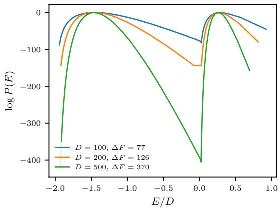

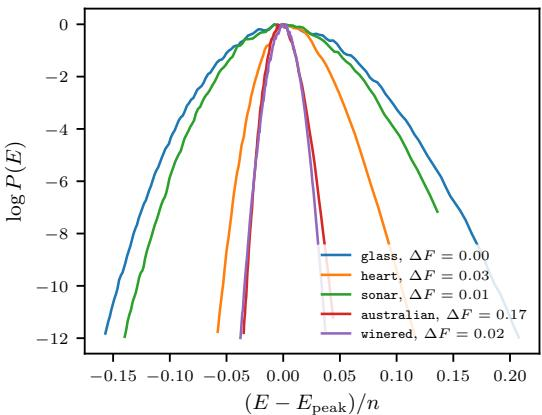  
Figure 4: Scan for phase transitions in the level marginal $P ( E ) \propto G _ { \nu } ( E ) e ^ { - E }$ , the integrand of Eq. (11), read from a single ladder per curve. $L e f t { \mathrm { : } }$ the spike–slab posteriors of Section 4.1 are bimodal with a free-energy barrier $\bar { \Delta F }$ that grows extensively with dimension $- \mathrm { a }$ first-order transition. Right: the UCI classification posteriors at comparable dimension show no evidence of firstorder phase structure at the resolution probed, across a deep energy range. The energy axis is made intensive, by dimensionality for the spike–slab and by training set size for the networks, with the network profiles additionally centred on the posterior modal energy $E _ { \mathrm { p e a k } }$ so that they occupy a similar range.

We report two order parameters: $m = V ^ { - 1 } \Sigma _ { x } \phi _ { x }$ , which identifies the $Z _ { 2 }$ parity symmetry sector, and $q \ : = \ : V ^ { - 1 } \sum _ { x } \phi _ { x } ^ { 2 }$ , which distinguishes the phases, with $V = L ^ { 2 }$ . We classify configurations using the mean-field cut $q _ { \mathrm { c u t } } = 1 . 2 5 ;$ at coexistence the two phases carry equal probability. Both tempering and quenching use 8000 particles, 64 inner MCMC steps, and a target ESS of 0.95.

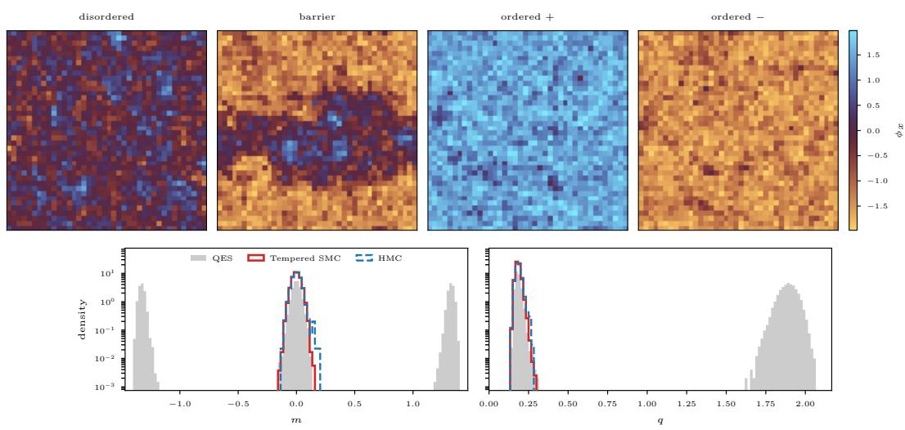  
Figure 5: Lattice $\phi ^ { 6 }$ at coexistence, $L = 4 0 , \mu ^ { 2 } \approx 2 . 2 8 , \lambda = - 1 , \eta = 0 . 2 .$ Top: representative configurations on one shared symmetric scale; the barrier panel is a retained ladder state at $q = q _ { \mathrm { c u t } } .$ as well as a sample from both ordered and disordered phases. Bottom: order parameters, unsmoothed histograms. QES resolves all three $m$ branches and both $q$ phases; tempered SMC, at matched population and mutation budget, occupies only the disordered one, and a single preconditioned HMC chain from a prior draw remains in the disordered phase and never leaves it.

Table 5: Lattice $\phi ^ { 6 }$ at coexistence, $L = 4 0 ( D = 1 6 0 0 ) , \mu ^ { 2 } \approx 2 . 2 8 .$ . Both methods use $N = 8 0 0 0$ particles, 64 inner steps and the same preconditioned MALA kernel; the adaptive runs target an ESS of 0.95. SMC is shown at two further adaptive schedules and at 10,000 equally spaced temperatures. Results are averaged over 3 seeds. The QES seeds agree to 0.01 nats in log $\hat { Z } ,$ and is the only method to resolve both ordered and disordered phases.
<table><tr><td></td><td>schedule</td><td>levels</td><td> $\log { \hat { Z } }$ </td><td>ordered share</td><td> $\langle | m | \rangle$ </td><td>〈q&gt;</td></tr><tr><td>QES</td><td>0.95</td><td>11502 ±372</td><td>−53.76 ±0.01</td><td>0.543 ±0.009</td><td>0.733 ±0.011</td><td>1.112 ±0.015</td></tr><tr><td>tempered SMC</td><td>0.95</td><td>20</td><td>-54.54</td><td>0.000</td><td>0.027</td><td>0.184</td></tr><tr><td></td><td>0.99</td><td>44</td><td>-54.54</td><td>0.000</td><td>0.028</td><td>0.184</td></tr><tr><td></td><td>0.999</td><td>137</td><td>-54.54</td><td>0.000</td><td>0.028</td><td>0.184</td></tr><tr><td></td><td>fixed</td><td>10,000</td><td>-54.54</td><td>0.000</td><td>0.028</td><td>0.184</td></tr></table>

The QES ladder resolves both phases, with an ordered share of 0.543±0.009 over three seeds against the coexistence value of 0.5. Tempered SMC does not enter the ordered phase in any tested run, even when its target ESS is increased to 0.999, and a long preconditioned HMC chain (window-adapted NUTS, Appendix A.2) remains in the disordered phase. Among the methods tested, only QES resolves both phases. Doing so requires a termination threshold deep enough to span the energy barrier and therefore carries a substantial computational cost. Aside from tempering, a popular approach to this type of problem is to try and flatten the density of states and sample from $\rho ( x ) \propto \pi ( x ) / g ( U ( x ) )$ adaptively approaching this by constructing a flat binning in energy (Wang & Landau, 2001). Efficient implementation of this approach is challenging in discrete systems (Dayal et al., 2004), and in continuous systems such as the lattice $\phi ^ { 6 }$ model constructing the optimal binning is non-trivial. We leave a comparison to this approach to future work, however we note that classic nested sampling resembles an optimal choice of binning in energy, discovered on the fly (Partay et al.´ , 2010), and QES inherits this property.

## 5 CONCLUSION

In this work, we isolated the most attractive feature of the classical nested sampling algorithm for estimating marginal likelihoods: the quenched path of monotonically decreasing energy. Rather than trying to construct an MCMC mutation kernel that can efficiently follow this path in high dimensions, which is notoriously challenging, we demonstrate that the hard energy constraint can be replaced with a family of soft microcanonical potentials that preserves the quenched path while admitting efficient use of standard gradient-based mutation kernels. The resulting Quenched Ensemble Sampling method is a sequential Monte Carlo algorithm that performs at scale and is robust to firstorder phase transitions, where tempering is not. In thermodynamic terms, the method is simulated quenching where tempering is simulated annealing, and the ability to follow this path of distributions at scale is unique.

Beyond Bayesian inference, estimating partition functions and free energies is a central problem in computational physics and chemistry. Flat-histogram methods, which explore the free-energy landscape by constructing an approximately uniform representation in energy, are widely used for this purpose (Witman et al., 2018). Nested sampling provides a related construction in which the energy levels adapt automatically and optimally to the enclosed prior volume, establishing the quenched path as a natural, and scalable, way to resolve the free-energy landscape.

## ACKNOWLEDGEMENTS

The author thanks Will Handley and Mike Hobson for extended discussions on nested sampling that shaped the foundations of this work. This work was supported by a Google Research Grant, and with computational support from the Google TPU Builders program. This work was supported by the UKRI Frontier Research Guarantee [EP/X035344/1].

## REPRODUCIBILITY STATEMENT

The code developed for this work is available at https://github.com/yallup/quenched \_sampling

## AI USAGE STATEMENT

The research code for this work was developed with the assistance of Claude (Fable 5), and was verified by the author against the closed-form analytic benchmarks reported in the paper. Generative AI tools (GPT 5.6 and Claude Fable) were used to edit and improve text originally written by the author, and to assist with running experiments and figure preparation. Generative AI was not used for research ideation or for interpreting the results. The author has reviewed all AI-assisted work and takes responsibility for the final content of this work, including text, claims or artifacts produced with the aid of generative AI.

## REFERENCES

William Steinbrunn Andras Janosi. Heart Disease, 1989. URL https://archive.ics.uci. edu/dataset/45.

Greg Ashton, Noam Bernstein, Johannes Buchner, Xi Chen, Gabor Cs´ anyi, Andrew Fowlie, Farhan´ Feroz, Matthew Griffiths, Will Handley, Michael Habeck, Edward Higson, Michael Hobson, Anthony Lasenby, David Parkinson, Livia B. Partay, Matthew Pitkin, Doris Schneider, Joshua S.´ Speagle, Leah South, John Veitch, Philipp Wacker, David J. Wales, and David Yallup. Nested sampling for physical scientists. Nat Rev Methods Primers, 2(1):39, May 2022. ISSN 2662-8449. doi: 10.1038/s43586-022-00121-x. URL https://www.nature.com/articles/s435 86-022-00121-x.

B. German. Glass Identification, 1987. URL https://archive.ics.uci.edu/dataset/ 42.

Robert J. N. Baldock, Noam Bernstein, K. Michael Salerno, L´ıvia B. Partay, and G ´ abor Cs ´ anyi. ´ Constant-pressure nested sampling with atomistic dynamics. Phys. Rev. E, 96(4):043311, October

2017. doi: 10.1103/PhysRevE.96.043311. URL https://link.aps.org/doi/10.1103 /PhysRevE.96.043311.

Alexandros Beskos, Natesh Pillai, Gareth Roberts, Jesus-Maria Sanz-Serna, and Andrew Stuart. Optimal tuning of the hybrid Monte Carlo algorithm. Bernoulli, 19(5A):1501–1534, 2013. ISSN 1350-7265. URL https://www.jstor.org/stable/42919328.

Alexandros Beskos, Ajay Jasra, Nikolas Kantas, and Alexandre Thiery. On the Convergence of Adaptive Sequential Monte Carlo Methods. The Annals ofApplied Probability, 26(2):1111–1146, 2016. ISSN 1050-5164. URL https://www.jstor.org/stable/43859623.

James Bradbury, Roy Frostig, Peter Hawkins, Matthew James Johnson, Chris Leary, Dougal Maclaurin, George Necula, Adam Paszke, Jake VanderPlas, Skye Wanderman-Milne, and Qiao Zhang. JAX: composable transformations of Python+NumPy programs, 2018. URL http: //github.com/google/jax.

Alexander Buchholz, Nicolas Chopin, and Pierre E Jacob. Adaptive tuning of hamiltonian monte carlo within sequential monte carlo. Bayesian Analysis, 16(3):745–771, 2021.

Alberto Cabezas, Adrien Corenflos, Junpeng Lao, Remi Louf, Antoine Carnec, Kaustubh Chaud-´ hari, Reuben Cohn-Gordon, Jeremie Coullon, Wei Deng, Sam Duffield, Gerardo Duran-Mart´ ´ın, Marcin Elantkowski, Dan Foreman-Mackey, Michele Gregori, Carlos Iguaran, Ravin Kumar, Martin Lysy, Kevin Murphy, Juan Camilo Orduz, Karm Patel, Xi Wang, and Rob Zinkov. Black-JAX: Composable Bayesian inference in JAX, 2024. URL https://arxiv.org/abs/24 02.10797.

Nicolas Chopin and Christian P. Robert. Properties of nested sampling. Biometrika, 97(3):741–755, 2010. ISSN 0006-3444. URL https://www.jstor.org/stable/25734120.

P. Dayal, S. Trebst, S. Wessel, D. Wurtz, M. Troyer, S. Sabhapandit, and S. N. Coppersmith. Per-¨ formance Limitations of Flat-Histogram Methods. Phys. Rev. Lett., 92(9):097201, March 2004. doi: 10.1103/PhysRevLett.92.097201. URL https://link.aps.org/doi/10.1103/P hysRevLett.92.097201.

Pierre Del Moral. Feynman-Kac Formulae. Probability and its Applications. Springer, New York, NY, 2004. ISBN 978-1-4419-1902-1 978-1-4684-9393-1. doi: 10.1007/978-1-4684-9393-1. URL http://link.springer.com/10.1007/978-1-4684-9393-1.

Arnaud Doucet, Nando de Freitas, and Neil Gordon. An Introduction to Sequential Monte Carlo Methods. In Arnaud Doucet, Nando de Freitas, and Neil Gordon (eds.), Sequential Monte Carlo Methods in Practice, pp. 3–14. Springer, New York, NY, 2001. ISBN 978-1-4757-3437-9. doi: 10.1007/978-1-4757-3437-9 1. URL https://doi.org/10.1007/978-1-4757-343 7-9\_1.

S. Duane, A. D. Kennedy, B. J. Pendleton, and D. Roweth. Hybrid Monte Carlo. Phys. Lett. B, 195: 216–222, 1987. doi: 10.1016/0370-2693(87)91197-X.

Samuel Duffield, Kaelan Donatella, Johnathan Chiu, Phoebe Klett, and Daniel Simpson. Scalable Bayesian Learning with posteriors. arXiv preprint arXiv:2406.00104, 2024.

Paul Fearnhead, Christopher Nemeth, Chris J. Oates, and Chris Sherlock. Scalable Monte Carlo for Bayesian Learning. Institute of Mathematical Statistics Monographs. Cambridge University Press, Cambridge, 2025. ISBN 978-1-009-28844-6. doi: 10.1017/9781009288460. URL https://www.cambridge.org/core/books/scalable-monte-carlo-for-b ayesian-learning/7FDC9891DDA086B85AD8AB386F6F3BD3.

F. Feroz, M. P. Hobson, and M. Bridges. MultiNest: an efficient and robust Bayesian inference tool for cosmology and particle physics. Mon. Not. Roy. Astron. Soc., 398:1601–1614, 2009. doi: 10.1111/j.1365-2966.2009.14548.x.

E Fong and C C Holmes. On the marginal likelihood and cross-validation. Biometrika, 107(2): 489–496, June 2020. ISSN 0006-3444. doi: 10.1093/biomet/asz077. URL https://doi.or g/10.1093/biomet/asz077.

Mark Girolami and Ben Calderhead. Riemann manifold Langevin and Hamiltonian Monte Carlo methods. Journal ofthe Royal Statistical Society: Series B (Statistical Methodology), 73(2):123– 214, 2011. ISSN 1467-9868. doi: 10.1111/j.1467-9868.2010.00765.x. URL https://onli nelibrary.wiley.com/doi/abs/10.1111/j.1467-9868.2010.00765.x.

Google Cloud. TPU v6e (Trillium), 2024. URL https://docs.cloud.google.com/tpu/ docs/v6e.

Michael Habeck. Nested sampling with demons. AIP Conf. Proc., 1641(1):121–129, January 2015. ISSN 0094-243X. doi: 10.1063/1.4905971. URL https://doi.org/10.1063/1.4905 971.

W. J. Handley, M. P. Hobson, and A. N. Lasenby. polychord: next-generation nested sampling. Mon. Not. Roy. Astron. Soc., 453(4):4385–4399, 2015. doi: 10.1093/mnras/stv1911.

Matthew Hoffman and Andrew Gelman. The No-U-turn sampler: adaptively setting path lengths in Hamiltonian Monte Carlo. J. Mach. Learn. Res., 15(1):1593–1623, January 2014. ISSN 1532- 4435. URL https://dl.acm.org/doi/10.5555/2627435.2638586.

Pavel Izmailov, Sharad Vikram, Matthew D. Hoffman, and Andrew Gordon Gordon Wilson. What Are Bayesian Neural Network Posteriors Really Like? In Proceedings of the 38th International Conference on Machine Learning, pp. 4629–4640. PMLR, July 2021. URL https://procee dings.mlr.press/v139/izmailov21a.html.

Markelle Kelly, Rachel Longjohn, and Kolby Nottingham. The UCI Machine Learning Repository. URL https://archive.ics.uci.edu. Published: UCI Machine Learning Repository.

Diederik P. Kingma and Jimmy Ba. Adam: A Method for Stochastic Optimization. In International Conference on Learning Representations (ICLR), 2015. URL https://arxiv.org/abs/ 1412.6980.

Namu Kroupa, Gabor Cs´ anyi, and Will Handley. Resonances in reflective Hamiltonian Monte Carlo.´ Phys. Rev. E, 111(4):045308, April 2025. doi: 10.1103/PhysRevE.111.045308. URL https: //link.aps.org/doi/10.1103/PhysRevE.111.045308.

Jooyoung Lee and J. M. Kosterlitz. Finite-size scaling and Monte Carlo simulations of first-order phase transitions. Phys. Rev. B, 43(4):3265–3277, February 1991. doi: 10.1103/PhysRevB.43.32 65. URL https://link.aps.org/doi/10.1103/PhysRevB.43.3265.

Pablo Lemos, Nikolay Malkin, Will Handley, Yoshua Bengio, Yashar Hezaveh, and Laurence Perreault-Levasseur. Improving Gradient-Guided Nested Sampling for Posterior Inference. In Proceedings of the 41st International Conference on Machine Learning, pp. 27230–27253. PMLR, July 2024. URL https://proceedings.mlr.press/v235/lemos24a.html.

Samuel Livingstone and Giacomo Zanella. The Barker proposal: Combining robustness and efficiency in gradient-based MCMC. J R Stat Soc Series B Stat Methodol, 84(2):496–523, April 2022. ISSN 1369-7412. doi: 10.1111/rssb.12482. URL https://pmc.ncbi.nlm.nih.g ov/articles/PMC9303935/.

Fernando Llorente, Luca Martino, David Delgado, and Javier Lopez-Santiago. Marginal likelihood computation for model selection and hypothesis testing: an extensive review. SIAM Rev., 65 (1):3–58, February 2023. ISSN 0036-1445, 1095-7200. doi: 10.1137/20M1310849. URL http://arxiv.org/abs/2005.08334.

Vladimir G. Makhankov. ϕ6 Theory and Bose Drops. In Vladimir G. Makhankov (ed.), Soliton Phenomenology, pp. 211–221. Springer Netherlands, Dordrecht, 1990. ISBN 978-94-009-2217- 4. doi: 10.1007/978-94-009-2217-4 8. URL https://doi.org/10.1007/978-94-009 -2217-4\_8.

Jason D. McEwen, Tob´ıas I. Liaudat, Matthew A. Price, Xiaohao Cai, and Marcelo Pereyra. Proximal Nested Sampling with Data-Driven Priors for Physical Scientists. Physical Sciences Forum, 9(1):13, 2023. ISSN 2673-9984. doi: 10.3390/psf2023009013. URL https: //www.mdpi.com/2673-9984/9/1/13.

Andrea Montanari and Yiqiao Zhong. The interpolation phase transition in neural networks: Memorization and generalization under lazy training. The Annals of Statistics, 50(5):2816– 2847, October 2022. ISSN 0090-5364, 2168-8966. doi: 10.1214/22- AOS2211. URL https://projecteuclid.org/journals/annals-of-statistics/volu me-50/issue-5/The-interpolation-phase-transition-in-neural-net works--Memorization-and/10.1214/22-AOS2211.full.

Pierre Del Moral, Arnaud Doucet, and Ajay Jasra. On adaptive resampling strategies for sequential Monte Carlo methods. Bernoulli, 18(1), February 2012. ISSN 1350-7265. doi: 10.3150/10-BEJ 335. URL http://arxiv.org/abs/1203.0464.

Iain Murray, David MacKay, Zoubin Ghahramani, and John Skilling. Nested sampling for Potts models. In Advances in Neural Information Processing Systems, volume 18. MIT Press, 2005. URL https://proceedings.neurips.cc/paper/2005/hash/9dc372713683f d865d366d5d9ee810ba-Abstract.html.

Radford M. Neal. Annealed importance sampling. Statistics and Computing, 11(2):125–139, April 2001. ISSN 1573-1375. doi: 10.1023/A:1008923215028. URL https://doi.org/10.1 023/A:1008923215028.

Radford M. Neal. Slice sampling. The Annals ofStatistics, 31(3):705–767, June 2003. ISSN 0090- 5364, 2168-8966. doi: 10.1214/aos/1056562461. URL https://projecteuclid.org/ journals/annals-of-statistics/volume-31/issue-3/Slice-sampling/ 10.1214/aos/1056562461.full.

Radford M. Neal. MCMC using Hamiltonian dynamics. May 2011. doi: 10.1201/b10905. URL http://arxiv.org/abs/1206.1901.

Christopher Nemeth and Paul Fearnhead. Stochastic gradient markov chain monte carlo. Journal of the American Statistical Association, 116(533):433–450, 2021.

A. Cerdeira Paulo Cortez. Wine Quality, 2009. URL https://archive.ics.uci.edu/da taset/186.

Nicholas G. Polson and James G. Scott. Vertical-likelihood Monte Carlo, June 2015. URL http: //arxiv.org/abs/1409.3601.

Alethea Power, Yuri Burda, Harri Edwards, Igor Babuschkin, and Vedant Misra. Grokking: Generalization Beyond Overfitting on Small Algorithmic Datasets. CoRR, abs/2201.02177, 2022. URL https://arxiv.org/abs/2201.02177. arXiv: 2201.02177.

L´ıvia B. Partay, Albert P. Bart´ ok, and G´ abor Cs´ anyi. Efficient Sampling of Atomic Configurational´ Spaces. J. Phys. Chem. B, 114(32):10502–10512, August 2010. ISSN 1520-6106. doi: 10.1021/ jp1012973. URL https://dx.doi.org/10.1021/jp1012973.

Ross Quinlan. Statlog (Australian Credit Approval), 1987. URL https://archive.ics.uc i.edu/dataset/143.

John R. Ray. Microcanonical ensemble Monte Carlo method. Phys. Rev. A, 44(6):4061–4064, September 1991. doi: 10.1103/PhysRevA.44.4061. URL https://link.aps.org/doi/1 0.1103/PhysRevA.44.4061.

Herbert Robbins and Sutton Monro. A Stochastic Approximation Method. The Annals of Mathematical Statistics, 22(3):400–407, September 1951. ISSN 0003-4851, 2168-8990. doi: 10.1214/aoms/1177729586. URL https://projecteuclid.org/journals/annal s-of-mathematical-statistics/volume-22/issue-3/A-Stochastic-App roximation-Method/10.1214/aoms/1177729586.full.

Gareth O. Roberts and Jeffrey S. Rosenthal. Optimal scaling of discrete approximations to Langevin diffusions. Journal of the Royal Statistical Society: Series B (Statistical Methodology), 60(1): 255–268, 1998. ISSN 1467-9868. doi: 10.1111/1467-9868.00123. URL https://online library.wiley.com/doi/abs/10.1111/1467-9868.00123.

Gareth O. Roberts and Jeffrey S. Rosenthal. Complexity bounds for Markov chain Monte Carlo algorithms via diffusion limits. Journal ofApplied Probability, 53(2):410–420, June 2016. ISSN 0021-9002, 1475-6072. doi: 10.1017/jpr.2016.9. URL https://www.cambridge.org/ core/journals/journal-of-applied-probability/article/abs/complex ity-bounds-for-markov-chain-monte-carlo-algorithms-via-diffusi on-limits/AE8D620D7114F27ED889705735C162D7.

Gareth O. Roberts and Richard L. Tweedie. Exponential convergence of Langevin distributions and their discrete approximations. Bernoulli, 2(4):341–363, December 1996. ISSN 1350-7265. URL https://projecteuclid.org/journals/bernoulli/volume-2/issue-4/E xponential-convergence-of-Langevin-distributions-and-their-dis crete-approximations/bj/1178291835.full.

Jakob Robnik, G. Bruno De Luca, Eva Silverstein, and Uros Seljak. Microcanonical Hamiltonianˇ Monte Carlo. Journal of Machine Learning Research, 24(311):1–34, 2023. ISSN 1533-7928. URL http://jmlr.org/papers/v24/22-1450.html.

Robert Salomone, Leah F South, Christopher Drovandi, Dirk P Kroese, and Adam M Johansen. Unbiased and consistent nested sampling via sequential Monte Carlo. J. R. Stat. Soc. Ser. B. Stat. Methodol., 87(4):1221–1238, September 2025. ISSN 1369-7412. doi: 10.1093/jrsssb/qkaf015. URL https://doi.org/10.1093/jrsssb/qkaf015.

M. Sanati and A. Saxena. Half-kink lattice solution of the phi\*\*6 model. J. Phys. A, 32:4311–4320, 1999. doi: 10.1088/0305-4470/32/23/309.

John Skilling. Nested sampling for general Bayesian computation. Bayesian Analysis, 1(4):833– 859, December 2006. ISSN 1936-0975, 1931-6690. doi: 10.1214/06-BA127. URL https: //projecteuclid.org/journals/bayesian-analysis/volume-1/issue-4 /Nested-sampling-for-general-Bayesian-computation/10.1214/06-BA1 27.full.

John Skilling. Galilean and Hamiltonian Monte Carlo. Proceedings, 33(1):19, 2019. ISSN 2504- 3900. doi: 10.3390/proceedings2019033019. URL https://www.mdpi.com/2504-390 0/33/1/19.

Emanuel Sommer, Jakob Robnik, Giorgi Nozadze, Uros Seljak, and David Rugamer. Microcanoni-¨ cal Langevin Ensembles: Advancing the Sampling of Bayesian Neural Networks. October 2024. URL https://openreview.net/forum?id=QMtrW8Ej98.

Robert H. Swendsen and Jian-Sheng Wang. Replica Monte Carlo Simulation of Spin-Glasses. Phys. Rev. Lett., 57(21):2607–2609, November 1986. doi: 10.1103/PhysRevLett.57.2607. URL https://link.aps.org/doi/10.1103/PhysRevLett.57.2607.

Saifuddin Syed, Alexandre Bouchard-Cotˆ e, George Deligiannidis, and Arnaud Doucet. Non-´ Reversible Parallel Tempering: a Scalable Highly Parallel MCMC Scheme. Journal of the Royal Statistical Society Series B: Statistical Methodology, 84(2):321–350, April 2022. ISSN 1369- 7412, 1467-9868. doi: 10.1111/rssb.12464. URL http://arxiv.org/abs/1905.02939.

R. Gorman Terry Sejnowski. Connectionist Bench (Sonar, Mines vs. Rocks), 1988. URL https: //archive.ics.uci.edu/dataset/151.

Aidan P. Thompson, H. Metin Aktulga, Richard Berger, Dan S. Bolintineanu, W. Michael Brown, Paul S. Crozier, Pieter J. in ’t Veld, Axel Kohlmeyer, Stan G. Moore, Trung Dac Nguyen, Ray Shan, Mark J. Stevens, Julien Tranchida, Christian Trott, and Steven J. Plimpton. LAMMPS - a flexible simulation tool for particle-based materials modeling at the atomic, meso, and continuum scales. Computer Physics Communications, 271:108171, February 2022. ISSN 0010-4655. doi: 10.1016/j.cpc.2021.108171. URL https://www.sciencedirect.com/science/ar ticle/pii/S0010465521002836.

Aki Vehtari, Andrew Gelman, Daniel Simpson, Bob Carpenter, and Paul-Christian Burkner. Rank-¨ normalization, folding, and localization: An improved Rb for assessing convergence of MCMC (with discussion). Bayesian Analysis, 16(2):667–718, 2021. doi: 10.1214/20-BA1221.

Fugao Wang and D. P. Landau. An efficient, multiple range random walk algorithm to calculate the density of states. Phys. Rev. Lett., 86(10):2050–2053, March 2001. ISSN 0031-9007, 1079-7114. doi: 10.1103/PhysRevLett.86.2050. URL http://arxiv.org/abs/cond-mat/00111 74.

Max Welling and Yee Whye Teh. Bayesian learning via stochastic gradient langevin dynamics. In Proceedings of the 28th International Conference on International Conference on Machine Learning, ICML’11, pp. 681–688, Madison, WI, USA, June 2011. Omnipress. ISBN 978-1- 4503-0619-5.

Florian Wenzel, Kevin Roth, Bastiaan Veeling, Jakub Swiatkowski, Linh Tran, Stephan Mandt, Jasper Snoek, Tim Salimans, Rodolphe Jenatton, and Sebastian Nowozin. How Good is the Bayes Posterior in Deep Neural Networks Really? In Proceedings of the 37th International Conference on Machine Learning, pp. 10248–10259. PMLR, November 2020. URL https: //proceedings.mlr.press/v119/wenzel20a.html.

Matthew Witman, Nathan Mahynski, and Berend Smit. Flat-histogram Monte Carlo as an Efficient Tool to Evaluate Adsorption Processes Involving Rigid and Deformable Molecules. The Journal ofChemical Physics, October 2018. URL https://www.nist.gov/publications/fl at-histogram-monte-carlo-efficient-tool-evaluate-adsorption-pro cesses-involving-rigid. Company: Matthew Witman, Nathan Mahynski, Berend Smit Distributor: Matthew Witman, Nathan Mahynski, Berend Smit Institution: Matthew Witman, Nathan Mahynski, Berend Smit Label: Matthew Witman, Nathan Mahynski, Berend Smit Last Modified: 2021-10-12T11:10-04:00.

David Yallup. Nested Sampling with Slice-within-Gibbs: Efficient Evidence Calculation for Hierarchical Bayesian Models, February 2026. URL http://arxiv.org/abs/2602.17414.

David Yallup, Namu Kroupa, and Will Handley. Nested Slice Sampling: Vectorized Nested Sampling for GPU-Accelerated Inference. Transactions on Machine Learning Research, pp. arXiv:2601.23252, 2026. ISSN 2835-8856. doi: 10.48550/arXiv.2601.23252. URL https://openreview.net/forum?id=5mF2eRl3gt.

## A ADDITIONAL EXPERIMENTAL DETAILS

## A.1 IMPORTANCE-SAMPLING INITIALIZATION

Both QES and tempered SMC may be initialized by an initial sampling step from the prior. For QES, we draw an anchor population of $N _ { \mathrm { a } } = 1 0 N$ independent samples $\widetilde { x } _ { i } \sim \pi$ and choose the initial energy threshold $E _ { 0 }$ by bisection until the weights $\bar { \omega _ { i } ^ { ( 0 ) } } = ( E _ { 0 } - \mathrm { \bar { \upsilon } } (  { \widetilde { x } } _ { i } ) ) _ { + } ^ { \nu }$ have ESS N. Their empirical mean initializes the level volume,

$$
\widehat { G } _ { \nu } ( E _ { 0 } ) = \frac { 1 } { N _ { \mathrm { a } } } \sum _ { i = 1 } ^ { N _ { \mathrm { a } } } \omega _ { i } ^ { ( 0 ) } ,\tag{17}
$$

and their normalized values define an importance-sampling approximation to $\rho _ { E _ { 0 } }$ , from which the working population is resampled. This stabilizes the initial importance step and prevents isolated outlying density evaluations from determining the initialization.

Levels above $E _ { 0 }$ may be estimated from the same prior draws and included in the evidence quadrature. Tempered SMC can use the same construction by replacing $\omega _ { i } ^ { ( 0 ) }$ with the importance ratio from the prior to its chosen first tempered target.

## A.2 SAMPLER CONFIGURATIONS

The configurations below are grouped by experiment because the population size, target ESS and mutation budget are selected at the scale of each problem. Within an experiment, QES and tempered SMC use the same population, diagonally preconditioned MALA kernel, mutation budget and target ESS; only the sequence of intermediate distributions differs. This ensures the experiments have a strong control that can isolate the effect of the quenched path. Unless stated otherwise, reported values are averaged over three independent sampler seeds. QES uses softness $\nu = 2$ throughout, and triggers full resampling when the lineage-grouped ESS falls below 0.5N (Appendix $\mathrm { C . 4 ) }$ . The diagonal preconditioner and scalar step size are estimated from the preceding population and then held fixed during each level’s mutation, with the MALA acceptance rate targeted at 0.574.

Analytic targets. All methods use $N = 1 0 0 0$ particles. QES and tempered SMC choose successive levels at a default target ESS of 0.95. The mutation budget follows $\sqrt { D }$ , the rate at which a random walk crosses a D-dimensional shell, rounded up to a power of two so that ladder cost stays predictable and floored at the value calibrated on the smallest targets,

$$
n _ { \mathrm { s t e p s } } = \operatorname* { m a x } \Bigl ( 1 6 , 2 ^ { \left\lceil \log _ { 2 } \sqrt { D } \right\rceil } \Bigr ) ,
$$

MALA steps per level. Over the suite this takes four values: 16 for $D \leq 2 0 0 , 3 2$ at $D = 5 0 0$ and 1000, 64 at $D = 2 0 0 0$ , and 128 at $D = 5 0 0 0$ and $1 0 ^ { 4 }$ . The Gaussian run terminates at dlogz $= - 3 .$ For the spike–slab and bimodal targets, the threshold is deepened to $- 2 . 5 D \textrm { -- } 2 0$ , where D is the dimensionality of the target, this ensures that termination occurs beyond the transition rather than in the broad phase. Whilst this seems like a problem-specific tuning, it is in reality a general requirement for any sampler to reach the low-energy phase of a first-order transition. When scanning for phase change behavior in $\mathrm { e . g }$ . Section 4.2, the depth can be set arbitrarily low. On physical targets, the depth required can often be motivated from ground state energy estimates. As such $\mathrm { { d l o g z } = - 3 }$ is more of a rule to match the efficiency of tempering on standard Bayesian posterior targets, rather than a sensitive tuning parameter, and in practice quenching can continue until all particles are at the ground state, although this would be inefficient for many problems.

The nested sampling baseline uses 1000 particles, removes $1 0 \%$ of the live set per iteration, and applies $2 D$ slice-sampling steps per replacement. Its cost is reported in likelihood evaluations rather than gradients; consequently, only scaling exponents, not absolute intercepts, are compared across that boundary.

Bayesian neural networks. QES and tempered SMC use $N = 1 0 0 0$ , target ESS 0.90, and 96 MALA steps per level, with three sampler seeds for each fixed data split. NUTS uses 1000 independent chains initialized from the prior, 250 window-adaptation steps, and 1000 retained transitions. MCLMC follows the tuning procedure of Sommer et al. (2024), using 1000 prior-initialized chains, 2000 tuning steps, and $1 0 ^ { \bar { 4 } }$ sampling steps. The deep ensemble optimizer initialisation is omitted as we are interested in purely sampling performance. MCLMC traces are thinned by a factor of ten only when computing the rank-normalized ESS; all simulated steps remain included in the gradient count. The Laplace–GGN baseline uses a MAP estimate obtained with $2 \times 1 0 ^ { 4 }$ full-batch Adam steps at learning rate $1 0 ^ { - 3 }$ , followed by a generalized Gauss–Newton approximation. This positivesemidefinite curvature is preferable to the raw Hessian for the non-convex network posterior.

Lattice field theory. At the $4 0 \times 4 0$ coexistence point, QES and tempered SMC use $N = 8 0 0 0$ target ESS 0.95, and 64 MALA steps per level. The termination threshold $\mathrm { d } \mathrm { l o g } \mathrm { z } = - 8 5 0$ is chosen to extend the quenched ladder beyond the approximately 741-nat uniform-field barrier. Tempered SMC is additionally run at target ESS 0.99 and 0.999 to test whether schedule refinement recovers the ordered phase. The single-chain control uses window-adapted NUTS with 500 warmup steps and 2000 retained states from a prior draw.

All samplers are implemented in JAX and BlackJAX and run in $\pm 1 0 \mathsf { a t } 3 2$ on a single TPU v6e. Reported gradient totals include adaptation and tuning; nested sampling instead counts every likelihood evaluation.

## A.3 PROBLEM DEFINITIONS

Analytic targets. All three targets use the standard Gaussian prior $\pi = \mathcal { N } ( 0 , I _ { D } )$ and a Gaussianmixture likelihood, so their evidence and posterior moments are available in closed form. The Gaussian and spike–slab targets share the form

$$
e ^ { - U ( x ) } = \sum _ { j = 1 } ^ { J } h _ { j } \exp \left( - \frac { \| x \| ^ { 2 } } { 2 \sigma _ { j } ^ { 2 } } \right) .\tag{18}
$$

Writing $\tau _ { j } ^ { 2 } = \sigma _ { j } ^ { 2 } / ( 1 + \sigma _ { j } ^ { 2 } )$ , their evidence and posterior component weights are

$$
Z = \sum _ { j = 1 } ^ { J } h _ { j } \tau _ { j } ^ { D } , \qquad \omega _ { j } = \frac { h _ { j } \tau _ { j } ^ { D } } { Z } .\tag{19}
$$

Conditional on component $j ,$ the posterior is $\mathcal { N } ( 0 , \tau _ { j } ^ { 2 } I _ { D } )$ . This gives an exact reference for both the evidence and posterior marginals.

Gaussian a single isotropic component $( J = 1 , \sigma = 0 . 5 )$ over all D coordinates. This smooth, unimodal target provides a scaling control without a phase transition.

Spike–slab a broad component $\sigma _ { 1 } = 1$ and a narrow component $\sigma _ { 2 } = 0 . 1$ . The narrow component’s height is chosen so that it carries 90% of the evidence at every $D .$ . The posterior phases occupy disjoint radial shells, producing a controlled first-order transition whose depth grows with dimension.

Bimodal two equal-height anisotropic components centered at $\pm \mu ,$ , with coordinate widths logarithmically spaced from $1 0 ^ { - 2 }$ to 1. The posterior modes are related by symmetry and therefore each carry exactly half of the evidence, making mode occupancy an exact diagnostic of population balance.

For the first two targets, $U$ depends on x only through $s = \| x \| ^ { 2 }$ , with $s \sim \chi _ { D } ^ { 2 }$ under the prior. Their softened level volume therefore reduces to the one-dimensional integral

$$
G _ { \nu } ( E ) = \int _ { 0 } ^ { s _ { E } } p _ { \chi _ { D } ^ { 2 } } ( s ) [ E - U ( s ) ] ^ { \nu } \mathrm { d } s ,\tag{20}
$$

where $s _ { E }$ solves $U ( s _ { E } ) = E$ . Numerical quadrature of this expression provides an independent reference for the level-volume estimate at every rung, not only for the final $\left| Z . \right.$

Bayesian neural networks. The UCI classification tasks use fully connected networks with two hidden layers of width 16. Unless an activation comparison is stated explicitly, the activation is tanh. Every parameter has an independent standard normal prior; each layer’s weight contribution is scaled by $1 / \sqrt { d _ { \mathrm { i n } } }$ in the forward pass and hidden-layer biases are scaled by 0.1. Thus the effective weights have variance $1 / d _ { \mathrm { i n } }$ while the sampler retains isotropic standard-normal coordinates. Inputs are standardized using training-set statistics from a fixed 90–10 split. Classification uses a categorical likelihood on the network logits $f _ { k }$

$$
p ( y \mid x , \theta ) = \frac { \exp f _ { y } ( x , \theta ) } { \sum _ { k = 1 } ^ { K } \exp f _ { k } ( x , \theta ) } ,\tag{21}
$$

where $K$ is the number of classes. Reported test negative log-likelihoods are the posterior-predictive mixture, evaluated over S posterior draws $\{ \theta _ { s } \}$ and the held out test set $\{ ( x _ { i } , y _ { i } ) \}$ of size $n _ { \mathrm { t e s t } }$

$$
{ \mathrm { N L L } } = - { \frac { 1 } { n _ { \mathrm { t e s t } } } } \sum _ { i = 1 } ^ { n _ { \mathrm { t e s t } } } \log { \frac { 1 } { S } } \sum _ { s = 1 } ^ { S } p ( y _ { i } \mid x _ { i } , \theta _ { s } ) .\tag{22}
$$

The datasets chosen correspond to the Red Wine Quality (Paulo Cortez, 2009), Heart Disease (Andras Janosi, 1989), Australian Credit Approval (Quinlan, 1987), Sonar (Terry Sejnowski, 1988) and Glass identification (B. German, 1987) tasks from the UCI repository. These are small classification tasks, with a mixture of continuous and discrete inputs from input dimension 9-60, and a mixture of binary and multi-class outputs. The dataset sizes range from 208-1599, generally small enough to allow for rapid experimentation with a full batch likelihood. Scaling to datasets with larger number of inputs typically requires employing Stochastic Gradient MCMC techniques (Nemeth & Fearnhead, 2021) such as SGLD (Welling & Teh, 2011). How well these approaches perform relative to full-batch methods is an open question (Wenzel et al., 2020), and employing a quenched path in a mini-batch likelihood settings is conceptually challenging. Comparison of marginal likelihood between full-batch quenched path estimation and exhaustive leave n-out cross-validation would be an interesting future direction (Fong & Holmes, 2020).

Lattice field theory. The lattice target is the periodic $L = 4 0$ scalar field defined in Eq. (16), with an exactly sampled Gaussian free-field prior at $\mathbf { \dot { \rho } } m _ { 0 } ^ { 2 } = 1$ . We set $\lambda = - 1 , \eta = 0 . 2$ , and use the finitevolume coexistence point $\mu ^ { 2 } = 2 . 2 8 3 \dot { 4 } 7$ , located by bracketing pilot QES ladders at $L = 4 0$ on equal phase weight; the equal-weight points measured this way at $L = 8 – 4 0$ drift with the expected $2 \bar { \ln 2 / ( V \Delta q ) }$ multiplicity correction, extrapolating to $\mu _ { \infty } ^ { 2 } \approx \mathrm { { } } 2 . 2 8 3$ . Both particle methods include the exact $Z _ { 2 }$ transformation $\phi \mapsto - \phi$ as an invariant move, removing sign switching as a confound. The phase coordinate $q = L ^ { - 2 } \sum _ { x } \dot { \phi } _ { x } ^ { 2 }$ is invariant under this move, so crossing between the ordered and disordered phases must still be achieved by the sampling path.

## B MOBILITY IN THE SOFT MICROCANONICAL FAMILY

The exponent ν controls the strength at which the barrier repulsion appears. As illustrated in Figure $^ { 6 , }$ the effective gradient of the boundary term becomes a pronounced steep force close to the boundary, a valid concern is then how mobile a particle can be in practice under this force. Writing the slack from the boundary as $s = E - U ( x )$ , the contribution of the soft constraint to the score is

$$
\nabla \log ( E - U ( x ) ) _ { + } ^ { \nu } = - \frac { \nu } { s } \nabla U ( x ) .\tag{23}
$$

As $\nu \ \to \ 0 .$ , the target approaches the hard indicator used by nested sampling. At the opposite extreme, setting $E \doteq \nu / \ddot { \beta }$ and letting $\nu \to \infty$ gives $( E - U ) _ { + } ^ { \bar { \nu } } = E ^ { \nu } ( 1 - \stackrel { \cdot } { \beta } \overleftarrow { \beta U } / \nu ) _ { + } ^ { \nu }  E ^ { \bar { \nu } } \stackrel { \cdot } { e } ^ { - \beta U }$ so a joint scaling of level and softness recovers the canonical ensemble at inverse temperature $\beta \colon$ the family interpolates exactly between the nested-sampling constraint and tempering. We aim to motivate the specific choice $\nu = 2$ as a compromise between the two extremes.

Firstly, we note that the choice $\nu = 2$ has a useful boundary interpretation. Let $\beta _ { E } = \partial _ { E } \log g ( E )$ denote the local slope of the density of states. When log g is approximately linear over the typical slack, $g ( E - s ) \simeq \dot { g } ( E ) e ^ { - \beta _ { E } s }$ and hence

$$
s \mid E ~ \simeq ~ \mathrm { G a m m a } ( \nu + 1 , { \mathrm { r a t e } } \beta _ { E } ) , \qquad \mathbb { E } \Big [ \frac { \nu } { s } \Big ] \simeq \beta _ { E } , \qquad \mathrm { V a r } \Big [ \frac { \nu } { s } \Big ] \simeq \frac { \beta _ { E } ^ { 2 } } { \nu - 1 } .\tag{24}
$$

The variance is finite for $\nu > 1$ , making $\nu = 2$ the smallest integer for which both the mean and variance of the boundary contribution are finite. At the same time, the target density vanishes quadratically at $U = E _ { \ l }$ , replacing the hard wall by a continuously differentiable turning surface. Whilst there may be stronger arguments for other values of $\nu ,$ we primarily motivate the choice empirically, using the spike–slab target to illustrate the trade-off between bias and cost.

Selecting the softness. We sweep ν on the $D = 2 0 0$ spike–slab target, where a genuine firstorder transition makes excessive departure from the nested sampling limit to tempering directly observable. All other settings are held fixed, and each point is repeated over three seeds.

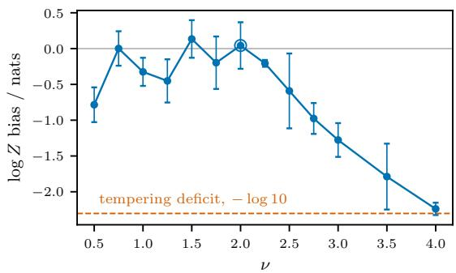

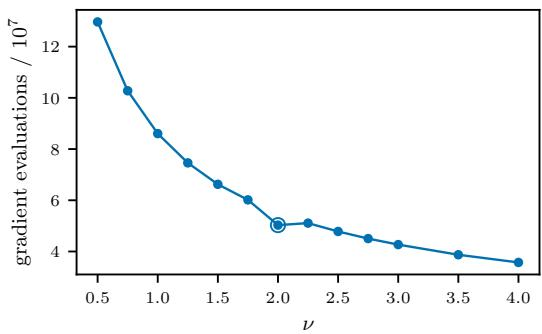  
Figure 6: Softness sweep on the spike–slab target at $D = 2 0 0 .$ , with three seeds per point and the default $\nu = 2$ circled. Left: evidence bias; the dashed line marks the − log 10 deficit of tempered SMC, corresponding to loss of the spike carrying 90% of the evidence. $R i g h t \colon$ total gradient evaluations. Small ν approaches the hard-constraint limit and lengthens the ladder, whereas large ν lowers the cost but becomes tempering-like and misses the spike.

The accurate region is broad: every point in $0 . 7 5 \lesssim \nu \lesssim 2 . 2 5$ is consistent with the analytic evidence within the seed variation. At the hard end, the gradient cost increases by a factor of 3.6 between $\nu = 4$ and $\nu = 0 . 5 .$ , and the estimate at $\nu = 0 . 5$ is −0.78 0.24 nats low. Above $\nu \simeq 2 . 5$ , the bias moves steadily toward the tempered-SMC deficit, reaching $- 2 . 2 4 \pm 0 . 0 9$ nats at $\nu = 4$ . The default $\nu = 2$ is consequently near the least expensive edge of the accurate region while remaining separated from the tempering-like regime. Together with the finite score variance in Eq. (24), this gives a single choice that requires no target-specific adjustment in our experiments.

Mobility near the boundary. We measure actual particle movement on the isotropic Gaussian, defining a proposal as near the boundary when its slack is below one fifth of the mean slack at that level. With $\nu = 2 ,$ , only $3 { - } 7 \%$ of proposals fall in this region. Their move rate is lower than in the bulk, but remains substantial: at $D = 1 0 0 0$ it is 0.289, compared with 0.598 in the full population. The two-dimensional case is the least mobile, and the near-boundary to overall ratio increases from 0.31 at $D = 2$ to 0.65 at $D = 3$ before remaining of order one half at larger dimensions. Thus the soft boundary slows a small fraction of walkers rather than creating a frozen layer, and the effect does not worsen toward zero mobility as dimension increases.

The local Gamma approximation in Eq. (24) predicts that 2.31% of an equilibrated $\nu = 2$ population lies below this slack threshold. The larger measured fraction reflects finite relaxation after each level change: lowering E reduces every particle’s slack simultaneously, after which the mutation kernel moves the population back into the interior.
<table><tr><td>D</td><td>near the wall</td><td>moves there</td><td>moves overall</td><td>ratio</td></tr><tr><td>2</td><td>3.6%</td><td>0.126</td><td>0.403</td><td>0.31</td></tr><tr><td>3</td><td>3.2%</td><td>0.282</td><td>0.434</td><td>0.65</td></tr><tr><td>5</td><td>3.5%</td><td>0.327</td><td>0.464</td><td>0.70</td></tr><tr><td>10</td><td>4.3%</td><td>0.366</td><td>0.497</td><td>0.74</td></tr><tr><td>50</td><td>6.1%</td><td>0.286</td><td>0.554</td><td>0.52</td></tr><tr><td>1000</td><td>7.1%</td><td>0.289</td><td>0.598</td><td>0.48</td></tr></table>

Table 6: Mobility near the level-set boundary on the isotropic Gaussian, with $N = 2 0 0 , n _ { \mathrm { s t e p s } } = 1 0$ and $\nu \ = \ 2 .$ . “Near the wall” denotes slack below one fifth of the level mean. The two move columns report the fraction of proposals that change the particle position, measured directly from the trajectories; the final column is their ratio.

## C ACCOUNTING AND POSTERIOR RECONSTRUCTION

The evidence estimate, posterior reconstruction, resampling schedule and mutation budget are different parts of one sequential construction. This section separates their roles. The central distinction is between quantities that are measured from the weighted population and operations that only change how that population is represented.

## C.1 ASSIGNED AND MEASURED LEVEL VOLUMES

Both nested sampling and SMC estimate the normalising constant from a series of incremental ratios along a path. Classic nested sampling assigns the compression $t _ { k } = G _ { k } / G _ { k - 1 }$ from an order-statistic law: if the m live points are independent draws from the constrained prior, their enclosed masses are independent Uniform[0, 1] variables, and discarding the worst point gives $t _ { k } \sim$ Beta(m, 1). Energies are measured, but volumes are deduced from this law (Skilling, 2006; Chopin & Robert, 2010).

QES instead measures every soft-volume increment from the population present at the level, following a more standard SMC approach. For particles with normalised weights $w _ { j }$ targeting $\rho _ { E _ { k } }$ , the pointwise ratio r of Eq. (12), evaluated for the pair $\left( E _ { k } , E _ { k + 1 } \right)$ , gives

$$
\widehat { r } _ { k } = \sum _ { j = 1 } ^ { N } w _ { j } r ( x _ { j } ) , \qquad \widehat { G } _ { \nu , k + 1 } = \widehat { G } _ { \nu , k } \widehat { r } _ { k } ,\tag{25}
$$

where the ratio is evaluated before mutation. The ratio is of unnormalised densities: the normalised ratio $\rho _ { E _ { k + 1 } } / \rho _ { E _ { k } }$ has expectation one under $\rho _ { E _ { k } }$ , since the normalisers are the quantity being estimated. This is the standard SMC normalising-constant construction applied to the soft level family (Salomone et al., 2025).

The distinction changes the assumptions, and resulting guarantees of the sampling process. For a fixed, externally specified schedule, exact incremental weights and mutation kernels invariant for their current targets give an unbiased unnormalised evidence estimator for any particle count and any amount of mutation (Del Moral, 2004). Poor mutation results in increased variance, without adding a mixing bias to that estimator. Normalised posterior expectations and log $\widehat { Z }$ still have their usual finite-particle bias. The classic nested sampling assignment of volumes carries a stricter requirement, namely that the live particles must also be mutually independent. A replacement chain that remains correlated with its surviving start violates the order-statistic premise, so the assigned compressions need not describe the realised population. In practice the bias is often small, but practical implementations of nested sampling often use relatively long mutation chains to keep this in check. As a result, when it comes to efficient scaling with a matched comparison to tempered SMC, as in this work, we find the more standard SMC accounting to be more appropriate.

As a result, QES retains the vertical path but uses the measured convention. Killing a particle at a new level gives it incremental weight zero, so its mass remains in the denominator of Eq. (25) and is automatically banked in $\widehat { G } _ { \nu , k } - \widehat { G } _ { \nu , k + 1 }$ . Replacing a particle of weight w by two coincident copies of weight $w \dot { / } 2$ also leaves the empirical measure exactly unchanged,

$$
\frac { w } { 2 } \delta _ { x } + \frac { w } { 2 } \delta _ { x } = w \delta _ { x } .\tag{26}
$$

Mutation subsequently moves the copies apart. We find that while the population diversity is sufficiently high, the simple particle splitting is efficient, and the systematic resampling step is only triggered when the ESS of the carried weights falls below a threshold. This is discussed in more detail in Appendix C.4.

## C.2 ADAPTIVE LEVELS AND FINITE-PARTICLE BIAS

The next energy level is selected from the current population by solving for the value of $E _ { k + 1 } < E _ { k }$ at which the prospective incremental weights reach the target ESS. This is an adaptive schedule: it avoids specifying the unknown shape of $E ( G )$ in advance and automatically shortens the step when the population would otherwise lose too much support. It is also the one departure from the fixed-schedule unbiasedness result above. Adaptive SMC estimators remain consistent and satisfy a central limit theorem (Beskos et al., 2016). The method therefore preserves the practical adaptivity of nested sampling without claiming exact finite-N unbiasedness.

This level-selection ESS is distinct from the second ESS used to decide when to redraw the population. The first sets the distance between adjacent targets; the second controls accumulated weight degeneracy across many such steps. Conflating them would force a full resampling at every rung of a path whose length grows rapidly with dimension.

## C.3 POOLING THE PATH INTO A POSTERIOR SAMPLE

The same accounting reconstructs the posterior from the entire path, rather than only from its final cloud. From Eq. (11), level k carries quadrature weight

$$
b _ { k } \propto \widehat { G } _ { \nu } ( E _ { k } ) e ^ { - E _ { k } } \Delta E _ { k } .\tag{27}
$$

Here $\Delta E _ { k }$ is the positive finite-difference width computed from the stored descending ladder. If $w _ { k j }$ is particle $j ^ { \circ } \mathrm { s }$ normalised carried weight at that level, then the pooled posterior weight is $q _ { k j } \propto$ $b _ { k } w _ { k j }$ . We report the Kish quantity

$$
N _ { \mathrm { K i s h } } = \frac { \left( \sum _ { k , j } q _ { k j } \right) ^ { 2 } } { \sum _ { k , j } q _ { k j } ^ { 2 } }\tag{28}
$$

over every particle of every rung. For tempered SMC, let $\beta _ { 1 } , \ldots , \beta _ { K }$ denote the recorded postmutation stages. Because each stage has the same population size, a particle at stage $\beta _ { k }$ is reweighted

against the equally weighted deterministic mixture of stages,

$$
q _ { k j } \propto \frac { e ^ { - U ( x _ { k j } ) } } { \sum _ { \ell = 1 } ^ { K } \widehat { Z } _ { \beta _ { \ell } } ^ { - 1 } e ^ { - \beta _ { \ell } U ( x _ { k j } ) } } ,\tag{29}
$$

where $\widehat { Z } _ { \beta _ { \ell } }$ is the normalising-constant estimate accumulated by that SMC run. The prior density and the common mixture factor cancel from this ratio. This means both methods are scored in efficiency using all particles in all recorded clouds. We form this complete weight vector and evaluate Eq. (28) once per run; ESS per gradient is computed for that run before results are averaged over repeats.

For the particle methods, pooled Kish ESS measures the concentration of this full posterior-weight vector across particles and levels. It does not account for shared ancestry, mutation correlation or dependence between neighbouring levels, and is therefore a nominal rather than correlationadjusted sample size. For NUTS and MCLMC, bulk ESS accounts for within-chain correlation. Both diagnostics indicate how efficiently computation is converted into posterior samples and are qualitatively comparable, but their values should not be interpreted as exact ratios of independent draws.

The large QES pool follows directly from the geometry of the energy path. For the isotropic Gaussian, let $\pi ~ = ~ \mathcal { N } ( 0 , I _ { D } )$ and $\mathbf { \bar {  { U } } } ( x ) ~ = ~ \| \mathbf { \bar {  { x } } } \| ^ { 2 } / ( 2 \bar { \sigma ^ { 2 } } )$ . The posterior is $\mathcal { N } ( 0 , \sigma _ { \star } ^ { 2 } I _ { D } )$ with $\sigma _ { \star } ^ { 2 } = \sigma ^ { 2 } / ( 1 + \sigma ^ { 2 } )$ . Under the exact augmentation, $E = U + s ,$ where $s \sim \mathrm { G a m m a } ( \nu + 1 , 1 )$ 1 is independent of x, so

$$
\operatorname { V a r } ( E ) = { \frac { D } { 2 ( 1 + \sigma ^ { 2 } ) ^ { 2 } } } + \nu + 1 .\tag{30}
$$

The posterior-weighted range of levels therefore has width $\Theta ( \sqrt { D } )$

At a typical level the local form $g ( E - s ) \simeq g ( E ) e ^ { - \beta _ { E } s }$ implies that the moments of the incremental weight depend on the level drop through $\beta _ { E } \Delta E$ . A fixed incremental ESS consequently fixes $\beta _ { E } \Delta E ;$ for this target $\beta _ { E }  1$ , so $\Delta E \stackrel { = } { = } \Theta ( 1 )$ The full QES path spans an $\Theta ( D )$ energy range and therefore contains $\Theta ( D )$ rungs, of which $\Theta ( \sqrt { D } )$ carry posterior weight.

Tempering has the complementary scaling. Its incremental ESS fixes $\Delta \beta = \Theta ( D ^ { - 1 / 2 } )$ , giving $\Theta ( \sqrt { D } )$ stages across $\beta \in [ 0 , 1 ]$ . A stage can be reweighted to the posterior without weight collapse only when $1 - \beta = O ( D ^ { - 1 / 2 } )$ , so only $\Theta ( 1 )$ stages carry posterior weight. Hence, before accounting for within-level weight variation, the two pooled Kish counts scale as

$$
N _ { \mathrm { K i s h } } ^ { \mathrm { Q E S } } = \Theta ( N \sqrt { D } ) , \qquad N _ { \mathrm { K i s h } } ^ { \mathrm { S M C } } = \Theta ( N ) .\tag{31}
$$

This is a path-level sample-size advantage, not a free computational advantage: QES also uses $\sqrt { D }$ more stages, cancelling the additional $\sqrt { D }$ in its pooled Kish. At fixed mutation cost per stage, both methods therefore scale as $\Theta ( D ^ { - 1 / 2 } )$ Kish per gradient. Under the benchmark budget $n _ { \mathrm { s t e p s } } = \Theta ( { \sqrt { D } } )$ , both acquire the same additional $D ^ { - 1 / 2 }$ cost and scale as $\Theta ( D ^ { - 1 } )$ ).

Table 7 verifies these counts. Across $D = 1 0 ~ \mathrm { t o } ~ 1 0 ^ { 4 }$ , the number of QES rungs carrying posterior weight grows from 20.0 to 674.9, while the tempered count remains between 9.5 and 9.9. The full QES ladder grows from 43 to 14,493 rungs, whereas the tempered path grows from 16 to 502 stages.

<table><tr><td rowspan="2">D</td><td colspan="2">QES</td><td colspan="2">tempered SMC</td></tr><tr><td>rungs</td><td>carrying weight</td><td>stages</td><td>carrying weight</td></tr><tr><td>10</td><td>43</td><td>20.0</td><td>16</td><td>9.9</td></tr><tr><td>50</td><td>139</td><td>48.8</td><td>35</td><td>9.5</td></tr><tr><td>100</td><td>238</td><td>68.9</td><td>50</td><td>9.7</td></tr><tr><td>200</td><td>416</td><td>93.7</td><td>71</td><td>9.8</td></tr><tr><td>500</td><td>892</td><td>144.4</td><td>112</td><td>9.5</td></tr><tr><td>1000</td><td>1684</td><td>217.3</td><td>158</td><td>9.7</td></tr><tr><td>2000</td><td>3144</td><td>303.6</td><td>224</td><td>9.5</td></tr><tr><td>5000</td><td>7446</td><td>488.6</td><td>354</td><td>9.6</td></tr><tr><td>10000</td><td>14493</td><td>674.9</td><td>502</td><td>9.9</td></tr></table>

Table 7: Path length and posterior-weight-carrying stages on the isotropic Gaussian, with $N = 1 0 0 0 .$ three seeds and incremental ESS target 0.95. “Carrying weight” is the Kish quantity formed from the total weight of each rung or stage. For QES this count grows as $\sqrt { D }$ while the full ladder grows as $D ;$ for tempered SMC the full path grows as $\sqrt { D }$ while the weight-carrying count remains bounded.

## C.4 RESAMPLING CADENCE

The long QES ladder makes resampling cadence more of an issue, particularly for multimodal targets. Redrawing at every rung gives fresh uniform weights, but it also repeatedly resamples neutral mode labels. On a symmetric multimodal target with no local transitions, occupancy then performs a random walk with absorbing states at zero and one. At $D = 1 0 0$ , four of ten runs fixate during the approximately 1,800 per-level redraws, even though the measured death rates are identical in the two modes (0.0040 in each).

At the other extreme, branching can replace zero-weight particles while all survivor weights are carried indefinitely. This preserves the represented measure, but eventually concentrates it on few ancestral lineages, increasing variance and the finite-N bias of nonlinear summaries such as log $\widehat { Z }$ We therefore branch at every level and fully resample only when the carried-weight ESS falls below $f N$ (Moral et al., 2012). The trigger is computed after grouping weights by lineage, splitting a donor into two children halves its contribution to the ordinary sum of squared weights and would spuriously increase the ungrouped ESS, although it has created no new independent lineage. With the default $f = 0 . 5 ,$ full resampling occurs about every 14 levels at an incremental ESS target of 0.95, roughly fourteen times less often than per-level resampling.

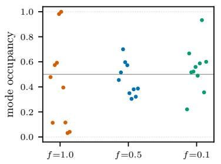

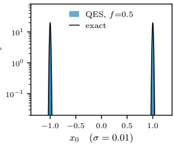

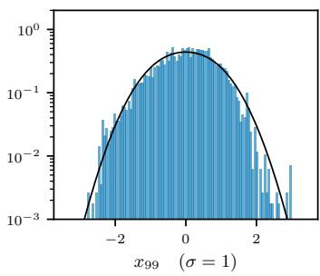  
Figure 7: $L e f t .$ mode occupancy for every run at each resampling threshold, ten seeds per setting on the bimodal target at $D = 1 0 0 ; { \mathrm { a } }$ fixated run lies on a dotted boundary. Per-level resampling $( f = 1 )$ drives neutral occupancy toward fixation, whereas the default $f = 0 . { \dot { 5 } }$ preserves both modes in every run. Middle, right: posterior marginals under the default against the exact density at the two ends of the anisotropy, $\sigma = 0 . 0 1$ and $\sigma = 1$

Figure 7 illustrates this trade-off on the bimodal target at $D = 1 0 0$ . Resampling every level causes the occupancy to collapse into one mode, while the default cadence preserves both modes in every run and reconstructs the marginals at both ends of the anisotropy. Resampling less often than the default lets the occupancy drift back toward imbalance, with one of ten runs approaching fixation.

Accounting for this drift is a challenge for any interacting particle method, and motivates global moves that cross between modes; constructing such moves is itself hard in high dimension without an a priori known symmetry.

## C.5 MUTATION BUDGET

The residual Gaussian bias at $D = 1 0 ^ { 4 }$ (Table 2) is probed by sweeping the number of MALA steps per level around the working point of $n _ { \mathrm { s t e p s } } = 1 2 8$ , with every other setting of the benchmark held fixed. Below the default the bias grows steadily as the population lags its moving target, while doubling the budget changes nothing within the seed variation (Table 8). The default therefore sits at the knee of the curve, and we attribute the residual that remains there to the accumulated finite-N effects of Appendix C rather than to incomplete mutation. Doubling the particle count at the default budget instead shrinks the bias and contracts the seed scatter by the predicted ${ \sqrt { 2 } } ,$ , consistent with this attribution. Figure 8 shows the reconstructed radial posterior at the default working point.

Table 8: Budget sweeps on the Gaussian at $D = 1 0 ^ { 4 } \colon$ evidence bias against the exact log Z and gradient evaluations per run, ten seeds per setting. The default is $N = 1 0 0 0 , n _ { \mathrm { s t e p s } } = 1 2 8 ;$ the final row doubles the particle count at the default mutation budget.
<table><tr><td>N</td><td> $n _ { \mathrm { s t e p s } }$ </td><td>gradients</td></tr><tr><td>1000</td><td>32</td><td> $0 . 4 7 \times 1 0 ^ { 9 }$   $- 1 . 9 1 \pm 0 . 6 8$ </td></tr><tr><td>1000</td><td>64</td><td> $0 . 9 4 \times 1 0 ^ { 9 }$   $- 1 . 6 2 \pm 0 . 9 3$ </td></tr><tr><td>1000</td><td>128</td><td> $1 . 8 6 \times 1 0 ^ { 9 }$   $- 0 . 8 9 \pm 0 . 7 1$ </td></tr><tr><td>1000</td><td>256</td><td> $3 . 6 9 \times 1 0 ^ { 9 }$   $- 1 . 1 0 \pm 0 . 7 7$ </td></tr><tr><td>2000</td><td>128</td><td> $3 . 7 4 \times 1 0 ^ { 9 }$   $- 0 . 6 2 \pm 0 . 4 5$ </td></tr></table>

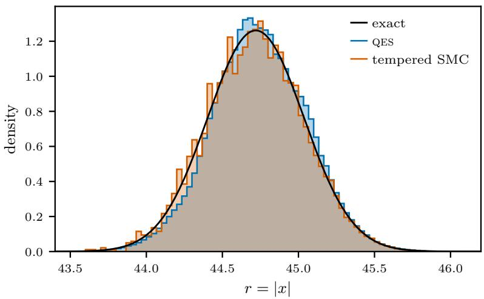  
Figure 8: Reconstructed radial posterior at $D = 1 0 ^ { 4 }$ against the exact shell $r = \tau \chi _ { D }$ , for a single run at the default working point. Both methods pool every weighted particle from every level of the path: QES with the level-volume quadrature weights of Appendix C.3, tempered SMC with deterministic-mixture balance weights over its temperatures. The pooled Kish ESS is $4 . 8 \times 1 0 ^ { 5 }$ for QES and $6 . 9 \times 1 0 ^ { 3 }$ for tempered SMC.