# REFINEMENT-BASED FLOW POLICY OPTIMIZATION

Bumgeun Park∗, Hyukjun Yang∗, Donghwan Lee† Korea Advanced Institute of Science and Technology (KAIST) {j4t123,jundol32,donghwan}@kaist.ac.kr

## ABSTRACT

Flow-based policies offer an expressive representation for online reinforcement learning, but conventional flow matching requires samples drawn from the distribution to be modeled. This poses a challenge when the desired action distribution is defined only implicitly by a Q-function, since directly sampling actions from the resulting distribution is generally intractable. We propose Refinement-Based Flow Policy Optimization (RFPO), a novel framework for training a flow policy in online reinforcement learning by alternating between Q-guided sample refinement and self-target flow matching. RFPO first generates actions from Gaussian noise using the current flow policy and then uses a finite-step stochastic refinement procedure to move them toward an energy-based distribution induced by the Q-function. Each refined action is then paired with its corresponding initial noise sample and used as a fixed target for flow-matching training. By repeatedly refining its own outputs and learning from the resulting targets, RFPO incorporates Q-guidance into the policy without requiring direct samples from the target distribution, while retaining the capacity to represent multiple action modes. We further provide a theoretical analysis of the distributional dynamics induced by RFPO. Across six continuous-control tasks, RFPO matches or outperforms a standard Gaussian-policy baseline on almost every task. Experiments on six synthetic twodimensional target distributions with diverse geometries demonstrate that RFPO captures complex multimodal structure without mode collapse.

## 1 INTRODUCTION

Online reinforcement learning (RL) aims to learn decision-making policies through interaction with an environment. In continuous-action actor–critic methods, a Q-function provides a learning signal for policy improvement, but the policy is often restricted to a Gaussian parameterization, which can limit its representational flexibility. Diffusion and flow matching (FM) models offer more expressive alternatives for policy representation (Ho et al., 2020; Lipman et al., 2023). Their ability to capture complex, multimodal distributions allows them to represent substantially richer distributional structure than conventional Gaussian policies.

However, when the target distribution is defined implicitly by a Q-function, the samples required for conventional FM are not directly available. Recent work has addressed this challenge through Q-weighted objectives and critic-derived score or velocity targets (Ding et al., 2024; Ma et al., 2025; Psenka et al., 2024; Li et al., 2026). Other approaches explicitly modify action samples using critic information before fitting a generative policy to the resulting targets (Yang et al., 2023; Zhu et al., 2026). More broadly, another line of work considers how to train a model to generate samples from a target distribution when direct sampling is intractable. Li et al. (2017) and Xie et al. (2018) address this problem by applying Markov chain Monte Carlo (MCMC) to model-generated samples and subsequently updating the model with the refined samples.

In this paper, we propose Refinement-Based Flow Policy Optimization (RFPO), a novel framework for training a flow policy in online RL through MCMC-based sample refinement. Specifically, RFPO alternates between Q-guided sample refinement and self-target FM. The first process generates action samples from Gaussian noise using the current flow policy and applies a finite number of steps of the Metropolis-adjusted Langevin algorithm (MALA), a gradient-based MCMC method, to refine the samples toward an energy-based action distribution induced by the Q-function. In the second process, each refined action is paired with the base noise used to generate its original action, and the flow policy is trained on these pairs through conditional FM. To the best of our knowledge, RFPO is the first method to train a flow policy in online RL by iteratively refining samples generated by the current policy and using the refined samples as self-generated training targets, thereby moving the policy distribution toward the target distribution.

The main contributions of this work are summarized as follows:

• We introduce RFPO, a novel framework for training a flow policy in online RL through two alternating processes: MCMC-based refinement of actions sampled from the current policy toward an energy-based target distribution induced by the Q-function, and self-target FM using the refined actions as training targets.

• We theoretically characterize the idealized distributional dynamics induced by RFPO, establishing monotonic improvement of the corresponding maximum-entropy objective and identifying the energy-based target distribution as a fixed point.

• We empirically demonstrate that RFPO matches or outperforms a standard Gaussian-policy baseline on almost every continuous-control task and closely approximates synthetic target distributions with diverse geometries while preserving their multimodal structure.

## 2 RELATED WORK

## 2.1 Q-GUIDED GENERATIVE POLICY LEARNING

Recent studies have explored diffusion-based and flow-based policies in online RL through training objectives derived from the Q-function. For diffusion-based policies, QVPO introduces a Qweighted variational objective for training a policy without requiring samples from an optimal policy (Ding et al., 2024). DPMD and SDAC employ reweighted score matching to derive tractable updates for policy mirror descent and maximum-entropy policy optimization, respectively (Ma et al., 2025). Other methods use critic gradients more directly. QSM derives policy updates from the relationship between the policy score and the action gradient of the Q-function (Psenka et al., 2024), whereas DACER differentiates through the reverse diffusion process to optimize the policy and estimates its entropy to regulate exploration (Wang et al., 2024). For flow-based policies, RFM formulates the construction of training targets as a posterior-mean estimation problem conditioned on intermediate noisy samples (Li et al., 2026). It uses self-normalized importance sampling with control variates derived from Langevin Stein operators to combine Q-value and Q-gradient information. The resulting estimates provide velocity targets for training flow policies toward a Boltzmann distribution without directly sampling from that distribution.

A complementary line of work constructs policy-training targets by explicitly refining action samples. DIPO refines replay-buffer actions through Q-gradient ascent and fits a diffusion policy to the resulting actions (Yang et al., 2023). DACER-F applies unadjusted Langevin updates to replaybuffer actions and trains a flow policy by combining FM objective on the refined actions with direct Q-value maximization (Zhu et al., 2026). In contrast, RFPO initializes MALA from actions sampled from the current flow policy and pairs each refined action with its corresponding source noise for self-target FM. This recursive construction admits a direct distributional characterization of the complete refinement–learning cycle. Under the idealized conditions of our analysis, each policy update is equivalent to applying the MALA kernel to the current policy distribution, establishing the energy-based target distribution induced by the Q-function as a fixed point. Table 1 summarizes the policy-learning and sample-refinement mechanisms of these methods.

## 2.2 AMORTIZING ITERATIVE SAMPLE REFINEMENT

Unlike the refinement-based approaches discussed in Section 2.1, which start from previously collected actions, a broader line of work repeatedly refines samples produced by the model being trained and uses the refined samples to update that same model. Amortized MCMC draws initial samples from an approximation network, applies MCMC transitions to them, and trains the network toward the resulting refined distribution (Li et al., 2017). Amortized SVGD follows a similar structure by applying Stein variational gradient updates to samples produced by a stochastic neural network and adjusting the network parameters to reproduce the resulting refined samples (Feng et al., 2017). MCMC teaching uses a generative model to produce initial samples from latent variables and an energy-based model to refine them through a finite-step Langevin chain (Xie et al., 2018). The generative model is then trained to reproduce the refined samples from the corresponding latent variables. In each case, the effect of iterative sample refinement is progressively incorporated into the model that generated the initial samples.

Table 1: Comparison of policy-learning mechanisms among selected Q-guided generative policy methods. Refinement denotes explicit updates of action samples before they are used as policytraining targets. FM and ULA denote flow matching and the unadjusted Langevin algorithm, respectively.
<table><tr><td>Method</td><td>Policy training</td><td colspan="2">Refinement initialization Refinement rule</td></tr><tr><td>QVPO</td><td>Q-weighted variational objective DPMD/SDAC reweighted score matching</td><td colspan="2"></td></tr><tr><td>QSM</td><td>Q-gradient score regression</td><td colspan="2"></td></tr><tr><td>DACER RFM</td><td>Q maximization via reverse diffusion posterior-mean velocity regression</td><td></td><td></td></tr><tr><td>DIPO DACER-F</td><td>diffusion fitting to refined actions</td><td>replay-buffer actions refined-action FM and Q maximization replay-buffer actions</td><td>Q-gradient ascent ULA MALA</td></tr></table>

RFPO adopts this refinement–learning structure for training a flow policy in online RL. The current flow policy generates actions, which are refined through finite-step MALA toward a target distribution induced by the Q-function. Each refined action is then paired with the noise used to generate its initial action and serves as a self-generated target for FM. Whereas the preceding methods are developed for approximate inference or generative modeling, RFPO applies this principle to online policy learning, where the state-dependent target distribution is defined by a Q-function that is continually updated through environment interaction.

## 3 PRELIMINARIES

## 3.1 PROBLEM FORMULATION

We consider a continuous-action Markov decision process (MDP) defined by $\boldsymbol { \mathcal { M } } = ( \boldsymbol { \mathcal { S } } , \boldsymbol { \mathcal { A } } , \boldsymbol { P } , \boldsymbol { r } , \boldsymbol { \gamma } )$ where S and A denote the state and action spaces, respectively. For a state $s \in { \mathcal { S } }$ and an action $a \in \mathcal { A } , P ( s ^ { \prime } \mid s , a )$ is the transition distribution over the next state $s ^ { \prime } \in \mathcal S , r ( s , a )$ is the reward function, and $\gamma \in \ [ 0 , 1 )$ is the discount factor. Let $Q _ { \phi } ( s , a )$ denote a differentiable Q-function parameterized by ϕ. Following the energy-based policy formulation commonly used in maximumentropy reinforcement learning (Haarnoja et al., 2017; 2018; Levine, 2018), we adopt the Boltzmann distribution induced by the Q-function as the target action distribution:

$$
p _ { \alpha } ( a \mid s ) = \frac { 1 } { Z _ { \alpha } ( s ) } \exp \left( \frac { Q _ { \phi } ( s , a ) } { \alpha } \right) ,\tag{1}
$$

where $\alpha \ > \ 0$ is a temperature parameter and $Z _ { \alpha } ( s ) ~ = ~ \int _ { A } \exp \left( Q _ { \phi } ( s , \bar { a } ) / \alpha \right)$ da¯ is the statedependent normalizing constant. A smaller α concentrates probability mass more strongly around high-value actions, whereas a larger α spreads probability mass more broadly across the action space.

## 3.2 CONDITIONAL FLOW MATCHING

Flow matching (FM) learns a time-dependent vector field that transports samples from a simple base distribution such that their endpoint distribution matches a target distribution (Lipman et al., 2023). Given a state s, let $x _ { 0 } \sim p _ { 0 } \overset { \vartriangle } { = } \mathcal { N } ( 0 , I _ { d } )$ and $x _ { 1 } \sim p _ { 1 } ( \cdot \mid s )$ denote samples from the base and conditional target distributions, respectively. A time-dependent vector field $v _ { \theta } ( s , x , t )$ , with

$t \in [ 0 , 1 ]$ , defines the flow through

$$
\frac { d x _ { t } } { d t } = v _ { \theta } ( s , x _ { t } , t ) , \qquad x _ { t = 0 } = x _ { 0 } , \qquad x _ { 1 } ^ { \theta } = \Phi _ { \theta } ( s , x _ { 0 } ) ,\tag{2}
$$

where $\Phi _ { \theta }$ denotes the flow map obtained by integrating the ODE from $t = 0 \mathrm { t o } t = 1$ . The objective is to learn a vector field such that the conditional distribution of $x _ { 1 } ^ { \theta }$ matches $p _ { 1 } ( \cdot \mid s )$ To learn this vector field, conditional FM uses source–target pairs $( x _ { 0 } , x _ { 1 } )$ . For $t \sim \mathcal { U } [ 0 , 1 ]$ , we consider the linear interpolation and its associated velocity

$$
x _ { t } = ( 1 - t ) x _ { 0 } + t x _ { 1 } , \qquad { \frac { d x _ { t } } { d t } } = x _ { 1 } - x _ { 0 } .\tag{3}
$$

The resulting conditional FM objective is

$$
\begin{array} { r } { \mathcal { L } _ { \mathrm { F M } } ( \theta ) = \mathbb { E } _ { s \sim \rho , x _ { 0 } \sim p _ { 0 } , x _ { 1 } \sim p _ { 1 } ( \cdot \vert s ) , t \sim \mathcal { U } [ 0 , 1 ] } \left[ \Vert v _ { \theta } ( s , x _ { t } , t ) - ( x _ { 1 } - x _ { 0 } ) \Vert _ { 2 } ^ { 2 } \right] , } \end{array}\tag{4}
$$

where $\rho$ denotes the state distribution used for training. Under the standard FM formulation, mini mizing equation 4 recovers the marginal vector field associated with the prescribed probability path, whose flow transports $p _ { 0 }$ toward $p _ { 1 } ( \cdot \mid s )$

## 3.3 METROPOLIS-ADJUSTED LANGEVIN ALGORITHM

The Metropolis-adjusted Langevin algorithm (MALA) is a Markov chain Monte Carlo method for generating samples from a target distribution that is difficult to sample from directly (Roberts & Tweedie, 1996). It uses gradient information to propose moves toward high-density regions and applies a Metropolis–Hastings correction to preserve the target distribution. Consider a target density $p _ { \mathrm { t a r } } ( z ) \ \mathrm { o v e r } \ z \in \mathbb { R } ^ { d }$ . Given the current sample $z ^ { ( k ) }$ , MALA proposes

$$
\begin{array} { r } { \widetilde { z } = z ^ { ( k ) } + \eta \nabla _ { z } \log p _ { \mathrm { t a r } } ( z ^ { ( k ) } ) + \sqrt { 2 \eta } \epsilon _ { k } , \qquad \epsilon _ { k } \sim \mathcal { N } ( 0 , I _ { d } ) , } \end{array}\tag{5}
$$

where $\eta > 0$ is the step size. The corresponding proposal density is

$$
\begin{array} { r } { q ( z ^ { \prime } \mid z ) = \mathcal { N } \left( z ^ { \prime } ; z + \eta \nabla _ { z } \log p _ { \mathrm { t a r } } ( z ) , 2 \eta I _ { d } \right) . } \end{array}\tag{6}
$$

Here, $q ( z ^ { \prime } \mid z )$ denotes the probability density of proposing $z ^ { \prime }$ from the current sample z. In particular, the candidate $\widetilde { z }$ is drawn from $q ( \cdot \mid z ^ { ( k ) } )$ . Because the proposal is generally asymmetric, MALA accepts the proposed sample with probability

$$
\begin{array} { r } { P _ { \mathrm { a c c } } \left( z ^ { ( k ) } , \widetilde { z } \right) = \operatorname* { m i n } \left\{ 1 , \frac { p _ { \mathrm { t a r } } \left( \widetilde { z } \right) q \left( { z ^ { ( k ) } } \mid \widetilde { z } \right) } { p _ { \mathrm { t a r } } \left( z ^ { ( k ) } \right) q \left( \widetilde { z } \mid z ^ { ( k ) } \right) } \right\} , } \end{array}\tag{7}
$$

where $P _ { \mathrm { a c c } }$ denotes the acceptance probability. Specifically, given $r \sim \mathcal { U } [ 0 , 1 ]$ , the next sample is determined as

$$
z ^ { ( k + 1 ) } = { \binom { \widetilde { z } } { z ^ { ( k ) } } } , \quad r \leq P _ { \mathrm { a c c } } ( z ^ { ( k ) } , \widetilde { z } ) ,\tag{8}
$$

The Metropolis–Hastings correction ensures that the resulting Markov transition leaves $p _ { \mathrm { t a r } }$ invariant. Moreover, because $p _ { \mathrm { t a r } }$ enters only through its log-density gradient and ratios of density values, its normalizing constant need not be evaluated.

## 4 REFINEMENT-BASED FLOW POLICY OPTIMIZATION

We propose Refinement-based Flow Policy Optimization (RFPO), a novel framework for training a flow policy in online RL that combines Q-guided sample refinement with self-target FM, thereby removing the need for direct samples from the energy-based target distribution $p _ { \alpha } ( \cdot \mid s )$ . RFPO alternates between two processes during training. First, the current flow policy generates actions from Gaussian noise. These actions are then refined toward $p _ { \alpha } ( \cdot \mid s )$ using gradient information from the Q-function. Second, the flow policy is trained to reproduce the refined samples from their corresponding initial noise samples. Through this iterative cycle, RFPO progressively shifts the policy’s probability mass toward high-value action regions while retaining its ability to represent multiple action modes. The two-process training procedure is illustrated in Figure 1.

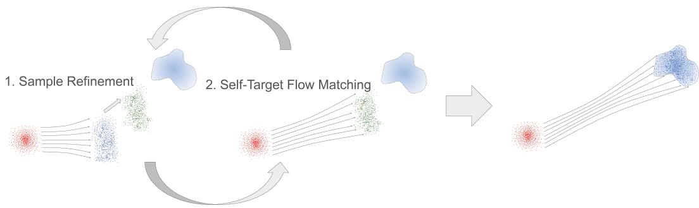  
Figure 1: Overview of RFPO. Shaded regions illustrate the target distribution $p _ { \alpha } ( \cdot \mid s )$ . Red dots denote Gaussian base samples $x _ { 0 } ,$ , blue dots denote actions $a _ { 1 }$ generated by integrating the flow ODE, and green dots denote refined actions $a _ { 1 } ^ { \prime }$ . Q-guided sample refinement updates the flowgenerated actions toward the target distribution (left). The refined actions are paired with their corresponding original base samples to train the policy through self-target flow matching (center). The curved arrows indicate repeated alternation between these two processes. The learned flow policy is shown approximating the target distribution after repeated updates (right).

## 4.1 Q-GUIDED SAMPLE REFINEMENT

Given a state s, we first draw Gaussian noise $x _ { 0 } \sim \mathcal { N } ( 0 , I _ { d } )$ and generate an action using the current flow policy:

$$
a _ { 1 } = \Phi _ { \theta } ( s , x _ { 0 } ) ,\tag{9}
$$

where $\Phi _ { \theta }$ denotes the flow map defined in Section 3.2, and we denote its generated endpoint $x _ { 1 } ^ { \theta }$ by $a _ { 1 }$ in the action space. The distribution of generated actions does not necessarily match the target distribution $p _ { \alpha } ( \cdot \mid s )$ defined in equation 1. We therefore refine $a _ { 1 }$ toward $p _ { \alpha } ( \cdot \mid s )$ using MALA. The MALA update in equation 5 uses the gradient of the log target density, which in our setting is $\begin{array} { r } { \nabla _ { a } \log p _ { \alpha } ( a \mid \bar { s } ) = \frac { 1 } { \alpha } \nabla _ { a } \bar { Q } _ { \phi } ( s , a ) } \end{array}$

Starting from $a ^ { ( 0 ) } = a _ { 1 }$ , we perform K MALA steps using the current Q-function. At iteration $k = 0 , \ldots , K - 1$ , we construct a candidate action from $a ^ { ( k ) }$ as

$$
\widetilde { \boldsymbol { a } } = \boldsymbol { a } ^ { ( k ) } + \frac { \eta } { \alpha } \nabla _ { a } \boldsymbol { Q } _ { \phi } ( \boldsymbol { s } , \boldsymbol { a } ^ { ( k ) } ) + \sqrt { 2 \eta } \boldsymbol { \epsilon } _ { k } , \qquad \boldsymbol { \epsilon } _ { k } \sim \mathcal { N } ( 0 , I _ { d } ) ,\tag{10}
$$

where $\eta > 0$ is the refinement step size. The corresponding proposal density is $q _ { \phi } ( \widetilde { a } \mid a ^ { ( k ) } , s ) =$ $\begin{array} { r } { \mathcal { N } \left( \widetilde { a } ; a ^ { ( k ) } + \frac { \eta } { \alpha } \nabla _ { a } Q _ { \phi } ( s , a ^ { ( k ) } ) , 2 \eta I _ { d } \right) } \end{array}$ . Substituting $p _ { \alpha } ( \cdot \mid s )$ into the Metropolis–Hastings acceptance rule gives

$$
P _ { \mathrm { a c c } } \big ( a ^ { ( k ) } , \tilde { a } ; s \big ) = \operatorname* { m i n } \left\{ 1 , \exp \left( \frac { Q _ { \phi } \big ( s , \tilde { a } \big ) - Q _ { \phi } \big ( s , a ^ { ( k ) } \big ) } { \alpha } \right) \frac { q _ { \phi } \big ( a ^ { ( k ) } \mid \tilde { a } , s \big ) } { q _ { \phi } \big ( \tilde { a } \mid a ^ { ( k ) } , s \big ) } \right\} .\tag{11}
$$

The next action is set to $\boldsymbol { a } ^ { ( k + 1 ) } = \widetilde { \boldsymbol { a } }$ with probability $P _ { \mathrm { a c c } } ( { a } ^ { ( k ) } , \widetilde { { a } } ; { s } )$ and remains $a ^ { ( k + 1 ) } = a ^ { ( k ) }$ otherwise. After K transitions, we obtain the refined action $a _ { 1 } ^ { \prime } = a ^ { ( K ) }$

We use MALA as a finite-step stochastic refinement procedure rather than running it until convergence. Accordingly, $a _ { 1 } ^ { \prime }$ is not assumed to be an exact sample from $p _ { \alpha } ( \cdot \mid s ) ;$ ; the purpose of refinement is to bring the distribution of policy-generated samples closer to the target distribution. In the following subsection, we update the flow policy using $a _ { 1 } ^ { \prime }$ as a fixed target. Since the action spaces considered in our experiments are bounded, details on the action transformation and the corresponding MALA refinement are provided in Appendix A.

## 4.2 SELF-TARGET FLOW MATCHING

Once the refined action $a _ { 1 } ^ { \prime }$ is obtained, it serves as a self-generated target for training the flow policy and is paired with the base noise $x _ { 0 }$ used to generate the original action $a _ { 1 } = \Phi _ { \theta } ( s , x _ { 0 } )$ , forming the source–target pair $( x _ { 0 } , a _ { 1 } ^ { \prime } )$ . Following the conditional FM formulation in Section 3.2, we sample

$t \sim \mathcal { U } [ 0 , 1 ]$ and construct the linear interpolation $a _ { t } = ( 1 - t ) x _ { 0 } + t a _ { 1 } ^ { \prime }$ . The flow policy is then trained using the self-target FM objective

$$
\begin{array} { r } { \mathcal { L } _ { \mathrm { S F M } } ( \theta ) = \mathbb { E } _ { s \sim \rho , \boldsymbol { x } _ { 0 } \sim \mathcal { N } ( 0 , I _ { d } ) , } \left[ \Vert \boldsymbol { v } _ { \theta } ( s , a _ { t } , t ) - ( a _ { 1 } ^ { \prime } - \boldsymbol { x } _ { 0 } ) \Vert _ { 2 } ^ { 2 } \right] , } \end{array}\tag{12}
$$

where the expectation also accounts for the stochasticity of the finite-step MALA refinement used to construct $a _ { 1 } ^ { \prime }$ . During this update, $a _ { 1 } ^ { \prime }$ is treated as a fixed target; gradients are propagated only through the velocity field $v _ { \theta }$ and not through the flow sampling or MALA refinement used to generate $a _ { 1 } ^ { \prime }$

## 4.3 CRITIC LEARNING

We adopt a clipped double-Q critic update (Fujimoto et al., 2018) using transitions sampled from a replay buffer $\mathcal { D } .$ To construct the temporal-difference target, we generate an action from Gaussian noise using the flow policy at the next state $s ^ { \prime } { : }$

$$
\begin{array} { r } { x _ { 0 } ^ { \prime } \sim \mathcal { N } ( 0 , I _ { d } ) , \qquad a ^ { \prime } = \Phi _ { \bar { \theta } } ( s ^ { \prime } , x _ { 0 } ^ { \prime } ) , } \end{array}\tag{13}
$$

where $\bar { \theta }$ denotes the target flow parameters, which are updated using an exponential moving average of the online parameters θ. The generated action $a ^ { \prime }$ is used directly in the temporal-difference target, without additional smoothing noise.

## 5 THEORETICAL ANALYSIS

We analyze whether self-target FM reproduces the distribution of refined actions and how alternating sample refinement and self-target FM moves the policy distribution toward the target distribution. The analysis assumes that the policy learns the optimal velocity field for the self-target FM objective and that the flow ODE is solved without numerical integration error.

Let $\pi _ { \boldsymbol { \theta } } ( \cdot \mid s )$ denote the policy distribution induced by $a = \Phi _ { \theta } ( s , x _ { 0 } )$ with $x _ { 0 } \sim \mathcal { N } ( 0 , I _ { d } )$ . We write $\pi _ { n } = \pi _ { \theta _ { r } }$ for the policy after n cycles, each of which involves MCMC-based sample refinement followed by self-target FM. The Q-function, temperature $\alpha .$ and refinement step size η are all held fixed across the cycles under analysis.

For a fixed state s and policy parameter $\theta _ { n } ,$ let $a _ { 1 } ^ { \prime }$ be the refined action and $a _ { t } = ( 1 - t ) x _ { 0 } + t a _ { 1 } ^ { \prime }$ be the interpolant used in Section 4.2. Define

$$
v ^ { \star } ( s , x , t ) : = \mathbb { E } \big [ a _ { 1 } ^ { \prime } - x _ { 0 } \big | a _ { t } = x , s \big ] ,\tag{14}
$$

which is the conditional mean of the target velocity at position x and time $t .$

Assumption 5.1 (Regularity, moments, and initialization). Fix a state s and consider the cycles under analysis. Thefollowing conditions hold:

(i) The normalizing constant $Z _ { \alpha } ( s )$ in equation 1 satisfies $0 < Z _ { \alpha } ( s ) < \infty$

(ii) For every n, $\begin{array} { r } { \mathbb { E } _ { a \sim \pi _ { n } ( \cdot | s ) } [ | Q _ { \phi } ( s , a ) | ] < \infty . } \end{array}$

(iii) In every cycle, the refined action satisfies $\mathbb { E } [ \| a _ { 1 } ^ { \prime } \| ^ { 2 } ] < \infty$

(iv) In every cycle, $v ^ { \star } ( s , x , t )$ isjointly continuous in x and $t f o r t \in [ 0 , 1 )$ . For every $0 < T <$ 1, there is a constant $L _ { T }$ such that $v ^ { \star } ( s , \cdot , t )$ is L -Lipschitz for all $t \in [ 0 , T ]$

(v) The initial policy satisfies KL $_ i \big ( \pi _ { 0 } \big ( \cdot \mid s \big ) \| p _ { \alpha } \big ( \cdot \mid s \big ) \big ) < \infty .$

Let $\textstyle \mu _ { n } ( \cdot \mid s )$ denote the distribution of the refined action $a _ { 1 } ^ { \prime } = a ^ { ( K ) }$ after K MALA transitions, and let $p _ { t } ( \cdot \mid s )$ denote the distribution of $a _ { t }$ . The following lemma establishes that exact self-target FM reproduces $\textstyle \mu _ { n } ( \cdot \mid s )$

Lemma 5.2 (Self-target flow matching preserves the refined marginal). Under Assumption 5.1, for ρ-almost every state s, the field $v ^ { \star }$ minimizes $\mathcal { L } _ { \mathrm { S F M } }$ over all fields v with $\begin{array} { r } { \int _ { 0 } ^ { 1 } \int \| v ( s , x , t ) \| ^ { 2 } p _ { t } ( d x \ | } \end{array}$ s) $d t < \infty$ , and every minimizer v satisfies

$$
\int _ { 0 } ^ { 1 } \int \left. \left. v ( s , x , t ) - v ^ { \star } ( s , x , t ) \right. \right. ^ { 2 } p _ { t } ( d x \mid s ) d t = 0 .
$$

Moreover the field v⋆ generates the path $\big ( p _ { t } ( \cdot \mid s ) \big ) _ { t \in [ 0 , 1 ) } ,$ , the flow map $\Phi _ { v ^ { \star } } ( s , \cdot )$ extends $t o t = 1$ almost surely, and the action $\Phi _ { v ^ { \star } } ( s , x _ { 0 } )$ generated from $\dot { x _ { 0 } } \sim \mathcal { N } ( 0 , I _ { d } )$ has conditional distribution $\textstyle \mu _ { n } ( \cdot \mid s )$

Lemma 5.2 establishes that pairing a refined action with its original source noise does not prevent self-target FM from reproducing the refined marginal. This follows the general property of conditional FM under arbitrary source–target couplings (Pooladian et al., 2023, Lemma 3.1) (Tong et al., 2024, Theorems 3.1 and 3.2). The pairing affects the transport path but not the terminal distribution. The next lemma uses this property to characterize the complete cycle of sample refinement and self-target FM.

Lemma 5.3 (One outer round is K steps of a single chain). Fix a state s and hold $Q _ { \phi }$ fixed across the rounds considered. Let $M _ { s }$ denote the MALA kernel with target $p _ { \alpha } ( \cdot \mid s )$ and step size η. If the innerflow-matching problem is solved exactly in the sense ofLemma 5.2 and the flow is integrated exactly, then

$$
\pi _ { n + 1 } ( \cdot \mid s ) = \big ( \pi _ { n } M _ { s } ^ { K } \big ) ( \cdot \mid s ) , \qquad a n d t h e r e f o r e \qquad \pi _ { n } ( \cdot \mid s ) = \big ( \pi _ { 0 } M _ { s } ^ { n K } \big ) ( \cdot \mid s ) .
$$

Since the MALA kernel leaves the target distribution invariant, the update in Lemma 5.3 allows us to apply the data-processing inequality to compare successive policy distributions with the target.

Theorem 5.4 (Monotone decrease of the divergence to the Boltzmann target). Let ${ \mathcal { I } } ( \pi \mid s ) =$ $\mathbb { E } _ { a \sim \pi } \big [ Q _ { \phi } ( s , a ) \big ] + \alpha \mathcal { H } ( \pi )$ denote the maximum-entropy objective induced by the current critic. Under the assumptions of Lemma 5.3, every outer round satisfies

$$
\begin{array} { r } { \mathrm { K L } \big ( \pi _ { n + 1 } ( \cdot \mid s ) \| p _ { \alpha } ( \cdot \mid s ) \big ) \ \leq \ \mathrm { K L } \big ( \pi _ { n } ( \cdot \mid s ) \| p _ { \alpha } ( \cdot \mid s ) \big ) , } \end{array}
$$

and equivalently ${ \mathcal { I } } ( \pi _ { n + 1 } \mid s ) \geq { \mathcal { I } } ( \pi _ { n } \mid s )$ , both sides being finite. The two sides coincide whenever $\pi _ { n } ( \cdot \mid s )$ is invariant $f o r M _ { s } ^ { K }$ . The conclusion holds for every step size $\eta > 0$ and every number of refinement steps $K \geq 1$ , and the objective is maximized at $\pi _ { n } ( \cdot \mid s ) = p _ { \alpha } ( \cdot \mid s )$ , which is afixed point ofthe outer iteration.

Remark 5.5 (From a fixed point to convergence). Theorem 5.4 identifies $p _ { \alpha } ( \cdot \mid s )$ as a fixed point of the outer iteration without establishing that $\pi _ { n } ( \cdot \mid s )$ converges to it, since the data-processing inequality need not be strict. If $M _ { s }$ is in addition ergodic with respect to $p _ { \alpha } ( \cdot \mid s )$ , which holds under the standard conditionsfor the Metropolis-adjusted Langevin algorithm (Roberts & Tweedie, 1996), then Lemma 5.3 gives $\dot { \pi } _ { n } ( \cdot \ | \ s ) = \dot { \pi } _ { 0 } M _ { s } ^ { n K }$ and the iterates converge to $p _ { \alpha } ( \cdot \mid s )$ , which is then the uniquefixed point.

Together, these results show that, under the stated idealizations, self-target FM preserves the effect of each refinement cycle, allowing finite-step MALA refinement to accumulate across policy updates. This yields monotonic improvement of the critic-induced maximum-entropy objective without requiring the refinement chain to converge within each cycle. With the additional ergodicity condition, the policy distribution converges to the target. Proofs of Lemmas 5.2 and 5.3 and Theorem 5.4 are provided in Appendices E.3, E.4, and E.5, respectively.

## 6 EXPERIMENTS

## 6.1 EXPERIMENTAL SETUP

We evaluate RFPO on six continuous-control environments from MuJoCo (Todorov et al., 2012). These environments vary in their state and action dimensions, dynamics, and control difficulty, allowing us to evaluate the method across a diverse set of online control problems. Each agent is trained from scratch through direct interaction with the environment, using only the transitions collected during its own training.

We compare RFPO with Soft Actor–Critic (SAC) (Haarnoja et al., 2018), a representative off-policy actor–critic algorithm that parameterizes its policy using a squashed Gaussian distribution. This comparison examines whether the expressive flow-based policy and Q-guided training procedure of RFPO provide benefits over a conventional Gaussian policy in online reinforcement learning. Both methods are trained using the same environment-interaction budget and evaluated under the same protocol. Performance is measured using the undiscounted episodic return.

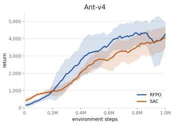  
(a) Ant

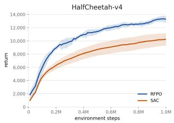  
(b) HalfCheetah

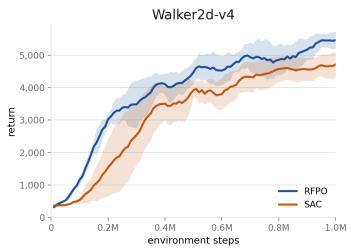  
(c) Walker2d

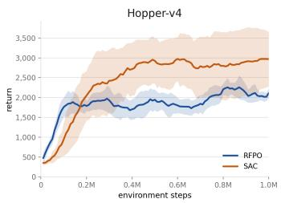  
(d) Hopper

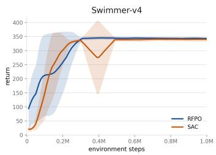  
(e) Swimmer

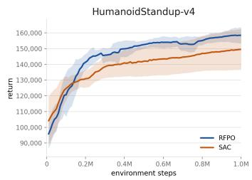  
(f) Humanoid Standup  
Figure 2: Learning curves on six continuous-control tasks. Each curve represents the average return over 5 random seeds, with the shaded area indicating one standard deviation from the mean.

## 6.2 EXPERIMENTAL RESULTS

Performance on continuous-control benchmarks. Figure 2 compares the learning performance of RFPO and SAC across six MuJoCo continuous-control tasks. RFPO matches or outperforms SAC across the evaluated environments, despite using a substantially more expressive flow-based policy in place of the conventional squashed Gaussian actor. These results show that the proposed Q-guided training procedure can effectively train a flow-based policy in online reinforcement learning without requiring direct samples from the corresponding energy-based target distribution. The consistent performance across environments with different dynamics and action dimensions further suggests that RFPO can scale beyond the controlled multimodal examples considered later to standard continuous-control problems

The learned policy preserves multimodality across diverse target geometries. We examine whether our method can represent multimodal target distributions without collapsing onto a single high-value region. We consider the six two-dimensional target geometries described in Appendix C, which include separated Gaussian modes, anisotropic components, and nonlinear ridge structures with unequal component heights. Unlike conventional flow matching, which is trained using samples drawn directly from the target distribution, our method accesses each target only through its Qfunction and learns from the self-generated targets produced by the proposed refinement procedure. As shown in Figure 3, the learned policy distributes its samples across multiple high-density regions and follows the overall geometry of each target. In particular, it captures both spatially separated modes and extended structures such as rings and spirals, rather than concentrating exclusively on the strongest mode. These results demonstrate that the iterative combination of Q-guided sample refinement and self-target flow matching preserves the multimodal structure encoded by the target distribution.

## 7 CONCLUSION

We introduce RFPO, a novel framework for training an expressive flow policy in online RL without requiring direct samples from the energy-based target distribution induced by the Q-function. RFPO iteratively refines actions generated by the current policy using Q-function and uses the refined actions as self-generated targets for FM training. Through this iterate, the policy distribution progressively moves toward high-value action regions while retaining its ability to represent multiple

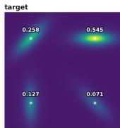

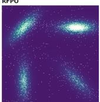

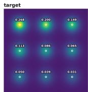

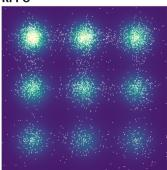

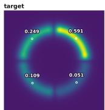

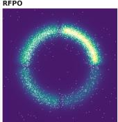

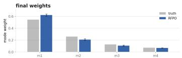

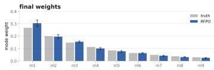

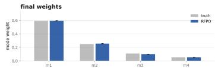  
(c) Moons-shaped mixture.

(a) Anisotropic mixture.  
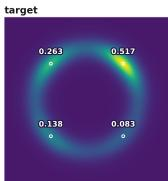

(b) Grid mixture.  
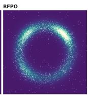

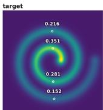

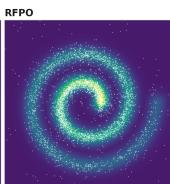

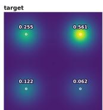

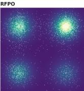

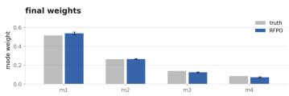  
(d) Ring-shaped mixture.

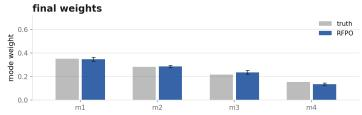  
(e) Spiral-shaped mixture.

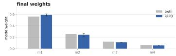  
(f) General two-dimensional mixture.

Figure 3: Results on six synthetic two-dimensional target distributions with diverse geometries after 3,000 training rounds. In each subfigure, the upper-left panel shows the target density, where the white markers indicate the predefined modes and the annotated values denote their ground-truth probability masses. The upper-right panel overlays samples generated by the learned RFPO policy on the target density. The lower panel compares the ground-truth mode weights (gray) with those estimated from the RFPO samples (blue), with error bars indicating variability across repeated runs. Across the different geometries, RFPO covers multiple high-density regions, follows nonlinear ridge structures, and closely reproduces the unequal probability masses assigned to the modes.

action modes. We further provide a theoretical analysis of the distributional dynamics induced by RFPO. Under exact inner optimization, an outer policy update corresponds to applying the MALA transition kernel to the current policy distribution, establishing the energy-based target distribution as a fixed point of the iterative procedure. Experiments across six MuJoCo continuous-control task showed that RFPO matches or outperforms a standard Gaussian-policy baseline. Additional experiments on six synthetic two-dimensional target distributions demonstrated that RFPO captures complex multimodal structure without collapsing onto a single mode. These results suggest that iterative sample refinement and self-target learning provide a principled and effective approach to training expressive policies from an implicitly defined target distribution in online reinforcement learning.

Limitations. While RFPO shows promising results on MuJoCo benchmarks and captures multimodal target distributions, several limitations remain to be addressed. First, its iterative updates in cur additional training cost because constructing each self-generated target requires multiple MALA steps. However, MCMC methods with adaptive proposals or momentum-based updates may reduce the computational cost of refinement, offering a direction for future work (Titsias, 2023; Hoffman & Gelman, 2014). Second, our theoretical analysis considers an idealized setting in which the critic is held fixed, the inner flow-matching problem is solved exactly, and the flow ODE is integrated without numerical error. In practical online training, the critic continually evolves and the policy is updated using finite optimization steps. These assumptions allow us to isolate the distributional effect of the proposed refinement–learning cycle and provide an exact reference for understanding the algorithm, but extending the analysis to account for approximate optimization and a moving target distribution remains an important direction for future work. Lastly, RFPO involves several design choices, including the refinement kernel, the acceptance correction, and initialization from currentpolicy samples. The current experiments do not fully isolate the contribution of each component. Nevertheless, the central idea of RFPO is to learn the target distribution by iteratively alternating between MCMC-based sample refinement and self-target FM. Further investigation of these design choices and their combinations may improve the performance and efficiency of RFPO and remains an important direction for future work.

## REFERENCES

Luigi Ambrosio, Nicola Gigli, and Giuseppe Savare.´ Gradient flows: in metric spaces and in the space of probability measures. Springer, 2005.

Shutong Ding, Ke Hu, Zhenhao Zhang, Kan Ren, Weinan Zhang, Jingyi Yu, Jingya Wang, and Ye Shi. Diffusion-based reinforcement learning via q-weighted variational policy optimization. Advances in Neural Information Processing Systems, 37:53945–53968, 2024.

Yihao Feng, Dilin Wang, and Qiang Liu. Learning to draw samples with amortized stein variational gradient descent. arXiv preprint arXiv:1707.06626, 2017.

Scott Fujimoto, Herke Hoof, and David Meger. Addressing function approximation error in actorcritic methods. In International conference on machine learning, pp. 1587–1596. Pmlr, 2018.

Tuomas Haarnoja, Haoran Tang, Pieter Abbeel, and Sergey Levine. Reinforcement learning with deep energy-based policies. In International conference on machine learning, pp. 1352–1361. PMLR, 2017.

Tuomas Haarnoja, Aurick Zhou, Pieter Abbeel, and Sergey Levine. Soft actor-critic: Off-policy maximum entropy deep reinforcement learning with a stochastic actor. In International conference on machine learning, pp. 1861–1870. Pmlr, 2018.

Jonathan Ho, Ajay Jain, and Pieter Abbeel. Denoising diffusion probabilistic models. Advances in neural information processing systems, 33:6840–6851, 2020.

Matthew D. Hoffman and Andrew Gelman. The no-u-turn sampler: Adaptively setting path lengths in hamiltonian monte carlo. Journal of Machine Learning Research, 15(47):1593–1623, 2014. URL http://jmlr.org/papers/v15/hoffman14a.html.

Sergey Levine. Reinforcement learning and control as probabilistic inference: Tutorial and review. arXiv preprint arXiv:1805.00909, 2018.

Yingzhen Li, Richard E Turner, and Qiang Liu. Approximate inference with amortised mcmc. arXiv preprint arXiv:1702.08343, 2017.

Zeyang Li, Sunbochen Tang, and Navid Azizan. Reverse flow matching: A unified framework for online reinforcement learning with diffusion and flow policies. In Forty-third International Conference on Machine Learning, 2026. URL https://openreview.net/forum?id= vUpEe4yd1T.

Yaron Lipman, Ricky T. Q. Chen, Heli Ben-Hamu, Maximilian Nickel, and Matthew Le. Flow matching for generative modeling. In The Eleventh International Conference on Learning Representations, 2023. URL https://openreview.net/forum?id=PqvMRDCJT9t.

Haitong Ma, Tianyi Chen, Kai Wang, Na Li, and Bo Dai. Efficient online reinforcement learning for diffusion policy. In Forty-second International Conference on Machine Learning, 2025. URL https://openreview.net/forum?id=6Anv3KB9lz.

Aram-Alexandre Pooladian, Heli Ben-Hamu, Carles Domingo-Enrich, Brandon Amos, Yaron Lipman, and Ricky T. Q. Chen. Multisample flow matching: Straightening flows with minibatch couplings. In Proceedings of the 40th International Conference on Machine Learning, volume 202 of Proceedings of Machine Learning Research, pp. 28100–28127. PMLR, 2023.

Michael Psenka, Alejandro Escontrela, Pieter Abbeel, and Yi Ma. Learning a diffusion model policy from rewards via q-score matching. In Forty-first International Conference on Machine Learning, 2024. URL https://openreview.net/forum?id=35ahHydjXo.

Gareth O Roberts and Jeffrey S Rosenthal. Optimal scaling of discrete approximations to Langevin diffusions. Journal of the Royal Statistical Society: Series B (Statistical Methodology), 60(1): 255–268, 1998.

Gareth O Roberts and Richard L Tweedie. Exponential convergence of langevin distributions and their discrete approximations. 1996.

Michalis Titsias. Optimal preconditioning and fisher adaptive langevin sampling. Advances in Neural Information Processing Systems, 36:29449–29460, 2023.

Emanuel Todorov, Tom Erez, and Yuval Tassa. Mujoco: A physics engine for model-based control. In 2012 IEEE/RSJ international conference on intelligent robots and systems, pp. 5026–5033. IEEE, 2012.

Alexander Tong, Kilian Fatras, Nikolay Malkin, Guillaume Huguet, Yanlei Zhang, Jarrid Rector-Brooks, Guy Wolf, and Yoshua Bengio. Improving and generalizing flow-based generative models with minibatch optimal transport. Transactions on Machine Learning Research, 2024. ISSN 2835-8856. URL https://openreview.net/forum?id=CD9Snc73AW. Expert Certification.

Yinuo Wang, Likun Wang, Yuxuan Jiang, Wenjun Zou, Tong Liu, Xujie Song, Wenxuan Wang, Liming Xiao, Jiang Wu, Jingliang Duan, et al. Diffusion actor-critic with entropy regulator. Advances in Neural Information Processing Systems, 37:54183–54204, 2024.

Jianwen Xie, Yang Lu, Ruiqi Gao, and Ying Nian Wu. Cooperative learning of energy-based model and latent variable model via mcmc teaching. In Proceedings ofthe AAAI Conference on Artificial Intelligence, volume 32, 2018.

Long Yang, Zhixiong Huang, Fenghao Lei, Yucun Zhong, Yiming Yang, Cong Fang, Shiting Wen, Binbin Zhou, and Zhouchen Lin. Policy representation via diffusion probability model for reinforcement learning. arXiv preprint arXiv:2305.13122, 2023.

Tianze Zhu, Yinuo Wang, Wenjun Zou, Tianyi Zhang, Likun Wang, Letian Tao, Feihong Zhang, Yao Lyu, and Shengbo Eben Li. Real-time generative policy via langevin-guided flow matching for autonomous driving. arXiv preprint arXiv:2603.02613, 2026.

## A BOUNDED ACTION IMPLEMENTATION

The main text describes RFPO directly in the action space. In the bounded-action implementation, both the flow and MALA refinement operate on a variable $u \in \mathbb { R } ^ { d }$ , which is mapped to an environment action through a tanh transformation. Let $a _ { \mathrm { m i n } } , a _ { \mathrm { m a x } } \in \mathbb { R } ^ { d }$ denote the componentwise action bounds, with $a _ { \mathrm { m i n } , j } < a _ { \mathrm { m a x } , j }$ , and define the action half-range $\Delta a = ( a _ { \mathrm { m a x } } - a _ { \mathrm { m i n } } ) / 2$ . The transformation is

$$
T ( u ) = \frac { a _ { \mathrm { m a x } } + a _ { \mathrm { m i n } } } { 2 } + \Delta a \odot \mathrm { t a n h } ( u ) ,\tag{15}
$$

where tanh and $\odot$ act elementwise. The flow generates an endpoint $u _ { 1 } ~ = ~ \Phi _ { \theta } ( s , x _ { 0 } )$ from $x _ { 0 } \sim \mathcal { N } ( 0 , I _ { d } )$ , and the corresponding action is $a _ { 1 } = T ( u _ { 1 } )$ . Thus, the flow map produces $u _ { 1 }$ in this implementation, while $T$ enforces the action bounds. For numerical stability, we clip u componentwise to [−10, 10] after each Euler integration step. This clipping is applied only during flow sampling, not during MALA refinement; refined endpoints may therefore lie outside this box.

Target density and gradient. To perform refinement in u-space while targeting $p _ { \alpha } ( \cdot \mid s )$ in action space, we use the change-of-variables formula

$$
p _ { \alpha } ^ { u } ( u \mid s ) = p _ { \alpha } ( T ( u ) \mid s ) \left| \operatorname* { d e t } J _ { T } ( u ) \right| ,\tag{16}
$$

where $J _ { T } ( u )$ is the Jacobian of $T .$ Substituting equation 1 gives

$$
p _ { \alpha } ^ { u } ( u \mid s ) \propto \exp \left( \frac { Q _ { \phi } ( s , T ( u ) ) } { \alpha } \right) \prod _ { j = 1 } ^ { d } \Delta a _ { j } \left( 1 - \operatorname { t a n h } ^ { 2 } ( u _ { j } ) \right) .\tag{17}
$$

The gradient of the log target density is

$$
\begin{array} { l } { { g _ { \phi } ^ { u } ( s , u ) : = \nabla _ { u } \log { p _ { \alpha } ^ { u } ( u \mid s ) } } } \\ { { \displaystyle \qquad = \frac { 1 } { \alpha } \left[ \nabla _ { a } Q _ { \phi } ( s , a ) | _ { a = T ( u ) } \odot \Delta a \odot \left( 1 - \operatorname { t a n h } ^ { 2 } ( u ) \right) \right] - 2 \operatorname { t a n h } ( u ) . } } \end{array}\tag{18}
$$

The first term follows from differentiating the Q-function through T, and the second term comes from the log-Jacobian determinant. The normalizing constant and the constant Jacobian factor $\Pi _ { j } \Delta a _ { j }$ vanish from the log-density gradient. The action half-range $\Delta a$ remains in the first term through the derivative of T.

Refinement and policy learning. We initialize MALA at $u ^ { ( 0 ) } = u _ { 1 }$ and perform K transitions targeting $p _ { \alpha } ^ { u } ( \cdot \mid s )$ . The proposal uses $g _ { \phi } ^ { u } ( s , u )$ with the norm clipping described in Appendix B. Both forward and reverse proposal densities are evaluated using this clipped gradient, while the Metropolis–Hastings acceptance ratio uses the target density $p _ { \alpha } ^ { u } ( \cdot \vert s )$ . Step-size adaptation follows equation 19.

After refinement, the endpoint $u _ { 1 } ^ { \prime } = u ^ { ( K ) }$ is paired with its original source noise $x _ { 0 }$ and treated as a fixed target. Self-target FM is performed in the same u-space: for $t \sim \mathcal { U } [ 0 , 1 ]$ , we construct $u _ { t } = ( 1 - t ) \bar { x _ { 0 } } + t u _ { 1 } ^ { \prime }$ and regress $v _ { \theta } ( s , u _ { t } , t )$ onto $u _ { 1 } ^ { \prime } - x _ { 0 }$ . This is the objective in equation 12 with $( a _ { t } , a _ { 1 } ^ { \prime } )$ replaced by $\bar { ( } u _ { t } , u _ { 1 } ^ { \prime } )$ . The corresponding refined action is $T ( u _ { 1 } ^ { \prime } )$

## B HYPERPARAMETERS

Table 2: Hyperparameters used in the six MuJoCo environments. Environment-specific values are followed by the corresponding environment names in parentheses; “others” denotes all remaining environments. All environments use version v4. The temperature is constant throughout training except on HumanoidStandup, where it starts at ten times the listed value and decays geometrically to the listed value over the first 20% of training.

<table><tr><td>Hyperparameter</td><td>Value</td></tr><tr><td>Discount factor γ Temperature α</td><td>0.999 (Swimmer); 0.99 (others) 0.1 (HalfCheetah); 0.05 (Walker2d, Ant); 0.01 (Hopper);</td></tr><tr><td></td><td>0.001 (Swimmer); 0.2 (HumanoidStandup, annealed)</td></tr><tr><td>MALA steps per update K</td><td> $^ { 5 } _ { 1 0 ^ { - 3 } }$ </td></tr><tr><td>Initial refinement step size η</td><td></td></tr><tr><td>Refinement step-size adaptation Step-size adaptation gain</td><td>Multiplicative, targeting an acceptance rate of 0.6</td></tr><tr><td>Refinement step-size bounds</td><td>0.1  $[ 1 0 ^ { - 8 } , 1 ]$ </td></tr><tr><td>Score norm clip</td><td>10</td></tr><tr><td>FM steps per update</td><td></td></tr><tr><td>ODE integration</td><td>5</td></tr><tr><td>Flow policy network</td><td>20 Euler steps</td></tr><tr><td></td><td> $\mathrm { M L P } , 3 \times 5 \mathrm { \dot { 1 } 2 } , \mathrm { S i L U }$ </td></tr><tr><td>Time embedding</td><td>Random Fourier features, dimension 64</td></tr><tr><td>Flow policy learning rate</td><td> $3 \times 1 0 ^ { - 4 }$  (Adam)</td></tr><tr><td>Critic network</td><td> $\mathrm { M L P } , 3 \times 5 1 2 , \mathrm { S i L U }$ </td></tr><tr><td>Critic learning rate</td><td> $3 \times 1 0 ^ { - 4 } ( \mathrm { A d a m } )$ </td></tr><tr><td>Target update rate τ</td><td>0.005</td></tr><tr><td>Warm-up steps</td><td></td></tr><tr><td>Training iteration per environment</td><td>5,000, with uniformly sampled actions 1</td></tr><tr><td>step</td><td></td></tr><tr><td>Replay buffer size</td><td> $1 0 ^ { 6 }$ </td></tr><tr><td>Batch size</td><td>256</td></tr><tr><td>Gradient norm clip</td><td>10 (actor and critic)</td></tr></table>

Temperature schedule. The temperature is held constant at the value listed in Table 2 for all environments except HumanoidStandup. For HumanoidStandup, the temperature at environment step n is $\alpha _ { n } = \stackrel { - } { \alpha _ { \mathrm { f i n a l } } } 1 0 ^ { 1 - \operatorname* { m i n } ( 1 , 5 n / T ) }$ , where $\alpha _ { \mathrm { f i n a l } } = 0 . 2$ and $T$ is the total number of environment steps. The temperature therefore starts at 2.0, reaches 0.2 after the first 20% of training, and remains constant thereafter.

Refinement step-size adaptation. We adapt the refinement step size online to balance the magnitude of sample updates and the acceptance rate. Small step sizes produce limited refinement, whereas excessively large step sizes can lead to frequent rejections. The value listed in Table 2 is the initial step size. After each refinement round of K MALA steps, we update it as

$$
\eta \gets \mathrm { c l i p } \left( \eta \exp \left[ \lambda \left( \hat { p } _ { \mathrm { a c c } } - p ^ { \star } \right) \right] , \eta _ { \mathrm { m i n } } , \eta _ { \mathrm { m a x } } \right) ,\tag{19}
$$

where $\hat { p } _ { \mathrm { a c c } }$ is the acceptance-rate estimate from the refinement round, $p ^ { \star } = 0 . 6$ is the target acceptance rate, and $\lambda = 0 . \bar { 1 }$ is the adaptation gain. This rule increases the step size when the estimated acceptance rate exceeds $p ^ { \star }$ and decreases it otherwise.

The target acceptance rate is chosen as a heuristic, motivated by the asymptotically optimal rate of 0.574 established for certain high-dimensional target distributions (Roberts & Rosenthal, 1998). The multiplicative update adjusts η relative to its current scale, while the adaptation gain limits abrupt changes. The bounds $[ \dot { \eta } _ { \mathrm { m i n } } , \dot { \eta } _ { \mathrm { m a x } } ] = [ 1 0 ^ { - 8 } , 1 ]$ prevent excessively small or large step sizes. This adaptation is a practical implementation choice; the theoretical analysis considers a fixed refinement kernel.

Score clipping. We clip the log-density gradient $\nabla _ { u } \log p _ { \alpha } ^ { u } ( u \mid s )$ to a Euclidean norm of at most 10 before using it in the proposal. This limits the drift magnitude in regions with large gradients. Both the forward and reverse proposal densities in the Metropolis–Hastings acceptance ratio are evaluated using the clipped drift, while the target-density ratio uses the original target $p _ { \alpha } ^ { u } ( \cdot \mid s )$ . For a fixed target and step size, the resulting transition therefore satisfies detailed balance with respect to $p _ { \alpha } ^ { u } ( \cdot \mid s ) \colon$ clipping modifies the proposal but preserves the target as an invariant distribution.

Table 3: Hyperparameters used in the two-dimensional experiments of Figure 3. The target geometries are defined in Appendix C. No critic is learned here: $\bar { Q }$ is given in closed form, so the target $p _ { \alpha }$ is known on a grid and the reported mode weights are measured against it rather than estimated.
<table><tr><td>Hyperparameter</td><td>Value</td></tr><tr><td>Temperature α Action space</td><td>0.15  $[ - 1 , 1 ] ^ { 2 } .$  reached as  $a = \operatorname { t a n h } ( u )$ </td></tr><tr><td>MALA steps per round K Initial refinement step size η</td><td>10  $5 \times 1 0 ^ { - 3 }$ </td></tr><tr><td>Refinement step-size adaptation Step-size adaptation gain</td><td>Multiplicative, targeting an acceptance rate of 0.6 0.1</td></tr><tr><td>Refinement step-size bounds</td><td> $[ 1 0 ^ { - 6 } , 1 ]$ </td></tr><tr><td>FM steps per round</td><td>10</td></tr><tr><td>ODE integration</td><td>30 Euler steps</td></tr><tr><td></td><td></td></tr><tr><td>Integration box</td><td> $\| u \| _ { \infty } \leq 1 0 ^ { \circ }$ </td></tr><tr><td></td><td></td></tr><tr><td>Flow policy network</td><td> $\mathrm { M L P } , 3 \times 1 2 8 , \mathrm { S i L U }$ </td></tr><tr><td>Flow policy learning rate</td><td> $1 0 ^ { - 3 } ( \mathrm { A d a m } )$ </td></tr><tr><td></td><td></td></tr><tr><td>Training rounds</td><td>3,000</td></tr><tr><td>Samples per round</td><td>1,024</td></tr><tr><td>Pretraining rounds Seeds</td><td>150, flow matching onto  $\mathcal { N } ( 0 , 1 . 5 ^ { 2 } I )$ </td></tr><tr><td></td><td>4</td></tr><tr><td>Evaluation samples</td><td>8,192</td></tr><tr><td>Evaluation grid</td><td> $9 6 \times 9 6 ~ \mathrm { o v e r } ~ [ - 1 , 1 ] ^ { 2 }$ </td></tr></table>

## C TARGET GEOMETRIES

All target distributions are defined over $a \in [ - 1 , 1 ] ^ { 2 }$ as

$$
p _ { \alpha } ( a ) \propto \exp \left( \frac { Q ( a ) } { \alpha } \right) .\tag{20}
$$

The six landscapes use nominal height levels ranging from $h _ { \operatorname* { m i n } } = 0 . 5 5$ to $h _ { \operatorname* { m a x } } = 1 . 0 0 .$ , with the constructions specified below. For any two points a and $b ,$ their density ratio is $p _ { \alpha } ( a ) / p _ { \alpha } ( b ) =$ $\exp ( ( Q ( a ) - { \bar { Q } } ( b ) ) / \alpha )$ . Using common nominal height levels provides a reference scale for comparing temperatures across geometries. It does not imply identical component masses, which also depend on component widths, lengths, and overlap.

Blob targets. The gauss4, aniso4, and grid9 landscapes are constructed as sums of Gaussian-shaped bumps:

$$
Q ( a ) = \sum _ { i = 1 } ^ { M } h _ { i } \exp \left( - \frac { 1 } { 2 } ( a - c _ { i } ) ^ { \top } \Sigma _ { i } ^ { - 1 } ( a - c _ { i } ) \right) ,\tag{21}
$$

where $c _ { i } , h _ { i } .$ , and $\Sigma _ { i }$ specify the center, amplitude, and covariance of bump i, respectively. Because the bumps overlap, $h _ { i }$ need not equal the value of $Q$ at $c _ { i }$ . For component-wise evaluation, each action is assigned to its nearest center:

$$
i ^ { \star } ( a ) = \arg \operatorname* { m i n } _ { i } \| a - c _ { i } \| _ { 2 } .\tag{22}
$$

gauss4. This landscape contains four isotropic bumps with centers

$$
\begin{array} { l l } { { c _ { 1 } = ( 0 . 5 5 , 0 . 5 5 ) , } } & { { c _ { 2 } = ( - 0 . 5 5 , 0 . 5 5 ) , } } \\ { { } } & { { c _ { 3 } = ( - 0 . 5 5 , - 0 . 5 5 ) , } } \end{array}\tag{23}
$$

Their amplitudes are $( h _ { 1 } , h _ { 2 } , h _ { 3 } , h _ { 4 } ) \ = \ ( 1 . 0 0 , 0 . 8 5 , 0 . 7 0 , 0 . 5 5 )$ , and all covariances are $\Sigma _ { i } ~ =$ $0 . 2 5 ^ { 2 } I _ { 2 }$

aniso4. This landscape uses the same centers and amplitudes as gauss4, with anisotropic covariances

$$
\Sigma _ { i } = R _ { \varphi _ { i } } \mathrm { d i a g } ( 0 . 2 8 ^ { 2 } , 0 . 1 0 ^ { 2 } ) R _ { \varphi _ { i } } ^ { \top } ,\tag{24}
$$

where $R _ { \varphi _ { i } }$ is the two-dimensional rotation matrix and $\left( \varphi _ { 1 } , \varphi _ { 2 } , \varphi _ { 3 } , \varphi _ { 4 } \right) = \left( 0 , \pi / 4 , \pi / 2 , 3 \pi / 4 \right)$

grid9. This landscape contains nine isotropic bumps with centers $\{ c _ { i } \} _ { i = 1 } ^ { 9 } = \{ - 0 . 6 2 , 0 , 0 . 6 2 \} ^ { 2 }$ The centers are indexed by row from top to bottom and from left to right within each row. The amplitudes are $h _ { i } = 1 . 0 0 \dot { - } 0 . 4 5 ( i - 1 ) / \dot { 8 }$ for $i = 1 , \ldots , 9$ , and all covariances are $\Sigma _ { i } = 0 . 1 5 5 ^ { 2 } I _ { 2 }$

Curve targets. The ring4, spiral4, and moons4 landscapes form ridges around curves represented by points $\{ p _ { j } \} _ { j = 1 } ^ { N }$ with associated heights $\{ h _ { j } \} _ { j = 1 } ^ { N } . \mathrm { ~ \ r ~ { A } ~ }$ direct sum of Gaussian bumps would increase in magnitude as more points are added along the curve. We instead use normalized distance-based weights:

$$
w _ { j } ( a ) = \frac { \exp { \left( - \| a - p _ { j } \| _ { 2 } ^ { 2 } / ( 2 \tau ^ { 2 } ) \right) } } { \sum _ { \ell = 1 } ^ { N } \exp { \left( - \| a - p _ { \ell } \| _ { 2 } ^ { 2 } / ( 2 \tau ^ { 2 } ) \right) } } ,\tag{25}
$$

where $\tau = 0 . 0 3 5$ controls the locality of the weighting. The locally averaged height and squared distance are

$$
\bar { h } ( a ) = \sum _ { j = 1 } ^ { N } w _ { j } ( a ) h _ { j } , \qquad \bar { d } ^ { 2 } ( a ) = \sum _ { j = 1 } ^ { N } w _ { j } ( a ) \| a - p _ { j } \| _ { 2 } ^ { 2 } .\tag{26}
$$

We construct the landscape as

$$
\widetilde Q ( a ) = \bar { h } ( a ) \exp \left( - \frac { \bar { d } ^ { 2 } ( a ) } { 2 \sigma ^ { 2 } } \right) ,\tag{27}
$$

where $\sigma$ controls the ridge width. Since neighboring points receive nonzero weights, $\bar { d } ^ { 2 } ( p _ { j } )$ can be positive even at a sampled curve point. We therefore rescale the landscape as

$$
Q ( a ) = c _ { Q } \widetilde Q ( a ) , \qquad c _ { Q } = \frac { h _ { \operatorname* { m a x } } } { \operatorname* { m a x } _ { j } \widetilde Q ( p _ { j } ) } .\tag{28}
$$

This sets the maximum evaluated over the sampled curve points to $h _ { \mathrm { m a x } } = 1 . 0 0 ;$ it does not enforce the global maximum over the entire action domain.

For component-wise evaluation, an action is assigned to the segment of its nearest sampled curve point:

$$
j ^ { \star } ( a ) = \arg \operatorname* { m i n } _ { j } \| a - p _ { j } \| _ { 2 } , \qquad i ^ { \star } ( a ) = \mathrm { s e g } ( j ^ { \star } ( a ) ) .\tag{29}
$$

The segment definitions are given below. Using the sampled curve points avoids assigning spiral points solely by their distances to a small set of representative anchors.

ring4. The ring is represented by $N = 2 4 0$ uniformly spaced angles $\theta \in [ 0 , 2 \pi )$ , with $p ( \theta ) =$ $0 . 6 2 ( \cos \theta , \sin \theta )$ . Its height profile is

$$
h ( \theta ) = h _ { 0 } + \sum _ { i = 0 } ^ { 3 } ( h _ { i } ^ { \star } - h _ { 0 } ) \exp \left( \lambda [ \cos ( \theta - \theta _ { i } ) - 1 ] \right) ,\tag{30}
$$

where $h _ { 0 } = 0 . 4 0 , \lambda = 6 , \theta _ { i } = \pi / 4 + i \pi / 2 .$ , and $( h _ { 0 } ^ { \star } , h _ { 1 } ^ { \star } , h _ { 2 } ^ { \star } , h _ { 3 } ^ { \star } ) = ( 1 . 0 0 , 0 . 8 5 , 0 . 7 0 , 0 . 5 5 )$ . These are nominal peak levels: contributions from neighboring bumps mean that $h ( \theta _ { i } )$ need not equal $h _ { i } ^ { \star }$ exactly. The four components are angular quarters centered at $\theta _ { i } ,$ , and $\sigma = 0 . { \dot { 1 } } 1$

spiral4. The spiral is represented by $N = 3 2 0$ points sampled over $t \in [ 0 , 1 ] $

$$
\begin{array} { l } { \theta ( t ) = 4 \pi t , } \\ { r ( t ) = 0 . 1 6 + 0 . 6 8 t , } \\ { p ( t ) = r ( t ) ( \cos \theta ( t ) , \sin \theta ( t ) ) . } \end{array}\tag{31}
$$

The height decreases along the spiral as $h ( t ) = 1 . 0 0 - 0 . 4 5 t$ . The four components correspond to four equal intervals of $t ,$ and $\sigma = 0 . 0 9$

moons4. This landscape contains four arcs indexed by $i = 0 , \ldots , 3$ . Each arc is represented by 60 points on $p ( \theta ) = 0 . 6 2 ( \cos \theta , \sin \theta )$ over

$$
\theta \in [ \beta _ { i } - 0 . 6 2 , \beta _ { i } + 0 . 6 2 ] , \qquad \beta _ { i } = { \frac { \pi } { 4 } } + i { \frac { \pi } { 2 } } .\tag{32}
$$

The height is constant within each arc: $h _ { i } = 1 . 0 0 - 0 . 4 5 i / 3$ . Each arc defines one component, and $\sigma = 0 . 1 0 5$

Design considerations. The baseline height $h _ { 0 } = 0 . 4 0$ in ring4 maintains a continuous ridge between the four higher-value regions. This provides a connected ridge geometry in contrast to the separated high-value regions of gauss4.

The curve width parameters are chosen to preserve visible geometric features, such as the central low-density region of the ring. For a local ridge profile $Q ( a \overbar { ) } = h \exp ( - d ^ { 2 } / ( 2 \sigma ^ { 2 } ) )$ , where d is the distance from the ridge, a Taylor expansion near $d = 0$ gives

$$
\frac { p _ { \alpha } ( a ) } { p _ { \alpha } ( p ) } = \exp \left[ \frac { h } { \alpha } \left( e ^ { - d ^ { 2 } / ( 2 \sigma ^ { 2 } ) } - 1 \right) \right] \approx \exp \left( - \frac { h d ^ { 2 } } { 2 \alpha \sigma ^ { 2 } } \right) ,\tag{33}
$$

where $p$ is a point on the ridge with $Q ( p ) = h$ . The local transverse scale is therefore $\sigma { \sqrt { \alpha / h } }$ showing how the ridge width, height, and temperature jointly determine the concentration around the curve.

## D FULL RESULTS ON TOY EXAMPLES

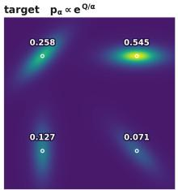

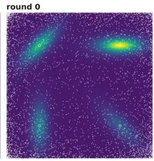

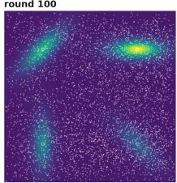

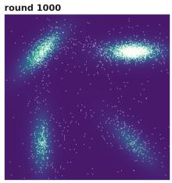

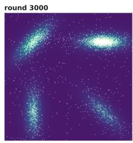

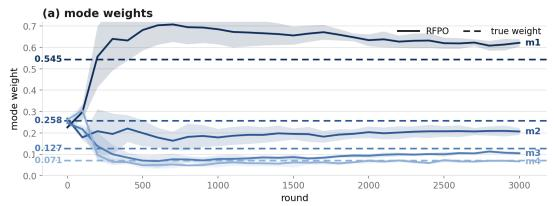

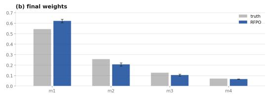  
Figure 4: RFPO on the anisotropic mixture target distribution.

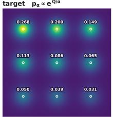

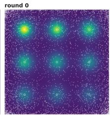

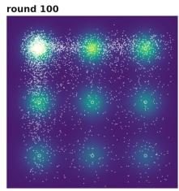

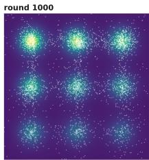

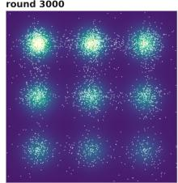

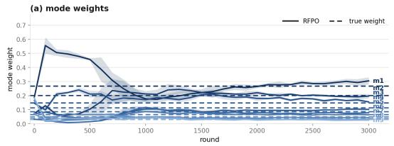

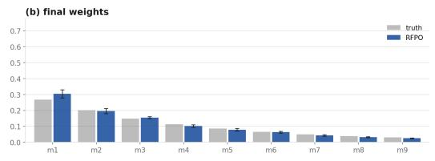  
Figure 5: RFPO on the grid mixture target distribution.

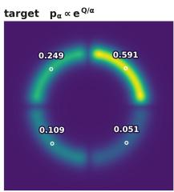

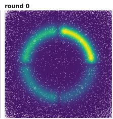

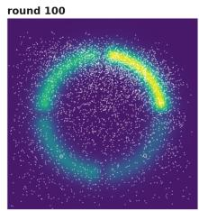

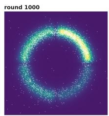

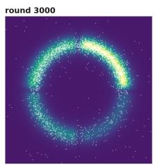

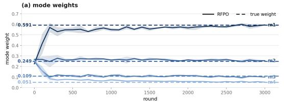

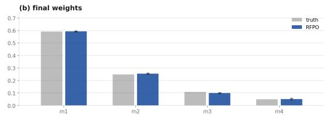  
Figure 6: RFPO on the moon-shaped target distribution.

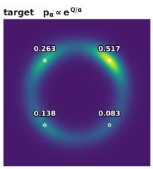

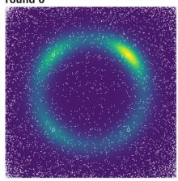

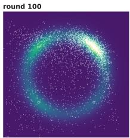

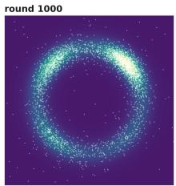

  
Figure 7: RFPO on the ring-shaped target distribution.

α = 0.15  

  
Figure 8: RFPO on the spiral-shaped target distribution.

  
Figure 9: RFPO on the general two-dimensional mixture target distribution.

## E PROOFS

In this section, we provide the definitions used in the proofs and present the proofs of the results in Section 5.

## E.1 DEFINITIONS

For a random variable X, let $\operatorname { L a w } ( X )$ denote its distribution, and let $B ( A )$ denote the Borel $\sigma \mathrm { - }$ algebra on ${ \mathcal { A } } .$

A Markov kernel on $\mathcal { A }$ is a map $P : \mathcal { A } \times \mathcal { B } ( \mathcal { A } )  [ 0 , 1 ]$ such that $P ( \boldsymbol { a } , \cdot )$ is a probability measure for every $a \in { \mathcal { A } } .$ and $a \mapsto P ( a , B )$ is measurable for every $B \in B ( { \cal { A } } )$ . For a probability measure π on A, let us define

$$
( \pi P ) ( B ) : = \int \pi ( d a ) P ( a , B ) .
$$

Let $\pi P ^ { K }$ denote the measure obtained by applying $P K$ times, and let us call π invariant for $P$ if $\pi P = \pi .$

For a fixed state $s ,$ let $M _ { \varepsilon }$ denote the kernel given by equations equation 10 and equation 11 together with the accept–reject rule, so that $M _ { s } ( a , \cdot )$ is the conditional distribution of $a ^ { ( k + 1 ) }$ given $a ^ { ( k ) } = a$ Thus, i $\tan ^ { ( 0 ) } \sim \pi .$ , then $a ^ { ( K ) } \sim \pi M _ { s } ^ { K }$ . The Metropolis–Hastings correction ensures that $p _ { \alpha } ( \cdot \mid s )$ is invariant for $M _ { s }$ (Roberts & Tweedie, 1996).

## E.2 INTEGRABILITY OF THE INTERPOLANT FIELD

Lemma E.1 (Integrability of the interpolant field). Fix a state s and let Assumption 5.1 hold. Then for each $t < 1$ the field $v ^ { \star } ( s , \cdot , t )$ is defined $p _ { t } ( \cdot \mid s )$ )-almost everywhere and satisfies

$$
\int \big \| v ^ { \star } ( s , x , t ) \big \| p _ { t } ( d x \mid s ) \leq \mathbb { E } \big \| a _ { 1 } ^ { \prime } - x _ { 0 } \big \| , \qquad \int \big \| v ^ { \star } ( s , x , t ) \big \| ^ { 2 } p _ { t } ( d x \mid s ) \leq \mathbb { E } \big \| a _ { 1 } ^ { \prime } - x _ { 0 } \big \| ^ { 2 } .
$$

Consequently

$$
\int _ { 0 } ^ { 1 } \int _ { } ^ { 1 } \int _ { } ^ { } \left\| v ^ { \star } ( s , x , t ) \right\| p _ { t } ( d x \mid s ) d t < \infty , \qquad \int _ { 0 } ^ { 1 } \int _ { } ^ { } \left\| v ^ { \star } ( s , x , t ) \right\| ^ { 2 } p _ { t } ( d x \mid s ) d t < \infty .
$$

Proof. Fix s and omit it from the notation, and let $t \ < \ 1$ . The field $v ^ { \star } ( \cdot , t )$ is a conditional expectation of $a _ { 1 } ^ { \prime } - x _ { 0 }$ given $a _ { t }$ , so it is determined up to a $p _ { t } \mathrm { - } \mathrm { n u l l }$ set, and we fix one such version throughout. Conditional Jensen’s inequality applied to the norm gives

$$
\int \Bigl \| v ^ { \star } ( x , t ) \Bigr \| p _ { t } ( d x ) = \mathbb { E } \Bigl \| \mathbb { E } \bigl [ a _ { 1 } ^ { \prime } - x _ { 0 } \big | a _ { t } \bigr ] \Bigr \| \leq \mathbb { E } \bigl \| a _ { 1 } ^ { \prime } - x _ { 0 } \bigr \| ,
$$

and the same argument applied to the squared norm gives the second bound. Both right-hand sides are finite because $x _ { 0 }$ is Gaussian and $\mathbb { E } \| a _ { 1 } ^ { \prime } \| ^ { 2 } < \infty$ by Assumption 5.1. Neither bound depends on t, so integrating over $t \in [ 0 , 1 ]$ preserves finiteness. □

## E.3 PROOF OF LEMMA 5.2

Proof. Fix s and omit it from the notation. Since $\mathcal { L } _ { \mathrm { S F M } }$ is the average over $s \sim \rho$ of the corresponding state-wise objective, it suffices to minimize the latter for each s. Let us define $Y : = a _ { 1 } ^ { \prime } - { \bar { x _ { 0 } } }$ and let $\Phi ^ { t }$ denote the map obtained by integrating $v ^ { \star }$ from time 0 to time t.

By Assumption 5.1 and the Gaussianity of $x _ { 0 }$ we have $\mathbb { E } \Vert Y \Vert ^ { 2 } \ < \ \infty ,$ and Lemma E.1 gives $\begin{array} { r } { \int _ { 0 } ^ { 1 } \int \| v ^ { \star } \| ^ { 2 } d p _ { t } d t \leq \mathbb { E } \| Y \| ^ { 2 } } \end{array}$ . These moment conditions are all that the marginal-preservation results for conditional flow matching under a general coupling of the source and the target require (Pooladian et al., $2 0 2 3 ,$ , Lemma $3 . 1 )$ , (Tong et al., 2024, Theorems 3.1 and 3.2). The pair $( x _ { 0 } , a _ { 1 } ^ { \prime } )$ is such a coupling of $\mathcal { N } ( 0 , I _ { d } )$ and $\mu _ { n } .$ , with $a _ { 1 } ^ { \prime }$ obtained from $x _ { 0 }$ through equation 9, equation 10, and equation 11. Applied to this coupling, those results give two facts. First, for any v with $\begin{array} { r } { \int _ { 0 } ^ { 1 } \int \| v \| ^ { 2 } d p _ { t } d t < \infty . } \end{array}$

$$
\mathbb { E } \big \| v ( a _ { t } , t ) - Y \big \| ^ { 2 } = \int _ { 0 } ^ { 1 } \int \big \| v - v ^ { \star } \big \| ^ { 2 } d p _ { t } d t + \mathbb { E } \big \| v ^ { \star } ( a _ { t } , t ) - Y \big \| ^ { 2 } ,
$$

since the cross term vanishes by the tower property of conditional expectation. The second term does not depend on $v , { \ s } 0 \ v ^ { \star }$ minimizes the objective and every minimizer agrees with $v ^ { \star }$ for $d t \otimes p _ { t ^ { - } }$ almost every $( t , x )$ . Second, $( p _ { t } ) _ { t \in [ 0 , 1 ) }$ is a weak solution of

$$
\partial _ { t } p _ { t } + \nabla \cdot \left( p _ { t } \boldsymbol { v } ^ { \star } \right) = 0 , \qquad p _ { 0 } = \mathcal { N } ( 0 , I _ { d } ) .
$$

The remainder of the proof is specific to our setting. Lemma 5.3 requires the flow map generated by $v ^ { \star }$ to exist and to reach $t = 1$ , and Assumption 5.1 is what makes this possible.

Fix $\tau \ < \ 1$ The family $( p _ { t } ) _ { t \leq \tau }$ is narrowly continuous, since $a _ { t }$ is continuous in t and dominated convergence applies to $\int f d p _ { t }$ for every bounded continuous $f .$ Lemma E.1 gives $\begin{array} { r } { \int _ { 0 } ^ { \tau } \int \| v ^ { \star } \| d p _ { t } d t < \infty } \end{array}$ , and Assumption 5.1 makes $v ^ { \star } ( \cdot , t )$ Lipschitz uniformly over $t \in [ 0 , \tau ]$ The field therefore satisfies the regularity and integrability conditions required by the representation theorem for the continuity equation (Ambrosio et al., 2005, Proposition 8.1.8). That theorem applies to $( p _ { t } ) _ { t \leq \tau }$ and shows that the characteristic equation $\dot { z } ( t ) = \dot { v } ^ { \star } ( z ( t ) , t )$ with $z ( 0 ) = x _ { 0 }$ admits a solution on all of $[ 0 , \tau ]$ for $\mathcal { N } ( 0 , I _ { d } )$ -almost every $x _ { 0 } .$ , and that $p _ { t }$ is the law of that solution. Since $\tau < 1$ is arbitrary,

$$
\operatorname { L a w } \bigl ( \Phi ^ { t } ( x _ { 0 } ) \bigr ) = p _ { t } , \qquad t < 1 .
$$

The identity above and Lemma E.1 give

$$
\mathbb { E } \int _ { 0 } ^ { 1 } \| \dot { z } ( t ) \| d t = \int _ { 0 } ^ { 1 } \int \| v ^ { \star } ( x , t ) \| p _ { t } ( d x ) d t < \infty ,
$$

so z admits an absolutely continuous extension to $[ 0 , 1 ]$ with probability one and $\Phi ^ { 1 } ( x _ { 0 } ) = $ lim $\mathbf { \rho } _ { 1 } { } _ { t  1 } \ : z ( t )$ exists with probability one. Therefore

$$
\operatorname { L a w } \bigl ( \Phi ^ { 1 } ( x _ { 0 } ) \bigr ) = \operatorname* { l i m } _ { t \to 1 } \operatorname { L a w } \bigl ( \Phi ^ { t } ( x _ { 0 } ) \bigr ) = \operatorname* { l i m } _ { t \to 1 } p _ { t } = \mu _ { n } ,
$$

where the limits are weak, the first holds because almost sure convergence implies convergence in distribution, the second is the identity above, and the third holds because $a _ { t }  a _ { 1 } ^ { \prime }$ with probability one. □

## E.4 PROOF OF LEMMA 5.3

Proof. Fix s and omit it from the notation. By equation $9 , a _ { 1 } = \Phi _ { \theta _ { n } } ( s , x _ { 0 } )$ with $x _ { 0 } \sim \mathcal { N } ( 0 , I _ { d } )$ , so $a _ { 1 } \sim \pi _ { n }$ . Since $a ^ { ( 0 ) } = a _ { 1 }$ and the refined action is $a _ { 1 } ^ { \prime } = a ^ { ( K ) }$ , Appendix E.1 gives

$$
\mu _ { n } = \pi _ { n } M _ { s } ^ { K } .
$$

Lemma 5.2 determines the minimizer only up to a dt ⊗ $p _ { t }$ -negligible set. This suffices here. Every nonempty open set receives positive mass under $p _ { t }$ for each $t < 1$ . To see this, let $\kappa _ { s } ( a , d a ^ { \prime } ) \stackrel { \cdot } { = }$ $q _ { \phi } ( a ^ { \prime } \bar { | } \bar { a } , s \bar { s } ) P _ { \mathrm { a c c } } ( a , a ^ { \prime } ; s ) \bar { d { a ^ { \prime } } }$ denote the sub-kernel corresponding to an accepted move, so that $M _ { s } \ge \kappa _ { s }$ and hence $M _ { s } ^ { K } \ge \kappa _ { s } ^ { K }$ . The density of $\kappa _ { s }$ is positive on all of $\mathbb { R } ^ { d } \times \mathbb { R } ^ { d }$ , since the proposal is Gaussian and $Q _ { \phi } ( s , \cdot )$ and $\nabla _ { a } Q _ { \phi } ( s , \cdot )$ are finite, and the K-fold density of $\kappa _ { s } ^ { K }$ is therefore positive as well. Conditioning on $x _ { 0 } = x$ fixes $a ^ { ( 0 ) } = \Phi _ { \theta _ { n } } ( s , x )$ , so the law of $a _ { 1 } ^ { \prime }$ given $x _ { 0 } = x$ dominates a measure with everywhere positive density. For $t \in ( 0 , 1 )$ the interpolant is an affine bijection of $a _ { 1 } ^ { \prime }$ at fixed $x ,$ , so the same holds for the law of $a _ { t }$ given $x _ { 0 } = x$ , and integrating over $x _ { 0 }$ preserves the property, while the case $t ~ = ~ 0$ is immediate from $p _ { 0 } ~ = ~ \mathcal { N } ( 0 , I _ { d } )$ . This argument rests on the structure of the refinement kernel rather than on any independence between $x _ { 0 }$ and $a _ { 1 } ^ { \prime }$ . Both $v _ { \theta _ { n + 1 } }$ and $v ^ { \star }$ are continuous on $\mathbb { R } ^ { d } \times [ 0 , 1 )$ , the former because it is a neural network and the latter by Assumption $5 . 1$ . Two continuous fields that agree dt $\otimes p _ { t }$ -almost everywhere therefore agree everywhere on $\mathbb { R } ^ { d } \times [ 0 , 1 )$ , so the exact inner solution gives $v _ { \theta _ { n + 1 } } = v ^ { \star }$ . Since the flow is integrated exactly, $\Phi _ { \theta _ { n + 1 } } ( s , x _ { 0 } ) = \Phi _ { v ^ { \star } } ( s , x _ { 0 } )$ . The learned field therefore inherits the regularity granted to $v ^ { \star }$ by Assumption 5.1, so no separate condition on it is required.

Therefore

$$
\pi _ { n + 1 } = \operatorname { L a w } \big ( \Phi _ { v ^ { \star } } ( s , x _ { 0 } ) \big ) = \mu _ { n } = \pi _ { n } M _ { s } ^ { K } .
$$

The second equality holds due to Lemma 5.2. Iterating this identity from $\pi _ { 0 }$ yields $\pi _ { n } = \pi _ { 0 } M _ { s } ^ { n K } .$

## E.5 PROOF OF THEOREM 5.4

Proof. Fix s and omit it from the notation. Let us first relate $\mathcal { I }$ to a divergence from the target. For any π with a density,

$$
\begin{array} { r l } {  { \operatorname { K L } \bigl ( \pi \| p _ { \alpha } \bigr ) = \int \pi ( a ) \log \frac { \pi ( a ) } { p _ { \alpha } ( a ) } d a } } \\ & { = - \mathcal { H } ( \pi ) - \frac { 1 } { \alpha } \mathbb { E } _ { a \sim \pi } \bigl [ Q _ { \phi } ( s , a ) \bigr ] + \log Z _ { \alpha } ( s ) } \\ & { = \log Z _ { \alpha } ( s ) - \frac { 1 } { \alpha } \mathcal { I } ( \pi ) , } \end{array}
$$

where the second equality substitutes the definition of $p _ { \alpha }$ and the third collects terms. The constant $Z _ { \alpha } ( s )$ is finite and positive by Assumption 5.1, so the identity is meaningful for every π that admits a density.

Assumption 5.1 makes $\operatorname { K L } ( \pi _ { 0 } \| p _ { \alpha } )$ finite, so $\pi _ { 0 } \ll p _ { \alpha }$ and $\pi _ { 0 }$ admits a density. The data-processing inequality below propagates finiteness to every $n ,$ and Lemma 5.3 then gives $\pi _ { n } \ll p _ { \alpha }$ for every $n ,$ so each $\pi _ { n }$ admits a density and the identity above applies to it. Rearranging that identity expresses $- { \mathcal { H } } ( \pi _ { n } )$ as a sum of finite terms, using ${ \mathbb E } _ { a \sim \pi _ { n } } [ | Q _ { \phi } ( s , a ) | ] <$ ∞ from Assumption 5.1, so $\mathcal { H } ( \pi _ { n } )$ and $\mathcal { I } ( \pi _ { n } \mid s )$ are finite for every n.

By Appendix E.1, $p _ { \alpha } M _ { s } = p _ { \alpha } ,$ and hence $p _ { \alpha } M _ { s } ^ { K } = p _ { \alpha }$ . Applying the data-processing inequality for the KL divergence to the kernel $M _ { s } ^ { K }$ gives

$$
\mathrm { K L } \bigl ( \pi _ { n } M _ { s } ^ { K } \parallel p _ { \alpha } M _ { s } ^ { K } \bigr ) \ \leq \ \mathrm { K L } \bigl ( \pi _ { n } \parallel p _ { \alpha } \bigr ) ,
$$

and Lemma 5.3 identifies the left-hand side with $\mathrm { K L } ( \pi _ { n + 1 } \| p _ { \alpha } )$ . Combining this with the identity above,

$$
\log Z _ { \alpha } ( s ) - { \frac { 1 } { \alpha } } { \mathcal { I } } ( \pi _ { n + 1 } ) \leq \log Z _ { \alpha } ( s ) - { \frac { 1 } { \alpha } } { \mathcal { I } } ( \pi _ { n } ) ,
$$

which rearranges to ${ \mathcal { I } } ( \pi _ { n + 1 } ) \geq { \mathcal { I } } ( \pi _ { n } )$ since $\alpha > 0$ . Neither step constrains η or $K .$ . If $\pi _ { n } =$ $\pi _ { n } M _ { s } ^ { K }$ , then $\pi _ { n + 1 } = \pi _ { n }$ by Lemma 5.3 and the two objectives coincide.

Finally, the identity above shows that maximizing $\mathcal { I }$ is equivalent to minimizing $\operatorname { K L } ( \pi \| p _ { \alpha } )$ , which is nonnegative and vanishes only at $\pi = p _ { \alpha }$ . Taking $\pi _ { n } = p _ { \alpha } \mathrm { g i v e s } \pi _ { n + 1 } = p _ { \alpha } M _ { s } ^ { K } = p _ { \alpha } , \mathrm { s o } p _ { \alpha }$ is a fixed point of the outer iteration. □

## E.6 BOUNDED ACTIONS

In the implementation of Appendix A the flow and the refinement act on the unconstrained variable $u \in \mathbb { R } ^ { d }$ , and the refinement kernel targets the induced density equation 17 on $\mathbb { R } ^ { d }$ . The results of Section 5 are read in these coordinates, with $a _ { 1 } , a _ { 1 } ^ { \prime }$ , and $p _ { \alpha }$ replaced by $u _ { 1 } , u _ { 1 } ^ { \prime }$ , and $p _ { \alpha } ^ { u }$ , and with the proposal drift given by the score equation 18 of the induced target. The proofs above apply without modification, since they use only the invariance of the refinement kernel under the Metropolis– Hastings correction and the behavior of the KL divergence under a Markov kernel. The requirement in Assumption 5.1 that the normalizing constant be finite is automatic here, because the log-Jacobian term in equation 17 decays exponentially while $Q _ { \phi }$ stays bounded along the transformed actions.

The following identifies the quantities appearing in Theorem 5.4 with their counterparts in the action space.

Proposition E.2 (The two sets of coordinates carry the same conclusions). Fix a state s and let T denote the transformation ofequation 15, a diffeomorphismfrom $\mathbb { R } ^ { d }$ onto the interior of the action set. Let $\pi ^ { u }$ be a distribution on $\mathbb { R } ^ { d }$ admitting a density, and let $\pi ^ { a }$ denote the distribution of $T ( u )$ $f o r u \sim \pi ^ { u }$ . Then

$$
\begin{array} { r } { \mathrm { K L } \big ( \pi ^ { u } \big \| p _ { \alpha } ^ { u } ( \cdot \vert s ) \big ) = \mathrm { K L } \big ( \pi ^ { a } \big \| p _ { \alpha } ( \cdot \vert s ) \big ) , \qquad \mathcal { T } ^ { u } \big ( \pi ^ { u } \mid s \big ) = \mathcal { I } \big ( \pi ^ { a } \mid s \big ) , } \end{array}
$$

where ${ \mathcal { I } } ^ { u }$ denotes the objective ofTheorem 5.4formedfrom $p _ { \alpha } ^ { u } ( \cdot \vert s )$

Proof. The density of $\pi ^ { a }$ at $T ( u )$ is $\pi ^ { u } ( u ) / |$ det $J _ { T } ( u ) |$ , and $p _ { \alpha } ^ { u }$ is related to $p _ { \alpha }$ in the same way by equation 16, so the two Jacobian factors cancel in the ratio and the change-of-variables formula for the integral gives the first identity. For the second, the same formula applied to the differential entropy gives $\mathcal { \bar { H } } ( \pi ^ { a } ) = \mathcal { H } ( \pi ^ { u } ) + \mathbb { E } _ { u \sim \pi ^ { u } }$ [log | det $J _ { T } ( u ) \vert _ { . }$ ], and the log-Jacobian contribution carried by $p _ { \alpha } ^ { u }$ cancels this term. The claim also follows from the first identity together with the relation between $\mathcal { I }$ and the KL divergence established in the proof of Theorem 5.4, since log $Z _ { \alpha } ( s )$ is the same constant in both coordinate systems. □

Theorem 5.4 therefore holds for the bounded-action implementation as a statement about the action distribution, and the bounded action is recovered as $T ( \bar { u } _ { 1 } ^ { \prime } )$