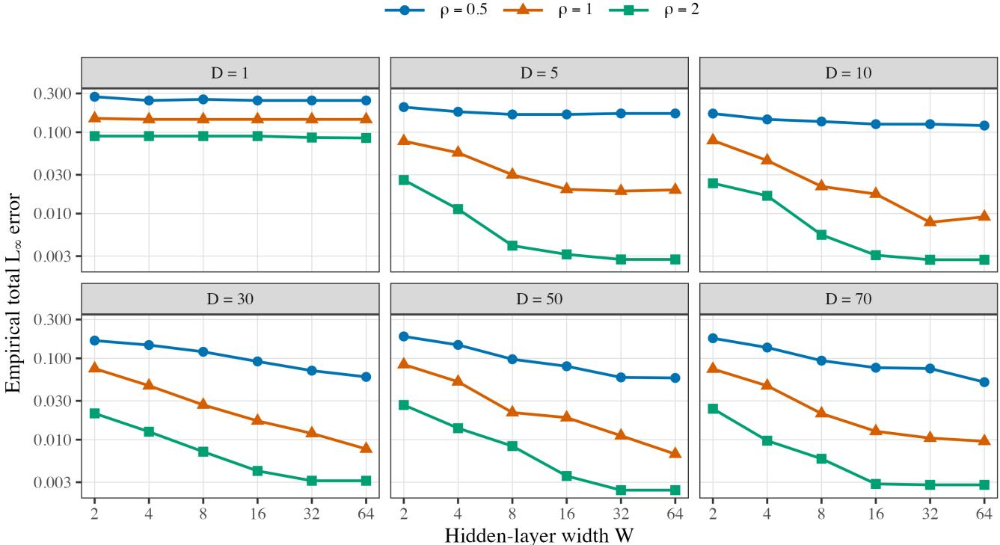

# ReLU Neural Network Approximation to Smooth Functional Operator: Dimensional Decay and Error Analysis

Shuhao Jiao 1

## Abstract

We study the uniform approximation of smooth scalar-valued functionals on an infinitedimensional separable Hilbert space by deep ReLU neural networks. Writing the functional input as $\begin{array} { r } { X ( t ) \ = \ \sum _ { d > 1 } \xi _ { d } \nu _ { d } ( t ) } \end{array}$ , we quantify the importance of coordinate d through $w _ { d } s _ { d } ,$ where $s _ { d }$ bounds the magnitude of the corresponding basis score and $w _ { d }$ controls the directional Frechet sensitivity of the target ´ functional. Our constructive analysis combines coordinate truncation, anisotropic partitioning, local Taylor approximation, and ReLU network realization, while allowing unrestricted interactions among the retained coordinates. We establish a general nonasymptotic upper bound for the uniform approximation error and a complementary pseudo-dimension-based lower bound for the worst-case approximation error. Under generalized exponential coordinate decay $w _ { d } s _ { d } \asymp \exp ( - c d ^ { \rho } )$ , with $\rho > 0$ , the upper and lower bounds match at the leading order and thus yield the nearly optimal approximation rate, which is stretched-exponential in the logarithm of the network budget. This is the first work to characterize neural network approximation error for infinite-dimensional functional inputs explicitly through the joint dimensional decay of coordinate magnitudes and directional sensitivities.

## 1. Introduction

The approximation of nonlinear functionals defined on infinite-dimensional spaces is a fundamental problem in functional data analysis. Neural network architectures for functional inputs have a relatively long history. Rossi & Conan-Guez (2005) extended multilayer perceptrons to functional inputs and established universal approximation and consistency results, while Rossi et al. (2005) investigated basis-based representations of functional observations for multilayer perceptrons and radial-basis-function networks. More recent studies have developed deep architectures that more explicitly preserve and exploit functional structure. Yao et al. (2021) introduced adaptive basis layers that learn task-dependent finite-dimensional representations, and Thind et al. (2023) incorporated functional input layers into densely connected neural networks. Rao & Reimherr (2023) proposed functional neural networks with continuous hidden layers and basis representations, whereas Rugamer¨ et al. (2024) extended semi-structured neural networks to functional covariates. From an approximation-theoretic perspective, Song et al. (2023) derived quantitative approximation rates for smooth functionals using deep ReLU networks, and Shi et al. (2025) developed a kernel-embedding-based functional deep neural network together with corresponding approximation guarantees. These developments demonstrate the growing potential of deep networks for learning nonlinear relationships from infinite-dimensional functional inputs.

Let $\mathcal { H } = L ^ { 2 } [ 0 , 1 ]$ denote the space of square-integrable functions on $[ 0 , 1 ]$ , and let $f _ { 0 } \colon \mathcal { H }  \mathbb { R }$ be an unknown scalarvalued functional. Given a fixed set of orthonormal basis functions $\{ \nu _ { d } ( t ) \colon d \geq 1 , t \in [ 0 , 1 ] \}$ of H, each $X ( t ) \in \mathcal { H }$ admits the representation $\begin{array} { r } { X ( t ) = \sum _ { d > 1 } \xi _ { d } \nu _ { d } ( t ) } \end{array}$ , where $\xi _ { d } ~ = ~ \langle X , \nu _ { d } \rangle$ . Although the input $X ( \hat { t } )$ is intrinsically infinite-dimensional, any implementable neural network can depend on only finitely many coordinates. Therefore, for some $D \in \mathbb { Z } _ { + } .$ , we approximate $f _ { 0 } ( X )$ by a ReLU neural network $f _ { \phi } ( \xi _ { 1 } , \dots , \xi _ { D } )$ based on the first D basis scores and study the resulting uniform approximation error over a prescribed functional input domain. Under a suitable choice of basis (e.g., functional principle components), the leading scores can provide a parsimonious representation of the dominant variation in the functional input. In contrast, pointwise measurements are typically highly correlated, depend on the observation grid, and do not yield an equally transparent characterization of coordinate importance and truncation error.

A central feature of this problem is that the basis coordinates generally contribute unequally to the target functional.

It is found that that, the effective contribution of the d-th coordinate is governed by directional sensitivity of $f _ { 0 }$ along $\nu _ { d } ( t )$ and the associated score magnitude. Coordinates with both large score magnitudes and strong directional sensitivities must be approximated accurately, whereas those with small score magnitudes or weak directional sensitivities can be truncated with limited loss. We consider a natural setting in which directional sensitivity decays with the coordinate index. Our objective is to characterize how this coordinate-decay structure, together with the smoothness of $f _ { 0 }$ and the network’s width–depth budget, determines the approximation power of deep ReLU neural networks.

There is a substantial literature on neural network approximation theory. For deep ReLU networks, Yarotsky (2017; 2018) derived quantitative upper and lower bounds for smooth and continuous functions, while Lu et al. (2021) established nearly optimal width–depth approximation rates using local Taylor expansions. Approximation guarantees under Sobolev and Besov regularity have been developed by Guhring et al. ¨ (2020) and Siegel (2023). Complementary results have characterized the roles of sparse connectivity, parameter encoding, and network depth (Bolcskei et al.¨ , 2019; Elbrachter et al.¨ , 2021; Yarotsky & Zhevnerchuk, 2020). For structured target functions, Petersen & Voigtlaender (2018) obtained optimal rates for piecewise smooth functions, Shen et al. (2019) studied approximation through compositional structures, and Shen et al. (2020) characterized approximation rates in terms of network width and depth. Although . We refer to DeVore et al. (2021) for a comprehensive review of neural network approximation theory.

However, existing approximation theory does not explicitly characterize how the decay rates in the input scores and the directional sensitivities of the target functional jointly affect network approximation. While Song et al. (2023) and Shi et al. (2025) study neural-network approximation of functional operators, they do not explicitly characterize how coordinate-wise decay of function scores and anisotropic directional sensitivities jointly affect approximation. Although a functional input is intrinsically infinitedimensional, its coordinates generally do not contribute equally. High-index coordinates often have smaller score magnitudes, and the target functional may be less sensitive to perturbations along these directions. If the d-th score is bounded by $s _ { d }$ and the corresponding directional sensitivity is measured by $w _ { d } ,$ then its effective contribution is governed by $w _ { d } s _ { d }$ . Consequently, only finitely many coordinates need to be retained to achieve a prescribed approximation accuracy, while the discarded coordinates contribute a truncation tail. Related coordinate-decay phenomena have been studied extensively in functional linear models; see, for example, Cai & Hall (2006) and Hall & Horowitz (2007). Those studies, however, primarily concern linear-functional estimation and do not address the approximation of nonlinear functionals by ReLU networks.

Learning from functional data poses a distinctive capacityallocation problem: any implementable neural predictor must compress an intrinsically infinite-dimensional input into a finite representation. Retaining too few coordinates causes information loss, whereas retaining too many requires a fixed network budget to be distributed across an increasingly high-dimensional input. We formalize this representation–capacity trade-off for general scalar-valued functionals on separable Hilbert spaces. Working directly with the basis coefficients of the functional input, we quantify the relevance of each coordinate through its magnitude and the directional Frechet sensitivity of the target func-´ tional. This yields a sensitivity-aware effective dimension determined jointly by the geometry of the functional input domain, the target functional, and the available network budget. We establish non-asymptotic upper bounds and complementary lower bounds for deep ReLU networks, thereby characterizing the best attainable representation error under a finite computational budget. These results provide theoretically justified scaling rules for selecting the input truncation dimension jointly with network width and depth. We further quantify the diminishing importance of high-order coordinates through a generalized exponential decay profile, a flexible and natural family that explicitly links the decay parameter to the effective dimension and approximation rate.

The remainder of the paper is organized as follows. Section 2 introduces the problem formulation, network construction, and assumptions on coordinate-wise score decay and anisotropic directional sensitivities. Section 3 develops the approximation error analysis for the proposed FNN class. Section 4 presents the numerical experiments, and Section 5 concludes the paper. Technical proofs are provided in the appendix.

## 2. Preliminaries

## 2.1. Basis Representation and Reparametrization

Let H be a separable Hilbert space, and assume that $X ( t ) \in$ H and $f _ { 0 } \colon \mathcal { H }  \mathbb { R }$ . Let $\{ \nu _ { d } ( t ) \} _ { d \ge 1 }$ be a fixed orthonormal basis of $\mathcal { H } ,$ and write $\begin{array} { r } { X ( t ) = \sum _ { d > 1 } \xi _ { d } \nu _ { d } ( t ) } \end{array}$ , where $\pmb { x } = ( \xi _ { 1 } , \xi _ { 2 } , \dots . )$ denotes the corresponding score sequence. Define the coordinate map ${ \mathcal { T } } \colon { \mathcal { H } } \to \ell ^ { 2 } , { \mathcal { T } } ( X ) = x$ Since T is one-to-one, the regression functional $f _ { 0 }$ admits a sequence-space representation: there exists a function $g _ { 0 } \colon \ell ^ { 2 } \ \to$ R such that $f _ { 0 } = g _ { 0 } \circ \mathcal { T }$ . Define $P _ { D } \colon { \mathcal { H } } \to$ span $\{ \nu _ { 1 } , \dots , \nu _ { D } \} \subset \mathcal { H }$ be the orthogonal projection operator, say $\textstyle P _ { D } X = \sum _ { d = 1 } ^ { D } \xi _ { d } \nu _ { d }$ , where $D \in \mathbb { N } \cup \{ \infty \}$ . To evaluate the directional sensitivity of $f _ { 0 }$ along different basis

directions, define

$$
\boldsymbol { w } _ { d } : = \operatorname* { m a x } _ { 1 \leq s \leq m } \left\{ \operatorname* { s u p } _ { X \in \mathcal { H } } \left. \mathcal { D } ^ { s } f _ { 0 } ( X ) [ \nu _ { d } , \ldots , \nu _ { d } ] \right. \right\} ^ { 1 / s } ,\tag{2.1}
$$

where ${ \mathcal { D } } ^ { s } f _ { 0 } ( X )$ denotes the s-th Frechet derivative of´ $f _ { 0 }$ at $X ( t )$ . Clearly, large $w _ { d }$ indicates that $f _ { 0 }$ varies more rapidly along the d-th basis direction, while small $w _ { d }$ indicates weaker sensitivity.

Remark 1. The power $1 / s$ in the definition (2.1) normalizes derivatives of different orders. To see this, consider a perturbation along the $d { \cdot } \mathrm { t h }$ basis direction, say $X + h _ { d } \nu _ { d } .$ . The Taylor expansion of $f _ { 0 }$ gives terms of the form $D ^ { s } f _ { 0 } ( X ) [ \nu _ { d } , \dots , \nu _ { d } ] h _ { d } ^ { s }$ . By the definition of $w _ { d } .$

$$
| D ^ { s } f _ { 0 } ( X ) [ \nu _ { d } , \ldots , \nu _ { d } ] | | h _ { d } | ^ { s } \leq ( w _ { d } | h _ { d } | ) ^ { s } .
$$

Thus $w _ { d }$ is the basic sensitivity scale paid each time the d-th direction appears in a Taylor expansion component. If $| h _ { d } | \leq s _ { d } .$ , the effective contribution of the d-th coordinate is therefore measured by $w _ { d } s _ { d }$ . This explains why the joint decay of the directional derivative scale $w _ { d }$ and the score envelope $s _ { d }$ governs the approximation error and the effective dimension.

We now introduce the following assumption.

Assumption 1. Assume that $f _ { 0 } \colon \mathcal { H } \to \mathbb { R }$ is m-times continuously Frechet differentiable on´ $\mathcal { H } .$

For $s = 1 , \ldots , m$ and $X ( t ) \in \mathcal { H }$ , let ${ \mathcal { D } } ^ { s } f _ { 0 } ( X ) [ h _ { 1 } , . . . , h _ { s } ]$ denote the s-th Frechet derivative of´ $f _ { 0 }$ at $X ( t )$ applied to the directions $h _ { 1 } , \ldots , h _ { s }$ . Let $\Omega \subset \ell ^ { 2 }$ denote the domain of the score vector x, and let ${ \mathcal { C } } ^ { m } ( \Omega )$ denote the class of functions on Ω with continuous partial derivatives up to order $m$ . To relate the Frechet derivatives of ´ $f _ { 0 }$ on $\mathcal { H }$ to the coordinate derivatives of its score representation, we introduce the following proposition.

Proposition 1. Let $\mathcal { L } \colon \mathcal { H } \to \ell ^ { 2 }$ be a bounded linear operator, and let $g \colon \ell ^ { 2 } \to$ R be m-times Frechet differentiable´ on an open set containing ${ \mathcal { L } } X$ for any $X ( t ) \in { \mathcal { H } }$ . Define $f = g \circ { \mathcal { L } } .$ , then f is m-times Frechet differentiable. Then´ for $s = 1 , \ldots , m ,$ , and $h _ { 1 } , \ldots , h _ { s } \in \mathcal { H }$

$$
\mathscr { D } ^ { s } f ( X ) [ h _ { 1 } , \dots , h _ { s } ] = \mathscr { D } ^ { s } g ( L X ) [ L h _ { 1 } , \dots , L h _ { s } ] .
$$

In particular, if ${ \mathcal { L } } ~ = ~ { \mathcal { T } } \circ P _ { D }$ , it follows that $\begin{array} { r l } { { \mathcal { L } } X } & { { } = } \end{array}$ $( \xi _ { 1 } , \ldots , \xi _ { D } , 0 , 0 , \ldots ) ^ { \top }$ , and

$$
\begin{array} { l } { \displaystyle \mathcal { D } ^ { s } f ( X ) [ h _ { 1 } , \dots , h _ { s } ] = \sum _ { \tiny d _ { 1 } , \dots , d _ { s } = 1 } ^ { D } \frac { \partial ^ { s } g } { \partial \xi _ { d _ { 1 } } \cdot \cdot \cdot \partial \xi _ { d _ { s } } } ( \mathcal { L } X ) } \\ { \displaystyle \qquad \times \prod _ { j = 1 } ^ { s } \langle h _ { j } , \nu _ { d _ { j } } \rangle . } \end{array}
$$

Consequently, taking $h _ { j } = \nu _ { d _ { j } ^ { \prime } }$ for $j = 1 , \dots , s$ , where $d _ { j } ^ { \prime } \in \{ 1 , \ldots , D \}$ , yields

$$
\mathcal { D } ^ { s } f ( X ) [ \nu _ { d _ { 1 } ^ { \prime } } , \dots , \nu _ { d _ { s } ^ { \prime } } ] = \frac { \partial ^ { s } g } { \partial \xi _ { d _ { 1 } ^ { \prime } } \cdot \cdot \cdot \partial \xi _ { d _ { s } ^ { \prime } } } ( \mathcal { L } X ) .
$$

Proposition 1 shows that directional Frechet derivatives of´ $f _ { 0 }$ along the basis $\{ \nu _ { d } \}$ coincide with coordinatewise partial derivatives of $g _ { 0 }$ in the corresponding score representation. This representation is the key device that allows us to transfer directional sensitivity of regression functional into a form amenable to deep network approximation.

## 2.2. Network Construction

A major practical challenge is that a functional input $X ( t ) \in$ H is infinite-dimensional, whereas any implementable neural network must take a finite-dimensional vector as input. To bridge this gap, we employ truncation. For a truncation level $D \in  { \mathbb { N } } _ { + }$ , we approximate $X ( t )$ by its projection $\textstyle P _ { D } X = \sum _ { d = 1 } ^ { D } \xi _ { d } \nu _ { d }$ , and use the truncated score vector $\pmb { x } ^ { ( D ) } : = ( \overline { { \xi _ { 1 } } } , \ldots , \xi _ { D } )$ as the network input. We consider functions $f _ { \phi } \colon  { \mathbb { R } ^ { D } } \to  { \mathbb { R } }$ , parameterized by ϕ, belonging to a class ${ \mathcal { F } } _ { M , W , S }$ of feedforward neural networks with depth $M ,$ width $W ,$ , and size S. We adopt the standard multilayer perceptron (MLP) architecture, where $f _ { \phi }$ is expressed as a composition of affine transformations and nonlinear activation functions:

$$
f _ { \phi } ( \pmb { x } ^ { ( D ) } ) = \mathcal { L } _ { M } \circ \rho \circ \mathcal { L } _ { M - 1 } \circ \cdot \cdot \circ \rho \circ \mathcal { L } _ { 1 } \circ \rho \circ \mathcal { L } _ { 0 } ( \pmb { x } ^ { ( D ) } ) .
$$

where $\rho ( x ) = \operatorname* { m a x } \{ 0 , x \}$ is the ReLU activation function applied componentwise, and each affine map is of the form $\mathcal { L } _ { i } ( x ) = W _ { i } x + b _ { i } , i = 0 , 1 , \ldots , M$ . Here $W _ { i } \in \mathbb { R } ^ { p _ { i + 1 } \times p _ { i } }$ $x \in \mathbb { R } ^ { p _ { i } }$ and $b _ { i } ~ \in ~ \mathbb { R } ^ { p _ { i + 1 } }$ , with $\left( p _ { 0 } , p _ { 1 } , \dots , p _ { M } , p _ { M + 1 } \right)$ denoting the widths of each layer, where $p _ { 0 } ~ = ~ D$ and $p _ { M + 1 } = 1$

## 3. Error Analysis

## 3.1. Coordinatewise decay

To obtain error bounds, we need to quantify how much each basis coordinate contributes to the regression functional. This contribution is determined by two quantities: the size of the corresponding score and the sensitivity of the regression functional along that basis direction. Coordinates with small scores or weak directional sensitivity can be truncated with little loss, whereas coordinates with large values of both quantities must be retained by the network. The next assumption formalizes this joint coordinate-wise control through the score envelopes $\{ s _ { d } \colon d \geq 1 \}$ and the directional sensitivity weights $\{ w _ { d } \colon d \geq 1 \}$

Assumption 2. There exists a constant $C _ { 0 } \geq 1$ and nonincreasing sequence $\{ w _ { d } \} , \{ s _ { d } \}$ such that, for every finite multi-index ${ \pmb { \alpha } } = ( \alpha _ { 1 } , \alpha _ { 2 } , . . . )$ with $\begin{array} { r } { 1 \leq \| \pmb { \alpha } \| _ { 1 } \leq m , } \end{array}$ $\begin{array} { r } { \operatorname* { s u p } _ { \pmb { x } \in \Omega } | \partial ^ { \pmb { \alpha } } g _ { 0 } ( \pmb { x } ) | \leq C _ { 0 } \prod _ { d \geq 1 } w _ { d } ^ { \alpha _ { d } } } \end{array}$ . In addition, $| \xi _ { d } | \le$ $s _ { d } , d \geq 1$

As $w _ { d } \to 0$ , the regression functional becomes progressively less sensitive to higher-index basis directions. The next proposition shows that the directional-derivative decay condition in Assumption 2 is implied by product-type decay of higher-order interaction coefficients, thereby providing a concrete structural justification for this assumption. ${ \bf A } { \bf s } -$ sumption 2 holds for many regression function in statistical models, such as functional single-index model Chen et al. (2011), functional additive model Muller & Yao¨ (2008), and functional quadratic regression model Yao & Muller¨ (2010).

Proposition 2. Let $p \geq 1$ be fixed and consider the p-th order interaction model

$$
\begin{array} { l } { { f _ { 0 } ( X ) = G \left( Q _ { p } ( X ) \right) , \qquad \xi _ { d } = \langle X , \nu _ { d } \rangle , } } \\ { { Q _ { p } ( X ) = \displaystyle \sum _ { 1 \leq j _ { 1 } \leq \cdots \leq j _ { p } } \eta _ { j _ { 1 } , \dots , j _ { p } } \prod _ { \ell = 1 } ^ { p } \xi _ { j _ { \ell } } . } } \end{array}
$$

Assume that G has bounded derivatives up to order m, that $\textstyle \sum _ { d > 1 } w _ { d } s _ { d } < \infty$ , and that the interaction coefficients satisfy the product-type decay condition

$$
| \eta _ { j _ { 1 } , \dots , j _ { p } } | \lesssim \prod _ { \ell = 1 } ^ { p } w _ { j _ { \ell } } , \qquad 1 \leq j _ { 1 } \leq \dots \leq j _ { p } .\tag{3.1}
$$

Then, for every $1 \leq s \leq$ m and every $d _ { 1 } , \ldots , d _ { s } \geq 1$

$$
\vert \mathcal { D } ^ { s } f _ { 0 } ( X ) [ \nu _ { d _ { 1 } } , \ldots , \nu _ { d _ { s } } ] \vert \lesssim \prod _ { \ell = 1 } ^ { s } w _ { d _ { \ell } } .
$$

The product-type condition (3.1) can be viewed as a higherorder analogue of coefficient decay in functional linear regression (see e.g., Cai & Hall (2006)). Indeed, when $p = 1$ the interaction index reduces to the linear form $Q _ { 1 } ( X ) =$ $\textstyle \sum _ { j \geq 1 } \eta _ { j } \xi _ { j } .$ and the condition becomes $| \eta _ { j } | \lesssim w _ { j }$ . Thus $w _ { j }$ plays the role of the coordinate-wise coefficient scale. For $p \geq 2$ , the same principle requires interactions involving weak directions to be small: if any participating coordinate has a small sensitivity scale, then the corresponding higherorder interaction coefficient is also small. This is reasonable because an interaction term should not exert a pronounced effect if it involves a basis direction whose individual contribution is already weak.

## 3.2. Approximation framework

The network construction follows the local Taylor approximation framework for ReLU networks (see e.g., Lu et al. (2021)). The basic idea is to partition the input domain into small cells, approximate the local Taylor expansion on each cell, fit the Taylor coefficient maps on the resulting discrete grid, and then approximate the monomial terms appearing in the Taylor expansion by product networks. In the present functional setting, this construction must be adapted to the anisotropic sequence domain Ω.

For $D \ \geq \ 1$ , define the projected regression functional $f _ { 0 } ^ { ( D ) } : = f _ { 0 } \circ P _ { D } , \ f _ { 0 } ^ { ( D ) } ( X ) \ = \ f _ { 0 } ( P _ { D } X )$ . Since $P _ { D }$ is a bounded linear operator, Proposition 1 implies that, for $s = 1 , \ldots , m$

$$
\begin{array} { r l } & { \mathcal { D } ^ { s } f _ { 0 } ^ { ( D ) } ( X ) [ h _ { 1 } , \dots , h _ { s } ] } \\ & { \qquad = \mathcal { D } ^ { s } f _ { 0 } ( P _ { D } X ) [ P _ { D } h _ { 1 } , \dots , P _ { D } h _ { s } ] . } \end{array}
$$

Consequently, $\mathcal { D } ^ { s } f _ { 0 } ^ { ( D ) } ( X ) [ \nu _ { d _ { 1 } } , \dots , \nu _ { d _ { s } } ] = 0$ whenever at least one of $d _ { 1 } , \ldots , d _ { s }$ is greater than D. The Taylor expansion of the projected functional $f _ { 0 } ^ { ( D ) }$ at $X _ { 0 }$ is

$$
\begin{array} { r l r } {  { f _ { 0 } ^ { ( D ) } ( X ) = f _ { 0 } ^ { ( D ) } ( X _ { 0 } ) + \sum _ { s = 1 } ^ { m - 1 } \frac { 1 } { s ! } \sum _ { d _ { 1 } , \dots , d _ { s } = 1 } ^ { D } \mathcal { D } ^ { s } f _ { 0 } ( P _ { D } X _ { 0 } ) } } \\ & { } & { \times [ \nu _ { d _ { 1 } } , \dots , \nu _ { d _ { s } } ] \prod _ { j = 1 } ^ { s } \xi _ { h , d _ { j } } + R _ { m , D } ( X , X _ { 0 } ) , } \end{array}
$$

where

$$
\begin{array} { c } { { R _ { m , D } ( X , X _ { 0 } ) = \displaystyle \frac { 1 } { ( m - 1 ) ! } \int _ { 0 } ^ { 1 } ( 1 - \tau ) ^ { m - 1 } } } \\ { { \times \mathcal { D } ^ { m } f _ { 0 } ( P _ { D } X _ { 0 } + \tau h _ { D } ) [ h _ { D } , \dots , h _ { D } ] d \tau . } } \end{array}
$$

To approximate the original functional $f _ { 0 } ,$ , we use the decomposition $f _ { 0 } ( X ) = f _ { 0 } ^ { ( D ) } ( X ) + \Delta _ { D } ( X )$ . Under Assumption 2, the projection error satisfies

$$
\begin{array} { r l r } {  { | \Delta _ { D } ( X ) | = | \int _ { 0 } ^ { 1 } \mathcal { D } f _ { 0 } \bigl ( P _ { D } X + \tau ( I - P _ { D } ) X \bigr )  } } \\ & { } & \\ & { } & {  [ ( I - P _ { D } ) X ] d \tau | } \\ & { } & { \leq C _ { 0 } \sum _ { d \geq D } w _ { d } | \xi _ { d } | \leq C _ { 0 } \sum _ { d \geq D } w _ { d } s _ { d } . } \end{array}
$$

Thus, the approximation of $f _ { 0 }$ consists of a finitedimensional network approximation error for $f _ { 0 } ^ { ( D ) }$ and a projection error arising from the discarded coordinates. The goal here is to approximate the above Taylor expansion up to order $m - 1$ through the following steps:

1. For a non-increasing sequence $\lbrace L _ { d } \colon d \ \geq \ 1 \rbrace$ , define $D _ { 0 } \ : = \ \operatorname* { m a x } \{ d \colon L _ { d } \ \geq \ 1 \}$ , and let $D ~ \geq ~ D _ { 0 }$ denote the dimension of the input scores. Partition $\Omega _ { D _ { 0 } } : = [ - s _ { 1 } , s _ { 1 } ] \times \cdot \cdot \cdot \times [ - s _ { D _ { 0 } } , s _ { D _ { 0 } } ]$ along its first D coordinates. Let $\delta _ { d } \in ( 0 , 2 s _ { d } / L _ { d } )$ , put $a _ { d , i } : =$ $- s _ { d } + 2 s _ { d } i / L _ { d } .$ and construct the trifling region

$$
\begin{array} { r l r } & { } & { \mathcal { R } ( \Omega _ { D _ { 0 } } , { \pmb { L } } , { \pmb { \delta } } ) = \bigcup _ { d = 1 } ^ { D _ { 0 } } \Bigg \{ { \pmb { \xi } } \in \Omega _ { D _ { 0 } } \colon } \\ & { } & { \xi _ { d } \in \bigcup _ { i = 1 } ^ { D _ { d } - 1 } \big ( a _ { d , i } - \delta _ { d } , a _ { d , i } \big ) \Bigg \} . } \end{array}
$$

We denote the resulting cells in $\Omega _ { D _ { 0 } } \backslash \mathcal { R } ( \Omega _ { D _ { 0 } } , L , \delta )$ by $P _ { \pmb { \theta } }$ , where $\theta _ { d } \in \{ 0 , 1 , \ldots , L _ { d } - 1 \}$ . Then construct a neural network $\psi$ that approximately maps each $\pmb { x } ^ { ( D _ { 0 } ) } \in P _ { \pmb { \theta } }$ to

$$
\left( - s _ { 1 } + \frac { 2 s _ { 1 } \theta _ { 1 } } { L _ { 1 } } , \ldots , - s _ { D _ { 0 } } + \frac { 2 s _ { D _ { 0 } } \theta _ { D _ { 0 } } } { L _ { D _ { 0 } } } \right) .\tag{3.2}
$$

Thus, only the first $D _ { 0 }$ coordinates are partitioned, and the number of cells is $\prod _ { d = 1 } ^ { D _ { 0 } } L _ { d } .$

The decrease in $L _ { d }$ reflects the heterogeneous importance of the coordinate directions. The quantity $L _ { d }$ is the number of subintervals assigned to the d-th coordinate. Since the range of this coordinate has length $2 s _ { d }$ , its cell width is of order $s _ { d } / L _ { d }$ . Under the directional derivative bound, a perturbation of this magnitude changes the target functional by at most a constant multiple of ${ w _ { d } s _ { d } } / L _ { d }$ . Consequently, coordinates with larger $w _ { d } s _ { d }$ require finer partitions.

2. For each cell $P _ { \pmb { \theta } } ^ { ( D _ { 0 } ) }$ , define

$$
\begin{array} { l } { { \displaystyle { P _ { \theta } ^ { ( D ) } : = P _ { \theta } ^ { ( D _ { 0 } ) } \times \prod _ { d = D _ { 0 } + 1 } ^ { D } [ - s _ { d } , s _ { d } ] } , } } \\ { { \displaystyle { X _ { \theta } ( t ) : = \sum _ { d = 1 } ^ { D _ { 0 } } \left( - s _ { d } + \frac { 2 s _ { d } \theta _ { d } } { L _ { d } } \right) \nu _ { d } ( t ) } . } } \end{array}
$$

Thus, $\pmb { x } ^ { ( D ) } \in \mathcal { P } _ { \pmb { \theta } } ^ { ( D ) }$ if and only if its first $D _ { 0 }$ coordinates $\mathbf { \nabla } \mathbf { x } ^ { ( D _ { 0 } ) } = ( \xi _ { 1 } , \ldots , \xi _ { D _ { 0 } } )$ belong to $P _ { \pmb { \theta } } ^ { ( D _ { 0 } ) }$ the remaining coordinates $\left( \xi _ { D _ { 0 } + 1 } , \hdots , \xi _ { D } \right)$ do not determine the cell index θ. For $s ~ = ~ 1 , \ldots , m - 1$ and $\pmb { d } = ( d _ { 1 } , \ldots , d _ { s } ) \in \{ 1 , \ldots , D \} ^ { s }$ , define the piecewise-constant Taylor coefficient map by

$$
\begin{array} { r l r } {  { \mathcal { Q } _ { d } ^ { ( s ) } ( { \pmb x } ^ { ( D ) } ) : = \sum _ { \pmb { \theta } } \mathcal { D } ^ { s } f _ { 0 } ^ { ( D ) } ( X _ { \pmb { \theta } } ) } } \\ & { } & { \ [ \nu _ { d _ { 1 } } , \ldots , \nu _ { d _ { s } } ] \mathbf { 1 } _ { P _ { \pmb { \theta } } ^ { ( D _ { 0 } ) } } ( { \pmb x } ^ { ( D _ { 0 } ) } ) . } \end{array}
$$

for $\pmb { x } ^ { ( D ) } \in \bigcup _ { \pmb { \theta } } P _ { \pmb { \theta } } ^ { ( D ) }$ . Since $X _ { \pmb { \theta } } \in \operatorname { s p a n } \{ \nu _ { 1 } , \dots , \nu _ { D _ { 0 } } \}$ and $d _ { 1 } , \dots , d _ { s } \ \leq \ D , \ \mathcal { D } ^ { s } f _ { 0 } ^ { ( D ) } ( X _ { \pmb \theta } ) [ \nu _ { d _ { 1 } } , \dots , \nu _ { d _ { s } } ] \ =$ $\mathcal { D } ^ { s } f _ { 0 } ( X _ { \pmb { \theta } } ) [ \nu _ { d _ { 1 } } , \dots , \nu _ { d _ { s } } ]$ . In particular, if $\pmb { x } ^ { ( D _ { 0 } ) } \in$ $P _ { \pmb { \theta } } ^ { ( D _ { 0 } ) }$ , then

$$
\begin{array} { r l } & { \mathcal { Q } _ { d } ^ { ( s ) } \left( \xi _ { 1 } , \ldots , \xi _ { D _ { 0 } } , \xi _ { D _ { 0 } + 1 } , \ldots , \xi _ { D } \right) } \\ & { = \mathcal { Q } _ { d } ^ { ( s ) } ( \xi _ { 1 } , \ldots , \xi _ { D _ { 0 } } , 0 , \ldots , 0 ) } \\ & { = \mathcal { D } ^ { s } f _ { 0 } ( X _ { \pmb { \theta } } ) [ \nu _ { d _ { 1 } } , \ldots , \nu _ { d _ { s } } ] . } \end{array}
$$

We then construct a network $\phi _ { \pmb { \alpha } } ( \pmb { x } ^ { ( D ) } )$ to approximate $\mathcal { Q } _ { d } ^ { ( s ) } ( \pmb { x } ^ { ( D ) } )$ through point fitting, where α indicates the multi-index and $\| { \boldsymbol { \alpha } } \| _ { 1 } = s$ . For each fixed d, the coefficient map has only $\prod _ { d = 1 } ^ { D _ { 0 } } L _ { d }$ distinct values, one for each $D _ { 0 } .$ -dimensional cell (3.2).

3. For $\pmb { x } ^ { ( D _ { 0 } ) } \in P _ { \pmb { \theta } }$ , write

$$
\xi _ { h _ { \theta } , d } : = \left\{ \begin{array} { l l } { \displaystyle \xi _ { d } + s _ { d } - \frac { 2 s _ { d } \theta _ { d } } { L _ { d } } , } & { d \leq D _ { 0 } , } \\ { \displaystyle \xi _ { d } , } & { D _ { 0 } < d \leq D . } \end{array} \right.
$$

For $\pmb { d } = ( d _ { 1 } , \dots , d _ { s } ) \in \{ 1 , \dots , D \} ^ { s }$ , construct a network $P _ { \alpha } ( \cdot )$ that approximates the monomial

$$
\prod _ { j = 1 } ^ { s } \xi _ { h _ { \theta } , d _ { j } } = \prod _ { d = 1 } ^ { D _ { 0 } } \left\{ \xi _ { d } - \psi _ { d } ( { \pmb x } ^ { ( D _ { 0 } ) } ) \right\} ^ { \alpha _ { d } } \prod _ { d = D _ { 0 } + 1 } ^ { D } \xi _ { d } ^ { \alpha _ { d } } .
$$

In particular, we first construct a network $\phi _ { \times }$ that approximates the scalar product map $( x , y ) \mapsto x y$ , and then compose copies of $\phi _ { \times }$ to approximate the required monomials.

Then the neural network construction can be written as

$$
\begin{array} { c } { \displaystyle { \phi \big ( { \pmb x } ^ { ( D ) } \big ) = \sum _ { \| { \pmb \alpha } \| _ { 1 } \leq m - 1 } \phi _ { \times } \bigg ( \frac { \phi _ { \pmb \alpha } \big ( { \pmb x } ^ { ( D ) } \big ) } { \pmb \alpha ! } , } } \\ { \displaystyle { P _ { \pmb \alpha } \left( { \pmb x } ^ { ( D _ { 0 } ) } - \psi ( { \pmb x } ^ { ( D _ { 0 } ) } ) , \xi _ { D _ { 0 } + 1 } , \dots , \xi _ { D } \right) \bigg ) , } } \end{array}
$$

where $\begin{array} { r } { \pmb { \alpha } = ( \alpha _ { 1 } , \ldots , \alpha _ { D } ) , \pmb { \alpha } ! : = \prod _ { d = 1 } ^ { D } \alpha _ { d } ! . } \end{array}$

Fix integers D define the finite-dimensional slice $\Omega _ { D } : =$ $\Pi _ { d = 1 } ^ { D } [ - s _ { d } , s _ { d } ]$ Let $\begin{array} { r c l } { \pmb { w } } & { \ = } & { \left( w _ { 1 } , \ldots , w _ { D } \right) } \end{array}$ , and let $\mathcal { C } ^ { m } ( \Omega _ { D } , { \pmb w } )$ be the class of functions with continuous partial derivatives up to order m satisfying

$$
\| \partial ^ { \boldsymbol { \alpha } } g \| _ { L ^ { \infty } ( \Omega _ { D } ) } \leq C _ { 0 } \prod _ { d = 1 } ^ { D } w _ { d } ^ { \boldsymbol { \alpha } _ { d } }
$$

for every multi-index ${ \pmb { \alpha } } \in \mathbb { N } _ { 0 } ^ { D }$ with $1 \leq \| \pmb { \alpha } \| _ { 1 } \leq m$ . The following proposition gives an upper bound for the approximation error of the resulting network on $\Omega _ { D }$

In the sequel, let $a _ { n } \asymp b _ { n }$ denote $C ^ { - 1 } b _ { n } < a _ { n } \leq C b _ { n }$ for some $C > 1 , a _ { n } \lesssim b _ { n }$ denote $a _ { n } \leq C b _ { n }$ for some $C > 0 .$ and $a _ { n } \gtrsim b _ { n }$ denote $a _ { n } \geq C b _ { n }$ for some $C > 0$ , where $^ { 6 6 } C ^ { 9 }$ denotes a generic positive constant. Let

$$
H ( D ) : = \sum _ { d > D } w _ { d } s _ { d } , \qquad \Psi ( D ) : = \sum _ { d = 1 } ^ { D } \log \{ ( w _ { d } s _ { d } ) ^ { - 1 } \} ,
$$

then we introduce the following results on approximation error.

Theorem 1. Suppose that Assumption 1 and 2 hold. For $W _ { \phi } , M _ { \phi } \in \mathbb { Z } _ { + } , \operatorname { l e t } \mathcal { A } = W _ { \phi } M _ { \phi }$ and

$$
D _ { 0 } = \operatorname* { m a x } _ { d } \left\{ w _ { d } s _ { d } \exp \left[ \frac { \log \mathcal { A } ^ { 2 } + \Psi ( d ) } { d } \right] \geq 2 \right\} .
$$

Suppose that D satisfies $\begin{array} { r c l } { H ( D ) } & { \asymp } & { H ( D _ { 0 } ) ^ { m } } \end{array}$ Then there exists a ReLU network class $\mathcal { F }$ with input dimension $D ,$ size $S ,$ width $W ,$ , and depth M satisfying $S \ \lesssim$ $3 ^ { D _ { 0 } } \{ D ^ { m - 1 } W _ { \phi } ^ { 2 } M _ { \phi } + 1 \} , W \lesssim 3 ^ { { \bar { D _ { 0 } } } } \{ D ^ { m - 1 } W _ { \phi } + \bar { 1 } \}$ , and $M \lesssim M _ { \phi } + 2 \dot { D } _ { 0 } ,$ such that

$$
\begin{array} { r } { \underset { f _ { 0 } \in \mathcal C ^ { m } ( \Omega , w ) } { \operatorname* { s u p } } \underset { \phi \in \mathcal F } { \operatorname* { i n f } } \| \phi - f _ { 0 } \| _ { L ^ { \infty } ( \Omega ) } } \\ { \lesssim D _ { 0 } ^ { m } \exp \left[ - \cfrac { m } { D _ { 0 } } \{ \log \mathcal { A } ^ { 2 } + \Psi ( D _ { 0 } ) \} \right] . } \end{array}
$$

Theorem 1 gives the approximation bound

$$
D _ { 0 } ^ { m } \exp \left[ - \frac { m } { D _ { 0 } } \{ \log \mathcal { A } ^ { 2 } + \Psi ( D _ { 0 } ) \} \right] .
$$

We refer to $D _ { 0 }$ as the effective dimension, as it quantifies the number of input coordinates that can be retained in the network approximation under a given network budget. Ignoring the polynomial prefactor $D _ { 0 } ^ { m }$ , the leading exponential term in Theorem 1 can be written as $\exp \{ - m \varphi ( \log \mathcal { A } ^ { 2 } ) \}$ , where $\varphi ( t ) = \{ t + \Psi ( D _ { 0 } ( A ) ) \} / D _ { 0 } ( A )$ . To determine whether the resulting approximation rate can be polynomial in the network budget, it is useful to compare $\varphi ( t )$ with $t = \log \mathcal { A } ^ { 2 }$ By definition, $\varphi ( t ) / t = 1 / D _ { 0 } ( A ) + \Psi ( \dot { D _ { 0 } } ( A ) ) / \{ t D _ { 0 } ( A ) \}$ Thus, when the effective dimension $D _ { 0 } ( \mathcal { A } )$ diverges and the cumulative coordinate-decay term $\Psi ( D _ { 0 } ( { \mathcal { A } } ) )$ grows more slowly than $t D _ { 0 } ( { \cal A } )$ , the exponent satisfies $\varphi ( t ) = o ( t )$ and then the approximation error decay in a subpolynomial rate.

Intuitively, as more coordinates must be retained, the available network budget is distributed over an expanding input space, preventing the leading exponent from being of order t and the polynomial rate cannot be achieved. The generalized exponential decay regime $( 3 . 3 )$ verifies these properties explicitly. In this case, $\bar { D } _ { 0 } ( { \cal A } ) \asymp t ^ { 1 / ( \rho + 1 ) } \to \infty$ and $\Psi ( D _ { 0 } ( \cal { A } ) ) \asymp D _ { 0 } ( \cal { A } ) ^ { \rho + 1 } \asymp t .$ Consequently, $\varphi ( t ) \asymp$ $t / D _ { 0 } ( { \cal { A } } ) \asymp t ^ { \rho / ( \rho + 1 ) } = o ( t )$ Therefore, up to polynomial factors in $D _ { 0 } ( \mathcal { A } )$ , the leading approximation profile is sub-polynomial in $\mathcal { A } ^ { 2 }$ . In particular, for every $\alpha > 0$ $\exp \{ - \bar { c } \varphi ( \log \mathcal { A } ^ { 2 } ) \} \gg ( \mathcal { A } ^ { 2 } ) ^ { - \alpha } \mathrm { ~ a s ~ } \mathcal { A } ^ { 2 }$ is sufficiently large. Together with the preceding lower-bound comparison, this shows that the best attainable approximation rate in the general setting is sub-polynomial in the network budget.

The following proposition gives the lower bound of the approximation error.

Theorem 2. Let $J \geq 1$ , and let $\mathcal { F }$ be any approximation class with pseudo-dimension $V = \operatorname { P D i m } ( \mathcal { F } )$ . Suppose that $\mathcal { F }$ uniformly approximates $\mathcal { C } ^ { m } ( \Omega , { \boldsymbol { w } } )$ with error ε, that ${ \mathrm { i s } } ,$

$$
\operatorname* { s u p } _ { f \in \mathcal { C } ^ { m } ( \Omega , w ) } \operatorname* { i n f } _ { \phi \in \mathcal { F } } \| \phi - f \| _ { L ^ { \infty } ( \Omega ) } = \varepsilon .
$$

For any J such that $\left( \frac { C _ { 0 } } { 2 \varepsilon } \right) ^ { 1 / m } w _ { J } s _ { J } \geq 1$ , we have

$$
\varepsilon \stackrel { > } { \sim } \exp \left[ - \frac { m } { J } \{ \log V + \Psi ( J ) \} \right] .
$$

To compare the lower bound with the constructive upper bound, apply Theorem 2 with $ { J } =  { D } _ { 0 }$ to the restriction of the constructed network class to the $D _ { 0 } { } ^ { - }$ dimensional slice obtained by setting $\xi _ { D _ { 0 } + 1 } ~ = ~ \cdot \cdot ~ = ~$ $\xi _ { D } \ = \ 0$ Restricting the input domain cannot increase the pseudo-dimension. Therefore, Theorem 2 gives $\varepsilon _ { \mathrm { l o w } } ~ \gtrsim ~ \exp [ - m \{ \log V + \Psi ( D _ { 0 } ) \} / D _ { 0 } ]$ , provided that $\{ C _ { 0 } / ( 2 \varepsilon ) \} ^ { 1 / m } w _ { D _ { 0 } } s _ { D _ { 0 } } \ \geq \ 1 .$ If this admissibility condition fails, then $\varepsilon > ( C _ { 0 } / 2 ) ( w _ { D _ { 0 } } s _ { D _ { 0 } } ) ^ { m }$ . By the definition of $D _ { 0 }$ , we have $\epsilon \gtrsim ( w _ { D _ { 0 } } s _ { D _ { 0 } } ) ^ { m } \gtrsim \exp [ - m \{ \log \mathcal { A } ^ { 2 } +$ $\Psi ( D _ { 0 } ) \} / D _ { 0 } ]$ . Thus the failure of the admissibility condition also implies a lower bound with the same leading exponential rate.

For the constructed network class, $V ~ = ~ \mathrm { P D i m } ( \mathcal { F } ) ~ \stackrel { < } { \sim } ~$ SM log $S ;$ see Bartlett et al. (2019). Since $\textit { S } \lesssim$ $3 ^ { D _ { 0 } } \{ D ^ { m - 1 } W _ { \phi } ^ { 2 } M _ { \phi } + 1 \} , ~ M ~ \stackrel { < } { _ \sim } ~ M _ { \phi } + 2 D _ { 0 }$ , and ${ \mathcal { A } } =$ $W _ { \phi } M _ { \phi } ,$ , it follows that $V \lesssim 3 ^ { D _ { 0 } } D ^ { m } \mathcal { A } ^ { 2 } \log ( 3 ^ { D _ { 0 } } D ^ { m } \mathcal { A } ^ { 2 } )$ Consequently,

$$
\begin{array} { r } { \varepsilon _ { \mathrm { l o w } } \gtrsim \exp [ - m \{ \log \mathcal { A } ^ { 2 } + \Psi ( D _ { 0 } ) \} / D _ { 0 } ] \phantom { x x x x x x x x x x x x x x x x x x x x x x x x x x x x x x x x x x x x x x x } } \\ { \times 3 ^ { - m } D ^ { - m ^ { 2 } / D _ { 0 } } \{ \log ( 3 ^ { D _ { 0 } } D ^ { m } \mathcal { A } ^ { 2 } ) \} ^ { - m / D _ { 0 } } . } \end{array}
$$

On the other hand, Theorem 1 gives $\varepsilon _ { \mathrm { { u p } } } \quad \lesssim$ $D _ { 0 } ^ { m } \exp [ - m \{ \log A ^ { 2 } + \Psi ( D _ { 0 } ) \} / D _ { 0 } ]$ . Thus, the upper and lower bounds share the same leading exponential term, while their discrepancy is confined to the multiplicative factor $3 ^ { m } D _ { 0 } ^ { m } D ^ { m ^ { 2 } / D _ { 0 } } \{ \log ( 3 ^ { D _ { 0 } } D ^ { m } \mathcal { A } ^ { 2 } ) \} ^ { m / D _ { 0 } }$

Under generalized exponential coordinate decay

$$
w _ { d } s _ { d } \asymp \exp ( - c d ^ { \rho } ) ,\tag{3.3}
$$

for each fixed $\rho \mathrm { ~  ~ { ~ > ~ } ~ } 0$ , the tail satisfies log $H ( j ) \ =$ $- c j ^ { \rho } + o ( j ^ { \rho } )$ . Therefore, $H ( D ) \asymp H ( D _ { 0 } ) ^ { m }$ gives $D =$ $m ^ { 1 / \rho } D _ { 0 } \{ 1 + o ( 1 ) \}$ , and therefore $D \asymp D _ { 0 }$ . Moreover, the definition of $D _ { 0 }$ gives $D _ { 0 } \asymp ( \log \mathcal { A } ^ { 2 } ) ^ { 1 / ( \rho + 1 ) }$ . It follows that

$$
D ^ { m ^ { 2 } / D _ { 0 } } = \exp \{ m ^ { 2 } \log ( D ) / D _ { 0 } \} = 1 + o ( 1 )
$$

Moreover, since $\begin{array} { r l r } { \log ( 3 ^ { D _ { 0 } } D ^ { m } \mathcal { A } ^ { 2 } ) } & { { } = } & { O ( \log \mathcal { A } ^ { 2 } ) . } \end{array}$ $\{ \log ( 3 ^ { D _ { 0 } } D ^ { m } A ^ { 2 } ) \} ^ { m / D _ { 0 } ^ { - } } ~ = ~ 1 ~ + ~ o ( 1 )$ Consequently, the multiplicative discrepancy is of order at most $3 ^ { m } D _ { 0 } ^ { m } \{ 1 \stackrel {  } { + } o ( 1 ) \} \asymp ( \log \bar { \mathcal { A } } ^ { 2 } ) ^ { m / ( \rho + 1 ) }$ . Its logarithm is $O ( \log \log A )$ , which is negligible relative to the common leading exponent $( \log \mathcal { A } ^ { \top } ) ^ { \rho / ( \rho + 1 ) }$ Consequently, the constructive upper bound is nearly optimal on the leading exponential scale.

## 3.3. Approximation Error Analysis under Generalized Exponential Decay Profile

Following the discussion in the previous section, we consider a generalized exponential coordinate decay regime to quantify the coordinate decay rate. We allow the $w _ { d } s _ { d }$ to decay as $a ^ { - q d ^ { \rho } }$ , where $q : = \tau + \tau _ { \omega }$ and $\rho > 0$ . This formulation contains three regimes in a unified way: $0 < \rho < 1$ corresponds to stretched-exponential decay, $\rho = 1$ recovers the ordinary exponential case, and $\rho > 1$ corresponds to super-exponential decay. This general exponential-decay regime is particularly natural for smooth functional inputs possessing rapidly decaying basis coefficients.

Let $q ~ = ~ \tau + \tau _ { \omega } , ~ c _ { a } ~ = ~ q \log a , ~ { \mathcal A } ^ { 2 } ~ = ~ W _ { \phi } ^ { 2 } M _ { \phi } ^ { 2 } ,$ , and $t = \log \mathcal { A } ^ { 2 }$ . The following theorem gives a stretchedexponential approximation bound and identifies its onedimensional limiting profile as $\rho$ diverges.

Theorem 3. Suppose that Assumptions 1 and 2 hold. Fix $a > 1 , \tau > 0$ , and $\tau _ { \omega } > 0$ . For $\rho > 0$ , assume that the score envelopes and directional sensitivity weights satisfy $s _ { d } \asymp$ $a ^ { - \tau d ^ { \rho } }$ and $w _ { d } \asymp a ^ { - \tau _ { \omega } d ^ { \rho } }$ , where the comparison constants are independent of d, $\rho ,$ , and A. Let $t = \log \mathcal { A } ^ { 2 } , c _ { a } =$ $\left( \tau + \tau _ { \omega } \right)$ log a, and $c ^ { \prime } = m c _ { a } ^ { 1 / ( \rho + 1 ) } \{ ( \rho + 1 ) / \rho \} ^ { \rho / ( \rho + 1 ) }$ , and suppose that t ≥ log 2. Let $D _ { 0 }$ be defined as in Theorem 1, and choose $D \geq D _ { 0 }$ such that $H ( D ) \asymp H ( D _ { 0 } ) ^ { m }$ . Then the ReLU network class $\mathcal { F }$ constructed in Theorem 1 satisfies

$$
\operatorname* { i n f } _ { f \in \mathscr { F } } \| f - f _ { 0 } \| _ { L ^ { \infty } } \lesssim \exp \{ - c ^ { \prime } t ^ { \frac { \rho } { \rho + 1 } } ( 1 + \delta _ { \mathscr { A } , \rho } ) \} ,\tag{3.4}
$$

where

$$
1 + \delta _ { \mathcal { A } , \rho } = \frac { D _ { 0 } ^ { - 1 } \{ t + \Psi ( D _ { 0 } ) \} - \log D _ { 0 } - \Psi ( 1 ) } { c _ { a } ^ { 1 / ( \rho + 1 ) } \{ t ( \rho + 1 ) / \rho \} ^ { \rho / ( \rho + 1 ) } } .\tag{3.5}
$$

and $\delta _ { \cdot A , \rho }  0$ in either of the following two regimes: $A $ ∞ with $\rho > 0$ fixed, or $\rho \to \infty$ with $A \geq 2$ fixed.

The bound has two complementary asymptotic interpretations. For every fixed finite $\rho > 0$ , the approximation error decays sub-polynomially in the network budget as $A \to \infty$ , reflecting the intrinsic difficulty of approximating an unrestricted smooth functional with genuinely infinitedimensional inputs. By contrast, as $\rho \to \infty$ , the coordinate importance decays increasingly rapidly, and the approximation problem progressively approaches a univariate one. The upper-bound rate consequently converges to $\boldsymbol { A } ^ { - 2 m }$ , the approximation rate for a $C ^ { m }$ -smooth univariate function.

## 4. Numerical experiment results

Let $\{ \nu _ { d } ( t ) \colon d \geq 1 \}$ be the Fourier sine basis on [0, 1]. We approximate the infinite-dimensional functional input by $\begin{array} { r } { \bar { X ( t ) } ~ = ~ \sum _ { d = 1 } ^ { D _ { \mathrm { t o t a l } } } \xi _ { d } \nu _ { d } ( t ) } \end{array}$ , where $D _ { \mathrm { t o t a l } } ~ = ~ 1 0 0$ Write $\xi _ { d } = s _ { d , \rho } u _ { d }$ , where the standardized scores $u _ { d }$ are generated independently from Unif[−1, 1]. To impose generalized exponential decay, we define $a _ { d , \rho } = \exp ( - \lambda d ^ { \rho } )$ where $\lambda = 0 . 5$ . We then set $s _ { d , \rho } = a _ { d , \rho } ^ { 1 / 2 }$ and $w _ { d , \rho } = a _ { d , \rho } ^ { 1 / 2 }$ so that $w _ { d , \rho } s _ { d , \rho } = a _ { d , \rho }$ . Thus, both the score magnitude and the directional sensitivity decay with the coordinate index, and there is no non-decaying low-dimensional component.

We consider $\rho \in \{ 0 . 5 , 1 , 2 \}$ , corresponding respectively to stretched-exponential, ordinary exponential, and superexponential decay.

Let $z _ { d , \rho } = w _ { d , \rho } \xi _ { d } = a _ { d , \rho } u _ { d } .$ and let $\mathcal { T } = \{ ( j _ { r } , \ell _ { r } ) : r =$ $1 , \ldots , R \}$ be a fixed collection of $R = 6 4$ distinct coordinate pairs sampled uniformly without replacement from all pairs $\left\{ ( j , \ell ) : 1 \leq j < \ell \leq D _ { \mathrm { t o t a l } } \right\}$ . We define

$$
\begin{array} { r l r } {  { f _ { 0 , \rho } ( X ) = \sum _ { k = 1 } ^ { K } b _ { k } \sin \Bigg \{ \beta _ { k } + \sum _ { d = 1 } ^ { D _ { \mathrm { t o t a l } } } \gamma _ { k d } z _ { d , \rho } } } \\ & { } & { + \frac { \eta } { \sqrt { R } } \sum _ { r = 1 } ^ { R } \delta _ { k r } \sin ( z _ { j _ { r } , \rho } ) \sin ( z _ { \ell _ { r } , \rho } ) \Bigg \} . } \end{array}
$$

Here, $K = 1 2 8$ and $\eta = 0 . 7 5$ . The phase parameters $\beta _ { k }$ are generated independently from Unif[0, 2π], while $\gamma _ { k d }$ and $\delta _ { k r }$ are independent Rademacher variables taking values in $\{ - 1 , 1 \}$ with equal probability. The coefficients $b _ { k }$ are first generated independently from $N ( 0 , 1 )$ and then normalized so that $\textstyle \sum _ { k = 1 } ^ { K } | b _ { k } | = 1$ . The same realizations of $\mathcal { T } , \beta _ { k } , \gamma _ { k d } .$ $\delta _ { k r }$ , and $b _ { k }$ are used for all values of $\rho , D$ , and the network width. The products sin $( z _ { j _ { r } , \rho } )$ sin $\left( z _ { \ell _ { r } , \rho } \right)$ introduce explicit smooth pairwise interactions, while the outer sine introduces additional nonadditive dependence among the coordinates and keeps the target functional uniformly bounded.

For each $\begin{array} { c c l } { D } & { \in } & { \{ 1 , 5 , 1 0 , 3 0 , 5 0 , 7 0 \} } \end{array}$ , define the truncated target functional by $f _ { 0 , \rho } ^ { ( D ) } ( X ) = f _ { 0 , \rho } ( P _ { D } X )$ , where $\textstyle P _ { D } X = \sum _ { d = 1 } ^ { D } \xi _ { d } \nu _ { d } .$ . A fully connected ReLU network is trained to approximate $f _ { 0 , \rho } ^ { ( D ) }$ using the standardized scores $( u _ { 1 } , \dotsc , u _ { D } )$ as its input. We use four hidden layers with a common hidden-layer width $W \in \{ 2 , 4 , 8 , 1 6 , 3 2 , 6 4 \}$ For each value of $W$ , the depth $( M = 4 )$ and all other architectural specifications are held fixed across $D$ and $\rho .$

We generate 50,000 training observations, 10,000 validation observations, and 50,000 independent test observations. The networks are trained using a smooth approximation to the empirical $L ^ { \infty }$ loss, implemented through the log-sumexp loss with smoothing parameter 0.05. Optimization is performed using Adam with an initial learning rate of $1 0 ^ { - 3 }$ a batch size of 1024, and at most 2000 optimization steps. Early stopping is determined by the empirical total $L ^ { \infty }$ error on the validation sample.

For each combination of $\rho , D ,$ , and $W ,$ , we train the network from ten independent initializations and retain the initialization with the smallest validation total error. For a given width budget $W$ , all fitted networks with hidden-layer width no larger than $W$ are regarded as admissible, and the final model is again selected using only the validation error. We report the empirical total $L ^ { \infty }$ error of the selected model on the independent test sample, where the error is evaluated against the full target $f _ { 0 , \rho } ( X )$ . This cumulative selection produces an empirical approximation envelope over the width-constrained network classes without using the test data for model selection.

  
Figure 1. Total approximation error as a function of the common hidden-layer width.

Figure 1 illustrates the joint effects of coordinate decay, truncation dimension, and network capacity. When D = 1, the total error is nearly insensitive to the network width, except for a modest initial decrease under the fastest decay setting. This indicates that the omitted coordinates constitute the dominant source of error, which cannot be mitigated by increasing network capacity. Once more coordinates are retained, increasing the width generally reduces the total error, although the improvement eventually levels off as the network approximation error becomes small relative to the remaining truncation and optimization errors. Across all values of D and W, faster coordinate decay consistently produces substantially smaller errors. These results support the theoretical conclusion that faster coordinate decay reduces the effective dimension and the network capacity required for accurate approximation, while slower decay leads to a more pronounced trade-off between coordinate truncation and finite-dimensional approximation.

## 5. Conclusion

This paper studies the fundamental representation–capacity trade-off that arises when deep neural networks are used to approximate scalar-valued functionals. Working with a fixed basis representation, we quantify the importance of each coordinate through its score magnitude and the directional Frechet sensitivity of the target functional. By´ combining coordinate truncation, anisotropic partitioning, local Taylor approximation, and explicit ReLU network constructions, we derive a non-asymptotic uniform approximation bound. Under mild conditions, a complementary lower bound matches the leading exponential term of the constructive upper bound, showing that the resulting rate is nearly optimal. Under generalized exponential coordinate decay regime, the approximation error decays at the stretched-exponential rate. This characterization provides two useful insights. The effective dimension increases with the network size, and unrestricted interactions among the retained coordinates prevent a polynomial approximation rate over the general functional class considered here.

This sub-polynomial approximation rate also has a direct implication for statistical estimation within the corresponding network framework, leading to a sub-polynomial estimation error after balancing the approximation and stochastic errors. Achieving a polynomial estimation rate therefore requires additional structural restrictions on the target functional. Identifying suitable restrictions and developing the corresponding estimation theory are important directions for future work.

## References

Bartlett, P. L., Harvey, N., Liaw, C., and Mehrabian, A. Nearly-tight vc-dimension and pseudodimension bounds for piecewise linear neural networks. Journal ofMachine Learning Research, 20(63):1–17, 2019.

Bolcskei, H., Grohs, P., Kutyniok, G., and Petersen, P. Opti-¨ mal approximation with sparsely connected deep neural networks. SIAM Journal on Mathematics of Data Science, 1(1):8–45, 2019.

Cai, T. T. and Hall, P. Prediction in functional linear regression. The Annals ofStatistics, 34(5):2159–2179, 2006.

Chen, D., Hall, P., and Muller, H.-G. Single and multiple¨ index functional regression models with nonparametric link. The Annals of Statistics, 39(3):1720–1747, 2011. doi: 10.1214/11-AOS882.

DeVore, R., Hanin, B., and Petrova, G. Neural network approximation. Acta Numerica, 30:327–444, 2021.

Elbrachter, D., Perekrestenko, D., Grohs, P., and B ¨ olcskei,¨ H. Deep neural network approximation theory. IEEE Transactions on Information Theory, 67(5):2581–2623, 2021.

Guhring, I., Kutyniok, G., and Petersen, P. Error bounds¨ for approximations with deep ReLU neural networks in Ws,p norms. Analysis and Applications, 18(5):803–859, 2020.

Hall, P. and Horowitz, J. L. Methodology and convergence rates for functional linear regression. The Annals ofStatistics, 35(1):70–91, 2007.

Lu, J., Shen, Z., Yang, H., and Zhang, S. Deep network approximation for smooth functions. SIAM Journal on Mathematical Analysis, 53(5):5465–5506, 2021.

Muller, H.-G. and Yao, F. Functional additive models.¨ Journal of the American Statistical Association, 103(484): 1534–1544, 2008. doi: 10.1198/016214508000000751.

Petersen, P. and Voigtlaender, F. Optimal approximation of piecewise smooth functions using deep relu neural networks. Neural Networks, 108:296–330, 2018.

Rao, A. R. and Reimherr, M. Nonlinear functional modeling using neural networks. Journal of Computational and Graphical Statistics, 32(4):1248–1257, 2023.

Rossi, F. and Conan-Guez, B. Functional multi-layer perceptron: A non-linear tool for functional data analysis. Neural Networks, 18(1):45–60, 2005.

Rossi, F., Delannay, N., Conan-Guez, B., and Verleysen, M. Representation of functional data in neural networks. Neurocomputing, 64:183–210, 2005.

Rugamer, D., Liew, B. X. W., Altai, Z., and St¨ ocker, A.¨ A functional extension of semi-structured networks. In Advances in Neural Information Processing Systems, volume 37, 2024.

Shen, Z., Yang, H., and Zhang, S. Nonlinear approximation via compositions. Neural Networks, 119:74–84, 2019. doi: 10.1016/j.neunet.2019.07.011.

Shen, Z., Yang, H., and Zhang, S. Deep network approximation characterized by number of neurons. Communications in Computational Physics, 28(5):1768–1811, 2020. doi: 10.4208/cicp.OA-2020-0149.

Shi, Z., Fan, J., Song, L., Zhou, D.-X., and Suykens, J. A. Nonlinear functional regression by functional deep neural network with kernel embedding. Journal of Machine Learning Research, 26(284):1–49, 2025.

Siegel, J. W. Optimal approximation rates for deep ReLU neural networks on sobolev and besov spaces. Journal of Machine Learning Research, 24(357):1–52, 2023.

Song, L., Liu, Y., Fan, J., and Zhou, D.-X. Approximation of smooth functionals using deep ReLU networks. Neural Networks, 166:424–436, 2023.

Thind, B., Multani, K., and Cao, J. Deep learning with functional inputs. Journal ofComputational and Graphical Statistics, 32(1):171–180, 2023.

Yao, F. and Muller, H.-G. Functional quadratic regression.¨ Biometrika, 97(1):49–64, 2010. doi: 10.1093/biomet/ asp069.

Yao, J., Mueller, J., and Wang, J.-L. Deep learning for functional data analysis with adaptive basis layers. In International conference on machine learning, pp. 11898– 11908. PMLR, 2021.

Yarotsky, D. Error bounds for approximations with deep relu networks. Neural Networks, 94:103–114, 2017. doi: 10.1016/j.neunet.2017.07.002.

Yarotsky, D. Optimal approximation of continuous functions by very deep relu networks. Proceedings of Machine Learning Research, 75:639–649, 2018.

Yarotsky, D. and Zhevnerchuk, A. The phase diagram of approximation rates for deep neural networks. In Advances in Neural Information Processing Systems, volume 33, 2020.

## Appendix

ProofofProposition 1. Note that since L is bounded linear, it is Frechet differentiable everywhere with´ ${ \mathcal { D } } L ( X ) = L$ and ${ \mathcal { D } } ^ { s } L ( X ) = 0$ for all $s \geq 2 .$ . We prove by induction on m. For $n = 1$ , the chain rule yields ${ \mathcal { D } } f ( X ) = { \mathcal { D } } g ( L X ) \circ$ $\mathcal { D } L ( X ) = \mathcal { D } g ( L X ) \circ L$ , hence $\mathcal { D } f ( X ) [ h ] = \mathcal { D } g ( L X ) [ L h ]$ proving the result for $m = 1$

Assume the result holds for $s \leq m - 1$ . Fix $h _ { 1 } , \ldots , h _ { m - 1 } \in$ H and define

$$
G ( u ) : = \mathcal { D } ^ { m - 1 } g ( u ) \bigl [ L h _ { 1 } , \ldots , L h _ { m - 1 } \bigr ] , u \in \Omega .
$$

Since $f$ is m-times Frechet differentiable,´ $G$ is Frechet´ differentiable and

$$
\begin{array} { r } { \mathcal { D } G ( u ) [ v ] = \mathcal { D } ^ { m } g ( u ) \big [ v , L h _ { 1 } , \ldots , L h _ { m - 1 } \big ] , v \in \Omega . } \end{array}
$$

Using the definition of $\mathcal { D } ^ { m } f$ and the induction hypothesis,

$$
\begin{array} { l } { { \displaystyle \mathcal { D } ^ { m } f ( X ) [ h _ { 1 } , \dots , h _ { m - 1 } , h _ { m } ] } } \\ { { \displaystyle \quad = \operatorname* { l i m } _ { t \to 0 } \frac { 1 } { t } \Big \{ \mathcal { D } ^ { m - 1 } f ( X + t h _ { m } ) [ h _ { 1 } , \dots , h _ { m - 1 } ] } } \\ { { \displaystyle \qquad \qquad - \mathcal { D } ^ { m - 1 } f ( X ) [ h _ { 1 } , \dots , h _ { m - 1 } ] \Big \} } } \\ { { \displaystyle \qquad = \operatorname* { l i m } _ { t \to 0 } \frac { 1 } { t } \Big \{ G \big ( L ( X + t h _ { m } ) \big ) - G ( L X ) \Big \} . } } \end{array}
$$

Since L is linear, $L ( X + t h _ { m } ) = L X + t L h _ { m }$ , and the last limit equals

$$
\begin{array} { l } { \displaystyle \operatorname* { l i m } _ { t \to 0 } \frac { G ( L X + t L h _ { m } ) - G ( L X ) } { t } = \mathcal { D } G ( L X ) [ L h _ { m } ] } \\ { \displaystyle \qquad = \mathcal { D } ^ { m } g ( L X ) } \\ { \displaystyle \qquad \left[ L h _ { m } , L h _ { 1 } , \ldots , \right. } \\ { \displaystyle \qquad \left. L h _ { m - 1 } \right] . } \end{array}
$$

By symmetry of ${ \mathcal { D } } ^ { m } g ( L X )$ , we may permute the arguments, proving the result for m. This completes the induction. □

Proof of Proposition 2. We first prove the derivative bound for $Q _ { p } .$ . Since $\xi _ { j } = \langle X , \nu _ { j } \rangle$ , we have

$$
D \xi _ { j } [ \nu _ { d } ] = \langle \nu _ { d } , \nu _ { j } \rangle = \mathbf { 1 } \{ j = d \} .
$$

For a fixed monomial

$$
\eta _ { j _ { 1 } , \dots , j _ { p } } \prod _ { \ell = 1 } ^ { p } \xi _ { j _ { \ell } } ,
$$

taking q directional derivatives along $\nu _ { d _ { 1 } } , \ldots , \nu _ { d _ { q } }$ amounts to differentiating q of the $p$ scores. Therefore, each nonzero term after differentiation contains the coefficient $\eta _ { j _ { 1 } , \dots , j _ { p } } , q$ Kronecker factors that match q indices with $d _ { 1 } , \ldots , d _ { q }$ , and $p - q$ remaining score factors. Hence,

$$
D ^ { q } Q _ { p } ( X ) [ \nu _ { d _ { 1 } } , . . . , \nu _ { d _ { q } } ]
$$

$$
= \sum _ { k _ { 1 } , \dots , k _ { p - q } \geq 1 } \eta _ { d _ { 1 } , \dots , d _ { q } , k _ { 1 } , \dots , k _ { p - q } } ^ { * } \xi _ { k _ { 1 } } \cdot \cdot \cdot \xi _ { k _ { p - q } } ,
$$

where $\eta ^ { * }$ denotes the coefficient after arranging the indices in nondecreasing order. By the product-type coefficient decay condition,

$$
\left| \eta _ { d _ { 1 } , \dots , d _ { q } , k _ { 1 } , \dots , k _ { p - q } } ^ { * } \right| \lesssim \left( \prod _ { a = 1 } ^ { q } w _ { d _ { a } } \right) \left( \prod _ { b = 1 } ^ { p - q } w _ { k _ { b } } \right) .
$$

Using $| \xi _ { k } | \le s _ { k }$ , we obtain

$$
\begin{array} { l } { \displaystyle | D ^ { q } Q _ { p } ( X ) [ \nu _ { d _ { 1 } } , \dots , \nu _ { d _ { q } } ] \Big | \lesssim \sum _ { k _ { 1 } , \dots , k _ { p - q } \ge 1 } } \\ { \displaystyle \left( \prod _ { a = 1 } ^ { q } w _ { d _ { a } } \right) \left( \prod _ { b = 1 } ^ { p - q } w _ { k _ { b } } s _ { k _ { b } } \right) } \\ { \displaystyle = \left( \prod _ { a = 1 } ^ { q } w _ { d _ { a } } \right) \left( \sum _ { k \ge 1 } w _ { k } s _ { k } \right) ^ { p - q } . } \end{array}
$$

Since $\textstyle \sum _ { k \geq 1 } w _ { k } s _ { k } < \infty$ , this gives

$$
\bigl | D ^ { q } Q _ { p } ( X ) [ \nu _ { d _ { 1 } } , \dots , \nu _ { d _ { q } } ] \bigr | \lesssim \prod _ { a = 1 } ^ { q } w _ { d _ { a } } .
$$

It remains to pass from $Q _ { p }$ to $f _ { 0 } = G \circ Q _ { p }$ . By the chain rule, for $1 \leq s \leq m$

$$
\begin{array} { l } { { \displaystyle D ^ { s } f _ { 0 } ( X ) [ \nu _ { d _ { 1 } } , \ldots , \nu _ { d _ { s } } ] } } \\ { { \displaystyle \quad = \sum _ { \pi \in \mathcal { P } _ { s } } G ^ { ( | \pi | ) } ( Q _ { p } ( X ) ) \prod _ { B \in \pi } D ^ { | B | } Q _ { p } ( X ) [ \nu _ { d _ { i } } : i \in B ] , } } \end{array}
$$

where $\mathcal { P } _ { s }$ denotes the set of all partitions of $\{ 1 , \ldots , s \}$ Since $Q _ { p }$ is a polynomial of order $p , D ^ { q } Q _ { p } ( X ) = 0$ for $q > p$ . Hence only blocks B with $| B | \le p$ contribute. For each such block, the first part of the proof gives

$$
\left| D ^ { | B | } Q _ { p } ( X ) [ \nu _ { d _ { i } } \colon i \in B ] \right| \lesssim \prod _ { i \in B } w _ { d _ { i } } .
$$

Since the derivatives of G up to order m are bounded, each product in the partition expansion is bounded by $\Pi _ { \ell = 1 } ^ { s } w _ { d _ { \ell } }$ up to some constant. The number of partitions depends only on $s \leq m$ , so summing over $\pi \in { \mathcal { P } } _ { s }$ yields

$$
| D ^ { s } f _ { 0 } ( X ) [ \nu _ { d _ { 1 } } , \ldots , \nu _ { d _ { s } } ] | \lesssim \prod _ { \ell = 1 } ^ { s } w _ { d _ { \ell } } .
$$

This proves the proposition.

For $D \geq D _ { 0 }$ , define the finite-dimensional trifling region by $\begin{array} { r } { \mathcal { R } _ { D } : = \mathcal { R } ( \Omega _ { D _ { 0 } } , \pmb { L } , \pmb { \delta } ) \times \prod _ { d = D _ { 0 } + 1 } ^ { D } [ - s _ { d } , s _ { d } ] \subseteq \breve { \Omega } _ { D } } \end{array}$ , where

$$
\mathcal { R } ( \Omega _ { D _ { 0 } } , L , \delta ) = \bigcup _ { d = 1 } ^ { D _ { 0 } } \left\{ \pmb { x } ^ { ( D _ { 0 } ) } \in \Omega _ { D _ { 0 } } \colon \xi _ { d } \in \mathbb { Z } _ { d } \right\} ,
$$

$$
\mathcal { T } _ { d } = \bigcup _ { i = 1 } ^ { L _ { d } - 1 } \left( - s _ { d } + \frac { 2 s _ { d } i } { L _ { d } } - \delta _ { d } , - s _ { d } + \frac { 2 s _ { d } i } { L _ { d } } \right] .
$$

For a continuous function g on $\Omega _ { D }$ , define its directional modulus of continuity by $\omega _ { g , d } ( \boldsymbol { r } ) : = \operatorname* { s u p } \{ | g ( \pmb { x } + t \pmb { e } _ { d } ) - $ $g ( \pmb { x } ) | \colon \pmb { x } , \pmb { x } + t \pmb { e } _ { d } \in \Omega _ { D } , | t | \le r \}$

ProofofTheorem 1. For $X \ \in \ { \mathcal { H } }$ with score vector ${ \textbf { \em x } } =$ $( \xi _ { 1 } , \xi _ { 2 } , \ldots ) \in \Omega$ , let $\begin{array} { r } { X _ { 0 } = \sum _ { d = 1 } ^ { D _ { 0 } } \xi _ { 0 , d } \nu _ { d } } \end{array}$ . Define

$$
h _ { D } : = P _ { D } X - X _ { 0 } = \sum _ { d = 1 } ^ { D } \xi _ { h , d } \nu _ { d } ,
$$

where $\xi _ { h , d } = \xi _ { d } - \xi _ { 0 , d }$ for $d \leq D _ { 0 }$ and $\xi _ { h , d } = \xi _ { d }$ for $D _ { 0 } < d \leq D$ . Since $\begin{array} { r } { P _ { D } X _ { 0 } = X _ { 0 } . } \end{array}$ , the Taylor expansion of $f _ { 0 } ^ { ( D ) }$ at $X _ { 0 }$ is

$$
\begin{array} { c } { { f _ { 0 } ^ { ( D ) } ( X ) = f _ { 0 } ( X _ { 0 } ) + } } \\ { { \displaystyle \sum _ { s = 1 } ^ { m - 1 } \frac { 1 } { s ! } \sum _ { d _ { 1 } , \ldots , d _ { s } = 1 } ^ { D } { D ^ { s } f _ { 0 } ( X _ { 0 } ) [ \nu _ { d _ { 1 } } , \ldots , \nu _ { d _ { s } } ] } } } \\ { { \displaystyle \times \prod _ { j = 1 } ^ { s } \xi _ { h , d _ { j } } + R _ { m , D } ( X , X _ { 0 } ) , } } \end{array}\tag{A.1}
$$

where

$$
\begin{array} { l } { \displaystyle { R _ { m , D } ( X , X _ { 0 } ) = \frac { 1 } { ( m - 1 ) ! } \int _ { 0 } ^ { 1 } ( 1 - \tau ) ^ { m - 1 } } \qquad } \\ { \displaystyle { \phantom { \frac { 1 } { ( m - 1 ) ! } \int _ { 0 } ^ { 1 } } \times \mathcal { D } ^ { m } f _ { 0 } ( X _ { 0 } + \tau h _ { D } ) [ h _ { D } , \dots , h _ { D } ] d \tau } . } \end{array}
$$

Write $\Delta _ { D } ( X ) : = f _ { 0 } ( X ) - f _ { 0 } ^ { ( D ) } ( X )$ , then the mean value theorem gives

$$
| \Delta _ { D } ( X ) | \leq C _ { 0 } \sum _ { d > D } w _ { d } | \xi _ { d } | \leq C _ { 0 } H ( D ) .\tag{A.2}
$$

We now construct a network approximation of the Taylor polynomial in $( \mathrm { A } . 1 )$ . Given $L > 0$ and a positive $\mathrm { s e - }$ quence $\{ \ell _ { d } \}$ , define $D _ { 0 } : =$ max $\{ d \colon L \ell _ { d } s _ { d } \geq 1 \}$ $L _ { d } : = $ $\lfloor L \ell _ { d } s _ { d } \rfloor , d = 1 , . . . , D _ { 0 }$ . For $d \leq D _ { 0 }$ , partition $[ - s _ { d } , s _ { d } ]$ into $L _ { d }$ intervals and choose $\delta _ { d } \in ( 0 , 2 s _ { d } / ( 3 L _ { d } ) ]$ . Denote the resulting cells in $\Omega _ { D _ { 0 } } ^ { \prime } : = \Omega _ { D _ { 0 } } \backslash \mathcal { R } ( \Omega _ { D _ { 0 } } , L , \delta )$ by $P _ { \pmb { \theta } } ^ { ( D _ { 0 } ) }$ where $\theta _ { d } \in \{ 0 , \ldots , L _ { d } - 1 \}$ , and define

$$
P _ { \pmb \theta } ^ { ( D ) } : = P _ { \pmb \theta } ^ { ( D _ { 0 } ) } \times \prod _ { d = D _ { 0 } + 1 } ^ { D } [ - s _ { d } , s _ { d } ] ,
$$

$$
X _ { \pmb \theta } ( t ) : = \sum _ { d = 1 } ^ { D _ { 0 } } \left( - s _ { d } + \frac { 2 s _ { d } \theta _ { d } } { L _ { d } } \right) \nu _ { d } ( t ) .
$$

For $\pmb { x } ^ { ( D ) } \in P _ { \pmb { \theta } } ^ { ( D ) }$ , define

$$
\xi _ { h _ { \theta } , d } : = \left\{ \begin{array} { l l } { \displaystyle \xi _ { d } + s _ { d } - \frac { 2 s _ { d } \theta _ { d } } { L _ { d } } , } & { 1 \leq d \leq D _ { 0 } , } \\ { \displaystyle \xi _ { d } , } & { D _ { 0 } < d \leq D . } \end{array} \right.
$$

The remainder of the Taylor expansion satisfies

$$
\begin{array} { l } { \displaystyle | R _ { m , D } ( X , X _ { \theta } ) | \leq \frac { C _ { 0 } } { m ! } \sum _ { i , \dots , d , n = 1 } ^ { D } \prod _ { j = 1 } ^ { m } w _ { d _ { j } } | \xi _ { h _ { \theta } , d _ { j } } | } \\ { \displaystyle = \frac { C _ { 0 } } { m ! } \left( \sum _ { d = 1 } ^ { D } w _ { d } | \xi _ { h _ { \theta } , d } | \right) ^ { m } } \\ { \displaystyle = \frac { C _ { 0 } } { m ! } \left\{ \sum _ { d = 1 } ^ { D _ { 0 } } w _ { d } \Big | \xi _ { d } + s _ { d } - \frac { 2 s _ { d } \theta _ { d } } { L _ { d } } \Big | \right. } \\ { \displaystyle \left. \qquad + \sum _ { d = D _ { 0 } + 1 } ^ { D } w _ { d } | \xi _ { d } | \right\} ^ { m } . } \end{array}\tag{A.3}
$$

For $\pmb { x } ^ { ( D _ { 0 } ) } \in P _ { \pmb { \theta } } ^ { ( D _ { 0 } ) }$

$$
\left| \xi _ { d } + s _ { d } - \frac { 2 s _ { d } \theta _ { d } } { L _ { d } } \right| \leq \frac { 2 s _ { d } } { L _ { d } } , \qquad d = 1 , \ldots , D _ { 0 } .
$$

Since $L _ { d } = \lfloor L \ell _ { d } s _ { d } \rfloor$ and $L \ell _ { d } s _ { d } \ge 1$ for $d \leq D _ { 0 }$ , we have $2 s _ { d } / L _ { d } \lesssim L ^ { - 1 } \ell _ { d } ^ { - 1 }$ . Consequently, for $\pmb { x } ^ { ( D ) } \in P _ { \pmb { \theta } } ^ { ( D ) }$ ，

$$
\begin{array} { r } { \vert \xi _ { h _ { \theta } , d } \vert \lesssim L ^ { - 1 } \ell _ { d } ^ { - 1 } , \qquad d \leq D _ { 0 } . } \end{array}
$$

In addition, since $| \xi _ { d } | \le s _ { d }$ , it follows that

$$
\begin{array} { r l } & { | R _ { m , D } ( X , X _ { \pmb \theta } ) | \lesssim \left\{ L ^ { - 1 } \displaystyle \sum _ { d = 1 } ^ { D _ { 0 } } w _ { d } \ell _ { d } ^ { - 1 } + \displaystyle \sum _ { d = D _ { 0 } + 1 } ^ { D } w _ { d } s _ { d } \right\} ^ { m } } \\ & { \qquad = \left\{ L ^ { - 1 } \displaystyle \sum _ { d = 1 } ^ { D _ { 0 } } w _ { d } \ell _ { d } ^ { - 1 } + H ( D _ { 0 } ) \right\} ^ { m } . } \end{array}\tag{A.4}
$$

For $s = 1 , \ldots , m - 1$ and $\pmb { d } = ( d _ { 1 } , \dots , d _ { s } ) \in \{ 1 , \dots , D \} ^ { s }$ define the piecewise-constant Taylor coefficient map

$$
\mathcal { Q } _ { d } ^ { ( s ) } ( \pmb { x } ^ { ( D ) } ) : = \sum _ { \pmb { \theta } } \mathcal { D } ^ { s } f _ { 0 } ( X _ { \pmb { \theta } } ) [ \nu _ { d _ { 1 } } , \ldots , \nu _ { d _ { s } } ] \mathbf { 1 } _ { P _ { \pmb { \theta } } ^ { ( D _ { 0 } ) } } ( \pmb { x } ^ { ( D _ { 0 } ) } ) .
$$

Also define

$$
\mathcal { Q } ^ { ( 0 ) } ( \pmb { x } ^ { ( D ) } ) : = \sum _ { \pmb { \theta } } f _ { 0 } ( X _ { \pmb { \theta } } ) \mathbf { 1 } _ { P _ { \pmb { \theta } } ^ { ( D _ { 0 } ) } } ( \pmb { x } ^ { ( D _ { 0 } ) } ) .
$$

For each fixed $^ { d , }$ these maps have $\prod _ { d = 1 } ^ { D _ { 0 } } L _ { d }$ distinct values. The Taylor polynomial to be approximated is

$$
\begin{array} { c } { { \displaystyle { \cal A } _ { \pmb \theta } ^ { ( D ) } ( { \pmb x } ^ { ( D ) } ) : = f _ { 0 } ( X _ { \pmb \theta } ) + \sum _ { s = 1 } ^ { m - 1 } \frac 1 { s ! } \sum _ { d _ { 1 } , \dots , d _ { s } = 1 } ^ { D } { \mathcal D } ^ { s } f _ { 0 } ( X _ { \pmb \theta } ) } } \\ { { \displaystyle { [ \nu _ { d _ { 1 } } , \dots , \nu _ { d _ { s } } ] } \times \prod _ { j = 1 } ^ { s } \xi _ { h _ { \pmb \theta } , d _ { j } } . } } \end{array}
$$

The network construction steps are as follows:

Step 1 (Discretization). By Lemma 1, for $d = 1 , \ldots , D _ { 0 }$ there exists a ReLU network $\psi _ { d }$ with width $6 W _ { \psi , d }$ and depth $3 M _ { \psi }$ such that $W _ { \psi , d } ^ { 2 } M _ { \psi } ^ { 2 } = L _ { d }$ and

$$
\psi _ { d } ( \xi _ { d } ) = - s _ { d } + \frac { 2 s _ { d } i } { L _ { d } }
$$

whenever

$$
\begin{array} { l } { \displaystyle \xi _ { d } \in \Big [ - s _ { d } + \frac { 2 s _ { d } i } { L _ { d } } , } \\ { \displaystyle ~ - s _ { d } + \frac { 2 s _ { d } ( i + 1 ) } { L _ { d } } - \delta _ { d } \mathbf { 1 } _ { \{ i < L _ { d } - 1 \} } \Big ] , } \\ { \displaystyle i = 0 , \ldots , L _ { d } - 1 . } \end{array}
$$

Define $\widetilde { \psi } _ { 0 } ( \pmb { x } ^ { ( D _ { 0 } ) } ) : = \left( \psi _ { 1 } ( \xi _ { 1 } ) , \dots , \psi _ { D _ { 0 } } ( \xi _ { D _ { 0 } } ) \right)$ . Then, for $\pmb { x } ^ { ( D _ { 0 } ) } \in P _ { \pmb { \theta } } ^ { ( D _ { 0 } ) }$

$$
\widetilde { \psi } _ { 0 } ( \pmb { x } ^ { ( D _ { 0 } ) } ) = \left( - s _ { d } + \frac { 2 s _ { d } \theta _ { d } } { L _ { d } } \right) _ { d = 1 } ^ { D _ { 0 } } .
$$

The network $\widetilde { \psi } _ { 0 }$ has width $6 \textstyle \sum _ { d = 1 } ^ { D _ { 0 } } W _ { \psi , d }$ and depth $3 M _ { \psi }$ The index set

$$
\{ 0 , \ldots , L _ { 1 } - 1 \} \times \cdots \times \{ 0 , \ldots , L _ { D _ { 0 } } - 1 \}
$$

is in one-to-one correspondence with $\begin{array} { r } { \{ 0 , \ldots , \prod _ { d = 1 } ^ { D _ { 0 } } L _ { d } - 1 \} } \end{array}$ through

$$
i _ { \pmb \theta } : = \sum _ { d = 1 } ^ { D _ { 0 } } \theta _ { d } \prod _ { k = 1 } ^ { d - 1 } L _ { k } , \quad \theta _ { d } \in \{ 0 , 1 , \dots , L _ { d } - 1 \} .
$$

Accordingly, define

$$
\psi _ { \mathrm { e n c } } ( { \pmb x } ^ { ( D _ { 0 } ) } ) : = \sum _ { d = 1 } ^ { D _ { 0 } } \frac { L _ { d } } { 2 s _ { d } } \{ \psi _ { d } ( { \pmb \xi } _ { d } ) + s _ { d } \} \prod _ { k = 1 } ^ { d - 1 } L _ { k } .
$$

For every $\pmb { x } ^ { ( D _ { 0 } ) } \in P _ { \pmb { \theta } } ^ { ( D _ { 0 } ) }$ , we have $\psi _ { \mathrm { e n c } } ( { \pmb x } ^ { ( D _ { 0 } ) } ) = i _ { \pmb \theta } .$

Step 2 (Approximation of the Taylor coefficients). Let

$$
\begin{array} { l } { { \displaystyle c _ { s , d } : = C _ { 0 } \prod _ { j = 1 } ^ { s } w _ { d _ { j } } , } } \\ { { \displaystyle e _ { s , d } : = c _ { s , d } \prod _ { j = 1 } ^ { s } s _ { d _ { j } } = C _ { 0 } \prod _ { j = 1 } ^ { s } w _ { d _ { j } } s _ { d _ { j } } . } } \end{array}
$$

Assumption 2 gives $| \mathcal { D } ^ { s } f _ { 0 } ( X _ { \pmb { \theta } } ) [ \nu _ { d _ { 1 } } , \dots , \nu _ { d _ { s } } ] | \leq c _ { s , d }$ . The number of cells satisfies

$$
\prod _ { d = 1 } ^ { D _ { 0 } } L _ { d } = L ^ { D _ { 0 } } \prod _ { d = 1 } ^ { D _ { 0 } } \ell _ { d } s _ { d } .
$$

Define

$$
\Psi ( D _ { 0 } ) : = - \sum _ { d = 1 } ^ { D _ { 0 } } \log ( \ell _ { d } s _ { d } ) ,
$$

so that we may equivalently write $\begin{array} { r l } { \prod _ { d = 1 } ^ { D _ { 0 } } L _ { d } } & { { } = } \end{array}$ $L ^ { D _ { 0 } } e ^ { - \Psi \left( D _ { 0 } \right) }$ . For each $\pmb { d } = ( d _ { 1 } , \varrho . . . , d _ { s } ) \in \bar { \{ 1 , . . . , D \} } ^ { s }$ Lemma 2, composed with the radix encoder $\psi _ { \mathrm { e n c } } ,$ , gives a ReLU network $\Phi _ { d , s }$ satisfying

$$
\begin{array} { r } { \left| \Phi _ { d , s } ( \pmb { x } ^ { ( D ) } ) - \mathcal { Q } _ { d } ^ { ( s ) } ( \pmb { x } ^ { ( D ) } ) \right| \lesssim c _ { s , d } \left\{ L ^ { D _ { 0 } } e ^ { - \Psi ( D _ { 0 } ) } \right\} ^ { - m } . } \end{array}\tag{A.5}
$$

Similarly, there exists a network $\Phi _ { 0 }$ satisfying

$$
\left| \Phi _ { 0 } ( { \pmb x } ^ { ( D ) } ) - \mathcal { Q } ^ { ( 0 ) } ( { \pmb x } ^ { ( D ) } ) \right| \lesssim \left\{ L ^ { D _ { 0 } } e ^ { - \Psi ( D _ { 0 } ) } \right\} ^ { - m } .\tag{A.6}
$$

Each $\Phi _ { d , s }$ has width $1 6 r W _ { \phi } \lceil \log _ { 2 } ( 8 W _ { \phi } ) \rceil$ and depth $5 ( M _ { \phi } \ + \ 2 ) [ \log _ { 2 } ( 4 M _ { \phi } ) ] \ + \ 3 M _ { \psi } ,$ where $\begin{array} { r l } { W _ { \phi } ^ { 2 } M _ { \phi } ^ { 2 } } & { { } = } \end{array}$ $L ^ { D _ { 0 } } e ^ { - \Psi \left( D _ { 0 } \right) }$ . Since $\begin{array} { c c l } { { d } } & { { \in } } & { { \{ 1 , \ldots , D \} ^ { s } } } \end{array}$ , the parallel network for all order-s coefficient maps has width 16r $D ^ { s } W _ { \phi } \lceil \log _ { 2 } ( 8 W _ { \phi } ) \rceil$ . Notice that $D ^ { s }$ counts the number of coefficient maps, whereas each coefficient map is fitted on only $\prod _ { d = 1 } ^ { D _ { 0 } } \bar { L _ { d } }$ locations.

Step 3 (Monomial approximation). For $\textbf { \textit { d } } =$ $( d _ { 1 } , \dotsc , d _ { s } ) \in \{ 1 , \dotsc , D \} ^ { s }$ , Lemma 4, applied on the corresponding coordinate ranges, gives a ReLU network ${ \cal J } _ { d , \cdot }$ with width $9 W _ { J } + s - 1$ and depth $7 s ^ { 2 } M _ { J }$ such that

$$
\left| J _ { d , s } ( \pmb { x } ^ { ( D ) } ) - \prod _ { j = 1 } ^ { s } \xi _ { h _ { \theta } , d _ { j } } \right| \leq 2 ^ { s } \left( \prod _ { j = 1 } ^ { s } s _ { d _ { j } } \right) 9 s W _ { J } ^ { - 7 s M _ { J } } .\tag{A.7}
$$

The coordinate-dependent factor follows by applying the multiplication network on the corresponding bounded intervals; it does not require a rescaling of the input domain. By Lemma 3, the multiplication network $\Phi _ { \times }$ can be chosen so that, on the relevant bounded rectangles,

$$
| \Phi _ { \times } ( u , v ) - u v | \lesssim e _ { s , d } W _ { \times } ^ { - M _ { \times } } .\tag{A.8}
$$

Combining the preceding networks, define

$$
\begin{array} { l } { { \displaystyle \widehat { A } _ { \pmb \theta } ^ { ( D ) } ( { \pmb x } ^ { ( D ) } ) = \Phi _ { 0 } ( { \pmb x } ^ { ( D ) } ) } } \\ { { \displaystyle \qquad + \sum _ { s = 1 } ^ { m - 1 } \sum _ { d _ { 1 } , \dots , d _ { s } = 1 } ^ { D } \Phi _ { \times } \left( \frac { \Phi _ { d , s } ( { \pmb x } ^ { ( D ) } ) } { s ! } , J _ { d , s } ( { \pmb x } ^ { ( D ) } ) \right) . } } \end{array}
$$

Using (A.5)–(A.8) and the triangle inequality gives

$$
\begin{array} { r l } & { \Big | \widehat { A } _ { \pmb \theta } ^ { ( D ) } ( \pmb x ^ { ( { D } ) } ) - A _ { \pmb \theta } ^ { ( { D } ) } ( \pmb x ^ { ( { D } ) } ) \Big | } \\ & { \quad \lesssim \displaystyle \sum _ { s = 0 } ^ { m - 1 } \frac { 1 } { s ! } \sum _ { d _ { 1 } , \dots , d _ { s } = 1 } ^ { D } e _ { s , d } \big \{ ( W _ { \phi } ^ { 2 } M _ { \phi } ^ { 2 } ) ^ { - m } } \\ & { \qquad + 9 s W _ { J } ^ { - 7 s M _ { J } } + 6 W _ { \times } ^ { - M _ { \times } } \big \} . } \end{array}
$$

Indeed,

$$
\sum _ { d _ { 1 } , \dots , d _ { s } = 1 } ^ { D } \prod _ { j = 1 } ^ { s } w _ { d _ { j } } s _ { d _ { j } } = \left( \sum _ { d = 1 } ^ { D } w _ { d } s _ { d } \right) ^ { s }
$$

$$
\leq \left( \sum _ { d = 1 } ^ { \infty } w _ { d } s _ { d } \right) ^ { s } < \infty .
$$

Since $\textstyle \sum _ { d = 1 } ^ { \infty } w _ { d } s _ { d } < \infty$ , we obtain

$$
\begin{array} { r l } & { \Bigl | \widehat { A } _ { \pmb \theta } ^ { ( D ) } ( \pmb x ^ { ( D ) } ) - A _ { \pmb \theta } ^ { ( D ) } ( \pmb x ^ { ( D ) } ) \Bigr | } \\ & { \quad \lesssim ( W _ { \phi } ^ { 2 } M _ { \phi } ^ { 2 } ) ^ { - m } + \underset { 1 \leq s \leq m - 1 } { \operatorname* { m a x } } 9 s W _ { J } ^ { - 7 s M _ { J } } + 6 W _ { \times } ^ { - M _ { \times } } . } \end{array}\tag{A.9}
$$

To attain an approximation error ε, the coefficient-fitting term requires $\bar { W } _ { \phi } M _ { \phi } \stackrel { > } { _ \sim } \varepsilon ^ { - 1 / ( 2 m ) }$ , whereas the monomial and multiplication networks require only $M _ { J }$ log $W _ { J } \ \gtrsim$ $\log ( 1 / \varepsilon )$ $M _ { \times }$ log $\begin{array} { r l r } { W _ { \times } } & { { } \gtrsim } & { \log ( 1 / \varepsilon ) } \end{array}$ . Therefore, the coefficient-fitting networks determine the leading complexity. Since the number of coefficient maps is bounded by $\begin{array} { r } { \dot { \sum } _ { s = 0 } ^ { m - 1 } D ^ { s } = \mathcal { O } ( D ^ { m - 1 } ) } \end{array}$ , the combined network can be chosen, up to the logarithmic factors appearing above, with

$$
\begin{array} { c c } { { W = { \mathcal O } ( D ^ { m } W _ { \phi } ) , } } & { { \qquad M = { \mathcal O } ( M _ { \phi } ) , } } \\ { { S M = { \mathcal O } ( D ^ { m } W _ { \phi } ^ { 2 } M _ { \phi } ^ { 2 } ) . } } & { { } } \end{array}
$$

In particular, with $\mathcal { A } ^ { 2 } : = W _ { \phi } ^ { 2 } M _ { \phi } ^ { 2 }$ , the total network complexity is $S M = \mathcal { O } ( D ^ { m } A ^ { 2 } )$ . Thus

$$
\Bigl | \widehat { A } _ { \pmb \theta } ^ { ( D ) } ( \pmb x ^ { ( D ) } ) - A _ { \pmb \theta } ^ { ( D ) } ( \pmb x ^ { ( D ) } ) \Bigr | \lesssim ( W _ { \phi } ^ { 2 } M _ { \phi } ^ { 2 } ) ^ { - m } .
$$

Consequently, combining (A.4) and (A.9) gives, uniformly over x $\bar { \left( D \right) } \in \mathrm { \ i } _ { D } \backslash \mathcal { R } _ { D }$

$$
\begin{array} { l } { \displaystyle \left| \widehat { A } _ { \theta } ^ { ( D ) } ( \pmb { x } ^ { ( D ) } ) - f _ { 0 } ^ { ( D ) } ( X ) \right| } \\ { \displaystyle \lesssim \left\{ L ^ { - 1 } \sum _ { d = 1 } ^ { D _ { 0 } } w _ { d } \ell _ { d } ^ { - 1 } + H ( D _ { 0 } ) \right\} ^ { m } } \end{array}\tag{A.10}
$$

After balancing $\begin{array} { r } { L ^ { - 1 } \sum _ { d = 1 } ^ { D _ { 0 } } w _ { d } \ell _ { d } ^ { - 1 } = H ( D _ { 0 } ) } \end{array}$ the Taylor remainder is bounded by a constant multiple of $H ( D _ { 0 } ) ^ { m }$ , so the network approximation error is of smaller order. Therefore, the leading scale in (A.10) is $H ( D _ { 0 } ) ^ { m }$ , determined by the Taylor remainder.

We now optimize the grid allocation. We balance the retained local discretization error with $H ( D _ { 0 } )$ by choosing

$$
L = \frac { \sum _ { d = 1 } ^ { D _ { 0 } } w _ { d } \ell _ { d } ^ { - 1 } } { H ( D _ { 0 } ) } .\tag{A.11}
$$

The coefficient-fitting complexity for each coefficient map satisfies $\begin{array} { r } { A ^ { 2 } = W _ { \phi } ^ { 2 } \bar { M } _ { \phi } ^ { 2 } \stackrel {  } { = } L ^ { D _ { 0 } } \prod _ { d = 1 } ^ { D _ { 0 } } \ell _ { d } s _ { d } } \end{array}$ . Substituting (A.11) gives

$$
\mathcal { A } ^ { 2 } = H ( D _ { 0 } ) ^ { - D _ { 0 } } \left( \sum _ { d = 1 } ^ { D _ { 0 } } w _ { d } \ell _ { d } ^ { - 1 } \right) ^ { D _ { 0 } } \times \prod _ { d = 1 } ^ { D _ { 0 } } \ell _ { d } s _ { d } .\tag{A.12}
$$

For fixed $D _ { 0 }$ , minimizing the required point-fitting budget (A.12) is equivalent to minimizing

$$
\left( \sum _ { d = 1 } ^ { D _ { 0 } } w _ { d } \ell _ { d } ^ { - 1 } \right) ^ { D _ { 0 } } \prod _ { d = 1 } ^ { D _ { 0 } } \ell _ { d }
$$

over $\{ \ell _ { d } \colon d \geq 1 \}$ . Let $a _ { d } : = w _ { d } \ell _ { d } ^ { - 1 }$ . Then

$$
\left( \sum _ { d = 1 } ^ { D _ { 0 } } w _ { d } \ell _ { d } ^ { - 1 } \right) ^ { D _ { 0 } } \prod _ { d = 1 } ^ { D _ { 0 } } \ell _ { d } = \frac { \left( \sum _ { d = 1 } ^ { D _ { 0 } } a _ { d } \right) ^ { D _ { 0 } } } { \prod _ { d = 1 } ^ { D _ { 0 } } a _ { d } } \prod _ { d = 1 } ^ { D _ { 0 } } w _ { d } .
$$

By the arithmetic–geometric mean inequality,

$$
\frac { \left( \sum _ { d = 1 } ^ { D _ { 0 } } a _ { d } \right) ^ { D _ { 0 } } } { \prod _ { d = 1 } ^ { D _ { 0 } } a _ { d } } \ge D _ { 0 } ^ { D _ { 0 } } ,
$$

with equality if and only if $a _ { 1 } = \cdots = a _ { D _ { 0 } }$ . Therefore, up to a common scaling absorbed into $L ,$ the optimal allocation is $\ell _ { d } = w _ { d }$ . Consequently,

$$
\mathcal { A } ^ { 2 } = L ^ { D _ { 0 } } \prod _ { d = 1 } ^ { D _ { 0 } } w _ { d } s _ { d } = L ^ { D _ { 0 } } e ^ { - \Psi ( D _ { 0 } ) } ,
$$

The balancing relation (A.11) becomes $L ^ { - 1 } D _ { 0 } = H ( D _ { 0 } )$ since $\begin{array} { r } { \mathcal { A } ^ { 2 } = \prod _ { d = 1 } ^ { D _ { 0 } } L _ { d } \ge L _ { 1 } = L } \end{array}$ and the balancing relation gives $H ( \bar { D } _ { 0 } ) = D _ { 0 } / L$ , we have $\mathcal { A } ^ { - 2 m } \leq L ^ { - \bar { m } } =$ $D _ { 0 } ^ { - m } H ( D _ { 0 } ) ^ { m } \leq H ( D _ { 0 } ) ^ { m }$ . Therefore, the network approximation error is no larger than the Taylor remainder.

It follows that

$$
\mathcal { A } ^ { 2 } = \left( \frac { D _ { 0 } } { H ( D _ { 0 } ) } \right) ^ { D _ { 0 } } e ^ { - \Psi ( D _ { 0 } ) } ,
$$

and hence $D _ { 0 }$ is determined by

$$
\log \mathcal { A } ^ { 2 } = D _ { 0 } \log \left( \frac { D _ { 0 } } { H ( D _ { 0 } ) } \right) - \Psi ( D _ { 0 } ) .
$$

Thus,

$$
L = \exp \left[ \frac { 1 } { D _ { 0 } } \{ \log \mathcal { A } ^ { 2 } + \Psi ( D _ { 0 } ) \} \right] .
$$

Substituting these bounds into (A.10) yields

$$
\begin{array} { r l r } {  { \| \widetilde { f } - f _ { 0 } ^ { ( D ) } \| _ { L ^ { \infty } ( \Omega _ { D } \backslash \mathcal { R } _ { D } ) } } } \\ & { } & { \lesssim H ( D _ { 0 } ) ^ { m } + \mathcal { A } ^ { - 2 m } \lesssim H ( D _ { 0 } ) ^ { m } } \\ & { } & { = D _ { 0 } ^ { m } \exp [ { - \frac { m } { D _ { 0 } } \{ \log \mathcal { A } ^ { 2 } + \Psi ( D _ { 0 } ) \} } ] . } \end{array}
$$

For each fixed s and $\pmb { d } = ( d _ { 1 } , \dots , d _ { s } )$ , the coefficient-fitting network $\Phi _ { d , s }$ can be chosen, up to logarithmic factors, with size $\mathcal { O } ( W _ { \phi } ^ { 2 } M _ { \phi } )$ , width $\mathcal { O } ( W _ { \phi } )$ , and depth $\mathcal { O } ( M _ { \phi } )$ . The

number of coefficient maps appearing in the Taylor polynomial is

$$
\sum _ { s = 0 } ^ { m - 1 } D ^ { s } \leq m D ^ { m - 1 } = \mathcal { O } ( D ^ { m - 1 } ) .
$$

Since these coefficient-fitting subnetworks are constructed in parallel, their sizes and widths are additive, whereas their depths are given by the maximum depth. Therefore, the combined coefficient-fitting network satisfies

$$
\begin{array} { l } { { \displaystyle S _ { \mathrm { c o e f } } \lesssim D ^ { m - 1 } W _ { \phi } ^ { 2 } M _ { \phi } , } } \\ { { \displaystyle W _ { \mathrm { c o e f } } \lesssim D ^ { m - 1 } W _ { \phi } , } } \\ { { \displaystyle M _ { \mathrm { c o e f } } \lesssim M _ { \phi } . } } \end{array}
$$

The discretization network is shared by all coefficient maps, while the monomial and multiplication subnetworks require only logarithmic complexity in the target accuracy. Compared with the coefficient-fitting subnetworks, the complexities of the shared discretization network and the monomial and multiplication subnetworks are negligible and therefore do not affect the leading orders of the network size, width, and depth. Before removing the trifling region, the resulting network therefore satisfies

$$
\widetilde { S } \lesssim D ^ { m - 1 } W _ { \phi } ^ { 2 } M _ { \phi } , \widetilde { W } \lesssim D ^ { m - 1 } W _ { \phi } , \widetilde { M } \lesssim M _ { \phi } .
$$

It remains to extend the preceding approximation from $\Omega _ { D } \backslash$ $\mathcal { R } _ { D }$ to all of $\Omega _ { D }$ . Because the construction is valid for every positive $\delta _ { d } \leq 2 s _ { d } / ( 3 L _ { d } )$ , choose

$$
\delta _ { d } \leq \operatorname* { m i n } \left\{ \frac { 2 s _ { d } } { 3 L _ { d } } , \frac { H ( D _ { 0 } ) ^ { m } } { C _ { 0 } D _ { 0 } w _ { d } } \right\} , \qquad d = 1 , \ldots , D _ { 0 } .
$$

Then $\begin{array} { r } { C _ { 0 } \sum _ { d = 1 } ^ { D _ { 0 } } w _ { d } \delta _ { d } \leq H ( D _ { 0 } ) ^ { m } } \end{array}$ . Applying Lemma 5 with $g = f _ { 0 } ^ { ( D ) }$ gives a ReLU network $f ^ { \sharp }$ satisfying

$$
\begin{array} { r l r } {  { \| f ^ { \sharp } - f _ { 0 } ^ { ( D ) } \| _ { L ^ { \infty } ( \Omega _ { D } ) } \lesssim H ( D _ { 0 } ) ^ { m } + C _ { 0 } \sum _ { d = 1 } ^ { D _ { 0 } } w _ { d } \delta _ { d } } } \\ & { } & { \lesssim H ( D _ { 0 } ) ^ { m } . \qquad } \end{array}
$$

The projection error satisfies $H ( D ) \asymp H ( D _ { 0 } ) ^ { m }$ . The same lemma gives $S \lesssim 3 ^ { D _ { 0 } } \lbrace D ^ { \dot { m } - \dot { 1 } } W _ { \phi } ^ { 2 } M _ { \phi } + \dot { 1 } \rbrace$ , W ≲ $3 ^ { D _ { 0 } } \{ D ^ { m - 1 } W _ { \phi } + 1 \}$ , and $M \lesssim M _ { \phi } + 2 D _ { 0 }$ . This proves the asserted global uniform approximation bound. □

ProofofTheorem 2. For each $D \geq 1$ , consider the finitedimensional slice $\begin{array} { r } { \Omega _ { D } = \prod _ { d = 1 } ^ { D } [ - s _ { d } , s _ { d } ] } \end{array}$ , embedded into Ω by setting all coordinates d $> D$ equal to zero. Any family constructed on this slice can be extended to the full sequence domain by ignoring the tail coordinates. Hence the finite-dimensional packing argument can be carried out on $\Omega _ { D }$ . We partition the d-th coordinate interval into cells of length of order $L ^ { - 1 } \ell _ { d } ^ { - 1 }$ , where $L > 0$ is a global resolution parameter and $\ell _ { d }$ is a coordinate-specific grid allocation factor, with $\ell _ { 1 } = 1$ . Thus the number of cells in the d-th coordinate is $N _ { d } = \lfloor L s _ { d } \ell _ { d } \rfloor$ , provided $L s _ { D } \ell _ { D } \ge 2$ . Let $x _ { \beta }$ denote the center of a grid cell, where $\beta = ( \beta _ { 1 } , \ldots , \beta _ { D } )$ and $\beta _ { d } \in \{ 0 , \dots , N _ { d } - 1 \}$ . Choose a fixed bump function $\varphi \in C ^ { m } ( \mathbb { R } ^ { D } )$ such that $\varphi ( 0 ) = 1 , \varphi$ is supported in a sufficiently small ball, and

$$
\operatorname* { m a x } _ { \| \alpha \| _ { 1 } \leq m } \| \partial ^ { \alpha } \varphi \| _ { \infty } \leq 1 .
$$

Define the anisotropic bump

$$
\varphi _ { \beta } ( x ) = B _ { L } \varphi \left( L ~ \mathrm { d i a g } ( \ell _ { 1 } , \dots , \ell _ { D } ) ( x - x _ { \beta } ) \right) ,
$$

where $\psi ( 0 ) = 1$ . For any multi-index $\alpha ,$ the chain rule gives

$$
| \partial ^ { \boldsymbol { \alpha } } \varphi _ { \beta } ( \boldsymbol { x } ) | \leq B _ { L } L ^ { \| \boldsymbol { \alpha } \| _ { 1 } } \prod _ { d = 1 } ^ { D } \ell _ { d } ^ { \boldsymbol { \alpha } _ { d } } .
$$

To ensure $\varphi _ { \beta } \in \mathcal { C } ^ { m } ( \Omega _ { D } , r )$ , it is enough that

$$
B _ { L } L ^ { \| \alpha \| _ { 1 } } \prod _ { d = 1 } ^ { D } \ell _ { d } ^ { \alpha _ { d } } \leq C _ { 0 } \prod _ { d = 1 } ^ { D } w _ { d } ^ { \alpha _ { d } } .
$$

Equivalently,

$$
B _ { L } \leq C _ { 0 } L ^ { - \| \alpha \| _ { 1 } } \prod _ { d = 1 } ^ { D } ( w _ { d } \ell _ { d } ^ { - 1 } ) ^ { \alpha _ { d } } .
$$

We now determine the optimal choice of the grid allocation $\ell _ { d } .$ . The derivative constraint requires

$$
B _ { L } \leq C _ { 0 } \operatorname* { m i n } _ { 1 \leq \| \alpha \| _ { 1 } \leq m } L ^ { - \| \alpha \| _ { 1 } } \prod _ { d = 1 } ^ { D } ( w _ { d } \ell _ { d } ^ { - 1 } ) ^ { \alpha _ { d } } .
$$

At the same time, the grid cardinality satisfies

$$
\prod _ { d = 1 } ^ { D } N _ { d } = L ^ { D } \prod _ { d = 1 } ^ { D } s _ { d } \ell _ { d } ,
$$

so larger values of $\ell _ { d }$ lead to a larger shattering set. Hence the optimal construction takes $\ell _ { d }$ as large as permitted by the derivative constraint.

We consider two regimes.

Case 1: $\ell _ { d } / w _ { d } \to 0 .$ . In this case, $w _ { d } \ell _ { d } ^ { - 1 }$ is increasing across $d .$ The minimum in the derivative constraint is attained by placing all m derivatives on the first coordinate. Hence $B _ { L } = C _ { 0 } L ^ { - m }$ . Taking the critical scaling $B _ { L } = 2 \varepsilon$ gives $L = C _ { 0 } ^ { 1 / m } ( 2 \varepsilon ) ^ { - 1 / m }$ . The grid cardinality is

$$
\prod _ { d = 1 } ^ { D } N _ { d } = L ^ { D } \prod _ { d = 1 } ^ { D } s _ { d } \ell _ { d } .
$$

The largest possible entropy is achieved at the boundary value $\ell _ { d } = w _ { d }$

Case 2: $\ell _ { d } / w _ { d }  \infty .$ . In this case, $w _ { d } \ell _ { d } ^ { - 1 }$ is decreasing across d. The derivative constraint is now most restrictive at the largest coordinate D. Hence $B _ { L } = C _ { 0 } L ^ { - m } ( w _ { d } \ell _ { D } ^ { - 1 } ) ^ { m }$ Taking $B _ { L } = 2 \varepsilon$ gives $L = C _ { 0 } ^ { 1 / m } ( 2 \varepsilon ) ^ { - 1 / m } w _ { d } \ell _ { D } ^ { - 1 }$ . Substituting this into the grid cardinality,

$$
\begin{array} { l } { \displaystyle \prod _ { d = 1 } ^ { D } N _ { d } = L ^ { D } \prod _ { d = 1 } ^ { D } s _ { d } \ell _ { d } } \\ { \displaystyle \qquad = C _ { 0 } ^ { D / m } ( 2 \varepsilon ) ^ { - D / m } w _ { d } ^ { D } \ell _ { D } ^ { - D } \times \prod _ { d = 1 } ^ { D } s _ { d } \ell _ { d } . } \end{array}
$$

Now fix all coordinates except $\ell _ { D }$ . Then the above expression becomes

$$
C _ { 0 } ^ { D / m } ( 2 \varepsilon ) ^ { - D / m } w _ { d } ^ { D } \left( \prod _ { d = 1 } ^ { D - 1 } s _ { d } \ell _ { d } \right) s _ { D } \ell _ { D } ^ { - ( D - 1 ) } .
$$

Since $D \geq 2$ , the factor $\ell _ { D } ^ { - ( D - 1 ) }$ is decreasing in $\ell _ { D }$ . Therefore the grid cardinality is maximized by taking the smallest admissible value of $\ell _ { D }$ . On the other hand, the present regime assumes $w _ { d } \ell _ { D } ^ { - 1 } \leq 1$ , whose boundary is $\ell _ { D } = w _ { d }$ Hence the smallest admissible choice is exactly the boundary value $\ell _ { D } = w _ { d }$ . Repeating the same argument coordinatewise yields $\ell _ { d } = w _ { d } , d = 1 , \ldots , D .$ . Combining the two cases, the optimal grid allocation is $\ell _ { d } = w _ { d }$ , and the derivative constraint reduces to $B _ { L } \le C _ { 0 } L ^ { - m }$ . Under the envelope representation $w _ { d } s _ { d } = \exp \{ - \psi ( d ) \}$ , the grid cardinality becomes

$$
\begin{array} { l } { { \displaystyle \prod _ { d = 1 } ^ { D } N _ { d } = L ^ { D } \prod _ { d = 1 } ^ { D } w _ { d } s _ { d } = L ^ { D } \exp \{ - \Psi ( D ) \} } , }  \\ { { \displaystyle \Psi ( D ) = \sum _ { d = 1 } ^ { D } \psi ( d ) . } } \end{array}
$$

Taking $B _ { L } = 2 \varepsilon$ and maximizing grid cardinality give $L =$ $C _ { 0 } ^ { 1 / m } ( 2 \varepsilon ) ^ { - 1 / m }$

Define

$$
\mathcal { B } : = \{ \chi \colon \prod _ { d = 1 } ^ { D } \{ 0 , 1 , \ldots , L _ { d } - 1 \}  \{ - 1 , 1 \} \} .
$$

For each sign pattern $\chi \in B ,$ , define

$$
f _ { \chi } ( { \pmb x } ) : = \sum _ { \beta } \chi ( \beta ) \psi _ { \beta } ( { \pmb x } ) , \qquad { \pmb x } \in \Omega _ { D } .
$$

Since the supports of the bumps are disjoint, each $f _ { \chi }$ satisfies the anisotropic derivative bounds on $\Omega _ { D }$ . By the uniform approximation property on the infinite-dimensional

class, for every $\chi \in B ,$ , there exists $\phi _ { \chi } ~ \in ~ \mathcal { F }$ such that $\| \phi _ { \chi } - F _ { \chi } \| _ { L ^ { \infty } ( \Omega ) } \leq \varepsilon$ . At the embedded center $\iota _ { D } ( { \pmb x } _ { \beta } )$ , we have $| F _ { \chi } ( \iota _ { D } ( \dot { \pmb x _ { \beta } } ) ) | = | f _ { \chi } ( \pmb x _ { \beta } ) | = B _ { L } . \operatorname { I f } B _ { L } = 2 \varepsilon$ , then

$$
| \phi _ { \chi } ( \iota _ { D } ( \pmb { x } _ { \beta } ) ) - F _ { \chi } ( \iota _ { D } ( \pmb { x } _ { \beta } ) ) | \leq \varepsilon < | F _ { \chi } ( \iota _ { D } ( \pmb { x } _ { \beta } ) ) | .
$$

Therefore, sign $\{ \phi _ { \chi } ( \iota _ { D } ( { \pmb x } _ { \beta } ) ) \} = \mathrm { s i g n } \{ F _ { \chi } ( \iota _ { D } ( { \pmb x } _ { \beta } ) ) \} =$ $\chi ( \beta )$ . Thus $\{ \phi _ { \chi } : \dot { \chi } \in \dot { B } \} \subseteq \mathcal { F }$ shatters the embedded grid centers

$$
\left\{ x _ { \beta } \colon \beta \in \prod _ { d = 1 } ^ { D } \{ 0 , 1 , \ldots , N _ { d } - 1 \} \right\} .
$$

Consequently,

$$
\begin{array} { l } { { \displaystyle { V = \mathrm { P D i m } ( \mathcal { F } ) \geq \prod _ { d = 1 } ^ { D } N _ { d } } } } \\ { { \displaystyle ~ = C _ { 0 } ^ { D / m } ( 2 \varepsilon ) ^ { - D / m } \exp \{ - \Psi ( D ) \} } . } \end{array}
$$

Thus, for every admissible D satisfying $\left( \frac { C _ { 0 } } { 2 \varepsilon } \right) ^ { 1 / m } w _ { D } s _ { D } \geq$ 1,

$$
\varepsilon \geq { \frac { C _ { 0 } } { 2 } } \exp \left[ - { \frac { m } { D } } \{ \log V + \Psi ( D ) \} \right] .
$$

Combining the fact that

$$
\begin{array} { r l r } {  { \operatorname* { s u p } _ { f \in \mathcal { C } ^ { m } ( \Omega , \boldsymbol { w } ) } \operatorname* { i n f } _ { \boldsymbol { \phi } \in \mathcal { F } } \| \boldsymbol { \phi } - \boldsymbol { f } \| _ { L ^ { \infty } ( \Omega ) } } } \\ & { } & { \geq \operatorname* { s u p } _ { f \in \mathcal { C } ^ { m } ( \Omega _ { D } , \boldsymbol { w } ) } \operatorname* { i n f } _ { \boldsymbol { \phi } \in \mathcal { F } } \| \boldsymbol { \phi } - \boldsymbol { f } \| _ { L ^ { \infty } ( \Omega _ { D } ) } } \end{array}
$$

completes the proof.

Proof of Theorem 3. Put $\begin{array} { r l r } { a _ { d } } & { { } = } & { w _ { d } s _ { d } } \end{array}$ and $\begin{array} { r l } { B ( d ) } & { { } = } \end{array}$ $d \log ( 2 / a _ { d } ) - \Psi ( d )$ , then $D _ { 0 } = \operatorname* { m a x } \{ d \colon B ( d ) \leq t \}$ . By the assumed uniform decay equivalence, there is a constant $C _ { e }$ , independent of $d , \rho ,$ and t, such that

$$
\left| \log ( a _ { d } ^ { - 1 } ) - c _ { a } d ^ { \rho } \right| \leq C _ { e } .\tag{A.13}
$$

For every $d \geq 1$ and every $\rho > 0$ , monotonicity of $x ^ { \rho }$ and integral comparison give

$$
\frac { d ^ { \rho + 1 } } { \rho + 1 } \leq \sum _ { k = 1 } ^ { d } k ^ { \rho } \leq \frac { d ^ { \rho + 1 } } { \rho + 1 } + d ^ { \rho } .
$$

Consequently,

$$
\Psi ( d ) = \frac { c _ { a } } { \rho + 1 } d ^ { \rho + 1 } + R _ { \Psi } ( d ) , \ | R _ { \Psi } ( d ) | \leq C ( c _ { a } d ^ { \rho } + d ) ,\tag{A.14}
$$

where $C$ is independent of $d , t ,$ and A. Substituting (A.13) and (A.14) into the definition of $B ( d )$ gives

$$
B ( d ) = \frac { \rho c _ { a } } { \rho + 1 } d ^ { \rho + 1 } + R _ { B } ( d ) ,
$$

$$
| R _ { B } ( d ) | \leq C ( c _ { a } d ^ { \rho } + d ) .\tag{A.15}
$$

By the definition of $D _ { 0 }$ in Theorem 1,

$$
B ( D _ { 0 } ) \leq t < B ( D _ { 0 } + 1 ) .\tag{A.16}
$$

Combining (A.15) and (A.16) yields the uniform budget– dimension bracket

$$
\begin{array} { l } { { t \ge \displaystyle \frac { \rho c _ { a } } { \rho + 1 } D _ { 0 } ^ { \rho + 1 } - C ( c _ { a } D _ { 0 } ^ { \rho } + D _ { 0 } ) } } \\ { { t < \displaystyle \frac { \rho c _ { a } } { \rho + 1 } ( D _ { 0 } + 1 ) ^ { \rho + 1 } + C \{ c _ { a } ( D _ { 0 } + 1 ) ^ { \rho } + D _ { 0 } + 1 \} . } } \end{array}\tag{A.17}
$$

Set $G _ { t , \rho } = D _ { 0 } ^ { - 1 } \{ t + \Psi ( D _ { 0 } ) \} - \log D _ { 0 }$ . By Theorem 1,

$$
\begin{array} { r l r } {  { \operatorname* { i n f } _ { f \in \mathcal { F } } \| f - f _ { 0 } \| _ { L ^ { \infty } } \lesssim \exp ( - m G _ { t , \rho } ) } } \\ & { } & { \lesssim \exp [ - m \{ G _ { t , \rho } - \Psi ( 1 ) \} ] . } \end{array}\tag{A.18}
$$

where the last implicit constant is independent of t and $\rho .$ By the definition of $G _ { t , \rho } ,$ the numerator in (3.5) is $G _ { t , \rho } - \Psi ( 1 )$ Hence

$$
G _ { t , \rho } - \Psi ( 1 ) = c _ { a } ^ { 1 / ( \rho + 1 ) } \left\{ \frac { t ( \rho + 1 ) } { \rho } \right\} ^ { \rho / ( \rho + 1 ) } ( 1 + \delta _ { { \cal A } , \rho } ) .
$$

Multiplying both sides by m and recalling that

$$
c ^ { \prime } = m c _ { a } ^ { 1 / ( \rho + 1 ) } \left( \frac { \rho + 1 } { \rho } \right) ^ { \rho / ( \rho + 1 ) } ,
$$

we obtain m $\{ G _ { t , \rho } - \Psi ( 1 ) \} = c ^ { \prime } t ^ { \rho / ( \rho + 1 ) } ( 1 + \delta _ { { \cal A } , \rho } )$ . Therefore,

$$
\exp [ - m \{ G _ { t , \rho } - \Psi ( 1 ) \} ] = \exp \{ - c ^ { \prime } t ^ { \rho / ( \rho + 1 ) } ( 1 + \delta _ { \cal A , \rho } ) \} .
$$

Substituting this identity into (A.18) yields (3.4).

It remains only to verify the two asserted limits of $\delta _ { \mathcal { A } }$ First fix $\rho ~ > ~ 0$ and let $t ~  ~ \infty$ . Let $x _ { \rho , t } ~ = ~ \{ ( \rho +$ $1 ) t / ( \rho c _ { a } ) \dot  \} ^ { 1 / ( \rho + 1 ) }$ and $F _ { \rho } ( x ) = \rho c _ { a } x ^ { \rho + 1 } / ( \rho + 1 )$ , so that $F _ { \rho } ( x _ { \rho , t } ) = t \mathrm { . }$ . Since $\rho$ is fixed and $x _ { \rho , t } \to \infty , ( \mathrm { A } . 1 7 )$ and the mean-value theorem imply

$$
D _ { 0 } ^ { \rho } = x _ { \rho , t } ^ { \rho } ( 1 + \eta _ { \rho , t } ) , \ \vert \eta _ { \rho , t } \vert \lesssim \frac { \rho + 1 } { x _ { \rho , t } } + \frac { 1 } { c _ { a } x _ { \rho , t } ^ { \rho } } .\tag{A.19}
$$

Taking (A.14), (A.17), and (A.19) together gives

$$
\begin{array} { r l r } {  { G _ { t , \rho } - \Psi ( 1 ) = c _ { a } x _ { \rho , t } ^ { \rho } \Bigg \{ 1 + O \Bigg ( \frac { \rho + 1 } { x _ { \rho , t } } } } \\ & { } & { \qquad + \frac { 1 + \vert \log { x _ { \rho , t } } \vert } { c _ { a } x _ { \rho , t } ^ { \rho } } \Bigg ) \Bigg \} . } \end{array}\tag{A.20}
$$

Since $m c _ { a } x _ { \rho , t } ^ { \rho } = m c _ { a } ^ { 1 / ( \rho + 1 ) } \{ ( \rho + 1 ) / \rho \} ^ { \rho / ( \rho + 1 ) } t ^ { \rho / ( \rho + 1 ) }$ the definition in (3.5) and (A.20) give

$$
\delta _ { \mathcal { A } , \rho } = O \left\{ \frac { \rho + 1 } { x _ { \rho , t } } + \frac { 1 + \vert \log x _ { \rho , t } \vert } { c _ { a } x _ { \rho , t } ^ { \rho } } \right\} = o ( 1 )
$$

as $t \to \infty$ for every fixed $\rho > 0$

We next fix $t \_ \geq$ log 2 and let $\rho  \infty$ . Write $\begin{array} { r l } { e _ { d } } & { { } = } \end{array}$ log $( a _ { d } ^ { - 1 } ) - c _ { a } d ^ { \rho }$ . By (A.13), $| e _ { d } | \le C _ { e }$ , and hence

$$
\begin{array} { c } { { \displaystyle B ( d ) = d \log 2 + c _ { a } \left\{ d ^ { \rho + 1 } - \sum _ { k = 1 } ^ { d } k ^ { \rho } \right\} } } \\ { { + d e _ { d } - \displaystyle \sum _ { k = 1 } ^ { d } e _ { k } . } } \end{array}\tag{A.21}
$$

For $d \geq 2$ and $\rho \geq 1$ , the mean-value theorem gives

$$
\begin{array} { l } { d ^ { \rho + 1 } - \displaystyle \sum _ { k = 1 } ^ { d } k ^ { \rho } = \displaystyle \sum _ { k = 1 } ^ { d - 1 } ( d ^ { \rho } - k ^ { \rho } ) } \\ { \geq ( d - 1 ) \{ d ^ { \rho } - ( d - 1 ) ^ { \rho } \} } \\ { \geq \rho ( d - 1 ) ^ { \rho } \geq \displaystyle \frac { \rho d } { 2 } . } \end{array}
$$

Since $\begin{array} { r } { \left| d e _ { d } - \sum _ { k = 1 } ^ { d } e _ { k } \right| \leq 2 C _ { e } d , ( \mathtt { A } . 2 1 ) } \end{array}$ implies

$$
B ( d ) \geq d \left( \log 2 + \frac { c _ { a } \rho } { 2 } - 2 C _ { e } \right) , \qquad d \geq 2 .\tag{A.22}
$$

For fixed t, the right-hand side exceeds t for all $d \geq 2$ once $\rho$ is sufficiently large. On the other hand, $B ( 1 ) = \log 2 \leq t .$ The definition of $D _ { 0 }$ therefore gives $D _ { 0 } = 1$ . Consequently, $G _ { t , \rho } - \Psi ( 1 ) = t .$ . At the same time,

$$
c _ { a } ^ { 1 / ( \rho + 1 ) } \left( \frac { \rho + 1 } { \rho } \right) ^ { \rho / ( \rho + 1 ) } t ^ { \rho / ( \rho + 1 ) } \longrightarrow t .\tag{A.23}
$$

Therefore, (3.5) gives

$$
\begin{array} { c } { 1 + \delta _ { \mathcal { A } , \rho } = \frac { t } { { c _ { a } ^ { 1 / ( \rho + 1 ) } \{ ( \rho + 1 ) / \rho \} ^ { \rho / ( \rho + 1 ) } t ^ { \rho / ( \rho + 1 ) } } } } \\ { \longrightarrow 1 . } \end{array}
$$

Thus $\delta _ { \cdot A , \rho }  0$ as $\rho \to \infty$ with t fixed. This completes the proof. □

Lemma 1 (Proposition 4.3 in Lu et al. (2021)). For any $W , M \in \mathbb { N } _ { + }$ and $\delta _ { d } ~ \in ~ ( 0 , 3 K ^ { - 1 } ]$ with $K \ = \ W ^ { 2 } M ^ { 2 }$ there exists a one-dimensional function ϕ implemented by a ReLU fully connected neural network with width 6W and depth 3M such that

$$
\phi ( x ) = j , \qquad { \mathrm { i f ~ } } x \in \left[ { \frac { j } { K } } , { \frac { j + 1 } { K } } - \delta \cdot \mathbb { 1 } _ { \left\{ j < K - 1 \right\} } \right] ,
$$

$$
\mathrm { f o r } j = 0 , 1 , \dotsc , K - 1 .
$$

Lemma 2 (Proposition 4.4 in Lu et al. (2021)). Given any $W , M , s \in \mathbb { N } _ { + }$ and $\xi _ { i } \in [ 0 , 1 ]$ for $i = 0 , 1 , \dots , W ^ { 2 } M ^ { 2 } - 1$ there exists a function ϕ implemented by a ReLU fully connected neural network with width $1 6 s ( W + 1 ) \big \lceil \log _ { 2 } ( 8 W ) \big \rceil$ and depth $5 ( M + 2 ) \big \lceil \log _ { 2 } ( 4 M ) \big \rceil$ such that

$$
\left| \phi ( i ) - \xi _ { i } \right| \le W ^ { - 2 s } M ^ { - 2 s } , \qquad i = 0 , 1 , \ldots , W ^ { 2 } M ^ { 2 } - 1 ,
$$

and $0 \leq \phi ( x ) \leq 1 , \forall x \in \mathbb { R }$

Lemma 3 (Lemma 4.2 in Lu et al. (2021)). For any $W , M \in$ $\mathbb { N } _ { + }$ and $a , b \in \mathbb { R }$ with $a \ < \ b ,$ , there exists a function $\phi$ implemented by a ReLU fully connected neural network with width 9W +1 and depth M such that $\left| \phi ( x , y ) - x y \right| \leq$ $6 ( b - a ) ^ { 2 } W ^ { - M } , \forall x , y \in [ a , b ]$

Lemma 4 (Proposition 4.1 in Lu et al. (2021)). Assume $P _ { \pmb { \alpha } } ( \pmb { x } ) = \pmb { x } ^ { \pmb { \alpha } } = x _ { 1 } ^ { \pmb { \alpha } _ { 1 } } x _ { 2 } ^ { \pmb { \alpha } _ { 2 } } \cdot \cdot \cdot x _ { d } ^ { \pmb { \alpha } _ { d } }$ for ${ \boldsymbol { \alpha } } \in  { \mathbb { N } } _ { 0 } ^ { d }$ with $\| \pmb { \alpha } \| _ { 1 } \leq$ $s ,$ where $s \in  { \mathbb { N } } _ { + }$ . For any W, $M \in \mathbb { N } _ { + }$ , there exists a function ϕ implemented by a ReLU fully connected neural network with width $9 W + s - 1$ and depth $7 s ^ { 2 } M$ such that

$$
\left| \phi ( x ) - P ( x ) \right| \le 9 s W ^ { - 7 s M } , \qquad \forall x \in [ 0 , 1 ] ^ { d } .
$$

Lemma 5 (Anisotropic removal of the trifling region). Let $g \in C ( \Omega _ { D _ { 0 } } )$ . Suppose that $0 < \delta _ { d } \leq 2 s _ { d } / ( 3 L _ { d } )$ for $d =$ $1 , \ldots , D _ { 0 }$ , and let $\widetilde { f }$ be a ReLU network of size ${ \widetilde { S } } ,$ width $\widetilde { W }$ and depth Mf, defined on $\Omega _ { D _ { 0 } } . \mathrm { I f } | \widetilde { f } ( { \pmb x } ^ { ( D _ { 0 } ) } ) - g ( { \pmb x } ^ { ( D _ { 0 } ) } ) | \leq$ $\varepsilon$ for every $\pmb { x } ^ { ( D _ { 0 } ) } \in \Omega _ { D } \setminus \bar { \mathcal { R } } _ { D _ { 0 } }$ , then there exists a ReLU network $\bar { f } ^ { \sharp }$ on $\Omega _ { D _ { 0 } }$ such that

$$
\| f ^ { \sharp } - g \| _ { L ^ { \infty } ( \Omega _ { D _ { 0 } } ) } \leq \varepsilon + \sum _ { d = 1 } ^ { D _ { 0 } } \omega _ { g , d } ( \delta _ { d } ) .
$$

Moreover, $f ^ { \sharp }$ may be chosen with width at most $3 ^ { D _ { 0 } } ( \widetilde { W } +$ $^ { 4 ) }$ , depth at most $\widetilde { M } + 2 D _ { 0 }$ , and size $S \lesssim 3 ^ { D _ { 0 } } \{ \widetilde { S } + 1 \}$ If $g \ = \ f _ { 0 } ^ { ( D _ { 0 } ) }$ , then Assumption 2 gives $\omega _ { f _ { 0 } ^ { ( D _ { 0 } ) } , d } ( \delta _ { d } ) \ \leq$ $C _ { 0 } w _ { d } \delta _ { d }$ , and therefore

$$
\| f ^ { \sharp } - f _ { 0 } ^ { ( { D _ { 0 } } ) } \| _ { L ^ { \infty } ( \Omega _ { D _ { 0 } } ) } \leq \varepsilon + C _ { 0 } \sum _ { d = 1 } ^ { D _ { 0 } } w _ { d } \delta _ { d } .
$$

Proof. The proof is the coordinatewise median-extension argument of Theorem 2.1 in Lu et al. (2021). At step $d ,$ use the three versions of the current network obtained by leaving the d-th coordinate unchanged and shifting it by $\pm \delta _ { d } .$ , with exact ReLU clipping at the endpoints $\pm s _ { d } .$ , and take their median. Because $\delta _ { d } \leq 2 s _ { d } / ( 3 L _ { d } )$ , at least two of these three arguments avoid the d-th collection of boundary strips. The median step therefore extends the approximation across those strips and increases the error by at most $\omega _ { g , d } ( \delta _ { d } )$ . Repeating this operation for $d = 1 , \ldots , D _ { 0 }$ removes all coordinate strips and gives the displayed error bound. The median of three real numbers and the clipping maps are represented exactly by fixed-size ReLU networks. Sequential application of the construction triples the width and size at each coordinate and adds two layers, yielding the stated complexity bounds. Finally, Assumption 2 and the one-dimensional mean value theorem give $\omega _ { f _ { 0 } ^ { ( D _ { 0 } ) } , d } ( \delta _ { d } ) \leq C _ { 0 } w _ { d } \delta _ { d }$ □