# SAME PATH, DIFFERENT WALK: A MECHANISTIC COMPARISON OF LOOPED AND STACKED TRANSFORMER ENCODERS ON 12-LEAD ECG

Pawel Olszowiec1∗ Michal Byra1,2 Grzegorz Gruszczynski1 Grzegorz Stefanski1 Alberto Presta1

1Samsung AI Center, Warsaw, Poland 2IFTR, Polish Academy of Sciences, Warsaw, Poland

## ABSTRACT

Recurrent Transformers reusing their weights rather than stacking L distinct layers are becoming widely adopted due to their parameter efficiency [1, 2, 3]. However, the exact representational and dynamical differences between looped and stacked architectures remain uncharacterized. This paper presents a controlled study on the example of BVIT model [1] applying one weight-tied block L times. We train two models: BVIT and standard VIT [4] on 12-lead electrocardiogram (ECG) classification tasks from the PTB-XL dataset under identical training protocols. Despite an 8.9× parameter reduction, BVIT achieves accuracy parity with VIT. Geometric similarity metrics demonstrate that both architectures construct comparable latent representations in an equivalent canonical order. Crucially, their dynamics differ: BVIT exhibits smaller step sizes and inter-patient sensitivity, as well as near-neutral behavior away from the data manifold, whereas VIT exhibits collapsing dimensionality of representations and out-of-distribution feature expansion.

Index Terms— transformers, weight sharing, representation similarity, ECG, PTB-XL

## 1. INTRODUCTION

Standard Vision Transformer (VIT) architectures stack L distinct parameterized layers to process sequential representations. In contrast, looped Transformers iteratively apply a single weight-tied block L times [5, 6], matching deep baselines across vision benchmarks with drastic parameter reductions [2, 1]. Prior studies have firmly established empirical accuracy parity for looped architectures when given sufficient capacity [7]. However, in safety-critical clinical applications—such as continuous 12-lead electrocardiogram (ECG) (see e.g. [8, 9, 10]) monitoring on resource-constrained bedside hardware [11, 12]—classification accuracy alone does not capture operational safety. A fundamental open question remains: Do looped and stacked Transformers arrive at identical internal representations through equivalent dynamical mechanisms, or does weight tying impose distinct inductive biases? As shown in Table 1, BVIT matches VIT on 5-class ECG diagnosis (PTB-5) and on 44-subclass diagnosis (PTB-44) while utilizing 8.9× fewer parameters. Through geometric and dynamical systems analyses, this work investigates the internal mechanics underlying this parity. Alternative weight-sharing designs such as MiniViT [2] and Sliced Recursive Transformers [3] introduce per-step operator variation -through per-layer parameters or block slicing - that destroys the time-invariance on which the dynamical analysis rests. BVIT is the minimal construction allowing for controlled comparison that lets the paper attribute all differences to weight sharing alone.

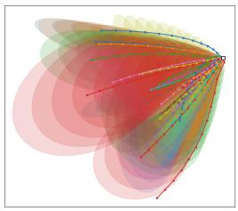  
(a) BVIT.

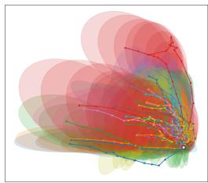  
(b) VIT.  
Fig. 1: Joint PCA of class trajectories with σ = 1 covariance ellipses. BVIT follows smooth radial trajectories, VIT shows piecewise directional shifts.

## 1.1. Scope & Contributions

This study is a controlled mechanistic investigation, not a competitive benchmarking effort. We fix the data distribution, patch tokenization, and optimization pipeline to isolate the architectural effect of weight sharing. Our core findings are:

C1. Monotonic Dynamical Stability: BVIT exhibits smooth state transformations and monotonically decreasing updates, whereas VIT maintains elevated step variance and dimensionality collapse (Section 3).

C2. Latent Representation Equivalence: BVIT and VIT construct geometrically aligned latent representations across depth in the same canonical order (Section 4).

C3. Deployment Robustness: BVIT demonstrates lower interpatient Jacobian variance and preserves geometric cluster separability on out-of-distribution inputs (Section 5).

Test Performance 67.11 ± 0.32 67.06 ± 0.47 0.8472 ± 0.0051 0.8381 ± 0.0062

Table 1: Parameter counts and test performance. PTB-5 scored by accuracy (%); PTB-44 by macro-AUC.
<table><tr><td rowspan="2"></td><td colspan="2">PTB-5 (Acc. %)</td><td colspan="2">PTB-44 (AUC)</td></tr><tr><td>BVIT</td><td>VIT</td><td>BVIT</td><td>VIT</td></tr><tr><td>Encoder body</td><td>789K</td><td>9.47M</td><td>789K</td><td>9.47M</td></tr><tr><td>Total params</td><td>1.10M</td><td>9.78M</td><td>1.11M</td><td>9.79M</td></tr><tr><td>Reduction</td><td colspan="2">8.9×</td><td colspan="2">8.8×</td></tr></table>

## 2. EXPERIMENTAL SETUP

## 2.1. Architectures: bViT vs ViT

Both models [1, 4] process 12 × 1000 ECG windows as ten non-overlapping 100-sample patches, projected to d = 256 dimensional latent space, with a CLS token, through 12 steps. They differ only in parameter sharing: VIT uses 12 distinct blocks (9.47M), BVIT reuses one (789K). A block is the standard pre-norm Transformer encoder [13], with $H = 8$ attention heads, MLP expansion factor 4, dropout 0.2

$$
\begin{array} { r } { \mathbf { u } = \mathbf { h } + \mathrm { M H S A } ( \mathrm { L N } ( \mathbf { h } ) ) , } \\ { B ( \mathbf { h } ) = \mathbf { u } + \mathrm { M L P } ( \mathrm { L N } ( \mathbf { u } ) ) . \qquad } \end{array}\tag{1}
$$

Let $z _ { t }$ denote hidden states t block applications, $z _ { \mathrm { 0 } }$ the embedded input, and $\mathbf { z } _ { t } ~ \in ~ \mathbb { R } ^ { 2 5 6 }$ the CLS row of $z _ { t }$ . Then for $t = 1 , \ldots , 1 2$

$$
\begin{array} { r } { \begin{array} { l l } { \mathbf { \delta B } \mathbf { V I T } \colon \ z _ { t } = B ( z _ { t - 1 } ) , \quad } & { \mathbf { V I T } \colon \ z _ { t } = B _ { t } ( z _ { t - 1 } ) . } \end{array} } \end{array}\tag{2}
$$

The initial projection $( \mathbf { z } _ { 0 }  \mathbf { z } _ { 1 } )$ represents static initialization and is excluded from iterative dynamical statistics.

## 2.2. Data

We evaluate on 12-lead ECG (PTB-XL [11]) because a patch Transformer over a multichannel and quasi-periodic waveform is naturally cast as a learned filter bank or iterative cascade, for which gain, stability, and contraction—the standard concerns of signal processing—are the right diagnostic quantities. The dataset is small enough so that both BVIT and VIT converge to their metric plateau under a single recipe, so dynamical differences are not confounded with under-training. We use the recommended split [12] (folds 1–8 train, 9 val, 10 test; 17, 418/2, 183/2, 198) with per-channel normalisation. PTB-5 (5 superclasses, single-label, cross-entropy, accuracy) and PTB-44 (44 subclasses, multi-label, BCE, macro-AUC) differ in loss, metric and difficulty - they serve as internal replication. All the figures and statistics present data, unless stated otherwise, obtained on PTB-44 test set from 20 different training runs of BVIT and VIT.

## 2.3. Training the two models

We train BVIT and VIT from scratch for 100 epochs with AdamW [14], batch size 128, initial learning rate $5 \times 1 0 ^ { - 4 }$ cosine-decayed to $1 0 ^ { - 5 }$ , 10 warm-up epochs, weight decay 0.1 and gradient clipping 1.0, no weight averaging. Augmentation is applied to the training split only, each transform drawn independently with probability 0.5: Gaussian noise $( \sigma \le 0 . 0 3 )$ random circular time shift (±10%), amplitude scaling (0.8– 1.2×), single-lead channel dropout and random time masking.

## 3. DYNAMICAL SMOOTHNESS AND CAPACITY (C1)

We characterize state evolution ${ \bf z } _ { 1 } , \ldots , { \bf z } _ { 1 2 }$ via four dynamical properties to answer the following questions: does the state settle, how much of the available space does it occupy, and is a perturbation amplified or damped?

Class Geometric Trajectories: (Figure 1) Per-class averages traced across depth reveal whether classes separate along stable directions or are repeatedly rearranged.

Update Magnitude: (Figure 2a) The relative step size $R S S = \| \mathbf { z } _ { t } - \mathbf { z } _ { t - 1 } \| / \| \mathbf { z } _ { t - 1 } \|$ measures the fraction of the current representation each block rewrites. A sequence decreasing to 0 indicates settling in latent space, while others indicate that final blocks are still revising a latent representation about to be classified.

Effective dimensionality: (Figure 2b) Let $\lambda _ { 1 } , \ldots , \lambda _ { 2 }$ 56 be the eigenvalues of the covariance matrix of $\mathbf { z } _ { t }$ over the test subset. The participation ratio [15] $\begin{array} { r } { \mathrm { P R } ( \mathbf { z } _ { t } ) = \frac { \left( \sum _ { i } \lambda _ { i } \right) ^ { 2 } } { \sum _ { i } \lambda _ { i } ^ { 2 } } } \end{array}$ counts how many directions carry comparable variance — i.e., the effective dimensionality of the representation at depth t. A collapsed representation has less room to separate classes and distorts similarity scores.

Linearised step response: (Figure 3) For one BVIT iteration or one VIT layer we take $J _ { t } = { \partial \mathbf { z } _ { t } } / { \partial \mathbf { z } _ { t - 1 } }$ and extract three quantities. The spectral norm $\| J _ { t } \| _ { 2 }$ (largest singular value - $\mathbf { \nabla } \cdot \sigma _ { 1 } )$ is the worst-case amplification of a perturbation in a single step. The spectral radius $\rho ( J _ { t } )$ (largest eigenvalue magnitude) governs repeated application: above 1 perturbations grow under iteration, below 1 they decay. And log | det $J _ { t } |$ is the volume change, negative when a cloud of nearby recordings is contracted by the step and positive when it is expanded. $J _ { t }$ for both models are estimated by power iteration and stochastic Lanczos quadrature [16, 17]. Table 2 collects results at both label levels, PTB-5 and PTB-44.

## 4. REPRESENTATIONAL CONVERGENCE (C2)

We ask whether, at equal accuracy, iteration t of BVIT arrives at a representation geometrically comparable to layer t of VIT. If so, weight sharing changes the trajectory without changing the similarity of destination. If not, the two models solve the task by different means. Our primary instrument is linear CKA [18], which compares the similarity structure two representations induce over the same inputs and is invariant to rotation and isotropic rescaling. Because linear CKA is dominated by the highest-variance directions [19], and Section 3 showed both encoders concentrate onto few directions, we supplement it with four additional similarity measures: CKA based on Gaussian RBF kernel (captures nonlinear structure) [18], MKA — Manifold-Approximated Kernel Alignment (based on sparse, directed Nearest Neighbor graphs) [20], a Procrustes distance (lower = more similarity) [21], and a linear CD-CKA (Contrastive-Difference) which compares increments ${ \bf z } _ { t } - { \bf z } _ { t - 1 }$ and asks if BVIT and VIT move alike rather than just arrive alike. Only the trend with depth should be read across measures, since each normalizes differently (Figure 4). Cross-model CKA (Figure 4a) rises from 0.55 to 0.78 across depth, with layer-to-iteration mapping in the same order, ([3, 5, 5, 6, 7, 8, 9, 9, 9, 10, 10, 10]): later iterations match later layers, so the loop never revisits earlier stages. The highest CKA similarity occurs between VIT layers 3–10, indicating that the majority of the latent transformation happens there, while the remaining layers make minor contributions. The pattern is identical on PTB-5. Three of five similarity measures rise with depth. On the other hand the CD-CKA measure does not, revealing the signature of weight sharing, caused by BVIT’s self-similarity rising from 0.65 to 0.99 since the same block is reapplied to an increasingly settled state, while VIT’s stays between 0.22 and 0.43. The weight sharing constrains the trajectory so differences appear in dynamics (Section 3) and robustness (Section 5), not in the final representations.

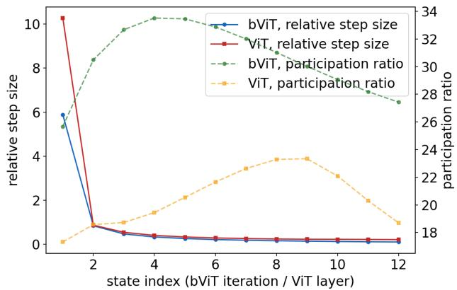  
Fig. 2: Trajectory statistics. BVIT performs smaller relative latent steps than VIT and holds a wider representation at every depth.

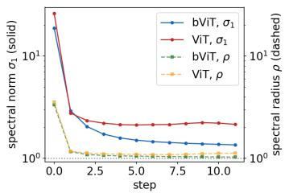

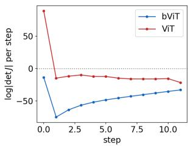  
Fig. 3: Single-step Jacobian. Left: spectral norm (solid) and spectral radius (dashed). BVIT has smaller spectral norm and spectral radius than VIT and so it is more stable model. Right: log | det $J _ { t } |$ . Every BVIT step contracts; VIT expands on its first step.

Table 2: Summary at both label levels. Sensitivity, mean and spread: mean and std of $\rho ( J )$ over test recordings. Volume change: $\textstyle \sum _ { t }$ log | det $J _ { t } |$ (negative = contraction). Bold marks the better value; sensitivity mean is unmarked (because $\rho \approx 1$ is neutral, not good).
<table><tr><td></td><td colspan="2">PTB-5</td><td colspan="2">PTB-44</td></tr><tr><td></td><td>BVIT</td><td>VIT</td><td>BVIT</td><td>VIT</td></tr><tr><td>Effective dimensionality, peak</td><td>14.8</td><td>7.1</td><td>33.8</td><td>23.4</td></tr><tr><td>Effective dimensionality, end</td><td>6.4</td><td>3.8</td><td>27.4</td><td>18.6</td></tr><tr><td>Relative step size, last</td><td>0.118</td><td>0.209</td><td>0.104</td><td>0.212</td></tr><tr><td>Sensitivity, mean</td><td>1.042</td><td>1.528</td><td>1.044</td><td>1.430</td></tr><tr><td>Sensitivity, spread</td><td>0.014</td><td>0.478</td><td>0.008</td><td>0.160</td></tr><tr><td>Volume change</td><td>-164</td><td>+56</td><td>-545</td><td>-74</td></tr></table>

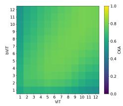  
(a) Linear CKA

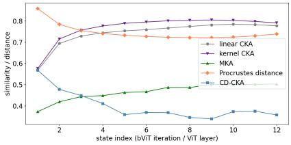  
(b) Five similarity measures  
Fig. 4: The two models take different routes to comparable destinations. (a) Linear CKA, BVIT iterations (rows) vs. VIT layers (columns). (b) Five measures along the matched diagonal. Three measures initially rise with depth and reach plateau. The CD-CKA does not - a consequence of weight sharing.

## 5. PERTURBATION AND OOD ROBUSTNESS (C3)

Clinical translation requires models to remain predictable across diverse patient cohorts and unseen recording artifacts. We evaluate this along two axes: Inter-Patient Sensitivity Homogeneity and Far-Field OOD Dynamics. Sections 3 and 4 established that the BVIT and VIT reach comparable representations by different routes, at equal accuracy. Neither result speaks to behaviour when the input is not drawn from the test fold — the operative question for a deployed ECG model. We approach it from two directions: how far the models’s behaviour varies between patients, and what it does to inputs far outside the training distribution.

## 5.1. Inter-Patient Sensitivity Homogeneity

For each test recording we form the exact Jacobian J of a single step and take its spectral norm $\sigma _ { 1 } ( J )$ , the local gain: the factor by which a small change in that patient’s representation can be amplified by one forward pass. The location of the resulting distribution (Figure 5) indicates whether a single step has any potential expansive direction $( \sigma _ { 1 } > 1 )$ , is neutral $( \sigma _ { 1 } \approx 1 )$ , or strictly contractive $( \sigma _ { 1 } < 1 )$ . None of the models is strictly contractive. The narrow distribution of BVIT means that a robustness measurement on the test cohort is informative about other cohorts and is model-specific; VIT does not have this property.

## 5.2. Far-Field OOD Dynamics

An unfamiliar patient population can be viewed in latent space as a set of points lying in different direction or being more distant from the training data than the test set. We probe each model at controlled distances from the training mean $\mu ,$ expressed in units of the test data spread: $s = \underset { z \in S } { \mathbb { E } } | | \mathbf { z } - \mu | |$ , where S is the set of embeddings corresponding to test set samples. Probe points at $r \cdot s$ from $\mu$ along random directions place $r \approx 1$ among real recordings and $r = 8$ far outside the training distribution. We track three quantities as r grows: singlestep gain (Figure 6), boundedness under iteration (Figure 7), and group separability—the inter-cluster distance divided by intra-cluster distance. BVIT loses 0.8% (28.6 → 28.3 across iterations), while VIT loses 5.6% (28.6 → 27.0 across layers), i.e. seven times more than BVIT. The desirable outcome from single-step gain is the neutral one — gain near 1, points that remain in place, groups that stay separated — indicating the model’s cautious behaviour - it neither amplifies nor destroys structure it was never trained on. We note that BVIT has this property, while VIT does not.

## 5.3. Implications for deployment

An unfamiliar cohort is a set of out-of-distribution points in latent space. If the model preserves distances in that regime, the cohort’s structure survives the forward pass and the feature scale is input-independent. This supports cluster separation and hence performance on out-of-distribution patients, and makes the representation a better initialisation for transfer and fine-tuning.

## 6. CONCLUSION

Replacing VIT’s twelve Transformer blocks by BVIT’s one block applied twelve times incurs no accuracy loss while reducing parameters 8.9×. Similarity measures agree that the two models construct comparable final representations in the same order. So weight sharing preserves the destination, while it alters the trajectory, and the trajectory governs deployment behaviour. The BVIT model takes monotonically decreasing steps, utilizes effectively more directions while contracting volume at every step, and varies 21–34× less in inter-patient sensitivity. On out-of-distribution inputs it neither amplifies nor collapses, whereas the VIT expands and mixes.

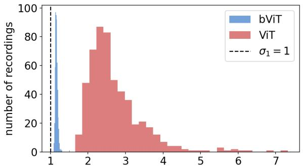  
spectral norm $\sigma _ { 1 }$ of the per-recording step Jacobian

Fig. 5: Histogram of local sensitivity. BVIT: narrow spike at $1 . 0 4 4 \pm 0 . 0 0 8$ . VIT: broad, $1 . 4 3 0 \pm 0 . 1 6 0$ , tail exceeding 1.8. Spread is 21× smaller for BVIT (34× on PTB-5).  
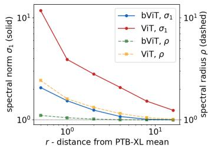

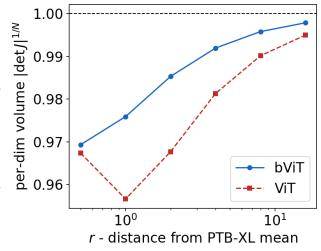  
Fig. 6: Single-step behaviour vs. distance from training data, PTB-44. $r \approx 1$ is on-data (stars), $r = 8$ is far OOD. Left: gain (spectral norm, left; spectral radius, right). Right: perdimension volume factor | det $J | ^ { 1 / N }$ , below one for both. Both are most active on-data; the difference is in the far field.

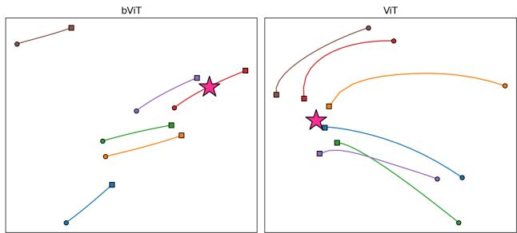  
Fig. 7: Do distinct OOD groups remain distinct? Six probe clusters at $r = 8 .$ . Joint PCA projection of cluster-center paths over twelve steps, squares = start, circles = step 12. The pink star marks the training-data mean µ projected into that frame. BVIT is near-isometric OOD; VIT is non-linearly expansive.

The practical reading is that once two models match on accuracy, accuracy has ceased to be informative, and the weightsharing model is the safer default - it treats every patient alike and remains neutral on data it was never shown. These properties govern behaviour after deployment and are invisible to the benchmark ordinarily used to choose between available models.

## 7. LIMITATIONS

Scope. For controlled comparison, and isolating a single architectural variable—weight sharing in Transformers, we hold the training recipe fixed, for multiple runs from different initializations. We use one corpus, while the two label levels give us internal replication across distinct learning problems.

Measurements. Similarity measures report correspondence, not causal role. Full-state spectra and volume changes are numerical estimates - not exact numbers based on analytical calculation of Jacobians.

Far-field probes. Probe points are constructed in latent space.   
This isolates the model’s dynamics from input-space structure.   
The construction describes worst-case behaviour.

## Funding acknowledgements

This work was supported by Samsung AI Center, Warsaw.

## Compliance with ethical standards

The authors have no relevant conflicts of interest to disclose.

## 8. REFERENCES

[1] Michal Byra, Pawel Olszowiec, Grzegorz Stefanski, Grzegorz Gruszczynski, and Alberto Presta, “bvit: Investigating singleblock recurrence in vision transformers for image recognition,” 2026.

[2] Jinnian Zhang, Houwen Peng, Kan Wu, Mengchen Liu, Bin Xiao, Jianlong Fu, and Lu Yuan, “Minivit: Compressing vision transformers with weight multiplexing,” in 2022 IEEE/CVF Conference on Computer Vision and Pattern Recognition (CVPR). IEEE, 2022, pp. 12135–12144.

[3] Zhiqiang Shen, Zechun Liu, and Eric Xing, “Sliced recursive transformer,” in European Conference on Computer Vision. Springer, 2022, pp. 727–744.

[4] Alexey Dosovitskiy, Lucas Beyer, Alexander Kolesnikov, Dirk Weissenborn, Xiaohua Zhai, Thomas Unterthiner, Mostafa Dehghani, Matthias Minderer, Georg Heigold, Sylvain Gelly, et al., “An image is worth 16x16 words: Transformers for image recognition at scale,” arXiv preprint arXiv:2010.11929, 2020.

[5] Mostafa Dehghani, Stephan Gouws, Oriol Vinyals, Jakob Uszkoreit, and Lukasz Kaiser, “Universal transformers,” arXiv preprint arXiv:1807.03819, 2018.

[6] Zhenzhong Lan, Mingda Chen, Sebastian Goodman, Kevin Gimpel, Piyush Sharma, and Radu Soricut, “Albert: A lite bert for self-supervised learning of language representations,” arXiv preprint arXiv:1909.11942, 2019.

[7] Grzegorz Gruszczynski, Pawel Olszowiec, Michal Byra, Grzegorz Stefanski, and Alberto Presta, “Training crossroads for recurrent vision transformers: Recurrence, neural odes, and deep supervision,” arXiv preprint arXiv:2608.04879, 2026.

[8] Antônio H Ribeiro, Manoel Horta Ribeiro, Gabriela MM Paixão, Derick M Oliveira, Paulo R Gomes, Jéssica A Canazart, Milton PS Ferreira, Carl R Andersson, Peter W Macfarlane, Wagner

Meira Jr, et al., “Automatic diagnosis of the 12-lead ecg using a deep neural network,” Nature communications, vol. 11, no. 1, pp. 1760, 2020.

[9] Awni Y Hannun, Pranav Rajpurkar, Masoumeh Haghpanahi, Geoffrey H Tison, Codie Bourn, Mintu P Turakhia, and Andrew Y Ng, “Cardiologist-level arrhythmia detection and classification in ambulatory electrocardiograms using a deep neural network,” Nature medicine, vol. 25, no. 1, pp. 65–69, 2019.

[10] Temesgen Mehari and Nils Strodthoff, “Self-supervised representation learning from 12-lead ecg data,” Computers in biology and medicine, vol. 141, pp. 105114, 2022.

[11] Patrick Wagner, Nils Strodthoff, Ralf-Dieter Bousseljot, Dieter Kreiseler, Fatima I Lunze, Wojciech Samek, and Tobias Schaeffter, “Ptb-xl, a large publicly available electrocardiography dataset,” Scientific data, vol. 7, no. 1, pp. 154, 2020.

[12] Nils Strodthoff, Patrick Wagner, Tobias Schaeffter, and Wojciech Samek, “Deep learning for ecg analysis: Benchmarks and insights from ptb-xl,” IEEEjournal ofbiomedical and health informatics, vol. 25, no. 5, pp. 1519–1528, 2020.

[13] Ashish Vaswani, Noam Shazeer, Niki Parmar, Jakob Uszkoreit, Llion Jones, Aidan N Gomez, Lukasz Kaiser, and Illia Polosukhin, “Attention is all you need,” Advances in Neural Information Processing Systems (NeurIPS), 2017.

[14] Ilya Loshchilov and Frank Hutter, “Decoupled weight decay regularization,” Proceedings of the International Conference on Learning Representations (ICLR), 2019.

[15] W Jeffrey Johnston and Stefano Fusi, “Abstract representations emerge naturally in neural networks trained to perform multiple tasks,” Nature Communications, vol. 14, no. 1, pp. 1040, 2023.

[16] Michael F Hutchinson, “A stochastic estimator of the trace of the influence matrix for laplacian smoothing splines,” Communications in Statistics-Simulation and Computation, vol. 18, no. 3, pp. 1059–1076, 1989.

[17] Shashanka Ubaru, Jie Chen, and Yousef Saad, “Fast estimation of tr(f(a)) via stochastic lanczos quadrature,” SIAM Journal on Matrix Analysis and Applications, vol. 38, no. 4, pp. 1075–1099, 2017.

[18] Simon Kornblith, Mohammad Norouzi, Honglak Lee, and Geoffrey Hinton, “Similarity of neural network representations revisited,” in Proceedings of the 36th International Conference on Machine Learning, Kamalika Chaudhuri and Ruslan Salakhutdinov, Eds. 09–15 Jun 2019, vol. 97 of Proceedings of Machine Learning Research, pp. 3519–3529, PMLR.

[19] MohammadReza Davari, Stefan Horoi, Amine Natik, Guillaume Lajoie, Guy Wolf, and Eugene Belilovsky, “Reliability of cka as a similarity measure in deep learning,” arXiv preprint arXiv:2210.16156, 2022.

[20] Mohammad Tariqul Islam, Du Liu, and Deblina Sarkar, “Kernel alignment using manifold approximation,” in Second Workshop on Representational Alignment at ICLR 2025.

[21] Peter H Schönemann, “A generalized solution of the orthogonal procrustes problem,” Psychometrika, vol. 31, no. 1, pp. 1–10, 1966.