# SL(n) REPRESENTATION LEARNING:AN INTRINSIC MIXED-CURVATURE SPACE WITHHIGHER CURVATURE CAPACITIES ANDDEEPER ORDER-AWARE COMPOSITION

Xingrun Li<sup>1</sup> Yusuke Mukuta<sup>1</sup> Xin Yang<sup>1</sup> Yinyu Ye<sup>2,‡</sup> Tatsuya Harada<sup>1,†</sup>

<sup>1</sup>The University of Tokyo <sup>2</sup>Stanford University

<sup>†</sup>harada@mi.t.u-tokyo.ac.jp <sup>‡</sup>yinyu-ye@stanford.edu

## ABSTRACT

Mixed-curvature representation learning seeks to capture rich geometric structures that cannot be adequately modeled by a single curvature regime. Existing approaches largely rely on product manifolds, which require manually specifying how different curvature spaces are combined and separate their curvature contributions across factors. We introduce the SL(n) space, a representation geometry defined by the simple det(A) = 1 constraint and a left invariant Schatten-p Finsler structure. Despite this minimal construction, SL(n) exhibits pointwise negative, zero, and positive flag curvature around a common flagpole, while its mixed-curvature and curvature-coupling capacities are asymptotically maximal relative to the intrinsic geometric upper bound. Beyond geometry, its noncommutative group structure provides inherent order sensitivity, and its non-nilpotent Lie algebra admits nonzero nested Lie brackets at arbitrary depth, enabling deep order-aware composition. Empirically, SL(n) consistently outperforms a broad range of representation manifold baselines across graph benchmarks at different scales. It reduces average distortion over the strongest baselines by 44.3% on KEGG and 40.5% on HumanCyc, and improves Hits@20 by 42.8% on OGBL-PPA. Experiments on Flickr30k-Order further support its ability to capture higher order dependencies from ordered composition. Together, these results show how a seemingly simple structural constraint can yield unexpectedly rich geometry, capacity, and composition within a unified representation space.

## 1 INTRODUCTION

Finding informative representations of data has long been a central problem in machine learning, from dimensionality reduction by principal component analysis (Hotelling, 1933), through learning compact representations with neural networks (Hinton & Salakhutdinov, 2006) and distributed representations of words through embeddings (Mikolov et al., 2013), to modern non-Euclidean representations on manifolds (Bronstein et al., 2021; Diepeveen et al., 2025). This progression natu rally raises a key question: what geometry should the representation space be endowed with? The manifold hypothesis provides a fundamental starting point, suggesting that high dimensional observations often concentrate near manifolds of substantially lower intrinsic dimension (Tenenbaum et al., 2000; Fefferman et al., 2013). Yet it does not determine the geometry of this latent manifold, so the chosen geometry acts as an inductive bias toward particular structural patterns. For instance, classical Euclidean geometry E<sup>n</sup> (curvature K = 0) is suited to approximately flat or grid-like structures (Mikolov et al., 2013), hyperbolic geometry H<sup>n</sup> (K < 0) naturally accommodates hierarchical or tree-like structures (Nickel & Kiela, 2017), whereas spherical geometry S<sup>n</sup> (K > 0) provides a compact geometry suited to cyclic or clique-like structures (Bachmann et al., 2020; Sun et al., 2021).

Real-world structures, however, rarely conform to a simple, single-curvature regime. For example, even a single graph, relational system, or biological network may simultaneously contain hierarchical, cyclic, densely interconnected, and approximately flat substructures (McNeela et al., 2025). This observation has motivated mixed-curvature representation learning. A straightforward idea is to combine manifolds of different curvatures into a single representation space. This leads to the widely used mixed-curvature product manifold (Gu et al., 2019), defined as the Cartesian product

$$
\mathcal { P } = \mathbb { E } ^ { d _ { 0 } } \times \prod _ { i = 1 } ^ { m _ { - } } \mathbb { H } _ { K _ { i } } ^ { d _ { i } } \times \prod _ { j = 1 } ^ { m _ { + } } \mathbb { S } _ { K _ { j } } ^ { d _ { j } } ,\tag{1}
$$

where $d _ { 0 } , d _ { i } , d _ { j }$ denote the factor dimensions, while $K _ { i } < 0$ and $K _ { j } > 0$ denote the corresponding hyperbolic and spherical curvatures. Despite its simplicity, this construction has been successfully extended to generative modeling and applied across a variety of downstream domains (Skopek et al., 2020; Bachmann et al., 2020; Wang et al., 2021; Sun et al., 2021; Wang et al., 2023). However, product mixed-curvature spaces inherit two fundamental limitations.

First, product mixed-curvature spaces require the combination of spaces with different curvatures to be specified in advance, while the appropriate combination can vary substantially across data objects. This strong inductive bias makes a suitable product geometry difficult to determine. For example, even for a fixed total dimension $\begin{array} { r } { d _ { 0 } + \sum _ { i = 1 } ^ { m _ { - } } \dot { d } _ { i } + \sum _ { j = 1 } ^ { m _ { + } } d _ { j } \stackrel { . } { = } 6 4 } \end{array}$ and fixed curvature magnitudes, there are 11,555,651,398<sup>1</sup> different candidates! (note that $\mathbb { S } ^ { 3 } \times \mathbb { H } ^ { 1 } \neq \mathbb { S } ^ { 2 } \times \mathbb { H } ^ { 2 }$ and $\mathbb { H } ^ { 2 } \times \mathbb { H } ^ { 2 } \neq \mathbb { H } ^ { 4 } )$ . Thus, related work often requires searching over many product spaces (McNeela et al., 2025).

Second, and more importantly, product spaces with mixed curvature have an inherent representation limitation. Let $\begin{array} { r } { \mathcal { M } = \mathbf { \bar { \Pi } } \prod _ { i } \mathcal { M } _ { i } } \end{array}$ be a product of component manifolds and $T _ { x } { \mathcal { M } }$ its tangent space at x. The product geometry satisfies $T _ { x } \mathbf { \bar { \mathcal { M } } } = \oplus _ { i } T _ { x _ { i } } \bar { \mathcal { M } } _ { i }$ , while its curvature is generated independently within each factor, with no curvature interaction across factors (Saez de Oc´ ariz Borde´ , 2026). Thus, positive and negative curvature coexist through separate factor components rather than through their intrinsic interaction. This limits the representation of coupled structures, where hierarchical, cyclic, and other patterns share common features instead of decomposing into independent parts.

These two severe limitations motivate the central question of this work: can we find a single geometry that intrinsically represents coupled mixed-curvature structures, without manually allocating different curvatures to separate factors? Some promising alternatives have emerged from previous works. SPD and higher-rank Siegel manifolds provide intrinsic $\{ - , 0 \}$ curvature structures for representation learning (Lopez et al., 2021; Zhao et al., 2023), while Grassmann manifolds provide intrinsic $\{ + , 0 \}$ curvature (Bendokat et al., 2024). This leaves a pressing open problem in representation learning of realizing intrinsically coupled $\{ - , 0 , + \}$ curvature within a single latent manifold.

To address this problem, we propose the $\mathbb { S L } ( { \mathbf n } )$ space (we omit $p$ when no confusion arises), an intrinsic mixed-curvature space constructed from the special linear group and defined as

$$
\begin{array} { r } { \mathbb { S } \mathbb { L } _ { p } ( n ) : = \bigl ( \mathrm { S L } ( n ) , F _ { p } , \circ \bigr ) , \quad \mathrm { S L } ( n ) : = \{ A \in \mathbb { R } ^ { n \times n } | \operatorname* { d e t } ( A ) = 1 \} , } \end{array}\tag{2}
$$

where $F _ { p } ( A , V ) = \| A ^ { - 1 } V \| _ { S _ { p } }$ is the globally defined Schatten-p tangent norm, introducing direction dependent sensitivity to matrix variations beyond a quadratic Riemannian metric, and ◦ denotes group composition. Importantly, $F _ { p }$ and the induced length geometry are defined for all tangent vectors, while full rank regularity is required only for smooth curvature analysis and excludes a measure zero set of directions. The induced Finsler geometry has directional flag curvature $K _ { F } ( Y , \Pi )$ , allowing different tangent directions to exhibit different local curvature. We prove that positive, zero, and negative flag curvatures coexist at every point, with different signs interacting through shared tangent directions rather than separate factors. We quantify these two properties by the mixed-curvature capacity $\mathcal { C } _ { \mathbb { S L } } ^ { \mathrm { m i x } }$ and curvature-coupling capacity $\mathcal { C } _ { \mathbb { S L } } ^ { \mathrm { c p l } }$ , respectively, capturing balanced coexistence and genuine coupling. Both are asymptotically maximal relative to the intrinsic geometric upper bound. Experiments on real world graphs of substantially different scales further show strong improvements over a broad range of geometric baselines.

Beyond geometry, the Lie group structure of $\operatorname { S L } ( n )$ provides an intrinsic mechanism for composition. Its group operation is matrix multiplication, while its Lie algebra ${ \mathfrak { s l } } ( n )$ carries the Lie bracket $[ X , Y ]$ . Noncommutativity makes sequential composition inherently order-aware, while the nonnilpotent structure of ${ \mathfrak { s l } } ( n )$ permits nonzero nested Lie brackets $[ X _ { k } , [ \cdot \cdot \cdot , [ X _ { 2 } , X _ { 1 } ] \cdot \cdot \cdot ] ]$ at arbitrary depth k. This enables progressively deeper ordered composition beyond pairwise noncommutativity, which we further evaluate empirically.

Together, these properties unify mixed-curvature geometry and order-aware algebraic structure within a single matrix representation space. And due to page limitations, beyond the related work discussed above, a more detailed Related Work section is provided in Appendix [A].

## 2 THE SL SPACE

## 2.1 STRUCTURES OF SL SPACE

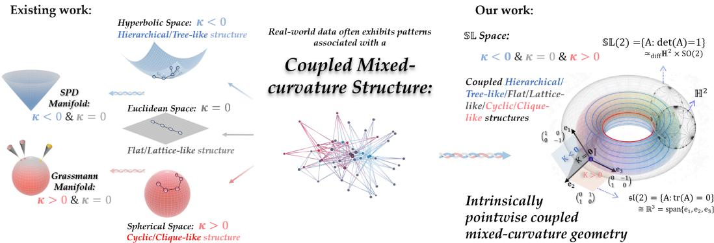  
Figure 1: Existing manifolds capture only restricted curvature regimes, whereas real-world data may contain complex coupled structures. The SL space intrinsically couples $\{ - , 0 , + \}$ curvature within a single geometry. The right side depicts the global topology and tangent Lie algebra sl(2).

As illustrated in Fig. 1, the $\mathbb { S L } ( n )$ space provides a matrix representation that combines a smooth manifold structure, a flexible Finsler geometry, and an intrinsic Lie group structure, while supporting coupled mixed-curvature within a single space. We introduce these structures in turn below.

## 2.1.1 SMOOTH MANIFOLD STRUCTURE

A smooth manifold is a space that locally resembles Euclidean space and admits smooth coordinate systems for differential operations (Lee, 2013). Begin with the matrix set

$$
{ \mathrm { S L } } ( n ) : = \left\{ A \in \mathbb { R } ^ { n \times n } : \operatorname* { d e t } ( A ) = 1 \right\} .\tag{3}
$$

For the smooth map det $: \mathbb { R } ^ { n \times n }  \mathbb { R }$ , writing $D \operatorname* { d e t } _ { A } [ V ]$ for the directional differential of det at $A \in \mathrm { S L } ( n )$ along $V \in \mathbb { R } ^ { n \times n }$ in the ambient Euclidean space, $D \operatorname* { d e t } _ { A } [ V ] = \operatorname { t r } ( A ^ { - 1 } V )$ . Since $D \operatorname* { d e t } _ { A } \neq 0$ on $\mathrm { d e t } ^ { - 1 } ( 1 )$ , 1 is a regular value of det. By the regular level set theorem, $\mathrm { S L } ( n ) =$ $\mathrm { d e t } ^ { - 1 } ( 1 )$ is a smooth embedded manifold of dimension ${ n ^ { 2 } - 1 }$ . Its tangent space is therefore

$$
T _ { A } \mathrm { S L } ( n ) = \ker ( D \operatorname* { d e t } ) = \left\{ V \in \mathbb { R } ^ { n \times n } : \operatorname { t r } ( A ^ { - 1 } V ) = 0 \right\} .\tag{4}
$$

## 2.1.2 SCHATTEN-p FINSLER GEOMETRIC STRUCTURE

A Riemannian structure assigns a smoothly varying inner product $g _ { x }$ to each tangent space $T _ { x } M ,$ inducing the norm $\| V \| _ { x } = \sqrt { g _ { x } ( V , V ) }$ for tangent vectors. A Finsler structure generalizes this construction by allowing a smoothly varying tangent norm $F ( x , V )$ that need not arise from an inner product (Bao et al., 2000). This lets local geometry depend more richly on tangent directions.

For $1 \leq p < \infty .$ , the Schatten-p norm is $\| X \| _ { S _ { p } } : = ( \sum _ { i = 1 } ^ { n } \sigma _ { i } ( X ) ^ { p } ) ^ { 1 / p }$ , where $\sigma _ { i } ( X )$ is the i-th singular value of X. We equip SL(n) with the Schatten p tangent norm

$$
F _ { p } ( A , V ) : = \| A ^ { - 1 } V \| _ { S _ { p } } , \quad A \in \mathrm { S L } ( n ) , \quad V \in T _ { A } \mathrm { S L } ( n ) .\tag{5}
$$

We focus on $1 < p < \infty$ . Importantly, $F _ { p }$ is well defined on the entire tangent bundle and therefore induces a global length structure on $\operatorname { S L } ( n )$ . For $p \neq 2$ , the smooth differential geometry required for flag curvature is considered on full rank tangent directions, which form an open dense set with measure zero complement. The case $p \ : = \ : 2$ is globally Riemannian, while $p = 1$ is excluded due to non-smoothness. For a piecewise smooth curve $\dot { \gamma } : [ 0 , 1 ] \to \mathrm { S L } ( n )$ , we define $L _ { p } ( \gamma ) =$ $\begin{array} { r } { \int _ { 0 } ^ { 1 } F _ { p } ( \gamma ( t ) , \dot { \gamma } ( t ) ) } \end{array}$ dt and $\begin{array} { r } { d _ { p } ( A , B ) = \operatorname* { i n f } _ { \gamma : A \to B } L _ { p } ( \gamma ) } \end{array}$

Finsler curvature is described by flag curvature, which generalizes Riemannian sectional curvature (Bao et al., 2000). We call a nonzero tangent direction $\mathsf { \bar { Y } } \in T _ { A } \mathrm { S L } ( n )$ regular when $A ^ { - 1 } Y$ is full rank. For a regular tangent direction Y and a two-dimensional plane $\Pi = \operatorname { s p a n } \{ Y , U \} \subset T _ { A } \operatorname { S L } ( n )$ containing Y, the pair (Y, Π) is called a flag and $Y$ its flagpole. The fundamental tensor at $Y$ is

$$
g _ { Y } ( U , V ) : = \frac { 1 } { 2 } \left. \frac { \partial ^ { 2 } } { \partial s \partial t } F _ { p } ^ { 2 } ( A , Y + s U + t V ) \right. _ { s = t = 0 } .\tag{6}
$$

Let $\pmb { \mathcal { R } } ^ { Y } ( U , V )$ denote the Chern curvature operator with reference direction Y , and define the Jacobi operator by $R _ { Y } U : = \pmb { \mathcal { R } } ^ { Y } ( U , Y ) Y$ . Their explicit expressions are deferred to the curvature analysis in Appendix [D]. The flag curvature is then defined as

$$
K _ { F } ( Y , \Pi ) : = \frac { g _ { Y } ( { R _ { Y } U } , { U } ) } { g _ { Y } ( Y , Y ) g _ { Y } ( { U } , { U } ) - g _ { Y } ( { Y } , { U } ) ^ { 2 } } .\tag{7}
$$

The Jacobi operator $R _ { Y }$ is self adjoint with respect to $g _ { Y }$ , meaning $g _ { Y } ( R _ { Y } U , V ) = g _ { Y } ( U , R _ { Y } V )$ Therefore, all its eigenvalues are real, with positive eigenspace $\bar { E _ { + } ( Y ) } : = \bar { \bigoplus _ { \lambda > 0 } \ker ( R _ { Y } - \lambda I ) }$ and negative eigenspace E<sub>−</sub>(Y ) defined analogously over $\lambda < 0$

## 2.1.3 LIE GROUP ALGEBRAIC STRUCTURE

Moreover, the underlying manifold carries a natural algebraic group structure. A group $( G , \circ )$ is a set equipped with an associative composition ◦, an identity element $e ,$ and an inverse $a ^ { - 1 }$ for every $a \in G$ . For $\operatorname { S L } ( n )$ , matrix multiplication $A \circ B : = A B$ , the identity $e = I ,$ , and matrix inversion $A \mapsto A ^ { - 1 }$ define the group structure. A Lie group is simultaneously a smooth manifold and a group, with smooth composition and inversion (Hall, 2015). Since matrix multiplication and inversion are smooth on $\operatorname { S L } ( n )$ , it forms a Lie group. The associated Lie algebra sl(n) is the tangent space at the identity, endowed with the Lie bracket $[ \cdot , \cdot ]$ . For SL(n),

$$
{ \mathfrak { s l } } ( n ) = T _ { I } { \mathrm { S L } } ( n ) = \{ \Xi \in \mathbb { R } ^ { n \times n } : { \mathrm { t r } } ( { \Xi } ) = 0 \} , \quad [ X , Y ] = X Y - Y X .\tag{8}
$$

Left translation identifies every tangent space with the same Lie algebra, giving $T _ { A } \mathrm { S L } ( n ) = A \mathfrak { s l } ( n )$ Consequently, every $V \in \hat { T _ { A } } \mathrm { S L } ( \hat { n } )$ ) admits the unique left-trivialized coordinate $\Xi \stackrel { \cdot } { = } A ^ { - 1 } \dot { V } \stackrel { \cdot } { \in }$ ${ \mathfrak { s l } } ( n )$ . An arbitrary matrix $\boldsymbol { X } \in \mathrm { \mathbb { R } } ^ { n \times n }$ can be mapped to the Lie algebra by removing its trace component,

$$
\Pi _ { \mathfrak { s l } } ( X ) = X - { \mathrm { t r } } ( X ) I / n \in { \mathfrak { s l } } ( n ) .\tag{9}
$$

The matrix exponential and logarithm then provide natural local mappings between the tangent space at A and the manifold. From a tangent vector $V \in T _ { A } \mathrm { S L } ( n )$ , the exponential gives the constraint preserving retraction map $R _ { A } \mathbf { \hat { . } }$

$$
R _ { A } : T _ { A } \mathrm { S L } ( n ) \to \mathrm { S L } ( n ) , \quad R _ { A } ( V ) = A \exp ( A ^ { - 1 } V ) ,\tag{10}
$$

where the matrix exponential is defined by $\begin{array} { c c } { { \exp ( X ) } } & { { = } } & { { \sum _ { k = 0 } ^ { \infty } X ^ { k } / k ! } } \end{array}$ Since det $( \exp \Xi ) =$ $\exp ( \mathrm { t r } \Xi ) = 1 \mathrm { f o r } \Xi \in \mathfrak { s l } ( n )$ , the retraction remains in $\operatorname { S L } ( n )$

Conversely, on a neighborhood of $A ,$ the retraction admits a local inverse. The principal matrix logarithm log(M) is the unique matrix satisfying $\mathrm { e x p } ( \log \mathbf { \bar { \mathnormal { M } } } ) =  { \boldsymbol { M } }$ whose eigenvalues have imaginary parts in $( - \pi , \pi )$ . Hence, locally around $A ,$

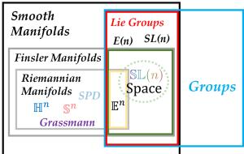

$$
R _ { A } ^ { - 1 } : \mathrm { S L } ( n ) \to T _ { A } \mathrm { S L } ( n ) , \quad R _ { A } ^ { - 1 } ( B ) = A \log ( A ^ { - 1 } B ) ,\tag{11}
$$

We can also define the closed form Schatten semidistance

$$
D _ { \mathbb { S } \mathbb { L } } ( A , B ) : = \| \log ( A ^ { - 1 } B ) \| _ { S _ { p } } .\tag{12}
$$

Figure 2: The SL(n)

It is nonnegative, symmetric, and point separating, but need not satisfy the triangle inequality or require tangent regularity. We use $D _ { \mathbb { S I } }$ as the pairwise dissimilarity for representation learning.

space combines Finsler geometry with Lie group structure, reducing to the Riemannian case at $p = 2$

The Lie bracket on ${ \mathfrak { s l } } ( n )$ is the matrix commutator $[ X , Y ] = X Y - Y X$ , which quantifies the change induced by reversing the order of two infinitesimal transformations and provides an intrinsic mechanism for order-aware composition. Locally, successive group transformations are related to nested Lie brackets through the BCH expansion, log(exp X exp $\dot { Y } ) = X + Y + { \textstyle { \frac { 1 } { 2 } } } [ X , Y ] +$ ${ \scriptstyle { \frac { 1 } { 1 2 } } } [ X , [ X , Y ] ] + \cdots .$ . Overall, these structures combine smooth manifold, Schatten-p Finsler geometric, and Lie group algebraic structures, supporting both intrinsic geometry and ordered composition. Finally, we define the unified SL representation space as

$$
\mathbb { S } \mathbb { L } _ { \mathbf { p } } ( \mathbf { n } ) : = ( \mathrm { S L } ( \mathbf { n } ) , \mathbf { F } _ { \mathbf { p } } , \circ ) .\tag{13}
$$

## 2.2 INTRINSIC COUPLED MIXED CURVATURE

## 2.2.1 POINTWISE INTRINSIC COUPLED MIXED FLAG CURVATURE

Having defined the SL space, we now characterize its intrinsic curvature structure. Hereafter, we write $A \in \mathbb { S } \mathbb { L } _ { p } ( n )$ and $\bar { T _ { A } } \bar { \mathbb { S } } \mathbb { L } _ { p } ( n ) : = T _ { A } \mathrm { S L } ( n )$ (with p omitted when unambiguous) when referring to the resulting representation space. We call mixed-curvature intrinsic when different curvature regimes arise within a single tangent geometry and are not attributable to separate factors of a metric product. $\mathbb { S L } _ { p } ( n )$ exhibits such intrinsic mixed-curvature with different curvature signs within the same tangent geometry.

Theorem 2.1 (Pointwise mixed flag curvature). For every $n \geq 2$ and every $p \in ( 1 , \infty )$ , for every $A \in \mathbb { S L } _ { p } ( n )$ , there exist a regular full-rank matrix (flagpole) $Y _ { A } \in \mathit { T } _ { A } \mathbb { S } \bar { \mathbb { L } } _ { p } ( n )$ and three tangent matrices $U _ { A } ^ { + } , U _ { A } ^ { 0 } , U _ { A } ^ { - } \in T _ { A } \mathbb { S } \mathbb { L } _ { p } ( n )$ , each linearly independent of $Y _ { A }$ , such that

$$
K _ { F } ( Y _ { A } , \mathrm { s p a n } \{ Y _ { A } , U _ { A } ^ { + } \} ) > 0 , \quad K _ { F } ( Y _ { A } , \mathrm { s p a n } \{ Y _ { A } , U _ { A } ^ { 0 } \} ) = 0 , \quad K _ { F } ( Y _ { A } , \mathrm { s p a n } \{ Y _ { A } , U _ { A } ^ { - } \} ) < 0 .
$$

Proof. The full and detailed proof is in Appendix [D.2].

Hence, $\mathbb { S L } ( n )$ exhibits pointwise $- , 0 , +$ mixed flag curvature around a common flagpole. We next distinguish genuine curvature coupling from mere coexistence.

Definition 2.2 (Mixed-curvature and coupling capacities). For a Finsler manifold $( { \mathcal { M } } , F )$ and a regular full-rank flagpole $Y \in T _ { x } { \mathcal { M } }$ , let $E _ { + } ^ { ^ { \bullet } } ( Y )$ and $E _ { - } ( \dot { Y } )$ be the positive and negative eigenspaces of $R _ { Y }$ . Define the mixed-curvature capacity as

$$
\mathcal { C } _ { \operatorname* { m i x } } ( Y ) : = \operatorname* { m i n } \{ \dim E _ { + } ( Y ) , \dim E _ { - } ( Y ) \} .
$$

Define the uncoupled subspaces $\mathcal { N } _ { + } ( Y ) : = \{ U \in E _ { + } ( Y ) : \pmb { \mathscr { R } } ^ { Y } ( U , V ) = 0 , \forall V \in E _ { - } ( Y ) \}$ and $\mathcal { N } _ { - } ( Y )$ analogously. The curvature coupling capacity is

$$
\begin{array} { r } { \mathcal { C } _ { \mathrm { c p l } } ( Y ) : = \operatorname* { m i n } \{ \dim E _ { + } ( Y ) - \dim \mathcal { N } _ { + } ( Y ) , \dim E _ { - } ( Y ) - \dim \mathcal { N } _ { - } ( Y ) \} . } \end{array}
$$

$\mathbf { A } \mathbf { t } x \in \mathcal { M }$ , a flagpole level capacity $\mathcal { C } ( Y )$ induces $\begin{array} { r } { \mathcal { C } ( \boldsymbol { x } ) : = \operatorname* { m a x } _ { \boldsymbol { Y } \in T _ { \boldsymbol { x } } \mathcal { M } \mathrm { \ r e g u l a r } } \mathcal { C } ( \boldsymbol { Y } ) } \end{array}$ and $\mathcal { C } _ { \mathcal { M } } ( F ) : =$ $\mathrm { m i n } _ { x \in \mathcal { M } } \mathcal { C } ( x )$ . We use this convention for both $\mathcal { C } _ { \mathrm { m i x } }$ and $\mathcal { C } _ { \mathrm { c p l } }$

Intuitively, $\mathcal { C } _ { \mathrm { m i x } }$ measures the balanced number of positive and negative curvature modes coexisting around a common flagpole, whereas $\mathcal { C } _ { \mathrm { c p l } }$ counts only those modes that genuinely interact across curvature signs. Hence $\dot { \mathcal { C } } _ { \mathrm { c p l } } \le \mathcal { C } _ { \mathrm { m i x } } .$ . Zero curvature is not counted separately, as it follows between positive and negative flag curvatures by continuity.

Corollary 2.3 (Asymptotically maximal mixed curvature and coupling). For every $n \geq 2$ and $p \in$ $( 1 , \infty )$ , since the transverse tangent space has dimension $n ^ { 2 } - 2 ,$ define $\mathcal { C } _ { \operatorname* { m a x } } ( n ) \mathrel { \mathop : } = \lfloor ( n ^ { 2 } - 2 ) \bar { / } 2 \rfloor$ Then

$$
\frac { ( n - 1 ) ( n - 2 ) } { 2 } \leq \mathcal { C } _ { \mathtt { S L } } ^ { \mathtt { c p l } } ( n , p ) \leq \mathcal { C } _ { \mathtt { S L } } ^ { \mathtt { m i x } } ( n , p ) \leq \mathcal { C } _ { \operatorname* { m a x } } ( n ) ,
$$

$$
\frac { \mathcal C _ { \mathrm { 8 L } } ^ { \mathrm { c p l } } ( n , p ) } { \mathcal C _ { \mathrm { m a x } } ( n ) } \longrightarrow 1 , \qquad \frac { \mathcal C _ { \mathrm { 8 L } } ^ { \mathrm { m i x } } ( n , p ) } { \mathcal C _ { \mathrm { m a x } } ( n ) } \longrightarrow 1 \quad a s n \to \infty .\tag{14}
$$

Proof. The full and detailed proof is in Appendix [D.3].

Accordingly, $\mathbb { S L } ( n )$ supports asymptotically maximal coexistence of positive and negative curvature modes while intrinsically coupling an asymptotically maximal number of these modes.

## 2.3 DEEP ORDER-AWARE COMPOSITION

Beyond its geometric structure, $\mathbb { S L } ( n )$ provides an intrinsic mechanism for representing ordered interactions through noncommutative group composition. For $A , B \in \mathbb { S } \mathbb { L } ( n )$ , generally $A B \neq B A$ so reversing their order changes the composition. Locally, this difference is captured by the Lie bracket $[ X , Y ] = X Y - Y X$ through the BCH expansion introduced above.

Pairwise noncommutativity, however, captures only first order interactions. Successive compositions may further modulate existing order differences through nested Lie brackets, as illustrated in Fig. 3. We therefore quantify the depth of such interactions by the following notion.

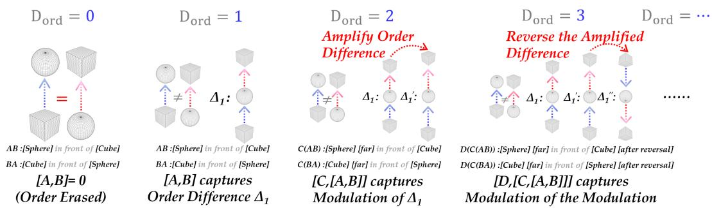  
Figure 3: Illustration of order depth. Increasing $D _ { \mathrm { o r d } }$ enables progressively deeper order-dependent interactions, from pairwise order sensitivity to higher level modulation through nested Lie brackets.

Lemma 2.4 (Order depth of SL). For a Lie group representation space M, define its order depth as

$D _ { \mathrm { o r d } } ( \mathcal { M } ) : = \operatorname* { s u p } \left\{ k \geq 1 : \exists X _ { 0 } , \dots , X _ { k } \in T _ { I } \mathcal { M } \right.$ such that $[ X _ { k } , [ \cdot \cdot \cdot , [ X _ { 1 } , X _ { 0 } ] \cdot \cdot \cdot ] ] \neq 0 \}$

(15)

We set $D _ { \mathrm { o r d } } ( \mathcal { M } ) = 0$ when all brackets vanish and $D _ { \mathrm { o r d } } ( \mathcal { M } ) = \infty$ when nonzero nested brackets exist at arbitrary depth. Then,for every $n \geq 2$ and every $p \in ( 1 , \infty )$ ,

$$
\begin{array} { r } { D _ { \mathrm { o r d } } ( \mathbb { S } \mathbb { L } _ { p } ( n ) ) = \infty . } \end{array}\tag{16}
$$

Proof. The full and detailed proof is in Appendix [D.4].

Thus, $D _ { \mathrm { o r d } }$ characterizes the depth at which nested order-dependent interactions can remain nonzero. A nilpotent Lie algebra of class c has $D _ { \mathrm { o r d } } = c - 1$ , whereas $\mathbb { S L } ( n )$ has $D _ { \mathrm { o r d } } = \infty$ This provides algebraic capacity for order-aware composition beyond pairwise noncommutativity. We examine the empirical relevance of this property on Flickr30k-Order in Sec. 3.2.

Table 1: Comparison of geometric representation spaces and their structural properties.
<table><tr><td></td><td colspan="4">Mixed curvature</td><td colspan="2">Curvature coupling</td><td colspan="2">Native group composition</td></tr><tr><td>Manifold Space</td><td>Mixed</td><td>Signs</td><td>Intrinsic</td><td>Capacity Cmix 1</td><td>Coupled</td><td>Capacity Ccpl M</td><td>Noncommutative</td><td> $D _ { \mathrm { o r d } }$ </td></tr><tr><td>Sd</td><td>N</td><td>{+}</td><td>N/A</td><td>N/A</td><td>N/A</td><td>N/A</td><td>N/A</td><td>N/A</td></tr><tr><td>Hd</td><td>N</td><td>{-}</td><td>N/A</td><td>N/A</td><td>N/A</td><td>N/A</td><td>N/A</td><td>N/A</td></tr><tr><td>Ed</td><td>N</td><td>{0}</td><td>N/A</td><td>N/A</td><td>N/A</td><td>N/A</td><td>N</td><td>0</td></tr><tr><td>Grassmann(k, n)</td><td>Y</td><td>{0, +}</td><td>Y</td><td>N/A</td><td>N/A</td><td>N/A</td><td>N/A</td><td>N/A</td></tr><tr><td>SPD(n)</td><td>Y</td><td>{−,0}</td><td>Y</td><td>N/A</td><td>N/A</td><td>N/A</td><td>N/A</td><td>N/A</td></tr><tr><td>Siegel(n)</td><td>Y</td><td>{−,0}</td><td>Y</td><td>N/A</td><td>N/A</td><td>N/A</td><td>N/A</td><td>N/A</td></tr><tr><td>Sds X HdH × Bde1</td><td>Y</td><td>{−, 0, +}</td><td>N</td><td>min{ds − 1, dH − 1}</td><td>N</td><td>0</td><td>N/A</td><td>N/A</td></tr><tr><td>Heisenberg-H2m+1</td><td>Y</td><td>{−, 0, +}</td><td>Y</td><td>1</td><td>Y</td><td>1</td><td>Y</td><td>1</td></tr><tr><td>SL(n)</td><td>Y</td><td>{−,0, +}</td><td>Y</td><td>≥ (n21)</td><td>Y</td><td>≥ (n21) 2</td><td>Y</td><td>∞</td></tr></table>

Overall, Table 1 shows that SL(n) uniquely combines intrinsic $\{ - , 0 , + \}$ mixed-curvature, high curvature-coupling capacity, and unbounded order depth within a single representation space.

## 3 EXPERIMENTS

We first examine the practical training ability of $\mathbb { S L } ( n )$ . The intrinsic Finsler distance has no simple closed form and requires costly path optimization. We therefore use the Schatten semidistance $D _ { \mathbb { S } \mathbb { L } }$ , which remains consistent with the intrinsic geometry while being over $1 0 ^ { 5 }$ times faster to compute than numerical geodesic distance. Optimization presents another challenge, as general Finsler manifolds lack mature adaptive optimization methods such as AdamW. We then introduce a Finsler compatible adaptive tangent space update for $\mathbb { S L } ( n )$ , which is empirically better suited than a mature Riemannian AdamW. Full analyses and algorithms are provided in Appendix [B.1][B.2].

For experiments, we evaluate two central properties of $\mathbb { S L } ( n )$ : its ability to represent mixed curvature structures and its order aware composition induced by noncommutative group multiplication. We first assess geometric representation through graph reconstruction on biological networks of increasing scale, and further evaluate downstream utility through large scale link prediction on OGBL-PPA. We then isolate compositional ability on Flickr30k-Order. Full implementation details, geometric parameterizations, distance functions, and additional results are provided in Appendix [C].

## 3.1 MIXED-CURVATURE GRAPH REPRESENTATION

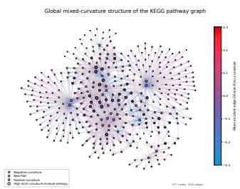  
(a) KEGG: |V | = 377,

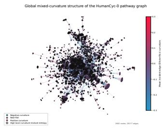  
(b) HumanCyc: |V | = 2,682,

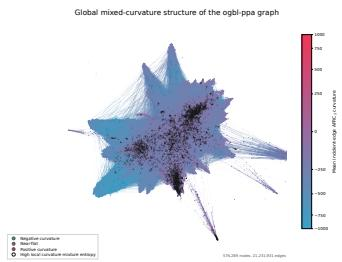  
(c) OGBL: |V | = 576,289,  
Figure 4: Graph curvature distributions of three biological networks of increasing scale. All three graphs exhibit mixed-curvature regimes with rich interactions structures.

Metric reconstruction on KEGG and HumanCyc. We evaluate geometric representation capacity by reconstructing the shortest path metrics of KEGG and HumanCyc. Each node is represented by a learnable point, while all methods use the same training pairs, data split, regression objective, and evaluation protocol, differing mainly in the latent geometry and its pairwise dissimilarity. Given graph distance $d _ { G } ( i , j )$ and latent dissimilarity $\bar { D _ { \mathcal { M } } } ( z _ { i } , z _ { j } )$ , all geometries optimize $\begin{array} { r } { \mathcal { L } = \frac { 1 } { | \mathcal { B } | } \sum _ { ( i , j ) \in \mathcal { B } } [ \log ( 1 + s D _ { \mathcal { M } } ( z _ { i } , z _ { j } ) ) - \log ( 1 + d _ { G } ( i , j ) ) ] ^ { 2 } } \end{array}$ , where $s > 0$ is a learned global scale and $\boldsymbol { B }$ is a training minibatch. Geometric fidelity is measured by

$$
\mathrm { D i s t o r t i o n } _ { \mathrm { a v g } } = \frac { 1 } { | T | } \sum _ { ( i , j ) \in \mathcal { T } } \frac { | s D _ { \cal M } ( z _ { i } , z _ { j } ) - d _ { G } ( i , j ) | } { \operatorname* { m a x } \{ d _ { G } ( i , j ) , 1 \} } .\tag{17}
$$

Here $\tau$ denotes the test pairs. Distortion measures deformation of the original graph metric. We further report q50, q90, and $q 9 5$ for typical and tail errors. Local curvature mixture entropy is defined as $\begin{array} { r } { H _ { \kappa } \bar { ( } \mathcal { N } ( v ) ) = - \sum _ { s \in \{ - , 0 , + \} } p _ { v } ^ { \bar { \kappa } } \bar { ( } s ) } \end{array}$ log $p _ { v } ^ { \kappa } ( s )$ , where $p _ { v } ^ { \kappa } ( s ) = | \{ u \in \mathcal { N } ( v ) : \kappa _ { v u } \in \bar { s } \} | / | \mathcal { N } ( v ) |$ Higher entropy indicates stronger local mixing of curvature regimes. High-related measures pairs involving high entropy nodes, Low-Low focuses on pairs between low entropy nodes, and Worstgroup reports the largest mean distortion across entropy groups. We first conduct a compact comparison using SL(4) and commonly used geometries, followed by a higher dimensional comparison. Dimensions are matched as closely as possible; for matrix manifolds, we align matrix size rather than intrinsic dimension. Product manifolds permit mixed-curvature coexistence but have zero coupling, while Heisenberg has both capacities equal to 1. In contrast, SL(n) has both capacities at least $\binom { n - 1 } { 2 }$ and asymptotically maximal. Performance is not strictly monotonic in either capacity, but $\mathbb { S L } ( n )$ achieves the strongest and most consistent errors across median, tail, High-related, and Worst-group metrics, suggesting benefits from rich curvature coexistence and intrinsic coupling.

Table 2: KEGG metric reconstruction results for geometric baselines. For all metrics, lower values indicate better performance.
<table><tr><td>Space</td><td> $\mathbf { D i s t o r t i o n } _ { \mathrm { a v g . } } \downarrow$ </td><td> ${ \mathfrak { q } } 5 0 \downarrow$ </td><td> ${ \bf q 9 0 } \downarrow$ </td><td> ${ \mathrm { q } } 9 5 \downarrow$ </td><td>High-related ↓</td><td>Low-Low ↓</td><td>Worst-group ↓</td><td>MAE↓</td></tr><tr><td>S15</td><td>0.0992±0.0006</td><td>0.0636</td><td>0.2166</td><td>0.3173</td><td>0.1125</td><td>0.0989</td><td>0.1850</td><td>0.2522</td></tr><tr><td>H15</td><td>0.0905±0.0002</td><td>0.0589</td><td>0.2008</td><td>0.2798</td><td>0.1113</td><td>0.0755</td><td>0.1857</td><td>0.2341</td></tr><tr><td>E15</td><td>0.0953±0.0002</td><td>0.0625</td><td>0.2107</td><td>0.3005</td><td>0.1114</td><td>0.0893</td><td>0.1837</td><td>0.2435</td></tr><tr><td> $\mathbb { S } ^ { 5 } \times \mathbb { H } ^ { 5 } \times \mathbb { E } ^ { 5 }$ </td><td>0.0724±0.0003</td><td>0.0427</td><td>0.1597</td><td>0.2403</td><td>0.0933</td><td>0.0549</td><td>0.1711</td><td>0.1849</td></tr><tr><td> $\mathbb { S } _ { \kappa _ { 1 } } ^ { 5 } \times \mathbb { H } _ { \kappa _ { 2 } } ^ { 5 } \times \mathbb { E } ^ { 5 }$ </td><td>0.0613±0.0005</td><td>0.0338</td><td>0.1404</td><td>0.2070</td><td>0.0890</td><td>0.0325</td><td>0.1642</td><td>0.1558</td></tr><tr><td>SL(4)</td><td>0.0586±0.0016</td><td>0.0288</td><td>0.1238</td><td>0.1947</td><td>0.0667</td><td>0.0556</td><td>0.1338</td><td>0.1485</td></tr><tr><td> $\mathbb { S } ^ { 3 2 } \times \mathbb { H } ^ { 3 2 }$ </td><td>0.0744±0.0001</td><td>0.0454</td><td>0.1616</td><td>0.2330</td><td>0.0986</td><td>0.0522</td><td>0.1759</td><td>0.1887</td></tr><tr><td> $\mathbb { S } ^ { 3 2 } \times \mathbb { E } ^ { 3 2 }$ </td><td>0.0842±0.0002</td><td>0.0505</td><td>0.1730</td><td>0.2775</td><td>0.1028</td><td>0.0725</td><td>0.1765</td><td>0.2108</td></tr><tr><td> $\mathbb { H } ^ { 3 2 } \times \mathbb { E } ^ { 3 2 }$ </td><td>0.0706±0.0000</td><td>0.0420</td><td>0.1550</td><td>0.2332</td><td>0.0966</td><td>0.0464</td><td>0.1689</td><td>0.1788</td></tr><tr><td> $\mathbb { S } _ { \kappa _ { 1 } } ^ { 2 1 } \times \mathbb { H } _ { \kappa _ { 2 } } ^ { 2 1 } \times \mathbb { E } ^ { 2 1 }$ </td><td>0.0591±0.0002</td><td>0.0286</td><td>0.1371</td><td>0.2013</td><td>0.0862</td><td>0.0295</td><td>0.1683</td><td>0.1502</td></tr><tr><td>Heisenberg  $. H ^ { 3 1 }$ </td><td>0.0814±0.0001</td><td>0.0526</td><td>0.1764</td><td>0.2432</td><td>0.1088</td><td>0.0572</td><td>0.1804</td><td>0.2073</td></tr><tr><td>Gr(7, 16)</td><td>0.0879±0.0010</td><td>0.0516</td><td>0.1787</td><td>0.2926</td><td>0.1088</td><td>0.0763</td><td>0.1836</td><td>0.2190</td></tr><tr><td>SPD(8)</td><td>0.0842±0.0004</td><td>0.0550</td><td>0.1821</td><td>0.2526</td><td>0.1095</td><td>0.0620</td><td>0.1805</td><td>0.2160</td></tr><tr><td>Siegel(8)</td><td>0.0601±0.0004</td><td>0.0328</td><td>0.1339</td><td>0.2109</td><td>0.0789</td><td>0.0454</td><td>0.1539</td><td>0.1475</td></tr><tr><td>SL(8)</td><td>0.0329±0.0001</td><td>0.0115</td><td>0.0698</td><td>0.1207</td><td>0.0389</td><td>0.0290</td><td>0.0841</td><td>0.0811</td></tr><tr><td>Improvement</td><td>↑44.3%</td><td>↑59.8%</td><td>↑47.9%</td><td>↑40.0%</td><td>↑50.7%</td><td>↑1.7%</td><td>↑45.4%</td><td>↑45.0%</td></tr></table>

Table 3: HumanCyc metric reconstruction results for geometric baselines.
<table><tr><td>Space</td><td>Distortion  $\cdot \mathrm { a v g . } \ \downarrow$ </td><td>q50↓</td><td>q90↓</td><td>q95↓</td><td>High-related ↓</td><td>Low-Low ↓</td><td>Worst-group ↓</td><td>MAE↓</td></tr><tr><td> $\overline { { \mathbb { S } ^ { 7 2 } \times \mathbb { H } ^ { 7 2 } } }$ </td><td>0.0649±0.0001</td><td>0.0450</td><td>0.1272</td><td>0.1771</td><td>0.0689</td><td>0.0569</td><td>0.0841</td><td>0.2379</td></tr><tr><td> $\mathbb { S } ^ { 7 2 } \times \mathbb { E } ^ { 7 2 }$ </td><td>0.0682±0.0000</td><td>0.0480</td><td>0.1308</td><td>0.1853</td><td>0.0701</td><td>0.0671</td><td>0.0842</td><td>0.2514</td></tr><tr><td>H72×E72</td><td>0.0655±0.0001</td><td>0.0453</td><td>0.1298</td><td>0.1803</td><td>0.0697</td><td>0.0567</td><td>0.0852</td><td>0.2421</td></tr><tr><td> $\mathbb { S } _ { \kappa + } ^ { 4 8 } \times \mathbb { H } _ { \kappa \circ } ^ { 4 8 } \times \mathbb { E } ^ { 4 8 }$ </td><td>0.0660±0.0000</td><td>0.0464</td><td>0.1294</td><td>0.1771</td><td>0.0702</td><td>0.0559</td><td>0.0849</td><td>0.2433</td></tr><tr><td>Gr(11, 24)</td><td>0.0693±0.0001</td><td>0.0483</td><td>0.1334</td><td>0.1892</td><td>0.0699</td><td>0.0746</td><td>0.0835</td><td>0.2557</td></tr><tr><td>SPD(12)</td><td>0.0698±0.0001</td><td>0.0495</td><td>0.1347</td><td>0.1892</td><td>0.0719</td><td>0.0679</td><td>0.0859</td><td>0.2586</td></tr><tr><td>Siegel(12)</td><td>0.0526±0.0001</td><td>0.0332</td><td>0.1070</td><td>0.1534</td><td>0.0557</td><td>0.0492</td><td>0.0708</td><td>0.1899</td></tr><tr><td>SL(12)</td><td>0.0313±0.0003</td><td>0.0153</td><td>0.0678</td><td>0.1019</td><td>0.0329</td><td>0.0309</td><td>0.0360</td><td>0.1098</td></tr><tr><td>Improvement</td><td>↑40.5%</td><td>↑53.9%</td><td>↑36.7%</td><td>↑33.6%</td><td>↑40.9%</td><td>↑37.2%</td><td>↑49.1%</td><td>↑42.2%</td></tr></table>

Large scale link prediction on OGBL-PPA. We further test whether the geometric representation advantage transfers to a downstream task on OGBL-PPA, a substantially larger protein association graph. All methods also use the same experimental settings, while varying only the latent representation space. This controlled setting isolates how well each geometry organizes nodes for recovering unseen links. Table 4 evaluates complementary aspects of ranking quality. Hits@K measures how often positive edges appear among the top ranked candidates, MRR summarizes reciprocal rank, and Rank50, Rank90, and Rank95 characterize the typical and tail ranks of positive edges. AUC and AP further measure global discrimination between positive and negative pairs. SL(8) improves all reported metrics, with particularly consistent gains across both Hits and rank quantiles. This indicates that its advantage is not limited to a particular ranking threshold, but extends across the ranking distribution and positive negative separation. Together with metric reconstruction, these results suggest that the geometry learned by SL(n) supports both faithful graph representation and downstream relational prediction at substantially larger scale.

Table 4: OGBL-PPA link prediction results for geometric latent spaces.
<table><tr><td>Space</td><td>Hits@20 ↑</td><td>Hits@50 ↑</td><td>Hits@100 ↑</td><td>Rank50↓</td><td>Rank90↓</td><td>Rank95↓</td><td>MRR↑</td><td>AUC↑</td><td>AP↑</td></tr><tr><td>S32 ×H32</td><td>0.0888±0.0050</td><td>0.1558±0.0143</td><td>0.2332±0.0144</td><td>803</td><td>30060</td><td>90715</td><td>0.0157</td><td>0.9915</td><td>0.9926</td></tr><tr><td>S32×E32</td><td>0.0725±0.0129</td><td>0.1454±0.0127</td><td>0.2102±0.0096</td><td>931</td><td>37757</td><td>111444</td><td>0.0140</td><td>0.9903</td><td>0.9915</td></tr><tr><td>H32×E32</td><td>0.0841±0.0036</td><td>0.1303±0.0022</td><td>0.1893±0.0089</td><td>1248</td><td>90588</td><td>279414</td><td>0.0140</td><td>0.9811</td><td>0.9844</td></tr><tr><td>H21×E21×S21</td><td>0.0898±0.0171</td><td>0.1556±0.0094</td><td>0.2185±0.0101</td><td>920</td><td>40199</td><td>118889</td><td>0.0155</td><td>0.9899</td><td>0.9912</td></tr><tr><td>H2 E 1 S21</td><td>0.0809±0.0094</td><td>0.1494±0.0118</td><td>0.2217±0.0090</td><td>990</td><td>48604</td><td>144410</td><td>0.0145</td><td>0.9883</td><td>0.9899</td></tr><tr><td>Gr(7, 16)</td><td>0.0775±0.0097</td><td>0.1336±0.0115</td><td>0.1808±0.0054</td><td>1588</td><td>119504</td><td>397421</td><td>0.0157</td><td>0.9748</td><td>0.9802</td></tr><tr><td>SPD(8)</td><td>0.0784±0.0153</td><td>0.1386±0.0122</td><td>0.1964±0.0086</td><td>1370</td><td>52211</td><td>147717</td><td>0.0151</td><td>0.9881</td><td>0.9896</td></tr><tr><td>Siegel(8)</td><td>0.0769±0.0295</td><td>0.1462±0.0140</td><td>0.2183±0.0095</td><td>998</td><td>64364</td><td>198532</td><td>0.0134</td><td>0.9855</td><td>0.9877</td></tr><tr><td>SL(8)</td><td>0.1282±0.0056</td><td>0.2188±0.0055</td><td>0.3093±0.0119</td><td>346</td><td>10700</td><td>36145</td><td>0.0195</td><td>0.9950</td><td>0.9957</td></tr><tr><td>Improvement</td><td>↑42.8%</td><td>↑40.4%</td><td>↑32.6%</td><td>↑57.0%</td><td>↑64.4%</td><td>↑60.2%</td><td>↑24.1%</td><td>↑0.3%</td><td>↑0.3%</td></tr></table>

## 3.2 DEEP ORDER-AWARE COMPOSITION


Positive 0: a [dozen workers] wearing uniforms and sanitation hats are [working on an assembly line] in [a factory]

Negative 1: a [dozen workers] wearing uniforms and sanitation hats are working on an [line assembly] in [a factory]

Negative 2: a [dozen workers] wearing uniforms and sanitation hats are [assembly on an working line] in [a factory]

Negative 3: a [are workers] wearing uniforms and sanitation hats [dozen working] on an assembly line in [a factory]

Negative 4: a [dozen workers] wearing uniforms and sanitation hats are [working on an assembly line] in [factory a]

Figure 5: Flickr30k-Order: The positive caption preserves the original word order, while the negative captions perturb local phrase order with nearly the same bag of words.

Order sensitive composition on Flickr30k-Order. We finally isolate the compositional property of SL(n) on Flickr30k-Order, where performance depends on preserving semantic order. Order Accuracy and Order Margin measure order discrimination, while Hard Accuracy and MRR evaluate harder and ranking based cases. For a controlled comparison, we freeze the same CLIP backbone and train only a lightweight group specific head for each representation space. We compare additive models with noncommutative groups of increasing effective order depth $D _ { \mathrm { o r d } }$ . Heisenberg and the unitriangular group $\mathrm { U T } ( n )$ have finite depth, whereas SL(4) has $D _ { \mathrm { o r d } } = \infty$ . Performance generally improves with larger $D _ { \mathrm { o r d } }$ , and ordered SL(4) performs best across all metrics, while removing ordered composition causes a large drop. This supports deep noncommutative composition as an advantage of SL(n) beyond its latent geometry.

Table 5: Order sensitive composition on ARO Flickr30k-Order.
<table><tr><td>Model</td><td>Dim.</td><td> $D _ { \mathrm { o r d } }$ </td><td>Composition</td><td>OrderAcc. ↑</td><td>OrderMargin ↑</td><td>HardAcc. ↑</td><td>MRR↑</td></tr><tr><td>BoW</td><td>一</td><td>0</td><td>Additive</td><td>47.82±1.96</td><td>-0.0000</td><td>41.52</td><td>0.561</td></tr><tr><td>CLIP</td><td>一</td><td>1</td><td>Implicit</td><td>86.08±0.00</td><td>0.0176</td><td>66.07</td><td>0.805</td></tr><tr><td>SL(4) w/o Ordered Comp.</td><td>15</td><td>0</td><td>Commutative addition</td><td>17.97±3.14</td><td>-0.0079</td><td>3.54</td><td>0.272</td></tr><tr><td>Heisenberg  $. H ^ { 7 }$ </td><td>15</td><td>1</td><td>Group matrix multiplication</td><td>94.28±0.02</td><td>0.6324</td><td>82.32</td><td>0.906</td></tr><tr><td>UT(4)</td><td>6</td><td>2</td><td>Group matrix multiplication</td><td>94.11±0.27</td><td>0.5804</td><td>81.64</td><td>0.903</td></tr><tr><td>UT(6)</td><td>15</td><td>4</td><td>Group matrix multiplication</td><td>96.30±0.18</td><td>0.8862</td><td>89.11</td><td>0.942</td></tr><tr><td>UT(15)</td><td>105</td><td>13*</td><td>Group matrix multiplication</td><td>97.25±0.06</td><td>1.1683</td><td>92.13</td><td>0.957</td></tr><tr><td>Full SL(4) w/ Ordered Comp.</td><td>15</td><td>∞</td><td>Group matrix multiplication</td><td>97.46±0.07</td><td>1.1934</td><td>92.87</td><td>0.962</td></tr></table>

<sup>∗</sup>For dimension 15 = dim SL(4), the maximal finite $\overline { { D _ { \mathrm { o r d } } } }$ of a nilpotent Lie algebra is 13.

## 3.3 ABLATION STUDY AND SENSITIVITY TEST

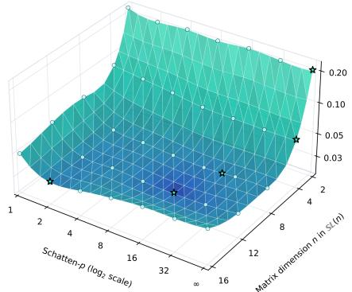  
(a) Schatten-p sensitivity across SL(n) dimensions.

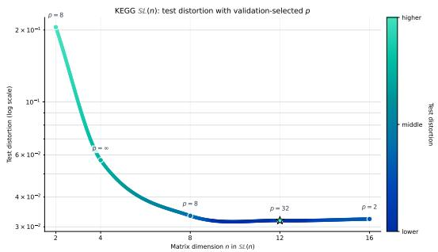  
(b) Dimension ablation with validation-optimal Schatten-p.  
Figure 6: Sensitivity and dimension ablation studies for SL(n) on KEGG.

Figure 6 shows a clear interaction between matrix dimension n and Schatten order $p .$ Increasing n enlarges representation capacity, while larger p places greater emphasis on dominant singular directions. The preferred $p$ varies substantially with $n ,$ indicating that these two hyperparameters control different aspects of the geometry and should be tuned jointly. Test dis-

Table 6: Representative training loss and test distortion on KEGG.
<table><tr><td></td><td colspan="2">n = 12</td><td colspan="2">n = 16</td></tr><tr><td>p</td><td>Train loss</td><td>Test dist.</td><td>Train loss</td><td>Test dist.</td></tr><tr><td>2</td><td> $8 . 0 5 \times 1 0 ^ { - 7 }$ </td><td>0.03279</td><td> $1 . 8 9 \times 1 0 ^ { - 7 }$ </td><td>0.03149</td></tr><tr><td>16</td><td> $1 . 2 5 \times 1 0 ^ { - 5 }$ </td><td>0.03026</td><td> $1 . 1 5 \times 1 0 ^ { - 7 }$ </td><td>0.04040</td></tr></table>

tortion improves rapidly up to $n = 8 – 1 2$ and then saturates. Table 6 further shows that at $p = 1 6 ,$ increasing n from 12 to 16 reduces training loss by about 109× while worsening test distortion by 33.5%, revealing a clear capacity generalization tradeoff. In practice, this favors choosing n near the validation plateau and tuning p separately for each dimension.

## 4 CONCLUSION

SL(n) provides a single representation space combining coupled mixed-curvature with deep orderaware composition. Remarkably, this richness emerges from a minimal construction consisting only of the det(A) = 1 constraint and a simple left invariant Schatten-p tangent norm. Its Finsler geometry realizes curvature signs $\{ - , 0 , + \}$ with asymptotically maximal mixed-curvature and curvaturecoupling capacities, while its non-nilpotent Lie structure supports noncommutative interactions at arbitrary depth. Thus, rich geometric coexistence, intrinsic interaction, and deep composition need not rely on separate representation components. The consistent gains across metric reconstruction, large scale link prediction, and ordered composition show that this structural simplicity preserves expressive power. Together, these results establish SL(n) as a general structured latent space for intrinsically coupled mixed-curvature geometry and deep composition, illustrating how simple structural constraints can yield unexpectedly rich representations, with potential applications across geometric, relational, sequential, multimodal, and scientific representation learning.

## REFERENCES

Gregor Bachmann, Gary Becigneul, and Octavian Ganea. Constant curvature graph convolutional networks. In Hal Daume III and Aarti Singh (eds.),´ Proceedings of the 37th International Conference on Machine Learning, volume 119 of Proceedings of Machine Learning Research, pp. 486–496. PMLR, 13–18 Jul 2020. URL https://proceedings.mlr.press/v119/ bachmann20a.html.

D. Bao, S.-S. Chern, and Z. Shen. The Chern Connection, pp. 27–48. Springer New York, New York, NY, 2000. ISBN 978-1-4612-1268-3. doi: 10.1007/978-1-4612-1268-3 2. URL https: //doi.org/10.1007/978-1-4612-1268-3\_2.

Thomas Bendokat, Ralf Zimmermann, and P.-A. Absil. A grassmann manifold handbook: basic geometry and computational aspects. Adv. Comput. Math., 50(1), January 2024. ISSN 1019-7168. doi: 10.1007/s10444-023-10090-8. URL https://doi.org/10.1007/ s10444-023-10090-8.

Michael M. Bronstein, Joan Bruna, Taco Cohen, and Petar Velickoviˇ c. Geometric deep learning:´ Grids, groups, graphs, geodesics, and gauges. arXiv preprint arXiv:2104.13478, 2021.

Ines Chami, Zhitao Ying, Christopher Re, and Jure Leskovec. Hyperbolic graph convolutional´ neural networks. In H. Wallach, H. Larochelle, A. Beygelzimer, F. d'Alche-Buc, E. Fox,´ and R. Garnett (eds.), Advances in Neural Information Processing Systems, volume 32. Curran Associates, Inc., 2019. URL https://proceedings.neurips.cc/paper\_files/ paper/2019/file/0415740eaa4d9decbc8da001d3fd805f-Paper.pdf.

Ines Chami, Adva Wolf, Da-Cheng Juan, Frederic Sala, Sujith Ravi, and Christopher Re. Low-´ dimensional hyperbolic knowledge graph embeddings. In Dan Jurafsky, Joyce Chai, Natalie Schluter, and Joel Tetreault (eds.), Proceedings of the 58th Annual Meeting of the Association for Computational Linguistics, pp. 6901–6914, Online, July 2020. Association for Computational Linguistics. doi: 10.18653/v1/2020.acl-main.617. URL https://aclanthology.org/ 2020.acl-main.617/.

Thomas Dages, Simon Weber, Ya-Wei Eileen Lin, Ronen Talmon, Daniel Cremers, Michael Lin-\` denbaum, Alfred M. Bruckstein, and Ron Kimmel. Finsler multi-dimensional scaling: Manifold learning for asymmetric dimensionality reduction and embedding. In 2025 IEEE/CVF Conference on Computer Vision and Pattern Recognition (CVPR), pp. 25842–25853. IEEE, 2025. doi: 10.1109/CVPR52734.2025.02407. URL https://doi.org/10.1109/CVPR52734. 2025.02407.

Nima Dehmamy, Robin Walters, Yanchen Liu, Dashun Wang, and Rose Yu. Automatic symmetry discovery with lie algebra convolutional network. In A. Beygelzimer, Y. Dauphin, P. Liang, and J. Wortman Vaughan (eds.), Advances in Neural Information Processing Systems, 2021. URL https://openreview.net/forum?id=NPOWF\_ZLfC5.

Willem Diepeveen, Georgios Batzolis, Zakhar Shumaylov, and Carola-Bibiane Schonlieb. Score-¨ based pullback Riemannian geometry: Extracting the data manifold geometry using anisotropic flows. In Proceedings of the 42nd International Conference on Machine Learning, volume 267 of Proceedings ofMachine Learning Research, pp. 13746–13773. PMLR, 2025.

Charles Fefferman, Sanjoy Mitter, and Hariharan Narayanan. Testing the manifold hypothesis, 2013. URL https://arxiv.org/abs/1310.0425.

Marc Finzi, Samuel Stanton, Pavel Izmailov, and Andrew Gordon Wilson. Generalizing convolutional neural networks for equivariance to lie groups on arbitrary continuous data. In Proceedings ofthe 37th International Conference on Machine Learning, ICML’20. JMLR.org, 2020.

Morikuni GOTO and Kagumi UESU. Lie groups with left invariant metrics of nonnegative curvature. Memoirs of the Faculty of Science, Kyushu University. Series A, Mathematics, 35(1):33–38, 1981. doi: 10.2206/kyushumfs.35.33.

Albert Gu, Frederic Sala, Beliz Gunel, and Christopher Re. Learning mixed-curvature representa- ´ tions in product spaces. In International Conference on Learning Representations, 2019. URL https://openreview.net/forum?id=HJxeWnCcF7.

Zihao Guo, Qingyun Sun, Haonan Yuan, Xingcheng Fu, Min Zhou, Yisen Gao, and Jianxin Li. GraphMoRE: Mitigating topological heterogeneity via mixture of riemannian experts. In Proceedings of the AAAI Conference on Artificial Intelligence, volume 39, pp. 11754–11762, 2025. doi: 10.1609/aaai.v39i11.33279. URL https://doi.org/10.1609/aaai.v39i11. 33279.

Brian C. Hall. The baker–campbell–hausdorff formula and its consequences. In Lie Groups, Lie Algebras, and Representations: An Elementary Introduction, volume 222 of Graduate Texts in Mathematics, pp. 109–137. Springer International Publishing, Cham, 2 edition, 2015. ISBN 978- 3-319-13467-3. doi: 10.1007/978-3-319-13467-3 5. URL https://doi.org/10.1007/ 978-3-319-13467-3\_5.

G. E. Hinton and R. R. Salakhutdinov. Reducing the dimensionality of data with neural networks. Science, 313(5786):504–507, 2006. doi: 10.1126/science.1127647. URL https: //www.science.org/doi/abs/10.1126/science.1127647.

Harold Hotelling. Analysis of a complex of statistical variables into principal components. Journal of Educational Psychology, 24(6):417–441, 1933. doi: 10.1037/h0071325.

Zhiwu Huang, Chengde Wan, Thomas Probst, and Luc Van Gool. Deep learning on Lie groups for skeleton-based action recognition. In 2017 IEEE Conference on Computer Vision and Pattern Recognition (CVPR), pp. 1243–1252. IEEE, 2017. doi: 10.1109/CVPR.2017.137. URL https: //doi.org/10.1109/CVPR.2017.137.

Zhiwu Huang, Jiqing Wu, and Luc Van Gool. Building deep networks on grassmann manifolds, 2018. URL https://arxiv.org/abs/1611.05742.

Michael J. Hutchinson, Charline Le Lan, Sheheryar Zaidi, Emilien Dupont, Yee Whye Teh, and Hyunjik Kim. LieTransformer: Equivariant self-attention for Lie groups. In Proceedings of the 38th International Conference on Machine Learning, volume 139 of Proceedings of Machine Learning Research, pp. 4533–4543. PMLR, 2021. URL https://proceedings.mlr. press/v139/hutchinson21a.html.

Miguel Angel Javaloyes. Chern connection of a pseudo-finsler metric as a family of affine connections, 2014. URL https://arxiv.org/abs/1303.6263.

Miguel Angel Javaloyes. Anisotropic tensor calculus. <sup>´</sup> International Journal of Geometric Methods in Modern Physics, 16(Supplement 2):1941001, 2019. doi: 10.1142/S0219887819410019. URL https://doi.org/10.1142/S0219887819410019.

Chankyo Kim, Sicheng Zhao, Minghan Zhu, Tzu-Yuan Lin, and Maani Ghaffari. Equivariant neural networks for general linear symmetries on lie algebras, 2026. URL https://arxiv.org/ abs/2510.22984.

Hannah Lawrence and Mitchell Tong Harris. Learning polynomial problems with SL(2, R)- equivariance. In International Conference on Learning Representations, 2024. URL https: //openreview.net/forum?id=gyfXuRfxW2.

John M. Lee. Submanifolds. In Introduction to Smooth Manifolds, volume 218 of Graduate Texts in Mathematics, pp. 98–124. Springer, New York, NY, 2 edition, 2013. ISBN 978-1- 4419-9982-5. doi: 10.1007/978-1-4419-9982-5 5. URL https://doi.org/10.1007/ 978-1-4419-9982-5\_5.

Tzu-Yuan Lin, Minghan Zhu, and Maani Ghaffari. Lie neurons: Adjoint-equivariant neural networks for semisimple lie algebras, 2024. URL https://arxiv.org/abs/2310.04521.

Federico Lopez, Beatrice Pozzetti, Steve Trettel, Michael Strube, and Anna Wienhard. Symmetric spaces for graph embeddings: A Finsler-Riemannian approach. In Proceedings of the 38th International Conference on Machine Learning, volume 139 of Proceedings of Machine Learning Research, pp. 7090–7101. PMLR, 2021.

Daniel McNeela, Frederic Sala, and Anthony Gitter. Product manifold representations for learning on biological pathways, 2025. URL https://arxiv.org/abs/2401.15478.

Tomas Mikolov, Ilya Sutskever, Kai Chen, Greg S Corrado, and Jeff Dean. Distributed representations of words and phrases and their compositionality. In C.J. Burges, L. Bottou, M. Welling, Z. Ghahramani, and K. Weinberger (eds.), Advances in Neural Information Processing Systems, volume 26. Curran Associates, Inc., 2013. URL https://proceedings.neurips.cc/paper\_files/paper/2013/ file/9aa42b31882ec039965f3c4923ce901b-Paper.pdf.

John Milnor. Curvatures of left invariant metrics on lie groups. Advances in Mathematics, 21 (3):293–329, 1976. ISSN 0001-8708. doi: 10.1016/S0001-8708(76)80002-3. URL https: //www.sciencedirect.com/science/article/pii/S0001870876800023.

Mircea Mironenco and Patrick Forre. Lie group decompositions for equivariant neural networks,´ 2024. URL https://arxiv.org/abs/2310.11366.

Tuc Nguyen-Van, Dung D. Le, and The-Anh Ta. Improving heterogeneous graph learning with weighted mixed-curvature product manifold, 2023. URL https://arxiv.org/abs/ 2307.04514.

Maximilian Nickel and Douwe Kiela. Poincare embeddings for learning hierarchical represen-´ tations. In I. Guyon, U. Von Luxburg, S. Bengio, H. Wallach, R. Fergus, S. Vishwanathan, and R. Garnett (eds.), Advances in Neural Information Processing Systems, volume 30. Curran Associates, Inc., 2017. URL https://proceedings.neurips.cc/paper\_files/ paper/2017/file/59dfa2df42d9e3d41f5b02bfc32229dd-Paper.pdf.

T Mitchell Roddenberry and Richard Baraniuk. Finsler geometry, graph neural networks, and you. In Topology, Algebra, and Geometry in Data Science, 2026. URL https://openreview. net/forum?id=K9EJoCht9k.

Haitz Saez de Oc´ ariz Borde. On the expressive power of mixed-curvature representations in product´ manifolds. In Workshop on Geometry-grounded Representation Learning and Generative Modeling at ICLR, 2026.

Ondrej Skopek, Octavian-Eugen Ganea, and Gary Becigneul. Mixed-curvature variational au-´ toencoders. In International Conference on Learning Representations, 2020. URL https: //openreview.net/forum?id=S1g6xeSKDS.

Li Sun, Zhongbao Zhang, Junda Ye, Hao Peng, Jiawei Zhang, Sen Su, and Philip S. Yu. A selfsupervised mixed-curvature graph neural network. CoRR, abs/2112.05393, 2021. URL https: //arxiv.org/abs/2112.05393.

Joshua B. Tenenbaum, Vin de Silva, and John C. Langford. A global geometric framework for nonlinear dimensionality reduction. Science, 290(5500):2319–2323, 2000. doi: 10.1126/science.290. 5500.2319. URL https://www.science.org/doi/abs/10.1126/science.290. 5500.2319.

Nam-Kiu Tsing, Michael K.H. Fan, and Erik I. Verriest. On analyticity of functions involving eigenvalues. Linear Algebra and its Applications, 207:159–180, 1994. ISSN 0024-3795. doi: 10.1016/0024-3795(94)90009-4. URL https://www.sciencedirect.com/science/ article/pii/0024379594900094.

Jihu Wang, Yuliang Shi, Han Yu, Xinjun Wang, Zhongmin Yan, and Fanyu Kong. Mixed-curvature manifolds interaction learning for knowledge graph-aware recommendation. In Proceedings of the 46th International ACM SIGIR Conference on Research and Development in Information Retrieval, pp. 372–382, 2023. doi: 10.1145/3539618.3591730.

Shen Wang, Xiaokai Wei, Cicero Nogueira dos Santos, Zhiguo Wang, Ramesh Nallapati, Andrew Arnold, Bing Xiang, Philip S. Yu, and Isabel F. Cruz. Mixed-curvature multi-relational graph neural network for knowledge graph completion. In Proceedings of the Web Conference 2021, WWW ’21, pp. 1761–1771, New York, NY, USA, 2021. Association for Computing Machinery. ISBN 9781450383127. doi: 10.1145/3442381.3450118. URL https: //doi.org/10.1145/3442381.3450118.

Ming Xu and Shaoqiang Deng. Homogeneous finsler spaces and the flag-wise positively curved condition. Forum Mathematicum, 30(6):1521–1537, 2018. doi: 10.1515/forum-2018-0130.

Xin Yang, Xingrun Li, Heng Chang, Yang jinze, Xihong Yang, Shengyu Tao, Maiko Shigeno, Ningkang Chang, Junfeng Wang, Dawei Yin, and Erxue Min. Hgformer: Hyperbolic graph transformer for collaborative filtering. In Forty-second International Conference on Machine Learning, 2025. URL https://openreview.net/forum?id=lNTHwNF8IH.

Wei Zhao, Federico Lopez, J. Maxwell Riestenberg, Michael Strube, Diaaeldin Taha, and Steve Trettel. Modeling graphs beyond hyperbolic: Graph neural networks in symmetric positive definite matrices. In Machine Learning and Knowledge Discovery in Databases: Research Track, volume 14171 of Lecture Notes in Computer Science, pp. 122–139. Springer, 2023. doi: 10.1007/978-3-031-43418-1 8.

## APPENDIX

## A RELATED WORK AND DISCUSSION

## A.1 RELATED WORK

Mixed-curvature and manifold representation learning. Non-Euclidean representation learning uses the geometry of the latent manifold as an inductive bias for structured data. Constantcurvature manifolds provide three canonical geometric regimes: Euclidean spaces model approximately flat structures, hyperbolic spaces naturally accommodate hierarchical and tree-like structures, while spherical spaces provide compact positively curved geometry for structures with cyclic or globally constrained relations (Nickel & Kiela, 2017; Chami et al., 2019; Bachmann et al., 2020). These geometries have been applied broadly to knowledge graphs, recommendation systems, generative modeling, graph learning, and visual representation (Chami et al., 2020; Skopek et al., 2020; Yang et al., 2025). Since real data often contain structures that cannot be captured by one curvature regime, product manifolds combine Euclidean, hyperbolic, and spherical components to form mixed-curvature representation spaces (Gu et al., 2019; Skopek et al., 2020). Such spaces have been further developed for graph learning and biological networks (Sun et al., 2021; McNeela et al., 2025). Beyond constant-curvature factors, matrix and higher rank manifolds including SPD, Grassmann, and Siegel spaces provide richer intrinsic geometries for covariance, subspace, and graph representations (Huang et al., 2018; Lopez et al., 2021). A complementary line of work adapts geometry through the learning architecture, for example by learning curvature parameters, weighting multi ple manifold components, or dynamically selecting and combining geometric experts (Bachmann et al., 2020; Sun et al., 2021; Nguyen-Van et al., 2023; Guo et al., 2025). Our work instead focuses on the underlying representation manifold. Compared with existing geometric spaces, SL(n) provides intrinsic mixed curvature and curvature coupling within a single manifold, while its Lie group structure additionally supports noncommutative composition. Because these properties arise from the representation space itself rather than from a specialized geometry-learning architecture, SL(n) can serve as a general latent space beyond curvature-adaptive models. Accordingly, our controlled experiments vary the representation manifold while keeping the surrounding learning framework fixed.

Finsler geometry and Lie structures in machine learning. Finsler geometry extends Riemannian geometry by allowing the tangent norm to depend on direction, and has been used in representation learning to enrich the geometry available beyond standard Riemannian metrics. In particular, Finsler metrics on symmetric spaces have been studied for graph embeddings (Lopez et al., 2021), while more recent work has explored Finsler geometry for asymmetric embedding and graph learning (Dages et al.\` , 2025; Roddenberry & Baraniuk, 2026). Lie groups and Lie algebras have been widely used in machine learning for geometric representation, continuous symmetries, and equivariant architectures (Huang et al., 2017; Finzi et al., 2020; Hutchinson et al., 2021; Dehmamy et al., 2021). More recent work has extended this direction to noncompact and semisimple groups, including architectures involving SL(2, R), SL(n, R), and their Lie algebras (Lawrence & Harris, 2024; Mironenco & Forre´, 2024; Lin et al., 2024; Kim et al., 2026). Many of these approaches exploit Lie groups and Lie algebras as symmetry groups, transformation domains, or algebraic structures for constructing equivariant networks. In contrast, we do not use SL(n) only as a symmetry acting on external features. We make SL(n) itself the latent representation space, where the left invariant Schatten-p Finsler structure determines intrinsic mixed curvature and curvature coupling, while the group product and Lie algebra provide noncommutative and higher order composition. Thus, our use of Lie structure extends beyond symmetry and equivariance, with geometry and composition jointly defining the underlying representation space.

## A.2 DISCUSSION AND LIMITATIONS

## A.2.1 DISCUSSION

Actually, intrinsic mixed curvature is not a rare geometric phenomenon. Classical results on left invariant geometry already imply that connected noncompact semisimple Lie groups naturally exhibit both positive and negative curvature under left invariant Riemannian metrics (Milnor, 1976; GOTO & UESU, 1981). But this observation led us to ask a more basic question. If mixed-curvature is already available in a broad family of Lie groups, what is the simplest algebraic structure that can retain this richness while remaining useful as a representation space?

We therefore turned to simple Lie algebras, where the algebraic structure cannot be decomposed into nontrivial ideals. Even there, many classical candidates remain, like ${ \mathfrak { s l } } ( n , \mathbb { R } ) , { \mathfrak { s o } } ( p , q ) , { \mathfrak { s p } } ( 2 n , \mathbb { R } )$ ${ \mathfrak { s u } } ( p , q )$ , etc. What makes $\mathrm { S L } ( n ) $ particularly striking is the simplicity of its realization. It requires only det $( A ) = 1$ , whereas other classical families impose additional preservation constraints such as $\dot { A ^ { \top } } J _ { p , q } \dot { A ^ { ' } } = \dot { J _ { p , q } } , A ^ { * } J _ { p , q } A = J _ { p , q } , \mathrm { o r } A ^ { \top } J A \stackrel { . } { = } J .$ Together with a simple left invariant Schatten-p tangent norm, this minimal construction nevertheless produces rich mixed curvature, strong curvature capacities, and noncommutative composition at arbitrary depth. This suggests a broader principle that expressive representation geometry need not be built from increasingly complicated components. Rich geometry and algebra may instead emerge from a small number of simple structural constraints.

This perspective is especially relevant when geometric heterogeneity and composition arise together. In multimodal learning, different modalities may exhibit distinct local geometries while their alignment requires structured interactions between representations. In knowledge graphs and recommender systems, heterogeneous relations coexist with relation composition or sequential behavior. In biological and scientific representation learning, hierarchical, cyclic, continuous, and directional structures may appear within the same system, making an intrinsically mixed geometry particularly natural.

The compositional structure of $\mathbb { S L } ( n )$ also suggests applications to temporal and dynamical representations. Sequential observations can be viewed as transformations accumulated through group composition, making the space relevant to state space models, learned dynamical systems, and world models. Matrix representations are similarly natural in vision, 3D learning, robotics, and operator learning, where states and transformations often need to be represented together. More broadly, since $\mathbb { S L } ( n )$ defines a latent representation space rather than a specific architecture, it can in principle be incorporated into GNNs, Transformers, state space models, multimodal systems, and neural operators. Beyond applying $\mathbb { S L } ( n )$ itself, an important direction is to understand which other simple structural constraints can generate similarly rich geometry, composition, and useful inductive bias.

## A.2.2 LIMITATIONS AND FUTURE DIRECTIONS

Our experiments are designed to isolate the effect of the underlying representation space and therefore do not explore architectures specifically optimized for SL(n). The results show that the space works effectively within controlled frameworks, while dedicated $\mathbb { S L } ( n )$ layers may better exploit its geometric and compositional structure. Another limitation concerns distance computation. The closed form semidistance used in our scalable experiments is restricted to the principal logarithm domain, whereas exact intrinsic path distances are more expensive. We partially address this through path approximations, while globally robust distance constructions remain an important direction.

Matrix valued representations also incur higher computational cost than vector embeddings due to matrix multiplication, matrix logarithms, and Schatten norm evaluations. This is a general challenge for matrix manifold methods rather than one specific to $\mathbb { S L } ( n )$ , while group multiplication and inversion remain standard matrix operations. Future work may reduce this cost through low rank parameterizations, approximate logarithms, and efficient Lie algebra updates.

Integrating $\mathbb { S L } ( n )$ with larger architectures is a natural next step. Dedicated $\mathbb { S L } ( n )$ layers may allow models to exploit mixed curvature, intrinsic coupling, and noncommutative composition jointly rather than using the space only as an embedding domain. Extending this perspective to other matrix Lie groups may reveal how geometry and algebra match structural priors. Promising applications include foundation models, knowledge graphs, multimodal and sequential learning, and scientific representation learning.

## B DISTANCE AND OPTIMIZATION ANALYSIS

## B.1 SCHATTEN SEMIDISTANCE

## B.1.1 RELATION BETWEEN THE SCHATTEN SEMIDISTANCE AND INTRINSIC DISTANCE

The Schatten semidistance $D _ { \mathbb { S } \mathbb { L } }$ is used for pairwise comparison in $\mathbb { S L } _ { p } ( n )$ , while the Finsler metric $F _ { p }$ induces the intrinsic geodesic distance $d _ { p } .$ We first establish their local relation.

Lemma B.1 (Second-order tightness of the Schatten semidistance). For every $1 < p < \infty$ , there exist local constants $\delta , C > 0$ such that, for any $A , B \in \mathbb { S } \mathbb { L } _ { p } ( n )$ in the principal-logarithm domain with $D _ { \mathbb { S } \mathbb { L } } ( A , B ) < \delta$

$$
0 \leq D _ { \mathbb { S } \mathbb { L } } ( A , B ) - d _ { p } ( A , B ) \leq C D _ { \mathbb { S } \mathbb { L } } ( A , B ) ^ { 2 } .\tag{18}
$$

Consequently, $D _ { \mathbb { S } \mathbb { L } } ( A , B ) \ = \ d _ { p } ( A , B ) + O ( D _ { \mathbb { S } \mathbb { L } } ( A , B ) ^ { 2 } )$ , and equivalently $D _ { \mathbb { S } \mathbb { L } } ( A , B ) =$ $d _ { p } ( A , B ) + O ( d _ { p } ( A , B ) ^ { 2 } )$ as $B  A$

Proof. Let $X \ = \ \log ( A ^ { - 1 } B )$ Since $\log ( B ^ { - 1 } A ) ~ = ~ - X$ in the principal-logarithm domain, $D _ { \mathbb { S } \mathbb { L } } ( A , B ) \ : = \ : \| X \| _ { S _ { p } }$ . Consider the canonical exponential path $\overset { \triangledown } { \boldsymbol { \gamma } _ { X } ( t ) } \stackrel { \triangledown } { = } \boldsymbol { A } \exp ( t \boldsymbol { X } )$ . Its lefttrivialized velocity is constant, $\gamma _ { X } ( t ) ^ { - 1 } \dot { \gamma } _ { X } ( t ) = X$ , and hence $L _ { p } ( \gamma _ { X } ) = \| X \| _ { S _ { p } } = D _ { \mathbb { S } \mathbb { L } } ( A , B )$ Therefore

$$
\begin{array} { r } { d _ { p } ( A , B ) \le D _ { \mathbb { S } \mathbb { L } } ( A , B ) . } \end{array}\tag{19}
$$

For the reverse estimate, let $\gamma$ be any sufficiently short piecewise-smooth curve from A to B, let $\xi ( t ) = \gamma ( t ) ^ { - 1 } \dot { \gamma } ( t )$ , and write $\begin{array} { r } { L = L _ { p } ( \gamma ) = \int _ { 0 } ^ { 1 } \| \xi ( t ) \| _ { S _ { p } } d t } \end{array}$ . The local Magnus expansion gives $\begin{array} { r } { X = \int _ { 0 } ^ { 1 } \xi ( t ) d t + R _ { \gamma } } \end{array}$ . Since $\| [ U , V ] \| _ { S _ { p } } \leq 2 \| U \| _ { S _ { p } } \| V \| _ { S _ { p } }$ , all terms of the Magnus remainder are at least quadratic in the path length, and for sufficiently small L there is a local constant $C > 0$ such that $\| \hat { R _ { \gamma } } \| _ { S _ { p } } \leq C L ^ { 2 }$ . Hence $\| { \check { X } } \| _ { S _ { p } } \leq L + C L ^ { 2 }$

Because the canonical path already has length $D _ { \mathbb { S L } } ( A , B )$ , a minimizing sequence for $d _ { p } ( A , B )$ may be chosen inside the same sufficiently small neighborhood. Letting $\bar { L ^ { ' } } \to d _ { p } ( A , \bar { B } )$ gives $D _ { \mathbb { S } \mathbb { L } } ( A , B ) \leq d _ { p } ( A , B ) + C d _ { p } ( A , B ) ^ { 2 }$ . Together with $d _ { p } ( A , B ) \leq D _ { \mathbb { S } \mathbb { L } } ( A , B )$ , we obtain

$$
0 \leq D _ { \mathbb { S } \mathbb { L } } ( A , B ) - d _ { p } ( A , B ) \leq C D _ { \mathbb { S } \mathbb { L } } ( A , B ) ^ { 2 } .\tag{20}
$$

Finally, for sufficiently small $D _ { \mathbb { S L } } ( A , B )$ the two quantities are locally equivalent, so the quadratic remainder may equivalently be written as $O ( d _ { p } ( A , \mathbf { \bar { B } } ) ^ { 2 } )$ □

Empirical correlation with numerical geodesic distance. We further examine whether this local agreement extends to representations encountered in practice. On KEGG, we randomly sample 100 learned representation pairs and compute a high-accuracy numerical reference $\widehat { d } _ { p }$ by geodesic path optimization under $F _ { p }$ . We compare $D _ { \mathbb { S I } }$ with $\widehat { d } _ { p }$ using their mean relative discrepancy, Pearson correlation, and Spearman rank correlation. We additionally record the computation time of the numerical reference. 100 pairs are randomly sampled on KEGG. The last column reports the slowdown of numerical geodesic computation relative to $D _ { \mathbb { S I } }$

Table 7: Correlation between the Schatten semidistance $D _ { \mathbb { S } \mathbb { L } }$ and numerical geodesic distances.
<table><tr><td>p</td><td>Rel. Diff. ↓</td><td>Pearson ↑</td><td>Spearman ↑</td><td>Ref. Time / Pair</td><td>Slowdown</td></tr><tr><td>2</td><td>27.11%</td><td>0.9407</td><td>0.9401</td><td>473-488 s</td><td> $( 1 . 9 5 \mathrm { - } 2 . 0 1 ) \times 1 0 ^ { 5 }$ </td></tr><tr><td>4</td><td>18.58%</td><td>0.9553</td><td>0.9526</td><td>389–464 s</td><td> $( 1 . 6 1 - 1 . 9 2 ) \times 1 0 ^ { 5 }$ </td></tr><tr><td>8</td><td>15.08%</td><td>0.9856</td><td>0.9766</td><td>478–516 s</td><td> $( 1 . 9 7 \mathrm { - } 2 . 1 3 ) \times 1 0 ^ { 5 }$ </td></tr><tr><td>16</td><td>13.61%</td><td>0.9886</td><td>0.9777</td><td>593 s</td><td> $2 . 4 5 \times \mathrm { 1 0 ^ { 5 } }$ </td></tr><tr><td>32</td><td>11.80%</td><td>0.9831</td><td>0.9454</td><td>380–565 s</td><td> $( 1 . 5 7 \mathrm { - } 2 . 3 3 ) \times 1 0 ^ { 5 }$ </td></tr></table>

Across all $p , D _ { \mathbb { S } \mathbb { I } }$ remains strongly correlated with the numerical geodesic reference, with Pearson correlations of 0.94–0.99 and Spearman correlations of $0 . 9 4 \mathrm { - } 0 . 9 8 $ . The mean relative discrepancy decreases from 27.11% at $p = 2 { \mathrm { ~ t o ~ } } 1 1 . 8 0 \% { \mathrm { ~ a t ~ } } p = 3 2$ , while the numerical geodesic computation requires hundreds of seconds per pair and is approximately $1 . 6 \times 1 0 ^ { 5 } – 2 . 5 \times \bar { 1 } 0 ^ { 5 }$ times slower than $D _ { \mathbb { S } \mathbb { L } }$ . These results show that the closed-form Schatten semidistance preserves both the magnitude and ranking structure of the intrinsic geometry at a fraction of the computational cost.

## B.1.2 GEODESIC PATH ABLATION AND LOGARITHM ROBUSTNESS

The Schatten semidistance $D _ { \mathbb { S } \mathbb { L } }$ admits a direct interpretation under the same Schatten-p length structure used to define the geometry. For $X = \log ( A ^ { \frac { \cdot } { - 1 } } B )$ , the canonical exponential path $\begin{array} { r l } { \gamma ( t ) = } \end{array}$ A exp(tX) satisfies

$$
L _ { p } ( \gamma ) = \int _ { 0 } ^ { 1 } \| \gamma ( t ) ^ { - 1 } \dot { \gamma } ( t ) \| _ { S _ { p } } d t = \| X \| _ { S _ { p } } = D _ { \mathbb { S L } } ( A , B ) ,\tag{21}
$$

whenever the principal logarithm is well defined. Hence, $D _ { \mathbb { S } \mathbb { L } }$ is exactly the $F _ { p }$ -length of a canonical admissible path rather than an unrelated pairwise objective, and consequently

$$
\begin{array} { r } { d _ { p } ( A , B ) \le D _ { \mathbb { S } \mathbb { L } } ( A , B ) . } \end{array}\tag{22}
$$

Lemma B.1 further shows that this upper bound is second-order tight locally. To examine whether the empirical performance depends specifically on this single exponential path, we introduce the K-segment piecewise-exponential path approximation

$$
\widehat { d } _ { p } ^ { ( K ) } ( A , B ) = \operatorname* { i n f } _ { G _ { 0 } = A , G _ { K } = B \atop G _ { 1 } , \ldots , G _ { K - 1 } \in \mathbb { S L } _ { p } ( n ) } \sum _ { k = 0 } ^ { K - 1 } D _ { \mathbb { S L } } ( G _ { k } , G _ { k + 1 } ) .\tag{23}
$$

For $K = 1$ , this reduces exactly to the original Schatten semidistance,

$$
\widehat { d } _ { p } ^ { ( 1 ) } ( A , B ) = D _ { \mathbb { S } \mathbb { L } } ( A , B ) ,\tag{24}
$$

whereas increasing $K$ allows increasingly flexible piecewise-exponential paths and therefore provides progressively tighter numerical approximations to the intrinsic path distance.

We evaluate this effect on a connected 64-node subgraph of KEGG using $\mathbb { S L } _ { 2 } ( 4 )$ and three random seeds. We perform end-to-end training with $K = 1$ and $K = 2$ , while $K = 4$ and $K = 8$ are used for numerical path refinement on frozen learned embeddings. All other model, optimization, initialization, and data-split settings are held fixed between $K = 1$ and $K = 2$ for each seed. In the following, “Gap to $\scriptstyle { \dot { K } } = 8 ^ { \prime }$ denotes the mean relative discrepancy to the numerically stabilized $K = 8$ reference evaluated on the same learned embedding.

Table 8: End-to-end path-objective ablation on KEGG using $\mathbb { S L } _ { 2 } ( 4 )$
<table><tr><td>K</td><td>Gap to K=8 ↓</td><td>Test Distortion ↓</td><td>Relative Runtime ↓</td></tr><tr><td>1</td><td> $0 . 0 2 1 4 6 \pm 0 . 0 0 0 6 8$ </td><td> $0 . 1 7 7 5 2 \pm 0 . 0 0 2 9 3$ </td><td> $1 . 0 0 \pm 0 . 0 0$ </td></tr><tr><td>2</td><td> $\mathbf { 0 . 0 0 5 0 2 \pm 0 . 0 0 0 1 6 }$ </td><td> $\mathbf { 0 . 1 7 6 7 1 \pm 0 . 0 0 1 9 0 }$ </td><td> $5 . 4 8 \pm 0 . 2 0$ </td></tr></table>

As shown in Table $^ { 8 , }$ replacing the single exponential path by a two-segment path substantially tightens the numerical path approximation. The discrepancy to the $K = 8$ reference decreases from 0.02146 to 0.00502, corresponding to a 76.6% reduction. In contrast, the resulting representation performance changes only marginally: test distortion improves from 0.17752 to 0.17671, a relative improvement of approximately 0.46%, while training becomes approximately 5.48× more expensive. Thus, substantially refining the pairwise path geometry produces only a minor change in the learned representation quality, while incurring a considerably larger computational cost. Results are reported as mean ± standard deviation. Runtime is normalized by the $K = 1$ setting.

Path refinement on frozen embeddings. We further evaluate $K \in \{ 1 , 2 , 4 , 8 \}$ on the six learned embeddings obtained from the $K = 1$ and $K = 2$ training runs. This yields 2,424 held-out pairwise observations and isolates the numerical effect of path refinement from changes in the learned representation. The gap is measured relative to the $K = 8$ reference for the same pair.

The refinement is fully consistent with the expected path hierarchy: across all 2,424 observations, we obtain

$$
\begin{array} { r } { \widehat { d } _ { p } ^ { ( 8 ) } \leq \widehat { d } _ { p } ^ { ( 4 ) } \leq \widehat { d } _ { p } ^ { ( 2 ) } \leq \widehat { d } _ { p } ^ { ( 1 ) } , } \end{array}\tag{25}
$$

with no observed violations. Moreover, the discrepancy to the $K = 8$ reference decreases rapidly, from 0.02182 at $K = 1$ to 0.00494 at $K = 2$ and 0.00098 at $K = 4$

Table 9: Piecewise-path refinement on frozen KEGG embeddings.
<table><tr><td> $K$ </td><td>Mean Gap ↓</td><td>p95 Gap ↓</td><td>Max Gap ↓</td></tr><tr><td>1</td><td>0.02182</td><td>0.04626</td><td>0.09072</td></tr><tr><td>2</td><td>0.00494</td><td>0.01049</td><td>0.01909</td></tr><tr><td>4</td><td>0.00098</td><td>0.00207</td><td>0.00373</td></tr><tr><td>8</td><td>0</td><td>0</td><td>0</td></tr></table>

We additionally verify the numerical stability of the $K = 8$ reference. Increasing the optimization budget from 1,000 to 2,000 iterations changes the final objective by only $1 . 8 2 \times 1 0 ^ { - \dot { 1 } 2 }$ on average, and independent deterministic restarts exhibit an average relative spread of $1 . 8 3 \times 1 0 ^ { - 1 0 }$ . We therefore use $\bar { K } = 8$ as a high-accuracy numerical piecewise-path reference rather than as an exact closed-form geodesic distance.

Principal-logarithm domain. The definition of $D _ { \mathbb { S } \mathbb { L } }$ requires the relative matrices to lie in the principal-logarithm domain. We therefore monitor the spectrum of relative matrices $R = A ^ { - 1 } B$ throughout training and evaluation. For an eigenvalue $\lambda \stackrel { * } { = } | \lambda | e ^ { i \theta }$ , we define its angular margin to the negative-real branch cut by

$$
m ( R ) = \operatorname* { m i n } _ { \lambda \in \sigma ( R ) } \big ( \pi - | \arg \lambda | \big ) .\tag{26}
$$

A positive margin ensures the spectrum avoids the principal-log branch cut.

Table 10: Principal-logarithm domain statistics on KEGG
<table><tr><td>Statistic</td><td>Value</td></tr><tr><td>Relative matrices evaluated</td><td>15,488</td></tr><tr><td>Principal-logarithm domain rate</td><td>100%</td></tr><tr><td>Branch margin  $< 1 0 ^ { - 2 }$ </td><td>0%</td></tr><tr><td>Branch margin  $< 1 0 ^ { - 3 }$ </td><td>0%</td></tr><tr><td>Minimum branch margin</td><td>2.3295</td></tr><tr><td>NaN / Inf rate</td><td>0%</td></tr></table>

All 15,488 relative matrices encountered during training and evaluation remain inside the principallogarithm domain. Moreover, the minimum observed branch margin is 2.3295 radians, and no sample approaches either the $\mathrm { i 0 ^ { - 2 } \ o r \ 1 0 ^ { - 3 } }$ branch-margin thresholds. We observe no NaN or Inf values. Thus, in this controlled training regime, the logarithmic objective operates well inside its regular principal domain rather than merely avoiding the branch cut by a small numerical margin.

Taken together, these experiments clarify the relation between the practical Schatten semidistance and the intrinsic path geometry. First, $D _ { \mathbb { S } \mathbb { I } }$ is exactly the $F _ { p }$ -length of the canonical exponential path and locally upper-bounds the intrinsic distance with second-order error. Second, allowing additional path segments substantially reduces the discrepancy to the refined path reference, yet changes endto-end reconstruction performance by only 0.46%, while increasing training time by approximately 5.48×. Third, all relative matrices observed in this experiment remain well inside the principal logarithm domain, and the symmetric and one-sided formulations coincide up to machine precision.

These results show that the practical performance is robust to substantial refinement of the underlying path objective, while the closed-form $D _ { \mathbb { S } \mathbb { L } }$ retains a clear computational advantage. We therefore use $D _ { \mathbb { S L } }$ in the large-scale experiments and regard the K-segment construction as a controlled numerical approximation for examining its relation to the intrinsic SL path geometry.

## B.2 OPTIMIZATION PARAMETERIZATION AND RIEMANNIAN CONTROL

The representation geometry and the optimization geometry need not coincide. In our main experiments, representations remain in $\mathbb { S L } ( n )$ and the Schatten-p geometry enters through the pairwise objective, while a common Euclidean parameterization is optimized for every $p .$ This isolates changes in the Schatten order from changes in the optimizer. We additionally use a left trivialized Riemannian AdamW method as a manifold aware control.

Exponential parameterized AdamW. We introduce $\begin{array} { l l l } { { \boldsymbol { X } } } & { { \in } } & { { \mathbb { R } } ^ { n \times n } } \end{array}$ and represent $A ( X ) \ =$ $\mathrm { e x p } \bar { ( \Pi _ { \mathfrak { s l } } ( X ) ) } \bar { \in } \mathbb { S L } ( n )$ . AdamW is applied to X, with gradients propagated through the projection and matrix exponential. We call this Exponential Parameterized AdamW (EXP-ADAMW). The optimization variable is unconstrained, but $A ( X )$ always satisfies det $A ( X ) = 1$

Algorithm 1 Exponential-Parameterized AdamW on $\mathbb { S L } ( n )$   
Require: Raw matrix $X _ { 0 } \in \mathbb { R } ^ { n \times n }$ , learning rates $\{ \eta _ { t } \} _ { t = 1 } ^ { T } , \beta _ { 1 } , \beta _ { 2 } \in [ 0 , 1 ) , \epsilon > 0 ,$ , and weight decay   
$\lambda \geq 0$   
1: $M _ { 0 } \gets 0 , V _ { 0 } \gets 0$   
2: for $t = 1 , \dots , T$ do   
3: $\Theta _ { t - 1 }  \Pi _ { \mathfrak { s l } } ( X _ { t - 1 } )$   
4: $A _ { t - 1 }  \exp ( \Theta _ { t - 1 } )$   
5: $G _ { t } \gets \nabla _ { X } f ( A ( X ) ) | _ { X = X _ { t - 1 } }$   
6: $M _ { t } \gets \beta _ { 1 } \dot { M _ { t - 1 } } + ( \dot { 1 } - \beta _ { 1 } ) \dot { G } _ { t }$   
7: $V _ { t } \gets \beta _ { 2 } V _ { t - 1 } + ( 1 - \beta _ { 2 } ) ( G _ { t } \odot G _ { t } )$   
8: $\widehat { M } _ { t } \gets M _ { t } / ( 1 - \beta _ { 1 } ^ { t } ) , \widehat { V } _ { t } \gets V _ { t } / ( 1 - \beta _ { 2 } ^ { t } )$   
9: $X _ { t } \gets ( 1 - \eta _ { t } \lambda ) X _ { t - 1 } - \eta _ { t } \widehat { M } _ { t } / ( \sqrt { \hat { V } _ { t } } + \epsilon )$   
10: end for   
11: return $A _ { T } = \exp ( \Pi _ { \mathfrak { s l } } ( X _ { T } ) )$

Here, ⊙, the square root, and division are applied elementwise.

Left trivialized Riemannian AdamW control. As a manifold aware control, we optimize A directly on $\mathbb { S L } ( n )$ with the left invariant Frobenius metric. Let $G _ { t } = \nabla _ { A } ^ { E } f ( A _ { t } )$ . For a tangent direction $A _ { t } Z , d f _ { A _ { t } } ( A _ { t } Z ) = \langle A _ { t } ^ { \top } G _ { t } , Z \rangle _ { F } ,$ so the left trivialized Riemannian gradient is $\Xi _ { t } = \Pi _ { \mathfrak { s l } } ( A _ { t } ^ { \top } G _ { t } )$ and the corresponding tangent vector is $A _ { t } \Xi _ { t }$ . Left invariance identifies tangent spaces with ${ \mathfrak { s l } } ( n )$ allowing the first moment to remain in the Lie algebra and the squared Frobenius norm to serve as a scalar second moment without explicit vector transport. For a smooth regularizer $r ,$ we use $\Omega _ { t } = \Pi _ { \mathfrak { s l } } ( A _ { t } ^ { \top } \nabla _ { A } ^ { E } r ( A _ { t } ) )$ and apply the decay direction outside the adaptive moments, following decoupled weight decay.

```tcl
Algorithm 2 Left-Trivialized Riemannian AdamW on $\mathbb { S L } ( n )$
Require: $A _ { 0 } \in \mathbb { S } \mathbb { L } ( n )$ , learning rates $\{ \eta _ { t } \} _ { t = 1 } ^ { T } , \beta _ { 1 } , \beta _ { 2 } \in [ 0 , 1 ) , \epsilon > 0 .$ , weight decay $\lambda \geq 0 ,$ , and
regularizer r
1: $\bar { M _ { 0 } } \gets 0 \in \mathfrak { s l } ( n ) , v _ { 0 } \gets 0$
2: for $t = 1 , \dots , \overset { \cdot } { T }$ do
3: $G _ { t } \gets \nabla _ { A } ^ { E } f ( A _ { t - 1 } )$
4: $\Xi _ { t } \gets \Pi _ { \mathfrak { s l } } ( A _ { t - 1 } ^ { \top } G _ { t } )$
5: $M _ { t } \gets \beta _ { 1 } \dot { M _ { t - 1 } } ^ { - } + ( 1 - \beta _ { 1 } ) \Xi _ { t }$
6: $v _ { t }  \beta _ { 2 } v _ { t - 1 } + ( 1 - \beta _ { 2 } ) \| \Xi _ { t } \| _ { F } ^ { 2 }$
7: $\widehat { M } _ { t } \gets M _ { t } / ( 1 - \beta _ { 1 } ^ { t } ) , \widehat { v } _ { t } \gets v _ { t } / ( 1 - \beta _ { 2 } ^ { t } )$
8: $D _ { t }  \Pi _ { \mathfrak { s l } } \Big ( \widehat { M } _ { t } / ( \sqrt { \widehat { v _ { t } } } + \epsilon ) \Big )$
9: $\Omega _ { t } \gets \Pi _ { \mathfrak { s l } } \big ( \dot { A } _ { t - 1 } ^ { \top } \nabla _ { A } ^ { E } r ( A _ { t - 1 } ) \big )$
10: $A _ { t } \gets A _ { t - 1 } \mathrm { e x p } [ - \bar { \eta } _ { t } ( D _ { t } + \dot { \lambda } \Omega _ { t } ) ]$
11: end for
12: return $A _ { T }$
```

Every update direction in Algorithm 2 is trace free. Consequently, $\mathrm { d e t } ( \exp [ - \eta _ { t } ( D _ { t } + \lambda \Omega _ { t } ) ] ) =$ 1, so the iterates remain in SL(n) up to numerical precision. We use $r ( \tilde { A } ) = \textstyle { \frac { 1 } { 2 } } \| A \| _ { F } ^ { 2 }$ , giving $\Omega _ { t } = \Pi _ { \mathfrak { s l } } ( A _ { t } ^ { \top } A _ { t } )$ . Unlike direct Euclidean shrinkage of A, this decay preserves the determinant constraint. When $\lambda = 0$ , the method reduces to a left trivialized Riemannian Adam optimizer.

For $p = 2$ , Riem-AdamW follows the same left invariant Frobenius geometry as the representation objective. For $p \neq 2 .$ , it serves as a manifold aware control rather than an intrinsic Schatten-p Finsler optimizer. Exp-AdamW, in contrast, optimizes an unconstrained parameterization and is not an intrinsic Finsler gradient method. In both cases, the Schatten-p geometry enters through the same representation objective. This separation allows us to test whether the effect of changing p persists independently of the optimization geometry.

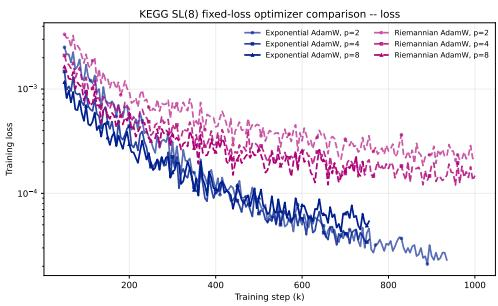  
(a) Training loss curves for the optimizer comparison on ${ \mathbb { S L } } _ { p } ( 8 ) ^ { \bar { } }$

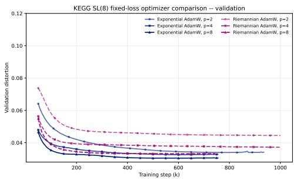  
(b) Validation distortion curves for the optimizer comparison on $\mathbb { S L } _ { p } ( 8 )$  
Figure 7: KEGG SL(8) optimizer comparison between EXP-AdamW and Riemannian AdamW under matched Schatten-p objectives.

Table 11: KEGG SL(8) optimizer comparison between EXP-AdamW and Riemannian AdamW under matched Schatten-p objectives.
<table><tr><td>p</td><td>Optimizer</td><td>Distortion  $\operatorname { a v g . } \downarrow$ </td><td> ${ \mathfrak { q } } 5 0 \downarrow$ </td><td> ${ \mathrm { q 9 0 \downarrow } }$ </td><td> ${ \mathrm { q } } 9 5 \downarrow$ </td><td>High-related ↓</td><td>Low-Low ↓</td><td>Worst-group ↓</td><td>Best Val. ↓</td></tr><tr><td>2</td><td>Riem-AdamW</td><td>0.04537</td><td>0.01967</td><td>0.10111</td><td>0.17079</td><td>0.05182</td><td>0.04446</td><td>0.10547</td><td>0.04442</td></tr><tr><td>2</td><td>Exp-AdamW</td><td>0.03658</td><td>0.00766</td><td>0.06910</td><td>0.14796</td><td>0.04301</td><td>0.03629</td><td>0.08452</td><td>0.03391</td></tr><tr><td>4</td><td>Riem-AdamW</td><td>0.03786</td><td>0.01562</td><td>0.08882</td><td>0.14575</td><td>0.04422</td><td>0.03547</td><td>0.08828</td><td>0.03715</td></tr><tr><td>4</td><td>Exp-AdamW</td><td>0.03490</td><td>0.00928</td><td>0.07009</td><td>0.13330</td><td>0.03930</td><td>0.03458</td><td>0.08470</td><td>0.03255</td></tr><tr><td>8</td><td>Riem-AdamW</td><td>0.03463</td><td>0.01488</td><td>0.07717</td><td>0.12715</td><td>0.04123</td><td>0.02994</td><td>0.08971</td><td>0.03313</td></tr><tr><td>8</td><td>Exp-AdamW</td><td>0.03338</td><td>0.01006</td><td>0.06727</td><td>0.12430</td><td>0.03869</td><td>0.03180</td><td>0.08231</td><td>0.03041</td></tr></table>

Geometry versus optimization. Figure 7 and Table 11 show that Exp-AdamW achieves lower average distortion than Riem-AdamW for $p = 2 , 4 ,$ 8, with relative reductions of 19.4%, 7.8%, and 3.6%, respectively. All runs use seed 0 and batch size 512.

More importantly, increasing p from 2 to 8 improves average distortion under both optimizers, from 0.04537 to 0.03463 under Riem-AdamW and from 0.03658 to 0.03338 under Exp-AdamW. Since the optimizer is fixed within each comparison, this common trend supports an effect of the Schatten order on the learned geometric bias rather than an optimizer artifact. At the same time, the strong performance of Exp-AdamW shows that these gains do not require an intrinsic manifold optimizer. We therefore use Exp-AdamW in the main experiments for its simplicity and stronger empirical performance.

## C EXPERIMENTAL DETAILS

## C.1 COMMON EXPERIMENTAL PROTOCOL

We evaluate the representation spaces on KEGG, HumanCyc, OGBL-PPA, and Flickr30k-Order, covering metric reconstruction, large-scale link prediction, and multimodal order modeling. Unless stated otherwise, final results are computed over three independent model initialization seeds. Hyperparameters and checkpoints are selected using validation data only, and the test split is accessed only after model selection.

Experiments are run across NVIDIA A100-SXM4-40GB, NVIDIA A100-SXM4-80GB, and NVIDIA H100 PCIe GPUs. Multiple independent runs may share one GPU, while maintaining independent model parameters, optimizer states, random-number states, and checkpoints. Hardware allocation affects wall-clock time only and does not change the data split, training budget, or model-selection protocol.

Within each task, all methods share the same data, supervision, training objective, and evaluation implementation. Only the latent representation, geometry-specific parameterization, and pairwise dissimilarity or score function are changed. Method-specific learning rates and batch sizes are predeclared to accommodate differences in numerical scale, memory footprint, and computational cost. Training budgets are therefore specified primarily in optimizer updates or epochs rather than wallclock time.

## C.2 DATASETS AND TASK PROTOCOLS

KEGG. We use the largest connected component of KEGG pathway 24, treated as an undirected graph with self-loops removed. The resulting graph contains 377 nodes and 1,545 edges. Target distances are unweighted shortest-path distances. All $\binom { 3 7 7 } { 2 } \ = \ 7 0 { , } 8 7 6$ unordered node pairs are deterministically partitioned into 70%/10%/20% training, validation, and test sets. Training pairs are sampled uniformly with replacement.

HumanCyc. We use the largest connected component of the HumanCyc-0 pathway graph after removing self-loops. The resulting graph contains 2,682 nodes and 28,177 edges. All $\left( { \overset { \cdot } { ^ { 2 6 8 2 } } } \right) \ =$ 3,595,221 unordered node pairs are partitioned using the same deterministic train/validation/test protocol as KEGG.

For both reconstruction datasets, each node is represented directly by a trainable point $z _ { i } ~ \in ~ { \mathcal { M } } .$ No node features, graph encoder, or message-passing network is used, allowing the experiments to isolate the representation capacity of the latent geometry.

OGBL-PPA. We use the official ogbl-ppa split without modification. The graph contains 576,289 nodes and 21,231,931 training positive edges. The validation split contains 6,062,562 positive and 3,000,000 global negative edges, while the test split contains 3,031,780 positive and 3,000,000 global negative edges. We do not use the provided node features or message passing.

Training positives are sampled uniformly with replacement from the official training edges. For every positive edge (u, v), one negative destination v<sup>−</sup> is sampled uniformly from all nodes while retaining the source u. Self-loops and edges present in the official training graph are rejected. Validation and test positives are not consulted by the training sampler.

Flickr30k-Order. We use OpenCLIP ViT-B/32 pretrained with the openai weights and keep the backbone frozen. Training uses the Flickr30k Karpathy training split with 29,000 images, five captions per image, and 145,000 training cases. For every training caption, four self-swap negatives are generated by randomly exchanging two word positions.

Validation and test use the official ARO Flickr30k-Order splits. The validation set contains 1,014 images, 5,070 caption cases, and 19,160 valid positive-negative comparisons. The test set contains 1,000 images, 4,995 retained caption cases, and 18,859 positive-negative comparisons. Corruptions that become identical to the positive caption after preprocessing are removed.

## C.3 REPRESENTATION AND BASELINE CONFIGURATIONS

For metric reconstruction, all methods share the same node-level learning interface and reconstruction objective and differ only in the underlying space and pairwise dissimilarity.

Table 12: Geometric baselines used for metric reconstruction.
<table><tr><td>Space</td><td>Intrinsic dimension Definition</td><td></td><td>Pairwise dissimilarity</td></tr><tr><td> $\mathbb { S } ^ { d }$ </td><td>d</td><td> $\{ x \in \mathbb { R } ^ { d + 1 } : \| x \| _ { 2 } = 1 \}$ </td><td> $d _ { \mathbb { S } } ( x , y ) = \operatorname { a r c c o s } ( \langle x , y \rangle )$ </td></tr><tr><td> $\mathbb { H } ^ { d }$ </td><td>d</td><td> $\{ x \in \mathbb { R } ^ { d } : \| x \| _ { 2 } < 1 \}$ </td><td> $d _ { \mathbb { H } } ( x , y ) = \operatorname { a r c o s h } \left( 1 + { \frac { 2 \lVert x - y \rVert _ { 2 } ^ { 2 } } { ( 1 - \lVert x \rVert _ { 2 } ^ { 2 } ) ( 1 - \lVert y \rVert _ { 2 } ^ { 2 } ) } } \right)$ </td></tr><tr><td> $\mathbb { E } ^ { d }$ </td><td>d</td><td> $\mathbb { R } ^ { d }$ </td><td> $d _ { \mathbb { E } } ( x , y ) = \| x - y \| _ { 2 }$ </td></tr><tr><td> $\mathbb { S } ^ { d } \times \mathbb { H } ^ { d }$ </td><td>2d</td><td> $\mathbb { S } ^ { d } \times \mathbb { H } ^ { d }$ </td><td> $d = \left( d _ { \mathbb { S } } ^ { 2 } + d _ { \mathbb { H } } ^ { 2 } \right) ^ { 1 / 2 }$ </td></tr><tr><td> $\mathbb { S } ^ { d } \times \mathbb { E } ^ { d }$ </td><td>2d</td><td> $\mathbb { S } ^ { d } \times \mathbb { E } ^ { d }$ </td><td> $d = \left( d _ { \tt S } ^ { 2 } + d _ { \tt E } ^ { 2 } \right) ^ { 1 / 2 }$ </td></tr><tr><td> $\mathbb { H } ^ { d } \times \mathbb { E } ^ { d }$ </td><td>2d</td><td> $\mathbb { H } ^ { d } \times \mathbb { E } ^ { d }$ </td><td> $d = \left( d _ { \mathbb { H } } ^ { 2 } + d _ { \mathbb { E } } ^ { 2 } \right) ^ { 1 / 2 }$ </td></tr><tr><td> $\mathbb { S } ^ { d } \times \mathbb { H } ^ { d } \times \mathbb { E } ^ { d }$ </td><td>3d</td><td> $\mathbb { S } ^ { d } \times \mathbb { H } ^ { d } \times \mathbb { E } ^ { d }$ </td><td> $d = \left( d _ { \tt S } ^ { 2 } + d _ { \tt H } ^ { 2 } + d _ { \tt E } ^ { 2 } \right) ^ { 1 / 2 }$ </td></tr><tr><td> $\mathbb { S } _ { \kappa _ { 1 } } ^ { d } \times \mathbb { H } _ { \kappa _ { 2 } } ^ { d } \times \mathbb { E } ^ { d }$ </td><td>3d</td><td> $\begin{array} { c } { { c _ { \mathbb { S } } , c _ { \mathbb { H } } > 0 , } } \\ { { w _ { \mathbb { S } } , w _ { \mathbb { H } } , w _ { \mathbb { E } } \ge 0 } } \end{array}$ </td><td> $d = \biggl ( w _ { \mathbb { S } } d _ { \mathbb { S } _ { \mathbb { S } _ { \mathbb { S } } } } ^ { 2 } + w _ { \mathbb { H } } d _ { \mathbb { H } _ { - c _ { \mathbb { H } } } } ^ { 2 } + w _ { \mathbb { E } } d _ { \mathbb { E } } ^ { 2 } \biggr ) ^ { 1 / 2 }$ </td></tr><tr><td> $\mathrm { H e i s e n b e r g } _ { - } H ^ { 2 d + 1 }$ </td><td>2d + 1</td><td> $( x , y , t ) \in \mathbb { R } ^ { d } \times \mathbb { R } ^ { d } \times \mathbb { R }$ </td><td> $d _ { H } ( P , Q ) = \operatorname* { i n f } _ { \gamma ( 0 ) = P \atop \gamma ( 1 ) = Q } \int _ { 0 } ^ { 1 } \sqrt { \| \dot { x } \| _ { 2 } ^ { 2 } + \| \dot { y } \| _ { 2 } ^ { 2 } + \left( \dot { t } + \frac 1 2 ( y ^ { \top } \dot { x } - x ^ { \top } \dot { y } ) \right) ^ { 2 } } d s$ </td></tr><tr><td>Grassmann(k, n)</td><td> $k ( n - k )$ </td><td> $\{ \operatorname { s p a n } ( Q ) : Q ^ { \top } Q = I _ { k } \}$ </td><td> $d _ { \mathbf { G r a s s m a n n } } ( Q _ { i } , Q _ { j } ) = \left. \operatorname { a r c c o s } \sigma ( Q _ { i } ^ { \top } Q _ { j } ) \right. _ { 2 }$ </td></tr><tr><td> $\mathbf { S P D } ( n )$ </td><td> $\frac { n ( n + 1 ) } { 2 }$ </td><td> $\{ P = P ^ { \top } \succ 0 \}$ </td><td> $d _ { \mathbf { S P D } } ( P _ { i } , P _ { j } ) = \left. \log \left( P _ { i } ^ { - 1 / 2 } P _ { j } P _ { i } ^ { - 1 / 2 } \right) \right. _ { F }$ </td></tr><tr><td> $\mathbf { S i e g e l } ( n )$ </td><td>n(n + 1)</td><td> $\{ X + { \sqrt { - 1 } } Y : X = X ^ { \top } , Y \succ 0 \}$ </td><td> $d _ { \mathbf { S i e g e l } } ( i , j ) = \sum _ { \ell = 1 } ^ { n } a _ { \ell } \log \frac { 1 + \sigma _ { \ell } ( W _ { i j } ) } { 1 - \sigma _ { \ell } ( W _ { i j } ) } , \quad a _ { \ell } \geq 0 , \sum _ { \ell } a _ { \ell } = n$ </td></tr><tr><td> $\mathbb { S L } ( n )$ </td><td> ${ n ^ { 2 } } - 1$ </td><td> $\{ A \in \mathbb { R } ^ { n \times n } : \operatorname* { d e t } ( A ) = 1 \}$ </td><td> $D _ { \mathbb { S } \mathbb { L } } ( A , B ) = \frac { 1 } { 2 } \left( \left\| \log ( A ^ { - 1 } B ) \right\| _ { S _ { p } } + \left\| \log ( B ^ { - 1 } A ) \right\| _ { S _ { p } } \right)$ </td></tr></table>

For the learnable-curvature product model, the spherical and hyperbolic curvature magnitudes and the nonnegative factor weights are learned jointly. The factor weights are normalized to have mean one. For the Siegel baseline, we use $Z _ { i j } = Y _ { i } ^ { - 1 / 2 } ( Z _ { j } - X _ { i } ) Y _ { i } ^ { - 1 / 2 }$ and $W _ { i j } = ( Z _ { i j } - { \sqrt { - 1 } } I ) ( Z _ { i j } +$ $\sqrt { - 1 } I ) ^ { - 1 }$ , where $\sigma _ { \ell } ( W _ { i j } )$ denotes the corresponding Takagi singular values.

The Heisenberg group used in our experiments admits the matrix realization

$$
H ( x , y , t ) = \left( { \begin{array} { c c c } { 1 } & { x ^ { \top } } & { t + { \frac { 1 } { 2 } } x ^ { \top } y } \\ { 0 } & { I _ { d } } & { y } \\ { 0 } & { 0 } & { 1 } \end{array} } \right) , \qquad x , y \in \mathbb { R } ^ { d } , \quad t \in \mathbb { R } .\tag{27}
$$

The unitriangular group is $\begin{array} { r l r } { \mathrm { U T } ( m ) } & { = } & { \left\{ U \in \mathbb { R } ^ { m \times m } : U _ { i i } = 1 , U _ { i j } = 0 \mathrm { ~ f o r ~ } i > j \right\} } \end{array}$ , with the schematic form

$$
U = \left( { \begin{array} { c c c c c } { 1 } & { * } & { * } & { \cdots } & { * } \\ { 0 } & { 1 } & { * } & { \cdots } & { * } \\ { 0 } & { 0 } & { 1 } & { \cdots } & { * } \\ { \vdots } & { \vdots } & { \ddots } & { \ddots } & { \vdots } \\ { 0 } & { 0 } & { \cdots } & { 0 } & { 1 } \end{array} } \right) .\tag{28}
$$

For non-matrix representation spaces, we match intrinsic dimension to that of the corresponding $\mathbb { S L } ( n )$ model as closely as possible. For matrix manifolds, we use comparable matrix-scale configurations whenever a natural matrix correspondence is available. Intrinsic dimensions and trainable parameter counts are reported explicitly for all methods.

OGBL-PPA representation. For OGBL-PPA, we use $\mathbb { S L } _ { 8 } ( 8 )$ . Each node stores 63 sparse Liealgebra coordinates $x _ { i } ,$ which are mapped to the group as

$$
A _ { i } = \exp ( 0 . 0 5 \Pi _ { \mathfrak { s l } } ( x _ { i } ) ) .\tag{29}
$$

The link score is

$$
s ( u , v ) = b - \exp \bigl ( \mathrm { c l i p } ( \rho , - 5 , 5 ) \bigr ) D _ { \mathcal { G } } ( z _ { u } , z _ { v } ) ,\tag{30}
$$

where b and $\rho$ are learned scalar parameters.

Flickr30k-Order composition models. Frozen CLIP token and image features are passed through separate two-layer projection heads with hidden width 512. The output coordinates are mapped to the corresponding Lie algebra and then to the group using

$$
g _ { t } = \exp _ { \mathcal { G } } ( \alpha X _ { t } ) , \qquad g _ { I } = \exp _ { \mathcal { G } } ( \alpha _ { I } X _ { I } ) , \qquad \alpha = \alpha _ { I } = 0 . 1 .\tag{31}
$$

Caption tokens are composed in their original left-to-right order by

$$
G _ { t } = g _ { t } G _ { t - 1 } , \qquad G _ { 1 : T } = g _ { T } g _ { T - 1 } \cdot \cdot \cdot g _ { 1 } .\tag{32}
$$

We compare Heisenberg- $. H ^ { 7 }$ , UT(4), UT(6), UT(15), full SL(4), and a commutative control. The commutative control retains the same sl(4) token parameterization but replaces ordered multiplication by $\begin{array} { r } { G _ { 1 : T } ^ { \mathrm { c o m m } } = \exp \Bigl ( \alpha \sum _ { t = 1 } ^ { T } X _ { t } \Bigr ) } \end{array}$ . The image-caption score is

$$
\begin{array} { r } { s ( I , C ) = - \beta D _ { \mathcal { G } } ( g _ { I } , G _ { 1 : T } ) , \qquad \beta = \exp ( \tau ) , } \end{array}\tag{33}
$$

where $\beta$ is learned, initialized to 10, and upper-bounded by 100.

## C.4 TRAINING AND OPTIMIZATION

Metric reconstruction. KEGG and HumanCyc share the reconstruction objective

$$
\mathcal { L } = \frac { 1 } { | \mathcal { B } | } \sum _ { ( i , j ) \in \mathcal { B } } \left[ \log ( 1 + s D _ { \mathcal { M } } ( z _ { i } , z _ { j } ) ) - \log ( 1 + d _ { G } ( i , j ) ) \right] ^ { 2 } .\tag{34}
$$

The logarithmic transformation prevents distant graph pairs from dominating the objective.

For KEGG, batch sizes are 8192 for product models, 2048 for Grassmann, 128 for Siegel, and 512 otherwise. Learning rates are $2 \times 1 0 ^ { - 3 }$ for products, $2 \times 1 0 ^ { - 4 }$ for Siegel, and $5 \times 1 0 ^ { - 4 }$ otherwise. We use weight decay $1 0 ^ { - 6 }$ throughout and gradient clipping at 5 for Heisenberg and 10 otherwise. All KEGG high-capacity methods use at most 800,000 optimizer updates. Validation is performed every 5,000 updates, with early stopping after 150,000 updates without improvement.

HumanCyc uses a common maximum budget of 2,000,000 updates, batch size 64, evaluation batch size 128, learning rate $2 \times 1 0 ^ { - 4 }$ , weight decay $1 0 ^ { - 6 }$ , and gradient-norm clipping at 10. Validation is performed every 10,000 updates, with early stopping after 50 consecutive non-improving validation events. Neither reconstruction experiment uses learning-rate warmup or a learning-rate scheduler.

OGBL-PPA. Training minimizes the pairwise BPR objective

$$
\mathcal { L } _ { \mathrm { B P R } } = - \frac { 1 } { | \mathcal { B } | } \sum _ { ( u , v ) \in \mathcal { B } } \log \sigma \left( s ( u , v ) - s ( u , v ^ { - } ) \right) .\tag{35}
$$

The effective positive batch size is 4,194,304, evaluated through 32 gradient-accumulation microbatches of 131,072 edges each.

Sparse node-coordinate rows are optimized using exponential-parameterized SparseAdam with learning rate $3 \times 1 0 ^ { - 3 }$ . The decoder scale and bias are optimized separately using Adam with learning rate $6 \times 1 0 ^ { - 3 }$ . No weight decay, learning-rate warmup, or learning-rate scheduler is used. Coordinates are clipped to $[ - 0 . 7 5 , 0 . 7 5 ]$ , sparse gradients are clipped elementwise to [−0.05, 0.05], and dense gradients are clipped to global norm 1.0.

Training uses at most 17,000 optimizer updates. Validation is performed every 100 updates, with early stopping after 20 consecutive non-improving validation evaluations, corresponding to 2,000 optimizer updates.

Flickr30k-Order. Training minimizes the pairwise margin-ranking objective

$$
\mathcal { L } _ { \mathrm { o r d } } = \frac { 1 } { \sum _ { i } K _ { i } } \sum _ { i } \sum _ { j = 1 } ^ { K _ { i } } \left[ 0 . 1 - s ( I _ { i } , C _ { i } ^ { + } ) + s ( I _ { i } , C _ { i j } ^ { - } ) \right] _ { + } .\tag{36}
$$

All composition models use AdamW with learning rate $1 0 ^ { - 3 }$ , weight decay $1 0 ^ { - 4 }$ , batch size 192, evaluation batch size 192, and global gradient-norm clipping at 1.0. Training lasts 12 epochs and uses neither warmup nor a learning-rate scheduler. Validation is performed once per epoch, and no early stopping is used.

## C.5 EVALUATION METRICS

For metric reconstruction, define the relative distortion of a held-out pair as

$$
\delta _ { i j } = \frac { | s D _ { \cal M } ( z _ { i } , z _ { j } ) - d _ { G } ( i , j ) | } { \operatorname* { m a x } \{ d _ { G } ( i , j ) , 1 \} } .\tag{37}
$$

The reported metrics across the three experimental settings are summarized below.

Table 13: Evaluation metrics used across the experiments.
<table><tr><td>Task</td><td>Metric</td><td>Definition / interpretation</td></tr><tr><td>Metric reconstruction</td><td>Distortionavg.</td><td>Mean relative distortion  $\delta _ { i j }$  over all test pairs</td></tr><tr><td>Metric reconstruction</td><td> ${ \bf q } 5 0 / { \bf q } 9 0 / { \bf q } 9 5$ </td><td>50th, 90th, and 95th percentiles of  $\delta _ { i j }$ </td></tr><tr><td>Metric reconstruction</td><td>MAE</td><td>Mean absolute error between scaled latent and graph distances</td></tr><tr><td>Metric reconstruction</td><td>High-related</td><td>Mean distortion for pairs with at least one high-mixture endpoint</td></tr><tr><td>Metric reconstruction Low-Low</td><td></td><td>Mean distortion for pairs whose endpoints are both in the low-mixture group</td></tr><tr><td>Metric reconstruction</td><td>Worst-group</td><td>Largest mean distortion among endpoint-group combinations</td></tr><tr><td>OGBL-PPA</td><td>Hits @20 / Hits @50 / Hits@ 100</td><td>Positive-edge ranking against the common global negative pool</td></tr><tr><td>OGBL-PPA</td><td>MRR</td><td>Mean reciprocal rank of positive edges</td></tr><tr><td>OGBL-PPA</td><td>Rank50 / Rank90 / Rank95</td><td>Corresponding quantiles of the positive-edge rank distribution</td></tr><tr><td>OGBL-PPA</td><td>AUC / AP</td><td>Classification metrics over the complete positive and negative score sets</td></tr><tr><td>Flickr30k-Order</td><td>OrderAcc</td><td>Fraction of positive captions scoring above individual order corruptions</td></tr><tr><td>Flickr30k-Order</td><td>OrderMargin</td><td>Mean positive-minus-negative score margin</td></tr><tr><td>Flickr30k-Order</td><td>HardAcc</td><td>Fraction of cases where the positive caption exceeds every corruption</td></tr><tr><td>Flickr30k-Order</td><td>MRR</td><td>Mean reciprocal rank of the positive caption within each candidate set</td></tr></table>

For reconstruction, nodes are grouped by local curvature-mixture entropy into low, medium, and high groups using thresholds 0.3 and 0.7. Group-based metrics are diagnostic only and are not used for checkpoint selection.

For OGBL-PPA, Hits@100 is computed using the official Evaluator $\scriptstyle ( \mathtt { n a m e } = " \circ { \mathfrak { g h } } 1 - { \mathfrak { p p a } } ^ { \mathfrak { n } } )$ Hits@20, Hits@50, MRR, and rank quantiles use the same global negative pool. For a positive edge $e ^ { + }$

$$
\mathrm { r a n k } ( e ^ { + } ) = 1 + \sum _ { e ^ { - } \in \mathcal { E } ^ { - } } \mathbf { 1 } \big [ s ( e ^ { - } ) \geq s ( e ^ { + } ) \big ] .\tag{38}
$$

AUC and AP are computed from the complete positive and negative score sets.

## C.6 FAIRNESS AND MODEL SELECTION

Within each task, all baselines use the same data split, supervision, objective, validation protocol, and test evaluation. Test data are never used for choosing geometry parameters, learning rates, stopping points, or checkpoints. KEGG and HumanCyc select the checkpoint with the lowest validation mean distortion. All remaining reconstruction metrics are computed from this same checkpoint.

For OGBL-PPA, model selection uses one fixed validation subset containing 50,000 official validation positives and 200,000 official validation negatives. The subset is sampled once using a fixed random seed and shared across all methods and model seeds. Checkpoints are selected by Hits@100 on this subset. After model selection, final metrics are recomputed on the complete official validation and test splits.

Flickr30k-Order evaluates the full validation set after each epoch and selects the checkpoint with the highest OrderAcc, using OrderMargin only to break ties.

Final results use three independent model initialization seeds and report the mean and standard deviation when applicable. Method-specific optimization hyperparameters are fixed before final test evaluation.

## D PROOFS OF THE THEORETICAL RESULTS

## D.1 PRELIMINARIES

We provide the Finsler geometric background needed for the curvature analysis below. The main text introduced the fundamental tensor and flag curvature compactly. Here we develop these objects from the underlying Finsler norm, explain their geometric meaning, and describe how the Chern curvature and Jacobi operators used in our proofs are computed.

Finsler metric and directional geometry. Let $M$ be a smooth manifold and $^ { T M }$ its tangent bundle. A Riemannian metric assigns an inner product $g _ { x }$ to each tangent space $T _ { x } M$ , so the length of a tangent vector $y \in T _ { x } M$ is determined by $\sqrt { g _ { x } ( y , y ) }$ . In particular, the local quadratic geometry at x does not depend on the direction along which it is examined.

A Finsler metric generalizes this construction by directly assigning a norm

$$
F : T M  [ 0 , \infty )
$$

to tangent vectors (Bao et al., 2000). For every $x \in M .$ , the restriction $F ( x , \cdot )$ is positively homogeneous, $F ( x , \lambda y ) = \lambda F ( x , y )$ for $\lambda > 0$ , and its squared norm is strongly convex in the tangent direction. The essential distinction from Riemannian geometry is that $F ^ { 2 } ( { \overset { \smile } { x } } , { \bar { y } } )$ need not be quadratic in $y .$ Consequently, the local geometry obtained by differentiating $F$ may depend on the reference direction y itself.

Classically, the differential Finsler structure is considered on the slit tangent bundle $T M \backslash \{ 0 \}$ , since a positively homogeneous norm need not be differentiable at the zero vector. In our Schatten setting there is an additional regularity distinction. The norm $F _ { p } ( A , V ) = \| A ^ { - 1 } V \| _ { S _ { p } }$ is defined for every tangent vector and hence defines the global length structure used throughout the paper. For $p \neq 2 .$ however, the smooth differential quantities involved in curvature are considered on full rank tangent directions. We call such directions regular. Thus the regularity restriction concerns differential curvature analysis, not the definition of the tangent norm or the induced path length.

Fundamental tensor. The first local geometric object derived from a Finsler metric is its fundamental tensor. For a regular nonzero reference direction $y \in T _ { x } M$ , define

$$
g _ { y } ( u , v ) : = \frac 1 2 \left. \frac { \partial ^ { 2 } } { \partial s \partial t } F ^ { 2 } ( x , y + s u + t v ) \right| _ { s = t = 0 } .\tag{39}
$$

Equivalently, if the energy function $\begin{array} { r } { \mathcal { E } ( x , y ) = \frac { 1 } { 2 } F ^ { 2 } ( x , y ) } \end{array}$ , then $g _ { y } = D _ { y } ^ { 2 } \mathcal { E } ( x , y )$

The fundamental tensor can be understood as the local quadratic approximation of the squared Finsler norm around the direction $y .$ Hence, although $F$ itself may be nonquadratic, $g _ { y }$ provides an inner product with which infinitesimal lengths, angles, orthogonality, and curvature can be measured around that particular direction. For a Riemannian metric, $\mathbf { \bar { \partial } } \mathbf { \partial } F ^ { 2 } ( x , y ) = g _ { x } ( y , y )$ , so differentiating twice simply recovers $g _ { x }$ and the result is independent of $y .$ Finsler geometry therefore contains Riemannian geometry as the special case in which this directional dependence disappears.

By the two homogeneity of $F ^ { 2 }$ , the fundamental tensor satisfies $g _ { y } ( y , y ) = F ^ { 2 } ( x , y )$ and $g _ { y } ( y , u ) =$ $\scriptstyle { \frac { 1 } { 2 } } D _ { y } F ^ { 2 } ( x , y ) [ u ]$ . These identities will be repeatedly used below.

Cartan tensor and departure from Riemannian geometry. The variation of the fundamental tensor with respect to the reference direction is measured by the Cartan tensor,

$$
C _ { y } ( u , v , w ) : = \frac { 1 } { 2 } \left. \frac { d } { d t } g _ { y + t w } ( u , v ) \right| _ { t = 0 } = \frac { 1 } { 4 } D _ { y } ^ { 3 } F ^ { 2 } ( x , y ) [ u , v , w ] .\tag{40}
$$

Intuitively, $g _ { y }$ describes the local quadratic geometry seen from $y ,$ whereas $C _ { y }$ measures how this quadratic geometry changes when the viewing direction changes. For a Riemannian metric, $g _ { y }$ is independent of $y$ and hence $C _ { y } = 0$ . The nonzero Cartan tensor is therefore one of the fundamental sources of genuinely Finsler behavior. Although we do not explicitly manipulate $C _ { y }$ in the main curvature proof, its effect is implicitly contained in the Chern connection introduced next.

Length, geodesics, and the geodesic spray. For a piecewise smooth curve $\gamma ( t )$ , its Finsler length is $\begin{array} { r } { L _ { F } ( \gamma ) = \int F ( \gamma ( t ) , \dot { \gamma } ( t ) ) d t } \end{array}$ . A geodesic is locally a critical curve of the corresponding energy functional. As in Riemannian geometry, geodesics describe locally straight motion, but the direction dependence of $F$ changes their equations.

To make this explicit, take local coordinates $( x ^ { 1 } , \ldots , x ^ { d } )$ on M and write a tangent vector as $y =$ $y ^ { i } \partial _ { x ^ { i } }$ i (with $\partial _ { x ^ { i } }$ i playing the role of the Euclidean coordinate basis vector $e _ { i } )$ . Let $g _ { i j } ( x , y )$ denote the matrix of the fundamental tensor and $g ^ { i j } ( x , y )$ its inverse. The geodesic spray coefficients are

$$
G ^ { i } ( x , y ) = \frac { 1 } { 4 } g ^ { i \ell } ( x , y ) \left( \frac { \partial ^ { 2 } F ^ { 2 } } { \partial x ^ { k } \partial y ^ { \ell } } y ^ { k } - \frac { \partial F ^ { 2 } } { \partial x ^ { \ell } } \right) .\tag{41}
$$

A constant speed Finsler geodesic satisfies $\ddot { x } ^ { i } + 2 G ^ { i } ( x , \dot { x } ) = 0$ . Thus the spray $G$ plays the role of the Christoffel symbols contracted with velocity in Riemannian geometry. Starting from $F ,$ one can therefore obtain the geodesic dynamics entirely by differentiation. The derivatives

$$
N ^ { i } { } _ { j } ( x , y ) : = \partial G ^ { i } ( x , y ) / \partial y ^ { j }\tag{42}
$$

define the associated nonlinear connection. They separate changes in the base point from changes in the tangent direction and introduce the horizontal derivatives $\delta _ { j } = \partial _ { x ^ { j } } - N ^ { m } { } _ { j } \partial _ { y ^ { m } }$ . These quantities provide the intermediate step from the Finsler norm to its canonical connection and curvature.

Chern connection. Curvature requires comparing tangent vectors at nearby points, which in turn requires a connection. In Riemannian geometry this role is played by the Levi–Civita connection. Because the Finsler inner product $g _ { y }$ also depends on the direction $y ,$ there is in general no ordinary Levi–Civita connection depending only on the base point. The standard replacement is the Chern connection (Bao et al., 2000). The Chern connection is the canonical torsion free connection that is compatible with the direction dependent fundamental tensor in the Finsler sense. In local coordinates its coefficients can be obtained from $g _ { y }$ and the horizontal derivatives as

$$
\Gamma ^ { i } { } _ { j k } ( x , y ) = { \frac { 1 } { 2 } } g ^ { i \ell } \left( \delta _ { j } g _ { \ell k } + \delta _ { k } g _ { \ell j } - \delta _ { \ell } g _ { j k } \right) .\tag{43}
$$

All quantities in this expression depend on both the point x and the reference direction $y .$ This is the main difference from the Riemannian Christoffel symbols, which depend only on x. Equations (39), (41), and (43) give a direct computational chain

$$
F \longrightarrow g _ { y } \longrightarrow G \longrightarrow \Gamma ( x , y ) .
$$

Chern curvature. Curvature measures the failure of parallel transport defined by the connection to commute around infinitesimal loops. For the Chern connection, we denote the corresponding curvature operator at reference direction y by $\mathcal { R } ^ { y } ( u , v ) u$ . Under the curvature convention used in this paper, it is the Finsler counterpart of $\nabla _ { u } \nabla _ { v } w - \nabla _ { v } \nabla _ { u } w - \nabla _ { [ u , v ] } w$ from Riemannian geometry. In local coordinates, the horizontal Chern curvature coefficients are obtained by differentiating the connection coefficients,

$$
\begin{array} { r } { R ^ { i } { } _ { j k l } = \delta _ { k } \Gamma ^ { i } { } _ { j l } - \delta _ { l } \Gamma ^ { i } { } _ { j k } + \Gamma ^ { m } { } _ { j l } \Gamma ^ { i } { } _ { m k } - \Gamma ^ { m } { } _ { j k } \Gamma ^ { i } { } _ { m l } . } \end{array}\tag{44}
$$

Consequently, $\mathcal { R } ^ { y } ( u , v ) w$ is obtained by contracting these coefficients with u, v, and w. Together, the computational dependence is

$$
F \longrightarrow g _ { y } \longrightarrow G \longrightarrow \Gamma \longrightarrow \pmb { \mathscr { R } } ^ { y } .
$$

Because the Chern connection itself depends on the reference direction, varying that direction may introduce additional anisotropic terms compared with the curvature of an ordinary affine connection. These terms can be described through the vertical variation of the Chern connection (Javaloyes, 2014; 2019). They vanish in several important situations used below, allowing the Finsler curvature to be computed through an associated affine connection. We make this specialization explicit when it is used.

Jacobi operator. The full Chern curvature $\begin{array} { r } { \textstyle \mathcal { R } ^ { y } ( u , v ) . } \end{array}$ w depends on three tangent directions. For sectional or flag curvature, two of these directions are fixed by the reference direction $y .$ This motivates the Jacobi operator,

$$
R _ { y } u : = \pmb { \mathscr { R } } ^ { y } ( u , y ) y .\tag{45}
$$

Thus $R _ { y }$ is a linear operator on the tangent space obtained by inserting the flagpole y twice into the full curvature tensor. Geometrically, $R _ { y } u$ describes how a nearby geodesic initially separated from the reference geodesic in direction u accelerates relative to it. Positive and negative values of its quadratic form therefore correspond to qualitatively different local bending of nearby geodesics.

The Jacobi operator satisfies $R _ { y } y = 0$ and is self adjoint with respect to the fundamental tensor,

$$
g _ { y } ( R _ { y } u , v ) = g _ { y } ( u , R _ { y } v ) .\tag{46}
$$

Hence its eigenvalues are real. On the $g _ { y }$ orthogonal complement of $y ,$ we denote its positive and negative eigenspaces by $E _ { + } ( y )$ and $E _ { - } ( y )$ , respectively. These eigenspaces provide the positive and negative curvature modes used in the curvature coupling definition of the main text.

Flag curvature. In Riemannian geometry, sectional curvature depends only on a two dimensional plane. In Finsler geometry the local metric depends additionally on the direction used to inspect that plane. Aflag is therefore a pair $( y , \Pi )$ consisting of a nonzero reference direction y, called the flagpole, and a two dimensional tangent plane $\Pi = \operatorname { s p a n } \{ y , u \}$ containing it.

The corresponding flag curvature is

$$
K _ { F } ( y , \Pi ) = { \frac { g _ { y } ( R _ { y } u , u ) } { g _ { y } ( y , y ) g _ { y } ( u , u ) - g _ { y } ( y , u ) ^ { 2 } } } .\tag{47}
$$

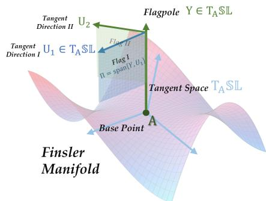

The denominator is the Gram determinant of $y$ and u under $g _ { y }$ and is positive whenever they are linearly independent. As shown in Fig. 8, flag curvature measures the signed curvature of Π as viewed from the distinguished direction $y .$ For visual clarity, the figure uses Y and $U$ for y and u in the text.

Figure 8: A Finsler flag consists of a tangent plane Π together with a distinguished tangent direction y.

As only the component of u transverse to y determines the plane, we may choose u such that $g _ { y } ( y , u ) = 0$ . Then

$$
K _ { F } ( y , \mathrm { s p a n } \{ y , u \} ) = \frac { g _ { y } ( R _ { y } u , u ) } { g _ { y } ( y , y ) g _ { y } ( u , u ) } .\tag{48}
$$

The denominator is positive, so sign $K _ { F } = \mathrm { s i g n } g _ { y } ( R _ { y } u , u )$ . This is why the curvature analysis below focuses on the quadratic form $g _ { y } ( R _ { y } u , u )$ rather than repeatedly evaluating the complete fraction in Eq. (47).

Specialization to the Schatten p geometry. We now specialize these general constructions to $\mathbb { S L } _ { p } ( n )$ . Left invariance identifies the geometry at every point with the geometry on the Lie algebra. For a regular full rank $X \in { \mathfrak { s l } } ( n )$ , define the energy function

$$
\mathcal { E } _ { p } ( X ) = \frac { 1 } { 2 } \| X \| _ { S _ { p } } ^ { 2 } = \frac { 1 } { 2 } \left[ \mathrm { t r } ( ( X ^ { \top } X ) ^ { p / 2 } ) \right] ^ { 2 / p } .\tag{49}
$$

The fundamental tensor at the identity is simply

$$
g _ { X } ( U , V ) = D ^ { 2 } \mathcal { E } _ { p } ( X ) [ U , V ] .\tag{50}
$$

At an arbitrary $A \in \mathrm { S L } ( n )$ , setting $X = A ^ { - 1 } Y , \widetilde { U } = A ^ { - 1 } U$ , and ${ \widetilde { V } = A ^ { - 1 } V }$ gives $g _ { Y } ( U , V ) =$ $g _ { X } ( \widetilde { U } , \widetilde { V } )$ . Thus it is sufficient to compute the differential geometry at the identity and transport the result by left multiplication. This reduction is especially useful for curvature. A reference direction $X \in { \mathfrak { s l } } ( n )$ is called a geodesic vector when the trajectory generated by X is a geodesic. For a left invariant Finsler metric this is equivalent to

$$
g _ { X } ( X , [ X , Z ] ) = 0 \qquad { \mathrm { f o r ~ a l l ~ } } Z \in { \mathfrak { s l } } ( n ) .\tag{51}
$$

At such a direction, the Chern connection can be represented algebraically by the connection operator $N _ { X }$ (Xu & Deng, 2018).

$$
2 g _ { X } ( N _ { X } ( V ) , W ) = g _ { X } ( [ W , V ] , X ) + g _ { X } ( [ W , X ] , V ) + g _ { X } ( [ V , X ] , W ) .\tag{52}
$$

This formula is the homogeneous counterpart of the coordinate Chern connection in Eq. (43). Once the fundamental tensor is known, the right hand side contains only inner products and matrix commutators, so $N _ { X } ( V )$ can be solved directly. At a geodesic reference direction, the Jacobi operator then takes the form

$$
R _ { X } ( V ) = - N _ { X } ( N _ { X } ( V ) ) + N _ { X } ( [ X , V ] ) - [ X , N _ { X } ( V ) ] .\tag{53}
$$

Hence the curvature calculation used in our proofs follows the concrete sequence

$$
\mathcal { E } _ { p } \longrightarrow g _ { X } \longrightarrow N _ { X } \longrightarrow R _ { X } \longrightarrow K _ { F } .\tag{54}
$$

This avoids solving the geodesic equations or evaluating the full coordinate Chern curvature tensor directly.

Pairwise matrix directions and spectral derivatives. The remaining calculations exploit the spectral structure of the Schatten norm. We choose a diagonal regular reference direction $X =$ $\mathrm { d i a g } ( \lambda _ { 1 } , \ldots , \lambda _ { n } )$ with $\textstyle \sum _ { i } \lambda _ { i } = 0$ . Let $E _ { i j } \in \mathbb { R } ^ { n \times n }$ denote the standard matrix unit with a single 1 in the $( i , j )$ entry and zeros elsewhere. For every pair $i < j$ , we define the symmetric and skewsymmetric directions $S _ { i j } : = ( E _ { i j } + E _ { j i } ) / \sqrt { 2 }$ and $A _ { i j } : = ( E _ { i j } - E _ { j i } ) / \sqrt { 2 }$ , respectively. Thus, $S _ { i j }$ and $A _ { i j }$ are the symmetric and skew-symmetric combinations of the same pair of matrix units $E _ { i j }$ and $E _ { j i \cdot } \overleftarrow { X } = \mathrm { d i a g } ( \lambda _ { 1 } , \ldots , \lambda _ { n } )$ with $\bar { \sum _ { i } \lambda _ { i } } = 0$ , which are

$$
S _ { i j } = \frac { 1 } { \sqrt { 2 } } [ \begin{array} { l l l l l } { | \begin{array} { l l l l l } { \cdots } & { i } & { \cdots } & { j } & { \cdots } \\ { \vdots } & { \vdots } & & { \vdots } \\ { i } & { \cdots } & { 0 } & { \cdots } & { 1 } & { \cdots } \\ { \vdots } & { \vdots } & { \ddots } & { \vdots } \\ { j } & { \cdots } & { 1 } & { \cdots } & { 0 } & { \cdots } \\ { \vdots } & { \vdots } & { \vdots } & { \ddots } \end{array} | , } &  A _ { i j } = \frac { 1 } { \sqrt { 2 } } [ \begin{array} { l l l l l }  | \begin{array} { l l l l l } { \cdots } & { i } & { \cdots } & { j } & { \cdots } \\ { \vdots } & { \vdots } & & { \vdots } & { \vdots } \\ { i } & { \cdots } & { 0 } & { \cdots } & { 1 } & { \cdots } \\ { \vdots } & { \vdots } & { \ddots } & { \vdots } \\ { j } & { \cdots } & { - 1 } & { \cdots } & { 0 } & { \cdots } \\ { \vdots } & { \vdots } & { \vdots } & { \ddots } \end{array} ] ] [ \begin{array} { l } { ( \begin{array} { l } { - 1 } \\ { \cdots } \\ { \vdots } \\ { \cdots } \\ { \vdots } \\ { \cdots } \\ { \vdots } \\ { \vdots } \\ { \cdots } \end{array} ) } \\ { \vdots } \end{array} ] ^ { \ell } [ \begin{array} { l } { ( \begin{array} { l } { - 1 } \\ { \cdots } \\ { \vdots } \\ { \cdots } \\ { \vdots } \end{array} ) } \\ { \vdots } \end{array} ] \end{array} \end{array}\tag{55}
$$

These directions perturb only the $( i , j )$ coordinates of the matrix. They therefore reduce the high dimensional matrix calculation to simple two dimensional blocks. For diagonal X, their interaction with the reference direction is controlled by the spectral difference $d _ { i j } : = \lambda _ { i } - \lambda _ { j }$ , with

$$
[ X , S _ { i j } ] = d _ { i j } A _ { i j } , \qquad [ X , A _ { i j } ] = d _ { i j } S _ { i j } , \qquad [ A _ { i j } , S _ { i j } ] = E _ { i i } - E _ { j j } .\tag{56}
$$

Thus the two directions remain inside the same small matrix block under the operations entering the connection and curvature formulas.

Differentiating a matrix spectral function such as $\operatorname { t r } ( ( X ^ { \top } X ) ^ { p / 2 } )$ naturally produces divided differences. Define $\overline { { \phi _ { p } ( t ) } } = t | t | ^ { \overline { { p - 2 } } }$ . For scalars $a \neq b ,$ its divided difference is $( \bar { \phi } _ { p } ( a ) - \phi _ { p } ( b ) ) / ( a - b )$ with the derivative used as the continuous extension when $a = b .$ . Divided differences are the matrix analogue of ordinary derivatives when a perturbation mixes two spectral coordinates. Since $\phi _ { p }$ is strictly increasing for $p > 1$ , these divided differences are positive.

This observation explains the quantities $s _ { i j }$ and $a _ { i j }$ introduced below: they are precisely the fundamental tensor weights of the symmetric and skew symmetric directions, $s _ { i j } = g _ { X } ( S _ { i j } , S _ { i j } )$ and $a _ { i j } = g _ { X } ( A _ { i j } , A _ { i j } )$ . Their ratio $m _ { i j } ( X ) = a _ { i j } / s _ { i j }$ summarizes how the Schatten p geometry weights the two directions inside the same pairwise block. The next proposition computes these quantities and shows how they enter the Chern curvature.

Regularity and analytic dependence. On the full rank matrix locus, $X ^ { \top } X$ is positive definite and $X \mapsto [ \mathrm { t r } ( ( X ^ { \top } X ) ^ { p / 2 } ) ] ^ { 2 / p }$ is real analytic (Tsing et al., 1994). Consequently, the fundamental tensor and the resulting Chern curvature coefficients vary analytically with a regular reference direction wherever the fundamental tensor is nondegenerate. We later use the standard fact that a nonzero real analytic scalar function on a connected open set has an open dense nonzero locus. This allows finitely many nonvanishing curvature interactions to be realized simultaneously without requiring a specially tuned reference direction.

## D.2 ROOTWISE CURVATURE AND PROOF OF MIXED FLAG CURVATURE

Proposition D.1 (Rootwise effective Cartan curvature). Let $X = \operatorname { d i a g } ( \lambda _ { 1 } , \ldots , \lambda _ { n } ) \in { \mathfrak { s l } } ( n )$ be full rank and let $\begin{array} { r } { S _ { i j } = \frac { E _ { i j } + E _ { j i } } { \sqrt { 2 } } , A _ { i j } = \frac { E _ { i j } - E _ { j i } } { \sqrt { 2 } } , i < j } \end{array}$ . Define $\phi _ { p } ( t ) = t | t | ^ { p - 2 }$ and

$$
\begin{array} { r l } & { s _ { i j } : = g _ { X } ( S _ { i j } , S _ { i j } ) = \| X \| _ { S _ { p } } ^ { 2 - p } \frac { \phi _ { p } ( \lambda _ { i } ) - \phi _ { p } ( \lambda _ { j } ) } { \lambda _ { i } - \lambda _ { j } } , } \\ & { a _ { i j } : = g _ { X } ( A _ { i j } , A _ { i j } ) = \| X \| _ { S _ { p } } ^ { 2 - p } \frac { \phi _ { p } ( \lambda _ { i } ) + \phi _ { p } ( \lambda _ { j } ) } { \lambda _ { i } + \lambda _ { j } } , } \end{array}\tag{57}
$$

where the divided differences are understood by continuous extension when a denominator vanishes. Then $s _ { i j } > 0$ and $a _ { i j } > 0$ . Define the effective Cartan parameter $\begin{array} { r } { m _ { i j } ( X ) : = \frac { a _ { i j } } { s _ { i j } } > 0 } \end{array}$ . Whenever $\lambda _ { i } \neq \lambda _ { j }$ , the two root directions are eigenvectors ofthe Jacobi operator and satisfy

$$
R _ { X } ( A _ { i j } ) = \frac { ( \lambda _ { i } - \lambda _ { j } ) ^ { 2 } } { 4 } m _ { i j } ( X ) A _ { i j } , \quad R _ { X } ( S _ { i j } ) = - \frac { ( \lambda _ { i } - \lambda _ { j } ) ^ { 2 } } { 4 } \big ( 4 + 3 m _ { i j } ( X ) \big ) S _ { i j } .\tag{58}
$$

Consequently, $g _ { X } ( R _ { X } A _ { i j } , A _ { i j } ) > 0 a n d g _ { X } ( R _ { X } S _ { i j } , S _ { i j } ) < 0 .$

Proof. We first compute the fundamental tensor on the two-dimensional $( i , j )$ root block. Since $\begin{array} { r } { \mathcal { E } _ { p } ( \bar { Z } ) = \frac { 1 } { 2 } ( \mathrm { t r } ( Z ^ { \top } Z ) ^ { \bar { p } / 2 } ) ^ { 2 / p } } \end{array}$ , standard second-order spectral calculus at a diagonal full-rank matrix gives

$$
\begin{array} { r l } & { D ^ { 2 } \operatorname { t r } ( ( X ^ { \top } X ) ^ { p / 2 } ) [ S _ { i j } , S _ { i j } ] = p \frac { \phi _ { p } ( \lambda _ { i } ) - \phi _ { p } ( \lambda _ { j } ) } { \lambda _ { i } - \lambda _ { j } } , } \\ & { D ^ { 2 } \operatorname { t r } ( ( X ^ { \top } X ) ^ { p / 2 } ) [ A _ { i j } , A _ { i j } ] = p \frac { \phi _ { p } ( \lambda _ { i } ) + \phi _ { p } ( \lambda _ { j } ) } { \lambda _ { i } + \lambda _ { j } } . } \end{array}\tag{59}
$$

Every off-diagonal perturbation has zero first variation at diagonal X. Applying the scalar chain rule to $\mathcal { E } _ { p }$ therefore multiplies both expressions in equation 59 by the common positive factor $\| X \| _ { S _ { p } } ^ { 2 - p } / p ,$ which gives equation 57.

The function $\phi _ { p } ( t ) = t | t | ^ { p - 2 }$ is strictly increasing for $p > 1$ . Hence the first quotient in equation 57 is a positive divided difference of $\phi _ { p }$ . For the second quotient, use the oddness of $\phi _ { p }$ to write $\phi _ { p } ( \lambda _ { i } ) + \phi _ { p } ( \lambda _ { j } ) = \phi _ { p } ( \lambda _ { i } ) - \phi _ { p } ( - \lambda _ { j } )$ and $\lambda _ { i } + \lambda _ { j } = \lambda _ { i } - \left( - \lambda _ { j } \right)$ . It is therefore again a positive divided difference of the same strictly increasing function. At a vanishing denominator, the continuous extension is $( p - 1 ) | \lambda _ { i } | ^ { p - 2 } > 0$ because $\breve { X }$ is full rank. Thus $s _ { i j } > 0 , a _ { i j } > 0$ , and consequently $m _ { i j } ( X ) > 0$

Transpose invariance of ${ \mathcal { E } } _ { p }$ gives $g _ { X } ( S _ { i j } , A _ { i j } ) = 0$ , while diagonal sign conjugations imply orthogonality between distinct root blocks. Since X is diagonal, both $S _ { i j }$ and $A _ { i j }$ are also g<sub>X</sub>-orthogonal to X. We next verify that the diagonal reference direction X is geodesic. By two-homogeneity, $g _ { X } ( X , V ) = D \mathcal E _ { p } ( \dot { X _ { ) } } [ V ]$ . Hence, for every $Z \in { \mathfrak { s l } } ( n )$ ,

$$
\begin{array} { r l } & { g _ { X } ( X , [ X , Z ] ) = \| X \| _ { S _ { p } } ^ { 2 - p } \operatorname { t r } \left( X | X | ^ { p - 2 } [ X , Z ] \right) } \\ & { \qquad = \| X \| _ { S _ { p } } ^ { 2 - p } \operatorname { t r } \left( [ X | X | ^ { p - 2 } , X ] Z \right) = 0 , } \end{array}\tag{60}
$$

because both X and $X | X | ^ { p - 2 }$ are diagonal. Thus X is a geodesic vector.

Let $N _ { X }$ denote the homogeneous Chern connection operator at this geodesic reference direction. It satisfies

$$
2 g _ { X } ( N _ { X } ( V ) , W ) = g _ { X } ( [ W , V ] , X ) + g _ { X } ( [ W , X ] , V ) + g _ { X } ( [ V , X ] , W ) .\tag{61}
$$

The only Lie brackets needed on the $( i , j )$ root block are

$$
[ X , S _ { i j } ] = ( \lambda _ { i } - \lambda _ { j } ) A _ { i j } , \qquad [ X , A _ { i j } ] = ( \lambda _ { i } - \lambda _ { j } ) S _ { i j } , \qquad [ A _ { i j } , S _ { i j } ] = E _ { i i } - E _ { j j } .\tag{62}
$$

Moreover, two-homogeneity and equation 57 give

$$
g _ { X } ( E _ { i i } - E _ { j j } , X ) = ( \lambda _ { i } - \lambda _ { j } ) s _ { i j } .\tag{63}
$$

We now compute the connection on this root block. Testing equation 61 against $S _ { i j }$ , against diagonal directions, and against every distinct root block shows that $N _ { X } ( S _ { i j } )$ has only an $A _ { i j }$ component. Pairing with $A _ { i j }$ and using equation 62–equation 63 gives

$$
\begin{array} { r l } & { 2 g _ { X } ( N _ { X } ( S _ { i j } ) , A _ { i j } ) = g _ { X } ( [ A _ { i j } , S _ { i j } ] , X ) + g _ { X } ( [ A _ { i j } , X ] , S _ { i j } ) + g _ { X } ( [ S _ { i j } , X ] , A _ { i j } ) } \\ & { \qquad = ( \lambda _ { i } - \lambda _ { j } ) s _ { i j } - ( \lambda _ { i } - \lambda _ { j } ) s _ { i j } - ( \lambda _ { i } - \lambda _ { j } ) a _ { i j } } \\ & { \qquad = - ( \lambda _ { i } - \lambda _ { j } ) a _ { i j } . } \end{array}\tag{64}
$$

Since $g _ { X } ( A _ { i j } , A _ { i j } ) = a _ { i j }$ , this yields $\begin{array} { r } { N _ { X } ( S _ { i j } ) = - \frac { \lambda _ { i } - \lambda _ { j } } { 2 } A _ { i j } . } \end{array}$

Similarly, testing equation 61 shows that $N _ { X } ( A _ { i j } )$ has only an $S _ { i j }$ component. Pairing with $S _ { i j }$ gives

$$
\begin{array} { l } { 2 g _ { X } ( N _ { X } ( A _ { i j } ) , S _ { i j } ) = g _ { X } ( [ S _ { i j } , A _ { i j } ] , X ) + g _ { X } ( [ S _ { i j } , X ] , A _ { i j } ) + g _ { X } ( [ A _ { i j } , X ] , S _ { i j } ) } \\ { = - ( \lambda _ { i } - \lambda _ { j } ) s _ { i j } - ( \lambda _ { i } - \lambda _ { j } ) a _ { i j } - ( \lambda _ { i } - \lambda _ { j } ) s _ { i j } } \\ { = - ( \lambda _ { i } - \lambda _ { j } ) ( 2 s _ { i j } + a _ { i j } ) . } \end{array}\tag{65}
$$

Using $g _ { X } ( S _ { i j } , S _ { i j } ) = s _ { i j }$ and $m _ { i j } ( X ) = a _ { i j } / s _ { i j }$ , we therefore obtain the compact rootwise connection formulas

$$
N _ { X } ( S _ { i j } ) = - \frac { \lambda _ { i } - \lambda _ { j } } { 2 } A _ { i j } , \qquad N _ { X } ( A _ { i j } ) = - \frac { \lambda _ { i } - \lambda _ { j } } { 2 } \bigl ( 2 + m _ { i j } ( X ) \bigr ) S _ { i j } .\tag{66}
$$

The significance of equation 66 is that the entire dependence of the Schatten-p fundamental tensor on this root block is compressed into the single positive scalar $m _ { i j } ( X )$ . The connection has exactly the same rootwise algebraic form as the classical Cartan metric $\nu _ { m } = - m B | _ { \mathfrak { t } } + B | _ { \mathfrak { p } }$ , with m replaced by the effective parameter $m _ { i j } ( X )$ .

For a left-invariant Finsler metric at a geodesic reference direction, the Jacobi operator satisfies

$$
R _ { X } ( V ) = - N _ { X } ( N _ { X } ( V ) ) + N _ { X } ( [ X , V ] ) - [ X , N _ { X } ( V ) ] .\tag{67}
$$

We first apply equation 67 to $A _ { i j }$ . Using equation 62 and equation 66, its three terms are respectively

$$
\begin{array} { c } { { - N _ { X } ( N _ { X } ( A _ { i j } ) ) = \displaystyle - \frac { ( \lambda _ { i } - \lambda _ { j } ) ^ { 2 } } { 4 } \big ( 2 + m _ { i j } ( X ) \big ) A _ { i j } , } } \\ { { N _ { X } ( [ X , A _ { i j } ] ) = \displaystyle - \frac { ( \lambda _ { i } - \lambda _ { j } ) ^ { 2 } } { 2 } A _ { i j } , } } \\ { { - [ X , N _ { X } ( A _ { i j } ) ] = \displaystyle \frac { ( \lambda _ { i } - \lambda _ { j } ) ^ { 2 } } { 2 } \big ( 2 + m _ { i j } ( X ) \big ) A _ { i j } . } } \end{array}\tag{68}
$$

Adding the three coefficients leaves only $m _ { i j } ( X ) / 4 ,$ and therefore

$$
R _ { X } ( A _ { i j } ) = { \frac { ( \lambda _ { i } - \lambda _ { j } ) ^ { 2 } } { 4 } } m _ { i j } ( X ) A _ { i j } .\tag{69}
$$

For $S _ { i j }$ , the three terms are

$$
\begin{array} { c } { { - N _ { X } \displaystyle ( N _ { X } ( S _ { i j } ) ) = - \frac { ( \lambda _ { i } - \lambda _ { j } ) ^ { 2 } } { 4 } \big ( 2 + m _ { i j } ( X ) \big ) S _ { i j } , } } \\ { { N _ { X } \displaystyle ( [ X , S _ { i j } ] ) = - \frac { ( \lambda _ { i } - \lambda _ { j } ) ^ { 2 } } { 2 } \big ( 2 + m _ { i j } ( X ) \big ) S _ { i j } , } } \\ { { - [ X , N _ { X } ( S _ { i j } ) ] = \frac { ( \lambda _ { i } - \lambda _ { j } ) ^ { 2 } } { 2 } S _ { i j } . } } \end{array}\tag{70}
$$

Their sum is

$$
R _ { X } ( S _ { i j } ) = - \frac { ( \lambda _ { i } - \lambda _ { j } ) ^ { 2 } } { 4 } \big ( 4 + 3 m _ { i j } ( X ) \big ) S _ { i j } .\tag{71}
$$

Equations equation 69 and equation 71 prove equation 58.

Finally, $a _ { i j } > 0 , s _ { i j } > 0$ , and $m _ { i j } ( X ) > 0$ . Hence, whenever $\lambda _ { i } \neq \lambda _ { j }$

$$
g _ { X } ( R _ { X } A _ { i j } , A _ { i j } ) = { \frac { ( \lambda _ { i } - \lambda _ { j } ) ^ { 2 } } { 4 } } m _ { i j } ( X ) a _ { i j } > 0 ,\tag{72}
$$

$$
g _ { X } ( R _ { X } S _ { i j } , S _ { i j } ) = - \frac { ( \lambda _ { i } - \lambda _ { j } ) ^ { 2 } } { 4 } \big ( 4 + 3 m _ { i j } ( X ) \big ) s _ { i j } < 0 .\tag{73}
$$

This proves the proposition.

ProofofTheorem 2.1. We first work at the identity. Choose

$$
X = \operatorname { d i a g } \left( 1 , 2 , \ldots , n - 1 , - { \frac { n ( n - 1 ) } { 2 } } \right) .\tag{74}
$$

This matrix is trace free, full rank, and has pairwise distinct diagonal entries. Proposition D.1 applied to the (1, 2) root block therefore gives $g _ { X } \mathrm { \bar { ( } } R _ { X } A _ { 1 2 } , A _ { 1 2 } \mathrm { ) } > 0$ and $g _ { X } ( R _ { X } S _ { 1 2 } , \bar { S } _ { 1 2 } ) < 0$

To obtain zero curvature around the same flagpole, define $U ( t ) = \cos t A _ { 1 2 } + \sin t S _ { 1 2 }$ for $t \in$ $[ 0 , \pi / 2 ]$ . Both root directions are g<sub>X</sub>-orthogonal to $X$ , so every $U ( t )$ is transverse to X. Moreover, $A _ { 1 2 }$ and $S _ { 1 2 }$ are mutually $g _ { X }$ -orthogonal and are eigenvectors of $R _ { X }$ . Hence

$$
\begin{array} { l } { \displaystyle g _ { X } ( R _ { X } U ( t ) , U ( t ) ) = \frac { ( \lambda _ { 1 } - \lambda _ { 2 } ) ^ { 2 } } { 4 } m _ { 1 2 } ( X ) a _ { 1 2 } \cos ^ { 2 } t } \\ { \displaystyle - \frac { ( \lambda _ { 1 } - \lambda _ { 2 } ) ^ { 2 } } { 4 } \big ( 4 + 3 m _ { 1 2 } ( X ) \big ) s _ { 1 2 } \sin ^ { 2 } t . } \end{array}\tag{75}
$$

The expression is positive at $t = 0$ and negative at $t = \pi / 2$ . By continuity, there exists $t _ { 0 } \in ( 0 , \pi / 2 )$ for which $g _ { X } ( R _ { X } { \bar { U } } ( t _ { 0 } ) , U ( t _ { 0 } ) ) = 0$

Thus the three transverse directions $A _ { 1 2 } , U ( t _ { 0 } )$ , and $S _ { 1 2 }$ have respectively positive, zero, and negative flag curvature around the same regular full-rank flagpole X by equation 48.

Finally, let $P \in \mathbb { S L } _ { p } ( n )$ be arbitrary. Left translation by $P$ is an isometry because, for every $B \in \dot { \mathbb { S } } \mathbb { L } _ { p } ( n )$ and tangent vector $V$ at ${ \dot { B } } ,$

$$
F _ { p } ( P B , P V ) = \| ( P B ) ^ { - 1 } P V \| _ { S _ { p } } = \| B ^ { - 1 } V \| _ { S _ { p } } = F _ { p } ( B , V ) .\tag{76}
$$

Therefore flag curvature is preserved by left translation. The flagpole ${ P X } \in T _ { P } \mathbb { S } \mathbb { L } _ { p } ( n )$ remains regular and full rank, while the translated directions $P A _ { 1 2 } , P U ( { \bar { t } } _ { 0 } )$ , and $P S _ { 1 2 }$ have respectively positive, zero, and negative flag curvature. Since $P$ was arbitrary, the three curvature regimes coexist at every point around a common regular flagpole. □

## D.3 PROOF OF ASYMPTOTICALLY MAXIMAL MIXED CURVATURE AND COUPLING

The preceding Jacobi curvature calculation identifies positive and negative curvature eigenspaces and hence their mixed-curvature capacity. To establish intrinsic coupling according to Definition 2.2, we additionally need a nonzero interaction under the full Chern curvature operator $\mathcal { R } ^ { X }$

Lemma D.2 (Nonvanishing Chern interaction on a root block). Let $1 < p < \infty$ and let $X =$ dia $\mathfrak { g } ( \lambda _ { 1 } , \ldots , \lambda _ { n } ) \in \mathfrak { s l } ( n )$ be full rank. $F i x i < j$ and suppose $\lambda _ { i } = \lambda _ { j } = c \neq 0$ . Then

$$
\pmb { \mathcal { R } } ^ { X } ( A _ { i j } , S _ { i j } ) S _ { i j } = \frac { a _ { i j } } { 2 s _ { i j } } A _ { i j } .\tag{77}
$$

At this equal eigenvalue point, $a _ { i j } = c _ { X } | c | ^ { p - 2 } > 0$ and $s _ { i j } = c _ { X } ( p - 1 ) | c | ^ { p - 2 } > 0$ , and therefore

$$
g _ { X } \left( \pmb { \mathcal { R } } ^ { X } ( A _ { i j } , S _ { i j } ) S _ { i j } , A _ { i j } \right) = \frac { a _ { i j } ^ { 2 } } { 2 s _ { i j } } > 0 .\tag{78}
$$

Proof. Since $\lambda _ { i } ~ = ~ \lambda _ { j }$ , we have $[ X , A _ { i j } ] \ = \ [ X , S _ { i j } ] \ = \ 0$ . Proposition D.1 therefore gives $N _ { X } ( A _ { i j } ) = N _ { X } ( S _ { i j } ) \stackrel { . } { = } 0$ . For $H _ { i j } = E _ { i i } - E _ { j j }$ , the same connection identity gives $N _ { X } ( H _ { i j } ) \bar { = } 0$ Let $\nabla ^ { X }$ denote the affine Chern connection associated with the left invariant reference field determined by X. The geodesic specialization of the homogeneous connection identity agrees with the Chern Koszul formula (Javaloyes, 2014, Proposition 2.3), so $( \nabla _ { U } ^ { X } X ) _ { I } \ = \ N _ { X } \mathbf { \bar { ( } } U \mathbf { \bar { ) } }$ . Consequently, $\nabla _ { A _ { i j } } ^ { X } X = \nabla _ { S _ { i j } } ^ { X } X = \nabla _ { H _ { i j } } ^ { X } X = 0$ . The anisotropic curvature formula of (Javaloyes, 2019, Lemma 2.11) then implies that, for the directions used below, the anisotropic correction terms vanish. Hence

$$
\pmb { \mathcal { R } } ^ { X } ( A _ { i j } , S _ { i j } ) S _ { i j } = { \pmb { R } } ^ { \nabla ^ { X } } ( A _ { i j } , S _ { i j } ) S _ { i j } .\tag{79}
$$

At the equal eigenvalue point, $g _ { X } ( H _ { i j } , H _ { i j } ) = 2 s _ { i j }$ and $A _ { i j } , S _ { i j } , H _ { i j }$ are mutually g<sub>X</sub> orthogonal. For an arbitrary diagonal $D = \mathrm { d i a g } ( d _ { 1 } , \ldots , \bar { d } _ { n } )$ , we also have $g _ { X } ( \mathbf { \bar { { H } } } _ { i j } , D ) = s _ { i j } ( d _ { i } - d _ { j } )$ . The relevant brackets are $[ A _ { i j } , S _ { i j } ] = \bar { H _ { i j } } , \bar { [ H _ { i j } , S _ { i j } ] } = 2 A _ { i j }$ , and $[ H _ { i j } , A _ { i j } ] = 2 S _ { i j }$

Conjugation by diagonal orthogonal sign matrices fixes X and shows that $\nabla _ { A _ { i j } } ^ { X } S _ { i j }$ and $\nabla _ { S _ { i j } } ^ { X } S _ { i j }$ are diagonal. The Chern Koszul formula therefore gives, for every diagonal $D$

$$
\begin{array} { r l } & { 2 g _ { X } ( \nabla _ { A _ { i j } } ^ { X } S _ { i j } , D ) = g _ { X } ( [ A _ { i j } , S _ { i j } ] , D ) - g _ { X } ( [ S _ { i j } , D ] , A _ { i j } ) + g _ { X } ( [ D , A _ { i j } ] , S _ { i j } ) } \\ & { \qquad = ( 2 s _ { i j } + a _ { i j } ) ( d _ { i } - d _ { j } ) . } \end{array}\tag{80}
$$

On the other hand,

$$
2 g _ { X } \left( \left( 1 + \frac { a _ { i j } } { 2 s _ { i j } } \right) H _ { i j } , D \right) = ( 2 s _ { i j } + a _ { i j } ) ( d _ { i } - d _ { j } ) .\tag{81}
$$

Both vectors are diagonal, and $g _ { X }$ is nondegenerate there. Therefore $\nabla _ { A _ { i j } } ^ { X } S _ { i j } = ( 1 \ +$ $a _ { i j } / ( 2 s _ { i j } ) ) H _ { i j }$ . Applying the same Koszul identity to $\nabla _ { S _ { i j } } ^ { X } S _ { i j }$ and $\nabla _ { H _ { i j } } ^ { X } S _ { i j }$ gives $\nabla _ { S _ { i j } } ^ { X } S _ { i j } = 0$ and $\nabla _ { H _ { i j } } ^ { X } S _ { i j } = A _ { i j }$ . Since the Chern connection is torsion free,

$$
\nabla _ { S _ { i j } } ^ { X } H _ { i j } = \nabla _ { H _ { i j } } ^ { X } S _ { i j } - [ H _ { i j } , S _ { i j } ] = - A _ { i j } .\tag{82}
$$

Using $\boldsymbol { R ^ { \nabla ^ { X } } } ( U , V ) \boldsymbol { W } = \nabla _ { U } ^ { X } \nabla _ { V } ^ { X } \boldsymbol { W } - \nabla _ { V } ^ { X } \nabla _ { U } ^ { X } \boldsymbol { W } - \nabla _ { [ U , V ] } ^ { X } \boldsymbol { W }$ , we obtain

$$
\begin{array} { r l } & { \pmb { \mathcal { R } } ^ { X } ( A _ { i j } , S _ { i j } ) S _ { i j } = \pmb { R } ^ { \nabla ^ { X } } ( A _ { i j } , S _ { i j } ) S _ { i j } } \\ & { \quad \quad \quad = - \nabla _ { S _ { i j } } ^ { X } \left( \left( 1 + \frac { a _ { i j } } { 2 s _ { i j } } \right) H _ { i j } \right) - \nabla _ { H _ { i j } } ^ { X } S _ { i j } } \\ & { \quad \quad \quad = \left( 1 + \frac { a _ { i j } } { 2 s _ { i j } } \right) A _ { i j } - A _ { i j } } \\ & { \quad \quad \quad = \frac { a _ { i j } } { 2 s _ { i j } } A _ { i j } . } \end{array}\tag{83}
$$

Taking the $g _ { X }$ inner product with $A _ { i j }$ proves the final claim.

ProofofCorollary 2.3. For $n = 2$ , the lower bound ${ \binom { n - 1 } { 2 } } = 0$ is immediate, so we assume $n \geq 3$ For fixed $\begin{array} { r } { p \in ( 1 , \infty ) , \mathcal { E } _ { p } ( X ) = \frac { 1 } { 2 } [ \mathrm { t r } ( ( X ^ { \top } X ) ^ { p / 2 } ) ] ^ { 2 / p } } \end{array}$ is real analytic on the full rank matrix locus. Indeed, $X ^ { \top } X$ is positive definite there, and standard analytic matrix function calculus (Tsing et al., 1994) applies. Hence the fundamental tensor, the Chern connection, and the Chern curvature operator are real analytic in the reference direction wherever the fundamental tensor is nondegenerate.

First, we consider the connected diagonal chamber

$$
\Omega = \left\{ \mathrm { d i a g } ( \lambda _ { 1 } , \ldots , \lambda _ { n } ) : \lambda _ { 1 } , \ldots , \lambda _ { n - 1 } > 0 , \lambda _ { n } = - \sum _ { r = 1 } ^ { n - 1 } \lambda _ { r } \right\} .\tag{84}
$$

For each $1 \leq i < j \leq n - 1$ , let $\kappa _ { i j } ( X ) = g _ { X } ( \pmb { \mathcal { R } } ^ { X } ( A _ { i j } , S _ { i j } ) S _ { i j } , A _ { i j } )$ . This is a real analytic scalar function on Ω. For every fixed pair $( i , j )$ , Ω contains a point with $\bar { \lambda _ { i } } = \lambda _ { i } > 0$ , and Lemma D.2 gives $\kappa _ { i j } ( X ) > 0$ there. Thus $\kappa _ { i j }$ is not identically zero. Its nonzero set is therefore open and dense in Ω.

There are only finitely many pairs $1 \leq i < j \leq n - 1$ . Intersecting all of these open dense sets with the open dense subset on which the diagonal entries are pairwise distinct gives a regular full rank $X \in \Omega$ satisfying

$$
\kappa _ { i j } ( X ) \neq 0 , \qquad 1 \leq i < j \leq n - 1 .\tag{85}
$$

For any diagonal sign matrix $D = \mathrm { d i a g } ( \varepsilon _ { 1 } , \ldots , \varepsilon _ { n } )$ with $\varepsilon _ { r } ~ \in ~ \{ \pm 1 \}$ , conjugation $\Phi _ { D } ( B ) = $ $D B D ^ { - 1 }$ fixes every diagonal X and is an isometry because

$$
F _ { p } ( \Phi _ { D } ( B ) , d \Phi _ { D } ( V ) ) = \| D B ^ { - 1 } V D ^ { - 1 } \| _ { S _ { p } } = \| B ^ { - 1 } V \| _ { S _ { p } } .\tag{86}
$$

Moreover, $d \Phi _ { D } ( A _ { i j } ) = ( \varepsilon _ { i } \varepsilon _ { j } ) A _ { i j }$ and dΦ $\mathbf { \sigma } _ { D } ( S _ { i j } ) = ( \varepsilon _ { i } \varepsilon _ { j } ) S _ { i j }$

Naturality of Chern curvature under isometries now gives the required block separation. For two unordered pairs $( i , j )$ and $( k , l ) , \pmb { \mathcal { R } } ^ { X } ( A _ { k l } , S _ { i j } ) S _ { i j }$ transforms under every $\Phi _ { D }$ with the same sign $\varepsilon _ { k } \varepsilon _ { l }$ as the $( k , l )$ root block, because the two copies of $S _ { i j }$ contribute the square $( \varepsilon _ { i } \varepsilon _ { j } ) ^ { 2 } \ = \ 1$ Distinct root blocks have distinct sign patterns under all such conjugations. Therefore

$$
\pmb { \mathcal { R } } ^ { X } ( A _ { k l } , S _ { i j } ) S _ { i j } \in \mathrm { s p a n } \{ A _ { k l } , S _ { k l } \} .\tag{87}
$$

The same argument, now with $A _ { i j }$ and $S _ { i j }$ contributing a cancelling square, gives

$$
\pmb { \mathcal { R } } ^ { X } ( A _ { i j } , S _ { k l } ) S _ { i j } \in \mathrm { s p a n } \{ A _ { k l } , S _ { k l } \} .\tag{88}
$$

For the generic X fixed above, consider

$$
{ \cal W } _ { + } = \mathrm { s p a n } \{ A _ { i j } : 1 \leq i < j \leq n - 1 \} , \qquad { \cal W } _ { - } = \mathrm { s p a n } \{ S _ { i j } : 1 \leq i < j \leq n - 1 \} .\tag{89}
$$

Proposition D.1 gives $W _ { + } \subseteq E _ { + } ( X )$ and $W _ { - } \subseteq E _ { - } ( X )$ , with

$$
\dim W _ { + } = \dim W _ { - } = { \binom { n - 1 } { 2 } } .\tag{90}
$$

It follows immediately that

$$
{ \mathcal { C } } _ { \operatorname* { m i x } } ( X ) = \operatorname* { m i n } \{ \dim E _ { + } ( X ) , \dim E _ { - } ( X ) \} \geq { \binom { n - 1 } { 2 } } .\tag{91}
$$

We next show that the same lower bound remains after excluding uncoupled modes. First, $\mathcal { N } _ { + } ( X ) \cap$ $W _ { + } = \{ 0 \}$ . Suppose otherwise and write a nonzero vector in the intersection as $U = \textstyle \sum _ { k < l }$ u<sub>kl</sub>A<sub>kl</sub>. Choose $( i , j )$ with $u _ { i j } \neq 0$ . Since $S _ { i j } \in E _ { - } ( X )$ and $U \in { \mathcal { N } } _ { + } ( X )$ , the definition of $\mathcal { N } _ { + } ( X )$ gives $\pmb { \mathcal { R } } ^ { X } ( U , S _ { i j } ) = 0$ as an endomorphism. Applying it to $S _ { i j }$ yields

$$
0 = \sum _ { k < l } u _ { k l } \pmb { \mathcal { R } } ^ { X } ( A _ { k l } , S _ { i j } ) S _ { i j } .\tag{92}
$$

By the root block separation proved above, the term indexed by $( k , l )$ lies in span $\{ A _ { k l } , S _ { k l } \}$ . These root blocks are linearly independent, so the component in span $\{ A _ { i j } , S _ { i j } \}$ must vanish:

$$
u _ { i j } \pmb { \mathcal { R } } ^ { X } ( A _ { i j } , S _ { i j } ) S _ { i j } = 0 .\tag{93}
$$

Taking the $g _ { X }$ inner product with $A _ { i j }$ gives $u _ { i j } \kappa _ { i j } ( X ) ~ = ~ 0$ , contradicting both $u _ { i j } ~ \neq ~ 0$ and $\kappa _ { i j } ( X ) \neq 0$ . Hence $\bar { \mathcal { N } _ { + } } ( X ) \cap W _ { + } = \check { \{ 0 \} }$

Both $\mathcal { N } _ { + } ( X )$ and $W _ { + }$ are subspaces of $E _ { + } ( X )$ . Their trivial intersection therefore implies

$$
\dim E _ { + } ( X ) - \dim N _ { + } ( X ) \geq \dim W _ { + } = { \binom { n - 1 } { 2 } } .\tag{94}
$$

The negative side is analogous, but we spell it out. Suppose $\begin{array} { r } { 0 \not = V = \sum _ { k < l } v _ { k l } S _ { k l } \in \mathcal { N } _ { - } ( X ) \cap W _ { - } } \end{array}$ and choose $( i , j )$ with $v _ { i j } \neq 0$ . Because $A _ { i j } \in E _ { + } ( X )$ and $V \in { \mathcal { N } } _ { - } ( X )$ , we have $\pmb { \mathcal { R } } ^ { X } ( A _ { i j } , V ) =$ 0. Applying this endomorphism to $S _ { i j }$ gives

$$
0 = \sum _ { k < l } v _ { k l } \pmb { \mathcal { R } } ^ { X } ( A _ { i j } , S _ { k l } ) S _ { i j } .\tag{95}
$$

The second root block separation property places each summand in its $( k , l )$ root block. Projecting onto span $\{ A _ { i j } , S _ { i j } \}$ gives

$$
v _ { i j } \pmb { \mathcal { R } } ^ { X } ( A _ { i j } , S _ { i j } ) S _ { i j } = 0 ,\tag{96}
$$

which again contradicts $v _ { i j } \kappa _ { i j } ( X ) \ne 0$ . Thus $\mathcal { N } _ { - } ( X ) \cap W _ { - } \ = \ \{ 0 \}$ , and the same dimension argument gives

$$
\dim E _ { - } ( X ) - \dim { \mathcal { N } } _ { - } ( X ) \geq { \binom { n - 1 } { 2 } } .\tag{97}
$$

Therefore

$$
{ \mathcal { C } } _ { \mathrm { c p l } } ( X ) \geq { \binom { n - 1 } { 2 } } .\tag{98}
$$

Let $A \ \in \mathbb { S L } _ { p } ( n )$ be arbitrary and consider the left translated flagpole $A X \in T _ { A } \mathbb { S } \mathbb { L } _ { p } ( n )$ . Left translation by A is an isometry of the Schatten $p$ structure. Hence its differential preserves the fundamental tensor and the Chern curvature:

$$
\begin{array} { c } { { g _ { A X } ( A U , A V ) = g _ { X } ( U , V ) , } } \\ { { R _ { A X } ( A U ) = A R _ { X } U , } } \\ { { \pmb { \mathcal { R } } ^ { A X } ( A U , A V ) ( A W ) = A \pmb { \mathcal { R } } ^ { X } ( U , V ) W . } } \end{array}\tag{99}
$$

The second identity implies $E _ { \pm } ( A X ) = A E _ { \pm } ( X )$ , while the third gives $\mathcal { N } _ { \pm } ( A X ) = A \mathcal { N } _ { \pm } ( X )$ Since left multiplication is invertible, all corresponding spaces have the same dimensions. Hence

$$
{ \mathcal { C } } _ { \mathrm { m i x } } ( A X ) = { \mathcal { C } } _ { \mathrm { m i x } } ( X ) , \qquad { \mathcal { C } } _ { \mathrm { c p l } } ( A X ) = { \mathcal { C } } _ { \mathrm { c p l } } ( X ) .\tag{100}
$$

Since AX is a regular full rank flagpole at the arbitrary point A, the pointwise definitions yield

$$
{ \mathcal { C } } _ { \operatorname* { m i x } } ( A ) \geq { \binom { n - 1 } { 2 } } , \qquad { \mathcal { C } } _ { \mathrm { c p l } } ( A ) \geq { \binom { n - 1 } { 2 } } .\tag{101}
$$

Taking the minimum over $A \in \mathrm { S L } ( n )$ therefore gives

$$
\begin{array} { r } { \mathcal { C } _ { \mathbb { S L } } ^ { \mathrm { m i x } } ( n , p ) \geq { \binom { n - 1 } { 2 } } , \qquad \mathcal { C } _ { \mathbb { S L } } ^ { \mathrm { e p l } } ( n , p ) \geq { \binom { n - 1 } { 2 } } . } \end{array}\tag{102}
$$

Then at any $A \in \mathbb { S } \mathbb { L } _ { p } ( n )$ and any regular flagpole $Y \in T _ { A } \mathbb { S } \mathbb { L } _ { p } ( n )$ , the tangent space has dimension $n ^ { 2 } - 1$ , so the $g _ { Y }$ transverse space has dimension $n ^ { 2 } - 2 .$ . Because $R _ { Y }$ is $g _ { Y }$ self adjoint, its positive, zero, and negative eigenspaces form a direct orthogonal decomposition of this transverse space. Therefore,

$$
\begin{array} { l } { \displaystyle { \mathcal { C } _ { \mathrm { c p l } } ( Y ) \leq \mathcal { C } _ { \mathrm { m i x } } ( Y ) = \operatorname* { m i n } \{ \dim E _ { + } ( Y ) , \dim E _ { - } ( Y ) \} } } \\ { \displaystyle { \qquad \leq \left\lfloor \frac { \dim E _ { + } ( Y ) + \dim E _ { - } ( Y ) } { 2 } \right\rfloor \leq \left\lfloor \frac { n ^ { 2 } - 2 } { 2 } \right\rfloor . } } \end{array}\tag{103}
$$

Define the maximal balanced curvature capacity permitted by the transverse space as $\mathcal { C } _ { \mathrm { m a x } } ( n ) : =$ $\lfloor ( n ^ { 2 } - 2 ) / 2 \rfloor$ . Since the bound holds for every regular flagpole at every point, taking the pointwise maximum and then the minimum over the manifold gives

$$
\begin{array} { r } { \mathcal { C } _ { \mathbb { S } \mathbb { L } } ^ { \mathrm { c p l } } ( n , p ) \leq \mathcal { C } _ { \mathbb { S } \mathbb { L } } ^ { \mathrm { m i x } } ( n , p ) \leq \mathcal { C } _ { \mathrm { m a x } } ( n ) . } \end{array}\tag{104}
$$

Combining this with the lower bound $\mathcal { C } _ { \mathbb { S } \mathbb { L } } ^ { \mathrm { c p l } } ( n , p ) \ge \binom { n - 1 } { 2 }$ yields

$$
\frac { \binom { n - 1 } { 2 } } { \mathcal { C } _ { \operatorname* { m a x } } ( n ) } \leq \frac { \mathcal { C } _ { \mathbb { S U } } ^ { \mathrm { c p l } } ( n , p ) } { \mathcal { C } _ { \operatorname* { m a x } } ( n ) } \leq \frac { \mathcal { C } _ { \mathbb { S U } } ^ { \operatorname* { m i x } } ( n , p ) } { \mathcal { C } _ { \operatorname* { m a x } } ( n ) } \leq 1 .\tag{105}
$$

The leftmost term converges to 1 as $n \to \infty$ . Hence, by squeezing,

$$
\frac { \mathcal { C } _ { \mathbb { S L } } ^ { \mathrm { c p l } } ( n , p ) } { \mathcal { C } _ { \operatorname* { m a x } } ( n ) } \longrightarrow 1 , \qquad \frac { \mathcal { C } _ { \mathbb { S L } } ^ { \mathrm { m i x } } ( n , p ) } { \mathcal { C } _ { \operatorname* { m a x } } ( n ) } \longrightarrow 1 .\tag{106}
$$

## D.4 PROOF OF INFINITE ORDER DEPTH

Proof of Lemma $2 . 4 .$ For every $n \geq 2 ,$ , the Lie algebra ${ \mathfrak { s l } } ( n )$ contains the upper left $2 \times 2$ copy of ${ \mathfrak { s l } } ( 2 )$ . Let $H = E _ { 1 1 } - E _ { 2 2 }$ and $E = E _ { 1 2 }$ . Then $[ \check { H } , E ] \stackrel { \cdot } { = } 2 E$ , and consequently, for every integer $k \geq 1$

$$
\operatorname { a d } _ { H } ^ { k } ( E ) = \underbrace { [ H , [ H , \ldots , [ H } _ { k { \mathrm { ~ t i m e s } } } , E ] \ldots ] ] = 2 ^ { k } E \neq 0 .\tag{107}
$$

Choosing $X _ { 0 } ~ = ~ E$ and $X _ { 1 } = \cdots = X _ { k } = H$ in the definition of order depth therefore gives a nonzero nested Lie bracket at every finite depth k. Since $T _ { I } { \mathbb S } { \mathbb L } _ { p } ( n ) = { \mathfrak { s l } } ( n )$ for every $p \in ( 1 , \infty )$ this construction is independent of $p .$ . Hence

$$
\begin{array} { r } { D _ { \mathrm { o r d } } ( \mathbb { S } \mathbb { L } _ { p } ( n ) ) = \infty . } \end{array}\tag{108}
$$

## D.5 COUNTING PRODUCT GEOMETRY CANDIDATES

We detail how the number 11,555,651,398 in the introduction is calculated. Consider

$$
{ \mathcal P } = \mathbb { E } ^ { d _ { 0 } } \times \prod _ { i = 1 } ^ { m _ { - } } \mathbb { H } ^ { d _ { i } } \times \prod _ { j = 1 } ^ { m _ { + } } \mathbb { S } ^ { d _ { j } } ,\tag{109}
$$

with fixed total dimension $\begin{array} { r } { d _ { 0 } + \sum _ { i } d _ { i } + \sum _ { j } d _ { j } = 6 4 } \end{array}$ . We fix the curvature magnitudes and count only distinct choices of factor dimensions. Factors of the same type are treated as unordered, since permuting, for example, $\mathbb { H } ^ { d _ { 1 } }$ and $\mathbb { H } ^ { d _ { 2 } }$ does not produce a different product geometry. Let $p ( n )$ denote the integer partition number. The partition numbers are computed recursively from

$$
p ( n ) = p ( n - 1 ) + p ( n - 2 ) - p ( n - 5 ) - p ( n - 7 ) + p ( n - 1 2 ) + p ( n - 1 5 ) - \cdots ,\tag{110}
$$

where the offsets $1 , 2 , 5 , 7 , 1 2 , 1 5 , . .$ . are the generalized pentagonal numbers, with $p ( 0 ) = 1$ and $p ( n ) = 0$ for $n < 0$ . Hence, if the total dimension assigned to the hyperbolic factors is $h ,$ the possible decompositions $h = d _ { 1 } + \cdot \cdot \cdot + d _ { m }$ are counted by $p ( h )$ . For example, for $h = 5$ , the partitions $\mathfrak { H } , 4 + 1 , 3 + 2 , 3 + 1 + 1 , 2 + 2 + 1 , 2 + 1 + 1 + 1$ , and $1 + 1 + 1 + 1 + 1$ correspond to seven distinct choices of hyperbolic factors. The spherical factors are counted independently in the same way. For a fixed Euclidean dimension $d _ { 0 }$ , let $h = \textstyle \sum _ { i } d _ { i }$ be the total hyperbolic dimension. The remaining spherical dimension is then $s = 6 4 - d _ { 0 } - h$ There are therefore $p ( h )$ possible hyperbolic decompositions and $p ( s )$ possible spherical decompositions. Since the two choices are independent, a fixed pair $( d _ { 0 } , h )$ contributes $\bar { p ( h ) } p ( 6 4 - d _ { 0 } \bar { - } h )$ candidates. Summing over all admissible dimension allocations gives

$$
N _ { 6 4 } = \sum _ { d _ { 0 } = 0 } ^ { 6 4 } \sum _ { h = 0 } ^ { 6 4 - d _ { 0 } } p ( h ) p ( 6 4 - d _ { 0 } - h ) = 1 1 , 5 5 5 , 6 5 1 , 3 9 8 .\tag{111}
$$