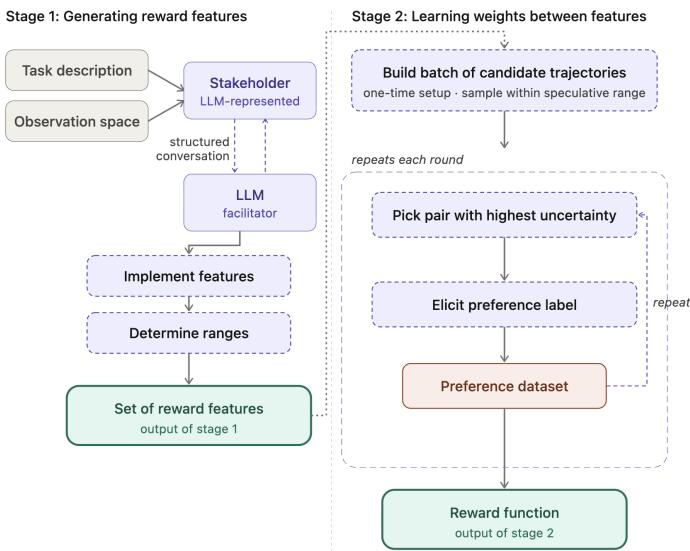
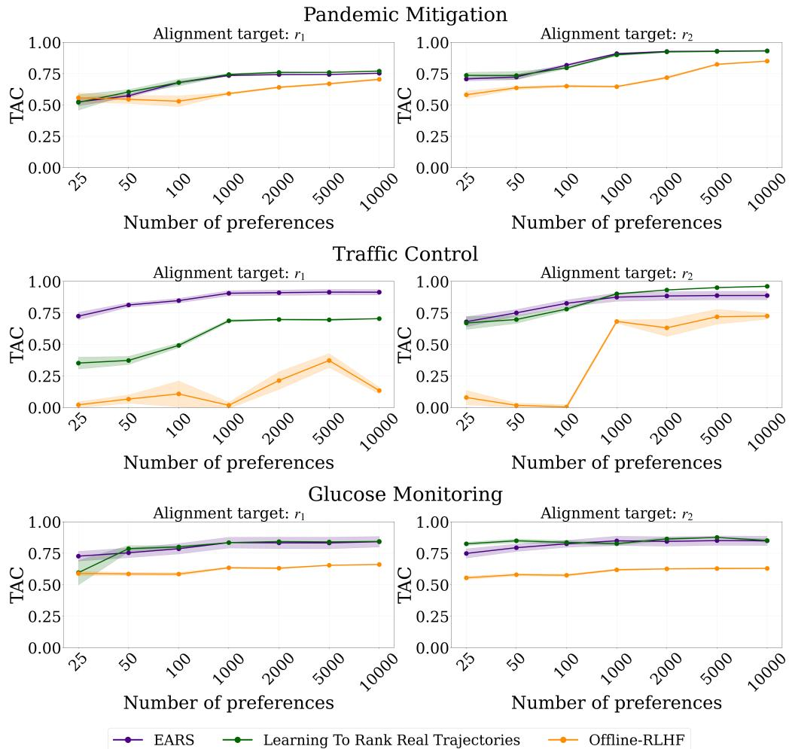
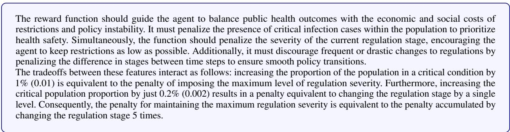
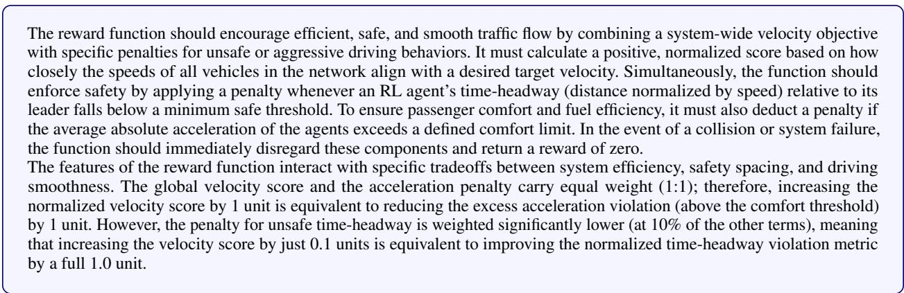
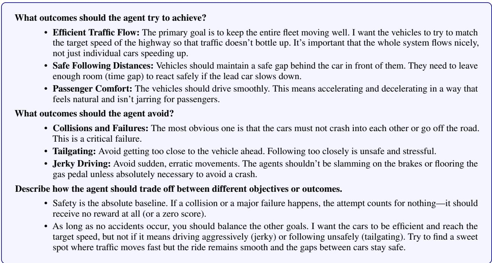
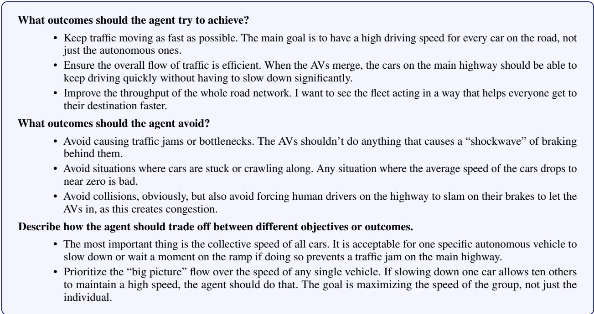

# SPECIFYING REWARD FUNCTIONS FOR RL WITHOUT ENVIRONMENT SAMPLING

Stephane Hatgis-Kessell1∗ W. Bradley Knox2 Emma Brunskill1

1Computer Science Department, Stanford University

2Computer Science Department, The University of Texas at Austin

## ABSTRACT

Enabling human stakeholders to specify reward functions that lead to their desired outcomes is a key challenge in deploying reinforcement learning agents. Preference-based methods such as online RLHF can reduce the burden of manual reward design, but they require repeatedly training policies, sampling trajectories from the real world, and eliciting feedback, making them impractical in settings where environment interaction is computationally expensive or unsafe. We introduce Experience-Free Autonomous Reward Specification (EARS), a method for learning reward functions from preferences without environment interaction. Our approach uses a structured LLM-mediated process to construct a small set of expressive reward features from a task description and the environment observation space, then strategically samples imagined trajectories in this feature space and learns feature weights from preferences over the imagined trajectory pairs. We evaluate on three long-horizon domains: pandemic lockdown regulation design, insulin administration for diabetes patients, and autonomous vehicle control on a highway. We compare EARS to baselines that also enable reward specification without environment interaction—namely, methods that directly prompt an LLM to generate a reward function. When learning from either ground-truth preference labels or preferences labeled by a LLM, EARS designs reward functions that are more aligned with the ground truth reward function that produced the preferences or LLM context than these baselines. These results suggest that preferencebased reward specification remains effective without environment sampling, enabling practical reward design in settings where collecting real trajectories is costly or infeasible.

## 1 Introduction

A central challenge in AI is enabling human stakeholders to specify their objectives (Amodei et al. 2016; Krakovna et al. 2020; Pan et al. 2022). A common approach is to encode these objectives as a reward function and optimize it via reinforcement learning (RL). Unfortunately, hand-designing a reward function is difficult, and can often result in a decision policy that does not behave as intended (Amodei et al. 2016; Pan et al. 2022; Krakovna et al. 2020). This has motivated extensive interest in learning a reward function from preferences such as in RLHF (Christiano et al. 2017; Lee et al. 2021; Ibarz et al. 2018; Pacchiano et al. 2021; Dong et al. 2024; Sadigh et al. 2017). In particular, in online RLHF, a reward model is learned from human preference data and used to train a policy (e.g., (Christiano et al. 2017)). The resulting policy is then rolled out in a real environment to generate trajectories. For example, the policy might control a humanoid learning to cook food, or generate a disaster response for extreme weather events modeled in a complex physics-based simulator. The resulting trajectories (of cooking, or disaster response in an expensive simulator) can then be used to elicit additional human feedback. The reward model is updated with this new data, and the process iterates.

However, in many domains this process involves considerable cost. For example, for humanoid robotics environments or those that use expensive physics simulators, policy rollouts are expensive or risky. This can make both policy training given a fixed reward function and data collection of trajectories to elicit preferences over extremely costly. Therefore, when training a reward model requires many rounds of data collection, online RLHF can be difficult to apply in practice.

These challenges may also directly translate into implications for data-efficiency; long policy training times may require eliciting larger batches of preferences to limit the number of policy updates, which in turn may require more human preference labels to learn desirable behavior (Citovsky et al. 2021; Biyik et al. 2024). Further, constructing a dataset for preference elicitation requires sampling sufficiently diverse trajectories to elicit feedback over, including sub-optimal data. For many real-world domains, collecting large amounts of sub-optimal data is prohibitive due to safety concerns (Garcia and Fernández 2012). If a high-fidelity simulator or world model is not available for data collection—which often require collecting large amounts of real world data to build—then acquiring the diverse and sufficiently sub-optimal trajectories required for effective preference elicitation may be very expensive (Cosner et al. 2022; Liu et al. 2023). Offline-RLHF suffers from the same limitations, i.e., it requires sampling large amounts of sufficiently diverse experience.

In this paper, we consider how to learn aligned reward functions without environment interaction—relevant when generating policy rollouts in the real domain is expensive. We introduce Experience-free Autonomous Reward Specification (EARS), which still assumes access to preference labels but learns a reward function without sampling from the environment. EARS comprises two novel stages. The first stage is a structured interaction between Large Language Models (LLMs) to construct a set of reward features that can represent different reward functions, following a process human domain experts might follow. Then in the second stage we strategically sample imagined trajectories from this generated feature space to elicit preferences over and construct a reward function.

We evaluate EARS in three complex, long horizon decision-making tasks with preferences labeled either synthetically by a ground-truth reward function, or by an LLM conditioned on a natural language specification of the task objectives—the kind of document a careful human stakeholder could plausibly produce. We first show that prompting an LLM to generate a reward function—even with an exceedingly specific description of the ground-truth reward—often fails to produce a well aligned reward function, highlighting the limitations of the only alternative available when environment interaction is unavailable. We then show that EARS produces reward functions far more closely aligned with the ground truth when learning from ground-truth preferences or LLM labeled preferences. Moreover, EARS matches or outperforms methods that do sample real trajectories from the environment to elicit preferences over.

Our contribution is three-fold:

• We show that directly prompting an LLM to design a reward function with an extremely detailed natural language description often does not produce a more aligned reward function than providing no reward function description.

• We introduce EARS, to design reward functions with preferences without sampling from an environment. EARS samples zero environment transitions, making it strictly more environment-sample-efficient than methods like online RLHF. We show that when learning from ground-truth preferences it matches the preference-label efficiency of a baseline that learns from real trajectories and outperforms directly prompting an LLM.

• We demonstrate that, when only given access to a natural language specification of the task objectives, EARS designs more aligned reward functions than directly prompting an LLM with the same specification

We release all code to reproduce experiments in this work here.

## 2 Preliminaries

Consider an MDP $\mathcal { M } \triangleq ( S , A , \Omega , \gamma , p _ { 0 } , r )$ with state space $S ,$ action space $A ,$ , transition dynamics $\Omega : S \times A  \Delta ( S )$ discount factor $\gamma \in [ 0 , 1 ]$ , and initial state distribution $p _ { 0 }$ . Let τ denote a trajectory $\tau = ( s _ { 0 } ^ { \tau } , a _ { 0 } ^ { \tau } , s _ { 1 } ^ { \tau } , a _ { 1 } ^ { \tau } , \ldots )$ starting at $s _ { 0 } ^ { \tau } \sim p _ { 0 }$ . We allow τ to be finite (e.g., when terminating in an absorbing state) or infinite. In this work, we consider the undiscounted setting $( \gamma = 1 )$ ; the formulation extends naturally to the discounted case $( \gamma < 1 )$ ). The ground-truth reward function is $r : S \times A \times S \to \mathbb { R }$ . We denote by $\mathcal { M } \setminus r \triangleq ( S , A , \Omega , \gamma , p _ { 0 } , \mathbf { \Omega } _ { - } )$ the environment without a specified reward function. Let r be the (unobservable) ground-truth reward function, $\hat { r } \textrm { a }$ learned approximation, and r˜ an arbitrary reward function. We denote the reward function produced by EARS as a linear functions over features: $\hat { r } ( s , a , s ^ { \prime } ) \stackrel { \cdot } { = } \hat { w } ^ { \top } \phi ( s , a , s ^ { \prime } )$ where $\phi ( s , a , s ^ { \prime } ) \in \mathbb { R } ^ { d }$ is a feature representation and $\hat { w } \in \mathbb { R } ^ { d }$ is a weight vector. We assume EARS produces a linear reward function to enable its active learning procedures in outlined Section 3.2 Importantly, this assumption does not limit our evaluations of EARS; the ground-truth reward functions and the reward function produced by the other methods we consider may be non-linear. We do not assume access to a known feature representation that can be used to construct the ground-truth reward function; this work concerns both learning wˆ and specifying ϕ. A policy $\pi : S \times A \to [ 0 , 1 ]$ maps states to action distributions. Its expected discounted return under $\tilde { r }$ from start distribution $p _ { 0 }$ is $J _ { \tilde { r } } ( \pi )$ . An optimal policy for r˜ is any $\pi _ { \tilde { r } } ^ { * } \in \arg \operatorname* { m a x } _ { \pi } J _ { \tilde { r } } ( \pi )$

As a complement to τ, let Φ denote a trajectory expressed as the sum of discounted reward features. For example, for a given trajectory, $\begin{array} { r } { \Phi _ { \tau } = \sum _ { t = 0 } ^ { | \tau | - 1 } \gamma ^ { t } \phi ( s _ { t } ^ { \tau } , a _ { t } ^ { \tau } , s _ { t + 1 } ^ { \tau } ) } \end{array}$ where $| \tau |$ denotes the number of transitions in τ (possibly infinite). Going forward, we will only consider trajectories expressed as the sum of reward features, rather than as a list of transitions. We learn a reward function rˆ from trajectory pair preferences. Let $\mathcal { D } = \{ ( \Phi _ { 1 } , \Phi _ { 2 } , \mu ) \} _ { k = 1 } ^ { N }$ and $\mu \in$ $\{ 0 , 1 , { \frac { 1 } { 2 } } \}$ with $0 : \Phi _ { 1 } \succ \Phi _ { 2 } , 1 : \Phi _ { 2 } \succ \Phi _ { 1 } , \frac { 1 } { 2 } : \Phi _ { 1 } \sim \Phi _ { 2 }$ . where ≻ means is ”preferred $\mathrm { t o } "$ and ∼ means is ”equally preferred $\mathrm { t o } "$ .

We consider two different approaches to learning a reward function from the preference dataset.

Learning from the Bradley–Terry preferences A standard assumption in RLHF is that preferences are generated by the Bradley–Terry preference model (Christiano et al. 2017):

$$
\begin{array} { c } { P ( \Phi _ { 1 } \succ \Phi _ { 2 } \mid \tilde { w } ) = \sigma \big ( \tilde { w } ^ { T } \Phi _ { 1 } - \tilde { w } ^ { T } \Phi _ { 2 } \big ) , } \\ { \sigma ( x ) = 1 / ( 1 + e ^ { - x } ) } \end{array}\tag{1}
$$

and that wˆ is learned by minimizing the cross-entropy loss:

$$
\begin{array} { r l } {  { \mathcal { L } _ { \mathrm { p r e f } } ( \hat { w } ; \mathcal { D } _ { t } ) = - \sum _ { ( \Phi _ { 1 } , \Phi _ { 2 } , \mu ) \in \mathcal { D } } [ \mu \log P ( \Phi _ { 1 } \succ \Phi _ { 2 } | \hat { w } )  } } \\ & { ~ \quad \quad  + ( 1 - \mu ) \log P ( \Phi _ { 1 } \prec \Phi _ { 2 } | \hat { w } ) ] . } \end{array}\tag{2}
$$

While widely used, the assumption that preferences are generated according to the Bradley–Terry model can be limiting; see (Zhi-Xuan et al. 2024) for a detailed critique. Nevertheless, when evaluating reward specification from ground-truth preferences—i.e., preferences generated by a ground-truth reward function to approximate those a real human might provide—we adopt the Bradley–Terry model and learn a reward function by minimizing the cross-entropy loss.

Learning from noiseless preferences Assuming preferences are sampled from the Bradley-Terry preference model relies on the assumption that preferences follow a particular type of structured noise. Here, we outline a method for learning a reward function from preferences that are noiselessly generated by a reward function, as has been assumed by some prior work (Knox et al. 2022; Hatgis-Kessell et al. 2025). In particular, we assume:

$$
P ( \Phi _ { 1 } \succ \Phi _ { 2 } \mid \tilde { w } ) = \mathbb { 1 } \left\{ \tilde { w } ^ { T } \Phi _ { 1 } > \tilde { w } ^ { T } \Phi _ { 2 } \right\} ,\tag{3}
$$

When preferences are labeled by an LLM, rather than by humans or synthetic annotators, we posit that this constitutes a strong alternative to the Bradley–Terry assumptions, which were originally developed to model human behavior—albeit are still flawed (Zhi-Xuan et al. 2024). Following the observation of (Kim et al. 2024), given preference dataset D, we can learn a reward function by solving the following linear program:

$$
\begin{array} { r l } { \mathrm { f i n d } \ } & { \hat { \boldsymbol { w } } \in \mathbb { R } ^ { d } } \\ { \mathrm { s . t . } \ } & { \hat { \boldsymbol { w } } ^ { \top } \left( \Phi _ { 1 , k } - \Phi _ { 2 , k } \right) \geq \epsilon , \quad \forall k \mathrm { w h e r e } \ \mu _ { k } = 0 , } \\ & { \hat { \boldsymbol { w } } ^ { \top } \left( \Phi _ { 1 , k } - \Phi _ { 2 , k } \right) \leq \epsilon , \quad \forall k \mathrm { w h e r e } \ \mu _ { k } = 1 , } \\ & { \hat { \boldsymbol { w } } ^ { \top } \left( \Phi _ { 1 , k } - \Phi _ { 2 , k } \right) = 0 , \quad \forall k \mathrm { w h e r e } \ \mu _ { k } = \frac { 1 } { 2 } , } \\ & { \| \hat { \boldsymbol { w } } \| _ { 1 } \leq { \cal B } . } \end{array}\tag{4}
$$

where ϵ is a tolerance parameter.

## 3 Experience Free Automatic Reward Specification (EARS)

EARS consists of two stages, illustrated in Figure 1. In the first stage, we engage an LLM, representing a human stakeholder or group of stakeholders, in a structured conversation with another LLM, representing a facilitator. The aim of the conversation is to design a small set of expressive and interpretable features that, when combined linearly, can represent the different objectives a stakeholder may have. In the second stage we elicit preferences to learn the weights between those reward features. The output of the second stage is a reward function learned to satisfy the elicited preferences. The environment is never sampled to produce the reward function.

Consider designing a reward function to train a policy to determine lockdown regulations in a Covid-19 pandemic. In Stage 1, the stakeholder and facilitator LLMs deliberate over a task description ("set COVID-19 lockdown regulations") and the observation space to produce a small set of measurable reward features—say, the fraction of the population in a critical condition, the severity of the current regulation stage, and the hospital capacity—each outputted by a Python function with a speculative range. In Stage 2, we sample imagined trajectories in this feature space $( \mathrm { e . g . }$ , "what $\mathrm { i f } ^ { \dag }$ questions such as those comparing a low critical-case count under sustained strict lockdown versus a higher count under less stringent regulations), elicit preferences over such pairs, and learn the weights that trade these features off, yielding a reward function without rolling out any policies.

  
Figure 1: Experience-free Autonomous Reward Specification (EARS): In Stage 1, a natural language task description and a description of the environment observation space are inputted to an LLM-represented stakeholder. The LLM-represented stakeholder deliberates with an LLM-represented facilitator to design a small set of reward features that can be combined linearly to represent different objectives. In Stage 2, imagined trajectory pairs are sampled from the designed feature space and preferences are labeled over those pairs. The output of Stage 2 is a reward function learned from those preferences.

## 3.1 Stage 1: Designing a set of reward features

The input to stage 1 is a brief description of the task, a description of the environment observation space represented as Python code, and optionally, a description of the task objective, supplied by a human stakeholder. The output of stage 1 is a small set of reward features: $\phi ( s _ { t } , a _ { t } , s _ { t + 1 } ) = \{ \phi _ { 1 } ( s _ { t } , a _ { t } , s _ { t + 1 } ) , . . . , \phi _ { d } ( s _ { t } , a _ { t } , s _ { t + 1 } ) \}$ . Each reward feature $\phi _ { i }$ is implemented as a python function, and is later linearly combined to produce a reward function.

To generate the set of reward features, we engage a stakeholder and facilitator, both represented as LLMs, in a structured conversation. The conversation seeks to: (1) unearth the different objectives people may have, (2) determine which objectives are measurable given the environment’s observation space, and (3) aggregate and implement the identified objectives as executable Python functions. Additionally, to enable the sampling procedure used in stage 2, stage 1 also outputs a speculative minimum and maximum range of the sum of each reward feature over of a trajectory of H steps—denoted as $\phi _ { \operatorname* { m i n } } ^ { H } \in \mathbb { R } ^ { d }$ and $\phi _ { \operatorname* { m a x } } ^ { H } \in \mathbb { R } ^ { d }$ . We prompt the stakeholder to select finite values that represent the likely ranges that would be observed.

## 3.2 Stage 2: Learning weights over the reward features

The input to stage 2 is the set of generated reward features from stage 1 and a preference labeler—whether that be a human stakeholder, an LLM, or something else. The output of stage 2 is a set of weights over the set of generated reward features, i.e., a reward function.

Constructing imagined trajectories Our key insight is that, given a small set of generated reward features, we can construct “imagined” trajectories by sampling feature values uniformly within their feasible ranges. Specifically, for each feature, we uniformly sample values from a speculated minimum–maximum range determined in Stage 1. We denote an imagined trajectory as $\Phi \in \mathbb { R } ^ { d }$ , where d is the number of reward features, which is constructed by sampling from the uniform distribution U over reward feature ranges: $\Phi \sim \mathcal { U } ( [ \phi _ { \operatorname* { m i n } } ^ { H } , \phi _ { \operatorname* { m a x } } ^ { H } ] )$ . While many of these imagined trajectories may not be physically plausible, preferences over them can still be useful for learning a reward function.

Strategically sampling imagined trajectories To avoid requiring prohibitively large datasets of preferences, prior work in online RLHF focuses on strategically sampling trajectory pairs that can reduce uncertainty (Christiano et al. 2017; Lee et al. 2021; Ibarz et al. 2018; Pacchiano et al. 2021; Dong et al. 2024; Sadigh et al. 2017). This approach is particularly apt for imagined trajectories, since sampling them is cheap and we can draw many candidates and select the single most informative pair. At each round of feedback collection, we sample k imagined trajectories and then select the pair with the highest uncertainty under the current dataset D, according to an uncertainty function $f ( \Phi _ { 1 } , \Phi _ { 2 } , { \mathcal { D } } )$ $( \bar { \Phi } _ { 1 } ^ { \ast } , \bar { \Phi } _ { 2 } ^ { \ast } ) = \arg \operatorname* { m a x } _ { \Phi _ { 1 } , \Phi _ { 2 } } f ( \Phi _ { 1 } , \bar { \Phi _ { 2 } } , { \mathcal D } )$ where $f ( \Phi _ { 1 } , \Phi _ { 2 } , { \mathcal { D } } )$ is the subsequent sections. We restrict the selection to pairs of imagined trajectories that differ in at most two features; we speculate that this makes the salient differences between any two imagined trajectories easier for a preference labeler to reason about. A preference label is elicited over the selected imagined trajectory pair, added to the preference dataset, and then the process is repeated. $f ( \Phi _ { 1 } , \Phi _ { 2 } , { \mathcal { D } } )$ can be instantiated using any uncertainty measure proposed in prior work on online-RLHF. In this work, we consider two such measures, depending on whether preferences are assumed to be stochastic or noiseless.

Strategically sampling imagined trajectories with stochastic preferences When assuming preferences follow the Bradley-Terry preference model, we quantify uncertainty as the variance in predicted preference probabilities across an ensemble of reward models. In this work, the ensemble is maintained using an Epistemic Neural Network (ENN) (Osband et al. 2023) which provides a computationally efficient method for measuring epistemic uncertainty as the variance across different model predictions. Concretely, let $\{ \hat { r } _ { \theta ( i ) } \} _ { i = 1 } ^ { M }$ denote the ensemble of reward models, and define

$$
p ^ { ( i ) } ( \Phi _ { 1 } \succ \Phi _ { 2 } ) = \frac { \exp \left( \hat { r } _ { \theta ^ { ( i ) } } ( \Phi _ { 1 } ) \right) } { \exp \left( \hat { r } _ { \theta ^ { ( i ) } } ( \Phi _ { 1 } ) \right) + \exp \left( \hat { r } _ { \theta ^ { ( i ) } } ( \Phi _ { 2 } ) \right) } .
$$

Then, $\begin{array} { r } { f _ { \mathrm { e n n } } ( \Phi _ { 1 } , \Phi _ { 2 } , \mathcal { D } ) = \operatorname { V a r } _ { i \in [ M ] } \left[ p ^ { ( i ) } ( \Phi _ { 1 } \succ \Phi _ { 2 } ) \right] } \end{array}$ . This variance-based uncertainty measure is common in prior work (Christiano et al. 2017; Lee et al. 2021; Dwaracherla et al. 2024).

Strategically Sampling Imagined Trajectories with Noiseless Preferences Alternatively, when assuming preferences are noiseless and learned by solving a linear program via Eq. 4, we quantify uncertainty using the disagreement among the reward functions that are still consistent with D. Each candidate reward function w assigns the pair a signed return difference $w ^ { \top } ( \Phi _ { 1 } - \Phi _ { 2 } )$ , whose sign encodes which trajectory w prefers. Let $\mathcal { W } ( \mathcal { D } )$ denote the feasible set of weights satisfying the constraints from D, i.e., the solutions to $\operatorname { E q . 4 } ,$ , and let ℓ and u be the smallest and largest such differences over this set:

$$
\ell = \operatorname* { m i n } _ { w \in \mathcal { W } ( \mathcal { D } ) } w ^ { \top } ( \Phi _ { 1 } - \Phi _ { 2 } ) , \quad u = \operatorname* { m a x } _ { w \in \mathcal { W } ( \mathcal { D } ) } w ^ { \top } ( \Phi _ { 1 } - \Phi _ { 2 } ) .
$$

We then define

$$
f _ { \mathrm { L P } } ( \Phi _ { 1 } , \Phi _ { 2 } , { \mathcal { D } } ) = { \left\{ \begin{array} { l l } { u - \ell } & { { \mathrm { i f ~ } } \mathrm { s i g n } ( \ell ) \neq \mathrm { s i g n } ( u ) , } \\ { 0 } & { { \mathrm { o t h e r w i s e } } . } \end{array} \right. }
$$

A differing sign means some feasible reward function prefers $\Phi _ { 1 }$ while another prefers $\Phi _ { 2 } .$ , so the pair is contested and $f _ { \mathrm { L P } }$ measures the magnitude of that disagreement. When $\operatorname { s i g n } ( \ell ) = \operatorname { s i g n } ( u ) ( \bar { \mathrm { e } } . \mathrm { g } . , \ell = 1 , u = 1 \bar { 0 0 } 0 0 )$ , every feasible reward function assigns the difference the same sign and therefore agrees on the ordering; the pair is uninformative and we set its uncertainty to zero.2

Learning a reward function from preferences over imagined trajectories The resulting dataset D consists of tuples $( \Phi _ { 1 } , \Phi _ { 2 } ,  )$ . A reward function is learned from this dataset using either the objective in Eq. 2 when assuming Bradley–Terry preferences, or the linear program in Eq. 4 when assuming noiseless preferences. Let $\hat { w } _ { \mathcal { D } }$ be the weight vector that satisfies the preferences between imagined trajectory pairs in dataset D found with either reward learning method.3 The transition-level reward function, which inputs transitions from the environment, is then $\hat { r } ( s _ { t } , a _ { t } , s _ { t + 1 } ) =$ $\hat { w } _ { \mathcal { D } } ^ { \top } \phi ( s _ { t } , a _ { t } , s _ { t + 1 } )$

## 4 Experiments

We now empirically evaluate EARS. We consider two ways a stakeholder may specify a reward function: via preferences (Section 4.4)—which we study by simulating human preferences with a ground-truth reward function and two different preference models—and via a natural language specification of the task objectives, which serves as context for an LLM-based preference labeler (Section 4.5). This second setting represents a directly deployable use of EARS: the only inputs required are an environment description and a specification document a careful human could write, with no environment sampling and no human-in-the-loop preference labeling. All experiments use Gemini 3.

## 4.1 Evaluating the learned reward function.

We evaluate the alignment between a learned reward function rˆ and the ground-truth reward function r using the Trajectory Alignment Coefficient (TAC) (Muslimani et al. 2025). TAC computes the Kendall-Tau correlation between the ranking of trajectories under the learned reward function,rˆ, and the ground truth reward function, r, where all trajectories share the same start state. We compute TAC using 500 trajectories sampled from the environment, denoted $\tau _ { \mathrm { e v a l } }$ . These trajectories are collected from checkpoints while training a policy with the ground-truth reward function, and are used solely for evaluation; consistent with our problem setting, no environment samples are used for learning the reward function. Our aim is to develop a method to achieve the following:

Objective. maxrˆ TAC(ˆr, r) s.t. rˆ is learned without sampling transitions from ${ \mathcal { M } } .$

We further discuss this evaluation metric in relation to others in Section A.

<table><tr><td>Name</td><td>Objective</td><td>H</td><td>State</td><td>Action</td><td>r1 Summary</td><td>r2 Summary</td><td>Simulator</td></tr><tr><td>Pandemic Mitigation (Kompella et al. 2020)</td><td>Design COVID-19 pandemic lockdown regulations</td><td>192</td><td>Cont., 312-dim</td><td>Disc. {−1,0,1}</td><td>Trades off between lockdown regulation strictness and infection rates</td><td>Encourages strict and non-fluctuating lockdown regulations even when infection rates are low</td><td>Modified SEIR simulator (Kompella et al. 2020)</td></tr><tr><td>Glucose Monitoring (Man et al. 2014; Fox et al. 2020)</td><td>Administer insulin to patient with Type II diabetes</td><td>5760 Cont.,</td><td>96-dim</td><td>1-d Cont. in [0, 1]</td><td>Prioritizes minimizing health risks</td><td>Prioritizes reducing financial cost of treatment and risk of death</td><td>FDA-approved simulator (Man et al. 2014; Fox et al. 2020)</td></tr><tr><td>Traffic Control (Wu et al. 2021)</td><td>Control autonomous vehicle (AV) fleet on highway</td><td>300</td><td>Cont., 50-dim</td><td>10-d Cont. in Trades off between [0, 1]</td><td>maximizing mean velocity of all vehicles and maintaining safe distances</td><td>Maximizes mean velocity</td><td>FLOW highway simulator (Wu et al. 2021)</td></tr></table>

Table 1: Environments, used by Pan et al. (2022). H = horizon.

## 4.2 Environments

We evaluate EARS across three benchmark environments used in Pan et al. (2022), summarized in Table 1. For each environment, we consider two different ground-truth reward functions to align with, denoted as $r _ { 1 }$ and $r _ { 2 } .$ These two ground-truth reward functions per environment are also designed by Pan et al. (2022) and are given in Section F. All environments have large, continuous observation spaces that must be reasoned over to design a small set of reward features.

## 4.3 Baselines

Baselines that don’t sample from environment To the best of our knowledge, the only existing class of methods that specifies a reward function without environment sampling is to directly prompt an LLM to write a reward function (e.g., (Ma et al. 2023; Kwon et al. 2023; Xie et al. 2023; Yu et al. 2023)). These methods typically then refine the generated reward function through environment sampling—for example, by executing the proposed reward, observing the resulting behavior, and iterating. We introduce three baselines in this class but with the environment-sampling step removed to match our problem setting. Each baseline takes as input a task description and a description of the environment observation space, and outputs a reward function implemented in Python. Two of the baselines supply the reward-designing LLM with a natural language specification describing the task objectives and how they should be traded off—the same specifications that we evaluate EARs with in Section 4.5.

• Direct Prompting: Prompts an LLM to design a reward function for an RL agent, given only the task description and observation space. No stakeholder specification is provided.

• Direct Prompting + Realistic Reward Description: The reward-designing LLM is given a realistic stakeholder specification, produced by a separate LLM that fills out a structured template using a summary of the ground-truth reward. This specification represents what we believe a careful human stakeholder could plausibly produce in the realistic setting where no ground-truth reward function exists. The realistic reward descriptions are given in Appendix Figures 4, 8, and 12.

• Direct Prompting + Privileged Reward Description: The reward-designing LLM is given a highly detailed objective specification. To generate this specification, a separate LLM is shown the ground-truth reward implementation and asked to describe it in natural language. The resulting specification is likely more detailed than what a real human stakeholder without access to a ground-truth reward function could specify; it serves as an upper bound on the specificity available to a direct-prompting method. The privileged reward descriptions are given in Appendix Figures 3, 7, and 11.

In real-world use, the specification for the last two baselines would come directly from a human stakeholder, and no ground-truth reward function would exist.

Baselines that do sample from the environment We compare EARS to two baselines that, unlike EARS, learn from real trajectories sampled from the environment. Both baselines learn from preferences labeled by the ground-truth reward function over the same real trajectory pairs. The trajectories are sampled uniformly from a candidate pool built by rolling out policy checkpoints saved while training a policy with the ground-truth reward function, and pairs are uniformly sampled from this set. The two baselines differ only in the trajectory representation input to the model they learn; both learn a model parameterized as a non-linear neural network. Offline-RLHF learns a reward model defined over transitions, which can be used directly as a reward function. Learning To Rank Real Trajectories (LTRRT) instead represents each trajectory as the sum of its observation-space features, potentially avoiding challenges in correctly assigning trajectory return across transitions; because this model is defined over a full trajectory rather than transitions, it cannot itself be used as a reward function, and serves only to rank trajectories. 4 Note that both baselines enjoy an advantage unavailable to EARS: their preference pairs are drawn from real trajectories produced by a policy trained on the ground-truth reward function, whereas EARS—with no access to the ground-truth reward function—only constructs imagined trajectories. More details are provided in Appendix D.

Table 2: EARS with preferences compared to prompting baselines: TAC between learned and ground-truth reward functions across three environments, evaluated for two ground-truth reward functions (r1 and $r _ { 2 } )$ . We compare EARS against three prompting baselines: direct prompting with no reward description (No-RD), with a privileged reward description (Privileged-RD) and with a realistic reward description (Realistic-RD). We evaluate EARS with noiseless preferences and stochastic preferences. None of the methods sample transitions from the environment. Results are averaged over three random seeds (± standard error), with each seed rerunning the full method including all LLM generations. Higher TAC indicates closer alignment with the ground-truth reward function.
<table><tr><td rowspan="2">Method Variant</td><td rowspan="2"></td><td colspan="2">Pandemic</td><td colspan="2">Glucose</td><td colspan="2">Traffic</td></tr><tr><td> $r _ { 1 }$ </td><td> $r _ { 2 }$ </td><td> $r _ { 1 }$ </td><td> $r _ { 2 }$ </td><td> $r _ { 1 }$ </td><td> $r _ { 2 }$ </td></tr><tr><td rowspan="2">EARS</td><td>1k noiseless prefs.</td><td> ${ \bf . 7 2 \pm . 0 1 }$ </td><td> ${ \bf . 9 6 \pm . 0 0 }$ </td><td> ${ \bf . 6 9 \pm . 0 7 }$ </td><td> ${ \bf . 8 2 \pm . 0 4 }$ </td><td> ${ \bf . 9 2 \pm . 0 7 }$ </td><td> ${ \bf . 9 0 \pm . 0 9 }$ </td></tr><tr><td>2k stochastic prefs.</td><td> ${ \bf . 7 3 \pm . 0 1 }$ </td><td> ${ \bf . 9 4 \pm . 0 2 }$ </td><td> ${ \bf . 7 4 \pm . 0 3 }$ </td><td> $. 7 1 \pm . 0 6$ </td><td> ${ \bf 8 5 \pm . 0 4 }$ </td><td> ${ \bf . 9 0 \pm . 0 9 }$ </td></tr><tr><td rowspan="3">Direct Prompting</td><td>No-RD</td><td> $- . 0 8 \pm . 1 2$ </td><td> $. 4 3 \pm . 1 2$ </td><td> $. 1 6 \pm . 2 0$ </td><td> $- . 2 0 \pm . 2 0$ </td><td> $. 2 5 { \pm } . 0 6$ </td><td> $. 6 7 \pm . 2 7$ </td></tr><tr><td>Realistic-RD</td><td> $- . 3 7 \pm . 1 0$ </td><td> $. 6 8 \pm . 0 6$ </td><td> $. 2 7 \pm . 2 9$ </td><td> ${ \bf . 7 9 \pm . 1 4 }$ </td><td> $. 2 7 \pm . 0 4$ </td><td> ${ \bf . 9 4 \pm . 0 1 }$ </td></tr><tr><td>Privileged-RD</td><td> $- . 1 4 \pm . 1 4$ </td><td> $. 5 8 \pm . 1 9$ </td><td> $. 2 1 \pm . 1 7$ </td><td> $. 8 4 \pm . 1 2$ </td><td> $. 1 7 \pm . 0 1$ </td><td> $\mathbf { 1 . 0 0 \pm . 0 0 }$ </td></tr></table>

Table 3: EARS with natural language input compared to prompting baselines: We evaluate EARS with preferences labeled by an LLM given a natural language specification generated by the ground-truth reward function against direct prompting baselines that generate reward functions from the same specification. We evaluate with two specifications outlined in Section 4.3: (a) Realistic Reward Description and (b) Privileged Reward Description. See Table 2 for more details.
<table><tr><td rowspan="2">Specification</td><td rowspan="2">Variant</td><td colspan="2">Pandemic</td><td colspan="2">Glucose</td><td colspan="2">Traffic</td></tr><tr><td> $r _ { 1 }$ </td><td> $r _ { 2 }$ </td><td> $r _ { 1 }$ </td><td> $r _ { 2 }$ </td><td> $r _ { 1 }$ </td><td> $r _ { 2 }$ </td></tr><tr><td>(a) Realistic</td><td>Direct Prompting EARS</td><td> $- . 3 7 \pm . 1 0$   ${ \bf { . 4 3 \pm . 1 6 } }$ </td><td> $. 6 8 \pm . 0 6$   ${ \bf . 7 4 \pm . 0 2 }$ </td><td> $. 2 7 \pm . 2 9$   ${ \bf . 8 5 \pm . 1 0 }$ </td><td> $. 7 9 \pm . 1 4$  .89±.04</td><td> $\mathbf { \delta } _ { \mathbf { \delta } \cdot 2 7 \pm . 0 4 }$   $- . 0 3 \pm . 1 4$ </td><td> ${ \bf . 9 4 \pm . 0 1 }$   ${ \bf . 9 5 \pm . 0 2 }$ </td></tr><tr><td>(b) Privileged</td><td>Direct Prompting EARS</td><td> $- . 1 4 \pm . 1 4$   ${ \bf . 3 2 \pm . 0 8 }$ </td><td> $. 5 8 \pm . 1 9$   ${ \bf . 7 1 \pm . 0 7 }$ </td><td> $. 2 1 \pm . 1 7$   ${ \bf \delta } . 8 4 \pm . 0 0$ </td><td> $. 8 4 \pm . 1 2$   ${ \bf . 9 5 \pm . 0 0 }$ </td><td> $. 1 7 \pm . 0 1$   ${ \bf . 2 0 \pm . 2 0 }$ </td><td> $\mathbf { 1 . 0 0 \pm . 0 0 }$   $. 9 7 \pm . 0 3$ </td></tr></table>

## 4.4 Results when specifying a reward function via ground-truth preferences

We evaluate EARS when assuming preferences are sampled from the Bradley-Terry preference model under the groundtruth reward function and when assuming preferences are noiselessly generated by the ground-truth reward function. Because the ground-truth reward function inputs real transitions from the environment, but we elicit preferences over imagined trajectories, we learn a mapping between the two representations as detailed in Appendix Section B.

Results are shown in Table 2, demonstrating that EARS learns more aligned reward functions from the ground-truth preferences than other methods that also do not rely on environment sampling. Notably, even providing the Direct Prompting baseline with an exceedingly specific objective description for r1 (Privileged-RD) fails to generate an aligned reward function in all environments. EARS slightly under performs the direct prompting baselines when all methods produce reward functions with higher TAC, and substantially outperforms them otherwise.

Comparison to sampling trajectories from the real environment A natural concern is that EARS, by learning from imagined rather than real trajectories, might require many more preferences to learn the same reward function. We test this by comparing the data-efficiency of EARS against Offline-RLHF and Learning To Rank Real Trajectories, both of which learn from real environment trajectories, in Figure 2. We find that learning from real trajectories does not require substantially fewer preferences than learning from imagined trajectories: EARS is in fact substantially more data-efficient than Offline-RLHF, and tends to match or outperform Learning To Rank Real Trajectories.

  
Figure 2: Comparison to learning with real trajectories: We compare EARS, which learns from preferences over imagined trajectories, against Offline-RLHF and Learning To Rank Real Trajectories, which both learn a non-linear model from trajectory pairs sampled from policy checkpoints in the environment. Results are shown for 5 seeds and the shaded area shows the standard error. Preferences are labeled by the ground-truth reward function.

In Appendix C we evaluate EARS when sampling imagined trajectories from the environment observation space as opposed to the set of reward features generated in Stage 1, and find sampling imagined trajectories from the environment’s observation space substantially under performs sampling imagined trajectories from the LLM designed feature space.

## 4.5 Results when specifying a reward function via natural language

We now evaluate EARS in a setting where it is directly deployable. Here we assume the input to EARS is a natural language specification of an objective, for evaluation purposes designed from the ground-truth reward function to emulate the specifications a human stakeholder could provide. The specification is input to an LLM that will label preferences instead of a ground-truth preference labeler (Section 4.4) or a human stakeholder. We evaluate EARS with the Privileged Reward Description and Realistic Reward Description outlined in Section 4.3, matching the corresponding baselines. All other evaluation details match those in Section 4.4.

Table 3 shows the results. EARS produces more aligned reward functions than the direct prompting baselines in nearly all settings, and yields substantially better performance when alignment with the ground-truth reward function is otherwise low. The exception is the traffic environment with the realistic reward description for $r _ { 1 }$ , where EARS underperforms direct prompting. Overall, EARS generally outperforms direct prompting, though at the cost of substantially more LLM generations for preference labeling.

## 5 Conclusion

We introduced EARS, a method for specifying reward functions from preferences without sampling trajectories from the environment—which can be prohibitively slow or unsafe. Across three sequential decision-making domains, EARS produces reward functions more aligned with the ground-truth reward function than the only existing alternatives that avoids environment sampling: directly prompting an LLM to generate a reward function. This holds in both evaluation settings we consider—when preferences are generated from a ground-truth reward function, and when they are labeled by an LLM conditioned on the kind of natural language specification a careful human stakeholder could readily provide without ever writing a reward function. EARS also matches or outperforms methods that learn from preferences labeled over real trajectories.

Several directions for future work would extend the applicability of EARS. The setting we evaluate in Section 4.5— where a stakeholder supplies a natural language specification of the task objectives and an LLM labels preferences over imagined trajectories—requires no human in the loop and is readily practical. A natural extension is to evaluate EARS in a setting where preferences are labeled by human stakeholders rather than an LLM or a ground-truth reward function. This raises open questions our current evaluation cannot answer: whether stakeholders can meaningfully reason about imagined trajectories that may not be physically realizable. A user study with domain experts would address these questions. While we show that LLMs can design reward functions by labeling preferences over imagined trajectories given a natural language specification, what kinds of specifications human stakeholders can or should provide remain important open questions.

## References

Dario Amodei, Chris Olah, Jacob Steinhardt, Paul Christiano, John Schulman, and Dan Mané. Concrete problems in ai safety. arXiv preprint arXiv:1606.06565, 2016.

Erdem Biyik, Nima Anari, and Dorsa Sadigh. Batch active learning of reward functions from human preferences. ACM Transactions on Human-Robot Interaction, 13(2):1–27, 2024.

Paul F Christiano, Jan Leike, Tom Brown, Miljan Martic, Shane Legg, and Dario Amodei. Deep reinforcement learning from human preferences. Advances in neural information processing systems, 30, 2017.

Gui Citovsky, Giulia DeSalvo, Claudio Gentile, Lazaros Karydas, Anand Rajagopalan, Afshin Rostamizadeh, and Sanjiv Kumar. Batch active learning at scale. Advances in Neural Information Processing Systems, 34:11933–11944, 2021.

Ryan Cosner, Maegan Tucker, Andrew Taylor, Kejun Li, Tamas Molnar, Wyatt Ubelacker, Anil Alan, Gábor Orosz, Yisong Yue, and Aaron Ames. Safety-aware preference-based learning for safety-critical control. In Learningfor Dynamics and Control Conference, pages 1020–1033. PMLR, 2022.

Hanze Dong, Wei Xiong, Bo Pang, Haoxiang Wang, Han Zhao, Yingbo Zhou, Nan Jiang, Doyen Sahoo, Caiming Xiong, and Tong Zhang. Rlhf workflow: From reward modeling to online rlhf. arXiv preprint arXiv:2405.07863, 2024.

Vikranth Dwaracherla, Seyed Mohammad Asghari, Botao Hao, and Benjamin Van Roy. Efficient exploration for llms. arXiv preprint arXiv:2402.00396, 2024.

Ian Fox, Joyce Lee, Rodica Pop-Busui, and Jenna Wiens. Deep reinforcement learning for closed-loop blood glucose control. In Machine Learningfor Healthcare Conference, pages 508–536. PMLR, 2020.

Javier Garcia and Fernando Fernández. Safe exploration of state and action spaces in reinforcement learning. Journal ofArtificial Intelligence Research, 45:515–564, 2012.

Stephane Hatgis-Kessell, W Bradley Knox, Serena Booth, Scott Niekum, and Peter Stone. Influencing humans to conform to preference models for rlhf, 2025. URL https://arxiv. org/abs/2501.06416, 2025.

Borja Ibarz, Jan Leike, Tobias Pohlen, Geoffrey Irving, Shane Legg, and Dario Amodei. Reward learning from human preferences and demonstrations in atari. Advances in neural information processing systems, 31, 2018.

Kihyun Kim, Jiawei Zhang, Asuman Ozdaglar, and Pablo A Parrilo. A unified linear programming framework for offline reward learning from human demonstrations and feedback. arXiv preprint arXiv:2405.12421, 2024.

W Bradley Knox, Stephane Hatgis-Kessell, Serena Booth, Scott Niekum, Peter Stone, and Alessandro Allievi. Models of human preference for learning reward functions, june 2022. URL https://arxiv. org/abs/2206.02231 v3, 2022.

Varun Kompella, Roberto Capobianco, Stacy Jong, Jonathan Browne, Spencer Fox, Lauren Meyers, Peter Wurman, and Peter Stone. Reinforcement learning for optimization of covid-19 mitigation policies. arXiv preprint arXiv:2010.10560, 2020.

Victoria Krakovna, Jonathan Uesato, Vladimir Mikulik, Matthew Rahtz, Tom Everitt, Ramana Kumar, Zac Kenton, Jan Leike, and Shane Legg. Specification gaming: the flip side of AI ingenuity. Google DeepMind Blog, April 2020. URL https://deepmind.google/discover/blog/specification-gaming-the-flip-side-of-ai-ingenuity/. Published April 21, 2020. Accessed August 5, 2025.

Minae Kwon, Sang Michael Xie, Kalesha Bullard, and Dorsa Sadigh. Reward design with language models. arXiv preprint arXiv:2303.00001, 2023.

Kimin Lee, Laura Smith, and Pieter Abbeel. Pebble: Feedback-efficient interactive reinforcement learning via relabeling experience and unsupervised pre-training. arXiv preprint arXiv:2106.05091, 2021.

Yi Liu, Gaurav Datta, Ellen Novoseller, and Daniel S Brown. Efficient preference-based reinforcement learning using learned dynamics models. arXiv preprint arXiv:2301.04741, 2023.

Yecheng Jason Ma, William Liang, Guanzhi Wang, De-An Huang, Osbert Bastani, Dinesh Jayaraman, Yuke Zhu, Linxi Fan, and Anima Anandkumar. Eureka: Human-level reward design via coding large language models. arXiv preprint arXiv:2310.12931, 2023.

Chiara Dalla Man, Francesco Micheletto, Dayu Lv, Marc Breton, Boris Kovatchev, and Claudio Cobelli. The UVA/- PADOVA type 1 diabetes simulator. Journal ofDiabetes Science and Technology, 8(1):26–34, January 2014. ISSN 1932-2968. doi:10.1177/1932296813514502. URL https://www.ncbi.nlm.nih.gov/pmc/articles/PMC4454102/.

Calarina Muslimani, Kerrick Johnstonbaugh, Suyog Chandramouli, Serena Booth, W Bradley Knox, and Matthew E Taylor. Towards improving reward design in rl: A reward alignment metric for rl practitioners. arXiv preprint arXiv:2503.05996, 2025.

Ian Osband, Zheng Wen, Seyed Mohammad Asghari, Vikranth Dwaracherla, Morteza Ibrahimi, Xiuyuan Lu, and Benjamin Van Roy. Epistemic neural networks. Advances in Neural Information Processing Systems, 36:2795–2823, 2023.

Aldo Pacchiano, Aadirupa Saha, and Jonathan Lee. Dueling rl: reinforcement learning with trajectory preferences. arXiv preprint arXiv:2111.04850, 2021.

Alexander Pan, Kush Bhatia, and Jacob Steinhardt. The effects of reward misspecification: Mapping and mitigating misaligned models, 2022. URL https://arxiv. org/abs/2201.03544, 2022.

Dorsa Sadigh, Anca Dragan, Shankar Sastry, and Sanjit Seshia. Active preference-based learning of reward functions. 2017.

Cathy Wu, Abdul Rahman Kreidieh, Kanaad Parvate, Eugene Vinitsky, and Alexandre M Bayen. Flow: A modular learning framework for mixed autonomy traffic. IEEE Transactions on Robotics, 38(2):1270–1286, 2021.

Tianbao Xie, Siheng Zhao, Chen Henry Wu, Yitao Liu, Qian Luo, Victor Zhong, Yanchao Yang, and Tao Yu. Text2reward: Reward shaping with language models for reinforcement learning. arXiv preprint arXiv:2309.11489, 2023.

Wenhao Yu, Nimrod Gileadi, Chuyuan Fu, Sean Kirmani, Kuang-Huei Lee, Montse Gonzalez Arenas, Hao-Tien Lewis Chiang, Tom Erez, Leonard Hasenclever, Jan Humplik, et al. Language to rewards for robotic skill synthesis. arXiv preprint arXiv:2306.08647, 2023.

Tan Zhi-Xuan, Micah Carroll, Matija Franklin, and Hal Ashton. Beyond preferences in ai alignment. Philosophical Studies, 2024. doi:10.1007/s11098-024-02249-w. arXiv:2408.16984.

## A Evaluating the learned reward function.

To evaluate the alignment of the learned reward function with respect to a ground-truth reward function, we compute the TAC between the two as outlined in Section 4.1. An alternative method to evaluate $\hat { r }$ could be to compute the the set of optimal policies with respect to rˆ and evaluate the average performance of those polices under the $\begin{array} { r } { r \colon \tilde { \frac { 1 } { | \pi _ { \hat { r } } ^ { * } | } } \sum _ { \pi \in \pi _ { \hat { r } } ^ { * } } J _ { r } ( \pi ) } \end{array}$ We avoid this evaluation methodology because, for the environments we consider, training any policy is computationally expensive and, due to the long task horizons and continuous state spaces, deriving an optimal policy is intractable. For a sufficiently large and diverse set of evaluation trajectories, $\mathrm { T A C } ( \bar { \hat { r } } , r )$ provides a strong measure of alignment; unlike empirical policy performance, it evaluates how the reward functions rank all trajectories, rather than focusing only on the observed highest-ranked ones. Broadly, the focus of our work is on producing aligned reward functions, which TAC evaluates directly, rather than reward functions that can train policies.

## B Labeling synthetic preferences over imagined trajectories

We evaluate EARS in Section 4.4 by assuming access to a synthetic preference labeler that labels preferences according to the ground-truth reward function. These preferences are labeled over imagined trajectories rather than real trajectories sample from an environment, and the ground-truth reward function is defined over transitions sampled from the real environment $( \mathrm { e } . \mathrm { g } . , r ( s , a , s ^ { \prime } ) )$ . Therefore, to enable learning from synthetic preferences over imagined trajectories, we find $r _ { m }$ that best satisfies the ranking induced by r over all trajectories in $\tau _ { \mathrm { e v a l } }$ . Following the Bradley–Terry formulation, we model pairwise preferences as

$$
P ( \Phi _ { \tau } \succ \Phi _ { \tau ^ { \prime } } \mid r _ { m } ) = \sigma \big ( r _ { m } ( \Phi _ { \tau } ) - r _ { m } ( \Phi _ { \tau ^ { \prime } } ) \big ) ,
$$

and learn $r _ { m }$ by minimizing the cross-entropy loss against the ranking induced by $r { : }$

$$
\begin{array} { r l } & { \mathcal { L } ( \boldsymbol { r } _ { m } ; \mathcal { T } _ { \mathrm { e v a l } } ) = - \displaystyle \sum _ { \tau , \tau ^ { \prime } \in \mathcal { T } _ { \mathrm { e v a l } } } \left[ ( 1 - \mu _ { \tau , \tau ^ { \prime } } ) \log P ( \Phi _ { \tau } \succ \Phi _ { \tau ^ { \prime } } \mid \boldsymbol { r } _ { m } ) \right. } \\ & { \quad \quad \quad \quad \quad \quad \quad \left. + \mu _ { \tau , \tau ^ { \prime } } \log P ( \Phi _ { \tau } \prec \Phi _ { \tau ^ { \prime } } \mid \boldsymbol { r } _ { m } ) \right] , } \end{array}\tag{5}
$$

where $\mu _ { \tau , \tau ^ { \prime } } = \Im [ r ( \tau ^ { \prime } ) > r ( \tau ) ]$ encodes the ground-truth, noiseless preference under $^ { r } \cdot$

To avoid arbitrary scaled of the mapped ground-truth reward function, we then scale the mapped ground-truth reward function such that the mean preference probability under the Bradley-Terry model for preferences over all trajectories in $\tau _ { \mathrm { e v a l } }$ is 0.9. Synthetic preferences over imagined trajectories can then be labeled with the mapped ground-truth reward function.

## C Comparison to Sampling Imagined Trajectories from the Environment Observation Space

Stage 1 of EARS aims to produce a small set of reward features from which we can sample imagined trajectories in Stage 2. Here, we compare EARS to a method that uses the environment’s observation space variables as features to sample from rather than executing Stage 1. Results are shown in Table 4, indicating that sampling imagined trajectories from the environment’s observation space substantially under performs sampling imagined trajectories from the LLM designed feature space. The raw observation space is substantially larger, containing many redundant features unrelated to any objective. This makes informative sampling in Stage 2 harder: analogous to the noisy-TV problem in exploration, the uncertainty criterion is drawn toward pairs differing along these irrelevant features, where reward-function disagreement is high but uninformative about the ground-truth objective.

## D Implementation Details for LTRRT and Offline-RLHF

We compare EARS against two preference-learning baselines that operate directly on environment observations rather than on LLM-generated reward features: Learning To Rank Real Trajectories (LTRRT) and $O f f i n e { - } R L H F$ . Both baselines are trained and evaluated entirely offline from a fixed pool of pre-collected trajectories. The two baselines are identical in every respect—trajectory pool, preference labeling, reward-model architecture, optimizer, and evaluation— and differ only in how a trajectory is encoded into the fixed-length feature vector consumed by the reward model. This isolates the effect of the trajectory representation.

Table 4: Effect/Ablation of designed reward features: We compare EARS (2k stochastic prefs.), which samples imagined trajectories from the LLM-designed feature space produced in Stage 1 (denoted as Designed feats), against an ablation that instead samples imagined trajectories directly from the environment’s observation space variables, bypassing Stage 1 (denoted as Raw obs). See Table 2 for more details.
<table><tr><td></td><td colspan="2">Pandemic</td><td colspan="2">Glucose</td></tr><tr><td>Variant</td><td> $r _ { 1 }$ </td><td> $r _ { 2 }$ </td><td> $r _ { 1 }$ </td><td> $r _ { 2 }$ </td></tr><tr><td>Designed feats</td><td> ${ \bf . 7 3 \pm . 0 1 }$ </td><td> ${ \bf . 9 4 \pm . 0 2 }$ </td><td> ${ \bf . 7 4 \pm . 0 3 }$ </td><td> $. 7 1 \pm . 0 6$ </td></tr><tr><td>Raw obs</td><td> $- . 4 2 \pm . 0 0$ </td><td> $- . 0 5 \pm . 0 2$ </td><td> $. 4 4 \pm . 0 1$ </td><td> $. 0 7 \pm . 0 4$ </td></tr></table>

## D.1 Preference-pair construction

For each environment we use a fixed dataset of 450 pre-collected trajectories, which are sampled from various checkpoints when training a policy with the ground-truth reward functions. Each trajectory is a sequence of $( s , a , s ^ { \prime } )$ transitions. We uniformly sample pairs of trajectories from the fixed dataset of 900 trajectories.

## D.2 Trajectory representations (the only difference between baselines)

Let $\phi ( s _ { t } , a _ { t } , s _ { t + 1 } ) \in \mathbb { R } ^ { d }$ denote the reward feature vector for a single transition $\left( { { s _ { t } } , { a _ { t } } , { s _ { t + 1 } } } \right)$

LTRRT (Learning To Rank Real Trajectories). A trajectory is summed over its transitions into a single ddimensional vector, $\begin{array} { r } { \Phi ^ { \mathrm { L T R R T } } = \sum _ { t = 0 } ^ { | \tau | - 1 } \phi ( s _ { t } , a _ { t } , s _ { t + 1 } ) \in \mathbb { R } ^ { d } } \end{array}$ , and then min–max normalized per dimension using precomputed per-feature ranges $[ \ell _ { m } , h _ { m } ]$ , i.e. ${ \Phi _ { m } ^ { \mathrm { L T R R T } } }  ( { \Phi _ { m } ^ { \mathrm { L T R R T } } } - \ell _ { m } ) / ( h _ { m } - \ell _ { m } )$ . The model input dimension is therefore $d ,$ independent of trajectory length.

Offline-RLHF. A trajectory is encoded by concatenating the per-transition feature vectors across all transitions, $\Phi ^ { \mathrm { R L H F } } = [ \phi ( s _ { 0 } , a _ { 0 } , s _ { 1 } ) ; \phi ( s _ { 1 } , a _ { 1 } , s _ { 2 } ) ; \ldots ; \phi ( s _ { | \tau | - 1 } , a _ { | \tau | - 1 } , s _ { | \tau | } ) ] \in \mathbb { R } ^ { | \tau | \cdot d }$ . These features are not normalized. This representation preserves the full per-transition feature trace, at the cost of a much higher input dimension.

## D.3 Training details

Both baselines learn a model $f _ { \theta } ( \cdot )$ implemented as a neural network. The network has 2 hidden layers of width 64 with tanh activations, followed by a linear layer to a single scalar output. The input dimension equals the representation dimension of the corresponding baseline. The two baselines use exactly the same architecture and hyperparameters; only the input dimension differs.

The reward model is trained by minimizing the pairwise binary cross-entropy loss from Eq. 2. We use Adam with learning rate $1 0 ^ { - 3 }$ , weight decay 0, for 1000 epochs.

## E EARS Hyperparameters

This section details the hyperparameters used for EARS in both stages and, where relevant, how they were chosen. Because EARS never samples the environment, it exposes very few hyperparameters that require tuning: the rewardfeature design in Stage 1 is driven by an LLM conversation with sampling temperature 1, and the weight-learning procedure in Stage 2 inherits the defaults from the preference-learning and epistemic neural network (ENN) literature. We tuned no hyperparameter against the evaluation metric (TAC); all values below are either standard library defaults, choices dictated by the problem structure, or design decisions fixed a priori for reasons we state explicitly. The same settings are used across all three environments and both ground-truth reward functions unless noted.

## E.1 Stage 1: Designing reward features

LLMs and generation settings. Stage 1 is a structured conversation between a stakeholder LLM and a facilitator LLM. Both roles are served by the same model, gemini-3-pro-preview, accessed through Vertex AI. We do not override any decoding parameters (temperature, top-p, or maximum output tokens); all generations use the provider defaults. We deliberately avoid lowering the temperature so that the deliberation explores a diverse set of candidate objectives rather than collapsing onto a single mode.

Conversation structure and termination. The stakeholder–facilitator dialogue is not an open-ended chat with a “maximum number of turns” hyperparameter; it is a fixed finite-state graph of prompt nodes that (i) elicit candidate objectives, (ii) filter them to those measurable from the observation space, and (iii) implement each surviving objective as an executable Python reward feature.

Number of reward features d. The number of reward features d is not a hyperparameter. We never specify a target or maximum count; the stakeholder is prompted to produce a “small set” of measurable objectives, each implemented as a separate feature (with one-hot expansion for categorical objectives), and d emerges from the deliberation. This keeps the feature set interpretable without imposing an arbitrary dimensionality.

Feature ranges $\phi _ { \operatorname* { m i n } } ^ { H } , \phi _ { \operatorname* { m a x } } ^ { H } .$ Stage 1 also generates, for each feature, a speculative minimum and maximum of its sum over a horizon of H steps, which defines the range that Stage 2 samples imagined trajectories from. These are produced in two steps. First, the stakeholder specifies a per-transition output range for each feature (a discrete set such as $\{ - 1 , 0 , 1 \}$ , a bounded interval such as [0, 1], or a semi-/unbounded interval). Second, a separate LLM call converts each per-transition range into a finite episode-level range by applying the convention that a feature summed over H steps with per-step range [a, b] has episode range $[ H a , H b ]$ , with an exception for features that do not accumulate additively (e.g., a binary failure indicator remains $\{ 0 , 1 \} )$ . The horizons are fixed by the environments and are not tunable: $H = 1 9 2$ (Pandemic), $H = 5 7 6 0$ (Glucose), and H = 300 (Traffic).

## E.2 Stage 2: Learning weights from preferences

Sampling imagined trajectories. Each imagined trajectory $\Phi \in \mathbb { R } ^ { d }$ is drawn by sampling each feature independently and uniformly over its Stage-1 episode range $[ \phi _ { \operatorname* { m i n } } ^ { H } , \dot { \phi } _ { \operatorname* { m a x } } ^ { H } ] \colon$ continuous features via a uniform draw, discrete features via a uniform choice over the allowed values, and categorical groups so that the group sums to its ceiling. Candidate pairs are restricted to differ in at most two features. This restriction is fixed a priori—not tuned—on the hypothesis that a labeler can reason more reliably about a pair whose salient differences are confined to one or two features; it is enforced structurally by zeroing all but the one or two active feature coordinates when constructing a candidate pair.

Learning weights from noiseless preferences (linear program). When preferences are assumed noiseless, we learn wˆ by solving the feasibility linear program of Eq. 4 with scipy.optimize.linprog (HiGHS backend). The tolerance that turns each non-strict preference inequality into a strict one is $\epsilon = 1 0 ^ { - 4 }$ . Each weight is box-constrained to $w _ { i } \in [ - 1 , 1 ]$ (playing the role of the norm bound B in Eq. 4), and the resulting solution is $\ell _ { 1 }$ -normalized before it is used as a reward function. The acquisition score is the LP-disagreement measure $f _ { \mathrm { L P } }$ of Section 3.2: a pair is considered informative only when the minimum and maximum signed return differences over the feasible weight set have opposite signs. ϵ is set small enough to enforce strictness without distorting the feasible set.

Learning weights from stochastic (Bradley–Terry) preferences. When preferences follow the Bradley–Terry model, uncertainty is quantified as the variance in predicted preference probability across an ENN ensemble of reward models (Osband et al. 2023). The ENN is an ensemble MLP with M = 10 members, two hidden layers of width 64 with ReLU activations, and a scalar output; the epistemic index selects an ensemble member (index dimension = M). It is trained with the Bradley–Terry loss averaged over 10 epistemic-index samples, using Adam with learning rate $1 0 ^ { - 2 }$ , an $\ell _ { 2 }$ loss-side penalty of $1 0 ^ { - 3 }$ , and batch size 16; after each new preference the ensemble is refit for 10 gradient steps over all accumulated pairs. At acquisition time the preference-probability variance is estimated from the $\bar { M } = 1 0$ ensemble members (with the prior scale set to 1.0). The final reward weights wˆ reported for the stochastic setting are then obtained by fitting a single linear model to the collected preferences with the binary cross-entropy loss of Eq. 2, optimized with L-BFGS (strong-Wolfe line search, up to 1,000 iterations) with no additional regularization and 5 random restarts keeping the lowest-loss solution. These ENN settings are the library defaults for preference-based ENNs and were not tuned to our environments.

Preference labeling. For the synthetic-preference experiments (Section 4.4), preference labels come from the groundtruth reward function; to make label noise comparable across environments and reward functions with very different return scales, the mapped ground-truth reward is calibrated so that the mean Bradley–Terry preference probability over the evaluation trajectories equals a target of 0.9 (Appendix B). For the natural-language experiments (Section 4.5), preferences are labeled by gemini-3-pro-preview conditioned on the specification; each pair is labeled by majority vote over 3 independent LLM queries.

## E.3 Compute and software environment

All EARS experiments were run on two nodes of an internal compute cluster. Each node runs Ubuntu 24.04.4 LTS with two Intel Xeon E5-2680 v4 CPUs at 2.40 GHz (28 physical cores / 56 hardware threads in total), roughly 250 GB of system RAM, and an NVIDIA GeForce GTX 1080 Ti GPU (11 GB). Consistent with our problem setting, EARS is inexpensive to run locally: because it never samples the environment, its only local computation is the lightweight reward-weight learning of Stage 2—feasibility linear-program solves and small ENN ensemble fits—which is CPU-bound and does not require the GPU. The dominant computational cost is LLM inference.

## F Ground-truth reward function descriptions

The ground-truth reward functions we use as alignment targets are given below for all environments:

$$
r _ { 1 } = \left\{ \begin{array} { l l } { 0 , } & { \mathrm { i f ~ c o l l i s i o n } } \\ { \eta _ { 1 } c _ { 1 } + \eta _ { 2 } c _ { 2 } + \eta _ { 3 } c _ { 3 } , } & { \mathrm { o t h e r w i s e } } \end{array} \right.
$$

$$
c _ { 1 } = \frac { \operatorname* { m a x } \bigl ( v ^ { \star } \sqrt { N } - \| \mathbf { v } - v ^ { \star } \mathbf { 1 } \| _ { 2 } , 0 \bigr ) } { v ^ { \star } \sqrt { N } } ,
$$

$$
c _ { 2 } = \sum _ { i : v _ { i } ^ { \mathrm { e g o } } > 0 } \operatorname* { m i n } \Biggl ( \frac { h _ { i } / v _ { i } ^ { \mathrm { e g o } } - t _ { \mathrm { m i n } } } { t _ { \mathrm { m i n } } } , 0 \Biggr ) ,
$$

$$
c _ { 3 } = \operatorname* { m i n } \Bigg ( \alpha ~ - ~ { \textstyle \frac { 1 } { M } } \sum _ { j = 1 } ^ { M } | a _ { j } | , ~ 0 \Bigg ) .
$$

Traffic Control Ground-truth reward function $r _ { 1 } . \mathbf { v } \in \mathbb { R } ^ { N }$ are the speeds of all N vehicles; $v ^ { \star }$ is the target velocity; $v _ { i } ^ { \mathrm { e g o } }$ and $h _ { i }$ are the speed and leader headway of the i-th $\mathrm { R L }$ vehicle; $\mathbf { a } \in \mathbb { R } ^ { M }$ are the accelerations of the M RL vehicles; $\tilde { t _ { \operatorname* { m i n } } } = 1 \mathrm { s } ; \alpha = 0 . 1 \mathrm { { ; } } \left( \eta _ { 1 } , \eta _ { 2 } , \eta _ { 3 } \right) = ( 1 . 0 , 0 . 1 , 1 . 0 )$

$$
r _ { 2 } \ = \ { \frac { 1 } { N } } \sum _ { i = 1 } ^ { N } v _ { i } .
$$

Traffic Control Ground-truth reward function $r _ { 2 } , v _ { i }$ is the speed of the i-th vehicle and N is the total number of vehicles in the simulator.

$$
\begin{array} { r c l } { { } } & { { } } & { { r _ { 1 } ~ = ~ - 1 0 C _ { t } ~ - ~ 1 0 1 \mathbb { 1 } \big [ s _ { t } - s _ { t - 1 } = 1 \big ] \bigg ( \displaystyle \frac { \operatorname* { m i n } \big ( \rho _ { t - 1 } - 0 . 0 0 5 , ~ 0 \big ) } { 0 . 0 0 5 } \bigg ) ^ { 2 } } } \\ { { } } & { { } } & { { ~ - ~ 0 . 1 \displaystyle \frac { s _ { t } ^ { 1 . 5 } } { 4 ^ { 1 . 5 } } ~ - ~ 0 . 0 2 \big | s _ { t } - s _ { t - 1 } \big | . } } \end{array}
$$

Pandemic Mitigation Ground-truth reward function $r _ { 1 } . . s _ { t } \in \{ 0 , 1 , 2 , 3 , 4 \}$ is the regulation stage at step $t ; C _ { t }$ is the population-mean fraction of critical cases at step $t ; \rho _ { t - 1 } = I _ { t - 1 } + C _ { t - 1 } + D _ { t - 1 }$ is the sum of the infected, critical, and dead population fractions at the previous step; $\Im [ \cdot ]$ is the indicator function.

  
Figure 3: Pandemic Mitigation Privileged Reward Description for ground-truth reward function $r _ { 1 }$

  
Figure 4: Pandemic Mitigation Realistic Reward Description for ground-truth reward function $r _ { 1 }$

  
Figure 5: Pandemic Mitigation Privileged Reward Description for ground-truth reward function $r _ { 2 }$

  
Figure 6: Pandemic Mitigation Realistic Reward Description for ground-truth reward function $r _ { 2 }$

The reward function should serve to maintain healthy blood glucose levels while minimizing insulin usage, with a strict priority on preventing patient death. If the simulation terminates, a very large negative penalty must be applied immediately. Otherwise, the function should calculate a risk metric based on the current blood glucose level using a non-linear transformation that penalizes deviations from the target range. This risk score is then combined with a penalty proportional to the amount of insulin administered to form a negative cost function. The final reward is the negative sum of the glucose risk and the insulin penalty. In terms of tradeoffs, increasing the squared transformed glucose risk value by one unit is equivalent to increasing the insulin dosage by one unit.

Figure 7: Glucose Monitoring Privileged Reward Description for ground-truth reward function $r _ { 1 }$

  
Figure 8: Glucose Monitoring Realistic Reward Description for ground-truth reward function $r _ { 1 }$

  
Figure 9: Glucose Monitoring Privileged Reward Description for ground-truth reward function $r _ { 2 }$

  
Figure 10: Glucose Monitoring Realistic Reward Description for ground-truth reward function $r _ { 2 }$

  
Figure 11: Traffic Control Privileged Reward Description for ground-truth reward function $r _ { 1 }$

  
Figure 12: Traffic Control Realistic Reward Description for ground-truth reward function $r _ { 1 }$

The reward function should prioritize maximizing the overall traffic flow efficiency across the entire network. To achieve this, it should calculate a reward based on the speeds of all vehicles present in the environment, encompassing both the reinforcement learning agents and the uncontrolled background traffic. The specific signal provided to the agent should be the average velocity of this collective fleet. This design encourages the agents to cooperate in a way that prevents congestion and maintains high speeds for every driver on the road. Since the reward function consists solely of the global average speed, there are no tradeoffs between competing objectives like safety or energy consumption; consequently, increasing the speed of any single vehicle by a specific amount contributes exactly the same value to the total reward as increasing the speed of any other vehicle by that same amount.

Figure 13: Traffic Control Privileged Reward Description for ground-truth reward function $r _ { 2 }$

  
Figure 14: Traffic Control Realistic Reward Description for ground-truth reward function $r _ { 2 }$