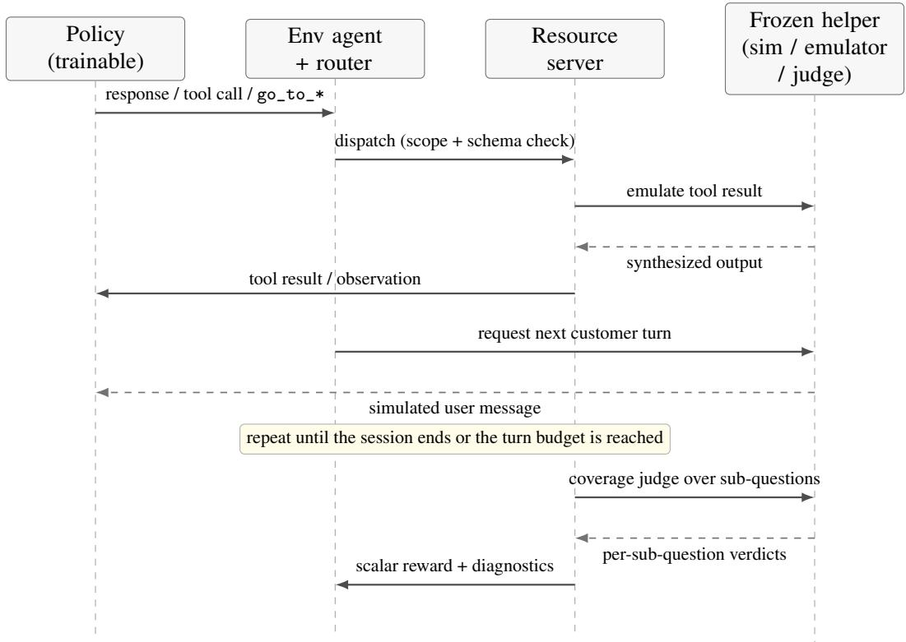
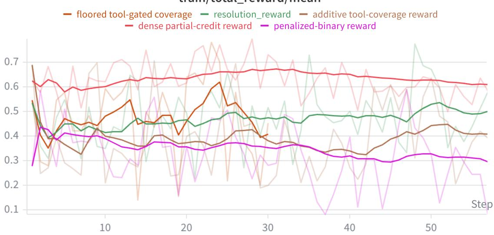
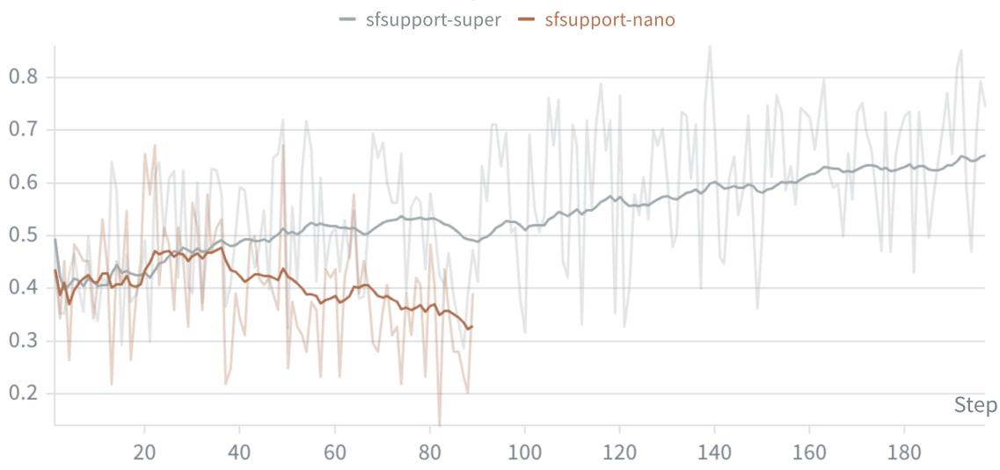

# Salesforce Koa:

# An Enterprise Language Model for Agentic Tool Use

Zixiang Chen<sup>\*</sup>, Sufeng Niu<sup>\*</sup>, Yingchi Liu<sup>\*</sup>, Wenting Zhao<sup>\*</sup>, Akshara Prabhakar<sup>\*</sup>, Shubham Mehrotra

Bin Bi, Zhujun Lan, Katherine Tan, Mohammad Ramezanali, Tulika Manoj Awalgaonkar, Monojit Banerjee, Jielin Qiu, Shiva Kumar Pentyala, Zhepeng Cen, Anupam Tripathi, Ali Ziaei, Regunathan Radhakrishnan

Darvish Lee Shadravan, Shelby Heinecke, Sitaram Asur, Silvio Savarese, James Zhu, Phil Mui<sup>†</sup>, Huan Wang<sup>†</sup>

Salesforce Agentforce & AI Research

September 15, 2026

## Abstract

We present Salesforce Koa, an enterprise language model built by post-training the open-weight Nemotron-3-Super-120B foundation model with reinforcement learning using Group Relative Policy Optimization (GRPO). Salesforce Koa is trained on public and synthetically generated data, with no customer data, to improve tool use and agentic capabilities while preserving strong general-purpose performance. Its distinctive component is a simulation-to-reward pipeline that expands workflow specifications into persona-conditioned multi-turn tasks with task-resolution rewards grounded in successful tool use for data-dependent requests. For enterprise domains, these specifications are written in Agent Script, Salesforce’s declarative language for building Agentforce agents; for public tool-use domains, we synthesize the workflow structure directly. The same simulation and grounded-reward machinery drives GRPO across both. Across public tool-use, agentic-reasoning, and enterprise Customer Relationship Management (CRM) benchmarks, Salesforce Koa improves over its open-weight base, with the clearest gains on multi-turn tool use, and surpasses a strong proprietary baseline while remaining below the strongest frontier models. These results show that specification-driven reinforcement learning is a practical path to specializing open-weight foundation models for enterprise agentic tasks.

## 1 Introduction

Large language models (LLMs) increasingly power enterprise AI systems, where, unlike general-purpose assistants, they must invoke external tools, retrieve structured information, and complete multi-step workflows across business applications. Robust tool use and agentic reasoning are therefore essential enterprise capabilities. Many such systems rely on proprietary frontier models, yet enterprises often need more control over deployment, customization, governance, and cost than a single external provider allows. Recent openweight foundation models such as Llama [3], Gemma [4], Qwen [18], Mistral [7], and Nemotron [10] have closed much of the public-benchmark gap, and access to weights lets organizations post-train for their own domains. A central question is whether they can be effectively specialized for enterprise agentic tasks while preserving general-purpose capability.

LLMs are increasingly deployed as tool-using agents [17, 12, 15], with benchmarks such as BFCL [13] and CRMArena [6] establishing tool use and agentic reasoning as critical capabilities. Post-training is the standard route: supervised fine-tuning adapts foundation models to downstream tasks [11], while reinforcement learning, via RLHF, Constitutional AI, and Group Relative Policy Optimization (GRPO) [5], further improves reasoning and decision-making. Most of this work targets general-purpose reasoning over public tools; in contrast, enterprise applications require operating over organization-specific schemas, APIs, and policies, the setting we study here.

We introduce Salesforce Koa, an enterprise language model built by post-training the open-weight Nemotron-3-Super-120B foundation model (Nemotron-120B) with GRPO, using only public and synthetically generated data (no customer data). The distinctive component of our pipeline is specification-driven task construction: for enterprise domains, we build training tasks from declarative agent specifications written in Agent Script [16], Salesforce’s declarative language for Agentforce agents. A specification captures an agent’s routing structure, subagents, typed actions, tool scopes, and workflow instructions; a simulation pipeline expands it into scenario- and persona-conditioned tasks that NeMo Gym executes as online rollouts, with grounded task-resolution rewards driving GRPO. This creates a direct bridge between agent authoring and model post-training: the same specifications that configure an agent also structure its rollout tasks and resolution criteria. Our experiments show that across public tool-use, agentic-reasoning, and enterprise CRM benchmarks Salesforce Koa improves over its open-weight base, with the clearest gains on multi-turn tool use, and surpasses a strong proprietary baseline (GPT-4.1) while remaining below the strongest frontier models. Together these results demonstrate that spec-driven RL is a practical path to specializing open-weight foundation models for enterprise agentic tasks. We additionally report a scoped SFT-vs-RL comparison (Appendix J): from our already RL-post-trained base, RL improves multi-turn tool use substantially while SFT adds little. We treat this as an observation specific to our starting point rather than a general claim.

## 2 Methodology

Salesforce Koa is an enterprise language model built by post-training the open-weight Nemotron-120B foundation model with reinforcement learning using Group Relative Policy Optimization (GRPO). Training uses only public resources and synthetically generated interactions; no customer data is used. The distinctive component of our pipeline is specification-driven task construction: declarative enterprise agent specifications are expanded into executable, persona-conditioned multi-turn environments whose rewards are grounded in successful tool use. We describe environment and task construction (Section 2.1), online rollout and the grounded reward (Section 2.2), and policy optimization (Section 2.3). We apply RL directly to the base model rather than to an SFT checkpoint; a preliminary SFT study that motivated this choice, together with distributed-training and evaluation details, is deferred to Appendix C and G.

## 2.1 Spec-driven environment and task construction

For enterprise domains, we author workflow structure in Agent Script. A specification defines a router, specialized subagents, typed actions, and natural-language reasoning instructions, which together determine how requests are routed, which tools are exposed within each topic, and how each topic handles its workflow. A static extraction pass compiles this specification into a typed workflow graph capturing per-tool argument schemas, declared state effects, routing conditions, and loop/termination configuration; this graph instantiates the executable environment, including the simulated state that tools read and mutate. For public tool-use domains, where no Agent Script specification exists, we instead synthesize the workflow structure directly, producing the same typed workflow graph of tools, argument schemas, and termination conditions; both sources therefore feed the shared simulation and reward machinery below equally.

A simulation pipeline expands each specification into scenario- and persona-conditioned sessions: the scenario determines the workflows and user needs exercised, while the persona conditions the simulated customer’s behavior. These sessions are converted into RL examples that begin either from the opening request or from a generated dialogue prefix, exposing the policy to decisions at different depths of a multi-turn interaction. Each example uses a common schema in which agent\_ref selects the environment and the remaining fields provide the initial rollout context (task intent, persona, dialogue state, available tools); the full trajectory is generated online. When multiple environments are trained jointly, per-row agent\_ref dispatch lets a single run load them all, and differential exposure is realized by repeating an environment’s examples before shuffling. NeMo Gym then executes each example as an online rollout, so workflow authoring and task construction are cleanly separated from rollout execution and policy optimization.

## 2.2 Online rollout and grounded reward

Each example is executed inside a NeMo Gym environment. For simulated-dialogue environments a single frozen helper model plays three roles in every rollout: a customer simulator (produces the next user turn from the sampled persona), a tool/function emulator (produces tool outputs when no production backend exists), and a coverage judge (scores resolution to form the reward). The helper is a separate inference service and is never updated by policy optimization. Appendix B (Figure 1) traces one rollout end to end, making explicit which components are frozen versus trained, the order of interactions within a turn, and where the scalar reward comes from.

The reward is built from the coverage judge. The task intent is represented as numbered sub-questions, and the judge emits one resolved/not-resolved verdict per sub-question over the full transcript. The coverage rate is

$$
\mathrm { c o v } = \frac { \# \{ \{ \mathrm { s u b - q u e s t i o n s ~ j u d g e d ~ r e s o l v e d } \} }  { \# \{ \mathrm { s u b - q u e s t i o n s } \} } \in [ 0 , 1 ] ,\tag{1}
$$

where missing or malformed verdicts default to not resolved. The scalar reward applies a duplicate-call gate,

$$
R = \left\{ \begin{array} { l l } { 0 , } & { \mathrm { a ~ c o n s e c u t i v e ~ d u p l i c a t e ~ t o o l ~ c a l l ~ o c c u r r e d , } } \\ { \mathrm { c o v , } } & { \mathrm { o t h e r w i s e , } } \end{array} \right.\tag{2}
$$

and the judge prompt requires that any sub-question needing customer- or system-specific data be marked resolved only when the answer is grounded in a successful relevant tool call; generic factoids may resolve without a tool. The deterministic sandbox environment instead sets $R = 1$ exactly when the predicted actions reproduce the reference end state and $R = 0$ otherwise.

A few properties of these environments are central to their behavior. The tool list is per rollout, not global: each conversation advertises only the tools available in its source session, and in routed environments the visible set is further restricted to the active subagent, so the policy sees only in-scope tools at any moment. Task intent is constructed deterministically at build time (a numbered list of sub-questions), directly connecting task construction to the reward. A persona is sampled per conversation and held constant, controlling how the simulated user reacts, escalates, or declares resolution. Focus system prompts are not restricted to the conversation start: in routed environments each subagent switch appends a fresh focus/procedure message, re-focusing the policy exactly when the topic changes. Environments differ mainly in interaction topology and verification: a flat customer-support environment exposes all advertised tools to a single agent; a routed customer-service environment adds a router and specialized subagents reached through $\mathtt { g o \_ t o \_ * }$ with a focus message on each switch; and a deterministic tool sandbox runs stateful tools with no simulated customer or helper, scored by binary state-equivalence rather than the coverage judge (Appendix A, Table 2).

## 2.3 Optimization

We maximize the expected trajectory reward $\mathcal { I } ( \theta ) = \mathbb { E } _ { x \sim \mathcal { D } } \mathbb { E } _ { \tau \sim \pi _ { \theta } ( \cdot | x , \mathrm { e n v } ) } [ R ( \tau ) ]$ with GRPO. For each prompt the policy samples a small group of complete trajectories with colocated inference; dynamic sampling discards zero-variance groups and refills until a full batch is assembled. Advantages are estimated by a leave-one-out group baseline (no value network), and a token-level truncated importance-sampling weight corrects the train/generation log-probability mismatch under a single on-policy update per batch. Trajectories with malformed tool-call or thinking syntax have the offending token advantages set to a fixed negative value, and over-length or log-probability-inconsistent trajectories are masked. The full objective, advantage normalization, and validity constraints are given in Appendix E. A complementary single-step training mode for constrained decision turns, which isolates the rare but decisive turns where the agent must communicate with the user rather than call a tool, is described in Appendix F.

Table 1: Performance comparison on Tau2Bench, BFCL, and CRM Bench. The Tau2Bench average is weighted by the number of tasks in each domain (Airline: 50, Retail: 114, Telecom: 114).
<table><tr><td></td><td colspan="4">Tau2Bench</td><td>BFCL</td><td colspan="4">CRM Bench</td></tr><tr><td>Model</td><td>Airline</td><td>Retail</td><td>Telecom</td><td>Weighted Avg.</td><td>Acc.</td><td>Topic</td><td>Func.</td><td>Text</td><td>Weighted Avg.</td></tr><tr><td>Claude Opus 4.8</td><td>69.0</td><td>86.2</td><td>64.0</td><td>74.00</td><td>78.18</td><td>0.99</td><td>0.83</td><td>0.79</td><td>0.87</td></tr><tr><td>OpenAI GPT-5.5</td><td>62.5</td><td>81.6</td><td>95.8</td><td>83.99</td><td>67.63</td><td>0.99</td><td>0.82</td><td>0.89</td><td>0.90</td></tr><tr><td>OpenAI GPT-4.1</td><td>56.0</td><td>74.1</td><td>34.2</td><td>54.48</td><td>53.96</td><td>0.98</td><td>0.85</td><td>0.60</td><td>0.81</td></tr><tr><td>Nemotron-3-Super-120B</td><td>61.5</td><td>79.9</td><td>60.5</td><td>68.64</td><td>64.73</td><td>0.97</td><td>0.71</td><td>0.85</td><td>0.84</td></tr><tr><td>Salesforce Koa (Ours)</td><td>62.0</td><td>81.6</td><td>60.5</td><td>69.41</td><td>66.63</td><td>0.97</td><td>0.77</td><td>0.85</td><td>0.86</td></tr></table>

## 3 Experiments

We post-train the Nemotron-3-Super v3 (∼120B) policy on multi-domain agentic tool-calling tasks and evaluate it against strong open and proprietary baselines. The final gated-coverage reward and GRPO recipe were developed on a cheaper Nemotron-3-Nano v3 (∼30B) proxy before being ported to the 120B policy; the reward-engineering ablation and the observation that reward stability is scale-dependent are reported in Appendix I.

Setup. Both policies are Nemotron reasoning models run in thinking mode during training. Rollouts are generated against NeMo Gym resource servers spanning salesforce support, healthcare administration, real estate, and a helper-free workplace assistant sandbox. Each simulateddialogue environment is driven by a shared Nano-30B helper serving all three environment roles (customer simulator, tool emulator, coverage judge). Training runs on a Slurm cluster of 5×NVIDIA B200 nodes (colocated rollout/training + one helper node); see Appendix G for training and evaluation details.

Evaluation and baselines. We compare Salesforce Koa with three proprietary frontier models (Opus-4.8, GPT-5.5, and GPT-4.1) and with its open-weight base, Nemotron-3-Super-120B. We evaluate on two public tool-calling benchmarks and one released enterprise benchmark: Tau2Bench [2] (end-to-end multi-turn customer service across airline, retail, and telecom; GPT-4.1 user simulator, four trials, pass^1 averaged), BFCL [13] (agentic tool use across multi-step calling, web search, memory, and stateful tools), and CRM Bench, covering single-turn Salesforce and Agentforce workflows scored along topic, function-call, and free-text accuracy. All checkpoints are served via vLLM in BF16.

Results. As shown in Table 1, Salesforce Koa is competitive across all three benchmarks. On Tau2Bench it reaches a task-weighted average of 69.41, edging its Nemotron base (68.64) and outperforming GPT-4.1 by 14.9 points. On BFCL it achieves 66.63%, improving over the base (64.73%) and well above GPT-4.1 (53.96%), though below the strongest proprietary models. On CRM Bench it scores 0.86 overall, close to Opus-4.8 (0.87) and exceeding both GPT-4.1 (0.81) and its base (0.84); its function-call accuracy of 0.77 improves over the base (0.71). Together these show that spec-driven enterprise RL improves over the open-weight base across public and enterprise benchmarks, most clearly on multi-turn tool use, and surpasses a strong proprietary baseline (GPT-4.1) while remaining below the strongest frontier models.

We build Salesforce Koa on the RL-trained checkpoint. Appendix J gives a scoped comparison of SFT-only and RL-only adaptation from the same base, which finds RL substantially stronger on multi-turn tool use while SFT is competitive on single-turn CRM tasks, with the important caveat that our base is itself already RL-post-trained.

## 4 Conclusion

We presented Salesforce Koa, an enterprise language model built by post-training the open-weight Nemotron-120B foundation model with GRPO reinforcement learning. Across public tool-use, agentic-reasoning, and enterprise CRM benchmarks Salesforce Koa improves over its open-weight base, most clearly on multi-turn tool use, and surpasses a strong proprietary baseline (GPT-4.1) while remaining below the strongest frontier models. Its central contribution is a specification-driven RL pipeline in which the same declarative Agent Script specifications that configure an agent also supply the workflow structure for constructing scenarioand persona-conditioned tasks and grounded task-resolution rewards, directly linking agent authoring to model post-training. A key limitation is that our base is itself already RL-post-trained, so our scoped finding, that RL improves multi-turn tool use substantially while SFT adds little, may not hold from a pre-RL checkpoint. Future work includes co-designing the SFT and RL stages, evaluating from a pre-RL foundation, and extending specification-driven environments to broader enterprise domains and more complex agentic workflows.

## 5 Acknowledgements

This model was trained in partnership with NVIDIA.

## References

[1] NeMo AutoModel: DTensor-native SPMD library for scalable and efficient training. https://github. com/NVIDIA-NeMo/Automodel, 2025–2026. GitHub repository.

[2] Victor Barres, Honghua Dong, Soham Ray, Xujie Si, and Karthik Narasimhan. τ<sup>2</sup>-Bench: Evaluating conversational agents in a dual-control environment, 2025. URL https://arxiv.org/abs/2506. 07982.

[3] Abhimanyu Dubey et al. The Llama 3 herd of models. arXiv preprint arXiv:2407.21783, 2024.

[4] Gemma Team et al. Gemma 3 technical report. arXiv preprint arXiv:2503.19786, 2025.

[5] Daya Guo et al. DeepSeek-R1: Incentivizing reasoning capability in LLMs via reinforcement learning. arXiv preprint arXiv:2501.12948, 2025.

[6] Kung-Hsiang Huang, Akshara Prabhakar, Sidharth Dhawan, Yixin Mao, Huan Wang, Silvio Savarese, Caiming Xiong, Philippe Laban, and Chien-Sheng Wu. CRMArena: Understanding the capacity of LLM agents to perform professional CRM tasks in realistic environments. In Luis Chiruzzo, Alan Ritter, and Lu Wang, editors, Proceedings ofthe 2025 Conference ofthe Nations ofthe Americas Chapter ofthe Associationfor Computational Linguistics: Human Language Technologies (Volume 1: Long Papers), pages 3830–3850, Albuquerque, New Mexico, April 2025. Association for Computational Linguistics. ISBN 979-8-89176-189-6. doi: 10.18653/v1/2025.naacl-long.194. URL https://aclanthology. org/2025.naacl-long.194/.

[7] Albert Q. Jiang et al. Mistral 7B. arXiv preprint arXiv:2310.06825, 2023.

[8] Zuxin Liu, Thai Hoang, Jianguo Zhang, Ming Zhu, Tian Lan, Shirley Kokane, Juntao Tan, Weiran Yao, Zhiwei Liu, Yihao Feng, Rithesh Murthy, Liangwei Yang, Silvio Savarese, Juan Carlos Niebles, Huan Wang, Shelby Heinecke, and Caiming Xiong. APIGen: Automated pipeline for generating verifiable and diverse function-calling datasets. arXiv preprint arXiv:2406.18518, 2024. URL https: //arxiv.org/abs/2406.18518.

[9] Xueyan Niu, Bo Bai, Wei Han, and Weixi Zhang. On the non-decoupling of supervised fine-tuning and reinforcement learning in post-training, 2026. URL https://arxiv.org/abs/2601.07389.

[10] NVIDIA et al. Nemotron-4 340B technical report. arXiv preprint arXiv:2406.11704, 2024.

[11] Long Ouyang, Jeffrey Wu, Xu Jiang, Diogo Almeida, Carroll L. Wainwright, Pamela Mishkin, Chong Zhang, Sandhini Agarwal, Katarina Slama, Alex Ray, John Schulman, Jacob Hilton, Fraser Kelton, Luke Miller, Maddie Simens, Amanda Askell, Peter Welinder, Paul F. Christiano, Jan Leike, and Ryan Lowe. Training language models to follow instructions with human feedback. In Advances in Neural Information Processing Systems, volume 35, pages 27730–27744, 2022.

[12] Shishir G. Patil, Tianjun Zhang, Xin Wang, and Joseph E. Gonzalez. Gorilla: Large language model connected with massive APIs. In Advances in Neural Information Processing Systems, 2024.

[13] Shishir G. Patil, Huanzhi Mao, Fanjia Yan, Charlie Cheng-Jie Ji, Vishnu Suresh, Ion Stoica, and Joseph E. Gonzalez. The Berkeley Function Calling Leaderboard (BFCL): From tool use to agentic evaluation of large language models. In Proceedings ofthe 42nd International Conference on Machine Learning, 2025. URL https://proceedings.mlr.press/v267/patil25a.html.

[14] Akshara Prabhakar, Zuxin Liu, Ming Zhu, Jianguo Zhang, Tulika Awalgaonkar, Shiyu Wang, Zhiwei Liu, Haolin Chen, Thai Hoang, Juan Carlos Niebles, Shelby Heinecke, Weiran Yao, Huan Wang, Silvio Savarese, and Caiming Xiong. APIGen-MT: Agentic pipeline for multi-turn data generation via simulated agent-human interplay. arXiv preprint arXiv:2504.03601, 2025. URL https://arxiv. org/abs/2504.03601.

[15] Yujia Qin, Shihao Liang, Yining Ye, et al. ToolLLM: Facilitating large language models to master 16,000+ real-world APIs. In International Conference on Learning Representations, 2024.

[16] Salesforce. Agent Script: Agentforce developer guide. https://developer.salesforce.com/ docs/ai/agentforce/guide/agent-script.html, 2026.

[17] Timo Schick, Jane Dwivedi-Yu, Roberto Dessì, Roberta Raileanu, Maria Lomeli, Eric Hambro, Luke Zettlemoyer, Nicola Cancedda, and Thomas Scialom. Toolformer: Language models can teach themselves to use tools. In Advances in Neural Information Processing Systems, 2023.

[18] An Yang et al. Qwen2 technical report. arXiv preprint arXiv:2407.10671, 2024.

[19] Junkeun Yi, Damon Mosk-Aoyama, Baihe Huang, Ritu Gala, Charles Wang, Sugam Dipak Devare, Khushi Bhardwaj, Abhibha Gupta, Oleksii Kuchaiev, Jiantao Jiao, et al. PivotRL: High accuracy agentic post-training at low compute cost. arXiv preprint arXiv:2603.21383, 2026.

## A Environment interaction and verification

Table 2 summarizes how the training environments (Section 2.2) differ in interaction topology and verification.

Table 2: Environment interaction and verification mechanisms. The training environments are listed in the Experiments section.
<table><tr><td>Environment type</td><td>Interaction topology</td><td>Verification</td></tr><tr><td>Flat customer support</td><td>Single agent; all advertised tools directly callable; persona-conditioned simulated customer.</td><td>Per-sub-question LLM coverage with a hard duplicate-call gate; the judge prompt enforces successful-tool grounding for data-bound questions.</td></tr><tr><td>Routed customer service</td><td>Router plus specialized subagents reached through go_to_*; out-of-scope calls return a wrong-subagent error; a focus system message is inserted on each switch.</td><td>Same coverage-based reward and duplicate-call gate, with domain-specific scope and grounding rules in the judge prompt.</td></tr><tr><td>Deterministic tool sandbox</td><td>Single agent over stateful tools; no simulated customer and no helper.</td><td>Binary state-equivalence: reward is one only if the state produced by the predicted actions matches the state produced by the reference actions.</td></tr></table>

## B Training rollout

Figure 1 traces one training rollout (Section 2.2) end to end, making explicit which components are frozen versus trained, the order of interactions within a turn, and where the scalar reward comes from.

  
Figure 1: One training rollout. Solid arrows are the trained/rollout path; dashed arrows are frozen-helper responses. The policy (left) is the only trained component; the reward is produced by the coverage judge at the end.

## C Preliminary supervised fine-tuning study

Before committing to RL, we ran a preliminary SFT study to gauge how much imitation on curated tool-use trajectories could add on top of an already heavily post-trained foundation model. The finding, limited headroom on multi-turn tool use, motivated applying RL directly to the base model (Section 2).

Objective and data. SFT is standard behavior cloning: the policy $\pi _ { \theta }$ is trained with a masked next-token loss whose mask restricts supervision to target tokens (assistant messages and tool calls) and excludes prompt, system, user, and tool-result tokens. The entire corpus is synthetic, generated with an automated pipeline built on APIGen [8] and the multi-turn APIGen-MT [14], and contains no customer, proprietary, or privatized data. We draw only on publicly available function-calling resources: tool collections from BFCL [13] and Tau2Bench (Airline) [2], used purely as tool schemas and executable environments rather than as conversations. Following APIGen-MT, we instantiate a simulated environment per tool collection and generate complete multi-turn interactions; every trajectory is automatically verified (tool calls must execute successfully and the session must satisfy the task’s success criteria), and we retain only successful, verified trajectories.

Per-step supervision. Each session is normalized to a common conversational schema (system, user, assistant, tool-call, tool-result items) with the callable tool schemas attached. For every assistant decision point we form one training example whose input is the conversation prefix and whose target is the reference assistant action, so a single trajectory supervises the policy at every step it must act, including deep in a multi-turn session. Over-long prefixes are dropped with a conservative token estimate, retained examples are rendered with the model’s chat template (so SFT and inference share a surface form), and sessions are split into train/validation before per-turn examples are generated so no validation session leaks through a prefix. Appendix D gives a concrete example.

Training procedure. We perform full-parameter fine-tuning of Nemotron-120B using NeMo Automodel [1], distributed over 32 H200 GPUs (4 nodes × 8) with FSDP2, expert parallelism (ep\_size = 8), and activation checkpointing, at a maximum sequence length of 8192 and global batch size 32 (Adam, $\beta = ( 0 . 9 , 0 . 9 9 9 ) , \epsilon = 1 0 ^ { - 8 }$ , no weight decay). Because the base model has already undergone elaborate post-training, our central concern is avoiding catastrophic forgetting; we therefore use a deliberately conservative recipe (peak learning rate $5 \times 1 0 ^ { - 8 }$ , linear warmup, cosine decay toward 10<sup>−9</sup>, gradient clipping at 1.0, early stopping). In practice the validation loss moved marginally, an early sign of limited headroom, and we select the lowest-validation-loss checkpoint.

Observations. Gains concentrate in single-turn and static agentic categories, not multi-turn tool use (Table 3): on BFCL, live parallel and parallel-multiple AST rise sharply (75.0% → 87.5% and $7 9 . 2 \% $ 87.5%), memory improves $( 5 2 . 9 \% \to 5 7 . 4 \% )$ , web search (base) improves (77% → 83%), and relevance detection jumps $( 6 8 . 8 \%  8 7 . 5 \% )$ , partly offset by regressions on some non-live AST subsets and irrelevance detection. The BFCL multi-turn category, the capability most central to enterprise agents, is essentially unchanged (54.1% → 53.2%). This suggests that, from an already heavily post-trained base, SFT on our corpus offers limited additional headroom for the target capability, motivating RL applied directly to the base model. We view a combined SFT-then-RL pipeline as promising future work; realizing its benefit is nontrivial, since SFT and RL are not cleanly decoupled in post-training [9].

## D SFT training example

A single SFT example (fabricated for illustration) has the following shape: a prefix of system/user/tool items as input, and one masked assistant target.

```json
{
"agent_ref": {"type": "responses_api_agents", "name": "support_agent"},
"responses_create_params": {
"input": [
{"type":"message","role":"system",
"content":"<identity: name=Copilot, company=Acme, tone=casual, rules...>"},
{"type":"message","role":"system",
"content":"<focus: topic=Order Status; job=resolve delivery questions;
procedure: 1) look up order 2) report status 3) confirm>"},
{"type":"message","role":"user","content":"Where is my order A123?"},
{"type":"function_call","call_id":"c1","name":"get_order_status",
"arguments":"{\"order_id\":\"A123\"}"},
{"type":"function_call_output","call_id":"c1",
"output":"{\"status\":\"shipped\",\"eta_days\":2}"}
],
"tools": [
{"type":"function","function":{"name":"get_order_status",
"parameters":{"type":"object",
"properties":{"order_id":{"type":"string"}},
"required":["order_id"]}}}
]
},
// masked SFT target = the next assistant turn:
"target": {"type":"message","role":"assistant",
"content":"Your order A123 has shipped and should arrive in
about 2 days. Anything else?"}
}
```

Only the target tokens contribute to the SFT loss.

## E GRPO optimization details

We maximize the expected trajectory reward

$$
\begin{array} { r } { \mathcal { I } ( \theta ) = \mathbb { E } _ { \boldsymbol { x } \sim \mathcal { D } } \mathbb { E } _ { \boldsymbol { \tau } \sim \pi _ { \theta } ( \cdot \vert \boldsymbol { x } , \mathrm { e n v } ) } \big [ R ( \boldsymbol { \tau } ) \big ] , } \end{array}\tag{3}
$$

where a trajectory τ is a full rollout inside an executable environment and $R ( \tau )$ is the reward of Section 2.2. Because the reward is available only at trajectory end and we train no value network, we estimate advantages by comparing several trajectories sampled for the same prompt.

Differential exposure across environments (Section 2.1) is realized by repeating an environment’s examples before shuffling,

$$
{ \mathcal { D } } _ { \mathrm { t r a i n } } = { \mathrm { S h u f f e } } \left( \bigcup _ { e \in { \mathcal { E } } } r _ { e } { \mathcal { D } } _ { \mathrm { t r a i n } } ^ { ( e ) } \right) ,\tag{4}
$$

with per-environment factors $r _ { e } ;$ where prefix expansion already multiplied an environment’s examples, its explicit factor is one. The validation corpus is not upsampled, so aggregate validation reward reflects natural environment prevalence.

Group sampling and dynamic sampling. For each prompt the policy samples a small group of complete trajectories with colocated inference. Because a group in which every trajectory earns the same reward yields no learning signal, dynamic sampling retains only trajectories whose group reward has non-zero variation and refills across generation batches until a full training batch is assembled.

Leave-one-out normalized advantages. For trajectory i in a prompt’s group of G trajectories with rewards $R _ { j }$ , the leave-one-out baseline and group standard deviation are

$$
b _ { i } = \frac { 1 } { G - 1 } \sum _ { j \neq i } R _ { j } , \qquad s _ { i } = \mathrm { s t d } \{ R _ { j } : j \neq i \} ,\tag{5}
$$

and the trajectory advantage is

$$
A _ { i } = \mathrm { c l i p } \bigg ( { \frac { R _ { i } - b _ { i } } { s _ { i } + \epsilon } } , - c , c \bigg ) ( s _ { i } > 0 ) ,\tag{6}
$$

with a small ϵ and a fixed symmetric clip bound c; zero-variance groups are left unsharpened. The scalar $A _ { i }$ is expanded over the generated tokens of trajectory i. Trajectory grouping uses the original dataset prefix (not the simulator-augmented transcript) so that multi-turn prefixes are grouped correctly.

On-policy update with sampling correction. We perform exactly one update per rollout batch and force the policy ratio to one, so the clipped-ratio (PPO/Clip-Higher) term is inactive and no reference KL penalty is applied. A separate token-level truncated-importance-sampling weight corrects the mismatch between training-time and generation-time log probabilities,

$$
w _ { i , t } = \operatorname* { m i n } ( \tau , \exp [ \log \pi _ { \mathrm { t r a i n } } ( y _ { i , t } ) - \log \pi _ { \mathrm { g e n } } ( y _ { i , t } ) ] ) ,\tag{7}
$$

with a fixed truncation bound $\tau$ . With sequence-level aggregation the effective loss is

$$
\mathcal { L } _ { \mathrm { G R P O } } ( \boldsymbol { \theta } ) = - \frac { 1 } { B } \sum _ { i = 1 } ^ { B } \frac { 1 } { | y _ { i } | } \sum _ { t = 1 } ^ { | y _ { i } | } w _ { i , t } A _ { i } \log \pi _ { \boldsymbol { \theta } } ( y _ { i , t } \mid x _ { i } , y _ { i , < t } ) .\tag{8}
$$

Averaging tokens within a trajectory before averaging across trajectories prevents longer failed rollouts from dominating the gradient purely by length.

Validity constraints. Separately from the reward, trajectories with malformed tool-call syntax or malformed thinking have the offending assistant-message token advantages set to a fixed negative value, and over-length or log-probability-inconsistent trajectories are masked from the update. These act as hard validity constraints rather than dense reward shaping.

## F Single-step training for constrained decision turns

The full-trajectory rollout setup of Section 2.2 generates full multi-turn trajectories in which the policy interacts with tools across many routine turns. A complementary training mode targets a specific class of turns that are disproportionately decisive: constrained decision turns, where the agent encounters a situation it cannot resolve through tool execution alone and must instead interact with the user before proceeding, whether by communicating a limitation, requesting missing information, clarifying intent, or managing expectations.

These turns arise naturally in enterprise workflows: a required API is temporarily unavailable and the agent must inform the user and set an expectation rather than silently fail; a critical parameter is missing and the agent must ask the user rather than hallucinate a value; a downstream service requires elevated permissions and the agent must explain the escalation path. In each case the locally obvious action (attempt the call, guess the argument, proceed without authorization) is wrong, and the correct behavior requires a deliberate turn of user-facing communication, a skill qualitatively different from routine tool sequencing. In our rollouts the base policy largely lacks this skill, most often issuing state-changing calls with similar names, occasionally fabricating confirmations for actions that never occurred, and only rarely deferring. Building on the PivotRL methodology [19], we configure NeMo Gym to produce training rows that isolate these constrained decision turns for single-step optimization.

Context (earlier turns, abbreviated)   
[user] Submit a high-priority inspection request titled ‘Roof leak’ . . .   
[call] create\_inspection\_request $( \{ " \mathtt { t i t l e } ^ { \mathfrak { n } } \}$ : "Roof leak $" " , ~ . ~ . ~ . \} \to \{ " \mathrm { i } \mathrm { d } " : \quad 1 $ , "status":   
"Open"}   
[user] Update the inspection request to lower the priority . . .   
[call] edit\_inspection\_request({"request\_id": 1, ...}) → updated   
Constrained turn k: get\_my\_inspection\_requests withheld from the tool list   
[user] List all of my inspection requests   
$\scriptstyle \times \ G ( a _ { k } ) = 0$ (gated): any state-changing call, e.g. edit\_inspection\_request $( . . . )$   
$\scriptstyle { \circ } \ G ( a _ { k } ) = 1$ (not gated): read-only probe of the near-name decoy   
get\_inspection\_request({"request $\mathbf { \partial _ { - } } \mathbf { i d } " : \mathbf { \partial _ { 1 } } \mathbf { j } )$ ; reward then rests on the recovery turn   
$\begin{array} { r } { \surd \ G ( a _ { k } ) = 1 : } \end{array}$ defer in natural language, “I currently can’t list your inspection requests . . . ”   
Bridge message   
[user] I have updated some more functions you can choose from. What about now?   
Recovery turn (scored by $f _ { \mathrm { m a t c h } } )$   
[call] get\_my\_inspection\_requests({})  
Figure 2: A constrained decision turn in the home-buying environment. At turn k the tool list contains multiple callable functions, including state-changing siblings and a near-name read-only decoy, but not the one function that answers the request. The procedural gate $G ( a _ { k } )$ zeroes the reward on any premature write; the consequence score $f _ { \mathrm { m a t c h } }$ grades the recovery-turn call after the bridge message. All content is model-generated.

Environment-driven construction of constrained states. Rather than extracting constrained decision turns from pre-existing annotated trajectories, we configure the environment to create the constraint dynamically: a tool is withheld from the available set at a designated turn while the simulated customer issues a request that requires it. The agent must navigate this constraint in real time during rollout generation. Each resulting training row is a single prompt–response pair: the prompt is the conversation up to the constrained turn (including the user request and the reduced tool list), and the response is the agent’s one generation at that turn. No multi-turn rollout loop runs during training; downstream turns are executed only for reward computation. The entire pipeline involves no custom or human-annotated trajectories: the scenarios, simulated user utterances, and training rollouts are all model-generated.

As a concrete instance (Figure 2), in a home-buying service scenario the user asks “List all of my inspection requests” while the function get\_my\_inspection\_requests is withheld from the tool set. The remaining tools include both state-changing siblings (edit\_inspection\_request, create\_inspection\_request) that zero the procedural gate if called, and a near-name read-only decoy (get\_inspection\_request, which retrieves a single request by ID and cannot answer the query). The agent must avoid any state-changing call, typically by deferring and acknowledging the limitation.

Reward. Let $a _ { k }$ denote the agent’s generation at the constrained turn k. After this turn, a bridge message re-introduces the withheld tool, and the agent’s next turn (in which it should emit the previously withheld call) is the recovery turn. The single-step reward follows the same gate-then-score pattern as the trajectory-level reward (Eq. 2), specialized to the constrained turn:

$$
R _ { \mathrm { p i v o t } } = \underbrace { G ( a _ { k } ) } _ { \mathrm { p r o c e d u r a l \ : g a t e } } \times \underbrace { f _ { \mathrm { m a t c h } } \big ( \mathrm { h e l d \ t o o l , \ r e c o v e r y \ t u r n } \big ) } _ { \mathrm { c o n s e q u e n c e \ : s c o r e } } ,\tag{9}
$$

where the procedural gate is

$$
G ( a _ { k } ) = \left\{ { \begin{array} { l l } { 1 , } & { { \mathrm { i f ~ } } a _ { k } { \mathrm { ~ c o n t a i n s ~ n o ~ s t a t e - c h a n g i n g ~ c a l l } } , } \\ { 0 , } & { { \mathrm { o t h e r w i s e } } . } \end{array} } \right.
$$

Any premature write at the constrained turn zeroes the reward. The gate deliberately targets only irreversible side effects: harmless read-only calls pass it, and the burden of distinguishing good from poor behavior falls on the consequence score $f _ { \mathrm { m a t c h } } \in [ 0 , 1 ]$ , which grades whether the withheld tool call is correctly emitted at the recovery turn, matched by function name with type-aware argument comparison. The recovery turn is generated only for reward computation and is excluded from the gradient trajectory, so gradient flows exclusively through the constrained decision.

Optimization and turn-position coverage. These single-step rows are trained with the same GRPO optimizer (Eq. 8) and dynamic sampling as the full-trajectory environments; group sampling draws multiple candidate responses to the same constrained prompt and computes leave-one-out advantages across them. Constrained turns can occur at the opening request or mid-conversation, and the environment builder is configured to produce both. This matters: an initial configuration that generated only mid-conversation constrained states improved on its trained slice but regressed on turn-0 constraints; adding turn-0 generation, a strictly additive data-mixture change, recovered the slice.

## G Distributed training and offline evaluation

Policy training is distributed with tensor, expert, and sequence parallelism; rollout generation runs on the same actor workers as training (colocated inference), alternating between generation and optimization. The frozen environment helper (Section 2.2) is served as a single, separate inference engine to avoid a data-paralle coordination failure mode observed when the helper was split across replicas. Hardware and node counts are reported in Section 3.

During training, validation replays held-out environment examples and reports aggregate and perenvironment reward; per-environment reporting is necessary because a small environment can be masked by a large one in the aggregate. Offline evaluation is kept independent of the training-time environment: trained checkpoints are served under greedy decoding, tool calls are parsed with a schema-aware parser, and tool-name, argument, and full-call correctness are scored, including an independent LLM judge for argument equivalence. Keeping the offline judge separate from the training helper prevents a training-time helper failure from contaminating the final benchmark.

## H Full benchmark and ablation results

Table 3: Full BFCL evaluation results. All values are percentages. The best result in each row is shown in bold. All checkpoints are evaluated in BF16.
<table><tr><td></td><td>Nemotron-3 -Super</td><td>SFT only</td><td>RL only</td></tr><tr><td>Overall Acc.</td><td>64.73</td><td>65.03</td><td>66.63</td></tr><tr><td>Non-Live AST</td><td></td><td></td><td></td></tr><tr><td>Average</td><td>86.17</td><td>82.88</td><td>84.85</td></tr><tr><td>Simple</td><td>73.67</td><td>68.50</td><td>69.92</td></tr><tr><td>Multiple</td><td>93.00</td><td>93.50</td><td>94.00</td></tr><tr><td>Parallel</td><td>89.50</td><td>87.00</td><td>87.50</td></tr><tr><td>Parallel Multiple</td><td>88.50</td><td>82.50</td><td>88.00</td></tr><tr><td>Live AST</td><td></td><td></td><td></td></tr><tr><td>Average</td><td>80.38</td><td>80.90</td><td>80.16</td></tr><tr><td>Simple</td><td>86.05</td><td>87.21</td><td>86.43</td></tr><tr><td>Multiple</td><td>79.11</td><td>79.11</td><td>78.54</td></tr><tr><td>Parallel</td><td>75.00</td><td>87.50</td><td>87.50</td></tr><tr><td>Parallel Multiple</td><td>79.17</td><td>87.50</td><td>79.17</td></tr><tr><td>Multi-Turn</td><td></td><td></td><td></td></tr><tr><td>Average</td><td>54.12</td><td>53.25</td><td>59.50</td></tr><tr><td>Base</td><td>67.00</td><td>68.00</td><td>71.00</td></tr><tr><td>Miss Function</td><td>42.50</td><td>45.50</td><td>54.00</td></tr><tr><td>Miss Parameter</td><td>47.50</td><td>44.00</td><td>51.00</td></tr><tr><td>Long Context</td><td>59.50</td><td>55.50</td><td>62.00</td></tr><tr><td>Web Search</td><td></td><td></td><td></td></tr><tr><td>Average</td><td>71.50</td><td>72.00</td><td>73.50</td></tr><tr><td>Base</td><td>77.00</td><td>83.00</td><td>82.00</td></tr><tr><td>No Snippet</td><td>66.00</td><td>61.00</td><td>65.00</td></tr><tr><td>Memory</td><td></td><td></td><td></td></tr><tr><td>Average</td><td>52.90</td><td>57.42</td><td>52.04</td></tr><tr><td>KV</td><td>51.61</td><td>59.35</td><td>57.42</td></tr><tr><td>Vector</td><td>43.87</td><td>52.26</td><td>41.94</td></tr><tr><td>Recursive Summ.</td><td>63.23</td><td>60.65</td><td>56.77</td></tr><tr><td>Detection</td><td></td><td></td><td></td></tr><tr><td>Relevance</td><td>68.75</td><td>87.50</td><td>68.75</td></tr><tr><td>Irrelevance</td><td>71.67</td><td>67.93</td><td>71.66</td></tr></table>

## I Reward engineering and scale-dependent stability

Designing the reward was the main object of the Nano-30B ablation. We first list the reward options explored, then give the final reward, then summarize why it survived. Because each option defines a different scalar, the raw magnitudes are not comparable across options; the meaningful comparison is the concrete exploit each shape admits and whether training stayed stable (Fig. 3).

Reward options explored. We name each option by how the tool signal and correctness enter the reward (the original config identifier is in parentheses for traceability).

• Penalized-binary reward (task\_with\_penalties):

$$
R = R _ { \mathrm { b i n } } - \sum _ { k } \lambda _ { k } p _ { k } , \qquad R _ { \mathrm { b i n } } \in \{ 0 , 1 \} ,\tag{10}
$$

binary resolution minus subtractive penalties $p _ { k }$ on process axes (verbosity, redundant calls, . . . ).

• Dense partial-credit reward (structural\_credit):

$$
R = { \left\{ \begin{array} { l l } { 1 } & { { \mathrm { j u d g e ~ P A S S , } } } \\ { \operatorname* { m i n } { \Bigl ( } c , \ \sum _ { i } w _ { i } s _ { i } { \Bigr ) } } & { { \mathrm { j u d g e ~ F A I L , } } } \end{array} \right. }\tag{11}
$$

full credit on a pass, otherwise a capped sum of process sub-scores $s _ { i }$ (tool efficiency, error recovery, escalation, answer-grounding); cap c tightened $0 . 6  0 . 1 5$ across iterations.

• Additive tool–coverage reward (two\_step\_coverage):

$$
R = w _ { \mathrm { t o o l } } { \bf 1 } [ \mathrm { r e l e v a n t t o o l u s e d } ] + w _ { \mathrm { c o r r e c t } } \mathrm { c o v } ,\tag{12}
$$

a weighted sum of a tool-use bonus and coverage, with $( w _ { \mathrm { t o o l } } , w _ { \mathrm { c o r r e c t } } )$ from (0.3, 0.7) to (0.4, 0.6).

• Floored tool-gated coverage (deterministic-gate variant):

$$
R ~ = ~ T _ { \mathrm { d e t } } \left( w _ { \mathrm { t o o l } } + w _ { \mathrm { c o r r e c t } } \cdot \mathrm { c o v } \right) , ~ T _ { \mathrm { d e t } } = { \bf 1 } [ \# \mathrm { s u c c e s s f u l t o o l s } \geq 1 ] ,\tag{13}
$$

a deterministic tool gate $T _ { \mathrm { d e t } }$ multiplying a coverage term, but keeping a nonzero tool-use floor $w _ { \mathrm { t o o l } } = 0 . 4$

Task-resolution reward. The final reward drops the additive floor and uses gated coverage (Eq. 2 in the main text): R = cov when no consecutive duplicate (name, args) call occurred, else $R = 0$ . Tool grounding is enforced inside the coverage-judge prompt: a sub-question needing customer- or system-specific data is marked resolved only if backed by a successful relevant tool call, while generic factoids may resolve without a tool. Salesforce support, Healthcare, and Real estate run this coverage branch; Workplace Assistant uses deterministic state-equivalence. Separately, an invalid-tool-call and a malformed-thinking penalty each overwrite the offending assistant-message token advantages with −1.

On the proxy policy (Fig. 3) the final gated-coverage reward (green) trends gently upward and stays stable, while the penalized-binary reward (magenta) trends downward and the additive and floored variants are flat-to-declining and noisy. Holding the reward fixed at this final design, model scale determines whether RL is stable (Fig. 4): on the Super-120B policy the training task-resolution score improves steadily throughout the run, whereas on the smaller Nano proxy it peaks early (around step 30) and then collapses. Even the winning reward is thus not sufficient on its own at small scale.

train/total\_reward/mean  
  
Figure 3: Reward trends across designs on the smaller proxy policy (train/total\_reward/mean). Each curve is that run’s own reward, so the vertical scales differ and only the trend (shape and stability) is meaningful, not the absolute level. The final gated-coverage reward (resolution\_reward, green) trends up and stays stable; the penalized-binary reward (magenta) trends down; the additive and floored variants are noisy and flat-to-declining. The dense partial-credit reward (red) is highest only because partial credit inflates its own scalar (reward hacking), not because resolution is better.

train/salesforce\_support\_agent/task\_resolution\_score/mean  
  
Figure 4: The same final gated-coverage reward at two model scales  
(train/salesforce\_support\_agent/task\_resolution\_score/mean). On the Super-120B policy (sfsupport-super, gray) task resolution improves steadily to ≈0.65 over ≈200 steps; on the smaller proxy/Nano policy (sfsupport-nano, red) it peaks near step 30 (≈0.47) and then collapses to ≈0.33. Dark = smoothed, light = raw per-step.

## J SFT-vs-RL ablation tables

This section gives the full per-benchmark tables behind the scoped SFT-vs-RL comparison in Section 3, comparing SFT-only and RL-only checkpoints against the shared Nemotron-3-Super-120B base.

Table 4: Tau2Bench results across customer-service domains. The weighted average accounts for the number of tasks in each domain. All checkpoints are evaluated in BF16.
<table><tr><td>Checkpoint</td><td>Airline</td><td>Retail</td><td>Telecom</td><td>Weighted Avg.</td></tr><tr><td>Nemotron-3-Super-120B</td><td>61.50</td><td>79.90</td><td>60.50</td><td>68.64</td></tr><tr><td>SFT only</td><td>64.50</td><td>79.82</td><td>62.70</td><td>70.04</td></tr><tr><td>RL only</td><td>62.00</td><td>81.58</td><td>60.50</td><td>69.41</td></tr></table>

Table 5: Results on the CRM Bench evaluation. All checkpoints are evaluated in BF16.
<table><tr><td>Checkpoint</td><td>Topic Acc.</td><td>Func. Acc.</td><td>Text Acc.</td><td>Average</td></tr><tr><td>Nemotron-3-Super-120B</td><td>0.970</td><td>0.710</td><td>0.850</td><td>0.84</td></tr><tr><td>SFT only</td><td>0.980</td><td>0.770</td><td>0.890</td><td>0.88</td></tr><tr><td>RL only</td><td>0.970</td><td>0.770</td><td>0.850</td><td>0.86</td></tr></table>

SFT and RL affect single-turn and multi-turn capabilities differently. On Tau2Bench (Table 4), both approaches provide modest improvements over the base checkpoint (SFT 70.04, RL 69.41, base 68.64), with SFT strongest but by a small margin. A clearer distinction emerges on BFCL (Table 3) multi-turn tool use: SFT slightly reduces accuracy (54.12 → 53.25) whereas RL improves it substantially to 59.50 and achieves the highest overall BFCL accuracy (64.73 → 66.63). SFT’s gains concentrate in categories such as memory and relevance detection and do not translate into stronger multi-turn performance.

SFT is effective for narrower single-turn CRM adaptation. On CRM Bench (Table 5), which is predominantly single-turn, SFT improves over the base across all three dimensions and its overall gain exceeds RL’s, indicating supervised adaptation is effective when the target behavior is narrowly specified and closely aligned with demonstrations. Its limited benefit on BFCL multi-turn tasks, however, suggests SFT alone may not sufficiently improve the longer-horizon interaction capabilities enterprise agents require. Taken together, these results motivated building Salesforce Koa on the RL-trained checkpoint. As noted in the main text, this comparison is scoped to a base model that is itself already RL-post-trained; starting from a pre-RL checkpoint could alter the conclusion.