# Semantic Fibers and Cross-Gram Interference: A Calculus of Safety Drift in Overcomplete Representations

Mohammed AHNOUCH Université Paris 1 Paris, France

Lotfi Elaachak Faculty of Science and Technology of Tangier Abdelmalek Essaadi University Tangier, Morocco

## Abstract

A deployed language model can refuse a harmful request in English and comply with its faithful translation. Fix the audited equivalence relation, the layer, the feature dictionary and the scoring head, and that drift becomes exact linear algebra: it is a cross-Gram functional of the within-fiber contrast, its worst admissible value is a support function, and invariance of the margin is an annihilator condition. What the paper adds to the measurement is the verdict that follows it. An intrinsic calibrated exposure χ, governed by the leverage duality $\chi ^ { 2 } = 1 / \ell - 1$ , sorts an observed drift into three cases that call for different work: a reader fault that recalibration removes, an exact fix too ill-conditioned to trust, and a representation-level collision no readout removes. Matched observed exposure can hide opposite verdicts, and the same rank condition covers cone-valued safety heads. An untied order-swap identity turns interventions into a test of the linear control interface, and its residual, estimated on calibration states, predicts a distinct three-control composition error on new states and targets (median Spearman 0.964 against 0.269 for the static cross-Gram baseline). Two closed-form repairs act on the head alone, and two limits bound what any such repair can reach: a column permutation moves block exposure while fixing the entire Gram spectrum, and reader-optimized cross-talk obeys the sharp rank floor $n ( n - r ) / r$ , attained by equal leverage frames. In trained frames the level of superposition predicts vulnerability only while feature importance is uniform, the regime that

holds frames on the tight-frame floor. Deterministic synthetic audits verify the identities out of sample, with intrinsic exposure predicting the repair floor (Spearman 0.972) and conditioning predicting usable repair (0.889); on one real multilingual encoder with audited translation fibers the diagnosis returns the conditioning regime, where the exact invariant reader is harmful out of sample and a validation-selected regularized reader is not. Each quantity is computed for a declared quotient, representation, metric, dictionary, head, threshold and contrast model.

## 1 Introduction

A deployed language model can refuse a harmful request in English and comply with the same request in translation. Translating unsafe prompts into low-resource languages elicits harmful completions from GPT-4 [Yong et al., 2024], and black-box multilingual red-teaming measures the same uneven safety-alignment coverage across languages on deployed and open models [Wang et al., 2024, Deng et al., 2024]. The symptom has a linear substrate: refusal behavior in English prompts is mediated by a low-dimensional direction that is causally necessary and suficient [Arditi et al., 2024], and such directions transfer across safety-aligned languages [Wang et al., 2025]. The gap between the substrate and the symptom has since been measured directly: on audited translation pairs the refusal signal retains a small fraction of its English strength in low-resource languages while the prompts themselves stay semantically aligned, so the concept is present but is not routed to the safety mechanism [Oppong et al., 2026]. Transporting an English refusal direction across languages raises refusal rates without retraining [Stein et al., 2026], which is a repair of exactly the kind this paper prices.

Behavior and direction transfer leave the diagnosis open, and this paper takes it up: given an audited equivalence relation and a fixed local representation, which geometric quantity governs the drift of the refusal margin, and is the observed exposure removable by changing only the reader? The multilingual jailbreak becomes an auditable linear-algebra problem: fixing the equivalence relation, the layer, the dictionary, and the deployed head turns same-meaning drift into an exactly computable object with a certificate, a three-way diagnosis, an interventional test, two repairs, and a sharp limit.

A refusal rule should answer to safety-relevant intent, not to the language in which that intent is expressed. Let X be a prompt set, let $x \sim x ^ { \prime }$ mean that x and $x ^ { \prime }$ have the same externally audited safety-relevant intent, and let $\pi : X \to X / { \sim }$ be the quotient map. The relation ∼ is fixed before the model is inspected: the model supplies neither the equivalence classes nor the evidence of its own invariance on them.

Throughout, refusal means $M ( x ) > 0$ . We distinguish

$$
\begin{array} { r l r } { \mathrm { m a r g i n ~ i n v a r i a n c e : } \quad M ( x ) = M ( x ^ { \prime } ) } & { \mathrm { f o r ~ a l l ~ } x \sim x ^ { \prime } , } \\ { \mathrm { d e c i s i o n ~ i n v a r i a n c e : } \quad } & { } & { } \\ { \mathrm { d i r e c t e d ~ u n s a f e ~ f a i l u r e : } \quad M ( x ) > 0 \big \} = \mathbf { 1 } \big \{ M ( x ^ { \prime } ) > 0 \big \} } & { \mathrm { f o r ~ a l l ~ } x \sim x ^ { \prime } , } \\ { \mathrm { d i r e c t e d ~ u n s a f e ~ f a i l u r e : } \quad M ( x _ { \mathrm { e n } } ) > 0 \geq M ( x _ { \ell } ) } & { \mathrm { o n ~ a n ~ a u d i t e d ~ u n s a f e ~ f i b e r . } } \end{array}
$$

The annihilator criterion below characterizes margin invariance. Margin invariance implies decision invariance; the converse fails, because a nonconstant margin can stay on one side of the threshold throughout a fiber. A multilingual jailbreak is the directed unsafe failure event, a sign change along one fiber, not a large excursion in representation space.

A large within-fiber drift has three mathematically diferent explanations. The deployed reader may be unnecessarily aligned with nuisance directions even though another calibrated reader would separate them. The representa tion may instead place the safety signal inside the nuisance span, so that no linear reader can preserve the safety response while annihilating the nuisance block. A third regime lies between these two: exact separation exists, but only through a high-norm reader that amplifies reconstruction error and hidden-state noise. These regimes call for diferent engineering work, and the quantity that tells them apart is the intrinsic exposure, since a tied Gram row and a behavioral disagreement rate read the same in all three. The practical message can be stated before any frame terminology:

High current exposure with low intrinsic exposure is a reader problem; high intrinsic exposure is a representation problem; low intrinsic exposure with a large invariant-reader norm is a conditioning problem.

The paper organizes its results as one workflow, summarized in fig. 1: measure exposure, certify decisions, diagnose repairability, test the causal interface, repair, and know the limits. The results form one workflow, drawn in fig. 1. Same-fiber drift is the cross-Gram row applied to the contrast, and constancy of the margin is exactly an annihilator condition, so exposure is read of the geometry rather than searched for (theorems 1 and 2); the budget in force selects which constant governs it, and the feature-coordinate, hiddenstate and stochastic budgets give $\rho _ { u , B } , \kappa _ { u , B }$ and $\sigma _ { \Delta }$ . Worst admissible drift is then a support function, which certifies decisions and keeps its meaning under an estimated dictionary with one explicit residual (theorems 3 and 4). The intrinsic calibrated exposure $\chi _ { B }$ carries the verdict: it satisfies $\chi _ { B } ^ { 2 } = 1 / \ell _ { B } - 1$ for the relative leverage $\ell _ { B }$ , feasibility separates from stability through the reader norm 1/ sin $\theta _ { s , B }$ , and two geometries with identical observed exposure can call for opposite work (theorems 5 to 7). An untied orderswap identity predicts the commutation defect of calibrated read and write interventions exactly, and the observed-minus-predicted residual reports how far a steering stack follows the linear interface that every readout repair assumes (theorems 8 and 9). Two closed-form repairs act on the head alone, a regularized calibrated reader tracing the frontier between the deployed readout and exact cancellation, and a least-change projection carrying a heldout transfer bound (theorems 10 and 11). Two limits frame both: a column permutation moves block exposure while holding the entire Gram spectrum fixed, and reader-optimized cross-talk obeys the sharp rank floor $n ( n - r ) / r$ attained by equal-leverage frames (theorem 12); in trained frames (section 6.2) the level of superposition identifies exposure while feature importance is uniform. Each stage closes with measurements built around out-of-sample consequences of its identities, and section 7 turns the same geometry into an audit that runs on a real stack. Each stage closes with a numerical audit designed around out-of-sample consequences of its identities rather than confirmations of them, and an engineering recipe (section 7) turns the same geometry into action.

A running case makes the arc concrete. A provider’s guard score refuses a harmful request in English and passes its faithful translation, and the response team holds paired activations at the scored layer, the score direction, and optionally a sparse-autoencoder dictionary. Current exposure is then a short computation on their own tensors, from the dictionary or from paired hidden diferences. The intrinsic exposure χ answers the first strategic question, whether any calibrated head-side fix exists at that layer, before a single reader is trained; the invariant-reader norm prices whether the exact fix is usable or only nominal, and the order-swap residual checks that their steering stack obeys the linear interface every such repair assumes. Low χ with moderate conditioning routes the incident to the regularized reader or the least-change projection with its held-out bound; high χ ends the search for a better head and moves the repair budget to the representation. The calculus and its out-of-sample validation are established on synthetic geometry, and carrying them onto a team’s model needs their audited fiber set at the layer, dictionary, head and equivalence relation they declare.

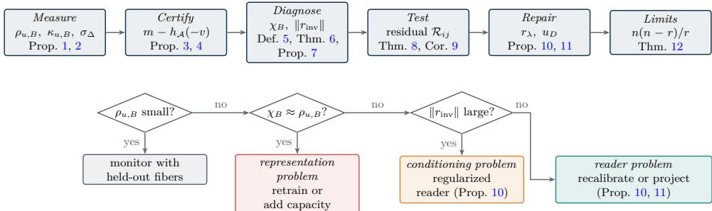  
Figure 1: The audit arc (top) and the three-regime triage it supports (bottom). Each stage names its governing results and the quantity it contributes; the triage runs on quantities computable before any repair is attempted.

## 2 Fibers, writers, and readers

Let ${ \mathcal { S } } = X / { \sim }$ and $F _ { s } = \pi ^ { - 1 } ( s )$ the fiber over s. Concretely a fiber collects a prompt with its audited translations and paraphrases; the equivalence relation is an external scientific and governance choice, defining which changes the policy declares irrelevant. For a base point $x _ { 0 } \in F _ { s }$ let the realized contrast set and its linearized span be

$$
\mathcal { A } _ { s } ( x _ { 0 } ) = \{ z ( x ) - z ( x _ { 0 } ) : x \in F _ { s } \} , \qquad \mathcal { T } _ { s } = \mathrm { s p a n } \ : \mathcal { A } _ { s } ( x _ { 0 } ) = \mathcal { C } _ { s } ,\tag{1}
$$

where ${ \mathcal { C } } _ { s } = \operatorname { s p a n } \{ z ( x ) - z ( x ^ { \prime } ) : x , x ^ { \prime } \in F _ { s } \}$ ; the two symbols separate the realized set from its span. Radius statements are stated for Euclidean balls in $\mathcal { T } _ { s } \colon$ they are exact for the linearized local model and become prompt-level certificates only when the contrast is realized or an audit supplies the feasible set. A ball in $\mathcal { T } _ { s }$ may contain directions no prompt realizes.

For a block $B \subset \{ 1 , \ldots , n \}$ of language coordinates, $P _ { B }$ is the coordinate projection, $W _ { B }$ the columns of W indexed by B, and $\mathcal { L } _ { s , B } = \mathcal { C } _ { s } \cap \mathbb { R } ^ { B }$ the admissible block subspace (an intersection of subspaces, hence a subspace). If $u = W \alpha$ then, whenever $W \alpha = W \alpha ^ { \prime } , G \alpha = G \alpha ^ { \prime }$ exactly, since $G ( \alpha - \alpha ^ { \prime } ) =$ $\begin{array} { r } { W ^ { \top } W ( \alpha - \alpha ^ { \prime } ) = W ^ { \top } ( W \alpha - W \alpha ^ { \prime } ) = 0 ; } \end{array}$ the block quantities below are therefore well-defined in $\alpha .$

At a fixed layer, on the prompt family under study, the local model is

$$
h ( \boldsymbol { x } ) = W z ( \boldsymbol { x } ) + \varepsilon ( \boldsymbol { x } ) , \qquad W = [ w _ { 1 } , \ldots , w _ { n } ] \in \mathbb { R } ^ { d \times n } , \qquad G = W ^ { \top } W ,\tag{2}
$$

with unit columns unless stated otherwise and $\| \varepsilon ( x ) \| \leq \eta$ . The columns of W are writers: directions along which feature activity changes the hidden state. A reader matrix $R = [ r _ { 1 } , \ldots , r _ { n } ] \in \mathbb { R } ^ { d \times n }$ defines measurements $r _ { i } ^ { \top } h ;$ readers and writers need not coincide, as is typical for sparse-autoencoder encoders and decoders [Cunningham et al., 2023, Bricken et al., 2023], linear probes and activation interventions, or the oblique analysis/synthesis systems of classical frame theory [Christensen, 2016, Eldar, 2003, Eldar and Christensen, 2006]. The self-calibration convention $r _ { i } ^ { \top } w _ { i } = 1$ fixes the intended response of each reader to its own writer, and the cross-Gram matrix

$$
C = R ^ { \top } W , \qquad C _ { i j } = r _ { i } ^ { \top } w _ { j } ,\tag{3}
$$

measures directional read/write cross-talk; the tied case $R = W$ with unit columns gives the ordinary Gram matrix $C = G$

The deployed safety head is a reader u with margin $M ( x ) = u ^ { \top } h ( x ) - \tau$ and a designated safety writer $w _ { s }$ anchors the audited signal. When $u ^ { \top } w _ { s } = 1$ which includes the tied head $u = w _ { s }$ with unit columns, the deployed head competes with every calibrated reader, and the intrinsic exposure of theorem 5 satisfies $\chi _ { B } \ \leq \ \rho _ { u , B }$ . Write $\boldsymbol { v } = \boldsymbol { W } ^ { \top } \boldsymbol { u }$ for the pullback of the head and $v _ { B } = W _ { B } ^ { \top } u = P _ { B } v$ for its block row; if u is the s-th reader column, $v _ { B }$ is the cross-Gram row segment $C _ { s B }$

In machine-learning terms, $h ( x )$ is a fixed-layer activation, W a learned feature dictionary in the reading supplied by superposition and sparseautoencoder work [Elhage et al., 2022, Templeton et al., 2024], for instance a sparse-autoencoder decoder, $z ( x )$ its code, and u a linear refusal probe with threshold $\tau ;$ the results compute worst-case and average-case refusal-margin drift under same-meaning language changes, in the sense in which a certified radius bounds loss change under a bounded perturbation. Figure 2 draws this view, and the paragraph below maps each object to its usual implementation. Column normalization fixes one scaling convention, and every radius below is relative to the declared metric in that fixed coordinate system; comparisons across encoders must report the normalization and metric used for contrasts.

Each object in this framework names something an engineer already has. A semantic fiber is an audited set of translations, paraphrases, modality variants or tool-schema aliases, that is, inputs a policy says should receive the same treatment. A writer $w _ { j }$ is a decoder column of a sparse autoencoder, an activation direction or an intervention direction, and it says how feature $j$ moves the hidden state; a reader $r _ { i }$ is a probe, a classifier head, an encoder direction or the score direction itself, and it says how feature i is measured. Their product, the cross-Gram $C = R ^ { \top } W$ , is what a reader records when a writer is driven, so it is directional read and write cross-talk. Current exposure $\rho _ { u , B } = \| W _ { B } ^ { \top } u \|$ is how much the deployed reader listens to the nuisance block, while intrinsic exposure $\chi _ { B }$ , the least exposure available under the calibration $r ^ { \top } w _ { s } = 1$ , is whether a head-side repair can remove that response at all. Conditioning $\| r _ { \mathrm { i n v } } \|$ , the norm of the exact invariant reader, prices how much residual noise and estimation error such a repair amplifies. The order-swap residual $\mathcal { R } _ { i j }$ , an observed order diference minus its linear cross-Gram prediction, reports whether controls compose the way the linear model says they do.

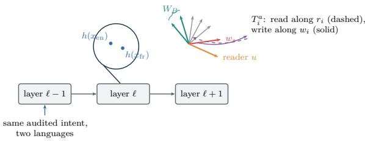  
Figure 2: The framework in a neural network. A semantic fiber places two same-intent prompts at nearby hidden states in the residual stream; writers move states, readers measure them, and an untied intervention reads along $r _ { i }$ but writes along $w _ { i }$ . The drift of the safety margin between the two states is the cross-Gram functional of theorem 1.

The experiments are deterministic synthetic mechanism checks, operating entirely on dictionaries, labels, and heads fixed by construction, independent of prompt text, jailbreak search, or any deployed model. A language is an abstract block of feature coordinates whose variation fixes the audited safety coordinate. Ten pipeline stages run in fresh processes from local pseudorandom generators in CPU float64. The matched benchmark uses 12 rotation seeds and 8000 fibers per geometry with train/validation/test splits of 4000/2000/2000 by fiber; the block experiment uses $d = 6 4 , n = 1 9 2$ $| B | = 4 8$ , level $n / d = 3 . 0 0$ , and eight frame seeds, with every sampled contrast rescaled so that $\| W _ { B } c \| _ { 2 } = 2 . 4 5$ , fixing hidden distance by construction; the drift experiment uses 8000 fibers, fixed threshold $\tau = 0 . 6 5$ , and noise $\eta = 0 . 0 1 5 ;$ the repair experiments select every penalty on validation under a prespecified utility constraint and evaluate once on the untouched test split. Symmetric ±1 labels make zero the population threshold for every calibrated reader in the matched benchmark, so no operating-point degree of freedom is fitted there. Replication units are the rotation seed (matched, sweep, learning), the frame seed (block, repair), the feature pair (tied commutator), and the reader-writer system (untied). The accompanying code regenerates every number. The audit is designed around out-of-sample consequences: readers are estimated on training fibers, selected on validation fibers, and evaluated once on untouched test fibers, and the untied diagnostic predicts a task it was not fitted on.

## 3 Exposure and certificates

Classical adversarial work first found optimization-based perturbations that cross decision boundaries and transfer across independently trained models [Szegedy et al., 2014], an efect later attributed to near-linear behavior in high dimensions and distilled into a closed-form attack [Goodfellow et al., 2015]. Textual attacks construct concrete adversarial strings by gradient-guided discrete search, neither meaning-preserving by construction: single-input character or word edits [Ebrahimi et al., 2018] and dataset-universal trigger tokens [Wallace et al., 2019]. This section computes the local obstruction directly once the fiber is fixed, rather than searching for attacks: drift is a linear functional, invariance is an annihilator condition, and the worst admissible drift is a support function.

## 3.1 Drift and sensitivity constants

The first result is exact linear algebra: it identifies same-fiber drift and the condition for margin invariance.

Proposition 1 (Same-fiber drift and the annihilator). Fix a fiber $F _ { s }$ and let $\boldsymbol { v } = \boldsymbol { W } ^ { \top } \boldsymbol { u }$

(a) $I f \varepsilon = 0$ on $F _ { s . }$ , then $M ( x ) - M ( x ^ { \prime } ) = v ^ { \top } ( z ( x ) - z ( x ^ { \prime } ) )$ for all $x , x ^ { \prime } \in F _ { s }$ $i f u = W \alpha$ this equals $\alpha ^ { \top } G ( z ( x ) - z ( x ^ { \prime } ) )$ , and if u is the s-th column of a reader system R and the contrast is supported on the block B, it equals the cross-Gram row form $C _ { s B } c _ { \cdot }$

(b) The margin is constant on $F _ { s }$ if and only $i f v \in \mathcal { C } _ { s } ^ { \perp }$ , equivalently $P { c _ { s } } v = 0$

(c) $I f \parallel \varepsilon ( x ) \parallel \leq \eta$ on $F _ { s ; }$ , then $\left| M ( x ) - M ( x ^ { \prime } ) - v ^ { \top } ( z ( x ) - z ( x ^ { \prime } ) ) \right| \leq 2 \eta \| u \|$ Proof.

$\begin{array} { r l } & { \mathrm { 1 ) } \ M ( x ) - M ( x ^ { \prime } ) = u ^ { \top } W ( z ( x ) - z ( x ^ { \prime } ) ) = v ^ { \top } ( z ( x ) - z ( x ^ { \prime } ) ) } \\ & { \ ( M = u ^ { \top } W z - \tau ) } \end{array}$ when $\varepsilon = 0$

$$
( 2 ) \ u = W \alpha \Rightarrow v = W ^ { \top } W \alpha = G \alpha .\tag{definition of G}
$$

(3) For $u = r _ { s }$ and a block contrast $c , v ^ { \top } ( z ( x ) - z ( x ^ { \prime } ) ) = ( W _ { B } ^ { \top } r _ { s } ) ^ { \top } c = C _ { s B } c .$ (definition of C)

(4) The drift vanishes on all pairs if v annihilates $\mathcal { C } _ { s }$ , i.e. $v \in \mathcal { C } _ { s } ^ { \perp }$ $( \mathcal { C } _ { s }$ spans the contrasts)

(5) With residuals, $M ( x ) - M ( x ^ { \prime } ) = v ^ { \top } ( z ( x ) - z ( x ^ { \prime } ) ) + u ^ { \top } ( \varepsilon ( x ) - \varepsilon ( x ^ { \prime } ) )$ and $| u ^ { \top } ( \varepsilon ( x ) - \varepsilon ( x ^ { \prime } ) ) | \leq 2 \eta \| u \|$ (Cauchy-Schwarz)

Invariance thus asks the head to annihilate within-fiber contrasts, a substantially weaker requirement than collapse of the hidden states themselves. The exposed direction is $v _ { s } = P _ { \mathcal { C } _ { s } } v$ . The next result gives the worst-case constants: the threat metric determines which one governs a language block, and a stochastic contrast model contributes a third, distinct scale.

Proposition 2 (Metric-specific block sensitivity). Assume $\varepsilon = 0$ and write $v _ { B } = W _ { B } ^ { \top } u$

(a) For a feature-coordinate Euclidean budget,

$$
\operatorname* { s u p } _ { \| c \| _ { 2 } \leq r } | u ^ { \top } W _ { B } c | = r \rho _ { u , B } , \qquad \rho _ { u , B } = \| v _ { B } \| _ { 2 } ( = \| P _ { B } G \alpha \| \ i f u = W \alpha ) ,\tag{4}
$$

and more generally, for a positive-semidefinite budget $c ^ { \top } Q c \leq r ^ { 2 }$ the supremum is finite $i f f v _ { B } \in \mathrm { r a n g e } ( Q )$ , in which case it equals $r \sqrt { v _ { B } ^ { \top } Q ^ { \dag } v _ { B } }$ When $u = w _ { i _ { \mathrm { s } } }$ is tied to a single feature, $\rho _ { i _ { \mathrm { s } } , B } = ( \sum _ { j \in B } G _ { j i _ { \mathrm { s } } } ^ { 2 } ) ^ { 1 / 2 }$ , the block row norm.

(b) For a hidden-state budget, with $G _ { B B } = W _ { B } ^ { \top } W _ { B }$ and † the Moore-Penrose inverse,

$$
\operatorname* { s u p } _ { \| W _ { B } c \| _ { 2 } \leq r } | u ^ { \top } W _ { B } c | = r \kappa _ { u , B } , \qquad \kappa _ { u , B } = \sqrt { v _ { B } ^ { \top } G _ { B B } ^ { \dagger } v _ { B } } = \| P _ { \mathrm { c o l } ( W _ { B } ) } u \| _ { 2 } .\tag{5}
$$

(c) For a random block contrast c with mean $\mu _ { B }$ and covariance $\Sigma _ { B } .$ $\mathbb { E } [ \Delta M ] = v _ { B } ^ { \top } \mu _ { B }$ and $\mathrm { V a r } ( \Delta M ) = v _ { B } ^ { \top } \Sigma _ { B } v _ { B } = : \sigma _ { \Delta } ^ { 2 } ; \ i f \ \mu _ { B } = 0$ and $\Sigma _ { B } = \sigma _ { c } ^ { 2 } I$ with unit columns then $\mathrm { V a r } ( \Delta M ) = \sigma _ { c } ^ { 2 } \rho _ { u , B } ^ { 2 }$ while $\mathbb { E } \Vert W _ { B } c \Vert _ { 2 } ^ { 2 } =$ $\sigma _ { c } ^ { 2 } | B |$ . Under the symmetric construction $\begin{array} { r } { M _ { \mathrm { e n } } = m _ { 0 } - \frac { 1 } { 2 } \Delta M , M _ { \mathrm { o t h e r } } = } \end{array}$ $m _ { 0 } + \textstyle { \frac { 1 } { 2 } } \Delta M$ , the directed event $M _ { \mathrm { e n } } > 0 \ge M _ { \mathrm { o t h e r } }$ is $\Delta M \le - 2 m _ { 0 } ;$ if the conditional drift is Gaussian with standard deviation $\sigma _ { \Delta }$ then $\mathbb { P } ( M _ { \mathrm { e n } } > 0 \ge M _ { \mathrm { o t h e r } } \mid m _ { 0 } ) = \Phi ( - 2 m _ { 0 } / \sigma _ { \Delta } )$

Proof.

(1) $u ^ { \top } W _ { B } c = v _ { B } ^ { \top } c ,$ so (4) is Euclidean duality with equality at $c = r v _ { B } / \| v _ { B } \|$ (Cauchy-Schwarz)

(2) For $c ^ { \top } Q c \leq r ^ { 2 }$ , split c along range(Q) and ker $Q ;$ a component of $v _ { B }$ in ker $Q$ makes the objective unbounded. (zero-cost direction)

(3) Else $v _ { B } ~ = ~ Q ^ { 1 / 2 } q$ with $q ~ = ~ Q ^ { \dagger / 2 } v _ { B }$ , and $| v _ { B } ^ { \top } c | ~ = ~ | q ^ { \top } Q ^ { 1 / 2 } c | ~ \leq$ $\| q \| \sqrt { c ^ { \top } Q c } = r \sqrt { v _ { B } ^ { \top } Q ^ { \dagger } v _ { B } }$ (Cauchy-Schwarz)

(4) $Q = G _ { B B }$ is admissible since $v _ { B } = W _ { B } ^ { \top } u \in \mathrm { r a n g e } ( W _ { B } ^ { \top } ) = \mathrm { r a n g e } ( G _ { B B } )$ and $W _ { B } G _ { B B } ^ { \dagger } W _ { B } ^ { \top } = P _ { \mathrm { c o l } ( W _ { B } ) }$ ((5))

(5) $\Delta M = v _ { B } ^ { \top } c , \operatorname { s o } \mathbb { E } [ \Delta M ] = v _ { B } ^ { \top } \mu _ { B }$ and $\mathrm { V a r } ( \Delta M ) = v _ { B } ^ { \top } \Sigma _ { B } v _ { B }$ . (linear form)

(6) $\Sigma _ { B } \ = \ \sigma _ { c } ^ { 2 } I \ \Rightarrow \ \mathrm { V a r } ( \Delta M ) \ = \ \sigma _ { c } ^ { 2 } \| v _ { B } \| ^ { 2 } \ = \ \sigma _ { c } ^ { 2 } \rho _ { u , B } ^ { 2 } ;$ and $\mathbb { E } \Vert W _ { B } c \Vert ^ { 2 } \ =$ $\sigma _ { c } ^ { 2 } \operatorname { t r } G _ { B B } = \sigma _ { c } ^ { 2 } | B |$ $\left( \operatorname { t r } G _ { B B } = | B | \right)$

(7) The directed event is $M _ { \mathrm { e n } } > 0 \ge M _ { \mathrm { o t h e r } }$ , i.e. $\Delta M \ \leq \ - 2 m _ { 0 }$ , with probability $\Phi ( - 2 m _ { 0 } / \sigma _ { \Delta } )$ (Gaussian ∆M)

The three constants answer diferent questions: $\rho _ { u , B }$ is worst case per unit feature-code norm, $\kappa _ { u , B }$ per unit hidden-state distance, and $\sigma _ { \Delta }$ is the stochastic drift scale. They are not interchangeable, and decision failure additionally depends on the baseline-margin distribution. The numerical audit separates all three at a fixed overcompleteness level (fig. 3), validates the Gaussian failure prediction of part (c), and traces the sign geometry of the directed failure event (fig. 4).

## 3.2 Decision certificates and measured exposure

The certificate below turns measurement into a decision guarantee against an audited threat set through its support function, stated as an infimum so that the identity holds whether or not the bound is attained; attainment itself is addressed separately when A is compact.

Proposition 3 (Admissible-contrast certificate). Let $A \subseteq \mathcal { T } _ { s }$ be nonempty with support function $h _ { \mathcal { A } } ( q ) = \operatorname* { s u p } _ { c \in \mathcal { A } } { q ^ { \top } } c ,$ , let $\boldsymbol { v } = \boldsymbol { W } ^ { \intercal } \boldsymbol { u } ,$ assume $\varepsilon = 0$ , and let the unperturbed margin be $m > 0$ . Writing $\widetilde { M } ( z ) = u ^ { \top } W z - \tau$ for the feature-space margin,

$$
\operatorname* { i n f } _ { c \in \mathcal { A } } \widetilde { M } ( z + c ) = m - h _ { \mathcal { A } } ( - v ) .\tag{6}
$$

Hence: $i f h _ { \mathcal { A } } ( - v ) < m$ every admissible margin is positive; if $h _ { \mathcal { A } } ( - v ) > m$ some admissible perturbation makes it negative; and if A is compact a nonpositive margin is attainable if $h _ { \mathcal { A } } ( - v ) \geq m$ , equality being first contact with the boundary. If $\mathcal { A } = r K$ with K compact and $h _ { K } ( - v ) ~ > ~ 0$ , the least scale reaching the boundary is $r _ { * } = m / h _ { K } ( - v ) ; \ i f \ h _ { K } ( - v ) = 0$ then $r _ { * } = + \infty$

Proof.

(1) $\widetilde M ( z + c ) = m + v ^ { \top } c \mathrm { f o r } \mathrm { e v e r y } c .$ (Mf afine, Mf(z) = m)

(2) $\begin{array} { r } { \operatorname* { i n f } _ { c \in A } ( m + v ^ { \top } c ) = m - \operatorname* { s u p } _ { c \in A } ( - v ) ^ { \top } c = m - h _ { A } ( - v ) . \ ( \mathrm { i n f / s u p \ d u a l i t y } ) . } \end{array}$ )

(3) The three cases read of the sign of $m - h _ { \mathcal { A } } ( - v )$

((6))

(4) If A compact the supremum is attained, so $h _ { \mathcal { A } } ( - v ) = m$ gives a c with $\widetilde { M } ( z + c ) = 0 .$ (Weierstrass)

(5) $h _ { r K } ( - v ) = r h _ { K } ( - v ) , \mathrm { s o } m - r h _ { K } ( - v ) = 0 \mathrm { a t } r _ { * } = m / h _ { K } ( - v )$ . (positive homogeneity)

The Euclidean ball $\mathcal { A } = \left\{ c \in \mathcal { T } _ { s } : \| c \| \leq r \right\}$ is the special case $h _ { \bf { \mathcal { A } } } ( - v ) =$ $r \| v _ { s } \|$ , giving the linearized feature-space radius $r _ { * } ( x _ { 0 } ) = M ( x _ { 0 } ) / \lVert \boldsymbol { v } _ { s } \rVert$ ; Mf is a synthetic local extension of the prompt-defined margin, and this radius changes under nonorthogonal reparameterizations of code space. If the residual bound of theorem $1 ( \mathrm { c } )$ holds uniformly on the tube $\{ z ( x _ { 0 } ) + c :$ $\| c \| \leq r \}$ , no sign flip is certifiable while $M ( x _ { 0 } ) > r \| v _ { s } \| + 2 \eta \| u \| ;$ ; without the uniform tube hypothesis the residual statement is pairwise only.

Certification survives an estimated dictionary with an explicit residual term; this is what a real learned-dictionary study, working with sparseautoencoder estimates of W [Cunningham et al., 2023, Templeton et al., 2024], must control.

Proposition 4 (Approximate dictionary pullback). Suppose $h ( x ) = \widehat { W } \widehat { z } ( x ) +$ ${ \widehat { r } } ( x )$ with $\| \widehat { r } ( x ) \| \leq \widehat { \eta }$ at $x _ { 0 } , x _ { 1 }$ , and let $\Delta \widehat { z } = \widehat { z } ( x _ { 1 } ) - \widehat { z } ( x _ { 0 } )$ . Then

$$
\begin{array} { r } { | M ( x _ { 1 } ) - M ( x _ { 0 } ) - ( \widehat { W } ^ { \top } u ) ^ { \top } \Delta \widehat { z } | \leq 2 \widehat \eta \| u \| . } \end{array}\tag{7}
$$

For any coeficient αb with $\boldsymbol { q } = \boldsymbol { u } - \widehat { W } \widehat { \boldsymbol { \alpha } }$ and $\widehat { G } = \widehat { W } ^ { \top } \widehat { W } , \vert M ( x _ { 1 } ) - M ( x _ { 0 } ) -$ $\begin{array} { r } { \hat { \alpha } ^ { \top } \hat { G } \Delta \hat { z } | \leq 2 \hat { \eta } \| u \| + | q ^ { \top } \widehat { W } \Delta \hat { z } | ; i f \hat { \alpha } = \widehat { W } ^ { + } u } \end{array}$ then $q \perp \mathrm { c o l } ( \widehat { W } )$ and the second term vanishes.

Proof.

$$
( 1 ) M ( x _ { 1 } ) - M ( x _ { 0 } ) = u ^ { \top } \widehat { W } \Delta \widehat { z } + u ^ { \top } ( \widehat { r } _ { 1 } - \widehat { r } _ { 0 } ) . \qquad \quad \mathrm { ( t h r e s h o l d c a n c e l s ) }
$$

$$
~ ( 2 ) ~ | u ^ { \mathsf { T } } ( { \widehat { r } } _ { 1 } - { \widehat { r } } _ { 0 } ) | \leq 2 { \widehat { \eta } } \| u \| , { \mathrm { g i v i n g ~ } } ( { \mathsf { T } } ) . \mathrm { ( C a u c h y - S c h w a r z ) }
$$

(3) $u = \widehat { W } \widehat { \alpha } + q$ gives the coeficient form; the least-squares residual $q =$ $u - \widehat { W } \widehat { W } ^ { + } u$ is orthogonal to col(Wc). (normal equations)

The direct observable is $\widehat { W } ^ { \top } u ;$ a real audit reports reconstruction residuals on both pair members, the encoded-contrast metric and its stability, and empirical contrast-subspace error, adding a coeficient term only if a Gramcoordinate representation replaces the exact pullback.

Under the protocol of section 2, fig. 3 shows that, at the common level $n / d = 3 . 0 0$ , the feature-budget norms are 0.000, 0.899, 3.464 for the protected, random, and spiked families, a spiked/random ratio of about 3.9 (squared, about 15). The random value sits near the isotropic benchmark ${ \sqrt { | B | / d } } =$ 0.866, and $3 . 4 6 4 / \sqrt { | B | } = 0 . 5 0 0$ discloses that each spiked block column carries safety component $\beta = 0 . 5$ . But under the fixed-hidden-distance design the matching constants are the hidden-budget norms 0.000, 0.876, 0.991 (spiked/random ratio only about 1.13) and the drift scales 0.000, 0.318, 1.083. The directed unsafe rates are 0.000%, 1.472%, 30.721%. The correct reading is therefore that $n / d$ does not identify block exposure, and that under a hidden-distance budget the drift distribution, not $\rho ,$ drives the separation. The same pattern holds on the matched-exposure families at a fixed hidden radius: the hidden budget $\kappa = 0 . 6 7 0 / 1 . 0 0 0 / 1 . 0 0 0$ climbs to its ceiling for all three while $\rho$ stays constant by construction, so the metric choice, not the family, again decides what is being measured. The compression is structural, not accidental: by eq. (5), $\kappa _ { u , B } = \| P _ { \mathrm { c o l } ( W _ { B } ) } u |$ ∥ is a projection norm that can never exceed $\lVert u \rVert = 1$ , so once a family places the safety writer near the block span, κ saturates, while $\rho$ obeys no such bound. The two constants live on diferent scales by identity, not by tuning. This budget dependence mirrors the arc of the attack literature, from perturbations found by optimization to the closed-form step licensed by near-linear behavior [Szegedy et al., 2014, Goodfellow et al., 2015]; here the local model is linear by declaration, so each declared budget has an exact worst case, and theorem 3 prices the boundary in the same declared metric.

These drift scales set the standardized boundary distance directly. The mean unsafe central margin is 0.350 (random) and 0.350 (spiked), so the standardized boundary distances $2 m _ { 0 } / \sigma _ { \Delta }$ are 2.203 and 0.646. A conditional Gaussian approximation predicts 1.38% for the random family, close to the observed 1.472%, and 25.91% for the spiked family; the observed 30.721% then quantifies the non-Gaussian tail. The undershoot grows with the drift scale, and it is the expected signature of sparsity: each contrast activates roughly 0.45 of the block, so the drift is a sum over a random support whose size varies fiber to fiber, a Gaussian scale mixture that is leptokurtic and places more mass beyond any fixed boundary than a single Gaussian at the pooled variance. The fixed- $\cdot \sigma _ { \Delta }$ prediction of theorem $2 ( \mathrm { c ) }$ therefore reads as a floor on the directed rate, and the sparsity that produces the heavy tail is the same sparsity that motivates the superposition reading of the dictionary.

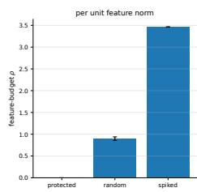

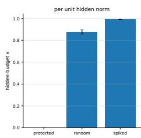

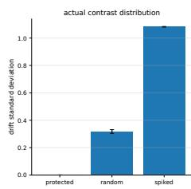

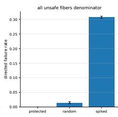  
Figure 3: Constant-level block families $( n / d = 3 . 0 0$ , hidden distance fixed by construction). Feature-budget $\rho$ separates the families far more than the matching hidden-budget $\kappa ;$ the directed failure rate tracks the drift standard deviation, not $\rho .$ Error bars are standard errors over eight frame seeds.

Figure 4 shows the sign geometry that the exact identity predicts. The no-noise discrepancy between exact and Gram drift is $2 . 6 6 \times 1 0 ^ { - 1 5 }$ , a floatingpoint check. With noise, the mean absolute residual is 0.0012 against the bound 0.030, and the 95th percentile of |residual $\lvert / ( 2 \eta \rvert | u \rvert | )$ is 0.106: typical isotropic residuals concentrate an order of magnitude below the adversarialalignment constant, exactly as Cauchy-Schwarz slack should behave, so the certificate prices the aligned worst case rather than the typical pair. The decision-disagreement rate is 49.3%; the directed unsafe population rate is 31.4%, the reverse directed rate 32.7% (near-symmetric, as the construction requires), and the rate conditional on English refusal 46.6%; benign overrefusal is 18.71% in English. The symmetry check is quantitative: the directed and reverse events are mutually exclusive on each fiber, and the observed gap between their rates is on the order of one standard error of its own estimator, precisely the residue finite sampling should leave of an exact design symmetry; the benign over-refusal rates pass the same test on the safe side. For any sign disagreement the AUCs are 0.966 (oracle absolute drift, gain 0.47 above chance), 0.707 (hidden distance), 0.588 (diagonal coherence proxy), and 0.506 (permutation control); the first is part of the exact margin formula and is a calibration check, and the proxy is weak because it discards signs, cross terms, and the baseline margin. The ladder is the paper’s thesis in four numbers: each rung deletes one layer of cross-Gram structure, from the full signed functional to magnitude without signs to diagonal coherence without cross terms to permuted structure, and the discriminative power decays monotonically with each deletion; the untied audit of section 5 replays the same lesson at the intervention level, where the signed residual transfers (0.964) and the unsigned static summary does not (0.269). Within the 5 central-margin strata the top-versus-bottom drift ordering holds in 5 of 5 strata, against 2 of 5 for the permuted control, which shows no consistent monotone ordering.

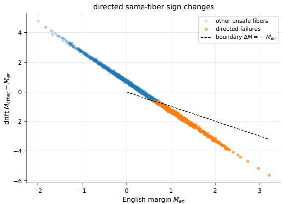  
Figure 4: Sign geometry of directed failures: the failing fibers are exactly the points with $\Delta M \le - M _ { \mathrm { e n } }$ , on and below the plotted boundary; the construction is symmetric, so the reverse directed event has comparable mass.

## 4 Diagnosis

Current exposure is a property of the deployed reader. This section asks whether the representation itself forces that exposure.

## 4.1 Intrinsic exposure, leverage duality and conditioning

Definition 5 (Intrinsic calibrated exposure and relative leverage). For a nonzero safety writer $w _ { s }$ and nuisance block $W _ { B }$ , define

$$
\chi _ { B } : = \operatorname* { m i n } _ { r ^ { \top } w _ { s } = 1 } \| W _ { B } ^ { \top } r \| _ { 2 } .\tag{8}
$$

Let $\widetilde { W } = [ w _ { s } , W _ { B } ] , \ : \widetilde { S } = \widetilde { W } \widetilde { W } ^ { \top }$ , and

$$
\ell _ { B } : = w _ { s } ^ { \top } \widetilde { S } ^ { \dagger } w _ { s } ,\tag{9}
$$

the safety writer’s relative leverage with respect to the nuisance block. Both quantities depend on $w _ { s } ;$ the subscript s is suppressed.

Theorem 6 (Calibrated quotient duality). Let $w _ { s } \neq 0$ and let $\theta _ { s , B }$ be the angle from $w _ { s }$ to $\operatorname { s p a n } ( W _ { B } )$

(a) $\chi _ { B } ^ { 2 } = 1 / \ell _ { B } - 1$ , a minimum-norm optimizer is $r ^ { \star } = \widetilde { S } ^ { \dagger } w _ { s } / ( w _ { s } ^ { \top } \widetilde { S } ^ { \dagger } w _ { s } )$ and every optimizer is $r ^ { \star } + q$ with $q \in \mathrm { n u l l } ( \widetilde S )$

(b) $\chi _ { B } = 0 \ i f$ and only if $w _ { s } \notin $ span $( W _ { B } )$

(c) When $\chi _ { B } = 0$ , the minimum-norm exactly invariant calibrated reader is $r _ { \mathrm { i n v } } ~ = ~ P _ { \mathrm { s p a n } ( W _ { B } ) ^ { \perp } } w _ { s } / \| P _ { \mathrm { s p a n } ( W _ { B } ) ^ { \perp } } w _ { s } \| ^ { 2 }$ , and for unit $w _ { s } , \ \| r _ { \mathrm { i n v } } \| \ =$ 1/ sin $\theta _ { s , B }$

Proof.

(1) For calibrated $r \colon r ^ { \top } \widetilde { S } r = ( r ^ { \top } w _ { s } ) ^ { 2 } + \| W _ { B } ^ { \top } r \| ^ { 2 } = 1 + \| W _ { B } ^ { \top } r \| ^ { 2 }$ . (expand $\widetilde { S } )$

(2) $w _ { s } \in \mathrm { r a n g e } ( \widetilde { S } ) , \mathrm { ~ s o ~ } 1 = ( r _ { \ast } ^ { \top } w _ { s } ) ^ { 2 } \leq ( r ^ { \top } \widetilde { S } r ) ( w _ { s } ^ { \top } \widetilde { S } ^ { \dagger } w _ { s } ) = ( 1 + \| W _ { B } ^ { \top } r \| ^ { 2 } ) \ell _ { B }$ (Cauchy-Schwarz in the Se seminorm)

(3) Rearranging, $\| \boldsymbol { W } _ { B } ^ { \top } \boldsymbol { r } \| ^ { 2 } \geq 1 / \ell _ { B } - 1$ for every calibrated r. (step (2))

(4) $r ^ { \star }$ is calibrated and attains equality, since $r ^ { \star \top } \widetilde { S } r ^ { \star } = 1 / \ell _ { B }$ . (substitute (9))

(5) Adding $q \in \mathrm { n u l l } ( \widetilde S )$ changes neither calibration nor objective, and $r ^ { \star } \perp$ $\mathrm { \ n u l l } ( \widetilde { S } )$ , so the optimizer set is $r ^ { \star } + \mathrm { n u l l } ( \widetilde { S } )$ $( \boldsymbol { \widetilde { S } } q = 0 )$

(6) $\chi _ { B } = 0$ if some calibrated r lies in $\mathrm { n u l l } ( W _ { B } ^ { \top } )$ , which holds if $w _ { s }$ has a nonzero component outside span $( W _ { B } )$ (part (b))

(7) Let $N = P _ { \mathrm { s p a n } ( W _ { B } ) ^ { \perp } }$ and $N w _ { s } \ne 0$ . Every invariant reader lies in range(N) with $r ^ { \top } N w _ { s } = 1$ , so $1 \le \left\| r \right\| \left\| N w _ { s } \right\|$ , with equality at $r =$ $N w _ { s } / \| N w _ { s } \| ^ { 2 } = r _ { \mathrm { i n v } }$ (Cauchy-Schwarz)

(8) For unit $w _ { s } , \| N w _ { s } \| = \sin \theta _ { s , B } , \mathrm { s o } \ \| r _ { \mathrm { i n v } } \| = 1 / \sin \theta _ { s , B } .$ . (definition of the principal angle)

The theorem separates current and intrinsic exposure: for every calibrated deployed reader $u ,$

$$
0 \leq \chi _ { B } \leq \rho _ { u , B } ,\tag{10}
$$

the gap $\rho _ { u , B } ^ { 2 } - \chi _ { B } ^ { 2 }$ is removable readout cross-talk, and the residual $\chi _ { B }$ is representation-intrinsic under the declared calibration constraint. Statistical leverage measures how uniquely a column is represented by a span [Ordozgoiti et al., 2022]; the duality $\chi _ { B } ^ { 2 } = 1 / \ell _ { B } - 1$ gives that classical quantity an operational safety meaning.

Feasibility and stability are diferent questions. If endpoint reconstruction errors have norm at most η, an exactly block-invariant reader still incurs residual pair drift up to

$$
2 \eta \| r _ { \mathrm { i n v } } \| = \frac { 2 \eta } { \sin \theta _ { s , B } } ,\tag{11}
$$

so a small quotient angle makes exact cancellation brittle: the invariant reader exists algebraically but amplifies residual noise and estimation error by 1/ sin $\theta _ { s , B }$ . This is the third regime of the triage in fig. 1, and it is invisible to both $\rho _ { u , B }$ and $\chi _ { B }$ alone.

One scalar writer is a modelling choice, and a contested one: gradientbased search finds several independent refusal directions and multidimensional concept cones rather than one direction, and orthogonality between them does not imply independence under intervention [Wollschläger et al., 2025]. The diagnosis is not tied to the scalar case. For a safety mechanism with k calibrated outputs spanning col(A), the multi-output form (16) replaces $\chi _ { B } ^ { 2 }$ by $\mathrm { t r } ( H _ { A } ^ { - 1 } ) - k$ and replaces the angle condition by the rank condition rank $( P _ { \mathrm { s p a n } ( W _ { B } ) ^ { \bot } } A ) = k \colon$ exact simultaneous invariance is feasible exactly when the cone keeps full rank of the nuisance span. The three regimes are then read of that rank and the norm of the optimal reader system, so a cone-valued refusal mechanism is diagnosed by the same two questions as a single direction.

## 4.2 The three regimes, matched and measured

Figure 5 draws the complete diagnosis. The angle between $w _ { s }$ and $\operatorname { s p a n } ( W _ { B } )$ determines everything: a right angle is the stable removable regime, a small positive angle is removable but ill-conditioned, and an in-span safety writer is the intrinsic collision, where theorem 6(b) denies the existence of any invariant calibrated reader.

The next construction shows the diagnosis is invisible to current exposure alone.

Proposition 7 (Same current exposure, opposite repairability). Let L be even, $d \ge L + 1 , w _ { s } = e _ { 0 } , 0 < \beta < 1$ , and $\gamma = \sqrt { 1 - \beta ^ { 2 } }$ . The removable block $b _ { j } = \beta e _ { 0 } + \gamma e _ { j } , j = 1 , \ldots , L ,$ and the intrinsic paired block

$$
b _ { 2 k - 1 } = \beta e _ { 0 } + \gamma e _ { k } , \qquad b _ { 2 k } = \beta e _ { 0 } - \gamma e _ { k } , \qquad k = 1 , \ldots , L / 2 ,
$$

have the same tied exposure $\rho = \beta \sqrt { L }$ . For the first, $\chi _ { B } = 0$ and $\| r _ { \mathrm { i n v } } \| ^ { 2 } =$ $1 + L \beta ^ { 2 } / ( 1 - \beta ^ { 2 } )$ . For the second, $\chi _ { B } = \rho$ and no exactly invariant calibrated reader exists.

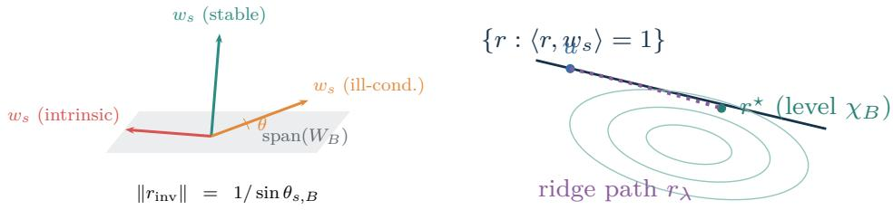  
(a) Repairability is the angle to the nuisance span.  
(b) Calibrated readers: level sets of $\| \dot { W } _ { B } ^ { \top } r \|$ meet the constraint at $r ^ { \star }$  
Figure 5: The framework in linear algebra. (a) The three regimes are angles of $w _ { s }$ to the nuisance span. (b) Calibrated readers: the intrinsic exposure $\chi _ { B }$ is the smallest level set of $\| \boldsymbol { W } _ { B } ^ { \top } \boldsymbol { r } \|$ touching the calibration constraint, and the regularized reader $r _ { \lambda }$ of theorem 10 traces the path from the deployed head u to $r ^ { \star }$

Proof.

(1) Both blocks give $W _ { B } ^ { \top } e _ { 0 } = \beta \mathbf { 1 } _ { L }$ , so $\rho = \| W _ { B } ^ { \top } e _ { 0 } \| = \beta \sqrt { L }$ in both cases. (unit columns)

(2) For the removable block, $r = e _ { 0 } - ( \beta / \gamma ) \sum _ { j = 1 } ^ { L } e _ { j }$ satisfies $r ^ { \top } e _ { 0 } = 1$ and $r ^ { \top } b _ { j } = \beta - ( \beta / \gamma ) \gamma = 0$ , so $\chi _ { B } = 0 .$ (explicit annihilating reader)

(3) Its squared norm is $1 + L \beta ^ { 2 } / \gamma ^ { 2 }$ , and it equals $r _ { \mathrm { i n v } }$ because it is the calibrated element of span $( W _ { B } ) ^ { \perp }$ of minimum norm. (theorem 6(c))

(4) For the paired block, any calibrated r has $r ^ { \top } e _ { 0 } = 1$ , so writing $r _ { k }$ for its $e _ { k }$ coordinates, $\begin{array} { r } { \| W _ { B } ^ { \top } r \| ^ { 2 } = \sum _ { k = 1 } ^ { L / 2 } [ ( \beta + \gamma r _ { k } ) ^ { 2 } + ( \beta - \gamma r _ { k } ) ^ { 2 } ] = } \end{array}$ $\begin{array} { r } { L \beta ^ { 2 } + 2 \gamma ^ { 2 } \sum _ { k } r _ { k } ^ { 2 } \ge L \beta ^ { 2 } } \end{array}$ (cross terms cancel)

(5) The tied reader $e _ { 0 }$ attains the bound, so $\chi _ { B } = \beta \sqrt { L } = \rho ,$ and $\chi _ { B } > 0$ denies exact invariance. (theorem 6(b))

Equal observed tied-head cross-talk can therefore represent a completely removable problem or a completely intrinsic one; the numerical audit adds a third, ill-conditioned removable family whose $\chi _ { B }$ is zero but whose $\| r _ { \mathrm { i n v } } \|$ is large, and confirms the full three-way diagnosis on held-out fibers (table 1, fig. 6) and across independently generated geometries (fig. 7).

The matched benchmark (table 1, fig. 6) holds current exposure fixed at $\rho = 0 . 8 8 0$ with sample-level deployed scores matched across families to $2 . 2 2 \times$ $1 0 ^ { - 1 5 }$ , so held-out diferences are attributable to geometry alone. A behavioral disagreement rate is the primary observable of black-box multilingual red teaming on deployed models [Yong et al., 2024, Deng et al., 2024]; the three families are constructed to be indistinguishable to that observable, and the held-out columns of table 1 show what it leaves undetermined. Arditi et al. [2024] identify a refusal direction that is causally necessary and suficient in English prompts, which establishes that a linear read of safety exists; whether a calibrated re-read can escape the language block is exactly the quantity χ measures. Validation-selected readers reduce held-out drift by 71.0% in the stable removable family but only 12.7% in the illconditioned removable family, and −0.0% in the intrinsic collision, matching $\chi = 0 . 0 0 0 / 0 . 0 0 0 / 0 . 8 8 0$ and $\| r _ { \mathrm { i n v } } \| = 1 . 3 5 / 9 1 . 5 9$ . The exact invariant reader illustrates the conditioning regime directly: it reaches 99.99% balanced accuracy in the stable family but collapses to 52.16% in the ill-conditioned one, because its norm 91.59 amplifies endpoint noise (eq. (11)). The collapse is quantitative as well as directional: with endpoint residual scale 0.10, the amplification bound evaluates to $2 \times 0 . 1 0 \times 9 1 . 5 9 \approx 1 8$ for the ill-conditioned family, more than twenty times the generator’s signal scale 0.78, while the stable family’s $2 \times 0 . 1 0 \times 1 . 3 5 \approx 0 . 2 7$ stays comfortably below it; the observed accuracies are what this arithmetic requires. The conditioning numbers also close a loop with the budget comparison of section 3: for the unit tied writer, $\kappa = \cos \theta _ { s , B }$ while $\| r _ { \mathrm { i n v } } \| = 1 / \sin \theta _ { s , B } , \mathrm { s o } \ \| r _ { \mathrm { i n v } } \| = 1 / \sqrt { 1 - \kappa ^ { 2 } }$ , and the two stages, computing these quantities by diferent formulas on diferent code paths, agree to four significant figures in both removable families (0.670 gives 1.35 against 1.35; the ill-conditioned $\kappa ,$ within one part in ten thousand of the ceiling, gives 91.6 against 91.59). The intrinsic family closes the pattern: κ at the ceiling means sin $\theta _ { s , B } = 0$ and no invariant reader at any norm. The regularization frontiers behind this table are in fig. 12 (appendix).

Table 1: Matched-current-exposure benchmark. All three families have identical sample-level deployed scores. Readers are estimated from training contrasts, selected on validation fibers under a one-percentage-point utility constraint, and evaluated once on test fibers. BAcc is balanced accuracy; “exact $\mathrm { B A c c } ^ { \mathrm { 7 } }$ uses the minimum-norm exactly invariant reader when it exists.
<table><tr><td>Geometry</td><td>ρ</td><td>X</td><td> $\| r _ { \mathrm { i n v } } \|$ </td><td>deployed drift</td><td>selected drift</td><td>selected BAcc</td><td>exact BAcc</td></tr><tr><td>Stable removable</td><td>0.880</td><td>0.000</td><td>1.35</td><td>0.518</td><td>0.150</td><td>99.99</td><td>99.99</td></tr><tr><td>Ill-conditioned removable</td><td>0.880</td><td>0.000</td><td>91.59</td><td>0.518</td><td>0.453</td><td>99.31</td><td>52.16</td></tr><tr><td>Intrinsic collision</td><td>0.880</td><td>0.880</td><td> $\mathrm { n / a }$ </td><td>0.518</td><td>0.519</td><td>98.76</td><td>n/a</td></tr></table>

Figure 6 shows the same separation graphically: the exposure bars are indistinguishable across families, the held-out drift bars are not, and the operating-point panel isolates the diagnostic signature of each regime; only the intrinsic family sits pinned at its deployed drift with nothing to trade.

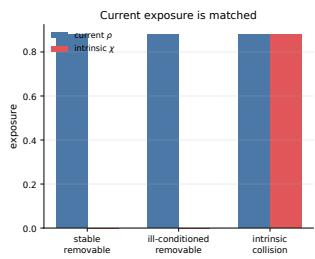

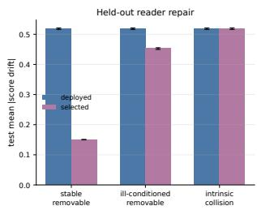

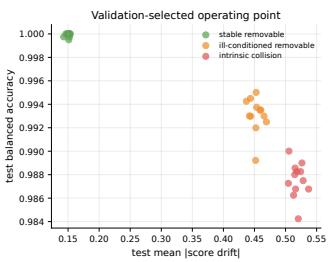  
Figure 6: Matched-current-exposure benchmark. Left: the three families share $\rho = 0 . 8 8 0$ but have intrinsic exposure $\chi = 0 . 0 0 0 / 0 . 0 0 0 / 0 . 8 8 0$ . Middle: held-out drift before and after validation-selected reader repair. Right: the selected operating points, where the two removable families trade drift for accuracy and the intrinsic family holds its drift.

Across 66 independently rotated geometries (fig. 7), the intrinsic fraction $\chi / \rho$ predicts the residual drift floor with Spearman correlation 0.972 (ratios rising from 0.494 at one antipodal pair to 1.000 at a fully paired block), and on the removable subset log $| r _ { \mathrm { i n v } } | |$ predicts usable repair with Spearman 0.889 (ratios from 0.386 to 0.885). The two panels of fig. 7 are one decomposition read twice: by eq. (10) the diagonal $\chi / \rho$ is the non-negotiable floor, so a geometry’s height above the diagonal is drift that is removable in principle but unrecovered under the utility constraint; on the removable subset, where the floor is identically zero, that height is the entire residual and climbs monotonically as the invariant-reader norm climbs by an order of magnitude. The floor explains position along the diagonal, the conditioning explains height above it, and nothing else is left to explain. Finite-sample learning curves (fig. 13, appendix) sweep the audit sample from 16 to 2048 fibers: the stable ratio falls from 0.526 to 0.290, the ill-conditioned ratio from 0.948 to 0.872, and the intrinsic ratio stays at 1.000; more data sharpens the estimate of the quotient geometry the representation already carries. The plateaus land where the matched benchmark says they must: at 2048 fibers the residual ratios 0.290, 0.872, and 1.000 sit near one minus the matched drift reductions for the same three families, from independent seeds, sample sizes, and selection procedures. Estimation noise is what vanishes with data; the geometric remainder is what two independent experiments jointly locate.

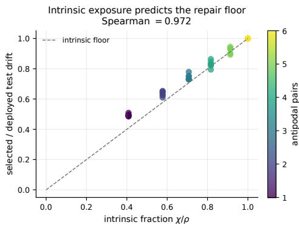

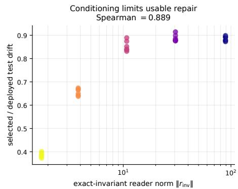  
Figure 7: Out-of-sample repairability across 66 independently generated geometries. Left: the intrinsic fraction $\chi / \rho$ predicts the held-out residual drift ratio (Spearman 0.972); the dashed diagonal is the intrinsic floor. Right: on the removable subset, the exact-invariant reader norm predicts how much repair survives the utility constraint (Spearman 0.889).

## 5 The causal interface

Define the calibrated feature setter

$$
T _ { i } ^ { a } ( h ) = h + ( a - r _ { i } ^ { \top } h ) w _ { i } ,\tag{12}
$$

which writes along $w _ { i }$ until the reading along $r _ { i }$ equals $a ;$ calibration $r _ { i } ^ { \top } w _ { i } = 1$ guarantees $r _ { i } ^ { \top } T _ { i } ^ { a } ( h ) = a$ . This is an activation-patching intervention with the read and write directions allowed to difer, and separate readers and writers make the interaction directional.

Theorem 8 (Untied order-swap identity). Let $C = R ^ { \top } W$ , let $i \neq j$ , and let $w _ { i } , w _ { j } \ne 0$ . Then

$$
T _ { i } ^ { a } T _ { j } ^ { b } ( h ) - T _ { j } ^ { b } T _ { i } ^ { a } ( h ) = ( a - r _ { i } ^ { \top } h ) C _ { j i } w _ { j } - ( b - r _ { j } ^ { \top } h ) C _ { i j } w _ { i } .\tag{13}
$$

The setters commute for all $h , a , b$ if and only $i f C _ { i j } = C _ { j i } = 0$ . If the target increments are independent, centered, and have variance $\sigma ^ { 2 }$ , and the writers are unit norm, then $\mathbb { E } \Vert T _ { i } ^ { a } T _ { j } ^ { b } ( h ) - T _ { j } ^ { b } T _ { i } ^ { a } ( h ) \Vert ^ { 2 } = \sigma ^ { 2 } ( C _ { i j } ^ { 2 } + C _ { j i } ^ { 2 } )$ . A one-sided target change identifies either directional entry.

Proof.

$$
( 1 ) \ { \mathrm { W r i t e ~ } } \delta _ { i } = a - r _ { i } ^ { \top } h { \mathrm { ~ a n d ~ } } \delta _ { j } = b - r _ { j } ^ { \top } h .\tag{notation}
$$

$$
( 2 ) \ T _ { j } ^ { b } ( h ) = h + \delta _ { j } w _ { j } \ \mathrm { h a s } \ i \mathrm { r e a d i n g } \ r _ { i } ^ { \top } h + \delta _ { j } C _ { i j } .
$$

$$
( r _ { i } ^ { \top } w _ { j } = C _ { i j } )
$$

(3) $T _ { i } ^ { a } T _ { j } ^ { b } ( h ) = h + \delta _ { j } w _ { j } + ( \delta _ { i } - \delta _ { j } C _ { i j } ) w _ { i } .$

(apply (12))

(4) Symmetrically, $T _ { j } ^ { b } T _ { i } ^ { a } ( h ) = h + \delta _ { i } w _ { i } + ( \delta _ { j } - \delta _ { i } C _ { j i } ) w _ { j }$ ; subtracting gives (13). (cancel h)

(5) If $C _ { i j } = C _ { j i } = 0$ the defect vanishes identically; conversely, choosing $\delta _ { j } = 0 , \delta _ { i } = 1$ makes the defect $C _ { j i } w _ { j }$ , and $\delta _ { i } = 0 , \delta _ { j } = 1$ makes $\mathrm { i t } \ - C _ { i j } w _ { i }$ , so commutation for all targets forces $C _ { j i } = C _ { i j } = 0$ since $w _ { i } , w _ { j } \ne 0$ (one-sided choices)

(6) With independent centered increments of variance $\sigma ^ { 2 }$ and unit writers, the cross term has zero mean and $\begin{array} { r } { \mathbb { E } \| \mathrm { d e f e c t } \| ^ { 2 } = \sigma ^ { 2 } ( C _ { j i } ^ { 2 } \| w _ { j } \| ^ { 2 } + C _ { i j } ^ { 2 } \| w _ { i } \| ^ { 2 } ) = } \end{array}$ $\sigma ^ { 2 } ( C _ { i j } ^ { 2 } + C _ { j i } ^ { 2 } )$ (independence)

(7) The same one-sided choices as step (5) leave a scalar multiple of one known writer, identifying the corresponding directional entry. (read of (13))

The value of theorem 8 is operational. When R and W are available, C is directly computable, and explicit interventions test whether the learned controls behave like the proposed linear reader/writer interface. For an observed order diference $\Delta _ { i j } ^ { \mathrm { o b s } }$ , define the residual

$$
\mathcal { R } _ { i j } = \Delta _ { i j } ^ { \mathrm { o b s } } - \left[ ( a - r _ { i } ^ { \top } h ) C _ { j i } w _ { j } - ( b - r _ { j } ^ { \top } h ) C _ { i j } w _ { i } \right] .\tag{14}
$$

A large residual localizes nonlinear leakage, state dependence, of-dictionary components, or intervention implementation error; the diagnostic content lives in the residual, not in the predicted linear term. This is the consistencytest logic of causal abstraction [Geiger et al., 2025], instantiated for a linear read/write interface. The empirical literature on steering supplies the motive: steering vectors are unreliable in and out of distribution, with variance across inputs traced to the geometry of activation diferences and to whether one direction is coherent at all [Tan et al., 2024, Braun et al., 2025], and reliability degrades further under multi-attribute control, which has prompted replacing a single static vector by a state-dependent field [Li et al., 2026]. Those studies measure that composition fails; eq. (14) is a quantity computed before the composition is attempted, and the audit below asks it to predict the failure out of sample. The closing audit of this section estimates the residual on calibration states and asks it to predict a distinct three-control composition error on new states and targets (fig. 8).

Corollary 9 (Tied specialization and signed one-sided defect). For the tied system $R = W$ with unit columns, (13) becomes $T _ { i } ^ { a } T _ { j } ^ { b } ( h ) - T _ { j } ^ { b } T _ { i } ^ { a } ( h ) =$ $g _ { i j } [ ( a - r _ { i } ) w _ { j } - ( b - r _ { j } ) w _ { i } ]$ with $g _ { i j } = \langle w _ { i } , w _ { j } \rangle$ and readings $r _ { i } = \langle w _ { i } , h \rangle$ , so the maps commute for all $a , b , h$ if $g _ { i j } = 0$ , and independent centered targets of variance $\sigma ^ { 2 }$ give expected squared defect $2 \sigma ^ { 2 } g _ { i j } ^ { 2 }$ . With $b = r _ { j }$ and $a = r _ { i } + 1$ the defect is $g _ { i j } w _ { j }$ , so $g _ { i j } = \langle T _ { i } ^ { a } T _ { j } ^ { b } ( h ) - T _ { j } ^ { b } T _ { i } ^ { a } ( h ) , w _ { j } \rangle$ , recovering the signed entry.

Proof.

(1) Set $R = W$ in theorem 8: $C _ { i j } = C _ { j i } = g _ { i j }$ and $\delta _ { i } = a - r _ { i } , \delta _ { j } = b - r _ { j }$ (tied case)

(2) The defect becomes $g _ { i j } [ ( a - r _ { i } ) w _ { j } - ( b - r _ { j } ) w _ { i } ]$ and the variance formula gives $\sigma ^ { 2 } \cdot 2 g _ { i j } ^ { 2 }$ (theorem 8)

(3) $b = r _ { j } , a = r _ { i } + 1$ leaves $g _ { i j } w _ { j } { \mathrm { : } }$ ; its inner product with the unit vector $w _ { j }$ is $g _ { i j }$ (one-sided choice)

Because $g _ { i j } = w _ { i } ^ { \top } w _ { j }$ is directly computable when W is known, the tied identity’s operational content is a consistency check rather than a method of Gram estimation: the residual (14) is zero under the ideal tied read/write map and nonzero under untied read/write, state dependence, nonlinearity, of-dictionary components, or implementation error. When the data are generated by that identity, the squared-defect average is a Monte Carlo check of it rather than independent causal evidence.

The stage audit instantiates both regimes. For the tied system, across 48 distinct feature pairs with 768 interventions each, the explicit two-order composition matches the closed form to $4 . 4 1 \times 1 0 ^ { - 1 6 }$ , two units in the last place of double precision, so the check saturates the arithmetic itself; the squared-coherence estimate has correlation 0.999 and RMSE 0.0034, aggregation gives a tied-head block norm of 1.939 against the true 1.933, and the signed one-sided recovery of theorem 9 has correlation 0.9998 and RMSE 0.0050 (fig. 14, appendix). These Monte Carlo recoveries confirm internal consistency of the tied-map identity rather than supplying independent evidence for it. They do close a loop between statics and dynamics: the number the measuring audit reads of $W$ in one matrix multiplication, the block norm 1.933, is reconstructed purely from the order dependence of interventions as 1.939, and the signed protocol recovers individual Gram entries at correlation 0.9998. On synthetic data this is consistency; on a real stack it is the template for estimating $\rho$ where W is not given.

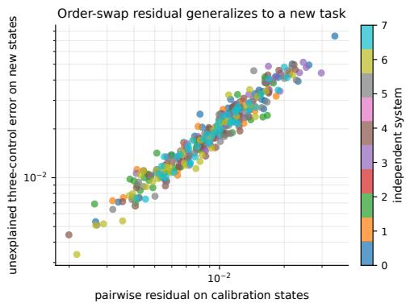

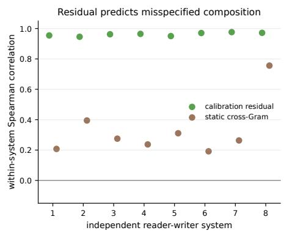  
Figure 8: Untied diagnostic under nonlinear, state-dependent setters. Left: the pairwise order-swap residual on calibration states predicts the unexplained three-control composition error on new states. Right: within-system Spearman correlations for the residual against the static cross-Gram baseline.

The untied diagnostic is the out-of-sample headline (fig. 8). Across 8 independent reader-writer systems, the regime of learned encoder/decoder pairs whose read and write directions difer by construction [Cunningham et al., 2023, Bricken et al., 2023], with actual setters carrying nonlinear, state-dependent leakage, the pairwise order-swap residual (14), estimated on calibration states, predicts the unexplained part of a three-control composition error on new states and targets with median within-system Spearman correlation 0.964 (pooled 0.970 over 360 held-out triples), against 0.269 (pooled 0.298) for the static cross-Gram magnitude alone. The simulated residual, not the static linear score, carries the transferable information about how controls miscompose.

## 6 Repair and limits

Two repairs answer two situations: designing a new calibrated reader when the contrast geometry (or its covariance) is available, and editing the head you have when only audited pairs are. Both act on the reader side of a fixed representation, which places them against two established families: domain-adversarial training and invariant risk minimization make a nuisance attribute non-discriminable, or make the optimal readout invariant to it, by training against a learned classifier [Ganin et al., 2016, Arjovsky et al., 2019], and closed-form linear concept erasure removes a labeled attribute at the data level against every classifier and norm [Belrose et al., 2023], a line that

□

began with adversarial and kernelized erasure of a concept subspace [Ravfogel et al., 2022a,b]. Erasure asks that no linear predictor recover the attribute; theorem 1(b) is the fiber-conditional form of that condition, imposed on one declared score rather than on every predictor. The decomposition here is calibrated and block-specific and emits a verdict no erasure method computes: theorem 11 edits the deployed head with a held-out transfer bound, theorem 10 designs a new reader along an explicit exposure-conditioning frontier, and $\chi _ { B }$ (theorem 5) states when no head-side object of either kind can succeed. The section closes with what no reader optimization can achieve.

## 6.1 Two closed-form repairs

Proposition 10 (Regularized minimum-variance reader). For $\lambda > 0$ , the problem min $r ^ { \top } w _ { s } = 1 \big \{ \| W _ { B } ^ { \top } r \| ^ { 2 } + \lambda \| r \| ^ { 2 } \big \}$ has the unique solution

$$
r _ { \lambda } = \frac { ( W _ { B } W _ { B } ^ { \top } + \lambda I ) ^ { - 1 } w _ { s } } { w _ { s } ^ { \top } ( W _ { B } W _ { B } ^ { \top } + \lambda I ) ^ { - 1 } w _ { s } } ,\tag{15}
$$

with minimum value $[ \boldsymbol { w } _ { s } ^ { \top } ( \boldsymbol { W } _ { B } \boldsymbol { W } _ { B } ^ { \top } + \lambda I ) ^ { - 1 } \boldsymbol { w } _ { s } ] ^ { - 1 } . \ I f \boldsymbol { c } \sim ( 0 , I )$ and independent residual noise has covariance $\lambda I$ , the objective is exactly the expected squared score drift.

Proof.

(1) $Q _ { \lambda } = W _ { B } W _ { B } ^ { \top } + \lambda I \succ 0$ , and for calibrated r, $r ^ { \top } Q _ { \lambda } r = \| W _ { B } ^ { \top } r \| ^ { 2 } + \lambda \| r \| ^ { 2 }$ (expand)

(2) $1 = ( r ^ { \top } w _ { s } ) ^ { 2 } \leq ( r ^ { \top } Q _ { \lambda } r ) ( w _ { s } ^ { \top } Q _ { \lambda } ^ { - 1 } w _ { s } ) .$ (Cauchy-Schwarz in the $Q _ { \lambda }$ metric)

(3) Equality holds if $Q _ { \lambda } r \propto w _ { s }$ , which after calibration is exactly (15); strict convexity gives uniqueness. (equality case)

(4) E $( r ^ { \top } ( W _ { B } c + e ) ) ^ { 2 } = \| W _ { B } ^ { \top } r \| ^ { 2 } + \lambda \| r \| ^ { 2 }$ when $\mathrm { C o v } ( c ) = I , \mathrm { C o v } ( e ) = \lambda I$ independent. (expand the square)

As $\lambda \to \infty , r _ { \lambda }$ approaches the normalized tied reader $w _ { s } / \| w _ { s } \| ^ { 2 } ;$ ; as $\lambda \downarrow 0$ it approaches the minimum-norm minimum-exposure reader, which in the exactly removable case is $r _ { \mathrm { i n v } }$ . Hence λ traces a continuous frontier between current readout behavior and exact nuisance cancellation, the dotted path of fig. 5(b). How a reader selected on audited pairs then behaves on unseen pairs is a separate, statistical question, treated in a companion manuscript [Ahnouch, 2026]; here λ is a design knob on the frontier and the audits below report one frozen test evaluation of it. A safety mechanism with several calibrated outputs $A \in \mathbb { R } ^ { d \times k }$ (full column rank) admits the same construction: with $\begin{array} { r } { S _ { A } = A A ^ { \top } + W _ { B } W _ { B } ^ { \top } } \end{array}$ and $H _ { A } = A ^ { \top } S _ { A } ^ { \dagger } A$

$$
\operatorname* { m i n } _ { { \boldsymbol R } _ { A } ^ { \top } A = I _ { k } } \| { \boldsymbol W } _ { B } ^ { \top } { \boldsymbol R } _ { A } \| _ { F } ^ { 2 } = \mathrm { t r } ( H _ { A } ^ { - 1 } ) - k , \qquad { \boldsymbol R } _ { A } ^ { \star } = { \boldsymbol S } _ { A } ^ { \dagger } A H _ { A } ^ { - 1 } ,\tag{16}
$$

and exact simultaneous invariance is feasible precisely when rank $( P _ { \mathrm { s p a n } ( W _ { B } ) ^ { \perp } } A ) =$ $k ;$ the claimproof is in the proof below. This covers multi-category safety heads without forcing every policy dimension into one scalar direction.

Proof.

(1) For R⊤A = Ik, tr(R⊤SAR) = tr(R⊤AA⊤R) + ∥W⊤B R∥2F = k + ∥W⊤B R∥2F. (expand SA)

(2) Minimizing $\mathrm { t r } ( R ^ { \top } S _ { A } R )$ under the matrix constraint has least-energy solution $R ^ { \star } = \dot { S } _ { A } ^ { \dagger } A ( A ^ { \top } S _ { A } ^ { \dagger } A ) ^ { - 1 } = S _ { A } ^ { \dagger } A H _ { A } ^ { - 1 }$ . (generalized least squares)

(3) $R ^ { \star }$ is feasible: ${ \cal R } ^ { \star \top } A = H _ { A } ^ { - 1 } A ^ { \top } S _ { A } ^ { \dagger } A = I _ { k }$ , using $\mathrm { r a n g e } ( A ) \subseteq \mathrm { r a n g e } ( S _ { A } )$ (substitute)

(4) Substitution gives the minimum $\mathrm { t r } ( H _ { A } ^ { - 1 } )$ , hence (16). (steps (1)-(3))

(5) Exact simultaneous invariance solves $R ^ { \top } P _ { \mathrm { s p a n } ( W _ { B } ) ^ { \bot } } A = I _ { k }$ , which is solvable if the projected anchor matrix has full column rank k. (surjectivity)

For repair from audited pairs alone, let D be audited pairs with hidden contrast span ${ \mathcal { L } } _ { D } = \operatorname { s p a n } \{ h ( x ) - h ( x ^ { \prime } ) : ( x , x ^ { \prime } ) \in D \}$

Proposition 11 (Least-change projection and its held-out bound). $u _ { D } =$ $( I - P \ / c _ { D } ) u$ is the unique minimizer of $\lVert \boldsymbol { v } - \boldsymbol { u } \rVert$ over $\mathcal { L } _ { D } ^ { \perp }$ , and $u _ { D } ^ { \top } ( h ( x ) -$ $h ( x ^ { \prime } ) ) = 0 ~ f o r ~ a l l ~ ( x , x ^ { \prime } ) \in D$ . For any held-out hidden contrast d, $| u _ { D } ^ { \top } d | \leq$ $\| u _ { D } \| \| ( I - P \mathcal { L } _ { D } ) d \|$

Proof.

(1) Orthogonal split $u = P \varsigma _ { D } u + ( I - P \varsigma _ { D } )$ u gives $\| u - v \| ^ { 2 } = \| P \mathcal { L } _ { D } u \| ^ { 2 } +$ $\| ( I - P _ { \mathcal { L } _ { D } } ) u - v \| ^ { 2 }$ for $v \in \mathcal L _ { D } ^ { \perp }$ , minimized at $v = u _ { D }$ (Pythagoras)

(2) $u _ { D } \in \mathcal { L } _ { D } ^ { \perp }$ annihilates every training contrast. (definition)

(3) $u _ { D } ^ { \top } d = u _ { D } ^ { \top } ( I - P _ { \mathcal { L } _ { D } } ) d , \mathrm { s o } \ | u _ { D } ^ { \top } d | \leq \| u _ { D } \| \ \| ( I - P _ { \mathcal { L } _ { D } } ) d \|$ . (Cauchy-Schwarz)

Generalization thus depends on how well a new contrast lies in the training span; an empirical basis $\widehat { \mathcal { L } } _ { D , 0 }$ .995 that retains a fixed energy fraction is a denoised truncation of $\mathcal { L } _ { D } ,$ not the exact span. In practice one also solves the penalized problem min $\begin{array} { r } { \mathfrak { i } _ { u , b } \sum _ { k } ( u ^ { \top } h _ { k } + b - y _ { k } ) ^ { 2 } + \lambda \sum _ { D } ( u ^ { \top } ( h ( x ) - } \end{array}$ $h ( x ^ { \prime } ) ) ^ { 2 } + \gamma \| u \| ^ { 2 }$ , with closed-form solution ${ \widehat { \beta } } = ( X ^ { \top } X + \lambda D ^ { \top } D + \gamma R ) ^ { \dagger } X ^ { \top } y$ $( R = \mathrm { d i a g } ( I _ { d } , 0 ) )$ . The scale-dependent λ must be selected on validation data under a prespecified utility constraint, with the head, bias, threshold, and λ frozen before the single test evaluation.

The two constructions solve diferent problems and require diferent inputs. The regularized reader $r _ { \lambda }$ needs the block geometry $W _ { B } { \mathrm { ~ o r } }$ , in its dictionary-free form, the empirical contrast covariance $\widehat { \Sigma } _ { \Delta } ;$ it designs the best calibrated reader outright and inherits the diagnosis of theorem 6: its frontier is steep exactly when the geometry is well conditioned. The projection uD needs only audited pairs, changes the deployed head as little as possible in Euclidean norm, and carries the held-out transfer bound of theorem 11. When $\chi _ { B } > 0$ , neither construction removes the block response, which is the point of the diagnosis: repair budgets should go to the representation, not the head. Both repairs are evaluated on untouched test fibers in fig. 9.

Figure 9 shows the head-repair results. On the untouched test split, empirical projection lowers the tied head’s mean absolute drift from 1.394 to 0.000 (oracle block span) and 0.008 (data PCA truncation, rank 43.1), and the directed unsafe rate from 28.79% to 0.04% and 2.16% respectively; at the fixed threshold $\tau = 0 . 6 5$ the tied rate is 33.15% against 0.00% and 0.00%. The fixed and recalibrated columns decompose the gain: recalibration alone moves the tied head by about four points, and the projection removes essentially everything that remains because it removes the drift itself, three orders of magnitude in mean absolute drift; the truncated projection’s small residual under recalibration is an operating-point choice trading margin for accuracy, not surviving cross-talk, since its fixed-threshold rate sits at 0.00%. The oracle projection removes 97.8% of the head energy (retained head norm 0.145), so a small Euclidean edit can be a large functional one. For the invariant ridge, validation selects $\lambda = 3 . 0 0$ ; the frozen test directed rate falls from 0.506% to 0.164% (Wilson interval [0.084, 0.303]%) and mean absolute drift from 0.219 to 0.026. Because the baseline is already small, the absolute reduction is the informative headline number, and $\lambda$ remains a validation choice rather than a test-set optimum.

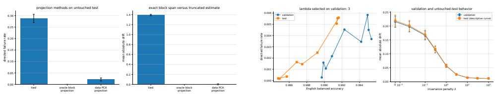  
Figure 9: Left: exact oracle block-span projection removes almost all held-out drift, while the data-driven truncated-PCA projection is a denoised approximation. Right: the invariant-ridge frontier on validation and untouched test; λ is selected on validation.

## 6.2 What aggregates fix, and what they leave free

Two global statements frame what an audit of this kind concludes. The level leaves the structure free, and reader optimization meets a floor set by rank. Both refine classical objects: global coherence floors on maximum crosscorrelation are fundamental [Welch, 1974], and the aggregate interaction of two frames is the subject of cross-frame potentials [Aceska and Kaczanowski, 2022]; the theorem measures what remains of both after every reader is optimized against a fixed writer system.

Theorem 12 (Global floors, reader-optimized capacity, and non-identification). Let $W \in \mathbb { R } ^ { d \times n }$ have unit columns, $r = { \mathrm { r a n k } } ( W )$ , $G = W ^ { \top } W$ $S = W W ^ { \top }$ , and leverage scores $\ell _ { i } = w _ { i } ^ { \top } S ^ { \dagger } w _ { i }$

(a) $\lambda _ { \operatorname* { m a x } } ( G ) \geq n / r$ and $\begin{array} { r } { \frac { 1 } { n } \sum _ { i } \sum _ { j \neq i } G _ { i j } ^ { 2 } \geq n / r - 1 } \end{array}$ ; the n/d bounds follow from $r \leq d$

(b) Over all self-calibrated reader systems,

$$
\operatorname* { m i n } _ { \mathrm { d i a g } ( R ^ { \top } W ) = { \bf 1 } } \| \mathrm { o f f } ( R ^ { \top } W ) \| _ { F } ^ { 2 } = \sum _ { i = 1 } ^ { n } \Bigl ( \frac { 1 } { \ell _ { i } } - 1 \Bigr ) ~ \geq ~ \frac { n ( n - r ) } { r } ,\tag{17}
$$

with minimum-norm optimal readers $r _ { i } ^ { \star } = S ^ { \dagger } w _ { i } / \ell _ { i }$ , and equality in the rank-only bound if $\ell _ { 1 } = \cdot \cdot \cdot = \ell _ { n } = r / n$

(c) Fix a safety index $i _ { \mathrm { s } }$ and equal-cardinality sets $B , C \not \ni i _ { \mathrm { s } }$ , and let Π be a column permutation fixing $i _ { \mathrm { s } }$ and mapping B onto C. Then $W ^ { \prime } = W$ Π has $G ^ { \prime } = \Pi ^ { \top } G \Pi$ with the same spectrum, rank, trace, and frame potential as G, yet $\begin{array} { r } { \rho _ { i _ { \mathrm { s } } , B } ( W ^ { \prime } ) ^ { 2 } = \sum _ { k \in C } G _ { i _ { \mathrm { s } } k } ^ { 2 } } \end{array}$

Proof.

(1) The nonzero eigenvalues of G sum to n over at most r of them, so $\lambda _ { \operatorname* { m a x } } ( G ) \geq n / r$ (averaging)

(2) $\| G \| _ { F } ^ { 2 } \geq ( \operatorname { t r } G ) ^ { 2 } / r = n ^ { 2 } / r$ and $\begin{array} { r } { \| G \| _ { F } ^ { 2 } = n + \sum _ { i \neq j } G _ { i j } ^ { 2 } } \end{array}$ . (rank-r Frobenius bound)

(3) For each calibrated reader, $\begin{array} { r } { r _ { i } ^ { \top } S r _ { i } = \sum _ { j } ( r _ { i } ^ { \top } w _ { j } ) ^ { 2 } = 1 + \sum _ { j \neq i } ( r _ { i } ^ { \top } w _ { j } ) ^ { 2 } . } \end{array}$ (expand S)

(4) Each row minimizes independently, and theorem $\mathrm { 6 ( a ) }$ applied to $w _ { i }$ against the full dictionary gives row minimum $1 / \ell _ { i } - 1$ at $r _ { i } ^ { \star } = S ^ { \dagger } w _ { i } / \ell _ { i }$ (rows decouple)

(5) $\begin{array} { r } { \sum _ { i } \ell _ { i } = \mathrm { t r } ( W ^ { \top } S ^ { \dagger } W ) = \mathrm { t r } ( S ^ { \dagger } S ) = r , } \end{array}$ so Cauchy-Schwarz gives $\textstyle \sum _ { i } 1 / \ell _ { i } \geq$ $n ^ { 2 } / r$ , with equality if all $\ell _ { i }$ are equal to $r / n$ (Cauchy-Schwarz)

(6) $G ^ { \prime } = \Pi ^ { \top } G \Pi$ is an orthogonal similarity, preserving spectrum, rank, trace, and $\| G \| _ { F }$ (permutation similarity)

(7) Π fixes $i _ { \mathrm { s } }$ and sends B to $C ,$ so $\begin{array} { r } { \rho _ { i _ { \mathrm { s } } , B } ( W ^ { \prime } ) ^ { 2 } = \sum _ { k \in C } G _ { i _ { \mathrm { s } } k } ^ { 2 } \cdot \left( G _ { i _ { \mathrm { s } } j } ^ { \prime } = G _ { i _ { \mathrm { s } } \pi ( j ) } \right) } \end{array}$

Part (c) makes non-identification exact: equal overcompleteness and equal global coherence can coexist with any block exposure, so level does not identify structure. Part (b) is the converse discipline: one safety writer can lie outside a particular nuisance span, giving $\chi _ { B } = 0$ , while overcompleteness forces nonzero total cross-talk somewhere in the system, and equal-leverage frames are exactly the geometries that spread it evenly (fig. 15), refining Welch-type floors to the cross-talk that survives after every reader is optimized.

The global stage closes the arc at the capacity limit (fig. 15, appendix): equal-leverage frames attain the reader-optimized floor of theorem 12(b) at ratio 1.000, random unit frames average 1.022 of the floor while their tied readers retain 1.552 times the optimized cross-talk, and the benefit of reader optimization grows with leverage unevenness (Spearman 0.752).

The same aggregate viewpoint has a live counterpart in interpretability. Gorton and Lewis [2025] measure superposition by features per dimension and report a near-perfect correlation with adversarial vulnerability across toy models trained at diferent sparsities. Theorem $1 2 ( \mathrm { c } )$ shows that such an aggregate leaves the location of exposure free: a column permutation holds the spectrum, rank, trace and frame potential fixed while moving the block exposure $\rho _ { i _ { \mathrm { s } } , B }$ to any admissible value, and section 6.2 shows when their correlation is nevertheless the outcome to expect. The attainment side is classical frame theory rather than new here: the aggregate floor is the coherence bound of Welch [1974], and equality for equal-norm tight frames is the frame-potential result of Benedetto and Fickus [2003]. What theorem $1 2 \mathrm { { ( b ) } }$ adds is that the same constant survives after every reader is optimized, with equality exactly at equal leverage. Read as an allocation, $\Sigma _ { i } \ell _ { i } = \mathrm { r a n k } ( W )$ is the budget that Scherlis et al. [2022] identify as the fractional dimension each feature consumes; the leverage form makes each share dual to a readout objective, so the budget acquires a price. The floor itself is the per-block story summed over the dictionary: each row minimum in eq. (17) is $1 / \ell _ { i } - 1 = \chi _ { i } ^ { 2 }$ , so the reader-optimized total is exactly the aggregate intrinsic exposure, and the comparison quantifies the split. Random frames land within about two percent of the floor in aggregate while their tied readers carry 1.552 times the optimized cross-talk, roughly a third of it removable, with the gain of optimization tracking leverage unevenness (Spearman 0.752). The aggregate is pinned near a rank-determined constant while its allocation across blocks, the only thing a safety audit cares about, remains free.

The counterexample of theorem $1 2 ( \mathrm { c } )$ is a construction. Whether the level identifies exposure in frames that training actually produces is a separate, empirical question, and the answer depends on one design variable: how unequally the features matter.

The stage trains 24 overcomplete reconstruction models $( n = 8 0$ features, $d = 2 0$ dimensions, ReLU output, sparse nonnegative data) for 6000 Adam steps at eight sparsities, under uniform importance and under two geometrically decaying importance profiles, and attacks each with a one-step gradient step at a fixed relative budget; 19 models carry enough represented capacity to enter the statistics. Importance-driven capacity allocation is the mechanism identified by Elhage et al. [2022], Scherlis et al. [2022]: important features are given something closer to a private direction, unimportant ones share. What the audit adds is the consequence for a readout’s worst-case exposure.

Under uniform importance the trained frames sit on the tight-frame floor: tightness stays in [1.06, 1.22] and the mean Welch gap is 0.026. On that floor the level and the aggregate interference are the same variable, with correlation 0.992 between their logarithms, and the level duly predicts attacked loss $( R ^ { 2 } = 0 . 8 2 )$ . No feature is privileged: the interference of the first feature is 1.00 times the median feature’s.

Decaying importance leaves the floor. Tightness reaches 1.90, the mean Welch gap rises to 0.144, the log-log correlation between level and aggregate interference falls to 0.752, and the most important feature is protected: its interference falls to a median 0.248 of the median feature’s, reaching $5 . 6 3 \times 1 0 ^ { - 4 }$ in absolute terms at a level where other features remain fully entangled. Pooled over both families, the level explains $R ^ { 2 } = 0 . 1 1$ of the variation in attacked loss and the global worst-case interference explains

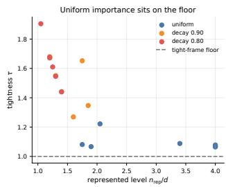

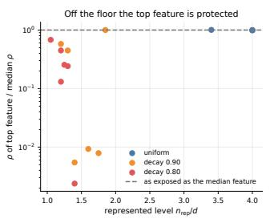

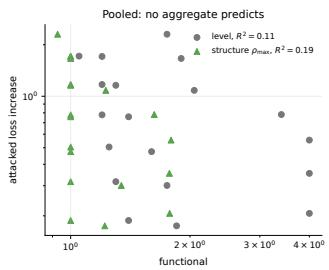  
Figure 10: Trained frames. Left: uniform importance holds tightness at the tight-frame floor. Middle: with decaying importance the most important feature’s interference falls far below the median feature’s. Right: pooled across families, neither the level nor the global worst-case interference tracks attacked loss.

$R ^ { 2 } = 0 . 1 9 \colon$ once importance is unequal, neither aggregate summarises the vulnerability, because both average over an allocation that has become uneven.

This is the trained counterpart of theorem $1 2 ( \mathrm { c } )$ , and it locates the regime in which the aggregate correlations reported in this literature hold. They are a property of equal importance, not a law about superposition; and the quantity that survives the change of regime is not an aggregate at all but the per-block exposure of a declared readout, which is what the rest of the paper measures. The models here are toy reconstruction networks under one attack, so the claim is about which functional identifies vulnerability in that setting, not about language models.

## 7 The audit in practice

The workflow runs with or without a learned dictionary, and its order matters more than any single quantity in it. Fibers are declared before outcomes are examined, split by semantic intent so that realizations of one intent never cross the training, validation and test sets. The score and its operating point are fixed next: layer, reader, threshold and policy category, using the matrix form (16) when a mechanism carries several categories at once. The contrast geometry follows, as $W _ { B }$ or the cross-Gram row where a dictionary is available and as the hidden diferences $d _ { k } = h ( x _ { k } ^ { \prime } ) - h ( x _ { k } )$ with $\begin{array} { r } { \widehat { \Sigma } _ { \Delta } = N ^ { - 1 } \sum _ { k } d _ { k } d _ { k } ^ { \top } } \end{array}$ where one is not. Reporting then follows the declared budget, $\rho$ for a featurecoordinate ball, κ for a hidden-distance ball and $r ^ { \top } \hat { \Sigma } _ { \Delta ^ { r } }$ for the observed contrast distribution. Repairability comes next, from $\chi$ and $\| r _ { \mathrm { i n v } } \|$ with a dictionary and from the regularization path and the reader norm in the covariance-only version. Regularization is selected on validation fibers under a utility floor fixed in advance, and the reader, threshold and regularizer are frozen before the single test evaluation. Where interventions are available, the observed order swaps are compared with (13), and the residual reports how far the linear control abstraction carries.

The geometry then names the work. Small current exposure calls for monitoring on held-out fibers. High $\rho$ with small $\chi$ and moderate $\| r _ { \mathrm { i n v } } \|$ is a reader that listens to more than it needs, so recalibration or a contrast regularized reader settles it. The same $\rho$ and $\chi$ with a large $\| r _ { \mathrm { i n v } } \|$ places the work on the regularized reader or on the representation, since exact cancellation there is nominal rather than usable. A large $\chi$ places it on the representation itself, through the encoder, an adapter or dedicated capacity. A large order-swap residual points at state-dependent or of-dictionary control behaviour, and a large leverage imbalance points at how capacity is allocated across the dictionary rather than at any single block.

Steps 3 to 5 apply per layer: running them at every depth, language, and safety category produces a layer-resolved repairability profile showing where the audit should attach and which layers admit a head-side repair at all. The natural attachment point is the window where $\chi _ { \ell }$ is near zero with moderate conditioning; a scored layer outside that window puts the repair budget on the representation rather than the head. Where that window sits is a measurement. Layer choice for multilingual steering has otherwise been made either heuristically or by an alignment and separability criterion evaluated on downstream generation [Al Ghussin et al., 2026]; $\chi _ { \ell }$ with the invariant-reader norm answers the prior question, whether a head-side repair exists at that depth. The premise the audit rests on, that same-meaning inputs share dictionary features across languages and scripts, is itself measurable [Karne, 2026], which is why the fibers are audited externally rather than inferred from feature overlap.

The dictionary-free regularized reader is the closed form of theorem 10 with $W _ { B } W _ { B } ^ { \top }$ replaced by $\widehat { \Sigma } _ { \Delta } \colon \mathrm { ~ a ~ }$ single linear solve against the ridgeregularized contrast covariance, renormalized so the calibration constraint holds exactly. For large hidden dimensions the solve can use a low-rank SVD, conjugate gradients, or a Woodbury identity rather than a dense inverse.

## 7.1 The audit on a real encoder

The calculus above is established on synthetic geometry. Here it runs once on a real encoder, in the covariance form that a single pooled layer supplies, to see which regime a deployed score occupies.

The setting is small and fully specified. The representation is the meanpooled final layer of a public multilingual sentence encoder $( d = 3 8 4 )$ , read through a fixed inference session. The fibers are 300 professionally translated FLORES-200 sentences, so same-meaning membership is external to the model and was fixed before any activation was computed: 4 languages are audited and 3 are held back entirely. The score is a zero-shot inner product with a fixed English query direction, which keeps the deployed map linear in the representation. Fibers, not sentences, are split, so no realization of one meaning appears in two splits.

The first measurement is the diagnosis. The audited contrast covariance, estimated on 150 training fibers, has rank 221 at 99% energy, and the deployed score direction lies almost entirely inside that span: $\kappa = 0 . 9 7 9$ of its unit norm. Exact invariance is therefore available in principle, and useless in practice: the minimum-norm invariant reader has norm 4.9, and applying it raises mean absolute drift on untouched test fibers by −47% while its correlation with the original English score falls to 0.26. The exact fix does not fail because the algebra is wrong; it fails because an estimated 221 dimensional annihilator is fitted noise, which is the ill-conditioned regime the triage is built to detect and the statistical failure a companion manuscript characterizes [Ahnouch, 2026].

The regularized reader of theorem 10, in the covariance form of the recipe above, is the response the triage prescribes. Selecting the ridge on validation fibers under a prespecified utility floor picks $\lambda = 3 . 1 6$ times the mean contrast eigenvalue, a reader of norm 1.07 rather than 4.9. On the untouched test split it lowers mean absolute drift from 0.122 to 0.114 on audited languages (7%) and from 0.213 to 0.186 on the languages never audited (13%), while the English score correlation stays at 0.92.

The regime that occurs here is the conditioning one: a real safety direction sat inside the language-contrast span, so the choice was between drift and reader norm rather than between drift and exact invariance. The reduction that carries to unaudited languages is of the same order as the audited one, which fits language contrasts sharing much of their geometry. A single pooled layer supports the covariance form of the calculus; the feature-coordinate constant $\rho _ { u , B }$ , the intrinsic exposure $\chi _ { B }$ against a declared block and the order-swap residual are measured on the synthetic stacks, where read and write directions are separate by construction. On one model, one layer, one score and one language family, the diagnosis is computable and discriminating on real activations.

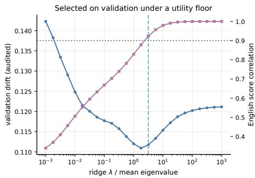

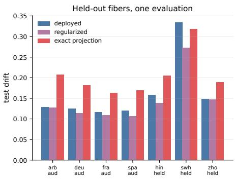  
Figure 11: The audit on a real encoder. Left: the validation frontier of the regularized reader, with the utility floor and the selected ridge. Right: mean absolute drift on untouched test fibers for the deployed direction, the selected reader, and the exact projection, by language.

## 8 Conclusion

One symptom, a refusal that holds in English and fails in translation, has three causes, and the audit gives each a number and an action. High current exposure ρ with low intrinsic exposure χ is a readout fault that recalibration or a least-change projection removes. Low χ with a large invariant-reader norm means the exact fix exists but is unstable, and a regularized reader buys usable conditioning. High χ admits no readout fix, and the repair budget belongs to the representation. Two limits frame every such audit: aggregate spectra never reveal where exposure sits, so the block must be measured directly, and total cross-talk has a floor that no readout optimization crosses.

The triage applies wherever an explicit score reads a shared representation, and section 7.1 runs its covariance form once on a real multilingual encoder, where the regime that occurred was the conditioning one. The next measurement the calculus asks for is a sparse-autoencoder audit whose read and write directions difer, where the order-swap residual is read from the stack itself.

## Scope

The results describe one scored layer treated as a local linear model, which is what keeps every quantity closed-form and checkable. The equivalence relation arrives from outside the model, as a scientific and governance judgment about which inputs deserve the same treatment. The synthetic study fixes dictionaries and heads by construction and draws contrasts symmetrically, so the two language directions are exchangeable and the three-regime diagnosis is checkable against a known ground truth, with each rate anchored to one operating point. The block B is audited as given, and every setter obeys its algebraic definition, apart from the untied stage, which injects nonlinear leakage to put the linear interface under stress. Within that setting, $\rho _ { u , B } ,$ $\kappa _ { u , B } , \sigma _ { \Delta } , \chi _ { B }$ and $\| r _ { \mathrm { i n v } } \|$ are the quantities an audit reports, and section 7.1 computes the subset that a single pooled layer supplies on a real encoder.

## Reproducibility Statement

A single deterministic command regenerates every table, figure, and numerical macro in this paper from local, explicitly seeded pseudorandom generators (PCG64), on CPU in float64; each of the eleven stages runs in a fresh process. Repeated runs on one machine reproduce the artifact manifest byte for byte. Across BLAS builds three machine-epsilon identity checks and two sweep correlations move in the last reported place or two, since those correlations depend on discrete ridge selections that a last-place diference can flip; the reported values are the released environment’s. The real-encoder pilot of section 7.1 is a separate, optional script with its own pinned model revision, single inference thread and committed outputs, so the manuscript builds without downloading a model. Figure PDF metadata is pinned, a SHA-256 manifest covers every generated artifact, and a provenance record accompanying the release fixes the interpreter and library versions. A regression suite covers the tie-aware AUC and threshold routines, the relativeleverage identity, the exact-invariance regimes, the ridge KKT condition, sample-level score matching, the drift identity, the explicit tied and untied order-swap compositions, the sensitivity constants, the global floor, and the macro/table generation contract. The code, data tables, and a data manifest are released with the paper, and every text used in them is public and benign.

## Ethics Statement

The work studies the safety of language models using public benign text throughout. In the synthetic study “language” is an abstract feature block, and the real-encoder pilot scores public professionally translated news sentences against one benign English query, so the release contains no harmful corpus. The claims concern a mathematical mechanism and the audit built on it. The work involves no human subjects or personal data. The proposed audit depends on externally specified semantic equivalence, so real deployments should include domain experts and native reviewers where language or culture is part of the fiber construction.

## References

Roza Aceska and McKenna Kaczanowski. Cross frame potential. arXiv preprint arXiv:2205.05613, 2022. doi: 10.48550/arXiv.2205.05613. URL https://arxiv.org/abs/2205.05613.

Mohammed Ahnouch. Interpolation is not invariance: High-dimensional generalization of readout repair from paired data. Manuscript under review, 2026.

Yusser Al Ghussin, Daniil Gurgurov, Tanja Baeumel, Josef van Genabith, Patrick Schramowski, and Simon Ostermann. Multilingual steering by design: Multilingual sparse autoencoders and principled layer selection. arXiv preprint arXiv:2605.23036, 2026. doi: 10.48550/arXiv.2605.23036. URL https://arxiv.org/abs/2605.23036. TrustNLP Workshop at ACL 2026.

Andy Arditi, Oscar Obeso, Aaquib Syed, Daniel Paleka, Nina Panickssery, Wes Gurnee, and Neel Nanda. Refusal in language models is mediated by a single direction. arXiv preprint arXiv:2406.11717, 2024. doi: 10. 48550/arXiv.2406.11717. URL https://doi.org/10.48550/arXiv.2406. 11717.

Martin Arjovsky, Léon Bottou, Ishaan Gulrajani, and David Lopez-Paz. Invariant risk minimization. arXiv preprint arXiv:1907.02893, 2019. doi: 10. 48550/arXiv.1907.02893. URL https://doi.org/10.48550/arXiv.1907. 02893.

Nora Belrose, David Schneider-Joseph, Shauli Ravfogel, Ryan Cotterell, Edward Raf, and Stella Biderman. LEACE: Perfect linear concept erasure in closed form. In Advances in Neural Information Processing Systems, volume 36, 2023. doi: 10.48550/arXiv.2306.03819. URL https://arxiv. org/abs/2306.03819.

John J. Benedetto and Matthew Fickus. Finite normalized tight frames. Advances in Computational Mathematics, 18:357–385, 2003. doi: 10.1023 A:1021323312367. URL https://doi.org/10.1023/A:1021323312367.

Joschka Braun, Carsten Eickhof, David Krueger, Seyed Ali Bahrainian, and Dmitrii Krasheninnikov. Understanding (un)reliability of steering vectors in language models. arXiv preprint arXiv:2505.22637, 2025. doi: 10.48550/arXiv.2505.22637. URL https://arxiv.org/abs/2505.22637. ICLR 2025 Workshop on Foundation Models in the Wild.

Trenton Bricken et al. Towards monosemanticity: Decomposing language models with dictionary learning. Transformer Circuits Thread, 2023. URL https://transformer-circuits.pub/2023/monosemantic-features/.

Ole Christensen. An Introduction to Frames and Riesz Bases. Birkhäuser, Cham, 2 edition, 2016. doi: 10.1007/978-3-319-25613-9. URL https: //doi.org/10.1007/978-3-319-25613-9.

Hoagy Cunningham, Aidan Ewart, Logan Riggs, Robert Huben, and Lee Sharkey. Sparse autoencoders find highly interpretable features in language models. arXiv preprint arXiv:2309.08600, 2023. doi: 10.48550/arXiv.2309. 08600. URL https://doi.org/10.48550/arXiv.2309.08600.

Yue Deng, Wenxuan Zhang, Sinno Jialin Pan, and Lidong Bing. Multilingual jailbreak challenges in large language models. In The Twelfth International Conference on Learning Representations, 2024. doi: 10.48550/arXiv.2310. 06474. URL https://openreview.net/forum?id=vESNKdEMGp.

Javid Ebrahimi, Anyi Rao, Daniel Lowd, and Dejing Dou. HotFlip: Whitebox adversarial examples for text classification. In Proceedings of the 56th Annual Meeting of the Association for Computational Linguistics (Volume 2: Short Papers), pages 31–36, Melbourne, Australia, 2018. Association for Computational Linguistics. doi: 10.18653/v1/P18-2006. URL https: //aclanthology.org/P18-2006/.

Yonina C. Eldar. Sampling with arbitrary sampling and reconstruction spaces and oblique dual frame vectors. Journal of Fourier Analysis and Applications, 9(1):77–96, 2003. doi: 10.1007/s00041-003-0004-2. URL https://doi.org/10.1007/s00041-003-0004-2.

Yonina C. Eldar and Ole Christensen. Characterization of oblique dual frame pairs. EURASIP Journal on Advances in Signal Processing, 2006:1–11, 2006. doi: 10.1155/ASP/2006/92674. URL https://doi.org/10.1155/ ASP/2006/92674.

Nelson Elhage, Tristan Hume, Catherine Olsson, Nicholas Schiefer, Tom Henighan, Shauna Kravec, Zac Hatfield-Dodds, Robert Lasenby, Dawn

Drain, Carol Chen, Roger Grosse, Sam McCandlish, Jared Kaplan, Dario Amodei, Martin Wattenberg, and Christopher Olah. Toy models of superposition. Transformer Circuits Thread, 2022. doi: 10.48550/arXiv.2209. 10652. URL https://transformer-circuits.pub/2022/toy\_model/ index.html.

Yaroslav Ganin, Evgeniya Ustinova, Hana Ajakan, Pascal Germain, Hugo Larochelle, François Laviolette, Mario Marchand, and Victor Lempitsky. Domain-adversarial training of neural networks. Journal of Machine Learning Research, 17(59):1–35, 2016. doi: 10.5555/2946645.2946704. URL https://jmlr.org/papers/v17/15-239.html.

Atticus Geiger, Duligur Ibeling, Amir Zur, Maheep Chaudhary, Sonakshi Chauhan, Jing Huang, Aryaman Arora, Zhengxuan Wu, Noah Goodman, Christopher Potts, and Thomas Icard. Causal abstraction: A theoretical foundation for mechanistic interpretability. Journal of Machine Learning Research, 26(83):1–64, 2025. doi: 10.48550/arXiv.2301.04709. URL https://www.jmlr.org/papers/v26/23-0058.html. Journal version; DOI shown for the arXiv version.

Ian J. Goodfellow, Jonathon Shlens, and Christian Szegedy. Explaining and harnessing adversarial examples. In International Conference on Learning Representations, 2015. doi: 10.48550/arXiv.1412.6572. URL https://arxiv.org/abs/1412.6572.

Liv Gorton and Owen Lewis. Adversarial examples are not bugs, they are superposition. In Advances in Neural Information Processing Systems (preprint), 2025. doi: 10.48550/arXiv.2508.17456. URL https://arxiv. org/abs/2508.17456.

Sripad Karne. How far do auto-interpretation labels generalize: A controlled study across languages, scripts, and rewordings. arXiv preprint arXiv:2606.00356, 2026. doi: 10.48550/arXiv.2606.00356. URL https: //arxiv.org/abs/2606.00356.

Jiaqian Li, Yanshu Li, and Kuan-Hao Huang. Steering vector fields for context-aware inference-time control in large language models. arXiv preprint arXiv:2602.01654, 2026. doi: 10.48550/arXiv.2602.01654. URL https://arxiv.org/abs/2602.01654.

Abigail Oppong, P Sam Sahil, Tadesse Destaw Belay, Maryam Ibrahim Mukhtar, Esmael Ahmed Abdu, Tassallah Abdullahi, Jessica Oparebea,

Saminu Mohammad Aliyu, Idris Abdulmumin, Abubakar Juma Chilala, Nicholaus Dismas Ladislaus, Alfred Malengo Kondoro, Lemofouet Valdini Douglace, Shamsuddeen Hassan Muhammad, and Seid Muhie Yimam. The illusion of cross-lingual safety in low-resource languages. arXiv preprint arXiv:2608.11146, 2026. doi: 10.48550/arXiv.2608.11146. URL https: //arxiv.org/abs/2608.11146.

Bruno Ordozgoiti, Antonis Matakos, and Aristides Gionis. Generalized leverage scores: Geometric interpretation and applications. arXiv preprint arXiv:2206.08054, 2022. doi: 10.48550/arXiv.2206.08054. URL https: //arxiv.org/abs/2206.08054.

Shauli Ravfogel, Michael Twiton, Yoav Goldberg, and Ryan Cotterell. Linear adversarial concept erasure. In Proceedings of the 39th International Conference on Machine Learning, 2022a. doi: 10.48550/arXiv.2201.12091. URL https://arxiv.org/abs/2201.12091.

Shauli Ravfogel, Francisco Vargas, Yoav Goldberg, and Ryan Cotterell. Kernelized concept erasure. In Proceedings of the 2022 Conference on Empirical Methods in Natural Language Processing, 2022b. doi: 10.48550/ arXiv.2201.12191. URL https://arxiv.org/abs/2201.12191.

Adam Scherlis, Kshitij Sachan, Adam S. Jermyn, Joe Benton, and Buck Shlegeris. Polysemanticity and capacity in neural networks. arXiv preprint arXiv:2210.01892, 2022. doi: 10.48550/arXiv.2210.01892. URL https: //arxiv.org/abs/2210.01892.

Emma V. Stein, Dominik Meier, Terry Ruas, Jan Philip Wahle, and Bela Gipp. BabelSteering: Multilingual safety alignment via English steering vectors. arXiv preprint arXiv:2608.16577, 2026. doi: 10.48550/arXiv.2608.16577. URL https://arxiv.org/abs/2608.16577.

Christian Szegedy, Wojciech Zaremba, Ilya Sutskever, Joan Bruna, Dumitru Erhan, Ian Goodfellow, and Rob Fergus. Intriguing properties of neural networks. arXiv preprint arXiv:1312.6199, 2014. doi: 10.48550/arXiv. 1312.6199. URL https://arxiv.org/abs/1312.6199.

Daniel Tan, David Chanin, Aengus Lynch, Dimitrios Kanoulas, Brooks Paige, Adria Garriga-Alonso, and Robert Kirk. Analyzing the generalization and reliability of steering vectors. arXiv preprint arXiv:2407.12404, 2024. doi: 10.48550/arXiv.2407.12404. URL https://arxiv.org/abs/2407.12404.

Adly Templeton, Tom Conerly, Jonathan Marcus, Jack Lindsey, Trenton Bricken, Brian Chen, Adam Pearce, Craig Citro, Emmanuel Ameisen, Andy Jones, Hoagy Cunningham, Nicholas L. Turner, Callum McDougall, Monte MacDiarmid, Alex Tamkin, Esin Durmus, Tristan Hume, C. Daniel Freeman, Theodore R. Sumers, Joshua Batson, Adam Jermyn, Shan Carter, Chris Olah, and Tom Henighan. Scaling monosemanticity: Extracting interpretable features from Claude 3 Sonnet. Transformer Circuits Thread, 2024. URL https://transformer-circuits.pub/2024/ scaling-monosemanticity/.

Eric Wallace, Shi Feng, Nikhil Kandpal, Matt Gardner, and Sameer Singh. Universal adversarial triggers for attacking and analyzing NLP. In Proceedings of the 2019 Conference on Empirical Methods in Natural Language Processing and the 9th International Joint Conference on Natural Language Processing, pages 2153–2162, Hong Kong, China, 2019. Association for Computational Linguistics. doi: 10.18653/v1/D19-1221. URL https://aclanthology.org/D19-1221/.

Wenxuan Wang, Zhaopeng Tu, Chang Chen, Youliang Yuan, Jen-tse Huang, Wenxiang Jiao, and Michael Lyu. All languages matter: On the multilingual safety of LLMs. In Findings of the Association for Computational Linguistics: ACL 2024, pages 5865–5877, Bangkok, Thailand, 2024. Association for Computational Linguistics. doi: 10.18653/v1/2024.findings-acl.349. URL https://aclanthology.org/2024.findings-acl.349/.

Xinpeng Wang, Mingyang Wang, Yihong Liu, Hinrich Schütze, and Barbara Plank. Refusal direction is universal across safety-aligned languages. arXiv preprint arXiv:2505.17306, 2025. doi: 10.48550/arXiv.2505.17306. URL https://doi.org/10.48550/arXiv.2505.17306.

Lloyd R. Welch. Lower bounds on the maximum cross correlation of signals. IEEE Transactions on Information Theory, 20(3):397–399, 1974. doi: 10.1109/TIT.1974.1055219. URL https://doi.org/10.1109/TIT.1974. 1055219.

Tom Wollschläger, Jannes Elstner, Simon Geisler, Vincent Cohen-Addad, Stephan Günnemann, and Johannes Gasteiger. The geometry of refusal in large language models: Concept cones and representational independence. arXiv preprint arXiv:2502.17420, 2025. doi: 10.48550/arXiv.2502.17420. URL https://arxiv.org/abs/2502.17420.

Zheng-Xin Yong, Cristina Menghini, and Stephen H. Bach. Low-resource languages jailbreak GPT-4. arXiv preprint arXiv:2310.02446, 2024. doi: 10.48550/arXiv.2310.02446. URL https://arxiv.org/abs/2310.02446.

## A Numerical protocol

Matched benchmark generator. The canonical safety writer is $e _ { 0 }$ . With $\beta = 0 . 2 2$ and $\gamma = \sqrt { 1 - \beta ^ { 2 } } .$ , every block column has the form $\beta e _ { 0 } + \gamma q _ { j }$ , so the deployed tied reader has exposure $\beta \sqrt { | \boldsymbol B | }$ in every family. The stable family uses orthonormal $q _ { j } ;$ the ill-conditioned family makes the final $q _ { j }$ nearly dependent on the others while retaining full column rank; the intrinsic family uses antipodal pairs as in theorem $7 .$ Each geometry receives an independent Haar rotation. For label $y ~ \in ~ \{ - 1 , + 1 \}$ the central hidden state is $h _ { 0 } = 0 . 7 8 y w _ { s } + \xi$ with $\xi \sim \mathcal { N } ( 0 , 0 . 1 1 ^ { 2 } I )$ , block coeficients are $c \sim \mathcal { N } ( 0 , 0 . 7 2 ^ { 2 } I )$ , and endpoint residuals have scale 0.10; all isotropic noise is generated before the family-specific rotation, which is what matches deployed scores sample by sample across families.

Untied generator. Each of the 8 systems draws unit writers, calibrated readers $r _ { i } = ( w _ { i } + 0 . 3 5 \zeta _ { i } ) / \langle w _ { i } + 0 . 3 5 \zeta _ { i } , w _ { i } \rangle$ with unit random $\zeta _ { i } ,$ and a leakage direction orthogonal to each writer. The actual setter adds the nonlinear term $\begin{array} { r } { \nu _ { i } ( \delta _ { i } ^ { 2 } + \frac { 1 } { 2 } \delta _ { i } \operatorname { t a n h } ( v _ { i } ^ { \top } h ) ) v _ { i } } \end{array}$ to the linear untied setter, with feature-specific strengths $\nu _ { i } ;$ pairwise residuals are estimated on 96 calibration states, and the held-out task composes three controls in forward and reverse schedules on 160 new states and targets.

## B Additional figures

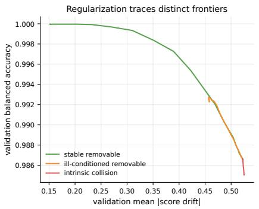

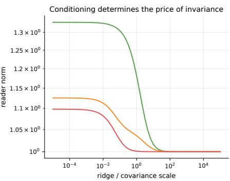  
Figure 12: Validation regularization frontiers behind table 1. The stable family approaches exact invariance at moderate reader norm; the ill-conditioned family pays rapidly increasing norm, so validation selects a partial repair; the intrinsic family returns to the deployed reader.

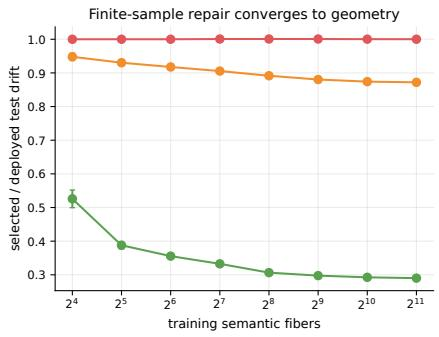

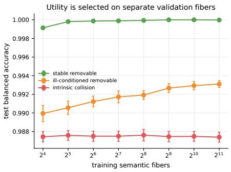  
Figure 13: Finite-sample learning curves: more audit pairs improve estimation, not geometry. The intrinsic family’s ratio is flat at 1.000 regardless of sample size.

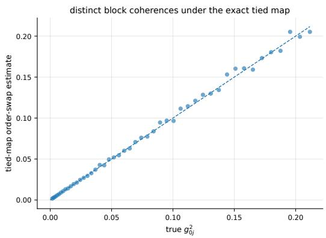  
Figure 14: Tied-map order-swap recovery of the 48 distinct squared block coherences; a consistency check of the ideal tied map, matching the closed form to $4 . 4 1 \times 1 0 ^ { - 1 6 }$

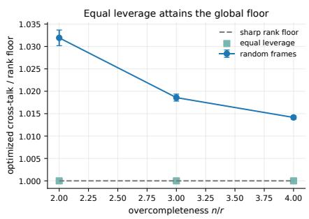

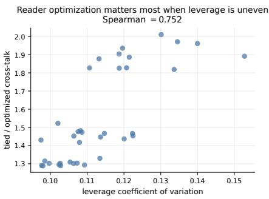  
Figure 15: The reader-optimized capacity floor of theorem 12(b). Equal leverage frames attain it exactly; the benefit of reader optimization over tied readers grows with leverage unevenness.