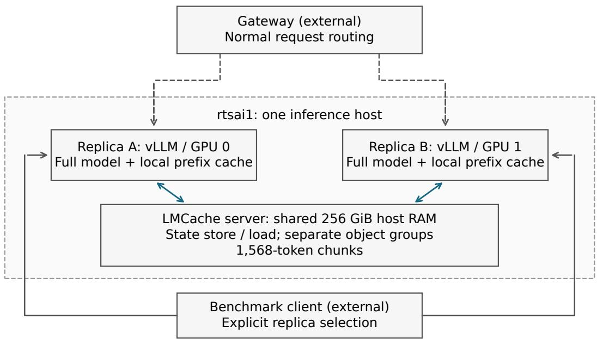
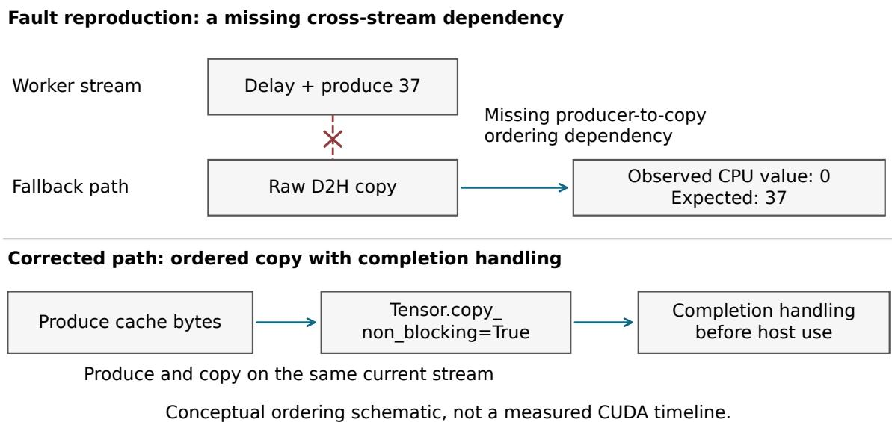
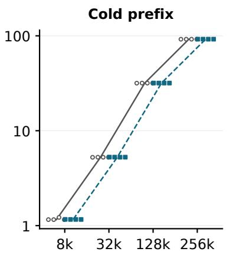
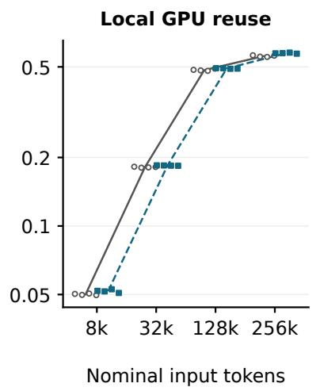
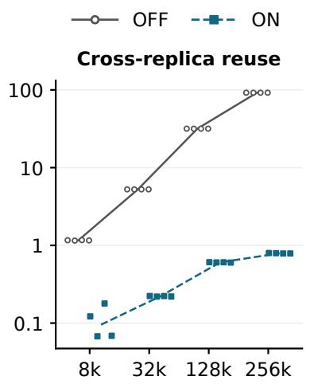
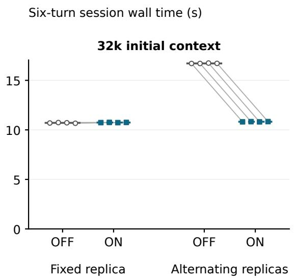
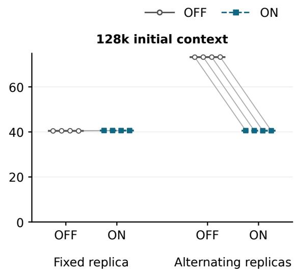

# Shared KV Caching for Replicated 27B Inference: Correctness Failures and Performance Boundaries

Frank Li

UNSW Sydney

research@n1a.net

## Abstract

Shared host-memory caching can avoid repeated prefill when a request moves between inference replicas. Its usefulness depends on both correct state transfer and lost prefix locality. We study two single-GPU 27B vLLM replicas sharing a 256 GiB LMCache pool. After adopting an existing packed-page patch, we isolate a raw-pointer fallback that omits the dependency on the current CUDA stream. Controlled byte tests fail under an imposed delay and pass when the dependency is restored; the existing mixed allocator provides a working deployment path. Full-pool allocation checks and service regression complete the validation. A four-block OFF–ON–ON–OFF comparison contains 768 measured requests within two block pairs. Median cross-replica time to first content token falls from 31.715 to 0.605 seconds at 128k input and from 92.047 to 0.790 seconds at 256k. Six-turn synthetic sessions alternating replicas improve by approximately 35% and 45% at initial contexts of 32k and 128k, while fixed placement shows little benefit. This engineering case study identifies practical validation steps and the locality conditions in which shared caching pays of.

## 1 Introduction

A multi-turn inference request commonly contains substantial context already processed in an earlier turn. A replica can reuse its local prefix state, but a diferent replica may need to recompute that prefix. This creates a concrete deployment choice: preserve request locality through placement, provide a shared state-reuse path, or combine both.

LMCache provides mechanisms for moving and reusing KV caches across requests and inference engines.[1] We examine two deployment questions: how to validate the resulting statetransfer path, and how its performance compares with preserving a conversation on its original GPU.

Two issues motivate the study. First, a cache can appear operational while returning incorrect state: an HTTP success or a hit counter is not an integrity check. Second, an impressive cold-versus-warm comparison can obscure a competitive alternative—retaining the conversation on its original GPU. A useful evaluation must therefore establish correctness before measuring performance and must retain local-hit baselines.

The study contributes a controlled diagnosis linking copy ordering to an allocator-selected fallback, validation across bytes, runtime helpers, full-size allocation and service responses, and paired measurements separating cold computation, local reuse and cross-replica reuse. Together, these results provide a concrete basis for configuring and evaluating shared caching in a replicated service.

## 2 System and Related Work

Figure 1 shows the gateway and two complete vLLM replicas on one inference host. Each replica occupies one GPU and performs both prefill and decode. In the shared configuration, both connect to one host-memory LMCache service. Each retains its own GPU prefix cache. This is not prefill/decode disaggregation, and the gateway does not serve as the KV-data storage tier.

LMCache provides the cache-transfer and reuse mechanisms; our study tests their execution in a fixed deployment.[1] Marconi addresses hybrid-state reuse constraints through admission and eviction policies.[2] We take the deployed runtime’s aligned recovery boundaries as given and test the transfer path used to preserve that state. Production characterization examines reuse patterns across real trafic and derives a workload-aware eviction policy.[3] Our synthetic workloads control prefix reuse and replica placement to isolate locality-dependent efects. The comparison is with local GPU caching on the same deployment, holding the existing policies fixed.

## 2.1 Evaluated configuration

Table 1 summarizes the evaluated configuration.

  
Figure 1: Two complete inference replicas share a local RAM cache. Dashed arrows show normal gateway request routing; the controlled benchmark selects replicas directly. State store/load trafic remains on the inference host. The diagram describes logical paths, not measured transport bandwidth.

Table 1: Evaluated configuration; current model files were verified on September 13. “FP8 KV” is a serving setting distinct from weight precision and recurrent-state representation.
<table><tr><td>Component</td><td>Recorded configuration</td></tr><tr><td>GPUs under test</td><td>Two NVIDIA RTX PRO 6000 Blackwell Server Edition GPUs; 97,887 MiB reported per device</td></tr><tr><td>Host CPU</td><td>Two AMD EPYC 9455 48-core processors; 192 logical CPUs; eight NUMA nodes</td></tr><tr><td>Driver Model identifier</td><td>610.57.04 Local alias qwen3.8-27b-nvfp4; export directory Qwen3.8-27B-NVFP4-v1; current</td></tr><tr><td>Text architecture</td><td>weights and metadata match fixed public kyaky/Qwen3.8-27B-NVFP4 [9] 64 layers: 48 Gated DeltaNet and 16 full attention; hidden size 5,120; full-attention</td></tr><tr><td>Weight precision</td><td>head dimension 256 and four KV heads [9, 10] Compressed-tensors export: FP8 large attention/GDN projections, NVFP4 MLP</td></tr><tr><td>Tokenizer</td><td>weights in layers 0–62, and retained higher-precision components including BF16 final-layer MLP and lm head</td></tr><tr><td></td><td>Exported Qwen2Tokenizer configuration, tokenizer JSON, and chat template; identifiers recorded in the post-experiment audit</td></tr><tr><td>Runtime Replica settings</td><td>vLLM 0.28.0; LMCache 0.5.4; PyTorch 2.13.0+cu129 Tensor parallelism 1; FP8 KV; HND layout; Mamba alignment; prefix caching</td></tr><tr><td></td><td>enabled</td></tr><tr><td>Scheduling limits Reported GPU-cache</td><td>8,192 batched tokens; 64 sequences; maximum model length 1,010,000 1,262 blocks and 1,957,941 cacheable tokens per replica, unchanged across four</td></tr><tr><td>capacity</td><td>blocks</td></tr><tr><td>Shared tier, ON only</td><td>256 GiB RAM; 1,568-token chunks; four kernel groups arranged into two object</td></tr><tr><td>Native RAM offload</td><td>groups; LRU Disabled in both arms</td></tr></table>

Runtime GPU capacity is reproduced as reported; the paper does not infer usable capacity by multiplying nominal block parameters. The host contains eight GPUs, but only GPUs 0 and 1 are the experimental replicas. Other host activity is addressed in Section 6.

On September 13, a complete SHA-256 audit matched the 23,285,140,684-byte weight file

and seven auxiliary files to public checkpoint revision 6de592a7a4a5618b87c952ab92928ee1 755bd9c6.[9] File metadata remained stable during reading. The publisher and retained local launcher identify the base as Qwen/Qwen3.8-27B, whose configuration also uses the implementation class Qwen3\_5ForConditionalGeneration.[10] This verifies current disk files; the September 12 performance run did not freeze full-weight hashes or an immutable export/calibration record. The dated full-weight audit supplements the earlier metadata audit.

The export mixes FP8 large attention/GDN projections (128×128 weight blocks and dynamic group-128 FP8 inputs) with group-16 NVFP4 MLP weights in layers 0–62. Those MLP groups have no input-activation quantization in the configuration; final-layer MLP, lm\_head, and other excluded components retain higher precision. “NVFP4” in the checkpoint name should not be read as uniform model-wide W4A4. Only text requests were evaluated.

## 2.2 Shared hybrid state and recovery boundaries

Here, “KV cache” includes hybrid decoding state recoverable at a common prefix boundary. Full attention contributes preceding K/V pages; Gated DeltaNet contributes boundary snapshots of convolution and recurrent state. vLLM manages these through its Mamba cache interface; that interface name does not change the model’s architecture.[11] The evaluated patch represents an entire recurrent page, including convolution state, recurrent state, and padding, as opaque addressable bytes. Its attention-shaped view does not imply per-token K/V or numerical INT8 quantization.[4]

LMCache kernel groups collect layers with compatible transfer layouts; object groups collect kernel groups for storage under shared window requirements.[11] Historical registration contains four kernel groups of 16 layers. Kernel groups 0– 2 have a 1,568-token window and map to object group 0; full-prefix attention kernel group 3 maps to object group 1. Registration indices difer from original decoder layer order. Under align, recovery requires both the needed attentionprefix blocks and the corresponding recurrent snapshot. A hit on the attention kernel group alone does not establish recovery of the entire hybrid state. The reported complete shareable prefix uses this aligned interpretation; byte equivalence across all kernel groups was not directly tested.

## 3 Correctness Failures and Repairs

## 3.1 Packed-page compatibility

An initial cross-replica response returned corrupted text despite HTTP 200 and 25,088 externally hit tokens. The compatibility investigation found that a logical full-attention block comprised multiple packed kernel pages. The original handling recognized rank-five attention tensors but omitted the relevant rank-four packed representation, resulting in an incorrect view of the bytes to transfer.

We adopted the existing upstream packedsubpage patch identified by commit f180b9ff ce7df45ce3037011d95a22db947fefcb, without additional local source modifications to that patch.[4] In the recorded 27B case, a 1,568- token logical block spans 49 pages of 32 tokens. The patch supplies a logical-block view and validates layout constraints. HND was required for the evaluated unmodified patch and vLLM/FlashInfer combination: the NHD startup attempt failed with a kernel-page-count divisibility error, reflecting a mismatch between the patch’s interpretation and the backend’s logical shape/strides. This is a configurationspecific requirement, not a general requirement of LMCache. The archived failure and patch explanation retain the evidence. This repair addresses representation and is distinct from the copy-ordering issue below.

## 3.2 A reproducible stream-ordering fault

After the representation repair and a separate workaround registering the entire host pool together, a 128k service failure remained. Identical token input produced alpha=938639 when cold or locally reused on A. B externally hit 127,008 tokens but returned 938624; B-local reuse retained the error. A new cache salt forced zero-hit cold computation on B without altering the input and restored the correct answer. These service controls directed the investigation toward shared-state transfer and reuse after the registration-boundary fault had been controlled.

The evaluated image lacks the LM-Cache CUDA-ops extension and follows a PyTorch fallback. Its raw-pointer lmcache\_memcpy\_async branch calls cudaMemcpy(..., cudaMemcpyDefault) without a current-stream argument; cudaMemcpyDefault is the copy-kind enum, not the function name.[5] The evaluated PyTorch stream pool

uses cudaStreamNonBlocking.[6] Thus the non-default stream carrying the reproduced gather/scatter dependencies is excluded from legacy default-stream implicit synchronization; host-side return from the copy does not establish the missing producer/consumer dependency.[7]

A 1 MiB device-to-host probe schedules a delayed write of byte value 37, then calls the fallback. Host memory receives the old value 0. A host-to-device probe schedules a read of the old value 0, then overwrites the temporary bufer with 53 through the fallback; the consumer reads 53 instead. Each probe reports 1,048,576 mismatching bytes. These are controlled integerbyte failures, not diferences attributable to floating-point arithmetic or language-model sampling.

Supplementary controls on September 13 hold the pinned host and GPU bufers fixed while varying only the ordering mechanism. Two independent processes on an idle third GPU of the same model test 4 KiB, 1 MiB and 16 MiB objects in both directions, using either zero or 108 CUDA sleep cycles, with ten trials per cell. The raw fallback fails all 120 delayed checks and passes all 120 undelayed checks. Three controls— waiting for the preceding stream work before the same fallback, using cudaMemcpyAsync on the current stream, and same-stream tensor copying—pass all 720 checks. Restoring ordering while retaining the bufers removes the reproduced fault. The imposed delay exposes the dependency; these counts are not production error rates.

The original helper-level probe exercises actual LMCache allocators and production GPU helpers. For a single 1 MiB uint8 object, the lazy path fails ten checks on GPU 0; the mixed path passes ten on GPU 0 and ten on GPU 1. Each set contains five checks per direction. This connects the byte mechanism to the branch used by the deployed configuration.

Figure 2 summarizes the ordering mechanism. Explicitly setting --no-l1-use-lazy selects the existing mixed allocator and its tensor-copy path. Removing the positive lazy flag alone is insuficient because the evaluated CLI defaults to lazy allocation.[5] The workaround bypasses the raw fallback, while completion handling still precedes host consumption.

Related upstream reports discuss stagingbufer ordering after tensor conversion and premature reuse of asynchronous-copy bufers.[13, 14] Those reports concern diferent transfer paths. Here, the controlled diagnosis isolates the lazy allocator’s raw-pointer fallback. Current-stream copying already exists in

LMCache’s native implementation; the explicitstream control checks that existing contract.[5]

## 3.3 Full-pool pinned allocation

A small mixed-allocator probe successfully pins memory, but the first 256 GiB service allocation falls back to pageable memory. The allocator requests 256 GiB plus 4096 bytes for alignment. The evaluated PyTorch host allocator’s powerof-two rounding can increase this request to 512 GiB.[8] The service log preserves a generic allocation failure rather than the complete underlying exception, so the evidence does not establish rounding as the sole possible cause.

Setting PYTORCH\_CUDA\_ALLOC\_CONF=pinned\_ max\_round\_threshold\_mb:128 limits largeallocation rounding without reducing the LM-Cache pool; the fixed allocator checks this threshold before rounding.[8] In an isolated process using the same image, the full 274,877,911,040- byte allocation reports is\_pinned()=true and completes in 38.973 seconds. The subsequently configured service initializes its pool in approximately 42 seconds without a pinned-allocation fallback warning.

Pinning and copy ordering are separate properties. The mixed/pageable stage already passes service regression; pinning addresses the actual memory path used for the final performance evaluation. The manuscript does not treat timings from the intermediate pageable stage as part of the final ON/OFF experiment.

## 3.4 Layered validation

Table 2 summarizes the validation layers and their scope.

The service checks cover the original failing long-context fixture, directional reuse, exact retrieval of inserted values, and interleaved multiturn sessions. They connect the runtime-path change to successful service regression.

## 4 Experimental Methodology

## 4.1 Comparison and isolation

The final screening uses four independently restarted blocks in the order OFF–ON–ON– OFF, forming two ON/OFF block pairs. OFF retains GPU prefix caching but removes the LMCache connector/dependency and stops the cache service. ON uses the repaired pinned configuration. Native RAM ofload is disabled in both; OFF is not the historical native-ofload deployment.

  
Figure 2: The upper panel illustrates the missing dependency reproduced by the device-to-host probe. The lower panel shows ordered tensor operations on the same current stream. This is a conceptual dependency diagram, not a profiler trace or a time-scaled reconstruction of the original failed service request. Host-side completion handling remains necessary before host consumption.

Table 2: Copy controls include the September 13 supplement; 120 undelayed raw checks also pass. September 12 service stages total 264 non-warmup requests, with 12 warmups recorded separately.
<table><tr><td>Layer</td><td>Recorded observation</td><td>Interpretation</td></tr><tr><td>Packed representation</td><td>Upstream compatibility tests pass after the adopted patch</td><td>Covers the tested logical-page layout</td></tr><tr><td>Copy-ordering controls</td><td>Delayed raw: 120/120 failures; ordered controls: 720/720 passes</td><td>Same buffers; three ways to restore ordering</td></tr><tr><td>Actual</td><td>Lazy: 10/10 failures; mixed: 20/20 passes</td><td>Tests a single object through the</td></tr><tr><td>allocator/helper Intermediate service</td><td>across two GPUs 207 non-warmup exact-answer requests pass</td><td>selected runtime path Mixed/pageable regression</td></tr><tr><td>stage Final pinned service</td><td>57 non-warmup exact-answer requests pass</td><td>Final configuration regression</td></tr><tr><td>stage Protocol checks</td><td>11 checks across the recorded stages pass</td><td>Tested tool-call and streaming</td></tr></table>

The evaluated model settings and reported GPU-cache capacity are held constant. Normal requests to both upstreams are placed in maintenance for measurement, and a guard records no need to reapply isolation. For single-request metric windows, prefix-query increments match the reported input-token count. Concurrent counters are interpreted only at window level.

Each block contains 192 measured requests and six warmups: 768 measured requests and 24 warmups in total. All 384 ON/OFF requestphase pairs match both payload SHA-256 and target GPU. The 624 retained fixture-file paths represent 312 unique payload digests; repeated phases reuse inputs, so the pair count is not a count of independent texts or deployments. Of the measured requests, 736 pass exact-value response assertions; 32 forced-length generation requests satisfy the specified 512/2048 outputtoken count, without semantic-quality scoring.

## 4.2 Workloads

Microbenchmarks use nominal input sizes of 8k, 32k, 128k, and 256k tokens; actual usage counts are retained. Synthetic file-like text contains three values near its beginning, middle, and end, requested as short JSON. Requests use temperature 0, seed 314159, thinking disabled, and a 64-token normal output limit. Each chain executes cold computation, two local reuses, cross-replica reuse, and receiver-local reuse. There are four paired chains per size across the two block pairs. All cold requests have zero local and external hits. At explicit cross-replica steps, the receiving GPU has zero local hits; ON hits

the complete shareable aligned prefix and OFF has zero external hits.

Session experiments start at 32k or 128k, append 1,055 tokens per later turn in the recorded inputs, and run for six turns. Responses contain short JSON with exact values. Canonical pregenerated history keeps ON/OFF inputs identical by inserting the expected JSON as the preceding assistant answer. This means later-turn success need not require retrieving the values from the original long prefix. Fixed and alternating placement use independent namespaces at the same nominal length target: actual initial counts are 31,991/31,993 and 128,000/127,980 tokens, respectively. They are not identical-payload pairs with each other. There are four paired sessions per size and routing condition.

Generation experiments use 8k/128k inputs, cold/hot prefixes, and ignore\_eos=true to force 512/2048-token outputs. This is a decode stress workload, not a validated normal long-answer task. Each cell has two paired observations, with GPU assignment swapped in the second block pair. Concurrent screening uses the same canonical-history construction with four or eight 32k-initial sessions of four turns each, under fixed and alternating placement. Each window contains only 16 or 32 requests, with two paired windows per condition.

## 4.3 Metrics and statistical units

TTFT is measured at the client from request initiation to the first received content token. It includes request handling and transport and is not a direct CUDA prefill or transfer timer. Decode rate is

$$
R _ { \mathrm { d e c o d e } } = \frac { N _ { \mathrm { o u t } } - 1 } { t _ { \mathrm { l a s t } } - t _ { \mathrm { f i r s t } } } .
$$

Here $N _ { \mathrm { o u t } }$ is the output-token count, and $t _ { \mathrm { f i r s t } }$ and $t _ { \mathrm { l a s t } }$ are the client-observed times of the first and last content tokens. SSE batching can afect this rate.

Session wall time includes request handling, client parsing, and recording, but excludes fixture-tokenization preparation and windowmetric collection. No artificial tool delay is inserted. It is not a coding-agent task-completion metric.

We report descriptive medians, individual observations, and the mean of 100 (ON/OFF 1) over matched units. Each cell contains four chain/session pairs or two generation/window pairs, nested within two independently restarted block pairs. Requests within a block share execution conditions. We therefore report the observed efects without confidence intervals or significance claims; request counts do not increase the number of independent block pairs.

## 4.4 Excluded trial

An initial attempt reused a namespace across input sizes, causing a purportedly cold 128k request to hit 10,976 local tokens. The assertion stopped the run. The complete afected block is archived and excluded; individual unfavorable measurements were not selectively removed. Namespaces were corrected to include size, caches were cleared through restarts, and the entire four-block screening was rerun.

## 5 Results

## 5.1 Locality determines the observed benefit

Figure 3 and Table 3 compare TTFT across locality conditions.

Cross-replica reuse removes most of the latency otherwise spent recomputing a long prefix on the receiving replica. At 128k and 256k, TTFT falls to approximately 0.605 and 0.790 seconds. This comparison is a controlled shared-prefix hit against a locally cold receiving replica, not an average over production trafic.

Cold medians remain close across arms. The 8k case retains a startup fluctuation, visible among the individual observations. First local reuse has ON-minus-OFF median diferences of approximately 2–17 ms across input sizes. These small diferences help describe the observed tradeof, but the experiment has too few independent blocks to estimate a stable overhead.

## 5.2 Session time

Figure 4 and Table 4 report the six-turn session times.

The session-level improvement is smaller than the isolated cross-replica TTFT improvement because the session includes initial cold computation and other work. Analysed separately, the two block pairs yield alternating-session reductions of 35.21–35.30% at 32k and 44.58–44.64% at 128k. This is a consistency check within the existing experiment. Fixed placement already preserves local prefix state, leaving little room for the shared path to help.

TTFT (s); independent log scales  

  
Figure 3: Cold, first local-reuse, and cross-replica TTFT. Points show four observations per configuration and input size; lines show medians. Horizontal ofsets separate configurations and observations and have no quantitative meaning. All y axes are logarithmic and independently scaled. Observations are nested within two paired blocks, not four independent machine allocations.

Table 3: Medians from four paired chains per nominal size. “Local” is the first same-replica reuse. Each chain contributes measurements to all three locality conditions.
<table><tr><td colspan="7">Nominal input OFF cold (s) ON cold (s) OFF local (s) ON local (s) OFF cross (s) ON cross (s)</td></tr><tr><td>8k</td><td>1.157</td><td>1.162</td><td>0.050</td><td>0.052</td><td>1.161</td><td>0.095</td></tr><tr><td>32k</td><td>5.254</td><td>5.265</td><td>0.181</td><td>0.184</td><td>5.252</td><td>0.221</td></tr><tr><td>128k</td><td>31.755</td><td>31.774</td><td>0.484</td><td>0.492</td><td>31.715</td><td>0.605</td></tr><tr><td>256k</td><td>92.108</td><td>92.188</td><td>0.557</td><td>0.574</td><td>92.047</td><td>0.790</td></tr></table>

  
Figure 4: Six-turn wall time at two initial context lengths. Thin lines connect each ON/OFF pair within a routing condition; short horizontal marks show medians. Fixed and alternating workloads use independent namespaces and are not cross-route payload pairs.

## 5.3 Long output and concurrency

Measured decode-rate changes span approximately −0.82% to +0.16%, with two paired observations per cell. All 32 forced-length outputs contain role-like delimiters and literal <think> strings, and full outputs difer in all 16 ON/OFF phase pairs. Cold/hot outputs match within each arm, including zero-hit cold computation, so the text diferences alone do not identify a cachetransfer fault. This workload compares rates at equal token counts; it does not assess normal long-answer quality or output equivalence.

Table 4: Four paired sessions per cell. Negative changes indicate shorter wall time.
<table><tr><td>Initial context</td><td>Placement</td><td>OFF median (s)</td><td>ON median (s)</td><td>Mean paired change</td></tr><tr><td>32k</td><td>Fixed</td><td>10.706</td><td>10.742</td><td>+0.36%</td></tr><tr><td>32k</td><td>Alternating</td><td>16.708</td><td>10.821</td><td>-35.26%</td></tr><tr><td>128k</td><td>Fixed</td><td>40.465</td><td>40.605</td><td>+0.34%</td></tr><tr><td>128k</td><td>Alternating</td><td>73.220</td><td>40.553</td><td>-44.61%</td></tr></table>

The short concurrency windows show substantially higher output tokens per second under alternating placement: mean paired gains are approximately 87% with four sessions and 78% with eight. Fixed-placement window throughput changes by less than 0.4% in the negative direction. These rates include initial cold prefill and come from only two short windows per condition; they are not steady-state decode capacity or robust tail-latency measurements.

## 6 Discussion and Limitations

The practical lesson is to validate representation, ordering and full-size allocation separately, then test service outcomes. Registration and cache-hit counters describe availability of a reuse path; byte probes establish whether a particular path preserves state. The controlled ordering intervention strengthens that diagnosis without requiring a new copying algorithm.

The performance result turns on locality. When the local prefix remains available, fixed placement provides nearly all the measured benefit. Shared RAM greatly reduces prefill after a controlled replica switch. This supports combining afinity with a shared reuse path where placement must change. Actual gateway afinity, load-driven migration and cache-pressure revisits remain to be evaluated.

The performance experiment uses one model configuration, one host and two block pairs. The two serving GPUs were isolated from normal requests, but the host was not exclusive: another GPU reached approximately 24% mean utilization in one suite window. CPU binding and host-memory page placement were not recorded. These conditions especially limit interpretation of fractional-percent diferences. Saturation beyond the 256 GiB pool, sustained open-loop capacity and cross-host sharing were not tested; native ofload was not a matched third arm.

Correctness evidence has distinct scopes. The copy probes test single byte objects rather than every registered kernel group. No transfer trace of the original failed service request was captured, so the probes do not attribute every historical failure to this fallback. Of the performance run’s 736 exact-answer checks, 448 later-turn requests already contain the expected values in assistant history, so those checks do not independently verify distant-prefix recovery. The separate 264-request repair regression retains its own fixtures and counts. The synthetic sessions use canonical histories with thinking disabled; they measure neither model quality nor real coding-agent task completion.

## 7 Conclusion

Two replicated 27B inference engines can reuse shared host-memory state efectively after the transfer path is validated. This deployment required an existing representation patch, an allocator choice that restores stream ordering, and a full-capacity pinned-allocation check. Controlled experiments show the largest benefit when a request moves to a replica without its prefix: long-context TTFT and alternating-session time fall substantially, while fixed placement gains little. The engineering result is a validated configuration and a method for distinguishing cache correctness from locality-dependent performance.

## Acknowledgements

The author acknowledges Research Technology Services, UNSW Sydney, for providing GPU resources on the Katana computational cluster [12] for model quantization.

AI assistance. OpenAI Codex assisted with developing and refining the experimental design, implementing and executing benchmark and diagnostic scripts, analysing results, and drafting and revising the manuscript. Anthropic Claude provided feedback on the manuscript. The author takes responsibility for the methods, results, and final text.

## References

[1] Yuhan Liu et al. LMCache: An Eficient KV Cache Layer for Enterprise-Scale LLM Inference. arXiv:2510.09665v2, 2025. Full text.

[2] Rui Pan et al. Marconi: Prefix Caching for the Era of Hybrid LLMs. MLSys, 2025. Proceedings record.

[3] Jiahao Wang et al. KVCache Cache in the Wild: Characterizing and Optimizing KVCache Cache at a Large Cloud Provider. USENIX ATC, 2025. Oficial record.

[4] LMCache contributors. Packed-subpage compatibility patch, commit f180b9ffce7df45c e3037011d95a22db947fefcb, associated with PR #4731. Locally preserved provenance and validation. Attribution refers to the adopted patch, not a claim about its current release status.

[5] LMCache contributors. Evaluated source commit 3e11b8ed191631e6f098b803 8235823f1a410b24: raw-pointer fallback, allocator-dependent GPU helpers, CLI defaults, and native current-stream copying.

[6] PyTorch contributors. Stream creation at evaluated commit cf30153c 4c131c8164ee7798e5022d810682e2cb: CUDAStream.cpp.

[7] NVIDIA. CUDA 12.9.1 default-stream synchronization semantics. This archived 12.9-family documentation supports the stream distinction; the recorded PyTorch +cu129 sufix does not identify the runtime’s exact patch version.

[8] PyTorch contributors. Host-allocation rounding at evaluated commit cf30153c 4c131c8164ee7798e5022d810682e2cb: CachingHostAllocator.h.

[9] Checkpoint publisher. kyaky/Qwen3.8-27B-NVFP4, revision 6de592a7a4a5618b87c952ab92928ee1 755bd9c6: model card, exported configuration. Cited for provenance/configuration, not its separate benchmark claims.

[10] Qwen contributors. Qwen/Qwen3.8-27B, configuration at revision 1d4bf0f2ff6012fd 82039f2fa52739d0dd7c60c0.

[11] Runtime state interfaces: vLLM Qwen implementation, source commit recovered and matched during the post-experiment audit; LMCache kernel/object grouping, corroborated by historical registration.

[12] PVC (Research Infrastructure), UNSW Sydney. Katana. UNSW, Sydney, 2010. doi:10.26190/669x-a286.

[13] LMCache contributors. Fallback stagingbufer and ordering discussion, issue #4155, July 2026; related pointer-residency change, PR #4575, August 2026.

[14] LMCache contributors. Engine-driven serialization and asynchronous-copy bufer lifetime repair, PR #4830, merged September 3, 2026.