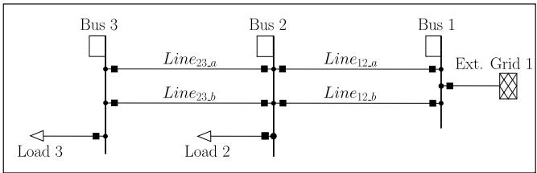
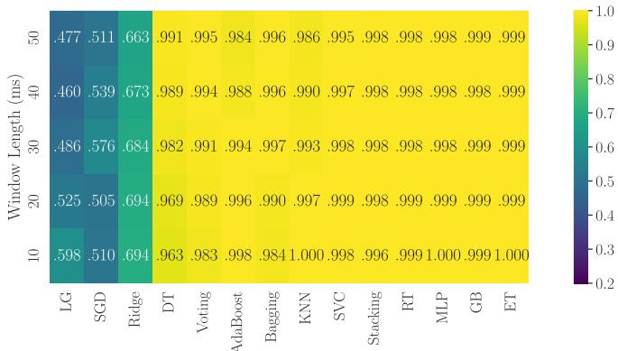
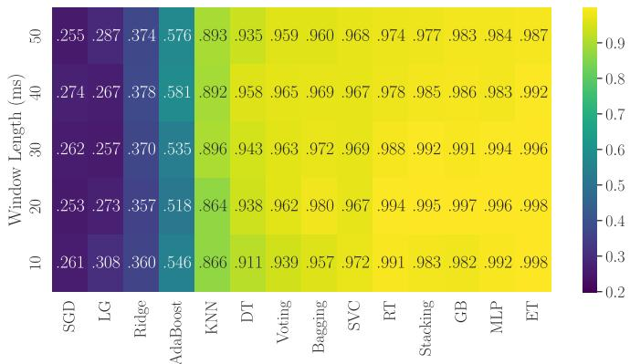
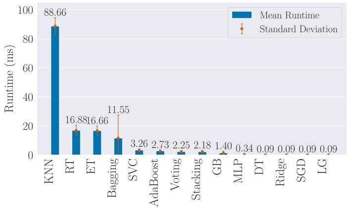

# A Systematic Evaluation of Machine Learning Methods for Fault Detection and Line Identification in Electrical Power Grids

Julian Oelhaf1\*, Georg Kordowich2, Paula Andrea Perez-Toro´ 1, Tomas Arias-Vergara´ 1, Andreas Maier1 Johann Jager¨ 2, Siming Bayer1

1Pattern Recognition Lab, Friedrich-Alexander-Universitat Erlangen-N ¨ urnberg¨

2Institute of Electrical Energy Systems, Friedrich-Alexander-Universitat Erlangen-N ¨ urnberg¨

Erlangen, Germany

\* corresponding author: julian.oelhaf@fau.de

Abstract—The integration of renewable energy sources into the electrical grid introduces complex challenges in fault detection and coordination of grid recovery mechanisms. Traditional relay protection systems, which operate based on static rules and predefined thresholds, are inadequate for addressing these challenges, particularly in detecting and isolating faults such as short circuits. Consequently, the conventional methodologies applied to electrical network protection frequently fail to achieve optimal performance in fault detection, especially in terms of adherence to safety standards and the selective limitation of damage. Recent research indicates that machine learning (ML)- based approaches can effectively tackle these issues; however, variations in grid configurations and analysis windows have impeded consistent comparative assessments. In this study, we assess the efficacy of various ML models in detecting electrical faults and pinpointing defective transmission lines within a 10 ms measurement interval—a critical time-frame for realtime operational viability, for the first time. The most effective model attained an F1 score of 0.991±0.018 and demonstrated a processing time of 0.342ms±0.509ms.

Index Terms—Electrical Grid, Fault detection, Fault Line Identification, Machine Learning, Time Series

## I. INTRODUCTION

In the context of the global drive for decarbonization, the accelerated integration of renewable and distributed energy sources is leading to significant changes in the electrical grid, with the potential to introduce unprecedented complexity and heighten the risk of faults [1]–[3]. The transmission line, a key component of the grid, is vulnerable to faults such as short circuits, equipment malfunctions, operator errors, and overloads. Power system protection plays a critical role in preventing outages by detecting these short circuits [4].

However, the increasing integration of renewable energy sources into existing electrical grids has introduced new challenges such as high degrees of meshing [5] or hybrid arrangements of AC and DC lines [6]. As a result, it has become increasingly difficult to ensure optimal performance in the areas of fault detection, sensitivity, and selectivity [7] by using traditional protection methods. These methods rely on fixed rules and thresholds to detect high currents caused by short circuits but struggle with nonlinear classification [3]. However, fault currents from renewable energy sources differ from those in traditional energy sources, affecting short-circuit levels and characteristics and therefore potentially causing malfunctions in conventional protection [4]. Conventional protection systems are also limited by their reliance on predefined scenarios, reducing their ability to handle unfamiliar conditions [3]. Historically, protection systems have been selfcontained, with little reliance on external measurement [8]. New systems have emerged as a solution based on the IEC 61850 communication standard [9], which leverage remote measurements from all protection systems to enhance grid protection, particularly in transmission lines. Deploying machine learning (ML) techniques in the electrical grid protection domain confers advantages, including the capacity for nonlinear classification, the acquisition of general competencies, and the ability to classify new network scenarios.

Fault detection, fault line identification, and fault localization are distinct yet interconnected tasks in power system protection, crucial for maintaining the reliability and safety of electrical systems [10]. Fault detection involves recognizing anomalous conditions, such as short circuits, that could disrupt power supply. Following this, fault line identification determines the specific section of the electrical grid where the fault occurs. In contrast, fault localization pinpoints the exact location of the fault along a line segment. This study focuses exclusively on fault detection and fault line identification, excluding fault localization.

The speed of fault detection is a critical factor in ensuring the prompt clearing of faults, which is essential for maintaining reliable and safe power system operation [11]. The VDEW (Verband der Elektrizitatswirtschaft) sets specific response¨ time requirements for protective systems in case of critical three-phase short-circuits: for extra-high voltage networks, the detection time should not exceed 25 ms, for high voltage networks 30 ms, and for medium voltage networks 40 ms [12]. The IEEE guide for determining fault location states that relays usually need to detect faults within 10 ms to 50 ms [10].

A substantial body of research focuses on fault detection in electrical grids. Sapountzoglou et al. [13] presented a deep learning (DL) method to detect and locate faults in lowvoltage distribution grids, analyzing the grid’s state 150 ms post-fault. Najafzadeh et al. [14] proposed a fault detection approach using a fuzzy logic model, applying thresholds derived from frequency signals collected by phase measurement units (PMUs).

Hou et al. [15] introduced a fault type classification method utilizing image augmentation. Rizeakos et al. [16] demonstrated a DL application for fault location identification and type classification in active distribution grids, processing data in 20-second batches. Mbey et al. [17] presented DL-based fault detection and classification methods combined with a fuzzy algorithm for smart distribution grids, incorporating virtual smart meters for enhanced data collection. Lastly, Kumar and Kundu [18] proposed an unsupervised ML approach for fault detection, employing K-Means clustering to differentiate between faulted and non-faulted lines.

Despite significant advancements in ML for detecting and accurately identifying faulty transmission lines in electrical grids, current approaches remain difficult to compare due to inherent differences in data simulation, preprocessing methods, and target metrics. Additionally, many studies do not accurately reflect realistic grid conditions, particularly regarding the real-world boundary conditions in grid topology. Last but not least, none of the published ML-based methods has been tested with the lower bound of the real-time condition, i.e., 10ms, has not been evaluated to the best of our knowledge.

This paper presents a systematic evaluation of ML models for fault detection and line identification in electrical power grids, focusing on three-phase short circuits in transmission lines. To ensure ML models can generalize well from a synthetic to a later real world dataset, domain randomization is applied to the generation of the electrical grid parameters. As speed is crucial for this task in protection relays, we compare each model’s fault detection performance over context windows ranging from 10 ms to 50 ms and analyze their runtime.

## II. METHODOLOGY

## A. Grid Topology and Data Generation

The dataset utilized in this study is generated using DIgSILENT’s PowerFactory software1, with the simulation conducted by an expert in electrical power engineering using an extended version of the presented framework in [19]. PowerFactory uses physics-based simulations to model complex interactions in electrical power systems, including transmission lines, loads, and fault conditions. To generate realistic data, we simulate grid dynamics with electromagnetic transient

  
Protection Relay

Fig. 1. “Double Line” electrical grid topology that is used for data simulation generated based on the network parameters in Tab. I

simulations. This provides instantaneous voltage and current values, which directly feed into our models, eliminating the need for transformation into the phasor-based values typically used in conventional protection systems.

The electrical grid simulation model is based on the “Double Line” topology illustrated in Fig. 1, a typical topology used for grid protection tests like in [20]. Key parameters of interest, such as settings from the external grid, loads, transmission line lengths, fault initiation time, fault duration, and the location of short circuits on transmission lines,were varied systematically. This study focuses exclusively on threephase faults which are the most severe but also less frequent, representing only 5% of the fault occurrences [11].

Each simulation, designated as an episode, is characterized by a distinct network and fault parameter configuration. The duration of each episode is 1 s. The sampling interval is set to 50 µs, which yields 20,000 time steps per episode. The fault initiation can occur at any time between 0.2 s and 0.5 s, with fault durations ranging from 5 ms to 600 ms and fault resistance varying from 0.1 Ω to 10 Ω. Additionally, both b lines are occasionally deactivated to ensure model robustness against topology changes.

In order to guarantee the reliability of each model in response to a variety of scenarios, the electrical grid simulation parameters presented in Tab. I are randomized using uniform distributions in accordance with the framework outlined in [19]. The rationale behind randomizing grid parameters, i.e., domain randomization, is to enhance the robustness of ML training and facilitate the domain shift from simulation to reality. The goal of the chosen parameters is to simulate adequately realistic grid, while covering a wide range of parameters, we based the range of the parameters on [21], [22]. The short circuit power was chosen to be in a relatively low range, representing future grids with inverter based resources. The angle ϕ of the external grid is randomized to avoid an alignment of the sinus waves across multiple simulations. To ensure the realism of the generated models, we ensure that the

R/X-ratio of all lines falls between 0.05 and 0.5, the load flow converges, and the simulation is numerically stable before, during and after the short circuit. The variability within these parameter ranges represents the operational diversity inherent in real world electrical grids.

TABLE I  
OVERVIEW OF PARAMETER VARIATION OF THE GRID MODEL.
<table><tr><td>Element</td><td>Parameter</td><td>Min. Value</td><td>Max. Value</td></tr><tr><td>Line Line</td><td>Length (km) Reactance  $X ^ { \prime } ~ ( \Omega / k m )$ </td><td>10 0.35</td><td>60 0.45</td></tr><tr><td>Line</td><td>Resistance  $R ^ { \prime } ~ ( \Omega ^ { \prime } / k m )$ </td><td>0.01</td><td></td></tr><tr><td>Line</td><td></td><td></td><td>0.20</td></tr><tr><td>Load</td><td>Capacitance  $C ^ { \prime } ~ ( n \dot { F } / k m )$ </td><td>8.50</td><td>10</td></tr><tr><td>Load</td><td> $P \ ( \mathrm { M W } )$ </td><td>20</td><td>50</td></tr><tr><td>Ext. Grid</td><td>Q (MVar)</td><td>-20</td><td>20</td></tr><tr><td>Ext. Grid</td><td>Shc. Power  $S _ { k } ^ { \prime \prime } \ ( \mathrm { M V A } )$ </td><td>90</td><td>1000</td></tr><tr><td></td><td>Voltage Setpoint  $V _ { s e t }       \ \mathrm { ( p u . ) }$ </td><td>0.95</td><td>1.05</td></tr><tr><td>Ext. Grid</td><td>Angle φ (deg)</td><td>-180</td><td>180</td></tr></table>

The “Double-Line” network model visualized in Fig. 1 consists of one external grid, two loads, and three buses connected by four transmission lines. Each transmission line is equipped with two protection relay (PR) devices, one at each end, measuring instantaneous values of current and voltage across three phases $( A , B , C )$ . The current and voltage measurements from the PR devices are represented as:

$$
I _ { P R } ( t ) = ( I _ { A } ( t ) , I _ { B } ( t ) , I _ { C } ( t ) ) , \quad t \in [ 0 , 1 ] \mathrm { s }\tag{1}
$$

$$
V _ { P R } ( t ) = ( V _ { A } ( t ) , V _ { B } ( t ) , V _ { C } ( t ) ) , \quad t \in [ 0 , 1 ] \mathrm { s }\tag{2}
$$

Here, I represents current and V represents voltage, with subscripts A, B, and C corresponding to the three phases. So on each transmission line two PR devices record voltage and current per time step, forming a multivariate time series represented as:

$$
X _ { L i n e } ( t ) = \left[ \begin{array} { l } { I _ { P R _ { - } 1 } ( t ) } \\ { V _ { P R _ { - } 1 } ( t ) } \\ { I _ { P R _ { - } 2 } ( t ) } \\ { V _ { P R _ { - } 1 } ( t ) } \end{array} \right] , \quad t \in [ 0 , 1 ] \mathrm { s }\tag{3}
$$

With two relay devices per transmission line, this results in twelve measurements per line. For four transmission lines, a total of 48 measurements are collected per time step, comprising a multivariate time series across all PR devices.

For each episode, we collect the labels and the corresponding electrical grid parameters. The labels consist of two components: fault start, which represents the time of the fault event (in seconds), and fault line, a categorical variable indicating the affected transmission line. In this context,fault start is used for fault detection, while fault line is leveraged for fault line identification.

## B. Data Preprocessing

To effectively train our models for fault detection, we preprocess the raw simulation data by trimming each episode to a range of ±80 ms around the fault start. This range is chosen to capture critical events just before and after the fault occurs. To simulate real-time constraints in a protection relay, we slide across the time series with a step size of 5 ms, ensuring that each snippet overlaps at least two segments. We evaluate the impact of varying window lengths: 10 ms, 20 ms, 30 ms, 40 ms, and 50 ms. A detailed overview of the number of time steps corresponding to these lengths is provided in Tab. II.

TABLE II  
OVERVIEW OF WINDOW LENGTHS AND RESULTING TIMESTEPS PER WINDOW, NUMBER OF WINDOWS, NUMBER OF WINDOWS CONTAINING A FAULT, AND NUMBER OF FEATURES PER WINDOW.
<table><tr><td>Window Length (ms)</td><td>Timesteps / Window</td><td># Windows</td><td># Fault Windows</td><td># Features / Window</td></tr><tr><td>10</td><td>200</td><td>15500</td><td>500</td><td>9600</td></tr><tr><td>20</td><td>400</td><td>14500</td><td>1500</td><td>19200</td></tr><tr><td>30</td><td>600</td><td>13500</td><td>2500</td><td>28800</td></tr><tr><td>40</td><td>800</td><td>12500</td><td>3500</td><td>38400</td></tr><tr><td>50</td><td>1000</td><td>11500</td><td>4500</td><td>48000</td></tr></table>

C. Machine Learning Models for Fault Detection and Line Identification

In this work, fault detection is treated as a binary classification task, while line identification is handled as a multiclass classification problem with four distinct categories. The feature space consists of a vector formed by concatenating simulated voltage and current data from the four transmission lines, as introduced in Eq. 3, over a specified window length. The number of features depends on the window length (see Tab. II). The input is a multivariate time series representing voltage and current data that captures grid behavior over this period.

To formulate the fault detection task as a binary classification problem, we label each window using fault start to indicate whether a three-phase short circuit fault occurs within the window. Specifically, a fault label is assigned if the condition $t _ { \mathrm { s t a r t } } + \epsilon < f a u l t _ { - }$ start $< t _ { \mathrm { e n d } } - \epsilon$ is met, where $t _ { \mathrm { s t a r t } }$ and $t _ { \mathrm { e n d } }$ represent the window’s start and end timestamps, and $\epsilon = 5 \mu \mathrm { s }$ ensures that the fault event is entirely contained within the window. If this condition is true, the label is 1; otherwise, it is 0.

Additionally, each window is associated with a fault line, represented as a categorical variable that indicates the affected transmission line where the fault occurred. The fault line is assigned as expressed in Eq. 4.

$$
f a u l t \_ l i n e \in \{ \mathrm { L i n e } _ { 1 2 \_ a } , \mathrm { L i n e } _ { 1 2 \_ b } , \mathrm { L i n e } _ { 2 3 \_ a } , \mathrm { L i n e } _ { 2 3 \_ b } \}\tag{4}
$$

To ensure a comprehensive evaluation, a diverse set of classifiers that are proposed in the literature such as Logistic Regression (LG), Ridge, Stochastic Gradient Descent (SGD), K-Nearest Neighbors (KNN) employed with $K = 5$ Multi-Layer Perceptron (MLP), and Support Vector Machines (SVM), alongside ensemble methods like AdaBoost, Bagging, ExtraTrees (ET), Histogram-based Gradient Boosting (GB), Random Forest (RF), Stacking, and Voting Classifiers are evaluated. All models are implemented using scikit-learn [23].

A 10-fold cross-validation is employed in all experiments, where each iteration utilizes a 9:1 training-to-test split to assess the robustness of the models. This ensures that each model is tested on unseen data during each iteration. Features are standardized by removing the mean and scaling to unit variance for uniform input representation. Evaluation metrics such as accuracy, precision, recall, sensitivity, specificity, and F1 score are calculated, with the F1 score reported due to its balance between sensitivity and specificity.

For fault detection, all extracted windows were used (Tab. II), but for fault line identification, only windows that contain faults were employed, as line identification is only possible after detecting a fault. To compare model run-time, the time taken for scaling and predicting a single window was measured over 5000 iterations, with mean and standard deviation reported.

## III. EXPERIMENTS AND RESULTS

The results of the fault detection evaluation are shown in Fig. 2. Of the 14 models tested, 11 achieved F1 scores above 0.96, regardless of the window size. However, LG, Ridge, and SDG performed poorly, with F1 scores below 0.69. The bestperforming models–ET, GB, MLP, RF, Stacking, and SVM– each achieved F1 scores up to 0.99 over all window lengths.

  
Fig. 2. Heatmap of the Fault Detection F1 Scores

Fig. 3 presents the results of the fault line identification task. Out of the 14 models tested, six achieved a mean F1 score above 0.96. In contrast, LG, Ridge, SDG, and AdaBoost underperformed (F1 scores≤0.58). More models struggled in this task compared to fault detection. The top-performing models–ET, GB, MLP, RF, and Stacking–consistently achieved a mean F1 score of up to 0.97.

The runtime experiments are carried out on an Intel® Core™ i7-13700K processor using standard Python. Each model runtime is tested by running 5000 iterations. The results are presented in Fig. 4. The three fastest models were Ridge, SDG and LG. Additionally, the KNN (K = 5) had the slowest runtime of 88.6±5.8 ms a stark outlier compared to the rest.

## IV. DISCUSSION

The results indicate that most models are effective regardless of the window length. Given the shortest window length of 10 ms the top-performing models – ET, GB, MLP, RF, Stacking, and SVM – achieved mean F1 scores of up to 0.99 for the fault detection and 0.98 for the fault line identification. The five best models can reliably detect faults and identify faulty lines using a measurement window equal to half a period at the standard frequency of 50 Hz.

  
Fig. 3. Heatmap of the Fault Line Identification F1 Scores

  
Fig. 4. Overview of Mean and Std. Runtime of each ML Model

The three fastest models performed the worst in both tasks, indicating that these models are too simple to detect or identify the fault. The fourth-fastest model was the Decision Tree with a runtime of 0.09 ms, its mean F1 scores of 0.96 and 0.91 for the fault detection and line identification tasks, respectively, were relatively low. The results indicate that the MLP, GB, and Stacking are the most effective models, exhibiting the highest F1 scores for both fault detection and line identification while also demonstrating competitive runtimes. The runtime for the MLP was 0.34 ms, the GB had a runtime of 1.40 ms and for the Stacking was 2.18 ms.

## V. CONCLUSION

This study presents a systematic evaluation of ML models for the detection of faults and identification of lines in electrical power grids, with a particular focus on three-phase short circuits in transmission lines. The results demonstrate that, in the specified scenarios, the majority of the evaluated models achieve exceptional scores when a window length of 10 ms is employed. Although discrepancies in recorded runtime were observed, this is dependent on the hardware utilized and warrants further investigation. The study is limited to a single grid, but future research will explore the transferability of pretrained models to different grids and extend the evaluation to other short-circuit types, including two-phase and grounding faults. Future work will also examine various grid topologies, load conditions, energy sources, multiple fault scenarios, and the models’ resilience to noisy or incomplete data to ensure reliability in diverse conditions.

## ACKNOWLEDGMENT

This project was funded by the Deutsche Forschungsgemeinschaft (DFG, German Research Foundation) - 535389056.

## REFERENCES

[1] E. Papadis and G. Tsatsaronis, “Challenges in the decarbonization of the energy sector,” Energy, vol. 205, p. 118025, 2020. [Online]. Available: https://linkinghub.elsevier.com/retrieve/pii/S0360544220311324

[2] VDE Verband der Elektrotechnik Elektronik Informationstechnik e.V., “Der zellulare ansatz - VDE studie,” 2015. [Online]. Available: www.vde.com/studie-zellularer-ansatz

[3] Protection and automation (B5) and A. distribution systems and distributed energy resources (C6), “Protection of distribution systems with distributed energy resources,” 2015. [Online]. Available: https://www.e-cigre.org/publications/detail/ 613-protection-of-distribution-systems-with-distributed-energy-resource html

[4] W.-K. Chen, The electrical engineering handbook. Elsevier Academic Press, 2005, OCLC: 57371415.

[5] M. Biller and J. Jaeger, “Protection algorithms for closed-ring grids with distributed generation,” IEEE Transactions on Power Delivery, vol. 37, no. 5, pp. 4042–4052, 2022. [Online]. Available: https://ieeexplore.ieee.org/document/9684980/

[6] J. Prommetta, J. Schindler, J. Jaeger, T. Keil, C. Butterer, and G. Ebner, “Protection coordination of AC/DC intersystem faults in hybrid transmission grids,” IEEE Transactions on Power Delivery, vol. 35, no. 6, pp. 2896–2904, 2020. [Online]. Available: https: //ieeexplore.ieee.org/document/9112359/

[7] R. Vaish, U. Dwivedi, S. Tewari, and S. Tripathi, “Machine learning applications in power system fault diagnosis: Research advancements and perspectives,” Engineering Applications of Artificial Intelligence, vol. 106, p. 104504, 2021. [Online]. Available: https: //linkinghub.elsevier.com/retrieve/pii/S0952197621003523

[8] M. Adamiak, A. Apostolov, M. Begovic, C. Henville, K. Martin, G. Michel, A. Phadke, and J. Thorp, “Wide area protection—technology and infrastructures,” IEEE Transactions on Power Delivery, vol. 21, no. 2, pp. 601–609, 2006. [Online]. Available: http://ieeexplore.ieee. org/document/1610668/

[9] I. E. Commission, “IEC 61850:2024 SER | IEC,” 2024. [Online]. Available: https://webstore.iec.ch/en/publication/6028

[10] IEEE Power and Energy Society, “IEEE guide for determining fault location on AC transmission and distribution lines.” [Online]. Available: http://ieeexplore.ieee.org/document/7024095/

[11] T. Gonen and Safari, an O’Reilly Media Company., Electric Power Distribution Engineering, 3rd Edition, 3rd ed. CRC Press, 2015, OCLC: 1105773230.

[12] G. Ziegler, Digitaler Distanzschutz: Grundlagen und Anwendung, 2nd ed. Publicis Corp. Publ, 2008.

[13] N. Sapountzoglou, J. Lago, B. De Schutter, and B. Raison, “A generalizable and sensor-independent deep learning method for fault detection and location in low-voltage distribution grids,” Applied Energy, vol. 276, p. 115299, 2020. [Online]. Available: https://linkinghub.elsevier.com/retrieve/pii/S0306261920308114

[14] M. Najafzadeh, J. Pouladi, A. Daghigh, J. Beiza, and T. Abedinzade, “Fault detection, classification and localization along the power grid line using optimized machine learning algorithms,” International Journal of Computational Intelligence Systems, vol. 17, no. 1, p. 49, 2024. [Online]. Available: https://link.springer.com/10.1007/s44196-024-00434-7

[15] S.-Z. Hou, W. Guo, Z.-Q. Wang, and Y.-T. Liu, “Deep-learningbased fault type identification using modified CEEMDAN and image augmentation in distribution power grid,” IEEE Sensors Journal, vol. 22, no. 2, pp. 1583–1596, 2022. [Online]. Available: https://ieeexplore.ieee.org/document/9638639/

[16] V. Rizeakos, A. Bachoumis, N. Andriopoulos, M. Birbas, and A. Birbas, “Deep learning-based application for fault location identification and type classification in active distribution grids,” Applied Energy, vol. 338, p. 120932, 2023. [Online]. Available: https://linkinghub.elsevier.com/retrieve/pii/S0306261923002969

[17] C. F. Mbey, V. J. Foba Kakeu, A. T. Boum, and F. G. Y. Souhe, “Fault detection and classification using deep learning method and neuro-fuzzy algorithm in a smart distribution grid,” The Journal of Engineering, vol. 2023, no. 11, p. e12324, 2023. [Online]. Available: https://ietresearch.onlinelibrary.wiley.com/doi/10.1049/tje2.12324

[18] A. R. Kumar and P. Kundu, “Faulted line identification in power network using unsupervised machine learning,” in 2023 10th IEEE International Conference on Power Systems (ICPS). IEEE, 2023, pp. 1–6. [Online]. Available: https://ieeexplore.ieee.org/document/10428707/

[19] M. Wang, G. Kordowich, and J. Jager, “A generic data generation¨ framework for short circuit detection training of neural networks,” in PESS + PELSS 2022; Power and Energy Student Summit. VDE, 2022, pp. 49–54. [Online]. Available: https://ieeexplore.ieee.org/document/ 10104226

[20] G. J. Meyer, T. Lorz, R. Wehner, J. Jaeger, M. Dauer, and R. Krebs, “Hybrid fuzzy evaluation algorithm for power system protection security assessment,” Electric Power Systems Research, vol. 189, p. 106555, 2020. [Online]. Available: https://linkinghub.elsevier.com/ retrieve/pii/S037877962030359X

[21] R. Roeper and Mitlehner, Friedrich, Kurzschlußstrome in Drehstromnet-¨ zen, 6th ed. Publicis Corporate Publishing, 1984.

[22] D. Oeding and B. R. Oswald, Elektrische Kraftwerke und Netze, 8th ed. Springer Berlin Heidelberg, 2016. [Online]. Available: http://link.springer.com/10.1007/978-3-662-52703-0

[23] F. Pedregosa, G. Varoquaux, A. Gramfort, V. Michel, B. Thirion, O. Grisel, M. Blondel, P. Prettenhofer, R. Weiss, V. Dubourg, J. Vanderplas, A. Passos, D. Cournapeau, M. Brucher, M. Perrot, and E. Duchesnay, “Scikit-learn: Machine learning in Python,” Journal of Machine Learning Research, vol. 12, pp. 2825–2830, 2011.