# A WEIGHTED KERNEL METHOD FOR APPROXIMATION THAT ADAPTS TOLEARNED MULTIVARIABLE STRUCTURE

JOHN E. DARGES AND LAURA WEIDENSAGER

Abstract. Approximating the input-output behavior of a multivariable black-box function from limited data is challenging when blind to the importance of its inputs and their interactions. We introduce total sensitivity kernels (TSKs), a method based on families of weighted ANOVA kernels that learn and adapt to this multivariable structure. TSKs parameterize the weights on each multivariable component of the target function by factors for each input. We propose learning these factors directly from function evaluations by selecting the reproducing kernel Hilbert space (RKHS) in which the target function has minimum norm. Under suitable conditions, we show that this norm-minimization problem admits a unique solution, and we establish consistency of a finite-data formulation based on minimum-norm interpolation. The learned TSK factors characterize the participation of individual inputs across interactions and main efects, providing a kernel-dependent notion of input sensitivity related to total Sobol indices. Numerical experiments demon strate that adapting the kernel to learned multivariable structure can substantially improve approximation accuracy over a standard product kernel.

Keywords: Adaptive kernel methods, multivariable approximation, ANOVA kernels, Weighted RKHS

## 1. Introduction

Consider approximating a black box function $f : \mathbb { R } ^ { d }  \mathbb { C }$ from a limited number of function evaluations. When f is high-dimensional, accurate approximation requires many function evaluations if the approximation method does not adapt to multivariable structure. For many functions in applications, some inputs are more influential than others and only certain groups of inputs interact strongly. Efective methods must exploit, within the budget, multivariable structure not known a priori.

We describe multivariable structure through the functional analysis of variance (ANOVA) decomposition [22, 50, 2, 29]. With respect to a product measure on the input domain, f can be decomposed into mutually orthogonal components

$$
f ( \pmb { x } ) = \sum _ { \pmb { u } \subseteq \{ 1 , \dots , d \} } f _ { \pmb { u } } ( \pmb { x _ { u } } ) .\tag{1.1}
$$

Each term $f _ { \pmb { u } } ( \pmb { x } _ { \pmb { u } } )$ represents the contribution of input groupings indexed by ${ \pmb u } \subseteq \{ 1 , \dots , d \}$ . With $2 ^ { d }$ subsets $\pmb { u } \subseteq [ d ]$ , the number of potentially relevant components grows exponentially with the input dimension.

Many functions in applications, however, have a low efective dimension [8, 34]. Functions with low efective dimension have most of their variation explained by a few ANOVA components. High-dimensional approximation is tractable if we can concentrate on the most relevant portion of the ANOVA components rather than treating them all equally.

As high-dimensional functions may possess exploitable low-dimensional structure, researchers have developed methods for structured approximation. High-dimensional model representations (HDMR) construct approximations from low-dimensional component functions by assuming that high-order interactions make small contributions [41]. Another approach estimates the efective dimension or variable importance to adapt anchored-ANOVA approximations [54]. Related ANOVA-based methods include Fourier approximation [39], random feature expansions [13, 40], and tensor train approximation [10]. These methods screen for or require tuning to important variables and interaction terms. The statistical learning community has used sparse learning and variable selection to identify the most relevant variables and interaction terms [4, 17]. Broadly, these methods impose, infer, or exploit a reduced structural representation of the target function.

Another perspective is to encode multivariable structure into the approximation space. One does this by constructing a norm that places weights on variables and interaction terms. Choice of weights imposes a geometry that aligns to a particular multivariable structure. Weighted function spaces appear in the analysis of high-dimensional integration to account for unequal importance of inputs and interactions [47]. Weighted ANOVA spaces use collections of weights $\{ \gamma _ { u } \} _ { u \subseteq [ d ] }$ to rescale contributions of a function’s multivariable components. Weights determine how strongly each component is penalized by the norm, so that the same target function has a very diferent norm depending on how well the weights align with its multivariable structure [38, 26]. Appropriate choice of weights explains tractability of quasi-Monte Carlo (QMC) integration in high dimensions [47, 15, 38]. Structured, parameterized weights, like product weights and product-orderdependent (POD) weights, assign weight values based on a shared set of weights on input variables and interaction order [28, 15]. Parameterized weights avoid having to assign $2 ^ { d }$ individual values for each weight. There is no all-encompassing method for selecting appropriate weights for QMC integration [31, 14].

In our setting, the goal is to select, using the limited function evaluations at hand, a weighted space suitable for high-dimensional approximation. We frame our approach in weighted reproducing kernel Hilbert spaces (RKHS), where the weights that determine the norm also determine the expression of the associated kernel function. Specifically, ANOVA kernels are our foundation. ANOVA kernels decompose into components associated with subsets of input variables and mirror the ANOVA decomposition (1.1)

$$
\kappa _ { \mathrm { A N O V A } } ( \boldsymbol { x } , \boldsymbol { y } ) = \prod _ { k = 1 } ^ { d } \left( 1 + \kappa _ { k } ( x _ { k } , y _ { k } ) \right) = \sum _ { u \subseteq \{ 1 , \ldots , d \} } \kappa _ { u } ( x _ { u } , y _ { u } ) ,\tag{1.2}
$$

see also [16]. Standard ANOVA kernels have unweighted components, but current statistical methods learn a sparse set of weights for the components [4, 1]. Weighted RKHSs have seen use in deterministic kernel-based approximation for partial diferential equations (PDE), with a set of structured weights chosen based on analytical properties of the PDE [24]. We aim to learn a factors for a weighted kernel that adapts the RKHS to the multivariable structure of the target function.

We introduce total sensitivity kernels (TSKs), a family of weighted ANOVA kernels whose component weights are determined by d parameters, called TSK factors, that represent the importance of each input.

$$
\kappa _ { \Sigma } ( \boldsymbol { x } , \boldsymbol { y } ) = \prod _ { k = 1 } ^ { d } \Big ( 1 - \Sigma _ { k } + \Sigma _ { k } \kappa _ { k } ( x _ { k } , y _ { k } ) \Big ) = \sum _ { \boldsymbol { u } \subseteq [ d ] } \gamma _ { \boldsymbol { u } } \kappa _ { \boldsymbol { u } } ( x _ { \boldsymbol { u } } , y _ { \boldsymbol { u } } ) , \qquad \gamma _ { \boldsymbol { u } } = \prod _ { k \in \boldsymbol { u } } \Sigma _ { k } \prod _ { l \not \in \boldsymbol { u } } ( 1 - \Sigma _ { l } ) .
$$

Like product weights in QMC, TSK factors parameterize the $2 ^ { d }$ ANOVA component weights. TSK factors define a parameterized family of RKHSs from which to choose the approximation space.. We choose TSK factors that determine the RKHS where the target function has minimal norm and so has geometry that aligns with the function’s multivariable structure. Under suitable conditions, we show that determining these weights is a strongly convex optimization problem and therefore admits a unique solution. The TSK method provides a principle for learning these parameters from available function evaluations. This population problem motivates a practical finite-data procedure where the norm of the unknown target is replaced by the norm of its minimum-norm interpolant. The finite-data objective is related to maximum likelihood estimation objectives that appear in Gaussian process methods such as automatic relevance determination (ARD) [53]. We establish theoretical consistency of the resulting finite-data objective. The method considered here is developed for deterministic approximation, so that function evaluations are assumed to be noise-free, and the input variables are assumed to be independent.

Structure of this work. We start with Section 2, where we introduce known results about kernel spaces and the ANOVA decomposition. In Section 3 we define our proposed kernel, a weighted kernel, which adapts to the multivariate structure of the target function. We state properties of this kernel, especially in Theorem 3.4 where we show strong convexity of our main objective which determines TSK factor optimality. Section 4 describes our main optimization algorithm in more detail and the numerical challenges that come with the algorithm. Finally, in Section 5 we give numerical results, which underpin the benefits of our proposed algorithm.

## 2. Background

We start with the introduction of some notation. We use boldface for vectors and matrices. Denote the domains $\mathbb { D } , \Omega \subseteq \mathbb { R }$ . Throughout, let $\pmb { x } \in \mathbb { D } ^ { d }$ and $\omega \in \Omega ^ { d }$ be d-dimensional vectors. We denote $[ d ] : = \{ 1 , \ldots , d \}$ and the index ${ \pmb u } \subseteq [ d ]$ indicates a subset of the inputs. For a vector x, the truncated vector $\pmb { x } _ { \pmb { u } } : = ( x _ { k } ) _ { k \in \pmb { u } }$ features only those inputs associated to u. If $\mathbf { x } ^ { i }$ is the ith point in a data set, we denote the kth entry as $\ v x _ { k } ^ { i }$

2.1. Reproducing Kernel Hilbert Spaces. Consider a feature map $\Phi : \mathbb { D } ^ { d } \times \Omega ^ { d } \to \mathbb { C }$ along with a probability measure τ on $\Omega ^ { d }$ . We take the feature map to be the Fourier map $\Phi ( x , \omega ) = \mathrm { e } ^ { \mathrm { i } \langle \omega , x \rangle }$ which, due to Bochner’s theorem [7, 23], induces a reproducing kernel $\kappa \colon  { \mathbb { D } ^ { d } } \times  { \mathbb { D } ^ { d } } \to  { \mathbb { C } }$ via

$$
\kappa ( \pmb { x } , \pmb { y } ) = \int _ { \Omega ^ { d } } \mathrm { e } ^ { \mathrm { i } \langle \omega , \pmb { x } - \pmb { y } \rangle } ~ \mathrm { d } \tau ( \omega ) .\tag{2.1}
$$

For comprehensive theory and properties of reproducing kernels, see [3, 11, 5]. We recall some basic properties and theories. There is a unique Hilbert space H associated with the kernel $\kappa \colon \mathbb { D } ^ { d } \times \mathbb { D } ^ { d }  \mathbb { C }$ , known as a reproducing kernel Hilbert space (RKHS) H of functions $f \colon  { \mathbb { D } ^ { d } } \to  { \mathbb { C } }$ , with the property that $\kappa ( { \pmb x } , \cdot ) \in \mathcal { H }$ , for all $\pmb { x } \in \mathbb { D } ^ { d }$ , and

$$
f ( \pmb { x } ) = \langle \kappa ( \pmb { x } , \cdot ) , f \rangle _ { \mathcal { H } } ,
$$

for all $\pmb { x } \in \mathbb { D } ^ { d }$ . The reproducing kernel κ has the key property that, for distinct points $\pmb { x } ^ { 1 } , \dotsc , \pmb { x } ^ { M } \in \mathbb { D } ^ { d }$ the $M \times M$ matrix $\kappa$ , where $K _ { i , j } ~ = ~ \kappa ( \pmb { x } ^ { i } , \pmb { x } ^ { j } )$ , is symmetric positive definite. Consider the operator $T \colon L _ { 2 } ( \Omega ^ { d } , \tau )  L _ { 2 } ( \mathbb { D } ^ { d } )$

$$
( T \beta ) ( \pmb { x } ) = \int _ { \Omega ^ { d } } \beta ( \pmb { \omega } ) \mathrm { e } ^ { \mathrm { i } \langle \pmb { \omega } , \pmb { x } \rangle } \mathrm { d } \tau ( \pmb { \omega } ) , \quad \beta \in L _ { 2 } ( \Omega ^ { d } , \tau ) .
$$

The image of T is the RKHS H. The norm of $f$ in the RKHS H is then

$$
\left\| f \right\| _ { \mathcal { H } } ^ { 2 } = \operatorname* { m i n } _ { T \beta = f } \left\| \beta \right\| _ { L _ { 2 } ( \Omega ^ { d } , \tau ) } ^ { 2 } .
$$

The function $\beta$ is called the spectral factor of $f .$ . In this work, we consider kernels with a tensor product structure. These are multivariable kernels that are the Fourier transform of a probability measure which corresponds to independently distributed random variables. The probability measure takes the form $\tau =$ $\tau _ { 1 } \otimes \cdots \otimes \tau _ { d }$ , where each $\tau _ { k }$ is a one-dimensional probability measure. The kernel can be written

$$
\kappa ( \pmb { x } , \pmb { y } ) = \int _ { \Omega ^ { d } } \mathrm { e } ^ { \mathrm { i } \langle \omega , \pmb { x } - \pmb { y } \rangle } \mathrm { d } \tau ( \omega ) = \prod _ { k = 1 } ^ { d } \int _ { \Omega } \mathrm { e } ^ { \mathrm { i } \omega _ { k } ( x _ { k } - y _ { k } ) } \mathrm { d } \tau _ { k } ( \omega _ { k } ) .\tag{2.2}
$$

We often take $\tau _ { k }$ to be continuous distributions.

Kernel learning is a subset of machine learning. It involves searching an RKHS for a function that closely approximates a target function or a set of data. An RKHS is the closure of the span of $\{ \kappa ( \pmb { x } , \cdot ) ; \pmb { x } \in \mathcal { X } \}$ . So kernel learning means approximating by an expansion $\begin{array} { r } { \sum _ { i = 1 } ^ { M } \beta _ { i } \kappa ( \pmb { x } _ { i } , \cdot ) } \end{array}$

2.2. Kernel ridge regression and generalization bounds. Kernel ridge regression (KRR) is a cornerstone algorithm for non-parametric function estimation. Consider a dataset $\{ ( \pmb { x } ^ { i } , f ^ { i } ) \} _ { i = 1 } ^ { M }$ . Here, each $x _ { i } \sim \mu$ is drawn identically and independently, while $f ( \pmb { x } ^ { i } ) = f ^ { i }$ . KRR finds an estimator $\hat { f } _ { \lambda }$ by minimizing the regularized empirical risk over the RKHS H [45, 51],

$$
\hat { f } _ { \lambda } = \underset { f \in \mathcal { H } } { \arg \operatorname* { m i n } } \frac { 1 } { M } \sum _ { i = 1 } ^ { M } \left( f ( \pmb { x } ^ { i } ) - f ^ { i } \right) ^ { 2 } + \lambda \left\| f \right\| _ { \mathcal { H } } ^ { 2 } ,
$$

where $\lambda > 0$ is the regularization parameter controlling the trade-of between data fit and generalization.

The theoretical performance of the estimator $\hat { f } _ { \lambda }$ is typically evaluated via its expected generalization error in $L _ { 2 } ( \mathbb { D } ^ { d } , \mu )$ . Assuming the true target function $f$ is contained within the RKHS $\mathcal { H } .$ standard results from statistical learning theory and integral operator techniques [9, 48] provide a high-probability upper bound on the squared $L _ { 2 } ( \mathbb { D } ^ { d } , \mu )$ error,

$$
\big \| \hat { f } _ { \lambda } - f \big \| _ { L _ { 2 } ( \mu ) } ^ { 2 } \leq \mathcal O \left( \frac { K ^ { 2 } \log ( 1 / \delta ) } { \lambda M } \right) + \lambda \left\| f \right\| _ { \mathcal H } ^ { 2 } ,\tag{2.3}
$$

where $K = \operatorname* { s u p } _ { \pmb { x } \in \mathbb { D } ^ { d } } \sqrt { \kappa ( \pmb { x } , \pmb { x } ) }$ bounds the kernel and $1 - \delta$ is the confidence level.

The bound in (2.3) decomposes the error into two competing terms. The first term represents the estimation error, which vanishes as the sample size $M \to \infty$ . The second term represents the approximation bias introduced by the Tikhonov regularization. Balancing these two terms optimally by setting $\lambda \sim 1 / \sqrt { M }$ yields an overall learning rate of $\mathcal { O } \big ( \| f \| _ { \mathcal { H } } M ^ { - 1 / 2 } \big )$

Equation (2.3) reveals a fundamental principle of kernel methods: the tightness of the generalization bound is strictly governed by the RKHS norm of the true function, $\| f \| _ { \mathcal { H } } .$ By tuning parameters to actively minimize the objective $\| f \| _ { \mathcal { H } } .$ we will explicitly minimize the leading constant of the approximation error in (2.3). This data-driven structural adaptation suppresses irrelevant dimensions and ensures highly sampleeficient learning, even in high-dimensional approximation settings.

## 3. Theory of total sensitivity kernels

In this section we propose the procedure to learn a kernel κ that adapts to the multivariable structure of the target function. The kernels take a form similar to ANOVA kernels (1.2). We modify the product kernel (2.2) by introducing tunable parameters that control input importance.

Definition 3.1. For each $k \in [ d ]$ , let $\kappa _ { k }$ be a univariate kernel. A total sensitivity kernel (TSK) is defined by

$$
\kappa _ { \Sigma } ( { \pmb x } , { \pmb y } ) = \prod _ { k = 1 } ^ { d } \big ( 1 - \Sigma _ { k } + \Sigma _ { k } \kappa _ { k } ( x _ { k } , y _ { k } ) \big ) .\tag{3.1}
$$

There, we denote the TSK factors $\Sigma = ( \Sigma _ { 1 } , \ldots , \Sigma _ { d } )$ , with $\Sigma _ { k } \in ( 0 , 1 )$ . Let $\mathcal { H } _ { \Sigma }$ be the RKHS associated to $\kappa _ { \Sigma }$ , with norm $\| \cdot \| _ { \Sigma }$

The TSK (3.1) takes an ANOVA form when we multiply out,

$$
\kappa _ { \Sigma } ( \boldsymbol { x } , \boldsymbol { y } ) = \sum _ { \boldsymbol { u } \subseteq [ d ] } \gamma _ { \boldsymbol { u } } \kappa _ { \boldsymbol { u } } ( x _ { \boldsymbol { u } } , \boldsymbol { y } _ { \boldsymbol { u } } ) , \quad \kappa _ { \boldsymbol { u } } = \prod _ { k \in \boldsymbol { u } } \kappa _ { k } , \gamma _ { \boldsymbol { u } } = \prod _ { k \in \boldsymbol { u } } \Sigma _ { k } \prod _ { l \not \in u } ( 1 - \Sigma _ { l } ) .
$$

Therefore, an input’s TSK factor being larger means that interaction terms corresponding to that input are weighted more. In this work, we let the univariate kernels be shift-invariant kernels, specifically those that come from characteristic functions,

$$
\kappa _ { k } ( x _ { k } , y _ { k } ) = \phi _ { k } ( x _ { k } - y _ { k } ) = \int _ { \Omega _ { k } } \mathrm { e } ^ { \mathrm { i } \omega _ { k } ( x _ { k } - y _ { k } ) } \mathrm { d } \tau _ { k } ( \omega _ { k } ) .
$$

Here, $\phi _ { k }$ is the characteristic function of a distribution $\tau _ { k }$ . Then, $\begin{array} { r } { \kappa _ { \pmb { u } } ( \pmb { x _ { u } } , \pmb { y _ { u } } ) = \prod _ { k \in \pmb { u } } \phi _ { k } ( x _ { k } - y _ { k } ) } \end{array}$

3.1. RKHS properties. We discuss the properties of the TSKs and characterize the corresponding RKHS.   
As a corollary of [3, Part I.6], we have the following lemma for the norm in a sum of RKHSs.

Lemma 3.2. Let $\kappa _ { \Sigma }$ be a TSK. For $f \in \mathcal { H } _ { \Sigma }$ , with corresponding RKHS norm $\| \cdot \| _ { \Sigma }$ , then

$$
\| f \| _ { \Sigma } ^ { 2 } = \operatorname* { m i n } _ { f = \sum _ { u } f _ { u } } \sum _ { u \subseteq [ d ] } \frac { 1 } { \gamma _ { u } } \| f _ { u } \| _ { \mathcal { H } _ { u } } ^ { 2 } , \quad f _ { u } \in \mathcal { H } _ { u } .\tag{3.2}
$$

Each RKHS $\mathcal { H } _ { u }$ corresponds to the kernel $\begin{array} { r } { \kappa _ { \pmb { u } } = \prod _ { k \in \pmb { u } } \kappa _ { k } } \end{array}$ with attached norm $\| \cdot \| _ { \mathcal { H } _ { u } }$

Proof. Each $\gamma _ { \pmb { u } } \kappa _ { \pmb { u } }$ is a kernel with an associated RKHS, which we denote $\mathcal { H } _ { \gamma , \boldsymbol { u } }$ with corresponding norm $\| \cdot \| _ { \gamma , { \pmb u } }$ . According to [3, Part I.6] about the sum of reproducing kernels, the norm of $f \in \mathcal { H } _ { \Sigma }$ is

$$
\Vert f \Vert _ { \Sigma } ^ { 2 } = \underset { f = \sum _ { u } f _ { u } } { \operatorname* { m i n } } \sum _ { u \subseteq [ d ] } \Vert f _ { u } \Vert _ { \mathcal { H } _ { \gamma , u } } ^ { 2 } , \quad f _ { u } \in \mathcal { H } _ { \gamma , u } .
$$

Yet, note that the class of functions comprising $\mathcal { H } _ { u }$ is the same as that of $\mathcal { H } _ { \gamma , \mathbf { u } } . \mathrm { ~ I f ~ } f \in \mathcal { H } _ { \gamma , \mathfrak { u } }$ , then we can express it as

$$
f = \sum _ { i = 1 } ^ { M } \alpha _ { i } ( \gamma _ { \pmb { u } } \kappa _ { \pmb { u } } ( \pmb { x } ^ { i } , \cdot ) ) .
$$

It is clear that $\begin{array} { r } { f = \sum _ { i = 1 } ^ { M } \beta _ { i } \kappa _ { \pmb { u } } ( \pmb { x } ^ { i } , \cdot ) } \end{array}$ , with $\beta _ { i } = \gamma _ { \pmb { u } } \alpha _ { i }$ so that $f \in \mathcal { H } _ { u }$ . The norm of $f$ in $\mathcal { H } _ { \gamma , \boldsymbol { u } }$ is

$$
\| f \| _ { \mathcal { H } _ { \gamma , u } } ^ { 2 } = \sum _ { i , \ell = 1 } ^ { M } \alpha _ { i } \alpha _ { \ell } \big ( \gamma _ { u } \kappa _ { u } ( x ^ { i } , x ^ { \ell } ) \big ) = \frac { 1 } { \gamma _ { u } } \sum _ { i , \ell = 1 } ^ { M } \beta _ { i } \beta _ { \ell } \kappa _ { u } ( x ^ { i } , x ^ { \ell } ) = \frac { 1 } { \gamma _ { u } } \| f \| _ { \mathcal { H } _ { u } } ^ { 2 } .
$$

Summing all terms gives

$$
\operatorname* { m i n } _ { f = \sum _ { u } f _ { u } } \sum _ { u \subseteq [ d ] } \| f _ { u } \| _ { \mathcal { H } _ { \gamma , u } } ^ { 2 } = \operatorname* { m i n } _ { f = \sum _ { u } f _ { u } } \sum _ { u \subseteq [ d ] } \frac { 1 } { \gamma _ { u } } \| f _ { u } \| _ { \mathcal { H } _ { u } } ^ { 2 } .
$$

This finishes the proof.

The lemma shows an immediate connection to the ANOVA decomposition. Due to the orthogonality of the terms in the ANOVA decomposition (1.1), there we have $\begin{array} { r } { \| f \| ^ { 2 } = \sum _ { \mathbf { \boldsymbol { u } } \subset [ d ] } \| f _ { \mathbf { \boldsymbol { u } } } \| ^ { 2 } } \end{array}$ . So, the RKHS norm $\| f \| _ { \Sigma }$ corresponding to the TSK $\kappa _ { \Sigma }$ resembles a weighted sum of ANOVA energies in the RKHS.

In the discussion of kernels of the form (2.1), we see every probability measure induces a kernel. TSKs are induced by a probability measure. This gives an alternative formulation of the kernel,

$$
\kappa _ { \Sigma } ( \boldsymbol { x } , \boldsymbol { y } ) = \int _ { \Omega ^ { d } } \mathrm { e } ^ { \mathrm { i } \langle \omega , \boldsymbol { x } - \boldsymbol { y } \rangle } ~ \mathrm { d } \tau _ { \Sigma } ( \omega ) , \quad \tau _ { \Sigma } = \sum _ { \boldsymbol { u } \subseteq [ d ] } \big ( \bigotimes _ { k \in \boldsymbol { u } } \Sigma _ { k } \tau _ { k } \bigotimes _ { k \notin \boldsymbol { u } } ( 1 - \Sigma _ { k } ) \delta _ { 0 } \big ) ,
$$

where $\delta _ { 0 }$ is the Dirac measure. This shows that a TSK is induced by a spike-and-slab distribution. We can interpret the TSK factor $\Sigma _ { k }$ as the probability of “activation” for the input $x _ { k }$

The TSK factors parameterize a family of probability measures, kernel functions, and RKHSs. Choosing TSK factors means choosing which RKHS to approximate $f$ in. What is the relationship between the RKHSs corresponding to two diferent sets of TSK factors? In fact, the RKHSs describe the same sets of functions, no matter how the TSK factors Σ are chosen. Changing TSK factors only changes the RKHS inner product. The following proposition states this in more detail.

Proposition 3.3. Consider a family of TSKs parameterized by Σ. Let $\Sigma \in ( 0 , 1 ) ^ { d }$ and $\widetilde { \Sigma } \in [ 0 , 1 ] ^ { d }$ . Then any $f \in \mathcal { H } _ { \widetilde { \Sigma } }$ is also a member of $\mathcal { H } _ { \Sigma }$

Proof. For each $f \in \mathcal { H } _ { \widetilde { \Sigma } }$ , there exists a spectral factor $\widetilde { \beta }$ in $L _ { 2 } ( \tau _ { \widetilde { \Sigma } } )$ such that

$$
f ( \pmb { x } ) = \int \widetilde { \beta } ( \pmb { \omega } ) \mathrm { e } ^ { \mathrm { i } \omega ^ { \top } \pmb { x } } \mathrm { d } \tau _ { \widetilde { \Sigma } } ( \pmb { \omega } ) = \sum _ { \pmb { u } \subseteq [ d ] } \widetilde { \gamma } _ { \pmb { u } } \int \widetilde { \beta } _ { \pmb { u } } ^ { 0 } \mathrm { e } ^ { \mathrm { i } \omega _ { \pmb { u } } ^ { \top } \pmb { x } _ { \pmb { u } } } \mathrm { d } \widetilde { \tau } _ { \pmb { u } } ( \pmb { \omega } _ { \pmb { u } } ) ,
$$

where $\tilde { \tau } _ { \boldsymbol { u } } : = \otimes _ { k \in \boldsymbol { u } } \tau _ { \tilde { \Sigma } _ { k } }$ and $\begin{array} { r } { \widetilde { \gamma } _ { \pmb { u } } = \prod _ { k \in \pmb { u } } \widetilde { \Sigma } _ { k } \prod _ { l \not \in \pmb { u } } ( 1 - \widetilde { \Sigma } _ { l } ) } \end{array}$ . Now, define the function

$$
\frac { \mathrm { d } \tau _ { \widetilde { \Sigma } } } { \mathrm { d } \tau _ { \Sigma } } ( \omega ) = \left\{ \begin{array} { l l } { \frac { \widetilde { \gamma } _ { 0 } } { \gamma _ { 0 } } , } & { \omega \in \Omega _ { \emptyset } } \\ { \frac { \widetilde { \gamma } _ { \{ 1 \} } } { \gamma _ { \{ 1 \} } } , } & { \omega \in \Omega _ { \{ 1 \} } } \\ & { \vdots } \\ { \frac { \widetilde { \gamma } _ { u } } { \gamma _ { u } } , } & { \omega \in \Omega _ { u } } \\ & { \vdots } \\ { \frac { \widetilde { \gamma } _ { \{ d \} } } { \gamma _ { \{ d \} } } , } & { \omega \in \Omega _ { \{ d \} } } \end{array} \right. .
$$

This function is piecewise constant on the $2 ^ { d }$ diferent sets $\Omega _ { u } \subset \mathbb { R } ^ { d }$ , with $\Omega _ { u } = \{ w \in \mathbb { R } ^ { d }$ : $\operatorname { s u p p } w = \pmb { u } \}$ For example, $\Omega _ { \emptyset } = \{ 0 \} , \ \Omega _ { \{ 1 \} } = \{ \omega \in \mathbb { R } ^ { d } \colon \omega _ { k } = 0 , \ k \neq 1 \}$ , and $\Omega _ { [ d ] } = \{ \omega \in \mathbb { R } ^ { d } \colon \omega _ { k } \neq 0 \}$ . The function $\frac { d \tau _ { \widetilde { \Sigma } } } { d \tau _ { \Sigma } } ( \omega )$ is the Radon-Nikodym derivative. This exists when $\tau _ { \widetilde { \pmb { \Sigma } } }$ is absolutely continuous with respect to $\tau _ { \pmb { \Sigma } }$ which is the case whenever $\Sigma \in ( 0 , 1 ) ^ { d }$ . With these we can write

$$
\begin{array} { l } { f ( { \pmb x } ) = \displaystyle \sum _ { { \pmb x } \subseteq [ d ] } \widetilde \gamma _ { { \pmb u } } \displaystyle \int _ { \Omega ^ { 1 \breve { \cup } } } \widetilde \beta _ { { \pmb u } } ^ { 0 } \mathrm { e } ^ { \mathrm { i } \omega _ { { \pmb u } } ^ { \top } { \pmb x } _ { { \pmb u } } } \mathrm { d } \widetilde \tau _ { { \pmb u } } ( \omega _ { { \pmb u } } ) = \displaystyle \sum _ { { \pmb u } \subseteq [ d ] } \gamma _ { { \pmb u } } \displaystyle \int _ { \Omega ^ { 1 \breve { \cup } } } \widetilde \gamma _ { { \pmb u } } \widetilde \beta _ { { \pmb u } } ^ { 0 } \mathrm { e } ^ { \mathrm { i } \omega _ { { \pmb u } } ^ { \top } { \pmb x } _ { { \pmb u } } } \mathrm { d } \widetilde \tau _ { { \pmb u } } ( \omega _ { { \pmb u } } ) } \\ { = \displaystyle \int \widetilde \beta ( \omega ) \mathrm { e } ^ { \mathrm { i } \omega ^ { \top } { \pmb x } } \displaystyle \frac { d \tau _ { { \widetilde \Sigma } } } { d \tau _ { \Sigma } } ( \omega ) \mathrm { d } \tau _ { \pmb u } ( \omega _ { \pmb u } ) . } \end{array}
$$

This shows that f can be expressed through the new spectral factor $\begin{array} { r } { \beta = \widetilde { \beta } \frac { \mathrm { d } \tau _ { \widetilde { \Sigma } } } { \mathrm { d } \tau _ { \Sigma } } } \end{array}$ in $\mathcal { H } _ { \Sigma }$ . To ensure $f \in \mathcal { H } _ { \Sigma }$ we verify that $\beta \in L _ { 2 } ( \Omega , \tau _ { \Sigma } )$ . Let $\begin{array} { r } { m : = \operatorname* { m a x } _ { \pmb { u } \subseteq [ d ] } \frac { \widetilde { \gamma } _ { \pmb { u } } } { \gamma _ { \pmb { u } } } < \infty } \end{array}$ . Then,

$$
\| \beta \| _ { L _ { 2 } ( \tau _ { \Sigma } ) } ^ { 2 } = \int | \widetilde { \beta } | ^ { 2 } \left( \frac { d \tau _ { \widetilde { \Sigma } } } { d \tau _ { \Sigma } } \right) ^ { 2 } d \tau _ { \Sigma } \leq m \int | \widetilde { \beta } | ^ { 2 } \frac { d \tau _ { \widetilde { \Sigma } } } { d \tau _ { \Sigma } } d \tau _ { \Sigma } = m \| \widetilde { \beta } \| _ { L _ { 2 } ( \tau _ { \widetilde { \Sigma } } ) } ^ { 2 } < \infty .
$$

Since $\beta$ has a finite RKHS norm under $\tau _ { \pmb { \Sigma } }$ , we conclude $f \in \mathcal { H } _ { \Sigma }$

Choosing which RKHS we approximate f in, across all TSK factors in $( 0 , 1 ) ^ { d }$ , is then a well-posed question. It is impossible for the target to be in one RKHS but not another.

Theorem 3.4. Let $f \in L _ { 2 } ( \mathbb { D } ^ { d } , \mu )$ with $f \ \ne \ 0$ , where $\begin{array} { r } { \mu ( \pmb { x } ) = \prod _ { k = 1 } ^ { d } \mu _ { k } ( x _ { k } ) } \end{array}$ is a non-degenerate, onedimensional probability measure $\mu _ { k }$ . Assume that the kernels $\kappa _ { k }$ are continuous strictly positive definite kernels. For the TSK $\kappa _ { \Sigma }$ from (3.1) denote the constants

$$
C _ { k } : = \int _ { \mathbb { D } ^ { 2 } } \kappa _ { k } ( s , t ) \mathrm { d } \mu _ { k } ( s ) \mathrm { d } \mu _ { k } ( t ) .
$$

Then $0 < C _ { k } < 1$ and the function $g ( \Sigma ) = \| f \| _ { \Sigma } ^ { 2 }$ is strongly convex on $( 0 , 1 ) ^ { d }$

Proof. The constants $C _ { k }$

First, we need to show each constant $C _ { k }$ is contained in (0, 1). We can write $\kappa _ { k } ( s , t ) ~ = ~ \phi _ { k } ( s - t ) ~ =$ $\begin{array} { r } { \int _ { \Omega } \mathrm { e } ^ { \mathrm { i } \omega ( s - t ) } \mathrm { d } \tau _ { k } ( \omega ) } \end{array}$ since $\phi _ { k }$ is a characteristic function. Then

$$
C _ { k } = \int _ { \mathbb { R } ^ { 2 } } \kappa _ { k } ( s , t ) \mathrm { d } \mu _ { k } ( s ) \mathrm { d } \mu _ { k } ( t ) = \int _ { \mathbb { R } ^ { 2 } } \int _ { \Omega } \mathrm { e } ^ { \mathrm { i } \omega ( s - t ) } \mathrm { d } \tau _ { k } ( \omega ) \mathrm { d } \mu _ { k } ( s ) \mathrm { d } \mu _ { k } ( t ) = \int _ { \Omega } | \hat { \mu } _ { k } ( \omega ) | ^ { 2 } \mathrm { d } \tau _ { k } ( \omega ) ,
$$

where $\hat { \mu } _ { k }$ is the Fourier transform of the distribution $\mu _ { k }$ of the k-th input. Because $\mu _ { k }$ is a probability measure, $\hat { \mu } _ { k } ( \omega )$ is continuous with $\hat { \mu } _ { k } ( 0 ) = 1$ . Consequently, there exists a neighborhood around the origin where $| \hat { \mu } _ { k } ( \omega ) | ^ { 2 } > 0$ . Assuming the support of $\tau _ { k }$ includes the origin, this guarantees $C _ { k } > 0$ . Furthermore, because $| \hat { \mu } _ { k } ( \omega ) | ^ { 2 } \leq 1$ , the integral reaches its theoretical maximum of $C _ { k } = 1$ if and only if $| \hat { \mu } _ { k } ( \omega ) | ^ { 2 } = 1$ holds τk-almost everywhere. This condition implies that $\mu _ { k }$ is not a degenerate distribution. By assuming $\mu _ { k }$ is not a pathological distribution, like the Dirac delta distribution, we strictly ensure $0 < C _ { k } < 1$

Decomposition of the kernel $\kappa { \bf { \_ } } :$

Denote the centered kernels as

$$
\begin{array} { r l } & { \widetilde { \kappa } _ { k } ( x _ { k } ^ { i } , x _ { k } ^ { j } ) : = \kappa _ { k } ( x _ { k } ^ { i } , x _ { k } ^ { j } ) - \frac { \int _ { \mathbb { D } } \kappa _ { k } ( x _ { k } ^ { i } , s ) \mathrm { d } \mu _ { k } ( s ) \int _ { \mathbb { D } } \kappa _ { k } ( s , x _ { k } ^ { j } ) \mathrm { d } \mu _ { k } ( s ) } { \int _ { \mathbb { D } ^ { 2 } } \kappa _ { k } ( s , t ) \mathrm { d } \mu _ { k } ( s ) \mathrm { d } \mu _ { k } ( t ) } } \\ & { \quad \quad \quad = \kappa _ { k } ( x _ { k } ^ { i } , x _ { k } ^ { j } ) - \frac { \nu _ { k } ( x _ { k } ^ { i } ) \nu _ { k } ( x _ { k } ^ { j } ) } { C _ { k } } , \quad \nu _ { k } ( x _ { k } ^ { i } ) : = \int _ { \mathbb { D } } \kappa _ { k } ( x _ { k } ^ { i } , s ) \mathrm { d } \mu _ { k } ( s ) , } \end{array}
$$

see also [16] for the introduction of these zero-mean kernels. This is an orthogonal decomposition of the kernel $\kappa _ { k }$ into a part with mean zero and the orthogonal complement with respect to the RKHS norm. Let $\mathcal { X } = \{ \pmb { x } ^ { 1 } , \ldots , \pmb { x } ^ { M } \}$ be a finite collection of points in $\mathbb { D } ^ { d }$ . Each $\tilde { \kappa } _ { k }$ is positive definite, since

$$
\begin{array} { r l } { \displaystyle \sum _ { i , j = 1 } ^ { M } a _ { i } a _ { j } \tilde { \kappa } _ { k } ( x _ { k } ^ { i } , x _ { k } ^ { j } ) = \displaystyle \sum _ { i , j = 1 } ^ { M } a _ { i } a _ { j } \left( \kappa _ { k } ( x _ { k } ^ { i } , x _ { k } ^ { j } ) - \frac { \nu _ { k } ( x _ { k } ^ { i } ) \nu _ { k } ( x _ { k } ^ { j } ) } { C _ { k } } \right) } & { } \\ { = \| \displaystyle \sum _ { i = 1 } ^ { M } a _ { i } \kappa _ { k } ( x _ { k } ^ { i } , \cdot ) \| _ { \mathcal { H } _ { k } } ^ { 2 } - \frac { 1 } { C _ { k } } \displaystyle \sum _ { i , j = 1 } ^ { M } a _ { i } a _ { j } \langle \nu _ { k } , \kappa _ { k } ( x _ { k } ^ { i } , \cdot ) \rangle _ { \mathcal { H } _ { k } } \langle \nu _ { k } , \kappa _ { k } ( x _ { k } ^ { j } , \cdot ) \rangle _ { \mathcal { H } _ { k } } } & { } \\ { = \| \displaystyle \sum _ { i = 1 } ^ { M } a _ { i } \kappa _ { k } ( x _ { k } ^ { i } , \cdot ) \| _ { \mathcal { H } _ { k } } ^ { 2 } - \frac { \langle \nu _ { k } , \sum _ { i = 1 } ^ { M } a _ { i } \kappa ( x _ { k } ^ { i } , \cdot ) \rangle _ { \mathcal { H } _ { k } } ^ { 2 } } { \| \nu _ { k } \| _ { \mathcal { H } _ { k } } ^ { 2 } } \geq 0 , } & { } \end{array}
$$

where the last inequality follows from the Cauchy-Schwarz inequality.

We write the TSK $\kappa _ { \Sigma }$ as

$$
\kappa _ { \Sigma } ( x ^ { i } , x ^ { j } ) = \prod _ { k = 1 } ^ { d } \Big ( 1 - \Sigma _ { k } + \frac { \Sigma _ { k } \nu _ { k } ( x _ { k } ^ { i } ) \nu _ { k } ( x _ { k } ^ { j } ) } { C _ { k } } + \Sigma _ { k } \tilde { \kappa } _ { k } \big ( x _ { k } ^ { i } - x _ { k } ^ { j } \big ) \Big ) .
$$

The TSK is a product of d one-dimensional kernels. The one-dimensional kernels themselves are sums of three sub-kernels: the first describes the constant portion, the second consists of multiples of $\nu _ { k } .$ , and the third is the kernel corresponding to $\mathcal { H } _ { \tilde { \kappa } _ { k } }$ . In terms of RKHSs, this means

$$
\mathcal { H } _ { \Sigma } = \bigotimes _ { k = 1 } ^ { d } \Big ( ( 1 - \Sigma _ { k } ) \mathcal { H } _ { 1 } + \frac { \Sigma _ { k } } { C _ { k } } \mathcal { H } _ { \nu _ { k } } + \Sigma _ { k } \mathcal { H } _ { \bar { \kappa } _ { k } } \Big ) = \sum _ { u \subseteq [ d ] } \Big ( \bigotimes _ { \ell \in u } \Sigma _ { \ell } \mathcal { H } _ { \bar { \kappa } _ { \ell } } \Big ) \bigotimes _ { j \in [ d ] \backslash u } \Big ( ( 1 - \Sigma _ { j } ) \mathcal { H } _ { 1 } + \frac { \Sigma _ { j } } { C _ { j } } \mathcal { H } _ { \nu _ { j } } \Big ) .\tag{3.3}
$$

To study the convexity, we have to analyze the Hessian matrix of the function $g .$ Now there are two cases.   
Either $\nu ( x _ { k } )$ is constant and the RKHSs $\mathcal { H } _ { 1 }$ and $\mathcal { H } _ { \nu _ { k } }$ are the same, or not.

The Hessian matrix in case 1: $\nu ( x _ { k } )$ is constant:

We will show in this case strong convexity for the larger domain $\begin{array} { r } { U = \left( 0 , \frac { 1 } { 1 - C _ { 1 } } \right) \times \cdots \times \left( 0 , \frac { 1 } { 1 - C _ { d } } \right) \supset ( 0 , 1 ) ^ { d } . } \end{array}$ Due to the orthogonality and Lemma 3.2, the function $f$ is uniquely decomposed into

$$
f = \sum _ { { \pmb u } \subseteq [ d ] } f _ { \pmb u } , \quad \mathrm { ~ w i t h ~ } f _ { \pmb u } \in { \bf 1 } _ { [ d ] \backslash { \pmb u } } \bigotimes \mathcal { H } _ { \tilde { \kappa } _ { \pmb u } }
$$

and the RKHS norm is simplified by

$$
\| f \| _ { \mathbf { S } } ^ { 2 } = \sum _ { u \subseteq [ d ] } \prod _ { \ell \in u } \frac { 1 } { \sum _ { \ell } } \prod _ { k \in [ d ] \setminus u } \frac { 1 } { 1 - \sum _ { k } + C _ { k } \sum _ { k } } \| f _ { u } \| _ { { \mathbf { 1 } } _ { [ u ] \setminus u } } ^ { 2 } \otimes \mathcal { H } _ { \tilde { \kappa } _ { u } } = \sum _ { u \subseteq [ d ] } \beta _ { u } \Big ( \prod _ { \ell \in u } \frac { 1 } { \sum _ { \ell } } \prod _ { k \in [ d ] \setminus u } \frac { 1 } { 1 - \sum _ { k } + C _ { k } \sum _ { k } } \Big ) ,
$$

where

$$
\beta _ { \pmb { u } } : = \| f _ { \pmb { u } } \| _ { \mathcal { H } _ { \mathbf { 1 } _ { [ d ] \setminus \pmb { u } } } } ^ { 2 } \otimes \mathcal { H } _ { \tilde { \kappa } _ { \pmb { u } } } = \| f _ { \pmb { u } } \| _ { \mathcal { H } _ { \tilde { \kappa } _ { \pmb { u } } } } ^ { 2 } ,
$$

are coeficients which depend only on the function f and the chosen kernel κ and not on the TSK factor $\Sigma _ { k }$ To simplify notation, denote $\begin{array} { r } { \theta _ { \pmb { u } } = \prod _ { k \in \pmb { u } } \Sigma _ { k } \prod _ { \ell \not \in \pmb { u } } ( 1 + ( C _ { \ell } - 1 ) \Sigma _ { \ell } ) > 0 } \end{array}$ . Then the entries of the Hessian of $g$ are given by

$$
H _ { k , k } = 2 \Big ( \sum _ { u : k \in u } \frac { \beta _ { u } } { \Sigma _ { k } ^ { 2 } \theta _ { u } } + \sum _ { u : k \notin u } \frac { \beta _ { u } ( C _ { k } - 1 ) ^ { 2 } } { ( 1 + ( C _ { k } - 1 ) \Sigma _ { k } ) ^ { 2 } \theta _ { u } } \Big ) .
$$

The of-diagonal entries are

$$
\begin{array} { r l } & { H _ { k , j } = \displaystyle \sum _ { u : k , j \in u } \frac { \beta _ { u } } { \Sigma _ { k } \Sigma _ { j } \theta _ { u } } + \displaystyle \sum _ { u : k , j \notin u } \frac { \beta _ { u } ( C _ { k } - 1 ) ( C _ { j } - 1 ) } { ( 1 + ( C _ { k } - 1 ) \Sigma _ { k } ) ( 1 + ( C _ { j } - 1 ) \Sigma _ { j } ) \theta _ { u } } } \\ & { + \displaystyle \sum _ { u : k \in u , j \notin u } \frac { \beta _ { u } ( C _ { j } - 1 ) } { ( 1 + ( C _ { j } - 1 ) \Sigma _ { j } ) \Sigma _ { k } \theta _ { u } } + \displaystyle \sum _ { u : k \notin u , j \in u } \frac { \beta _ { u } ( C _ { k } - 1 ) } { ( 1 + ( C _ { k } - 1 ) \Sigma _ { k } ) \Sigma _ { j } \theta _ { u } } . } \end{array}
$$

Define the expression

$$
\begin{array} { r } { \xi _ { k } ^ { u } = \left\{ \begin{array} { l l } { \frac { 1 } { \Sigma _ { k } } } & { k \in \boldsymbol { u } } \\ { \frac { C _ { k } - 1 } { 1 + ( C _ { k } - 1 ) \Sigma _ { k } } } & { k \notin \boldsymbol { u } . } \end{array} \right. } \\ { = \left\{ \begin{array} { l l } { \frac { 1 } { \Sigma _ { k } } } & { k \in \boldsymbol { u } } \\ { \frac { 1 - C _ { k } } { ( 1 - C _ { k } ) \Sigma _ { k } - 1 } } & { k \notin \boldsymbol { u } . } \end{array} \right. } \end{array}
$$

Note that $\xi _ { k } ^ { u } > 0$ if k ∈ u and $\xi _ { k } ^ { u } < 0$ if k /∈ u. The Hessian matrix then has the structure $\begin{array} { r } { H = \sum _ { u \subseteq [ d ] } \frac { \beta _ { u } } { \theta _ { u } } H ^ { u } } \end{array}$ with $H _ { k , k } ^ { u } = 2 { \left( \xi _ { k } ^ { u } \right) } ^ { 2 }$ for diagonal entries and $H _ { i , j } ^ { u } = \xi _ { i } ^ { u } \xi _ { j } ^ { u }$ for of-diagonal entries, $i \neq j$ . For any nonzero vector $\pmb { v } \in \mathbb { R } ^ { d }$ , consider the quadratic form

$$
\boldsymbol { v } ^ { \top } \boldsymbol { H } \boldsymbol { v } = \sum _ { \boldsymbol { u } \subseteq [ d ] } \frac { \beta _ { \boldsymbol { u } } } { \theta _ { \boldsymbol { u } } } \boldsymbol { v } ^ { \top } \boldsymbol { H } ^ { \boldsymbol { u } } \boldsymbol { v } , \quad \frac { \beta _ { \boldsymbol { u } } } { \theta _ { \boldsymbol { u } } } \boldsymbol { v } ^ { \top } \boldsymbol { H } ^ { \boldsymbol { u } } \boldsymbol { v } = \frac { \beta _ { \boldsymbol { u } } } { \theta _ { \boldsymbol { u } } } \Big ( \sum _ { k = 1 } ^ { d } v _ { k } ^ { 2 } \big ( \xi _ { k } ^ { \boldsymbol { u } } \big ) ^ { 2 } + \big ( \sum _ { k = 1 } ^ { d } v _ { k } \xi _ { k } ^ { \boldsymbol { u } } \big ) ^ { 2 } \Big ) .
$$

Note that $\xi _ { k } ^ { u }$ can never be equal to 0, since $0 < C _ { k } < 1$ . Since Σ is restricted to $U , \theta _ { u }$ is never equal to 0. Then $\begin{array} { r } { \frac { \beta _ { { \pmb u } } } { \theta _ { * } } { \pmb v } ^ { \top } H ^ { { \pmb u } } { \pmb v } > 0 } \end{array}$ only if $\beta _ { u } > 0$ . This means ${ \pmb v } ^ { \top } H { \pmb v } > 0$ as long as there is one $\beta _ { u } > 0$ , which is true if $f \neq 0$ . Then H is symmetric positive definite for any $\pmb { \Sigma } \in U$ . The function $g$ is convex on U.

To show $g$ is strongly convex, we require that the smallest eigenvalue of its Hessian is uniformly bounded below by a positive constant. The Rayleigh quotient gives the smallest eigenvalue. We aim to show that

$$
\operatorname* { i n f } _ { \pmb { \Sigma } \in U } \operatorname* { m i n } _ { \| \pmb { v } \| = 1 } \pmb { v } ^ { \top } H \pmb { v } > 0 .
$$

Let u be such that $\beta _ { u } > 0$ . We again examine $\frac { \beta _ { u } } { \theta _ { u } } \pmb { v } ^ { \top } H ^ { u } \pmb { v }$ . On the domain $U$ we can bound $| \xi _ { k } ^ { u } |$ strictly away from zero for all k by $| \xi _ { k } ^ { u } | \geq 1 - C _ { k }$ . Therefore, we have with $C _ { \mathrm { m a x } } = \operatorname* { m a x } _ { k \in [ d ] } C _ { k }$ the uniform lower bound

$$
\begin{array} { r l } & { \displaystyle \frac { \beta _ { u } } { \theta _ { u } } { v ^ { \top } } H ^ { u } { v } \geq \frac { \beta _ { u } } { \theta _ { u } } \sum _ { k = 1 } ^ { d } { v _ { k } ^ { 2 } | \xi _ { k } ^ { u } | ^ { 2 } } \geq \frac { \beta _ { u } } { \theta _ { u } } \displaystyle \operatorname* { m i n } _ { k \in [ d ] } { | \xi _ { k } ^ { u } | ^ { 2 } } \sum _ { k = 1 } ^ { d } { v _ { k } ^ { 2 } } \geq \frac { \beta _ { u } } { \theta _ { u } } ( 1 - C _ { \operatorname* { m a x } } ) ^ { 2 } } \\ & { \qquad \geq \beta _ { u } \big ( 1 - C _ { \operatorname* { m a x } } \big ) ^ { 2 } \displaystyle \prod _ { k \in u } \big ( 1 - C _ { k } \big ) > 0 . } \end{array}
$$

This lower bound is independent of v and $\Sigma .$ , which shows that g is strongly convex on $U .$

The Hessian in case 2: $\nu _ { k } ( x _ { k } )$ is not constant:

Here, the RKHS $\mathcal { H } _ { 1 }$ and $\mathcal { H } _ { \nu _ { k } }$ are not the same. So, we have to split every function into the constant part, the part that is a multiple of $\nu _ { k }$ , and the part in $\tilde { \kappa } _ { k }$ . Since the constant function and the function $\nu _ { k }$ are linearly independent, also the corresponding RKHS $\mathcal { H } _ { 1 }$ and $\mathcal { H } _ { \mu _ { k } }$ are linearly independent, such that

$$
\mathcal { H } _ { \Sigma } = \bigoplus _ { u \subseteq [ d ] } \bigoplus _ { v \subseteq [ d ] \setminus u } \Big ( \bigotimes _ { k \in u } \Sigma _ { k } \mathcal { H } _ { \tilde { \kappa } _ { k } } \otimes \bigotimes _ { \ell \in v } \frac { \Sigma _ { \ell } } { C _ { \ell } } \mathcal { H } _ { \nu _ { \ell } } \otimes \bigotimes _ { i \in [ d ] \setminus u \cup v } ( 1 - \Sigma _ { i } ) \mathcal { H } _ { 1 } \Big ) .
$$

Though the decomposition is no longer orthogonal, every function $f \in \mathcal { H } _ { \Sigma }$ can be uniquely decomposed into

$$
f = \sum _ { \pmb { u } \subseteq [ d ] } \sum _ { \pmb { v } \subseteq [ d ] \setminus \pmb { u } } f _ { \pmb { u } , \pmb { v } } , \mathrm { ~ w i t h ~ } f _ { \pmb { u } , \pmb { v } } \in \mathcal { H } _ { \tilde { \kappa } _ { \pmb { u } } } \otimes \mathcal { H } _ { \nu _ { \pmb { v } } } \otimes \mathcal { H } _ { \mathbf { 1 } _ { [ d ] \setminus ( \pmb { u } \cup \pmb { v } ) } } .
$$

For the RKHS norm, we have

$$
\| f \| _ { \mathbf { S } } ^ { 2 } = \sum _ { u \subseteq [ d ] } \sum _ { v \subseteq [ d ] \setminus u } \prod _ { \ell \in u } \frac { 1 } { \Sigma _ { \ell } } \prod _ { k \in v } \frac { C _ { k } } { \Sigma _ { k } } \prod _ { i \in [ d ] \setminus ( u \cup v ) } \frac { 1 } { 1 - \Sigma _ { i } } \| f _ { u , v } \| _ { \mathcal { H } _ { u \otimes \mathcal { H } _ { v _ { v } \otimes \mathcal { H } _ { 1 \ G \setminus ( u \cup v ) } } } ^ { 2 } } ^ { 2 } = \sum _ { u } \frac { \beta _ { u } } { \gamma _ { u } } ,
$$

with

$$
\beta _ { \pmb { u } } : = \sum _ { \pmb { v } \subseteq \pmb { u } } \left( \| f _ { \pmb { u } \backslash \pmb { v } , \pmb { v } } \| _ { \mathcal { H } _ { \tilde { \kappa } _ { \pmb { u } \backslash \mathscr { v } } } \otimes \mathcal { H } _ { \nu _ { \pmb { v } } } \otimes \mathcal { H } _ { \mathbf { 1 } _ { [ d ] \setminus \pmb { u } } } } ^ { 2 } \prod _ { k \in \pmb { v } } C _ { k } \right)
$$

Remember here that $\begin{array} { r } { \gamma _ { \pmb { u } } = \prod _ { \ell \in \pmb { u } } \Sigma _ { \ell } \prod _ { k \notin \pmb { u } } ( 1 - \Sigma _ { k } ) } \end{array}$ . Then with similar calculations as in case 1, the entries of the Hessian of $g$ are given by

$$
H _ { k , k } = 2 \Big ( \sum _ { { \boldsymbol { u } } : ~ k \in { \boldsymbol { u } } } \frac { \beta _ { \boldsymbol { u } } } { \Sigma _ { k } ^ { 2 } \gamma _ { \boldsymbol { u } } } + \sum _ { { \boldsymbol { u } } : ~ k \not \in { \boldsymbol { u } } } \frac { \beta _ { \boldsymbol { u } } } { ( 1 - \Sigma _ { k } ) ^ { 2 } \gamma _ { \boldsymbol { u } } } \Big ) .
$$

The of-diagonal entries are

$$
\begin{array} { l } { { \displaystyle H _ { k , j } = \sum _ { u : k , j \in u } \frac { \beta _ { u } } { \sum _ { k } \Sigma _ { j } \gamma _ { u } } + \sum _ { u : k , j \notin u } \frac { \beta _ { u } } { ( 1 - \Sigma _ { k } ) ( 1 - \Sigma _ { j } ) \gamma _ { u } } } } \\ { { \displaystyle ~ + \sum _ { u : k \in u , j \notin u } \frac { \beta _ { u } } { ( 1 - \Sigma _ { j } ) \Sigma _ { k } \gamma _ { u } } + \sum _ { u : k \notin u , j \in u } \frac { \beta _ { u } } { ( 1 - \Sigma _ { k } ) \Sigma _ { j } \gamma _ { u } } . } } \end{array}
$$

Define the expression

$$
\xi _ { k } ^ { u } = \left\{ \begin{array} { l l } { \frac { 1 } { \Sigma _ { k } } } & { k \in \pmb { u } } \\ { \frac { 1 } { 1 - \Sigma _ { k } } } & { k \notin \pmb { u } . } \end{array} \right.
$$

Similar to case 1, the Hessian matrix then has the structure

$$
H = \sum _ { { \pmb u } \subseteq [ d ] } \frac { \beta _ { \pmb u } } { \gamma _ { \pmb u } } H ^ { \pmb u }
$$

and for any nonzero vector $\pmb { v } \in \mathbb { R } ^ { d }$ , consider the quadratic form

$$
\pmb { v } ^ { \top } H \pmb { v } = \sum _ { \pmb { u } \subseteq [ d ] } \frac { \beta _ { \pmb { u } } } { \gamma \pmb { u } } \pmb { v } ^ { \top } H ^ { \pmb { u } } \pmb { v }
$$

$$
\mathrm { w i t h } \quad \frac { \beta _ { u } } { \gamma _ { u } } \pmb { v } ^ { \top } H ^ { \pmb { u } } \pmb { v } = \frac { \beta _ { u } } { \gamma _ { u } } \Big ( \sum _ { k = 1 } ^ { d } v _ { k } ^ { 2 } \big ( \xi _ { k } ^ { u } \big ) ^ { 2 } + \big ( \sum _ { k = 1 } ^ { d } v _ { k } \xi _ { k } ^ { u } \big ) ^ { 2 } \Big ) .
$$

Since all $0 < \Sigma _ { k } < 1$ , we have the bound $\xi _ { k } ^ { u } > 1$ and $\gamma _ { u } < 1$ . Choose ${ \pmb u } \subseteq [ d ]$ such that $\beta _ { u } > 0$ (which has to exist since $f \neq 0 )$ . Then,

$$
\frac { \beta _ { { \pmb u } } } { \gamma _ { \pmb u } } { \pmb v } ^ { \top } H ^ { { \pmb u } } { \pmb v } \ge \beta _ { { \pmb u } } > 0 .
$$

This lower bound is independent of v and Σ, which shows that g is strongly convex on $( 0 , 1 ) ^ { d }$

3.2. Optimal TSK factors. We now must answer what makes TSK factors optimal. We want the structure of $\kappa _ { \Sigma }$ to match the multivariable structure of $f .$ Recall that the corresponding RKHS norm in Theorem 3.2 weighs contributions by diferent groupings of inputs diferently. Since each RKHS includes the same set of functions, diferent weights align the geometry of the space with a specific multivariable structure. A small value of the weight $\gamma _ { \pmb { u } }$ heavily penalizes a large u-component of $f$ by inflating the RKHS norm.. Conversely, a large value of $\gamma _ { \pmb { u } }$ does not penalize a large u−component. ${ \mathrm { S o } } ,$ the multivariable structure of $f$ aligns most closely with the RKHS where the norm is smallest. Identifying the RKHS where $f$ has the minimal norm also lowers one of the terms in the upper bound on the KRR error in (2.3).

We therefore optimize the TSK factors $\Sigma = ( \Sigma _ { 1 } , \ldots , \Sigma _ { d } )$ in (3.1) by minimizing the RKHS norm,

$$
g ( \Sigma ) = \left\| f \right\| _ { \Sigma } ^ { 2 } .
$$

The following result shows that for a fixed function $f$ the norm $g ( \Sigma )$ as a function depending on the parameters $\Sigma = ( \Sigma _ { 1 } , \ldots , \Sigma _ { d } )$ is not only convex, but also strongly convex, which means that the spectrum of the Hessian is bounded from below by a constant bigger than zero. Strongly convex functions have the benefit that they have a unique global minimum, if it exists.

3.3. Interpretation of the TSK factors Σ. While the TSK factors Σ naturally act as a measure of variable importance, it is crucial to carefully distinguish them from classical total Sobol’ indices [50]. In standard global sensitivity analysis, the total Sobol’ index quantifies the exact variance contribution of a variable (including all its interactions) relative to the total variance of the model [49]. This variance decomposition relies fundamentally on the ANOVA decomposition, which requires the functions $f _ { u }$ in (1.1) to be strictly orthogonal in $L _ { 2 }$ with respect to a given probability measure. We do not force orthogonality with our kernel construction in (3.1). As a consequence, the strict zero-mean property is relaxed, and the $L _ { 2 }$ -orthogonality of the ANOVA components is no longer guaranteed. The components may overlap and exhibit non-zero covariance, meaning the total variance of $\hat { f }$ does not split into an independent sum. Thus, $\Sigma _ { k }$ cannot be interpreted as an exact variance-based Sobol index. Additionally, in contrast to variance-based indices our TSK factors do not have to sum to 1.

Nevertheless, the TSK factors Σ maintain a rigorous and highly useful interpretation as a model-intrinsic, RKHS-based sensitivity weight. Even without L2-orthogonality, the tensor product structure of $\kappa _ { \Sigma }$ ensures that the RKHS $\mathcal { H } _ { \Sigma }$ splits into a direct sum of sub-Hilbert spaces, see (3.3). Having a closer look at the norm $\| f \| _ { \Sigma } ^ { 2 }$ , we see that if we optimize for a single index $k \in [ d ]$ and fix all other parameters $\Sigma _ { \ell } .$ then the RKHS norm has the form

$$
\left\| \boldsymbol { f } \right\| _ { \Sigma } ^ { 2 } = \frac { A _ { k } } { \Sigma _ { k } } + \frac { B _ { k } } { 1 - \Sigma _ { k } } ,
$$

where $A _ { k }$ and $B _ { k }$ do not depend on $\Sigma _ { k }$ . Minimizing this expression by setting the derivative to zero yields

$$
\Sigma _ { k } = \frac { \sqrt { A _ { k } } } { \sqrt { A _ { k } } + \sqrt { B _ { k } } } .
$$

Therefore, the learned parameters $\Sigma = ( \Sigma _ { 1 } , \ldots , \Sigma _ { d } )$ serve as a continuous feature selection mechanism and a powerful proxy for total sensitivity. A value of $\Sigma _ { k }  1$ indicates that the k-th variable carries substantial explanatory energy necessary to fit the data, whereas $\Sigma _ { k }  0$ acts as a shrinkage operator, efectively pruning the irrelevant dimension from the model.

Unfortunately, there is no closed form for the optimal parameters Σ in Theorem 3.4. However, there are coupled equations, which the optimal parameters $\Sigma ^ { * } = ( \Sigma _ { 1 } ^ { * } , \ldots , \Sigma _ { d } ^ { * } )$ fulfill. We use the notation from the proof of Theorem 3.4 and distinguish again the two cases. Case 1: $\nu ( x _ { k } )$ is constant. The RKHS norm is

$$
\| f \| _ { \mathbf { S } } ^ { 2 } = \sum _ { u \subseteq [ d ] } \beta _ { u } \Big ( \prod _ { \ell \in u } \frac { 1 } { \Sigma _ { \ell } } \prod _ { k \in [ d ] \setminus u } \frac { 1 } { 1 - \Sigma _ { k } + C _ { k } \Sigma _ { k } } \Big ) , \quad \beta _ { u } : = \| f _ { u } \| _ { \mathcal { H } _ { 1 ( d ) \setminus u } } ^ { 2 } \otimes \varkappa _ { \tilde { \kappa } _ { u } } = \| f _ { u } \| _ { \mathcal { H } _ { \tilde { \kappa } _ { u } } } ^ { 2 } .
$$

Taking the kth partial derivative of $g ( \Sigma ) = \| f \| _ { \Sigma } ^ { 2 }$ and setting it equal to zero gives a first-order optimality condition, which, by Theorem 3.4, only $\pmb { \Sigma } ^ { * }$ can satisfy,

$$
\frac { \partial g } { \partial \Sigma _ { k } } = - \sum _ { u : \ k \in \ b { u } } \frac { \beta _ { u } } { \Sigma _ { k } \theta _ { u } } - \sum _ { v : \ k \notin v } \frac { ( C _ { k } - 1 ) \beta _ { v } } { ( 1 + ( C _ { k } - 1 ) \Sigma _ { k } ) \theta _ { v } } .
$$

Setting this partial derivative equal to zero and solving for $\Sigma _ { k }$ yields

$$
\Sigma _ { k } ^ { * } = \frac { 1 } { 1 - C _ { k } } \frac { \sum _ { k \in \pmb { u } } \frac { \beta _ { \pmb { u } } } { \theta _ { \pmb { u } } } } { \sum _ { \pmb { u } \in [ d ] } \frac { \beta _ { \pmb { u } } } { \theta _ { \pmb { u } } } } .
$$

This is a relation where $\theta _ { u }$ depends on $\pmb { \Sigma } ^ { * }$ . A relation where $\Sigma _ { k } ^ { * }$ does not appear on the right hand side is

$$
\Sigma _ { k } ^ { * } = \frac { 1 } { 1 - C _ { k } + \sqrt { \frac { S _ { k } ^ { \mathrm { o u t } } ( 1 - C _ { k } ) } { S _ { k } ^ { \mathrm { i n } } } } } = \frac { \sqrt { S _ { k } ^ { \mathrm { i n } } } } { ( 1 - C _ { k } ) \sqrt { S _ { k } ^ { \mathrm { i n } } } + \sqrt { S _ { k } ^ { \mathrm { o u t } } ( 1 - C _ { k } ) } } ,\tag{3.4}
$$

where

$$
S _ { k } ^ { \mathrm { i n } } = \sum _ { u : k \in u } \beta _ { u } \prod _ { l \in u , l \ne k } \frac { 1 } { \Sigma _ { l } ^ { \ast } } \prod _ { m \notin u } \frac { 1 } { 1 + ( C _ { m } - 1 ) \Sigma _ { m } ^ { \ast } } , \quad S _ { k } ^ { \mathrm { o u t } } = \sum _ { u : k \notin u } \beta _ { u } \prod _ { l \in u } \frac { 1 } { \Sigma _ { l } ^ { \ast } } \prod _ { m \notin u , m \ne k } \frac { 1 } { 1 + ( C _ { m } - 1 ) \Sigma _ { m } ^ { \ast } } .
$$

Case $2 \colon \nu ( x _ { k } )$ is not constant. In this case, we have for the RKHS norm,

$$
\| f \| _ { \mathbf { Z } } ^ { 2 } = \sum _ { u } \frac { \beta _ { u } } { \gamma _ { u } } , \quad \beta _ { u } : = \sum _ { v \subseteq u } \Big ( \left\| f _ { u \setminus v , v } \right\| _ { \mathcal { H } _ { \tilde { \kappa } _ { u \setminus v } } \otimes \mathcal { H } _ { \nu _ { v } \otimes \mathcal { H } _ { 1 _ { [ d ] \setminus u } } } } ^ { 2 } \prod _ { k \in v } C _ { k } \Big ) .
$$

Taking the kth partial derivative of $g ( \Sigma ) = \| f \| _ { \Sigma } ^ { 2 }$ and setting it equal to zero gives a first-order optimality condition, which, by Theorem 3.4, only $\pmb { \Sigma } ^ { * }$ can satisfy.

$$
\frac { \partial g } { \partial \Sigma _ { k } } = - \sum _ { k \in \ b { u } } \frac { \beta _ { \pmb { u } } } { \Sigma _ { k } \gamma _ { \pmb { u } } } + \sum _ { k \notin \pmb { v } } \frac { \beta _ { \pmb { v } } } { ( 1 - \Sigma _ { k } ) \gamma _ { \pmb { v } } } .
$$

Setting this partial derivative equal to zero and solving for $\Sigma _ { k }$

$$
\Sigma _ { k } ^ { * } = \frac { \sum _ { k \in \boldsymbol { u } } \frac { \beta _ { \boldsymbol { u } } } { \gamma _ { \boldsymbol { u } } } } { \sum _ { \boldsymbol { u } \in [ d ] } \frac { \beta _ { \boldsymbol { u } } } { \gamma _ { \boldsymbol { u } } } } .
$$

This is a relation where $\gamma _ { \pmb { u } }$ depends on $\pmb { \Sigma } ^ { * }$ . A relation where $\Sigma _ { k } ^ { * }$ does not appear on the right hand side is

$$
\Sigma _ { k } ^ { * } = \frac { 1 } { 1 + \sqrt { \frac { S _ { k } ^ { \mathrm { o u t } } } { S _ { k } ^ { \mathrm { i n } } } } } = \frac { \sqrt { S _ { k } ^ { \mathrm { i n } } } } { \sqrt { S _ { k } ^ { \mathrm { o u t } } } + \sqrt { S _ { k } ^ { \mathrm { i n } } } } ,\tag{3.5}
$$

where

$$
S _ { k } ^ { \mathrm { i n } } = \sum _ { u : k \in u } \beta _ { u } \prod _ { l \in u , l \not \in k } \frac { 1 } { \Sigma _ { l } ^ { * } } \prod _ { m \not \in u } \frac { 1 } { 1 - \Sigma _ { m } ^ { * } } , \quad S _ { k } ^ { \mathrm { o u t } } = \sum _ { u : k \not \in u } \beta _ { u } \prod _ { l \in u } \frac { 1 } { \Sigma _ { l } ^ { * } } \prod _ { m \not \in u , m \not = k } \frac { 1 } { 1 - \Sigma _ { m } ^ { * } } .
$$

Note that the exact calculation of the optimal parameter $\Sigma _ { k } ^ { * }$ is not possible without knowing the function to calculate the constants $\beta _ { u }$ . Additionally, the previous calculations yield coupled systems of equations, which cannot be solved directly. However, the formulas (3.4) and (3.5) show that the optimal TSK factors $\Sigma _ { k } ^ { * }$ can

be interpreted as some sort of sensitivity parameters. Observe that $S _ { k } ^ { \mathrm { i n } }$ features indices u that include k. As such, the expression for $\Sigma _ { k } ^ { * }$ has components of the norm of $f$ associated with k divided by terms that represent all of the function’s components.

## 4. Weight learning: algorithms and theory

Direct calculation of the minimizer of the true norm $g ( \Sigma ) = \left\| f \right\| _ { \Sigma } ^ { 2 }$ , described in the previous section, is not possible without knowing the function $f$ exactly. For numerical applications, we propose in this section to calculate the optimal TSK factors by using a discrete analogue instead.

4.1. Finite-data TSK. While Theorem 3.4 establishes the existence of a unique optimal parameter vector $\pmb { \Sigma } ^ { * }$ that minimizes the theoretical RKHS norm $g ( \Sigma ) = \left\| f \right\| _ { \Sigma } ^ { 2 }$ , in practical settings the true $f$ is unknown. Instead, we have access to a finite dataset $\{ ( \pmb { x } ^ { i } , f ^ { i } ) \} _ { i = 1 } ^ { M }$ We therefore optimize an empirical surrogate objective $g _ { M } ( \pmb { \Sigma } )$ ), such as the empirical RKHS norm of the minimum-norm interpolator,

$$
\begin{array} { r } { g _ { M } ( \Sigma ) : = \pmb { f } _ { M } ^ { \top } \pmb { K } _ { \Sigma , M } ^ { - 1 } \pmb { f } _ { M } , \quad \mathrm { ~ w h e r e ~ } \pmb { K } _ { \Sigma , M } = \left( \kappa _ { \Sigma } ( \pmb { x } ^ { i } , \pmb { x } ^ { j } ) \right) _ { i , j = 1 } ^ { M } . } \end{array}\tag{4.1}
$$

Assuming the samples $\mathbf { x } ^ { i }$ are distinct (which holds almost surely for a continuous measure $\mu )$ , the kernel matrix is strictly positive definite and invertible, meaning $g _ { M }$ is well-defined. A fundamental question in kernel learning is whether the data-driven parameters

$$
\hat { { \boldsymbol \Sigma } } : = \operatorname * { a r g m i n } _ { { \boldsymbol \Sigma } \in [ 0 , 1 ] ^ { d } } g _ { M } ( { \boldsymbol \Sigma } )\tag{4.2}
$$

reliably approximate the theoretical optimum $\pmb { \Sigma } ^ { * }$ , and whether the resulting approximation error remains small. The strong convexity of $g ( \Sigma )$ proven in Theorem 3.4 provides the theoretical guarantee for this parameter stability. The following theorem shows uniform convergence of $g _ { M }$ to the true function $g .$

Theorem 4.1. Let $\{ ( \pmb { x } ^ { i } , f ^ { i } ) \} _ { i \in \mathbb { N } }$ be a sequence where each $\pmb { x } ^ { i } \in \mathbb { D } ^ { d }$ is sampled i.i.d. from a distribution $\mu ,$ whose support is $\mathbb { D } ^ { d }$ . Here, $f ^ { i } = f ( { \pmb x } ^ { i } )$ . Let $g _ { M } ( \pmb { \Sigma } )$ be defined as in (4.1). Define $\dot { \pmb { f } } ^ { M }$ to be the vector of length M containing the first M values $f ^ { i } = f ( { \pmb x } ^ { i } )$ . The matrix $K _ { \Sigma , M }$ is the kernel matrix from the first M points $\mathbf { x } ^ { i }$ for the kernel $\kappa _ { \Sigma }$ . Let $g$ be as defined in Theorem $\it 3 . 4$ as $g ( \Sigma ) = \| f \| _ { \Sigma } ^ { 2 }$ . Then $g _ { M }$ converges uniformly to g on the domain $[ \eta , 1 - \eta ] ^ { d }$ for any $\eta \in ( 0 , 1 )$

Proof. The structure of $g _ { M }$ and g implies they are continuous. For any Σ, the evaluation of $g _ { M } ( \pmb { \Sigma } )$ is equal to

$$
\operatorname* { m i n } _ { \pmb { \alpha } \in \mathbb { R } ^ { M } } \pmb { \alpha } ^ { \top } \pmb { K } _ { \pmb { \Sigma } , M } \pmb { \alpha } \quad \mathrm { s u b j e c t } \ \mathrm { t o } \ \pmb { K } _ { \pmb { \Sigma } , M } \pmb { \alpha } = \pmb { f } ^ { M } .
$$

This is the smallest norm possible for a function in $\mathcal { H } _ { \Sigma }$ that interpolates $\{ ( \pmb { x } ^ { i } , f ^ { i } ) \} _ { i = 1 } ^ { M }$ . In other words, it is equal to

$$
\operatorname* { m i n } _ { \hat { f } \in \mathcal { H } _ { \Sigma } } \| \hat { f } \| _ { \Sigma } ^ { 2 } \quad \mathrm { s u b j e c t ~ t o ~ } \hat { f } ( { \pmb x } ^ { i } ) = f ^ { i } , ~ i = 1 , \dots , M .
$$

Since $f$ also interpolates the data, $\| \hat { f } _ { \pmb { \Sigma } , M } \| _ { \pmb { \Sigma } } \le \| f \| _ { \pmb { \Sigma } }$ , where $\hat { f } _ { \pmb { \Sigma } , M }$ is the norm-minimizing interpolating function. Then, $g _ { M } ( \Sigma ) \leq g ( \Sigma )$ for all Σ. In fact, the subset of interpolating functions in $\mathcal { H } _ { \Sigma }$ shrinks as we increase the number of points to interpolate. Then, $g _ { M } ( \Sigma ) \leq g _ { M + 1 } ( \Sigma )$ and the sequence $\{ g _ { M } ( \Sigma ) \} _ { M \in \mathbb { N } }$ is monotone increasing.

We show that $g _ { M } ( \pmb { \Sigma } )  g ( \pmb { \Sigma } )$ pointwise. Each pointwise sequence $g _ { M } ( \pmb { \Sigma } )$ is monotone increasing and bounded above by $g ( \Sigma )$ . Then, $g _ { M } ( \pmb { \Sigma } )  g _ { \pmb { \Sigma } } ^ { * }$ , with $g _ { \Sigma } ^ { * } \leq g ( \Sigma )$ . Since $\{ \hat { f } _ { \pmb { \Sigma } , M } \} _ { M \in \mathbb { N } }$ is uniformly bounded in $\mathcal { H } _ { \Sigma }$ , there is a subsequence $\{ \hat { f } _ { \pmb { \Sigma } , M _ { i } } \} _ { i \in \mathbb { N } }$ that weakly converges to some $f _ { \Sigma } ^ { * }$ in $\mathcal { H } _ { \Sigma }$ . As $\mathcal { H } _ { \Sigma }$ is an RKHS, $\langle h , \kappa \pmb { \Sigma } ( \cdot , \pmb { x } ) \rangle _ { \mathcal { H } _ { \pmb { \Sigma } } } = h ( \pmb { x } )$ for all $h \in \mathcal { H } _ { \Sigma }$ and $\pmb { x } \in \mathbb { D } ^ { d }$ . Weak convergence implies pointwise convergence of the subsequence, lim $i  \infty \langle \hat { f } _ { \Sigma , M _ { i } } , \kappa _ { \Sigma } ( \cdot , { \pmb x } ) \rangle = \langle f _ { \Sigma } ^ { * } , \kappa _ { \Sigma } ( \cdot , { \pmb x } ) \rangle$ ⟩. This implies

$$
\| f _ { \Sigma } ^ { * } \| _ { \Sigma } ^ { 2 } \leq \operatorname* { l i m } _ { i \to \infty } \operatorname* { i n f } \| \hat { f } _ { \Sigma , M _ { i } } \| _ { \Sigma } ^ { 2 } \leq g _ { \Sigma } ^ { * } .
$$

Suppose $\{ x ^ { i } \} _ { i = 1 } ^ { \infty }$ is dense in $\mathbb { D } ^ { d } .$ , which is true almost surely. Because $f _ { \Sigma } ^ { * } ( { \pmb x } ^ { i } ) = f ^ { i }$ for all $i , f _ { \Sigma } ^ { * }$ and $f$ are equal to each other on a dense subset of $\mathbb { D } ^ { d }$ . Since the kernel κ is continuous, all functions in the RKHS $\mathcal { H } _ { \Sigma }$ are continuous. Continuity of both $f$ and $f _ { \Sigma } ^ { * }$ implies $f _ { \Sigma } ^ { * } = f . \ \mathrm { S o } , g ( \Sigma ) \leq g _ { \Sigma } ^ { * }$ , meaning $g ( \pmb { \Sigma } ) = g _ { \pmb { \Sigma } } ^ { * }$

Because all $g _ { M }$ and $g$ are continuous and the sequence is monotone increasing and converges pointwise, Dini’s theorem [43] yields uniform convergence $g _ { M } \to g$ on any compact subset of $( 0 , 1 ) ^ { d }$ □

The previous theorem shows that the empirical surrogate $g _ { M }$ uniformly approximates the true objective $g .$ A direct consequence is that the error between the TSK factors from the empirical minimizing problem and the true minimizer of the objective g is bounded, as the following corollary shows.

Corollary 4.2. By Theorem $4 . 1 ,$ for every $M \in \mathbb { N }$ there exists $\epsilon _ { M } > 0$ such that

$$
\operatorname* { s u p } _ { \pmb { \Sigma } \in [ \eta , 1 - \eta ] ^ { d } } | g ( \pmb { \Sigma } ) - g _ { M } ( \pmb { \Sigma } ) | \leq \epsilon _ { M } ,
$$

where $\eta \in ( 0 , 1 )$ . Suppose $g$ is m-strongly convex, as given by Theorem 3.4. Then, the error between the TSK factors $\hat { \Sigma } _ { M }$ derived $b y$ the empirical minimization (4.2) and the true minimizer $\pmb { \Sigma } ^ { * }$ of the function g is bounded $b y$

$$
\| \hat { \boldsymbol { \Sigma } } _ { M } - \boldsymbol { \Sigma } ^ { * } \| \leq 2 \sqrt { \frac { \epsilon _ { M } } { m } } .
$$

Proof. Using Theorem 3.4 and the definition of strong convexity evaluated at the minimum $\pmb { \Sigma } ^ { * }$ (see $\left[ 3 7 \right] )$ , there exists a constant $m > 0$ such that for any $\Sigma \in [ \eta , 1 - \eta ] ^ { d }$

$$
\frac { m } { 2 } \left\| \Sigma - \Sigma ^ { * } \right\| ^ { 2 } \leq g ( \Sigma ) - g ( \Sigma ^ { * } ) .
$$

Evaluating this at the empirical minimizer $\hat { \Sigma } _ { M }$ and utilizing the uniform bound yields

$$
\begin{array} { r l } & { \frac { m } { 2 } \| \hat { \boldsymbol { \Sigma } } _ { M } - { \boldsymbol { \Sigma } } ^ { * } \| ^ { 2 } \leq g ( \hat { \boldsymbol { \Sigma } } _ { M } ) - g ( { \boldsymbol { \Sigma } } ^ { * } ) = g ( \hat { \boldsymbol { \Sigma } } _ { M } ) - g _ { M } ( \hat { \boldsymbol { \Sigma } } _ { M } ) + g _ { M } ( \hat { \boldsymbol { \Sigma } } _ { M } ) - g ( { \boldsymbol { \Sigma } } ^ { * } ) } \\ & { \qquad \leq g ( \hat { \boldsymbol { \Sigma } } _ { M } ) - g _ { M } ( \hat { \boldsymbol { \Sigma } } _ { M } ) + g _ { M } ( { \boldsymbol { \Sigma } } ^ { * } ) - g ( { \boldsymbol { \Sigma } } ^ { * } ) \leq | g ( \hat { \boldsymbol { \Sigma } } _ { M } ) - g _ { M } ( \hat { \boldsymbol { \Sigma } } _ { M } ) | + | g _ { M } ( { \boldsymbol { \Sigma } } ^ { * } ) - g ( { \boldsymbol { \Sigma } } ^ { * } ) | } \\ & { \qquad \leq 2 \underset { { \boldsymbol { \Sigma } } \in [ { \boldsymbol { \mu } } , 1 - { \boldsymbol { \eta } } ] ^ { d } } { \operatorname* { s u p } } | g _ { M } ( { \boldsymbol { \Sigma } } ) - g ( { \boldsymbol { \Sigma } } ) | \leq 2 \epsilon _ { M } . } \end{array}
$$

Here, the first inequality relies on the definition of the empirical minimizer, which guarantees $g _ { M } ( \hat { \Sigma } ) \leq$ $g _ { M } ( \pmb { \Sigma } ^ { * } )$ . Rearranging this inequality directly provides a bound on the parameter estimation error,

$$
\| \hat { \boldsymbol { \Sigma } } _ { M } - \boldsymbol { \Sigma } ^ { * } \| \leq 2 \sqrt { \frac { \epsilon _ { M } } { m } } .
$$

This finishes the proof.

The previous corollary demonstrates the critical role of strong convexity in ensuring parameter identifiability and stability. Because the parameters $\hat { \Sigma }$ converge to $\pmb { \Sigma } ^ { * }$ at a rate governed by the statistical estimation error $\epsilon _ { M }$ , and because the kernel mapping $\Sigma \mapsto \kappa _ { \Sigma }$ is smooth, the learned kernel $\kappa _ { \hat { \mathbf { \theta } } }$ will uniformly converge to the optimal kernel $\kappa \mathbf { \boldsymbol { \Sigma } } ^ { * }$ . Consequently, the approximation error of the model trained with the learned parameters $\hat { \Sigma }$ will only deviate from the optimal approximation error by a term proportional to $\mathcal { O } ( \sqrt { \epsilon _ { M } } )$ This confirms that optimizing the TSK factors Σ from finite data is mathematically well-posed and preserves the optimal generalization properties of the minimum-norm interpolator.

At present, we cannot guarantee convexity of the finite-data objective, unlike the exact version (3.1). We speculate that the finite-data objective may be convex with high probability under random data sampling. Empirical evidence supports this. In numerical experiments, we have computed the analytical Hessian of $g _ { M }$ at randomly sampled values of Σ throughout $( 0 , 1 ) ^ { d }$ and consistently observe it to be positive definite.

Connection to automatic relevance determination. The finite-data objective (4.1) is related to kernel hyperparameter learning by maximizing Gaussian process marginal likelihood. Automatic relevance determination (ARD) adapts a kernel through input-specific length scales [53]. For a Gaussian kernel, ARD takes the form

$$
\begin{array} { r } { \kappa _ { \ell } ( x , y ) = \mathrm { e } ^ { - \frac { 1 } { 2 } \sum _ { k = 1 } ^ { d } ( x _ { k } - y _ { k } ) ^ { 2 } / \ell _ { k } ^ { 2 } } , \qquad \ell _ { k } > 0 . } \end{array}
$$

A larger value of $\ell _ { k }$ makes the kernel less sensitive to variation in the kth input. Assuming the data f are noise-free, maximizing the Gaussian process marginal likelihood is equivalent to

$$
\ell ^ { * } = \underset { \ell > 0 } { \arg \operatorname* { m i n } } f ^ { \top } K _ { \ell } ^ { - 1 } f + \log ( \operatorname* { d e t } \pmb { K } _ { \ell } ) .\tag{4.3}
$$

The first term in (4.3) is the squared RKHS norm of the minimum-norm interpolant and is therefore analogous to the finite-data TSK objective $g _ { M } ( \pmb { \Sigma } ) = \pmb { f } ^ { \top } \pmb { K } _ { \pmb { \Sigma } } ^ { - 1 } \pmb { f }$ . The two approaches nevertheless adapt the approximation space in diferent ways. ARD rescales the inputs of the kernel and includes the log-determinant term arising from marginal likelihood. On the other hand, TSK changes the relative weights of the ANOVA component spaces and selects these weights solely through RKHS norm minimization.

4.2. The Algorithm. Our proposed learning algorithm consists of two steps: 1) TSK factor optimization; 2) kernel ridge regression. TSK factor optimization consists of finding a minimizer of the finite-data objective (4.1). The gradient and Hessian of the objective have explicit expressions. We opt for quasi-Newton methods to save on cost. Particularly, we use the L-BFGS algorithm [33, 6] to minimize the finite-data objective. Our method is summarized in Algorithm 1. We must address some numerical concerns that can product as the kernel matrix. The gradient of $g _ { M }$ can therefore become numerically small even when the TSK factors are far from the minimizer. The efect is that, numerically speaking, the function $g _ { M } ( \pmb { \Sigma } )$ appears nearly constant in the region of near-1 TSK factors, and optimization stalls.

Algorithm 1 Total sensitivity kernel learning   
Inputs: Data $\{ ( \pmb { x } ^ { i } , f ^ { i } ) \} _ { i = 1 } ^ { M }$ with data vector $\pmb { f } ^ { M } = ( f ^ { i } ) _ { i = 1 } ^ { M }$ , characteristic functions $\phi _ { k } .$ , regularization   
parameter $\lambda ,$ initialization $\mathbf { \dot { \boldsymbol { \Sigma } } } ^ { ( 0 ) }$   
Outputs: TSK approximation $f ^ { * }$ , TSK factors $\pmb { \Sigma } ^ { * }$   
1: Set initial TSK factors to $\pmb { \Sigma } ^ { ( 0 ) }$   
2: Precompute, for arbitrary TSK factors Σ, the kernel matrix by   
$( K _ { \Sigma , M } ) _ { i , j } = \prod _ { k = 1 } ^ { a } \left( 1 - \Sigma _ { k } + \Sigma _ { k } \phi _ { k } ( x _ { k } ^ { i } - x _ { k } ^ { j } ) \right)$   
3: Compute minimizer $\begin{array} { r } { \pmb { \Sigma } ^ { * } = \arg \operatorname* { m i n } _ { \pmb { \Sigma } } g _ { M } ( \pmb { \Sigma } ) = ( \pmb { f } ^ { M } ) ^ { \top } \pmb { K } _ { \pmb { \Sigma } , M } ^ { - 1 } \pmb { f } ^ { M } } \end{array}$   
4: Solve $\begin{array} { r } { f ^ { * } = \arg \operatorname* { m i n } _ { \hat { f } \in \mathcal { H } _ { \Sigma } } \frac { 1 } { M } \sum _ { i = 1 } ^ { M } \left( \hat { f } ( \pmb { x } ^ { i } ) - f ^ { i } \right) ^ { 2 } + \lambda \left\| \hat { f } \right\| _ { \Sigma } ^ { 2 } } \end{array}$   
cause the algorithm to fail.   
Reparameterization. The optimization takes place over TSK factors $\Sigma \in ( 0 , 1 ) ^ { d }$ . To ensure that the iterates   
remain within this admissible region, we use a sigmoid reparameterization,   
$\Sigma _ { k } = s ( z _ { k } ) = \frac { 1 } { 1 + \mathrm { e } ^ { - z _ { k } } } , \qquad z _ { k } \in \mathbb { R } .$   
The optimization is then performed over the unconstrained variables $z \in \mathbb { R } ^ { d } .$ This prevents optimization   
iterates from leaving the region where the TSK factors are defined. Centering and scaling the input data   
also improves the numerical behavior of the kernel matrix. For kernels like the Gaussian kernel, diferences   
in the magnitudes of the inputs can cause excessively small or disparate kernel values. Centering and scaling   
ensure the data are not spaced too far apart.   
Initialization matters. Another issue is that optimization can stall when the input dimension is high. This   
results from how the input dimension impacts the structure of the kernel matrix in (4.1). Recall the kerne   
matrix has entries   
$( K _ { \Sigma , M } ) _ { i , j } = \prod _ { k = 1 } ^ { d } \big ( 1 - \Sigma _ { k } + \Sigma _ { k } \phi _ { k } ( x _ { k } ^ { i } - x _ { k } ^ { j } ) \big ) .$   
Each entry is a product of convex combinations. Since each $\phi _ { k }$ is a characteristic function, the diagona   
entries are always equal to 1. The of-diagonal entries are a diferent story, as they correspond to pairs of   
distinct data points. Consider the standard kernel, when all TSK factors equal 1, whose entries are just   
products of characteristic functions with $| \phi _ { k } | \le 1$ . For some characteristic functions commonly used in   
kernel learning, like the Gaussian characteristic function, the value decays to 0 as the distance between the   
two data points increases. Of-diagonal entries for the standard kernel are then products of d values with   
magnitude less than 1. Larger input dimensions d accelerate these products towards 0. The result is a kernel   
matrix that, numerically speaking, approaches the identity matrix. This phenomenon can occur for TSK   
factor values near 1, too, such as 0.9 or 0.95.   
The same phenomenon afects the gradient of the finite-data objective. The gradient is given by entries   
$\frac { \partial g _ { M } } { \partial \Sigma _ { \ell } } = - \alpha ^ { \top } \frac { \partial K _ { \Sigma , M } } { \partial \Sigma _ { \ell } } \alpha , \quad \frac { \partial ( K _ { \Sigma , M } ) _ { i , j } } { \partial \Sigma _ { \ell } } = \big ( \phi _ { \ell } ( x _ { \ell } ^ { i } - x _ { \ell } ^ { j } ) - 1 \big ) \prod _ { k \neq \ell } \big ( 1 - \Sigma _ { k } + \Sigma _ { k } \phi _ { k } ( x _ { k } ^ { i } - x _ { k } ^ { j } ) \big ) .$   
The diagonal entries of these derivative matrices are 0. When the TSK factors are near 1, the of-diagonal   
entries can also become numerically close to 0 in high dimensions because they contain the same type of

One must be careful about where to initialize the optimizer. We initialize the TSK factors away from 1. Unless otherwise stated, we take

$$
\Sigma _ { k } ^ { ( 0 ) } = 0 . 2 , \qquad k = 1 , \dots , d .
$$

This appears to mitigate the vanishing of the of-diagonal entries of the kernel matrix and its derivatives. The corresponding initialization for the unconstrained optimization variables is

$$
z _ { k } ^ { ( 0 ) } = \log \Big ( \frac { \Sigma _ { k } ^ { ( 0 ) } } { 1 - \Sigma _ { k } ^ { ( 0 ) } } \Big ) .
$$

## 5. Numerical experiments

The selected numerical experiments display how TSKs exploit multivariable structure. To optimize TSK factors, we initialize each one at a value of $\Sigma _ { k } ^ { ( 0 ) } = 0 . 2$ . Optimization uses the quasi-Newton L-BFGS method. The exact gradient is supplied. This methodology holds for all experiments. All validation sets use $1 0 ^ { 4 }$ points and the same distribution as the training data.

5.1. Case study: Sobol’ g-function. The Sobol’ g-function, from [44], appears frequently as a sensitivity analysis benchmark. It typically takes 8 inputs

$$
f ( { \pmb x } ) = \prod _ { k = 1 } ^ { 8 } \frac { | 4 x _ { k } - 2 | + a _ { k } } { 1 + a _ { k } } ,\tag{5.1}
$$

where x $\sim \mathcal { U } ( [ 0 , 1 ] ^ { 8 } )$ . The coeficient $a _ { k }$ determines the importance of the corresponding input. A greater value of $a _ { k }$ decreases the importance of the input $\begin{array} { r l } { x _ { k } ; } & { { } x _ { k } } \end{array}$ is very important when $a _ { k } \approx 0$ , is of lesser importance when $a _ { k } \approx 9 .$ , and makes almost no impact when $a _ { k } \approx 9 9 \ [ 3 6 ]$ . This control over the input structure makes the g-function an ideal case study. We choose three sets of coeficients ${ \pmb a } _ { \mathrm { h i g h } } , \ { \pmb a } _ { \mathrm { m e d } }$ , and $\mathbf { \Pi } _ { \mathbf { \Pi } \mathbf { \Pi } _ { \mathrm { ~ \tiny ~ o w ~ } } }$ to create high, medium, and low complexity input interaction structures,

$$
\begin{array} { r l r l } & { a _ { \mathrm { h i g h } } = \left[ \begin{array} { l l l l l l l l l l l l } { 0 } & { 0 } & { 1 } & { 1 } & { 2 } & { 2 } & { 3 } & { 3 } & { 3 } \end{array} \right] , } & & { \qquad } & { \mathrm { t y p e ~ A } , } \\ & { a _ { \mathrm { m e d } } = \left[ \begin{array} { l l l l l l l l l l l l } { 0 . 5 } & { 0 . 5 } & { 7 } & { 7 } & { 7 } & { 7 } & { 7 } & { 7 } & { 7 } & { 7 } \end{array} \right] , } & & { \qquad } & { \mathrm { t y p e ~ B } , } \\ & { a _ { \mathrm { l o w } } = \left[ \begin{array} { l l l l l l l l l l l l } { 1 } & { 2 } & { 5 } & { 1 0 } & { 2 0 } & { 5 0 } & { 1 0 0 } & { 5 0 0 } & { \left[ \begin{array} { l l l l l l l l l l } { } & { } & { } & { } & { } & { } & { } & { } \end{array} \right] , } & { } & { } & { \mathrm { t y p e ~ C . } } \end{array} \right] } \end{array}
$$

The case study demonstrates how TSKs identify and take advantage of structurally low complexity functions. A function is easy or dificult to approximate depending on its ANOVA decomposition. This is formalized with notions of type A, B, and C functions in [27]. A function is complicated (or type A) and challenging to approximate, when no inputs are unimportant and all interactions, low-order to high-order, are important. A function of medium complexity (or type B) has no non-influential inputs, but is dominated by main efects and lower-order interaction terms. The low complexity (or type C) case describes functions where some inputs are unimportant and only lower-order interactions and main efects have influence. Each set of coeficients ${ \pmb a } _ { \mathrm { h i g h } } , { \pmb a } _ { \mathrm { m e d } }$ , and $\mathbf { \Pi } _ { \mathbf { \Pi } \mathbf { \Pi } \mathbf { \mathrm { ~ o w ~ } } }$ falls into either type A, B, or C.

We run Algorithm 1 to create kernel approximations of each case of the $\mathrm { g } -$ function (5.1). Training sets use $M = 1 0 ^ { 3 }$ sampled via Latin hypercube sampling (LHS). Because of the nonsmoothness of the g-function, the kernels use the characteristic function $\phi ( t ) = \mathrm { e } ^ { - | t | }$ |, which corresponds to the Cauchy distribution. TSK is compared to the standard kernel

$$
\kappa _ { 1 } ( x , y ) = \mathrm { e } ^ { - \prod _ { k = 1 } ^ { d } | x _ { k } - y _ { k } | } ,\tag{5.2}
$$

and the ANOVA kernel (1.2) with $\kappa _ { k } ( x _ { k } , y _ { k } ) = \mathrm { e } ^ { - | x _ { k } - y _ { k } | }$ . The results for all cases appear in Fig. 1. Scatter plots show the true output values versus what the kernel predicts for each point in the validation set. We present the optimized TSK factors in bar graphs.

Root mean squared error (RMSE) and root relative squared error (RRSE) are evaluated on a validation set of $1 0 ^ { 4 }$ points sampled via LHS. The errors are given in Table 5.1.

In each complexity case, TSK shows better performance than the standard kernel and performs roughly similar to or better than the ANOVA kernel. Decreasing complexity leads to better performance regardless of the kernel used. The least complex function is easier to approximate. However, TSK appears better able to take advantage of decreasing complexity. In the high complexity case, the performance gap is smaller. We see the optimal TSK factors in Fig. 1 (left column) identify all inputs as important, as all factors take values tending towards 1 rather than 0. The optimized kernel is not so diferent from the standard kernel. Visually, in Fig. 1 (left column), the TSK predictions do not correlate much better with the true values than those of the standard kernel. The situation changes with the medium complexity case where the TSK performs twice as well as the standard kernel. There is a starker diference in correlation of the predictions in Fig. 1 (middle column). There is also more disparity in the TSK factors, which aligns with the choice of $\mathbf { \delta } \mathbf { a } _ { \mathrm { m e d } }$ . For the low complexity case, the TSK error is less than one fourth of the standard-kernel error and half of the ANOVA-kernel error. In Fig. 1 (right column), the TSK predictions correlate almost perfectly.

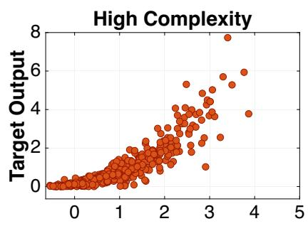

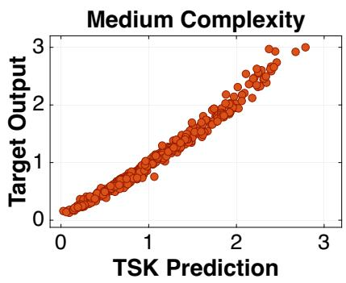

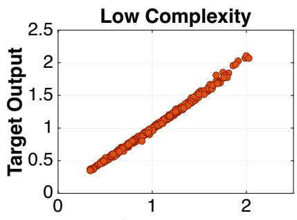

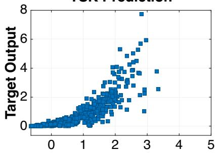

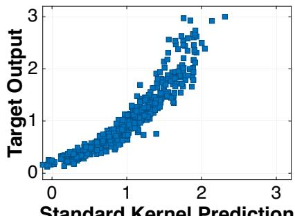

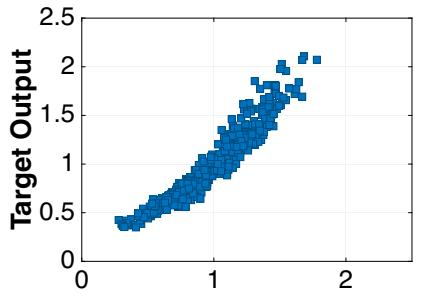

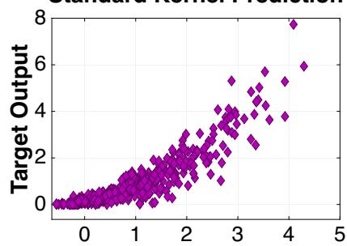

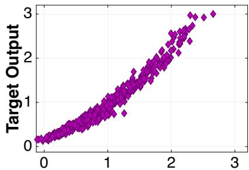

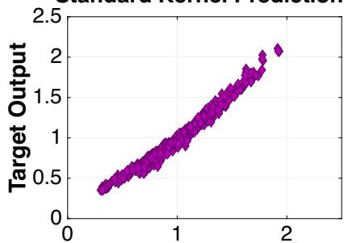

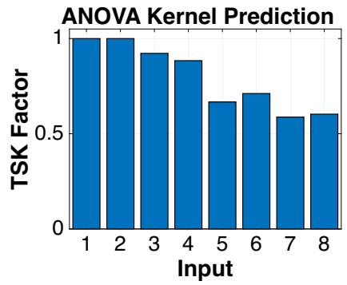

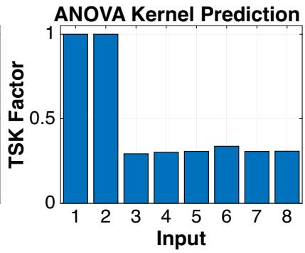

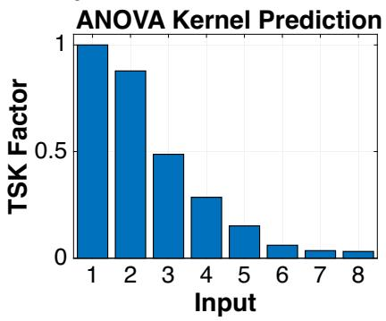  
Figure 1. Results for approximation of the g-function (5.1) with standard product kernels, TSK, and unweighted ANOVA kernels. The left, middle, and right columns correspond to high, medium, and low complexity structured functions, respectively. The top row shows correlations between the optimized kernel predictions and true outputs for 500 of the $1 0 ^ { 4 }$ validation points. The second row shows correlations between standard kernel predictions and true outputs. The third row shows correlations between ANOVA kernel predictions and true outputs. Strong correlation, and more accurate prediction, occurs when the scatter plot is closer to a line with slope one. The bottom row presents the TSK factors taken after optimization.

<table><tr><td>Complexity</td><td>Error Type</td><td>TSK</td><td>Standard Ker.</td><td>ANOVA Ker.</td></tr><tr><td rowspan="2">High</td><td>RMSE</td><td>0.565</td><td>0.671</td><td>0.507</td></tr><tr><td>RRSE</td><td>0.367</td><td>0.437</td><td>0.330</td></tr><tr><td rowspan="2">Medium</td><td>RMSE</td><td> $\mathbf { 9 . 5 7 0 \times 1 0 ^ { - 2 } }$ </td><td>0.233</td><td>0.139</td></tr><tr><td>RRSE</td><td> $\bf 8 . 1 6 6 \times 1 0 ^ { - 2 }$ </td><td>0.199</td><td>0.119</td></tr><tr><td rowspan="2">Low</td><td>RMSE</td><td> $\overline { { { \bf 2 . 5 7 1 \times 1 0 ^ { - 2 } } } }$ </td><td>0.128</td><td> $\overline { { 6 . 0 0 8 \times 1 0 ^ { - 2 } } }$ </td></tr><tr><td>RRSE</td><td> $\mathbf { 2 . 4 1 2 \times 1 0 ^ { - 2 } }$ </td><td>0.120</td><td> $5 . 6 3 7 \times 1 0 ^ { - 2 }$ </td></tr></table>

Table 1. Root mean squared error (RMSE) and root relative squared error (RRSE) for kernel machines of the TSK, standard kernel, and ANOVA kernel on a validation set. Vali dation sets consist of $1 0 ^ { 4 }$ data points for the high, medium, and low complexity g-function.

The experiment highlights how the optimized kernel performs better as the standard kernel across all cases. Key is how the performance of the optimized kernel $\kappa \mathbf { \boldsymbol { \Sigma } } ^ { * }$ improves over the standard kernel and ANOVA kernel when the function’s interaction structure becomes simpler. This demonstrates how optimizing TSK factors allows the method to identify and take particular advantage of function structure. The ANOVA kernel performs better than the standard kernel by its greater expression of structure. Unlike TSK, the lack of weighting in the ANOVA kernel limits performance.

5.2. Higher-dimensional examples. The following experiments investigate how beneficial it is to adapt the kernel to the multivariable structure as the input dimension increases and the number of available function evaluations remains limited. The kernels are Gaussian, using the characteristic function $\phi ( t ) = \mathrm { e } ^ { - t ^ { 2 } / 2 }$ , which corresponds to the standard normal distribution. High dimensions present a particular dificulty for the standard product kernel. As discussed in Section 4, high input dimension results in a kernel matrix $\kappa _ { 1 }$ near the identity matrix. When evaluating on the validation set, we construct a prediction kernel matrix built from both the training and validation data. Since the training and validation sets almost surely do not share any data, the prediction kernel matrix can be nearly a zero matrix. The ANOVA and TSK kernels alter this product structure by including lower-dimensional component kernels. Use of Gaussian kernels enables comparison to automatic relevance determination (ARD), which can mitigate the efect by adapting coordinate-wise length scales. The experiments below examine these diferent mechanisms on functions possessing varying forms of multivariable structure. We study four examples, two of which have smooth analytic expressions.

100D function. The 100D function is a benchmark studied in [35]. The model’s expression is

$$
f ( { \pmb x } ) = 3 + \frac { 1 } { 1 0 0 } \sum _ { k = 1 } ^ { 1 0 0 } k \big ( x _ { k } ^ { 3 } - 5 x _ { k } + \frac { 1 } { 3 } \log ( x _ { k } ^ { 2 } + x _ { k } ^ { 5 } ) \big ) + x _ { 1 } x _ { 2 } ^ { 2 } + x _ { 2 } x _ { 4 } - x _ { 3 } x _ { 5 } + x _ { 5 1 } + x _ { 5 0 } x _ { 5 4 } ^ { 2 } ,\tag{5.3}
$$

where $x _ { 2 0 } \sim \mathcal { U } ( [ 1 , 3 ] )$ and $x _ { k } \sim \mathcal { U } ( [ 1 , 2 ] )$ for $k \neq 2 0$

Previous results of variance-based global sensitivity analysis show that inputs $x _ { 2 } , x _ { 2 0 } , x _ { 5 1 }$ , and $x _ { 5 4 }$ are distinctly more important than the remaining inputs. Among the remaining inputs, input importance tends to increase as the input index increases, while $x _ { 1 } , x _ { 3 } , x _ { 4 } , x _ { 5 } .$ , and $x _ { 5 0 }$ also have some importance. The 100D function’s expression in (5.3) explains this. Importance scales with the input index because the summand terms are multiplied by the input index k. Inputs $x _ { 1 } , x _ { 2 } , x _ { 3 } , x _ { 4 } , x _ { 5 } , x _ { 5 0 } , x _ { 5 1 } , x _ { 5 4 }$ stand out in importance because they appear in extra terms outside the sum. The input x20 has special importance because its distribution is unique and wider than that of the other inputs. While all 100 inputs appear in the expression, the 100D function still has a low complexity structure because it features only main efects and second-order interactions.

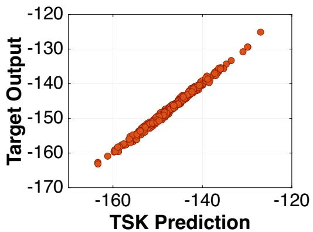

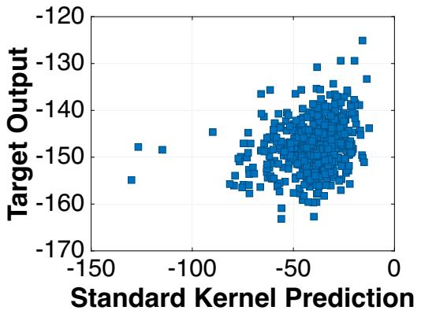

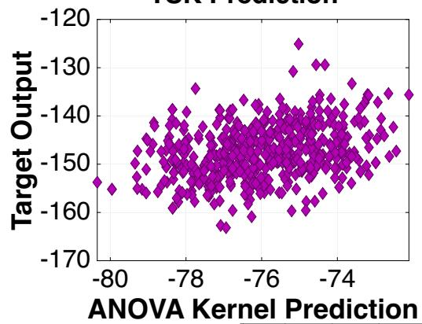

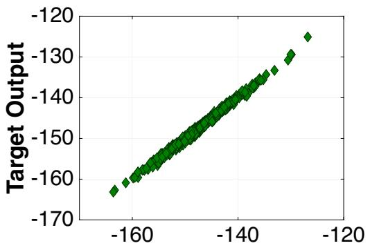

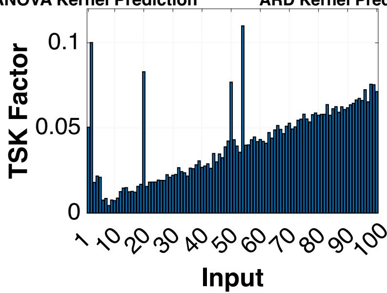  
Figure 2. Results for approximation of the 100D function with TSK, the standard product kernel, the unweighted ANOVA kernel, and ARD, trained on 1000 function evaluations. Top figures display kernel predictions versus true outputs on 500 out of the $1 0 ^ { 4 }$ validation points. Strong correlation, and more accurate prediction, occurs when the scatter plot is closer to a line with slope one. The bottom figure presents the TSK factors taken after optimization.

The scatter plots in Fig. 2 show how well the kernel predictions correlate with true output values. The errors in Table 2 show both TSK and ARD approximate the function accurately. In contrast, the standard kernels and unweighted ANOVA kernels are much less accurate.

The optimal TSK factors in Fig. 2 recover meaningful structure. The TSK factors do not match Sobol’ indices in value. The ranking of the inputs by the TSK factors matches the ranking given by the Sobol’ indices in [35]. This supports that the process of optimizing the TSK factors learns meaningful multivariable structure of the 100D function.

One-dimensional difusion model. This benchmark is a one-dimensional stochastic difusion problem. The problem first appeared as a benchmark in [46] and subsequently appeared in [35]. Consider the boundary value problem

$$
\begin{array} { r l } & { - \frac { d } { d z } \big ( E ( z ) \frac { d u } { d z } ( z ) \big ) + h ( z ) = 0 , z \in ( 0 , L ) , } \\ & { \quad u ( 0 ) = 0 , } \\ & { \frac { d u } { d z } ( L ) = F . } \end{array}\tag{5.4}
$$

The difusion term is a lognormal random field $E ( z ) = \exp \left( \lambda _ { E } + \zeta _ { E } G ( z ) \right)$ , where $G ( z )$ is a standard normal stationary Gaussian random field. Suppose we wish to determine how u(L), the solution at the other boundary, depends on the realization of $G ( z )$ . We represent $G ( z )$ through its Karhunen-Lo\`eve (KL) expansion

$$
G ( z ) = \sum _ { k = 1 } ^ { \infty } \sqrt { \alpha _ { k } } \varphi _ { k } ( z ) \xi _ { k } , \quad \xi _ { k } \sim \mathcal { N } ( 0 , 1 ) .
$$

The KL expansion is truncated to its first 62 terms to preserve 99% of the random field’s variance. This transforms the problem into a deterministic, finite-dimensional one. Define the input

$$
x _ { k } = \xi _ { k } , \quad k = 1 , \ldots , 6 2 .
$$

We aim to construct a surrogate for $y = f ( { \pmb x } )$ , where $y$ is the value of $u ( L )$ we get by solving (5.4) for a realization of x.

The training and validation sets come from an open-source data set created for the benchmark problem [20]. The training set uses $M = 6 0 0$ samples from the standard normal distribution. The $1 0 ^ { 4 }$ validation samples are likewise samples from the standard normal distribution. The results in Fig. 3 demonstrate the importance of adapting the kernel to the strongly anisotropic structure of this problem. The standard product kernel gives predictions close to zero and an RRSE of approximately one. The unweighted ANOVA kernel performs similarly, indicating that introducing lower-dimensional ANOVA components without adapting their relative importance is insuficient in this example. Both TSK and ARD produce accurate approximations.

The optimized TSK factors indicate that only a relatively small subset of the 62 KL coeficients contributes substantially to the quantity of interest. Thus, the improvement of TSK over the two fixed kernels is consistent with its ability to adapt to unequal input importance.Variable relevance adaptation through individual kernel length scales provides a particularly efective representation.

Two-dimensional heat difusion. The benchmark is a two-dimensional stochastic stationary heat difusion model studied initially in [25] and further in [35]. Consider the boundary value problem

$$
\begin{array} { r l } { - \nabla \cdot \big ( \kappa ( z ) \nabla u ( z ) \big ) = Q \cdot 1 _ { A } ( z ) , } & { z \in ( - 0 . 5 , 0 . 5 ) ^ { 2 } , } \\ { u = 0 , } & { z \in ( - 0 . 5 , 0 . 5 ) \times \{ 0 . 5 \} , } \\ { \nabla u \cdot \mathbf { n } = 0 , } & { z \in ( - 0 . 5 , 0 . 5 ) \times \{ - 0 . 5 \} \cup \{ - 0 . 5 , 0 . 5 \} \times ( - 0 . 5 , 0 . 5 ) . } \end{array}\tag{5.5}
$$

The solution u represents the temperature. The heat source is represented by $Q \cdot 1 _ { A } ( z )$ , where $Q$ is a constant and $1 _ { A }$ is the indicator function on $A = [ 0 . 2 , 0 . 3 ] ^ { 2 }$ . The difusion coeficient is a lognormal random field, $\kappa ( z ) = \exp \big ( a _ { \kappa } + b _ { \kappa } G ( z ) \big )$ , where $G ( z )$ is a standard normal stationary Gaussian random field. The quantity of interest is the average temperature over the region $B = ( - 0 . 3 , - 0 . 2 ) ^ { 2 }$

$$
T _ { \mathrm { a v } } = \frac { 1 } { | B | } \int _ { B } u ( z ) d z .
$$

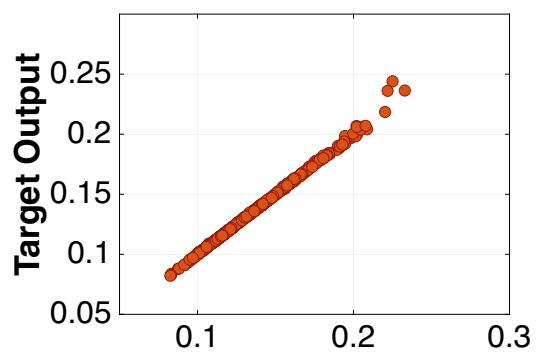

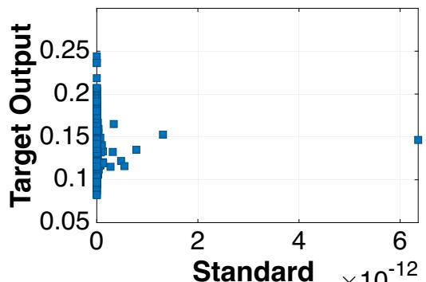

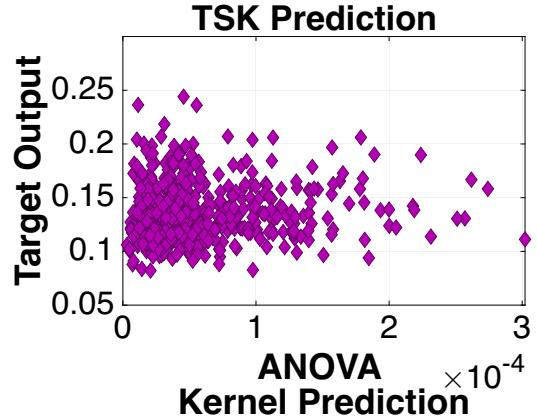

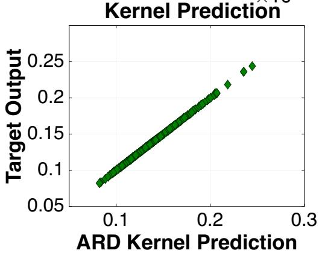

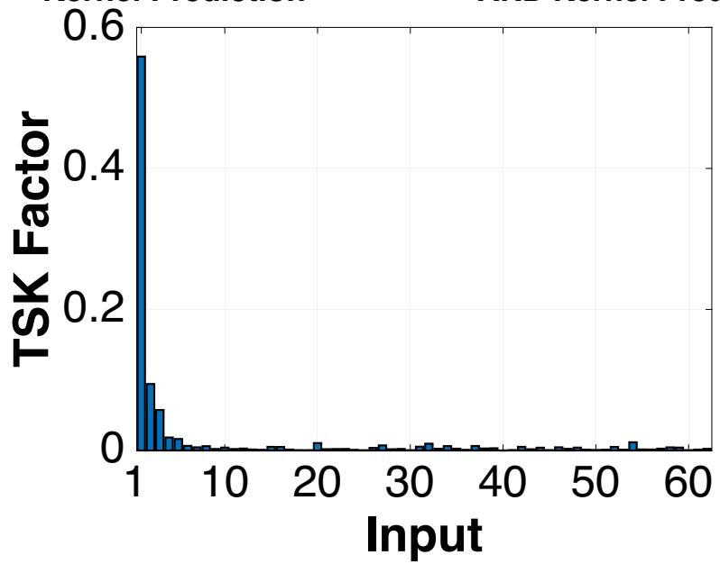  
Figure 3. Results for approximation of the one-dimensional difusion model with TSK, the standard product kernel, the unweighted ANOVA kernel, and ARD, trained on 600 function evaluations. Top figures display kernel predictions versus true outputs on 500 out of the $1 0 ^ { 4 }$ validation points. Strong correlation, and more accurate prediction, occurs when the scatter plot is closer to a line with slope one. The bottom figure presents the TSK factors $\pmb { \Sigma } ^ { * }$ taken after optimization.

We are interested in how the average temperature depends on the realization of $G ( z )$ . The random field $G ( z )$ is approximated by the Expansion Optimal Linear Estimation method, yielding

$$
G ( z ) \approx \widetilde { G } ( z ) = \sum _ { k = 1 } ^ { d } \frac { 1 } { \sqrt { \alpha _ { k 1 9 } } } \xi _ { k } \varphi _ { k } ^ { \top } c _ { z \zeta } , \quad \xi _ { k } \sim \mathcal { N } ( 0 , 1 ) .
$$

The number of terms in the expansion is chosen as $d = 5 3$ so that we capture $9 9 \%$ of the random field’s variance. As with the one-dimensional difusion problem, this problem becomes deterministic and finitedimensional. Define the inputs

$$
x _ { k } = \xi _ { k } , \quad k = 1 , \ldots , 5 3 .
$$

We emulate $y = f ( { \pmb x } )$ , with $y$ representing the average temperature $T _ { \mathrm { a v } }$ after solving (5.5) for a realization of x.

The training and validation sets we use come from an open-source data set created for the benchmark problem [21]. The training set uses $M = 8 0 0$ samples from the standard normal distribution. The validation set of $1 0 ^ { 4 }$ is sampled from the standard normal distribution. As in the one-dimensional difusion problem, in Fig. 4 we see relatively concentrated coordinate importance, which favors adaptive kernels—especially ARD. Despite diferences in spatial dimension, random-field representation, and quantity of interest, the two difusion problems exhibit the same qualitative ordering of the four kernels.

Modified Grienwank function. The Grienwank function is an optimization benchmark [19] structurally composed of polynomial main efect terms and a trigonometric interaction term. We modify the polynomial terms to make the inputs more unequal in importance.

$$
f ( \pmb { x } ) = \frac { 1 } { 4 0 0 0 } \sum _ { k = 1 } ^ { 4 0 } \frac { x _ { k } ^ { 2 } } { k ^ { 2 } } - \prod _ { k = 1 } ^ { 4 0 } \cos \Big ( \frac { x _ { k } } { \sqrt { k } } \Big ) + 1 , \quad \pmb { x } \sim \mathcal { U } ( [ - 6 0 0 , 6 0 0 ] ^ { 4 0 } ) .\tag{5.6}
$$

In terms of multivariable structure, the importance of the polynomial main efects decreases with the input index. The trigonometric product introduces non-additive dependence across all 40 inputs and, when viewed through an ANOVA decomposition, generates interaction components of multiple orders. The resulting function therefore combines strongly anisotropic input importance with richer interaction structure than the preceding high-dimensional examples. In this respect, it is more similar to the g-function.

The training set uses $M = 1 0 ^ { 3 }$ samples from the uniform distribution $\mathcal { U } ( [ - 6 0 0 , 6 0 0 ] ^ { 4 0 } )$ . The validation set of $1 0 ^ { 4 }$ also consists of samples from the uniform distribution. The modified Grienwank function produces a diferent comparison between TSK and ARD than the preceding examples. The TSK approximation error is an order of magnitude smaller than the ARD error.

Summary. The four high-dimensional examples highlight the necessity of identifying multivariable structure and incorporating it into the approximation. The errors in Table 2 show that TSK factor optimization can improve performance over the standard kernel by at least two orders of magnitude. The standard product kernel performs poorly in each example, while the unweighted ANOVA kernel provides only modest improvement and performs nearly identically to the standard kernel for the two difusion problems. Simply introducing an ANOVA decomposition is not suficient when the contributions of diferent inputs and interactions are strongly unequal. Both TSK and ARD address this limitation through data-driven kernel adaptation and substantially improve approximation accuracy. The comparison between TSK and ARD also

<table><tr><td rowspan=1 colspan=1>Model    Error Type</td><td rowspan=1 colspan=1>TSK</td><td rowspan=1 colspan=1>Standard Ker.</td><td rowspan=1 colspan=1>ANOVA Ker.</td><td rowspan=1 colspan=1>ARD</td></tr><tr><td rowspan=1 colspan=1>100D        RMSERRSE</td><td rowspan=1 colspan=1>0.480 $3 . 2 5 5 \times 1 0 ^ { - 3 }$ </td><td rowspan=1 colspan=1>108.4920.736</td><td rowspan=1 colspan=1>71.6670.486</td><td rowspan=1 colspan=1>0.479 $\mathbf { 3 . 2 5 1 \times 1 0 ^ { - 3 } }$ </td></tr><tr><td rowspan=1 colspan=1>1D Diff.      RMSERRSE</td><td rowspan=1 colspan=1> $\overline { { 2 . 0 2 7 \times 1 0 ^ { - 3 } } }$  $1 . 4 6 1 \times 1 0 ^ { - 2 }$ </td><td rowspan=1 colspan=1>0.1391.000</td><td rowspan=1 colspan=1>0.1390.999</td><td rowspan=1 colspan=1> $\overline { { { \bf 2 . 7 5 5 \times 1 0 ^ { - 4 } } } }$  $\mathbf { 1 . 9 8 5 \times 1 0 ^ { - 3 } }$ </td></tr><tr><td rowspan=1 colspan=1>2D Diff.      RMSERRSE</td><td rowspan=1 colspan=1> $\overline { { 3 . 0 3 9 \times 1 0 ^ { - 2 } } }$  $2 . 6 1 8 \times 1 0 ^ { - 2 }$ </td><td rowspan=1 colspan=1>1.1611.000</td><td rowspan=1 colspan=1>1.1530.994</td><td rowspan=1 colspan=1> $\mathbf { \overline { { 5 . 0 7 0 \times 1 0 ^ { - 3 } } } }$  $\mathbf { 4 . 3 6 8 \times 1 0 ^ { - 3 } }$ </td></tr><tr><td rowspan=1 colspan=1>Grienwank     RMSERRSE</td><td rowspan=1 colspan=1> $\overline { { 1 . 1 8 1 4 } }$  $\mathbf { 3 . 1 8 8 \times 1 0 ^ { - 2 } }$ </td><td rowspan=1 colspan=1>29.2670.515</td><td rowspan=1 colspan=1>24.6430.433</td><td rowspan=1 colspan=1>11.9000.209</td></tr></table>

Table 2. Root mean squared error (RMSE) and root relative squared error (RRSE) for approximations of the 100D function, 1D difusion problem, 2D heat difusion problem, and modified Grienwank function using TSK, the standard product kernel, the unweighted ANOVA kernel, and the ARD kernel. Errors are taken on validation sets of $1 0 ^ { 4 }$ points.

illustrates that the two methods exploit multivariable structure diferently. For the 100D function, which has unequal input importance but only main efects and pairwise interactions, TSK and ARD achieve nearly identical errors. For the two difusion problems, the learned TSK factors indicate that the quantities of interest depend much more strongly on a relatively small subset of the stochastic inputs, and ARD provides the most accurate approximations. In contrast, TSK performs substantially better than ARD for the modified Grienwank function, which combines strongly unequal main efects with interaction components of multiple orders. These results suggest that ARD length scale adaptation and adaptation of ANOVA-component weights provide complementary mechanisms for exploiting multivariable structure. No single adaptive mechanism performs best across all four examples, but TSK provides substantial improvements when its learned weighting of the approximation space aligns with the structure of the target function.

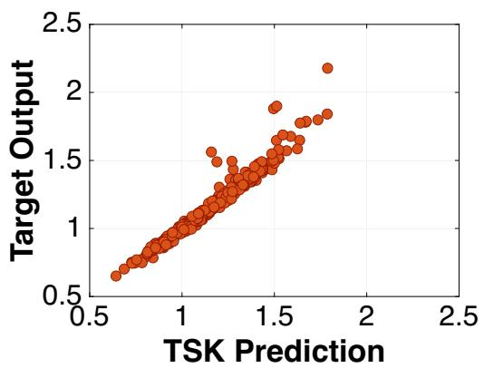

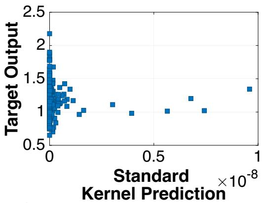

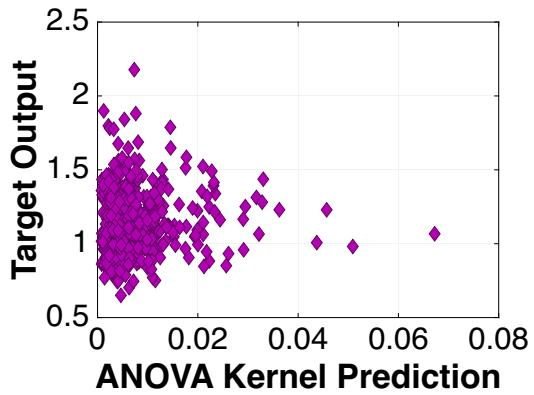

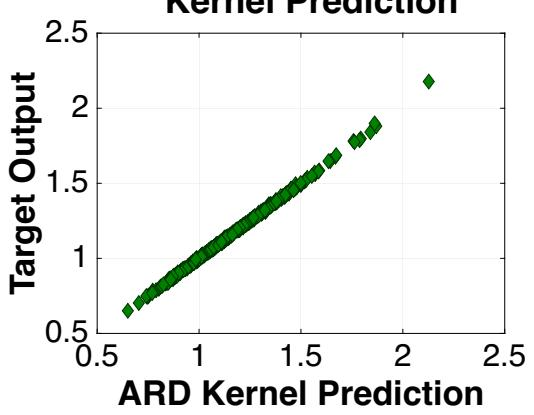

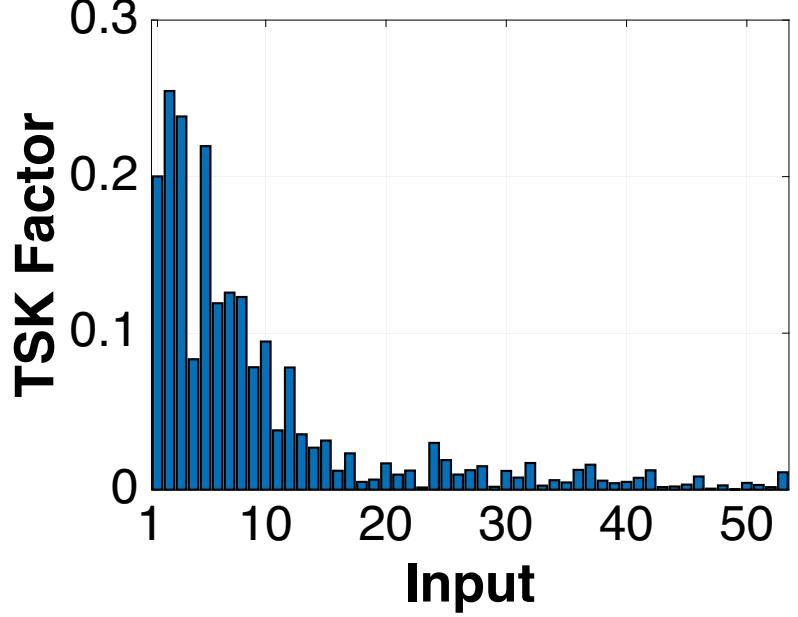  
Figure 4. Results for approximation of the two-dimensional heat difusion model with TSK, the standard product kernel, the unweighted ANOVA kernel, and ARD, trained on 600 function evaluations. Top figures display kernel predictions versus true outputs on 500 out of the $1 0 ^ { 4 }$ validation points. Strong correlation, and more accurate prediction, occurs when the scatter plot is closer to a line with slope one. The bottom figure presents the TSK factors taken after optimization.

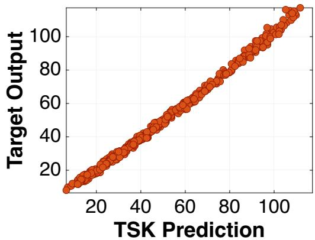

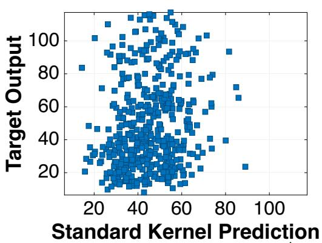

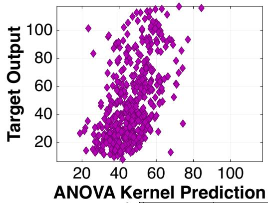

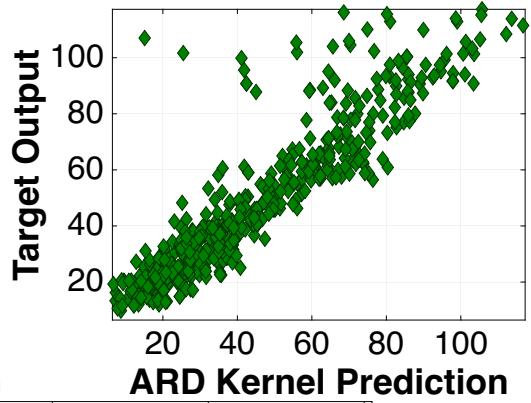

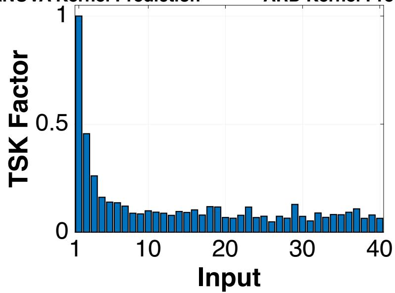  
Figure 5. Results for approximation of the modified Grienwank function with TSK, the standard product kernel, the unweighted ANOVA kernel, and ARD, trained on 1000 function evaluations. Top figures display kernel predictions versus true outputs on 500 out of the $1 0 ^ { 4 }$ validation points. Strong correlation, and more accurate prediction, occurs when the scatter plot is closer to a line with slope one. The bottom figure presents the TSK factors taken after optimization.

## 6. Conclusion and outlook

This work develops a framework for adapting a weighted RKHS to the multivariable structure of an unknown target function. TSKs provide a structured parameterization of ANOVA kernel weights, reducing $2 ^ { d }$ possible component weights to d input-specific TSK factors. Rather than prescribing these weights a priori or selecting a sparse collection of components, we learn the TSK factors by seeking the RKHS where the target function has minimum norm. Under suitable conditions, these TSK factors are unique to a target function. The numerical experiments demonstrate that the resulting adaptation improves approximation when the target possesses exploitable multivariable structure. This perspective on adaptive multivariable approximation argues for adapting the geometry of the approximation space to the structure of the target function.

Avenues for future work concern the scope and computational implementation of the method. The product nature of weights induced by TSK factors restricts the method to certain families of weights. While acceptable for many functions, this is unsuitable for functions with complicated interactions, especially functions that feature higher-order interaction terms but no low-order interaction terms. Quasi-Monte Carlo literature ofers many examples of weight structures, including product-order-dependent weights [28, 24]. Future work should investigate whether TSK theory can extend to other weight structures. Improved computational scalability for large datasets can be addressed by the use of random features [42] instead of using kernels corresponding to the characteristic functions $\phi _ { k }$ directly. The structural adaptability of TSKs makes them attractive for direct integration into established kernel-based machine learning methods like automatic relevance determination [55] and multiple kernel learning [18]. While our current theoretica results focus on exact minimum-norm interpolation, extending these uniform error bounds and convergence guarantees to settings with noisy observational data is a crucial next step. In the current work, we establish the method in the approximation of functions with independently distributed inputs. An important future direction is to extend the framework to settings with dependent inputs. Finally, given the recent exploration of sensitivity analysis beyond the classical ANOVA decomposition setting [12, 30, 52, 32], it would be interesting to study how TSK factors relate to alternative notions of sensitivity, especially in kernel-based sensitivity indices.

Acknowledgments. This work is partially supported by the National Science Foundation (NSF) under grant number 2038118 (John E. Darges). This work was partially funded by the Deutsche Forschungsgemeinschaft (DFG, German Research Foundation) - project number 569580074 (Laura Weidensager).

## References

[1] R. Agrawal and T. Broderick. The SKIM-FA Kernel: High-Dimensional Variable Selection and Nonlinear Interaction Discovery in Linear Time. J. Mach. Learn. Res., 24(27):1–60, 2023.

[2] A. Antoniadis. Analysis of variance on function spaces. Statistics, 15(1):59–71, 1984.

[3] N. Aronszajn. Theory of reproducing kernels. Trans. Amer. Math. Soc., 68(3):337–404, 1950. doi:10.21236/ada296533.

[4] F. Bach. Exploring large feature spaces with hierarchical multiple kernel learning. In Proceedings of the 22nd International Conference on Neural Information Processing Systems, pages 105––112, Red Hook, NY, USA, 2008. Curran Associates Inc.

[5] F. Bach. On the equivalence between kernel quadrature rules and random feature expansions. J. Mach. Learn. Res., 18(1):714 – 751, 2017.

[6] A. S. Berahas, J. Nocedal, and M. Tak´aˇc. A multi-batch L-BFGS method for machine learning. In Proceedings of the 30th International Conference on Neural Information Processing Systems, pages 1063—-1071, Red Hook, NY, USA, 2016. Curran Associates Inc.

[7] S. Bochner. Harmonic Analysis and the Theory of Probability. University of California Press, Berkeley, CA, USA, 1 edition, 1955. doi:10.1525/9780520345294.

[8] R. E. Caflisch, W. Morokof, and A. B. Owen. Valuation of mortgage-backed securities using Brownian bridges to reduce efective dimension. J. Comput. Finance, 1:27–46, 1997.

[9] A. Caponnetto and E. De Vito. Optimal rates for the regularized least-squares algorithm. ound. Comput. Math., 7(3):331– 368, 2007.

[10] A. Chertkov, G. Ryzhakov, and I. Oseledets. Black Box Approximation in the Tensor Train Format Initialized by ANOVA Decomposition. SIAM J. Sci. Comput., 45(4):A2101—-A2118, 2023. doi:10.1137/22m1514088.

[11] F. Cucker and S. Smale. On the mathematical foundations of learning. Bull. Amer. Math. Soc., 39(1):1–49, 2002.

[12] S. da Veiga. Kernel-based ANOVA decomposition and Shapley efects – Application to global sensitivity analysis, 2021. Preprint at https://arxiv.org/abs/2101.05487.

[13] J. E. Darges, A. Alexanderian, and P. A. Gremaud. Extreme learning machines for variance-based global sensitivity analysis. Int. J. Uncertain. Quantif., 14(4):83–103, 2024. doi:10.1615/int.j.uncertaintyquantification.2024049519.

[14] J. Dick. Random weights, robust lattice rules and the geometry of the cbcrc algorithm. Numer. Math., 122(3):443–467, 2012. doi:10.1007/s00211-012-0469-5.

[15] J. Dick, F. Y. Kuo, and I. H. Sloan. High-dimensional integration: The quasi-Monte Carlo way. Acta Numer., 22:133–288, 2013. doi:10.1017/s0962492913000044.

[16] N. Durrande, D. Ginsbourger, O. Roustant, and L. Carraro. ANOVA kernels and RKHS of zero mean functions for model based sensitivity analysis. J. Multivariate Anal., 115:57 – 67, 2013. doi:10.1016/j.jmva.2012.08.016.

[17] Z. Fang, I. Kim, and P. Schaumont. Flexible variable selection for recovering sparsity in nonadditive nonparametric models. Biometrics, 72(4):1155–1163, 2016. doi:10.1111/biom.12518.

[18] M. G¨onen and E. Alpaydın. Multiple kernel learning algorithms. J. Mach. Learn. Res., 12:2211–2268, 2011.

[19] A. Grienwank. Generalized descent for global optimization. J. Optim. Theory Appl, 34:11–39, 1981.

[20] A. Hlobilov´a, S. Marelli, and B. Sudret. Surrogate modeling benchmark - one-dimensional difusion model, 2024. Retrieved from https://doi.org/10.5281/zenodo.12704504.

[21] A. Hlobilov´a, S. Marelli, and B. Sudret. Surrogate modeling benchmark - two-dimensional difusion model, 2024. Retrieved from https://doi.org/10.5281/zenodo.12701147.

[22] W. Hoefding. A Class of Statistics with Asymptotically Normal Distribution. Ann. Math. Statist., 19(3):293 – 325, 1948.

[23] T. Hofmann, B. Sch¨olkopf, and A. Smola. Kernel methods in machine learning. Ann. Statist., 36:1171–1220, 2008. doi: 10.1214/009053607000000677.

[24] V. Kaarnioja, Y. Kazashi, F. Kuo, F. Nobile, and I. Sloan. Fast approximation by periodic kernel-based lattice-point interpolation with application in uncertainty quantification. Numer. Math., 150(1):33–77, 2022.

[25] K. Konakli and B. Sudret. Global sensitivity analysis using low-rank tensor approximations. Reliab. Eng. Syst. Saf., 156:64–83, 2016. doi:10.1016/j.ress.2016.07.012.

[26] P. Kritzer, F. Pillichshammer, and G. Wasilkowski. On quasi-Monte Carlo methods in weighted ANOVA spaces. Math. Comp., 90:1381–1406, 2021. doi:10.1090/mcom/3598.

[27] S. Kucherenko, B. Feil, N. Shah, and W. Mauntz. The identification of model efective dimensions using global sensitivity analysis. Reliab. Eng. Syst. Saf., 96(4):440–449, 2011. doi:10.1016/j.ress.2010.11.003.

[28] F. Y. Kuo, C. Schwab, and I. H. Sloan. Quasi-Monte Carlo Finite Element Methods for a Class of Elliptic Partial Diferential Equations with Random Coeficients. SIAM J. Numer. Anal., 50(6):3351–3374, 2012. doi:10.1137/110845537.

[29] F. Y. Kuo, I. H. Sloan, G. W. Wasilkowski, and H. Wo´zniakowski. On decompositions of multivariate functions. Math. Comp., 79(270):953–966, 2009. doi:10.1090/s0025-5718-09-02319-9.

[30] M. Lamboni. Kernel-based Measures of Association Between Inputs and Outputs Using ANOVA. Sankhya A, 86:790––826, 2024. doi:10.1007/s13171-024-00354-w.

[31] G. Larcher, G. Leobacher, and K. Scheiceher. On the tractability of the Brownian bridge algorithm. J. Complexity, 19(4):511–528, 2003. doi:10.1016/s0885-064x(03)00045-1.

[32] T. Larsen and A. Alexanderian. A new kernel-based index for the global sensitivity analysis of models with correlated inputs, 2026. Preprint at https://arxiv.org/abs/2603.00849.

[33] D. C. Liu and J. Nocedal. On the limited memory BFGS method for large scale optimization. Math. Program., 45:503–528, 1989. doi:10.1007/bf01589116.

[34] R. Liu and A. B. Owen. Estimating mean dimensionality of analysis of variance decompositions. J. Amer. Statist. Assoc., 101(474):712–721, 2006. doi:10.1198/016214505000001410.

[35] N. L¨uthen, S. Marelli, and B. Sudret. Sparse Polynomial Chaos Expansions: Literature Survey and Benchmark. SIAM/ASA J. Uncertain. Quantif., 9(2):593–649, 2021. doi:10.1137/20m1315774.

[36] A. Marrel, B. Iooss, F. Van Dorpe, and E. Volkova. An eficient methodology for modeling complex computer codes with Gaussian processes. Comput. Statist. Data Anal., 52(10):4731–4744, 2008. doi:10.1016/j.csda.2008.03.026.

[37] Y. Nesterov. Introductory Lectures on Convex Optimization. Springer, New York, NY, USA, 1st edition, 2004. doi: 10.1007/978-1-4419-8853-9.

[38] A. B. Owen. Efective Dimension of Some Weighted Pre-Sobolev Spaces with Dominating Mixed Partial Derivatives. SIAM J. Numer. Anal., 57(2):547–562, 2019.

[39] D. Potts and M. Schmischke. Learning multivariate functions with low-dimensional structures using polynomial bases. J. Comput. Appl. Math., 403:113821, 2022. doi:10.1016/j.cam.2021.113821.

[40] D. Potts and L. Weidensager. ANOVA-boosting for random Fourier features. Appl. Comput. Harmon. Anal., 79:101789, 2025. doi:10.1016/j.acha.2025.101789.

[41] H. Rabitz, Omer F. Ali¸s, J. Shorter, and K. Shim. Eficient input—output model representations. ¨ Comput. Phys. Commun., 117(1):11–20, 1999. doi:10.1016/s0010-4655(98)00152-0.

[42] A. Rahimi and B. Recht. Random features for large-scale kernel machines. In Proceedings of the 21st International Conference on Neural Information Processing Systems, pages 1177—-1184, Red Hook, NY, USA, 2007. Curran Associates Inc.

[43] W. Rudin. Principles of Mathematical Analysis. McGraw-Hill, Inc., New York, NY, USA, 3rd edition, 1976.

[44] A. Saltelli, P. Annoni, I. Azzini, F. Campolongo, M. Ratto, and S. Tarantola. Variance based sensitivity analysis of model output. Design and estimator for the total sensitivity index. Comput. Phys. Commun., 181(2):259–270, 2010. doi:10.1016/j.cpc.2009.09.018.

[45] B. Sch¨olkopf and A. J. Smola. Learning with Kernels: Support Vector Machines, Regularization, Optimization, and Beyond. MIT Press, Cambridge, MA, USA, 2001. doi:10.7551/mitpress/4175.001.0001.

[46] Y. Shin and D. Xiu. Nonadaptive Quasi-Optimal Points Selection for Least Squares Linear Regression. SIAM J. Sci. Comput., 38(1):A385–A411, 2016. doi:10.1137/15m1015868.

[47] I. H. Sloan and H. Wo´zniakowski. When Are Quasi-Monte Carlo Algorithms Eficient for High Dimensional Integrals? J. Complexity, 14(1):1–33, 1998.

[48] S. Smale and D.-X. Zhou. Learning Theory Estimates via Integral Operators and Their Approximations. Constr. Approx., 26(2):153–172, 2007. doi:10.1007/s00365-006-0659-y.

[49] I. Sobol’. Global sensitivity indices for nonlinear mathematical models and their Monte Carlo estimates. Math. Comp. Simulation, 55(1–3):271–280, 2001. doi:10.1016/s0378-4754(00)00270-6.

[50] I. M. Sobol’. Multidimensional quadrature formulas and Haar functions. Nauka, Moscow (In Russian), 1969.

[51] I. Steinwart and A. Christmann. Support Vector Machines. Springer Publishing Company, Incorporated, New York, NY, 1st edition, 2008. doi:10.1007/978-0-387-77242-4.

[52] L. Weidensager. Sensitivity Analysis on the Sphere and a Spherical ANOVA Decomposition. J. Fourier Anal. Appl., 32(66), 2026. doi:10.1007/s00041-026-10275-x.

[53] C. K. Williams and C. E. Rasmussen. Gaussian processes for machine learning, volume 2. MIT Press, Cambridge, MA, USA, 2006.

[54] X. Yang, M. Choi, G. Lin, and G. E. Karniadakis. Adaptive ANOVA decomposition of stochastic incompressible and compressible flows. J. Comput. Phys., 231(4):1587–1614, 2012. doi:10.1016/j.jcp.2011.10.028.

[55] H. Zhang, Z. Ye, X. Wang, X. Guo, Z. Xu, Y. Cheng, Z. Hu, and Y. Qi. Eficient network automatic relevance determination. In Proceedings of the 42nd International Conference on Machine Learning, pages 76541–76562, 2025.