# A multimodal large language model for evidence-based autism spectrum disorder screening

Jun Chen1,2, Qi Zhao3,6, Yunliang Jiang1,2,4†, Shuqin Cao1,5, Yunqiang Lin5, Chenglong Jia5, Qiang Guo5, Guang Dai6, Xiongtao Zhang7, Mengmeng Wang8, and Xiaoyue Ma2

1National Special Education Resource Center for Children with Autism, Zhejiang Normal University, China 2School of Computer Science and Technology, Zhejiang Normal University, China 3School of Mathematics and Statistics, Xi’an Jiaotong University, China 4Zhejiang Key Laboratory of Intelligent Education Technology and Application, Zhejiang Normal University, China 5College of Child Development and Education, Zhejiang Normal University, China 6SGIT AI Lab, State Grid Corporation of China, China. 7School of Information Engineering, Huzhou Normal University, China. 8Zhejiang University of Technology, China. †Correspondence should be addressed to: jyl2022@zjnu.cn

Abstract: The clinical management of autism spectrum disorder (ASD) faces a bottleneck in early screening, mainly because trained specialists are scarce and conventional assessment tools are subjective. Here, we introduce ASDchat, a multimodal large language model designed for evidence-based ASD screening, which takes video, audio, and dialogue as input. ASDchat adopts a dual-branch architecture, where the decision branch generates screening probabilities and the evidence branch generates traceable, timestamped behavioral evidence aligned with standardized clinical criteria (ADOS-2). The model was trained and evaluated on a dataset of 1,035 participants from 27 sites in China, which covered typically developing (TD) children, children with ASD, and children with other disorders. For ASD versus TD, ASDchat reached an area under the receiver operating characteristic curve (AUC) of 0.953 ± 0.021. On 9 held-out sites that were not used for training, the mean AUC was 0.932. Furthermore, unsupervised clustering of the behavioral dimensions split the ASD cases into six subtypes with diferent phenotypic profiles, and ASDchat suggests an intervention for each subtype. ASDchat provides a feasible path for large-scale, evidence-based early ASD screening in clinical practice.

## Introduction

Autism spectrum disorder (ASD) is a neurodevelopmental disorder characterized by persistent diferences in interactive social behaviors and restricted, repetitive behaviors. Multiple epidemiological monitoring results indicate that the prevalence of ASD worldwide is on the rise, and the clinical management of ASD has become a prominent challenge in the field of public health [33,57]. The social and economic infrastructure required for long-term care is facing significant pressure [28, 34]. Neurodevelopmental research indicates that the optimal intervention window for ASD is mostly before the age of 3, when the brain of children is highly plastic [50]. During this period, implementing targeted behavioral interventions is expected to reshape children’s cognitive abilities and social adaptability [9, 36]. Therefore, standardized developmental screening tools, especially the Modified Checklist for Autism in Toddlers (M-CHAT) [44], have been widely used in primary care, helping to identify atrisk children early [5,60]. However, this demand is further magnified in centralized medical systems. For example, in China, a large number of at-risk children coexist with a concentrated group of specialized developmental pediatricians [49,59]. This has led to many families being on long waiting lists, delaying the children’s access to care.

Clinical diagnosis and screening still rely mainly on the traditional assessment system. This system has limitations at both the operational and methodological levels. The current screening workflows are divided into two categories: caregiver-report questionnaires and clinician-administered structured observation. Questionnaire tools such as the M-CHAT and the Social Responsiveness Scale (SRS-2) [3] complete the assessment based on caregiver feedback. The assessment results are afected by factors such as parental education level, cultural stigma, and recall bias. This interference directly reduces the positive predictive value of questionnaire screening [5, 8]. The Childhood Autism Rating Scale (CARS-2) [46] and the Autism Diagnostic Observation Schedule (ADOS-2) [29] are the mainstream assessment tools used in clinical practice to avoid subjective errors. These two tools assess children based on standardized interactive tasks and ratings by certified specialists. Both tools have stable diagnostic validity, but their use in practice is limited. A complete assessment requires certified specialists and systematic training. The assessment process requires a large amount of human resources and time, and is not suitable for large-scale screening. Traditional assessment tools can only collect data on children’s development at a single time point. Such cross-sectional data cannot reflect the longterm changes in children’s behavioral phenotypes. While video recording can expand the data available for assessment, the manual coding and behavioral annotation work is time-consuming and subject to inter-rater variability. These conditions prevent the traditional observation mode from supporting standardized, automated large-scale screening [52].

To alleviate the workload of clinical personnel, researchers in the field of computer science have attempted to utilize machine learning and deep learning to develop an early automated screening approach for ASD [19, 53]. These digital screening systems extract objective behavioral indicators from raw sensor data, which can replace manual assessment tools and are convenient for use in large populations. Most of the early related studies focused on analyzing localized behavioral characteristics. These studies utilized computer vision to extract abnormal features of two-dimensional skeletal postures [24], quantify gaze patterns and eye-contact avoidance behaviors [1,7], identify abnormal movement trajectories [20, 22], or process resting-state functional magnetic resonance imaging data [39]. These automated models can complete classification tasks in controlled experimental environments, but the isolated analysis of a single modality remains an inherent defect. ASD is a multi-system neurodevelopmental disorder, and its behavioral phenotypes are heterogeneous and cross-modal [28]. A single-modality feature limits the model’s ability to represent the disorder. Singlemodality analysis cannot capture the correlation between facial expressions, motor responses, and linguistic feedback. In the face of the wide phenotypic variation among individuals with ASD, the model screening accuracy decreases and the prediction error increases.

In recent years, multimodal large language models (MLLMs) and foundation models have provided new directions for overcoming the limitations of single-modality methods [23, 25, 38, 48, 55]. These models rely on a joint vision-language architecture and a cross-attention fusion module, which can integrate diferent types of input data and understand the complex behaviors of children in interaction scenarios [10, 40, 58]. However, the current best-performing MLLMs still face obstacles in clinical application, as the models lack interpretability and the results are dificult to trace and verify. Existing large models are computational “black boxes”, directly converting highdimensional feature vectors into probability outputs [16, 43]. Pediatric screening is a high-risk scenario, and a model that lacks a reasoning process conforming to clinical logic is dificult for clinicians and caregivers to trust [35]. The model cannot provide reasons for its screening results, cannot provide verifiable evidence, and cannot support the allocation of medical resources or the formulation of intervention plans.

To address the aforementioned issues, this paper constructs an evidence-based multimodal large language model framework, which is used for ASD screening. This framework improves the stability of the model and the interpretability of the results, and facilitates clinical traceability. It incorporates three types of supporting data: structured interaction video sequences, quantitative acoustic data, and dialogue structure. Existing studies typically treat clinical indicators as fixed references, however, this paper adds a dynamic feature-to-scale cross-examination mechanism. This mechanism maps multi-channel behavioral observation results, such as eye movement delays, joint attention deficits, and vocalization changes, to specific ADOS-2 items. Through this method, feature-level digital evidence is extracted in reverse to support the judgments made during screening.

## Results

## ASDchat Overview

ASDchat takes a structured video recording of a child’s interaction with an examiner as input. The system outputs the screening probability, the evidence chain with its time windows, and the responses to the spatio-temporal localization questions. Figure 1 shows the overall system architecture. ASDchat consists of two branches: the multimodal decision branch for outputting probabilities, and the evidence branch for providing the basis for judgment.

The decision branch is built based on three complementary modalities, forming a multimodal fusion framework (Fig. 1a). The visual modality extracts the child’s behavior, the audio modality collects the child’s speech, and the dialogue structure records the progression of the interaction. Each type of data is processed by a dedicated trainable encoder. The features output by the encoders are sent to the MLLM, and the screening probability is calculated.

The visual path is the main input. In the source video preprocessing stage, all pixels outside the contours of the people in the frame are masked to retain the contours of the child and the examiner, and all frames are converted to grayscale. The model extracts 64 frames from the complete recording based on social bids. Of the frame budget, 60% is allocated to the three-second response window after each social bid, and the rest is sampled uniformly across the remaining recording. Temporal motion information is extracted in parallel by the spatio-temporal path, and six clips are selected, each containing 16 densely sampled frames at 112 × 112, which are processed by the end-to-end R(2+1)D model. The processed data is sent to the token encoder to generate visual modality features.

The audio path encodes the entire recording. This path extracts 88 eGeMAPS descriptors, aggregates them into a 176- dimensional feature, and appends 28 interaction timing features. The model standardizes the features within each site, using statistics fitted on the training folds alone, and removes the site information before the features enter the fusion module. Similar to the visual path, the audio features are sent to the audio encoder, whose output enters the shared feature sequence as a single vector.

The dialogue path also encodes the entire recording content. It extracted twelve behavioral statistics from the speakerannotated text of the speech transcription, including the number of rounds, the number of statements initiated and responded by children, and the proportion of speaking time, without using any lexical content. Then, it was encoded by a text encoder and sent together with the other two modalities to the internal layers of the MLLM.

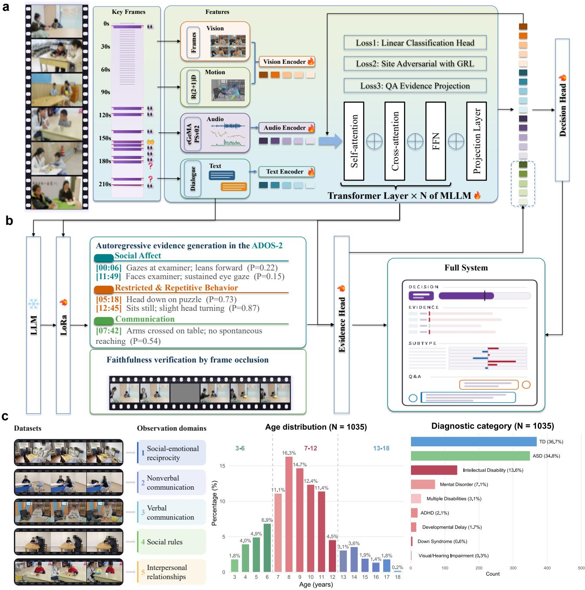  
Figure 1: Overview of ASDchat: a multimodal LLM for evidence-based question answering. (a), the decision branch of ASDchat is constructed based on visual, audio, and dialogue modalities (b), the evidence branch of ASDchat generates evidence chains based on ADOS-2, which carries a direction, a strength and a time window (c), dataset illustrates observation domains, showing distribution (age distribution and diagnostic category).

These contents are processed through a visually-tuned MLLM, then input into a bidirectional recurrent layer for aggregation, and finally generated into a single record vector $h _ { \nu }$ through time averaging. This vector is then input into the decision head, the site-adversarial head and the evidence supervision head. The fine-tuning of this MLLM was conducted using a labeled multi-site dataset.

The evidence branch reads the same 64 frames through the low-rank adapter language model and generates evidence chains as well as question answers (Fig. 1b). Each item carries a direction, a strength and a time window, so that a reader can go back to the recording and watch the segment the system is pointing at. The branch also answers questions in both directions, it names the moment at which a behavior occurs, and it states which behavior occurs at a moment the reader names. Two counterfactual tests establish that these outputs follow the picture rather than a prior. First, when all frames are replaced with uniform grey, the probability returns towards chance. Second, when the frames the evidence points to are removed, the evidence weakens by itself.

The two branches are interconnected, where the final hidden layer state of the evidence branch is projected onto the ℎ dimension and concatenated with it. The resulting concatenated result is then input into the deployed decision head. Therefore, when the evidence representation enters the screening decision, it is no longer solely used to verify the description of the system, but rather makes decisions and presents evidence through visual reading. The above-mentioned efects are bidirectional. During the main training process, the evidence supervision loss is propagated in the opposite direction along with the classification loss, thus the evidence target will shape the aggregated representation before the connection of the language model. During deployment, the evidence representation will be re-injected into the same head.

These two branches finally form a complete verification system through collaborative cooperation. This system can not only output the probability of ASD but also provide clinical evidence, and give specific suggestions based on the recording. At the same time, parents and clinicians can both ask questions about specific segments of the video.

## Dataset Description

This dataset was jointly collected by multiple centers across three provinces in China: Yunnan (9 centers), Hunan (5 centers), and Zhejiang (13 centers), covering 27 sites distributed across 9 districts. The dataset consists of 1,035 participants, including 370 typically developing children, 350 children diagnosed with ASD, and 315 children with other developmental disorders, such as Intellectual Disability, Mental Disorder, Attention-Deficit/Hyperactivity Disorder (ADHD), Developmental Delay, Visual/Hearing Impairment, Down Syndrome, and Multiple Disabilities (Fig. 1c). Within the ASD group, there are 282 males and 68 females, with a male-to-female ratio of approximately 4:1, which is consistent with existing epidemiological estimates of ASD prevalence [13]. The age range of the participants is 3 to 18 years, covering all developmental stages within this range. All participants or their legal guardians signed written informed consent before enrollment. The data collection plan was approved by the ethics committees of Zhejiang Normal University, the collaborating hospitals, and each participating site (No. ZSRT2026040).

Each participant engaged in a structured interaction of 5 to 10 minutes, and the session was video-recorded. This collection plan was designed to elicit natural behaviors across multiple developmental dimensions and to reduce the influence of external intervention on the children’s responses. All sessions were conducted in environments familiar to the participants. A parent, caregiver, or teacher was present and interacted with the child naturally. The adults present received no specialized training or instructions, so that the recorded behaviors reflected social communication in real-life settings.

The dataset contains two types of core data:

• Video with synchronized audio, which records the full interaction of each participant and preserves behavioral information such as facial expressions, body movements, gaze patterns, and vocalizations.

• Demographic and clinical information collected uniformly for each participant, including age, sex, educational stage, family income, parental education level, parental occupation, diagnostic category, diagnostic source, comorbid conditions, intellectual developmental level, and medical history.

This multimodal structure enables us to simultaneously observe behavioral signals and contextual factors, and to establish an integrated screening framework that incorporates both phenotypic and demographic information.

The session protocol consists of two types of tasks. The first is game-based tasks, such as tabletop games and a doll birthday celebration, which are used to engage the child in structured play. The second is interactive tasks, including construction play, picture description, and prompts for conversation about friendships and social experiences. These tasks correspond to the five behavioral dimensions examined in ASD screening:

1. Social-emotional reciprocity: the child’s ability to respond appropriately to task changes and social cues;

2. Nonverbal communication: the frequency and quality of eye contact during social interaction;

3. Verbal communication: the use of complex sentence structures in conversation;

4. Social rules: the presence of of-task behaviors such as frequently leaving the seat or being distracted by other stimuli;

5. Interpersonal relationships: the child’s ability to adjust responses to changes in others’ emotional states.

All videos were recorded under standardized lighting and camera positions to ensure consistent collection conditions at each site. The samples were obtained from multiple centers with diferent geographical and socioeconomic conditions in China. This gives the dataset broader applicability and makes it possible to compare ASD behavioral manifestations across regions. We did not simply divide the participants into ASD and typically developing groups. We also included a range of other neurodevelopmental disorders. This makes the test of the screening algorithm’s specificity more stringent, and it also avoids overfitting to the binary classification boundary. This

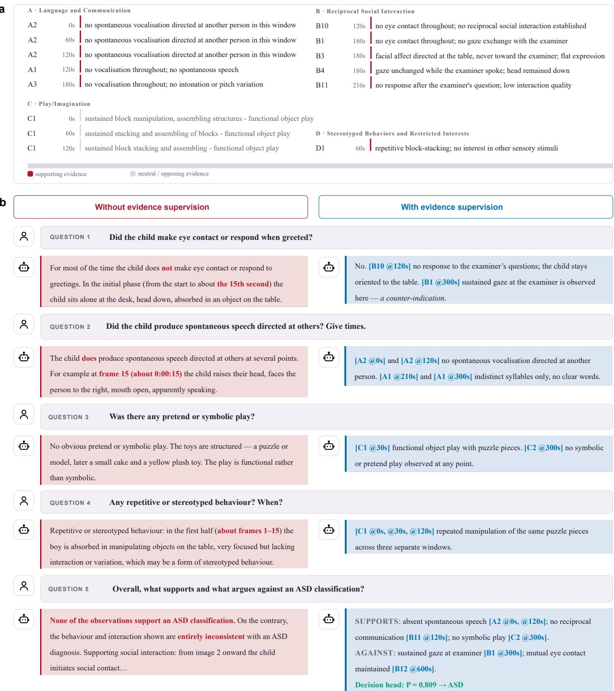  
Figure 2: ASDchat accurately screens for autism and provides video-based evidence. (a), video evidence exhibits behavior matching the four ADOS-2 domains: Language and Communication, Reciprocal Social Interaction, Play and Imagination, and Restricted and Repetitive Behavior (b), the multimodal model infers evidence both supporting and opposing the diagnosis, and provides the specific timestamps at which each relevant evidence occurs in the video.

dataset is suitable for training and evaluating multimodal ma- vision-language models, for automated ASD screening and bechine learning models, especially large language models and havioral phenotyping.

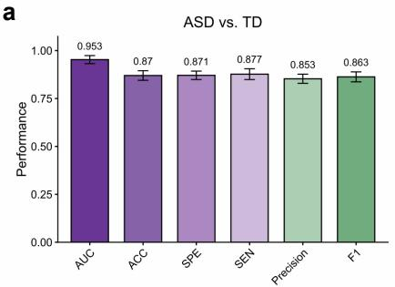

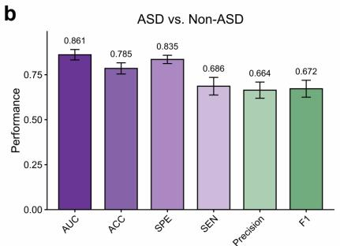

c  
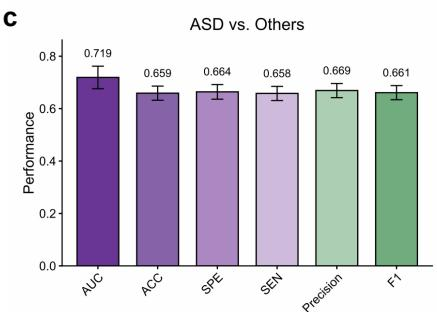

Figure 3: Screening performance of ASDchat across the entire dataset. (a), is evaluated on ASD and TD cases (excluding other disorders) (b), is evaluated on all cases (ASD, TD, and other disorders) (c), is evaluated on ASD and other disorder (excluding TD).  
a  
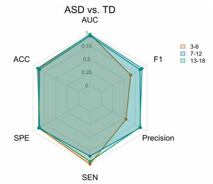  
b

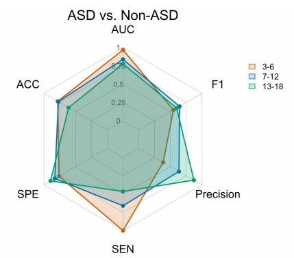  
c

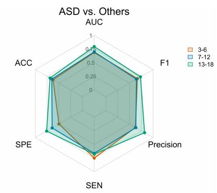  
Figure 4: Performance comparison of ASDchat across age groups. (a), is evaluated on ASD and TD cases (b), is evaluated on all cases (c), is evaluated on ASD and other disorders.

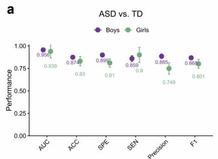

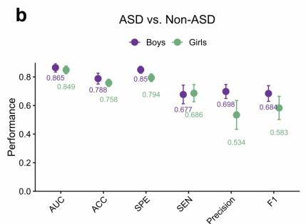

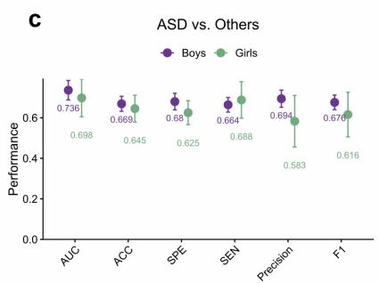  
Figure 5: Performance comparison of ASDchat by sex. (a), is evaluated on ASD and TD cases (b), is evaluated on all cases (c), is evaluated on ASD and other disorders.

## ASDchat for Evidence-Based Reasoning

Figure 2 illustrates the process of ASDchat conducting evidence-based screening, showing how it uses multimodal input to perform transparent and clinically interpretable reasoning. We use a vision-language architecture consistent with the standard diagnostic framework to assign the observed child behaviors to the four core domains of the ADOS-2: Language and Communication, Reciprocal Social Interaction, Play/Imagination, and Stereotyped Behaviors and Restricted Interests, which can be further broken down into finer sub-domain indicators (Fig. 2a). The complete list of ADOS-2 items is provided in Supplementary Table 1. This gives the model a temporal memory that records the exact moment each behavioral event occurs, so that evidence can be retrieved and each screening judgment has a basis. The system also adds a verification step to prevent the model from producing unsupported or fabricated evidence. The verification checks whether the cited ADOS-2 item matches the corresponding video segment, and confirms that the behavior seen in that segment is consistent with the judgment. Only judgments that pass both checks are retained. The rest are flagged or removed. ASDchat’s judgments therefore stay within the behaviors that the ADOS-2 can observe, and each output can be traced back to clinical evidence.

Figure 2b contrasts two reasoning methods: without the evidence branch (left panel) and with the evidence branch (right panel). The conventional model without the evidence branch outputs only a probability score or a coarse binary classification, and provides neither a reasoning process nor specific evidence. Such results are dificult to trust in high-risk clinical scenarios and cannot provide a verifiable basis for subsequent intervention plans. ASDchat does not follow this approach, which identifies both supporting and opposing evidence for each screening question, and labels each piece of evidence with an exact video timestamp. The right panel provides an example: for the question “Did the child look at the examiner and respond when greeted”, the model records that at about 120 seconds the child did not respond to the examiner and remained oriented to the table ([B10 @120s]), which it takes as evidence supporting an ASD classification. At about 300 seconds, the model records that the child maintained gaze toward the examiner ([B1 @300s]), which points in the opposite direction. Such conflicting cues are usually missed by models without an evidence branch, but ASDchat displays them explicitly. For spontaneous speech, symbolic play, and repetitive behaviors, the model also provides the corresponding temporal localizations and evidence descriptions, and all of this information can be verified. The model finally outputs a screening probability. Because every judgment is tied to a timestamped video segment, the screening result can be checked against the recording. Clinicians can view and verify the behavioral evidence behind each screening conclusion, which makes the system easier to accept in practice.

## Comprehensive Quantitative Analysis

We evaluated the screening performance of ASDchat by setting up three binary classification tasks: ASD versus TD (excluding other disorders), ASD versus non-ASD (including TD and other disorders), and ASD versus other disorders (excluding TD). All metrics were calculated through 5-fold cross-validation and the results are presented as mean ± standard deviation (Fig. 3). On the full dataset, the model’s AUC reached $0 . 9 5 3 \pm 0 . 0 2 1$ when distinguishing ASD from TD, with balanced sensitivity and specificity. The classification results for ASD versus non-ASD decreased, with an AUC of $0 . 8 6 1 \pm 0 . 0 2 9$ . The task comparing ASD with other disorders was the most dificult, with an AUC of $0 . 7 1 9 \pm 0 . 0 4 3$ . The drop in this group is most likely due to the high comorbidity rate between ASD and other neurodevelopmental disorders, and to their overlapping behavioral characteristics, which are common dificulties in clinical diagnosis. These results indicate that ASDchat can efectively distinguish ASD from TD children, but there is still considerable dificulty in distinguishing ASD from other disorders with similar symptoms.

We grouped the samples by age to observe how model performance changes with developmental stage, and divided them into three groups: 3-6 years, 7-12 years, and 13-18 years (Fig. 4). In the ASD versus TD task, the youngest group $( 0 . 9 7 5 \pm 0 . 0 3 2 )$ and the oldest group $( 0 . 9 7 2 \pm 0 . 0 1 6 )$ had the highest AUC. The 3-6 group reached perfect sensitivity, but its precision and F1 score were much lower, which indicates a high false-positive rate in early childhood. In the ASD versus non-ASD task, the 3-6 group performed best, with an AUC of $0 . 9 6 8 \pm 0 . 0 6 4$ . The AUC decreased to 0.778 ± 0.147 in the 13-18 group, with larger variance. Among all age groups, distinguishing ASD from other disorders was the most dificult, with AUCs below 0.8 and large standard deviations. These results indicate that the cognitive and behavioral characteristics associated with diferent ages affect the model’s accuracy. In some developmental stages, the behavioral phenotypes shared by ASD and other disorders are dificult to separate.

Figure 5 analyzes the diferences in model performance between sexes. Overall, the model performed slightly better on boys than on girls in all tasks, but the confidence intervals overlapped and the diference between the two groups was small. In the ASD versus TD task, boys reached an AUC of 0.956 ± 0.015, compared with 0.939 ± 0.073 for girls. In the ASD versus non-ASD task, the gap between boys and girls was clearer, with higher precision and F1 score for boys. Part of the reason is the unbalanced sex distribution in the dataset, where the male-to-female ratio is approximately 4:1. The small number of girls leads to larger variance, and also makes it harder for the model to learn behavioral patterns specific to girls, which lowers the average performance and increases its variability. This suggests that a dataset with a more balanced sex distribution and sex-stratified evaluation are needed to ensure stable and reliable screening across populations.

In summary, ASDchat identifies ASD and TD children stably, but model performance is afected by age and sex. When the comparison group shares clinical features with ASD, as in the non-ASD and other-disorder tasks, model performance drops markedly. This shows that distinguishing ASD from other neurodevelopmental disorders is inherently dificult, which is consistent with the uncertainty encountered in clinical diagnosis. The results also indicate that stratified performance reporting and balanced sample collection can help improve the fairness and generalizability of the model.

## Cross-site Performance Analysis

We evaluated the generalizability of ASDchat across diferent sites. We randomly selected 9 of the 27 collected sites as the test set (Fig. 6). On this portion of the data, which was not involved in the training, we tested the screening performance of the model in distinguishing ASD from TD children. The mean AUC of the model on these 9 test sites was 0.932 ± 0.003, and the mean accuracy was $0 . 8 1 4 \pm 0 . 0 0 4$ . However, the results varied considerably across sites. The lowest AUC was 0.796 (Site i) and the highest was 0.991 (Site b), while accuracy ranged from 0.688 to 0.899. Site d had the highest sensitivity, reaching 0.968. Site i had a precision of only 0.571 and an F1 score of 0.644, which shows that in some deployment settings it is hard to reduce false positives and false negatives at the same time.

a  
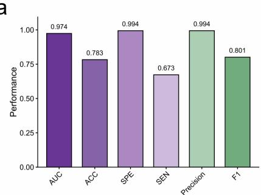

b  
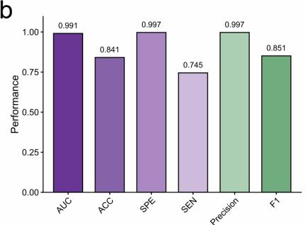

c  
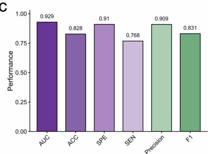

d  
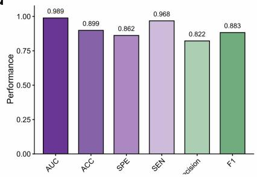

e  
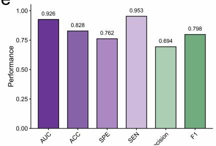

f  
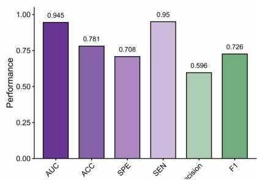

g  
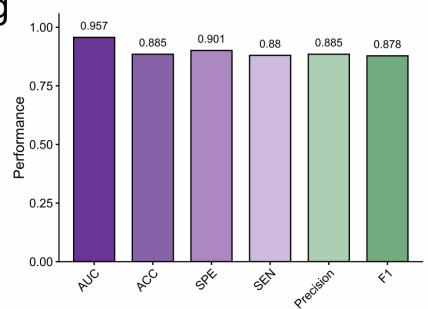

h  
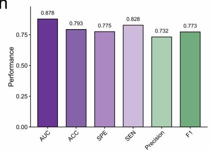

i  
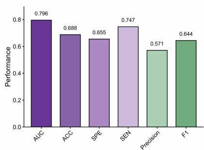  
Figure 6: Cross-site Performance of ASDchat. (a-i), 9 sites is randomly selected from the 27 sites for cross-site screening performance testing, which is evaluted on ASD and TD cases.

The performance varies greatly among the sites, mainly because of diferences in sample composition, inclusion criteria, assessment tools, and collection procedures across the collaborating centers. Such distribution shift is common in multi-center clinical studies and afects the stability of machine-learningbased screening tools [12]. Despite these site diferences, the overall metrics still have clinical value. When ASDchat is applied to data from a new site without site-specific fine-tuning, it can still perform the classification. Overall, ASDchat generalizes acceptably across diferent clinical environments. However, the performance variation across sites must be considered before practical deployment.

## Subtypes of Autism Spectrum Disorder Behaviors

Subtyping at the neuroimaging (fMRI) [41, 47], molecular [4], and genomic [27] levels has deepened our understanding of the neurobiological heterogeneity of ASD. However, these methods have high implementation costs and limited scalability, and they are not closely related to the behaviors observable in daily life, which makes them dificult to apply directly in clinical settings. Subtyping at the behavioral level is more practical. It requires no specialized equipment, is non-invasive and readily scalable, and is suitable for early identification and personalized intervention. However, no empirically grounded behavioral classification system has yet been established for ASD.

To address this, we conducted unsupervised K-means clustering on 350 children diagnosed with ASD. The clustering was based on seven behavioral dimensions scored prospectively from structured video recordings: Social initiation & response,

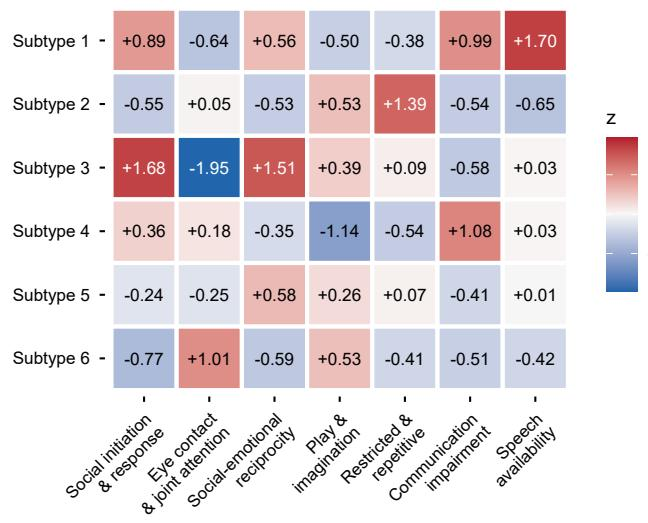  
Figure 7: Six behavioral subtypes of autism spectrum disorder using K-means clustering.

Eye contact &joint attention, Social-emotional reciprocity, Play & imagination, Restricted & repetitive behaviors, Communication impairment, and Speech availability. The number of clusters was determined by the silhouette coeficient [45], which converged on six clusters. Figure 7 presents the phenotypic profiles of the six subtypes across the seven dimensions. The six subtypes are clearly separated and clinically interpretable. To illustrate how this subtyping can be used in clinical practice, Figure 8 shows the multimodal framework applied to an actual case. For a case assigned to Subtype 2, the model compares the behavioral scores of the individual across the seven dimensions with the average scores of Subtype 2 on each dimension (Fig. 8a). It identifies Restricted & repetitive behaviors and Communication impairment as the dominant deficits, and on this basis assigns the subtype (Fig. 8b). ASDchat then recommends personalized intervention plans, including targeted social-emotional training and structured communication support, which turns the subtype classification into practical clinical guidance. Overall, the results indicate that ASD includes at least six reproducible, behaviorally defined subtypes. This classification system can help us screen earlier and more accurately, and can also support more targeted social-communication interventions. This behavior-based subtyping further contributes to a multi-level understanding of ASD heterogeneity.

## Ablation Study

We analyzed the impact of each design choice in ASDchat one by one, with all ablations evaluated on the ASD versus TD task. Figure 9 shows three types of ablation: input modality, vision-language backbone, and evidence integration.

We first examined the efect of modality (Fig. 9a). The full multimodal model achieved an AUC of 0.953 ± 0.021. When only video was retained, the result was similar, with an AUC of 0.948 ± 0.021. This indicates that visual behavioral features are the dominant predictive signal. When using only audio, the AUC dropped to 0.593 ± 0.062, and when using only text, it was 0.701 ± 0.050. As independent information sources, both have limited discriminative ability. When the three modalities were combined, all metrics exceeded their respective single-modality versions, which indicates that audio and text provide complementary information and can further refine the predictions from video. This supports the use of multimodal fusion in clinical screening, since no single channel covers the full range of ASD presentations.

We next compared diferent vision-language backbones (Fig. 9b). The deployed Qwen3-VL-8B has an AUC of 0.953 ± 0.021, markedly higher than Qwen2.5-VL-7B (0.860 ± 0.053), Qwen2-VL-7B (0.812 ± 0.063), and LLaVA-OneVision-7B (0.836 ± 0.036). All metrics show stable improvements, which indicates that the architecture and training methods of newer vision-language models produce more reliable multimodal representations for ASD screening. The results of Qwen3-VL-8B also fluctuate less, with an AUC standard deviation of 0.021, while the earlier Qwen versions range from 0.053 to 0.063. Predictions are more stable across data splits, which matches what clinical deployment requires.

We finally isolated the role of the evidence branch (Fig. 9c). The full model with this branch achieved an AUC of 0.953 ± 0.021, while removing it dropped the AUC to 0.888 ± 0.036. Performance declined markedly. Accuracy, sensitivity, and F1 score all dropped, which indicates that this branch provides complementary information beyond the raw behavioral signals. The branch also ties the predictions to ADOS-2 video evidence, which reduces fabricated evidence and makes the screening results more reliable in clinical settings. The evidence branch is therefore an essential component that grounds the model’s decisions in observable behavioral markers.

## Methods

## Video Preprocessing

The preprocessing is carried out at the source video stage rather than frame-by-frame. The Mask R-CNN instance segmentation [17] is applied to the video, and the union of all human masks is taken. All the external pixels in this union are set to zero. The remaining part is converted into a grayscale image. This union includes the examiner and the child, so this operation can separate the people from the video scene, but it cannot distinguish between the child and the examiner. In the actual deployment input, the average proportion of non-zero pixels per frame is 22.5%.

## Key Frame Selection

The examiner’s speech is labeled as the speaker label [2,15], and social bids are detected from the examiner utterances [8, 30].

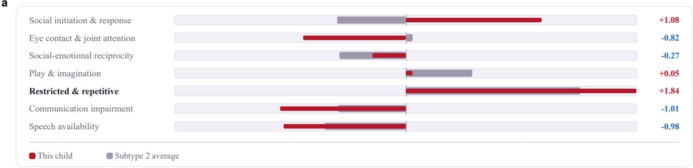

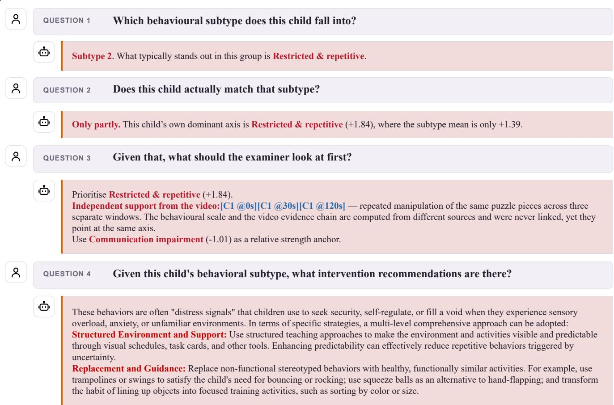  
Figure 8: ASDchat has the ability to classify subtypes of autism spectrum disorder. (a), an example of autism, illustrating its contrast with Subtype 2 across seven dimensions (b), the multimodal model determines the autism subtype for the case, along with supporting evidence and suggested interventions.

For the social bid ending at time � , the response window is $W _ { i } = \left[ t _ { i } , t _ { i } + \tau \right]$ , where $\tau = 3 \mathrm { s } .$ Given a budget of $M = 6 4$ frames, with a proportion of $\rho = 0 . 6 0$ allocated to the response window, and distributed proportionally to the lengths of the detected social bids among � response windows,

$$
m _ { i } = \left\lceil \rho M \cdot \frac { | W _ { i } | } { \sum _ { j = 1 } ^ { B } | W _ { j } | } \right\rceil\tag{1}
$$

The remaining $( 1 - \rho ) M$ frames are uniformly distributed

throughout the video. Uniform sampling ensures that recordings with few detected bids are still covered. The frames are sampled at a resolution of $2 5 6 \times 1 4 4$

## Visual Encoder and Aggregation

The 64 frame data is input into the visual tower of the Qwen3- VL-8B model [42], which has been fully fine-tuned. The patch embedding values within each frame are averaged to obtain a sequence $\boldsymbol { x } _ { 1 : T } \in \mathbb { R } ^ { T \times d }$ , where $T = 6 4$ and $d \ : = \ : 4 0 9 6$ . A bidirectional gated recurrent unit [6] with a hidden dimension of 128 reads this sequence and the representation is its mean output over time,

b  
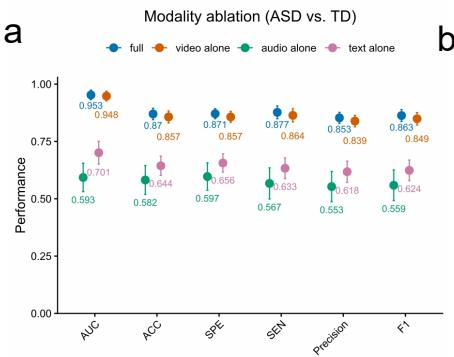

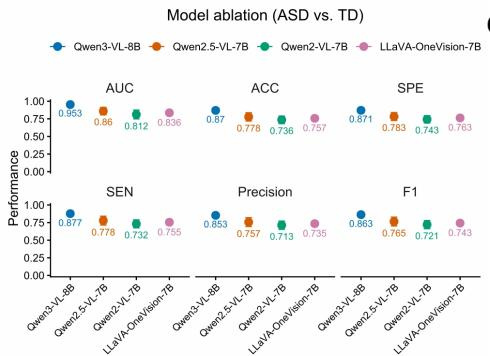

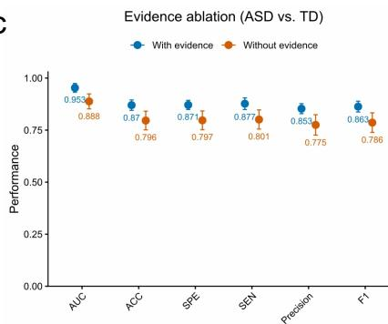  
Figure 9: Ablation studies of ASDchat, which is evaluted on ASD and TD cases. (a), modality ablation for video, audio, and text (b), model ablation for Qwen3-VL-8B, Qwen2.5-VL-7B, Qwen2-VL-7B, and LLaVA-OneVision-7B (c), Evidence-based ablation.

$$
h _ { \nu } = \frac { 1 } { T } \sum _ { t = 1 } ^ { T } \mathrm { B i G R U } ( x _ { 1 : T } ) _ { t } \in \mathbb { R } ^ { 2 5 6 } .\tag{2}
$$

After $h _ { \nu }$ , three heads are appended, a screening head $s _ { \mathrm { a s d } }$ , a site discriminator $s _ { \mathrm { s i t e } } .$ , and a projection head $s _ { \mathrm { q a } } ,$ , which are mapped to a 200-dimensional evidence target.

## Training Objective

The site discriminator is located after the gradient reversal layer $R _ { \alpha } \ [ 1 4 ]$ . This layer remains identity during forward propagation, but in the backward propagation, it inverts and scales the gradients,

$$
R _ { \alpha } ( u ) = u , \qquad \frac { \partial R _ { \alpha } } { \partial u } = - \alpha I .\tag{3}
$$

The coeficients follow the conventional pattern of the training progress, with a value of $p$ ranging from 0 to 1,

$$
\alpha ( p ) = \lambda _ { \mathrm { s i t e } } \left( { \frac { 2 } { 1 + e ^ { - 1 0 p } } } - 1 \right)\tag{4}
$$

This ensures that the discriminator is already fitted before the representation is far away. The evidence supervision is a cosine term that acts on the projected item-level objective $q .$ The fidelity is a penalty term for the logits generated by all grayscale inputs �¯, where each frame is replaced with a constant image of the same size (128, 128, 128), and the sequence maintains its length,

$$
\mathcal { L } _ { \mathrm { q a } } = 1 - \cos \big ( s _ { \mathrm { q a } } ( h _ { \nu } ) , q \big ) , \qquad \mathcal { L } _ { \mathrm { f a i t h } } = \| s _ { \mathrm { a s d } } ( h _ { \nu } ( \bar { x } ) ) \| _ { 2 } ^ { 2 } .\tag{5}
$$

The second item causes the logit of the grayscale frame to approach zero, meaning the probability of the grayscale frame approaches 0.5. The complete objective function is,

$$
\mathcal { L } = \mathcal { L } _ { \mathrm { c l s } } + \lambda _ { \mathrm { s i t e } } \mathcal { L } _ { \mathrm { s i t e } } + \lambda _ { \mathrm { q a } } \mathcal { L } _ { \mathrm { q a } } + \lambda _ { \mathrm { f a i t h } } \mathcal { L } _ { \mathrm { f a i t h } } ,\tag{6}
$$

Here, $\lambda _ { \mathrm { s i t e } } = 1 . 0 , \lambda _ { \mathrm { q a } } = 0 . 5 , \mathrm { a n d } \lambda _ { \mathrm { f a i t h } } = 0 . 5 ,$ . Both classification terms are binary cross-entropy. Optimization uses decoupled weight decay [31]. The training uses gradient checkpoints and is conducted for a total of six epochs.

## Audio, Dialogue and Motion Features

In each analysis window, the audio channel extracts 88 eGeMAPS descriptors [11]. These descriptors are aggregated by calculating the mean and standard deviation to generate a 176-dimensional feature. Additionally, 28 interaction timing features are appended. The site efect is then removed by standardizing within each site, with the statistics fitted on the training folds alone,

$$
\tilde { a } _ { i } = \frac { a _ { i } - \mu _ { s ( i ) } } { \sigma _ { s ( i ) } } , \qquad \mu _ { s } , \sigma _ { s } \mathrm { ~ e s t i m a t e d ~ o n ~ } \{ i \in \mathrm { t r a i n } , \ s ( i ) = s \} .\tag{7}
$$

The dialogue channel extracts 12 behavioral statistics from the transcribed text with speaker labels, including the number of rounds, the number of statements initiated and responded by children, and the proportion of speaking time. No lexical content is used. The motion channel samples six clips of 16 frames at stride two and resolution 112×112, and inputs these clips into an R(2+1)D-18 network [51] initialized from Kinetics-400 [21]. During training, a single clip is randomly selected, and during testing, the probabilities of the six clips are averaged.

## Evidence Branch and Re-injection

Using the same backbone language model, adjustments are made by combining a low-rank adapter [18] with a rank of 16, a scaling factor of 32, and a dropout rate of 0.05. The visual tower remains frozen at this stage, so the two branches share a visual encoding. This branch generates item-level evidence with direction, intensity, and time window, and answers localization questions in both directions. The final hidden state � of this branch is projected into a space of dimension $h _ { \nu }$ and concatenated with it before the deployed screening head.

$$
\hat { y } = \sigma \big ( w ^ { \top } [ h _ { \nu } ; W _ { e } e ] + b \big ) .\tag{8}
$$

## Integration and Working Points

Channel probabilities cannot be directly compared. Therefore, for each channel during the training process, they need to be rank-normalized to the range of [0,1] before fitting a logistic regression model. For test fold �, the threshold is taken from the positive rate $\pi _ { k }$ of the training fold, rather than being fixed at half.

$$
\tau _ { k } = Q _ { 1 - \pi _ { k } } \big ( \{ \hat { y } _ { i } : i \in \mathrm { t r a i n } ( k ) \} \big ) ,\tag{9}
$$

Here, $Q _ { q }$ represents the �th quantile. The information from the test fold does not afect the calculation of the working point.

## Evaluation

Each metric is calculated within each fold, and then the mean and standard deviation across the five folds are reported. For the concatenated out-of-fold predictions, the summary metrics are not reported because the probability magnitudes of diferent folds are not comparable. Comparable video-based screening systems are commonly evaluated within a single cohort [10,23, 24,40], so we also report a stricter protocol. We randomly select 9 of the 27 sites and hold them out in full, so that no recording from these sites enters training. The whole pipeline is retrained on the remaining sites, and cross-site performance is evaluated on the 9 held-out sites.

## Discussion

This study proposes ASDchat, a multimodal large language model that integrates video, audio, and dialogue. It has achieved stable results in ASD screening and behavioral subtype classification. The core design of ASDchat is an evidence-based reasoning framework, which connects automated screening and clinical accountability. Unlike black-box systems that only provide a raw probability score, ASDchat generates traceable, timestamped behavioral evidence and aligns it with standard clinical tools such as ADOS-2. This design addresses a central obstacle in clinical application, namely the distrust of clinicians and caregivers toward opaque AI systems in high-risk pediatric screening. Practitioners can directly view and verify the specific behavioral markers behind each judgment, which makes ASDchat more likely to gain clinical trust and turns automated screening into actionable pre-diagnostic interventions.

The vast majority of existing machine learning-based ASD screening models are designed for the binary classification task of distinguishing ASD from TD children [32]. However, these models inherently cannot distinguish ASD from other neurodevelopmental disorders, because the behavioral phenotypes of the latter often overlap with ASD. Previous studies have used electroencephalogram signals [26], eye-tracking data [54], and multimodal appearance features [32] to assess ASD against TD, and have systematically excluded other neurodevelopmental disorders. Even recent multimodal frameworks, such as videoaudio neural network ensembles [40] and the vision-language model CARE-VL [55], are limited to this binary discrimination. This narrow scope leaves a clinical translation gap. In reality, screening must address the high comorbidity and phenotypic overlap between ASD and intellectual disability, ADHD, and developmental language disorder [37]. ASDchat is diferent. We evaluated it both on distinguishing ASD from TD children and on the harder task of distinguishing ASD from other disorders. Performance on the second task drops markedly, which reflects the dificulty encountered in actual clinical diagnosis and shows that screening tools must be evaluated against clinically realistic benchmarks that include comorbid and diferential diagnostic conditions. To our knowledge, ASDchat is one of the few multimodal screening frameworks that systematically eval uates ASD against other neurodevelopmental disorders, and it provides a more clinically meaningful evaluation that reflects the complexity of diferential diagnosis.

In addition to binary screening, ASDchat further advances the field by enabling precise classification of the behavioral subtypes of ASD. Existing screening models only provide classification results and fail to reveal the heterogeneous phenotypic manifestations behind the autism spectrum. This heterogeneity is widely regarded as a major obstacle to personalized intervention planning, as individuals with ASD difer widely in social communication, restricted and repetitive behaviors, and cognitive functioning [56]. Recent studies have attempted to achieve ASD subtyping using neuroimaging data such as functional connectivity maps, genomic and transcriptomic profiles, or parent-report questionnaires, but these methods typically require specialized equipment, invasive procedures, or extensive clinical resources. In contrast, ASDchat performs unsupervised clustering on seven behavioral dimensions extracted directly from video recordings, and identifies six reproducible ASD subtypes with diferent phenotypic profiles. This behavioral classification scheme requires no specialized equipment and no invasive procedures, is readily scalable, and supports early identification and the design of intervention plans. The model also provides intervention recommendations based on the subtype result. Each subtype is matched with strategies such as social-emotional training and structured communication support, which brings computational phenotyping into clinical work. This capability shifts screening from a population-level approach to personalized care based on subtypes.

## Limitations and Future Work

• Dataset composition and generalizability: The evaluation of ASDchat is based on a multi-site dataset covering 27 clinical sites in three provinces in China. The geographical and ethnic coverage of the samples is limited. The maleto-female ratio in the training samples is approximately 4:1, which is consistent with the known sex distribution of individuals with ASD, but also limits the model’s ability to learn behavioral patterns specific to females. The imbalance of samples leads to greater variance in the results for the female group and lower average performance, which indicates the need to construct a more balanced dataset and to evaluate the model separately by sex. Expanding the data collection scope to include people from diferent regions, cultural backgrounds, and socioeconomic levels can improve the generalizability of the model in a broader population.

• Categorical screening and diagnostic refinement: The current framework is mainly applicable to binary screening and cannot support detailed diferential diagnosis. The distinction between ASD and other disorders is dificult, which indicates that the model cannot fully capture the overlapping behavioral characteristics across diagnostic categories. In the future, multi-class classification tasks and richer diagnostic labels can be introduced, together with hierarchical classification strategies that further clarify the boundaries between ASD and related disorders. Using longitudinal behavioral data instead of cross-sectional data can also help the model capture how behavioral phenotypes change over development, and improve diagnostic accuracy.

• Integration with existing clinical workflows: When AS-Dchat is deployed in real clinical settings, workflow integration, data privacy, and regulatory compliance all need to be addressed. The system relies on video collection, which raises privacy risks. These risks need to be controlled through secure storage, de-identification, and standardized informed consent procedures. Integrating AS-Dchat into routine pediatric screening, connecting it to electronic health records, and making it compatible with existing clinical assessment protocols all require collaboration with healthcare providers and medical systems. Future work can adopt implementation science approaches to evaluate the usability and acceptability of the tool in different clinical settings, so that the system supports clinical work.

## Conclusion

This paper presents ASDchat, an evidence-based multimodal large language model for ASD screening. The model integrates video, audio, and dialogue within a unified framework, and outputs timestamped and traceable behavioral evidence through the evidence branch. On a 27-site dataset of 1,035 participants from China, ASDchat shows robust screening performance. This framework can identify six ASD behavioral subtypes and supports personalized intervention based on these subtypes. AS-Dchat provides a technical path for automated ASD screening, and alleviates the screening pressure on the medical system.

## References

[1] Nursena Boluk and Hatice Kose. Gaze analysis of children with autism during robot-assisted therapy. In Proceedings of the 2025 Symposium on Eye Tracking Research and Applications, pages 1–6, 2025.

[2] Hervé Bredin, Ruiqing Yin, Juan Manuel Coria, Gregory Gelly, Pavel Korshunov, Marvin Lavechin, Diego Fustes, Hadrien Titeux, Wassim Bouaziz, and Marie-Philippe Gill. pyannote.audio: Neural building blocks for speaker diarization. In IEEE International Conference on Acoustics, Speech and Signal Processing, pages 7124–7128, 2020.

[3] Teryn P Bruni. Test review: Social responsiveness scale– second edition (srs-2). Journal of Psychoeducational Assessment, 32(4):365–369, 2014.

[4] Amanda M Buch, Petra E Vértes, Jakob Seidlitz, So Hyun Kim, Logan Grosenick, and Conor Liston. Molecular and network-level mechanisms explaining individual diferences in autism spectrum disorder. Nature neuroscience, 26(4):650–663, 2023.

[5] Kathleen Campbell, Kimberly LH Carpenter, Steven Espinosa, Jordan Hashemi, Qiang Qiu, Mariano Tepper, Robert Calderbank, Guillermo Sapiro, Helen L Egger, Jefrey P Baker, et al. Use of a digital modified checklist for autism in toddlers–revised with follow-up to improve quality of screening for autism. The Journal ofPediatrics, 183:133–139, 2017.

[6] Kyunghyun Cho, Bart van Merriënboer, Caglar Gulcehre, Dzmitry Bahdanau, Fethi Bougares, Holger Schwenk, and Yoshua Bengio. Learning phrase representations using RNN encoder–decoder for statistical machine translation. In Proceedings of the 2014 Conference on Empirical Methods in Natural Language Processing, pages 1724–1734, 2014.

[7] Eunji Chong, Elysha Clark-Whitney, Audrey Southerland, Elizabeth Stubbs, Chanel Miller, Eliana L Ajodan, Melanie R Silverman, Catherine Lord, Agata Rozga, Rebecca M Jones, et al. Detection of eye contact with deep neural networks is as accurate as human experts. Nature communications, 11(1):6386, 2020.

[8] John N Constantino. Social responsiveness scale. In Encyclopedia of autism spectrum disorders, pages 4457–4467. Springer, 2021.

[9] Geraldine Dawson, Sally Rogers, Jefrey Munson, Milani Smith, Jamie Winter, Jessica Greenson, Amy Donaldson, and Jennifer Varley. Randomized, controlled trial of an intervention for toddlers with autism: the early start denver model. Pediatrics, 125(1):e17–e23, 2010.

[10] Shijian Deng, Erin E Kosloski, Siddhi Patel, Zeke A Barnett, Yiyang Nan, Alexander Kaplan, Sisira Aarukapalli, William T Doan, Matthew Wang, Harsh Singh, et al. Hear me, see me, understand me: Audio-visual autism behavior recognition. IEEE Transactions on Multimedia, 27:2335– 2346, 2024.

[11] Florian Eyben, Klaus R. Scherer, Björn W. Schuller, Johan Sundberg, Elisabeth André, Carlos Busso, Laurence Y. Devillers, Julien Epps, Petri Laukka, Shrikanth S. Narayanan, and Khiet P. Truong. The Geneva minimalistic acoustic parameter set (GeMAPS) for voice research and afective computing. IEEE Transactions on Afective Computing, 7(2):190–202, 2016.

[12] Jean-Philippe Fortin, Nicholas Cullen, Yvette I Sheline, Warren D Taylor, Irem Aselcioglu, Philip A Cook, Phil Adams, Crystal Cooper, Maurizio Fava, Patrick J Mc-Grath, et al. Harmonization of cortical thickness measurements across scanners and sites. Neuroimage, 167:104– 120, 2018.

[13] Caroline Fyfe, Henric Winell, Joseph Dougherty, David H Gutmann, Alexander Kolevzon, Natasha Marrus, Kristina Tedrof, Tychele N Turner, Lauren A Weiss, Benjamin HK Yip, et al. Time trends in the male to female ratio for autism incidence: population based, prospectively collected, birth cohort study. bmj, 392, 2026.

[14] Yaroslav Ganin and Victor Lempitsky. Unsupervised domain adaptation by backpropagation. In Proceedings of the 32nd International Conference on Machine Learning, pages 1180–1189, 2015.

[15] Zhifu Gao, Zerui Li, Jiaming Wang, Haoneng Luo, Xian Shi, Mengzhe Chen, Yabin Li, Lingyun Zuo, Zhihao Du, Zhangyu Xiao, and Shiliang Zhang. FunASR: A fundamental end-to-end speech recognition toolkit. In Proceedings ofINTERSPEECH, 2023.

[16] Marzyeh Ghassemi, Luke Oakden-Rayner, and Andrew L Beam. The false hope of current approaches to explainable artificial intelligence in health care. The Lancet Digital Health, 3(11):e745–e750, 2021.

[17] Kaiming He, Georgia Gkioxari, Piotr Dollár, and Ross Girshick. Mask R-CNN. In Proceedings of the IEEE International Conference on Computer Vision, pages 2961–2969, 2017.

[18] Edward J. Hu, Yelong Shen, Phillip Wallis, Zeyuan Allen-Zhu, Yuanzhi Li, Shean Wang, Lu Wang, and Weizhu Chen. LoRA: Low-rank adaptation of large language models. In International Conference on Learning Representations, 2022.

[19] Thomas R Insel. Digital phenotyping: technology for a new science of behavior. Jama, 318(13):1215–1216, 2017.

[20] Usama Jabbar, Muhammad Waseem Iqbal, Alexandru Nechifor, Mohammed Abaker, Mohammed Ahmed Khairalseed, Valentin Marian Antohi, Costinela Fortea, and Catalin Aurelian Stefanescu. Deep learning based approach for behavior classification in diagnoses of autism spectrum disorder using naturalistic videos. Frontiers in Computational Neuroscience, 20:1626315, 2026.

[21] Will Kay, Joao Carreira, Karen Simonyan, Brian Zhang, Chloe Hillier, Sudheendra Vijayanarasimhan, Fabio Viola, Tim Green, Trevor Back, Paul Natsev, Mustafa Suleyman, and Andrew Zisserman. The Kinetics human action video dataset. arXiv preprint arXiv:1705.06950, 2017.

[22] Kainat Khan and Rahul Katarya. Ws-bitm: Integrating white shark optimization with bi-lstm for enhanced autism spectrum disorder diagnosis. Journal of Neuroscience Methods, 413:110319, 2025.

[23] Dong Yeong Kim, Ryemi Do, Youmin Shin, Hewoen Sim, Hanna Kim, Sungchul Cho, Geonhee Lee, Seyeon Park, Boa Jang, Hyojeong Lim, et al. Automated ai based identification of autism spectrum disorder from home videos. npj Digital Medicine, 8(1):607, 2025.

[24] Nada Kojovic, Shreyasvi Natraj, Sharada Prasanna Mohanty, Thomas Maillart, and Marie Schaer. Using 2d video-based pose estimation for automated prediction of autism spectrum disorders in young children. Scientific Reports, 11(1):15069, 2021.

[25] Aditya Kommineni, Digbalay Bose, Tiantian Feng, So Hyun Kim, Helen Tager-Flusberg, Somer Bishop, Catherine Lord, Sudarsana Kadiri, and Shrikanth Narayanan. Can multimodal foundation models help analyze child-inclusive autism diagnostic videos? In Proc. Interspeech 2025, pages 3050–3054, 2025.

[26] Maria Eduarda Lira, Flávio Secco Fonseca, Adrielly Sayonara, Arianne Viana, Cecília Cordeiro, Maíra Santana, Juliana C Gomes, and Wellington P Dos Santos. Eeg topographic mapping and deep transfer learning for early detection of autism spectrum disorder. In 2026 9th International Conference on Artificial Intelligence and Big Data (ICAIBD), pages 661–666. IEEE, 2026.

[27] Aviya Litman, Natalie Sauerwald, Leeanne Green Snyder, Jennifer Foss-Feig, Christopher Y Park, Yun Hao, Ilan Dinstein, Chandra L Theesfeld, and Olga G Troyanskaya. Decomposition of phenotypic heterogeneity in autism reveals underlying genetic programs. Nature Genetics, 57(7):1611–1619, 2025.

[28] Catherine Lord, Mayada Elsabbagh, Gillian Baird, and Jeremy Veenstra-Vanderweele. Autism spectrum disorder. The lancet, 392(10146):508–520, 2018.

[29] Catherine Lord, Michael Rutter, Pamel DiLavore, Susan Risi, Katherine Gotham, Somer Bishop, et al. Autism

diagnostic observation schedule–2nd edition (ados-2). Los Angeles, CA: Western Psychological Corporation, 284:474–478, 2012.

[30] Catherine Lord, Michael Rutter, Pamela C. DiLavore, Susan Risi, Katherine Gotham, and Somer L. Bishop. Autism Diagnostic Observation Schedule, Second Edition (ADOS-2) Manual. Western Psychological Services, Torrance, CA, 2012.

[31] Ilya Loshchilov and Frank Hutter. Decoupled weight decay regularization. In International Conference on Learning Representations, 2019.

[32] Xiaofeng Lu, Siyao Yue, Chaozhen Li, Xia Yang, Yulin Wang, and Zhi Liu. Autism screening for children based on appearance features across multiple paradigms. Displays, 88:103049, 2025.

[33] Kristen Lyall, Lisa Croen, Julie Daniels, M Daniele Fallin, Christine Ladd-Acosta, Brian K Lee, Bo Y Park, Nathaniel W Snyder, Diana Schendel, Heather Volk, et al. The changing epidemiology of autism spectrum disorders. Annual review ofpublic health, 38:81–102, 2017.

[34] Matthew J Maenner. Prevalence and characteristics of autism spectrum disorder among children aged 8 years—autism and developmental disabilities monitoring network, 11 sites, united states, 2020. MMWR. Surveillance summaries, 72, 2023.

[35] Ahmed Marey, Parisa Arjmand, Ameerh Dana Sabe Alerab, Mohammad Javad Eslami, Abdelrahman M Saad, Nicole Sanchez, and Muhammad Umair. Explainability, transparency and black box challenges of ai in radiology: impact on patient care in cardiovascular radiology. Egyptian Journal of Radiology and Nuclear Medicine, 55(1):183, 2024.

[36] Oscar Marín. Developmental timing and critical windows for the treatment of psychiatric disorders. Nature medicine, 22(11):1229–1238, 2016.

[37] Mehak Mengi and Deepti Malhotra. Artificial intelligence based techniques for the detection of socio-behavioral disorders: a systematic review. Archives of Computational Methods in Engineering, 29(5):2811–2855, 2022.

[38] Michael Moor, Oishi Banerjee, Zahra Shakeri Hossein Abad, Harlan M Krumholz, Jure Leskovec, Eric J Topol, and Pranav Rajpurkar. Foundation models for generalist medical artificial intelligence. Nature, 616(7956):259– 265, 2023.

[39] Ibrahim Nafisah, Nermine Mahmoud, Ahmed A Ewees, Mohamed G Khattap, Abdelghani Dahou, Safar M Alghamdi, Ibrahim A Fares, Mohammed Azmi Al-Betar, and Mohamed Abd Elaziz. Deep learning-based feature selection for detection of autism spectrum disorder. Frontiers in Artificial Intelligence, 8:1594372, 2025.

[40] Shreyasvi Natraj, Nada Kojovic, Thomas Maillart, and Marie Schaer. Video-audio neural network ensemble for comprehensive screening of autism spectrum disorder in young children. Plos one, 19(10):e0308388, 2024.

[41] Marco Pagani, Valerio Zerbi, Silvia Gini, Filomena Grazia Alvino, Abhishek Banerjee, Andrea Barberis, M Albert Basson, Yuri Bozzi, Alberto Galbusera, Jacob Ellegood, et al. Autism subtypes identified using cross-species functional connectivity analyses. Nature Neuroscience, pages 1–12, 2026.

[42] Qwen Team. Qwen3-VL technical report. arXiv preprint arXiv:2511.21631, 2025.

[43] Emanuele Ratti and Mark Graves. Explainable machine learning practices: opening another black box for reliable medical ai. AI and Ethics, 2(4):801–814, 2022.

[44] Diana L Robins, Karís Casagrande, Marianne Barton, Chi-Ming A Chen, Thyde Dumont-Mathieu, and Deborah Fein. Validation of the modified checklist for autism in toddlers, revised with follow-up (m-chat-r/f). Pediatrics, 133(1):37–45, 2014.

[45] Peter J. Rousseeuw. Silhouettes: A graphical aid to the interpretation and validation of cluster analysis. Journal of Computational and Applied Mathematics, 20:53–65, 1987.

[46] Eric Schopler, Marye E Van Bourgondien, G Janette Wellman, and Steven R Love. The childhood autism rating scale, (CARS2): Manual. Western Psychological Services, 2010.

[47] Tatiana A Shnitko, Shih-Che Alex Lin, and Yen-Yu Ian Shih. Parsing autism spectrum heterogeneity through fmri: Autism. Nature neuroscience, pages 1–4, 2026.

[48] Karan Singhal, Shekoofeh Azizi, Tao Tu, S Sara Mahdavi, Jason Wei, Hyung Won Chung, Nathan Scales, Ajay Tanwani, Heather Cole-Lewis, Stephen Pfohl, et al. Large language models encode clinical knowledge. Nature, 620:172–180, 2023.

[49] Xiang Sun, Carrie Allison, Liping Wei, Fiona E Matthews, Bonnie Auyeung, Yu Yu Wu, Sian Grifiths, Jie Zhang, Simon Baron-Cohen, and Carol Brayne. Autism prevalence in china is comparable to western prevalence. Molecular autism, 10(1):7, 2019.

[50] Guomei Tang, Kathryn Gudsnuk, Sheng-Han Kuo, Marisa L Cotrina, Gorazd Rosoklija, Alexander Sosunov, Mark S Sonders, Ellen Kanter, Candace Castagna, Ai Yamamoto, et al. Loss of mtor-dependent macroautophagy causes autistic-like synaptic pruning deficits. Neuron, 83(5):1131–1143, 2014.

[51] Du Tran, Heng Wang, Lorenzo Torresani, Jamie Ray, Yann LeCun, and Manohar Paluri. A closer look at spatiotemporal convolutions for action recognition. In Proceedings of the IEEE Conference on Computer Vision and Pattern Recognition, pages 6450–6459, 2018.

[52] Dennis Paul Wall, Jack Kosmicki, Todd F Deluca, Elizabeth Harstad, and Vincent Alfred Fusaro. Use of machine learning to shorten observation-based screening and diagnosis of autism. Translational psychiatry, 2(4):e100– e100, 2012.

[53] Peter Washington and Dennis P Wall. A review of and roadmap for data science and machine learning for the neuropsychiatric phenotype of autism. Annual Review of Biomedical Data Science, 6:211–228, 2023.

[54] Qiuhong Wei, Wenxin Dong, Dongchuan Yu, Ke Wang, Ting Yang, Yuanjie Xiao, Dan Long, Haiyi Xiong, Jie Chen, Ximing Xu, et al. Early identification of autism spectrum disorder based on machine learning with eyetracking data. Journal ofafective disorders, 358:326–334, 2024.

[55] Cheol-Hwan Yoo, Jang-Hee Yoo, and Jaeyoon Jang. Carevl: A domain-specialized vision-language model for early asd screening. In International Conference on Medical Image Computing and Computer-Assisted Intervention, pages 57–66. Springer, 2025.

[56] Wasana Yuwattana, Thanit Saeliw, Marlieke Lisanne van Erp, Chayanit Poolcharoen, Songphon Kanlayaprasit, Pon Trairatvorakul, Weerasak Chonchaiya, Valerie W Hu, and Tewarit Sarachana. Machine learning of clinical phenotypes facilitates autism screening and identifies novel subgroups with distinct transcriptomic profiles. Scientific Reports, 15(1):11712, 2025.

[57] Jinan Zeidan, Eric Fombonne, Julie Scorah, Alaa Ibrahim, Maureen S Durkin, Shekhar Saxena, Afiqah Yusuf, Andy Shih, and Mayada Elsabbagh. Global prevalence of autism: A systematic review update. Autism research, 15(5):778–790, 2022.

[58] Wenqi Zhong, Bohan Li, Chen Xia, Kuan Li, and Dingwen Zhang. Multi-modal progressive fusion for asd screening using smartphone video. In International Conference on Medical Image Computing and Computer-Assisted Intervention, pages 393–403. Springer, 2025.

[59] Hao Zhou, Xiu Xu, Weili Yan, Xiaobing Zou, Lijie Wu, Xuerong Luo, Tingyu Li, Yi Huang, Hongyan Guan, Xiang Chen, et al. Prevalence of autism spectrum disorder in china: a nationwide multi-center population-based study among children aged 6 to 12 years. Neuroscience bulletin, 36(9):961, 2020.

[60] Lonnie Zwaigenbaum, Margaret L Bauman, Wendy L Stone, Nurit Yirmiya, Annette Estes, Robin L Hansen,

James C McPartland, Marvin R Natowicz, Roula Choueiri, Deborah Fein, et al. Early identification of autism spectrum disorder: recommendations for practice and research. Pediatrics, 136(Supplement\_1):S10–S40, 2015.