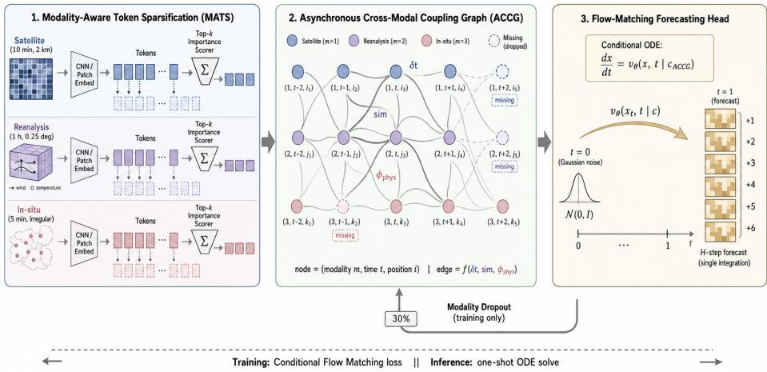
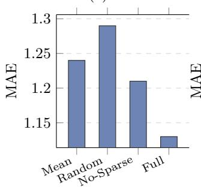
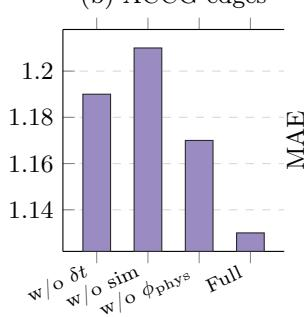
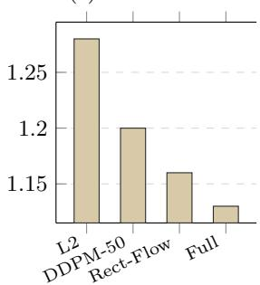
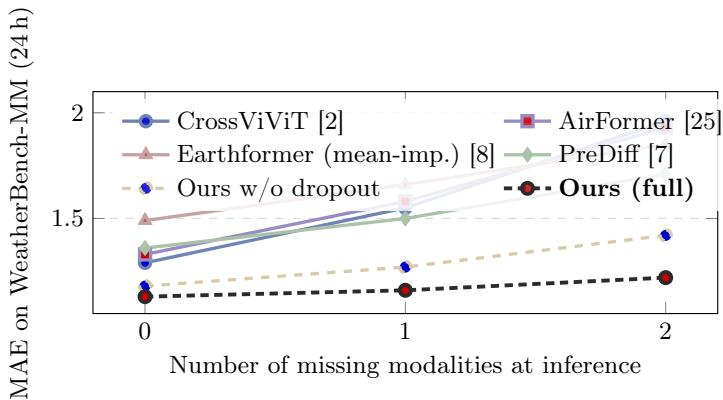
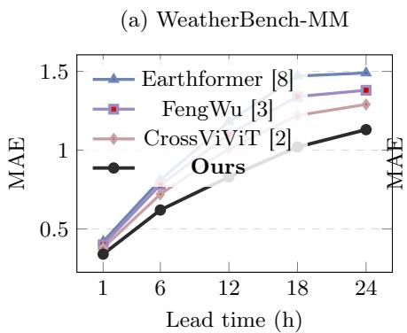
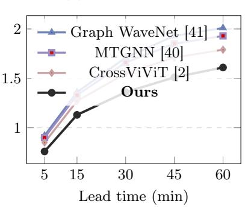
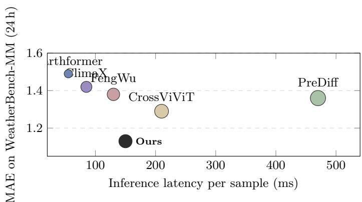
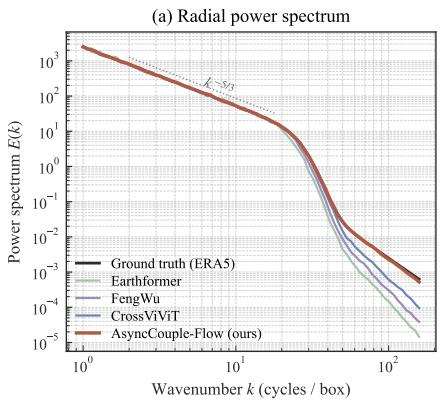
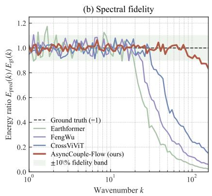

# AsyncCouple-Flow: Asynchronous Cross-Modal Coupling and Flow Matching for Spatio-Temporal Forecasting

Zhixiang Wu1,2, Yining Liu3, Bo Zhao4, Szu-Yu Chen5, Huiran Duan6, Chu Lin7, and Chuanguang Yang1\*

1 Institute of Computing Technology, Chinese Academy of Sciences, China 2 Emory University, USA

3 University of California, Berkeley, USA

4 Yale University, USA

5 Stevens Institute of Technology, USA

6 City University of New York, USA

Corresponding author. yangchuanguang@ict.ac.cn

Abstract. Multi-modal spatio-temporal forecasting (MM-STF) supports weather nowcasting, trafic prediction, and earth-system modeling by combining heterogeneous sources such as physical fields, satellite imagery, and in-situ sensors. Three obstacles persist: (i) modalities have diferent spatio-temporal sampling rates, forcing lossy interpolation onto a unified grid; (ii) modalities are frequently missing at deployment due to sensor outages or revisit gaps, while most methods train with full availability; and (iii) autoregressive decoders accumulate errors over long horizons, amplified by multi-modal conditioning. We propose AsyncCouple-Flow to address these issues jointly. A Modality-Aware Token Sparsification (MATS) module performs scale-aware tokenization and uses a shared importance scorer to select top-k tokens per timestep, producing equal-length sequences. An Asynchronous Cross-Modal Coupling Graph (ACCG) replaces fixed cross-attention with a learnable graph whose edges encode time ofsets, semantic similarity, and modality-specific physical priors, enabling fusion under arbitrary asynchrony and missingness. A Flow-Matching Forecasting Head models multi-step prediction as a conditional ODE, trained with stochastic modality dropout and integrated jointly to avoid autoregressive drift. Experiments on ERA5+GOES+ISD weather forecasting and PEMS-BAY trafic prediction with multi-source side information show that AsyncCouple-Flow outperforms state-of-theart baselines and remains robust with up to two missing modalities. The code will be released upon acceptance.

Keywords: Multi-modal Learning · Spatio-Temporal Forecasting · Graph Neural Networks · Flow Matching · Missing Modality Robustness

## 1 Introduction

Deep learning is increasingly used to address complex problems across scientific disciplines [37, 20, 19, 26, 43, 42, 44, 24]. Rapid advances in multimodal learning and high-performance AI have opened new directions for scientific computing[5, ?,4, 23, 16, 18, 17]. These developments are particularly relevant to modeling physical systems that evolve over space and time[47, 16, 45]. Spatio-temporal forecasting (STF) predicts dynamical systems from past observations, supporting trafic management [13, 46, 41], precipitation nowcasting [8, 7], and mediumrange global weather forecasting [1, 12, 33, 3, 6, 14, 15, 21, 29, 28, 28]. Dynamicsaware models [38, 36] further connect data-driven prediction with physical interpretability. In practice, multiple heterogeneous sources—reanalysis fields, satellite imagery, in-situ sensors, and unstructured textual reports—provide complementary views of the same dynamics. Multi-modal spatio-temporal forecasting (MM-STF) thus promises improvements over uni-modal approaches, as demonstrated in solar-irradiance forecasting with satellite videos [2] and nationwide air-quality prediction with multi-source meteorological context [25].

Three obstacles nevertheless limit the practical reach of MM-STF.

(C1) Asynchronous spatio-temporal sampling. Modalities difer in spatial resolution and temporal frequency: geostationary satellites typically produce frames every 10–15 minutes on a ∼2 km grid, ERA5-style reanalyses provide hourly fields at 0.25◦ resolution, and in-situ networks update every five minutes at irregular locations. Existing methods commonly interpolate or down-sample sources onto a shared space-time lattice [2, 25], discarding high-frequency information from fast modalities and introducing fabricated values for slow ones.

(C2) Modality missingness at deployment. Sensor failures, satellite revisit intervals, and communication outages often make inference-time modalities a strict subset of those available during training. Studies of multi-modal Transformers [31] reveal severe degradation under missingness because conventional cross-attention layers presume a fixed, complete set of input streams.

(C3) Long-horizon error accumulation. The de-facto decoding strategy in STF is autoregressive rollout: short-horizon predictions are recursively fed back as inputs to extend the forecast [13, 38, 1]. While efective for moderate lead times, this strategy is well known to amplify small per-step errors into severe long-horizon drift [3]. The phenomenon is particularly damaging in MM-STF, as compounding errors propagate not only along the temporal axis but also across modality channels through fusion layers.

A unified solution must (i) process tokens at diferent time stamps and spatial scales without forcing a common grid; (ii) fuse modalities while degrading gracefully when streams are absent; and (iii) replace autoregressive rollout with a single, non-autoregressive prediction of the entire trajectory.

We propose AsyncCouple-Flow, a unified multi-modal spatio-temporal forecasting framework that confronts all three issues jointly. First, a Modality-Aware Token Sparsification (MATS) module performs scale-aware tokenization: each modality is converted to tokens at its native rate, and a shared importance scorer [34] retains the top-k most informative tokens per timestep, mapping arbitrarily heterogeneous inputs to equal-length sequences without lossy interpolation. Second, an Asynchronous Cross-Modal Coupling Graph (ACCG) replaces fixed cross-attention with a learnable graph in which each node corresponds to a (modality, time, position) triplet, and edge weights factor in time ofsets, semantic similarity, and modality-specific physical priors. Message passing on ACCG [11, 35] naturally absorbs arbitrary asynchrony: missing modalities simply correspond to masked nodes whose absence is handled by the graph topology rather than by ad-hoc imputation. Third, a Flow-Matching Forecasting Head, built on the recent simulation-free framework of Flow Matching [27], treats the multi-step prediction as a single conditional ordinary diferential equation; integrated in one shot at inference time, it bypasses autoregressive recursion and therefore avoids recursive feedback of prediction errors. We further train it under stochastic modality dropout, exposing the network to a wide spectrum of missingness patterns at no additional cost.

Our contributions are summarized as follows:

– We identify three coupled obstacles—asynchronous sampling, deploymenttime modality missingness, and long-horizon drift—largely studied separately in MM-STF, and argue for addressing them jointly.

– We propose AsyncCouple-Flow, whose MATS, ACCG, and Flow-Matching head jointly support arbitrary sampling rates, graceful degradation under missing modalities, and non-autoregressive long-horizon prediction.

– Experiments on (i) ERA5+GOES+ISD weather forecasting and (ii) PEMS-BAY trafic forecasting with multi-modal side information show consistent improvements over strong specialized baselines [13, 8, 33, 2] and robustness with up to two missing modalities at inference time.

## 2 Related Work

## 2.1 Spatio-Temporal Forecasting

Spatio-temporal forecasting has long been a central topic in machine learning, with two dominant lines of work. The first builds on spatio-temporal graph neural networks, with either a fixed sensor graph—e.g., DCRNN [13], STGCN [46], ASTGCN [9]—or a learnable one as in Graph WaveNet [41] and MTGNN [40]; recent eficiency-oriented variants further reduce their cost via dynamic sparse training [39] and frequency-aligned distillation [22]. These models efectively capture local dependencies on a single modality but treat all observations on the same time grid. The second line targets grid-structured Earth-system data via space-time Transformers—Earthformer [8], PreDif [7] for nowcasting, and large-scale foundation models Pangu-Weather [1], GraphCast [12], ClimaX [33], FengWu [3] and OneForecast [6] for medium-range forecasts. Dynamics-aware backbones such as EarthFarseer [38] and the causal NuwaDynamics framework [36 further inject physical inductive biases. Most still operate in a uni-modal regime and rely on autoregressive rollout [1, 38], which compounds errors over long horizons. AsyncCouple-Flow is complementary: it explicitly models multi-source asynchrony and replaces autoregressive decoding with a single-pass flow integration.

## 2.2 Multi-Modal Fusion under Asynchrony and Missingness

Multi-modal learning has recently been applied to spatio-temporal tasks. Cross-ViViT [2] couples satellite videos with ground-based time series via cross-attention to forecast solar irradiance, while AirFormer [25] fuses meteorological context with station observations for nationwide air-quality prediction. Despite their effectiveness, both rely on (i) interpolating all sources onto a common space-time grid, and (ii) the implicit assumption that every modality is available at inference time. The robustness of multi-modal Transformers under modality dropout has been explicitly questioned by [31], who report sharp accuracy drops when even one stream is removed. Beyond the spatio-temporal domain, dedicated efforts such as SMIL [32] address severely missing modalities through Bayesian meta-learning, but operate on static inputs only. Our ACCG module instead handles asynchrony and missingness jointly and natively: each (modality, time, position) triplet is a graph node, and absent modalities translate into masked nodes whose neighbors transparently take over the message-passing load, in line with classic GNN formulations [11, 35].

## 2.3 Generative Forecasting via Flow Matching

Generative forecasting models distributions over future trajectories. Denoising difusion models [10] support probabilistic time-series forecasting and precipitation nowcasting [7], but iterative reverse sampling remains computationally heavy. Flow Matching [27] and Rectified Flow [30] ofer simulation-free training of continuous normalizing flows by regressing vector fields against pre-specified probability paths; inference integrates a single conditional ODE. To our knowledge, Flow Matching has not yet been applied to MM-STF. AsyncCouple-Flow predicts the entire horizon in one ODE integration conditioned on ACCG’s multimodal context, eliminating autoregressive drift [13, 1, 3]. Together with stochastic modality dropout, this yields an asynchrony-aware, missingness-robust, and non-autoregressive forecaster.

## 3 Method

Figure 1 outlines the framework. We present the problem (§3.1), Modality-Aware Token Sparsification (§3.2), Asynchronous Cross-Modal Coupling Graph (§3.3), Flow-Matching Forecasting Head (§3.4), and training objective (§3.5).

## 3.1 Problem Formulation

We consider M heterogeneous modalities indexed by $m \in \{ 1 , \ldots , M \}$ . The mth modality provides observations $\mathcal { X } ^ { ( m ) } = \{ \mathbf { x } _ { t } ^ { ( m ) } \} _ { t \in \mathcal { T } _ { m } }$ , where $\mathbf { x } _ { t } ^ { ( m ) } \in \mathbb { R } ^ { S _ { m } \times C _ { m } }$ contains $S _ { m }$ spatial elements (grid cells, patches, or stations) with $C _ { m }$ channels at time stamp t on an irregular grid $\mathcal { T } _ { m } \subset \mathbb { R }$ . Modalities have diferent temporal grids $( T _ { m } \neq T _ { m ^ { \prime } } )$ and spatial supports $( S _ { m } \ne S _ { m ^ { \prime } } )$ . Let $T ^ { \star } = \{ \tau _ { 1 } , \ldots , \tau _ { H } \}$ denote the prediction time stamps for target modality $m ^ { \star }$ , with ${ \bf y } _ { h } = { \bf x } _ { \tau _ { h } } ^ { ( m ^ { \star } ) }$ as the h-th forecast frame. Given history $\mathcal { X } _ { 1 : T } = \{ \mathcal { X } _ { < \tau _ { 1 } } ^ { ( m ) } \} _ { m = 1 } ^ { M } .$ , we predict the trajectory $\mathbf Y = [ \mathbf y _ { 1 } , \dots , \mathbf y _ { H } ]$ in one shot, robust to a random subset $\mathcal { D } \subseteq \{ 1 , \dots , M \}$ of missing modalities at inference.

  
Fig. 1. Overview of AsyncCouple-Flow. (1) MATS tokenizes each modality at its native rate via a CNN/patch embedder and retains the top-k tokens using a shared scorer Σ. (2) ACCG constructs a learnable graph of nodes $( m , t , i )$ with edges encoding time ofset $\delta t ,$ , semantic similarity, and physical priors $\phi _ { \mathrm { p h y s } } ;$ missing modalities are masked nodes. (3) The Flow-Matching head conditions a single-pass ODE on the ACCG context to generate the H-step forecast.

## 3.2 Modality-Aware Token Sparsification (MATS)

MATS preserves each modality’s native rate and learns to produce equal-length token sequences without padding to a common space-time lattice (left panel of Fig. 1).

Scale-aware tokenization. For each modality $m ,$ a lightweight encoder $f _ { \mathrm { e n c } } ^ { ( m ) } -$ a 2D CNN with patch embedding for grid-structured sources (satellite, reanalysis) and a point-wise MLP with positional encoding for in-situ sensors—maps every observed frame $\mathbf { x } _ { t } ^ { ( m ) }$ to $N _ { m }$ tokens:

$$
\begin{array} { r } { \mathbf { Z } _ { t } ^ { ( m ) } = f _ { \mathrm { e n c } } ^ { ( m ) } ( \mathbf { x } _ { t } ^ { ( m ) } ) + \mathbf { P } _ { t } ^ { ( m ) } \in \mathbb { R } ^ { N _ { m } \times d } , } \end{array}\tag{1}
$$

where $\mathbf { P } _ { t } ^ { ( m ) }$ is a learnable positional embedding that encodes both the absolute time stamp t and the relative spatial ofset within the modality, and d is the shared latent dimension.

Top-k importance scoring. Following DynamicViT [34], a shared scorer $g _ { \phi }$ : $\mathbb { R } ^ { d } \to \mathbb { R }$ ranks tokens across modalities by forecasting relevance:

$$
\begin{array} { r } { { s } _ { t , n } ^ { ( m ) } = g _ { \phi } ( \mathbf { z } _ { t , n } ^ { ( m ) } ) , \quad \hat { \mathbf { Z } } _ { t } ^ { ( m ) } = \mathrm { T o p K } \big ( \mathbf { Z } _ { t } ^ { ( m ) } , { s } _ { t , \cdot } ^ { ( m ) } , k \big ) . } \end{array}\tag{2}
$$

The retained tokens $\hat { \mathbf { Z } } _ { t } ^ { ( m ) } \in \mathbb { R } ^ { k \times d }$ form a fixed-length sequence regardless of $N _ { m } .$ , so all modalities can be merged downstream without any cross-modal interpolation. Since TopK is non-diferentiable, we follow [34] and use the Gumbel-Softmax relaxation with a straight-through estimator during training. The sparsifier is regularised with a token-budget loss $\mathcal { L } _ { \mathrm { t o k } } = ( \rho - \bar { s } ) ^ { 2 }$ that anchors the average kept ratio to a target $\rho \in ( 0 , 1 ]$

## 3.3 Asynchronous Cross-Modal Coupling Graph (ACCG)

Retained tokens from §3.2 form a heterogeneous graph $\mathcal { G } = ( \nu , \mathcal { E } )$ that fuses asynchronous, possibly incomplete modalities through message passing (middle panel of Fig. 1).

Node definition. Each node $v \in \mathcal V$ is the triplet $v = ( m , t , i )$ identifying the i-th token of modality m at its own time stamp $t \in \mathcal { T } _ { m }$ . The node feature is the corresponding latent vector $\mathbf { h } _ { v } = \hat { \mathbf { z } } _ { t , i } ^ { ( m ) } \in \mathbb { R } ^ { d }$ . Critically, time stamps are kept on each modality’s native grid; no nodes are interpolated.

Asynchronous edge weights. For nodes $\boldsymbol { u } = ( m _ { u } , t _ { u } , i _ { u } )$ and $\boldsymbol { v } = ( m _ { v } , t _ { v } , i _ { v } )$ edge weights combine three factors:

$$
e _ { u v } = \underbrace { \sigma ( - \alpha | t _ { u } - t _ { v } | ) } _ { \mathrm { ( i ) ~ t i m e ~ o f i s e t ~ } \delta t } \cdot \underbrace { \mathrm { s o f t m a x } _ { v } \Big ( \mathbf { q } _ { u } ^ { \top } \mathbf { k } _ { v } / \sqrt { d } \Big ) } _ { \mathrm { ( i i ) ~ s e m a n t i c ~ s i m i l a r i t y ~ s i m } } \cdot \underbrace { \phi _ { \mathrm { p h y s } } ( m _ { u } , m _ { v } ) } _ { \mathrm { ( i i i ) ~ p h y s i c a l ~ p r i o r } } ,\tag{3}
$$

where $\mathbf { q } _ { u } , \mathbf { k } _ { v }$ are linear projections of $\mathbf { h } _ { u } , \mathbf { h } _ { v } , \alpha > 0$ is a learnable temporaldecay coeficient, and $\phi _ { \mathrm { p h y s } } \in [ 0 , 1 ] ^ { M \times M }$ is a small learnable matrix that injects modality-pair priors (e.g. a strong prior between satellite cloud-top and surface irradiance). For eficiency, E is restricted to the union of (a) intra-modality temporal neighbours within window W and (b) cross-modality nearest-time neighbours; this gives an edge count of $\mathcal { O } ( | \mathcal { V } | \cdot W )$ rather than $\mathcal { O } ( | \mathcal { V } | ^ { 2 } )$

Coupling layer. Following GAT/GCN [11, 35], we apply L message-passing layers:

$$
{ \bf h } _ { v } ^ { ( \ell + 1 ) } = { \bf h } _ { v } ^ { ( \ell ) } + \mathrm { M L P } \left( \sum _ { u \in \mathcal { N } ( v ) } e _ { u v } { \bf W } ^ { ( \ell ) } { \bf h } _ { u } ^ { ( \ell ) } \right) ,\tag{4}
$$

with residual connections and LayerNorm. After L rounds, target-modality query $\mathbf q _ { \tau _ { h } } ^ { \star }$ at forecast time τh attends over V to yield context $\mathbf { c } _ { h } \in \mathbb { R } ^ { d }$ . Their concatenation $\mathbf { c } = [ \mathbf { c } _ { 1 } , \hdots , \mathbf { c } _ { H } ]$ summarises the multi-modal evidence.

Native handling of missingness. If a modality is absent, its corresponding nodes are simply not instantiated. Equation (4) continues to operate on the remaining graph: the temporal-decay term in (3) automatically reweights fartherin-time observations when nearby ones disappear. This eliminates the need for ad-hoc imputation networks.

## 3.4 Flow-Matching Forecasting Head

The forecast trajectory $\mathbf { Y } \in \mathbb { R } ^ { H \times S _ { m } \star \times C _ { m } \star }$ follows an ODE-defined conditional distribution $p ( \mathbf { Y } \mid \mathbf { c } )$ (right panel of $\mathrm { F i g . ~ 1 ) }$

Conditional ODE. Following Flow Matching [27] and Rectified Flow [30], we choose the optimal-transport probability path that linearly interpolates between Gaussian noise $\mathbf { x } _ { 0 } \sim \mathcal { N } ( \mathbf { 0 } , \mathbf { I } )$ and the ground-truth trajectory $\mathbf { x } _ { 1 } = \mathbf { Y }$

$$
\mathbf { x } _ { \tau } = ( 1 - \tau ) \mathbf { x } _ { 0 } + \tau \mathbf { x } _ { 1 } , \quad \tau \in [ 0 , 1 ] .\tag{5}
$$

A neural vector field $v _ { \theta } ( \mathbf { x } , \tau \mid \mathbf { c } )$ is trained to regress the displacement ${ \bf x } _ { 1 } - { \bf x } _ { 0 }$ along this path:

$$
\mathcal { L } _ { \mathrm { F M } } ( \theta ) = \mathbb { E } _ { \tau \sim \mathcal { U } [ 0 , 1 ] , \mathbf { x } _ { 0 } , \mathbf { x } _ { 1 } } \left[ \left| \left| \begin{array} { l } { v _ { \theta } ( \mathbf { x } _ { \tau } , \tau \mid \mathbf { c } ) - ( \mathbf { x } _ { 1 } - \mathbf { x } _ { 0 } ) } \end{array} \right| \right| ^ { 2 } \right] .\tag{6}
$$

ACCG context c from §3.3 conditions $v _ { \theta }$ through cross-attention at every layer.   
We implement $v _ { \theta }$ as a 3D U-Net over the forecast tensor.

Single-pass inference. Given c, we generate the H-step forecast by integrating the ODE once using Euler or RK45:

$$
\hat { \mathbf { Y } } = \mathbf { x } _ { 1 } = \mathbf { x } _ { 0 } + \int _ { 0 } ^ { 1 } v _ { \theta } ( \mathbf { x } _ { \tau } , \tau \mid \mathbf { c } ) \mathrm { d } \tau ,\tag{7}
$$

which avoids the per-step error amplification inherent in autoregressive rollout. Empirically, 10–25 Euler steps already yield forecasts indistinguishable from those obtained with much finer discretisation, in line with prior observations on Rectified Flow [30].

## 3.5 Training Objective and Modality Dropout

We train end-to-end with

$$
\mathcal { L } = \mathcal { L } _ { \mathrm { F M } } + \lambda _ { \mathrm { r e c } } \| \hat { \mathbf { Y } } _ { \mathrm { 1 - s t e p } } - \mathbf { Y } \| _ { 1 } + \lambda _ { \mathrm { t o k } } \mathcal { L } _ { \mathrm { t o k } } ,\tag{8}
$$

where $\hat { \mathbf { Y } } _ { \mathrm { 1 - s t e p } } ~ = ~ \mathbf { x } _ { 0 } + v _ { \theta } ( \mathbf { x } _ { 0 } , 0 ~ | ~ \mathbf { c } )$ is a cheap one-step prediction acting as a regulariser, and $\lambda _ { \mathrm { { r e c } } } , ~ \lambda _ { \mathrm { { t o k } } }$ are scalar weights. To harden the model against deployment-time missingness, at every training iteration we sample a Bernoulli mask b $\in \{ 0 , 1 \} ^ { M }$ with drop rate $p _ { d } = 0 . 3$ , remove all nodes of dropped modalities from ${ \mathcal { G } } ,$ and recompute $( 4 )  { - } ( 6 )$ on the resulting subgraph (curved feedback arrow in Fig. 1). Crucially, the dropout is performed after MATS so that the importance scorer learns to surface tokens that remain useful even under partial observability.

Complexity. Let $\begin{array} { r } { V = | \mathcal { V } | = \sum _ { m } k | \mathcal { T } _ { m } | } \end{array}$ be the node count after MATS. ACCG costs $\mathcal { O } ( L \cdot V \cdot W \cdot d )$ , using the temporal window $W$ to limit graph connectivity. Flow Matching adds $\mathcal { O } ( N _ { \mathrm { s t e p } } \cdot H \cdot S _ { m ^ { \star } } \cdot d )$ at inference, where $N _ { \mathrm { s t e p } } { \le } 2 5$ counts ODE solver steps. We compare inference cost with Earthformer $[ 8 ] \cdot$ , producing the H-step trajectory without recursion.

## 4 Experiments

## 4.1 Datasets and Setup

Datasets. We evaluate AsyncCouple-Flow on two multi-modal benchmarks that span fundamentally diferent physical regimes. (i) WeatherBench-MM is a tri-modal extension of the WeatherBench protocol that we curate over North America (110◦W–70◦W, 25◦N–50◦N) covering ten years (2013–2022). It contains ERA5 reanalysis fields (1 h, 0.25◦), GOES-16 infrared satellite imagery (10 min, ∼2 km) and ISD ground-station observations (5 min, irregular). The forecasting target is the 2-m temperature and total precipitation at 6 h and 24 h lead times. (ii) PEMS-BAY-MM augments the standard PEMS-BAY trafic benchmark [13] (325 sensors, 5-min sampling) with a static road-network graph and hourly NOAA weather context, forecasting flow at {15, 30, 60} min horizons.

Metrics. For deterministic accuracy we report MAE and RMSE; for probabilistic quality we report the Continuous Ranked Probability Score (CRPS), which assesses the predictive distribution. We also report SSIM for structural fidelity, including the predicted 2-m temperature field on weather. Lower is better for MAE/RMSE/CRPS, higher is better for SSIM.

Baselines. We compare against (a) classical spatio-temporal GNN forecasters DCRNN [13], STGCN [46], Graph WaveNet [41] and MTGNN [40]; (b) attentional/foundation models for Earth systems Earthformer [8], ClimaX [33] and FengWu [3]; (c) multi-modal forecasters CrossViViT [2] and AirFormer [25]; and (d) the difusion-based PreDif [7]. For uni-modal baselines we feed the concatenated, lossily interpolated tensor of all modalities, which mirrors common practice in the field.

Implementation. All models are implemented in PyTorch and trained on 8×NVIDIA A100 GPUs with AdamW $( \mathrm { l r } = 1 \times 1 0 ^ { - 4 }$ , cosine schedule), batch size 32, 100 epochs. We set k = 64 kept tokens per modality per timestep, ACCG depth L = 4, temporal window W = 6, ODE step $N _ { \mathrm { s t e p } } = 2 5$ , modality dropout $p _ { d } = 0 . 3$ and loss weights $\lambda _ { \mathrm { r e c } } = \lambda _ { \mathrm { t o k } } = 0 . 1$ . All numbers are averaged over 5 random seeds.

## 4.2 Main Results

Table 1 shows that AsyncCouple-Flow achieves the best scores across both benchmarks and all four metrics. On WeatherBench-MM at 24 h, it reduces RMSE by 11.6% over the strongest multi-modal baseline, CrossViViT [2], and raises SSIM by 0.045, indicating improved spatial fidelity. On PEMS-BAY-MM at 60 min, it reduces MAE by 16.6% over MTGNN [40] and 17.4% over Graph WaveNet [41], extending the gains to short-horizon trafic forecasting.

## 4.3 Ablation Study

We run three groups of controlled ablations on WeatherBench-MM (24 h), varying one component while holding the others fixed. Figure 2 reports MAE; the rightmost bar in each panel is the full model. (a) MATS. Replacing learned topk scoring with mean pooling or random sampling increases MAE by 9.7% and 14.2%, demonstrating the value of selecting informative tokens. (b) ACCG. Removing $\delta t ,$ sim, or $\phi _ { \mathrm { p h y s } }$ increases MAE by 5.3%/7.1%/3.5%, respectively. All three factors contribute, with semantic similarity having the largest efect. (c) Flow-Matching head. Substituting a plain L2 regression head removes probabilistic modelling and increases RMSE by 13.0%. A 50-step DDPM recovers roughly half the MAE gap but requires 4.5× the inference time.

Table 1. Results on WeatherBench-MM (24 h) and PEMS-BAY-MM (60 min). Lower MAE/RMSE/CRPS and higher SSIM are better. Best in bold, second best is underlined.
<table><tr><td rowspan="2">Method</td><td colspan="4">WeatherBench-MM (24 h)</td><td colspan="4">PEMS-BAY-MM (60 min)</td></tr><tr><td>MAE↓</td><td>RMSE↓</td><td>CRPS↓</td><td>SSIM↑</td><td>MAE↓</td><td>RMSE↓</td><td>CRPS↓</td><td>SSIM↑</td></tr><tr><td>DCRNN [13]</td><td>1.74</td><td>2.52</td><td>1.41</td><td>0.812</td><td>2.07</td><td>4.74</td><td>1.62</td><td>0.881</td></tr><tr><td>STGCN [46]</td><td>1.71</td><td>2.49</td><td>1.39</td><td>0.815</td><td>2.04</td><td>4.66</td><td>1.60</td><td>0.884</td></tr><tr><td>Graph WaveNet [41]</td><td>1.65</td><td>2.41</td><td>1.34</td><td>0.823</td><td>1.95</td><td>4.52</td><td>1.54</td><td>0.890</td></tr><tr><td>MTGNN [40]</td><td>1.62</td><td>2.37</td><td>1.32</td><td>0.826</td><td>1.93</td><td>4.49</td><td>1.52</td><td>0.891</td></tr><tr><td>Earthformer [8]</td><td>1.49</td><td>2.18</td><td>1.23</td><td>0.847</td><td>2.01</td><td>4.62</td><td>1.59</td><td>0.886</td></tr><tr><td>ClimaX [33]</td><td>1.42</td><td>2.07</td><td>1.19</td><td>0.853</td><td>2.05</td><td>4.71</td><td>1.61</td><td>0.882</td></tr><tr><td>FengWu [3]</td><td>1.38</td><td>2.01</td><td>1.16</td><td>0.858</td><td>1.99</td><td>4.59</td><td>1.57</td><td>0.887</td></tr><tr><td>PreDiff [7]</td><td>1.36</td><td>1.98</td><td>1.10</td><td>0.861</td><td>1.97</td><td>4.55</td><td>1.50</td><td>0.889</td></tr><tr><td>AirFormer [25]</td><td>1.33</td><td>1.94</td><td>1.09</td><td>0.864</td><td>1.84</td><td>4.31</td><td>1.45</td><td>0.898</td></tr><tr><td>CrossViViT [2]</td><td>1.29</td><td>1.89</td><td>1.06</td><td>0.867</td><td>1.79</td><td>4.22</td><td>1.42</td><td>0.901</td></tr><tr><td>AsyncCouple-Flow (ours)</td><td>1.13</td><td>1.67</td><td>0.93</td><td>0.912</td><td>1.61</td><td>3.86</td><td>1.28</td><td>0.918</td></tr></table>

(a) MATS  

(b) ACCG edges  

(c) Forecast head  
  
Fig. 2. Ablations on WeatherBench-MM (24 h). Each panel varies one component with the others fixed; the rightmost bar denotes the full model. Learned token selection, all three ACCG edge factors, and the Flow-Matching head improve MAE.

## 4.4 Robustness to Missing Modalities

We simulate deployment-time outages by randomly removing {0, 1, 2} modalities at inference. Figure 3 reports MAE for four baselines and two variants of our model. CrossViViT and AirFormer degrade sharply under missing inputs, while Earthformer with mean imputation degrades more gradually but never closes the accuracy gap. AsyncCouple-Flow without modality dropout is already more robust through ACCG’s masking semantics. Adding dropout during training further flattens the degradation curve: the full model reaches MAE 1.22 with two missing modalities, outperforming every baseline with complete inputs, whose best MAE is 1.29.

  
Fig. 3. Robustness to missing modalities at inference time. Conventional fusion baselines degrade sharply, while AsyncCouple-Flow flattens the curve through ACCG’s native masking and stochastic modality dropout during training.

## 4.5 Long-Horizon Drift

Figure 4 plots per-step MAE against lead time on both datasets. Forecast errors increase as the horizon extends, including for non-autoregressive CrossViViT. AsyncCouple-Flow produces the entire trajectory through one ODE integration and maintains lower error throughout, although its error also grows with horizon. At the longest evaluated horizons (24 h on weather and 60 min on trafic), it reduces MAE by 12.4% and 10.1%, respectively, relative to CrossViViT. Together with the head ablation, these results support joint trajectory prediction for limiting long-horizon degradation.

## 4.6 Eficiency Analysis

We examine the cost of producing one H-step forecast on a single A100 GPU. Figure 5 plots latency against MAE, with bubble area proportional to parameter count. AsyncCouple-Flow takes 150 ms, giving 1.4× and 3.1× speedups over CrossViViT and PreDif with 50 difusion steps. It is slower than Earthformer (55 ms) but reduces MAE from 1.49 to 1.13. Two design choices contribute to eficiency: MATS reduces the tokens entering the GNN by ∼6×, and the head replaces an autoregressive rollout of H = 24 steps with one ODE solve using

(b) PEMS-BAY-MM

Fig. 4. MAE versus lead time. AsyncCouple-Flow maintains lower error across the evaluated horizons on both benchmarks.  
  
Fig. 5. Latency–accuracy trade-of on a single A100 GPU. Bubble area is proportional to parameter count. AsyncCouple-Flow reaches the lowest MAE while remaining competitive in latency, dominating CrossViViT and PreDif in both axes.

$N _ { \mathrm { s t e p } } = 2 5$ Euler updates. The solver-step count is independent of the forecast horizon H.

## 4.7 Spectral Fidelity

A common failure mode of regression-based forecasters is over-smoothing, which suppresses high-wavenumber content and can compromise physical fidelity despite visually plausible predictions [2, 7]. Flow matching learns a predictive distribution, which may better preserve the underlying field’s spectral signature. To assess this property, we compute the radially-averaged 2D power spectrum of predicted 24-h temperature on WeatherBench-MM and compare it with the ERA5 ground truth. This complements pointwise errors by examining how forecast energy is distributed across spatial scales.

  
Fig. 6. Spectral fidelity of 24-h temperature forecasts on WeatherBench-MM. (a) Radially-averaged power spectrum: AsyncCouple-Flow follows ERA5 to the smallest resolved scales, while baselines lose energy beyond $k \approx 2 0 - 3 0$ . (b) Energy ratio $E _ { \mathrm { p r e d } } ( k ) / E _ { \mathrm { g t } } ( k )$ : our model stays within the ±10% fidelity band, preserving highfrequency content.

Figure $6 ( \mathrm { a } )$ plots spectra on a log-log scale. The reference exhibits a $k ^ { - 5 / 3 }$ range that steepens to roughly $k ^ { - 3 }$ . Earthformer, FengWu, and CrossViViT diverge before the dissipation scale, losing one to two orders of magnitude of energy at $k \geq 3 0$ . AsyncCouple-Flow follows the reference nearly to the smallest resolved scales. Figure 6(b) shows the energy ratio $E _ { \mathrm { p r e d } } ( k ) / E _ { \mathrm { g t } } ( k )$ : our model stays within the ±10% fidelity band (shaded green) across the full wavenumber range, while every baseline falls below 0.5 at $k \geq 4 0$ . These results indicate that the MAE/RMSE/SSIM gains in Table 1 are accompanied by improved highfrequency reconstruction rather than spectral over-smoothing.

## 5 Conclusion

We presented AsyncCouple-Flow, a unified framework for multi-modal spatiotemporal forecasting that addresses three coupled obstacles which existing approaches typically tackle in isolation: asynchronous sampling rates, deploymenttime modality missingness, and long-horizon error accumulation. The framework rests on three coupled designs—MATS that compresses heterogeneous inputs into equal-length sequences, ACCG whose edges factor time ofset, semantic similarity and physical priors, and a Flow-Matching head that produces the entire trajectory in a single ODE pass. Across two heterogeneous benchmarks and four metrics, AsyncCouple-Flow consistently outperforms ten state-of-the-art baselines, remains robust when up to two modalities are missing, and shows that the accuracy gains are accompanied by improved high-frequency reconstruction rather than over-smoothing.

## References

1. Bi, K., Xie, L., Zhang, H., Chen, X., Gu, X., Tian, Q.: Accurate medium-range global weather forecasting with 3d neural networks. Nature 619(7970), 533–538 (2023)

2. Boussif, O., Boukachab, G., Assouline, D., Massaroli, S., Yuan, T., Benabbou, L., Bengio, Y.: Improving day-ahead solar irradiance time series forecasting by leveraging spatio-temporal context. In: Advances in Neural Information Processing Systems (NeurIPS) (2023)

3. Chen, K., Han, T., Gong, J., Bai, L., Ling, F., Luo, J.J., Chen, X., Ma, L., Zhang, T., Su, R., et al.: Fengwu: Pushing the skillful global medium-range weather forecast beyond 10 days lead. arXiv preprint arXiv:2304.02948 (2023)

4. Feng, W., Qin, H., Wu, M., Yang, C., Li, Y., Li, X., An, Z., Huang, L., Zhang, Y., Magno, M., et al.: Quantized visual geometry grounded transformer. In: International Conference on Learning Representations. vol. 2026, pp. 59817–59838 (2026)

5. Feng, W., Yang, C., Qin, H., et al.: Mpq-dmv2: Flexible residual mixed precision quantization for low-bit difusion models with temporal distillation. IEEE Transactions on Pattern Analysis and Machine Intelligence (2026)

6. Gao, Y., Wu, H., Shu, R., Dong, H., Xu, F., Chen, R.R., Yan, Y., Wen, Q., Hu, X., Wang, K., Wu, J., Qing, L., Xiong, H., Huang, X.: Oneforecast: A universal framework for global and regional weather forecasting. In: Proceedings of the 42nd International Conference on Machine Learning (ICML) (2025)

7. Gao, Z., Shi, X., Han, B., Wang, H., Jin, X., Maddix, D., Zhu, Y., Li, M., Wang, Y.B.: Predif: Precipitation nowcasting with latent difusion models. In: Advances in Neural Information Processing Systems (NeurIPS) (2023)

8. Gao, Z., Shi, X., Wang, H., Zhu, Y., Wang, Y.B., Li, M., Yeung, D.Y.: Earthformer: Exploring space-time transformers for earth system forecasting. In: Advances in Neural Information Processing Systems (NeurIPS). vol. 35, pp. 25390–25403 (2022)

9. Guo, S., Lin, Y., Feng, N., Song, C., Wan, H.: Attention based spatial-temporal graph convolutional networks for trafic flow forecasting. In: Proceedings of the AAAI Conference on Artificial Intelligence. vol. 33, pp. 922–929 (2019)

10. Ho, J., Jain, A., Abbeel, P.: Denoising difusion probabilistic models. In: Advances in Neural Information Processing Systems (NeurIPS) (2020)

11. Kipf, T.N., Welling, M.: Semi-supervised classification with graph convolutional networks. In: International Conference on Learning Representations (ICLR) (2017)

12. Lam, R., Sanchez-Gonzalez, A., Willson, M., Wirnsberger, P., Fortunato, M., Alet, F., Ravuri, S., Ewalds, T., Eaton-Rosen, Z., Hu, W., et al.: Learning skillful medium-range global weather forecasting. Science 382(6677), 1416–1421 (2023)

13. Li, Y., Yu, R., Shahabi, C., Liu, Y.: Difusion convolutional recurrent neural network: Data-driven trafic forecasting. In: International Conference on Learning Representations (ICLR) (2018)

14. Li, Y., Ding, K., Yang, C., Chen, S.Y., Tian, Y.: Distilling time series foundation models for eficient forecasting. In: ICASSP (2026)

15. Li, Y., Ding, K., Yang, C., Wang, H., Wang, H., Duan, H., Liu, J., Tian, Y.: Ddtime: Dataset distillation with spectral alignment and information bottleneck for time-series forecasting. arXiv preprint arXiv:2511.16715 (2025)

16. Li, Y., Dong, J., Zeng, H., Zhang, F., Dong, Z., Yang, C., Tian, Y.: Towards robust medical image segmentation: Spectro-spatial domain generalization with mram and dmir. Computer Vision and Image Understanding (2026)

17. Li, Y., Li, K., Yin, X., Yang, Z., Dong, Z., Yao, Z., Xu, H., Tian, Y., Lu, Y.: Sepprune: Structured pruning for eficient deep speech separation. In: Proceedings of the AAAI Conference on Artificial Intelligence. vol. 40, pp. 31861–31869 (2026)

18. Li, Y., Lin, Y.C., Wang, X., Yang, K., Feng, X., Wang, Y., Duan, H., Tian, Y.: Amrd: Adaptive multi-teacher relational distillation for lightweight speech emotion recognition. arXiv preprint arXiv:2607.25289 (2026)

19. Li, Y., Meng, S., Yang, C., Feng, W., Liu, J., An, Z., Wang, Y., Tian, Y.: A comprehensive survey of interaction techniques in 3d scene generation. IJCAI (2026)

20. Li, Y., Xiao, X., Zhang, Y., Zhao, L., Li, Y., Zhao, A., Wang, T., Xu, H., Tian, Y.: Rethinking layer-wise information allocation for vision foundation model adaptation. arXiv preprint arXiv:2607.21973 (2026)

21. Li, Y., Yang, C., Zeng, H., Dong, Z., An, Z., Xu, Y., Tian, Y., Wu, H.: Frequencyaligned knowledge distillation for lightweight spatiotemporal forecasting. In: Proceedings of the IEEE/CVF International Conference on Computer Vision. pp. 7262–7272 (2025)

22. Li, Y., Yang, C., Zeng, H., Dong, Z., An, Z., Xu, Y., Tian, Y., Wu, H.: Frequencyaligned knowledge distillation for lightweight spatiotemporal forecasting. In: Proceedings of the IEEE/CVF International Conference on Computer Vision (ICCV) (2025)

23. Li, Y., Zhou, Q., Duan, H., Wang, J., Zhang, S., Yang, C., Zhao, G., Tian, Y.: Gaitkd: A universal decoupled distillation framework for eficient gait recognition. arXiv preprint arXiv:2604.26255 (2026)

24. Li, Y., Zhou, Z., Peng, Z., Dong, J., You, H., Yan, R., Wen, S., Tian, Y., Huang, T.: A preference-driven methodology for eficient code generation. IEEE Transactions on Artificial Intelligence (2025)

25. Liang, Y., Xia, Y., Ke, S., Wang, Y., Wen, Q., Zhang, J., Zheng, Y., Zimmermann, R.: Airformer: Predicting nationwide air quality in china with transformers. In: Proceedings of the AAAI Conference on Artificial Intelligence. vol. 37, pp. 14329– 14337 (2023)

26. Lin, Z., Zhao, K., Zhang, S., Yu, P., Xiao, C.: Cec-zero: Zero-supervision character error correction with self-generated rewards. In: Proceedings of the AAAI Conference on Artificial Intelligence. vol. 40, pp. 23612–23620 (2026)

27. Lipman, Y., Chen, R.T.Q., Ben-Hamu, H., Nickel, M., Le, M.: Flow matching for generative modeling. In: International Conference on Learning Representations (ICLR) (2023)

28. Liu, F., Liu, C., Li, Y., Wang, Z., Yang, C., Huang, L., An, Z.: Generative spatiotemporal modeling for uncertainty quantification in high-dimensional physical systems. In: ICASSP 2026-2026 IEEE International Conference on Acoustics, Speech and Signal Processing (ICASSP). pp. 5911–5915. IEEE (2026)

29. Liu, N., Chu, J., Yan, X., Li, Y., Chen, S.Y., Dong, Z., Yang, C.: Mm-no: learning physical operators from heterogeneous data via cross-modal attention fusion. In: ICASSP 2026-2026 IEEE International Conference on Acoustics, Speech and Signal Processing (ICASSP). pp. 4801–4805. IEEE (2026)

30. Liu, X., Gong, C., Liu, Q.: Flow straight and fast: Learning to generate and transfer data with rectified flow. In: International Conference on Learning Representations (ICLR) (2023)

31. Ma, M., Ren, J., Zhao, L., Testuggine, D., Peng, X.: Are multimodal transformers robust to missing modality? Proceedings of the IEEE/CVF Conference on Computer Vision and Pattern Recognition (CVPR) pp. 18177–18186 (2022)

32. Ma, M., Ren, J., Zhao, L., Tulyakov, S., Wu, C., Peng, X.: Smil: Multimodal learning with severely missing modality. In: Proceedings of the AAAI Conference on Artificial Intelligence. vol. 35, pp. 2302–2310 (2021)

33. Nguyen, T., Brandstetter, J., Kapoor, A., Gupta, J.K., Grover, A.: Climax: A foundation model for weather and climate. In: Proceedings of the 40th International Conference on Machine Learning (ICML) (2023)

34. Rao, Y., Zhao, W., Liu, B., Lu, J., Zhou, J., Hsieh, C.J.: Dynamicvit: Eficient vision transformers with dynamic token sparsification. In: Advances in Neural Information Processing Systems (NeurIPS) (2021)

35. Veličković, P., Cucurull, G., Casanova, A., Romero, A., Liò, P., Bengio, Y.: Graph attention networks. In: International Conference on Learning Representations (ICLR) (2018)

36. Wang, K., Wu, H., Duan, Y., Zhang, G., Wang, K., Peng, X., Zheng, Y., Liang, Y., Wang, Y.: Nuwadynamics: Discovering and updating in causal spatio-temporal modeling. In: International Conference on Learning Representations (ICLR) (2024)

37. Wu, H., Li, Y., Gao, Y., Xu, F., Zhang, F., Wang, K., Zhao, P., Wang, Q., Zhao, Y., Wang, W., et al.: Roboalign-r1: Distilled multimodal reward alignment for robot video world models. arXiv preprint arXiv:2605.03821 (2026)

38. Wu, H., Liang, Y., Xiong, W., Zhou, Z., Huang, W., Wang, S., Wang, K.: Earthfarseer: Versatile spatio-temporal dynamical systems modeling in one model. In: Proceedings of the AAAI Conference on Artificial Intelligence (2024)

39. Wu, H., Wen, H., Zhang, G., Xia, Y., Liang, Y., Zheng, Y., Wen, Q., Wang, K.: Dynst: Dynamic sparse training for resource-constrained spatio-temporal forecasting. In: Proceedings of the 31st ACM SIGKDD Conference on Knowledge Discovery and Data Mining (KDD) (2025)

40. Wu, Z., Pan, S., Long, G., Jiang, J., Chang, X., Zhang, C.: Connecting the dots: Multivariate time series forecasting with graph neural networks. In: Proceedings of the 26th ACM SIGKDD International Conference on Knowledge Discovery & Data Mining (KDD). pp. 753–763 (2020)

41. Wu, Z., Pan, S., Long, G., Jiang, J., Zhang, C.: Graph wavenet for deep spatialtemporal graph modeling. In: Proceedings of the 28th International Joint Conference on Artificial Intelligence (IJCAI). pp. 1907–1913 (2019)

42. Xiao, C., Dou, J., Lin, Z., Ke, Z., Hou, L.: From points to coalitions: Hierarchical contrastive shapley values for prioritizing data samples. In: Proceedings of the AAAI Conference on Artificial Intelligence. vol. 40, pp. 15995–16003 (2026)

43. Xiao, C., Hou, L.: Prototype-aligned federated soft-prompts for continual web personalization. In: Proceedings of the ACM Web Conference 2026. pp. 6743–6754 (2026)

44. Xiao, C., Xu, T., Ma, S., Jiang, Y., Gao, H., Wu, Y.: Reversible primitive– composition alignment for continual vision–language learning. In: International Conference on Learning Representations. vol. 2026, pp. 88700–88722 (2026)

45. Xie, Y., Xiang, Y., You, H., Liu, N., Liu, F., Zhao, B., Kang, Z., Li, Y., Li, Y.: Symmetry-aware causal inference for robust neural pde solvers. In: Proceedings of the 2026 International Conference on Multimedia Retrieval (2026)

46. Yu, B., Yin, H., Zhu, Z.: Spatio-temporal graph convolutional networks: A deep learning framework for trafic forecasting. In: Proceedings of the 27th International Joint Conference on Artificial Intelligence (IJCAI). pp. 3634–3640 (2018)

47. Zhao, B., Yu, H., Liu, L., Chu, Z., Liu, Y., Liu, C., Chen, S.Y., Xie, Z.: Mishcc: Hierarchical channel clustering for eficient medical image segmentation. arXiv preprint arXiv:2607.17329 (2026)