# BEYOND TOKEN-LOCAL IMITATION: REWARD-COMPATIBLE TEMPORAL CREDIT ASSIGNMENT FOR ON-POLICY DISTILLATION

Shiqi Liu1,2, Zeyu He1,2, Letian Tao1,2, Guojian Zhan1,2, Jiaxin Gao1, Feihong Zhang1, Jingliang Duan1,2, Wei Xiong2, Kehua Sheng2, Bo Zhang2, Yang Guan1,B, Shengbo Eben Li1,B

1School of Vehicle and Mobility & College of AI, Tsinghua University 2Didi Voyager Labs, DiDi Autonomous Driving

## ABSTRACT

On-policy distillation (OPD) has emerged as an effective approach for large language model post-training, yet existing objectives face a trade-off between objective fidelity and optimization stability. Token-level OPD provides stable but local supervision, whereas sequence-level OPD captures future credit at the cost of horizon-dependent variance. We establish a unified temporal-credit view of these formulations, showing that practical token-level OPD can be interpreted as a temporal approximation to the sequence-level reverse-KL gradient. Building on this connection, we propose γOPD, which uses discounted temporal credit assignment to balance long-horizon supervision and optimization stability, while admitting a horizon-independent variance bound. We further develop a rewardcompatible bounded mixing (RBM) mechanism for γOPD that balances verifiable outcome feedback with the discounted OPD advantage to move beyond purely teacher-dependent optimization. Experiments on mathematical and code reasoning demonstrate consistent improvements over existing OPD methods across vanilla, size-mismatched, and multi-teacher distillation settings.

  
(a)

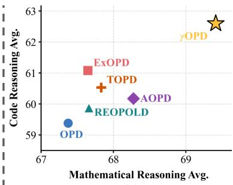  
(b)  
Figure 1: Core Idea. (a) Vanilla OPD (left) focuses only on the immediate next step and closely follows the teacher’s local guidance. We argue that OPD should instead account for the influence of future reasoning steps and should not merely imitate the teacher token by token (right). (b) By incorporating future outcomes through temporal credit assignment and balancing teacher supervision with verifiable rewards, $\gamma \mathrm { O P D }$ achieves strong overall performance across mathematical and code reasoning tasks in the multi-teacher distillation setting, as detailed in Section 4.

## 1 INTRODUCTION

Recent large language models (LLMs), including Kimi K3 (Kimi Team et al., 2026), GLM-5 (GLM-5 Team, 2026), DeepSeek-V4 (DeepSeek-AI et al., 2026), and Nemotron-Cascade 2 (Yang et al., 2026b), have demonstrated strong reasoning capabilities across mathematics, coding, and science.

To further consolidate and integrate such capabilities, on-policy distillation (OPD) (Lu & Thinking Machines Lab, 2025) has emerged as a key approach in LLM post-training. It provides dense teacher supervision on trajectories sampled from the current student policy, promoting high-quality reasoning while mitigating exposure bias.

To avoid costly full-vocabulary reverse-KL computation, existing OPD methods (Yang et al., 2026a; Jin et al., 2026; Oh et al., 2026) reformulate the objective in a policy-gradient form and approximate it using a one-sample token-level Monte Carlo estimator (Li et al., 2026). While computationally efficient, this practical estimator introduces non-negligible bias relative to the original sequence-level objective, effectively altering the optimization problem (Yang et al., 2026a). Other methods (Fu et al., 2026) instead adopt sequence-level Monte Carlo estimators to more faithfully preserve the original objective. However, accumulating future credit over the remaining response leads to increasing variance as the sequence grows, resulting in unstable optimization for long reasoning trajectories.

In this work, we present a unified analysis of token-level and sequence-level OPD, deriving their underlying objectives and clarifying the relationship between their policy-gradient formulations. Building on this insight, we propose γOPD, which introduces discounted temporal credit assignment to interpolate between token-local and sequence-level supervision while admitting a horizonindependent variance bound. To complement teacher supervision with outcome-level guidance, we further develop a reward-compatible bounded mixing mechanism that incorporates verifiable out come feedback without sacrificing the stability benefits of temporal discounting.

Overall, our main contributions are summarized as follows:

• We establish a unified temporal-credit view of OPD, showing that practical token-level OPD can be interpreted as a temporally truncated approximation to the sequence-level reverse-KL gradient.

• Building on this connection, we propose $\gamma \mathrm { O P D }$ , a discounted temporal-credit surrogate that interpolates between token-level and sequence-level credit assignment, while admitting a horizon-independent variance bound.

• We further develop Reward-Compatible Bounded Mixing (RBM) for $\gamma \mathrm { O P D }$ , which combines discounted teacher-derived credit with verifiable outcome rewards while preventing the teacher signal from dominating task-level supervision.

## 2 PRELIMINARIES

## 2.1 NOTATION

We consider autoregressive reasoning tasks over a discrete vocabulary $\nu ,$ where we aim to optimize a student policy $\pi _ { \theta }$ parameterized by θ under the guidance of a fixed teacher policy $\pi ^ { * }$ . Let $\mathbf { \boldsymbol { x } } \sim \mathcal { D }$ denote a prompt sequence sampled from the reasoning dataset. Given ${ \mathbf { } } ^ { \mathbf { } } \mathbf { { x } } ,$ , the policy generates a complete response trajectory $\pmb { y } = ( y _ { 1 } , y _ { 2 } , \dotsc , y _ { T } ) \in \mathcal { V } ^ { T }$ , where $T = | \boldsymbol { y } |$ is the number of tokens in the trajectory, and $y _ { t } \in \mathcal V$ is the token generated at step t. At decoding step $t ,$ the policy conditions on the historical context prefix $\pmb { h } _ { t } : = ( \pmb { x } , \pmb { y } _ { < t } )$ , which consists of the prompt and all previously generated reasoning tokens. We use $\mathbb { D } _ { \mathrm { K L } } ( \cdot \| \cdot )$ to denote the KL divergence. For notational simplicity, we define the token-level and sequence-level log-ratios as

$$
\Delta _ { t } \triangleq \log \pi _ { \theta } ( y _ { t } \mid h _ { t } ) - \log \pi ^ { * } ( y _ { t } \mid h _ { t } ) ,\tag{1a}
$$

$$
\Delta ( { \pmb y } ) \triangleq \log \pi _ { \pmb \theta } ( { \pmb y } \mid { \pmb x } ) - \log \pi ^ { * } ( { \pmb y } \mid { \pmb x } ) = \sum _ { t = 1 } ^ { T } \Delta _ { t } .\tag{1b}
$$

## 2.2 ON-POLICY DISTILLATION (OPD)

On-policy distillation (OPD) (Agarwal et al., 2024; DeepSeek-AI et al., 2026) trains the student by minimizing the reverse KL divergence from the student policy $\pi _ { \theta }$ to the teacher policy $\pi ^ { * }$ , evaluated on trajectories induced by the current student itself:

$$
J _ { \mathrm { O P D } } ( \boldsymbol { \theta } ) = \mathbb { E } _ { \boldsymbol { x } \sim \mathcal { D } } \left[ \mathbb { D } _ { \mathrm { K L } } \left( \pi _ { \boldsymbol { \theta } } ( \boldsymbol { y } \mid \boldsymbol { x } ) \parallel \pi ^ { * } ( \boldsymbol { y } \mid \boldsymbol { x } ) \right) \right] .\tag{2}
$$

By training on trajectories sampled from the current student policy, on-policy learning reduces exposure bias and is well suited to long chain-of-thought reasoning tasks such as mathematical problem solving (GLM-5 Team, 2026). Following recent practice (Lu & Thinking Machines Lab, 2025; Li et al., 2026), the empirical implementation of OPD typically converts the reverse-KL minimization in equation 2 into an RL-style surrogate gradient:

$$
\nabla _ { \theta } J _ { \mathrm { O P D } } ( \theta ) \approx - \mathbb { E } _ { \boldsymbol { x } \sim \mathcal { D } } \left[ \sum _ { t = 1 } ^ { T } A _ { t } ^ { \mathrm { O P D } } \nabla _ { \theta } \log \pi _ { \theta } ( y _ { t } \mid h _ { t } ) \right] ,\tag{3}
$$

where $A _ { t } ^ { \mathrm { O P D } } \triangleq - \Delta _ { t } = \log \pi ^ { * } ( y _ { t } \mid h _ { t } ) - \log \pi _ { \theta } ( y _ { t } \mid h _ { t } )$ is the token-level OPD advantage.

## 2.3 RL WITH VERIFIABLE REWARDS (RLVR)

Reinforcement learning with verifiable rewards (RLVR) (Shao et al., 2024; Guo et al., 2025; Yu et al., 2025) has also become a key approach for improving the reasoning ability of LLMs. For a prompt $\begin{array} { r } { \mathbf { \boldsymbol { x } } \sim \mathcal { D } . } \end{array}$ , the policy $\pi _ { \theta }$ generates an output sequence $\pmb { y } = ( y _ { 1 } , \dots , y _ { T } ) \sim \pi _ { \theta } ( \cdot \ | \ \pmb { x } )$ . The generated output is evaluated by an external verifier, such as a code compiler or a mathematical rule checker, which provides a sparse sequence-level reward scalar $R ( \pmb { x } , \pmb { y } ) \overset { \textstyle \not { \sim } } { \in } \{ - 1 , 1 \}$ . The RLVR objective is

$$
J _ { \mathrm { R L V R } } ( \theta ) = \mathbb { E } _ { \pmb { x } \sim \mathcal { D } , \pmb { y } \sim \pi _ { \theta } ( \cdot | \pmb { x } ) } \left[ R ( \pmb { x } , \pmb { y } ) \right] .
$$

Compared with OPD, RLVR provides a sparse but verifier-grounded sequence-level correctness signal, whereas OPD supplies dense token-level supervision through teacher guidance, which may nevertheless be limited by the teacher’s suboptimal behavior.

## 3 METHODOLOGY

## 3.1 TOKEN-LEVEL OPD AS A TEMPORAL APPROXIMATION

Although the practical OPD objective in equation 3 is widely used, it should be understood as a temporal approximation rather than the exact policy gradient of the OPD objective in equation 2. To clarify this distinction, we formally define token-level OPD and sequence-level OPD as follows:

$$
J _ { \mathrm { O P D } } ^ { \mathrm { s e q } } ( \theta ) \triangleq \mathbb { E } _ { \pmb { x } \sim \mathcal { D } } \left[ \mathbb { D } _ { \mathrm { K L } } \left( \pi _ { \theta } ( \pmb { y } \mid \pmb { x } ) \parallel \pi ^ { * } ( \pmb { y } \mid \pmb { x } ) \right) \right] ,\tag{4a}
$$

$$
J _ { \mathrm { O P D } } ^ { \mathrm { t o k e n } } ( \theta ) \triangleq \mathbb { E } _ { x \sim \mathcal { D } } [ \sum _ { { t = 1 } } ^ { T } \mathbb { E } _ { { h _ { t } } \sim d _ { \tilde { \theta } } ( \cdot \vert x ) } [ \mathbb { D } _ { \mathrm { K L } } ( \pi _ { \theta } ( y _ { t } \mid h _ { t } )  \pi ^ { * } ( y _ { t } \mid h _ { t } ) ) ] ] ,\tag{4b}
$$

where $J _ { \mathrm { O P D } } ^ { \mathrm { s e q } }$ denotes the sequence-level reverse-KL objective, i.e., the original OPD objective defined in equation 2, which compares the student and teacher distributions over complete response trajectories. In contrast, $J _ { \mathrm { O P D } } ^ { \mathrm { t o k e n } }$ denotes the token-level objective, which compares their next-token distributions at sampled prefixes. The distribution $d _ { \bar { \theta } } ( h _ { t } \mid x )$ is the prefix distribution induced by the current student policy, where $\pmb { h } _ { t } = \left( \pmb { x } , \pmb { y } _ { < t } \right)$ . The notation ¯θ indicates stop-gradient, namely this prefix distribution is treated as fixed when differentiating with respect to $\theta .$

The two objectives are equivalent at the level of function values when the stop-gradient reference parameter is evaluated at the current policy parameter. Specifically, if ${ \bar { \theta } } = \theta$ , then the sampled prefix distribution in $J _ { \mathrm { O P D } } ^ { \mathrm { t o k e n } }$ matches the autoregressive prefix distribution induced by $\pi _ { \theta }$ , and we have

$$
J _ { \mathrm { O P D } } ^ { \mathrm { s e q } } ( \theta ) = J _ { \mathrm { O P D } } ^ { \mathrm { t o k e n } } ( \theta ) \vert _ { \bar { \theta } = \theta } .
$$

However, this value-level equivalence does not imply gradient-level equivalence. The reason is that $J _ { \mathrm { O P D } } ^ { \mathrm { s e q } }$ differentiates through the autoregressive distribution over future prefixes, whereas $J _ { \mathrm { O P D } } ^ { \mathrm { t o k e n } }$ stops this dependence through $d _ { \bar { \theta } } ( h _ { t } \mid x )$ . This distinction leads to different temporal credit assignments, as shown below.

Proposition 3.1 (Token-level OPD gradient). Under the stop-gradient treatment of the prefix distribution $d _ { \bar { \theta } } ( h _ { t } \mid x )$ ), the gradient of $\cdot \bar { J _ { \mathrm { O P D } } ^ { \mathrm { t o k e n } } } ( \theta )$ in equation 4b is given by

$$
\nabla _ { \theta } J _ { \mathrm { O P D } } ^ { \mathrm { t o k e n } } ( \theta ) = \mathbb { E } _ { \pmb { x } \sim \mathcal { D } , \pmb { y } \sim \pi _ { \theta } ( \cdot | \pmb { x } ) } \left[ \sum _ { t = 1 } ^ { T } \Delta _ { t } \nabla _ { \theta } \log \pi _ { \theta } ( y _ { t } \mid \pmb { h } _ { t } ) \right] .\tag{5}
$$

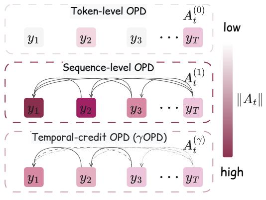  
(a) Temporal credit Assignment

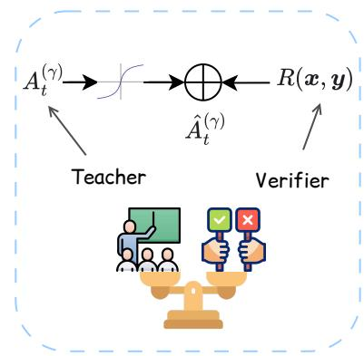  
(b) Reward-compatible bounded mixing  
Figure 2: Overview of $\gamma \mathbf { O P D } .$ (a) Token-level OPD considers only the log-ratio of the current token, whereas sequence-level OPD accumulates the log-ratios of all future tokens. $\gamma \mathrm { O P D }$ introduces a discount factor $\gamma$ to interpolate between these two extremes. (b) The $\gamma \mathrm { O P D }$ advantage is first normalized and then combined with the verifiable task reward, balancing dense teacher guidance with task-level verification signals.

## The proof is provided in Appendix A.

Consequently, the gradient of $J _ { \mathrm { O P D } } ^ { \mathrm { t o k e n } } ( \theta )$ recovers the practical OPD update in equation 3. Meanwhile, the gradient of the sequence-level OPD objective $J _ { \mathrm { O P D } } ^ { \mathrm { s e q } } ( \theta )$ takes the following form:

Proposition 3.2 (Sequence-level OPD gradient). The gradient of the sequence-level OPD objective $J _ { \mathrm { O P D } } ^ { \mathrm { s e q } } ( \theta )$ in equation 4a is given by

$$
\nabla _ { \theta } J _ { \mathrm { O P D } } ^ { \mathrm { s e q } } ( \theta ) = \mathbb { E } _ { \mathbf { x } \sim \mathcal { D } , \mathbf { y } \sim \pi _ { \theta } ( \cdot | \mathbf { x } ) } \left[ \sum _ { t = 1 } ^ { T } \left( \sum _ { t ^ { \prime } = t } ^ { T } \Delta _ { t ^ { \prime } } \right) \nabla _ { \theta } \log \pi _ { \theta } ( y _ { t } \mid h _ { t } ) \right] .\tag{6}
$$

The proof is provided in Appendix B.

Propositions 3.1 and 3.2 show that practical OPD is a token-level approximation to sequence-level OPD that neglects the influence of subsequent tokens. As illustrated in Figure 2, under the sequencelevel objective, the score term at step t is weighted by the future log-ratio $\sum _ { t ^ { \prime } = t } ^ { T } \Delta _ { t ^ { \prime } }$ , since y affects all future histories $h _ { t + 1 } , \ldots , h _ { T }$ . In contrast, practical OPD keeps only the local term $\Delta _ { t }$ . This gap stems from the stop-gradient treatment of $d _ { \bar { \theta } } ( h _ { t } \mid x )$ in equation 4b.

## 3.2 TEMPORAL-CREDIT ON-POLICY DISTILLATION $( \gamma \mathrm { O P D } )$

Compared with the token-level gradient in Proposition 3.1, the sequence-level gradient in equation 6 accounts for the indirect effect of each token on future autoregressive prefixes, and is therefore unbiased with respect to the sequence-level objective in equation 2. However, for long reasoning trajectories, the accumulated future log-ratio $\sum ^ { \bar { T } } { \Delta _ { t ^ { \prime } } }$ can have large variance, which may destabilize training.

To balance bias and variance in temporal credit assignment, we propose Temporal-Credit On-Policy Distillation $( \gamma O P D )$ . The key idea is to introduce a discount factor $\gamma \in [ 0 , 1 ]$ to control how much future OPD credit is assigned to the current token. Specifically, we define the temporal-credit surrogate gradient as

$$
g _ { \gamma } ( \theta ) \triangleq - \mathbb { E } _ { \pmb { x } \sim \mathcal { D } , \pmb { y } \sim \pi _ { \theta } ( \cdot | \pmb { x } ) } \left[ \sum _ { t = 1 } ^ { T } A _ { t } ^ { ( \gamma ) } \nabla _ { \theta } \log \pi _ { \theta } ( y _ { t } \mid \pmb { h } _ { t } ) \right] ,
$$

where the discounted γOPD advantage is defined as

$$
A _ { t } ^ { ( \gamma ) } \triangleq - \sum _ { t ^ { \prime } = t } ^ { T } \gamma ^ { t ^ { \prime } - t } \Delta _ { t ^ { \prime } } .\tag{7}
$$

The discount factor $\gamma$ controls the temporal horizon of OPD credit assignment. When $\gamma = 1 , A _ { t } ^ { ( 1 ) }$ becomes the sequence-level OPD return-to-go, recovering equation 6. When $\gamma = 0$ , it reduces to the token-level OPD advantage $A _ { t } ^ { ( 0 ) } = - \Delta _ { t } .$ , recovering equation 5. Thus, for $0 < \gamma < 1 , g _ { \gamma } ( \theta )$ is deliberately introduced as a biased surrogate that interpolates between these two endpoint gradients, allowing its variance to be controlled through γ, as formalized in the following theorem.

Theorem 3.3 (Variance Stability of $\gamma \mathrm { O P D } )$ . Assume that the token-level OPD advantage has a bounded second moment, i.e., $\mathbb { E } [ ( A _ { t } ^ { ( 0 ) } ) ^ { 2 } ] \le \sigma _ { \Delta } ^ { 2 }$ for all t. Then, the sequence-level OPD credit admits a horizon-dependent variance bound, whereas the γOPD credit admits a horizon-independent variance bound:

$$
\mathrm { V a r } \Big ( A _ { t } ^ { ( 1 ) } \Big ) \leq ( T - t + 1 ) ^ { 2 } \sigma _ { \Delta } ^ { 2 } ,
$$

$$
\operatorname { V a r } \left( A _ { t } ^ { ( \gamma ) } \right) \leq \frac { \sigma _ { \Delta } ^ { 2 } } { ( 1 - \gamma ) ^ { 2 } } , \qquad \forall \gamma \in [ 0 , 1 ) .
$$

The proof is provided in Appendix C.

Theorem 3.3 shows that the variance of sequence-level OPD credit can grow quadratically with the remaining sequence horizon in the worst case, whereas $\gamma \mathrm { O P D }$ admits a horizon-independent variance bound for any fixed $\gamma < 1$ . Adjusting $\gamma$ therefore provides a principled trade-off between training stability and long-horizon credit propagation.

## 3.3 γOPD WITH REWARD-COMPATIBLE BOUNDED MIXING (RBM)

Although γOPD improves temporal credit assignment, its optimization signal is still fundamentally derived from the teacher distribution. Consequently, the student may remain constrained by the teacher policy and lack an explicit task-level optimization signal for solving verifiable reasoning problems.

To move beyond this teacher-imitation ceiling, we incorporate the verifiable task reward $R ( { \pmb x } , { \pmb y } ) \in$ $\{ - 1 , 1 \}$ into $\gamma \mathrm { O P D }$ . A naive combination, however, can be problematic because the magnitude of the teacher-derived advantage $A _ { t } ^ { ( \gamma ) }$ may vary substantially across responses and potentially dominate the bounded task reward. We therefore introduce a reward-compatible bounded mixing (RBM) mechanism: the $\gamma \mathrm { O P D }$ credit is first calibrated by its response-wise mean absolute magnitude, then bounded through a softsign transformation, and finally combined with the verifiable reward.

These operations can be written compactly as

$$
\widehat { A } _ { t } ^ { ( \gamma ) } \triangleq \frac { A _ { t } ^ { ( \gamma ) } } { \frac { 1 } { T } \sum _ { k = 1 } ^ { T } \left| A _ { k } ^ { ( \gamma ) } \right| + \left| A _ { t } ^ { ( \gamma ) } \right| } + R ( \pmb { x } , \pmb { y } ) .\tag{8}
$$

When the denominator vanishes, equivalently when $A _ { k } ^ { ( \gamma ) } = 0$ for all $k ,$ we define the normalized teacher term as zero. The first term is equivalent to applying softsign after response-wise meanabsolute normalization. It is monotonic in $A _ { t } ^ { ( \gamma ) }$ and bounded within $( - 1 , 1 )$ , thereby retaining the relative token-level OPD credit while preventing the teacher-derived signal from overwhelming the task reward. Since $R ( \pmb { x } , \pmb { y } ) \in \{ - 1 , 1 \}$ , it follows that sign $( \widehat { A } _ { t } ^ { ( \gamma ) } ) = R ( x , y )$ . Thus, RBM is rewardcompatible by construction: the verifiable reward determines whether the sampled response is reinforced or suppressed, while the bounded $\gamma \mathrm { O P D }$ credit modulates the token-level update strength.

The resulting reward-compatible $\gamma \mathrm { O P D }$ surrogate gradient is

$$
\widehat { g } _ { \gamma } ( \theta ) \triangleq - \mathbb { E } _ { \pmb { x } \sim \mathcal { D } , \pmb { y } \sim \pi _ { \theta } ( \cdot | \pmb { x } ) } \left[ \sum _ { t = 1 } ^ { T } \widehat { A } _ { t } ^ { ( \gamma ) } \nabla _ { \theta } \log \pi _ { \theta } ( y _ { t } \mid h _ { t } ) \right] .\tag{9}
$$

Therefore, RBM combines sparse verifiable rewards for task-level learning beyond teacher imitation with bounded $\gamma \mathrm { O P D }$ for dense token-level credit assignment. Unless otherwise specified, $\gamma \mathrm { O P D }$ refers to its use within RBM throughout the remainder of this paper.

Table 1: Mathematical reasoning results under vanilla and size-mismatch distillation. We report accuracy and pass rate across four mathematical reasoning benchmarks.
<table><tr><td rowspan="2">Method</td><td colspan="2">AIME24</td><td colspan="2">AIME25</td><td colspan="2">AMC23</td><td colspan="2">MATH500</td><td colspan="2">Average</td></tr><tr><td>Acc.</td><td>Pass</td><td>Acc.</td><td>Pass</td><td>Acc.</td><td>Pass</td><td>Acc.</td><td>Pass</td><td>Acc.</td><td>Pass</td></tr><tr><td colspan="9">Qwen3-4B-Math → Qwen3-4B</td></tr><tr><td>Student</td><td>22.60</td><td>60.00</td><td>20.83</td><td>33.33</td><td>60.16</td><td>92.50</td><td>67.40</td><td>72.60</td><td>42.75</td><td>64.61</td></tr><tr><td>Teacher</td><td>57.40</td><td>76.67</td><td>51.67</td><td>66.67</td><td>93.52</td><td>97.50</td><td>69.80</td><td>78.40</td><td>68.10</td><td>79.81</td></tr><tr><td>JustRL</td><td>53.54</td><td>83.33</td><td>42.50</td><td>56.67</td><td>88.75</td><td>97.50</td><td>68.00</td><td>70.40</td><td>63.20</td><td>76.97</td></tr><tr><td>STAPO</td><td>55.31</td><td>83.33</td><td>50.00</td><td>66.67</td><td>90.16</td><td>97.50</td><td>68.35</td><td>69.80</td><td>65.95</td><td>79.33</td></tr><tr><td>OPD</td><td>56.46</td><td>80.00</td><td>50.83</td><td>63.33</td><td>92.81</td><td>95.00</td><td>68.05</td><td>72.20</td><td>67.04</td><td>77.63</td></tr><tr><td>ExOPD</td><td>57.19</td><td>83.33</td><td>52.50</td><td>63.33</td><td>93.13</td><td>97.50</td><td>68.90</td><td>74.20</td><td>67.93</td><td>79.59</td></tr><tr><td>REOPOLD</td><td>56.98</td><td>83.33</td><td>51.67</td><td>63.33</td><td>93.59</td><td>97.50</td><td>68.70</td><td>72.60</td><td>67.74</td><td>79.19</td></tr><tr><td>AOPD</td><td>56.56</td><td>86.67</td><td>52.50</td><td>66.67</td><td>93.28</td><td>97.50</td><td>69.35</td><td>73.00</td><td>67.92</td><td>80.96</td></tr><tr><td>TOPD</td><td>54.79</td><td>80.00</td><td>51.67</td><td>63.33</td><td>93.44</td><td>97.50</td><td>69.95</td><td>72.40</td><td>67.46</td><td>78.31</td></tr><tr><td>γOPD</td><td>60.94</td><td>86.67</td><td>54.17</td><td>66.67</td><td>92.89</td><td>97.50</td><td>69.95</td><td>78.80</td><td>69.49</td><td>82.41</td></tr><tr><td colspan="11">Qwen3-4B-Math → Qwen3-1.7B</td></tr><tr><td>Student</td><td>11.77</td><td>46.67</td><td>8.33</td><td>20.00</td><td>39.84</td><td>90.00</td><td>59.20</td><td>72.80</td><td>29.79</td><td>57.37</td></tr><tr><td>Teacher</td><td>57.40</td><td>76.67</td><td>51.67</td><td>66.67</td><td>93.52</td><td>97.50</td><td>69.80</td><td>78.40</td><td>68.10</td><td>79.81</td></tr><tr><td>JustRL</td><td>37.60</td><td>66.67</td><td>36.67</td><td>50.00</td><td>78.67</td><td>95.00</td><td>65.10</td><td>68.80</td><td>54.51</td><td>70.12</td></tr><tr><td>STAPO</td><td>35.52</td><td>63.33</td><td>30.83</td><td>46.67</td><td>77.73</td><td>95.00</td><td>64.95</td><td>68.80</td><td>52.26</td><td>68.45</td></tr><tr><td>OPD</td><td>37.71</td><td>66.67</td><td>31.25</td><td>40.00</td><td>76.02</td><td>92.50</td><td>65.40</td><td>69.80</td><td>52.60</td><td>67.24</td></tr><tr><td>ExOPD</td><td>38.54</td><td>66.67</td><td>31.67</td><td>43.33</td><td>76.72</td><td>92.50</td><td>65.05</td><td>68.40</td><td>53.00</td><td>67.73</td></tr><tr><td>REOPOLD</td><td>37.50</td><td>66.67</td><td>30.83</td><td>43.33</td><td>77.73</td><td>92.50</td><td>66.70</td><td>69.00</td><td>53.19</td><td>67.88</td></tr><tr><td>AOPD</td><td>37.71</td><td>70.00</td><td>32.50</td><td>43.33</td><td>79.38</td><td>95.00</td><td>65.85</td><td>70.80</td><td>53.86</td><td>69.78</td></tr><tr><td>TOPD</td><td>39.38</td><td>70.00</td><td>30.83</td><td>36.67</td><td>79.14</td><td>95.00</td><td>65.60</td><td>70.00</td><td>53.74</td><td>67.92</td></tr><tr><td>γOPD</td><td>42.08</td><td>70.00</td><td>35.00</td><td>46.67</td><td>80.86</td><td>95.00</td><td>68.10</td><td>73.20</td><td>56.51</td><td>71.22</td></tr></table>

## 4 EXPERIMENTS

## 4.1 SETTINGS

Benchmarks. Our experiments evaluate both mathematical and code reasoning abilities. For mathematical reasoning, we train on DeepMath (He et al., 2025), retaining problems with difficulty level at least 6, and evaluate on AIME24 (Li et al., 2024), AIME25 (OpenCompass, 2025), AMC23 (Li et al., 2024), and MATH500 (Hendrycks et al., 2021). For code reasoning, we train on the 25Ksample Eurus-RL-Code dataset (Cui et al., 2026) and evaluate on HumanEval+, MBPP+ (Liu et al., 2023), and the v6 split of LiveCodeBench (Jain et al., 2025), covering problems from February 2025 to May 2025. Detailed training and evaluation configurations are provided in Appendix E.

Models. We conduct experiments under three distillation settings: (1) vanilla distillation, where we distill a Qwen3-4B-Math (Yang et al., 2026a) teacher into a Qwen3-4B (Yang et al., 2025) student for mathematical reasoning; (2) size-mismatch distillation, where we distill the same Qwen3-4B-Math teacher into a smaller Qwen3-1.7B student for mathematical reasoning; and (3) multi-teache distillation, where we distill Qwen3-4B-Math and Qwen3-4B-Code (Yang et al., 2026a) teachers into a single Qwen3-4B student for both math and code reasoning.

Baselines. We compare γOPD against representative OPD-based baselines, including vanilla OPD (Lu & Thinking Machines Lab, 2025), ExOPD (Yang et al., 2026a), REOPOLD (Ko et al., 2026), AOPD (Jia et al., 2026), and TOPD (Zhang et al., 2026), as well as RL-based methods, including JustRL (He et al., 2026) and STAPO (Liu et al., 2026). For γOPD, we use γ = 0.99

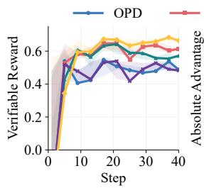

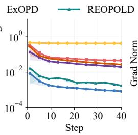

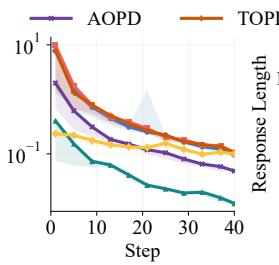

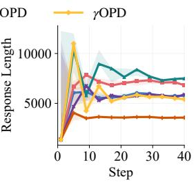  
Figure 3: Training dynamics under vanilla distillation. Verifiable reward, absolute advantage, gradient norm, and response length throughout training are reported. Due to the truncation mechanism, TOPD’s verifiable reward remains mostly below zero throughout training.

Table 2: Accuracy on mathematical and code reasoning benchmarks under multi-teacher distillation. TotalAvg is the equal-weighted average of the mean mathematical score and the mean code score.
<table><tr><td rowspan="2">Method</td><td colspan="4">Mathematical Reasoning</td><td colspan="3">Code Reasoning</td><td rowspan="2">TotalAvg</td></tr><tr><td>AIME24</td><td>AIME25</td><td>AMC23</td><td>MATH500</td><td>HumanEval+</td><td>MBPP+</td><td>LCB</td></tr><tr><td>Student</td><td>22.60</td><td>20.83</td><td>60.16</td><td>67.40</td><td>75.61</td><td>61.90</td><td>17.14</td><td>47.15</td></tr><tr><td>Teacher</td><td>57.40</td><td>51.67</td><td>93.52</td><td>69.80</td><td>82.32</td><td>70.63</td><td>25.71</td><td>63.82</td></tr><tr><td>OPD</td><td>55.21</td><td>52.50</td><td>93.13</td><td>68.65</td><td>84.15</td><td>67.99</td><td>26.00</td><td>63.37</td></tr><tr><td>ExOPD</td><td>57.50</td><td>52.50</td><td>92.34</td><td>68.25</td><td>85.37</td><td>71.16</td><td>26.71</td><td>64.36</td></tr><tr><td>REOPOLD</td><td>58.13</td><td>52.08</td><td>91.88</td><td>68.55</td><td>82.32</td><td>69.31</td><td>28.00</td><td>63.77</td></tr><tr><td>AOPD</td><td>55.52</td><td>55.83</td><td>93.05</td><td>68.70</td><td>84.76</td><td>69.05</td><td>26.71</td><td>64.22</td></tr><tr><td>TOPD</td><td>57.81</td><td>51.67</td><td>92.34</td><td>69.50</td><td>84.15</td><td>69.58</td><td>27.86</td><td>64.18</td></tr><tr><td>γOPD</td><td>59.27</td><td>55.00</td><td>94.38</td><td>69.00</td><td>89.02</td><td>70.63</td><td>28.14</td><td>66.00</td></tr></table>

by default unless otherwise specified. All methods are implemented based on veRL (Sheng et al., 2025).

## 4.2 MAIN RESULTS

Vanilla Distillation. As shown in Table 1, γOPD consistently outperforms existing OPD baselines in the vanilla distillation setting. Compared with the strongest baseline for each metric, γOPD achieves relative improvements of 2.30% in AvgAcc and 1.80% in AvgPass. Notably, it also surpasses the teacher on both averaged metrics. These results demonstrate the effectiveness of γOPD and suggest that the proposed RBM can better leverage dense teacher supervision while enabling improvement beyond direct imitation.

Size-Mismatch Distillation. The size-mismatch setting (Qwen3-4B-Math → Qwen3-1.7B) is more challenging because the student has substantially lower capacity than the teacher. Consequently, as shown in Table 1, all student methods remain below the teacher. Nevertheless, γOPD substantially narrows the performance gap and achieves the best overall performance. Compared with the strongest baseline for each metric, γOPD achieves relative improvements of 4.92% in AvgAcc and 2.06% in AvgPass. These results highlight the benefit of temporal credit assignment when distilling a stronger teacher into a lower-capacity student.

Multi-Teacher Distillation. We next evaluate whether $\gamma \mathrm { O P D }$ remains effective in the multi-teacher distillation setting. As shown in Table 2, it consistently performs strongly across mathematical reasoning benchmarks and achieves the best results on HumanEval+ and LCB among the code reasoning tasks. Overall, γOPD improves TotalAvg by 1.87% over the strongest baseline, AOPD. Notably, it also outperforms the teacher on average in both mathematical and code reasoning. These results demonstrate that γOPD remains effective when jointly training a shared student with domainspecialized teachers.

Training Dynamics. We further visualize the training dynamics of different methods under the vanilla distillation setting in Figure 3. Throughout training, γOPD consistently achieves the highest verifiable reward, indicating the largest proportion of correctly solved problems. It also maintains a stable absolute OPD advantage and exhibits the smallest fluctuations in gradient norm among all methods, suggesting more consistent temporal credit assignment and optimization. Moreover, the response length of $\mathrm { \Delta \gamma { O P D } }$ converges to a shorter and more stable range than those of most base lines, with the exception of TOPD, which explicitly truncates the distillation signal. Together, these results suggest that $\gamma \mathrm { O P D }$ enables more stable optimization while achieving stronger mathematical reasoning performance.

Table 3: Ablation study of the proposed components on AIME benchmarks. γ, Mix, and Norm correspond to temporal discounting, reward mixing, and bounded normalization, respectively. ∆ Avg. denotes the absolute improvement in average accuracy over the vanilla OPD baseline.
<table><tr><td colspan="2">Components</td><td colspan="3">Accuracy (%)</td><td rowspan="2"> $\Delta { \mathrm { ~ A v g . } }$ </td></tr><tr><td>γ Mix</td><td>Norm</td><td>AIME24</td><td>AIME25</td><td> $\operatorname { A v g } .$ </td></tr><tr><td>Vanilla OPD</td><td></td><td>56.46</td><td>50.83</td><td>53.65</td><td></td></tr><tr><td>√</td><td>一 一</td><td>58.29</td><td>53.08</td><td>55.69</td><td>+2.04</td></tr><tr><td>√ √</td><td>1</td><td>58.81</td><td>52.67</td><td>55.74</td><td>+2.09</td></tr><tr><td>√ 一</td><td>V</td><td>57.55</td><td>53.75</td><td>55.65</td><td>+2.00</td></tr><tr><td>√</td><td>√</td><td>60.94</td><td>54.17</td><td>57.56</td><td>+3.91</td></tr></table>

## 4.3 ABLATION STUDIES

We isolate the effects of temporal discounting, reward mixing, and bounded normalization on the AIME benchmarks in Table 3. Temporal discounting alone improves the average accuracy by 2.04 points over vanilla OPD. Removing temporal discounting from the full method while retaining re ward mixing and normalization reduces the gain from 3.91 to 2.00 points, confirming its complementary contribution. Moreover, adding naive reward mixing to temporal discounting brings only a marginal 0.05-point improvement, whereas the full combination including bounded normalization yields the strongest overall performance. These results suggest that temporal credit assignment and reward-compatible normalization provide complementary benefits, with their combination yielding the strongest performance. We further analyze the computational and memory overhead of the individual components of $\gamma \mathrm { O P D }$ . Compared with standard OPD, $\gamma \mathrm { O P D }$ introduces only about 0.1% additional computation time with negligible memory overhead; detailed profiling results are provided in Appendix F.1.

## 4.4 DETAILED ANALYSIS

Sensitivity to γ. We further investigate the sensitivity of temporal credit assignment to the discount factor γ without RBM. Specifically, we distill a Qwen3-4B-Math teacher into a Qwen3-1.7B student using different values of $\gamma _ { : }$ , with the results shown in Figure 4. Here, $\gamma = 0$ reduces to local OPD, whereas $\gamma = 1$ corresponds to the undiscounted sequence-level return-to-go. Due to the long response horizon, the sequence-level variant produces substantially larger gradient norms and suffers from rapid entropy collapse, resulting in inferior reasoning performance. In contrast, local OPD and the discounted variants steadily improve during training. Among them, $\gamma = 0 . 9 9$ achieves the best performance, outperforming smaller values such as $\gamma = 0 . 9 $ , while exhibiting distinct gradient-norm and entropy dynamics. These results suggest that a large but sub-unity discount factor provides the best balance between long-range temporal credit assignment and optimization stability.

Visualization of Token Advantages. We further visualize the normalized token-level advantages ${ A } _ { t } ^ { ( 0 ) }$ and $A _ { t } ^ { ( 0 . 9 9 ) }$ in Figure 5. In the correct response, $A _ { t } ^ { ( 0 ) }$ provides sparse local supervision, assigning a noticeable negative signal to only a few tokens while exerting little influence on most of the reasoning process. In contrast, $A _ { t } ^ { ( 0 . 9 9 ) }$ propagates information from subsequent steps, producing a smoother signal and assigning stronger positive credit to the key mathematical derivation while mildly penalizing redundant text. For the incorrect response, $A _ { t } ^ { ( 0 ) }$ strongly penalizes several tokens that are only weakly related to the actual reasoning error, whereas $A _ { t } ^ { ( \gamma ) }$ concentrates stronger negative credit on the erroneous formula derivation without excessively penalizing the final token. These examples illustrate that temporal credit assignment can redistribute supervision toward reasoning steps that are more relevant to the final outcome, yielding smoother and more semantically aligned token-level signals. Complete response-level visualizations are provided in Appendix F.2.

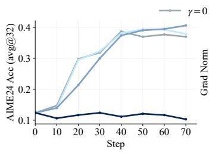

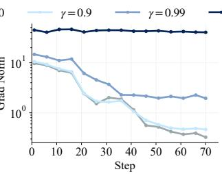

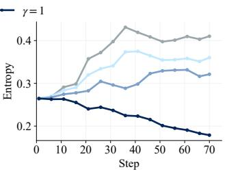

Figure 4: Training dynamics under different $\gamma .$ . OPD distills a Qwen3-4B-Math teacher into a Qwen3-1.7B student, with validation accuracy, gradient norm, and policy entropy reported.  
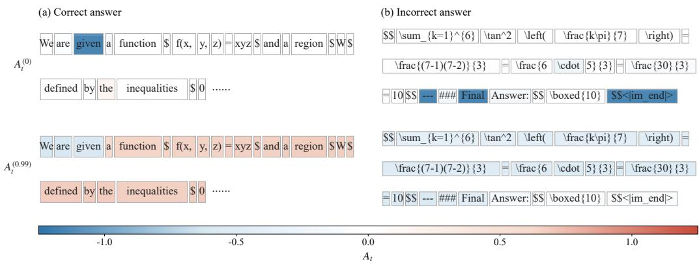  
Figure 5: Token-level advantage visualization. (a) Correct response; (b) incorrect response. The top row shows normalized $A _ { t } ^ { ( 0 ) }$ , and the bottom row shows normalized $A _ { t } ^ { ( 0 . 9 9 ) }$ . Blue and red denote negative and positive advantages, respectively, with color intensity indicating magnitude. Complete response examples are provided in Appendix F.2.

## 5 RELATED WORK

Credit Assignment for OPD. Recent studies have explored credit assignment in OPD, motivated by the potentially unreliable reasoning trajectories generated by relatively weak student policies(Liu et al., 2026; Yu et al., 2026). Truncation-based methods (Zhou et al., 2026; Zhang et al., 2026) terminate rollouts early or mask the learning signals of tokens beyond selected positions, thereby reducing the influence of unreliable continuations. Entropy-aware OPD (Jin et al., 2026) augments reverse KL with forward KL on tokens where the teacher has high entropy, while ExOPD (Yang et al., 2026a) introduces a reference model to calibrate the OPD advantage. Fu et al. (2026) analyze the bias–variance trade-off between token-level and sequence-level reverse-KL estimators and propose teacher top-K local-support matching, yet a principled balance between sequence-level objective fidelity and token-level optimization stability remains unresolved.

Reward-Guided OPD. Recent studies incorporate verifiable rewards into OPD to complement teacher-derived supervision. REOPOLD (Ko et al., 2026) combines reward clipping, entropy-based sampling, and exploration-to-refinement scheduling, while SCOPE (Zheng et al., 2026) routes incorrect trajectories to teacher-perplexity-weighted KL distillation and correct trajectories to studentperplexity-weighted MLE. AOPD (Jia et al., 2026) preserves positive reinforcement while replacing non-positive token updates with localized teacher imitation, whereas RWOPD (Zou et al., 2026) weights teacher KL gradients using verifier rewards. Other works (Ding et al., 2026; Zhan et al., 2026) further stabilize optimization through advantage compression and warmup-then-anneal scheduling. Nevertheless, these methods often introduce additional complexity through group-based advantage estimation, log-ratio correction, or verifier-weighted teacher KL objectives, potentially incurring substantial computational overhead.

## 6 CONCLUSION

In this work, we unified token-level and sequence-level OPD from a temporal credit assignment perspective and proposed $\gamma \mathrm { O P D }$ to balance long-horizon supervision and optimization stability. We further introduced RBM to combine discounted teacher guidance with verifiable outcome rewards. Empirical results on mathematical and code reasoning demonstrate that γOPD remains effective across different teacher–student configurations and distillation scenarios.

Due to computational constraints, our experiments are currently limited to models with fewer than 10B parameters. Evaluating γOPD at larger scales and exploring more flexible temporal credit assignment schemes, such as adaptive or entropy-aware discounting, are promising directions for future work.

## REFERENCES

Rishabh Agarwal, Nino Vieillard, Yongchao Zhou, Piotr Stanczyk, Sabela Ramos Garea, Matthieu Geist, and Olivier Bachem. On-policy distillation of language models: Learning from selfgenerated mistakes. In International Conference on Learning Representations, 2024.

Ganqu Cui, Lifan Yuan, Zefan Wang, Hanbin Wang, Yuchen Zhang, Jiacheng Chen, et al. Process reinforcement through implicit rewards. Transactions on Machine Learning Research, 2026. URL https://arxiv.org/abs/2502.01456.

DeepSeek-AI, Anyi Xu, Bangcai Lin, Bing Xue, Bingxuan Wang, et al. DeepSeek-V4: Towards highly efficient million-token context intelligence, 2026. URL https://arxiv.org/abs/ 2606.19348.

Yifan Ding, Xincheng Wei, Yoshua Y. Li, Ziheng Li, Yuquan Lu, Siyu Zhang, Dongsheng Ma, Rongxiang Weng, Xunliang Cai, and Yun Chen. SAF-OPD: Stable advantage fusion for On-Policy Distillation. arXiv preprint arXiv:2607.29209, 2026. URL https://arxiv.org/ abs/2607.29209.

Yuqian Fu, Haohuan Huang, Kaiwen Jiang, Jiacai Liu, Zhuo Jiang, Yuanheng Zhu, and Dongbin Zhao. Revisiting On-Policy Distillation: Empirical failure modes and simple fixes. arXiv preprint arXiv:2603.25562, 2026. URL https://arxiv.org/abs/2603.25562.

GLM-5 Team. GLM-5: from Vibe Coding to Agentic Engineering, 2026. URL https://arxiv. org/abs/2602.15763.

Daya Guo, Dejian Yang, Haowei Zhang, Junxiao Song, Peiyi Wang, Qihao Zhu, et al. DeepSeek-R1 incentivizes reasoning in LLMs through reinforcement learning. Nature, 645(8081):633–638, 2025. doi: 10.1038/s41586-025-09422-z.

Bingxiang He, Zekai Qu, Zeyuan Liu, Yinghao Chen, Yuxin Zuo, Cheng Qian, Kaiyan Zhang, Weize Chen, Chaojun Xiao, Ganqu Cui, Ning Ding, and Zhiyuan Liu. JustRL: Scaling a 1.5B LLM with a Simple RL Recipe. In ICLR Blogposts 2026, 2026.

Zhiwei He, Tian Liang, Jiahao Xu, Qiuzhi Liu, Xingyu Chen, Yue Wang, Linfeng Song, Dian Yu, Zhenwen Liang, Wenxuan Wang, Zhuosheng Zhang, Rui Wang, Zhaopeng Tu, Haitao Mi, and Dong Yu. DeepMath-103K: A large-scale, challenging, decontaminated, and verifiable mathe matical dataset for advancing reasoning. arXiv preprint arXiv:2504.11456, 2025.

Dan Hendrycks, Collin Burns, Saurav Kadavath, Akul Arora, Steven Basart, Eric Tang, Dawn Song, and Jacob Steinhardt. Measuring mathematical problem solving with the MATH dataset. In Proceedings of the Neural Information Processing Systems Track on Datasets and Benchmarks, volume 1, 2021.

Naman Jain, King Han, Alex Gu, Wen-Ding Li, Fanjia Yan, Tianjun Zhang, Sida Wang, Armando Solar-Lezama, Koushik Sen, and Ion Stoica. LiveCodeBench: Holistic and contamination free evaluation of large language models for code. In International Conference on Learning Representations, 2025. URL https://openreview.net/forum?id=chfJJYC3iL.

Nan Jia, Haojin Yang, Xing Ma, Jiesong Lian, Shuailiang Zhang, Weipeng Zhang, Ke Zeng, Xunliang Cai, and Zequn Sun. Asymmetric On-Policy Distillation: Bridging exploitation and imitation at the token level. arXiv preprint arXiv:2605.06387, 2026. doi: 10.48550/arXiv.2605.06387. URL https://arxiv.org/abs/2605.06387.

Woogyeol Jin, Taywon Min, Yongjin Yang, Swanand Ravindra Kadhe, Yi Zhou, Dennis Wei, Nathalie Baracaldo, and Kimin Lee. Entropy-aware On-Policy Distillation of language models. In Proceedings ofthe 43rd International Conference on Machine Learning, volume 306. PMLR, 2026. doi: 10.48550/arXiv.2603.07079. URL https://arxiv.org/abs/2603.07079.

Kimi Team, Tongtong Bai, Yifan Bai, Yiping Bao, et al. Kimi K3: Open Frontier Intelligence, 2026. URL https://arxiv.org/abs/2607.24653.

Jongwoo Ko, Sara Abdali, Young Jin Kim, Tianyi Chen, and Pashmina Cameron. Scaling reasoning efficiently via relaxed on-policy distillation, 2026. URL https://arxiv.org/abs/2603. 11137.

Woosuk Kwon, Zhuohan Li, Siyuan Zhuang, Ying Sheng, Lianmin Zheng, Cody Hao Yu, Joseph E. Gonzalez, Hao Zhang, and Ion Stoica. Efficient memory management for large language model serving with PagedAttention. In Proceedings of the ACM SIGOPS 29th Symposium on Operating Systems Principles, 2023.

Jia Li, Edward Beeching, Lewis Tunstall, Ben Lipkin, Roman Soletskyi, Shengyi Huang, Kashif Rasul, Longhui Yu, Albert Q Jiang, Ziju Shen, et al. NuminaMath: The largest public dataset in AI4Maths with 860k pairs of competition math problems and solutions. Hugging Face dataset, 2024. URL https://huggingface.co/datasets/AI-MO/NuminaMath-CoT.

Yaxuan Li, Yuxin Zuo, Bingxiang He, Jinqian Zhang, Chaojun Xiao, Cheng Qian, Tianyu Yu, Huanang Gao, Wenkai Yang, Zhiyuan Liu, and Ning Ding. Rethinking on-policy distillation of large language models: Phenomenology, mechanism, and recipe, 2026. URL https://arxiv. org/abs/2604.13016.

Jiawei Liu, Chunqiu Steven Xia, Yuyao Wang, and Lingming Zhang. Is Your Code Generated by ChatGPT Really Correct? Rigorous Evaluation of Large Language Models for Code Generation. In Advances in Neural Information Processing Systems, volume 36, pp. 21558–21572, 2023. URL https://openreview.net/forum?id=1qvx610Cu7.

Shiqi Liu, Zeyu He, Guojian Zhan, Letian Tao, Zhilong Zheng, Jiang Wu, Yinuo Wang, Yang Guan, Kehua Sheng, Bo Zhang, Keqiang Li, Jingliang Duan, and Shengbo Eben Li. STAPO: Stabilizing reinforcement learning for LLMs by silencing rare spurious tokens. arXiv preprint arXiv:2602.15620, 2026.

Kevin Lu and Thinking Machines Lab. On-policy distillation. Thinking Machines Lab: Connectionism, 2025. URL https://thinkingmachines.ai/blog/ on-policy-distillation.

Minjae Oh, Sangjun Song, Gyubin Choi, Yunho Choi, and Yohan Jo. KL for a KL: On-Policy Distillation with control variate baseline. arXiv preprint arXiv:2605.07865, 2026. doi: 10.48550/ arXiv.2605.07865. URL https://arxiv.org/abs/2605.07865. Presented as a poster at the AI for Math Workshop, ICML 2026.

OpenCompass. AIME2025 dataset. https://huggingface.co/datasets/ opencompass/AIME2025, 2025. Accessed: 2026-08-09.

Zhixin Ren, Yau Lyu, Congrong Li, Liping Zhang, and Shengbo Eben Li. Momentum as residualdriven multiplier correction for deep learning optimization, 2026. URL https://arxiv. org/abs/2608.12925.

Zhihong Shao, Peiyi Wang, Qihao Zhu, Runxin Xu, et al. DeepSeekMath: Pushing the limits of mathematical reasoning in open language models. arXiv preprint arXiv:2402.03300, 2024. URL https://arxiv.org/abs/2402.03300.

Guangming Sheng, Chi Zhang, Zilingfeng Ye, Xibin Wu, Wang Zhang, Ru Zhang, Yanghua Peng, Haibin Lin, and Chuan Wu. HybridFlow: A flexible and efficient RLHF framework. In Proceedings ofthe Twentieth European Conference on Computer Systems, pp. 1279–1297, 2025.

An Yang, Anfeng Li, Baosong Yang, Beichen Zhang, et al. Qwen3 technical report. arXiv preprint arXiv:2505.09388, 2025. URL https://arxiv.org/abs/2505.09388.

Wenkai Yang, Weijie Liu, Ruobing Xie, Kai Yang, Saiyong Yang, and Yankai Lin. Learning beyond teacher: Generalized on-policy distillation with reward extrapolation. arXiv preprint arXiv:2602.12125, 2026a. URL https://arxiv.org/abs/2602.12125.

Zhuolin Yang, Zihan Liu, Yang Chen, Wenliang Dai, Boxin Wang, Sheng-Chieh Lin, Chankyu Lee, Yangyi Chen, Dongfu Jiang, Jiafan He, et al. Nemotron-Cascade 2: Post-training LLMs with cascade RL and multi-domain on-policy distillation. arXiv preprint arXiv:2603.19220, 2026b.

Qiying Yu, Zheng Zhang, Ruofei Zhu, Yufeng Yuan, et al. DAPO: An open-source LLM reinforcement learning system at scale. In Advances in Neural Information Processing Systems, volume 38, pp. 125532–125554, 2025. doi: 10.52202/085713-3775.

Zhouyang Yu, Guojian Zhan, Yang Guan, Jingliang Duan, Letian Tao, and Shengbo Eben Li. Taming aleatoric impulse in off-policy reinforcement learning. In Proceedings of the 43rd International Conference on Machine Learning, 2026.

Guojian Zhan, Xiangteng Zhang, Feihong Zhang, Letian Tao, and Shengbo Eben Li. Bicriteria policy optimization for high-accuracy reinforcement learning. IEEE Transactions on Neural Networks and Learning Systems, 37(1):312–326, 2026. doi: 10.1109/TNNLS.2025.3605362.

Yaocheng Zhang, Jiajun Chai, Yuqian Fu, Songjun Tu, Xiaohan Wang, Wei Lin, Guojun Yin, Qichao Zhang, Yuanheng Zhu, and Dongbin Zhao. Are full rollouts necessary for On-Policy Distillation? arXiv preprint arXiv:2605.31490, 2026. doi: 10.48550/arXiv.2605.31490. URL https:// arxiv.org/abs/2605.31490.

Binbin Zheng, Xing Ma, Yiheng Liang, Jingqing Ruan, Xiaoliang Fu, Kepeng Lin, Benchang Zhu, Ke Zeng, and Xunliang Cai. SCOPE: Signal-calibrated On-Policy Distillation enhancement with dual-path adaptive weighting. arXiv preprint arXiv:2604.10688, 2026. doi: 10.48550/arXiv.2604. 10688. URL https://arxiv.org/abs/2604.10688.

Ziheng Zhou, Jiaqi Li, Huacong Tang, Ying Nian Wu, and Demetri Terzopoulos. Less is more: Early stopping rollout for On-Policy Distillation. arXiv preprint arXiv:2605.27028, 2026. doi: 10.48550/arXiv.2605.27028. URL https://arxiv.org/abs/2605.27028.

Qingyun Zou, Yingze Li, Tianen Liu, Bingsheng He, and Weng-Fai Wong. Reward-weighted On-Policy Distillation with an open property-equivalence verifier for NL-to-SVA generation. arXiv preprint arXiv:2605.13501, 2026. doi: 10.48550/arXiv.2605.13501. URL https://arxiv. org/abs/2605.13501.

## APPENDIX

## A PROOF OF PROPOSITION 3.1

Starting from the token-level OPD objective in equation 4b, we have

$$
J _ { \mathrm { O P D } } ^ { \mathrm { t o k e n } } ( \theta ) = \mathbb { E } _ { { \pmb x } \sim { \mathcal { D } } } \left[ \sum _ { t = 1 } ^ { T } \mathbb { E } _ { h _ { t } \sim d _ { \bar { \theta } } ( \cdot | { \pmb x } ) } \left[ \mathbb { D } _ { \mathrm { K L } } \left( \pi _ { \theta } ( \cdot \mid h _ { t } ) \parallel \pi ^ { * } ( \cdot \mid h _ { t } ) \right) \right] \right] .
$$

Since the prefix distribution $d _ { \bar { \theta } } ( h _ { t } \mid x )$ is treated with stop-gradient, it is fixed when differentiating with respect to $\theta .$ Therefore, the gradient can be moved inside the expectation over prefixes:

$$
\nabla _ { \theta } J _ { \mathrm { O P D } } ^ { \mathrm { t o k e n } } ( \theta ) = \mathbb { E } _ { \boldsymbol { \alpha } \sim \mathcal { D } } \left[ \sum _ { t = 1 } ^ { T } \mathbb { E } _ { h _ { t } \sim d _ { \theta } ( \cdot | \boldsymbol { x } ) } \left[ \nabla _ { \theta } \sum _ { a \in \mathcal { V } } \pi _ { \theta } ( a \mid h _ { t } ) \left( \log \pi _ { \theta } ( a \mid h _ { t } ) - \log \pi ^ { * } ( a \mid h _ { t } ) \right) \right] \right] .\tag{10}
$$

For a fixed prefix $h _ { t }$ , define

$$
\Delta ( a ; h _ { t } ) \triangleq \log \pi _ { \boldsymbol { \theta } } ( a \mid h _ { t } ) - \log \pi ^ { * } ( a \mid h _ { t } ) .
$$

This is the full-vocabulary counterpart of the sampled token-level log-ratio $\Delta _ { t }$ in equation 1a. Then the gradient of the inner next-token KL term is

$$
\begin{array} { r l } {  { \nabla _ { \theta } \sum _ { a \in \mathcal { V } } \pi _ { \theta } ( a \mid h _ { t } ) \Delta ( a ; h _ { t } ) } } \\ & { = \sum _ { a \in \mathcal { V } } \nabla _ { \theta } \pi _ { \theta } ( a \mid h _ { t } ) \Delta ( a ; h _ { t } ) + \sum _ { a \in \mathcal { V } } \pi _ { \theta } ( a \mid h _ { t } ) \nabla _ { \theta } \log \pi _ { \theta } ( a \mid h _ { t } ) . } \end{array}\tag{11}
$$

The second term in equation 11 vanishes because

$$
\sum _ { a \in \mathcal { V } } \pi _ { \theta } ( a \mid h _ { t } ) \nabla _ { \theta } \log \pi _ { \theta } ( a \mid h _ { t } ) = \sum _ { a \in \mathcal { V } } \nabla _ { \theta } \pi _ { \theta } ( a \mid h _ { t } ) = \nabla _ { \theta } \sum _ { a \in \mathcal { V } } \pi _ { \theta } ( a \mid h _ { t } ) = 0 .
$$

Using the score-function identity

$$
\nabla _ { \theta } \pi _ { \theta } ( a \mid h _ { t } ) = \pi _ { \theta } ( a \mid h _ { t } ) \nabla _ { \theta } \log \pi _ { \theta } ( a \mid h _ { t } ) ,
$$

we obtain

$$
\begin{array} { r l } { \nabla _ { \theta } \mathbb { D } _ { \mathrm { K L } } \left( \pi _ { \theta } ( \cdot  { \left| \ h _ { t } \right)  } \left| \pi ^ { * } ( \cdot  { \left| \ h _ { t } \right) } \right) = \displaystyle \sum _ { a \in \mathcal { V } } \pi _ { \theta } ( a  { \left| \ h _ { t } \right) } \Delta ( a ; h _ { t } ) \nabla _ { \theta } \log \pi _ { \theta } ( a  { \left| \ h _ { t } \right) } } & { }\right| \\ { = \mathbb { E } _ { y _ { t } \sim \pi _ { \theta } ( \cdot  { \left| h _ { t } \right) } } \left[ \Delta _ { t } \nabla _ { \theta } \log \pi _ { \theta } ( y _ { t }  { \left| \ h _ { t } \right) } \right] , } & { } \end{array}\tag{12}
$$

where $\Delta _ { t } = \Delta ( y _ { t } ; h _ { t } )$ follows from equation 1a.

Substituting equation 12 into equation 10 gives

$$
\nabla _ { \theta } J _ { \mathrm { O P D } } ^ { \mathrm { t o k e n } } ( \theta ) = \mathbb { E } _ { \boldsymbol { x } \sim \mathcal { D } } \left[ \sum _ { t = 1 } ^ { T } \mathbb { E } _ { h _ { t } \sim d _ { \bar { \theta } } ( \cdot | \boldsymbol { x } ) , y _ { t } \sim \pi _ { \theta } ( \cdot | h _ { t } ) } \left[ \Delta _ { t } \nabla _ { \theta } \log \pi _ { \theta } ( y _ { t } \mid h _ { t } ) \right] \right] .\tag{13}
$$

When the stop-gradient prefix distribution is evaluated at the current policy, the prefix $\boldsymbol { h } _ { t }$ together with the next token $y _ { t }$ can be generated by an on-policy trajectory $\mathbf { \psi } _ { \pmb { y } } \sim \pi _ { \boldsymbol { \theta } } ( \cdot \mathbf { \psi } \vert \mathbf { \psi } _ { \pmb { x } } )$ , while gradients are not propagated through the prefix-sampling distribution. Hence, equation 13 can be written as

$$
\nabla _ { \theta } J _ { \mathrm { O P D } } ^ { \mathrm { t o k e n } } ( \theta ) = \mathbb { E } _ { \boldsymbol { x } \sim \mathcal { D } , \boldsymbol { y } \sim \pi _ { \theta } ( \cdot | \boldsymbol { x } ) } \left[ \sum _ { t = 1 } ^ { T } \Delta _ { t } \nabla _ { \theta } \log \pi _ { \theta } ( y _ { t } \mid h _ { t } ) \right] ,
$$

which is exactly the token-level OPD gradient in equation 5. This proves Proposition 3.1.

## B PROOF OF PROPOSITION 3.2

Starting from the sequence-level OPD objective in equation 4a, we expand the reverse KL over complete response trajectories:

$$
J _ { \mathrm { O P D } } ^ { \mathrm { s e q } } ( \theta ) = \mathbb { E } _ { { \pmb x } \sim \mathcal { D } } \left[ \sum _ { { \pmb y } \in \mathcal { V } ^ { T } } \pi _ { \theta } ( { \pmb y } \mid { \pmb x } ) \Delta ( { \pmb y } ) \right] ,
$$

where $\Delta ( y )$ is the sequence-level log-ratio defined in equation 1b. Taking the gradient with respect to θ gives

$$
\nabla _ { \theta } J _ { \mathrm { O P D } } ^ { \mathrm { s e q } } ( \theta ) = \mathbb { E } _ { \mathbf { x } \sim \mathcal { D } } \left[ \sum _ { y \in \mathcal { V } ^ { T } } \nabla _ { \theta } \pi _ { \theta } ( y \mid x ) \Delta ( y ) + \sum _ { y \in \mathcal { V } ^ { T } } \pi _ { \theta } ( y \mid x ) \nabla _ { \theta } \log \pi _ { \theta } ( y \mid x ) \right] .\tag{14}
$$

The second term in equation 14 vanishes because

$$
\sum _ { y \in \mathcal { V } ^ { T } } \pi _ { \theta } ( y \mid x ) \nabla _ { \theta } \log \pi _ { \theta } ( y \mid x ) = \nabla _ { \theta } \sum _ { y \in \mathcal { V } ^ { T } } \pi _ { \theta } ( y \mid x ) = \nabla _ { \theta } 1 = 0 .
$$

Using the score-function identity,

$$
\begin{array} { r } { \nabla _ { \boldsymbol { \theta } } \pi _ { \boldsymbol { \theta } } ( \pmb { y } \mid \pmb { x } ) = \pi _ { \boldsymbol { \theta } } ( \pmb { y } \mid \pmb { x } ) \nabla _ { \boldsymbol { \theta } } \log \pi _ { \boldsymbol { \theta } } ( \pmb { y } \mid \pmb { x } ) , } \end{array}
$$

we obtain

$$
\nabla _ { \theta } J _ { \mathrm { O P D } } ^ { \mathrm { s e q } } ( \theta ) = \mathbb { E } _ { { \pmb x } \sim \mathcal { D } , { \pmb y } \sim \pi _ { \theta } ( \cdot \vert { \pmb x } ) } \left[ \Delta ( { \pmb y } ) \nabla _ { \theta } \log \pi _ { \theta } ( { \pmb y } \mid { \pmb x } ) \right] .\tag{15}
$$

By the autoregressive factorization and the log-ratio decomposition in equation 1, we have

$$
\Delta ( { \pmb y } ) = \sum _ { t ^ { \prime } = 1 } ^ { T } \Delta _ { t ^ { \prime } } , \qquad \nabla _ { \theta } \log \pi _ { \theta } ( { \pmb y } \mid { \pmb x } ) = \sum _ { t = 1 } ^ { T } \nabla _ { \theta } \log \pi _ { \theta } ( y _ { t } \mid h _ { t } ) .\tag{16}
$$

Substituting equation 16 into equation 15 yields

$$
\nabla _ { \theta } J _ { \mathrm { O P D } } ^ { \mathrm { s e q } } ( \theta ) = \mathbb { E } _ { x \sim \mathcal { D } , y \sim \pi _ { \theta } ( \cdot | x ) } \left[ \sum _ { t = 1 } ^ { T } \sum _ { t ^ { \prime } = 1 } ^ { T } \Delta _ { t ^ { \prime } } \nabla _ { \theta } \log \pi _ { \theta } ( y _ { t } \mid h _ { t } ) \right] .\tag{17}
$$

It remains to remove the terms with $t ^ { \prime } < t .$ For $t ^ { \prime } < t , \Delta _ { t ^ { \prime } }$ is determined by earlier tokens and is therefore measurable with respect to $\boldsymbol { h } _ { t }$ . Hence, conditioning on $\boldsymbol { h } _ { t }$

$$
\begin{array} { r l } & { \mathbb { E } _ { y _ { t } \sim \pi _ { \theta } ( \cdot | h _ { t } ) } \left[ \Delta _ { t ^ { \prime } } \nabla _ { \theta } \log \pi _ { \theta } ( y _ { t } \mid h _ { t } ) \right] } \\ & { \quad = \Delta _ { t ^ { \prime } } \mathbb { E } _ { y _ { t } \sim \pi _ { \theta } ( \cdot | h _ { t } ) } \left[ \nabla _ { \theta } \log \pi _ { \theta } ( y _ { t } \mid h _ { t } ) \right] = 0 , } \end{array}
$$

where the last equality follows from the token-level score identity

$$
\mathbb { E } _ { y _ { t } \sim \pi _ { \theta } ( \cdot | h _ { t } ) } \left[ \nabla _ { \theta } \log \pi _ { \theta } ( y _ { t } \mid h _ { t } ) \right] = \nabla _ { \theta } \sum _ { y _ { t } \in \mathcal { V } } \pi _ { \theta } ( y _ { t } \mid h _ { t } ) = 0 .
$$

Therefore, all terms with $t ^ { \prime } < t$ in equation 17 vanish in expectation. Keeping only the terms with $t ^ { \prime } \geq t ,$ , we obtain

$$
\nabla _ { \theta } J _ { \mathrm { O P D } } ^ { \mathrm { s e q } } ( \theta ) = \mathbb { E } _ { \mathbf { x } \sim \mathcal { D } , \mathbf { y } \sim \pi _ { \theta } ( \cdot | \mathbf { x } ) } \left[ \sum _ { t = 1 } ^ { T } \left( \sum _ { t ^ { \prime } = t } ^ { T } \Delta _ { t ^ { \prime } } \right) \nabla _ { \theta } \log \pi _ { \theta } ( y _ { t } \mid h _ { t } ) \right] ,
$$

which is exactly the sequence-level gradient in equation 6. This proves Proposition 3.2.

## C PROOF OF THEOREM 3.3

Proof. Let $N _ { t } = T - t + 1$ and define

$$
\widetilde { A } _ { \tau } ^ { ( 0 ) } = A _ { \tau } ^ { ( 0 ) } - \mathbb { E } \Big [ A _ { \tau } ^ { ( 0 ) } \Big ] .
$$

Since

$$
\begin{array} { r } { \left. \widetilde { A } _ { \tau } ^ { ( 0 ) } \right. _ { 2 } ^ { 2 } = \mathrm { V a r } \Big ( A _ { \tau } ^ { ( 0 ) } \Big ) \leq \mathbb { E } \Big [ \Big ( A _ { \tau } ^ { ( 0 ) } \Big ) ^ { 2 } \Big ] \leq \sigma _ { \Delta } ^ { 2 } , } \end{array}
$$

we have $\left. \tilde { A } _ { \tau } ^ { ( 0 ) } \right. _ { 2 } \leq \sigma _ { \Delta }$

For the sequence-level OPD credit, the triangle inequality in $L _ { 2 }$ gives

$$
\begin{array} { r l r } {  { \sqrt { \mathrm { V a r } \Big ( A _ { t } ^ { ( 1 ) } \Big ) } = \| \sum _ { \tau = t } ^ { T } \widetilde { A } _ { \tau } ^ { ( 0 ) } \| _ { 2 } } } \\ & { } & { \leq \displaystyle \sum _ { \tau = t } ^ { T } \| \widetilde { A } _ { \tau } ^ { ( 0 ) } \| _ { 2 } \leq N _ { t } \sigma _ { \Delta } . } \end{array}
$$

Therefore,

$$
\mathrm { V a r } \Big ( A _ { t } ^ { ( 1 ) } \Big ) \leq N _ { t } ^ { 2 } \sigma _ { \Delta } ^ { 2 } = ( T - t + 1 ) ^ { 2 } \sigma _ { \Delta } ^ { 2 } .
$$

This quadratic dependence is attainable in the worst case. In particular, if $A _ { \tau } ^ { ( 0 ) } = Z$ for all $\tau \in$ $\{ t , \ldots , T \}$ , where $\mathbb { E } [ Z ] = 0$ and $\mathrm { V a r } ( Z ) = \sigma _ { \Delta } ^ { 2 }$ , then

$$
\mathrm { V a r } \Big ( A _ { t } ^ { ( 1 ) } \Big ) = \mathrm { V a r } ( N _ { t } Z ) = N _ { t } ^ { 2 } \sigma _ { \Delta } ^ { 2 } .
$$

For the $\gamma \mathrm { O P D }$ credit, similarly,

$$
\begin{array} { r l } { \sqrt { \mathrm { V a r } \Big ( A _ { t } ^ { ( \gamma ) } \Big ) } = \displaystyle \left\| \sum _ { \tau = t } ^ { T } \gamma ^ { \tau - t } \widetilde { A } _ { \tau } ^ { ( 0 ) } \right\| _ { 2 } } & { } \\ { \leq \sigma _ { \Delta } \displaystyle \sum _ { \tau = t } ^ { T } \gamma ^ { \tau - t } } \\ { = \sigma _ { \Delta } \displaystyle \frac { 1 - \gamma ^ { N _ { t } } } { 1 - \gamma } \leq \displaystyle \frac { \sigma _ { \Delta } } { 1 - \gamma } , \qquad \forall \gamma \in [ 0 , 1 ) . } \end{array}
$$

Squaring both sides yields

$$
\operatorname { V a r } \Bigl ( A _ { t } ^ { ( \gamma ) } \Bigr ) \leq \frac { \sigma _ { \Delta } ^ { 2 } } { ( 1 - \gamma ) ^ { 2 } } , \qquad \forall \gamma \in [ 0 , 1 ) .
$$

Thus, sequence-level OPD can exhibit variance that grows quadratically with the remaining horizon, whereas $\gamma \mathrm { O P D }$ admits a horizon-independent variance bound for every fixed $\gamma < 1$ □

## D ALGORITHM

The complete reward-enhanced $\gamma \mathrm { O P D }$ procedure is summarized in Algorithm 1.

Table 4: Training hyperparameters for the OPD-based methods. The RLVR baselines use a rollout group size of 8.
<table><tr><td>Hyperparameter</td><td>Value</td></tr><tr><td>Training framework</td><td>veRL</td></tr><tr><td>Rollout backend Math reward function</td><td>vLLM</td></tr><tr><td>Code reward function Train batch size</td><td>DAPO boxed verifier Execution-based verifier</td></tr><tr><td>Responses per prompt</td><td>1024 1</td></tr><tr><td>PPO mini batch size</td><td>1024</td></tr><tr><td>PPO micro batch size/GPU</td><td></td></tr><tr><td></td><td>1</td></tr><tr><td>Max prompt length</td><td>2048</td></tr><tr><td>Max response length</td><td>16384</td></tr><tr><td>Optimizer</td><td>RADAR</td></tr><tr><td>Weight decay</td><td>0.01</td></tr><tr><td>Learning rate</td><td></td></tr><tr><td>Training temperature / top-p</td><td> $1 \times 1 0 ^ { - 5 }$ </td></tr><tr><td>Validation temperature / top-p</td><td>1.0 / 1.0 1.0 / 1.0</td></tr><tr><td>Rollout tensor parallel size</td><td>4</td></tr></table>

Algorithm 1 Reward-Enhanced Temporal-Credit On-Policy Distillation (γOPD)   
Require: Dataset D, student policy π , teacher policy $\pi ^ { * }$ , discount factor γ, batch size B   
1: for each training iteration do   
2: Sample prompts $\{ \pmb { x } _ { i } \} _ { i = 1 } ^ { B } \sim \mathcal { D }$ and responses $\{ \pmb { y } _ { i } \} _ { i = 1 } ^ { B } \sim \pi _ { \theta } ( \cdot \mid \pmb { x } _ { i } )$   
3: Evaluate the verifier to obtain $\{ R _ { i } \} _ { i = 1 } ^ { B }$ , where $R _ { i } \gets R ( { \pmb x } _ { i } , { \pmb y } _ { i } )$   
4: for each mini-batch do   
5: for each response $( { \pmb x } , { \pmb y } , R )$ in the mini-batch do   
6: for $t = \bar { 1 } , \dots , \bar { T }$ do   
7: $\Delta _ { t }  \log \pi _ { \theta } ( y _ { t } \mid h _ { t } ) - \log \pi ^ { * } ( y _ { t } \mid h _ { t } )$   
8: end for   
9: Compute $\{ \hat { A } _ { t } ^ { ( \gamma ) } \} _ { t = 1 } ^ { T }$ according to equation 7 and equation 8   
10: end for   
11: Update θ using equation 9   
12: end for   
13: end for   
14: return final student policy πθ

## E EXPERIMENT DETAILS

All methods, including γOPD, are implemented with veRL (Sheng et al., 2025), using vLLM (Kwon et al., 2023) for rollouts and FSDP for actor training. For mathematical reasoning, we train on DeepMath-103K (He et al., 2025), retaining examples with difficulty level at least 6. Each prompt is formatted in chat style and appended with “Please output the final answer within \boxed{}.” For code reasoning, we train on Eurus-RL-Code (Cui et al., 2026). For both domains, verifier outcomes are mapped to binary rewards in {+1, −1}. Math responses are evaluated with a DAPO-style boxed-answer verifier (Yu et al., 2025), while code responses are verified through execution-based unit tests. In the multi-teacher setting, each sample is routed to its domain-specific teacher and verifier while sharing the same student policy.

OPD uses reverse-KL token advantages without an additional KL reward penalty. Unless otherwise specified, all models use RADAR (Ren et al., 2026) optimizer, a constant learning rate on 32 NVIDIA H20 GPUs, with each training run taking approximately 1–3 days; full hyperparameters are provided in Table 4.

Table 5: Computational and memory overhead of the additional γOPD operations.
<table><tr><td>Operation</td><td>Time (ms/step)</td><td>Memory (MB)</td></tr><tr><td>Discounted temporal credit</td><td>609.85</td><td>0.063</td></tr><tr><td rowspan="2">Bounded advantage shaping Verifier-reward mixing</td><td>0.42</td><td>0.125</td></tr><tr><td>0.04</td><td>0.188</td></tr><tr><td>Total additional overhead</td><td>610.32</td><td>0.375</td></tr><tr><td>Vanilla OPD update (reference)</td><td>573,669.00</td><td>81,254.40</td></tr><tr><td>Relative overhead</td><td>0.1064%</td><td>0.00046%</td></tr></table>

We use temperature 1.0 and top-p 1.0 for all evaluations. For mathematical reasoning, we evaluate on AIME24 (Li et al., 2024), AIME25 (OpenCompass, 2025), AMC23 (Li et al., 2024), and MATH500 (Hendrycks et al., 2021), with a maximum prompt length of 2048 and response length of 16384. Following the repeated-sampling convention, AIME24, AIME25, and AMC23 are evaluated with 32 samples per problem, while MATH500, MinervaMath, and OlympiadBench use 4 samples per problem; we report both accuracy and pass rate. All predictions are scored using the same boxed-answer verifier as in training. For code reasoning, we evaluate HumanEval+ and MBPP+ (Liu et al., 2023) with EvalPlus, and the v6 split of LiveCodeBench (Jain et al., 2025). HumanEval+ and MBPP+ use one sample per problem, whereas LiveCodeBench uses four samples with a maximum generation length of 16384 tokens.

## F SUPPLEMENTARY EXPERIMENTAL RESULTS

## F.1 COMPUTATIONAL TIME AND MEMORY ANALYSIS

We profile the additional computation introduced by $\gamma \mathrm { O P D }$ using the same 4B student/teacher models and 32-GPU setup as the main experiments. Statistics are averaged over training steps 2–100 after warm-up. The extra operations include discounted temporal-credit computation, bounded advantage shaping, and verifier-reward mixing. Overall, γOPD adds only 0.1064% computation time and 0.00046% memory relative to a full OPD update, indicating negligible training overhead.

## F.2 COMPLETE TOKEN-LEVEL ADVANTAGE VISUALIZATION

This appendix provides the complete token-level visualizations behind Figure 5. Each response is shown as a sequence of consecutive full-width panels rather than as a collection of small subfigures, so that individual tokens and advantage magnitudes remain readable. The upper row in every panel shows the local advantage $A _ { t } ^ { ( 0 ) }$ ), while the lower row shows the normalized temporally propagated advantage $A _ { t } ^ { ( 0 . 9 9 ) }$

As shown in Figure $^ { 6 , }$ for the correct response, $A _ { t } ^ { ( 0 ) }$ gives a sparse local signal, whereas $A _ { t } ^ { ( 0 . 9 9 ) }$ propagates information from later reasoning steps and assigns stronger positive credit to the key mathematical derivation. As shown in Figure 7, for the incorrect response, $A _ { t } ^ { ( 0 ) }$ penalizes tokens largely unrelated to the actual error, while $A _ { t } ^ { ( 0 . 9 9 ) }$ assigns stronger negative credit to the erroneous formula derivation without excessively penalizing the final end-of-sequence token.

<table><tr><td>A(0) A(0.99)</td><td colspan="5">Wearegivena Wearegivena</td><td colspan="2"></td><td colspan="2"></td><td colspan="4">function$f(x,y,z)=xyz$andaregion$W$</td><td colspan="2"></td><td colspan="2"></td></tr><tr><td></td><td></td><td></td><td></td><td></td><td></td><td colspan="4"></td><td></td><td colspan="2"></td><td colspan="5">function$f(x,y,z)=xyz$andaregion$W$</td></tr><tr><td></td><td></td><td></td><td>definedbythe</td><td></td><td colspan="2">inequalities</td><td></td><td colspan="2"></td><td></td><td colspan="2"></td><td></td><td colspan="2"> $ 0\le z\le y\le x\le1 $. We</td></tr><tr><td></td><td></td><td>definedbythe</td><td></td><td></td><td></td><td colspan="2">inequalities</td><td></td><td></td><td></td><td colspan="2"></td><td colspan="2">$ 0le zleyle x\le$.We</td><td colspan="2"></td></tr><tr><td></td><td></td><td></td><td></td><td>needtofindthe</td><td></td><td>average</td><td></td><td></td><td></td><td></td><td></td><td></td><td>valueof$f$overthisregion.The</td><td></td><td></td><td colspan="2"></td></tr><tr><td></td><td></td><td></td><td></td><td></td><td></td><td></td><td></td><td></td><td></td><td></td><td></td><td></td><td></td><td></td><td>needtofindtheaveragevalueof$f$overthisregion.The</td><td colspan="2"></td></tr><tr><td>average</td><td>average</td><td>valueofa</td><td></td><td></td><td></td><td></td><td>function$f$overaregion$W$isgiven</td><td></td><td></td><td></td><td></td><td></td><td></td><td></td><td></td><td colspan="2"></td></tr><tr><td></td><td>by:$$</td><td>valueofafunction$f$overaregion$W$isgiven</td><td></td><td></td><td></td><td></td><td></td><td></td><td></td><td></td><td></td><td></td><td></td><td></td><td></td><td colspan="2"></td></tr><tr><td></td><td>by:$$</td><td></td><td></td><td>\text{Average}</td><td></td><td></td><td></td><td></td><td></td><td></td><td>\frac{1}{\text{Volume</td><td></td><td></td><td></td><td></td><td colspan="2">ofW</td></tr><tr><td></td><td></td><td>\iiint Wf(x,y,z),dV$$So,first,weneedto</td><td></td><td></td><td>\text{Average}</td><td></td><td></td><td></td><td></td><td></td><td>\frac{1}{\text{Volume</td><td></td><td></td><td></td><td></td><td colspan="2">of W}</td></tr><tr><td></td><td>\iiint W</td><td>f(x,y,z),dV$$So,first,weneedtocomputethe</td><td></td><td></td><td></td><td></td><td></td><td></td><td></td><td></td><td></td><td></td><td></td><td></td><td>computethe</td><td colspan="2"></td></tr><tr><td></td><td></td><td>volumeof$W$,andthen</td><td></td><td></td><td></td><td></td><td></td><td>computethetriple</td><td></td><td></td><td></td><td></td><td>integral</td><td></td><td></td><td colspan="2"></td></tr><tr><td></td><td></td><td>volumeof$W$,andthencomputethetripleintegralof$f$</td><td></td><td></td><td></td><td></td><td></td><td></td><td></td><td></td><td></td><td></td><td></td><td></td><td>of$f$</td><td colspan="2"></td></tr><tr><td></td><td></td><td></td><td></td><td></td><td></td><td></td><td>over$W$.###Step1:</td><td></td><td></td><td>Determine</td><td></td><td></td><td>the</td><td></td><td>bounds</td><td colspan="2"></td></tr><tr><td></td><td></td><td></td><td></td><td></td><td></td><td></td><td></td><td></td><td></td><td></td><td></td><td></td><td></td><td></td><td></td><td colspan="2">of</td></tr><tr><td></td><td></td><td></td><td></td><td></td><td></td><td></td><td>over$W$.---###Step1:</td><td></td><td></td><td></td><td>Determine</td><td></td><td>the</td><td></td><td>bounds</td><td></td><td>of</td></tr></table>

<table><tr><td rowspan="13">Af0) A(0.99)</td><td colspan="4">integration integration</td><td colspan="4">The</td><td colspan="4">region</td><td colspan="4">$ W $ is defined</td><td colspan="4">by:$$0le</td><td colspan="4">Z</td></tr><tr><td colspan="4"></td><td colspan="4">The</td><td colspan="4">region $ W $ is</td><td colspan="4">defined</td><td colspan="4">by:$$0\le</td><td colspan="4"> Z</td><td colspan="4">le y</td></tr><tr><td colspan="4"></td><td colspan="4">\e x\e1 $$</td><td colspan="4">This defines</td><td colspan="4">a region</td><td colspan="5">inthe</td><td colspan="4">first</td><td colspan="4">octant</td></tr><tr><td colspan="4">le X</td><td colspan="4">le □$$</td><td colspan="5">This defines</td><td colspan="5">a region</td><td colspan="5">inthe first</td><td colspan="4">octant</td></tr><tr><td colspan="4">(since (since</td><td colspan="5">all</td><td colspan="4">variables are are</td><td colspan="5">non-negative),</td><td colspan="5"></td><td colspan="4">and the</td></tr><tr><td colspan="4"></td><td colspan="5">all</td><td colspan="5">variables</td><td colspan="5">non-negative),</td><td colspan="5"></td><td colspan="4">and the</td></tr><tr><td colspan="5">need</td><td colspan="5">inequalities are</td><td colspan="5">ordered</td><td colspan="5">as $ z \le y </td><td colspan="5">\le x\le 1 $. So we</td><td colspan="4"></td></tr><tr><td colspan="5"></td><td colspan="5">inequalities are</td><td colspan="5">ordered</td><td colspan="5">as $ z\le y tex</td><td colspan="5"></td><td colspan="4">\le1 $. So we</td></tr><tr><td colspan="5">To</td><td colspan="5">to set up the to the</td><td colspan="5">triple</td><td colspan="5">with</td><td colspan="5">appropriate</td><td colspan="4">limits.</td></tr><tr><td colspan="5">To</td><td colspan="5">set up the</td><td colspan="5">triple</td><td colspan="5">with</td><td colspan="5">appropriate</td><td colspan="5">limits. integration</td></tr><tr><td colspan="5"></td><td colspan="5">up up the</td><td colspan="5">integral, we</td><td colspan="5">can express</td><td colspan="5">the</td><td colspan="5">integration</td></tr><tr><td colspan="5"></td><td colspan="5">The order of</td><td colspan="5">integral, we integration</td><td colspan="5">can express the</td><td colspan="5">here.</td><td colspan="5">Since the</td></tr><tr><td colspan="5"></td><td colspan="5">The order of</td><td colspan="5">integration</td><td colspan="5">is important</td><td colspan="5"></td><td colspan="5">Since</td></tr><tr><td colspan="2">region</td><td colspan="5">order.</td><td></td><td colspan="3"></td><td></td><td colspan="5">is important</td><td></td><td colspan="5">here.</td><td colspan="5">the</td></tr><tr><td colspan="2"></td><td>region</td><td>is is</td><td></td><td></td><td>bounded bounded</td><td></td><td>by $ z</td><td></td><td>by $ z\le y\le x\le 1 $, we</td><td></td><td></td><td></td><td></td><td></td><td></td><td></td><td></td><td></td><td></td><td></td><td></td><td></td><td></td><td></td><td></td><td></td><td>choose an</td></tr></table>

<table><tr><td></td><td>orderforthe</td><td></td><td></td><td>variables.Apossible</td><td></td><td></td><td></td><td></td><td></td><td></td><td></td><td></td><td></td><td>orderis:$ z$,$ y$,$</td></tr><tr><td></td><td>orderforthe</td><td colspan="3">variables.</td><td colspan="3">Apossible</td><td colspan="2"></td><td colspan="2"> orderis:$ z$,$ y$,$</td><td></td><td colspan="3"></td></tr><tr><td>x □$.</td><td colspan="4">Alternatively,</td><td colspan="2"></td><td colspan="3"></td><td colspan="2">$x$,$ y $,$ z $.Let&#x27;s</td><td colspan="4">determine</td></tr><tr><td>x $.</td><td></td><td>Alternatively,</td><td></td><td></td><td></td><td></td><td></td><td></td><td></td><td>$ x $, $ y $, $ z $.Let&#x27;s</td><td></td><td></td><td>determine</td><td></td></tr><tr><td></td><td></td><td></td><td></td><td></td><td></td><td></td><td></td><td></td><td></td><td></td><td>whichiseasier.Butlet&#x27;sthinkintermsoftheorderofthe</td><td></td><td></td><td></td></tr><tr><td></td><td></td><td></td><td></td><td></td><td></td><td></td><td></td><td></td><td></td><td></td><td>whichiseasier.Butlet&#x27;sthinkintermsoftheorderofthe</td><td></td><td></td><td></td></tr><tr><td colspan="2"></td><td>variables.Since$ zleyle x$,wecanfix$ x$,thenfor</td><td></td><td></td><td></td><td></td><td></td><td></td><td></td><td></td><td></td><td></td><td></td><td></td></tr><tr><td></td><td>variables.</td><td></td><td></td><td></td><td></td><td></td><td></td><td></td><td></td><td></td><td>Since$ zley\le x$, wecanfix$ x$,thenfor</td><td></td><td></td><td></td></tr><tr><td></td><td colspan="2">cach $ x $,$ y $ can rangefrom0 to$ x $,andfor each$ y$,</td><td></td><td></td><td></td><td></td><td></td><td></td><td></td><td></td><td></td><td></td><td></td><td></td></tr><tr><td></td><td colspan="3">each$ x$,$ y$can rangefrom0to$ x$,andfor each$ y$,</td><td></td><td></td><td></td><td></td><td></td><td></td><td></td><td></td><td></td><td></td><td></td></tr><tr><td></td><td>$z$canrangefrom0to$y$.So,theintegralcanbesetup</td><td></td><td></td><td></td><td></td><td></td><td></td><td></td><td></td><td></td><td></td><td></td><td></td><td></td></tr><tr><td></td><td colspan="2">$ z $canrangefrom0to$ y$.So,the</td><td></td><td></td><td></td><td></td><td></td><td></td><td></td><td></td><td>integralcanbesetup</td><td></td><td></td><td></td></tr><tr><td></td><td colspan="2">as:$$\iiint Wxyz\,dV=</td><td></td><td></td><td></td><td></td><td></td><td></td><td>\int_{x=0}^1</td><td></td><td></td><td>\int_{y=0}^x</td><td></td><td></td></tr><tr><td></td><td colspan="2">as: $$iiint Wxyz\,dV=</td><td></td><td></td><td></td><td></td><td></td><td></td><td></td><td></td><td></td><td>\int {y=0}^x</td><td></td><td></td></tr><tr><td></td><td colspan="2"></td><td></td><td></td><td></td><td></td><td></td><td></td><td>\int_{x=0}^1</td><td></td><td></td><td></td><td></td><td></td></tr><tr><td></td><td colspan="2">\int_{z=0}^y</td><td></td><td>xyz,dz,dy,dx$$</td><td></td><td></td><td></td><td></td><td></td><td></td><td>Alternatively,</td><td></td><td>wecan</td><td></td></tr><tr><td></td><td>\int_{z=0}^y</td><td></td><td></td><td></td><td></td><td></td><td></td><td>xyz , dz , dy , dx $$</td><td></td><td>Alternatively,</td><td></td><td></td><td>wecan</td><td></td></tr></table>

<table><tr><td rowspan="7">A(0) A(0.99)</td><td colspan="4">reverse the the</td><td colspan="4">of</td><td colspan="4">integration,</td><td colspan="4">but let&#x27;s</td><td colspan="2">with</td><td colspan="3">stick</td></tr><tr><td colspan="4">reverse</td><td colspan="2">order of</td><td colspan="4">integration,</td><td colspan="4">but</td><td colspan="4">let&#x27;s stick</td><td colspan="4">this with this</td></tr><tr><td>order</td><td colspan="4">for now.</td><td colspan="2">###</td><td colspan="4">2:</td><td colspan="4">Compute</td><td colspan="4">triple</td><td colspan="4">integral</td></tr><tr><td colspan="4">order for</td><td colspan="2">=== now. ---</td><td colspan="4">Step ### Step</td><td colspan="4">2: Compute</td><td colspan="4">the the triple</td><td colspan="4">integral</td></tr><tr><td colspan="4">First,</td><td colspan="2">compute</td><td colspan="4"></td><td colspan="4">inner</td><td colspan="4">over</td><td colspan="4">$ z $: $$</td></tr><tr><td colspan="4">First,</td><td colspan="2">compute the</td><td colspan="4">the</td><td colspan="4">integral integral</td><td colspan="4">over</td><td colspan="4">$ z $:$$</td></tr><tr><td colspan="4">\int_{z=0}^y</td><td colspan="4">xyz , dz = xy</td><td colspan="4">inner</td><td colspan="5">int 0^y</td><td colspan="4"></td><td colspan="4">left[</td></tr><tr><td colspan="4">\int_{z=0}^y</td><td colspan="5">xyz</td><td colspan="4">dz = xy</td><td colspan="4">z , dz  xy Z ,</td><td colspan="4">dz = xy</td><td colspan="4">left[</td></tr><tr><td colspan="4">\frac{z^2} {2} \frac{z^2}{2}</td><td colspan="5"></td><td colspan="4">\right] 0^y</td><td colspan="4">\int 0^y cdot</td><td colspan="4">\frac {y^2} {2}</td><td colspan="4">三</td></tr><tr><td colspan="4">frac{x</td><td colspan="5">\right]_0^y</td><td colspan="4">三 xy = xy</td><td colspan="4">\cdot</td><td colspan="4">\frac {y^2} {2}</td><td>三</td></tr><tr><td colspan="4">y^3}{2}</td><td colspan="5"></td><td colspan="4"></td><td colspan="4"></td><td colspan="5"></td><td colspan="4">integral</td></tr><tr><td colspan="2">\frac{x</td><td colspan="4">y^3}{2}</td><td colspan="4">$$Now,</td><td colspan="5">substitute this</td><td colspan="5">into the</td><td colspan="4"></td></tr><tr><td colspan="2">over</td><td colspan="4">over$ y$:$$</td><td colspan="4">$$ Now, \int_{y=0}^x</td><td colspan="4">substitute this</td><td colspan="5">into the</td><td colspan="4">\frac {x} {2}</td></tr><tr><td colspan="2"></td><td colspan="4">$ y $: $$</td><td colspan="4">\int_{y=0}^x</td><td colspan="4">frac{x y^3}{2} \frac{x y^3}{2}</td><td colspan="5">dy 国</td><td colspan="4">\frac {x}{2}</td><td></td></tr><tr><td colspan="8">int_{0}^x int_{0}^x</td><td colspan="4"></td><td></td><td colspan="3"></td><td>dy=</td><td></td><td></td><td></td><td colspan="4"></td></tr><tr><td></td><td colspan="2">y^3</td><td></td><td>y^3dy = dy</td><td></td><td></td><td>\frac {x}{2}</td><td>\frac {x} {2}</td><td></td><td></td><td>\cdot</td><td>\cdot</td><td></td><td>left[</td><td></td><td></td><td></td><td></td><td>frac {y^4} {4}</td><td></td><td></td><td>\frac {y^4} {4}</td></tr></table>

<table><tr><td colspan="4">A(0) A(0.99)</td><td colspan="4">三</td><td colspan="4">\cdot</td><td colspan="4">frac {x^4} {4} 三</td></tr><tr><td colspan="4">right]_0^x</td><td colspan="4">frac {x} {2} 曰 frac {x} {2}</td><td colspan="4">cdot</td><td colspan="4">frac {x^4} {4} 曰</td></tr><tr><td colspan="4">frac {x^5} {8}</td><td colspan="4">$$Now,</td><td colspan="4">over$ x$:$$</td><td colspan="4">\int {x=0}^1</td></tr><tr><td colspan="4">\frac {x^5}{8}</td><td colspan="4">$$Now,</td><td colspan="4">over$ x$: $$</td><td colspan="4">\int_{x=0}^1</td></tr><tr><td colspan="4">\frac{x^5}{8}</td><td>dx曰</td><td colspan="4">integrate frac{1} {8}</td><td colspan="2">\cdot</td><td colspan="5">left[</td></tr><tr><td colspan="4">\frac{x^5}{8}</td><td></td><td colspan="4"></td><td colspan="2">\cdot</td><td colspan="5">frac {x^6} {6} left[</td></tr><tr><td colspan="4">right]_0^1</td><td>dx</td><td colspan="4">\frac{1} {8}</td><td colspan="3"></td><td colspan="4">\frac{x^6} {6}</td></tr><tr><td colspan="4">right]_0^1</td><td>三</td><td colspan="4">frac{1} {8}</td><td colspan="3">\cdot</td><td colspan="4">frac{1}{6} 三</td></tr><tr><td colspan="4"></td><td>三</td><td colspan="4"></td><td colspan="3">\cdot</td><td colspan="4">frac {1} {6} 三</td></tr><tr><td></td><td colspan="4">frac{1} {48}</td><td></td><td colspan="4">frac{1} {8} triple</td><td></td><td colspan="4">of $f(x,y, z) =xyz$</td></tr><tr><td colspan="4"></td><td>$$ Sothe</td><td colspan="4"></td><td>integral integral</td><td colspan="4"></td><td colspan="4"></td></tr><tr><td></td><td colspan="4">\frac{1} {48}</td><td>$$Sothe</td><td colspan="4">triple</td><td></td><td colspan="4"></td><td>of $f(x,y, z) =xyz $</td></tr><tr><td></td><td colspan="4">over $ W $is $ over$ W $is $</td><td colspan="4">\frac{1}{48}</td><td colspan="4">$.--- ###Step</td><td colspan="4">3: Compute</td><td<tr><td>the the</td></tr><tr><td>\frac{1} {48} of$W$The</td><td colspan="2">volume</td><td></td><td></td><td></td><td colspan="4"></td><td></td><td colspan="4">### of$ W $isthe</td><td>Step3:</td></tr><tr><td>Compute</td><td></td><td></td><td>of$ W $The</td><td></td><td></td><td>volume</td><td colspan="4"></td><td colspan="4"></td><td>triple</td></tr><tr><td>integral of</td><td></td><td>volume</td><td></td><td></td><td></td><td>volume</td><td>of $ W $isthe</td><td></td><td></td><td></td><td></td><td>triple</td><td></td><td></td><td>integral</td></tr><tr><td></td><td></td><td>the</td><td>constant</td><td></td><td>function</td><td></td><td></td><td>$f(x,y,z)=1 $over $ W $,which</td><td></td><td></td><td></td><td></td><td></td><td></td><td></td></tr></table>

<table><tr><td>should</td><td>be: be:$$</td><td>$$</td><td colspan="3">iiint W</td><td></td><td>，V</td><td colspan="3"></td><td>int_{x=0}^1</td><td colspan="6"></td></tr><tr><td colspan="3">should</td><td colspan="3">iiint W</td><td></td><td>由，dV曰</td><td></td><td></td><td colspan="3"></td><td colspan="3">int_{x=0}^1</td><td colspan="3">\int_{y=0}^x int_{y=0}^x</td></tr><tr><td colspan="3">\int_{z=0}^y</td><td></td><td colspan="3"> , dz, dy , dx $$</td><td></td><td colspan="3"></td><td></td><td colspan="3">Compute</td><td colspan="3">inner integral:</td><td colspan="2"></td></tr><tr><td></td><td colspan="3">\int_{z=0}^y</td><td colspan="3"></td><td> , dz , dy , dx $$</td><td></td><td></td><td></td><td colspan="3"></td><td>Compute inner</td><td colspan="3">integral:</td></tr><tr><td>$$</td><td colspan="3">int_{z=0}^y</td><td></td><td colspan="3">1 dz = y $$</td><td></td><td colspan="3">Then:</td><td>$$</td><td colspan="3">\int_{y=0}^x</td><td colspan="3">y dy </td></tr><tr><td>$$</td><td colspan="3">\int_{z=0}^y</td><td colspan="3"></td><td> dz  y $$</td><td></td><td colspan="3">Then:</td><td>$$</td><td colspan="3">\int_{y=0}^x</td><td></td><td>y dy =</td></tr><tr><td>left[</td><td colspan="3">\frac {y^2} {2}</td><td colspan="3"></td><td colspan="3">right]_0^x</td><td colspan="3">曰</td><td colspan="3">frac{x^2}{2}</td><td colspan="3"></td></tr><tr><td>left[</td><td colspan="3">\frac {y^2} {2}</td><td colspan="3"></td><td colspan="3">right]_0^x</td><td colspan="3"></td><td colspan="3">frac {x^2} {2}</td><td colspan="3">$S Then:</td></tr><tr><td>$$</td><td colspan="3">\int_{x=0}^1</td><td colspan="3"></td><td colspan="3">\frac{x^2} {2} dx</td><td colspan="3"></td><td colspan="3">frac {1} {2}</td><td colspan="3">$S Then:</td></tr><tr><td>$$</td><td colspan="3">int {x=0}^1</td><td colspan="3"></td><td colspan="3">\frac {x^2} {2}</td><td colspan="3">dx</td><td colspan="3">frac {1} {2}</td><td colspan="3">cdot</td></tr><tr><td></td><td colspan="3"></td><td colspan="3"></td><td colspan="3"></td><td colspan="3"></td><td colspan="3"></td><td colspan="3">\cdot</td></tr><tr><td>left</td><td colspan="3">frac {x^3} {3}</td><td colspan="3"></td><td colspan="3">right]_0^1</td><td colspan="3">三</td><td colspan="3">\frac{1} {2}</td><td colspan="3">cdot</td></tr><tr><td>left[</td><td colspan="3">frac {x^3}{3}</td><td colspan="3"></td><td colspan="3">right]_0^1</td><td colspan="3">日</td><td colspan="3">frac {1}{2}</td><td colspan="3">cdot</td></tr><tr><td></td><td colspan="3"></td><td colspan="3"></td><td colspan="3"></td><td colspan="3"></td><td colspan="3"></td><td colspan="3"></td></tr><tr><td>frac{1}{3}</td><td colspan="3">三</td><td colspan="3">frac{1}{6}</td><td colspan="3"></td><td colspan="3">$$ Sothe</td><td>volume</td><td></td><td colspan="3">of $ W $ is $</td></tr><tr><td></td><td colspan="3"></td><td colspan="3"></td><td colspan="3">\frac{1}{6}</td><td></td><td colspan="3">$$ Sothe volume</td><td></td><td>of $ W $ is $</td><td colspan="2"></td></tr><tr><td></td><td colspan="3">\frac {1} {3}</td><td colspan="3"></td><td colspan="3"></td><td></td><td colspan="2"></td><td></td><td colspan="3"></td><td></td><td>value</td><td></td></tr><tr><td></td><td colspan="3">frac {1} {6}</td><td>$.--</td><td colspan="3">###</td><td colspan="3">Step Step</td><td>4:</td><td colspan="3">Compute</td><td>the</td><td>average</td><td></td><td>value</td></tr></table>

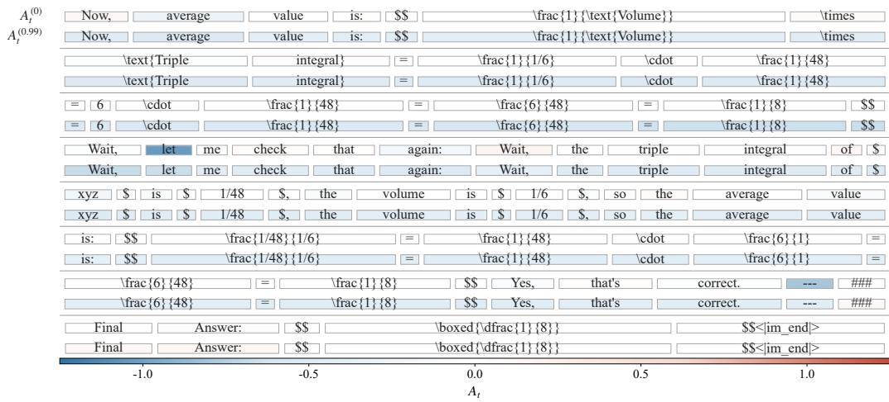  
Figure 6. Complete token-level advantage visualization for the correct response. The response is shown in token order across seven consecutive panels, with $A _ { t } ^ { ( 0 ) }$ in the upper row and $A _ { t } ^ { ( 0 . 9 9 ) }$ in the lower row. Blue and red indicate negative and positive advantages, respectively.

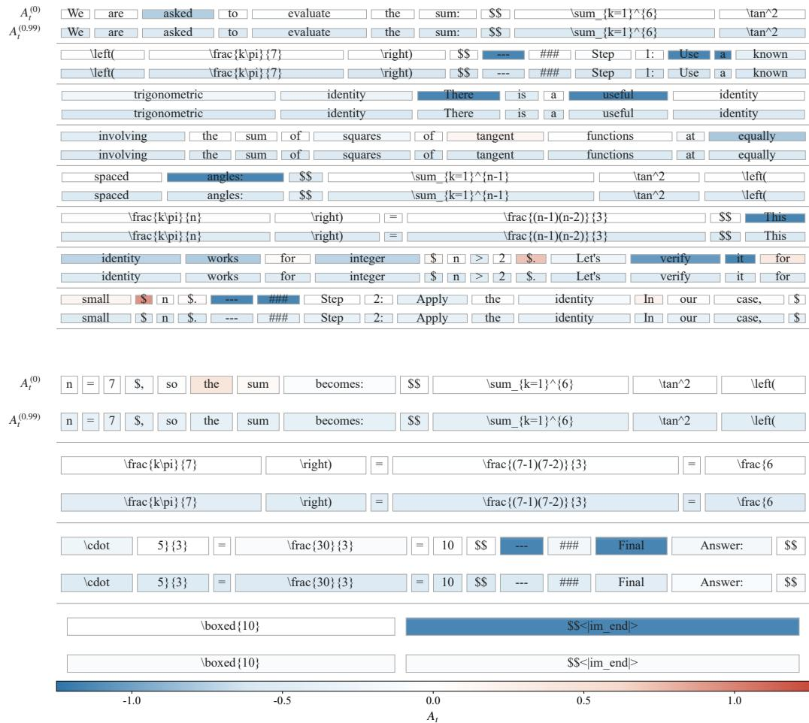  
Figure 7. Complete token-level advantage visualization for the incorrect response. The two consecutive panels show how ${ A } _ { t } ^ { ( 0 ) }$ can penalize tokens unrelated to the actual error, whereas $A _ { t } ^ { ( 0 . 9 9 ) }$ assigns stronger negative credit to the erroneous formula derivation.