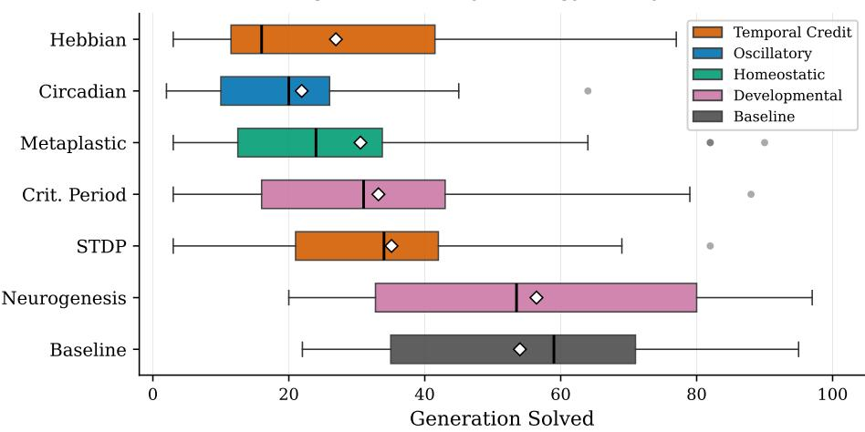
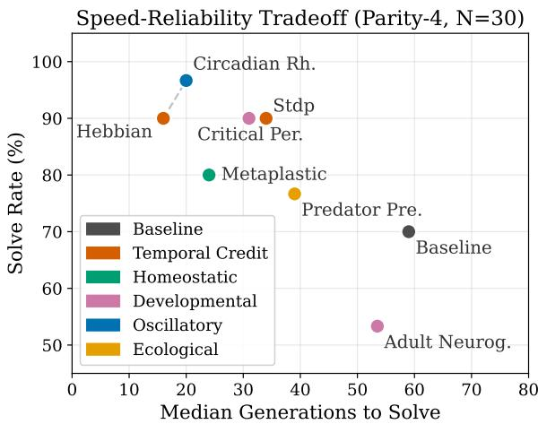

# Bio-Inspired Palette Evolution in Indirectly Encoded Substrates: Timescale Compatibility Shapes Activation Function Discovery

Romain Claret1[0000−0002−5612−8471], Michael O’Neill2[0000−0001−8734−417X], Paul Cotofrei1[0000−0002−4103−5467], and Kilian Stofel1[0000−0002−9486−7769]

1 University of Neuchâtel, Neuchâtel, Switzerland {romain.claret,paul.cotofrei,kilian.stoffel}@unine.ch 2 University College Dublin, Ireland m.oneill@ucd.ie

Abstract. Indirectly encoded neural networks can assign diferent activation functions to individual nodes, but the right functions are rarely known in advance. When the available set contains only standard monotonic functions, problems like parity become unsolvable, yet an allinclusive palette underperforms a curated one. How should evolution discover which functions to use? We address this as a meta-learning problem, designing 13 strategies (11 inspired by biological adaptation mechanisms, plus baseline and oracle controls) that modify the set of available activation functions during evolution. Each strategy translates a biological principle into an evolutionary operator: for example, circadianinspired oscillatory gating cycles functions in and out of the palette on a fixed schedule, while immune-inspired Clonal Selection permanently protects functions that consistently correlate with fitness. We evaluate all strategies across more than 3,000 runs on parity and non-parity problems, first evolving the activation palette alone, then co-evolving a pernode aggregation palette on harder problems; an independent replication with new seeds confirms a stable high-reliability tier, with Circadian holding its top rank. Bio-inspired strategies match the solve rate of a tuned baseline but converge up to twice as fast, with Circadian halving total compute. Strategy rankings reverse across problem types, with no single strategy dominating all domains. Strategy success is largely shaped by timescale compatibility: strategies whose characteristic operating timescale matches the evolutionary evaluation window consistently outperform those that operate too slowly. This gives a practical guideline: match the mechanism’s timescale to the evaluation budget. Rescaling the slowest strategy bypasses the oscillatory barrier entirely: all nine solutions solve parity with non-oscillatory activations paired with min or max aggregation.

Keywords: Neuroevolution · Meta-learning · Activation function discovery · Bio-inspired strategies · Indirect encoding · CPPN.

## 1 Introduction

In neuroevolution with indirect encoding, a Compositional Pattern Producing Network (CPPN) generates the topology and weights of a neural network, called the substrate. Recent extensions allow the CPPN to also assign an activation function to each node individually, selecting from a configurable set called the palette. Prior work [6] shows that this per-node assignment is representationally critical: oscillatory functions like sine solve parity problems that monotonic functions (tanh, sigmoid, ReLU) mathematically cannot, achieving 16× speedup on XOR across 30 independent replications. However, standard palettes contain only monotonic functions, and the right functions for a given problem are not known in advance.

Therefore, the question is: how should evolution discover which functions to use without prior knowledge of problem structure? This is a meta-learning problem: the system must learn what to learn with. Biological neural systems develop computational capabilities through plasticity mechanisms across developmental timescales: Spike-Timing-Dependent Plasticity (STDP) shapes temporal credit assignment [20,2], critical periods gate exploration windows [15], and circadian rhythms coordinate activity phases [13]. Can these biological principles guide evolutionary discovery of computational primitives?

We investigate this in a neuroevolution setting where evolution must discover activation functions from a pool of 18 candidates. We evaluate 13 strategies (11 bio-inspired, plus baseline and oracle controls) selected for category coverage and timescale range, each replicated 30 times across more than 3,000 runs, and address three research questions, each summarized with its finding:

RQ1 (convergence) Do bio-inspired strategies accelerate activation function discovery compared to undirected palette mutation under selection? Yes: faster convergence, not higher solve rates.

RQ2 (timescale) Does a biological mechanism’s operating timescale shape its efectiveness as an evolutionary palette strategy? Yes: strategy success correlates with timescale compatibility, a practical design criterion.

RQ3 (generality) Are strategy rankings consistent across problem types? No: rankings reverse across domains, with no single strategy dominating all problem types.

## 2 Background

## 2.1 The Discovery Problem

Recent work [6] establishes that activation function selection is a representational constraint: oscillatory functions achieve 100% on parity where monotonic functions achieve 0%. The reason is structural: parity-k computes the XOR of k inputs, producing an output that alternates between 0 and 1 with each input flip. Compositions of monotonic functions (sigmoid, tanh, ReLU) preserve input ordering, mapping increasing inputs to non-decreasing outputs, and therefore cannot generate the sign changes required to partition these alternating regions of input space. Periodic functions like sine provide the oscillatory structure needed to produce alternating decision boundaries. The discovery problem asks: how should evolution modify the available palette to find such critical functions?

We distinguish three levels of evolutionary activation function control. Level 1 uses a fixed palette (standard NEAT/HyperNEAT). Level 2 assigns per-node functions from a fixed palette [12]. Level 3 evolves the palette itself across generations (this paper), a form of meta-learning.

## 2.2 NEAT and Indirect Encoding

NEAT (NeuroEvolution of Augmenting Topologies) [27] evolves neural network topology and weights simultaneously through direct encoding, where each gene specifies a single connection. HyperNEAT [26] introduced indirect encoding via CPPNs: given a substrate of pre-positioned nodes, a CPPN maps the spatial coordinates $( x _ { 1 } , y _ { 1 } , x _ { 2 } , y _ { 2 } )$ of each source-target pair to a connection weight, exploiting geometric regularities to generate large-scale structured networks from compact genomes.

ES-HyperNEAT extended HyperNEAT by discovering node positions automatically: a quadtree recursively subdivides the substrate, placing nodes where the CPPN output shows high variance. EMR-HyperNEAT [7] reformulates this as a tensor operation, replacing sequential subdivision with an eager evaluate-allthen-filter pattern that makes substrate complexification computationally cheap. Across all three variants a CPPN query produces one output, the connection weight; prior work [6] added a second output (activation function index) for per-node selection.

## 2.3 Related Work

Heterogeneous activations HA-NEAT [12] evolves per-node activations via direct encoding; HAFD-NEAT [22] adds feature selection. We use indirect encoding and study discovery dynamics (how evolution finds the right functions) rather than assuming availability.

Genetic programming and Cartesian GP Genetic programming evolves programs by composing primitives from a fixed function set [18]; Cartesian GP (CGP) [21] selects, per node of a grid genotype, an operation from a fixed set while coevolving connectivity. Both treat the function set as given and search assignments within it (our Level 2). We instead evolve the function set itself across generations (Level 3): the palette available for per-node selection is the object under adaptation, a meta-learning loop absent from classical GP and CGP.

Activation function search PANGAEA [4], Swish [23], and SIREN [25] search for optimal activations via gradient methods. These seek a single best function; we study how evolution discovers heterogeneous per-node assignments through bio-inspired mechanisms.

NAS and meta-learning Neural architecture search (NAS) [28], DARTS [19], and regularized evolution [24] search architectural choices. MAML [10] learns initialization for fast adaptation. Our strategies complement NAS by searching the operations themselves. The timescale compatibility finding (Sect. 6.4) parallels the outer/inner loop challenge in meta-learning.

Artificial immune systems De Castro and Timmis [8] and Forrest et al. [11] apply immune principles to optimization. We extend immune-inspired memory cells to activation function retention, a novel application domain.

## 3 Strategy Taxonomy

We design strategies across six biological categories (Table 1), selecting 13 for rigorous evaluation (30 replications each) based on category coverage (at least one per category), mechanistic diversity (intrinsic vs. reactive vs. scheduled feedback), and timescale range $( T _ { c }$ from 1 to >100 generations). Each strategy determines how the activation function palette evolves across generations. All strategies start from the same initial palette (identity, tanh, sigmoid, ReLU) containing no oscillatory functions; the meta-learning task is to discover functions like sine that must be added.

All strategies operate at the meta level: after each generation’s fitness evaluation, they read the population’s fitness statistics and current palette and output a modified palette, mirroring the outer/inner loop structure of gradient-based meta-learning [10].

Temporal Credit Assignment (STDP, Hebbian). STDP [20,2] keeps a 5- generation sliding window: functions present before a fitness improvement are potentiated (long-term potentiation, LTP, rate 0.25), while those appearing only after are depressed (long-term depression, LTD, rate 0.10); the asymmetric LTP>LTD ratio mirrors biology. This assigns causal credit for which functions were available when fitness improved $\left( T _ { c } { = } 5 \right)$

Hebbian learning [14] implements the principle that “cells that fire together wire together”: all functions co-active during high-fitness generations receive equal reinforcement, with no temporal discrimination between functions present before versus after improvement. It is simpler than STDP $\left( T _ { c } \mathrm { = } 1 \right)$ ) but cannot distinguish causal contributors from coincidental bystanders.

Oscillatory Gating (Circadian). This strategy mimics the suprachiasmatic nucleus, the brain’s master circadian clock [13], whose rhythm runs independently of external stimuli. Our analog implements a master clock with period $T { = } 2 0$ generations advancing via $\theta _ { \mathrm { c l o c k } }  \theta _ { \mathrm { c l o c k } } + 2 \pi / T$ . Each function i has a phase $\phi _ { i }$ and amplitude $A _ { i } ;$ it is included in the palette when $( 1 - A _ { i } ) + A _ { i } \cdot \frac { 1 } { 2 } ( 1 + \cos ( \theta _ { \mathrm { c l o c k } } - \phi _ { i } ) ) > \tau = 0 . 4$ . Phases entrain toward successful timing via $\bar { \phi _ { i } }  \phi _ { i } + \eta \cdot \Delta f \cdot \sin ( \theta _ { \mathrm { c l o c k } } - \phi _ { i } )$ with learning rate η=0.15. The defining property is that exploration is intrinsic: because the clock sweeps all phases each period, each candidate function cycles into the palette within one period regardless of fitness feedback. This avoids the reactive delay inherent in fitness-dependent strategies, where exploration stalls until a fitness signal arrives.

Immune Memory (Clonal Selection). This strategy mimics adaptive immunity [5,8], where B-cells with sustained antigen afinity mature into long-lived memory cells. Each function keeps an afinity score $a _ { i } \gets 0 . 9 8 \cdot a _ { i } + 0 . 1 2 \cdot c _ { i }$ $( c _ { i } = \mathrm { f i t n e s s ~ c o r r e l a t i o n } )$ ; functions sustaining afinity $\ge 0 . 7 5$ for 10 consecutive generations become permanent memory cells (decay-resistant, mutation-exempt, guaranteed inclusion), a ratchet that locks in proven functions $( T _ { c } { = } 1 0 )$ ).

Developmental Windows (Critical Period, Neurogenesis). Critical Period mimics developmental plasticity windows in the visual cortex [15] via a three-phase schedule: high exploration (35% mutation, gen 0–20), moderate confirmation (10%, gen 20–50), low consolidation (2%, gen 50+); $T _ { c } { = } 2 0$ reflects the exploration phase. The scaling, non-parity, and timescale experiments (Sects. 6.1, 6.2, 6.4) use a refined multi-period variant with a slower schedule $( T _ { c } { \approx } 3 0 )$

Neurogenesis mimics adult hippocampal neurogenesis [9,17]: functions enter via a birth-maturation cycle, ramping their contribution over ∼10 generations to prevent disruptive changes. The maturation delay makes this among the slowest strategies $\left( T _ { c } { = } 5 0 { - } 1 0 0 \right)$ .

Ecological Dynamics (Predator-Prey, Ant Colony). Ecological strategies test whether population-level dynamics (non-neural) transfer as exploration pressure for function discovery.

Predator-Prey applies Lotka–Volterra dynamics in which generalist functions are prey and specialist (oscillatory) functions are predators: $\dot { P } = r P - \alpha P Q$ e, $\dot { Q } = \alpha P Q - q Q \ ( P , Q$ are the prey/predator populations; $r { = } 0 . 4 , \alpha { = } 0 . 5 , q { = } 0 . 3 )$ and palette slots track the resulting populations. In practice the equations rarely modify the palette (70% of runs unchanged), making this efectively a passive control; the coeficients are illustrative, and results are insensitive to their exact values.

Ant Colony mimics ant colony optimization pheromone trails: functions accumulate pheromone proportional to their association with fitness improvements; this pheromone evaporates at a fixed rate; and functions above a threshold join the palette. The characteristic timescale $( T _ { c } \sim 2 0 )$ reflects the pheromone accumulation lag.

Homeostatic Regulation (Metaplastic/BCM, Glial, GRN). Metaplastic (BCM) mimics the Bienenstock–Cooper–Munro sliding threshold [3]. Each function’s inclusion threshold decreases on fitness improvement and increases on stagnation, mirroring biological LTP/LTD asymmetry $\left( T _ { c } { = } 5 – 1 0 \right)$

Glial Modulation mimics astrocytic modulation of synaptic transmission [1]: similar to Metaplastic threshold adaptation but with $\mathrm { a } \sim 5 0 \cdot$ -generation timescale, too slow for the 100-generation evaluation window.

Table 1. Strategy taxonomy across six biological categories (13 strategies, 30 replications each).
<table><tr><td>Category</td><td></td><td>Count Key Mechanism</td><td>Strategies</td></tr><tr><td>Temporal Credit</td><td>2</td><td rowspan="4">When active vs. success STDP, Hebbian Phase-based availability</td><td></td></tr><tr><td>Oscillatory Gating</td><td>1</td><td>Circadian Rhythm</td></tr><tr><td>Immune Memory</td><td>1</td><td>Affinity → protection Clonal Selection</td></tr><tr><td>Developmental</td><td>2</td><td>Staged exploration Critical Period, Neurogenesis</td></tr><tr><td>Ecological</td><td>2</td><td>Population dynamics</td><td>Predator-Prey, Ant Colony</td></tr><tr><td>Homeostatic</td><td>3</td><td>Threshold regulation</td><td>Metaplastic, Glial, GRN</td></tr><tr><td>Controls</td><td>2</td><td></td><td>Baseline (10% mut.)†</td></tr></table>

†A sin-default oracle (sine pre-included in palette) is an upper-bound control.

Gene regulatory network (GRN) models expression dynamics [16]; mapped across generations rather than a lifetime, this gives $T _ { c } { \gg } 1 0 0$ , far exceeding the evaluation window. The resulting 3% solve rate validates the timescale compatibility hypothesis (Sect. 6.4).

## 4 Experimental Setup

Problems Primary: Parity-4 (16 binary samples; requires oscillatory functions). Scaling: Parity-5 (32 samples, 150 gens, pop=400) and Parity-6 (64 samples, 200 gens, pop=300). Non-parity: Two Moons (200 points, noise=0.10), Visual Discrimination (5×5 grid), Concentric Circles, Step Function, XOR.

Experimental platform All experiments use EMR-HyperNEAT [7], a tensor reformulation of ES-HyperNEAT with per-node activation function assignment from an 18-function palette. Unlike standard HyperNEAT where all substrate nodes share one activation, EMR-HyperNEAT extends the CPPN to assign functions to individual nodes based on spatial coordinates. Populations are evolved using NEAT [27] with population 500, 100 generations, feedforward topology, initial palette {identity, tanh, sigmoid, ReLU} (no sine), and a per-problem target fitness (≥0.95 for Parity-4, Step Function, and XOR; ≥0.90 for Parity-5, Two Moons, Concentric Circles, and Visual Discrimination; ≥0.80 for Parity-6), relaxed for the larger and noisier problems to reflect their lower achievable accuracy.

Palette mutation mechanism The 18-function candidate pool (Table 2) includes standard monotonic functions (identity, tanh, sigmoid, ReLU) as well as oscillatory functions (sin, burst, resonator, and others) that are not present in the initial palette. Each generation, the active strategy adds or removes functions from this pool per its biological mechanism. All 18 functions are predefined pool members, including composites such as burst and osc\_adapt; strategies select among them and never synthesize new functions. The baseline strategy applies undirected random mutations to the palette at a fixed rate.

Table 2. The 18-function candidate pool. ✓ marks the four functions in the initial palette (no oscillatory function is included). Oscillatory functions (those with a sine/cosine term) are the class required to solve parity; σ denotes the logistic sigmoid.
<table><tr><td>Name</td><td>Formula</td><td>Init.</td><td>Name</td><td>Formula</td><td>Init.</td></tr><tr><td colspan="6">Rectified / monotonic</td></tr><tr><td>identity</td><td>x</td><td>√</td><td>lelu</td><td> $x { \mathrm { ~ i f ~ } } x { > } 0 { \mathrm { ~ e l s e ~ } } 0 . 0 1 x$ </td><td></td></tr><tr><td>tanh</td><td>tanh x</td><td>√</td><td>softplus</td><td> $\ln ( 1 + e ^ { x } )$ </td><td></td></tr><tr><td>sigmoid</td><td> $1 / ( 1 + e ^ { - x } )$ </td><td>√</td><td>fs_fast</td><td> $2 \operatorname* { m a x } ( 0 , x )$ </td><td></td></tr><tr><td>relu</td><td> $\operatorname* { m a x } ( 0 , x )$ </td><td>√</td><td>lts_low</td><td> $\sigma ( 2 x { - } 0 . 5 )$ </td><td></td></tr><tr><td colspan="6">Oscillatory (sine/cosine component)</td></tr><tr><td>sin</td><td>sin x</td><td></td><td>osc_adapt</td><td> $\sin x \left( 1 { - } 0 . 2 | x | \right)$ </td><td></td></tr><tr><td>burst resonator</td><td> $\operatorname { t a n h } x + 0 . 5 \sin 3 x$   $\sin x e ^ { - | x | / 3 }$ </td><td></td><td>receptive</td><td> $e ^ { - x ^ { 2 } } \cos 2 x$ </td><td></td></tr><tr><td colspan="6">Other (localized / adaptive / filter)</td></tr><tr><td>gauss</td><td> $e ^ { - x ^ { 2 } }$ </td><td></td><td>band_pass</td><td> $e ^ { - | x - 1 | } - e ^ { - | x + 1 | }$ </td><td></td></tr><tr><td>gain_mod</td><td> $x / ( 1 + | x | )$ </td><td></td><td>integrate</td><td></td><td> $\operatorname { t a n h } x \left( 1 + 0 . 2 e ^ { - | x | } \right)$ </td></tr><tr><td>rs_adapt</td><td> $\operatorname { t a n h } x \left( 1 - 0 . 3 | x | \right)$ </td><td></td><td></td><td></td><td></td></tr></table>

Two-stage scope. The activation-only experiments (Sect. 5) evolve this activation palette alone (aggregation fixed to sum); the joint-system experiments (Sect. 6) also co-evolve a per-node aggregation palette (six functions: sum, mean, max, min, product, maxabs; initialized to {sum, mean}); each node’s aggregation comes from a further CPPN output, the analog of the activation index (Sect. 2). We thus first study activation-function discovery in isolation, then the joint activation–aggregation system on harder problems, where aggregation choice opens a non-oscillatory route to parity (Sect. 6.4).

Why indirect encoding? Hand-designing per-node assignments is infeasible $( 1 8 ^ { \bar { 2 0 } } \approx 1 0 ^ { 2 5 }$ for a 20-node substrate, and the optimum co-depends on the evolving topology); CPPNs instead generate spatially structured assignments from compact genomes, letting evolution discover combinations a designer would not anticipate.

Metrics Solve rate (% reaching target fitness; diferences reported in percentage points, pp), convergence speed (median generations among successes), sin discovery rate, oscillatory presence (any oscillatory function in final palette), and compute eficiency (total generations including failed runs consuming the full budget).

Data provenance More than 3,000 runs with 30 replications per condition (seeds 42–71) spanning single-task comparison, failure mechanism analysis, oracle baselines, non-parity validation, baseline sweep, parity scaling, and sensitivity experiments.

Statistical methods Non-parametric tests (Kruskal–Wallis multi-group; Mann– Whitney U with Bonferroni for pairwise; Fisher’s exact for proportions); Wilson confidence intervals (CIs); rank-biserial efect sizes r; significance at p<0.05 unless noted.

## 5 Activation-Only Strategy Discovery

This section studies activation-function discovery in isolation (aggregation fixed to sum) on single-task Parity-4, addressing RQ1; Sect. 6 then lifts this restriction on harder problems, addressing RQ2 and RQ3. Strategy subsets vary across experiments due to diferent batches; each table notes its strategies and configuration.

## 5.1 Single-Task Strategy Comparison

Table 3 presents the comparison on Parity-4 (30 replications per strategy).

Solve rates range from 53% (Neurogenesis) to 97% (Circadian). Strategies separate into three tiers: high-reliability (≥90%: Circadian, Hebbian, Critical Period, STDP), moderate (70–80%: Metaplastic, Predator-Prey, baseline), and low (53%: Neurogenesis). Post hoc pairwise tests confirm Circadian vs. Neurogenesis and Hebbian vs. Neurogenesis are significant after Bonferroni correction.

The four top-tier strategies are statistically indistinguishable in solve rate but diferentiate significantly in convergence speed. An independent replication with 30 new seeds (60 total, Table 4) tests the stability of this ranking.

The high-reliability tier is stable under resampling: Circadian (95%), Hebbian (90%), and Critical Period (88%) stay on top, while Neurogenesis (−15 pp) and STDP (−10 pp) drift down the most. Circadian remains significantly above baseline at 60 replications (95% vs. 65%, Fisher’s exact p<0.001), resolving the non-significance at 30 replications.

Table 3. Single-task Parity-4, activation-only (30 replications, 100 gens). Columns: solve rate with Wilson 95% CI; Med. Gen, median generations-to-solve among successful runs; Sin Disc., fraction of runs that discover pure sin (it enters the palette at some generation); Osc.%, fraction of solved runs whose final palette contains any oscillatory function (incl. composites; Sect. 5.2). Multi-group diferences are significant; a tuned baseline reaches 83.3% (Sect. 5.3).
<table><tr><td>Strategy</td><td>Category</td><td>Rate [95% CI]</td><td></td><td>Med. Gen</td><td>Sin Disc.</td><td>Osc.%</td></tr><tr><td>Circadian Rhythm</td><td>Oscillatory</td><td></td><td>97% [83, 99]</td><td>20</td><td>93%</td><td>100</td></tr><tr><td>Hebbian</td><td>Temporal</td><td></td><td>90% [74, 97]</td><td>16</td><td>100%</td><td>100</td></tr><tr><td>Critical Period</td><td>Developmental</td><td></td><td>90% [74, 97]</td><td>31</td><td>100%</td><td>100</td></tr><tr><td>STDP</td><td>Temporal</td><td></td><td>90% [74, 97]</td><td>34</td><td>100%</td><td>100</td></tr><tr><td>Metaplastic</td><td>Homeostatic</td><td></td><td>80% [63, 91]</td><td>24</td><td>100%</td><td>100</td></tr><tr><td>Predator-Prey†</td><td>Ecological</td><td></td><td>77% [59, 88]</td><td>39</td><td>0%</td><td>100</td></tr><tr><td>Baseline</td><td>Random 10%</td><td></td><td>70% [52, 83]</td><td>59</td><td>37%</td><td>100</td></tr><tr><td>Neurogenesis</td><td>Developmental</td><td></td><td>53% [36, 70]</td><td>53.5</td><td>37%</td><td>100</td></tr></table>

†Passive control: Lotka–Volterra dynamics rarely modify palette.

Table 4. Replication stability (Parity-4, activation-only): the high-reliability ranking of Table 3 re-evaluated at N=60 (30 new seeds). ∆ is the solve-rate change from N=30; Med. Gen, Sin Disc., and Osc.% (defined as in Table 3) are computed over the 60 replications.
<table><tr><td>Strategy</td><td>N=30</td><td>N=60 [95% CI]</td><td>Δ</td><td>Med. Gen</td><td>Sin Disc.</td><td>Osc.%</td></tr><tr><td>Circadian Rhythm</td><td>97%</td><td>95% [86, 98]</td><td></td><td>-2 21</td><td>97%</td><td>100</td></tr><tr><td>Hebbian</td><td>90%</td><td>90% [80, 95]</td><td></td><td>0 24.5</td><td>100%</td><td>100</td></tr><tr><td>Critical Period</td><td>90%</td><td>88% [78, 94]</td><td></td><td>-2 29</td><td>100%</td><td>100</td></tr><tr><td>STDP</td><td>90%</td><td>80% [68, 88]</td><td></td><td>-10 35.5</td><td>98%</td><td>100</td></tr><tr><td>Metaplastic</td><td>80%</td><td>75% [63, 84]</td><td></td><td>-5 30</td><td>100%</td><td>100</td></tr><tr><td>Baseline</td><td>70%</td><td>65% [52, 76]</td><td></td><td>-5 37</td><td>48%</td><td>100</td></tr><tr><td>Neurogenesis</td><td>53%</td><td>38% [27, 51]</td><td></td><td>-15 57</td><td>40%</td><td>100</td></tr></table>

Extended budgets The Neurogenesis 53% rate reflects a speed-reliability tradeof, not a fundamental limitation: it reaches 87% at 200 gens and 90% at 500 gens (30 replications each), with median convergence shifting from 53.5 to 72.5–73 gens.

## 5.2 Universal Oscillatory Presence

In the single-task results (Table 3), 100% of solved runs (194/194) contain at least one oscillatory function. This universality is specific to the activation-only single-task setting studied here; when the aggregation palette is also co-evolved on harder problems (Sect. 4), a non-oscillatory route to parity opens (Sect. 6.4).

However, only 62.9% contain pure sine; the remaining 37.1% solve through composite oscillatory functions (burst, osc\_adapt, receptive; Table 2). The “Sin Discovery” metric underreports oscillatory presence by up to 100 pp (Predator-Prey: 0% sin, 100% oscillatory). Strategies converge to similar oscillatory mixtures regardless of discovery mechanism, suggesting that the oscillatory property, not the specific function, is what evolution selects for.

## 5.3 Baseline Tuning Control

Using the same Parity-4 setup (Table 3), a fair comparison requires testing whether tuning closes the gap. Sweeping five mutation rates (150 runs), the best-tuned baseline reaches 83.3%, within the CIs of most bio-inspired strategies. Even Circadian does not reach significance vs. the best baseline in solve rate (p=0.19).

The advantage is convergence speed. Circadian (median 20 gens) and Hebbian (median 16 gens) converge significantly faster than baseline (30% mutation, median 31 gens). Accounting for failed runs, Circadian uses 735 total generations across 30 seeds vs. 1,517 for the baseline. Circadian is 2.1× more computeeficient overall (RQ1).

## 5.4 Oracle Baseline

Oracle palettes (activation-only, fixed) quantify discovery overhead (30 replications, 150 runs): sin-only achieves 100% at median 3.5 gens, default+sin 93.3% at 7.0 gens, whereas non-sin achieves 0%. The best activation-only strategy (Circadian 97%, 20 gens; Table 3) pays ∼3% and ∼17 extra generations for not knowing the answer. Including unnecessary functions hurts: sin-only outperforms default+sin by 6.7 pp (palette antagonism [6]). An unrestricted all-18 palette solves only 70% (median 42 gens) despite containing sine and every oscillatory composite, and removing pure sine while keeping the composites (17 functions) leaves the solve rate essentially unchanged (73.3%, median 57.5 gens): the oscillatory class, not sine specifically, is what enables a solution (Sect. 5.2).

Discovery timing varies across strategies (Fig. 1). Composite-oracle testing shows the sin-derived functions are heterogeneous: burst and osc\_adapt match sin (100%) but resonator reaches only 63.3%; Clonal Selection targets the competent members.

## 5.5 Speed-Reliability Pareto Frontier

Across all eight strategies on activation-only Parity-4, Circadian best balances speed and reliability, on the Pareto frontier alongside Hebbian (Fig. 2). The biological insight: intrinsic oscillation provides free exploration, eliminating the need for reactive feedback that slows convergence. Hebbian converges fastest when successful (median 16 gens) but at 90% reliability.

Convergence Speed by Strategy (Parity-4, N=30)  
  
Fig. 1. Convergence speed by strategy on Parity-4 (30 replications, activation-only). Faster-converging strategies tend to be more reliable. XOR excluded as a ceiling problem (all strategies solve within 1–3 generations).

  
Fig. 2. Speed-reliability Pareto frontier on Parity-4 (30 replications, activation-only). Circadian is Pareto-optimal. Parity-4 shown as the primary comparison problem; XOR produces ceiling efects.

## 6 The Joint Activation–Aggregation System

Here the substrate also co-evolves the per-node aggregation palette (Sect. 4); comparisons to the activation-only results (Sect. 5) cross configurations and are flagged where made.

## 6.1 Parity Scaling

To test whether strategy diferentiation scales with dificulty, we evaluate all eight strategies on Parity-5 and Parity-6 (8 × 30 × 2 = 480 runs, Table 5). Parity-5 diferentiates the strategies: Circadian (97%) vs. Neurogenesis (47%), a 50-pp gap. Compared to the activation-only single-task Parity-4 (Table 3; 53–97% at N=30), Parity-5 widens both the solve-rate gap (47–97%) and the speed gap. By contrast, Parity-6 compresses to ceiling (all ≥97%) under the extended 200- generation budget and a relaxed 0.80 target, though speed remains diferentiated (STDP 21 gens vs. Neurogenesis 44).

## 6.2 Non-Parity Validation

To test whether rankings generalize beyond parity, we evaluate all nine strategies on non-parity problems (Table 6).

Rankings reverse. On Concentric Circles, Predator-Prey reaches 100% while Circadian drops to 77% and Hebbian falls to 53%, the largest reversal of any strategy. Hebbian’s aggressive correlation-based reinforcement rapidly locks in oscillatory functions (90% sin discovery) that interfere with the radial boundary. On Two Moons, STDP, Critical Period, and Predator-Prey achieve 100% while Circadian is weakest (83.3%); all failed seeds are near-misses (fitness 0.889– 0.899). Strategies that aggressively cycle the palette (Circadian) or lock in oscillatory functions (Hebbian) are penalized on problems where diverse function combinations sufice. Mechanistically, the localized gauss $( e ^ { - x ^ { 2 } }$ , suited to a radial boundary) is retained by all of Predator-Prey’s solved runs but only ∼30–40% of Circadian’s and Hebbian’s: the passive control keeps a broad palette while active strategies prune toward parity-favorable functions that transfer poorly (the efect is multifactorial: palette size alone does not predict success).

Two Moons oracle A monotonic-only oracle achieves 93.3% (30 replications), confirming the oscillatory barrier is parity-specific. Only 85.4% of solved Two Moons runs contain oscillatory functions, vs. near-100% for parity.

Dificulty gradient XOR (calibration) and Visual Discrimination show no differentiation (ceiling). Two Moons produces modest diferentiation (83–100%), the activation-only Parity-4 moderate (53–97%), and Parity-5 strong (47–97%). Therefore, strategy choice matters more on harder problems. Addressing RQ3, no single strategy dominates all problem types.

## 6.3 Circadian Period Sensitivity

Supporting RQ2, varying the Circadian period T ∈ {10, 20, 40} (90 runs, joint activation–aggregation) gives 67% (over-churning), 90% (median 33 gens), and 90% (median 25 gens): the mechanism degrades gracefully across a 4× range, so timescale compatibility is continuous rather than a threshold.

## 6.4 Timescale Compatibility Gradient

Three mechanisms tested in failure analysis (30 replications, 90 runs) form a gradient that tracks timescale mismatch: GRN’s expression dynamics are too slow $( T _ { c } \gg 1 0 0 , \ 3 \%$ solve rate), Glial Modulation’s timescale spans half the evaluation window $( T _ { c } { \sim } 5 0 , 4 7 \% )$ , and Ant Colony pheromone accumulation introduces moderate lag (Tc∼20, 80%). Extending this analysis across all tested strategies (Table 7), we assign characteristic timescales based on operational parameters.

Table 5. Parity scaling (30 replications, joint activation–aggregation). P5: 150 gens, pop=400. P6: 200 gens, pop=300.
<table><tr><td></td><td colspan="3">Parity-5</td><td colspan="3">Parity-6</td></tr><tr><td>Strategy</td><td>Solve%</td><td>Med. Gen</td><td>Osc.%</td><td>Solve%</td><td>Med. Gen Osc.%</td><td></td></tr><tr><td>Circadian Rhythm</td><td>97</td><td>30</td><td>100</td><td>100</td><td>24</td><td>80</td></tr><tr><td>STDP</td><td>83</td><td>33</td><td>87</td><td>100</td><td>21</td><td>93</td></tr><tr><td>Metaplastic</td><td>83</td><td>35</td><td>90</td><td>100</td><td>28</td><td>87</td></tr><tr><td>Clonal Selection</td><td>83</td><td>72</td><td>100</td><td>100</td><td>32</td><td>100</td></tr><tr><td>Hebbian</td><td>77</td><td>34</td><td>83</td><td>100</td><td>33</td><td>77</td></tr><tr><td>Critical Period</td><td>70</td><td>90</td><td>73</td><td>100</td><td>42</td><td>97</td></tr><tr><td>Baseline</td><td>67</td><td>68</td><td>97</td><td>97</td><td>33</td><td>83</td></tr><tr><td>Neurogenesis</td><td>47</td><td>37</td><td>87</td><td>97</td><td>44</td><td>100</td></tr></table>

Table 6. Non-parity validation (30 replications, joint activation–aggregation). Sorted by Concentric Circles solve rate.
<table><tr><td>Strategy</td><td>Conc. Circ.% Two Moons% Step% Vis. Disc.%</td><td></td><td></td><td></td></tr><tr><td>Predator-Prey</td><td>100</td><td>100</td><td>100</td><td>100</td></tr><tr><td>Baseline</td><td>93</td><td>96.7</td><td>97</td><td>100</td></tr><tr><td>Clonal Selection</td><td>90</td><td>90</td><td>100</td><td>100</td></tr><tr><td>Neurogenesis</td><td>87</td><td>96.7</td><td>100</td><td>100</td></tr><tr><td>Metaplastic</td><td>83</td><td>96.7</td><td>100</td><td>100</td></tr><tr><td>STDP</td><td>83</td><td>100</td><td>100</td><td>100</td></tr><tr><td>Circadian Rhythm</td><td>77</td><td>83.3</td><td>100</td><td>100</td></tr><tr><td>Critical Period</td><td>73</td><td>100</td><td>100</td><td>100</td></tr><tr><td>Hebbian</td><td>53</td><td>90</td><td>100</td><td>100</td></tr></table>

The gradient is clearest at the extremes: the two lowest-scoring slow strategies (Glial, $T _ { c } { \sim } 5 0$ , 47%; GRN, $T _ { c } { \gg } 1 0 0 , 3 \% )$ collapse, while $5 / 7$ with $T _ { c } { \le } 2 0$ reach ≥80%. The rank correlation is significant (Spearman $\rho { = } { - } 0 . 6 9 , p { = } 0 . 0 1 9 , N { = } 1 1 )$ , and GRN rescaling (3%→30%, p=0.012) adds causal corroboration.

Empirical guideline The biological principle transfers, but the dynamics must be rescaled to match the evaluation window. A rescaling experiment confirms this causally: compressing GRN’s timescale from ≫100 to ∼10 generations yields a 10× improvement (3% to 30%), while over-compressing Glial Modulation hurts (47% to 27%). Timescale matching appears necessary, but naive acceleration is not suficient. All nine rescaled-GRN solutions are non-oscillatory: identical band\_pass+integrate activations with min (six runs) or max (three) aggregation, solving parity with no periodic component.

Table 7. Characteristic timescale (Tc) vs. solve rate in the joint activation–aggregation system (cf. Table 3, activation-only). Predator-Prey excluded (passive control).
<table><tr><td>Strategy</td><td>Category</td><td>Tc (gens)</td><td>Solve%</td><td>Basis</td></tr><tr><td>Hebbian</td><td>Temporal</td><td>1</td><td>87</td><td>Immediate correlation</td></tr><tr><td>Baseline</td><td>Random</td><td>1</td><td>73</td><td>Per-gen random</td></tr><tr><td>STDP</td><td>Temporal</td><td>5</td><td>93</td><td>5-gen lookback</td></tr><tr><td>Metaplastic</td><td>Homeostatic</td><td>5-10</td><td>83</td><td>Threshold adaptation</td></tr><tr><td>Clonal Selection</td><td>Immune</td><td>10</td><td>77</td><td>Memory formation</td></tr><tr><td>Circadian Rhythm</td><td>Oscillatory</td><td>20</td><td>90</td><td>Full cycle period</td></tr><tr><td>Ant Colony</td><td>Ecological</td><td>~20</td><td>80</td><td>Pheromone lag</td></tr><tr><td>Critical Period</td><td>Developmental</td><td>30</td><td>73</td><td>Exploration phase</td></tr><tr><td>Neurogenesis</td><td>Developmental</td><td>50-100</td><td>63</td><td>Maturation period</td></tr><tr><td>Glial Modulation</td><td>Homeostatic</td><td>~50</td><td>47</td><td>Modulatory timescale</td></tr><tr><td>Gene Reg. Network Homeostatic</td><td></td><td>≥100</td><td>3</td><td>Expression dynamics</td></tr></table>

## 7 Discussion

## 7.1 Practitioner’s Guide

No single strategy dominates, so the choice depends on the scenario: Circadian for speed on parity-like problems, STDP or Hebbian for reliability there, and Clonal Selection for non-parity or unknown problems (Table 6).

## 7.2 Limitations

Several caveats bound these results. The comparison is parity-centric (single-task and scaling), though Sect. 6.2 validates problem-dependent rankings on four nonparity problems. The bio-inspired advantage is convergence speed, not a higher solve-rate ceiling (Sect. 5.3). Statistical power is modest, as most conditions use 30 replications (the Parity-4 ranking is extended to 60, Table 4); top-tier pairwise diferences are not significant after Bonferroni correction (p>0.3), and the observed efect sizes (r=0.20–0.45) would require N=55–120 for 80% power. Finally, the primary experiments use feedforward substrates; a topology-sensitivity check (eight strategies, full-recurrent, 240 runs) preserves the rankings and raises solve rates under recurrence (Circadian: 90%→100%, median 33→5 gens).

## 7.3 Future Directions

Three directions emerge: (i) the non-oscillatory pathway warrants study: why it emerges under GRN’s dynamics, and whether it generalizes; (ii) testing palette evolution beyond Boolean/classification tasks (regression, reinforcement learning, high-dimensional domains); (iii) combining complementary mechanisms (e.g., Circadian discovery with Clonal retention).

## 8 Conclusion

Bio-inspired strategies accelerate discovery, matching a tuned baseline’s solve rate but converging up to twice as fast (RQ1), and strategy efectiveness tracks operating timescale: adaptation cycles completing within ∼20 generations succeed, while the slowest mechanisms $( T _ { c } > 5 0 )$ are markedly less reliable (RQ2). Yet rankings are problem-dependent (RQ3): Circadian and Hebbian lead on parity (97%, 90%) but fall to 77% and 53% on Concentric Circles, and no strategy dominates everywhere. In the joint activation–aggregation system, timescale rescaling causally recovers discovery and opens non-oscillatory pathways, bypassing a barrier assumed absolute; whether this generalizes to other meta-learning domains is open. The source code, configurations, and result data are available at https://github.com/RomainClaret/emr-hyperneat.

## References

1. Araque, A., Parpura, V., Sanzgiri, R.P., Haydon, P.G.: Tripartite synapses: glia, the unacknowledged partner. Trends in neurosciences 22(5), 208–215 (1999)

2. Bi, G.q., Poo, M.m.: Synaptic modifications in cultured hippocampal neurons: dependence on spike timing, synaptic strength, and postsynaptic cell type. Journal of neuroscience 18(24), 10464–10472 (1998)

3. Bienenstock, E.L., Cooper, L.N., Munro, P.W.: Theory for the development of neuron selectivity: orientation specificity and binocular interaction in visual cortex. Journal of Neuroscience 2(1), 32–48 (1982)

4. Bingham, G., Miikkulainen, R.: Discovering parametric activation functions. Neural Networks 148, 48–65 (2022)

5. Burnet, S.F.M., et al.: The clonal selection theory of acquired immunity, vol. 3. Vanderbilt University Press Nashville (1959)

6. Claret, R., O’Neill, M., Cotofrei, P., Stofel, K.: Per-node activation function evolution in indirectly encoded substrates: Solvability, limits, and emergent diversity. In: Artificial Life Conference Proceedings 38. MIT Press (2026)

7. Claret, R., O’Neill, M., Cotofrei, P., Stofel, K.: Tensor-accelerated eager multiresolution grids for evolving large-scale substrates. In: Proceedings of the Genetic and Evolutionary Computation Conference Companion (GECCO Companion ’26). ACM, San Jose, Costa Rica (2026). https://doi.org/10.1145/3795101.3805361

8. De Castro, L.N., Timmis, J.: Artificial immune systems: a new computational intelligence approach. Springer Science & Business Media (2002)

9. Eriksson, P.S., Perfilieva, E., Björk-Eriksson, T., Alborn, A.M., Nordborg, C., Peterson, D.A., Gage, F.H.: Neurogenesis in the adult human hippocampus. Nature medicine 4(11), 1313–1317 (1998)

10. Finn, C., Abbeel, P., Levine, S.: Model-agnostic meta-learning for fast adaptation of deep networks. In: International conference on machine learning. pp. 1126–1135. PMLR (2017)

11. Forrest, S., Perelson, A.S., Allen, L., Cherukuri, R.: Self-nonself discrimination in a computer. In: Proceedings of 1994 IEEE computer society symposium on research in security and privacy. pp. 202–212. Ieee (1994)

12. Hagg, A., Mensing, M., Asteroth, A.: Evolving parsimonious networks by mixing activation functions. In: Proceedings of the genetic and evolutionary computation conference. pp. 425–432 (2017)

13. Hastings, M.H., Reddy, A.B., Maywood, E.S.: A clockwork web: circadian timing in brain and periphery, in health and disease. Nature Reviews Neuroscience 4(8), 649–661 (2003)

14. Hebb, D.O.: The organization of behavior: A neuropsychological theory. Psychology press (2005)

15. Hensch, T.K.: Critical period plasticity in local cortical circuits. Nature reviews neuroscience 6(11), 877–888 (2005)

16. Kaufman, S.A.: Metabolic stability and epigenesis in randomly constructed genetic nets. Journal of theoretical biology 22(3), 437–467 (1969)

17. Kempermann, G., Jessberger, S., Steiner, B., Kronenberg, G.: Milestones of neuronal development in the adult hippocampus. Trends in neurosciences 27(8), 447– 452 (2004)

18. Koza, J.R.: Genetic Programming: On the Programming of Computers by Means of Natural Selection. MIT Press, Cambridge, MA (1992)

19. Liu, H., Simonyan, K., Yang, Y.: Darts: Diferentiable architecture search. arXiv preprint arXiv:1806.09055 (2018)

20. Markram, H., Lübke, J., Frotscher, M., Sakmann, B.: Regulation of synaptic efficacy by coincidence of postsynaptic aps and epsps. Science 275(5297), 213–215 (1997)

21. Miller, J., Turner, A.: Cartesian genetic programming. In: Proceedings of the Companion Publication of the 2015 Annual Conference on Genetic and Evolutionary Computation. pp. 179–198 (2015)

22. Papavasileiou, E., Cornelis, J.P., Jansen, B.: Towards optimizing neural networks’ connectivity and architecture simultaneously with feature selection. In: Proceedings of the Genetic and Evolutionary Computation Conference Companion. pp. 667–670 (2022)

23. Ramachandran, P., Zoph, B., Le, Q.V.: Searching for activation functions. arXiv preprint arXiv:1710.05941 (2017)

24. Real, E., Aggarwal, A., Huang, Y., Le, Q.V.: Regularized evolution for image classifier architecture search. In: Proceedings of the aaai conference on artificial intelligence. vol. 33, pp. 4780–4789 (2019)

25. Sitzmann, V., Martel, J., Bergman, A., Lindell, D., Wetzstein, G.: Implicit neural representations with periodic activation functions. Advances in neural information processing systems 33, 7462–7473 (2020)

26. Stanley, K.O., D’Ambrosio, D.B., Gauci, J.: A hypercube-based encoding for evolving large-scale neural networks. Artificial life 15(2), 185–212 (2009)

27. Stanley, K.O., Miikkulainen, R.: Evolving neural networks through augmenting topologies. Evolutionary computation 10(2), 99–127 (2002)

28. Zoph, B., Le, Q.V.: Neural architecture search with reinforcement learning. arXiv preprint arXiv:1611.01578 (2016)