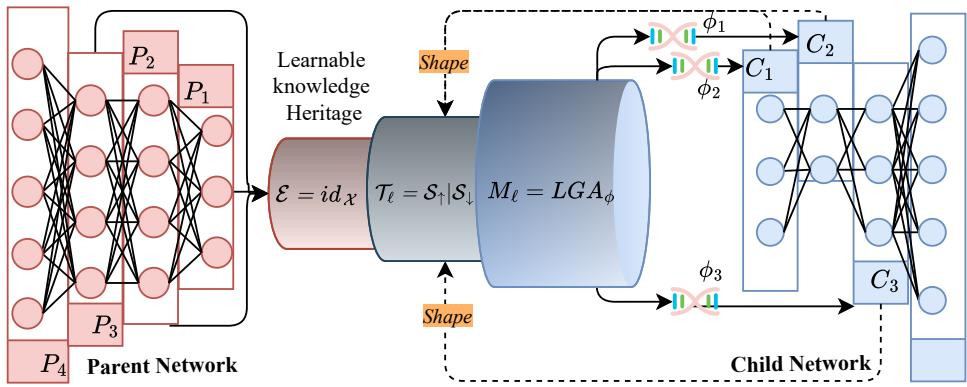
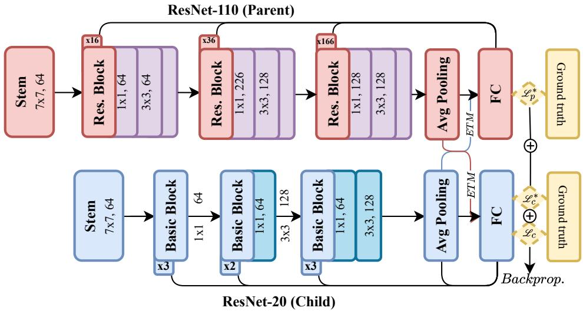
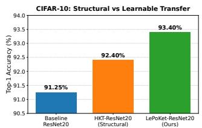
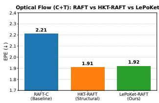

# Can Knowledge Transfer Parameters Be Learned? LePoKet for Efficient Robotic Vision

Yanick C. Tchenko1, Felix Mohr2, Hicham H. Abdelkader1, and Hedi Tabia1

Abstract— Efficient perception is central to robotic systems operating under constrained computation, memory, and latency budgets. Knowledge transfer from larger pretrained models offers a practical route to stronger compact perception networks, but existing approaches commonly rely on fixed distillation objectives or manually designed interaction mechanisms. Building on Hereditary Knowledge Transfer (HKT), we propose LePoKet (Learnable Parameter Optimization for Knowledge Transfer), a structural transfer framework that embeds knowledge inheritance directly into the forward computation. LePoKet introduces a block-wise Extract–Transform–Mix interface whose interaction parameters are optimized jointly with the child network through a Learnable Genetic Attention (LGA) operator, without auxiliary distillation losses or temperature scaling. We first characterize the mechanism on CIFAR-10 and CIFAR-100 with ResNet parent–child pairs, obtaining relative error reductions of 24.57% and 25.1% over standard child training. We then evaluate LePoKet in dense motion estimation by integrating it into a compact RAFT-based optical-flow model trained only on FlyingChairs and FlyingThings3D. LePoKet improves the compact RAFT baseline from 2.21 to 1.92 EPE on Sintel Clean, from 3.35 to 3.01 on Sintel Final, and from 7.51 to 6.39 on KITTI. A direct comparison with HKT further shows that LePoKet improves CIFAR-10 accuracy from 92.40% to 93.40% and, on C+T optical flow, trades a negligible Sintel-Clean difference (1.90/1.91 versus 1.92) for lower Sintel-Final and KITTI error. These results indicate that learnable structural transfer is applicable to both recognition and motion perception and motivates its use for efficient robotic vision. Code: https://github.com/christian-tchenko/LePoKet

## I. INTRODUCTION

Modern robotic systems increasingly rely on deep perception models for motion estimation, scene understanding, navigation, and interaction with dynamic environments. At the same time, deployment on mobile robots, autonomous platforms, and embedded devices imposes stringent constraints on computation, memory, and latency. This motivates methods that can exploit knowledge acquired by large pretrained models while producing compact networks suitable for resource-constrained perception.

Knowledge Distillation (KD) [1] is a widely used framework for transferring information from a large teacher to a compact student. Classical KD transfers softened output distributions through an auxiliary objective, while subsequent methods extend distillation to intermediate representations, including FitNets [2], Attention Transfer (AT) [3], Similarity Preserving (SP) transfer [4], and Contrastive Representation Distillation (CRD) [5]. More recent approaches refine the transfer objective through decoupled supervision [6], reviewbased strategies [7], or feature-based alignment [8]. Despite their effectiveness, these approaches remain predominantly objective-driven: knowledge transfer is induced by additional terms that encourage the student to reproduce selected teacher outputs, features, or relations.

Hereditary Knowledge Transfer (HKT) [20] introduced a different perspective in which knowledge inheritance is incorporated structurally into the interaction between a parent and a child network. HKT organizes this interaction through an Extract–Transform–Mix (ETM) mechanism and uses Genetic Attention to selectively combine inherited and child representations. This structural view demonstrated that knowledge transfer need not be formulated solely as teacher– student imitation and provides the direct methodological foundation for the present work.

Building on this principle, we investigate a more specific question: can the parameters governing the transfer operation themselves be learned jointly with the child network? We introduce LePoKet (Learnable Parameter Optimization for Knowledge Transfer), which retains the structural ETM formulation while replacing the prescribed interaction with a differentiable, parameterized transfer operator. Its Learnable Genetic Attention (LGA) mechanism learns projections, compatibility scores, gating parameters, and transfer intensity directly from the task objective. The pretrained parent remains frozen, whereas the child network and the parameters of the transfer interface are jointly optimized.

This distinction is important. LePoKet does not introduce another teacher–student discrepancy objective. Instead, parent information enters the child’s forward computation, and the usefulness of that information is determined indirectly by its contribution to the task loss. Consequently, the optimization can learn not only the child representation but also how inherited information should modify that representation.

We evaluate this formulation in two complementary settings. First, CIFAR-10 and CIFAR-100 classification provide controlled recognition benchmarks in which the effect of learnable transfer can be isolated using ResNet parent–child pairs. Second, we integrate LePoKet into a compressed RAFT optical-flow estimator [9]. Optical flow provides a dense motion-perception setting relevant to robotic and autonomous systems and allows us to examine whether the same transfer principle extends from image-level recognition to structured pixel-level prediction.

The main contributions of this work are:

• We extend hereditary structural transfer by formulating the parameters of the parent–child interaction as jointly learnable components of the network.

• We introduce Learnable Genetic Attention (LGA), which combines projected parent and child representations through learned similarity, nonlinear gating, and residual transfer intensity.

• We experimentally separate the benefit of structural inheritance from that of learning the transfer interface through direct HKT–LePoKet comparisons on image classification and dense optical flow.

Across the reported experiments, LePoKet consistently improves the compact student baseline. The comparison with HKT further shows that learning the transfer interface changes the behavior of structural inheritance across tasks and evaluation conditions, motivating parameterized hereditary transfer as a flexible extension of the original HKT formulation.

## II. RELATED WORK

## A. Knowledge Distillation

Knowledge Distillation (KD) [1] transfers softened teacher predictions to a student through temperature-scaled supervision. FitNets [2] extend this principle to intermediate representations, while Attention Transfer (AT) [3] aligns attention maps. Similarity-Preserving (SP) distillation [4] and Contrastive Representation Distillation (CRD) [5] further transfer relational information in feature space. More recent approaches include Decoupled Knowledge Distillation (DKD) [6], review-based feature transfer [7], and featureoriented alignment strategies [8].

Although these methods differ in the information transferred, they primarily express teacher–student interaction through additional training objectives. LePoKet instead places the transfer mechanism inside the forward computation and optimizes its parameters through the task loss.

## B. Knowledge Transfer for Dense Motion Perception

Knowledge transfer has also been investigated for dense prediction. DRAFT [10], for example, applies distillation to RAFT-based optical-flow estimation using teacher supervision to improve compact flow models. Optical flow is particularly relevant to robotic and autonomous perception because it provides dense information about image motion and scene dynamics.

Our RAFT experiment uses this setting to test a different transfer mechanism. Rather than introducing an additional distillation objective, LePoKet injects aligned parent information through its learnable transfer interface while preserving the standard task supervision.

## C. Hereditary Knowledge Transfer

HKT [20] introduced hereditary knowledge transfer as a modular mechanism for transferring representations between neural networks. Its Extract–Transform–Mix formulation separates three operations: selecting transferable parent information, adapting it to the child representation, and selectively integrating it into the child network. Genetic Attention regulates this inheritance process.

This structural formulation is the direct precursor of LePoKet. We retain the ETM principle but parameterize the interaction so that the transfer operation can itself be optimized jointly with the child. In particular, LePoKet introduces learnable projections, a nonlinear compatibility gate, and a learnable transfer coefficient within LGA. The resulting formulation therefore preserves hereditary transfer while shifting part of the design choice from a prescribed mechanism to task-driven parameter learning.

This relationship also motivates our experimental comparison. Rather than treating HKT as an unrelated baseline, we use it to distinguish two effects: the gain obtained by introducing a structural inheritance path and the additional effect obtained when the parameters governing that path are learned.

## D. Attention-Based Transfer

Attention mechanisms [11] provide a general means of weighting interactions between representations and have also been used for knowledge distillation [3]. In many such methods, attention defines the representation or relation that an auxiliary loss attempts to align.

LePoKet uses attention differently. LGA is part of the parent–child forward interaction itself. It combines a projected similarity term with a learnable nonlinear compatibility function and uses the resulting coefficient to regulate a residual update of the child representation. The attention mechanism therefore determines the transfer operation rather than defining an additional imitation target.

## E. Positioning of LePoKet

Table I summarizes the distinction between conventional distillation, hereditary structural transfer, and LePoKet. The central difference is not whether teacher information is adaptive, but where the transfer mechanism is represented and optimized. Conventional distillation primarily encodes transfer in the objective; HKT introduces an explicit structural inheritance path; LePoKet extends that path with parameters that are jointly optimized with the child through the task objective.

## III. LEPOKET METHOD

## A. Problem Formulation

We consider a frozen pretrained parent network P and a compact child network C. Both are decomposed into L functional stages,

$$
\begin{array} { l l } { { P = \{ p _ { \ell } \} _ { \ell = 1 } ^ { L } , ~ } } & { { ~ C = \{ c _ { \ell } \} _ { \ell = 1 } ^ { L } , } } \end{array}\tag{1}
$$

with intermediate representations $\mathbf { z } _ { \boldsymbol { \ell } } ^ { P }$ and $\mathbf { z } _ { \boldsymbol { \ell } } ^ { C }$ . The parent is used only as a source of representations during training; its parameters $\theta _ { P }$ remain fixed. The child parameters $\theta _ { C }$ are optimized for the downstream task.

Conventional distillation typically introduces an auxiliary discrepancy between parent and child outputs or features. LePoKet instead asks the transfer interface to learn how parent information should enter the child computation. The task objective therefore remains the only supervision used to optimize the child and the transfer parameters.

TABLE I: Positioning of LePoKet relative to representative knowledge-transfer paradigms. The distinction concerns how teacher/parent information enters training and whether the parameters of the structural transfer operator are jointly learned with the child.
<table><tr><td>Method family</td><td>Transfer source</td><td>Forward inheritance</td><td>Transfer-specific supervision</td><td>Learnable transfer operator</td></tr><tr><td>Logit KD [1]</td><td>Outputs</td><td>No</td><td>Yes</td><td>一</td></tr><tr><td>Feature/attention KD [2], [3]</td><td>Features</td><td>No</td><td>Yes</td><td>一</td></tr><tr><td>Relational KD [4], [5]</td><td>Relations</td><td>No</td><td>Yes</td><td></td></tr><tr><td>HKT [20]</td><td>Representations</td><td>Yes</td><td>Yes</td><td>Prescribed/structured</td></tr><tr><td>LePoKet (ours)</td><td>Representations</td><td>Yes</td><td>No</td><td>Yes</td></tr></table>

  
Fig. 1: Conceptual overview of LePoKet. A frozen parent transfers intermediate representations to a child through a blockwise learnable Extract–Transform–Mix (ETM) interface. Extraction selects a parent representation, transformation provides structural alignment when required, and mixing is performed by Learnable Genetic Attention (LGA). Only the child and transfer parameters are optimized by the task loss.

## B. From Structural Inheritance to Learnable Transfer

The starting point is HKT [20], which injects parent information through an Extract–Transform–Mix interface and uses Genetic Attention to select inherited information. HKT establishes that a structural inheritance path can improve a compact child, but its ETM interaction is not jointly parameterized and optimized as the task-driven interface proposed here; its original training also aggregates core and inheritance supervision. LePoKet retains the ETM abstraction while replacing the prescribed interaction with learnable projections, a learnable gate, and a learnable transfer intensity, all optimized through the standard task objective. This HKT→LePoKet transition isolates the benefit of learning the transfer path itself.

LePoKet generalizes this mechanism by parameterizing the transfer operation. At stage $\ell ,$

$$
\widetilde { \mathbf { z } } _ { \ell } ^ { C } = \mathcal { M } _ { \ell } \big ( \mathbf { z } _ { \ell } ^ { C } , \mathcal { T } _ { \ell } \big ( \mathcal { E } _ { \ell } ( \mathbf { z } _ { \ell } ^ { P } ) \big ) ; \phi _ { \ell } \big ) ,\tag{2}
$$

where $\mathcal { E } _ { \ell }$ extracts a parent representation, $\mathcal { T } _ { \ell }$ aligns it to the child representation, $\mathcal { M } _ { \ell }$ performs the mixing, and $\phi _ { \ell }$ contains learnable transfer parameters. In the ResNet experiment, extraction is the identity,

$$
\begin{array} { r } { \mathcal { E } _ { \ell } ( \mathbf { z } _ { \ell } ^ { P } ) = \mathbf { z } _ { \ell } ^ { P } , } \end{array}\tag{3}
$$

and the pooled representations already share the required dimensionality. For heterogeneous stages, $\tau _ { \ell }$ can perform channel or spatial alignment before mixing.

This formulation separates three questions that are otherwise entangled in a distillation loss: what parent representation is used, how it is made compatible with the child, and how much of it is inherited for a particular input. LePoKet focuses learnability on the last two operations while keeping the parent fixed.

## C. Learnable Genetic Attention

LePoKet instantiates $\mathcal { M } _ { \ell }$ with Learnable Genetic Attention (LGA). Let $\mathbf { q } , \mathbf { k } , \mathbf { v } ~ \in ~ \mathbb { R } ^ { d }$ denote the child query and parent-derived key/value representations after alignment. Learnable projections are

$$
{ \bf Q } = W _ { q } { \bf q } , \qquad { \bf K } = W _ { k } { \bf k } , \qquad { \bf V } = W _ { v } { \bf v } ,\tag{4}
$$

where $W _ { q } , W _ { k } , W _ { v }$ are trainable linear mappings. LGA combines a global similarity term

$$
a _ { 1 } = \sigma \left( { \frac { \langle \mathbf { Q } , \mathbf { K } \rangle } { \sqrt { d } } } \right)\tag{5}
$$

with a nonlinear compatibility gate

$$
a _ { 2 } = \sigma ( \mathrm { M L P } ( \mathbf { Q } \odot \mathbf { K } ) ) ,\tag{6}
$$

where $\odot$ is element-wise multiplication and $\sigma$ is the sigmoid function. The inheritance coefficient is

$$
a = { \frac { 1 } { 2 } } ( a _ { 1 } + a _ { 2 } ) .\tag{7}
$$

Algorithm 1 LePoKet Training   
1: Initialize $\theta _ { C } , \phi ;$ freeze $\theta _ { P }$   
2: for each minibatch $( x , y )$ do   
3: $\{ \mathbf { z } _ { \ell } ^ { P } \} _ { \ell = 1 } ^ { L }  P ( x )$   
4: compute child representations $\{ \mathbf { z } _ { \ell } ^ { C } \} _ { \ell = 1 } ^ { L }$   
5: for $\ell = 1$ to L do   
6: $\tau _ { \ell } \gets \mathcal { T } _ { \ell } ( \mathcal { E } _ { \ell } ( \mathbf { z } _ { \ell } ^ { P } ) )$   
7: $a _ { \ell } \gets g ( \mathbf { z } _ { \ell } ^ { C } , \tau _ { \ell } ; \phi _ { \ell } )$   
8: $\mathbf { z } _ { \ell } ^ { C } \gets \mathbf { z } _ { \ell } ^ { C } + \lambda _ { \ell } a _ { \ell } ( \mathbf { V } _ { \ell } - \mathbf { z } _ { \ell } ^ { C } )$   
9: end for   
10: $\hat { y }  C _ { \mathrm { h e a d } } ( \mathbf { z } _ { L } ^ { C } )$   
11: $\mathcal { L } \gets \mathcal { L } _ { \mathrm { t a s k } } ( \hat { y } , y )$   
12: update $\theta _ { C } , \phi$ using $\nabla \mathcal { L }$   
13: end for

The first term captures global alignment through a scaled dot product, whereas the second can model nonlinear featurewise compatibility. Their average provides a bounded, datadependent coefficient without introducing a separate attention supervision signal.

The child representation is updated through a residual interpolation toward the transformed parent value:

$$
\tilde { \mathbf { z } } _ { \ell } ^ { C } = \mathbf { q } + \lambda _ { \ell } a \left( \mathbf { V } - \mathbf { q } \right) ,\tag{8}
$$

where $\lambda _ { \ell }$ is learnable. Equation (8) makes the role of the transfer explicit. The vector $( \mathbf { V } - \mathbf { q } )$ gives a parent-directed correction, while $\lambda _ { \ell } a$ determines its magnitude. Small compatibility leaves the child close to its own representation; larger compatibility allows stronger inheritance.

## D. Optimization and Gradient Flow

Let ${ \phi } = \{ W _ { q } , W _ { k } , W _ { v } , \lambda _ { \mathrm { { \small i } } } \}$ MLP weights} denote all $\mathrm { L e P \mathrm { \cdot } }$ oKet parameters. For a sample (x, y), the parent forward pass produces frozen source features and the child forward pass receives the fused representations. Training solves

$$
\operatorname* { m i n } _ { \theta _ { C } , \phi } \mathbb { E } _ { ( x , y ) \sim \mathcal { D } } \left[ \mathcal { L } _ { \mathrm { t a s k } } ( C _ { \mathrm { L e P o K e t } } ( x ; \theta _ { C } , \phi ) , y ) \right] .\tag{9}
$$

Gradients from $\mathcal { L } _ { \mathrm { t a s k } }$ propagate through Eq. (8), the LGA projections and gate, and the child network, but not into $\theta _ { P }$ . Consequently, no temperature, teacher-logit loss, featurematching loss, or auxiliary loss weight is introduced. The transfer interface is selected indirectly according to whether its inherited representation improves the downstream task objective.

## E. Architecture-Agnostic Instantiation

The ETM decomposition is intended to decouple the transfer rule from a particular backbone. If parent and child features have equal dimensions, $\mathcal { T } _ { \ell }$ may be the identity. If channel dimensions differ, a projection can map the parent representation to the child space; if spatial resolutions differ, resizing can be included before projection. The same LGA mixing rule can then operate on the aligned representations.

In the ResNet setting used below, transfer is applied to pooled representations and the dimensions already match. In the RAFT setting, parent and compact child representations require explicit alignment before the LGA interaction. These two cases test the same formulation under both homogeneous and heterogeneous parent–child architectures.

## F. Design Properties for Robotic Perception

Three properties motivate the use of LePoKet for compact perception. First, the parent is frozen, so the source model does not need to be co-adapted with the child. Second, transfer is data-dependent: the inheritance coefficient is computed from the current parent–child representations rather than fixed globally. Third, the optimization remains task-driven. This is useful when the downstream objective already has a well-established form, as in classification cross-entropy or optical-flow endpoint error, because the transfer mechanism can be introduced without redesigning that objective.

These properties do not by themselves establish deployment efficiency. The present study evaluates predictive behavior of the compact models; latency, memory, energy, and hardware-specific measurements are outside the current experiments and are identified explicitly as future deployment evaluation.

## G. Scope and Expected Failure Modes

LePoKet assumes that a useful correspondence can be established between at least one parent representation and a child representation. If the selected stages encode incompatible information, an alignment transform can make their tensor shapes compatible but cannot guarantee semantic compatibility. The learned gate can reduce inheritance when representations disagree, yet it cannot create useful parent information that is absent from the selected feature. Stage selection therefore remains an architectural design choice.

A second consideration is the quality of the parent. Because the parent is frozen, systematic errors in its representation are not corrected through parent updates. The residual form in Eq. (8) is intended to preserve a direct child path, so the child is not forced to replace its representation with the parent value. Nevertheless, evaluating robustness to weak or mismatched parents is outside the present experiments.

Finally, LePoKet adds parameters and parent-side computation during transfer training. The current contribution concerns whether these transfer parameters can be optimized effectively, not a claim of zero-cost training. For deployment-oriented robotics, the relevant follow-up is to separate training-time transfer cost from the cost of the compact model used at inference and to measure both on target hardware.

## H. Interpretation of the Transfer Dynamics

Equation (8) also clarifies how LePoKet differs from simply copying a parent feature. Define $\alpha _ { \ell } = \lambda _ { \ell } a _ { \ell }$ . The update can be rewritten as

$$
\tilde { \mathbf { z } } _ { \ell } ^ { C } = ( 1 - \alpha _ { \ell } ) \mathbf { q } + \alpha _ { \ell } \mathbf { V } .\tag{10}
$$

Thus, when $\alpha _ { \ell }$ lies between zero and one, the fused representation is an interpolation between the child’s current state and the projected parent state. When the learned interaction approaches zero, Eq. (10) reduces to the ordinary child path. This gives the model a mechanism for suppressing transfer on inputs for which the parent and child representations are judged incompatible. Conversely, a larger interaction increases the contribution of the parent-derived representation.

The distinction between $a \ell$ and $\lambda _ { \ell }$ is useful. The attention term is input-dependent because it is computed from $\mathbf { Q }$ and K, whereas $\lambda _ { \ell }$ is a learned transfer-intensity parameter associated with the interface. The product therefore combines a learned stage-level tendency to inherit with sampledependent compatibility. In this sense, LePoKet does not assume that a fixed amount of parent information is equally useful for every example.

The residual form also preserves a direct optimization path for the child. The task loss can improve the child representation itself, the parent projection, or the gate that determines their interaction. This differs from a featurematching objective that explicitly penalizes distance to a teacher representation: LePoKet is not optimized to make q equal to $\mathbf { V } .$ . Parent information is useful only insofar as the resulting fused representation reduces the downstream task loss.

This interpretation motivates the ablation in Sec. IV-G. Comparing the task-only child with fixed structural HKT tests whether an inheritance path is useful at all; comparing HKT with LePoKet then tests whether allowing the interaction to adapt provides additional benefit. The two comparisons answer different questions and should not be conflated. The magnitude of the HKT-to-LePoKet difference then indicates how much additional benefit is obtained by optimizing the transfer interface beyond introducing the structural inheritance path itself.

## IV. EXPERIMENTS

We evaluate LePoKet on image classification and dense optical-flow estimation. Classification provides a controlled setting for isolating the effect of learnable inheritance, while optical flow tests the same mechanism on pixel-level motion perception relevant to robotic and autonomous systems. In all experiments the parent is frozen and no auxiliary distillation loss or temperature scaling is used.

## A. Evaluation Questions

The experiments address three questions. Q1: Does a learnable transfer interface improve a compact child over standard task-only training? Q2: Does the mechanism extend from classification to dense motion estimation without changing its basic formulation? Q3: How much of the observed gain is attributable to structural inheritance itself, and how much to making the interaction parameters learnable? Q3 is examined by comparing the baseline child, structural HKT, and LePoKet.

## B. Experimental Setup

Image classification. We use CIFAR-10 and CIFAR-100 [12], each containing 50,000 training and 10,000 test images of size $3 2 \times 3 2 .$ . ResNet110 [13] is the frozen parent and ResNet20 the child. The parent reaches 93.6% Top-1 accuracy on CIFAR-10. The child is trained with SGD, momentum 0.9, weight decay $1 0 ^ { - 4 }$ , initial learning rate 0.01 with scheduled decay, and batch size 128. Augmentation uses random cropping with padding and horizontal flipping.

TABLE II: CIFAR-10: ResNet110 → ResNet20.
<table><tr><td>Method</td><td>Top-1 (%)</td><td>Error (%)</td><td>RER (%)</td></tr><tr><td>Parent (R-110)</td><td>93.6</td><td>6.4</td><td>一</td></tr><tr><td>Baseline (R-20)</td><td>91.25</td><td>8.75</td><td>一</td></tr><tr><td>HALOC [16]</td><td>91.32</td><td>8.68</td><td>0.80</td></tr><tr><td>SparseKD [17]</td><td>91.5</td><td>8.5</td><td>2.86</td></tr><tr><td>Low-Rank [18]</td><td>91.0</td><td>9.0</td><td>-2.86</td></tr><tr><td>RegPrune [19]</td><td>91.2</td><td>8.8</td><td>-0.57</td></tr><tr><td>HKT [20]</td><td>92.40</td><td>7.60</td><td>13.14</td></tr><tr><td>LePoKet (Ours)</td><td>93.40</td><td>6.60</td><td>24.57</td></tr></table>

As illustrated in Fig. 2, transfer is applied at the final pooled representation. The projection dimension is 64, matching the feature dimension. The learnable set $\phi \ =$ $\{ W _ { q } , W _ { k } , W _ { v } , \lambda , \mathrm { M L P } \}$ is optimized jointly with the child.

Optical flow. We integrate LePoKet into a compressed RAFT architecture. Training uses FlyingChairs [14] and FlyingThings3D [15] (C+T) only, with no Sintel or KITTI fine-tuning. Evaluation is reported on Sintel Clean (S-C), Sintel Final (S-F), and KITTI endpoint error (K-E). This setting tests whether the transfer mechanism carries from global recognition features to dense motion representations.

## C. Metrics and Comparison Protocol

For classification we report Top-1 accuracy and error $E =$ 100 − Top-1. Relative error reduction (RER) with respect to the child baseline is

$$
\mathrm { R E R } = \frac { E _ { \mathrm { b a s e l i n e } } - E _ { \mathrm { m o d e l } } } { E _ { \mathrm { b a s e l i n e } } } \times 1 0 0 \%\tag{11}
$$

For optical flow, lower endpoint error is better.

Literature methods in the classification tables are included as contextual reference points; because their reported training protocols can differ, they are not treated as controlled reproductions. For HALOC [16], the original work reports a 0.07 percentage-point accuracy improvement over an uncompressed ResNet20 on CIFAR-10. For consistent presentation in Table II, we therefore express this reported improvement relative to our 91.25% ResNet20 reference, yielding 91.32%. The corresponding error and RER values are recomputed using the definition above.

The controlled evidence in this paper is the comparison with the corresponding compact baseline and the published HKT predecessor [20]. For HKT, RER values in our tables are likewise recomputed from the reported accuracies using the definition above so that the comparison is internally consistent.

## D. CIFAR-10 Results

Table II shows that the ResNet20 baseline obtains 91.25% accuracy. LePoKet reaches 93.40%, an absolute gain of 2.15 percentage points and a relative error reduction of 24.57%. The result answers Q1 positively in the controlled CIFAR-10 setting: learning the transfer interface improves the same compact child while retaining the standard task objective. Relative to the published HKT result (92.40%), LePoKet adds 1.00 percentage point, indicating a substantial additional benefit from optimizing the transfer interface on this dataset.

  
Fig. 2: LePoKet in the ResNet experiment. ResNet110 is the frozen parent and ResNet20 is the child. Transfer is applied to the pooled representation through the learnable ETM/LGA interface.

TABLE III: CIFAR-100: ResNet110 → ResNet20.
<table><tr><td>Method</td><td>Top-1 (%)</td><td>Error (%)</td><td>RER (%)</td></tr><tr><td>Baseline (R-20)</td><td>65.3</td><td>34.7</td><td>一</td></tr><tr><td>KD [1]</td><td>66.0</td><td>34.0</td><td>2.0</td></tr><tr><td>AT [3]</td><td>66.2</td><td>33.8</td><td>2.6</td></tr><tr><td>SP [4]</td><td>66.3</td><td>33.7</td><td>2.9</td></tr><tr><td>NORM [8]</td><td>66.6</td><td>33.4</td><td>3.7</td></tr><tr><td>CRD [5]</td><td>67.0</td><td>33.0</td><td>4.9</td></tr><tr><td>DKD [6]</td><td>67.4</td><td>32.6</td><td>6.1</td></tr><tr><td>LePoKet (Ours)</td><td>74.01</td><td>25.99</td><td>25.1</td></tr></table>

The contextual methods in Table II span compression, sparsity, and knowledge-transfer approaches. We report their values to situate the operating range rather than to claim a strictly identical training protocol. This distinction is important because LePoKet’s central comparison is with the task-only child and the structural HKT variant in Sec. IV-G.

## E. CIFAR-100 Results

On CIFAR-100, Table III reports a larger separation from the compact baseline. ResNet20 obtains 65.3%, whereas LePoKet reaches 74.01%. The corresponding error decreases from 34.7% to 25.99%, giving a 25.1% RER. This result indicates that the same transfer formulation remains effective when the recognition problem contains more classes and the child baseline has substantially larger error.

TABLE IV: Optical-flow results with FlyingChairs + FlyingThings3D (C+T) training only. Lower is better.
<table><tr><td>Method</td><td>S-C ↓</td><td>S-F↓</td><td>K-E↓</td></tr><tr><td>RAFT (P) [9]</td><td>1.43</td><td>2.71</td><td>5.04</td></tr><tr><td>RAFT (C) Baseline</td><td>2.21</td><td>3.35</td><td>7.51</td></tr><tr><td>DRAFT [10]</td><td>1.99</td><td>3.17</td><td>6.94</td></tr><tr><td>2HKT-RAFT [20]</td><td>1.91</td><td>3.03</td><td>7.37</td></tr><tr><td>3HKT-RAFT [20]</td><td>1.90</td><td>3.08</td><td>6.45</td></tr><tr><td>LePoKet (Ours)</td><td>1.92</td><td>3.01</td><td>6.39</td></tr></table>

As in the CIFAR-10 table, the published distillation values are contextual rather than a claim of identical reproduction. The main observation is therefore not that LePoKet universally dominates every distillation implementation, but that task-driven optimization of the transfer interface yields a substantial improvement over the compact child under the reported setting.

## F. Dense Motion Perception with RAFT

The optical-flow experiment addresses Q2. LePoKet is inserted at the feature interaction stage of a compressed RAFT model. Parent representations are extracted and aligned to the compact feature space before LGA mixing. The recurrent GRU-based refinement and cost-volume construction of RAFT are otherwise preserved. Transfer parameters and child parameters are optimized using the standard endpointerror objective.

Table IV shows consistent improvement over the compact RAFT baseline: 2.21→1.92 on Sintel Clean, 3.35→3.01 on Sintel Final, and 7.51→6.39 on KITTI. The model is trained only on C+T, so these results do not rely on benchmarkspecific fine-tuning. Relative to DRAFT under the reported protocol, LePoKet also gives lower error on all three metrics.

  
(a) CIFAR-10 classification

  
(b) Optical flow (C+T)  
Fig. 3: Structural vs. learnable knowledge transfer. (a) CIFAR-10 accuracy for ResNet110→ResNet20. (b) Sintel Clean EPE under C+T training. Higher accuracy and lower EPE are better.

The HKT comparison is more informative: LePoKet is slightly worse on Sintel Clean (1.92 versus 1.91/1.90), but improves Sintel Final (3.01 versus 3.03/3.08) and KITTI EPE (6.39 versus 7.37/6.45) relative to the reported 2HKT/3HKT variants. Thus, learning the interface changes the tradeoff across dense-motion benchmarks rather than uniformly improving every metric. The experiment demonstrates that the same learnable structural-transfer principle can be applied beyond classification to dense motion estimation.

## G. Structural vs. Learnable Transfer

To address Q3, we distinguish three configurations. Baseline is the compact model trained with its task loss. HKT is the published structural hereditary-transfer predecessor [20], based on ETM and Genetic Attention with aggregated inheritance supervision. LePoKet retains the structural ETM principle but explicitly parameterizes the transfer operator and jointly optimizes its parameters through LGA using the task objective alone.

On CIFAR-10, Fig. 3(a) shows that HKT improves the baseline from 91.25% to 92.40%, corresponding to 13.14% RER. LePoKet reaches 93.40% and 24.57% RER. Relative to HKT, learning the interaction yields an additional 1.00 percentage-point improvement in this experiment, showing a substantial benefit beyond the structural inheritance path alone.

The optical-flow ablation in Fig. 3(b) is deliberately reported without overstating the effect of learnability. The published HKT results provide two C+T references: 2HKT-RAFT obtains 1.91/3.03/7.37 and 3HKT-RAFT obtains 1.90/3.08/6.45 on S-C/S-F/K-E. LePoKet obtains 1.92/3.01/6.39. Hence HKT retains a marginal advantage on Sintel Clean, whereas LePoKet is better on Sintel Final and KITTI EPE. Table IV also establishes that all structuraltransfer variants improve the compact baseline on the principal reported EPE metrics. The evidence therefore supports structural transfer strongly, while the incremental value of learning the interaction is metric-dependent.

## H. Direct HKT–LePoKet Extension Analysis

The HKT comparison is more than an additional baseline: it identifies what changes when structural inheritance becomes task-learnable. HKT established the ETM abstraction and reports 92.40% on CIFAR-10 for HKT-ResNet20 while retaining the 0.27M-parameter child and approximately 0.10 ms inference time on its TITAN RTX setup [20]. Under the same ResNet110→ResNet20 setting, LePoKet reaches 93.40%. The 1.00-point improvement over HKT indicates that explicitly learning the transfer interface provides a substantial additional benefit in this classification setting.

Dense motion gives a complementary result. Under C+T training, 2HKT-RAFT reports 1.91/3.03/7.37 and 3HKT-RAFT 1.90/3.08/6.45 on S-C/S-F/K-E [20]; LePoKet obtains 1.92/3.01/6.39. Thus, HKT remains marginally better on Sintel Clean, whereas LePoKet is better on Sintel Final and KITTI EPE. Learnability therefore changes the crossbenchmark trade-off rather than uniformly improving every metric.

LePoKet also changes the optimization mechanism: HKT aggregates task and inheritance supervision, whereas LePoKet learns its transfer parameters through $\mathcal { L } _ { \mathrm { t a s k } }$ without an explicit teacher–student discrepancy. The present study does not yet isolate these two changes factorially, nor does it report LePoKet hardware latency. Consequently, HKT’s published efficiency numbers are not reused as LePoKet measurements. A future ablation should independently vary fixed/learnable mixing and task-only/inheritance-augmented supervision, together with embedded-hardware profiling.

## I. Implications for Robotic Vision

Optical flow is a dense representation of scene motion and is relevant to perception pipelines that reason about dynamic environments. The RAFT experiment is therefore the robotics-facing component of this study: it evaluates whether LePoKet can strengthen a compact dense predictor without adding a new teacher-imitation objective or finetuning on the evaluation benchmarks. The result is encouraging for resource-constrained perception, but it should not be interpreted as an end-to-end robot-system evaluation.

The present paper does not report on-device latency, energy consumption, memory use, or closed-loop navigation/control performance. Nor does it claim that the transfer interface is cost-free during training. These measurements are important for establishing deployment efficiency and constitute the main limitation of the current evaluation. A natural next step is to train with LePoKet and then characterize the compact child on embedded robotic hardware, as well as to evaluate transfer in downstream tasks such as navigation or scene understanding.

## J. Summary of Findings

Across the reported experiments, Q1 is supported by improvements over both compact baselines; Q2 is supported by the transfer from ResNet classification to RAFT optical flow; and Q3 shows that structural inheritance provides a strong gain and that learning the transfer interface adds a further 1.00 percentage point on CIFAR-10, while the benefit remains metric-dependent in optical flow. This distinction is central to the interpretation of LePoKet: its contribution is not an assertion that learned interaction must win on every benchmark value, but a general mechanism that makes the parameters governing structural knowledge transfer explicitly optimizable by the downstream task.

## V. CONCLUSION

We presented LePoKet, a learnable extension of the structural HKT paradigm [20] and a framework for transferring knowledge from a frozen parent network to a compact child model through the forward computation. Rather than introducing an auxiliary teacher–student imitation objective, LePoKet parameterizes an Extract–Transform–Mix interface and uses Learnable Genetic Attention to regulate residual feature inheritance jointly with child optimization. Controlled ResNet experiments on CIFAR-10 and CIFAR-100 show improvements over standard child training, while the RAFT-based study demonstrates that the same mechanism extends to dense motion estimation. Under C+T training without Sintel or KITTI fine-tuning, LePoKet improves the compact RAFT baseline on all three reported optical-flow metrics. The direct HKT comparison shows a further 1.00 percentage-point CIFAR-10 gain from learning the transfer interface (92.40% for HKT versus 93.40% for LePoKet). In optical flow, LePoKet slightly trails 2HKT/3HKT on Sintel Clean but improves Sintel Final and KITTI EPE, underscoring that learnability changes the cross-benchmark trade-off rather than necessarily improving every individual metric. Overall, the results motivate learnable structural transfer as a promising direction for efficient robotic perception. Future work should evaluate the framework directly on embodied robotic tasks and characterize its latency, memory, and computational overhead on deployment hardware.

## REFERENCES

[1] Geoffrey Hinton, Oriol Vinyals, and Jeff Dean, “Distilling the knowledge in a neural network,” arXiv preprint arXiv:1503.02531, 2015.

[2] Adriana Romero, Nicolas Ballas, Samira Ebrahimi Kahou, Antoine Chassang, Carlo Gatta, and Yoshua Bengio, “Fitnets: Hints for thin deep nets. arxiv 2014,” arXiv preprint arXiv:1412.6550, 2014.

[3] Sergey Zagoruyko and Nikos Komodakis, “Paying more attention to attention: Improving the performance of convolutional neural networks via attention transfer,” in ICLR, 2017.

[4] Frederick Tung and Greg Mori, “Similarity-preserving knowledge distillation,” in ICCV, 2019.

[5] Yonglong Tian, Dilip Krishnan, and Phillip Isola, “Contrastive representation distillation,” in ICLR, 2020.

[6] Borui Zhao, Quan Cui, Renjie Song, Yiyu Qiu, and Jiajun Liang, “Decoupled knowledge distillation,” in Proceedings of the IEEE/CVF Conference on Computer Vision and Pattern Recognition (CVPR), 2022.

[7] Pengguang Chen, Shu Liu, Hengshuang Zhao, and Jiaya Jia, “Distilling knowledge via knowledge review,” in Proceedings of the IEEE/CVF Conference on Computer Vision and Pattern Recognition (CVPR), 2021.

[8] Jang Hyun Cho and Bharath Hariharan, “On the efficacy of knowledge distillation,” in Proceedings of the IEEE/CVF International Conference on Computer Vision (ICCV), 2019.

[9] Zachary Teed and Jia Deng, “Raft: Recurrent all-pairs field transforms for optical flow,” arXiv preprint arXiv:2003.12039, 2020.

[10] Yanick Christian Tchenko, Hicham Hadj Abdelkader, and Hedi Tabia, “Draft-distilled recurrent all-pairs field transforms for optical flow,” in 2024 IEEE International Conference on Image Processing (ICIP). IEEE, 2024, pp. 1547–1553.

[11] Ashish Vaswani, Noam Shazeer, Niki Parmar, Jakob Uszkoreit, Llion Jones, Aidan N Gomez, Łukasz Kaiser, and Illia Polosukhin, “Attention is all you need,” Advances in neural information processing systems, vol. 30, 2017.

[12] Alex Krizhevsky, “Learning multiple layers of features from tiny images,” Tech. Rep., University of Toronto, 2009.

[13] Kaiming He, Xiangyu Zhang, Shaoqing Ren, and Jian Sun, “Deep residual learning for image recognition,” in Proceedings of the IEEE Conference on Computer Vision and Pattern Recognition (CVPR), 2016.

[14] Alexey Dosovitskiy, Philipp Fischer, Eddy Ilg, Philip Hausser, Caner¨ Hazirbas, Vladimir Golkov, Patrick van der Smagt, Daniel Cremers, and Thomas Brox, “Flownet: Learning optical flow with convolutional networks,” in Proceedings of the IEEE International Conference on Computer Vision (ICCV), 2015, pp. 2758–2766, FlyingChairs dataset.

[15] Nicolas Mayer, Eddy Ilg, Philip Hausser, Philipp Fischer, Daniel¨ Cremers, Alexey Dosovitskiy, and Thomas Brox, “A large dataset to train convolutional networks for disparity, optical flow, and scene flow estimation,” in Proceedings of the IEEE Conference on Computer Vision and Pattern Recognition (CVPR) Workshops, 2016, pp. 4040– 4048, FlyingThings3D dataset.

[16] Yifan Chen, Zhuang Liu, Hanrui Wang, and Song Han, “Haloc: Hardware-aware low-rank compression for efficient deep neural networks,” in Proceedings of the AAAI Conference on Artificial Intelligence, 2023, vol. 37, pp. 296–304.

[17] Aaron R. Flouro and Shawn P. Chadwick, “Sparse knowledge distillation: A mathematical framework for probability-domain temperature scaling and multi-stage compression,” 2026.

[18] Y. Idelbayev and M. Carreira-Perpin˜an, “Low-rank compression of´ neural nets: Learning the rank of each,” in CVPR, 2020.

[19] Tai Vu, Emily Wen, and Roy Nehoran, “How not to give a flop: Combining regularization and pruning for efficient inference,” 2020.

[20] Yanick Christian Tchenko, Felix Mohr, Hicham Hadj-Abdelkader, and Hedi Tabia, “Hereditary knowledge transfer: Modular and selective learning across neural networks,” in 2026 IEEE World Congress on Computational Intelligence (WCCI), Maastricht, The Netherlands, 2026.