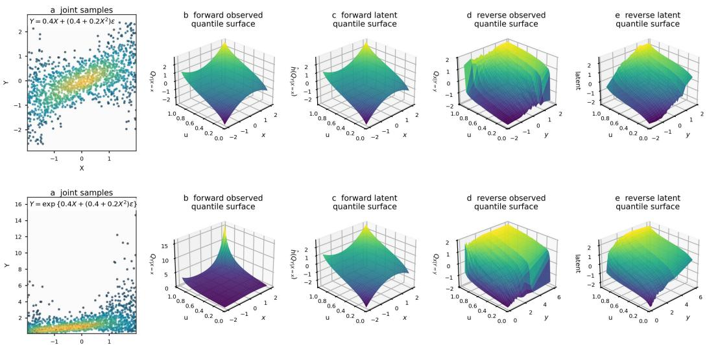
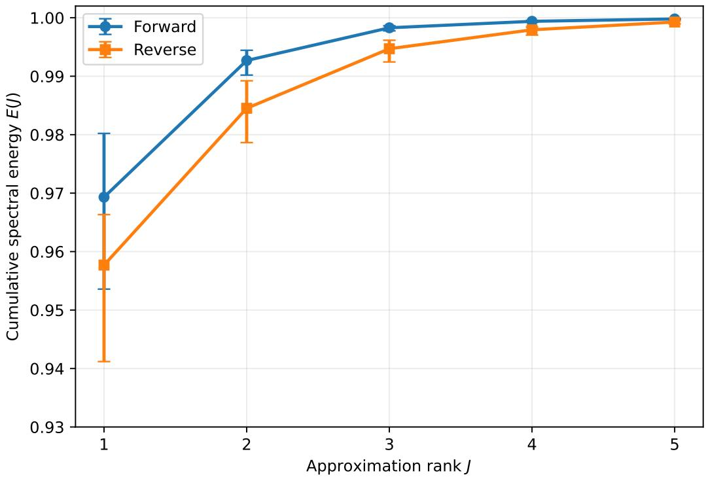
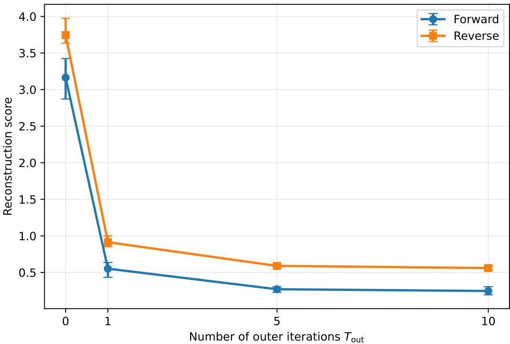
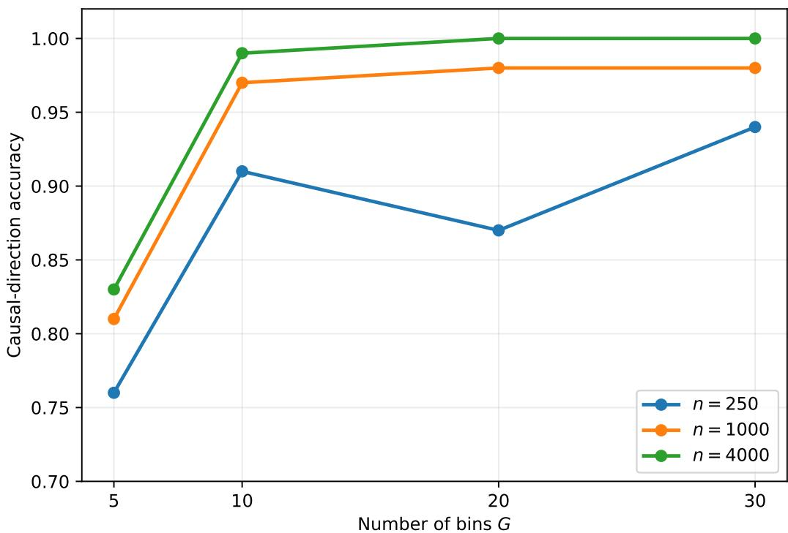
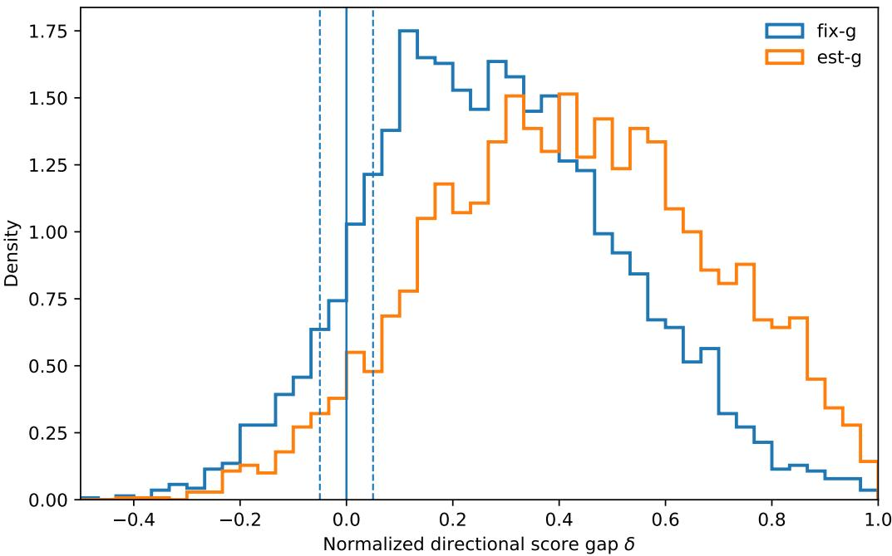

# Causal Discovery via Transformed Low-Rank Quantile Surfaces

Ryo Kamimura<sup>1,3</sup> Thong Pham<sup>2,1,3</sup>\*

<sup>1</sup>Shiga University <sup>2</sup>The University of Osaka <sup>3</sup>RIKEN AIP s6025124@st.shiga-u.ac.jp thong-pham@ds.sanken.osaka-u.ac.jp

## Abstract

We propose Low-Rank Quantile Surfaces (LRQS), a bivariate causal model in which, in the causal direction, an unknown monotone transformation of the conditional quantile surface admits a low-rank functional decomposition. LRQS subsumes location-scale noise models and post-nonlinear heteroscedastic noise models, while allowing multiple quantile bases to represent changes beyond locationscale effects. We prove generic identifiability of LRQS: the transformed quantile surface is low rank in the causal direction, whereas reverse representability under the corresponding constraints occurs only for exceptional, fine-tuned cause marginals. We provide a simple-yet-powerful causal score using a nonparametric fitting procedure that alternates between rank-constrained approximation of discretized quantile surfaces and isotonic estimation of the unknown monotone transformation. Experiments on synthetic mechanisms with higher-rank distributional shape variation and strong nonlinear distortions, together with standard bivariate benchmarks, show that LRQS is especially effective when conditional distributional shape or observation distortion goes beyond existing location-scale assumptions.

## 1 Introduction

Inferring causal direction from observational data requires asymmetry: the conditional distribution in the causal direction should admit a simpler description than the one in the anticausal direction. Classical approaches instantiate this principle through structural restrictions such as additive noise models (ANMs) [Hoyer et al., 2009], post-nonlinear models (PNLs) [Zhang and Hyvarinen¨ , 2009], and location-scale noise models (LSNMs) [Immer et al., 2023]. These models impose location or location-scale structure, either directly or after an invertible transformation. They are identifiable because their assumptions are generally not preserved under reversal, but their expressiveness is limited: in the latent scale, real conditional distributions may vary not only in location and scale, but also in skewness, tail behavior, and other shape features.

Quantile-based causal discovery provides a natural way to model distributional asymmetry beyond conditional means. A recent line of work based on quantile partial effects (QPE) assumes that the derivative of the conditional quantile surface with respect to the conditioning variable lies in a finite span of known basis functions [Chen et al., 2026]. This is an expressive observational restriction, but it is imposed on the quantile slope field rather than on the quantile surface itself. Moreover, in their identifiability theory, the finite basis is fixed in advance and is not designed to absorb an unknown monotone observation transformation such as those in PNLs.

We propose Low-Rank Quantile Surfaces (LRQS), a bivariate causal model that addresses this limitation. Let $Q _ { Y \mid X = x } ( u )$ denote the conditional quantile function of Y | X = x. LRQS assumes that, in the causal direction, there exists an unknown increasing transformation $h = g ^ { - 1 }$ such that

  
Figure 1: Observed and latent quantile surfaces. First row: an LSNM $Y = 0 . 4 X + ( 0 . 4 + 0 . 2 X ^ { 2 } ) \varepsilon$ Second row: a PNL-HNM $Y = \exp \{ 0 . 4 X + ( 0 . 4 + 0 . 2 X ^ { 2 } ) \varepsilon \}$ . (a) Joint samples of X and Y; (b) forward observed quantile surface $Q _ { Y \mid X = x } ( u )$ ; (c) forward latent quantile surface $\hat { h } ( Q _ { Y \mid X = x } ( u ) )$ (d) reverse observed quantile surface $Q _ { X \mid Y = y } ( u )$ ; (e) reverse latent quantile surface. In the causal direction, the observed surface becomes low rank after a monotone unwarping.

$$
h \big ( Q _ { Y | X = x } ( u ) \big ) = a ( x ) + \sum _ { k = 1 } ^ { K } b _ { k } ( x ) q _ { k } ( u ) .
$$

Thus the observed quantile surface need not be low rank; instead, it becomes low rank after an unknown monotone unwarping. The case $K = 1$ recovers a post-nonlinear heteroscedastic noise model (PNL-HNM), while larger K captures richer changes in conditional shape beyond locationscale variation in the latent scale.

We prove that this transformed low-rank structure is generically identifiable. In the causal direction, the transformed conditional quantile surface is low rank by construction. For every fixed finite number L of reverse non-intercept components and each prescribed reverse quantile basis, the compatible cause log-densities have local restrictions belonging to a finite-dimensional family, and thus are exceptional. A corresponding result with a free reverse basis holds for $L = 1$ . Neither result requires $\bar { \boldsymbol { L } } = \boldsymbol { K }$

Our theory leads to a simple-yet-powerful nonparametric causal score. We estimate conditional quantile matrices in both directions and fit the LRQS structure by alternating between rankconstrained approximation and isotonic estimation of the unknown monotone transformation. The direction with the smaller reconstruction error is selected as causal. Figure 1 gives a visual summary of the LRQS method. Our contributions are:

• We introduce LRQS, a transformed low-rank conditional quantile model that extends location-scale and post-nonlinear heteroscedastic noise models.

• We establish generic identifiability by characterizing reverse-compatible cause marginals through finite-dimensional local restrictions on their log-densities. This gives, to our knowledge, the first generic identifiability result for the nondegenerate bivariate PNL-HNM class with unknown transformation and reverse noise distribution.

• We provide a practical causal discovery algorithm based on low-rank quantile-surface fitting and isotonic estimation of the unknown transformation.

• We show through experiments that LRQS is particularly effective on mechanisms with higher-rank conditional shape variation and strong nonlinear observation distortions, while remaining competitive on standard bivariate benchmarks.

## 2 Related work

Quantile-based causal discovery exploits asymmetries beyond the conditional mean. Bivariate quantile causal discovery uses multiple conditional quantile levels and an independence-of-mechanisms description-length principle [Tagasovska et al., 2020].

The closely related quantile partial effect (QPE) framework assumes that the derivative of the conditional quantile surface with respect to the conditioning variable, i.e. $\psi ( x , y ) = Q _ { x } ( x , F _ { Y | X = x } ( y ) )$ lies in a fixed finite span in $x$ and $y$ coordinates [Chen et al., 2026]. LRQS differs by imposing low rank on the transformed conditional quantile surface in x and u coordinates: both the quantile bases and the monotone unwarping are learned rather than fixed in advance. The QPE and LRQS model classes overlap nontrivially, and neither theory subsumes the other: (a) ANMs and LSNMs belong to both frameworks; (b) LRQS with an unknown distortion, such as PNL or PNL-HNM, is not contained in QPE with any basis fixed in advance; and (c) conversely, there are QPE models that cannot be expressed as a transformed finite-rank representation for any fixed K in the LRQS framework.

Recent alternatives include optimal-transport and velocity-field criteria, such as DIVOT and causal velocity models, which characterize causal asymmetry through transport dynamics or score/velocity equations [Tu et al., 2022, Xi et al., 2025], as well as neural generative or likelihood-based bivariate methods [Goudet et al., 2018, Immer et al., 2023]. These methods are complementary, but LRQS is targeted at an interpretable nonparametric quantile-surface score with explicit transformed low-rank identifiability guarantees. See Appendix A for more detailed discussions.

## 3 The model

In the introduction we motivated LRQS as a transformed low-rank structure in the conditional quantile surface. We now give the formal model definition:

$$
Y = g \left( a ( X ) + \sum _ { k = 1 } ^ { K } b _ { k } ( X ) q _ { k } ( U ) \right) ,\tag{1}
$$

where $U \sim \operatorname { U n i f } ( 0 , 1 ) , U \perp \perp X .$ , and $g$ is a continuous, strictly increasing function with inverse $h : = g ^ { - 1 }$

For a fixed K, the transformation $^ { g , }$ the basis $\{ q _ { k } \} _ { k = 1 } ^ { K }$ , the shift function $a ( x )$ , and the coefficient functions $b _ { k } ( x )$ are unknown.

LRQS generalizes post-nonlinear heteroscedastic noise models. When each $q _ { k }$ is a continuous, increasing function, $q _ { k }$ is the inverse CDF of some random variable $\varepsilon _ { k } .$ , and thus $Y =$ $\begin{array} { r } { g \left( a ( X ) + \sum _ { k = 1 } ^ { K } b _ { k } ( X ) \varepsilon _ { k } \right) } \end{array}$ for some generally dependent noises $\varepsilon _ { k } = q _ { k } ( U )$ . When $K = 1$ we get $Y = g ( a ( X ) + b ( \overset { \cdot } { X } ) \varepsilon )$ This class is sometimes called a post-nonlinear heteroscedastic noise model (PNL-HNM) [Chen et al., 2026]. It contains the LSNM [Immer et al., 2023] when $g ( z ) = z$

Beyond location and scale. Multiple quantile bases $\{ q _ { k } \} _ { k = 1 } ^ { K }$ allow the latent conditional distributions to vary in shape, including skewness, kurtosis, and tail behavior, rather than only in location and scale. See Appendix B for a discussion.

The following assumption makes u the conditional quantile level: increasing the latent noise rank increases the response, so the structural function can be read directly as a conditional quantile function.

Assumption 1. For every fixed x, the function $\begin{array} { r } { z ( x , u ) : = a ( x ) + \sum _ { k = 1 } ^ { K } b _ { k } ( x ) q _ { k } ( u ) } \end{array}$ is continuous and strictly increasing in $u \in ( 0 , 1 )$ ).

This assumption holds, for example, if each $b _ { k } ( x )$ is positive and each basis function $q _ { k }$ is continuous and strictly increasing.

The following proposition, whose proof is in Appendix $\mathrm { C } ,$ shows the low-rank structure of the transformed quantile surface.

Proposition 1. Denote by $Q _ { Y \mid X = x } ( u )$ the conditional quantile function of $Y \ | \ X = x .$ . Under Assumption 1, the conditional quantile surface is

$$
Q ( x , u ) : = Q _ { Y | X = x } ( u ) = g \left( a ( x ) + \sum _ { k = 1 } ^ { K } b _ { k } ( x ) q _ { k } ( u ) \right) .\tag{2}
$$

Equivalently, $\begin{array} { r } { h \big ( Q ( x , u ) \big ) = a ( x ) + \sum _ { k = 1 } ^ { K } b _ { k } ( x ) q _ { k } ( u ) . } \end{array}$

A surface $H ( x , u )$ has rank at most d if it can be written as $\begin{array} { r } { H ( x , u ) = \sum _ { i = 1 } ^ { d } A _ { j } ( x ) B _ { j } ( u ) } \end{array}$ . Proposition 1 therefore implies that $h ( Q ( x , u ) )$ has rank at most $K + 1$ , with the additional component corresponding to the intercept $a ( x )$ . Evaluating this surface on a grid gives a matrix with the same rank upper bound, which motivates our fitting procedure. The observed surface $Q ( x , u )$ , by contrast, need not have finite rank.

Remark. $Y$ as defined in Eq. (1) is still a valid random variable without Assumption 1, for example, when there exists some x such that $z ( x , u )$ is not increasing in u. However, in that case the induced conditional quantile surface need not retain the transformed low-rank structure above.

## 4 Identifiability

Fix the forward conditional density $r ( y \mid x ) = p _ { Y \mid X } ( y \mid x )$ and write $\xi ( x ) = \log p _ { X } ( x )$ . Changing $\xi$ preserves the forward LRQS mechanism but changes the reverse conditional distribution through Bayes’ rule. We study which cause marginals also make the reverse quantile surface $Q ^ {  } ( y , u ) : =$ $Q _ { X \mid Y = y } ( u )$ belong to a specified LRQS class. We use K and L for the forward and reverse numbers of non-intercept components, respectively, with no relation imposed between them.

The following definition formalizes the set of such tuned marginals:

Definition 4.1 (Reverse-compatible marginal set). Fix theforward conditional density $r ( y \mid x )$ . For a backward model class $\mathcal { M } ,$ , define

$$
\mathcal { B } ( r ; \mathcal { M } ) : = \Bigl \{ \xi : p _ { X , Y } ( x , y ) = e ^ { \xi ( x ) } r ( y \mid x ) a n d t h e i n d u c e d Q ^ {  } ( \cdot , \cdot ) \in \mathcal { M } \Bigr \} .\tag{3}
$$

Notion of genericity. For an interval I, write $\xi | _ { I }$ for the restriction of ξ to I. Our results place such restrictions of reverse-compatible log-densities in common finite-parameter families. The interval may depend on $\xi ,$ but the family depends only on the fixed forward mechanism and the specified reverse class. We use generic identifiability in this local finite-dimensional sense. Here, “local” describes the restriction on the exceptional marginals, not the identification of the causal direction.

For each reverse-compatible distribution under consideration, the following two assumptions are required at the same interior point $( x _ { 0 } , y _ { 0 } )$ . This point may vary between distributions. Write $u _ { 0 } = F _ { X | Y = y _ { 0 } } ( x _ { 0 } )$ and $\alpha _ { y _ { 0 } } ( x ) = \partial _ { y } \log r ( y \mid x ) \vert _ { y = y _ { 0 } }$ , with primes on $\alpha _ { y _ { 0 } }$ denoting differentiation in x.

Assumption 2 (Local score variation). The conditional y-score has a nonzero derivative in x at x<sub>0</sub>: $\alpha _ { y _ { 0 } } ^ { \prime } ( x _ { 0 } ) \neq 0$

Thus $\alpha _ { y _ { 0 } }$ is locally invertible near $x _ { 0 }$ , allowing us to recover a reverse quantile curve from the Bayes identity used in the proofs.

Assumption 3 (Local regularity). In neighborhoods of the corresponding arguments, the densities, conditional quantile maps, and functions defining the reverse representation are $C ^ { 3 }$ , and the relevant densities are strictly positive.

These conditions ensure that the logarithmic derivatives and inverse conditional quantiles used below are well-defined locally, and that $\breve { Q } _ { u } ^ {  } ( y , u ) = 1 / p _ { X | Y = y } ( Q ^ {  } ( y , u ) ) > 0$ locally.

The general idea in both Theorems 1 and 2 below is that, at a fixed conditioning value $y _ { 0 } .$ , a reverse quantile curve determines the corresponding conditional density of X. Bayes’ rule then recovers the shape of the cause density from this conditional density and the fixed forward mechanism. Thus, restricting one reverse quantile curve at $y _ { 0 }$ already restricts the cause density on an interval.

Main message. We establish these local restrictions for any prescribed finite reverse quantile basis and, when $L = 1$ , for an unrestricted reverse basis. The reverse monotone transformation is unrestricted in both cases.

## 4.1 General $L ,$ fixed basis

We consider the following backward model class:

$$
\mathcal { M } _ { L , \mathrm { f i x e d } } = \{ Q ^ {  } : Q ^ {  } ( y , u ) = \tilde { g } ( \tilde { a } ( y ) + \sum _ { k = 1 } ^ { L } \tilde { b } _ { k } ( y ) \tilde { q } _ { k } ( u ) ) \mathrm { f o r ~ s o m e ~ } \tilde { g } , \tilde { a } , \{ \tilde { b } _ { k } \} _ { k = 1 } ^ { L } \} .\tag{4}
$$

The reverse basis $\tilde { q } _ { 1 } , \ldots , \tilde { q } _ { L } : ( 0 , 1 ) \to \mathbb { R }$ is prescribed, while $\tilde { g } , \tilde { a } , \tilde { b } _ { 1 } , \ldots , \tilde { b } _ { L }$ remain unrestricted, subject to the model assumptions.

The key object in the analysis is the backward drift ratio $R ( y , u ) = \partial _ { y } Q ^ {  } ( y , u ) / \partial _ { u } Q ^ {  } ( y , u )$ which measures how the u-th backward quantile of ${ \dot { X } } \mid Y = { \dot { y } }$ moves as the conditioning value y changes, normalized by $Q _ { u } ^ {  }$ . When $Q ^ {  } \in \mathcal { M } _ { L , \mathrm { f i x e d } }$ , the outer monotone distortion cancels from this ratio, so R exposes constraints imposed by the inner low-rank structure:

$$
R ( y , u ) = \frac { \tilde { g } ^ { \prime } ( z ^ {  } ( y , u ) ) \partial _ { y } z ^ {  } ( y , u ) } { \tilde { g } ^ { \prime } ( z ^ {  } ( y , u ) ) \partial _ { u } z ^ {  } ( y , u ) } = \frac { \tilde { a } ^ { \prime } ( y ) + \sum _ { k = 1 } ^ { L } \tilde { b } _ { k } ^ { \prime } ( y ) \tilde { q } _ { k } ( u ) } { \sum _ { k = 1 } ^ { L } \tilde { b } _ { k } ( y ) \tilde { q } _ { k } ^ { \prime } ( u ) } ,\tag{5}
$$

where $\begin{array} { r } { z ^ {  } ( y , u ) = \tilde { a } ( y ) + \sum _ { k = 1 } ^ { L } \tilde { b } _ { k } ( y ) \tilde { q } _ { k } ( u ) } \end{array}$

Theorem 1 (Prescribed reverse quantile basis). Fix theforward conditional density r, afinite integer $L \ge 1$ , and a reverse quantile basis $\{ \tilde { q } _ { k } \} _ { k = 1 } ^ { L }$ . Every reverse-compatible cause log-density $\xi \in \mathbf { \Xi }$ $B ( r ; \mathcal { M } _ { L , \hbar x e d } )$ satisfying both Assumptions 2 and 3 at some interiorpoint agrees, on some nonempty open interval, with a member of a common family parameterized by at most $2 L + 3$ real numbers. Thisfamily depends only on r and the prescribed reverse basis.

Proofsketch. Fix an interior point as in the assumptions and write $x ( u ) = Q ^ {  } ( y _ { 0 } , u )$ . At the fixed conditioning value $y _ { 0 } , \mathrm { E q . } ( 5 )$ expresses $R ( y _ { 0 } , \cdot )$ using $2 L + 1$ coefficient values. A common nonzero scaling leaves the ratio unchanged, so at most 2L parameters are needed.

Bayes’ rule gives $R _ { u } ( y _ { 0 } , u ) = c _ { 0 } - \alpha _ { y _ { 0 } } ( x ( u ) )$ , where $c _ { 0 } = ( \log p _ { Y } ) ^ { \prime } ( y _ { 0 } )$ . By Assumption $2 , \alpha _ { y _ { 0 } }$ is locally invertible. Thus those parameters, together with $c _ { 0 }$ , determine the reverse quantile curve $x ( u )$ and its derivative.

A second application of Bayes’ rule gives $\xi ( x ( u ) ) = \ell _ { 0 } - \log r ( y _ { 0 } \mid x ( u ) ) - \log x _ { u } ( u )$ , where $\ell _ { 0 } = \log p _ { Y } ( y _ { 0 } )$ . Since $x _ { u } \ > 0$ , this determines $\xi$ on the corresponding x-interval. Counting the 2L coefficient parameters, $c _ { 0 } , \ell _ { 0 }$ , and y<sub>0</sub> gives the upper bound $2 L + 3$ . The full proof is given in Appendix C.2. □

Remark 1. Theorem 1 allows an arbitrary unknown reverse distortion ${ \tilde { g } } ,$ , which is not covered by the prescribed-basis QPE theory [Chen et al., 2026].

## 4.2 L = 1, free basis

We next consider reverse representations with one non-intercept component, allowing their quantile basis to vary:

$$
{ \mathcal { M } } _ { \mathrm { 1 , f r e e } } = \Big \{ Q ^ {  } : Q ^ {  } ( y , u ) = \tilde { g } \big ( \tilde { a } ( y ) + \tilde { b } ( y ) \tilde { q } ( u ) \big ) \mathrm { ~ f o r ~ s o m e ~ } \tilde { g } , \tilde { a } , \tilde { b } , \tilde { q } \Big \}\tag{6}
$$

The proof strategy of Theorem 1 does not apply directly because $R ( y _ { 0 } , \cdot )$ need not belong to a finite-parameter family when q˜ is unrestricted.

The key identity is given in the following proposition:

Proposition 2. When $L = 1$

$$
\partial _ { u } R + T ( u ) R = \rho ( y ) ,\tag{7}
$$

where $T ( u ) = \tilde { q } ^ { \prime \prime } ( u ) / \tilde { q } ^ { \prime } ( u ) a n d \rho ( y ) = \tilde { b } ^ { \prime } ( y ) / \tilde { b } ( y ) ,$

$$
P r o o f . \mathrm { ~ S i n c e ~ } R = \left( \tilde { a } ^ { \prime } ( y ) + \tilde { b } ^ { \prime } ( y ) \tilde { q } ( u ) \right) / \left( \tilde { b } ( y ) \tilde { q } ^ { \prime } ( u ) \right) , \partial _ { u } R = - \tilde { q } ^ { \prime \prime } ( u ) / \tilde { q } ^ { \prime } ( u ) R + \tilde { b } ^ { \prime } ( y ) / \tilde { b } ( y ) .
$$

Theorem 2 (Free reverse quantile basis for $L = 1 )$ . Fix the forward conditional density $r .$ Every reverse-compatible cause log-density $\xi \in \ B ( r ; \mathcal { M } _ { 1 , f r e e } )$ satisfying both Assumptions 2 and $^ 3$ at some interior point agrees, on some nonempty open interval, with a member of a common family parameterized by at most nine real numbers. This family depends only on $r ;$ no reverse quantile basis is prescribed.

Proof sketch. The key observation is that the unknown reverse basis $\tilde { q }$ enters Eq. (7) only through $T ( u )$ , which does not depend on y. Fix $y _ { 0 }$ as in the assumptions and set $x ( u ) = Q ^ {  } ( y _ { 0 } , u )$ $R ( u ) = R ( y _ { 0 } , u )$ , and $\hat { D ( u ) } = \hat { R _ { y } ( y _ { 0 } , u ) }$ . Equation (7) and its y-derivative give $R _ { u } + T R = \rho _ { 0 }$ and $\dot { D } _ { u } + \dot { T } D = \rho _ { 1 }$ , where $\rho _ { 0 } = \rho ( y _ { 0 } )$ and $\rho _ { 1 } = \rho ^ { \prime } ( y _ { 0 } )$ . Multiplying the second identity by R and subtracting D times the first eliminates $T \colon$

$$
R D _ { u } - D R _ { u } = \rho _ { 1 } R - \rho _ { 0 } D .
$$

Bayes’ rule expresses $R _ { u }$ in terms of x. Differentiating the Bayes identity in y before restricting to y also expresses $D _ { u }$ in terms of $x , R ,$ and $x _ { u } .$ Substitution into the identity above determines $x _ { u }$ on a suitable subinterval, giving a first-order system for $( x , R , D )$ with no unknown quantile-basis function remaining.

Under Assumptions 2 and 3, local uniqueness determines the solution from three initial values and the four constants $c _ { 0 } = ( \log p _ { Y } ) ^ { \prime } ( y _ { 0 } ) , \bar { c } _ { 1 } = ( \log p _ { Y } ) ^ { \prime \prime } ( y _ { 0 } ) , \rho _ { 0 }$ , and $\rho _ { 1 }$ . Bayes’ rule then recovers $\xi$ on the corresponding x-interval after specifying $\ell _ { 0 } = \log p _ { Y } ( y _ { 0 } )$ . Neither the system nor the reconstruction depends explicitly on $u ,$ so the origin of the local u-parameter need not be counted. Including $\ell _ { 0 }$ and $y _ { 0 }$ gives at most $3 + 4 + 2 = 9$ real parameters. The full proof is given in Appendix C.3. □

Remark 2. The elimination in the proof sketch relies on the separation of u and y into $T ( u )$ and ρ(y) in Eq. (7). Our argument does not provide a corresponding elimination for multiple reverse components, so the free-basis result is limited to $L = 1$

Remark 3. To our knowledge, when both candidate directions are modeled as PNL-HNM $( K =$ $L = 1 )$ , Theorem 2 gives the first generic identifiability result for the nondegenerate PNL-HNM class $Y = g ( a ( X ) + b ( X ) \varepsilon )$ . Earlier identifiability results cover important special cases, including $A N M s \left( g ( z ) = z , b \equiv 1 \right)$ ) [Hoyer et al., 2009], PNL models $( b \equiv 1 )$ [Zhang and Hyvarinen¨ , 2009], and LSNMs (g(z) = z) [Immer et al., 2023].

Scope of the assumptions. Assumptions 2 and 3 require a common interior point where $\partial _ { x } \bar { \partial _ { y } } \log p _ { X , Y } \bar { ( } x _ { 0 } , y _ { 0 } \bar { ) ^ { } } = \alpha _ { y _ { 0 } } ^ { \prime } ( x _ { 0 } ) \neq 0$ . This condition excludes uniform-noise location-scale representations in either direction, even with varying scale and an unknown monotone transformation, as well as constant-scale exponential and Laplace noise models. In the ANM special case, the same nonvanishing condition appears in classical differential-equation arguments for generic identifiability [Hoyer et al., 2009, Peters et al., 2014]. Our assumptions also exclude pure-scale power-law noise models. These restrictions concern the scope of the theorems and do not imply that every excluded mechanism is nonidentifiable. See Appendix C.4 for details.

## 5 Causal scoring by transformed quantile-surface fitting

For a chosen number $K _ { \mathrm { f i t } }$ of non-intercept components, we consider the following causal score:

$$
S _ { X \to Y } = \operatorname* { i n f } _ { \begin{array} { l } { a , b , b , q _ { k } , } \\ { g : \operatorname* { i n c e s i n g } , } \\ { z ( x , \cdot ) : \operatorname* { i n c r a s i n g } } \end{array} } \mathbb { E } _ { X } \int _ { 0 } ^ { 1 } \left( Q ( X , u ) - g \left( a ( X ) + \sum _ { k = 1 } ^ { K _ { \mathrm { f i t } } } b _ { k } ( X ) q _ { k } ( u ) \right) \right) ^ { 2 } d u ,\tag{8}
$$

where $\begin{array} { r } { z ( x , u ) : = a ( x ) + \sum _ { k = 1 } ^ { K _ { \mathrm { f i t } } } b _ { k } ( x ) q _ { k } ( u ) . } \end{array}$

Suppose the forward conditional quantile surface belongs to the LRQS class with $K \le K _ { \mathrm { f i t } }$ . Then the causal population score satisfies $S _ { X  Y } = 0$

In the reverse direction, the same fitted component count corresponds to $L = K _ { \mathrm { f i t } }$ . Theorem 1 constrains exact reverse representations with a prescribed basis for every fixed finite L, whereas Theorem 2 allows a free reverse basis when $L = 1$ , under the stated assumptions. For a population score whose reverse fitting class is covered by the relevant theorem, assume additionally that zero score implies exact membership in that class. Then the reverse score is positive outside the corresponding reverse-compatible marginal set. The reverse-compatible marginals satisfy the finitedimensional local restrictions established above, so the reverse score is positive for generic cause marginals in the stated sense.

The population score above, as well as the theoretical results in the previous section, is defined for continuous conditional quantile surfaces. The discretization described below is introduced only for finite-sample estimation.

For a candidate direction $X  Y$ , we first sort the observations by the conditioning variable X and partition the sorted observations into $G$ bins with sizes as equal as possible. Thus, our implementation uses approximately equal-count binning. For the j-th bin $I _ { j }$ , the observed conditional quantile matrix is defined by $[ \mathbf { Q } _ { \mathrm { o b s } } ] _ { j , l } = \widehat { Q } _ { Y | X \in I _ { j } } ( u _ { l } )$ , for $j = 1 , \dots , G _ { \mathrm { \scriptsize { : } } }$ and $l = 1 , \ldots , B .$ Given the $G \times B$ observed quantile matrix, we estimate the population causal score by alternating between a low-rank approximation of the latent surface and estimation of the monotone transformation. The shift function $a ( x )$ becomes a length-G vector a, while $\begin{array} { r } { a ( \boldsymbol { x } ) + \sum _ { k = 1 } ^ { K _ { \mathrm { f i t } } } b _ { k } ( \boldsymbol { x } ) q _ { k } ( \boldsymbol { u } ) } \end{array}$ becomes a $G \times B$ matrix Z. Further implementation details are provided in Appendix E.1. The algorithm LowRank computes an empirical approximation to $S _ { X  Y }$ , and the algorithm Bivariate-LRQS chooses the direction with the smaller causal score.

```latex
Algorithm 1 $\mathtt { L o w R a n k } ( \mathbf { Q } , K _ { \mathrm { f i t } } )$
Data: $G \times B$ matrix $\mathbf { Q } ,$ number of non-intercept components $K _ { \mathrm { f i t } }$ , inner and outer loop iterations
$T _ { \mathrm { i n } }$ and $T _ { \mathrm { o u t } }$
Result: Approximation score $s$
Initialize $\dot { \mathbf { Z } } = \mathbf { Q } + \boldsymbol { \Sigma }$ , where $\pmb { \Sigma }$ is a random Gaussian perturbation matrix.
Repeat for $t = 1 , \ldots , T _ { \mathrm { o u t } } \colon$
• Find an increasing function $g$ such that $g ( \mathbf { Z } )$ best approximates Q under the Frobenius
norm: flatten the matrices $\dot { \mathbf { Q } }$ and $\mathbf { Z } ,$ sort the pairs $( z , q )$ by the z-values, and perform
isotonic regression.
• Update Z by an approximate inverse of g: $\mathbf { Z } [ j , l ]  \hat { h } ( \mathbf { Q } [ j , l ] )$ , where $\hat { h }$ denotes the inverse
mapping approximated by linear interpolation from the isotonic fit.
• Repeat this inner loop for $\tau = 1 , \dots , T _ { \mathrm { i n } }$ to project Z onto the low-rank structure:
+ a ← RowMeans(Z) and subtract the intercept function: $\mathbf { Z } _ { c } \gets \mathbf { Z } - \mathbf { a } \mathbf { 1 } ^ { \intercal }$
+ Use truncated SVD to update $\mathbf { Z } _ { c } \colon \mathbf { Z } _ { c } \gets \mathrm { S V D } _ { K _ { \mathrm { f i t } } } ( \mathbf { Z } _ { c } )$ , and rebuild $\mathbf { Z } \gets \mathbf { Z } _ { c } + \mathbf { a } \mathbf { 1 } ^ { \intercal }$
+ Make each row of Z an increasing sequence by isotonic projection.
+ Rescale Z so that its overall mean is 0 and variance is 1.
Estimate the final increasing function g from the flattened pairs $( z , q )$ of Z and Q by isotonic re
gression, and calculate the score $s = \| \mathbf { \bar { Q } } - g ( \mathbf { Z } ) \| _ { F } .$
Return the score s.
```

Algorithm 2 Bivariate-LRQS   
Data: Data matrix of $( X , Y )$ , number of non-intercept components $K _ { \mathrm { f i t } }$ , number of initializations   
m   
Standardize the data.   
Build the conditional quantile matrix $\mathbf { Q } _ { X  Y }$ of $Y \quad | \quad X \quad = \quad x$ and compute the min  
imum score over m independent runs to reduce sensitivity to local optima: $\begin{array} { r l } { s _ { X  Y } } & { { } = } \end{array}$   
$\mathrm { m i n } _ { 1 \leq i \leq m }$ LowRank $\cdot ( \mathbf { Q } _ { X  Y } , K _ { \mathrm { f i t } } )$   
Build the conditional quantile matrix $\mathbf { Q } _ { Y  X }$ of $X \mid Y = y$ and compute the minimum score over   
m independent runs: $s _ { Y  X } = \operatorname* { m i n } _ { 1 \leq i \leq m }$ LowRank $( \mathbf { Q } _ { Y  X } , K _ { \mathrm { f i t } } )$   
If $s _ { X  Y } < s _ { Y  X }$ , output $X$ as the parent; otherwise, output $Y$ as the parent.

## 6 Experiments

## 6.1 Experimental setup

Custom benchmarks: To clarify the theoretical limitations of existing methods and evaluate the robustness of our proposed approaches, we generated custom benchmarks consisting of two categories, as summarized in Table 1. For each benchmark variant, we generated 100 independent cause-effect pairs with a sample size of $n = 1 0 0 0$ . The cause variable x is sampled from a Gaussian distribution $\mathcal { N } ( 0 , 2 )$ . For each model, we employed three types of noise components $\varepsilon ,$ all normalized to have mean 0 and variance 1: Gaussian $\mathcal { N } ( 0 , 1 )$ ), uniform $\mathcal { U } ( - \sqrt { 3 } , \sqrt { 3 } )$ , and beta, where $V \sim \mathrm { B e t a } ( 2 , 2 )$ is scaled as $( V - 0 . 5 ) \times \sqrt { 2 0 }$

1. Structural complexity $( K _ { \mathrm { g e n } } > 1 ) .$ : To evaluate cases with complex causal mechanisms without nonlinear observational distortion, the DGP is $\begin{array} { r } { y = a ( \boldsymbol { x } ) + \sum _ { k = 1 } ^ { K _ { \mathrm { g e n } } } b _ { k } ( \boldsymbol { x } ) q _ { k } ( \boldsymbol { u } ) } \end{array}$ , where $a \sim \mathcal { G P }$ and $b _ { k } ( x ) = | f _ { k } ( x ) |$ with $f _ { k } \sim \mathcal { G P }$ . The noise basis functions $q _ { k } ( u )$ are standardized odd polynomials. We set $K _ { \mathrm { g e n } } \in \{ 2 , 3 , 4 , 5 \}$ , resulting in 12 variants (4 component counts $\times 3$ noise types). This benchmark isolates conditional shape variation without an observation-level transformation, allowing comparison of the methods in the absence of nonlinear measurement distortion.

2. Strong nonlinear distortions $( P N L ) .$ : The DGP is the PNL-HNM model $y = g ( z )$ , where z follows either an $\mathbf { A N M } , z = f ( x ) + \varepsilon .$ , or an $\begin{array} { r } { \mathsf { L S N M } , z = f ( x ) + \sigma ( x ) \varepsilon } \end{array}$ . We consider five transformations: (a) identity, $g ( z ) = z ; ( \mathbf { b } )$ cube, $g ( z ) = z ^ { 3 } ; ( \mathrm { c } )$ sigmoid, $g ( z ) = 1 / ( 1 + \exp ( - z ) ) ; ( \mathrm { d } )$ exponential, $\begin{array} { r } { g ( z ) = \exp ( z ) ; } \end{array}$ ; and (e) hyperbolic tangent, $g ( z ) = \operatorname { t a n h } ( z )$ . This category consists of 30 variants.

Table 1 displays representative results for the Gaussian-noise settings, including the exponential and hyperbolic-tangent distortions. The reported Avg. acc. and Time (s), however, are macro-averaged over all 42 custom benchmark variants (12 structural-complexity variants and 30 PNL variants). Complete results for the 42 variants are provided in Appendix D.1.

Existing benchmarks: We evaluate all 24 bivariate benchmark datasets used in Chen et al. [2026]. Table 2 reports 12 representative datasets: (i) AN and LS from Tagasovska et al. [2020]; (ii) SIM and SIM-c from Mooij et al. [2016]; (iii) Cha and Net from Guyon et al. [2019]; (iv) Per and Sig from Xi et al. [2025]; (v) Qd-V and NN-V from Chen et al. [2026]; (vi) Tue [Mooij et al., 2016]; and (vii) D4-s1 [Marbach et al., 2009]. Although Table 2 displays these 12 datasets, its Avg. acc. and Time (s) are macro-averaged over all 24 benchmark datasets.

Baselines and evaluation protocol: We compare LRQS against ANM [Zheng et al., 2024], DIVOT [Tu et al., 2022], CVEL [Xi et al., 2025], QPE-k, and three QPE-f variants, which are fixed, poly, and lowrank, from Chen et al. [2026]. For Table 1, we report results obtained by running these baselines on the same custom benchmark datasets. For the existing-benchmark comparison in Table 2, we rerun all methods rather than citing benchmark values from prior work. No dataset-specific hyperparameter tuning is performed for this main comparison; instead, a single default configuration for each method is used across all 24 datasets. Implementation and computational details are provided in Appendix E.

Proposed method variants: We evaluate two configurations of LRQS: $f i x { - } g ,$ which fixes the transformation to the identity mapping $\begin{array} { r } { ( g ( z ) \ = \ z ) } \end{array}$ , and $e s t { - } g$ , which jointly estimates the unknown increasing transformation $g$ together with the low-rank quantile surface. Unless otherwise stated, both variants use the default settings described in Appendix E.1.

## 6.2 Main results

Tables 1 and 2 summarize the causal direction identification accuracy and average execution time for the custom and existing benchmarks, respectively.

Lightweight. Both fix-g and est-g variants are very fast compared to neural-based methods such as QPE-f.

Robustness to structural complexity. As shown in Table 1, QPE-k and the QPE-f variants struggle to achieve consistently high accuracy under multirank structural complexity $( K _ { \mathrm { g e n } } > 1 )$ , whereas CVEL performs strongly for larger $\dot { K } _ { \mathrm { g e n } }$ . In contrast, both of our proposed methods (fix-g and estg) maintain near-perfect accuracy across the evaluated values of $K _ { \mathrm { g e n } }$ . Notably, fix-g achieves this robustness while operating at a speed comparable to the fastest baselines.

Table 1: Accuracy comparison on custom benchmarks highlighting theoretical limitations of existing methods. The displayed columns show representative Gaussian-noise settings, while Avg. acc. and Time (s) are averaged over all 42 custom benchmark variants.
<table><tr><td></td><td colspan="4">Structural complexity  $( g ( z ) = z , K _ { \mathrm { g e n } } > \mathrm { i } )$ </td><td colspan="4">Strong nonlinear distortions (PNL)</td><td>Overall</td><td></td></tr><tr><td>Method</td><td> $K _ { \mathrm { g e n } } = 2$ </td><td> $K _ { \mathrm { g e n } } = 3$ </td><td> $K _ { \mathrm { g e n } } = 4$ </td><td> $K _ { \mathrm { g e n } } = 5$ </td><td>AN (Exp)</td><td>AN (Tanh)</td><td>LS (Exp)</td><td>LS (Tanh)</td><td>Avg. acc. (all 42)</td><td>Time (s)</td></tr><tr><td>ANM</td><td>0.44</td><td>0.48</td><td>0.43</td><td>0.40</td><td>0.21</td><td>0.27</td><td>0.26</td><td>0.33</td><td>0.421</td><td>7.335</td></tr><tr><td>DIVOT</td><td>0.04</td><td>0.00</td><td>0.00</td><td>0.00</td><td>0.00</td><td>0.31</td><td>0.00</td><td>0.08</td><td>0.217</td><td>1.261</td></tr><tr><td>CVEL</td><td>0.59</td><td>0.91</td><td>0.98</td><td>1.00</td><td>1.00</td><td>0.70</td><td>0.94</td><td>0.66</td><td>0.730</td><td>2.055</td></tr><tr><td>QPE-k</td><td>0.36</td><td>0.13</td><td>0.09</td><td>0.11</td><td>0.16</td><td>0.10</td><td>0.32</td><td>0.45</td><td>0.561</td><td>0.062</td></tr><tr><td>QPE-f (fixed)</td><td>0.34</td><td>0.28</td><td>0.40</td><td>0.37</td><td>0.68</td><td>0.13</td><td>0.90</td><td>0.47</td><td>0.443</td><td>34.536</td></tr><tr><td>QPE-f (poly)</td><td>0.33</td><td>0.18</td><td>0.17</td><td>0.15</td><td>0.27</td><td>0.07</td><td>0.53</td><td>0.44</td><td>0.390</td><td>32.588</td></tr><tr><td>QPE-f (lowrank)</td><td>0.36</td><td>0.37</td><td>0.63</td><td>0.64</td><td>0.61</td><td>0.31</td><td>0.85</td><td>0.54</td><td>0.535</td><td>37.966</td></tr><tr><td>LRQS (est-g)</td><td>0.94</td><td>0.97</td><td>0.96</td><td>1.00</td><td>1.00</td><td>0.91</td><td>1.00</td><td>0.96</td><td>0.952</td><td>2.222</td></tr><tr><td>LRQS (fix-g)</td><td>0.95</td><td>0.97</td><td>0.99</td><td>1.00</td><td>1.00</td><td>0.59</td><td>1.00</td><td>0.78</td><td>0.893</td><td>0.050</td></tr></table>

Table 2: Accuracy and average computational time (seconds per pair) on 12 representative bivariate benchmark datasets using default parameter settings. Avg. acc. and Time (s) are averaged over all 24 benchmark datasets.
<table><tr><td>Method</td><td>AN</td><td>LS</td><td>SIM</td><td>SIM-c</td><td>Cha</td><td>Net</td><td>Per</td><td>Sig</td><td>Qd-V</td><td>NN-V</td><td>Tue</td><td>D4-s1</td><td>Avg. acc. (all 24)</td><td>Time (s)</td></tr><tr><td>ANM</td><td>1.00</td><td>0.42</td><td>0.74</td><td>0.79</td><td>0.73</td><td>0.73</td><td>0.63</td><td>0.28</td><td>0.82</td><td>0.64</td><td>0.55</td><td>0.58</td><td>0.609</td><td>22.354</td></tr><tr><td>DIVOT</td><td>1.00</td><td>0.72</td><td>0.73</td><td>0.70</td><td>0.52</td><td>0.80</td><td>0.90</td><td>0.61</td><td>0.37</td><td>0.40</td><td>0.46</td><td>0.75</td><td>0.612</td><td>4.057</td></tr><tr><td>CVEL</td><td>0.25</td><td>0.18</td><td>0.64</td><td>0.62</td><td>0.67</td><td>0.51</td><td>1.00</td><td>0.69</td><td>0.83</td><td>0.88</td><td>0.34</td><td>0.42</td><td>0.602</td><td>2.561</td></tr><tr><td>QPE-k</td><td>0.99</td><td>1.00</td><td>0.83</td><td>0.79</td><td>0.60</td><td>0.89</td><td>0.77</td><td>0.89</td><td>0.42</td><td>0.53</td><td>0.54</td><td>0.58</td><td>0.741</td><td>0.067</td></tr><tr><td>QPE-f (fixed)</td><td>1.00</td><td>0.98</td><td>0.74</td><td>0.70</td><td>0.54</td><td>0.89</td><td>0.95</td><td>0.47</td><td>0.76</td><td>0.75</td><td>0.61</td><td>0.54</td><td>0.739</td><td>35.502</td></tr><tr><td>QPE-f (poly)</td><td>0.97</td><td>0.99</td><td>0.75</td><td>0.66</td><td>0.50</td><td>0.91</td><td>0.96</td><td>0.54</td><td>0.64</td><td>0.72</td><td>0.61</td><td>0.54</td><td>0.744</td><td>31.672</td></tr><tr><td>QPE-f (lowrank)</td><td>0.51</td><td>0.52</td><td>0.74</td><td>0.66</td><td>0.55</td><td>0.63</td><td>0.83</td><td>0.73</td><td>0.73</td><td>0.77</td><td>0.48</td><td>0.33</td><td>0.631</td><td>3.862</td></tr><tr><td>LRQS (est-g)</td><td>0.98</td><td>0.96</td><td>0.61</td><td>0.52</td><td>0.61</td><td>0.71</td><td>0.64</td><td>0.54</td><td>0.57</td><td>0.61</td><td>0.69</td><td>0.50</td><td>0.654</td><td>2.707</td></tr><tr><td>LRQS (fix-g)</td><td>1.00</td><td>1.00</td><td>0.69</td><td>0.77</td><td>0.70</td><td>0.85</td><td>0.74</td><td>0.52</td><td>0.73</td><td>0.79</td><td>0.78</td><td>0.42</td><td>0.740</td><td>0.053</td></tr></table>

Fitted rank and effective complexity. The fitted number of components need not match the generating number. In the Gaussian benchmark with $K _ { \mathrm { g e n } } = 5$ , both variants achieve 99–100% accuracy across $K _ { \mathrm { f i t } } \in \{ 2 , 3 , 4 \}$ . Spectral analysis shows that the first two components capture over 99% of the forward row-centered quantile matrix’s energy in the median case, helping to explain the effectiveness of the default $K _ { \mathrm { f i t } } = 2 $ . Increasing the fitted rank further can reduce accuracy, suggesting that $K _ { \mathrm { f i t } }$ should be viewed as a regularization parameter (Appendix D.2).

Resistance to strong nonlinear distortions. Under strong nonlinear distortions such as exp and tanh, several baseline methods experience substantial degradation in accuracy. While our fix-g also struggles with extreme saturation (e.g., tanh), est-g successfully estimates and unwarps these distortions, sustaining high accuracy. Across all 42 custom benchmark variants, est-g achieves the highest average accuracy, further supporting the benefit of learning the monotone unwarping under strong observation-level distortions.

Performance on existing benchmarks. On the standard datasets (Table 2), fix-g achieves perfect accuracy on AN and LS and the highest accuracy among all evaluated methods on the real-world Tue dataset. Across all 24 benchmarks, fix-g remains competitive with the strongest baselines under the common default-parameter protocol. The additional flexibility of est-g is particularly beneficia under strong nonlinear observation distortions.

## 6.3 Additional experimental analyses

Sensitivity to optimization and estimation settings. Additional initializations yield only modest accuracy gains, and reconstruction scores and directional decisions stabilize after a few outer iterations in a representative example (Appendix D.3). Analyses of sample size, grid resolution, and quantile range show stable performance near the default settings, although overly coarse discretization reduces accuracy (Appendix D.4).

Directional score separation. Across the 42 custom benchmark settings, normalized gaps between forward and reverse LRQS scores are typically separated from zero. Incorrect decisions tend to have smaller absolute gaps than correct decisions, indicating weaker directional separation (Appendix D.5).

Role of the low-rank constraint. Removing the effective rank constraint yields zero reconstruction scores in both directions for every pair in the two evaluated settings. The low-rank restriction is therefore essential for directional discrimination in these experiments (Appendix D.6).

Non-monotone transformations. Both variants achieve perfect accuracy for the tested values $K _ { \mathrm { f i t } } ~ \in ~ \{ 1 , 2 , 3 , 4 \}$ across the evaluated family of non-monotone transformations. These results demonstrate empirical robustness to this particular violation of the increasing-transformation assumption (Appendix D.7).

## 7 Limitations and conclusions

Limitations. LRQS is a bivariate method and does not address multivariate graphs, latent confounding, or selection bias. Its generic-identifiability analysis characterizes exceptional cause marginals through local restrictions. The theory covers any prescribed finite reverse quantile basis, while the free-basis result is proved for one reverse component. The practical score also depends on conditional quantile estimation, the chosen number of non-intercept components $K _ { \mathrm { { f i t } } }$ , discretization, and a nonconvex alternating fit.

Conclusion. We introduced Low-Rank Quantile Surfaces, a model in which the causal-direction conditional quantile surface becomes low rank after an unknown monotone transformation. LRQS extends location-scale and post-nonlinear heteroscedastic noise models, possesses generic identifiability, and leads to a simple nonparametric causal score. Experiments show strong performance under higher-rank shape variation and nonlinear observation distortions, suggesting latent low-rank quantile structure as an effective inductive bias for causal discovery.

## Acknowledgment

This work was partially supported by the Japan Science and Technology Agency (JST) under CREST Grant Number JPMJCR22D2 and by the Japan Society for the Promotion of Science (JSPS) under KAKENHI Grant Number JP24K20741.

## References

Yikang Chen, Xingzhe Sun, and Dehui Du. Causal discovery via quantile partial effect. In The Fourteenth International Conference on Learning Representations, 2026.

Anish Dhir, Samuel Power, and Mark Van Der Wilk. Bivariate causal discovery using Bayesian model selection. In Proceedings of the 41st International Conference on Machine Learning, ICML’24. JMLR.org, 2024.

Olivier Goudet, Diviyan Kalainathan, Philippe Caillou, Isabelle Guyon, David Lopez-Paz, and Michele Sebag. Learning functional causal models with generative neural networks. In Explainable and interpretable models in computer vision and machine learning, pages 39–80. Springer, 2018.

Isabelle Guyon, Alexander Statnikov, and Berna Bakir Batu. Cause effect pairs in machine learning. Springer, 2019.

Patrik O. Hoyer, Dominik Janzing, Joris Mooij, Jonas Peters, and Bernhard Scholkopf. Nonlinear¨ causal discovery with additive noise models. In Advances in Neural Information Processing Systems 21, pages 689–696. Curran Associates Inc., 2009.

Alexander Immer, Christoph Schultheiss, Julia E Vogt, Bernhard Scholkopf, Peter B¨ uhlmann, and¨ Alexander Marx. On the identifiability and estimation of causal location-scale noise models. In International Conference on Machine Learning, pages 14316–14332, 2023.

Mariyam Khan, Shohei Shimizu, and Thong Pham. Beyond additivity: Causal discovery in locationscale noise models with hidden variables. arXiv preprint, 2026. doi: 10.48550/arXiv.2606.08196.

David Lopez-Paz, Krikamol Muandet, and Benjamin Recht. The randomized causation coefficient. The Journal ofMachine Learning Research, 16(1):2901–2907, 2015.

Daniel Marbach, Thomas Schaffter, Claudio Mattiussi, and Dario Floreano. Generating realistic in silico gene networks for performance assessment of reverse engineering methods. Journal of computational biology, 16(2):229–239, 2009.

Joris M Mooij, Jonas Peters, Dominik Janzing, Jakob Zscheischler, and Bernhard Scholkopf. Dis-¨ tinguishing cause from effect using observational data: methods and benchmarks. Journal of Machine Learning Research, 17(32):1–102, 2016.

Jonas Peters, Joris M Mooij, Dominik Janzing, and Bernhard Scholkopf. Causal discovery with¨ continuous additive noise models. Journal ofMachine Learning Research, 15:2009–2053, 2014.

Thong Pham, Shohei Shimizu, Hideitsu Hino, and Tam Le. Scalable counterfactual distribution estimation in multivariate causal models. In Proceedings of CLeaR 2024, 2024.

Thong Pham, Takashi Nicholas Maeda, and Shohei Shimizu. Causal additive models with unobserved causal paths and backdoor paths. In Proceedings of AISTATS 2026, 2026.

Paul Rolland, Volkan Cevher, Matthaus Kleindessner, Chris Russell, Dominik Janzing, Bernhard ¨ Scholkopf, and Francesco Locatello. Score matching enables causal discovery of nonlinear ad-¨ ditive noise models. In Proceedings of the 39th International Conference on Machine Learning, pages 18741–18753, 2022.

Hirofumi Suzuki, Kentaro Kanamori, Takuya Takagi, Thong Pham, Takashi Nicholas Maeda, and Shohei Shimizu. I-CAM-UV: Integrating causal graphs over non-identical variable sets using causal additive models with unobserved variables. In Proceedings ofAAAI 2026, 2026.

Natasa Tagasovska, Valerie Chavez-Demoulin, and Thibault Vatter. Distinguishing cause from effect´ using quantiles: bivariate quantile causal discovery. In Proceedings of the 37th International Conference on Machine Learning, ICML’20. JMLR.org, 2020.

Ruibo Tu, Hedvig Kjellstrom, Kun Zhang, and Cheng Zhang. Optimal transport for causal discovery. In International Conference on Learning Representations, 2022.

Johnny Xi, Hugh Dance, Peter Orbanz, and Benjamin Bloem-Reddy. Distinguishing cause from effect with causal velocity models. In Proceedings of the 42nd International Conference on Machine Learning, ICML’25. JMLR.org, 2025.

Hiroshi Yokoyama, Ryusei Shingaki, Kaneharu Nishino, Shohei Shimizu, and Thong Pham. Causaldiscovery-based root-cause analysis and its application in time-series prediction error diagnosis. In 2025 International Joint Conference on Neural Networks (IJCNN), pages 1–10, 2025.

K. Zhang and A. Hyvarinen. On the identifiability of the post-nonlinear causal model. In¨ Proc. 25th Conference on Uncertainty in Artificial Intelligence (UAI2009), pages 647–655, 2009.

Yujia Zheng, Biwei Huang, Wei Chen, Joseph Ramsey, Mingming Gong, Ruichu Cai, Shohei Shimizu, Peter Spirtes, and Kun Zhang. Causal-learn: Causal discovery in Python. Journal ofMachine Learning Research, 25(60):1–8, 2024.

## A Detailed related work

Bivariate cause-effect identification. Because $X ~  ~ Y$ and $Y ~  ~ X$ impose no distinct conditional-independence constraints, bivariate observational discovery requires additional asymmetry assumptions [Mooij et al., 2016, Guyon et al., 2019].

Transport, velocity, and score-based approaches. DIVOT connects functional causal models to optimal transport and derives directional criteria from transport dynamics [Tu et al., 2022]. Causal velocity models (CVEL) treat the cause as a time-like parameter, relating counterfactual velocity fields to the joint score function [Xi et al., 2025]. For multivariate nonlinear additive Gaussian-noise models, SCORE recovers a causal ordering from the Hessian of the joint log-density [Rolland et al., 2022].

Generative, supervised, and likelihood-based methods. Causal generative neural networks (CGNNs) compare generative fits using maximum mean discrepancy [Goudet et al., 2018], whereas the randomized causation coefficient learns causal decisions from labeled cause-effect pairs [Lopez-Paz et al., 2015]. LOCI provides feature-map and neural-network estimators for LSNMs [Immer et al., 2023], and QPE-f estimates quantile partial effects using normalizing flows [Chen et al., 2026]. Bayesian model selection offers a complementary approach: Dhir et al. [2024] compare flexible bivariate models by marginal likelihood under priors expressing independent causal mechanisms.

Broader connections. Additive models address unobserved causal and backdoor paths [Pham et al., 2026] and graph integration across non-identical variable sets [Suzuki et al., 2026]; locationscale models additionally accommodate heteroscedasticity with hidden variables [Khan et al., 2026]. These approaches build on regression and residual-independence criteria. Related downstream tasks include root-cause analysis of time-series prediction errors [Yokoyama et al., 2025] and optimaltransport-based counterfactual distribution estimation [Pham et al., 2024], which targets outcome distributions rather than causal direction.

## B Beyond latent location-scale mechanisms

For $K = 1 , h ( Q ( x , u ) ) = a ( x ) + b ( x ) q ( u )$ : after removing location and scale, every latent conditional quantile curve $\mathscr { x } \mapsto h ( Q ( \boldsymbol { x } , \boldsymbol { u } ) )$ has the same standardized shape $q ( u )$ . Hence conditional skewness, tail ratios, and other location-scale invariants (when the corresponding moments exist) cannot vary with the cause x. (A nonlinear g can still make the observed quantile curve $u \mapsto Q ( x , u )$ change shape with x, but only in the restricted way expressible by a PNL-HNM, a location-scale family pushed through one fixed nonlinearity.)

For $K \ = \ 2 , \ h ( Q ( x , u ) ) \ = \ a ( x ) + b _ { 1 } ( x ) q _ { 1 } ( u ) + b _ { 2 } ( x ) q _ { 2 } ( u ) .$ : the relative coefficient $\lambda ( x ) \ =$ $b _ { 2 } ( x ) / b _ { 1 } ( x )$ can vary with x, so the standardized latent conditional quantile curve $u \mapsto h ( Q ( x , u ) )$ can change by shape variations beyond location and scale on this latent scale. For example:

• if $q _ { 1 }$ is a symmetric Gaussian quantile and $q _ { 2 }$ is an asymmetric Gumbel quantile, varying $\lambda ( x )$ changes conditional skewness;

• if $q _ { 1 }$ is Gaussian and $q _ { 2 }$ a heavy-tailed Student-t quantile, varying $\lambda ( x )$ changes relative tail thickness.

## C Theoretical details

## C.1 Proof of Proposition 1

For fixed $x ,$ define $\begin{array} { r } { Z _ { x } ( u ) = a ( x ) + \sum _ { k = 1 } ^ { K } b _ { k } ( x ) q _ { k } ( u ) } \end{array}$ . By Assumption 1, $Z _ { x }$ is strictly increasing. Since $U \sim \mathrm { U n i f } ( 0 , 1 )$ , the conditional quantile of $Z _ { x } ( U )$ is $Z _ { x } ( u )$ . Because g is strictly increasing, monotone transformations preserve quantile order, so $Q _ { Y | X = x } ( u ) = g ( Z _ { x } ( u ) )$ .

## C.2 Proof of Theorem 1

We first establish two consequences of Bayes’ rule used in both theorem proofs. The first relates the reverse drift ratio to the forward conditional score; the second reconstructs the cause log-density from a reverse quantile curve.

Lemma 3. Write $c ( y ) = \partial _ { y }$ log p<sub>Y</sub>(y), and $\alpha ( x , y ) = \partial _ { y } \log r ( y \mid x )$ . Then

$$
R _ { u } ( y , u ) = c ( y ) - \alpha ( Q ^ {  } ( y , u ) , y ) ,\tag{9}
$$

$$
\xi ( Q ^ {  } ( y , u ) ) = \log p _ { Y } ( y ) - \log r ( y \mid Q ^ {  } ( y , u ) ) - \log Q _ { u } ^ {  } ( y , u ) .\tag{10}
$$

Proof. Let $F ( x , y ) = F _ { X | Y = y } ( x )$ and $p ^ {  } ( x \mid y ) = p _ { X | Y = y } ( x )$ . Differentiating $F ( Q ^ {  } ( y , u ) , y ) =$ u gives $Q _ { u } ^ {  } = 1 / p ^ {  } ( Q ^ {  } \mid y )$ and $R = - F _ { y } ( Q ^ {  } , y )$ , where subscripts on F and $p ^ {  }$ denote partial derivatives before evaluation at $x = Q ^ {  } ( y , \bar { u } )$ . Consequently, $R _ { u } = - p _ { y } ^ {  } ( Q ^ {  } \stackrel { \sim } { \mid } y ) / p ^ {  } ( Q ^ {  } \mid y )$ Substituting Bayes’ formula $p ^ {  } ( x \mid y ) = e ^ { \xi ( x ) } r ( y \mid x ) / p _ { Y } ( y )$ yields Eq. (9); taking logarithms in the identity for $Q _ { u } ^ {  }$ gives Eq. (10). □

Fix an interior point $( x _ { 0 } , y _ { 0 } )$ satisfying Assumptions 2 and 3, and set $x ( u ) = Q ^ {  } ( y _ { 0 } , u )$ . Choose an interval $J _ { x }$ around x on which $\alpha _ { y _ { 0 } } ^ { \prime }$ remains nonzero, and a quantile interval $I _ { u }$ around u such that $x ( I _ { u } ) \subset J _ { x } .$ . Set $I _ { x } = x ( I _ { u } )$ . Below, $\alpha _ { y _ { 0 } } ^ { - 1 }$ denotes the inverse of $\alpha _ { y _ { 0 } }$ restricted to $J _ { x } , \mathrm { A t } \ y _ { 0 }$ the reverse LRQS formula for R in Eq. (5) involves $2 { \cal L } + 1$ coefficients. Its value is unchanged by a common nonzero scaling of these coefficients. Since at least one denominator coefficient is nonzero, normalizing that coefficient leaves at most 2L real parameters. Denote them collectively by θ and the resulting function by $R _ { \theta } ( u )$

Set $c _ { 0 } = c ( y _ { 0 } )$ . Equation (9) and the local invertibility of $\alpha _ { y _ { 0 } }$ give

$$
x ( u ) = \alpha _ { y _ { 0 } } ^ { - 1 } \bigl ( c _ { 0 } - R _ { \theta } ^ { \prime } ( u ) \bigr ) , \qquad u \in I _ { u } .\tag{11}
$$

Thus both $x ( u )$ and its derivative $x _ { u } ( u )$ are determined by $( \theta , c _ { 0 } )$ for fixed $y _ { 0 }$

With $\ell _ { 0 } = \log p _ { Y } ( y _ { 0 } )$ , Eq. (10) becomes $\xi ( x ( u ) ) = \ell _ { 0 } - \log r ( y _ { 0 } \mid x ( u ) ) - \log x _ { u } ( u )$ . Since $x _ { u } > 0$ , the map $u \mapsto x ( u )$ is invertible locally, so this identity determines $\xi | _ { I _ { x } }$ without introducing another unknown function. The local inverse branches are determined by the fixed mechanism $^ { r } \cdot$ Counting the at most 2L coefficients in θ, the two scalars $c _ { 0 } , \ell _ { 0 }$ , and the anchor $y _ { 0 }$ gives the claimed upper bound of $2 L + 3$ real parameters.

## C.3 Proof of Theorem 2

Proof. Fix $\xi \in B ( r ; \mathcal { M } _ { 1 , \mathrm { f r e e } } )$ . Choose an interior point satisfying Assumptions 2 and 3, and let $I _ { u }$ be a sufficiently small quantile interval around the corresponding $u _ { 0 }$ . By Eq. (9), $R _ { u u } ( y _ { 0 } , u ) =$ $- \alpha _ { y _ { 0 } } ^ { \prime } ( Q ^ {  } ( y _ { 0 } , \dot { u } ) ) Q _ { u } ^ {  } ( \dot { y } _ { 0 } , u )$ is nonzero on $I _ { u }$ . Hence $R ( \bar { y } _ { 0 } , \cdot )$ is not identically zero there. After choosing a smaller interval, which need not contain $u _ { 0 }$ , we may therefore assume $R ( y _ { 0 } , u ) \neq 0$ throughout. Set $I _ { x } = Q ^ {  } ( y _ { 0 } , I _ { u } )$

Use the functions $x ( u ) = Q ^ {  } ( y _ { 0 } , u ) , R ( u ) = R ( y _ { 0 } , u )$ , and $D ( u ) \ = \ R _ { y } ( y _ { 0 } , u )$ . Set $c _ { 0 } =$ (log p<sub>Y</sub>)<sup>′</sup>(y<sub>0</sub>), c<sub>1</sub> = (log p<sub>Y</sub>)<sup>′′</sup>(y<sub>0</sub>), ρ<sub>0</sub> = ρ(y<sub>0</sub>), and ${ \rho _ { 1 } } ~ = ~ \rho ^ { \prime } ( y _ { 0 } ) .$ Also define $\beta _ { y _ { 0 } } ( x ) \ =$ $\left. \partial _ { y } ^ { 2 } \log r ( y \mid x ) \right| _ { y = y _ { 0 } }$ . Both $\alpha _ { y _ { 0 } }$ and $\beta _ { y _ { 0 } }$ are fixed by r and y ; primes on these functions denote differentiation in x.

To obtain an equation for $D _ { u } .$ we differentiate $\operatorname { E q . } \left( 9 \right)$ with respect to y while holding u fixed. Since y enters both arguments of $\alpha ( Q ^ {  } ( y , u ) , y )$ , the chain rule gives

$$
\partial _ { y } \big [ \alpha ( Q ^ {  } ( y , u ) , y ) \big ] = \alpha _ { x } ( Q ^ {  } ( y , u ) , y ) Q _ { y } ^ {  } ( y , u ) + \alpha _ { y } ( Q ^ {  } ( y , u ) , y ) .
$$

At $y = y _ { 0 }$ , the quantile derivative is $Q _ { y } ^ {  } ( y _ { 0 } , u ) = R ( u ) x _ { u } ( u )$ , while $\alpha _ { x } ( x , y _ { 0 } ) = \alpha _ { y _ { 0 } } ^ { \prime } ( x )$ and $\alpha _ { y } ( x , y _ { 0 } ) = \beta _ { y _ { 0 } } ( x )$ . Thus, evaluating the Bayes identity and its y-derivative at $y = y _ { 0 }$ , and using $D _ { u } ( u ) = R _ { y u } ( y _ { 0 } , u )$ , gives

$$
R _ { u } = c _ { 0 } - \alpha _ { y _ { 0 } } ( x ) ,\tag{12}
$$

$$
D _ { u } = c _ { 1 } - \beta _ { y _ { 0 } } ( x ) - \alpha _ { y _ { 0 } } ^ { \prime } ( x ) R x _ { u } .\tag{13}
$$

On the other hand, Eq. (7) and its y-derivative give

$$
R _ { u } + T R = \rho _ { 0 } , ~ D _ { u } + T D = \rho _ { 1 } ,
$$

because T depends only on u. Together with Eq. (12), the first identity yields $T = ( \rho _ { 0 } - c _ { 0 } +$ $\alpha _ { y _ { 0 } } ( x ) ) / R$ . Substituting this into the second identity and comparing with Eq. (13) gives

$$
\begin{array} { l l } { { x _ { u } = \displaystyle \frac { R \big ( c _ { 1 } - \beta _ { y _ { 0 } } ( x ) - \rho _ { 1 } \big ) + \big ( \rho _ { 0 } - c _ { 0 } + \alpha _ { y _ { 0 } } ( x ) \big ) D } { \alpha _ { y _ { 0 } } ^ { \prime } ( x ) R ^ { 2 } } \mathrm { , } } } \\ { { R _ { u } = c _ { 0 } - \alpha _ { y _ { 0 } } ( x ) } , } \\ { { D _ { u } = \rho _ { 1 } - \displaystyle \frac { \big ( \rho _ { 0 } - c _ { 0 } + \alpha _ { y _ { 0 } } ( x ) \big ) D } { R } . } } \end{array}\tag{14}
$$

Thus no unknown quantile-basis function remains in the system. Its right-hand side is $C ^ { 1 }$ wherever $R \neq 0$ and $\alpha _ { y _ { 0 } } ^ { \prime } ( x ) \neq 0 .$ , as ensured by Assumptions 2 and 3. For fixed $y _ { 0 }$ and a chosen $u _ { * } \in$ $I _ { u } ,$ local uniqueness therefore determines $( x , R , D )$ from the three initial values $( x _ { * } , R _ { * } , D _ { * } ) =$ $( x , R , D ) ( u _ { * } )$ and the four scalars $( c _ { 0 } , c _ { 1 } , \rho _ { 0 } , \rho _ { 1 } )$

On the actual solution, $x _ { u } = Q _ { u } ^ {  } ( y _ { 0 } , u ) > 0$ . With $\ell _ { 0 } = \log p _ { Y } ( y _ { 0 } )$ , Eq. (10) becomes $\xi ( x ( u ) ) =$ $\ell _ { 0 } - \log r ( y _ { 0 } \mid x ( u ) ) - \log x _ { u } ( \bar { u } )$ . Since u $\mapsto x ( u )$ is locally invertible, this determines $\xi | _ { I _ { x } } .$ after shrinking $I _ { u }$ and $I _ { x } = x ( I _ { u } )$ if necessary. Neither the system nor this reconstruction depends explicitly on u. Hence changing the origin of the local u-parameter only reparametrizes the same function of $x ,$ and $u _ { * }$ contributes no additional parameter.

Counting $( x _ { * } , R _ { * } , D _ { * } , c _ { 0 } , c _ { 1 } , \rho _ { 0 } , \rho _ { 1 } , \ell _ { 0 } , y _ { 0 } )$ gives at most nine real parameters. Allowing their admissible values defines a family depending only on r and containing all the required restrictions. Additional conditions for a valid reverse-compatible joint density can only restrict this family.

## C.4 Scope and exclusions of the local assumptions

We explain the roles of Assumptions 2 and 3 and derive several cases outside their joint scope. All density derivatives below are evaluated in open neighborhoods where the relevant densities are positive and the required derivatives exist.

Implications of Assumption 3. Purely discrete, deterministic, or singular conditional laws are outside this setting. The assumption is local: bounded support or nonsmoothness away from the selected neighborhoods does not by itself violate it. Nor is boundedness of quantile derivatives as $u \to 0$ or $u \to 1$ required.

Assumption 2 is symmetric. Write $\alpha ( x , y ) = \partial _ { y } \log r ( y \mid x )$ , so that $\alpha _ { x } ( x _ { 0 } , y _ { 0 } ) = \alpha _ { y _ { 0 } } ^ { \prime } ( x _ { 0 } )$ . The two factorizations of the joint density give

$$
\alpha _ { x } ( x , y ) = \partial _ { x } \partial _ { y } \log p _ { X , Y } ( x , y ) = \partial _ { y } \partial _ { x } \log p _ { X | Y = y } ( x ) .\tag{15}
$$

Thus Assumption 2 is symmetric in $X$ and ${ \mathit { Y } } ,$ despite being stated through the forward conditional density. Moreover, differentiating Eq. (9) in u gives

$$
R _ { u u } ( y , u ) = - \alpha _ { x } ( Q ^ {  } ( y , u ) , y ) Q _ { u } ^ {  } ( y , u ) .\tag{16}
$$

Because $Q _ { u } ^ {  } > 0$ at regular points, the nondegeneracy condition $\alpha _ { x } ( x _ { 0 } , y _ { 0 } ) \neq 0$ is equivalent to $R _ { u u } ( y _ { 0 } , u _ { 0 } ) \neq 0 ,$ i.e., nonzero curvature of the reverse drift ratio in the quantile coordinate at the corresponding point.

The condition detects dependence within smooth regions of the density. Indeed, on an open rectangle, $\alpha _ { x } \equiv 0$ implies log $p _ { X , Y } ( x , y ) = A ( x ) + B ( y )$ by integration. If the density is positive and $C ^ { 2 }$ throughout the interior of a rectangular support, this factorization implies independence. Consequently, every dependent distribution in that setting has a point where Assumption 2 holds.

For PNL-HNMs. Consider $Y = g ( a ( X ) + b ( X ) \varepsilon )$ , with $\varepsilon \perp \perp X , b > 0 .$ and $h = g ^ { - 1 }$ . Work locally where the functions are sufficiently differentiable and $h ^ { \prime } > 0$ . Set $e = ( h ( y ) - a ( x ) ) / b ( x )$

and $\nu = \log p _ { \varepsilon }$ . The conditional density satisfies $r ( y \mid x ) = p _ { \varepsilon } ( e ) h ^ { \prime } ( y ) / b ( x )$ . Differentiating its logarithm with respect to y, using $e _ { y } = \dot { h } ^ { \prime } ( y ) / b ( x )$ , gives

$$
\alpha ( x , y ) = \frac { h ^ { \prime } ( y ) } { b ( x ) } \nu ^ { \prime } ( e ) + \frac { h ^ { \prime \prime } ( y ) } { h ^ { \prime } ( y ) } .\tag{17}
$$

Differentiating with respect to x, using $e _ { x } = - ( a ^ { \prime } ( x ) + b ^ { \prime } ( x ) e ) / b ( x )$ , then gives

$$
\alpha _ { x } ( x , y ) = - \frac { h ^ { \prime } ( y ) } { b ( x ) ^ { 2 } } \left[ \big ( a ^ { \prime } ( x ) + b ^ { \prime } ( x ) e \big ) \nu ^ { \prime \prime } ( e ) + b ^ { \prime } ( x ) \nu ^ { \prime } ( e ) \right] .\tag{18}
$$

The outer transformation contributes only the positive factor $h ^ { \prime } ( y )$ , so it cannot remove the degeneracies identified below. By Eq. (15), the same conclusions apply to reverse representations after exchanging the variables.

For Gaussian noise. Standard Gaussian noise gives $\alpha _ { x } ( x , y ) = h ^ { \prime } ( y ) ( a ^ { \prime } ( x ) + 2 b ^ { \prime } ( x ) e ) / b ( x ) ^ { 2 }$ At a conditioning value where $a ^ { \prime }$ and $b ^ { \prime }$ are not both zero, this expression is nonzero for some noise value.

Uniform noise, including varying scale. For uniform noise on any nondegenerate interval, $\nu ^ { \prime } = \nu ^ { \prime \prime } = 0$ throughout the support interior. Equation (18) therefore gives $\alpha _ { x } = 0$ , regardless of the location function, scale function, or monotone transformation. Hence no point satisfies both assumptions.

In the reverse direction, for uniform reverse noise, $\tilde { q }$ is affine, so $T = \tilde { q } ^ { \prime \prime } / \tilde { q } ^ { \prime } = 0$ . Equation $( 7 )$ therefore gives $R _ { u } = \rho ( y )$ , hence $R _ { u u } = 0$ . Equation (16) again gives $\alpha _ { x } = 0$ . Thus a forward mechanism satisfying Assumption 2 cannot admit a regular uniform-noise reverse PNL-HNM.

Constant-scale exponential and Laplace noise. For standard exponential noise, $\nu ^ { \prime } ( e ) = - 1$ and $\nu ^ { \prime \prime } ( e ) = 0 \mathrm { o n } e > \overline { { 0 } }$ . Thus $\alpha _ { x } ( x , y ) ^ { - } = h ^ { \prime } ( y ) b ^ { \prime } ( x ) / b ( x ) ^ { 2 }$ . When b is constant, Assumption 2 fails throughout the support interior, even if a is nonconstant.

For standard Laplace noise, $\nu ( e ) = - | e | - \log 2 ,$ so $\nu ^ { \prime \prime } ( e ) = 0$ away from $e = 0$ . With constant $b ,$ Eq. (18) again gives $\alpha _ { x } = 0$ at all smooth points. $\mathbf { A } \mathbf { t } \ e \mathbf { \Sigma } = \mathbf { \Sigma } 0$ , the density has a kink and the required local regularity fails. Hence constant-scale Laplace models have no point satisfying both assumptions.

Unlike uniform noise, these exclusions need not persist under varying scale. For Laplace noise, away from its kink, $\alpha _ { x } ( x , y ) = h ^ { \prime } ( y ) b ^ { \prime } ( x ) \mathrm { s i g n } ( \acute { e } ) / b ( x ) ^ { 2 }$ . Thus exponential or Laplace noise can satisfy Assumption 2 at a regular point where $b ^ { \prime } ( \dot { x } ) \neq \dot { 0 }$

Pure-scale power-law noise models. For a pure-scale mechanism with $a \equiv \mathrm { c o n s t }$ , suppose the noise log-density has the form $\nu ( t ) = \mathrm { c o n s t } + \gamma \log i$ t on its positive support. Then $t \nu ^ { \prime \prime } ( t ) \substack { + \bar { \nu ^ { \prime } } ( t ) } = 0$ and Eq. (18) gives $\alpha _ { x } = 0$ for every scale function b.

Examples include $\varepsilon \sim \mathrm { B e t a } ( \eta , 1 )$ , with density $p _ { \varepsilon } ( t ) = \eta t ^ { \eta - 1 }$ on $0 < t < 1$ , and Pareto noise with density $p _ { \varepsilon } ( t ) = \eta t ^ { - \eta - 1 } \mathsf { o n } t > 1$ , where $\eta > 0$ . For nonconstant $b ,$ these mechanisms can describe dependent variables, but their interior log-densities remain separable in x and $y .$ They therefore fall outside Assumption 2, including after a monotone transformation.

Piecewise-affine reverse quantile bases. The exclusion also extends beyond one-component models. Suppose all prescribed reverse bases are piecewise affine with finitely many knots. On any interval avoiding their combined knots, the reverse latent surface has the form $z ^ {  } ( y , u ) =$ $A ( y ) + B ( y ) u$ . At regular points $B ( y ) > 0$ , and $R ( y , u ) = ( A ^ { \prime } ( y ) + B ^ { \prime } ( y ) u ) / B ( y )$ is affine in u. Hence Eq. (16) gives $\alpha _ { x } = 0$ . Genuine knots violate the required smoothness; if a knot disappears in the resulting surface, continuity still gives $R _ { u u } = 0$ there. Thus exact reverse representations built from such bases cannot satisfy the two assumptions jointly.

Connection to classical ANM results. For an ANM $Y = a ( X ) + \varepsilon$ , with $\varepsilon \perp \perp X$ and $\nu = \log p _ { \varepsilon }$ direct differentiation gives $\alpha _ { x } ( x , y ) = - a ^ { \prime } ( x ) \nu ^ { \prime \prime } ( y - a ( x ) )$ . The differential-equation arguments of Hoyer et al. [2009, Theorem 1] and Peters et al. [2014, Condition 19 and Proposition 21] use this nonvanishing product; their finite-dimensional genericity statements additionally require it to be nonzero for all but countably many cause values along some fixed conditioning slice. These particular genericity results do not cover uniform, exponential, or Laplace noise: $\mathcal { \bar { \nu } } ^ { \prime \prime }$ vanishes on every smooth piece of the positive-density region, while the required differentiability fails at the Laplace kink. Our condition requires only one regular point satisfying both assumptions, but shares this nondegeneracy ingredient.

## D Additional experimental results

## D.1 Additional results

We provide the complete experimental results across all 42 custom mechanism variants and the full suite of 24 existing bivariate benchmark datasets. For the existing benchmarks, we report both a controlled comparison using a single default configuration for each method and a complementary comparison under dataset-specific hyperparameter tuning.

Comprehensive evaluation on structural complexity. Table 3 details the performance under increasing structural complexity $( K _ { \mathrm { g e n } } \in \{ 2 , 3 , 4 , \bar { 5 } \} ,$ ) across Gaussian, uniform, and beta noise distributions. LRQS remains consistently strong across the different complexity levels and noise distributions. CVEL is also highly competitive in several higher-complexity settings, whereas QPE-k and the QPE-f variants show larger performance degradation in a number of multirank settings. Overall, the results support the robustness of the low-rank quantile surface representation to substantial conditional shape variation.

Consistent robustness against nonlinear distortions. Tables 4 and 5 present the complete results under nonlinear observation distortions for both post-nonlinear additive noise models (PNL-AN) and post-nonlinear heteroscedastic noise models (PNL-HNM). The est-g variant remains highly accurate across a broad range of noise distributions and nonlinear transformations, with particularly strong performance under severe nonlinear distortions. While several competing methods are effective in specific settings, the overall results demonstrate the benefit of explicitly estimating the unknown monotone transformation when observation-level distortions are substantial.

Extended results on existing benchmarks. Tables 6 and 7 report the complete results on all 24 bivariate benchmark datasets using the same default-parameter protocol as in Table 2. A single default configuration for each method is used across all datasets, without dataset-specific tuning. Under this controlled setting, LRQS (fix-g) remains competitive with the strongest baselines while retaining its low computational cost.

For completeness, Tables 8 and 9 additionally report a dataset-specific tuning comparison following the evaluation style of Chen et al. [2026]. Baseline values are cited from Chen et al. [2026], while LRQS is evaluated using dataset-specific hyperparameter tuning. This complementary comparison shows the performance achievable when hyperparameters are adapted to individual datasets, whereas the default-parameter comparison above provides a more controlled assessment under a common evaluation protocol.

Table 3: Detailed accuracy comparison on multirank structural-complexity benchmarks. Gaussian, uniform, and beta denote the noise distributions.
<table><tr><td rowspan="2">Method</td><td colspan="4">Gaussian</td><td colspan="4">Uniform</td><td colspan="4">Beta</td><td rowspan="2">Time (s)</td></tr><tr><td> $K _ { \mathrm { g e n } } = 2$ </td><td> $\overline { { K _ { \mathrm { g e n } } = 3 } }$ </td><td> $K _ { \mathrm { g e n } } = 4$ </td><td> $\overline { { K _ { \mathrm { g e n } } = 5 } }$ </td><td> $\overline { { K _ { \mathrm { g e n } } = 2 } }$ </td><td> $\overline { { K _ { \mathrm { g e n } } = 3 } }$ </td><td> $K _ { \mathrm { g e n } } = 4$ </td><td> $\overline { { K _ { \mathrm { g e n } } = 5 } }$ </td><td> $K _ { \mathrm { g e n } } = 2$ </td><td> $\overline { { K _ { \mathrm { g e n } } = 3 } }$ </td><td> $K _ { \mathrm { g e n } } = 4$ </td><td> $K _ { \mathrm { g e n } } = 5$ </td></tr><tr><td>ANM</td><td>0.44</td><td>0.48</td><td>0.43</td><td>0.40</td><td>0.39</td><td>0.49</td><td>0.59</td><td>0.60</td><td>0.46</td><td>0.58</td><td>0.50</td><td>0.54</td><td>8.420</td></tr><tr><td>DIVOT</td><td>0.04</td><td>0.00</td><td>0.00</td><td>0.00</td><td>0.18</td><td>0.03</td><td>0.00</td><td>0.00</td><td>0.04</td><td>0.00</td><td>0.00</td><td>0.00</td><td>1.348</td></tr><tr><td>CVEL</td><td>0.59</td><td>0.91</td><td>0.98</td><td>1.00</td><td>0.43</td><td>0.80</td><td>0.98</td><td>1.00</td><td>0.62</td><td>0.94</td><td>0.98</td><td>1.00</td><td>1.994</td></tr><tr><td>QPE-k</td><td>0.36</td><td>0.13</td><td>0.09</td><td>0.11</td><td>0.98</td><td>0.77</td><td>0.47</td><td>0.23</td><td>0.69</td><td>0.22</td><td>0.07</td><td>0.04</td><td>0.057</td></tr><tr><td>QPE-f (fixed)</td><td>0.34</td><td>0.28</td><td>0.40</td><td>0.37</td><td>0.53</td><td>0.30</td><td>0.30</td><td>0.29</td><td>0.46</td><td>0.25</td><td>0.27</td><td>0.20</td><td>37.048</td></tr><tr><td>QPE-f (poly)</td><td>0.33</td><td>0.18</td><td>0.17</td><td>0.15</td><td>0.54</td><td>0.35</td><td>0.31</td><td>0.37</td><td>0.49</td><td>0.29</td><td>0.30</td><td>0.21</td><td>27.550</td></tr><tr><td>QPE-f (lowrank)</td><td>0.36</td><td>0.37</td><td>0.63</td><td>0.64</td><td>0.45</td><td>0.30</td><td>0.53</td><td>0.64</td><td>0.38</td><td>0.39</td><td>0.57</td><td>0.58</td><td>38.597</td></tr><tr><td>LRQS (est-g)</td><td>0.94</td><td>0.97</td><td>0.96</td><td>1.00</td><td>0.96</td><td>0.93</td><td>0.82</td><td>0.71</td><td>0.95</td><td>0.88</td><td>0.90</td><td>0.91</td><td>2.038</td></tr><tr><td>LRQS (fix-g)</td><td>0.95</td><td>0.97</td><td>0.99</td><td>1.00</td><td>0.98</td><td>0.84</td><td>0.69</td><td>0.73</td><td>0.94</td><td>0.88</td><td>0.89</td><td>0.98</td><td>0.046</td></tr></table>

## D.2 Sensitivity to fitted rank and effective spectral rank

Sensitivity to the fitted rank. We first examine the sensitivity of LRQS to the fitted number of non-intercept basis functions, denoted by $K _ { \mathrm { f i t } }$ . We use the same 100 cause-effect pairs from the structural complexity benchmark with Gaussian noise and $K _ { \mathrm { g e n } } = 5$ , and vary $K _ { \mathrm { f i t } } \ ' \in \{ 2 , 3 , 4 , 5 \}$

Table 4: Detailed accuracy comparison on PNL-AN benchmarks. Gaussian, uniform, and beta denote the noise distributions. Id, Sig, Exp, and Tanh denote identity, sigmoid, exponential, and hyperbolic tangent transformations.
<table><tr><td>Method</td><td colspan="5">Gaussian</td><td colspan="5">Uniform</td><td colspan="5">Beta</td><td>Time (s)</td></tr><tr><td></td><td>Id</td><td>Cube</td><td>Sig</td><td>Exp</td><td>Tanh</td><td>Id</td><td>Cube</td><td>Sig</td><td>Exp</td><td>Tanh</td><td>Id</td><td>Cube</td><td>Sig</td><td>Exp</td><td>Tanh</td><td></td></tr><tr><td>ANM</td><td>1.00</td><td>0.23</td><td>0.63</td><td>0.21</td><td>0.27</td><td>1.00</td><td>0.20</td><td>0.58</td><td>0.20</td><td>0.17</td><td>1.00</td><td>0.20</td><td>0.59</td><td>0.17</td><td>0.24</td><td>5.795</td></tr><tr><td>DIVOT</td><td>0.96</td><td>0.00</td><td>0.89</td><td>0.00</td><td>0.31</td><td>1.00</td><td>0.00</td><td>0.91</td><td>0.00</td><td>0.24</td><td>1.00</td><td>0.00</td><td>0.93</td><td>0.00</td><td>0.33</td><td>1.127</td></tr><tr><td>CVEL</td><td>0.02</td><td>1.00</td><td>0.04</td><td>1.00</td><td>0.70</td><td>0.76</td><td>0.99</td><td>0.87</td><td>1.00</td><td>1.00</td><td>0.19</td><td>1.00</td><td>0.52</td><td>1.00</td><td>0.99</td><td>2.178</td></tr><tr><td>QPE-k</td><td>0.90</td><td>0.34</td><td>0.75</td><td>0.16</td><td>0.10</td><td>1.00</td><td>0.74</td><td>1.00</td><td>0.49</td><td>0.43</td><td>1.00</td><td>0.60</td><td>0.97</td><td>0.29</td><td>0.25</td><td>0.067</td></tr><tr><td>QPE-f (fixed)</td><td>0.83</td><td>0.35</td><td>0.24</td><td>0.68</td><td>0.13</td><td>0.27</td><td>0.13</td><td>0.30</td><td>0.55</td><td>0.23</td><td>0.33</td><td>0.26</td><td>0.17</td><td>0.70</td><td>0.24</td><td>32.326</td></tr><tr><td>QPE-f (poly)</td><td>0.87</td><td>0.14</td><td>0.15</td><td>0.27</td><td>0.07</td><td>0.37</td><td>0.12</td><td>0.34</td><td>0.49</td><td>0.30</td><td>0.41</td><td>0.14</td><td>0.17</td><td>0.49</td><td>0.28</td><td>34.431</td></tr><tr><td>QPE-f (lowrank)</td><td>0.77</td><td>0.43</td><td>0.48</td><td>0.61</td><td>0.31</td><td>0.60</td><td>0.22</td><td>0.64</td><td>0.72</td><td>0.51</td><td>0.51</td><td>0.29</td><td>0.50</td><td>0.69</td><td>0.52</td><td>37.496</td></tr><tr><td>LRQS (est-g)</td><td>0.90</td><td>0.99</td><td>0.95</td><td>1.00</td><td>0.91</td><td>0.93</td><td>0.95</td><td>0.94</td><td>0.98</td><td>0.93</td><td>0.96</td><td>0.96</td><td>0.95</td><td>0.98</td><td>0.89</td><td>2.356</td></tr><tr><td>LRQS (fix-g)</td><td>0.94</td><td>0.82</td><td>0.96</td><td>1.00</td><td>0.59</td><td>0.98</td><td>0.56</td><td>0.91</td><td>0.97</td><td>0.69</td><td>0.93</td><td>0.58</td><td>0.95</td><td>1.00</td><td>0.74</td><td>0.051</td></tr></table>

Table 5: Detailed accuracy comparison on PNL-HNM benchmarks. Gaussian, uniform, and beta denote the noise distributions. Id, Sig, Exp, and Tanh denote identity, sigmoid, exponential, and hyperbolic tangent transformations.
<table><tr><td>Method</td><td colspan="5">Gaussian</td><td colspan="5">Uniform</td><td colspan="5">Beta</td><td rowspan="2">Time (s)</td></tr><tr><td></td><td>Id</td><td>Cube</td><td>Sig</td><td>Exp</td><td>Tanh</td><td>Id</td><td>Cube</td><td>Sig</td><td>Exp</td><td>Tanh</td><td>Id</td><td>Cube</td><td>Sig</td><td>Exp</td><td>Tanh</td></tr><tr><td>ANM</td><td>0.36</td><td>0.34</td><td>0.35</td><td>0.26</td><td>0.33</td><td>0.35</td><td>0.36</td><td>0.34</td><td>0.32</td><td>0.36</td><td>0.41</td><td>0.31</td><td>0.36</td><td>0.32</td><td>0.34</td><td>8.006</td></tr><tr><td>DIVOT</td><td>0.25</td><td>0.00</td><td>0.36</td><td>0.00</td><td>0.08</td><td>0.30</td><td>0.00</td><td>0.32</td><td>0.02</td><td>0.10</td><td>0.36</td><td>0.00</td><td>0.34</td><td>0.04</td><td>0.09</td><td>1.324</td></tr><tr><td>CVEL</td><td>0.18</td><td>0.99</td><td>0.20</td><td>0.94</td><td>0.66</td><td>0.24</td><td>0.99</td><td>0.39</td><td>0.95</td><td>0.74</td><td>0.17</td><td>0.98</td><td>0.22</td><td>0.92</td><td>0.76</td><td>1.982</td></tr><tr><td>QPE-k</td><td>0.94</td><td>0.48</td><td>0.79</td><td>0.32</td><td>0.45</td><td>1.00</td><td>0.76</td><td>0.94</td><td>0.65</td><td>0.60</td><td>0.98</td><td>0.63</td><td>0.91</td><td>0.39</td><td>0.53</td><td>0.060</td></tr><tr><td>QPE-f (fixed)</td><td>0.92</td><td>0.68</td><td>0.72</td><td>0.90</td><td>0.47</td><td>0.45</td><td>0.73</td><td>0.31</td><td>0.79</td><td>0.34</td><td>0.60</td><td>0.69</td><td>0.46</td><td>0.79</td><td>0.34</td><td>34.736</td></tr><tr><td>QPE-f (poly)</td><td>0.90</td><td>0.55</td><td>0.65</td><td>0.53</td><td>0.44</td><td>0.50</td><td>0.58</td><td>0.30</td><td>0.66</td><td>0.40</td><td>0.62</td><td>0.58</td><td>0.41</td><td>0.62</td><td>0.36</td><td>34.774</td></tr><tr><td>QPE-f (lowrank)</td><td>0.59</td><td>0.73</td><td>0.56</td><td>0.85</td><td>0.54</td><td>0.36</td><td>0.75</td><td>0.38</td><td>0.76</td><td>0.46</td><td>0.41</td><td>0.82</td><td>0.37</td><td>0.75</td><td>0.52</td><td>37.930</td></tr><tr><td>LRQS (est-g)</td><td>1.00</td><td>1.00</td><td>0.99</td><td>1.00</td><td>0.96</td><td>1.00</td><td>1.00</td><td>1.00</td><td>0.98</td><td>0.99</td><td>0.99</td><td>0.98</td><td>0.99</td><td>1.00</td><td>0.97</td><td>2.234</td></tr><tr><td>LRQS (fix-g)</td><td>1.00</td><td>0.97</td><td>0.95</td><td>1.00</td><td>0.78</td><td>1.00</td><td>0.95</td><td>0.97</td><td>1.00</td><td>0.83</td><td>0.99</td><td>0.88</td><td>0.97</td><td>1.00</td><td>0.77</td><td>0.051</td></tr></table>

Table 6: Detailed accuracy comparison on the first group of bivariate benchmark datasets. All methods are evaluated using a single default configuration across datasets.
<table><tr><td>Method</td><td>AN</td><td>AN-s</td><td>LS</td><td>LS-S</td><td>MNU</td><td>SIM</td><td>SIM-c</td><td>SIM-g</td><td>SIM-ln</td><td>Tue</td><td>Cha</td><td>Net</td></tr><tr><td>ANM</td><td>1.00</td><td>1.00</td><td>0.42</td><td>0.25</td><td>0.25</td><td>0.74</td><td>0.79</td><td>0.68</td><td>0.72</td><td>0.55</td><td>0.73</td><td>0.73</td></tr><tr><td>DIVOT</td><td>1.00</td><td>1.00</td><td>0.72</td><td>0.34</td><td>0.91</td><td>0.73</td><td>0.70</td><td>0.68</td><td>0.60</td><td>0.46</td><td>0.52</td><td>0.80</td></tr><tr><td>CVEL</td><td>0.25</td><td>0.09</td><td>0.18</td><td>0.25</td><td>0.70</td><td>0.64</td><td>0.62</td><td>0.80</td><td>0.65</td><td>0.34</td><td>0.67</td><td>0.51</td></tr><tr><td>QPE-k</td><td>0.99</td><td>0.88</td><td>1.00</td><td>0.78</td><td>1.00</td><td>0.83</td><td>0.79</td><td>0.83</td><td>0.68</td><td>0.54</td><td>0.60</td><td>0.89</td></tr><tr><td>QPE-f (fixed)</td><td>1.00</td><td>0.94</td><td>0.98</td><td>1.00</td><td>0.93</td><td>0.74</td><td>0.70</td><td>0.54</td><td>0.79</td><td>0.61</td><td>0.54</td><td>0.89</td></tr><tr><td>QPE-f (poly)</td><td>0.97</td><td>1.00</td><td>0.99</td><td>1.00</td><td>0.99</td><td>0.75</td><td>0.66</td><td>0.61</td><td>0.84</td><td>0.61</td><td>0.50</td><td>0.91</td></tr><tr><td>QPE-f (lowrank)</td><td>0.51</td><td>0.17</td><td>0.52</td><td>0.56</td><td>0.89</td><td>0.74</td><td>0.66</td><td>0.55</td><td>0.72</td><td>0.48</td><td>0.55</td><td>0.63</td></tr><tr><td>LRQS (est-g)</td><td>0.98</td><td>0.81</td><td>0.96</td><td>0.73</td><td>0.74</td><td>0.61</td><td>0.52</td><td>0.71</td><td>0.56</td><td>0.69</td><td>0.61</td><td>0.71</td></tr><tr><td>LRQS (fix-g)</td><td>1.00</td><td>0.93</td><td>1.00</td><td>0.92</td><td>0.84</td><td>0.69</td><td>0.77</td><td>0.72</td><td>0.64</td><td>0.78</td><td>0.70</td><td>0.85</td></tr></table>

Table 7: Detailed accuracy comparison on the second group of bivariate benchmark datasets. All methods are evaluated using a single default configuration across datasets.
<table><tr><td>Method</td><td>Multi</td><td>D4-s1</td><td>D4-s2a</td><td>D4-s2b</td><td>D4-s2c</td><td>Per</td><td>Sig</td><td>Vex</td><td>Qd-V</td><td>Sig-V</td><td>RbF-V</td><td>NN-V</td></tr><tr><td>ANM</td><td>0.60</td><td>0.58</td><td>0.62</td><td>0.61</td><td>0.58</td><td>0.63</td><td>0.28</td><td>0.17</td><td>0.82</td><td>0.76</td><td>0.47</td><td>0.64</td></tr><tr><td>DIVOT</td><td>0.36</td><td>0.75</td><td>0.60</td><td>0.59</td><td>0.54</td><td>0.90</td><td>0.61</td><td>0.05</td><td>0.37</td><td>0.46</td><td>0.59</td><td>0.40</td></tr><tr><td>CVEL</td><td>0.87</td><td>0.42</td><td>0.47</td><td>0.41</td><td>0.47</td><td>1.00</td><td>0.69</td><td>0.91</td><td>0.83</td><td>0.90</td><td>0.90</td><td>0.88</td></tr><tr><td>QPE-k</td><td>0.88</td><td>0.58</td><td>0.67</td><td>0.61</td><td>0.64</td><td>0.77</td><td>0.89</td><td>0.63</td><td>0.42</td><td>0.67</td><td>0.68</td><td>0.53</td></tr><tr><td>QPE-f (fixed)</td><td>0.76</td><td>0.54</td><td>0.54</td><td>0.53</td><td>0.47</td><td>0.95</td><td>0.47</td><td>0.93</td><td>0.76</td><td>0.69</td><td>0.68</td><td>0.75</td></tr><tr><td>QPE-f (poly)</td><td>0.81</td><td>0.54</td><td>0.54</td><td>0.57</td><td>0.50</td><td>0.96</td><td>0.54</td><td>0.96</td><td>0.64</td><td>0.64</td><td>0.61</td><td>0.72</td></tr><tr><td>QPE-f (lowrank)</td><td>0.70</td><td>0.33</td><td>0.66</td><td>0.53</td><td>0.55</td><td>0.83</td><td>0.73</td><td>0.97</td><td>0.73</td><td>0.67</td><td>0.69</td><td>0.77</td></tr><tr><td>LRQS (est-g)</td><td>0.84</td><td>0.50</td><td>0.53</td><td>0.51</td><td>0.51</td><td>0.64</td><td>0.54</td><td>0.78</td><td>0.57</td><td>0.60</td><td>0.44</td><td>0.61</td></tr><tr><td>LRQS (fix-g)</td><td>0.86</td><td>0.42</td><td>0.64</td><td>0.54</td><td>0.53</td><td>0.74</td><td>0.52</td><td>0.70</td><td>0.73</td><td>0.79</td><td>0.65</td><td>0.79</td></tr></table>

while keeping the other settings fixed $( n = 1 0 0 0 , G = B = 1 0 , T _ { \mathrm { i n } } = 5 .$ and $T _ { \mathrm { o u t } } = 1 0 \mathrm { : }$ for est-g, m = 5).

In addition to causal-direction accuracy, we report the normalized directional score gap. For $s _ { \mathrm { r e v e r s e } } + s _ { \mathrm { f o r w a r d } } > 0 .$ , define

$$
\delta = \frac { s _ { \mathrm { r e v e r s e } } - s _ { \mathrm { f o r w a r d } } } { s _ { \mathrm { r e v e r s e } } + s _ { \mathrm { f o r w a r d } } } .\tag{19}
$$

Table 8: Detailed accuracy comparison on the first group of bivariate benchmark datasets under dataset-specific tuning. Baseline values are cited from Chen et al. [2026], while LRQS results are obtained using dataset-specific hyperparameter tuning.
<table><tr><td>Method</td><td>AN</td><td>AN-s</td><td>LS</td><td>LS-s</td><td>MNU</td><td>SIM</td><td>SIM-c</td><td>SIM-g</td><td>SIM-ln</td><td>Tue</td><td>Cha</td><td>Net</td></tr><tr><td>ANM</td><td>0.43</td><td>0.47</td><td>0.46</td><td>0.45</td><td>0.40</td><td>0.45</td><td>0.49</td><td>0.41</td><td>0.46</td><td>0.65</td><td>0.41</td><td>0.47</td></tr><tr><td>DIVOT</td><td>0.62</td><td>0.69</td><td>0.45</td><td>0.69</td><td>1.00</td><td>0.68</td><td>0.47</td><td>0.60</td><td>0.63</td><td>0.38</td><td>0.44</td><td>0.49</td></tr><tr><td>CVEL</td><td>1.00</td><td>0.98</td><td>0.98</td><td>0.93</td><td>0.94</td><td>0.63</td><td>0.72</td><td>0.90</td><td>0.76</td><td>0.64</td><td>0.68</td><td>0.62</td></tr><tr><td>QPE-k</td><td>0.99</td><td>0.88</td><td>1.00</td><td>0.78</td><td>1.00</td><td>0.83</td><td>0.79</td><td>0.83</td><td>0.68</td><td>0.54</td><td>0.60</td><td>0.89</td></tr><tr><td>QPE-f</td><td>1.00</td><td>1.00</td><td>1.00</td><td>0.99</td><td>1.00</td><td>0.88</td><td>0.88</td><td>0.86</td><td>0.92</td><td>0.70</td><td>0.85</td><td>0.86</td></tr><tr><td>LRQS (est-g)</td><td>1.00</td><td>1.00</td><td>1.00</td><td>0.78</td><td>0.98</td><td>0.75</td><td>0.74</td><td>0.82</td><td>0.83</td><td>0.72</td><td>0.66</td><td>0.84</td></tr><tr><td>LRQS (fix-g)</td><td>1.00</td><td>1.00</td><td>1.00</td><td>0.99</td><td>1.00</td><td>0.80</td><td>0.80</td><td>0.81</td><td>0.82</td><td>0.82</td><td>0.70</td><td>0.90</td></tr></table>

Table 9: Detailed accuracy comparison on the second group of bivariate benchmark datasets under dataset-specific tuning. Baseline values are cited from Chen et al. [2026], while LRQS results are obtained using dataset-specific hyperparameter tuning.
<table><tr><td>Method</td><td>Multi</td><td>D4-s1</td><td>D4-s2a</td><td>D4-s2b</td><td>D4-s2c</td><td>Per</td><td>Sig</td><td>Vex</td><td>Qd-V</td><td>Sig-V</td><td>RbF-V</td><td>NN-V</td></tr><tr><td>ANM</td><td>0.48</td><td>0.50</td><td>0.48</td><td>0.46</td><td>0.48</td><td>0.49</td><td>0.44</td><td>0.39</td><td>0.49</td><td>0.50</td><td>0.43</td><td>0.48</td></tr><tr><td>DIVOT</td><td>0.34</td><td>0.50</td><td>0.57</td><td>0.55</td><td>0.55</td><td>0.97</td><td>0.82</td><td>0.05</td><td>0.32</td><td>0.44</td><td>0.63</td><td>0.47</td></tr><tr><td>CVEL</td><td>0.97</td><td>0.67</td><td>0.51</td><td>0.58</td><td>0.58</td><td>1.00</td><td>0.84</td><td>0.96</td><td>0.91</td><td>0.94</td><td>0.92</td><td>0.87</td></tr><tr><td>QPE-k</td><td>0.88</td><td>0.58</td><td>0.67</td><td>0.61</td><td>0.64</td><td>0.77</td><td>0.89</td><td>0.63</td><td>0.42</td><td>0.67</td><td>0.68</td><td>0.53</td></tr><tr><td>QPE-f</td><td>0.96</td><td>0.79</td><td>0.71</td><td>0.62</td><td>0.60</td><td>1.00</td><td>0.90</td><td>0.91</td><td>0.91</td><td>0.91</td><td>0.94</td><td>0.90</td></tr><tr><td>LRQS (est-g)</td><td>0.86</td><td>0.50</td><td>0.59</td><td>0.55</td><td>0.54</td><td>0.99</td><td>0.78</td><td>0.87</td><td>0.61</td><td>0.75</td><td>0.62</td><td>0.62</td></tr><tr><td>LRQS (fix-g)</td><td>0.93</td><td>0.67</td><td>0.73</td><td>0.61</td><td>0.57</td><td>0.99</td><td>0.81</td><td>0.70</td><td>0.76</td><td>0.84</td><td>0.69</td><td>0.79</td></tr></table>

Positive values favor the true forward direction, negative values favor the reverse direction, and values close to zero indicate weak directional separation. Table 10 summarizes the results.

Table 10: Sensitivity of LRQS to the fitted rank $K _ { \mathrm { f i t } }$ on the same 100 structural complexity pairs with Gaussian noise and $K _ { \mathrm { g e n } } = 5$ . The score gap is reported as median $[ Q _ { 1 } , Q _ { 3 } ]$ . “Decision flips” denotes the fraction of pairs whose predicted direction differs from that obtained with $K _ { \mathrm { f i t } } = 2$
<table><tr><td>Method</td><td> $K _ { \mathrm { f i t } }$ </td><td>Accuracy</td><td>Median δ</td><td> $[ Q _ { 1 } , Q _ { 3 } ]$ </td><td>Exact ties</td><td>Decision flips</td></tr><tr><td rowspan="4">fix-g</td><td>2</td><td>1.00</td><td>0.499</td><td>[0.402, 0.604]</td><td>0</td><td></td></tr><tr><td>3</td><td>1.00</td><td>0.563</td><td>[0.462, 0.665]</td><td>0</td><td>0%</td></tr><tr><td>4</td><td>1.00</td><td>0.589</td><td>[0.502, 0.690]</td><td>0</td><td>0%</td></tr><tr><td>5</td><td>1.00</td><td>0.597</td><td>[0.492, 0.684]</td><td>0</td><td>0%</td></tr><tr><td rowspan="4">est-g</td><td>2</td><td>1.00</td><td>0.543</td><td>[0.423, 0.665]</td><td>0</td><td>1</td></tr><tr><td>3</td><td>1.00</td><td>0.616</td><td>[0.469, 0.737]</td><td>0</td><td>0%</td></tr><tr><td>4</td><td>0.99</td><td>0.652</td><td>[0.463, 0.822]</td><td>0</td><td>1%</td></tr><tr><td>5</td><td>0.79</td><td></td><td>0.871 [0.466, 1.000]†</td><td>9</td><td>21%</td></tr></table>

<sup>†</sup>For est-g with $K _ { \mathrm { f i t } } = 5 ,$ the score-gap summary is computed over the 91 non-tied pairs; δ is undefined for the nine exact ties with $s _ { \mathrm { f o r w a r d } } = s _ { \mathrm { r e v e r s e } } = 0 .$

The fix-g variant is insensitive to the fitted rank over the evaluated range: all 100 pairs are correctly oriented for every $K _ { \mathrm { f i t } } \in \{ 2 , 3 , 4 , 5 \}$ , with no decision flips relative to $\bar { K } _ { \mathrm { f i t } } = 2$ . The est-g variant is also stable for moderate changes in rank, retaining 99–100% accuracy for $K _ { \mathrm { f i t } } \in \{ 2 , 3 , 4 \}$ . However, increasing the fitted rank to $\bar { K } _ { \mathrm { f i t } } = 5$ reduces the accuracy to 79%, produces nine exact ties, and changes the predicted direction for 21% of the pairs relative to $K _ { \mathrm { f i t } } = 2$

These results show that increasing $K _ { \mathrm { f i t } }$ does not necessarily improve causal identification. In finitesample estimation, $K _ { \mathrm { f i t } }$ is therefore better viewed as a regularization parameter controlling the flexibility of the fitted quantile surface than as an estimate of the number of generating components. A conservatively small fitted rank preserves the directional asymmetry in this experiment, whereas excessive flexibility can weaken causal discrimination.

Effective spectral rank. We next examine the effective rank of the empirical quantile surfaces in the same structural complexity setting with Gaussian noise and $K _ { \mathrm { g e n } } = 5$ . For each of the 100 cause-effect pairs, we construct the $1 0 \times 1 0$ empirical quantile matrix in each direction and subtract its row means. Let $\sigma _ { 1 } \geq \sigma _ { 2 } \geq \cdot \cdot \cdot$ · denote the singular values of the resulting row-centered matrix. We define the cumulative spectral energy explained by the first J components as

  
Figure 2: Cumulative spectral energy of the row-centered empirical quantile matrices for the structural complexity benchmark with Gaussian noise and $K _ { \mathrm { g e n } } = 5$ . Curves show the median across 100 cause-effect pairs, and error bars indicate the interquartile range.

$$
E ( J ) = \frac { \sum _ { j = 1 } ^ { J } \sigma _ { j } ^ { 2 } } { \sum _ { j } \sigma _ { j } ^ { 2 } } .
$$

Because this benchmark uses $g = \operatorname { i d } .$ , this analysis is performed directly on the empirical quantile matrices before any rank projection and does not use an estimated unwarping transformation.

As shown in Figure 2, the spectral energy is strongly concentrated in the first few components. At $J = 2 .$ , the median cumulative energy is 0.9927 [0.9902, 0.9944] in the forward direction and 0.9845 [0.9786, 0.9892] in the reverse direction. The median paired difference $\Delta ( 2 ) = E _ { \mathrm { f o r w a r d } } ( 2 ) \ : - \ :$ $\mathrm { \bar { \it E } _ { r e v e r s e } ( 2 ) }$ is 0.0070 [0.0027, 0.0139], with $\Delta ( 2 ) > 0$ for 85% of the pairs.

These results clarify that $K _ { \mathrm { g e n } } = 5$ denotes the number of components in the generating mechanism, rather than the effective rank of the empirical quantile matrix. In this setting, the row-centered forward quantile matrix is empirically close to rank two, helping to explain why a small $K _ { \mathrm { f i t } }$ remains effective under a five-component generating mechanism. Both directions exhibit strong spectral concentration, with a modest but consistent advantage in the forward direction.

## D.3 Sensitivity to iterations and initialization

Sensitivity to outer iterations. Algorithm 1 uses a finite number of alternating isotonicregression, inverse-update, and rank-projection steps. To examine its empirical sensitivity to the number of outer iterations, we use one representative pair from the LSNM-tanh Gaussian setting and run the est-g variant with 50 different initializations for $T _ { \mathrm { o u t } } \in \{ 0 , 1 , 5 , 1 0 \}$

As shown in Figure 3, both forward and reverse reconstruction scores decrease substantially over the first few outer iterations. The median forward score decreases from 3.165 at $T _ { \mathrm { o u t } } = 0 \mathrm { t o ~ } 0 . 2 7 1$ at $T _ { \mathrm { o u t } } = 5 $ , while the corresponding reverse score decreases from 3.745 to 0.590. The changes from $T _ { \mathrm { o u t } } = 5$ to 10 are comparatively small. The numbers of initializations selecting the correct direction are 45 $/ 5 0 , 4 7 / 5 0 , 5 \bar { 0 } / 5 0$ , and 50/50 for $T _ { \mathrm { o u t } } = 0 , 1 , 5 , 1 0$ , respectively.

  
Figure 3: Sensitivity of LRQS (est-g) to the number of outer iterations $T _ { \mathrm { o u t } }$ on one representative LSNM-tanh Gaussian pair. Curves show the median reconstruction score across 50 initializations, and error bars indicate the interquartile range.

Table 11: Sensitivity of LRQS (est-g) to the number of initializations m on 100 LSNM-tanh Gaussian pairs.
<table><tr><td>m</td><td>Accuracy</td><td>Exact ties</td></tr><tr><td>1</td><td>0.94</td><td>0</td></tr><tr><td>5</td><td>0.95</td><td>0</td></tr><tr><td>10</td><td>0.96</td><td>0</td></tr><tr><td>50</td><td>0.97</td><td>0</td></tr></table>

These results indicate that, in this representative example, the reconstruction scores and directional decisions empirically stabilize after a modest number of outer iterations, although Algorithm 1 does not come with a general convergence guarantee.

Sensitivity to the number of initializations. We next evaluate sensitivity to the number of ini tializations m using 100 pairs from the same LSNM-tanh Gaussian setting. For each direction, we retain the minimum reconstruction score over the first m initializations, as in Algorithm 2.

As shown in Table 11, increasing m yields only modest improvements in accuracy. In particular, increasing the number of initializations tenfold from the default $m = 5 \mathrm { t o } m = 5 0$ improves accuracy by two percentage points, from 95% to 97%. Thus, in this experiment, the default initialization count provides a reasonable balance between accuracy and additional computation.

  
Figure 4: Sensitivity of LRQS (est-g) to the sample size n and the number of conditioning-variable bins G on 100 LSNM-tanh Gaussian pairs. The number of quantile levels is fixed to $B = 1 0$ with $u _ { \mathrm { m i n } } = 0 . 0 5$ . Each point reports causal-direction accuracy over the 100 pairs.

## D.4 Sensitivity to sample size and quantile-surface discretization

We examine the sensitivity of LRQS to the sample size and the discretization used to construct the empirical conditional quantile surface. All experiments in this subsection use the est-g variant on 100 LSNM-tanh Gaussian cause-effect pairs.

Sample size and number of bins. Let $u _ { \mathrm { m i n } }$ denote the smallest quantile level used in the grid. We first vary the sample size $n \in \{ 2 5 0 , 1 0 0 0 , 4 0 0 0 \}$ } and the number of conditioning-variable bins $G \in \{ 5 , 1 0 , \overline { { 2 0 , 3 0 } } \}$ , while fixing $B = 1 0 \mathrm { a n d } u _ { \mathrm { m i n } } = 0 . 0 5$

As shown in Figure 4, performance degrades when the discretization along the conditioning variable is too coarse. With $G = 5$ , accuracy ranges from 76% to 83% across the evaluated sample sizes, with 3, 5, and 6 exact ties for $n = 2 5 0 , 1 0 0 0 , 4 0 0 0$ , respectively. In contrast, for $G \in \{ 1 \bar { 0 } , 2 0 , 3 0 \}$ and $n \geq 1 0 0 0$ , accuracy remains between 97% and 100%. Thus, the default setting $n = 1 0 0 0$ and $G = 1 0$ lies within a broader region of high empirical accuracy, although overly coarse binning can degrade directional discrimination.

Quantile-grid resolution and quantile range. We next examine the discretization along the quantile axis. Under the default construction $u _ { l } = ( 2 l - 1 ) / ( 2 B )$ , changing B also changes the outermost quantile level $u _ { \mathrm { m i n } } = 1 / ( 2 B )$ . We therefore interpret this experiment as a comparison of quantilegrid resolutions rather than as an isolated effect of B. With $n = 1 0 0 0$ and $G = 1 0$ , accuracy increases from 87% at $B = 5$ to 97%, 98%, and 100% at $B = 1 0 , 2 0$ , and 30, respectively.

To separately examine sensitivity to the quantile range, we fix $G = B = 1 0$ and vary $u _ { \mathrm { m i n } } ~ \in$ {0.10, 0.05, 0.025, 0.01}. Table 12 summarizes these analyses.

Across the explicitly varied quantile ranges, accuracy remains between $8 9 \%$ and 93% for $n = 2 5 0$ and between 91% and 97% for $n = 1 0 0 0$ , with no exact ties. A joint higher-resolution setting with $n = 1 0 0 0$ and $G = B = 3 0$ also achieves 100% accuracy. Overall, these results indicate that performance is stable over a reasonable neighborhood of the default discretization, while excessively coarse binning or quantile grids can reduce accuracy in this benchmark.

Table 12: Sensitivity of LRQS (est-g) to the quantile-grid resolution and quantile range on LSNMtanh Gaussian pairs. Each accuracy is computed over 100 cause-effect pairs.
<table><tr><td colspan="4">Quantile-grid resolution (n = 1000, G = 10)</td></tr><tr><td>B</td><td> $u _ { \mathrm { m i n } }$ </td><td>Accuracy</td><td>Exact ties</td></tr><tr><td>5</td><td>0.1000</td><td>0.87</td><td>2</td></tr><tr><td>10</td><td>0.0500</td><td>0.97</td><td>0</td></tr><tr><td>20</td><td>0.0250</td><td>0.98</td><td>0</td></tr><tr><td>30</td><td>0.0167</td><td>1.00</td><td>0</td></tr></table>

Quantile-range sensitivity $( G = B = 1 0 )$
<table><tr><td>n</td><td> $u _ { \mathrm { m i n } } = 0 . 1 0$ </td><td> $u _ { \mathrm { m i n } } = 0 . 0 5$ </td><td> $u _ { \mathrm { m i n } } = 0 . 0 2 5$ </td><td> $u _ { \mathrm { m i n } } = 0 . 0 1$ </td></tr><tr><td>250</td><td>0.89</td><td>0.91</td><td>0.90</td><td>0.93</td></tr><tr><td>1000</td><td>0.91</td><td>0.97</td><td>0.96</td><td>0.96</td></tr></table>

  
Figure 5: Distribution of the normalized directional score gap δ for LRQS (fix-g) and LRQS (est-g) across the 42 custom benchmark settings in a separate diagnostic experiment. Each setting contains 100 cause-effect pairs. The solid vertical line denotes $\delta \ : = \ : 0 .$ , and the dashed lines indicate the descriptive near-tie region $\vert \delta \vert < 0 . 0 5$

## D.5 Directional score separation

In a separate diagnostic experiment, we examine the normalized directional score gap δ defined in Eq. (19) across the same 42 custom benchmark settings used in Table 1, with 100 cause-effect pairs per setting.

Figure 5 shows that the score-gap distributions are predominantly shifted toward positive values for both variants. The median normalized gap is 0.270 for fix-g and 0.422 for est-g. For descriptive purposes, we define a near tie as $\vert \delta \vert < 0 . 0 5$ . Under this criterion, near ties account for 9.2% of the pairs for fix-g and 4.6% for est-g, with no exact score ties observed for either variant.

Table 13: Directional score separation for LRQS in the diagnostic experiment. The near-tie threshold $\vert \delta \vert < 0 . 0 5$ is used only as a descriptive diagnostic.
<table><tr><td>Method</td><td>Median δ</td><td>Near ties</td><td>Median |δ| (correct)</td><td>Median |δ| (incorrect)</td></tr><tr><td>LRQS (fix-g)</td><td>0.270</td><td>9.2%</td><td>0.302</td><td>0.081</td></tr><tr><td>LRQS (est-g)</td><td>0.422</td><td>4.6%</td><td>0.441</td><td>0.075</td></tr></table>

Table 14: Ablation of the low-rank constraint for LRQS (est-g). With $K _ { \mathrm { f i t } } = 9$ , the rank truncation is effectively removed for the $1 0 \times 1 0$ empirical quantile matrices.
<table><tr><td>Setting</td><td> $K _ { \mathrm { f i t } } = 2$ </td><td> $K _ { \mathrm { f i t } } = 9$ </td></tr><tr><td>Structural complexity  $( K _ { \mathrm { g e n } } = 5 ,$  Gaussian)</td><td>100% correct</td><td>100/100 exact ties</td></tr><tr><td>AN-tanh (Gaussian)</td><td>88% correct</td><td>100/100 exact ties</td></tr></table>

As shown in Table 13, correctly identified pairs tend to exhibit substantially larger absolute score gaps than incorrectly identified pairs. For fix-g, the median |δ| is 0.302 among correct decisions and 0.081 among incorrect decisions; for est-g, the corresponding values are 0.441 and 0.075. Thus, incorrect decisions in this experiment tend to occur when the forward and reverse reconstruction scores are relatively close, whereas correct decisions generally exhibit clearer directional separation.

## D.6 Ablation of the low-rank constraint

To assess whether the directional discrimination of LRQS arises from the low-rank constraint rather than from the flexibility of the monotone unwarping alone, we perform an ablation using the est-g variant. With $G = B ^ { \ ' } = 1 0 .$ , the row-centered quantile matrix has rank at most 9. We therefore compare the standard setting $K _ { \mathrm { f i t } } = 2$ with $K _ { \mathrm { f i t } } = 9$ , which effectively removes the rank truncation.

We evaluate two representative settings from the custom benchmarks: structural complexity with Gaussian noise and $K _ { \mathrm { g e n } } = 5$ , and AN-tanh with Gaussian noise. Each setting contains the same 100 cause-effect pairs used in the corresponding experiments.

As shown in Table 14, removing the effective rank constraint eliminates directional discrimination in both settings. For every pair with $K _ { \mathrm { f i t } } = 9$ , both directions are perfectly reconstructed, $s _ { \mathrm { f o r w a r d } } =$ $s _ { \mathrm { r e v e r s e } } = 0$ , so the causal direction cannot be determined. In contrast, the standard low-rank setting retains clear directional information.

This ablation shows that the performance of est-g in these experiments cannot be attributed to the flexibility of the monotone unwarping alone. Rather, the low-rank restriction provides an essential inductive bias for preserving asymmetry between the two candidate directions.

## D.7 Stress test under monotonicity violations

The identifiability analysis assumes that the observation-level transformation $g$ is strictly increasing. To examine empirical behavior outside this assumed regime, we conduct a stress test using the nonmonotone transformation family

$$
g _ { \kappa } ( z ) = \left\{ { z } _ { \kappa } ^ { 4 } , \quad z \geq 0 , \right.
$$

where $\kappa \in \{ 0 , 0 . 5 , 1 , 1 . 5 , 2 \}$

The transformation folds the latent variable around zero and is therefore non-monotone for every value of κ. $\mathrm { \bf A t } \ \kappa = 0$ , the transformation is symmetric, whereas increasing κ introduces greater asymmetry between the negative and positive sides.

We evaluate this stress test on the structural complexity benchmark with Gaussian noise, $K _ { \mathrm { g e n } } = 5 _ { \mathrm { : } }$ and $n = 1 0 0 0$ , using 100 cause-effect pairs. We set $G = B = 1 0$ and vary the fitted rank over $K _ { \mathrm { f i t } } \in \{ 1 , 2 , 3 , 4 , 5 \}$

As shown in Table 15, fix-g achieves perfect directional accuracy across all evaluated values of κ and $K _ { \mathrm { f i t } }$ . The est-g variant also achieves perfect accuracy for $K _ { \mathrm { f i t } } \le .$ 4 across the entire transformation

Table 15: Causal-direction accuracy under violations of the increasing-transformation assumption. Results are reported over 100 cause-effect pairs for each setting.
<table><tr><td>Method</td><td> $K _ { \mathrm { f i t } }$ </td><td> $\kappa = 0$ </td><td> $\kappa = 0 . 5$ </td><td> $\kappa = 1$ </td><td> $\kappa = 1 . 5$ </td><td> $\kappa = 2$ </td></tr><tr><td>LRQS (fix-g)</td><td>1</td><td>1.00</td><td>1.00</td><td>1.00</td><td>1.00</td><td>1.00</td></tr><tr><td></td><td>2</td><td>1.00</td><td>1.00</td><td>1.00</td><td>1.00</td><td>1.00</td></tr><tr><td></td><td>3</td><td>1.00</td><td>1.00</td><td>1.00</td><td>1.00</td><td>1.00</td></tr><tr><td></td><td>4</td><td>1.00</td><td>1.00</td><td>1.00</td><td>1.00</td><td>1.00</td></tr><tr><td></td><td>5</td><td>1.00</td><td>1.00</td><td>1.00</td><td>1.00</td><td>1.00</td></tr><tr><td>LRQS (est-g)</td><td>1</td><td>1.00</td><td>1.00</td><td>1.00</td><td>1.00</td><td>1.00</td></tr><tr><td></td><td>2</td><td>1.00</td><td>1.00</td><td>1.00</td><td>1.00</td><td>1.00</td></tr><tr><td></td><td>3</td><td>1.00</td><td>1.00</td><td>1.00</td><td>1.00</td><td>1.00</td></tr><tr><td></td><td>4</td><td>1.00</td><td>1.00</td><td>1.00</td><td>1.00</td><td>1.00</td></tr><tr><td></td><td>5</td><td>0.92</td><td>0.93</td><td>0.95</td><td>0.90</td><td>0.86</td></tr></table>

family. Performance decreases only for the more flexible $K _ { \mathrm { f i t } } = 5$ setting, where accuracy ranges from 86% to 95%.

Thus, LRQS remains empirically effective under this particular family of non-monotone observation transformations, especially with conservative fitted ranks.

## E Computational resources and implementation details

We provide the complete details of our computational environments, software versions, and specific implementation patches applied to the baseline codes.

## E.1 Implementation details of LRQS

Construction of the empirical quantile matrix. For a candidate direction $X  Y$ , we sort the observations by the conditioning variable X and partition the sorted indices into G groups using numpy.array split. This produces approximately equal-count bins whose sample sizes are as equal as possible; when the sample size n is not divisible by G, the bin sizes differ by at most one.

Unless explicitly specified otherwise, the B quantile levels are

$$
u _ { l } = \frac { 2 l - 1 } { 2 B } , \qquad l = 1 , \ldots , B .
$$

For example, $B ~ = ~ 1 0$ gives $u _ { l } \ \in \ \{ 0 . 0 5 , 0 . 1 5 , . . . , 0 . 9 5 \}$ . Within each bin, the corresponding empirical response quantiles are computed using numpy.quantile without overriding its default quantile rule.

No special tie-aware binning rule is applied. Observations with identical values of the conditioning variable are partitioned according to their positions after sorting and are not explicitly constrained to remain in the same bin. Ties in the response variable are passed directly to numpy.quantile. For nonempty bins, no minimum-size rule, bin merging, or additional smoothing is applied. If an empty bin occurs, its quantile row is copied from the preceding bin; if the first bin is empty, its row is set to zero. The same construction is applied in the reverse direction after exchanging the conditioning and response variables.

Default settings. Unless otherwise stated, we use $G = 1 0$ bins and $B = 1 0$ quantile levels to construct the empirical quantile surfaces, and set the number of non-intercept basis functions to $K _ { \mathrm { f i t } } = 2$ . In the iterative optimization process (Algorithm 1), the inner loop for rank-constrained projection and the outer loop for alternating isotonic-regression and inverse-update steps are repeated $T _ { \mathrm { i n } } = 5$ and $T _ { \mathrm { o u t } } = 1 0$ times, respectively.

For each additional initialization, we add Gaussian perturbations $\Sigma _ { i j } \sim \mathcal { N } ( 0 , 0 . 5 ^ { 2 } )$ to the initial surface to reduce sensitivity to initialization during the alternating estimation procedure.

## E.2 Computational environments

The experiments in this study were conducted across two distinct computing environments depending on the hardware requirements of the evaluated methods.

1. Local CPU environment: All experiments for our proposed LRQS method (both fix-g and est-g) and the CPU-based baselines (ANM, DIVOT, QPE-k) were executed on a local workstation.

• OS: Windows 11

• CPU: 11th Gen Intel(R) Core(TM) i7-1165G7 @ 2.80 GHz (4 cores, 8 threads)

• Memory (RAM): 8.0 GB (3200 MT/s)

Software stack: Python 3.13.6. The core dependencies for executing our methods and local baselines include NumPy (v2.4.2) and scikit-learn (v1.8.0).

2. GPU computing cluster: The experiments involving the GPU-based baselines, CVEL and the three QPE-f variants (fixed, poly, and lowrank), were conducted on a Docker computing cluster to leverage hardware acceleration.

• GPU: Single NVIDIA RTX 2080 Ti (11 GB VRAM)

Software stack: We utilized the official NVIDIA PyTorch Docker container image (nvcr.io/nvidia/pytorch:23.12-py3), which provides a highly optimized environment containing Python 3.10 and PyTorch 2.2.0.

For the baseline methods, we used the official implementations released by the original authors. The evaluation protocol for Table 2 is described in Section 6.

## E.3 Implementation patches for QPE-f baseline

To ensure a fair and reproducible evaluation of the three QPE-f variants (fixed, poly, and lowrank), we utilized the official source code provided by Chen et al. [2026]. However, we encountered severe numerical instability and compatibility issues when running the original implementation in our GPU environment. Specifically, the model frequently produced −∞ for intermediate QPE scores, leading to identical and trivial predictions across multiple benchmark datasets.

To conduct a valid comparative study, we introduced two minimal, mathematically equivalent patches to the official codebase:

1. Type-hint compatibility fix: We updated outdated type hints (from torch.types import Tensor, Device) that caused import errors in newer PyTorch environments.

2. Numerical stabilization for Jacobian computation: We traced the −∞ issue to the denominator computation of the QPE term $( \partial u / \partial y )$ . In the original code, this was computed using the Jacobian-vector product (jvp), which frequently collapsed to zero in our environment, causing the term $\widehat { \mathrm { Q P E } } = - ( \partial u / \partial x ) / ( \partial u / \partial y )$ to diverge. We patched this by replacing the jvp-based calculation with log abs det jacobian(...).exp(), which retrieves the exact same analytical Jacobian through the normalizing flow’s native method.

This alternative implementation is mathematically equivalent, resolving the −∞ collapse and yielding dataset-specific performance scores consistent with expectations.