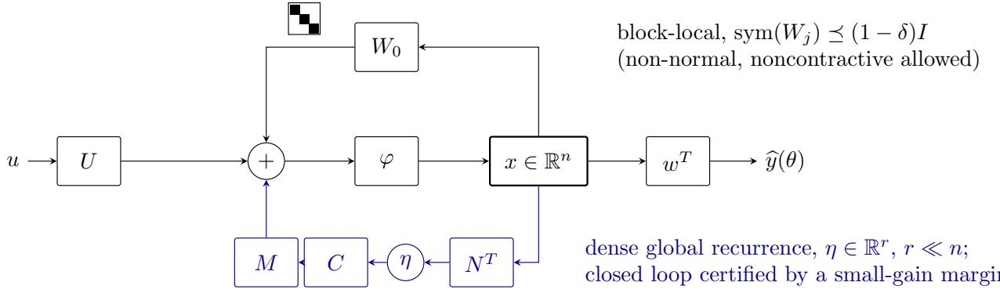
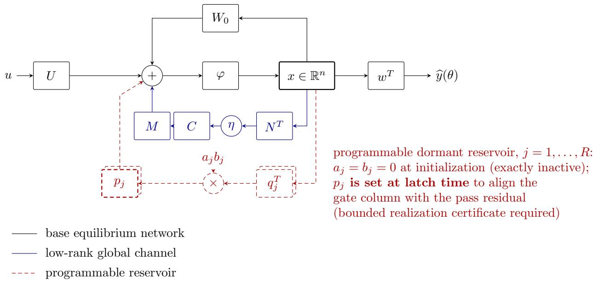

# Certified Inference and Training for Deep Equilibrium Networks: A Continuation Framework with Polynomial Complexity Guarantees

Alex Borisevich, akpc806b@gmail.com

September 2026

## Abstract

We develop a certified continuation framework for equilibrium computation and for training deep equilibrium networks (DEQs), with training formulated as interpolation to accuracy 2−b. For inference, compact input homotopy selects a unique branch from a supplied start root, and a rounded Newton tracker follows it under certified boundary, conditioning, derivative, and tube-radius bounds. For training, we augment local-plus-low-rank recurrence with programmable dormant bilinear rank-one channels. Loaded Tikhonov solves diagnose a failed interpolation pass without spectral decomposition; an output-preserving repair aligned with the pass residual supplies the required direction. Training requires certified gate realization and column stability on each pass region, well-posed inference, and finite-update error budgets. With polynomial geometric, encoding, precision, and complete backend budgets, both certified inference and training have bit cost O(poly(L + b)), where L is the encoded instance length. The trainer uses O(b + ℓ) passes and reserve channels from an initial residual bounded by 2ℓ. These guarantees concern a certified promise class. Lean 4 verifies the quantitative core and concrete inference backend; numerical comparisons illustrate the loaded mechanism.

## 1 Introduction

Deep equilibrium networks (DEQs) define a hidden state by an equilibrium equation instead of evaluating a prescribed sequence of layers. This gives an implicit architecture whose efective depth is determined by the equilibrium computation, with training memory advantages that motivated the original DEQ model [4]. The architecture also raises basic theoretical questions: does an equilibrium exist, which equilibrium does the solver select, and how much computation is needed as the requested accuracy increases? Research on monotone architectures, Jacobian regularization, and homotopy methods addresses diferent parts of these questions [5, 16, 2].

Training adds a second dificulty. Even when every state can be computed reliably, a small change in the parameters may fail to move the predictions in a needed direction. We formulate training as interpolation: for a fixed batch, produce parameters whose prediction vector is within 2−b of the target. The relevant complexity parameter is the number of requested bits b. A guarantee must therefore control both the number of updates and the precision and cost of the calculations inside each update.

We study an architecture with small local recurrent blocks, low-rank global coupling, and a reserve of dormant bilinear rank-one channels. The local-plus-low-rank structure exposes equilibrium conditioning through a reduced matrix, even when the recurrence is non-normal or the usual fixed-point iteration is not contractive. For equilibrium computation, input homotopy follows a selected root through a certified region. Our compact continuation theorem and rounded tracker turn bounds on the inverse Jacobian, derivatives, and tube radius into a finite precision schedule and polynomial cost (Theorems 4.6 and 4.7). Section 5 supplies a rational tanh evaluator and an explicit scalar DEQ implementation with a derived polynomial work envelope, rather than an assumed eficient numerical oracle.

For training, a loaded Tikhonov solve either supports a successful interpolation pass or identifies a weak output direction. An unused channel can then be programmed while dormant and activated without changing the current predictions. The important requirement is that its new parameter derivative approximate the current pass residual and remain useful throughout the certified pass region. Detecting a weak direction alone does not ensure that the architecture can realize this repair. Our analysis includes programming error, column variation, inexact evaluation and solves, and rounding. With these contracts, at most $3 ( b + { \ell } )$ passes and channels sufice from an initial residual bounded by $2 ^ { \ell }$ (Theorem 7.9).

The resulting claims concern a specified certified promise class. Polynomial computation requires polynomially bounded geometric and precision budgets, eficient gate realization, and numerical backends whose costs include certificate checking. Low rank and smoothness alone do not establish those requirements. This formulation separates the proved quantitative mechanism from the architectural certificates still needed to apply it to a particular DEQ. Lean 4 checks the mathematical core, while the numerical comparisons provide illustrations of the loaded trigger rather than a validation of every certificate. The bird’s-eye overview in Section 6 explains the training mechanism before the detailed analysis; the final sections discuss composition, experiments, and the scope of the guarantees.

## 2 Related work and computational complexity

## 2.1 Equilibrium architectures and inference guarantees

Homotopy-based inference also predates the present construction. Ding et al.’s HomoODE [2] connects DEQs and neural ODEs through homotopy continuation. Beltr´an and Leykin [3] give certified rational tracking with condition-dependent bit complexity for polynomial systems. Their polynomial-system theorem cannot be applied verbatim to a network with transcendental activations. Our input-sweep result instead states explicit tube, derivative and evaluation promises; the low-rank architecture supplies the local and reduced inverse bounds. This quantitative certificate is the relevant distinction from generic use of a homotopy solver.

The original DEQ formulation computes a weight-tied network’s equilibrium by root finding and diferentiates the selected state implicitly, avoiding storage proportional to the efective depth [4]. Multiscale DEQs extend this construction to coupled representations at several resolutions [12]. This memory advantage does not remove the work of the forward root solve or the backward linear solve. In particular, low-rank inverse approximations in Broyden’s method are already part of the DEQ literature; they must be distinguished from the architectural low-rank recurrent coupling studied here. Structured low-rank connectivity also predates DEQs in recurrent-network theory, where it is used to relate connectivity geometry to low-dimensional dynamics and computation [28]. The present architecture should therefore be assessed through its explicit inference and repair certificates, rather than through low-rank recurrence alone.

Well-posed implicit models also have a substantial history. Implicit deep learning treats fixed point prediction rules as a common language for feedforward and recurrent architectures and studies suficient conditions for well-posedness [13]. Monotone operator equilibrium networks construct a parameterization with a unique equilibrium and convergent operator-splitting solvers [5]. NEMON uses non-Euclidean contraction theory to obtain well-posedness, fixed-point algorithms, and quantitative input-output bounds [14]. Thus, guaranteed equilibrium evaluation and stability beyond a naive Euclidean contraction test are established objectives, rather than new claims of this paper.

Our inference results specialize this line of analysis to block-local recurrence and a normalized lowrank feedback interface. The determinant and inverse reduction use classical matrix identities [11]. The non-normal block transfer estimate likewise has a classical resolvent interpretation. For $A _ { 0 } = I - W$ and $0 < d < 1$ , write $t = d / ( 1 - d )$ ; then

$$
d ( I - W ) ( I - d W ) ^ { - 1 } = t A _ { 0 } ( I + t A _ { 0 } ) ^ { - 1 } = I - ( I + t A _ { 0 } ) ^ { - 1 } .
$$

The symmetric-part assumption makes $A _ { 0 }$ monotone, and the complementary resolvent is nonexpansive by standard monotone-operator estimates [15]. The paper’s role is to combine this estimate with the normalization $N = ( I - W _ { 0 } ) ^ { T } M$ , exposing the reduced denominator and its dimension-independent conditioning margin. These are explicit architectural consequences of established tools, not a new general resolvent theorem. The block-isotropy restriction and the separate equilibrium-selection requirement are essential to that interpretation.

## 2.2 Reducing the cost of DEQ diferentiation

Jacobian regularization improves forward and backward stability at modest additional computational cost [16]. Jacobian-Free Backpropagation (JFB) avoids the implicit Jacobian solve through an alternative update [17], whereas SHINE reuses quasi-Newton inverse estimates from the forward computation to approximate the backward response [18]. More recently, Lipschitz multiscale DEQs study architectural restrictions that guarantee convergence of forward and backward fixed-point computations [26]. A recent preprint on response renormalization targets selected nearly singular, loss-sensitive adjoint response channels [27].

These methods address closely related numerical bottlenecks, but their operators must be distinguished. The state residual Jacobian $J _ { x } = I - D W _ { \mathrm { e f f } }$ governs equilibrium regularity and implicit sensitivities. The training Jacobian $J = D F ( \theta )$ maps parameter changes to batch prediction changes. Our normal solve regularizes $J J ^ { * }$ and detects a poorly liftable training displacement; a dormant repair changes the available parameter-to-output directions. This difers from approximating or selectively damping the state adjoint while leaving the available training directions unchanged. A bound on $J _ { x } ^ { - 1 }$ helps evaluate J and the propagated gate, but does not by itself give a lower bound on the training Jacobian or make that gate surjective.

## 2.3 Training convergence and the meaning of polynomial complexity

Global training convergence is already known for restricted implicit networks. Kawaguchi proves global linear convergence for implicit layers with nonlinearity on the weight parameterization and relates their dynamics to a trust-region Newton method [19]. Gao et al. analyze over-parameterized ReLU implicit networks [20]. Ling et al. prove linear convergence of gradient descent under quantitative initialization conditions, establish these conditions through an over-parameterization analysis, and preserve a unique equilibrium throughout training [21]. Truong extends this line of analysis to activation functions with bounded first and second derivatives [22]. Consequently, geometric loss decay or logarithmic dependence on inverse error cannot be claimed as new solely because the model is a DEQ.

Three computational statements should be kept separate. First, a linear algebra operation count measures arithmetic work at a prescribed state and parameter. Second, an iteration bound to reach tolerance ϵ depends on convergence constants, including conditioning and stability margins. Third, polynomial bit complexity for $\epsilon = 2 ^ { - b }$ additionally requires polynomially bounded encodings, working precision, evaluation costs, and inverse margins. For example, contraction with factor κ requires an iteration count proportional to log(1/ϵ)/[− log κ]; an exponentially small 1 − κ can invalidate a polynomial bound even though convergence is linear. This observation concerns the resources appearing in a rate, not a contradiction of the cited convergence theorems.

Our result follows the third convention conditionally: the finite-step error budget and repair reserve are explicit, and the complete bit cost is reduced to the certified backend contracts in Assumption 7.8. Since those contracts include an eficient whole-pass backend, Theorem 7.9 is a convergence and cost composition theorem; it does not independently construct a polynomial-time trainer for all low-rank DEQs. Establishing such a trainer for a concrete family requires deriving the gate, region, encoding, and backend bounds from that family’s primitive operations.

Classical hardness results for specified neural-network training problems [7] motivate careful formulation of the admissible class. They are not, without a reduction, hardness results for the smooth DEQ architecture or the adaptive reserve considered here. Conversely, well-conditioned promises and architectural growth change the problem being solved; they do not refute those hardness results.

## 2.4 Function-preserving growth and residual-aligned repair

Function-preserving changes of network architecture precede the present construction: Net2Net transfers a trained function to a wider or deeper network, and network morphism develops a broader framework for such transformations [23, 24]. Low-rank parameter updates are also established through adapter methods such as LoRA [6]. In particular, neither output preservation at activation nor a rank-one parameter update is suficient on its own to establish novelty.

Architectural augmentation also has theoretical optimization guarantees. Liang et al. show, under their classification and loss assumptions, that adding a special neuron together with a regularizer makes every local minimum global [29]. A landscape statement of that kind does not by itself bound the iterations, precision, or work needed to find a minimum. Our finite-pass statement instead concerns an executed trajectory and its quantitative error budgets, conditional on realizable repairs and certified regions.

Lawton, Galstyan, and Ver Steeg use Gauss–Newton approximations to learn and evaluate candidate network morphisms [25]. This is a particularly relevant comparison: second-order guidance of architecture growth is already present in the literature. Our objective is diferent from ranking candidate growth operations by an approximate decrease in loss. We require a bounded propagated column approximating the fixed pass residual, a derivative-variation bound protecting that column on the pass region, and a numerical budget implying an actual finite-pass contraction. The reserve bound then follows from securing one displacement per pass. It counts activated channels; it does not guarantee realization of arbitrary batch directions by a rank-one gate or bound storage independently of the write dimension.

## 2.5 Contribution and remaining boundary

The contribution studied here is the quantitative connection between loaded Tikhonov diagnosis, output-preserving residual-aligned repair, protection under column drift, and finite inexact passes. The mechanism permits a precision-scaled repair reserve without requiring a uniform right inverse of the training Jacobian in every output direction. The low-rank inference certificate supplies complementary control of state sensitivities. Lean verification checks the stated abstract implications and their hypotheses; it supports mathematical reliability rather than replacing architectural realizability or experimental validation.

The comparison motivates a certified adaptive-training framework, rather than a claim of the first convergent DEQ trainer, the first use of Gauss–Newton for growth, or unconditional polynomial-time neural-network training. The outstanding step toward a broader algorithmic result is an eficient certificate construction for a nontrivial DEQ family. The historical numerical runs reported later illustrate the intended mechanism but do not certify that step or test all contracts of the finite-pass algorithm.

## 3 The DEQ architecture and computational problem

For input $u \in \mathbb { R } ^ { d _ { u } }$ , consider

$$
x = \varphi \big ( W _ { 0 } x + M C N ^ { T } x + U u + c \big ) , \qquad x \in \mathbb { R } ^ { n } .\tag{1}
$$

Here $W _ { 0 }$ is block diagonal with bounded block sizes, M, $N \in \mathbb { R } ^ { n \times r }$ , and $C \in \mathbb { R } ^ { r \times r }$ . The readout is $\widehat { \boldsymbol { y } } = \boldsymbol { w } ^ { T } \boldsymbol { x } + \boldsymbol { c _ { o } }$ . The activation acts componentwise and is $C ^ { 1 , 1 }$ on the certified preactivation region. For the monotone activation interpretation we require $0 \leq \varphi ^ { \prime } \leq 1$ , rather than only $| \varphi ^ { \prime } | \leq 1$ ; tanh is the running example. The abstract training results apply to any $C ^ { 1 , 1 }$ output map with the required evaluation contracts, independently of this derivative range.

The modified recurrent weight is

$$
W _ { \mathrm { e f f } } = W _ { 0 } + M C N ^ { T } + \sum _ { j = 1 } ^ { R } a _ { j } b _ { j } p _ { j } q _ { j } ^ { T } .\tag{2}
$$

Figure 1 shows the local and low-rank recurrent contributions and their shared equilibrium feedback.

Figure 1: The low-rank equilibrium network (inference architecture). The equilibrium state solves $x = \varphi ( W _ { 0 } x + M C N ^ { T } x + U u + c )$ . Black: block-local monotone recurrence. Blue: the dense global recurrence of rank $r \ll n$ through the latent state $\eta = N ^ { T } x ;$ its closed loop is certified by a small-gain condition on the reduced $r \times r$ loop.

Both latch coordinates start at zero. Vectors of an unused channel may be programmed before activation, while its contribution is still exactly zero. For a fixed batch, stack the scalar predictions as $F ( \theta ) \in \mathbb { R } ^ { m }$ and write $J ( \theta ) = D F ( \theta )$ . The trainable vector includes the active parameters and any programmed vectors that can subsequently vary.

Given rational instance data and a precision request $b \in \mathbb N$ , the computational objective is a rational parameter encoding $\widehat { \theta }$ with

$$
\left\| F ( { \widehat { \theta } } ) - y ^ { * } \right\| \leq 2 ^ { - b } .\tag{3}
$$

Precision complexity is measured in $b ,$ rather than in $2 ^ { b }$ . We call this arbitrarily accurate interpolation; no finite exact rational solution is asserted for a general nonlinear network. Parameter dimension is denoted $p$ and the initial-residual exponent by ℓ.

## 4 Certified inference

## 4.1 Exact low-rank reduction

At a state, let D be the activation derivative matrix. Set

$$
A = I - D W _ { 0 } , \qquad B = D M C , \qquad L = N ^ { T } , \qquad Q = I - L A ^ { - 1 } B .\tag{4}
$$

The state Jacobian is $A - B L$ . This definition fixes the ordering of the reduced factors; $C$ need not commute with the reduced transfer.

Theorem 4.1 (Inference reduction). If A is invertible, then

$$
\operatorname* { d e t } ( A - B L ) = \operatorname* { d e t } ( A ) \operatorname* { d e t } ( Q ) .
$$

The full and reduced kernels are explicitly isomorphic. $I f Q$ is invertible, then

$$
( A - B L ) ^ { - 1 } = A ^ { - 1 } + A ^ { - 1 } B Q ^ { - 1 } L A ^ { - 1 } .
$$

In particular, bounds $\left\| A ^ { - 1 } \right\| \leq a , \ \left\| B \right\| \leq \beta , \ \left\| L \right\| \leq \lambda , \ \left\| Q ^ { - 1 } \right\| \leq q$ give

$$
\begin{array} { r } { \left\| ( A - B L ) ^ { - 1 } \right\| \leq a + a ^ { 2 } \beta q \lambda . } \end{array}
$$

The same inverse-norm bound controls the adjoint sensitivity solve.

Proof. The activation chain rule applied to the state residual $x - \varphi ( W _ { \mathrm { e f f } } x + U u + c )$ gives $J _ { x } =$ $I - D W _ { \mathrm { e f f } }$ . Splitting local recurrence and global coupling gives $J _ { x } = A - B L$ . Factorization gives

$$
\begin{array} { r } { A - B L = A ( I - A ^ { - 1 } B L ) . } \end{array}
$$

The rectangular determinant identity det $( I - X Y ) = \operatorname* { d e t } ( I - Y X )$ with $X = A ^ { - 1 } B , Y = L$ proves the determinant formula. No commutation of the latent gain with the reduced transfer is used.

If $( A - B L ) x = 0$ , multiplication by $A ^ { - 1 }$ gives $x = A ^ { - 1 } B L x$ . Therefore $u = L x$ satisfies $Q u = 0$ Conversely, if $Q u = 0$ , then $x = A ^ { - 1 } B u$ satisfies $( A - B L ) x = 0$ and $L x = u$ . These maps are inverse linear maps between the kernels; in particular nonzero kernel vectors correspond.

For invertible Q, let $S = A ^ { - 1 } + A ^ { - 1 } B Q ^ { - 1 } L A ^ { - 1 }$ . Use

$$
( I - L A ^ { - 1 } B ) Q ^ { - 1 } = I , \qquad Q ^ { - 1 } ( I - L A ^ { - 1 } B ) = I
$$

to check $( A - B L ) S = S ( A - B L ) = I$ by expanding the products. Submultiplicativity and the triangle inequality then give

$$
\| S \| \leq \left\| A ^ { - 1 } \right\| + \left\| A ^ { - 1 } \right\| ^ { 2 } \| B \| \left\| Q ^ { - 1 } \right\| \| L \| \leq a + a ^ { 2 } \beta q \lambda .
$$

The adjoint has the same induced norm, so $\| J _ { x } ^ { - * } \| = \| J _ { x } ^ { - 1 } \|$

## 4.2 Non-normal local blocks

For the normalized family, set $A _ { 0 } = I - W _ { 0 } , N = A _ { 0 } ^ { T } M , \| M \| \leq 1$ , and $C = \alpha I$ , with $0 \leq \alpha < 1$ Assume

$$
D = \mathrm { b l k d i a g } ( d _ { j } I _ { k _ { j } } ) , \quad 0 \leq d _ { j } \leq 1 , \qquad \mathrm { s y m } ( W _ { j } ) \preceq ( 1 - \delta ) I , \quad 0 < \delta \leq 1 .\tag{5}
$$

Block isotropy is a substantive condition. Ordinary elementwise tanh does not satisfy it automatically on multi-coordinate blocks.

Theorem 4.2 (Local transfer and reduced margin). Under (5), each local Jacobian satisfies $\sigma _ { \operatorname* { m i n } } ( I - d _ { j } W _ { j } ) \geq \delta$ and

$$
\begin{array} { r } { \big \| d _ { j } ( I - W _ { j } ) ( I - d _ { j } W _ { j } ) ^ { - 1 } \big \| \leq 1 . } \end{array}
$$

Consequently $\begin{array} { r } { T = A _ { 0 } ( I - D W _ { 0 } ) ^ { - 1 } D } \end{array}$ has norm at most one and

$$
Q ( D ) = I - \alpha M ^ { T } T M , \qquad \sigma _ { \mathrm { m i n } } ( Q ( D ) ) \geq 1 - \alpha .
$$

No bound $\| W _ { j } \| < 1$ is required.

Proof. For one local block, the strict symmetric-part bound yields

$$
\begin{array} { r l r } & { } & { \langle ( I - d W ) x , x \rangle \geq [ 1 - d ( 1 - \delta ) ] \| x \| ^ { 2 } } \\ & { } & { \qquad \geq \delta \left\| x \right\| ^ { 2 } , } \end{array}
$$

where the last inequality uses $0 \leq d \leq 1$ and $0 < \delta \leq 1$ . Cauchy–Schwarz gives $\delta \| x \| \leq \| ( I - d W ) x \|$ for $x \neq 0$ , and the inequality is immediate at zero. In finite square dimension this implies invertibility and inverse norm at most $\delta ^ { - 1 }$

The transfer estimate follows from the exact norm identity

$$
\begin{array} { r l } & { \| x - d W x \| ^ { 2 } - \| d ( x - W x ) \| ^ { 2 } } \\ & { \quad = ( 1 - d ) ^ { 2 } \left\| x \right\| ^ { 2 } + 2 d ( 1 - d ) \big ( \| x \| ^ { 2 } - \langle x , W x \rangle \big ) \geq 0 . } \end{array}
$$

Only $\operatorname { s y m } ( W ) \preceq I$ is needed for this estimate. Setting $x = ( I - d W ) ^ { - 1 } y$ proves

$$
\left\| d ( I - W ) ( I - d W ) ^ { - 1 } y \right\| \leq \| y \| .
$$

The Euclidean norm of a block-diagonal operator is the maximum of its block norms. Since D is scalar on each block, the local operators commute in the required products and $\begin{array} { r } { T = A _ { 0 } ( I - D W _ { 0 } ) ^ { - 1 } D } \end{array}$ is precisely their block sum. Hence $\| T \| \leq 1$

With $N = A _ { 0 } ^ { T } M .$

$$
Q = I - \alpha M ^ { T } A _ { 0 } ( I - D W _ { 0 } ) ^ { - 1 } D M = I - \alpha M ^ { T } T M .
$$

The compressed transfer $K = M ^ { T } T M$ satisfies $\| K \| \leq 1$ . For every u,

$$
\begin{array} { r } { \left\| ( I - \alpha K ) u \right\| \geq \left\| u \right\| - \alpha \left\| K u \right\| \geq ( 1 - \alpha ) \left\| u \right\| . } \end{array}
$$

This proves the reduced gap and its inverse bound.

Corollary 4.3 (Dimension-independent conditioning). If also $\| W _ { 0 } \| \le W$ , then the full state Jacobian satisfies

$$
\sigma _ { \operatorname* { m i n } } ( J _ { x } ( D ) ) \geq \frac { \delta ^ { 2 } ( 1 - \alpha ) } { \delta + 1 + W } .
$$

At an unsaturated state $D = I , J _ { x } = ( I - \alpha M M ^ { T } ) A _ { 0 }$ . If the normalized feedback has a unit eigenvector with eigenvalue one, the reduced gap equals $1 - \alpha$ and there is a unit full-state direction with gain at most $( 1 + W ) ( 1 - \alpha )$ . Thus, if such a state belongs to the inference region, its worst-case gap is $\Theta ( 1 - \alpha )$ with constants independent of n and r.

Proof. The local inverse norm is at most $\delta ^ { - 1 } , \| D \| \le 1 , \| M \| \le 1$ , and $\left. N \right. = \left. A _ { 0 } ^ { T } M \right. \leq 1 + W$ Theorem 4.1 gives

$$
\left\| J _ { x } ^ { - 1 } \right\| \leq \delta ^ { - 1 } + { \frac { \alpha ( 1 + W ) } { \delta ^ { 2 } ( 1 - \alpha ) } } \leq { \frac { \delta + 1 + W } { \delta ^ { 2 } ( 1 - \alpha ) } } .
$$

Taking reciprocals gives the asserted lower bound.

At $D = I ,$ the normalization gives $J _ { x } = ( I - \alpha M M ^ { T } ) A _ { 0 }$ and $Q = I - \alpha M ^ { T } M$ . If a unit u satisfies $M ^ { T } M u = u$ , then $\| Q u \| = 1 - \alpha$ , which meets the reduced lower bound. Also $y = M u$ is unit and $M M ^ { T } y = y$ . Put

$$
x = \frac { A _ { 0 } ^ { - 1 } y } { \left\| A _ { 0 } ^ { - 1 } y \right\| } .
$$

Then $\| { \boldsymbol x } \| = 1$ and

$$
\begin{array} { r } { \| J _ { x } x \| = ( 1 - \alpha ) \| A _ { 0 } x \| \le ( 1 - \alpha ) \| A _ { 0 } \| \le ( 1 + W ) ( 1 - \alpha ) . } \end{array}
$$

If the unsaturated state is present, this upper bound combines with the uniform lower bound to give the worst-case scaling. A unit top feedback eigenvector is a normalization certificate; its existence is not asserted for zero-dimensional feedback or an unnormalized matrix. □

Proposition 4.4 (Anisotropic perturbations). If a certified state Jacobian $J _ { 0 }$ satisfies $\| J _ { 0 } v \| \geq g \| v \|$ and the true Jacobian satisfies $\| J - J _ { 0 } \| \le \varepsilon < g$ , then $\lVert J v \rVert \geq \left( g - \varepsilon \right) \lVert v \rVert$ . In finite square dimension it is invertible, with inverse norm at most $( g - \varepsilon ) ^ { - 1 }$

Proof. For every $v ,$

$$
\lVert J v \rVert \geq \lVert J _ { 0 } v \rVert - \lVert ( J - J _ { 0 } ) v \rVert \geq ( g - \varepsilon ) \lVert v \rVert .
$$

The positive lower bound implies injectivity. A linear map on a finite square space is then surjective. Apply the same lower bound to $J ^ { - 1 } z$ to obtain the inverse norm estimate. In particular, estimating only the change in the activation derivatives is insuficient unless the induced full Jacobian error is also bounded. □

This permits elementwise activations near a block-isotropic reference when their induced Jacobian perturbation is quantitatively bounded.

## 4.3 Well-posedness and numerical evaluation

A nonsingular Jacobian is a local regularity certificate. It does not by itself certify a globally unique equilibrium. The training region must also carry a sound well-posedness and evaluation certificate.

Proposition 4.5 (A complete contraction certificate). If the full layer map $f ( x ) = \varphi ( W _ { \mathrm { e f f } } x + U u + c )$ is κ-contractive, $0 \leq \kappa < 1$ , it has exactly one equilibrium $x ^ { * }$ and every numerical state xb satisfies

$$
\| \widehat { x } - x ^ { * } \| \leq \frac { \| \widehat { x } - f ( \widehat { x } ) \| } { 1 - \kappa } .
$$

A suficient condition is a nonexpansive activation and $\lVert W _ { \mathrm { e f f } } \rVert \leq \kappa$

Proof. The Banach fixed-point theorem applies to the complete Euclidean state space. For a nonexpansive activation,

$$
\begin{array} { r } { \| f ( x ) - f ( y ) \| \leq \| W _ { \mathrm { e f f } } ( x - y ) \| \leq \kappa \| x - y \| . } \end{array}
$$

It gives existence and uniqueness of $x ^ { * }$ . The triangle inequality and the contraction estimate give

$$
\begin{array} { r } { \left\| \widehat { \boldsymbol { x } } - \boldsymbol { x } ^ { * } \right\| \leq \left\| \widehat { \boldsymbol { x } } - \boldsymbol { f } ( \widehat { \boldsymbol { x } } ) \right\| + \kappa \left\| \widehat { \boldsymbol { x } } - \boldsymbol { x } ^ { * } \right\| . } \end{array}
$$

Rearranging proves the a posteriori bound. It converts an enclosed layer residual into an equilibriumstate error; the residual of a floating-point layer evaluation must itself include the layer evaluation error. □

The contraction subclass supplies one complete evaluation certificate. Noncontractive instances require another sound state-selection and evaluation backend, such as a quantitatively justified monotone solver; small solve residuals alone are insuficient.

With bounded local block size $k ,$ local linear algebra and the reduced solve cost $O ( n k ^ { 2 } + n r + r ^ { 3 } )$ operations after the required local inverses and reduced factors are available. Forming all reduced factors can additionally cost $O ( n r ^ { 2 } )$ , and applying a precomputed reduced inverse costs $O ( r ^ { 2 } )$ Inference iteration counts, factor bit sizes, and requested accuracy remain separate complexity resources.

## 4.4 Certified input homotopy beyond contraction

An alternative to contraction is to follow a distinguished equilibrium as the input varies along a supplied sweep $u ( s ) , 0 \leq s \leq 1$ . Write

$$
H ( s , x ) = x - \varphi ( W _ { \mathrm { e f f } } x + U u ( s ) + c ) .
$$

The parameters, including any active repair channels, are fixed during this inference sweep. Its state Jacobian is the same local-plus-low-rank operator used above. A certified positive reduced margin controls the linear systems needed by the tangent predictor and Newton corrector, even when iteration of the layer map is not contractive. The relevant promise concerns the whole certified tube, rather than just the final equilibrium.

Theorem 4.6 (Input-sweep inference certificate). Let H be $C ^ { 2 }$ on a neighborhood of $[ 0 , 1 ] \times \overline { { \Omega } }$ where $\Omega \subset \mathbb { R } ^ { n }$ is bounded and open. Supply a start root $x _ { 0 } \in \Omega , H ( 0 , x _ { 0 } ) = 0$ , and exclude zeros on $[ 0 , 1 ] \times \partial \Omega$ . At every zero in this region assume $H _ { x }$ is invertible and

$$
\begin{array} { r } { \left\| H _ { x } ^ { - 1 } \right\| \leq K , \qquad \left\| H _ { s } \right\| \leq B . } \end{array}
$$

Then the start root has a unique continued branch $x ( s )$ for the whole sweep, with

$$
x ^ { \prime } ( s ) = - H _ { x } ^ { - 1 } H _ { s } , \qquad \left\| x ^ { \prime } ( s ) \right\| \le K B .
$$

Its graph length is at most $\sqrt { 1 + ( K B ) ^ { 2 } }$ . In particular the traversal quantity $\begin{array} { r l } { \int _ { 0 } ^ { 1 } \left\| H _ { x } ^ { - 1 } \right\| \sqrt { 1 + \left\| x ^ { \prime } \right\| ^ { 2 } } } \end{array}$ ds is at most $K \sqrt { 1 + ( K B ) ^ { 2 } }$

For numerical tracking, additionally supply a tube of radius $\rho > 0$ around the branch on which the inverse bound holds and the full second derivative is bounded by H . If $K , B , H _ { 2 } , \rho ^ { - 1 }$ , the encoded start data, and evaluation and solve costs at requested precision are polynomially bounded in the input size, a tangent predictor with certified Newton correction tracks this branch to state accuracy $2 ^ { - b }$ with polynomial total bit cost, provided the evaluator and solver include rounding and certification costs in those bounds.

Proof. The implicit-function theorem gives a local branch and the diferentiated identity $H _ { s } + H _ { x } x ^ { \prime } =$ 0. The inverse bound gives $\| x ^ { \prime } \| \le K B$ . If a maximal branch stopped at $s _ { * } < 1$ , this velocity bound would make $x ( s )$ Cauchy as $s \uparrow s _ { * }$ . Its limit lies in Ω and is a zero by continuity. Boundary exclusion puts it in $\Omega ,$ , where the invertible derivative extends the branch, a contradiction. Local uniqueness also makes any two continuations from $x _ { 0 }$ agree. Integrating the graph speed proves the length estimates.

For the numerical assertion, diferentiating the tangent identity bounds $\| x ^ { \prime \prime } \|$ by $K H _ { 2 } ( 1 + K B ) ^ { 2 }$ using Euclidean product norms. Choose an inverse-polynomial sweep step so that the predictor error is smaller than both a fixed fraction of $\rho$ and a fixed fraction of $( K H _ { 2 } ) ^ { - 1 }$ ; if $H _ { 2 } = 0$ , only the tube constraint is needed. Taylor’s formula bounds this error by a constant times $K H _ { 2 } ( 1 + K B ) ^ { 2 } h ^ { 2 }$ Newton’s local error estimate is $\| e _ { j + 1 } \| \le K H _ { 2 } \| e _ { j } \| ^ { 2 } / 2$ while its segment remains in the tube. Smaller certified solve and evaluation errors preserve a uniform contraction of the corrector error. $\mathrm { A n }$ inverse-polynomial step gives polynomially many stages; $O ( b )$ certified correction iterations sufice at the terminal stage, with polynomially many precision bits. Summing the supplied bit costs proves the claim. This constructs a tracking schedule under quantitative tube promises; it does not discover them. □

A finite certified tracker. A conservative tracker can use the previous corrected state as its predictor; a tangent predictor is optional. This simpler choice already has polynomial complexity under the tube promises and makes branch selection explicit. Let $V = K B$ and choose $r > 0$ with $r \le \rho$ and $K H _ { 2 } r \le 1 / 4$ . Use $N \geq 1$ sweep stages with $V / N \leq r / 2$ , and write $q _ { i } = x ( i / N )$ . At each stage perform m rounded Newton corrections for $H ( ( i + 1 ) / N , \cdot )$ , starting from the preceding corrected state. The branch centers $q _ { i }$ are used in the proof; the algorithm evaluates the equation and its Jacobian, not these unknown exact centers.

Theorem 4.7 (Rounded sweep tracker). On each radius-r branch ball, suppose the state derivative is $H _ { 2 } - L i p s c h i t z$ and has inverse norm at most K. A Newton correction at y uses a step v and a whole-update rounding vector z satisfying

$$
\begin{array} { r } { \| \boldsymbol H _ { x } \boldsymbol v + \boldsymbol H \| \le \eta , \qquad \| \boldsymbol z \| \le \zeta , \qquad K \eta + \zeta \le \delta \le r / 8 . } \end{array}
$$

Here the solve residual includes function and derivative evaluation errors relative to the true equation. Starting at a state within $r / 2$ of $q _ { 0 }$ , with $m \geq 1$ corrections per stage, every corrected stage endpoint is within $r / 2$ of its selected root, and every intermediate correction remains in that root’s radius-r ball. For $N \geq 1$ the final state obeys

$$
\| { \widehat { x } } _ { N } - q _ { N } \| \leq 2 ^ { - m } r + 2 \delta .
$$

$I f r \leq 2 ^ { \ell }$ , choose $m = b + \ell + 2$ and $\delta \le \operatorname* { m i n } \{ r / 8 , 2 ^ { - ( b + 2 ) } \}$ to obtain state error at most $2 ^ { - b }$ . There are exactly Nm corrections. If an encoded correction backend simulates these updates, has uniformly polynomial bit cost and output size, and the query size and precision are bounded by S and $P ,$ its correction work is at most Nm $A ( S + P + 1 ) ^ { d }$ for its fixed family constants $A , d .$ Certification of the tube and stage data has its separately supplied cost.

Proof. For a root $q$ and $e = \| y - q \|$ , Taylor’s remainder on the convex ball is at most $H _ { 2 } e ^ { 2 } \mathrm { \Delta \left( a \right. }$ conservative constant). Applying the true inverse to that remainder and the solve residual gives

$$
\Vert y + v + z - q \Vert \leq K H _ { 2 } e ^ { 2 } + K \eta + \zeta \leq e / 4 + \delta \quad ( e \leq r ) .
$$

Thus correction stays in the ball; after its first iteration the error is at most $3 r / 8 < r / 2$ . Induction also gives $e _ { j } \leq 2 ^ { - j } r + 2 \delta$ . The branch velocity bound and the mean value theorem give $\| q _ { i + 1 } - q _ { i } \| \leq$

$V / N \le r / 2$ . A corrected endpoint therefore starts the next stage within radius r of its root. Induction over stages proves safety and the final estimate. The stated precision schedule bounds the final error by $3 \cdot 2 ^ { - ( b + 2 ) } \leq 2 ^ { - b }$

The encoded and decoded finite recursions agree by induction under the backend simulation contract. Summing the $N m$ certified correction costs gives the work bound. This identifies the computed state whose error is bounded; a small terminal residual alone would not do so. □

Compactness and local regularity have distinct roles. On the compact zero set in the certified state region, the implicit-function theorem supplies local graph charts for projection to the sweep interval. These charts make the projection a local homeomorphism; compactness makes it a covering map. Lifting the identity sweep from the start root gives its unique continuous branch. Local agreement with the implicit function gives the derivative formula, including one-sided endpoint neighborhoods. This also explains why a supplied global path is unnecessary.

For the normalized block-isotropic family, Corollary 4.3 supplies $K = ( \delta + 1 + W ) / ( \delta ^ { 2 } ( 1 - \alpha ) )$ A nonexpansive activation gives $B \leq \| U \| \operatorname* { s u p } _ { s } \| u ^ { \prime } ( s ) \|$ . Bounded activations also make boundary exclusion inexpensive: for coordinatewise tanh, every root has $\| x \| _ { \infty } < 1$ , so the box $( - 2 , 2 ) ^ { n }$ excludes boundary roots. The reduced-margin and derivative certificates must hold throughout the required region. For general tanh states, block-isotropy is an additional restriction; the anisotropic perturbation certificate can replace it when its slack is positive. Every active repair channel must be included in the actual feedback factors and margin check.

The conclusion selects the branch reached from the supplied start root; it does not exclude other disconnected equilibria. It also gives a controlled warm start for nearby inputs: a certified tube can be reused while its margin and domain tests remain valid. Unlike a generic pseudo-arclength argument, this theorem has a nonsingular $H _ { x }$ throughout, so the input coordinate itself is a valid sweep and no fold bypass is needed. Extending it to folds would require a bordered margin and a terminal-face certificate in place of these hypotheses.

## 5 A concrete rational backend

The numerical contracts can be instantiated constructively for a bounded activation evaluator and a scalar recurrent DEQ. This example separates the cost of representing numerical data from the number of iterations. It does not assume an exact transcendental evaluation oracle.

Proposition 5.1 (Quantitative rational activation evaluation). For rational z with $| z | \le 4$ and requested precision $p \in \mathbb N$ , the Taylor order $n = p + 1 3 2$ makes the exponential enclosure at $2 | z |$ acceptable. Transform its endpoints through $( e - 1 ) / ( e + 1 )$ , take their midpoint, and restore the sign $o f z$ . The resulting rational value $\widehat { t _ { p } } ( z )$ and derivative $\widehat { d } _ { p } ( z ) = 1 - \widehat { t } _ { p } ( z ) ^ { 2 }$ satisfy

$$
\vert \widehat { t } _ { p } ( z ) - \operatorname { t a n h } { z } \vert \le 2 ^ { - ( p + 2 ) } , \qquad \vert \widehat { d } _ { p } ( z ) - ( 1 - \operatorname { t a n h } ^ { 2 } { z } ) \vert \le 2 ^ { - ( p + 1 ) } , \qquad \vert \widehat { t } _ { p } ( z ) \vert \le 1 , \quad 0 \le \widehat { d } _ { p } ( z ) \le 1 .
$$

For an input fraction whose numerator and denominator have magnitude at most $2 ^ { S }$ , an unreduced integer-fraction implementation returns a value fraction with both magnitudes at most 2Hp(S), where $2 ^ { H _ { p } ( S ) }$

$$
H _ { p } ( S ) = C _ { \mathrm { e n c } } ( p + 1 ) ^ { 3 } ( S + 1 ) .
$$

Its binary-arithmetic work envelope is at most $C _ { \mathrm { e v a l } } ( H _ { p } ( S ) + 1 ) ^ { 3 }$ . The positive constants $C _ { \mathrm { e n c } }$ and $C _ { \mathrm { e v a l } }$ depend only on the fixed activation box and arithmetic model, and are independent of S and $p .$

Proof. For $| v | \leq 8$ , the term $| v | ^ { 3 2 } / 3 2 !$ is at most $2 ^ { 9 6 }$ . Every subsequent term is at most half the preceding one. Thus the exponential remainder radius at order $p + 1 3 2$ is at most $2 ^ { - ( p + 3 ) }$ . At the nonnegative argument $2 | z |$ , the Taylor sum is at least one, so the lower exponential endpoint is positive. The map $( e - 1 ) / ( e + 1 )$ has Lipschitz constant at most two on $[ 0 , \infty )$ ; the midpoint error is consequently at most twice the exponential radius. Squaring values in $[ - 1 , 1 ]$ amplifies their error by at most two.

The encoding implementation uses signed integer fractions without gcd normalization. Multipli cation adds the numerator and denominator size envelopes; addition adds them and charges one further bit. A straight-line expression of height h has fraction size envelope at most h and work envelope $O ( ( h + 1 ) ^ { 3 } )$ . The expression for the jth Taylor term has height $O ( j ( S + 1 ) + ( j + 1 ) ^ { 2 } )$ powers contribute linearly in $j S$ , and factorial products contribute quadratically in $j$ . Summing n terms gives height $O ( n ^ { 2 } ( S + 1 ) + n ^ { 3 } )$ ; the endpoint transforms change this by a constant factor. Since $n = p + 1 3 2 = O ( p + 1 )$ , fixed constants give the stated size and work bounds. □

Theorem 5.2 (A finite encoded noncontractive DEQ solver). For rational u with $| u | \leq 1$ , the equilibrium equation

$$
x = \operatorname { t a n h } ( - 2 x + u )
$$

has a unique root $q \in [ - 1 , 1 ]$ ]. Given $b \in \mathbb { N } ,$ , set $p = b + 4 , x _ { 0 } = 0$ , and compute $b + 2$ updates

$$
x _ { k + 1 } = \operatorname { R o u n d } _ { p } \left( { \frac { x _ { k } + { \widehat { t } } _ { p } ( - 2 x _ { k } + u ) } { 2 } } \right) , \qquad \operatorname { R o u n d } _ { p } ( y ) = 2 ^ { - p } \lfloor 2 ^ { p } y \rfloor .
$$

Every stored state belongs $t o \ [ - 1 , 1 ]$ and has a dyadic representation with numerator magnitude at most $2 ^ { p }$ and denominator $2 ^ { p }$ . The final state satisfies $| x _ { b + 2 } - q | \leq 2 ^ { - b }$ . If the input has fraction size envelope $S _ { i }$ , there is a constant $C _ { \mathrm { r u n } } > 0$ , independent of S, b, and u, such that the encoded run’s work envelope satisfies

$$
W ( S , b ) \leq C _ { \mathrm { r u n } } ( b + 1 ) ( S + b + 1 ) ^ { 1 2 } .
$$

In particular, $W ( S , b ) = O ( ( S + b + 1 ) ^ { 1 3 } )$ . These are conservative upper bounds for this implementation, not optimality claims.

Proof. For $H _ { u } ( x ) = x - \operatorname { t a n h } ( - 2 x + u )$ , one has $1 \leq H _ { u } ^ { \prime } ( x ) \leq 3$ . The endpoint signs at −1 and 1 give existence, and strict monotonicity gives uniqueness. Moreover, $| x - q | \leq | H _ { u } ( x ) |$ |. The damped map $T _ { u } ( x ) = ( x + \operatorname { t a n h } ( - 2 x + u ) ) / 2$ has derivative in $[ - 1 / 2 , 1 / 2 ]$ , hence contraction factor $1 / 2$ . Its rational approximation preserves the state box. Downward dyadic rounding also preserves this box and has error at most $2 ^ { - p } .$ The complete update error is at most 2 2−p, giving by induction

$$
| x _ { k } - q | \leq 2 ^ { - k } + 4 2 ^ { - p } .
$$

The stated k and p give the required accuracy. Re-encoding each state as a dyadic fraction prevents the activation evaluator’s intermediate denominators from becoming the next state encoding. Each preactivation query has fraction size envelope $O ( S + b + 1 )$ and precision $p = O ( b + 1 )$ . The activation expression therefore has height $O ( ( b + 1 ) ^ { 3 } ( S + b + 1 ) )$ , hence at most $O ( ( S + b + 1 ) ^ { 4 } )$ . Its cubic work envelope is $O ( ( S + b + 1 ) ^ { 1 2 } )$ ; the quadratic long-division envelope for rounding is absorbed into this bound. Summing over $b + 2 = O ( b + 1 )$ actual updates gives the stated cost bound.

The Jacobian approximation also lies in [1, 3], so the scalar preconditioner $D = 1 / 2$ passes the rational test $| 1 - \widehat { H } _ { u } ^ { \prime } D | \leq 1 / 2$ throughout this box. Thus the linear-refinement certificate has a concrete preconditioner here. The original equilibrium map can have derivative magnitude two; the half-damped solver supplies its own contraction certificate.

The work model charges integer arithmetic by conservative schoolbook binary-arithmetic envelopes, including long division for dyadic rounding. The complete update instantiates the same eficient-oracle interface used by the modular results, with derived work and output-size bounds. The formal results verify the envelope bounds and the decoded numerical run; they do not verify native library timing or a low-level bit-machine implementation. This concrete inference family does not discharge multidimensional gate realization or the region certificates required by the adaptive training theorem.

## 6 The training mechanism from a bird’s-eye view

At the start of a pass, freeze the displacement $\Delta = y ^ { \ast } - F ( \theta _ { 0 } )$ and follow the straight output path $F ( \theta _ { 0 } ) + s \Delta$ . The pass needs a lift of this one displacement; it need not control every output direction equally.

Detect the relevant weakness. At a point with training Jacobian J, solve

$$
( J J ^ { * } + \tau ^ { 2 } I ) w = \Delta , \qquad v = J ^ { * } w .
$$

If $\| \Delta - J v \|$ is too large, the normalized solve iterate gives a weak covector with a substantial component of the displacement. Spectral estimation is unnecessary. With approximate solves, explicit residual enclosures and error slack are needed to certify this diagnosis.

Program a residual-aligned repair. For an unused channel, its output derivative is a linear function of its write vector once the read vector is fixed. The trainer finds a bounded program approximating the normalized pass displacement through this gate. It activates $( a _ { j } , b _ { j } ) = ( \rho , 0 )$ preserving the model output. Witness pairing is useful for diagnostics or candidate selection, but cannot replace the realization test. These channels use rank-one adapter directions related to LoRA [6], with a separately programmed activation policy. Figure 2 summarizes the outputpreserving activation and the certificates needed before executing a repaired pass.

  
Figure 2: The proposed modification uses the recurrent weight in (2). Red, dashed: the programmable dormant reservoir. While $a _ { j } b _ { j } = 0$ the channel is exactly invisible, so its write vector $p _ { j }$ is not yet data and may legitimately be chosen at activation. A latch $( a _ { j } , b _ { j } ) \colon ( 0 , 0 ) \to ( \rho _ { * } , 0 )$ is an exact zero-output operation installing the Jacobian column at activation $\rho _ { * } c _ { j } ;$ programming $p _ { j }$ aligns $c _ { j }$ with the normalized pass residual. Column drift is controlled on the certified pass region. At most one latch per homotopy pass is ever needed under the realized-pass hypotheses.

Secure one region, not an eternal column. The repair’s efective column is allowed to move. Its initial realization error and its variation over a certified pass ball must fit below the loaded threshold. These bounds secure the fixed displacement on that ball. A later pass uses a new displacement and, if necessary, another unused channel. No permanent global column identity is asserted.

Execute a finite pass. Use N steps with step size $1 / N$ and inexact lifted velocities. A speed bound keeps the iterates in the ball. A derivative-Lipschitz bound controls the accumulated truncation error, while the solve and rounding error have their own budget. The resulting pass contracts the output residual by $3 / 4$ . Iteration of this operation gives the precision and reserve count.

Separate success from failed certification. The certified trainer accepts only passes whose region, realization and backend contracts hold. Failure of these checks rejects the pass and its claimed guarantee. A weak loaded covector certifies a current linearized obstruction; reserve exhaustion or a failed region check does not prove global non-realizability of the labels.

## 7 Training theorems

Let E be the Euclidean parameter space and $Y = \mathbb { R } ^ { m }$ . Adjoints are with respect to their fixed inner products. All norms below are Euclidean or induced operator norms.

Definition 7.1 (Loaded invariant). For $\Delta \in Y$ and $\tau > 0$ , the Jacobian J has the loaded invariant if

$$
\| u \| = 1 , \quad \left\| J ^ { * } u \right\| \leq \tau \quad \Longrightarrow \quad 4 \left. \Delta , u \right. ^ { 2 } < \left\| \Delta \right\| ^ { 2 } .
$$

Theorem 7.2 (Tikhonov dichotomy). For the exact regularized normal solve, the velocity satisfies $\tau \| v \| \leq \| \Delta \|$ . Either $2 \| \Delta - J v \| \leq \| \Delta \|$ , or w ̸= 0 and $u = w / \left. w \right.$ satisfies

$$
\left\| u \right\| = 1 , \quad \left\| J ^ { * } u \right\| \leq \tau , \quad 2 \left. \Delta , u \right. > \left\| \Delta \right\| .
$$

In particular the loaded invariant guarantees a lift residual at most $\| \Delta \| / 2$

Proof. Let $A = J J ^ { * }$ and solve $( A + \tau ^ { 2 } I ) w = \Delta$ . The operator is invertible:

$$
\left. { ( A + \tau ^ { 2 } I ) z , z } \right. = \| J ^ { * } z \| ^ { 2 } + \tau ^ { 2 } \left\| z \right\| ^ { 2 } ,
$$

so its kernel is zero, and finite square dimension gives surjectivity. Put $v = J ^ { * } w$ . The equation gives

$$
\Delta - J v = \tau ^ { 2 } w , \qquad \langle \Delta , w \rangle = \| v \| ^ { 2 } + \tau ^ { 2 } \left\| w \right\| ^ { 2 } .\tag{6}
$$

Cauchy–Schwarz implies $\tau ^ { 2 } \left\| w \right\| \leq \left\| \Delta \right\|$ and $\left\| v \right\| ^ { 2 } \leq \left\| \Delta \right\| \left\| w \right\|$ , hence $\tau \| v \| \leq \| \Delta \|$ . These claims are immediate if $w = 0$

For the stronger estimate, expand

$$
\| \Delta \| ^ { 2 } = \| A w \| ^ { 2 } + 2 \tau ^ { 2 } \| v \| ^ { 2 } + \tau ^ { 4 } \| w \| ^ { 2 } .
$$

Since $\left\| v \right\| ^ { 2 } = \langle A w , w \rangle \leq \left\| A w \right\| \left\| w \right\|$ and $( \| A w \| - \tau ^ { 2 } \| w \| ) ^ { 2 } \geq 0$ , the expansion implies $\left\| \Delta \right\| ^ { 2 } \geq$ $4 \tau ^ { 2 } \lVert \boldsymbol { v } \rVert ^ { 2 }$ . Therefore

$$
2 \tau \| v \| \leq \| \Delta \| .\tag{7}
$$

Suppose $2 \left\| \Delta - J v \right\| > \left\| \Delta \right\|$ . By (6), $2 \tau ^ { 2 } \left\| w \right\| > \left\| \Delta \right\|$ , so $w \ne 0$ . Normalize $u \ : = \ : w / \left\| w \right\|$ Equation (7) gives

$$
\left\| J ^ { * } u \right\| = \left\| v \right\| / \left\| w \right\| < \tau ,
$$

and the energy identity gives

$$
\langle \Delta , u \rangle = \| v \| ^ { 2 } / \| w \| + \tau ^ { 2 } \| w \| > \| \Delta \| / 2 .
$$

This is the advertised witness. Squaring its positive loading violates the loaded invariant. No eigendecomposition or smallest-singular-value estimate is used. □

The solve is a regularized least-squares lift, in the tradition of Tikhonov and Levenberg–Marquardt methods [8, 9, 10].

Proposition 7.3 (Certified normal-solve error). If w is the exact normal-equation solution and $\begin{array} { r } { \left\| ( J J ^ { * } + \tau ^ { 2 } I ) \widehat { w } - \Delta \right\| \leq \xi } \end{array}$ , then

$$
\| \widehat { w } - w \| \le \xi / \tau ^ { 2 } , \qquad \| J ^ { * } \widehat { w } - J ^ { * } w \| \le \| J \| ~ \xi / \tau ^ { 2 } .
$$

The residual bound must concern the true operator and displacement.

Proof. For an exact solution w and approximate ${ \widehat { w } } ,$ , let $z = \widehat { w } - w$ and $\mathcal { N } = J J ^ { * } + \tau ^ { 2 } I$ . If $\| \mathcal { N } \widehat { w } - \Delta \| \leq \xi$ , then

$$
\tau ^ { 2 } \left\| z \right\| ^ { 2 } \leq \langle N z , z \rangle \leq \xi \left\| z \right\| , \qquad \left\| z \right\| \leq \xi / \tau ^ { 2 } .
$$

Consequently $\lVert J ^ { * } \widehat { w } - J ^ { * } w \rVert \leq \lVert J \rVert \xi / \tau ^ { 2 }$ . Errors in $J ,$ its products, and $\Delta$ must first be converted into a bound on the true normal-equation residual. Parameter rounding is then added to the resulting velocity bound.

The exact witness theorem must not be applied without slack to an approximate solve. A direct certified witness check verifies a unit-vector enclosure, the upper bound on $\| J ^ { * } u \|$ , and the lower bound on its loading. Alternatively, write $\Delta ^ { \prime } = \mathcal { N } \widehat { w }$ and apply the exact theorem to $\Delta ^ { \prime } .$ , then transfer loading by $| \left. \Delta - \Delta ^ { \prime } , u \right. | \leq \xi$ □

Proposition 7.4 (Programming and activation). Suppose the channel acts through $H ( ( a b ) p )$ with H diferentiable at zero and derivative $G _ { 0 }$ . Programming p while $b = 0$ changes no output. $A f t e r$ $a = \rho$ , the b-derivative is $\rho G _ { 0 } p$ . Write $G = \rho G _ { 0 }$ for the full post-latch gate. $I f$ a numerical gate $\widehat { G }$ and a program p satisfy

$$
\left\| \rho d - \widehat { G } p \right\| \leq \eta _ { g } , \quad \left\| G - \widehat { G } \right\| \leq \gamma , \quad \| p \| \leq S ,
$$

then $\| \rho d - G p \| \leq \eta _ { g } + \gamma S$

Proof. While $b = 0 , H ( ( a b ) p ) = H ( 0 )$ for every $a , p$ . Both programming and activation preserve the output exactly as algebraic operations. After activation, diferentiation of $b \mapsto H ( ( \rho b ) p )$ at zero gives $D H ( 0 ) [ \rho p ] = \rho G _ { 0 } p = G p$ . The gate approximation bound follows from

$$
\begin{array} { r } { \| \rho d - G p \| \leq \Big \| \rho d - \widehat G p \Big \| + \Big \| ( G - \widehat G ) p \Big \| \leq \eta _ { g } + \gamma S . } \end{array}
$$

For the recurrent adapter, fix its read vector q and let $x _ { i }$ be the selected equilibrium for sample i. With invertible state Jacobian $A _ { i } = I - D _ { i } W _ { \mathrm { e f f } }$ , its unscaled write-side gate has rows

$$
( G _ { q } p ) _ { i } = ( q ^ { T } x _ { i } ) w ^ { T } A _ { i } ^ { - 1 } D _ { i } p .\tag{8}
$$

This formula follows by diferentiating the equilibrium equation with respect to a recurrent perturbation $p q ^ { T }$ . It is linear in $p$ but depends on the states, readout and local inverse. The latent inference certificate controls the inverse in this formula; it does not make $G _ { q }$ surjective.

The adjoint direction $p = G _ { q } ^ { * } u / \left. G _ { q } ^ { * } u \right.$ maximizes pairing with u on the unit write ball, when the adjoint image is nonzero. Its output column is $G _ { q } G _ { q } ^ { * } u / \left| \left| G _ { q } ^ { * } u \right| \right|$ , rather than u in general. A residual-aligned repair therefore requires solving the bounded realization problem and checking its residual. □

One may equivalently solve for the unscaled column and multiply all realization errors by $\rho .$

Theorem 7.5 (A stable approximate repair). Let $\Delta = c d , c > 0 , \| d \| = 1$ . At the post-latch start $\theta _ { 0 }$ , suppose there is a parameter direction e with $\| e \| \le 1$ and

$$
\| \rho d - J ( \theta _ { 0 } ) e \| \leq \varepsilon .
$$

On a certified region assume $\lVert J ( { \boldsymbol { \theta } } ) - J ( { \boldsymbol { \theta } } _ { 0 } ) \rVert \leq \omega$ . If

$$
2 ( \tau + \varepsilon + \omega ) < \rho ,\tag{9}
$$

the loaded invariant holds at every point of the region. Each point admits a lift with residual at most $c / 2$ and speed at most $c / \tau$

Proof. For every point in the certified region,

$$
\begin{array} { c } { \left\| \rho d - J ( \theta ) e \right\| \leq \left\| \rho d - J ( \theta _ { 0 } ) e \right\| + \left\| \left( J ( \theta ) - J ( \theta _ { 0 } ) \right) e \right\| } \\ { \leq \varepsilon + \omega . } \end{array}
$$

For a unit covector u, split its pairing with ρd into the actual column and its error. Adjointness gives

$$
\begin{array} { r } { \rho | \left. d , u \right. | \leq | \left. J ( \theta ) e , u \right. | + \varepsilon + \omega \leq \| J ( \theta ) ^ { * } u \| + \varepsilon + \omega . } \end{array}
$$

Thus any weak unit u satisfies $\rho | \left. d , u \right. | \ \leq \ \tau + \varepsilon + \omega \ < \ \rho / 2$ . Since $\Delta \ : = \ : c d$ and $\| \Delta \| = c ,$ $4 \left. \Delta , u \right. ^ { 2 } < \left. \Delta \right. ^ { 2 }$ . Theorem 7.2 gives the pointwise lift and velocity bounds. Protection is established only over the certified region of this pass. No claim that the column remains fixed after later training is needed. □

An available Lipschitz bound K on a ball of radius a supplies $\omega \leq K a$ . This smallness condition is part of the promise, and can fail even when the initial programming residual is small.

Theorem 7.6 (Finite numerical pass). Let F have derivative J, K-Lipschitz on the closed ball $B = \overline { { B } } ( \theta _ { 0 } , a )$ . Put $c = \lVert y ^ { * } - F ( \theta _ { 0 } ) \rVert$ . Suppose the actual step velocities $\widehat { v } _ { i }$ satisfy on B

$$
\| { \widehat { v } } _ { i } \| \leq W \leq a , \qquad \| J { \widehat { v } } _ { i } - \Delta \| \leq c / 2 + \eta .
$$

If $N \geq 1$ and

$$
K W ^ { 2 } / N + \eta \leq c / 4 ,\tag{10}
$$

the N updates $\theta _ { i + 1 } = \theta _ { i } + \widehat { v } _ { i } / N$ remain in B and their endpoint has residual at most $3 c / 4$ . For an exact lift v and $\lVert \widehat { v } - v \rVert \leq \zeta , \lVert J \rVert \leq M$ , suficient velocity contracts are

$$
W = c / \tau + \zeta , \qquad \eta = M \zeta .
$$

Rounding of a whole update is included by adding N times its parameter error to the velocity error. Proof. Let $h = 1 / N$ . Assuming the first i steps are in the ball, their speed bound gives

$$
\| \theta _ { i } - \theta _ { 0 } \| \leq i h W \leq W \leq a .
$$

Induction proves domain safety for every iterate. Each update segment is in the ball by convexity. The derivative-Lipschitz remainder estimate is

$$
\| F ( x + h v ) - F ( x ) - h J ( x ) v \| \leq K ( h W ) ^ { 2 } .
$$

This uses a conservative constant; the usual $K / 2$ estimate would improve the budget but is unnecessary. Adding the lift defect gives

$$
\| F ( \theta _ { i + 1 } ) - F ( \theta _ { i } ) - h \Delta \| \leq K ( h W ) ^ { 2 } + h ( c / 2 + \eta ) .
$$

Sum the N inequalities and telescope. Since $N h = 1$ and $F ( \theta _ { 0 } ) + \Delta = y ^ { * }$ ，

$$
\| F ( \theta _ { N } ) - y ^ { * } \| \leq K W ^ { 2 } / N + c / 2 + \eta \leq 3 c / 4 .
$$

If v is an exact lift and $\| { \widehat { v } } - v \| \leq \zeta$ , then

$$
\begin{array} { r } { \| \widehat { v } \| \leq c / \tau + \zeta , \quad \| J \widehat { v } - \Delta \| \leq \| J v - \Delta \| + \| J \| \zeta \leq c / 2 + M \zeta . } \end{array}
$$

For an implemented update with error r relative to $x + v / N$ , the efective velocity is $v + N r$ . This explains the rounding contribution stated in the theorem. □

Corollary 7.7 (One realized repair supplies a finite pass). Suppose Theorem 7.5 holds on the ball, J is K-Lipschitz there, $c / \tau \leq a ,$ and $K ( c / \tau ) ^ { 2 } / N \le c / 4$ for an integer $N \geq 1$ . Then pointwise $l i f t s$ can be selected and integrated by N finite steps to reach residual at most $3 c / 4$ while remaining in the ball. No Lipschitz assumption on the selected lifting field is required for this discrete result.

Proof. At each point of the ball Theorem 7.5 supplies a lift with residual at most $c / 2$ and speed at most $c / \tau$ . Select one at each point, defining it arbitrarily outside the ball. $\mathrm { A p p l y }$ Theorem 7.6 with $W = c / \tau$ and $\eta = 0$ . Its domain induction and remainder estimate require only the stated pointwise bounds, rather than regularity of the selected lift. This proves a real-valued finite pass construction. For rational execution, a certified approximate backend must additionally satisfy the inexact contracts; classical pointwise selection alone does not give a bit-eficient implementation.

## 7.1 A concrete pass schedule

The region and numerical budgets can be stated as scalar acceptance tests. For a nonzero pass residual $^ { c , }$ choose a ball radius $a = 2 c / \tau$ and an initial repair error ε. A suficient stability test is

$$
2 \big ( \tau + \varepsilon + 2 K c / \tau \big ) < \rho .
$$

If the backend’s total velocity error satisfies $\zeta \leq c / \tau$ and $M \zeta \leq c / 8$ , choose

$$
N = \operatorname* { m a x } \{ 1 , \lceil 3 2 K c / \tau ^ { 2 } \rceil \} .
$$

Then $W = 2 c / \tau$ and the numerical budget of Theorem 7.6 holds. This schedule needs polynomially many inner steps when $K c / \tau ^ { 2 }$ is polynomially bounded. It is conservative and provides an explicit certified implementation target; the archived adaptive Gauss–Newton loop uses a diferent schedule.

Verification of the schedule. The ball gives $\omega \le K a = 2 K c / \tau$ . The velocity error bound gives $\| \widehat { v } \| \leq c / \tau + \zeta \leq 2 c / \tau = a$ , so discrete domain safety applies. Finally,

$$
\frac { K ( 2 c / \tau ) ^ { 2 } } { N } = \frac { 3 2 K c / \tau ^ { 2 } } { N } \frac { c } { 8 } \leq \frac { c } { 8 } .
$$

Adding $M \zeta \leq c / 8$ proves the quarter-residual numerical budget. The norm bound M and the preactivation and state enclosures must be valid on the chosen ball, and programming must be included in the post-latch region certificate. □

Assumption 7.8 (Certified pass and backend class). An accepted encoded instance supplies at most $3 ( b + { \ell } )$ passes with:

(i) sound DEQ well-posedness, evaluation and derivative certificates on the entire pass region, and $C ^ { 1 , 1 }$ bounds there;

(ii) either the loaded invariant on that region or one unused programmable channel whose post-latch column satisfies Theorem 7.5;

(iii) actual finite updates satisfying Theorem ${ \ } ^ { 7 . 6 , }$ with their decoded endpoint identified with the backend output;

(iv) an encoding of size at most S per backend query and precision at most $Q _ { i }$ , where $S , Q$ are polynomial in instance length and $b ;$

(v) a selected complete pass backend, including programming, certificate checking, inference, linear algebra and rounding, with bit cost at most $A ( S + Q + 1 ) ^ { d }$ for uniform family constants A, d.

Region bounds may be supplied as validated analytic bounds or enclosures; testing a finite list of successful solves does not establish them. The assumptions specify a reduction to an eficient certified backend, not a universal verifier for arbitrary smooth maps.

Theorem 7.9 (Certified DEQ training). For an instance in Assumption $\gamma . 8$ with initial residual at most $2 ^ { \ell }$ , at most $3 ( b + { \ell } )$ completed passes produce the encoded output (3). The number of consumed channels is at most $3 ( b + { \ell } )$ , and it sufices to provision that many channels. The total bit cost of the accepted encoded run is at most

$$
3 ( b + \ell ) A ( S + Q + 1 ) ^ { d } .
$$

Thus the trainer is polynomial in instance length and requested bits when the displayed budgets, including ℓ, are polynomially bounded. If pass k has residual $c _ { k } .$ , travel at most $c _ { k } / \tau$ , and each latch costs at most $\rho$ parameter travel, then the total travel is at most

$$
4 c _ { 0 } / \tau + R _ { \mathrm { u s e d } } \rho .
$$

Programmed-vector changes and rounding add their separately certified travel budgets. A global domain ball is suficient only if it contains this full travel budget and the pass regions used for certification.

Proof. Pass activation preserves the output, so the residual used in the pass is also the residual of the preceding encoded endpoint. By the finite pass theorem, $c _ { k + 1 } \leq ( 3 / 4 ) c _ { k }$ whenever a nontrivial accepted pass is executed. An already successful endpoint can be retained with no further latches. Inductively,

$$
c _ { k } \leq ( 3 / 4 ) ^ { k } c _ { 0 } .
$$

Because $( 3 / 4 ) ^ { 3 } = 2 7 / 6 4 \leq 1 / 2$

$$
c _ { 3 ( b + \ell ) } \leq 2 ^ { - ( b + \ell ) } 2 ^ { \ell } = 2 ^ { - b } .
$$

This argument requires contracts for only the finite run, not an infinite extension of it. Each pass consumes at most one distinct unused channel, so summing the latch count gives at most $3 ( b + { \ell } )$

The encoded backend run is defined recursively by applying the selected pass backend to its preceding encoded output at the prescribed precision. The pass certificate identifies that output’s decoded parameter with the finite numerical endpoint, tying convergence to the same calls whose work is counted. For every call, its complete bit cost is bounded by $A ( S + Q + 1 ) ^ { d }$ . Summing over $3 ( b + { \ell } )$ calls gives $3 ( b + \ell ) A ( S + Q + 1 ) ^ { d }$ . The degree and coeficient are uniform for the chosen algorithm family. If the budgets are polynomially bounded in instance length and $b ,$ their composition is polynomial. Real-arithmetic operation counts alone would not justify this conclusion.

For the travel statement,

$$
\sum _ { k < K } c _ { k } \le c _ { 0 } \sum _ { k < K } ( 3 / 4 ) ^ { k } \le 4 c _ { 0 } .
$$

Adding unit-time pass travel $c _ { k } / \tau$ and the latch movements gives the displayed bound. If each approximate velocity additionally has a $\zeta _ { k }$ error, unit-time pass travel additionally costs at most $\sum _ { k } \zeta _ { k }$ . Programming vectors in the parameter metric similarly needs its own bound, even though their dormant output contribution is zero. Pointwise domain safety of an accepted pass does not automatically prove coverage of its entire certification ball by a previously chosen global domain ball. □

Remark 7.10 (Reserve width and computational size). The guarantee counts channels, not stored scalar entries. Its bound is $O ( b + \ell )$ , independent of output dimension as a count, while gate realization and matrix-free products still depend on m and n. Programmable rank-one channels store $O ( n R )$ vector entries. The theorem does not guarantee that a rank-one gate can realize arbitrary batch directions. For a fixed $q ,$ its image dimension is at most the write dimension; this restriction is not removed by increasing latch amplitude.

## 7.2 Practical implementation: matrix-free loaded training

The regularized solve in the trainer can be implemented without assembling the batch training Jacobian or forming a matrix inverse. Its primitive operations are a Jacobian-vector product $v \mapsto J v$ and an adjoint product $q \mapsto J ^ { * } q$ . The operator passed to an iterative solver is

$$
\mathcal { N } q = J ( J ^ { * } q ) + \tau ^ { 2 } q , \qquad \mathcal { N } \widehat { w } \simeq \Delta , \qquad \widehat { v } \simeq J ^ { * } \widehat { w } .
$$

One application of $\mathcal { N }$ uses one product of each kind and vector operations. This replaces storage of an $m \times p$ Jacobian and an $m \times m$ normal matrix by product routines and solver workspace. The state solves, low-rank factors, batch states, and programmed channels still have their own storage costs.

Products through an equilibrium. For batch sample i, cache its accepted equilibrium $x _ { i }$ and activation derivative $D _ { i } .$ , and set $E _ { i } = I - D _ { i } W _ { \mathrm { e f f } }$ . A parameter direction with induced perturbations $\delta W _ { \mathrm { e f f } } , \delta U , \delta c , \delta w , \delta c _ { o }$ gives

$$
E _ { i } \delta x _ { i } = D _ { i } ( \delta W _ { \mathrm { e f f } } x _ { i } + \delta U u _ { i } + \delta c ) , \qquad ( J v ) _ { i } = x _ { i } ^ { T } \delta w + \delta c _ { o } + w ^ { T } \delta x _ { i } .
$$

For an output covector $q ,$ the corresponding adjoint state solve is $E _ { i } ^ { T } \lambda _ { i } = q _ { i } w$ . Contracting $D _ { i } \lambda _ { i }$ with the parameter directions gives the recurrent and input contributions to $J ^ { * } q ;$ the readout contributions are $\textstyle \sum _ { i } q _ { i } x _ { i }$ and $\textstyle \sum _ { i } q _ { i }$ . These contractions use the structured weight parameterization, including the active bilinear channels, rather than a dense recurrent gradient. The local-plus-lowrank reduction of Theorem 4.1 supplies state and adjoint solves through factorizations of the local blocks and the reduced matrix; no explicit inverse need be stored. Active channels must be included in those factors and conditioning certificates. The state Jacobian can be nonsymmetric, so conjugate gradients is used for the regularized normal system, not automatically for the state solve.

Iterative solution and conditioning. For $\tau > 0 , \mathcal { N }$ is symmetric positive definite even when J is rank deficient. If $\| J \| \leq M$ , its spectral condition number satisfies

$$
\kappa ( \mathcal { N } ) \leq 1 + M ^ { 2 } / \tau ^ { 2 } .
$$

Conjugate gradients (CG) therefore provides a standard matrix-free solver. In exact arithmetic, its classical estimate gives a suficient iteration count of order $O ( \sqrt { \kappa } \log ( 2 + \kappa \| \Delta \| / \xi ) )$ for normal residual tolerance $\xi ,$ with $\kappa = \kappa ( \mathcal { N } )$ [1]. A symmetric positive definite preconditioner may reduce this count; constructing and applying it are part of the backend cost. Regularization prevents singularity, but small τ can still cause expensive solves. Polynomial cost requires controlled conditioning, product precision, and encoded arithmetic, as in Assumption 7.8.

Acceptance with inexact products. The stopping test must bound the residual of the true normal equation. Suppose a checked product routine returns $\widehat { a }$ with $\| \widehat { \boldsymbol { a } } - \mathcal { N } \widehat { \boldsymbol { w } } \| \leq \varepsilon _ { \mathrm { a c t } }$ , and $\| \widehat { \Delta } - \Delta \| \leq \varepsilon _ { \Delta }$ . Including arithmetic error in these enclosures gives the acceptance bound

$$
\begin{array} { r } { \| \mathcal { N } \widehat { w } - \Delta \| \leq \| \widehat { \boldsymbol { a } } - \widehat { \Delta } \| + \varepsilon _ { \mathrm { a c t } } + \varepsilon _ { \Delta } \leq \xi . } \end{array}
$$

Proposition 7.3 then converts $\xi$ into solution and velocity error. If the final adjoint product has error at most $\varepsilon _ { v } .$ , the computed velocity satisfies

$$
\begin{array} { r } { \| \widehat { v } - J ^ { * } w \| \leq M \xi / \tau ^ { 2 } + \varepsilon _ { v } . } \end{array}
$$

This quantity and whole-update rounding must fit the finite-pass budget of Theorem 7.6. A solver’s recursively updated residual alone does not account for inaccurate equilibrium states, derivative products, or rounding. Those errors need validated bounds, and approximate witnesses need the slack checks described after Proposition 7.3.

A practical execution policy. At each inner update, compute certified states, apply the two product routines in the regularized solver, check its true-residual enclosure, and form the accepted velocity. Warm starts and reuse of factorizations at the same parameter point can reduce work. A parameter change requires updated products or a certified bound for reusing them. Trial points must satisfy the inference and pass-region tests, and an unused channel is programmed only after its residual-aligned realization and stability checks succeed. Line searches and adaptive damping are useful practical choices, but their accepted updates must satisfy the finite-pass contract to retain the theorem’s guarantee. The loaded trigger requires no Lanczos margin monitoring or spectra decomposition.

The experiments in Section 9 already use matrix-free products and iterative normal solves; their product counts illustrate this implementation route. Lean verifies the residual-to-error guarantees and certified iterative refinement, but does not currently verify CG convergence or its finite-precision complexity. This discussion describes a practical candidate backend within the stated certification contracts.

## 8 Deep DEQ and feedforward extensions

## 8.1 A certificate class closed under composition

Define the inference class through recursively annotated architectures. Its leaves are certified implicit layers or explicit modules. Serial, parallel and residual nodes propagate domain, sensitivity and evaluation certificates; the implicit layers retain their architecture-specific reduced-margin certificates. Closure means closure of these annotated presentations with their quantitative budgets.

Proposition 8.1 (Serial implicit inference closure). For a two-layer equilibrium stack $H _ { 1 } ( u , x _ { 1 } ) = 0$ 2 $H _ { 2 } ( x _ { 1 } , x _ { 2 } ) = 0$ , its state Jacobian is

$$
\mathcal { I } = { \binom { A } { C } } , \qquad \mathcal { I } ^ { - 1 } = { \binom { A ^ { - 1 } } { - D ^ { - 1 } C A ^ { - 1 } } } D ^ { - 1 } ) .
$$

$I f \left\| A ^ { - 1 } \right\| \le K _ { 1 } , \left\| D ^ { - 1 } \right\| \le K _ { 2 }$ and $\| C \| \leq P$ , then in the product max norm

$$
\left\| \mathcal { I } ^ { - 1 } \right\| \leq \operatorname* { m a x } \{ K _ { 1 } , K _ { 2 } ( 1 + P K _ { 1 } ) \} .
$$

Layerwise selected equilibria define a selected equilibrium of the stack; layerwise uniqueness gives stack uniqueness on the corresponding domain.

Proof. Solve $A v \ = \ r _ { 1 }$ first, then $D w = r _ { 2 } - C v$ . This gives the inverse formula and bounds $\| v \| \leq K _ { 1 } \| r \| , \| w \| \leq K _ { 2 } ( 1 + P K _ { 1 } )$ ∥r∥ in the product max norm. Sequential layer selection proves existence of the selected stack state. For uniqueness, the first layer fixes $x _ { 1 }$ and the second then fixes $x _ { 2 }$ . Domain inclusion must hold at each step. □

For an inference chain of Lipschitz constants $L _ { i } ,$ enclosed local output errors $\epsilon _ { i }$ propagate as $e _ { i } \le L _ { i } e _ { i - 1 } + \epsilon _ { i }$ . Thus requested local precision must account for downstream amplification. Parallel nodes use block diagonal solves and sum their work; residual nodes add the explicit identity map. A polynomial-size tree has polynomial total inference cost when its propagated inverse, derivative, domain and precision budgets are polynomial and its leaf algorithms have polynomial costs with controlled output sizes. This is a closed certified subclass. A single constant-rank feedback layer is not closed under arbitrary stacking: the total feedback rank can grow, and a chain of bounded sensitivities can have exponentially large gain.

The local Lean development already proves semantic serial closure of joint derivative certificates and the cost bound for a polynomial oracle trace. The triangular inverse and its quantitative bound are also checked. The full annotated-tree verifier remains outside the present formalization. The input-sweep continuation and finite tracker are treated separately in Section 4.4. Saddle-coverage and reservoir-refresh certificates are not needed for this inference closure statement.

## 8.2 Training regularity of composed models

A finite stack of equilibrium modules supplies an output map after each module has its own sound inference certificate. The loaded training results then apply to the composed map. Polynomial depth alone does not bound propagated derivative constants; these must be certified.

Proposition 8.2 (Composition with trainable modules). For $h ( z , \vartheta ) = g ( f ( z ) , \vartheta )$

$$
D h [ v , w ] = D g [ D f v , w ] .
$$

Using the product max norm, joint derivative bounds $\boldsymbol { L } _ { f } , \boldsymbol { L } _ { g }$ yield $\left\| D h \right\| \leq L _ { g } \operatorname* { m a x } \{ L _ { f } , 1 \}$ . If the derivative Lipschitz constants are $K _ { f } , K _ { g }$ and f is $L _ { f } – L i p s c h i t z ,$ , a suficient derivative variation bound is

$$
K _ { h } \leq K _ { g } \operatorname* { m a x } \{ L _ { f } , 1 \} ^ { 2 } + L _ { g } K _ { f } .
$$

The direct downstream parameter contribution is included.

Proof. Let ${ \mathcal { L } } ( z , \vartheta ) = ( f ( z ) , \vartheta )$ . Its derivative is $D \mathcal { L } [ v , w ] = ( D f v , w )$ , whose operator norm in product max norms is at most max $\{ L _ { f } , 1 \}$ . The chain rule gives ${ D h = D g D \mathcal { L } }$ and the first-order estimate.

For two points, write the derivative diference as

$$
D g ( \mathcal { L } z ) D \mathcal { L } ( z ) - D g ( \mathcal { L } z ^ { \prime } ) D \mathcal { L } ( z ^ { \prime } ) = \left[ D g ( \mathcal { L } z ) - D g ( \mathcal { L } z ^ { \prime } ) \right] D \mathcal { L } ( z ) + D g ( \mathcal { L } z ^ { \prime } ) \left[ D \mathcal { L } ( z ) - D \mathcal { L } ( z ^ { \prime } ) \right] .
$$

The lift map is max $\{ L _ { f } , 1 \} { \mathrm { - L i p s c h i t z } } ;$ its derivative variation is bounded by $K _ { f }$ . Taking norms gives $K _ { g } \operatorname* { m a x } \{ L _ { f } , 1 \} ^ { 2 } + L _ { g } K _ { f }$ . In particular, an independent downstream parameter is passed through with derivative one. A product rule $L _ { g } L _ { f }$ alone can omit this contribution. □

Equivalent Euclidean product norms introduce explicit norm-equivalence factors; they must be budgeted before applying the Hilbert-space training theorems. These compositional bounds concern smoothness, not adapter realizability or equilibrium uniqueness of the entire stack.

For feedforward networks, no equilibrium existence certificate is needed. Forward and backward products replace implicit sensitivity solves. The same programming, column stability and finite-pass hypotheses remain; placing adapters in an arbitrary layer does not automatically satisfy them. This extension uses the same abstract training lemmas and the parameter-aware composition rule rather than a separate training theory.

## 9 Numerical evidence and formal verification scope

The ancillary directory contains the experiment scripts tikhonov\_vs\_pseudoarc.py, feedforward\_ lora.py, and diag\_spin.py. These scripts generate the comparison CSV files; instructions for running them are in the submission package’s README. The archived prototype compares pseudoarclength continuation with loaded Tikhonov loops on a compact digits 3 versus 8 task $( m = 1 0$ hidden width 7, eight base parameters, eight dormant channels, five seeds). The recorded aggregate values are:

<table><tr><td>method</td><td>success</td><td>median RMSE</td><td>mean latches</td><td>J-products</td><td>time (s)</td></tr><tr><td>pseudo-arclength</td><td>3/5</td><td> $3 . 3 \cdot 1 0 ^ { - 1 2 }$ </td><td>2.6</td><td>13273</td><td>8.6</td></tr><tr><td>loaded, fixed bank</td><td>5/5</td><td> $1 . 6 \cdot 1 0 ^ { - 1 3 }$ </td><td>4.6</td><td>820</td><td>0.9</td></tr><tr><td>loaded, programmable</td><td>5/5</td><td> $3 . 8 \cdot 1 0 ^ { - 1 3 }$ </td><td>6.4</td><td>700</td><td>1.1</td></tr></table>

Table 1: Recorded heuristic DEQ comparison on five digits-task seeds. Success means RMSE below $1 0 ^ { - 8 }$ after final polishing.

These are historical heuristic runs from the supplied archive, not runs of the certified finite-pass algorithm stated here. Their success test is RMSE below $1 0 ^ { - 8 }$ and includes final Gauss–Newton polishing. The programmable prototype maximizes witness pairing, and its equilibrium flag measures numerical convergence rather than uniqueness. The values illustrate the potential eficiency of a loaded trigger; they do not validate the realization and region contracts of Theorem 7.9.

Feedforward comparison. The archived feedforward comparison includes a no-reserve fulltraining control that succeeds on all five seeds. Both frozen-body adapter configurations succeed on one of five seeds and exhaust their reserves. This demonstrates why a reserve count must be distinguished from a quantitative gate-realization guarantee.

The Lean 4 project verifies the abstract quantitative core: exact low-rank kernel and determinant reduction, inverse estimates, non-normal local transfer and perturbation bounds, complete contraction and compact input-sweep continuation certificates, a finite rounded Newton tracker, Tikhonov lift and dichotomy, approximate column realization and stability, finite numerical passes, encoded-run precision and conditional cost accounting, and parameter-aware composition. The project also supplies the bounded rational activation evaluator and finite dyadic inference backend of Section 5. Audited declarations use only the standard logical axioms. The project does not verify the archived NumPy execution, machine-level runtime, a universal region-certificate generator, or automatic gate realization for every DEQ. Declaration references are maintained in comments in the source. For submission, anc/LLENLean all.lean contains a single-file export of the formalization, including the examples and declaration audits. Its header specifies the Lean toolchain and Mathlib revision used to check this export.

## 10 Conclusion

We have developed a certified continuation framework for equilibrium computation and interpolation training in low-rank DEQs. For inference, Theorem 4.1 (reduced denominator) exposes feedback singularities, and Theorem 4.2 (local transfer) provides conditioning bounds for the stated block structure. Theorem 4.6 (compact input sweep) continues a selected start root beyond the contractive setting. Its hypotheses include a bounded state region, exclusion of boundary zeros, and invertible state Jacobians at every zero. For numerical tracking, a certified tube must supply the uniform bounds

$$
\| H _ { x } ^ { - 1 } \| \leq K , \qquad \| H _ { s } \| \leq B , \qquad \| D ^ { 2 } H \| \leq H _ { 2 } .
$$

Choose a tracking radius r inside that tube with $K H _ { 2 } r \le 1 / 4$ and $r \leq 2 ^ { \ell _ { r } }$ , where $\ell _ { r }$ is a nonnegative integer. The Theorem 4.7 (rounded tracker) permits the schedule

$$
N = \operatorname* { m a x } \{ 1 , \lceil 2 K B / r \rceil \} , \qquad m = b + \ell _ { r } + 2 , \qquad \delta \leq \operatorname* { m i n } \{ r / 8 , 2 ^ { - ( b + 2 ) } \} .
$$

The initial state must be within $r / 2$ of the start root; each correction’s solve and rounding errors must satisfy $K \eta + \zeta \leq \delta$ . All corrections remain in their certified balls, and the computed endpoint has state error at most $2 ^ { - b }$ . There are exactly Nm corrections. If each complete correction costs at most $A ( S + P + 1 ) ^ { d }$ , where S bounds query size and P bounds working precision, their total work is at most

$$
N ( b + \ell _ { r } + 2 ) A ( S + P + 1 ) ^ { d } .
$$

Polynomial bounds on these quantities and on tube and stage certification give polynomial total inference cost; the tracker does not discover those certificates. Theorem 5.2 (concrete tanh DEQ) instantiates a bounded scalar DEQ with a rational activation evaluator and finite dyadic updates. Its work envelope is $O ( ( b + 1 ) ( S + b + 1 ) ^ { 1 2 } )$ , hence $O ( ( S + b + 1 ) ^ { 1 3 } )$ , with S now denoting input fraction size. This concrete backend does not supply general multidimensional gate or training-region certificates.

For training, programmable dormant bilinear channels permit an output-preserving repair when a loaded Tikhonov pass fails. Theorem 7.2 (Tikhonov dichotomy), Theorem 7.5 (stable repair), and Theorem 7.6 (finite numerical pass) connect the diagnosis to a certified interpolation displacement. Theorem 7.9 (certified training) then reduces a residual bounded by $2 ^ { \ell }$ to $2 ^ { - b }$ using at most $3 ( b + { \ell } )$ passes and channels, with total bit cost at most

$$
3 ( b + \ell ) A ( S + Q + 1 ) ^ { d } .
$$

Here S bounds pass query size, Q bounds precision, and A, d are fixed constants of the selected complete pass backend, including programming, certificate checking, inference, linear algebra, and rounding. The certified pass and backend assumptions require sound well-posedness and derivative bounds over the full pass regions, either a loaded invariant or a realizable stable repair, and actual finite updates meeting the numerical error budgets. When $S , Q , \ell$ and the complete backend budgets are polynomially bounded in instance length and b, the displayed cost is polynomial. The reserve bound counts channels; their programmed vectors have additional storage and realization costs. The inference and training constants A, d belong to their respective selected backend families and need not coincide.

The DEQ numerical comparison illustrates the potential computational benefit of a loaded trigger. The feedforward comparison also shows why a channel reserve alone does not ensure successful interpolation. These heuristic experiments do not validate the certified algorithm’s full contracts. The formal verification scope describes the quantitative results checked in Lean and the implementation claims outside that scope. The matrix-free implementation discussion explains how training can use implicit Jacobian and adjoint products, iterative regularized solves, and checked residuals without forming the training Jacobian or an explicit inverse.

The next practical step is to construct eficient gate and region certificates for larger DEQs. The present results identify exactly where those certificates enter the complexity guarantees, while the composition bounds extend the inference framework to finite stacks with separately controlled budgets.

## References

[1] R. Barrett et al. Templates for the Solution of Linear Systems: Building Blocks for Iterative Methods. SIAM, second edition, 1994. https://www.netlib.org/templates/templates. html.

[2] S. Ding, T. Cui, J. Wang, and Y. Shi. Two Sides of The Same Coin: Bridging Deep Equilibrium Models and Neural ODEs via Homotopy Continuation. NeurIPS, 2023. https://arxiv.org/ abs/2310.09583.

[3] C. Beltr´an and A. Leykin. Robust certified numerical homotopy tracking. Foundations of Computational Mathematics 13, 253–295, 2013. https://arxiv.org/abs/1105.5992.

[4] S. Bai, J. Z. Kolter, and V. Koltun. Deep equilibrium models. NeurIPS, 2019.

[5] E. Winston and J. Z. Kolter. Monotone operator equilibrium networks. NeurIPS, 2020.

[6] E. J. Hu et al. LoRA: Low-rank adaptation of large language models. ICLR, 2022.

[7] A. L. Blum and R. L. Rivest. Training a 3-node neural network is NP-complete. Neural Networks 5(1):117–127, 1992.

[8] A. N. Tikhonov. Solution of incorrectly formulated problems and the regularization method. Soviet Mathematics Doklady 4:1035–1038, 1963.

[9] K. Levenberg. A method for the solution of certain non-linear problems in least squares. Quarterly of Applied Mathematics 2:164–168, 1944.

[10] D. W. Marquardt. An algorithm for least-squares estimation of nonlinear parameters. SIAM Journal 11(2):431–441, 1963.

[11] W. W. Hager. Updating the inverse of a matrix. SIAM Review 31(2):221–239, 1989.

[12] S. Bai, V. Koltun, and J. Z. Kolter. Multiscale deep equilibrium models. NeurIPS, 2020. https://arxiv.org/abs/2006.08656.

[13] L. El Ghaoui, F. Gu, B. Travacca, A. Askari, and A. Tsai. Implicit deep learning. SIAM Journal on Mathematics of Data Science 3(3):930–958, 2021. https://doi.org/10.1137/20M1358517.

[14] S. Jafarpour, A. Davydov, A. V. Proskurnikov, and F. Bullo. Robust implicit networks via non-Euclidean contractions. NeurIPS, 2021. https://arxiv.org/abs/2106.03194.

[15] E. K. Ryu and S. Boyd. A primer on monotone operator methods. Applied and Computational Mathematics 15(1):3–43, 2016. https://web.stanford.edu/ boyd/papers/monotone\_ primer.html.

[16] S. Bai, V. Koltun, and J. Z. Kolter. Stabilizing equilibrium models by Jacobian regularization. ICML, PMLR 139:554–565, 2021. https://proceedings.mlr.press/v139/bai21b.html.

[17] S. Wu Fung, H. Heaton, Q. Li, D. McKenzie, S. Osher, and W. Yin. JFB: Jacobian-Free Backpropagation for implicit networks. AAAI, 2022. https://arxiv.org/abs/2103.12803.

[18] Z. Ramzi, F. Mannel, S. Bai, J.-L. Starck, P. Ciuciu, and T. Moreau. SHINE: SHaring the INverse Estimate from the forward pass for bi-level optimization and implicit models. ICLR, 2022. https://arxiv.org/abs/2106.00553.

[19] K. Kawaguchi. On the theory of implicit deep learning: Global convergence with implicit layers. ICLR, 2021. https://arxiv.org/abs/2102.07346.

[20] T. Gao, H. Liu, J. Liu, H. Rajan, and H. Gao. A global convergence theory for deep ReLU implicit networks via over-parameterization. ICLR, 2022. https://arxiv.org/abs/2110.05645.

[21] Z. Ling, X. Xie, Q. Wang, Z. Zhang, and Z. Lin. Global convergence of over-parameterized deep equilibrium models. AISTATS, PMLR 206:767–787, 2023. https://proceedings.mlr. press/v206/ling23a.html.

[22] L. V. Truong. Global convergence rate of deep equilibrium models with general activations. Transactions on Machine Learning Research, 2025. https://openreview.net/forum?id= XPREcQlAM0.

[23] T. Chen, I. Goodfellow, and J. Shlens. Net2Net: Accelerating learning via knowledge transfer. ICLR, 2016. https://arxiv.org/abs/1511.05641.

[24] T. Wei, C. Wang, Y. Rui, and C. W. Chen. Network morphism. ICML, PMLR 48:564–572, 2016. https://proceedings.mlr.press/v48/wei16.html.

[25] N. Lawton, A. Galstyan, and G. Ver Steeg. Learning morphisms with Gauss–Newton approximation for growing networks. OPT2024: Workshop on Optimization for Machine Learning, 2024. https://opt-ml.org/papers/2024/paper75.pdf.

[26] N. Sato and H. Iiduka. Lipschitz multiscale deep equilibrium models: A theoretically guaranteed and accelerated approach. arXiv preprint, 2026. https://arxiv.org/abs/2602.03297.

[27] J. L. Lima de Jesus Silva. Response renormalization for critical deep equilibrium models. arXiv preprint, 2026. https://arxiv.org/abs/2608.23725.

[28] F. Mastrogiuseppe and S. Ostojic. Linking connectivity, dynamics, and computations in lowrank recurrent neural networks. Neuron 99(3):609–623.e29, 2018. https://doi.org/10.1016/ j.neuron.2018.07.003.

[29] S. Liang, R. Sun, J. D. Lee, and R. Srikant. Adding one neuron can eliminate all bad local minima. NeurIPS, 2018. https://arxiv.org/abs/1805.08671.