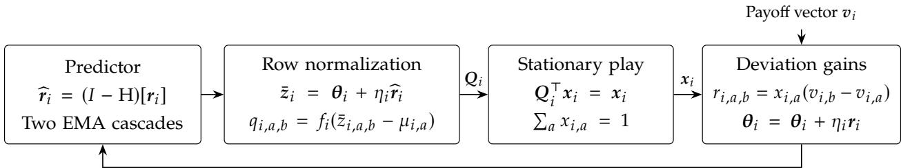

# Constant Swap Regret in General-Sum Games via Optimistic Transition Matrices

Tung Mai Adobe Research

## Abstract

We give deterministic and uncoupled learning dynamics for finite multiplayer general-sum games under full-information feedback that achieve constant individual swap regret, independent of the horizon �. With � players and at most � actions each, every player’s individual swap regret is �(√� � log � log5/2(��)) at every finite horizon. Each player predicts the deviation gains, then uses these predictions to update a row-stochastic transition matrix, and plays its stationary distribution. The proof combines a potential argument exploiting stationarity with a two-scale higherorder prediction analysis, using rooted-tree representations to handle the nonlinear dependence of deviation gains on the players’ stationary distributions. An adversarially robust variant, obtained through a generic common-prefix switching wrapper, preserves the self-play bound up to a universal constant and guarantees individual swap regret at most $7 { \sqrt { m T \log m } }$ in the adversarial setting.

## 1 Introduction

Online learning provides a general framework for sequential decision-making in an unknown and potentially changing environment: at each round, a learner acts, observes feedback, and updates its behavior. Its central performance measure is regret, which measures the learner’s performance against a prescribed class of hindsight benchmarks. This viewpoint is especially natural in repeated games, where each player is an online learner and the feedback faced by one player is generated by the evolving behavior of the others. Correspondingly, no-regret guarantees translate into convergence toward game-theoretic equilibrium notions.

External regret compares with the best fixed action in hindsight, while swap regret allows a deviation map and compares against the best fixed deviation map in hindsight. If every player has small average swap regret, the time-averaged product distribution of play is an approximate correlated equilibrium (CE) (Aumann, 1974, Blum and Mansour, 2007). A constant individual swap-regret bound gives an �(1/�) CE rate (see Appendix A.1).

In the adversarial setting, the Blum–Mansour reduction (Blum and Mansour, 2007) gives $O ( { \sqrt { m T \log m } } )$ swap regret. In the self-play setting, however, the players mutually determine each other’s payof vectors. This interaction allows better swap regret bounds (Chen and Peng, 2020, Anagnostides et al., 2022a,b, Tsuchiya, 2026). In light of the recent constant external-regret results (Liu et al., 2026, Abbadi et al., 2026), we ask whether swap-regret admits the same guarantee:

Results. Under full-information feedback, we give such learning dynamics. Let � be the number of players and $m _ { i }$ be the number of actions of player �. For $m _ { i } \leq m$ , every player’s individual swap regret is $O \left( { \sqrt { n } } \right.$ � log � $\log ^ { 5 / 2 } ( n m ) \big )$ at every finite horizon. The dynamics are horizon-free: they do not need to know � in advance. An adversarially robust variant, obtained through a generic common-prefix switching wrapper, preserves the self-play bound up to a universal constant and gives individual swap regret at most $7 { \sqrt { m _ { i } T \log m _ { i } } }$ in the adversarial setting.

Technical Overview. We build on the Blum–Mansour representation of swap regret. For each source action $a , \mathsf { a }$ player maintains a distribution over the destination actions �. These distributions form the rows of a transition matrix, and the player uses its stationary distribution as its mixed strategy. The deviation gain assigned to changing action � to action � is $x _ { i , a } ( v _ { i , b } - v _ { i , a } )$ . Therefore, controlling the best deviation in each row controls the player’s swap regret. We update each row optimistically, using cumulative past gains together with a forecast of its next gain.

Let $\eta _ { i }$ be player $i \prime \mathrm { s }$ learning rate. Let $E ^ { 2 }$ be an upper bound on each player’s cumulative squared error in forecasting its row gains. Let $S _ { i } \geq 0$ denote player $i \prime \mathrm { s }$ cumulative row curvature. Concretely, this curvature is the local Hessian quadratic form of a row potential, evaluated in the direction of the observed row gain, and therefore measures how sensitively the row probabilities respond to changes in their scores. The optimistic potential analysis gives a key inequality

$$
\eta _ { i } \mathrm { S w a p R e g } _ { i } ( T ) + S _ { i } \leq 2 m _ { i } \log m _ { i } + \eta _ { i } ^ { 2 } E ^ { 2 } .\tag{1.1}
$$

The main remaining task is to bound � by a constant independent of �. Since the predictor’s error is a filtered high-order diference of the deviation gain sequence, this requires understanding how the gains change as the players update their strategies. This is more challenging than in recent constant external-regret results. There, a player’s payof vector depends multilinearly on the opponents’ strategies and not on the player’s own strategy. Therefore, changes in the payof vector can be organized according to which opponent’s strategy changed. Under the Blum–Mansour representation, however, each row’s deviation gain also contains the stationary mass $x _ { i , a } ,$ which depends nonlinearly on every row of player $i \prime \mathrm { s }$ transition matrix. Consequently, grouping these changes only by player is too coarse to capture the resulting within-player coupling. On the other hand, working immediately with all individual transitions would incur the full action-dependent sensitivity of the stationary distribution and lead to poor dependence on �.

We overcome this dificulty through a two-stage analysis based on the Markov-chain tree theorem (Anantharam and Tsoucas, 1989), which represents stationary play as an average over rooted directed trees. The first stage keeps the change grouped by player and exploits centering across players. Concretely, diferentiating the product-tree distribution yields centered player contributions that are independent across players, so an $L ^ { 2 }$ moment bound combines their coeficients in quadrature. Thus, the learning rates combine through $\left( \sum _ { i } \eta _ { i } ^ { 2 } \right) ^ { 1 / 2 }$ , rather than $\begin{array} { r } { \sum _ { i } \eta _ { i } . } \end{array}$ , which preserves a final $\sqrt { n }$ dependence. After $\ell = \Theta ( \log ( n m ) )$ such backward-diference steps, the total weight of the terms that still require a transition-level sensitivity bound has been attenuated by a factor of order $\kappa ^ { \ell }$ where $0 < \kappa < 1$ is a suficiently small universal constant. It is then small enough to apply the more expensive, action-dependent curvature bound without spoiling the dependence on �.

In the second stage, the proof records the individual transition indices $( i , a , b )$ encountered as further diferences are taken. If an index has appeared before, its new contribution can be paired with the earlier one, and this pair is bounded by the curvature energy. Thus only a newly encountered transition index needs to be tracked further. Since there are only $\begin{array} { r } { N = \dot { \sum _ { i } ^ { } } m _ { i } ^ { 2 } } \end{array}$ transition indices, there can be at most � fresh-index continuations. The rooted-tree representation also provides the sparsity needed to avoid extra factors of �: each sampled gain is associated with a single source action, and a directed tree contains at most one outgoing edge from that source action. The predictor’s two EMA cascades mirror these two stages: an ℓ-step player-level stage followed by an �-step transition-level stage.

To close the argument, let $Y ^ { 2 }$ denote a suitable weighted aggregate of the curvature energies $S _ { i }$ Since swap regret is nonnegative, from (1.1), we can show that

$$
\begin{array} { r } { Y ^ { 2 } \le B + \alpha E ^ { 2 } , } \end{array}
$$

where � and � may depend on the game dimensions but not on �. The two-stage prediction analysis gives a complementary inequality

$$
E \le C + \beta E + \tau _ { \ell } Y ,
$$

where � is universal, $\beta$ is small, and $\tau _ { \ell }$ is exponentially small in the depth $\ell = \Theta ( \log ( n m ) )$ of the first stage. Choosing the parameters so that $\tau _ { \ell } \sqrt { B } = O ( 1 )$ and $\beta + \tau _ { \ell } { \sqrt { \alpha } } < 1$ gives $E = O ( 1 )$ . Substituting back in (1.1) gives the constant swap-regret bound.

Finally, we obtain adversarial robustness through a common-prefix switching wrapper. An immediate switch from the base dynamics to adversarial dynamics would retain the self-play budget additively. We instead run adversarial dynamics for a common initial phase, initialize all base dynamics afresh, and permanently switch a player to freshly initialized adversarial dynamics if its base-phase regret crosses a given threshold. The initial phase absorbs the base budget into the all-horizon $O ( { \sqrt { m _ { i } T \log m _ { i } } } )$ envelope, and in the self-play setting the threshold is never triggered.

## 1.1 Related work

Regret benchmarks and equilibrium learning. Correlated equilibrium originates with Aumann (1974). The learning-to-CE connection was developed through calibrated learning and regret-based adaptive procedures by Foster and Vohra (1997), Hart and Mas-Colell (2000). The classical reduction of Blum and Mansour (2007) converts external-regret guarantees into swap regret by maintaining one learner per source action and playing the stationary distribution of its transition matrix. More generally, Greenwald and Jafari (2003) study regret with respect to a prescribed deviation family, and Gordon et al. (2008) connect this Φ-regret viewpoint to external-regret learning over transformations and fixed-point computation.

External and swap regret in self-play. Optimistic learning exploits predictable payof sequences (Rakhlin and Sridharan, 2013), and the variation-minus-movement analysis of Syrgkanis et al. (2015) provides a central framework for exploiting predictable feedback in multiplayer games. For external regret, this line yields polylogarithmic bounds in finite games (Daskalakis et al., 2021), logarithmic bounds in general convex games (Farina et al., 2022), and logarithmic-in-� regret through the adaptive pacing of Cautious Optimism (Soleymani et al., 2025). More recent results obtain constant external regret through stabilized higher-order optimism (Liu et al., 2026, Abbadi et al., 2026).

For swap regret in the present full-information setting, Chen and Peng (2020) obtain $T ^ { 1 / 4 }$ horizon dependence with BM–OMWU and, in Appendix D, with an optimistic fixed-point construction over all swap maps. Anagnostides et al. (2022a) give polylogarithmic bounds through BM–OMWU and SL–OMWU, while Anagnostides et al. (2022b) obtain a logarithmic bound with BM–OFTRL. Tsuchiya (2026) further improve the BM–OFTRL horizon dependence to a sublogarithmic bound.

Table 1 summarizes these results. Our result is a constant swap regret bound independent of �. At the same time, we achieve the best polynomial dependence on both � and � over the previous $o _ { n , m } ( \log T )$ results.

Comparator-adaptive guarantees and alternative reductions. Lu et al. (2025) interpolate external, internal, and swap regret through comparator sparsity. Building on this line, Hait et al. (2025) improve comparator-adaptive Φ-regret guarantees and obtain constant regret in a class of generalsum games satisfying nonnegative social external regret, namely $\begin{array} { r } { \sum _ { i } \mathrm { E x t R e } \mathbf { \bar { g } } _ { i } ( T ) \geq 0 } \end{array}$ for every play sequence and horizon under the unclipped external-regret convention. This class was studied by Anagnostides et al. (2022c). Our constant swap-regret guarantee holds in arbitrary finite general-sum games. Beyond the classical per-action BM reduction, Dagan et al. (2024), Peng and Rubinstein (2024) achieve any fixed target level of average swap regret with round complexity polylogarithmic in the number of actions. These action–accuracy tradeofs are distinct from a constant cumulative swap-regret guarantee in self-play. In convex domains, Anagnostides et al. (2026) use response-based approachability to minimize linear and profile swap regret and extend their results to polynomial-dimensional deviation families. These broader comparator classes lie outside the finite normal-form swap-regret setting studied here. Finally, Tsuchiya et al. (2026) obtain scale-free and scale-invariant swap regret $\bar { O ( U _ { \mathrm { m a x } } n ^ { 3 / 2 } m ^ { 5 / 2 } \log T ) }$ in general-sum games.

Adversarial robustness. Adversarial robustness in this line is obtained through closely related certificate-triggered constructions. Earlier work describes these as a wrapper or an adaptive choice of learning rate (Chen and Peng, 2020, Daskalakis et al., 2021, Anagnostides et al., 2022a), while the closest recent constructions use a switching rule that switches a player permanently to adversarial dynamics after a self-play certificate fails (Anagnostides et al., 2022b, Tsuchiya, 2026, Abbadi et al., 2026). Such an immediate switch retains the self-play budget additively. Our approach adds a common phase before a fresh simultaneous start of the base dynamics, allowing that budget to be absorbed into the all-horizon $O ( { \sqrt { m T \log m } } )$ adversarial guarantee. Our approach is black-box in the underlying self-play dynamics. Therefore, it can strengthen existing results with anytime self-play regret bounds by removing their additive self-play budget whenever a common-prefix absorption condition holds.
<table><tr><td>Reference</td><td>Algorithm</td><td>Self-play setting</td><td>Adversarial setting</td></tr><tr><td>Blum and Mansour (2007)</td><td>BM-MWU</td><td> $O ( { \sqrt { m T \log m } } )$ </td><td> $O ( { \sqrt { m T \log m } } )$ </td></tr><tr><td>Chen and Peng (2020)</td><td>BM-OMWU</td><td> $O ( \sqrt { n } ( m \log m ) ^ { 3 / 4 } T ^ { 1 / 4 } )$ </td><td> $\widetilde { O } ( \sqrt { m T } + \sqrt { n } m ^ { 3 / 4 } T ^ { 1 / 4 } )$ </td></tr><tr><td>Chen and Peng (2020, Appendix D)</td><td>Optimistic swap-map Hedge (all mm maps)</td><td> $O ( \sqrt { n } m ^ { 5 / 4 } ( \log m ) ^ { 3 / 4 } T ^ { 1 / 4 } )$ </td><td> $O ( { \sqrt { m T \log m } } )$ </td></tr><tr><td>Anagnostides et al. (2022a)</td><td>SL-OMWU / adaptive variant (via internal regret)</td><td> $O ( n m \log m \log ^ { 4 } T )$ </td><td> $O ( n m \log m \log ^ { 4 } T + m \sqrt { T \log m } )$ </td></tr><tr><td>Anagnostides et al. (2022a)</td><td>BM-OMWU</td><td> $O ( n m ^ { 4 } \log m \log ^ { 4 } T )$ </td><td></td></tr><tr><td>Anagnostides et al. (2022b)</td><td>BM-OFTRL (log-barrier)</td><td> $O ( n m ^ { 5 / 2 } \log T )$ </td><td> $O ( n m ^ { 5 / 2 } \log T + { \sqrt { m T \log m } } )$ </td></tr><tr><td>Tsuchiya (2026)</td><td>BM-OFTRL (hybrid)</td><td> $O ( n m ^ { 2 } { \sqrt { \log m \log T } } )$ </td><td> $O ( n m ^ { 2 } { \sqrt { \log m \log T } } + { \sqrt { m T \log m } } )$ </td></tr><tr><td>This work</td><td>BM with optimistic transition matrices</td><td> $O \left( { \sqrt { n } } m \log m \log ^ { 5 / 2 } ( n m ) \right)$ </td><td> $O ( { \sqrt { m T \log m } } )$ </td></tr></table>

Table 1: Comparisons of selected algorithms for individual swap regret in full-information �-player games with at most � actions. BM denotes Blum–Mansour, and SL denotes Stoltz–Lugosi. $\widetilde { O }$ suppresses logarithmic factors in $m , n , T$

## 2 Model and main results

We may assume each player $i \in [ n ]$ has $m _ { i } \geq 2$ actions and a fixed payof function $u _ { i } : \prod _ { j } [ m _ { j } ]  [ 0 , 1 ]$ Let $m = { \mathrm { m a x } } _ { i } m _ { i }$ . At round �, the players simultaneously choose mixed strategies $\pmb { x } _ { i } ^ { ( t ) } \in \Delta _ { m _ { i } }$ , and player � observes the expected payof $v _ { i , a } ^ { ( t ) } = u _ { i } ( a , \pmb { x } _ { - i } ^ { ( t ) } ) , \forall a \in [ m _ { i } ]$ . This is full-information feedback since player � observes the exact expected payof of every action. The learning dynamics are uncoupled and horizon-free: player � uses only public action counts, its own state, and past payof vectors, and does not require the final horizon �. Each mixed strategy is a deterministic output of the dynamics. The self-play setting is when every player follows the same dynamics. In the adversarial setting, the payof vector may instead be any arbitrary vector in $[ 0 , 1 ] ^ { m _ { i } }$ each round.

Let $\begin{array} { r } { \mathcal { I } _ { i } = \{ ( i , a , b ) : a , b \in [ m _ { i } ] \} , \mathcal { I } = \bigcup _ { i } \mathcal { I } _ { i } , } \end{array}$ and $\begin{array} { r } { N = | \bar { \mathcal { I } } | = \sum _ { i } m _ { i } ^ { 2 } } \end{array}$ . We call each $e \in \mathcal { I }$ a transition index. Define pairwise deviation gains and player $i \prime \mathrm { s }$ individual swap regret by

$$
\begin{array} { r l } & { ~ r _ { i , a , b } ^ { ( t ) } = x _ { i , a } ^ { ( t ) } ( v _ { i , b } ^ { ( t ) } - v _ { i , a } ^ { ( t ) } ) , } \\ & { \mathrm { S w a p R e g } _ { i } ( T ) = \underset { \varphi : [ m _ { i } ] \to [ m _ { i } ] } { \operatorname* { m a x } } \underset { t = 1 } { \overset { T } { \sum } } \underset { a } { \sum } r _ { i , a , \varphi ( a ) } ^ { ( t ) } = \underset { a } { \sum } \underset { b } { \operatorname* { m a x } } \underset { t = 1 } { \overset { T } { \sum } } r _ { i , a , b } ^ { ( t ) } \geq 0 . } \end{array}
$$

The equality follows because the deviation can be chosen independently for each action. Nonnegativity follows by including the identity map.

The proof uses two mixed row norms. For each player � and each $\pmb { w } _ { i } = ( w _ { i , a , b } ) _ { a , b \in [ m _ { i } ] }$ , let

$$
\left\| { \boldsymbol w } _ { i } \right\| _ { \infty , 2 } ^ { 2 } = \sum _ { a } \operatorname* { m a x } | { \boldsymbol w } _ { i , a , b } | ^ { 2 } , \qquad \left\| { \boldsymbol w } _ { i } \right\| _ { \infty , 1 } = \sum _ { a } \operatorname* { m a x } | { \boldsymbol w } _ { i , a , b } | , \qquad \left\| { \boldsymbol w } _ { i } \right\| _ { \infty , 1 ; T } ^ { 2 } = \sum _ { t = 1 } ^ { T } \left\| { \boldsymbol w } _ { i } ^ { ( t ) } \right\| _ { \infty , 1 } ^ { 2 } .
$$

We have $\| w _ { i } \| _ { \infty , 2 } \leq \| w _ { i } \| _ { \infty , 1 }$ and $\left\| r _ { i } ^ { ( t ) } \right\| _ { \infty , 1 } \leq 1$

Public parameters.

$$
A _ { i } = m _ { i } \log m _ { i } , \quad A = \sum _ { i } A _ { i } , \quad \ell = \ell _ { 0 } + \lceil \log ( 2 + n + N ) \rceil , \quad k = \ell + 1 , \quad g = c / k ^ { 5 / 2 } .\tag{2.1}
$$

Here $c > 0$ is a suficiently small universal constant and $\ell _ { 0 }$ is a suficiently large universal integer. The default rates are

$$
\eta _ { i } = g \sqrt { A _ { i } / A } , \qquad \sum _ { i } \eta _ { i } ^ { 2 } = g ^ { 2 } .\tag{2.2}
$$

We call the learning dynamics of Algorithm 1 the base dynamics.

Theorem 2.1 (Constant swap regret). There exist universal choices of $c > 0$ and $\ell _ { 0 } \in \mathbb { N }$ such that, for everyfinite game, if all players simultaneously use Algorithm 1 with the public parameters above, then every player � satisfies, for every $T \geq 1$

$$
\mathrm { S w a p R e g } _ { i } ( T ) \leq { \frac { 4 } { c } } k ^ { 5 / 2 } { \sqrt { A _ { i } A } } = O \left( { \sqrt { n } } m \log m \log ^ { 5 / 2 } ( n m ) \right) .
$$

These learning dynamics are deterministic, uncoupled, and horizon-free.

Remark 2.2 (Unequal action counts). For the base dynamics, one may instead set $\textstyle U = \sum _ { j } A _ { j } ^ { 2 }$ and $\eta _ { i } = g A _ { i } / \sqrt { U }$ . The same proof gives max� $\begin{array} { r } { \mathrm { S w a p R e g } _ { i } ( T ) \le \frac { 4 } { c } k ^ { 5 / 2 } \sqrt { U } } \end{array}$ for every prefix. This equals the default worst-player bound for equal action counts and can improve it by a factor $\Theta ( n ^ { 1 / 4 } )$ for highly unequal action counts. Appendix A.4 gives the details.

Theorem 2.3 (Adversarial robustness). The dynamics obtained by instantiating Algorithm 2 with Algorithm 1 and the default parameters satisfy: in the adversarial setting,

$$
{ \mathrm { S w a p R e g } } _ { i } ( T ) \leq 7 { \sqrt { A _ { i } T } } = O \left( { \sqrt { m T \log m } } \right)
$$

and in the self-play setting,

$$
\mathrm { S w a p R e g } _ { i } ( T ) \leq { \frac { 1 6 } { c } } k ^ { 5 / 2 } { \sqrt { A _ { i } A } } = O \left( { \sqrt { n } } m \log m \log ^ { 5 / 2 } ( n m ) \right)
$$

## 3 Optimistic transition-matrix dynamics

This section presents the main dynamics. In each round, player � combines a prediction of its next pairwise deviation-gain matrix with its cumulative gains into a score matrix. A smooth rownormalization function converts each score row into a probability distribution. These probability rows form a transition matrix whose stationary distribution is played. Sections 3.1 and 3.2 define the normalization function and predictor, respectively, before Algorithm 1 combines them.

Figure 1 summarizes the feedback loop. In particular, the deviation gains depend on the player’s own stationary strategy as well as its observed payof vector.

  
Update predictor state after observing feedback  
Figure 1: Optimistic transition-matrix dynamics. Each row is normalized through $f _ { i }$ with its own shift $\mu _ { i , a , }$ and the player uses the resulting stationary strategy. $\theta _ { i }$ denotes the cumulative score.

## 3.1 Smooth row normalization

First we explain the normalization process for a score row $z \in \mathbb { R } ^ { m _ { i } }$ . For $s \in \mathbb { R } ,$ define

$$
u ( s ) = { \frac { { \sqrt { s ^ { 2 } + 4 } } - s } { 2 } } , \qquad t _ { + } ( s ) = { \frac { { \sqrt { s ^ { 2 } + 4 } } + s } { 2 } } = u ( s ) ^ { - 1 } , \qquad f _ { i } ( s ) = \beta _ { i } { \frac { ( 1 + t _ { + } ( s ) / d _ { i } ) ^ { d _ { i } } } { 1 + u ( s ) + ( \delta / 4 ) u ( s ) ^ { 2 } } } .\tag{3.1}
$$

$f _ { i }$ is smooth, positive, strictly increasing, and ranges from zero to infinity. For $z \in \mathbb { R } ^ { m _ { i } }$ , define

$$
q _ { i , b } ( z ) = f _ { i } ( z _ { b } - \mu ) , \qquad \sum _ { b } f _ { i } ( z _ { b } - \mu ) = 1 .\tag{3.2}
$$

For each score row $z , \mu = \mu _ { i } ( z )$ is its own unique normalization shift, so that $\begin{array} { r } { \sum _ { b } f _ { i } ( z _ { b } - \mu ) = 1 } \end{array}$

## 3.2 Two EMA cascades for the predictor

Let S be the backward shift and $\boldsymbol { \mathrm { D } } = \boldsymbol { I } - \boldsymbol { \mathrm { S } } ,$ , with zero prehistory. For $r \geq 1$ , let $\begin{array} { r } { \rho _ { r } = \frac { r } { r + 1 } } \end{array}$ . We define the following operators:

$$
\mathrm { R } _ { r } = ( I - \rho _ { r } S ) ^ { - 1 } , \qquad \mathrm { F } _ { r } = \mathrm { R } _ { r } \mathrm { D } , \qquad \mathrm { H } = \mathrm { D } ^ { 3 } \mathrm { F } _ { \ell } ^ { \ell } \mathrm { F } _ { N } ^ { N } .
$$

The predictor is $\widehat { \boldsymbol { r } } = ( I - \operatorname { H } ) [ \boldsymbol { r } ]$ . These are exponential moving average (EMA) cascades. Every factor of H has current-input coeficient one, so the current input cancels in � − H and the predictor depends only on past inputs. The state variables in Algorithm 1 give an implementation of this predictor.

Algorithm 1 Base learning dynamics for player �   
Input. Public parameters from equations (2.1) and (2.2) and Appendix A.2, with row normalization (3.2).   
State. Initialize the $m _ { i } \times m _ { i }$ arrays $\theta , a _ { 1 } , \ldots , a _ { N + \ell } , c _ { 1 } , c _ { 2 } , c _ { 3 }$ to zero. Let $\nu _ { j } = ( N + 1 ) ^ { - 1 }$ for $j \leq N$ and   
$\nu _ { j } = ( \ell + 1 ) ^ { - 1 }$ for $j > N .$   
1: for $t = 1 , 2 , \ldots$ . do   
2: $\begin{array} { r } { \widehat { r } \gets \sum _ { j = 1 } ^ { N + \ell } a _ { j } + 3 c _ { 1 } - 3 c _ { 2 } + c _ { 3 } } \end{array}$   
3: $\overline { z }  \pmb \theta + \eta _ { i } \widehat r$ ⊲ raw row score   
4: Normalize each row of � by (3.2) or Appendix H. Form �. ⊲ row normalization   
5: Solve $\begin{array} { r } { Q ^ { \top } x = x , \sum _ { a } x _ { a } = 1 . } \end{array}$ , and play �.   
6: Observe � and set $r _ { a , b } \gets x _ { a } ( v _ { b } - v _ { a } )$ for all $a , b .$   
7: $\pmb \theta \gets \pmb \theta + \eta _ { i } \pmb r ,$ then � $\gets r$   
8: for $j = 1 , \ldots , N + \ell$ do   
9: $\begin{array} { r } { \pmb { u }  \pmb { u } - \pmb { a } _ { j } , } \end{array}$ , then ${ \pmb a } _ { j } \gets { \pmb a } _ { j } + \nu _ { j } { \pmb u }$   
10: end for   
11: $( c _ { 3 } , c _ { 2 } , c _ { 1 } ) \gets ( c _ { 2 } , c _ { 1 } , { u } )$ ⊲ simultaneously   
12: end for

Remark 3.1. In the exact-real computation model of Appendix H, with public parameters supplied as exact constants, Algorithm 1 uses polynomially many operations per round in $n , m ,$ and log � for each player.

Write $a _ { j } ^ { ( t ) }$ for the state entering round � and $\pmb { u } _ { j } ^ { ( t ) }$ for the residual produced after cascade stage � in that round, with $u _ { 0 } ^ { ( t ) } = r ^ { ( t ) }$ and $c ^ { ( t ) } = u _ { N + \ell } ^ { ( t ) } .$ . The update gives $[ I - ( 1 - \nu _ { j } ) \mathsf { S } ] \boldsymbol { u } _ { j } = \mathsf { D } \boldsymbol { u } _ { j - 1 }$ , where $\nu _ { j } = ( N + 1 ) ^ { - 1 }$ in the first cascade and $\nu _ { j } = ( \ell + 1 ) ^ { - 1 }$ in the second. Hence

$$
c = \mathrm { F } _ { \ell } ^ { \ell } \mathrm { F } _ { N } ^ { N } r , \qquad \sum _ { j } a _ { j } ^ { ( t ) } = r ^ { ( t ) } - c ^ { ( t ) } , \qquad r - \widehat { r } = \mathrm { D } ^ { 3 } c = \mathrm { H } [ r ] .
$$

Appendix G proves the depth-uniform filter bounds.

## 3.3 Cumulative, raw, and efective scores

We define the cumulative score and the raw score passed to row normalization, respectively:

$$
\pmb { \theta } _ { i } ^ { ( t ) } : = \eta _ { i } \sum _ { s \leq t } \pmb { r } _ { i } ^ { ( s ) } , \qquad \bar { z } _ { i } ^ { ( t ) } : = \pmb { \theta } _ { i } ^ { ( t - 1 ) } + \eta _ { i } \widehat { \pmb { r } } _ { i } ^ { ( t ) }
$$

Appendix H shows that the finite row normalization solver returns an efective score

$$
z _ { i } ^ { ( t ) } = \overline { { z } } _ { i } ^ { ( t ) } + \eta _ { i } \varepsilon _ { i } ^ { ( t ) } , \qquad \left\| \varepsilon _ { i } ^ { ( t ) } \right\| _ { \infty , 1 } \leq ( t + 1 ) ^ { - 2 } , \qquad \sum _ { s = 1 } ^ { T } \left\| \varepsilon _ { i } ^ { ( s ) } \right\| _ { \infty , 1 } ^ { 2 } \leq 1 .\tag{3.3}
$$

Exact normalization corresponds to $\varepsilon _ { i } ^ { ( t ) } = 0$ . Using ${ \widehat { \pmb { r } } } _ { i } = ( I - \operatorname { H } ) [ { \pmb { r } } _ { i } ]$ and $\pmb { \theta } _ { i } ^ { ( t ) } = \pmb { \theta } _ { i } ^ { ( t - 1 ) } + \eta _ { i } \pmb { r } _ { i } ^ { ( t ) }$ , the efective score can be rewritten as

$$
z _ { i } ^ { ( t ) } = \pmb { \theta } _ { i } ^ { ( t ) } - \eta _ { i } \left( \mathrm { H } [ \pmb { r } _ { i } ] ^ { ( t ) } - \pmb { \varepsilon } _ { i } ^ { ( t ) } \right) .
$$

We therefore define the efective prediction error

$$
\xi _ { i } : = \mathrm { H } [ r _ { i } ] - \varepsilon _ { i } .
$$

Consequently,

$$
z _ { i } = \pmb { \theta } _ { i } - \eta _ { i } \xi _ { i } , \qquad \mathrm { D } z _ { i } = \eta _ { i } \big ( \pmb { r } _ { i } - \mathrm { D } \xi _ { i } \big ) .\tag{3.4}
$$

The filter bounds of Appendix G and (3.3) imply, for arbitrary payof-vector sequences,

$$
\left\| \widehat { \pmb { r } } _ { i } ^ { ( t ) } \right\| _ { \infty , 1 } \leq 9 7 , \qquad \left\| \pmb { \xi } _ { i } ^ { ( t ) } \right\| _ { \infty , 1 } \leq 9 7 .\tag{3.5}
$$

## 4 Proof of the constant swap-regret theorem

Fix a finite horizon �. We prove Theorem 2.1 for any fixed positive public rates satisfying

$$
\sum _ { i } \eta _ { i } ^ { 2 } \leq g ^ { 2 } .\tag{4.1}
$$

The default rates in (2.2) satisfy this condition. Recall that $\xi _ { i } = \mathrm { H } [ r _ { i } ] - \varepsilon _ { i }$ is player �’s efective prediction error, and define its cumulative size by

$$
E ^ { 2 } = \operatorname* { m a x } _ { i } \sum _ { t = 1 } ^ { T } \left\| \pmb { \xi } _ { i } ^ { ( t ) } \right\| _ { \infty , 1 } ^ { 2 } .
$$

For one normalized row $q = \pmb { q } _ { i } ( z )$ , define $h _ { i } ( f _ { i } ( s ) ) = f _ { i } ^ { \prime } ( s )$ and

$$
h _ { b } = h _ { i } ( q _ { b } ) , \qquad \sigma _ { b } = \frac { h _ { b } } { \sum _ { c } h _ { c } } , \qquad \widetilde { w } _ { b } = w _ { b } - \langle \sigma , w \rangle , \qquad K _ { z } ( w ) = \sum _ { b } h _ { b } \widetilde { w } _ { b } ^ { 2 } .\tag{4.2}
$$

Thus the row curvature is centered under normalized curvature weights. At the efective row scores, set

$$
b _ { i , a } ^ { ( t ) } = \frac { \eta _ { i } ^ { 2 } } { 8 } K _ { z _ { i , a } ^ { ( t ) } } ( \boldsymbol { r } _ { i , a } ^ { ( t ) } ) , \qquad S _ { i } = \sum _ { t = 1 } ^ { T } \sum _ { a } b _ { i , a } ^ { ( t ) } .
$$

Let $\beta _ { i }$ be the public row-normalization parameter from Appendix A.2, let $C _ { \omega }$ be the universal proof constant fixed in Appendix ${ \mathrm { A . } } 3 ,$ , and define

$$
\omega _ { i } = C _ { \omega } \frac { m _ { i } - 1 } { \beta _ { i } } , \qquad Y ^ { 2 } = \sum _ { i } \omega _ { i } S _ { i } , \qquad V = \sum _ { i } \omega _ { i } A _ { i } , \qquad \Lambda ^ { 2 } = \sum _ { i } \omega _ { i } \eta _ { i } ^ { 2 } , \qquad \eta _ { \mathrm { m a x } } = \operatorname* { m a x } { \eta _ { i } } .
$$

The proof rests on two bounds relating � and �. First, the row-potential argument gives

$$
\eta _ { i } \mathrm { S w a p R e g } _ { i } ( T ) + S _ { i } \leq 2 A _ { i } + \eta _ { i } ^ { 2 } E ^ { 2 } , \qquad Y ^ { 2 } \leq 2 V + \Lambda ^ { 2 } E ^ { 2 } .
$$

Second, the self-play prediction argument gives

$$
E \le C _ { 0 } + C _ { 1 } g E + \tau _ { \ell } Y , \qquad \kappa : = C _ { E } g k ^ { 5 / 2 } , \qquad \tau _ { \ell } : = C _ { P } k ^ { 2 } \kappa ^ { \ell } ,
$$

for universal constants $C _ { E } , C _ { 0 } , C _ { 1 } , C _ { P }$ . The factor $\tau _ { \ell }$ is crucial: the dimension-dependent quantity � enters only after its coeficient has been reduced exponentially in the first-stage depth ℓ. The public parameter choices allow the two bounds to be absorbed, yielding a constant bound on � and hence the claimed swap-regret bound.

Section 4.1 states the two bounds formally and carries out the absorption. Section 4.2 proves the row-potential bound. Sections 4.3–4.7 prove the prediction bound: Section 4.3 introduces the stationary-tree representation, and Section 4.4 gives the shared diferentiation and filtering setup. Section 4.5 performs the first ℓ player-centered diferences: it bounds some terms immediately and passes the others to the late stage with total absolute weight at most $\kappa ^ { \ell } ,$ , after accounting for the early filter. Section 4.6 records transition indices, charging repeated indices to $Y$ while only fresh indices continue. Section 4.7 combines the two stage bounds to prove the prediction inequality.

## 4.1 The energy and prediction bounds imply the theorem

We first record the two bounds precisely and close the feedback loop between � and �. The first bound is valid for arbitrary payof-vector sequences. It controls each player’s swap regret and bounds the weighted curvature energy in terms of the prediction error.

Lemma 4.1. For suficiently small universal $c ,$ all payof-vector sequences satisfying $\pmb { v } _ { i } ^ { ( t ) } \in [ 0 , 1 ] ^ { m _ { i } }$ for every player � and round � obey

$$
\eta _ { i } \mathrm { S w a p R e g } _ { i } ( T ) + S _ { i } \leq 2 A _ { i } + \eta _ { i } ^ { 2 } E ^ { 2 } , \qquad Y ^ { 2 } \leq 2 V + \Lambda ^ { 2 } E ^ { 2 } , \qquad \Lambda ^ { 2 } \leq g ^ { 2 } V .\tag{4.3}
$$

For the default rates, $\Lambda ^ { 2 } = g ^ { 2 } V / A$

The second bound is specific to self-play and runs in the complementary direction:

Lemma 4.2. There are universal constants $C _ { E } , C _ { 0 } , C _ { 1 } , C _ { P }$ such that, under (4.1) and the public parameter bounds of Appendix A.2, $i f \kappa = C _ { E } g k ^ { 5 / 2 } \leq 1 / 1 6$ and $\tau _ { \ell } = C _ { P } k ^ { 2 } \kappa ^ { \ell }$ , then the following holds in the self-play setting:

$$
{ \cal E } \le C _ { 0 } + C _ { 1 } g { \cal E } + \tau _ { \ell } Y .\tag{4.4}
$$

The factor $\tau _ { \ell }$ is essential because $V ,$ and hence the a priori size of $\boldsymbol { Y } ,$ depends on the game dimensions. Appendix A.3 makes $\tau _ { \ell } \sqrt { V }$ uniformly bounded. In particular, Appendix A.3 selects the universal constants so that

$$
\kappa \leq \frac { 1 } { 1 6 } , \qquad \tau _ { \ell } \sqrt { 2 V } \leq 1 , \qquad ( C _ { 1 } + 1 ) g \leq \frac { 1 } { 2 } .\tag{4.5}
$$

Combining (4.3) and (4.4) now closes the feedback loop. By Lemma 4.1,

$$
Y \leq { \sqrt { 2 V } } + \Lambda E \leq { \sqrt { 2 V } } + g { \sqrt { V } } E .
$$

Hence $\tau _ { \ell } Y \leq 1 + g E .$ , and Lemma 4.2 gives

$$
E \le C _ { 0 } + 1 + ( C _ { 1 } + 1 ) g E , \qquad E \le E _ { 0 } : = 2 ( C _ { 0 } + 1 ) .
$$

The choice of � also ensures $\eta _ { i } ^ { 2 } E _ { 0 } ^ { 2 } \leq 1 \leq A _ { i }$ . Returning to (4.3) and discarding $S _ { i } \geq 0$ yields

$$
\operatorname { S w a p R e g } _ { i } ( T ) \leq \frac { 3 A _ { i } } { \eta _ { i } } .\tag{4.6}
$$

For the default rates this is $3 k ^ { 5 / 2 } \sqrt { A _ { i } A } / c \le ( 4 / c ) k ^ { 5 / 2 } \sqrt { A _ { i } A }$ , which gives Theorem 2.1. It remains to prove Lemma 4.1 in Section 4.2 and Lemma 4.2 in Sections 4.3–4.7.

## 4.2 Stationarity yields the energy bound

This subsection proves Lemma 4.1. Define

$$
P _ { i } ( s ) = \int _ { - \infty } ^ { s } f _ { i } ( v ) d v , \qquad c _ { \Phi , i } = \operatorname* { m i n } _ { s } \{ P _ { i } ( s ) - s \} , \qquad \Phi _ { i } ( z ) = \mu _ { i } ( z ) + \sum _ { b } P _ { i } ( z _ { b } - \mu _ { i } ( z ) ) - c _ { \Phi , i } .\tag{4.7}
$$

The construction in Appendix B gives

$$
\nabla \Phi _ { i } ( z ) = q _ { i } ( z ) , \qquad \Phi _ { i } ( z ) \geq \operatorname* { m a x } _ { b } z _ { b } , \qquad 0 \leq \Phi _ { i } ( 0 ) \leq 2 \log m _ { i } , \qquad w ^ { \top } \nabla ^ { 2 } \Phi _ { i } ( z ) w = K _ { z } ( w ) ,\tag{4.8}
$$

together with the local curvature comparison used below. Write

$$
D _ { \Phi } ( { \pmb y } , z ) = \Phi _ { i } ( { \pmb y } ) - \Phi _ { i } ( z ) - \left. { \pmb q } _ { i } ( z ) , { \pmb y } - z \right. .
$$

Fix a row and a round, abbreviate $z = z _ { i , a } ^ { ( t ) } ,$ , and set

$$
\begin{array} { r } { \pmb { d } ^ { + } = \pmb { \theta } _ { i , a } ^ { ( t ) } - z = \eta _ { i } \pmb { \xi } _ { i , a } ^ { ( t ) } , \qquad \pmb { d } ^ { - } = \pmb { \theta } _ { i , a } ^ { ( t - 1 ) } - z = \eta _ { i } ( \pmb { \xi } _ { i , a } ^ { ( t ) } - \pmb { r } _ { i , a } ^ { ( t ) } ) . } \end{array}
$$

By (3.5), both displacements have sup norm at most $9 8 \eta _ { i }$ . The universal choice of � gives $9 \dot { 8 } \eta _ { i } \leq 9 8 c / k ^ { 5 / 2 } < \hat { 1 } / 8 ,$ so the local comparison applies on both segments. Taylor’s integral formula gives

$$
D _ { \Phi } ( z + d ^ { + } , z ) + D _ { \Phi } ( z + d ^ { - } , z ) \ge \frac { 1 } { 4 } \big ( K _ { z } ( d ^ { + } ) + K _ { z } ( d ^ { - } ) \big ) \ge b _ { i , a } ^ { ( t ) } .
$$

The second inequality uses $Q ( x ) + Q ( y ) \geq Q ( x - y ) / 2$ for every positive-semidefinite quadratic form �, together with $d ^ { + } - d ^ { - } = \eta _ { i } \pmb { r } _ { i , a } ^ { ( t ) } .$ . Also, by (B.5),

$$
2 D _ { \Phi } ( z + d ^ { + } , z ) \leq \mathopen { } \mathclose \bgroup \left\| d ^ { + } \aftergroup \egroup \right\| _ { \infty } ^ { 2 } .
$$

Subtracting the two Taylor expansions yields

$$
\Phi _ { i } ( \pmb { \theta } _ { i , a } ^ { ( t ) } ) - \Phi _ { i } ( \pmb { \theta } _ { i , a } ^ { ( t - 1 ) } ) \leq \eta _ { i } \left. \pmb { q } _ { i , a } ^ { ( t ) } , \pmb { r } _ { i , a } ^ { ( t ) } \right. + \eta _ { i } ^ { 2 } \left. \pmb { \xi } _ { i , a } ^ { ( t ) } \right. _ { \infty } ^ { 2 } - b _ { i , a } ^ { ( t ) } .
$$

The linear terms vanish after summing the source rows, because stationarity gives

$$
\sum _ { a , b } \boldsymbol { q } _ { i , a , b } ^ { ( t ) } \boldsymbol { r } _ { i , a , b } ^ { ( t ) } = ( \boldsymbol { x } _ { i } ^ { ( t ) } ) ^ { \top } ( \boldsymbol { Q } _ { i } ^ { ( t ) } - I ) \boldsymbol { v } _ { i } ^ { ( t ) } = 0 .
$$

Telescoping over time and using (4.8) gives

$$
\sum _ { a } \Phi _ { i } ( \pmb { \theta } _ { i , a } ^ { ( T ) } ) \geq \eta _ { i } \sum _ { a } \operatorname* { m a x } _ { b } \sum _ { t = 1 } ^ { T } r _ { i , a , b } ^ { ( t ) } = \eta _ { i } S \mathbf { w a p R e g } _ { i } ( T ) , \qquad \sum _ { a } \Phi _ { i } ( 0 ) \leq 2 A _ { i } .
$$

Moreover,

$$
\sum _ { t = 1 } ^ { T } \sum _ { a } \left\| \xi _ { i , a } ^ { ( t ) } \right\| _ { \infty } ^ { 2 } \leq \sum _ { t = 1 } ^ { T } \left( \sum _ { a } \left\| \xi _ { i , a } ^ { ( t ) } \right\| _ { \infty } \right) ^ { 2 } = \sum _ { t = 1 } ^ { T } \left\| \xi _ { i } ^ { ( t ) } \right\| _ { \infty , 1 } ^ { 2 } \leq E ^ { 2 } .
$$

Therefore

$$
\eta _ { i } S \mathbf { w a p R e g } _ { i } ( T ) + S _ { i } \leq 2 A _ { i } + \eta _ { i } ^ { 2 } E ^ { 2 } .
$$

Multiplying by $\omega _ { i } ,$ , summing over players, and using $\operatorname { S w a p R e g } _ { i } ( T ) \geq 0$ gives

$$
Y ^ { 2 } \leq 2 V + \Lambda ^ { 2 } E ^ { 2 } .
$$

Finally, $\begin{array} { r } { \Lambda ^ { 2 } \ \le \ ( \operatorname* { m a x } _ { i } \omega _ { i } ) \sum _ { i } \eta _ { i } ^ { 2 } \ \le \ g ^ { 2 } V } \end{array}$ , while the default rates give $\Lambda ^ { 2 } = g ^ { 2 } V / A$ . This proves Lemma 4.1.

## 4.3 Probabilistic tree representation

This subsection introduces the probabilistic representation used to prove Lemma 4.2. Each deviation gain is represented as an expectation under a product distribution on rooted directed trees. Diferentiating that distribution produces a centered tree score. At trial scores $y ,$ let $\mathbb { P } _ { i , y } ^ { \mathrm { t r } }$ be the normalized distribution on rooted directed trees whose weights are products of transition entries, and let $\mathbb { P } _ { y } ^ { \mathrm { t r } } = \bigotimes _ { i } \mathbb { P } _ { i , y } ^ { \mathrm { t r } }$ . The tree theorem identifies each player’s root distribution with its stationary strategy. For a product-tree sample $T ,$ define

$$
G _ { i , a , b } ( T ) = \mathbf { 1 } _ { \left\{ a _ { i } ( T ) = a \right\} } \left[ u _ { i } ( b , { a } _ { - i } ( T ) ) - u _ { i } ( a , { a } _ { - i } ( T ) ) \right] .
$$

The root selects only one source row, so $\| G _ { i } ( T ) \| _ { \infty , 1 } \leq 1$ . Let

$$
\Gamma _ { i } ( y ) : = \mathbb { E } _ { \mathbb { P } _ { y } ^ { \mathrm { t r } } } G _ { i } , \qquad r _ { i } ^ { ( t ) } = \Gamma _ { i } ( z ^ { ( t ) } ) .
$$

For $t \geq 2 ,$ , consider interpolating between the two efective scores by

$$
\pmb { y } _ { \theta } ^ { ( t ) } = ( 1 - \theta ) z ^ { ( t - 1 ) } + \theta z ^ { ( t ) } , \qquad 0 \leq \theta \leq 1 .
$$

Since $G _ { i }$ has no explicit score dependence, the fundamental theorem of calculus and diferentiation of the tree distribution give

$$
\begin{array} { r l } & { \mathrm { D } r _ { i } ^ { ( t ) } = \Gamma _ { i } ( z ^ { ( t ) } ) - \Gamma _ { i } ( z ^ { ( t - 1 ) } ) } \\ & { \qquad = \displaystyle \int _ { 0 } ^ { 1 } \nabla _ { \mathrm { D } z ^ { ( t ) } } \Gamma _ { i } ( y _ { \theta } ^ { ( t ) } ) d \theta } \\ & { \qquad = \displaystyle \int _ { 0 } ^ { 1 } \mathbb { E } _ { \mathbb { P } _ { y _ { \theta } ^ { ( t ) } } ^ { \mathrm { t r } } } \bigg [ G _ { i } ( T ) \nabla _ { \mathrm { D } z ^ { ( t ) } } \ln \mathbb { P } _ { y _ { \theta } ^ { ( t ) } } ^ { \mathrm { t r } } ( T ) \bigg ] d \theta . } \end{array}\tag{4.9}
$$

Thus a backward diference of the gain is represented exactly as an integrated derivative of the tree distribution along the change in efective scores.

Write $I _ { e }$ for edge inclusion, with $I _ { e } = 0$ for diagonal indices. Diferentiating the normalized tree distribution in a deterministic direction � gives

$$
\nabla _ { w } \ln \mathbb { P } _ { y } ^ { \mathrm { t r } } = \sum _ { e } ( I _ { e } - \mathbb { E } I _ { e } ) \frac { h _ { e } } { q _ { e } } \widetilde { w } _ { e } .\tag{4.10}
$$

The uncentered score of player � has magnitude at most $2 \| w _ { i } \| _ { \infty , 1 }$ . Independence across players therefore implies

$$
\left\| \nabla _ { w } \ln \mathbb { P } _ { y } ^ { \mathrm { t r } } \right\| _ { L ^ { 2 } } \leq 2 \left( \sum _ { i } \| w _ { i } \| _ { \infty , 1 } ^ { 2 } \right) ^ { 1 / 2 } .\tag{4.11}
$$

Appendix D proves these identities and bounds. The early stage uses this player-centered bound, which does not involve $\omega _ { i }$ . The late stage retains the transition indices in (4.10) and uses the curvature-weighted bound.

## 4.4 From gain diferences to products of centered factors

By the solver guarantee (3.3),

$$
E \leq 1 + \operatorname* { m a x } _ { i } \| \mathrm { H } [ \pmb { r } _ { i } ] \| _ { \infty , 1 ; T } .
$$

A pointwise gain bound alone would give a bound growing as $\sqrt { T }$ . Instead, we use the diferences already present in H and expand only the terms not yet controlled.

The filter supplies a backward diference. Since $\mathrm { F } _ { r } = \mathrm { R } _ { r } \mathrm { D }$ and all factors commute,

$$
\mathrm { H } = \mathrm { R } _ { \ell } ^ { \ell } \mathrm { R } _ { N } ^ { N } \mathrm { D } ^ { N + \ell + 3 } .
$$

For $0 \leq p \leq \ell ,$ define

$$
{ \displaystyle \mathrm { K } _ { p } : = \mathrm { R } _ { \ell } ^ { \ell } \mathrm { R } _ { N } ^ { N } \mathrm { D } ^ { N + \ell + 3 - p } } .
$$

Then ${ \mathrm { K } } _ { p } = { \mathrm { K } } _ { p + 1 } { \mathrm { D } }$ for $p < \ell ,$ , and the first step is

$$
\mathrm { H } [ r _ { i } ] = \mathrm { K } _ { 0 } [ r _ { i } ] = \mathrm { K } _ { 1 } [ \mathrm { D } r _ { i } ] .
$$

We now follow the first two diferences of the gain to see what can be bounded and what must be expanded further.

The first diference separates error and gain directions. Fix $t \ \geq \ 2$ and interpolate $\begin{array} { r l } { \mathbf { \boldsymbol { y } } _ { \theta } ^ { ( t ) } = } & { { } } \end{array}$ $( 1 - \theta ) z ^ { ( t - 1 ) } + \theta z ^ { ( t ) }$ . In the following calculation, suppress the superscript (�) and write $\mathbb { E } _ { \theta }$ for expectation at $y _ { \theta }$ . For a product direction, use the shorthand $\eta \pmb { w } = ( \eta _ { j } \pmb { w } _ { j } ) _ { j = 1 } ^ { \hat { n } } . \mathrm { A p p l y i n g }$ (4.9) and using $\mathrm { D } z = \eta \pmb { r } - \eta \mathrm { D } \pmb { \xi } ,$ , we obtain

$$
\begin{array} { r l r } { \mathrm { D } r _ { i } = } & { - \displaystyle \int _ { 0 } ^ { 1 } \mathbb { E } _ { \theta } \left[ G _ { i } \nabla _ { \eta \mathrm { D } \xi } \ln \mathbb { P } _ { y _ { \theta } } ^ { \mathrm { t r } } \right] d \theta } & { + } & { \underbrace { \int _ { 0 } ^ { 1 } \mathbb { E } _ { \theta } \left[ G _ { i } \nabla _ { \eta r } \ln \mathbb { P } _ { y _ { \theta } } ^ { \mathrm { t r } } \right] d \theta } _ { \mathrm { e r r o r ~ d i r e c t i o n : ~ s t o p ~ a n d ~ b o u n d ~ u s i n g ~ \cal E } } . } \end{array}
$$

The error contribution has cumulative norm at most $C g E$ by (4.11) and

$$
\sum _ { j } \eta _ { j } ^ { 2 } \left\| \mathsf { D } \xi _ { j } \right\| _ { \infty , 1 ; T } ^ { 2 } \le 4 g ^ { 2 } E ^ { 2 } .
$$

$\operatorname { A t } t = 1$ , zero prehistory contributes the boundary impulse $\pmb { r } _ { i } ^ { ( 1 ) }$ , of source norm at most one. We call these contributions stopped: they are included in the final bound without taking further diferences.

A gain-direction distribution derivative creates an atom. For $e = ( j , a , b )$ and $\pmb { v } \in [ 0 , 1 ] ^ { m _ { j } }$ , define the local centered factor

$$
\chi _ { e , v } ^ { \lambda } ( \pmb { y } ) = \frac { h _ { e } ( \pmb { y } ) } { q _ { e } ( \pmb { y } ) } \big ( v _ { b } - \big < \sigma _ { j , a } ( \pmb { y } ) , \pmb { v } \big > \big ) .
$$

The gain-direction score in (4.10) is a centered sum of these factors over players, weighted by their learning rates and source probabilities. Fix $t \geq 2$ and $\theta \in [ 0 , 1 ]$ . Introduce an independent copy of the original tree sample and a separate gain sample:

$$
\begin{array} { r } { T , T ^ { \prime } \sim \mathbb { P } _ { \boldsymbol { y } _ { \boldsymbol { \theta } } ^ { ( t ) } } ^ { \mathrm { t r } } , \qquad S \sim \mathbb { P } _ { z ^ { ( t ) } } ^ { \mathrm { t r } } , } \end{array}
$$

with all three samples independent. Write $\mathbb { E } _ { t , \theta } ^ { + }$ for expectation under this enlarged distribution. The construction in Appendix E gives an order-zero atom $Z _ { \theta } ^ { ( 0 ) }$ , with player weights $\eta _ { j } / g ,$ , such that

$$
\mathbb { E } _ { \theta } \left[ G _ { i } ( T ) \nabla _ { \eta r ^ { ( t ) } } \ln \mathbb { P } _ { y _ { \theta } ^ { ( t ) } } ^ { \mathrm { t r } } ( T ) \right] = c _ { 0 } \mathbb { E } _ { t , \theta } ^ { + } \Big [ G _ { i } ( T ) Z _ { \theta } ^ { ( 0 ) } \Big ] , \qquad c _ { 0 } : = 2 B g \sqrt { \ell } .
$$

Here � is the universal constant in Lemma C.1. Indeed, averaging over ${ \pmb T } ^ { \prime }$ replaces $I _ { e } ( T ) - I _ { e } ( T ^ { \prime } )$ by $I _ { e } ( \pmb { T } ) - \mathbb { E } I _ { e } ,$ and averaging over � represents the gain direction by (D.2). Thus the equality holds after averaging over the auxiliary samples, not pointwise between the original score and the atom. We suppress the sample and score arguments of the atom.

Define the continuing sequence, for each fixed �, by

$$
\begin{array} { r } { \pmb { U } _ { \theta } ^ { ( t ) } : = \left\{ \begin{array} { l l } { \mathbb { E } _ { t , \theta } ^ { + } [ \pmb { G } _ { i } ( \pmb { T } ) Z _ { \theta } ^ { ( 0 ) } ] , } & { t \ge 2 , } \\ { 0 , } & { t \le 1 . } \end{array} \right. } \end{array}
$$

The first diference is therefore the exact sequence identity

$$
\mathrm { D } \boldsymbol { r } _ { i } = \boldsymbol { V } + c _ { 0 } \int _ { 0 } ^ { 1 } \boldsymbol { U } _ { \theta } d \theta .
$$

Here � contains the boundary impulse at $t = 1$ and the error-direction integral above for $t \geq 2$

The second diference adds a factor or raises its order. Fix one continuing sequence $u = u _ { \theta }$ whose integrand has the form $G Z ^ { ( 0 ) }$ , with $G = G _ { i } ( T )$ . For $t \geq 3$ , interpolate all its score arguments between times $t - 1$ and � and apply the product rule. Every sampling distribution contributes a derivative, including the distributions of the independent copy and the gain sample. A gaindirection distribution derivative creates a new order-zero atom; a gain derivative of the existing atom creates an order-one atom. Collecting the error directions into � gives the exact identity

$$
\begin{array} { r l r } { ( \mathrm { D } \boldsymbol { U } ) ^ { ( t ) } = \boldsymbol { V } ^ { ( t ) } \ } & { + } & { \displaystyle \int _ { \mathrm {  ~ \scriptstyle { \phi } ~ } _ { \mathrm { \tiny { ( f ) } \in \mathbb { \Psi } \mathrm { { } \tiny { ~ \delta } \mathrm { \tiny { ~ 1 } \ 6 t e r , 1 } } } } \left[ \boldsymbol { G } Z _ { \nu , 1 } ^ { ( 0 ) } Z _ { \nu , 2 } ^ { ( 0 ) } \right] d \nu \ } + \ \underbrace { \int _ { c _ { 2 } ( \nu ) \mathbb { E } _ { t , \nu , 2 } \left[ \boldsymbol { G } Z _ { \nu } ^ { ( 1 ) } \right] d \nu } } _ { \mathrm { \normalfont ~ \scriptstyle { \phi i f f e r e n t i a t e ~ t h e ~ e s i s t i n g ~ a t o m } ~ } } . } \end{array}
$$

The two integrals include all interpolation parameters and finite branching choices for their respective derivative families. Each $\mathbb { E } _ { t , \nu , k }$ uses the complete auxiliary-sample distribution of that branch, with the old observable � viewed as a function of the enlarged sample tuple. The coeficients $c _ { k } ( \nu )$ are independent of time; sample and score arguments of the atoms are suppressed. $\operatorname { A t } t = 2 ,$ set $\dot { \pmb { V } } ^ { ( 2 ) } = \pmb { U } ^ { ( 2 ) }$ and all continuing terms to zero; all terms are zero for $t \leq 1$ . As throughout the recursion, � denotes the stopped sequence for the expression currently being diferentiated.

More generally, a gain-direction distribution derivative adds $Z ^ { ( 0 ) }$ , whereas a gain derivative of $Z ^ { ( r ) }$ raises its order to $r + 1$ . An order-� atom contains normalized order-� derivatives of the local factor, together with auxiliary payof samples. Lemma C.1 and the exact constructions in Appendix E justify these two operations.

The form preserved by the recursion. Every continuing branch at depth � therefore has the form

$$
{ \cal U } ^ { ( t ) } = \mathbf { 1 } _ { \{ t > p \} } \mathbb { E } _ { t } \left[ G ( \Omega ) \prod _ { \nu = 1 } ^ { h } Z _ { \nu } ^ { ( r _ { \nu } ) } ( \Omega , y _ { \nu } ^ { ( t ) } ) \right] , \qquad \sum _ { \nu = 1 } ^ { h } ( r _ { \nu } + 1 ) \le p .
$$

Here $\mathbb { E } _ { t }$ averages the auxiliary product-tree samples Ω under their time-� distributions, and � is a fixed observable with $\| G \| _ { \infty , 1 } \leq 1$ . Each continuing diference adds one unit of degree. The indicator ensures positive represented gain times and produces a boundary impulse at the next diference. Initially there are no atoms, so the gain is a depth-zero expression. Throughout, an early expression means the admissible construction of Appendix E, including its sample-independence conditions and fixed convex-combination rules for the score arguments. The next subsection bounds this recursion.

## 4.5 Bounding the early expansion

During the first ℓ diferences, we avoid the weighted curvature energy �. Instead, player centering keeps the learning rates at the scale $( \sum _ { i } \eta _ { i } ^ { 2 } ) ^ { 1 / 2 } \leq g$ . We need two bounds: products of atoms remain normalized, and the total weight of the continuing branches becomes small.

Products of centered atoms remain controlled. Conditional on its own payof samples, each atom is a sum of independent centered player contributions, with squared weights summing to at most one. The local normalization and the fact that a tree has at most one outgoing edge from the selected source row bound each player’s summand. The normalization $2 \sqrt \ell$ then gives, by Lemma D.2,

$$
\left\| Z ^ { ( r ) } \right\| _ { L ^ { 2 \ell } } \leq 1 , \qquad \mathbb { E } \prod _ { \nu = 1 } ^ { h } | Z _ { \nu } ^ { ( r _ { \nu } ) } | ^ { 2 } \leq 1 \quad ( h \leq \ell ) .
$$

The product bound uses Hölder, not independence between atoms. Thus the integrand of every early expression has $L ^ { 2 }$ norm at most one. These are sample-moment bounds at each round, not yet bounds on the cumulative filtered norm.

Lemma C.1 bounds error derivatives of existing factors, while (4.11) bounds error derivatives of sampling distributions. Together with the two continuing operations in Section 4.4, they give the following exact closure, proved in Appendix E.

Lemma 4.3 (Early one-diference closure). Every depth-� early expression, $\begin{array} { r } { p \ < \ \ell , } \end{array}$ has an exact decomposition

$$
\mathrm { D } U = V + \int c ( \nu ) U _ { \nu } d \nu ,
$$

where � consists of the boundary impulse and error-direction terms, every $u _ { \nu }$ has early depth $p + 1 .$ , and the coeficients are time-independent. Moreover,

$$
\| V \| _ { \infty , 1 ; T } \leq 1 + C _ { E } ( p + 1 ) g E , \qquad \int | c ( \nu ) | d \nu \leq C _ { E } g \sqrt { \ell } ( p + 1 ) .
$$

Here � collects the interpolation parameters and finite branching choices from the two derivative families above. The factor $p + 1$ accounts for the number of distributions and the total order of existing factors. The extracted coeficients depend on fixed rates and representation choices, not on time, so they can be taken outside the time filters.

Filtering each exact decomposition. For a filter $\begin{array} { r } { \mathrm { K } = \sum _ { s \geq 0 } c _ { s } S ^ { s } } \end{array}$ , write $\begin{array} { r } { \left. \mathbf { K } \right. _ { \mathrm { k e r , 1 } } = \sum _ { s } \left| c _ { s } \right| } \end{array}$ . Backward shifts contract the finite-prefix norm, so

$$
\begin{array} { r } { \| \mathrm { K } [ W ] \| _ { \infty , 1 ; T } \leq \| \mathrm { K } \| _ { \mathrm { k e r } , 1 } \| W \| _ { \infty , 1 ; T } . } \end{array}
$$

The filter identity and Lemma 4.3 give

$$
\operatorname { K } _ { p } [ U ] = \operatorname { K } _ { p + 1 } [ V ] + \int c ( \nu ) \operatorname { K } _ { p + 1 } [ U _ { \nu } ] d \nu .
$$

We bound the first term using $\left\| \mathbf { K } _ { p + 1 } \right\| _ { \mathrm { k e r } , 1 } < 4 8 k ^ { p }$ , proved in Lemma G.1, and take another diference of each continuing expression in the second term.

Let $a _ { p }$ be the total absolute coeficient mass of the continuing branches at depth $p ,$ starting with $a _ { 0 } = 1$ . Each branch’s coeficient is the product of its one-step coeficients. The closure gives $a _ { p + 1 } \leq C _ { E } g \sqrt { \ell } ( p + 1 ) a _ { p }$ . Including the filter cost, for $p < \ell ,$

$$
a _ { p + 1 } k ^ { p + 1 } \leq C _ { E } g k \sqrt { \ell } \left( p + 1 \right) a _ { p } k ^ { p } \leq \kappa a _ { p } k ^ { p } ,
$$

because $p + 1 \leq k , { \sqrt { \ell } } \leq { \sqrt { k } } _ { \ast }$ , and $\kappa = C _ { E } g k ^ { 5 / 2 }$ . Hence

$$
a _ { p } k ^ { p } \leq \kappa ^ { p } \qquad ( 0 \leq p \leq \ell ) .\tag{4.12}
$$

For $\kappa \leq 1 / 1 6 ,$ the total early stopped contribution is at most

$$
4 8 \sum _ { p = 0 } ^ { \ell - 1 } \kappa ^ { p } [ 1 + C _ { E } ( p + 1 ) g E ] \leq C ( 1 + g E ) .
$$

At depth ℓ, define

$$
\begin{array} { r } { \mathrm { L } _ { 0 } : = \mathrm { D } ^ { 3 } \mathrm { F } _ { N } ^ { N } , \qquad \mathrm { K } _ { \ell } = \mathrm { R } _ { \ell } ^ { \ell } \mathrm { L } _ { 0 } . } \end{array}
$$

The remaining early resolvent has kernel mass $k ^ { \ell } ,$ , already included in $a _ { \ell } k ^ { \ell } \leq \kappa ^ { \ell } .$ . Thus, for the continuing depth-ℓ expressions,

$$
\| \mathrm { H } [ r _ { i } ] \| _ { \infty , 1 ; T } \leq C ( 1 + g E ) + \kappa ^ { \ell } \operatorname* { s u p } _ { \nu } \| \mathrm { L } _ { 0 } [ U _ { \nu } ] \| _ { \infty , 1 ; T } .\tag{4.13}
$$

The early stage has bounded all stopped terms without using �. Only the late-filtered expressions remain, and their total absolute weight, including the early filter cost, is at most $\kappa ^ { \ell }$

## 4.6 Late stage: charge repeated transition indices to curvature

It remains to bound $\mathrm { L } _ { 0 } [ U ]$ for each expression passed from the early stage. We now allow stopped terms to use �. In particular, gain derivatives of existing factors stop by Lemma C.1, rather than raising their orders. Only a residual part of a sampling-distribution derivative can continue. The main idea is: a first occurrence of a transition index stores a factor, and a repeated occurrence supplies the second factor needed for a curvature bound.

Separate the curvature-controlled score from the residual. For $e = ( i , a , b )$ , Lemma B.1 supplies a split

$$
\frac { h _ { e } } { q _ { e } } = \gamma _ { e } + \delta \alpha _ { e }
$$

with

$$
0 < \alpha _ { e } \leq 1 , \qquad \gamma _ { e } ^ { 2 } \leq C _ { \gamma } h _ { e } / \beta _ { i } , \qquad \delta \alpha _ { e } ^ { 2 } \leq C _ { \alpha } \sqrt { h _ { e } / \beta _ { i } } .\tag{4.14}
$$

The first curvature bound controls the entire centered �-score, by Lemma D.1:

$$
\mathbb { E } \left| \sum _ { e } ( I _ { e } - \mathbb { E } I _ { e } ) \gamma _ { e } \widetilde { w } _ { e } \right| ^ { 2 } \leq \sum _ { i , a } \omega _ { i } K _ { y _ { i , a } } ( { w _ { i , a } } ) .
$$

After the score comparison described below, this term stops using �. Only the �� residual is split by transition index. Its useful bound requires two factors of $\alpha _ { e , \ - }$ , whereas one distribution derivative supplies only one.

For a fresh index $e = ( i , a , b )$ and a payof vector $\pmb { v } \in [ 0 , 1 ] ^ { m _ { i } }$ , retain the bounded centered factor

$$
\begin{array} { r } { \chi _ { e , v } ^ { \alpha } ( \pmb { y } ) = \alpha _ { e } ( \pmb { y } ) \big ( v _ { b } - \big \langle \sigma _ { i , a } ( \pmb { y } ) , \pmb { v } \big \rangle \big ) , \qquad \lvert \chi _ { e , v } ^ { \alpha } ( \pmb { y } ) \rvert \leq \alpha _ { e } ( \pmb { y } ) \leq 1 . } \end{array}
$$

A depth-� late expression keeps the early atoms and adds � such factors, whose recorded indices are distinct wherever the observable is nonzero. The gate becomes $\mathbf { 1 } _ { \{ t > \ell + j \} } .$ , and the early atom orders do not increase. The extra factors preserve the integrand’s $L ^ { 2 }$ bound. The full admissible class, including sample-dependent index selection, is defined in Appendix F. A depth-ℓ early expression is a depth-zero late expression.

A repeated index supplies the second factor and stops. Suppose a residual distribution derivative selects an index $e = ( i , a , b )$ that is already recorded. Its old $\chi ^ { \alpha }$ factor supplies a second $\alpha _ { e } ,$ and its centered payof has magnitude at most one. At a common trial score �, suppress the represented gain time and write $\widetilde { r } _ { e }$ for the row-centered gain from (4.2). Then

$$
\begin{array} { r l } & { \delta \eta _ { i } \alpha _ { e } ^ { 2 } | \widetilde { r _ { e } } | \leq C \beta _ { i } ^ { - 1 / 2 } \eta _ { i } \sqrt { h _ { e } } | \widetilde { r _ { e } } | } \\ & { \qquad \leq C \beta _ { i } ^ { - 1 / 2 } \eta _ { i } \sqrt { K _ { y _ { i , a } } ( \pmb { r _ { i , a } } ) } . } \end{array}
$$

The second inequality retains one summand of the row-curvature quadratic form. Lemma F.1 compares the diferent trial scores and transfers this bound to the represented gain time, at cost �2�. Since $\omega _ { i } \geq \beta _ { i } ^ { - 1 }$ , each repetition contribution has cumulative cost at most $C 2 ^ { \bar { j } } Y$ . The bound is uniform in the selected index and is applied before introducing a new gain sample. Removing the old factor used in the bound leaves an $\bar { L } ^ { 1 }$ -bounded product.

The same score comparison controls the �-score and gain derivatives of existing atoms and residual factors. Thus these also stop using �, while error directions continue to stop using �.

A fresh index is recorded and continues. For a fresh index, introduce an independent copy and a separate gain sample as in Section $4 . 4 ,$ and split by player and sign. The gain root selects one source row �, and the indicated inclusion tree has at most one outgoing edge from that row:

$$
\sum _ { b } I _ { i , a , b } ( \pmb { T } _ { i } ) \leq 1 .
$$

Hence the sum over destinations selects at most one edge rather than costing a factor $m _ { i } .$ Append its $\chi ^ { \alpha }$ factor and record its index. Freshness is imposed by a bounded indicator in the observable, not by conditioning the tree distribution. Each such continuation has coeficient $\delta \eta _ { \mathrm { m a x } }$ in absolute value. Appendix F gives the exact construction and proves the following closure.

Lemma 4.4 (Late one-diference closure). Every depth-� late expression, $0 \leq j \leq N ,$ , has an exact decomposition

$$
\mathrm { D } U = V + \int c ( \nu ) U _ { \nu } d \nu ,
$$

with time-independent coeficients. The stopped sequence � contains the boundary impulse, error directions, the �-score, derivatives of existingfactors, and repeated transition indices. For a universal $C _ { L }$

$$
\| V \| _ { \infty , 1 ; T } \leq C _ { L } k ^ { 2 } 8 ^ { j } ( 1 + g E + Y ) , \qquad \int | c ( \nu ) | d \nu \leq 2 n \delta \eta _ { \mathrm { m a x } } ( 1 + 2 \ell + 2 j ) .
$$

$I f j < N$ , every continuing expression has late depth $j + 1 . \ A t \ j = N$ , the continuing term is absent.

The continuation bound counts at most $1 + 2 \ell + 2 j$ sampling distributions, � player choices, and two signs. Every continuation adds one fresh index. Since there are only � indices, the expansion leaves only stopped terms at depths $0 , \ldots , N$ , including the boundary contribution at depth �.

The finite expansion has bounded total cost. To apply the remaining diferences, define

$$
\mathrm { L } _ { j } : = \mathrm { R } _ { N } ^ { N } \mathrm { D } ^ { N + 3 - j } \quad ( 0 \le j \le N + 1 ) .
$$

This agrees with $\mathrm { L } _ { 0 }$ above and gives $\mathrm { L } _ { j } = \mathrm { L } _ { j + 1 } \mathrm { D }$ . By Lemma G.1, $\left\| \mathrm { L } _ { j + 1 } \right\| _ { \mathrm { k e r } , 1 } < 2 4 ( N + 1 ) ^ { j }$ . Set

$$
a _ { \mathrm { l a t e } } : = 2 n \delta \eta _ { \mathrm { m a x } } ( 1 + 2 \ell + 2 N ) .
$$

Filtering and summing the stopped contributions yields

$$
\begin{array} { r l } {  { \| \mathrm { L } _ { 0 } [ u ] \| _ { \infty , 1 ; T } \le 2 4 C _ { L } k ^ { 2 } ( 1 + g E + Y ) \sum _ { j = 0 } ^ { N } [ 8 ( N + 1 ) a _ { \mathrm { l a t e } } ] ^ { j } } } \\ & { \le 2 5 C _ { L } k ^ { 2 } ( 1 + g E + Y ) . } \end{array}\tag{4.15}
$$

The public choice of � makes $8 ( N + 1 ) a _ { \mathrm { l a t e } } < 1 / 2 5$ , as verified in Appendix G. Thus $\delta$ ofsets both the $8 ^ { j }$ stopping cost and the late filter mass. The sum is finite, includes every boundary impulse, and has no terminal remainder. Because the filters contain only backward shifts, evaluating them through round $T$ introduces no quantities with rounds after $T .$ Hence the same � and � control every term.

## 4.7 Combining the two stages proves the prediction bound

Combining (4.13) and (4.15) with the efective-error identity gives

$$
\begin{array} { r l } & { E \leq 1 + \underset { i } { \mathrm { m a x } } \left\| \mathrm { H } [ r _ { i } ] \right\| _ { \infty , 1 ; T } } \\ & { \quad \leq 1 + C ( 1 + g E ) + 2 5 C _ { L } k ^ { 2 } \kappa ^ { \ell } ( 1 + g E + Y ) } \\ & { \quad \leq C _ { 0 } + C _ { 1 } g E + C _ { P } k ^ { 2 } \kappa ^ { \ell } Y , } \end{array}
$$

where the last step uses that $k ^ { 2 } \kappa ^ { \ell }$ is uniformly bounded for $k = \ell + 1$ and $\kappa \leq 1 / 1 6$ . This proves Lemma 4.2. The absorption argument in Section 4.1, together with Lemma 4.1, then completes the proof of Theorem 2.1.

## 5 Adversarial robustness via a common-prefix wrapper

In this section, we present a black-box wrapper to turn self-play swap regret bounds into adversarial swap regret bounds. It applies whenever a simultaneous run of the base dynamics admits an anytime self-play regret bound that can be absorbed into the adversarial square-root envelope. For a base run beginning after a common prefix of length $W ,$ , we write

$$
R _ { i , \mathrm { b a s e } } ( s ) = \sum _ { a = 1 } ^ { m _ { i } } \operatorname* { m a x } _ { b \in [ m _ { i } ] } \sum _ { u = 1 } ^ { s } r _ { i , a , b } ^ { ( W + u ) } , \qquad s \geq 0 .\tag{5.1}
$$

Algorithm 2 Common-prefix robust wrapper for player �   
Input. Base dynamics, a threshold $\overline { { B _ { i } \geq 0 } } ,$ and a common prefix length $\overline { { W \geq 1 } }$   
Anytime fallback $\mathsf { F B } _ { i }$ . Use epochs of lengths $M = 1 , 2 , 4 , \bar { \dots } \mathrm { A t }$ each epoch start, initialize $q _ { a , b } = 1 / m _ { i }$ and   
set $\eta _ { \mathrm { f b } } = \sqrt { A _ { i } / M }$ . In each round, play the stationary distribution � of $Q ,$ observe $v ,$ set $g _ { a , b } = x _ { a } v _ { b } ,$ , and   
update   
$q _ { a , b }  \frac { q _ { a , b } ( 1 + \eta _ { \mathrm { f b } } g _ { a , b } ) } { 1 + \eta _ { \mathrm { f b } }  q _ { a } , g _ { a }  } .$   
After � rounds, double � and reset the rows uniformly. This fallback may be stopped after any � rounds   
and satisfies $\begin{array} { r } { \mathrm { S w a p R e g } _ { i , \mathsf { F B } } ( s ) \le 4 \sqrt { A _ { i } s } , } \end{array}$   
Switching rule.   
1: Run a new copy of $\mathsf { F B } _ { i }$ for rounds $1 , \ldots , W .$   
2: Discard it and initialize the base dynamics from its prescribed initial state.   
3: After each base round $s ,$ compute (5.1). At the first � with $R _ { i , \mathrm { b a s e } } ( s ) > B _ { i } ,$ discard the base state and run a   
new copy of $\mathsf { F B } _ { i }$ forever from the next round.   
Lemma 5.1 (Common-prefix wrapper). Suppose that, in any fixed game, a simultaneous run of the base   
dynamics satisfies the anytime self-play bound $R _ { i , \mathrm { b a s e } } ( s ) \leq B _ { i }$ for every player � and $s \geq 0$ . Then Algorithm 2   
never makes a threshold-triggered switch in self-play. Against arbitrary payof-vector sequences,for $T > W$   
$\mathrm { S w a p R e g } _ { i } ( T ) \leq 4 \sqrt { A _ { i } W } + ( B _ { i } + 1 ) + 4 \sqrt { A _ { i } ( T - W ) } .$ (5.2)   
Consequently, if $B _ { i } + 1 \le \gamma _ { i } \sqrt { A _ { i } W }$ for some $\gamma _ { i } \geq 0 ,$ then,for every $T ,$   
$\mathrm { S w a p R e g } _ { i } ( T ) \leq \sqrt { ( 4 + \gamma _ { i } ) ^ { 2 } + 1 6 } \sqrt { A _ { i } T } .$ (5.3)

The proof is in Appendix I.2. The same proof applies to a nondecreasing anytime self-play bound $R _ { i , \mathrm { b a s e } } ( s ) \leq b _ { i } ( s )$ : use the threshold $b _ { i } ( s )$ whenever $b _ { i } ( s ) + 1 \leq \gamma _ { i } { \sqrt { A _ { i } ( W + s ) } }$ for all $s \geq 1$ For our base dynamics and default rates, set

$$
B _ { i } = \frac { 4 } { c } k ^ { 5 / 2 } \sqrt { A _ { i } A } , \qquad W = \left\lceil \frac { 9 k ^ { 5 } A } { c ^ { 2 } } \right\rceil .\tag{5.4}
$$

By (4.6), the base dynamics satisfy the anytime self-play bound $R _ { i , \mathrm { b a s e } } ( s ) \leq { \textstyle \frac { 3 } { c } } k ^ { 5 / 2 } \sqrt { A _ { i } A } = { \textstyle \frac { 3 } { 4 } } B _ { i }$ Appendix I.3 verifies

$$
B _ { i } + 1 \leq \frac 5 3 \sqrt { A _ { i } W } , \qquad 4 \sqrt { A _ { i } W } + \frac 3 4 B _ { i } < 4 B _ { i } .\tag{5.5}
$$

Thus Lemma 5.1 with $\gamma _ { i } = 5 / 3$ gives $\mathrm { S w a p R e g } _ { i } ( T ) < 7 \sqrt { A _ { i } T }$ against arbitrary payof sequences. In self-play no switch occurs, and (5.5) gives SwapReg $_ { ; i } ( T ) < 4 B _ { i } = ( 1 6 / c ) k ^ { 5 / 2 } \sqrt { A _ { i } A }$ . This proves Theorem 2.3.

## Acknowledgments

GPT-5.6-Sol and GPT-6-Astra were used to assist with the development of this paper.

## References

Omar Abbadi, Rida Laraki, and Panayotis Mertikopoulos. Constant regret in general games via higher-order optimism, 2026. URL https://arxiv.org/abs/2609.04113v1.

Ioannis Anagnostides, Constantinos Daskalakis, Gabriele Farina, Maxwell Fishelson, Noah Golowich, and Tuomas Sandholm. Near-optimal no-regret learning for correlated equilibria in multiplayer general-sum games. In Proceedings of the 54th Annual ACM SIGACT Symposium on Theory of Computing, pages 736–749, 2022a. doi: 10.1145/3519935.3520031. URL https: //arxiv.org/abs/2111.06008v3.

Ioannis Anagnostides, Gabriele Farina, Christian Kroer, Chung-Wei Lee, Haipeng Luo, and Tuomas Sandholm. Uncoupled learning dynamics with �(log �) swap regret in multiplayer games. In Advances in Neural Information Processing Systems, volume 35, pages 3292–3304, 2022b. URL https://arxiv.org/abs/2204.11417v2.

Ioannis Anagnostides, Ioannis Panageas, Gabriele Farina, and Tuomas Sandholm. On last-iterate convergence beyond zero-sum games. In Proceedings ofthe 39th International Conference on Machine Learning, volume 162 of Proceedings of Machine Learning Research, pages 536–581, 2022c. URL https://proceedings.mlr.press/v162/anagnostides22a.html.

Ioannis Anagnostides, Gabriele Farina, Maxwell Fishelson, Haipeng Luo, and Jon Schneider. Swap regret minimization through response-based approachability. In Proceedings of the Thirty Ninth Conference on Learning Theory, volume 336 of Proceedings of Machine Learning Research, pages 195–223, 2026. URL https://proceedings.mlr.press/v336/anagnostides26a.html.

V. Anantharam and P. Tsoucas. A proof of the Markov chain tree theorem. Statistics & Probability Letters, 8(2):189–192, 1989. doi: 10.1016/0167-7152(89)90016-3.

Robert J. Aumann. Subjectivity and correlation in randomized strategies. Journal of Mathematical Economics, 1(1):67–96, 1974. doi: 10.1016/0304-4068(74)90037-8.

Avrim Blum and Yishay Mansour. From external to internal regret. Journal of Machine Learning Research, 8(47):1307–1324, 2007. URL https://www.jmlr.org/papers/v8/blum07a.html.

Xi Chen and Binghui Peng. Hedging in games: Faster convergence of external and swap regrets. In Advances in Neural Information Processing Systems, volume 33, 2020. URL https://arxiv.org/ab s/2006.04953v2.

Yuval Dagan, Constantinos Daskalakis, Maxwell Fishelson, and Noah Golowich. From external to swap regret 2.0: An eficient reduction for large action spaces. In Proceedings ofthe 56th Annual ACM Symposium on Theory of Computing, pages 1216–1222, 2024. doi: 10.1145/3618260.3649681. URL https://doi.org/10.1145/3618260.3649681.

Constantinos Daskalakis, Maxwell Fishelson, and Noah Golowich. Near-optimal no-regret learning in general games. In Advances in Neural Information Processing Systems, volume 34, pages 27604– 27616, 2021. URL https://arxiv.org/abs/2108.06924v2.

Gabriele Farina, Ioannis Anagnostides, Haipeng Luo, Chung-Wei Lee, Christian Kroer, and Tuomas Sandholm. Near-optimal no-regret learning dynamics for general convex games. In Advances in Neural Information Processing Systems, volume 35, pages 39076–39089, 2022. URL https://arxiv.org/abs/2206.08742.

Dean P. Foster and Rakesh V. Vohra. Calibrated learning and correlated equilibrium. Games and Economic Behavior, 21(1–2):40–55, 1997. doi: 10.1006/game.1997.0595. URL https: //deanfoster.net/research/calibration\_and\_CE.pdf.

Geofrey J. Gordon, Amy Greenwald, and Casey Marks. No-regret learning in convex games. In Proceedings of the 25th International Conference on Machine Learning, pages 360–367, 2008. doi: 10.1145/1390156.1390202. URL https://www.cs.cmu.edu/\~ggordon/gordon-greenwald-mar ks-icml-phi-regret.pdf.

Amy Greenwald and Amir Jafari. A general class of no-regret learning algorithms and gametheoretic equilibria. In Learning Theory and Kernel Machines, volume 2777 of Lecture Notes in Computer Science, pages 2–12, 2003. doi: 10.1007/978-3-540-45167-9\_2. URL https: //doi.org/10.1007/978-3-540-45167-9\_2.

Soumita Hait, Ping Li, Haipeng Luo, and Mengxiao Zhang. Comparator-adaptive Φ-regret: Improved bounds, simpler algorithms, and applications to games. In Advances in Neural Information Processing Systems, volume 38, 2025. URL https://arxiv.org/abs/2505.17277v2.

Sergiu Hart and Andreu Mas-Colell. A simple adaptive procedure leading to correlated equilibrium. Econometrica, 68(5):1127–1150, 2000. doi: 10.1111/1468-0262.00153. URL https://doi.org/10.1 111/1468-0262.00153.

Mingyang Liu, Gabriele Farina, and Asuman Ozdaglar. Constant individual regret in general games, 2026. URL https://arxiv.org/abs/2608.31166v1.

Zhou Lu, Y Jennifer Sun, and Zhiyu Zhang. Sparsity-based interpolation of external, internal and swap regret. In Proceedings ofthe Thirty Eighth Conference on Learning Theory, volume 291 of Proceedings of Machine Learning Research, pages 3795–3828, 2025. URL https://proceedings.ml r.press/v291/lu25a.html.

Binghui Peng and Aviad Rubinstein. Fast swap regret minimization and applications to approximate correlated equilibria. In Proceedings of the 56th Annual ACM Symposium on Theory of Computing, pages 1223–1234, 2024. doi: 10.1145/3618260.3649691. URL https://doi.org/10.1145/361826 0.3649691.

Alexander Rakhlin and Karthik Sridharan. Online learning with predictable sequences. In Proceedings of the 26th Annual Conference on Learning Theory, volume 30 of Proceedings of Machine Learning Research, pages 993–1019, 2013. URL https://proceedings.mlr.press/v30/Rakhlin13.html.

Ashkan Soleymani, Georgios Piliouras, and Gabriele Farina. Cautious optimism: A meta-algorithm for near-constant regret in general games, 2025. URL https://arxiv.org/abs/2506.05005v2.

Vasilis Syrgkanis, Alekh Agarwal, Haipeng Luo, and Robert E. Schapire. Fast convergence of regularized learning in games. In Advances in Neural Information Processing Systems, volume 28, pages 2989–2997, 2015. URL https://arxiv.org/abs/1507.00407.

Taira Tsuchiya. Sublogarithmic swap regret in multiplayer general-sum games via hybrid regularization, 2026. URL https://arxiv.org/abs/2608.04149v1.

Taira Tsuchiya, Haipeng Luo, and Shinji Ito. Scale-invariant fast convergence in games, 2026. URL https://arxiv.org/abs/2602.11857v1.

## A Supplementary background, proof roadmap, and parameters

The main text gives the proof mechanism. The table below locates the complete verification of each component.

<table><tr><td>Component</td><td>Complete verification</td><td>Output used next</td></tr><tr><td>Public parameters and absorption</td><td>Appendices  $\mathrm { A } . 2 \mathrm { - } \mathrm { A } . 3$ </td><td>Conditions used in Section 4.1</td></tr><tr><td>Row normalization and curvature comparison</td><td>Appendix B</td><td>Bounds used in Sections 4.2 and 4.6</td></tr><tr><td>Uniform normalized derivatives</td><td>Appendix C</td><td>Derivative bounds used in both closures</td></tr><tr><td>Stationary-tree representation and moments</td><td>Appendix D</td><td>Inputs to the early and late closures</td></tr><tr><td>Early player-centered closure</td><td>Appendix E</td><td>Lemma 4.3 and the  $\kappa ^ { \ell }$  handoff</td></tr><tr><td>Late transition-index closure</td><td>Appendix F</td><td>Lemma 4.4</td></tr><tr><td>Two-scale filters and assembly</td><td>Appendix G</td><td>Lemma 4.2</td></tr><tr><td>Normalization solver and</td><td>Appendix H</td><td>Effective-score interface and complexity</td></tr><tr><td>implementation Fallback and common-prefix wrapper</td><td>Appendix I</td><td>Lemma 5.1 and Theorem 2.3</td></tr></table>

## A.1 Correlated-equilibrium consequence

Let

$$
\pi _ { T } = \frac { 1 } { T } \sum _ { t = 1 } ^ { T } \bigotimes _ { i } \pmb { x } _ { i } ^ { ( t ) }
$$

be the time-averaged product distribution in a fixed game. For every player � and deviation map $\varphi : [ m _ { i } ]  [ m _ { i } ]$ , multilinearity gives

$$
\mathbb { E } _ { S \sim \pi _ { T } } \left[ u _ { i } ( \varphi ( S _ { i } ) , S _ { - i } ) - u _ { i } ( S ) \right] = \frac { 1 } { T } \sum _ { t = 1 } ^ { T } \sum _ { a } x _ { i , a } ^ { ( t ) } \left( v _ { i , \varphi ( a ) } ^ { ( t ) } - v _ { i , a } ^ { ( t ) } \right) \leq \frac { S \mathrm { w a p R e g } _ { i } ( T ) } { T } .
$$

Let $B _ { i } ~ = ~ ( 4 / c ) k ^ { 5 / 2 } \sqrt { A _ { i } A }$ as in Section 5. Then $\pi _ { T }$ is a $( ( \boldsymbol { \mathrm { m a x } _ { i } \ : B _ { i } } ) / T )$ -approximate correlated equilibrium under the base dynamics and a (4 max� $B _ { i } / T )$ -approximate correlated equilibrium when all players use the robust dynamics in self-play. Note that $\pi _ { T }$ is a time-averaged product

distribution, not a last iterate or the product of the players’ average strategies (Blum and Mansour, 2007, Theorem 3).

For the single-action convention

$$
g _ { i } ( a , b , \pi ) = \mathbb { E } _ { S \sim \pi } \left[ { \bf 1 } _ { \{ S _ { i } = a \} } \big ( u _ { i } ( b , S _ { - i } ) - u _ { i } ( S ) \big ) \right] ,
$$

one has $\begin{array} { r } { 0 \leq \operatorname* { m a x } _ { a , b } g _ { i } ( a , b , \pi ) \leq \sum _ { a } } \end{array}$ max� $g _ { i } ( a , b , \pi ) \leq m _ { i } \operatorname* { m a x } _ { a , b } g _ { i } ( a , b , \pi )$ . Thus positive tolerances may difer by a factor $m _ { i } ,$ although the zero-tolerance conditions agree.

## A.2 Public parameters

In addition to (2.1), set

$$
\delta = \frac { 1 } { n ( N + \ell + 2 ) ^ { 2 } } , \qquad J = \lceil \log ( 1 / \delta ) \rceil , \qquad \beta _ { i } = \frac { \log m _ { i } } { 2 ^ { 1 0 } m _ { i } J } .
$$

Let $d _ { i }$ be the least power of two at least $\lceil \log ( 1 / \beta _ { i } ) \rceil$ . For the default allocation, use (2.2). With the proof-only constant $C _ { \omega }$ fixed in Appendix ${ \mathrm { A . } } 3 ,$ , define

$$
\omega _ { i } = C _ { \omega } \frac { m _ { i } - 1 } { \beta _ { i } } , \quad \quad V = \sum _ { i } \omega _ { i } A _ { i } .
$$

Then $\eta _ { \mathrm { m a x } } \leq g , m _ { i } \beta _ { i } \leq 2 ^ { - 1 0 } , 0 < \delta < 1 / 2$ , and log $m _ { i } \leq J$ . All parameters depend only on public action counts and universal constants.

## A.3 Noncircular selection of universal constants

First fix integer upper bounds at least one for all universal constants in Appendices $_ { \mathrm { B - G } , }$ and set $C _ { \omega } = \mathrm { m a x } \{ 1 , C _ { \gamma } \}$ . Fix

$$
c = \operatorname* { m i n } \left\{ \frac { 1 } { 1 6 C _ { E } } , \frac { 1 } { 4 ( C _ { 1 } + 1 ) } , \frac { 1 } { 2 ( C _ { 0 } + 1 ) } \right\} .
$$

Then $\kappa = C _ { E } c \leq 1 / 1 6$ . To choose $\ell _ { 0 } ,$ , write

$$
v = \lceil \log ( 2 + n + N ) \rceil , \qquad k = \ell _ { 0 } + v + 1 .
$$

Every nontrivial instance has $N \geq 4 ,$ so $v \geq 3$ and $k \geq 5 .$ . Moreover,

$$
N + \ell + 2 \leq 2 ^ { v } ( k + 2 ) , \qquad J \leq 1 + 3 v + 2 \log ( k + 2 ) \leq 5 k , \qquad V = 2 ^ { 1 0 } C _ { \omega } J \sum _ { i } m _ { i } ^ { 2 } ( m _ { i } - 1 ) \leq 2 ^ { 1 3 } C _ { \omega } k N ^ { 3 / 2 } .
$$

Choose $\ell _ { 0 }$ large enough that

$$
C _ { P } \sqrt { 2 ^ { 1 4 } C _ { \omega } } ( \ell _ { 0 } + 1 ) ^ { 5 / 2 } 1 6 ^ { - \ell _ { 0 } } \le 1 .
$$

Since $k \leq ( \ell _ { 0 } + 1 ) ( v + 1 )$ and $N \leq 2 ^ { v }$

$$
\begin{array} { r } { \tau _ { \ell } \sqrt { 2 V } \le C _ { P } \sqrt { 2 ^ { 1 4 } C _ { \omega } } ( \ell _ { 0 } + 1 ) ^ { 5 / 2 } 1 6 ^ { - \ell _ { 0 } } ( v + 1 ) ^ { 5 / 2 } 2 ^ { - 1 3 v / 4 } \le 1 . } \end{array}
$$

The final dimension factor starts at one and has consecutive ratio at most $2 ^ { 5 / 2 - 1 3 / 4 } < 1 \AA$ , proving (4.5) without changing any previously fixed lemma constant. Section 4.1 then gives $E \le E _ { 0 } = 2 ( C _ { 0 } + 1 )$ and (4.6). Because $c E _ { 0 } \leq 1$ , the default rates satisfy $\eta _ { i } E _ { 0 } \leq 1 \leq \sqrt { A _ { i } }$ . This proves Theorem 2.1 with the slack used by the robust wrapper.

## A.4 Optional unequal-action rate allocation

Set

$$
U = \sum _ { j } A _ { j } ^ { 2 } , \qquad \eta _ { i } = \frac { g A _ { i } } { \sqrt { U } } .\tag{A.1}
$$

These rates satisfy (4.1) and $\eta _ { i } \leq g ,$ so (4.6) gives

$$
\operatorname* { m a x } _ { i } { S \mathrm { w a p R e g } _ { i } ( T ) } \leq \frac { 4 } { c } k ^ { 5 / 2 } \sqrt { U } .
$$

The allocation minimizes max� $A _ { i } / \eta _ { i }$ subject to (4.1): if this maximum is $M ,$ , then $\eta _ { i } \geq A _ { i } / M$ and hence $g ^ { 2 } \ge U / M ^ { 2 }$ . Relative to the default worst-player bound, the improvement factor is

$$
\sqrt { \frac { A _ { \operatorname* { m a x } } A } { U } } \leq \sqrt { \frac { \sqrt { n } + 1 } { 2 } } , \qquad A _ { \operatorname* { m a x } } = \operatorname* { m a x } _ { i } A _ { i } .
$$

The inequality follows from Cauchy–Schwarz and is tight in order: $n - 1$ binary players and one player with $m _ { i }$ log $m _ { i } = \Theta ( { \sqrt { n } } )$ give a factor $\Theta ( n ^ { 1 / 4 } )$ . Equal action counts recover the default rates. For the common-prefix wrapper, the relevant objective is max� $A _ { i } / \eta _ { i } ^ { 2 }$ . Its minimum under (4.1) is $A / g ^ { 2 }$ , attained by the default square-root rates. Thus the optional allocation improves the base worst-player bound but not the present wrapper’s worst-player prefix order.

## A.5 Technical comparison with related work

Table 1 compares selected full-information swap-regret algorithms, rather than every algorithm in the cited papers or methods with equal computational budgets. Here we focus on the works closest to our proof techniques. They address either higher-order prediction in games or stability of the stationary distribution in Blum–Mansour. Our analysis must handle both simultaneously and without retaining any dependence on the horizon.

Prediction, movement, and adaptive pacing. The optimistic-potential analysis is part of the predictable-sequence and RVU lineage (Rakhlin and Sridharan, 2013, Syrgkanis et al., 2015): prediction error is balanced against a negative regularizer-induced movement or curvature term. Farina et al. (2022) obtain logarithmic external regret in convex games using a lifted self-concordant construction. Cautious Optimism (Soleymani et al., 2025) instead adaptively paces a regularized learner to obtain logarithmic external regret. These results concern the external-regret benchmark. Neither directly resolves the additional dependence of BM row rewards on the player’s own stationary distribution. Our proof must couple that dependence to a higher-order prediction bound.

Higher-order smoothness through the Blum–Mansour fixed point. The closest earlier analysis of the same fixed-point obstruction is the BM–OMWU result of Anagnostides et al. (2022a). Building on Daskalakis et al. (2021), they control high-order finite diferences of the stationary strategies generated by the Blum–Mansour transition matrices. Their key analytic step combines the Markov-chain tree formula with a multidimensional Cauchy-integral argument: although the stationary distribution is not uniformly analytic as a function of arbitrary transition entries near the boundary, the map from the logarithms of positive transition entries to the stationary distribution admits coeficient bounds strong enough for the OMWU recursion. This propagates higher-order smoothness through the stationary-distribution operation and yields polylogarithmic swap regret.

Our Appendix C uses related complex-analytic ideas, but not to obtain one global smoothness estimate for the full stationary map. We normalize rooted-tree weights into a probability distribution, represent each deviation gain as a bounded root observable, and diferentiate the tree distribution. Its logarithmic derivative is the centered edge score in (4.10). Complex analysis is applied only to the local centered factors created by this diferentiation, yielding dimension-uniform derivative bounds at every order. These normalized derivatives support an exact finite stop/continue expansion after filtering. Thus the tree formula and Cauchy control are inherited ingredients, while the diferentiated-tree-distribution representation and its use in a horizon-independent finite closure are specific to our argument.

Movement-based control of the stationary strategy. A second closely related line controls stationary play through movement of the transition matrix. Anagnostides et al. (2022b) combine Blum–Mansour with optimistic FTRL and a log-barrier. The barrier supplies a negative movement term, and self-concordant/local-norm arguments transfer multiplicative row stability to the stationary strategy. The resulting second-order path-length bound gives �(log �) swap regret. Tsuchiya (2026) uses a hybrid entropy/log-barrier regularizer: entropy controls optimistic prediction error, the log-barrier controls row movement, and a global rooted-tree sensitivity theorem transfers this control to the stationary distribution without requiring local closeness.

Our proof uses a diferent interface rather than a sharper sensitivity inequality. The row potential has Hessian $K _ { z }$ , and stationarity cancels the linear term after summing over source rows, giving the nonnegative curvature energy in (4.3). We spend this energy inside derivatives of the tree distribution instead of first bounding $\left\| x _ { i } ^ { ( t ) } - x _ { i } ^ { ( t - 1 ) } \right\|$ . This distinction is essential for the action dependence: applying a stationary-sensitivity or tree-variance bound at every high-order step would introduce the weights $\omega _ { i } = \Theta ( ( m _ { i } - 1 ) / \beta _ { i } )$ from the beginning. Our analysis delays this weighted curvature bound until the total absolute weight of the continuing terms, including the early filter cost, is exponentially small. The contribution is therefore a way to couple stationarity-generated curvature with higher-order prediction without paying full stationary sensitivity at every depth.

Constant external regret and finite label recursions. The horizon-independent prediction mechanism is closest to the concurrent external-regret results of Liu et al. (2026), Abbadi et al. (2026). ECHO-OFTRL of Liu et al. (2026) preconditions a high-order diference by an EMA-resolvent cascade and recursively records exposed player labels. HOOD of Abbadi et al. (2026) uses a discounted finite recurrence and an explicit expansion in which a repeated player is charged to movement while only a fresh player continues. Our filters are closest algorithmically to ECHO, and our exact stop/continue bookkeeping is closest to HOOD.

The Blum–Mansour layer prevents a direct transfer. For external regret, player �’s payof vector is multiafine in the opponents’ strategies and independent of player �’s own strategy, so derivatives are naturally labeled by players. Here

$$
\boldsymbol { r } _ { i , a , b } = x _ { i , a } ( \boldsymbol { v } _ { i , b } - \boldsymbol { v } _ { i , a } ) ,
$$

and $x _ { i }$ is the stationary distribution of the entire transition matrix. A change in one row is therefore coupled to all rows of the same player. Player labels alone do not close the recursion, while moving immediately to transition indices would incur the action-dependent curvature cost too early.

Our two closures separate these efects. During the first $\ell = O ( \log ( n m ) )$ diferences, the diferentiated product-tree distribution yields centered sums independent across players. Moment bounds combine the rates through $( \sum _ { i } \eta _ { i } ^ { 2 } ) ^ { 1 / 2 }$ and keep the action-weighted energy out of the recursion. After the resolvent mass is included, the total absolute weight of the continuing terms is at most $\kappa ^ { \ell }$ Only then does the proof refine its bookkeeping from players to transition indices $e = ( i , a , b )$ . The split

$$
\frac { h ( q ) } { q } = \gamma ( q ) + \delta \alpha ( q )
$$

separates a component paid collectively by curvature from a residual carrying an individual transition index. If the transition index repeats, the old � factor supplies the second factor needed for (4.14), so the branch is charged to the energy and stops. Only a fresh index continues. Since there are $\begin{array} { r } { N = \sum _ { i } m _ { i } ^ { 2 } } \end{array}$ indices, the late expansion terminates exactly. Root/source-row and outgoing-edge sparsity avoid additional action factors. The two EMA cascades implement these two depths: a logarithmic player-centered stage that attenuates the expensive coeficient, followed by a finite transition-index stage that resolves the within-player fixed-point coupling.

Technical contribution and scope. The synthesis requires three interfaces not supplied together by the preceding analyses: a diferentiated rooted-tree distribution giving both an unweighted player-level score and an edge-indexed score, a stationarity-based row potential whose curvature forms a global nonnegative energy budget, and a two-scale closure that delays dimension-weighted curvature until after the $\kappa ^ { \ell }$ handof. Quantitatively, the closest unconditional Blum–Mansour benchmark is the $O ( n m ^ { 2 } { \sqrt { \log m \log T } } )$ result of Tsuchiya (2026). Our bound removes the horizon dependence and improves the simultaneous polynomial dependence on � and $m .$ . This is not a uniform comparison over every regime: Chen and Peng (2020) has a smaller exponent of �, while Hait et al. (2025) obtain horizon-independent, comparator-adaptive Φ-regret in games with nonnegative social external regret. Our arbitrary-game guarantee does not include their comparatorcomplexity refinement. The constant-regret results of Liu et al. (2026), Abbadi et al. (2026) have polylogarithmic action dependence but concern the weaker external-regret/CCE benchmark.

## B Row normalization, potential, and curvature comparison

This appendix proves the scalar residual bounds and the potential/curvature facts used in Sections 4.2 and 4.6. Fix a player � and suppress its index on the scalar functions, while retaining the local dimension $m _ { i }$ . Write $\beta = \beta _ { i }$ and $d = d _ { i }$ . The public parameters satisfy $m _ { i } \geq 2 , 0 < \delta \leq 1 / 2$ $m _ { i } \beta \le 1 / ( 4 e )$ , and $d \geq \log ( 1 / \beta )$ . In particular $d \ge 5$

Lemma B.1 (Scalar bounds). For $q = f ( s )$ , define

$$
h ( q ) = f ^ { \prime } ( s ) , \qquad \lambda ( s ) = \frac { f ^ { \prime } ( s ) } { f ( s ) } , \qquad \alpha ( q ) = \frac { 1 } { 1 + \delta u ( s ) / 2 } , \qquad \gamma ( q ) = \frac { h ( q ) } { q } - \delta \alpha ( q ) .
$$

There are universal constants $C _ { \gamma } , C _ { \alpha }$ such that, for $0 < q \leq 1$

$$
0 < h ( q ) \leq q , \qquad | h ^ { \prime } ( q ) | \leq 2 , \qquad 0 < \alpha ( q ) \leq 1 , \qquad \gamma ( q ) ^ { 2 } \leq C _ { \gamma } h ( q ) / \beta , \qquad \delta \alpha ( q ) ^ { 2 } \leq C _ { \alpha } \sqrt { h ( q ) / \beta } .
$$

Moreover,

$$
0 \leq { \frac { d } { d s } } \alpha ( f ( s ) ) \leq { \frac { \delta } { 2 } } \alpha ( f ( s ) ) ^ { 2 } , \qquad \sum _ { h } h ( q _ { b } ) \geq { \frac { 3 } { 1 0 } }\tag{B.1}
$$

for every normalized row. $I f s \geq 0$ and $f ( s ) \leq 1$ , then $h ( f ( s ) ) \geq ( 2 / 5 ) f ( s )$

Proof. Write $u = u ( s ) > 0$ and $B ( u ) = 1 + u + \delta u ^ { 2 } / 4$ . Since $s = u ^ { - 1 } - u$

$$
u ^ { \prime } = - \frac { u ^ { 2 } } { 1 + u ^ { 2 } } , \qquad B ( u ) = ( 1 + a u ) ( 1 + b u ) , \qquad a = \frac { 1 + \sqrt { 1 - \delta } } { 2 } , \quad b = \frac { 1 - \sqrt { 1 - \delta } } { 2 } .
$$

Direct logarithmic diferentiation of (3.1) gives

$$
\begin{array} { l } { { \lambda ( s ) = { \displaystyle \frac { d u } { ( 1 + u ^ { 2 } ) ( 1 + d u ) } } + \frac { a u ^ { 2 } } { ( 1 + u ^ { 2 } ) ( 1 + a u ) } + \frac { b u ^ { 2 } } { ( 1 + u ^ { 2 } ) ( 1 + b u ) } } } \\ { { = { \displaystyle \frac { 1 } { 1 + u ^ { 2 } } \frac { d u } { 1 + d u } } + \frac { u ^ { 2 } } { 1 + u ^ { 2 } } \frac { 1 + \delta u / 2 } { B ( u ) } . } } \end{array}\tag{B.2}
$$

The last line is a convex combination of numbers in $( 0 , 1 ]$ . Hence $0 < \lambda \leq 1 ,$ , � is strictly increasing, and $0 < h ( q ) = q \lambda \leq q$

Each of the three positive terms in the first line of (B.2) has logarithmic derivative of magnitude at most one. Indeed $( \ln u ) ^ { \prime } = - u / ( 1 + u ^ { 2 } )$ ). For the first term, the remaining bracket is

$$
1 - \frac { 2 u ^ { 2 } } { 1 + u ^ { 2 } } - \frac { d u } { 1 + d u } ,
$$

for the terms with $c = a , b ,$ it is

$$
{ \frac { 2 } { 1 + u ^ { 2 } } } - { \frac { c u } { 1 + c u } } .
$$

Both brackets have magnitude at most two, while $u / ( 1 + u ^ { 2 } ) \leq 1 / 2$ . Thus $| \lambda ^ { \prime } / \lambda | \leq 1$ , and

$$
\left| h ^ { \prime } ( f ( s ) ) \right| = \left| { \frac { f ^ { \prime \prime } ( s ) } { f ^ { \prime } ( s ) } } \right| = \left| \lambda + { \frac { \lambda ^ { \prime } } { \lambda } } \right| \leq 2 .
$$

Positive-score region. For $u \leq 1$ , Bernoulli’s inequality gives $( 1 + 1 / ( d u ) ) ^ { d } \geq 1 + 1 / u$ . Retaining the first term of (B.2),

$$
\frac { h ( f ( s ) ) } { \beta } \geq \frac { d ( 1 + u ) } { ( 1 + d u ) ( 1 + u ^ { 2 } ) B ( u ) } \geq \frac { 2 } { 9 } .\tag{B.3}
$$

If also $f ( s ) \leq 1$ , then

$$
1 + \frac { 1 } { d u } \leq \left( \frac { B ( u ) } { \beta } \right) ^ { 1 / d } \leq 2 ( 9 / 4 ) ^ { 1 / d } \leq \frac { 5 } { 2 } .
$$

Therefore $d u / ( 1 + d u ) \geq 2 / 5$ , while $( 1 + \delta u / 2 ) / B ( u ) \geq 1 / 2$ , and the second line of (B.2) gives $\lambda \ge 2 / 5$ For $u \geq 1 , f ( s ) \leq e \beta$ . At most $e m _ { i } \beta \leq 1 / 4$ of a normalized row’s probability mass lies in this region. On the remaining mass, $h ( q ) \geq ( 2 / 5 ) q$ , so $\textstyle \sum _ { b } h ( q _ { b } ) \geq ( 3 / 4 ) ( 2 / 5 ) = 3 / 1 0 .$

Negative-score region and residual split. For $u \geq 1 .$ , direct bounds in (B.2) give universal two-sided comparisons

$$
\frac { f ( s ) } { \beta } \asymp \frac { 1 } { u ( 1 + \delta u ) } , \qquad \lambda ( s ) \asymp \frac { 1 } { u } , \qquad \frac { h ( f ( s ) ) } { \beta } \asymp \frac { 1 } { u ^ { 2 } ( 1 + \delta u ) } .\tag{B.4}
$$

Indeed, $1 \leq ( 1 + 1 / ( d u ) ) ^ { d } \leq e , u ( 1 + \delta u ) / 4 \leq B ( u ) \leq 2 u ( 1 + \delta u ) .$ , and $a \ge 1 / 2$ . The cancellation

$$
\frac { 1 + \delta u / 2 } { B ( u ) } - \frac { \delta } { 1 + \delta u / 2 } = \frac { 1 - \delta } { B ( u ) ( 1 + \delta u / 2 ) }
$$

implies

$$
\left| \gamma ( f ( s ) ) \right| \le C \left[ u ^ { - 2 } + u ^ { - 1 } ( 1 + \delta u ) ^ { - 2 } \right] .
$$

Its square is at most $C h ( f ( s ) ) / \beta$ by (B.4). Also

$$
\frac { \delta \alpha ^ { 2 } } { \sqrt { h / \beta } } \le C \frac { \delta u } { ( 1 + \delta u ) ^ { 3 / 2 } } \le C .
$$

For $u \leq 1$ , both weighted bounds follow from (B.3), $\lambda \leq 1$ , and $\delta \leq 1 / 2$ . Finally,

$$
\frac { d } { d s } \alpha ( f ( s ) ) = \frac { \delta } { 2 } \alpha ( f ( s ) ) ^ { 2 } \frac { u ^ { 2 } } { 1 + u ^ { 2 } } ,
$$

which proves (B.1).

## B.1 Potential and local comparison

Define $P , c _ { \Phi } ,$ Φ as in (4.7). The primitive is finite because $f ( s )$ decays quadratically as $s \to - \infty$ . The minimum in $c _ { \Phi }$ occurs where $f ( s ) = 1$

Lemma B.2 (Potential and comparison). The potential is smooth and convex, and

$$
\nabla \Phi ( z ) = q ( z ) , \qquad \Phi ( z ) \geq \operatorname* { m a x } _ { b } z _ { b } , \qquad 0 \leq \Phi ( 0 ) \leq 2 \log m _ { i } .
$$

For the quantities in (4.2),

$$
\nabla _ { \boldsymbol { w } } q _ { b } = h _ { b } \widetilde { \boldsymbol { w } } _ { b } , \qquad \boldsymbol { w } ^ { \top } \nabla ^ { 2 } \Phi ( z ) \boldsymbol { w } = K _ { z } ( \boldsymbol { w } ) = \operatorname* { m i n } _ { c \in \mathbb { R } } \sum _ { b } h _ { b } ( \boldsymbol { w } _ { b } - c ) ^ { 2 } \le \left. \boldsymbol { w } \right. _ { \infty } ^ { 2 } .\tag{B.5}
$$

$I f \left\| y - z \right\| _ { \infty } \leq \varepsilon ,$ then

$$
e ^ { - 4 \varepsilon } h _ { b } ( z ) \leq h _ { b } ( y ) \leq e ^ { 4 \varepsilon } h _ { b } ( z ) , \qquad e ^ { - \delta \varepsilon } \alpha _ { b } ( z ) \leq \alpha _ { b } ( y ) \leq e ^ { \delta \varepsilon } \alpha _ { b } ( z ) ,\tag{B.6}
$$

$$
e ^ { - 4 \varepsilon } K _ { z } ( w ) \leq K _ { y } ( w ) \leq e ^ { 4 \varepsilon } K _ { z } ( w ) .\tag{B.7}
$$

Proof. The lower bound $\begin{array} { r } { \sum _ { b } h _ { b } \ge 3 / 1 0 } \end{array}$ and the implicit-function theorem give a smooth normalizer. Diferentiating $\begin{array} { r } { \sum _ { b } f ( z _ { b } - \mu ) = 1 } \end{array}$ gives

$$
\nabla _ { w } \mu = \left. \sigma , w \right. .
$$

The terms involving $\nabla _ { w } \mu$ in $\nabla _ { w } \Phi$ cancel because $\begin{array} { r } { \sum _ { b } q _ { b } = 1 } \end{array}$ , proving the gradient and Hessian formulas. Completing the square gives the minimum representation. Choosing $c = 0$ and using $h _ { b } \leq q _ { b }$ proves the upper bound. For $s _ { b } = z _ { b } - \mu ,$ coordinate domination follows from

$$
\Phi ( z ) - z _ { b } = P ( s _ { b } ) - s _ { b } - c _ { \Phi } + \sum _ { c \neq b } P ( s _ { c } ) \geq 0 .
$$

Constant row shifts leave � unchanged and shift Φ by the same constant, so $\sqrt { K }$ is a seminorm. For comparison, Lemma B.1 and $| \widetilde { w } _ { b } | \le 2 \| w \| _ { \infty }$ imply

$$
\left| \nabla _ { w } \ln h _ { b } \right| = \left| h ^ { \prime } ( q _ { b } ) \widetilde { w } _ { b } \right| \le 4 \left\| w \right\| _ { \infty } , \qquad \left| \nabla _ { w } \ln \alpha _ { b } \right| \le \delta \left\| w \right\| _ { \infty } .
$$

Integrating along the segment proves (B.6). Compare the weighted sums for every fixed centering constant and then minimize to obtain (B.7).

It remains to bound Φ(0). Let $s _ { m _ { i } } = f ^ { - 1 } ( 1 / m _ { i } )$ and $s _ { 1 } = f ^ { - 1 } ( 1 )$ . Changing variables and integrating by parts gives

$$
\Phi ( 0 ) = ( m _ { i } - 1 ) \int _ { 0 } ^ { 1 / m _ { i } } \frac { q } { h ( q ) } d q + \int _ { 1 / m _ { i } } ^ { 1 } \frac { 1 - q } { h ( q ) } d q .
$$

Set $q _ { 0 } = f ( 0 ) \le e \beta / 2 < 1 / m _ { i }$ . Since $| d s / d u | = 1 + u ^ { - 2 } \mathsf { o n } u \geq 1 _ { \mathsf { \Gamma } }$

$$
P ( 0 ) \leq 2 e \beta \int _ { 1 } ^ { \infty } \frac { d u } { u ( 1 + \delta u / 4 ) } = 2 e \beta \ln ( 1 + 4 / \delta ) .
$$

For $q \in [ q _ { 0 } , 1 ]$ , the positive-region argument gives $h ( q ) \geq ( 2 / 5 ) q$ . Splitting the first integral at $q _ { 0 }$ and integrating the remaining elementary terms yields

$$
\Phi ( 0 ) \leq m _ { i } P ( 0 ) + \frac { 5 } { 2 } \ln m _ { i } .
$$

For the public parameters, $m _ { i } \beta = ( \log m _ { i } ) / ( 2 ^ { 1 0 } J )$ and $J \geq 2 .$ . Since $1 + 4 \cdot 2 ^ { J } \leq 5 ^ { J }$ , ln $( 1 + 4 / \delta ) \le J$ ln 5, and therefore

$$
0 \leq \Phi ( 0 ) \leq \left( { \frac { 5 } { 2 } } \ln 2 + { \frac { 2 e \ln 5 } { 2 ^ { 1 0 } } } \right) \log m _ { i } < 2 \log m _ { i } .
$$

## C Uniform normalized centered derivatives

This appendix proves Lemma C.1, which supplies the local derivative bounds used in both prediction stages. The ordinary bound controls error-direction derivatives, and the order-raising identity represents gain-direction derivatives in the early stage. In the late stage, the curvature-weighted bound controls derivatives of existing atoms and residual factors directly: their score dependence is still diferentiated, but their orders no longer increase.

For $e = ( i , a , b )$ and $\pmb { v } \in [ 0 , 1 ] ^ { m _ { i } }$ , define

$$
\chi _ { e , v } ^ { \lambda } ( y ) = \frac { h _ { e } ( y ) } { q _ { e } ( y ) } \big ( v _ { b } - \big < \sigma _ { i , a } ( y ) , v \big > \big ) , \qquad \chi _ { e , v } ^ { \alpha } ( y ) = \alpha _ { e } ( y ) \big ( v _ { b } - \big < \sigma _ { i , a } ( y ) , v \big > \big ) .
$$

They depend only on the selected row and are invariant under a constant shift of that row.

Lemma C.1 (Uniform normalized derivatives). There is a universal integer $B \geq 1$ . Set $B _ { r } = B ^ { r + 1 } r ! ,$ and $f o r v _ { 0 } , \ldots , v _ { r } \in [ 0 , 1 ] ^ { m _ { i } }$ in row $( i , a )$ define

$$
\mathcal { T } _ { e , v _ { 0 } , \ldots , v _ { r } } ^ { ( r ) } ( \pmb { y } ) = B _ { r } ^ { - 1 } \nabla _ { v _ { r } } \cdot \cdot \cdot \nabla _ { v _ { 1 } } \chi _ { e , v _ { 0 } } ^ { \lambda } ( \pmb { y } ) .
$$

Uniformly in $r \geq 0$

$$
| \mathcal { T } ^ { ( r ) } | \leq 1 , \qquad | \nabla _ { w } \mathcal { T } ^ { ( r ) } | \leq C \operatorname* { m i n } \left\{ \| w _ { i , a } \| _ { \infty } , \beta _ { i } ^ { - 1 / 2 } \sqrt { K _ { y _ { i , a } } ( w _ { i , a } ) } \right\} ,\tag{C.1}
$$

$$
\begin{array} { r } { \nabla _ { \boldsymbol { v } _ { r + 1 } } \mathcal { T } ^ { ( r ) } = B ( r + 1 ) \mathcal { T } ^ { ( r + 1 ) } . } \end{array}
$$

Each factor is multilinear in its payof directions and row-shift invariant. Also $| \chi ^ { \alpha } | \leq \alpha _ { e } \leq 1$ , and itsfirst derivative obeys the same minimum bound as in (C.1).

We first prove the $\chi ^ { \alpha }$ statement. Suppress row indices and put $h _ { \mathrm { t o t a l } } = \textstyle \sum _ { b } h _ { b }$ . By Lemma B.1, $h _ { \mathrm { t o t a l } } \geq 3 / 1 0$ . Diferentiating $\sigma _ { b } = h _ { b } / h _ { \mathrm { t o t a l } }$ gives

$$
\nabla _ { w } \left. \sigma , v \right. = \mathrm { C o v } _ { b \sim \sigma } ( v _ { b } , h ^ { \prime } ( q _ { b } ) \widetilde { w } _ { b } ) , \qquad | \nabla _ { w } \left. \sigma , v \right. | \le \sqrt { K _ { y } ( w ) / h _ { \mathrm { t o t a l } } } \le C \sqrt { K _ { y } ( w ) } .
$$

Moreover, Lemma B.1 gives

$$
| \nabla _ { w } \alpha _ { e } | \le \frac \delta 2 \alpha _ { e } ^ { 2 } | \widetilde w _ { e } | \le \frac { \delta \alpha _ { e } ^ { 2 } } { 2 \sqrt { h _ { e } } } \sqrt { K _ { y } ( w ) } \le C \beta _ { i } ^ { - 1 / 2 } \sqrt { K _ { y } ( w ) } .
$$

The product rule proves the curvature-weighted bound. Using $| \widetilde { w } _ { b } | \le 2 \| w \| _ { \infty }$ instead proves the ordinary bound.

It remains to prove the $\chi ^ { \lambda }$ statement. The argument has four steps.

## C.1 Scalar complex-analytic bounds

Fix real $s _ { 0 }$ and write $u _ { 0 } = u ( s _ { 0 } ) > 0$ . For $| \zeta | \leq 1 / 8$

$$
| ( s _ { 0 } + \zeta ) ^ { 2 } + 4 | \ge s _ { 0 } ^ { 2 } + 4 - 2 | s _ { 0 } | | \zeta | - | \zeta | ^ { 2 } \ge \frac { 3 } { 4 } ( s _ { 0 } ^ { 2 } + 4 ) .
$$

Choose the square-root branch positive at $s _ { 0 }$ . The corresponding � is nonzero, because $( { \sqrt { s ^ { 2 } + 4 } } -$ $s ) ( \sqrt { s ^ { 2 } + 4 } + s ) = 4$ . The local logarithm satisfies $( \ln u ) ^ { \prime } = - 1 / \sqrt { s ^ { 2 } + 4 }$ , hence

$$
\left| \ln { \frac { u ( s _ { 0 } + \zeta ) } { u _ { 0 } } } \right| \leq | \zeta | .\tag{C.2}
$$

For every $c \geq 0 ,$ the relative error of $1 + c u$ from $1 + c u _ { 0 }$ is at most $e ^ { | \zeta | } - 1$ . For $1 + u ^ { 2 }$ it is at most $e ^ { 2 | \zeta | } - 1$ . The three terms in (B.2) are therefore holomorphic, nonzero, and have uniformly bounded logarithmic derivatives on a smaller universal disk. Their real base values are positive, so

$$
| \lambda ( s _ { 0 } + \zeta ) - \lambda ( s _ { 0 } ) | \leq C | \zeta | \lambda ( s _ { 0 } ) , \qquad | \lambda ( s _ { 0 } + \zeta ) | \leq 2 \lambda ( s _ { 0 } ) \leq 2 .
$$

Integrating $f ^ { \prime } / f = \lambda$ and using $f ^ { \prime } = f \lambda$ , on a suficiently small universal radius $r _ { s } > 0 ,$

$$
| f ( s _ { 0 } + \zeta ) - f ( s _ { 0 } ) | \leq C | \zeta | f ( s _ { 0 } ) , \qquad | f ^ { \prime } ( s _ { 0 } + \zeta ) - f ^ { \prime } ( s _ { 0 } ) | \leq C | \zeta | f ^ { \prime } ( s _ { 0 } ) ,\tag{C.3}
$$

$$
\left| \frac { f ^ { \prime \prime } ( s _ { 0 } + \zeta ) } { f ^ { \prime } ( s _ { 0 } + \zeta ) } \right| \leq C , \qquad | \lambda ^ { \prime } ( s _ { 0 } + \zeta ) | \leq C \sqrt { f ^ { \prime } ( s _ { 0 } ) / \beta } .
$$

No factor � appears: it cancels in the logarithmic derivative. For the last bound, if $u _ { 0 } \leq 1$ , use (B.3) and the uniform bound on $\lambda ^ { \prime }$ . If $u _ { 0 } \geq 1$ , the first term of (B.2) is bounded by $C u _ { 0 } ^ { - 2 }$ , the other terms by $C u _ { 0 } ^ { - 1 }$ , and their logarithmic derivatives by $C u _ { 0 } ^ { - 1 }$ uniformly by (C.2), after enlarging the universal constant �. Thus $| \lambda ^ { \prime } | \leq C / u _ { 0 } ^ { 2 }$ . Equation (B.4) gives

$$
\sqrt { f ^ { \prime } ( s _ { 0 } ) / \beta } \geq \frac { c } { u _ { 0 } \sqrt { 1 + \delta u _ { 0 } } } ,
$$

which dominates $u _ { 0 } ^ { - 2 }$ because $\sqrt { 1 + \delta u _ { 0 } } \leq \sqrt { 2 u _ { 0 } }$

## C.2 A dimension-uniform normalization radius

Fix a real normalized row, write $s _ { b } = z _ { b } - \mu _ { 0 } , h _ { b } ^ { 0 } = f ^ { \prime } ( s _ { b } )$ , and $\begin{array} { r } { h _ { \mathrm { t o t a l } } ^ { 0 } = \sum _ { b } h _ { b } ^ { 0 } \geq 3 / 1 0 } \end{array}$ . For a complex score displacement $\zeta ,$ define

$$
F ( \zeta , \nu ) = \sum _ { b } f ( s _ { b } + \zeta _ { b } - \nu ) - 1 , \qquad \Psi _ { \zeta } ( \nu ) = \nu + F ( \zeta , \nu ) / h _ { \mathrm { t o t a l } } ^ { 0 } .
$$

Choose $r _ { 0 } > 0$ so that $3 r _ { 0 } < r _ { s }$ and the relative $f ^ { \prime }$ errors in (C.3) are at most $1 / 1 0$ on radius $3 r _ { 0 }$ . For $\| \zeta \| _ { \infty } < r _ { 0 }$ and $| \nu | \leq 2 r _ { 0 }$

$$
\left| \partial _ { \nu } \Psi _ { \zeta } \right| = \left| 1 - \frac { \sum _ { b } f ^ { \prime } ( s _ { b } + \zeta _ { b } - \nu ) } { h _ { \mathrm { t o t a l } } ^ { 0 } } \right| \leq \frac { 1 } { 1 0 } , \qquad | \Psi _ { \zeta } ( 0 ) | \leq \frac { 1 1 } { 1 0 } r _ { 0 } .
$$

Thus $\Psi _ { \zeta }$ is a contraction of the closed disk $\left. \nu \right. \leq 2 r _ { 0 }$ into itself. Iteration from zero converges uniformly, and its iterates are holomorphic. The limit �(�) is holomorphic and satisfies $F ( \zeta , \nu ( \zeta ) ) = 0$ It extends the real normalizer by $\mu ( z + \zeta ) = \mu _ { 0 } + \nu ( \zeta )$

At these complex scores, let $\begin{array} { r } { h _ { b } = f ^ { \prime } ( s _ { b } + \zeta _ { b } - \nu ) , h _ { \mathrm { t o t a l } } = \sum _ { b } h _ { b } } \end{array}$ , and $\sigma _ { b } = h _ { b } / h _ { \mathrm { t o t a l } }$ . Relative bounds give

$$
| h _ { b } | \leq 2 h _ { b } ^ { 0 } , \qquad | h _ { \mathrm { t o t a l } } | \geq h _ { \mathrm { t o t a l } } ^ { 0 } / 2 , \qquad \sum _ { b } | \sigma _ { b } | \leq 4 .\tag{C.4}
$$

The radius is independent of the row dimension and of the smallest probability.

## C.3 Retaining one direction at real curvature

For fixed real $\pmb { v } \in [ 0 , 1 ] ^ { m _ { i } }$ , write

$$
\begin{array} { r } { \chi ( z + \zeta ) = \lambda ( s _ { b } + \zeta _ { b } - \nu ) \big ( v _ { b } - \langle \sigma , v \rangle \big ) . } \end{array}
$$

We claim that every real direction � satisfies

$$
\operatorname* { s u p } _ { \| \zeta \| _ { \infty } < r _ { 0 } } | \nabla _ { w } \chi ( z + \zeta ) | \leq C \operatorname* { m i n } \left\{ \| w \| _ { \infty } , \beta ^ { - 1 / 2 } \sqrt { K _ { z } ( w ) } \right\} .\tag{C.5}
$$

Complex normalization and $\chi$ are invariant under a common score shift. For the weighted bound, subtract the real mean $\begin{array} { r } { \sum _ { b } h _ { b } ^ { 0 } w _ { b } / h _ { \mathrm { t o t a l } } ^ { 0 } , \ : \mathrm { s o } \sum _ { b } h _ { b } ^ { 0 } w _ { b } = 0 , } \end{array}$ , and set $\begin{array} { r } { Q _ { 0 } = \sum _ { b } h _ { b } ^ { 0 } w _ { b } ^ { 2 } = \bar { K } _ { z } ( w ) } \end{array}$ Diferentiating normalization gives $\begin{array} { r } { \nabla _ { w } \mu = \sum _ { b } h _ { b } w _ { b } / \dot { h } _ { \mathrm { t o t a l } } } \end{array}$ . By (C.4) and Cauchy–Schwarz, for $\widetilde { w } _ { b } = w _ { b } - \nabla _ { w } \mu _ { \ast }$

$$
| \nabla _ { w } \mu | \leq C \sqrt { Q _ { 0 } / h _ { \mathrm { t o t a l } } ^ { 0 } } , \qquad | \widetilde { w } _ { b } | \leq C \sqrt { Q _ { 0 } / h _ { b } ^ { 0 } } , \qquad \sum _ { b } h _ { b } ^ { 0 } | \widetilde { w } _ { b } | ^ { 2 } \leq C Q _ { 0 } .
$$

Writing $\varkappa _ { b } = f ^ { \prime \prime } / f ^ { \prime }$ at the complex scalar arguments,

$$
\nabla _ { w } \left. \sigma , v \right. = \frac { 1 } { h _ { \mathrm { t o t a l } } } \sum _ { b } h _ { b } \varkappa _ { b } \widetilde { w } _ { b } \left( v _ { b } - \left. \sigma , v \right. \right) , \qquad \left| \nabla _ { w } \left. \sigma , v \right. \right| \leq C \sqrt { Q _ { 0 } } .
$$

The last bound uses $\left| \varkappa _ { b } \right| \leq C , \left( \mathrm { C . 4 } \right)$ , and $h _ { \mathrm { t o t a l } } ^ { 0 } \geq 3 / 1 0$ . The product rule gives

$$
\nabla _ { w } \chi = \lambda ^ { \prime } \widetilde { w } _ { b } \big ( v _ { b } - \langle \sigma , v \rangle \big ) - \lambda \nabla _ { w } \langle \sigma , v \rangle .
$$

The first term is bounded by $\sqrt { h _ { b } ^ { 0 } / \beta } \sqrt { Q _ { 0 } / h _ { b } ^ { 0 } } = \beta ^ { - 1 / 2 } \sqrt { Q _ { 0 } } ,$ , and the second by $C \sqrt { Q _ { 0 } }$ . For the ordinary bound, do not center � at the real point. The same formulas give $\lvert \nabla _ { w } \mu \rvert \leq 4 \lvert \lvert w \rvert \rvert _ { \infty }$ and $| \widetilde { w } _ { b } | \le 5 \| w \| _ { \infty }$ This proves (C.5). The same bounds also give $| \chi | \leq 1 0$

## C.4 Cauchy normalization

For $r \geq 1$ and directions of sup norm at most one, the map

$$
( t _ { 1 } , \dots , t _ { r } ) \longmapsto \chi \left( z + \sum _ { j } t _ { j } v _ { j } \right)
$$

is holomorphic on $\lvert t _ { j } \rvert < r _ { 0 } / ( 2 r )$ . Repeated Cauchy bounds give

$$
| \nabla _ { v _ { r } } \cdot \cdot \cdot \nabla _ { v _ { 1 } } \chi | \leq 1 0 ( 2 r / r _ { 0 } ) ^ { r } \leq 1 0 ( 2 e / r _ { 0 } ) ^ { r } r ! .
$$

Apply the same bounds to the holomorphic function $\nabla _ { w } \chi ( z + \zeta )$ using (C.5). Only � further derivatives are taken, so

$$
\begin{array} { r } { | \nabla _ { v _ { r } } \cdots \nabla _ { v _ { 1 } } \nabla _ { w } \chi | \leq C ( 2 e / r _ { 0 } ) ^ { r } r ! \operatorname* { m i n } \left\{ \| w \| _ { \infty } , \beta ^ { - 1 / 2 } \sqrt { K _ { z } ( w ) } \right\} . } \end{array}
$$

Choose a universal integer � at least $2 e / r _ { 0 } , 1 0 $ , and the finite constants in these bounds. Divide by $B _ { r } = B ^ { r + 1 } r !$ . This proves Lemma C.1, including $r = 0 ,$ , multilinearity, row-shift invariance, and the recursion $B _ { r + 1 } / B _ { r } = B ( r + 1 )$ . The weighted quadratic form remains at the fixed real row throughout. No complex curvature comparison or minimum-probability bound is used.

## D Stationary trees, centered gain identities, and moment bounds

This appendix supplies the probabilistic inputs to both prediction stages. The first subsection represents each deviation gain under the stationary-tree distribution. The second proves an unweighted player-level tree-score bound for the early stage and a curvature-weighted tree-score bound for the late stage. The third proves the moment bound that permits products of overlapping centered atoms.

## D.1 The Markov chain tree theorem

Let � be a strictly positive row-stochastic matrix. For a root $^ { a , }$ set

$$
w _ { a } = \sum _ { \tau \mathrm { d i r e c t e d t o w a r d } a ( c , d ) \in \tau } q _ { c , d } .
$$

Every $w _ { a }$ is positive. For a fixed $b ,$ take a tree rooted at $a \neq b ,$ add the edge $a  b ,$ , and delete the outgoing edge $b  c$ on the resulting cycle. This gives a weight-preserving bijection with a tree rooted at � together with a distinguished edge $b \to c$ . Hence

$$
\sum _ { a \neq b } w _ { a } q _ { a , b } = w _ { b } \sum _ { c \neq b } q _ { b , c } .
$$

Therefore $x _ { a } = w _ { a } / \sum _ { c } w _ { c }$ satisfies $x ^ { \top } ( Q - I ) = 0 . { \mathrm { ~ I f ~ } } ( Q - I ) v = 0$ and $v _ { a }$ is maximal, then

$$
0 = \sum _ { b \neq a } q _ { a , b } ( v _ { b } - v _ { a } ) .
$$

Every summand is nonpositive and every coeficient is positive, so every $v _ { b } = v _ { a }$ . The right kernel, and hence the left kernel, is one-dimensional. Thus the normalized vector above is the unique stationary distribution. Replacing one redundant stationarity equation by $\textstyle \sum _ { a } x _ { a } = 1$ gives the nonsingular linear system used by the exact stationary-distribution solve in the learning dynamics. For each player and score array $y ,$ let $\mathbb { P } _ { i , y } ^ { \mathrm { t r } }$ be the corresponding normalized distribution on rooted directed trees, and let $\mathbb { P } _ { y } ^ { \mathrm { t r } } = \bigotimes _ { i } \mathbb { P } _ { i , y } ^ { \mathrm { t r } }$ . Write $I _ { e }$ for edge inclusion, with diagonal indicators zero, and $a _ { i } ( T )$ for the root of player �’s tree. A tree has $m _ { i } - 1$ edges and at most one outgoing edge from each source row.

Define

$$
v _ { i } ( T ) = \left( u _ { i } ( b , a _ { - i } ( T ) ) \right) _ { b \in [ m _ { i } ] } , \qquad G _ { i , a , b } ( T ) = \mathbf { 1 } _ { \{ a _ { i } ( T ) = a \} } \left( u _ { i } ( b , a _ { - i } ( T ) ) - u _ { i } ( a , a _ { - i } ( T ) ) \right) .
$$

Then $\| G _ { i } ( T ) \| _ { \infty , 1 } \leq 1$ and

$$
\begin{array} { r } { \pmb { r } _ { i } ^ { ( s ) } = \mathbb { E } _ { T \sim \mathbb { P } _ { z ^ { ( s ) } } ^ { \operatorname { t r } } } \pmb { G } _ { i } ( \pmb { T } ) . } \end{array}\tag{D.1}
$$

At trial scores �, define the centered represented gain

$$
\widetilde { r } _ { i , a , b } ^ { ( s ) } ( \pmb { y } ) = x _ { i , a } ^ { ( s ) } \left( v _ { i , b } ^ { ( s ) } - \left. \sigma _ { i , a } ( \pmb { y } ) , \pmb { v } _ { i } ^ { ( s ) } \right. \right) .
$$

For either $\zeta = \alpha$ or $\zeta = h / q$

$$
\zeta _ { e } ( y ) \widetilde { r } _ { e } ^ { ( s ) } ( y ) = \mathbb { E } _ { T \sim \mathbb { P } _ { z ^ { ( s ) } } ^ { { \mathrm { t r } } } } \left[ \mathbf { 1 } _ { \left\{ a _ { i } ( T ) = a \right\} } \chi _ { e , v _ { i } ( T ) } ^ { \zeta } ( y ) \right] ,\tag{D.2}
$$

where $\chi ^ { h / q } = \chi ^ { \lambda }$ . The identity follows from independence of player $i \prime \mathrm { s }$ root and the opponents’ roots. A fresh independent sample makes it valid inside an expectation involving old samples.

## D.2 Tree score bounds

Lemma D.1 (Tree score bounds). For a deterministic score direction ${ \bf w } _ { \mathrm { \ell } }$

$$
\nabla _ { \boldsymbol { w } } \ln \mathbb { P } _ { \boldsymbol { y } } ^ { \mathrm { t r } } = \sum _ { e } \bigl ( I _ { e } - \mathbb { E } I _ { e } \bigr ) \frac { h _ { e } } { q _ { e } } \widetilde { w } _ { e } = \sum _ { e } \bigl ( I _ { e } - \mathbb { E } I _ { e } \bigr ) ( \gamma _ { e } + \delta \alpha _ { e } ) \widetilde { w } _ { e } .\tag{D.3}
$$

Moreover,

$$
\left\| \nabla _ { w } \ln \mathbb { P } _ { y } ^ { \mathrm { t r } } \right\| _ { L ^ { 2 } } \leq 2 \left( \sum _ { i } \| w _ { i } \| _ { \infty , 1 } ^ { 2 } \right) ^ { 1 / 2 } ,\tag{D.4}
$$

$$
\mathbb { E } \left| \sum _ { e } ( I _ { e } - \mathbb { E } I _ { e } ) \gamma _ { e } \widetilde { w } _ { e } \right| ^ { 2 } \leq \sum _ { i , a } \omega _ { i } K _ { y _ { i , a } } ( { w _ { i , a } } ) .\tag{D.5}
$$

If a normed-vector integrand � satisfies $\mathbb { E } \left. F \right. ^ { 2 } \leq 1$ , these inequalities also bound the norm of the expectation of � times the corresponding centered score.

Proof. A tree’s log-weight derivative is $\begin{array} { r } { \sum _ { e } I _ { e } ( h _ { e } / q _ { e } ) \widetilde { w } _ { e } } \end{array}$ , by normalized row diferentiation. Diferentiating the tree normalizer subtracts its mean, proving (D.3). The row center is essential even before the tree mean is subtracted.

Since $h _ { e } / q _ { e } \leq 1$ , player $i \prime \mathrm { s }$ uncentered tree score has absolute value at most $2 \| w _ { i } \| _ { \infty , 1 }$ . Independence across players proves (D.4). For deterministic coeficients $c _ { e } ,$ , Cauchy–Schwarz on the $m _ { i } - 1$ tree edges gives

$$
\operatorname { V a r } \left( \sum _ { e } I _ { e } c _ { e } \right) \leq \sum _ { i } ( m _ { i } - 1 ) \sum _ { e \in \mathcal { T } _ { i } } c _ { e } ^ { 2 } .
$$

Take $c _ { e } = \gamma _ { e } \widetilde { w } _ { e }$ , use $\gamma _ { e } ^ { 2 } \leq C _ { \gamma } h _ { e } / \beta _ { i }$ , and recall $\omega _ { i } = C _ { \omega } ( m _ { i } - 1 ) / \beta _ { i }$ with $C _ { \omega } \geq C _ { \gamma }$ . This proves (D.5). Finally,

$$
\| \mathbb { E } ( F X ) \| \le ( \mathbb { E } \| F \| ^ { 2 } ) ^ { 1 / 2 } ( \mathbb { E } | X | ^ { 2 } ) ^ { 1 / 2 } .
$$

Here � need not be independent of the centered score.

Bound (D.4) is used in the early closure, while (D.5) is used in the late closure.

## D.3 A moment bound for overlapping centered factors

Lemma D.2 (Centered sums and products). Conditional on an auxiliary object $D _ { 0 } ,$ suppose the pairs $( T _ { i } , T _ { i } ^ { \prime } )$ are independent across players and iid within each pair. Let $F _ { i } ( \cdot , D _ { 0 } ) \in [ - 1 , 1 ]$ , and let fixed real weights satisfy $\textstyle \sum _ { i } a _ { i } ^ { 2 } \leq 1$ . For integer $\ell \geq 1$ , define

$$
Z = \frac { 1 } { 2 \sqrt { \ell } } \sum _ { i } a _ { i } \big ( F _ { i } ( { \pmb T } _ { i } , D _ { 0 } ) - F _ { i } ( { \pmb T } _ { i } ^ { \prime } , D _ { 0 } ) \big ) .
$$

Then $\| Z \| _ { L ^ { 2 \ell } } \leq 1$ . If at most ℓ factors each have this marginal bound, their product has $L ^ { 2 }$ norm at most one, regardless of dependencies between factors.

Proof. Conditional Hoefding bounds give

$$
\mathbb { E } \exp \left( t \sum _ { i } a _ { i } ( F _ { i } - F _ { i } ^ { \prime } ) \right) \leq e ^ { t ^ { 2 } } .
$$

The resulting two-sided tail $2 e ^ { - u ^ { 2 } / 4 }$ implies

$$
\mathbb { E } \left| \sum _ { i } a _ { i } ( F _ { i } - F _ { i } ^ { \prime } ) \right| ^ { 2 \ell } \leq 2 4 ^ { \ell } \ell ! .
$$

For $\ell \geq 2 , 2 \ell ! \leq \ell ^ { \ell }$ . For $\ell = 1$ , variance at most two sufices. Remove the conditioning. For $h \leq \ell ,$ Hölder gives

$$
\mathbb { E } \prod _ { j = 1 } ^ { h } | Z _ { j } | ^ { 2 } \leq \prod _ { j = 1 } ^ { h } ( \mathbb { E } | Z _ { j } | ^ { 2 h } ) ^ { 1 / h } \leq 1 .
$$

This moment bound supplies the $L ^ { 2 }$ product bound used in both expression classes.

## E The early player-centered closure

This appendix proves Lemma 4.3 and the handof bound (E.4). Throughout, we fix the finite deterministic efective-score history. Integrals may include finite sums and compact parameter intervals.

## E.1 Score types, slots, and atoms

A score type is a sequence

$$
y _ { \tau } ^ { ( t ) } = \sum _ { a = 0 } ^ { p } c _ { \tau , a } z ^ { ( t - a ) } , \qquad c _ { \tau , a } \geq 0 , \qquad \sum _ { a } c _ { \tau , a } = 1 ,\tag{E.1}
$$

with coeficients independent of time and common to all players. A sample slot � is an independent product-tree draw $\hat { T ^ { q } } \sim \mathbb { P } _ { y _ { \tau ( a ) } ^ { ( t ) } } ^ { \mathrm { t r } }$ . Diferent slots may have the same type without being the same �(�)

sample. Write $\Omega = ( T ^ { 1 } , \dots , \dot { T } ^ { M } )$ for their tuple and $\mathbb { E } _ { t }$ for expectation under their time-� product distribution.

An order-� atom uses two distinct inclusion slots $q , q ^ { \prime }$ of one type $\tau ,$ and pairwise distinct direction slots $d _ { 0 } , \ldots , d _ { 1 }$ disjoint from $q , q ^ { \prime }$ . Put

$$
a _ { i } ^ { 0 } = a _ { i } ( { \cal T } ^ { d _ { 0 } } ) , \qquad v _ { i } ^ { j } = v _ { i } ( { \cal T } ^ { d _ { j } } ) ,
$$

and

$$
F _ { i } ( { \pmb T } ^ { q } ) = \left( \prod _ { j = 1 } ^ { r } \pmb { 1 } _ { \{ a _ { i } ( { \pmb T } ^ { d _ { j } } ) = a _ { i } ^ { 0 } \} } \right) \sum _ { b } I _ { i , a _ { i } ^ { 0 } , b } ( { \pmb T } _ { i } ^ { q } ) \mathcal { T } _ { i , a _ { i } ^ { 0 } , b , v _ { i } ^ { 0 } , \dots , v _ { i } ^ { r } } ^ { ( r ) } ( { \pmb y } _ { \tau } ) .
$$

For fixed weights $\textstyle \sum _ { i } a _ { i } ^ { 2 } \leq 1$ , define

$$
Z ^ { ( r ) } ( \Omega , y _ { \tau } ^ { ( t ) } ) = \frac { 1 } { 2 \sqrt { \ell } } \sum _ { i } a _ { i } \big ( F _ { i } ( T ^ { q } ) - F _ { i } ( T ^ { q ^ { \prime } } ) \big ) .
$$

We suppress the sample and score arguments when unambiguous. Each selected row has at most one outgoing tree edge, so $| F _ { i } | \le 1$ . Conditioning on this atom’s direction slots leaves its inclusion pair iid and independent across players. Hence Lemma D.2 gives $\left\| Z ^ { ( r ) } \right\| _ { L ^ { 2 \ell } } \leq 1$ . Diferent atoms may share slots, even in diferent roles. We apply the marginal bound separately and use unconditional Hölder for products.

A depth-� early expression, $0 \leq p \leq \ell ,$ , has the form

$$
\boldsymbol { U } ^ { ( t ) } = \mathbf { 1 } _ { \{ t > p \} } \mathbb { E } _ { t } \left[ G ( \Omega ) \prod _ { \nu = 1 } ^ { h } Z _ { \nu } ^ { ( r _ { \nu } ) } ( \Omega , y _ { \tau _ { \nu } } ^ { ( t ) } ) \right] , \qquad \sum _ { \nu = 1 } ^ { h } ( r _ { \nu } + 1 ) \le p .
$$

There are at most $1 + 2 p$ independent slots, and all types have the window (E.1). The observable is a fixed matrix-valued function of the sample tuple with $\| G ( \Omega ) \| _ { \infty , 1 } \leq 1$ . Initially it is $G _ { i } ( T ^ { 1 } )$ from (D.1). The observable, slot assignments, atom weights, and type coeficients are independent of time. Holding the samples fixed, all score dependence lies in the normalized factors. The expectation also depends on the scores through the sampling distributions. By Lemma D.2, the integrand has squared norm expectation at most one, so

$$
\begin{array} { r } { \| \boldsymbol { u } ^ { ( t ) } \| _ { \infty , 1 } \leq 1 . } \end{array}
$$

The gain representation (D.1) is a depth-zero expression. We call an index � attached to a gain direction $\pmb { r } ^ { ( s ) }$ introduced by this representation a represented gain time. The leading indicator $\mathbf { 1 } _ { \{ t > p \} }$ is the gate. It ensures that every represented gain time introduced later is positive.

## E.2 One-diference closure

Proof of Lemma 4.3. The gate contributes one impulse at $t = p + 1$ , of source norm at most one. For $t \geq p + 2 ,$ , interpolate every score type simultaneously between its value at $t - 1$ and �. For independent slots with distributions $P _ { q } ( \theta )$ , finite diferentiation is exactly

$$
\frac { d } { d \theta } \mathbb { E } _ { \theta } F _ { \theta } = \mathbb { E } _ { \theta } \frac { d F _ { \theta } } { d \theta } + \sum _ { q } \mathbb { E } _ { \theta } \left[ F _ { \theta } \frac { d } { d \theta } \ln P _ { q } ( \theta ) \right] .\tag{E.2}
$$

Equal types move together, but each independent slot density contributes separately. By (3.4), every type direction is a convex combination of $\eta _ { i } \pmb { r } _ { i } ^ { ( s ) } - \eta _ { i } \pmb { \mathrm { D } } \xi _ { i } ^ { ( s ) }$ at positive represented times. Treat one shift at a time.

Error directions stop. For a distribution derivative, use (D.4) with $\begin{array} { r } { { \mathbf w } _ { i } = - \eta _ { i } { \mathrm D } \boldsymbol { \xi } _ { i } } \end{array}$ �. Since backward diferences have kernel mass two,

$$
\sum _ { i } \eta _ { i } ^ { 2 } \sum _ { t = 1 } ^ { T } \left. ( \mathbf Ḋ \mathscr Ḋ \mathbf Ḋ \xi Ḍ _ { i } ( t ) \cdot Ḍ ) \right. _ { \infty , 1 } ^ { 2 } \leq 4 g ^ { 2 } E ^ { 2 } .
$$

The sequence cost is therefore at most $C g E$

For an atom, freeze its samples. At most two outgoing edges in its inclusion pair contribute per player. By (C.1) and Cauchy–Schwarz over the deterministic atom weights,

$$
| \nabla _ { w } Z ^ { ( r ) } | \leq \frac { C } { \sqrt { \ell } } \left( \sum _ { i } \| w _ { i } \| _ { \infty , 1 } ^ { 2 } \right) ^ { 1 / 2 } .\tag{E.3}
$$

After removing the diferentiated atom, the remaining product has $L ^ { 1 }$ norm at most one. Its error contribution is again at most $C g E$ . There are at most $1 + 2 p$ distribution densities and at most $p$ atoms, so, after enlarging a universal constant, all stopped error terms cost at most $C _ { E } ( p + 1 ) g E$

Gain-direction distribution derivatives continue. When a slot $q$ is diferentiated, introduce an independent ghost $q ^ { \prime }$ of the same type. Inside the expectation, replace $I _ { e } ( { \pmb T } ^ { q } ) - \mathbb { E } I _ { e }$ by $I _ { e } ( T ^ { q } ) - I _ { e } ( T ^ { q ^ { \prime } } )$ The ghost is independent of the complete old integrand. Introduce a separate fresh gain slot $d _ { 0 }$ at the represented time �, using (D.2) with $\zeta = h / q$ . The multiplier is

$$
\sum _ { i } \eta _ { i } \sum _ { a , b } \big [ I _ { i , a , b } ( \boldsymbol { T } _ { i } ^ { q } ) - I _ { i , a , b } ( \boldsymbol { T } _ { i } ^ { q ^ { \prime } } ) \big ] \mathbf { 1 } _ { \{ a _ { i } ( \boldsymbol { T } ^ { d _ { 0 } } ) = a \} } \chi _ { i , a , b , v _ { i } ( \boldsymbol { T } ^ { d _ { 0 } } ) } ^ { \lambda } ( \boldsymbol { y } _ { \boldsymbol { \tau } } ) .
$$

Since $\chi ^ { \lambda } = B \mathcal { T } ^ { ( 0 ) }$ , this is $2 B g \sqrt { \ell }$ times a new order-zero atom with weights $a _ { i } = \eta _ { i } / g$ . It adds two slots and one degree unit.

Gain-direction atom derivatives raise the order. Row-shift invariance removes the constant source payof. For an order-� normalized factor,

$$
\begin{array} { r } { \nabla _ { \eta _ { i } r _ { i , a } ^ { ( s ) } } \mathcal { T } ^ { ( r ) } = \eta _ { i } x _ { i , a } ^ { ( s ) } B ( r + 1 ) \mathcal { T } _ { . . . , v _ { i } ^ { ( s ) } } ^ { ( r + 1 ) } . } \end{array}
$$

A fresh gain slot $d _ { r + 1 }$ represents both the source probability and the additional payof argument, by multilinearity and root independence. Factor out $\eta _ { \mathrm { m a x } } B ( r + 1 )$ and replace the atom weights by $a _ { i } \eta _ { i } / \eta _ { \mathrm { m a x } }$ . Their squared sum remains at most one. One slot and one degree unit are added.

These are all product-rule terms. Distribution-density continuations have total coeficient mass at most $C ( 1 + 2 p ) g \sqrt { \ell }$ . Explicit-factor continuations have mass at most $\begin{array} { r } { B g \sum _ { \nu } ( r _ { \nu } + 1 ) \le B g p } \end{array}$ . This proves the stated coeficient bound after fixing $C _ { E }$ . Old types interpolate into the enlarged window, ghosts inherit a type, and new gain slots have a single-time type. Every coeficient remains independent of time, and the children satisfy all slot, disjointness, and degree conditions. □

Early coeficient mass. Starting from a depth-zero gain, let $a _ { p }$ bound the total absolute coeficient mass at depth �. The closure gives

$$
a _ { p } \leq ( C _ { E } g \sqrt { \ell } ) ^ { p } p ! .
$$

For $p \leq \ell , p ! \leq p ^ { p } \leq k ^ { p }$ , and therefore

$$
a _ { p } k ^ { p } \le ( C _ { E } g k ^ { 5 / 2 } ) ^ { p } = \kappa ^ { p } .\tag{E.4}
$$

## F The late transition-index closure

This appendix proves Lemma 4.4. It records the distinct transition indices encountered along each branch: curvature-controlled terms and repeated indices stop, while only a fresh index continues.

## F.1 Late expressions and their score window

A depth-� late expression, $0 \leq j \leq N$ , has the form

$$
U ^ { ( t ) } = \mathbf { 1 } _ { \{ t > \ell + j \} } \mathbb { E } _ { t } \left[ G ( \Omega ) \prod _ { \nu = 1 } ^ { h } Z _ { \nu } ^ { ( r _ { \nu } ) } ( \Omega , y _ { \tau _ { \nu } } ^ { ( t ) } ) \prod _ { \mu = 1 } ^ { j } \chi _ { e _ { \mu } ( \Omega ) , v _ { \mu } ( \Omega ) } ^ { \alpha } ( y _ { \nu _ { \mu } } ^ { ( t ) } ) \right] .
$$

There are at most $1 + 2 \ell + 2 j$ independent slots. Score types are fixed convex combinations in the depth- $( \ell + j )$ window. All early-atom conditions hold with total degree at most ℓ. The observable, transition indices, and payof directions depend only on samples and fixed parameters, with $\| G \| _ { \infty , 1 } \leq 1$ . Whenever $e _ { \mu } ( \Omega ) = ( i , a , b )$ , the associated payof vector satisfies $\boldsymbol { v } _ { \mu } ( \Omega ) \in [ 0 , 1 ] ^ { m _ { i } }$ . The � transition indices are distinct wherever $G \neq 0 .$ , and every scalar residual factor has a fixed score type even when its transition index is sample-dependent. By Lemma D.2 and $| \chi ^ { \alpha } | \leq 1$ , the integrand has squared norm expectation at most one. An early depth-ℓ expression is a late depth-zero expression. We first record the consequence of the energy normalization used throughout this appendix. If $s \geq 1$ and � lies within distance � of $z _ { i , a } ^ { ( s ) } ,$ , then (B.7) gives

$$
\eta _ { i } \sqrt { K _ { y } ( r _ { i , a } ^ { ( s ) } ) } \le \sqrt { 8 } e ^ { 2 \varepsilon } \sqrt { b _ { i , a } ^ { ( s ) } } .
$$

Keeping one summand in the quadratic form gives the same bound for $\eta _ { i } \sqrt { h _ { e } ( y ) } | \widetilde { r } _ { e } ^ { ( s ) } ( y ) |$

Lemma F.1 (Comparison on the late score window). In a depth-� diference, let $y , y ^ { \prime }$ lie in the convex hull $o f z ^ { ( t ) } , \ldots , z ^ { ( t ^ { \underline { { { \cdot } } } } \ell - j - 1 ) }$ , and let $s \geq 1$ be a represented gain time in this window. For $e = ( i , a , b )$ ,

$$
\eta _ { i } \sqrt { K _ { y _ { i , a } } ( r _ { i , a } ^ { ( s ) } ) } \le C 2 ^ { j } \sqrt { b _ { i , a } ^ { ( s ) } } ,\tag{F.1}
$$

$$
\delta \eta _ { i } \alpha _ { e } ( \pmb { y } ) \alpha _ { e } ( \pmb { y } ^ { \prime } ) [ \widetilde { r } _ { e } ^ { ( s ) } ( \pmb { y } ) | \leq C 2 ^ { j } \left( \sum _ { i ^ { \prime } , a ^ { \prime } } \omega _ { i ^ { \prime } } b _ { i ^ { \prime } , a ^ { \prime } } ^ { ( s ) } \right) ^ { 1 / 2 } .\tag{F.2}
$$

Proof. From $z = \theta - \eta \xi ,$ , the gain bound and (3.5), the player-� hull diameter is at most $\eta _ { i } ( \ell + j + 1 9 5 )$ The comparisons in (B.6)–(B.7) therefore cost at most

$$
C \exp \bigl ( ( 2 + \delta ) \eta _ { \mathrm { m a x } } ( \ell + j + 1 9 5 ) \bigr ) \leq C 2 ^ { j } ,
$$

where the last inequality uses $c \leq 1 / 1 6 , k \geq 5 ,$ , and $\delta \leq 1 / 2$ . This proves (F.1). For (F.2), compare the two � values, use $\delta \alpha _ { e } ^ { 2 } \leq C \sqrt { h _ { e } / \beta _ { i } }$ , retain the corresponding summand in $K ,$ and use $\omega _ { i } \geq 1 / \beta _ { i }$ This is a deterministic, index-uniform bound before any new gain sample is introduced. □

## F.2 One-diference closure

Proof of Lemma 4.4. The gate contributes one impulse. At later times, interpolate equal score types together and apply (E.2). Directions are convex combinations of $\eta _ { i } \pmb { r } _ { i } ^ { ( s ) } - \eta _ { i } \mathbf { D } \xi _ { i } ^ { ( s ) }$ at positive represented times.

Error directions stop. Use Lemma D.1 for a distribution, (E.3) for an early atom, and the ordinary derivative bound in Lemma C.1 for a scalar residual factor. Each has sequence cost at most $C g E ,$ even when a selected transition index is sample-dependent.

Curvature-controlled gain derivatives stop. For a distribution, split its centered score as in (D.3). Keep the entire � score intact and use (D.5) with the complete integrand. Its $L ^ { 2 }$ bound and Lemma F.1 give cost $C 2 ^ { j } Y$

For an existing atom, freeze the samples and use the curvature-weighted branch of (C.1), as in the proof of (E.3), to obtain

$$
| \nabla _ { \eta r ^ { ( s ) } } Z ^ { ( r ) } | \leq \frac { C } { \sqrt { \ell } } \left( \sum _ { i , a } \beta _ { i } ^ { - 1 } \eta _ { i } ^ { 2 } K _ { y _ { i , a } } ( r _ { i , a } ^ { ( s ) } ) \right) ^ { 1 / 2 } .
$$

Remove that atom and bound the remaining product in $L ^ { 1 }$ . Since $\omega _ { i } \geq 1 / \beta _ { i }$ , Lemma F.1 gives cost $C 2 ^ { j } Y$ . Existing scalar residual factors stop by the same weighted derivative bound. Thus no old normalized derivative order increases in the late stage.

Repeated transition indices stop. If the �� part of a distribution derivative selects an already present transition index $e ,$ its old factor supplies $\alpha _ { e } ( y ^ { \prime } )$ , while its centered payof has magnitude at most one. Apply (F.2) while the gain direction is still deterministic. The centered edge indicator has magnitude at most one. Removing the old factor that pays for the repetition leaves an $L ^ { 1 }$ -bounded product. At most � transition indices can repeat on any sample outcome, so this costs at most $C j 2 ^ { j } Y$ per distribution.

There are at most $1 + 3 \ell + 3 j$ distribution densities and explicit factors. Summing these payments and the gate gives

$$
\begin{array} { r l } & { \| V \| _ { \infty , 1 ; T } \leq 1 + C ( \ell + j + 1 ) g E + C ( \ell + j + 1 ) ^ { 2 } 2 ^ { j } Y } \\ & { \qquad \leq C _ { L } k ^ { 2 } 8 ^ { j } ( 1 + g E + Y ) . } \end{array}
$$

For every fixed time shift, the squared curvature sequence sums to at most $Y ^ { 2 }$ . Convex shift weights and interpolation do not enlarge this finite-prefix bound. The last inequality uses $\ell + j + 1 \leq k ( j + 1 )$ and $( j + \hat { 1 } ) ^ { 2 } \leq 4 ^ { j }$

Only fresh transition indices continue. Fix a candidate transition index � and a diferentiated slot $q .$ . Let $M _ { e } ( \Omega )$ be the indicator that � is absent from the old transition indices. For a new independent ghost $q ^ { \prime }$ of the same distribution,

$$
\mathbb { E } \big [ F M _ { e } ( I _ { e } ( \pmb { T } ^ { q } ) - \mathbb { E } I _ { e } ) \big ] = \mathbb { E } \big [ F M _ { e } ( I _ { e } ( \pmb { T } ^ { q } ) - I _ { e } ( \pmb { T } ^ { q ^ { \prime } } ) ) \big ] .\tag{F.3}
$$

The mask may depend on $T ^ { q }$ . Only independence of the new ghost is needed. Introduce a separate fresh gain slot at time � using (D.2) with $\zeta = \alpha$ . Split the indicator diference by sign and player. In each branch, the gain root selects a source row, and the indicated tree has at most one outgoing edge from that row. Hence the complete sum over candidate transition indices selects at most one edge.

If the selected edge is fresh, append its $\chi ^ { \alpha }$ factor at the diferentiated distribution’s score type, and put the freshness mask and $\eta _ { i } / \eta _ { \mathrm { m a x } }$ into the bounded observable. Otherwise set the observable to zero and use an arbitrary fixed dummy transition index for that player. Its value is irrelevant on this zero-observable branch. This selection occurs after the fixed-candidate identity (F.3). It neither conditions nor renormalizes a tree distribution.

Each player/sign/distribution branch has coeficient $\delta \eta _ { \mathrm { m a x } }$ . There are at most $2 n ( 1 + 2 \ell + 2 j )$ branches, proving the continuation bound. Two slots and one distinct transition index are added. Old atoms remain unchanged, so their marginal moment bounds remain valid. A bounded sample-dependent mask cannot increase the integrand’s $L ^ { 2 }$ norm. At depth $N = | { \boldsymbol { J } } |$ , no fresh transition index remains wherever the observable is nonzero. □

## G Two-scale filter bounds and proof of the prediction bound

This appendix proves the filter bounds and completes Lemma 4.2.

## G.1 Filter bounds

For a convolution $\begin{array} { r } { \mathbb { K } = \sum _ { j \geq 0 } c _ { j } S ^ { j } } \end{array}$ , recall $\textstyle \| \mathrm { K } \| _ { \mathrm { k e r } , 1 } = \sum _ { j } | c _ { j } |$ . Backward shifts contract the finite-prefix squared sum, so

$$
\sum _ { t = 1 } ^ { T } \left. ( \mathsf { K } [ \boldsymbol { w } ] ) ^ { ( t ) } \right. _ { \infty , 1 } ^ { 2 } \leq ( \left. \mathsf { K } \right. _ { \mathsf { k e r } , 1 } ) ^ { 2 } \sum _ { t = 1 } ^ { T } \left. \boldsymbol { w } ^ { ( t ) } \right. _ { \infty , 1 } ^ { 2 } .
$$

Lemma G.1 (Two-scale filter bounds). For $0 \leq a \leq \ell$ and $0 \leq b \leq N$

$$
\big \| \mathrm { D } ^ { 2 } \mathrm { F } _ { \ell } ^ { a } \mathrm { F } _ { N } ^ { b } \big \| _ { \mathrm { k e r } , 1 } < 4 8 , \qquad \| \mathrm { H } \| _ { \mathrm { k e r } , 1 } < 9 6 .
$$

Define

$$
\begin{array} { r } { \mathrm { K } _ { p } = \mathrm { R } _ { \ell } ^ { \ell } \mathrm { R } _ { N } ^ { N } \mathrm { D } ^ { N + \ell + 3 - p } \quad ( 0 \leq p \leq \ell + 1 ) , \qquad \mathrm { L } _ { j } = \mathrm { R } _ { N } ^ { N } \mathrm { D } ^ { N + 3 - j } \quad ( 0 \leq j \leq N + 1 ) . } \end{array}
$$

Then $\mathrm { K } _ { 0 } = \mathrm { H } , \mathrm { K } _ { p } = \mathrm { K } _ { p + 1 } \mathrm { D } , \mathrm { L } _ { j } = \mathrm { L } _ { j + 1 } \mathrm { D } ,$ , and

$$
\left\| \mathbf { K } _ { p + 1 } \right\| _ { \mathbf { k e r } , 1 } < 4 8 k ^ { p } \quad ( 0 \leq p < \ell ) , \qquad \mathbf { K } _ { \ell } = \mathbf { R } _ { \ell } ^ { \ell } \mathbf { L } _ { 0 } , \qquad \left\| \mathbf { L } _ { j + 1 } \right\| _ { \mathbf { k e r } , 1 } < 2 4 ( N + 1 ) ^ { j } \quad ( 0 \leq j \leq N ) .\tag{G.1}
$$

Proof. $\begin{array} { r } { \mathrm { I f } F ( z ) = \sum _ { j \geq 0 } a _ { j } z ^ { j } } \end{array}$ is analytic on a neighborhood of the closed unit disk, coeficient Cauchy– Schwarz and normalized circle orthogonality give

$$
\sum _ { j \ge 0 } \left. a _ { j } \right. \le \sqrt { 1 + \pi / 2 } \left( \left. F \right. _ { L ^ { 2 } ( \mathbb { T } ) } ^ { 2 } + \left. F ^ { \prime } \right. _ { L ^ { 2 } ( \mathbb { T } ) } ^ { 2 } \right) ^ { 1 / 2 } .\tag{G.2}
$$

Indeed, $\begin{array} { r } { \sum _ { j \ge 0 } ( 1 + j ^ { 2 } ) ^ { - 1 } \le 1 + \int _ { 0 } ^ { \infty } ( 1 + x ^ { 2 } ) ^ { - 1 } d x = 1 + \pi / 2 } \end{array}$ . This scalar calculation does not require the sequence output space to be Hilbert.

On $| z | = 1 ,$

$$
F _ { r } ( z ) = \frac { 1 - z } { 1 - r z / ( r + 1 ) } , \qquad | F _ { r } ( z ) | \leq \frac { 2 ( r + 1 ) } { 2 r + 1 } , \qquad | F _ { r } ( z ) | ^ { j } < 2 \quad ( 0 \leq j \leq r + 1 ) .
$$

For $F _ { a , b } ( z ) = ( 1 - z ) ^ { 2 } F _ { \ell } ( z ) ^ { a } F _ { N } ( z ) ^ { b }$ , diferentiation gives

$$
F _ { a , b } ^ { \prime } = - 2 ( 1 - z ) F _ { \ell } ^ { a } F _ { N } ^ { b } - \frac { a } { \ell + 1 } F _ { \ell } ^ { a + 1 } F _ { N } ^ { b } - \frac { b } { N + 1 } F _ { \ell } ^ { a } F _ { N } ^ { b + 1 } .
$$

Thus $\left| F _ { a , b } \right| \leq 1 6$ and $| F _ { a , b } ^ { \prime } | \leq 2 4$ in the stated ranges. Equation (G.2) gives kernel norm below 48. One additional diference costs at most two, proving $\| \mathrm { H } \| _ { \mathrm { k e r } , 1 } < 9 6$

For the single-scale symbol $( 1 - z ) ^ { 2 } F _ { N } ( z ) ^ { b }$ , the analogous bounds are 8 and 10, giving kernel norm below 24. Finally,

$$
{ \bf K } _ { p + 1 } = { \bf R } _ { \ell } ^ { p } { \bf D } ^ { 2 } \mathrm { F } _ { \ell } ^ { \ell - p } \mathrm { F } _ { N } ^ { N } , \qquad { \bf L } _ { j + 1 } = { \bf R } _ { N } ^ { j } { \bf D } ^ { 2 } \mathrm { F } _ { N } ^ { N - j } .
$$

The nonnegative resolvent kernels have masses $k ^ { p }$ and $( N + 1 ) ^ { j }$ , respectively, which proves (G.1). These factorizations retain the diference operators. In particular, the bare resolvent $\hat { \mathrm { R } } _ { N } ^ { N }$ has mass $( N + 1 ) ^ { N }$ and is not being bounded by a universal constant. □

## G.2 Proof of the prediction bound

Proof of Lemma 4.2. Starting from a depth-zero gain, let $a _ { p }$ be the total early coeficient mass. By (E.4), $a _ { p } k ^ { p } \leq \kappa ^ { p }$ for $p \leq \ell$ . Coeficients are time-independent, so filter every exact early decomposition using ${ \mathrm { K } } _ { p } = { \mathrm { K } } _ { p + 1 } { \mathrm { D } }$ . By Lemma G.1, all early stopped contributions sum to at most

$$
4 8 \sum _ { p = 0 } ^ { \ell - 1 } \kappa ^ { p } [ 1 + C _ { E } ( p + 1 ) g E ] \leq C + C g E .
$$

At the handof, $\mathrm { K } _ { \ell } = \mathrm { R } _ { \ell } ^ { \ell } \mathrm { L } _ { 0 }$ . The kernel mass of $\mathrm { R } _ { \ell } ^ { \ell }$ is $k ^ { \ell } .$ , already paid by $a _ { \ell } k ^ { \ell } \leq \kappa ^ { \ell }$

For a late depth-zero expression, set

$$
a _ { \mathrm { l a t e } } = 2 n \delta \eta _ { \mathrm { m a x } } ( 1 + 2 \ell + 2 N ) , \qquad B _ { \mathrm { l a t e } } = 1 + g E + Y .
$$

Substitute the late closure repeatedly and retain the stopped term at depth �. Since $\mathrm { L } _ { j } = \mathrm { L } _ { j + 1 } \mathrm { D } ,$

$$
\left( \sum _ { t = 1 } ^ { T } \left. ( \mathrm { L } _ { \mathrm { 0 } } [ U ] ) ^ { ( t ) } \right. _ { \infty , 1 } ^ { 2 } \right) ^ { 1 / 2 } \leq 2 4 C _ { L } k ^ { 2 } B _ { \mathrm { l a t e } } \sum _ { j = 0 } ^ { N } ( 8 ( N + 1 ) a _ { \mathrm { l a t e } } ) ^ { j } \leq 2 5 C _ { L } k ^ { 2 } B _ { \mathrm { l a t e } } .
$$

Indeed,

$$
8 ( N + 1 ) a _ { \mathrm { l a t e } } \le 3 2 n \delta \eta _ { \mathrm { m a x } } ( N + \ell + 2 ) ^ { 2 } = 3 2 \eta _ { \mathrm { m a x } } \le \frac { 2 } { 5 ^ { 5 / 2 } } < \frac { 1 } { 2 5 } .
$$

This is a finite sum of $N + 1$ terms, including all boundary impulses. There is no terminal remainder or infinite-depth limit. All filters depend only on current and earlier inputs, so only the same finite-prefix energies appear.

Multiply the late bound by the handof coeficient $\kappa ^ { \ell } .$ . Since $k ^ { 2 } \kappa ^ { \ell }$ is uniformly bounded when $\kappa \leq 1 / 1 6$ , adding the unit solver-error norm and collecting the constant and $g E$ terms gives

$$
E \le C _ { 0 } + C _ { 1 } g E + C _ { P } k ^ { 2 } \kappa ^ { \ell } Y ,
$$

which is (4.4).

□

## H Bracket-and-mix row normalization and implementation

Fix player $i ,$ one raw score row $\overline { { z } } \in \mathbb { R } ^ { m _ { i } }$ , and local time �. If all coordinates coincide, return the uniform row, which is exact by symmetry. Otherwise initialize

$$
\mu ^ { - } = \operatorname * { m i n } _ { b } \overline { { z } } _ { b } - \frac { 3 } { m _ { i } \beta _ { i } } , \qquad \mu ^ { + } = \operatorname * { m a x } _ { b } \overline { { z } } _ { b } .
$$

At $\mu ^ { + } { } _ { . }$ , every scalar argument is nonpositive, and the row sum is at most $m _ { i } f _ { i } ( 0 ) \leq e m _ { i } \beta _ { i } / 2 < 1$ At $\mu ^ { - }$ , every argument is at least $s = 3 / ( m _ { i } \beta _ { i } ) > 0$ . Since $t _ { + } ( s ) \geq s$ and $u ( s ) \leq 1 / s _ { \ast }$ , Bernoulli’s inequality gives

$$
f _ { i } ( s ) \geq \beta _ { i } \frac { 1 + s } { 1 + s ^ { - 1 } + \delta / ( 4 s ^ { 2 } ) } > \frac { 1 } { m _ { i } } .
$$

Thus the endpoints bracket the unique normalization shift.

Bisect until an exactly normalized midpoint is found or the bracket width is at most

$$
e _ { i , t } = \frac { \eta _ { i } } { m _ { i } ( t + 1 ) ^ { 2 } } .\tag{H.1}
$$

An exact root is returned immediately. Otherwise put

$$
y _ { b } ^ { - } = f _ { i } ( \overline { { { z } } } _ { b } - \mu ^ { - } ) , \qquad y _ { b } ^ { + } = f _ { i } ( \overline { { { z } } } _ { b } - \mu ^ { + } ) , \qquad S ^ { \pm } = \sum _ { b } y _ { b } ^ { \pm } , \qquad \tau = \frac { 1 - S ^ { + } } { S ^ { - } - S ^ { + } } ,
$$

$$
\widehat { q } _ { b } = \tau y _ { b } ^ { - } + ( 1 - \tau ) y _ { b } ^ { + } .
$$

Since $S ^ { - } > 1 > S ^ { + }$ , the returned row is strictly positive and exactly normalized.

Lemma H.1 (Efective-score representation). The returned row is the exact normalized row at ${ \overline { { z } } } + \zeta f o r$ some vector satisfying $0 \leq \zeta _ { b } \leq \mu ^ { + } - \mu ^ { - }$ in every coordinate. Across all source rows, this proves (3.3).

Proof. Monotonicity places $\widehat { q } _ { b }$ between $f _ { i } ( \overline { { z } } _ { b } - \mu ^ { + } )$ and $f _ { i } ( \overline { { z } } _ { b } - \mu ^ { - } )$ . Define, only for the proof,

$$
\zeta _ { b } = f _ { i } ^ { - 1 } ( \widehat { q } _ { b } ) - ( \overline { { z } } _ { b } - \mu ^ { + } ) .
$$

Then $0 \leq \zeta _ { b } \leq \mu ^ { + } - \mu ^ { - }$ and

$$
\widehat { q } _ { b } = f _ { i } ( \overline { { \boldsymbol { z } } } _ { b } + \boldsymbol { \zeta } _ { b } - \boldsymbol { \mu } ^ { + } ) , \qquad \sum _ { b } \widehat { q } _ { b } = 1 .
$$

Uniqueness of the normalizing shift identifies the returned row with $\pmb { q } _ { i } ( \overline { { \pmb { z } } } + \pmb { \zeta } )$ . Exact roots and uniform rows use $\zeta = 0$ . Set $\varepsilon = \zeta / \eta _ { i }$ . For every source row,

$$
\left\| \varepsilon _ { i , a } ^ { ( t ) } \right\| _ { \infty } \leq \frac { 1 } { m _ { i } ( t + 1 ) ^ { 2 } } .
$$

Summing over the $m _ { i }$ source rows gives

$$
\left\| \varepsilon _ { i } ^ { ( t ) } \right\| _ { \infty , 1 } \leq ( t + 1 ) ^ { - 2 } , \qquad \sum _ { t = 1 } ^ { T } \left\| \varepsilon _ { i } ^ { ( t ) } \right\| _ { \infty , 1 } ^ { 2 } \leq \sum _ { t \geq 1 } ( t + 1 ) ^ { - 4 } < 1 .
$$

Work, storage, and computation model. The operation counts below assume that the public parameters are supplied as exact real constants. They count exact arithmetic, comparison, and square-root operations during play. Public initialization, including the exact logarithms used to define these parameters, is not included in these per-round counts; no finite-bit complexity claim is made. At local round �, player � uses

$$
{ \cal O } \left( m _ { i } ^ { 2 } \left[ N + \mathrm { l o g } ( n m ) \mathrm { l o g } ( n m t ) \right] + m _ { i } ^ { 3 } \right) \mathrm { ~ o p e r a t i o n s ~ a n d ~ } { \cal O } \left( ( N + \ell ) m _ { i } ^ { 2 } \right) \mathrm { ~ s t o r a g e } .\tag{H.2}
$$

Since $N \leq n m ^ { 2 } .$ , this is at most $O \left( m ^ { 2 } [ n m ^ { 2 } + \log ( n m ) \log ( n m t ) ] \right)$ operations and $O ( n m ^ { 4 } )$ storage.

The public bounds imply $d _ { i } \leq C \log ( n m )$ . Evaluating $f _ { i }$ uses arithmetic, one square root, and $O ( \log ( n m ) )$ repeated-squaring operations. The implementation evaluates neither $f _ { i } ^ { \dot { - } 1 }$ , the potential, higher derivatives, nor trees. By (3.5), the raw-score range at round � is at most $2 { \dot { \eta } } _ { i } ( t + 9 6 )$ , so the initial bracket width divided by (H.1) is at most

$$
2 m _ { i } ( t + 9 6 ) ( t + 1 ) ^ { 2 } + \frac { 3 ( t + 1 ) ^ { 2 } } { \beta _ { i } \eta _ { i } } .
$$

For the default rates, $1 / ( \beta _ { i } \eta _ { i } )$ is polynomial in �� by $J \leq 5 k , A \leq N \leq n m ^ { 2 } .$ , and $A _ { i } \geq 2$ . For the optional rates, (A.1) gives $\eta _ { i } ^ { - 1 } \leq N / ( 2 g )$ . Hence either allocation requires $O ( \log ( n m t ) )$ bisections and yields the normalization term in (H.2).

The $N { + \ell }$ cascade stages use $O ( ( N + \ell ) m _ { i } ^ { 2 } )$ work and storage. The exact stationary-distribution system is nonsingular by Appendix D. Gaussian elimination costs $O ( m _ { i } ^ { 3 } )$ operations and $O ( m _ { i } ^ { 2 } )$ storage. These are per-round counts under the computation model specified above. Inexact stationarity, sampled-action feedback, numerical conditioning, finite-bit complexity, and floating-point behavior are outside the present guarantees.

## I Anytime fallback and the common-prefix wrapper

## I.1 An anytime adversarial fallback

We define the fallback FB used in Section 5. For player $i ,$ use $A _ { i } = m _ { i }$ log �� and doubling epochs with planned lengths $M = 1 , 2 , 4 , \dots$ Initialize each epoch’s row distributions uniformly and set

$$
\eta _ { \mathrm { f b } } = \sqrt { A _ { i } / M } .
$$

Play the stationary distribution � of the strictly positive row-stochastic matrix. After observing $v ,$ set $g _ { a , b } = x _ { a } v _ { b }$ and update

$$
q _ { a , b } ^ { + } = \frac { q _ { a , b } ( 1 + \eta _ { \mathrm { f b } } g _ { a , b } ) } { 1 + \eta _ { \mathrm { f b } } \left. q _ { a } , g _ { a } \right. } .
$$

Rows remain strictly positive and exactly normalized for every rate, because $g _ { a , b } \geq 0$ . This is the Blum–Mansour reduction (Blum and Mansour, 2007) with a linear multiplicative-weights update. Comparing the unnormalized weight of a fixed destination with the row-weight sum gives, for an epoch prefix,

$$
\sum _ { t } \ln ( 1 + \eta _ { \mathrm { f b } } g _ { a , b } ^ { ( t ) } ) - \ln m _ { i } \leq \sum _ { t } \ln \left( 1 + \eta _ { \mathrm { f b } } \left. q _ { a } ^ { ( t ) } , g _ { a } ^ { ( t ) } \right. \right) .
$$

For $z \geq 0 , z - z ^ { 2 } / 2 \leq \ln ( 1 + z ) \leq z$ . No upper rate cap is needed. Thus the cumulative row comparison is at most

$$
\frac { \ln m _ { i } } { \eta _ { \mathrm { f b } } } + \frac { \eta _ { \mathrm { f b } } } { 2 } \sum _ { t } ( g _ { a , b } ^ { ( t ) } ) ^ { 2 } .
$$

Sum over source rows with a fixed deviation map. Stationarity identifies the linear comparison with the map’s actual gain, while the squared comparator gains satisfy

$$
\sum _ { a } x _ { a } ^ { 2 } v _ { \varphi ( a ) } ^ { 2 } \leq \sum _ { a } x _ { a } ^ { 2 } \leq 1
$$

per round. A prefix of $\tau \leq M$ rounds in the epoch therefore satisfies

$$
\mathrm { S w a p R e g } _ { \mathrm { e p o c h } } ( \tau ) \leq \sqrt { A _ { i } M } \left( \ln 2 + \frac { \tau } { 2 M } \right) .
$$

Let the current epoch have planned length � and $1 \leq \tau \leq M$ completed rounds. Total time is $s = M - 1 + \tau$ . All earlier epochs are complete. Put $d = \ln 2 + 1 / 2$ . Their total cost is at most

$$
d \sqrt { A _ { i } } \frac { \sqrt { M } - 1 } { \sqrt { 2 } - 1 } .
$$

With $x = \tau / M$ and $B _ { M } = d ( 1 - M ^ { - 1 / 2 } ) / ( \sqrt { 2 } - 1 )$ , divide the total by $\sqrt { A _ { i } M }$ . The ratio

$$
\frac { B _ { M } + \ln 2 + x / 2 } { \sqrt { 1 - M ^ { - 1 } + x } }
$$

decreases in �: its derivative has the sign of $1 - M ^ { - 1 } + x / 2 - \left( B _ { M } + \ln 2 \right)$ , which is nonpositive for $M \geq 2$ and $x \leq 1$ . The maximum is at $x = 1 / M$ , where $s = M$ and

$$
B _ { M } + \ln 2 + \frac { 1 } { 2 M } < 2 . 9 + 0 . 7 + 0 . 2 5 < 4 .
$$

For $M = 1$ , the bound is immediate. Hence SwapReg( $s ) \leq 4 \sqrt { A _ { i } s }$ for every $s \geq 0 ,$ , proving the fallback guarantee stated in Algorithm 2. The exact stationary-distribution solve costs $O ( m _ { i } ^ { 3 } )$ operations and $O ( m _ { i } ^ { 2 } )$ storage. Row updates cost $O ( m _ { i } ^ { 2 } )$ . These bounds use the same exact-real-arithmetic convention as the implementation analysis in Appendix H.

## I.2 Proof of the common-prefix wrapper

Starting immediately with the base dynamics and switching after the first violation of the anytime self-play bound would give Swap $\mathrm { R e g } _ { i } ( T ) \leq B _ { i } + 1 + 4 \sqrt { A _ { i } T }$ , retaining the base budget additively. The common prefix instead makes this budget absorbable once $B _ { i } + 1 = O ( { \sqrt { A _ { i } W } } )$ , while its simultaneous reset makes the subsequent play a fresh self-play trajectory.

Proof of Lemma 5.1. Swap regret is subadditive over consecutive intervals, since each fixed deviation map’s total gain is the sum of its interval gains. Moreover, $R _ { i , \mathrm { b a s e } } ( s ) \leq R _ { i , \mathrm { b a s e } } ( s - 1 ) + 1$ , because the one-round gain of every deviation map is at most one.

If a threshold were crossed in self-play, consider the first crossing among all players. Through that round every player has followed the simultaneously initialized fresh base dynamics, contradicting the assumed anytime self-play bound. Hence no threshold-triggered switch occurs.

For an arbitrary payof sequence, split the horizon into the initial fallback, base, and terminal fallback intervals. If a crossing occurs, the base interval contributes at most $B _ { i } + 1$ by the one-round bound. If none occurs, it contributes at most $B _ { i }$ . Applying the fallback guarantee stated in Algorithm 2 to the two newly initialized fallback intervals and enlarging the terminal interval to length $T - W$ proves (5.2). Under $B _ { i } + 1 \le \gamma _ { i } \sqrt { A _ { i } W } .$ , for $T > W$

$$
\mathrm { S w a p R e g } _ { i } ( T ) \leq ( 4 + \gamma _ { i } ) \sqrt { A _ { i } W } + 4 \sqrt { A _ { i } ( T - W ) } \leq \sqrt { ( 4 + \gamma _ { i } ) ^ { 2 } + 1 6 } \sqrt { A _ { i } T } ,
$$

by Cauchy–Schwarz. For $T \leq W _ { \ast }$ , the same fallback guarantee gives the conclusion.

For the stated extension to a nondecreasing anytime bound, let $b _ { i } ( s )$ be nondecreasing. At a first crossing time $\tau ,$ the one-round bound gives $R _ { i , \mathrm { b a s e } } ( \tau ) \leq b _ { i } ( \tau ) + 1$ . Hence, under $b _ { i } ( s ) + 1 \leq$ $\gamma _ { i } \sqrt { A _ { i } ( W + s ) }$ , the switched case is bounded by

$$
4 \sqrt { A _ { i } W } + \gamma _ { i } \sqrt { A _ { i } ( W + \tau ) } + 4 \sqrt { A _ { i } ( T - W - \tau ) } \leq \sqrt { ( 4 + \gamma _ { i } ) ^ { 2 } + 1 6 } \sqrt { A _ { i } T } ,
$$

where we used $W \leq W + \tau$ before Cauchy–Schwarz. Without a crossing, $4 \sqrt { A _ { i } W } + b _ { i } ( T - W )$ is bounded directly by the same envelope. The same first-crossing argument prevents switching in self-play.

## I.3 Specialization to Algorithm 1

Put

$$
W _ { 0 } = \frac { 9 k ^ { 5 } A } { c ^ { 2 } } .
$$

Then $B _ { i } = { \textstyle { \frac { 4 } { 3 } } } \sqrt { A _ { i } W _ { 0 } }$ and $W = \lceil W _ { 0 } \rceil$ . Since $c \leq 1 / 1 6 , k \geq 5 ,$ and $A \geq 2 \quad$ , we have $W _ { 0 } \geq 6 $ , hence $W \leq ( 7 / 6 ) W _ { 0 }$

By (4.6), the anytime self-play regret of the base dynamics is at most $3 B _ { i } / 4 ,$ , so Lemma 5.1 prevents switching. The initial fallback satisfies

$$
4 \sqrt { A _ { i } W } \le 3 \sqrt { 7 / 6 } B _ { i } < \frac { 1 3 } { 4 } B _ { i } .
$$

Adding the base continuation proves the self-play inequality in (5.5), including horizons within the common prefix.

Also $B _ { i } \geq 4 ,$ so

$$
B _ { i } + 1 \leq \frac { 5 } { 4 } B _ { i } \leq \frac { 5 } { 3 } \sqrt { A _ { i } W } .
$$

Thus Lemma 5.1 applies with $\gamma _ { i } = 5 / 3 _ { \scriptscriptstyle { i } }$ , and

$$
\sqrt { ( 4 + 5 / 3 ) ^ { 2 } + 1 6 } = \sqrt { 4 3 3 / 9 } < 7 .
$$

This proves the adversarial part of Theorem 2.3. The preceding paragraph proves its self-play part. Maintaining (5.1) costs $O ( m _ { i } ^ { 2 } )$ work and storage per round and does not change the stated asymptotic implementation bounds. All states are discarded at phase transitions, and the threshold is evaluated only after the crossing round’s feedback has been observed. Every round, including the common prefix and crossing round, has been counted.