# Distributed JEPA: A Self-Supervised Framework for Energy Forecas@ng

Liana Toderean¹, Tudor Cioara¹\*, Vasilis Michalakopoulos², Efstathios Saran=nopoulos², Ionut Anghel¹, Elissaios Sarmas²

1Distributed Systems Research Laboratory, Computer Science Department, Technical University of Cluj-Napoca, G. Barițiu 26-28, 400027 Cluj-Napoca, Romania; liana.toderean@cs.utcluj.ro, tudor.cioara@cs.utcluj.ro, ionut.anghel@cs.utcluj.ro.

2Decision Support Systems Laboratory, School of Electrical & Computer Engineering, NaOonal Technical University of Athens, Ir. Politechniou 9, 157 73 Athens, Greece; vmichalakopoulos@epu.ntua.gr, ssaranOnopoulos@epu.ntua.gr, esarmas@epu.ntua.gr.

\*Corresponding author: tudor.cioara@cs.utcluj.ro

Abstract: Tradi&onal energy forecas&ng solu&ons rely on task-specific supervision and energy asset representa&ons, limi&ng transferability and the ability to capture general temporal dynamics across heterogeneous assets. We address this by proposing a distributed Joint Embedding Predic&ve Architecture (JEPA) for self-supervised learning from heterogeneous energy &me-series. The framework predicts latent representa&ons of masked temporal segments while integra&ng temporal observa&ons and contextual informa&on within a shared embedding space. To prevent representa&on collapse, training combines a latent-space predic&ve objec&ve with covariance and temporal variance regulariza&on. The evalua&on was conducted on energy consump&on and genera&on datasets under datadegrada&on scenarios and compared with a Transformer forecas&ng baseline. The learned representa&ons remained stable (cosine similarity ≈0.98; efec&ve rank 185–235). JEPA achieved performance comparable to a Transformer on building energy data, higher ${ \tt R } ^ { 2 }$ in $3 / 5$ consumer clusters, and outperformed the baseline on 9/10 unseen PVs (R²=0.73–0.88 vs. <0.45), while showing greater robustness to missing data.

Keywords: Self-supervised learning; representa&on learning; Joint Embedding Predic&ve Architecture (JEPA); &meseries forecas&ng; transfer learning; energy systems

## 1. Introduc+on

TradiOonally, forecasOng problems in the energy domain have been tackled using specialized models designed for an individual site or energy asset. However, this specializaOon can limit the transfer of knowledge between related forecasOng problems and fail to take advantage of common structural pa]erns in energy Ome-series [1]. As a result, there is growing interest in unified Ome-series representaOon learners that can extract shared temporal dynamics and support mulOple downstream objecOves within a single framework [2, 3]. However, privacy and regulatory constraints oben limit access to fine-grained measurements, while diferences in asset types, geographical locaOons, and operaOng condiOons introduce domain changes among datasets. In parallel, recent advances in transformer-based architectures have substanOally improved forecasOng accuracy by introducing more expressive sequence modeling capabiliOes. ExisOng approaches include eficient a]enOon variants [4], decomposiOon-based models [5], patch-based tokenisaOon [6], variate-wise a]enOon [7], and temporal 2D representaOons [8], with evidence that simpler decomposed linear models can also be highly compeOOve [9] and emphasising the importance of appropriate inducOve biases over model complexity alone. However, exisOng models are trained in a fully supervised manner for a specific forecasOng task and opOmize objecOves that minimize predicOon errors at individual Ome steps [10]. As a result, they oben require large amounts of labeled data and have limited transferability across energy domains [11]. AddiOonally, autoregressive or reconstrucOon-based objecOves encourage models to focus on low-level signal reconstrucOon which may favor low-level staOsOcal features over higher-level temporal dynamics that generalize across sefngs [12].

These limitaOons suggest that further progress may depend less on increasingly specialized forecasOng architectures and more on learning general-purpose representaOons of Ome-series. Self-supervised learning facilitates this by leveraging large amounts of unlabeled data to learn transferable representaOons [13]. Franceschi et al. [14] introduce a triplet-loss framework based on temporal proximity, while Temporal Neighborhood Coding (TNC) [15] formalises this via disOnguishing nearby from distant temporal windows. CoST [16] extends contrasOve learning with season–trend disentanglement, yielding representaOons suited to structured signals such as building energy data. TS2Vec [17] employs hierarchical contrasOve objecOves at mulOple granulariOes to produce general-purpose contextual embeddings, and TF-C [18] improves cross-domain transfer by aligning Ome-domain and frequency-domain representaOons for stronger few-shot generalisaOon. Although several federated learning approaches have been proposed for supervised forecasOng models to address privacy concerns [19], exisOng self-supervised representaOon learning methods are typically designed for centralized training on pooled datasets. As result, they cannot be easily deployed in distributed energy environments, where privacy constraints and staOsOcal heterogeneity prevent data sharing across enOOes.

Among emerging representaOon-learning paradigms, Joint Embedding PredicOve Architectures (JEPA) difer from reconstrucOon-based [20] and contrasOve representaOon learning approaches [21] by employing a predicOve objecOve in latent space. Rather than directly reconstrucOng future observaOons, JEPA learns to predict latent representaOons, encouraging the model to focus on invariant temporal structure and high-level dynamics [22]. This self-supervised formulaOon has the potenOal to produce transferable embeddings that generalize across energy assets and forecasOng tasks while reducing dependence on large, labeled datasets [23]. Despite its promise, only a limited number of state-of-the-art methods currently implement the JEPA paradigm, with most exisOng approaches focusing on image and video modeling. I-JEPA [24] and its video extensions [25, 26] demonstrate that latent-space predicOon can learn rich semanOc and temporal representaOons without reconstrucOon. Similar success has been reported in audio [27, 28], language [29, 30], and user-interface modeling [31], highlighOng the versaOlity of predicOve representaOon learning across modaliOes and moOvaOng its applicaOon to Ome-series data. For Ome-series domain, Ennadir et al. propose an adapted JEPA [12] for temporal data by masking nonoverlapping patches and predicOng the latent representaOons of missing segments, evaluaOng the learned features on classificaOon and forecasOng tasks. He et al. [32] extend this idea with a mulO-resoluOon architecture and a sob codebook bo]leneck to capture long-term trends and regularize the latent space. However, both approaches remain vulnerable to embedding collapse, where representaOons either become nearly idenOcal or occupy only a low-dimensional subspace. Although exisOng methods address this through heurisOcs such as stop-gradient [33], Balestriero and LeCun [34] showed that an isotropic Gaussian distribuOon is opOmal for minimizing downstream predicOon risk for JEPA embeddings, and by introducing LeJEPA, an objecOve that prevents collapse by constraining the embeddings towards this distribuOon. Since EMA-based training can sufer from representaOon collapse [35], Mo and Tong propose combining JEPA with contrasOve learning to encourage more discriminaOve embeddings.

To address these limitaOons, we propose a distributed JEPA for energy Ome-series representaOon learning with hierarchical decoders for downstream predicOon tasks (Figure 1). Instead of opOmizing a task-specific forecasOng objecOve, the model learns to predict latent representaOons of masked temporal segments, decoupling representaOon learning from downstream tasks while encoding temporal energy dynamics and staOc contextual informaOon in a unified embedding space that supports mulO-modal integraOon. This self-supervised formulaOon reduces dependence on annotated datasets and enables adaptaOon to new forecasOng tasks. ReconstrucOon of raw observaOons is handled by downstream decoders, prevenOng the model from fifng high-frequency noise and asset-specific fluctuaOons, and encouraging general representaOons that capture structured temporal dynamics, long-range dependencies, and cross-modal relaOonships across heterogeneous energy assets and operaOng condiOons. To ensure representaOon diversity and prevent collapse, the model is trained with a cosine similarity objecOve in latent space, alongside covariance and temporal variance regularizaOon, which reduce redundancy across batch instances and Ome steps. The distributed design enables local encoding at the asset level, avoiding centralized raw data collecOon and making the approach suitable for privacy-sensiOve sefngs. We analyze training dynamics and evaluate 24-hour-ahead forecasOng accuracy across varying data-degradaOon scenarios, comparing against a Transformer baseline trained specifically for the same task under idenOcal sefngs. The model performs comparably on a building energy consumpOon dataset, while achieving higher performance on the photovoltaic dataset with fewer available samples and a smaller decrease in forecasOng accuracy across most degradaOon sefngs.

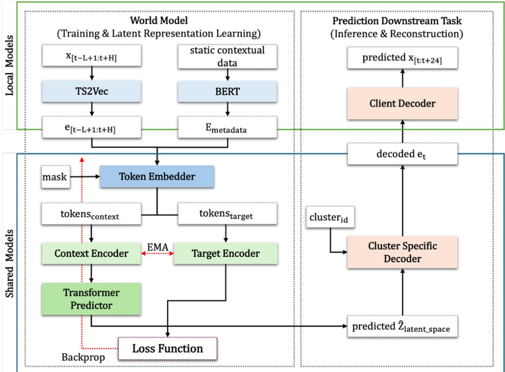  
Figure 1 Overview of the distributed energy :me-series JEPA architecture

## 2. Methods

The proposed model adapts the JEPA architecture to learn a unified representaOon of the energy domain by integraOng mulOple data modaliOes. Specifically, it combines energy Ome-series measurements with staOc contextual informaOon (e.g. building characterisOcs, PV site specificaOon). To transform inputs into a common embedding space with fixed dimensionality, modality-specific encoders are used. A temporal encoder (TS2Vec) processes Ome-series consumpOon data, while a contextual encoder (BERT) transforms staOc metadata into semanOc embeddings. The architecture is designed to be extensible, so that addiOonal data modaliOes and their corresponding encoders can be incorporated when addiOonal informaOon is available. The Token Embedder creates the tokens using a mask for the target posiOons, providing the tokens for the Context Encoder (contextual data embedding and context window Ome-series embeddings) and for the Target Encoder (target Ome-series embeddings). During training, the output of the Transformer Predictor is compared to the representaOons produced by the Target Encoder. The resulOng loss is used to update the parameters of the Token Embedder, Context Encoder and Transformer Predictor to enforce learned representaOons of the observed context that encapsulate relevant tempora and contextual informaOon. Finally, the parameters of the Target Encoder are updated as an exponenOal moving average (EMA) of the Context Encoder parameters.

## 2.1. JEPA Model for energy data

The training process for the JEPA transformer encoders and predictor is illustrated in Figure 2a. Firstly, the input Ome-series and staOc metadata embeddings are organized into batches that align mulOple clients within the same temporal window. Each sample consists of a historical context window of length L and a target predicOon horizon of length H starOng at Ome step t.

The Token Embedder generates two disOnct sequences by processing the raw input embeddings through separate logic paths. For the Context Encoder, the system uses the Future Mask to select only the visible indices (metadata and the L context embeddings). Only this subset is passed through the projecOon layer and combined with posiOonal embeddings, ensuring that the target is enOrely excluded from the context representaOon. For the Target Encoder, the Token Embedder processes the full, unmasked Ome-series and metadata embeddings. In this path, the enOre sequence is projected and augmented with posiOonal embeddings to serve as input for Target Encoder. The Context Encoder is a 6-layer standard transformer that produces contextualized representaOons of visible posiOons.

A predictor network then cross-a]ends to the latent representaOons of the context and produces predicOons at the H masked posiOons. Since masked posiOons are absent from the context encoder output, the predictor uses learned posiOonal embeddings as query vectors to represent the target posiOons during cross-a]enOon.

The full token sequence is passed through Target Encoder, an exponenOal moving average (EMA) copy of the Context Encoder that receives no gradient updates directly. It produces latent representaOon for the enOre sequence and the ones from target posiOons are used as the ground-truth latent representaOons for the Loss FuncOon.

The Loss FuncOon has a composite objecOve designed to minimize predicOve error while prevenOng representaOon collapse. The primary loss $\mathrm { L } _ { \mathrm { c o s } }$ measures the cosine similarity between the $\mathrm { L } _ { 2 } .$ -normalized latent representaOon generated by the predictor $\hat { \sf Z }$ and the latent targets $\mathrm { { Z , } }$ generated by the Target Encoder:

$$
\mathrm { L _ { c o s } = 1 - \frac { 1 } { B \cdot H } \sum _ { i = 1 } ^ { B \cdot H } \frac { \hat { Z } _ { i } \cdot Z _ { i } } { \left\| \hat { Z } _ { i } \right\| _ { 2 } \left\| Z _ { i } \right\| _ { 2 } } }\tag{1}
$$

To ensure the learned representaOons are informaOve and will not collapse during training, two regularizaOon terms are applied. First, a covariance regularizaOon term $\operatorname { L } _ { \mathbf { c o v } }$ penalizes the of-diagonal

elements of the covariance matrix C of the fla]ened predicOons (across batch and Ome) to maximize feature diversity:

$$
\mathrm { L _ { c o v } = \frac { 1 } { D } \sum _ { i \ne j } [ C ] _ { i , j } ^ { 2 } }\tag{2}
$$

Second, a temporal variance term $\mathrm { L } _ { \mathrm { t v a r } }$ ensures the model captures dynamic changes across the H sequence steps. It uses a hinge loss to maintain the variance σ of the predicOons above a threshold ε:

$$
\mathrm { L } _ { \mathrm { t v a r } } = \frac { 1 } { \mathrm { B } \cdot \mathrm { D } } \sum _ { \mathrm { b } = 1 } ^ { \mathrm { B } } \sum _ { \mathrm { j } = 1 } ^ { \mathrm { D } } \operatorname* { m a x } ( 0 , \varepsilon - \mathrm { V a r } _ { \mathrm { h } } ( \hat { \mathrm { z } } _ { \mathrm { b } , \mathrm { j } } ) )\tag{3}
$$

where $\mathrm { V a r _ { h } }$ is the variance calculated over the predicOon Ome dimension.

Third, $\mathrm { L } _ { \mathrm { n o r m } }$ penalises the mismatch in magnitude between each predicted target embedding and its corresponding EMA target, averaged over all predicted Omesteps in the batch:

(4)

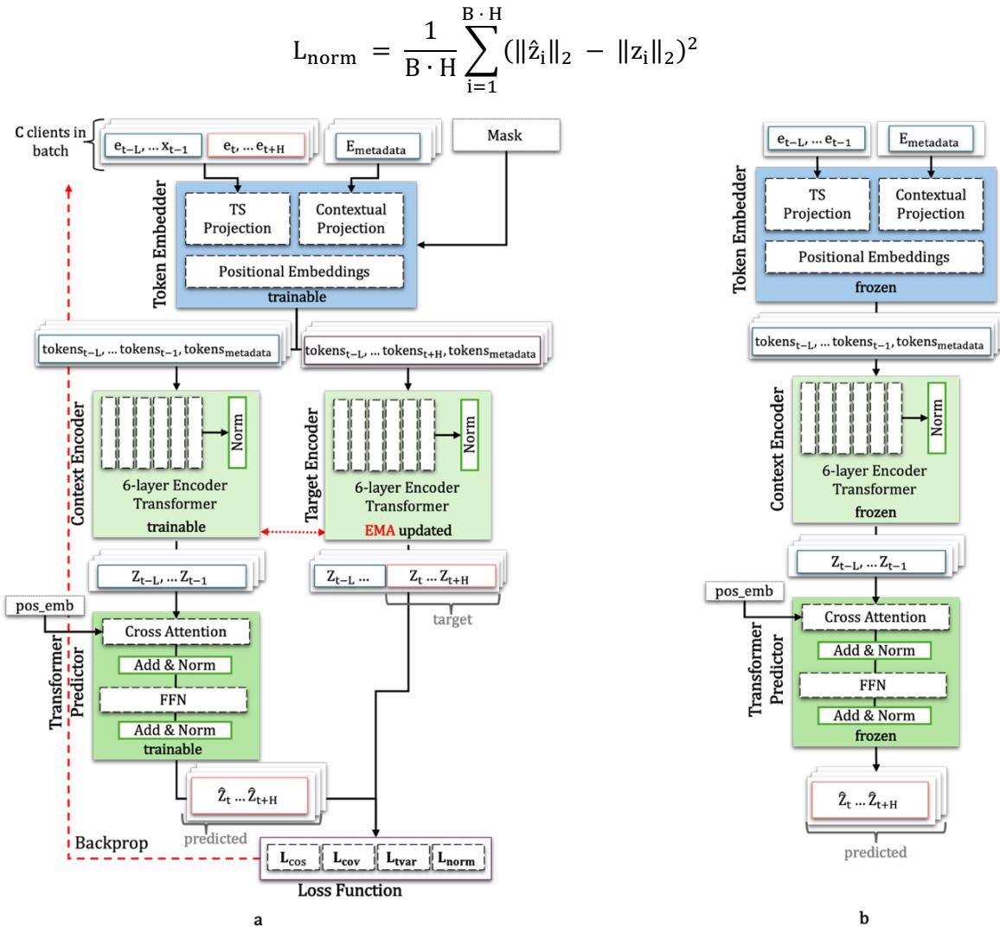  
Figure 2 JEPA World Model detailed architecture (a) for training the JEPA Encoders and Predictor (b) for embedding genera:on using the frozen Context Encoder and Predictor

The training process follows a decoupled update strategy. During the forward pass, gradients are tracked only for the Token Embedder, Context Encoder, and Predictor. The backpropagaOon updates these components using AdamW opOmizer using the composed JEPA loss:

$$
\mathrm { L o s s } _ { \mathrm { J E P A } } = \mathrm { L } _ { \mathrm { c o s } } + \alpha \mathrm { L } _ { \mathrm { c o v } } + \beta \mathrm { L } _ { \mathrm { t v a r } } + \gamma \mathrm { L } _ { \mathrm { n o r m } }\tag{5}
$$

The Target Encoder parameters $\theta _ { \mathrm { t a r g e t } }$ are updated once per batch using the EMA of the context encoder’s parameters $\theta _ { c o n t e x t } .$

$$
\theta _ { \mathrm { t a r g e t } }  \mathrm { m } \theta _ { \mathrm { t a r g e t } } + ( 1 - \mathrm { m } ) \theta _ { \mathrm { c o n t e x t } }\tag{6}
$$

Aber the training of the JEPA transformers, the Target Encoder is discarded as its role was to generate the targets for the Loss FuncOon. The inference pipeline of the generaOon phase is presented in Figure 2b. The input embeddings $\mathbf { e _ { t - L } } \ldots \mathbf { e _ { t - 1 } }$ are passed through the Token Embedder and Context Encoder to obtain the latent representaOon $\mathbf { Z _ { \mathrm { t - L } } } \dots \mathbf { Z _ { \mathrm { t - 1 } } }$ of the visible context. The latent representaOon can be used as features for various downstream tasks, such as forecasOng, classificaOon, or anomaly detecOon. In the specific case of forecasOng, the Transformer Predictor is kept as it learned during training to predict future latent embeddings Ẑ for the target horizon.

## 1.1. Forecas+ng downstream task

To complete the downstream forecasOng task, the predicted latent embeddings generated by the Predictor Transformer must be decoded into raw Ome-series values. Since the Ome-series data is distributed across mulOple clients, a hierarchical decoder structure is used, as illustrated in Figure 3, allowing clients to use a local decoder model.

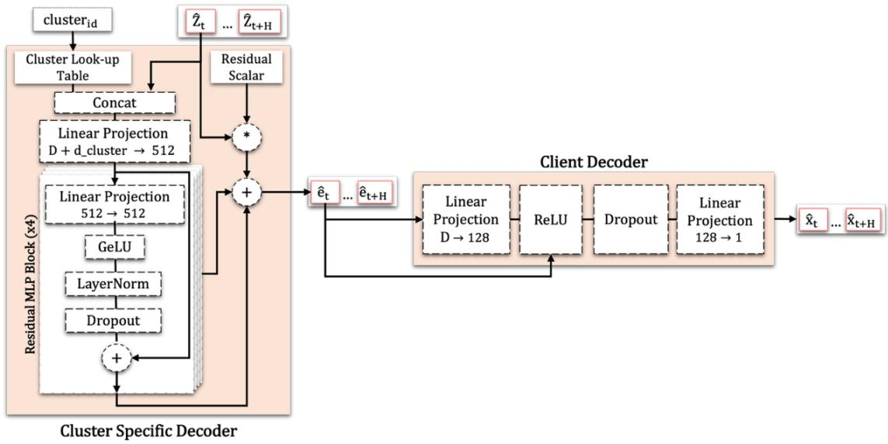  
Figure 3 Predic:on Downstream Task Decoders

First, a Cluster Specific Decoder maps the predicted latent embeddings into the TS2Vec embedding space. The clustering applied to TS2Vec embeddings separates diferent Ome-series pa]erns or behaviors, allowing the decoder to learn disOnct transformaOon rules condiOoned on the cluster id. Each client applies its own local decoder to convert the decoded TS2Vec embeddings into raw Ome-series values. During training, the cluster decoder learns a general mapping from latent representaOons to TS2Vec embeddings, while the client decoders learn the final reconstrucOon based on their local data. The Cluster Specific Decoder retrieves a learned vector from a Cluster Look-up Table based on the cluster\_id, which is then concatenated with the predicted latent embeddings Ẑ. This representaOon passes through a Linear ProjecOon and a stack of four Residual MLP Blocks, each containing GeLU acOvaOon, LayerNorm, and Dropout. Then the output of the MLP blocks is added to the original input embedding, which have been scaled by a Residual Scalar, to produce the decoded TS2Vec embeddings ê. The Client Decoder has a simple structure consisOng of a Linear ProjecOon layer, ReLU acOvaOon, Dropout, and a final projecOon layer. It has as input the decoded TS2Vec embedding ê and outputs the raw Ome-series values x̂.

To evaluate predicOon quality in the latent space, the decoders were trained to reconstruct a target from a single embedding rather than the enOre predicOon horizon. This formulaOon isolates reconstrucOon performance from temporal dynamics and enables assessment of the informaOon encoded in the latent representaOon. The decoders were trained using JEPA latent embeddings and the corresponding TS2Vec embeddings computed on the training set. During inference, the decoder was applied independently to each predicted Omestep to reconstruct the full forecasOng horizon.

## 1.2. Local TS2Vec embedding genera+on and clustering

TS2Vec is a self-supervised encoder for Ome-series representaOon learning, trained through contrasOve learning. To ensure both consistent Ome-series representaOons and the privacy of sensiOve consumer energy data, TS2Vec is trained sequenOally across all clients. On every client, the model is firstly iniOalized with the shared weights and then opOmized independently using only the client’s local data. Aber local training, the updated model weights are shared, while the raw energy data is kept private at the client. This approach enables learning a unified representaOon space across clients while preserving data privacy.

The energy Ome-series dataset is denoted as $\left[ \mathbf { x } _ { 0 } , \ldots , \mathbf { x } _ { \mathrm { T } } \right]$ where T is the total number of Ome steps in the series. The dataset is divided into train and test sets considering the predefined parameters train\_size and test\_size. Raw energy Ome-series values of the client are sampled in windows of size L, for which TS2Vec generates two overlapping subseries (views) by cropping diferent segments of the original window. The TS2Vec encoder then produces two sequences of embeddings for each view $\mathbf { Z } ^ { \prime }$ and $\mathbf { Z ^ { \prime \prime } } .$ , with each embedding vector being of dimension D. The contrasOve loss ensures that the model learns to generate similar embeddings for the overlapping porOons of the views. Aber the TS2Vec model is trained its weights are shared with all the clients. Then, each client samples windows from its Ome-series denoted as $\mathsf { W } _ { \mathrm { t } } =$ $\left[ \mathbf { x _ { t - L } } , \ldots , \mathbf { x _ { t } } \right]$ , where t is the target posiOon. The windows are passed through the local TS2Vec model to generate representaOon embeddings for each Ome step. The model outputs a sequence of embeddings $\mathtt { E } _ { \mathtt { s e q } } = [ \mathbf { e } _ { \mathtt { t - L } } , \dots , \mathbf { e } _ { \mathrm { t } } ]$ , and the representaOon of the energy at Omestep t is the embedding array $\mathbf { e _ { t } } .$ . The process for training and generaOng TS2Vec embeddings on energy Ome-series is presented in Figure 4.

Aber the TS2Vec representaOons (embeddings) are generated, they are used to cluster the households prosumers based on their disOnct energy profile features, based on previous research eforts [36, 37, 38, 39]. To segment the data based on the features of each load profile, three disOnct clustering algorithms are evaluated: K-means, K-medoids, and Hierarchical clustering. Because the opOmal number of clusters in such analyses cannot typically be known in advance, these algorithms are systemaOcally tested over a predefined range of candidate clusters, from k=2 to k=30. This extensive range is explored to determine the most appropriate structural configuraOon using three established evaluaOon metrics: the Silhoue]e Score (SIL), the Davies-Bouldin Index (DBI), and the Calinski-Harabasz Index (CHI). By assessing the algorithms across these metrics, the opOmal clustering algorithm and the ideal number of disOnct prosumer segments can be objecOvely idenOfied for final applicaOon.

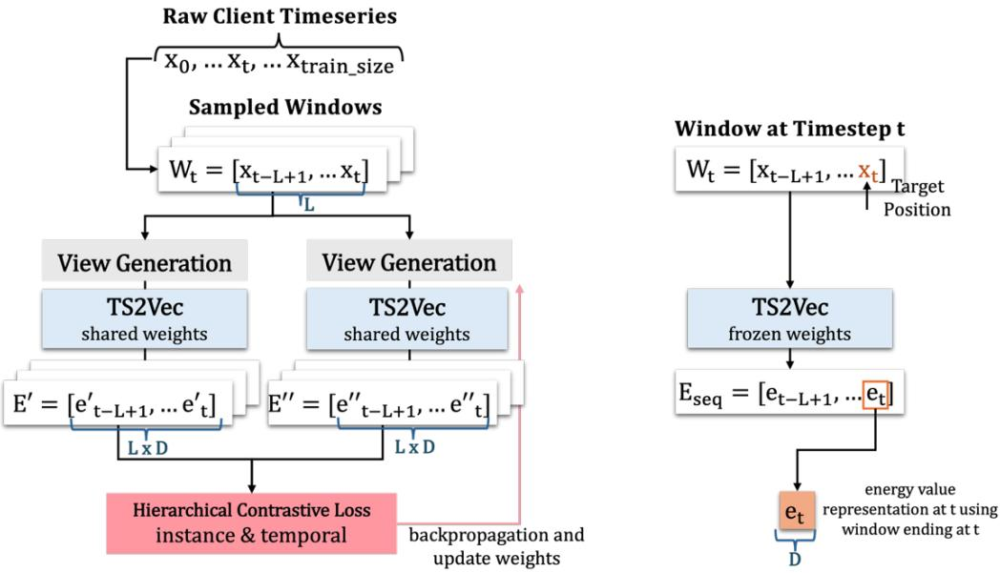  
Figure 4 TS2Vec :me series encoder training (leP) and genera:on (right)

## 1.3. Local BERT Embedding Genera+on

The pre-trained BERT model is used to generate contextual embeddings from metadata capturing the semanOc relaOonships between diferent data types (Figure 5). The metadata is processed from CSV files containing mulOple columns that indicate the informaOon available through two primary data types: text and numeric. While text columns are extracted directly, numeric columns undergo a discreOzaOon process to transform conOnuous values into discrete tokens, ensuring compaObility with the BERT vocabulary. The processed features are then serialized into a JSON string and passed through the BERT Tokenizer. The resulOng tokens are processed by the pre-trained BERT model with frozen weights that extracts by default a raw embedding $Z ^ { \beta \mathsf { e } } _ { \mathsf { r t } }$ of size 768. Finally, a trainable projecOon layer maps this vector into a D-dimensional space, designed to match the dimensions of the Ome-series embeddings.

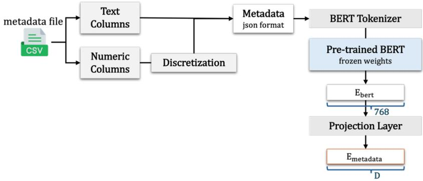  
Figure 5 BERT contextual embedding genera:on

## 1.4. Evalua+on Methodology

For the evaluaOon of JEPA latent representaOons, we considered the 24h-ahead forecasOng downstream task. The goal is to assess the performance of the JEPA learned representaOons on the forecasOng task compared to a Transformer baseline method trained on TS2Vec representaOons under idenOcal data condiOons.

Both datasets are split following the same procedure. Firstly, the clients are split into 80% training clients and 20% test clients, where the test clients are never seen during any stage of JEPA training. For the training clients, the available data is further divided into 80% training, 10% validaOon, and 10% test splits. The training set is used for training the JEPA models and for training the cluster decoder. For the test clients, a separate 70/15/15 split is applied per client, where the 70% porOon is used to fine-tune the cluster-specific decoder and to train the individual TS2Vec decoder, while the remaining 30% is used for validaOon and tesOng of the adaptaOon performance.

The proposed JEPA approach first learns latent representaOons through a Transformer-based predictor operaOng in embedding space. The latent representaOons are then decoded into raw energy values using a separate decoding module, enabling a structured mapping from learned latent dynamics to the forecasOng target. The JEPA architecture and decoder training hyperparameters are summarized in Table 1 including the input/output specificaOons, architectural configuraOon of each component, and decoder training sefngs shared between the Genome and PV datasets ("train" and "b" denote pretraining and fine-tuning stages, respecOvely).

Table 1 JEPA model architecture and shared hyperparameters
<table><tr><td colspan="1" rowspan="1">Category</td><td colspan="1" rowspan="1">Hyperparameter</td><td colspan="1" rowspan="1">Value</td></tr><tr><td colspan="1" rowspan="2">Input/Output</td><td colspan="1" rowspan="1">Context length L</td><td colspan="1" rowspan="1">168</td></tr><tr><td colspan="1" rowspan="1">Forecast horizon H</td><td colspan="1" rowspan="1">24</td></tr><tr><td colspan="1" rowspan="15">Architecture</td><td colspan="2" rowspan="1">Token Embedder</td></tr><tr><td colspan="1" rowspan="1">Input/Output $\ L d _ { d i m }$ </td><td colspan="1" rowspan="1">256/256/256</td></tr><tr><td colspan="1" rowspan="1">Max sequence length</td><td colspan="1" rowspan="1">512</td></tr><tr><td colspan="2" rowspan="1">Context, Target Enc. &amp; Predictor</td></tr><tr><td colspan="1" rowspan="1"> $\mathrm { d } _ { \mathrm { m o d e l } }$ </td><td colspan="1" rowspan="1">256</td></tr><tr><td colspan="1" rowspan="1">Attention heads h</td><td colspan="1" rowspan="1">8</td></tr><tr><td colspan="1" rowspan="1">Encoder layers</td><td colspan="1" rowspan="1">6</td></tr><tr><td colspan="1" rowspan="1">Predictor layers</td><td colspan="1" rowspan="1">2</td></tr><tr><td colspan="1" rowspan="1">Feedforward dim $\underline { { \mathbf { d } _ { \mathrm { f f } } } }$ </td><td colspan="1" rowspan="1">1024</td></tr><tr><td colspan="2" rowspan="1">Cluster-Specific Decoder</td></tr><tr><td colspan="1" rowspan="1">MLP residual blocks</td><td colspan="1" rowspan="1">4</td></tr><tr><td colspan="1" rowspan="1">Hidden dimension</td><td colspan="1" rowspan="1">512</td></tr><tr><td colspan="2" rowspan="1">Client Decoder</td></tr><tr><td colspan="1" rowspan="1">Linear layers</td><td colspan="1" rowspan="1">2</td></tr><tr><td colspan="1" rowspan="1">Hidden dimension</td><td colspan="1" rowspan="1">128</td></tr><tr><td colspan="1" rowspan="6">Decoder Training</td><td colspan="2" rowspan="1">Cluster-Specific Decoder</td></tr><tr><td colspan="1" rowspan="1">Batch size</td><td colspan="1" rowspan="1">256</td></tr><tr><td colspan="1" rowspan="1">Learning rate</td><td colspan="1" rowspan="1"> $1 * 1 0 ^ { - 3 } \left( \mathrm { { t r a i n } } \right) 1 * 1 0 ^ { - 4 } \left( \mathrm { { f t } } \right)$ </td></tr><tr><td colspan="1" rowspan="1">Optimizer</td><td colspan="1" rowspan="1">Adam</td></tr><tr><td colspan="1" rowspan="1">Epoch</td><td colspan="1" rowspan="1">50(train), 20(ft)</td></tr><tr><td colspan="1" rowspan="1">Loss</td><td colspan="1" rowspan="1">0.5 * cos + MSE</td></tr><tr><td rowspan="7"></td><td colspan="2">Client Decoder</td></tr><tr><td>Batch size</td><td>256</td></tr><tr><td>Learning rate</td><td> $\overline { { 1 * 1 0 ^ { - 3 } } }$ </td></tr><tr><td>Optimizer</td><td>Adam</td></tr><tr><td>Epoch</td><td>50</td></tr><tr><td>Loss</td><td>MSE</td></tr></table>

The training configuraOons specific to each dataset are listed in Table 2, highlighOng the diferences between the Genome and PV experimental setups and S0, S1, S2 correspond to the JEPA training stages for the PV dataset.

Table 2 JEPA configura:on for Genome and PV
<table><tr><td rowspan=2 colspan=1>Category</td><td rowspan=2 colspan=1>Hyperparameter</td><td rowspan=2 colspan=1>Genome</td><td rowspan=1 colspan=3>PV</td></tr><tr><td rowspan=1 colspan=1>SO</td><td rowspan=1 colspan=1>S1</td><td rowspan=1 colspan=1>S2</td></tr><tr><td rowspan=9 colspan=1>JEPA Training</td><td rowspan=1 colspan=1>Dropout</td><td rowspan=1 colspan=1>0.1</td><td rowspan=1 colspan=3>0.1</td></tr><tr><td rowspan=1 colspan=1>Masking strategy</td><td rowspan=1 colspan=1>Future</td><td rowspan=1 colspan=1>Var. blocks</td><td rowspan=1 colspan=1>Future</td><td rowspan=1 colspan=1>Future</td></tr><tr><td rowspan=1 colspan=1>EMA Momentum</td><td rowspan=1 colspan=1>0.999</td><td rowspan=1 colspan=3>0.996 → 0.999</td></tr><tr><td rowspan=1 colspan=1>Learning rate</td><td rowspan=1 colspan=1> $3 * 1 0 ^ { - 4 }$ </td><td rowspan=1 colspan=1> $3 * 1 0 ^ { - 4 }$ </td><td rowspan=1 colspan=1> $1 * 1 0 ^ { - 4 }$ </td><td rowspan=1 colspan=1> $5 * 1 0 ^ { - 5 }$ </td></tr><tr><td rowspan=1 colspan=1>Batch size</td><td rowspan=1 colspan=1>1024</td><td rowspan=1 colspan=3>512</td></tr><tr><td rowspan=1 colspan=1>Epochs</td><td rowspan=1 colspan=1>50</td><td rowspan=1 colspan=1>20</td><td rowspan=1 colspan=1>10</td><td rowspan=1 colspan=1>10</td></tr><tr><td rowspan=1 colspan=1>Loss weight α</td><td rowspan=1 colspan=1>0.04</td><td rowspan=1 colspan=1>0.10</td><td rowspan=1 colspan=1>0.05</td><td rowspan=1 colspan=1>0</td></tr><tr><td rowspan=1 colspan=1>Loss weight β</td><td rowspan=1 colspan=1>1.0</td><td rowspan=1 colspan=1>1</td><td rowspan=1 colspan=1>0</td><td rowspan=1 colspan=1>0</td></tr><tr><td rowspan=1 colspan=1>Loss weight y</td><td rowspan=1 colspan=1>0</td><td rowspan=1 colspan=1>0</td><td rowspan=1 colspan=1>0.5</td><td rowspan=1 colspan=1>0</td></tr></table>

As a baseline model, we trained an encoder-only version of a standard Transformer [40]. The model has TS2Vec representaOons as input and outputs a direct 24h energy forecast using a Transformer encoder with sinusoidal posiOonal encodings followed by a lightweight predicOon head. To ensure a strong reference model, we conducted a hyperparameter search over several architectural and training parameters, including the model dimension, number of a]enOon heads, feed-forward dimension, dropout rate, learning rate, and batch size. The configuraOon achieving the lowest validaOon MAE was selected for evaluaOon, and the resulOng hyperparameter configuraOon is summarized in Table 3. The datasets were split following the same procedure previously described. To ensure a fair comparison with the JEPA-based approach, the Transformer baseline was trained using the same TS2Vec representaOons in two phases. First, a global model was trained using data from all training clients. Then, the encoder was frozen and only the predicOon head was fine-tuned on the first 70% of each test client’s data, allowing the model to adapt to client-specific generaOon pa]erns before evaluaOon.

Table 3 Baseline Transformer model hyperparameter
<table><tr><td colspan="1" rowspan="1">Category</td><td colspan="1" rowspan="1">Hyperparameter</td><td colspan="1" rowspan="1">Value</td></tr><tr><td colspan="1" rowspan="3">Input/Output</td><td colspan="1" rowspan="1">Embedding dimension D</td><td colspan="1" rowspan="1">256</td></tr><tr><td colspan="1" rowspan="1">Context length L</td><td colspan="1" rowspan="1">168</td></tr><tr><td colspan="1" rowspan="1">Forecast horizon H</td><td colspan="1" rowspan="1">24</td></tr><tr><td colspan="1" rowspan="4">Architecture</td><td colspan="1" rowspan="1">Model dimension $\underline { { \mathbf { d } _ { \mathrm { m o d e l } } } }$ </td><td colspan="1" rowspan="1">128</td></tr><tr><td colspan="1" rowspan="1">Attention heads</td><td colspan="1" rowspan="1">8</td></tr><tr><td colspan="1" rowspan="1">Encoder layers</td><td colspan="1" rowspan="1">2</td></tr><tr><td colspan="1" rowspan="1">Feedforward dim ${ \mathrm { d } } _ { \mathrm { f f } }$ </td><td colspan="1" rowspan="1">256</td></tr><tr><td colspan="1" rowspan="3"></td><td colspan="1" rowspan="1">Activation function</td><td colspan="1" rowspan="1">GELU</td></tr><tr><td colspan="1" rowspan="1">Positional encoding</td><td colspan="1" rowspan="1">Sinusiodal</td></tr><tr><td colspan="1" rowspan="1">Prediction head</td><td colspan="1" rowspan="1">LN→ Linear (128,128) → GELU→ Dropout → Linear (128,24)</td></tr><tr><td colspan="1" rowspan="6">Training</td><td colspan="1" rowspan="1">Batch size</td><td colspan="1" rowspan="1">128</td></tr><tr><td colspan="1" rowspan="1">Epochs</td><td colspan="1" rowspan="1">50</td></tr><tr><td colspan="1" rowspan="1">Learning rate</td><td colspan="1" rowspan="1"> $5 * 1 0 ^ { - 4 }$ </td></tr><tr><td colspan="1" rowspan="1">Optimizer</td><td colspan="1" rowspan="1">AdamW</td></tr><tr><td colspan="1" rowspan="1">Loss</td><td colspan="1" rowspan="1">MSE</td></tr><tr><td colspan="1" rowspan="1">Patience</td><td colspan="1" rowspan="1">5</td></tr><tr><td colspan="1" rowspan="3">Head fine-tuning</td><td colspan="1" rowspan="1">Learning rate</td><td colspan="1" rowspan="1"> $5 * 1 0 ^ { - 4 }$ </td></tr><tr><td colspan="1" rowspan="1">Epochs</td><td colspan="1" rowspan="1">20</td></tr><tr><td colspan="1" rowspan="1">Patience</td><td colspan="1" rowspan="1">3</td></tr></table>

In addiOon to the standard evaluaOon performed on clean data, we evaluated the forecasOng performance under three data degradaOon scenarios applied to the 256-dimensional TS2Vec embedding windows. The first scenario is addiOve Gaussian noise, where independent noise from a normal distribuOon with mean zero and standard deviaOon relaOve to each client distribuOon is added to every element of the embedding vectors. The second scenario simulates intermi]ent sensor dropout through random missing data, where each Omestep in a window is independently set to zero with a probability between 0.0 and 0.50. The third scenario simulates longer sensor outages by removing conOguous blocks from the input. A conOnuous segment of Omesteps is removed from each window simulaOng longer sensor outages. The length of the missing block is varied, and its starOng posiOon is randomly selected within the window.

## 2. Results

We evaluated the proposed JEPA architecture on two publicly available energy datasets considering 24 hours ahead energy predicOon task: the Building Data Genome Project 2 dataset [41] and a roobop photovoltaic (PV) dataset [42], as described in the Methods secOon.

## 2.1. Self-supervised learning dynamics

We examined the learning dynamics of the JEPA architecture on both datasets to evaluate the latent representaOon quality, avoid representaOon collapse, and ensure convergence during distributed training. The losses and similarity metrics are not suficient to evaluate the representaOon quality, as in the context of JEPA it can also signal a parOal collapse where the target and context encoders converge toward redundant, low-informaOon representaOons, making the predicOon task easy. Thus, we used the efecOve rank [43, 44] to track if the model uses the full dimensionality of the embedding vector and the uniformity metric [45] to measure how uniformly the learned features are distributed on the unit hypersphere. The metric evoluOon during training for both datasets is represented in Figure 6a,b.

The training and validaOon loss for the Genome dataset monitored across epochs show a simultaneous decrease in both loss curves with a lower validaOon loss caused by the absence of training noise (dropout and batch shufling) together with the fact that the target encoder is updated only during training, leading to more consistent and predictable representaOons during evaluaOon. The cosine similarity reached ≈0.98 indicaOng strong alignment between the predicted and target representaOons. The efecOve rank stabilizes between 185–200 out of 256 dimensions, indicaOng that the model uOlizes approximately 75% of the available embedding capacity. The uniformity metric [45] slightly increases from −3.5 to −2.9 during training. As can be seen, by epoch 15 the per-epoch improvement in validaOon loss had reduced to less than 0.002, jusOfying the stopping criterion.

a  
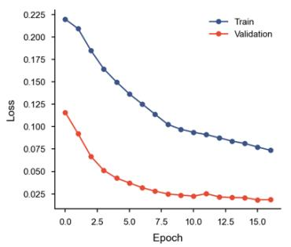

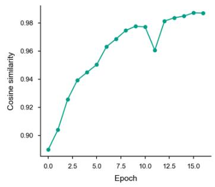

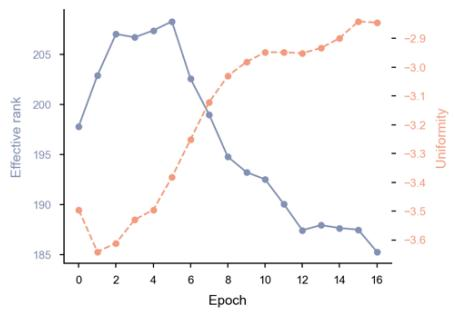

b  
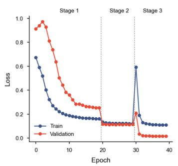

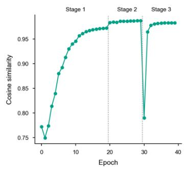

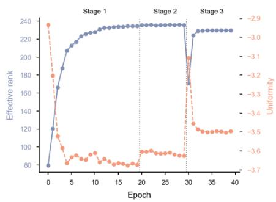

C  
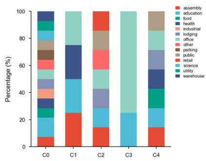

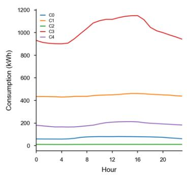

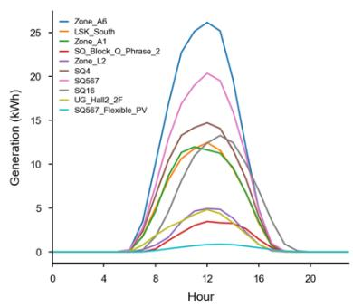  
Figure 6 JEPA training dynamics and test set characteriza=on for Genome and PV (a) Genome (Future Mask) and (b) PV (Stage 1: Random MulO-block Masking Stage 2: Future Mask + norm loss increase Stage 3: Future Mask - encoders frozen, train new predictor). (c) Genome building type distribuOon across cluster (leb), mean hourly consumpOon per cluster (middle), and mean hourly PV generaOon per test client (right).

Considering the lower diversity of the PV dataset, the training was divided into three stages, in contrast to the Genome dataset, where training was performed in a single stage using only future masking. In the first stage, all models were trained using random mulO-block masking, enabling the encoder to learn general latent representaOons without being Oed to a specific forecasOng objecOve. During this stage, the validaOon loss decreased from 0.91 to 0.25, cosine similarity increased to 0.97, and the efecOve rank increased to 235. In the second stage, training was conOnued using only future masking, while increasing the weight of the norm loss to preserve the amplitude of the embeddings. The validaOon loss and cosine similarity remained stable, while efecOve rank and uniformity showed small changes, indicaOng that the representaOon geometry was preserved while the model adapted to future representaOon predicOon. In the third stage, the encoders were frozen and a newly iniOalized predictor was trained using future masking. This resulted in an iniOal decrease in cosine similarity and efecOve rank due to the cold start of the predictor, followed by rapid recovery within a single epoch and convergence to the lowest loss achieved across all three stages. These results demonstrate that the general representaOons learned during the first stage can be efecOvely used for future representaOon predicOon.

## 2.2. Transfer learning capabili+es

To evaluate the transfer capabiliOes of the JEPA latent embeddings, we selected a subset of 36 consumers from the Genome test set (N = 208) and used all 10 staOons from the PV test set. Due to the limited number of staOons available in the PV dataset, clustering was not performed, and the complete test set was used for evaluaOon. For the Genome dataset, the test consumers were selected by sampling a fixed percentage of consumers from each cluster, such that the relaOve distribuOon of clusters in the subset matches that of the full test set, while enforcing a minimum number of consumers for smaller clusters to ensure fair representaOon. In addiOon, this sampling strategy preserves the building-type diversity within clusters, as illustrated in Figure 6c (leb), alongside the mean energy values for each cluster (middle) and the mean generaOon profiles for the PV (right).

To compare predicOon performance on the train set against the test consumers and PV sites that were not used for JEPA training, we selected a subset of 44 consumers from the Genome train set to reflect a comparable cluster composiOon to the test set and used all 40 training PV sites. Across all five clusters, JEPA achieves a median ${ \tt R } ^ { 2 }$ of 0.648–0.854 on training consumers and 0.660–0.844 on test consumers, with diferences in median ${ \mathsf { R } } ^ { 2 }$ within 0.02–0.137 across clusters. Test performance is comparable or slightly exceeds training performance in four of the five clusters (C0: 0.840 vs 0.854; C2: 0.718 vs 0.703; C3: 0.785 vs 0.648; C4: 0.844 vs 0.842). For the PV dataset, the median ${ \tt R } ^ { 2 }$ was 0.818 on test versus 0.838 on training, with a small drop in performance of 0.02. The ${ \tt R } ^ { 2 }$ median along with the std are represented in Figure 7. Together, these results indicate that JEPA learns transferable representaOons across heterogeneous consumers and sites.

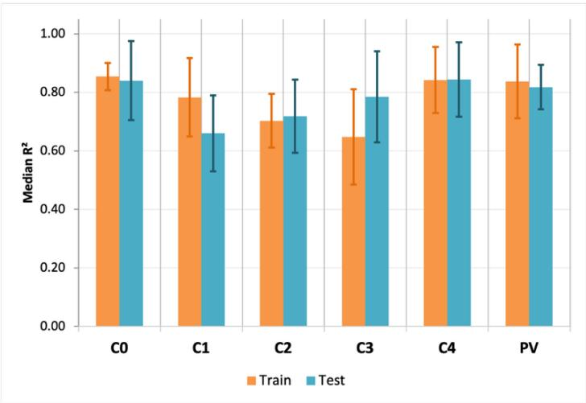  
Figure 7 JEPA transferability Evalua:on on train vs test sets

In Figure 8 are represented the reconstructed energy values form the latent space predicOon (Predicted) and the actual measured values (Actual) for representaOve buildings from each cluster and PV sites from the test set.

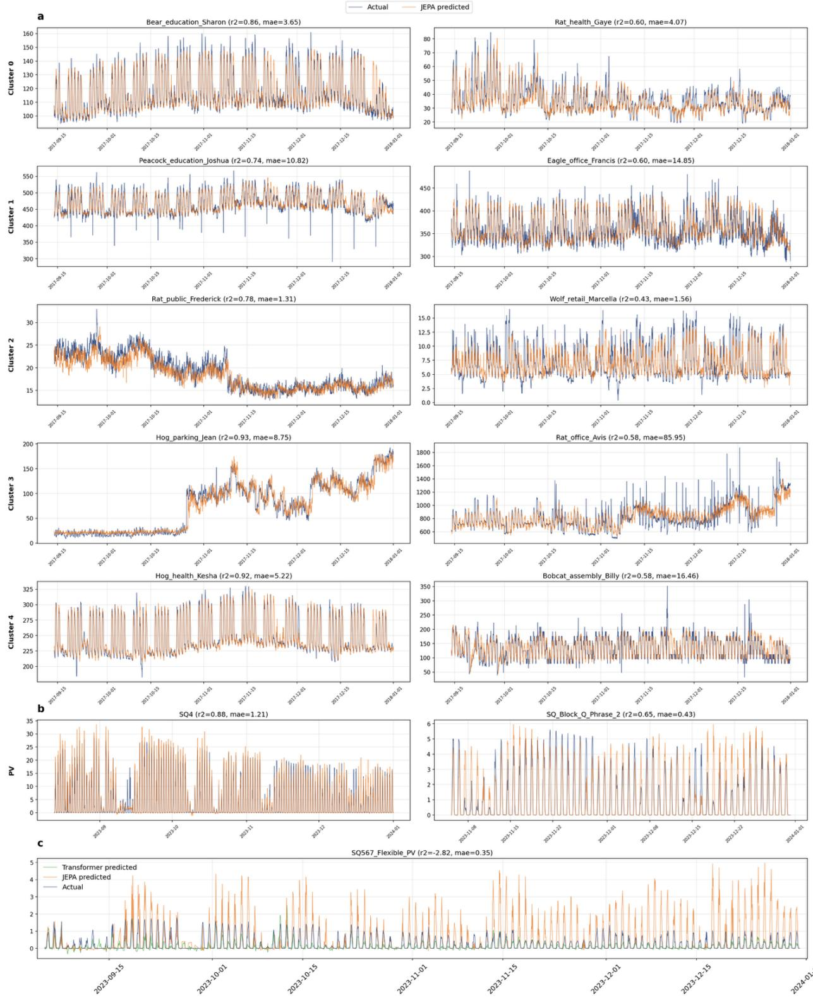  
Figure 8 Actual energy values and JEPA predicted values for representa:ve Genome consumers and PV Sites: (a) Genome dataset (b) PV dataset (c) SQ567\_Flexible\_PV

The buildings and sites shown on the leb correspond to low MAE and high $\mathsf { R } ^ { 2 } ,$ while the ones on the right have a higher MAE and relaOvely lower $\mathsf { R } ^ { 2 } .$ . These plots, correlated with the evaluaOon metrics, indicate that the model in general follows the temporal dynamics of consumpOon, with some dificulOes in capturing high fluctuaOons and variaOons.

## 2.3. Energy predic+on accuracy

Table 4 shows the accuracy evaluaOon metrics (MAE, RMSE, and $\mathsf { R } ^ { 2 } )$ for both datasets, using a 168h context window for both JEPA and the Transformer baseline. On the Genome dataset, the average error metrics are computed per cluster, and overall performance is similar between JEPA and the baseline. The Transformer achieves lower MAE in all five clusters, though generally the diferences are small relaOve to the cluster magnitudes (the largest absolute gap is in Cluster3, where errors are an order of magnitude larger than in other clusters). For RMSE, JEPA is lower in Cluster0 and Cluster1, while the Transformer is lower in Clusters 2, 3, and 4. For $\mathsf { R } ^ { 2 } ,$ JEPA outperforms the Transformer in 3 of 5 clusters (Cluster0, Cluster1, Cluster4).

The PV dataset has substanOally fewer disOnct sites than Genome (40 training PV sites vs. 828 training buildings) with slightly longer Ome-series length per site (≈19.2k Ome steps for each site and ≈17.5k hourly Omesteps for each building) and the metrics are reported individually for each PV site. JEPA significantly outperforms the Transformer on 9 of 10 PV sites. For several sites, the ${ \tt R } ^ { 2 }$ of the Transformer is below 0.45, and for Zone\_A6 close to zero (0.018) while JEPA achieves ${ \tt R } ^ { 2 }$ between 0.73 and 0.88 on the same sites. This suggests JEPA learns transferable Ome-series dynamics that generalize well across PV sites with comparable, conOnuous generaOon profiles.

Table 4 JEPA vs Baseline Transformer predic:on performance comparison on Genome and PV datasets
<table><tr><td rowspan=1 colspan=1>Dataset</td><td rowspan=1 colspan=1></td><td rowspan=1 colspan=1>MAEJEPA</td><td rowspan=1 colspan=1>MAETransf.</td><td rowspan=1 colspan=1>RMSEJEPA</td><td rowspan=1 colspan=1>RMSETransf.</td><td rowspan=1 colspan=1> $R ^ { 2 }$ JEPA</td><td rowspan=1 colspan=1> $R ^ { 2 }$ Transf.</td></tr><tr><td rowspan=5 colspan=1>Genome</td><td rowspan=1 colspan=1>Cluster0</td><td rowspan=1 colspan=1>4.746</td><td rowspan=1 colspan=1>4.691</td><td rowspan=1 colspan=1>6.542</td><td rowspan=1 colspan=1>6.782</td><td rowspan=1 colspan=1>0.840</td><td rowspan=1 colspan=1>0.819</td></tr><tr><td rowspan=1 colspan=1>Cluster1</td><td rowspan=1 colspan=1>12.832</td><td rowspan=1 colspan=1>12.694</td><td rowspan=1 colspan=1>17.738</td><td rowspan=1 colspan=1>18.082</td><td rowspan=1 colspan=1>0.660</td><td rowspan=1 colspan=1>0.637</td></tr><tr><td rowspan=1 colspan=1>Cluster2</td><td rowspan=1 colspan=1>1.310</td><td rowspan=1 colspan=1>1.096</td><td rowspan=1 colspan=1>1.712</td><td rowspan=1 colspan=1>1.451</td><td rowspan=1 colspan=1>0.718</td><td rowspan=1 colspan=1>0.724</td></tr><tr><td rowspan=1 colspan=1>Cluster3</td><td rowspan=1 colspan=1>62.970</td><td rowspan=1 colspan=1>55.654</td><td rowspan=1 colspan=1>91.586</td><td rowspan=1 colspan=1>85.552</td><td rowspan=1 colspan=1>0.785</td><td rowspan=1 colspan=1>0.801</td></tr><tr><td rowspan=1 colspan=1>Cluster4</td><td rowspan=1 colspan=1>8.290</td><td rowspan=1 colspan=1>8.062</td><td rowspan=1 colspan=1>10.842</td><td rowspan=1 colspan=1>10.753</td><td rowspan=1 colspan=1>0.844</td><td rowspan=1 colspan=1>0.843</td></tr><tr><td rowspan=10 colspan=1>PV</td><td rowspan=1 colspan=1>LSK_South</td><td rowspan=1 colspan=1>0.971</td><td rowspan=1 colspan=1>1.662</td><td rowspan=1 colspan=1>2.141</td><td rowspan=1 colspan=1>3.281</td><td rowspan=1 colspan=1>0.803</td><td rowspan=1 colspan=1>0.433</td></tr><tr><td rowspan=1 colspan=1>SQ16</td><td rowspan=1 colspan=1>1.131</td><td rowspan=1 colspan=1>1.202</td><td rowspan=1 colspan=1>2.280</td><td rowspan=1 colspan=1>2.385</td><td rowspan=1 colspan=1>0.844</td><td rowspan=1 colspan=1>0.817</td></tr><tr><td rowspan=1 colspan=1>SQ4</td><td rowspan=1 colspan=1>1.215</td><td rowspan=1 colspan=1>3.183</td><td rowspan=1 colspan=1>2.331</td><td rowspan=1 colspan=1>5.239</td><td rowspan=1 colspan=1>0.880</td><td rowspan=1 colspan=1>0.393</td></tr><tr><td rowspan=1 colspan=1>SQ567</td><td rowspan=1 colspan=1>1.612</td><td rowspan=1 colspan=1>4.358</td><td rowspan=1 colspan=1>3.214</td><td rowspan=1 colspan=1>7.663</td><td rowspan=1 colspan=1>0.872</td><td rowspan=1 colspan=1>0.274</td></tr><tr><td rowspan=1 colspan=1>SQ567_Flex_PV</td><td rowspan=1 colspan=1>0.351</td><td rowspan=1 colspan=1>0.163</td><td rowspan=1 colspan=1>0.745</td><td rowspan=1 colspan=1>0.302</td><td rowspan=1 colspan=1>-2.815</td><td rowspan=1 colspan=1>0.276</td></tr><tr><td rowspan=1 colspan=1>SQ_Block_Q_P2</td><td rowspan=1 colspan=1>0.432</td><td rowspan=1 colspan=1>0.563</td><td rowspan=1 colspan=1>0.862</td><td rowspan=1 colspan=1>1.013</td><td rowspan=1 colspan=1>0.649</td><td rowspan=1 colspan=1>0.532</td></tr><tr><td rowspan=1 colspan=1>UG_Hall2_2F</td><td rowspan=1 colspan=1>0.494</td><td rowspan=1 colspan=1>1.054</td><td rowspan=1 colspan=1>1.036</td><td rowspan=1 colspan=1>1.865</td><td rowspan=1 colspan=1>0.755</td><td rowspan=1 colspan=1>0.144</td></tr><tr><td rowspan=1 colspan=1>Zone_A1</td><td rowspan=1 colspan=1>1.275</td><td rowspan=1 colspan=1>2.791</td><td rowspan=1 colspan=1>2.788</td><td rowspan=1 colspan=1>4.826</td><td rowspan=1 colspan=1>0.729</td><td rowspan=1 colspan=1>0.186</td></tr><tr><td rowspan=1 colspan=1>Zone_A6</td><td rowspan=1 colspan=1>2.283</td><td rowspan=1 colspan=1>7.374</td><td rowspan=1 colspan=1>4.581</td><td rowspan=1 colspan=1>11.688</td><td rowspan=1 colspan=1>0.843</td><td rowspan=1 colspan=1>0.018</td></tr><tr><td rowspan=1 colspan=1>Zone_L2</td><td rowspan=1 colspan=1>0.374</td><td rowspan=1 colspan=1>1.665</td><td rowspan=1 colspan=1>0.836</td><td rowspan=1 colspan=1>2.550</td><td rowspan=1 colspan=1>0.833</td><td rowspan=1 colspan=1>-0.504</td></tr></table>

The excepOon is the SQ567\_Flexible\_PV, where the Transformer outperforms JEPA on all three metrics and the ${ \tt R } ^ { 2 }$ for JEPA is negaOve (−2.82). This site has a generaOon profile with much lower amplitude than other sites (see Figure 6c) and JEPA predicOons overesOmate the variability of this almost flat signal (see Figure 8c-SQ567\_Flexible\_PV). This result suggests that the learned representaOons may not fully capture the characterisOcs of low-amplitude generaOon profiles, potenOally due to their limited representaOon in the training data.

## 2.4. Performance analysis under data degrada+on

The evaluaOon analysis for the data degradaOon scenarios is reported using the median and interquarOle range (IQR), represented as the solid line and shaded region, respecOvely, in Figure 9. The results for the Genome dataset are on leb and for the PV dataset on right. For each dataset, and type of data degradaOon indicated on each row (Gaussian Noise, Random Missing and Block Missing) the median ± IQR of each reported error metric (MAE, RMSE and R²) is plo]ed across the levels of degradaOon applied (std, missing rate, and block size).

For each degradaOon level, the median is computed across the client-level performance metrics, while the IQR, defined as the range between the 25th and 75th percenOles, quanOfies the variability in performance across clients. For the Genome dataset, the Transformer is more resilient to addiOve Gaussian noise, maintaining roughly half the MAE of JEPA at the highest noise level and having a narrower IQR, indicaOng more consistent behavior across clients. In contrast, JEPA demonstrates higher resistance to random missing data, maintaining lower predicOon errors and higher ${ \tt R } ^ { 2 }$ values than the Transformer as the corrupOon level increases, even in cases where the Transformer achieves comparable or slightly be]er performance on clean data. Both models are unafected by conOguous block missing corrupOon, with only slight changes in errors and ${ \tt R } ^ { 2 }$ even for 24h gaps.

On the PV dataset, JEPA achieves a higher performance on clean data, while the Transformer has a high variability across clients, reflected in a wide IQR under all condiOons. Across all data degradaOon scenarios, JEPA consistently maintains lower predicOon errors and higher ${ \mathsf { R } } ^ { 2 }$ values than the Transformer. The steeper degradaOon for JEPA is a consequence of stronger performance on clean data, which provides a larger margin for performance decrease. However, JEPA remains the more accurate model throughout the enOre corrupOon range. Similar to the Genome dataset, block-missing corrupOon has only a minor impact on both models.

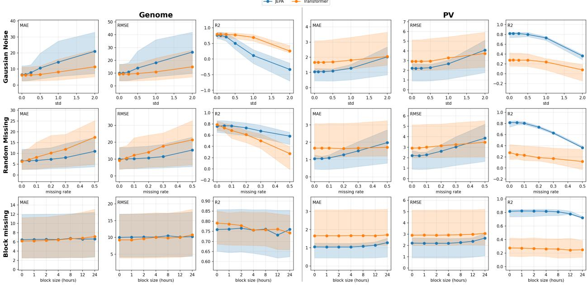  
Figure 9 Degrada:on of model performance under noise and missing data corrup:ons

Overall, the results suggest that the Transformer is more tolerant to addiOve embedding space noise, parOcularly on the Genome dataset, which has a substanOally larger training set. JEPA is more resilient when informaOon is removed enOrely, consistently maintaining lower errors and higher ${ \tt R } ^ { 2 }$ under random missing condiOons on Genome, and retaining higher ${ \mathsf { R } } ^ { 2 }$ values on PV despite a steeper absolute decline.

## 3. Discussion

In this work, we proposed JEPA for self-supervised energy Ome-series representaOon learning, coupled with hierarchical decoders for downstream forecasOng tasks. Rather than opOmizing a task-specific forecasOng objecOve, the model learns to predict latent representaOons of masked temporal segments, decoupling representaOon learning from downstream predicOon while integraOng temporal energy dynamics and staOc contextual informaOon within a unified embedding space. We evaluated the proposed approach on building energy consumpOon and photovoltaic generaOon datasets under both clean and degraded data condiOons.

The results indicate that self-supervised latent predicOon consOtutes a viable alternaOve to task-specific forecasOng models and can produce stable and informaOve representaOons for heterogeneous energy Ome-series. Across both datasets, the proposed JEPA framework achieved high alignment between predicted and target embeddings while maintaining substanOal latent-space diversity, indicaOng that the covariance and temporal variance regularizaOon successfully miOgated representaOon collapse. The observed efecOve rank further suggests that the learned embeddings uOlize a large fracOon of the available representaOonal capacity, supporOng the hypothesis that latent-space predicOon can capture meaningful temporal structure without relying on direct reconstrucOon of observaOons.

A notable finding is the transferability of the learned representaOons across disOnct energy domains. The consistency of JEPA performance between train and test consumers and PV sites suggests that the model encodes transferable latent representaOons rather than consumer or site specific features. On the building energy consumpOon dataset, JEPA achieved performance comparable to a Transformer trained under idenOcal condiOons on TS2Vec representaOons, with both models exhibiOng advantages on diferent client clusters. On the photovoltaic dataset, however, JEPA consistently outperformed the Transformer across most clients, achieving substanOally lower forecasOng errors and higher coeficients of determinaOon. This result suggest that latent predicOve objecOves may be parOcularly beneficial in sefngs characterized by limited data availability, higher variability, or more complex temporal dependencies. These findings support the hypothesis that learning predicOve representaOons in latent space encourages the extracOon of more transferable temporal structures than directly opOmizing forecasOng objecOves.

The energy forecasOng accuracy and robustness analysis provides further insight into the properOes of the learned representaOons. Although the Transformer had greater resilience to addiOve Gaussian noise on the building dataset, maintaining lower predicOon errors at the highest noise levels, JEPA consistently outperformed the Transformer under random missing-data corrupOon. This behavior suggests that predicOng latent representaOons of future temporal segments encourages the model to capture broader temporal dependencies and contextual informaOon rather than relying heavily on individual observaOons. On the photovoltaic dataset, JEPA maintained lower errors and higher ${ \tt R } ^ { 2 }$ values across all degradaOon sefngs despite having a relaOve performance decline as corrupOon increased. Importantly, this degradaOon originated from a stronger clean-data baseline, and JEPA remained the more accurate mode throughout the evaluated corrupOon range. Both models were largely unafected by conOguous blockmissing corrupOon, indicaOng that the TS2Vec representaOons preserve suficient temporal context to tolerate moderate sensor outages.

The results also reveal several limitaOons. The proposed approach struggled on the SQ567 Flexible PV site, where generaOon pa]erns show substanOally lower variability than those observed during training. The resulOng performance degradaOon suggests that the learned representaOons may be less efecOve for rare or underrepresented operaOng regimes. In addiOon, the evaluaOon was restricted to building energy consumpOon and photovoltaic generaOon datasets and therefore does not fully characterize the generalizaOon capabiliOes of the framework across the broader range of energy forecasOng applicaOons.

Future work should invesOgate larger and more diverse collecOons of energy assets, evaluate cross-domain transfer under limited adaptaOon data, and explore integraOon with federated opOmizaOon strategies. Further analysis of the learned latent space could also provide insight into the temporal structures and physical relaOonships captured by the representaOons. More broadly, these findings suggest that predicOve self-supervised learning ofers a promising direcOon for developing transferable and privacyaware foundaOon models for energy Ome-series.

## 4. Conclusions

In this paper we presented a distributed JEPA framework for self-supervised representaOon learning from energy Ome-series. Our soluOon decouples representaOon learning from downstream forecasOng tasks by predicOng latent representaOons rather than reconstrucOng observaOons, while enabling integraOon of temporal and contextual informaOon within a shared embedding space. Experiments on building energy consumpOon and photovoltaic generaOon datasets showed that the learned representaOons remained stable throughout training and avoided representaOon collapse. The resulOng embeddings supported accurate 24-hour-ahead forecasOng, achieving performance comparable to or exceeding a task-specific Transformer baseline. Also, our soluOon demonstrated strong generalizaOon across photovoltaic sites and improved robustness under missing-data corrupOon. Overall, the results indicate that predicOve latentspace objecOves can learn transferable temporal representaOons without requiring task-specific supervision. However, our work was limited to building energy consumpOon and photovoltaic generaOon datasets and evaluated transferability through downstream forecasOng tasks. Future work should invesOgate larger and more diverse energy domains, federated opOmizaOon strategies, and adaptaOon of the learned representaOons to addiOonal tasks such as anomaly detecOon, or asset health monitoring.

## Acknowledgements

This work was supported by the project “Romanian Hub for ArOficial Intelligence-HRIA”, Smart Growth, DigiOzaOon and Financial Instruments Program, MySMIS, Romania no. 334906.

## References

[1] Zhang Y, Shen J, Li J, Yu M, Chen X, Yin Z. Achieving high precision and balanced mul&-energy load forecas&ng with mixed &me scales: a mul&-task learning model with stacked cross-aeen&on. Energy AI. 2025;100561. heps://doi.org/10.1016/j.egyai.2025.100561.

[2] Ferdaus MM, Dam T, Sarkar MR, Uddin M, Anavay SG. Founda&on models for clean energy forecas&ng: A comprehensive review. Renew Sustain Energy Rev. 2026;226:116452. heps://doi.org/10.1016/j.rser.2025.116452.

[3] Li J, Li D, Yang Y, Xi H, Yu W, Xiao Y, et al. Zero-shot load forecas&ng for integrated energy systems: A large language model-based framework with mul&-task learning. Neurocompu&ng. 2025;654:131288. heps://doi.org/10.1016/j.neucom.2025.131288.

[4] Zhou H, Zhang S, Peng J, Zhang S, Li J, Xiong H, et al. Informer: Beyond Eficient Transformer for Long Sequence Time-Series Forecas&ng. Proc AAAI. 2021;35(12):11106–15. heps://doi.org/10.1609/aaai.v35i12.17325.

[5] Wu H, Xu J, Wang J, Long M. Autoformer: Decomposi&on Transformers with Auto-Correla&on for Long-Term Series Forecas&ng. Adv Neural Inf Process Syst. 2021;34:22419–30. heps://doi.org/10.48550/arXiv.2106.13008.

[6] Nie Y, Nguyen NH, Sinthong P, Kalagnanam J. A Time Series Is Worth 64 Words: Long-term Forecas&ng with Transformers. arXiv preprint arXiv:2211.14730; 2022. heps://doi.org/10.48550/arXiv.2211.14730.

[7] Liu Y, Hu T, Zhang H, Wu H, Wang S, Ma L, et al. iTransformer: Inverted Transformers Are Efec&ve for Time Series Forecas&ng. arXiv preprint arXiv:2310.06625; 2024. heps://doi.org/10.48550/arXiv.2310.06625.

[8] Wu H, Hu T, Liu Y, Zhou H, Wang J, Long M. TimesNet: Temporal 2D-Varia&on Modeling for General Time Series Analysis. arXiv preprint arXiv:2210.02186; 2022. heps://doi.org/10.48550/arXiv.2210.02186.

[9] Zeng A, Chen M, Zhang L, Xu Q. Are Transformers Efec&ve for Time Series Forecas&ng? Proc AAAI. 2023;37(9):11121–8. heps://doi.org/10.1609/aaai.v37i9.26317.

[10] Meyer M, Gonzalez DZ, Kaltenpoth S, Müller O. Benchmarking &me series founda&on models for short-term household electricity load forecas&ng. IEEE Access. 2025;13:218141–53. heps://doi.org/10.1109/ACCESS.2025.3648056.

[11] Sankari SS, Kumar PS. A review of deep transfer learning strategy for energy forecas&ng. Nat Environ Pollut Technol. 2023;22(4):1781–93. heps://doi.org/10.46488/NEPT.2023.v22i04.007.

[12] Ennadir S, Golkar S, Sarra L. Joint Embeddings Go Temporal. arXiv preprint arXiv:2509.25449; 2025. heps://doi.org/10.48550/arXiv.2509.25449.

[13] Qiu X, Li Y, Li JH, Wang BF, Liu YL. Windformer: Learning generic representa&ons for short-term wind speed predic&on. Appl Sci. 2024;14(15):6741. heps://doi.org/10.3390/app14156741.

[14] Franceschi JY, Dieuleveut A, Jaggi M. Unsupervised Scalable Representa&on Learning for Mul&variate Time Series. Adv Neural Inf Process Syst. 2019;32. heps://doi.org/10.48550/arXiv.1901.10738.

[15] Tonekaboni S, Eytan D, Goldenberg A. Unsupervised Representa&on Learning for Time Series with Temporal Neighborhood Coding. arXiv preprint arXiv:2106.00750; 2021. heps://doi.org/10.48550/arXiv.2106.00750.

[16] Woo G, Liu C, Sahoo D, Kumar A, Hoi S. CoST: Contras&ve Learning of Disentangled Seasonal-Trend Representa&ons for Time Series Forecas&ng. arXiv preprint arXiv:2202.01575; 2022. heps://doi.org/10.48550/arXiv.2202.01575.

[17] Yue Z, Wang Y, Duan J, Yang T, Huang C, Tong Y, et al. TS2Vec: Towards Universal Representa&on of Time Series. Proc AAAI. 2022;36(8):8980–7. heps://doi.org/10.1609/aaai.v36i8.20881.

[18] Zhang X, Zhao Z, Tsiligkaridis T, Zitnik M. Self-Supervised Contras&ve Pre-Training For Time Series via Time-Frequency Consistency. Adv Neural Inf Process Syst. 2022;35:3988–4003. heps://doi.org/10.48550/arXiv.2206.08496.

[19] Li J, Zhang C, Zhao Y, Qiu W, Chen Q, Zhang X. Federated Learning-Based Short-Term Building Energy Consump&on Predic&on Method for Solving the Data Silos Problem. Build Simul. 2022;15(6):1145–59. heps://doi.org/10.1007/s12273-021-0871-y.

[20] Abukmeil M, Ferrari S, Genovese A, Piuri V, Scoy F. A survey of unsupervised genera&ve models for exploratory data analysis and representa&on learning. ACM Comput Surv. 2021;54(5):1–40. heps://doi.org/10.1145/3450963.

[21] Hu H, Wang X, Zhang Y, Chen Q, Guan Q. A comprehensive survey on contras&ve learning. Neurocompu&ng. 2024;610:128645. heps://doi.org/10.1016/j.neucom.2024.128645.

[22] Liewin E, Saremi O, Advani M, Thilak V, Nakkiran P, Huang C, et al. How JEPA avoids noisy features: The implicit bias of deep linear self dis&lla&on networks. Adv Neural Inf Process Syst. 2024;37:91300–36. heps://doi.org/10.48550/arXiv.2407.03475.

[23] LeCun Y. A Path Towards Autonomous Machine Intelligence. Meta AI Research Technical Report; 2022. heps://openreview.net/pdf?id=BZ5a1r-kVsf.

[24] Assran M, Duval Q, Misra I, Bojanowski P, Vincent P, Rabbat M, et al. Self-Supervised Learning from Images with a Joint-Embedding Predic&ve Architecture. Proc IEEE/CVF CVPR. 2023:15619–29. heps://doi.org/10.1109/CVPR52729.2023.01499.

[25] Bardes A, Garrido Q, Ponce J, Chen X, Rabbat M, LeCun Y, et al. V-JEPA: Latent Video Predic&on for Visual Representa&on Learning. OpenReview preprint; 2024. heps://openreview.net/forum?id=WFYbBOEOtv.

[26] Assran M, Bardes A, Fan D, Garrido Q, Howes R, Muckley M, et al. V-JEPA 2: Self-supervised video models enable understanding, predic&on and planning. arXiv preprint arXiv:2506.09985; 2025. heps://doi.org/10.48550/arXiv.2506.09985.

[27] Fei Z, Fan M, Huang J. A-JEPA: Joint-embedding predic&ve architecture can listen. arXiv preprint arXiv:2311.15830; 2023. heps://doi.org/10.48550/arXiv.2311.15830.

[28] Ioannides G, Constan&nou C, Chadha A, Elkins A, Pang L, Shwartz-Ziv R, et al. JEPA as a Neural Tokenizer: Learning Robust Speech Representa&ons with Density Adap&ve Aeen&on. arXiv preprint arXiv:2512.07168; 2025. heps://doi.org/10.48550/arXiv.2512.07168.

[29] Le T, Thai P, Nguyen S, Hua M, Pham N, Bui T, et al. Text-JEPA: A Joint Embedding Predic&ve Architecture for the Conversion of Natural Language into First-Order Logic. Proc ICCI. 2025:200–14. heps://doi.org/10.1007/978-3- 032-09318-9\_14.

[30] Huang H, LeCun Y, Balestriero R. LLM-JEPA: Large language models meet joint embedding predic&ve architectures. arXiv preprint arXiv:2509.14252; 2025. heps://doi.org/10.48550/arXiv.2509.14252.

[31] Fu Y, Anantha R, Vashisht P, Cheng J, Liewin E. UI-JEPA: Towards ac&ve percep&on of user intent through onscreen user ac&vity. Proc ACM UMAP. 2025:224–33. heps://doi.org/10.1145/3699682.3728327.

[32] He Y, Wen Y, Wang X, Ma T. MTS-JEPA: Mul&-Resolu&on Joint-Embedding Predic&ve Architecture for Time-Series Anomaly Predic&on. arXiv preprint arXiv:2602.04643; 2026. heps://doi.org/10.48550/arXiv.2602.04643.

[33] Chen X, He K. Exploring simple siamese representa&on learning. Proc IEEE/CVF CVPR. 2021:15750–8. heps://doi.org/10.1109/CVPR46437.2021.01549.

[34] Balestriero R, LeCun Y. LeJEPA: Provable and scalable self-supervised learning without the heuris&cs. arXiv preprint arXiv:2511.08544; 2025. heps://doi.org/10.48550/arXiv.2511.08544.

[35] Mo S, Tong S. Connec&ng joint-embedding predic&ve architecture with contras&ve self-supervised learning. Adv Neural Inf Process Syst. 2024;37:2348–77. heps://doi.org/10.48550/arXiv.2410.19560.

[36] Toderean L, Daian M, Cioara T, Anghel I, Michalakopoulos V, Saran&nopoulos E, et al. Heuris&c based federated learning with adap&ve hyperparameter tuning for households energy predic&on. Sci Rep. 2025;15(1):12564. heps://doi.org/10.1038/s41598-025-96443-3.

[37] Michalakopoulos V, Sarmas E, Papias I, Skaloumpakas P, Marinakis V, Doukas H. A machine learning-based framework for clustering residen&al electricity load profiles to enhance demand response programs. Appl Energy. 2024;361:122943. heps://doi.org/10.1016/j.apenergy.2024.122943.

[38] Michalakopoulos V, Papias I, Saran&nopoulos E, Sarmas E, Marinakis V, Askounis D. A hyperparameter-space clustering methodology of residen&al electricity loads. Appl Sog Comput. 2025;181:113497. heps://doi.org/10.1016/j.asoc.2025.113497.

[39] Michalakopoulos V, Sarmas E, Daropoulos V, Kazdaridis G, Keranidis S, Marinakis V, et al. Exploring dimensiona dis&nc&ons of residen&al heat load profiles using an unsupervised machine learning clustering framework. Sustain Energy Grids Netw. 2026;45:102117. heps://doi.org/10.1016/j.segan.2025.102117.

[40] Vaswani A, Shazeer N, Parmar N, Uszkoreit J, Jones L, Gomez AN, et al. Aeen&on is all you need. Adv Neural Inf Process Syst. 2017;30. heps://doi.org/10.48550/arXiv.1706.03762.

[41] Miller C, Kathirgamanathan A, Picchey B, et al. The Building Data Genome Project 2, energy meter data from the ASHRAE Great Energy Predictor III compe&&on. Sci Data. 2020;7:368. heps://doi.org/10.1038/s41597-020- 00712-x.

[42] Lin Z, Zhou Q, Wang Z, Wang C, Bookhart DB, Leung-Shea M. A high-resolu&on three-year dataset suppor&ng roogop photovoltaics (PV) genera&on analy&cs. Sci Data. 2025;12(1):63. heps://doi.org/10.1038/s41597-025- 04397-y.

[43] Roy O, Veeerli M. The efec&ve rank: A measure of efec&ve dimensionality. Proc 15th Eur Signal Process Conf. 2007:606–10. heps://doi.org/10.5281/zenodo.40328.

[44] Garrido Q, Balestriero R, Najman L, LeCun Y. RankMe: Assessing the downstream performance of pretrained selfsupervised representa&ons by their rank. Proc ICML. 2023:10929–74. heps://doi.org/10.48550/arXiv.2210.02885.

[45] Wang T, Isola P. Understanding contras&ve representa&on learning through alignment and uniformity on the hypersphere. Proc ICML. 2020:9929–39. heps://doi.org/10.48550/arXiv.2005.10242.