# Divergence Timing and Cumulative Disagreement under KV-Cache Eviction

Xinyue Luo Fei Yu∗

Wealth AI Lab, Ant Group

mangduo.lxy@antgroup.com fred.yf@antgroup.com

## Abstract

KV-cache eviction perturbs the conditional token distributions governing autoregressive generation. We investigate how first-divergence timing and subsequent token mismatch determine cumulative disagreement. We derive an exact decomposition under a specified stepwise maximal coupling: the expected mismatch fraction equals a first-mismatch contribution plus post-divergence exposure multiplied by its mismatch rate. An explicit construction over unrestricted autoregressive kernel pairs realizes the sharp interval of risks compatible with a finite divergence-aligned observation window. Residual-branch conditional Monte Carlo provides unbiased joint estimates of occurrence, occupation, and window/tail contributions, with per-replicate variance dominance for total token loss. Complete trajectories from Meta-Llama-3.1-8B-Instruct and Qwen2.5-7B-Instruct show that SnapKV at 50% retention enters divergence later and less often than SnapKV-512 or recent-token retention with the same 50% prompt-cache budget, while post-divergence total variation (TV) remains high. In an exploratory analysis of 288 documents, post-divergence exposure accounts for 85–90% of four aggregate mismatch gaps. On 288 independent documents at 90% retention, prespecified comparisons show higher branch-aligned TV in the late than in the early window in both models.

## 1 Introduction

KV-cache eviction changes a language model’s continuation by changing the information retained during decoding. Attention, retrieval structure, and forward-looking signals guide which entries to keep [1, 10, 18, 22, 31]. The resulting perturbation unfolds over time: two continuations can agree initially, diverge at a later token, and then spend diferent amounts of time in disagreement. Our question is how entry into divergence and disagreement after entry jointly determine the cumulative consequences of eviction.

A simple example makes the distinction exact. Let a reference always emit zero. Two interventions emit a first-position one with probability ε. Conditional on that departure, they continue with zeros or ones, respectively; otherwise both continue with zeros. Both have the same first-divergence law and sequence total variation (TV), ε, but their expected mismatch fractions are $\varepsilon / H$ and ε. The first departure and the occupation of disagreement describe diferent aspects of generation (Figure 1). This distinction gives a trajectory-level perspective on error accumulation and self-recovery in autoregressive models [2, 15].

We make the trajectory comparison precise through recursive overlap–residual maximal coupling [13, 21]. Reference kernels P and intervention kernels $Q ^ { a }$ generate paired continuations, each with its original marginal law. Their cumulative positional disagreement is

$$
R _ { \mathrm { S M C } } ( a ) = \mathbb { E } \left[ \frac { 1 } { H } \sum _ { t = 1 } ^ { H } \mathbf { 1 } \{ X _ { t } \neq Y _ { t } ^ { a } \} \right] .\tag{1}
$$

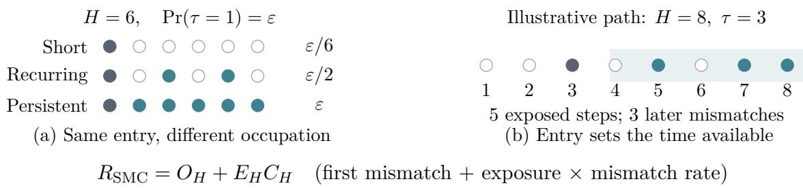  
Figure 1: First divergence and subsequent occupation jointly determine cumulative disagreement. Filled/open circles denote token mismatches/matches. (a) Constructive paths conditional on departure; otherwise all tokens match. Identical divergence laws give diferent expected losses. (b) An illustrative path has five exposed steps, including two local matches. The identity averages over complete trajectories (Equation 7).

First divergence separates mismatch at entry from subsequent occupation, which factors into postdivergence exposure and its mismatch rate. For an exact profile of the divergence law and the first L mismatch marginals of each branch, we construct, over unrestricted autoregressive kernel pairs, every compatible risk in $[ R _ { L } , R _ { L } + B _ { L } ]$ . Here $R _ { L }$ is the observed contribution and $B _ { L }$ the remaining probability-weighted trajectory capacity. Residual-branch conditional Monte Carlo jointly estimates occurrence, occupation, and tail contributions under the same coupling.

Complete trajectories from two language models show how these components interact under persistent eviction. In an exploratory study, SnapKV at 50% retention enters divergence later and less often than SnapKV-512 or recent-token retention with the same 50% prompt-cache budget; exposure contributes 85–90% of four aggregate mismatch gaps. Within each action’s fixed cohort with 64 observable post-divergence steps, late-window TV exceeds early-window TV. An independent study at 90% retention finds the same direction in prespecified branch comparisons. These temporal patterns explain how smaller cumulative diferences coexist with high discrepancy after divergence.

## 2 Related Work

KV-cache compression uses attention sinks, heavy hitters, retrieval heads, observation windows, and heterogeneous budgets to select retained state [9, 10, 22, 26, 33, 35]. Quantization and low-rank projection ofer complementary compression axes [7, 23]; serving evaluations study their quality– memory–latency trade-ofs [11]. InfoKV evaluates the influence of KV removal on future predictive distributions along a fixed token sequence, while LookaheadKV uses learned predictors of future attention [1, 18]. Worst-case space bounds characterize compression limits under general attention inputs [14].

Feedback, error accumulation, and self-recovery have been studied in sequential prediction and language generation [2, 3, 15, 28]. Sequence TV estimation [25] measures distance between marginal sequence laws; maximal agreement couplings [8, 32] maximize the probability of agreement through each time. One-step maximal coupling realizes TV as mismatch probability [13]; token couplings also support speculative decoding [20, 30] and control generation randomness in LLM evaluation [4].

Partial identification characterizes the target values compatible with available observations [19, 24, 29]. Conditional Monte Carlo reduces simulation variance by integrating out components of the sampling randomness [5, 6, 12]. The present study examines how first-divergence timing and subsequent mismatch jointly determine cumulative discrepancy under persistent KV-cache eviction.

## 3 From Divergence Timing to Cumulative Disagreement

First-divergence timing and subsequent mismatch determine diferent parts of cumulative discrepancy. We separate these contributions under a specified coupling, then characterize the risks compatible with a finite observation window after divergence.

## 3.1 Divergence timing, exposure, and occupation

Fix a prompt, an intervention a, a finite token alphabet V, and an integer horizon $H \geq 1$ . Empty sums are zero, and conditional quantities on null events are zero. For histories $x , y \in \mathcal { V } ^ { t - 1 }$ , write

$$
p ( u ) = P _ { t } ( u \mid x ) , \quad q ( u ) = Q _ { t } ^ { a } ( u \mid y ) , \quad c ( u ) = \operatorname* { m i n } \{ p ( u ) , q ( u ) \} , \quad e = 1 - \sum _ { u } c ( u ) = \mathrm { T V } ( p , q ) .
$$

The overlap–residual coupling has joint transition kernel

$$
\Gamma _ { t } ( u , v \mid x , y ) = c ( u ) \mathbf 1 \{ u = v \} + \left\{ \begin{array} { l l } { \displaystyle ( p ( u ) - c ( u ) ) ( q ( v ) - c ( v ) ) } & { , } \\ { \displaystyle e } & { e > 0 , } \end{array} \right.\tag{2}
$$

Its marginals are $p , q ,$ , and the residual supports are disjoint; hence $\Gamma _ { t } \{ u \ne v \mid x , y \} = e \ [ 2 1 $ Proposition 4.7]. Recursive application defines the trajectory law $\Gamma ( P , Q ^ { a } )$ . All probabilities below use this law; we suppress a for single-action statements.

Let $I _ { t } = { \bf 1 } \{ X _ { t } \neq Y _ { t } \} , D _ { H } = H ^ { - 1 } \sum _ { t = 1 } ^ { H } I _ { t }$ , and $\mathcal { F } _ { t - 1 } = \sigma ( X _ { < t } , Y _ { < t } )$ . With $\delta _ { t } ( x , y ) = \mathrm { T V } ( P _ { t } ( \cdot \mid$ $x ) , Q _ { t } ^ { a } ( \cdot \mid y ) )$ ), Equation (2) and iterated expectation give

$$
\mathbb { E } [ I _ { t } \mid \mathcal { F } _ { t - 1 } ] = \delta _ { t } ( X _ { < t } , Y _ { < t } ) ,
$$

$$
R _ { \mathrm { S M C } } : = \mathbb { E } [ D _ { H } ] = \frac { 1 } { H } \sum _ { t = 1 } ^ { H } \mathbb { E } [ \delta _ { t } ( X _ { < t } , Y _ { < t } ) ] .\tag{3}
$$

This risk integrates local TV along the actual paired histories. Before divergence, $\delta _ { t } ( h , h )$ compares distributions on a common prefix; after divergence, both generated histories enter the comparison.

Define

$$
\tau = \operatorname* { i n f } \{ t \leq H : I _ { t } = 1 \} , \qquad p _ { s } = \mathbb { P } ( \tau = s ) , \qquad \kappa _ { s } = \mathbb { E } [ D _ { H } \mid \tau = s ] ,
$$

where inf $\mathcal { O } = \infty$ and $\kappa _ { s } = 0 \mathrm { i f } p _ { s } = 0$ . Since $D _ { H } = 0 \ \mathrm { o n } \ \{ \tau = \infty \}$ and $\begin{array} { r } { H D _ { H } = 1 + \sum _ { t = s + 1 } ^ { H } I _ { t } } \end{array}$ on $\{ \tau = s \}$ ,

$$
R _ { \mathrm { S M C } } = \sum _ { s = 1 } ^ { H } p _ { s } \kappa _ { s } , \qquad \frac { 1 } { H } \le \kappa _ { s } \le \frac { H - s + 1 } { H } \quad ( p _ { s } > 0 ) .\tag{4}
$$

The timing law is determined by survival and the conditional mismatch hazard. Let $S _ { s } = \mathbb { P } ( \tau \geq s )$ and $\lambda _ { s } = \mathbb { E } [ \delta _ { s } ( X _ { < s } , Y _ { < s } ) \mid \tau \geq s ]$ , with $\lambda _ { s } = 0$ when $S _ { s } = 0$ . Since $\{ \tau \geq s \} \in \mathcal { F } _ { s - 1 }$ 2

$$
p _ { s } = \mathbb { E } [ I _ { s } { \mathbf 1 } \{ \tau \geq s \} ] = S _ { s } \lambda _ { s } , \qquad S _ { s + 1 } = S _ { s } ( 1 - \lambda _ { s } ) , \quad S _ { 1 } = 1 .\tag{5}
$$

First mismatches and subsequent occupation contribute

$$
\begin{array} { l l } { \displaystyle O _ { H } = \frac { 1 } { H } \sum _ { s = 1 } ^ { H } p _ { s } , } \\ { \displaystyle \Pi _ { H } = \frac { 1 } { H } \sum _ { t = 1 } ^ { H } \mathbb { E } [ I _ { t } { \mathbf 1 } \{ \tau < t \} ] = \frac { 1 } { H } \sum _ { t = 1 } ^ { H } \mathbb { E } [ \delta _ { t } ( X _ { < t } , Y _ { < t } ) { \mathbf 1 } \{ \tau < t \} ] , } \end{array}\tag{6}
$$

$$
R _ { \mathrm { S M C } } = O _ { H } + \Pi _ { H } .
$$

The equality for $\Pi _ { H }$ follows from the same measurable partition and Equation (3). To separate the available time from the rate of mismatch, let

$$
\begin{array} { l } { { E _ { H } = { \displaystyle \frac { 1 } { H } } \mathbb { E } \biggl [ \sum _ { t = 1 } ^ { H } \mathbf { 1 } \{ \tau < t \} \biggr ] = \frac { 1 } { H } \sum _ { s = 1 } ^ { H } p _ { s } ( H - s ) , } } \\ { { { \cal C } _ { H } = \biggl \{ \Pi _ { H } / E _ { H } , ~ E _ { H } > 0 , ~ \displaystyle \mathit { R } _ { \mathrm { S M C } } = O _ { H } + E _ { H } C _ { H } . } } \end{array}\tag{7}
$$

Since $0 \leq I _ { t } { \bf 1 } \{ \tau < t \} \leq { \bf 1 } \{ \tau < t \} , 0 \leq \Pi _ { H } \leq E _ { H }$ . Thus $E _ { H }$ is expected post-divergence exposure and $C _ { H } \in [ 0 , 1 ]$ is the mismatch rate weighted by each trajectory’s number of post-divergence positions.

For two actions $a , b ,$ define $\Delta A = A ^ { ( b ) } - A ^ { ( a ) }$ and $\overline { { A } } = ( A ^ { ( a ) } + A ^ { ( b ) } ) / 2$ . The algebraic identity $E ^ { ( b ) } C ^ { ( b ) } - E ^ { ( a ) } C ^ { ( a ) } = \Delta E \overline { { C } } + \Delta C \overline { { E } }$ yields

$$
\Delta R _ { \mathrm { { S M C } } } = \Delta O _ { H } + \underbrace { \Delta E _ { H } \overline { { C } } _ { H } } _ { \mathrm { e x p o s u r e \ t e r m } } + \underbrace { \Delta C _ { H } \overline { { E } } _ { H } } _ { \mathrm { r a t e \ t e r m } } .\tag{8}
$$

This identity separates the observed action contrast into occurrence, exposure, and mismatch-rate terms.

Post-divergence occupation measures mismatch after the first unequal token. It accommodates later agreements and renewed mismatches: on $\{ \tau \leq H \}$ ,

$$
\tau < t \leq H + 1 \quad \Longrightarrow \quad X _ { < t } \neq Y _ { < t } ,
$$

because the unequal coordinate at τ remains in each prefix. On the same event, let $\sigma = \operatorname* { i n f } \{ t : \tau <$ $t \leq H , \ I _ { t } = 0 \}$ , with $\sigma = H + 1$ when the set is empty. Then

$$
H D _ { H } = \sigma - \tau + \sum _ { t = \sigma + 1 } ^ { H } I _ { t } .
$$

Mismatch occupation can resume after the first later agreement. For example, deterministic binary sequences $X = ( 0 , 0 , 0 )$ and $Y = ( 1 , 0 , 1 )$ realize $( I _ { 1 } , I _ { 2 } , I _ { 3 } ) = ( 1 , 0 , 1 )$

For a history-independent persistent intervention, set $P _ { t } = \delta _ { 0 } , Q _ { t } = ( 1 - e ) \delta _ { 0 } + e \delta _ { 1 }$ , and $0 < e < 1$ The recursively specified coupling gives $I _ { t } \stackrel { \mathrm { i i d } } { \sim }$ Bernoulli(e), so

$$
\begin{array} { c c } { { p _ { s } = ( 1 - e ) ^ { s - 1 } e , } } & { { \qquad R _ { \mathrm { S M C } } = e , } } \\ { { O _ { H } = \displaystyle { \frac { 1 - ( 1 - e ) ^ { H } } { H } } , \qquad } } & { { \qquad \Pi _ { H } = e - \displaystyle { \frac { 1 - ( 1 - e ) ^ { H } } { H } } . } } \end{array}
$$

For $H \geq 2$ , independence also gives $\Pi _ { H } = e E _ { H }$ and $C _ { H } = e$ . Thus substantial occupation also occurs under history-independent persistent perturbations.

## 3.2 Risks compatible with a finite branch window

A divergence-aligned window observes the same number of positions after each entry time, subject to the horizon. Fix $1 \leq L \leq H$ , put $\ell _ { s } = \operatorname* { m i n } \{ L , H - s + 1 \}$ , and define

$$
\rho _ { s , j } = \mathbb { P } ( I _ { s + j } = 1 \mid \tau = s ) , \qquad 0 \leq j < \ell _ { s } ,
$$

with $\rho _ { s , j } = 0$ when $p _ { s } = 0$ . The first mismatch is included, so $\rho _ { s , 0 } = 1$ for $p _ { s } > 0$ . Define the observed contribution and the remaining capacity by

$$
\begin{array} { c } { { R _ { L } ( p , \rho ) = \displaystyle \frac { 1 } { H } \sum _ { s = 1 } ^ { H } p _ { s } \sum _ { j = 0 } ^ { \ell _ { s } - 1 } \rho _ { s , j } , } } \\ { { { } } } \\ { { { \displaystyle B _ { L } ( p ) = \frac { 1 } { H } \sum _ { s = 1 } ^ { H } p _ { s } ( H - s - L + 1 ) _ { + } . } } } \end{array}\tag{9}
$$

In particular, $R _ { 1 } = O _ { H } , R _ { H } = R _ { \mathrm { S M C } }$ , and $B _ { H } = 0$ . Partial identification asks which values of $R _ { \mathrm { S M C } }$ are compatible with these observations [24].

Definition 3.1 (Admissible depth-L profile). The profile $S _ { L } ( P , Q ) = ( p , \rho )$ is admissible if

$$
p _ { s } \geq 0 , \quad \quad \sum _ { s = 1 } ^ { H } p _ { s } \leq 1 , \quad \quad 0 \leq \rho _ { s , j } \leq 1 ,
$$

with $\rho _ { s , 0 } = 1$ when $p _ { s } > 0$ and $\rho _ { s , j } = 0$ when $p _ { s } = 0$

Theorem 3.2 (Sharp identified risk interval). For every admissible profile on an alphabet with at least two symbols, allowing $P , Q$ to vary over all autoregressive kernels subject to that profile, the compatible risks are exactly

$$
\{ R _ { \mathrm { S M C } } ( P , Q ) : S _ { L } ( P , Q ) = ( p , \rho ) \} = [ R _ { L } ( p , \rho ) , R _ { L } ( p , \rho ) + { \cal B } _ { L } ( p ) ] .\tag{10}
$$

Proof. For every compatible pair, $0 \leq I _ { t } \leq 1$ implies

$$
\begin{array} { r l r } & { } & { 0 \le R _ { \mathrm { S M C } } - R _ { L } = \displaystyle \frac { 1 } { H } \sum _ { s : p _ { s } > 0 } p _ { s } \sum _ { j = \ell _ { s } } ^ { H - s } \mathbb { E } [ I _ { s + j } \mid \tau = s ] } \\ & { } & { \quad \le \displaystyle \frac { 1 } { H } \sum _ { s } p _ { s } ( H - s + 1 - \ell _ { s } ) = B _ { L } . } \end{array}
$$

For attainability, fix $\alpha \in [ 0 , 1 ]$ , use symbols 0, 1, and set $P _ { t } ( 0 \mid x _ { < t } ) = 1$ . Define

$$
\bar { S } _ { t } = 1 - \sum _ { j < t } p _ { j } , \qquad \eta _ { t } = \left\{ { p _ { t } } / { \bar { S } _ { t } } , \quad \bar { S } _ { t } > 0 , \right.
$$

Admissibility gives $0 \le p _ { t } \le \bar { S } _ { t }$ , so $\eta _ { t } \in [ 0 , 1 ]$ . For a binary history let s(y) = min $\{ j : y _ { j } = 1 \}$ , with min $\mathcal { O } = \infty$ , and define

$$
Q _ { t } ^ { \alpha } ( 1 \mid y _ { < t } ) = \left\{ \begin{array} { l l } { \eta _ { t } , } & { s ( y ) = \infty , } \\ { \rho _ { s , t - s } , } & { s = s ( y ) < t , \ t - s < \ell _ { s } , } \\ { \alpha , } & { s = s ( y ) < t , \ t - s \geq \ell _ { s } . } \end{array} \right.
$$

Set $Q _ { t } ^ { \alpha } ( 0 \mid y _ { < t } ) = 1 - Q _ { t } ^ { \alpha } ( 1 \mid y _ { < t } )$ , give other symbols zero mass, and choose kernels arbitrarily on nonbinary histories. Under Equation (2), $X _ { t } = 0$ and $I _ { t } = Y _ { t }$ almost surely. Induction using $\bar { S } _ { t + 1 } = \bar { S } _ { t } ( 1 - \eta _ { t } )$ gives

$$
\mathbb { P } ( \tau \geq s ) = \prod _ { j < s } ( 1 - \eta _ { j } ) = \bar { S } _ { s } , \qquad \mathbb { P } ( \tau = s ) = \bar { S } _ { s } \eta _ { s } = p _ { s } .
$$

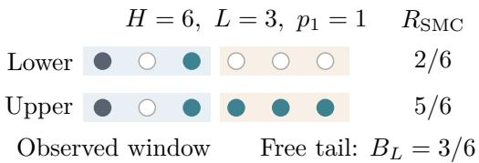  
Figure 2: A shared observation window admits diferent cumulative risks. Filled circles indicate mismatches. Both paths have the same depth-three profile; agreement or mismatch throughout the remaining three positions attains the lower or upper endpoint of Theorem 3.2.

For every $p _ { s } > 0$

$$
\begin{array} { r } { \mathbb { P } ( I _ { s + j } = 1 \mid \tau = s ) = \left\{ { \rho _ { s , j } } , \quad 0 \leq j < \ell _ { s } , \right. \quad } \\ { \alpha , \quad \left. \ell _ { s } \leq j \leq H - s . \right. } \end{array}
$$

Consequently, $S _ { L } ( P , Q ^ { \alpha } ) = ( p , \rho )$ and $R _ { \mathrm { S M C } } ( P , Q ^ { \alpha } ) = R _ { L } + \alpha B _ { L }$ . Varying α fills the claimed interval, including the singleton case $B _ { L } = 0$ □

The capacity $B _ { L }$ quantifies unobserved occupation; the actual tail $R _ { H } - R _ { L }$ locates an intervention within the interval (Figure 2).

## 3.3 Consequences of the identified interval

Corollary 3.3 (Exact-profile minimax estimation). For a fixed admissible profile, write $r = R _ { L }$ 2 $b = B _ { L }$ . Then

$$
\operatorname* { i n f } _ { T } \operatorname* { s u p } _ { u \in [ r , r + b ] } | T - u | = \frac b 2 , \qquad \operatorname* { i n f } _ { T } \operatorname* { s u p } _ { u \in [ r , r + b ] } ( T - u ) ^ { 2 } = \frac { b ^ { 2 } } { 4 } ,
$$

with both infima attained by $T = r + b / 2$

Proof. Theorem 3.2 attains both endpoints at the same profile. For every $T \in \mathbb { R }$

$$
\begin{array} { c } { \operatorname* { m a x } \{ | T - r | , | T - r - b | \} \geq \frac { | T - r | + | T - r - b | } { 2 } \geq \frac { b } { 2 } , } \\ { \operatorname* { m a x } \{ ( T - r ) ^ { 2 } , ( T - r - b ) ^ { 2 } \} \geq \frac { ( T - r ) ^ { 2 } + ( T - r - b ) ^ { 2 } } { 2 } } \\ { = \left( T - r - \frac { b } { 2 } \right) ^ { 2 } + \frac { b ^ { 2 } } { 4 } . } \end{array}
$$

At $T = r + b / 2 , | T - u | \leq b / 2$ for every $u \in [ r , r + b ]$

Corollary 3.4 (Shared-reference action ordering). For two admissible profiles at the same $H , L ,$ , let $[ \underline { { r } } _ { c } , \overline { { r } } _ { c } ]$ be their identified intervals, $c \in \{ a , b \}$ . Allowing a shared reference P and both action kernels to vary subject to those profiles, the sharp contrast set is

$$
\{ R _ { \mathrm { S M C } } ( P , Q ^ { b } ) - R _ { \mathrm { S M C } } ( P , Q ^ { a } ) \} = [ \underline { { { r } } } _ { b } - \overline { { { r } } } _ { a } , \overline { { { r } } } _ { b } - \underline { { { r } } } _ { a } ] .
$$

Every compatible triple satisfies $R _ { \mathrm { S M C } } ( P , Q ^ { a } ) < R _ { \mathrm { S M C } } ( P , Q ^ { b } )$ if and only if $: \overline { { r } } _ { a } < \underline { { r } } _ { b }$

Proof. Write $S _ { L } ^ { ( c ) }$ for the specified profile of action c, $I _ { c } = \left[ \underline { { r } } _ { c } , \overline { { r } } _ { c } \right]$ , and $b _ { c } = \overline { { r } } _ { c } - \underline { { r } } _ { c } = B _ { L } ^ { ( c ) }$ . By Theorem 3.2, the joint risk set satisfies

$$
\mathcal { I } : = \Big \{ \big ( R _ { \mathrm { S M C } } ( P , Q ^ { a } ) , R _ { \mathrm { S M C } } ( P , Q ^ { b } ) \big ) : \mathcal { S } _ { L } ( P , Q ^ { c } ) = \mathcal { S } _ { L } ^ { ( c ) } , \ c = a , b \Big \} \subseteq I _ { a } \times I _ { b } .
$$

For $P _ { t } ^ { \star } ( \cdot \mid h ) = \delta _ { 0 }$ , the same theorem’s construction gives, for every $( \alpha _ { a } , \alpha _ { b } ) \in [ 0 , 1 ] ^ { 2 }$

$$
\begin{array} { r l r } & { } & { { \cal S } _ { L } ( P ^ { \star } , Q ^ { c , \alpha _ { c } } ) = { \cal S } _ { L } ^ { ( c ) } , \qquad c = a , b , } \\ & { } & { \big ( { \cal R } _ { \mathrm { S M C } } ( P ^ { \star } , Q ^ { a , \alpha _ { a } } ) , { \cal R } _ { \mathrm { S M C } } ( P ^ { \star } , Q ^ { b , \alpha _ { b } } ) \big ) = ( \underline { { r } } _ { a } + \alpha _ { a } b _ { a } , \underline { { r } } _ { b } + \alpha _ { b } b _ { b } ) . } \end{array}
$$

Hence $I _ { a } \times I _ { b } \subseteq \mathcal { I }$ , and

$$
\begin{array} { r l } & { \{ v - u : ( u , v ) \in \mathcal { I } \} = \underline { { r } } _ { b } - \underline { { r } } _ { a } + [ 0 , b _ { b } ] - [ 0 , b _ { a } ] } \\ & { \qquad = [ \underline { { r } } _ { b } - \overline { { r } } _ { a } , \overline { { r } } _ { b } - \underline { { r } } _ { a } ] , } \\ & { [ \forall ( u , v ) \in \mathcal { I } , \ u < v ] \ \Longleftrightarrow \ \underset { ( u , v ) \in \mathcal { I } } { \operatorname* { m i n } } ( v - u ) > 0 \iff \overline { { r } } _ { a } < \underline { { r } } _ { b } . } \end{array}
$$

## 3.4 Additional information from a fixed reference

Specifying the complete reference kernel $P _ { 0 }$ restricts the compatible class:

$$
\begin{array} { r } { \mathcal { Z } _ { L } ( P _ { 0 } ; p , \rho ) : = \{ R _ { \mathrm { S M C } } ( P _ { 0 } , Q ) : { \mathcal { S } _ { L } } ( P _ { 0 } , Q ) = ( p , \rho ) \} \subseteq [ R _ { L } , R _ { L } + B _ { L } ] . } \end{array}
$$

The inclusion can be strict. Let $\mathcal { V } = \{ 0 , 1 \} , H = 2 , L = 1 , P _ { 0 , t } ( 1 \mid h ) = 1 / 2$ at every history, and $p _ { 1 } = \varepsilon \in ( 0 , 1 / 2 ) , p _ { 2 } = 0$ . Necessarily

$$
\begin{array} { r } { Q _ { 1 } ( 1 ) = \frac { 1 } { 2 } \pm \varepsilon , \qquad c _ { 1 } ( z ) = \operatorname* { m i n } \{ \frac { 1 } { 2 } , Q _ { 1 } ( z ) \} > 0 \quad ( z = 0 , 1 ) . } \end{array}
$$

The probability of first divergence at time two satisfies

$$
0 = p _ { 2 } = \sum _ { z = 0 } ^ { 1 } c _ { 1 } ( z ) \mathrm { T V } \Big ( \mathrm { B e r n o u l l i } ( { \textstyle { \frac { 1 } { 2 } } } ) , Q _ { 2 } ( \cdot \mid z ) \Big ) .
$$

Each summand is nonnegative with positive coeficient, whence $Q _ { 2 } ( \cdot \mid z )$ = Bernoulli $( 1 / 2 )$ for both histories. Thus $\delta _ { 2 } ( x , y ) = 0$ for every $x , y \in \{ 0 , 1 \}$ , and

$$
\begin{array} { r } { \mathcal { Z } _ { 1 } ( P _ { 0 } ; p , \rho ) = \{ \varepsilon / 2 \} \subsetneq [ \varepsilon / 2 , \varepsilon ] = [ R _ { 1 } , R _ { 1 } + B _ { 1 } ] . } \end{array}
$$

Either choice of $Q _ { 1 } ( 1 ) = 1 / 2 \pm \varepsilon$ , followed by fair second-step kernels, attains the singleton. For any specified reference, separated general intervals remain a suficient action-order condition.

## 4 Measuring Occurrence and Subsequent Occupation

Residual-branch conditional Monte Carlo measures the decomposition by separating branch probability from within-branch loss. Survival-Weighted Residual Branching (SWRB) integrates out the zero-loss full-agreement event. The same sampled sufix then provides the observed window and the realized tail, retaining their covariance. We suppress the action index in $P , Q ^ { a }$

## 4.1 Conditioning on a residual branch

At a common prefix h, let $c _ { s } ( z \mid h ) = \operatorname* { m i n } \{ P _ { s } ( z \mid h ) , Q _ { s } ( z \mid h ) \}$ and $\begin{array} { r } { e _ { s } ( h ) = 1 - \sum _ { z } c _ { s } ( z \mid h ) } \end{array}$ . Draw an auxiliary path U using

$$
K _ { s } ^ { \cap } ( z \mid h ) = \frac { c _ { s } ( z \mid h ) } { 1 - e _ { s } ( h ) } \quad ( e _ { s } ( h ) < 1 ) ,\tag{11}
$$

extended arbitrarily when $e _ { s } = 1$ . Its survival weights and branch mass are

$$
\widetilde { S } _ { s } = \prod _ { j < s } ( 1 - e _ { j } ( U _ { < j } ) ) , \qquad w _ { s } = \widetilde { S } _ { s } e _ { s } ( U _ { < s } ) , \qquad M = \sum _ { s } w _ { s } = 1 - \widetilde { S } _ { { H } + 1 } .\tag{12}
$$

The overlap identity $( 1 - e _ { s } ) K _ { s } ^ { \cap } = c _ { s }$ gives

$$
\mathbb { P } _ { U } ( U _ { < s } = u _ { < s } ) w _ { s } ( u ) = \mathbb { P } ( X _ { < s } = Y _ { < s } = u _ { < s } , \tau = s ) .\tag{13}
$$

Thus $\mathbb { E } [ w _ { s } ] = p _ { s }$ . An auxiliary mixture conditional on $U$ assigns zero-loss mass $1 - M$ and residualbranch masses $w _ { s } ;$ marginalizing $U$ recovers the ordinary coupled-loss law. A branch at s draws the residual token pair at $U _ { < s }$ and continues the declared coupling with fresh randomness. Write its loss as $\begin{array} { r } { D _ { s } = H ^ { - 1 } \sum _ { t = s } ^ { H } I _ { t } . } \end{array}$ , and its conditional second moment as $\nu _ { s } = \mathbb { E } [ D _ { s } ^ { 2 } \mid U ]$ , zero for a zero-weight branch.

We remove the zero-loss component by sampling $J \mid U$ with probabilities ${ w _ { s } / M }$ for $M > 0$ and generating the selected sufix. If an auxiliary $B \mid U \sim \operatorname { B e r n o u l l i } ( M )$ is independent of $( J , D _ { J } )$ given $U _ { : }$ , then $B D _ { J }$ has the ordinary coupled-loss law. Conditional expectation gives

$$
\mathbb { E } [ B D _ { J } \mid U , J , D _ { J } ] = M D _ { J } .\tag{14}
$$

This is the Rao–Blackwell representation [5, 6, 27]. At $M = 0$ , take $J = 1 , D _ { J } = B = 0$

Proposition 4.1 (Unbiased measurement and per-replicate variance dominance). The estimates

$$
Z ^ { R } = M D _ { J } , \qquad Z ^ { O } = M / H , \qquad Z ^ { \Pi } = M ( D _ { J } - 1 / H )\tag{15}
$$

satisfy $Z ^ { R } = Z ^ { O } + Z ^ { \Pi }$ and have expectations $R _ { \mathrm { S M C } } , O _ { H } , \Pi _ { H }$ , respectively. For ordinary coupled loss $Z _ { \mathrm { n a i v e } ; }$

$$
\mathrm { V a r } ( Z _ { \mathrm { n a i v e } } ) - \mathrm { V a r } ( Z ^ { R } ) = \mathbb { E } \bigg [ ( 1 - M ) \sum _ { s } w _ { s } \nu _ { s } \bigg ] \geq 0 ,\tag{16}
$$

with strict inequality exactly when $\mathbb { P } ( 0 < M < 1 ) > 0$

Proof. Let $m _ { s } = \mathbb { E } [ D _ { s } \mid U ]$ , zero on zero-weight branches. By Equation (13), $\mathbb { E } [ w _ { s } m _ { s } ] = p _ { s } \kappa _ { s }$ . The branch law and conditional independence of B give

$$
{ \mathbb E } [ B D _ { J } \mid U ] = { \mathbb E } [ M D _ { J } \mid U ] = \sum _ { s } w _ { s } m _ { s } ,
$$

$$
\mathbb { E } \big [ ( B D _ { J } ) ^ { 2 } \mid U \big ] = \sum _ { s } w _ { s } \nu _ { s } , \qquad \mathbb { E } \big [ ( M D _ { J } ) ^ { 2 } \mid U \big ] = M \sum _ { s } w _ { s } \nu _ { s } .
$$

Thus $\begin{array} { r } { \mathbb { E } [ Z ^ { R } ] = \sum _ { s } p _ { s } \kappa _ { s } = R _ { \mathrm { S M C } } , \mathbb { E } [ Z ^ { O } ] = H ^ { - 1 } \sum _ { s } p _ { s } = O _ { H } } \end{array}$ , and $\mathbb { E } [ Z ^ { \Pi } ] = \mathbb { E } [ Z ^ { R } - Z ^ { O } ] = \Pi _ { H }$ . Since $B D _ { J } \overset { d } { = } Z _ { \mathrm { n a i v e } }$ , subtracting second moments proves Equation (16). On $\{ w _ { s } > 0 \} , H ^ { - 1 } \leq D _ { s } \leq 1$ ; hence

$$
\frac { M ( 1 - M ) } { H ^ { 2 } } \leq ( 1 - M ) \sum _ { s } w _ { s } \nu _ { s } \leq M ( 1 - M ) .
$$

The expected gap is positive if and only if $\mathbb { P } ( 0 < M < 1 ) > 0$ . All identities include $M = 0$ under the stated zero convention. □

## 4.2 Joint measurement of the window and tail

The branch-mixture identity also applies to a truncated sufix, so a single replicate can resolve how loss accumulates with observation depth. For $\ell _ { s } = \operatorname* { m i n } \{ L , H - s + 1 \}$ , define $\begin{array} { r } { D _ { s , L } = H ^ { - 1 } \sum _ { j = 0 } ^ { \ell _ { s } - 1 } I _ { s + j } } \end{array}$ $m _ { s , L } = \mathbb { E } [ D _ { s , L } \mid U ] , Z _ { L } = M D _ { J , L }$ , and $\begin{array} { r } { W _ { L } = H ^ { - 1 } \sum _ { s } w _ { s } ( H - s - L + 1 ) _ { + } } \end{array}$ . Applying the same mixture to the window contribution, with $D _ { s , L } = m _ { s , L } = 0$ when $w _ { s } = 0$ , gives

$$
\mathbb { E } [ Z _ { L } ] = R _ { L } , \qquad \mathbb { E } [ Z _ { H } - Z _ { L } ] = R _ { H } - R _ { L } , \qquad \mathbb { E } [ W _ { L } ] = B _ { L } .\tag{17}
$$

Indeed, $\begin{array} { r } { \mathbb { E } [ Z _ { L } \ | \ U ] = \sum _ { s } w _ { s } m _ { s , L } } \end{array}$ , and $\begin{array} { r } { \mathbb { E } [ w _ { s } m _ { s , L } ] = ( p _ { s } / H ) \sum _ { j < \ell _ { s } } \rho _ { s , j } } \end{array}$ . Summation and linearity prove Equation (17). The shared sufix preserves the covariance of the window and tail estimates (Figure 3, Algorithm 1).

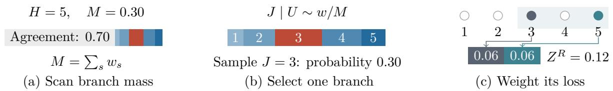  
Figure 3: One residual-branch measurement, conditional on an overlap scan. The scan places mass $M = 0 . 3 0$ on divergence. Renormalizing its branch weights selects one sufix; the pictured sample has $D _ { 3 } = 2 / 5$ and returns $Z ^ { R } = 0 . 1 2$ . In (c), filled circles mark mismatches at positions 3 and $5 ;$ their bars contribute $Z ^ { { \cal O } } = Z ^ { \Pi } = M / H = 0 . 0 6$ , respectively. The factor M preserves the unconditional mean.

Algorithm 1 One conditional Monte Carlo replicate   
Require: Kernels $P , Q ,$ horizon H, depths ${ \mathcal { L } } \subseteq \{ 1 , \ldots , H \}$   
Ensure: $( Z ^ { R } , Z ^ { O } , Z ^ { \Pi } )$ and $( Z _ { L } , Z _ { H } - Z _ { L } , W _ { L } ) _ { L \in \mathcal { L } }$   
1: Initialize $u  ( ) , S  1$ , and $w _ { 1 } , \ldots , w _ { H }  0 .$   
2: for $s = 1 , \ldots , H$ do   
3: Compute $e _ { s } ( u )$ ; set $w _ { s } \gets S e _ { s } ( u ) , S \gets S ( 1 - e _ { s } ( u ) ) .$   
4: If $S = 0 ,$ break; all later branch weights are zero.   
5: Draw $U _ { s } \sim K _ { s } ^ { \cap } ( \cdot \mid u )$ and append it to u.   
6: end for   
7: Set $\begin{array} { r } { M \gets \sum _ { s } w _ { s } , W _ { L } \gets H ^ { - 1 } \sum _ { s } w _ { s } ( H - s - L + 1 ) _ { + } } \end{array}$   
8: If $M = 0 ,$ return zero for every output.   
9: Draw J with probabilities $w _ { s } / M .$   
10: Draw a fresh residual pair at $U _ { < J } ;$ continue the declared coupling, recording $I _ { J } , \ldots , I _ { H } .$   
11: Compute $\begin{array} { r } { Z _ { L } \gets ( M / H ) \sum _ { j = 0 } ^ { \operatorname* { m i n } ( L , H - J + 1 ) - 1 } I _ { J + j } , } \end{array}$ including $L = H$   
12: return $( Z _ { H } , M / H , Z _ { H } - \overset { , } { M } / H ) , ( Z _ { L } , Z _ { H } - \overset { , } { Z } _ { L } , W _ { L } ) _ { L \in \mathcal { L } } .$

The cost includes the entire overlap scan, retention or replay of $U _ { < J }$ , and residual continuation. Wall-clock eficiency depends on these costs together with the per-replicate variance.

## 4.3 Sampled profiles and endpoint uncertainty

The joint measurements $Z _ { L } , W _ { L }$ in Equation (17) satisfy

$$
0 \le Z _ { L } \le \frac { M L } { H } , \qquad 0 \le W _ { L } \le \frac { M ( H - L ) } { H } , \qquad 0 \le Z _ { L } \le Z _ { L } + W _ { L } \le 1 .
$$

Let $V _ { i } ^ { - }$ and $V _ { i } ^ { + }$ be within-document replicate averages of $Z _ { L }$ and $Z _ { L } + W _ { L }$ , respectively. For n independent document vectors, define

$$
\widehat { r } _ { \pm } = \frac { 1 } { n } \sum _ { i = 1 } ^ { n } V _ { i } ^ { \pm } , \qquad r _ { \pm } = \mathbb { E } [ \widehat { r } _ { \pm } ] , \qquad \epsilon _ { \alpha } = \sqrt { \frac { \log ( 4 / \alpha ) } { 2 n } } .
$$

Hoefding’s inequality [16] yields $\mathbb { P } ( | \widehat { r } _ { \pm } - r _ { \pm } | > \epsilon _ { \alpha } ) \le 2 e ^ { - 2 n \epsilon _ { \alpha } ^ { 2 } } = \alpha / 2$ . By a union bound, the corresponding mean full-horizon risk belongs to

$$
\left[ \operatorname* { m a x } \{ 0 , \widehat { r } _ { - } - \epsilon _ { \alpha } \} , \quad \operatorname* { m i n } \{ 1 , \widehat { r } _ { + } + \epsilon _ { \alpha } \} \right]
$$

with probability at least $1 - \alpha$ for each specified action and depth. The enclosure combines unobserved tail capacity and sampled-endpoint uncertainty.

The finite-state study below evaluates SWRB. The language-model studies in Section 5 measure the same $R _ { \mathrm { S M C } } , O _ { H } , \Pi _ { H }$ with complete coupled rollouts for temporal analysis.

## 4.4 Finite-state estimation

We compare the conditional estimator with ordinary coupling in 24 enumerable binary systems, using $H = 3$ and 512 independent replicates per estimator and system. For each system $c \in$ $\{ 1 , \ldots , 2 4 \}$ , every prefix has independent distributions $P , A ,$ , obtained by normalizing independent Gamma $( 1 . 5 , 1 ) + 0 . 0 5$ weights. The intervention kernel is

$$
Q = ( 1 - \lambda ) P + \lambda A , \quad \quad \lambda = \left( 0 . 0 5 + \frac { 0 . 4 5 c } { 2 4 } \right) U V , \quad \quad U \sim \mathrm { U n i f } [ 0 . 5 , 1 ] , \quad V \sim \mathrm { U n i f } [ 0 , 1 ] ,
$$

with independent $U , V .$ Exact enumeration at $H = 3$ supplies $R _ { \mathrm { S M C } }$ for each system.

Figure 4 compares the sample means with exact risks and shows lower SWRB sample variance in every system. The naive-to-SWRB sample-variance ratio ranges from 11.1 to 289, with median 52.7, consistent with Proposition 4.1.

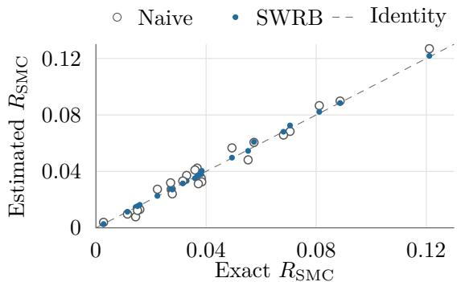  
(a) Estimates and exact risks

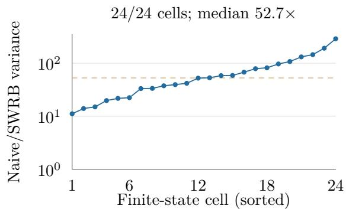  
(b) Empirical variance reduction  
Figure 4: Conditional measurements recover finite-state risk with lower sample variance in all 24 systems. Left: Monte Carlo means from 512 replicates for each estimator and system. Right: ratios of sample variances, sorted by magnitude; the dashed line marks the median.

Counting the overlap scan and residual continuation, the mean number of kernel-pair evaluations rises by a factor of 1.37, while the ratio-of-means variance–cost advantage is 20.0. These counts quantify the computational trade-of in the finite-state systems; Transformer execution also depends on cache retention and replay.

## 5 How Eviction Shapes the Disagreement Trajectory

Paired complete trajectories connect the temporal decomposition to KV-cache eviction in two language models. We examine entry into divergence, subsequent branch dynamics, and the information retained by shorter observations.

## 5.1 Paired trajectories and study design

We study Meta-Llama-3.1-8B-Instruct (Llama) and Qwen2.5-7B-Instruct (Qwen) in six HEL-MET/RULER environment–length strata (4K, 16K, and 32K) [17, 34]. The complete-trajectory study uses 288 validation documents, 48 per stratum, and K = 64 replicates per action. Actions retain 512 prompt entries with SnapKV, 50% with SnapKV, or the same prompt-cache bytes with a recent-token selector. The targeted higher-retention study uses another 288 independent documents, $K = 3 2$ , and SnapKV versus recent-token retention at 90%. Both studies have horizon $H = 1 2 8$ temperature-one full-softmax sampling, persistent compact caches, and same-path full-retention controls $\left( K = 2 \right)$ ; these controls yield zero TV. Generated entries are retained, and EOS is absorbing through the horizon.

The HELMET strata use retrieved-context and citation tasks from NQ, TriviaQA, HotpotQA, PopQA, ASQA, and QAMPARI; the citation prompts use HELMET’s top-2000 retrieval files. RULER contributes its 13 synthetic tasks: eight needle-retrieval variants, variable tracking, commonand frequent-word extraction, and two question-answering tasks. Length labels denote nominal input bands; retention uses the actual tokenized prompt length.

For tokenized prompt length n, half and 90% retention preserve $\lfloor n / 2 \rfloor$ and $\lfloor 9 n / 1 0 \rfloor$ prompt entries per KV head and layer. Recent retention keeps four initial sink positions and the most recent remaining entries. At the same retention, SnapKV and recent retention match exactly in prompt-KV payload, indices, metadata, and initial resident decode bytes. SnapKV uses a 64-token scoring window and kernel size five. Eviction follows prefill, preserving the already computed first-token distribution.

For each action and replicate, we record the reference along its own history X, the compressed model along its own history Y, and a compressed copy forced along X. Besides token mismatch, these give

$$
\begin{array} { l } { \displaystyle R ( \boldsymbol { a } ) = H ^ { - 1 } \sum _ { t } \mathbb { E } _ { \Gamma ( P , Q ^ { a } ) } \operatorname { T V } ( P _ { t } ( \cdot \mid X _ { < t } ) , Q _ { t } ^ { a } ( \cdot \mid Y _ { < t } ) ) , } \\ { \displaystyle F ( \boldsymbol { a } ) = H ^ { - 1 } \sum _ { t } \mathbb { E } _ { X \sim P } \operatorname { T V } ( P _ { t } ( \cdot \mid X _ { < t } ) , Q _ { t } ^ { a } ( \cdot \mid X _ { < t } ) ) . } \end{array}\tag{18}
$$

Here $R = R _ { \mathrm { S M C } }$ by Equation (3); its TV and token estimators difer at finite K. We write $\delta _ { t } ^ { a }$ and $f _ { t } ^ { a }$ for the respective TV integrands. The three paths are paired within an action. Across actions we pair documents, whose realized reference continuations may difer. Documents are the statistical unit, with equal weighting of the six strata.

Each study uses 36 development documents (six per stratum), disjoint from both evaluation cohorts. Development variance and measured cost determine evaluation sample sizes before evaluation outcomes are observed, using K = 32 development replicates in the first study and K = 16 at higher retention.

We bootstrap documents within strata, pairing sampled documents across actions: 10,000 draws for calibration and higher-retention analyses, and 2,000 for first-study exploration. First-study occurrence, exposure, and time profiles are post-outcome exploratory analyses with pointwise 95% intervals. The independent 90% study prespecifies eight pooled branch-TV and saturation endpoints with family-adjusted intervals; supporting 90% analyses are descriptive with pointwise 95% intervals.

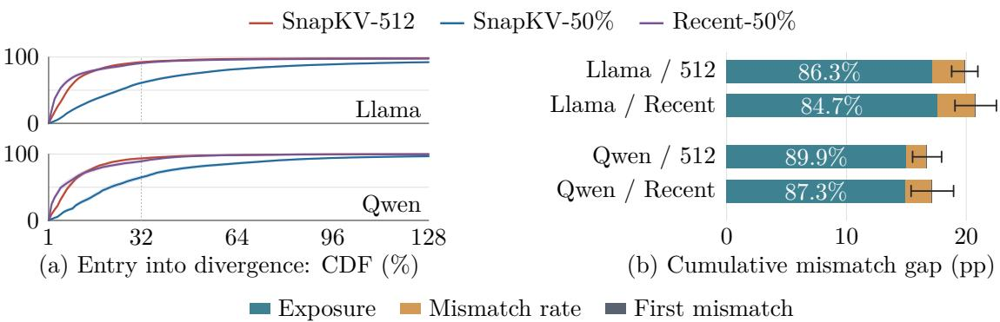  
Figure 5: Post-divergence exposure accounts for most of the mismatch gap. Left: $\mathbb { P } ( \tau \leq t )$ versus generation position $t ,$ including trajectories agreeing through $H = 1 2 8$ . Right: contrasts with SnapKV-half follow Equation (8); component lengths and exposure shares are point estimates. CDF shading and total error bars give pointwise 95% document-bootstrap intervals. Recent-half uses identical prompt-cache bytes. Exploratory analysis: $N = 2 8 8 , K = 6 4$ per action and model.

## 5.2 Entry into divergence organizes cumulative diferences

SnapKV-half delays first divergence. On Llama, the fraction diverging by step 32 is 61.05%, compared with 92.35% for SnapKV-512 and 90.81% for recent-half; by step 128 these fractions are 92.29%, 98.14%, and 97.66%. Qwen shows the same ordering (Figure 5). Among trajectories diverging within the horizon, mean entry times are 30.37 versus 11.69 and 10.59 steps on Llama, and 29.37 versus 12.18 and 12.14 on Qwen.

SnapKV-512 minus SnapKV-half gives 19.90 and 16.68 percentage points (pp) of token mismatch on Llama and Qwen. The exposure terms contribute 17.17 [16.20, 18.13] and 14.99 [13.87, 16.22] pp, respectively: 86.3% and 89.9% of the point-estimated gaps. The equal-budget recent-half contrasts give 20.79 and 17.10 pp, with exposure shares 84.7% and 87.3%. All 24 model–stratum–contrast point decompositions have an exposure majority (78.1–96.1%). Equation (8) holds exactly for the empirical token-mismatch moments; each component share divides its contribution by the observed mismatch gap. Thus the pattern is also present when retention quantity is fixed and the selected entries change.

Mismatch during post-divergence time is high for every action: $C _ { H }$ ranges from 89.74% to 93.68% on Llama and 93.59% to 96.20% on Qwen. Its between-action diferences contribute 1.67–3.15 pp to the aggregate gaps.

## 5.3 Generation time and divergence time reveal diferent dynamics

Figure 6 separates two temporal patterns: intervention gaps narrow along generation positions, while discrepancy stays high within branches aligned at divergence. For the latter, each action’s fixed $\tau \leq 6 4$ cohort gives every member 64 strictly post-divergence steps and ensures $\tau + j \le H$ for $1 \leq j \leq 6 4$

For SnapKV-half, branch TV rises from 84.45% to 91.56% on Llama and from 85.28% to 95.76% on Qwen between the early and late windows (Figure 6b,d).

Let d denote the document. For each action, let ${ \cal I } _ { t } = { \bf 1 } \{ X _ { t } \neq Y _ { t } \} , \delta _ { t } = \delta _ { t } ( X _ { < t } , Y _ { < t } )$ , and $\mathcal { F } _ { t - 1 } = \sigma ( d , X _ { < t } , Y _ { < t } )$ . Since $\mathbb { E } [ I _ { t } \mid \mathcal { F } _ { t - 1 } ] = \delta _ { t }$ and $\{ \tau \geq t \} \in \mathcal { F } _ { t - 1 } ,$

$$
\mathbb { E } [ \delta _ { t } { \mathbf 1 } \{ \tau \geq t \} ] = \mathbb { E } [ I _ { t } { \mathbf 1 } \{ \tau \geq t \} ] = \mathbb { P } ( \tau = t ) = p _ { t } .
$$

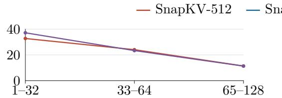

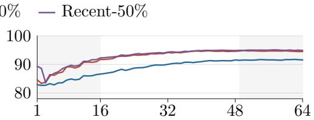  
(b) Llama: post-divergence TV (%)

(a) Llama: generation-clock gap (pp)  
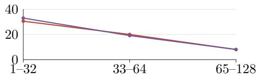  
(c) Qwen: generation-clock gap (pp)

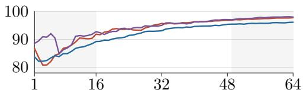  
(d) Qwen: post-divergence TV (%)  
Figure 6: Smaller gaps between interventions coexist with rising discrepancy within divergent branches. Left: intervention-minus-SnapKV-half TV gaps over generation-position blocks. Right: complete TV curves at strictly post-divergence lags 1–64 within each action’s fixed $\tau \leq 6 4$ cohort. Shading marks the early (1–16) and late (49–64) lag windows. Curves are exploratory point estimates, $N = 2 8 8 , K = 6 4 ;$ paired pointwise 95% document-bootstrap intervals for the late-minus-early contrasts are reported in the text.

Partitioning by the entry time therefore gives

$$
\mathbb { E } [ \delta _ { t } ] = p _ { t } + \sum _ { s < t } p _ { s } \mathbb { E } [ \delta _ { t } \mid \tau = s ] ,\tag{19}
$$

with zero-mass terms defined as zero. Generation-position averages weight branches of diferent ages by each action’s entry law. Later entry shortens exposure to the high-discrepancy process, permitting narrowing aggregate gaps alongside high branch TV.

Stepwise maximality and $\{ \tau = s \} \in \mathcal { F } _ { s + j - 1 } \mathrm { ~ g i v e }$

$$
\begin{array} { r l } & { \mathbb { E } [ I _ { t } \mid \mathcal { F } _ { t - 1 } ] = \delta _ { t } , } \\ & { \mathbb { E } [ I _ { s + j } \mathbf { 1 } \{ \tau = s \} ] = \mathbb { E } [ \mathbf { 1 } \{ \tau = s \} \mathbb { E } [ I _ { s + j } \mid \mathcal { F } _ { s + j - 1 } ] ] = \mathbb { E } [ \delta _ { s + j } \mathbf { 1 } \{ \tau = s \} ] , } \\ & { \mathbb { E } [ I _ { \tau + j } \mid \tau \leq 6 4 ] = \frac { \sum _ { s = 1 } ^ { 6 4 } \mathbb { E } [ I _ { s + j } \mathbf { 1 } \{ \tau = s \} ] } { \mathbb { P } ( \tau \leq 6 4 ) } = \mathbb { E } [ \delta _ { \tau + j } \mid \tau \leq 6 4 ] . } \end{array}\tag{20}
$$

The last line requires $\mathbb { P } ( \tau \leq 6 4 ) > 0$ and $1 \leq j \leq 6 4$

In the first study, the cohort fractions for SnapKV-512, SnapKV-half, and recent-half are 97.18%, 81.81%, and 96.19% on Llama, and 98.48%, 86.07%, and 98.57% on Qwen. Their late-minusearly TV contrasts are 6.53 [5.74, 7.36], 7.11 [6.48, 7.81], and 5.84 [5.11, 6.58] pp on Llama, and 10.63 [9.37, 11.91], 10.48 [9.20, 11.81], and 7.83 [6.72, 8.98] pp on Qwen. All 36 stratum–model–action pointwise 95% lower bounds are positive.

Local token agreement remains possible: at least 16 consecutive pre-EOS agreements occur in 2.60%/7.60%/2.85% of Llama branch trajectories and 3.05%/7.32%/3.52% of Qwen branch trajectories (512/half/recent-half). Across these six conditions, a pre-EOS mismatch after an earlier agreement occurs in 65.11–76.88% of trajectories. These fractions use the whole branch cohort as denominator.

## 5.4 Persistent branch discrepancy at higher retention

At 90% retention, SnapKV again enters divergence later and less often than recent-token retention at the same prompt-cache budget. Exposure accounts for 88.6% and 92.1% of their 34.84-pp and

<table><tr><td>Model</td><td>Selector</td><td> $S _ { . 9 9 } , \%$  [99.375% CI]</td><td>Cohort docs / paths</td></tr><tr><td>Llama</td><td>SnapKV-90</td><td>28.44 [26.68, 30.24]</td><td>288 / 4,723</td></tr><tr><td rowspan="3">Qwen</td><td>recent-90</td><td>56.18 [53.77, 58.61]</td><td>288 / 8,119</td></tr><tr><td>SnapKV-90</td><td>43.63 [40.94, 46.35]</td><td>286 / 5,275</td></tr><tr><td>recent-90</td><td>73.65 [71.02, 76.14]</td><td>287 / 8,301</td></tr></table>

Table 1: Full-horizon TV saturation and branch-cohort support at higher retention. These four fractions and the four branch contrasts in Figure 7a form the prespecified family of eight endpoints, with documentbootstrap intervals at $\alpha = . 0 5 / 8$ . The last column counts documents and trajectories in each action’s fixed $\tau \leq 6 4$ cohort.

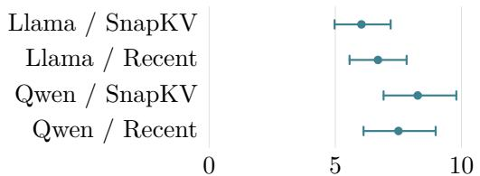  
(a) Late minus early branch TV (pp)

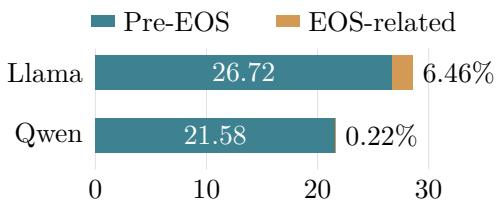  
(b) Selector diference in R − F (pp)  
Figure 7: Higher retention preserves branch discrepancy; most of the selector history-gap diference accrues before EOS. Independent 90% study: $N = 2 8 8 , K = 3 2 .$ . (a) Lags 49–64 minus 1–16 in each action’s $\tau \leq 6 4$ cohort; prespecified 99.375% document-bootstrap intervals for the eight-endpoint family. (b) Recent minus SnapKV, with additive pre-EOS and EOS-related components; end labels give EOS shares of the total. Bars and shares are descriptive point estimates.

31.20-pp token-mismatch gaps on Llama and Qwen, respectively; the shares range from 86.13% to   
95.36% across the 12 model–stratum comparisons.

All four prespecified branch-TV intervals lie above zero (Figure 7a); strictly pre-EOS contrasts retain this direction in every stratum. The study jointly evaluates the branch contrast and the full-horizon saturation fraction

$$
\begin{array} { r l } & { \displaystyle { \cal B } ( a ) = \frac { 1 } { 1 6 } \sum _ { j = 4 9 } ^ { 6 4 } \mathbb { E } [ \delta _ { \tau + j } ^ { a } \mid \tau \leq 6 4 ] - \frac { 1 } { 1 6 } \sum _ { j = 1 } ^ { 1 6 } \mathbb { E } [ \delta _ { \tau + j } ^ { a } \mid \tau \leq 6 4 ] , } \\ & { \displaystyle { \cal S } _ { \cdot 9 9 } ( a ) = { \cal H } ^ { - 1 } \sum _ { t = 1 } ^ { { \cal H } } \mathbb { P } ( \delta _ { t } ^ { a } > \cdot 9 9 ) . } \end{array}\tag{21}
$$

The saturation fractions in Table 1 place the branch increases in a regime with substantial mass near the upper endpoint of TV.

The branch cohorts contain 51.25%/88.10% of Llama trajectories and 57.24%/90.07% of Qwen trajectories (SnapKV/recent). Full-horizon divergence probabilities are 74.24%/94.88% and 80.88%/97.75%, with conditional mean entry times of 49.61/20.19 and 47.74/21.47 steps. Early-to-late branch TV is 82.64% to 88.68% and 87.44% to 94.13% on Llama, and 85.87% to 94.14% and 89.56% to 97.06% on Qwen. For comparison, first-study saturation fractions are 58.15%/44.92%/62.41% on Llama and 81.23%/65.53%/82.48% on Qwen (512/half/recent-half).

## 5.5 EOS and the location of discrepancy

Rollout and fixed-history TV agree through the first divergent token; R − F accumulates later. For each action, let $e _ { X } , e _ { Y }$ be the first EOS output positions (infinite if absent), $e = \operatorname* { m i n } ( e _ { X } , e _ { Y } )$ , and

$e ^ { \prime } = \operatorname* { m a x } ( e _ { X } , e _ { Y } )$ . Within $\{ 1 , \ldots , H \}$ , define

$$
S _ { 0 } = \{ t : t < e \} , \quad S _ { 1 } = \{ t : t = e \leq H \} , \quad S _ { 2 } = \{ t : e < t \leq e ^ { \prime } \} , \quad S _ { 3 } = \{ t : e ^ { \prime } < t \} .
$$

These sets separate pre-EOS, the first EOS output, one side absorbed, and both sides absorbed. With fixed-history TV $f _ { t } ^ { a }$ and $\Delta$ denoting recent-90 minus SnapKV-90,

$$
G _ { r } ( a ) = \frac { 1 } { H } \mathbb { E } \left[ \sum _ { { t } \in S _ { r } } ( \delta _ { t } ^ { a } - f _ { t } ^ { a } ) \right] , \qquad \Delta ( R - F ) = \sum _ { r = 0 } ^ { 3 } \Delta G _ { r } , \qquad G _ { 3 } ( a ) = 0 .\tag{22}
$$

The pre-EOS component accounts for most of the selector diference (Figure 7b). The EOS-related component is $\textstyle \sum _ { r = 1 } ^ { 3 } \Delta G _ { r }$ ; its ratio to $\Delta ( R - F )$ gives the descriptive EOS share.

The total selector diferences are 28.56 [26.66, 30.48] pp on Llama and 21.63 [19.58, 23.66] pp on Qwen (pointwise 95% intervals); their pre-EOS components have intervals [25.11, 28.31] and [19.52, 23.61] pp. All 12 model–stratum gaps and pre-EOS components have positive pointwise lower bounds. Llama’s EOS shares range from 0.86% to 3.68% on HELMET and 9.52% to 11.65% on RULER; Qwen’s range is approximately −0.024% to 1.25%. A signed selector diference can have a negative component.

For the first study, pre-EOS components of 512-minus-half $\Delta ( R - F )$ are 8.83 of 10.39 pp on Llama and 4.08 of 4.06 pp on Qwen; recent-half minus half gives 10.65 of 12.14 pp and 4.70 of 4.70 pp. The Qwen HELMET–32K 512-minus-half estimate is −0.35 [−2.84, 2.05] pp, with its interval spanning both signs.

For a lag block J, the strict pre-EOS branch mean is

$$
b _ { J } ^ { \mathrm { p r e } } = \frac { \mathbb { E } [ \sum _ { j \in J } \mathbf { 1 } \{ \tau \leq 6 4 , \ \tau + j < e \} \delta _ { \tau + j } ] } { \mathbb { E } [ \sum _ { j \in J } \mathbf { 1 } \{ \tau \leq 6 4 , \ \tau + j < e \} ] } ,
$$

with summands zero when $\tau > 6 4$ . At 90% retention, $b _ { 4 9 : 6 4 } ^ { \mathrm { p r e } } - b _ { 1 : 1 6 } ^ { \mathrm { p r e } }$ is 5.94 [5.14, 6.77] and 6.83 [6.01, 7.65] pp on Llama, and 8.26 [7.27, 9.32] and 7.51 [6.51, 8.57] pp on Qwen (SnapKV/recent; pointwise 95%). Early/late pre-EOS step fractions are 97.95%/94.87% and 98.63%/94.54% on Llama; RULER late fractions are approximately 90%–92%. Qwen’s fractions remain above approximately 99.8%. Each mean averages surviving steps in its own block, whose contributing trajectory sets can difer.

## 5.6 Task-dependent timing and persistent branch discrepancy

For generation-position block J, write $\begin{array} { r } { g _ { J } = | J | ^ { - 1 } \sum _ { t \in J } \mathbb { E } \big [ \delta _ { t } ^ { \mathrm { r e c e n t 9 0 } } - \delta _ { t } ^ { \mathrm { S n a p K V 9 0 } } \big ] } \end{array}$ . The pooled values for J = 1:32, 33:64, 65:128 are 37.89, 41.35, and 30.11 pp on Llama and 36.09, 37.63, and 25.53 pp on Qwen. Table 2 separates the two clocks by stratum: g65:128 − g1:32 is negative in every HELMET model–length comparison and positive in every RULER comparison.

All 24 branch contrasts have positive pointwise lower bounds. Their strict pre-EOS versions range from 4.18 to 11.46 pp, also with positive lower bounds (the smallest is 2.47 pp). In the first study, the pooled 512-minus-half generation-clock gaps are 32.76, 24.06, and 11.37 pp on Llama and 30.56, 20.03, and 8.06 pp on Qwen; the RULER–4K gap rises in the middle block.

## 5.7 Aggregate prediction and temporal resolution

Calibration predicts the population-average SnapKV-512 minus SnapKV-half gap in R from either fixed-history TV or the first 32 generation positions. For each model and observation, six-fold selection on development documents minimizes document-level paired-contrast mean squared error over a stratum/action mean, an uncalibrated flat predictor, and ridge regression (α = 10). Ridge uses stratum/action indicators and either full-horizon F or the replicate-averaged short-window features

<table><tr><td>Model</td><td>Stratum</td><td> $\Delta g$ </td><td>B: SnapKV [95% CI]</td><td>B: recent [95% CI]</td></tr><tr><td rowspan="5">Llama</td><td>HELMET-4K</td><td>-21.72</td><td>4.21 [2.51, 6.10]</td><td>6.18 [4.73, 7.74]</td></tr><tr><td>HELMET-16K</td><td>-18.14</td><td>7.43 [5.27, 9.87]</td><td>5.01 [3.90, 6.16]</td></tr><tr><td>HELMET-32K</td><td>-14.34</td><td>8.48 [6.69, 10.18]</td><td>6.28 [4.96, 7.71]</td></tr><tr><td>RULER-4K</td><td>+3.25</td><td>5.01 [3.13, 7.03]</td><td>7.26 [4.36, 10.38]</td></tr><tr><td>RULER-16K RULER-32K</td><td>+0.50 +3.73</td><td>5.39 [3.59, 7.52]</td><td>8.54 [6.10, 11.10]</td></tr><tr><td rowspan="5">Qwen</td><td>HELMET-4K</td><td>-25.84</td><td>5.49 [4.07, 7.02]</td><td>7.16 [5.18, 9.16]</td></tr><tr><td>HELMET-16K</td><td>-26.36</td><td>6.60 [4.85, 8.45]</td><td>6.08 [3.86, 8.87]</td></tr><tr><td>HELMET-32K</td><td>-19.54</td><td>11.46 [8.19, 15.12]</td><td>4.86 [3.39, 6.47]</td></tr><tr><td>RULER-4K</td><td>+0.27</td><td>9.12 [7.40, 10.88]</td><td>7.23 [4.79, 10.25]</td></tr><tr><td>RULER-16K</td><td>+0.28</td><td>7.25 [4.48, 10.57] 7.01 [5.10, 9.03]</td><td>8.81 [6.63, 11.28]</td></tr><tr><td></td><td></td><td>+7.84</td><td></td><td>10.00 [6.71, 13.81]</td></tr><tr><td></td><td>RULER-32K</td><td></td><td>7.81 [5.94, 9.59]</td><td>8.68 [6.60, 10.92]</td></tr></table>

Table 2: Two clocks at 90% retention, in $\mathrm { p p . }$ The generation-clock column is $\Delta g = g _ { 6 5 : 1 2 8 } - g _ { 1 : 3 2 } ;$ B compares late and early lags within each selector’s fixed branch cohort. Intervals give descriptive, pointwise 95% uncertainty.
<table><tr><td>Model and observation</td><td>Predictor</td><td></td><td>Error, pp [98.75% CI]</td><td>Decision</td></tr><tr><td>Llama, fixed history</td><td>Ridge</td><td></td><td>1.127 [-0.304, 2.570]</td><td>Unresolved</td></tr><tr><td>Llama, positions 1–32</td><td>Ridge</td><td></td><td>-0.388 [-1.062, 0.301]</td><td>Equivalent</td></tr><tr><td>Qwen, fixed history</td><td>Cell mean</td><td></td><td>0.370 [-1.162, 1.965]</td><td>Equivalent</td></tr><tr><td>Qwen, positions 1–32</td><td>Ridge</td><td></td><td>0.114 [−0.867, 1.135]</td><td>Equivalent</td></tr></table>

Table 3: Development-selected aggregate predictions on independent documents. Equivalence concerns the six-stratum population mean and the stated action pair, with a prespecified $\pm \mathrm { 2 - p p }$ margin.

$$
\frac { 1 } { K } \sum _ { k = 1 } ^ { K } \left( \frac { 1 } { H } \sum _ { t = 1 } ^ { 3 2 } I _ { t } ^ { ( k ) } , \ \mathbf { 1 } \{ \tau ^ { ( k ) } \leq 3 2 \} , \ \mathbf { 1 } \{ e _ { X } ^ { ( k ) } \leq 3 2 \} , \ \mathbf { 1 } \{ e _ { Y } ^ { ( k ) } \leq 3 2 \} \right) ,
$$

where $e _ { X } , e _ { Y }$ are the first EOS positions. Inputs are centered and scaled on training documents, with an unpenalized intercept; each action prediction is clipped to [0, 1] before taking its contrast.

Using generation positions 1–32, development-selected ridge predictors recover the populationaverage SnapKV-512 minus SnapKV-half gap within the prespecified ±2-pp margin in both models (Table 3). For error $e = { \Delta R } - \widehat { \Delta R }$ , equivalence requires $\mathrm { C I } _ { 1 - 0 . 0 5 / 4 } ( e ) \subset [ - 2 , 2 ] \ \mathrm { p p }$ . With fixedhistory observations, Qwen’s selected cell-mean predictor satisfies this criterion using stratum/action identity alone; Llama’s ridge interval spans values inside and above the equivalence margin.

The short-window predictors have document-contrast MAEs of 4.09 pp on Llama and 4.92 pp on Qwen. Their inputs use generation positions 1–32; the theoretical depth L begins at divergence. Short-window document-contrast RMSE against the finite-K targets is 5.16 and 7.09 pp on Llama and Qwen, respectively. Fixed-history predictors give MAE/RMSE of 8.73/11.04 and 10.03/13.18 pp. These errors summarize document-level paired contrasts.

Table 4 compares the corresponding uncalibrated summaries.

<table><tr><td>Uncalibrated quantity, pp</td><td>Llama</td></tr><tr><td>Full-H rollout-TV gap</td><td>19.89 16.68</td></tr><tr><td>Fixed-history gap</td><td>9.50 12.63</td></tr><tr><td>Positions 1-32 flat-extrapolation gap</td><td>32.78 30.57</td></tr><tr><td>Full minus fixed history</td><td>10.39 [9.26, 11.55] 4.06 [2.60, 5.46]</td></tr><tr><td>Full minus flat extrapolation -12.89 [−13.97, -11.83]</td><td>-13.89 [−15.39, -12.40]</td></tr></table>

Table 4: Prespecified supporting contrasts for SnapKV-512 minus SnapKV-half, with pointwise 95% intervals. Flat extrapolation uses mean token mismatch at positions 1–32.

## 6 Discussion and Conclusion

The trajectory decomposition gives a temporal interpretation of the benefits of KV retention. In the first study, post-divergence exposure accounts for 85–90% of four aggregate mismatch gaps, including equal-budget selector comparisons. Lower cumulative mismatch is associated chiefly with later and less frequent entry into divergence, while discrepancy remains high within divergent branches. The independent 90% study strengthens this account: all four prespecified late-minus-early branch-TV contrasts are positive, ranging from 6.03 to 8.27 pp. EOS decompositions locate most of the selector history-gap diference before termination.

The two time axes explain how these observations coexist. Equation (19) expresses generationposition TV as a mixture over entry times and branch ages. At 90% retention, generation-clock gaps narrow on HELMET and widen on RULER, while late-window branch TV increases across all studied strata. Entry-aligned measurements thus reveal a shared pattern of persistent discrepancy beneath task-dependent aggregate dynamics.

The theory makes this temporal resolution precise. A finite divergence-aligned profile determines an observed contribution $R _ { L }$ and remaining capacity $B _ { L } ;$ the constructive sharpness result characterizes every compatible cumulative risk over unrestricted kernel pairs. Residual-branch conditional measurement jointly estimates occurrence, occupation, and the realized tail with an exact variance comparison. These results connect what a trajectory measurement observes to the cumulative quantity it aims to describe.

Aggregate prediction provides a complementary use of early observations. Predictors calibrated on development documents and using generation positions 1–32 recover the specified population-average SnapKV-512 minus SnapKV-half contrast within the prespecified ±2-pp margin in both models. Document-level contrast MAEs are 4.09 and 4.92 pp, distinguishing the resolution of population averages from that of individual documents. In the studied setting, calibrated early observations summarize the mean efect, while complete trajectories reveal its composition in divergence timing, exposure, and subsequent mismatch. Reporting these components gives cumulative comparisons a direct temporal interpretation.

## AI use

AI assistants supported code development, literature search, and checks of mathematical arguments.   
The authors are responsible for the claims, citations, analyses, and final presentation.

## References

[1] Jinwoo Ahn, Ingyu Seong, Akhil Kedia, Junhan Kim, Hyemi Jang, Kangwook Lee, and Yongkweon Jeon. LookaheadKV: Fast and accurate KV cache eviction by glimpsing into the future without generation. In International Conference on Learning Representations, 2026. URL https://proceedings.ic lr.cc/paper\_files/paper/2026/hash/746222c1871d3fa7a94bdacabc34e26c-Abstract-Conference.html.

[2] Kushal Arora, Layla El Asri, Hareesh Bahuleyan, and Jackie Cheung. Why exposure bias matters: An imitation learning perspective of error accumulation in language generation. In Findings of the Association for Computational Linguistics: ACL 2022, pages 700–710, 2022. doi: 10.18653/v1/2022.findings-acl.58. URL https://aclanthology.org/2022.findings-acl.58/.

[3] Samy Bengio, Oriol Vinyals, Navdeep Jaitly, and Noam Shazeer. Scheduled sampling for sequence prediction with recurrent neural networks. In Advances in Neural Information Processing Systems, volume 28, 2015. URL https://proceedings.neurips.cc/paper/2015/hash/e995f98d56967d946471af29d7bf99f1-Abstract.html.

[4] Nina L. Corvelo Benz, Stratis Tsirtsis, Eleni Straitouri, Ivi Chatzi, Ander Artola Velasco, Suhas Thejaswi, and Manuel Gomez Rodriguez. Evaluation of large language models via coupled token generation. In Proceedings of the 29th International Conference on Artificial Intelligence and Statistics, volume 300 of Proceedings of Machine Learning Research, pages 2215–2223, 2026. URL https://proceedings.mlr.press/v300/benz26a.html.

[5] David Blackwell. Conditional expectation and unbiased sequential estimation. The Annals of Mathematical Statistics, 18(1):105–110, 1947. doi: 10.1214/aoms/1177730497.

[6] George Casella and Christian P. Robert. Rao–Blackwellisation of sampling schemes. Biometrika, 83(1): 81–94, 1996. doi: 10.1093/biomet/83.1.81.

[7] Chi-Chih Chang, Wei-Cheng Lin, Chien-Yu Lin, Chong-Yan Chen, Yu-Fang Hu, Pei-Shuo Wang, Ning-Chi Huang, Luis Ceze, Mohamed S. Abdelfattah, and Kai-Chiang Wu. Palu: KV-cache compression with low-rank projection. In International Conference on Learning Representations, 2025. URL https://proceedings.iclr.cc/paper\_files/paper/2025/hash/7da6e0e00702c60607a6ae05c802ef85-A bstract-Conference.html.

[8] Philip A. Ernst, Wilfrid S. Kendall, Gareth O. Roberts, and Jefrey S. Rosenthal. MEXIT: Maximal un-coupling times for stochastic processes. Stochastic Processes and their Applications, 129(2):355–380, 2019. doi: 10.1016/j.spa.2018.03.001.

[9] Yuan Feng, Junlin Lv, Yukun Cao, Xike Xie, and S. Kevin Zhou. Ada-KV: Optimizing KV cache eviction by adaptive budget allocation for eficient LLM inference. In Advances in Neural Information Processing Systems, volume 38, 2025. URL https://proceedings.neurips.cc/paper\_files/paper/2025/hash /a40f56daab9f4808b1e18350c8a11ce-Abstract-Conference.html.

[10] Yu Fu, Zefan Cai, Abedelkadir Asi, Wayne Xiong, Yue Dong, and Wen Xiao. Not all heads matter: A head-level KV cache compression method with integrated retrieval and reasoning. In International Conference on Learning Representations, 2025. URL https://proceedings.iclr.cc/paper\_files/paper/202 5/hash/f649556471416b35e60ae0de7c1e3619-Abstract-Conference.html.

[11] Wei Gao, Xinyu Zhou, Peng Sun, Tianwei Zhang, and Yonggang Wen. Rethinking key-value cache compression techniques for large language model serving. In Proceedings of Machine Learning and Systems, volume 7, 2025. URL https://proceedings.mlsys.org/paper\_files/paper/2025/hash/26289c647 c6828e862e271ca3c490486-Abstract-Conference.html.

[12] Paul Glasserman and Jeremy Staum. Conditioning on one-step survival for barrier option simulations. Operations Research, 49(6):923–937, 2001. doi: 10.1287/opre.49.6.923.10018. URL https://pubsonline.informs.org/doi/10.1287/opre.49.6.923.10018.

[13] Sheldon Goldstein. Maximal coupling. Zeitschrift für Wahrscheinlichkeitstheorie und Verwandte Gebiete, 46(2):193–204, 1979. doi: 10.1007/BF00533259.

[14] Themistoklis Haris and Krzysztof Onak. Compression barriers in autoregressive transformers. In Proceedings of Thirty Eighth Conference on Learning Theory, volume 291 of Proceedings of Machine Learning Research, pages 2757–2785, 2025. URL https://proceedings.mlr.press/v291/haris25a.html.

[15] Tianxing He, Jingzhao Zhang, Zhiming Zhou, and James Glass. Exposure bias versus self-recovery: Are distortions really incremental for autoregressive text generation? In Proceedings of the 2021 Conference

on Empirical Methods in Natural Language Processing, pages 5087–5102, 2021. doi: 10.18653/v1/2021.emnlp-main.415. URL https://aclanthology.org/2021.emnlp-main.415/.

[16] Wassily Hoefding. Probability inequalities for sums of bounded random variables. Journal of the American Statistical Association, 58(301):13–30, 1963. doi: 10.1080/01621459.1963.10500830.

[17] Cheng-Ping Hsieh, Simeng Sun, Samuel Kriman, Shantanu Acharya, Dima Rekesh, Fei Jia, Yang Zhang, and Boris Ginsburg. RULER: What’s the real context size of your long-context language models? In First Conference on Language Modeling, 2024. URL https://openreview.net/forum?id=kIoBbc76Sy.

[18] Jushi Kai, Zhuiri Xiao, Alexandra Birch, and Zhouhan Lin. Information-aware KV cache compression for long reasoning. arXiv preprint arXiv:2606.26875, 2026. URL https://arxiv.org/abs/2606.26875.

[19] Samir Khan, Martin Saveski, and Johan Ugander. Of-policy evaluation beyond overlap: Sharp partial identification under smoothness. In Proceedings of the 41st International Conference on Machine Learning, volume 235 of Proceedings of Machine Learning Research, pages 23734–23757, 2024. URL https://proceedings.mlr.press/v235/khan24b.html.

[20] Yaniv Leviathan, Matan Kalman, and Yossi Matias. Fast inference from transformers via speculative decoding. In Proceedings of the 40th International Conference on Machine Learning, volume 202 of Proceedings of Machine Learning Research, pages 19274–19286, 2023. URL https://proceedings.mlr.press/v202/leviathan23a.html.

[21] David A. Levin and Yuval Peres. Markov Chains and Mixing Times. American Mathematical Society, 2 edition, 2017. URL https://pages.uoregon.edu/dlevin/MARKOV/mcmt2e.pdf. With contributions by Elizabeth L. Wilmer.

[22] Yuhong Li, Yingbing Huang, Bowen Yang, Bharat Venkitesh, Acyr Locatelli, Hanchen Ye, Tianle Cai, Patrick Lewis, and Deming Chen. SnapKV: LLM knows what you are looking for before generation. In Advances in Neural Information Processing Systems, volume 37, 2024. URL https://proceedings.neurips. cc/paper\_files/paper/2024/hash/28ab418242603e0f7323e54185d19bde-Abstract-Conference.html.

[23] Zirui Liu, Jiayi Yuan, Hongye Jin, Shaochen Zhong, Zhaozhuo Xu, Vladimir Braverman, Beidi Chen, and Xia Hu. KIVI: A tuning-free asymmetric 2bit quantization for KV cache. In Proceedings of the 41st International Conference on Machine Learning, volume 235 of Proceedings of Machine Learning Research, pages 32332–32344, 2024. URL https://proceedings.mlr.press/v235/liu24bz.html.

[24] Charles F. Manski. Partial Identification of Probability Distributions. Springer, 2003. doi: 10.1007/b97478. URL https://link.springer.com/book/10.1007/b97478.

[25] Eric Price, Kevin Tian, Zhiyang Xun, and Yusong Zhu. Total variation distance estimation in autoregressive models. arXiv preprint arXiv:2607.19510, 2026. URL https://arxiv.org/abs/2607.19510.

[26] Ziran Qin, Yuchen Cao, Mingbao Lin, Wen Hu, Shixuan Fan, Ke Cheng, Weiyao Lin, and Jianguo Li. CAKE: Cascading and adaptive KV cache eviction with layer preferences. In International Conference on Learning Representations, 2025. URL https://proceedings.iclr.cc/paper\_files/paper/2025/hash/dfae9 40651f3e690a12e19c874edad7c-Abstract-Conference.html.

[27] Christian P. Robert and George Casella. Monte Carlo Statistical Methods. Springer, 2 edition, 2004. doi: 10.1007/978-1-4757-4145-2. URL https://link.springer.com/book/10.1007/978-1-4757-4145-2.

[28] Stéphane Ross, Geofrey Gordon, and Drew Bagnell. A reduction of imitation learning and structured prediction to no-regret online learning. In Proceedings of the Fourteenth International Conference on Artificial Intelligence and Statistics, volume 15 of Proceedings of Machine Learning Research, pages 627–635, 2011. URL https://proceedings.mlr.press/v15/ross11a.html.

[29] Jörg Stoye. Minimax regret treatment choice with incomplete data and many treatments. Econometric Theory, 23(1):190–199, 2007. doi: 10.1017/S0266466607070089.

[30] Ziteng Sun, Ananda Theertha Suresh, Jae Hun Ro, Ahmad Beirami, Himanshu Jain, and Felix Yu. SpecTr: Fast speculative decoding via optimal transport. In Advances in Neural Information Processing Systems, volume 36, 2023. URL https://proceedings.neurips.cc/paper\_files/paper/2023/hash/6034a66 1584af6c28fd97a6f23e56c0a-Abstract-Conference.html.

[31] Hanlin Tang, Yang Lin, Jing Lin, Qingsen Han, Danning Ke, Shikuan Hong, Yiwu Yao, and Gongyi Wang. RazorAttention: Eficient KV cache compression through retrieval heads. In International Conference on Learning Representations, 2025. URL https://proceedings.iclr.cc/paper\_files/paper/202 5/hash/2a98af4fea6a24b73af7b588ca95f755-Abstract-Conference.html.

[32] Florian Völlering. On maximal agreement couplings. arXiv preprint arXiv:1608.01511, 2016. URL https://arxiv.org/abs/1608.01511.

[33] Guangxuan Xiao, Yuandong Tian, Beidi Chen, Song Han, and Mike Lewis. Eficient streaming language models with attention sinks. In International Conference on Learning Representations, 2024. URL https://openreview.net/forum?id=NG7sS51zVF.

[34] Howard Yen, Tianyu Gao, Minmin Hou, Ke Ding, Daniel Fleischer, Peter Izsak, Moshe Wasserblat, and Danqi Chen. HELMET: How to evaluate long-context models efectively and thoroughly. In International Conference on Learning Representations, 2025. URL https://proceedings.iclr.cc/paper\_fil es/paper/2025/hash/f5332c8273d02729730a9c24dec2135e-Abstract-Conference.html.

[35] Zhenyu Zhang, Ying Sheng, Tianyi Zhou, Tianlong Chen, Lianmin Zheng, Ruisi Cai, Zhao Song, Yuandong Tian, Christopher Ré, Clark Barrett, Zhangyang Wang, and Beidi Chen. H2O: Heavy-hitter oracle for eficient generative inference of large language models. In Advances in Neural Information Processing Systems, volume 36, 2023. URL https://proceedings.neurips.cc/paper\_files/paper/2023/hash /6ceefa7b15572587b78ecfcebb2827f8-Abstract-Conference.html.