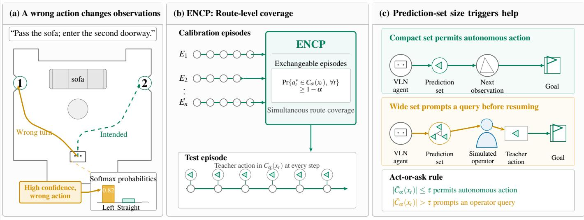
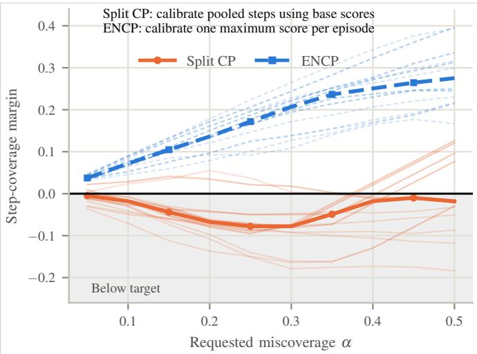
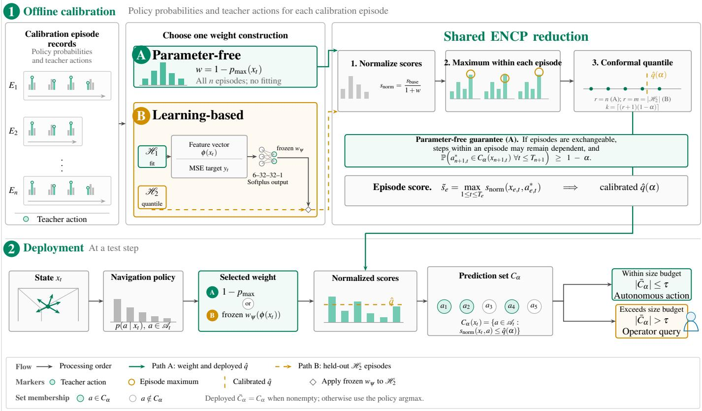
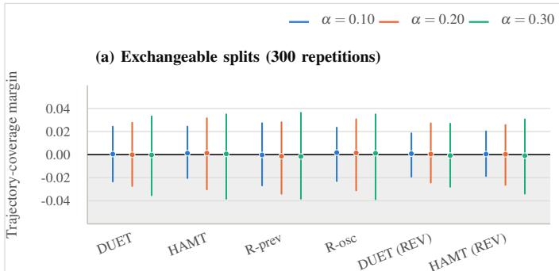
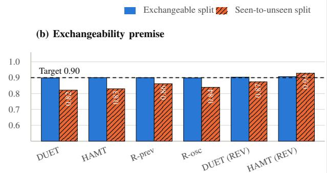
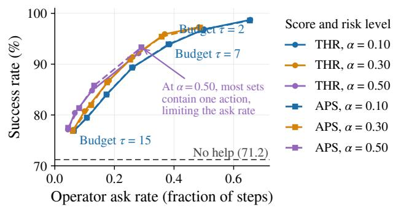

# ENCP: Episode-Normalized Conformal Prediction for Vision-and-Language Navigation

Vicky Feliren1,2, A. Taufiq Asyhari1, Muhamad Risqi U. Saputra1

1Monash University, Indonesia 2SEACrowd

Abstract—Uncertainty estimation for Vision-Language-Navigation (VLN) models is a critical task since it can help identify ambiguous and unreliable predictions, enabling agents to make safer navigation decisions. As one of the most advanced uncertainty estimation frameworks, conformal prediction (CP) offers a promising approach for uncertainty estimation in VLN. However, given that VLN agent requires a sequence of steps, standard calibration in conformal prediction fails to provide coverage guarantee it promises over a dependent, variable-length VLN episode. To this end, we propose Episode-Normalized Conformal Prediction (ENCP), which rescales a nonconformity score by the policy’s residual confidence and calibrates one maximum score per episode. Under exchangeable calibration and test episodes, this construction covers the ground truth at every step with probability at least 1 α, while allowing dependence among steps within an episode. Across four VLN policies and three nonconformity scores on R2R and REVERIE dataset, ENCP meets all reported empirical step-coverage targets on the seen-to-unseen evaluation. These results demonstrate that ENCP can provide model-agnostic uncertainty estimates, which might be useful for determining when a VLN agent should defer to a more capable predictor, including human assistance.

Index Terms—vision-language navigation, conformal prediction, uncertainty quantification, human-robot interaction, safe autonomy

## I. INTRODUCTION

Vision-and-Language Navigation (VLN) enables embodied agents to navigate physical environments using natural language instructions [1], [2]. Such capabilities have applications in assistive robotics, household robots, and autonomous systems operating in complex environments where agents must follow human instructions while adapting to their surroundings. Deploying these agents safely in real-world settings, however, demands reliable uncertainty estimation as sequential navigation inherently suffers from compounding errors: a single wrong turn corrupts subsequent visual feedback, forcing the agent to act on invalid environmental states [3]. While an uncorrected mistake merely degrades a benchmark score, continuing confidently while lost in physical spaces risks collisions or task failure. Consequently, agents must identify unreliable steps and request human intervention before errors accumulate [4]–[6]. This might requires simultaneously resolving linguistic ambiguity and visual uncertainty across dynamic trajectories (e.g., grounding “enter the second door”).

Modern VLN policies achieve high navigation success [7]– [9], yet overall task completion metrics fail to indicate whether a specific action is trustworthy. Existing self-monitoring and help-request mechanisms recognize this limitation [10], [11], but they rely on empirical heuristics rather than formal calibration tied to a user-specified error rate.

The policy’s largest softmax probability is often used to flag how certain the decisions, with smaller values indicating that the policy has no strongly preferred action; however, this value is not a calibrated probability that the selected action is incorrect. Because neural networks can be overconfident [12] and uncertainty estimates often deteriorate when the deployment environment differs from the training data [13], a cutoff has no distribution-free interpretation without a calibration argument. This matters in human–automation teams, where a useful warning should support appropriate reliance rather than encourage blind trust or constant intervention [14], [15].

Conformal Prediction (CP) is a statistical framework that converts point predictions into valid prediction sets. It returns a set of plausible actions at a user-chosen miscoverage (risk) level α, whose target coverage is 1 α. A one-action set lets the agent proceed. A larger set tells it to ask. When the calibration routes and new routes are generated under the same conditions, CP guarantees that the set includes the correct choice at the requested rate. The policy’s probabilities need not be calibrated [16]–[18]. This act-or-ask interpretation has already made CP useful for robot planning and human assistance [19], [20].

In the standard CP, the coverage guarantee usually applies to a single prediction. However, this approach will not work for VLN since it does not ensure that the action deemed correct is included at every step along a route [16], [18]. Each action changes the agent’s state and therefore affects the observations and decisions that follow [3]. Using individual steps as calibration examples overlooks this dependence and provides no guarantee for the route as a whole. A further limitation arises when the policy assigns nearly all of its probability to one action. This motivates the need to design a bespoke CP that can ensure its coverage guarantee over a dependent, variable-length VLN episode.

In this work, we propose Episode-Normalized Conformal Prediction (ENCP), a post-training conformal prediction method for VLN that leaves the underlying navigation policy unchanged. ENCP rescales each step-level nonconformity score by the policy’s residual confidence and calibrates one maximum normalized score per episode. Under exchangeability of the calibration and test episodes, the resulting prediction sets contain the ground-truth action at every step of a test episode with probability at least 1 α, while allowing dependence among steps within an episode and accommodating variable episode lengths. Episode-level calibration provides this coverage guarantee, whereas residual-confidence rescaling helps calibrated thresholds transfer across the evaluated policies.

  
Fig. 1: ENCP identifies when a navigation agent should ask for help before an error compounds. It calibrates complete episodes and triggers a query when the action set exceeds a chosen size budget.

This work makes 3 contributions.

We show how standard, step-wise CP can fail to satisfy its coverage guarantee in VLN and measure when its action sets cease to reflect the miscoverage level α.

We develop ENCP, an episode-level calibration CP with a guarantee that covers the correct action throughout a complete route.

We evaluate ENCP against step-pooled CP using 4 VLN models and 3 nonconformity scores on the R2R and REVERIE datasets, examine coverage when calibration and test buildings differ, and use prediction-set size to decide when to request an action from a simulated ground-truth assistant.

## II. RELATED WORK

Vision-and-language navigation. Room-to-Room (R2R) introduced instruction following on the Matterport3D navigation graph [1], [21], and VLN later expanded to continuous control [22] and remote object grounding in REVERIE (Remote Embodied Visual Referring Expression in Real Indoor Environments) [23]. Recurrent sequence models [24] preceded transformer policies such as DUET, HAMT, and Recurrent VLN-BERT [7]–[9], evaluated here. Learned helprequest heads detect ambiguous instructions [11]; however, their reported reliability is empirical, failing to provide a finitesample guarantee at a risk level chosen by the user.

Uncertainty estimation. Bayesian approximations [25], deep ensembles [26], and selective prediction [27] yield uncertainty or abstention scores, while classical robotics represents and propagates probabilistic states [28]. These methods do not generally provide distribution-free finite-sample coverage at a chosen α.

Conformal prediction for decisions and sequences. Classification CP includes threshold scores (THR), adaptive prediction sets (APS), and rank-regularized adaptive prediction sets (RAPS) [29]–[31]. Beyond classification, CP covers LLM planning, model predictive control, and multi-agent motion planning [6], [20], [32]. Specifically, KnowNo uses predictionset size to request human help, calibrating weakest confidence over a fixed plan [19]. In contrast, ENCP calibrates maximum nonconformity over a episode-length VLN trajectory, whose action set can change at every step.

Dependence and distribution shift. Standard split CP assumes exchangeable calibration and test units. Methods for nonexchangeable data can bound the resulting coverage loss [33], while conformal time-series methods allocate risk across a fixed horizon [34]. ENCP uses the complete episode as its calibration unit, so steps within an episode may depend on one another and no fixed horizon is needed. However, this design choice does not remove the distribution shift. R2R calibrates on seen buildings and evaluates on unseen buildings. Weighted CP can correct covariate shift when density ratios are available [35]. We report coverage under exchangeable splits and across the seen-to-unseen boundary.

## III. PROBLEM FORMULATION

In this section, we formulate VLN as sequential classification in discrete graph, define the 3 nonconformity scores used in commonly used CP, and show why calibration over pooled steps does not yield trajectory-level coverage. An experimental condition is one policy–dataset pair.

## A. VLN as a discrete graph

An episode is one attempt to follow an instruction L from a given start node. The agent moves on an undirected graph of panoramic Matterport3D viewpoints [21] and terminates by selecting STOP. At step t, let $o _ { t }$ denote the current panorama, ht the preceding observation–action history, and $\mathcal { A } _ { t }$ the admissible actions, comprising adjacent viewpoints and STOP. We write $x _ { t } = ( L , o _ { t } , h _ { t } , \mathcal { A } _ { t } )$ for the complete decision context. Define the policy probability of action a by

$$
p ( a \mid x _ { t } ) = \pi _ { \theta } ( a \mid x _ { t } ) , \qquad a \in { \mathcal { A } } _ { t } ,\tag{1}
$$

and define $p _ { \operatorname* { m a x } } ( x _ { t } ) = \operatorname* { m a x } _ { a \in \mathcal { A } _ { t } } p ( a \mid x _ { t } )$ . We write $p _ { \mathrm { m a x } }$ for $p _ { \operatorname* { m a x } } ( x _ { t } )$ when considering a step t. The action-set size varies with the local graph degree. For example, DUET’s global branch additionally considers the reachable frontier [9]. Section V treats each resulting episode as one calibration or test unit.

## B. Nonconformity scores and split-conformal calibration

In conformal prediction, a nonconformity score measures how atypical a candidate output appears relative to a model’s prediction, with higher values indicating greater disagreement or lower confidence. In VLN, we instantiate this score as $s ( x _ { t } , a )$ and assigns larger values to actions that conform less closely to the policy output at $x _ { t }$ . The score must be fixed before conformal calibration. For a labeled decision context $( x _ { t } , a _ { t } ^ { * } )$ ), its calibration score, the nonconformity score assigned to the ground-truth action, is $s ( x _ { t } , a _ { t } ^ { * } )$

In this work, we use THR and the deterministic $( U = 0 )$ forms of APS and RAPS as standard non-conformity scores. Here, $U \sim$ Uniform(0,1) is an auxiliary variable that randomizes the contribution of the candidate action’s probability mass; setting $U = 0$ removes this randomization. THR is the complement of the candidate probability [29]:

$$
s _ { \mathrm { T H R } } ( x _ { t } , a ) = 1 - p ( a \mid x _ { t } ) .\tag{2}
$$

APS orders actions by decreasing $p ( a \mid x _ { t } )$ , with ties resolved by a fixed rule. Let rankt $( a ) \in \{ 1 , \ldots , | { \mathcal { A } } _ { t } | \}$ denote the resulting position of action a. APS assigns to a the probability mass of all preceding actions [30]:

$$
s _ { \mathrm { A P S } } \left( x _ { t } , a \right) = \sum _ { \substack { b \in \mathcal { A } _ { t } : \mathrm { r a n k } _ { t } \left( b \right) < \mathrm { r a n k } _ { t } \left( a \right) } } p ( b \mid x _ { t } ) .\tag{3}
$$

Thus the top-ranked action has score 0. RAPS adds a penalty beyond rank $k _ { \mathrm { r e g } }$ [31]:

$$
s _ { \mathrm { R A P S } } ( x _ { t } , a ) = s _ { \mathrm { A P S } } ( x _ { t } , a ) + \lambda \left[ \mathrm { r a n k } _ { t } ( a ) - k _ { \mathrm { r e g } } \right] _ { + } ,\tag{4}
$$

where $[ u ] _ { + } = \operatorname* { m a x } ( u , 0 )$ ; we use $\lambda = 0 . 1$ and $k _ { \mathrm { r e g } } = 2 .$

For standard split CP, let $s _ { 1 } , \ldots , s _ { n }$ be exchangeable calibration scores for one fixed score function. Exchangeability in conformal prediction means that the joint probability distribution of a sequence of data points does not change when their order is permuted. Given a miscoverage level $\alpha \in ( 0 , 1 )$ , set $k = \lceil ( n + 1 ) ( 1 - \alpha ) \rceil$ . If $s _ { ( k ) }$ denotes the k-th order statistic, the conformal threshold is

$$
\hat { q } ( \alpha ) = \left\{ \begin{array} { l l } { s _ { ( k ) } , } & { k \le n , } \\ { + \infty , } & { k = n + 1 . } \end{array} \right.\tag{5}
$$

The corresponding prediction set is

$$
C _ { \alpha } ( x _ { t } ) = \{ a \in \mathcal { A } : s ( x _ { t } , a ) \leq \hat { q } ( \alpha ) \} .\tag{6}
$$

  
Fig. 2: Split CP undercovers across most settings, making its nominal risk level unreliable here. ENCP calibrates one maximum normalized score per episode and meets the target throughout. Negative values indicate undercoverage.

If the calibration scores and the test score $s ( x _ { t } , a _ { t } ^ { * } )$ are $\mathbf { \vec { e } X \tilde { \mathbf { \theta } } } -$ changeable, then $\mathbb { P } \{ a _ { t } ^ { * } \in C _ { \alpha } ( x _ { t } ) \} \geq 1 - \alpha$

## C. Why split CP degenerates here

The pooled-step baseline CP treats each labeled step as an independent calibration unit. By (5), the resulting threshold does not exceed ε whenever at least k calibration scores are $\leq \varepsilon$

For $\alpha = 0 . 3 0 $ , APS and RAPS return only the policy’s maximum-probability action on DUET and HAMT, with THR exhibiting analogous behavior. Split CP similarly demonstrates undercoverage across the evaluated configurations (Figure 2). Moreover, modifying the policy’s probability calibration does not resolve this quantile-selection phenomenon (Section VII).

Split CP assumes that calibration and test scores are exchangeable. However, exchangeability at the level of complete episodes does not generally entail exchangeability of the individual time steps obtained by pooling steps across episodes. Within an episode, time steps are statistically dependent due to their shared action–observation history; episode lengths may differ; and actions can causally influence subsequent observations, further violating step-wise exchangeability. Moreover, marginal coverage guarantees for a single time step do not imply simultaneous coverage across all time steps within an episode. Accordingly, the subsequent section defines a mapping from each episode to a single calibration score.

## IV. EPISODE-NORMALIZED CONFORMAL PREDICTION

Standard CP calibration fails to provide coverage guarantees in sequential VLN due to intra-episode step dependencies and dynamic action spaces. To resolve this, Episode-Normalized Conformal Prediction (ENCP) derives its name from two core mechanisms: episode-level calibration, which collapses dependent trajectory steps into a single worst-case metric to restore finite-sample guarantees, and score normalization, which adjusts nonconformity scores relative to step-varying policy confidence. ENCP can be implemented as either a parameterfree variant using raw policy probabilities or a learning-based variant that fits score weights prior to calibration (Figure 3).

## A. Confidence-adjusted score

For any base score $s _ { \mathrm { b a s e } } \in \{ s _ { \mathrm { T H R } } , s _ { \mathrm { A P S } } , s _ { \mathrm { R A P S } } \}$ and fixed nonnegative weight rule w, ENCP defines

$$
s _ { \mathrm { n o r m } } ( x _ { t } , a ) = \frac { s _ { \mathrm { b a s e } } ( x _ { t } , a ) } { 1 + w ( x _ { t } ) } .\tag{7}
$$

Here, $x _ { t }$ denotes the decision context at step t, $a \in \mathcal A _ { t }$ is a candidate action, $s _ { \mathrm { b a s e } }$ is the nonconformity score, $w ( x _ { t } )$ is its confidence-dependent weight, and $s _ { \mathrm { n o r m } }$ is the resulting confidence-adjusted nonconformity score.

a) Parameter-free weight:

$$
\begin{array} { r } { w _ { \mathrm { p f } } ( x _ { t } ) = 1 - p _ { \mathrm { m a x } } ( x _ { t } ) , } \\ { s _ { \mathrm { n o r m } } ^ { \mathrm { p f } } ( x _ { t } , a ) = \displaystyle \frac { s _ { \mathrm { b a s e } } ( x _ { t } , a ) } { 2 - p _ { \mathrm { m a x } } ( x _ { t } ) } . } \end{array}\tag{8}
$$

At a fixed step, every candidate shares the same positive denominator. The normalization therefore preserves the pol-$\mathrm { i c y ^ { \circ } s }$ action ranking. It changes set membership through the effective threshold

$$
a \in C _ { \alpha } ( x _ { t } ) \quad \iff \quad s _ { \mathrm { b a s e } } ( x _ { t } , a ) \leq \hat { q } ( \alpha ) [ 2 - p _ { \operatorname* { m a x } } ( x _ { t } ) ] .\tag{9}
$$

Thus, lower confidence increases the effective threshold and can admit more actions. Episode calibration addresses this remaining point mass by changing the calibration unit.

b) Learning-based weight: The learning-based variant uses step features to predict the weight. We define

$$
\begin{array} { r l } & { \phi \left( x _ { t } \right) = \left[ H \left( p _ { t } \right) , p _ { \operatorname* { m a x } } , p _ { \left( 1 \right) } - p _ { \left( 2 \right) } , \right. } \\ & { \left. \log \left| \mathcal { A } _ { t } \right| , t / T _ { \operatorname* { m a x } } , \alpha \right] , } \\ & { w _ { \psi } ( x _ { t } ) = \mathrm { s o f t p l u s } \left( f _ { \psi } \big ( \phi \left( x _ { t } \right) \big ) \right) \geq 0 , } \end{array}\tag{10}
$$

Here, $H ( p _ { t } )$ is entropy over the candidate actions, $p _ { \mathrm { m a x } }$ is the largest action probability, and $p _ { ( 1 ) } - p _ { ( 2 ) }$ is the top-two probability gap. The term log $| \mathcal { A } _ { t } |$ is the log action-set size, $t / T _ { \mathrm { m a x } }$ is the normalized step index, and α is the requested miscoverage level. The network $f _ { \psi }$ has two ReLU hidden layers of width 32; its Softplus output keeps the denominator in (7) positive.

We train the network to assign more weight to steps where the policy is confident but gives little probability to the groundtruth action. For each labeled step in fit subset $\mathcal { H } _ { 1 }$ , the target is

$$
y _ { t } = \mathrm { c l i p } \left( \frac { 1 - p ( a _ { t } ^ { * } \mid x _ { t } ) } { 1 - p _ { \operatorname* { m a x } } ( x _ { t } ) } , 0 , 1 0 \right) .\tag{11}
$$

Clipping limits values caused by a denominator near zero. We then minimize

$$
\mathcal { L } ( \psi ) = \frac { 1 } { N _ { 1 } } \sum _ { ( e , t ) \in \mathcal { H } _ { 1 } } \left[ w _ { \psi } ( x _ { e , t } ) - y _ { e , t } \right] ^ { 2 } .\tag{12}
$$

After fitting on $\mathcal { H } _ { 1 }$ , we freeze $w _ { \psi }$ and estimate the conformal quantile on disjoint subset $\mathcal { H } _ { 2 }$ . Conditional on $\mathcal { H } _ { 1 }$ , the score

is fixed before calibration, so $\mathcal { H } _ { 2 }$ remains exchangeable with a test episode. Using $\mathcal { H } _ { 2 }$ for both fitting and calibration would invalidate this split-conformal argument.

## B. One calibration score per episode

For calibration episode e of length $T _ { e } ,$ , ENCP computes

$$
\tilde { s } _ { e } = \operatorname* { m a x } _ { 1 \leq t \leq T _ { e } } s _ { \mathrm { n o r m } } ( x _ { e , t } , a _ { e , t } ^ { * } ) .\tag{13}
$$

Every episode contributes one number, regardless of its length. We require exchangeability across episodes but make no such assumption about steps within an episode. For parameter-free ENCP, bounding the maximum bounds every step and gives simultaneous trajectory coverage (Theorem 1). The maximum is zero only when all step scores are zero. This condition makes a zero threshold less common than under step-pooled calibration (Proposition 1).

## C. Calibration and deployment

Let $r = n$ for the parameter-free variant and $r = m = \left| \mathcal { H } _ { 2 } \right|$ for the learning-based variant, as in Figure 3. Relabel the corresponding episode scores as $\tilde { s } _ { 1 } , \ldots , \tilde { s } _ { r } ,$ and set $k = \lceil ( r +$ $1 ) ( 1 - \alpha ) ]$ . ENCP uses

$$
\hat { q } ( \alpha ) = \left\{ \begin{array} { l l } { { \tilde { s } _ { ( k ) } , } } & { { k \le r , } } \\ { { + \infty , } } & { { k = r + 1 , } } \end{array} \right.\tag{14}
$$

where $\tilde { s } _ { ( k ) }$ is the k-th order statistic. At a test step, thresholding produces the raw prediction set

$$
C _ { \alpha } ( x _ { t } ) = \{ a \in \mathcal { A } : s _ { \mathrm { n o r m } } ( x _ { t } , a ) \leq \hat { q } ( \alpha ) \} .\tag{15}
$$

The deployed set is

$$
\begin{array} { r } { \bar { C } _ { \alpha } ( x _ { t } ) = \left\{ \begin{array} { l l } { C _ { \alpha } ( x _ { t } ) , } & { C _ { \alpha } ( x _ { t } ) \ne \emptyset , } \\ { \{ \arg \operatorname* { m a x } _ { a \in \mathcal { A } _ { t } } p ( a \mid x _ { t } ) \} , } & { \mathrm { o t h e r w i s e } , } \end{array} \right. } \end{array}\tag{16}
$$

where the fixed policy tie-breaking rule resolves the argmax. For help-seeking, an operator may choose a size budget τ and request assistance whenever $| \bar { C } _ { \alpha } ( x _ { t } ) | > \tau$ (Section VI-C).

## V. COVERAGE GUARANTEE

This section proves coverage for parameter-free ENCP. For this purpose, before calibration, we freeze the navigation policy, a base score $s _ { \mathrm { b a s e } } ,$ and $w _ { \mathrm { p f } } ( x _ { t } ) = 1 - p _ { \mathrm { m a x } } ( x _ { t } )$ . For episode $E _ { i } ,$ let $x _ { i , t }$ and $a _ { i , t } ^ { * }$ denote the decision context and ground-truth action at step t, and let $T _ { i } = T ( E _ { i } ) \geq 1$ . Throughout this section, $s _ { \mathrm { n o r m } }$ denotes the parameter-free score. The fixed episode-score map is

$$
\varphi ( E _ { i } ) = \tilde { s } _ { i } = \operatorname* { m a x } _ { 1 \leq t \leq T _ { i } } \frac { s _ { \mathrm { b a s e } } ( x _ { i , t } , a _ { i , t } ^ { * } ) } { 2 - p _ { \operatorname* { m a x } } \left( x _ { i , t } \right) } .\tag{17}
$$

Assumption 1 (Exchangeable episodes). The joint distribution of the n calibration episodes and one test episode, $\left( E _ { 1 } , \ldots , E _ { n } , E _ { n + 1 } \right)$ , is invariant under permutations of their indices. In particular, the assumption holds for i.i.d. episodes from one task distribution.

This assumption applies to complete episodes. Steps within an episode may depend on one another, episode lengths may vary, the navigation policy may be miscalibrated, and the scores may contain ties or point masses.

  
Fig. 3: ENCP calibrates one worst-step score per episode, then asks for help when the deployed set exceeds τ.

For the test episode, let

$$
\mathcal { E } _ { n + 1 } = \bigcap _ { t = 1 } ^ { T _ { n + 1 } } \{ a _ { n + 1 , t } ^ { * } \in C _ { \alpha } ( x _ { n + 1 , t } ) \}\tag{18}
$$

be the event that every ground-truth action is covered. Define simultaneous trajectory coverage $\mathrm { C o v _ { t r a j } }$ and step-averaged coverage $\mathrm { C o v } _ { \mathrm { s t e p } }$ by

$$
\mathrm { C o v } _ { \mathrm { t r a j } } = \mathbb { P } ( \mathcal { E } _ { n + 1 } ) ,\tag{19}
$$

$$
\mathrm { C o v } _ { \mathrm { s t e p } } = \mathbb { E } \left[ \frac { 1 } { T _ { n + 1 } } \sum _ { t = 1 } ^ { T _ { n + 1 } } \mathbf { 1 } \{ a _ { n + 1 , t } ^ { * } \in C _ { \alpha } ( x _ { n + 1 , t } ) \} \right] .\tag{20}
$$

Theorem 1 (Simultaneous trajectory coverage). Fix $\alpha \in ( 0 , 1 )$ and let $k = \lceil ( n + 1 ) ( 1 - \alpha ) \rceil$ . Define qˆ(α) as the k-th smallest value among the calibration scores $\tilde { s } _ { 1 } , \ldots , \tilde { s } _ { n } ,$ with $\hat { q } ( \alpha ) = +$ ∞ $i f k = n + 1 .$ . Under Assumption 1,

$$
\mathbb { P } ( \mathcal { E } _ { n + 1 } ) \ge 1 - \alpha .\tag{21}
$$

Proof. Let $\hat { q } = \hat { q } ( \alpha )$ . By (15) and (17),

$$
\begin{array} { r l } & { \mathcal { E } _ { n + 1 } = \left\{ \underset { 1 \leq t \leq T _ { n + 1 } } { \operatorname* { m a x } } s _ { \mathrm { n o r m } } ( x _ { n + 1 , t } , a _ { n + 1 , t } ^ { * } ) \leq \hat { q } \right\} } \\ & { \quad \quad = \{ \tilde { s } _ { n + 1 } \leq \hat { q } \} . } \end{array}\tag{22}
$$

Because ϕ is fixed, the scores $\tilde { s } _ { 1 } , \ldots , \tilde { s } _ { n + 1 }$ are exchangeable. Suppose first that $k \leq n ,$ , and let $u _ { ( k ) }$ be their k-th order statistic.

Removing $\tilde { s } _ { n + 1 }$ cannot decrease the k-th order statistic, so $\hat { q } \geq$ $u _ { ( k ) }$ . The exchangeable-rank bound [18] gives

$$
\mathbb { P } ( \tilde { s } _ { n + 1 } \leq \hat { q } ) \geq \mathbb { P } ( \tilde { s } _ { n + 1 } \leq u _ { ( k ) } ) \geq \frac { k } { n + 1 } \geq 1 - \alpha .\tag{23}
$$

If $k = n + 1$ , then $\hat { q } = + \infty$ and the probability is 1. Equation (22) now proves (21). Since $C _ { \alpha } ( x _ { t } ) \subseteq \bar { C } _ { \alpha } ( x _ { t } )$ , the deployed set has at least the same coverage. □

Corollary 1 (Step-averaged coverage). Under Assumption 1, the threshold of Theorem 1 also satisfies $\mathrm { C o v } _ { \mathrm { s t e p } } \geq 1 - \alpha .$

Proof. Let

$$
R _ { n + 1 } = \frac { 1 } { T _ { n + 1 } } \sum _ { t = 1 } ^ { T _ { n + 1 } } \mathbf { 1 } \{ a _ { n + 1 , t } ^ { * } \in C _ { \alpha } ( x _ { n + 1 , t } ) \}
$$

be the covered-step fraction in the test episode. Pointwise,

$$
R _ { n + 1 } \geq \mathbf { 1 } \{ \mathcal { E } _ { n + 1 } \} .
$$

Taking expectations and applying Theorem 1 gives $\mathbf { C o v } _ { \mathrm { s t e p } } \geq _ { }$ $\mathrm { C o v } _ { \mathrm { t r a j } } \geq 1 - \alpha .$

Figure 4 evaluates parameter-free ENCP under the theorem’s premise and across the shifted benchmark split. Across 300 random within-pool splits, mean $\mathbf { C o v _ { \mathrm { t r a j } } }$ differs from nominal by at most 0.0017 over the 6 reported conditions and 3 α levels. Coverage is lower in the seen-to-unseen comparison, where episode exchangeability is not assumed.

The guarantee in Theorem 1 is marginal over the calibration and test episodes; it does not condition on a realized calibration sample [17]. Ties may make the bound conservative. The episode maximum avoids allocating α across time.

  
Fig. 4: Parameter-free ENCP attains nominal trajectory coverage under episode exchangeability but not under seen-to-unseen shift. Error bars are empirical 95% ranges over 300 exchangeable splits; the shifted bars lie outside Theorem 1’s premise.

Proposition 1 (Condition for a zero threshold). For parameter-free ENCP, all 3 base scores in Section III are nonnegative. For any calibration episode e,

$$
\tilde { s } _ { e } = 0 \quad \Longleftrightarrow \quad s _ { \mathrm { b a s e } } ( x _ { e , t } , a _ { e , t } ^ { * } ) = 0 f o r e \nu e r y t = 1 , \ldots , T _ { e } .\tag{24}
$$

Consequently, $\hat { q } ( \alpha ) = 0$ exactly when at least $k = \lceil ( n + 1 ) ( 1 -$ α)⌉ of the n calibration episodes have zero score at every step.

Proof. The denominator $2 - p _ { \operatorname* { m a x } } ( x _ { t } )$ lies in [1, 2], so normalization preserves zeros. A maximum of nonnegative numbers is zero exactly when every number is zero. The k-th order statistic is zero exactly when at least k observations are zero. □

The construction is the score-space counterpart of calibrating minimum confidence over a plan [19, Prop. 2], extended here to variable-length VLN episodes with changing action sets.

Remark 1 (Scope under distribution shift). The guarantee is marginal under the episode law in Assumption 1. Seen and unseen buildings may induce different episode laws, and operator intervention changes the trajectory distribution. Section VI evaluates the seen-to-unseen setting.

## VI. EXPERIMENTS

We calibrate on the R2R validation-seen, whose buildings occur in training, and test on validation-unseen (val-unseen) episodes from disjoint building scans [1]. We also experiment this in REVERIE [23] for a better generalization. We evaluate four VLNs from three architecture families: DUET [9], HAMT [8], and Recurrent VLN-BERT with PREVALENT and OSCAR initialization (R-prev and R-osc) [7]. Our runs reproduce each published val-unseen success rate to within one percentage point. We record prediction sets without changing the policy, except in the closed-loop study of Section VI-C. The remaining evaluations therefore retain the original policy’s success rate. Unless noted otherwise, ENCP uses the parameter-free score in (7). Base-score columns use the steppooled calibration analyzed in Section III-C.

The experiments report step coverage $\mathrm { C o v _ { s t e p } }$ , the mean fraction of covered steps per episode. Set sizes include the argmax fallback, whereas coverage uses the set in (15); an empty raw set is uncovered.

## A. Restored α-sensitivity and step coverage

Table I compares each base score with its ENCP counterpart at three miscoverage levels. Across both datasets, ENCP keeps $\mathrm { C o v _ { s t e p } }$ above 1 α for every reported backbone, score, and miscoverage level. The base scores for THR, APS, and RAPS undercover in every corresponding entry. Thus, episode calibration restores a usable response to α, but the larger ENCP sets show the cost of meeting the step-coverage target under the seen-to-unseen shift.

## B. Parameter-free and learning-based weights

Table II compares the two weight constructions in Figure 3. One calibration half fits $w _ { \psi } ;$ both variants then estimate ˆq from the other half. This matched comparison isolates the effect of the weight. Table I uses all calibration episodes for the parameter-free variant because it requires no fitting. Neither procedure uses val-unseen data for fitting or calibration.

Based on Table II, at α = 0.10, step coverage differs by at most 0.006 across the four R2R VLNs. The learned variant returns larger sets on all four, with the largest increase on DUET, from 6.83 to 7.63 actions. This added set size does not produce a consistent coverage gain: coverage rises on DUET and R-osc but falls on HAMT and R-prev. The learned target identifies confidently wrong steps, but learning changes where ENCP enlarges a set. We use the parameter-free variant for the main results because it gives comparable coverage with smaller sets and uses every calibration episode.

## C. Simulated ENCP help-seeking (DUET, R2R)

We test one use of ENCP at deployment: the agent acts when $| \bar { C } _ { \alpha } | \le \tau$ and asks for help when $| \bar { C } _ { \alpha } | > \tau .$ . A larger set therefore causes the agent to defer.

This experiment simulates help-seeking without human operators. When ENCP requests help because $| \bar { C } _ { \alpha } | > \tau$ , the agent executes the ground-truth action supplied by the simulator instead of its policy-selected action. The simulator has access to the goal and complete navigation graph and is assumed to make no errors.

TABLE I: ENCP meets the step-coverage target across R2R and REVERIE; base CP undercovers. C is mean prediction-set size. Bold values satisfy the target coverage guarantee (1 α).
<table><tr><td rowspan="2" colspan="2"></td><td colspan="4"> $\scriptstyle \alpha = 0 . 1 0$ </td><td colspan="4">α=0.20</td><td colspan="4"> $\alpha { = } 0 . 3 0$ </td></tr><tr><td colspan="2">Base</td><td colspan="2">ENCP</td><td colspan="2">Base</td><td colspan="2">ENCP</td><td colspan="2">Base</td><td colspan="2">ENCP</td></tr><tr><td>VLN</td><td>Score</td><td> $\mathrm { C o v _ { s t e p } }$ </td><td>[c</td><td> $\mathrm { C o v _ { s t e p } }$ </td><td>C</td><td> $\mathrm { C o v _ { s t e p } }$ </td><td>C</td><td> $\mathrm { C o v _ { s t e p } }$ </td><td>[c</td><td> $\mathrm { C o v _ { s t e p } }$ </td><td>C</td><td> $\mathrm { C o v _ { s t e p } }$ </td><td>[C]</td></tr><tr><td colspan="10">R2R val-unseen</td><td colspan="7"></td></tr><tr><td></td><td>THR</td><td>0.854</td><td>2.6</td><td>0.965</td><td>6.7</td><td>0.729</td><td>1.4</td><td>0.936</td><td>6.1</td><td>0.608</td><td>1.0</td><td></td><td>0.897</td><td>5.2</td></tr><tr><td>DUET</td><td>APS</td><td>0.850</td><td>2.7</td><td>0.965</td><td>6.7</td><td>0.723</td><td>1.6</td><td>0.934</td><td>6.0</td><td></td><td>0.621</td><td>1.0</td><td>0.899</td><td>5.2</td></tr><tr><td></td><td>RAPS</td><td>0.859</td><td>2.6</td><td>0.972</td><td>5.7</td><td>0.725</td><td>1.5</td><td>0.928</td><td>4.0</td><td></td><td>0.621</td><td>1.0</td><td>0.879</td><td>3.1</td></tr><tr><td></td><td>THR</td><td>0.883</td><td>2.4</td><td>0.943</td><td>3.8</td><td>0.726</td><td>1.3</td><td>0.888</td><td>3.1</td><td></td><td>0.608</td><td>1.0</td><td>0.825</td><td>2.3</td></tr><tr><td>HAMT</td><td>APS</td><td>0.881</td><td>2.4</td><td>0.943</td><td>3.8</td><td>0.720</td><td>1.3</td><td>0.888</td><td>3.1</td><td></td><td>0.626</td><td>1.0</td><td>0.818</td><td>2.2</td></tr><tr><td></td><td>RAPS</td><td>0.883</td><td>2.7</td><td>0.936</td><td>3.6</td><td>0.721</td><td>1.3</td><td></td><td>0.875</td><td>2.6</td><td>0.626</td><td>1.0</td><td>0.820</td><td>2.0</td></tr><tr><td></td><td>THR</td><td>0.873</td><td>2.7</td><td>0.972</td><td>4.5</td><td>0.756</td><td>1.6</td><td>0.951</td><td></td><td>4.2</td><td>0.653</td><td>1.2</td><td>0.924</td><td>3.9</td></tr><tr><td>R-prev</td><td>APS</td><td>0.874</td><td>2.7</td><td>0.972</td><td>4.5</td><td>0.758</td><td>1.7</td><td>0.950</td><td></td><td></td><td>0.650</td><td>1.2</td><td>0.924</td><td>3.9</td></tr><tr><td></td><td>RAPS</td><td>0.892</td><td>3.1</td><td>0.985</td><td>4.8</td><td>0.758</td><td>1.6</td><td></td><td>0.964</td><td>4.2 4.4</td><td>0.650</td><td>1.2</td><td>0.923</td><td>3.7</td></tr><tr><td></td><td>THR</td><td>0.886</td><td>3.1</td><td>0.971</td><td>4.5</td><td>0.736</td><td></td><td>0.938</td><td></td><td></td><td>0.624</td><td>1.1</td><td>0.907</td><td>3.7</td></tr><tr><td>R-osc</td><td>APS</td><td>0.883</td><td>3.0</td><td>0.971</td><td>4.5</td><td>0.736</td><td>1.7 1.7</td><td>0.939</td><td>4.1 4.1</td><td></td><td>0.619</td><td>1.2</td><td>0.908</td><td>3.7</td></tr><tr><td></td><td>RAPS</td><td>0.891</td><td>3.2</td><td>0.988</td><td>4.8</td><td>0.739</td><td>1.7</td><td>0.962</td><td>4.4</td><td></td><td>0.620</td><td>1.2</td><td>0.928</td><td>3.9</td></tr><tr><td colspan="10">REVERIE val-unseen, navigation head</td><td colspan="7"></td></tr><tr><td></td><td>THR</td><td>0.871</td><td>5.3</td><td>0.975</td><td>8.8</td><td></td><td>0.692</td><td>2.7</td><td>0.932</td><td>8.1</td><td>0.521</td><td>1.2</td><td>0.898</td><td>7.6</td></tr><tr><td>DUET</td><td>APS</td><td>0.869</td><td>5.4</td><td>0.976</td><td>8.8</td><td>0.703</td><td>3.0</td><td></td><td>0.933</td><td>8.1 5.0</td><td>0.539</td><td>1.5</td><td>0.897</td><td>7.6</td></tr><tr><td></td><td>RAPS</td><td>0.830</td><td>3.7</td><td>0.964</td><td>7.1</td><td>0.663</td><td>2.2</td><td>0.879</td><td></td><td></td><td>0.536</td><td>1.4</td><td>0.802</td><td>4.0</td></tr><tr><td></td><td>THR</td><td>0.929</td><td>4.3</td><td>0.990</td><td>5.3</td><td>0.834</td><td>3.3</td><td></td><td>0.975</td><td>5.1</td><td>0.718</td><td>2.3</td><td>0.943</td><td>4.7</td></tr><tr><td>HAMT</td><td>APS</td><td>0.928</td><td>4.3</td><td>0.990</td><td>5.3</td><td>0.836</td><td>3.3</td><td></td><td>0.976</td><td>5.1</td><td>0.718</td><td>2.3</td><td>0.944</td><td>4.7</td></tr><tr><td></td><td>RAPS</td><td>0.924</td><td>4.2</td><td>0.990</td><td>5.2</td><td>0.855</td><td>3.4</td><td></td><td>0.978</td><td>5.0</td><td>0.704</td><td>2.2</td><td>0.962</td><td>4.8</td></tr></table>

TABLE II: The learned weight enlarges sets without a consistent stepcoverage gain. Results use R2R val-unseen, THR, and $\alpha = 0 . 1 0 .$
<table><tr><td rowspan="2">VLN</td><td colspan="2">Parameter-free</td><td colspan="2">Learning-based</td></tr><tr><td> $\mathbf { C o v } _ { \mathrm { s t e p } }$ </td><td> $\overline { { | C | } }$ </td><td> $\mathrm { C o v } _ { \mathrm { s t e p } }$ </td><td>[C</td></tr><tr><td>DUET</td><td>0.968</td><td>6.83</td><td>0.974</td><td>7.63</td></tr><tr><td>HAMT</td><td>0.952</td><td>3.95</td><td>0.949</td><td>4.01</td></tr><tr><td>R-prev</td><td>0.973</td><td>4.56</td><td>0.971</td><td>4.60</td></tr><tr><td>R-osc</td><td>0.970</td><td>4.49</td><td>0.971</td><td>4.63</td></tr></table>

Without help, DUET succeeds on 71.2% of episodes. Querying on sets larger than 15 actions raises success to 76.9% at a 6.4% ask rate. Lowering τ to 8 raises success to 91.1% at a 32.3% ask rate, and querying on every non-singleton set reaches 98.8% at a 68.7% ask rate (Figure 5). Thus, ENCP set size can control how often the agent defers to assistance.

This experiment does not select a deployment threshold. We sweep τ after observing val-unseen, and the same τ produces different ask rates for policies with different setsize distributions (Table I). The intervention also changes later observations, so the static ENCP coverage result does not certify the assisted trajectories.

## VII. DISCUSSION

What a large prediction set means. Table I reports both coverage and mean set size because coverage alone does not measure how often ENCP leaves many actions unresolved. For parameter-free THR, every admissible action enters the set exactly when

$$
\widehat { q } ( \alpha ) \geq \frac { 1 - \operatorname* { m i n } _ { a \in \mathcal { A } _ { t } } p ( a \mid x _ { t } ) } { 2 - p _ { \operatorname* { m a x } } ( x _ { t } ) } .\tag{25}
$$

  
Fig. 5: Simulation of ENCP help-seeking: when the prediction set exceeds the size budget, the simulator supplies the groundtruth action instead of the policy-selected action.

The condition depends on the least probable admissible action, as well as the calibrated threshold and maximum policy probability. A full set signals that the size rule cannot select one action. It does not rank the candidates, so the policy still supplies their order. The different mean sizes C in Table I also show why one numerical size budget should not be assumed to have the same meaning across policies and datasets.

Parameter-free and learned weights. Table II shows similar step coverage for the two weight constructions. In every displayed row, the parameter-free rule has the smaller mean set and requires no fitted weight model. This evidence supports using the parameter-free rule as the main ENCP variant in this paper. Table II compares one feature set, training target, and calibration split, so it does not rule out a more efficient learned

rule under another design.

Coverage and efficiency. Figure 4 evaluates the stricter event that every ground-truth action in an episode is covered, whereas Table I reports the average fraction of covered steps and the corresponding mean set size. HAMT–REVERIE in Figure 4 is the only condition above the trajectory target when calibrating on validation-seen episodes and evaluating on validation-unseen episodes, although this point estimate carries no coverage guarantee because these episode sets are not exchangeable. Taking episode maximum protects the stricter event, but one difficult step can set the calibration score for the whole episode. The set sizes in Table I are therefore part of the result rather than a secondary diagnostic.

Closed-loop interpretation. The THR and APS curves nearly coincide within each risk level, which indicates that the set-size trigger is not sensitive to the choice between these two scores in this simulation. The risk level has a larger operational effect. Raising α makes more sets singletons, which can improve the success rate at a comparable ask rate but also lowers the maximum attainable ask rate. Thus, τ cannot be read as a fixed operator budget, even for one policy.

Limitations. The closed-loop study uses a simulated ground-truth assistant with access to the goal and complete navigation graph; no human operators were evaluated. Because the set-size threshold τ was swept on val-unseen, the resulting curve does not measure performance at a held-out deployment setting. Moreover, the same value of τ may produce different ask rates across VLN policies. ENCP also assumes a finite action space. Extending ENCP to continuous VLN [22] would require conformal scores for waypoints or continuous controls, together with a separate evaluation of human assistance.

## VIII. CONCLUSION

Step-pooled conformal prediction ignores within-trajectory dependence in VLN and can collapse to the argmax policy. ENCP instead calibrates one maximum normalized score per episode, providing route-level coverage of the teacher action with probability at least 1 α under exchangeable episodes. Across R2R and REVERIE, ENCP responds as expected to α and meets the reported step-coverage targets. Learned weighting redistributes uncertainty but yields larger prediction sets, while parameter-free weighting provides a better coverage–setsize trade-off. Set size also serves as a practical help-seeking signal, with tighter budgets increasing oracle queries and improving success. For deployment, size budgets should be selected on held-out data, recalibrated under distribution shift, and validated with human operators.

## REFERENCES

[1] P. Anderson, Q. Wu, D. Teney, J. Bruce, M. Johnson, N. Sunderhauf, I. Reid,¨ S. Gould, and A. van den Hengel, “Vision-and-language navigation: Interpreting visually-grounded navigation instructions in real environments,” in Proc. CVPR, 2018, pp. 3674–3683, arXiv:1711.07280.

[2] Y. Zhang, Z. Ma, J. Li, Y. Qiao, Z. Wang, J. Chai, Q. Wu, M. Bansal, and P. Kordjamshidi, “Vision-and-language navigation today and tomorrow: A survey in the era of foundation models,” Trans. Mach. Learn. Res., 2024, arXiv:2407.07035.

[3] S. Ross, G. Gordon, and D. Bagnell, “A reduction of imitation learning and structured prediction to no-regret online learning,” in Proc. AISTATS, vol. 15, 2011, pp. 627–635.

[4] D. Amodei, C. Olah, J. Steinhardt, P. Christiano, J. Schulman, and D. Mane,´ “Concrete problems in AI safety,” arXiv:1606.06565, 2016.

[5] D. Hendrycks, N. Carlini, J. Schulman, and J. Steinhardt, “Unsolved problems in ML safety,” arXiv:2109.13916, 2021.

[6] L. Lindemann, M. Cleaveland, G. Shim, and G. J. Pappas, “Safe planning in dynamic environments using conformal prediction,” IEEE Robot. Autom. Lett., vol. 8, no. 8, pp. 5116–5123, 2023, arXiv:2210.10254.

[7] Y. Hong, Q. Wu, Y. Qi, C. Rodriguez-Opazo, and S. Gould, “VLN BERT: A recurrent vision-and-language BERT for navigation,” in Proc. CVPR, 2021, pp. 1643–1653.

[8] S. Chen, P.-L. Guhur, C. Schmid, and I. Laptev, “History aware multimodal transformer for vision-and-language navigation,” in Proc. NeurIPS, 2021, pp. 5834–5847, arXiv:2110.13309.

[9] S. Chen, P.-L. Guhur, M. Tapaswi, C. Schmid, and I. Laptev, “Think global, act local: Dual-scale graph transformer for vision-and-language navigation,” in Proc. CVPR, 2022, pp. 16 537–16 547, arXiv:2202.11742.

[10] C.-Y. Ma, J. Lu, Z. Wu, G. AlRegib, Z. Kira, R. Socher, and C. Xiong, “Selfmonitoring navigation agent via auxiliary progress estimation,” in Proc. ICLR, 2019, arXiv:1901.03035.

[11] S. S. Abraham, S. Garg, and F. Dayoub, “To ask or not to ask? detecting absence of information in vision and language navigation,” in Proc. WACV, 2025, pp. 7480–7489, arXiv:2411.05831.

[12] C. Guo, G. Pleiss, Y. Sun, and K. Q. Weinberger, “On calibration of modern neural networks,” in Proc. ICML, vol. 70, 2017, pp. 1321–1330, arXiv:1706.04599.

[13] Y. Ovadia, E. Fertig, J. Ren, Z. Nado, D. Sculley, S. Nowozin, J. V. Dillon, B. Lakshminarayanan, and J. Snoek, “Can you trust your model’s uncertainty? evaluating predictive uncertainty under dataset shift,” in Proc. NeurIPS, 2019, arXiv:1906.02530.

[14] R. Parasuraman and V. Riley, “Humans and automation: Use, misuse, disuse, abuse,” Human Factors, vol. 39, no. 2, pp. 230–253, 1997.

[15] J. D. Lee and K. A. See, “Trust in automation: Designing for appropriate reliance,” Human Factors, vol. 46, no. 1, pp. 50–80, 2004.

[16] V. Vovk, A. Gammerman, and G. Shafer, Algorithmic Learning in a Random World. Springer, 2005.

[17] J. Lei, M. G’Sell, A. Rinaldo, R. J. Tibshirani, and L. Wasserman, “Distributionfree predictive inference for regression,” J. Amer. Statist. Assoc., vol. 113, no. 523, pp. 1094–1111, 2018.

[18] A. N. Angelopoulos and S. Bates, “Conformal prediction: A gentle introduction,” Found. Trends Mach. Learn., vol. 16, no. 4, pp. 494–591, 2023.

[19] A. Z. Ren, A. Dixit, A. Bodrova, S. Singh, S. Tu, N. Brown, P. Xu, L. Takayama, F. Xia, J. Varley, Z. Xu, D. Sadigh, A. Zeng, and A. Majumdar, “Robots that ask for help: Uncertainty alignment for large language model planners,” in Proc. CoRL, vol. 229, 2023, pp. 661–682, arXiv:2307.01928.

[20] K. Liang, Z. Zhang, and J. F. Fisac, “Introspective planning: Aligning robots’ uncertainty with inherent task ambiguity,” in Proc. NeurIPS, 2024, arXiv:2402.06529.

[21] A. Chang, A. Dai, T. Funkhouser, M. Halber, M. Nießner, M. Savva, S. Song, A. Zeng, and Y. Zhang, “Matterport3D: Learning from RGB-D data in indoor environments,” in Proc. 3DV, 2017, pp. 667–676, arXiv:1709.06158.

[22] J. Krantz, E. Wijmans, A. Majumdar, D. Batra, and S. Lee, “Beyond the nav-graph: Vision-and-language navigation in continuous environments,” in Proc. ECCV, 2020, pp. 104–120, arXiv:2004.02857.

[23] Y. Qi, Q. Wu, P. Anderson, X. Wang, W. Y. Wang, C. Shen, and A. van den Hengel, “REVERIE: Remote embodied visual referring expression in real indoor environments,” in Proc. CVPR, 2020, pp. 9982–9991.

[24] H. Tan, L. Yu, and M. Bansal, “Learning to navigate unseen environments: Back translation with environmental dropout,” in Proc. NAACL, 2019, pp. 2610–2621, arXiv:1904.04195.

[25] Y. Gal and Z. Ghahramani, “Dropout as a bayesian approximation: Representing model uncertainty in deep learning,” in Proc. ICML, vol. 48, 2016, pp. 1050–1059, arXiv:1506.02142.

[26] B. Lakshminarayanan, A. Pritzel, and C. Blundell, “Simple and scalable predictive uncertainty estimation using deep ensembles,” in Proc. NeurIPS, 2017, arXiv:1612.01474.

[27] Y. Geifman and R. El-Yaniv, “Selective classification for deep neural networks,” in Proc. NeurIPS, 2017, arXiv:1705.08500.

[28] S. Thrun, W. Burgard, and D. Fox, Probabilistic Robotics. MIT Press, 2005.

[29] M. Sadinle, J. Lei, and L. Wasserman, “Least ambiguous set-valued classifiers with bounded error levels,” J. Amer. Statist. Assoc., vol. 114, no. 525, pp. 223– 234, 2019.

[30] Y. Romano, M. Sesia, and E. J. Candes, “Classification with valid and adaptive\` coverage,” in Proc. NeurIPS, 2020, arXiv:2006.02544.

[31] A. N. Angelopoulos, S. Bates, J. Malik, and M. I. Jordan, “Uncertainty sets for image classifiers using conformal prediction,” in Proc. ICLR, 2021, arXiv:2009.14193.

[32] A. Dixit, L. Lindemann, S. X. Wei, M. Cleaveland, G. J. Pappas, and J. W. Burdick, “Adaptive conformal prediction for motion planning among dynamic agents,” in Proc. L4DC, vol. 211, 2023, pp. 300–314, arXiv:2212.00278.

[33] R. F. Barber, E. J. Candes, A. Ramdas, and R. J. Tibshirani, “Conformal prediction\` beyond exchangeability,” Ann. Statist., vol. 51, no. 2, pp. 816–845, 2023.

[34] K. Stankeviciˇ ut¯ e, A. M. Alaa, and M. van der Schaar, “Conformal time-series˙ forecasting,” in Proc. NeurIPS, vol. 34, 2021, pp. 6216–6228.

[35] R. J. Tibshirani, R. F. Barber, E. J. Candes, and A. Ramdas, “Conformal prediction\` under covariate shift,” in Proc. NeurIPS, 2019, arXiv:1904.06019.