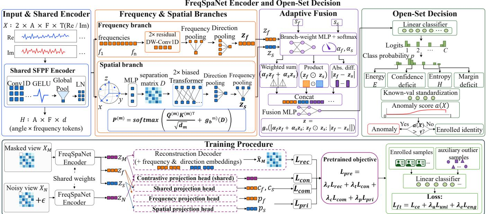
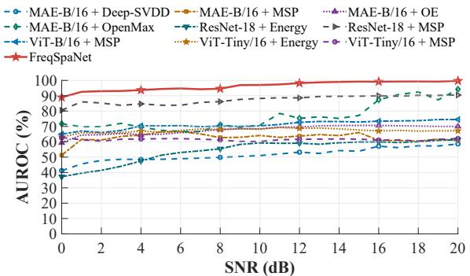
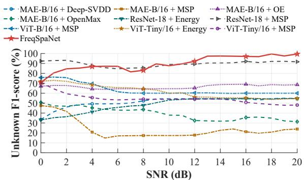
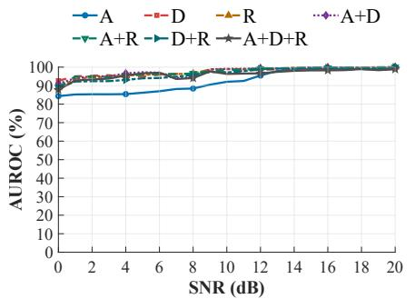
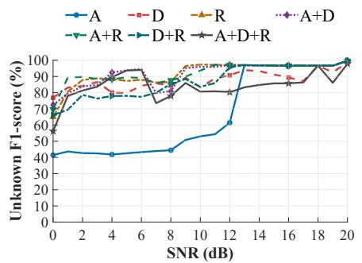
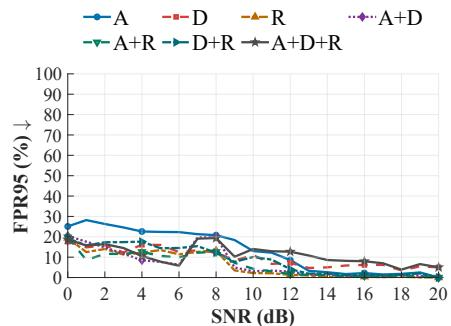

# FREQSPANET: FREQUENCY AND SPATIAL LEARNING OF SFPF FOR PHYSICAL LAYER HARDWARE INTEGRITY DETECTION

Xiaoxuan Huang, Jinlong Xu, YiZhe Wang, Meng Zhang, Xian Li, Yuying Bian

## ABSTRACT

Unauthorized hardware replacement can preserve a wireless device’s logical identity while altering its physical implementation, posing a challenge to hardware integrity verification. Spatio-frequency polarization fingerprints (SFPFs) capture device-dependent responses across multiple frequencies and directions, but their frequency and spatial dimensions exhibit different structural dependencies. We propose FreqSpaNet, an SFPF representation learning network for open set hardware anomaly detection. A frequency branch captures local variations among neighboring frequencies, while a geometryaware spatial branch models directional relationships using angular information. The two representations are combined through adaptive fusion, and complementary pretraining further captures shared information while preserving the distinct characteristics of the frequency and spatial representations. Experiments show that FreqSpaNet achieves a mean AU-ROC of 96.31%, 9.05 points above the baseline. Results under seven hardware replacement scenarios further verify the effectiveness of FreqSpaNet.

Index Terms— physical layer security, hardware integrity detection, open set detection, frequency–spatial learning, polarization fingerprint

## 1. INTRODUCTION

Unauthorized replacement of a wireless device’s hardware module may preserve its communication functions and logical identity while altering its physical implementation, creating a hardware integrity threat. Such hardware changes perturb the device-dependent radiation characteristics of the transmitted signal, which in turn modify its polarization response [1]. Polarization fingerprint (PF) characterizes this response through the complex relation between two orthogonally polarized received components[1, 2, 3]. SFPF extends PF by organizing these responses over multiple frequencies and directions, yielding a structured frequency–spatial representation. Neighboring frequencies tend to show locally correlated responses, whereas different directions capture complementary spatial information. Moreover, the effect of a hardware change is generally nonuniform across frequencies and directions.

Learning an effective representation from SFPF nevertheless presents three challenges. First, its two dimensions exhibit different structural dependencies. Second, hardwareinduced changes are often nonuniform across frequencies and directions, so informative local responses may be weakened by early global aggregation. Third, the relationships among directions are determined by their physical angular separation rather than by image grid or sequence positions. Generic CNNs and vision Transformers apply largely homogeneous operators or flatten the frequency–spatial structure [4, 5], making them poorly matched to these SFPF-specific characteristics.

Motivated by these SFPF characteristics, we propose FreqSpaNet, a SFPF representation learning framework that jointly exploits frequency and spatial information while retaining the complete angle–frequency structure. Its dualbranch encoder uses local convolution to capture variations across frequencies and angular-aware attention to model dependencies among directions. The two branch representations are then adaptively fused for each input sample. FreqSpaNet is further trained through frequency–spatial complementary pretraining, which infers masked SFPF responses while learning both the information shared by the two branches and the characteristics specific to each branch. The resulting classifier outputs are calibrated and fused to detect hardware changes. Experiments show that FreqSpaNet outperforms the evaluated open set systems built on CNN, Transformer, and MAE backbones [4, 5, 6], and remains robust under seven hardware-replacement scenarios.

## 2. PROPOSED FREQSPANET

## 2.1. Network Overview

Figure 1 illustrates the architecture of FreqSpaNet. An input SFPF is denoted by $\mathbf { X } \in \mathbb { R } ^ { 2 \times A \times F \times T }$ , which organizes the complex polarization responses measured over A directions and F frequencies. The first dimension contains the real and imaginary components, and T denotes the number of sampling points. We use A = 301, F = 9, and $T = 1 0 2 4$ . The direction set is $\mathcal { D } = \{ ( \theta _ { a } , \phi _ { a } ) \} _ { a = 1 } ^ { A }$ , where $\theta _ { a }$ and $\phi _ { a }$ are the elevation and azimuth of direction a.

For each direction–frequency pair, a shared SFPF encoder maps $\mathbf { x } _ { a , f } \in \mathbb { R } ^ { 2 \times T }$ to a token $\mathbf { h } _ { a , f } \in \mathbb { R } ^ { d }$ . The resulting tensor $\mathbf { H } \in \mathbb { R } ^ { A \times F \times d }$ is processed by two parallel branches. The frequency branch captures local variations across neighboring frequencies, while the spatial branch models dependencies among directions. Their outputs, $\mathbf { z } _ { f }$ and $\mathbf { z } _ { s } .$ , are adaptively fused into the SFPF representation z, which is mapped to the logits $\mathbf { o } \in \mathbb { R } ^ { C }$ of the $C$ enrolled devices. FreqSpaNet is first pretrained through frequency–spatial complementary learning and then fine-tuned for enrolled-device classification. At inference, four scores derived from the classifier outputs are calibrated and fused to detect hardware changes.

## 2.2. Frequency–Spatial Encoding and Adaptive Fusion

The shared SFPF encoder applies two 1D convolutions, GELU activations, global pooling, and layer normalization independently to each $\mathbf { x } _ { a , f }$ . This produces one token for every measured direction–frequency response before branchspecific modeling.

The frequency branch adds a frequency embedding to each token and applies two residual depthwise 1D convolution blocks [7]. Their local kernels capture response variations across neighboring frequencies. Attention pooling first aggregates the frequency tokens within each direction and then combines all directions to produce $\mathbf { z } _ { f }$

The spatial branch operates on the direction tokens at each frequency. Direction $( \theta _ { a } , \phi _ { a } )$ is represented by $\begin{array} { r c l } { { { \bf u } _ { a } } } & { { = } } & { { [ \sin \theta _ { a } \cos \phi _ { a } , \sin \theta _ { a } \sin \phi _ { a } , \cos \theta _ { a } ] ^ { \sf T } } } \end{array}$ , together with the sine and cosine values of its two angles. A MLP maps this coordinate descriptor to a direction embedding. Let $D _ { i j } = \operatorname { a r c c o s } ( \mathbf { u } _ { i } ^ { \mathsf { T } } \mathbf { u } _ { j } )$ denote the angular separation between directions i and j. The attention weights of head m are

$$
\mathbf { P } ^ { ( m ) } = \mathrm { s o f t m a x } \Bigg ( \frac { \mathbf { Q } ^ { ( m ) } \mathbf { K } ^ { ( m ) \top } } { \sqrt { d _ { m } } } + g _ { b } ^ { ( m ) } ( \mathbf { D } ) \Bigg ) ,\tag{1}
$$

where $\mathbf { Q } ^ { ( m ) }$ and ${ \bf K } ^ { ( m ) }$ are the query and key matrices, $d _ { m }$ is the feature dimension of head m, and ${ g } _ { b } ^ { ( m ) }$ maps the angularseparation matrix D to attention biases. Thus, the spatial branch models interactions between directions using both their learned response features and their angular separation. Pooling over directions and frequencies gives $\mathbf { z } _ { s }$

The relative contribution of the two branches can vary among samples. We therefore derive two variation statistics from the response amplitude $R _ { a , f , t } ~ = ~ ( X _ { \mathrm { R e } , a , f , t } ^ { 2 } ~ +$ $X _ { \mathrm { I m } , a , f , t } ^ { 2 } ) ^ { 1 / 2 }$ . The frequency variation statistic $s _ { f }$ is obtained by averaging $\lvert R _ { a , f + 1 , t } - R _ { a , f , t } \rvert$ over all pairs of adjacent frequencies, directions, and sampling points. For the spatial statistic, we construct an angular neighborhood graph $\mathcal { G } = ( \nu , \mathcal { E } )$ by treating each measured direction as a vertex and connecting neighboring directions on the acquisition grid. Each edge $( i , j )$ is weighted by $w _ { i j } = \exp ( - D _ { i j } / \gamma )$ , where $\gamma$ controls the decrease with angular separation. The statistic $s _ { s }$ is the normalized weighted mean of $| R _ { i , f , t } - R _ { j , f , t } |$ over graph edges, frequencies, and sampling points.

A fusion network takes $\mathbf { z } _ { f } , \mathbf { z } _ { s } ,$ , and the normalized pair $\left( s _ { f } , s _ { s } \right)$ as input and produces weights $\alpha _ { f }$ and $\alpha _ { s }$ satisfying $\alpha _ { f } + \alpha _ { s } = 1$ . The final representation is

$$
\begin{array} { r } { \mathbf { z } = g _ { o } ( \left[ \alpha _ { f } \mathbf { z } _ { f } + \alpha _ { s } \mathbf { z } _ { s } ; \mathbf { z } _ { f } \odot \mathbf { z } _ { s } ; \left| \mathbf { z } _ { f } - \mathbf { z } _ { s } \right| \right] ) , } \end{array}\tag{2}
$$

where $g _ { o }$ is the fusion multilayer perceptron. The three components retain the branch contribution, cross-branch agreement, and complementary information, respectively.

## 2.3. Pretraining and Open Set Detection

During complementary pretraining, a masked view $\mathbf { X } _ { M }$ and a noisy view $\mathbf { X } _ { N }$ of each SFPF are separately processed by the FreqSpaNet encoder with shared parameters. The FreqSpaNet encoder comprises the shared SFPF encoder, the frequency and spatial branches, and the adaptive fusion module, producing the fused representations $\mathbf { z } _ { M }$ and $\mathbf { z } _ { N }$ for the two views. A reconstruction decoder combines $\mathbf { z } _ { M }$ with the frequency and direction embeddings to recover the masked responses [6, 8]. The reconstruction error on the masked responses defines $\mathcal { L } _ { \mathrm { r e c } }$ . Meanwhile, a shared projection head maps $\mathbf { z } _ { M }$ and $\mathbf { z } _ { N }$ , and the resulting representations are optimized using the supervised contrastive loss $\mathcal { L } _ { \mathrm { c o n } } \left[ 9 \right]$

For the masked view, one shared projection head maps $\mathbf { z } _ { f }$ and $\mathbf { z } _ { s }$ to $\mathbf { c } _ { f }$ and $\mathbf { c } _ { s } ,$ while two separate projection heads map them to $\mathbf { p } _ { f }$ and $\mathbf { p } _ { s } .$ The former pair represents information common to both branches, whereas the latter pair represents information unique to the frequency and spatial branches. We define $\mathcal { L } _ { \mathrm { c o m } } = 1 - \cos ( { \mathbf { c } _ { f } } , { \mathbf { c } _ { s } } )$ to align their common information and $\mathcal { L } _ { \mathrm { p r i } } = | \cos ( \mathbf { p } _ { f } , \mathbf { p } _ { s } ) |$ to reduce redundancy between their unique information. The pretraining objective is

$$
\mathcal { L } _ { \mathrm { p r e } } = \lambda _ { r } \mathcal { L } _ { \mathrm { r e c } } + \lambda _ { t } \mathcal { L } _ { \mathrm { c o n } } + \lambda _ { c } \mathcal { L } _ { \mathrm { c o m } } + \lambda _ { p } \mathcal { L } _ { \mathrm { p r i } } ,\tag{3}
$$

where $\lambda _ { r } , \lambda _ { t } , \lambda _ { c } ,$ and $\lambda _ { p }$ weight the four loss terms.

After pretraining, the decoder and projection heads are removed. The pretrained FreqSpaNet encoder is then jointly fine-tuned with a linear enrolled classifier, and the parameters of both are updated. During fine tuning, SFPFs collected from devices of different brands and models from the enrolled devices are used for outlier exposure [10, 11]. No hardware-replacement samples are used during training. The fine-tuning objective is ${ \mathcal L } _ { \mathrm { f t } } = { \mathcal L } _ { \mathrm { c e } } + \lambda _ { u } { \mathcal L } _ { \mathrm { u n i } } + \lambda _ { e } { \mathcal L } _ { \mathrm { e n g } }$ , where $\mathcal { L } _ { \mathrm { c e } }$ is the classification loss, ${ \mathcal { L } } _ { \mathrm { u n i } }$ encourages uniform predictions for auxiliary outliers, and $\mathcal { L } _ { \mathrm { e n g } }$ separates enrolled and auxiliary samples.

For open set detection, let $p _ { c } ~ = ~ \mathrm { s o f t m a x } ( \mathbf { o } ) .$ c be the predicted probability of class c. Four anomaly scores are extracted from o: the energy $\begin{array} { r } { E = - T _ { e } \log \sum _ { c = 1 } ^ { C } \exp ( o _ { c } / T _ { e } ) } \end{array}$ maximum-probability uncertainty $1 - \operatorname* { m a x } _ { c } p _ { c }$ , normalized entropy $\begin{array} { r } { \dot { H ^ { \mathrm { ~ ~ } } } = - \dot { \sum } _ { c = 1 } ^ { C } p _ { c } \log \dot { p } _ { c } / \log C , } \end{array}$ , and probabilitymargin uncertainty $1 - \left( p _ { ( 1 ) } - p _ { ( 2 ) } \right)$ . Here, $T _ { e }$ is the energy temperature and $p _ { ( 1 ) } \geq p _ { ( 2 ) }$ are the two largest class probabilities. The resulting score vector $\mathbf { r } ( \mathbf { X } )$ is standardized using known-device validation statistics, giving $\widehat { \mathbf { r } } ( \mathbf { X } )$ , and fused as $a ( \mathbf { X } ) = \sigma ( \mathbf { w } ^ { \mathsf { T } } \widehat { \mathbf { r } } ( \mathbf { X } ) + b )$ . The fusion parameters w and b are learned from known validation samples and auxiliary outliers without access to the final hardware anomalies. The threshold τ is defined by a 5% false-alarm rate on the known-device validation set. A sample with $a ( \mathbf { X } ) \mathbf { \beta } > \tau$ is reported as a hardware anomaly; otherwise, it is assigned to the enrolled class with the largest probability.

  
Fig. 1. Architecture and learning pipeline of FreqSpaNet.

## 3. EXPERIMENTS

## 3.1. Experimental setup

The experiment uses ten wireless devices enrolled in their original hardware configurations. A USRP X310 receiver and an orthogonal dual-polarized antenna are placed 3 m from the device under test, while a motorized pan–tilt platform rotates the device and the receiver remains fixed. Measurements span 913–917 MHz in 0.5 MHz steps, and 1024 complex sampling points are collected for each angle–frequency pair. We use $\theta ~ \in ~ [ 0 ^ { \circ } , 6 0 ^ { \circ } ]$ and $\phi ~ \in ~ [ 0 ^ { \circ } , 1 2 0 ^ { \circ } ]$ , both with 5◦ steps, yielding 301 physical directions and nine frequency points per SFPF. Five enrolled devices are selected as attack targets, each paired with non-reused replacement hardware and evaluated under all combinations of antenna (A), digital/baseband (D), and RF-front-end (R) replacement, including A, D, R, A+D, A+R, D+R, and A+D+R. For each enrolled device, 600 normal SFPFs at 20 dB are used for training and 100 additional samples are reserved for validation. Auxiliary SF-PFs comprise 241 samples from each of three devices whose brands and models are disjoint from those of the enrolled devices and final-test hardware, and are used only for outlier exposure and learning the logistic score fusion weights. Hardware replacement samples are reserved exclusively for final evaluation. At each SNR from 0 to 20 dB in 1 dB increments, the test set contains 241 normal samples per enrolled device and 241 anomalous samples per target device under each hardware replacement scenario.

## 3.2. Comparison with generic open set systems

We compare FreqSpaNet with open set systems built on ResNet-18 [4], ViT-B/16 and ViT-Tiny/16 [5], and MAE-B/16 [6]. The evaluated combinations include maximum softmax probability (MSP) [12], energy scoring [11], Open-Max [13], outlier exposure (OE) [10], and Deep-SVDD [14].

Figure 2 compares FreqSpaNet with representative generic open set systems. FreqSpaNet achieves a mean AUROC of 96.31%, exceeding the best evaluated generic baseline on SFPF, ResNet-18+MSP 87.26%, by 9.05 percentage points. It also maintains the highest AUROC at every tested SNR, indicating that separately modeling the dependencies along the frequency and spatial dimensions provides more reliable anomaly ranking than generic backbones. FreqSpaNet achieves a mean unknown class F1 score of 89.93% over the full 0–20 dB range and consistently outperforms the compared methods from 13 to 20 dB. These results support the use of SFPF-specific frequency and spatial modeling rather than treating SFPF as a generic image or token sequence.

## 3.3. Robustness to hardware-replacement scenarios

As shown in Fig. 3, antenna replacement is the most challenging case: over 0–5 dB, it yields a mean AUROC of 85.30% and a mean FPR95 of 24.87%, whereas the other scenarios achieve mean FPR95 values between 12.47% and 16.95%.

  
(a)

  
(b)

Fig. 2. Comparison with representative generic open set systems over 0–20 dB. (a) AUROC; (b) unknown-class F1-score.  
  
(a)

  
(b)

  
(c)  
Fig. 3. FreqSpaNet under seven hardware-replacement scenarios. (a) AUROC; (b) unknown-class F1-score; (c) FPR95.

Table 1. Ablation results averaged over 0–20 dB (%).
<table><tr><td>Variant</td><td>AUROC ↑ FPR95 ↓ Bal. acc. ↑</td><td></td></tr><tr><td>Frequency only</td><td>93.44</td><td>14.42 81.12</td></tr><tr><td>Spatial only</td><td>94.60</td><td>14.69 79.57</td></tr><tr><td>w/o direction encoding</td><td>92.36</td><td>31.89 84.15</td></tr><tr><td>w/o angular bias</td><td>95.39</td><td>21.53 86.79</td></tr><tr><td>Fixed fusion</td><td>93.89</td><td>26.13 85.70</td></tr><tr><td>w/o reconstruction</td><td>94.11</td><td>25.38 85.96</td></tr><tr><td>w/o contrastive</td><td>87.59</td><td>45.61 80.09</td></tr><tr><td>w/o common-private</td><td>92.10</td><td>38.52 85.28</td></tr><tr><td>FreqSpaNet (full)</td><td>96.31</td><td>12.30 88.54</td></tr></table>

Nevertheless, from 15 to 20 dB, the averages over all seven scenarios reach 99.33% AUROC, 95.45% unknown-class F1- score, and 2.32% FPR95. These results demonstrate that FreqSpaNet can reliably detect both single- and multi-module hardware replacements.

## 3.4. Ablation study

Table 1 shows that both branches are necessary: using either branch alone reduces balanced accuracy by more than 7 percentage points. Removing direction encoding, angular separation bias, or adaptive fusion also degrades the overall performance, confirming the effectiveness of geometry-aware spatial modeling and adaptive branch fusion. The pretraining ablations further show that reconstruction, contrastive learning, and common–private decomposition all contribute to the final performance.

## 4. CONCLUSION

We presented FreqSpaNet, an SFPF-specific representation learning network for open set hardware anomaly detection. By separately modeling local frequency dependencies and the angular relationships among directions, FreqSpaNet preserves the distinct characteristics of the frequency and spatial dimensions and integrates them through sampleadaptive fusion. Complementary pretraining further improves the learned representation. Experiments over 0–20 dB show that FreqSpaNet achieves 96.31% mean AUROC and 89.93% mean unknown-class F1-score. Results under seven hardware-replacement scenarios and ablation studies further demonstrate the effectiveness of the proposed frequency– spatial representation learning framework.

## 5. REFERENCES

[1] Jinlong Xu, Dong Wei, and Weiqing Huang, “Polarization fingerprint: A novel physical-layer authentication in wireless IoT,” in Proc. IEEE Int. Symp. World

of Wireless, Mobile and Multimedia Networks (WoW-MoM), 2022, pp. 434–443.

[2] Jinlong Xu and Dong Wei, “Polarization fingerprintbased LoRaWAN physical layer authentication,” IEEE Transactions on Information Forensics and Security, vol. 18, pp. 4593–4608, 2023.

[3] Jinlong Xu, Dong Wei, and Weiqing Huang, “Specific emitter identification via spatial characteristic of polarization fingerprint,” in Proc. IEEE Symp. Computers and Communications (ISCC), 2022, pp. 1–7.

[4] Kaiming He, Xiangyu Zhang, Shaoqing Ren, and Jian Sun, “Deep residual learning for image recognition,” in Proc. IEEE Conf. Computer Vision and Pattern Recognition (CVPR), 2016, pp. 770–778.

[5] Alexey Dosovitskiy et al., “An image is worth 16x16 words: Transformers for image recognition at scale,” in Int. Conf. Learning Representations (ICLR), 2021.

[6] Kaiming He, Xinlei Chen, Saining Xie, Yanghao Li, Piotr Dollar, and Ross Girshick, “Masked autoencoders´ are scalable vision learners,” in Proc. IEEE/CVF Conf. Computer Vision and Pattern Recognition (CVPR), 2022, pp. 16000–16009.

[7] Franc¸ois Chollet, “Xception: Deep learning with depthwise separable convolutions,” in Proc. IEEE Conf. Computer Vision and Pattern Recognition (CVPR), 2017, pp. 1251–1258.

[8] Zhicheng Huang, Xiaojie Jin, Chengze Lu, Qibin Hou, Ming-Ming Cheng, Dongmei Fu, Xiaohui Shen, and Jiashi Feng, “Contrastive masked autoencoders are stronger vision learners,” IEEE Transactions on Pattern Analysis and Machine Intelligence, vol. 46, no. 4, pp. 2506–2517, 2024.

[9] Prannay Khosla et al., “Supervised contrastive learning,” in Advances in Neural Information Processing Systems, 2020, vol. 33, pp. 18661–18673.

[10] Dan Hendrycks, Mantas Mazeika, and Thomas Dietterich, “Deep anomaly detection with outlier exposure,” in Int. Conf. Learning Representations (ICLR), 2019.

[11] Weitang Liu, Xiaoyun Wang, John D. Owens, and Yixuan Li, “Energy-based out-of-distribution detection,” in Advances in Neural Information Processing Systems, 2020, vol. 33, pp. 21464–21475.

[12] Dan Hendrycks and Kevin Gimpel, “A baseline for detecting misclassified and out-of-distribution examples in neural networks,” in Int. Conf. Learning Representations (ICLR), 2017.

[13] Abhijit Bendale and Terrance E. Boult, “Towards open set deep networks,” in Proc. IEEE Conf. Computer Vision and Pattern Recognition (CVPR), 2016, pp. 1563– 1572.

[14] Lukas Ruff, Robert A. Vandermeulen, Nico Gornitz,¨ Lucas Deecke, Shoaib A. Siddiqui, Alexander Binder, Emmanuel Muller, and Marius Kloft, “Deep one-class¨ classification,” in Proc. 35th Int. Conf. Machine Learning (ICML), 2018, vol. 80 of Proceedings of Machine Learning Research, pp. 4393–4402.