# From Foundation Embeddings to Cropland Maps: Label Eficiency, Temporal Transferability and Independent Human Validation

Mohammad Ammar Mughees1, Giovanni Montefoschi1, Zhongxin Chen2, and Maria Antonia Brovelli1

1Department of Civil and Environmental Engineering, Politecnico di Milano, Milan, Italy 2Food and Agriculture Organization of the United Nations, Rome, Italy

Abstract. Geospatial foundation models provide reusable representations of satellite imagery that can support downstream mapping with limited task-specific modelling. We evaluate whether annual AlphaEarth embeddings support binary cultivated-versus-non-cultivated mapping in Maine, USA, using 192 spatially separated image patches and labels derived from the USDA Cropland Data Layer (CDL). Without fine-tuning the foundation model, a lightweight classifier reaches approximately 93.7% overall accuracy and 90.8% balanced accuracy on held-out patches. Logistic regression is within 0.3 percentage points of a gradient-boosted ensemble, while a nearest-class-centroid rule, which uses labelled class centroids but no iterative parameter fitting, reaches 90.2%. A balanced sample of 60,000 labelled pixels is within approximately 1.3 percentage points of the full pool of 8.6 million pixels; because pixels are spatially autocorrelated, this result concerns pixel-sample eficiency rather than 60,000 independent annotation sites. In a same-region temporal-transfer experiment, classifiers trained in one year remain accurate across 2018 to 2023. Against a blind, two-interpreter consensus at 385 randomly sampled points in one contiguous 2023 block, the AlphaEarth-plus-random-forest map agrees at 95.3% (κ = 0.82), compared with 91.7% for the CDL (κ = 0.72; exact two-sided McNemar p = 0.0161). This local result is consistent with partial smoothing of CDL labe noise, but it does not establish statewide correction of the reference product. On the same points, the diference from a fine-tuned TerraMind segmentation model is not statistically significant (95.3% versus 93.5%; p = 0.14), and the experiment is not a controlled comparison of computational cost. These results support frozen geospatial embeddings as a low-compute candidate for regional cropland mapping, subject to the limits of a single-state study, a 30 m-derived training reference, and a one-block human validation.

Keywords: geospatial foundation models; AlphaEarth embeddings; cropland classification; Cropland Data Layer; label eficiency; random forest; photo-interpretation validation

## 1 Introduction

Producing land-use and land-cover information used to be slow and expensive. It relied on the manual interpretation of imagery and on task-specific models that had to be built almost from scratch for every new problem, and the biggest obstacle was data: training such models needed very large, carefully labelled datasets, and high-quality labels are scarce because they are costly to collect [7]. Satellite missions such as Sentinel and Landsat have been both an asset and a challenge in this respect. They provide a continuous stream of observations from which a dataset can be built, but the volume of that data is too large to use directly, so a geospatial expert has to spend considerable efort cleaning, compositing and engineering features before the data becomes usable [11]. Compositing, the usual way of dealing with clouds, also discards part of the temporal phenological signal that matters most for crops.

Geospatial foundation models have begun to change this picture. Instead of engineering features by hand, these models learn the features themselves, mostly through self-supervised pre-training, and a single pretrained model can then serve several downstream tasks. They divide into two broad ways of working. One route provides a pre-trained backbone that the user still has to fine-tune for each task, as with Prithvi [13] or TerraMind [14]. The other route runs the model once, at the developer’s side, and releases its output directly as embeddings: fixed-length per-pixel vectors that behave, in geospatial terms, like bands. AlphaEarth [7] and TESSERA [11] follow this second route, releasing 64- dimensional and 128-dimensional annual embeddings respectively. For every 10 m × 10 m pixel the user obtains one such vector, which compactly summarises a whole year of multimodal observations at that location, and which can be fed straight into a light classifier with no heavy model to train or run.

This paper is concerned with that second family, and specifically with what it delivers for cropland mapping. Four related terms are used here in a specific sense. A crop is a cultivated plant grown for food, fibre or fodder. Cropland is land used to grow such crops, comprising arable land together with land under permanent crops [12]. Cultivated land is the broader category of land worked for agriculture; in the USDA Cropland Data Layer it is represented by a dedicated Cultivated Layer, defined operationally as land cropped in at least two of the previous five years [4]. Non-cultivated land is everything outside that category, including forest, water, developed, barren and similar non-agricultural cover. The task addressed here is the binary separation of cultivated from non-cultivated land, and, as explained in Section 2, we derive our own binary mask from the annual 254-class Cropland layer rather than using the ready-made Cultivated Layer.

The premise that precomputed embeddings plus a simple classifier are suficient has so far been tested mostly by the model authors themselves. TESSERA reports that its embeddings, with only a handful of labels, match or outperform task-specific models across five very diferent tasks and without any fine-tuning [11]. Independent evaluations are still few. The clearest we found applies the same AlphaEarth and TESSERA embeddings to riverine habitat and geomorphic classes with ordinary supervised classifiers, and reports a high potential for the approach [3]. Closer to our own task, a recent study evaluates AlphaEarth embeddings for irrigated-cropland mapping in China and the United States, training random forests directly on the 64-dimensional vectors, and reports overall accuracies around 95 per cent with stable transfer between years but weaker generalisation across regions [29]. Independent evidence has accumulated quickly since. Zvonkov et al. [31] map cropland in Togo from precomputed Presto and AlphaEarth embeddings with a light random forest, reporting overall accuracies of 0.897 and 0.859 respectively against a national test set. AlphaEarth is the weaker of their two embeddings there, level with the GLAD product (0.859) and below WorldCover (0.880), though the two embeddings are not evaluated on equal terms: their Presto embeddings span the 2019 to 2020 season of the reference labels whereas the earliest AlphaEarth year available to them was 2021. Ma et al. [19] benchmark AlphaEarth embeddings across three agricultural downstream tasks in the United States, crop-yield prediction, tillage map ping and cover-crop mapping, and find them competitive with purpose-built remote-sensing models when trained on local data, while reporting limited spatial transferability, low interpretability and limited time sensitivity. Lisaius et al. [18] apply the same paradigm to crop-type classification under smallholder conditions in the groundnut basin of Senegal. Two further studies examine the embedding space itself rather than a mapping task: Benavides-Martínez et al. [2] characterise the functional roles of individual dimensions, and Rahman et al. [26] the geometry of the embedding manifold over the conterminous United States. We return to both in Section 4. The agricultural literature otherwise remains dominated by the fine-tuning and dedicated-training route: AgriFM is pre-trained on more than 25 million multi-source samples and outperforms general-purpose foundation models on crop mapping and field-boundary delineation [17], while fine-tuning studies find that large models pull ahead of traditional machine learning mainly when labels are scarce [5]. Both of those routes still have to train or fine-tune a heavy model and attach a task head, which is precisely the cost the embedding paradigm avoids. A broader benchmark of eight satellite foundation models is a useful warning in this context: it finds performance strongly task-dependent, the quality of the pre-training data more important than its sheer size, and the step from a ViT-Base to a ViT-Large backbone worth less than one per cent of accuracy [27]. A larger model is not necessarily a better one, which is part of why a simple classifier on a good embedding merits serious consideration.

The gap we address is therefore not whether embeddings can map cropland at all, which Zvonkov et al. [31] have now demonstrated, but how far such a map can be trusted. The existing evaluations are reported as accuracy against a single reference product, on one region and one year, and none of them examines the structure of the embedding space that produces the result, tests whether a model fitted in one year still holds in another, or asks whether the reference product itself is right where the map and the reference disagree. Whether a lightweight classifier on these embeddings is competitive for binary cultivated mapping, how much labelled data it needs, which properties of the embedding space decide the outcome, and how the resulting map compares with independent human judgement rather than with the labels it was trained on, have not been examined together for a single task.

In this paper we address that question over the state of Maine, in the United States, using the annual AlphaEarth embeddings as the only input and labels derived from the USDA Cropland Data Layer. We report four things. First, a statistical characterisation of the embedding space itself, on the unit hypersphere where the vectors lie, which establishes which analyses are legitimate and gives a classifier-free read on how hard the task is (Section 4). Second, the accuracy of a graded set of light classifiers placed on the frozen embeddings, from a single linear model to gradient-boosted ensembles (Section 5). Third, how much labelled data the approach actually needs, and how well a single-year model transfers across the years 2018 to 2023 (Sections 6 and 7). Fourth, a validation that steps outside the reference layer altogether, comparing the model, the Cropland Data Layer and a fine-tuned segmentation model against independent human photo-interpretation on a common set of reference points (Section 8). Throughout, we keep the classifier deliberately simple, so that the embedding, and not the model placed on top of it, is the object of study.

Summarising, before entering into the details of our work, we want to emphasise the boundaries we are considering. “Label eficiency” refers to the number of CDL-labelled pixels used by the downstream classifier, not to the number of independent fields or manually annotated sites. “Transferability” refers to temporal reuse across years within the same Maine sampling frame; geographic transfer to other regions is not tested. The human-reference comparison is point-based and local to one contiguous block in 2023.

## 2 Data and Study Area

## 2.1 Maine as a study area

The experimental work is carried out over the state of Maine, in the north-eastern United States. Two practical constraints fixed this choice. The first is the ground truth: our labels are taken from the USDA Cropland Data Layer, which is produced only for the United States, so the study area had to lie within it. The second is the availability of the embeddings. AlphaEarth provides annual embeddings globally, but we also wanted an area covered by the other precomputedembedding model we considered, TESSERA, whose coverage spans a more limited set of years and locations, so that the same dataset could in principle be reused for a direct comparison in future work. Maine met both conditions.

Maine is, however, a demanding area for an agricultural study, and this shaped the rest of the data preparation. The state is dominated by forest, and cultivated land makes up only a small fraction of its surface, concentrated in a few regions such as the potato land of the north and the blueberry barrens and hay or dairy land elsewhere. Grouping the Cropland Data Layer into our binary target, cultivated land accounts for only about 3% of Maine in 2023, so it is a clear minority class, and this becomes the central dificulty in building a usable dataset. An initial attempt confirmed how severe the imbalance is: a single contiguous region of about 50 km by 50 km in central Maine turned out to be roughly 99.9% non-cultivated. A single block of that kind does not contain enough cultivated land in Maine to pose a balanced classification problem, and this is what led us away from one large region and towards the patch-based, class-balanced sampling design described in Section 2.3.

## 2.2 Ground truth: from 254 classes to a binary mask

Our labels come from the USDA Cropland Data Layer (CDL), produced annually by the National Agricultural Statistics Service. The CDL is a raster land-cover map of the conterminous United States in which every pixel is assigned one of 254 detailed classes, most of them specific crops. It is generated by a supervised decisiontree classifier trained on ground truth from the Farm Service Agency Common Land Unit programme, that is, the farmers’ own field reports, together with satellite imagery, and it is the standard crop-specific reference for the United States [4]. For the years we use it was distributed at 30 m resolution. Its accuracy is high for the major commodity crops, commonly around 85 to 95 per cent producer’s and user’s accuracy, whereas rarer and more fragmented classes are less reliable [4], and the layer is known to contain noisy pixels [30]. Since the CDL is the output of a classifier rather than direct ground truth, we treat it as a reference to be tested rather than as truth, which is the purpose of Section 8.

The CDL is distributed as two related products: the annual Cropland layer, the 254-class map described above, which represents a single calendar year; and the Cultivated layer, a ready-made binary map that NASS derives from several consecutive Cropland layers, labelling a pixel as cultivated when it was cropped in at least two of the previous five years [4]. We build our own labels from the annual Cropland layer rather than from the ready-made Cultivated layer, and the reason is temporal. The Cultivated layer is defined over several years, which makes it a single, slowly changing product that is almost identical from one year to the next and does not represent the state of any individual year. Our study uses one embedding per year and examines how the classification behaves across years, so we need a label that tracks each year on its own. Only the annual Cropland layer provides this.

The grouping itself is straightforward. We assign to the cultivated class all of the genuine crop classes, that is the field crops, the forage crops such as hay and alfalfa, and the tree and specialty crops (CDL codes 1 to 60, 66 to 80, and 196 to 255). Everything else becomes non-cultivated: pasture and grassland, fallow land, forest, shrubland, barren ground, developed land, open water, and wetlands. The mask is built separately for each year of the study period, 2018 to 2023, so that each label is temporally consistent with the embedding it is paired with.

One consequence of this design deserves to be stated explicitly. The CDL is a 30 m categorical product, whereas the AlphaEarth embeddings are provided on a 10 m grid. Each annual CDL raster is therefore aligned to the EPSG:32619 AlphaEarth grid by nearestneighbour resampling, which is the Earth Engine default applied when the sampling toolkit reprojects the layer without requesting any other kernel, with the target origin, extent and pixel centres fixed by the embedding raster. No interpolation of class codes is permitted. Consequently, three-by-three groups of 10 m model pixels inherit the same 30 m source label (Figure 1), and pixel-level accuracy against the CDL should not be interpreted as independent 10 m reference information, nor as direct evidence of boundary accuracy at 10 m. The disagreement this introduces is not spread evenly: it is concentrated where a 30 m cell straddles a field edge, which is precisely where the classifier’s own residual errors also sit (Section 5.3). The independent photo-interpretation of Section 8 provides a separate, though spatially limited, check on this reference mismatch. The cultivated-code list given above, that is CDL codes 1 to 60, 66 to 80 and 196 to 255, is exactly the list implemented in the executable pipeline as its remap\_crops rule, and the same list is reported in the repository metadata.

## 2.3 Patch generation and sampling

The dataset was prepared jointly for two parallel studies of the same area, one using the AlphaEarth embeddings (reported here) and one using a fine-tuned segmentation model, so that the two remain directly comparable. The patches were produced with an open Google Earth Engine toolkit [22], and the sampling design explains several properties of the dataset.

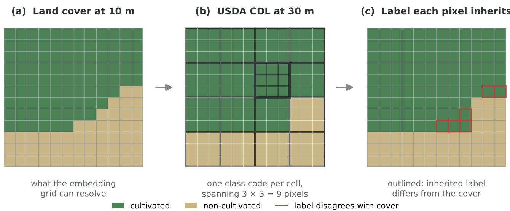  
Figure 1: How a 30 m CDL label is carried onto the 10 m embedding grid. (a) The land cover an embedding pixel can resolve. (b) The CDL assigns a single class code to each 30 m cell, outlined in bold for one cell, which covers a 3 × 3 block of embedding pixels. (c) Nearest-neighbour alignment gives every pixel in that block the same label, so the label boundary is forced onto the coarse grid; the outlined pixels are those whose inherited label therefore difers from the cover beneath them. The disagreement is confined to cells that straddle a field edge. The figure is a schematic drawn to illustrate the mechanism, not measured data.

A regular grid of cells about 8 km apart is laid over the area of interest, spaced so that the extracted patches never touch. Keeping the patches apart matters for two reasons: the same pixel is never sampled twice, and neighbouring patches cannot leak information between the training and the test sets, which is a common and easily overlooked cause of over-optimistic accuracy. Within each cell one location is selected by stratified sampling on the binary CDL label, and around that location a patch of 224 × 224 pixels at 10 m resolution, about 2.24 km on a side, is cut out and reprojected onto a common grid (EPSG:32619, the Sentinel-2 10 m grid in UTM zone 19N).

The decisive step for class balance is the acceptance rule: a patch is kept only if at least 10% of its pixels are cultivated, and patches below this threshold are discarded. Since cultivated land is a small minority across Maine, an unconstrained sample would be overwhelmingly non-cultivated; this rule concentrates the patches on the agricultural parts of the state and is what raises the cultivated share of the dataset to about 22%, a balance on which a classifier can be meaningfully trained and evaluated. Figure 2 shows where the 192 accepted patches fall.

This acceptance rule was designed to enrich the evaluation dataset with agricultural areas and therefore does not produce a probability-based sample representative of Maine as a whole. The 192 sampled patches are appropriate for assessing the model’s ability to discriminate between cultivated and non-cultivated land; their observed class prevalence and overall accuracy should not, however, be interpreted as statewide estimates of cultivated area or of map accuracy. The separate contiguous block introduced in Section 2.5 provides a complementary assessment under spatially continuous conditions. Nevertheless, that block is also not a random statewide sample, as it was selected to maximise the achievable cultivated proportion while satisfying the predefined spatial exclusion constraints.

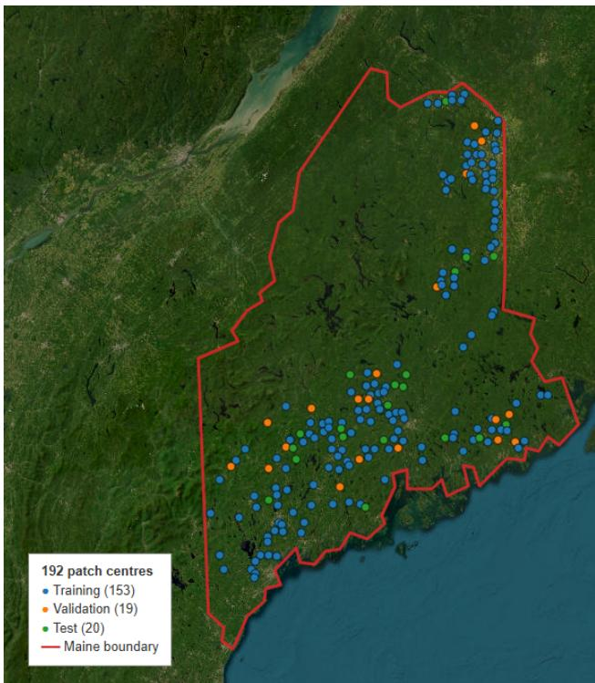  
Figure 2: Centres of the 192 sampled patches across Maine, coloured by split (training, validation, test), on an Esri World Imagery basemap; the red line is the state boundary. The patches follow the agricultural parts of the state, the Aroostook County farmland in the north and the central and southern valleys, and the three splits are interspersed across the same regions while the non-contiguous grid keeps every patch several kilometres from its neighbours.

## 2.4 The AlphaEarth embeddings

The input to every experiment is the AlphaEarth embedding. For each patch and each year we obtain a single image of 64 bands from the GOOGLE/SATELLITE\_EMBEDDING/V1/ANNUAL collection in Google Earth Engine. Every pixel of that image holds a 64-dimensional vector, the model’s annual summary of the 10 m ground cell beneath it, and it is this vector, rather than any raw reflectance, that becomes the feature on which the pixel is classified.

A few properties matter for the way we use the embeddings. The product is global and is published as one layer per year from 2017 onward, which is what makes the year-to-year analysis of Section 7 possible; we use the six years from 2018 to 2023. The values are small numbers of either sign, in our tiles roughly between −0.51 and 0.48, and each 64-vector is normalised to unit length, so that it lies on the surface of a 63-dimensional unit hypersphere $S ^ { 6 3 }$ . This geometric property governs how the embeddings are distributed and is taken up in Section 4. In its compact published form each embedding is quantised to one byte per dimension, that is 64 bytes per pixel, whereas the GeoTIFF tiles we download and work with store the 64 values in double-precision floating point. Table 1 collects these properties together with the composition of the dataset.

Because a 64-band image cannot be shown directly, we visualise an embedding as a false-colour image built from three channels. Rather than pick three of the sixty-four bands arbitrarily, we summarise all 64 with a principal component analysis and map the first three principal components to the red, green and blue channels. The first three components together account for about 57 per cent of the variance across the embedding, far more than any three individual bands could capture (three arbitrary bands hold only about 5 per cent, and even the three most variable bands only about 11 per cent). Each channel is therefore a combination of all 64 numbers, so the colours carry no physical meaning, but they are the most informative three-channel view available. Figure 3 does this for one patch and places it next to the binary CDL label of the same patch. Even compressed to three channels, the field boundaries are clearly visible in the embedding and they correspond closely to the cultivated areas in the label, which is a first indication that the embedding already separates fields from their surroundings.

## 2.5 The dataset

Applying this sampling over the years 2018 to 2023 yields the dataset used throughout: 192 patches, each available for all six years, with a 64-band AlphaEarth embedding and the binary CDL label for every patch and year. The patches are split once into 153 for training, 19 for validation and 20 for testing, and the same split is used for every year. The training and validation patches are pooled when fitting the classifiers, while the 20 test patches are held out and used only for the final evaluation. Table 1 summarises the product specification and the composition for the reference year 2023. The cultivated share sits between about 18 and 23 per cent across the three splits, and the overall fraction of about 22% is the direct efect of the acceptance rule of Section 2.3. Because the sampling grid keeps the patches several kilometres apart, the training, validation and test patches are spatially separated by construction, which avoids the spatial leakage that would otherwise inflate the test accuracy. The AlphaEarth embeddings are annual products and are complete over every patch, so the inputs contain no missing pixels.

Alongside the scattered patches we use a separate, continuous test area in southern Maine: a block of about 11.2 km by 8.96 km (1120 × 896 pixels at 10 m), tiled into 20 patches in the same format and kept at least 2 km away from all training patches, for which we hold the same data for every year from 2018 to 2023. We located it with a sliding-window search over the state: the region was tiled into 158,400 candidate boxes at a 1 km stride, every box falling outside Maine or within the 2 km exclusion bufer around any training patch was discarded, leaving 56,841 valid candidates, and the remaining boxes were scored by their cultivated fraction. Two targets were searched in parallel, the box closest to the training-set balance of about 22% and the box closest to an even split, and both converged on the same area, at roughly 17% cultivated. This is a direct consequence of Maine’s land cover: no block of this size anywhere in the valid search region reaches an even split, so the selected box represents the best achievable class balance rather than a freely chosen target. Its cultivated fraction is stable across the study period, between about 15% and 22% from 2018 to 2023. This block is the basis of the cross-year check of Section 7 and of the photo-interpretation validation of Section 8.

## 3 Embedding-Based Classification Framework

A single decision runs through the whole study. We treat the embedding as the representation and keep the classifier on top of it deliberately simple. We cannot fine-tune the foundation model itself, because AlphaEarth is released only as precomputed embeddings and not as an open, trainable model; and, even setting that aside, we deliberately do not train a deep network of our own. We take the released embeddings as they are and fit light, standard classifiers to them. This makes the embedding, rather than the classifier, the object of study, and it raises a question that has to be answered before any classification: what do these 64 numbers actually look like, and which statistical tools are even valid on them? The work is therefore organised in two halves, summarised in Figure 4. Section 4 characterises the embedding space itself; the present section and those that follow put it to work.

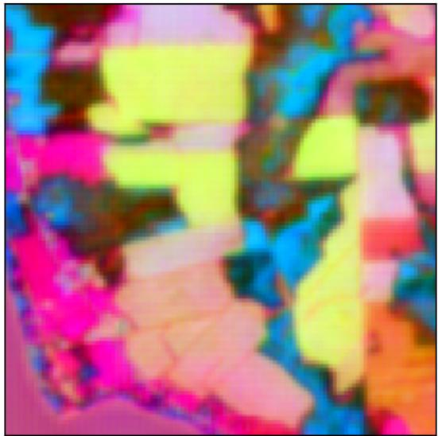

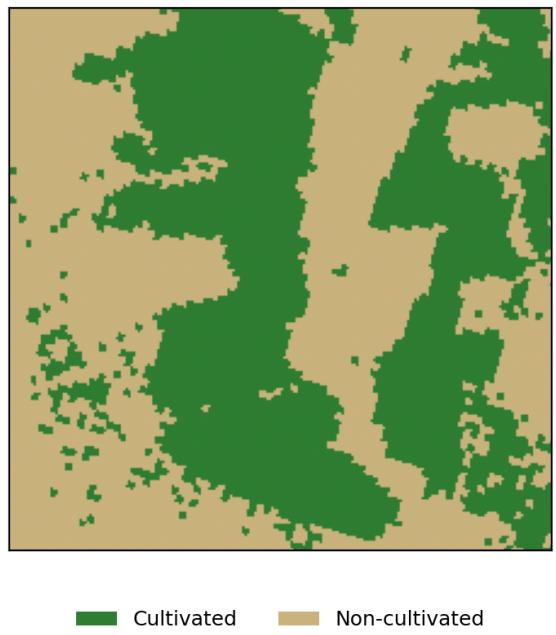  
Figure 3: One sample patch of the 2023 dataset. Left: the AlphaEarth embedding shown in false colour, with the first three principal components of the 64 bands mapped to red, green and blue (together about 57% of the embedding variance); each channel combines all 64 bands, so the colours carry no physical meaning. Right: the binary CDL label for the same patch (green: cultivated; tan: non-cultivated). The patch is 224 × 224 pixels at 10 m and is 48% cultivated.

Table 1: The AlphaEarth annual embedding product as used here (top) and the composition of the 192-patch dataset for the reference year 2023 (bottom). Pixel counts and cultivated shares are computed from the binary CDL labels.
<table><tr><td colspan="2">Embedding product</td><td colspan="2"></td></tr><tr><td colspan="2">Earth Engine collection Embedding dimensions</td><td colspan="2">GOOGLE/SATELLITE_EMBEDDING/V1/ANNUAL 64 bands (A00 to A63)</td></tr><tr><td colspan="2">Spatial resolution Temporal sampling</td><td colspan="2">10m one annual layer per year; years used 2018 to 2023</td></tr><tr><td colspan="2">Patch size</td><td colspan="2">224 × 224 pixels (≈ 2.24 km square)</td></tr><tr><td colspan="2">Coordinate system Value range (our tiles)</td><td colspan="2">EPSG:32619 (UTM zone 19N) approximately -0.51 to 0.48</td></tr><tr><td colspan="2">Vector norm Storage</td><td colspan="2">unit length, so each vector lies on S63 published as int8 (64 bytes per pixel); our tiles float64</td></tr><tr><td colspan="2">Split (2023)</td><td></td><td></td></tr><tr><td colspan="2"></td><td>Patches</td><td>Pixels Cultivated (%)</td></tr><tr><td colspan="2">Training</td><td>153</td><td>22.35</td></tr><tr><td colspan="2">Validation</td><td>7,676,928 19</td><td>23.43</td></tr><tr><td colspan="2">Test</td><td>953,344 20 1,003,520</td><td>18.35</td></tr><tr><td colspan="2">Total</td><td>192 9,633,792</td><td>22.04</td></tr></table>

## 3.1 Problem set-up

The classification is binary and per pixel. Each pixel is described by its 64-dimensional embedding and carries the binary CDL label of Section 2.2, and the task is to predict that label from the embedding. To train and evaluate the classifiers we flatten the patches into a table: every pixel of every patch becomes one row of 64 columns, and the patches of a split are stacked into a single matrix $\mathbf { X } \in \mathbb { R } ^ { n \times 6 4 }$ with a label vector y ∈ {1, 2}n. Invalid pixels, those with a missing embedding or a label that is neither cultivated nor non-cultivated, are masked out before stacking. The pooled training patches give about 8.6 million labelled pixels, at the natural class balance of roughly 77.5% non-cultivated to 22.5% cultivated; the 20 test patches, about one million pixels, are held out.

Working per pixel, rather than feeding whole patches to a convolutional network, is a deliberate choice and it follows directly from what the embedding is. The AlphaEarth embedding was trained to encode the spatial and temporal context around each pixel, so the 64 numbers at a single location already summarise its neighbourhood and its year. A classifier placed on top of the embedding therefore does not need to look at the surrounding pixels itself; reading each pixel’s vector independently is the standard and suficient recipe, and it keeps the classifier light, which is the premise of the whole approach. It also means the choice of classifier becomes a question about the embedding rather than about spatial modelling, which is what makes the comparison of classifiers below informative. Although the classifiers operate on individual pixels, neighbouring pixels within a patch are spatially autocorrelated, so the pixel counts should not be interpreted as counts of fully independent samples; spatial generalisation is assessed instead through held-out patches that are spatially separated from the training data.

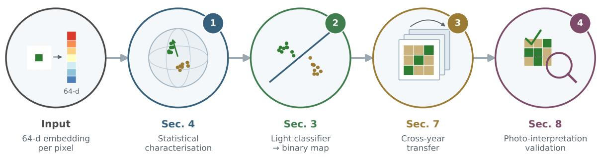  
Figure 4: Overview of the approach. A 64-dimensional AlphaEarth embedding per pixel is first characterised statistically (Section 4), then read by a light classifier into a binary cultivated map (Section 3); the classifier is then transferred across years (Section 7) and the labels validated by independent photo-interpretation (Section 8). The label under each stage gives the section in which that stage is set out; the corresponding results follow in Sections 5 to 8.

## 3.2 Two training regimes: balanced sample against full pool

We train the classifiers under two regimes, and the contrast between them is itself one of the questions of this paper. The first is a small balanced sample: 30,000 pixels drawn from each class, 60,000 in total, from the pooled training patches. Drawing equal numbers from the two classes counteracts the natural imbalance, so the classifier is not simply rewarded for predicting the majority class, and 60,000 pixels is small enough to train even the heavier classifiers, such as the support vector machine, in seconds. The second regime is the full pool: all of the roughly 8.6 million training pixels, left at their natural balance. Training the same classifiers both ways tests how much data they actually need. If a model trained on 60,000 pixels is almost as accurate as the same model trained on 8.6 million, then the embedding is informative enough that a small balanced sample sufices. Throughout, the 20 test patches are never used in either regime.

We use the term pixel-sample eficiency for this comparison. The 60,000 observations are labelled pixels inherited from the CDL and sampled from the training patches; they are not 60,000 independent manual annotations. The experiment therefore measures how many pixel rows the downstream classifier needs once a labelled raster is already available, not the cost of building a new reference dataset from field surveys.

## 3.3 Classifiers

We do not use a single classifier but a graded set, ordered from the simplest possible model to progressively more flexible ones. The purpose of the ladder is diagnostic: if a one-line linear model is already almost as good as a large tree ensemble, that tells us the embedding has done most of the work and the classifier is secondary, which is precisely the claim we set out to examine. Table 2 collects the settings.

Those settings were fixed in advance of any evaluation. They are declared once, as conventional values for models of this kind, in a version-controlled configuration file of the released pipeline, and no hyperparameter search of any form was carried out: the codebase contains no grid search, randomised search or cross-validation procedure. No data therefore informed the choice, and in particular the 20 test patches were used neither for hyperparameter tuning, nor for decision-threshold selection, nor for model selection. Because the stacking meta-learner relies on an internal pixel-level split, its performance is interpreted as a secondary diagnostic rather than as evidence of spatial generalisation, and the main conclusions rest on the individual classifiers evaluated on spatially separated test patches. The cost of not searching is that the accuracies reported below are not optimised ones, and should be read as a floor rather than a ceiling: a tuned model would plausibly do slightly better. That cost is worth paying here, because the comparison we care about is between classifiers rather than against a leaderboard, and holding every model at conventional untuned settings means their near-equal performance cannot be an artefact of unequal tuning efort.

Logistic regression is the linear baseline. It draws a single hyperplane through the 64-dimensional space and reads the probability of cultivated from which side of it a pixel falls,

$$
p ( \mathrm { c u l t i v a t e d } \mid \mathbf { x } ) = \sigma ( \mathbf { w } ^ { \top } \mathbf { x } + b ) , \qquad \sigma ( z ) = \frac { 1 } { 1 + e ^ { - z } } ,\tag{1}
$$

so there are only 65 parameters to learn. We standardise each dimension first and fit by minimising the L2-regularised cross-entropy. Logistic regression can only separate the classes with a flat boundary, so if it performs well that is strong evidence that the embedding is close to linearly separable for this task, with the foundation model, not the classifier, providing the separation.

Random forest [6] grows many decision trees, each on a bootstrap sample of the pixels and with only a random subset of the 64 dimensions considered at each split, and averages their votes. Because the trees are grown on diferent samples and feature subsets they are largely independent, and averaging them reduces variance. A random forest captures non-linear interactions between dimensions without being told about them and needs no feature scaling, but its trees are fitted independently and so the forest never corrects its own errors, which is the gap that boosting fills.

Gradient boosting also uses trees, but grows them in sequence, each new tree fitted to the errors the previous trees still make, so that the score after T rounds is an additive sum of small trees scaled by a learning rate η. We use two implementations that difer mainly in how each tree is grown: LightGBM [15] grows leafwise, repeatedly splitting whichever leaf promises the largest loss reduction, and XGBoost [8] grows level-wise to a fixed depth and folds the regularisation directly into the split gain it maximises. On our data the two are efectively tied. For completeness we also include a support vector machine with a radial basis kernel and a k-nearest-neighbours classifier, but only in the balanced-sample regime, since kernel SVM training grows between quadratically and cubically with the number of pixels and k-nearest neighbours must store and search the entire training set at prediction time.

Because the individual classifiers may make diferent mistakes, we also combine them, in both cases on the same balanced 60,000-pixel sample as the sampled single classifiers. Soft voting averages the cultivated probabilities of the four base models and thresholds at 0.5. Stacking instead learns how much to trust each model: the balanced sample is divided by a stratified random split at the pixel level into a development part (80%, used to fit the four base classifiers) and a held-out part (20%, on which the bases are scored and a logistic-regression meta-learner is fitted to their predicted probabilities). Scoring the bases on pixels they have never seen gives the meta-learner realistic, out-of-sample predictions to weigh. This split is at the pixel level rather than the patch level, so neighbouring pixels of the same patch can fall on both sides of it; a patch-grouped split would be the cleaner choice for the combiner. It governs only the internal training of the combiner, since all classifiers are ultimately compared on the 20 held-out test patches, which are spatially separate from the training pool and share no pixels with it.

## 3.4 Evaluation protocol and metrics

Every classifier and ensemble is evaluated on the 20 held-out test patches, which are never used in any fitting and, because of the sampling grid of Section 2.3, are spatially separated from the training patches so that no pixel and no immediate neighbourhood is shared. This is what makes the test accuracy an estimate of performance on genuinely new ground rather than a measure of memorisation. To be explicit about how the splits are used: the 153 training and 19 validation patches are pooled into the fitting pool, so the validation patches enter model fitting rather than serving as a separate patch-level selection set, and the classifiers are compared on the held-out test patches. Because the leading classifiers difer by only about a tenth of a percentage point, the conclusions do not depend on which of them is retained.

We report several metrics because the task is imbalanced: with only about 22% of pixels cultivated, a trivial model that calls everything non-cultivated already scores about 78% overall accuracy. Alongside overall accuracy we therefore report the per-class precision and recall, the macro-averaged $F _ { 1 }$ score, the balanced accuracy

$$
\begin{array} { r } { \mathrm { B A } = \frac { 1 } { 2 } \big ( R _ { \mathrm { c u l t } } + R _ { \mathrm { n o n } } \big ) , } \end{array}\tag{2}
$$

the unweighted mean of the two classes’ recalls, and the cultivated intersection-over-union $\mathrm { I o U _ { c u l t } } = T P / ( T P +$ $F P + F N )$ . Because each class counts equally in Equation 2 regardless of its size, a model that simply predicts the majority class scores only 0.5, which makes the balanced accuracy a fairer single number than overall accuracy on this task. All experiments use the fixed random seed 42 so that the splits, samples and model fits are reproducible.

The independent sampling unit for spatial generalisation is the held-out patch, not the pixel. We therefore use the pixel-level metrics as descriptive summaries over the held-out area, and avoid interpreting the approximately one million test pixels as one million independent observations. Formal paired inference is used only in Section 8, where competing maps are evaluated on the same independently sampled reference points. Diferences of a few tenths of a percentage point between classifiers should consequently be read as practically small, unless they are stable across patches or supported by an explicit uncertainty analysis.

## 4 Embedding-Space Analysis

Before fitting any classifier we study the embeddings themselves. There are two reasons for doing this first. The practical reason is that the analysis decides which tools are valid further down: several of the tests and models we might reach $\operatorname { f o r } ,$ and the distance an algorithm uses to compare two pixels, assume a particular shape for the data, and if that shape does not hold we have to choose diferently. The second reason is that a careful look at the embedding space gives a first, classifier-free picture of how hard the task is, by measuring directly how far apart the cultivated and non-cultivated pixels sit.

Table 2: Classifier settings in the two training regimes. A dash means the model is not used in that regime. All models use random seed 42. Logistic regression, the random forest, the support vector machine and k-nearest neighbours are implemented in scikit-learn [25]; LightGBM and XGBoost use their own libraries.
<table><tr><td>Classifier</td><td>Full pool (~8.6 M px)</td><td>Balanced sample (60 k px)</td></tr><tr><td>Logistic regression</td><td> ${ \mathrm { s t a n d a r d i s e } } + L _ { 2 } \ ( C { = } 1 )$ </td><td> ${ \mathrm { s t a n d a r d i s e } } + L _ { 2 } \ ( C { = } 1 )$ </td></tr><tr><td>Random forest</td><td>200 trees, depth 22</td><td>250 trees, depth 20</td></tr><tr><td>LightGBM</td><td>400 trees,  $\scriptstyle \eta = 0 . 0 5 ,$  31 leaves</td><td>450 trees,  $\eta { = } 0 . 0 3 ,$  255 leaves</td></tr><tr><td>XGBoost</td><td>400 trees, η=0.05, depth  $6 , \lambda { = } 1 . 0$ </td><td>450 trees,  $\scriptstyle \eta = 0 . 0 3 ,$  depth  $1 2 , \lambda { = } 0 . 5$ </td></tr><tr><td>SVM (RBF) k-nearest neighbours</td><td></td><td> $C { = } 2 . 0$   $k { = } 5$ </td></tr></table>

One caveat applies throughout. Because neighbouring pixels within the same patch are spatially autocorrelated, and because the sample sizes are very large, the p-values reported below are used mainly as diagnostics, while efect sizes, angular separability and held-out classification performance are treated as the more informative measures.

## 4.1 Directional geometry

Each AlphaEarth pixel is a vector $\mathbf { e } \in \mathbb { R } ^ { 6 4 }$ , and the published embeddings are L2-normalised to unit length, so every embedding lies on the surface of the unit hypersphere $S ^ { 6 3 } = \{ \mathbf { x } \in \mathbb { R } ^ { 6 4 } : \| \mathbf { x } \| _ { 2 } = 1 \}$ . We confirmed this on our own tiles: the mean Euclidean length of a sampled embedding is 1.000 to three decimal places. The consequence is geometric and important for everything that follows. Because all vectors have the same length, the magnitude of an embedding carries no information and only its direction does, so the natural way to compare two pixels is the angle between them, measured by the cosine similarity $s ( \mathbf { e } _ { i } , \mathbf { e } _ { j } ) = \mathbf { e } _ { i } \cdot \mathbf { e } _ { j }$ , where the equality with the inner product holds precisely because the vectors are unit length.

This also bears on the statistics we are allowed to use. A multivariate Gaussian places its mass throughout $\mathbb { R } ^ { 6 4 }$ , including regions of the sphere where no embedding can ever fall, so it is geometrically mismatched to data confined to $S ^ { 6 3 }$ . The same constraint has a stricter, one-dimensional consequence: the unit norm forces every single coordinate into the bounded interval [−1, 1], because $\begin{array} { r } { e _ { j } ^ { 2 } \le \sum _ { k } e _ { k } ^ { 2 } = 1 } \end{array}$ , and in our tiles into a much narrower range still (Table 1). A bounded quantity cannot be exactly normal, so the non-normality documented below is in part a structural consequence of the spherical geometry rather than a surprise. The matching family is directional statistics, which model points on a sphere directly and replace ordinary distance with angle. We stress that unit normalisation makes a directional treatment appropriate, but it does not by itself guarantee that any single directional model fits; that has to be tested empirically.

## 4.2 Concentration and the von Mises-Fisher model

The natural first model for data on $S ^ { 6 3 }$ is the directional analogue of the Gaussian, the von Mises-Fisher (vMF) distribution [20], whose density $f ( \mathbf { x } \mid \pmb { \mu } , \kappa ) =$ $C _ { d } ( \kappa ) \exp ( \kappa \mu ^ { \top } \mathbf { x } )$ is governed by a mean direction µ and a concentration κ that plays the role the inverse variance plays for a Gaussian. We estimate κ from the mean resultant length $\begin{array} { r } { \bar { R } = \| \frac { 1 } { n } \sum _ { i } \mathbf { x } _ { i } \| } \end{array}$ , the length of the average of n unit vectors, which is short when the directions disagree and cancel and long when they agree, using the closed-form approximation of Banerjee et al. [1] with $d = 6 4$

It matters which set of embeddings is being measured. AlphaEarth is trained with a batch-uniformity objective whose explicit purpose is to spread the embeddings as evenly as possible over $S ^ { 6 3 }$ [7], so taken over the whole Earth the distribution is close to uniform, which by definition means a near-zero concentration. The high concentrations we report are not in tension with this: we never measure the global set, but the embeddings of one region split into two land-cover classes, and a subset that is globally a thin slice of an overalluniform sphere can perfectly well have a large κ of its own. Within each class the concentration is high, of the order of $1 0 ^ { 2 }$ (Table 3), corresponding to tight angular clusters. The non-cultivated class is slightly more concentrated (κˆ ≈ 159) than the cultivated class (κˆ ≈ 137); a plausible reading, which we do not test directly, is that the non-cultivated class is dominated by spectrally homogeneous forest while the cultivated class mixes several crop types. The combined estimate (κˆ ≈ 125) is lower than either class alone, exactly as expected when two slightly ofset clusters are pooled. The perclass estimate computed on a 50,000-pixel subsample (137.1) is very close to the full-pool value (136.9), and the estimate settles from only a few hundred pixels, so it appears to reflect a stable property of the data rather than a sampling artefact.

Two cautions apply. AlphaEarth’s own use of the vMF is a training-time mechanism with an imposed concentration, a stochastic bottleneck on the whole 64-dimensional unit vector; it does not assert that the empirical distribution of the released embeddings is itself vMF, and that empirical question is the one we take up here. Second, a single vMF describes a class as one round blob with exactly one preferred direction, which is faithful only if the class really is one cluster. The cultivated class is not one thing, it is potatoes, hay, blueberries and so on, and each crop may point in its own direction, so a mixture of several vMF components may describe it better. Our lowdimensional projections do show such sub-clusters, so we use κ as a descriptive summary of concentration rather than as an established model.

## 4.3 Normality and marginal shape

The analyses available to us split into two families: one that assumes approximately normal data, including parametric two-sample tests and Gaussian-implied distances, and one that is distribution-free. Normality testing is therefore used here as a diagnostic step that decides which family is legitimate. We test each of the 64 dimensions, separately for the two classes, with three complementary tests, controlling the family-wise error rate over the $6 4 \times 2 = 1 2 8$ tests with a Bonferroni correction: Shapiro-Wilk on a 5,000-pixel subsample, D’Agostino-Pearson $K ^ { 2 }$ and Anderson-Darling on a 50,000-pixel sample.

Normality is rejected almost everywhere. Of the 128 dimension-class combinations, 126 reject the null on all three tests and the remaining two reject on at least one, with Shapiro-Wilk p-values many orders of magnitude below the threshold and widespread non-zero skewness and excess kurtosis. Fitting a panel of seven candidate distributions per dimension (normal, Student’s t, Laplace, logistic, generalised normal, skew-normal and Cauchy) and selecting by the Akaike information criterion confirms this quantitatively: the normal is never the preferred model, the skew-normal is the single most frequent best fit (73 of the 128 cases), followed by the generalised normal (46), with a handful of Student’s t (8) and one logistic fit. Averaged over the cases, the improvement of the best fit over the normal is large, with a mean ∆AIC of about 2,400, where a diference above ten already counts as decisive. The dominant departure is therefore asymmetry, not heavy tails: the marginals are best described as mildly skewed bell shapes. These fitted distributions are used as empirical summaries of marginal shape, not as exact generative models, since the coordinates are bounded by the unitnorm constraint whereas most of the candidates have unbounded support.

One point is worth stating clearly, because it is easy to misread. Failing the normality test does not mean a dimension is uninformative. The rejection of exact marginal normality does not imply that linear classifiers, or large-sample comparisons of class means, are inappropriate. Rather, it indicates that a multivariate Gaussian model does not adequately describe the distribution of the unit-normalised embeddings, and that, given the very large sample size, marginal-test p-values alone provide limited information about practical class separation. We therefore place greater emphasis on efect sizes, distribution-free comparisons, directional geometry, and predictive performance on held-out data. Gaussian-based analyses are retained only as secondary large-sample consistency checks.

## 4.4 Per-dimension signal and class separability

We now ask whether all 64 dimensions actually matter for telling cultivated from non-cultivated land, or whether only a handful do the separating. The qualification matters: a dimension that is uninformative for this binary distinction is not noise in general, and may well be exactly what separates two forest types or two crop types in another task.

Looking at the per-dimension mean diference alone is not enough, because a diference in means is only meaningful relative to the spread of the data. We therefore summarise each dimension by Cohen’s standardised mean diference $d _ { \mathrm { C } , j }$ [10], which expresses the gap between the two class means in units of the data’s own spread and so does not change with sample size. This is preferable to a p-value here: at our sample sizes almost any non-zero diference is statistically significant, so a p-value would flag essentially every dimension and tell us nothing about which ones actually help.

The separating signal is spread across the embedding rather than held in a few coordinates (Figure 5). Across the 64 dimensions, 31 reach a large efect $( | d _ { \mathrm { C } } | \ge 0 . 8 )$ 10 a medium and 13 a small one, and only 10 are efectively negligible, with a mean absolute efect of 0.80 and a maximum near 2.0. Yet the two class mean profiles track each other closely and their ±1 standarddeviation bands overlap heavily on every dimension, so even the strongest single dimension leaves the classes far from separable on its own. A large efect size is not the same as a dimension that decides the class: at $d _ { \mathrm { C } } = 0 . 8$ the two class means are separated by less than one standard deviation, so a threshold rule on that one dimension would still misclassify a large fraction of pixels. The two statements are consistent, and together they say that the distinction is encoded collectively, across many weakly-to-moderately informative dimensions.

Distribution-free tests agree that almost every dimension carries class signal. Using the Mann-Whitney U, Kolmogorov-Smirnov and Brunner-Munzel tests for location and distribution, and a median-based Levene test for spread, all at the Bonferroni-corrected level, 61 of the 64 dimensions difer between the classes in both location and spread, two difer in location only, one in spread only, and none fails to difer on both. Welch’s t-test, run as a parametric cross-check and valid here by the central limit theorem despite the non-normality of the data, agrees on essentially every dimension. As above, the practical message is read from the efect sizes rather than from significance.

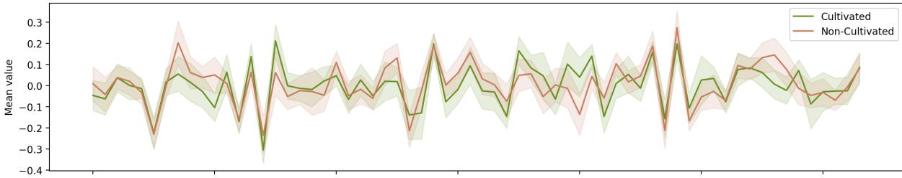

Mean difference (Cultivated - Non-Cultivated  
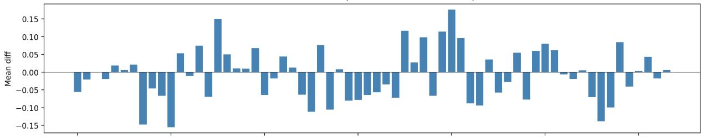

Per-dimension effect size (Cohen's d; dashed = |d|=0.8)  
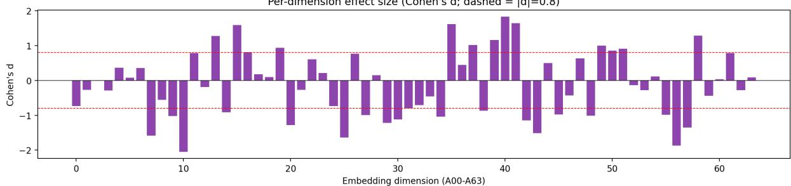  
Figure 5: Per-dimension profiles for the two classes. Top: class mean profiles with ±1 standard-deviation bands; the bands overlap heavily on every dimension. Middle: per-dimension mean diference (cultivated minus non-cultivated), small but systematic. Bottom: per-dimension efect size, Cohen’s $d _ { \mathrm { C } , j }$ , with the large-efect line $| d | = 0 . 8$ dashed. Many dimensions reach a large efect, but none is individually decisive.

## 4.5 Angular geometry and a lowcapacity supervised baseline

The tests so far treat the 64 dimensions one at a time. The cosine analysis instead measures separability in the way the geometry of Section 4.1 suggests, by angle between whole vectors, and it needs no assumption about the marginal distributions. For each class we form the centroid, the normalised mean direction of that class’s embeddings, and summarise the geometry by the within-class cohesion (the mean cosine of a class’s pixels to their own centroid), the cross-class similarity (to the other class’s centroid), their diference, and the angle between the two centroids. We compute these with both the mean and the median centroid and check that the two agree.

The picture is of two classes that sit close together on the sphere but remain distinguishable (Table 3). The within-class cohesion is 0.808, clearly above the cross-class similarity of 0.599, giving a separation gap of 0.209, and the two centroids are separated by an angle of $4 2 . 2 ^ { \circ }$ . All these similarities are positive, so both classes occupy the same broad region of the sphere rather than pointing in opposite directions, which is why the task is non-trivial. evEven $\mathrm { s o } ,$ a nearest-classcentroid rule, which estimates one labelled centroid per class but performs no iterative parameter fitting, classifies 90.2% of pixels correctly. This should be read as a low-capacity supervised baseline rather than a label-free method. Its performance shows that a large fraction of the class separation is already expressed by the embedding geometry, while the remaining gain from trained classifiers reflects a more flexible decision boundary, and it fixes a baseline the trained classifiers must clearly beat.

Table 3: Directional geometry of the two classes on $S ^ { 6 3 }$ computed on the 192-patch dataset. Higher κˆ means a tighter angular cluster. Cohesion is the mean cosine of a class’s pixels to their own centroid and cross-class similarity the mean cosine to the other class’s centroid; the nearestclass-centroid rule estimates one labelled centroid per class and fits no further parameters.
<table><tr><td>Quantity</td><td>Value</td></tr><tr><td>ê, cultivated ê, non-cultivated</td><td>136.9 158.5</td></tr><tr><td>ê, combined Within-class cohesion Cross-class similarity</td><td>125.1 0.808</td></tr><tr><td>Separation gap</td><td>0.599 0.209</td></tr><tr><td>Centroid angle evNearest-class-centroid accuracy</td><td>42.2°</td></tr></table>

## 4.6 Can the 64 dimensions be compressed?

Finally we test directly whether the embedding can be reduced without losing accuracy, from an unsupervised direction (principal component analysis, which compresses by variance) and a supervised one (feature selection, which keeps only the dimensions that separate the classes).

One point on the set-up, because it afects how the numbers below should be read. The experiments in this subsection, and the tangent-space comparison that closes it, are run on the class-balanced sample of 100,000 pixels (50,000 per class) used throughout the embedding-space analysis, with a 70/30 split inside that sample and lighter classifier settings than those of Table 2. They therefore use neither of the training regimes of Section 3.2 and are not evaluated on the held-out test patches. Their absolute accuracies are consequently a little lower than those of Table 4 and should not be compared with it; what is meaningful here is the change in accuracy as dimensions are removed, which is measured under identical conditions throughout.

The variance concentrates quickly: about 15 principal components capture 90% of the total variance, 22 capture 95% and 43 capture 99% (Figure 6, left). Variance is not the same as class information, however. A logistic regression trained on the first m principal components improves monotonically as m grows, from 90.2% on the first two components to 92.3% on all 64 (Figure 6, right), and is still creeping upward at the end: the last components, which carry almost no variance, still add accuracy, because principal component analysis orders directions by variance and not by class separation. The supervised view agrees. Keeping only the 61 separating dimensions and discarding the other three lowers accuracy slightly rather than leaving it unchanged, from 92.96% to 92.89% for the random forest and from 92.28% to 92.13% for logistic regression. There is therefore no subset of the 64 dimensions that can be dropped for free.

This conclusion needs stating carefully, because two recent studies of the embedding space reach what may look like the opposite result. Benavides-Martínez et al. [2] report that land-cover classification at 98% of baseline performance can be reached with as few as 2 to 12 of the 64 dimensions, depending on the class, eight of them for their cropland class, and Rahman et al. [26] estimate an efective dimensionality of about 13 and a local intrinsic dimensionality near 10. The diference is the acceptance criterion rather than the measurement. Those studies ask how few dimensions sufice while tolerating a small relative loss, and answer that very few do; we ask whether any dimension can be removed at no measurable cost, and find that none can. Both readings describe the same embedding: the class signal is heavily redundant, yet thinly spread, so that discarding coordinates is cheap but never free. Read through its correlation structure rather than its task performance, the space is in fact only moderately redundant: Rahman et al. [26] report that just 47 of the 2,016 dimension pairs exceed a correlation of 0.5 in absolute value, so most dimensions carry variance that is not duplicated elsewhere. Within this balanced Maine binary-classification experiment, neither principal component analysis nor the tested supervised feature-selection procedure improves accuracy, and retaining all 64 dimensions is the safest choice for the analyses that follow. This is a task- and protocolspecific result, not a claim that AlphaEarth dimensions are universally irreducible; where a small accuracy loss is acceptable, the evidence above suggests a much smaller subset would serve.

There is also a geometric reason to be wary of reduction. The directional analysis rests on the embeddings lying on S63; projecting onto a handful of principal components, or dropping coordinates outright, moves the points of that sphere and breaks the unit-norm property, so the angular geometry and any directional model no longer strictly apply to the reduced vectors. We therefore keep all 64 dimensions and use principal component analysis only as a diagnostic and for the false-colour visualisation of Section 2.4. For the same reason we tested whether respecting the curvature of the sphere helps, by projecting the embeddings into the tangent space at their Fréchet mean before classifying; across four classifiers this changed accuracy by at most 0.03 percentage points in either direction, well inside run-to-run noise, which is what the high concentration of Section 4.2 would predict, since a class that occupies such a small patch of the sphere is almost flat already. This last result should be scoped carefully. Rahman et al. [26], characterising the AlphaEarth manifold over 12.1 million samples across the conterminous United States, report that tangent spaces rotate substantially from place to place, with 84% of sampled locations showing tangent-space angles above 60◦ and local-global principal-component alignment close to the random baseline. Our finding does not contradict theirs: a single tangent space taken at the Fréchet mean of two tightly concentrated classes within one region is a very diferent object from the manifold as a whole, and the same subset-versus-global distinction applies here as it does to κ in Section 4.2. A single global tangent space is adequate for this regional task; it would not be for the manifold at large.

Taken together, these results show that the AlphaEarth embedding space is not well described by simple Gaussian coordinate-wise assumptions, but that it has a clear and stable angular structure. The cultivated and non-cultivated classes are not separated by one or two dominant dimensions; instead, the signal is distributed across the full 64-dimensional vector. This justifies carrying all dimensions into the classification experiments, and it explains why even simple classifiers can perform competitively.

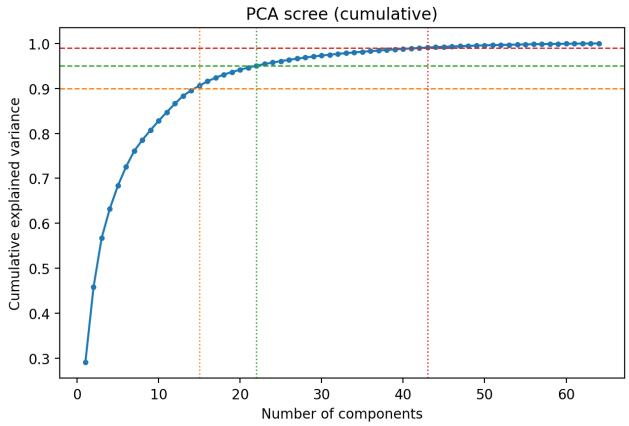

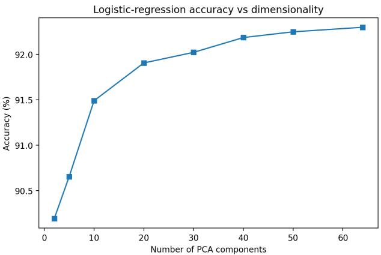  
Figure 6: Left: cumulative variance explained by the principal components, with the 90%, 95% and 99% levels marked; the variance saturates after roughly 22 components. Right: logistic-regression accuracy as a function of the number of principal components used; accuracy keeps rising past the point where the variance has saturated, because low-variance directions still carry class signal.

## 5 Classification Results

## 5.1 The classifier ladder

The central result of the classification experiments is how little the choice of classifier matters once the embedding is fixed. Table 4 reports overall accuracy, macro-averaged $F _ { 1 }$ and balanced accuracy on the heldout test patches, for the full-pool models and for the balanced-sample models. On the full pool the four models span a band of just 0.27 percentage points, from 93.48% for plain logistic regression to 93.75% for the random forest and XGBoost, with macro-F1 around 0.89 throughout. A single linear hyperplane through the 64-dimensional space is therefore almost as accurate as a large gradient-boosted ensemble, which indicates that the embedding space is close to linearly separable for this task and that the foundation model, rather than the classifier, provides the separation. This connects back to how the embeddings are trained: the batch-uniformity objective spreads the representation over the hypersphere and prevents collapse, so the discriminative structure is largely present in the embedding geometry already and little is left for the classifier to add. The same point is made from below by the nearest-centroid baseline of Section 4.5: at 90.2% from labelled class centroids alone, with no iterative parameter fitting, it is already within roughly three points of the trained models.

The overall accuracies of the classifiers difer by only a few tenths of a percentage point, whereas performance varies across held-out patches and errors are spatially clustered. We therefore treat the principal empirical result as equivalence in practical performance among several lightweight readouts, rather than as evidence that one specific classifier is universally best. The random forest is selected for the mapping that follows because it combines strong performance, non-linear capacity, and straightforward implementation; it needs no feature scaling, and it is the model used unchanged for the cross-year transfer of Section 7 and for the human validation of Section 8.

## 5.2 Class imbalance and per-class behaviour

Because only about 18% of the test pixels are cultivated, overall accuracy alone flatters the result: a trivial model that labelled everything non-cultivated would already score about 82%. The balanced accuracy corrects for this. For the chosen random forest it is 90.8% against 93.75% overall: the model recovers 95.4% of the non-cultivated pixels and 86.2% of the cultivated ones. The gap between the two recalls is the expected signature of the imbalance and of the cultivated class being the harder, more heterogeneous one, but a balanced accuracy close to 91% shows that the minority class is genuinely being recovered and not sacrificed to the majority.

The two training regimes trade these quantities of against each other. Under full-pool training balanced accuracy sits between 89.6% and 90.8%, mirroring the overall-accuracy ordering. Training on the classbalanced 60,000-pixel sample instead raises balanced accuracy to between 92.4% and 93.0%, even though it lowers overall accuracy by about one percentage point: balancing the training set recovers more of the minority cultivated class, whose recall rises from about 86% to about 93%, at the cost of a few more noncultivated false positives. Which regime is preferable therefore depends on whether overall agreement or an even-handed treatment of the two classes matters more for the intended application.

Table 5 gives the full per-class breakdown for the chosen model. The cultivated class is consistently the harder of the two, with a lower precision (80.9%) and recall (86.2%) than the non-cultivated class (both above 95%), so its $F _ { 1 }$ (0.835) trails the non-cultivated $F _ { 1 }$ (0.961). The confusion matrix behind these numbers has 781,982 non-cultivated and 158,796 cultivated pixels correctly classified, against 37,375 cultivated false positives and 25,367 cultivated false negatives, so the residual error is split between the two kinds of cultivated mistake rather than dominated by either.

Table 4: Classification accuracy on the 20 held-out test patches. The full-pool models are trained on all ∼8.6 million pixels of the training pool (train plus validation); the balanced-sample models on 60,000 pixels (30,000 per class). Balanced accuracy is the mean of the two class recalls. A dash means the model is not run in that regime.
<table><tr><td rowspan="2">Classifier</td><td colspan="3">Full pool</td><td colspan="3">Balanced sample</td></tr><tr><td>OA</td><td>macro-F1</td><td>Bal. acc.</td><td>OA</td><td>macro-F1</td><td>Bal. acc.</td></tr><tr><td>Logistic regression</td><td>93.48%</td><td>0.892</td><td>89.6%</td><td>92.05%</td><td>0.880</td><td>92.4%</td></tr><tr><td>Random forest</td><td>93.75%</td><td>0.898</td><td>90.8%</td><td>92.45%</td><td>0.886</td><td>92.6%</td></tr><tr><td>LightGBM</td><td>93.72%</td><td>0.896</td><td>90.0%</td><td></td><td></td><td></td></tr><tr><td>XGBoost</td><td>93.75%</td><td>0.897</td><td>90.0%</td><td></td><td></td><td></td></tr><tr><td>SVM (RBF)</td><td></td><td></td><td></td><td>92.22%</td><td>0.883</td><td>93.0%</td></tr><tr><td>Stacked ensemble</td><td></td><td></td><td></td><td>92.64%</td><td>0.888</td><td>92.7%</td></tr><tr><td>Nearest class centroid</td><td colspan="4">90.2% (OA)</td><td colspan="2"></td></tr></table>

Table 5: Per-class performance of the chosen random forest on the held-out 2023 test patches (full-pool training). Balanced accuracy equals the macro-averaged recall.
<table><tr><td>Class</td><td>Precision</td><td>Recall</td><td> $F _ { 1 }$ </td><td>Pixels</td></tr><tr><td>Non-cultivated</td><td>96.9%</td><td>95.4%</td><td>0.961</td><td>819,357</td></tr><tr><td>Cultivated</td><td>80.9%</td><td>86.2%</td><td>0.835</td><td>184,163</td></tr><tr><td>Macro average</td><td>88.9%</td><td>90.8%</td><td>0.898</td><td>1,003,520</td></tr></table>

Overall accuracy 93.75%; balanced accuracy 90.8%.

## 5.3 Predictions in the map domain

The aggregate numbers are easiest to interpret when the predictions are seen as maps. Figure 7 shows four of the twenty held-out test patches, chosen to span the range of dificulty, with the AlphaEarth embedding as a principal-component false-colour, the CDL ground truth, the random-forest prediction, and a pixel-bypixel agreement map. On the easier patches the prediction is almost indistinguishable from the ground truth and the field boundaries are recovered crisply. Where errors occur they are of two kinds and both visible in the agreement panels: small clusters of false positives where the model calls non-cultivated land cultivated, typically along field edges and in small clearings, and false negatives on cultivated parcels the model misses, usually narrow or fragmented fields. The errors sit on boundaries and small features rather than over whole parcels, which is the behaviour expected from a perpixel classifier on a 10 m grid and is consistent with the cultivated class being the harder one.

## 6 Label Eficiency

How much labelled data does the approach actually need? This is the practical question behind the two training regimes of Section 3.2, and for an operational product it is often the decisive one, since labelled pixels are the expensive ingredient.

Training on the full pool rather than the balanced sample buys surprisingly little. The random forest improves from 92.45% on 60,000 pixels to 93.75% on the full ∼8.6 million, a gain of about 1.3 percentage points for roughly 140 times as much data, and the other models behave similarly (Table 4). The balanced 60,000-pixel sample therefore already captures most of the available signal, which is consistent with the rest of the analysis: the embedding is informative enough that a small, class-balanced sample is close to suficient, and the expensive full-pool training adds only a modest refinement.

The comparison is in fact sharper than overall accuracy alone suggests, because the two regimes difer in what they optimise. On the imbalance-aware metric the sampled models are the better ones: the balanced random forest reaches 92.6% balanced accuracy against 90.8% for the full-pool model, and the balanced-sample support vector machine reaches 93.0% (Table 4). In other words, 140 times more data buys about 1.3 percentage points of overall accuracy while costing about two points of balanced accuracy, because the extra data arrives at the natural 78:22 class ratio and pulls the decision boundary towards the majority class. For a cropland product, where the minority cultivated class is the object of interest, the small balanced sample is therefore not merely an acceptable compromise but arguably the better default.

Combining classifiers does not change the picture either. The ensembles, both the soft-voting average and the stacked combiner, were trained on the same balanced 60,000-pixel sample as the base models, so they are compared like for like against the sampled single classifiers. The stacked ensemble, which learns how much to trust each base model, reaches 92.64%, only 0.19 percentage points above the balanced random forest (92.45%) and still below the full-pool random forest (93.75%). Learning to combine four classifiers on the small sample therefore buys less than adding more data does, and far less than the embedding itself already provides.

Read together with the nearest-centroid baseline of Section 4.5, which reaches 90.2% from two labelled class centroids and no iterative fitting, the picture is consistent: the task is not primarily limited by the volume of labelled pixels once a balanced sample is available, because most of the useful discriminative information is already present in the embedding representation. This is the property that makes the paradigm attractive for operational mapping, and it is consistent with what the model authors report for other tasks [7, 11] and with the independent irrigated-cropland evaluation of Yang et al. [29]. The two training regimes show that a balanced sample of 60,000 pixels retains most of the full-pool accuracy and achieves higher balanced accuracy at the default 0.5 threshold. This does not define a minimum label requirement, nor does it establish class balancing as optimal for all applications. More broadly, the result indicates that, on agriculture-enriched held-out patches, additional spatially correlated CDL-labelled pixels provide diminishing returns once a balanced training sample is available.

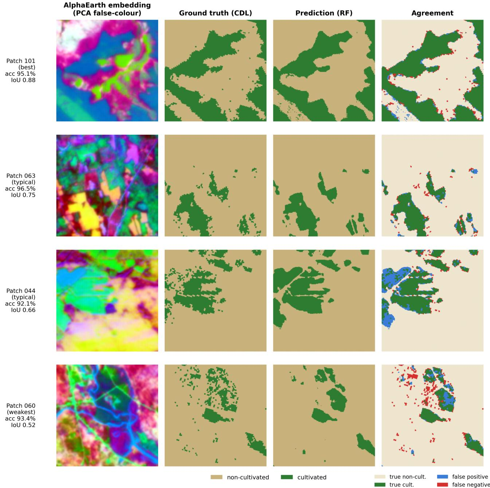  
Figure 7: Random-forest predictions on four held-out 2023 test patches, ordered from the strongest to the weakest by cultivated intersection-over-union. Columns, left to right: the AlphaEarth embedding as a principal-component false-colour; the CDL ground truth; the random-forest prediction; and the agreement map (true non-cultivated, true cultivated, false positive, false negative). The prediction closely tracks the ground truth, with errors concentrated on field boundaries and small parcels.

## 7 Cross-Year Transfer

The classification so far is built and tested within a single year, 2023. A foundation model that produces one embedding layer per year is only useful across time if those yearly embeddings are consistent, that is, if the 64 numbers mean the same thing in 2019 as in 2023. The cross-year experiment tests this directly.

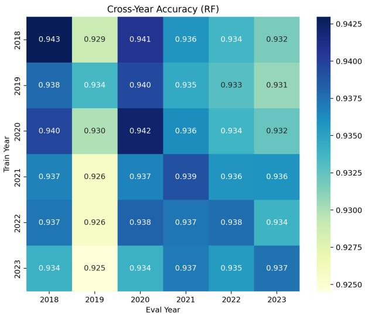  
Figure 8: Cross-year transfer of the random forest: overall accuracy for every combination of training year (rows) and evaluation year (columns) on the held-out test patches. The diagonal is the per-year matched accuracy; of-diagonal entries are temporal transfer. Accuracy is high and roughly uniform, with 2019 the weakest year both on the diagonal and as a transfer target.

The design is deliberately simple. We take the random forest trained on 2023 and apply it unchanged to the test patches of every year from 2018 to 2023, scoring each year’s predictions against that year’s CDL label. We do not retrain, fine-tune or adjust the model in any way; only the input embeddings change. Holding the model fixed is the point of the test, not a shortcut: it removes the classifier as a variable, so that any change in accuracy can be attributed to the embeddings, or to the satellite inputs behind them, rather than to a fresh model fit. To read that row correctly, however, we also need to know what each year’s accuracy would be at best, so we additionally train a separate random forest on each year and evaluate every such model on every year. This gives a full train-year by evaluation-year matrix that separates two efects the fixed model alone would confound: the diagonal is the per-year matched performance, showing whether a given year is intrinsically harder to classify, while the of-diagonal entries are transfer proper.

The yearly embeddings turn out to be consistent enough that a single-year model transfers with little loss. Applying the 2023 random forest to every year gives overall accuracies between 92.5% and 93.8%. The full matrix (Figure 8) shows the same pattern across all training years: the of-diagonal transfer entries sit close to the matched diagonal, so a model fitted on one year and applied to another loses only a fraction of a percentage point in most cases. The diagonal, where training and evaluation years coincide, reads 94.30% (2018), 93.36% (2019), 94.22% (2020), 93.91% (2021), 93.76% (2022) and 93.75% (2023).

Because overall accuracy can hide the behaviour of the minority class, we also read the diagonal on the imbalance-aware metrics. The per-year matched balanced accuracy stays in a narrow band, 91.8% (2018), 90.6% (2019), 91.5% (2020), 90.8% (2021), 90.8% (2022) and 90.8% (2023), and the cultivated-class recall likewise holds between 85.9% and 87.6% across the six years. The minority class is therefore recovered consistently from year to year, not only in aggregate, and the same holds across the full transfer matrix on balanced accuracy, where every train-evaluate combination stays between about 86% and 92%.

The only notable dip is 2019, which is the lowest point both on the diagonal, where it is intrinsically the hardest year to classify, and in transfer, where the 2023 model applied to 2019 falls to about 92.5%. A natural guess is that a cloudier year leaves fewer clear acquisitions behind its embeddings. We checked this against the Sentinel-2 record over the study area and do not find support for it. The growing season of 2019 was indeed somewhat cloudier than the other years, with fewer low-cloud scenes between April and October; however, the AlphaEarth embedding for a year integrates all of that year’s acquisitions across Sentinel-2, Landsat and Sentinel-1, so the quantity that matters is the clear-sky availability over the full calendar year. Over the full year, 2019 is not the cloudiest in the record: 2018 is, on every clear-sky measure, and yet 2018 is among the better-classified years rather than the worst. Cloud cover therefore does not line up with the accuracy pattern, so we do not attribute the small 2019 dip, a fraction of a percentage point on the diagonal and about one point in transfer, to it, and report it as a minor diference without a single identified cause.

The small diference between diagonal and ofdiagonal performance indicates stable temporal transfer across 2018 to 2023 within the same Maine sampling frame. However, because the same patch locations are reused and predictions are evaluated against each year’s CDL, this experiment does not assess geographic transfer, or changes in crop calendars or referencegeneration procedures. The result should therefore be interpreted as same-region temporal transfer, rather than as general temporal invariance of the embedding representation. It suggests that annual retraining may not be necessary for this regional workflow, while application to new regions would still require independent validation. We note that Ma et al. [19], benchmarking the same embeddings on other agricultural tasks, report limited time sensitivity as a limitation. The two observations are plausibly the same property seen from opposite sides: annual embeddings that change little from year to year transfer well, but are correspondingly less able to register change.

## 8 Independent Human Validation

All previous accuracy estimates use the CDL as the training and evaluation reference, not as error-free ground truth. This section introduces an independent human-consensus reference to assess the local agreement of the model and of the CDL on one 2023 block. The reference was built by photo-interpretation blind to the CDL labels, and is therefore independent of the map values being assessed, following the good-practice framework of Olofsson et al. [24]. It then asks the question that only becomes possible once the classifier exists: how well does the model itself agree with the human reference?

## 8.1 The continuous test block

The validation is carried out on the continuous test block in southern Maine introduced in Section 2.5, an 11.2 × 8.96 km area that is spatially separate from the scattered training and test patches. We use a contiguous block, rather than the dispersed patches, for two reasons: it gives a spatially coherent map that can be inspected as a whole, and it provides a clean, independent area for the hand interpretation.

Figure 9 shows the whole block as the AlphaEarth false-colour, the CDL ground truth and the randomforest prediction; the predicted cultivated pattern follows the ground truth across the entire block. Before turning to the human reference it is worth reporting how the model does on this block against the CDL alone, because a single contiguous landscape is a diferent test from an average over twenty dispersed patches. Over the full ∼1.0 million pixels the model agrees with the CDL on 93.3% overall, but the balanced accuracy is lower, 85.7%, reflecting a non-cultivated recall of 97.3% against a cultivated recall of only 74.1%, with a cultivated intersection-over-union of 0.655 and a mean intersection-over-union of 0.789. The overall accuracy is therefore close to that of the scattered patches (93.75%), but the balanced accuracy is about five points lower than the 90.8% there: a single southern-Maine block, with its own field shapes and boundary density, is harder for the minority class than the dispersed-patch average, and most of the diference is in cultivated recall. Because the block is a contiguous area, this is also the only place where we report the area-based mean intersection-over-union, since it is not defined on the scattered reference points used in the rest of this section.

## 8.2 Reference sample and interpretation protocol

The number of reference points follows the standard sample-size formula [9], $n _ { 0 } = z ^ { 2 } p ( 1 - p ) / e ^ { 2 }$ , with $z =$ 1.96 for 95% confidence, a target margin of error $e =$ 0.05 and $p = 0 . 5 $ , the proportion that maximises the required sample and so the most conservative choice when the true accuracy is unknown. This gives $n _ { 0 }$ ≈ 385, so we draw 385 points as a simple random sample of the valid pixels of the block, with a fixed seed. We use a simple random sample rather than a class-stratified one on purpose: stratifying by the CDL class would presuppose the very labels we set out to test and would tie the reference design to the layer under assessment. The cost is that the minority cultivated class receives proportionally fewer points, roughly 15% of the sample, which we accept so that the reference stays independent of the CDL.

Each point is interpreted in EarthLabel, a web-based photo-interpretation tool developed for this purpose [28]. At every point the interpreter inspects a 3 ×3 grid of sub-points laid over very-high-resolution imagery (NAIP aerial imagery, Google satellite imagery and Sentinel-2), which forces a judgement about the dominant land cover in the pixel’s neighbourhood rather than a single ambiguous click. The interpreted label therefore represents the dominant land-cover condition in the immediate neighbourhood of the sampled pixel rather than an infinitesimal point observation, which reduces sensitivity to geolocation errors and boundary ambiguity but should be borne in mind when interpreting disagreement near field edges. For each point the interpreter records the class, a confidence level, the agreement among the nine sub-points, the image source used and the time taken. Crucially the interpreter works blind to the CDL label: if the interpreter could see the CDL value, the exercise would risk simply confirming it and the comparison would be circular.

The 385 points were interpreted independently by two people. Before reconciliation the two agree on 91.2% of the points, with an inter-rater Cohen’s kappa of 0.63, which falls in the substantial band of Landis and Koch [16]. Of the 385 points, 351 are agreed by both interpreters, and on 27 of those the agreed reading contradicts the CDL, that is, CDL errors confirmed by two independent readings; the remaining 34 are disagreements, concentrated as expected on visually ambiguous cases near the cultivated boundary such as fallow fields, pasture and recently disturbed ground. These 34 were reconciled in two stages, deliberately without recourse to the CDL, which would have reintroduced the circularity the blind protocol was meant to avoid. In the first stage 28 were settled by the confidence levels recorded at the time of interpretation, taking the more confident reading; the confidence level is used only as this auxiliary reconciliation criterion, not as an independent measure of whether a label is correct. The remaining 6 were genuine ties, where both interpreters had recorded the same confidence, and were resolved in a second stage by a joint re-examination of each point using the multi-year imagery time series, so that each point is judged on its 2023 state, and street-view imagery where available. The result is a complete consensus reference of 385 points, 324 noncultivated and 61 cultivated, a 15.8% cultivated share that matches the block as a whole.

All the agreement figures below are computed on these 385 points only, since that is where the human reference exists; they are point-level numbers and should not be confused with the block-wide, pixel-level accuracy against the CDL reported in Section 8.1. From the cross-tabulation of each map against the consensus we compute the overall agreement with a Wilson 95% confidence interval, the per-class user’s and producer’s accuracies, the balanced accuracy, and Cohen’s kappa $\kappa _ { \mathrm { a g r } } = ( p _ { o } - p _ { e } ) / ( 1 - p _ { e } )$ , which corrects the raw agreement for the agreement expected by chance.

AlphaEarth embedding (PCA false-colour)  
Ground truth (CDL)  
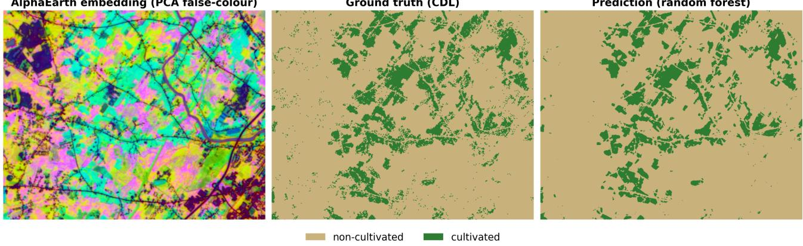  
Prediction (random forest)  
Figure 9: The continuous test block (southern Maine, 11.2 × 8.96 km), 2023. Left: the AlphaEarth embedding as a principal-component false-colour. Centre: the CDL ground truth. Right: the random-forest prediction. The predicted cultivated pattern follows the ground truth across the whole block (pixel-level agreement 93.3%).

## 8.3 Is the reference layer itself trustworthy?

Comparing the CDL labels against the consensus reference gives an overall agreement of 91.7% (95% confidence interval 88.5% to 94.1%) with a Cohen’s kappa of 0.72 (Table 6). The agreement is high for the noncultivated class $\left( F _ { 1 } = 0 . 9 5 \right)$ but weaker for cultivated land $\left( F _ { 1 } = 0 . 7 7 \right)$ , where the CDL shows a low user’s accuracy of 69.3%: a notable share of the points the CDL calls cultivated are read as non-cultivated by the interpreters. The CDL is therefore a good but imperfect reference, with most of its error on the minority cultivated class, which is consistent with the harder-class pattern seen throughout the classification results.

## 8.4 How well does the model agree with the human reference?

The most informative comparison is between the model’s own predictions and the human reference, since it measures the quantity we ultimately care about: how well the model recovers what a human reads on the ground, rather than how well it reproduces the CDL it was trained on. Sampling the AlphaEarth 2023 embedding at each of the 385 points and applying the chosen random forest gives an overall agreement with the consensus of 95.3% (95% confidence interval 92.7% to 97.0%) and a Cohen’s kappa of 0.82.

This is the notable result of the paper: the model agrees with the human reference more closely than the CDL labels it was trained on do, 95.3% against 91.7% and $\kappa = 0 . 8 2$ against 0.72. The gain is largest exactly where the CDL is weakest, on the cultivated class, where the model’s user’s accuracy is 86% against the CDL’s 69% (Figure 10): the model makes far fewer cultivated false positives than the raw CDL. The model appears to smooth over some CDL pixel-level noise, in that at points where the CDL label is individually wrong the AlphaEarth embedding may still resemble the true class, allowing the classifier to predict the human-interpreted class correctly. In other words, training on a noisy but mostly-correct reference yields a map that is, at these points, closer to human judgement than the reference itself.

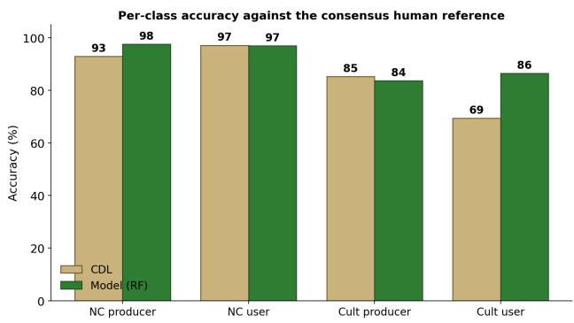  
Figure 10: Per-class producer’s and user’s accuracy against the consensus human reference, for the CDL labels and for the random-forest predictions. The largest diference is the cultivated user’s accuracy, which rises from 69% for the CDL to 86% for the model: the model commits far fewer cultivated false positives than the CDL it was trained on.

## 8.5 Comparison with a fine-tuned segmentation model

The same consensus reference provides a fair, modelagnostic test bed on which to compare diferent modelling paradigms on identical ground. As a final comparison we set the embedding-based approach against a fine-tuned segmentation model, TerraMind [14], applied to the same continuous test block and evaluated at the same 385 points. The two approaches are very diferent in spirit: the present method places a light random forest on top of frozen AlphaEarth embeddings and never trains a deep network, whereas TerraMind is a large multimodal backbone fine-tuned end-to-end for the segmentation task. Holding the evaluation fixed isolates the efect of the modelling paradigm from any diference in the test data.

Table 6 reports both models and the CDL baseline. The fine-tuned TerraMind reaches 93.5% overall agreement (kappa 0.75, cultivated F 0.79), which places it above the CDL baseline (91.7%) but below the embedding-plus-random-forest approach (95.3%). The ordering is consistent across overall accuracy, kappa and the cultivated $F _ { 1 }$ . The one exception is balanced accuracy, where TerraMind (87.5%) sits just below the CDL (89.1%): it agrees with the human reference more often overall, but recovers the two classes slightly less evenly, missing a few more of the cultivated points.

## 8.6 Paired significance testing

The accuracy figures above describe each map on its own. To ask whether one map is significantly closer to the human reference than another, we compare pairs of maps with McNemar’s paired test [21]. Because both maps in a pair are evaluated on the same 385 points, their accuracies are paired rather than independent, so the relevant question is not simply whether one overall accuracy is higher, but whether, on the points where the two maps disagree in correctness, one is right more often than the other. The test therefore looks only at these discordant points and ignores the points on which both maps agree. Under the null hypothesis that the two maps are equally accurate, each discordant point is equally likely to favour either map, so the number won by one map follows a binomial distribution with success probability one half. We report the exact twosided binomial p-value, which is preferred when the discordant points are few, and read $p < 0 . 0 5$ as evidence that the diference is systematic rather than due to chance.

The improvement of the model over the CDL is statistically significant (Table 7). The two disagree in correctness on 30 of the 385 points: on 22 the model is right where the CDL is wrong, and on only 8 the reverse holds, which gives an exact two-sided p-value of 0.016. On these points the model therefore corrects significantly more CDL errors than it introduces. This does not establish that the model is more accurate than the CDL everywhere, only that, on the 385 photointerpreted points, it agrees with the human consensus significantly more closely than the CDL does.

The lead over TerraMind, by contrast, is not significant. On the same points the two models disagree in correctness on only 17: AlphaEarth with a random forest is right on 12 of these and TerraMind on 5, giving an exact two-sided p-value of 0.14, so we cannot reject the null hypothesis that the two are equally close to the human reference. On the 385 reference points, the accuracies of AlphaEarth with a random forest and of TerraMind are therefore not significantly diferent, whereas AlphaEarth with a random forest is significantly closer to the human consensus than the CDL. We conclude that the lightweight approach achieves accuracy in the same observed range as TerraMind on this local reference, while avoiding downstream fine-tuning of the AlphaEarth foundation model. For completeness, the third pairing is also not significant: TerraMind wins 19 of its 31 discordant points against the CDL and the

CDL 12, an exact two-sided $p = 0 . 2 8 .$ , even though its overall agreement is higher. Among the three maps, then, only the embedding-based model significantly outperforms the CDL reference. All three tests use the exact binomial formulation on the paired predictions over the common photo-interpreted set, at the $\alpha = 0 . 0 5$ level.

This is a single comparison on one test block, interpreted by the same two people, so it should be read as indicative rather than as a definitive ranking of the two paradigms. What it does establish is that a light classifier on frozen embeddings is not obviously behind a large model fine-tuned end-to-end for the task, at a small fraction of the training cost.

## 9 Discussion

## 9.1 Why a classifier can be closer to the truth than its own training labels

The result that most needs explaining is the one in Section 8.4: a model trained on the CDL agrees with independent human interpretation more closely than the CDL does. This sounds paradoxical only if one expects a classifier to reproduce its labels. What it actually learns is the regularity in the relationship between embedding and label, and a per-pixel error in the reference is, by construction, not a regularity. Where the CDL misassigns an isolated pixel, that pixel’s embedding still resembles the class it truly belongs to, because the embedding is computed from imagery and not from the label; the classifier, having fitted the dominant pattern across 8.6 million pixels, therefore predicts the class the embedding supports rather than the erroneous label. Label noise that is unsystematic averages out during fitting, and the fitted model is smoother than the reference it was fitted to. The efect is visible in exactly the place the mechanism predicts: the CDL’s weakest quantity is its cultivated user’s accuracy (69.3%), that is, cultivated commission errors, and this is where the model gains most (86%).

Two qualifications keep this from being over-read. The argument holds for noise that is not systematically aligned with the embedding: a bias the CDL applies consistently to a whole cover type would be learned rather than smoothed away, and our data cannot distinguish the two cases. And the evidence is 385 points on one block, which is enough for the paired test to reach significance against the CDL $( p = 0 . 0 1 6 )$ but not enough to characterise CDL error across Maine or across years.

## 9.2 Operational implications

Read together, the results describe a low-compute prototype workflow rather than a deployment-ready statewide product. The user does not train or fine-tune the foundation model; the principal downstream cost is fitting a standard classifier to downloaded embeddings. The workflow is reproducible, and a balanced pixel sample captures most of the discrimination observed on the held-out patches. Operational use would in any case require validation on a probability-based sample of the target area, calibration that accounts for class prevalence, area-adjusted accuracy and uncertainty estimates, monitoring for year-to-year distribution shifts, and evaluation across diferent agricultural settings. Nevertheless, the present study provides a regional baseline from which these operational requirements can be developed.

Table 6: Three maps against the same consensus human reference (385 points of the continuous test block). The confidence interval on the overall agreement is the Wilson score interval. The area-based mean intersection-over-union is not reported here because the reference is a set of scattered points rather than a contiguous area (Section 8.1).
<table><tr><td>Map (vs consensus, 385 pts)</td><td>OA</td><td>95% CI</td><td> $\kappa _ { \mathrm { a g r } }$ </td><td> $F _ { \mathrm { 1 } } ( \bf { c u l t } )$ </td><td>Bal. acc.</td></tr><tr><td>AlphaEarth + random forest</td><td>95.3%</td><td>92.7–97.0</td><td>0.82</td><td>0.85</td><td>90.6%</td></tr><tr><td>TerraMind (fine-tuned segmentation)</td><td>93.5%</td><td>90.6–95.6</td><td>0.75</td><td>0.79</td><td>87.5%</td></tr><tr><td>CDL (reference baseline)</td><td>91.7%</td><td>88.5–94.1</td><td>0.72</td><td>0.77</td><td>89.1%</td></tr></table>

Table 7: McNemar paired comparisons against the human consensus reference, on the 385 points. Only the discordant points, where exactly one of the two maps is correct, enter each test; the concordant points carry no information about which map is better. “A wins” counts the discordant points on which map A matches the human reference and map B does not. Only the model against the CDL is significant at the 5% level.
<table><tr><td>Pair (A vs B)</td><td>A wins</td><td>B wins</td><td>Discordant</td><td>Exact p</td><td>Verdict</td></tr><tr><td> $\mathrm { \ A l p h a E a r t h + R F { \ v s } }$  CDL</td><td>22</td><td>8</td><td>30</td><td>0.016</td><td>significant</td></tr><tr><td> $\mathrm { \ A l p h a E a r t h + R F }$  vs TerraMind</td><td>12</td><td>5</td><td>17</td><td>0.14</td><td>not significant</td></tr><tr><td>TerraMind vs CDL</td><td>19</td><td>12</td><td>31</td><td>0.28</td><td>not significant</td></tr></table>

The limits of that claim should be stated as plainly. The study covers one state whose land cover is dominated by forest and where cultivated land is sparse and spatially fragmented, so the numbers may not transfer unchanged to regions with larger continuous agricultural areas, diferent crop calendars, or more heterogeneous farming systems; the independent evaluation of Yang et al. [29] reports exactly this pattern, with stable transfer between years but weaker generalisation across regions, and Ma et al. [19] likewise find limited spatial transferability of these embeddings relative to purpose-built remote-sensing models. Their strongest case is worth stating plainly: transferring a county-level soybean yield model from the United States to Argentina, embedding-based models return a negative coeficient of determination in every year from 2019 to 2024, between −0.64 and −5.24, against 0.27 overall for the remote-sensing baseline. Transfer to a genuinely diferent agricultural setting is not a matter of some lost accuracy but of a model that may fail outright, which is the risk our own single-state scope leaves untested. The classification is also purely per-pixel, so the residual errors concentrate at field boundaries and on small or fragmented parcels rather than over whole fields, and the balanced accuracy on the contiguous block (85.7%) is about five points below the dispersedpatch average, almost entirely through cultivated recall. A product built this way would inherit that behaviour.

## 9.3 When frozen embeddings may be preferable to fine-tuning

The comparison of Section 8.5 does not show that frozen embeddings beat fine-tuning: the diference against TerraMind is not statistically significant $( p = 0 . 1 4 )$ , and on a single block interpreted by two people it could not carry that weight even if it were. What it does suggest is that the two are in the same range on this task, which shifts the question from accuracy to cost. On that axis the frozen route is clearly cheaper, and the conditions under which it appears preferable are visible in our own results: when the task is a coarse, binary distinction that the representation already encodes, as the 90.2% nearest-centroid baseline of Section 4.5 indicates; when labels are limited, since a balanced sample of 60,000 pixels is close to suficient; when a multi-year product is wanted from a single fitting; and when there is no capacity to train or serve a deep network. Conversely, the cases where fine-tuning should still be expected to pay are those our design cannot address: tasks needing finer distinctions than the embedding was trained to preserve, tasks where field-level shape and boundary quality matter more than per-pixel agreement, given where our residual errors sit, and settings where a modality the embedding does not carry is decisive.

We note finally that the choice is not only technical. AlphaEarth is released as embeddings only, with the model itself closed, so fine-tuning it is not an option available to a user in any case; TESSERA releases both. Which of the two families a practitioner can adopt is therefore partly a question of what has been made public.

## 9.4 Limitations and scope of inference

Some limitations have to be considered in analysing these results. First, the study is restricted to Maine, a forest-dominated state with sparse and fragmented cultivation, and the agriculture-enriched patch sample is not intended to be representative of the state as a whole. Second, the reference labels originate from a 30 m classified product aligned to a 10 m embedding grid, which limits the interpretation of pixel-level accuracy, particularly near class boundaries. Spatial autocorrelation among neighbouring pixels further reduces the efective number of independent observations, although the spatial separation of the test patches limits direct train-test leakage. The temporal experiment evaluates transfer across years at the same locations within Maine, and should not be interpreted as evidence of geographic generalisation. Finally, even though this is quite common in validation, the independent human reference consists of 385 points, of which 61 are cultivated, based on image interpretation rather than field observation. These limitations constrain the generality of the findings, but they do not afect the central result that simple classifiers can achieve strong predictive performance from frozen AlphaEarth embeddings within the evaluated setting.

## 10 Conclusions

We set out to test whether embedding-based geospatial foundation models, and AlphaEarth in particular, can deliver accurate and label-eficient cropland classification without training or fine-tuning a deep network. On a binary, per-pixel classification of cultivated against non-cultivated land over Maine, with labels derived from the USDA Cropland Data Layer and the annual embeddings as the only input, a lightweight classifier on the frozen 64-dimensional vectors reaches about 93.7% overall accuracy and 90.8% balanced accuracy on held-out patches, with a macro-averaged F1 of 0.898.

The choice of classifier matters little once the embedding is fixed: logistic regression (93.48%) sits within 0.3 percentage points of a gradient-boosted ensemble (93.75%), and a nearest-class-centroid rule, which estimates one labelled centroid per class and fits nothing further, already reaches 90.2%. Nor is the task primarily limited by the volume of labelled pixels: a balanced sample of 60,000 recovers most of the accuracy of the full pool of roughly 8.6 million, and does so at a higher balanced accuracy. The statistical characterisation accounts for both findings. The embeddings lie on the unit hypersphere and form tightly concentrated angular clusters; every dimension departs from normality, with mild skew rather than heavy tails the dominant feature, so classical Gaussian coordinate-wise tools are not the appropriate description; and the class signal is spread thinly across many dimensions rather than held in a few. That is why a linear boundary is nearly suficient, and why, under a criterion of no measurable loss, no dimension can be discarded for free.

Two further results complete the picture. The yearly embeddings are consistent enough that a classifier fitted on 2023 transfers to every year from 2018 to 2023, within the same Maine sampling frame, with little loss. And when the CDL is set aside in favour of an independent two-interpreter consensus on a contiguous block, the model agrees with the human reference more closely (95.3%, κ = 0.82) than the CDL it was trained on does (91.7%, κ = 0.72), a diference that is significant on the paired points (p = 0.0161), while remaining statistically indistinguishable from a fine-tuned segmentation model (93.5%, p = 0.14). Within the limits set out in Section 9.4, frozen geospatial embeddings are a competitive and inexpensive basis for regional cropland mapping.

The most immediate extensions follow from those limits: a like-for-like comparison with another openly released embedding model such as TESSERA on the same patches and labels [18]; a broader comparison against fine-tuned segmentation, over contiguous tiles rather than scattered points and retaining the paired testing used here; and the addition of light spatial context to the per-pixel classifier, since the residual error concentrates at field boundaries and on small parcels. Testing the same workflow across more varied agricultural regions remains the clearest route to establishing how far a single representation travels.

## Data and Code Availability

The full analysis pipeline is openly available under the MIT licence at https://github.com/Black-Lights/ alphaearth-cropland-maine. The repository contains the ae Python package (data handling, sampling, models, ensembles, evaluation, mapping and the embedding statistics), the notebooks that produce the figures and tables reported here, and the wrappers that reproduce the classification and cross-year runs.

The AlphaEarth annual embeddings are the GOOGLE/SATELLITE\_EMBEDDING/V1/ANNUAL collection in Google Earth Engine, and the labels are derived from the USDA Cropland Data Layer (USDA/NASS/CDL) on the same platform by the grouping given in Section 2.2. The patches were cut with the open Earth Engine toolkit of Montefoschi [22], and the photointerpretation was carried out in EarthLabel [28]. The 385-point consensus reference is available from the corresponding author on reasonable request.

## Funding

This study was partially carried out within the Space It Up project funded by the Italian Space Agency, ASI, and the Ministry of University and Research, MUR, under contract n. 2024-5-E.0 - CUP n. I53D24000060005.

## Acknowledgements

The Maine patch dataset was prepared jointly by the first two authors, using the open Google Earth Engine sampling toolkit of Montefoschi [22], and the photointerpretation reference was produced by the two of them working independently and blind to the reference layer. The underlying experimental work is documented in more detail in the first author’s MSc thesis at Politecnico di Milano [23].

## Disclaimer

The views expressed in this paper are those of the authors and do not necessarily reflect the views or policies of the Food and Agriculture Organization of the United Nations.

## References

[1] Arindam Banerjee, Inderjit S. Dhillon, Joydeep Ghosh, and Suvrit Sra. Clustering on the unit hypersphere using von mises-fisher distributions. Journal of Machine Learning Research, 6:1345–1382, 2005. Provides the closed-form approximation of the vMF concentration estimate.

[2] Iván Felipe Benavides-Martínez, Justin Guthrie, Jhon Edwin Arias, Yeison Alberto Garcés-Gómez, Angela Ines Guzman-Alvis, Cristiam Victoriano Portilla-Cabrera, Somnath Mondal, Andrew J. Allyn, and Auroop R. Ganguly. What on Earth is AlphaEarth? Hierarchical structure and functional interpretability for global land cover, 2026.

[3] Florian Betz, Baturalp Arisoy, Magdalena Lauermann, Gregory Egger, Barbara Belletti, Simone Bizzi, and Hervé Piégay. Analyzing the potential of geospatial foundation models and earth embeddings for assessing dynamic riverine processes. EGU General Assembly 2026, 2026.

[4] Claire Boryan, Zhengwei Yang, Rick Mueller, and Mike Craig. Monitoring US agriculture: the US department of agriculture, national agricultural statistics service, cropland data layer program. Geocarto International, 26(5):341–358, 2011. doi: 10.1080/10106049. 2011.562309.

[5] Mohamed Bourriz, Ahmed Laamrani, Hamd Ait Abdelali, François Bourzeix, Ali El-Battay, Abdelhakim Amazirh, and Abdelghani Chehbouni. How efective are foundation models for crop type mapping using hyperspectral imaging? a comparative study of machine learning, deep learning, and geospatial foundation models. In The International Archives of the Photogrammetry, Remote Sensing and Spatial Information Sciences, volume XLVIII-4/W17-2025, page 69, 2026. doi: 10.5194/isprs-archives-XLVIII-4-W17-2025-69-2026.

[6] Leo Breiman. Random forests. Machine Learning, 45 (1):5–32, 2001.

[7] Christopher F. Brown, Michal R. Kazmierski, Valerie J. Pasquarella, William J. Rucklidge, Masha Samsikova, Chenhui Zhang, Evan Shelhamer, Estefania Lahera, Olivia Wiles, Simon Ilyushchenko, Noel Gorelick, Lihui Lydia Zhang, Sophia Alj, Emily Schechter, Sean Askay, Oliver Guinan, Rebecca Moore, Alexis Boukouvalas, and Pushmeet Kohli. Alphaearth foundations: An embedding field model for accurate and eficient global mapping from sparse label data. arXiv preprint, 2025. URL https://arxiv.org/abs/2507. 22291. Google DeepMind.

[8] Tianqi Chen and Carlos Guestrin. XGBoost: A scalable tree boosting system. In Proceedings of the 22nd ACM SIGKDD International Conference on Knowledge Discovery and Data Mining, pages 785–794, 2016.

[9] William G. Cochran. Sampling Techniques. John Wiley & Sons, New York, 3rd edition, 1977.

[10] Jacob Cohen. Statistical Power Analysis for the Behavioral Sciences. Lawrence Erlbaum Associates, Hillsdale, NJ, 2 edition, 1988.

[11] Zhengpeng Feng, Clement Atzberger, Sadiq Jafer, Jovana Knezevic, Silja Sormunen, Robin Young, Madeline C Lisaius, Markus Immitzer, et al. Tessera: Precomputed fair global pixel embeddings for earth representation and analysis. arXiv preprint, 2025. URL https://arxiv.org/abs/2506.20380. v5.

[12] Food and Agriculture Organization of the United Nations. Land use: Definitions and standards. FAO-STAT statistical domain, Food and Agriculture Organization of the United Nations, 2023. URL https: //www.fao.org/faostat/en/#data/RL. Land use definitions (cropland, arable land, permanent crops); accessed 2026.

[13] Johannes Jakubik, Sujit Roy, C. E. Phillips, Paolo Fraccaro, Denys Godwin, Bianca Zadrozny, Blair Edwards, et al. Foundation models for generalist geospatial artificial intelligence. arXiv preprint, 2023. URL https://arxiv.org/abs/2310.18660. Prithvi geospatial foundation model (NASA-IBM).

[14] Johannes Jakubik, Felix Yang, Benedikt Blumenstiel, Erik Scheurer, Rocco Sedona, Stefano Maurogiovanni, Jente Bosmans, Nikolaos Dionelis, Mikolaj Czerkawski, Paolo Fraccaro, Valerio Marsocci, Gabriele Cavallaro, et al. Terramind: Large-scale generative multimodality for earth observation. arXiv preprint, 2025. URL https://arxiv.org/abs/2504.11171. v4 (ICCV’25).

[15] Guolin Ke, Qi Meng, Thomas Finley, Taifeng Wang, Wei Chen, Weidong Ma, Qiwei Ye, and Tie-Yan Liu. LightGBM: A highly eficient gradient boosting decision tree. In Advances in Neural Information Processing Systems, volume 30, pages 3146–3154, 2017.

[16] J. Richard Landis and Gary G. Koch. The measurement of observer agreement for categorical data. Biometrics, 33(1):159–174, 1977.

[17] Wenyuan Li, Shunlin Liang, Keyan Chen, Yongzhe Chen, Han Ma, Jianglei Xu, Yichuan Ma, Yuxiang Zhang, Shikang Guan, Husheng Fang, and Zhenwei Shi. AgriFM: A multi-source temporal remote sensing foundation model for agriculture mapping. Remote Sensing of Environment, 334:115234, 2026. doi: 10. 1016/j.rse.2026.115234.

[18] Madeline C. Lisaius, Srinivasan Keshav, Andrew Blake, and Clement Atzberger. Embedding-based crop type classification in the groundnut basin of Senegal, 2026.

[19] Yuchi Ma, Yawen Shen, Anu Swatantran, and David B. Lobell. Harvesting AlphaEarth: Benchmarking the geospatial foundation model for agricultural downstream tasks. International Journal of Applied Earth Observation and Geoinformation, 2026. doi: 10.1016/j. jag.2026.105258. Preprint arXiv:2601.00857.

[20] Kanti V. Mardia and Peter E. Jupp. Directional Statistics. John Wiley & Sons, Chichester, 2000.

[21] Quinn McNemar. Note on the sampling error of the difference between correlated proportions or percentages. Psychometrika, 12(2):153–157, 1947.

[22] Giovanni Montefoschi. gfm-thesis: multimodal\_helpers, a google earth engine toolkit for downloading and sampling multimodal geospatial datasets. GitHub repository, 2026. URL https://github.com/GioMontefoschi/gfm-thesis. Patch sampling and download tool used to build the shared Maine dataset; accessed 2026-06-13.

[23] Mohammad Ammar Mughees. Binary cropland classification from AlphaEarth embeddings: A geospatial foundation model approach for Maine, USA. MSc thesis, Politecnico di Milano, Milan, Italy, 2026. School of Civil, Environmental and Land Management Engineering.

[24] Pontus Olofsson, Giles M. Foody, Martin Herold, Stephen V. Stehman, Curtis E. Woodcock, and Michael A. Wulder. Good practices for estimating area and assessing accuracy of land change. Remote Sensing of Environment, 148:42–57, 2014. doi: 10.1016/j.rse.2014.02.015. Good-practice framework for accuracy assessment and area estimation.

[25] Fabian Pedregosa, Gaël Varoquaux, Alexandre Gramfort, Vincent Michel, Bertrand Thirion, Olivier Grisel, Mathieu Blondel, Peter Prettenhofer, Ron Weiss, Vincent Dubourg, Jake Vanderplas, Alexandre Passos, David Cournapeau, Matthieu Brucher, Matthieu Perrot, and Édouard Duchesnay. Scikit-learn: Machine learning in Python. Journal of Machine Learning Research, 12:2825–2830, 2011.

[26] Mashrekur Rahman, Samuel J. Barrett, and Christina Last. Characterizing AlphaEarth embedding geometry for agentic environmental reasoning. Environmental Data Science, 2026. Preprint arXiv:2604.18715.

[27] Gilbert Rotich and Sudeep Sarkar. Evaluating the robustness of foundation models for satellite imagery. IEEE Access, 13, 2025. doi: 10.1109/ACCESS.2025. 3581067.

[28] Xiao Tan and Mohammad Ammar Mughees. Earth-Label: a web tool for photo-interpretation of land cover. https://github.com/tanxiaoo/earth-label, 2026. Accessed 2026.

[29] Lulu Yang, Yuan Gao, Xiangyang Zhao, Nannan Liang, Ru Ma, Shixiang Xi, Xiao Zhang, and Rui Wang. Evaluating the performance of alphaearth foundation embeddings for irrigated cropland mapping across regions and years. Remote Sensing, 18(7):1065, 2026. doi: 10.3390/rs18071065. AlphaEarth embeddings + random forests for irrigated cropland; RF OA 0.95 / 0.93.

[30] Chen Zhang, Purva Marfatia, Hamza Farhan, Liping Di, Li Lin, Haoteng Zhao, Hui Li, Md. Didarul Islam, and Zhengwei Yang. Enhancing USDA NASS cropland data layer with segment anything model. In 2023 11th International Conference on Agro-Geoinformatics (Agro-Geoinformatics), 2023. doi: 10.1109/Agro-Geoinformatics59224.2023.10233404.

[31] Ivan Zvonkov, Gabriel Tseng, Inbal Becker-Reshef, and Hannah Kerner. Cropland mapping using geospatial embeddings, 2025.