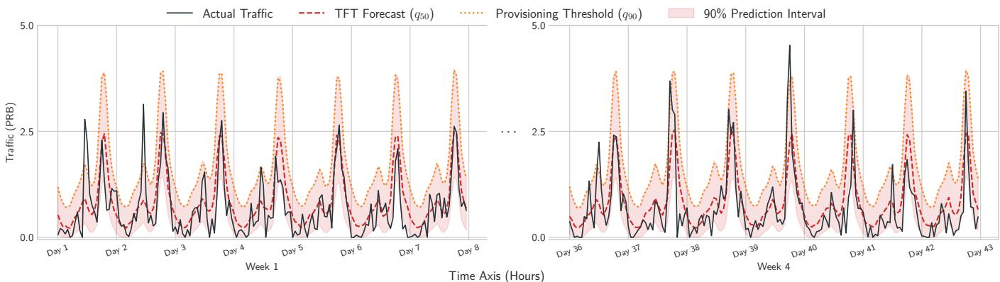
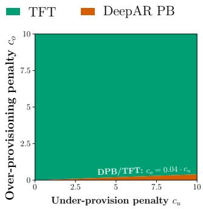
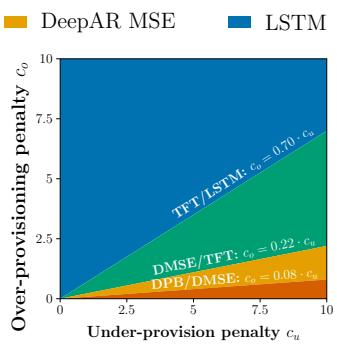

# GOAL-ORIENTED PROBABILISTIC FORECASTING FOR DYNAMIC PRB ALLOCATIONIN 5G NETWORKS

Oier Larumbe-Lizarraga⋆ Roberto Pereira⋆† Cristian J. Vaca-Rubio‡

⋆Universidad Isabel I, Burgos, Spain †Keysight Technologies, Barcelona, Spain ‡Ericsson Research, Stockholm, Sweden

oier.larumbe@alumnos.ui1.es, robertomatheus.pinheiro@ui1.es, cristian.vaca.rubio@ericsson.com

## ABSTRACT

Efficient physical resource block (PRB) allocation in 5G networks requires accurate demand forecasting. Conventional methods minimize symmetric error metrics (MAE, RMSE), ignoring the operational cost asymmetry where under-provisioning (service degradation) is far costlier than over-provisioning (wasted capacity). We propose a goaloriented probabilistic forecasting framework that aligns model training with the operator’s decision-making objectives. Specifically, we train DeepAR and temporal fusion transformer (TFT) models using the Pinball Loss function and derive the optimal allocation quantile from the operator’s cost matrix. Evaluation on a real beam-level 5G traffic dataset shows that the proposed approach reduces operational cost compared to MSE-trained baselines while maintaining calibrated uncertainty estimates. The framework enables dynamic PRB allocation that explicitly balances service reliability against resource efficiency.

Index Terms— 5G, Probabilistic forecasting, Goaloriented prediction, Physical Resource Blocks

## 1. INTRODUCTION

In 5G and beyond-5G networks, physical resource block (PRB) allocation at the beam level directly governs the capacity available to users [1]. Because traffic demand at this granularity is highly dynamic, driven by user activity, mobility, and spatial load variations, reliable forecasting is essential for proactive resource management and early detection of critical load conditions.

Traditional time series forecasting approaches, from classical statistical models such as ARIMA [2] to deep learning solutions such as LSTMs [3], are typically trained by minimizing symmetric prediction losses such as mean squared error (MSE) or mean absolute error (MAE). These objectives implicitly treat positive and negative forecast errors as equally undesirable. However, in practical telecommunication operations, these two errors may lead to different consequences. Underestimating the PRB demand may lead to insufficient capacity (hereafter referred to as under-provisioning), degrading the quality of service and potentially violating service level agreements [4]. Conversely, overestimating PRB demand (hereafter referred to as over-provisioning) will lead to unused capacity and increase energy consumption [5]. Because symmetric loss functions do not encode this asymmetry, models optimized for MAE or MSE are not necessarily the optimal choice for operational tasks.

Probabilistic forecasting models such as DeepAR [6] and the Temporal Fusion Transformer (TFT) [7] address part of the problem by estimating predictive distributions rather than single point estimates, which in turn may enable quantile-based decision rules for resource provisioning [8]. However, producing a calibrated predictive distribution alone does not guarantee that the forecasting model is optimized for the downstream network objective [9]. Decision-focused learning (DFL) [10] tries to address this gap by embedding the downstream decision problem directly into the training loop. Classical DFL formulations, however, often require differentiating through, or repeatedly solving/approximating, the downstream optimization problem. Prior work on goaloriented forecasting for network resources [11, 12, 13] has begun to explore this direction, but has not established an explicit link between the operator’s asymmetric provisioning costs and the training objective.

In this work, we exploit the simple structure of PRB provisioning to establish exactly that link: modeling underand over-provisioning directly through distinct penalty coefficients, we show that the cost-minimizing allocation is a conditional quantile whose level follows analytically from these penalties This maps the operational cost directly onto pinball loss [14], so the downstream objective enters training without an explicit optimization layer. Our contributions are threefold: (i) we derive a closed-form optimal decision quantile from asymmetric under-/over-provisioning penalties, providing a lightweight alternative to classical DFL that avoids differentiating through the downstream allocation problem; (ii) we instantiate this framework on DeepAR and TFT, benchmarked against deterministic and Gaussianlikelihood baselines on a real-world beam-level 5G traffic dataset over short- and long-term horizons; and (iii) we show that pinball-trained TFT cuts operational cost by up to 43.6% relative to MSE-trained baselines in the short-term case.

  
Fig. 1: TFT probabilistic forecasts (q90) for the high-traffgic stratum during early and late validation periods.

## 2. SYSTEM MODEL AND PROBLEM FORMULATION

The PRB utilization of a given beam at time step t is modeled as a discrete-time stochastic process, denoted as $\{ y _ { t } \} _ { t \in \mathbb { Z } ^ { + } } ,$ where $y _ { t } \in [ 0 , 1 ]$ represents the normalized capacity required to satisfy user traffic demand. The objective of probabilistic forecasting is to estimate the conditional probability density function of future PRB demand over a multi-step forecasting horizon H, given a trajectory of t past observations. Formally, we aim to model:

$$
p ( y _ { t + 1 : t + H } \mid y _ { 1 : t } ) = \prod _ { h = 1 } ^ { H } p ( y _ { t + h } \mid y _ { 1 : t + h - 1 } ) ,\tag{1}
$$

where $h \in \{ 1 , \ldots , H \}$ denotes the forecasting step. Rather than outputting a single point estimate $\hat { y } _ { t + h } .$ , the probabilistic model predicts the complete predictive distribution, enabling the extraction of target quantiles $q _ { \tau } ( y _ { t + h } \mid y _ { 1 : t } )$ associated with a specific coverage probability $\tau \in ( 0 , 1 )$

## 2.1. Asymmetric Operational Cost

Operational costs in PRB allocation are inherently asymmetric. Let $y _ { t }$ denote the actual PRB demand and $A _ { t }$ the allocated PRB capacity at time step t, the under- and overprovisioning rates are given by $U = \operatorname* { m a x } ( 0 , y _ { t } - A _ { t } )$ and $O = \operatorname* { m a x } ( 0 , A _ { t } - y _ { t } )$ , respectively. Under-provisioning directly degrades QoS and incurs severe service level agreement penalties, whereas over-provisioning results in energetic waste. Consequently, the total operational cost C is modeled as a linear combination of both components:

$$
C = c _ { u } \cdot U + c _ { o } \cdot O ,\tag{2}
$$

where $c _ { u }$ and $c _ { o }$ represent the under- and over-provisioning penalty coefficients, respectively, with $c _ { u } \gg c _ { o }$ . Conventional forecasting models are typically trained by minimizing ${ \mathrm { { M S E } } } ,$ a symmetric metric that fails to reflect this operational asymmetry (2). To address this limitation, we adopt the pinball loss [14] function:

$$
L _ { \tau } ( y _ { t } , \hat { y } _ { t } ) = \tau \cdot \mathrm { m a x } ( 0 , y _ { t } - \hat { y } _ { t } ) + ( 1 - \tau ) \cdot \mathrm { m a x } ( 0 , \hat { y } _ { t } - y _ { t } ) .\tag{3}
$$

Unlike MSE, the pinball loss applies asymmetric slopes to prediction residuals, weighting under-predictions $( y _ { t } \ > \ \hat { y } _ { t } )$ by τ and over-predictions $( y _ { t } \le \hat { y } _ { t } )$ by (1 τ). Consequently, minimizing $L _ { \tau }$ yields the conditional quantile $q _ { \tau } ( y _ { t } )$ rather than a central mean expectation. Comparing (2) and (3) reveals a direct structural correspondence: when setting the allocated capacity $A _ { t } ~ = ~ { \hat { y } } _ { t }$ , the operational cost C becomes proportional to the pinball loss $L _ { \tau }$ up to the positive constant $\left( c _ { u } + c _ { o } \right)$ , with penalty parameters $c _ { u }$ and $c _ { o }$ mapping to the weights τ and $( 1 - \tau )$ , respectively. Since minimizing a positive rescaling of a function is equivalent to minimizing the function itself, parameterizing τ via $c _ { u }$ and $c _ { o }$ directly aligns model training with the operator’s objective.

## 2.2. Optimal Quantile Derivation

Setting $A _ { t } = \hat { y } _ { t }$ in (2) and comparing term by term with (3), we seek a quantile level $\tau ^ { * }$ and a positive constant k such that $C = k \cdot L _ { \tau ^ { * } }$ ∗ . Expanding both sides:

$$
k \tau ^ { * } = c _ { u } , \qquad k \left( 1 - \tau ^ { * } \right) = c _ { o } .\tag{4}
$$

Dividing the first expression by the second eliminates k and solving for $\tau ^ { * }$ , yields the closed-form optimal decision:

$$
\tau ^ { * } = \frac { c _ { u } } { c _ { u } + c _ { o } } ,\tag{5}
$$

with the proportionality constant $k = c _ { u } + c _ { o }$ . This result guarantees that training a probabilistic model with the pinball loss at level $\tau ^ { * }$ directly minimizes the operator’s expected operational cost (2), without requiring an explicit optimization layer or differentiation through the downstream allocation problem.

## 3. PROPOSED METHODOLOGY

## 3.1. Pinball Loss for Goal-Oriented Training

We train DeepAR and TFT with the pinball loss, setting $\tau =$ $\tau ^ { * }$ so that the resulting probabilistic forecasts explicitly optimize the operator’s asymmetric cost matrix, unlike models trained under standard MSE loss. For a given observation $y _ { t } .$ the quality of the predicted distribution $F$ is evaluated using the continuous ranked probability score (CRPS), which relates directly to the pinball loss over all forecast quantiles:

$$
\mathrm { C R P S } ( F , y _ { t } ) = 2 \int _ { 0 } ^ { 1 } L _ { \tau } ( y _ { t } , q _ { \tau } ) d \tau .\tag{6}
$$

In the well-specified limit, minimizing the expected pinball loss guarantees $\mathbb { P } ( y _ { t } \le q _ { \tau } ) = \tau ;$ ; in practice, finite-sample and model-misspecification effects may lead to deviations from nominal coverage.

## 3.2. Probabilistic Forecasting Models

We benchmark two probabilistic architectures, DeepAR and TFT, against deterministic baselines (SARIMA and a pointprediction LSTM trained with MSE).

DeepAR [6] is an autoregressive recurrent network that generates forecasts sequentially: at each horizon step $h ,$ the decoder conditions on all previous predictions $\hat { y } _ { t + 1 : t + h - 1 }$ In its standard formulation, the output layer parametrizes the mean $\mu$ and standard deviation $\sigma$ of a Gaussian likelihood, from which quantiles are derived analytically. In the pinball variant, we replace the Gaussian head with a direct quantile output trained under the pinball loss at level $\tau ^ { * }$ , so that the network directly minimizes the operator’s asymmetric cost.

TFT [7] is a transformer-based architecture that differs from DeepAR in two key aspects. First, it produces all H horizon steps in parallel via a multi-horizon forecasting head, rather than autoregressively. Second, it incorporates a variable selection network and interpretable self-attention over past time steps. The output layer emits multiple quantiles simultaneously, trained under a multi-quantile pinball loss that includes $\tau ^ { * }$ among the target levels.

## 4. EXPERIMENTAL RESULTS

## 4.1. Dataset and Experimental Setup

The dataset comprises anonymized, curated real-world 5G traffic data measured at the beam level [15]. Each base station has three cells of 32 beams each, for a total of 2,880 beams with hourly temporal granularity. Beams are grouped into three traffic strata (high, medium, and low) based on their average PRB utilization.

Model training uses a stratified sample of 150 beams (50 per stratum) over Weeks 1–5. Evaluation is performed on a disjoint set of 450 beams (150 per stratum) under an expanding-window scheme across two validation periods: a short-term horizon $( V _ { 1 }$ , Week 6) immediately following training, and a long-term horizon $( V _ { 2 }$ , Week 11) separated by a four-week gap to assess robustness to temporal drift (see Fig. 1). The forecasting horizon is $H \ = \ 1 6 8$ hours (one week). All probabilistic models use a quantile policy at level $\tau ^ { * } = c _ { u } / ( c _ { u } + c _ { o } )$ with $c _ { u } / c _ { o } = 9 \left( \mathrm { i . e . , } \tau ^ { \ast } = 0 . 9 \right)$ , reflecting an operator profile where under-provisioning is costlier than over-provisioning.

Performance is evaluated along three axes: (i) Statistical accuracy: MAE for point forecasts (deterministic baselines and median predictions $q _ { 5 0 }$ of probabilistic models) and CRPS [16] for full predictive distributions. (ii) Calibration: empirical coverage [17] of the 90% prediction interval. (iii) Operational impact: under- and over-provisioning rates $( U , O )$ and total operational cost, together with two energy-efficiency indicators: elastic capacity savings (PRB allocation reduction relative to a static maximum normalized baseline $M = 1 . 0 )$ and cell-sleep savings (fraction of time steps where allocated capacity $A _ { t }$ falls below a 10% threshold, i.e., $A _ { t } \le 0 . 1 0$ , enabling cell deactivation).

## 4.2. Forecasting Performance

Table 1 reports forecasting performance across both validation horizons. In $V _ { 1 }$ , TFT Fig.1., achieves the lowest CRPS among all probabilistic models, followed by Gaussian DeepAR. We attribute this advantage to the multi-horizon forecasting head of TFT, which predicts all H steps in parallel and avoids the autoregressive error accumulation that affects DeepAR. Comparing median predictions $( q _ { 5 0 } )$ against SARIMA point forecasts confirms this: TFT reduces MAE by 5.1%, a difference that is statistically significant.

In $V _ { 2 } .$ , however, Gaussian DeepAR overtakes TFT in both CRPS and MAE. This reversal reflects the higher sensitivity of pinball-trained models to distribution shift: because the pinball loss tightly fits the quantile structure observed during training, any change in the traffic distribution between $V _ { 1 }$ and $V _ { 2 }$ displaces the learned quantiles. Gaussian-likelihood models, by contrast, parametrize $\mu$ and σ of a smooth distribution and degrade more gracefully.

Regarding calibration, Gaussian models maintain empirical coverage close to the 90% nominal level across both horizons. TFT, however, exhibits under-coverage because it trains on discrete quantile targets $( q _ { 1 0 } , q _ { 5 0 } , q _ { 9 0 } )$ rather than a continuous parametric distribution: if the learned $q _ { 9 0 }$ underestimates the true quantile, no distributional constraint self-corrects. This trade-off may be acceptable when the provisioning decision relies on a single quantile rather than the full interval.

Table 1: Comprehensive Evaluation: Statistical, Calibration, Over/Under-provisioning, and Operational Performance Across Forecasting Horizons.
<table><tr><td></td><td></td><td colspan="7">Short-Term Horizon</td><td colspan="7">Long-Term Horizon  $\left( V _ { 2 } \right)$ </td></tr><tr><td>Model</td><td>Loss</td><td>MAE CRPS</td><td></td><td> $\mathbf { C o v } .$ </td><td>Over. Under.</td><td></td><td>Cost Sleep</td><td>Elast.</td><td>MAE</td><td>CRPS</td><td>Cov.</td><td>Over.</td><td>Under.</td><td>Cost</td><td>Sleep</td><td>Elast.</td></tr><tr><td>Deterministic Baselines (Point Prediction μ)</td><td></td><td></td><td></td><td></td><td></td><td></td><td></td><td></td><td></td><td></td><td></td><td></td><td></td><td></td><td></td><td></td></tr><tr><td>SARIMA</td><td>MSE</td><td>0.254</td><td></td><td></td><td>0.139</td><td>0.114</td><td>0.117</td><td>28.5% 63.6%</td><td>0.358</td><td></td><td></td><td>0.210</td><td>0.149</td><td>0.155</td><td>27.5%</td><td>61.4%</td></tr><tr><td>LSTM Det.</td><td>MSE</td><td>0.267</td><td></td><td></td><td>0.133</td><td>0.133</td><td>0.133 27.8%</td><td>64.5%</td><td>0.616</td><td></td><td></td><td>0.524</td><td>0.092</td><td>0.135</td><td>1.0%</td><td>37.4%</td></tr><tr><td colspan="9">Probabilistic Models (Quantile Policy q90)</td><td colspan="5"></td><td></td><td></td></tr><tr><td>DeepAR</td><td>Gaussian 0.262</td><td></td><td>0.191</td><td>88.8% 0.443</td><td>0.044</td><td>0.084</td><td>1.1%</td><td>46.7%</td><td>0.340</td><td>0.247</td><td>90.6%</td><td>0.710</td><td>0.048</td><td>0.114</td><td>2.7%</td><td>36.0%</td></tr><tr><td>DeepAR</td><td>Pinball</td><td>0.266</td><td>0.192</td><td>90.3% 0.556</td><td>0.029</td><td>0.082</td><td>0.0%</td><td>41.3%</td><td>0.461</td><td>0.331</td><td>82.0%</td><td>0.971</td><td>0.027</td><td>0.121</td><td>0.0%</td><td>27.6%</td></tr><tr><td>LSTM Prob.</td><td>Gaussian</td><td>0.277</td><td>0.200</td><td>93.1%</td><td>0.500</td><td>0.034</td><td>0.081 0.1%</td><td>40.8%</td><td>0.420</td><td>0.311</td><td>91.0%</td><td>0.649</td><td>0.082</td><td>0.139</td><td>0.0%</td><td>31.3%</td></tr><tr><td>TFT</td><td>Pinball</td><td>0.241</td><td>0.177</td><td>82.0%</td><td>0.440</td><td>0.034</td><td>0.075 0.0%</td><td>44.2%</td><td>0.371</td><td>0.268</td><td>71.8%</td><td>0.691</td><td>0.052</td><td>0.116</td><td>0.0%</td><td>31.5%</td></tr></table>

## 4.3. Operational Impact Analysis

Comparing both DeepAR variants isolates the effect of the training loss. In $V _ { 1 } .$ , pinball-trained DeepAR reduces underprovisioning relative to its Gaussian counterpart, yielding lower operational cost. This confirms the core mechanism of our framework: aligning the loss with the asymmetric cost structure directly reduces under-provisioning, which dominates the cost when $c _ { u } \gg c _ { o }$

TFT achieves the lowest operational cost in $V _ { 1 }$ , a 43.6% reduction relative to the strongest deterministic baseline (LSTM Det.). This gain combines superior forecasting accuracy (lowest CRPS) with an asymmetry-aware loss that shifts the $q _ { 9 0 }$ output upward just enough to absorb demand peaks without excessive over-provisioning. In $V _ { 2 } ,$ pinball-trained models degrade more: DeepAR Pinball reaches an overprovisioning rate nearly double that of Gaussian DeepAR. Because the learned quantiles no longer match the shifted traffic distribution, the model over-allocates as a defensive response. Gaussian DeepAR achieves the lowest cost in $V _ { 2 } .$ suggesting that symmetric likelihoods are a safer fallback when periodic retraining is not feasible.

From an energy-efficiency perspective, deterministic baselines achieve the highest cell-sleep savings because their mean predictions frequently fall below the deactivation threshold. Pinball-trained models suppress this by design: the asymmetric penalty drives allocated capacity above the threshold in nearly all time steps, yielding 0% cell-sleep savings. This is not a deficiency but an explicit consequence of prioritizing service reliability $( c _ { u } / c _ { o } = 9 )$ . The elastic capacity metric captures the complementary view: TFT achieves 44.2% elastic savings in $V _ { 1 }$ , meaning its $q _ { 9 0 }$ allocation tracks demand tightly relative to static maximum allocation while maintaining near-zero under-provisioning.

Finally, Fig. 2a shows that TFT dominates across nearly the entire $\left( c _ { u } , c _ { o } \right)$ space in $V _ { 1 }$ , ceding to DeepAR Pinball only when $c _ { o } < 0 . 0 4 \cdot c _ { u } .$ i.e. when the operator tolerates substantial over-provisioning. In $V _ { 2 }$ (Fig. 2b), distribution shift reshapes the decision map: LSTM becomes optimal for $c _ { o } > 0 . 7 9 c _ { u }$ , Gaussian DeepAR takes over in the mid-range $( 0 . 0 8 c _ { u } < c _ { o } < 0 . 2 2 c _ { u } )$ , and DeepAR Pinball dominates the low- ${ \bf \cdot } c _ { o }$ corner. For the operational point considered in this work $( c _ { u } / c _ { o } = 9 )$ , TFT with periodic retraining remains the recommended choice.

  
(a) Short-term horizon $( V _ { 1 } )$  
(b) Long-term horizon (V2)  
Fig. 2: Optimal model selection as a function of the under-provisioning penalty $c _ { u }$ (x-axis) and over-provisioning penalty $c _ { o }$ (y-axis). Colored regions indicate the model achieving the lowest operational cost C for that penalty combination. (a) Short- (V ) and (b) Long-term horizon $( V _ { 2 } )$

## 5. CONCLUSION

This paper has proposed a goal-oriented probabilistic forecasting framework for dynamic PRB allocation in 5G networks. By analytically deriving the optimal decision quantile $\tau ^ { * }$ and aligning the pinball loss with the operator’s asymmetric cost matrix, the proposed approach reduces operational costs by up to 43.6% over standard MSE-trained baselines. Experimental evaluation on real-world beam-level traffic data confirms that TFT optimized via pinball loss achieves the best trade-off between service reliability and capacity efficiency in short-term horizons. Future work will extend this framework to multi-cell environments and online quantile adaptation.

## Compliance with Ethical Standards

This is a numerical simulation study for which no ethical approval was required.

## Conflicts of Interest

No external funding was received. The authors have no other relevant financial or nonfinancial interests to disclose.

## 6. REFERENCES

[1] X. Wang, Z. Wang, K. Yang, Z. Song, C. Bian, J. Feng, and C. Deng, “A survey on deep learning for cellular traffic prediction,” Intelligent Computing, vol. 3, pp. 0054, 2024.

[2] David J Bartholomew, “Time series analysis forecasting and control.,” 1971.

[3] Sepp Hochreiter and Jurgen Schmidhuber, “Long short-¨ term memory,” Neural computation, vol. 9, no. 8, pp. 1735–1780, 1997.

[4] Poulcheria Zervou, Irene Keramidi, Kostas Ramantas, and Christos Verikoukis, “A spatio-temporal graph neural network-based framework for sla compliance in $6 \mathrm { g }$ networks,” in GLOBECOM 2025-2025 IEEE Global Communications Conference. IEEE, 2025, pp. 817–822.

[5] David Lopez-P´ erez, Antonio De Domenico, Nicola Pi-´ ovesan, Geng Xinli, Harvey Bao, Song Qitao, and Merouane Debbah, “A survey on 5g radio access net-´ work energy efficiency: Massive mimo, lean carrier design, sleep modes, and machine learning,” IEEE Communications Surveys & Tutorials, vol. 24, no. 1, pp. 653–697, 2022.

[6] David Salinas, Valentin Flunkert, and Jan Gasthaus, “Deepar: Probabilistic forecasting with autoregressive recurrent networks,” 2019.

[7] Bryan Lim, Sercan O. Arik, Nicolas Loeff, and Tomas Pfister, “Temporal fusion transformers for interpretable multi-horizon time series forecasting,” 2020.

[8] Vaishnavi Kasuluru, Luis Blanco, Cristian J Vaca-Rubio, Engin Zeydan, and Albert Bel, “Ai-empowered multivariate probabilistic forecasting: A key enabler for sustainability in open ran,” IEEE Transactions on Network and Service Management, 2026.

[9] Adam N Elmachtoub and Paul Grigas, “Smart “Predict, then Optimize”,” Management science, vol. 68, no. 1, pp. 9–26, 2022.

[10] Sanket Shah, Kai Wang, Bryan Wilder, Andrew Perrault, and Milind Tambe, “Decision-focused learning without decision-making: Learning locally optimized decision losses,” in Advances in Neural Information Processing Systems, Alice H. Oh, Alekh Agarwal, Danielle Belgrave, and Kyunghyun Cho, Eds., 2022.

[11] Cristian J. Vaca-Rubio, Vaishnavi Kasuluru, Engin Zeydan, Luis Blanco, Roberto Pereira, Marius Caus, and Kapal Dev, “Probabilistic forecasting for network resource analysis in integrated terrestrial and nonterrestrial networks,” IEEE Communications Standards Magazine, vol. 9, no. 2, pp. 72–79, 2025.

[12] X. Mootoo, H. Tabassum, and L. Chiaraviglio, “EM-Forecaster: A deep learning framework for time series forecasting in wireless networks with distribution-free uncertainty quantification,” IEEE Transactions on Network Science and Engineering, vol. 13, pp. 1207–1225, 2025.

[13] Tareq Si Salem, Luca-Andrei Fechete, Mohamed SANA, Fadhel Ayed, Antonio De Domenico, Nicola Piovesan, and Wenjie Li, “Goal-oriented time-series forecasting: Foundation framework design,” in Recent Advances in Time Series Foundation Models Have We Reached the ’BERT Moment’?, 2025.

[14] Roger Koenker and Gilbert Bassett Jr, “Regression quantiles,” Econometrica: journal of the Econometric Society, pp. 33–50, 1978.

[15] Tareq Si Salem, Luca-Andrei Fechete, Mohamed SANA, Fadhel Ayed, Antonio De Domenico, Nicola Piovesan, and Wenjie Li, “Beam-level (5g) time-series dataset,” 2025.

[16] Tilmann Gneiting and Adrian E Raftery, “Strictly proper scoring rules, prediction, and estimation,” Journal of the American Statistical Association, vol. 102, no. 477, pp. 359–378, 2007.

[17] Peter F Christoffersen, “Evaluating interval forecasts,” International Economic Review, pp. 841–862, 1998.