# Geometry of learning dynamics: Gradient descent versus natural gradient on the ridge of optimization

Akira Tamamori A 1

1 Faculty of Information Science, Aichi Institute of Technology 1247 Yachigusa, Yakusa-cho, Toyota-shi, Aichi 470-0392, Japan

Received October 27, 20XX; Revised December 29, 20XX; Published July 1, 20XX

Abstract: High-capacity associative memories based on Kernel Logistic Regression (KLR) exhibit a Ridge ofOptimization characterized by extreme stability and a highly skewed weight spectrum. However, the dynamical process by which learning converges to this critical regime has remained unclear. This paper provides a geometric analysis of the learning trajectories on the statistical manifold of a KLRtrained Hopfield network. By comparing the paths of Gradient Descent (GD) and Natural Gradient Descent (NGD), we elucidate the mechanisms governing the optimization process. Our analysis reveals that learning on the Ridge proceeds in two distinct phases. We show that the extreme curvature of the Ridge causes standard GD to follow a highly oscillatory, non-geodesic path. In stark contrast, NGD explicitly corrects for this geometry, following the ideal geodesic path and completely overcoming the instabilities faced by GD. We demonstrate experimentally that NGD not only converges significantly faster but also achieves a solution with superior generalization performance. These results establish that the highly structured geometry of the Ridge is optimally suited for information-geometric optimization, providing a new perspective on the interplay between learning dynamics and emergent representation geometry.

Key Words: kernel associative memory, learning dynamics, information geometry, natural gradient descent, edge of stability

## 1. Introduction

High-capacity associative memories, realized through Kernel Logistic Regression (KLR) trained Hopfield networks, have demonstrated exceptional storage and retrieval performance, significantly exceeding classical theoretical limits [1, 2]. Our previous analyses have characterized the static geometric properties of the attractors in these networks, identifying a specific hyperparameter regime termed the Ridge ofOptimization. On this Ridge, the network achieves maximal stability by self-organizing its weight spectrum into a highly concentrated, or “L-shaped,” distribution [3].

Despite a clear understanding of these final, converged states, a fundamental question remains unanswered: how do the learning dynamics navigate the high-dimensional parameter space to reach this specific, highly structured regime? The trajectory of the optimization process, which dictates both the speed of convergence and the quality of the final solution, has not yet been geometrically analyzed. Understanding this dynamical pathway is crucial for developing more eficient learning algorithms and for uncovering the general principles that govern self-organization in such systems.

This paper provides a geometric analysis of the learning trajectories in KLR-trained Hopfield networks. We investigate the optimization path on a statistical manifold equipped with the Fisher Information Matrix (FIM) as a Riemannian metric. By comparing the dynamics of standard Gradient Descent (GD) with those of Natural Gradient Descent (NGD) [4], which explicitly accounts for the manifold’s curvature, we elucidate the geometric mechanisms that guide the learning process.

Our main contributions are as follows:

1. We demonstrate that learning on the Ridge proceeds in two distinct phases: an initial, rapid phase where the dominant spectral mode of the FIM is established, followed by a prolonged finetuning phase for the remaining modes.

2. We visualize the learning trajectories in a projected eigenspace of the FIM. We show that the standard GD trajectory is severely constrained by the manifold’s extreme curvature, resulting in highly oscillatory, non-geodesic paths that overshoot the principal direction. In stark contrast, the NGD trajectory follows the ideal �-geodesic (straight line) directly to the optimum.

3. We compare the convergence speed and generalization performance of GD and NGD. We find that NGD, by actively correcting for the manifold’s curvature, entirely bypasses the instabilities faced by GD. Consequently, NGD not only converges significantly faster but also achieves a lower final validation loss, indicating superior generalization.

These findings suggest that the specific geometry of the Ridge of Optimization is uniquely suited to information-geometric optimization methods like NGD. The remainder of this paper is organized as follows. Section 2 reviews related work. Section 3 outlines the geometric framework and optimization methods. Section 4 presents the experimental results on learning trajectories and performance. Finally, Section 6 discusses the implications, and Section 7 concludes the paper.

## 2. Related Work

Our research is situated at the intersection of information geometry, optimization theory, and the dynamical analysis of neural networks.

## 2.1 Information Geometry and Optimization

The geometric structure of statistical models has been extensively studied within the framework of Information Geometry, pioneered by Amari [5]. A key insight from this field is that the standard gradient descent follows the steepest descent direction in the Euclidean parameter space, which may not be optimal on a curved statistical manifold. The Natural Gradient Descent (NGD), proposed by Amari [4], corrects for the manifold’s curvature using the FIM, and is known to achieve optimal asymptotic performance. The relationship between NGD and other optimization methods, such as mirror descent, has been a rich area of research [6]. While NGD is theoretically appealing, its practical application is often hindered by the computational cost of inverting the FIM. Our work provides a concrete experimental validation of NGD’s superiority in a non-trivial, high-dimensional setting (the Ridge), motivating further research into eficient approximations of the natural gradient.

## 2.2 Learning Trajectories in Deep Neural Networks

The analysis of learning trajectories has recently gained significant attention in the deep learning community. Much of this work has focused on the “lazy training” regime, where networks operate similarly to fixed kernel machines, a behavior characterized by the Neural Tangent Kernel [7]. In this regime, the learning dynamics are relatively simple. However, for models operating beyond this lazy regime, the interplay between learning dynamics and the loss landscape is far more complex. A central topic in modern optimization theory is the role of curvature and “sharpness” in determining generalization. While conventional wisdom suggests that GD implicitly favors “flat minima” to achieve better generalization [8], the landscape of over-parameterized networks often exhibits a highly skewed Hessian spectrum, dominated by a few large outlier eigenvalues [9].

This extreme curvature leads to phenomena such as the Edge of Stability [10], where GD trajectories are forced to oscillate near sharp regions rather than settling into the absolute minimum. Our analysis of KLR networks on the Ridge contributes directly to this line of inquiry. By comparing GD’s severe oscillatory behavior with NGD’s stable convergence, we provide a clear geometric picture of how learning algorithms navigate these pathological, high-curvature landscapes. Furthermore, our results ofer a new perspective on the “flat minima” debate, demonstrating that in highly structured problems like associative memory, optimal generalization can indeed be achieved in an extremely sharp basin, provided the optimization method respects the intrinsic geometry of the manifold.

## 3. Model and Geometric Framework

This section briefly reviews the Kernel Logistic Regression (KLR) Hopfield network model and the geometric framework of Information Geometry, which provides the foundation for our analysis of learning dynamics.

## 3.1 Kernel Logistic Regression Hopfield Network

We consider a network of � bipolar neurons, ${ \textbf { \textit { s } } } \in$ $\{ - 1 , 1 \} ^ { N }$ , trained to store � random patterns $\{ \xi ^ { \mu } \} _ { \mu = 1 } ^ { P } .$ The network’s state evolves based on the input potential $h _ { i } ( s )$ , determined by the dual variables $\alpha _ { \mu i }$ and the RBF kernel $K ( \cdot , \cdot ) \colon$

$$
h _ { i } ( s ) = \sum _ { \mu = 1 } ^ { P } \alpha _ { \mu i } K ( s , \xi ^ { \mu } ) .\tag{1}
$$

The dual variables � are learned by minimizing an � -regularized negative log-likelihood objective function. For simplicity, we focus on the trajectory of the weights $\pmb { \alpha } = [ \alpha _ { 1 } , \ldots , \alpha _ { P } ] ^ { \top }$ for a single representative neuron. The objective function $L ( \alpha )$ to be minimized is given by:

$$
\begin{array} { l } { { \displaystyle { \cal L } ( \alpha ) = - \sum _ { \mu = 1 } ^ { P } \left[ y _ { \mu } \log ( \sigma ( h ( \xi ^ { \mu } ) ) ) \right. } \ ~ } \\ { { \displaystyle ~ \left. ~ + ~ ( 1 - y _ { \mu } ) \log ( 1 - \sigma ( h ( \xi ^ { \mu } ) ) ) \right] } } \\ { { \displaystyle ~ + \frac { \lambda } { 2 } \alpha ^ { \top } K \alpha } , } \end{array}\tag{2}
$$

where $y _ { \mu } \in \{ 0 , 1 \}$ is the target bit corresponding to pattern $\xi ^ { \mu } , \sigma ( z ) = 1 / ( 1 + e ^ { - z } )$ is the logistic sigmoid function, and � is the weight decay parameter. This optimization is performed via full-batch Gradient Descent (GD).

## 3.2 Statistical Manifold and Fisher Information

The KLR model can be viewed as a parametric statistical model where each set of weights � corresponds to a probability distribution $p ( \cdot ; \pmb { \alpha } )$ over the output space. The set of all such distributions forms a statistical manifold, whose intrinsic geometry is defined by the Fisher Information Matrix (FIM), � (�) [5]. For a single neuron, the FIM is given by:

$$
G _ { \mu \nu } ( \alpha ) = \mathbb { E } \left[ \frac { \partial \log p } { \partial \alpha _ { \mu } } \frac { \partial \log p } { \partial \alpha _ { \nu } } \right] .\tag{3}
$$

In the KLR context, this can be expressed in terms of the kernel Gram matrix � and a diagonal matrix � containing the prediction variances [3]:

$$
G ( \alpha ) = K D ( \alpha ) K ,\tag{4}
$$

where $\pmb { D } ( \pmb { \alpha } )$ is a diagonal matrix with entries $D _ { \mu \mu } =$ $p _ { \mu } ( 1 - p _ { \mu } )$ , representing the variance of the prediction for pattern $\xi ^ { \mu }$ . The FIM acts as a Riemannian metric tensor, defining the notion of distance and curvature on the statistical manifold.

Furthermore, information geometry introduces a dualistic afine structure to the manifold, characterized by the exponential (�-) connection and the mixture (�- ) connection [5]. Since the KLR model is based on a logistic function, which corresponds to a Bernoulli distribution, it is a member of the exponential family. Consequently, the natural parameters � form an �-flat coordinate system, and an �-geodesic, which represents the “straightest” path connecting two probability distributions with respect to the �-connection, corresponds simply to a straight line in the Euclidean parameter space �. Conversely, the �-geodesic is a straight line in the space of expectation parameters (the output probabilities). In our trajectory analysis, we use the �-geodesic (the straight line from the initial weights $\scriptstyle \alpha _ { 0 }$ to the optimal weights $\alpha ^ { * } )$ as the theoretical geometric baseline for the most direct path in the parameter space.

## 3.3 The Ridge of Optimization

In this study, we focus our analysis on a specific hyperparameter regime, which we term the Ridge of Optimization. To provide a precise geometric context, we formally define this Ridge R based on the spectral properties of the FIM. Let $\lambda _ { \operatorname* { m a x } } ( G ( \alpha ^ { * } ) )$ be the largest eigenvalue of the FIM evaluated at the converged weights $\alpha ^ { * }$ . The Ridge is defined as the locus in the hyperparameter space $( \gamma , P / N )$ where this local curvature is maximized:

$$
\mathcal { R } = \{ ( \gamma , P / N ) \mid \lambda _ { \mathrm { m a x } } ( G ( \alpha ^ { * } ) ) \mathrm  i s \ l o c a l l y \ m a x i m i z e d \} .\tag{5}
$$

We acknowledge that this is an a posteriori definition, as it depends on the converged solution $\alpha ^ { * }$ . However, our previous extensive phase diagram analysis [2] demonstrated that the location of this Ridge is highly predictable and structurally stable across diferent random initializations. This region coincides precisely with a state of Spectral Concentration, characterized by a highly skewed eigenvalue hierarchy $( \lambda _ { 1 } \gg \lambda _ { 2 } \ge$ $\cdots > 0 )$ . Unless otherwise stated, our experiments are conducted on representative points along this preidentified Ridge $( \mathrm { e . g . , } \gamma = 0 . 0 2 , P / N = 2 . 0 )$ to investigate the unique optimization dynamics that unfold in this extreme-curvature environment.

## 3.4 Natural Gradient Descent

While GD follows the steepest descent direction in the flat Euclidean space of parameters, the Natural Gradient Descent (NGD) follows the steepest descent on the curved statistical manifold [4]. The NGD update direction is obtained by pre-conditioning the standard gradient with the inverse of the FIM:

$$
\begin{array} { r } { \tilde { \nabla } L ( \alpha ) = G ( \alpha ) ^ { - 1 } \nabla L ( \alpha ) . } \end{array}\tag{6}
$$

This update step is invariant to re-parameterizations of the model and is known to be asymptotically optimal. By comparing the trajectories generated by GD and NGD, we can analyze how the manifold’s curvature influences the learning process. For numerical stability when inverting the FIM, we use a damped inverse $( G + \epsilon I ) ^ { - 1 }$

## 3.5 Experimental Setup

Unless otherwise specified, our experiments are conducted with a network of $N ~ = ~ 5 0$ neurons storing $P = 1 0 0$ random patterns $( P / N = 2 . 0 )$ . We compare a representative $\mathrm { ^ { \circ } R i d g e ^ { \mathrm { \prime } } }$ regime $( \gamma = 0 . 0 2 )$ with a “Local” regime $( \gamma = 0 . 1 )$ . Both GD and NGD are trained using a learning rate of $\eta = 0 . 1$ and weight decay of 0.01. For numerical stability in NGD, we apply a damping factor of $\epsilon = 1 0 ^ { - 3 }$ to the FIM inversion.

All simulations were implemented in Python 3.13 using the NumPy 2.1.3 and SciPy 1.15.2 libraries and were executed on a standard workstation equipped with an Intel Core i9-9900K CPU and 64 GB of RAM. No GPU acceleration was used.

## 4. The Geometry of Learning Trajectories

In this section, we present our main experimental results. We analyze the learning trajectories of both GD and NGD on the Ridge of Optimization, revealing a highly structured, geometry-driven learning process.

## 4.1 Two-Phase Learning via Pythagorean Decomposition

To understand the temporal structure of the learning process, we theoretically decompose the optimization trajectory. In information geometry, the “information gain” (the reduction in KL-divergence) during a small parameter update $\delta _ { t } = \alpha _ { t + 1 } - \alpha _ { t }$ can be approximated by a quadratic form of the Fisher Information Matrix (FIM). We define the information gain at step � as:

$$
\Delta I _ { t } : = \frac { 1 } { 2 } \delta _ { t } ^ { \top } G ( \alpha ^ { * } ) \delta _ { t } ,\tag{7}
$$

where we use the FIM at the converged state, $G ( \alpha ^ { * } )$ as a fixed global reference metric. This choice, while a linearization of the true dynamics, allows us to retrospectively analyze the trajectory’s components within a consistent coordinate system defined by the final solution’s geometry. A detailed justification for this approach and the derivation of this quadratic form from KL-divergence are provided in Appendix A.

Let $\begin{array} { r } { G ( \pmb { \alpha } ^ { * } ) = \sum _ { k = 1 } ^ { P } \lambda _ { k } \pmb { \nu } _ { k } \pmb { \nu } _ { k } ^ { \top } } \end{array}$ be the eigendecomposition of the FIM. We can orthogonally project the information gain onto this eigenspace:

$$
\Delta I _ { t } = \frac { 1 } { 2 } \lambda _ { 1 } ( \pmb { \nu } _ { 1 } ^ { \top } \pmb { \delta } _ { t } ) ^ { 2 } + \frac { 1 } { 2 } \sum _ { k = 2 } ^ { P } \lambda _ { k } ( \pmb { \nu } _ { k } ^ { \top } \pmb { \delta } _ { t } ) ^ { 2 } .\tag{8}
$$

The first term represents the Principal Gain, capturing the optimization progress along the dominant curvature direction (associated with global attractor stability). The second term represents the Tail Gain, reflecting the fine-tuning of the remaining degrees of freedom (associated with memory capacity).

Based on the empirical property of Spectral Concentration on the Ridge $( \lambda _ { 1 } \gg \lambda _ { k > 1 } )$ , we formulate the following heuristic proposition regarding the initial GD learning dynamics under a local quadratic approximation:

Proposition 1 (Two-Phase Learning Dynamics) For GD operating on the Ridge of Optimization, where the FIM exhibits extreme spectral concentration $( \lambda _ { 1 } \gg \lambda _ { k > 1 } )$ , the initial learning phase is primarily driven by the Principal Gain $( \Delta I _ { t } \ \approx \ \frac { 1 } { 2 } \lambda _ { 1 } ( \nu _ { 1 } ^ { \top } \delta _ { t } ) ^ { 2 } )$ , while the subsequent phase is governed by the Tail Gain, commencing after the gradient component along $\nu _ { 1 }$ is substantially reduced $( \pmb { \nu } _ { 1 } ^ { \top } \nabla L \approx 0 )$

This proposition serves as an interpretive model for the observed dynamics, not a strict dynamical theorem. For a rigorous dynamical systems analysis of this spectral concentration and the interaction between the maximum margin objective and the stability limit, we refer the reader to our recent theoretical work [11]. It suggests that GD cannot efectively optimize all directions simultaneously in such an anisotropic space; instead, the steep geometry forces the trajectory to prioritize descent along the principal curvature.

We empirically validated this proposition by tracking the decomposed gains during training. Figure 1 compares this decomposition for trajectories on the Ridge and in the Local regime. As theoretically predicted, the learning process on the Ridge (Fig. 1 (a)) clearly exhibits two distinct, non-overlapping phases: an initial rapid spike in Principal Gain $( t < 2 5 )$ followed by a slow, extended decay in Tail Gain. In stark contrast, the Local regime (Fig. 1 (b)), which lacks spectral concentration $( \lambda _ { 1 } \approx \lambda _ { k } )$ , shows no such temporal separation, with both components decaying concurrently.

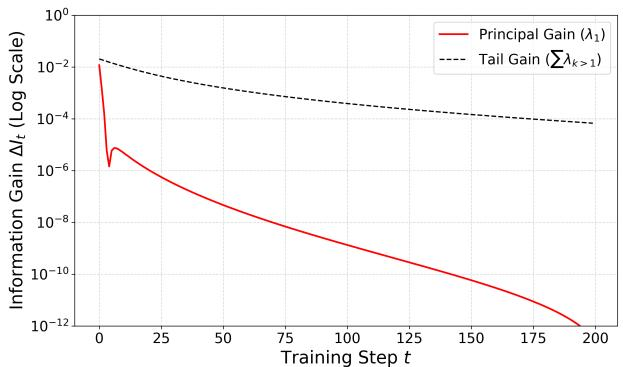

(a) On the Ridge $( \gamma = 0 . 0 2 )$  
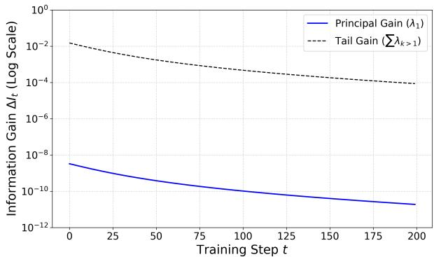  
(b) In the Local regime $( \gamma = 0 . 1 )$  
Fig. 1. Information Gain Decomposition. The plot shows the information gain decomposed into Principal Gain (solid line) and Tail Gain (dashed line) for (a) the Ridge regime and (b) the Local regime.

## 4.2 Learning Trajectory on the Statistical Manifold

To visualize how the optimization dynamics navigate the highly skewed geometry of the Ridge, we projected the learning trajectories onto a 2D plane. This plane is spanned by the principal eigenvector $\nu _ { 1 }$ of the final Fisher Information Matrix (FIM) and an orthogonal direction vector $\nu _ { \mathrm { t a i l } }$ . The vector $\nu _ { \mathrm { t a i l } }$ is defined as the normalized projection of the final converged state $\alpha ^ { * }$ onto the subspace orthogonal to $\nu _ { 1 }$ . We compared the trajectory of standard Gradient Descent (GD) with that of Natural Gradient Descent (NGD).

Figure 2 displays the averaged trajectories across all neurons. In the Local regime $\left( \gamma = 0 . 1 , \mathrm { F i g . } 2 \left( \mathbf { b } \right) \right)$ , where the FIM spectrum is relatively flat, both GD and NGD follow nearly identical, direct paths toward the optimal solution. This straight path corresponds closely to the �-geodesic in the parameter space. However, a stark contrast emerges on the Ridge of Optimization $( \gamma = 0 . 0 2 , \mathrm { F i g . } 2 \mathrm { ( a ) } )$ . The NGD trajectory (blue dashed line) continues to follow the ideal �-geodesic almost perfectly. This indicates that by explicitly correcting for the manifold’s curvature using the inverse FIM, NGD maintains a direct and eficient path to the minimum. Conversely, the GD trajectory (red solid line) exhibits severe oscillations along the principal direction $\nu _ { 1 }$

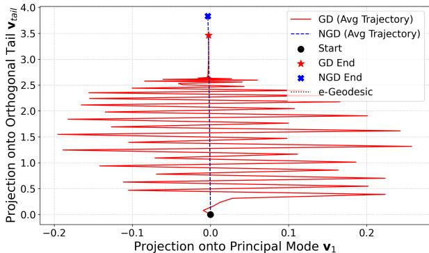

(a) On the Ridge $( \gamma = 0 . 0 2 )$  
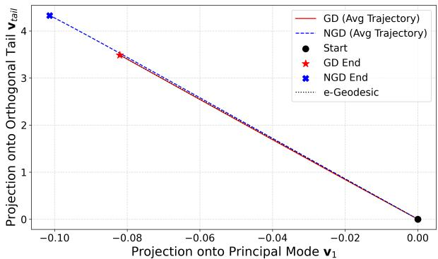  
(b) In the Local regime $( \gamma = 0 . 1 )$  
Fig. 2. Learning Trajectory Projection. Comparison of GD and NGD trajectories projected onto the 2D eigenspace of the final FIM. (a) On the Ridge $( \gamma = 0 . 0 2 ) \colon$ The GD trajectory follows a highly oscillatory, nongeodesic path, strongly deviating from the �-geodesic, while the NGD trajectory (blue dashed line) almost perfectly overlaps with the ideal �-geodesic (black dotted line). (b) In the Local Regime $\overset { \vartriangle } { \left( \gamma \right) } = 0 . 1 \bigr ) :$ Both trajectories are nearly straight, indicating a flat learning landscape.

This oscillatory behavior is a direct consequence of the extreme spectral concentration on the Ridge. The massive curvature associated with $\lambda _ { 1 }$ causes the standard Euclidean gradient step to overshoot the narrow valley of the loss landscape, a phenomenon closely related to the Edge of Stability observed in deep neural networks [10]. As detailed in [11], this overshooting triggers a transient self-stabilizing feedback loop governed by the logistic variance, which temporarily pins the principal curvature near the stability limit $2 / \eta$ . Despite these violent oscillations in the principal direction, the GD trajectory gradually progresses along the orthogonal tail subspace to eventually reach the vicinity of the optimal solution. This visualization confirms that the geometry of the Ridge imposes severe constraints on standard gradient methods, forcing them into highly ineficient, oscillatory paths. To ensure that these observations are not an artifact of a specific hyperparameter choice, we conducted additional experiments across a wider range of storage loads and kernel localities (see Appendix B). These supplementary results confirm that the severe oscillatory behavior is a robust signature of GD specifically on the Ridge under high memory congestion.

To rigorously quantify these geometric diferences beyond 2D projections, we measured two metrics. First, we computed the Euclidean distance from the learning trajectory ${ \pmb { \alpha } } ( t )$ to the direct straight line connecting the initial state $\scriptstyle \alpha _ { 0 }$ and the final state $\alpha ^ { * }$ . Second, we calculated the Path Ratio, defined as the cumulative path length of the trajectory divided by the direct Euclidean distance $\lVert \alpha ^ { * } - \alpha _ { 0 } \rVert$ . Figure 3 plots the Euclidean distance to this straight line at each training step.

The results provide a striking quantitative contrast. The GD trajectory (red solid line) deviates massively from the direct path, with severe oscillations characterizing its initial phase. This overshooting is a direct manifestation of the Edge of Stability phenomenon, where the extreme curvature on the Ridge destabilizes standard gradient descent. Consequently, the cumulative path length of GD is nearly 9 times longer than the direct distance (Path Ratio ≈ 8.9×), confirming its highly ineficient, non-geodesic navigation.

In contrast, the NGD trajectory (blue dashed line) is remarkably smooth and stable. While it exhibits a slight, smooth deviation from the Euclidean straight line, which is a natural consequence of following the true curved geodesic on the non-Euclidean statistical manifold, its total path length is nearly optimal (Path Ratio ≈ 1.0×). This quantitative analysis confirms that the specific geometry of the Ridge imposes severe constraints on standard gradient methods, while information-geometric optimization (NGD) effectively mitigates these instabilities by aligning perfectly with the intrinsic curvature of the memory landscape.

## 5. Geometric Alignment and Generalization on the Ridge

The trajectory analysis in Section 4.2 demonstrated that GD struggles with the extreme curvature of the Ridge, whereas NGD navigates it smoothly. We now evaluate the practical implications of these geometric diferences by comparing the convergence speed and generalization performance of the two algorithms.

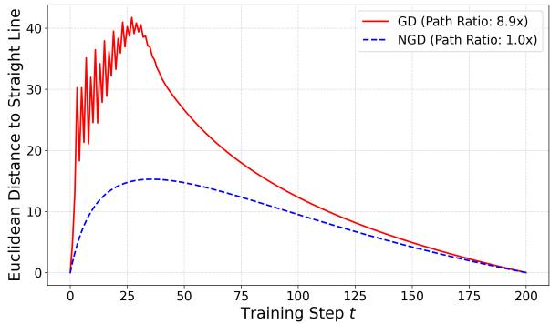  
Fig. 3. Quantitative Analysis of Learning Trajectories. The plot shows the Euclidean distance from the learning trajectory to the direct straight-line path connecting the initial and final parameter states on the Ridge $( \gamma = 0 . { \overset { \cdot } { 0 } } 2 )$ ).

Our goal here is not to propose NGD as a computationally competitive alternative to modern adaptive optimizers (e.g., Adam [12]), but rather to use it as a theoretical baseline that perfectly aligns with the intrinsic geometry of the statistical manifold. We evaluated the models on a held-out validation dataset (comprising 20% of the generated patterns) during training.

## 5.1 Overcoming Instability at the Edge of Stability

The Ridge of Optimization is defined by an extremely large maximal eigenvalue of the FIM, $\lambda _ { \operatorname* { m a x } } ( G )$ , which can grow by orders of magnitude with the storage load. This implies that the statistical manifold is highly anisotropic, forming a steep potential valley. In optimization theory, such a condition is closely associated with the Edge of Stability [10], where the large curvature $\lambda _ { 1 }$ exceeds the stability limit $2 / \eta$ of standard GD, causing the learning dynamics to bounce violently between the walls of the valley.

We investigated this instability by comparing the learning curves of GD and NGD. While it is theoretically expected that NGD, which pre-conditions the gradient with the inverse FIM $( G ^ { - 1 }$ , should converge faster in mildly curved spaces, its behavior on the Ridge is non-trivial. Because the FIM is nearly singular $( \lambda _ { 1 } \gg \lambda _ { k > 1 } \approx 0 )$ , computing $G ^ { - 1 }$ is numerically ill-posed, and one might expect NGD to fail or require prohibitively small learning rates in this extreme regime.

However, as shown in Fig. 4 (a), the GD trajectory (red line) exhibits the expected large oscillations in the initial phase, a clear signature of overshooting the principal curvature. In stark contrast, the NGD trajectory (blue dashed line), stabilized with a small damping factor, shows a smooth, monotonic decrease. By efectively “flattening” the highly skewed landscape via inverse FIM preconditioning, NGD efectively mitigates the Edge of Stability phenomenon. This demonstrates that the extreme geometric structure of the Ridge (Spectral Concentration) is not merely an obstacle, but a landscape well-aligned with the mechanics of information-geometric optimization. The fact that NGD succeeds so robustly in a regime where GD severely oscillates highlights the fundamental role of intrinsic curvature in high-capacity memory formation.

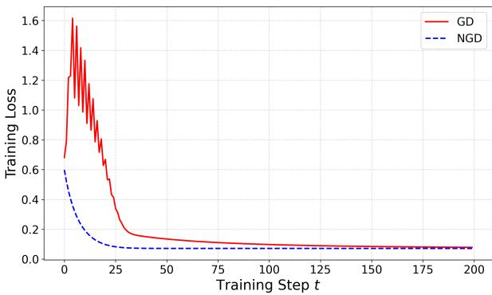

(a) Training Loss  
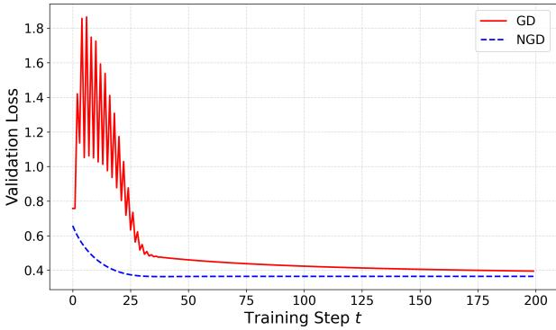  
(b) Validation Loss  
Fig. 4. Learning Curves for GD vs. NGD. Comparison of (a) Training Loss and (b) Validation Loss on the Ridge $( \gamma = 0 . 0 2 )$ . NGD converges faster and achieves a lower final validation loss, demonstrating superior optimization and generalization performance.

## 5.2 Generalization Performance: GD vs. NGD

Faster convergence does not necessarily imply a better solution. A crucial question is whether the oscillatory dynamics of GD confer any advantage in terms of generalization, for instance by helping to find “flatter” minima. To test this, we evaluated the generalization performance by monitoring the loss on a held-out validation set during training.

Figure 4 (b) plots the validation loss for both methods. The results clearly show that NGD not only converges faster but also achieves a consistently lower final validation loss compared to GD. This indicates that the smooth, geodesic path taken by NGD leads to a solution with superior generalization capabilities in this specific setting. The oscillations inherent to GD on the Ridge do not appear to confer any regularization benefit in this context; rather, they are a suboptimal consequence of navigating a curved statistical manifold with a Euclidean metric.

These findings provide strong evidence that the geometric structure of high-capacity associative memory is well-aligned with natural gradient methods, suggesting that information-geometric optimization provides a theoretically sound approach for learning on the Ridge.

## 6. Discussion

In this study, we have provided a detailed geometric analysis of the learning dynamics in high-capacity KLR Hopfield networks. By comparing the trajectories of GD and NGD, we have uncovered a highly structured, geometry-driven optimization process. Here, we discuss the broader implications of these findings.

## 6.1 GD’s Oscillatory Dynamics as a Heuristic for Feature Learning

Our results ofer a new interpretation of the learning path taken by standard GD. The observed trajectory (Fig. 2), characterized by an initial rapid phase of severe oscillations along the principal curvature direction followed by a slow fine-tuning phase, can be seen as a sophisticated, albeit implicit, strategy for hierarchical feature learning. GD, without any explicit knowledge of the manifold’s geometry, efectively prioritizes learning the most dominant structural features (corresponding to $\lambda _ { 1 } )$ before refining the details. This two-phase process, empirically observed in our information gain decomposition (Fig. 1), provides a geometric explanation for how simple optimizers can navigate complex, highly anisotropic loss landscapes, despite the inherent instabilities at the Edge of Stability.

## 6.2 The Optimality of Natural Gradient on the Ridge

A key finding of this work is the superior performance of NGD on the Ridge of Optimization (Fig. 4). The Ridge is a regime of extreme curvature, where the FIM is nearly singular. For GD, this sharp geometry leads to instability and violent oscillations, a manifestation of the Edge of Stability phenomenon. NGD, however, thrives in this environment. By explicitly inverting the FIM, it “flattens” the landscape and follows the true geodesic path, achieving faster convergence and better generalization. This suggests that the geometric structures emerging during high-capacity learning (i.e., Spectral Concentration) are not mere obstacles, but rather are optimally matched to informationgeometric optimization methods.

## 6.3 Rethinking the Role of “Flat Minima”

A popular hypothesis in deep learning states that GD preferentially finds “flat minima”, which are associated with better generalization. Our results present a more nuanced picture. The solution on the Ridge is, by definition, extremely “sharp” in the dominant spectral direction. GD struggles in this sharp valley, while NGD finds the minimum eficiently. Yet, the NGD solution exhibits superior generalization. This suggests that for certain structured problems like associative memory, the relevant geometric property may not be the flatness of the minimum itself, but rather the alignment of the learning algorithm with the intrinsic curvature of the data manifold. NGD achieves this alignment by construction, leading to a high-quality solution in a sharp but well-structured energy basin.

## 6.4 Limitations and Future Work

While this study provides a detailed geometric picture of learning dynamics in a specific, highly structured regime, we acknowledge several limitations that open avenues for future research.

First, our analysis is primarily focused on the KLRtrained Hopfield network with an RBF kernel, trained on uncorrelated random patterns. While this idealized setting is crucial for isolating the fundamental geometric and spectral mechanisms, it remains an open question how these dynamics translate to networks with diferent kernel functions (e.g., polynomial) or to tasks involving structured, real-world data such as natural images or language. Investigating how data correlations alter the geometry of the Ridge and the resulting learning trajectories is a key next step.

Second, our comparison was limited to vanilla GD and exact NGD. While NGD served as an ideal theoretical baseline to reveal the underlying geometry, it remains a first-order manifold optimization method, which may exhibit slow convergence near the optimum. Recent advancements in information geometry have proposed second-order methods, such as the Dual Riemannian Newton Method [13], that leverage dual afine connections to achieve local quadratic convergence. Applying such advanced methods to the extreme-curvature environment of the Ridge presents a highly promising avenue for achieving even faster and more stable memory formation.

Third, a related practical limitation is the computational cost. A significant barrier to the application of both exact NGD and Newton-type methods is the cost of forming and inverting the FIM or Hessian, which scales as ${ \cal O } ( P ^ { 3 } )$ per update. Fortunately, the highly skewed spectral structure of the Ridge suggests several paths forward. One approach is to utilize scalable, low-rank approximation methods, such as K-FAC [14], which are particularly well-suited to landscapes dominated by a few large eigenvalues. Another promising direction is to employ adaptive natural gradient algorithms that recursively update the inverse FIM without requiring full matrix inversion at each step [15, 16], thereby potentially reducing the per-update complexity to ${ \cal O } ( P ^ { 2 } )$ . Future work should investigate whether these more practical adaptive optimizers can replicate the stable, geodesic-like convergence of the exact NGD observed on the Ridge.

Finally, our study focused on the learning process itself. Extending this geometric framework to analyze the robustness of the final solution against diferent types of perturbations, such as adversarial attacks or data drift, would be a valuable direction for future work.

## 7. Conclusion

In this work, we have presented a comprehensive geometric analysis of the learning dynamics in highcapacity KLR-trained Hopfield networks. By comparing the trajectories of standard GD and informationgeometric NGD, we have moved beyond a static analysis of attractors to a dynamic understanding of how optimal memory representations are formed.

Our analysis revealed that learning on the Ridge of Optimization is a highly structured, two-phase process. The GD trajectory, guided implicitly by the manifold’s extreme curvature, follows a non-geodesic path characterized by severe initial oscillations, prioritizing the acquisition of global stability before finetuning for capacity. Most importantly, we demonstrated that the sharp curvature of the Ridge, while presenting a formidable challenge for GD, provides an ideal landscape for NGD. By explicitly correcting for the geometry, NGD achieves faster, more stable convergence and finds a solution with superior generalization performance.

These findings clarify the geometric principles underlying self-organization in kernel associative memory and provide strong evidence for the theoretical optimality of information-geometric optimization methods in regimes of high spectral concentration. This work opens new avenues for developing more eficient learning algorithms for high-capacity memory systems and deepens our understanding of the interplay between learning dynamics and the emergent geometry of neural representations.

## Funding

Not applicable.

## Conflicts of interest

The author declares no competing interests.

## Author contribution

The sole author contributed to the present work.

## Artificial intelligence tools

The author utilized AI language models (GPT-5.6 Luna and Gemini 3.1 Pro) to assist with brainstorming, preliminary mathematical derivations, and English proofreading during the preparation of this manuscript. The author thoroughly reviewed, verified, and edited all AI-generated content and takes full responsibility for the final contents of the publication.

## Appendix

## A. Information Gain Decomposition

This appendix provides a brief derivation of the information gain decomposition used in Section 4.1.

## A.1 Information Gain as KL-Divergence

The progress of learning in one step can be measured by the reduction in the KL-divergence between the target data distribution and the model distribution. For Maximum Likelihood Estimation, this is approximately equal to the KL-divergence between the model at step � and step � + 1:

$$
\begin{array} { r } { \Delta I _ { t } \approx D _ { K L } ( P ( \alpha _ { t + 1 } ) | | P ( \alpha _ { t } ) ) . } \end{array}\tag{A-1}
$$

For an infinitesimal parameter change $\delta _ { t } = \alpha _ { t + 1 } - \alpha _ { t }$ this KL-divergence can be approximated to second order by the quadratic form of the FIM at the current point, $G ( \alpha _ { t } )$

$$
\Delta I _ { t } \approx \frac { 1 } { 2 } \pmb { \delta } _ { t } ^ { \top } G ( \pmb { \alpha } _ { t } ) \pmb { \delta } _ { t } .\tag{A-2}
$$

## A.2 Choice of a Fixed Reference Metric

To analyze the global structure of the learning trajectory, it is advantageous to use a fixed coordinate system rather than the evolving instantaneous metric $G ( \alpha _ { t } )$ . We therefore choose the FIM at the converged solution, $G ( \alpha ^ { * } )$ , as a global reference metric. This approach linearizes the manifold geometry around the final solution and allows us to decompose the entire trajectory into components that are globally orthogonal with respect to this final geometry. Thus, for our analysis, we define the information gain as the projection onto this final metric:

$$
\Delta I _ { t } : = \frac { 1 } { 2 } \delta _ { t } ^ { \top } G ( \alpha ^ { * } ) \delta _ { t } .\tag{A-3}
$$

This allows us to track how much of the “efort” in each update step contributes to forming the principal and tail components of the final geometric structure. This simplification, while not capturing the full nonlinear dynamics, efectively reveals the hierarchical, two-phase nature of the learning process on the Ridge.

## B. Generality of the Oscillatory Dynamics

To address potential concerns regarding the generality of the observed oscillatory behavior of GD, we conducted additional experiments across diferent hyperparameter regimes. Specifically, we varied the storage load $P / N$ and the kernel locality parameter � to investigate how the learning trajectories adapt to the changing curvature of the statistical manifold.

Figure B-1 presents the 2D projected trajectories arranged in a $2 \times 2$ matrix to compare the efects of load and locality. First, we examined the efect of the storage load on the Ridge $( \gamma = 0 . 0 2$ , top row). At a low load of $P / N = 1 . 0$ (Fig. B-1 (a)), the principal curvature is relatively small. Consequently, GD does not exhibit severe oscillations, but rather follows a smooth, curved path toward the solution. Interestingly, the NGD trajectory slightly deviates from the Euclidean straight line (�-geodesic), reflecting the non-trivial Riemannian curvature of the manifold when it is not entirely dominated by a single massive eigenvalue. In stark contrast, at a very high load of $P / N = 4 . 0 $ (Fig. B-1 (b)), the extreme spectral concentration exacerbates the Edge of Stability phenomenon, causing GD to exhibit violent, prolonged oscillations.

Next, we investigated an intermediate “Local” regime by relaxing the kernel locality to $\gamma \ : = \ : 0 . 0 5$ (bottom row). Here, the curvature is less extreme than on the optimal Ridge. For both moderate load $( P / N = 2 . 0 $ , Fig. B-1 (c)) and high load $( P / N = 4 . 0 $ Fig. B-1 (d), the GD trajectory loses its severe oscillatory nature and instead forms a smooth parabolic arc, demonstrating a continuous transition to a more direct descent.

These supplementary results confirm that the highly oscillatory, non-geodesic path is a robust and characteristic feature of GD specifically on the Ridge of Optimization under high-load conditions, while NGD consistently exploits the intrinsic geometry across all

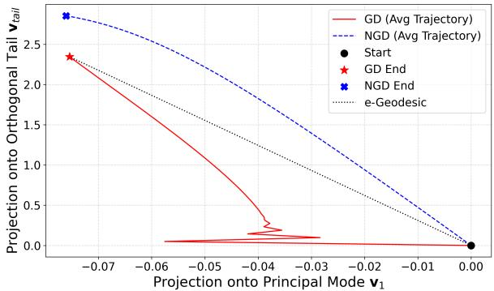  
(a) Low Load on Ridge $( P / N = 1 . 0 , \gamma = 0 . 0 2 )$

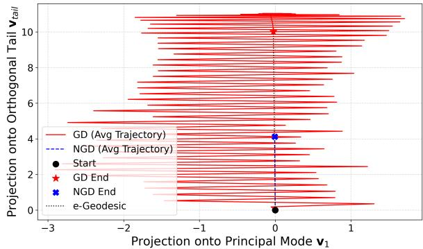  
(b) High Load on Ridge $( P / N = 4 . 0 , \gamma = 0 . 0 2 )$

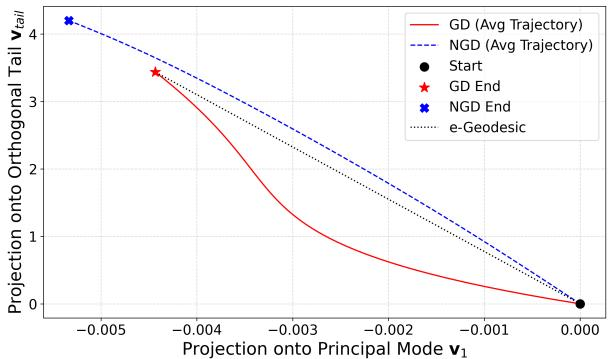  
(c) Medium Load in an Intermediate Regime (�/� = 2.0, � = 0.05)

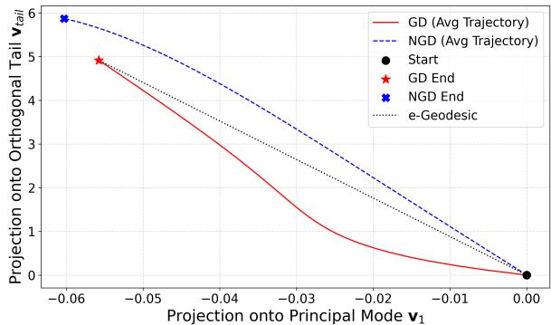  
(d) High Load in an Intermediate Regime (�/� = 4.0, � = 0.05)  
Fig. B-1. Generality of Learning Trajectories. 2D projections of GD (red) and NGD (blue dashed) trajectories across varying hyperparameter regimes. The top row shows the efect of storage load on the Ridge, highlighting the emergence of severe oscillations at high loads (b). The bottom row shows the efect of relaxing the kernel locality $( \bar { \gamma } = 0 . 0 5 )$ , where GD follows a smoother parabolic path without oscillations, regardless of the load.

tested regimes.

## References

[1] A. Tamamori, “Kernel logistic regression learning for high-capacity hopfield networks,” IEICE Trans. Inf. & Syst., vol. E109- E, no. 2, pp. 293–297, February 2026. DOI:10.1587/transinf.2025EDL8027

[2] A. Tamamori, “Quantitative attractor analysis of high-capacity kernel hopfield networks,” NOLTA, vol. E17-N, no. 3, pp. 770–787, July 2026. DOI:10.1587/nolta.17.770

[3] A. Tamamori, “Self-organization and spectral mechanism of attractor landscapes in highcapacity kernel hopfield networks,” NOLTA, vol. E17-N, no. 3, pp. 788–804, July 2026. DOI:10.1587/nolta.17.788

[4] S. Amari, “Natural gradient works eficiently in learning,” Neural Computation, vol. 10, no. 2, pp. 251–276, February 1998. DOI:10.1162/089976698300017746

[5] S. Amari, Information geometry and its applications, Springer, February 2016. DOI:10.1007/978-4-431-55978-8

[6] G. Raskutti and S. Mukherjee, “The information geometry of mirror descent,” IEEE Transactions on Information Theory, vol. 61, no. 3, pp. 1451–1457, March 2015. DOI:10.1109/TIT.2015.2388583

[7] A. Jacot, F. Gabriel, and C. Hongler, “Neural tangent kernel: convergence and generalization in neural networks,” Proc. NIPS’18, pp. 8580– 8589, December 2018.

[8] N.S. Keskar, D. Mudigere, J. Nocedal, M. Smelyanskiy, and P.T.P Tang, “On large batch training for deep learning: generalization gap and sharp minima,” Proc. ICLR’17, April 2017.

[9] L. Sagun, U. Evci, V.U. G¨uney, Y. Dauphin, L. Bottou, “Empirical analysis of the hessian of over-parametrized neural networks,” arXiv preprint arXiv:1706.04454, June 2017.

DOI:10.48550/arXiv.1706.04454

[10] J.M. Cohen, S. Kaur, Y. Li, J.Z. Kolter, and A. Talwalkar, “Gradient descent on neural networks typically occurs at the edge of stability,” Proc. ICLR’21, May 2021.

[11] A. Tamamori, “Information Geometric Self-Organization at the Edge of Stability in High-Capacity Kernel Associative Memories,” arXiv preprint arXiv:2609.00000, September 2026. DOI:10.48550/arXiv:2609.00000

[12] D. Kingma and J. Ba, “Adam: a method for stochastic optimization,” Proc. ICLR’15, May 2015.

[13] D. Zhou, K. Yano and M. Sugiyama, “Dual riemannian newton method on statistical manifolds,” arXiv preprint arXiv:2511.11318, November 2025. DOI:10.48550/arXiv.2511.11318

[14] J. Martens and R. Grosse, “Optimizing neural networks with kronecker-factored approximate curvature,” Proc. ICML’15, vol. 37. pp. 2408– 2417, July 2015.

[15] H. Park, S. Amari, and K. Fukumizu, “Adaptive natural gradient learning algorithms for various stochastic models,” Neural Networks, vol. 13, no. 7, pp. 755–764, September 2000. DOI:10.1016/S0893-6080(00)00051-4

[16] S. Amari, H. Park, and T Ozeki, “Singularities afect dynamics of learning in neuromanifolds,” Neural Computation, vol. 18, no. 5, pp.1007–1065, May 2006. DOI:10.1162/neco.2006.18.5.1007