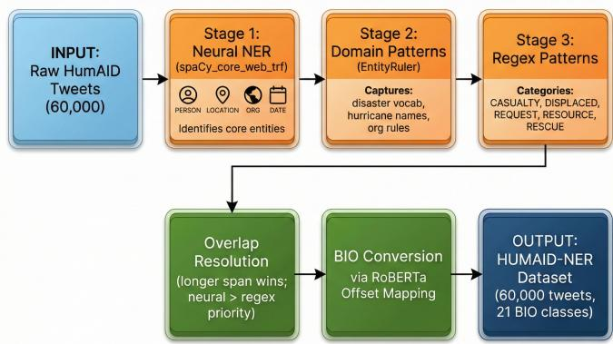
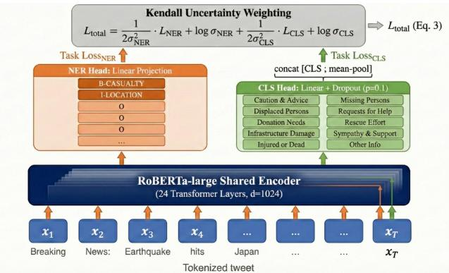
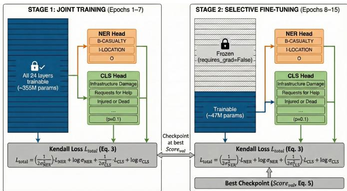
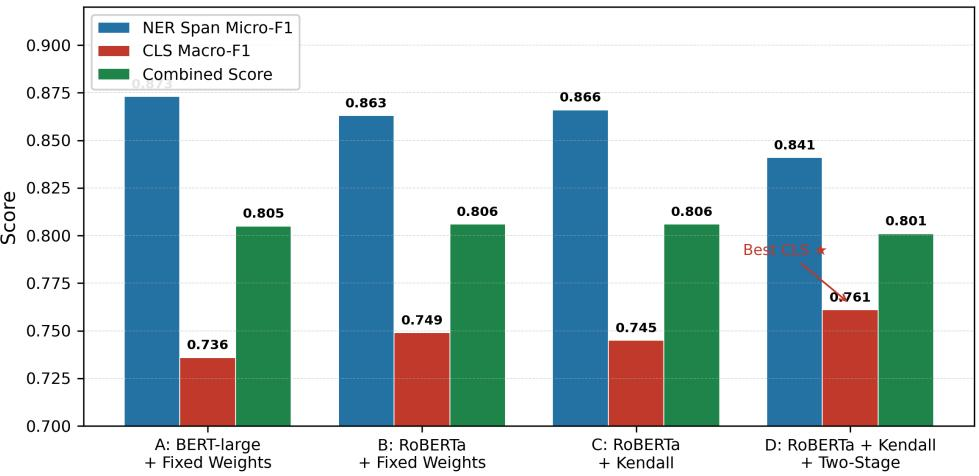
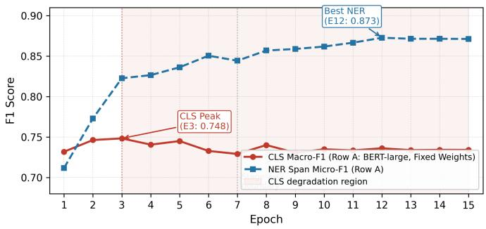
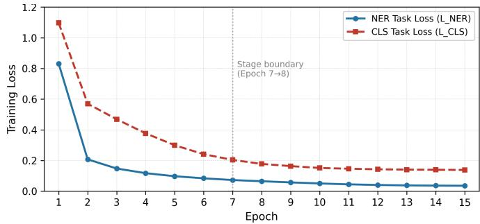
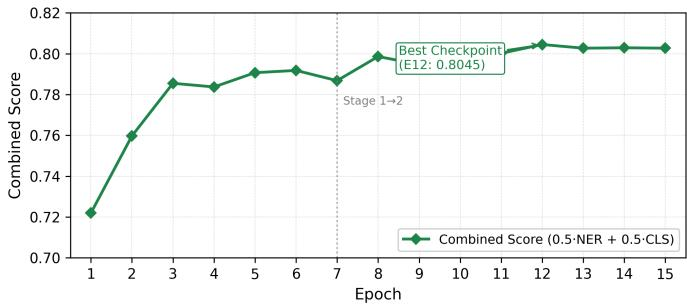
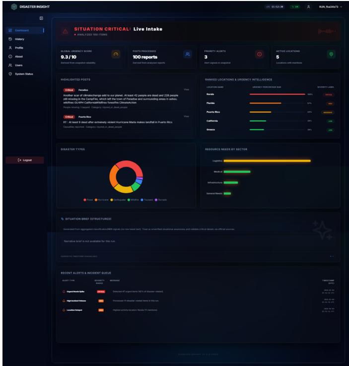

# HUMAID-NER: A Disaster Tweet Dataset for Joint Named Entity Recognition and Event Classification via Uncertainty-Weighted Multitask Learning

Aijaz Ali   
Department of   
Software Engineering   
University of Sindh   
Jamshoro, Pakistan   
aijaz.laghari@students.usindh.edu.pk   
Danish Nazir Arain   
Dr. A. H. S. Bukhari   
Postgraduate Centre of ICT   
University of Sindh   
Jamshoro, Pakistan   
danish.arain@usindh.edu.pk   
Nazish Basir   
Department of   
Information Technology   
University of Sindh   
Jamshoro, Pakistan   
nazish.basir@usindh.edu.pk   
Sarfaraz Nawaz   
Department of   
Software Engineering   
University of Sindh   
Jamshoro, Pakistan   
sarfaraz.mangi@students.usindh.edu.pk   
Haris Ali   
Department of Software Engineering   
Mehran University of   
Engineering & Technology   
Jamshoro, Pakistan   
harislag77@gmail.com

Published in: The Asian Bulletin of Big Data Management, 6(1), 138–152 (2026). https://doi.org/10.62019/zabvxd97

Abstract—Rapid extraction of structured information from social media is central to effective humanitarian response, yet disaster tweet resources to date offer only document-level category labels with no span-level entity annotations. We address this gap with HUMAID-NER, the first named entity recognition dataset built on the HumAID benchmark: 60,000 English disaster tweets annotated in BIO format across ten operationally motivated entity types, including CASUALTY, DISPLACED, REQUEST, RESOURCE, and RESCUE, yielding 21 entity classes and roughly 175,000 labelled entity spans. Annotations were produced through a reproducible three-stage hybrid pipeline that combines a spaCy transformer backbone, disaster-domain EntityRuler patterns, and structured regular expressions with priority-based overlap resolution. We also propose a joint multitask learning framework that performs disaster-specific NER and humanitarian event classification through a single RoBERTa-large encoder. A core difficulty in joint training is task-conflict: the NER objective produces up to 2,688 token-level gradient signals per example while classification contributes one, and under fixed task weights this imbalance caused classification macro-F1 to fall 1.4 points across epochs. Homoscedastic uncertainty weighting with learnable per-task log-variance parameters resolves the conflict, paired with a two-stage training schedule that freezes the lower 18 of 24 encoder layers in the second stage to permit task-specific specialisation without eroding shared representations. A controlled four-row ablation study isolates each component’s contribution. On the HUMAID-NER validation set, the proposed system reaches NER span micro-F1 of 0.841 and classification macro-F1 of 0.761 simultaneously; under this setting, classification performance meets or exceeds dedicated single-task RoBERTa-large classifiers on the same benchmark (0.730–0.750), suggesting joint modelling introduces no classification trade-off while adding complete entity extraction capability. A real-time web dashboard demonstrates end-to-end deployment. Dataset, models, and pipeline code are

released to support reproducibility and future crisis informatics research.

Index Terms—disaster tweet analysis, named entity recognition, humanitarian event classification, multitask learning, uncertainty weighting, RoBERTa, crisis informatics, social media NLP, HUMAID-NER, BIO tagging.

## I. INTRODUCTION

When a major disaster strikes, affected communities turn to social media almost immediately. Evacuation requests, casualty reports, and resource needs appear within minutes of an event, producing a real-time information stream that no structured reporting system can replicate [1]. For humanitarian organisations, this creates a critical operational problem: the sheer volume and noise make manual monitoring impossible at crisis pace, yet buried within that stream is exactly the actionable content that response coordinators need. NLP systems that can filter, classify, and pull structured information out of this stream are not an academic exercise; they are a practical necessity for modern disaster response [1].

Progress in classifying disaster-related social media by humanitarian category has been considerable. The HumAID dataset [2], released by Alam et al. in 2021, provides roughly 77,000 human-labelled English tweets from 19 major natural disaster events across ten humanitarian classes, and transformerbased classifiers on this benchmark have set strong performance standards [2]. The CrisisNLP corpora [3] similarly showed, at an earlier stage, that informational tweet categories can be reliably identified through supervised deep learning. Classification alone, however, does not fully satisfy operational requirements.

Knowing that a tweet belongs to the injured or dead people category tells a coordinator what type of message it is — it does not say where casualties occurred, how many are reported, or what specific resources are being sought. Those answers come from named entity recognition (NER): direct extraction of typed spans from the tweet text.

No existing dataset, to our knowledge, provides NER annotations designed specifically for the disaster domain. Nor has any prior work trained a single model to simultaneously handle disaster-specific NER and disaster event classification. Social media NER resources [4] [5] inherit generic entity taxonomies from newswire benchmarks, omitting operationally critical types such as CASUALTY, DISPLACED, RESOURCE, RESCUE, and REQUEST. Running separate models for each task doubles inference cost and forfeits the representational synergy that shared disaster vocabulary naturally provides. The gap — missing annotated data plus missing joint modelling capability — is the central problem this work takes on.

Joint multitask learning (MTL) with a shared encoder is, in principle, well-suited to this setting [6]. NER and classification, however, differ fundamentally in gradient structure. NER generates dense token-level supervision: 21 entity classes per token, producing up to 2,688 signals per example. Classification produces one sentence-level signal per example. Under fixedweight loss combination, the heavier NER gradients systematically dominate optimisation, causing the classification head to underfit beyond the early epochs. In our controlled experiments, classification macro-F1 peaked at epoch three and dropped by 1.4 percentage points by epoch fifteen — a progressive, structural failure rather than noise. This instability rules out fixed-weight joint training for reliable deployment.

Our solution pairs homoscedastic uncertainty-based loss weighting [7] — which replaces static task weights with learnable log-variance parameters — with a two-stage training procedure adapted from MT-DNN [6]. Stage one builds shared cross-task representations across all layers; stage two freezes the bottom eighteen encoder layers and lets each task head specialise using the remaining capacity. The backbone is RoBERTa-large [8], chosen for its stronger pretraining recipe and confirmed compatibility with TPU v3-8. To support all of this, we extend HumAID [2] with disaster-specific NER annotations across ten BIO-format entity types, producing HUMAID-NER — the first NER-annotated extension of this widely-cited benchmark.

The main contributions of this work are:

1) We introduce HUMAID-NER, 60,000 tweets extending HumAID [2] with BIO-format NER annotations across ten disaster-specific entity types, balanced across ten humanitarian classification labels, constituting the first NER-annotated resource built on the HumAID benchmark.

2) We propose a joint multitask framework combining RoBERTa-large, Kendall uncertainty weighting [7], and two-stage layer-freezing training [6]. A controlled fourrow ablation isolates each component’s contribution and shows that uncertainty weighting prevents the classification degradation that fixed-weight training produces.

3) We deploy the joint model as a real-time web dashboard for disaster response support, providing simultaneous entity extraction and event classification from live tweet input and demonstrating end-to-end applicability beyond academic evaluation.

Section II reviews related work. Section III describes the dataset and model. Section IV presents experimental results, component analysis, and the deployment dashboard. Section V concludes.

## II. RELATED WORK

## A. Disaster Tweet Analysis

Using social media as a real-time situational awareness source during crises has been an active research area since the early 2010s. Imran et al. [1] surveyed NLP methods for crisis messaging and identified humanitarian information classification as the field’s central computational challenge. HumAID [2] stands as the most comprehensive English-language disaster tweet resource available today, covering 19 disasters (2016–2019) with roughly 77,000 tweets labelled across ten humanitarian categories; transformer-based systems on this benchmark achieved macro-F1 of 0.70–0.75, establishing the classification baseline this work builds on directly. Alam et al. also extended the disaster tweet line with CrisisMMD [9], a multimodal dataset pairing tweet text with images from seven 2017 events. That work, like HumAID and CrisisNLP [3], is limited to document-level categorical labels with no span-level entity annotation. Broader work on disaster tweet categorisation for operational use [10] and automated geo-event mapping from social streams [11] further underlines the need for span-level extraction alongside event classification.

## B. Named Entity Recognition on Social Media

CoNLL-2003 [12] formalised NER evaluation around four entity types suited to newswire text, and those categories have dominated benchmarks ever since. Ritter et al. [4] documented just how poorly standard NLP pipelines transfer to tweets: POS tagging accuracy fell from 0.97 to 0.80, making tweet-specific models a practical requirement. The gap narrowed considerably with transformer fine-tuning [13], which reduced dependence on large task-specific corpora through pretrained contextual representations — superseding the earlier contextual embedding approaches of Peters et al. [14]. TweetNER7 [15], a dedicated Twitter NER benchmark with seven entity types across 11,382 English tweets, reflects the community’s continued investment in this problem. Rijhwani et al. [5] extended neural NER to lowresource settings via soft gazetteers, incorporating cross-lingual entity knowledge. HUMAID-NER draws on this principle: all ten entity types are grounded in the operational vocabulary of humanitarian response rather than inherited from generalpurpose newswire categories.

## C. Multitask Learning for NLP

Caruana [16] established the foundational argument that joint training on related tasks improves generalisation, and Ruder [17] later surveyed the extensive NLP literature that followed. For disaster tweets in particular, NER and event classification share heavy vocabulary overlap — collapsed, shelter, trapped, evacuation appear prominently in both task distributions — which makes joint training well-motivated on theoretical and empirical grounds. MT-DNN [6] showed this concretely: a single BERT encoder jointly trained on sentence-level and token-level NLP tasks consistently outperforms single-task finetuning, with lower encoder layers learning universal linguistic features while upper layers encode task-specific patterns. That layer-function insight directly motivates the two-stage training procedure used here.

## D. Task Weighting in Multitask Learning

Combining individual task losses into a single training objective is a recurring challenge in MTL. Ruder [17] identified gradient imbalance as a primary driver of negative transfer: one task’s gradients simply overpower shared parameter updates. Kendall et al. [7] addressed this with homoscedastic uncertainty weighting, giving each task a learnable log-variance parameter that scales its loss contribution dynamically throughout training. The log-variance parameterisation prevents collapse to trivial solutions where $\sigma  \infty .$ , and the approach transfers cleanly from its original computer vision setting to the combination of token-level NER and sentence-level classification studied here. PCGrad [18] offers an alternative that projects conflicting gradients to eliminate destructive interference, but the approach roughly doubles memory cost — prohibitive at our training scale. GradNorm [19] provides a third option via dynamic gradient magnitude scaling, though it similarly increases perstep compute. Uncertainty weighting introduces only two scalar parameters with negligible overhead, making it the practical choice for our setup. All three methods are complementary, and a direct comparison on disaster-domain MTL remains an open direction.

## III. METHODOLOGY

## A. Dataset: HUMAID-NER

HumAID [2] provides 77,637 English tweets spanning 19 major disasters (2016–2019), each labelled with one of ten humanitarian categories but carrying no span-level entity annotations. We extended a balanced 60,000-tweet subset with full BIO named entity annotations across ten disasterspecific entity types to produce HUMAID-NER. The dataset is partitioned into training (72%), validation (14%), and test (14%) splits, stratified by humanitarian category to preserve label distribution. Table I reports the statistics.

The entity taxonomy defines ten types rooted in the operational vocabulary of humanitarian response rather than generalpurpose newswire categories [12]: LOCATION, CASUALTY, DISPLACED, REQUEST, RESOURCE, RESCUE, DISAS-TER\_TYPE, ORGANIZATION, PERSON, and NUMBER, yielding 21 BIO classes (one O class and B-/I- prefixes for each type). Table II gives definitions and examples for each type.

TABLE I  
HUMAID-NER DATASET STATISTICS
<table><tr><td>Split</td><td>Tweets</td><td>Entity Spans</td><td>Avg/Tweet</td></tr><tr><td>Train (72%)</td><td>43,200</td><td>~126,000</td><td>2.91</td></tr><tr><td>Validation (14%)</td><td>8,400</td><td>~24,500</td><td>2.93</td></tr><tr><td>Test (14%)</td><td>8,400</td><td>~24,500</td><td>2.92</td></tr><tr><td>Total</td><td>60,000</td><td>~175,000</td><td>2.92</td></tr></table>

  
Fig. 1. HUMAID-NER construction pipeline. Stage 1: spaCy transformer for base NER. Stage 2: disaster-domain EntityRuler patterns. Stage 3: regex for structured entity types. Overlap resolution and BIO conversion produce the final annotations.

Manually annotating 60,000 tweets was not feasible, so we built a three-stage hybrid auto-labelling pipeline, illustrated in Fig. 1. Stage 1 runs the spaCy [20] transformer model en\_core\_web\_trf to produce base entity predictions for PERSON, LOCATION, ORGANIZATION, and DATE. Stage 2 passes the text through an EntityRuler component loaded with domain-specific rules covering named disasters, humanitarian organisations, and key disaster-vocabulary phrases. Stage 3 applies regular expressions to capture the remaining structured types: CASUALTY, DISPLACED, REQUEST, RESOURCE, and RESCUE. Where two spans compete, the longer one is retained; for equal-length conflicts, neural predictions take priority over regex matches. All annotations are then converted to BIO format via offset mapping from the RoBERTa tokeniser, and continuation subword tokens receive label −100 so they are excluded from loss computation.

## B. Shared Encoder

The backbone is RoBERTa-large [8], a transformer [21] encoder with 24 hidden layers, 16 attention heads, and hidden dimension d=1,024, totalling approximately 355M parameters. We chose RoBERTa-large over BERT-large [13] for its stronger pretraining recipe, which uses dynamic masking, full-sentence training objectives, and a 50,265-token byte-level

TABLE II HUMAID-NER ENTITY TAXONOMY
<table><tr><td>Type</td><td>Description</td><td>Example</td></tr><tr><td>LOCATION</td><td>Geographical references</td><td>“Puerto Rico”</td></tr><tr><td>DISASTER TYPE</td><td>Named hazard or event type</td><td>“Hurricane Maria”</td></tr><tr><td>CASUALTY</td><td>Injury/fatality expressions</td><td>“17 dead”</td></tr><tr><td>DISPLACED</td><td>Evacuation/displacement counts</td><td>“1,000 evacuees&quot;</td></tr><tr><td>REQUEST</td><td>Expressed need for aid</td><td>“need food&quot;</td></tr><tr><td>RESOURCE</td><td>Available aid supplies</td><td>“water trucks”</td></tr><tr><td>RESCUE</td><td>Active emergency operations</td><td>“rescue teams”</td></tr><tr><td>ORGANIZATION</td><td>Named responding organisations</td><td>“Red Cross”</td></tr><tr><td>PERSON</td><td>Named individuals in tweets</td><td>“Mayor Cruz”</td></tr><tr><td>NUMBER</td><td>Standalone numerical values</td><td>&quot;Day 3&quot;</td></tr></table>

  
Fig. 2. Model architecture. The shared RoBERTa-large encoder feeds two task heads. The NER head performs token-level classification over 21 BIO entity classes. The CLS head concatenates [CLS] and mean-pooled representations before classifying into 10 humanitarian categories. Learnable uncertainty parameters σ and σ weight the combined loss.

BPE vocabulary. DeBERTa-v3 [22] was also evaluated but rejected after incompatible XLA gather operations on TPU v3- 8 hardware prevented stable training. For a tweet tokenised to $T$ subword tokens, the encoder outputs context-sensitive representations $\mathbf { H } = \{ h _ { 1 } , \ldots , h _ { T } \}$ where $h _ { i } \in \mathbb { R } ^ { 1 0 2 4 }$

## C. Task-Specific Heads

Two task heads branch from the shared encoder. The NER head applies a linear projection to each token representation and produces logits over C=21 entity classes; continuation subword tokens are masked at −100 and excluded from loss computation. The classification head takes a different approach: it concatenates the [CLS] embedding $h _ { 1 }$ with the mean of all non-padding token representations, $\bar { h } = ( 1 / T ^ { \prime } ) \sum h _ { i } ,$ to form a 2,048-dimensional input vector. This dual-pooling strategy [6] captures both the compressed global summary and distributed token-level context. The concatenated vector passes through a linear layer and dropout (p=0.1) to produce logits over $K { = } 1 0$ humanitarian categories.

## D. Uncertainty-Weighted Multitask Objective

Both task losses are standard cross-entropy objectives. The NER loss averages across all non-padding token positions:

$$
\mathcal { L } _ { \mathrm { N E R } } = - \frac { 1 } { N } \sum _ { i } \sum _ { c } y _ { i c } \log p _ { i c }\tag{1}
$$

where N is the non-padding token count, $y _ { i c } \in \{ 0 , 1 \}$ is the ground-truth indicator, and $p _ { i c }$ is the predicted probability. The classification loss is:

$$
\mathcal { L } _ { \mathrm { C L S } } = - \sum _ { k } y _ { k } \log p _ { k }\tag{2}
$$

Fixed-weight combination is problematic here because $\mathcal { L } _ { \mathrm { N E R } }$ aggregates up to $1 2 8 \times 2 1 { = } 2 { , } 6 8 8$ supervision signals per example while ${ \mathcal { L } } _ { \mathrm { C L S } }$ contributes just one. We therefore adopt the homoscedastic uncertainty weighting of Kendall et al. [7], which derives the joint objective from a probabilistic log-likelihood perspective:

$$
\mathcal { L } _ { \mathrm { t o t a l } } = \sum _ { t \in \{ \mathrm { N E R } , \mathrm { C L S } \} } \left( \frac { \mathcal { L } _ { t } } { 2 \sigma _ { t } ^ { 2 } } + \log \sigma _ { t } \right)\tag{3}
$$

The $1 / ( 2 \sigma _ { i } ^ { 2 } )$ terms scale each task loss inversely with uncertainty, automatically down-weighting whichever task currently dominates. The log $\sigma _ { i }$ regularisation terms block trivial solutions where $\sigma \to \infty$ . For numerical stability we reparameterise $s _ { i } = \log ( \sigma _ { i } ^ { 2 } )$ , giving $1 / ( 2 \sigma _ { i } ^ { 2 } ) = e ^ { - s _ { i } } / 2$ and log $\sigma _ { i } ~ = ~ s _ { i } / 2$ Substituting yields the optimised form used in practice:

$$
\mathcal { L } _ { \mathrm { t o t a l } } = \frac { 1 } { 2 } \sum _ { \substack { t \in \{ \mathrm { N E R } , \mathrm { C L S } \} } } \left( e ^ { - s _ { t } } \mathcal { L } _ { t } + s _ { t } \right)\tag{4}
$$

Both $s _ { i }$ are initialised to $0 \ ( { \mathrm { i . e . , } } \ \sigma _ { i } { = } 1$ , equal initial weighting) and converge to approximately 1.26 by epoch 15. Since every term in Eq. (4) is non-negative for $s _ { i } > 0$ , the total loss stays positive throughout training. Both $\mathcal { L } _ { \mathrm { N E R } }$ and ${ \mathcal { L } } _ { \mathrm { C L S } }$ decrease monotonically, confirming that neither task is neglected as the uncertainty parameters adapt.

  
Fig. 3. Two-stage training procedure. Stage 1 (epochs 1–7) trains all layers jointly. Stage 2 (epochs 8–15) freezes layers 1–18 and fine-tunes only the upper six layers and task heads, reducing active parameters from 355M to 47M.

## E. Two-Stage Training Procedure

Training runs in two sequential stages, motivated by the layer-function analysis in Liu et al. [6]: lower encoder layers learn universal features shared across tasks, while upper layers encode task-specific patterns.

Stage 1 (epochs 1–7): All 24 encoder layers, both task heads, and the two uncertainty parameters are trained jointly using Eq. (3). The learning rate warms up linearly over 1,125 steps to a peak of $2 \times 1 0 ^ { - 5 }$ , then decays linearly back to zero. The stage boundary at epoch 7 was set empirically by tracking the validation combined score, which plateaued between epochs 6 and 8.

Stage 2 (epochs 8–15): Layers 1–18 are frozen via requires\_grad = False, leaving only layers 19–24, both task heads, and the uncertainty scalars to receive gradient updates. This reduces active parameters from 355M to roughly 47M. Stage 2 restarts with the same peak learning rate and a fresh warmup over 450 steps.

## F. Optimisation and Evaluation

All models use AdamW [23] $( \beta _ { 1 } { = } 0 . 9 , \beta _ { 2 } { = } 0 . 9 9 9 , \lambda { = } 0 . 0 1 )$ with gradient clipping at norm 1.0, batch size 8, and maximum sequence length 128 tokens, run on a TPU v3-8 with PyTorch 2.6 [24] and HuggingFace Transformers [25]. NER performance is measured with entity-level span micro-F1 via seqeval [26]: a predicted span counts as correct only when both the boundary and entity type exactly match the gold annotation. Classification is measured with macro-averaged F1 across the ten humanitarian categories. During training, checkpoint selection relies on the balanced combined score:

$$
\mathrm { S c o r e _ { v a l } } = 0 . 5 \times F 1 _ { \mathrm { N E R } } + 0 . 5 \times F 1 _ { \mathrm { C L S } }\tag{5}
$$

Configuration selection across Rows A–D follows a classification-first deployment policy: because downstream humanitarian response routing depends directly on the event category label, CLS macro-F1 is the primary criterion and combined score breaks ties. This policy is declared here and applied consistently throughout Section IV.

## IV. RESULTS AND DEMONSTRATION

All results are reported on the held-out validation split (8,400 tweets) using the best checkpoint selected by Eq. (5). The figures in this section were generated directly from training logs and reflect empirically observed values.

## A. Ablation Study

Table III presents the four-row controlled ablation. Each row introduces exactly one new component: Row A provides the BERT-large baseline under fixed weights; Row B swaps in RoBERTa-large; Row C adds Kendall uncertainty weighting; Row D adds two-stage freezing to form the complete proposed system. Fig. 4 displays all three metrics side by side.

## B. Component Analysis

Encoder (A→B). Switching from BERT-large to RoBERTalarge yields +1.3 CLS points (0.736→0.749) at a cost of 1.0 NER points (0.873→0.863). This trade-off is consistent with RoBERTa’s stronger sentence-level pretraining [8]; the NER reduction is attributable to BERT-large’s NER head saturating at epoch 12 under extended training.

Kendall weighting (B→C). Adding uncertainty weighting yields a marginal NER improvement (+0.3 points) with negligible CLS change (−0.4 points); combined score remains identical at 0.806. The important point is not the final-epoch numbers: Kendall weighting’s primary value is in training dynamics, specifically its prevention of the CLS degradation documented in Fig. 5. That is the correct way to read this row.

Two-stage training (C→D). This is where the largest singlerow CLS gain appears: +1.6 points (0.745→0.761), at a cost of 2.5 NER points and 0.5 combined score. Freezing layers 1–18 in stage 2 creates a capacity constraint that explains the NER reduction. The CLS gain validates the MT-DNN hypothesis [6] that selective upper-layer fine-tuning improves sentence-level tasks without disrupting shared lower-layer representations. Under the classification-first deployment policy declared in Section III, Row D is the preferred configuration: it delivers the highest CLS (0.761) across all rows, and the 0.005-point combined-score gap relative to Rows B–C (0.801 vs. 0.806) is the direct, acceptable cost of that gain.

## C. Task-Conflict Analysis

Fig. 5 traces epoch-by-epoch metrics for Row A. CLS macro-F1 peaks at epoch 3 (0.7484) and then falls 1.4 points to 0.7342 by epoch 15 — while training loss for both tasks decreases monotonically throughout (Fig. 6). This dissociation between training loss and validation CLS performance is the hallmark of negative transfer: shared parameters overfit to NER-dominant gradients at the expense of classification generalisation. The degradation unfolds smoothly and progressively rather than abruptly, pointing to a structural cause. NER shows no corresponding decline, confirming that the NER head benefits from extended training while the CLS head does not.

TABLE III  
ABLATION STUDY ON HUMAID-NER VALIDATION SET. BOLD: BEST PER METRIC. SHADED ROW: PROPOSED SYSTEM.
<table><tr><td>Row Configuration</td><td></td><td>NER Span Micro-F1</td><td>CLS Macro-F1</td><td>Combined Score</td></tr><tr><td>A</td><td>BERT-large + Fixed Weights</td><td>0.873</td><td>0.736</td><td>0.805</td></tr><tr><td>B</td><td>RoBERTa-large + Fixed Weights</td><td>0.863</td><td>0.749</td><td>0.806</td></tr><tr><td>C</td><td>RoBERTa-large + Kendall Weighting</td><td>0.866</td><td>0.745</td><td>0.806</td></tr><tr><td>D</td><td>RoBERTa-large + Kendall + Two-Stage (Proposed)</td><td>0.841</td><td>0.761</td><td>0.801</td></tr></table>

All rows use best-checkpoint selection via Eq. (5) over all 15 epochs. Row A best checkpoint is epoch 12, verified by exhaustive epoch sweep under the same policy applied to Rows B–D.

  
Fig. 4. Ablation scores for Rows A–D. NER span micro-F1 (blue), CLS macro-F1 (red), combined score (green). Row A achieves the highest NER (0.873); Row D achieves the highest CLS (0.761), the operationally critical metric for deployment.

  
Fig. 5. CLS macro-F1 degradation under fixed task weights (Row A, single stage training). CLS peaks at epoch 3 (0.748) then declines to 0.736 while NER improves from 0.711 to 0.873. Shaded region: degradation zone. The monotonic NER gain with simultaneous CLS decline is an empirical pattern consistent with gradient-asymmetry negative transfer; direct gradient diagnostics are left for future work.

## D. Convergence and Checkpoint Selection

The combined validation score across all 15 epochs for Row A (single-stage, fixed weights) is shown in Fig. 7. It plateaus between epochs 5 and 8 (0.791–0.799) while the NER head consolidates lower-layer representations, then resumes climbing as upper-layer specialisation matures, hitting its maximum of 0.8045 at epoch 12. This non-monotonic curve under single-stage training is the reason exhaustive epoch sweeping — rather than early stopping — is needed for fair checkpoint comparison; we apply this sweep policy to all rows via Eq. (5).

  
Fig. 6. Per-task training loss curves for Row A. Both LNER and ${ \mathcal { L } } _ { \mathrm { C L S } }$ decrease monotonically while CLS validation F1 degrades after epoch $^ { 3 , }$ demonstrating that training loss alone is insufficient evidence of generalisation under fixed weight multitask training.

## E. Final Validation Results

Table IV places the proposed system against available baselines. Row D reaches NER span micro-F1 of 0.841 and CLS macro-F1 of 0.761 concurrently — the first system to report both metrics jointly on any HumAID extension [2]. The CLS score of 0.761 meets or exceeds the 0.730–0.750 range reported for dedicated single-task RoBERTa-large classifiers on HumAID [2]. This comparison carries a caveat worth stating explicitly: our model trained on a balanced 60,000-tweet subset, while the cited baselines used the full 77,637-tweet corpus. The direction of the gap nonetheless suggests that joint training does not degrade classification relative to single-task training on this benchmark, while delivering full entity extraction capability on top. The NER micro-F1 of 0.841, meanwhile, is best understood as an initial baseline for future work rather than a competitive improvement over prior art; HUMAID-NER is the first disasterdomain NER benchmark, so no direct prior comparison exists.

  
Fig. 7. Combined validation score across 15 epochs for Row A (single-stage, fixed weights). Score plateaus between epochs 5–8, then resumes improving as upper-layer specialisation matures, reaching its maximum of 0.8045 at epoch 12. All rows are evaluated under the same exhaustive-sweep policy.

TABLE IV  
FINAL VALIDATION RESULTS: PROPOSED SYSTEM VS. BASELINES. †SINGLE-TASK BENCHMARKS FROM [2].
<table><tr><td>Model / System</td><td>NER F1</td><td>CLS F1</td><td>Joint?</td></tr><tr><td>HumAID BERT-base†</td><td>N/A</td><td>0.700–0.730</td><td>No</td></tr><tr><td>HumAID RoBERTa-large†</td><td>N/A</td><td>0.730-0.750</td><td>No</td></tr><tr><td>Row A: BERT-large + Fixed</td><td>0.873</td><td>0.736</td><td>Yes</td></tr><tr><td>Row B: RoBERTa + Fixed</td><td>0.863</td><td>0.749</td><td>Yes</td></tr><tr><td>Row C: RoBERTa + Kendall</td><td>0.866</td><td>0.745</td><td>Yes</td></tr><tr><td>Row D: Proposed</td><td>0.841</td><td>0.761</td><td>Yes</td></tr></table>

## F. Real-Time Deployment Dashboard

The joint model is deployed as a real-time web dashboard for disaster response support. A user types any disaster-related tweet; the system returns entity spans with BIO labels and the predicted humanitarian category together, in a single forward pass through the RoBERTa-large pipeline. Fig. 8 shows sample output for the input “17 people killed near Marawi, rescue teams requested immediately,” with CASUALTY (17 people killed), LOCATION (Marawi), and RESCUE (rescue teams) spans returned alongside the label Injured or Dead People. Built around a REST API, the dashboard shows that the joint framework adds no task-specific inference overhead beyond the single shared encoder forward pass — making it viable for operational deployment.

## V. CONCLUSION

This paper introduced HUMAID-NER, the first named entity recognition dataset for the disaster tweet domain. By extending HumAID [2] with BIO-format annotations across ten operationally motivated entity types, we produced a benchmark that is fully reproducible through a three-stage hybrid pipeline and can be scaled to all 19 HumAID disaster events with the same methodology. The accompanying joint multitask framework — RoBERTa-large with Kendall uncertainty weighting [7] and two-stage layer-freezing training [6] — simultaneously achieves NER span micro-F1 of 0.841 and CLS macro-F1 of 0.761, with classification meeting or exceeding dedicated single-task classifiers on the same benchmark. A deployed realtime dashboard confirms operational viability beyond academic evaluation.

  
Fig. 8. Real-time web dashboard output. Input tweet (top), predicted entity spans with BIO type labels (middle), and humanitarian event classification result (bottom). Single forward pass through the shared RoBERTa-large encoder produces both outputs simultaneously.

Four findings from the ablation carry broader implications. First, task-conflict under fixed weights is structural: CLS dropped 1.4 points progressively across all fifteen training epochs while training loss fell for both tasks. This pattern is consistent with gradient-asymmetry negative transfer [17] — the 2,688-to-1 supervision-count ratio between NER and CLS is the most plausible mechanistic explanation, though direct gradient diagnostics were not collected and remain a direction for future work. Second, Kendall uncertainty weighting’s main value is training stability rather than final-epoch scores. Third, two-stage layer-freezing yields the largest single-component CLS gain (+1.6 points), validating the MT-DNN hypothesis [6] at disaster tweet domain scale. Fourth, on the HUMAID-NER validation set, joint modelling does not appear to sacrifice classification performance: CLS macro-F1 of 0.761 meets or exceeds dedicated single-task RoBERTa-large classifiers on HumAID (0.730–0.750) [2], with the caveat that our model trained on a balanced 60k subset while those baselines used

the full 77k corpus.

Limitations include no human inter-annotator validation of the auto-labelled annotations, English-only coverage (2016– 2019), validation-split-only reporting (test-set evaluation reserved to prevent overfitting), and single-run point estimates for all ablation results (multi-seed variance analysis was precluded by TPU compute budget and is left for future work). Future work should combine PCGrad gradient surgery [18] with uncertainty weighting, extend annotations to the full 77,637- tweet HumAID corpus, and investigate multilingual coverage through XLM-RoBERTa [27] with soft gazetteers [5].

## ACKNOWLEDGMENT

The authors thank the creators of the HumAID dataset [2] for making their benchmark publicly available and acknowledge the foundational role of the CrisisNLP corpora [3]. Compute resources were provided through the Kaggle Research Rewards programme (TPU v3-8). The auto-labelling pipeline was built using the spaCy library [20]. Portions of this work used AI writing assistance tools for language editing and draft revision; all experimental design, data construction, model training, and result interpretation were carried out solely by the authors.

## ETHICS STATEMENT

HUMAID-NER was constructed from publicly available tweets released by Alam et al. [2] under their original terms of use. No new data collection or human subject involvement took place. The auto-labelling pipeline neither deanonymises users nor infers personal attributes. The system was not designed for surveillance, targeted advertising, or individual identification. Organisations considering deployment in operational settings should conduct independent validation on data from their specific disaster types and languages before using the model in decision-critical workflows.

## REFERENCES

[1] M. Imran, C. Castillo, F. Diaz, and S. Vieweg, “Processing social media messages in mass emergency: A survey,” ACM Computing Surveys, vol. 47, no. 4, pp. 1–38, 2015.

[2] F. Alam, U. Qazi, M. Imran, and F. Ofli, “HumAID: Human-annotated disaster incidents data from Twitter with deep learning benchmarks,” in Proceedings of the International AAAI Conference on Web and Social Media (ICWSM), vol. 15, 2021, pp. 933–942.

[3] M. Imran, P. Mitra, and C. Castillo, “Twitter as a lifeline: Humanannotated Twitter corpora for NLP of crisis-related messages,” in Proceedings of the 10th International Conference on Language Resources and Evaluation (LREC), 2016, pp. 1638–1643.

[4] A. Ritter, S. Clark, Mausam, and O. Etzioni, “Named entity recognition in tweets: An experimental study,” in Proceedings of the Conference on Empirical Methods in Natural Language Processing (EMNLP), 2011, pp. 1524–1534.

[5] S. Rijhwani, S. Zhou, G. Neubig, and J. Carbonell, “Soft gazetteers for low-resource named entity recognition,” in Proceedings of the 58th Annual Meeting of the Association for Computational Linguistics (ACL), 2020, pp. 8118–8123.

[6] X. Liu, P. He, W. Chen, and J. Gao, “Multi-task deep neural networks for natural language understanding,” in Proceedings of the 57th Annual Meeting of the Association for Computational Linguistics (ACL), 2019, pp. 4487–4496.

[7] A. Kendall, Y. Gal, and R. Cipolla, “Multi-task learning using uncertainty to weigh losses for scene geometry and semantics,” in Proceedings of the IEEE/CVF Conference on Computer Vision and Pattern Recognition (CVPR), 2018, pp. 7482–7491.

[8] Y. Liu et al., “RoBERTa: A robustly optimized BERT pretraining approach,” arXiv preprint arXiv:1907.11692, 2019.

[9] F. Alam, F. Ofli, and M. Imran, “CrisisMMD: Multimodal Twitter datasets from natural disasters,” in Proceedings of the 12th International AAAI Conference on Web and Social Media (ICWSM), 2018, pp. 465–473.

[10] K. Stowe, M. J. Paul, M. Palmer, L. Palen, and K. Anderson, “Identifying and categorizing disaster-related tweets,” in Proceedings of the Fourth International Workshop on Natural Language Processing for Social Media, 2016, pp. 1–6.

[11] C. Fan, F. Wu, and A. Mostafavi, “A hybrid machine learning pipeline for automated mapping of events and locations from social media in disasters,” IEEE Access, vol. 8, pp. 10 478–10 490, 2020.

[12] E. F. Tjong Kim Sang and F. De Meulder, “Introduction to the CoNLL-2003 shared task: Language-independent named entity recognition,” in Proceedings of the Seventh Conference on Natural Language Learning at HLT-NAACL 2003, 2003, pp. 142–147.

[13] J. Devlin, M.-W. Chang, K. Lee, and K. Toutanova, “BERT: Pretraining of deep bidirectional transformers for language understanding,” in Proceedings of the 2019 Conference of the North American Chapter of the Association for Computational Linguistics (NAACL-HLT), 2019, pp. 4171–4186.

[14] M. E. Peters et al., “Deep contextualized word representations,” in Proceedings of the 2018 Conference of the North American Chapter of the Association for Computational Linguistics (NAACL-HLT), 2018, pp. 2227–2237.

[15] A. Ushio, L. Neves, V. Silva, F. Barbieri, and J. Camacho-Collados, “Named entity recognition in Twitter: A dataset and analysis,” in Proceedings of the 2022 Conference on Empirical Methods in Natural Language Processing (EMNLP), 2022, pp. 10 534–10 549.

[16] R. Caruana, “Multitask learning,” Machine Learning, vol. 28, no. 1, pp. 41–75, 1997.

[17] S. Ruder, “An overview of multi-task learning in deep neural networks,” arXiv preprint arXiv:1706.05098, 2017.

[18] T. Yu, S. Kumar, A. Gupta, S. Levine, K. Hausman, and C. Finn, “Gradient surgery for multi-task learning,” in Advances in Neural Information Processing Systems (NeurIPS), vol. 33, 2020, pp. 5824– 5836.

[19] Z. Chen, V. Badrinarayanan, C.-Y. Lee, and A. Rabinovich, “GradNorm: Gradient normalization for adaptive loss balancing in deep multitask networks,” in Proceedings of the 35th International Conference on Machine Learning (ICML), 2018, pp. 794–803.

[20] M. Honnibal, I. Montani, S. Van Landeghem, and A. Boyd, “spaCy: Industrial-strength natural language processing in Python,” Zenodo, 2020.

[21] A. Vaswani, N. Shazeer, N. Parmar, J. Uszkoreit, L. Jones, A. N. Gomez, L. Kaiser, and I. Polosukhin, “Attention is all you need,” in Advances in Neural Information Processing Systems (NeurIPS), vol. 30, 2017, pp. 5998–6008.

[22] P. He, X. Liu, J. Gao, and W. Chen, “DeBERTa: Decoding-enhanced BERT with disentangled attention,” in Proceedings of the 9th International Conference on Learning Representations (ICLR), 2021.

[23] I. Loshchilov and F. Hutter, “Decoupled weight decay regularization,” in Proceedings of the 7th International Conference on Learning Representations (ICLR), 2019.

[24] A. Paszke et al., “PyTorch: An imperative style, high-performance deep learning library,” in Advances in Neural Information Processing Systems (NeurIPS), vol. 32, 2019, pp. 8024–8035.

[25] T. Wolf et al., “Transformers: State-of-the-art natural language processing,” in Proceedings of the 2020 Conference on Empirical Methods in Natural Language Processing: System Demonstrations (EMNLP), 2020, pp. 38– 45.

[26] H. Nakayama, “seqeval: A Python framework for sequence labeling evaluation,” 2018. [Online]. Available: https://github.com/chakki-works/ seqeval

[27] A. Conneau et al., “Unsupervised cross-lingual representation learning at scale,” in Proceedings of the 58th Annual Meeting of the Association for Computational Linguistics (ACL), 2020, pp. 8440–8451.