# High-fidelity Digital Twin Data Models by Randomized Dynamic Mode Decomposition and Deep Learning with Applications in Fluid Dynamics

Diana A. Bistrian

University Politehnica Timisoara, Department of Electrical Engineering and Industrial Informatics, Romania diana.bistrian@upt.ro

Originally published in Modelling 3 (2022), no. 3, 314–332. Received 9 June 2022; accepted 19 July 2022; published 21 July 2022. https://doi.org/10.3390/modelling3030020

## Abstract

The purpose of this paper is the identification of high-fidelity digital twin data models from numerical code outputs by non-intrusive techniques (i.e. not requiring Galerkin projection of the governing equations onto the reduced modes basis). In this paper we define the concept of digital twin data model (DTM) as a model of reduced complexity that has the main feature to mirror the original process behavior. The significant advantage of a DTM is to map the dynamics with high accuracy and reduced costs in CPU time and hardware, to timescales dificult to explore because of the complexity of the dynamics over time. This paper introduces a new framework for creating eficient digital twin data models by combining two state-of-the-art tools: randomized dynamic mode decomposition and deep learning. We show that the outputs are consistent with the original source data with the advantage of a reduced complexity. The DTMs are investigated in the numerical simulation of three shock wave phenomena with increasing complexity. We perform a thorough assessment of the performance of the new digital twin data models in terms of numerical accuracy and computational eficiency.

Keywords: digital twin data model; randomized dynamic mode decomposition; shock wave phenomena; deep learning

## 1 Introduction

Data-driven algorithms for analyzing complex systems are of growing interest. Among fluid dynamics researchers, many eforts were directed in recent years to identification of a reliable approximation of the complex flow dynamics by models of low complexity, i.e. reduced order models (ROM). In order to reveal underlying physical processes in an appropriate way, a dynamic analysis should be made. Modal decomposition techniques are superior to other techniques, because they are able to link physical behaviour to a spatial pattern.

Among several modal decomposition methods, Proper Orthogonal Decomposition (POD) [1–6] and Dynamic Mode Decomposition (DMD) [7–13] have been widely applied to study the physics of the dynamics of the flows in diferent applications.

The POD and its variants are also known as Karhunen-Loeve expansions in feature selection and signal processing, empirical orthogonal functions in atmospheric science or principal component analysis in statistics. The strong point of POD is that it can be applied to non-linear partial diferential equations, especially for smooth systems in which the energetics can be hierarchically ranged and characterized by the first few modes. The applicability of POD to complex systems is limited mainly due to errors associated with the truncation of the POD modes [14–16].

Being rooted in the Koopman mode theory [17], a recent decomposition technique, namely Dynamic Mode Decomposition (DMD) [7, 8, 18], has the significant advantage of linking a spatial structure (coherent structure) to a single oscillating frequency and growing/decay rate. Therefore, DMD is promising, especially for hydrodynamic research like flow field analysis.

Since the first application of the Koopman theory for the purposes of reduced order modelling by Igor Mezić [7], a considerable amount of work has focused on understanding and improving the method of dynamic mode decomposition and several DMD procedures have been released: optimized DMD [19], exact DMD [20], sparsity promoting DMD [21], multi-resolution DMD [22, 23], extended DMD [24], recursive DMD [25, 26], DMD with control [27], randomized DMD [28, 29], dynamic mode decomposition with core sketch [30]. Under assumptions on the underlying dynamics, Mezić [31] provided the first result on the convergence rate under sample size increase in the case of finite-section approximation and introduced a discussion on the choice of observables in the context of finite-section approximations.

A comparison of DMD vs. POD for model reduction was illustrated in our previous paper [16], for the study of shallow water equations model. A procedure of coupling POD and DMD for nonlinear model order reduction was introduced in [32].

Modelling fluid dynamics data is even more dificult when we handle with discrete or so called non-intrusive data, especially when there is no mathematical model associated with the data.

In this paper we introduce the concept of digital twin data model (DTM) as a model of reduced complexity that has the main feature to mirror the original process behavior. The significant advantage of a DTM is to map the dynamics with high accuracy and reduced costs in CPU time and hardware, even to timescales dificult to explore because of the rapidly changing dynamics over time. This paper introduces a new framework for creating eficient digital twin data models from non-intrusive data by combining two state-of-the-art tools: randomized dynamic mode decomposition introduced in [28] and deep learning artificial intelligence. We show that the outputs are consistent with the original source data with the advantage of a reduced complexity. The DTMs are investigated in the numerical simulation of three shock wave phenomena with increasing complexity. We perform a thorough assessment of the performance of the new digital twin data models in terms of numerical accuracy and computational eficiency.

The remainder of the article is organized as follows. In Section 2 the test problem consisting of the nonlinear viscous Burgers equation model is presented. In Section 3 we recall the principles governing the dynamic mode decomposition and we provide the description of the randomized dynamic mode decomposition algorithm in Section 4. In Section 5 we outline the technique of fast digital twin data model identification using deep learning Nonlinear Autoregressive Estimators. Section 6 presents the numerical results together with a computational eficiency study. Summary and conclusions are drawn in the final section.

## 2 Shock Wave Phenomena: Full-order Model of Nonlinear Viscous Burgers Equation

We consider that the experimental data are provided by the simulation of the nonlinear viscous Burgers equation model [33])

$$
\left\{ \begin{array} { l l } { \frac { \partial } { \partial t } u \left( x , t \right) + \frac { \partial } { \partial x } \left( \frac { u \left( x , t \right) ^ { 2 } } { 2 } \right) = \nu \frac { \partial ^ { 2 } } { \partial x ^ { 2 } } u \left( x , t \right) , \quad x \in \left[ 0 , L \right] , t \in \left[ 0 , T \right] , } \\ { u \left( x , 0 \right) = u _ { 0 } \left( x \right) , } \end{array} \right.\tag{1}
$$

where $\boldsymbol { u } \left( \boldsymbol { x } , t \right)$ is the unknown function of time t, ν = 1/Re is the viscosity term and Re is the Reynolds number. We consider the discontinuous initial condition of the form

$$
u _ { 0 } \left( x \right) = \left\{ \begin{array} { l l } { u _ { L } , \quad x \leq 0 , } \\ { u _ { R } , \quad x > 0 . } \end{array} \right.\tag{2}
$$

This setting yields a shock wave phenomenon. The the initial value problem (1)-(2) is solved using a finite diference discretization of the conservative form of the equation (1), and then carrying out a parabolic integration scheme [34]. The constants used for the test model are

$$
L = 2 , T = 3 , \quad u _ { L } = 0 . 1 , \quad u _ { R } = 0 . 5 .
$$

The training data comprises of

$N _ { t } + 1 = 3 0 1$ total number of snapshots taken in time at regularly spaced time intervals $\Delta t = 0 . 0 1$ 2

$N _ { x } = 1 0 1$ number of spatial measurements per time snapshot.

The nonlinear evolution governed by Burgers equation can be obtained also by the Cole-Hopf transformation [35].

The Cole-Hopf transformation is defined by

$$
u = - 2 \nu \frac { 1 } { \varphi } \frac { \partial \varphi } { \partial x } .\tag{3}
$$

Through an analytical handling we find that

$$
\frac { \partial u } { \partial t } = \frac { 2 \nu } { \varphi ^ { 2 } } \left( \frac { \partial \varphi } { \partial t } \frac { \partial \varphi } { \partial x } - \varphi \frac { \partial ^ { 2 } \varphi } { \partial x \partial t } \right) , \quad u \frac { \partial u } { \partial x } = \frac { 4 \nu ^ { 2 } } { \varphi ^ { 3 } } \frac { \partial \varphi } { \partial x } \left( \varphi \frac { \partial ^ { 2 } \varphi } { \partial x ^ { 2 } } - \frac { \partial \varphi } { \partial x } \frac { \partial \varphi } { \partial x } \right) ,\tag{4}
$$

$$
\nu \frac { \partial ^ { 2 } u } { \partial x ^ { 2 } } = - \frac { 2 \nu ^ { 2 } } { \varphi ^ { 3 } } \left( 2 \left( \frac { \partial \varphi } { \partial x } \right) ^ { 3 } - 3 \varphi \frac { \partial ^ { 2 } \varphi } { \partial x ^ { 2 } } \frac { \partial \varphi } { \partial x } + \varphi ^ { 2 } \frac { \partial ^ { 3 } \varphi } { \partial x ^ { 3 } } \right) .\tag{5}
$$

Substituting these expressions into (1) it follows that

$$
{ \frac { \partial \varphi } { \partial x } } \left( { \frac { \partial \varphi } { \partial t } } - \nu { \frac { \partial ^ { 2 } \varphi } { \partial x ^ { 2 } } } \right) = \varphi \left( { \frac { \partial ^ { 2 } \varphi } { \partial x \partial t } } - \nu { \frac { \partial ^ { 3 } \varphi } { \partial x ^ { 3 } } } \right) = \varphi { \frac { \partial } { \partial x } } \left( { \frac { \partial \varphi } { \partial t } } - \nu { \frac { \partial ^ { 2 } \varphi } { \partial x ^ { 2 } } } \right) .\tag{6}
$$

Relation (6) indicates that if $\varphi$ solves the heat equation, then u (x, t) given by the Cole-Hopf transformation (3) solves the viscid Burgers equation (1). Thus we have reduced the viscid Burgers equation (1) to the following one

$$
\left\{ \begin{array} { l } { \frac { \partial \varphi } { \partial t } - \nu \frac { \partial ^ { 2 } \varphi } { \partial x ^ { 2 } } = 0 , \quad x \in R , t > 0 , \nu > 0 , } \\ { \varphi \left( x , 0 \right) = \varphi _ { 0 } \left( x \right) = e ^ { - \int _ { 0 } ^ { x } \frac { u _ { 0 } \left( \xi \right) } { 2 \nu } d \xi } , x \in { \mathbb { R } } . } \end{array} \right.\tag{7}
$$

Taking the Fourier transform with respect to x for both heat equation and the initial condition (7) we obtain the analytic solution

$$
\varphi \left( x , t \right) = \frac { 1 } { 2 \sqrt { \pi \nu t } } \int _ { - \infty } ^ { \infty } \varphi _ { 0 } \left( \xi \right) e ^ { - \frac { \left( x - \xi \right) ^ { 2 } } { 4 \nu t } } d \xi .\tag{8}
$$

From the Cole-Hopf transformation (3) we obtain the analytic solution to the problem (1) in the following form

$$
u \left( x , t \right) = \frac { \int _ { - \infty } ^ { \infty } \frac { x - \xi } { t } \varphi _ { 0 } \left( \xi \right) e ^ { - \frac { \left( x - \xi \right) ^ { 2 } } { 4 \nu t } } d \xi } { \int _ { - \infty } ^ { \infty } \varphi _ { 0 } \left( \xi \right) e ^ { - \frac { \left( x - \xi \right) ^ { 2 } } { 4 \nu t } } d \xi } .\tag{9}
$$

Three solution types will be discussed in the paper, corresponding to Reynolds number of $\mathrm { R e } = 1 0 ^ { 2 } , \mathrm { R e } = 1 0 ^ { 3 }$ and $\mathrm { R e } = 1 0 ^ { 4 }$ , respectively (see Figure 1). We notice that the model solution exhibits some oscillations for all three experiments. The unphysical oscillation originates due to high Reynolds numbers. We experienced that when the Reynolds number gets higher, the numerical solution exhibits more oscillations, so that the fluid dynamics become more and more complex.

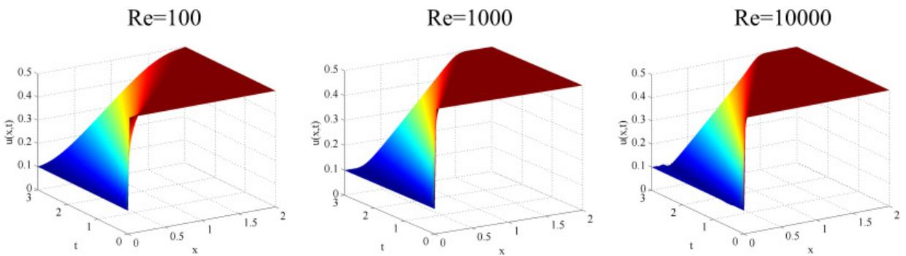  
Figure 1: Dynamics of shock wave phenomena as the exact solution of viscous Burgers equation model at $\mathrm { R e } = 1 0 ^ { 2 } , \mathrm { R e } = 1 0 ^ { 3 }$ and $ { \mathrm { R e } } = 1 0 ^ { 4 }$ , respectively.

We aim in this paper to identify a reduced order model of the nonlinear viscous Burgers equation model to approximate as faithful the true solution and to create a digital twin data model of low complexity for the three shock wave phenomena, respectively. An eficient numerical technique is provided in the following sections.

## 3 Reduced order modeling based on Dynamic Mode Decomposition

## 3.1 The key steps of Dynamic Mode Decomposition and snapshots collection

We proceed by collecting data $u _ { i } \left( t , x \right) = u \left( t _ { i } , x \right) , ~ t _ { i } = i \Delta t , ~ i = 0 , . . . , N _ { t }$ , at the constant sampling time $\Delta t , x$ representing the spatial coordinate.

We form a data matrix whose columns represent the individual data samples, called the snapshot matrix:

$$
V = \left[ \begin{array} { l l l l } { u _ { 0 } } & { u _ { 1 } } & { \ldots } & { u _ { N _ { t } } } \end{array} \right] \in \mathbb { R } ^ { N _ { x } \times ( N _ { t } + 1 ) } .\tag{10}
$$

Each column $u _ { i }$ is a vector with $N _ { x }$ components, representing the numerical measurements. For simplicity of description, we consider here real data $u _ { i } \in \mathbb { R } ^ { N _ { x } }$

Following the Koopman decomposition assumption [17], we consider that a propagator matrix $\mathcal { A }$ exists, that maps every column vector onto the next one. The DMD algorithm constructs the best approximation of the propagator matrix ${ \mathcal { A } } ,$ i.e.

$$
\left\{ u _ { 0 } , u _ { 1 } = { \mathcal { A } } u _ { 0 } , u _ { 2 } = { \mathcal { A } } u _ { 1 } = { \mathcal { A } } ^ { 2 } u _ { 0 } , . . . , u _ { N _ { t } } = { \mathcal { A } } u _ { N _ { t } - 1 } = { \mathcal { A } } ^ { N _ { t } } u _ { 0 } \right\} .\tag{11}
$$

The next computational step consists in forming two time–shifted data matrices from the snapshot sequence. A matrix $V _ { 0 }$ is formed with the first $N _ { t }$ columns and the matrix $V _ { 1 }$ contains the last $N _ { t }$ columns of $V { : }$

$$
V _ { 0 } = \left[ \begin{array} { l l l l } { u _ { 0 } } & { u _ { 1 } } & { \ldots } & { u _ { N _ { t } - 1 } } \end{array} \right] \in \mathbb { R } ^ { N _ { x } \times N _ { t } } , \ V _ { 1 } = \left[ \begin{array} { l l l l } { u _ { 1 } } & { u _ { 2 } } & { \ldots } & { u _ { N _ { t } } } \end{array} \right] \in \mathbb { R } ^ { N _ { x } \times N _ { t } } .\tag{12}
$$

For a suficiently long sequence of the snapshots, we suppose that the last snapshot $u _ { N _ { t } }$ can be written as a linear combination of previous $N _ { t }$ vectors, such that

$$
u _ { N _ { t } } = c _ { 0 } u _ { 0 } + c _ { 1 } u _ { 1 } + . . . + c _ { { N _ { t } } - 1 } u _ { { N _ { t } } - 1 } + \mathcal { R } ,\tag{13}
$$

in which $\mathrm { c } _ { i } \in \mathbb { R } , \mathrm { i } = 0 , . . . , \mathrm { N } _ { \mathrm { t } } - 1$ and R is the residual vector. We assemble the following relations

$$
\left\{ u _ { 1 } , u _ { 2 } , . . . u _ { N _ { t } } \right\} = { \mathcal { A } } \left\{ u _ { 0 } , u _ { 1 } , . . . u _ { N _ { t } - 1 } \right\} = \left\{ u _ { 1 } , u _ { 2 } , . . . , V _ { 0 } c \right\} + { \mathcal { R } } ,\tag{14}
$$

where $c = \left( \begin{array} { l l l l } { c _ { 0 } } & { c _ { 1 } } & { \dots } & { c _ { N _ { t } - 1 } } \end{array} \right) ^ { T }$ is the unknown column vector.

In matrix notation form, Eq. (14) reads

$$
\begin{array} { r } { A V _ { 0 } = V _ { 0 } S + \mathcal { R } , \quad S = \left( \begin{array} { c c c c } { 0 } & { \dots } & { 0 } & { c _ { 0 } } \\ { 1 } & { } & { 0 } & { c _ { 1 } } \\ { \vdots } & { \vdots } & { \vdots } & { \vdots } \\ { 0 } & { \dots } & { 1 } & { c _ { N _ { t } - 1 } } \end{array} \right) , } \end{array}\tag{15}
$$

where $\boldsymbol { \mathcal { S } }$ is the companion matrix.

Relation (15) is true when the residual

$$
\begin{array} { r } { \mathcal { R } = u _ { N _ { t } } - V _ { 0 } c , } \end{array}\tag{16}
$$

is minimized when c is chosen such that R is orthogonal to span $\left\{ u _ { 0 } , . . . , u _ { { N } _ { t } - 1 } \right\}$

The goal of DMD algorithm is to solve the eigenvalue problem of the companion matrix S

$$
V _ { 1 } = \mathcal { A } V _ { 0 } = V _ { 0 } \mathcal { S } + \mathcal { R } ,\tag{17}
$$

where $s$ approximates the eigenvalues of $\mathcal { A }$ when $\| \mathcal { R } \| _ { 2 } \to 0$ , which is equivalent to solve the minimization problem

$$
M i n i m i z e \ R = \| V _ { 1 } - V _ { 0 } S \| _ { 2 } .\tag{18}
$$

In our previous work [16], we estimate the solution to the minimization problem (18) multiplying $V _ { 1 }$ by the Moore-Penrose pseudoinverse [36] of $V _ { 0 }$ :

$$
\begin{array} { r } { S = ( V _ { 0 } ) ^ { + } V _ { 1 } . } \end{array}\tag{19}
$$

As we previously pointed out in [16], the Moore-Penrose pseudoinverse approach might not be feasible when dealing with high dimensional data.

Following Schmid [37] who was the first to introduce the DMD as a numerical tool to compute the Koopman modes, we developed an alternate algorithm based on Singular Value Decomposition (SVD) of snapshot matrix $V _ { 0 }$ . This approach is helpful especially when the matrix $V _ { 0 }$ is rank deficient $\left( \mathrm { N } _ { x } { > } \mathrm { N } _ { t } \right)$ . In the following, we describe this technique.

We first identify a singular value decomposition of $V _ { 0 } { \mathrm { : } }$

$$
V _ { 0 } = U \Sigma W ^ { H } ,\tag{20}
$$

where $U$ contains the proper orthogonal modes of $V _ { 0 }$ , Σ is a square diagonal matrix containing the singular values of $V _ { 0 }$ and $W ^ { H }$ is the conjugate transpose of $W$

A direct consequence of solving the minimization problem (18) is that decreasing the residual increases overall convergence and therefore the eigenvalues $\lambda _ { j }$ and the eigenvectors $\phi _ { j } , j = 1 , . . . , N _ { t }$ of $s$ will converge toward the eigenvalues and the eigenvectors of the Koopman operator $\mathcal { A } .$ respectively. More specifically, every column vector $u _ { i } , i = 1 , . . . , N _ { t }$ can be written as a linear combination of its predecessor:

$$
u _ { i } = \mathcal { A } u _ { i - 1 } = . . . = \mathcal { A } ^ { i - 1 } u _ { 1 } , \quad i = 1 , . . . , N _ { t } .\tag{21}
$$

The eigenvectors of S form a basis for the span of ${ \mathcal { A } } ,$ therefore, we can write every column vector as a linear combination of the eigenvectors

$$
u _ { i } = \sum _ { j = 1 } ^ { N _ { t } } \mathcal { A } ^ { i - 1 } \widetilde { a } _ { j } \phi _ { j } \quad \Leftrightarrow \quad u _ { i } = \sum _ { j = 1 } ^ { N _ { t } } \widetilde { a } _ { j } \lambda _ { j } ^ { i - 1 } \phi _ { j } , \quad i = 1 , . . . , N _ { t } .\tag{22}
$$

A straightforward interpretation of relations (22) brings the data snapshots at every time step $\{ \mathrm { t } _ { 1 } , . . . , \mathrm { t } _ { N _ { t } } \}$ as a linear combination of DMD modes according to

$$
\begin{array} { r l } & { V _ { 1 } = \left[ \begin{array} { l l l l } { u _ { 1 } } & { u _ { 2 } } & { \ldots } & { u _ { N _ { t } } } \end{array} \right] = } \\ & { = \left[ \begin{array} { l l l l } { \phantom { - } \phi _ { 1 } } & { \phi _ { 2 } } & { \ldots } & { \phi _ { N _ { t } } } \end{array} \right] \left( \begin{array} { l l l l } { \widetilde { a } _ { 1 } } & & & \\ & { \widetilde { a } _ { 2 } } & & \\ & & { \vdots } & \\ & & & { \widetilde { a } _ { N _ { t } } } \end{array} \right) \left( \begin{array} { l l l l l } { 1 } & { \lambda _ { 1 } ^ { 1 } } & { \lambda _ { 1 } ^ { 2 } } & { \ldots } & { \lambda _ { 1 } ^ { N _ { t } - 1 } } \\ { 1 } & { \lambda _ { 2 } ^ { 1 } } & { \lambda _ { 2 } ^ { 2 } } & { \ldots } & { \lambda _ { 2 } ^ { N _ { t } - 1 } } \\ { 1 } & { \vdots } & { \vdots } & { \vdots } & { \vdots } \\ { \vdots } & { \vdots } & { \vdots } & { \vdots } & { \vdots } \\ { 1 } & { \lambda _ { N _ { t } } ^ { 1 } } & { \lambda _ { N _ { t } } ^ { 2 } } & { \ldots } & { \lambda _ { N _ { t } } ^ { N _ { t } - 1 } } \end{array} \right) , } \end{array}\tag{23}
$$

where the right eigenvectors of $S , \phi _ { j } \in \mathbb { C }$ are dynamic shape (or Koopman) modes, the eigenvalues of $s , \lambda _ { j }$ are called Ritz values [38] and coeficients $\tilde { a } _ { j } \in \mathbb { C }$ are denoted as amplitudes or Koopman eigenfunctions. Each Ritz value $\begin{array} { r } { \dot { \lambda } _ { j } = e ^ { ( \sigma _ { j } + i \omega _ { j } ) \Delta t } } \end{array}$ is associated with the growth rate $\sigma _ { j }$ and the frequency ωj, where

$$
\sigma _ { j } = \frac { \log { ( \left| \lambda _ { j } \right| ) } } { \Delta t } , \quad \omega _ { j } = \frac { \arg { ( \left| \lambda _ { j } \right| ) } } { \Delta t } .\tag{24}
$$

The superposition of all Koopman modes, weighted by their amplitudes and complex frequencies, approximates the entire data sequence, but there are also modes that have a weak contribution. Our goal is to produce the ROM involving only the most significant modes, having a strong contribution to the data representation, which we are calling leading modes.

Thus, the data snapshots at every time step $\{ \mathrm { t } _ { 1 } , . . . , \mathrm { t } _ { N _ { t } } \}$ will be represented as a linear combination of the leading DMD modes according to

$$
{ u } _ { D M D } \left( t _ { i } , \boldsymbol { x } \right) = \sum _ { j = 1 } ^ { N _ { D M D } } \widetilde { a } _ { j } \phi _ { j } \left( \boldsymbol { x } \right) \lambda _ { j } ^ { i - 1 } , \quad i \in \left\{ 1 , . . . , N _ { t } \right\} , \quad t _ { i } \in \left\{ \mathrm { t } _ { 1 } , . . . , \mathrm { t } _ { N _ { t } } \right\} ,\tag{25}
$$

where $N _ { D M D }$ represents the number of leading DMD modes involved in reconstruction of data snapshots.

One advantage of DMD is that each mode is associated with a pulsation, a growth rate and each mode oscillates at a single frequency, as seen from (25). Representation (25) is suitable when one wants to isolate a mode with a certain frequency, or to identify a maximum or a minimum amplitude and for hydrodynamic stability analysis also. In the seminal article [31], Mezić provides a characterization of Koopman modes in Banach spaces using Generalized Laplace Analysis.

For the purpose of model order reduction, in our paper we adopt the following form

$$
u _ { D M D } \left( t _ { i } , \boldsymbol { x } \right) = \sum _ { j = 1 } ^ { N _ { D M D } } a _ { j } \left( t _ { i } \right) \phi _ { j } \left( \boldsymbol { x } \right) , \quad t _ { i } \in \left\{ \mathrm { t } _ { 1 } , . . . , \mathrm { t } _ { N _ { t } } \right\} ,\tag{26}
$$

where $\phi _ { j } \in \mathbb { C }$ are dynamic leading modes and $a _ { j } \left( t _ { i } \right) = \widetilde { a } _ { j } \lambda _ { j } ^ { i - 1 } , i \in \left\{ 1 , . . . , N _ { t } \right\} , j \in \left\{ 1 , . . . , N _ { D M D } \right\}$ are modal amplitudes.

Here we point out that the $N _ { D M D }$ leading modes involved in ROM representation of data (26) are not the first $N _ { D M D }$ modes from representation (23). The leading modes represent a subset of DMD modes that will be selected from all computed DMD modes via numerical algorithm presented in the next section.

## 4 Ofline stage: Randomized Dynamic Mode Decomposition

The modes’ selection plays a central role in model reduction and constitutes also the source of many discussions among modal decomposition practitioners [19, 21, 39, 40]. Several procedures for selecting the most influential modes in dynamic mode decomposition can be found in our previous papers [13, 16, 41]. We have introduced in [28] the procedure of randomization of data prior to singular value decomposition (SVD). Thus, we endow the DMD algorithm with a randomized SVD function, aiming to improve the accuracy of the reduced order linear model and to reduce the CPU time. The major advantage of this method is that does not require an additional selection algorithm of the DMD modes. The randomized DMD produces a reduced order subspace of Ritz values, having the same dimension as the rank of randomized SVD function, where the leading modes live. The second advantage consists in reducing the problem dimension to avoid a computationally expensive SVD.

The objective of the DMD-based ROM is to represent, as accurately as possible, the high fidelity solution using the dynamics given by the DMD modes. It is then natural to seek the leading DMD modes and their temporal eigenfunctions that minimize the error

$$
E _ { D M D } = \left. \left. u \left( x , t \right) - u _ { D M D } \left( x , t \right) \right. _ { 2 } \right. _ { T } ,\tag{27}
$$

where $\langle \cdot \rangle _ { T }$ is a time average operator over $[ t _ { 1 } , T ]$ and $\| \cdot \| _ { 2 }$ is the $L _ { \mathrm { { 2 } } } \mathrm { { - n o r m } }$ of $\mathbb { R } ^ { N _ { x } }$ . In this paper, $\langle \cdot \rangle _ { T }$ corresponds to the arithmetic time-average on $N _ { t }$ equally spaced elements of the interval $[ t _ { 1 } , T ]$ :

$$
\left. f \left( t \right) \right. _ { T } = \frac { 1 } { N _ { t } } \sum _ { i = 1 } ^ { N _ { t } } f \left( t _ { i } \right) , \quad t _ { i } \in \left\{ t _ { 1 } , t _ { 2 } , . . . , t _ { N _ { t } } = T \right\} .\tag{28}
$$

Determination of the optimal rank $N _ { D M D }$ of the ROM then amounts to finding the solution to the following constrained optimization problem:

$$
\left\{ \begin{array} { l l } { \displaystyle { F i n d } } & { \displaystyle { u _ { D M D } \left( t _ { i } , x \right) = \sum _ { j = 1 } ^ { N _ { D M D } } a _ { j } \left( t _ { i } \right) \phi _ { j } \left( x \right) } , \quad t _ { i } \in \left\{ { \mathrm { t } } _ { 1 } , . . . , { \mathrm { t } } _ { N _ { t } } \right\} , } \\ { \displaystyle S u b j e c t { \mathrm { \# } } \ V _ { D M D } = \arg \operatorname* { m i n } \left\{ E _ { D M D } \right\} , } \end{array} \right.\tag{29}
$$

where $E _ { D M D }$ is the error of the low-rank model defined by Eq. (27).

Generally, DMD does not produce orthogonal modes, therefore ROMs produced via DMD require a closure model consisting of additional regularization techniques [42–44] especially when applying Galerkin or Petrov–Galerkin projection based techniques.

In this paper we propose a variant of randomized dynamic mode decomposition introduced in [28] augmented with deep learning artificial intelligence that confers multiple advantages to the ROM, which will be presented in the following.

The algorithm proceeds as follows:

## Algorithm 1: Randomized Dynamic Mode Decomposition

Initial data: $V _ { 0 } \in \mathbb { R } ^ { N _ { x } \times N _ { t } } , V _ { 1 } \in \mathbb { R } ^ { N _ { x } \times N _ { t } }$ , integer target rank k $\geq 2$ and $k < N _ { t }$   
(1:) For k = 2 to $N _ { t } - 1 .$   
(2:) Produce the randomized singular value decomposition of rank k   
$\left[ U , \Sigma , W \right] = k \mathbf { \bar { s } } \mathbf { V } \mathbf { D } \left( V _ { 0 } , k \right)$ ,   
where U contains the proper orthogonal modes of $V _ { 0 }$ and Σ contains the singular values.   
The RSVD function is described in continuation of this algorithm.   
(3:) Solve the minimization problem (18).   
4. Compute dynamic modes solving the eigenvalue problem SX = XΛ and obtain dynamic   
modes as $\Phi = U X$ . The diagonal entries of Λ represent the eigenvalues λ.   
5. Project dynamic modes onto the first snapshot to calculate the vector containing dynamic   
modes amplitudes Ampl $\mathbf { \Psi } = \left( a _ { j } \right) _ { j = 1 } ^ { r a n k ( \Lambda ) }$

6. The DMD model of rank k is given by the product

$$
V _ { D M D } = \Phi \cdot d i a g \left( A m p l \right) \cdot V a n ,\tag{30}
$$

where the Vandermonde matrix is

$$
V a n = \left( \begin{array} { c c c c c c } { { 1 } } & { { \lambda _ { 1 } ^ { 1 } } } & { { \lambda _ { 1 } ^ { 2 } } } & { { . . . } } & { { \lambda _ { 1 } ^ { N - 2 } } } \\ { { 1 } } & { { \lambda _ { 2 } ^ { 1 } } } & { { \lambda _ { 2 } ^ { 2 } } } & { { . . . } } & { { \lambda _ { 2 } ^ { N - 2 } } } \\ { { 1 } } & { { \vdots } } & { { \vdots } } & { { \vdots } } & { { \vdots } } \\ { { . . . } } & { { . . . } } & { { . . . } } & { { . . . } } & { { . . . } } \\ { { 1 } } & { { \lambda _ { k } ^ { 1 } } } & { { \lambda _ { k } ^ { 2 } } } & { { . . . } } & { { \lambda _ { k } ^ { N - 2 } } } \end{array} \right) .
$$

7. Solve the optimization problem (29) and obtain the optimal low rank k and associated $V _ { D M D }$

$$
V _ { D M D } .
$$

The following routine is used to produce the randomized singular value decomposition.   
Algorithm 2: Randomized Singular Value Decomposition of Rank k (k-RSVD)   
Initial data: $V _ { 0 } \in \mathbb { R } ^ { N _ { x } \times N _ { t } }$ , integer target rank $k \geq 2$ and $k < N _ { t }$   
(1:) Generate random test matrix $M = r a n d ( N _ { t } , r ) , r = \operatorname* { m i n } { ( N _ { t } , 2 k ) } .$   
(2:) Compute sampling matrix by multiplication of snapshot matrix with random matrix   
$Q = V _ { 0 } M$   
(3:) Orthonormalization of sampling matrix via Gram–Schmidt orthonormal method ${ \cal Q } $   
GramSchmidt (Q).   
(4:) Projection of snapshot matrix to smaller space $V = Q ^ { H } V _ { 0 } ,$ , where H denotes the conjugate   
transpose.   
(5:) Produce the economy-size singular value decomposition of low-dimensional snapshot matrix   
$\left[ T , \Sigma , W \right] = S V D \left( V \right)$   
(6:) Compute the right singular vectors $U = Q T .$   
Output: Procedure returns $U \in \mathbb { R } ^ { N _ { x } \times k } , \Sigma \in \mathbb { R } ^ { k \times k } , W \in \mathbb { R } ^ { N _ { t } \times k } .$   
An intuitive understanding of k-RSVD is illustrated in Figure 2. We avoid a computationally   
expensive algorithm and we reduce the problem dimension by using the randomized singular   
value decomposition (RSVD) technique.

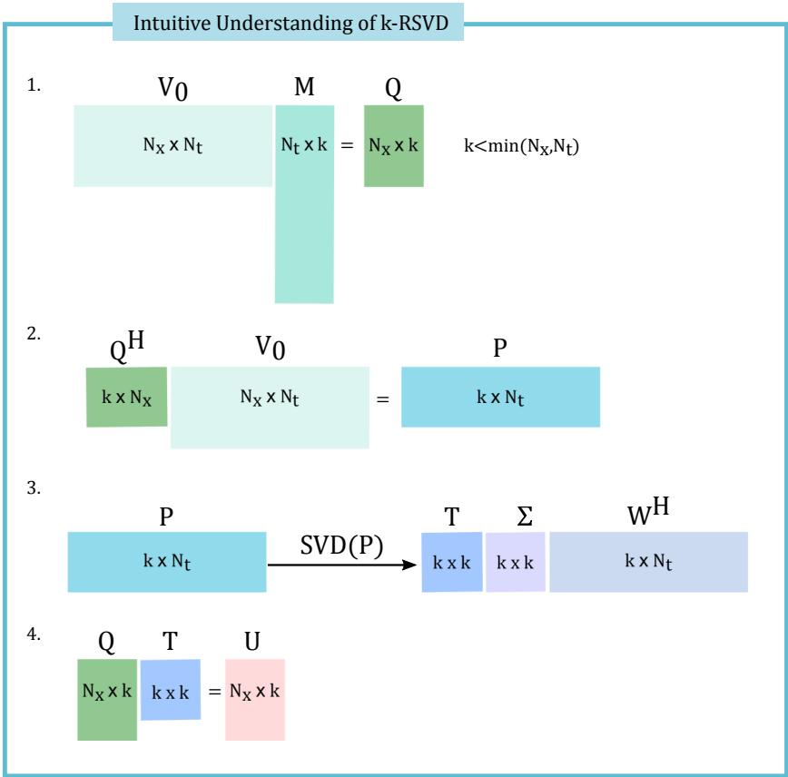  
Figure 2: An intuitive understanding of k-RSVD.

## 5 Online stage: Fast Digital Twin Data Model Identification Using Deep Learning Nonlinear Autoregressive Estimators

The algorithm previously described allows the identification of the leading dynamic modes and their associated temporal coeficients in discrete form. The goal in this section is the identification of the reduced order digital twin data model (DTM) of the form:

$$
u _ { D T M } ^ { R O M } \left( t , x \right) = \sum _ { j = 1 } ^ { N _ { D M D } } \widehat { a } _ { j } \left( t \right) \phi _ { j } \left( x \right) , \quad t \in \left[ 0 , T \right] ,\tag{31}
$$

where $\phi _ { j } , ~ j = 1 , . . . , N _ { D M D }$ are the DMD modes and $\widehat { a } _ { j } ( t ) , \ j = 1 , . . . , N _ { D M D }$ represent the temporal coeficients of the DTM.

Nonlinear AutoRegressive models with eXogenous inputs (NLARX) represent a novel approach in the field of nonlinear system identification [45–47]. Since the emergence of artificial neural networks as numerical tools, NLARX models have been used for various purposes, ranging from simulation [48], to nonlinear predictive control [49] or higher order nonlinear optimization problems [50, 51, 54, 55].

We will investigate in this paper the application of NLARX models to a high-fidelity approximation of temporal coeficients of the DMD-ROM model (31). Let a (t) be the system input represented by the DMD computed amplitudes at discrete time instances $t \in \{ \mathrm { t } _ { 1 } , . . . , \mathrm { t } _ { N _ { t } } \}$ and ab (t) be the output. The formulation of the NLARX model can be described as:

$$
\widehat { a } \left( t \right) = f \left[ \widehat { a } \left( t - 1 \right) , . . . , \widehat { a } \left( t - n _ { a } \right) , a \left( t - n _ { k } \right) , . . . , a \left( t - n _ { k } - n _ { b } + 1 \right) \right] + e \left( t \right) ,\tag{32}
$$

where the $n _ { a }$ is the integer number of past output terms, $n _ { b }$ is the number of past input terms used to predict the current output, $n _ { k }$ is the pure input delay, $f$ is a nonlinear function (typically implemented by an artificial neural network) and $e \left( t \right)$ represents the modeling error. Each output of NLARX model (32) is a function of regressors that are transformations of past inputs and past outputs. Usually this function has a linear block and a nonlinear block. The model output is the sum of the outputs of the two blocks. The NLARX model training can be cast as a non-linear unconstrained optimization problem:

$$
\theta \left( n _ { a } , n _ { b } , n _ { k } \right) = \arg \operatorname* { m i n } \frac { 1 } { 2 N _ { t } } \sum _ { i = 1 } ^ { N _ { t } } { \| a \left( t _ { i } \right) - \widehat { a } \left( t _ { i } \right) \| _ { 2 } } ,\tag{33}
$$

where the training set consists of the measured input $a \left( t \right) , \widehat { a } \left( t \right)$ is the NLARX output, $\| \cdot \| _ { 2 }$ is the $L _ { 2 }$ norm and $\theta \left( n _ { a } , n _ { b } , n _ { k } \right)$ represents the parameter vector of the nonlinear function $f .$

The NLARX structure can accommodate the dynamics of the system by feeding previous network outputs back into the input layer. It also enables the user to define how many previous output and input time steps are required for a best representation of the systems dynamics. One of most important points of an application of NLARX network is a proper selection of inputs, input delays and output delays. The task will be to modify the network parameters $\theta \left( n _ { a } , n _ { b } , n _ { k } \right)$ over the complete trajectory to achieve the minimal value of (33).

We have implemented the nonlinear estimator f in form of a cascade forward neural network with 10 hidden layer sizes, see Figure 3.

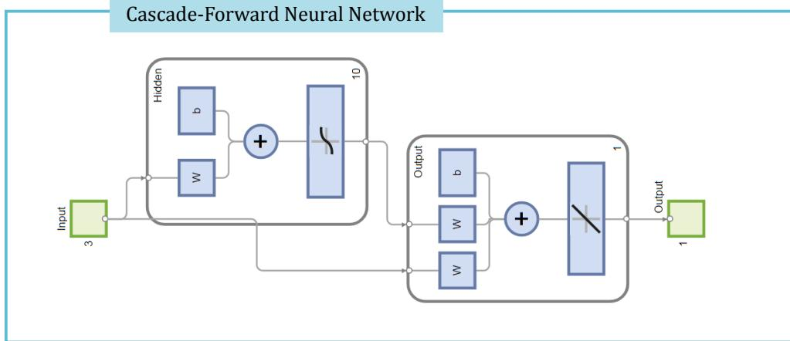  
Figure 3: The cascade forward neural network with 10 hidden layer sizes, used as nonlinear estimator for the NLARX models.

In the next section, we will detail the numerical results.

## 6 Numerical Results: Computational Eficiency of the Algorithm

In the following, we present numerical results demonstrating the computational performance of the algorithm, considering the nonlinear viscous Burgers equation model (1) generating three shock wave phenomena with increasing complexity. The randomization of input data has been leveraged to accelerate DMD computations. The optimal rank of the reduced DMD model is the unique solution to the optimization problem (29). We have tested several global optimization methods like genetic algorithm combined with sequential quadratic programming (GA-SQP) [52] and simulated annealing (SA) [53], to solve the optimization problem (29), with similar computational eforts. A major advantage that comes from application of randomized DMD algorithm is that this leads to the optimal low rank $N _ { D M D }$ and associated DMD subspace where the most influential DMD modes are identified.

The correlation coeficient defined below is used as additional metric to validate the quality of the low-rank DMD model:

$$
C _ { D M D } = \frac { \left. \left. u \left( \boldsymbol { x } , t \right) \cdot \boldsymbol { u } _ { D M D } \left( \boldsymbol { x } , t \right) \right. _ { 2 } \right. _ { T } ^ { 2 } } { \left. \left. u ( \boldsymbol { x } , t ) ^ { H } \cdot \boldsymbol { u } \left( \boldsymbol { x } , t \right) \right. _ { 2 } \right. _ { T } \left. \left. \boldsymbol { u } _ { D M D } \left( \boldsymbol { x } , t \right) ^ { H } \cdot \boldsymbol { u } _ { D M D } \left( \boldsymbol { x } , t \right) \right. _ { 2 } \right. _ { T } } ,\tag{34}
$$

where $u \left( t , x \right)$ means the numerical data, $u _ { D M D } \left( t , x \right)$ represent the computed solution by means of the reduced order DMD model, (·) represents the Hermitian inner product, H denotes the conjugate transpose and $\langle \cdot \rangle _ { T }$ is the norm defined by Eq. (28).

Figures 4–6 present the process of evaluation of DMD model target rank. The error computed as a function of retained number of dynamic modes and the correlation coeficient are presented, respectively, in the cases $R e = 1 0 ^ { 2 } , R e = 1 0 ^ { 3 }$ and $R e = 1 0 ^ { 4 }$ . Table 1 presents the order of DMD subspace obtained in the three test cases, next to the error defined by Eq. (27) and correlation coeficient defined by Eq. (34).

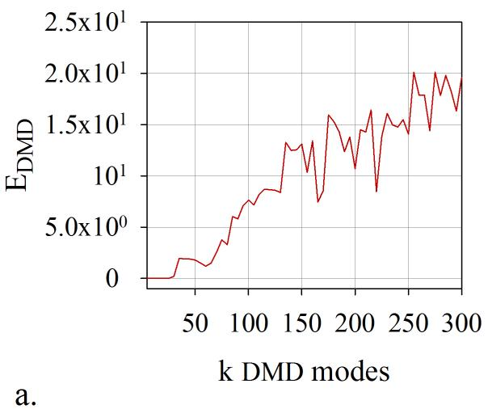

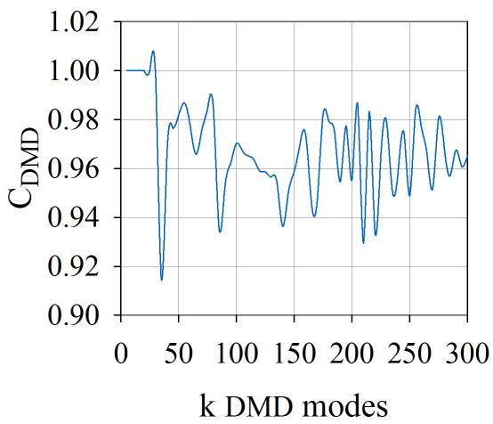  
b.  
Figure 4: Case of $R e = 1 0 ^ { 2 } \mathrm { : }$ : a) The relative error computed as a function of retained number of dynamic modes, b) The correlation coeficient computed as a function of retained number of dynamic modes. $N _ { D M D } = 1 5$ leading modes have been selected.

Table 1: Comparison of the numerical results returned by the randomized dynamic mode decomposition algorithm. 300 data snapshots have been processed.
<table><tr><td>Test case</td><td>Model rank</td><td>Error</td><td>Correlation coefficient</td><td></td></tr><tr><td> $R e = 1 0 ^ { 2 }$ </td><td> $N _ { D M D } = 1 5$ </td><td> $E _ { D M D } = 3 . 1 9 8 4 \times 1 0 ^ { - 7 }$ </td><td> $C _ { D M D } = 1 . 0 0 0 0$ </td><td></td></tr><tr><td> $R e = 1 0 ^ { 3 }$ </td><td> $N _ { D M D } = 2 0$ </td><td> $E _ { D M D } = 4 . 4 2 4 7 \times 1 0 ^ { - 7 }$ </td><td> $C _ { D M D } = 1 . 0 0 0 0$ </td><td></td></tr><tr><td> $R e$   $1 0 ^ { 4 }$  二</td><td> $N _ { D M D }$  =20</td><td> $E _ { D M D }$   $5 . 4 4 1 6 \times 1 0 ^ { - 8 }$  二</td><td> $C _ { D M D }$ </td><td>= 1.0000</td></tr></table>

The algorithm introduced in this paper confers the best correlation coeficient to the DMD model (see Table 1), thus we have identified a digital twin data model. The DMD leading modes are illustrated in Figures 7-9, next to the representation of the modal growth rates and the associated frequencies of the eigenvectors of the Koopman matrix S for the three test cases, respectively.

The coeficients $\widehat { a } _ { j } ( t ) , j = 1 , . . . , N _ { D M D }$ of the reduced order model (31) have been estimated for the entire time window by considering the DMD computed coeficients as inputs of the

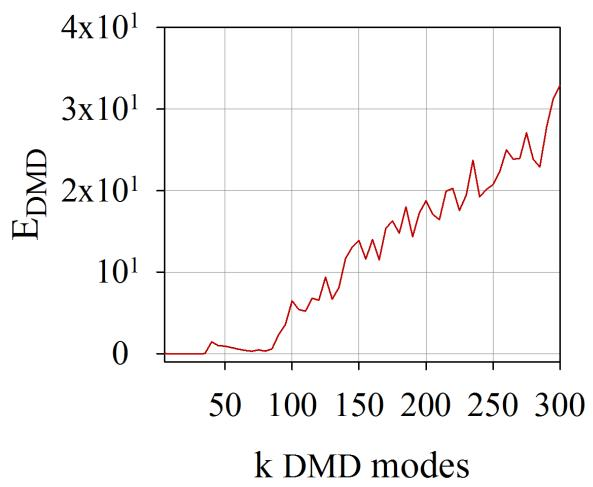

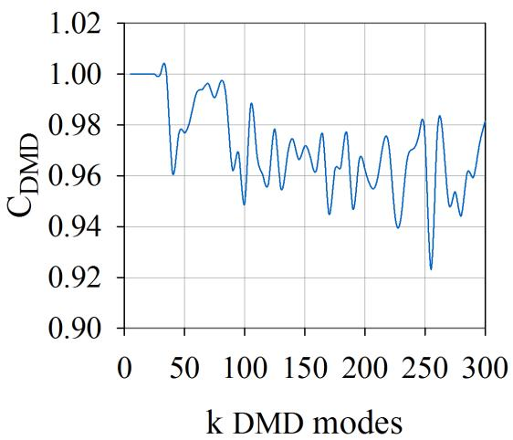  
b.  
Figure 5: Case of $R e = 1 0 ^ { 3 }$ : a) The relative error computed as a function of retained number of dynamic modes, b) The correlation coeficient computed as a function of retained number of dynamic modes. $N _ { D M D } = 2 0$ leading modes have been selected.

a.  
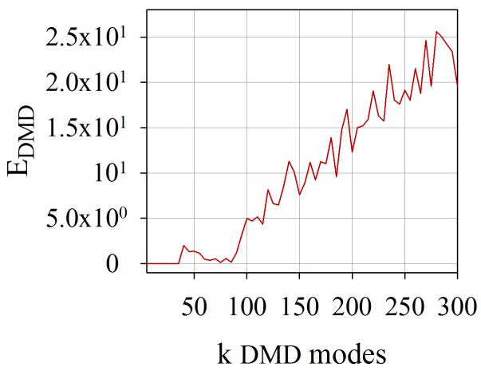

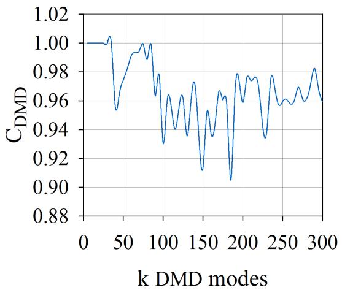  
a.  
b.  
Figure 6: Case of $R e = 1 0 ^ { 4 } ;$ : a) The relative error computed as a function of retained number of dynamic modes, b) The correlation coeficient computed as a function of retained number of dynamic modes. $N _ { D M D } = 2 0$ leading modes have been selected.

NLARX model (32). The numbers of the input terms, output terms and the value of delay are presented in Tables 2-4, for the three test cases, respectively.

The following metrics have been used to perform a qualitative analysis of the digital twin data models (DTMs):

$$
E _ { D T M } = \Big \langle \Big \| u \left( \boldsymbol { x } , t \right) - u _ { D T M } ^ { R O M } \left( \boldsymbol { x } , t \right) \Big \| _ { 2 } \Big \rangle _ { T } ,\tag{35}
$$

$$
C _ { D T M } = \frac { \left. \left\| u \left( \boldsymbol { x } , t \right) \cdot u _ { D T M } ^ { R O M } \left( \boldsymbol { x } , t \right) \right\| _ { 2 } \right. _ { T } ^ { 2 } } { \left. \left\| u ( \boldsymbol { x } , t ) ^ { H } \cdot u \left( \boldsymbol { x } , t \right) \right\| _ { 2 } \right. _ { T } \left. \left\| u _ { D T M } ^ { R O M } \left( \boldsymbol { x } , t \right) ^ { H } \cdot u _ { D T M } ^ { R O M } \left( \boldsymbol { x } , t \right) \right\| _ { 2 } \right. _ { T } } ,\tag{36}
$$

where $E _ { D T M }$ measures the error of the digital twin data model, $C _ { D T M }$ is the correlation coeficient of the digital twin data model, $u \left( t , x \right)$ means the numerical data, $u _ { D T M } ^ { R O M } \left( t , x \right)$ represent the computed solution by means of the DMD-ROM model, (·) represents the Hermitian inner product,

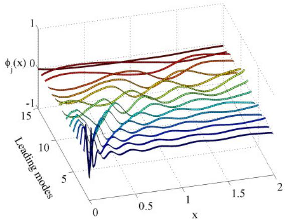  
a.

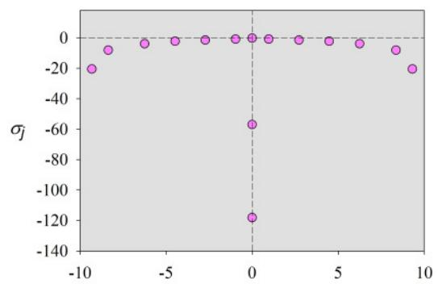  
b.

Figure 7: Case of $R e \ : = \ : 1 0 ^ { 2 } \colon$ a) The DMD leading modes, b) Growth rates and associated frequencies $( \sigma , \omega )$ of the eigenvectors of the Koopman matrix S.  
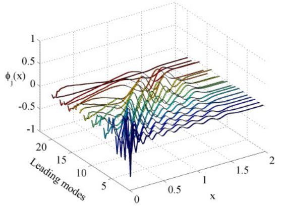

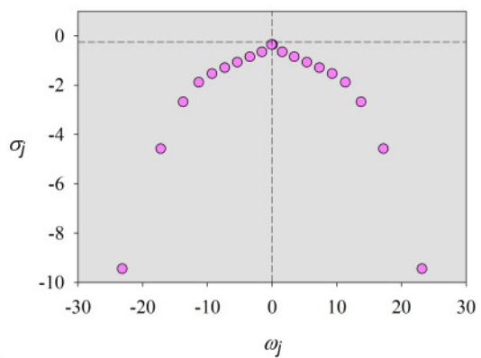  
b.  
Figure 8: Case of $R e \mathrm { ~ = ~ } 1 0 ^ { 3 } \colon \mathrm { ~ a ) }$ The DMD leading modes, b) Growth rates and associated frequencies $( \sigma , \omega )$ of the eigenvectors of the Koopman matrix S.

a.  
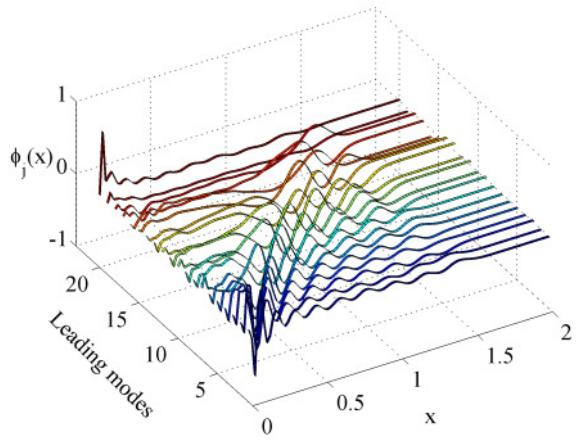  
a.

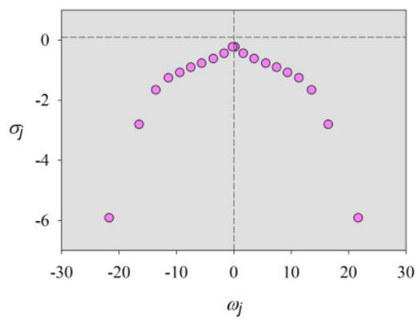  
b.  
Figure 9: Case of $R e \mathrm { ~ = ~ } 1 0 ^ { 4 } \colon \mathrm { ~ a ) }$ The DMD leading modes, b) Growth rates and associated frequencies $( \sigma , \omega )$ of the eigenvectors of the Koopman matrix S.

H denotes the conjugate transpose and $\langle \cdot \rangle _ { T }$ is the norm defined by Eq. (28).

Table 2: Initial data for NLARX estimator of temporal coeficients, case of $R e = 1 0 ^ { 2 } , N _ { D M D } = 1 5 .$
<table><tr><td>Index</td><td>Outputs, inputs, delay</td><td>DTM Error and Correlation coefficient</td></tr><tr><td> $j = 1 , 3 - 1 2 , 1 4$ </td><td> $n _ { a } = 1 , n _ { b } = 2 , n _ { k } = 1$ </td><td> $E _ { D T M } = 8 . 0 8 0 6 \times 1 0 ^ { - 4 }$ </td></tr><tr><td> $j = 2$ </td><td> $n _ { a } = 2 , n _ { b } = 2 , n _ { k } = 2$ </td><td> $C _ { D T M } = 1 . 0 0 0 0$ </td></tr><tr><td> $j = 1 3 , 1 5$ </td><td> $n _ { a } = 1 , n _ { b } = 1 , n _ { k } = 1$ </td><td></td></tr></table>

Table 3: Initial data for NLARX estimator of temporal coeficients, case of $R e = 1 0 ^ { 3 } , N _ { D M D } = 2 0 .$
<table><tr><td>Index</td><td>Outputs, inputs, delay</td><td>DTM Error and Correlation coefficient</td></tr><tr><td> $j = 1 , 4 , 1 0 - 1 2$ </td><td> $n _ { a } = 2 , n _ { b } = 1 , n _ { k } = 1$ </td><td> $E _ { D T M } = 1 . 3 0 8 0 \times 1 0 ^ { - 4 }$ </td></tr><tr><td> $j = 2 , 3 , 1 3$ </td><td> $n _ { a } = 1 , n _ { b } = 1 , n _ { k } = 2$ </td><td> $C _ { D T M } = 1 . 0 0 0 0$ </td></tr><tr><td> $j = 5 - 9$ </td><td> $n _ { a } = 1 , n _ { b } = 1 , n _ { k } = 5$ </td><td></td></tr><tr><td> $j = 1 4 - 1 9$ </td><td> $n _ { a } = 2 , n _ { b } = 1 , n _ { k } = 2$ </td><td></td></tr><tr><td> $j = 2 0$ </td><td> $n _ { a } = 1 , n _ { b } = 1 , n _ { k } = 1$ </td><td></td></tr></table>

Table 4: Initial data for NLARX estimator of temporal coeficients, case of $R e = 1 0 ^ { 4 } , N _ { D M D } = 2 0$
<table><tr><td>Index</td><td>Outputs, inputs, delay</td><td>DTM Error and Correlation coefficient</td></tr><tr><td> $j = 1 , 3 , 4 , 7$ </td><td> $n _ { a } = 1 , n _ { b } = 3 , n _ { k } = 2$ </td><td> $E _ { D T M } = 1 . 4 0 0 0 \times 1 0 ^ { - 4 }$ </td></tr><tr><td> $j = 2 , 5 , 6 , 8 , 1 6$  -20</td><td> $n _ { a } = 1 , n _ { b } = 2 , n _ { k } = 2$ </td><td> $C _ { D T M } = 1 . 0 0 0 0$ </td></tr><tr><td> $j = 9 - 1 5$ </td><td> $n _ { a } = 1 , n _ { b } = 1 , n _ { k } = 1$ </td><td></td></tr></table>

Solution of the digital twin data models are illustrated in Figures 10-12, for the three test cases, respectively. The very good correlation coeficients and the low value of errors presented in Tables 2-4 confirm the computational eficiency of the digital twin data models.

The CPU time required in the ofline-online stage is presented in Figure 13, for the three test cases. The required ofline CPU time does not exceed two seconds and does not present large variations depending on the case study. The online CPU time fall between 8 and 17 seconds, depending on the index of the temporal coeficient which is estimated along the entire time window. It is obvious that the NLARX estimator requires more time to estimate the temporal behaviour in the case of very high Reynolds number.

Figures 14-16 illustrate the validation for the first temporal coeficient, as simulated response of the optimal NLARX estimator, in the case of the three experiments, respectively.

## 7 Conclusions

The present investigation has focused on the identification of high-fidelity digital twin data models from numerical code outputs by non-intrusive techniques (i.e. not requiring Galerkin projection of the governing equations onto the reduced modes basis). In this paper we define the concept of digital twin data model (DTM) as a model of reduced complexity that has the main feature to mirror the original process behavior.

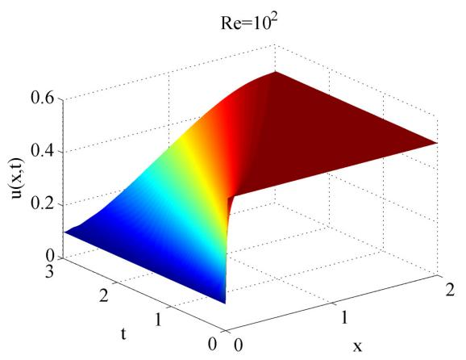

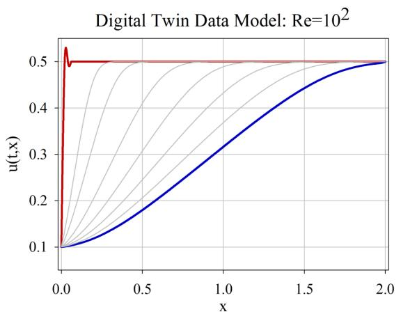  
b.

a.  
Figure 10: Solution of the digital twin data model in the case of experiment $R e = 1 0 ^ { 2 } \colon \mathrm { a } )$ 3D view; b) Projection view of the shock wave.  
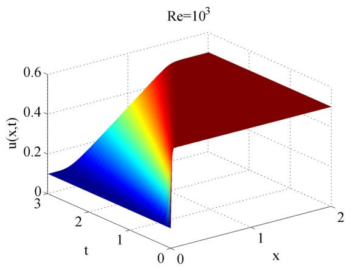

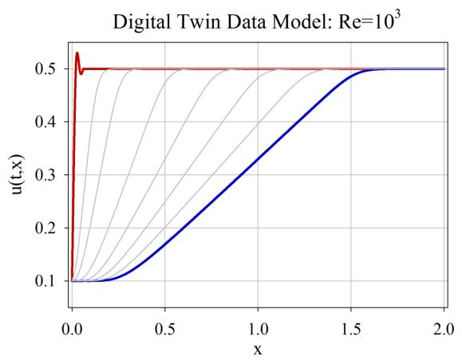  
b.

a.  
Figure 11: Solution of the digital twin data model in the case of experiment $R e = 1 0 ^ { 3 }$ : a) 3D view; b) Projection view of the shock wave.  
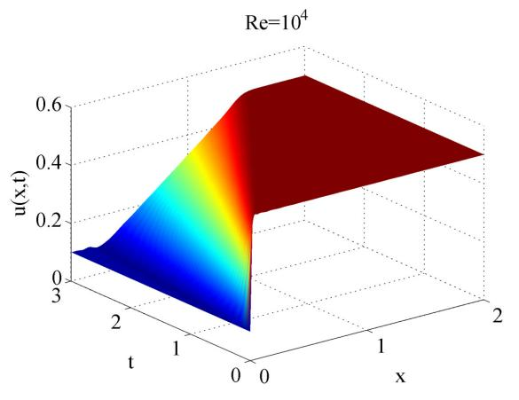  
a.

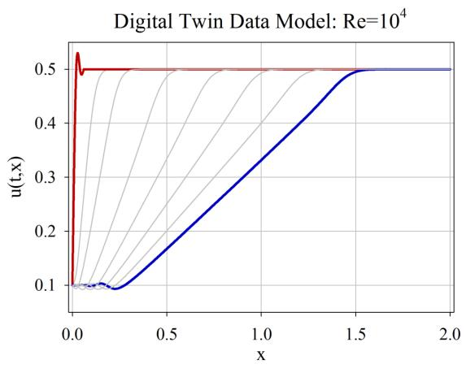  
b.  
Figure 12: Solution of the digital twin data model in the case of experiment $R e = 1 0 ^ { 4 } \colon \mathrm { a } )$ 3D view; b) Projection view of the shock wave.

We developed an algorithm that utilizes a variant of adaptive randomized dynamic mode decomposition introduced in [28] to obtain a reduced basis in the ofline stage, combined with a fast digital twin identification using neural network based nonlinear autoregressive estimators in the online stage. To overcome the inconveniences of developing and implementing a mode selection criterion associated with dynamic mode decomposition, we developed a technique based on randomized dynamic mode decomposition as a fast and accurate option in model order reduction. The rank of the ROM is given as the unique solution of an optimization problem whose constraint consists in the smallest error of DTM. Solving the optimization problem (29) using a hybrid simulated annealing [53] we gain a fast and accurate randomized DMD algorithm, with a low rank for the ROMs.

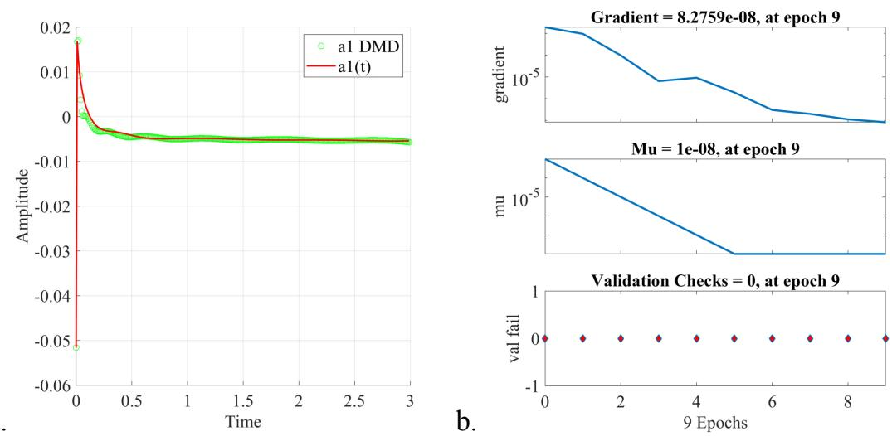  
a.

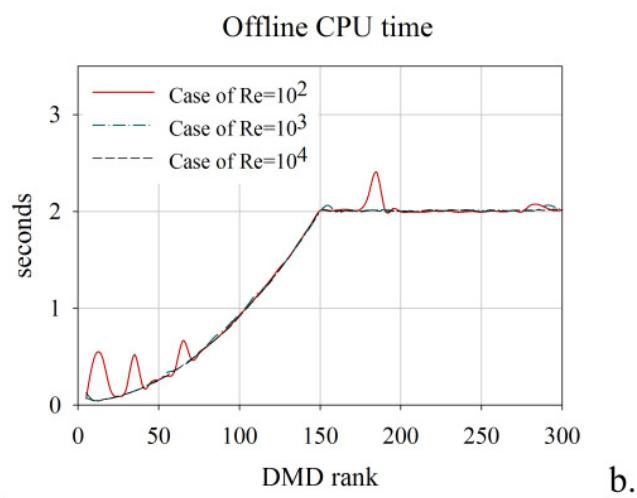

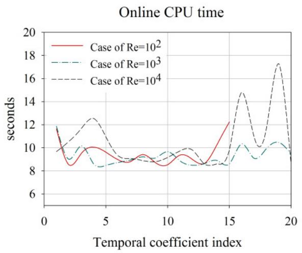  
Figure 13: The CPU time required in the ofline-online stage, for the three test cases.  
Figure 14: The validation for the first temporal coeficient, as simulated response of the optimal NLARX estimator, in the case of experiment $\mathrm { R e } = 1 0 ^ { 2 }$

The DTMs have been investigated in the numerical simulation of three shock wave phenomena with increasing complexity, with Reynolds number varying from $1 0 ^ { 2 }$ to $1 0 ^ { 4 }$

We showed that the significant advantage of DTM is to map the dynamics with high accuracy and reduced costs in CPU time and hardware, even to timescales dificult to explore because of the rapidly changing dynamics over time.

The procedure of online estimation of the DTM temporal coeficients by employing neural network based nonlinear autoregressive estimators leads to a fast and accurate identification of the digital twin data models, as seen in Tables 2-4. We investigated the computational eficiency of the proposed algorithm and we provided a qualitative analysis of the DTM in the three experiments investigated.

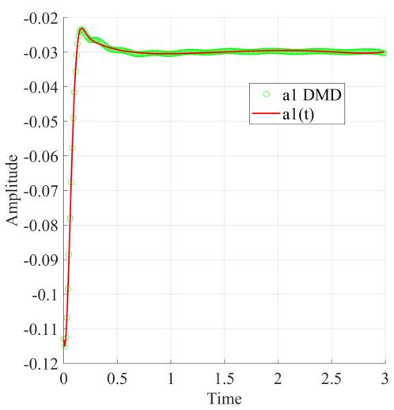  
a.

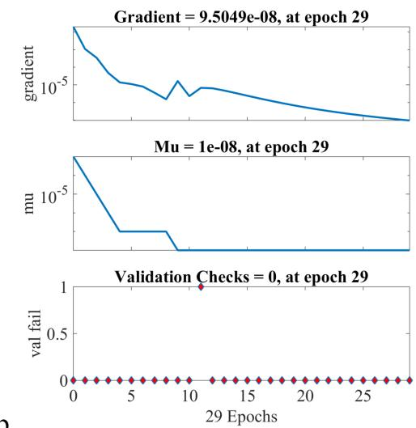  
b.  
Figure 15: The validation for the first temporal coeficient, as simulated response of the optimal NLARX estimator, in the case of experiment $ { \mathrm { R e } } = 1 0 ^ { 3 }$

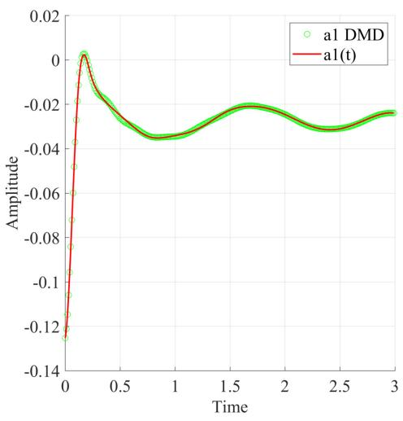  
a.

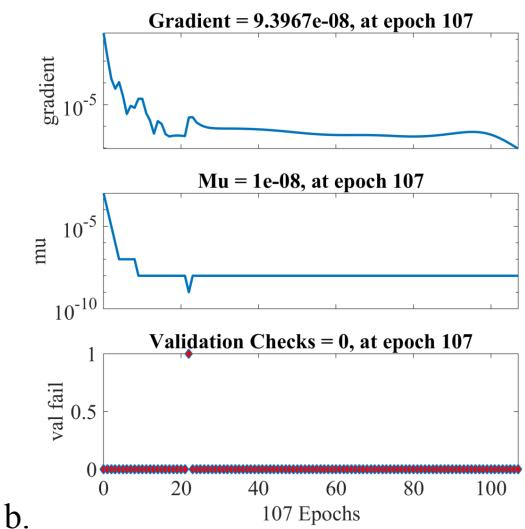  
Figure 16: The validation for the first temporal coeficient, as simulated response of the optimal NLARX estimator, in the case of experiment $ { \mathrm { R e } } = 1 0 ^ { 4 }$

## References

[1] Y. Cao, J. Zhu, I. Navon, Z. Luo, A reduced order approach to four-dimensional variational data assimilation using proper orthogonal decomposition, International Journal for Numerical Methods in Fluids 53 (10) (2007) 1571–1583.

[2] G. Dimitriu, R. Stefanescu, I. M. Navon, POD-DEIM approach on dimension reduction of a multi-species host-parasitoid system, Ann. Acad. Rom., Sci. Ser. Math. Appl. 7 (1) (2015) 173–188.

[3] J. Du, F. Fang, C. C. Pain, I. M. Navon, J. Zhu, D. Ham, POD reduced order unstruc-

tured mesh modelling applied to 2d and 3d fluid flow, Computers and Mathematics with Applications 65 (2013) 362–379.

[4] R. Stefanescu, I. M. Navon, POD/DEIM nonlinear model order reduction of an ADI implicit shallow water equations model, Journal of Computational Physics 237 (2013) 95–114.

[5] Z. Wang, I. Akhtar, J. Borggaard, T. Iliescu, Proper orthogonal decomposition closure models for turbulent flows: A numerical comparison, Computer Methods in Applied Mechanics and Engineering 237-240 (2012) 10–26.

[6] N.K. Bellam Muralidhar, N. Rauter, A. Mikhaylenko, R. Lammering, D.A. Lorenz, Parametric Model Order Reduction of Guided Ultrasonic Wave Propagation in Fiber Metal Laminates with Damage, Modelling 2 (2021) 591—608. doi:10.3390/modelling2040031.

[7] I. Mezić, Spectral properties of dynamical systems, model reduction and decompositions, Nonlinear Dynamics 41 (1-3) (2005) 309–325.

[8] C. W. Rowley, I. Mezić, S. Bagheri, P. Schlatter, D. S. Henningson, Reduced-order models for flow control: balanced models and Koopman modes, in: Seventh IUTAM Symposium on Laminar-Turbulent Transition, IUTAM Bookseries, Vol. 18, 2010, pp. 43–50.

[9] S. Bagheri, Koopman-mode decomposition of the cylinder wake, Journal of Fluid Mechanics 726 (2013) 596–623.

[10] P. J. Schmid, D. Violato, F. Scarano, Decomposition of time-resolved tomographic PIV, Springer-Verlag, 2012.

[11] O. Frederich, D. M. Luchtenburg, Modal analysis of complex turbulent flow, in: The 7th International Symposium on Turbulence and Shear Flow Phenomena (TSFP-7), Ottawa, Canada„ 2011.

[12] M. J. Balajewicz, E. H. Dowell, B. R. Noack, Low-dimensional modelling of high-Reynoldsnumber shear flows incorporating constraints from the Navier–Stokes equation, Journal of Fluid Mechanics 729 (2013) 285–308.

[13] D. A. Bistrian, I. M. Navon, The method of dynamic mode decomposition in shallow water and a swirling flow problem, International Journal for Numerical Methods in Fluids 83 (2016) 73–89. doi:10.1002/fld.4257.

[14] X. Chen, I. M. Navon, F. Fang, A dual-weighted trust-region adaptive POD 4D-VAR applied to a finite-element shallow-water equations model, International Journal for Numerical Methods in Fluids 65 (2011) 250–541.

[15] G. Dimitriu, R. Stefanescu, I. Navon, Comparative numerical analysis using reduced-order modeling strategies for nonlinear large-scale systems, Journal of Computational and Applied Mathematics 310 (2017) 32–43.

[16] D. A. Bistrian, I. M. Navon, An improved algorithm for the shallow water equations model reduction: Dynamic mode decomposition vs POD, International Journal for Numerical Methods in Fluids 78 (9) (2014) 552–580. doi:10.1002/fld.4029.

[17] B. Koopman, Hamiltonian systems and transformations in Hilbert space, Proc. Nat. Acad. Sci. 17 (1931) 315–318.

[18] P. J. Schmid, J. Sesterhenn, Dynamic mode decomposition of numerical and experimental data, in: 61st Annual Meeting of the APS Division of Fluid Dynamics, Vol. 53(15), American Physical Society, San Antonio, Texas, 2008.

[19] K. K. Chen, J. H. Tu, C. W. Rowley, Variants of dynamic mode decomposition: boundary condition, Koopman and Fourier analyses, Nonlinear Science 22 (2012) 887–915.

[20] J. H. Tu, C. W. Rowley, D. M. Luchtenburg, S. L. Brunton, J. N. Kutz, On dynamic mode decomposition: Theory and applications, Journal of Computational Dynamics 1 (2) (2014) 391–421.

[21] M. R. Jovanovic, P. J. Schmid, J. W. Nichols, Low-rank and sparse dynamic mode decomposition, Center for Turbulence Research Annual Research Briefs (2012) 139–152.

[22] J. N. Kutz, X. Fu, S. L. Brunton, N. B. Erichson, Multi-resolution dynamic mode decomposition for foreground/background separation and object tracking, in: 2015 IEEE International Conference on Computer Vision Workshop (ICCVW), no. INSPEC Accession Number:15790263, IEEE, Santiago, 2015, pp. 921 – 929.

[23] J. N. Kutz, X. Fu, S. L. Brunton, Multi-resolution dynamic mode decomposition, SIAM Journal of Applied Dynamical Systems 15 (2016) 713–735.

[24] M. O. Williams, I. G. Kevrekidis, C. W. Rowley, A data–driven approximation of the Koopman operator: extending dynamic mode decomposition, Journal of Nonlinear Science 25 (6) (2015) 1307–1346.

[25] B. R. Noack, W. Stankiewicz, M. Morzynski, P. Schmid, Recursive dynamic mode decomposition of a transient cylinder wake, physics.flu-dyn arXiv:1511.06876v1.

[26] B. R. Noack, W. Stankiewicz, M. Morzynski, P. Schmid, Recursive dynamic mode decomposition of transient and post-transient wake flows, Journal of Fluid Mechanics 809 (2016) 843–872.

[27] J. L. Proctor, S. L. Brunton, J. N. Kutz, Dynamic mode decomposition with control, SIAM Journal of Applied Dynamical Systems 15 (1) (2016) 142–161.

[28] D. A. Bistrian, I. M. Navon, Randomized dynamic mode decomposition for nonintrusive reduced order modelling, International Journal for Numerical Methods in Engineering 112 (2017) 3–25. doi:10.1002/nme.5499.

[29] D. A. Bistrian, I. M. Navon, Eficiency of randomized dynamic mode decomposition for reduced order modelling, International Journal of Computational Fluid Dynamics. doi: 10.1080/10618562.2018.1511049.

[30] S.E. Ahmed, P.H. Dabaghian, O. San, D.A. Bistrian, I.M. Navon, Dynamic mode decomposition with core sketch, Physics of Fluids (2022). doi:10.1063/5.0095163.

[31] I. Mezić, On Numerical Approximations of the Koopman Operator, Mathematics 10 (2022), 1180. doi.org/10.3390/math10071180.

[32] A. Alla, J. N. Kutz, Nonlinear model order reduction via dynamic mode decomposition, SIAM Journal on Scientific Computing 39 (5) (2016) B778–B796.

[33] J. M. Burgers, A mathematical model illustrating the theory of turbulence, Advances in Applied Mechanics 1 (1948) 171–199.

[34] C.M. Cuesta, I. Pop, Numerical schemes for a pseudo-parabolic Burgers equation: Discontinuous data and long-time behaviour, Journal of Computational and Applied Mathematics 224 (1) (2009) 269–283.

[35] J. N. Kutz, J. L. Proctor, S. L. Brunton, Koopman theory for partial diferential equations, arXiv:1607.07076 (2016).

[36] G. Golub, C. F. van Loan, Matrix Computations, Third Edition, The Johns Hopkins University Press, 1996.

[37] P. Schmid, Dynamic mode decomposition of numerical and experimental data, Journal of Fluid Mechanics 656 (2010) 5–28.

[38] A. K. Chopra, Dynamics of Structures, 4th Edition, Prentice-Hall International Series in Civil Engineering and Engineering Mechanics, 2000.

[39] B. R. Noack, M. Morzynski, G. Tadmor, Reduced-Order Modelling for Flow Control, Springer, 2011.

[40] G. Tissot, L. Cordier, N. Benard, B. R. Noack, Model reduction using dynamic mode decomposition, Comptes Rendus Mecanique 342 (2014) 410–416.

[41] A. K. Alekseev, D. A. Bistrian, A. E. Bondarev, I. M. Navon, On linear and nonlinear aspects of dynamic mode decomposition, International Journal for Numerical Methods in Fluids 82 (2015) 348–371. doi:10.1002/fld.4221.

[42] L. Cordier, B. A. E. Majd, J. Favier, Calibration of POD reduced-order models using Tikhonov regularization, International Journal for Numerical Methods in Fluids 63 (2010) 269–296.

[43] O. San, T. Iliescu, A stabilized proper orthogonal decomposition reduced-order model for large scale quasigeostrophic ocean circulation, Advances in Computational Mathematics 41 (5) (2015) 1289–1319.

[44] Y. Wang, I. Navon, X. Wang, Y. Cheng, 2d Burgers equations with large Reynolds number using POD/DEIM and calibration, International Journal for Numerical Methods in Fluids 82 (12) (2016) 909–931.

[45] K. Narendra, K. Parthasarathy, Identification and control of dynamic systems using neural networks, IEEE Transactions on Neural Networks 1 (1) (1990) 4–27.

[46] A. Juditsky, H. Hjalmarsson, A. Benveniste, B. Deylon, L. Ljung, J. Sloberg, Q. Zhang, Nonlinear black-box models in system identification: Mathematical foundations, Automatica 31 (12) (1995) 1725–1750.

[47] L. Ljung, System Identification: Theory for the User, Second Edition, Prentice Hall Information and System Sciences Series, 1999.

[48] O. Nelles, Nonlinear System Identification: From Classical Approaches to Neural Networks and Fuzzy Models, Engineering online library. Springer, 2001.

[49] G. Liu, V. Kadirkamanathan, S. Billings, Predictive control for non-linear systems using neural networks, International Journal of Control 71 (1998) 1119–1132.

[50] J. Moody, The efective number of parameters: An analysis of generalization and regularization in nonlinear learning system, Neural Information Processing Systems (NIPS 1991), Morgan Kaufmann (1991) 847–854.

[51] H. Peng, T. Ozaki, V. Haggan-Ozaki, Y. Toyoda, Structured parameter optimization method for the radial basis function-based state-dependent autoregressive model, International Journal of Systems Science 33 (2002) 1087–1098.

[52] J. Nocedal, S. J. Wright, Numerical Optimization, Second Edition, Springer, 2006.

[53] X. S. Yang, Engineering Optimization: An Introduction with Metaheuristic Applications, Wiley, USA, 2010.

[54] Z. Wang, D. Xiao, F. Fang, R. Govindan, C. Pain, Y. Guo, Model identification of reduced order fluid dynamics systems using deep learning, International Journal for Numerical Methods in Fluids 86 (4) (2018) 255–268.

[55] T. Tieleman, G. Hinton, Rmsprop: Divide the gradient by a running average of its recent magnitude, COURSERA: Neural Networks for Machine Learning, 2012.