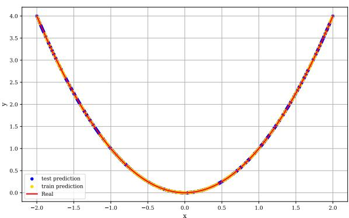
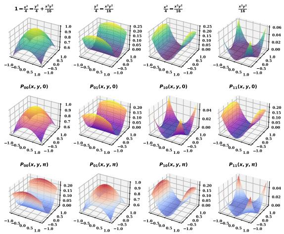
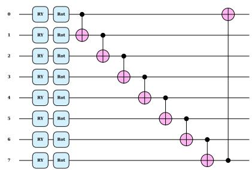
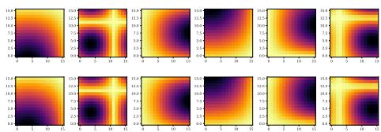
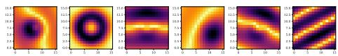
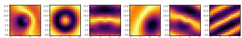
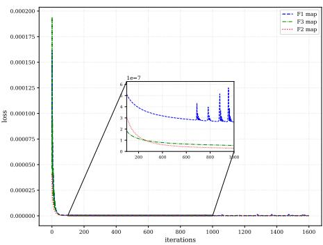
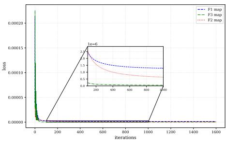
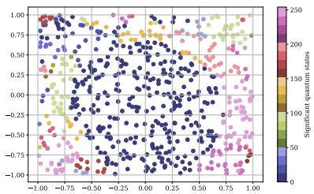
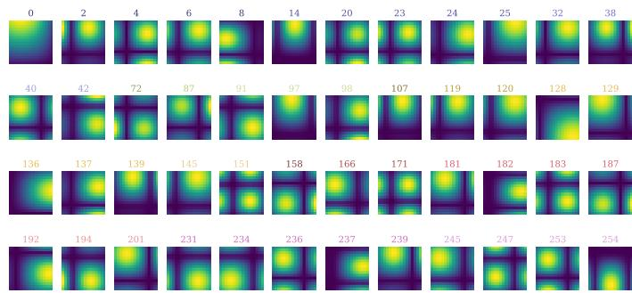

# Hybrid Variational Quantum Circuits for Multivariate Regression and High-Dimensional Data Reconstruction

Koffi O. AYENA

Frédéric HOLWECK

ICB, UTBM

ICB, UTBM

Serge IOVLEFF

F-90000 Belfort, France

Amah S. D'ALMEIDA

F-90000 Belfort, France

SINERGIES (UR 4662), UMLP

LAMMA, Universite de Lomé

F-90000 Belfort, France

01 BP 1515 Lomé-Togo

LAMMA, Universite de Lomé frederic.holweck@utbm.fr

serge.iovleff@utbm.fr

dal\_me@yahoo.fr

01 BP 1515 Lomé-Togo

ORCID: 0009-0009-0858-258X

Abstract—Variational quantum circuits (VQCs) are parameterized quantum circuits optimized classically. We propose a hybrid variational quantum circuit (HVQC) extending VQCs with a classical affine post-measurement layer, enabling vector-valued regression without the linear overhead of independent scalar circuits. Theoretically, we show that elementary one- and two-qubit circuits can approximate quadratic functions and products via data re-uploading and entanglement, providing the foundations of the full architecture. Experimentally, on two synthetic image reconstruction datasets and the Friedman1 benchmark (40,568 test samples), our HVQC matches Gaussian Process Regression and outperforms XGBoost and Random Forest. An ablation study confirms that both quantum and classical components are essential, and results highlight the central role of the feature map in hybrid quantum-classical models.

Index Terms—Variational quantum circuits, quantum machine learning, multivariate regression, feature maps

## I. INTRODUCTION

Quantum computing has experienced significant advances in the era of noisy intermediate-scale quantum (NISQ) processors [1]. These processors, although limited in the number of qubits and subject to noise, have paved the way for new computing paradigms, including variational quantum algorithms (VQAs). Popularized by the foundational work of Peruzzo [2] on the variational solver for quantum chemistry, variational quantum circuits (VQCs) have become central models for exploring the potential advantages of quantum computing in various fields, notably quantum chemistry and, more recently, quantum machine learning (QML) [3], [4].

The enthusiasm for variational quantum circuit (HVQC) stems from their hybrid architecture: a parameterized quantum circuit, whose parameters are optimized by a classical computer. This approach partially circumvents the limitations of current quantum hardware. Formally, a VQC can be described as a parameterized unitary $U ( \mathbf { z } ; \pmb \theta )$ applied to an initial state $| \mathbf { 0 } \rangle = | 0 \rangle ^ { \otimes ^ { m _ { 0 } } }$ , producing a final state whose expectation value of an observable Ô provides the model's output [5]:

$$
f ( \mathbf { z } ; \pmb { \theta } ) = \langle \mathbf { 0 } | U ^ { \dagger } ( \mathbf { z } ; \pmb { \theta } ) \hat { O } U ( \mathbf { z } ; \pmb { \theta } ) | \mathbf { 0 } \rangle\tag{1}
$$

where $\mathbf { z } \in \mathbb { R } ^ { d }$ represents the input data, typically encoded via parameterized rotation gates [6].

In the QML landscape, while classification tasks [7]–[9], and "unpublished" [10] have been extensively studied, quantum regression has remained a theoretically less explored topic until recently, as highlighted by authors in [11] on applying QML to practical regression on NISQ hardware. Yet, the ability to predict continuous values is crucial for numerous scientific and industrial applications, including financial time series forecasting [12], physical data modeling [13], or climate prediction [14].

Research on quantum regression circuits has experienced a remarkable acceleration since 2024, marked by several important milestones which we organize chronologically.

The year 2024 constitutes a turning point with the first significant experimental demonstrations. A pioneering study [11] applied variational quantum regression to the Auto-MPG dataset on NISQ hardware with error mitigation. Their results demonstrate that VQAs can outperform classical models like XGBoost, and that error mitigation techniques are effective in bringing the performance of noisy simulators closer to that of ideal simulators.

Concurrently, the PennyLane platform published a tutorial demonstrating multidimensional regression with a two-qubit variational circuit to approximate the function $f ( x _ { 1 } , x _ { 2 } ) =$ $\textstyle { \frac { 1 } { 2 } } ( x _ { 1 } ^ { 2 } + x _ { 2 } ^ { 2 } )$ , achieving an $R ^ { 2 }$ score of 0.983 in "unpublished" [15]. This work illustrates the ability of VQCs to build partial Fourier series for function approximation, consistent with the VQC expressivity theory established in [6].

Reference [16] introduced the PQML (Predictive Quantum Machine Learning) tool to predict the reproducibility of results across different quantum machines, a crucial advance for the reliability of quantum regression applications in a heterogeneous NISQ context.

The year 2025 saw the emergence of sophisticated optimization techniques and applications to complex problems. In [17], the authors proposed a novel state preparation method for variational quantum regression, using optimization techniques based on the ZX-calculus (Pauli pushing, phase folding, Hadamard pushing). Their results demonstrate that these optimizations enable the successful execution of quantum regression algorithms on current hardware, significantly reducing circuit depth.

This approach was extended to multivariate time series in "unpublished" [18] through the MTS-QRC (Multivariate Time Series Quantum Reservoir Computing) framework.

Applied to Lorenz and ENSO (El Niño-Southern Oscillation) systems, this method achieved a mean squared error (MSE) of 0.0087 and 0.0036, respectively. Interestingly, their work revealed that hardware noise can sometimes act as an implicit regularizer, improving performance compared to ideal simulators a counter-intuitive yet promising phenomenon for NISQ applications.

Parallel advances in error mitigation directly benefited regression applications. The authors of [19] proposed significant improvements to Clifford Data Regression (CDR) with Energy Sampling (ES) and Non-Clifford Extrapolation (NCE), enhancing the fidelity of computations on noisy hardware without additional quantum overhead.

Automatic design of quantum architectures for regression using genetic algorithms was explored in "unpublished" [20]. Their Reduced Regressor QNN framework explores circuit depth, configuration of parameterized gates, and data reuploading patterns, demonstrating that these evolved circuits, although compact, can achieve competitive performance against 17 classical regression models on 22 non-linear benchmark functions.

The year 2026 marks a consolidation of the field. Joo's editorial [21] in Frontiers in Physics reviews the progress in algorithm optimization and error mitigation, confirming that these areas are now mature enough to support practical applications such as quantum regression. The challenges are progressively shifting from fundamental feasibility towards comparative efficiency and demonstrable quantum advantage.

Although variational quantum circuits (VQCs) have shown promise for scalar regression, they suffer from the barren plateau phenomenon [22], [23] that makes training difficult, and their naive extension to vector-valued regression incurs a prohibitive linear complexity in the output dimension. To address these limitations, we introduce a hybrid variational quantum circuit (HVQC) that handles vector-valued regression in a single unified circuit, thereby avoiding the linear overhead of independent approaches [11], [15]. Unlike quantum kernel methods [24], [25] where the circuit is fixed, our architecture jointly optimizes all quantum and classical parameters end-toend, with the final affine layer enabling the model to reach any target in the output vector space.

This paper is organized as follows. Section II presents the mathematical foundations of HVQCs. In Section III, we demonstrate the approximation capabilities of elementary one- and two-qubit circuits, thereby providing the theoretical foundations for our architecture. Complete HVQC architecture is established in Section IV, where we define the key components: data encoding, and the variational parameterization that enables learning. Section V presents experimental results comparing the performance of our HVQC, evaluated using the $R ^ { 2 }$ score and mean squared error (MSE), on two simulated datasets with different feature maps, against several classical regression models, including Gaussian process regression (GPR), random forest regression (RFR), multioutput XGBoost Regression (XGB), and two classical neural networks. The section concludes with a global analysis of the quantum states after measurement, revealing an implicit clustering behavior.

## II. THEORETICAL FRAMEWORK OF A HVQC

We consider the following supervised learning problem: given a training set $\mathcal { D } = \{ ( \bar { \mathbf { z } } ^ { ( i ) } , \bar { \mathbf { x } } ^ { ( i ) } ) \} _ { i = 1 } ^ { N }$ , where $\mathbf { z } ^ { ( i ) } \in \mathbb { R } ^ { d }$ and $\mathbf { x } ^ { ( i ) } \in \mathbb { R } ^ { m }$ , the objective is to learn a function $f _ { \Theta } : \mathbb { R } ^ { d } $ $\mathbb { R } ^ { m }$ , parameterized by Θ, minimizing the mean squared error:

$$
\mathcal { L } ( \boldsymbol { \Theta } ) = \frac { 1 } { N } \sum _ { i = 1 } ^ { N } \| f _ { \boldsymbol { \Theta } } ( \mathbf { z } ^ { ( i ) } ) - \mathbf { x } ^ { ( i ) } \| _ { 2 } ^ { 2 } .\tag{2}
$$

a) Baseline architecture of the quantum regressor: The conventional architecture of the variational quantum regressor proceeds in three steps. First, a quantum feature map embeds the input vector z into the Hilbert space of a system of $m _ { 0 } \geq \lceil \log _ { 2 } m \rceil$ qubits, producing the state $| \phi ( \mathbf { z } ) \rangle \in \mathcal { H } \cong$ $( \mathbb { C } ^ { 2 } ) ^ { \otimes m _ { 0 } }$ . In second step, this encoding, whose dimensionality is chosen to match the target dimension $m ,$ is then evolved by a parameterized quantum circuit $U ( \pmb \theta )$ , generating the variational state:

$$
| \psi ( \mathbf { z } ; \pmb { \theta } ) \rangle = \phi ( \mathbf { z } ) U ( \pmb { \theta } ^ { L } ) \cdots \phi ( \mathbf { z } ) U ( \pmb { \theta } ^ { 1 } ) \phi ( \mathbf { z } ) | 0 \rangle ^ { \otimes m _ { 0 } } .\tag{3}
$$

The model's prediction emerges from measuring the mo qubits in the computational basis $\{ | k \rangle \} _ { k = 0 } ^ { 2 ^ { m _ { 0 } } - 1 }$ . The theoretical probability distribution of outcomes is given by the projectors $M _ { k } = \vert k \rangle \langle k \vert$

$$
p _ { k } ( { \bf z } ; \pmb { \theta } ) = \langle \psi ( { \bf z } ; \pmb { \theta } ) | M _ { k } | \psi ( { \bf z } ; \pmb { \theta } ) \rangle .\tag{4}
$$

This distribution $\mathbf { p } ( \mathbf { z } ; \pmb { \theta } ) = \left( p _ { 0 } , \ldots , p _ { 2 ^ { m _ { 0 } } - 1 } \right)$ resides in the probability simplex $\Delta ^ { 2 ^ { m _ { 0 } } - 1 }$ , defined by:

$$
\begin{array} { l } { { \Delta ^ { 2 ^ { m _ { 0 } } - 1 } = } } \\ { { \left\{ \left( q _ { 0 } , q _ { 1 } , \cdots , q _ { 2 ^ { m _ { 0 } } - 1 } \right) \in { \mathbb R } ^ { 2 ^ { m _ { 0 } } } \ \backslash \ q _ { k } \geq 0 , \ \displaystyle \sum _ { k = 0 } ^ { 2 ^ { m _ { 0 } } - 1 } q _ { k } = 1 \right\} . } } \end{array}
$$

In practice, access to this distribution is obtained through sampling (shots). For $S$ measurement repetitions, one obtains a frequentist estimate $\hat { p } _ { k } ( \pmb { \theta } , \mathbf { z } ) = c _ { k } / S$ , where $c _ { k }$ is the count of outcome k.

Each projector $M _ { k } = | k \rangle \langle k |$ defines an observable whose measurement yields the probability of observing the computational basis state |k). It can be expressed as a tensor product of single-qubit observables

$$
M _ { k } = \bigotimes _ { i = 1 } ^ { m _ { 0 } } { \frac { 1 } { 2 } } \Big ( I + ( - 1 ) ^ { k _ { i } } \sigma _ { z } \Big ) , \qquad \mathrm { w i t h } \quad \sigma _ { z } = \left( \begin{array} { c c } { { 1 } } & { { 0 } } \\ { { 0 } } & { { - 1 } } \end{array} \right)
$$

where $k _ { i } ~ \in ~ \{ 0 , 1 \}$ denotes the i-th bit of the integer k on m0 bits, $\sigma _ { z }$ is the Pauli $Z$ matrix and I denotes the identity matrix.

In the third step, we perform post-processing to handle model limitations and ensure that the output dimensions are consistent. This final step is discussed in the following two paragraphs.

b) Geometric limitation of the baseline model: A fundamental limitation of the architecture defined by equations (3) and (4) lies in the confinement of its output to the probabilistic simplex $\Delta ^ { 2 ^ { m _ { 0 } } - 1 }$ . Although a trivial linear postprocessing could theoretically project this output onto $\mathbb { R } ^ { m }$ , the internal geometry of the learned representations remains that of a convex polytope with extremal properties — its points being convex combinations of computational basis states. This geometric constraint intrinsically limits the model's capacity to capture data structures exhibiting a different underlying geometry (unbounded, non-trivial topology), necessitating an appropriate preprocessing of input data.

c) Extension via post-variational affine transformation: To overcome this limitation while preserving the model's differentiability, we propose incorporating a learnable affine transformation of the probability distribution $\mathbf { p } ( \pmb \theta , \mathbf { z } )$ , like "unpublished" [26]. The complete regression function is then written as:

$$
\begin{array} { r } { f _ { \Theta } ( \mathbf { z } ) = \mathbf { W } \mathbf { p } ( \theta , \mathbf { z } ) + b , } \end{array}\tag{5}
$$

where $\Theta \ = \ \{ \boldsymbol { \theta } , { \bf W } , \boldsymbol { b } \}$ encompasses all parameters. The matrix $\mathbf { W } \in \mathbb { R } ^ { \setminus \times 2 ^ { m _ { 0 } } }$ and the bias vector $\pmb { b } \in \mathbb { R } ^ { m }$ perform a fundamental geometric transformation: they allow the model to reach any point in $\mathbb { R } ^ { m }$ by learning a linear map from the simplex to the target space. This formulation breaks the simplexial geometry of internal representations and offers a clear geometric interpretation, conferring upon the model increased flexibility to adapt to complex data patterns.

To better understand the capabilities of our model, we now turn to the expressivity of HVQCs, focusing on their ability to approximate non-linear functions.

## III. EXPRESSIVITY OF VQCS

We demonstrate here the capacity of elementary one- and two-qubit quantum circuits to approximate fundamental nonlinearities, thereby establishing the theoretical basis for our architecture. We validate Propositions 1 and 2 via statevector simulation using PennyLane, neglecting shot noise in the probability estimation.

Proposition 1 (Approximation of the square function). Let $K = [ - 2 , 2 ]$ . For any $\varepsilon \in ( 0 , 1 )$ , there exist $\beta < 1$ and $k \geq 1$ such that the measurement of the quantum state $| \psi ( z ) \rangle ~ =$ $R _ { Y } ( z ) \mathinner { | { 0 } \rangle }$ in the computational basis satisfies

$$
\operatorname* { s u p } _ { z \in K } \left. z ^ { 2 } - 4 \beta ^ { - 2 k } P \left( \left. \psi ( \beta ^ { k } z ) \right. = | 1 \rangle \right) \right. \le \varepsilon\tag{6}
$$

Proof. We have the quantum state $| \psi ( z ) \rangle = R _ { y } ( z ) | 0 \rangle$ . Computing explicitly, we obtain:

$$
| \psi ( z ) \rangle = { \binom { \cos { \frac { z } { 2 } } } { \sin { \frac { z } { 2 } } } }
$$

The probability of measuring |1〉 is:

$$
P \left( \left| \psi ( z ) \right. = \left| 1 \right. \right) = \left| \sin \frac { z } { 2 } \right| ^ { 2 }\tag{7}
$$

Hence,

$$
4 \beta ^ { - 2 k } P \left( \left| \psi ( \beta ^ { k } z ) \right. = | 1 \rangle \right) = 4 \beta ^ { - 2 k } \sin ^ { 2 } { \frac { \beta ^ { k } z } { 2 } }
$$

For small $u ,$ we have the Taylor expansion $\begin{array} { r } { \sin ^ { 2 } \frac { u } { 2 } = \frac { u ^ { 2 } } { 4 } - } \end{array}$ $\textstyle { \frac { u ^ { 4 } } { 4 8 } } + O ( u ^ { 6 } )$ . Here $u = \beta ^ { k } z$ is small for large k. Thus:

$$
4 \beta ^ { - 2 k } \sin ^ { 2 } { \frac { \beta ^ { k } z } { 2 } } = 4 \beta ^ { - 2 k } \left( { \frac { \beta ^ { 2 k } z ^ { 2 } } { 4 } } - { \frac { \beta ^ { 4 k } z ^ { 4 } } { 4 8 } } + O ( \beta ^ { 6 k } z ^ { 6 } ) \right)
$$

By Taylor's theorem with the Lagrange remainder, for any $u \in \mathbb { R }$ , we have

$$
\left| \sin ^ { 2 } { \frac { u } { 2 } } - { \frac { u ^ { 2 } } { 4 } } \right| \leq { \frac { | u | ^ { 4 } } { 4 8 } }
$$

Applied to $u = \beta ^ { k } .$ z:

$$
\left| 4 \beta ^ { - 2 k } \sin ^ { 2 } \frac { \beta ^ { k } z } { 2 } - z ^ { 2 } \right| \leq 4 \beta ^ { - 2 k } \frac { | \beta ^ { k } z | ^ { 4 } } { 4 8 } = \frac { \beta ^ { 2 k } | z | ^ { 4 } } { 1 2 }
$$

Then for all $z \in K$

$$
\left| 4 \beta ^ { - 2 k } P \left( \left| \psi ( \beta ^ { k } z ) \right. = | 1 \rangle \right) - z ^ { 2 } \right| \leq \frac { 4 \beta ^ { 2 k } } { 3 }
$$

For sufficiently large $k , \beta ^ { 2 k }$ becomes arbitrarily small (since $\beta < 1 )$ , so this difference tends to 0 uniformly on $K$

Thus, for any $\varepsilon \in ( 0 , 1 )$ , it suffices to choose $\beta \leq 1$ and k large enough such that $\frac { 4 \mathring { \beta } ^ { 2 k } } { 3 } \leq \varepsilon$ , which yields:

$$
\operatorname* { s u p } _ { z \in K } \left. z ^ { 2 } - 4 \beta ^ { - 2 k } P \left( \left. \psi ( \beta ^ { k } z ) \right. = | 1 \rangle \right) \right. \le \varepsilon
$$

The approximation of the function $x ^ { 2 }$ by the HVQC defined in Proposition 1 achieves an $\mathtt { R } ^ { 2 }$ score of 1 on the training set and 1 on the test set, using 900 points split in a 70%–30% proportion, as illustrated in Fig. 1. Using the identity

$$
x \times y = \frac { 1 } { 4 } \left[ ( x + y ) ^ { 2 } - ( x - y ) ^ { 2 } \right]
$$

combined with the square function approximation obtained in Proposition 1, we can then approximate the product $x \times y$ using two $R _ { Y }$ rotation gates applied to two qubits.

Proposition 2 (Quantum approximation of the product). For any $\varepsilon \in ( 0 , 1 )$ , there exist parameters $\beta < 1 , k \ge 1$ , and a quantum circuit acting on a 2-qubit system such that measuring a quantum state yields an approximation $\widetilde { x y }$ satisfying:

  
Fig. 1. Square function approximation.

$$
\operatorname* { s u p } _ { ( x , y ) \in [ - 1 , 1 ] ^ { 2 } } | x \times y - \widetilde { x y } | \leq \varepsilon\tag{8}
$$

More precisely, the approximation is given by:

$$
\begin{array} { r l } & { \widetilde { x y } = \beta ^ { - 2 k } \times } \\ & { \left[ P \left( \left| \psi ( \beta ^ { k } ( x + y ) ) \right. = | 1 \rangle \right) - P \left( \left| \psi ( \beta ^ { k } ( x - y ) ) \right. = | 1 \rangle \right) \right] _ { \mathcal { c } } } \end{array}\tag{9}
$$

where $| \psi ( z ) \rangle = R _ { Y } ( z ) | 0 \rangle$ is the quantum state defined in Proposition 1.

Proof. From Proposition 1, for any $z \in K$ , we have:

$$
\left| z ^ { 2 } - 4 \beta ^ { - 2 k } P \left( \left| \psi ( \beta ^ { k } z ) \right. = | 1 \rangle \right) \right| \leq { \frac { 4 \beta ^ { 2 k } } { 3 } }\tag{10}
$$

Since $x + y , x - y \in K$ , and using the remarkable identity:

$$
x \times y = { \frac { 1 } { 4 } } \left[ ( x + y ) ^ { 2 } - ( x - y ) ^ { 2 } \right]\tag{11}
$$

The approximation error follows from the triangle inequality:

$$
\begin{array} { l } { \displaystyle | x \times y - \widehat { x y } | } \\ { \leq \frac { 1 } { 4 } \Big [ \big | ( x + y ) ^ { 2 } - 4 \beta ^ { - 2 k } P \left( \big | \psi ( \beta ^ { k } ( x + y ) ) \big > = | 1 \rangle \right) \big | } \\ { \displaystyle ~ + \left| ( x - y ) ^ { 2 } - 4 \beta ^ { - 2 k } P \left( \big | \psi ( \beta ^ { k } ( x - y ) ) \big > = | 1 \rangle \right) \right| \Big ] } \\ { \leq \frac { 1 } { 4 } \left[ \frac { 4 \beta ^ { 2 k } } { 3 } + \frac { 4 \beta ^ { 2 k } } { 3 } \right] = \frac { 2 \beta ^ { 2 k } } { 3 } } \end{array}\tag{12}
$$

For any $\varepsilon \in ( 0 , 1 )$ , it therefore suffices to choose $\beta < 1$ and k sufficiently large such that:

$$
\frac { 2 \beta ^ { 2 k } } { 3 } \leq \varepsilon\tag{13}
$$

The corresponding quantum circuit can be implemented by preparing the states $\left| \psi ( \beta ^ { k } ( x + y ) ) \right.$ and $\left| \psi ( \beta ^ { k } ( x - y ) ) \right.$ on

two distinct qubits, which allows obtaining both probabilities in execution of the circuit.

On four qubits, Proposition 2 with CNOT gates can be rewritten as:

$$
\begin{array} { r l } & { \left( R _ { Y } ( + \pi / 2 ) \otimes I \otimes R _ { Y } ( - \pi / 2 ) \otimes I \right) \ \circ \ \mathrm { ( C N O T _ { 0 , 1 } } } \\ & { \otimes \mathrm { C N O T _ { 2 , 3 } ) } \ \circ \ \left( R _ { Y } ( \beta ^ { k } x ) ^ { \otimes 2 } \otimes R _ { Y } ( \beta ^ { k } y ) ^ { \otimes 2 } \right) \ | 0 0 0 0 \rangle , } \end{array}\tag{14}
$$

with $C N O T _ { i , j } | q _ { i } q _ { j } \rangle  | q _ { i } , ( q _ { j } \oplus q _ { i } ) \rangle$ and $\oplus$ means addition modulo 2 (classical XOR). And denoting by $P _ { 0 1 }$ and $P _ { 2 3 }$ the probabilities of measuring |11〉 on qubits (0, 1) and (2, 3) respectively, $\begin{array} { r } { \frac { 2 } { \beta ^ { 2 k } } \left( P _ { 0 1 } - \hat { P } _ { 2 3 } \right) } \end{array}$ approximates xy. We further observe the following

Observation 1 (Approximations realized by the two-qubit circuit). Consider the quantum circuit $\mathcal { C } ( \alpha )$ acting on two qubits defined by:

$$
\begin{array} { r l } & { \mathcal { C } ( \alpha ) : | 0 0 \rangle \mapsto | \psi ( x , y , \alpha ) \rangle = } \\ & { C N O T _ { 0 , 1 } \cdot ( I \otimes R _ { Y } ( \alpha ) ) \cdot ( R _ { Y } ( x ) \otimes R _ { Y } ( y ) ) | 0 0 \rangle } \end{array}\tag{15}
$$

For small values of x and y (in the neighborhood of 0), the measurement probabilities in the computational basis realize the following approximations:

$$
P _ { 0 0 } ( x , y , 0 ) = P _ { 0 1 } ( x , y , \pi ) \approx 1 - \frac { x ^ { 2 } } { 4 } - \frac { y ^ { 2 } } { 4 } + \frac { x ^ { 2 } y ^ { 2 } } { 1 6 }\tag{16}
$$

$$
P _ { 0 1 } ( x , y , 0 ) = P _ { 0 0 } ( x , y , \pi ) \approx \frac { y ^ { 2 } } { 4 } - \frac { x ^ { 2 } y ^ { 2 } } { 1 6 }\tag{17}
$$

$$
P _ { 1 0 } ( x , y , 0 ) = P _ { 1 1 } ( x , y , \pi ) \approx \frac { x ^ { 2 } y ^ { 2 } } { 1 6 }\tag{18}
$$

$$
P _ { 1 1 } ( x , y , 0 ) = P _ { 1 0 } ( x , y , \pi ) \approx \frac { x ^ { 2 } } { 4 } - \frac { x ^ { 2 } y ^ { 2 } } { 1 6 }\tag{19}
$$

where $P _ { i j } ( x , y , \alpha )$ is the probability of measuring the state |ij〉.

In Observation 1, entanglement is preserved only when $R _ { Y } ( \alpha )$ precedes the CNOT, yielding a non-zero determinant $\begin{array} { l } { { \frac { 1 } { 2 } } } \end{array}$ sin $c \cos ( y + \alpha )$ . The only exceptions are when sin $x = 0$ or cos $( y + \alpha ) = 0$ (first qubit in a computational basis state).

## IV. PROPOSED HVQC TOOLS AND ARCHITECTURE

Three design principles follow from Propositions 1 and 2: (i) data re-uploading — re-encoding $\mathbf { z } ^ { \prime }$ at each layer (22) builds complex dependencies like $\beta ^ { k } z$ in (6); (ii) entanglement — the cascade CNOT (26) generalizes (14) to all feature dimensions; (iii) affine post-processing — (29) generalizes the rescaling $4 \beta ^ { - 2 k }$ in (6) to arbitrary linear combinations, lifting the simplex constraint.

This section details the complete architecture of our hybrid variational quantum circuit.

## A. Hilbert space and data encoding

Let $\mathcal { H } = ( \mathbb { C } ^ { 2 } ) ^ { \otimes m _ { 0 } }$ be the Hilbert space associated with the mo-qubit system, of dimension dim $( { \mathcal { H } } ) = 2 ^ { m _ { 0 } } \geq m .$ A quantum state $\vert \psi \rangle \in { \mathcal { H } }$ can be decomposed in the computational basis $\{ | i \rangle \} _ { i = 0 } ^ { 2 ^ { m _ { 0 } } - 1 }$ as:

  
Fig. 2. The measurement probabilities of $| \psi ( x , y , \alpha ) \rangle$ in the computational basis states |ij〉 $, i , j \in \{ 0 , \bar { 1 } \}$

$$
| \psi \rangle = \sum _ { i = 0 } ^ { 2 ^ { m _ { 0 } } - 1 } \alpha _ { i } | i \rangle , \sum _ { i = 0 } ^ { 2 ^ { m _ { 0 } } - 1 } | \alpha _ { i } | ^ { 2 } = 1\tag{20}
$$

The encoding of classical data is achieved by the mapping:

$$
F : \mathbb { R } ^ { d }  \mathbb { R } ^ { m _ { 0 } } \quad F ( \mathbf { z } ) = \mathbf { z } ^ { \prime }\tag{21}
$$

which augments the d components of z to $m _ { 0 }$ components of $\mathbf { z } ^ { \prime }$ (padding encoding) with

$$
\mathbf { z } ^ { \prime } = ( z _ { 1 } , z _ { 2 } , \cdot \cdot \cdot , z _ { d } , c _ { 0 } , \ldots , c _ { m _ { 0 } - d - 1 } ) \in \mathbb { R } ^ { m _ { 0 } }
$$

and

$$
\Phi : \mathbb { R } ^ { m _ { 0 } }  \mathcal { H } , \quad \Phi ( \mathbf { z } ^ { \prime } ) = \bigotimes _ { k = 1 } ^ { m _ { 0 } } R _ { Y } ( \mathbf { z } _ { k } ^ { \prime } ) \mid \psi \rangle\tag{22}
$$

where $R _ { Y } ( \theta ) = e ^ { - i { \frac { \theta } { 2 } } Y }$ is the rotation operator about the Yaxis, whose matrix representation in the computational basis is:

$$
R _ { Y } ( \theta ) = \binom { \cos ( \theta / 2 ) } { \sin ( \theta / 2 ) } \quad \stackrel { - \sin ( \theta / 2 ) } { \cos ( \theta / 2 ) } \quad\tag{23}
$$

It can be noted that the coefficients $c _ { 0 } , \ldots , c _ { m _ { 0 } - d - 1 }$ may be constants, or alternatively that $\mathbf { z } ^ { \prime } = \mathbf { z } ^ { \otimes m _ { 0 } }$ for a suitably chosen integer $m _ { 0 }$ , as detailed in reference [9] (tensor product encoding). Furthermore, the components of $\mathbf { z } ^ { \prime }$ may also depend on the $z _ { i }$ (non-linear feature encoding in Fig. 3); in this case, it is shown that this can improve learning (Table I).

## B. Architecture of the parameterized circuit

The quantum circuit implements a parameterized unitary transformation $U ( \mathbf { z } ^ { \prime } ; \pmb { \theta } ) : \mathcal { H }  \mathcal { H }$ Let L be the number of

layers. The architecture alternates encoding layers $\Phi ( { \bf z } ^ { \prime } )$ and strongly entangling layers $V ( \pmb \theta _ { \ell } )$

$$
\begin{array} { r } { U ( \mathbf { z } ^ { \prime } ; \pmb { \theta } ) = V ( \pmb { \theta } _ { L } ) \circ \Phi ( \mathbf { z } ^ { \prime } ) \circ V ( \pmb { \theta } _ { L - 1 } ) \circ \Phi ( \mathbf { z } ^ { \prime } ) \circ \cdots } \\ { \circ V ( \pmb { \theta } _ { 1 } ) \circ \Phi ( \mathbf { z } ^ { \prime } ) \circ V ( \pmb { \theta } _ { 0 } ) } \end{array}\tag{24}
$$

1) Strongly entangling layer: For the l-th layer, $V ( \pmb \theta _ { \ell } ) =$ $U _ { \mathrm { e n t } } \cdot R ( \pmb \theta _ { \ell } )$ , with the order suggested by Observation 1 decomposes into two parts:

• Local rotations on each qubit:

$$
R ( \pmb \theta _ { \ell } ) = \bigotimes _ { k = 1 } ^ { m _ { 0 } } R _ { X } ( \theta _ { \ell , k } ^ { ( 1 ) } ) R _ { Y } ( \theta _ { \ell , k } ^ { ( 2 ) } ) R _ { Z } ( \theta _ { \ell , k } ^ { ( 3 ) } )\tag{25}
$$

• Entangling CNOT gates in a cascade pattern:

$$
U _ { \mathrm { e n t } } = \prod _ { i = 0 } ^ { m _ { 0 } - 1 } C N O T _ { i , ( i + r ) \mathrm { m o d } m _ { 0 } } .\tag{26}
$$

with

$$
\begin{array} { r l r } & { } & { C N O T _ { i , j } | q _ { 0 } \dots q _ { i } \dots q _ { j } \dots q _ { m _ { 0 } - 1 } \rangle  } \\ & { } & { | q _ { 0 } \dots q _ { i } \dots \dots ( q _ { j } \oplus q _ { i } ) \dots q _ { m _ { 0 } - 1 }  } \end{array}\tag{27}
$$

and $r$ is a hyperparameter called the range which defines the distance between the control qubit i and the target qubit $j .$

  
Fig. 3. Architecture of a single layer of the VQC. Rot denotes $\ddot { R _ { X } } ( \theta _ { \ell , k } ^ { ( 1 ) } ) R _ { Y } ( \theta _ { \ell , k } ^ { ( 2 ) } ) R _ { Z } ( \theta _ { \ell , k } ^ { ( 3 ) } )$

## C. Measurement and probability distribution

Measurement in the computational basis yields a probability vector $\mathbf { p } ( \mathbf { z } ^ { \prime } ; \pmb { \theta } ) \in \mathbb { R } ^ { 2 ^ { m _ { 0 } } }$ belonging to the simplex $\Delta ^ { 2 ^ { m _ { 0 } } - \mathbf { \check { 1 } } }$ Each component is expressed as:

$$
p _ { j } ( \mathbf { z } ^ { \prime } ; \pmb { \theta } ) = \mathrm { T r } \left( \left| j \right. \left. j \right| \rho ( \mathbf { z } ^ { \prime } ; \pmb { \theta } ) \right)\tag{28}
$$

where $\rho ( { \bf z } ^ { \prime } ; \pmb { \theta } ) = U ( { \bf z } ^ { \prime } ; \pmb { \theta } ) \left| 0 ^ { \otimes m _ { 0 } } \right. \left. 0 ^ { \otimes m _ { 0 } } \right| U ^ { \dagger } ( { \bf z } ^ { \prime } ; \pmb { \theta } )$ is the density matrix of the final state. Thus, the circuit $U ( \mathbf { z } ^ { \prime } ; \pmb \theta )$ constructs a family of functions of the form (28), which according to the universal approximation theorem [27], can be uniformly approximated on compact sets by single-qubit gates and a CNOT gate, provided the depth L is sufficient.

A classical post-processing (an affine transformation) projects the probability space $\bar { \mathbb { R } } ^ { 2 ^ { m _ { 0 } } }$ onto the target space $\mathbb { R } ^ { m }$

$$
f _ { \Theta } ( \mathbf { z } ) = \mathbf { W } \mathbf { p } ( F ( \mathbf { z } ) ; \pmb \theta ) + \mathbf { b }\tag{29}
$$

with $\mathbf { \Theta } \Leftrightarrow \mathbf { \alpha } \left\{ \pmb { \theta } = \mathbf { \alpha } \big ( \pmb { \theta } _ { 0 } , \cdot \cdot \cdot , \pmb { \theta } _ { L } \big ) , \mathbf { W } \mathrm { ~ \in ~ \mathbb { R } ^ { m \times 2 ^ { m _ 0 } } , \pmb { b } ~ \in ~ \mathbb { R } ^ { m } ~ } \right\}$ The cost function (2) admits a variational interpretation as the expectation of the reconstruction error under the empirical data distribution:

$$
\begin{array} { r } { \mathcal { L } ( \boldsymbol { \Theta } ) = \mathbb { E } _ { ( \mathbf { z } , \mathbf { x } ) \sim \mathcal { D } } \left[ \| \mathbf { x } - ( W \mathbf { p } ( F ( \mathbf { z } ) ; \boldsymbol { \theta } ) + \mathbf { b } ) \| _ { 2 } ^ { 2 } \right] } \end{array}\tag{30}
$$

## D. Gradient computation

The gradient with respect to the classical parameters (W, b) is computed via standard automatic differentiation. For the quantum parameters θ, we use the parameter-shift rule

$$
\frac { \partial p _ { j } } { \partial \theta _ { i } } = \frac { 1 } { 2 } \left( p _ { j } ( \theta _ { i } + \frac { \pi } { 2 } ) - p _ { j } ( \theta _ { i } - \frac { \pi } { 2 } ) \right)\tag{31}
$$

This property follows from the structure of rotation gates and enables an exact analytical computation of the gradients. Optimization is performed using the Adam (Adaptive Moment Estimation) algorithm.

## V. RESULTS ON SIMULATION

## A. Synthetic dataset

To evaluate our HVQC to reconstruct images from input variables, We consider two synthetic dataset (Fig. 4 and 5) composed of $N = 9 0 0$ samples $( \mathbf { z } ^ { ( i ) } , \tilde { I } ^ { ( i ) } )$ . Each input variable $\mathbf { z } ^ { ( i ) } \overset { ^ { \cdot } } { = } ( z _ { 1 } ^ { ( i ) } , z _ { 2 } ^ { ( i ) } ) \in \mathbb { R } ^ { 2 }$ parametrizes an image $\bar { \tilde { I } } ^ { ( i ) }$ defined over a discrete spatial grid. The output image has resolution $1 6 \times 1 6$

a) Dataset 1: The spatial grid is given by two uniform subdivisions $x _ { k }$ and $y _ { l }$ of [-2, 2] into 16 points each. Latent variables are sampled from the uniform distribution on $[ - 1 , 1 ] ^ { 2 }$ . For each $\mathbf { z } = ( z _ { 1 } , z _ { 2 } )$ , two vectors are defined on the grid

$$
v _ { 1 } ( k ) = \sin ( z _ { 1 } g _ { k } ) + \cos ( z _ { 2 } g _ { k } ) , v _ { 2 } ( l ) = \cos ( z _ { 1 } g _ { l } ) + \sin ( z _ { 2 } g _ { l } ) .\tag{32}
$$

The image is constructed as

$$
\tilde { I } _ { \mathbf { z } } ( x _ { k } , y _ { l } ) = \frac { | I _ { \mathbf { z } } ( x _ { k } , y _ { l } ) | } { \sum _ { k , l } | I _ { \mathbf { z } } ( x _ { k } , y _ { l } ) | } , ~ I _ { \mathbf { z } } ( x _ { k } , y _ { l } ) = v _ { 1 } ( k ) v _ { 2 } ( l ) .\tag{33}
$$

b) Dataset 2: Input variables are sampled from $[ - 2 , 2 ] ^ { 2 }$ For a given ${ \bf z } = ( z _ { 1 } , z _ { 2 } )$ , three spatial patterns are defined:

$$
h _ { 1 } ( x , y ) = \exp \left( - \frac { ( x - z _ { 1 } ) ^ { 2 } + ( y - z _ { 2 } ) ^ { 2 } } { 2 } \right) ,\tag{34}
$$

$$
h _ { 2 } ( x , y ) = \sin ( z _ { 1 } x + z _ { 2 } y ) ,\tag{35}
$$

$$
h _ { 3 } ( x , y ) = \mathrm { e x p } \left( - \frac { ( r - \sqrt { z _ { 1 } ^ { 2 } + z _ { 2 } ^ { 2 } } / 2 ) ^ { 2 } } { 0 . 5 } \right) ,\tag{36}
$$

where $r = \sqrt { x ^ { 2 } + y ^ { 2 } }$ . The resulting image is given by the mixture

$$
I _ { \mathbf { z } } ( x , y ) = \alpha h _ { 1 } ( x , y ) + \beta h _ { 2 } ( x , y ) + ( 1 - \alpha - \beta ) h _ { 3 } ( x , y ) ,\tag{37}
$$

with $\alpha = 0 . 5 + 0 . 5 \operatorname { t a n h } ( z _ { 1 } )$ and $\beta = 0 . 5 + 0 . 5 \operatorname { t a n h } ( z _ { 2 } )$ . As before, the image is normalized.

c) Dataset 3: The Friedman1 dataset is a standard synthetic regression benchmark defined by $y = 1 0 \sin ( \pi x _ { 1 } x _ { 2 } ) +$ $2 0 ( x _ { 3 } - 0 . 5 ) ^ { 2 } + 1 0 x _ { 4 } + 5 x _ { 5 } + \varepsilon .$ with 5 input features uniformly drawn from $[ 0 , 1 ]$ and additive gaussian noise $\varepsilon \sim \mathcal { N } ( 0 , 1 )$

## B. Experimental setup

All experiments were conducted on a simulated quantum environment using PennyLane, with classical components implemented in Tensorflow. The training procedure followed a supervised learning framework as defined, with the Adam optimizer and a learning rate of $1 0 ^ { - 2 }$

For the experiment, we aim to evaluate the impact of the mappings $\begin{array} { c c c c c c c } { \mathbf { z } } & { \mapsto } & { F _ { 1 } ( \mathbf { z } ) } & { = } & { \mathbf { z } ^ { \otimes ^ { 3 } } , \ \mathbf { z } } & { \mapsto } & { F _ { 2 } ( \mathbf { z } ) } \end{array}$ where $F _ { 2 } ( \mathbf { z } ) \ = \ \mathbf { z } ^ { \prime ( i ) } \ \in \ \mathbb { R } ^ { 8 }$ is defined by $F _ { 2 } ( z _ { 1 } , z _ { 2 } ) ~ =$ $( z _ { 1 } , z _ { 2 } , z _ { 1 } z _ { 2 } , z _ { 2 } z _ { 1 } , z _ { 1 } ^ { 2 } , z _ { 2 } ^ { 2 } , z _ { 1 } ^ { 2 } z _ { 2 } , z _ { 2 } ^ { 2 } z _ { 1 } )$ , and ${ \bf z } \mapsto F _ { 3 } ( { \bf z } )$ where $\begin{array} { r l r } { F _ { 3 } ( { \bf z } ) } & { { } = } & { { \bf z } ^ { \prime ( i ) } \quad \in \quad \mathbb { R } ^ { 8 } } \end{array}$ is defined by $\begin{array} { r l } { F _ { 3 } ( z _ { 1 } , z _ { 2 } ) } & { { } = } \end{array}$ $( z _ { 1 } , z _ { 2 } , 0 , 0 , 0 , 0 , 0 , 0 )$

To benchmark the HVQC with 66,032 trainable parameters (240 quantum, 65,792 classical), we selected four classical regression models: GPR with an RBF kernel, alpha 0.1, 10 optimizer restarts, and target normalization ; RFR with 100 estimators and default unlimited depth ; and XGB with 100 estimators, maximum depth $^ { 6 , }$ and learning rate 0.1 ; and two feedforward neural networks with identical architectures (5 hidden layers, 67,280 parameters) but different activation functions (ReLU and SiLU), trained with the Adam optimizer for up to 1000 epochs. As noted in Section III, all experiments are conducted using statevector simulation, without shot noise. The impact of shot noise and hardware noise on regression performance is left for future work.

  
Fig. 4. Dataset 1: Reconstruction of 16 × 16 maps by the variational quantum circuit whose architecture is described in (24) with number of layers $L = 9$

  
Fig. 5. Dataset 2:Reconstruction of 16 × 16 maps by the variational quantum circuit whose architecture is described in (24) with number of layers $L = 9 .$

C. Impact of feature map, ablation study on hybrid architecture, and benchmark against classical models

The results in Table I reveal that the choice of feature map critically influences the predictive performance of the

Fig. 6. Learning curve for map reconstruction by the variational quantum circuit (24) with $\mathbf { z } ^ { \prime } = \mathbf { z } ^ { \otimes ^ { 3 } }$ in blue and ${ \bf z } ^ { \prime } = F _ { 1 } ( { \bf z } )$ in red $( L = 9 )$ for dataset 1.  
  
Fig. 7. Learning curve for map reconstruction by the variational quantum circuit (24) with $\mathbf { z } ^ { \prime } = \mathbf { z } ^ { \otimes ^ { 3 } }$ in blue and ${ \bf z } ^ { \prime } = F _ { 1 } ( { \bf z } )$ in red $( L = 9 )$ for dataset 2.

HVQC. Feature map $F _ { 1 }$ contains redundant components, which degrades its performance. Feature map $F _ { 2 }$ shows mixed results, performing well on some datasets but poorly on others. In contrast, feature map $F _ { 3 }$ which retains only the original components and pads the remaining entries with zeros consistently achieves strong predictive performance. Although the affine layer dominates the parameter count (65,792 vs. 240 quantum parameters), the ablation study (Table II) shows that removing the quantum circuit reduces the test $R ^ { 2 }$ from 0.978 to 0.325 (F3, Dataset 2). Conversely, removing the affine layer (VQC-only) yields negative $R ^ { 2 }$ values, confirming that the final linear projection is equally indispensable to lift the probability simplex constraint.

TABLE I  
COMPARISON OF PREDICTION PERFORMANCE FOR HVQC MODELS WITH DIFFERENT FEATURE MAPS AND CLASSICAL (GPR, RFR AND XGB) ACROSS TWO DATASETS, USING MSE AND $R ^ { 2 }$ METRICS ON TRAIN AND TEST SPLITS ( m0 = 2 QUBITS AND L = 9 LAYERS).
<table><tr><td></td><td></td><td colspan="2">Dataset 1</td><td colspan="2">Dataset 2</td></tr><tr><td>Models</td><td>Metrics</td><td>train</td><td>test</td><td>train</td><td>test</td></tr><tr><td rowspan="2">HVQC with F1</td><td>mse(×10−7)</td><td>2.55</td><td>3.06</td><td>5.151</td><td>14.398</td></tr><tr><td> $\overline { { \mathbf { R } ^ { 2 } } }$ </td><td>0.970</td><td>0.965</td><td>0.909</td><td>0.762</td></tr><tr><td rowspan="2">HVQC with F2</td><td>mse  $\overline { { \times 1 0 ^ { - 7 } ) } }$ </td><td>0.218</td><td>0.336</td><td>1.737</td><td>10.262</td></tr><tr><td> $\overline { { \mathbf { R } ^ { 2 } } }$ </td><td>0.997</td><td>0.996</td><td>0.970</td><td>0.843</td></tr><tr><td rowspan="2">HVQC with F3</td><td>mse  $\overline { { \times 1 0 ^ { - 7 } ) } }$ </td><td>0.609</td><td>0.745</td><td>0.701</td><td>1.082</td></tr><tr><td> $\overline { { \mathbf { R } ^ { 2 } } }$ </td><td>0.991</td><td>0.990</td><td>0.986</td><td>0.978</td></tr><tr><td rowspan="2">GPR</td><td>mse(10−7)</td><td>0.605</td><td>0.788</td><td>0.683</td><td>1.075</td></tr><tr><td> $\overline { { \mathbf { R } ^ { 2 } } }$ </td><td>0.993</td><td>0.991</td><td>0.986</td><td>0.978</td></tr><tr><td rowspan="2">RFR</td><td>mse(10−7)</td><td>0.102</td><td>0.782</td><td>0.238</td><td>1.654</td></tr><tr><td> $\overline { { \mathbf { R } ^ { 2 } } }$ </td><td>0.998</td><td>0.995</td><td>0.991</td><td>0.968</td></tr><tr><td rowspan="2">XGB</td><td>mse(10−7)</td><td>0.740</td><td>1.797</td><td>1.944</td><td>4.751</td></tr><tr><td> $\overline { { \mathbf { R } ^ { 2 } } }$ </td><td>0.990</td><td>0.979</td><td>0.960</td><td>0.905</td></tr></table>

Compared to classical baselines, the HVQC with $F _ { 3 }$ performs on par with Gaussian Process Regression. Random Forest achieves good performance on Dataset 1 but degrades slightly on Dataset 2, while XGBoost consistently lags behind the other methods. HVQC achieves the best performance (0.938) on the Friedman1 benchmark compared to XGB, RFR, and GPR (Table III).

TABLE II  
ABLATION STUDY: $R ^ { 2 }$ SCORES ON DATASET 1 (LEFT) AND DATASET 2 (RIGHT) FOR THREE CONFIGURATIONS: VQC-ONLY (QUANTUM CIRCUIT WITHOUT AFFINE LAYER), AFFINE-ONLY (CLASSICAL AFFINE LAYER APPLIED DIRECTLY TO THE ENCODED INPUT, WITHOUT QUANTUM PROCESSING), AND FULL HVQC. FM DENOTES FEATURE MAP.
<table><tr><td rowspan="2">Configuration</td><td rowspan="2">FM</td><td colspan="2"> $\overline { { R ^ { 2 } } }$  (dataset 1)</td><td colspan="2"> $\overline { { R ^ { 2 } } }$  (dataset 2)</td></tr><tr><td>Train</td><td>Test</td><td>Train</td><td>Test</td></tr><tr><td rowspan="3">VQC-only</td><td>F1</td><td>-0.747</td><td>-0.692</td><td>-1.881</td><td>-2.053</td></tr><tr><td>F2</td><td>-1.373</td><td>-1.387</td><td>-2.244</td><td>-2.409</td></tr><tr><td>F3</td><td>-0.372</td><td>-0.348</td><td>-1.383</td><td>-1.512</td></tr><tr><td rowspan="3">Affine-only</td><td>F1</td><td>0.520</td><td>0.532</td><td>0.075</td><td>0.151</td></tr><tr><td>F2</td><td>0.858</td><td>0.857</td><td>0.703</td><td>0.651</td></tr><tr><td>F3</td><td>0.638</td><td>0.664</td><td>0.364</td><td>0.325</td></tr><tr><td rowspan="3">Full HVQC</td><td>F1</td><td>0.970</td><td>0.965</td><td>0.909</td><td>0.762</td></tr><tr><td>F2</td><td>0.997</td><td>0.996</td><td>0.970</td><td>0.843</td></tr><tr><td>F3</td><td>0.991</td><td>0.990</td><td>0.986</td><td>0.978</td></tr></table>

Two classical neural networks (ReLU and SiLU), with 67,280 parameters, were trained for comparison. At 100 epochs, they achieve slightly lower performance: for dataset 1, $R ^ { 2 } \approx 0 . 9 9 4$ (both); for dataset $2 , R ^ { 2 } \approx 0 . 9 7 5$ (SiLU) and 0.972 (ReLU). After 1000 epochs, both reach $R ^ { 2 } \approx 0 . 9 9 9$ (dataset 1) and 0.993 (dataset 2), matching HVQC performance.

TABLE III  
XGB, RFR AND GPR ARE EVALUATED ON THE FRIEDMAN1 DATASET USING 20 INDEPENDENT SPLITS (200 TRAIN / 40 568 TEST) WITH 10-FOLD CROSS-VALIDATION FOR HYPERPARAMETER SELECTION. FOR HVQC $\tan ( 0 ^ { \circ } ) = 5$ QUBITS AND L = 3 LAYERS, WITHOUT FEATURE MAP).
<table><tr><td>Method</td><td> $\overline { { \mathbf { R } ^ { 2 } } }$  on test set</td></tr><tr><td>HVQC</td><td>0.938</td></tr><tr><td>XGB</td><td>0.858</td></tr><tr><td>RFR</td><td>0.790</td></tr><tr><td>GPR</td><td>0.934</td></tr></table>

D. Global analysis of quantum state after measure and implicit clustering behavior

Although the significant states (Fig. 8) obtained immediately after quantum measurements on all VQC output qubits, representing the hottest pixels, do not form sharply separated clusters according to classical metrics, they reveal a clear overall tendency to group images by category (Fig. 9). Thus, the VQC implicitly reflects the distribution of thresholdactivated elements, facilitating a structured interpretation of the identification of significant pixels across the entire training set of dataset 1.

  
Fig. 8. Emergent activation patterns from HVQC output probabilities before post-processing, on training set of dataset 1.

  
Fig. 9. Sample images from each of 48 clusters of significant quantum state, on training set of dataset 1.

## VI. CONCLUSION

We proposed a hybrid variational quantum circuit (HVQC) for multivariate regression, combining a parameterized quantum circuit with a classical affine post-measurement layer that lifts the probability simplex constraint. An ablation study confirms that both the quantum and classical components are essential, and that the architecture follows naturally from elementary circuits via data re-uploading, entanglement, and affine post-processing. Experimentally, the HVQC matches Gaussian Process Regression on synthetic image datasets and achieves $R ^ { 2 } ~ = ~ 0 . 9 3 8$ on the larger Friedman1 benchmark (40,568 test samples), outperforming XGB and RFR. Results highlight the central role of the feature map, whose expressivity proves more influential. Future work includes validation on real-world datasets, analysis of shot noise and hardware effects, and principled feature map selection strategies. These results suggest that HVQC architectures are a viable alternative to classical methods for structured regression tasks, particularly when the output space is high-dimensional.

## REFERENCES

[1] J. Preskill, “Quantum computing in the nisq era and beyond," Quantum, vol. 2, p. 79, 2018.

[2] A. Peruzzo, J. McClean, P. Shadbolt, M.-H. Yung, X.-Q. Zhou, P. J. Love, A. Aspuru-Guzik, and J. L. O'brien, “A variational eigenvalue solver on a photonic quantum processor," Nature communications, vol. 5, no. 1, p. 4213, 2014.

[3] J. Biamonte, P. Wittek, N. Pancotti, P. Rebentrost, N. Wiebe, and S. Lloyd, “"Quantum machine learning," Nature, vol. 549, no. 7671, pp. 195–202, 2017.

[4] M. Cerezo, A. Arrasmith, R. Babbush, S. C. Benjamin, S. Endo, K. Fujii, J. R. McClean, K. Mitarai, X. Yuan, L. Cincio et al., "Variational quantum algorithms," Nature Reviews Physics, vol. 3, no. 9, pp. 625– 644, 2021.

[5] M. Benedetti, E. Lloyd, S. Sack, and M. Fiorentini, "Parameterized quantum circuits as machine learning models," Quantum science and technology, vol. 4, no. 4, p. 043001, 2019.

[6] M. Schuld, R. Sweke, and J. J. Meyer, “Effect of data encoding on the expressive power of variational quantum-machine-learning models," Physical Review A, vol. 103, no. 3, p. 032430, 2021.

[7] M. Schuld and N. Killoran, "Quantum machine learning in feature hilbert spaces," Physical review letters, vol. 122, no. 4, p. 040504, 2019.

[8] A. Pérez-Salinas, A. Cervera-Lierta, E. Gil-Fuster, and J. I. Latorre, “Data re-uploading for a universal quantum classifier," Quantum, vol. 4, p. 226, 2020.

[9] M. Schuld, A. Bocharov, K. M. Svore, and N. Wiebe, "Circuit-centric quantum classifiers," Physical Review A, vol. 101, no. 3, p. 032308, 2020.

[10] S. Lloyd, M. Schuld, A. Ijaz, J. Izaac, and N. Killoran, "Quantum embeddings for machine learning," 2020, unpublished.

[11] E. Garate, P. San Sebastian, G. Valverde, A. Ruiz, and M. Gómez, “Variational quantum regression on nisq hardware with error mitigation," in 2024 Artificial Intelligence Revolutions (AIR). IEEE, 2024, pp. 32– 39.

[12] R. Orús, S. Mugel, and E. Lizaso, "Quantum computing for finance: Overview and prospects," Reviews in Physics, vol. 4, p. 100028, 2019.

[13] C. Ciliberto, M. Herbster, A. D. Ialongo, M. Pontil, A. Rocchetto, S. Severini, and L. Wossnig, "Quantum machine learning: a classical perspective," Proceedings of the Royal Society A: Mathematical, Physical and Engineering Sciences, vol. 474, no. 2209, p. 20170551, 2018.

[14] M. H. F. da Silva, G. F. de Jesus, C. Nascimento, V. L. da Silva, and C. S. Cruz, “Exploring quantum machine learning for weather forecasting," Brazilian Journal of Physics, vol. 56, no. 1, p. 22, 2026.

[15] J. G. M. de Lejarza and S. Shum, "Multidimensional regression with a variational quantum circuit,"2024, unpublished.

[16] P. Senapati, S. Y.-C. Chen, B. Fang, T. M. Athawale, A. Li, W. Jiang, C. C. Lu, and Q. Guan, "Pqml: Enabling the predictive reproducibility on nisq machines for quantum ml applications," in 2024 IEEE International Conference on Quantum Computing and Engineering (QCE), vol. 1. IEEE, 2024, pp. 1413–1424.

[17] F. Perkkola, I. Salmeperä, A. Meijer-van de Griend, C.-C. J. Wang, R. S. Bennink, and J. K. Nurminen, "Optimizing state preparation for variational quantum regression on nisq hardware," in 2025 IEEE International Conference on Quantum Computing and Engineering (QCE), vol. 1. IEEE, 2025, pp. 302–311.

[18] W. Hamhoum, S. Cherkaoui, J.-F. Laprade, O. Ahmed, and S. Wang, “Multivariate time series forecasting with gate-based quantum reservoir computing on nisq hardware," 2025, unpublished.

[19] P. Czarnik, A. Arrasmith, P. J. Coles, and L. Cincio, “Error mitigation with clifford quantum-circuit data," Quantum, vol. 5, p. 592, 2021.

[20] F. M. Neto, L. d. R. Silva, P. S. Neto, and F. F. Fanchini, "Regression of functions by quantum neural networks circuits," 2025, unpublished.

[21] J. Joo, "Advancing quantum computation: optimizing algorithms and error mitigation in nisq devices," Frontiers in Physics, vol. 14, p. 1788075, 2026.

[22] J. R. McClean, S. Boixo, V. N. Smelyanskiy, R. Babbush, and H. Neven, “Barren plateaus in quantum neural network training landscapes," Nature communications, vol. 9, no. 1, p. 4812, 2018.

[23] J. Cunningham and J. Zhuang, "Investigating and mitigating barren plateaus in variational quantum circuits: a survey: J. cunningham, j. zhuang," Quantum Information Processing, vol. 24, no. 2, p. 48, 2025.

[24] V. Havlíček, A. D. Córcoles, K. Temme, A. W. Harrow, A. Kandala, J. M. Chow, and J. M. Gambetta, "Supervised learning with quantumenhanced feature spaces," Nature, vol. 567, no. 7747, pp. 209–212, 2019.

[25] M. Schuld, “Supervised quantum machine learning models are kernel methods," arXiv preprint arXiv:2101.11020, 2021.

[26] C. Wilson, J. Otterbach, N. Tezak, R. S. Smith, A. Polloreno, P. J. Karalekas, S. Heidel, M. S. Alam, G. Crooks, and M. Da Silva, “Quantum kitchen sinks: An algorithm for machine learning on nearterm quantum computers," 2018, unpublished.

[27] J.-L. Brylinski and R. Brylinski, “Universal quantum gates," in Mathematics of quantum computation. Chapman and Hall/CRC, 2002, pp. 117-134.