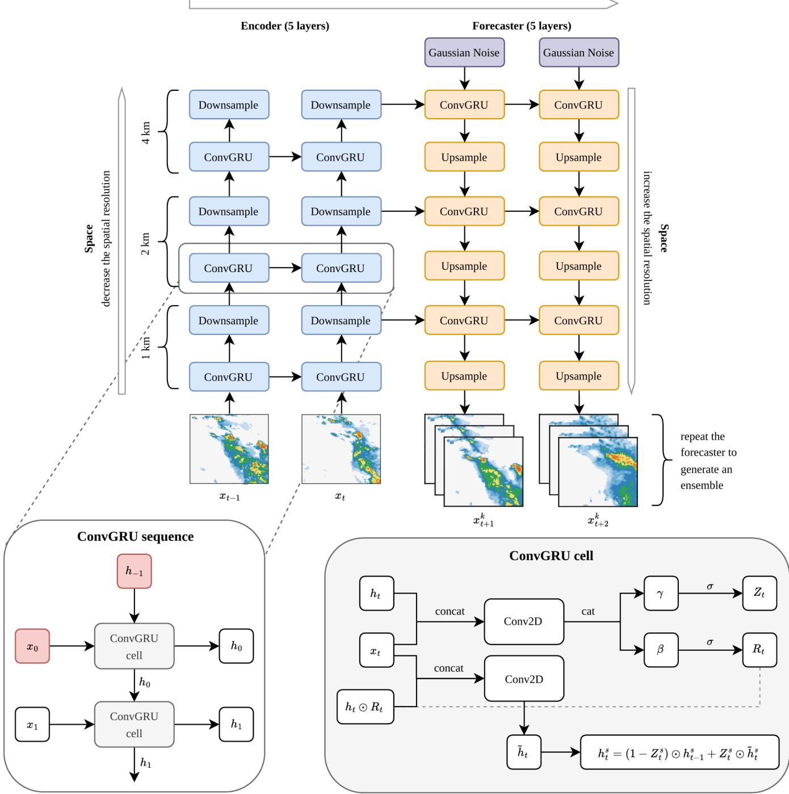
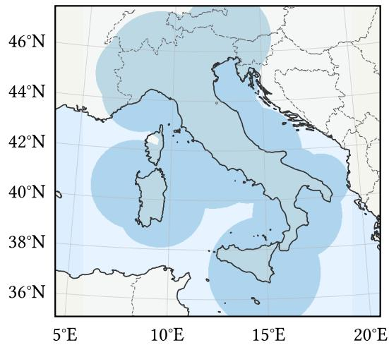
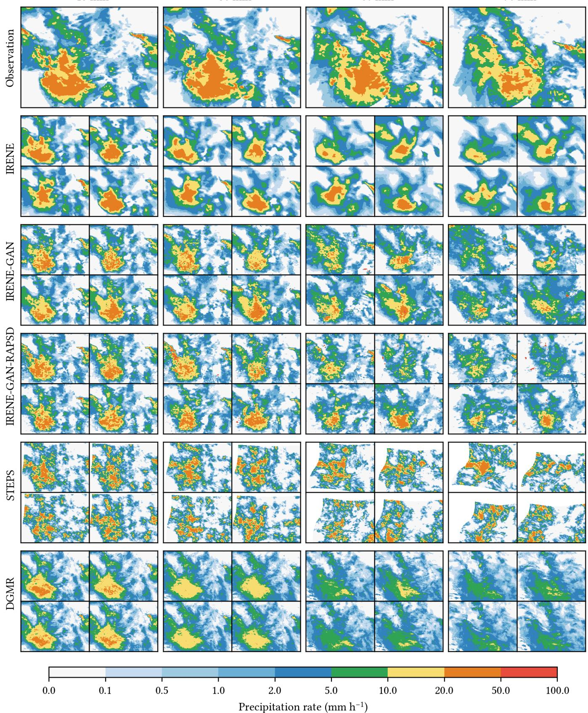
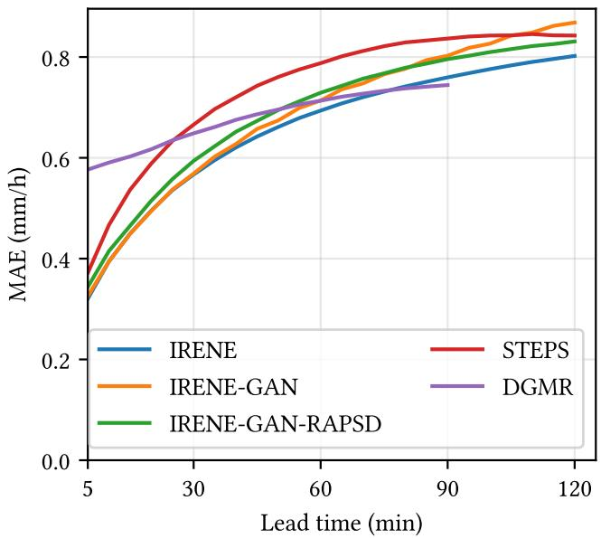
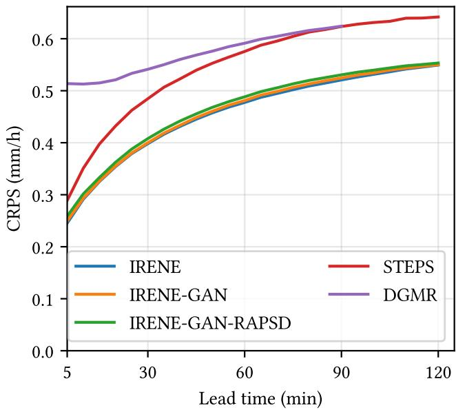
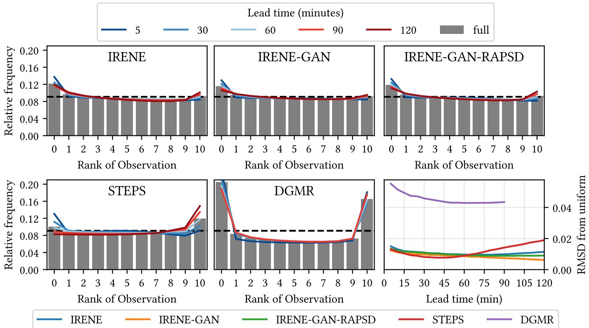
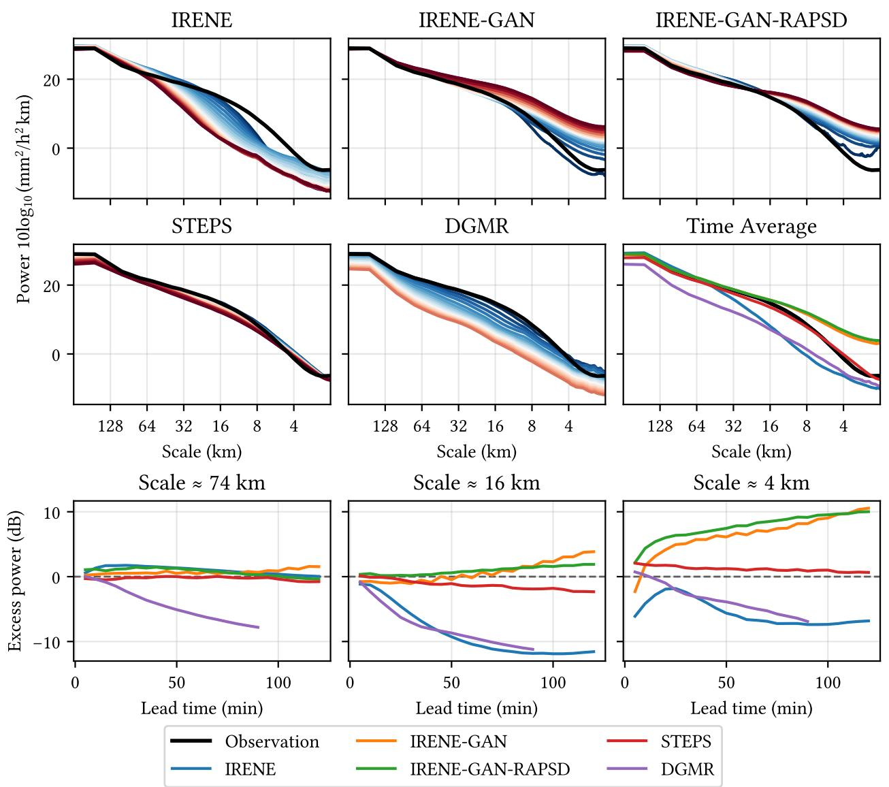

# IRENE: A Convolutional GRU Ensemble Model for Radar Precipitation Nowcasting over Italy

Alessandro Camilletti1,\*, Gabriele Franch1,\*, Elena Tomasi1, and Marco Cristoforetti1

1Fondazione Bruno Kessler

\*These authors contributed equally to this work.

Correspondence: Alessandro Camilletti (acamilletti@fbk.eu)

Abstract. We present IRENE (Italian Radar Ensemble Nowcasting Experiment), a deep learning model for probabilistic short-range precipitation nowcasting over the Italian domain at 1 km spatial and 5 min temporal resolution. IRENE adopts an encoder–forecaster architecture built on multi-scale Convolutional Gated Recurrent Units (ConvGRUs), trained on the national radar composite produced by the Italian Civil Protection Department (DPC). An importance-sampling scheme focuses training on precipitation-relevant events, while the almost-fair Continuous Ranked Probability Score (afCRPS) is adopted as the primary probabilistic loss function. Two additional training configurations are proposed: an adversarial (GAN) variant, IRENE-GAN, designed to improve the spatial sharpness of the generated forecasts, and a spectrally constrained variant, IRENE-GAN-RAPSD, in which the adversarial objective is complemented by an explicit penalty on the radially averaged power spectral density. The three configurations are evaluated against the stochastic extrapolation method STEPS and the pre-trained deep learning model DGMR. All IRENE configurations attain a lower Continuous Ranked Probability Score than both benchmarks at every lead time and rank histograms closer to uniformity, indicating better probabilistic skill and ensemble calibration. In terms of ensemble-mean mean absolute error the advantage is confined to the first 90 min, beyond which the strongly damped DGMR fields and, to a lesser extent, STEPS become competitive. Spectral analysis shows that the adversarial training removes the progressive loss of smallscale variance exhibited by IRENE, at the cost of an excess of fine-scale power at long lead times that the spectral penalty only partially controls.

## 1 Introduction

High-resolution precipitation nowcasting, with lead times ranging from a few minutes to about two hours, is a key component of modern hydrometeorological early-warning systems. It is particularly important for convective storms, urban hydrology, agriculture, and other weather-sensitive sectors where rapid changes in rainfall can have substantial societal and economic impacts. Operational stakeholders require short-range forecasts with both high spatial resolution and reliable uncertainty quantification to support civil protection, hydrological modeling, and critical infrastructure management.

Radar-based precipitation nowcasting has a long history, with early operational systems relying on optical-flow-based extrapolation of radar reflectivity fields. Classical Lagrangian extrapolation and stochastic ensemble schemes such as the Short-Term Ensemble Prediction System (STEPS) (Bowler et al., 2006) combine Lagrangian advection and stochastic perturbations to provide probabilistic nowcasts. However, these methods struggle in strongly non-stationary convective regimes, where optical-flow techniques are not sufficient.

More recently, deep learning has been applied to nowcasting, with convolutional recurrent models such as ConvLSTM and TrajGRU, as well as encoder– decoder architectures operating on radar mosaics producing deterministic forecasts (Shi et al., 2015, 2017; Agrawal et al., 2019; Ayzel et al., 2020; Franch et al., 2020). Deep generative models have further advanced the state of the art by explicitly modelling the distribution of future radar fields. Notable examples include DGMR (Ravuri et al., 2021), which uses a GAN-based formulation to generate sharp and realistic ensemble forecasts, and GPTCast (Franch et al., 2025), which tokenizes radar fields and applies a GPT-style forecaster to model precipitation evolution probabilistically.

Diffusion models have also been proposed for high-resolution precipitation nowcasting (Asperti et al., 2024). Yet, none of the existing works are trained on the entire Italian radar system, limiting their direct applicability to the Italian domain. IRENE is designed to bridge this gap by providing a robust probabilistic precipitation nowcasting model trained directly on the Italian radar archive.

In Italy, the national radar composite maintained by the Civil Protection Department (DPC) provides 1 km, 5 min surface rainfall estimates over the entire country, making it a natural target for nowcasting applications. In this work, we use the Analysis-Ready and Cloud-Optimised (ARCO) archive of this radar product introduced in Franch et al. (2026) to train and evaluate IRENE, a multi-scale encoder–forecaster model based on Convolutional Gated Recurrent Units (ConvGRUs). The underlying architecture was originally presented in Shi et al. (2015, 2017) and developed for deterministic nowcasting; here it is extended to probabilistic forecasting by injecting stochastic noise at the coarsest decoder scale to generate an ensemble of trajectories (Sect. 2.3) and by training with the almost-fair CRPS (afCRPS) as the primary objective (Sect. 4.1). Training sequences are selected from the whole archive by an importance sampler that favours relevant precipitation events. The almost-fair Continuous Ranked Probability Score (afCRPS) is used to guide the training, in order to obtain ensembles that are both consistent with the observed precipitation and whose spread correctly represents the forecast uncertainty.

The present paper focuses on the model architecture, the training configuration, the importance-sampling algorithm used to select relevant sequences, and the evaluation methodology of the trained model, while the Analysis-Ready and Cloud-Optimised (ARCO) archive of the Italian radar product is described in detail in Franch et al. (2026).

## 2 IRENE Model Architecture

Let $x _ { t - n + 1 } , \ldots , x _ { t }$ denote a sequence of n radar composite images, each defined on a regular cartesian grid of 1 km resolution and 5 min temporal sampling. The goal is to predict the subsequent m radar images $x _ { t + 1 } , \ldots , x _ { t + m }$ on the same grid as an ensemble of forecasts. Formally, the model learns a mapping from past fields to a predictive distribution over future fields, $( x _ { t - n + 1 } , \ldots , x _ { t } ) \mapsto { \mathcal { P } } ( x _ { t + 1 } , \ldots , x _ { t + m } )$

IRENE’s architecture is divided into a multi-scale ConvGRU encoder and an autoregressive ConvGRU forecaster, where the encoder produces a latent representation that the forecaster uses to generate the ensemble forecast.

## 2.1 Multi-scale ConvGRU encoder

IRENE employs a multi-scale Convolutional Gated Recurrent Unit (ConvGRU) encoder to extract spatio-temporal features from the input radar sequence. The encoder is composed of a hierarchy of ConvGRU blocks arranged from fine to coarse spatial scales. At each level, a ConvGRU processes the full input sequence along the temporal dimension and updates its hidden state at every time step. After the recurrent update, the feature maps are downsampled by a factor of two in each spatial dimension using a PixelUnshuffle operation, which trades spatial resolution for channel depth. Repeating this pattern across successive blocks produces a multi-scale representation in which temporal information is encoded jointly with increasingly coarse spatial context.

Let $h _ { t } ^ { s }$ denote the hidden state at scale s and time t, and let $\boldsymbol { x } _ { t } ^ { s }$ be the corresponding input feature map. The ConvGRU dynamics at scale s are given by

$$
Z _ { t } ^ { s } = \sigma \left( W _ { x z } ^ { s } \ast x _ { t } ^ { s } + W _ { h z } ^ { s } \ast h _ { t - 1 } ^ { s } + b _ { z } ^ { s } \right) ,\tag{1}
$$

$$
R _ { t } ^ { s } = \sigma \left( W _ { x r } ^ { s } * x _ { t } ^ { s } + W _ { h r } ^ { s } * h _ { t - 1 } ^ { s } + b _ { r } ^ { s } \right) ,\tag{2}
$$

$$
\tilde { h } _ { t } ^ { s } = \operatorname { t a n h } \left( W _ { x \tilde { h } } ^ { s } * x _ { t } ^ { s } + W _ { h \tilde { h } } ^ { s } * \left( R _ { t } ^ { s } \odot h _ { t - 1 } ^ { s } \right) + b _ { \tilde { h } } ^ { s } \right) ,\tag{3}
$$

$$
h _ { t } ^ { s } = \left( 1 - Z _ { t } ^ { s } \right) \odot h _ { t - 1 } ^ { s } + Z _ { t } ^ { s } \odot \tilde { h } _ { t } ^ { s } ,\tag{4}
$$

where ∗ denotes convolution, ⊙ denotes element-wise multiplication, and $\sigma$ is the logistic sigmoid function. The update, $Z _ { t } ^ { s } .$ , and reset, $R _ { t } ^ { s }$ , gates control how much information is retained from the previous hidden state and how much new information is incorporated from the current input. After processing all n input frames, the encoder outputs the final hidden states $\{ h _ { t } ^ { ( s ) } \}$ at all scales, which summarise the past precipitation evolution.

In the configuration used throughout this work the hierarchy comprises S = 5 blocks, so that the representation is progressively coarsened from 1 km to 32 km. The number of channels quadruples at every downsampling (PixelUnshuffle operation) step and the ConvGRU hidden size at each scale equals its input size; the channel widths are therefore not free parameters but follow from the input depth (Table 1). All gates use $3 \times 3$ convolutions, and the update and reset gates are computed by a single convolution whose output is split in two. For clarity, Fig. 1 sketches only three of the five scales. The resulting encoder has ≈ $; 3 . 8 \times 1 0 ^ { 6 }$ trainable parameters.

## 2.2 Autoregressive ConvGRU forecaster

The forecaster mirrors the encoder with a multi-scale ConvGRU hierarchy that operates from coarse to fine resolution and generates future radar frames in a recurrent autoregressive rollout. At the initial forecast time step, the forecaster is seeded with the encoder hidden states at each scale. In ensemble mode, stochastic noise is injected as the input to the decoder ConvGRU cells, introducing variability across ensemble members (see Sec. 2.3).

For each lead time $\tau = 1 , \dots , m$ , the forecaster updates the ConvGRU hidden states and produces a set of intermediate feature maps at each scale. PixelShuffle layers upsample and propagate information from coarse to fine scales, each of them dividing the number of channels by four; the last

Autoregressive encode of the past and decode (forecast) of the future

  
Figure 1. Schematic representation of the IRENE architecture. The encoder (top left) processes the past radar sequence through a multi-scale ConvGRU hierarchy, from 1 km to coarser resolutions. The forecaster (top right) autoregressively generates future frames using ConvGRU layers and upsampling operations, optionally conditioned on stochastic noise for ensemble generation. In the bottom, the ConvGRU sequence and cell are described

Table 1. Configuration of the IRENE encoder–forecaster, common to the three training configurations. The S = 5 blocks connect $S + 1 =$ 6 resolution levels.
<table><tr><td>Input sequence Training forecast horizon Verification forecast horizon Patch size Number of blocks, S</td><td>6 frames (30 min) 12 frames (60 min) 24 frames (120 min) 256 × 256 pixels (1 km)</td></tr></table>

block therefore returns a single-channel field at 1 km, and no additional projection head is required. The predicted field is finally clipped to the physical range of the transformed variable defined in Sect. 3.1. The forecaster has $6 . 0 \times 1 0 ^ { 7 }$ trainable parameters, an order of magnitude more than the encoder, since the coarsest and widest block (32 km, 1024 channels) is evaluated first.

The forecast is therefore generated autoregressively in hidden-state space: each step depends on the previous recurrent state, while the previous predicted radar field is not explicitly fed back as an input.

## 2.3 Stochastic ensemble head

To generate probabilistic forecasts, the forecaster is driven by stochastic noise rather than by a deterministic input. The coarsest decoder block receives no feature input from a previous block; the input is, at every lead time, a Gaussian noise $\eta _ { \tau } ^ { ( k ) } \sim \mathcal { N } ( 0 , I )$ of the same shape as the coarsest hidden state, drawn independently for each ensemble member $k =$ $1 , \ldots , K$ and each τ. The finer decoder blocks are then fed deterministically with the upsampled output of the block above, so that the stochasticity introduced at the 32 km scale is propagated and refined towards 1 km through the recurrent hidden states. Resampling the noise at every lead time, rather than drawing a single latent vector per member, lets the members diverge progressively as the forecast evolves, which is the behaviour required for the spread to grow with lead time. The forecaster is then run forward for m time steps, producing a stochastic trajectory $\{ \hat { x } _ { t + \tau } ^ { ( k ) } \} _ { \tau = 1 } ^ { m }$

Repeating this procedure for K ensemble members yields an empirical predictive distribution at each grid point and lead time. The ensemble size K can be chosen at training time for the loss evaluation and can be increased at inference time if computational resources allow. Together, the encoder and forecaster form a generator of $6 . 4 \times 1 0 ^ { 7 }$ trainable parameters. Unless stated otherwise, all IRENE results in this paper use $K = 1 0$ at training and inference.

The resulting configuration is summarised in Table 1.

  
Figure 2. Spatial domain of the IT-DPC-SRI dataset. Shaded area indicates radar coverage, defined as grid cells containing at least one valid observation.

## 3 Dataset

The training and evaluation dataset is derived from the Italian IT-DPC-SRI radar composite, which provides a national mosaic of surface rainfall estimates at 1 km spatial resolution and 5 min temporal resolution. A long-term archive of this composite, covering more than a decade of observations, is ingested and harmonised into a single Zarr-based ARCO datacube. The harmonisation includes regridding to a common domain and projection, handling missing data and format changes, and applying consistent metadata. An overview of the spatial coverage of the Italian domain is shown in Fig. 2. The details of the ARCO datacube construction are described in Franch et al. (2026).

For the IRENE experiments, the period from 1 January 2021 to 11 December 2025 is used for model training, validation, and testing. We train the model on $2 5 6 \times 2 5 6$ patches of 18 timesteps, with six provided as input and twelve as target ground truth. Training sequences are drawn from the archive in two stages: a data-cleaning step (Sect. 3.2) that filters candidate space–time cubes for data quality, followed by an importance-sampling step (Sect. 3.3) that selects meteorologically relevant sequences from the cleaned pool.

## 3.1 Preprocessing

The models do not operate on rain rates directly. Each rain-rate field $R \ ( \mathrm { m m h ^ { - 1 } } )$ is first converted to equivalent reflectivity through the Marshall–Palmer relation $Z =$ 200 $R ^ { 1 . 6 }$ , expressed in decibels,

$$
\mathcal { Z } = 1 0 \log _ { 1 0 } \left( 2 0 0 R ^ { 1 . 6 } \right) ,\tag{5}
$$

clipped to the interval [0,60] dBZ and linearly rescaled to [−1, 1]. The inverse transformation is applied to the model output before verification, so that all scores reported in Sect. 6 are expressed in $\mathrm { m m h ^ { - 1 } }$ . This choice compresses the strongly skewed rain-rate distribution into a bounded variable with an approximately uniform dynamic range, which is better conditioned for optimisation. It also imposes two physical bounds on the forecasts: rain rates below $0 . 0 3 7 \mathrm { m m h ^ { - 1 } }$ corresponding to 0 dBZ, are mapped to the lower limit, and intensities are capped at 60 dBZ, i.e. approximately $2 0 5 \mathrm { m m h ^ { - 1 } }$ . Both losses and verification of the deep learning models are therefore insensitive to variability outside this range. Note that the afCRPS loss (Sec. 4.1) is computed in the transformed space, so that a given error is penalised similarly whether it occurs at a low or a high rain rate, rather than errors at high rain rates being penalised more heavily, as they would be if the loss were computed directly in mm h−1.

## 3.2 Data Cleaning

Candidate space–time cubes are enumerated on a regular grid covering the whole archive and the full study period, with a stride of 3 timesteps (15 min) in time and of 16 pixels (16 km) in each horizontal direction; each candidate has the full $2 4 \times 2 5 6 \times 2 5 6$ cube dimensions. Every candidate is screened against two data-quality criteria before being made available to the importance sampler of Sect. 3.3. The first criterion is temporal continuity: all 24 radar acquisitions of a candidate cube must be spaced by the nominal 5 min interval, with no missing timestep in the underlying archive. The second criterion caps the number of missing (NaN) pixels within the cube at $1 0 ^ { 4 }$ , i.e. less than 1% of its $2 4 \times 2 5 6 \times 2 5 6 \approx 1 . 5 7 \times 1 0 ^ { 6 }$ points. Because this threshold constrains but does not eliminate missing data, up to $1 0 ^ { 4 }$ NaN pixels can remain in an accepted cube; these residual gaps are replaced with the minimum value of the normalised input range (Sect. 3.1), equivalent to the no-precipitation state, before the sequence is passed to the network. Because the 1% threshold is applied to the full 256×256 cube, it preferentially retains candidates drawn from the well-covered interior of the domain (Fig. 2) and excludes most candidates straddling the radar-coverage boundary, so the training population underrepresents precipitation behaviour near the edges of the operational domain.

## 3.3 Importance Sampling

To focus training on meteorologically relevant precipitation events, we employ an importance sampling strategy adapted from Ravuri et al. (2021). Starting from the cleaned candidate pool of Sect. 3.2, a candidate patch is accepted with probability

$$
q = \operatorname* { m i n } \left( 1 , q _ { \operatorname* { m i n } } + c \cdot \overline { { \mathcal { R } } } \right) ,\tag{6}
$$

where $\overline { { \mathcal { R } } }$ denotes the time- and space-averaged rain rate within the patch, transformed via $\overline { { \mathcal { R } } } \mapsto 1 - e ^ { - \overline { { \mathcal { R } } } / s }$ . The parameters are set to $q _ { \mathrm { m i n } } = 1 0 ^ { - 4 } , c = 0 . 1$ , and $s = 1 \mathrm { m m h ^ { - 1 } }$ , yielding a selection probability that increases monotonically with average rainfall intensity while guaranteeing that even “dry” patches have a small but non-zero chance of selection.

The retained cubes are split sequentially into training (90%), validation (5%), and test (5%) sets. The procedure retains 359000 space–time cubes, which the sequential split assigns to 323100 training, 17950 validation and 17950 test samples.

Because the candidate grid of Sect. 3.2 has a stride of three timesteps while each cube spans twenty-four, consecutive samples can share frames if their starting indices differ by less than the cube length. This occurs exactly at the trainvalidation and validation-test split boundaries. The leakage affects two samples out of 359000 and cannot influence the verification statistics.

## 3.4 Data Augmentation

To increase the effective sample size and improve model generalisation, on-the-fly spatial and temporal data augmentation is applied during training.

Spatially, each sampled radar sequence is subjected to random transformations that preserve the statistical structure of precipitation fields, specifically 90, 180 or 270-degree rotations and horizontal or vertical flips. Formally, for each training sample, a random element g is drawn from the dihedral group $D _ { 4 }$ of square symmetries and applied uniformly to both the input and target frames. Composing these discrete rotations and reflections yields up to eight distinct spatial augmentations per original sequence.

Temporally, we exploit the difference between the sampled patch length and the required sequence length. While the importance sampler extracts continuous datacubes of 24 timesteps, the model requires only 18 timesteps per sample (6 for the past context and 12 for the forecast target). During loading, the starting timestep $t _ { \mathrm { s t a r t } }$ of the 18-step sequence is chosen uniformly at random from the available 7-step sliding window within the 24-step patch.

Combining the 8 spatial symmetries with the 7 possible temporal shifts yields up to 56 distinct augmented views for every extracted radar patch.

## 4 Training

The IRENE architecture can be trained under different paradigms depending on the forecasting objective. We detail three configurations: a stochastic ensemble formulation, a generative adversarial network (GAN) designed to produce meteorologically realistic precipitation fields, and a spectrally constrained variant of the latter, in which the adversarial objective is complemented by an explicit penalty on the radially averaged power spectral density of the forecast fields.

## 4.1 Ensemble Configuration

To quantify forecast uncertainty, IRENE is trained as a stochastic model that produces an ensemble of future trajectories. At each training sample, K = 10 ensemble members are generated using independent noise realisations. The model is optimised using a strictly proper scoring rule, specifically the almost-fair Continuous Ranked Probability Score (afCRPS), that we describe below.

For a predictive cumulative distribution function (CDF) F and an observed value y, the CRPS is defined as

$$
\mathrm { C R P S } ( F , y ) = \intop _ { - \infty } ^ { \infty } \left( F ( z ) - \mathbb { 1 } _ { \left\{ z \geq y \right\} } \right) ^ { 2 } \mathrm { d } z ,\tag{7}
$$

where $\mathbb { 1 } _ { \{ z \geq y \} }$ is the indicator function. When F is represented by a finite ensemble $\{ y ^ { ( k ) } \} _ { k = 1 } ^ { K }$ , the integral in Eq. (7) can be evaluated analytically, yielding the energy-form estimator:

$$
\widehat { \mathrm { C R P S } } _ { K } = \frac { 1 } { K } \sum _ { k = 1 } ^ { K } \lvert y ^ { ( k ) } - y \rvert - \frac { 1 } { 2 K ^ { 2 } } \sum _ { k = 1 } ^ { K } \sum _ { j = 1 } ^ { K } \lvert y ^ { ( k ) } - y ^ { ( j ) } \rvert .\tag{8}
$$

Because the standard CRPS estimator is positively biased for finite K, we follow Lang et al. (2026) and employ the almostfair CRPS (afCRPS) as the primary training objective. For an ensemble forecast $\{ y ^ { ( k ) } \} _ { k = } ^ { \bar { K } }$ and observation $y ,$ the α-fair variant is defined as:

$$
\mathcal { L } _ { \mathrm { a f C R P S } } = \frac { 1 } { 2 K ( K - 1 ) } \sum _ { k = 1 } ^ { K } \sum _ { j = 1 \atop j \neq k } ^ { K } \Bigl ( \vert y ^ { ( k ) } - y \vert + \vert y ^ { ( j ) } - y \vert\tag{9}
$$

where $\varepsilon = ( 1 - \alpha ) / K$ and $\alpha \in ( 0 , 1 ]$ controls the degree of fairness. Setting $\alpha = 1$ recovers the perfectly fair CRPS, while $\alpha \lesssim 1$ slightly relaxes the spread term to avoid degeneracies for small ensemble sizes. Following Lang et al. (2026), we use $\alpha = 0 . 9 5$

To further regularize the temporal coherence of the ensemble trajectories and prevent unrealistic frame-to-frame jumps, we introduce a temporal consistency penalty:

$$
\mathcal { L } _ { \mathrm { t e m p } } = \frac { 1 } { m - 1 } \sum _ { \tau = 1 } ^ { m - 1 } \frac { 1 } { K } \sum _ { k = 1 } ^ { K } \bigl | y _ { \tau + 1 } ^ { ( k ) } - y _ { \tau } ^ { ( k ) } \bigr | .\tag{10}
$$

The total reconstruction objective for the ensemble configuration is then given by:

$$
\mathcal { L } _ { \mathrm { r e c } } = \mathcal { L } _ { \mathrm { a f C R P S } } + \lambda _ { \mathrm { t e m p } } \mathcal { L } _ { \mathrm { t e m p } } ,\tag{11}
$$

where $\lambda _ { \mathrm { t e m p } } \geq 0$ is a tunable hyperparameter. This combined loss encourages the model to accurately capture both the conditional mean and the predictive spread while maintaining smooth temporal evolution. A value of $\lambda _ { \mathrm { t e m p } } =$ 0.01 was sufficient to guarantee temporal consistency between consecutive frames.

## 4.2 Generative Adversarial Network

While the afCRPS loss produces well-calibrated probabilistic forecasts, models optimised solely on pixel loss often struggle to generate the sharp, high-frequency structural details characteristic of real precipitation fields. To overcome this, we extend the ensemble configuration into a generative adversarial network (GAN) framework.

In this setup, the ConvGRU encoder–forecaster acts as a generator G, trained with the afCRPS-based reconstruction loss ${ \mathcal { L } } _ { \mathrm { r e c } }$ (Eq. 11), with $\lambda _ { \mathrm { t e m p } } = 0$ . Simultaneously, a 3- D PatchGAN discriminator network D (Isola et al., 2017) is trained to classify overlapping spatial patches as real (observations) or fake (model predictions). The discriminator is a three-dimensional PatchGAN: three strided convolutional blocks with $3 \times 4 \times 4$ kernels in the (time, latitude, longitude) directions, batch normalisation and leaky ReLU activations, followed by two unit-stride blocks that output a map of patchwise logits. With the base width of 16 used here (Table 2), this amounts to $5 . 2 \times 1 0 ^ { 5 }$ trainable parameters. Because the convolutions are three-dimensional, the discriminator judges the joint spatio-temporal structure of the forecast sequence rather than the texture of isolated frames, and therefore also penalises temporally inconsistent evolutions. It is trained with a hinge loss and, in IRENE-GAN, is activated only after a warm-up of $4 \times 1 0 ^ { 5 }$ optimisation steps, so that the adversarial term starts acting on a generator that already produces meaningful fields. By evaluating local patches rather than a single global score, the discriminator explicitly models the high-frequency structure, penalising locally unrealistic textures and encouraging the generator to produce sharp, finescale precipitation patterns.

The adversarial training employs a hinge loss to enforce a margin between the discriminator outputs, thereby stabilising the training dynamics. Let x denote the true observed fields and xˆ denote the model predictions. The discriminator D minimises the objective:

$$
\mathcal { L } _ { D } = \mathbb { E } _ { x } \left[ \operatorname* { m a x } ( 0 , 1 - D ( x ) ) \right] + \mathbb { E } _ { \hat { x } } \left[ \operatorname* { m a x } ( 0 , 1 + D ( \hat { x } ) ) \right] .\tag{12}
$$

Conversely, the generator seeks to fool the discriminator by minimising the adversarial loss:

$$
\mathcal { L } _ { \mathrm { a d v } } = - \mathbb { E } _ { \hat { x } } \left[ D ( \hat { x } ) \right] .\tag{13}
$$

Importantly, at every training step the discriminator evaluates one ensemble member drawn at random for each element of the batch, rather than the ensemble mean, so that the adversarial penalty encourages realism in every distinct stochastic realisation instead of in their average, which is by construction smoother.

A common challenge in adversarial forecasting is balancing the adversarial penalty with the primary reconstruction objective. If adversarial gradients dominate, they can destabilise training and degrade overall forecast accuracy.

To mitigate this, we employ the dynamic adaptive weighting mechanism proposed by Esser et al. (2021). At each training step, an adaptive weight λ is computed as the ratio of the gradient norms of the reconstruction and adversarial losses, evaluated with respect to the weights of the generator’s final layer, $\theta _ { \mathrm { l a s t } }$

$$
\lambda = \frac { \| \nabla _ { \theta _ { \mathrm { l a s t } } } \mathcal { L } _ { \mathrm { r e c } } \| } { \| \nabla _ { \theta _ { \mathrm { l a s t } } } \mathcal { L } _ { \mathrm { a d v } } \| + \epsilon } ,\tag{14}
$$

where $\epsilon = 1 0 ^ { - 4 }$ ensures numerical stability and λ is clipped to $[ 0 , 1 0 ^ { 4 } ]$ and treated as a constant in the backward pass. The total objective for the generator is finally formulated as:

$$
\mathcal { L } _ { \mathrm { t o t a l } } = \mathcal { L } _ { \mathrm { r e c } } + w _ { D } \lambda \mathcal { L } _ { \mathrm { a d v } } ,\tag{15}
$$

where $w _ { D }$ is a fixed scalar hyperparameter. This adaptive scaling ensures that the adversarial gradients remain comparable with the reconstruction gradients throughout training, allowing the model to smoothly refine highfrequency details without compromising the probabilistic accuracy dictated by the afCRPS. We set $w _ { D } = 0 . 0 4$ in both adversarial configurations.

## 4.3 Spectrally constrained GAN

The adversarial objective of Sect. 4.2 rewards locally realistic texture, but it does not explicitly constrain how variance is distributed across spatial scales. We therefore consider a third configuration, denoted IRENE-GAN-RAPSD, in which the generator objective is augmented with a direct penalty on the radially averaged power spectral density (RAPSD) of the forecast fields.

The RAPSD is computed from a rain-rate field $r ( x , y )$ defined on a grid of size $N _ { x } \times N _ { y }$ with spacings dx and $d y$ . The field is first multiplied by a two-dimensional Hann window $w ( x , y )$ and transformed with a two-dimensional discrete Fourier transform, giving the two-dimensional PSD

$$
P ( k _ { x } , k _ { y } ) = | \hat { r } ( k _ { x } , k _ { y } ) | ^ { 2 } d x d y / \big ( N _ { x } N _ { y } \langle w ^ { 2 } \rangle \big ) ,\tag{16}
$$

where $k _ { x }$ and $k _ { y }$ are the Fourier wavenumbers and $\langle w ^ { 2 } \rangle$ is the mean squared window amplitude. Integration in circular coordinates yields the radial spectrum

$$
\mathrm { P S D } _ { \mathrm { r a d } } ( k ) = k \intop _ { 0 } ^ { 2 \pi } P ( k , \theta ) d \theta ,\tag{17}
$$

with $k = \sqrt { k _ { x } ^ { 2 } + k _ { y } ^ { 2 } }$ the radial wavenumber and $P ( k , \theta )$ the two-dimensional PSD in polar coordinates. Equation (17) describes how variance is distributed across spatial scales, from the domain scale to the Nyquist limit, i.e. 2 km for the radar data on which the model is trained.

During training, Eq. (17) is estimated in a windowed, Welch-like fashion rather than on the full field. Each predicted and observed frame is decomposed into overlapping square windows of $6 4 \times 6 4$ pixels with a stride of 32 pixels (50% overlap), so that the constraint acts on scales up to ≈ 64km. Within each window the mean is subtracted before tapering, so that errors in the local rain amount are left to the reconstruction term instead of leaking across wavenumbers through the taper. The spectrum is discretised into $n _ { b } = 3 2$ radial wavenumber bins and expressed in $\log _ { 1 0 }$ units, and the window log-spectra are averaged over window positions, yielding one log-spectrum per ensemble member and lead time. Matching is therefore performed at the frame level rather than window by window: pairing spectra by location would penalise members that legitimately displace precipitation and would encourage the injection of spurious texture into dry regions. Denoting by $\widehat { P } ^ { ( \bar { k } ) } ( k _ { b } )$ and $P ( k _ { b } )$ the frame-averaged radial log-spectra of member k and of the observation, and by $K _ { \mathrm { s p e c } }$ the number of members entering the penalty, the spatial component is

$$
\mathcal { L } _ { \mathrm { s p e c } } ^ { \mathrm { s p a t } } = \frac { 1 } { K _ { \mathrm { s p e c } } n _ { b } } \sum _ { k = 1 } ^ { K _ { \mathrm { s p e c } } } \sum _ { b = 1 } ^ { n _ { b } } \bigl | \widehat { P } ^ { ( k ) } ( k _ { b } ) - P ( k _ { b } ) \bigr | ,\tag{18}
$$

averaged over lead times. Because forecast and observation are processed identically, the normalisation of Eq. (16) and the azimuthal factor of Eq. (17) are common to both terms and cancel in the log-space difference.

A purely spatial constraint can be satisfied by a temporally frozen texture, whose spectrum is correct at every frame while its temporal evolution is not. To prevent this degenerate solution, a second component compares temporal power spectra: a one-dimensional Fourier transform is applied per pixel along the lead-time axis after removal of the temporal mean, the resulting power is averaged over pixels within each of the same $6 4 \times 6 4$ windows used for the spatial term, and the window log-spectra are averaged over window positions, yielding one temporal log-spectrum per ensemble member and lead time, with the zero-frequency bin discarded. Denoting by $\overline { { Q } } ^ { ( k ) } ( f )$ and $\overline { { Q } } ( f )$ the frame-averaged temporal log-spectra of member k and of the observation at temporal frequency $f = 1 , \ldots , \lfloor m / 2 \rfloor$ (m being the forecast length of Sect. 2), the temporal component is

$$
\mathcal { L } _ { \mathrm { s p e c } } ^ { \mathrm { t e m p } } = \frac { 1 } { K _ { \mathrm { s p e c } } \lfloor m / 2 \rfloor } \sum _ { k = 1 } ^ { K _ { \mathrm { s p e c } } \lfloor m / 2 \rfloor } \sum _ { f = 1 } ^ { \lfloor m / 2 \rfloor } | \overline { { Q } } ^ { ( k ) } ( f ) - \overline { { Q } } ( f ) | .\tag{19}
$$

Both components enter the spectral penalty with equal weight, $\mathcal { L } _ { \mathrm { s p e c } } = \bar { \mathcal { L } } _ { \mathrm { s p e c } } ^ { \mathrm { s p a t } } + \mathcal { L } _ { \mathrm { s p e c } } ^ { \mathrm { t e m p } }$ . To bound the memory cost of the Fourier transforms, the penalty is evaluated on $K _ { \mathrm { s p e c } } = 2$ randomly drawn ensemble members at each training step, which leaves the estimator unbiased in expectation.

The generator objective then becomes

$$
\begin{array} { r } { \mathcal { L } _ { \mathrm { t o t a l } } = \mathcal { L } _ { \mathrm { r e c } } + w _ { D } \lambda \mathcal { L } _ { \mathrm { a d v } } + w _ { S } \mathcal { L } _ { \mathrm { s p e c } } , } \end{array}\tag{20}
$$

where wS is a fixed scalar hyperparameter, set to $w _ { S } = 0 . 0 2$ The spectral term is deliberately kept outside $\mathcal { L } _ { \mathrm { r e c } }$ when computing the adaptive weight λ, so that adding it does not implicitly rescale the adversarial contribution.

Table 2. Optimisation and loss hyperparameters of the three IRENE configurations. Dashes denote entries that do not apply. The discriminator architecture, its parameter count, its warm-up schedule, and the RAPSD-specific hyperparameters (w , spectral window, $n _ { b }$ , members per spectral step) are configuration-specific implementation details reported in the text (Sect. 4.2 and Sect. 4.3) rather than tabulated here.
<table><tr><td></td><td>IRENE</td><td>IRENE -GAN</td><td>IRENE-GAN -RAPSD</td></tr><tr><td>Optimiser</td><td>Adam</td><td>Adam</td><td>Adam</td></tr><tr><td>Learning rate</td><td> $1 0 ^ { - 4 }$ </td><td> $1 0 ^ { - 4 }$ </td><td> $1 0 ^ { - 4 }$ </td></tr><tr><td>Batch size</td><td>32</td><td>16</td><td>32</td></tr><tr><td>Training ensemble K</td><td>10</td><td>10</td><td>10</td></tr><tr><td>afCRPS fairness α</td><td>0.95</td><td>0.95</td><td>0.95</td></tr><tr><td> $\lambda _ { \mathrm { t e m p } }$ </td><td>0.01</td><td>0.01</td><td>0.01</td></tr><tr><td>Discriminator width</td><td></td><td>16</td><td>16</td></tr><tr><td>Adversarial weight  $w _ { D }$ </td><td></td><td>0.04</td><td>0.04</td></tr></table>

IRENE-GAN-RAPSD is not trained from scratch: it is initialised from the best checkpoint of the IRENE-GAN training chain and fine-tuned with the spectral term added to the generator objective, all other settings being unchanged and the discriminator active from the first fine-tuning step. Its scores therefore isolate the effect of adding the spectral penalty to an already adversarially trained model, rather than the effect of optimising the two terms jointly from the start.

## 4.4 Training setup

The optimisation settings of the three configurations are summarised in Table 2. All models are trained on $2 5 6 \times$ 256 patches of 18 timesteps, with 6 input and 12 target frames, using Adam with a learning rate of $1 0 ^ { - 4 }$ on a single GPU, and the afCRPS is evaluated on $K = 1 0$ ensemble members. In the adversarial configurations the generator and the discriminator are updated alternately at each step by two separate optimisers sharing the same learning rate, and the discriminator configuration is identical in IRENE-GAN and IRENE-GAN-RAPSD, so that differences between the two can be attributed to the spectral penalty. Training is stopped when the validation loss ceases to improve and the checkpoint with the lowest validation loss is retained.

## 5 Evaluation metrics

Model performance is assessed using complementary deterministic and probabilistic metrics. Deterministic performance is quantified using the Mean Absolute Error (MAE) of the ensemble mean, while probabilistic skill is evaluated using the Continuous Ranked Probability Score (CRPS, Gneiting and Raftery, 2007) and rank histograms (Hamill, 2001). In addition, we compute the radial power spectral density (PSD) to compare the spatial sharpness of the forecasts with the ground truth. All metrics are evaluated at each forecast lead time $\tau \in \{ 1 , \ldots , T \}$ and averaged over the evaluation period and spatial domain.

## 5.1 Mean Absolute Error (MAE)

To evaluate the models trained with a pixel-wise reconstruction objective, we use the Mean Absolute Error (MAE). Let $\hat { y } _ { i , \tau }$ denote the ensemble mean forecast at spatial grid point i and lead time τ, and let $y _ { i , \tau }$ be the corresponding observed radar rainfall. For a spatial domain of N grid points, the spatial MAE at lead time τ is defined as

$$
\mathrm { M A E } ( \tau ) = \frac { 1 } { N } \sum _ { i = 1 } ^ { N } \bigl | \hat { y } _ { i , \tau } - y _ { i , \tau } \bigr | .\tag{21}
$$

MAE provides a straightforward and robust measure of gridpoint accuracy by quantifying the average magnitude of absolute errors between predicted and observed precipitation. It offers an interpretable assessment of typical prediction errors across the spatial domain and lead times. However, as a purely point-wise metric, it does not explicitly capture spatial structure or displacement effects, and therefore does not directly reflect the realism or sharpness of predicted precipitation patterns.

## 5.2 Continuous Ranked Probability Score

The Continuous Ranked Probability Score (CRPS) is a strictly proper scoring rule that generalises the mean absolute error to probabilistic forecasts. Being a strictly proper scoring rule, the CRPS is minimised in expectation if and only if the CDF, F, equals the true data-generating distribution, simultaneously rewarding calibration and sharpness. The CRPS is evaluated pointwise at each grid point and lead time using the ensemble of predicted intensities, and then averaged over space and time. The mean CRPS is obtained by averaging Eq. (8) over all grid points, i, in the set of spatial points, Ω, and all evaluation samples in the test set:

$$
\overline { { \mathrm { C R P S } } } ( \tau ) = \frac { 1 } { \vert \Omega \vert \cdot N _ { \mathrm { t e s t } } } \sum _ { n = 1 } ^ { N _ { \mathrm { t e s t } } } \sum _ { i \in \Omega } \widehat { \mathrm { C R P S } } _ { K } \left( \{ y _ { n , i , \tau } ^ { ( k ) } \} , y _ { n , i , \tau } \right) ,\tag{22}
$$

where $y _ { n , i , \tau }$ denotes the observed radar intensity at grid point $i ,$ lead time $\tau ,$ and test sample n. A lower value of CRPS indicates better probabilistic skill.

## 5.3 Rank Histogram

The rank histogram (also known as the Talagrand diagram) provides a non-parametric diagnostic of ensemble calibration. For a scalar observation y and a K-member ensemble

$\{ y ^ { ( k ) } \} _ { k = 1 } ^ { K }$ , the rank r of $y$ within the augmented sequence ${ \bar { ( y ^ { ( 1 ) } , \ldots , y ^ { ( K ) } , y ) } }$ is computed as

$$
r = 1 + \sum _ { k = 1 } ^ { K } \mathbb { 1 } _ { \{ y ^ { ( k ) } < y \} } + \left\lfloor U \left( 1 + \sum _ { k = 1 } ^ { K } \mathbb { 1 } _ { \{ y ^ { ( k ) } = y \} } \right) \right\rfloor ,\tag{23}
$$

so that $r \in \{ 1 , \ldots , K + 1 \}$ . The first term counts the ensemble members strictly below $y ,$ and $U$ is an independent random variable drawn uniformly from [0,1) for each grid point and evaluation sample. Denoting by $\begin{array} { r } { t = \sum _ { k = 1 } ^ { K } \mathbb { 1 } _ { \{ y ^ { ( k ) } = y \} } } \end{array}$ the number of ensemble members exactly tied with $y ,$ the floor $\lfloor U ( 1 + t ) \rfloor$ is uniformly distributed over the integers $\{ 0 , 1 , \ldots , t \}$ ; the second term of Eq. (23) therefore resolves ties by drawing r uniformly among the t + 1 ranks consistent with the block of members equal to $y ,$ following standard practice for verifying variables with discretised or bounded support (Hamill, 2001). Ties of this kind arise systematically for radar-derived precipitation, whose distribution has a point mass at zero: prior to rank computation, observed and forecast intensities below the common detectability threshold of $0 . 0 3 7 \mathrm { m m h ^ { - 1 } }$ are set to zero for every model, so that the no-precipitation state is represented identically across observations and all forecasting systems irrespective of their native minimum resolvable intensity. Ranks are accumulated with the pysteps implementation (Pulkkinen et al., 2019). The rank histogram is the empirical frequency distribution of r over all valid (non-missing) grid points and evaluation samples.

For a perfectly calibrated ensemble, observations are statistically indistinguishable from ensemble members, and the rank histogram should be uniform. Systematic deviations from uniformity diagnose specific issue in the forecast:

– a U-shaped histogram indicates ensemble underdispersion (too narrow spread relative to the observations);

– a dome-shaped histogram indicates overdispersion;

– a monotone slope indicates a systematic bias in the ensemble mean.

The rank histogram is computed both at each forecast lead time τ, to track the evolution of calibration as the forecast horizon increases, and for the overall forecast.

To condense this lead-time-resolved diagnostic into a single summary curve, we also report the root-mean-square deviation (RMSD) of the rank histogram from uniformity,

$$
\begin{array} { l } { \displaystyle \mathrm { R M S D } ( \tau ) = } \\ { \displaystyle \sqrt { \frac { 1 } { K + 1 } \sum _ { r = 1 } ^ { K + 1 } \left( p _ { r } ( \tau ) - \frac { 1 } { K + 1 } \right) ^ { 2 } } , } \end{array}\tag{24}
$$

where $p _ { r } ( \tau )$ is the empirical frequency of rank r at lead time τ (the bar heights of the rank histogram). Larger values

of $\mathrm { R M S D } ( \tau )$ indicate a stronger departure from the ideal uniform histogram; this quantity is shown as a function of lead time in the bottom-right panel of Figure 6.

## 5.4 Radial power spectral density

The comparison of radial power spectral densities (PSDs) provides a description of how different models distribute variance across spatial scales. It reveals whether a model reproduces the observed large-scale and small-scale variability, or whether it exhibits systematic deficiencies such as excessive smoothing or spurious high-wavenumber noise. A model whose spectrum lies below the reference at large wavenumbers underrepresents fine-scale structure, whereas an excess of power at those scales indicates artificial small-scale variability. Agreement at low wavenumbers but divergence at high wavenumbers suggests that the model captures the dominant large-scale features while failing to represent convective structures.

As a verification diagnostic, the radial PSD of Eq. (17) is evaluated on the full forecast domain, at each lead time and for each ensemble member, rather than on the subdomains used for the training penalty of Sect. 4.3. The diagnostic therefore resolves scales from the domain scale to the Nyquist limit, and is applied identically to all models, including those not trained with a spectral constraint.

Excess power is defined as the difference, in dB, between a model’s radially averaged power spectral density and that of the observation at a given scale and lead time; positive values indicate that the model generates more power (i.e., more finescale variance) than observed, while negative values indicate a deficit.

## 5.5 Benchmark models

To comprehensively evaluate the predictive skill of the proposed IRENE configurations, we compare their performance against two established benchmark models. These baselines were selected to represent the two primary paradigms in modern precipitation nowcasting: traditional operational extrapolation and state-of-the-art deep learning. Specifically, we employ the Short-Term Ensemble Prediction System (STEPS) (Bowler et al., 2006) as the standard for probabilistic optical-flow methods, providing a robust baseline for short-term kinematic advection. As the deep learning benchmark, we use the Deep Generative Model of Rainfall (DGMR) (Ravuri et al., 2021), a well-established adversarial architecture for generative precipitation forecasting. Together, these models provide a comprehensive framework to assess the relative advantages of IRENE.

## 5.5.1 STEPS

As a classical probabilistic baseline, we use STEPS to generate ensemble nowcasts from the same IT-DPC-SRI radar composite input. STEPS combines Lagrangian advection of observed radar fields with stochastic perturbations designed to reproduce the observed scale-dependent variability of precipitation fields. Operational implementations at kilometrescale resolution and 5-minute timestep—such as those used by the UK Met Office and MeteoSwiss—provide a strong reference for evaluating deep-learning-based nowcasting systems.

In our implementation, STEPS is run via the pysteps library (Pulkkinen et al., 2019) with the following configuration. The motion field is estimated from consecutive radar frames using the Lucas–Kanade optical-flow algorithm (Lucas and Kanade, 1981). The stochastic forecast is then generated over N = 24 lead times (120 min) using 6 cascade levels and a second-order autoregressive (AR(2)) model for the temporal evolution of each level. Stochastic noise is generated using a non-parametric method and perturbed velocity fields are added following the scheme of Bowler et al. (2006). Ensemble members are post-processed using CDF matching against the observed precipitation distribution to correct systematic biases in the ensemble marginal distribution. Precipitation below a threshold of 5.0dBZ is masked using an incremental masking strategy. The spatial resolution and timestep are set to match the IT-DPC-SRI composite at 1 km/pixel and 5 min, respectively. STEPS is initialised with the same 6 input frames (30 min) as IRENE, and the number of ensemble members K is set to 10, equal to that used at inference by all models.

## 5.5.2 DGMR

The Deep Generative Model for Rainfall (DGMR) (Ravuri et al., 2021) is a state-of-the-art deep learning baseline for probabilistic precipitation nowcasting. Built around an architecture featuring context conditioning and a convolutional gated recurrent unit (ConvGRU) sampler, DGMR is trained via a purely adversarial framework. It employs both spatial and temporal discriminators to enforce structural realism and meteorological consistency across the generated forecast trajectories. Its ability to produce probabilistically sharp and realistic precipitation fields has demonstrated competitive skill against expert human forecasters in operational settings, making it a natural benchmark for IRENE.

We used the pre-trained DGMR model provided with the official implementation (Google DeepMind, 2021). The available pre-trained weights are trained on the sample split of the UK Nimrod 1 km radar dataset, and the framework operates on 24-timestep sequences, consistent with the original DGMR nowcasting setting of forecasts up to 90 minutes ahead.

Two consequences of this choice must be kept in mind when interpreting the results. First, DGMR is applied here in a purely out-of-distribution setting: it was trained on a different radar network, over a different orographic and climatological regime, and no fine-tuning on the Italian composite was performed. Its scores therefore quantify the transferability of a pre-trained nowcasting model rather than the intrinsic skill of the DGMR architecture, and they should not be read as an upper bound of what that architecture could achieve if retrained on the IT-DPC-SRI archive. Second, its input and output lengths are those of the released model, namely 4 input frames (20 min, against 30 min for IRENE and STEPS) and 18 forecast steps: all DGMR curves in Sect. 6 therefore terminate at 90 min and no comparison is possible over the last 30 min of the IRENE and STEPS forecasts. As for the other models, 10 ensemble members are generated.

A similar caveat applies to STEPS: the CDF matching against the observed precipitation distribution and the incremental masking below 5.0dBZ act as a statistical calibration of the marginal distribution, which is expected to favour STEPS in the spectral and rank diagnostics relative to the purely learned models, none of which receives an equivalent post-processing.

## 6 Results

This section presents quantitative and qualitative results for IRENE and a comparison with the benchmark models, evaluated using the metrics introduced in Section 5. All metrics are computed exclusively on the test dataset and over valid grid points, defined as those for which all models produce a finite forecast value at a given lead time. Specifically, a common validity mask is applied at each lead time τ before computing any metric, excluding grid points where at least one model returns a missing value. This is particularly relevant when comparing against STEPS, whose Lagrangian advection scheme progressively advects precipitation fields, introducing NaN-valued boundary regions that grow with lead time. Restricting evaluation to the common valid domain ensures that all models are assessed on an identical set of grid points, avoiding any artificial skill differences.

Note that the models are trained on a forecast horizon of 60 min but, being fully recurrent, they can be rolled out for an arbitrary number of steps at inference. All results in Sect. 6 are produced with a 120 min rollout, i.e. twice the training horizon, so that the second hour of the forecast is an extrapolation beyond the regime seen during training.

A similar argument applies to the spatial extent of the forecast. Training and verification in this paper use 256 × 256 patches (Sect. 3), but the encoder–forecaster contains no operation with a fixed spatial size: every layer is either a 3 × 3 convolution, a ConvGRU cell, or a PixelShuffle/PixelUnshuffle operation, each of which acts identically regardless of input height and width, up to padding to a multiple of 2S = 32 pixels. The same trained weights can therefore be applied, in a single forward pass and without retraining, to the full national grid targeted by the operational

+30min

+15 min

+90 min

  
Figure 3. Comparison of a sample forecast from different models, for a 256 × 256 km patch centred at approximately $4 2 . 5 ^ { \circ } \mathrm { N } , 7 . 3 ^ { \circ } \mathrm { E }$ over the Ligurian Sea and clipping the north-western Italian–French coastline (bounding box 41.33– $4 3 . 7 5 ^ { \circ } \mathrm { N } , 5 . 6 7 \mathrm { - } 8 . 9 5 ^ { \circ } \mathrm { E } )$ , with the 6-frame input window starting 2025-11-02T18:10 UTC. Columns correspond to lead times of $+ 1 5 , + 3 0 , + 6 0$ and +90 min relative to the end of the input window. The top row shows the radar observation; each of the following rows shows, for one model, $\mathbf { a \ 2 \times 2 }$ block with four ensemble members. The straight-edged blank margins in the STEPS panels at long lead times are the areas for which the Lagrangian extrapolation provides no source pixels.

IT4LIA deployment, rather than requiring the domain to be split into tiles that are forecast separately and stitched back together; no patch-boundary artefacts of the kind produced by overlap-and-stitch inference are consequently expected.

## 6.1 Case studies

As a first comparison, we present a case study of a highimpact precipitation event over the Ligurian Sea, selected among the test-period cases for its high total precipitation. The synoptic timing and location, an intense system over the Ligurian Sea in early November, are typical of a so-called Genoa low: a Mediterranean cyclone that develops in the lee of the Alps and is a recurrent driver of severe autumn precipitation along the north-western Italian coast. Figure 3 shows the observed sequence together with four ensemble members of each model at +15, +30, +60 and +90 min. The observed field consists of a large, well-organised cluster with an extended core exceeding $2 0 \mathrm { m m h ^ { - 1 } }$ , embedded in a broad region of light to moderate precipitation; the cluster propagates north-eastwards while the intense core persists throughout the two hours.

IRENE places the main precipitation areas in broadly the correct positions, and its members reproduce the intense core with the correct order of magnitude up to +30 min. The fields are, however, visibly smoother than the observations at all lead times: the core appears as a single compact blob without internal structure, and the surrounding light precipitation is rendered as broad homogeneous areas, with part of the weak-rain field disappearing altogether beyond +60 min. This is the expected signature of a purely probabilistic pointwise objective, which is minimised by hedging towards the conditional median of the small-scale variability, and it corresponds to the spectral deficit quantified in Sect. 6.4.

IRENE-GAN and IRENE-GAN-RAPSD produce visually much more realistic fields: the texture of the stratiform region is restored, and the light-precipitation areas that IRENE erases are retained until the end of the forecast. The intense core, however, is no longer represented as a coherent area but as a dense speckle of high-intensity pixels embedded in a moderate-intensity background, i.e. the fine-scale variance is reinstated with an incorrect spatial organisation. The two adversarial configurations are nearly indistinguishable at +15 and +30 min; at +60 and +90 min IRENE-GAN-RAPSD weakens the core more than IRENE-GAN, retaining fewer pixels above 20 mm h−1, and occasionally produces isolated pixels above $\mathrm { 5 0 m m h ^ { - 1 } }$ that have no counterpart in the observations.

STEPS advects the field along a trajectory very similar to that of the learned models, indicating that the motion inferred by IRENE is consistent with the optical-flow estimate, and it preserves both the observed texture and the observed intensity distribution, since the Lagrangian extrapolation transports the initial field rather than regenerating it. Two artefacts are nevertheless apparent at long lead times: the precipitation area becomes bounded by straight edges, where the advected domain no longer provides source pixels, and the intense cores are fragmented into small speckles distributed over an area larger than the observed one.

  
Figure 4. MAE of the ensemble mean of IRENE, IRENE-GAN, IRENE-GAN-RAPSD, STEPS and DGMR as a function of lead time. The DGMR curve terminates at 90 min, the maximum horizon of the pre-trained model.

The pre-trained DGMR reproduces the observed field convincingly during the first 30 min, including the position and the amplitude of the core. From +60 min onwards, however, the intensities collapse: the core disappears and the whole field is reduced to light and moderate precipitation, while the four members remain very similar to one another. This joint loss of intensity and of spread is the qualitative counterpart of the low MAE, high CRPS and strongly Ushaped rank histogram discussed below.

## 6.2 Deterministic performance

We first compare the ensemble mean of the three IRENE configurations against the ensemble mean of STEPS and DGMR.

Figure 4 shows the MAE as a function of lead time for the different models; lower values indicate better forecast skill. The three IRENE configurations achieve the lowest MAE up to about 85 min, with IRENE attaining the best score among the IRENE configurations at all lead times, followed by IRENE-GAN-RAPSD and IRENE-GAN. DGMR is by far the least accurate model over the first 25 min (0.58 against 0.32– $0 . 3 7 \mathrm { m m h ^ { - 1 } }$ at 5 min), which is consistent with limited outof-domain generalisation from the UK training dataset to the Italian study area. Its error, however, grows only marginally with lead time, so that DGMR overtakes STEPS at around

  
Figure 5. CRPS of IRENE, IRENE-GAN, IRENE-GAN-RAPSD, STEPS and DGMR as a function of lead time. The DGMR curve terminates at 90 min, the maximum horizon of the pre-trained model.

27 min and, beyond approximately 85 min, attains the lowest MAE of all models within its 90 min horizon. This behaviour is attributable to the excessive damping of precipitation fields after approximately 40 min in all ensemble members (see, e.g., the last row of Fig. 3): smoother forecasts, and in particular those that suppress high precipitation intensities, are systematically favoured by the MAE, which is why this metric alone is not a meaningful ranking criterion for probabilistic nowcasts.

The same mechanism explains the ordering among the IRENE configurations. The MAE of IRENE-GAN increases almost linearly beyond 60 min, reflecting the model’s tendency to preserve or generate localised intense precipitation rather than damp it, and it is the largest of all models at 120 min $( 0 . 8 7 \mathrm { m m h ^ { - 1 } } )$ . IRENE-GAN-RAPSD follows a similar trajectory but remains consistently below IRENE-GAN beyond 60 min $( 0 . 8 3 \mathrm { m m h ^ { - 1 } }$ at 120 min), consistent with the RAPSD penalty moderating, without suppressing, the generation of localised precipitation extremes. The MAE of STEPS plateaus after about 90 min and, from approximately 110 min onwards, falls below that of IRENE-GAN, while it remains above IRENE-GAN-RAPSD and IRENE over the whole forecast horizon. The persistent difference between IRENE and the two adversarial configurations is therefore not evidence of a loss of forecast quality, but the expected penalty incurred by sharper fields under a point-wise metric; the spectral diagnostics of Sect. 6.4 quantify the corresponding gain in spatial realism.

## 6.3 Probabilistic skill and calibration

Figure 5 shows the CRPS as a function of lead time, which complements the MAE by jointly rewarding accuracy and a correctly dispersed ensemble. All three IRENE configurations outperform both benchmarks at every lead time and achieve very similar CRPS to one another throughout the forecast horizon: IRENE, trained directly with the afCRPS loss, is marginally the best, while IRENE-GAN and IRENE-GAN-RAPSD remain within $0 . 0 0 5 \mathrm { m m h ^ { - 1 } }$ of it at 120 min (0.549 and 0.553 against $0 . 5 4 8 \mathrm { m m h ^ { - 1 } } )$ . The adversarial and spectral terms therefore introduce, at most, a marginal degradation of probabilistic skill while substantially improving the spectral properties of the fields (Sect. 6.4). STEPS is markedly worse at all lead times and, like the MAE, its CRPS flattens beyond approximately 90 min, reaching $0 . 6 4 \mathrm { m m h ^ { - 1 } }$ at 120 min, some 17% above the IRENE configurations; unlike the MAE, however, it never approaches them. DGMR has the worst CRPS over its entire 90 min horizon, converging towards the STEPS values only at the end of that horizon. The contrast with the MAE ranking of DGMR shows that its apparently competitive deterministic error at long lead times results from smoothing rather than from skill, and disappears once the ensemble distribution is scored.

Forecast calibration is assessed with the rank histograms of Fig. 6. The three IRENE configurations are close to uniform at all lead times, with a moderate excess of the lowest rank at short lead times (frequency ≈ 0.12 against the expected $1 / 1 1 \approx 0 . 0 9 )$ and a comparable excess of the highest rank at 90 min and 120 min; the corresponding deviation from uniformity remains below 0.015 throughout (bottom-right panel of Fig. 6), and is smallest for IRENE-GAN at long lead times. The two benchmarks behave differently. STEPS is nearly uniform in the interior of the histogram but develops a pronounced excess of the highest rank that grows with lead time (up to ≈ 0.15 at 120 min), indicating a systematic underprediction of the most intense rain rates at long horizons; its deviation from uniformity accordingly increases beyond 60 min, whereas that of the IRENE configurations does not. DGMR shows a strongly U-shaped histogram at every lead time, with both extreme ranks close to 0.17–0.20 and interior frequencies near 0.065. Following the classification of Sect. 5, this is the signature of a markedly underdispersive ensemble rather than of a conditional bias, in agreement with the limited spread visible among its members in Fig. 3, and it yields a deviation from uniformity three to five times larger than that of any other model.

## 6.4 Power spectral density

Figure 7 shows the evolution of the radial power spectral density with lead time for the five forecasting systems, together with the lead-time-averaged spectrum and the excess power relative to the observation at three representative scales.

  
Figure 6. Rank histograms of IRENE, IRENE-GAN, IRENE-GAN-RAPSD, STEPS and DGMR for selected lead times (coloured lines) and for the full forecast (grey columns); the dashed line marks the uniform frequency 1/(K + 1) expected for a calibrated ensemble. The bottom-right panel shows the root-mean-square deviation of the rank histogram from uniformity as a function of lead time, which summarises the departure from calibration of each model.

STEPS, IRENE, and DGMR generally exhibit a decrease in power as lead time increases. For IRENE and DGMR, this behaviour is consistent with a progressive damping of precipitation intensity, and in the case of IRENE it is also expected from training with afCRPS and the temporal consistency penalty, which tend to smooth the field and progressively suppress power, particularly at smaller scales. By contrast, IRENE-GAN preserves substantially more finescale power and tends to increase power with lead time, especially at the smallest scales, indicating an excess of spatial detail.

IRENE-GAN-RAPSD, which augments the adversarial loss with an explicit penalty on the radially averaged power spectral density, improves agreement with the observed spectrum relative to IRENE-GAN, but the correction is scaledependent. At the coarsest scale (≈74 km), both GAN variants remain close to neutral throughout the forecast, within roughly ±2 dB of the observation. At the intermediate scale (≈16 km), IRENE-GAN and IRENE-GAN-RAPSD track closely up to ≈80 min; beyond this, IRENE-GAN’s excess power grows more steeply, reaching a higher value than IRENE-GAN-RAPSD by 120 min, indicating that the RAPSD penalty limits the accumulation of excess power specifically at longer lead times. At the finest resolvable scale (≈4 km), however, this control is absent, and is in fact slightly counterproductive: both adversarial configurations reach approximately +10 dB at 120 min, but IRENE-GAN-RAPSD starts from a larger excess at 5 min (≈ +4 dB, against ≈ −2 dB for IRENE-GAN) and remains above IRENE-GAN for most of the forecast, the two curves converging only in the last 20 min. This indicates that the RAPSD penalty constrains the growth of excess power at coarse and intermediate scales but not at the smallest ones, where both adversarially trained models over-generate finescale detail at long lead times. A plausible explanation is that the training penalty is evaluated on 64 × 64 windows and is therefore blind to the scales below its finest radial bin, so that the excess is displaced towards, rather than removed from, the highest wavenumbers.

Comparing the models with the observations, STEPS provides the closest overall agreement at short lead times and shows the best match when the spectra are averaged over lead times, but its skill degrades progressively at longer lead times. This degradation is most pronounced at the intermediate scale (≈16 km), where excess power falls to approximately -2 to -3 dB by 120 min, while remaining closer to neutral at ≈74 km and ≈4 km. DGMR remains systematically below the observed power spectrum at nearly all scales and lead times, with its deficit growing fastest and largest among all models, reaching roughly -8 to -12 dB at ≈74 km and ≈16 km within the available forecast window (≈90 min), reflecting an overall lack of variability and limited transferability outside its training distribution. IRENE begins to lose power already at scales between ≈16 and ≈74 km, and this loss is most pronounced at the intermediate scale (≈16 km) at long lead times (approximately -12 dB by 120 min), while remaining comparatively closer to neutral at ≈74 km, consistent with the smoothing behaviour discussed above.

  
Figure 7. Top two rows: radial power spectral density as a function of spatial scale, colour-coded by forecast lead time, for IRENE, IRENE-GAN, IRENE-GAN-RAPSD, STEPS, and DGMR, plus the lead-time-averaged spectrum of all models (rightmost panel, second row). The observation is shown as the thick black line. Bottom row: excess power relative to the observation (in dB) as a function of lead time, evaluated at three representative scales (≈74, ≈16, and ≈4 km). The DGMR curves terminate at 90 min, the maximum horizon of the pre-trained model.

## 7 Conclusions

We have introduced IRENE, a multi-scale ConvGRU mode for probabilistic radar precipitation nowcasting over Italy, designed for operational deployment within the IT4LIA AI Factory. The model is trained on the national DPC radar composite, after selecting relevant precipitation events using an importance-sampling scheme. Three configurations were trained and evaluated: a probabilistic configuration based on the afCRPS loss (IRENE), an adversarial configuration (IRENE-GAN), and a spectrally constrained adversarial configuration (IRENE-GAN-RAPSD).

Our evaluation shows that all three configurations provide skillful probabilistic forecasts, outperforming both the opticalflow benchmark (STEPS) and the pre-trained deep learning baseline (DGMR) in terms of the Continuous Ranked Probability Score at every lead time up to 120 min, and yielding rank histograms much closer to uniformity. STEPS reproduces the short-term advection and the spatial structure of the precipitation events accurately, and provides the best spectral agreement at short lead times, but its probabilistic skill degrades faster and it increasingly underpredicts the highest rain rates beyond 60 min. DGMR, applied without fine-tuning outside its training domain, damps the precipitation field after about 40 min; this yields the lowest ensemble-mean MAE at the end of its 90 min horizon, but the worst CRPS and a markedly underdispersive ensemble, illustrating both the difficulty of transferring nowcasting models across climatological regimes and the fact that pointwise errors alone are misleading for probabilistic systems.

The spectral analysis quantifies the trade-off between the configurations. IRENE progressively loses variance at scales below ≈74 km, reaching a deficit of about −12 dB at ≈16 km by 120 min, as expected from a point-wise probabilistic loss. Adversarial training removes this deficit but overshoots at long lead times, and the explicit RAPSD penalty only partly corrects the overshoot: it reduces the excess at intermediate scales beyond 80 min, but is slightly counterproductive at the finest resolved scale (≈4 km), where IRENE-GAN-RAPSD’s excess power exceeds that of IRENE-GAN for most of the forecast. Reducing the excess of fine-scale power at the smallest scales, for instance by evaluating the spectral penalty on larger windows or by weighting the radial bins, is therefore the most immediate line of improvement.

This study has three main limitations. First, the comparison with DGMR is not a comparison of architectures, since the pre-trained model is used out of distribution and its horizon is limited to 90 min; a version retrained on the Italian archive would be required for a like-for-like assessment. Second, verification is restricted to point-wise and spectral scores; the skill on intense, hydrologically relevant rain-rate thresholds and its scale dependence remain to be quantified with categorical and neighbourhood scores. Third, the evaluation is performed on instantaneous rain rates only; the ability of the models to reproduce accumulated precipitation, which is what hydrological applications require, has not been assessed here.

Future work will focus on refining both the architecture and the training strategy, with particular attention to calibrating the GAN and spectral losses so as to reduce excessive finescale structure in the precipitation field. In addition, we plan to extend the model by incorporating additional predictors, such as satellite and NWP fields, to verify the forecasts against rain-gauge accumulations, and to investigate its integration within downstream hydrological and impact-based forecasting systems.

## References

Agrawal, S., Barrington, L., Bromberg, C., Burge, J., Gazen, C., and Hickey, J.: Machine Learning for Precipitation Nowcasting from Radar Images, https://arxiv.org/abs/1912.12132, 2019.

Asperti, A., Merizzi, F., Paparella, A., Pedrazzi, G., Angelinelli, M., and Colamonaco, S.: Precipitation nowcasting with generative diffusion models, Applied Intelligence, 55, 187, https://doi.org/10.1007/s10489-024-06048-y, 2024.

Ayzel, G., Scheffer, T., and Heistermann, M.: RainNet v1.0: a convolutional neural network for radar-based precipitation nowcasting, Geoscientific Model Development, 13, 2631–2644, https://doi.org/10.5194/gmd-13-2631-2020, 2020.

Bowler, N. E., Pierce, C. E., and Seed, A. W.: STEPS: A probabilistic precipitation forecasting scheme which merges an extrapolation nowcast with downscaled NWP, Quarterly Journal of the Royal Meteorological Society, 132, 2127–2155, https://doi.org/https://doi.org/10.1256/qj.04.100, 2006.

Esser, P., Rombach, R., and Ommer, B.: Taming Transformers for High-Resolution Image Synthesis, in: 2021 IEEE/CVF Conference on Computer Vision and Pattern Recognition (CVPR), pp. 12 868–12 878, https://doi.org/10.1109/CVPR46437.2021.01268, 2021.

Franch, G., Nerini, D., Pendesini, M., Coviello, L., Jurman, G., and Furlanello, C.: Precipitation Nowcasting with Orographic Enhanced Stacked Generalization: Improving Deep Learning Predictions on Extreme Events, Atmosphere, 11, https://doi.org/10.3390/atmos11030267, 2020.

Franch, G., Tomasi, E., Wanjari, R., Poli, V., Cardinali, C., Alberoni, P. P., and Cristoforetti, M.: GPTCast: a weather language model for precipitation nowcasting, Geoscientific Model Development, 18, 5351–5371, https://doi.org/10.5194/gmd-18-5351-2025, 2025.

Franch, G., Tomasi, E., Azhel, U., Tomezzoli, G., Camilletti, A., Poli, V., Pelosini, R., Vulpiani, G., Scipione, G., Trotta, G., Angelinelli,

M., Denby, L., Kruse, I. L., and Cristoforetti, M.: IT-DPC-SRI: A Cloud-Optimized Archive of Italian Radar Precipitation (2010- 2025), https://arxiv.org/abs/2602.15088, 2026.

Gneiting, T. and Raftery, A. E.: Strictly Proper Scoring Rules, Prediction, and Estimation, Journal of the American Statistical Association, 102, 359–378, https://doi.org/10.1198/016214506000001437, 2007.

Google DeepMind: DeepMind Research: Nowcasting, https://github.com/google-deepmind/deepmind-research/ tree/master/nowcasting, code used to run DGMR experiments; accessed 2026-07-07, 2021.

Hamill, T. M.: Interpretation of Rank Histograms for Verifying Ensemble Forecasts, Monthly Weather Review, 129, 550–560, https://doi.org/10.1175/1520- 0493(2001)129<0550:IORHFV>2.0.CO;2, 2001.

Isola, P., Zhu, J.-Y., Zhou, T., and Efros, A. A.: Image-to-Image Translation with Conditional Adversarial Networks, in: 2017 IEEE Conference on Computer Vision and Pattern Recognition (CVPR), pp. 5967–5976, https://doi.org/10.1109/CVPR.2017.632, 2017.

Lang, S., Alexe, M., Clare, M. C. A., Roberts, C. D., Ben Bouallègue, Z., Chantry, M., Dramsch, J. S., Dueben, P. D., Hahner, S., Maciel, P., Prieto-Némesio, A., O’Brien, C., Pinault, F., Polster, J., Raoult, B., and Tietsche, S.: AIFS-CRPS: ensemble forecasting using a model trained with a loss function based on the continuous ranked probability score, npj Artificial Intelligence, 2, https://doi.org/10.1038/s44387-026-00073-7, 2026.

Lucas, B. D. and Kanade, T.: An iterative image registration technique with an application to stereo vision, in: Proceedings of the 7th International Joint Conference on Artificial Intelligence - Volume 2, IJCAI’81, p. 674–679, Morgan Kaufmann Publishers Inc., San Francisco, CA, USA, 1981.

Pulkkinen, S., Nerini, D., Pérez Hortal, A. A., Velasco-Forero, C., Seed, A., Germann, U., and Foresti, L.: Pysteps: an opensource Python library for probabilistic precipitation nowcasting (v1.0), Geoscientific Model Development, 12, 4185–4219, https://doi.org/10.5194/gmd-12-4185-2019, 2019.

Ravuri, S., Lenc, K., Willson, M., Kang, G., Pritchard, R., Kang, D., Rebuli, O., Mandhane, A., Jiralerspong, T., Vinyals, O., Mohamed, S., and Blundell, C.: Skilful precipitation nowcasting using deep generative models of radar, Nature, 597, 672–677, https://doi.org/10.1038/s41586-021-03854-z, 2021.

Shi, X., Chen, Z., Wang, H., Yeung, D.-Y., Wong, W.-K., and Woo, W.-c.: Convolutional LSTM Network: A Machine Learning Approach for Precipitation Nowcasting, in: Advances in Neural Information Processing Systems, 2015.

Shi, X., Gao, Z., Lausen, L., Wang, H., Yeung, D.-Y., Wong, W.- k., and Woo, W.-c.: Deep learning for precipitation nowcasting: a benchmark and a new model, in: Proceedings of the 31st International Conference on Neural Information Processing Systems, NIPS’17, p. 5622–5632, Curran Associates Inc., Red Hook, NY, USA, 2017.

## Code and Data Availability

The IT-DPC-SRI ARCO datacube used for training and evaluation is described in Franch et al. (2026) and is available at https://doi.org/10.5281/zenodo.18637608. The updated repository with the IRENE source code, the training configurations of the three model variants, and the evaluation scripts will be made available soon under the BSD 2-Clause License. The trained model weights are archived at https: //huggingface.co/it4lia/irene/tree/main/scripts. The STEPS baseline was produced with the open-source pysteps library (Pulkkinen et al., 2019), and the DGMR baseline with the publicly released pre-trained model (Google DeepMind, 2021).

## Author Contributions

Alessandro Camilletti and Gabriele Franch developed the software infrastructure and conducted the experiments. Elena Tomasi and Alessandro Camilletti developed the evaluation framework. Alessandro Camilletti analyzed the results. Alessandro Camilletti wrote the original draft of the manuscript. Marco Cristoforetti supervised the work and managed the project. All authors discussed the results and contributed to the final manuscript.

## Competing Interests

The authors declare no competing interests.

## Acknowledgements

This work was funded by the European Union through the EuroHPC Joint Undertaking under grant agreement No. 101234224 (IT4LIA — Italy for Artificial Intelligence), within the HORIZON-JU-EUROHPC-2025-AI-01-IBA-01 programme.