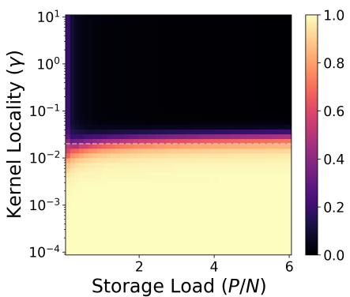
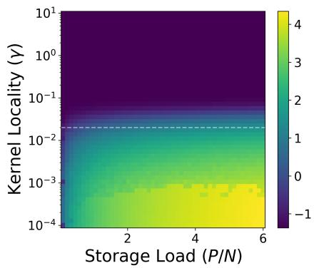
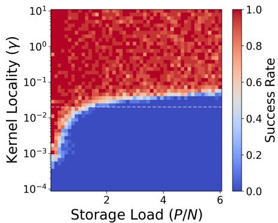
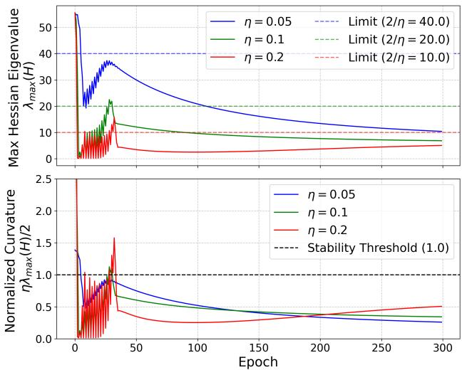
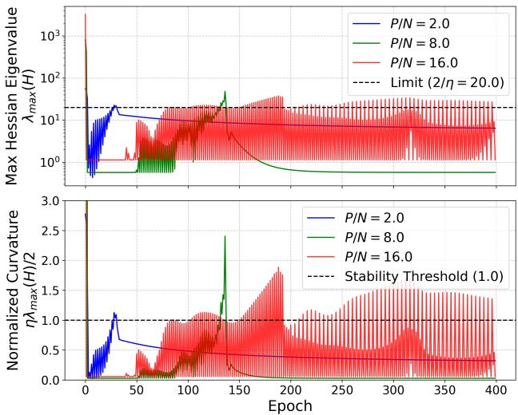

PAPER

# Information Geometric Self-Organization at the Edge of Stability in High-Capacity Kernel Associative Memories

Akira TAMAMORI†, Member

SUMMARY High-capacity associative memories based on Kernel Logistic Regression (KLR) exhibit exceptional storage capabilities and robustness. Previous empirical studies identified a hyperparameter regime, the “Ridge of Optimization,” where attractor stability is maximized. However, the geometric nature of this regime and the optimization dynamics required to reach it have remained unclear. In this paper, we investigate the static geometry of the parameter space and the learning trajectory of Gradient Descent (GD) in KLR-trained Hopfield networks. Using the eigenvalue spectrum of the Hessian, we reveal that the Ridge corresponds to a phase boundary located adjacent to a rank-1 spectral collapse, acting as a geometric singularity where the principal curvature is massively amplified. Furthermore, we demonstrate that the learning dynamics exhibit a transient self-stabilizing behavior driven by the Edge of Stability (EoS) phenomenon. Rather than seeking flat regions, the network parameters are driven toward a state where the local curvature dynamically equilibrates near the stability limit dictated by the learning rate, allowing the optimization to survive the initial instability. We provide analytical derivations for both the rank-1 asymptotic collapse and the dynamic feedback loop governing this equilibration. These findings suggest that optimal, high-capacity memory representations are not formed in flat minima, but are dynamically sculpted at the highly curved boundaries of geometric singularities.

key words: kernel Hopfield network, learning dynamics, edge of stability, information geometry, spectral concentration

## 1. Introduction

Associative memory models, conventionally typified by the Hopfield network [1], function by storing data patterns as stable fixed points within a defined energy landscape. While the classical model using Hebbian learning provides a foundational framework, its practical application is restricted by a storage capacity limit of $P \approx 0 . 1 4 N$ [2].

Recent research has explored methods to overcome this limitation. One approach, known as Modern Hopfield Networks (MHNs), increases capacity by modifying the energy function to include polynomial or exponential interaction terms [3, 4]. An alternative approach relies on discriminative learning algorithms while maintaining a standard quadratic energy structure in a feature space. Our previous work demonstrated that Hopfield networks trained via Kernel Logistic Regression (KLR) achieve high storage capacities exceeding classical limits [5, 6]. Furthermore, a structural regime termed the “Ridge of Optimization” was identified, where the network localizes its parameter distribution to maintain stable attractors under high memory load conditions [7].

Despite the empirical validation of this high-capacity regime, the underlying optimization dynamics remain unclear. Specifically, it is not well understood how a standard optimization algorithm, such as Gradient Descent (GD), navigates the high-dimensional parameter space to find this specific ridge structure. In the context of deep learning, the geometry of the loss landscape and its interaction with learning dynamics are often analyzed using the Hessian or the Fisher Information Matrix (FIM) [8]. Recent studies on the learning dynamics of neural networks have highlighted phenomena such as the Edge of Stability (EoS) [9,10], where the sharpness of the loss landscape increases until it reaches the stability limit of GD, leading to oscillatory behavior. However, the geometric relationship between the emergence of the Ridge in kernel associative memories and such optimization dynamics has not been systematically investigated.

This paper investigates the learning dynamics of KLRtrained Hopfield networks from the perspectives of information geometry and dynamical systems. We aim to clarify the geometric nature of the Ridge of Optimization and the mechanism by which GD converges to this state. The main contributions of this paper are as follows:

1. We geometrically characterize the Ridge of Optimization using the eigenvalue spectrum of the Hessian. By overlaying the memory retrieval performance on the geometric phase diagram, we demonstrate that the highcapacity regime is located adjacent to a rank-1 spectral collapse region. This indicates that optimal memory formation occurs near a singularity where the principal curvature is highly amplified.

2. We show that the learning trajectory of GD exhibits a self-organizing behavior driven by the EoS phenomenon. Through theoretical modeling and empirical analysis of learning rate variations, we verify that the network parameters are driven toward a state where the local curvature (the maximum eigenvalue of the Hessian) dynamically equilibrates near the stability limit dictated by the learning rate.

The remainder of this paper is organized as follows. Section 2 reviews the network model, the informationgeometric formulation, and the experimental setup. Section 3 analyzes the static geometry of the parameter space using the Hessian spectrum and its relation to retrieval performance. Section 4 presents empirical results on the learning dynamics of GD, focusing on the self-stabilization mechanism. Section 5 provides theoretical analyses of the spectral collapse and the dynamic equilibration near the stability limit. Section 6 discusses the implications for the flat minima hypothesis and the limitations of our approach, and Section 7 concludes the paper.

## 2. Background and Preliminaries

This section briefly reviews the Kernel Logistic Regression (KLR) Hopfield network model and introduces the geometric quantities used for analyzing the learning dynamics.

## 2.1 Kernel Logistic Regression Hopfield Network

We consider an auto-associative memory network consisting of � bipolar neurons, with the state vector denoted by ${ \textbf { s } } \in$ $\{ - 1 , 1 \} ^ { \bar { N } }$ . The network stores � patterns, defined as a set $\{ \xi ^ { \mu } \} _ { \mu = 1 } ^ { P }$ . The retrieval dynamics are governed by the input potential $h _ { i } ( \mathbf { s } )$ for each neuron $i ,$ defined using a kernel function $K ( \cdot , \cdot ) \colon$

$$
h _ { i } ( { \bf s } ) = \sum _ { \mu = 1 } ^ { P } \alpha _ { \mu i } K ( { \bf s } , { \pmb \xi } ^ { \mu } ) ,\tag{1}
$$

where $\mathbf { \alpha } \alpha = \left( \alpha _ { \mu i } \right)$ represents the dual variable matrix. In this study, we employ the Gaussian Radial Basis Function (RBF) kernel, $K ( \mathbf { x } , \mathbf { y } ) \ = \ \exp ( - \gamma \| \mathbf { x } - \mathbf { y } \| ^ { 2 } )$ , where $\gamma$ is a scalar parameter controlling the locality of the kernel mapping.

The dual variables for each neuron $i ,$ denoted by the vector $\pmb { \alpha } _ { i } = [ \alpha _ { 1 i } , . . . , \alpha _ { P i } ] ^ { \top }$ , are determined through supervised learning. The learning objective is to predict the target state $y _ { \mu } = ( \bar { \xi } _ { i } ^ { \mu } + 1 ) / 2 \in \bar { \{ 0 , 1 \} }$ from the input pattern $\xi ^ { \mu }$ This is formulated as the minimization of an � -regularized negative log-likelihood function $L ( \alpha _ { i } )$

$$
L ( \alpha _ { i } ) = L _ { \mathrm { l o g i s t i c } } ( \alpha _ { i } ) + \frac { \lambda } { 2 } \alpha _ { i } ^ { \top } \mathbf { K } \alpha _ { i } ,\tag{2}
$$

$$
\begin{array} { l } { { \displaystyle { \cal L } _ { \mathrm { l o g i s t i c } } ( \alpha _ { i } ) = - \sum _ { \mu = 1 } ^ { P } \left[ y _ { \mu } \log ( \sigma ( h _ { i } ( \pmb { \xi } ^ { \mu } ) ) ) \right. } \ ~ } \\ { { \displaystyle \left. + ( 1 - y _ { \mu } ) \log ( 1 - \sigma ( h _ { i } ( \pmb { \xi } ^ { \mu } ) ) ) \right] } , } \end{array}\tag{3}
$$

where $\sigma ( z ) ~ = ~ 1 / ( 1 + e ^ { - z } )$ is the logistic sigmoid function, K is the $P \times P$ kernel Gram matrix with entries $K _ { \mu \nu } = K ( \xi ^ { \mu } , \xi ^ { \nu } )$ , and � is the weight decay parameter. This optimization is typically performed using iterative methods such as Gradient Descent (GD). In the following analysis, we focus on the parameter trajectory $\alpha _ { i }$ for a single representative neuron and omit the subscript � for notational simplicity.

## 2.2 Fisher Information Matrix and the Hessian

To analyze the geometric properties of the parameter space and the stability ofthe optimization dynamics, we distinguish between two related matrices: the Fisher Information Matrix (FIM) and the Hessian of the objective function.

From an information-geometric perspective [8], the unregularized logistic model defines a statistical manifold. The intrinsic geometry of this manifold is characterized by the FIM, denoted by $\mathbf { G } ( \alpha )$ , which is equivalent to the Hessian of the negative log-likelihood component $L _ { \mathrm { l o g i s t i c } } ( \pmb { \alpha } )$ . For the KLR model, the FIM is given by:

$$
\mathbf { G } ( \alpha ) = \mathbf { K D } ( \alpha ) \mathbf { K } ,\tag{4}
$$

where $\mathbf { D } ( \alpha )$ is a diagonal matrix containing the prediction variances, with diagonal entries $D _ { \mu \mu } = p _ { \mu } ( 1 - p _ { \mu } )$ and output probability $p _ { \mu } = \sigma ( h ( \xi ^ { \mu } ) )$ . We utilize $\mathbf { G } ( \alpha )$ to analyze the spectral concentration and the intrinsic dimensionality of the learned representations.

On the other hand, the actual dynamics of GD are governed by the curvature of the complete regularized objective function $L ( \alpha )$ . The Hessian matrix of $L ( \alpha )$ , denoted by $\mathbf { H } ( \alpha )$ , is given by:

$$
\mathbf { H } ( \alpha ) = \mathbf { G } ( \alpha ) + \lambda \mathbf { K } = \mathbf { K D } ( \alpha ) \mathbf { K } + \lambda \mathbf { K } .\tag{5}
$$

For stability analysis, the maximum eigenvalue of the Hessian, $\lambda _ { m a x } ( \mathbf { H } )$ , dictates the local sharpness of the loss landscape. Linear stability of GD requires $\lambda _ { m a x } ( \mathbf { H } ) < 2 / \eta .$ where $\eta$ is the learning rate. In our experiments, because the regularization parameter � is typically small $( \mathrm { e . g . , } \lambda = 0 . 0 1 )$ the contribution of �K is relatively minor, and $\mathbf { H } ( \pmb { \alpha } ) \approx \mathbf { G } ( \pmb { \alpha } )$ holds in most functional regimes. Nevertheless, to ensure theoretical rigor, we explicitly use $\mathbf { H } ( \alpha )$ when evaluating the stability limits of the learning dynamics.

## 2.3 Experimental Setup

To systematically evaluate the geometric and dynamical properties of the network, we conducted numerical simulations using random binary patterns. Each element of the stored patterns $\xi ^ { \mu }$ was independently drawn from $\{ - 1 , 1 \}$ with equal probability. The patterns were generated using a fixed random seed (e.g., NumPy seed 42) to ensure reproducibility across diferent hyperparameter settings. Unless otherwise specified, the network size was set to $N = 1 0 0$ or $N = 5 0$ depending on the computational requirements of the specific analysis.

Optimization Methods and Stopping Criteria: For the dynamic trajectory analysis (Section 4), we used fullbatch GD. The initial weights were initialized to zero $( \alpha _ { 0 } = \mathbf { 0 } )$ The learning rate was fixed at $\eta = 0 . 1$ (unless varied for specific experiments), and the � -regularization parameter was set to $\lambda = 0 . 0 1$ The maximum number of training epochs was set to 300. Preliminary experiments confirmed that within 300 epochs, the macroscopic oscillations characteristic of the Edge of Stability phase subside, and the loss smoothly descends to a stabilized value, making it a suficient duration to observe the transition between the distinct dynamical phases.

For the static geometric analysis requiring convergence to the exact local minimum (Section 3), we utilized the L-BFGS-B algorithm [11]. The optimization was run with a maximum of 200 iterations and a strict tolerance for the objective function change $( \mathbf { f t o l } \ = \ 1 \mathbf { e } { - } 5 )$

  
Fig. 1 Phase diagrams comparing the geometry of the statistical manifold and retrieval performance across storage loads $( P / N )$ and kernel localities $( \gamma ) .$ . Parameters were optimized using L-BFGS-B (max 200 iterations, $\scriptstyle \mathbf { f } \mathbf { t o l } = 1 \mathbf { e } - 5 )$ . Data points represent measurements from a single representative random pattern realization at each grid point. (Left) Spectral Concentration, $\lambda _ { m a x } / \mathrm { T r } ( \mathbf { H } )$ (Center) Maximum Hessian Eigenvalue (log scale). (Right) Retrieval Success Rate from initial states with 20% noise, evaluated over a subset of up to 10 patterns per grid point.

Phase Diagram Generation and Retrieval Evaluation: The phase diagrams (Section 3) were generated over $\mathrm { ~ a ~ } 3 0 \times 3 0$ grid of storage loads $( P / N \in [ 0 . 1 , 6 . 0 ] )$ and kernel locality parameters $( \gamma \in [ 1 0 ^ { - 4 } , 1 0 ^ { 1 } ] )$ for a network of $N = 5 0$ . The plotted values for spectral concentration and maximum curvature represent the exact measurements from a single, representative random realization of the pattern set at each grid point.

To evaluate the retrieval success rate at each grid point, we tested a subset of 10 patterns (or � patterns if $P < 1 0 )$ For each test pattern, we generated a noisy initial state by randomly flipping bits with an initial similarity of $m _ { 0 } = 0 . 8$ (i.e., 20% noise). The synchronous retrieval dynamics were iterated for a maximum of 30 steps. A recall was classified as successful only if the network state perfectly converged to the original target pattern within these steps. The reported success rate is the average over these tested patterns.

## 3. Phenomenology: The Geometry of the Ridge

Previous empirical studies demonstrated that KLR Hopfield networks achieve optimal storage capacity and noise robustness within a specific hyperparameter regime, referred to as the Ridge of Optimization [6]. To establish a direct relationship between this high-performance regime and the intrinsic geometry of the statistical manifold, we systematically evaluated both the spectral properties of the Hessian and the actual retrieval performance across the hyperparameter space.

Based on the converged parameters $\alpha ^ { * }$ obtained via $\mathrm { L } _ { - }$ BFGS-B, we utilized two spectral metrics derived from the Hessian $\mathbf { H } ( \alpha ^ { * } )$ to characterize the geometry, alongside a direct measure of memory functionality:

1. Spectral Concentration: Defined as the ratio of the maximum eigenvalue to the trace of the Hessian, $\lambda _ { m a x } ( \mathbf { H } ) / \mathrm { T r } ( \mathbf { H } )$ . A value approaching 1.0 indicates that the Hessian efectively collapses to a rank-1 matrix, implying extreme spectral anisotropy where the parameter space loses its multi-dimensional structure.

2. Maximum Curvature: Quantified by the logarithm of the maximum eigenvalue, $\log _ { 1 0 } \lambda _ { m a x } ( \mathbf { H } )$ . This value represents the steepness of the local loss landscape.

3. Retrieval Success Rate: The proportion of target patterns successfully recalled from initial states corrupted with 20% random bit-flip noise.

Figure 1 presents the resulting phase diagrams for these three metrics. The phase diagrams reveal a striking correspondence between the static geometry of the parameter space and the dynamic memory performance. The right panel shows a clear phase boundary separating the functional memory regime (red, success rate ≈ 1.0) from the overloaded regime where memory collapses (blue, success rate ≈ 0.0).

By comparing this performance boundary with the geometric metrics, we observe that the memory collapse directly coincides with the geometric collapse. In the lower-right region (high $P / N$ and low $\gamma ) _ { }$ , the left panel shows that the spectral concentration reaches 1.0 (white region), indicating that the Hessian becomes a rank-1 matrix. In this state, the statistical manifold loses the multi-dimensional structure necessary for separating distinct patterns. Concurrently, the center panel shows that the maximum curvature $\lambda _ { m a x }$ increases exponentially toward this region.

Importantly, the previously identified Ridge of Optimization (indicated by the dashed line at $\gamma \approx 0 . 0 2 )$ serves as a representative operating point that balances stability and capacity. As the storage load increases, this line closely approaches the boundary of the rank-1 collapse region. At this boundary, the network maintains the minimal spectral diversity required for pattern separation, while the principal curvature $\lambda _ { m a x }$ is highly amplified $( \mathrm { e } . \mathrm { g } . , \lambda _ { m a x } > 1 0 0 )$

These results provide direct evidence that the highcapacity memory regime is situated adjacent to a region of extreme spectral degeneracy. Optimal memory performance is achieved not in a geometrically flat region, but at the edge of a structural transition, where the learning algorithm maximizes the principal restorative force just before the pattern separation capability is lost.

  
Fig. 2 Transient self-stabilization of Gradient Descent on the Ridge $( N ~ = ~ 5 0 , ~ P / N ~ = ~ 2 . 0 , ~ \gamma ~ = ~ 0 . 0 2 )$ across diferent learning rates $\eta \in \{ 0 . 0 5 , 0 . 1 , 0 . 2 \}$ . The trajectories represent a single representative trial to clearly illustrate the deterministic oscillatory dynamics. (Top) Maximum eigenvalue of the Hessian H. The dashed lines indicate the respective theoretical stability limits $( 2 / \eta )$ . (Bottom) Normalized curvature $\eta \lambda _ { m a x } ( \mathbf { H } ) / 2$ . The dashed black line indicates the stability threshold (1.0).

## 4. Learning Dynamics: Transient Self-Stabilization

The static geometric analysis in Section 3 indicates that highcapacity memory representations are formed near a boundary characterized by extreme spectral degeneracy and high curvature. To investigate how a standard first-order optimization method navigates this steep landscape, we analyzed the learning trajectory of GD. In the context of GD, optimization stability is fundamentally governed by the maximum eigenvalue of the Hessian, $\lambda _ { m a x } ( \mathbf { H } )$ . Linear stability requires this principal curvature to remain below $2 / \eta .$ , where � is the learning rate. If the local curvature exceeds this theoretical limit, the optimization step overshoots, leading to divergence or violent oscillatory behavior.

To empirically test the relationship between the optimization dynamics and this stability limit, we tracked the learning process on the Ridge $( P / N = 2 . 0 , \gamma = 0 . 0 2 )$ using three diferent learning rates: $\eta \in \{ 0 . 0 5 , 0 . 1 , 0 . 2 \}$ . For each epoch, we computed the exact Hessian H (Eq. (5)) and extracted its maximum eigenvalue. Figure 2 illustrates the temporal evolution of both the absolute maximum curvature and a normalized curvature metric, defined as $\eta \lambda _ { m a x } ( \mathbf { H } ) / 2$ This normalized metric explicitly evaluates how close the system is to the stability limit; a value equal to or greater than 1.0 indicates that the system is operating at or beyond the edge of linear stability.

The learning dynamics exhibit a consistent, three-phase structural evolution across all tested learning rates:

1. Initial Overshoot and Instability: At the onset of training, the parameters are initialized at zero, where the prediction variance is maximized. This results in a massive initial curvature $( \lambda _ { m a x } > 5 0 )$ that significantly exceeds the stability limit $2 / \eta$ for all tested learning rates. Consequently, the initial GD update results in a large step that overshoots the minimum along the direction of steepest curvature, causing the normalized curvature to spike above 1.0 (bottom panel).

2. Transient Self-Stabilization: Following the overshoot, the curvature $\lambda _ { m a x }$ drops rapidly but is then bounded by the stability limit. The top panel clearly shows that the curvature for each � oscillates precisely just below its corresponding limit (40, 20, and 10, respectively). The bottom panel confirms this alignment, as the normalized curvature curves for all learning rates repeatedly strike the 1.0 threshold before bouncing back. This behavior indicates that the system undergoes a transient phase of self-stabilization [10], where divergent steps in the steep direction dynamically reduce the local curvature, preventing the optimization from completely diverging.

3. Escape and Stable Convergence: Importantly, the system does not remain permanently trapped at the stability boundary. Between epochs 30 and 40, the macroscopic oscillations cease. The bottom panel shows that the normalized curvature smoothly detaches from the 1.0 threshold and descends into the strictly stable regime (< 1.0). At this point, the principal curvature has naturally decreased suficiently so that the GD updates are stable across all directions, allowing for smooth, monotonic convergence to the final solution.

These empirical results demonstrate a profound interaction between the learning algorithm and the loss landscape. The network parameters do not passively settle into an existing flat minimum. Instead, when forced to navigate the extreme curvature near the Ridge, the GD trajectory relies on a transient self-stabilizing feedback mechanism to survive the initial instability, eventually carving a path into a stable, high-capacity representation.

Additional experiments with varying storage loads showed that while this qualitative three-phase structure remains consistent, the duration of the transient selfstabilization phase extends significantly as the load increases (see Appendix A).

## 5. Theoretical Analysis of Spectral Collapse and Dynamics

The empirical observations in the previous sections present two distinct but related phenomena: the static geometric collapse to a rank-1 spectral structure at low � values, and the dynamic, transient self-stabilization near the $2 / \eta$ limit during learning. In this section, we provide analytical interpretations for these behaviors.

## 5.1 Geometric Origin of the Rank-1 Collapse

The phase diagrams (Fig. 1) demonstrated that the statistical manifold loses its multi-dimensional structure as the kernel locality parameter � decreases, eventually collapsing to a rank-1 matrix. This asymptotic behavior can be analytically derived from the Taylor expansion of the RBF kernel.

The RBF kernel between two binary patterns $\xi ^ { \mu } , \xi ^ { \nu }$ ∈ $\{ - 1 , 1 \} ^ { N }$ depends on their squared Euclidean distance, $\| \pmb { \xi } ^ { \mu } - \pmb { \xi } ^ { \nu } \| ^ { 2 } = 2 N - 2 ( \pmb { \xi } ^ { \mu } \cdot \pmb { \xi } ^ { \nu } )$ . Thus, the kernel matrix elements are:

$$
K _ { \mu \nu } = \exp \left( - 2 \gamma N + 2 \gamma ( \pmb { \xi } ^ { \mu } \cdot \pmb { \xi } ^ { \nu } ) \right) .\tag{6}
$$

In the global regime where $\gamma \ll 1 / N$ , the first-order Taylor expansion yields:

$$
K _ { \mu \nu } \approx 1 - 2 \gamma N + 2 \gamma ( \pmb { \xi } ^ { \mu } \cdot \pmb { \xi } ^ { \nu } ) .\tag{7}
$$

Let $\mathbf { J } = \mathbf { 1 1 } ^ { \top }$ be a $P \times P$ matrix of ones, and $\mathbf { X } \in \{ - 1 , 1 \} ^ { P \times N }$ be the pattern matrix. Equation (7) can be written in matrix form as:

$$
\mathbf { K } \approx ( 1 - 2 \gamma N ) \mathbf { J } + 2 \gamma \mathbf { X } \mathbf { X } ^ { \top } .\tag{8}
$$

The FIM is defined as $\mathbf { G } = \mathbf { K D K }$ . In the limit $\gamma  0 ,$ the kernel matrix is dominated by the constant matrix, $\mathbf { K } $ J. Substituting this into the FIM expression yields:

$$
\mathbf { G } \approx \mathbf { J D J } = ( \mathbf { 1 1 } ^ { \top } ) \mathbf { D } ( \mathbf { 1 1 } ^ { \top } ) = \mathrm { T r } ( \mathbf { D } ) \mathbf { J } .\tag{9}
$$

The matrix J has a rank of 1, with a single non-zero eigenvalue of � and the corresponding eigenvector 1. Therefore, as $\gamma \to 0$ , the maximum eigenvalue of the FIM approaches $\lambda _ { m a x } ( \mathbf G ) \approx P \cdot \mathrm { T r } ( \mathbf D )$ , while all other eigenvalues approach zero. Since the regularization � is small, the Hessian H exhibits a similar extreme spectral degeneracy.

This derivation clarifies why the functional highcapacity regime (the Ridge) is located just before this collapse. The first term in Eq. (8) acts as a uniform restorative force (generating the massive $\lambda _ { m a x } )$ , while the second term, corresponding to classical Hebbian interactions $\mathbf { X X ^ { \top } }$ , preserves the dimensionality required for pattern discrimination. Memory performance is optimal when these two opposing structural forces are balanced at the critical boundary.

## 5.2 Qualitative Model of Self-Stabilization

Next, we provide a theoretical interpretation of the transient self-stabilization observed in Fig. 2. As noted in recent literature [10], the EoS behavior can be understood through higher-order interactions where divergence along a steep direction causes a reduction in local curvature.

In the KLR setting, this self-stabilizing negative feedback loop is explicitly mediated by the properties of the logistic variance. Let � represent the magnitude of the parameter component along the principal eigenvector $\mathbf { v } _ { m a x }$ of the Hessian. As a qualitative reduced-order model, the GD update along this specific dominant direction can be approximated by a linearized step scaled by the local principal curvature $\lambda _ { m a x } ( x )$ :

$$
x _ { t + 1 } \approx x _ { t } - \eta \lambda _ { m a x } ( x _ { t } ) x _ { t } = ( 1 - \eta \lambda _ { m a x } ( x _ { t } ) ) x _ { t } .\tag{10}
$$

A fundamental property of the KLR objective is that the curvature $\lambda _ { m a x }$ is proportional to the trace of the prediction variance matrix D (as seen in Eq. (9)). The variance for each pattern, $p _ { \mu } ( 1 - p _ { \mu } )$ , is maximized when the prediction is completely uncertain $( p _ { \mu } = 0 . 5$ , which occurs when parameters are near zero). Consequently, as the magnitude of the parameters $| x |$ increases and the model’s predictions become more confident $( p _ { \mu } \to 1$ or $p _ { \mu } \to 0 )$ , the overall variance decreases. Therefore, the principal curvature $\lambda _ { m a x } ( x )$ acts as a monotonically decreasing function of |�|.

This non-linear relationship creates a self-stabilizing dynamic feedback loop:

1. Instability and Divergence: When initialized near zero, $\lambda _ { m a x } ( 0 ) > 2 / \eta$ . The multiplier $( 1 - \eta \lambda _ { m a x } ( x _ { t } ) )$ in Eq. (10) becomes less than −1, causing the parameter $x _ { t }$ to flip its sign and its magnitude $\left| x _ { t } \right|$ to grow exponentially.

2. Curvature Suppression (Self-Stabilization): As the magnitude $\left| x _ { t } \right|$ increases due to this divergence, the logistic variance decreases, which in turn reduces the local curvature $\lambda _ { m a x } ( x _ { t } )$

3. Boundary Equilibration: The magnitude $\left| x _ { t } \right|$ continues to grow until the curvature is suppressed exactly to the stability boundary, $\lambda _ { m a x } ( x _ { t } ) \approx 2 / \eta$ . At this boundary, the multiplier approaches $^ { - 1 , }$ resulting in stable oscillatory behavior $( x _ { t + 1 } \approx - x _ { t } )$

While Eq. (10) is a simplified one-dimensional model, it efectively captures the essence of the mechanism. The initial overshoot forces the network parameters away from the high-variance origin. This divergence inherently suppresses the maximum curvature until it respects the learning rate limit, allowing the optimization process to survive the singular geometry of the Ridge and eventually escape into a stable region as the global loss decreases.

## 6. Discussion

Our geometric and dynamic analyses provide a physical interpretation of how high-capacity kernel associative memories are formed. In this section, we discuss the implications of these findings for learning theory, relate them to recent studies on optimization dynamics, and outline the limitations of our current approach.

## 6.1 Rethinking the Flat Minima Hypothesis

A prominent hypothesis in deep learning optimization suggests that optimization algorithms preferentially converge to “flat minima,” which are characterized by low curvature (small eigenvalues of the Hessian or FIM) and are generally associated with better generalization capabilities [12, 13]. However, our findings in KLR-trained Hopfield networks present a distinct scenario for this established view.

As shown in the phase diagram (Fig. 1), the optimal operating regime for associative memory, the Ridge of Optimization, is not located in a flat region of the parameter space. Instead, it is situated adjacent to a region of extreme spectral degeneracy, characterized by a sharp curvature in the dominant principal direction. Learning successfully converges precisely when the trajectory navigates this highly curved region. This suggests that for structured representation tasks like associative memory, optimal performance may not always correlate with minimizing curvature across all dimensions. Rather, the systematic amplification of a specific principal curvature can be beneficial for creating a deep, globally attractive energy basin, provided a minimal set of non-zero trailing eigenvalues is preserved for pattern discrimination.

## 6.2 The Margin-Seeking Tendency and Spectral Concentration

The drive toward the highly curved Ridge geometry can be conceptually related to the implicit bias of the optimization objective. It is well-established that optimizing unregularized logistic-type loss functions on separable data leads to parameters that asymptotically maximize the classification margin [14, 15].

While our objective function (Eq. (3)) includes an explicit $L _ { 2 }$ regularization term, the margin-seeking tendency of the logistic component provides a plausible explanation for the observed spectral concentration. In the context of kernel Hopfield networks, creating robust attractors requires separating each stored pattern from all others in the highdimensional feature space. As the learning algorithm minimizes the logistic loss, it pushes the weight vectors toward larger magnitudes to increase confidence. This behavior actively stretches the parameter space along the principal directions responsible for class separation. The emergence of the near-singular Ridge geometry and the resulting extreme disparity in the Hessian eigenvalue spectrum can thus be understood as a natural consequence of gradient descent operating on margin-based loss functions, balanced by the regularizer.

## 6.3 Transient Self-Stabilization and the Edge of Stability

Our dynamic analysis in Section 5.2 explains how GD interacts with the stability limit $( 2 / \eta )$ using a discrete-time diference equation derived from the properties of the logistic variance. This phenomenon is closely related to the general theory of “self-stabilization” recently proposed by Damian et al. [10]. Using a third-order Taylor expansion, they demonstrated that the EoS can be modeled as a negative feedback dynamical system, where divergence along the dominant eigenvector causes the local curvature to decrease until stability is temporarily restored.

Our findings are consistent with this theoretical framework. While Damian et al. provide a general mechanism based on higher-order derivatives, our analysis ofers a concrete, domain-specific realization of this self-stabilization loop. In the KLR model, the negative feedback is explicitly mediated by the prediction variance $p ( 1 - p )$ inherent to the FIM and Hessian: a gradient overshoot increases the parameter magnitude, which immediately suppresses the probability variance, thereby reducing the local curvature. Recognizing this connection suggests that the transient EoS phase observed in our associative memory model is a fundamental, self-correcting property of gradient descent navigating sharp landscapes.

## 6.4 Implications for Curvature-Aware Optimization

The oscillatory dynamics of GD (Fig. 2) highlight the fundamental challenge of navigating the highly anisotropic landscape near the Ridge. GD, which operates based on the Euclidean metric, is forced into a transient oscillatory phase because the principal curvature initially exceeds its stability limit.

This behavior provides an information-geometric motivation for utilizing curvature-aware optimization methods, such as Natural Gradient Descent (NGD) [8]. By preconditioning the update direction with the inverse of the FIM $( \mathbf { G } ^ { - 1 } )$ , NGD can theoretically neutralize extreme disparities in curvature. However, as our static analysis shows, the Ridge is located near a region of spectral degeneracy where the FIM approaches a rank-deficient state. In such regimes, directly applying the inverse FIM is computationally unstable.

This geometric characteristic suggests that practical implementations of natural-gradient-type methods for highcapacity memory require robust damping mechanisms or pseudo-inverse treatments to safely navigate the singularity. Indeed, recent work has empirically demonstrated that NGD, when appropriately regularized with a damping factor, can successfully bypass the oscillatory EoS phase and follow a smooth, geodesic-like trajectory on the Ridge [16]. The present analysis complements those findings by elucidating the underlying cause of the GD instability, specifically the transient self-stabilization triggered by the interaction between the extreme principal curvature and the learning rate limit.

## 6.5 Limitations and Future Work

While our analysis clarifies the geometric self-organization mechanism, several limitations must be acknowledged:

1. Restriction to Uncorrelated Patterns: The present study focuses on networks storing independent random binary patterns. This idealized setting isolates the fundamental spectral behaviors, such as the asymptotic rank-1 collapse represented by matrix J. However, real-world data typically exhibit structured correlations.

These correlations are likely to alter the structure of the spectral degeneracy, potentially forming hierarchical, low-rank spectra rather than a strict rank-1 collapse.

2. Qualitative Nature of the Dynamic Model: The theoretical model presented in Section 5.2 uses a simplified one-dimensional diference equation to explain the interaction with the $2 / \eta$ limit. While this provides a qualitative understanding of the feedback mechanism, a rigorous, high-dimensional dynamical systems analysis is required to precisely characterize the interaction between the dominant EoS oscillations and the convergence along the trailing eigenvectors.

Based on these limitations, extending the spectral analysis to datasets with semantic correlations and developing scalable, curvature-aware optimization algorithms that can robustly handle spectral degeneracy are promising directions for future research.

## 7. Conclusion

In this study, we investigated the geometric and dynamical mechanisms underlying memory formation in high-capacity KLR Hopfield networks. By integrating static spectral analysis with an examination of learning trajectories, we provided a physical interpretation of the optimization process near the storage limit.

Our static analysis revealed that the previously identified “Ridge of Optimization” aligns with the boundary of a region characterized by extreme spectral degeneracy. We analytically demonstrated that as the kernel mapping becomes increasingly global, the Fisher Information Matrix asymptotically approaches a rank-1 structure. The functional highcapacity regime is situated adjacent to this geometric transition, balancing the massive principal curvature required for global stability with the spectral diversity needed for pattern separation.

Furthermore, we demonstrated that the learning trajectory of GD on the Ridge is fundamentally shaped by the EoS phenomenon. Rather than converging monotonically to a flat minimum, the network parameters undergo a phase of transient self-stabilization. As predicted by a qualitative reduced-order model, the negative feedback inherent to the logistic prediction variance forces the maximum eigenvalue of the Hessian to dynamically equilibrate near the stability limit dictated by the learning rate. This self-correcting mechanism allows the optimization process to survive the initial instability and carve out an exceptionally sharp principal attractor basin.

These findings suggest that optimal memory representations in high-dimensional kernel spaces are dynamically formed at the highly curved boundaries of geometric singularities. This understanding not only clarifies the resilience of standard gradient methods in pathological landscapes but also reinforces the motivation for exploring curvature-aware optimization algorithms capable of eficiently navigating these degenerate spaces.

## References

[1] J.J. Hopfield, “Neural networks and physical systems with emergent collective computational abilities,” Proc. NAS’82, vol. 79, no. 8, pp. 2554–2558, 1982.

[2] D.J. Amit, H. Gutfreund, and H. Sompolinsky, “Storing infinite numbers of patterns in a spin-glass model of neural networks,” Phys. Rev. Lett., vol. 55, pp. 1530–1533, American Physical Society, 1985.

[3] D. Krotov and J.J. Hopfield, “Dense associative memory for pattern recognition,” Proc. NIPS’16, pp. 1180–1188, 2016.

[4] H. Ramsauer, B. Schafl, J. Lehner, P. Seidl, M. Widrich, L. Gruber,¨ M. Holzleitner, T. Adler, D. Kreil, M. Kopp, G. Klambauer, J. Brandstetter, and S. Hochreiter, “Hopfield networks is all you need,” Proc. ICLR’21, 2021.

[5] A. Tamamori, “Kernel logistic regression learning for high-capacity hopfield networks,” IEICE Trans. Inf. & Syst., vol. E109-E, no. 2, pp. 293–297, 2026.

[6] A. Tamamori, “Quantitative attractor analysis of high-capacity kernel hopfield networks,” NOLTA, vol. E17-N, no. 3, pp. 770–787, 2026.

[7] A. Tamamori, “Self-organization and spectral mechanism of attractor landscapes in high-capacity kernel hopfield networks,” NOLTA, vol. E17-N, no. 3, pp. 788–804, 2026.

[8] S. Amari, Information geometry and its applications, Springer, 2016.

[9] J. M. Cohen, S. Kaur, Y. Li, J. Z. Kolter, and A. Talwalkar, “Gradient descent on neural networks typically occurs at the edge of stability,” Proc. ICLR’21, 2021.

[10] A. Damian, E. Nichani, and J. D. Lee, “Self-stabilization: The implicit bias of gradient descent at the edge of stability,” Proc. ICLR’23, 2023.

[11] R.H. Byrd, P. Lu, J. Nocedal, and C. Zhu, “A Limited Memory Algorithm for Bound Constrained Optimization,” SIAM Journal on Scientific Computing, vol. 16, no. 5, pp. 1190–1208, 1995.

[12] S. Hochreiter and J. Schmidhuber, “Flat minima,” Neural Computation, vol. 9, no. 1, pp. 1–42, 1997.

[13] N. S. Keskar, D. Mudigere, J. Nocedal, M. Smelyanskiy, and P. T. P. Tang, “On large-batch training for deep learning: Generalization gap and sharp minima,” Proc. ICLR’17, 2017.

[14] S. Rosset, J. Zhu, and T. Hastie, “Margin maximizing loss functions,” Proc. NIPS’04, vol. 16, 2004.

[15] D. Soudry, E. Hofer, M. S. Nacson, S. Gunasekar, and N. Srebro, “The implicit bias of gradient descent on separable data,” Journal of Machine Learning Research (JMLR), vol. 19, no. 1, pp. 2822–2878, 2018.

[16] A. Tamamori, “Geometry of learning dynamics: Gradient descent versus natural gradient on the ridge of optimization,” arXiv preprint:arXiv:2600.00000, September 2026.

## Appendix A: Consistency of Self-Stabilization Across Storage Loads

In Section 4, we analyzed the learning dynamics of GD and identified a transient self-stabilization mechanism near the stability limit $2 / \eta$ . This analysis was conducted at a representative storage load of $P / N = 2 . 0 $ . To verify that this dynamical behavior is a consistent feature of the optimization process on the Ridge, rather than an artifact of a specific load, we evaluated the learning trajectories across higher storage capacities.

Figure A· 1 presents the evolution of the maximum Hessian eigenvalue $\lambda _ { m a x } ( \mathbf { H } )$ and the normalized curvature $\eta \lambda _ { m a x } ( \mathbf { H } ) / 2$ for networks storing $P / N \in \{ 2 . 0 , 8 . 0 , 1 6 . 0 \}$ keeping the kernel locality fixed at $\gamma = 0 . 0 2$ and the learning rate at $\eta = 0 . 1$

  
Fig. A· 1 Learning dynamics of GD on the Ridge across varying storage loads $( P / N \in \{ 2 . 0 , 8 . 0 , 1 6 . 0 \} )$ at a fixed learning rate $( \eta = 0 . 1 ) .$ (Top) Maximum Hessian eigenvalue $\lambda _ { m a x } ( \mathbf { H } )$ on a logarithmic scale. The initial curvature spike increases proportionally with the storage load �. (Bottom) Normalized curvature $\eta \lambda _ { m a x } ( \mathbf { H } ) / 2$ . Regardless of the load, the trajectory undergoes a transient self-stabilization phase near the 1.0 threshold before eventually escaping into the stable convergence regime.

The results demonstrate the consistency of the threephase learning structure across varying degrees of memory congestion, while highlighting two key load-dependent characteristics:

1. Scaling of the Initial Curvature: As analytically derived in Section 5.1 (Eq. 9), the maximum eigenvalue of the FIM near the origin is proportional to the number of stored patterns �. The top panel of Fig. A· 1 empirically confirms this relationship. At higher loads $( { \mathrm { e . g . , } P } / { N } = 1 6 . 0 )$ , the initial spike in $\lambda _ { m a x } ( \mathbf { H } )$ reaches orders of magnitude higher than at $P / N = 2 . 0 $

2. Prolongation of the Oscillatory Phase: Because the initial curvature is substantially larger at higher loads, the self-stabilization feedback loop (which suppresses the curvature by driving parameters away from zero) requires more iterations to bring the principal curvature down to the stability limit. The bottom panel shows that while the $P / N = 2 . 0 $ trajectory escapes the 1.0 threshold rapidly, the $P / N = 1 6 . 0 $ trajectory remains in the oscillatory search phase for a significantly longer duration before achieving stable convergence.

These supplementary observations validate our theoretical model. The EoS is a robust and necessary phase of learning in high-capacity kernel associative memories. The optimization algorithm must undergo this transient selfstabilization to navigate the extreme, load-dependent curvature of the singularity before it can successfully form deep and stable attractor basins.

Akira Tamamori He received his B.E., M.E., and D.E. degrees from Nagoya Institute of Technology, Nagoya, Japan, in 2008, 2010, 2014, respectively. From 2014 to 2016, he was a Research Assistant Professor at Institute of Statistical Mathematics, Tokyo, Japan. From 2016 to 2018, he was a Designated Assistant Professor at the Institute of Innovation for Future Society, Nagoya University, Japan. From 2018 to 2020, he was an lecturer at Aichi Institute of Technology, Japan. He has been an Associate Professor

at Aichi Institute of Technology since 2020. He is a member of the Institute of Electronics, Information and Communication Engineers (IEICE), the Information Processing Society of Japan (IPSJ), the Acoustical Society of Japan (ASJ), and Asia-Pacific Signal and Information Processing Association (APSIPA).