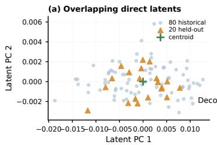
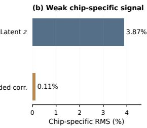
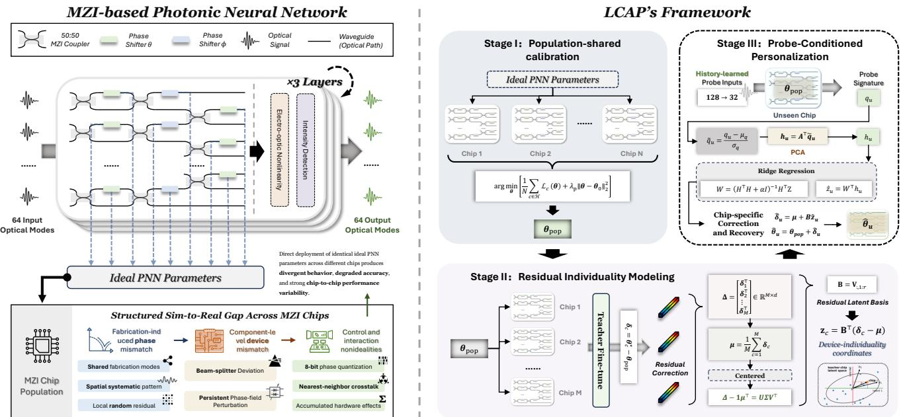
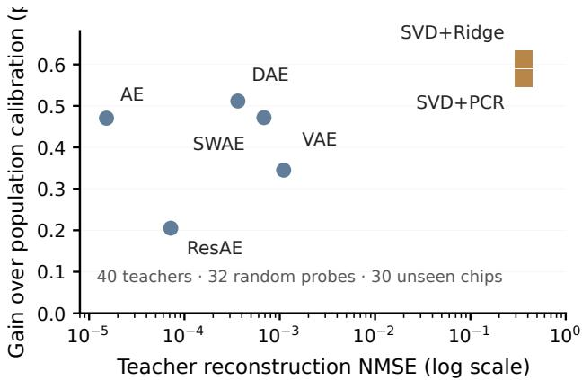

# LCAP: POPULATION-INFORMED LATENT CHIP ADAPTATION FROM FEW OUTPUTPROBES FOR PHOTONIC NEURAL NETWORKS

Tianyu Gao1,2,∗ and Guantian Zheng3

1City University of Hong Kong, Hong Kong SAR, China; 2Sichuan University, Chengdu, China 3Nanyang Technological University, Singapore; ∗gaotianyu@stu.scu.edu.cn

## ABSTRACT

Photonic neural networks (PNNs) offer efficient analog inference, but parameters optimized under ideal device models can degrade after fabrication, creating a persistent simulation-tohardware (sim-to-real) gap. When many identically designed chips are deployed, calibrating each device from scratch compounds this cost. We propose Latent Chip Adaptation from Probes (LCAP), a population-informed framework that decomposes hardware adaptation into a transferable population correction and probe-inferred latent personalization. LCAP first learns a shared correction from 80 historical chips, then extracts a low-dimensional correction space from device-specific refinements. At deployment, 32 fixed unlabeled output probes infer an unseen chip’s latent correction coordinates, enabling feed-forward personalization without target-device optimization. On a three-layer 64-mode MZI simulator with phase variation, beam-splitter errors, quantization, and crosstalk, accuracy improves from 80.4147% under direct deployment to 92.6860% after shared calibration and 93.3617% with LCAP. LCAP improves 27/30 unseen chips and raises worst-device accuracy from 89.18% to 90.54%.

Index Terms— photonic neural networks, sim-to-real adaptation, latent personalization, hardware calibration, Mach–Zehnder interferometers

## 1. INTRODUCTION

Photonic neural networks (PNNs) implement linear transformations directly in optical interference meshes, offering a promising route toward high-throughput and energy-efficient inference [1, 2, 3, 4]. Their performance, however, is tightly coupled to physical device parameters. Parameters optimized with an ideal transfer model are ultimately executed on fabricated circuits. Their phase shifts, splitting ratios, and control responses can deviate from design, while quantization and crosstalk introduce additional mismatch. When compounded through MZI meshes, these nonidealities can substantially degrade task accuracy [5]. More importantly, the resulting sim-to-real gap is not identical across devices: chips fabricated from the same design can exhibit different persistent deviations and therefore require different corrections [6]. As deployment scales from a single prototype to many chips, independently recalibrating each device turns adaptation into a recurring cost. A natural question follows: can calibration experience accumulatedfrom earlier chips be reused to adapt a new chip?

  
Fig. 1. Motivating diagnostic for direct latent adaptation. Relative chip-specific RMS measures the deviation from the population mean normalized by the total RMS. In an early encoder–decoder prototype, chip-specific variation accounts for only 3.87% of the latent RMS and 0.11% of the decodedcorrection RMS, suggesting that population-common structure can dominate direct end-to-end representations.

Existing approaches mainly address this deployment gap through two paradigms. Device-specific methods, including L2ight, DAT, and meta-learning-based on-chip training, reduce the cost of adapting each physical system but still require optimization tied to the target device [7, 8, 9, 10]. Transfer-oriented methods instead seek a common solution that remains robust across hardware instances, as exemplified by Transferable Learning and sharpness-aware training (SAT) [11, 12]. Between these paradigms lies a less explored possibility: reusing population-level calibration experience while still preserving the individuality of each new chip. A natural attempt is to directly encode probe responses into a hardware latent and decode them into full device corrections. However, an early direct probe-to-correction encoder–decoder produced strongly overlapping chip latents across both historical and held-out devices (Fig. 1a). Moreover, the chip-specific component accounted for only 3.87% of the latent RMS and only 0.11% of the decoded-correction RMS (Fig. 1b). This points to an identifiability problem: population-common mismatch can dominate an end-to-end representation and obscure the weaker device-specific structure.

Motivated by this observation, we propose Latent Chip Adaptation from Probes (LCAP), a common-first, individuality second framework that first learns a transferable population calibration and then models only the remaining devicespecific corrections in a low-dimensional latent space (Fig. 2). For an unseen chip, fixed unlabeled probes infer its latent coordinates and reconstruct a personalized correction without target-device optimization. Across 30 unseen chips, LCAP improves the deployment trajectory from 80.41% to 92.69% and finally 93.36%.

## 2. METHOD: LATENT CHIP ADAPTATION FROM PROBES

Overview. Let $\pmb { \theta } _ { 0 } \in \mathbb { R } ^ { d }$ denote the programmable parameters of a source PNN optimized under the ideal device model, and let $f _ { c } ^ { \mathrm { h w } } ( \cdot ; \pmb { \theta } )$ denote its realization on chip c. LCAP follows a common-first, individuality-second principle (Fig. 2). For an unseen chip u, its adapted parameters are written as

$$
\hat { \pmb { \theta } } _ { u } = \pmb { \theta } _ { \mathrm { p o p } } + \hat { \pmb { \delta } } _ { u } ,\tag{1}
$$

where $\theta _ { \mathrm { p o p } }$ captures adaptation transferable across a historical chip population, while $\hat { \pmb { \delta } } _ { u }$ models the remaining devicespecific correction.

Population-shared calibration. Given N historical chips $\mathcal { H } ,$ we optimize one common parameter vector over the entire population:

$$
\theta _ { \mathrm { p o p } } = \arg \operatorname* { m i n } _ { \pmb { \theta } } \left[ \frac { 1 } { N } \sum _ { c \in \mathcal { H } } \mathcal { L } _ { c } ( \pmb { \theta } ) + \lambda _ { \mathrm { p } } | | \pmb { \theta } - \pmb { \theta } _ { 0 } | | _ { 2 } ^ { 2 } \right] ,\tag{2}
$$

where

$$
\begin{array} { r } { \mathcal { L } _ { c } ( \pmb { \theta } ) = \mathbb { E } _ { ( \mathbf { x } , y ) } \left[ \ell \big ( f _ { c } ^ { \mathrm { h w } } ( \mathbf { x } ; \pmb { \theta } ) , y \big ) \right] . } \end{array}\tag{3}
$$

This stage does not impose a low-dimensional constraint. Instead, it learns a full shared PNN configuration that captures the transferable component of population-level hardware mismatch before chip individuality is modeled.

Residual latent device space. For M historical teacher chips $\tau \subset \mathcal { H }$ , we further optimize each device starting from $\theta _ { \mathrm { p o p } } ,$ yielding device-specific teacher parameters ${ \pmb \theta } _ { c } ^ { \star }$ . We define the residual correction as

$$
\begin{array} { r } { \delta _ { c } = \pmb { \theta } _ { c } ^ { \star } - \pmb { \theta } _ { \mathrm { p o p } } . } \end{array}\tag{4}
$$

Stacking all teacher residuals into $\pmb { \Delta } \in \mathbb { R } ^ { M \times d }$ , we center the matrix and apply SVD:

$$
\begin{array} { r } { \pmb { \Delta } - \pmb { 1 } \pmb { \mu } ^ { \top } = \pmb { \mathrm { U } } \pmb { \Sigma } \pmb { \mathrm { V } } ^ { \top } . } \end{array}\tag{5}
$$

The first r right-singular vectors form the latent correction basis

$$
{ \bf B } = { \bf V } _ { : , 1 : r } , \qquad { \bf z } _ { c } = { \bf B } ^ { \top } ( \pmb { \delta } _ { c } - \pmb { \mu } ) ,\tag{6}
$$

such that

$$
\pmb { \delta } _ { c } \approx \pmb { \mu } + \mathbf { B } \mathbf { z } _ { c } .\tag{7}
$$

Here, $\mathbf { z } _ { c } \in \mathbb { R } ^ { r }$ represents the coordinates of device individuality in the residual correction space. Importantly, LCAP does not compress the full PNN parameters; it models only what remains device-specific after population calibration.

Probe-conditioned latent inference. At deployment, the teacher refinement above is unavailable for an unseen chip. LCAP therefore infers its latent coordinates from a small set of hardware measurements. For a candidate probe p, we define the output residual

$$
\begin{array} { r l } & { \mathbf { r } _ { c } ( \mathbf { p } ) = \mathrm { R e } \left[ f _ { c } ^ { \mathrm { h w } } ( \mathbf { p } ; \pmb { \theta } _ { \mathrm { p o p } } ) \right. } \\ & { \qquad \left. - f ^ { \mathrm { i d } } ( \mathbf { p } ; \pmb { \theta } _ { \mathrm { p o p } } ) \right] . } \end{array}\tag{8}
$$

A fixed probe set ${ \mathcal { P } } ^ { \star }$ is selected offline using historical chips by ranking candidate probes according to their cross-chip response variance. Concatenating the selected probe residuals gives an observable hardware signature $\mathbf { q } _ { c }$

We standardize $\mathbf { q } _ { c }$ and project it to a compact probe feature $\mathbf { h } _ { c }$ using PCA:

$$
\mathbf { h } _ { c } = \mathbf { A } ^ { \top } \tilde { \mathbf { q } } _ { c } .\tag{9}
$$

Given historical feature and latent matrices H and $\mathbf { Z } ,$ ridge regression learns the probe-to-latent mapping

$$
\mathbf { W } = \left( \mathbf { H } ^ { \top } \mathbf { H } + \alpha \mathbf { I } \right) ^ { - 1 } \mathbf { H } ^ { \top } \mathbf { Z } .\tag{10}
$$

For an unseen chip u,

$$
\hat { \mathbf { z } } _ { u } = \mathbf { W } ^ { \top } \mathbf { h } _ { u } ,\tag{11}
$$

and its residual correction is reconstructed as

$$
\hat { \pmb { \delta } } _ { u } = \pmb { \mu } + \mathbf { B } \hat { \mathbf { z } } _ { u } .\tag{12}
$$

The final deployed parameters are therefore

$$
\hat { \pmb { \theta } } _ { u } = \pmb { \theta } _ { \mathrm { p o p } } + \hat { \pmb { \delta } } _ { u } .\tag{13}
$$

Thus, once the population model and probe-to-latent mapping are learned offline, a new chip requires only a fixed set of unlabeled output measurements. The remaining highdimensional adaptation problem is reduced to low-dimensional latent inference, without target-device optimization.

## 3. EXPERIMENTS

## 3.1. Experimental Setup

PNN and task. We follow the MZI-PNN simulation configuration used in DAT [9]: a three-layer, 64-mode MZI network for MNIST classification. Each image is Fourier transformed, and its central $8 \times 8$ spectrum forms the 64-dimensional complex optical input. The same ideal PNN parameters initialize all virtual hardware instances.

  
Fig. 2. LCAP learns a population anchor, models residual device individuality, and infers an unseen chip’s correction from fixed probes without target-device optimization.

Chip population. DAT and SAT model persistent phaseshifter and beam-splitter deviations as MZI fabrication errors [9, 12]. Building on this component-level model, we generate a structured chip population with

$$
\begin{array} { r l r } {  { \Delta \phi _ { c } = \sigma _ { \phi , c } \mathrm { N o r m } \Big ( \sqrt { . 5 0 } \mathbf { s } _ { c } + \sqrt { . 2 5 } \mathbf { g } + \sqrt { . 2 5 } \mathbf { \epsilon } _ { c } \Big ) , } } \\ & { } & { \mathbf { s } _ { c } = \mathrm { N o r m } ( \sum _ { k = 1 } ^ { 8 } a _ { c , k } \mathbf { B } _ { k } ) , \quad a _ { c , k } \sim \mathcal { N } ( 0 , 1 ) . } \end{array}\tag{14}
$$

Here, $\{ \mathbf { B } _ { k } \}$ are shared fabrication modes with independently sampled chip-specific coefficients, g is a fixed lowfrequency spatial systematic pattern, and $\epsilon _ { c }$ is an independent local residual; all components are RMS-normalized before mixing. This shared–spatial–local construction reflects the coexistence of correlated, spatially varying, and local process variations reported in silicon photonics [13, 6, 14, 15]. The 50/25/25 mixture and eight shared modes are modeling choices rather than assumptions about the intrinsic physical rank of fabrication variation. We use $\sigma _ { \phi , c } \sim \mathcal { U } ( 0 . 0 3 , 0 . 0 7 )$ and independent beam-splitter errors $\sigma _ { b s , c } \sim \mathcal { U } ( 0 . 0 2 , 0 . 0 4 )$ [9, 12]. Each error realization remains fixed for a chip. We additionally apply 8-bit phase quantization and nearestneighbor crosstalk (0.005), following L2ight [8]; such combined nonidealities are known to accumulate in coherent MZI meshes [5].

Protocol. We use 80 historical chips for population calibration, including 40 teacher chips refined for 300 steps. All probe selection and latent/regression fitting use historical devices only. The frozen LCAP configuration uses rank r = 16,

16 PCA components, Ridge α = 100, and 32 probes selected from 128 fixed $\{ - 1 , + 1 \} ^ { 6 4 }$ candidates by historical crosschip response variance. Final results are reported on 30 independently generated, severity-matched chips, each evaluated on all 10,000 MNIST test images. These test chips are resampled independently from the same population model and severity ranges, and never participate in probe design, latent fitting, or model selection.

## 3.2. Hierarchical Sim-to-Real Recovery

Table 1 reports the hierarchical deployment trajectory on the same 30 unseen chips. Directly transferring the ideal PNN yields only 80.4147% mean accuracy, with a 9.19-point cross-chip standard deviation and a worst-device accuracy of 60.21%, confirming substantial device-dependent sim-to-real mismatch. Population-shared calibration recovers 12.2713 points, raising the mean to 92.6860%. All 30 chips improve, the cross-chip standard deviation contracts to 1.27 points, and the worst-device accuracy rises to 89.18%, indicating that the dominant deployment loss is highly transferable.

LCAP then targets the residual individuality left by this strong shared solution. With 32 unlabeled probes and no target-device optimization, it reaches 93.3617% (+0.6757 pt), improves 27/30 unseen chips, and raises the worst-device accuracy to 90.54%. The 80.41→92.69→93.36 progression supports the common-first, individuality-second design: most mismatch is shared, while the remaining device-specific correction is still predictable from sparse hardware observations.

Table 1. Hierarchical deployment recovery on the same 30 unseen chips. LCAP uses no target-chip labels or targetdevice optimization.
<table><tr><td>Metric</td><td>Direct</td><td>Population</td><td>LCAP</td></tr><tr><td>Mean accuracy (%)</td><td>80.415</td><td>92.686</td><td>93.362</td></tr><tr><td>Gain over previous (pt)</td><td></td><td>+12.271</td><td>+0.676</td></tr><tr><td>Worst-device acc. (%)</td><td>60.21</td><td>89.18</td><td>90.54</td></tr><tr><td>Across-chip std. (pt)</td><td>9.189</td><td>1.274</td><td>1.198</td></tr><tr><td>Improved chips</td><td></td><td>30/30</td><td>27/30</td></tr><tr><td>New-chip adaptation</td><td>None</td><td>None</td><td>32 probes</td></tr></table>

Table 2. Rank and probe-count ablations on the same 30 unseen chips.
<table><tr><td colspan="5">(a) Residual latent rank</td></tr><tr><td>Rank</td><td>Energy (%)</td><td>Mean (%)</td><td>Gain (pt)</td><td>Improved</td></tr><tr><td>8</td><td>43.1</td><td>93.3080</td><td>+0.6220</td><td>27/30</td></tr><tr><td>16</td><td>63.5</td><td>93.3617</td><td>+0.6757</td><td>27/30</td></tr><tr><td>32</td><td>91.4</td><td>93.3160</td><td>+0.6300</td><td>28/30</td></tr></table>

(b) Number of output probes
<table><tr><td>Probes</td><td>一</td><td>Mean (%)</td><td>Gain (pt)</td><td>Improved</td></tr><tr><td>8</td><td>一</td><td>93.0827</td><td>+0.3967</td><td>22/30</td></tr><tr><td>16</td><td>一</td><td>93.2497</td><td>+0.5637</td><td>27/30</td></tr><tr><td>32</td><td>一</td><td>93.3617</td><td>+0.6757</td><td>27/30</td></tr></table>

## 3.3. Latent Compactness and Probe Observability

LCAP relies on two properties of the residual correction space: device individuality should be compact enough to admit a low-dimensional representation, yet observable enough to be inferred from sparse hardware responses. Table 2 examines both properties while keeping the remaining deployment protocol fixed.

Latent dimensionality. Increasing the rank from 8 to 32 raises captured teacher-correction energy from 43.1% to 91.4%. However, unseen-chip accuracy is not monotonic: r = 16 gives the highest mean accuracy of 93.3617%, whereas r = 32 falls slightly to 93.3160% despite retaining substantially more teacher energy. Thus, deployment utility depends not only on reconstruction capacity, but also on whether the retained correction directions can be reliably inferred for an unseen device.

Probe observability. With r = 16 fixed, increasing the probe budget from 8 to 16 and 32 improves mean accuracy from 93.0827% to 93.2497% and 93.3617%, respectively. The gain over population calibration increases from +0.3967 to +0.5637 and +0.6757 pt, while the number of improved chips rises from 22/30 to 27/30. These results favor a compact latent whose coordinates remain identifiable from sparse hardware observations.

  
Fig. 3. Reconstruction fidelity does not imply deployment utility. Under the same 40-teacher, 32-probe, 30-chip protocol, autoencoder representations reconstruct historical corrections more accurately, whereas the rank-16 linear residual space yields larger unseen-chip adaptation gains.

## 3.4. Reconstruction vs. Deployment Utility

Figure 3 compares residual representations under the same 40-teacher, 32-random-probe protocol. Autoencoder variants reconstruct historical teacher corrections extremely accurately, yet this fidelity does not translate into better deployment. Most strikingly, AE achieves a teacher reconstruction NMSE of only $1 . 5 2 \times 1 0 ^ { - 5 }$ , versus 0.365 for rank-16 SVD, but its unseen-chip gain is smaller (+0.470 vs. +0.612 pt with SVD+Ridge). DAE, SWAE, and VAE show the same general mismatch.

This inversion highlights a key distinction between compression and adaptation: a latent may preserve teacherspecific details that are difficult to infer from a small output signature. In contrast, the linear residual space can discard such details while retaining directions that remain predictable across devices. Consistent with this interpretation, PLS reaches +0.636 pt without explicit reconstruction, and replacing random probes with historically selected informative probes raises the frozen LCAP configuration to 93.3617%. A deployable hardware latent should therefore be judged by predictability on unseen chips, not reconstruction fidelity alone.

## 4. CONCLUSION

We introduced LCAP, a population-informed framework that decomposes PNN hardware adaptation into populationshared calibration and probe-conditioned residual personalization. Across 30 unseen MZI chips, shared calibration recovers direct-deployment accuracy from 80.41% to 92.69%, while 32 unlabeled output probes further raise it to 93.36% without target-device optimization. Rank, probe-count, and representation ablations show that a useful hardware latent should be compact and identifiable from sparse observations rather than merely reconstructive. These results support a common-first, individuality-second paradigm for scalable sim-to-real adaptation of photonic neural networks.

## 5. COMPLIANCE WITH ETHICAL STANDARDS

This is a numerical simulation study using the publicly available MNIST benchmark; no ethical approval was required.

## 6. ACKNOWLEDGMENT

No funding was received for conducting this study. The authors have no relevant financial or nonfinancial interests to disclose.

## 7. REFERENCES

[1] Yichen Shen, Nicholas C. Harris, Scott Skirlo, Mihika Prabhu, Tom Baehr-Jones, Michael Hochberg, Xin Sun, Shijie Zhao, Hugo Larochelle, Dirk Englund, and Marin Soljaciˇ c, “Deep learning with coherent nanophotonic´ circuits,” Nature Photonics, vol. 11, pp. 441–446, 2017.

[2] William R. Clements, Peter C. Humphreys, Benjamin J. Metcalf, W. Steven Kolthammer, and Ian A. Walmsley, “Optimal design for universal multiport interferometers,” Optica, vol. 3, no. 12, pp. 1460–1465, 2016.

[3] Bhavin J. Shastri, Alexander N. Tait, Thomas Ferreira de Lima, Wolfram H. P. Pernice, Harish Bhaskaran, C. David Wright, and Paul R. Prucnal, “Photonics for artificial intelligence and neuromorphic computing,” Nature Photonics, vol. 15, no. 2, pp. 102–114, 2021.

[4] Wim Bogaerts, Daniel Perez, Jos ´ e Capmany, David´ A. B. Miller, Joyce Poon, Dirk Englund, Francesco Morichetti, and Andrea Melloni, “Programmable photonic circuits,” Nature, vol. 586, pp. 207–216, 2020.

[5] Sanmitra Banerjee, Mahdi Nikdast, and Krishnendu Chakrabarty, “Characterizing coherent integrated photonic neural networks under imperfections,” Journal of Lightwave Technology, vol. 41, no. 5, pp. 1464–1479, 2023.

[6] Yufei Xing, Jiaxing Dong, Umar Khan, and Wim Bogaerts, “Capturing the effects of spatial process variations in silicon photonic circuits,” ACS Photonics, vol. 10, no. 4, pp. 928–944, 2023.

[7] Tyler W. Hughes, Momchil Minkov, Yu Shi, and Shanhui Fan, “Training of photonic neural networks through in situ backpropagation and gradient measurement,” Optica, vol. 5, no. 7, pp. 864–871, 2018.

[8] Jiaqi Gu, Hanqing Zhu, Chenghao Feng, Zixuan Jiang, Ray Chen, and David Z. Pan, “L2ight: Enabling on-chip learning for optical neural networks via efficient in-situ subspace optimization,” in Advances in Neural Information Processing Systems, 2021, vol. 34, pp. 8649–8661.

[9] Ziyang Zheng, Zhengyang Duan, Hang Chen, Rui Yang, Sheng Gao, Haiou Zhang, Hongkai Xiong, and Xing Lin, “Dual adaptive training of photonic neural networks,” Nature Machine Intelligence, vol. 5, pp. 1119– 1129, 2023.

[10] Matthew Ho, Zhanghao Sun, Carson Valdez, and Olav Solgaard, “Meta-learning for on-chip photonic neural network training,” in CLEO 2025, 2025, Paper AA128 5.

[11] Sri Krishna Vadlamani, Dirk Englund, and Ryan Hamerly, “Transferable learning on analog hardware,” Science Advances, vol. 9, no. 28, pp. eadh3436, 2023.

[12] Tengji Xu, Zeyu Luo, Shaojie Liu, Li Fan, Qiarong Xiao, Benshan Wang, Dongliang Wang, and Chaoran Huang, “Physical neural networks using sharpnessaware training,” Nature Communications, vol. 17, pp. 1766, 2026.

[13] Xi Chen, Moustafa Mohamed, Zheng Li, Li Shang, and Alan R. Mickelson, “Process variation in silicon photonic devices,” Applied Optics, vol. 52, no. 31, pp. 7638–7647, 2013.

[14] Duane S. Boning, Sally I. El-Henawy, and Zhengxing Zhang, “Variation-aware methods and models for silicon photonic design-for-manufacturability,” Journal of Lightwave Technology, vol. 40, no. 6, pp. 1776–1783, 2022.

[15] Satoshi Suda, Tadashi Murao, Yuki Atsumi, Ryosuke Matsumoto, and Takeru Amano, “Die-to-die phaseerror mapping of silicon mzi mesh using linearregression-assisted estimation,” in CLEO 2026, 2026, Paper JTU.19.