# LOOPSPEC: PIPELINED SELF-SPECULATIVE DECOD-ING FOR LOOPED TRANSFORMERS

SangLyul Cho1∗ Langqing Cui2∗ Sehoon Kim2 Dongsu Han2 Insu Han2† 1Seoul National University 2KAIST

## ABSTRACT

Looped Transformers achieve strong performance with compact parameter sizes by repeatedly applying a shared stack of Transformer blocks across recurrent depths. However, they incur higher decoding latency than standard Transformer models of comparable parameter size because shared weights are accessed at every recurrent depth. To improve decoding efficiency, self-speculative decoding is particularly well suited to Looped Transformers, as their intermediate recurrent states can directly provide draft predictions without an auxiliary draft model. We therefore propose LOOPSPEC, a training-free self-speculative decoding framework tailored for Looped Transformers. LOOPSPEC extracts draft tokens from early recurrent states and operates in a pipelined manner, overlapping draft generation of future tokens with target verification of the current token. To improve draft accuracy without excessive compute overhead, we introduce a selective second proposal from deeper recurrent depth while ensuring lossless decoding under both greedy and sampling regimes. Furthermore, we derive the optimal proposal depths in closed form and show the prediction matches measurement. Across reasoning and coding benchmarks, LOOPSPEC achieves up to 6.83× inference speedup across diverse Looped Transformers.

€ Project Page : https://langq1225.github.io/loopspec/ § Code : https://github.com/kaist-flexml-lab/loopspec

## 1 INTRODUCTION

Looped Transformers (Geiping et al., 2025; Zhu et al., 2025; McLeish et al., 2026; Nanbeige Lab et al., 2026) have recently emerged as an efficient architectural paradigm that iteratively applies shared Transformer blocks across recurrent depths, drastically reducing the total parameter count. For instance, a model of four blocks applied 8 times achieves the effective depth of a 32-layer model while storing only four layers of parameters. By expanding computational depth through this recurrence, Looped Transformers match or outperform standard Transformers of comparable parameter count on reasoning tasks. However, executing shared Transformer blocks across multiple recurrent depths repeatedly fetches identical parameters within each token generation step, leaving inference memory-bandwidth bound thus increasing decoding latency (Hooper et al., 2023).

While speculative decoding with a separately trained draft model (Leviathan et al., 2023; Chen et al., 2023; Li et al., 2025; Chen et al., 2026) has emerged as a promising approach for lossless inference acceleration, it introduces additional training costs, potential distribution mismatch between draft and target models, and extra memory. Self-speculative decoding (Zhang et al., 2024; Elhoushi et al., 2024; Cha et al., 2026) avoids these limitations by using intermediate computations of the target model itself to generate draft tokens, eliminating the need for a separate draft model. Looped Transformers are naturally suited to this paradigm, since the intermediate representation in each recurrent depth forms a sequence of increasingly refined proposals toward the final prediction.

To this end, we propose LOOPSPEC, a training-free self-speculative pipelining framework specifi cally designed for Looped Transformers. The key idea is to exploit the token predictions from the intermediate recurrent depths. Rather than waiting for all recurrent steps to finish, LOOPSPEC drafts a token from an early recurrent state and immediately starts computing the subsequent token condi tioned on this draft (Figure 1(b)). The original computation and this speculative continuation use the same Transformer blocks, so they can be processed together in one batch even at different recurrent depths. Once the original computation reaches its final depth, it verifies the early draft. If the draft is accepted, some recurrent steps for the subsequent token have already been completed, so fewer steps are needed before it can reach the final depth. Otherwise, we prune the speculative draft and restart from the verified prefix.

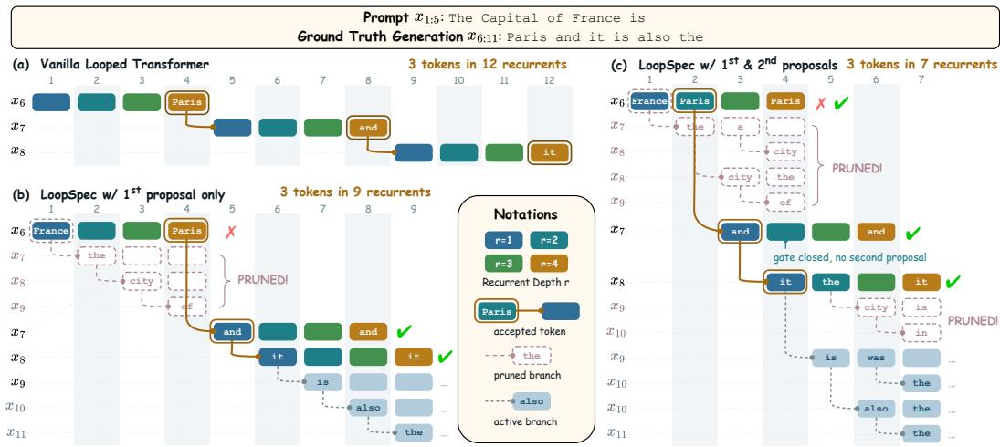  
Figure 1: LOOPSPEC pipelines decoding over $R \ : = \ : 4$ recurrent depth. (a) A vanilla Looped Transformer finishes all R recurrences of one token before starting the next. (b) LOOPSPEC with a first proposal only at $d _ { 1 } = 1 \colon$ an early-depth draft starts the next token immediately, but a rejection stalls the pipeline (Section 4.2). (c) LOOPSPEC with first proposal at $d _ { 1 } = 1$ and a residual second proposal with gating mechanism at $d _ { 2 } = 2 \colon$ the second proposal creates a fallback branch, causing fewer stalls in the pipeline (Section 4.3).

Since deeper recurrent computations progressively refine the model’s prediction, LOOPSPEC uses a deeper recurrent state to produce a second proposal and starts an alternative continuation before verification. Accepting this second proposal preserves its progress when the first proposal is rejected (Figure 1(c)). The resulting computation forms a pipeline in which the target computation and multiple speculative continuations advance in parallel, substantially increasing hardware utilization while preserving the exact target-model distribution. Figure 1 provides an overview of the complete LOOPSPEC pipeline.

Our primary contributions can be summarized as follows:

• We propose LOOPSPEC, a training-free self-speculative pipelining framework that accelerates Looped Transformers without external drafters or structural modifications. To improve draft acceptance while limiting computational overhead, LOOPSPEC introduces (i) a residual second proposal from a deeper recurrent state to recover from first proposal rejection, and (ii) a gating mechanism that creates the fallback speculative continuation only when the deeper state disagrees with the first draft (Sections 4.2 and 4.3).

• We prove that the restart probability depends only on the second proposal depth, not the first. Using the empirically observed power-law decay of the intermediate-to-target TV distance, we derive the optimal proposal depths in closed form matching the measured optima (Section 5).

• We empirically demonstrate up to 6.83× lossless speedup across seven checkpoints from two Looped Transformer families through an SGLang (Zheng et al., 2024) implementation with branch-wise KV management and CUDA Graph optimization, outperforming the training-based DFlash (Chen et al., 2026) by up to 1.7× (Section 6 and B).

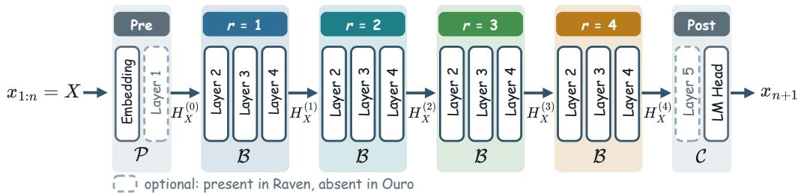  
Figure 2: Overview of a Looped Transformer with R = 4 recurrent steps. In Ouro models (Zhu et al., 2025), the pre-layers $\mathcal { P }$ and post-layers C contain only the Embedding layer and LM Head, respectively, whereas in Raven models (McLeish et al., 2026) both P and C contain several Transformer layers.

## 2 RELATED WORK

Speculative Decoding. Speculative decoding (Leviathan et al., 2023; Chen et al., 2023) is a lossless inference acceleration technique that uses a lightweight drafting mechanism to generate multiple candidate tokens, which are then verified in parallel by the target model. Drafting mechanisms typically employ either a smaller pretrained model from the same architecture family (Leviathan et al., 2023) or a specially trained external drafter. Modern state-of-the-art drafters, such as EAGLE-3 (Li et al., 2025) and DFlash (Chen et al., 2026), achieve high acceptance rates by conditioning proposals on intermediate target representations. Self-speculative decoding instead generates draft tokens using the target model itself without a separate external drafter. Draft & Verify (Zhang et al., 2024) obtains drafts by skipping intermediate layers, and LayerSkip (Elhoushi et al., 2024) utilizes early exits.

Looped Transformers. Looped Transformers (Geiping et al., 2025; Zhu et al., 2025; McLeish et al., 2026; Park et al., 2026; Nanbeige Lab et al., 2026) repeatedly apply shared Transformer blocks across recurrent depths, increasing effective depth without proportionally increasing the number of parameters. While they achieve higher task accuracy than standard Transformers of comparable size, their recurrent computation incurs substantially greater memory traffic during inference, limiting decoding throughput.

Recent work reduces recurrent inference cost by modifying the model architecture or adapting the number of recurrent steps. LT2 (Deng et al., 2026) substitutes full attention with linear or sparse attention variants and distills hybrid checkpoints, while Think-at-Hard (Fu et al., 2026) incorporates a routing controller with depth-aware adapters to adjust recurrent passes dynamically. Rather than altering attention or adding routing heads, SPEED (Hooper et al., 2023) explores speculative pipelining across cyclically shared decoder groups. However, SPEED requires a custom training process and only supports greedy decoding.

## 3 PRELIMINARIES

## 3.1 LOOPED TRANSFORMERS

For a sequence prefix $X = x _ { 1 : n }$ of length n, the Looped Transformer computation can be abstracted into (1) pre-layers P, (2) recurrent-layers B, and (3) post-layers C:

$$
\begin{array} { r l } { { } } & { { H _ { X } ^ { ( 0 ) } = \mathcal { P } ( X ) , } } \\ { { } } & { { H _ { X } ^ { ( r ) } = \mathcal { B } \Big ( H _ { X } ^ { ( r - 1 ) } \Big ) , \quad r = 1 , \dots , R , } } \\ { { } } & { { p _ { R } ( \cdot \mid X ) = \mathcal { C } \Big ( H _ { X } ^ { ( R ) } \Big ) . } } \end{array}\tag{1}
$$

Here $H _ { X } ^ { ( 0 ) }$ and $H _ { X } ^ { ( r ) }$ denote hidden states before recurrence and at recurrent depth r, respectively; r indexes recurrent depth, and R denotes the total recurrent depth of the model. $x _ { n + 1 } \sim p _ { R } ( \cdot \mid X )$ is the target next-token probability distribution. The pre-layers P include the token embedding, and the post-layers C incorporate the LM head as well as temperature scaling, optional top-k/top-p filtering, and softmax normalization to output a probability distribution over the vocabulary V.

More generally, applying the post-layers at any recurrent depth r yields an intermediate next-token distribution $p _ { r } ( \cdot \mid X ) = \mathcal { C } ( H _ { X } ^ { ( r ) } )$ , of which the target distribution $p _ { R }$ is the special case $r = R .$ Existing Looped Transformers instantiate this abstraction in different ways. Ouro (Zhu et al., 2025) places all Transformer blocks inside $B ,$ whereas Raven (McLeish et al., 2026) places only a subset of intermediate blocks in B and the remaining ones in $\mathcal { P }$ and C (Figure 2).

## 3.2 REJECTION SAMPLING AND SPECULATIVE DECODING

For any two distinct probability distributions µ and ν over a vocabulary $\nu ,$ we define their elementwise positive difference as $[ \mu - \nu ] _ { + } ( v ) : = \operatorname* { m a x } ( \mu ( v ) - \nu ( v ) , 0 )$ for each $v \in \mathcal V$ , and the residual distribution operator $( \mu \ominus \nu )$ as:

$$
( \mu \ominus \nu ) ( v ) : = \frac { [ \mu - \nu ] _ { + } ( v ) } { \sum _ { u \in \mathcal { V } } [ \mu - \nu ] _ { + } ( u ) } .\tag{2}
$$

The core idea of speculative decoding (Leviathan et al., 2023; Chen et al., 2023) is to draft fast and then verify via rejection sampling. We state the rule for a single token position, which is the form LOOPSPEC builds on.

Formally, let X be the current prefix, and let $p ( \cdot \mid X )$ and $q ( \cdot \mid X )$ denote the target and the proposal distribution of the next token, respectively. A candidate xe is drawn from the proposal distribution $q ( \cdot \mid X )$ and accepted with probability

$$
\operatorname* { m i n } \biggl \{ 1 , \ : \frac { p ( \widetilde { x } \mid X ) } { q ( \widetilde { x } \mid X ) } \biggr \} .\tag{3}
$$

If the candidate xe is rejected, the next token is instead resampled from the residual distribution:

$$
x \sim { \Bigl ( } p ( \cdot \mid X ) \ominus q ( \cdot \mid X ) { \Bigr ) } .\tag{4}
$$

Leviathan et al. (2023) show that the token produced by Equations (3) and (4) is distributed exactly as a token sampled from the target $p ,$ so the procedure is lossless. Crucially, losslessness holds for any valid proposal distribution q.

## 4 LOOPSPEC: PIPELINED SELF-SPECULATIVE DECODING FOR LOOPED TRANSFORMERS

We present LOOPSPEC, a training-free self-speculative decoding framework for Looped Transformers. We first show that early recurrent states can provide effective draft proposals (Section 4.1). Building on this observation, we introduce a pipeline with a single proposal depth $d _ { 1 } < R$ , where each draft starts computation for the next token before final-depth verification (Section 4.2). As decoding is memory-bandwidth bound, batching does not introduce noticeable overhead. We then extend the pipeline with a second proposal depth $d _ { 2 } .$ , using the residual distribution and the gating mechanism to further improve the proposal quality and acceptance (Section 4.3).

## 4.1 OBSERVATION: EARLY RECURRENT STATES ARE EFFECTIVE DRAFTERS

In Looped Transformers, proposals derived from intermediate recurrent states can tightly approximate the target distribution. In Figure 3, we observe this behavior in the Raven-Llama-3.2 model (McLeish et al., 2026). For instance, on GSM8K (Cobbe et al., 2021), the depth-1 greedy agreement exceeds 86% and surpasses 99% by depth 8, with a similar trend on MATH-500 (Hendrycks et al., 2021; Lewkowycz et al., 2022; Kydlicek et al., 2025; Lightman et al., 2024). We further estimate the empirical total variation (TV) distance between the intermediate readout and the target distributions under the same setting, and observe that it decreases sharply as recurrence depth r increases. To characterize this, we bound the empirical TV distance with a power-law upper envelope $\phi ( r ) = \beta r ^ { - \alpha }$ . Specifically, we choose parameters $\alpha , \beta > 0$ to minimize the maximum ratio between $\phi ( r )$ and the empirical TV distance over all depths r. This power-law upper envelope allows us to analyze the optimal depth configuration studied in Section 5.

These observations motivate using early recurrent states to draft future tokens, while continuing recurrence to verify the drafts at depth R. Deeper intermediate states can further serve as fallback proposals when earlier predictions diverge from the target.

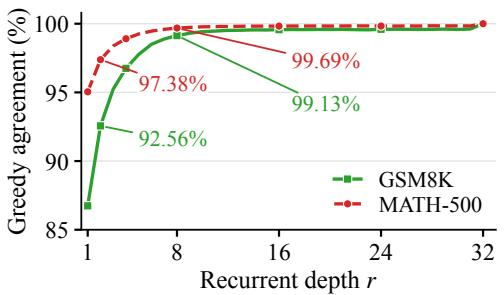  
(a)

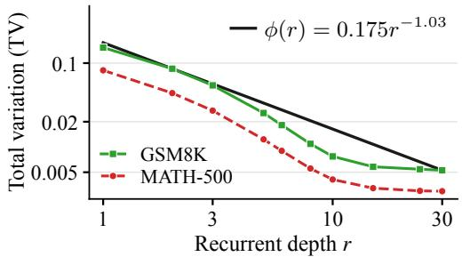  
(b)  
Figure 3: Comparison between intermediate proposals at depth r and the target distribution at depth $R = 3 2$ for Raven-Llama-3.2. (a) Greedy top-1 agreement on GSM8K and MATH-500. (b) Sampling $( T = 1 . 0$ , top- $\cdot p = 0 . 7 )$ total variation (TV) distance to the target on the same benchmarks. TV is obtained on 10 depths over GSM8K and MATH-500, averaged per token position on top-p distribution. $\phi ( r )$ is the empirical power-law upper envelope for the TV distance, constructed as described in Section 4.1.

## 4.2 PIPELINED SELF-SPECULATIVE DECODING WITH A SINGLE PROPOSAL

We first describe the single-proposal pipeline in Figure 1(b), where each token is drafted at only one intermediate depth $d _ { 1 }$ where $d _ { 1 } < R$ , and verified at the final depth R. Unlike vanilla decoding, which completes all R recurrences before moving to the next token (Figure 1(a)), this schedule overlaps computation across token positions (Figure 1(b)). We call the recurrent computation for one prefix a branch, represented as a horizontal sequence of recurrent states in the figure. A draft starts a child branch, while its parent continues toward verification. Multiple branches can remain active at different recurrent depths and crucially they are advanced by a single batched call to the shared block.

For a branch b, we denote its prefix by $X ^ { ( b ) }$ and use the hidden states $H _ { X ^ { ( b ) } } ^ { ( r ) }$ and readouts $p _ { r } ( \cdot \mid X ^ { ( b ) } )$ from Section 3.1. We write $p _ { r }$ when the prefix is clear. After prefilling the prompt and committing the first decoded token, LOOPSPEC initializes a branch on the resulting prefix at depth 0 and repeats the following steps:

1. Batched Recurrence. All active branches advance by one recurrent depth through a single batched call to B. In Figure 1(b), each column represents one such step across the active branches.

2. Early Drafting. When branch b reaches $d _ { 1 }$ , it reads out $q _ { 1 } : = p _ { d _ { 1 } } = \mathcal { C } ( H _ { X ^ { ( b ) } } ^ { ( d _ { 1 } ) } )$ and samples $\widetilde { x } _ { b } ^ { ( 1 ) } \sim q _ { 1 } . \mathrm { ~ A ~ }$ child branch is then initialized at depth 0 with the extended prefix $X ^ { ( b ) } \parallel \widetilde { x } _ { b } ^ { ( 1 ) }$ . For example, with $d _ { 1 } = 1$ in Figure 1(b), the draft “France” at timestep 1 starts a child at timestep 2 before “France” is verified at timestep 4.

3. Verification and Continuation. When the branch reaches R, it verifies $\widetilde { x } _ { b } ^ { ( 1 ) }$ against $p _ { R }$ using rejection sampling as Equation (3). If accepted, the draft is committed and decoding continues from its child, which has already completed $R - d _ { 1 }$ recurrent steps. In Figure 1(b), accepting “and” at timestep 8 preserves its child branch that started at timestep 6. If rejected, a replacement $x _ { b } \sim p _ { R } \ominus q _ { 1 }$ is committed, all speculative descendants of b are pruned, and a new branch starts on $X ^ { ( b ) } \parallel \boldsymbol { x } _ { b }$ at depth 0. The “France” draft at timestep 1 in Figure 1(b) illustrates this case: depth-R commits “Paris”, which differs from the draft “France”, so we prune the descendants of “France” and restart computation for the next token.

With sustained draft acceptance, tokens are committed every $d _ { 1 }$ recurrent steps rather than every R steps. However, each rejection discards the speculative progress and requires another R recurrent steps before the next commitment. This motivates a more accurate second proposal that can provide a fallback draft when the first draft is rejected.

## 4.3 RESIDUAL SECOND PROPOSAL WITH GATING MECHANISM

We now extend the single-proposal pipeline in Section 4.2 by adding a second proposal depth $d _ { 2 } .$ with $d _ { 1 } < d _ { 2 } < R$ . At depth $d _ { 2 }$ , a branch can draft an alternative token for the same position, starting a fallback child alongside the first child. Accepting this fallback preserves its progress instead of restarting the pipeline. We next describe how to construct the fallback proposal, when to create it, and how to verify the two candidates.

Residual Second Proposal. The second proposal is used only after the first proposal is rejected, so the required target distribution is $p _ { R } \ominus q _ { 1 }$ . We therefore draft from an estimate of this residual target. When branch b reaches $d _ { 2 } ,$ it obtains a deeper readout $\widetilde { q } _ { 2 } : = p _ { d _ { 2 } } = \mathcal { C } ( H _ { X ^ { ( b ) } } ^ { ( d _ { 2 } ) } )$ and forms

$$
q _ { 2 } : = \widetilde { q } _ { 2 } \ominus q _ { 1 } = p _ { d _ { 2 } } \ominus p _ { d _ { 1 } } , \qquad \widetilde { x } _ { b } ^ { ( 2 ) } \sim q _ { 2 } .\tag{5}
$$

Here we use $\widetilde { q } _ { 2 }$ as an estimator for $p _ { R }$ and sample the second proposal from the residual distribution $q _ { 2 } . \mathrm { A }$ second child then starts from depth 0 with the prefix $X ^ { ( b ) } \parallel \widetilde { x } _ { b } ^ { ( 2 ) }$ . The two proposals represent alternative branches for the same token position, as illustrated by the “France” and “Paris” drafts at timesteps 1 and 2 in the top row of Figure 1(c). Our ablation study in Section 6.3 shows that the residual second proposal $q _ { 2 }$ consistently improves the decoding speedup over the non-residual second proposal $\widetilde { q } _ { 2 }$ across various benchmarks.

Gating Mechanism. Creating a fallback at every branch would rapidly increase the number of active branches, since each child can itself issue two proposals. Specifically, if every active branch forks at both $d _ { 1 }$ and $d _ { 2 } .$ , the number of new branches $s _ { k }$ spawned in the k-th interval of $d _ { 1 }$ recurrent steps obeys the delayed recurrence $s _ { k } = s _ { k - 1 } + s _ { k - d _ { 2 } / d _ { 1 } }$ , where $s _ { k } = 1$ for $0 \leq k < d _ { 2 } / d _ { 1 } { } ^ { 1 }$ . For $R = 3 2 , d _ { 1 } = 2 .$ , and $d _ { 2 } = 8 ,$ this gives maximum branch count $\begin{array} { r } { B = \sum _ { k = 0 } ^ { R / d _ { 1 } - 1 } s _ { k } = 2 4 9 } \end{array}$ . To limit this growth of $B ,$ LOOPSPEC opens the gate of second proposal and creates a second proposal branch only if

$$
\widetilde { q } _ { 2 } ( \widetilde { x } _ { b } ^ { ( 1 ) } ) < q _ { 1 } ( \widetilde { x } _ { b } ^ { ( 1 ) } ) .\tag{6}
$$

Intuitively, a fallback branch is created when the deeper recurrent state withdraws confidence from the primary candidate. Under greedy decoding, the rule reduces to arg max $\widetilde q _ { 2 } \neq \widetilde x _ { b } ^ { ( 1 ) }$ . In $\operatorname { F i g } .$ ure 1(c), the gate stays closed for the “and” branch where no second proposal is triggered at timestep 4. Section 6.3 evaluates the benefit of the gating mechanism. Moreover, Section D examines the gate opening frequency and its effect on the effective batch size.

Cascade Verification. When a branch b reaches depth R, it produces the exact target distribution $p _ { R }$ and a cascade verification attempts to accept the primary candidate, then the fallback candidate, and restarts the pipeline only if neither candidate is accepted.

1. First Proposal. Accept $\widetilde { x } _ { b } ^ { ( 1 ) }$ against $p _ { R }$ with probability min $\left\{ 1 , p _ { R } ( \widetilde { x } _ { b } ^ { ( 1 ) } ) / q _ { 1 } ( \widetilde { x } _ { b } ^ { ( 1 ) } ) \right\}$ . If accepted, commit it and keep its descendants, and prune the second child’s subtree if present. In Figure 1(c), at timestep 7, accepting the first draft $\dot { \mathbf { \Omega } } _ { \mathrm { i { t } } } , \mathbf { \Omega } ,$ from timestep 4 preserves its continuation while pruning the second draft “the” from timestep 5 and its subtree.

2. Second Proposal. If the first proposal is rejected and a second proposal exists, verify $\widetilde { x } _ { b } ^ { ( 2 ) }$ against $\rho _ { 1 } : = p _ { R } \ominus q _ { 1 }$ with probability min $\left\{ 1 , \rho _ { 1 } ( \widetilde { x } _ { b } ^ { ( 2 ) } ) / q _ { 2 } ( \widetilde { x } _ { b } ^ { ( 2 ) } ) \right\}$ . If accepted, commit it and keep its descendants, and prune the first child’s subtree. This child has already completed $R { - } d _ { 2 }$ recurrent steps, so the next commitment requires only $d _ { 2 }$ more steps instead of $R .$ . This is the rejection of “France” and acceptance of the second draft $\mathrm { \ddot { P a r i s } \vec { \Omega } }$ in the top 5 rows of Figure 1(c).

3. Residual Resampling. If both proposals are rejected, sample $x _ { b } \sim \rho _ { 1 } \ominus q _ { 2 }$ . If the first is rejected and the gate was closed, sample $x _ { b } \sim \rho _ { 1 }$ instead. Commit $x _ { b } .$ , prune the speculative descendants of $b ,$ and start a fresh branch on $X ^ { ( b ) } \parallel { x } _ { b }$ at depth 0.

Under greedy decoding, this cascade checks whether $\widetilde { x } _ { b } ^ { ( 1 ) }$ matches arg max $p _ { R } .$ falling back to $\widetilde { x } _ { b } ^ { ( 2 ) }$ if available, and committing arg max $p _ { R }$ otherwise. The algorithm is provided in Section H.

## 5 THEORETICAL ANALYSIS

In this section, we provide theoretical analysis of LOOPSPEC from two perspectives. First, we show that the restart probability depends only on the approximation error of the second proposal and is independent of that of the first proposal. Second, we use the power-law decay of approximation error across recurrent depths, as observed in Figure 3(b), to derive the optimal proposal depths that minimize the expected number of recurrent steps per generated token. The optimal proposal depths derived from our analysis closely match the empirically optimal depth configurations.

Theorem 1 (Rejection Rate of LOOPSPEC). Fix proposal depths $1 \leq d _ { 1 } < d _ { 2 } < R$ and let $\varepsilon _ { 2 }$ be the total variation distance between $p _ { d _ { 2 } }$ and $p _ { R } .$ . Under the residual second proposal $q _ { 2 } = p _ { d _ { 2 } } \ominus p _ { d _ { 1 } }$ and cascade verification, the probability that both candidates are rejected at a given position is at most $\varepsilon _ { 2 } ,$ independently of $\cdot d _ { 1 } .$ . Moreover, with the gating mechanism, the bound is at most $2 \varepsilon _ { 2 }$

Proofs of all theorems are provided in Section G. Theorem 1 implies that the residual proposal $p _ { d _ { 2 } } \ominus$ $p _ { d _ { 1 } }$ achieves the same rejection bound $\varepsilon _ { 2 }$ as a proposal drawn directly from $p _ { d _ { 2 } }$ , while avoiding any additional dependence on $d _ { 1 }$ . Thus, introducing the residual proposal does not worsen the rejection bound compared with using $p _ { d _ { 2 } }$ directly. With the gating mechanism described in Section 4.3, the bound increases only by a constant factor, from $\varepsilon _ { 2 }$ to $2 \varepsilon _ { 2 }$

This result allows us to characterize the cost of a rejection using only the approximation quality at the second proposal depth $d _ { 2 }$ . Hence, we can focus on how the approximation error decreases with recurrent depth to derive the proposal depths that minimize the expected decoding cost. Motivated by the observations in Figure 3(b), we assume a non-increasing power-law envelope $\phi ( r ) = \beta r ^ { - \alpha }$ that upper bounds the expected total variation distance between the intermediate readout distribution $p _ { r }$ and the target distribution $p _ { R }$

Theorem 2 (Proposal Depth Selection). Let X be a random prefix drawn from a fixed distribution over prefixes. Assume that there exist constants $\alpha , \beta > 0$ such that

$$
\mathbb { E } _ { X } \left[ \mathrm { T V } \left( p _ { r } ( \cdot \mid X ) , p _ { R } ( \cdot \mid X ) \right) \right] \leq \beta r ^ { - \alpha } .\tag{7}
$$

for every $r = 1 , . . . , R$ and the total depth $\begin{array} { r } { R > \frac { 1 } { 2 \alpha } \operatorname* { m a x } \{ ( \alpha \beta ) ^ { 1 / \alpha } , ( \alpha \beta ) ^ { - \alpha - 1 } , ( \alpha \beta ) ^ { 1 / \alpha } ( 2 \alpha ) ^ { \frac { \alpha ^ { 2 } + \alpha + 1 } { \alpha ^ { 2 } } } \} } \end{array}$ Then, the optimal proposal depths to minimize expected number of recurrent steps to commit a single token are

$$
\begin{array} { r } { d _ { 1 } ^ { \star } = ( \alpha \beta ) ^ { \frac { \alpha + 1 } { \alpha ^ { 2 } + \alpha + 1 } } ( 2 \alpha R ) ^ { \frac { 1 } { \alpha ^ { 2 } + \alpha + 1 } } \mathrm { , ~ \qquad } d _ { 2 } ^ { \star } = ( \alpha \beta ) ^ { \frac { \alpha } { \alpha ^ { 2 } + \alpha + 1 } } ( 2 \alpha R ) ^ { \frac { \alpha + 1 } { \alpha ^ { 2 } + \alpha + 1 } } \mathrm { . ~ } } \end{array}\tag{8}
$$

As shown in Figure 3(b), we obtain an empirical upper bound with $\beta \ : = \ : 0 . 1 7 5$ and $\alpha = 1 . 0 3$ for Raven-Llama-3.2 model with $R = 3 2$ . Substituting these values into Equation (8) gives us $( d _ { 1 } ^ { \star } , d _ { 2 } ^ { \star } ) \ = \ ( 1 . 2 6 , 8 . 8 5 )$ . In Section $^ { 6 , }$ we explore various $( d _ { 1 } , d _ { 2 } )$ configurations and find that $\bar { ( d _ { 1 } , d _ { 2 } ) } = ( \bar { 2 } , 8 )$ performs best for the same model. This demonstrates that our theoretical analysis closely captures the empirically optimal depth configuration.

## 6 EXPERIMENTS

Models and Evaluations. We evaluate LOOPSPEC across two representative Looped Transformer families: the Ouro family with $R \ = \ 4$ (Zhu et al., 2025) and the Raven family with $R ~ = ~ 3 2$ (McLeish et al., 2026). Evaluations cover mathematical reasoning, general reasoning, and code generation: GSM8K (Cobbe et al., 2021), MATH-500 (Hendrycks et al., 2021; Lewkowycz et al., 2022; Kydlicek et al., 2025; Lightman et al., 2024), BBH (Suzgun et al., 2023), HumanEval+ and MBPP+ (Chen et al., 2021; Austin et al., 2021; Liu et al., 2023) for base models, alongside GSM8K-CoT, MATH-500, AIME 2024, and AIME 2025 (Mathematical Association of America, 2024; 2025) for reasoning models (i.e., with thinking mode enabled). Base models are evaluated under greedy decoding $( T ~ = ~ 0 . 0 )$ , whereas reasoning models are evaluated using chat templates with thinking modes enabled, under both greedy decoding $( T = 0 . 0 )$ and sampling $( T = 1 . 0 , \mathrm { t o p } \cdot p = 0 . 7 )$ All evaluations are conducted in a single-batch setting integrated with lm-evaluation-harness (Gao et al., 2023). Detailed checkpoint identifiers and benchmark con figurations are provided in Section ${ \mathrm { A } } .$

Table 1: LOOPSPEC decoding speedup over the standard autoregressive decoding and mean accepted length γ on general reasoning, math, and code benchmarks across different proposal depths. Bold values mark per-model, per-benchmark maxima, with speedup and γ selected independently.
<table><tr><td rowspan="2">Models</td><td rowspan="2">Proposal Depths</td><td colspan="2">GSM8K</td><td colspan="2">MATH-500</td><td colspan="2">BBH</td><td colspan="2">HumanEval+</td><td colspan="2">MBPP+</td></tr><tr><td>Speedup</td><td>γ</td><td>Speedup</td><td>γ</td><td>Speedup</td><td>γ</td><td>Speedup</td><td>γ</td><td>Speedup</td><td>γ</td></tr><tr><td colspan="10">Greedy Setting: Temperature=0.0</td></tr><tr><td>Ouro-1.4B</td><td>1</td><td>2.64×</td><td>3.13</td><td>2.64×</td><td>3.25</td><td>2.66×</td><td>3.30</td><td>3.17×</td><td>3.73</td><td>2.79×</td><td>3.36</td></tr><tr><td rowspan="2">Ouro-2.6B</td><td>1,2</td><td>2.85×</td><td>3.50</td><td>2.78×</td><td>3.55</td><td>2.79×</td><td>3.59</td><td>3.16×</td><td>3.86</td><td>2.92×</td><td>3.64</td></tr><tr><td>1</td><td>3.03×</td><td>3.43</td><td>2.93×</td><td>3.50</td><td>2.89×</td><td>3.49</td><td>3.36×</td><td>3.78</td><td>3.00×</td><td>3.44</td></tr><tr><td rowspan="2"></td><td>1,2</td><td>3.12×</td><td>3.68</td><td>2.99×</td><td>3.72</td><td>2.98×</td><td>3.72</td><td>3.33×</td><td>3.89</td><td>3.09×</td><td>3.69</td></tr><tr><td>2</td><td>3.04×</td><td>7.62</td><td>4.77×</td><td>11.56</td><td>4.19×</td><td>10.35</td><td>4.93×</td><td>11.73</td><td>3.96×</td><td>9.70</td></tr><tr><td rowspan="5">Raven- Llama-3.2</td><td>4</td><td>4.06×</td><td>6.55</td><td>4.76×</td><td>7.43</td><td>4.57×</td><td>7.21</td><td>4.89×</td><td>7.52</td><td>4.55×</td><td>7.14</td></tr><tr><td>4,8</td><td>4.33×</td><td>7.51</td><td>4.90×</td><td>7.83</td><td>4.76×</td><td>7.74</td><td>5.01×</td><td>7.84</td><td>4.72×</td><td>7.70</td></tr><tr><td>2,10</td><td>4.38×</td><td>12.02</td><td>5.70×</td><td>14.40</td><td>5.32×</td><td>13.72</td><td>5.83×</td><td>14.36</td><td>5.07×</td><td>13.08</td></tr><tr><td>2,8</td><td>4.49×</td><td>12.50</td><td>5.82×</td><td>14.60</td><td>5.39×</td><td>13.98</td><td>5.88×</td><td>14.55</td><td>5.14×</td><td>13.44</td></tr><tr><td>2</td><td>3.75×</td><td>8.95</td><td>3.16×</td><td>8.34</td><td>3.52×</td><td>9.24</td><td>5.05×</td><td>12.12</td><td>5.04×</td><td>12.06</td></tr><tr><td rowspan="5">Raven- OLMo-2-0425</td><td>4</td><td>4.38×</td><td>6.97</td><td>4.04×</td><td>6.94</td><td>4.17×</td><td>7.07</td><td>4.78×</td><td>7.59</td><td>4.81×</td><td>7.62</td></tr><tr><td>4,8</td><td>4.60×</td><td>7.67</td><td>4.26×</td><td>7.67</td><td>4.38×</td><td>7.73</td><td>4.86×</td><td>7.87</td><td>4.89×</td><td>7.88</td></tr><tr><td>2,10</td><td>5.06×</td><td>12.87</td><td>4.29×</td><td>12.65</td><td>4.57×</td><td>13.17</td><td>5.75×</td><td>14.37</td><td>5.86×</td><td>14.56</td></tr><tr><td>2,8</td><td>5.20×</td><td>13.35</td><td>4.29×</td><td>13.11</td><td>4.66×</td><td>13.60</td><td>5.86×</td><td>14.74</td><td>5.97×</td><td>14.86</td></tr><tr><td></td><td></td><td></td><td></td><td></td><td></td><td></td><td></td><td></td><td></td><td></td></tr><tr><td rowspan="5">Raven- TinyLlama-3T</td><td>2 4</td><td>3.86×</td><td>8.18 6.72</td><td rowspan="5"></td><td rowspan="5">prompts exceed max context length</td><td rowspan="5"></td><td rowspan="5"></td><td>5.85×</td><td>11.94</td><td>4.60×</td><td>9.69</td></tr><tr><td>4,8</td><td>4.69×</td><td></td><td>5.40×</td><td>7.46 7.85</td><td>4.98× 5.18×</td><td>7.08</td></tr><tr><td></td><td>5.01× 5.38×</td><td>7.58 12.43</td><td></td><td>5.58× 6.83×</td><td>14.49 5.96×</td><td>7.71 13.37</td></tr><tr><td>2,10</td><td>12.89</td><td></td><td></td><td></td><td></td><td>13.55</td></tr><tr><td>2,8</td><td>5.53×</td><td></td><td></td><td>6.81×</td><td>14.70</td><td>5.76×</td></tr></table>

Implementation and Metrics. We implement LOOPSPEC by extending the SGLang serving engine (Zheng et al., 2024). All experiments are executed on an NVIDIA RTX PRO 6000 Blackwell GPU in BF16 precision using the Triton attention backend and the TinyGEMM backend provided by FlashInfer (Ye et al., 2025). Further SGLang implementation details are in Section B. We report speedup on wall-clock time and mean accepted length γ. Wall-clock time speedup is measured over the decoding phase, after the completion of prompt prefilling until the end of generation. We define γ as the average number of generated tokens produced per full model execution of R recurrent steps:

$$
\gamma : = \frac { N _ { \mathrm { d e c o d e } } \cdot R } { N _ { \mathrm { a c c e p t , 1 } } \cdot d _ { 1 } + N _ { \mathrm { a c c e p t , 2 } } \cdot d _ { 2 } + ( N _ { \mathrm { d e c o d e } } - N _ { \mathrm { a c c e p t , 1 } } - N _ { \mathrm { a c c e p t , 2 } } ) \cdot R } ,\tag{9}
$$

where $N _ { \mathrm { d e c o d e } }$ is the number of generated tokens, and $N _ { \mathrm { a c c e p t , 1 } }$ and $N _ { \mathrm { a c c e p t , 2 } }$ denote the number of tokens accepted from the first and second proposals, respectively. By construction, $\gamma \leq R / d _ { 1 }$ , with the upper bound attained when all tokens are accepted at the first proposal depth d .

## 6.1 BASE MODELS

Table 1 presents the decoding speedup and mean accepted length γ across base model checkpoints. Across various tasks, LOOPSPEC provides consistent speedups over standard autoregressive decoding. For the Ouro family $( R = 4 )$ , LOOPSPEC achieves speedups up to 3.36×, with γ exceeding 3.5 out of $R / d _ { 1 } = 4$ . For the deeper Raven family (R = 32), LOOPSPEC yields peak speedups ranging from 5.88× to 6.83× across models, with γ exceeding 14.5. Here, while a single proposal at depth $d _ { 1 } = 2$ suffers from lower acceptance rates, adding a second proposal $( \mathbf { e . g . , } d _ { 1 } = 2 , d _ { 2 } = 8 )$ compensates for early errors, allowing the first proposal depth to be pushed down to $d _ { 1 } = 2$ to enlarge the pipeline depth and maximize speedup. In Section E, we further show that the first proposal accounts for over 86% of committed tokens, while the second proposal recovers the majority of the remainder, leaving at most 2.95% of all committed tokens to full pipeline restart.

Table 2: LOOPSPEC decoding speedup over the standard autoregressive decoding and mean accepted length $\gamma$ with thinking enabled across different proposal depths. Results under temperature 0.0 and 1.0 (with $\mathrm { t o p } { - } p = 0 . 7 )$ are reported separately. Bold values mark per-model, per-benchmark maxima, with speedup and γ selected independently.
<table><tr><td rowspan="2">Models</td><td rowspan="2">Proposal Depths</td><td colspan="2">GSM8K</td><td colspan="2">MATH-500</td><td colspan="2">AIME 2024</td><td colspan="2">AIME 2025</td></tr><tr><td>Speedup</td><td>γ</td><td>Speedup</td><td>γ</td><td>Speedup</td><td>γ</td><td>Speedup</td><td>γ</td></tr><tr><td colspan="9">Greedy Setting: Temperature=0.0</td></tr><tr><td>Ouro-1.4B-Thinking</td><td>1 1,2</td><td>2.47×</td><td>2.95</td><td>2.49×</td><td>3.12</td><td>2.56×</td><td>3.26</td><td>2.45×</td><td>3.23</td></tr><tr><td rowspan="2">Ouro-2.6B-Thinking</td><td></td><td>2.70×</td><td>3.36</td><td>2.65×</td><td>3.50</td><td>2.52×</td><td>3.54</td><td>2.59×</td><td>3.55</td></tr><tr><td>1 1,2</td><td>2.76× 2.95×</td><td>3.21 3.55</td><td>2.63× 2.78×</td><td>3.33 3.64</td><td>2.53× 2.58×</td><td>3.31 3.63</td><td>2.58× 2.66×</td><td>3.22 3.64</td></tr><tr><td colspan="10">Sampling Setting: Temperature=1.0</td></tr><tr><td rowspan="2">Ouro-1.4B-Thinking</td><td>1</td><td></td><td>2.64</td><td>2.17×</td><td></td><td></td><td></td><td></td><td></td></tr><tr><td>1,2</td><td>2.11× 2.42×</td><td>3.21</td><td>2.41×</td><td>2.88 3.35</td><td>2.07× 2.34×</td><td>2.77 3.31</td><td>2.05× 2.27×</td><td>2.76 3.28</td></tr><tr><td rowspan="2">Ouro-2.6B-Thinking</td><td>1</td><td></td><td>3.11</td><td>2.52×</td><td>3.21</td><td>2.37×</td><td>3.14</td><td>2.39×</td><td>3.10</td></tr><tr><td>1,2</td><td>2.62× 2.83×</td><td>3.54</td><td>2.70×</td><td>3.61</td><td>2.51×</td><td>3.54</td><td>2.65×</td><td>3.53</td></tr></table>

Table 3: Ablation study of different second proposal methods in LOOPSPEC.
<table><tr><td>Model: Raven-Llama-3.2</td><td>GSM8K</td><td>MATH-500</td><td>HumanEval+</td><td>MBPP+</td></tr><tr><td>Standard Autoregressive Decoding</td><td>1.00×</td><td>1.00×</td><td>1.00×</td><td>1.00×</td></tr><tr><td>+ First &amp; Non-residual Second Proposal</td><td>3.24×</td><td>4.49×</td><td>4.59×</td><td>4.07×</td></tr><tr><td>+ Residual Second Proposal</td><td>3.52×</td><td>4.73×</td><td>4.76×</td><td>4.57×</td></tr><tr><td>+ Gating Mechanism</td><td>3.74×</td><td>4.85×</td><td>5.00×</td><td>4.71×</td></tr></table>

Notably, γ measures the reduction in serial recurrent steps but excludes the cost of $\mathcal { P }$ and C computation. A smaller $d _ { 1 }$ triggers more frequent drafting and branch initialization, increasing these costs, particularly in Raven models with heavy pre- and post-layers. This overhead can outweigh the recurrent step savings, explaining why some configurations on Raven models achieve higher γ values but lower wall-clock time speedup.

## 6.2 REASONING MODELS

Table 2 reports the performance of LOOPSPEC in reasoning models with the thinking mode enabled. Across long-context chain-of-thought generation on GSM8K, MATH-500, and AIME 2024/2025 benchmarks, LOOPSPEC delivers speedups up to 2.95× with high γ values even on complex, longreasoning benchmarks.

For stochastic sampling $( T = 1 . 0 , \mathrm { t o p } . p = 0 . 7 )$ , LOOPSPEC maintains competitive speedups up to 2.83×. Here, the second proposal proves particularly effective: drafting from the residual distribution upon rejection increases γ from 3.11 to 3.54 on Ouro-2.6B-Thinking under the GSM8K benchmark, yielding substantial speedup gains over using only the first proposal.

## 6.3 ABLATION STUDY

Residual Second Proposal and Gating Mechanism. Table 3 presents the results of an ablation study on the second proposal in LOOPSPEC, which are the residual second proposal and the gating mechanism. The ablation study is conducted on Raven-Llama-3.2 model under sampling $( T =$ $1 . 0 , \mathrm { t o p } { - p } = 0 . 7 )$ on GSM8K, MATH-500, HumanEval+, and MBPP+ benchmarks. We mask out the first proposal token $\widetilde { x } _ { b } ^ { ( 1 ) }$ from $\widetilde { q } _ { 2 }$ for the non-residual second proposal and from $q _ { 2 }$ for the residual second proposal, and renormalize the corresponding distribution before sampling. This ensures that the second proposal differs from the first proposal. With gating, this masking can be omitted for

DFlash (Ouro-2.6B-Thinking) LoopSpec (Ouro-2.6B-Thinking)

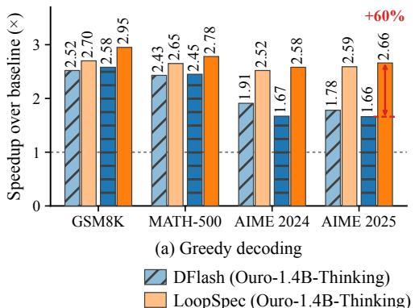

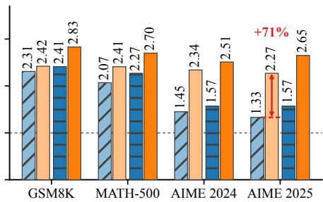  
(b) Stochastic sampling (T = 1.0, top-p = 0.7)  
LoopSpec (Ouro-1.4B-Thinking)  
Figure 4: Decoding speedup over the standard autoregressive decoding for LOOPSPEC versus DFlash on the Ouro thinking models, under greedy decoding and stochastic sampling.

the residual second proposal because the gate opens only when $\widetilde q _ { 2 } ( \widetilde x _ { b } ^ { ( 1 ) } ) < q _ { 1 } ( \widetilde x _ { b } ^ { ( 1 ) } )$ , in which case $q _ { 2 } ( \widetilde { x } _ { b } ^ { ( 1 ) } )$ is already zero.

Adding the first and non-residual second proposal at $d _ { 1 } = 2 , d _ { 2 } = 8$ yields speedups ranging from 3.24× to 4.59×. Replacing the non-residual second proposal with the residual second proposal and adding the gating mechanism consistently improve the speedups to 3.74× to 5.00×, showing the effectiveness of the residual second proposal and gating mechanism. Section D further examines how often the gate opens and how gating reduces the effective batch size during decoding.

Comparison between LOOPSPEC and DFlash. We additionally compare our training-free LOOPSPEC to DFlash (Chen et al., 2026) on various reasoning tasks, where DFlash is an effective training-based speculative decoding method that has been largely adopted in standard autoregressive models, e.g., Xiaomi MiMo Team (2026). As shown in Figure 4, LOOPSPEC consistently outperforms DFlash by showing up to 1.7× speedup on decoding time under both greedy and stochastic sampling settings. More details on implementation and settings are provided in Section C.

## 7 CONCLUSION

We introduced LOOPSPEC, a training-free self-speculative decoding framework for Looped Transformers that converts recurrent depth into token-position parallelism. An early recurrent state drafts the next token and immediately begins computing it while the current token continues toward finaldepth verification. Furthermore, we proposed a residual second proposal with a gating mechanism from a deeper recurrent depth alongside a cascade verification that keeps decoding lossless. Across the Ouro (R = 4) and Raven (R = 32) families, LOOPSPEC achieves speedups of up to 6.83× on general reasoning, math, and coding benchmarks.

## REFERENCES

Jacob Austin, Augustus Odena, Maxwell I. Nye, Maarten Bosma, Henryk Michalewski, David Dohan, Ellen Jiang, Carrie J. Cai, Michael Terry, Quoc V. Le, and Charles Sutton. Program synthesis with large language models. CoRR, abs/2108.07732, 2021. URL https: //arxiv.org/abs/2108.07732. 6

Seongjin Cha, Gyuwan Kim, Dongsu Han, Tao Yang, and Insu Han. KnapSpec: Self-speculative decoding via adaptive layer selection as a knapsack problem. In Forty-third International Conference on Machine Learning, 2026. URL https://openreview.net/forum?id= k5nKHWp9VC. 1

Charlie Chen, Sebastian Borgeaud, Geoffrey Irving, Jean-Baptiste Lespiau, Laurent Sifre, and John Jumper. Accelerating large language model decoding with speculative sampling, 2023. URL https://arxiv.org/abs/2302.01318. 1, 2, 3.2

Jian Chen, Yesheng Liang, and Zhijian Liu. DFlash: Block diffusion for flash speculative decoding. In Forty-third International Conference on Machine Learning, 2026. URL https: //openreview.net/forum?id=Oz335dV48X. 1, 1, 2, 6.3

Mark Chen, Jerry Tworek, Heewoo Jun, Qiming Yuan, Henrique Ponde de Oliveira Pinto, Jared´ Kaplan, Harri Edwards, Yuri Burda, Nicholas Joseph, Greg Brockman, Alex Ray, Raul Puri, Gretchen Krueger, Michael Petrov, Heidy Khlaaf, Girish Sastry, Pamela Mishkin, Brooke Chan, Scott Gray, Nick Ryder, Mikhail Pavlov, Alethea Power, Lukasz Kaiser, Mohammad Bavarian, Clemens Winter, Philippe Tillet, Felipe Petroski Such, Dave Cummings, Matthias Plappert, Fotios Chantzis, Elizabeth Barnes, Ariel Herbert-Voss, William Hebgen Guss, Alex Nichol, Alex Paino, Nikolas Tezak, Jie Tang, Igor Babuschkin, Suchir Balaji, Shantanu Jain, William Saunders, Christopher Hesse, Andrew N. Carr, Jan Leike, Joshua Achiam, Vedant Misra, Evan Morikawa, Alec Radford, Matthew Knight, Miles Brundage, Mira Murati, Katie Mayer, Peter Welinder, Bob McGrew, Dario Amodei, Sam McCandlish, Ilya Sutskever, and Wojciech Zaremba. Evaluating large language models trained on code. CoRR, abs/2107.03374, 2021. URL https://arxiv.org/abs/2107.03374. 6

Karl Cobbe, Vineet Kosaraju, Mohammad Bavarian, Mark Chen, Heewoo Jun, Lukasz Kaiser, Matthias Plappert, Jerry Tworek, Jacob Hilton, Reiichiro Nakano, Christopher Hesse, and John Schulman. Training verifiers to solve math word problems. CoRR, abs/2110.14168, 2021. URL https://arxiv.org/abs/2110.14168. 4.1, 6

Chunyuan Deng, Yizhe Zhang, Rui-Jie Zhu, Yuanyuan Xu, Jiarui Liu, T. S. Eugene Ng, and Hanjie Chen. LT2: Linear-time looped transformers, 2026. URL https://arxiv.org/abs/ 2605.20670. 2

Mostafa Elhoushi, Akshat Shrivastava, Diana Liskovich, Basil Hosmer, Bram Wasti, Liangzhen Lai, Anas Mahmoud, Bilge Acun, Saurabh Agarwal, Ahmed Roman, Ahmed Aly, Beidi Chen, and Carole-Jean Wu. LayerSkip: Enabling early exit inference and self-speculative decoding. In Lun-Wei Ku, Andre Martins, and Vivek Srikumar (eds.), Proceedings of the 62nd Annual Meeting of the Association for Computational Linguistics (Volume 1: Long Papers), pp. 12622–12642, Bangkok, Thailand, August 2024. Association for Computational Linguistics. doi: 10.18653/v1/ 2024.acl-long.681. URL https://aclanthology.org/2024.acl-long.681/. 1, 2

Tianyu Fu, Yichen You, Zekai Chen, Guohao Dai, Huazhong Yang, and Yu Wang. Think-at-Hard: Selective latent iterations to improve reasoning language models. In Forty-third International Conference on Machine Learning, 2026. URL https://openreview.net/forum?id= eQaJSRZiGn. 2

Leo Gao, Jonathan Tow, Baber Abbasi, Stella Biderman, Sid Black, Anthony DiPofi, Charles Foster, Laurence Golding, Jeffrey Hsu, Alain Le Noac’h, Haonan Li, Kyle McDonell, Niklas Muennighoff, Chris Ociepa, Jason Phang, Laria Reynolds, Hailey Schoelkopf, Aviya Skowron, Lintang Sutawika, Eric Tang, Anish Thite, Ben Wang, Kevin Wang, and Andy Zou. A framework for few-shot language model evaluation, 12 2023. URL https://zenodo.org/records/ 10256836. 6

Jonas Geiping, Sean McLeish, Neel Jain, John Kirchenbauer, Siddharth Singh, Brian Bartoldson, Bhavya Kailkhura, Abhinav Bhatele, and Tom Goldstein. Scaling up testtime compute with latent reasoning: A recurrent depth approach. In D. Belgrave, C. Zhang, H. Lin, R. Pascanu, P. Koniusz, M. Ghassemi, and N. Chen (eds.), Advances in Neural Information Processing Systems, volume 38, Main Conference, pp. 41340–41391. Curran Associates, Inc., 2025. doi: 10.52202/085713-1380. URL https://proceedings.neurips.cc/paper\_files/paper/2025/file/ 3b01972cf31e6fa0fe29e4b8b5c2a0a1-Paper-Conference.pdf. 1, 2

Dan Hendrycks, Collin Burns, Saurav Kadavath, Akul Arora, Steven Basart, Eric Tang, Dawn Song, and Jacob Steinhardt. Measuring mathematical problem solving with the MATH dataset. In J. Vanschoren and S. Yeung (eds.), Proceedings of the Neural Information Processing Systems Track on Datasets and Benchmarks, volume 1, 2021. URL https: //datasets-benchmarks-proceedings.neurips.cc/paper\_files/paper/ 2021/file/be83ab3ecd0db773eb2dc1b0a17836a1-Paper-round2.pdf. 4.1, 6

Coleman Hooper, Sehoon Kim, Hiva Mohammadzadeh, Hasan Genc, Kurt Keutzer, Amir Gholami, and Yakun Sophia Shao. SPEED: Speculative pipelined execution for efficient decoding. In Third Workshop on Efficient Natural Language and Speech Processing (ENLSP-III): Towards the Future of Large Language Models and Their Emerging Descendants, New Orleans, Louisiana, USA, 2023. URL https://neurips2023-enlsp.github.io/papers/paper\_17.pdf. 1, 2

Hynek Kydlicek, Alina Lozovskaya, Nathan Habib, and Clementine Fourrier. Fixing open llm´ leaderboard with math-verify, 2025. 4.1, 6

Yaniv Leviathan, Matan Kalman, and Yossi Matias. Fast inference from transformers via speculative decoding. In Andreas Krause, Emma Brunskill, Kyunghyun Cho, Barbara Engelhardt, Sivan Sabato, and Jonathan Scarlett (eds.), Proceedings of the 40th International Conference on Machine Learning, volume 202 of Proceedings of Machine Learning Research, pp. 19274–19286. PMLR, 23–29 Jul 2023. URL https://proceedings.mlr.press/ v202/leviathan23a.html. 1, 2, 3.2, 3.2

Aitor Lewkowycz, Anders Andreassen, David Dohan, Ethan Dyer, Henryk Michalewski, Vinay Ramasesh, Ambrose Slone, Cem Anil, Imanol Schlag, Theo Gutman-Solo, Yuhuai Wu, Behnam Neyshabur, Guy Gur-Ari, and Vedant Misra. Solving quantitative reasoning problems with language models. In S. Koyejo, S. Mohamed, A. Agarwal, D. Belgrave, K. Cho, and A. Oh (eds.), Advances in Neural Information Processing Systems, volume 35, pp. 3843–3857. Curran Associates, Inc., 2022. doi: 10.52202/068431-0278. URL https://proceedings.neurips.cc/paper\_files/paper/2022/file 18abbeef8cfe9203fdf9053c9c4fe191-Paper-Conference.pdf. 4.1, 6

Shenggui Li, Chao Wang, YIKAI ZHU, Yubo Wang, Fan Yin, Shuai Shi, Yefei Chen, Xiaomin Dong, Qiaoling Chen, Jin Pan, Ji Li, Yineng Zhang, Lei Yu, Yonggang Wen, Ivor Tsang, and Tianwei Zhang. SpecForge: A flexible and efficient open-source training framework for speculative decoding. In Forty-third International Conference on Machine Learning, 2026. URL https://openreview.net/forum?id=CQOEbxy0tE. C

Yuhui Li, Fangyun Wei, Chao Zhang, and Hongyang Zhang. EAGLE-3: Scaling up inference acceleration of large language models via training-time test. In D. Belgrave, C. Zhang, H. Lin, R. Pascanu, P. Koniusz, M. Ghassemi, and N. Chen (eds.), Advances in Neural Information Processing Systems, volume 38, Main Conference, pp. 136737–136756. Curran Associates, Inc., 2025. doi: 10.52202/085713-4562. URL https://proceedings.neurips.cc/paper\_files/paper/2025/file/ c7b5a35ea98b62512a869c19ea7b03cb-Paper-Conference.pdf. 1, 2

Hunter Lightman, Vineet Kosaraju, Yuri Burda, Harrison Edwards, Bowen Baker, Teddy Lee, Jan Leike, John Schulman, Ilya Sutskever, and Karl Cobbe. Let’s verify step by step. In The Twelfth International Conference on Learning Representations, 2024. URL https://openreview. net/forum?id=v8L0pN6EOi. 4.1, 6

Jiawei Liu, Chunqiu Steven Xia, Yuyao Wang, and LINGMING ZHANG. Is your code generated by chatgpt really correct? Rigorous evaluation of large language models for code generation. In A. Oh, T. Naumann, A. Globerson, K. Saenko, M. Hardt, and S. Levine (eds.), Advances in Neural Information Processing Systems, volume 36, pp. 21558–21572. Curran Associates, Inc., 2023. doi: 10.52202/075280-0943. URL https://proceedings.neurips.cc/paper\_files/paper/2023/file/ 43e9d647ccd3e4b7b5baab53f0368686-Paper-Conference.pdf. 6

Anton Lozhkov, Hynek Kydl´ıcek, Loubna Ben Allal, Guilherme Penedo, Edward Beeching, Quentinˇ Gallouedec, Nathan Habib, Lewis Tunstall, and Leandro von Werra. OpenR1-Math-220k.´ https://huggingface.co/datasets/open-r1/OpenR1-Math-220k, 2025. C

Mathematical Association of America. American invitational mathematics examination (AIME) 2024. https://maa.org/maa-invitational-competitions/, February 2024. 6

Mathematical Association of America. American invitational mathematics examination (AIME) 2025. https://maa.org/maa-invitational-competitions/, February 2025. 6

Sean Michael McLeish, Ang Li, John Kirchenbauer, Dayal Singh Kalra, Brian R. Bartoldson, Bhavya Kailkhura, Avi Schwarzschild, Jonas Geiping, Tom Goldstein, and Micah Goldblum. Teaching pretrained language models to think deeper with retrofitted recurrence. In Third Conference on Language Modeling, 2026. URL https://openreview.net/forum?id= PXVQTHYwgt. 1, 2, 2, 3.1, 4.1, 6

Nanbeige Lab, Chen Yang, Chengrui Huang, Fufeng Lan, Hanhui Chen, Hao Zhou, Huatong Song, Jiaqi Cao, Jiaying Zhu, Jinlin Niu, Kai Wang, Lisheng Huang, Qiliang Liang, Ran Le, Ruixiang Feng, Shuang Sun, Tao Gu, Tao Zhang, Tianyu Luo, Yang Song, Yun Xing, Yuntao Wen, Ziyao Xu, Zongchao Chen, and Zongqiang Li. Nanbeige4.2-3B: Unlocking agentic capabilities in a compact model, 2026. URL https://arxiv.org/abs/2607.22083. 1, 2

Taekhyun Park, Yongjae Lee, Dohee Kim, and Hyerim Bae. LoopUS: Recasting pretrained llms into looped latent refinement models, 2026. URL https://arxiv.org/abs/2605.11011. 2

Mirac Suzgun, Nathan Scales, Nathanael Scharli, Sebastian Gehrmann, Yi Tay, Hyung Won Chung,¨ Aakanksha Chowdhery, Quoc Le, Ed Chi, Denny Zhou, and Jason Wei. Challenging BIG-bench tasks and whether chain-of-thought can solve them. In Anna Rogers, Jordan Boyd-Graber, and Naoaki Okazaki (eds.), Findings of the Association for Computational Linguistics: ACL 2023, pp. 13003–13051, Toronto, Canada, July 2023. Association for Computational Linguistics. doi: 10.18653/v1/2023.findings-acl.824. URL https://aclanthology.org/2023. findings-acl.824/. 6

Xiaomi MiMo Team. Mimo-v2.5-pro-fp4-dflash. https://huggingface.co/ XiaomiMiMo/MiMo-V2.5-Pro-FP4-DFlash, 2026. 6.3

Zihao Ye, Lequn Chen, Ruihang Lai, Wuwei Lin, Yineng Zhang, Stephanie Wang, Tianqi Chen, Baris Kasikci, Vinod Grover, Arvind Krishnamurthy, and Luis Ceze. FlashInfer: Efficient and customizable attention engine for LLM inference serving. In Eighth Conference on Machine Learning and Systems, 2025. URL https://openreview.net/forum?id= RXPofAsL8F. 6

Jun Zhang, Jue Wang, Huan Li, Lidan Shou, Ke Chen, Gang Chen, and Sharad Mehrotra. Draft & Verify: Lossless large language model acceleration via self-speculative decoding. In Lun-Wei Ku, Andre Martins, and Vivek Srikumar (eds.), Proceedings of the 62nd Annual Meeting of the Association for Computational Linguistics (Volume 1: Long Papers), pp. 11263–11282, Bangkok, Thailand, August 2024. Association for Computational Linguistics. doi: 10.18653/v1/ 2024.acl-long.607. URL https://aclanthology.org/2024.acl-long.607/. 1, 2

Lianmin Zheng, Liangsheng Yin, Zhiqiang Xie, Chuyue Sun, Jeff Huang, Cody Hao Yu, Shiyi Cao, Christos Kozyrakis, Ion Stoica, Joseph E. Gonzalez, Clark Barrett, and Ying Sheng. SGLang: Efficient execution of structured language model programs. In A. Globerson, L. Mackey, D. Belgrave, A. Fan, U. Paquet, J. Tomczak, and C. Zhang (eds.), Advances in Neural Information Processing Systems, volume 37, pp. 62557–62583. Curran Associates, Inc., 2024. doi: 10.52202/079017-2000. URL https://proceedings.neurips.cc/paper\_files/paper/2024/file/ 724be4472168f31ba1c9ac630f15dec8-Paper-Conference.pdf. 1, 6, B

Rui-Jie Zhu, Zixuan Wang, Kai Hua, Tianyu Zhang, Ziniu Li, Haoran Que, Boyi Wei, Zixin Wen, Fan Yin, He Xing, Lu Li, Jiajun Shi, Kaijing Ma, Shanda Li, Taylor Kergan, Andrew Smith, Xingwei Qu, Mude Hui, Bohong Wu, Qiyang Min, Hongzhi Huang, Xun Zhou, Wei Ye, Jiaheng Liu, Jian Yang, Yunfeng Shi, Chenghua Lin, Enduo Zhao, Tianle Cai, Ge Zhang, Wenhao Huang, Yoshua Bengio, and Jason Eshraghian. Scaling latent reasoning via looped language models, 2025. URL https://arxiv.org/abs/2510.25741. 1, 2, 2, 3.1, 6

## A EXPERIMENTAL SETUP DETAILS

Table 4 presents the complete mapping between evaluated Looped Transformer checkpoints and the model names used throughout this paper. Table 5 outlines the benchmark specifications, prompting protocols, and maximum generation token budgets across base and reasoning models. For reasoning models, evaluations apply chat templates with thinking mode enabled to support long chain-ofthought derivations. For code generation on HumanEval+ and MBPP+, we employ zero-shot custom prompts that instruct models to produce self-contained Python scripts within markdown code blocks.

Table 4: Mapping between evaluated checkpoints and the model names used in this paper.  
Name in Paper Hugging Face Checkpoint   
Base Models   
Ouro-1.4B ByteDance/Ouro-1.4B   
Ouro-2.6B ByteDance/Ouro-2.6B   
Raven-Llama-3.2 smcleish/Recurrent-Llama-3.2-train-recurrence-32   
Raven-OLMo-2-0425 smcleish/Recurrent-OLMo-2-0425-train-recurrence-32   
Raven-TinyLlama-3T smcleish/Recurrent-TinyLlama-3T-train-recurrence-32   
Reasoning Models   
Ouro-1.4B-Thinking ByteDance/Ouro-1.4B-Thinking   
Ouro-2.6B-Thinking ByteDance/Ouro-2.6B-Thinking

Table 5: Evaluation benchmark configurations for base and reasoning models.
<table><tr><td>Benchmark</td><td>Prompting Protocol</td><td>Base Max Gen Toks</td><td>Reasoning Max Gen Toks</td></tr><tr><td>GSM8K</td><td>3-shot CoT</td><td>512</td><td>4,096</td></tr><tr><td>MATH-500</td><td>4-shot</td><td>2,048</td><td>8,192</td></tr><tr><td>BBH</td><td>3-shot CoT</td><td>1,024</td><td></td></tr><tr><td>HumanEval+</td><td>0-shot (Custom Prompt)</td><td>1,024</td><td>一</td></tr><tr><td>MBPP+</td><td>0-shot (Custom Prompt)</td><td>1,024</td><td></td></tr><tr><td>AIME 2024</td><td>0-shot</td><td></td><td>16,384</td></tr><tr><td>AIME 2025</td><td>0-shot</td><td></td><td>16,384</td></tr></table>

## B IMPLEMENTATION DETAILS OF PIPELINED DECODING

We implement LOOPSPEC on top of SGLang (Zheng et al., 2024). In this section, we cover key implementation details as below.

KV Cache Management. The biggest challenge during LOOPSPEC decoding is correctly maintaining the KV states. Computation at different recurrent depths requires different KV states, even though they share model parameters. Moreover, pruning a rejected branch must preserve the prefix KV states still needed by other branches. We maintain the KV cache for each branch separately at each recurrent depth. A newly created branch reuses its parent’s cached prefix by copying the KV indices rather than the KV states and stores new KV separately. After verification, we keep the selected branch and its descendants and release only KV states no longer needed by the remaining branches. For Raven, we also maintain KV caches for P and C, with separate caches for C at each proposal and verification depth.

CUDA Graph Execution. Each decoding step involves several GPU kernels, and launching them individually adds overhead to the computation. CUDA Graphs reduce this overhead by recording a sequence of operations and replaying it with updated inputs. However, drafting and pruning change the batch size, while each recorded graph requires fixed input shapes. Since the maximum number of branches can be determined in advance, we prepare graphs for the supported batch sizes separately for P, B, and C. At each step, we select the graph matching the number of branches processed by that component. Each branch’s hidden state is stored between steps and loaded into the selected batch, so changing the batch size does not discard its progress. The graphs also allocate space for new KV entries and update the KV indices before model computation, avoiding separate launches for these cache-management operations.

Depth Configuration. We require $d _ { 2 }$ and R to be multiples of $d _ { 1 }$ , with $d _ { 1 } < d _ { 2 } < R$ . This aligns the proposal and verification stages with the execution schedule defined by $d _ { 1 }$ and synchronizes the pre-layers P and post-layers C across branches, allowing their computations to be batched.

## C DFLASH IMPLEMENTATION DETAILS

In Section 6.3, we conducted an ablation study comparing LOOPSPEC and DFlash. The training and inference details are as follows.

We trained 5-layer DFlash drafters with block size 16 on the Ouro thinking models. We used the SpecForge (Li et al., 2026) training framework, and trained on the OpenR1-Math-220k dataset (Lozhkov et al., 2025) with regenerated answers, following the recommended recipe. We trained for 10,000 steps with a batch size of 32 on both Ouro-1.4B-Thinking and Ouro-2.6B-Thinking. During inference, we use block size of 16 for DFlash, and identical hyperparameters and SGLang configurations for LOOPSPEC and DFlash for fair comparison.

## D EMPIRICAL RESULTS ON GATING STRATEGY AND EFFECTIVE BATCH SIZE

Gating reduces the larger parallel computation introduced by second proposals. Each proposal spawns a child branch that continues drafting future tokens, so unconditionally issuing second proposals increases the number of active branches. We examine how often the gate opens and how gating affects the effective batch size on the two Raven models under sampling.

Gate Opening Frequency. We measure how often the gate opens at d to trigger a second proposal across four benchmarks. As shown in Table 6, the opening frequency ranges from 18.75% to 27.10% for Raven-Llama-3.2 and from 20.11% to 40.40% for Raven-OLMo-2-0425. These results show that gating effectively reduces additional branch creation by selectively triggering second proposals.

Table 6: Gate opening frequency under sampling, measured as the percentage of gate evaluations that trigger a second proposal.
<table><tr><td>Model</td><td>GSM8K</td><td>MATH-500</td><td>HumanEval+</td><td>MBPP+</td></tr><tr><td>Raven-Llama-3.2</td><td>27.10%</td><td>18.75%</td><td>19.66%</td><td>20.40%</td></tr><tr><td>Raven-0LMo-2-0425</td><td>24.19%</td><td>40.40%</td><td>20.11%</td><td>20.49%</td></tr></table>

Effective Batch Size. We define effective batch size as the number of active branches processed by each recurrent forward pass and report its distribution over all recurrent forward passes during evaluation. Figure 5 compares decoding with and without gating on GSM8K. Gating reduces the mean effective batch size from 43.75 to 34.06 for Raven-Llama-3.2 and from 40.74 to 31.70 for Raven-OLMo-2-0425. The distributions also shift toward smaller batch sizes, with observed peaks decreasing from 239 to 176 and from 243 to 191, respectively. These results show that gating reduces both the mean and peak effective batch size during inference.

(a) Raven-Llama-3.2  
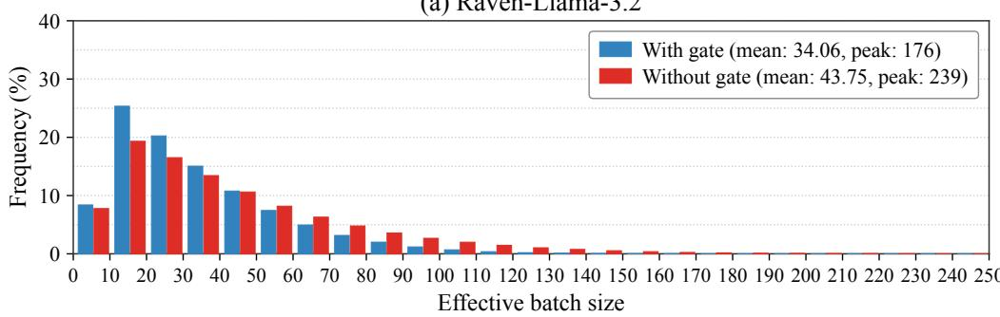

(b) Raven-OLMo-2-0425  
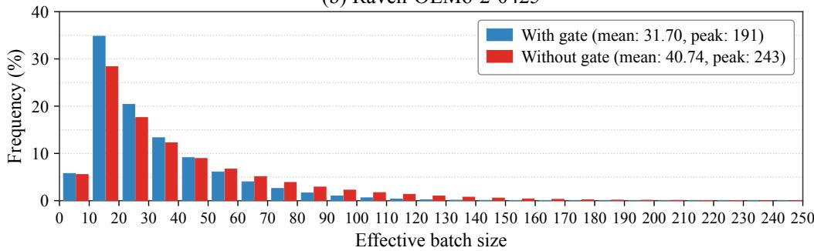  
Figure 5: Effective batch size distributions with and without gating on GSM8K under sampling. Effective batch size is the number of active branches processed by each recurrent forward pass. Bars show the percentage of recurrent forward passes in each batch-size bin of width 10. Legends report the mean and peak batch sizes.

## E TOKEN COMMITMENT SOURCES ACROSS PROPOSAL DEPTHS

We examine how the two proposal depths contribute to token commitment in LOOPSPEC. We partition committed tokens into three categories: accepted first proposals, accepted second proposals after first-proposal rejection, and full-depth fallback when neither proposal is accepted. These categories identify the source of each committed token. Figure 6 shows the share of tokens committed from each source for Raven-Llama-3.2 with $( d _ { 1 } , \bar { d _ { 2 } } , { R } ) = ( 2 , 8 , 3 2 )$ and Ouro-1.4B with $( d _ { 1 } , d _ { 2 } , R ) = ( 1 , 2 , 4 )$ in greedy decoding scenario for multiple benchmarks.

First Proposals Cover Most Tokens. First proposals account for 91.59%–96.31% of committed tokens for Raven-Llama-3.2 and 86.57%–95.35% for Ouro-1.4B across the four benchmarks. Thus, the shallow proposal supplies most committed tokens in the evaluated settings, allowing the pipeline to retain computation started at the first proposal depth.

Second Proposals Recover Early Rejections. Second proposals contribute a further 3.50%– 7.93% of tokens for Raven-Llama-3.2, leaving only 0.19%–0.48% to full-depth fallback. For Ouro-1.4B, the corresponding shares are 3.74%–10.48% and 0.90%–2.95%. Across both models and all four benchmarks, second proposals therefore recover more tokens than require full-depth fallback. These results support the complementary roles of the two depths: the first proposal enables early drafting, while the second preserves speculative progress for a substantial fraction of first-proposal rejections.

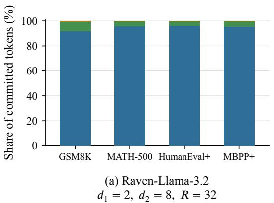

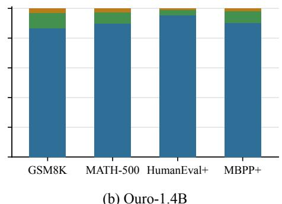  
𝑑1 = 1, 𝑑2 = 2, 𝑅 = 4  
First proposal (d1) Second proposal (d2) Full-depth (R)  
Figure 6: Share of committed tokens by different proposal sources.

## F EMPIRICAL POWER-LAW DECAY AND OPTIMAL PROPOSAL DEPTHS FOR RAVEN-OLMO-2-0425

In this section, we present the Raven-OLMo-2-0425 sampling $( T = 1 . 0 , \mathrm { t o p } . p = 0 . 7 )$ total variation (TV) distance to the target on GSM8K and MATH-500 in Figure 7. Similar to Figure 3(b), we obtain the power-law envelope $\phi ( r ) = \beta r ^ { - \alpha }$ , and it gives $\alpha = 1 . 0 8$ and $\beta = 0 . 2 0 7$ . With Theorem 2, we can compute the optimal proposal depths $( \bar { d } _ { 1 } ^ { * } , d _ { 2 } ^ { * } ) = ( 1 . 4 1 , 9 . 1 7 )$ , which again aligns with the empirical optimal depths $( d _ { 1 } , \bar { d } _ { 2 } ) \bar { = } ( 2 , 8 \bar { ) }$ in Section 6.

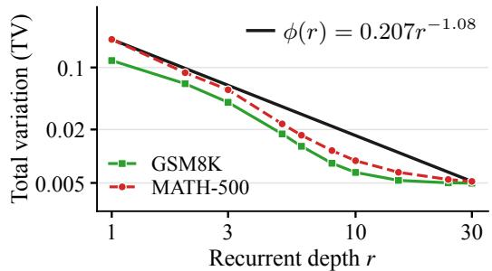  
Figure 7: Sampling $( T = 1 . 0 , \mathrm { t o p } . p = 0 . 7 )$ total variation (TV) distance between intermediate proposals at depth r and the target distribution at depth $R = 3 2$ for Raven-OLMo-2-0425 on GSM8K and MATH-500. TV is obtained on 10 depths and averaged per token position on the top-p distribution. The power-law envelope ϕ(r) is constructed as described in Section 4.1.

## G PROOFS

We provide a formal definition of the total variation distance, which is used to evaluate the performance of speculative decoding.

Definition 3 (Total variation distance). For distributions p and q over a finite sample space $x ,$ the total variation distance between p and q is defined as

$$
\mathrm { T V } \left( p , q \right) : = \frac { 1 } { 2 } \sum _ { x \in \mathcal { X } } \left| p ( x ) - q ( x ) \right| = \sum _ { x \in \mathcal { X } } [ p - q ] _ { + } ( x ) = \sum _ { x \in \mathcal { X } } [ q - p ] _ { + } ( x ) .
$$

In the standard speculative decoding setting on vocabulary $x ,$ given the target distribution p and a proposal distribution q, the accepted probability is

$$
{ \begin{array} { r l } & { { \mathrm { P r } } [ \operatorname { a c c e p t } ] = \displaystyle \sum _ { x \in { \mathcal { X } } } q ( x ) \operatorname* { m i n } \left( 1 , \frac { p ( x ) } { q ( x ) } \right) } \\ & { \qquad = \displaystyle \sum _ { x \in { \mathcal { X } } } \operatorname* { m i n } \left( p ( x ) , q ( x ) \right) } \\ & { \qquad = \displaystyle \sum _ { x \in { \mathcal { X } } } p ( x ) - [ p ( x ) - q ( x ) ] _ { + } = 1 - { \mathrm { T V } } \left( p , q \right) . } \end{array} }
$$

In other words, $\mathrm { T V } \left( p , q \right)$ measures a probability of rejection.

## G.1 PROOF OF THEOREM 1

To prove Theorem 1, we need the following lemma in advance.

Lemma 4. Let $\nu _ { 1 } : = p _ { d _ { 2 } } \ominus p _ { d _ { 1 } } , \nu _ { 2 } : = p _ { R } \ominus p _ { d _ { 1 } }$ and define $\varepsilon _ { 1 } : = \mathrm { T V } ( p _ { d _ { 1 } } , p _ { R } ) , \varepsilon _ { 2 } : = \mathrm { T V } ( p _ { d _ { 2 } } , p _ { R } )$ Suppose $\varepsilon _ { 1 } > 0$ and $p _ { d _ { 1 } } \neq p _ { d _ { 2 } }$ . Then $\begin{array} { r } { \mathrm { T V } \left( \nu _ { 1 } , \nu _ { 2 } \right) \leq \frac { \bar { \varepsilon } _ { 2 } } { \varepsilon _ { 1 } } , } \end{array}$

ProofofLemma 4. We write $u : = [ p _ { R } - p _ { d _ { 1 } } ] _ { + } , v : = [ p _ { d _ { 2 } } - p _ { d _ { 1 } } ] _ { + }$ and $\delta : = \mathrm { T V } \left( p _ { d _ { 1 } } , p _ { d _ { 2 } } \right)$ . By the definition of the residual distribution in Equation (2), $\begin{array} { r } { \nu _ { 2 } = \frac { u } { \varepsilon _ { 1 } } , \nu _ { 1 } = \frac { v } { \delta } } \end{array}$ . Consider two cases depending on the relative sizes of δ and $\varepsilon _ { 1 }$ .

Case 1: $\delta \leq \varepsilon _ { 1 }$

$$
\begin{array} { l } { \displaystyle \varepsilon _ { 1 } \mathrm { T V } \left( \nu _ { 1 } , \nu _ { 2 } \right) = \varepsilon _ { 1 } \sum _ { x } \operatorname* { m a x } \bigl ( 0 , \nu _ { 2 } ( x ) - \nu _ { 1 } ( x ) \bigr ) } \\ { \displaystyle \qquad = \sum _ { x } \operatorname* { m a x } \left( 0 , u ( x ) - \frac { \varepsilon _ { 1 } } { \delta } v ( x ) \right) } \\ { \displaystyle \qquad \leq \sum _ { x } \operatorname* { m a x } \bigl ( 0 , u ( x ) - v ( x ) \bigr ) } \\ { \displaystyle \qquad \leq \sum _ { x } \operatorname* { m a x } \bigl ( 0 , p _ { R } ( x ) - p _ { d _ { 2 } } ( x ) \bigr ) = \varepsilon _ { 2 } } \end{array}
$$

where the last inequality holds from the fact that $[ a ] _ { + } - [ b ] _ { + } \leq [ a - b ] _ { + }$ . Similarly,

Case 2: $\delta > \varepsilon _ { 1 }$

$$
\begin{array} { l } { \displaystyle \varepsilon _ { 1 } \mathrm { T V } \left( \nu _ { 1 } , \nu _ { 2 } \right) = \varepsilon _ { 1 } \sum _ { x } \operatorname* { m a x } ( 0 , \nu _ { 1 } ( x ) - \nu _ { 2 } ( x ) ) } \\ { \displaystyle \qquad = \sum _ { x } \operatorname* { m a x } \left( 0 , \frac { \varepsilon _ { 1 } } { \delta } v ( x ) - u ( x ) \right) } \\ { \displaystyle \qquad \leq \sum _ { x } \operatorname* { m a x } ( 0 , v ( x ) - u ( x ) ) } \\ { \displaystyle \qquad \leq \sum _ { x } \operatorname* { m a x } ( 0 , p _ { d _ { 2 } } ( x ) - p _ { R } ( x ) ) = \varepsilon _ { 2 } } \end{array}
$$

By combining both cases, $\begin{array} { r } { \mathrm { T V } \left( \nu _ { 1 } , \nu _ { 2 } \right) \leq \frac { \varepsilon _ { 2 } } { \varepsilon _ { 1 } } } \end{array}$ . This completes the proof of Lemma 4. □

We are now ready to prove Theorem 1.

Proof of Theorem 1. Recall that the rejection probability from the first proposal is $\varepsilon _ { 1 } ~ =$ $\mathrm { T V } \left( p _ { d _ { 1 } } , p _ { R } \right)$ and that from the second one is TV $( p _ { R } \ominus p _ { d _ { 1 } } , p _ { d _ { 2 } } \ominus p _ { d _ { 1 } } )$

$\operatorname { I f } \varepsilon _ { 1 } = 0$ , the first proposal is always accepted, so the probability of both candidates are rejected is bounded by ${ \displaystyle \operatorname* { P r } [ \mathbf { r e j e c t } _ { 1 } \wedge \mathbf { r e j e c t } _ { 2 } ] \leq \operatorname* { P r } [ \mathbf { r e j e c t } _ { 1 } ] = \varepsilon _ { 1 } = 0 \leq \varepsilon _ { 2 } . \ \operatorname { I f } p _ { d _ { 1 } } = p _ { d _ { 2 } } }$ , then $\varepsilon _ { 1 } = \varepsilon _ { 2 }$ , so the probability of both candidates are rejected is bounded by $\mathrm { P r } [ \mathrm { r e j e c t } _ { 1 } \land \mathrm { r e j e c t } _ { 2 } ] \leq \mathrm { P r } [ \mathrm { r e j e c t } _ { 1 } ] = \varepsilon _ { 1 }$

Without loss of generality, we assume that $\varepsilon _ { 1 } , \delta > 0$ . When the gate is open, Lemma 4 gives

$$
\operatorname* { P r } [ { \mathrm { r e j e c t } } _ { 1 } \land { \mathrm { r e j e c t } } _ { 2 } \land { \mathrm { g a t e ~ o p e n } } ] \leq \varepsilon _ { 1 } \cdot { \frac { \varepsilon _ { 2 } } { \varepsilon _ { 1 } } } = \varepsilon _ { 2 } .
$$

The gate in Equation (6) is closed when the primary candidate $\widetilde { x } ^ { ( 1 ) } \sim p _ { d _ { 1 } }$ satisfies $p _ { d _ { 2 } } ( \widetilde { x } ^ { ( 1 ) } ) \geq$ $p _ { d _ { 1 } } ( \widetilde { x } ^ { ( 1 ) } )$ , and there is no second proposal. Under this condition, by Equation (3), the probability of drawing x and rejecting it is $p _ { d _ { 1 } } ( x ) - \min { ( p _ { d _ { 1 } } ( x ) , p _ { R } ( x ) ) } = [ p _ { d _ { 1 } } - p _ { R } ] _ { + } ( x )$ , and hence

$$
{ \begin{array} { l } { \displaystyle \operatorname* { P r } [ \mathsf { r e j e c t } _ { 1 } \wedge \mathsf { g a t e ~ c l o s e d } ] = \sum _ { x : p _ { d _ { 2 } } ( x ) \geq p _ { d _ { 1 } } ( x ) } [ p _ { d _ { 1 } } - p _ { R } ] _ { + } ( x ) } \\ { \displaystyle \qquad \leq \sum _ { x : p _ { d _ { 2 } } ( x ) \geq p _ { d _ { 1 } } ( x ) } [ p _ { d _ { 2 } } - p _ { R } ] _ { + } ( x ) } \\ { \displaystyle \qquad \leq \sum _ { x } [ p _ { d _ { 2 } } - p _ { R } ] _ { + } ( x ) = \varepsilon _ { 2 } , } \end{array} }
$$

where the first inequality holds from $p _ { d _ { 1 } } ( x ) \leq p _ { d _ { 2 } } ( x )$ under the gate-closed condition. Adding the two bounds gives $2 \varepsilon _ { 2 }$ . This completes the proof of Theorem 1. □

## G.2 PROOF OF THEOREM 2

Let C be a random variable of the number of recurrent steps to commit a single token. Then,

$$
C = \left\{ \begin{array} { l l } { d _ { 1 } } & { \mathrm { i f ~ a c c e p t e d ~ i n ~ t h e ~ f i r s t ~ p r o p o s a l } , } \\ { d _ { 2 } } & { \mathrm { e l s e ~ i f ~ a c c e p t e d ~ i n ~ t h e ~ s e c o n d ~ p r o p o s a l } , } \\ { R } & { \mathrm { o t h e r w i s e } . } \end{array} \right.
$$

The expectation of C can be computed as

$$
\begin{array} { r } { \mathbb { E } [ C ] = \mathrm { { P r } } [ \mathrm { a c c e p t } _ { 1 } ] d _ { 1 } + \mathrm { { P r } } [ \mathrm { a c c e p t } _ { 2 } ] d _ { 2 } + ( 1 - \mathrm { { P r } } [ \mathrm { a c c e p t } _ { 1 } ] - \mathrm { { P r } } [ \mathrm { a c c e p t } _ { 2 } ] ) R . } \end{array}\tag{10}
$$

By the property of rejection sampling and Theorem 1,

$$
\begin{array} { r l } & { \mathrm { P r } [ \mathrm { a c c e p t } _ { 1 } ] = 1 - \mathrm { T V } \left( p _ { d _ { 1 } } , p _ { R } \right) = 1 - \varepsilon _ { 1 } \leq 1 , } \\ & { \mathrm { P r } [ \mathrm { a c c e p t } _ { 2 } ] \leq \mathrm { P r } [ \mathrm { r e j e c t } _ { 1 } ] = \varepsilon _ { 1 } , } \\ & { 1 - \mathrm { P r } [ \mathrm { a c c e p t } _ { 1 } ] - \mathrm { P r } [ \mathrm { a c c e p t } _ { 2 } ] \leq 2 \varepsilon _ { 2 } . } \end{array}
$$

For a prefix X, the assumption in Equation (7) yields

$$
\begin{array} { r l } & { \mathbb { E } _ { X } [ \varepsilon _ { 1 } ] = \mathbb { E } _ { X } \left[ \mathrm { T V } \left( p _ { d _ { 1 } } , p _ { R } \right) \right] \leq \phi ( d _ { 1 } ) = \beta d _ { 1 } ^ { - \alpha } , } \\ & { \mathbb { E } _ { X } [ \varepsilon _ { 2 } ] = \mathbb { E } _ { X } \left[ \mathrm { T V } \left( p _ { d _ { 2 } } , p _ { R } \right) \right] \leq \phi ( d _ { 2 } ) = \beta d _ { 2 } ^ { - \alpha } . } \end{array}
$$

Substituting these bounds into Equation (10) and taking the expectation over prefix $X ,$ we obtain

$$
\begin{array} { r } { \mathbb { E } _ { X } [ C ] \leq d _ { 1 } + \beta d _ { 1 } ^ { - \alpha } d _ { 2 } + 2 \beta d _ { 2 } ^ { - \alpha } R . } \end{array}\tag{11}
$$

Our goal is to find optimal $d _ { 1 }$ and $d _ { 2 }$ that minimize the right-hand side in Equation (11). Denote the right-hand side by $f ( d _ { 1 } , d _ { 2 } )$ . The stationary conditions are obtained by taking derivative with respect to $d _ { 1 }$ and $d _ { 2 } ,$ respectively,

$$
\begin{array} { r l } & { \frac { \partial f } { \partial d _ { 1 } } = 1 - \alpha \beta d _ { 1 } ^ { - \alpha - 1 } d _ { 2 } = 0 , } \\ & { \frac { \partial f } { \partial d _ { 2 } } = \beta d _ { 1 } ^ { - \alpha } - 2 \alpha \beta R d _ { 2 } ^ { - \alpha - 1 } = 0 . } \end{array}
$$

Re-writing these conditions yields

$$
\begin{array} { r l } & { d _ { 1 } ^ { * } = ( \alpha \beta ) ^ { \frac { \alpha + 1 } { \alpha ^ { 2 } + \alpha + 1 } } ( 2 \alpha R ) ^ { \frac { 1 } { \alpha ^ { 2 } + \alpha + 1 } } , } \\ & { d _ { 2 } ^ { * } = ( \alpha \beta ) ^ { \frac { \alpha } { \alpha ^ { 2 } + \alpha + 1 } } ( 2 \alpha R ) ^ { \frac { \alpha + 1 } { \alpha ^ { 2 } + \alpha + 1 } } . } \end{array}
$$

To verify above $( d _ { 1 } ^ { * } , d _ { 2 } ^ { * } )$ is the minimizer, we compute the Hessian of $f$ as

$$
H ( d _ { 1 } , d _ { 2 } ) = \left[ \begin{array} { c c c c } { { \alpha ( \alpha + 1 ) \beta d _ { 1 } ^ { - \alpha - 2 } d _ { 2 } } } & { { - \alpha \beta d _ { 1 } ^ { - \alpha - 1 } } } \\ { { - \alpha \beta d _ { 1 } ^ { - \alpha - 1 } } } & { { 2 \alpha ( \alpha + 1 ) \beta R d _ { 2 } ^ { - \alpha - 2 } } } \end{array} \right]
$$

and show that the determinant of $H ( d _ { 1 } ^ { * } , d _ { 2 } ^ { * } )$ is strictly positive. Using the fact that $R ( d _ { 2 } ^ { * } ) ^ { - \alpha - 1 } =$ $( d _ { 1 } ^ { * } ) ^ { - \alpha } / ( 2 \alpha )$ , we have

$$
\operatorname * { d e t } \left( H ( d _ { 1 } ^ { * } , d _ { 2 } ^ { * } ) \right) = \alpha \beta ^ { 2 } ( d _ { 1 } ^ { * } ) ^ { - 2 \alpha - 2 } \left( \alpha ^ { 2 } + \alpha + 1 \right) > 0 .
$$

Since this is the unique stationary point, $( d _ { 1 } ^ { * } , d _ { 2 } ^ { * } )$ is the global minimizer. Finally, the condition

$$
R > \frac { 1 } { 2 \alpha } \operatorname * { m a x } \{ ( \alpha \beta ) ^ { 1 / \alpha } , ( \alpha \beta ) ^ { - \alpha - 1 } , ( \alpha \beta ) ^ { 1 / \alpha } ( 2 \alpha ) ^ { \frac { \alpha ^ { 2 } + \alpha + 1 } { \alpha ^ { 2 } } } \}
$$

ensures the validity of solution, i.e., $1 \leq d _ { 1 } ^ { * } < d _ { 2 } ^ { * } < R$ This completes the proof of Theorem 2.

## H LOOPSPEC ALGORITHM PSEUDOCODE

Algorithm 1: LOOPSPEC with two proposals   
Input : prompt $x _ { 1 : n } ;$ pre-layers $\mathcal { P } ;$ recurrent-layers $\overline { { B ; } }$ post-layers ${ \mathcal { C } } ;$ total recurrent depth $R ;$ proposal   
depths $d _ { 1 } < \bar { d } _ { 2 } < \bar { R }$   
Global: active branch set $A  \varnothing ;$ output string $Y \gets \varepsilon$   
1 A branch b has its prefix $X ^ { ( b ) }$ , current hidden state $H _ { b } ,$ recurrent depth $r _ { b } ,$ and proposal records $\mathcal { Q } _ { b } ;$   
2 Function ${ \mathrm { S p a w n } } \left( X \right) :$   
3 c ← NewBranch();   
4 $X ^ { ( c ) } \gets X ; \quad H _ { c } \gets \mathcal { P } ( X ^ { ( c ) } ) ;$   
5 $r _ { c } \gets 0 ; \quad \mathcal { Q } _ { c } \gets \emptyset ;$   
6 ${ \mathcal { A } }  { \mathcal { A } } \cup \{ c \} ;$   
7 return c;   
8 Function $\mathtt { V e r i f y } ( b , p )$ :   
9 $\rho \gets p ;$   
10 for $j  1$ to $\vert \mathcal { Q } _ { b } \vert$ do   
11 $( \widetilde { x } _ { b } ^ { ( j ) } , q _ { j } , c _ { j } ) \gets \mathcal { Q } _ { b } [ j ] ;$   
12 $\begin{array} { r } { \dot { U } _ { j } \sim \dot { \mathcal { U } } ( 0 , \dot { 1 } ) ; } \end{array}$   
13 if $: U _ { j } < \operatorname* { m i n } \{ 1 , \rho ( \widetilde { x } _ { b } ^ { ( j ) } ) / q _ { j } ( \widetilde { x } _ { b } ^ { ( j ) } ) \}$ then   
14 return $( \widetilde { x } _ { b } ^ { ( j ) } , c _ { j } ) ;$ // accept   
15 $\rho \gets \rho \ominus q _ { j } ;$ // reject   
16 x ∼ ρ;   
17 return $( x , \operatorname { S p a w n } ( X ^ { ( b ) } \parallel x ) )$   
18 $H  \mathcal { P } ( x _ { 1 : n } ) ;$   
19 for $r \gets 1$ to R do   
20 $H \gets B ( H ) ;$   
21 $x \sim { \mathcal { C } } ( H ) ;$   
22 $Y  { \dot { Y } } \parallel x ;$ $/ /$ commit first token after prefill   
23 if generation has not stopped then   
24 $\begin{array} { r } { b _ { \mathrm { { i n i t } } } \gets \operatorname { S p a w n } ( x _ { 1 : n } \Vdash ) ; } \end{array}$   
25 while generation has not stopped do   
26 $\mathcal { A } _ { \mathrm { { c u r } } }  \mathcal { A } ;$   
27 foreach $b \in \mathcal { A } _ { \mathrm { c u r } }$ in parallel do   
28 $H _ { b } \gets B ( H _ { b } ) ; \quad r _ { b } \gets r _ { b } + 1$   
29 if $r _ { b } = d _ { 1 }$ // first proposal   
30 then   
31 $q _ { 1 }  \mathcal { C } ( H _ { b } ) ; \quad \widetilde { x } _ { b } ^ { ( 1 ) } \sim q _ { 1 } ;$   
32 $c _ { 1 } \gets \operatorname { S p a w n } ( X ^ { ( b ) } \parallel \widetilde { x } _ { b } ^ { ( 1 ) } ) ;$   
33 $\mathcal { Q } _ { b } [ 1 ]  ( \widetilde { x } _ { b } ^ { ( 1 ) } , q _ { 1 } , c _ { 1 } ) ;$   
34 else if $r _ { b } = d _ { 2 }$ then   
35 $( \widetilde { x } _ { b } ^ { ( 1 ) } , q _ { 1 } , c _ { 1 } ) \gets \mathcal { Q } _ { b } [ 1 ] ; \quad \widetilde { q } _ { 2 } \gets \mathcal { C } ( H _ { b } ) ;$   
36 if $\widetilde { q } _ { 2 } ( \widetilde { x } _ { b } ^ { ( 1 ) } ) < q _ { 1 } ( \widetilde { x } _ { b } ^ { ( 1 ) } )$ $/ /$ gating mechanism   
37 then   
38 $q _ { 2 }  \widetilde { q } _ { 2 } \ominus q _ { 1 } ; \quad \widetilde { x } _ { b } ^ { ( 2 ) } \sim q _ { 2 } ;$ $/ /$ residual second proposal   
39 $c _ { 2 } \gets \operatorname { S p a w n } ( X ^ { ( b ) } \parallel \widetilde { x } _ { b } ^ { ( 2 ) } )$ ;   
40 $\mathcal { Q } _ { b } [ 2 ]  ( \widetilde { x } _ { b } ^ { ( 2 ) } , q _ { 2 } , c _ { 2 } ) ;$   
41 $b _ { \mathrm { m a x } } \gets$ arg maxb rb;   
42 if $r _ { b _ { \mathrm { m a x } } } = R$ then   
43 $p \gets \mathcal { C } ( H _ { b _ { \operatorname* { m a x } } } ) ;$   
44 $\mathsf { \bar { \Phi } } ( x ^ { \star } , c ^ { \star } ) \gets \mathrm { V e r i f y } ( b _ { \mathrm { m a x } } , p ) ;$   
45 $\dot { Y }  \dot { Y } \parallel x ^ { \star } ;$ $/ /$ commit a new decoded token   
46 ${ \mathcal { A } } \gets \operatorname { R e r o o t } ( { \mathcal { A } } , c ^ { \star } ) ;$ // keep $c ^ { \star }$ and its descendants   
47 output Y ;