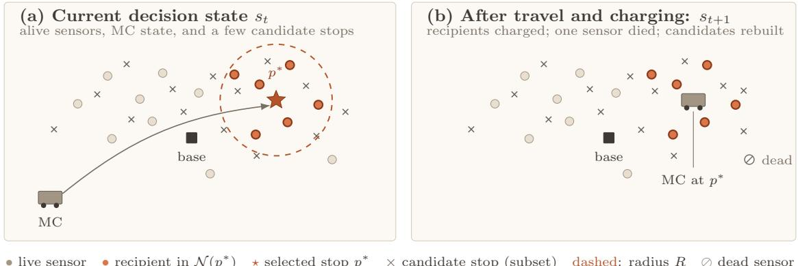
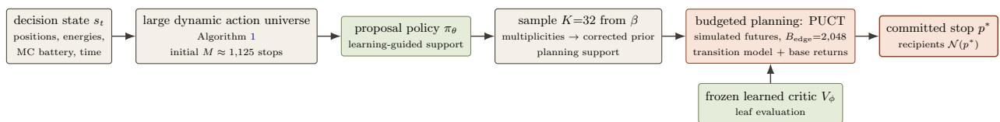
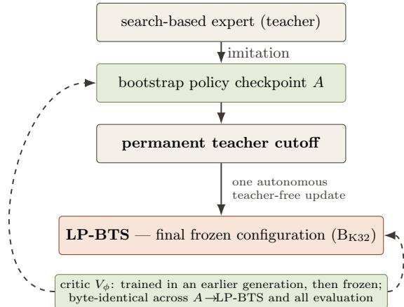
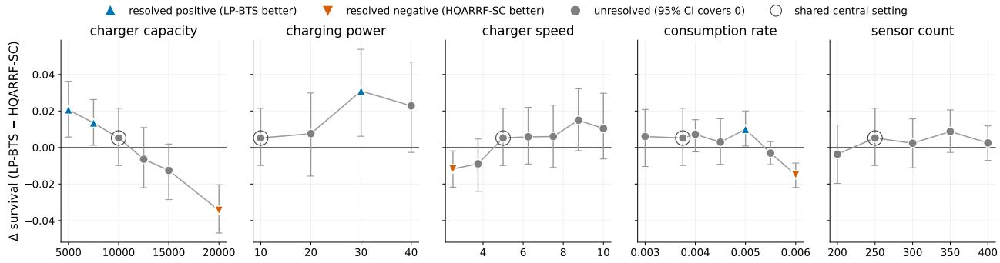
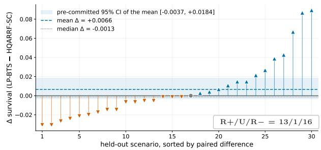
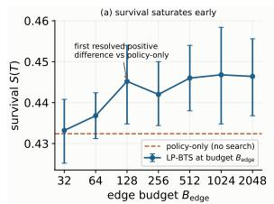
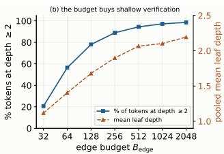
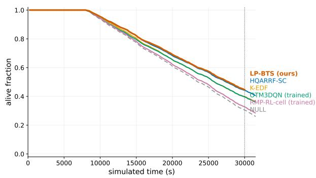

# Learning-Guided Planning in Large Dynamic Action Spaces: Budgeted Tree Search for One-to-Many Mobile Charging

Liang-Ching Tao

Pi-Chung Wang∗

Department of Computer Science and Engineering, National Chung Hsing University 145 Xingda Rd., South District, Taichung 402, Taiwan liangkingtao@gmail.com, pcwang.tw@gmail.com

Preprint, September 2026

## Abstract

Many learned sequential decision systems map the current state directly to an action. That shortcut be comes brittle when candidate actions are numerous, geometrically structured, and rebuilt with the state. One-to-many mobile charging makes this setting concrete: with N=250 sensors, the initial state induces about 1,125 candidate charging-stop actions; each chosen stop simultaneously serves its in-range sensors, and the action universe changes as sensors die. LP-BTS is a learning-guided planning architecture: a graph proposal policy concentrates a small candidate support, a learned value critic evaluates leaves, and edge-budgeted PUCT compares short simulated futures before committing an action. Because the policy scores this set without a fixed output head, a single frozen checkpoint covers every evaluated set ting, spanning action universes from 736 to 2,813 stops. Matched ablations reveal complementary ef fects: uniform sampling costs 8.8 survival percentage points, while, with targeted support fixed, PUCT jointly retains 1.4 points (about 3.5 of 250 sensors) and direct policy selection travels 23% farther. On a prospectively specified, sealed 30-scenario confirmatory bank evaluated once, LP-BTS attains the highest observed survival (0.4545) and alive-AUC (0.8031). Its estimated survival advantage over the strongest domain-engineered comparator is +0.0066 (95% CI [−0.0037, +0.0184]), an unresolved diference, while it exceeds a deadline heuristic and two source-derived direct-policy reconstructions on ev ery paired scenario. Both learned rows are trained, source-derived reconstructions of variants reported by Gong et al. [7]. In this setting, the results provide controlled evidence about learning-guided planning in a large, dynamic action space.

## 1 Introduction

Many sequential decision problems require choosing from action sets that are large, structured, and state-dependent. Direct state-to-action policies are computationally attractive, but must encode downstream consequences in a single mapping from the current state. Explicit planning ofers an alternative: allocate limited computation to evaluate future trajectories before committing an action.

One-to-many mobile charging makes the challenge tangible. Wireless power transfer lets a mobile charger (MC) replenish sensor nodes before they die [1, 2, 3]; nodes drain continuously, the charger’s battery and travel time are finite, and deaths are irreversible. Each action selects a physical charging stop and simultaneously serves every sensor within its radius. For the central N=250-sensor system, geometry yields about 1,125 candidate stops at the initial decision. The stop universe is then rebuilt as sensors die, while every chosen stop commits hundreds of seconds of travel, dwell, energy delivery, and continued sensor drain.

Brute-force planning is infeasible at this breadth, yet directly selecting one stop asks a network to absorb all downstream consequences into a single score. LP-BTS instead divides the work: a graph proposal policy identifies where to spend search, a learned value critic evaluates shallow leaves, and edgebudgeted tree search uses an explicit transition model to compare short simulated futures. The distinction is not whether long-term objectives are learned, but whether plausible future trajectories are explicitly checked at decision time.

This distinction is also motivated by a preregistered, method-independent diagnostic on disjoint training worlds: under two fixed continuation policies, the same candidate actions had near-zero rank correlation $( \rho = + 0 . 0 0 6 7 )$ , and a ridge diagnostic had held-out rank correlation −0.137. These measurements do not prove that a direct policy cannot learn; they show that, under the diagnostic’s short horizons and continuations, action quality was strongly continuation-dependent. Explicit lookahead is therefore a testable response to that dependence rather than an assumed advantage (§6.2).

Learning-based WRSN schedulers have made real progress on this domain problem [6, 7, 8, 9, 10, 11], but their learned network generally commits the charging action directly. In a documented literature search (§2) we found no prior WRSN charging work that couples learned proposal and value models with explicit tree search over charging actions. This paper evaluates that architecture in one-to-many mobile charging; one-to-many charging and dynamic stop locations themselves have been studied in prior WRSN work [2, 7]. The contributions are:

• Dynamic action-space formulation. We formulate one-to-many mobile charging as planning over a state-dependent, geometrically structured charging-stop universe that can exceed 103 actions while retaining the physical recipient set induced by each stop. The policy carries no fixed output head, so one frozen checkpoint serves universes of 736 to 2,813 stops across the evaluated grid, where a cell-based comparator holds its 471 cells fixed and coarsens instead.

• Learning-guided budgeted planning. We combine a graph proposal policy, learned value critic, sampled candidate support, and edgebudgeted PUCT: learning concentrates computation on promising breadth, while explicit search checks short continuations before action commitment.

• Component gains and confirmatory evidence. Matched ablations quantify the distinct value of targeted proposal support and explicit search, characterize the budget/depth trade-of (§9), and a prospectively specified sealed 30- scenario evaluation provides the principal result (§8); all evaluation rules, method identities, contrasts, and confirmatory scenarios were fixed before that result existed.

We denote the final frozen configuration LP-BTS (Learned-Prior Budgeted Tree Search; internal checkpoint identifier BK32 in the released artifacts); its training procedure is specified in §5.5. The sealed bank records the highest observed survival/alive AUC (0.4545/0.8031), though its diference from the strongest domain-engineered comparator remains unresolved; development-grid evidence is exploratory.

## 2 Related Work

## 2.1 Heuristic and optimization-based WRSN charging

Early work formulated charger routing as combinatorial optimization: Xie et al. [2] established multinode (one-to-many) wireless charging with cellular discretization and renewable-cycle optimization; a large literature followed with on-demand architectures, spatial partitioning and priority queues (see the survey [3]). Earliest-deadline ordering, inherited from classical real-time scheduling [4], remains a strong backbone: our K-EDF baseline (§6.2) is a carefully engineered K-node earliest-death-first scheduler in this family. Crisis-aware hybrid schedulers with per-episode tabular Q-learning — our HQARRF-SC baseline [5] — represent the strongest handcrafted end of this spectrum in our evaluation.

## 2.2 Learning-based WRSN charging

Cao et al. [6] learn on-demand charging with timewindow rewards. Gong et al. [7] — the primary source for both of our learned baselines — cellularize the field into hexagons of the charging radius and train a double-dueling DQN (OTM3DQN) to pick the next charging cell and amount, explicitly targeting the oneto-many setting. Attention-based multi-agent actor– critic scheduling [8], hybrid discrete–continuous action spaces [9], DQN-inspired adaptive multi-node schemes [10], and RL sequence scheduling for stochastic event detection [11] extend this line. The shared trait is direct learned action selection: the network’s forward pass is the decision, with any long-horizon information represented in its learned value or action prediction. Our method instead uses learned models inside explicit planning: the proposal policy selects breadth, the critic evaluates leaves, and budgeted search commits after simulated futures are compared.

## 2.3 Learned planning and neural-guided search

AlphaGo Zero and AlphaZero [12, 13] established a lineage of policy-guided PUCT search [16] with self-generated training targets; MuZero and Gumbelbased variants [14, 15] extended the recipe to learned models and sampled action spaces. They motivate the division of labor studied here, but not a claim of cross-domain transfer: our K=32 proposals from M ≈ 1,125 candidates instantiate sampled-actionspace search in a diferent, dynamic, geometric domain. We searched for prior WRSN applications of Monte-Carlo tree search to charging scheduling and found none (the closest use of MCTS in wireless power research optimizes circuit design, not scheduling); we therefore describe the combination as not previously reported for this problem in the literature we surveyed.

Table 1 summarizes the axes that matter.

## 3 System Model

N sensors are deployed uniformly at random on a $W \times H$ field (1000 × 1000 m; N=250 centrally, 200– 400 in the sensitivity grid). Sensor i holds energy $e _ { i } ( t ) \in [ 0 , E _ { \operatorname* { m a x } } ]$ with $E _ { \operatorname* { m a x } } = 1 5 0$ , drains at a base rate ρ (0.00375 units/s centrally) plus periodic sensing and reporting costs, and dies irreversibly when $e _ { i } ( t ) = 0$ . In the evaluated realizations every sensor communicates directly with the base station at the field center (the stored topology is a star; measured relay depth is exactly one), so no multi-hop relay-load efects are present or claimed in this study.

A single MC with battery capacity C (10,000 centrally) travels at speed v $\mathrm { ( 5 m / s ) }$ , consumes energy both moving and charging, and recharges itself at the base station at power 50. Charging is one-tomany: when the MC dwells at stop point p, every alive sensor within radius R (30 m) receives power $P _ { c }$ (10 centrally) at eficiency η = 0.9 simultaneously. Decisions are event-driven: whenever the MC completes its current activity, the scheduler chooses its next charging stop.

Return-to-base semantics. Returning to base is not a scheduler action. The environment enforces an energy-reserve rule: if the MC’s residual energy cannot cover the commanded movement plus the cost of returning to base afterwards, the environment overrides the command and sends the MC home to recharge. All schedulers in this paper — learned, heuristic, and ours — operate under this same rule.

Metrics. Primary: survival S(T), the fraction of sensors alive at horizon $\scriptstyle T = 3 0 , 0 0 0 \mathrm { s }$ . Secondary: time-normalized alive-AUC, total MC travel distance, and per-decision computation time.

## 4 Problem Formulation

At decision epoch t the state st comprises all sensor positions, energies and alive flags, the MC position and residual energy, and time. The action space $\boldsymbol { \mathcal { A } } ( \boldsymbol { s } _ { t } )$ is the set of charging stops: candidate points $p$ derived from the geometry of the alive set (§5.1), each inducing the recipient set $\mathcal { N } ( p ) = \{ i : \| x _ { i } - p \| \leq$ $R , \ e _ { i } > 0 \}$ . Executing $a = p$ advances the simulator through travel and dwell physics — including, when the reserve rule fires, a forced base return. The objective is max E[S(T)].

Figure 1 illustrates this action representation with a schematic state rather than an evaluation snapshot: a stop is a physical point that serves its entire inrange recipient set, and the stop universe is rebuilt from the alive set at every decision.

This is a large, dynamic, structured, longconsequence action space. It is large: $| \mathcal { A } ( s _ { t } ) |$ is about 1,125 initially at N=250 and exceeds 2,800 at N=400. It is dynamic: the universe is reconstructed from the alive set and changes as sensors die. It is structured: actions are geometric stops inducing recipient sets, not independent categorical labels. It has long consequences: executing a stop commits travel, dwell time, energy delivery, sensor drain, and possibly a future forced return to base. A fixed output head over a static discretization either coarsens or freezes this space — measurably so: tying the discretization to the charging radius swings a comparator’s output width from 471 to 4,012 actions, and its parameter count by 8.5×, before any scheduling question is asked (§6.2). Explicit lookahead can instead evaluate the resulting short trajectories at decision time.

## 5 Proposed Method

Figure 2 shows the learning-guided planning system. LP-BTS constructs a structured candidate universe (§5.1); the graph proposal policy $\pi _ { \theta }$ determines where to search, sampling forms the support, the transition model determines how futures evolve, the value critic $V _ { \phi }$ evaluates leaves, and budgeted PUCT allocates computation before committing an action. Thus both breadth selection and terminal evaluation are learned, while tree search supplies explicit lookahead. Sampling, search, and the frozen critic are specified in §5.3–5.5.

## 5.1 Canonical one-to-many stop universe

The action space is rebuilt at every decision from the alive set $\mathcal { V } = \lbrace i : e _ { i } > 0 \rbrace$ (Algorithm 1). Geometric proposals come from four primitive families over a k-nearest-neighbour graph (k=8): each alive sensor’s own position (atomic); for each neighbouring pair within distance 2R, the pair midpoint (midpoint) and the two intersection points of the radius-R circles centred on the pair (intersection); and for each neighbouring triple whose minimum enclosing circle has radius $\leq R$ , that circle’s centre (triple center). Proposals are then canonicalized: coordinates are quantized to a fixed grid quantum and all proposals sharing a quantized coordinate collapse into one action whose identity is the physical stop point alone. The generating pair/triple (the “planned members”) is retained only as diagnostic provenance — it never distinguishes actions, so geometrically equivalent groups cannot create non-causal duplicate actions: the physics of dwelling at p depends only on $p ,$ and the recipient set $\mathcal { N } ( \boldsymbol { p } )$ is recomputed from the distance matrix, not from the proposal’s source. No coverage-set collapse, priority filtering, or cap is applied: the search sees the complete implemented universe — every canoni cal stop induced by the kNN construction — ordered by canonical stop key. Pairs and triples are drawn from kNN neighbourhoods (k=8), so this is the full enumeration of the defined construction, not of every geometric stop in the plane. This k=8 graph serves candidate geometry only; it is intentionally distinct from the k=12 graph used by the neural encoder for message passing.

• live sensor • recipient in N(p∗) ⋆ selected stop $p ^ { * }$ × candidate stop (subset) dashed: radius R ⊘ dead sensor  
Table 1: Related-work comparison. “Direct” = the network’s output is the executed action; “search” = explicit lookahead commits the action.
<table><tr><td>Work</td><td>Problem</td><td>Action representation</td><td>1-to-many</td><td>Learned</td><td>Decision</td><td>Relation to ours</td></tr><tr><td>Xie et al. [2]</td><td>lifetime optimization</td><td>cellular tour</td><td>yes</td><td>no</td><td>optimization</td><td>problem foundation</td></tr><tr><td>Cao et al. [6]</td><td>on-demand charging</td><td>next node</td><td>no</td><td>yes</td><td>direct RL</td><td>learned baseline family</td></tr><tr><td>Gong et al. [7]</td><td>online 1-to-many</td><td>hex cell + amount</td><td>yes</td><td>yes</td><td>direct RL (3DQN)</td><td>source of OTM3DQN/RMP baselines</td></tr><tr><td>Jiang et al. [8]</td><td>dynamic scheduling</td><td>node assignment</td><td>no</td><td>yes</td><td>direct MARL</td><td>attention/multi-agent line</td></tr><tr><td>Jiang et al. [9]</td><td>mobile charging</td><td>hybrid disc.+cont.</td><td>partial</td><td>yes</td><td>direct RL</td><td>richer actions, still direct</td></tr><tr><td>Vuong et al. [10]</td><td>large-scale charging</td><td>multi-node set</td><td>yes</td><td>yes</td><td>direct RL</td><td>DQN-inspired adaptive scheme</td></tr><tr><td>AlphaZero [13] Gumbel MuZero [15]</td><td>games</td><td>moves</td><td></td><td>yes</td><td>search</td><td>search recipe origin</td></tr><tr><td></td><td>games</td><td>sampled moves</td><td></td><td>yes</td><td>search</td><td>sampled-action search</td></tr><tr><td>Ours</td><td>1-to-many charging</td><td>stop point (+ recipient set)</td><td>yes</td><td>yes</td><td>search</td><td>only charging row with learned models inside search</td></tr></table>

Figure 1: Schematic LP-BTS decision state (illustrative; not an evaluated scenario and not to scale). (a) An action is a physical charging stop $p \in \mathcal { A } ( s _ { t } ) ;$ crosses show a few stops that Algorithm 1 induces from the alive geometry $( M \approx 1 , 1 2 5$ at N=250). Executing the selected stop $p ^ { * }$ charges every live sensor within radius R (dashed circle), i.e., its recipient set $\mathcal { N } ( p ^ { * } )$ (filled, thick-outlined). (b) After travel, charging, and drain, one sensor has died; the stop universe is rebuilt from the alive set at every decision. Stops are neither cluster centres nor fixed grid cells; Figure 2 shows how $p ^ { * }$ is selected.  
  
Figure 2: One decision of LP-BTS as learning-guided planning. The proposal policy identifies where to search, the learned critic evaluates leaves, and budgeted search over simulated futures commits the action.

Complexity is $O ( | \nu | k )$ pairs and $O ( | \nu | k ^ { 2 } )$ triples for generation plus an $M \times | \mathcal { V } |$ distance matrix for recipient closure. Measured at the first decision of the stored scenarios, M=736 at N=200, 1,125 at

N=250, and 2,813 at N=400; the universe grows with the charging radius (306 at R=10 m to 1,560 at $R { = } 3 5 \mathrm { m } )$ and shrinks with the alive set as sensors die.

## 5.2 Graph policy and value networks

Both networks are small graph neural networks (GNNs) built on the same graph description of the state; the k-nearest-neighbour (kNN) construction supplies graph neighbourhoods rather than serving as a kNN classifier or regressor. Sensors are nodes with nine features: normalized x and y coordinates, energy fraction, capacity, consumption rate, clipped time-to-death, alive flag, distance to the charger, and normalized current array index. A k-nearestneighbour graph (k=12) carries five edge features: relative x and y ofset, distance, an in-charging-range flag, and the consumption-rate diference. Six global features summarize time, charger x and y position, charger energy, mean alive energy fraction, and the alive fraction. A candidate stop is described by six features: its x and y position, distance from the charger, in-range recipient count, a has-recipient flag, and the in-range energy deficit it would cover; it also has a per-sensor relation tensor (relative x and y ofset, in-range flag, distance, deficit). Thus the policy scores a dynamic set of M stops without a fixed output head.1

Algorithm 1 Canonical charging-stop universe (as   
implemented)   
Require: alive set V, positions $x ,$ radius R, kNN   
degree k=8   
1: $P  \{ ( { \sf a t o m i c } , x _ { i } ) : i \in \mathcal { V } \}$   
2: for all kNN pairs $( i , j ) , \| x _ { i } - x _ { j } \| \leq 2 R$ do   
3: $P  P \cup$ {(midpoint, $\frac { x _ { i } + x _ { j } } { 2 } ) \}$   
∪ {(intersection, $q _ { i j } ^ { \pm } ) \}$ ▷ circle intersections   
4: end for   
5: for all kNN triples τ with $\mathrm { M E C } ( \tau ) . r \leq R$ do   
6: $P  P \cup$ {(triple center, $\mathrm { M E C } ( \tau ) . c ) \}$   
7: end for   
8: group P by quantized coordinates; keep one   
representative per group   
9: return representatives sorted by canonical stop   
key; for each stop p, recipients   
$\mathcal { N } ( p ) = \{ i \in \mathcal { V } : \| x _ { i } - p \| \leq R \}$

Encoder. Both networks use the same encoder architecture with separate weights. Linear layers project sensor, edge and global features to a width of 64. One round of edge-conditioned message passing runs over a directed k-nearest-neighbour graph $\scriptstyle ( k = 1 2$ no self-loops): each sensor sums tanh $( W _ { s } x _ { i } -$ + $W _ { e } e _ { i j } )$ over its in-neighbours and adds tanh $( W _ { l } \cdot )$ of the scaled sum back to its own embedding (a residual update). One multi-head self-attention layer (4 heads) over all sensors, also residual, follows. A graph vector g is the mean sensor embedding plus a linear projection of the six global features. There is no normalization layer and no dropout.

Candidate scoring (policy). For every candidate stop a the network forms a relation embedding $r _ { a j } = s _ { j } + W _ { r } \phi ( a , j )$ over all sensors j, where ϕ is the five-dimensional candidate–sensor relation. Two maxpools over sensors summarize it — one unmasked, one restricted to the alive sensors within charging range of a (a learned null vector when a covers none)

— and are concatenated with a linear embedding of the six candidate features and with g. A two-layer MLP (256→64→1, ReLU) yields one logit per candidate; candidates are processed in chunks of 256 with shared weights, so reordering candidates reorders the corresponding scores and the scorer handles any

Table 2: Network specification (frozen implementation).
<table><tr><td>input features</td><td>sensor 9, edge 5, global 6, candidate 6, candidate-sensor relation 5</td></tr><tr><td>graph</td><td>directed kNN, k=12, no self-loops, rebuilt per state</td></tr><tr><td>width</td><td>64</td></tr><tr><td>message passing</td><td>1 layer, edge-conditioned sum, tanh, residual</td></tr><tr><td>attention</td><td>1 layer, 4 heads, full self-attention, residual</td></tr><tr><td>norm. / dropout</td><td>none / none</td></tr><tr><td>policy head</td><td>two max-pools (global, masked-local) → MLP 256 → 64 → 1, ReLU</td></tr><tr><td>critic head</td><td>MLP 128 → 64→1, ReLU, sigmoid output</td></tr><tr><td>parameters</td><td>policy 39,681; critic 30,593</td></tr></table>

M. One checkpoint therefore served every setting reported here, from M=736 at N=200 to $M { = } 2 , 8 1 3$ at N=400, with no per-geometry retraining. $\pi _ { \boldsymbol { \theta } } ( \cdot \mid s )$ is the softmax over the M logits.

Value (critic). $V _ { \phi } ( s ) = \sigma ( \mathrm { M L P } ( [ \bar { s } ; g ] ) )$ with a 128→64→1 ReLU MLP over the mean sensor embedding and the graph vector; the sigmoid bounds the output to (0, 1), the scale of terminal survival. The policy has 39,681 parameters and the critic 30,593 (Table 2); both checkpoints match these modules tensor for tensor.

## 5.3 Proposal sampling and sampling-corrected prior

The policy produces logits over all M candidates; π = softmax(logits). Proposals are K i.i.d. draws with replacement from the tempered, smoothed distribution

$$
\beta _ { a } = ( 1 - \epsilon ) \frac { \pi _ { a } ^ { 1 / \tau } } { \sum _ { b = 1 } ^ { M } \pi _ { b } ^ { 1 / \tau } } + \frac { \epsilon } { M } , \tau = 1 , \epsilon = 0 . 0 5 ,\tag{1}
$$

collapsing $\mathrm { t o } \le K$ unique arms (typically 24–32 of K=32). At the initial decision of the central setting these K=32 draws sample at most ∼2.8% of the M≈1,125 candidates, so proposal quality — not the size of the universe — governs what the search ever evaluates, which is why the learned prior dominates the ablations (§9). With empirical draw frequencies $\hat { \beta } _ { a } = c _ { a } / K$ on the sampled support, the search prior is

$$
P _ { \mathrm { e f f } } ( a ) = \frac { \left( \hat { \beta } _ { a } / \beta _ { a } \right) \pi _ { a } } { \sum _ { b \in \mathrm { s u p p o r t } } ( \hat { \beta } _ { b } / \beta _ { b } ) \pi _ { b } } .\tag{2}
$$

Dividing the empirical draw frequency $\hat { \beta } _ { a }$ by the sampling probability $\beta _ { a }$ of Eq. (1) compensates for the proposal distribution induced by tempering and ϵ-smoothing, so the prior the search uses tracks the policy π rather than the sampling distribution $\beta$ $( \mathrm { f o r } \ \tau { = } 1 , \epsilon { = } 0$ it reduces to the empirical draw frequencies). We call it a sampling-corrected prior: as

  
Figure 3: Training pipeline: expert bootstrap, permanent teacher cutof, one teacher-free update. The A→LP-BTS step is a training property, not a measured improvement (see text).

K grows, $\hat { \beta }$ approaches $\beta$ and the corrected prior approaches the policy weighting on the sampled support.2

## 5.4 Edge-budget search

PUCT $( c _ { \mathrm { p u c t } } { = } 1 . 5 )$ with the sampling-corrected prior $P _ { \mathrm { e f f } }$ of Eq. (2) expands a tree over the sampled arms, where every tree-edge traversal executes one simulated environment transition (travel, dwell, drain — and forced base returns, which the internal model mirrors exactly from the environment rule). The budget is $ { B _ { \mathrm { e d g e } } } { = } 2 , 0 4 8$ transitions per decision with a safety depth ceiling of 16 that is never binding (measured mean leaf depth 2.19, maximum 5): un der this budget the search chooses breadth. Leaves are evaluated by the frozen critic. The visit-count argmax is executed. A per-decision seeded RNG (seed = 300 + decision index) makes evaluation bitreproducible within a fixed platform/runtime stack; we verified that changing the evaluation seed does not change any outcome on that stack.

## 5.5 Training procedure

The proposal policy is bootstrapped by imitation of a search-based expert (Fig. 3). The teacher is then removed permanently: after checkpoint A, no expert labels, expert queries, or teacher-derived signals of any kind exist anywhere in training or evaluation. The method then performs one complete autonomous policy update — self-generated search visit distributions as targets, the critic held frozen — yielding LP-BTS. At evaluation time the serving stack consists solely of the frozen policy and critic checkpoints inside the search; there is no teacher in the loop.

Expert and bootstrap. The teacher is a handcrafted stop-point MCTS planner (64 simulations of depth 3 per decision, PUCT with a hand-designed leaf evaluator and urgency prior, 32-candidate cap). It played 120 episodes on the central-physics scenario family (seeds 1000–1119, disjoint from every evaluation bank). For each of its decisions we recorded the executed stop and its 32-action candidate set, and trained a fresh policy with a listwise target over that set plus 224 uniformly drawn negatives from the full universe (executed stop 0.5, remaining teacher candidates share 0.5, negatives 0) under a sampledsoftmax cross-entropy: Adam, learning rate $1 0 ^ { - 3 }$ , 8 epochs, one decision per step, an episode-level split holding out every fifth seed (8,222 training decisions), final-epoch weights kept. This is checkpoint A.

Cutof and teacher-free update. After A the expert is never queried again. A (with the frozen critic) played 40 self-play episodes (seeds 800–839; $ { B _ { \mathrm { e d g e } } } { = } 2 , 0 4 8$ chosen beforehand by a fixed selection rule between 1,024 and 2,048 on five separate seeds), yielding 2,861 decisions. The policy was then warmstarted from A and fitted to the search’s own root visit distribution over the $\leq 3 2$ sampled arms (again with 224 uniform negatives) under the same sampledsoftmax cross-entropy, Adam $1 0 ^ { - 3 }$ , 8 epochs, 2,288 training decisions and a fixed 200-decision validation set; the final-epoch weights are the LP-BTS policy. Validation cross-entropy to the search targets fell from 3.51 (checkpoint A) to 3.21.

Critic. $V _ { \phi }$ was trained in an earlier development generation from 79 self-play episodes (about 3,300 states, at most 60 per episode) under a diferent search operator, with the episode’s terminal survival as the regression target (MSE, Adam $1 0 ^ { - 3 }$ , batch 32, gradient clipping 5, 8 epochs, best-validation checkpoint; held-out MAE 0.026). A refit of the critic on the method’s own episodes provides a closed-loop control: although it improved ofline ranking metrics, it left survival unchanged (−0.0008, 95% CI [−0.0053, +0.0040], n=30 development scenarios) and increased travel. The pre-specified rule therefore retained the simpler, frozen critic. Table 3 summarizes; the released artifacts record every checkpoint identity.

LP-BTS was fixed as the final configuration before the sensitivity grid was evaluated; A is reported as an ablation. On the central development scenarios, paired per scenario, S(LP-BTS) − S(A) = −0.0012 (95% CI [−0.0108, +0.0096], resolved-positive/ unresolved/resolved-negative $3 / 2 / 5 , n { = } 1 0 )$ : the teacher-free update yields a final policy whose inference is fully independent of the expert, without a measurable change in closed-loop survival.

Table 3: Training procedure (frozen; all on central physics).
<table><tr><td></td><td>bootstrap (A)</td><td>teacher-free update (LP-BTS)</td><td>critic  $V _ { \phi }$ </td></tr><tr><td>data</td><td>120 expert episodes, 8,222</td><td>40 self-play episodes, 2,288</td><td>79 episodes, ~3,300 states</td></tr><tr><td rowspan="2">target</td><td>dec. listwise:</td><td>dec. search visit</td><td>terminal</td></tr><tr><td>executed 0.5 + teacher set 0.5</td><td>distribution</td><td>survival</td></tr><tr><td rowspan="2">loss</td><td>sampled-</td><td>sampled-</td><td rowspan="2">MSE</td></tr><tr><td>softmax CE</td><td>softmax CE</td></tr><tr><td rowspan="2">optimizer</td><td>(+224 neg.)</td><td>(+224 neg.)</td><td rowspan="2">Adam 10−3, 8</td></tr><tr><td>Adam 10−3, 8</td><td>Adam 10−3, 8</td></tr><tr><td rowspan="2">init</td><td>ep., 1 dec./step</td><td>ep., 1 dec./step</td><td rowspan="2">ep., batch 32 fresh</td></tr><tr><td>fresh</td><td>warm start</td></tr><tr><td rowspan="2">selection</td><td></td><td>from A</td><td></td></tr><tr><td>final epoch</td><td>final epoch</td><td>best validation</td></tr></table>

## 6 Experimental Methodology

## 6.1 Frozen paired benchmark

All development-grid evaluation uses a frozen bank of 300 stored scenario realizations (“worlds”): 30 families (one per factor level, 6 axes) × 10 scenarios, each scenario’s sensor coordinates, initial energies, topology and workload phases stored literally (not regenerated from seeds). Families share their 10 underlying random realizations — verified by masked byte-comparison, every family is the iden tical draw with only the factor changed — so every factor curve is a paired comparison on a common scenario spine. Evaluation is event-accurate simulation to T=30,000 s and was empirically deterministic under the measured runtime configuration. The separately specified 30-scenario sealed confirmatory bank is described in §8.

In addition to scenario identity, the constructed physical state was hashed before evaluation: all 250 LP-BTS development rows matched the corresponding baseline fingerprint exactly, and every central ablation arm passed the same check on all ten worlds. Thus a method comparison changes policy logic, not simulated physics.

## 6.2 Baselines

HQARRF-SC [5]: a strong crisis-aware hybrid scheduler with per-episode tabular Q-learning from our prior work; the strongest baseline throughout. Appendix E specifies the executed single-charger variant in full. K-EDF: a K-node earliest-deathfirst scheduler in the classical EDF family [4], engineered by us as a strong deterministic baseline. OTM3DQN [7]: documented source-derived reconstruction of the one-to-many double-dueling DQN, adapted only where required by the common physics and passed through a frozen 16-item conformance contract. Its final checkpoints follow the paper-derived frozen protocol (3 seeds × 1,200 charging rounds). RMP-RL-cell [7, 6]: the cell-based RL comparator applied in [7], reconstructed under the same commonphysics adaptations and conformance contract. Its final checkpoints likewise follow the frozen paperderived protocol (3 seeds × 1,200 charging rounds). NULL: the MC never moves (floor).

Both reconstructed learned rows are trained-policy evaluations of variants reported in the same source study [7]: each of three frozen seeds followed the paper-derived 1,200-round protocol in the common simulator, and the resulting frozen checkpoints are compared with LP-BTS on matched scenarios (Table 5). A charging round ends when the MC completes its base-charge cycle; it is not a single decision. Training and validation worlds are disjoint, and the sealed bank is excluded from training.

Why the grid fixes the charging radius. Both reconstructed comparators cellularize the field into cells of the charging radius, so the radius fixes the lattice, the lattice fixes the action set, and the action set fixes the network’s output width: the OTM3DQN architecture instantiates 471 cells and 2.1M parameters at R=30 m but 4,012 cells and 17.6M parameters at R=10 m. A checkpoint trained at one radius therefore cannot be loaded at another, and an in-distribution radius panel would need a separately trained family per radius value. LP-BTS carries no such constraint: its policy has no fixed output head and rebuilds the stop universe from the live geometry at every decision (§5.1), so one frozen checkpoint applies unchanged as the universe grows from 306 stops at R=10 m to 1,560 at R=35 m. We nevertheless report no LP-BTS rows on that axis — with no learned comparator able to appear beside them the panel was not run — and the five perturbed-radius families are held out of the 25-setting grid throughout. Training one comparator family per radius would not repair the comparison: the resulting networks are diferent models, ranging over an 8.5× span in capacity, so a radius curve built that way would vary the comparator’s identity along its own x-axis. Holding every method’s identity frozen across the grid is what makes the remaining 25 settings a paired comparison at all.

A refuted prior, retained. A preregistered baseline sanity audit expected a positive-or-saturating charging-radius trend. Its measured trend was instead negative monotone and is reported as refuted rather than relabelled post hoc; travel rose with radius, a coherent but not conclusive mechanism. We make no LP-BTS radius-performance claim.

Table 4: Verdicts across the 25 evaluated non-radius settings (exploratory). Classical and HQARRF-SC rows use scenario-level paired intervals; reconstructed learnedcomparator rows use the frozen training-seed hierarchy (n=3). Resolved positive/negative means the corresponding 95% CI excludes zero after applying the signed onesensor materiality rule of §6.3.
<table><tr><td>LP-BTS vs.</td><td>Resolved +</td><td>Unresolved</td><td>Resolved –</td></tr><tr><td>K-EDF</td><td>25</td><td>0</td><td>0</td></tr><tr><td>OTM3DQN</td><td>25</td><td>0</td><td>0</td></tr><tr><td>RMP-RL-cell</td><td>25</td><td>0</td><td>0</td></tr><tr><td>NULL</td><td>25</td><td>0</td><td>0</td></tr><tr><td>HQARRF-SC</td><td>4</td><td>18</td><td>3</td></tr></table>

## 6.3 Statistical procedure

All rules were fixed before any result for LP-BTS existed. Diferences are computed per paired scenario, never as diferences of group means. For deterministic methods the scenario realization is the statistical unit; for HQARRF-SC, whose behaviour depends on an algorithm seed, the three seeds are averaged within each scenario first, so its unit is also the scenario. For the two learned baselines the training seed is the primary unit (n=3): paired diferences are formed per (training seed, scenario), averaged within the seed, and we report the wider of a Student-t interval and a seed-level cluster-bootstrap interval. World-unit intervals are 95% paired cluster bootstraps (10,000 resamples, fixed seed); a one-sensor materiality floor $( 1 / N _ { 0 } { = } 0 . 0 0 4 )$ is applied in the signed direction. Every row within a table comes from one engine on one platform. Development setting-level verdicts are exploratory: 25 individual intervals are reported without multiplicity correction, and the full per-setting table (Table 8) lets readers apply any correction they prefer. Appendix C gives the complete specification.

## 7 Development and Sensitivity Results

Development-grid contrasts with direct-policy baselines (Table 4): LP-BTS is resolved positive in all 25 evaluated non-radius settings against K-EDF, OTM3DQN, RMP-RL-cell, and the idle floor. The corresponding survival margins are +0.013 to +0.090 for K-EDF, +0.016 to +0.099 for OTM3DQN, and +0.065 to +0.204 for RMP-RL-cell; every displayed interval excludes zero. Reconstructed learnedcomparator intervals use training seed as the unit (n=3). The OTM3DQN margin grows with charger speed.

Against HQARRF-SC (Fig. 4): the strongest domain-engineered comparison reveals where the architecture is most favorable: four settings are resolved positive, while the overall paired diference is not statistically resolved (mean ≈ + 0.003 across settings; 4 resolved positive, 18 unresolved, 3 resolved negative). The following patterns are exploratory and regime-dependent:

• Charger capacity (six levels): monotone, from a resolved positive diference at capacity 5,000 $( + 0 . 0 2 1 , \mathrm { C I } \left[ + 0 . 0 0 6 , + 0 . 0 3 6 \right] )$ through an unresolved diference at the center to a resolved negative diference at 20,000 (−0.034, CI [−0.047, −0.021]).

• Charging power : all three perturbed levels have positive point estimates, with a resolved positive diference only at power 30 (+0.031, CI [+0.007, +0.054]).

• Charger speed: the slowest charger has a resolved negative diference (−0.012 at v=2.5); point estimates are positive from v=6.25 onward, but those diferences remain unresolved.

• Consumption: unresolved through moderate drain, a resolved positive diference at 0.005 (+0.010), and a resolved negative diference only at the extreme 0.006 (−0.015).

• Network scale: diferences remain unresolved at all five sizes (200–400 nodes).

These exploratory patterns trace a coherent boundary: lookahead pays where the charger’s own resources make scheduling the binding problem, and a zero-latency heuristic sufices where the environment approaches a pure reaction race (§11). They are not a ranking; the central-physics sealed bank (§8) is the primary test.

## 8 Sealed Confirmatory Result

The evaluation contract — method identity, contrasts, endpoint, interval method and interpretation rules — was committed before the 30 confirmatory scenarios (generation seeds 600–629, central physics) were generated, and none of them appears in any training, development or ablation artifact. Every method was evaluated once on every scenario on a single platform. Table 5 and Fig. 5 report the result; Appendix D records the procedure.

Primary contrast. On the sealed bank, LP-BTS posts the highest observed survival (0.4545) and alive-AUC (0.8031), ahead of HQARRF-SC (0.4480, 0.7990). The paired survival estimate is +0.0066 (median −0.0013; 95% CI [−0.0037, +0.0184]), with a resolved-positive/unresolved/resolved-negative count of 13/1/16 (12/5/13 at the one-sensor materiality floor). Under the interpretation rule fixed before bank access, this is an unresolved diference, not a superiority claim. Fig. 5 explains the pattern: a few large LP-BTS gains coexist with many small losses, yielding a positive mean and slightly negative median.

  
Figure 4: Regime sensitivity (development grid, exploratory): paired survival diference LP-BTS − HQARRF-SC along five factor axes (10 scenarios per point, 95% paired bootstrap CIs). Marker shape encodes the verdict (up = resolved positive, down = resolved negative, circle = unresolved); the ring marks the shared central setting. The development-grid means vary by axis; network-size diferences remain unresolved.

Table 5: Principal result: sealed one-shot confirmatory bank (n=30 paired scenarios, seeds 600–629, central physics, one platform, each scenario evaluated once). Learned rows use frozen, trained checkpoints from three paper-derived training runs. ∆ = LP-BTS − baseline survival at T=30,000 s with its 95% interval and per-unit resolved-positive/ unresolved/resolved-negative counts. Scenario-unit rows (n=30) use the pre-committed paired cluster bootstrap; †learned comparators use the training seed as unit (n=3, Student-t; §6.3).
<table><tr><td>Method</td><td>survival</td><td>alive-AUC</td><td>travel (m)</td><td>∆ surv.</td><td>95% CI</td><td>R+/U/R-</td></tr><tr><td>LP-BTS (ours)</td><td>0.4545</td><td>0.8031</td><td>53,015</td><td></td><td></td><td></td></tr><tr><td>HQARRF-SC (primary comparator)</td><td>0.4480</td><td>0.7990</td><td>62,777</td><td>+0.0066</td><td>[-0.0037, +0.0184]</td><td>13/1/16</td></tr><tr><td>K-EDF</td><td>0.4048</td><td>0.7824</td><td>79,011</td><td>+0.0497</td><td>[+0.0427, +0.0567]</td><td>30/0/0</td></tr><tr><td>OTM3DQN (trained)†</td><td>0.4016</td><td>0.7783</td><td>52,269</td><td>+0.0530</td><td>[+0.0417, +0.0643]</td><td>3/0/0</td></tr><tr><td>RMP-RL-cell (trained)†</td><td>0.3316</td><td>0.7571</td><td>114,933</td><td>+0.1229</td><td>[+0.1169,+0.1288]</td><td>3/0/0</td></tr><tr><td>NULL (charger idle)</td><td>0.3093</td><td>0.7478</td><td></td><td>0+0.1452</td><td>[+0.1413,+0.1492]</td><td>30/0/0</td></tr></table>

  
Figure 5: Sealed-bank paired diferences, LP-BTS − HQARRF-SC, for the 30 held-out scenarios sorted by diference. Dashed line: mean; dotted: median; band: the pre-committed 95% CI of the mean. A few large positive diferences and many small negative ones produce a positive mean with a slightly negative median and a 13/1/16 resolved-positive/unresolved/resolved-negative count.

Secondary contrasts. LP-BTS beats every remaining baseline on all 30 scenarios with intervals excluding zero: +0.050 over K-EDF and +0.145 over the do-nothing floor (n=30 scenarios), and +0.053 over reconstructed OTM3DQN and +0.123 over reconstructed RMP-RL-cell, where the interval uses training seed as the statistical unit (n=3; every seedlevel contrast is positive, and every seed is 30/0/0 over scenarios). Descriptively, LP-BTS also travelled 15.5% less than HQARRF-SC (53,015 vs. 62,777 m); no movement interval was pre-specified, so we make no inferential claim about travel.

Consistency with development evidence. The confirmatory primary result (+0.0066, [−0.0037, +0.0184]) sits inside the development central interval (+0.0052, [−0.0099, +0.0215]).

## 9 Ablations

Four matched-configuration ablations isolate the contributions, all on the frozen central development scenarios (paired, n=10). They were executed on a separate Linux host; because closed-loop trajectories exhibit small platform-dependent numerical divergence, every contrast here uses a same-platform, sameinvocation $\beta _ { \mathrm { e d g e } } { = } 2 , 0 4 8$ control, and absolute values are not compared across platforms (Appendix D):

• Explicit continuation check. Holding the learned proposal support fixed, replacing PUCT with direct policy selection (the policy argmax over the full universe, no tree) sacrifices 0.0140 survival — about 3.5 live sensors at $N { = } 2 5 0 \mathrm { ~ - ~ }$ (95% CI $[ + 0 . 0 0 4 4 , + 0 . 0 2 3 2 ]$ , resolved-positive/ unresolved/resolved-negative count $6 / 1 / 3 )$ and increases travel by 23% (65,094 vs. 53,036). Thus search adds a measurable continuation check beyond the learned proposal, on both service retention and movement.

• Learned prior vs. uninformed prior (uniform-logits stub at the same $B _ { \mathrm { e d g e } } { = } 2 , 0 4 8$ same frozen critic): survival falls by 0.0880 (8.8 percentage points; 95% CI $\left[ + 0 . 0 7 6 4 , + 0 . 0 9 8 8 \right] )$ with a positive paired diference in all ten scenarios. With K=32 draws from $M \approx 1 , 1 2 5$ candidates, uniform sampling cannot reliably place valuable stops in the planning support. Its movement was also lower, not higher (40,699 vs. 53,534 m), so the result is not explained by the full method simply travelling farther; it is consistent with, but does not prove, better stop targeting by the learned proposal.

• Compute budget — saturation audit (full method otherwise; Fig. 6, Table 9), sweeping $ { B _ { \mathrm { e d g e } } } ~ \in ~ \{ 3 2 , 6 4 , 1 2 8 .$ , 256, 512, 1024, 2048}: explicit search first becomes measurably better than policy-only at $B _ { \mathrm { e d g e } } { = } 1 2 8 ( + 0 . 0 1 2 8$ , CI $\left[ + 0 . 0 0 2 4 , + 0 . 0 2 1 6 \right] )$ ; $B _ { \mathrm { e d g e } } { = } 3 2$ roughly one simulated transition per sampled arm — buys nothing $\left( + 0 . 0 0 0 8 , \ [ - 0 . 0 0 7 2 , + 0 . 0 0 8 4 ] \right)$ . From $B _ { \mathrm { e d g e } } { = } 1 2 8$ upward no budget is measurably better than $B _ { \mathrm { e d g e } } { = } 1 2 8$ on this central development setting, indicating rapid diminishing returns: there is no statistically resolved loss relative to the 2,048-edge reference at a 16× smaller budget, and at $B _ { \mathrm { e d g e } } { = } 5 1 2$ (4× smaller) mean survival is near-identical (0.4460 vs. 0.4464). This characterizes cost against quality on one setting; $B _ { \mathrm { e d g e } } { = } 2 , 0 4 8$ remains the frozen configuration.

• Bootstrap vs. final (A vs. LP-BTS): reported in §5.5; statistically unresolved.

Why shallow search helps. Two diagnostics locate the benefit. First, the improvement begins when computation starts checking continuations, not merely covering more root arms: at $B _ { \mathrm { e d g e } } { = } 6 4$ , about 90% of the sampled root arms are already explored (28 of about 31), whereas the share of tokens at depth ≥2 rises from 21% at 32 edges to 78% at 128 — precisely where the resolved positive diference appears. Depth remains deliberately shallow (pooled mean $1 . 1  2 . 2$ , maximum 5): the useful extra computation is one-step verification of leading stops, not deep rollout. Second, budgets that match $ { B _ { \mathrm { e d g e } } } { = } 2 , 0 4 8$ survival do not reproduce its decisions: even $B _ { \mathrm { e d g e } } { = } 1 , 0 2 4$ chooses the same initial stop in only $6 / 1 0$ scenarios yet attains similar survival. This is consistent with search resolving continuation effects among several near-equivalent actions rather than relying on one brittle root choice.

  
Figure 6: Saturation audit (Table 9); $B _ { \mathrm { e d g e } }$ is simulated transitions per decision and survival is the 10-world mean. (a) Survival vs. edge budget: whiskers place the paired 95% CI of each budget’s diference from policyonly around the policy-only baseline. (b) Fraction of edge tokens spent below the root and pooled mean leaf depth: the resolved positive diference at $B _ { \mathrm { e d g e } } { = } 1 2 8$ coincides with most tokens reaching depth $\geq 2 ,$ while depth itself stays shallow.

Table 6: Measured per-decision computation (central setting; one CPU core, no GPU) and the physical decision cadence.
<table><tr><td>Method</td><td>per decision</td></tr><tr><td>K-EDF</td><td>0.2 ms</td></tr><tr><td>RMP-RL-cell</td><td>3.8 ms</td></tr><tr><td>OTM3DQN</td><td>4.8 ms</td></tr><tr><td>HQARRF-SC LP-BTS</td><td>35 ms 41.8s (default)</td></tr><tr><td>physical cadence (250 dev. episodes):</td><td></td></tr><tr><td>mean inter-decision interval</td><td>403s</td></tr><tr><td>compute/interval ratio, mean compute/interval ratio, p95 / max</td><td>0.114</td></tr></table>

We do not report an ablation swapping one-tomany stops for single-sensor actions: in this pipeline that swap necessarily changes the physics, the candidate geometry, the policy inputs and the critic semantics at once, so it cannot be a single-factor comparison (Appendix D). One-to-many charging is therefore presented as the problem formulation, not as an isolated source of gain.

## 10 Computation Budget and Deployment Envelope

The deployment-relevant quantity is the physical decision cadence rather than a millisecond control loop. Across 250 development episodes, the mean simulated interval between decisions is 403 s (minimum episode mean 229 s), so the measured compute occupies 11% on average and at most 24% of the window in which the previous action is still executing. At the frozen default budget, that compute is ∼41.8 s of single-core CPU per decision, three to five orders of magnitude above the direct baselines (Table 6). The implementation remains synchronous (decide, then act): these measurements motivate, but do not demonstrate, an asynchronous plan-while-acting realization, and we do not claim real-time deployment. The budget is also an explicit design knob. The saturation audit (§9) finds the survival–latency trade-of flat within CIs down to $B _ { \mathrm { e d g e } } { = } 1 2 8 \colon$ : the frozen configuration is about 4× larger than a nearidentical-mean budget and about 16× larger than a budget with no statistically resolved loss on the central development setting (n=10). Because perdecision cost is dominated by simulated transitions (one edge token each, ≈20 ms on the reference platform), latency scales almost linearly with the budget; Table 7 projects the reference-platform latency from the single measured $B _ { \mathrm { e d g e } } { = } 2$ ,048 point via edge count. Matching survival at $B _ { \mathrm { e d g e } } { = } 5 1 2$ or 128 would cut the per-decision latency from 41.8 s to roughly 10 s or 3 s respectively — still far above the direct scheduling baselines (Table 6), but without a statistically resolved survival loss on the 10-scenario central development set. (A budget-independent overhead — candidate construction plus one policy evaluation over the initially ≈1,125 stops in the default setting — adds a small constant, so the true low-budget latencies are marginally above this proportional projection.)

Table 7: Per-decision cost vs. edge budget on the central setting. Latency is projected from the measured $B _ { \mathrm { e d g e } } { = } 2 , 0 4 8$ point (Table 6) in proportion to edge tokens; survival deltas are the same-platform paired audit values (§9). The displayed recorded-token counter equals $B _ { \mathrm { e d g e } } + 1$ in the frozen implementation and is used only for the latency projection; the planning budget remains $B _ { \mathrm { e d g e } }$ simulated transitions.
<table><tr><td> $B _ { \mathrm { e d g e } }$ </td><td>recorded tokens/dec.</td><td>proj. latency</td><td>survival vs. pol.-only</td><td></td></tr><tr><td>128</td><td>129</td><td>2.6s</td><td>+0.0128 (resolved +)</td><td></td></tr><tr><td>256</td><td>257</td><td>5.2s</td><td>+0.0096 (resolved +)</td><td></td></tr><tr><td>512</td><td>513</td><td>10.5s</td><td>+0.0136</td><td>(resolved +)</td></tr><tr><td>1024</td><td>1025</td><td>20.9s</td><td>+0.0144 (resolved +)</td><td></td></tr><tr><td>2048</td><td>2049</td><td>41.8s (meas.)</td><td>+0.0140 (resolved +)</td><td></td></tr></table>

## 11 Discussion

## 11.1 Learning handles breadth; planning handles continuation

The ablations expose a clean division of labour. In an action universe of about 1,125 stops, learned proposal support is what places promising actions into a 32-arm planning set; uniform support loses 8.8 survival points. Once that support is available, shallow search protects roughly 3.5 additional live sensors at N=250 and reduces movement relative to direct policy selection. The learned critic supplies leaf evaluation, although its contribution is not independently isolated here. The search gain appears as soon as the tree checks one step beyond the root and then flattens; budgets with comparable survival can still choose diferent stops. Thus the method’s value is not a claim of deep search: learning handles breadth, while explicit short-horizon lookahead resolves continuation efects among near-equivalent actions.

An independent preregistered learnability audit supports this interpretation. Across 32 decision states on disjoint training worlds, action ranks under two continuation policies had Spearman correlation only +0.0067; a ridge diagnostic had held-out ranking correlation −0.137, and its best-vs-random advantage stayed below one sensor at both 1,500 and 3,000 s. Thus action quality was continuation-dependent in this probe, giving a method-independent rationale to test explicit lookahead as a decision-making response. The short horizons and two continuations do not rule out a learnable direct policy.

## 11.2 Planning under a computation budget

The regime grid delineates an operating envelope rather than claiming uniform dominance. Relative to the strongest domain-engineered comparator, LP-BTS is most favourable where the charger’s own resources make scheduling binding (small battery, high transfer power, fast charger), and less favourable where the environment approaches a direct reaction race (extreme drain, slow charger, efectively unconstrained battery). Together with the budget audit, this yields a useful design implication: explicit search is most promising when resource-constrained continuation decisions matter, and much of its measured value is available at $B _ { \mathrm { e d g e } } { \approx } 1 2 8 – 5 1 2$ , well below the frozen budget. The sealed bank records the leading observed central-setting survival and AUC; its difference from the strongest handcrafted scheduler remains unresolved under the pre-specified rule, while it is clearly above the deadline and reconstructed learned comparators.

A second envelope is geometric rather than computational. Because the stop universe is rebuilt from the live geometry and scored without a fixed output head, the same frozen checkpoint absorbed a 3.8× change in action-space size across the evaluated network sizes; a cell-based head cannot follow that change and coarsens to its fixed lattice instead. The charging radius pushes the same distinction further — it moves a comparator’s output width from 471 to 4,012 actions and therefore demands a separately trained family per radius, while LP-BTS would need no change (§6.2). We report no LP-BTS rows on that axis, so this is an architectural property here, not a measured robustness result; measuring it is the natural next experiment.

## 11.3 What may transfer beyond mobile charging

The division of labor demonstrated here may be relevant when candidate sets are large and statedependent, actions are structured, short-horizon simulation is cheap enough, delayed consequences are not fully captured by direct action scores, and online computation is limited. Routing, scheduling, combinatorial allocation, and agent tool or action selection are possible future settings for testing this direction. This study does not establish cross-domain generalization; those domains were not evaluated here.

## 11.4 Limitations

All results are simulation-only, under one energy model, with a single charger and a star topology; the charging-radius axis carries no learned comparator and was therefore not run for LP-BTS either (§6.2), so the reported grid is radius-fixed at 30 m. Development-grid numbers are exploratory and platform-conditioned, and the held-out confir matory bank shares the central development physics. The per-decision cost remains three to five orders of magnitude above direct baselines; the budget audit identifies a 16× smaller central-development setting without statistically resolved survival loss, not a realtime system. An asynchronous plan-while-acting implementation has not been built, and no cross-domain validation has been performed.

## Conclusion

We put learned models inside explicit planning for a large, state-dependent action space, using one-tomany mobile charging as the concrete instance. LP-BTS combines a graph proposal policy that focuses breadth, a learned value critic that evaluates leaves, and shallow edge-budgeted tree search that checks short simulated futures before committing an action. The component evidence is complementary: targeted proposal support determines which promising stops enter planning, while explicit search jointly improves retention and reduces travel once that support is fixed; the search benefit saturates at modest budgets.

On a sealed confirmatory bank evaluated once under a prospectively specified protocol, LP-BTS achieved the highest observed survival and alive-AUC, with an unresolved diference from the strongest domain-engineered comparator. It exceeded the deadline baseline and the two source-derived direct-policy reconstructions on every paired scenario and travelled 15.5% less than that comparator descriptively. The exploratory grid identifies where this architecture is most favorable. This study provides controlled evidence about learning-guided planning in structured dynamic action spaces.

## References

[1] A. Kurs, A. Karalis, R. Mofatt, J. D. Joannopoulos, P. Fisher, and M. Soljaˇci´c, “Wireless power transfer via strongly coupled magnetic resonances,” Science, vol. 317, no. 5834, pp. 83–86, 2007.

[2] L. Xie, Y. Shi, Y. T. Hou, W. Lou, H. D. Sherali, and S. F. Midkif, “Multi-node wireless energy charging in sensor networks,” IEEE/ACM Transactions on Networking, vol. 23, no. 2, pp. 437–450, 2015.

[3] B. Qureshi, S. Abdel Aziz, X. Wang, A. Hawbani, S. H. Alsamhi, T. Qureshi, and A. Naji, “A state-of-the-art survey on wireless rechargeable sensor networks: perspectives and challenges,” Wireless Networks, vol. 28, no. 7, pp. 3019–3043, 2022.

[4] C. L. Liu and J. W. Layland, “Scheduling algorithms for multiprogramming in a hard-real-time environment,” Journal of the ACM, vol. 20, no. 1, pp. 46–61, 1973.

[5] L.-C. Tao and P.-C. Wang, “HQARRF: Hierarchical Q-learning and force-aware routing for multi-charger scheduling in wireless rechargeable sensor networks,” manuscript under review, 2026.

[6] X. Cao, W. Xu, X. Liu, J. Peng, and T. Liu, “A deep reinforcement learning-based on-demand charging algorithm for wireless rechargeable sensor networks,” Ad Hoc Networks, vol. 110, 102278, 2021.

[7] Z. Gong, H. Wu, Y. Feng, and N. Liu, “Deep reinforcement learning–based online one-to-multiple charging scheme in wireless rechargeable sensor network,” Sensors, vol. 23, no. 8, 3903, 2023.

[8] C. Jiang, Z. Wang, S. Chen, J. Li, H. Wang, J. Xiang, and W. Xiao, “Attention-shared multi-agent actor–criticbased deep reinforcement learning approach for mobile charging dynamic scheduling in wireless rechargeable sensor networks,” Entropy, vol. 24, no. 7, 965, 2022.

[9] C. Jiang, W. Chen, X. Chen, S. Zhang, and W. Xiao, “Deep reinforcement learning approach with hybrid action space for mobile charging in wireless rechargeable sensor networks,” Expert Systems with Applications, vol. 249, 123752, 2024.

[10] A. D. Vuong, H. T. Tran, H. N. Q. Pham, Q. M. Bui, T. P. Ngo, and B. T. T. Huynh, “An adaptive charging scheme for large-scale wireless rechargeable sensor networks inspired by deep Q-network,” Neural Computing and Applications, vol. 36, no. 17, pp. 10015–10030, 2024.

[11] J. Li, H. Wang, S. Zhang, P.-Y. Kong, and W. Xiao, “Reinforcement learning based mobile charging sequence scheduling algorithm for optimal stochastic event detection in wireless rechargeable sensor networks,” Journal of Network and Computer Applications, vol. 243, 104301, 2025.

[12] D. Silver et al., “Mastering the game of Go without human knowledge,” Nature, vol. 550, no. 7676, pp. 354– 359, 2017.

[13] D. Silver et al., “A general reinforcement learning algorithm that masters chess, shogi, and Go through selfplay,” Science, vol. 362, no. 6419, pp. 1140–1144, 2018.

[14] J. Schrittwieser et al., “Mastering Atari, Go, chess and shogi by planning with a learned model,” Nature, vol. 588, no. 7839, pp. 604–609, 2020.

[15] I. Danihelka, A. Guez, J. Schrittwieser, and D. Silver, “Policy improvement by planning with Gumbel,” in Proc. ICLR, 2022.

[16] C. D. Rosin, “Multi-armed bandits with episode context,” Annals of Mathematics and Artificial Intelligence, vol. 61, no. 3, pp. 203–230, 2011.

## A Full Per-Setting Results

Table 8 records the per-setting exploratory estimates behind the central comparison. The following sections give the budget audit, complete statistical procedure, reproducibility record, and fully specified baseline.

## B Search Saturation Audit

Table 9 separates outcome from computation. Survival and its paired interval describe the comparison at each budget; depth and token share show how much computation moves beyond the root; and firstdecision agreement shows whether additional budget changes the chosen action or mainly refines local evidence. It is a saturation diagnostic for shallow planning, not a claim of deep search.

## C Statistical Procedure: Full Specification

Fixed before any result for LP-BTS existed. (i) Units. Deterministic methods and LP-BTS: one value per scenario, unit = scenario. HQARRF-SC: the three algorithm seeds are averaged within a scenario, unit = scenario. Learned baselines: unit = training seed (n=3); the 3× seed × scenario cells are three training runs on shared scenarios, not independent replicates, and are never pooled. (ii) Pairing. Diferences are formed per scenario (key: scenario hash within a factor level; scenario index across levels; (training seed, scenario) for learned methods), then aggregated over the unit. (iii) Intervals. Scenario-unit: 95% paired cluster bootstrap, 10,000 resamples, RNG seed 20260901. Seed-unit: the wider of Student-t $\scriptstyle ( \mathrm { d f } = n - 1 )$ and a cluster bootstrap over seeds in which a resampled seed carries its scenarios; the caption names the interval drawn. (iv) Materiality. Signed:

an improvement is material when the mean diference exceeds $1 / N _ { 0 } { = } 0 . 0 0 4$ . (v) Platform. Every row within a statistical comparison comes from one engine on one platform; cross-platform numerical-stack divergence measurably alters closed-loop trajectories, so absolute values are never mixed across platforms. (vi) Multiplicity. Development setting-level verdicts are reported individually without correction and labelled exploratory. The development-grid learned-baseline intervals in Table 4 use the same training-seed hierarchy as the confirmatory table; the scenario-level legacy intervals are not used in the manuscript.

## D Reproducibility and Procedural Record

Sealed bank. Thirty scenarios were generated from seeds 600–629 with the same construction as the development central family, after the execution contract (method identity, contrasts, endpoint, interval method, interpretation rules) had been committed to the repository; none of the 30 scenario hashes appears in any prior artifact. All methods were run once per scenario on one host (Linux/aarch64, torch 2.13); there were no infrastructure failures and no reruns, and no method, checkpoint, baseline or statistical rule was changed after the results were observed. Three prewritten interpretation templates for the abstract and conclusion, corresponding to predeclared result classes, were committed before the result.

Platforms. Development-grid rows for LP-BTS were produced on Apple silicon (darwin-arm64, torch 2.8); ablations and the confirmatory bank on Linux/aarch64 (torch 2.13). With identical source (matching module hashes), the global RNG and the recorder flag excluded by controlled reruns, and within-platform determinism intact, the two platforms’ LP-BTS survival on the ten central development scenarios difers by a mean of 0.0008 (perscenario $| \Delta | \leq 0 . 0 1 6$ , sign mixed). We attribute this to the numerical stack as a whole and never compare absolute values across platforms. Per-decision wall-times measured on the shared development host are load-contaminated, so the hardware-independent cost axis is edge tokens.

Why no atomic-action ablation. A matched ablation swapping the canonical one-to-many stop action for an atomic single-sensor action cannot be a clean single-factor comparison in this pipeline. The charging physics recomputes recipients as all live sensors within radius of the stop, so a genuine singlesensor action would change the environment dynamics; the candidate geometry (midpoints, circle intersections, enclosing-circle centres) is defined by multisensor coverage; the policy’s candidate features are functions of the recipient set (in-range count, coverage of the energy deficit); and the frozen critic’s value targets were formed under one-to-many futures. Changing the action representation therefore necessarily changes the physics, the candidate universe, the policy inputs, and the critic semantics at once, and no atomic-trained checkpoint at the frozen 30 m geometry exists. We consequently present one-to-many charging as the problem and action formulation (as in prior WRSN work [2, 7]) and claim no independently isolated performance gain from it; the contribution we do isolate is learning-guided planning over that action space.

Table 8: LP-BTS vs. HQARRF-SC: paired diference on every non-radius setting (n=10 scenarios each; 95% paired bootstrap CI). $\mathrm { R + / U / R - }$ denotes resolved positive / unresolved $/$ resolved negative under the signed one-sensor materiality rule; exploratory, no multiplicity correction. The two panels are one 25-row table.
<table><tr><td>Axis</td><td>Value</td><td>∆</td><td>95%CI</td><td> $\mathrm { R + / U / R - }$ </td></tr><tr><td></td><td>central</td><td>+0.0052</td><td>[-0.0099, +0.0215]</td><td>U</td></tr><tr><td>capacity</td><td>5000</td><td>+0.0207</td><td>[+0.0057, +0.0363]</td><td>R+</td></tr><tr><td>capacity</td><td>7500</td><td>+0.0135</td><td>[+0.0012, +0.0263]</td><td>R+</td></tr><tr><td>capacity</td><td>12500</td><td>-0.0064</td><td>[-0.0220, +0.0109]</td><td>U</td></tr><tr><td>capacity</td><td>15000</td><td>-0.0125</td><td>[−0.0285, +0.0019]</td><td>U</td></tr><tr><td>capacity</td><td>20000</td><td>-0.0344</td><td>[-0.0468, -0.0204]</td><td>R-</td></tr><tr><td>speed</td><td>2.5</td><td>-0.0117</td><td>[-0.0217,-0.0019]</td><td>R-</td></tr><tr><td>speed</td><td>3.75</td><td>-0.0089</td><td>[-0.0240, +0.0047]</td><td>U</td></tr><tr><td>speed</td><td>6.25</td><td>+0.0059</td><td>[-0.0091, +0.0220]</td><td>U</td></tr><tr><td>speed</td><td>7.5</td><td>+0.0060</td><td>[−0.0109, +0.0232]</td><td>U</td></tr><tr><td>speed</td><td>8.75</td><td>+0.0149</td><td>[-0.0017,+0.0321]</td><td>U</td></tr><tr><td>speed</td><td>10</td><td>+0.0104</td><td>[−0.0063,+0.0297]</td><td>U</td></tr><tr><td>power</td><td>20</td><td>+0.0076</td><td>[−0.0156, +0.0299]</td><td>U</td></tr></table>

Table 9: Saturation audit on the frozen central setting $( n { = } 1 0$ , paired; reference = same-invocation $B _ { \mathrm { e d g e } } { = } 2 , 0 4 8$ rerun). $B _ { \mathrm { e d g e } } { = } 0$ is the policy-only arm (no search) and ∆ is the paired diference against it. “tok≥2” is the fraction of edge tokens at depth $\geq ~ 2 ; ~ \mathrm { { ^ { * } a g r _ { 0 } } } ^ { 3 }$ is first-decision agreement with the reference. Development evidence.
<table><tr><td> $B _ { \mathrm { e d g e } }$ </td><td>surv.</td><td>∆ 95%CI</td><td></td><td>depth tok≥2</td><td></td><td>agro</td></tr><tr><td></td><td>00.4324</td><td></td><td></td><td></td><td></td><td>2/10</td></tr><tr><td></td><td>32 0.4332</td><td>+0.0008</td><td>[-0.0072,+0.0084]</td><td>1.12</td><td>21%</td><td>4/10</td></tr><tr><td></td><td>640.4368</td><td>+0.0044</td><td>[-0.0012,+0.0100]</td><td>1.40</td><td>56%</td><td>5/10</td></tr><tr><td></td><td>1280.4452</td><td>+0.0128</td><td>[+0.0024, +0.0216]</td><td>1.68</td><td>78%</td><td>5/10</td></tr><tr><td></td><td>256 0.4420</td><td>+0.0096</td><td>[+0.0020, +0.0176]</td><td>1.90</td><td>89%</td><td>6/10</td></tr><tr><td></td><td>512 0.4460</td><td>+0.0136</td><td>[+0.0056, +0.0216]</td><td>2.07</td><td>94%</td><td>6/10</td></tr><tr><td></td><td>10240.4468</td><td>+0.0144</td><td>[+0.0024, +0.0260]</td><td>2.10</td><td>97%</td><td>6/10</td></tr><tr><td></td><td>20480.4464</td><td>+0.0140</td><td>[+0.0044, +0.0232]</td><td>2.19</td><td></td><td>99% 10/10</td></tr></table>

  
Figure 7: Development evidence: alive fraction over time at the central setting (10-scenario means), displayed through the common T=30,000 s evaluation horizon.

<table><tr><td>Axis</td><td>Value</td><td>∆</td><td></td><td>95% CI R+/U/R-</td></tr><tr><td>power</td><td>30</td><td>+0.0309</td><td>[+0.0061,+0.0537]</td><td>R+</td></tr><tr><td>power</td><td>40</td><td>+0.0228</td><td>[−0.0027, +0.0468]</td><td>U</td></tr><tr><td>consumption</td><td>0.003</td><td>+0.0060</td><td>[-0.0104, +0.0208]</td><td>U</td></tr><tr><td>consumption</td><td>0.004</td><td>+0.0072</td><td>[-0.0024, +0.0152]</td><td>U</td></tr><tr><td>consumption</td><td>0.0045</td><td>+0.0029</td><td>[-0.0092, +0.0157]</td><td>U</td></tr><tr><td>consumption</td><td>0.005</td><td>+0.0100</td><td>[+0.0008,+0.0200]</td><td>R+</td></tr><tr><td>consumption</td><td>0.0055</td><td>-0.0031</td><td>[-0.0093, +0.0032]</td><td>U</td></tr><tr><td>consumption</td><td>0.006</td><td>-0.0149</td><td>[-0.0219, -0.0085]</td><td>R-</td></tr><tr><td>sensors</td><td>200</td><td>-0.0037</td><td>[-0.0197, +0.0123]</td><td>U</td></tr><tr><td>sensors</td><td>300</td><td>+0.0023</td><td>[-0.0111,+0.0157]</td><td>U</td></tr><tr><td>sensors</td><td>350</td><td>+0.0088</td><td>[-0.0027,+0.0206]</td><td>U</td></tr><tr><td>sensors</td><td>400</td><td>+0.0025</td><td>[-0.0071, +0.0118]</td><td>U</td></tr></table>

Development survival curves. Fig. 7 shows the alive fraction over time at the central setting for every method.

Frozen identities. LP-BTS = internal checkpoint $\operatorname { B } _ { \mathrm { K 3 2 } } \colon$ policy SHA-256 0ce2ab97..., critic $0 1 5 3 \mathrm { e } 2 5 6 \ldots , \quad B _ { \mathrm { e d g e } } = 2 , 0 4 8 , \quad K = 3 2 , \quad c _ { \mathrm { p u c t } } = 1 . 5 _ { \mathrm { t } }$ τ=1, ϵ=0.05, depth ceiling 16, planner seed 300+decision index; learned baselines from the frozen training campaign (training seeds 101/202/303; trained = 1,200 charging rounds).

## E HQARRF-SC Baseline Specification

HQARRF-SC is the single-charger (M=1) instantiation of the authors’ HQARRF scheduler [5]. Because that work is under review, this appendix specifies the evaluated variant completely; every value below is the frozen parameter actually executed (source identity: configuration SHA fb449dc9..., strategy source SHA c90bbc01...). No value was tuned on any bank used in this paper.

Hierarchy. The field is partitioned into zones by a static k-means clustering of sensor positions (fallback zone count 12, seed 42, 10 initializations). A tabular Q-learner chooses, every 5 s of simulated time, between keeping local routing (action 0) and requesting an intervention in zone z (action $z \in \{ 1 , \ldots , Z \} )$ . The Q-state is the triple (most-urgent zone, global-risk bucket, imbalance bucket), encoded as $z \cdot 9 + g \cdot 3 + b$ with three buckets each for g and b; the table has shape $\left( 9 Z \right) \times \left( 1 + Z \right)$ , is zero-initialized per episode, and is never carried between scenarios.

Risk and urgency. Each sensor’s risk is a future-time-todeath estimate with time constant $\tau _ { \mathrm { r i s k } } { = } 8 , 0 0 0 { \mathrm { s } }$ over the top-8 most urgent nodes, with a missed-deadline bonus of 0.5; target ranking uses time-to-death with $\tau _ { \mathrm { T T D } } { = } 1 0 , 0 0 0 \mathrm { s }$ . Sensors below 0.42 of capacity are critical, below 0.45 requesting; a global risk above 0.10 triggers crisis mode. A soft adaptive threshold (base 0.36; consumption, density and under-coverage coeficients 0.22/0.16/0.18; weight 3.2) shifts these cut-ofs with local conditions.

Local router (ARR-F). Within the chosen zone the charger follows an attraction–repulsion field: electrostatic attraction toward requesting sensors (energy-deficit weighted, minimum weight 0.1; softening β=0.2) and electrostatic repulsion between candidate stops, with a force gain of 1.6, interaction radius 220 m, at most 16 interacting nodes and a $1 0 ^ { - 6 }$ numerical floor; the critical fraction for the router is

0.45. A soft task gate (retention 0.999, override 0.08) prevents thrashing between targets.

Online tabular update. At each decision the previous (s, a) is updated with ${ \cal Q } ( s , a ) \  \ { \cal Q } ( s , a ) \ + \alpha [ r \ + $ γ ma $\mathfrak { c } _ { a ^ { \prime } } Q ( s ^ { \prime } , a ^ { \prime } ) - Q ( s , a ) ]$ , α=0.1, γ=0.9; ϵ-greedy exploration starts at 0.3, decays by ×0.995 per update and floors at 0.05. The reward is a weighted sum of observed deltas in alive count (5), total risk (3), critical count (1.5), delivered energy (0.5), deaths (12) and movement (0.005), minus an intervention cost (0.1), plus a zone-risk-gap balance term (λ=2). Learning during the evaluated trajectory is the method’s native behaviour, not pre-training; ties and ϵ draws use a seeded process RNG (three algorithm seeds, averaged per scenario).

Single-charger degeneration. With one charger, HQARRF’s charger-assignment, reservation and reassignment machinery is mathematically trivial (the candidate set has cardinality one) and is left in place unchanged; the only adaptations are a construction-time guard rejecting M>1 and isolation from a foreign partial-charge cap belonging to the OTM3DQN adapter. Charging physics, recipient selection, base return and recharge are the common simulator’s, identical for every method.