# Learning Options for Compositional Motor Control with Adapter Banks

Sreejan Kumar1,2 Marcelo G. Mattar2 ∗ Lea Duncker1∗

1Columbia University 2New York University

## Abstract

Learning flexible motor primitives is a hallmark of skilled motor control. Recent neuroscience theory proposes that motor primitives may be implemented as lowrank perturbations of a shared recurrent network, but leaves open how such a system is learned. We translate this principle into a novel architecture for learning motor skills end-to-end: a shared recurrent core modulated by a bank of residual adapters, each selected by a discrete latent code. Trained on closed-loop biomechanical control, the adapters develop emergent low-rank perturbations of the recurrent dynamics despite no architectural rank constraint, placing task representations in disparate subspaces of the shared core network. A simple high-level policy over the learned options, optimized while the whole network is frozen, sequences the lowrank adapters to produce novel out-of-distribution movements. We demonstrate the ability to generalize to novel motor sequences within the closed-loop control setting, improving on the generalization error of a task-input-conditioned multitask baseline by upto order of magnitude.

## 1 Introduction

In the movie The Karate Kid, how did Mr. Miyagi train his student to win a fighting tournament through seemingly unrelated chores like waxing cars and painting fences? The capacity to generate flexible behavior from a finite set of reusable primitives that are recombined and rescaled across new contexts is a hallmark of skilled motor control in humans [1, 2]. Reproducing this capacity in artificial agents has been a central goal of hierarchical and modular control: how can a learning system discover reusable building blocks of behavior, and flexibly recombine them to solve new problems without catastrophic interference between old and new skills [3, 4]?

The classical framing of this challenge in reinforcement learning is the options framework of Sutton et al. [5]: temporally extended actions, each with its own internal low-level policy, invoked by a high level policy that decides which option to engage at each moment. Subsequent work has examined how multiple options can be discovered without explicit supervision on individual options, via mutual-information objectives [6], unsupervised segmentation of demonstrations [7], or hierarchical reinforcement learning [8]. A persistent challenge across these approaches is ensuring that learned options are compositional: that they can be recombined into novel sequences without interference, so that the high-level controller can extend to new tasks without retraining learned options.

Compositional neural population structure has been hypothesized to underlie flexible motor control, decision making, and spontaneous behavior [9–11]. A recurring architectural proposal in neuroscience is that flexible computation is supported by low-rank perturbations ofa shared base network, with particular relevance to compositional motor sequencing [12] and continual learning [13]. This pattern is structurally identical to Low Rank Adaptation (LoRA) in Large Language Models [14], which, though initially developed for parameter-efficient finetuning, has recently been repurposed for continual learning and cross-task generalization through mixtures of expert adapters [15–17]. While these works establish low-rank perturbations as a powerful compositional substrate, they leave open how a system in this family can be learned end-to-end from scratch via demonstrations, with primitives that recombine to support genuinely out-of-distribution compositional transfer.

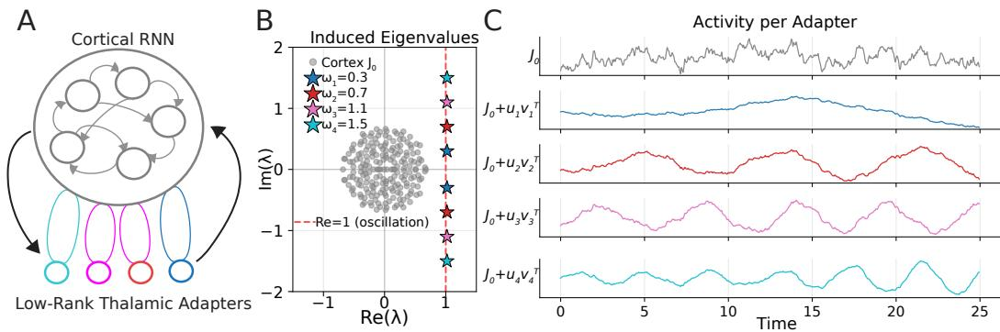

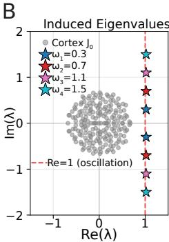

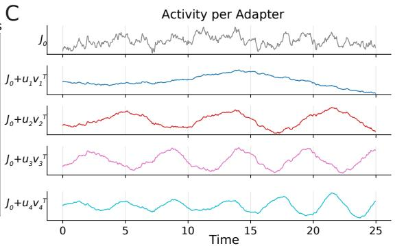  
Figure 1: Adapter Banks as Thalamocortical Loops (A) Schematic of the framework of Logiaco et al. [12]: thalamic inputs $\mathbf { u } _ { k }$ drive a cortical RNN with recurrence $\mathbf { J } _ { 0 }$ . A rank-one perturbation $\mathbf { u } _ { k } \mathbf { v } _ { k } ^ { \top }$ can induce oscillatory dynamics at a target frequency. (B) Eigenvalue placement. Gray: eigenvalues of the bare cortex $\mathbf { J } _ { 0 }$ . Stars: target locations on the oscillation line $( \mathsf { R e } ( \lambda ) = 1 )$ for four motifs at different frequencies $\omega _ { k }$ . Each low-rank perturbation shifts a conjugate pair of eigenvalues to the corresponding target. (C) Cortical activity projected onto a one-dimensional readout. Each motif $J _ { 0 } + u _ { k } v _ { k } ^ { T }$ sustains a different oscillation at its target frequency $\omega _ { k }$ , demonstrating that rank-one perturbations selectively recruit the cortical network to produce frequency-specific dynamics.

Building on the closed-loop musculoskeletal control setting of Lazzari and Saxena [18], we address this gap by introducing a learning architecture in which a shared recurrent core is modulated by a bank of in-the-loop residual adapters, each selected by a discrete latent code inferred from expert demonstrations alone. Three properties emerge from training. First, despite each adapter being initialized as a full-rank residual modulator, the adapters learn to apply emergent low-rank perturbations to the core network, recovering the structural assumption of Logiaco et al. [12]. Second, task representations are factored into disparate subspaces of a shared recurrent substrate, factoring the compositional structure of the task suite. Third, the trained adapter library supports out-of-distribution compositional transfer: a soft policy over the learned adapters, optimized while the rest of the network is frozen, sequences existing primitives into a novel trajectory the network was never trained on, outperforming a task-input-conditioned multitask baseline by upto order of magnitude.

## 2 Low-rank Adapters via Thalamocortical Architectures in Neuroscience

Theoretical work has proposed an architecture for composing motor primitives into flexible sequences, inspired by the connectivity between motor cortex, thalamus and basal ganglia in the brain [12]. Here, motor primitives are implemented through an interplay of the recurrence in motor cortex, and cortex-thalamus-cortex projections (thalamocortical loops, Figure 1A). Distinct thalamic units participate in different thalamocortical loops, and activations of subsets of thalamic units via basal ganglia inputs can thus act as a low-rank perturbation of the effective recurrent dynamics in the motor cortex. This allows the system to generate complex movements by sequencing low-rank perturbations of the same shared cortical substrate.

Let $\mathbf { h } \in \mathbb { R } ^ { N }$ denote the cortical state and ${ \bf J } _ { 0 } \in \mathbb { R } ^ { N \times N }$ the recurrent connectivity in cortex. Each thalamocortical channel k consists of a corticothalamic readout $\mathbf { v } _ { k } \in \mathbb { R } ^ { N }$ and a thalamocortical projection ${ \mathbf { u } } _ { k } \in \mathbb { R } ^ { N }$ . The cortical dynamics evolve as

$$
\tau \dot { \mathbf h } = - \mathbf h + \mathbf J _ { 0 } \mathbf h + \sum _ { k } \mathbf u _ { k } \mathbf v _ { k } ^ { \top } \mathbf h = - \mathbf h + \left( \mathbf J _ { 0 } + \sum _ { k } \mathbf u _ { k } \mathbf v _ { k } ^ { \top } \right) \mathbf h .\tag{1}
$$

The thalamocortical loop therefore acts as a low-rank perturbation to the effective cortical dynamics. In the linear setting, Logiaco et al. [12] showed that this low-rank perturbation can be tuned to precisely modulate the eigenvalues of the effective dynamics (Figure 1B). It can therefore change the behavior of the network (e.g. oscillation frequency of activity patterns, Figure 1C) and introduce particular dynamical motifs that would not be expressible by $\mathbf { J } _ { 0 }$ alone. This hence provides a mechanism for compositional motor control: the activity patterns needed to generate diverse movements can be constructed from a recurrent network by sequentially engaging different thalamocortical channels.

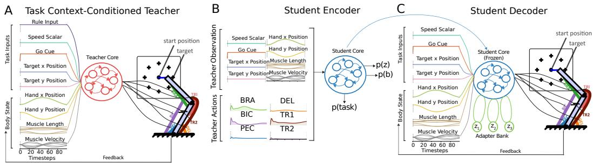  
Figure 2: Teacher–student framework for learning motor adapters (A) Task context-conditioned teacher. A recurrent network controls a two-link, six-muscle biomechanical arm in closed loop [18]. (B) Student encoder. A shared LSTM core network reads the teacher’s full demonstration (observations and muscle commands, but not the rule input) and segments each trajectory into three output probabilities: what task is being done $p ( t a s k )$ , distribution $p ( z )$ over $K = 1 0$ latent codes, and a distribution $p ( b )$ of the boundary between the two task segments. (C) Student decoder. The same core network rolls out in closed loop with only body-state feedback and task inputs (no teacher actions). The encoder-sampled code activates the corresponding adapter, which perturbs the cortical hidden state at each timestep.

The framework in Logiaco et al. [12] showed how to design readout vectors $\mathbf { v } _ { k }$ to achieve a particular change in eigenvalue of the effective dynamics and proposed that the selection mechanism an be implemented via disinhibition from basal ganglia circuits. However, they did not address how such an architecture could be learned more generally, and what mechanisms might govern motif selection. In the following section, we build on the conceptual framework of Logiaco et al. [12] to arrive at an algorithm for the learning and selection of motifs in more general, nonlinear settings.

## 3 Learning Adapters for Flexible Motor Control

To understand how learning system can discover reusable building blocks of behavior that flexibly recombine to solve new problems, we turn to the domain of closed-loop biomechanical motor control.

## 3.1 Biomechanical control RNN task

We adopt a closed-loop biomechanical control task from Lazzari and Saxena [18]. In this task, an RNN is required to control a two-link biomechanical arm with six muscles to generate a variety of movement types: straight reaches, clockwise and counterclockwise circular arcs, and sinusoidal trajectories. The RNN receives proprioceptive feedback (hand position, muscle length, muscle velocity) at each timestep. Movements come in two variants: half (start → target) andfull (start → target → start). This yields ten distinct task conditions.

## 3.1.1 Task-context conditioned teacher

We adopt the architecture from Lazzari and Saxena [18] as a teacher network that can generate expert trajectories. The teacher network receives a one-hot rule input at every timestep, specifying which task is currently active (Figure 2A), alongside speed, go-cue, and target information, as well as proprioceptive feedback. As was demonstrated in Lazzari and Saxena [18], RNNs develop shared dynamical structure across movement types after training, allowing for reuse of the same computations across the different tasks. While this solution is compositional, the rule input supplies the network a particular organization of composable units rather than discovering them from learning. In the next section, we explore an alternative architecture with a bank of learnable adapters that can be flexibly selected to compose movements.

## 3.1.2 CABRA: Compositional Adapter Banks for Recurrent Architectures

To arrive at a general architecture for flexible motor control, we develop an encoder/decoder architecture which learns to segment expert demonstrations into learned discrete latent skills [7], and then use this decomposition to select adapters to modulates the shared recurrent core. We treat thi architecture as a student network (Figure 2) which learns to imitate the teacher’s behavior.

Student encoder (selection). The student’s encoder (Figure 2B) reads the teacher’s full trajectory (observations minus rule input and muscle commands) and partitions it into $M = 2$ segments. For each segment, it produces two outputs: a boundary distribution $p ( b )$ over timesteps, indicating when the segment ends, and a categorical distribution $p ( z )$ over $K = 1 0$ latent codes, specifying which adapter is active in that segment. At the end of the first segment, the encoder also outputs a task-identity prediction. To achieve this, we adopt the CompILE (Compositional Imitation Learning and Execution) framework of Kipf et al. [7]. CompILE was developed for grid-world and toy-reacher domains and has not previously been applied to closed-loop biomechanical control.

During training, the code distribution is sampled with the straight-through Gumbel-softmax estimator, yielding a one-hot sample $z _ { m , k } \in \{ 0 , 1 \}$ with $\begin{array} { r } { \sum _ { k } z _ { m , k } = 1 } \end{array}$ in the forward pass so that exactly one adapter is active per segment. The boundary distribution is sampled with Gumbel-softmax at low temperature, inducing a soft segment assignment $\sigma _ { m } ( t ) \ \in \ [ 0 , 1 ]$ that concentrates near $\{ 0 , 1 \}$ except in the narrow window around the segment transition. At evaluation, both samples become hard via argmax. Half of the codes $( z _ { 0 } , \ldots , z _ { 4 } )$ are reserved for segment 0 (extension); the other half $( z _ { 5 } , \ldots , z _ { 9 } )$ for segment 1 (retraction). This phase split is implemented through hard masking of invalid logits and is the only structural prior we impose on the code identities themselves; the assignment of tasks to specific extension and retraction codes, and whether tasks reuse codes altogether, is up to the model to learn.

Student decoder (execution). The student’s decoder (Figure 2C) is the operational controller and instantiates the architectural commitment of the adapter bank. The decoder shares its core network module with the encoder, but the recurrent parameters are detached during the decoder pass: the decoder’s loss calculated during closed-loop arm rollouts cannot update the core network’s recurrence. The decoder’s gradient flows only into the adapters, the muscle readout, and the input projection to the core network. The recurrence itself is frozen during this pass and is shaped instead by the encoder’s segmentation and code-inference objectives. The encoder and decoder are jointly trained simultaneously, using two forward passes of the core network per step (one for encoder-mode and one for decoder-mode).

We impose no explicit rank constraint on the adapters. Each adapter (one per latent code) $\Delta _ { k }$ $\mathbb { R } ^ { N } \xrightarrow { } \mathbb { R } ^ { N }$ is a residual modulator of the core network’s hidden state and any low-rank structure they develop in training emerges from the optimization itself, a property we examine quantitatively in Section 4. At each decoder timestep $t ,$ the core recurrent network produces a hidden state $h _ { t }$ from observations and the previous state, and the adapter perturbs it residually. Let $z ^ { ( 0 ) } , z ^ { ( 1 ) }$ denote the codes sampled by the encoders for both segments respectively, and let $\begin{array} { r } { \dot { \sigma ( t ) } = \sum _ { \tau < t } b _ { \tau } } \end{array}$ denote the cumulative probability the segment boundary has occured by time t. At decoder timestep t, the core network produces a hidden state $h _ { t }$ and the active adapters perturb it residually:

$$
\tilde { h } _ { t } = \tilde { h } _ { t - 1 } + ( 1 - \sigma ( t ) ) \Delta _ { z _ { 0 } } ( h _ { t } ) + \sigma ( t ) \Delta _ { z _ { 1 } } ( h _ { t } )\tag{2}
$$

Because $\sigma ( t )$ is sharply concentrated around the sampled boundary, the perturbation collapses to $\Delta _ { z _ { 0 } } ( h _ { t } )$ during the extension segment and $\Delta _ { z _ { 1 } } ( h _ { t } )$ during the retraction segment, with brief soft mixing only across the transition. The muscle readout reads from $\tilde { h } _ { t } .$ , the arm advances one-step through differentiable physics, and $\tilde { h } _ { t }$ is fed back to the core network as the next-step recurrent input. The decoder receives the same task inputs and closed-loop body-state feedback the teacher uses during training, but never the rule input. Removing the adapters or replacing them with a single shared modulator prevents the network from effectively learning (Supplementary Figure 9).

## 3.2 Model training

We train the full system end-to-end with a hand-trajectory $L _ { 1 }$ loss against the teacher’s trajectories, KL regularization on boundary and code distributions, and standard activity and muscle-effort regularizers following Lazzari and Saxena [18]. The encoder additionally maintains a task-identity readout from its segment-1 pooled representation, providing a learning signal for the encoder’s representation that is a separate MLP head from the one that outputs the code logits. Two auxiliary losses improve training stability and sharpen code routing: a behavioral discriminator that predicts the active code from segment-pooled muscle commands (DIAYN, Eysenbach et al. 6), which reads only the six-dimensional muscle output and predicts the code that produced it; and an $L _ { 1 }$ loss between student and teacher muscle excitations. Neither auxiliary loss directly determines the assignment of tasks to codes: the discriminator operates on muscle output rather than routing, and excitation matching shapes muscle commands rather than code logits. We show in Supplementary Figure 8 that both auxiliary losses can be ablated without losing the architectural transfer learning advantage.

We train the student only on compound trajectories (FullReach, FullCircleClk, FullCircleCClk, Figure-8, Figure-8 Inv) and never on the half-task primitives that compose them. Any decomposition into reusable half extension and retraction primitives must therefore arise from training rather than from being explicitly demonstrated as a half movement.

## 4 Results

## 4.1 Compound performance and meaningful code routing

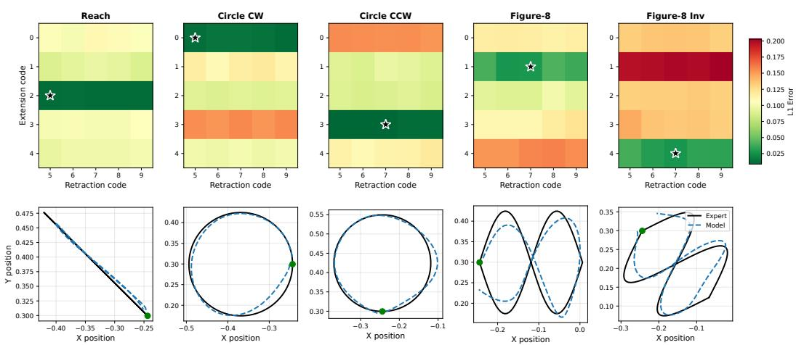  
Figure 3: Student execution of compound movements. Top row: Hand-trajectory L1 error of the trained student under all 25 forced (extension code, retraction code) pairs, for each of the five compound tasks. Rows index the five extension codes $( z _ { 0 } - z _ { 4 } ) ;$ columns index the five retraction codes $( z _ { 5 } \mathrm { - } z _ { 9 } )$ . Stars mark the natural code pair selected by the encoder. Bottom row: Expert (black) and student (blue, dashed) hand trajectories under the encoder’s natural code choice. Green dots mark the start position.

We first verify that the student successfully reproduces the teacher’s compound movements (Figure 3, bottom row). Trained only on compound trajectories and without ever being supplied the rule as input, the student traces the expert circles, figure-eights, and reaches with end-to-end hand L1 of approximately order $1 0 ^ { - 2 }$ m on all five tasks. The reach is essentially exact; the figure-eights show closed-loop wobble deviations, but recover the general shape.

The more revealing analysis is the forced-code sweep (Figure 3, top row). For each compound task, we run the trained decoder under all 25 possible (extension code, retraction code) combinations and measure hand-trajectory error against the expert. If the discovered codes index meaningful primitives, forcing the model to use the wrong code should degrade behavior. If instead the codes are interchangeable, the heatmaps should be roughly uniform.

The pattern in the extension dimension shows specialized codes. Each task’s natural extension code lies in a distinct row: Reach selects $z _ { 2 } ,$ , Circle CW selects $z _ { \mathrm { 0 } } ,$ Circle CCW selects $z _ { 3 } ,$ , Figure-8 selects $z _ { 1 }$ , and Figure-8 Inverse selects $z _ { 4 }$ . Forcing any other extension code raises error substantially. All five extension codes are populated, with a one-to-one assignment from tasks to codes. The training signal carries task-discriminative information (the encoder receives an auxiliary task readout, and the muscle output is matched to the teacher’s task-specific commands) but does not specify the assignment from tasks to codes. The network is free to consolidate multiple tasks onto a single code or to populate the available codes one-to-one, and we observe the latter.

The retraction dimension is partially shared rather than one-to-one: Reach and Circle CW both select $z _ { 5 }$ while Circle CCW, Figure-8, and Figure-8 Inverse all select $z _ { 7 }$ . Within a task’s preferred extension code, swapping the retraction code from $z _ { 5 } ~ \mathrm { t o } ~ z _ { 9 }$ produces only modest changes in trajectory error. This asymmetry between extensions and retractions tracks from the fact that the task prediction of the encoder is read out from the midpoint of the trial (specifically, the task readout is applied only to the segment-1 encoding) and the kinematics of the task suite (several compound retractions converge to similar end-state trajectories).

## 4.2 Emergent Low-Rank Structure

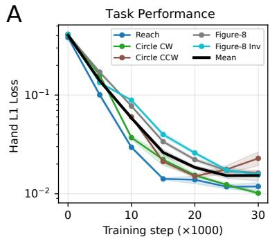

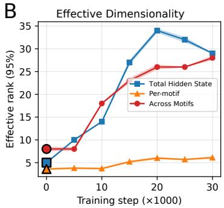  
Figure 4: Emergent low-rank structure in the adapter bank. (A) Held-out hand $L _ { 1 }$ per task and mean over training. (B) Effective rank (95% variance) of three quantities computed from closed-loop rollouts: the recurrent core’s hidden-state manifold, the per-adapter perturbation subspace (averaged across adapters), and the union of all adapter perturbations. Shaded bands are bootstrap standard errors.

We now ask whether the trained architecture exhibits the particular structural assumption that was made within Logiaco et al. [12]: motifs that are individually low-dimensional and jointly span the cortical state space. Recall that we impose no rank constraint on the motif adapters, because each is initialized as a full-rank residual modulator with an unconstrained $H  H$ map. Any low-rank structure they develop in training is therefore a property the architecture discovers, not one we imposed.

Figure 4A shows that all five compound tasks learn simultaneously. We characterize the dimensionality of the trained adapter bank’s perturbation space relative to the dimensionality of the recurrent core’s hidden-state manifold (Figure 4B). The recurrent core’s full hidden-state manifold reaches an effective rank of ∼ 30 by end of training (out of the available $H = 2 5 6$ dimensions), indicating the core develops a structured low-dimensional manifold. Each individual adapter’s perturbation subspace converges to an effective rank of only $\sim 5 \ – 6$ , which is nearly an order of magnitude below the available adapter dimensionality. And the union of all ten adapters’ perturbations spans an effective rank of $\sim 2 8$ , nearly matching the core’s full hidden-state manifold. The architecture discovers low-rank perturbations as a learned solution rather than as an architectural commitment.

These geometric properties are aggregate features of the adapter bank. They describe what the trained motifs are, not how they are organized relative to specific tasks. We turn next to that question, comparing the dynamical and representational structure of the student to the teacher across different movement types.

## 4.3 Shared core, separated representations

We now compare the dynamical and representational organization of the trained student to the teacher, a vanilla closed-loop multitask rule input-conditioned RNN. The two networks were trained on the same compound movements, although our network was only trained on compound movements while the teacher’s training also included half extension-only movements. The teacher is a recurrent

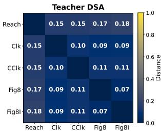

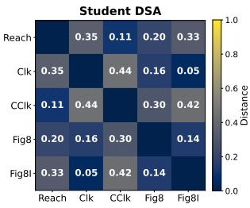

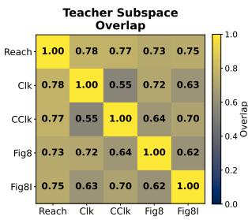

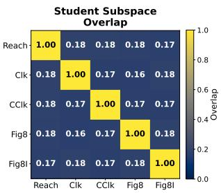  
Figure 5: Teacher vs. student dynamics and representational geometry. Pairwise dynamical similarity (DSA distance, top row; lower means more similar dynamics) and principal-subspace overlap (bottom row; mean squared cosine of principal angles between the dominant cortical activity subspaces, higher means more shared geometry) between the five compound tasks, computed for the teacher (left) and the student (right).  
network that is modulated by a one-hot rule input, while the student is also a recurrent network but is modulated by learned adapters. We characterize each network along two complementary axes: representational geometry (how recurrent hidden state activity for different tasks occupies the state space, measured via principal-subspace overlap) and dynamical structure (how the underlying recurrent dynamics differ across tasks, measured via DSA). Figure 5 shows that this architectural difference produces a sharp dissociation along the representational axis, with corresponding structure along the dynamical axis.

Representational geometry. Following Lazzari and Saxena [18], we compute the principal-subspace overlap between pairs of tasks via principal-angle analysis. For each task A, we collect recurrent hidden state activity over the trajectory into a matrix $\dot { \mathbf { X } _ { A } } \in \mathbb { R } ^ { N \times T } \left( N = 2 5 6 \right.$ units, T timesteps) and extract the top m principal components $\mathbf { P } _ { A } \in \mathbb { R } ^ { N \times m }$ explaining $\geq 9 5 \%$ of task variance. We use $m _ { \mathrm { t e a c h e r } } = 1 2$ and $m _ { \mathrm { s t u d e n t } } = 2 5$ , each matching its network’s typical effective rank under the 95% variance threshold. The pairwise principal-subspace overlap between tasks A and B is then $\begin{array} { r } { \frac { 1 } { m } \sum _ { i = 1 } ^ { m } \cos ^ { 2 } \theta _ { i } } \end{array}$ where {cos $\bar { \theta _ { i } } \rbrace _ { i = 1 } ^ { m } = \mathrm { \bar { s v d } } \big ( \bar { \mathbf { P } } _ { A } ^ { \top } \mathbf { P } _ { B } \big )$ and $\theta _ { i }$ are the principal angles between the two subspaces. The teacher’s pairwise overlap (Figure 5, bottom-left) is uniformly high, with off-diagonal mean 0.69. Task representations live in nearly the same recurrent subspace, consistent with the shared-manifold organization reported by Lazzari and Saxena [18]. The student’s overlap (bottom-right) is uniformly low, with off-diagonal mean 0.18, less than 2× its random baseline. Task representations in the student are highly separated in state space. This is the core empirical realization of the framework from Logiaco et al. [12]: a shared substrate modulated by discrete perturbations into minimally-overlapping subspaces.

Dynamical structure. We assess the similarity of recurrent dynamics across tasks using Dynamical Similarity Analysis (DSA, Ostrow et al. 19), again following the protocol of Lazzari and Saxena [18]. The teacher’s DSA matrix (Figure 5, top-left) is uniformly low, with off-diagonal mean 0.12: dynamics are similar across all task pairs. This is the within-manifold dynamical reuse that produces the teacher’s single shared subspace. The student’s DSA matrix (top-right) tells a different story. Off-diagonal mean is 0.25, materially higher than the teacher’s, but the values are not uniform in that they are organized along behavioral axes. Pairs sharing rotational sense have low DSA distance (Circle CW vs. Figure-8 Inverse: 0.05; Circle CCW vs. Reach: 0.11), while rotation-opposite pairs separate sharply (Circle CW vs. Circle CCW: 0.44; Circle CCW vs. Figure-8 Inverse: 0.42). The adapters do not produce small residual perturbations of a strictly common dynamical system, but rather genuinely distinct dynamical systems organized by behavioral kinematics.

These two findings are complementary. The teacher reuses both dynamics and representations: its compositional structure lives in a single shared subspace, modulated by explicit rule inputs. The student factors the problem differently. Its recurrent substrate is shared: a single LSTM, the same recurrence, the same input projection, and the same readout. However, the adapter perturbations introduce structured dynamical differences and place task representations in highly separated subspaces. Where the teacher’s compositional structure is tangled within a single manifold, the student’s is geometrically factored.

## 4.4 Compositional transfer to a novel two-petal trajectory

A  
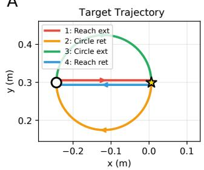

C  
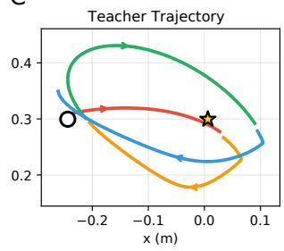

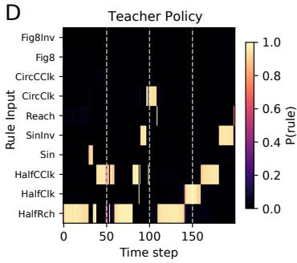

B  
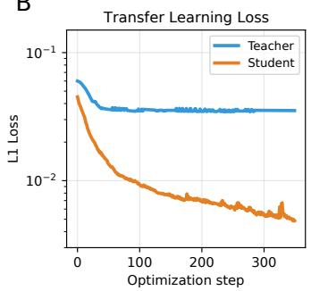

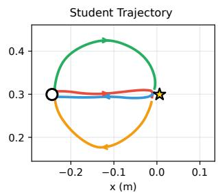

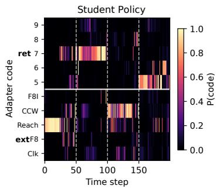  
Figure 6: Out-of-distribution compositional transfer. (A) The two-petal target trajectory, composed of four movement segments stitched together in a novel combination. (B) Hand $L _ { 1 }$ during transfer optimization, in which both networks are frozen and a 10-dimensional soft policy over the network’s task interface is optimized for 350 steps via gradient descent. Final teacher $L _ { 1 } \approx 0 . 0 4$ ; final student $L _ { 1 } \approx 0 . 0 0 5$ . (C) Final teacher (top) and student (bottom) hand trajectories under the optimized policies. Open circle marks the home position; star marks the reach target. (D) Final policies. Top: teacher rule-input weights over time. Bottom: student adapter-code weights.

The previous section established that the student’s task representations occupy highly seperable subspaces while the teacher’s collapse into a single shared manifold. If this geometric factoring is what enables compositional reuse, then mixing primitives to compose a novel trajectory should be substantially easier in the student. We test this prediction directly.

We construct a synthetic four-segment trajectory (Figure 6A) that splices primitive movements in pairings neither network was trained on. Segment 1 is a straight extension followed by Segment 2’s curved retraction, which contains a kinematic discontinuity at the target where the network must transition from a straight-line motor program to a curved-arc one. Segment 3 is a curved extension followed by Segment $\mathrm { 4 \dot { s } }$ straight retraction and represents the same discontinuity in the opposite direction. Neither (straight ext, curved ret) nor (curved ext, straight ret) appeared in either network’s training data. We freeze both networks and optimize a 10-dimensional soft policy over the network’s task interface (only learning a $T \times 1 0$ matrix): rule-input weights for the teacher and adapter-code weights for the student. We use gradient descent on the hand-trajectory $L _ { 1 }$ to the two-petal target (Figure 6B). Both networks use the same optimizer, the same target, the same initialization heuristic, and the same evaluation procedure. The only thing that differs is the frozen substrate.

The student tracks the target to within $L _ { 1 } = 0 . 0 0 5$ while the teacher plateaus at $L _ { 1 } \sim 0 . 0 4$ , an order of magnitude worse (Figure 6B,C). The student’s optimized policy (Figure 6D, bottom) shows that mixing concentrates around the segment transitions, but extends into within-segment timesteps as well (most prominently during Segment 3). The student also produces qualitatively distinct retractions across the two compositions: $z _ { 7 }$ (producing a curved retraction) follows the straight Segment-1 extension, while $z _ { 5 }$ (straight) follows the curved Segment-3 extension. Although forced-code analysis (Figure 3) showed that the choice of retraction code mattered little for in-distribution compound performance, in this OOD setting the student’s selection policy meaningfully differentiates retraction primitives to match the trajectory’s demands. The teacher’s policy (Figure 6D, top), in principle, could mix multiple rule inputs to compose the target (and a few timesteps show such co-activation), but the transfer optimization consequently gravitates toward solutions where one rule dominates at a time, leaving the teacher unable to manage transitions within novel splice-compositions. The architectural advantage holds on a second more difficult out-of-distribution shape (Supplementary Figure 7). The student’s advantage is preserved when both networks are restricted to hard discrete selection at each timestep (2.5× gap; Supplementary Figure 10).

## 5 Discussion

We present a novel architecture for learning motor options end-to-end from compound motor demonstrations. The architecture, a shared recurrent core modulated by a bank of low-rank adapters which are selected by a discrete code, is inspired by the thalamocortical circuit principle of Logiaco et al. [12], in which a shared cortical substrate has low-rank perturbations supplied by thalamic units, and the basal ganglia (BG) select which perturbation is active at each moment. Although each adapter is initialized as a full-rank residual modulator, learning discovers emergent low-rank perturbations of the core network’s hidden state (Figure 4), reproducing the structural commitment of Logiaco et al. [12]. Resulting task representations occupy highly separated subspaces of the recurrent state space, while the underlying recurrent dynamics retain a structured selective sharing organized by behavioral kinematics (Figure 5). This geometric factoring supports compositional generalization (Figure 6).

Several recent papers address the broader problem of compositionality in recurrent networks from complementary angles. Bakermans et al. [20] and Shan et al. [13] learn compositional structure through probabilistic task inference, decomposing tasks into a basis of latent factors that combine generatively. Our adapter library serves an analogous compositional role through learned "neural primitives" in the form of residual adapters, without committing to a prespecified factor basis or generative model. Closely related architecturally, Costacurta et al. [21] introduce neuromodulated RNNs in which a continuous modulatory signal scales rank-1 components of a low-rank recurrent network, demonstrating generalization to new held-out versions of tasks via newly learned gain patterns. We instead focus on the problem of compositional generalization by showing our trained adapters can be resequenced into novel combinations, in principle enabling an unbounded behavioral repertoire from a finite primitive library. Duncker et al. [4] corroborates our findings of separate task subspaces by showing that orthogonalizing dynamics across tasks mitigates catastrophic forgetting.

Our architecture has a natural mapping onto the circuit loop between cortex, thalamus, and BG [22]. The shared recurrent core corresponds to motor cortex, the adapter bank corresponds to lowrank perturbations supplied by thalamic units [12], and the movement policy that selects which adapter to engage corresponds to action selection via BG. The training procedure has a meta-learning interpretation [23]: the recurrent core is shaped on a slow timescale via inferring which high-level options to execute, while the adapter library is learned on a faster timescale: which low-level actions produce a desired movement. Our framework also resolves a long-standing dichotomy in basal ganglia research between high-level action selection [24] and low-level kinematic specification [25]: selecting a particular adapter’s low-rank perturbation also prescribes a specific kinematic pattern.

Our current approach has some limitations. Training uses task-identity supervision on the encoder’ segment-1 representation, which shapes how codes are organized. Empirically this produced a clean specialization for extension codes (one per task) alongside partial sharing among retraction codes (Figure 3). A purely unsupervised version of the architecture, which learns a variable number of codes and boundaries from task demands alone, may yield a qualitatively different organization. This organization could either be closer to the kinematic-motif structure observed in biological motor systems, if such systems can be recovered purely by task demands [26], or farther if they are working with extra constraints [27]. Identifying the training paradigm that produces the adapter bank that recovers biological motor primitives with minimal supervision is a central question for future work.

The cortex–thalamus–basal ganglia loop, a circuit for motor flexibility in biology, may help designing motor control in machines [28]. The same circuit is also responsible for cognitive flexibility in the brain, such as working memory management or task switching [29–31]. This raises the possibility that the architectural principles we identify for motor compositionality may also be relevant to compositional intelligence more broadly.

## References

[1] Tamar Flash and Binyamin Hochner. Motor primitives in vertebrates and invertebrates. Current opinion in neurobiology, 15(6):660–666, 2005.

[2] James B Heald, Máté Lengyel, and Daniel M Wolpert. Contextual inference underlies the learning of sensorimotor repertoires. Nature, 600(7889):489–493, 2021.

[3] Khimya Khetarpal, Matthew Riemer, Irina Rish, and Doina Precup. Towards continual reinforcement learning: A review and perspectives. Journal of Artificial Intelligence Research, 75: 1401–1476, 2022.

[4] Lea Duncker, Laura Driscoll, Krishna V Shenoy, Maneesh Sahani, and David Sussillo. Organiz ing recurrent network dynamics by task-computation to enable continual learning. Advances in neural information processing systems, 33:14387–14397, 2020.

[5] Richard S Sutton, Doina Precup, and Satinder Singh. Between mdps and semi-mdps: A framework for temporal abstraction in reinforcement learning. Artificial intelligence, 112(1-2): 181–211, 1999.

[6] Benjamin Eysenbach, Abhishek Gupta, Julian Ibarz, and Sergey Levine. Diversity is all you need: Learning skills without a reward function. arXiv preprint arXiv:1802.06070, 2018.

[7] Thomas Kipf, Yujia Li, Hanjun Dai, Vinicius Zambaldi, Alvaro Sanchez-Gonzalez, Edward Grefenstette, Pushmeet Kohli, and Peter Battaglia. Compile: Compositional imitation learning and execution. In International Conference on Machine Learning, pages 3418–3428. PMLR, 2019.

[8] Pierre-Luc Bacon, Jean Harb, and Doina Precup. The option-critic architecture. In Proceedings ofthe AAAI conference on artificial intelligence, volume 31, 2017.

[9] Elom A Amematsro, Eric M Trautmann, Najja J Marshall, LF Abbott, Michael N Shadlen, Daniel M Wolpert, and Mark M Churchland. Motor cortex flexibly deploys a high-dimensional repertoire of subskills. bioRxiv, 2025.

[10] Sina Tafazoli, Flora M Bouchacourt, Adel Ardalan, Nikola T Markov, Motoaki Uchimura, Marcelo G Mattar, Nathaniel D Daw, and Timothy J Buschman. Building compositional tasks with shared neural subspaces. Nature, 650(8100):164–172, 2026.

[11] Caleb Weinreb, Lakshanyaa Thamarai Kannan, Alia Newman-Boulle, Tim Sainburg, Winthrop F Gillis, Alex Plotnikoff, Sofia Makowska, Jonah E Pearl, Mohammed Abdal Monium Osman, Scott W Linderman, et al. Spontaneous behavior is a succession of self-directed tasks. Neuron, 2026.

[12] Laureline Logiaco, LF Abbott, and Sean Escola. Thalamic control of cortical dynamics in a model of flexible motor sequencing. Cell reports, 35(9), 2021.

[13] Haozhe Shan, Sun Minni, and Lea Duncker. Separating the what and how of compositional computation to enable reuse and continual learning. arXiv preprint arXiv:2510.20709, 2025.

[14] Edward J Hu, Yelong Shen, Phillip Wallis, Zeyuan Allen-Zhu, Yuanzhi Li, Shean Wang, Liang Wang, Weizhu Chen, et al. Lora: Low-rank adaptation of large language models. Iclr, 1(2):3, 2022.

[15] Chengsong Huang, Qian Liu, Bill Yuchen Lin, Tianyu Pang, Chao Du, and Min Lin. Lorahub: Efficient cross-task generalization via dynamic lora composition. arXiv preprint arXiv:2307.13269, 2023.

[16] Ziqi Jia, Anmin Wang, Xiaoyang Qu, Xiaowen Yang, and Jianzong Wang. Hierarchical-taskaware multi-modal mixture of incremental lora experts for embodied continual learning. In Proceedings of the 63rd Annual Meeting of the Association for Computational Linguistics (Volume 1: Long Papers), pages 28415–28427, 2025.

[17] Dengchun Li, Yingzi Ma, Naizheng Wang, Zhengmao Ye, Zhiyuan Cheng, Yinghao Tang, Yan Zhang, Lei Duan, Jie Zuo, Cal Yang, et al. Mixlora: Enhancing large language models fine-tuning with lora-based mixture of experts. arXiv preprint arXiv:2404.15159, 2024.

[18] John Lazzari and Shreya Saxena. Multitasking recurrent networks utilize compositional strategies for control of movement. bioRxiv, pages 2025–09, 2025.

[19] Mitchell Ostrow, Adam Eisen, Leo Kozachkov, and Ila Fiete. Beyond geometry: Comparing the temporal structure of computation in neural circuits with dynamical similarity analysis. Advances in Neural Information Processing Systems, 36:33824–33837, 2023.

[20] Jacob JW Bakermans, Pablo Tano, Reidar Riveland, Charles Findling, and Alexandre Pouget. Compositional meta-learning through probabilistic task inference. arXiv preprint arXiv:2510.01858, 2025.

[21] Julia C Costacurta, Shaunak Bhandarkar, David Zoltowski, and Scott W Linderman. Structured flexibility in recurrent neural networks via neuromodulation. Advances in Neural Information Processing Systems, 37:1954–1972, 2024.

[22] Isabella Silkis. The cortico-basal ganglia-thalamocortical circuit with synaptic plasticity. ii. mechanism of synergistic modulation of thalamic activity via the direct and indirect pathways through the basal ganglia. Biosystems, 59(1):7–14, 2001.

[23] Jane X Wang. Meta-learning in natural and artificial intelligence. Current Opinion in Behavioral Sciences, 38:90–95, 2021.

[24] Jonathan W Mink. The basal ganglia: focused selection and inhibition of competing motor programs. Progress in neurobiology, 50(4):381–425, 1996.

[25] Ashesh K Dhawale, Steffen BE Wolff, Raymond Ko, and Bence P Ölveczky. The basal ganglia control the detailed kinematics of learned motor skills. Nature neuroscience, 24(9):1256–1269, 2021.

[26] Rosa Cao and Daniel Yamins. Explanatory models in neuroscience, part 2: Functional intelligibility and the contravariance principle. Cognitive Systems Research, 85:101200, 2024.

[27] Valeriya Gritsenko, Russell L Hardesty, Mathew T Boots, and Sergiy Yakovenko. Biomechanical constraints underlying motor primitives derived from the musculoskeletal anatomy of the human arm. PLoS One, 11(10):e0164050, 2016.

[28] Josh Merel, Matthew Botvinick, and Greg Wayne. Hierarchical motor control in mammals and machines. Nature communications, 10(1):5489, 2019.

[29] Randall C O’Reilly and Michael J Frank. Making working memory work: a computational model of learning in the prefrontal cortex and basal ganglia. Neural computation, 18(2):283–328, 2006.

[30] Earl K Miller and Timothy J Buschman. Rules through recursion: how interactions between the frontal cortex and basal ganglia may build abstract, complex rules from concrete, simple ones. Neuroscience ofrule-guided behavior, pages 419–440, 2008.

[31] Okihide Hikosaka and Masaki Isoda. Switching from automatic to controlled behavior: corticobasal ganglia mechanisms. Trends in cognitive sciences, 14(4):154–161, 2010.

[32] Olivier Codol, Jonathan A Michaels, Mehrdad Kashefi, J Andrew Pruszynski, and Paul L Gribble. Motornet, a python toolbox for controlling differentiable biomechanical effectors with artificial neural networks. Elife, 12:RP88591, 2024.

## A Supplementary Methods

## A.1 Architecture details

The student is implemented as a single module containing an encoder, a decoder, and a bank of adapters that share a common LSTM core. All modules use hidden dimension H = 256.

Shared LSTM core. A single LSTM of width $H = 2 5 6$ is used both for encoder and decoder forward passes. The recurrent parameters are detached from the autograd graph during the decoder pass, so the closed-loop hand-trajectory loss flows only through the decoder input projection, the adapter bank, and the muscle readout, never through the LSTM recurrence.

Input projections. The encoder and decoder receive different observation subsets and use separate input projection MLPs (each a two-layer MLP with ReLU activation, hidden width $H { = } 2 5 6 )$ :

• Encoder input: 24-dim concatenation of the 18-dim sliced observation (full observation with the 10-dim rule input stripped) and the 6-dim teacher muscle command.

• Decoder input: 18-dim sliced observation only (no muscle command, no rule input).

Encoder heads. Three heads read from the encoder LSTM hidden state. The boundary and code heads are two-layer MLPs $( H \to H \to \cdot )$ with a ReLU between layers; the task head is also a two-layer MLP with ReLU.

• Boundary head: outputs a scalar logit per timestep, softmaxed across time within each segment to yield $p ( b )$

• Code head: outputs $K = 1 0$ logits per segment. Sampled with the straight-through Gumbelsoftmax estimator at temperature $\tau _ { z } = 0 . 1$ , yielding a one-hot $z _ { m , k }$ in the forward pass with gradients flowing through the soft distribution.

• Task head (auxiliary): two-layer MLP $( H \to 6 4 \to 5 )$ reading from the encoder’s segment-1 pooled hidden state, predicting task identity. Loss propagates only through the encoder.

Adapter bank. Each of the $K = 1 0$ adapters is a two-layer nonlinear residual modulator:

$$
\boldsymbol { \Delta } _ { k } ( { \mathbf { h } } ) = { \mathbf { W } } _ { k } ^ { \mathrm { o u t } } \operatorname { t a n h } \big ( { \mathbf { W } } _ { k } ^ { \mathrm { i n } } { \mathbf { h } } \big ) ,
$$

where $\mathbf { W } _ { k } ^ { \mathrm { i n } } , \mathbf { W } _ { k } ^ { \mathrm { o u t } } \in \mathbb { R } ^ { H \times H }$ . No bias terms. The output weights $\mathbf { W } _ { k } ^ { \mathrm { o u t } }$ are scaled by a factor of 2 at initialization to produce non-negligible early perturbations and accelerate adapter learning. No rank constraint is imposed on $\Delta _ { k }$ in the architecture; the empirical rank of the learned adapter perturbation in the cortical hidden state is analyzed in Section 4.

Phase-split mask. Codes are partitioned by movement phase: codes $z _ { 0 } , \dots , z _ { K / 2 - 1 }$ are reserved for segment 0 (extension) and $z _ { K / 2 } , \dotsc , z _ { K - 1 }$ for segment 1 (retraction). The phase split is implemented via hard masking of the invalid logits before sampling and is the only structural prior we impose on code identities; the assignment of tasks to specific codes within each phase emerges from training.

Muscle readout. A linear layer maps the (adapter-perturbed) hidden state $\tilde { \mathbf { h } } _ { t }$ to a 6-dimensional pre-activation, passed through a sigmoid to produce the muscle excitation vector supplied to the differentiable arm.

DIAYN discriminator. The DIAYN [6] discriminator is implemented in binned\_muscle mode: muscle commands within each segment are pooled into $n _ { \mathrm { b i n s } } = 3$ temporal bins and concatenated to form a $3 \times 6 = 1 8$ -dim feature, fed to a two-layer MLP $( 1 8 \to 6 4 \to K / 2 )$ that predicts the active code restricted to the segment’s valid phase subset. Separate discriminators are used for extension and retraction segments. The discriminator reads only muscle output, never cortical state.

## A.2 Training procedure

Optimization. Training uses Adam with learning rate $1 0 ^ { - 4 }$ , batch size 32, gradient clipping at norm 1.0, and no weight decay. The full system is trained end-to-end for 30,000 iterations. Encoder and decoder use two separate forward passes of the shared LSTM per training step.

Closed-loop rollouts. At each training iteration, the encoder forward pass reads the full teacher demonstration (observation and muscle command) and produces $p ( b ) , p ( z )$ , and the task-identity logits. The decoder forward pass uses the sampled $z _ { m , k }$ and $\sigma _ { m } ( t )$ to roll out the closed-loop arm trajectory using only body-state feedback. The hand-trajectory $L _ { 1 }$ loss is computed between the student’s closed-loop rollout at the current training step and the teacher’s pre-recorded hand trajectory for the same trial. Both trajectories are produced by closed-loop rollouts through the same differentiable arm: the teacher’s was recorded once during demonstration generation; the student’s is produced fresh each training step from its current parameters.

Detached recurrence on decoder pass. The LSTM recurrent parameters are shared between encoder and decoder modes but are detached during the decoder pass: the decoder’s gradient flows only into the decoder input projection, the adapter bank, and the muscle readout. The encoder pass updates the LSTM recurrence through the encoder’s segmentation and code-inference objectives, never directly through closed-loop motor error.

Loss composition. The total loss decomposes into three components corresponding to the encoder’s segmentation/inference objective, the decoder’s closed-loop control objective, and a set of auxiliary losses:

$$
\begin{array} { r l } & { \mathcal { L } _ { \mathrm { e n c } } = \beta _ { z } \mathcal { L } _ { \mathrm { K L } _ { z } } + \beta _ { b } \mathcal { L } _ { \mathrm { K L } _ { b } } } \\ & { \mathcal { L } _ { \mathrm { d e c } } = \mathcal { L } _ { \mathrm { h a n d } } + \lambda _ { \mathrm { r a t e } } \mathcal { L } _ { \mathrm { r a t e } } + \lambda _ { \mathrm { m u s c } } \mathcal { L } _ { \mathrm { m u s c } } } \\ & { \mathcal { L } _ { \mathrm { a u x } } = \beta _ { \mathrm { D I A Y N } } \mathcal { L } _ { \mathrm { D I A Y N } } + \lambda _ { \mathrm { e x c } } \mathcal { L } _ { \mathrm { e x c } } + \lambda _ { \mathrm { t a s k } } \mathcal { L } _ { \mathrm { t a s k } } } \\ & { \mathcal { L } = \mathcal { L } _ { \mathrm { e n c } } + \mathcal { L } _ { \mathrm { d e c } } + \mathcal { L } _ { \mathrm { a u x } } } \end{array}
$$

The encoder objective ${ \mathcal { L } } _ { \mathrm { e n c } }$ regularizes the boundary and code distributions toward priors: $\mathcal { L } _ { \mathrm { K L } _ { 2 } }$ is the KL between the encoder’s per-segment code distribution and a uniform prior over the valid code subset; $\mathcal { L } _ { \mathrm { K L } _ { b } }$ is the KL between the boundary distribution and a per-sample Poisson prior centered on the trial midpoint.

The decoder objective ${ \mathcal { L } } _ { \mathrm { d e c } }$ shapes the closed-loop motor output: $\mathcal { L } _ { \mathrm { h a n d } }$ is the per-timestep $L _ { 1 }$ between student and teacher hand trajectories averaged over the trial; $\mathcal { L } _ { \mathrm { r a t e } }$ and ${ \mathcal { L } } _ { \mathrm { m u s c } }$ are $L _ { 1 }$ regularizers on decoder hidden activity and muscle excitations following Lazzari and Saxena [18].

The auxiliary losses $\mathcal { L } _ { \mathrm { a u x } }$ provide additional learning signal: $\mathcal { L } _ { \mathrm { D I A Y N } }$ is the cross-entropy of the discriminator predicting the active code from segment-pooled muscle commands; $\mathcal { L } _ { \mathrm { e x c } }$ is an $L _ { 1 }$ loss between student and teacher muscle excitations; $\mathcal { L } _ { \mathrm { t a s k } }$ is the cross-entropy of the task-identity readout on the encoder’s segment-1 representation. All three auxiliary losses can be ablated without losing the architectural transfer advantage (Figure 8).

Loss weights for the headline configuration are $\beta _ { z } = 0 . 3 , \beta _ { b } = 0 . 1 , \beta _ { \mathrm { D I A Y N } } = 1 . 0 , \lambda _ { \mathrm { r a t e } } = 1 0 ^ { - 3 }$ $\lambda _ { \mathrm { m u s c } } = \bar { 1 } 0 ^ { - 2 } , \lambda _ { \mathrm { e x c } } = 0 . 5 , \lambda _ { \mathrm { t a s k } } = \bar { 0 } . 5$

Each training run was performed on a single NVIDIA GeForce GTX 1080 Ti GPU and took approximately 48 hours of wall-clock time to complete 30,000 iterations.

## A.3 Task and data details

Biomechanical environment. We use the motornet [32] RigidTendonArm26 effector with the MujocoHillMuscle model: a two-link arm with six muscles (two per joint plus two biarticular). Arm parameters match those used by Lazzari and Saxena [18].

Compound tasks. The student is trained on five compound trajectories (each comprising an extension followed by a retraction):

• FullReach: straight extension to target, then straight retraction home.

• FullCircleClk: clockwise half-circle outward, clockwise half-circle home.

• FullCircleCClk: counter-clockwise half-circle outward, counter-clockwise home.

• Figure8: half of a figure-8 outward, second half on return.

• Figure8Inv: figure-8 with inverted phase.

For each task we sample 32 reach conditions (target locations) per training batch. Each trial is a 200-timestep movement.

Half-task primitives are unseen. Although each compound trajectory consists of an extension followed by a retraction, we never expose the student to the half-task primitives in isolation. Any

decomposition into reusable extension and retraction codes must arise from segmenting compound demonstrations rather than from explicitly demonstrated primitives.

## A.4 Analysis methodology

Effective rank. For each adapter $k ,$ we collect the cortical perturbation $\Delta _ { k } ( { \bf h } _ { t } )$ over a held-out task suite and compute the effective rank as the number of singular values needed to explain $\geq 9 5 \%$ of the cumulative variance. Reported with mean ± standard error over $n _ { \mathrm { b o o t } } = 1 0$ bootstrap resamples.

Principal-subspace overlap. For each task A, we collect cortical hidden state activity over the trajectory into $\dot { \mathbf { X } } _ { A } \in \mathbb { R } ^ { N \times \hat { T } } \left( N = 2 5 6 , \right.$ , T timesteps) and extract the top m principal components $\mathbf { P } _ { A } ^ { \mathsf { ^ { * } } } \in \mathbb { R } ^ { \mathbf { \tilde { N } } \times m }$ explaini $\mathrm { n g } \ge 9 5 \%$ of task variance. We use $m _ { \mathrm { t e a c h e r } } = 1 2$ and $m _ { \mathrm { s t u d e n t } } = 2 5$ , each matching its network’s effective rank under the 95% variance threshold. The pairwise principalsubspace overlap between tasks A and B is

$$
\mathrm { o v e r l a p } ( A , B ) = \frac { 1 } { m } \sum _ { i = 1 } ^ { m } \cos ^ { 2 } \theta _ { i } , \quad \{ \cos \theta _ { i } \} _ { i = 1 } ^ { m } = \mathrm { s v d } \big ( \mathbf { P } _ { A } ^ { \top } \mathbf { P } _ { B } \big ) ,
$$

where $\theta _ { i }$ are the principal angles between the two subspaces. The chance baseline is the expected overlap between two random orthonormal m-dimensional subspaces in $\mathbb { R } ^ { N }$ , computed via QR decomposition of Gaussian matrices $( \sim 0 . 0 5$ for $m = 1 2 , \sim 0 . 1 0 \mathrm { f o r } m = 2 5 )$ . Trajectories used for this analysis are pooled across 128 trials per task (32 reach conditions ×4 repeats).

Dynamical Similarity Analysis. We follow the protocol of Lazzari and Saxena [18], computing DSA [19] pairwise between tasks. For each task we collect cortical activity into a tensor over conditions, trials, timesteps, and units, PCA-reduce to the network’s effective rank $( m _ { \mathrm { t e a c h e r } } = 1 2$ $m _ { \mathrm { s t u d e n t } } = 2 5 )$ , construct delay-embedded Hankel tensors with lag $p = 9 0 .$ , and fit reduced-rank Dynamic Mode Decomposition (DMD) matrices $\mathbf { A } _ { A } , \mathbf { A } _ { B }$ via Hankel Alternative View of Koopman (HAVOK) at rank $r \ : = \ : 1 5 0$ . The DSA distance between tasks is the Procrustes distance under similarity transformation:

$$
d ( \mathbf { A } _ { A } , \mathbf { A } _ { B } ) = \operatorname* { m i n } _ { \mathbf { C } \in O ( r ) } \| \mathbf { A } _ { A } - \mathbf { C } \mathbf { A } _ { B } \mathbf { C } ^ { - 1 } \| _ { 2 } ,
$$

computed using the DSA package with score\_method="euclidean". All DSA hyperparameters match Lazzari and Saxena [18].

Transfer optimization. For both teacher and student, we freeze the network and optimize a K-dimensional soft policy over the network’s task interface (rule-input weights for the teacher, adapter-code weights for the student). Each policy is a learnable matrix of logits over time, softmaxed at temperature $\tau = 0 . 5$ to produce a per-timestep distribution over the $K = 1 0$ task interfaces. We optimize hand-trajectory $L _ { 1 }$ loss against the two-petal target using Adam with learning rate 0.1 for 350 iterations. Both networks use identical optimizer settings, target trajectory, and policy initialization; the only difference is the frozen substrate. The butterfly trajectory uses 600 iterations at the same learning rate to accommodate its more complex shape. The softmax temperature in principle allows either policy to mix multiple task interfaces simultaneously at any timestep; differences in how soft each network’s optimized policy ends up therefore reflect each network’s underlying representational structure rather than any architectural asymmetry in the optimization itself.

Forced-code analysis. For the qualitative inspection of code-task assignment (Figure 3), we run the trained student in closed loop while overriding the encoder’s code distribution with a fixed one-hot code per segment. The resulting hand trajectory shows what behavior each adapter $\Delta _ { k }$ produces in isolation, factored away from the encoder’s learned code-inference policy.

## B Supplementary Figures

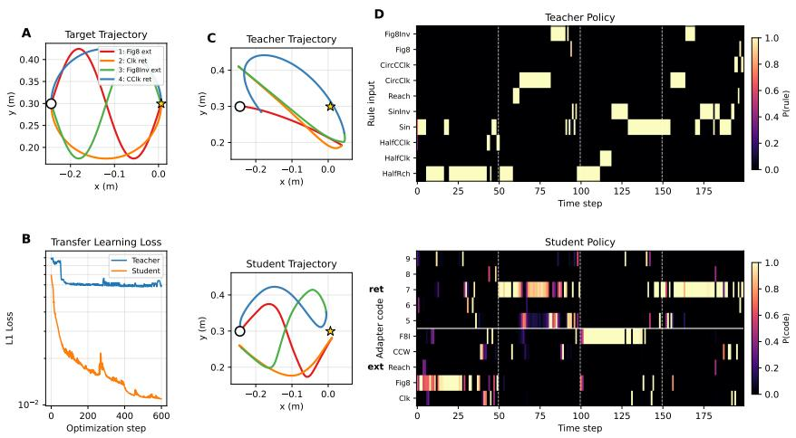  
Figure 7: Compositional transfer to a butterfly trajectory. A second out-of-distribution test using a four-segment butterfly composed of (Figure-8 extension, Clockwise retraction, Figure-8 Inverse extension, Counter-clockwise retraction); none of these pairings appeared in either network’s training data. (A) The butterfly target trajectory, with each 50-timestep segment shown in a separate color. Open circle marks the home position; star marks the reach target. (B) Hand $L _ { 1 }$ during transfer optimization. Both networks are frozen and a 10-dimensional soft policy over the network’s task interface is optimized for 600 steps. The student reaches hand $L _ { 1 } \approx 0 . 0 1 1$ , while the teacher plateaus at ≈ $0 . 0 5 8 , \mathtt { a } \sim 5 \times$ gap. (C) Final teacher (top) and student (bottom) hand trajectories. The student recovers the butterfly’s figure-8-like crossing structure; the teacher’s trajectory is qualitatively distorted. (D) Final policies. Top: teacher rule-input weights over time. Bottom: student adapter-code weights.

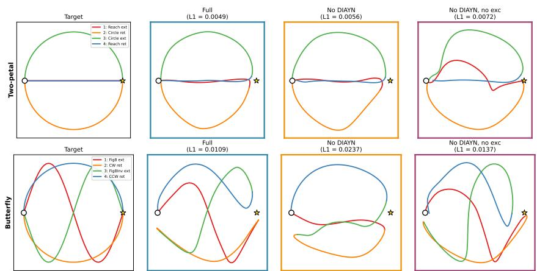  
Figure 8: Ablation of auxiliary supervision components across two OOD trajectories. We test whether the architectural transfer advantage depends on the two auxiliary losses $( \mathcal { L } _ { \mathrm { D I A Y N } }$ and $\mathcal { L } _ { \mathrm { e x c } } )$ by training two ablated configurations: one with $\beta _ { \mathrm { D I A Y N } } = 0 ( \mathrm { N o }$ DIAYN), and one with both $\beta _ { \mathrm { D I A Y N } } = 0$ and $\lambda _ { \mathrm { e x c } } = 0$ (No DIAYN, no exc). All other architectural choices, hyperparameters, and training details are unchanged. Final transfer trajectories on the two-petal (top) and butterfly (bottom) OOD tasks across the target and three configurations. The full configuration achieves numerically the best transfer hand $L _ { 1 }$ on both OOD trajectories (two-petal: 0.005; butterfly: 0.011), and all three configurations achieve transfer well below the teacher baseline (two-petal: 0.04, butterfly: 0.058). The architectural advantage over the teacher therefore does not depend on the auxiliary supervisions, though auxiliary supervisions provide modest refinement to transfer accuracy.

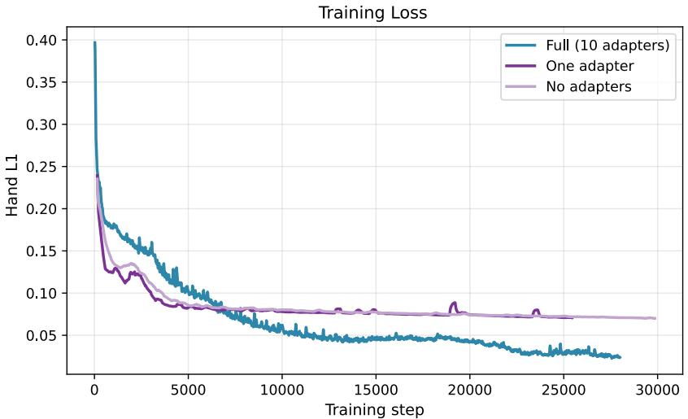  
Figure 9: Adapter bank ablation. The previous ablation removed auxiliary supervision components but preserved the adapter architecture. We additionally test whether the adapter bank itself is crucial for the network’s ability to learn the multi-task suite by training two further ablations: one with a single shared adapter $( K { = } 1$ , with all tasks routed through the same modulator), and one with no adapters at all (the cortex must learn all task dynamics within a single shared recurrence). For the latter, we allowed the decoder loss to train the LSTM recurrence.

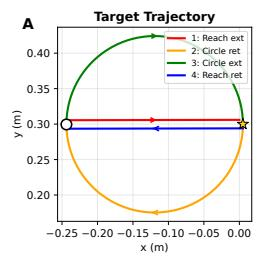

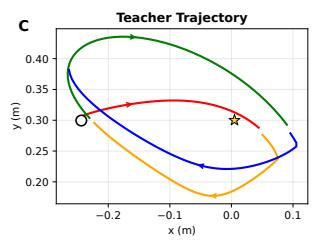

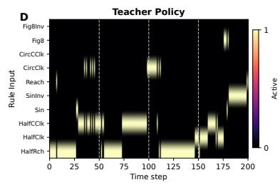

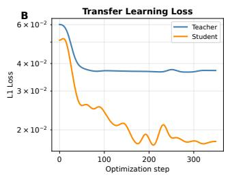

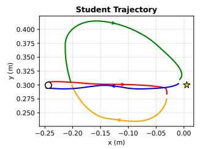

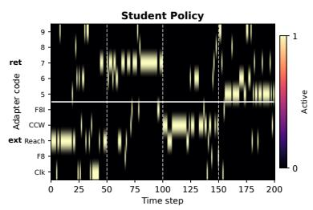  
Figure 10: Compositional transfer under hard discrete policy execution. A complementary version of the two-petal transfer experiment in Figure 6, in which both networks are constrained to use hard one-hot selection over their respective task interfaces at every timestep. Optimization uses a straight-through estimator: the forward pass takes the argmax of the policy logits at each timestep (genuinely discrete selection), while gradients flow through the soft softmax distribution during backpropagation. (A) The two-petal target trajectory (same as Figure 6). (B) Smoothed L1 loss over 350 optimization steps. Both networks are optimized with identical Adam settings, target trajectory, and initialization heuristic; they differ only in the frozen substrate. Curves show medianfiltered loss (window 25) followed by Gaussian smoothing $( \sigma = 8 )$ to suppress the noise inherent to straight-through estimation. Final mean L1 over the last 50 steps: student 0.018, teacher 0.040, a 2.2× gap; best L1: student 0.014, teacher 0.036, a 2.5× gap. (C) Final teacher (top) and student (bottom) hand trajectories. Even under hard discrete selection, the student recovers the qualitative two-petal structure (orange and green half-loops), while the teacher’s trajectory is contracted and distorted. (D) Final policies as actually applied to each network: the argmax code at each timestep. Top: teacher rule-input selection; bottom: student adapter-code selection.