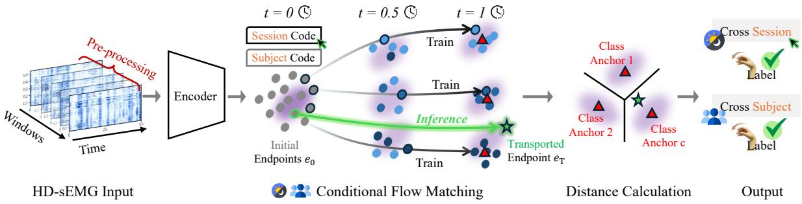
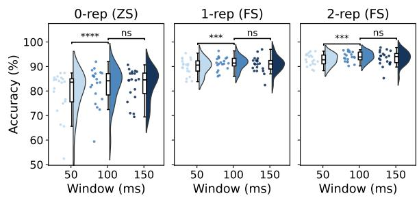
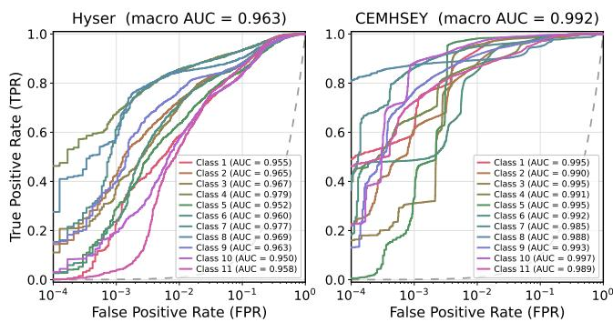
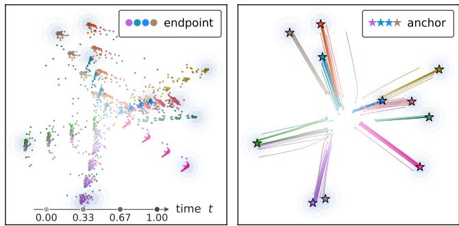

# MYOFLOW: ANCHOR-TIED RECTIFIED FLOW FOR HD-SEMG GESTURE RECOGNITIONACROSS SESSIONS AND SUBJECTS

Chenhao Wu1, Dingjie Peng1∗, Satoshi Funabashi1, Satoshi Konishi2, Wuqiang Yang3 Hiroshi Onoda1, Hironori Washizaki1, Jiang Liu1

1 Waseda University, Japan 2 KDDI Research Inc., Japan 3 The University of Manchester, UK

## ABSTRACT

High-density surface electromyography (HD-sEMG) gesture recognition supports prosthetic control, assistive robotics, and rehabilitation, but electrode re-donning and physiological variability cause distribution shifts that degrade accuracy across sessions and subjects. Generative HD-sEMG models primarily synthesize signals for augmentation; although diffusion models enhance representation learning, prediction still relies on a separate classifier. To tie learned dynamics to the decision rule, we propose MyoFlow, the first discriminative flow-matching framework for HD-sEMG recognition across sessions and subjects. It recasts classification as anchor-tied transport: a domain-conditioned rectified flow moves encoded windows toward gesture anchors that serve as transport targets and define the nearest-anchor decision geometry, enabling zero-shot prediction without an independent head. On the Hyser dataset, MyoFlow improves mean cross-session and cross-subject accuracy over the strongest diffusion-based baseline by 4.24% and 6.37%, respectively, and achieves 91.71% mean zero-shot accuracy and 97.39% mean few-shot accuracy across multiple days on the CEMHSEY dataset.

Index Terms— HD-sEMG, gesture recognition, representation learning, flow matching, domain generalization.

## 1. INTRODUCTION

High-density surface electromyography (HD-sEMG) records spatially resolved muscle activity through dense electrode arrays, providing a noninvasive interface for decoding motor intent [1, 2]. Models trained in a single recording domain, however, often generalize poorly to a new session or an unseen user [3]. Across sessions, electrode re-donning, changes in skin impedance, and movement variability alter the signal distribution [4]; across users, anatomical and neuromuscular differences introduce further shifts.

To handle these shifts, previous methods combined handcrafted features with linear discriminant analysis or support vector machines [5, 6]. Although effective with limited data, their fixed features could not adapt to changes in the sensor interface or user physiology. Deep neural networks learn spatiotemporal features directly [7, 8], while domain adaptation and transfer learning further reduce source–target mismatch [9, 10]. Yet these methods focus on representations and decision boundaries rather than modeling the signal distribution, and they often require labeled target recordings for recalibration, which introduces extra user effort.

Generative models offer a complementary route by modeling the distribution of HD-sEMG signals [11]. DiffHGR uses diffusion for HD-sEMG augmentation and feeds multiscale denoising features into the decoding branch of an auxiliary autoencoder [12]. At inference, however, prediction uses only the autoencoder’s encoder and a separately trained classifier; the diffusion is not used. This separation raises a question: Can the learned dynamics themselves make the class decision? Flow matching (FM) [13, 14] offers a potential route by learning a velocity field along predefined probability paths without trajectory simulation during training. However, its use in EMG remains limited to generation. EMGFlow [15] conditions noise-to-signal transport on a known gesture label, treating the label as an input rather than a prediction target and thus providing no direct classification rule. We therefore propose MyoFlow, to the best of our knowledge, the first FM framework for HD-sEMG classification across sessions and subjects. It recasts classification as subject- and sessionconditioned rectified-flow transport from encoded windows to a shared bank of learnable gesture anchors. These anchors serve as both transport endpoints and decision prototypes, allowing classification through nearest-anchor matching without a separate classifier head. Meanwhile, the shared geometry enables zero-shot recognition across domains without target-domain labels. Our main contributions are:

❶ We propose MyoFlow for HD-sEMG gesture recognition, formulating cross-session and cross-subject recognition as rectified transport in the representation space.

❷ We design an anchor-tied flow in which gesture anchors act as both transport targets and class prototypes, coupling representation learning to a nearest-anchor decision and making the learned class geometry identifiable.

❸ MyoFlow improves recognition on multiple datasets across sessions and subjects in zero- and few-shot settings.

  
Fig. 1. The framework of the proposed MyoFlow for HD-sEMG gesture recognition across sessions and subjects.

## 2. METHOD

## 2.1. Problem Formulation

Let $\boldsymbol { x } ~ \in ~ \mathbb { R } ^ { M \times L }$ denote an HD-sEMG window with M electrode channels and L temporal samples, labeled $y \in$ $\{ 1 , \ldots , C \}$ and tagged with the subject p and session d of its recording. Training uses only the labeled source set $\mathcal { D } _ { \mathrm { s r c } } .$ Cross-session recognition tests a source subject in a new session, and cross-subject recognition tests a subject absent from $\mathcal { D } _ { \mathrm { s r c } } .$ . Evaluation is indexed by the number K of labeled target repetitions released for calibration: $K \ = \ 0$ denotes zero-shot; the K class repetitions form the support set and the remainder the query set for $K > 0$ . The split is made at the repetition level, since windows from one repetition are strongly correlated without using query labels. The proposed MyoFlow realizes recognition as an initial-value problem in a latent space of endpoint dimension $D = 2 5 6 \colon$

$$
\begin{array} { l } { { \displaystyle e ( 0 ) = e _ { 0 } = E _ { \theta } ( x ) , \quad e ( 1 ) = e _ { T } , \ } } \\ { { \displaystyle \frac { \mathrm { d } e ( t ) } { \mathrm { d } t } = v _ { \phi } ( e ( t ) , t , c _ { p , d } ) , \ } } \end{array}\tag{1}
$$

where $E _ { \theta }$ denotes the initial endpoint encoder, and $v _ { \phi }$ a velocity field conditioned on domain context $c _ { p , d } .$ Following flow matching, $t \in [ 0 , 1 ]$ is the interpolation coordinate of a probability path: $t = 0$ is the encoded window and $t = 1$ the target distribution. The terminal endpoint $e _ { T } = e ( 1 )$ is thus where the class decision is read off.

Fig. 1 provides an overview of our method. The anchor bank $\mathbf { \bar { A } } = [ a _ { 1 } , \ldots , a _ { C } ] ^ { \top } \in \mathbb { R } ^ { C \times D }$ holds one learnable anchor per gesture, shared across subjects and sessions, and supplies the targets of the path. Since one anchor bank supplies both the flow’s destinations and the classifier’s prototypes, representation learning and the decision rule are optimized on a single geometry. The encoder $E _ { \theta }$ keeps time as the convolutional axis: $\mathrm { ~ \mathfrak ~ { ~ 1 ~ } ~ } \times \mathrm { ~ 1 ~ }$ stem mixes the M electrodes into feature channels, a stack of dilated depthwise temporal blocks widens the receptive field without striding, and global average pooling with a two-layer projection gives $e _ { 0 } \in \mathbb { R } ^ { D }$

## 2.2. Conditional Rectified Flow

For each labeled source window, MyoFlow pairs $e _ { 0 }$ with the anchor $a _ { y }$ of its label, samples $t \sim \mathcal { U } ( 0 , 1 )$ , and defines the interpolated state and its constant target velocity as

$$
e _ { t } = ( 1 - t ) e _ { 0 } + t { \bf s g } [ a _ { y } ] , \qquad u _ { t } = { \bf s g } [ a _ { y } ] - e _ { 0 } ,\tag{2}
$$

with sg[·] the stop-gradient. The field is fitted by

$$
\mathcal { L } _ { \mathrm { F M } } = \mathbb { E } _ { ( x , y , p , d ) \sim \mathcal { D } _ { \mathrm { s r c } } , t } \left\| v _ { \phi } ( e _ { t } , t , c _ { p , d } ) - u _ { t } \right\| _ { 2 } ^ { 2 } .\tag{3}
$$

As depicted in Fig. 1, the label selects the target anchor but never enters $v _ { \phi } ,$ so the field stays usable when the label is unknown; its squared-error optimum is the conditional mean $\mathbb { E } [ u _ { t } | e _ { t } , t , c _ { p , d } ]$ , averaging the target velocities of paths meeting at the same state. Since $a _ { y }$ is detached, the field learns to reach the anchors rather than drag them toward the data, while gradients through $e _ { 0 }$ shape the encoder and projector.

The domain context $c _ { p , d }$ is generated by a small Multi-Layer Perceptron (MLP) from concatenated subject and session embeddings, enabling domain-specific transport under shared anchor geometry. At test time, an unseen session reuses the source-session embedding, while an unseen subject uses the mean training-subject embedding; neither requires target domain data. Zero-initializing the output layer of $v _ { \phi }$ makes the initial transport map the identity. The FM loss requires no trajectory simulation, and the ordinary differential equation is solved only to obtain $e _ { T }$ for the anchor-tied classifier in Sec. 2.3, using Euler integration with midpoint time sampling at four steps in training and eight in evaluation.

## 2.3. Anchor-Tied Classification

The anchor bank is initialized as orthonormal rows of a QR factorization, rescaled to a fixed radius $r = \sqrt { D }$ , so that all $C ( C - 1 ) / 2$ class pairs start equidistant. MyoFlow classifies the terminal endpoint $e _ { T }$ by its distance to each anchor:

$$
\begin{array} { r } { \ell _ { c } ( e _ { T } ) = - \| e _ { T } - a _ { c } \| _ { 2 } ^ { 2 } / \tau , \qquad \hat { y } = \arg \operatorname* { m a x } _ { c } \ell _ { c } ( e _ { T } ) , } \end{array}\tag{4}
$$

where $\ell _ { c }$ is the logit of class $c ~ \in ~ \{ 1 , \ldots , C \}$ and $\tau =$ $D / s _ { \mathrm { a n c h o r } }$ sets the logit scale, with $s _ { \mathrm { a n c h o r } } = 1 0$ . Expanding the squared distance yields a tied linear read-out with class weight $2 a _ { c } / \tau$ and bias $- \| a _ { c } \| _ { 2 } ^ { 2 } / \tau$ Prediction is therefore equivalent to nearest-anchor classification. These weights are the flow’s own destinations; therefore, an invertible reparameterization of the endpoint space can no longer be absorbed into them. Only a global isometry leaves the objective unchanged, and pairwise anchor distances are invariant under it. The learned class geometry is therefore explicit rather than an artifact of the read-out.

## 2.4. Source-Only Learning

No target-session window, statistic or label enters training. The source objective pairs flow matching with anchor supervision and auxiliary regularization:

$$
\mathcal { L } _ { \mathrm { t r a i n } } = \lambda _ { \mathrm { F M } } \mathcal { L } _ { \mathrm { F M } } + \mathcal { L } _ { \mathrm { a n c h o r } } + \sum _ { r \in \mathcal { R } } \lambda _ { r } \mathcal { L } _ { r } ,\tag{5}
$$

where $\mathcal { L } _ { \mathrm { a n c h o r } } = \lambda _ { \mathrm { C E } } \mathrm { C E } ( \ell ( e _ { T } ) , y ) + \lambda _ { \mathrm { p u l l } } \| e _ { T } - a _ { y } \| _ { 2 } ^ { 2 } / D _ { \mathrm { t } }$ and $\mathcal { R } = \{ \mathrm { g e o } , \mathrm { r a d } , \mathrm { c o n } \}$ collects regularizers on class geometry, anchor norm, and clean–augmented consistency. The two leading terms divide the supervision: $\mathcal { L } _ { \mathrm { F M } }$ constrains the path, $\mathcal { L } _ { \mathrm { a n c h o r } }$ scores the arrival, and the latter is the only route by which the anchor bank is updated.

Optimization runs in two source-only stages: shared pretraining over source sessions pooled across subjects, then, for cross-session evaluation, adaptation on the evaluated subject’s own source session. Leave-one-subject-out evaluation omits the second stage and excludes the held-out subject from pretraining, so that subject contributes no gradient at any point.

## 2.5. Few-Shot Calibration

For $K > 0$ , calibration acts on $e _ { 0 }$ rather than $e _ { T }$ , since transport concentrates $e _ { T }$ onto the anchors and leaves little withinclass variation to correct. From the labeled support alone we recompute BatchNorm statistics and initialize a linear calibration head $g _ { \omega }$ from the class-wise support means $\mu _ { c } ,$ with $w _ { c } ~ = ~ \mu _ { c }$ and $b _ { c } ~ = ~ - \| \mu _ { c } \| _ { 2 } ^ { 2 } / 2$ , which is exactly nearestprototype classification. The encoder, projector, and $g _ { \omega }$ are then optimized on augmented support windows while the flow and anchor bank stay frozen; query repetitions are never seen. Let $\mathcal { T } ( z ) = \mathrm { C E } ( g _ { \omega } ( z ) , y ) , \varphi ( x ) = e _ { 0 }$ and $\varphi _ { j } ( x )$ denote the pooled endpoint and the projection of the pre-pooling feature map at position $j .$ The head $g _ { \omega }$ is induced and supervised at both resolutions:

$$
\mathcal { L } _ { \mathrm { c a l } } = \mathbb { E } _ { ( x , y ) } \Big [ \mathcal { I } ( \varphi ( x ) ) + \frac { \lambda _ { \mathrm { f r a m e } } } { L } \sum _ { j = 1 } ^ { L } \mathcal { I } ( \varphi _ { j } ( x ) ) \Big ] .\tag{6}
$$

The frame term draws L supervised signals from each window. And since the projector is non-linear, $g _ { \omega }$ receives gradients from features that the pooled term never produces.

Table 1. Cross-session accuracy on Hyser (%).
<table><tr><td>Method</td><td></td><td></td><td>0-rep (ZS) 1-rep (FS) 2-rep (FS)</td><td>Avg.</td></tr><tr><td>ViT-MDHGR [7](2024)</td><td>72.93</td><td>83.47</td><td>86.13</td><td>80.84</td></tr><tr><td>MoEMba [8](2025)</td><td>58.45</td><td>72.55</td><td>76.87</td><td>69.29</td></tr><tr><td>DiffHGR [12](2026)</td><td>76.32</td><td>85.70</td><td>87.34</td><td>83.12</td></tr><tr><td>MyoFlow (ours)</td><td>79.19</td><td>89.80</td><td>93.08</td><td>87.36</td></tr></table>

Table 2. Cross-subject accuracy on Hyser (%).
<table><tr><td>Method</td><td>0-rep (ZS)</td><td>1-rep (FS)</td><td>2-rep (FS)</td><td>Avg.</td></tr><tr><td>ViT-MDHGR [7](2024)</td><td>60.90</td><td>76.71</td><td>80.74</td><td>72.78</td></tr><tr><td>MoEMba [8](2025)</td><td>46.76</td><td>66.35</td><td>72.36</td><td>61.82</td></tr><tr><td>DiffHGR [12](2026)</td><td>63.37</td><td>78.01</td><td>80.30</td><td>73.89</td></tr><tr><td>MyoFlow (ours)</td><td>64.12</td><td>86.55</td><td>90.11</td><td>80.26</td></tr></table>

## 3. EXPERIMENT SETUP

We evaluate MyoFlow on the Hyser PR Dynamic [16] (20 subjects, two sessions separated by 3–25 days, 11 gestures, and 256 channels) and the CEMHSEY [17] (6 subjects, 11 consecutive days, 11 gestures, and 320 channels). Both datasets are sampled at 2048 Hz and segmented into nonoverlapping 50 ms windows. Cross-session evaluation uses Hyser Session 1 as the source and Session 2 as the target, while CEMHSEY uses Day 1 as the source and Days 2, 4, 6, 8, and 11 as targets. Cross-subject evaluation follows 20-fold leave-one-subject-out validation on Hyser Session 1, with no adaptation to the held-out subject. For $K \in \{ 0 , 1 , 2 \}$ K complete target repetitions per class form the support set and the remainder form the query set. All experiments are conducted on a single NVIDIA RTX 5090 GPU.

## 4. RESULTS AND ANALYSIS

Overall comparison. As shown in Tables 1 and 2, MyoFlow outperforms every listed baseline across all Hyser settings. Relative to DiffHGR, the strongest baseline by average accuracy, it improves cross-session and cross-subject performance by 4.24 and 6.37 percentage points, respectively. For unseen subjects, MyoFlow exceeds the best 1- and 2-repetition baselines, DiffHGR and ViT-MDHGR, by 8.54 and 9.37 points. Table 3 further shows that MyoFlow achieves the highest zero-shot accuracy on every CEMHSEY target day, increasing the average from 87.52% to 91.71%. The benefit of 2-repetition calibration over its zero-shot result grows from 2.01 points on Day 2 to 8.44 points on Day 11. These findings reflect the complementary roles of the two stages: anchor-tied rectified transport establishes a shared decision geometry for zero-shot recognition, while initial-endpoint calibration uses target support to correct residual distribution shift.

Temporal sensitivity. Fig. 2 shows that increasing the window length from 50 to 100 ms improves accuracy across all settings, as confirmed by paired Wilcoxon signed-rank tests, whereas extending it to 150 ms yields no significant further gain. These results reveal an accuracy–latency trade-off: compared with 100 ms, the 50 ms setting halves acquisition time while retaining strong recognition accuracy, supporting deployment in latency-sensitive settings.

Table 3. Cross-session accuracy on CEMHSEY (%) for day gaps of 1–10 days. (Best performance; Second best performance)
<table><tr><td rowspan="2">Method</td><td colspan="6">0-rep (ZS)</td><td colspan="6">1-rep (FS)</td><td colspan="6">2-rep (FS)</td></tr><tr><td>Day 2</td><td>Day 4</td><td>Day 6</td><td>Day 8</td><td>Day 11</td><td>Avg.</td><td>Day 2</td><td>Day 4</td><td>Day 6</td><td>Day 8</td><td>Day 11</td><td>Avg.</td><td>Day 2</td><td>Day 4</td><td>Day 6</td><td>Day 8</td><td>Day 11</td><td>Avg.</td></tr><tr><td>ViT-MDHGR [7] (2024)</td><td>90.57</td><td>86.63</td><td>85.97</td><td>84.05</td><td>83.00</td><td>86.04</td><td>96.38</td><td>93.62</td><td>94.75</td><td>96.62</td><td>94.87</td><td>95.25</td><td>97.38</td><td>95.28</td><td>96.26</td><td>96.57</td><td>96.63</td><td>96.42</td></tr><tr><td>MoEMba [8] (2025)</td><td>78.88</td><td>72.60</td><td>70.69</td><td>68.87</td><td>68.22</td><td>71.85</td><td>89.34</td><td>87.63</td><td>88.48</td><td>89.94</td><td>87.92</td><td>88.66</td><td>91.31</td><td>91.21</td><td>92.42</td><td>93.47</td><td>92.94</td><td>92.27</td></tr><tr><td>DiffHGR [12] (2026)</td><td>92.69</td><td>85.56</td><td>87.90</td><td>84.80</td><td>86.67</td><td>87.52</td><td>96.46</td><td>94.44</td><td>96.81</td><td>97.73</td><td>97.14</td><td>96.52</td><td>97.40</td><td>96.42</td><td>97.69</td><td>97.39</td><td>97.89</td><td>97.36</td></tr><tr><td>MyoFlow (ours)</td><td>96.06</td><td>90.84</td><td>91.87</td><td>89.66</td><td>90.11</td><td>91.71</td><td>97.41</td><td>94.92</td><td>96.77</td><td>98.22</td><td>97.42</td><td>96.95</td><td>98.07</td><td>97.14</td><td>97.37</td><td>98.01</td><td>98.55</td><td>97.83</td></tr></table>

  
Fig. 2. Temporal-window sensitivity for cross-session recognition on Hyser, with pairwise significance tests.

  
Fig. 3. Zero-shot Receiver Operating Characteristic (ROC) curves of MyoFlow on both datasets. (The FPR is log-scaled)

Classifier discrimination. We construct class-wise onevs-rest ROC curves by pooling target windows within each dataset and sweeping thresholds over the per-window, zeroshot, anchor-derived probabilities. Fig. 3 reports macro-AUCs of 0.963 on Hyser and 0.992 on CEMHSEY, with every class-wise AUC exceeding 0.950. These results show that the anchor-tied readout maintains reliable class-wise discrimination under both cross-session and cross-day distribution shifts, complementing the multiclass accuracy results.

  
Fig. 4. Visualization of the rectified-flow transport that carries each initial endpoint to its class anchor.

Interpretability of learned transport. Fig. 4 visualizes the endpoint trajectories projected onto the two-dimensional principal subspace of the anchor bank. As flow progresses, the endpoints move toward and concentrate around their class anchors, revealing how rectified transport organizes the latent space into a decision-aligned geometry. Because prediction uses the same anchors, each trajectory directly connects representation dynamics to the final decision, providing a geometric, sample-level interpretation of recognition.

## 5. CONCLUSION

We introduced MyoFlow, the first discriminative flow matching framework for cross-session and cross-subject HD-sEMG gesture recognition. Its anchor-tied design embeds transport in the decision rule: a domain-conditioned rectified flow moves encoded windows toward gesture anchors serving as transport endpoints and prototypes, enabling nearest-anchor prediction without an independent head. This geometry supports zero-shot transfer, while few-shot calibration adapts the variation-preserving initial endpoint to residual distribution shifts. Experiments on Hyser and CEMHSEY show strong recognition under session and subject shifts, with the largest calibration gains at longer day gaps. Together, these results show that learned transport can define the class decision rather than remain auxiliary to a separate classifier.

## Acknowledgement

This work was supported by the Waseda University Grant for Special Research Projects (Project No. BARH02612801), the Waseda Research Institute for Science and Engineering, and JST BOOST under Grant Number JPMJBS2429.

## References

[1] Wei Li, Ping Shi, and Hongliu Yu, “Gesture recognition using surface electromyography and deep learning for prostheses hand: State-of-the-art, challenges, and future,” Frontiers in Neuroscience, vol. 15, 2021.

[2] Jehan Yang, Kent Shibata, Douglas Weber, and Zackory Erickson, “High-density electromyography for effective gesture-based control of physically assistive mobile manipulators,” npj Robotics, vol. 3, no. 1, 2025.

[3] Wenhui Cui, Christopher M Sandino, Hadi Pouransari, Ran Liu, Juri Minxha, Ellen Zippi, Erdrin Azemi, and Behrooz Mahasseni, “Embridge: Enhancing gesture generalization from emg signals through cross-modal representation learning,” in International Conference on Learning Representations, 2026, vol. 2026, pp. 149668– 149684.

[4] Fang Qiu, Xiaodong Liu, and Xinming Ye, “Influence of electrode placement on the recognition of different gesture categories using high-density sEMG,” Frontiers in Neuroscience, vol. 19, 2025.

[5] Bernard Hudgins, Philip Parker, and Robert N. Scott, “A new strategy for multifunction myoelectric control,” IEEE Transactions on Biomedical Engineering, vol. 40, no. 1, pp. 82–94, 1993.

[6] Kevin Englehart and Bernard Hudgins, “A robust, realtime control scheme for multifunction myoelectric control,” IEEE Transactions on Biomedical Engineering, vol. 50, no. 7, pp. 848–854, 2003.

[7] Qin Hu, Golara Ahmadi Azar, Alyson Fletcher, Sundeep Rangan, and S Farokh Atashzar, “Vit-mdhgr: Cross-day reliability and agility in dynamic hand gesture prediction via hd-semg signal decoding,” IEEE Journal of Selected Topics in Signal Processing, vol. 18, no. 3, pp. 419–430, 2024.

[8] Mehran Shabanpour, Kasra Laamerad, Sadaf Khademi, and Arash Mohammadi, “Moemba: a mamba-based mixture of experts for high-density emg-based hand gesture recognition,” in 2025 47th Annual International Conference of the IEEE Engineering in Medicine and Biology Society (EMBC). IEEE, 2025, pp. 1–6.

[9] Md. Rabiul Islam, Daniel Massicotte, Philippe Massicotte, and Wei-Ping Zhu, “Surface EMG-based intersession/intersubject gesture recognition by leveraging lightweight All-ConvNet and transfer learning,” IEEE Transactions on Instrumentation and Measurement, vol. 73, pp. 1–16, 2024.

[10] Jianfeng Li, Xinyu Jiang, Jiahao Fan, Yanjuan Geng, Fumin Jia, and Chenyun Dai, “Deep end-to-end transfer learning for robust inter-subject and inter-day hand gesture recognition using surface EMG,” Biomedical Signal Processing and Control, vol. 100, pp. 106892, 2025.

[11] Nana Wang, Suli Wang, Gen Li, Pengfei Ren, and Hao Su, “New synthetic goldmine: Hand joint angle-driven emg data generation framework for microgesture recognition,” in Proceedings of the AAAI Conference on Artificial Intelligence, 2026, vol. 40, pp. 17787–17795.

[12] Kejia Su, Bo Wan, Jiayang Huang, Zhi-Qiang Zhang, Pengfei Yang, and Quan Wang, “Diffusion-based learning for cross day hand gesture recognition using HDsEMG signals,” Biomedical Signal Processing and Control, vol. 118, pp. 109716, 2026.

[13] Yaron Lipman, Ricky T. Q. Chen, Heli Ben-Hamu, Maximilian Nickel, and Matthew Le, “Flow matching for generative modeling,” in International Conference on Learning Representations, 2023.

[14] Xingchao Liu, Chengyue Gong, and Qiang Liu, “Flow straight and fast: Learning to generate and transfer data with rectified flow,” in International Conference on Learning Representations, 2023.

[15] Boxuan Jiang, Chenyun Dai, and Can Han, “Emgflow: Robust and efficient surface electromyography synthesis via flow matching,” arXiv preprint arXiv:2604.13685, 2026.

[16] Xinyu Jiang, Xiangyu Liu, Jiahao Fan, Xinming Ye, Chenyun Dai, Edward A Clancy, Metin Akay, and Wei Chen, “Open access dataset, toolbox and benchmark processing results of high-density surface electromyogram recordings,” IEEE Transactions on Neural Systems and Rehabilitation Engineering, vol. 29, pp. 1035– 1046, 2021.

[17] Shutian Yang, Chen Chen, Dongxuan Li, and Xiangyang Zhu, “A consecutive multi-day high-density surface electromyography dataset comprising 7 grasps and 11 gestures,” Scientific Data, vol. 12, no. 1, pp. 1420, 2025.