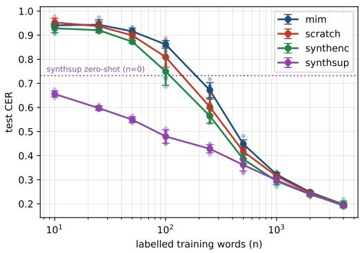
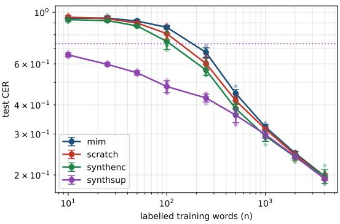

# Measuring Annotation Efficiency for Handwritten Devanagari Recognition: Sample-Complexity Curves for Four Pretraining Regimes

Manglesh Kumar Pandey Alliance School of Liberal Arts and Sciences, Alliance University Bengaluru, India

Sumit Kumar Banshal Department of Computer Science and Engineering, Alliance University Bengaluru, India

## Abstract

To train handwritten text recognition systems we need word images and their corresponding transcriptions, and these transcriptions are produced manually. For a script that can be read by only a small number of specialists, this manual transcription is a limitation, because the trained models are supposed to save the time of those same specialists. A relevant question therefore arises: how many transcriptions are needed before a recogniser becomes useful, and how much of that cost can pretraining remove? In this study the answer is measured directly for handwritten Devanagari. We keep the recogniser, optimiser and evaluation protocol the same and change only the number of real transcribed words used for fine-tuning, across nine budgets from 10 to 4,000 and four initialisation regimes, with six seeds at every point. The resulting curves are then converted into annotation-equivalent terms. A CER of 0.50 is reached by supervised synthetic pretraining using only 81 transcribed words, whereas random initialisation requires 355, which gives a label multiplier of 4.40× [3.56, 4.99]. There is a zero-shot reference point as well: with no real transcribed words at all, this pretraining is worth about 136 of them. This advantage gets smaller as the target accuracy improves, and at the most demanding target we measure, it cannot be distinguished from no saving at all. A fourth arm in which only the encoder is transferred separates the effect of the pretraining method from that of transfer scope, and masked image modelling is observed to transfer negatively over a bounded range of budgets. We emphasise that the scarcity in this study is constructed by subsampling a large corpus.

## 1 Introduction

Images of handwritten words along with their transcriptions are used to train handwritten text recognition systems and this is done manually. For widely written scripts this cost can be absorbed once and then used across many users and projects. For a script that can be read by few dozen specialists, the manual transcription is a limitation: the recognition system is supposed to save time of these same specialists who are responsible for creating the transcriptions.

This creates an unusual practical question. Not how accurate can a recogniser be, but how much transcription is needed before it becomes useful, and how much ofthat cost can be avoided. Synthetic pretraining, self-supervised pretraining, transfer from related scripts are some of the methods which can help in reducing the amount of transcription required. The size of that reduction, however, is rarely measured across a range of annotation budgets, and it is rarely expressed in units of human effort.

In this paper, we measure it directly by varying only the number of real transcribed words available for fine-tuning, across nine budgets from 10 to 4,000 and four initialisation regimes, with six seeds at every point and keeping the recogniser, optimiser, and evaluation protocol fixed. We then use the resulting curves to determine how many human-transcribed words each method needs to reach a given level of accuracy. This tells us how much annotation work can be saved by using pretraining.

Our contributions are:

• A sample-complexity curve for handwritten Devanagari word recognition across four initialisation regimes and nine annotation budgets, with seed-resampled uncertainty at every point.

• An annotation-equivalent conversion of those curves. Supervised synthetic pretraining reaches CER 0.50 with 81 transcribed words where random initialisation requires 355, a 4.40× label multiplier with a seed-resampled interval of [3.56, 4.99].

• A zero-shot anchor: the synthetically pretrained model, with no real labels at all, achieves CER 0.7322, which the scratch curve reaches at approximately 136 transcribed words.

• A controlled comparison that separates the effect of the pretraining task from how much of the network is transferred, using a fourth arm that carries over only the encoder from the supervised checkpoint. This reveals that masked image modelling produces negative transfer over a limited range (n = 50–500), and that the encoder and sequence-model parts of the supervised benefit behave differently: the encoder part is small but remains detectable up to n = 1000, while the much larger sequence-model part is no longer detectable beyond n = 250.

All the methods used in this work already exist. Our contribution is therefore not a new method but a way of measuring the effect of pre-existing methods. We provide a fine-grained curve in the annotation-starved regime, with seed-resampled uncertainty intervals, expressed in units of human effort.

## 2 Related Work

There has been a systematic study of the relationship between volume of training data and recognition accuracy for scene text, where dense sampling is feasible because of the existence of large synthetic and real corpora [Rang et al., 2024]. That work studies behaviour far above the regime we work in, and measures accuracy as a function of data. Scaling curves have been studied more broadly in machine learning to describe how the availability of more data changes performance [Viering and Loog, 2023]. None of this work expresses the relationship in the other direction, as the number of labels required to reach a target accuracy. Our work focuses on the annotation-starved regime and expresses the resulting curves in terms of human transcription effort.

Using rendered text to train text recognisers is well established practice for scene text [Jaderberg et al., 2014], and synthetic data have also been used for handwritten text recognition (HTR) in under resourced settings, including Devanagari [Dutta et al., 2018]. More recently, Pippi et al. [2023a] have examined synthetic pretraining for handwriting processing tasks, and Wolf and Fink [2024] synthetic-to-real adaptation via self-training. Separately, Souibgui et al. [2022a] explored generating training data from very few examples. This literature establishes that synthetic pretraining helps, and one line of work measures how the benefit varies with the amount of real fine-tuning data: Pippi et al. [2023b] fine-tune a CRNN on progressively smaller fractions of three single-author historical collections and identify which pretraining corpus best suits a given target. Their independent variable is the choice of pretraining source, and their from-scratch baseline does not converge at their smallest budgets, so the comparison stops at error rates measured at fixed fractions. We instead fix the pretraining source, vary how much of the network is transferred, retain a from-scratch baseline at every budget, and convert the resulting curves into the number of human transcriptions each regime saves.

How much of a pretrained network is worth carrying over is an important question for text recognition. Yosinski et al. [2014] showed that the generality of learned features varies across model layers, and that transferability decreases as layers become more task specific. They also attribute part of the transfer gap to optimisation difficulties introduced by splitting a network. Our experiment asks the same question for a CRNN trained with CTC, at each point along an annotation budget, and expresses the answer in terms of annotation efficiency rather than transferability alone.

Masked modelling has been applied to text recognition [Lyu et al., 2024] and to self-supervised pre-training of text recognisers more broadly [Kišš and Hradiš, 2024], where it was effective but did not consistently outperform transfer learning from closely related domains. We include masked image modelling and supervised synthetic pretraining as arms in this study under the same compute budget, and report the result we obtain rather than the result the literature would predict.

Few-shot and low-resource approaches to handwritten text recognition have received sustained attention [Souibgui et al., 2022b]. For Indic scripts, the dataset we use was released with the original Devanagari benchmark [Dutta et al., 2018] and later incorporated into a ten-script collection [Gongidi and Jawahar, 2021]; competition results across Indic scripts provide additional context [Mondal and Jawahar, 2023]. We emphasise that Devanagari handwriting is not itself under-resourced: our scarcity is constructed by subsampling, for reasons set out in Section 3.1.

## 3 Experimental Setup

## 3.1 Dataset

A handwritten Devanagari word dataset was published in 2018 [Dutta et al., 2018], as IIIT-HW-Dev, and in this experiment, we specifically use IIIT-HW-Dev v1, which corrects the segmentation errors in the initially released version. This dataset has now been incorporated into the ten-script IIIT-INDIC-HW-WORDS collection [Gongidi and Jawahar, 2021]. It contains 95,430 word images from 12 writers, which is further divided into training (69,853 images, 7 writers), validation (12,708 images, 2 writers), and test (12,869 images, 3 writers). We verified disjointness directly from the image paths; each split, i.e., train, test, and validation, has different writers.

All labels are NFC-normalised before use. In the released corpus, 2,488 labels are not in NFC form, arising from eight Devanagari nuqta letters that Unicode admits in both precomposed and decomposed forms. CER would be measured partly as a function of encoding artefacts, as without normalisation, the same visual word yields two distinct label strings. To measure the geometry of the images, we sampled a random subset of 3,000 images per split and measured the following: median height is 292–293 pixels, median aspect ratio is 2.5, and the 99th percentile of aspect ratio is 4.5–4.6. There are 100 distinct characters in the character inventory, giving 101 CTC classes including the CTC blank class.

We would like to emphasise that Devanagari handwriting is not a low-resource setting, and we did not select it to represent any other script that is low-resource. In this experiment, we manufactured scarcity by subsampling a corpus of 95,430 transcribed words. The alternative is measuring samplecomplexity curves on a genuinely low-resource script, but a sufficiently large corpus is needed to establish a full-data reference point and systematically evaluate progressively smaller subsets. Thus, we must make it clear that the multipliers derived as a result of this experiment apply to this corpus, and we do not claim that they transfer.

## 3.2 Recognition Model

A CRNN [Shi et al., 2017] trained with CTC loss [Graves et al., 2006] is common among all four arms, i.e., scratch, mim, synthenc, and synthsup. All input images are converted to grayscale and resized to height 64 keeping the aspect ratio, and are then right-padded to width 320. For the padding we use the 90th percentile of the image’s own intensity and not black, so that the padded region reads as background and not as a block of ink. To prohibit paper tone and pen darkness from carrying the writer’s identity to input all images are standardised individually instead of by an affine transformation, this is important because the test writers, the validation writers and the training writers are disjoint.

The image height is reduced to 1, and width is divided by four to give 80 time steps by the convolutional encoder. The sequence model is a two-layer bidirectional LSTM with hidden size 256 and dropout 0.1 and then followed by a linear CTC head. The network split is relevant because the transfer analysis in Section 6, compares encoder-only and full-model transfer, the split is as follows: total 10,067,813 parameters, of which 68.2% belong to the convolutional encoder, 31.3% to the recurrent layers, and 0.5% to the output head.

We measured a sample of 3,000 images across six configurations of input height and width stride, and checked whether the encoder produces enough horizontal positions for CTC to align the label. The chosen configuration, height 64 with stride 4, never ran out of positions and leaves 4.44 time steps per character at the 1st percentile of the time-steps-per-label distribution. The most aggressive configuration, height 32 with stride 8, leaves only 1.09 and fails outright on 7 of the 3,000 images. Therefore, we chose the 64/4 configuration.

CTC decoding is greedy best-path with no language model and lexicon, the reason for having no lexicon is that out of 6,907 distinct test words none are absent from 9,495 distinct training words. Thus, the existence of a lexicon would contain every test word, and lexicon-constrained decoding would reduce a significant number of errors by simply using lookup rather than recognition. Therefore, we report unconstrained decoding throughout and discuss closed-vocabulary implications in Section 8.

## 3.3 Synthetic Corpus

20,000 rendered word images constitute synthetic pretraining corpus, with mean label length of 6.26 characters. It is generated from the same 100-character inventory as the real corpus. Because natural Hindi has uneven frequency distribution of aksharas, it would be undesirable for low-label experiments to render synthetic words from a natural text corpus, therefore, we use an akshara-level grammar to generate synthetic word corpus, so a broader and more uniform character coverage can be achieved. We intentionally trade off linguistic realism in synthetic data so that rare characters/conjuncts would get enough training examples.

We measured the appearance of the real images and used those measurements to set the targets of the generator. On the 3,000-image samples described in Section 3.1, the median ink fraction is 0.068– 0.075 across the splits, the 10th to 90th percentile of ink–background separation is 0.261–0.409, the median background level is 0.859–0.860, and the 1st to 99th percentile of aspect ratio is 1.43–4.59. The generator itself was configured with target ink fraction 0.030–0.058, target separation 0.37–0.50, background level 0.86–0.96, aspect ratio 1.45–4.60, and slant −9◦ to +9◦. The ink fraction and separation targets are deliberately offset from the measured values, because the generator estimates these two quantities in a different way from the measurement described in Section 3.1 and the two estimates do not agree. Synthetic labels require no human transcription and are therefore never counted in the annotation budget.

## 3.4 Training Regimes

We compare four arms to study the effects of pretext task and transfer scope, along with a randomly initialised control.

Table 1: The four training regimes. Transferred names the parameter groups initialised from a pretraining checkpoint; Tensors is the number of state-dict entries carried over.
<table><tr><td>Arm</td><td>Pretext task</td><td>Transferred</td><td>Tensors</td></tr><tr><td>scratch</td><td>none</td><td>none (random init)</td><td>0</td></tr><tr><td>mim</td><td>masked image modelling</td><td>encoder</td><td>29</td></tr><tr><td>synthenc</td><td>supervised synthetic CTC</td><td>encoder</td><td>29</td></tr><tr><td>synthsup</td><td>supervised synthetic CTC</td><td>encoder + LSTM + head</td><td>47</td></tr></table>

The synthenc arm separates the two factors. Without it, any gap between mim and synthsup would confound the type of pretraining with the transfer scope. We retain only the convolutional parameters from the synthsup checkpoint for synthenc, so the two supervised arms share identical pretraining and differ only in how much of the network is carried over.

Our masked-image-modelling arm follows the design of SimMIM [Xie et al., 2022]: masked regions are passed to the encoder rather than removed from it, a lightweight decoder predicts raw pixel values, and the loss is an $\ell _ { 1 }$ term computed on the hidden pixels only. Random full-height vertical strips of width 16 are hidden at a masking ratio of 0.5, and a transposed-convolution decoder reconstructs them. We depart from SimMIM in two respects. First, SimMIM uses a vision transformer with learnable mask tokens, whereas our encoder is convolutional and masked pixels are simply set to zero. Second, SimMIM masks square patches, whereas we mask full-height strips, because handwriting is a horizontal sequence: a full-height strip removes roughly one character, forcing the model to infer it from neighbouring context rather than from local texture.

Both pretraining modes run for 20 epochs with AdamW [Loshchilov and Hutter, 2019] and a onecycle schedule [Smith and Topin, 2017] at peak learning rate $3 \times 1 0 ^ { - 4 }$ . The two modes do not use the same weight decay: it is $\bar { 1 } 0 ^ { - 4 }$ for the supervised pretraining and $5 \times 1 0 ^ { - 2 }$ for masked image modelling. The supervised pretraining had also converged within this budget, whereas the masked pretraining had not. Both of these differences bias the comparison against mim. We disclose them rather than correct for them, since extending mim training would break the equal-compute comparison in the opposite direction.

## 3.5 Annotation-Budget Protocol

All four arms are fine-tuned at nine label counts, $n \in \{ 1 0 , 2 5 , 5 0 , 1 0 0 , 2 5 0 , 5 0 0 , 1 0 0 0 , 2 0 0 0 , 4 0 0 0 \}$ with six seeds at every point, giving 36 arm-by-budget cells and 216 fine-tuning runs. We use comparatively more label counts at the lower end as we are interested in observing the data-scarce setting, while the larger label counts help to show how the performance changes as more labelled data becomes available. To compare the results fairly, the same labelled subset is used for all four arms at a given n for each seed $k .$

Optimisation uses AdamW at a learning rate of $3 \times 1 0 ^ { - 4 }$ , weight decay $1 0 ^ { - 4 }$ , batch size min $( 3 2 , n )$ gradient clipping at 5.0, and a one-cycle schedule over a 2500-step budget. We use FP32 to calculate the CTC loss, while most of the network uses FP16 to make training faster and use less memory; in FP16, the log-sum-exp over the alignment lattice underflows and the loss silently becomes NaN. Slight photometric augmentation is applied to real training images only.

## 3.6 Evaluation and Model Selection

We evaluate the metric using corpus-level CER over a constant 4,000-word sample of the test split, across all four arms and all label counts.

The 1,500-word validation subset is also identical across arms and is evaluated for CER and loss every 125 steps, with early stopping if six consecutive checks show no improvement. On the x-axis, we count only the training labels and do not include the validation budget when reporting the label budget. In a real low-resource setting, a validation set of such magnitude would itself be an additional annotation cost, especially at low budgets like $n = 1 0$ , where it exceeds the training set by two orders of magnitude.

The question therefore arises: could our unusually large validation set be responsiblefor the results? We therefore tested this directly. Using a validation set of size max(n, 10), all four arms were re-run at $n \in \{ 1 0 , 5 0 , 1 0 0 , 2 5 0 , 5 0 0 \}$ with three seeds, forcing the validation set not to exceed the training set. This gave 20 arm-by-budget points in total, reported in Table 2. The largest change in mean test CER was +0.0125 for synthsup at $n = 1 0 .$ , while the seed standard deviation at this point was 0.0129. This change is within the normal variation between seeds, but we still prefer to report the margin rather than describe the result as comfortable. At every other point the change was at most +0.0075, no point changed by more than its seed standard deviation, and the ranking of the arms was preserved at every budget.

This validation check does not show that the experiment is robust to all sources of noise. It only shows that reducing the validation set changed the selected checkpoint at a small number of points, because the validation set is used to select the best checkpoint and not to train the model. Therefore, we report the main results using the fixed validation protocol so that model selection is constant across all four arms.

Table 2: Effect of scaling the validation budget with the training budget. Side runs use a validation set of max(n, 10) words with three seeds; each is compared seed-for-seed against the first three seeds of the main sweep at the same n. The final column reports whether |diff| is smaller than the full six-seed standard deviation of the main sweep at that point. Source: validation\_budget\_robustness.csv.
<table><tr><td>Arm</td><td>n</td><td>Scaled val.</td><td>Fixed val.</td><td>Diff</td><td>Seed s.d.</td><td>Within s.d.</td></tr><tr><td>scratch</td><td>10</td><td>0.9685</td><td>0.9610</td><td>+0.0075</td><td>0.0176</td><td>yes</td></tr><tr><td></td><td>50</td><td>0.8966</td><td>0.8953</td><td>+0.0013</td><td>0.0124</td><td>yes</td></tr><tr><td></td><td>100</td><td>0.8080</td><td>0.8069</td><td>+0.0011</td><td>0.0424</td><td>yes</td></tr><tr><td></td><td>250</td><td>0.6080</td><td>0.6064</td><td>+0.0016</td><td>0.0323</td><td>yes</td></tr><tr><td></td><td>500</td><td>0.4136</td><td>0.4121</td><td>+0.0015</td><td>0.0158</td><td>yes</td></tr><tr><td>synthsup</td><td>10</td><td>0.6619</td><td>0.6495</td><td>+0.0125</td><td>0.0129</td><td>yes</td></tr><tr><td></td><td>50</td><td>0.5626</td><td>0.5591</td><td>+0.0035</td><td>0.0120</td><td>yes</td></tr><tr><td></td><td>100</td><td>0.4578</td><td>0.4548</td><td>+0.0030</td><td>0.0281</td><td>yes</td></tr><tr><td></td><td>250</td><td>0.4446</td><td>0.4403</td><td>+0.0042</td><td>0.0168</td><td>yes</td></tr><tr><td></td><td>500</td><td>0.3625</td><td>0.3625</td><td>-0.0000</td><td>0.0257</td><td>yes</td></tr><tr><td>synthenc</td><td>10</td><td>0.9314</td><td>0.9283</td><td>+0.0030</td><td>0.0179</td><td>yes</td></tr><tr><td></td><td>50</td><td>0.8745</td><td>0.8754</td><td>-0.0009</td><td>0.0060</td><td>yes</td></tr><tr><td></td><td>100</td><td>0.7491</td><td>0.7528</td><td>-0.0037</td><td>0.0573</td><td>yes</td></tr><tr><td></td><td>250</td><td>0.5807</td><td>0.5777</td><td>+0.0030</td><td>0.0302</td><td>yes</td></tr><tr><td></td><td>500</td><td>0.3931</td><td>0.3908</td><td>+0.0024</td><td>0.0181</td><td>yes</td></tr><tr><td>mim</td><td>10</td><td>0.9428</td><td>0.9425</td><td>+0.0002</td><td>0.0045</td><td>yes</td></tr><tr><td></td><td>50</td><td>0.9212</td><td>0.9199</td><td>+0.0012</td><td>0.0132</td><td>yes</td></tr><tr><td></td><td>100</td><td>0.8672</td><td>0.8666</td><td>+0.0006</td><td>0.0159</td><td>yes</td></tr><tr><td></td><td>250</td><td>0.6713</td><td>0.6713</td><td>+0.0000</td><td>0.0315</td><td>yes</td></tr><tr><td></td><td>500</td><td>0.4405</td><td>0.4396</td><td>+0.0009</td><td>0.0174</td><td>yes</td></tr></table>

## 3.7 Uncertainty

Uncertainty intervals are the 2.5th and 97.5th percentiles over 2,000 bootstrap replicates [Efron, 1979] resampling the six random seeds. Within each replicate the same resampled seed indices are used for every arm, so differences and ratios between arms are matched comparisons rather than independent estimates divided against one another. Ratios are formed inside each replicate, so that both label counts move together and instability in a flat curve segment propagates into the ratio instead of being averaged away before the division.

These intervals capture variation due to the choice of random seed only. They do not account for testset sampling, writer variation, or interpolation error. The test split contains three writers (Section 3.1), so writer variation in particular cannot be estimated from a single draw; we return to this in Section 8. With six seeds, the intervals should be read as indicative rather than as precise statistical estimates.

## 3.8 Annotation-Equivalent Analysis

To express the results in terms of annotation effort, we compare the number of real labelled words each arm needs to reach a given test CER c. We use log-log interpolation between adjacent measured points to estimate this value. Synthetic data never enters these calculations because it does not require human transcription effort. The annotation saving relative to the scratch baseline is

$$
\mathrm { s a v i n g } ( c ) = 1 - \frac { N _ { \mathrm { p r e t r a i n e d } } ( c ) } { N _ { \mathrm { s c r a t c h } } ( c ) } ,
$$

and the label multiplier is

$$
\frac { N _ { \mathrm { s c r a t c h } } ( c ) } { N _ { \mathrm { p r e t r a i n e d } } ( c ) } ,
$$

where $N _ { \mathrm { s c r a t c h } } ( c )$ and $N _ { \mathrm { p r e t r a i n e d } } ( c )$ denote the number of real labelled words at which the scratch baseline and a pretrained arm, respectively, reach test CER c.

We apply two rules when estimating these measures. First, we interpolate between observed points only and never extrapolate beyond the measured range; if a target CER falls outside an arm’s range, we

report no estimate. Second, we interpolate only over segments where CER decreases monotonically with increasing n, because inverting a non-monotonic function would produce ambiguous annotationequivalent estimates.

## 4 Annotation-Efficiency Curves

Table 3 shows the mean test CER and standard deviation over six seeds for each experimental arm and annotation budget. Figure 1 shows the same results as curves. The bands represent variation over seeds. All numerical results in this section and the next are taken from the output files generated by analyze.py.

Ordering. Supervised synthetic pretraining is the best arm at every budget from $n = 1 0 \mathrm { t o } n = 5 0 0$ and its advantage is largest where labels are scarcest. At n = 10, it has a CER of 0.6558, compared to 0.9529 for random initialisation. The encoder-only supervised arm is second over the same range. Masked image modelling is the worst arm from $n = 2 5$ to $n = 2 0 0 0$ , performing worse than random initialisation as well as the supervised arms. At n = 10, however, masked image modelling is slightly better than random initialisation (0.9407 versus 0.9529).

The differences between the arms become much smaller at higher annotation budgets. The encoderonly arm performs slightly better and has a CER of 0.2940 and 0.2391 at $n = 1 0 0 0$ and $n = 2 0 0 0$ respectively, compared to the full-transfer arm, which has a CER of 0.2982 and 0.2402 at the same budgets. $\mathrm { A t } n = 4 0 0 0$ , all four arms’ CER values fall between 0.1924 and 0.1975, with differences comparable to the seed standard deviations, and the ordering is no longer meaningful. The benefits of pretraining observed in this study are therefore concentrated at the low-annotation end of the curve. We do not extrapolate beyond $n = 4 0 0 0$ in either direction, since an estimate outside the measured range would rest on no observation at all.

One non-monotone point. The masked-pretraining curve does not improve monotonically at the smallest budgets: its mean CER increases from 0.9407 to 0.9436 as we go from $n = 1 0 \mathrm { t o } n = 2 5$ Learning curves that do not improve monotonically with more data are documented across machine learning [Viering and Loog, 2023]. Since the curve is not consistently improving in this region, the $n = 2 5$ point is excluded from the interpolation used to calculate annotation-equivalent label counts. This avoids ambiguous estimates when the curve is inverted. The point is still retained in Table 3 and Figure 1. This is the only point excluded from the annotation-equivalent analysis.

No curve is a single power law. Table 4 gives the log-log slope between each pair of adjacent measured budgets. We could not derive a single exponent that describes any arm well on its own, as the slopes change significantly across the annotation range. For the scratch baseline, the slope ranges from −0.0182 on the 10 → 25 segment to −0.5285 on the 250 → 500 segment, before becoming less steep again at higher budgets. If we were to use a single fitted exponent, it would hide this large change in the local slope. We therefore report the slope for each adjacent segment rather than fitting one exponent to the entire curve.

The supervised arms and the scratch baseline also have different curve shapes, not just different CER levels. The scratch curve is nearly flat below $n = 5 0$ , becomes steepest on the 250 → 500 segment, and then becomes less steep again. The full-transfer arm, on the other hand, becomes increasingly steep across most of the range, from −0.1024 on 10 → 25 to −0.3204 on 2000 → 4000, with its steepest segment at the end; hence we can say that the curves have different shapes, not just different performance levels. Therefore, pretraining does not simply shift the scratch curve to the left while preserving the same shape.

Robustness to the validation budget. To check whether the fixed validation budget was responsible for the strong low-data results, we ran a smaller experiment, described in Section 3.6 and reported in Table 2. We found no detectable effect, although this small robustness experiment cannot completely rule one out. All 20 comparisons fell within the seed standard deviation of their corresponding main-sweep values. The largest difference was a +0.0125 CER shift for synthsup at $n = 1 0$ compared with a seed standard deviation of 0.0129 for that setting.

  
(a) CER vs labelled words

  
(b) log–log axes  
Figure 1: Test CER against the number of real transcribed training words. Panel (a) uses a logarithmic x-axis with a linear y-axis, and panel (b) uses logarithmic axes on both sides. Each point is the mean over six seeds and the bands show the seed standard deviation. $\mathrm { A t } n = 4 0 0 0$ all four arms fall between 0.1924 and 0.1975.

Table 3: Mean test CER over six seeds, with seed standard deviation, for each arm at each annotation budget. Source: summary.csv.
<table><tr><td>n</td><td>scratch</td><td>mim</td><td>synthenc</td><td>synthsup</td></tr><tr><td>10</td><td> $0 . 9 5 2 9 \pm 0 . 0 1 7 6$ </td><td> $0 . 9 4 0 7 \pm 0 . 0 0 4 5$ </td><td> $0 . 9 2 8 7 \pm 0 . 0 1 7 9$ </td><td> $0 . 6 5 5 8 \pm 0 . 0 1 2 9$ </td></tr><tr><td>25</td><td> $0 . 9 3 7 2 \pm 0 . 0 1 7 8$ </td><td> $0 . 9 4 3 6 \pm 0 . 0 2 0 1$ </td><td> $0 . 9 2 0 7 \pm 0 . 0 1 1 1$ </td><td> $0 . 5 9 7 1 \pm 0 . 0 0 9 5$ </td></tr><tr><td>50</td><td> $0 . 8 9 9 2 \pm 0 . 0 1 2 4$ </td><td> $0 . 9 1 6 1 \pm 0 . 0 1 3 2$ </td><td> $0 . 8 7 3 0 \pm 0 . 0 0 6 0$ </td><td> $0 . 5 4 9 3 \pm 0 . 0 1 2 0$ </td></tr><tr><td>100</td><td> $0 . 8 0 9 2 \pm 0 . 0 4 2 4$ </td><td> $0 . 8 6 1 6 \pm 0 . 0 1 5 9$ </td><td> $0 . 7 4 9 2 \pm 0 . 0 5 7 3$ </td><td> $0 . 4 7 9 6 \pm 0 . 0 2 8 1$ </td></tr><tr><td>250</td><td> $0 . 6 0 2 0 \pm 0 . 0 3 2 3$ </td><td> $0 . 6 7 1 8 \pm 0 . 0 3 1 5$ </td><td> $0 . 5 6 4 5 \pm 0 . 0 3 0 2$ </td><td> $0 . 4 2 8 3 \pm 0 . 0 1 6 8$ </td></tr><tr><td>500</td><td> $0 . 4 1 7 4 \pm 0 . 0 1 5 8$ </td><td> $0 . 4 4 8 0 \pm 0 . 0 1 7 4$ </td><td> $0 . 3 8 5 5 \pm 0 . 0 1 8 1$ </td><td> $0 . 3 6 1 5 \pm 0 . 0 2 5 7$ </td></tr><tr><td>1000</td><td> $0 . 3 1 4 8 \pm 0 . 0 0 3 4$ </td><td> $0 . 3 2 1 6 \pm 0 . 0 0 8 2$ </td><td> $0 . 2 9 4 0 \pm 0 . 0 1 5 5$ </td><td> $0 . 2 9 8 2 \pm 0 . 0 1 0 5$ </td></tr><tr><td>2000</td><td> $0 . 2 4 4 2 \pm 0 . 0 0 8 4$ </td><td> $0 . 2 4 8 3 \pm 0 . 0 0 3 2$ </td><td> $0 . 2 3 9 1 \pm 0 . 0 0 7 4$ </td><td> $0 . 2 4 0 2 \pm 0 . 0 0 4 8$ </td></tr><tr><td>4000</td><td> $0 . 1 9 6 6 \pm 0 . 0 0 5 3$ </td><td> $0 . 1 9 7 3 \pm 0 . 0 0 5 0$ </td><td> $0 . 1 9 7 5 \pm 0 . 0 1 4 0$ </td><td> $0 . 1 9 2 4 \pm 0 . 0 0 3 3$ </td></tr></table>

Table 4: Log-log slope between adjacent measured budgets. No arm is described by a single exponent. Source: segment\_slopes.csv.
<table><tr><td>Segment</td><td>scratch</td><td>mim</td><td>synthenc</td><td>synthsup</td></tr><tr><td> $1 0  2 5$ </td><td>-0.0182</td><td>+0.0033</td><td>-0.0094</td><td>-0.1024</td></tr><tr><td> $2 5  5 0$ </td><td>-0.0597</td><td>-0.0427</td><td>-0.0767</td><td>-0.1203</td></tr><tr><td> $5 0  1 0 0$ </td><td>-0.1521</td><td>-0.0885</td><td>-0.2207</td><td>-0.1960</td></tr><tr><td> $1 0 0  2 5 0$ </td><td>-0.3228</td><td>-0.2716</td><td>-0.3089</td><td>-0.1233</td></tr><tr><td> $2 5 0  5 0 0$ </td><td>-0.5285</td><td>-0.5844</td><td>-0.5502</td><td>-0.2447</td></tr><tr><td> $5 0 0  1 0 0 0$ </td><td>-0.4069</td><td>-0.4782</td><td>-0.3910</td><td>-0.2775</td></tr><tr><td> $1 0 0 0  2 0 0 0$ </td><td>-0.3665</td><td>-0.3733</td><td>-0.2985</td><td>-0.3123</td></tr><tr><td> $2 0 0 0  4 0 0 0$ </td><td>-0.3130</td><td>-0.3321</td><td>-0.2758</td><td>-0.3204</td></tr></table>

## 5 What Pretraining Buys

Headline saving. The annotation saving and label multiplier for each arm at target CER values within its measured range are reported in Table 5. At a target CER of 0.50, 355 and 81 transcribed words are required by the scratch baseline and synthsup respectively. This means an annotation saving of 0.7725, with a seed-resampled interval of [0.7189, 0.7994], or a label multiplier of 4.40× [3.56, 4.99]. Simply put, we can say that supervised synthetic pretraining reduces the transcription effort needed to reach this accuracy by roughly three quarters. The reason behind reporting the CER 0.50 row as our headline result, even though Table 5 contains a larger multiplier of 10.55× [9.14, 11.89] at CER 0.60, is that it comes from a longer and better-sampled part of both curves. At CER 0.60, synthsup interpolates between the n = 10 and n = 25 points, which is the shortest and least densely sampled segment in the sweep. We therefore prefer the CER 0.50 estimate as the main result and report the larger CER 0.60 estimate as a secondary result.

The saving gets smaller as the target accuracy improves, and then stops changing. The label multiplier for synthsup decreases as the CER decreases: from 4.40× at CER 0.50 to 1.68× at CER 0.40 and 1.16× at CER 0.30. After that the decline stops rather than continuing, as the saving is 0.0616 at CER 0.25 and 0.0637 at CER 0.20. At CER 0.20 the saving interval is [−0.0148, 0.1246], which includes zero, so we cannot distinguish a real annotation saving from no saving. The encoder only arm is also not monotone across the targets, as Table 5 shows. Within the range we measure, the supervised synthetic arm and the encoder-only arm do not improve the accuracy the model eventually reaches; instead, they allow the model to reach a given accuracy using fewer real labels. The only difference between these arms is that the latter provides a smaller benefit. Masked pretraining shows the opposite pattern, requiring more labels than random initialisation rather than fewer; its multiplier is below one at every target, and its interval excludes one down to CER 0.30. We return to this result in Section 6.

Zero-shot anchor. We also observed a zero-shot reference point provided by the synthetically pretrained model. Without any real labelled words used for fine-tuning, it achieves a test CER of 0.7322. The scratch curve reaches the same CER at approximately 136 transcribed words. Thus, pretraining on only rendered text is worth about 136 human-transcribed words before the model has even seen a single real label.

We then checked whether this zero-shot accuracy is explained by memorisation of the rendered word forms. It is not free of memorisation: the exact matches are in fact enriched in words that appear in the synthetic corpus. Of the 4,000 test words evaluated, 40 also occur in the synthetic corpus, which is a base rate of 1.0%; of the 57 words transcribed exactly correctly, 6 do (Table 6). Two caveats apply here. The counts are small, and word length is a confounder, because short words are both easier to transcribe and also more likely to be produced by the synthetic grammar. The point which survives is one of magnitude. At most 6 of the 4,000 test words could have been produced by memorisation, so the corpus CER of 0.7322, and the anchor of 136 transcribed words which is derived from it, are essentially unaffected.

Table 5: Annotation saving and label multiplier at each target CER, relative to the scratch baseline. N is the number of real transcribed words at which an arm reaches the target, estimated by log-log interpolation between measured points. Brackets give the 2.5th and 97.5th percentiles over 2,000 seed-resampled replicates. Saving and multiplier are two views of the same quantity, related by mult $= 1 / ( 1 - \mathrm { s a v i n g } )$ . A dash means the target lies outside the arm’s measured range and no estimate is reported. Source: annotation\_saving.csv.
<table><tr><td>Arm</td><td>Target CER</td><td> $N _ { \mathrm { s c r a t c h } }$ </td><td> $N _ { \mathrm { a r m } }$ </td><td>Saving</td><td>Multiplier</td></tr><tr><td>synthsup</td><td>0.80</td><td></td><td></td><td></td><td></td></tr><tr><td></td><td>0.60</td><td>252</td><td>24</td><td>0.9052 [0.8905, 0.9159]</td><td>10.55× [9.14, 11.89]</td></tr><tr><td></td><td>0.50</td><td>355</td><td>81</td><td>0.7725 [0.7189, 0.7994]</td><td>4.40× [3.56, 4.99]</td></tr><tr><td></td><td>0.40</td><td>555</td><td>331</td><td>0.4043 [0.3042, 0.4767]</td><td>1.68× [1.44, 1.91]</td></tr><tr><td></td><td>0.30</td><td>1140</td><td>979</td><td>0.1413 [0.0782, 0.2072]</td><td>1.16× [1.08, 1.26]</td></tr><tr><td></td><td>0.25</td><td>1875</td><td>1760</td><td>0.0616 [0.0141, 0.1139]</td><td>1.07× [1.01, 1.13]</td></tr><tr><td></td><td>0.20</td><td>3784</td><td>3542</td><td>0.0637[-0.0148, 0.1246]</td><td>1.07× [0.99, 1.14]</td></tr><tr><td>synthenc</td><td>0.80</td><td>104</td><td>74</td><td>0.2831 [0.1574, 0.3315]</td><td>1.39× [1.19, 1.50]</td></tr><tr><td></td><td>0.60</td><td>252</td><td>205</td><td>0.1844 [0.0681, 0.2762]</td><td>1.23× [1.07, 1.38]</td></tr><tr><td></td><td>0.50</td><td>355</td><td>312</td><td>0.1226 [0.0599, 0.1849]</td><td>1.14× [1.06, 1.23]</td></tr><tr><td></td><td>0.40</td><td>555</td><td>468</td><td>0.1575 [0.0480, 0.2294]</td><td>1.19× [1.05, 1.30]</td></tr><tr><td></td><td>0.30</td><td>1140</td><td>950</td><td>0.1672 [0.0730, 0.2470]</td><td>1.20× [1.08, 1.33]</td></tr><tr><td></td><td>0.25</td><td>1875</td><td>1721</td><td>0.0821 [0.0070, 0.1608]</td><td>1.09× [1.01, 1.19]</td></tr><tr><td></td><td>0.20</td><td>3784</td><td>3818</td><td>-0.0091 [-0.0760, 0.1377]</td><td>0.99× [0.93, 1.16]</td></tr><tr><td>mim</td><td>0.80</td><td>104</td><td>131</td><td>-0.2683[-0.4571, -0.1562]</td><td>0.79× [0.69, 0.86]</td></tr><tr><td></td><td>0.60</td><td>252</td><td>303</td><td>-0.2056 [-0.2865, -0.1640]</td><td>0.83× [0.78, 0.86]</td></tr><tr><td></td><td>0.50</td><td>355</td><td>414</td><td>-0.1665[-0.2326, -0.1171]</td><td>0.86× [0.81, 0.90]</td></tr><tr><td></td><td>0.40</td><td>555</td><td>634</td><td>-0.1419[-0.2302, -0.0744]</td><td>0.88× [0.81, 0.93]</td></tr><tr><td></td><td>0.30</td><td>1140</td><td>1205</td><td>-0.0567[-0.1114, -0.0058]</td><td>0.95× [0.90, 0.99]</td></tr><tr><td></td><td>0.25</td><td>1875</td><td>1964</td><td>-0.0472[-0.0997, 0.0058]</td><td>0.95× [0.91, 1.01]</td></tr><tr><td></td><td>0.20</td><td>3784</td><td>3837</td><td>-0.0140[-0.0939, 0.0671]</td><td>0.99× [0.91, 1.07]</td></tr></table>

Table 6: Exact-match analysis of the zero-shot synthsup model on the 4,000-word test sample, against the base rate of overlap between the test sample and the synthetic pretraining corpus. Counts are over test instances; at the level of distinct words the base rate is unchanged, at 34 of 3,356. Source: error\_analysis.json and synth\_overlap.json.
<table><tr><td>Quantity</td><td>Count</td></tr><tr><td>Test words evaluated</td><td>4000</td></tr><tr><td>of which present in synthetic corpus</td><td>40</td></tr><tr><td>Transcribed exactly correctly (zero-shot) of which present in synthetic corpus</td><td>57 6</td></tr></table>

## 6 Transfer Analysis

Section 5 reports what supervised synthetic pretraining is worth in transcribed words. This section asks where that benefit comes from. The experimental arms can be compared along two axes: which pretraining task was used, and how much of the network was carried over from the pretraining checkpoint (Table 1). Comparing arms that differ along one axis at a time separates the two effects.

## 6.1 Full-Model vs. Encoder-Only Transfer

The only difference between the synthenc and synthsup arms is the number of tensors transferred: 29 and 47 respectively, where synthenc carries over the convolutional encoder alone and synthsup additionally carries over the recurrent layers and the output head. Both arms are initialised from the same pretraining checkpoint. The two arms therefore use the same pretraining and differ only in how much of the pretrained network is transferred. This allows us to study the effect of transfer scope separately from the effect of the pretraining task, which is the question Yosinski et al. [2014] studied layer by layer for convolutional classifiers.

Table 7: Paired CER difference against the scratch baseline at the same label count. A negative value means the arm is better than scratch. Within each bootstrap replicate the same resampled seed indices are used for both arms, so these are matched comparisons. Intervals that exclude zero are marked †. Source: cer\_difference.csv.
<table><tr><td></td><td>n synthsup</td><td>synthenc</td><td></td><td>mim</td><td></td></tr><tr><td>10</td><td></td><td>-0.2971†[-0.3115, -0.2846]</td><td></td><td>-0.0242† [-0.0419, -0.0057]</td><td>−0.0122† [−0.0236, -0.0010]</td></tr><tr><td></td><td></td><td>25 −0.3401† [-0.3497, -0.3299]</td><td></td><td></td><td>−0.0165† [-0.0328, −0.0020]+0.0064 [−0.0066, +0.0214]</td></tr><tr><td>50</td><td></td><td>−0.3498† [−0.3624, -0.3361]</td><td></td><td></td><td>−0.0261† [-0.0369, −0.0142] +0.0169† [+0.0028, +0.0302]</td></tr><tr><td>100</td><td></td><td>-0.3297† [-0.3650, -0.2893]</td><td></td><td></td><td>-0.0600† [-0.0840, -0.0319] +0.0524† [+0.0224, +0.0764]</td></tr><tr><td>250</td><td></td><td>-0.1737† [-0.1960, -0.1567]</td><td></td><td></td><td>-0.0375† [-0.0688, -0.0101] +0.0698† [+0.0609, +0.0769]</td></tr><tr><td>500</td><td></td><td>-0.0559† [-0.0832, −0.0314]</td><td></td><td></td><td>-0.0318† [-0.0525, -0.0076] +0.0307† [+0.0163, +0.0496]</td></tr><tr><td>1000</td><td></td><td>-0.0165†[-0.0231, -0.0098]</td><td></td><td>-0.0208†[-0.0343, −0.0084]</td><td>1 +0.0068[-0.0005, +0.0150]</td></tr><tr><td>2000</td><td></td><td>-0.0040 [-0.0090, +0.0009]</td><td></td><td>-0.0051[-0.0137, +0.0023]</td><td>+0.0041[-0.0006, +0.0094]</td></tr><tr><td>4000</td><td></td><td>-0.0042 [-0.0097, +0.0016]</td><td></td><td>+0.0009[-0.0096, +0.0122]</td><td>+0.0007[-0.0062, +0.0076]</td></tr></table>

Table 8: Sequence-model contribution: synthenc CER minus synthsup CER at the same label count. A positive value means that transferring the recurrent layers and the output head, in addition to the encoder, gives a further improvement. Intervals that exclude zero are marked †. Source: sequence\_benefit.csv.
<table><tr><td rowspan=1 colspan=2>n  Difference  95% interval</td></tr><tr><td rowspan=1 colspan=2>10  +0.2729†   [+0.2547, +0.2912]25  +0.3236†   [+0.3137, +0.3361]</td></tr><tr><td rowspan=1 colspan=2>50  +0.3237†   [+0.3169, +0.3315]</td></tr><tr><td rowspan=1 colspan=2>100  +0.2696†   [+0.2201, +0.3189]</td></tr><tr><td rowspan=1 colspan=1>250  +0.1362†</td><td rowspan=1 colspan=1>[+0.1110, +0.1564]</td></tr><tr><td rowspan=1 colspan=1>500  +0.0240</td><td rowspan=1 colspan=1>[-0.0016, +0.0486]</td></tr><tr><td rowspan=1 colspan=1>1000  -0.0042</td><td rowspan=3 colspan=1>[-0.0213, +0.0095][-0.0061, +0.0028][-0.0048, +0.0147]</td></tr><tr><td rowspan=1 colspan=1>2000  -0.0011</td><td rowspan=1 colspan=1>-0.0061</td></tr><tr><td rowspan=1 colspan=1>4000  +0.0051</td><td rowspan=1 colspan=1>-0.0048</td></tr></table>

Table 7 compares each pretrained arm with the scratch baseline at the same label count. Encoder-only transfer helps on its own: synthenc is better than scratch at every budget from n = 10 to n = 1000, with intervals that exclude zero at all seven of those budgets. However, the improvement is small, ranging from 0.0165 to 0.0600 CER. Full-model transfer is better than scratch over the same range, but by a far larger margin, reaching a difference of 0.3498 CER at n = 50. Thus, transferring the encoder alone provides a real benefit, but it accounts for only a small part of the much larger improvement obtained when the full pretrained model is transferred.

Table 8 compares synthsup and synthenc directly. From n = 10 to n = 250, full-model transfer is better than encoder-only transfer, with intervals that exclude zero. The difference is largest at n = 50, where it is 0.3237 CER. At n = 500, the interval is [−0.0016, +0.0486], which includes zero, and it also includes zero at every larger budget. At n = 1000 and n = 2000, the point estimate is slightly negative, meaning synthenc is nominally ahead of synthsup. However, because the corresponding intervals include zero, we cannot conclude that encoder-only transfer is actually better at these budgets.

Overall, at small budgets most of the benefit from supervised synthetic pretraining comes from the components beyond the encoder, that is, from the transferred recurrent layers and output head. The advantage of transferring these additional components is clear up to n = 250. At n = 500 and higher, however, the results do not provide clear evidence that full-model transfer is better than encoder-only transfer.

## 6.2 Masked Pretraining and Negative Transfer

The mim and synthenc arms both transfer the same 29 encoder tensors under the same compute budget, but they use different pretraining tasks. Here transfer scope is held constant, so we can study the difference that the choice of pretraining task creates.

The two arms behave in opposite ways. As shown in Table 7, synthenc is better than scratch up to budget $n = 1 0 0 0$ , whereas mim is worse than scratch at $n = 5 0$ , 100, 250, and 500, with intervals excluding zero at all four budgets. The largest difference is +0.0698 CER at $n = 2 5 0$ $\Delta { \sf t } n = 1 0 0 0$ and above, the differences are small and the intervals include zero. The interval at $n = 2 5$ also includes zero, and at $n = 1 0$ the mim arm is better than scratch by 0.0122 CER, with an interval that excludes zero. We therefore do not treat negative transfer as a general property of masked pretraining. In our experiment, it is observed mainly from $n = 5 0 \mathrm { t o } n = 5 0 0$

In terms of annotation budget, masked pretraining does not reduce the amount of transcription needed. At a target CER of 0.50, mim requires 414 transcribed words compared with 355 for scratch, which gives a negative annotation saving of −0.1665 and a label multiplier of 0.86× [0.81, 0.90]. The multiplier is below one at every target we report, but its interval crosses one at CER 0.25 and CER 0.20, so at the two most demanding targets we cannot establish that masked pretraining costs labels at all.

There are two important limitations to this comparison. Under 20 epochs of training with the same compute budget, the supervised pretraining had converged, whereas the masked pretraining had not, and the two modes also used different weight decay (Section 3.4). Both of these may disadvantage mim. We therefore interpret the result as evidence about masked image modelling specific to our experimental design, rather than as a general statement that masked pretraining is ineffective.

## 6.3 Transfer Components and Curve Shape

The comparisons in the above subsections divide the benefit of supervised synthetic pretraining into two parts. The encoder contribution stays within a narrow band, between 0.0165 and 0.0600 CER from $n = 1 0 \mathrm { t o } n = 5 0 0 ;$ ; it is largest at $n = 1 0 0$ and is no smaller at $n = 5 0 0$ than at $n = 2 5$ . The sequence-model contribution is roughly an order of magnitude larger at the smallest budgets, rising from 0.2729 CER at $n = 1 0$ to $0 . 3 2 3 7$ at $n = 5 0$ before falling to 0.1362 at $n = 2 5 0$ , and its interval already includes zero at $n = 5 0 0$ (Tables 7 and 8). The two parts behave quite differently.

The sequence model contributes more to the total benefit at small budgets and is no longer detectable once n reaches 500, while the smaller encoder contribution remains detectable up to $n = 1 0 0 0$ in absolute CER. We claim each contribution only over the range where its interval excludes zero: up to $n = 1 0 0 0$ for the encoder, and up to $n = 2 5 0$ for the sequence model.

The two components also line up with the curve shapes reported in Section 4. The sequence-model contribution disappears between $n = 2 5 0$ and $n = 5 0 0$ , and the scratch curve reaches its steepest segment on exactly that interval, with a log-log slope of −0.5285 (Table 4). The baseline closes most of the gap over the same range in which the transferred sequence model stops helping.

Instead of using the percentage of the total benefit to report the decomposition, we report it in terms of absolute CER. The encoder share, as reported in benefit\_decomposition.csv, is as follows: it rises from 8.2% [2.0%, 13.7%] at $n = 1 0$ to 57.0% [22.3%, 103.2%] at $n = 5 0 0$ . Now, these percentages may appear to show that the encoder contributes progressively more, but this is not the case. The percentage rises because the denominator, which is the total gap between synthsup and scratch, collapses over this range, not because the encoder contribution grows. This instability is also visible in the interval itself, which crosses $1 0 0 \%$ at $n = 5 0 0$ . Thus, we do not use the percentage share of the total benefit at this budget and henceforth. In contrast, the absolute differences remain interpretable across the whole range.

## 7 Discussion

We have used pre-existing methods in this study, hence our contribution is not a new method but rather how we evaluate these standard methods. Instead of comparing these methods at a single fixed label budget, we measure their performance across a range of annotation budgets.

A single number cannot summarise a pretraining benefit. For supervised synthetic pretraining, the label multiplier falls from 10.55× at CER 0.60 to 1.07× at CER 0.20, where it can no longer be told apart from no benefit at all; on our headline row it is 4.40× at CER 0.50. Hence, a single reported improvement at one label budget describes only that one point on the curve and not the general behaviour of the method. This is why we report the full curves, and explain in Section 5 why CER 0.50 is used as our headline result.

Curve shape carries information that levels do not. The shapes of the curves of the four arms change as the annotation budget increases, which means they are not simply parallel curves at different CER levels. The scratch baseline does not improve significantly at the smaller budgets and then improves rapidly in the middle of the range. In contrast, the full-transfer arm improves more steadily and is steepest at the highest budgets. We therefore do not describe any arm by a single fitted power law, as this would ignore important changes in the curve shape.

Intervals decide the scope of every claim. In this study we claim only those effects whose seedresampled interval excludes zero. As we have discussed, the encoder contribution is smaller than the sequence-model contribution, but it remains detectable further along the label axis. The same logic is applied to the negative transfer from masked image modelling, which is observed only over a certain range of label budgets. If we were to ignore the seed-resampled intervals, these effects could easily be reported as more general in nature than the evidence supports.

Shares are not a safe way to decompose a benefit. Presenting a component as a fraction of the total is tempting but proves misleading in our study. The encoder’s share of the total benefit rises across the range, which at first might suggest that the encoder becomes more important as the number of labels increases. The reason for this rise is that the denominator, the total benefit, shrinks over the same range, so the share grows even though the encoder’s absolute contribution does not. We therefore report both components in absolute CER and restrict share-based statements to the range where the interval stays within [0, 1].

## 8 Limitations

1. Devanagari handwriting is not a low-resource setting by default. We subsampled a corpus of 95,430 transcribed words to artificially create annotation-starved conditions. We used such a large corpus because it is needed to establish the full-data reference points. The multipliers that are derived from this study apply to this corpus under subsampling. We do not claim they transfer to a real under-resourced script, and we do not offer Devanagari as a proxy for one.

2. All label counts reported in this study count training words only. Every arm additionally uses a fixed validation set of 1,500 transcribed words for model selection, which a real annotationstarved project would also have to transcribe. At the smallest budgets this validation set is substantially larger than the training set itself, so the annotation savings we report understate the total transcription cost. Table 2 reports how the curves respond when the validation budget is scaled with the training budget.

3. Listed uncertainty intervals resample six random seeds and do not account for test-set sampling, writer variation or interpolation error. The true uncertainty could be larger than the interval we derive, by an amount we have not estimated in this study. As only six seeds are used, the intervals thus are indicative in nature rather than being precise statistical estimates. Small effects that our intervals cannot separate from zero may nevertheless exist, and conversely an interval that excludes zero may do so by chance.

4. No arm ran at the exact label counts mentioned in Table 5. Log-log interpolation is used to interpolate between two measured points for deriving estimates, therefore it rests on the assumption that there is a linear relation between those two points at log-log scale. The reliability of the estimate also depends on how closely the measured points are spaced.

5. Both pretraining methods were trained for 20 epochs under a common compute budget. The supervised synthetic arm converged under this budget but masked image modelling did not. The two pretraining modes also used different weight decay, $1 0 ^ { - 4 }$ and $5 \times 1 0 ^ { - 2 }$ , so the comparison between the two pretext tasks is not controlled for optimisation hyperparameters.

Both of these bias the comparison against masked image modelling. Therefore, the negative transfer of masked image modelling applies to this compute budget and this corpus only, and only over the range of label counts where we measure it; it is not a general statement about the effectiveness of masked image modelling.

6. The results are derived from a single CRNN with CTC on the same Devanagari word dataset. We do not know whether the curve shape, the decomposition or the negative transfer would survive the change of architecture, corpus or script.

7. Every distinct word in the test split also occurs in the training split: 0 of the 6,907 distinct test words are absent from the 9,495 distinct training words. The error rates we report therefore do not measure generalisation to unseen words, and would likely be worse on a test set containing them. All arms share this split, so the comparison between arms is unaffected.

8. An akshara-level grammar is used to render words for synthetic data. It was chosen for character coverage and not linguistic realism. We therefore do not vary the synthetic corpus or compare it with other forms of synthetic pretraining.

9. We compare synthetic pretraining with random initialisation, but do not include a pretraining arm using real handwritten data. We therefore cannot determine whether synthetic data provide a better pretraining source than real handwritten data.

10. The sequence-model contribution is clearly supported only up to n = 250, while the encoder contribution remains supported up to $n = 1 0 0 0$ . We therefore restrict claims about these two components to those ranges. Percentage-share interpretations are restricted further to cases where the uncertainty interval remains within [0, 1].

11. The exact-match audit in Table 6 does not separate memorisation from a word-length effect. Short words are both easier to transcribe correctly and more likely to be produced by the akshara-level grammar, so the two explanations cannot be told apart from these counts alone.

## 9 Conclusion

In this paper we measured test character error rate as a function of human-transcribed training words for handwritten Devanagari. The setup was as follows: four initialisation regimes and nine annotation budgets, using six random seeds at every point. The resulting curves were then converted into annotation-equivalent terms.

Random initialisation requires roughly four times more transcription to reach a moderate error rate compared to supervised synthetic pretraining. Supervised synthetic pretraining is worth approximately 136 transcribed words before any real label is seen at all. As the target accuracy improves this advantage gets smaller, and at the most demanding target we measure it cannot be distinguished from no saving at all. We separated the pretraining task from how much of the network was transferred, and observed that most of the benefit at small annotation budgets comes from the transferred sequence model and output head rather than from the encoder; however, this sequence-model contribution is short lived, while the smaller encoder contribution remains detectable over a wider range of budgets. Masked image modelling showed negative transfer when compared to random initialisation, but only over a bounded range of budgets, from n = 50 to n = 500, and under the compute budget described in Section 3.4.

Thus, the contribution of this study is a fine-grained measurement of what these methods are worth, with an uncertainty interval at every point, in the units that matter for planning a transcription project: human annotation eff

## Code Availability

Code to reproduce the synthetic corpus, the pretraining and fine-tuning sweep, and every table and figure in this paper is available at https://github.com/kpandeymabglesh-1224/ devanagari-annotation-efficiency. The results/ directory in that repository is the authoritative source for every number reported here. The IIIT-HW-Dev dataset is not redistributed; it is available from CVIT, IIIT Hyderabad under its own terms, and the repository documents the expected layout.

## Acknowledgments and Disclosure of Funding

Claude (Anthropic) was used for manuscript editing, code development, refinement and debugging. All experiments were designed, executed, and verified by the authors, who take full responsibility for the contents.

## References

Kartik Dutta, Praveen Krishnan, Minesh Mathew, and C. V. Jawahar. Offline handwriting recognition on devanagari using a new benchmark dataset. In 13th IAPR International Workshop on Document Analysis Systems (DAS), pages 25–30. IEEE, 2018.

B. Efron. Bootstrap methods: Another look at the jackknife. The Annals of Statistics, 7(1):1–26, 1979. doi: 10.1214/aos/1176344552.

Santhoshini Gongidi and C. V. Jawahar. IIIT-INDIC-HW-WORDS: A dataset for indic handwritten text recognition. In Document Analysis and Recognition – ICDAR 2021, volume 12824 of Lecture Notes in Computer Science, pages 444–459. Springer, 2021. doi: 10.1007/978-3-030-86337-1\_30.

Alex Graves, Santiago Fernández, Faustino Gomez, and Jürgen Schmidhuber. Connectionist temporal classification: Labelling unsegmented sequence data with recurrent neural networks. In Proceedings of the 23rd International Conference on Machine Learning (ICML), pages 369–376, 2006. doi: 10.1145/1143844.1143891.

Max Jaderberg, Karen Simonyan, Andrea Vedaldi, and Andrew Zisserman. Synthetic data and artificial neural networks for natural scene text recognition. arXiv preprint arXiv:1406.2227, 2014. NIPS Deep Learning Workshop.

Martin Kišš and Michal Hradiš. Self-supervised pre-training of text recognizers. In Document Analysis and Recognition – ICDAR 2024, volume 14807 of Lecture Notes in Computer Science, pages 218–235. Springer, 2024. doi: 10.1007/978-3-031-70546-5\_13.

Ilya Loshchilov and Frank Hutter. Decoupled weight decay regularization. In International Conference on Learning Representations (ICLR), 2019. arXiv:1711.05101.

Pengyuan Lyu, Chengquan Zhang, Shanshan Liu, Meina Qiao, Yangliu Xu, Liang Wu, Kun Yao, Junyu Han, Errui Ding, and Jingdong Wang. MaskOCR: Scene text recognition with masked visionlanguage pre-training. Transactions on Machine Learning Research, 2024. arXiv:2206.00311.

Ajoy Mondal and C. V. Jawahar. ICDAR 2023 competition on indic handwriting text recognition. In Document Analysis and Recognition – ICDAR 2023, volume 14188 of Lecture Notes in Computer Science, pages 435–453. Springer, 2023. doi: 10.1007/978-3-031-41679-8\_25.

Vittorio Pippi, Silvia Cascianelli, Lorenzo Baraldi, and Rita Cucchiara. Evaluating synthetic pretraining for handwriting processing tasks. Pattern Recognition Letters, 172:44–50, 2023a.

Vittorio Pippi, Silvia Cascianelli, Christopher Kermorvant, and Rita Cucchiara. How to choose pretrained handwriting recognition models for single writer fine-tuning. In Document Analysis and Recognition – ICDAR 2023, volume 14188 of Lecture Notes in Computer Science, pages 330–347. Springer, 2023b. doi: 10.1007/978-3-031-41679-8\_19.

Miao Rang, Zhenni Bi, Chuanjian Liu, Yunhe Wang, and Kai Han. An empirical study of scaling law for scene text recognition. In IEEE/CVF Conference on Computer Vision and Pattern Recognition (CVPR), pages 15619–15629, 2024.

Baoguang Shi, Xiang Bai, and Cong Yao. An end-to-end trainable neural network for image-based sequence recognition and its application to scene text recognition. IEEE Transactions on Pattern Analysis and Machine Intelligence, 39(11):2298–2304, 2017. doi: 10.1109/TPAMI.2016.2646371.

Leslie N. Smith and Nicholay Topin. Super-convergence: Very fast training of neural networks using large learning rates. arXiv preprint arXiv:1708.07120, 2017.

Mohamed Ali Souibgui, Ali Furkan Biten, Sounak Dey, Alicia Fornés, Yousri Kessentini, Lluis Gómez, Dimosthenis Karatzas, and Josep Lladós. One-shot compositional data generation for low resource handwritten text recognition. In IEEE/CVF Winter Conference on Applications of Computer Vision (WACV), pages 935–943, 2022a. arXiv:2105.05300.

Mohamed Ali Souibgui, Alicia Fornés, Yousri Kessentini, and Bea Megyesi. Few shots are all you need: A progressive learning approach for low resource handwritten text recognition. Pattern Recognition Letters, 160:43–49, 2022b. doi: 10.1016/j.patrec.2022.06.003.

Tom Viering and Marco Loog. The shape of learning curves: A review. IEEE Transactions on Pattern Analysis and Machine Intelligence, 45(6):7799–7819, 2023. doi: 10.1109/TPAMI.2022.3220744.

Fabian Wolf and Gernot A. Fink. Self-training for handwritten word recognition and retrieval. International Journal on Document Analysis and Recognition (IJDAR), 27:225–244, 2024. doi: 10.1007/s10032-024-00484-9.

Zhenda Xie, Zheng Zhang, Yue Cao, Yutong Lin, Jianmin Bao, Zhuliang Yao, Qi Dai, and Han Hu. SimMIM: A simple framework for masked image modeling. In IEEE/CVF Conference on Computer Vision and Pattern Recognition (CVPR), pages 9653–9663, 2022. arXiv:2111.09886.

Jason Yosinski, Jeff Clune, Yoshua Bengio, and Hod Lipson. How transferable are features in deep neural networks? In Advances in Neural Information Processing Systems 27 (NIPS), pages 3320–3328, 2014. arXiv:1411.1792.