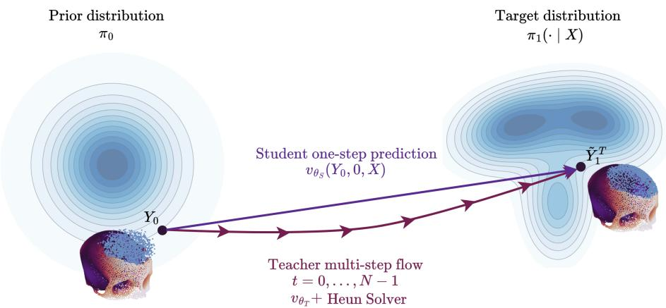
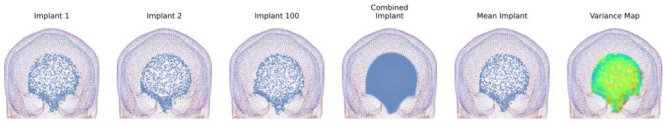
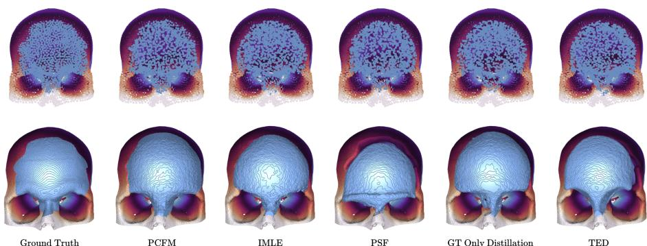

# MedPCFM-TED: One-Step Point Cloud Flow Matching for Implant Generation via Teacher-Guided Endpoint Distillation

Kamil Kwarciak1[0000−0002−1392−4291] and Marek Wodzinski1,2[0000−0002−8076−6246]

1 Department of Measurement and Electronics, AGH University of Krakow, Krakow,

2 Sano Centre for Computational Medicine, Krakow, Poland {kwarciak,wodzinski}@agh.edu.pl

Abstract. Cranial implant generation is an important task in medical imaging. Recent point cloud based generative methods, particularly flow matching, ofer strong reconstruction quality and eficient sampling, but still require multiple neural function evaluations during inference. This limits rapid generation of multiple plausible implant candidates. We propose Teacher-guided Endpoint Distillation (TED), a simple one-step distillation framework for conditional cranial implant generation on point clouds. TED trains a one-step student using teacher-guided endpoint supervision and geometric matching losses, while avoiding explicit path straightening. We evaluate TED on the SkullFix and SkullBreak benchmarks. TED achieves the best overall performance on the SkullBreak dataset, remains competitive on SkullFix, and provides the strongest Chamfer distance performance among the compared one-step methods. In addition, TED generates implants in approximately 0.04s per sample. These results show that one-step distillation can substantially accelerate conditional point cloud implant generation without sacrificing reconstruction quality.

Keywords: Point Cloud Completion · Flow Matching · Distillation

## 1 Introduction

Cranial implant design remains an important problem in medical imaging, as accurate implant reconstruction is essential for restoring skull integrity and achieving satisfactory functional and aesthetic outcomes. This task can be viewed as a 3D shape completion problem, where the goal is to reconstruct missing anatomy from incomplete skull geometry [8]. Recent approaches increasingly rely on deep learning [19, 1, 21, 20, 15, 9]. Many of these methods operate on volumetric representations [21, 15, 9], which are efective but computationally expensive and memory-intensive. More eficient alternatives include point cloud-based representations [1, 20, 19], which are particularly attractive due to their simplicity, flexibility, and eficient processing.

Earlier methods typically approached implant reconstruction as a deterministic prediction problem, including deep-learning-based solutions [21, 15, 9]. More recent works, however, cast implant design as a conditional generative task on point clouds [19, 1, 7], which is better suited to modeling the ambiguity and anatomical variability of plausible reconstructions. In this setting, difusion models [3] and flow matching methods [10] have emerged as powerful generative frameworks. Beyond images, these model families have also been successfully applied to 3D point cloud generation [14], including conditional implant generation from defective skull geometry [1, 7]. Among them, flow matching is particularly attractive because it typically requires fewer neural function evaluations (NFEs) during sampling than difusion models, enabling faster generation.

A related line of work aims to further reduce sampling cost by distilling generative models into one-step predictors. Progressive Distillation [18] achieves this through repeated teacher-student compression, but requires several intermediate distillation stages. Methods more closely related to point cloud generation include PSF [22] and the IMLE-based objective used in MoFlow [2]. PSF relies on an additional path-straightening stage prior to one-step distillation, which increases training complexity, while IMLE requires generating multiple student candidates and optimizing only the one closest to the teacher, resulting in higher computational cost and potentially less stable optimization. Thus, although existing one-step methods enable faster sampling, they often do so at the cost of more involved training.

In this work, we investigate one-step cranial implant generation using flow matching on point clouds. We introduce Teacher-guided Endpoint Distillation (TED), a simple distillation framework in which a one-step student is trained to directly predict the final implant from the initial noise and conditioning skull geometry. TED leverages supervision from a multi-step teacher and geometric matching losses, while avoiding explicit path-straightening. Our goal is to further accelerate generation while preserving the advantages of a strong conditional generative framework. Such fast generation is particularly appealing when multiple plausible implant candidates must be generated and compared eficiently.

## 2 Methods

We propose a simple yet efective teacher-guided distillation strategy for one-step medical point cloud flow matching, enabling a direct jump to the endpoint with a single neural function evaluation (NFE). Our method builds on the same meansquared-error (MSE) regression objective used in prior point cloud difusion and flow matching approaches, such as PCDif [1] and PCFM [7]. In addition, we adopt the Chamfer-based distillation component introduced in PSF [22] and apply it at two levels: between the student’s prediction and the teacher’s prediction, and between the student’s prediction and the ground-truth target. By directly constraining geometric similarity in the point cloud space, these Chamfer-based terms promote stronger shape alignment and improve the fidelity of the generated implant.

  
Fig. 1. Teacher-guided Endpoint Distillation (TED). Given defective skull X, the flow is defined only over the implant Y. A prior sample $Y _ { 0 } \sim \pi _ { 0 }$ is transported by the teacher to endpoint $\tilde { Y } _ { 1 } ^ { T }$ , while the student learns a single-step displacement from $Y _ { 0 }$ to the implant prediction conditioned on X. Skull visualizations show conditioning context only.

## 2.1 Preliminaries

We describe point cloud flow matching using the terminology of PCDif [1] and PCFM [7]. Let $X \in \mathbb { R } ^ { N _ { X } \times 3 }$ denote the defective skull and $\boldsymbol { Y } ~ \in ~ \mathbb { R } ^ { N _ { Y } \times \dot { 3 } }$ the corresponding ground-truth implant, such that the completed skull is given by $P = X \cup Y$ . Our goal is to learn a conditional continuous-time flow that transforms a simple base distribution into the implant distribution conditioned on X. Let $Y _ { 0 } \sim \pi _ { 0 }$ be a sample from an isotropic Gaussian base distribution, and let $Y _ { 1 } \sim \pi _ { 1 } ( \cdot \mid X )$ denote a target implant conditioned on X. We seek to model a time-dependent probability path that transports $Y _ { 0 }$ to $Y _ { 1 }$ . Following the standard formulation of conditional optimal transport [11], we use the afine interpolation path

$$
Y _ { t } = \psi ( Y _ { 0 } \mid Y _ { 1 } ) = t Y _ { 1 } + ( 1 - t ) Y _ { 0 } .\tag{1}
$$

The corresponding target velocity along this path is

$$
u _ { t } = \frac { d Y _ { t } } { d t } = Y _ { 1 } - Y _ { 0 } .\tag{2}
$$

Flow matching learns a conditional vector field $v _ { \theta } ( \cdot , t , X )$ that transports π0 to $\pi _ { 1 } ( \cdot \mid X )$ through the ODE

$$
\frac { d Y _ { t } } { d t } = v _ { \theta } ( Y _ { t } , t , X ) .\tag{3}
$$

The flow matching objective regresses the learned velocity field to the target velocity along the path [10]:

$$
\mathcal { L } _ { F M } = \mathbb { E } _ { t \sim \mathcal { U } [ 0 , 1 ] , Y _ { 0 } \sim \pi _ { 0 } , Y _ { 1 } \sim \pi _ { 1 } ( \cdot | X ) } \Big [ \| v _ { \theta } ( Y _ { t } , t , X ) - u _ { t } \| _ { 2 } ^ { 2 } \Big ] .\tag{4}
$$

## 2.2 Teacher-Guided Endpoint Distillation

We now introduce our Teacher-guided Endpoint Distillation (TED) method. We begin with a teacher flow matching model trained with the objective in Equation 4, which provides a pretrained teacher vector field $v _ { \theta _ { T } }$

Given an initial noise sample $Y _ { 0 } \sim \pi _ { 0 }$ and the corresponding ground-truth implant $Y _ { 1 } \sim \pi _ { 1 } ( \cdot \mid X )$ , the frozen teacher generates a target implant by integrating its conditional flow from t = 0 to t = 1 using an N-step Heun solver. We initialize the trajectory at

$$
Y ^ { ( 0 ) } = Y _ { 0 } .\tag{5}
$$

For $n = 0 , \ldots , N - 2$ , the teacher trajectory is computed as

$$
\tilde { Y } ^ { ( n + 1 ) } = Y ^ { ( n ) } + \frac { 1 } { N - 1 } v _ { \theta _ { T } } \bigg ( Y ^ { ( n ) } , \frac { n } { N - 1 } , X \bigg ) ,\tag{6}
$$

followed by the Heun correction step

$$
\begin{array} { r } { Y ^ { ( n + 1 ) } = Y ^ { ( n ) } + \displaystyle \frac { 1 } { 2 ( N - 1 ) } \Big [ v _ { \theta _ { T } } \bigg ( Y ^ { ( n ) } , \displaystyle \frac { n } { N - 1 } , X \bigg ) } \\ { + v _ { \theta _ { T } } \bigg ( \tilde { Y } ^ { ( n + 1 ) } , \displaystyle \frac { n + 1 } { N - 1 } , X \bigg ) \Big ] . } \end{array}\tag{7}
$$

The final teacher-generated implant is then

$$
\tilde { Y } _ { 1 } ^ { T } = Y ^ { ( N - 1 ) } .\tag{8}
$$

We define the teacher residual as

$$
\varDelta _ { T } = \tilde { Y } _ { 1 } ^ { T } - Y _ { 0 } ,\tag{9}
$$

which represents the total displacement induced by the teacher from the initial noise sample $Y _ { 0 }$ to the final teacher-generated implant $\tilde { Y } _ { 1 } ^ { T }$

We then train a one-step student model $v _ { \theta _ { S } }$ that evaluates its velocity field only once, at $t = 0 \colon$

$$
\varDelta _ { S } = v _ { \theta _ { S } } ( Y _ { 0 } , t = 0 , X ) .\tag{10}
$$

The student predicts the implant as

$$
\hat { Y } _ { 1 } = Y _ { 0 } + \varDelta _ { S } ,\tag{11}
$$

which corresponds to a single discretization step, similarly to PSF [22].

To define the TED objective, we retain the standard flow matching regression principle and match the student residual to the teacher residual using an MSE term. In addition, we introduce two geometric supervision terms based on the Chamfer distance: one between the student’s prediction and the teachergenerated implant, and another between the student’s prediction and the groundtruth implant. The resulting objective is

$$
\begin{array} { r l r } & { } & { \mathcal { L } _ { T E D } = \mathbb { E } _ { Y _ { 0 } \sim \pi _ { 0 } , Y _ { 1 } \sim \pi _ { 1 } ( \cdot | X ) } \Big [ \lambda _ { \Delta } \| \varDelta _ { S } - \varDelta _ { T } \| _ { 2 } ^ { 2 } + \lambda _ { T } C D ( \hat { Y } _ { 1 } , \tilde { Y } _ { 1 } ^ { T } ) } \\ & { } & { + \lambda _ { G T } C D ( \hat { Y } _ { 1 } , Y _ { 1 } ) \Big ] , } \end{array}\tag{12}
$$

where $C D ( \cdot , \cdot )$ denotes the Chamfer distance. This formulation encourages the student to reproduce both the teacher’s global displacement and the target implant geometry. Unlike prior one-step distillation methods that depend on trajectory straightening, such as Rectified Flow [12] and its one-step variants [22, 13], our approach avoids explicit path-straightening. Our motivation is that, in conditional implant generation, the defective skull X already provides a strong structural constraint during teacher training. This conditioning narrows the space of plausible completions and may implicitly encourage trajectories that are sufficiently direct for efective one-step distillation. The general idea of TED is presented in Figure 1.

## 3 Experiments

## 3.1 Datasets

We use the SkullFix and SkullBreak datasets [6] in their combined form, following the MedPCFM setup [7]. For each sample, we represent the input with 16,384 points in total, including 14,746 points sampled from the defective skull and 1,638 points sampled from the target implant. Accordingly, we set $N _ { X } = 1 4 { , } 7 4 6$ and $N _ { Y } = 1 { , } 6 3 8$ . The combined train/validation/test split consists of 90/10/110 samples from SkullFix and 510/60/100 samples from SkullBreak, resulting in 600 training, 70 validation, and 210 test samples in total. All experiments are conducted on this unified benchmark.

## 3.2 Experimental Setup

We first train a PCFM model with Point Transformer V3 [23] as the backbone, which serves as the teacher model for distillation. We follow the training procedure reported in PCFM [7]. Specifically, all experiments are conducted on an NVIDIA GH200 GPU with 96GB of VRAM. The teacher model is trained for 15,000 epochs using the Adam optimizer [5] with a learning rate of $1 0 ^ { - 4 }$ , weight decay of $1 0 ^ { - 4 }$ , batch size 16, and 2,000 warm-up steps. We additionally employ exponential moving average (EMA) with a decay rate of 0.999.

We then train TED by initializing the student as a trainable copy of the teacher network. Unless stated otherwise, we use the same training hyperparameters as for the teacher model. To generate teacher implants $\tilde { Y } _ { 1 } ^ { T }$ , we integrate the teacher flow using the Heun ODE solver according to Equation 7. In all TED experiments, we use $N = 4 0$ NFEs to generate the teacher predictions. For the TED objective in Equation 12, we observe that all loss components have comparable magnitudes. Therefore, we set $\lambda _ { \varDelta } = \lambda _ { T } = \lambda _ { G T } = 1$

For a fair comparison with alternative one-step training strategies, we also evaluate several related methods. For PSF [22], the procedure is more direct, as it only requires teacher-generated samples. These are obtained using the same 40- step Heun solver, and the objective is implemented by setting $\lambda _ { \varDelta } = 0 , \lambda _ { G T } = 0 .$ and $\lambda _ { T } = 1$ . For IMLE-based objective used in MoFlow [2], we follow the original formulation and train the student against the teacher prediction using the Chamfer distance. For each input, we generate m student candidates and optimize only the one closest to the teacher output. In our experiments, we set $m = 4$ . In practice, this can be implemented similarly to PSF by setting $\lambda _ { \varDelta } = 0 , \lambda _ { G T } = 0 .$ , and $\lambda _ { T } = 1$ , while selecting the closest candidate for supervision. Finally, we also study a teacher-free variant in which the student receives no teacher supervision and is optimized only with respect to the ground-truth implant. In this case, for Equation 12, we set $\lambda _ { \Delta } = 0 , \lambda _ { T } = 0$ , and $\lambda _ { G T } = 1$

During inference, we further exploit the stochastic nature of generative completion modeling. For a given defective skull, the model can produce multiple plausible implant predictions that capture anatomically valid variability. These samples can be used either by concatenating them to obtain a denser implant point set for meshing and voxelization, or by averaging corresponding surface points to produce a smoother, more uniform representation. Overall, stochastic inference supports both eficient dense implant construction and exploration of plausible implant variability.

## 4 Results

## 4.1 Evaluation Protocol

We evaluate all methods on the test subsets of the SkullFix and SkullBreak datasets [6]. As primary metrics, we report Chamfer distance and generation time. Since the considered generative models can produce multiple plausible implants for the same defective skull, Chamfer distance is computed using an aggregated mean implant from repeated stochastic generations. This mean is not obtained by averaging points with matching indices, as point cloud correspondences are not meaningful. Instead, we concatenate generated implants into a dense empirical point distribution, estimate a consensus density, and sample a fixed size representative point cloud from its high density support. This captures regions consistently predicted across stochastic samples (Figure 2) while remaining practical due to the fast generation speed of the distilled one-step models. To enable voxel-level comparison, we additionally report Dice similarity coeficient (DSC), boundary DSC (BDSC), and the 95th percentile Hausdorf distance (HD95). Although several point cloud-to-volume reconstruction strategies could be used, including Shape-As-Points [16], Poisson surface reconstruction [4], or occupancy-based implicit methods [17], we adopt a simple density-based voxelization procedure on the reference grid. Generated implant point clouds are aggregated into a denser point set, rasterized into a continuous voxel density map using Gaussian splatting, and binarized with automatic thresholding. Morphological closing, hole filling, and connected-component filtering are then applied to obtain the final compact implant mask. We report all results in Table 1. We also present example completions in Figure 3

  
Fig. 2. TED stochasticity on one SkullBreak case: three samples, mean implant, and point-wise variance map over the incomplete skull. Warmer colors indicate higher variability.

Table 1. Comparison on SkullFix and SkullBreak. Generation time is shared across datasets; PCFM-PTv3 with nominal one-step sampling uses two NFEs due to the Heun solver.
<table><tr><td rowspan="2">Method</td><td rowspan="2">Inference Steps</td><td rowspan="2">Generation Time [s]</td><td colspan="4">SkullFix</td><td colspan="4">SkullBreak</td></tr><tr><td>DSC ↑</td><td>BDSC ↑</td><td>HD95↓</td><td>Chamfer ↓</td><td>DSC ↑</td><td>BDSC ↑</td><td>HD95 ↓</td><td>Chamfer ↓</td></tr><tr><td rowspan="2">PCDiff-PTv3</td><td>1</td><td>0.0428</td><td> $0 . 0 2 8 \pm 0 . 0 5 2$ </td><td>0.012 ± 0.034</td><td> $3 9 . 0 8 \pm 1 9 . 8 9$ </td><td> $1 2 . 8 9 \pm 1 . 1 7 2$ </td><td> $0 . 0 0 2 \pm 0 . 0 0 1$ </td><td> $0 . 0 \pm 0 . 0$ </td><td> $3 5 . 9 9 \pm 3 8 . 2 8$ </td><td> $1 4 . 4 5 \pm 0 . 8 3 1$ </td></tr><tr><td>1000</td><td>40.899</td><td>0.673 ± 0.073</td><td>0.621 ± 0.087</td><td>4.414 ± 1.471</td><td>0.155 ± 0.048</td><td>0.684 ± 0.137</td><td> $0 . 6 6 9 \pm 0 . 1 5 6$ </td><td> $5 . 0 0 1 \pm 5 . 6 3 5$ </td><td> $0 . 2 1 3 \pm 0 . 1 3 2$ </td></tr><tr><td rowspan="2">PCFM-PTv3</td><td>2</td><td>0.0827</td><td>0.214 ± 0.038</td><td>0.083 ± 0.117</td><td>33.62 ± 10.13</td><td>0.595 ± 0.051</td><td> $0 . 2 1 3 \pm 0 . 0 8 7$ </td><td> $0 . 1 0 7 \pm 0 . 1 5 5$ </td><td> $2 8 . 5 4 \pm 1 2 . 9 8$ </td><td> $0 . 6 0 4 \pm 0 . 1 6 6$ </td></tr><tr><td>40</td><td>3.195</td><td>0.824 ± 0.048</td><td>0.841 ± 0.046</td><td>3.081 ± 0.971</td><td>0.143 ± 0.063</td><td>0.744 ± 0.049</td><td>0.749 ± 0.056</td><td> $3 . 9 4 8 \pm 1 . 0 7 2$ </td><td> $0 . 1 2 7 \pm 0 . 0 3 3$ </td></tr><tr><td>IMLE</td><td>1</td><td>0.0414</td><td>0.808 ± 0.077</td><td>0.789 ± 0.087</td><td>3.093 ± 0.915</td><td> $0 . 1 5 4 \pm 0 . 0 6 1$ </td><td> $0 . 6 7 8 \pm 0 . 0 9 8$ </td><td> $0 . 6 3 0 \pm 0 . 0 9 6$ </td><td> $4 . 1 4 8 \pm 1 . 1 6 8$ </td><td> $0 . 1 4 5 \pm 0 . 0 3 1$ </td></tr><tr><td>PSF</td><td>1</td><td>0.0420</td><td>0.802 ± 0.067</td><td>0.769 ± 0.082</td><td>3.025 ± 0.943</td><td>0.157 ± 0.061</td><td>0.755 ± 0.083</td><td> $0 . 7 0 8 \pm 0 . 0 9 6$ </td><td> $3 . 6 0 8 \pm 1 . 2 5 6$ </td><td> $0 . 1 5 2 \pm 0 . 0 3 4$ </td></tr><tr><td>TED (ours)</td><td>1</td><td>0.0434</td><td>0.801 ± 0.070</td><td>0.769 ± 0.094</td><td>3.104 ± 1.061</td><td>0.149 ± 0.062</td><td>0.766 ± 0.079</td><td> $\mathbf { 0 . 7 2 6 \pm 0 . 0 8 3 }$ </td><td> $3 . 5 2 3 \pm 1 . 4 4 5$ </td><td> ${ \bf 0 . 1 4 4 \pm 0 . 0 3 1 }$ </td></tr><tr><td>GT Only (ours)</td><td>1</td><td>0.0415</td><td>0.812 ± 0.070</td><td>0.808 ± 0.082</td><td>3.140 ± 1.054</td><td>0.157 ± 0.056</td><td>0.682 ± 0.108</td><td>0.626 ± 0.104</td><td>4.366 ± 1.392</td><td>0.149 ± 0.028</td></tr></table>

## 4.2 Discussion

On SkullFix, the ground truth only variant achieves the best DSC and BDSC, whereas PSF achieves the best HD95. TED, however, yields the best Chamfer distance, indicating the strongest point-level geometric fidelity among the one-step distillation techniques. This suggests that direct supervision from the ground-truth implant can be suficient to optimize overlap-based voxel metrics on the less challenging SkullFix cases, while TED more efectively preserves fine-grained surface accuracy on the point clouds. On SkullBreak, which exhibits

  
GT Only Distillation

Fig. 3. Qualitative SkullBreak comparison. Top: point-cloud reconstructions; bottom: voxelized counterparts. Columns show ground truth, PCFM, IMLE, PSF, GT only distillation, and TED.

greater anatomical variability and more heterogeneous defects, TED consistently outperforms the remaining distillation methods. This suggests that combining teacher-guided endpoint supervision with geometric matching is more efective than relying only on teacher samples or only on ground-truth geometry, especially for more complex anatomies. The improved performance on this more challenging benchmark further indicates that TED better preserves the conditional generative behavior of the original teacher while still benefiting from explicit geometric regularization. It is also notable that both TED and PSF improve DSC over the original multi-step PCFM teacher. A plausible explanation is that the additional Chamfer-based supervision promotes better spatial coverage of the implant surface and reduces point clustering, which in turn yields more stable voxelized reconstructions after density-based conversion.

## 5 Conclusion

In this work, we introduced a simple and efective approach for one-step distillation of flow matching models for point cloud based cranial implant generation. Our method, TED, achieves the best overall performance on the Skull-Break dataset and remains competitive on SkullFix, demonstrating that fast one-step generation can be attained without sacrificing reconstruction quality. Importantly, TED enables implant generation in approximately 0.04s per sample. Given modern GPU parallelism and the advantages of stochastic completion, this makes it possible to generate around 70 implants in the time required by standard PCFM to produce a single sample, and around 940 implants in the time required by PCDif. Such eficiency is particularly attractive for clinical implant modeling, where rapid exploration and comparison of multiple plausible implant candidates may support downstream decision-making and treatment planning.

One limitation of this work is that the voxelization procedure used for evaluation is relatively simple and could likely be improved with more advanced surface reconstruction or implicit-shape modeling techniques. However, this was not the primary focus of the study, as our main objective was to investigate onestep generative implant modeling in the point cloud domain. Moreover, voxelized representations are not strictly required in practical cranial implant workflows, where surface representations such as meshes are often more relevant.

More broadly, our results show that one-step distillation does not necessarily imply a trade-of between speed and reconstruction quality. With appropriate endpoint-level supervision, one-step generation can remain both accurate and eficient, making it a promising direction for cranial implant modeling and related conditional 3D medical generation tasks.

Acknowledgments. The project was funded by The National Centre for Research and Development, Poland under Lider Grant no: LIDER13/0038/2022 (DeepImplant). We gratefully acknowledge Polish high-performance computing infrastructure PLGrid (HPC Center: ACK Cyfronet AGH) for providing computer facilities and support within computational grant no. PLG/2026/019392. This work was partially supported by the Excellence Initiative Research University program at the AGH University of Krakow.

Disclosure of Interests. The authors have no competing interests to declare that are relevant to the content of this article.

## References

1. Friedrich, P., Wolleb, J., Bieder, F., Thieringer, F.M., Cattin, P.C.: Point cloud difusion models for automatic implant generation. In: International conference on medical image computing and computer-assisted intervention. pp. 112–122. Springer (2023)

2. Fu, Y., Yan, Q., Wang, L., Li, K., Liao, R.: Moflow: One-step flow matching for human trajectory forecasting via implicit maximum likelihood estimation based distillation. In: Proceedings of the Computer Vision and Pattern Recognition Conference. pp. 17282–17293 (2025)

3. Ho, J., Jain, A., Abbeel, P.: Denoising difusion probabilistic models. Advances in neural information processing systems 33, 6840–6851 (2020)

4. Kazhdan, M., Bolitho, M., Hoppe, H.: Poisson surface reconstruction. In: Proceedings of the fourth Eurographics symposium on Geometry processing. vol. 7 (2006)

5. Kingma, D.P., Ba, J.: Adam: A method for stochastic optimization. arXiv preprint arXiv:1412.6980 (2014)

6. Kodym, O., Li, J., Pepe, A., Gsaxner, C., Chilamkurthy, S., Egger, J., Španěl, M.: Skullbreak/skullfix–dataset for automatic cranial implant design and a benchmark for volumetric shape learning tasks. Data in Brief 35, 106902 (2021)

7. Kwarciak, K., Wodzinski, M.: Medpcfm: Improving medical point cloud completion by integrating point transformers and flow matching. arXiv preprint arXiv:2606.24433 (2026)

8. Li, J., Ellis, D.G., Kodym, O., Rauschenbach, L., Rieß, C., Sure, U., Wrede, K.H., Alvarez, C.M., Wodzinski, M., Daniol, M., et al.: Towards clinical applicability and computational eficiency in automatic cranial implant design: An overview of the autoimplant 2021 cranial implant design challenge. Medical Image Analysis 88, 102865 (2023)

9. Li, J., Gsaxner, C., Pepe, A., Schmalstieg, D., Kleesiek, J., Egger, J.: Sparse convolutional neural network for high-resolution skull shape completion and shape super-resolution. Scientific Reports 13(1), 20229 (2023)

10. Lipman, Y., Chen, R.T., Ben-Hamu, H., Nickel, M., Le, M.: Flow matching for generative modeling. arXiv preprint arXiv:2210.02747 (2022)

11. Lipman, Y., Havasi, M., Holderrieth, P., Shaul, N., Le, M., Karrer, B., Chen, R.T., Lopez-Paz, D., Ben-Hamu, H., Gat, I.: Flow matching guide and code. arXiv preprint arXiv:2412.06264 (2024)

12. Liu, X., Gong, C., Liu, Q.: Flow straight and fast: Learning to generate and transfer data with rectified flow. arXiv preprint arXiv:2209.03003 (2022)

13. Liu, X., Zhang, X., Ma, J., Peng, J., et al.: Instaflow: One step is enough for high-quality difusion-based text-to-image generation. In: The Twelfth International Conference on Learning Representations (2023)

14. Luo, S., Hu, W.: Difusion probabilistic models for 3d point cloud generation. In: Proceedings of the IEEE/CVF conference on computer vision and pattern recognition. pp. 2837–2845 (2021)

15. Mainprize, J.G., Fishman, Z., Hardisty, M.R.: Shape completion by u-net: an approach to the autoimplant miccai cranial implant design challenge. In: Cranial implant design challenge, pp. 65–76. Springer (2020)

16. Peng, S., Jiang, C., Liao, Y., Niemeyer, M., Pollefeys, M., Geiger, A.: Shape as points: A diferentiable poisson solver. Advances in Neural Information Processing Systems 34, 13032–13044 (2021)

17. Peng, S., Niemeyer, M., Mescheder, L., Pollefeys, M., Geiger, A.: Convolutional occupancy networks. In: european conference on computer vision. pp. 523–540. Springer (2020)

18. Salimans, T., Ho, J.: Progressive distillation for fast sampling of difusion models. arXiv preprint arXiv:2202.00512 (2022)

19. Sulakhe, H., Li, J., Egger, J., Goyal, P.: Crangan: Adversarial point cloud reconstruction for patient-specific cranial implant design. In: 2022 44th Annual International Conference of the IEEE Engineering in Medicine & Biology Society (EMBC). pp. 603–608. IEEE (2022)

20. Wodzinski, M., Daniol, M., Hemmerling, D., Socha, M.: High-resolution cranial defect reconstruction by iterative, low-resolution, point cloud completion transformers. In: International conference on medical image computing and computerassisted intervention. pp. 333–343. Springer (2023)

21. Wodzinski, M., Daniol, M., Socha, M., Hemmerling, D., Stanuch, M., Skalski, A.: Deep learning-based framework for automatic cranial defect reconstruction and implant modeling. Computer methods and programs in biomedicine 226, 107173 (2022)

22. Wu, L., Wang, D., Gong, C., Liu, X., Xiong, Y., Ranjan, R., Krishnamoorthi, R., Chandra, V., Liu, Q.: Fast point cloud generation with straight flows. In: Proceedings of the IEEE/CVF conference on computer vision and pattern recognition. pp. 9445–9454 (2023)

23. Wu, X., Jiang, L., Wang, P.S., Liu, Z., Liu, X., Qiao, Y., Ouyang, W., He, T., Zhao, H.: Point transformer v3: Simpler faster stronger. In: Proceedings of the IEEE/CVF conference on computer vision and pattern recognition. pp. 4840–4851 (2024)