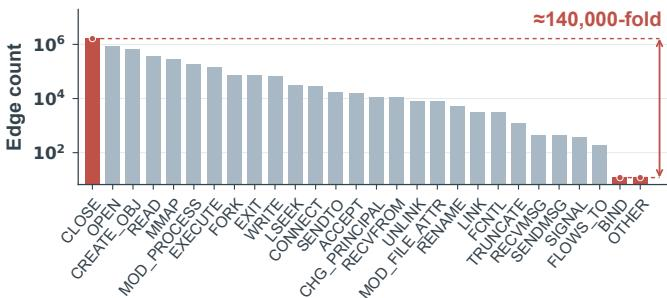
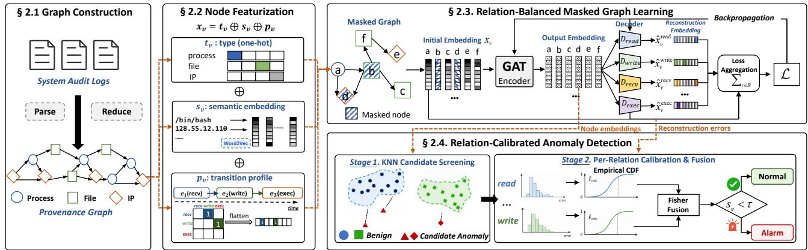
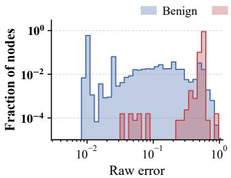
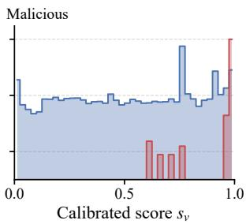
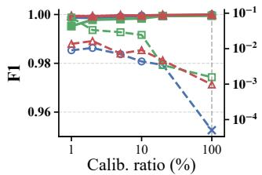
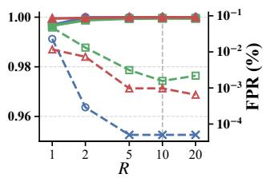
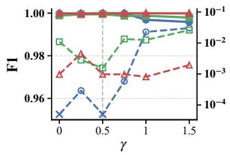
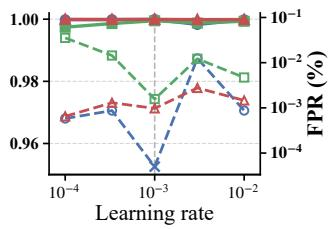
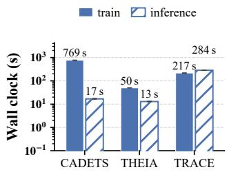
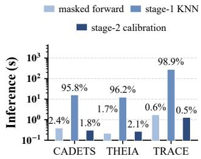

# NOT ALL RELATIONS ARE EQUAL: RELATION-BALANCED AND CALIBRATED GRAPH LEARNING FOR PROVENANCE-BASED INTRUSION DETECTION

Lijie Zheng1 Ji He1 Alessandro Brighente2 Yulong Shen1 Mauro Conti2,3

1School of Computer Science and Technology, Xidian University, Xi’an, China 2Department of Mathematics, University of Padova, Padova, Italy 3School of Science and Technology, Orebro University, ¨ Orebro, Sweden¨

## ABSTRACT

Provenance-Based Intrusion Detection Systems (PIDSs) detect Advanced Persistent Threats (APTs) by analyzing system interactions. However, existing methods largely treat relations uniformly, overlooking statistical heterogeneity; in CADETS, relation frequencies differ by approximately 140,000×. This may cause PIDSs to focus more on frequent relations and overlook differences in normal error levels across relations, increasing the risk of false alarms and missed detections. We present RECAL, an unsupervised framework using relation-balanced masked graph learning to better capture rare interaction patterns. It further calibrates reconstruction errors against each relation’s benign error distribution to produce comparable anomaly evidence, helping distinguish attacks from benign behavior and reduce false alarms. On three DARPA E3 datasets, RECAL achieves F1 scores of 99.99%, 99.93%, and 99.99%, outperforming the best baseline on each dataset by 0.88, 0.82, and 0.42 percentage points, respectively. Compared with the baseline reporting the lowest FPR, RECAL reduces mean FPR by approximately 105×, 4×, and 41×.

Index Terms— Provenance graph, intrusion detection, masked graph autoencoder, relation heterogeneity, anomaly detection

## 1. INTRODUCTION

An Advanced Persistent Threat (APT) blends stealthy malicious actions into normal system activity over extended periods, posing challenges for signature-based or rule-based detection [1]. Kernel audit logs record interactions between system entities, and provenance graphs constructed from these logs are widely used to detect such attacks [2, 3]. Using these provenance graphs, some Provenance-Based Intrusion Detection Systems (PIDSs) apply graph learning to model benign behavior and identify deviations to detect potential attacks [4, 5, 6, 7, 8].

However, these PIDSs are largely insensitive to the heterogeneity of interaction relations. Across relation types (system-call semantics such as read, write, and execute), audit data exhibits drastically different statistics. As shown in Fig. 1, event counts across interaction relations in the CADETS benign training graphs differ by approximately 140,000×. Existing methods nevertheless treat all relations uniformly in both learning and judgment, even when some encode relation types as input features [6, 7]. This insensitivity raises two problems. (1) Capacity misallocation. The learning signal is dominated by high-frequency relations, so rare but security-critical interactions, such as payload execution and privilege escalation, may be insufficiently modeled [4, 5, 6]. (2) Cross-relation score miscalibration. When benign score distributions differ across relations, raw scores do not indicate comparable degrees of deviation [9]. A single global threshold may then over-alert on high-score relations and overlook anomalous behavior on low-score relations [7, 10, 11].

To address these problems, we present RECAL, an unsupervised, relation-calibrated PIDS framework that models both frequent and rare interactions through relation-balanced masked graph learning and converts within-relation behavioral deviations into comparable anomaly evidence across relations, thereby reducing false positive rates. The main contributions of this work are summarized as follows.

• We identify capacity misallocation and cross-relation score miscalibration as two challenges arising from relation heterogeneity in existing PIDSs.

• We present RECAL, integrating relation-balanced masked graph learning with relation-calibrated detection. Relationstratified masking, independent decoder heads, and balanced reconstruction mitigate frequent-relation dominance. Empirical quantile calibration and Fisher fusion align and aggregate cross-relation evidence, improving detection and reducing false alarms.

• We systematically evaluate RECAL on three DARPA E3 datasets. The results confirm its effectiveness, with the highest F1 and lower false positive rates among compared methods. Our implementation is available at https: //github.com/Jiex2001/RECAL to support further research.

  
Fig. 1. CADETS benign training graphs. The x-axis shows audit-log relations; the y-axis shows event counts (log scale).

## 2. METHODOLOGY

The RECAL pipeline comprises four stages, as shown in Fig. 2. First, graph construction (§2.1) converts kernel audit logs into a typed provenance graph. Second, node featurization (§2.2) encodes entity types, attribute semantics, and temporal relation transitions as node features. Third, relation-balanced masked graph learning (§2.3) improves rare-relation modeling and produces per-relation reconstruction errors. Finally, relation-calibrated anomaly detection (§2.4) combines K-Nearest Neighbor (KNN) candidate screening with relation calibration and evidence fusion for two-stage node-level detection.

  
Fig. 2. Overview of RECAL. Graph construction and node featurization transform audit logs into attributed provenance graphs for relationbalanced masked graph learning. Node embeddings support KNN candidate screening, while relation-specific reconstruction errors support candidate calibration and evidence fusion for final detection. Orange dashed arrows indicate data flow between modules.

## 2.1. Graph Construction

We convert kernel audit logs into a directed heterogeneous provenance graph $G = ( V , E , R )$ , where $V$ denotes the set of system entities, including processes, files, and network flows; E denotes the set of interaction edges; and R denotes the relation vocabulary defined by the audit logs, including read, write, execute, and connect. During construction, we apply standard provenance graph reduction techniques [12] to control graph size while preserving causal structure.

## 2.2. Node Featurization

For each node v, the initial feature is $x _ { v } = t _ { v }$ ⊕ $s _ { v }$ ⊕ $p _ { v }$ , where $T$ is the set of entity types, $t _ { v } \in \{ 0 , 1 \} ^ { | T | }$ is the one-hot encoding of the entity type, and $s _ { v } \in \mathbb { R } ^ { d }$ is a semantic embedding, obtained by tokenizing the attribute strings of the node (process names, file paths, IP addresses) and averaging their Word2Vec vectors [13]. The third part, $p _ { v } \in \mathbb { R } ^ { | R | ^ { 2 } }$ , is a temporal relation-transition profile. Let $B _ { v } =$ $( e _ { 1 } , \dots , e _ { L } )$ be the $L$ most recent events involving v in ascending temporal order, and let $r ( e _ { i } )$ and $\theta ( e _ { i } )$ denote the relation type and the timestamp of event $e _ { i }$ . The profile entry for a transition $( \boldsymbol { r } , \boldsymbol { r } ^ { \prime } )$ is

$$
p _ { v } [ r , r ^ { \prime } ] = \sum _ { i = 2 } ^ { L } \mathbb { I } \big [ r ( e _ { i - 1 } ) = r \wedge r ( e _ { i } ) = r ^ { \prime } \big ] e ^ { - \lambda ( \theta _ { v } - \theta ( e _ { i } ) ) } ,\tag{1}
$$

where $\mathbb { I } [ \cdot ]$ is the indicator function, $\theta _ { v }$ is the timestamp of the most recent event involving $v ,$ and λ controls the temporal decay. The profile gives each interaction a short-range behavioral context. When the transitions receive→write and write→execute are active together, a download-then-execute pattern becomes visible at the feature level. Maintaining the profile costs an $O ( L )$ sliding buffer per node and requires no training.

## 2.3. Relation-Balanced Masked Graph Learning

This module learns normal interaction patterns through masked graph autoencoding [14], using node features from benign training graphs as reconstruction targets without attack labels. To mitigate the dominance of frequent relations, we organize reconstruction into relationspecific learning tasks and balance their contributions through masking and reconstruction optimization.

Masking selects the nodes whose features will be reconstructed. To increase reconstruction opportunities for rare relations, we assign each relation observed in the training data a masking rate based on its event frequency,

$$
p _ { r } = \mathrm { c l i p } \big ( p _ { 0 } ( \bar { f } / f _ { r } ) ^ { \gamma } , p _ { \mathrm { m i n } } , p _ { \mathrm { m a x } } \big ) ,\tag{2}
$$

where $f _ { r }$ is the training event count of relation $r , { \bar { f } }$ is the median nonzero frequency, p0 is the base masking rate, and $p _ { \mathrm { m i n } }$ and pmax are its bounds. The exponent $\gamma$ controls the emphasis on rare relations, with $\gamma = 0$ giving equal per-relation rates. For each relation $^ { r , }$ we independently sample its participating nodes with probability $p _ { r } ; \mathbf { a }$ node is masked if selected under any relation. Its overall masking probability therefore depends on both relation frequencies and the number of participating relations. We replace the input features of selected nodes with a learnable mask vector.

On the resulting masked graph, the encoder uses edge-typeconditioned attention [15, 16] to produce node embeddings. We then average the embeddings of node $v { \mathrm { s } }$ neighbors connected by relation r, including both incoming and outgoing neighbors, to obtain $m _ { v } ^ { r }$ . Each relation has an independent lightweight linear decoder $D _ { r }$ that reconstructs the masked node features as $\hat { x } _ { v } ^ { r } = D _ { r } ( m _ { v } ^ { r } )$ . This allows different interaction patterns to be modeled separately using shared node representations.

Because the number of reconstruction samples still varies across relations, we average the loss within each relation and sum these averages with equal weight,

$$
\mathcal { L } = \sum _ { r \in R , | M _ { r } | > 0 } \frac { 1 } { | M _ { r } | } \sum _ { v \in M _ { r } } \ell \bigl ( \hat { x } _ { v } ^ { r } , x _ { v } \bigr ) ,\tag{3}
$$

where $M _ { r }$ is the set of masked nodes participating in relation r and ℓ is the scaled cosine error [14]. The objective weights each nonempty relation’s mean reconstruction loss equally, reducing the bias due to unequal sample counts. Per-relation reconstruction also retains errors associated with different interactions, allowing subsequent detection to interpret these errors against relation-specific benign baselines.

Table 1. Statistics of the DARPA E3 scenarios.
<table><tr><td>Dataset</td><td>Nodes</td><td>Edges</td><td>Malicious</td><td>Mal.</td><td>Size</td></tr><tr><td>CADETS</td><td>1,452,123</td><td>7,164,818</td><td>12,857</td><td>0.89%</td><td>19.3 GB</td></tr><tr><td>THEIA</td><td>1,558,101</td><td>3,574,557</td><td>25,338</td><td>1.63%</td><td>18.8 GB</td></tr><tr><td>TRACE</td><td>3,197,278</td><td>4,661,252</td><td>68,135</td><td>2.13%</td><td>16.2 GB</td></tr><tr><td>Total</td><td>6,207,502 15,400,627</td><td></td><td>106,330</td><td></td><td>1.71% 54.3 GB</td></tr></table>

## 2.4. Relation-Calibrated Anomaly Detection

To address cross-relation score miscalibration, we interpret reconstruction errors against each relation’s benign error distribution. We reserve the tail of the benign period for calibration and exclude it from masked graph model training. After training, we obtain reconstruction errors on the calibration graph through batched masking and estimate a relation-specific empirical Cumulative Distribution Function (CDF) $\hat { F } _ { r }$ [17].

During the detection stage, a KNN detector [6, 18] measures the average nearest-neighbor distance between node embeddings and a benign reference set. A deliberately relaxed threshold yields a highrecall candidate set. For each candidate node v, we map its reconstruction error $e _ { v } ^ { r }$ to a within-relation benign quantile $q _ { v } ^ { r } = \hat { F } _ { r } ( e _ { v } ^ { r } )$ using the corresponding reference distribution. This transformation places errors from different relations on a common quantile scale, allowing their deviations from normal behavior to be compared.

We aggregate anomaly evidence across the relations in which each candidate node participates. Let $R ( v )$ denote the set of relation types involving v and $k _ { v } ~ = ~ | R ( v ) |$ their number. We interpret $p _ { v } ^ { r } = 1 - q _ { v } ^ { r }$ as an empirical upper-tail probability estimate and use Fisher’s method [19] to fuse the evidence,

$$
\begin{array} { r } { s _ { v } = F _ { \chi _ { 2 k _ { v } } ^ { 2 } } \Big ( - 2 \sum _ { r \in R ( v ) } \ln p _ { v } ^ { r } \Big ) , } \end{array}\tag{4}
$$

where $F _ { \chi _ { 2 k _ { 7 } } ^ { 2 } }$ is the CDF of the $\chi ^ { 2 }$ distribution with $2 k _ { v }$ degrees of freedom. The score accounts for the number of participating relations and accumulates anomaly evidence across them. Since relation-specific errors share node embeddings and may be dependent, the $\chi ^ { 2 }$ distribution serves as an approximate reference. An alarm is raised when $s _ { v }$ exceeds the decision threshold τ.

Reconstruction errors for test nodes are obtained through batched masked inference. Subsequent calibration and fusion require only quantile-table lookups and $\mathbf { \hat { \chi } } _ { \chi } ^ { 2 }$ CDF evaluations, adding little computational overhead.

## 3. EXPERIMENTS

This section evaluates RECAL’s detection performance, component contributions, parameter sensitivity, and computational efficiency.

## 3.1. Experimental Setup

Datasets. We evaluate on three scenarios of DARPA TC Engagement 3 (CADETS, THEIA, and TRACE) [20], whose scale and maliciousnode ratios are summarized in Table 1. Purely benign time spans are used for training, the tail of the benign span is held out as the calibration set (Sec. 2.4), and time spans containing attacks are used for testing. We adopt the node-level labels of THREATRACE [4] and follow its evaluation protocol, reporting Precision (Prec.), Recall (Rec.), F1 score (F1), and False Positive Rate (FPR). Inspired by MAGIC’s evaluation procedure [6], we perform a linear search over candidate thresholds for each dataset and select τ at the operating point with the highest test F1.

  
(a) Before calibration

  
(b) After calibration  
Fig. 3. Score distributions of benign and malicious nodes before and after relation-conditional calibration on CADETS.

Baselines. We select representative baselines and State-of-the-Art (SOTA) methods, including Log2vec [21], THREATRACE [4], Unicorn [10], FLASH [5], MAGIC [6], STGAN [22], and AEGIS [23], to evaluate RECAL’s detection performance and false positive control. Experiments run on a single NVIDIA RTX 5090 GPU. Our results in tables 2 and 3 are means over five seeds (0–4); other experiments use seed 0.

## 3.2. Main Results

Table 2 shows that RECAL achieves the highest F1 among the compared methods on CADETS, THEIA, and TRACE, reaching 99.99%, 99.93%, and 99.99%, respectively. Since recall is nearly saturated for several strong baselines, performance differences mainly lie in false positive control and the resulting precision gains. RECAL models different interaction patterns through per-relation reconstruction, then calibrates and aggregates anomaly evidence against each relation’s benign error distribution. This helps reduce the influence of differing error scales across relations on detection decisions and limit false alarms caused by normal behavior. RECAL achieves mean FPRs of 0.0004%, 0.0041%, and 0.0019% on CADETS, THEIA, and TRACE, respectively. Compared with STGAN, the baseline with the lowest reported FPRs in the table, RECAL achieves approximately 105×, 4×, and 41× reductions in mean FPR on CADETS, THEIA, and TRACE, respectively.

Across all five seeds, 18 nodes on THEIA remain undetected, including 17 associated with /home/admin/profile. Further inspection reveals substantial overlap between their local interaction patterns and benign behavior. Although these nodes enter the candidate set, their calibrated and fused anomaly evidence remains below the final detection threshold. This highlights a limitation of deviationbased detection when the local behavior of attack-associated entities closely resembles normal activity.

## 3.3. Ablation Study

Table 3 compares five-seed mean performance across learning and detection configurations under the same training budget. The variant using uniform masking and a shared decoder no longer produces per-relation reconstruction errors, so detection falls back to KNN. This joint variant yields lower mean F1 on CADETS and TRACE and slightly higher mean F1 on THEIA, with higher mean FPRs than the full model across all three scenarios. With Relation-Balanced Learning (BL) retained, removing Relation-Calibrated Detection (CD) reduces mean F1 by 3.94, 0.50, and 0.48 percentage points on CADETS, THEIA, and TRACE, respectively, supporting this module’s role in both anomaly detection and false positive control. Fig. 3 provides a qualitative illustration on CADETS, where benign and malicious node scores are more clearly separated after relation-conditional calibration. Replacing empirical quantile calibration with z-scores also reduces F1 across all three scenarios and raises the mean FPR on CADETS to 0.2261%, indicating that standardization based only on the mean and variance does not provide the same false positive control. Maximum and mean aggregation both lower F1 and increase FPR. The former retains only the strongest single-relation evidence, while the latter may dilute localized anomalies; Fisher’s method accumulates evidence across relations.

Table 2. Performance Comparison.
<table><tr><td rowspan="2">System</td><td colspan="4">CADETS</td><td colspan="4">THEIA</td><td colspan="4">TRACE</td></tr><tr><td>Prec.↑</td><td>Rec. ↑</td><td>F1↑</td><td>FPR↓</td><td>Prec.↑</td><td>Rec.↑</td><td>F1↑</td><td>FPR↓</td><td>Prec.↑</td><td>Rec. ↑</td><td>F1↑</td><td>FPR↓</td></tr><tr><td>Log2vec [21]</td><td>49.20%</td><td>84.59%</td><td>62.21%</td><td>1.59%</td><td>62.49%</td><td>66.05%</td><td>64.22%</td><td>0.29%</td><td>54.39%</td><td>78.27%</td><td>64.18%</td><td>1.83%</td></tr><tr><td>THREATRACE [4]</td><td>90.42%</td><td>99.97%</td><td>94.96%</td><td>0.19%</td><td>87.04%</td><td>99.74%</td><td>92.96%</td><td>0.11%</td><td>71.56%</td><td>99.99%</td><td>83.42%</td><td>1.11%</td></tr><tr><td>Unicorn [10]</td><td>31.00%</td><td>100.00%</td><td>47.00%</td><td></td><td>67.00%</td><td>67.00%</td><td>67.00%</td><td></td><td>28.00%</td><td>100.00%</td><td>34.00%</td><td></td></tr><tr><td>FLASH [5]</td><td>94.69%</td><td>99.99%</td><td>97.27%</td><td>0.10%</td><td>93.10%</td><td>99.83%</td><td>96.35%</td><td>0.05%</td><td>94.65%</td><td>99.99%</td><td>97.25%</td><td>0.16%</td></tr><tr><td>MAGIC [6]</td><td>94.40%</td><td>99.77%</td><td>97.01%</td><td>0.22%</td><td>98.23%</td><td>99.99%</td><td>99.11%</td><td>0.14%</td><td>99.17%</td><td>99.98%</td><td>99.57%</td><td>0.09%</td></tr><tr><td>STGAN [22]</td><td>98.40%</td><td>99.83%</td><td>99.11%</td><td>0.0426%</td><td>94.49%</td><td>99.83%</td><td>97.09%</td><td>0.0156%</td><td>99.50%</td><td>98.83%</td><td>99.16%</td><td>0.0777%</td></tr><tr><td>AEGIS [23]</td><td>100%</td><td>99%</td><td>99%</td><td></td><td>96%</td><td>97%</td><td>97%</td><td></td><td>99%</td><td>99%</td><td>99%</td><td></td></tr><tr><td>RECAL (ours)</td><td>99.99%</td><td>99.99%</td><td>99.99%</td><td>0.0004%</td><td>99.95%</td><td>99.92%</td><td>99.93%</td><td>0.0041%</td><td>99.98%</td><td>100.00%</td><td>99.99%</td><td>0.0019%</td></tr></table>

Arrows indicate whether higher (↑) or lower (↓) values are preferred; “–” denotes unreported values.

Table 3. Results of Ablation Study (%).
<table><tr><td rowspan="2">Variant</td><td colspan="2">CADETS</td><td colspan="2">THEIA</td><td colspan="2">TRACE</td></tr><tr><td>F1↑</td><td>FPR↓</td><td>F1↑</td><td>FPR↓</td><td>F1↑</td><td>FPR↓</td></tr><tr><td>w/o BL</td><td>99.26</td><td>0.0569</td><td>99.94</td><td>0.0043</td><td>99.44</td><td>0.0513</td></tr><tr><td>w/o CD</td><td>96.05</td><td>0.3581</td><td>99.44</td><td>0.0838</td><td>99.51</td><td>0.0128</td></tr><tr><td>z-score calib.</td><td>97.09</td><td>0.2261</td><td>99.50</td><td>0.0741</td><td>99.86</td><td>0.0311</td></tr><tr><td>max fusion</td><td>99.08</td><td>0.0699</td><td>99.48</td><td>0.0801</td><td>99.98</td><td>0.0039</td></tr><tr><td>mean fusion</td><td>98.67</td><td>0.0958</td><td>95.49</td><td>0.7652</td><td>99.57</td><td>0.0714</td></tr><tr><td>RECAL</td><td>99.99</td><td>0.0004</td><td>99.93</td><td>0.0041</td><td>99.99</td><td>0.0019</td></tr></table>

CADETS THEIA TRACE F1 (left) FPR (right) FPR = 0

  
(a) Calibration-set ratio

  
(c) Masking exponent γ

(b) Inference masking rounds R  
  
(d) Learning rate  
Fig. 4. Parameter sensitivity of RECAL. Solid lines show F1 (left axis) and dashed lines show FPR (right axis, log scale).

## 3.4. Parameter Sensitivity

Fig. 4 shows F1 above 99.5% across all three scenarios with only 1% of the reserved calibration nodes. Using more benign calibration samples generally helps lower the FPR. Increasing masking rounds preserves more visible neighborhood context, and performance improves as R rises from 1 to 5. Between 5 and 20 rounds, F1 varies by less than 0.01 percentage points per scenario, while forward-pass cost increases. For the masking exponent, $\gamma = 0 . 5$ yields the highest F1 and lowest FPR on CADETS and THEIA; larger values increase their FPR. F1 on TRACE varies by less than 0.02 percentage points. Across tested learning rates from $\mathrm { 1 0 ^ { - 4 } ~ t o ~ 1 0 ^ { - 2 } } ,$ , F1 exceeds 99.7% in all scenarios, although FPR varies. The default $1 0 ^ { - 3 }$ achieves the highest F1 and lowest FPR on CADETS and THEIA, while F1 on TRACE changes little.

  
(a) Training and inference time

  
(b) Inference time by stage  
Fig. 5. Training and inference costs of RECAL (three-run average). Percentages are each stage’s share of total inference time.

## 3.5. Efficiency

Fig. 5 reports the runtime of RECAL. On TRACE, the largest scenario by node count, training for 200 epochs takes about 217 seconds. Inference over approximately 3.3 million nodes across its five test graphs takes about 284 seconds. KNN reference index construction and queries account for 98.9% of this inference time and are the main computational cost. In contrast, the score calibration and Fisher fusion stage accounts for only approximately 0.5% to 2.1% of inference time across all three scenarios, indicating its low computational overhead. The reported inference times exclude preprocessing, data loading, and one-time calibration reference construction.

## 4. CONCLUSION

We present RECAL for unsupervised provenance-based intrusion detection through relation-balanced masked graph learning and relationcalibrated anomaly detection. Across three DARPA E3 scenarios, RECAL achieves the highest F1 among the compared methods while maintaining low false positive rates. Future work will explore adaptive relation calibration to address concept drift in long-running deployments.

## 5. COMPLIANCE WITH ETHICAL STANDARDS

This study uses publicly available DARPA E3 system-audit datasets and involves no human or animal subjects. No ethical approval was required.

## 6. REFERENCES

[1] Michael Zipperle, Florian Gottwalt, Elizabeth Chang, and Tharam Dillon, “Provenance-based intrusion detection systems: A survey,” ACM Computing Surveys, vol. 55, no. 7, pp. 1–36, 2023.

[2] Md Nahid Hossain, Sadegh M. Milajerdi, Junao Wang, Birhanu Eshete, Rigel Gjomemo, R. Sekar, Scott Stoller, and V. N. Venkatakrishnan, “SLEUTH: Real-time attack scenario reconstruction from COTS audit data,” in Proceedings of the USENIX Security Symposium (USENIX Security), 2017, pp. 487–504.

[3] Sadegh M. Milajerdi, Rigel Gjomemo, Birhanu Eshete, R. Sekar, and V. N. Venkatakrishnan, “HOLMES: Real-time APT detection through correlation of suspicious information flows,” in Proceedings of the IEEE Symposium on Security and Privacy (S&P), 2019, pp. 1137–1152.

[4] Su Wang, Zhiliang Wang, Tao Zhou, Hongbin Sun, Xia Yin, Dongqi Han, Han Zhang, Xingang Shi, and Jiahai Yang, “THREATRACE: Detecting and tracing host-based threats in node level through provenance graph learning,” IEEE Transactions on Information Forensics and Security, vol. 17, pp. 3972–3987, 2022.

[5] Mati Ur Rehman, Hadi Ahmadi, and Wajih Ul Hassan, “Flash: A comprehensive approach to intrusion detection via provenance graph representation learning,” in Proceedings of the IEEE Symposium on Security and Privacy (S&P), 2024, pp. 3552–3570.

[6] Zian Jia, Yun Xiong, Yuhong Nan, Yao Zhang, Jinjing Zhao, and Mi Wen, “MAGIC: Detecting advanced persistent threats via masked graph representation learning,” in Proceedings of the USENIX Security Symposium (USENIX Security), 2024, pp. 5197–5214.

[7] Zijun Cheng, Qiujian Lv, Jinyuan Liang, Yan Wang, Degang Sun, Thomas Pasquier, and Xueyuan Han, “Kairos: Practical intrusion detection and investigation using whole-system provenance,” in Proceedings ofthe IEEE Symposium on Security and Privacy (S&P), 2024, pp. 3533–3551.

[8] Fan Yang, Binyan Xu, Di Tang, and Kehuan Zhang, “Beyond nodes vs. edges: A multi-view fusion framework for provenance-based intrusion detection,” in Proceedings of the IEEE Symposium on Security and Privacy (S&P), 2026, pp. 3739–3758.

[9] Hans-Peter Kriegel, Peer Kroger, Erich Schubert, and Arthur¨ Zimek, “Interpreting and unifying outlier scores,” in Proceedings of the SIAM International Conference on Data Mining (SDM), 2011, pp. 13–24.

[10] Xueyuan Han, Thomas Pasquier, Adam Bates, James Mickens, and Margo Seltzer, “UNICORN: Runtime provenance-based detector for advanced persistent threats,” in Proceedings of the Network and Distributed System Security Symposium (NDSS), 2020.

[11] Wajih Ul Hassan, Shengjian Guo, Ding Li, Zhengzhang Chen, Kangkook Jee, Zhichun Li, and Adam Bates, “NoDoze: Combatting threat alert fatigue with automated provenance triage,” in Proceedings ofthe Network and Distributed System Security Symposium (NDSS), 2019.

[12] Zhang Xu, Zhenyu Wu, Zhichun Li, Kangkook Jee, Junghwan Rhee, Xusheng Xiao, Fengyuan Xu, Haining Wang, and Guofei Jiang, “High fidelity data reduction for big data security dependency analyses,” in Proceedings of the ACM SIGSAC Conference on Computer and Communications Security (CCS), 2016, pp. 504–516.

[13] Tomas Mikolov, Kai Chen, Greg Corrado, and Jeffrey Dean, “Efficient estimation of word representations in vector space,” arXiv preprint arXiv:1301.3781, 2013.

[14] Zhenyu Hou, Xiao Liu, Yukuo Cen, Yuxiao Dong, Hongxia Yang, Chunjie Wang, and Jie Tang, “GraphMAE: Selfsupervised masked graph autoencoders,” in Proceedings of the ACM SIGKDD Conference on Knowledge Discovery and Data Mining (KDD), 2022, pp. 594–604.

[15] Petar Velickoviˇ c, Guillem Cucurull, Arantxa Casanova, Adriana´ Romero, Pietro Lio, and Yoshua Bengio, “Graph attention\` networks,” in Proceedings ofthe International Conference on Learning Representations (ICLR), 2018.

[16] Dan Busbridge, Dane Sherburn, Pietro Cavallo, and Nils Y. Hammerla, “Relational graph attention networks,” arXiv preprint arXiv:1904.05811, 2019.

[17] Zheng Li, Yue Zhao, Xiyang Hu, Nicola Botta, Cezar Ionescu, and George H. Chen, “ECOD: Unsupervised outlier detection using empirical cumulative distribution functions,” IEEE Transactions on Knowledge and Data Engineering, vol. 35, no. 12, pp. 12181–12193, 2023.

[18] Fabrizio Angiulli and Clara Pizzuti, “Fast outlier detection in high dimensional spaces,” in Proceedings ofthe European Conference on Principles of Data Mining and Knowledge Discovery (PKDD), 2002, pp. 15–27.

[19] Ronald A. Fisher, Statistical Methods for Research Workers, Oliver and Boyd, 4th edition, 1932.

[20] Angelos D. Keromytis, “Transparent computing engagement 3 data release,” https://github.com/darpa-i2o/Transparent-Compu ting/blob/master/README-E3.md, 2018.

[21] Fucheng Liu, Yu Wen, Dongxue Zhang, Xihe Jiang, Xinyu Xing, and Dan Meng, “Log2vec: A heterogeneous graph embedding based approach for detecting cyber threats within enterprise,” in Proceedings ofthe ACM SIGSAC Conference on Computer and Communications Security (CCS), 2019, pp. 1777–1794.

[22] Anyuan Sang, Xuezheng Fan, Li Yang, Yuchen Wang, Lu Zhou, Junbo Jia, and Huipeng Yang, “STGAN: Detecting host threats via fusion of spatial-temporal features in host provenance graphs,” in Proceedings of the ACM Web Conference (WWW), 2025, pp. 1046–1057.

[23] Baihang Liu, Fangjiao Zhang, Yun Feng, Canhua Chen, Xiaoyu Wang, Yaqin Cao, and Qixu Liu, “AEGIS: Enhancing provenance-based intrusion detection system with LLMpowered deep semantic representation,” in Proceedings ofthe IEEE International Conference on Acoustics, Speech and Signal Processing (ICASSP), 2026, pp. 14162–14166.