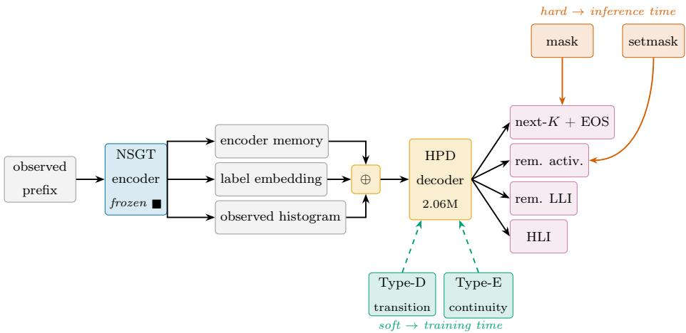
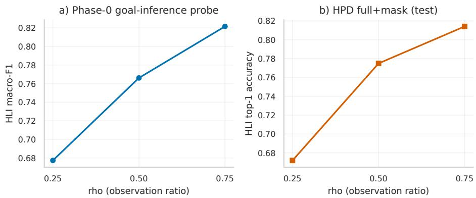
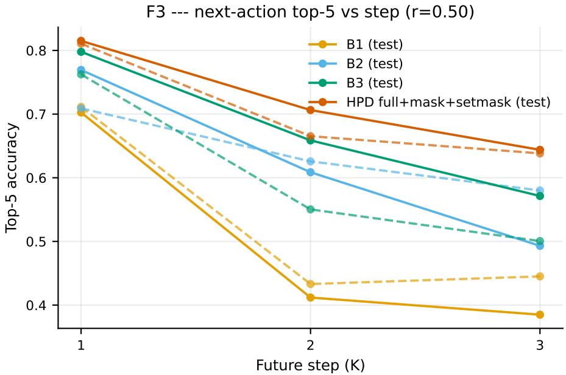
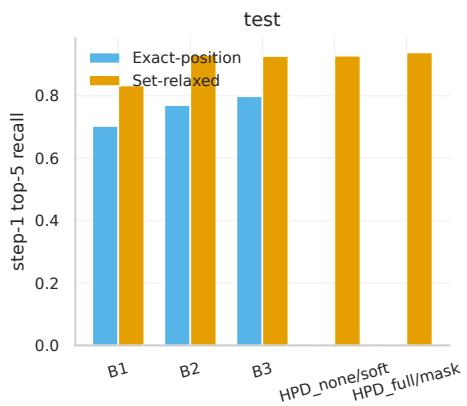
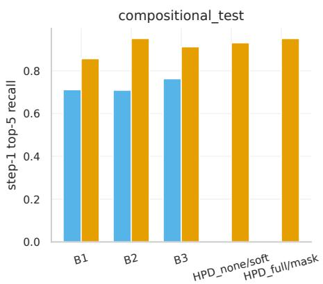
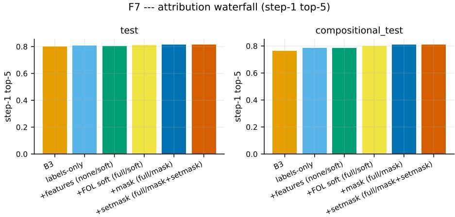
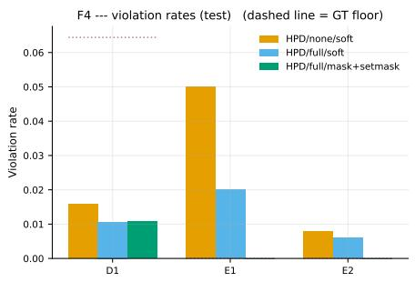
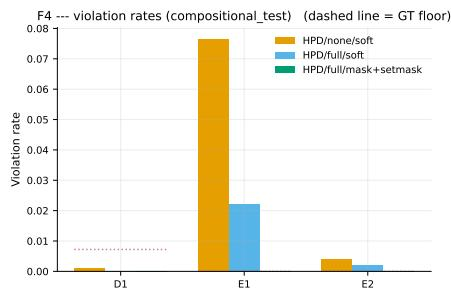
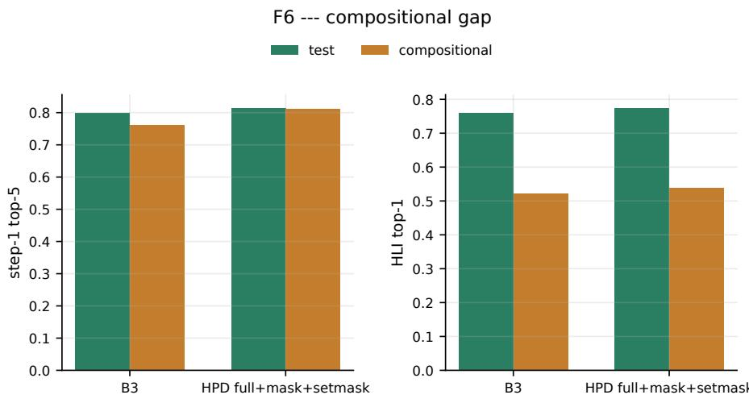
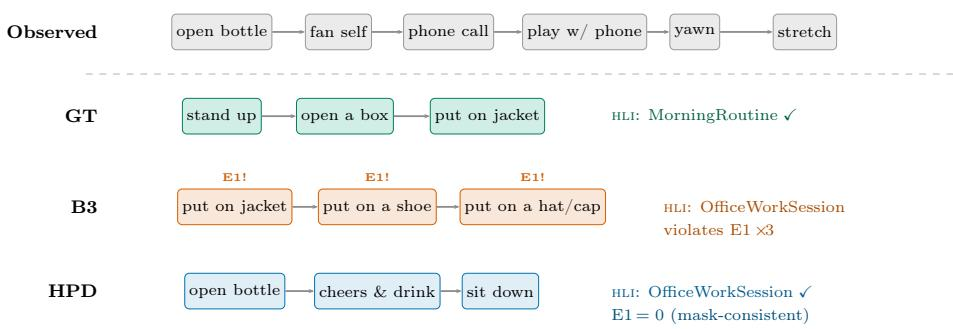

# Neuro-Symbolic Hierarchical Intention Anticipation in Human Behavior

Farnaz Soleimania, Abdelghani Chibania, Yacine Amirata, Ghazaleh Khodabandeloua,∗

aLISSI Laboratory, University of Paris-Est Créteil (UPEC), IUT de Créteil-Vitry, France

## Abstract

Assistive autonomous systems must anticipate human goals before an observed behavior is complete. This article formulates anticipation as goal inference from a partially observed multimodal episode together with structured prediction of the remaining behavior, rather than exact motor forecasting. A compact Hierarchical Planning Decoder (HPD) is attached to a frozen neuro-symbolic recognition encoder and predicts, at four ontological levels, the next actions, the remaining activities and low-level intentions, and the episode high-level intention (HLI). The decoder is trained with soft neuro-symbolic regularization combining transition-coherence and hierarchical-continuity losses, and is decoded with hard reachability masks that enforce ontological validity at inference. On a compositional four-level benchmark of 15,002 multimodal episodes built over NTU RGB+D 120 features, three headline properties are observed together. The advantage over the strongest sequential baseline grows with the anticipation horizon, from +1.7 points at step 1 to +7.3 points at step 3 (top-5). Under compositional generalization, where one parent association per multi-parent lowlevel intention is held out, this advantage widens to +4.9 points at step 1. At the episode level, 96.8% of anticipated trajectories satisfy the joint logic constraints, above the 88.1% strongest-baseline value and the 73.9% ground-truth

floor; soft logic terms alone account for a 59.8 to 71.1% relative reduction of HLI-reachability violations, and the hard masks then eliminate them entirely. Neural generation supplies predictive ranking, symbolic constraints supply ontological validity, and their combination yields coherent hierarchical anticipation while exposing remaining challenges in compositional goal generalization and unordered set prediction.

Keywords: Neuro-symbolic AI, Hierarchical anticipation, Multimodal learning, Human activity prediction, Intention recognition

## 1. Introduction

## 1.1. Motivation and Context

Reliable human-centric autonomous systems, ranging from assistive robots in domestic environments to collaborative agents in industrial workspaces, depend on the ability to act before a person’s behavior completes. Recognizing what has already happened is no longer suficient; the system must infer the goal that drives the ongoing behavior and predict how the remainder of the behavior is likely to unfold, so that assistance can be planned rather than improvised. This shift from reactive recognition to proactive anticipation is a recurring theme in recent work on human-robot collaboration Li et al. (2023), and is reflected in the rapid expansion of anticipation benchmarks Damen et al. (2022); Grauman et al. (2025); Perrett et al. (2025).

The companion recognition work Soleimani et al. (2026b) established a neuro-symbolic foundation for hierarchical recognition. A Neuro-Symbolic Graph Transformer (NSGT), augmented with a learnable Human Reasoning Graph (HR-G) attention bias and a diferentiable First-Order Logic (FOL) regulariser, was shown to jointly classify atomic actions, composite activities, Low-Level Intentions (LLI), and High-Level Intentions (HLI), improving logic consistency with only a small trade-of in action macro-F1. The present work asks whether the same neuro-symbolic foundation can be extended from describing the present to anticipating the future.

The delta relative to the recognition companion is precise. Recognition operated on complete episodes and produced classification decisions for the four ontological levels; it neither observed a prefix nor produced a forecast. The present work addresses partial-observation goal inference from a truncated prefix, generative prediction of the ordered remaining actions with end-of-sequence, prediction of the two remaining-set targets, and hard ontological guarantees on the entire generated trajectory. None of these was part of the recognition setting.

The conceptualization of anticipation on hierarchical behavior data requires methodological clarification. This concept is shaped by two properties of the utilized evaluation benchmark Soleimani et al. (2026a), necessitating a graded rather than absolute interpretation. When an order-destroying control is applied, the sensitivity of episode-level classification to sibling order is observed to decrease with the hierarchy level, ultimately falling within seed variation at the intention levels. Consequently, a goal is essentially recoverable from an unordered composition of its constituents. Concurrently, a strong step-wise first order signal at every level is demonstrated by a training-free predictability audit. It is shown that conditioning on the previous item increases the next-item top-5 accuracy by +38.7 percentage points at the action level, +23.2 at the activity level, and +31.3 at the LLI level over the marginal predictor. Therefore, an ticipation is improved by pairing sequential next-action prediction, where local first-order structure is strong, with set-valued and episode-level targets, where such structure is absent. The design of the transition-coherence loss is built upon this reconciliation (Section 3). Anticipation is therefore formulated in this work as goal inference from a partially observed episode combined with prediction of the remaining hierarchical behavior, rather than as precise motor-level forecasting of the exact next movement. Concretely, given a prefix covering a fraction ρ of an episode, the system infers the episode’s HLI, predicts the set of remaining activities and LLIs, and proposes next actions that remain coherent with the benchmark’s released transition model.

A growing body of work has tackled action anticipation as an isolated fore-

casting task. Early recurrent approaches Furnari and Farinella (2020); Osman et al. (2021) were progressively replaced by transformer-based aggregators Girdhar and Grauman (2021); Zhong et al. (2023); Diko et al. (2024), and most recently by large language model (LLM) decoders that exploit commonsense priors over action sequences Kim et al. (2023); Chu et al. (2025, 2026). Despite considerable progress, three structural limitations persist. First, anticipated outputs are typically restricted to a flat label space; the intermediate cognitive layers between observed motion and inferred long-term goals are either absent or collapsed into a single latent scenario variable Mascaró et al. (2023). Second, LLM-based decoders produce sequences that are linguistically fluent but logically unconstrained, yielding forecasts that contradict ontological axioms, for example anticipating a sequence that simultaneously belongs to mutually exclusive long-term intentions.

The framework of the companion recognition work is extended with a Hierarchical Planning Decoder (HPD) and two new categories of logical constraint, reformulating anticipation as structured generative reasoning. Future behavior is not treated as independent label draws but as an ontologically grounded trajectory. The training objective combines the anticipation task losses with two diferentiable logic terms, a transition-coherence term and a hierarchicalcontinuity term, and this soft objective is complemented at inference by hard reachability constraints. The result encourages an anticipated trajectory that is consistent with the transition structure of the behavior model and with the high-level intention inferred from observed evidence, and it guarantees ontological reachability at decoding time.

## 1.2. Problem Statement and Contributions

The paper addresses two methodological bottlenecks in current anticipation systems.

\- Hierarchical anticipation. Most anticipation models predict future actions in a flat label space. Even intention-conditioned methods Mascaró et al. (2023);

Chu et al. (2026) usually represent intention as a single latent scenario rather than as a structured ontology. This limits both interpretability and long-horizon reasoning: an atomic action can be compatible with several activities, and an activity can support diferent low- and high-level intentions depending on the surrounding context.

\- Ontologically constrained generation. Modern sequence decoders, including transformer and LLM-based anticipators, can generate plausible action continuations while violating the semantic constraints that define valid behavior trajectories. In assistive settings, such inconsistencies are not cosmetic: a system that predicts mutually incompatible goals cannot support reliable proactive assistance. The benchmark used here provides typed FOL rules as evaluation instruments; this work integrates them into both training and inference.

The contributions are:

• A hierarchical anticipation formulation. Anticipation is posed as partial-observation goal inference plus prediction of the remaining behavior at four levels: future actions, remaining activities, remaining LLIs, and HLI.

• A compact Hierarchical Planning Decoder. A 2.06M-parameter autoregressive HPD is attached to a frozen neuro-symbolic recognition encoder. The decoder receives the same observed action labels as the strongest label-oracle baselines, making the comparison protocol explicit.

• A soft/hard neuro-symbolic mechanism. Diferentiable Type-D transitioncoherence and Type-E hierarchical-continuity losses guide training, while inference-time reachability masks enforce hard ontology constraints on the action and set outputs. The soft terms alone account for a 59.8 to 71.1% relative reduction of HLI-reachability violations before any decoding constraint is applied.

• Horizon-scaled and compositional gains under coherence guarantees. On 15,002 multimodal episodes, the advantage of the final system over the strongest sequential baseline grows from +1.7 points at step 1 to +7.3 points at step 3 (top-5), and widens to +4.9 points at step 1 on the held-out compositional split. Episode-level satisfaction of the joint logic constraints reaches 96.8%, above the 88.1% best-baseline value and above the 73.9% ground-truth floor.

The remainder of the article is organized as follows. Section 2 reviews short-term anticipation, long-term intention-conditioned forecasting, and neurosymbolic sequence reasoning. Section 3 describes the frozen recognition encoder, the HPD, and the soft/hard FOL mechanism. Section 4 details the benchmark, splits, baselines, and metrics. Section 5 presents the quantitative results and ablations. Section 6 discusses the findings and limitations. Section 7 concludes.

## 2. Related Work

The proposed framework intersects three lines of research: short-term action anticipation, long-term and intention-conditioned forecasting, and neurosymbolic approaches to sequence reasoning. Each is reviewed in turn, after which the positioning of the present work is articulated.

## 2.1. Short-Term Action Anticipation

Short-term action anticipation aims at predicting the next action a person will perform $\tau _ { a }$ seconds before its onset, conditioned on a video segment of observed length $\tau _ { o } .$ The task was formalized on EPIC-KITCHENS Damen et al. (2018, 2022) and has since become the standard formulation for firstperson predictive video understanding.

Early architectures relied on recurrent modeling of past observations. Rolling-Unrolling LSTMs Furnari and Farinella (2020) decomposed the problem into a summarization stage and a forecasting stage, fusing RGB, optical flow, and object-based features through a learned modality-attention mechanism. Multimodal temporal convolutional networks Osman et al. (2021) subsequently replaced recurrence with hierarchical dilated convolutions to reduce inference latency.

The introduction of self-attention shifted the field toward transformer-based aggregators. The Anticipative Video Transformer Girdhar and Grauman (2021) computed causal attention across observed frames to forecast future actions, and the Anticipative Feature Fusion Transformer Zhong et al. (2023) extended this idea to multi-modal token streams. More recent methods inject auxiliary semantic structure: S-GEAR Diko et al. (2024) aligns visual prototypes with the geometry of action label semantics, and Action-Guided Attention Tai et al. (2026) replaces dot-product attention with a representation explicitly informed by recognized past actions. Label-smoothing strategies Camporese et al. (2021) and text-based modalities Ghosh et al. (2023) have further been shown to improve generalization.

A common limitation of these approaches is that they operate on a flat output space and do not model the cognitive hierarchy that connects atomic actions to longer-term goals. Moreover, they implicitly assume that the exact next motor action is well-determined by the observed prefix. On compositional behavior, in which a goal admits many valid orderings of its parts, this assumption breaks down; the present work adopts a goal-centric formulation instead.

## 2.2. Long-Term Anticipation and Intention-Conditioned Forecasting

The Long-Term Action Anticipation (LTA) benchmark introduced with Ego4D Grauman et al. (2024) requires the prediction of up to twenty future actions from extended observations, shifting emphasis from immediate motor prediction toward goal-directed reasoning. The Ego4D baseline pairs a SlowFast Feichtenhofer et al. (2019) visual encoder with a transformer aggregator and parallel classification heads; this design is now standard.

Intention-conditioned variants explicitly factorize the prediction into a goalinference stage followed by an action-generation stage. ICVAE Mascaró et al. (2023) introduced a scenario variable, interpretable as the camera wearer’s intention, that conditions a transformer decoder and won the CVPR/ECCV 2022 Ego4D LTA challenges. This established that explicit intention modeling, rather than implicit context aggregation, improves long-horizon forecasting.

Subsequent work has leaned heavily on large language models as the reasoning backbone. PALM Kim et al. (2023) chains a captioning module and an LLM to anticipate future action sequences from textual descriptions of past actions, demonstrating that commonsense priors encoded in pretrained LLMs transfer to LTA without task-specific training. QueryMamba Zhong et al. (2024) replaces the transformer decoder with a Mamba state-space model and adds a statistical co-occurrence module. The 2025 Ego4D LTA challenge winner Chu et al. (2025) combines a high-capacity visual encoder, a transformer recognition module, and a fine-tuned LLM, formalizing a three-stage pipeline that has become a de facto template. Vision-and-intention LLM approaches Cao et al. (2025) jointly condition the language model on scene observations and inferred goals, while INSIGHT Chu et al. (2026) integrates a reinforcement learning objective with a structured reasoning template. HD-EPIC Perrett et al. (2025) extends EPIC-KITCHENS with dense annotation, enabling finer-grained anticipation.

Across this line of work, two limitations recur. First, intention is typically treated as a single latent variable or scenario label rather than as a structured multi-level hierarchy with explicit ontological semantics. Second, when generative decoders are employed, the output space is unconstrained by symbolic axioms, allowing sequences that are fluent but ontologically inconsistent with the observed context.

## 2.3. Neuro-Symbolic Reasoning for Sequence Forecasting and Planning

Neuro-symbolic AI Hitzler et al. (2022); Garcez and Lamb (2023) combines the perceptual capacity of neural networks with the structural soundness of declarative reasoning. While early integrations such as DeepProbLog Manhaeve et al. (2019) and Logic Tensor Networks Badreddine et al. (2022) have demonstrated the value of diferentiable logic on static tasks, their extension to temporally extended forecasting is more recent.

In the context of action anticipation, Bhagat et al. Bhagat et al. (2023) aug ment a transformer’s attention mechanism with a symbolic knowledge graph encoding object afordances, reporting up to a nine-percentage-point improvement over purely neural baselines on the Breakfast and 50 Salads datasets. The follow-up NeSCA framework Bhagat et al. (2024) extends this design to shortcontext anticipation in collaborative cooking, demonstrating that symbolic priors halve the observation window required for accurate prediction. Bellotto et al. Mghames et al. (2023) apply a related strategy to human motion prediction.

Beyond anticipation specifically, hierarchical neuro-symbolic architectures have emerged for general planning. The Hierarchical Neuro-Symbolic Decision Transformer Baheri and Alm (2025) couples a classical symbolic planner with a transformer-based low-level policy via a bidirectional interface, separating logically coherent operator sequencing from reactive control. HVR Cornelio et al. (2025) integrates hierarchical task decomposition, retrieval-augmented generation over a symbolic knowledge graph, and a symbolic validator that simulates plans before execution. NeSyA Manginas et al. (2024) integrates neural perception with symbolic automata for sequence classification.

These works confirm that explicit symbolic structure can be made diferentiable and that it improves both accuracy and explainability in temporal reasoning. They do not, however, provide a unified treatment of (i) multimodal fusion, (ii) a deep ontological hierarchy spanning four levels of abstraction, and (iii) anticipatory generation under logical constraints. The companion recognition work Soleimani et al. (2026b) provides the first two; the present work extends the framework to the third.

## 2.4. Positioning of the Present Work

The literature leaves a precise gap. Existing anticipation systems are strong at flat next-action or long-term sequence forecasting, but they do not jointly anticipate atomic actions, activities, LLIs, and HLIs under an explicit ontology. Neuro-symbolic methods have introduced logical structure into recognition, attention, or planning, but their use as a training-time and inference-time constraint on generated anticipation trajectories remains limited. This work therefore positions itself between action anticipation and neuro-symbolic plan ning: the decoder remains data-driven, but the generated future is required to

  
Figure 1: The frozen graph NSGT encoder produces per-clip memory and a pooled HLI state from the observed prefix. The HPD fuses three prefix views, encoder memory, observed-label embeddings, and the observed-action histogram, then decodes the next actions with EOS, the remaining activity and LLI sets, and the episode HLI. Green dashed paths are the soft Type-D and Type-E logic losses applied during training; red solid blocks are the hard reachability masks applied at inference (mask on the action stream, setmask on the set heads).  
remain reachable under the task ontology. The comparison with a symbolic-only OntoPrior, a neural-only HPD, and the final soft/hard HPD is designed to test exactly this claim.

## 3. Methodology

The recognition backbone of the companion work Soleimani et al. (2026b) is reused as a frozen encoder, and a Hierarchical Planning Decoder (HPD) is trained on top of its prefix representations. The method separates learning from constraint enforcement. During training, diferentiable logic losses bias the decoder toward coherent futures. During inference, reachability masks enforce hard ontology constraints without modifying the learned weights. Figure 1 provides an overview.

## 3.1. Frozen Recognition Encoder

The encoder is the graph NSGT of the companion work: a graph-structured hierarchical transformer over the typed episode graph, operating on the four fused modalities with $d _ { \mathrm { m o d e l } } = 2 5 6$ , three graph layers, four heads, and crossattention fusion. By pre-specified protocol, the checkpoint used for all anticipation experiments is the project default seed configuration (FOL condition all, seed 42); this checkpoint is fixed in advance rather than selected on anticipation scores, which avoids best-seed selection bias. The encoder holds 6.75M parameters and is frozen throughout: a reproducibility check verifies its full-observation recognition HLI top-1 of 69.7% to within $1 0 ^ { - 6 }$ before every anticipation run, guaranteeing that the encoder contributes an unchanging representation.

For an observed prefix, the frozen encoder exposes two products consumed by the decoder: a sequence of per-clip encoder states, one per observed action clip, and a pooled high-level state that summarises the prefix at the HLI level. Neither the encoder weights nor these products change during decoder training.

The decision to freeze the encoder was verified empirically. Two fine-tuning regimes were evaluated with three seeds each, in every case with the extended FOL loss and constrained decoding kept identical to the main configuration and the encoder learning rate set to one tenth of the decoder’s $( 3 \times 1 0 ^ { - 5 } )$ . Regime R1 unfroze the last HGT layer together with the cross-attention fusion, yielding 49 unfrozen tensors alongside the HPD; regime R2 unfroze the full encoder for 152 unfrozen tensors. Neither regime produced gains outside seed variance: the best case, R2 on the test split, moved step-1 top-1 by +0.5 points and step-1 top-5 by +0.4 points relative to the frozen encoder (Table A.5), while HLI top-1 moved by −0.4 points; on the compositional split the deltas were within ±0.6 points across every metric. E1 and E2 remained exactly zero in every fine-tuned condition, again confirming that the reachability guarantee is structural. As a sanity check, a full-episode recognition probe on the fine-tuned encoders showed HLI top-1 changes between −1.2 and +0.5 points relative to the 69.7% reference, so recognition competence is preserved throughout. The frozen configuration is therefore retained as the main system because it delivers the same anticipation quality at lower training cost, preserves the clean attribution across architecture, features, and logic that freezing makes possible, and leaves the encoder available for other downstream tasks without re-adaptation.

## 3.2. Hierarchical Planning Decoder

The HPD is a small autoregressive transformer decoder with $d _ { \mathrm { m o d e l } } = 1 9 2$ , three layers, four heads, and a feedforward width of 768, totalling 2.06M trainable parameters. It is deliberately kept an order of magnitude smaller than the encoder so that the anticipation results are attributable to the reasoning design rather than to decoder capacity.

Task-legal input. By pre-specified protocol, the decoder receives the observed action labels as input, in addition to the frozen encoder states. This is a deliberate protocol-parity choice with the strongest baselines, which are label-oracle models that also see the observed labels; supplying the same labels to the HPD makes the comparison fair rather than advantageous. The choice does not commit the deployed system to relying on oracle labels: Section 5.7 evaluates the same trained decoder when the observed labels are replaced by the recognition encoder’s predictions and under synthetic label-noise sweeps, and reports a noise-aware training variant that closes most of the gap to the oracle condition. Concretely, each observed position fuses its encoder state with an embedding of its action label, the embedding matrix being shared with the decoder output layer. Formally, the fused state at observed position i is

$$
\mathbf { m } _ { i } = W _ { \mathrm { m e m } } \mathbf { e } _ { i } + W _ { \mathrm { l a b } } \mathrm { e m b e d } ( a _ { i } ) ,\tag{1}
$$

where $\mathbf { e } _ { i }$ is the frozen encoder state, $a _ { i }$ is the observed action label, and embed(·) is the embedding shared with the decoder output layer.

A projection of the 85-dimensional histogram of observed action counts is concatenated with the mean fused state and the pooled HLI state, and the result is projected to the decoder width to form the conditioning summary. This makes explicit that goal inference may draw on three distinct views of the prefix: the ordered encoder states, the ordered observed labels, and the unordered action histogram.

This protocol should not be interpreted as raw video-only anticipation. The HPD and the strongest baselines receive observed action labels, making the setting a structured anticipation problem conditioned on recognized or oracleobserved prefix labels. This choice isolates the contribution of hierarchical decoding and neuro-symbolic constraints from the upstream action-recognition problem.

Outputs. Four heads read the decoder. An autoregressive next-action head emits up to $K = 3$ future actions over a vocabulary extended with an endof-sequence token, terminating early through that token. Three further heads, reading the pooled decoder state, produce the remaining-activity set, the remaining-LLI set, and the episode HLI.

Optional language-model variant. A separate ablation replaces the trained decoder with a LoRA-adapted small open-weight language model that emits the full structured target as text. It is documented in Section 5.6 and is not part of the primary system.

## 3.3. Ontological Constraint Semantics

Let A, $\nu , \mathcal { L } ,$ and H denote the finite and pairwise disjoint sets of actions, activities, low-level intentions (LLIs), and high-level intentions (HLIs). The hierarchical structure is defined by a mereological part-of relation

$$
\sqsubset \subseteq ( A \times \mathcal { V } ) \cup ( \mathcal { V } \times \mathcal { L } ) \cup ( \mathcal { L } \times \mathcal { H } ) ,
$$

rather than by an is-a or subsumption relation. Thus, an action is not a subclass of an activity, and an activity is not a subclass of an intention; lower-level elements are constituents of higher-level behavioral units.

Let $\sqsubset ^ { + }$ denote the transitive closure of $\sqsubset$ . For a predicted HLI $h \in \mathcal H$ , the reachable set is

$$
R ( h ) = \{ x \in \mathcal { A } \cup \mathcal { V } \cup \mathcal { L } | x \sqsubset + h \} ,
$$

with type-specific restrictions

$$
R _ { \cal A } ( h ) = R ( h ) \cap { \cal A } , \quad R _ { \cal V } ( h ) = R ( h ) \cap { \cal  V } , \quad R _ { \cal C } ( h ) = R ( h ) \cap { \cal C } .
$$

These sets are precomputed ofline as binary masks. The composition graph is a directed acyclic graph rather than a tree: some LLIs may belong to more than one HLI, so reachable sets can overlap. This multi-parent structure is the basis of the compositional split.

For an episode $e ,$ violations are defined on grounded predictions rather than on the ontology alone. We write occ $( x , e )$ when an element x occurs in episode $e ,$ next ${ \mathrm { ; } } ( a _ { i } , a _ { j } , e )$ when action instance $a _ { j }$ immediately follows $a _ { i } ,$ and has $\mathrm { H L I } ( e , h )$ when e is assigned HLI h. The predicate hasHLI is functional:

$$
\forall e , \forall h _ { 1 } , h _ { 2 } \in \mathcal { H } , \quad \mathrm { h a s H L I } ( e , h _ { 1 } ) \land \mathrm { h a s H L I } ( e , h _ { 2 } ) \Rightarrow h _ { 1 } = h _ { 2 } .
$$

This makes assigning a trajectory to mutually incompatible high-level intentions a well-defined failure.

Given a predicted HLI $\hat { h } ,$ , predicted future actions $\hat { \mathbf { a } } = ( \hat { a } _ { 1 } , \dots , \hat { a } _ { K } )$ , and a predicted remaining-activity set $\hat { \mathcal { V } } _ { : }$ , the reachability violations are audited as

$$
E 1 ( e ) = \frac { 1 } { \left| \hat { \mathbf { a } } \right| } \sum _ { \hat { a } \in \hat { \mathbf { a } } } \mathcal { k } \left[ \hat { a } \notin R _ { \mathcal { A } } ( \hat { h } ) \right] ,
$$

and

$$
E 2 ( e ) = \frac { 1 } { | \hat { \mathcal { V } } | } \sum _ { \hat { v } \in \hat { \mathcal { V } } } \mathcal { k } \left[ \hat { v } \notin R _ { \mathcal { V } } ( \hat { h } ) \right] .
$$

E1 and E2 are treated as hard reachability constraints at inference time.

Concretely, for action logits $\ell _ { A } ( a )$ , the inference-time mask is

$$
\ell _ { \mathcal { A } } ^ { \prime } ( a ) = \left\{ \begin{array} { l l } { \ell _ { \mathcal { A } } ( a ) , } & { a \in R _ { \mathcal { A } } ( \hat { h } ) \cup \{ \mathrm { E O S } \} , } \\ { - \infty , } & { \mathrm { o t h e r w i s e } . } \end{array} \right.
$$

The same principle is applied to the remaining-activity and remaining-LLI set heads using $R _ { \nu } ( { \hat { h } } )$ and $R _ { \cal { L } } ( { \hat { h } } )$ .

By contrast, D1 and D2 are not hard ontological constraints. Let $S _ { \mathrm { t r a i n } } \subseteq$ $\mathcal { A } { \times } \mathcal { A }$ be the successor support estimated from the training split. The transition-

support audit is

$$
D 1 ( e ) = \frac { 1 } { K - 1 } \sum _ { t = 1 } ^ { K - 1 } \mathcal { H } [ ( \hat { a } _ { t } , \hat { a } _ { t + 1 } ) \notin S _ { \mathrm { t r a i n } } ] .
$$

This constraint is used only as a soft transition-coherence preference during training, because valid test trajectories may contain transitions unseen in the training split. D2, which concerns canonical within-activity ordering, is also diagnostic only, since the canonical order is defined only for a subset of activities and the ground truth itself may violate it.

When transition support and reachability disagree, reachability takes strict priority. Candidates outside $R ( \hat { h } )$ are removed regardless of their transition score, whereas transition coherence only biases the ranking among candidates that remain ontologically admissible. Thus, E1 and E2 define hard validity, while D1 and D2 define softer plausibility or diagnostic criteria.

All sets and predicates are finite and fully enumerated. Once an episode is fixed, the constraint language reduces to a function-free ground fragment equivalent to a propositional theory over typed atoms. The neuro-symbolic component therefore does not perform open-domain first-order inference or description-logic reasoning; it uses diferentiable relaxations of grounded constraints during training and precomputed masks during decoding.

## 3.4. Extended First-Order Logic Loss (soft, training time)

Building on the ontological semantics defined above, the benchmark provides two diferentiable training-time relaxations: Type-D transition coherence and Type-E hierarchical continuity. They are soft constraints: they guide the probability distribution but do not guarantee validity by themselves.

Type-D, transition coherence. Let $\mathcal { N } _ { \mathrm { t r a n s } } ( a )$ denote the set of actions observed to follow action a in the training episodes, and let $\mathbf { p } _ { t + 1 }$ be the decoder distribution at future step $t + 1$ . After a decoded predecessor $\hat { a } _ { t }$ , transition coherence penalizes probability assigned outside the valid successor set:

$$
\mathcal { L } _ { \mathrm { D } } = \frac { 1 } { K - 1 } \sum _ { t = 1 } ^ { K - 1 } \sum _ { a ^ { \prime } \notin \mathcal { N } _ { \mathrm { t r a n s } } ( \hat { a } _ { t } ) \cup \{ \mathrm { E O S } \} } \mathbf { p } _ { t + 1 } ( a ^ { \prime } ) .\tag{2}
$$

This term is used as a coherence prior rather than as a claim that the next action is uniquely determined by temporal order. It is consistent with the benchmark design: episode-level labels are compositional and order-insensitive, while adjacent steps still carry local transition information.

Type-E, hierarchical continuity. Let $\mathbf { p } _ { H } ^ { \mathrm { o b s } }$ be the HLI distribution inferred from the observed prefix and $\mathbf { p } _ { H } ^ { \mathrm { a n t i c } }$ the HLI distribution predicted by the HPD. Hierarchical continuity penalizes drift between the prefix-inferred goal and the anticipated goal:

$$
{ \mathcal { L } } _ { \mathrm { E } } = \mathrm { K L } \left( \mathbf { p } _ { H } ^ { \mathrm { o b s } } \left. \mathbf { p } _ { H } ^ { \mathrm { a n t i c } } \right. . \right.\tag{3}
$$

The final training objective is

$$
\begin{array} { r } { \mathcal { L } = \mathcal { L } _ { \mathrm { C E } } ^ { \mathrm { a n t i c } } + \lambda _ { \mathrm { D } } \mathcal { L } _ { \mathrm { D } } + \lambda _ { \mathrm { E } } \mathcal { L } _ { \mathrm { E } } , } \end{array}\tag{4}
$$

with $\lambda _ { \mathrm { D } } = \lambda _ { \mathrm { E } } = 0 . 5$ . The task loss $\mathcal { L } _ { \mathrm { C E } } ^ { \mathrm { a n t i c } }$ comprises cross-entropy for the autoregressive next-action and HLI heads and binary cross-entropy for the remainingactivity and remaining-LLI set heads. The encoder is frozen, so no recognition loss is optimized during HPD training.

## 3.5. Constrained Decoding (hard, inference time)

At inference, the decoder first predicts the episode HLI. This predicted HLI defines the ontology subtree reachable by the anticipated trajectory. The action mask then adds −∞ to the logits of every action that is not reachable from this HLI, while keeping the EOS token available. The same reachability principle is applied to the remaining-activity and remaining-LLI set heads through a set mask. These masks are not learned and do not change the decoder parameters; they only remove logically invalid outputs from the decoding space. The same trained decoder can therefore be evaluated with or without hard masking, which makes the contribution of soft training and hard inference constraints separable in the ablation study.

## 3.6. Training Protocol

Frozen encoder states are precomputed for every prefix. Only the 2.06M HPD parameters are trained, using AdamW with learning rate $3 \times 1 0 ^ { - 4 }$ , batch size 256, dropout 0.1, and a maximum budget of 40 epochs. The observation ratio is sampled during training so that one decoder can be evaluated at $r \in$ $\{ 0 . 2 5 , 0 . 5 0 , 0 . 7 5 \}$ . Early stopping monitors validation step-1 top-1 through the same greedy decoding path used at test time. Learned configurations are trained with three seeds and reported as mean ± standard deviation. The best epoch occurs early (mean 7.2, maximum 11), indicating that the budget is not the limiting factor. The trained decoder is small (2.06M parameters) and decodes $K = 3$ actions greedily with the three set and goal heads read in parallel, a configuration compatible with real-time serving in principle, though wall-clock latency under a target workload was not profiled here.

To keep the reported comparison auditable, all baselines and HPD variants are evaluated with the same record construction, vocabulary, split definitions, and metric code. The frozen encoder checkpoint is fixed before anticipation training, and its full-episode recognition score is checked before HPD training. This protocol is important because the anticipation task receives observed action labels, whereas the full-episode recognition reference does not; the two numbers are therefore not ceilings for one another.

## 4. Experimental Setup

## 4.1. Benchmark

All experiments are conducted on a compositional four-level anticipation benchmark built over NTU RGB+D 120 features. The synthesis protocol originates in a companion benchmark manuscript Soleimani et al. (2026a); the essential ontology, splits, features, and logic rules are summarized here to make the present article self-contained for methodological review.

Ontology and episodes. Behavior is organized over four typed levels: an action is an atomic, single-label clip from the source corpus; an activity composes 1 to 2 actions; a low-level intention (LLI) composes 2 to 4 activities; a highlevel intention (HLI) is a long-horizon episode of 2 to 5 LLIs. The instantiated ontology comprises 8 HLIs, 35 LLIs, 50 activities, and 85 source action classes. The benchmark contains 15,002 episodes averaging 6.95 actions each (median 6, range 4 to 17), with the eight HLIs populated nearly uniformly. All clips within an episode are performed by the same subject, drawn from 60 source performers under a coverage-aware sampler. Of the 85 ontology action classes, 81 occur in the synthesized episodes; the efective action vocabulary of every model in this article is therefore 81 classes, and all reported action metrics are computed over this vocabulary.

Features. Each action clip carries pooled per-clip features from four modalities: skeleton (2048-d), RGB (1024-d), infrared (1024-d), and depth (1024-d), concatenated into a fused 5120-dimensional vector. Features are pre-extracted with frozen encoders and are identical across all models compared here.

Splits. The subject-disjoint partition of the benchmark is reused unchanged: 7,062 train, 1,519 validation, 3,006 test, and 3,415 compositional-test episodes. The compositional test split additionally withholds one parent association from training for each multi-parent LLI, so that at test time the concept must transfer to a high-level context never observed during training. Anticipation inherits this structure directly: every anticipation record is derived from exactly one episode of its split.

Logic rules and intrinsic violation floors. The violation metrics follow the constraint semantics of Section 3.3. We report four trajectory-level audits on completed predictions.

Four violation metrics are audited on completed trajectories. D1 flags a predicted next action whose (previous, next) pair falls outside the transition support observed in the training episodes. D2 flags a violation of the canonical within-activity ordering, defined for the 14 of 50 activities that declare one. E1 flags a predicted action that is not reachable from the predicted HLI through the ontology. E2 flags a predicted remaining activity that is not reachable from the predicted HLI. The ground-truth trajectories themselves establish intrinsic floors: $\mathrm { D 1 } = 0 . 0 6 4$ test and 0.007 compositional test (the ground truth contains transitions unseen in train), D2 = 0.224 and 0.363, and $\mathrm { E 1 } = \mathrm { E 2 } = 0$ on both splits. Because its intrinsic floor is high, D2 is reported for completeness but excluded from all gating and headline claims. An episode-level satisfaction score is also reported: the fraction of records whose completed trajectory carries zero violations over {D1, E1, E2}; the ground-truth floor of this score is 0.739 on test.

## 4.2. Task Definition

Anticipation is instantiated as follows (Fig. 2). Each episode of length T actions is cut at an observation ratio r, giving an observed ordered prefix of $\lceil r T \rceil$ action clips (features, clip keys, and unit alignment retained). From the prefix, the system predicts: (i) the ordered next actions up to horizon $K = 3 .$ , together with an end-of-sequence (EOS) flag when fewer than K actions remain; (ii) the set of remaining activities; (iii) the set of remaining LLIs; and (iv) the episode HLI. The primary operating point is $r = 0 . 5 0$ , with $r \in \{ 0 . 2 5 , 0 . 7 5 \}$ evaluated as sensitivity; no minimum-length filter is applied, so every episode of every split yields exactly one record per ratio. At $r = 0 . 5 0$ , a mean of 3.19 actions remains per episode and 62.9% of episodes have at least 3 remaining, so the $K = 3$ horizon is active for most records.

Empirical justification of task well-posedness. Two measured properties of the data reconcile what may appear contradictory. On the one hand, the benchmark’s order-destroying control shows that episode-level classification is insensitive to sibling order: shufling changes recognition scores within seed variation. On the other hand, a training-free audit of next-step predictability shows a strong first-order signal at the step level: conditioning on the previous action lifts next-action top-5 accuracy by +38.7 percentage points over the marginal predictor and reduces the conditional entropy of the next action from 5.21 to 3.51 bits, with analogous lifts at the activity (+23.2) and LLI (+31.3) levels. Both facts are design properties, not contradictions: the episode label is determined by an unordered composition, while adjacent steps are generated by a transition model and therefore carry local order. The task accordingly pairs sequential next-action prediction, where local order is informative, with set-valued and episode-level targets, where it is not. A label-only logistic probe further confirms that goal inference from a prefix is feasible and improves with observation: HLI macro-F1 of 0.677, 0.766, and 0.821 at $r = 0 . 2 5$ , 0.50, and 0.75.

Step-to-time convention. The benchmark carries no per-clip durations. Under the NTU RGB+D 120 convention, an action clip typically spans a few seconds; therefore, step-based horizons are interpreted as approximate shortto-mid-term anticipation horizons rather than exact wall-clock durations. Since durations are not explicitly modeled in the benchmark, all evaluation is reported in future steps rather than seconds.

Scoring protocol. All headline metrics are computed at the cut position of each record. A benchmark property worth stating explicitly is the measured gap between this protocol and the all-steps protocol used by the predictability audit: scoring the same first-order model over all step positions rather than at the $r = 0 . 5 0$ cut yields +9.9 points top-1 and +6.0 points top-5, so numbers across the two protocols must not be compared directly.

## 4.3. Encoder Checkpoint

The recognition encoder is the graph NSGT of the companion work Soleimani et al. (2026b), operating on the typed episode graph over all four modalities. The checkpoint is fixed in advance to the project-wide default seed (seed 42, FOL condition all) rather than selected by score, avoiding best-seed selection bias; its full-observation recognition HLI top-1 on the test split is 69.7%, reproduced exactly (delta 0.000000) by a reproducibility check before every anticipation run. The encoder is frozen throughout; its role as a reference point rather than a ceiling is discussed in Section 5.

## 4.4. Baselines

Six comparison systems are evaluated, all consuming identical records and scored by one shared harness (itself gated by a fixture that reproduces stored baseline numbers to within 0.5 points).

B0, marginal frequency. Predicts the globally most frequent actions, majority EOS, majority HLI, and the most frequent remaining sets. Establishes the floor.

B1, first-order transition table. A train-fitted transition table with greedy rollout from the last observed action; majority-style set and HLI heads.

B2, bag-of-observed MLP. A multi-task MLP over the unordered histogram of observed action labels, with heads for next actions, EOS, remaining sets, and HLI. This is the strongest compositional baseline.

B3, sequential transformer. A small autoregressive transformer over the observed label sequence, decoding next actions up to K with EOS. This is the strongest sequential baseline.

OntoPrior, symbolic-only. A no-learning control: each observed action votes for every HLI whose ontology subtree contains it; next actions are the trainfrequent unobserved actions inside the voted HLI subtree. By construction its predictions satisfy E1 and E2 exactly.

LLM-LoRA. The optional language-model decoder of Section 3.2, reported as a single ablation row.

B2, B3, and all HPD variants are trained with 3 seeds and reported as mean with standard deviation; B0, B1, and OntoPrior are deterministic.

## 4.5. Metrics

Next-action accuracy. Step-k top-1 and top-5 accuracy for $k \in \{ 1 , 2 , 3 \}$ at the cut position, over the 81-class efective vocabulary.

Set-relaxed next-action. Because the episode sufix is compositionally rather than ordinally determined, a set-relaxed variant credits a step-1 prediction that occurs anywhere in the unobserved sufix. Both exact-position and set-relaxed scores are reported.

## EOS. F1 of the end-of-sequence flag.

Remaining sets. Jaccard similarity of the predicted versus ground-truth remainingactivity and remaining-LLI sets, complemented by set macro-mAP computed from the head scores.

Goal inference. HLI top-1 and macro-F1 at the cut, and HLI top-1 as a function of r.

Logical coherence. D1, D2 (report-only), E1, and E2 violation rates of the completed trajectory, read against the ground-truth floors of Section 4.1, and the episode-level satisfaction score over {D1, E1, E2}. D2 is reported for completeness but excluded from gating and headline claims: only 14 of 50 activities declare a canonical order, so the ground truth itself violates the canonical ordering on 22.4% of test and 36.3% of compositional trajectories, and a benchmark with denser ordering annotation would be needed to make within-activity ordering a discriminative target.

## 5. Results and Analysis

## 5.1. Goal Inference under Partial Observation

Table 1 and Figure 3 report the behavior of the gated HPD (fol\_mode full with constrained decoding) as the observation ratio varies over $r \in \{ 0 . 2 5 , 0 . 5 0 , 0 . 7 5 \}$ on the test split, alongside the strongest sequential baseline and the label-only

<table><tr><td colspan="10">r = 0.50 cut next-K (K = 3)</td></tr><tr><td>open</td><td>fan</td><td>phone</td><td>play with</td><td>yawn</td><td>stretch</td><td>stand</td><td>open a</td><td>put on</td><td></td><td>ordered, K=3 remaining sets</td></tr><tr><td>bottle</td><td>self</td><td>call</td><td>phone</td><td></td><td>oneself</td><td>up</td><td>box</td><td>jacket</td><td></td><td>activities, LLIs</td></tr><tr><td></td><td></td><td></td><td>observed prefix ([r T] = 6)</td><td></td><td></td><td></td><td></td><td></td><td></td><td>HLI</td></tr></table>

Figure 2: Task schematic instantiated on episode ep\_0000331 (the same episode shown qualitatively in Fig. 9). The 11-action episode is cut at $r = 0 . 5 0 \AA$ , giving a 6-action observed prefix (open bottle, fan self, phone call, play with phone, yawn, stretch oneself ) and a 5-action unobserved sufix. The three target families predicted from the prefix are: the ordered next-K actions with EOS (here stand up, open a box, put on jacket; EOS false since two further actions follow); the sets of remaining activities (ACT\_Stand, ACT\_PackBag, ACT\_DonClothing, ACT\_DonAccessory) and remaining LLIs (LLI\_Awakening in progress, LLI\_DressUp); and the episode HLI (HLI\_MorningRoutine).

logistic probe of the predictability audit. Goal inference improves monotonically with observation: HLI top-1 rises from 67.2% at a quarter of the episode to 81.4% at three quarters. At $r = 0 . 2 5$ the learned system sits within half a point of the label-only probe, indicating that almost all goal evidence in a short prefix is carried by the identity of the observed actions; by $r = 0 . 5 0$ the HPD is clearly above the probe trajectory, indicating that the multimodal features and the decoder contribute goal evidence beyond the bare label sequence. All values are far above the 12.5% chance level of the eight balanced HLI classes.

Step-level accuracy behaves diferently. Step-1 top-5 increases monotonically (79.7, 81.5, 89.3), but step-1 top-1 dips at the mid-episode cut (44.0, 38.6, 52.1). This is a mechanical consequence of where the cut lands in an episode. At small r the next action often still belongs to the activity already in progress in the prefix, so it is highly predictable from immediate context. At large r the sufix is short and tends to consist of the frequent episode-closing actions. The mid-episode cut is the hardest case, because it sits simultaneously far from the opening context and from the closing pattern. This is the same efect measured as the protocol gap in the baseline phase, where scoring at all step positions rather than at the $r = 0 . 5 0$ cut raised top-1 by 9.9 points and top-5 by 6.0 points; here that gap is resolved along the observation-ratio axis. The dip is therefore a property of cut position, not instability of the model.

Table 1: Sensitivity to the observation ratio r on the test split (%). Probe: deterministic label-only logistic probe of the predictability audit (HLI macro-F1). B3: mean over 3 seeds, computed from the per-seed sensitivity curves of the baseline report. HPD: fol\_mode full with constrained decoding, mean ± std over 3 seeds. Set-head masking afects only the set outputs and is irrelevant at this granularity.
<table><tr><td>Model</td><td>Metric</td><td> $r { = } 0 . 2 5$ </td><td> $r { = } 0 . 5 0$ </td><td> $r { = } 0 . 7 5$ </td></tr><tr><td>Probe</td><td>HLI macro-F1</td><td>67.7</td><td>76.6</td><td>82.1</td></tr><tr><td>B3 seq-T</td><td>step-1 top-5</td><td>68.5</td><td>79.8</td><td>86.6</td></tr><tr><td>B3 seq-T</td><td>HLI top-1</td><td>68.1</td><td>75.9</td><td>78.1</td></tr><tr><td>HPD full+mask</td><td>step-1 top-1</td><td>44.0±0.2</td><td>38.6±0.1</td><td>52.1±0.6</td></tr><tr><td>HPD full+mask</td><td>step-1 top-5</td><td>79.7±0.6</td><td>81.5±0.4</td><td>89.3±0.5</td></tr><tr><td>HPD full+mask</td><td>HLI top-1</td><td>67.2±1.1</td><td>77.5±0.5</td><td>81.4±0.9</td></tr></table>

A caveat applies to the full-observation reference. The frozen encoder reaches 69.7% recognition HLI top-1 on full test episodes, yet the HPD reaches 77.5% at $r = 0 . 5 0$ . The recognition figure is a reference point, not a ceiling: by the protocol-parity decision of the study design, the anticipation task supplies the observed action labels as input, a signal the recognition task never receives. The label-only probe already reaches 76.6 macro-F1 at $r \ : = \ : 0 . 5 0$ from those labels alone, so exceeding the encoder’s recognition score reflects the diference in available inputs, not a contradiction.

## 5.2. Next-Action Anticipation and Remaining Sets

Table 2 reports the primary results at $r ~ = ~ 0 . 5 0$ . On the test split, the gated HPD reaches 81.5% step-1 top-5, an improvement of +1.7 points over the strongest sequential baseline B3 (79.8%) and +1.1 points over its own no-FOL ablation (80.4%). The margin widens with the horizon: at step 3 the HPD leads B3 by +7.3 points (64.4% versus 57.1%, Table 3 and Figure 4), indicating that the benefit of goal conditioning and constrained decoding compounds as the rollout departs from observed evidence.

Chart 2 --- Goal Inference vs Observation Ratio  
  
Figure 3: Goal inference as a function of the observation ratio. The learned HPD tracks the label-only probe at short prefixes and exceeds it once half of the episode is observed.

The set-relaxed scores quantify the compositional nature of the remaining signal: crediting a step-1 prediction that occurs anywhere in the unobserved sufix lifts the HPD from 81.5 to 93.8 on test and from 81.1 to 95.0 on the compositional split (Figure 5). The system therefore identifies future content considerably more reliably than its exact position, which is the expected behavior on data whose episode labels are order-insensitive while adjacent steps carry first-order structure.

Two honest observations from the same table. First, the ontology prior underperforms every learned model on next-action accuracy (56.5% top-5) despite satisfying E1 and E2 by construction: symbolic reachability restricts the candidate set but cannot rank within it, so learned generation contributes genuine predictive value beyond the ontology. Second, the histogram baseline B2 remains the best model for EOS and remaining-set prediction (EOS F1 88.0 versus 57.6; activity Jaccard 40.1 versus 22.3), while being clearly weaker on sequential prediction and goal inference. The complementary-strengths pattern that motivated the HPD is thus only partially resolved: the decoder wins where sequencing and goal structure matter, and the unordered histogram wins where the target itself is a set. This limitation is taken up in Section 6.

It is important to interpret these results through the compositional nature of the task. Exact-position top-1 accuracy remains moderate, because several future actions can be valid continuations of the same partially observed goal. For this reason, step-1 top-5 and set-relaxed top-5 are treated as the main nextaction indicators, while exact top-1 is reported as a stricter diagnostic metric.

Comparison with egocentric anticipation benchmarks. Absolute numbers on this benchmark are substantially higher than on natural egocentric anticipation datasets, where representative systems reach 16.5 Girdhar and Grauman (2021), 23.8 Roy et al. (2024), and 39.7 Assran et al. (2025) mean top-5 recall on EPIC-KITCHENS-100. These figures must not be compared with Table 2. The benchmark used here is synthetic with strong compositional and transition structure, its efective vocabulary is 81 classes against 3,568 EPIC verb-noun classes, and the metrics difer (accuracy here versus class-mean recall there). The contribution of this article is the controlled attribution of hierarchical, symbolic, and feature components, not a state-of-the-art claim on natural video.

## 5.3. Attribution: Architecture, Features, and Logic

The improvement over B3 decomposes into three separable contributions, measured by an input-ablation ladder evaluated under identical protocol (Figure 6). Starting from B3 (79.8 test, 76.2 compositional step-1 top-5), replacing the baseline with the HPD architecture restricted to the same label-only input yields 80.5 and 78.2: pure architecture contributes modestly on test (+0.7) and more visibly on the compositional split (+2.0), where cross-attention over the prefix generalises better than the baseline’s flat encoding. Adding the frozen multimodal encoder states leaves next-action accuracy essentially unchanged (80.4 and 78.6) but raises HLI top-1 by +2.7 points on both splits and improves remaining-set prediction. A mechanistic reading is available for this asymmetry: the benchmark synthesizes episode adjacency at the label level, so the observed action labels already carry the local dynamics that next-action ranking depends on; the multimodal encoder states contribute orthogonal appearance and pose evidence, which is informative for the goal (HLI +2.7 points) but not for the next label itself. Finally, activating the extended FOL loss with constrained decoding yields the full system at 81.5 and 81.1. The set macro-mAP tells the same story from the set side: the full HPD reaches 28.2 activity and 37.0 LLI mAP on test against 38.8 and 45.8 for the histogram baseline B2, confirming that the histogram remains the stronger set predictor.

Table 2: Anticipation at r = 0.50 over the 81-class efective vocabulary (values in %). Top-1/Top-5: exact-position step-1 next action. Jacc: remaining-set Jaccard. D1/E1/E2: violation rates of the completed trajectory; ground-truth floors are D1 = 6.4 test and 0.7 compositional, E1 = E2 = 0 on both splits; D2 is report-only (Section IV) and shown in Fig. 7. B2, B3, and HPD rows are means over 3 seeds; B0, B1, and OntoPrior are deterministic; LLM-LoRA is a single seed. Per-seed standard deviations for all learned configurations are reported in Table A.5. aThe train-majority HLI class is absent from the compositional split by construction of the pattern-based holdout, so majority-vote HLI scores zero; this is a split property, not a defect. bLLM-LoRA generates a single candidate, so top-5 equals top-1, and it never emits the END token, so EOS F1 is zero.
<table><tr><td>Model</td><td>Split</td><td>Top-1</td><td>Top-5</td><td>EOS F1</td><td>HLI top-1</td><td>Act Jacc</td><td>LLI Jacc</td><td>D1</td><td>E1</td><td>E2</td></tr><tr><td>B0 marginal</td><td>test</td><td>4.3</td><td>33.8</td><td>75.2</td><td>11.4</td><td>19.8</td><td>7.8</td><td>7.1</td><td>0.0</td><td>0.0</td></tr><tr><td>B1 transition</td><td>test</td><td>26.3</td><td>70.3</td><td>75.2</td><td>11.4</td><td>19.8</td><td>7.8</td><td>0.7</td><td>26.8</td><td>0.0</td></tr><tr><td>B2 bag-MLP</td><td>test</td><td>34.9</td><td>76.9</td><td>88.0</td><td>77.3</td><td>40.1</td><td>40.2</td><td>7.7</td><td>2.5</td><td>0.2</td></tr><tr><td>B3 seq-T</td><td>test</td><td>38.6</td><td>79.8</td><td>64.0</td><td>75.9</td><td>30.4</td><td>32.0</td><td>1.5</td><td>5.5</td><td>0.1</td></tr><tr><td>OntoPrior</td><td>test</td><td>11.2</td><td>56.5</td><td>75.2</td><td>67.4</td><td>24.4</td><td>18.4</td><td>6.0</td><td>0.0</td><td>0.0</td></tr><tr><td>LLM-LoRAb</td><td>test</td><td>16.8</td><td>16.8</td><td>0.0</td><td>30.1</td><td>22.7</td><td>22.1</td><td>2.7</td><td>3.2</td><td>2.1</td></tr><tr><td>HPD none (soft)</td><td>test</td><td>38.1</td><td>80.4</td><td>56.7</td><td>78.2</td><td>22.6</td><td>32.1</td><td>1.6</td><td>5.0</td><td>0.8</td></tr><tr><td>HPD full+mask+setmask</td><td>test</td><td>38.6</td><td>81.5</td><td>57.6</td><td>77.5</td><td>22.3</td><td>31.0</td><td>1.1</td><td>0.0</td><td>0.0</td></tr><tr><td>B1 transition</td><td>comp.</td><td>27.9</td><td>71.1</td><td>69.0</td><td>0.0ª</td><td>24.4</td><td>11.6</td><td>0.0</td><td>16.1</td><td>0.0</td></tr><tr><td>B2 bag-MLP</td><td>comp.</td><td>25.4</td><td>70.9</td><td>85.9</td><td>53.1</td><td>25.1</td><td>14.0</td><td>2.1</td><td>1.6</td><td>0.0</td></tr><tr><td>B3 seq-T</td><td>comp.</td><td>35.1</td><td>76.2</td><td>60.7</td><td>52.3</td><td>14.1</td><td>5.8</td><td>0.9</td><td>10.8</td><td>0.0</td></tr><tr><td>OntoPrior</td><td>comp.</td><td>13.9</td><td>58.7</td><td>69.0</td><td>39.4</td><td>20.0</td><td>14.1</td><td>0.9</td><td>0.0</td><td>0.0</td></tr><tr><td>LLM-LoRAb</td><td>comp.</td><td>18.1</td><td>18.1</td><td>0.0</td><td>25.3</td><td>22.9</td><td>17.8</td><td>2.4</td><td>3.7</td><td>2.1</td></tr><tr><td>HPD none (soft)</td><td>comp.</td><td>34.7</td><td>78.6</td><td>56.9</td><td>55.9</td><td>3.4</td><td>10.5</td><td>0.1</td><td>7.7</td><td>0.4</td></tr><tr><td>HPD full+mask+setmask</td><td>comp.</td><td>35.1</td><td>81.1</td><td>58.1</td><td>53.9</td><td>4.2</td><td>10.6</td><td>0.0</td><td>0.0</td><td>0.0</td></tr></table>

## 5.4. Logic Coherence of Anticipated Trajectories

Figure 7 and the E1/E2 columns of Table 2 report the coherence results, which are stated in two layers to keep attribution honest.

  
Figure 4: Next-action top-5 versus future step at $r = 0 . 5 0 .$ . The margin of the gated HPD over the baselines widens with the horizon; dashed lines show the compositional split.

Chart 4 --- Exact-position vs Set-relaxed step-1 top-5 recall  

  
Figure 5: Exact-position versus set-relaxed step-1 top-5. The large gap quantifies the compositional character of the remaining signal: future content is predicted far more reliably than its exact position.

  
Figure 6: Attribution ladder for step-1 top-5: B3, labels-only HPD, HPD with multimodal features, and the full gated system, on both splits.

Soft training alone. With no logic term, the HPD violates HLI-reachability (E1) on 5.0% of test trajectories and 7.7% of compositional ones. Training with the soft Type-D and Type-E relaxations, with unconstrained decoding, reduces E1 to 2.0% and 2.2%, relative reductions of 59.8% and 71.1%. The soft loss alone therefore moves the model most of the way, and the reduction is larger exactly where generalization is hardest.

Constrained decoding. Adding the inference-time reachability mask eliminates E1 entirely (0.0% on both splits) while simultaneously improving accuracy: step-1 top-5 rises by +1.1 points and HLI top-1 moves by less than 0.7 points relative to the unconstrained no-FOL system. Coherence is therefore obtained without accuracy degradation. The mask initially left the set heads exposed: E2 of the masked system was 0.6% on test, missing the 0.5% secondary ceiling by 0.09 points. Extending the same reachability filter to the set heads (setmask) drives E2 to exactly 0.0% on both splits at no measurable accuracy change, and this configuration, full+mask+setmask, is the system reported everywhere in this article. Its D1 rate (1.1% test) is below that of the no-FOL ablation (1.6%) and far below the ground-truth floor of 6.4%; predicted trajectories concentrate on well-supported transitions. D2 is not discriminative on this benchmark, with an intrinsic floor of 22.4% test and 36.3% compositional, and is reported in Figure 7 for completeness only.

Table 3: Horizon decay (top-5, exact position), set-relaxed step-1 top-5, and episode-level satisfaction over {D1, E1, E2} at $r = 0 . 5 0 .$ . Mean ± std over 3 seeds; satisfaction reported to two decimals because the HPD reaches 99.96% on the compositional split.
<table><tr><td>Model</td><td>Split</td><td>Step 1</td><td>Step 2</td><td>Step 3</td><td> $_ \mathrm { S e t - r e l . }$ </td><td>Satisf.</td></tr><tr><td>B3 seq-T</td><td>test</td><td></td><td>79.8±0.3 65.9±0.7 57.1±1.1</td><td></td><td> $9 2 . 7 { \pm } 0 . 8 $ </td><td> $8 8 . 0 9 { \pm } 0 . 7 3 $ </td></tr><tr><td>HPD  $\mathbf { f } + \mathbf { m } + \mathbf { s }$ </td><td>test</td><td>81.5±0.4</td><td> $7 0 . 6 { \pm } 0 . 3 $ </td><td> $6 4 . 4 { \pm } 0 . 8 $ </td><td> $9 3 . 8 { \pm } 0 . 3 $ </td><td> $9 6 . 8 3 { \pm } 0 . 1 4 $ </td></tr><tr><td>B3 seq-T</td><td>comp.</td><td> $7 6 . 2 { \pm } 2 . 0 $ </td><td> $5 5 . 0 { \pm } 1 . 3 $ </td><td> $5 0 . 1 { \pm } 1 . 3 $ </td><td> $9 1 . 2 { \pm } 2 . 4 $ </td><td> $8 3 . 7 6 { \pm } 1 . 3 9$ </td></tr><tr><td>HPD  $\mathbf { f } + \mathbf { m } + \mathbf { s }$ </td><td>comp.</td><td> $8 1 . 1 { \pm } 1 . 4 $ </td><td> $6 6 . 5 { \pm } 0 . 9 $ </td><td> $6 3 . 8 { \pm } 1 . 6 $ </td><td> $9 5 . 0 { \pm } 0 . 1 $ </td><td> $9 9 . 9 6 { \pm } 0 . 0 4$ </td></tr><tr><td>GT floor</td><td>test</td><td></td><td></td><td></td><td></td><td>73.92</td></tr><tr><td>GT floor</td><td>comp.</td><td></td><td></td><td></td><td></td><td>93.79</td></tr></table>

  
Figure 7: Violation rates of anticipated trajectories at $r = 0 . 5 0$ on the test split (left) and the compositional split (right), for the no-FOL HPD, the soft-trained system, and the final gated configuration. Dotted lines mark the intrinsic ground-truth floors.

At the episode level, 96.83% of test trajectories of the final system carry zero violations over {D1, E1, E2}, against 88.09% for the best baseline and a ground-truth floor of 73.92% (Table 3). Each satisfaction figure must be read against the floor of its own split: on the compositional split the floor itself is 93.79%, and the final system reaches 99.96%.

  
Figure 8: Test versus compositional split for step-1 top-5 and HLI top-1, B3 and the final HPD. Sequential accuracy transfers; goal inference carries a gap of roughly 24 points.

## 5.5. Compositional Generalization

The compositional split withholds one parent association per multi-parent LLI, so goal inference must transfer a concept to a high-level context never seen in training. Figure 8 summarises the outcome. Goal inference inherits the architecture-independent gap documented for recognition on this benchmark: HLI top-1 drops from 77.5 to 53.9 for the final system and from 77.3 to 53.1 for B2, a gap of roughly 24 points in both cases, and this gap remains the dominant open problem. Sequential prediction, by contrast, transfers almost unchanged: step-1 top-5 moves from 81.5 to 81.1, and the margin over B3 grows from +1.7 to +4.9 points, because local transition structure is shared across splits while goal composition is not. The set heads collapse on the held-out compositions (activity Jaccard 22.3 to 4.2), a direct consequence of predicting sets for goal contexts whose composition was never observed. Logical coherence transfers best of all: E1 and E2 remain exactly zero, and episode satisfaction reaches 99.96% against the split’s own floor of 93.79%. Coherence guarantees provided by the constrained decoder are structural and therefore survive distribution shift that accuracy does not.

## 5.6. Language-Model Decoder Row

The optional language-model decoder (Qwen2.5-1.5B-Instruct, 4-bit base, LoRA rank 16 on all attention and MLP projections, 18.5M trainable parameters, single seed) is trained to emit the full structured target as JSON from a textual rendering of the observed action names. Format compliance is high: the parse rate is 1.00 on both splits and the inferred HLI appears in the generated explanation in every case. Task accuracy is not competitive: 16.8% step-1 top-1 on test against 38.6% for the HPD, and 30.1% HLI top-1 against 77.5%, with a violation profile (E1 3.2%, E2 2.1%) that no component of the pipeline constrains. Two properties of this row require explicit qualification. First, the model generates a single candidate sequence, so its top-5 equals its top-1 and the top-5 column understates nothing. Second, the reported BLEU-4 of 78.9 test and 74.6 compositional is computed against a synthetic explanation template that also served as the fine-tuning target; it measures template compliance, not explanation quality, and is reported only to document that the language interface is functional. On this benchmark, whose vocabulary is a closed set of numeric label ids rendered as names, prompt-based generation ofers no advantage over the structured decoder; whether language priors help on naturally textual vocabularies is left outside the scope of these experiments.

## 5.7. Robustness to Predicted Observed Labels

The main configuration reports numbers under an oracle-label protocol, matching the label-oracle baselines. This subsection evaluates what happens when the oracle assumption is relaxed. All results below use the same trained final configuration (full+mask+setmask) reported in Table 2; the values there correspond to the oracle row.

Encoder-predicted labels (condA). Replacing every observed action label with the encoder-argmax prediction gives a measured label accuracy of 82.13% over the 24,764 observed positions across test and compositional test at r = 0.50. Under these predicted labels, the clean-trained final system retains 71.4% step-1 top-5 (down from 81.5%) and 67.3% HLI top-1 (down from 77.5%) on the test split, with step-3 top-5 nearly unafected (61.0 versus 64.4) and the remainingset heads mildly afected (activity Jaccard −1.5, LLI Jaccard −4.2). On the compositional split, HLI top-1 drops from 53.9% to 43.2% while set-Jaccard values move by less than 1.5 points. Critically, E1 and E2 remain exactly 0% under every condition tested: the reachability guarantee is structural, not a function of input quality.

Synthetic label-noise sweep (condB). Perturbing each observed label independently with probability $p \in \{ 0 . 1 0 , 0 . 2 0 , 0 . 3 0 \}$ produces monotonic, wellbehaved degradation. Step-1 top-5 on test moves from 78.5 to 74.3 to 71.6; HLI top-1 from 75.4 to 73.5 to 71.2; step-3 top-5 stays within one point of the oracle across the range. Two contrasts are informative. First, condA has a measured label-error rate of 17.87%, closest to the p=0.20 point of the sweep; at that matched rate, iid noise degrades HLI top-1 on test by −4.0 points, while the encoder’s real correlated errors degrade it by −10.2 points. The 6-point gap under a matched error rate says that the composition of the errors, not their frequency, is what hurts goal inference: encoder confusions cluster around visually similar classes and can concentrate several within a single episode, whereas iid corruption spreads the same total error uniformly across positions. Correlated encoder errors, which tend to cluster around visually confusable classes and can concentrate within an episode, hurt goal inference substantially more than iid noise of the same rate. Second, E1 and E2 remain 0% throughout the sweep, again confirming that the coherence guarantee is independent of input quality.

Noise-aware training (deployment variant). A second variant of the final configuration is trained with a 50% probability of replacing each observed label with the encoder prediction during training, keeping every other choice identical. On test, this variant improves the fully end-to-end (encoder-predicted-label) condition by +3.8 points step-1 top-5 and +1.6 points HLI top-1; on the compositional split by +4.0 and +2.8 points respectively. The oracle-label numbers of the same trained model are within seed noise of the clean-trained configuration (−0.4 points step-1 top-5, −1.4 points HLI top-1 on test), so noise-aware training essentially closes the deployment gap at a negligible oracle cost. E1 and E2 remain exactly 0% in every condition, oracle or predicted, confirming again that the reachability guarantee holds regardless of the training protocol. The main system of this article stays the clean-trained configuration reported in Table 2; the noise-aware variant is reported here as a deployment-oriented robustness row (Table 4) and is the recommended configuration when only encoder-predicted labels are available at test time.

  
Figure 9: Qualitative comparison on episode ep\_0000331 (deterministically selected: the first test episode on which B3 violates HLI-reachability while the gated HPD remains consistent). B3 and HPD both mis-predict HLI as OficeWorkSession (GT: MorningRoutine), yet B3 emits three dressing actions unreachable from its predicted HLI (three E1 violations), while HPD’s reachability mask forces it to select ofice-compatible actions (E1 = 0).

## 6. Discussion and Limitations

## 6.1. Core Empirical Findings

Three findings are supported by the experiments under the stated syntheticbenchmark protocol. First, goal inference from a partial episode is feasible and improves smoothly with observation, reaching 77.5% HLI top-1 at half an episode and 81.4% at three quarters, well above chance and above the frozen encoder’s recognition reference once the input-parity diference is accounted for. Second, the soft/hard neuro-symbolic separation works as designed: the soft FOL loss removes 59.8 to 71.1% of reachability violations during training, and inference-time reachability masking closes the remaining gap to exactly zero while improving accuracy rather than trading it away. Third, structural coherence guarantees survive distribution shift that accuracy does not: on the compositional split, goal inference loses roughly 24 points while reachability violations stay at zero and episode satisfaction stays above its own ground-truth floor.

Table 4: Robustness to predicted observed labels at $r ~ = ~ 0 . 5 0$ (final full+mask+setmask configuration; mean ± std over 3 seeds). Oracle = observed labels are the ground-truth NTU indices (main-paper protocol). Cond A = observed labels are the frozen recognition encoder’s argmax predictions (measured accuracy 82.13%). Cond B $p = \mathrm { e a c h }$ observed label is independently corrupted with probability p. Clean-trained = the model of Table 2. Noiseaware = the same architecture trained with a 50% probability of encoder-predicted labels. E1 and E2 are exactly $0 . 0 0 \pm 0 . 0 0$ in every cell and are omitted from the table for brevity. The EOS F1 and LLI Jaccard columns are also omitted here for readability; the full column set for every row is available in the appendix (Table B.6).
<table><tr><td>Training</td><td>Condition</td><td></td><td>Split step-1 top-5 step-3 top-5 HLI top-1 act. Jacc</td><td></td><td></td><td></td></tr><tr><td>Clean</td><td>oracle</td><td>test</td><td> $8 1 . 5 { \pm } 0 . 4 $ </td><td> $6 4 . 4 { \pm } 0 . 8 $ </td><td> $7 7 . 5 { \pm } 0 . 5 $ </td><td> $2 2 . 3 { \pm } 1 . 6 $ </td></tr><tr><td>Clean</td><td>condA</td><td>test</td><td> $7 1 . 4 { \pm } 0 . 5 $ </td><td> $6 1 . 0 { \pm } 1 . 1 $ </td><td> $6 7 . 3 { \pm } 0 . 1 $ </td><td> $2 0 . 7 { \pm } 1 . 4 $ </td></tr><tr><td>Clean</td><td>condB p=0.10 test</td><td></td><td> $7 8 . 5 { \pm } 0 . 7 \ $ </td><td> $6 3 . 4 { \pm } 0 . 6 $ </td><td> $7 5 . 4 { \pm } 0 . 2 $ </td><td> $2 1 . 0 { \pm } 1 . 6 $ </td></tr><tr><td>Clean</td><td>condB  $\scriptstyle p = 0 . 2 0$ </td><td>test</td><td> $7 4 . 3 { \pm } 0 . 6 $ </td><td> $6 1 . 9 { \pm } 0 . 8 $ </td><td> $7 3 . 5 { \pm } 0 . 2 $ </td><td> $1 9 . 5 { \pm } 1 . 4 $ </td></tr><tr><td>Clean</td><td>condB  $\scriptstyle { p = 0 . 3 0 }$ </td><td>test</td><td> $7 1 . 6 { \pm } 0 . 6 $ </td><td> $6 0 . 7 { \pm } 0 . 3 $ </td><td> $7 1 . 2 { \pm } 0 . 2 $ </td><td> $1 8 . 4 { \pm } 1 . 3 $ </td></tr><tr><td>Noise-aware oracle</td><td></td><td>test</td><td> $8 1 . 1 { \pm } 0 . 6 $ </td><td> $6 3 . 8 { \pm } 1 . 5 $ </td><td> $7 6 . 1 { \pm } 0 . 4 $ </td><td> $2 2 . 2 { \pm } 1 . 3 $ </td></tr><tr><td>Noise-aware condA</td><td></td><td>test</td><td>75.2±1.1</td><td> $6 0 . 7 { \pm } 1 . 4 $ </td><td> $6 8 . 9 { \pm } 0 . 4 $ </td><td> $2 0 . 8 { \pm } 1 . 0 \ $ </td></tr><tr><td>Clean</td><td>oracle</td><td>comp.</td><td> $8 1 . 1 { \pm } 1 . 4 $ </td><td> $6 3 . 8 { \pm } 1 . 6 $ </td><td>53.9±1.0</td><td>4.2±1.1</td></tr><tr><td>Clean</td><td>condA</td><td>comp.</td><td> $7 2 . 2 { \pm } 1 . 6 $ </td><td> $6 1 . 3 { \pm } 1 . 7 $ </td><td> $4 3 . 2 { \pm } 0 . 7 \ $ </td><td>4.1±1.0</td></tr><tr><td>Clean</td><td>condB  $\scriptstyle { p = 0 . 1 0 }$ </td><td>comp.</td><td> $7 6 . 8 { \pm } 1 . 4 $ </td><td> $6 2 . 9 { \pm } 1 . 2 $ </td><td> $5 2 . 1 { \pm } 1 . 0 $ </td><td>3.9±0.9</td></tr><tr><td>Clean</td><td>condB  $\scriptstyle p = 0 . 2 0$ </td><td>comp.</td><td> $7 3 . 0 { \pm } 1 . 8 $ </td><td>62.5±1.2</td><td>49.3±0.8</td><td>3.5±0.8</td></tr><tr><td>Clean</td><td>condB  $\scriptstyle { p = 0 . 3 0 }$ </td><td>comp.</td><td> $6 9 . 1 { \pm } 1 . 4 $ </td><td> $6 1 . 2 { \pm } 1 . 6 $ </td><td>47.6±0.8</td><td>3.2±0.8</td></tr><tr><td>Noise-aware oracle</td><td></td><td>comp.</td><td> $8 1 . 6 { \pm } 0 . 3 $ </td><td> $6 2 . 9 { \pm } 1 . 4 $ </td><td> $5 3 . 3 { \pm } 1 . 2 $ </td><td> $5 . 0 { \pm } 2 . 5 $ </td></tr><tr><td>Noise-aware condA</td><td></td><td>comp.</td><td>76.3±1.0</td><td>62.0±1.8</td><td>46.0±1.2</td><td>4.6±2.1</td></tr></table>

## 6.2. Baseline Evidence for the Neuro-Symbolic Architecture

The clearest argument for combining neural generation with symbolic constraints comes from a three-way contrast that the baselines make explicit. The purely symbolic OntoPrior, which completes trajectories by ontology reachability alone, satisfies E1 and E2 by construction but is weak at prediction: its nextaction top-5 is only 56.5%, far below every learned model, because reachability restricts the candidate set without ranking within it. The purely neural HPD without any logic, in contrast, is strong at prediction (80.4% top-5) but violates HLI-reachability on 5.0% of trajectories, because nothing constrains its generation to the ontology. The combination of the two, soft logic during training plus hard masking at inference, is not a compromise between these but strictly better than either: it matches or exceeds the neural model’s accuracy (81.5%) while achieving perfect reachability consistency. The episode-level satisfaction figure sharpens the point: the combined system satisfies the joint constraint set on 96.8% of test trajectories, exceeding not only the best baseline (88.1%) but the ground-truth floor itself (73.9%), because the constrained decoder cannot emit the unsupported transitions that even the synthesized ground-truth trajectories contain. Neither the symbolic nor the neural component reaches this alone.

## 6.3. Internalization of Logical Constraints

It is necessary to determine the extent to which the soft FOL loss causes the decoder to internalize the ontology, as opposed to the inference-time mask simply projecting an unconstrained decoder onto the reachable set. This distinction is isolated through the FOL-mode ablation. When training is performed with the soft Type-D and Type-E terms alongside unconstrained decoding, HLIreachability violations are reduced from 5.00% to 2.01% on the test split and from 7.65% to 2.20% on the compositional split. These figures represent relative reductions of 59.8 and 71.1 percent, which are achieved without relying on any decoding-time filter. Consequently, the model is independently guided toward logical coherence by the soft loss, and this efect is particularly pronounced in scenarios where generalization is more challenging. The remaining fraction of violations is eliminated by the inference-time reachability mask, driving the E1 metric to 0.00% on both splits without any degradation in accuracy. Therefore, two primary conclusions are derived.

First, the network does internalize part of the ontology under the soft loss alone: without the inference-time mask, HLI-reachability violations are substantially reduced, from 5.00% to 2.01% on the test split and from 7.65% to 2.20% on the compositional split. Second, the mask is necessary for a hard guarantee: the residual 2-percent-scale violations that the soft loss does not remove are exactly what the mask eliminates. The combination is not redundant, and neither part is doing the other’s job.

## 6.4. Reconciling Order-Insensitivity with Sequential Predictability

A tension that appears contradictory is in fact two design properties of the benchmark. Episode-level classification is order-insensitive: the order-destroying control shifts recognition scores only within seed noise, because an episode label is fixed by an unordered composition of parts. Yet next-step prediction carries a strong first-order signal: conditioning on the previous action lifts next-action top-5 by 38.7 points over the marginal predictor and lowers the conditional entropy of the next action from 5.21 to 3.51 bits. Both hold at once because adjacent actions are generated by a transition model, while the goal that the episode realises is not a function of their order. The task design mirrors this exactly, pairing sequential next-action prediction, where local order is informative, with set-valued and episode-level targets, where it is not. The large gap between exact-position and set-relaxed next-action scores (81.5 versus 93.8 top-5) is the quantitative footprint of the same property: the system frequently knows what is coming without knowing precisely when.

## 6.5. Limitations

The benchmark composes real multimodal features into synthesized episode structure with a released transition model and typed FOL rules, so the findings of this article are methodological and the absolute numbers do not transfer to naturally recorded long-horizon behavior; they are not directly comparable with anticipation results on egocentric video, whose vocabulary, metrics, and generative processes difer substantially. External transfer was audited and excluded: a ψ-align vocabulary audit against EPIC-KITCHENS-100 found strong correspondence for 6.7% of classes and no usable correspondence for 76.2%, rul ing out direct reuse of the encoder or the anticipation vocabulary. Among the alternatives, Ego4D lacks the required skeleton, depth, and infrared streams; CAD-120 ofers hierarchy at only about 120 videos; Breakfast, 50 Salads, and Toyota Smarthome fail on vocabulary or on missing goal labels.

The roughly 24-point drop in HLI top-1 on the held-out compositional split is the dominant unresolved problem, and it is not a peculiarity of the proposed system. On the same benchmark, the recognition companion Soleimani et al. (2026b) reports a full-observation HLI macro-F1 gap of 12.7 to 17.2 points across four recognition baselines, and under the partial-observation protocol used here the gap widens to about 24 points at $r = 0 . 5 0$ for every model, from the histogram baseline B2 (77.3 to 53.1) to the final HPD (77.5 to 53.9), while sequential next-action prediction remains nearly gap-free (81.5 to 81.1 step-1 top-5); the two protocols use diferent metrics and observation regimes, so only the direction and magnitude of the gap are being compared. The full evidence is in Section 5.5.

Set-valued targets remain led by the bag-of-observed histogram baseline B2, which outperforms every learned decoder on EOS detection and remaining-set Jaccard while being clearly weaker on sequential prediction and goal inference (Table 2); a unified module that closes both fronts cleanly is not yet in hand. The recognition encoder is frozen after training on full episodes and is therefore not adapted to prefix-based inputs, which likely limits the low-observation regime; the noise-aware training row of Section 5.7 closes most of the gap under encoderpredicted labels without touching the encoder, but end-to-end adaptation of the encoder to partial-observation prefixes remains untested. Explicit relational generalization for the compositional goal gap, unified handling of set-valued and sequential targets, and encoder adaptation to prefixes are the three concrete

directions this work leaves open.

## 7. Conclusion

This article formulated hierarchical behavior anticipation as goal inference from a partially observed multimodal episode together with structured prediction of the remaining behavior. A compact Hierarchical Planning Decoder was attached to a frozen neuro-symbolic recognition encoder and trained with soft transition-coherence and hierarchical-continuity losses, while hard reachability masks enforced ontological validity at inference. On the four-level compositional benchmark, the final system improved next-action top-5 accuracy over the strongest sequential baseline, reached strong HLI inference at half-episode observation, and eliminated HLI-reachability violations without degrading accuracy.

The results support the value of combining neural generation with symbolic structure: symbolic reachability alone is coherent but weak, a purely neural decoder is accurate but inconsistent, and their combination is both accurate and ontologically valid. Two limitations shape the immediate agenda: the compositional HLI gap remains substantial and is a property of goal inference under held-out compositions, and unordered set-valued outputs are still better handled by a direct histogram baseline than by the autoregressive decoder. Future work should therefore focus on relational generalization for unseen HLI–LLI compositions, hybrid heads for set-valued anticipation, end-to-end prefix-aware encoder training, and validation on naturally recorded assistive scenarios.

Appendix A. Per-Seed Variance of Learned Models

Appendix B. Full Robustness Column Set

Declaration of Generative AI and AI-assisted Technologies in the Writing Process

During the preparation of this work, the authors used Gemini/Claude for language refinement, grammar correction, and LaTeX formatting. The authors reviewed and edited the output as needed and take full responsibility for the content of the published article.

Table A.5: Per-seed variance pack for all learned models at r = 0.50 (%), reported as mean ± std over 3 seeds. Deterministic models (B0, B1, OntoPrior) are marked det. and reported as means. The LLM-LoRA row is a single seed and marked 1 seed. Violation rates D1/E1/E2 are shown to two decimals given their small magnitudes; D2 is report-only. The final four rows correspond to the encoder fine-tuning ablation of Section 3.1: R1 unfroze the last HGT layer and the fusion; R2 unfroze the full encoder; both used encoder learning rate $3 \times 1 0 ^ { - 5 }$ and three seeds. EOS F1 is not reported for the fine-tuned rows because the ablation targeted next-action and HLI attribution rather than the EOS head.
<table><tr><td>Model</td><td>Split</td><td>Top-1</td><td>Top-5</td><td>EOS F1</td><td>HLI top-1</td><td>Act Jacc</td><td>LLI Jacc</td><td>E1</td><td>E2</td></tr><tr><td>B0 marginal</td><td>test</td><td>4.3 (det.)</td><td>33.8 (det.)</td><td>75.2 (det.)</td><td>11.4 (det.)</td><td>19.8 (det.)</td><td>7.8 (det.)</td><td>0.00 (det.)</td><td>0.00 (det.)</td></tr><tr><td>B1 transition</td><td>test</td><td>26.3 (det.)</td><td>70.3 (det.)</td><td>75.2 (det.)</td><td>11.4 (det.)</td><td>19.8 (det.)</td><td>7.8 (det.)</td><td>26.76 (det.)</td><td>0.00 (det.)</td></tr><tr><td>B2 bag-MLP</td><td>test</td><td>34.9±1.1</td><td>76.9±0.9</td><td>88.0±0.4</td><td>77.3±0.4</td><td>40.1±0.6</td><td>40.2±0.4</td><td>2.51±1.42</td><td>0.22±0.09</td></tr><tr><td>B3 seq-T</td><td>test</td><td>38.6±0.6</td><td>79.8±0.3</td><td>64.0±1.3</td><td>75.9±0.6</td><td>30.4±1.2</td><td>32.0±0.8</td><td>5.47±0.29</td><td>0.12±0.06</td></tr><tr><td>OntoPrior</td><td>test</td><td>11.2 (det.)</td><td>56.5 (det.)</td><td>75.2 (det.)</td><td>67.4 (det.)</td><td>24.4 (det.)</td><td>18.4 (det.)</td><td>0.00 (det.)</td><td>0.00 (det.)</td></tr><tr><td>LLM-LoRA</td><td>test</td><td>16.8 (1 seed)</td><td>16.8 (1 seed)</td><td>0.0 (1 seed)</td><td>30.1 (1 seed)</td><td>22.7 (1 seed)</td><td>22.1 (1 seed)</td><td>3.20 (1 seed)</td><td>2.10 (1 seed)</td></tr><tr><td>HPD none (soft)</td><td>test</td><td>38.1±0.1</td><td>80.4±1.2</td><td>56.7±1.0</td><td>78.2±0.5</td><td>22.6±1.0</td><td>32.1±1.0</td><td></td><td>5.00 (mean only) 0.80 (mean only)</td></tr><tr><td>HPD full (soft)</td><td>test</td><td>38.5±0.1</td><td>81.1±0.6</td><td>57.4±0.6</td><td>77.5±0.5</td><td>22.3±1.6</td><td>31.1±1.4</td><td>2.01±0.40</td><td>0.59±0.12</td></tr><tr><td>HPD full+mask+setmask</td><td>test</td><td>38.6±0.1</td><td>81.5±0.4</td><td>57.6±0.5</td><td>77.5±0.5</td><td>22.3±1.6</td><td>31.0±1.5</td><td>0.00±0.00</td><td>0.00±0.00</td></tr><tr><td>B0 marginal</td><td>comp.</td><td>7.3 (det.)</td><td>53.6 (det.)</td><td>69.0 (det.)</td><td>0.0 (det.)</td><td>24.4 (det.)</td><td>11.6 (det.)</td><td>0.00 (det.)</td><td>0.00 (det.)</td></tr><tr><td>B1 transition</td><td>comp.</td><td>27.9 (det.)</td><td>71.1 (det.)</td><td>69.0 (det.)</td><td>0.0 (det.)</td><td>24.4 (det.)</td><td>11.6 (det.)</td><td>16.14 (det.)</td><td>0.00 (det.)</td></tr><tr><td>B2 bag-MLP</td><td>comp.</td><td>25.4±0.7</td><td>70.9±1.4</td><td>85.9±0.5</td><td>53.1±1.6</td><td>25.1±0.6</td><td>14.0±0.5</td><td>1.56±1.60</td><td>0.03±0.02</td></tr><tr><td>B3 seq-T</td><td>comp.</td><td>35.1±0.4</td><td>76.2±2.0</td><td>60.7±1.5</td><td>52.3±0.7</td><td>14.1±1.1</td><td>5.8±2.8</td><td>10.76±0.60</td><td>0.00±0.00</td></tr><tr><td>OntoPrior</td><td>comp.</td><td>13.9 (det.)</td><td>58.7 (det.)</td><td>69.0 (det.)</td><td>39.4 (det.)</td><td>20.0 (det.)</td><td>14.1 (det.)</td><td>0.00 (det.)</td><td>0.00 (det.)</td></tr><tr><td>LLM-LoRA</td><td>comp.</td><td>18.1 (1 seed)</td><td>18.1 (1 seed)</td><td>0.0 (1 seed)</td><td>25.3 (1 seed)</td><td>22.9 (1 seed)</td><td>)17.8 (1 seed)</td><td>3.70 (1 seed)</td><td>2.10 (1 seed)</td></tr><tr><td>HPD none (soft)</td><td>comp.</td><td>34.7±0.3</td><td>78.5±2.9</td><td>56.9±0.9</td><td>55.9±0.8</td><td>3.4±1.0</td><td>10.5±0.8</td><td></td><td>7.65 (mean only) 0.40 (mean only)</td></tr><tr><td>HPD full (soft)</td><td>comp.</td><td>35.1±0.6</td><td>79.7±2.2</td><td>58.0±0.6</td><td>53.9±1.0</td><td>4.2±1.1</td><td>10.6±1.0</td><td>2.20±0.30</td><td>0.20±0.07</td></tr><tr><td>HPD full+mask+setmask</td><td>comp.</td><td>35.1±0.6</td><td>81.1±1.4</td><td>58.1±0.5</td><td>53.9±1.0</td><td>4.2±1.1</td><td>10.6±1.0</td><td>0.00±0.00</td><td>0.00±0.00</td></tr><tr><td>HPD full+mask+setmask, encoder FT R1 test</td><td></td><td>38.7±1.1</td><td>81.2±1.2</td><td></td><td>76.4±1.0</td><td>21.8±3.6</td><td>30.4±2.9</td><td>0.00±0.00</td><td>0.00±0.00</td></tr><tr><td>HPD full+mask+setmask, encoder FT R2 test</td><td></td><td>39.1±0.3</td><td>81.9±0.4</td><td></td><td>77.1±0.8</td><td>21.4±2.3</td><td>31.2±1.7</td><td>0.00±0.00</td><td>0.00±0.00</td></tr><tr><td>HPD full+mask+setmask, encoder FT R1 comp.</td><td></td><td>35.7±1.4</td><td>81.0±0.6</td><td></td><td>53.1±1.2</td><td>4.0±1.5</td><td>9.4±2.4</td><td>0.00±0.00</td><td>0.00±0.00</td></tr><tr><td>HPD full+mask+setmask, encoder FT R2 comp.</td><td></td><td>35.7±1.0</td><td>81.4±0.9</td><td></td><td>53.5±1.5</td><td>3.2±0.6</td><td>10.2±1.5</td><td>0.00±0.00</td><td>0.00±0.00</td></tr></table>

## References

Assran, M., Bardes, A., Fan, D., Garrido, Q., Howes, R., Muckley, M., Rizvi, A., Roberts, C., Sinha, K., Zholus, A., et al., 2025. V-jepa 2: Self-supervised video models enable understanding, prediction and planning. arXiv preprint arXiv:2506.09985 .

Badreddine, S., Garcez, A.d., Serafini, L., Spranger, M., 2022. Logic tensor networks. Artificial Intelligence 303, 103649.

Table B.6: Full column set for the robustness experiments of Section 5.7, corresponding to Table 4. All values in %, mean ± std over 3 seeds. E1 and E2 are exactly $0 . 0 0 \pm 0 . 0 0$ in every cell (structural guarantee of the reachability masks) and are again omitted.
<table><tr><td>Training</td><td>Condition</td><td>Split</td><td>step-1 top-1 step-1 top-5 step-3 top-5 HLI top-1 act. Jacc LLI Jacc</td><td></td><td></td><td></td><td></td></tr><tr><td>Clean</td><td>oracle</td><td>test</td><td>38.6±0.1</td><td>81.5±0.4</td><td>64.4±0.8</td><td>77.5±0.5</td><td>22.3±1.6 31.0±1.5</td></tr><tr><td>Clean</td><td>condA</td><td>test</td><td>30.7±0.7</td><td>71.4±0.5</td><td>61.0±1.1</td><td>67.3±0.1</td><td>20.7±1.4 26.8±1.0</td></tr><tr><td>Clean</td><td>condB p=0.10 test</td><td></td><td>35.9±0.1</td><td>78.5±0.7</td><td>63.4±0.6</td><td>75.4±0.2</td><td>21.0±1.6 28.3±1.3</td></tr><tr><td>Clean</td><td>condB p=0.20 test</td><td></td><td>32.0±0.4</td><td>74.3±0.6</td><td>61.9±0.8</td><td>73.5±0.2</td><td>19.5±1.4 25.2±1.0</td></tr><tr><td>Clean</td><td>condB p=0.30 test</td><td></td><td>29.9±0.5</td><td>71.6±0.6</td><td>60.7±0.3</td><td>71.2±0.2</td><td>18.4±1.3 22.5±1.0</td></tr><tr><td>Noise-aware oracle</td><td></td><td>test</td><td>37.9±0.6</td><td>81.1±0.6</td><td>63.8±1.5</td><td>76.1±0.4</td><td>22.2±1.3 31.1±1.4</td></tr><tr><td>Noise-aware condA</td><td></td><td>test</td><td>32.3±0.4</td><td>75.2±1.1</td><td>60.7±1.4</td><td>68.9±0.4</td><td>20.8±1.0 28.8±1.1</td></tr><tr><td></td><td>Noise-aware condB p=0.10 test</td><td></td><td>35.7±0.5</td><td>78.8±0.3</td><td>62.9±0.8</td><td>74.5±0.2</td><td>21.3±1.3 29.3±1.1</td></tr><tr><td></td><td>Noise-aware condB p=0.20</td><td>test 32.5±0.6</td><td>75.8±0.5</td><td>62.1±1.2</td><td>73.2±0.5</td><td>20.1±1.3</td><td>27.4±0.8</td></tr><tr><td></td><td>Noise-aware condB p=0.30</td><td>test</td><td>30.8±0.6</td><td>73.6±0.1</td><td>62.0±0.2</td><td>71.7±0.4</td><td>19.2±1.1 25.7±0.8</td></tr><tr><td>Clean</td><td>oracle</td><td>comp.</td><td>35.1±0.6</td><td>81.1±1.4</td><td>63.8±1.6</td><td>53.9±1.0</td><td>4.2±1.1 10.6±1.0</td></tr><tr><td>Clean</td><td>condA</td><td>comp. 28.9±0.6</td><td>72.2±1.6</td><td>61.3±1.7</td><td>43.2±0.7</td><td>4.1±1.0</td><td>9.3±0.7</td></tr><tr><td>Clean</td><td>condB p=0.10 comp.</td><td>32.0±0.3</td><td>76.8±1.4</td><td>62.9±1.2</td><td>52.1±1.0</td><td>3.9±0.9</td><td>9.0±0.9</td></tr><tr><td>Clean</td><td>condB p=0.20 comp.</td><td>30.2±0.6</td><td>73.0±1.8</td><td>62.5±1.2</td><td>49.3±0.8</td><td>3.5±0.8</td><td>7.3±0.8</td></tr><tr><td>Clean</td><td>condB p=0.30 comp.</td><td>27.0±0.5</td><td>69.1±1.4</td><td>61.2±1.6</td><td>47.6±0.8</td><td>3.2±0.8</td><td>6.1±0.6</td></tr><tr><td>Noise-aware oracle</td><td></td><td>comp. 35.3±0.8</td><td>81.6±0.3</td><td>62.9±1.4</td><td>53.3±1.2</td><td>5.0±2.5</td><td>10.8±1.3</td></tr><tr><td>Noise-aware condA</td><td></td><td>comp. 30.9±0.3</td><td>76.3±1.0</td><td>62.0±1.8</td><td>46.0±1.2</td><td>4.6±2.1</td><td>9.7±1.0</td></tr><tr><td></td><td>Noise-aware condB p=0.10 comp.</td><td>32.9±0.5</td><td>78.4±0.3</td><td>63.0±1.8</td><td>52.0±1.1</td><td>4.5±2.2</td><td>9.4±1.3</td></tr><tr><td></td><td>Noise-aware condB p=0.20 comp.</td><td>30.6±0.4</td><td>75.7±0.7</td><td>62.2±1.9</td><td>50.5±0.9</td><td>3.8±1.8</td><td>7.8±1.2</td></tr><tr><td></td><td>Noise-aware condB p=0.30 comp.</td><td></td><td>28.1±0.2</td><td>72.7±0.7</td><td>63.4±1.4</td><td>49.2±0.7</td><td>3.6±1.7 6.7±1.0</td></tr></table>

Baheri, A., Alm, C.O., 2025. Hierarchical neuro-symbolic decision transformer. arXiv preprint arXiv:2503.07148 .

Bhagat, S., Li, S., Campbell, J., Xie, Y., Sycara, K., Stepputtis, S., 2024. Let me help you! neuro-symbolic short-context action anticipation. IEEE Robotics and Automation Letters 9, 9749–9756.

Bhagat, S., Stepputtis, S., Campbell, J., Sycara, K., 2023. Knowledge-guided short-context action anticipation in human-centric videos. arXiv preprint arXiv:2309.05943 .

Camporese, G., Coscia, P., Furnari, A., Farinella, G.M., Ballan, L., 2021.

Knowledge distillation for action anticipation via label smoothing, in: 2020 25th international conference on pattern recognition (ICPR), IEEE. pp. 3312– 3319.

Cao, C., Hu, L., Yu, Y., Zhang, Y., 2025. Vision and intention boost large language model in long-term action anticipation. arXiv preprint arXiv:2505.01713 .

Chu, Q., Zhang, H., Feng, Y., Liu, M., Guan, W., Wang, Y., Nie, L., 2025. Technical report for Ego4D long-term action anticipation challenge 2025. arXiv preprint arXiv:2506.02550 .

Chu, Q., Zhang, H., Liu, M., Feng, Y., Shi, H., Nie, L., 2026. Intentionguided cognitive reasoning for egocentric long-term action anticipation, in: Proceedings of the AAAI Conference on Artificial Intelligence, pp. 17436– 17444.

Cornelio, C., Petruzzellis, F., Lio, P., 2025. Hierarchical planning for complex tasks with knowledge graph-rag and symbolic verification. arXiv preprint arXiv:2504.04578 .

Damen, D., Doughty, H., Farinella, G.M., Fidler, S., Furnari, A., Kazakos, E., Moltisanti, D., Munro, J., Perrett, T., Price, W., et al., 2018. Scaling egocentric vision: The epic-kitchens dataset, in: Proceedings of the European conference on computer vision (ECCV), pp. 720–736.

Damen, D., Doughty, H., Farinella, G.M., Furnari, A., Kazakos, E., Ma, J., Moltisanti, D., Munro, J., Perrett, T., Price, W., et al., 2022. Rescaling egocentric vision: Collection, pipeline and challenges for epic-kitchens-100. International Journal of Computer Vision 130, 33–55.

Diko, A., Avola, D., Prenkaj, B., Fontana, F., Cinque, L., 2024. Semantically guided representation learning for action anticipation, in: European Conference on Computer Vision (ECCV), Springer. pp. 448–466.

Feichtenhofer, C., Fan, H., Malik, J., He, K., 2019. Slowfast networks for video recognition, in: Proceedings of the IEEE/CVF international conference on computer vision, pp. 6202–6211.

Furnari, A., Farinella, G.M., 2020. Rolling-unrolling LSTMs for action anticipation from first-person video. IEEE Transactions on Pattern Analysis and Machine Intelligence 43, 4021–4036. doi:10.1109/TPAMI.2020.2992889.

Garcez, A.d., Lamb, L.C., 2023. Neurosymbolic ai: The 3 rd wave. Artificial Intelligence Review 56, 12387–12406.

Ghosh, S., Aggarwal, T., Hoai, M., Balasubramanian, N., 2023. Text-derived knowledge helps vision: A simple cross-modal distillation for video-based action anticipation, in: Findings of the Association for Computational Linguistics: EACL 2023, pp. 1882–1897.

Girdhar, R., Grauman, K., 2021. Anticipative video transformer, in: Proceedings of the IEEE/CVF international conference on computer vision, pp. 13505–13515.

Grauman, K., Westbury, A., Byrne, E., Cartillier, V., Chavis, Z., Furnari, A., Girdhar, R., Hamburger, J., Jiang, H., Kukreja, D., Liu, M., Liu, X., Martin, M., Nagarajan, T., Radosavovic, I., Ramakrishnan, S.K., Ryan, F., Sharma, J., Wray, M., Xu, M., Xu, E.Z., Zhao, C., Bansal, S., Batra, D., Crane, S., Do, T., Doulaty, M., Erapalli, A., Feichtenhofer, C., Fragomeni, A., Fu, Q., Gebreselasie, A., González, C., Hillis, J., Huang, X., Huang, Y., Jia, W., Khoo, W., Kolář, J., Kottur, S., Kumar, A., Landini, F., Li, C., Li, Y., Li, Z., Mangalam, K., Modhugu, R., Munro, J., Murrell, T., Nishiyasu, T., Price, W., Puentes, P.R., Ramazanova, M., Sari, L., Somasundaram, K., Southerland, A., Sugano, Y., Tao, R., Vo, M., Wang, Y., Wu, X., Yagi, T., Zhao, Z., Zhu, Y., Arbeláez, P., Crandall, D., Damen, D., Farinella, G.M., Fuegen, C., Ghanem, B., Ithapu, V.K., Jawahar, C.V., Joo, H., Kitani, K., Li, H., Newcombe, R., Oliva, A., Park, H.S., Rehg, J.M., Sato, Y., Shi, J., Shou, M.Z., Torralba, A., Torresani, L., Yan, M., Malik, J., 2025. Ego4d: Around

the world in 3,600 hours of egocentric video. IEEE Transactions on Pattern Analysis and Machine Intelligence 47, 9468–9509. doi:10.1109/TPAMI.2024. 3381075.

Grauman, K., Westbury, A., Byrne, E., Cartillier, V., Chavis, Z., Furnari, A., Girdhar, R., Hamburger, J., Jiang, H., Kukreja, D., et al., 2024. Ego4d: Around the world in 3,000 hours of egocentric video. IEEE transactions on pattern analysis and machine intelligence .

Hitzler, P., Eberhart, A., Ebrahimi, M., Sarker, M.K., Zhou, L., 2022. Neurosymbolic approaches in artificial intelligence. National Science Review 9, nwac035.

Kim, S., Huang, D., Xian, Y., Hilliges, O., Van Gool, L., Wang, X., 2023. Palm: Predicting actions through language models. arXiv preprint arXiv:2311.17944

Li, S., Zheng, P., Liu, S., Wang, Z., Wang, X.V., Zheng, L., Wang, L., 2023. Proactive human-robot collaboration: Mutual-cognitive, predictable, and selforganising perspectives. Robotics and Computer-Integrated Manufacturing 81, 102510. doi:10.1016/j.rcim.2022.102510.

Manginas, N., Paliouras, G., De Raedt, L., 2024. Nesya: Neurosymbolic automata. arXiv preprint arXiv:2412.07331 .

Manhaeve, R., Dumancic, S., Kimmig, A., Demeester, T., Raedt, L.D., 2019. Deepproblog: Neural probabilistic logic programming. CoRR .

Mascaró, E.V., Ahn, H., Lee, D., 2023. Intention-conditioned long-term human egocentric action anticipation, in: Proceedings of the IEEE/CVF Winter Conference on Applications of Computer Vision, pp. 6048–6057.

Mghames, S., Castri, L., Hanheide, M., Bellotto, N., 2023. A neuro-symbolic approach for enhanced human motion prediction, in: 2023 International Joint Conference on Neural Networks (IJCNN), IEEE. pp. 1–8.

Osman, N., Camporese, G., Coscia, P., Ballan, L., 2021. Slowfast rollingunrolling lstms for action anticipation in egocentric videos, in: Proceedings of the IEEE/CVF international conference on computer vision, pp. 3437–3445.

Perrett, T., Darkhalil, A., Sinha, S., Emara, O., Pollard, S., Parida, K.K., Liu, K., Gatti, P., Bansal, S., Flanagan, K., et al., 2025. Hd-epic: A highlydetailed egocentric video dataset, in: Proceedings of the Computer Vision and Pattern Recognition Conference, pp. 23901–23913.

Roy, D., Rajendiran, R., Fernando, B., 2024. Interaction region visual transformer for egocentric action anticipation, in: Proceedings of the IEEE/CVF winter conference on applications of computer vision, pp. 6740–6750.

Soleimani, F., Amirat, Y., Chibani, A., Khodabandelou, G., 2026a. Neuro-Symbolic Graph Transformers for Hierarchical Intention Recognition from Multimodal Human Activity Sequences. URL: https://hal.science/ hal-05706931. working paper or preprint.

Soleimani, F., Khodabandelou, G., Chibani, A., Amirat, Y., 2026b. Neuro-Symbolic Graph Transformers for Hierarchical Intention Recognition from Multimodal Human Activity Sequences. URL: https://hal.science/ hal-05616609. working paper or preprint.

Tai, T.M., Casarin, S., Pilzer, A., Nutt, W., Lanz, O., 2026. Action-guided attention for video action anticipation. arXiv preprint arXiv:2603.01743 .

Zhong, Z., Martin, M., Diederichs, F., Beyerer, J., 2024. Querymamba: A mamba-based encoder-decoder architecture with a statistical verb-noun interaction module for video action forecasting@ ego4d long-term action anticipation challenge 2024. arXiv preprint arXiv:2407.04184 .

Zhong, Z., Schneider, D., Voit, M., Stiefelhagen, R., Beyerer, J., 2023. Anticipative feature fusion transformer for multi-modal action anticipation, in: Proceedings of the IEEE/CVF Winter Conference on Applications of Computer Vision, pp. 6068–6077.