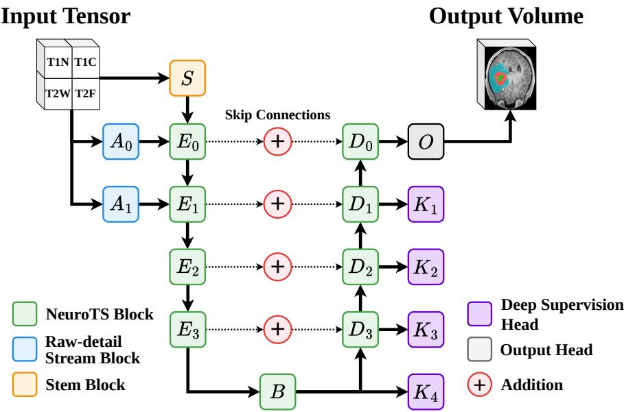
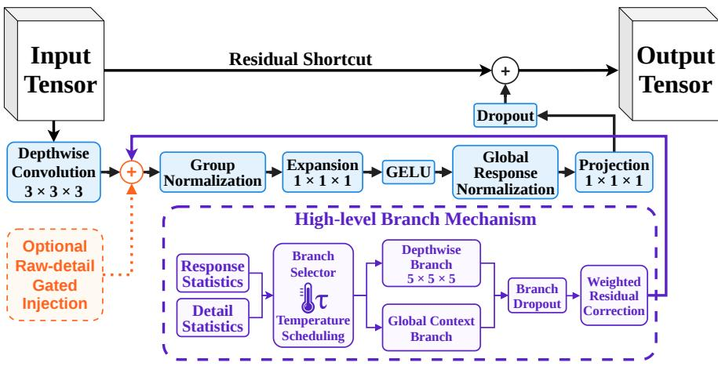
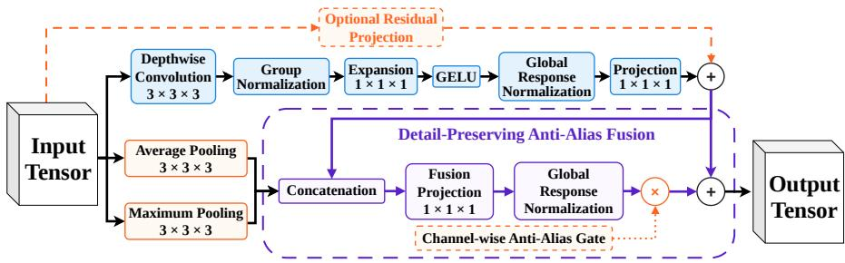
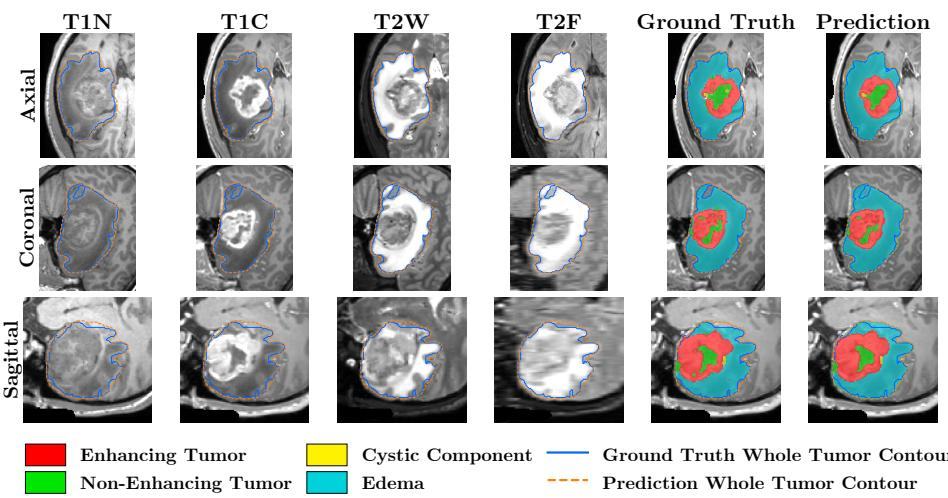
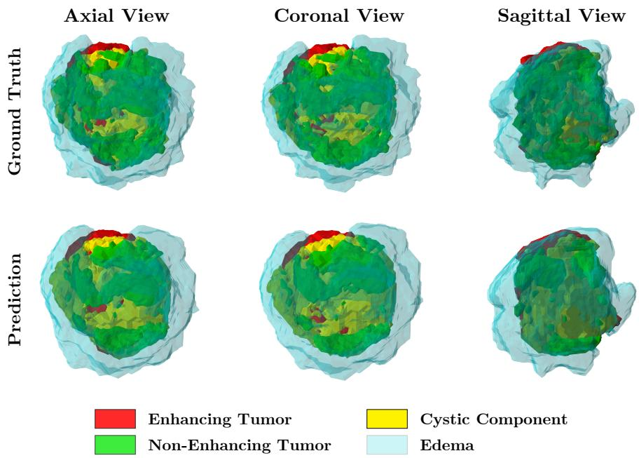

# NeuroTS-Net: Multi-Class Semantic Segmentation of Pediatric Brain Tumors in Multi-Modal MRI

Darius Peteleaza1, Razvan-Gabriel Dumitru2, Bogdan Neamtu1,3,4, Arpad Gellert1, Mariana Sandu5, and Claudiu Matei1,5

1 Lucian Blaga University of Sibiu, Sibiu, Romania

{darius.peteleaza,bogdan.neamtu,arpad.gellert,matei.claudiu}@ulbsibiu.ro

2 University of Arizona, Tucson, AZ, USA rdumitru@arizona.edu

3 Pediatric Clinical Hospital of Sibiu, Sibiu, Romania

Johns Hopkins University, Baltimore, MD, USA

MedLife Polisano Hospital, Sibiu, Romania sandu.mariana@medlife.ro

Abstract. Pediatric brain tumors are a leading cause of cancer-related mortality in children, and their small, rare, and often low-contrast subregions make accurate manual delineation challenging. Reliable automated segmentation is therefore needed to support diagnosis, treatment planning, and response assessment. Accordingly, we introduce NeuroTS-Net, a three-dimensional encoder-decoder convolutional neural network architecture for multi-class semantic segmentation that incorporates a dual-scale raw-detail stream, adaptive low-resolution context selection, and detail-preserving multipath downsampling. These components preserve fine intensity and boundary information while eficiently modeling broader tumor context. NeuroTS-Net was trained on the BraTS 2026 pediatric dataset without external data or pretrained weights and evaluated against nnU-Net and MedNeXt under the same experimental protocol. NeuroTS-Net outperformed the baseline methods, achieving wholetumor and tumor-core Dice scores of 0.938 and 0.937 on the internal validation set and 0.927 and 0.926 on the oficial challenge validation set. The code is open-sourced at: https://github.com/maenstru56/NeuroTS.

Keywords: Brain Tumor Segmentation · Multi-class Semantic Segmentation · Machine Learning · Convolutional Neural Network · Magnetic Resonance Imaging · Pediatric Brain Tumors.

## 1 Introduction

Pediatric brain tumors are among the most common childhood cancers worldwide [37] and remain associated with substantial mortality [27, 6]. Their rarity and heterogeneous presentation make multi-institutional studies and reproducible response assessment essential [15]. Multiparametric magnetic resonance imaging (mpMRI) is central to diagnosis, treatment planning, and longitudinal evaluation, but manual delineation of tumor subregions is time-consuming and subject to inter-rater variability [5]. Automated segmentation is therefore essential for consistent tumor quantification and response assessment.

The Brain Tumor Segmentation (BraTS) challenge has benchmarked automated segmentation methods since 2012, and in 2023 it introduced BraTS-PEDs, the first pediatric track [14, 13]. We use Task 2 of the BraTS 2026 cluster [1], which targets pre-treatment and post-treatment pediatric patients and is scored on a federated platform [12]. Each case provides four co-registered sequences, native T1 (T1N), contrast-enhanced T1 (T1C), T2-weighted (T2W), and T2 fluid-attenuated inversion recovery (T2F), with voxel-wise labels for enhancing tumor (ET), non-enhancing tumor (NET), cystic component (CC), and peritumoral edema (ED), plus composite tumor core (TC) and whole tumor (WT).

Early segmentation relied on intensity thresholding and clustering methods such as k-means and fuzzy c-means [25], but deep learning now dominates the field. Convolutional neural networks (CNNs) such as U-Net [29] popularized skip-connected encoder-decoders; self-configuring nnU-Net [10] is a strong baseline, MedNeXt [31, 30] scales large kernels for volumes, and DUCK-Net [4] uses task-specific features. For long-range context, vision transformers [3] and the Swin transformer [19] were adapted in UNETR [8] and Swin UNETR [7]. Statespace models such as U-Mamba [22], VM-UNet [32], and SegMamba [41] capture context eficiently, and difusion-based methods such as MedSegDif [39, 40] and ambiguity-aware formulations [28] treat segmentation as iterative denoising. Foundation models such as the Segment Anything Model [17] have been adapted for glioma [35], while hybrids mix diferent types of architectural blocks.

Across BraTS-PEDs editions, the strongest solutions favor convolutional and transformer-based backbones. The first pediatric challenge was led by nnU-Net and Swin UNETR ensembles, Auto3DSeg, and self-supervised pre-training [15, 38]. Recent pipelines ensemble nnU-Net and MedNeXt with radiomic-guided subtyping and lesion-aware post-processing [2], refine predictions with radiologically informed cascades [24], and add frequency-domain decomposition [34] to win the 2025 challenge [42]. Much of the gain comes from pre-processing, ensembling, and sub-region-aware post-processing once backbones saturate [11].

In this paper, we introduce NeuroTS-Net, a 3D encoder-decoder CNN for multi-class pediatric brain tumor segmentation that combines a dual-scale rawdetail stream, adaptive low-resolution context selection, and detail-preserving multipath downsampling, achieving competitive results.

## 2 Methods

## 2.1 Model Architecture

NeuroTS-Net is an encoder-decoder CNN for multi-class brain tumor segmentation. Its U-shaped hierarchy is similar to U-Net [29], while MedNeXt inspires its volumetric feature-processing design [31, 30]. Building on these foundations,

  
Fig. 1. Overview of the proposed NeuroTS-Net architecture.

NeuroTS-Net introduces three novel components: a dual-scale raw-detail stream, adaptive context selection at low-resolution stages, and multipath downsampling that preserves both low-frequency structure and salient local responses. Together, these mechanisms improve the representation of small, low-contrast tumor regions and fine boundaries while maintaining computational eficiency.

Let $X \in \{ 1 \times Z \times H \times W$ denote a co-registered MRI volume containing T1N, T1C, T2W, and T2F, and let $Y \in \{ 0 , 1 , 2 , 3 , 4 \} ^ { Z \times H \times W }$ denote the target segmentation, where 0 represents background and labels 1–4 represent ET, NET, CC, and ED. NeuroTS-Net learns a voxel-wise mapping from X to Y .

As shown in Figure 1, the network follows a five-resolution hierarchy. The stem S projects the four modalities to 32 channels, while encoder stages $E _ { 0 } { - } E _ { 3 }$ and bottleneck B use widths of 32, 64, 128, 256, and 512 channels. The decoder $D _ { 3 }  – D _ { 0 }$ mirrors the encoder and fuses each upsampled representation with the corresponding encoder feature through addition. Unlike concatenation, additive fusion preserves the decoder width and avoids additional computational costs.

The raw-detail blocks $A _ { 0 }$ and $A _ { 1 }$ process the input at full and half resolution. Each block combines the original intensities, a high-frequency residual obtained using $3 \times 3 \times 3$ average filtering, and the mean absolute finite-diference response along the spatial axes. These descriptors are projected to eight channels using a $1 \times 1 \times 1$ convolution and a depthwise $3 \times 3 \times 3$ convolution.

The projected detail features are multiplied by a voxel-wise sigmoid gate computed from the current encoder representation, scaled by a learnable gain initialized to $1 0 ^ { - 3 }$ , and added residually. This conditioning is applied both within the early NeuroTS blocks and after the corresponding encoder stages, refining the high-resolution skip features without dominating the initial representation.

  
Fig. 2. Overview of the proposed NeuroTS block.

During training, heads $K _ { 1 } – K _ { 4 }$ map $D _ { 1 } , D _ { 2 } , D _ { 3 } ,$ and B, respectively, to auxiliary five-class logits for deep supervision. The final head O applies a 1×1×1 convolution to $D _ { 0 }$ to produce the full-resolution logits.

NeuroTS Block. The NeuroTS block, shown in Figure 2, is inspired by the design of MedNeXt [31, 30] and the adaptive routing principle of selective kernel networks [18]. It extends these foundations with two novel mechanisms: gated raw-detail conditioning at high-resolution stages and response- and detailconditioned context selection at low-resolution stages. Together, these additions preserve subtle boundary and intensity information while adaptively increasing the receptive field according to the input, feature channel, and spatial location.

At encoder stages 0 and 1, gated raw-detail injection repeatedly supplies intensity, edge, and gradient information to the early blocks and high-resolution skip features. At lower resolutions, the local depthwise response is supplemented by a depthwise $5 \times 5 \times 5$ branch at stage 3 and an additional global-context branch at the bottleneck, implemented using global average pooling, channelwise projection, and spatial broadcasting.

The selector combines responses normalized across channels and branches with a local high-frequency signal, then converts the resulting scores and learned priors into temperature-scaled routing weights. Its gain is initialized to 0.005, branch priors are zero-initialized, and the temperature decreases linearly from 2.0 to 0.5. A branch dropout of 0.05 and early regularization discourage branch collapse. The result is processed by Group Normalization, expansion, Gaussian Error Linear Unit (GELU) [9], Global Response Normalization, and projection before residual addition.

  
Fig. 3. The proposed detail-preserving multipath downsampling mechanism.

Downsampling Mechanism. NeuroTS introduces a detail-preserving multipath downsampling mechanism that augments the learned stride-two transition. This mechanism is used in all encoder transitions. As illustrated in Figure 3, average pooling provides a low-pass representation that reduces aliasing, while maximum pooling preserves salient local responses that may correspond to thin boundaries or small tumor components.

The learned response is concatenated with the average- and maximum-pooled representations, then compressed to the target channel width using a $1 \times 1 \times 1$ projection and refined by Global Response Normalization. The resulting correction is added to the learned path through a channel-wise gate initialized to zero. Thus, each transition initially behaves exactly like the original learned downsampling operation, while training can progressively introduce positive or negative low-pass and detail-preserving corrections for individual output channels.

## 2.2 Dataset Description

We use the dataset released for Task 2 of the BraTS 2026 pediatric brain tumor segmentation challenge [1]. No external data or pretrained models were used. Each case contains T1N, T1C, T2W, and T2F volumes with voxel-wise annotations for ET, NET, CC, and ED, encoded as labels 1–4. The composite TC comprises ET, NET, and CC, while the WT includes all foreground classes [13].

The two training releases contained 294 annotated volumes after deduplication. We created a patient-grouped split of 254 training and 40 internal validation volumes. The validation cohort was selected to represent challenging tissue configurations and contained 22 ET-positive, 16 CC-positive, 14 ED-positive, and 14 dificult ED-negative cases. WT and TC volumes were balanced across four volume quantiles, with additional representation of 7 small ET, 7 small CC, and 6 small ED cases. The oficial validation cohort contained 91 cases without public annotations and was used exclusively for evaluation on the Synapse platform.

## 2.3 Data Preprocessing

Volumes were retained in the challenge-provided geometry and cropped to the foreground bounding box, expanded by 32 voxels and clipped to the image extent.

Intensity normalization was applied separately to each modality (c). Intensities were clipped to the 0.5th–99.5th percentile range and standardized using the mean $\left( \mu _ { c } \right)$ and standard deviation $\left( \sigma _ { c } \right)$ of the remaining nonzero voxels:

$$
I _ { c } ^ { \mathrm { n o r m } } = \frac { c l i p ( I _ { c } , q _ { 0 . 5 , c } , q _ { 9 9 . 5 , c } ) - \mu _ { c } } { \sigma _ { c } } ,\tag{1}
$$

where $q _ { 0 . 5 , c }$ and q $^ { . 5 , c }$ are the modality-specific percentile bounds.

## 2.4 Data Augmentation

Spatial and intensity augmentations were applied online during training to all four modalities and the corresponding segmentation map [36]. Spatial transformations included random rotations of up to $\pm 3 0 ^ { \circ } \ ( p = 0 . 2 )$ , isotropic scaling in [0.8, 1.25] $( p = 0 . 2 )$ , and independent mirroring along each spatial axis $( p = 0 . 5 )$ Intensity augmentation comprised Gaussian noise with variance in [0, 0.1] $( p = 0 . 1 )$ , Gaussian blur with standard deviation in $[ 0 . 5 , 1 . 0 ] ~ ( p = 0 . 1 5 )$ , brightness and contrast adjustment $( p = 0 . 1 5 )$ , and low-resolution simulation $( p = 0 . 1 )$ Gamma transformations used $\gamma \in [ 0 . 7 , 1 . 5 ]$ , with probabilities of 0.3 for the standard variant and 0.1 for intensity inversion followed by gamma correction.

## 2.5 Model Training

NeuroTS-Net was trained from scratch for 1000 epochs using patches of size $1 2 8 \times 1 6 0 \times 1 1 2 .$ , a batch size of 4, and 250 iterations per epoch. Patch types were sampled as random, foreground, ET, NET, CC, ED, and hard negative with probabilities 0.15, 0.20, 0.15, 0.10, 0.20, 0.12, and 0.08, respectively. For class-targeted patches, a positive case, one of its 26-connected components, and a voxel within that component were sampled uniformly. Hard negatives were primarily drawn from ED-absent cases and centered on non-ED tumor tissue.

Training minimized the objective in Eq. 2, which combines weighted crossentropy $( \mathcal { L } _ { \mathrm { C E } } )$ , foreground Dice $( \mathcal { L } _ { \mathrm { D i c e } } )$ , region overlap $( \mathcal { L } _ { \mathrm { R e g i o n } } )$ , and an absentclass false-positive penalty $\left( \mathcal { L } _ { \mathrm { A b s } } \right)$

$$
\mathcal { L } = 0 . 4 0 \mathcal { L } _ { \mathrm { C E } } + 0 . 4 0 \mathcal { L } _ { \mathrm { D i c e } } + 0 . 1 0 \mathcal { L } _ { \mathrm { R e g i o n } } + 0 . 1 0 \mathcal { L } _ { \mathrm { A b s } } .\tag{2}
$$

The CE weights for background, ET, NET, CC, and ED were 0.05, 2.25, 1.00, 3.50, and 2.00, while Dice weights were 1.40, 0.60, 2.20, and 1.40. The region term used Tversky overlap [33] for ET, CC, and ED, with $( \alpha , \beta )$ set to (0.45, 0.55), (0.50, 0.50), and (0.60, 0.40), respectively, and binary Dice for NET, TC, and WT. ${ \mathcal { L } } _ { \mathrm { { A b s } } }$ penalized false-positive predictions by averaging their squared predicted probabilities over ET, CC, and ED classes absent from the ground truth.

Optimization used AdamW [16, 21] with a learning rate of $1 . 2 \times 1 0 ^ { - 3 }$ , weight decay $3 \times 1 0 ^ { - 5 }$ , and a 10-epoch linear warmup followed by cosine decay to $1 0 ^ { - 6 }$ [20]. Gradients were clipped to a norm of 12, and the training was implemented in PyTorch [26], also using automatic mixed precision [23]. The branch-entropy regularizer had weight $1 0 ^ { - 4 }$ and was active during the first 30% of training.

Training was performed on a server with an NVIDIA H100 94GB GPU, an Intel Xeon Gold 6526Y CPU, and 128GB DDR5 RAM.

Table 1. Comparison of quantitative lesion-wise Dice results across the BraTS-PEDs training, internal validation (INT VAL), and oficial validation (PED VAL) sets.
<table><tr><td rowspan="2">Task</td><td rowspan="2">Method</td><td colspan="6">Dice ↑</td></tr><tr><td>WT</td><td>TC</td><td>NET</td><td>ET</td><td>CC</td><td>ED</td></tr><tr><td>TRAIN N = 254</td><td>NeuroTS-Net</td><td>0.942</td><td>0.941</td><td>0.906</td><td>0.845</td><td>0.777</td><td>0.826</td></tr><tr><td rowspan="4">INT VAL N = 40</td><td>nnU-Net (XL)</td><td>0.920</td><td>0.919</td><td>0.889</td><td>0.575</td><td>0.499</td><td>0.521</td></tr><tr><td>nnU-Net ResEnc (XL)</td><td>0.922</td><td>0.918</td><td>0.891</td><td>0.596</td><td>0.538</td><td>0.530</td></tr><tr><td>MedNeXt (L)</td><td>0.925</td><td>0.924</td><td>0.888</td><td>0.598</td><td>0.559</td><td>0.576</td></tr><tr><td>NeuroTS-Net</td><td>0.938</td><td>0.937</td><td>0.901</td><td>0.623</td><td>0.575</td><td>0.590</td></tr><tr><td rowspan="4">PED VAL N = 91</td><td>nnU-Net (XL)</td><td>0.917</td><td>0.918</td><td>0.888</td><td>0.444</td><td>0.128</td><td>0.000</td></tr><tr><td>nnU-Net ResEnc (XL)</td><td>0.918</td><td>0.916</td><td>0.881</td><td>0.463</td><td>0.169</td><td>0.000</td></tr><tr><td>MedNeXt (L)</td><td>0.922</td><td>0.922</td><td>0.894</td><td>0.447</td><td>0.140</td><td>0.000</td></tr><tr><td>NeuroTS-Net</td><td>0.927</td><td>0.926</td><td>0.895</td><td>0.518</td><td>0.231</td><td>0.000</td></tr></table>

## 2.6 Data Post-processing

Connected-component filtering was applied only to ET and CC predictions. ET logits were increased by 0.25, thresholded at 0.30, and restricted to components of at least 20 voxels, with at most four retained. CC used a logit bias of 0.75, a probability threshold of 0.15, the same minimum component size, and at most three retained components. TC and WT were preserved during reassignment.

## 2.7 Evaluation

We report lesion-wise Dice and 95th-percentile Hausdorf distance (HD95) for ET, NET, CC, ED, TC, and WT. Higher Dice and lower HD95 indicate better volumetric overlap and boundary agreement, respectively. Comparisons include nnU-Net [10] and MedNeXt [31, 30], each trained under the same data split and experimental protocol as NeuroTS-Net. Their configurations were determined by the nnU-Net planner, and both were implemented within the nnU-Net framework, whereas NeuroTS-Net used our independent framework. In accordance with the challenge rules, no external data or pretrained models were used.

## 3 Results

## 3.1 Quantitative Results

Table 1 shows that NeuroTS-Net achieved the highest Dice for all six regions on the internal validation set and for five regions on the oficial validation set. The largest gains were observed for ET and CC, while ED remained challenging on the oficial validation set, where all compared methods received a Dice of zero.

Table 2. Comparison of quantitative lesion-wise HD95 results across the BraTS-PEDs training, internal validation (INT VAL), and oficial validation (PED VAL) sets.
<table><tr><td rowspan="2">Task</td><td rowspan="2">Method</td><td colspan="6">HD95 (mm)↓</td></tr><tr><td>WT</td><td>TC</td><td>NET</td><td>ET</td><td>CC</td><td>ED</td></tr><tr><td>TRAIN N = 254</td><td>NeuroTS-Net</td><td>2.045</td><td>1.978</td><td>2.085</td><td>1.868</td><td>3.056</td><td>2.497</td></tr><tr><td rowspan="4">INT VAL N = 40</td><td>nnU-Net (XL)</td><td>9.842</td><td>9.681</td><td>9.896</td><td>6.621</td><td>4.253</td><td>7.612</td></tr><tr><td>nnU-Net ResEnc (XL)</td><td>8.692</td><td>8.703</td><td>8.923</td><td>6.401</td><td>3.431</td><td>6.286</td></tr><tr><td>MedNeXt (L)</td><td>5.011</td><td>3.995</td><td>4.617</td><td>4.274</td><td>3.836</td><td>6.771</td></tr><tr><td>NeuroTS-Net</td><td>4.092</td><td>3.690</td><td>4.289</td><td>4.157</td><td>3.694</td><td>5.887</td></tr><tr><td rowspan="4">PED VAL N = 91</td><td>nnU-Net (XL)</td><td>9.535</td><td>9.029</td><td>9.016</td><td>122.8</td><td>222.6</td><td>373.0</td></tr><tr><td>nnU-Net ResEnc (XL)</td><td>8.464</td><td>8.017</td><td>8.927</td><td>130.9</td><td>271.1</td><td>373.0</td></tr><tr><td>MedNeXt (L)</td><td>5.981</td><td>4.772</td><td>5.472</td><td>129.9</td><td>221.1</td><td>373.0</td></tr><tr><td>NeuroTS-Net</td><td>3.610</td><td>3.609</td><td>4.376</td><td>119.6</td><td>233.4</td><td>373.0</td></tr></table>

  
Fig. 4. Qualitative comparison of a NeuroTS-Net prediction with the ground-truth segmentation in the axial, coronal, and sagittal planes.

Table 2 shows that NeuroTS-Net achieved the lowest HD95 for five regions on both the internal and oficial validation sets, while nnU-Net ResEnc and Med-NeXt achieved the lowest CC HD95 on the internal and oficial sets, respectively.

NeuroTS-Net is the most compact model, with 18.7 million (M) parameters, compared with 31.2M for nnU-Net, 102.4M for nnU-Net ResEnc, and 62.9M for MedNeXt. It also achieved the fastest mean inference time per case of 32.7 seconds, compared with approximately 37.7, 41.3, and 52.7 seconds, respectively.

  
Fig. 5. Three-dimensional visualization of the ground-truth segmentation and NeuroTS-Net prediction from axial, coronal, and sagittal viewpoints.

## 3.2 Qualitative Results

Figure 4 presents a case containing all four tissue classes across the axial, coronal, and sagittal planes. The predicted WT contour closely follows the reference, with only minor deviations at peripheral regions. ET and NET are reproduced consistently, while CC and ED show small local boundary diferences. The complementary MRI information is also evident, with T1C emphasizing enhancing tissue and T2W and T2F highlighting fluid-rich regions and edema.

The 3D comparison in Figure 5 further shows close spatial agreement between the ground truth and prediction across all three viewpoints. NeuroTS-Net preserves the overall tumor geometry, including the central tumor components and surrounding edema, with diferences mainly confined to local class boundaries.

## 3.3 Ablation of NeuroTS-Net Architectural Components

Table 3 shows that all proposed components contribute to performance across the evaluated regions. Removing the raw-detail stream, context selection, or multipath downsampling consistently reduced Dice compared with the complete NeuroTS-Net. The largest reductions were observed for the smaller tumor regions, particularly ET, CC, and ED, while WT and TC were less afected. These results indicate that the proposed components provide complementary benefits, with the full architecture achieving the highest Dice across all six regions.

Table 3. Ablation study of the NeuroTS-Net components on the internal validation (INT VAL) set. Without $\left( \mathrm { w } / \mathrm { o } \right)$ indicates removal of the corresponding component.
<table><tr><td rowspan="2">Task</td><td rowspan="2">Variant</td><td colspan="6">Dice ↑</td></tr><tr><td>WT</td><td>TC</td><td>NET</td><td>ET</td><td>CC</td><td>ED</td></tr><tr><td rowspan="4">INT VAL  $N = 4 0$ </td><td>w/o Raw-Detail Stream 0.926</td><td></td><td>0.925</td><td>0.889</td><td>0.595</td><td>0.548</td><td>0.564</td></tr><tr><td> $\mathrm { w } / \mathrm { o }$  Context Selection 0.924</td><td></td><td>0.922</td><td>0.863</td><td>0.599</td><td>0.551</td><td>0.568</td></tr><tr><td>w/o Downsampling</td><td>0.930</td><td>0.928</td><td>0.888</td><td>0.593</td><td>0.552</td><td>0.569</td></tr><tr><td>NeuroTS-Net</td><td>0.938</td><td>0.937</td><td>0.901</td><td>0.623</td><td>0.575</td><td>0.590</td></tr></table>

## 4 Discussion

We introduced NeuroTS-Net, a 3D pediatric brain tumor segmentation network combining multipath downsampling, adaptively selected low-resolution context, and dual-scale raw-detail conditioning. NeuroTS-Net outperformed the compared methods, achieving WT and TC Dice scores of 0.938 and 0.937 on the internal validation set and 0.927 and 0.926 on the oficial validation set. Across all six regions, the mean Dice was 0.873 on the training set, 0.761 on the internal validation set, and 0.583 on the oficial validation set. The ablation study further showed consistent performance reductions when removing any proposed component, supporting their complementary contribution. Raw-detail conditioning and multipath downsampling particularly benefited ET, CC, and ED, while context selection produced the largest NET reduction when removed.

The main limitation is reduced robustness for rare classes, particularly ED and CC. Their performance decreased on the oficial validation set, which may reflect rare-class overrepresentation in the internal split and cohort diferences in class prevalence or imaging characteristics. The oficial lesion-wise protocol further amplifies ED detection errors: when no predicted and reference ED components are matched, Dice is set to zero, and HD95 receives the maximum penalty. Thus, missed ED or false positives in ED-absent cases can strongly afect the score, with all compared methods receiving the same ED penalty on the oficial validation set. Evaluation on a single internal split and training seed also limits assessment of patient and training variability.

Further work should improve ED and CC refinement, class-presence calibration, and boundary-aware objectives. Evaluation on additional patient-grouped splits and random seeds would further assess robustness and generalization.

Acknowledgments. This work was supported by the Swiss National Science Foundation and UEFISCDI under the Second Swiss Contribution through the Multilateral Academic Projects (MAPS) project “AI-based Brain Metastases Tracking and Segmentation (A-BEACON),” grant no. IZ11Z0\_230215, contract UEFISCDI no. 14ROCH /2025, and project code F-RO-CH-2024-0233, for the 2025–2029 project period.

Disclosure of Interests. The authors declare no competing interests.

## References

1. Bakas, S., Linguraru, M., Kazerooni, A.F., Farahani, K., Astaraki, M., Maleki, N., Menze, B., Baid, U., Yordanov, N., Kofler, F., You, S., Chung, V., Mangul, S., Velichko, Y., Gandhi, D., Jiang, Z., Conte, G.M., Moawad, A., LaBella, D., De Verdier, M.C., Aboian, M., Wiestler, B., Huse, J., Huang, R.: Brats 2026 cluster of challenges (2026). https://doi.org/10.5281/zenodo.19714728

2. Capellán-Martín, D., Parida, A., Jiang, Z., Kulkarni, N., Iyer, K., Tapp, A., Anwar, S.M., Ledesma-Carbayo, M.J., Linguraru, M.G.: Adaptable segmentation pipeline for diverse brain tumors with radiomic-guided subtyping and lesion-wise model ensemble. In: International Conference on Medical Image Computing and Computer-Assisted Intervention. pp. 456–467. Springer (2025). https://doi.org/10.1007/978- 3-032-16365-3\_41

3. Dosovitskiy, A., Beyer, L., Kolesnikov, A., Weissenborn, D., Zhai, X., Unterthiner, T., Dehghani, M., Minderer, M., Heigold, G., Gelly, S., et al.: An image is worth 16x16 words: Transformers for image recognition at scale. arXiv preprint arXiv:2010.11929 (2020). https://doi.org/10.48550/arXiv.2010.11929

4. Dumitru, R.G., Peteleaza, D., Craciun, C.: Using duck-net for polyp image segmentation. Scientific reports 13(1), 9803 (2023). https://doi.org/10.1038/s41598- 023-36940-5

5. Fathi Kazerooni, A., Arif, S., Madhogarhia, R., Khalili, N., Haldar, D., Bagheri, S., Familiar, A.M., Anderson, H., Haldar, S., Tu, W., et al.: Automated tumor segmentation and brain tissue extraction from multiparametric mri of pediatric brain tumors: A multi-institutional study. Neuro-Oncology Advances 5(1), vdad027 (2023). https://doi.org/10.1093/noajnl/vdad027

6. Girardi, F., Di Carlo, V., Stiller, C., Gatta, G., Woods, R.R., Visser, O., Lacour, B., Tucker, T.C., Coleman, M.P., Allemani, C., et al.: Global survival trends for brain tumors, by histology: Analysis of individual records for 67,776 children diagnosed in 61 countries during 2000–2014 (concord-3). Neuro-oncology 25(3), 593–606 (2023). https://doi.org/10.1093/neuonc/noac232

7. Hatamizadeh, A., Nath, V., Tang, Y., Yang, D., Roth, H.R., Xu, D.: Swin unetr: Swin transformers for semantic segmentation of brain tumors in mri images. In: International MICCAI brainlesion workshop. pp. 272–284. Springer (2021). https://doi.org/10.1007/978-3-031-08999-2\_22

8. Hatamizadeh, A., Tang, Y., Nath, V., Yang, D., Myronenko, A., Landman, B., Roth, H.R., Xu, D.: Unetr: Transformers for 3d medical image segmentation. In: Proceedings of the IEEE/CVF winter conference on applications of computer vision. pp. 574–584 (2022)

9. Hendrycks, D., Gimpel, K.: Gaussian error linear units (gelus). arXiv preprint arXiv:1606.08415 (2016). https://doi.org/10.48550/arXiv.1606.08415

10. Isensee, F., Jaeger, P.F., Kohl, S.A., Petersen, J., Maier-Hein, K.H.: nnu-net: a selfconfiguring method for deep learning-based biomedical image segmentation. Nature methods 18(2), 203–211 (2021). https://doi.org/10.1038/s41592-020-01008-z

11. Isensee, F., Wald, T., Ulrich, C., Baumgartner, M., Roy, S., Maier-Hein, K., Jaeger, P.F.: nnu-net revisited: A call for rigorous validation in 3d medical image segmentation. In: International Conference on Medical Image Computing and Computer-Assisted Intervention. pp. 488–498. Springer (2024). https://doi.org/10.1007/978- 3-031-72114-4\_47

12. Karargyris, A., Umeton, R., Sheller, M.J., Aristizabal, A., George, J., Wuest, A., Pati, S., Kassem, H., Zenk, M., Baid, U., et al.: Federated benchmarking of medi-

cal artificial intelligence with medperf. Nature machine intelligence 5(7), 799–810 (2023). https://doi.org/10.1038/s42256-023-00652-2

13. Kazerooni, A.F., Khalili, N., Liu, X., Gandhi, D., Jiang, Z., Anwar, S.M., Albrecht, J., Adewole, M., Anazodo, U., Anderson, H., et al.: The brain tumor segmentation in pediatrics (brats-peds) challenge: focus on pediatrics (cbtnconnect-dipgr-asnr-miccai brats-peds). arXiv preprint arXiv:2404.15009 (2024). https://doi.org/10.48550/arXiv.2404.15009

14. Kazerooni, A.F., Khalili, N., Liu, X., Haldar, D., Jiang, Z., Anwar, S.M., Albrecht, J., Adewole, M., Anazodo, U., Anderson, H., et al.: The brain tumor segmentation (brats) challenge 2023: focus on pediatrics (cbtn-connect-dipgr-asnr-miccai bratspeds). ArXiv pp. arXiv–2305 (2024). https://doi.org/10.48550/arXiv.2305.17033

15. Kazerooni, A.F., Khalili, N., Liu, X., Haldar, D., Jiang, Z., Zapaishchykova, A., Pavaine, J., Shah, L.M., Jones, B.V., Sheth, N., et al.: Bratspeds: results of the multi-consortium international pediatric brain tumor segmentation challenge 2023. arXiv preprint arXiv:2407.08855 (2024). https://doi.org/10.48550/arXiv.2407.08855

16. Kingma, D.P., Ba, J.: Adam: A method for stochastic optimization. arXiv preprint arXiv:1412.6980 (2014). https://doi.org/10.48550/arXiv.1412.6980

17. Kirillov, A., Mintun, E., Ravi, N., Mao, H., Rolland, C., Gustafson, L., Xiao, T., Whitehead, S., Berg, A.C., Lo, W.Y., et al.: Segment anything. In: Proceedings of the IEEE/CVF international conference on computer vision. pp. 4015–4026 (2023). https://doi.org/10.48550/arXiv.2304.02643

18. Li, X., Wang, W., Hu, X., Yang, J.: Selective kernel networks. In: Proceedings of the IEEE/CVF conference on computer vision and pattern recognition. pp. 510–519 (2019)

19. Liu, Z., Lin, Y., Cao, Y., Hu, H., Wei, Y., Zhang, Z., Lin, S., Guo, B.: Swin transformer: Hierarchical vision transformer using shifted windows. In: Proceedings of the IEEE/CVF international conference on computer vision. pp. 10012–10022 (2021)

20. Loshchilov, I., Hutter, F.: Sgdr: Stochastic gradient descent with warm restarts. arXiv preprint arXiv:1608.03983 (2016). https://doi.org/10.48550/arXiv.1608.03983

21. Loshchilov, I., Hutter, F.: Decoupled weight decay regularization. arXiv preprint arXiv:1711.05101 (2017). https://doi.org/10.48550/arXiv.1711.05101

22. Ma, J., Li, F., Wang, B.: U-mamba: Enhancing long-range dependency for biomedical image segmentation. arXiv preprint arXiv:2401.04722 (2024). https://doi.org/10.48550/arXiv.2401.04722

23. Micikevicius, P., Narang, S., Alben, J., Diamos, G., Elsen, E., Garcia, D., Ginsburg, B., Houston, M., Kuchaiev, O., Venkatesh, G., et al.: Mixed precision training. arXiv preprint arXiv:1710.03740 (2017). https://doi.org/10.48550/arXiv.1710.03740

24. Mulvany, T., Rose, H., Novak, J., Grifiths-King, D.: Using a radiologically informed, deep learning cascade to refine segmentations of pediatric brain tumors from mri. In: International Conference on Medical Image Computing and Computer-Assisted Intervention. pp. 410–421. Springer (2025). https://doi.org/10.1007/978-3-032-16365-3\_37

25. Negrea, M.O., Neamtu, B., Roman, D.C., Peteleaza, D., Sofariu, C., Costea, R.M., Brusnic, O.: Mri abdominal fat segmentation with a novel vat/sat delineation algorithm: Otsu regression calibration and comparison to kmeans and fuzzy c-means. Frontiers in Bioinformatics 6, 1752522 (2026). https://doi.org/10.3389/fbinf.2026.1752522

26. Paszke, A., Gross, S., Massa, F., Lerer, A., Bradbury, J., Chanan, G., Killeen, T., Lin, Z., Gimelshein, N., Antiga, L., et al.: Pytorch: An imperative style, highperformance deep learning library. Advances in neural information processing systems 32 (2019)

27. Price, M., Ballard, C., Benedetti, J., Nef, C., Ciofi, G., Waite, K.A., Kruchko, C., Barnholtz-Sloan, J.S., Ostrom, Q.T.: Cbtrus statistical report: primary brain and other central nervous system tumors diagnosed in the united states in 2017–2021. Neuro-oncology 26(Suppl 6), vi1 (2024). https://doi.org/10.1093/neuonc/noae145

28. Rahman, A., Valanarasu, J.M.J., Hacihaliloglu, I., Patel, V.M.: Ambiguous medical image segmentation using difusion models. In: Proceedings of the IEEE/CVF conference on computer vision and pattern recognition. pp. 11536–11546 (2023)

29. Ronneberger, O., Fischer, P., Brox, T.: U-net: Convolutional networks for biomedical image segmentation. In: International Conference on Medical image computing and computer-assisted intervention. pp. 234–241. Springer (2015). https://doi.org/10.1007/978-3-319-24574-4\_28

30. Roy, S., Kirchhof, Y., Ulrich, C., Rokuss, M., Wald, T., Isensee, F., Maier-Hein, K.: Mednext-v2: Scaling 3d convnexts for large-scale supervised representation learning in medical image segmentation. arXiv preprint arXiv:2512.17774 (2025). https://doi.org/10.48550/arXiv.2512.17774

31. Roy, S., Koehler, G., Ulrich, C., Baumgartner, M., Petersen, J., Isensee, F., Jaeger, P.F., Maier-Hein, K.H.: Mednext: transformer-driven scaling of convnets for medical image segmentation. In: International conference on medical image computing and computer-assisted intervention. pp. 405–415. Springer (2023). https://doi.org/10.1007/978-3-031-43901-8\_39

32. Ruan, J., Li, J., Xiang, S.: Vm-unet: Vision mamba unet for medical image segmentation. ACM Transactions on Multimedia Computing, Communications and Applications (2024). https://doi.org/10.1145/3767748

33. Salehi, S.S.M., Erdogmus, D., Gholipour, A.: Tversky loss function for image segmentation using 3d fully convolutional deep networks. In: International workshop on machine learning in medical imaging. pp. 379–387. Springer (2017). https://doi.org/10.1007/978-3-319-67389-9\_44

34. Shao, M., Wang, Z., Duan, H., Huang, Y., Zhai, B., Wang, S., Long, Y., Zheng, Y.: Rethinking brain tumor segmentation from the frequency domain perspective. IEEE Transactions on Medical Imaging (2025). https://doi.org/10.1109/TMI.2025.3579213

35. Shi, X., Jain, R.K., Li, Y., Chai, S., Cheng, J., Bai, J., Zhao, G., Lin, L., Chen, Y.W.: Multi-modal medical sam: an adaptation method of segment anything model (sam) for glioma segmentation using multi-modal mr images. ACM Transactions on Computing for Healthcare 6(2), 1–21 (2025). https://doi.org/10.1145/3712297

36. Shorten, C., Khoshgoftaar, T.M.: A survey on image data augmentation for deep learning. Journal of big data 6(1), 1–48 (2019). https://doi.org/10.1186/s40537- 019-0197-0

37. Steliarova-Foucher, E., Colombet, M., Ries, L.A., Moreno, F., Dolya, A., Bray, F., Hesseling, P., Shin, H.Y., Stiller, C.A., Bouzbid, S., et al.: International incidence of childhood cancer, 2001–10: a population-based registry study. The lancet oncology 18(6), 719–731 (2017). https://doi.org/10.1016/S1470-2045(17)30186-9

38. Tang, Y., Yang, D., Li, W., Roth, H.R., Landman, B., Xu, D., Nath, V., Hatamizadeh, A.: Self-supervised pre-training of swin transformers for 3d medical image analysis. In: Proceedings of the IEEE/CVF conference on computer vision and pattern recognition. pp. 20730–20740 (2022)

39. Wu, J., Fu, R., Fang, H., Zhang, Y., Yang, Y., Xiong, H., Liu, H., Xu, Y.: Medsegdif: Medical image segmentation with difusion probabilistic model. In: Medical imaging with deep learning. pp. 1623–1639. PMLR (2024)

40. Wu, J., Ji, W., Fu, H., Xu, M., Jin, Y., Xu, Y.: Medsegdif-v2: Difusionbased medical image segmentation with transformer. In: Proceedings of the AAAI conference on artificial intelligence. vol. 38, pp. 6030–6038 (2024). https://doi.org/10.1609/aaai.v38i6.28418

41. Xing, Z., Ye, T., Yang, Y., Cai, D., Gai, B., Wu, X.J., Gao, F., Zhu, L.: Segmamba-v2: Long-range sequential modeling mamba for general 3d medical image segmentation. IEEE Transactions on Medical Imaging (2025). https://doi.org/10.1109/TMI.2025.3589797

42. Yi, Y., Zhuang, Q., Xu, Z.Q.J., Wang, X., Ren, Y., Qiu, T.: Frequency-aware ensemble learning for brats 2025 pediatric brain tumor segmentation. In: International Conference on Medical Image Computing and Computer-Assisted Intervention. pp. 445–455. Springer (2025). https://doi.org/10.1007/978-3-032-16365-3\_40