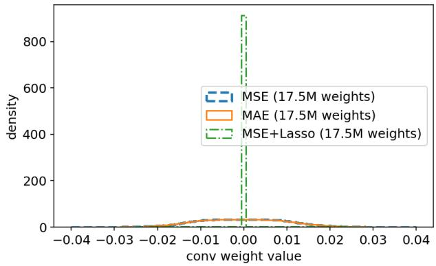
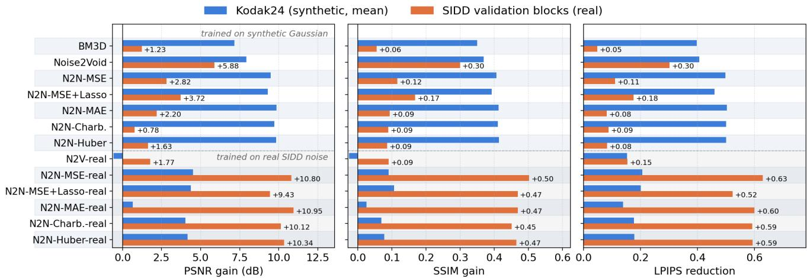
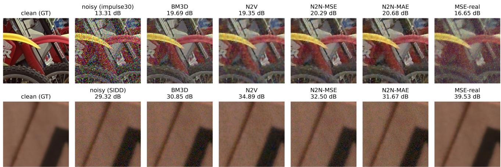

# Noise2Noise Revisited: Training Pair Distributions Dominate Loss Choice in Self-Supervised Denoising

Dingyan Shang\*   
Independent Researcher Frisco, USA   
dingyanshang@gmail.com \*Corresponding author

Bonan Shen Independent Researcher Long Island City, USA shenbonan2@gmail.com

Zhenyu Xu   
Independent Researcher   
Fulshear, USA   
zhenyuxu0918@gmail.com   
Youting Wang   
Independent Researcher   
Mountain View, USA   
wang.yout@northeastern.edu   
Bowen Liu   
Independent Researcher   
South San Francisco, USA   
bliu0962@usc.edu

Abstract—Noise2Noise (N2N) trains denoisers on pairs of independently corrupted observations, eliminating clean references. We stress-test two natural conjectures about why the L1 loss outperforms L2 here. First, the hypothesis that the L1 loss confers robustness via parameter sparsity confuses the loss with Lasso regularization: an explicit Lasso penalty produces the predicted sparsity yet fails to reproduce L1’s cross-noise behavior, while L1- and L2-trained weight distributions are indistinguishable. Second, the population optima of the two losses coincide exactly for symmetric signal posteriors and nearly so for concentrated ones. Measured differences are therefore dominated by optimization dynamics (bounded-influence gradients), which we probe with gradient statistics and contaminated-target training. On Kodak24 with five synthetic noise families, the L1 loss holds a statistically significant edge over L2, below 1 dB PSNR, holding across three seeds on 13 of the 14 noise columns. On real camera noise the loss is not the decisive variable in distribution: on official SIDD validation blocks, synthetic-Gaussian-trained N2N models gain only 0.8 to 3.7 dB over the noisy input regardless of loss, while retraining on SIDD’s own noisy pairs, never reading ground truth, gains 9.4 to 11.0 dB, far ahead of BM3D. All metrics are on raw network outputs, and the study makes no leaderboard claim. The training pair distribution, not the loss, carries the inductive bias. That design rule applies wherever clean references are unobtainable, from microscopy to industrial inspection sensors.

Index Terms—image denoising, self-supervised learning, Noise2Noise, robust statistics, real-noise benchmarks, industrial inspection, nondestructive evaluation

## I. INTRODUCTION

Supervised deep denoisers [1], [2] require registered clean/noisy pairs, costly or impossible in microscopy, in lowlight photography, and in industrial nondestructive testing, where each unit under inspection is unique and a noise-free reference of it is physically unobtainable [3]. Noise2Noise (N2N) [4] showed that two independent noisy observations of the same signal suffice: under zero-mean noise, the network trained to map one observation to the other converges in expectation to the clean-target minimizer.

Two practical questions remain. (i) How much of N2N’s observed cross-noise robustness is attributable to the loss function? (ii) The empirical edge of the L1 loss over L2 in restoration networks is documented [5] and attributed there to optimization behavior; is that attribution right, or does the credit belong to parameter sparsity? We answer both with a controlled protocol and make three contributions:

1) A corrected theoretical framing. We distinguish the L1 loss (a residual penalty; maximum likelihood under a Laplace residual model) from L1 regularization (a weight penalty; Lasso [6]), and we delimit what the loss can change: under zero-mean training noise the MSE optimum is exactly the posterior mean, and the MAE optimum coincides with it when the signal posterior is symmetric, and approximately when it is concentrated. The measurable loss-function effect reduces to finite-sample optimization dynamics (MAE’s boundedinfluence gradients [5], [7]), supported by gradient statistics and contaminated-target training.

2) A control experiment dissociating the L1 loss from L1 regularization. We train the same U-Net with MSE, MAE, and MSE+Lasso under identical schedules. Only the explicit Lasso penalty produces weight sparsity, and it does not inherit the MAE cross-noise profile, ruling out sparsity as the carrier of L1’s edge.

3) A loss-controlled quantification and closure of the real-noise domain gap. On the official SIDD validation blocks [8], synthetic-Gaussian-trained N2N recovers only +0.8 to +3.7 dB over the noisy input regardless of loss. Retraining the same five losses on SIDD-Medium noisy/noisy pairs (scene-disjoint 128/32 split, ground truth never read during training) lifts every variant to +9.4 to +11.0 dB, well ahead of BM3D [9]. The gap itself is established knowledge [10], [11]; new here is its same-architecture, same-budget measurement across five losses within the N2N paradigm, its closure with noisy pairs only, and a content-matched control that splits the gap into ${ \approx } 5$ dB of scene statistics and ≈3 dB of noise distribution. This ≈8 dB regime gap dwarfs every in-distribution loss effect we measure (≤0.8 dB between MAE and MSE on synthetic noise, ≤2.3 dB across the five real-pair losses); only out of distribution do loss effects grow large, governing robustness rather than accuracy (Section V-D).

All evaluations report PSNR, SSIM, and LPIPS [12] on the raw network output; a post-hoc image-enhancement stage present in an earlier draft was removed as an evaluation confound (Section VI-B).

## II. RELATED WORK

Denoising without clean targets. N2N [4] trains on independently corrupted pairs. Blind-spot methods remove even the second observation: Noise2Void [13] and Noise2Self [14] predict masked pixels under a pixel-independence assumption; Laine et al. [15] add noise-model-aware posterior inference to the blind-spot architecture; Noise2Same [16] relaxes strict J-invariance; Noise2Sim [17] mines self-similar patches; Neighbor2Neighbor [18], Recorrupted-to-Recorrupted [19], and Noisier2Noise [20] synthesize N2N-style pairs from single noisy images; Self2Self [21] trains on one image alone with dropout ensembling; Blind2Unblind [22] revisits blind-spot information loss.

Real-noise self-supervision. On real sRGB camera noise, spatial correlation breaks the pixel-independence assumption of blind-spot training. That Gaussian-trained denoisers transfer poorly to real photographs is itself established: CBDNet [10] motivates realistic noise modeling with this failure, and Brooks et al. [11] trace it to the sRGB processing pipeline. AP-BSN [23] and CVF-SID [24] are current self-supervised references on SIDD (35.97 and 34.81 dB on the validation split; supervised state of the art is 39–40 dB). More recent systems attack precisely the mismatch we quantify, aligning the effective training distribution with the test noise: Positive2Negative [25] replaces information-lossy masking and downsampling with renoising-consistency training, next-scale prediction [26] builds cross-scale targets that decorrelate real noise without destroying detail (37.1 dB), and Learning-to-Recorrupt [27] learns the recorruption map when the noise distribution is unknown. Our real-pair N2N results (33–35 dB, Section V-D) sit just below this self-supervised band, which is consistent with our deliberately compact backbone and budget. We do not compete with these systems; the real-noise setting is a controlled probe of whether the loss function or the training pair distribution carries the inductive bias. Our N2N-on-realpairs configuration is simply [4] applied to SIDD’s two noisy shots per scene; its value is diagnostic. N2N trained on SIDD-Medium pairs already appears as a baseline row in the rawdomain tables of [18]; we run the configuration in sRGB, losscontrolled.

Classical baselines. BM3D [9] remains the reference nonlearning denoiser and is still being refined, e.g. by varying the transform in its collaborative-filtering stage [28]; we therefore treat its configuration as an experimental variable rather than a constant (Section VI-B).

Loss functions for restoration. Zhao et al. [5] compare L2, L1, and SSIM-based losses for restoration networks and attribute L1’s edge over L2 to optimization behavior rather than statistical modeling, consistent with the framing we derive in Section III. Charbonnier [29] and Huber losses interpolate between the two regimes.

## III. THEORY: WHAT THE LOSS CAN AND CANNOT DO

## A. Likelihood View and Its Limit

For a residual model $r = x - f _ { \theta } ( x ^ { \prime } )$ , minimizing $\textstyle \sum _ { i } \rho ( r _ { i } )$ is maximum likelihood under $p ( r ) \propto e ^ { - \rho ( r ) }$ : MSE corresponds to a Gaussian residual (optimal predictor: conditional mean), MAE to a Laplace one (conditional median).

In the N2N setting the training target is $x _ { 2 } = s + n _ { 2 }$ with $n _ { 2 }$ symmetric zero-mean noise independent of $x _ { 1 }$ and of the signal $s \mathrm { : }$ true by construction in our synthetic arm, violated by signal-dependent real noise (Section V-D). The MSE optimum is then exactly the posterior mean, $\mathbb { E } [ x _ { 2 } \mid x _ { 1 } ] = \mathbb { E } [ s \mid x _ { 1 } ] ,$ , with no further assumptions. The MAE optimum is the median of $p ( x _ { 2 } \mid x _ { 1 } )$ , i.e., the signal posterior $p ( s \mid x _ { 1 } )$ convolved with the noise density, and convolving a skewed posterior with a symmetric density does not symmetrize it. Hence, pointwise in the predicted value z given $x _ { 1 }$

$$
\arg \operatorname* { m i n } _ { z } \mathbb { E } \big [ ( z - x _ { 2 } ) ^ { 2 } \big | x _ { 1 } \big ] \ = \ \arg \operatorname* { m i n } _ { z } \mathbb { E } [ | z - x _ { 2 } | | x _ { 1 } ]\tag{1}
$$

holds exactly when $p ( s \mid x _ { 1 } )$ is symmetric about its mean, and approximately whenever the posterior is concentrated relative to the noise, whose symmetric density then dominates the convolution.1 Neither condition is guaranteed for natural images, so the population-level gap between the two losses is the mean–median distance of $p ( x _ { 2 } \mid x _ { 1 } )$ : bounded above by one standard deviation of that distribution, typically far smaller, but not zero. Systematic differences between trained networks therefore combine this small statistical component with the finite-sample optimization path: the MAE gradient is sign(r), so each residual’s influence on the update is bounded [7], while the MSE gradient grows linearly in r, so rare large residuals dominate updates. The sub-dB gaps we measure (Section V-B) are consistent with near-coincident optima. We treat cross-noise evaluation as an empirical question.

## B. The L1-Loss-versus-L1-Regularization Confusion

Lasso regularization augments a base loss $J _ { 0 }$ with a weight penalty, $\begin{array} { r } { J = J _ { 0 } + \alpha \sum _ { i } | w _ { i } | . } \end{array}$ , whose fixed points exhibit sparse w [6]. The loss $J _ { 0 } = \| x _ { 2 } - f _ { \theta } ( x _ { 1 } ) \| _ { 1 }$ penalizes pixel-domain residuals; its gradient flows to activations, not weights, and no mechanism connects it to weight sparsity. Section V-C tests the dissociation directly.

## C. Hypotheses

(H1) MAE-class losses (MAE, Charbonnier, Huber) generalize no worse than MSE to additive heavy-tailed test noise, with any advantage concentrated in perceptual metrics. (H2) Weight sparsity is neither necessary nor sufficient for the MAE-class cross-noise profile. (H3) When the test noise violates the additive zero-mean training assumption structurally (multiplicative speckle at high variance; real signal-dependent sRGB camera noise), N2N fails irrespective ofloss, and matching the training pair distribution to the test noise restores the guarantee.

## IV. METHOD

## A. Architecture

A U-Net [30] (depth 4, base width 48, BN, ReLU) with a global residual connection: the network predicts a correction added to its input, DnCNN-style [1]; held fixed across all loss variants.

## B. Training Distributions

Synthetic arm. 400 color images from the BSDS500 train+test splits (the standard CBSD400 set) [31] (disjoint from all evaluation sets). Each sample is a random 128×128 crop; $x _ { 1 } , x _ { 2 }$ receive independent additive Gaussian noise with $\sigma _ { 1 } , \sigma _ { 2 } \sim \mathcal { U } ( 5 , 5 0 )$ (8-bit scale). The training family is deliberately narrow so that cross-noise behavior is attributable to the loss. Real arm. SIDD-Medium sRGB: 160 scenes, two camera shots each. Scenes are split 128/32 by sorted scene-instance name (deterministic, seed-free). Training draws a common random crop from the two full-resolution noisy shots of a training scene; ground truth is never read. We verified N2N’s cross-shot independence premise: over all 160 scenes the Pearson correlation between the two shots’ residuals (noisy − GT, analysis only) has median 0.026 (mean 0.058; 11 scenes above 0.2); any shared component is retained by N2N. In contrast, the within-shot residual is strongly spatially correlated (lag-1 autocorrelation ≈0.46 in both directions): the pixel-independence violation that handicaps blind-spot methods on real sRGB noise. All training and evaluation is at native resolution: bicubic downsampling (used in an earlier draft) partially averages out the very noise the network must learn (Section VI-B).

## C. Losses

MSE; MAE; Charbonnier $( \varepsilon { = } 1 0 ^ { - 3 } )$ [29]; Huber (Smooth-L1, δ=0.05 at the residual scale; the conventional δ=1 exceeds every residual on [0, 1] data); and MSE+Lasso $( \alpha { = } 1 0 ^ { - 5 }$ on conv weights) as the sparsity control. Budgets are matched everywhere: 50 epochs × 5000 crops, batch 16, Adam $1 0 ^ { - 4 }$ cosine decay, identical for synthetic and real arms (≈15.6k steps), removing training-budget confounds.

## D. Evaluation Protocol

Synthetic: Kodak24 at full resolution; noise grid: Gaussian $\sigma ~ \in ~ \{ 1 5 , 2 5 , 5 0 \}$ ; random-impulse (each corrupted pixel– channel replaced by a $\mathcal { U } ( 0 , 1 )$ draw) $p ~ \in ~ \{ 0 . 1 , 0 . 3 , 0 . 6 \}$ ; salt-and-pepper (0/1 extremes, equiprobable) $p \in \{ 0 . 0 5 , 0 . 1 \}$ ;

Poisson $( y = \operatorname { P o i s } ( \lambda x ) / \lambda ,$ , λ the expected count at unit intensity) $\lambda \in \{ 3 0 , 6 0 \}$ ; speckle $v \in \{ 0 . 0 5 , 0 . 1 , 0 . 2 , 0 . 5 \}$ (the two upper levels probe the H3 collapse regime). The five families span the noise regimes of deployed imaging sensors: Gaussian read noise; impulse and salt-and-pepper defective-pixel artifacts characteristic of microbolometer (thermal) arrays; Poisson counting noise of photon-limited radiographic and shortwave-infrared capture; and multiplicative speckle of coherent and ultrasonic imaging, a target of dedicated despeckling models [32]. Real: (i) the official SIDD validation blocks (40 images × 32 blocks of $2 5 6 ^ { 2 } )$ , directly comparable to the literature; (ii) the held-out 32 scenes of our split at native resolution (tiled inference), scene-disjoint from training by construction. Metrics: PSNR, SSIM, LPIPS (AlexNet, lpips 0.1.4) on raw outputs (LPIPS is unbounded above; heavily corrupted inputs can exceed 1). Paired Wilcoxon signed-rank tests over per-image scores, Holm-corrected across all cells, accompany the key MSE-vs-MAE comparisons. The unit of analysis is one denoised image: the 32 blocks of each official validation image are averaged into a single per-image score before testing (n=40), and on the held-out scenes each of the two shots per scene is denoised and scored separately $\scriptstyle ( n = 6 4 ) ;$ significance statements are conditional on the single trained model per cell, with seed replication (Section V-B) as the partial guard. Baselines: color BM3D (CBM3D, bm3d 4.0.3 with bm3d\_rgb; given the true σ on Gaussian columns, a wavelet-domain MAD estimate otherwise) and Noise2Void, a compact reimplementation (stratified masking, 1.5% of pixels, 11×11 replacement window) meant as a fair external reference rather than a tuned system, trained twice under the same budget: on the synthetic images, and directly on the real SIDD noisy shots (single-image blind-spot, ground truth never read), so each training regime has a blind-spot reference.

## V. EXPERIMENTS

## A. Cross-Noise Generalization

Table I reports the full grid; Table II gives SSIM/LPIPS on representative columns. Four observations. (i) In-distribution Gaussian: CBM3D, given the true σ, leads every compactbudget N2N variant: 31.47 vs. 30.1–30.7 dB at σ=25, by 1.0– 1.9 dB at σ=15, and by 0.4–1.4 dB at σ=50. Beating a tuned classical baseline in distribution was never the aim of this budget; the interest is off-distribution. (ii) Heavy-tailed noise: the N2N variants lead BM3D by 7–9.5 dB on 10% impulse and both salt-and-pepper columns, where the Gaussian noise model and the white-noise σ-estimate break down; at 30% impulse the margin narrows to 0.5–1.3 dB, and at 60% every method collapses below 17 dB (best learned 16.87 vs. BM3D 16.80). (iii) Poisson: the five losses agree to within 0.7 dB, as the Anscombe view predicts (mild Poisson is a rescaled Gaussian); the residual tails carry no signal to exploit, and CBM3D sits inside the same band. (iv) Speckle: contrary to our initial H3 expectation of a collapse, additive-Gaussian-trained N2N still gains +10.0 to +10.5 dB over the noisy input at $v { = } 0 . 5 ,$ . The parameterization explains why. Our speckle $y = x + x \cdot n , n \sim$ $\mathcal { N } ( 0 , v )$ , is conditionally additive zero-mean Gaussian with signal-proportional standard deviation $x { \sqrt { v } } ,$ which lies inside the trained family with spatially modulated variance, so the assumption degrades gracefully rather than failing structurally. The graceful mode is practically relevant, as multiplicative speckle is the dominant noise family of coherent modalities, ultrasonic and acoustic imaging among them.

TABLE I  
CROSS-NOISE GENERALIZATION, PSNR (DB, HIGHER IS BETTER). BOLD MARKS THE BEST METHOD PER COLUMN (NOISY INPUT EXCLUDED). TOP BLOCK: NON-LEARNING (BM3D) AND SELF-SUPERVISED (NOISE2VOID) BASELINES. MIDDLE BLOCK: NOISE2NOISE TRAINED ON SYNTHETIC GAUSSIAN NOISE WITH FIVE LOSSES. BOTTOM BLOCK: MODELS TRAINED ON SIDD-MEDIUM REAL NOISE WITHOUT GROUND TRUTH—NOISE2VOID ON SINGLE NOISY SHOTS, THE FIVE NOISE2NOISE LOSSES ON NOISY/NOISY PAIRS. COLUMN PARAMETERS DIFFER BY FAMILY AND ARE NOT A COMMON PERCENTAGE. σ: GAUSSIAN S.D. IN 8-BIT LEVELS (25 IS 25/255). IMP, SP: PERCENT OF PIXEL VALUES CORRUPTED, DRAWN PER CHANNEL (UNIFORM DRAWS; 0 OR 1 AT 50/50). POI: POISSON RATE λ, y=Pois(λx)/λ, SO LARGER IS less NOISE. SPK: SPECKLE VARIANCE ×100 IN y=x+xn, n ∼ N(0, v) (50 IS v=0.5). SIDD: 32 HELD-OUT SCENES AT NATIVE RESOLUTION; SIDD VAL: OFFICIAL VALIDATION BLOCKS.
<table><tr><td>Method</td><td>σ=15</td><td>σ=25</td><td>σ=50</td><td>imp 10</td><td>imp 30</td><td>imp 60</td><td>sp5</td><td>sp 10</td><td>poi 30</td><td>poi 60</td><td>spk5</td><td>spk 10</td><td>spk 20</td><td>spk 50</td><td>SIDD</td><td>SIDD val</td></tr><tr><td>noisy input</td><td>24.76</td><td>20.44</td><td>14.87</td><td>18.57</td><td>13.81</td><td>10.80</td><td>18.14</td><td>15.13</td><td>18.99</td><td>21.92</td><td>20.27</td><td>17.40</td><td>14.71</td><td>11.81</td><td>27.37</td><td>23.66</td></tr><tr><td>BM3D</td><td>34.25</td><td>31.47</td><td>27.34</td><td>20.23</td><td>20.97</td><td>16.80</td><td>18.56</td><td>17.61</td><td>29.43</td><td>31.36</td><td>26.60</td><td>24.30</td><td>22.32</td><td>20.73</td><td>28.48</td><td>24.89</td></tr><tr><td>Noise2Void</td><td>29.15</td><td>27.94</td><td>25.23</td><td>26.19</td><td>20.98</td><td>16.36</td><td>26.96</td><td>24.87</td><td>27.26</td><td>28.33</td><td>27.48</td><td>26.06</td><td>24.29</td><td>21.59</td><td>32.64</td><td>29.55</td></tr><tr><td>N2N-MSE</td><td>32.44</td><td>30.27</td><td>26.64</td><td>27.59</td><td>21.89</td><td>16.71</td><td>27.73</td><td>26.05</td><td>29.36</td><td>31.01</td><td>29.81</td><td>27.70</td><td>25.22</td><td>21.79</td><td>30.23</td><td>26.48</td></tr><tr><td>+ Lasso</td><td>32.48</td><td>30.10</td><td>25.99</td><td>27.60</td><td>21.51</td><td>16.51</td><td>28.09</td><td>25.62</td><td>29.02</td><td>30.89</td><td>29.55</td><td>27.39</td><td>25.02</td><td>22.02</td><td>30.98</td><td>27.38</td></tr><tr><td>N2N-MAE</td><td>33.22</td><td>30.68</td><td>26.97</td><td>28.02</td><td>22.30</td><td>16.85</td><td>27.82</td><td>26.31</td><td>29.71</td><td>31.52</td><td>30.36</td><td>28.08</td><td>25.53</td><td>22.05</td><td>29.65</td><td>25.86</td></tr><tr><td>N2N-Charb.</td><td>32.39</td><td>30.65</td><td>26.95</td><td>28.01</td><td>22.22</td><td>16.78</td><td>27.79</td><td>26.24</td><td>29.69</td><td>31.24</td><td>29.66</td><td>28.10</td><td>25.54</td><td>22.19</td><td>28.20</td><td>24.45</td></tr><tr><td>N2N-Huber</td><td>32.86</td><td>30.60</td><td>26.90</td><td>28.03</td><td>22.30</td><td>16.87</td><td>27.96</td><td>26.34</td><td>29.62</td><td>31.43</td><td>30.24</td><td>28.08</td><td>25.64</td><td>22.33</td><td>27.81</td><td>25.29</td></tr><tr><td>Noise2Void (real)</td><td>23.52</td><td>20.52</td><td>15.46</td><td>18.74</td><td>12.44</td><td>7.49</td><td>18.33</td><td>14.31</td><td>19.07</td><td>21.55</td><td>20.28</td><td>18.13</td><td>14.64</td><td>9.03</td><td>28.56</td><td>25.44</td></tr><tr><td>N2N-MSE (real)</td><td>26.65</td><td>24.77</td><td>21.03</td><td>22.66</td><td>18.18</td><td>14.43</td><td>22.67</td><td>20.45</td><td>23.80</td><td>25.33</td><td>24.34</td><td>22.52</td><td>20.39</td><td>17.56</td><td>34.72</td><td>34.46</td></tr><tr><td>+ Lasso (real)</td><td>25.90</td><td>24.36</td><td>20.62</td><td>22.49</td><td>17.96</td><td>14.33</td><td>22.74</td><td>20.45</td><td>23.58</td><td>24.92</td><td>24.04</td><td>22.53</td><td>20.72</td><td>18.08</td><td>34.27</td><td>33.09</td></tr><tr><td>N2N-MAE (real)</td><td>26.92</td><td>23.85</td><td>11.22</td><td>19.36</td><td>11.70</td><td>8.01</td><td>18.92</td><td>12.33</td><td>23.24</td><td>25.21</td><td>24.08</td><td>21.96</td><td>16.81</td><td>7.15</td><td>35.81</td><td>34.61</td></tr><tr><td>N2N-Charb. (real)</td><td>26.87</td><td>24.39</td><td>20.14</td><td>22.01</td><td>17.46</td><td>13.85</td><td>21.93</td><td>19.59</td><td>23.28</td><td>25.22</td><td>24.10</td><td>22.02</td><td>19.85</td><td>17.24</td><td>33.56</td><td>33.79</td></tr><tr><td>N2N-Huber (real)</td><td>26.77</td><td>24.47</td><td>20.35</td><td>22.17</td><td>17.59</td><td>13.94</td><td>22.12</td><td>19.79</td><td>23.50</td><td>25.29</td><td>24.31</td><td>22.32</td><td>20.09</td><td>17.28</td><td>34.12</td><td>34.00</td></tr></table>

TABLE II

SSIM AND LPIPS (ALEXNET) ON REPRESENTATIVE COLUMNS. CONVENTIONS AS IN TABLE I.
<table><tr><td></td><td colspan="8">SSIM ↑</td><td colspan="8">LPIPS ↓</td></tr><tr><td>Method</td><td>σ=25</td><td>imp 30</td><td>sp 10</td><td>poi60</td><td>spk 10</td><td>spk50</td><td>SIDD</td><td>SIDD val</td><td>σ=25</td><td>imp 30</td><td>sp 10</td><td>poi60</td><td>spk 10</td><td>spk 50</td><td>SIDD</td><td>SIDD val</td></tr><tr><td>noisy input</td><td>0.350</td><td>0.146</td><td>0.215</td><td>0.438</td><td>0.329</td><td>0.147</td><td>0.551</td><td>0.328</td><td>0.563</td><td>1.100</td><td>0.944</td><td>0.453</td><td>0.704</td><td>1.110</td><td>0.662</td><td>0.792</td></tr><tr><td>BM3D</td><td>0.867</td><td>0.573</td><td>0.287</td><td>0.867</td><td>0.679</td><td>0.554</td><td>0.610</td><td>0.384</td><td>0.178</td><td>0.403</td><td>0.728</td><td>0.143</td><td>0.317</td><td>0.483</td><td>0.612</td><td>0.744</td></tr><tr><td>Noise2Void</td><td>0.759</td><td>0.543</td><td>0.624</td><td>0.783</td><td>0.706</td><td>0.497</td><td>0.824</td><td>0.628</td><td>0.266</td><td>0.520</td><td>0.405</td><td>0.236</td><td>0.328</td><td>0.532</td><td>0.284</td><td>0.490</td></tr><tr><td>N2N-MSE</td><td>0.834</td><td>0.541</td><td>0.630</td><td>0.864</td><td>0.769</td><td>0.499</td><td>0.685</td><td>0.444</td><td>0.145</td><td>0.424</td><td>0.330</td><td>0.119</td><td>0.210</td><td>0.488</td><td>0.516</td><td>0.681</td></tr><tr><td>+ Lasso</td><td>0.814</td><td>0.527</td><td>0.608</td><td>0.849</td><td>0.743</td><td>0.500</td><td>0.741</td><td>0.496</td><td>0.187</td><td>0.491</td><td>0.385</td><td>0.145</td><td>0.262</td><td>0.513</td><td>0.424</td><td>0.616</td></tr><tr><td>N2N-MAE</td><td>0.839</td><td>0.552</td><td>0.643</td><td>0.868</td><td>0.772</td><td>0.510</td><td>0.658</td><td>0.422</td><td>0.144</td><td>0.417</td><td>0.323</td><td>0.117</td><td>0.208</td><td>0.467</td><td>0.553</td><td>0.710</td></tr><tr><td>N2N-Charb.</td><td>0.838</td><td>0.551</td><td>0.637</td><td>0.863</td><td>0.773</td><td>0.511</td><td>0.659</td><td>0.417</td><td>0.148</td><td>0.417</td><td>0.329</td><td>0.121</td><td>0.209</td><td>0.466</td><td>0.534</td><td>0.704</td></tr><tr><td>N2N-Huber</td><td>0.839</td><td>0.554</td><td>0.645</td><td>0.868</td><td>0.774</td><td>0.511</td><td>0.639</td><td>0.415</td><td>0.147</td><td>0.420</td><td>0.325</td><td>0.120</td><td>0.213</td><td>0.477</td><td>0.555</td><td>0.709</td></tr><tr><td>Noise2Void (real)</td><td>0.340</td><td>0.137</td><td>0.177</td><td>0.405</td><td>0.286</td><td>0.174</td><td>0.625</td><td>0.418</td><td>0.473</td><td>0.878</td><td>0.776</td><td>0.392</td><td>0.592</td><td>0.777</td><td>0.552</td><td>0.637</td></tr><tr><td>N2N-MSE (real)</td><td>0.511</td><td>0.205</td><td>0.266</td><td>0.565</td><td>0.424</td><td>0.246</td><td>0.878</td><td>0.831</td><td>0.430</td><td>0.777</td><td>0.666</td><td>0.375</td><td>0.499</td><td>0.757</td><td>0.230</td><td>0.163</td></tr><tr><td>+ Lasso (real)</td><td>0.519</td><td>0.233</td><td>0.291</td><td>0.563</td><td>0.439</td><td>0.272</td><td>0.852</td><td>0.797</td><td>0.443</td><td>0.761</td><td>0.663</td><td>0.404</td><td>0.542</td><td>0.750</td><td>0.285</td><td>0.269</td></tr><tr><td>N2N-MAE (real)</td><td>0.474</td><td>0.131</td><td>0.164</td><td>0.558</td><td>0.401</td><td>0.039</td><td>0.879</td><td>0.798</td><td>0.448</td><td>0.866</td><td>0.798</td><td>0.363</td><td>0.522</td><td>1.025</td><td>0.225</td><td>0.192</td></tr><tr><td>N2N-Charb. (real)</td><td>0.492</td><td>0.178</td><td>0.234</td><td>0.560</td><td>0.404</td><td>0.214</td><td>0.832</td><td>0.780</td><td>0.436</td><td>0.842</td><td>0.731</td><td>0.366</td><td>0.524</td><td>0.797</td><td>0.249</td><td>0.200</td></tr><tr><td>N2N-Huber (real)</td><td>0.500</td><td>0.187</td><td>0.244</td><td>0.567</td><td>0.412</td><td>0.220</td><td>0.845</td><td>0.794</td><td>0.444</td><td>0.834</td><td>0.719</td><td>0.377</td><td>0.522</td><td>0.788</td><td>0.247</td><td>0.198</td></tr></table>

## B. The Loss-Function Effect

Among the four pure losses, MAE leads MSE on every synthetic column of Table I (seed 0): +0.09 to +0.78 dB PSNR and +0.002–0.013 SSIM. Paired Wilcoxon tests over the 24 Kodak images, Holm-corrected across all 45 (noise, metric) cells (the 14 synthetic columns plus the nativeresolution SIDD set, each under PSNR, SSIM, and LPIPS), confirm the PSNR advantage on 13 of 14 columns (salt-andpepper 5% is marginal: raw $p = 0 . 0 0 4$ , corrected 0.06) and the SSIM advantage on 11 of 14; the LPIPS advantage survives correction only under the heaviest corruption (speckle 0.5).

Seed replication beyond the Gaussian columns. We retrained MAE and MSE under two further seeds and re-ran the entire 14-column grid for each (Table III). The gap survives all three seeds on 13 of the 14 columns and all five noise families; the exception is the heaviest speckle level (v=0.5), where one seed reverses the sign and the deviation runs some four times the typical column’s, so there the loss effect is no longer separable from seed noise. It is the endpoint of a trend, not an isolated outlier: across the speckle family the seed spread rises monotonically with the variance (0.02 → 0.22 dB) as the mean gap more than halves, so heavier corruption erodes the loss effect faster than the seed effect. The largest singleseed gap anywhere is +0.92 dB. The remaining three losses were seed-replicated in the real-pair cell instead (Section V-D), so the seed-0 ordering at σ=25 (MAE > Charbonnier > Huber > MSE > Lasso) is a single-seed observation we do not claim to be seed-stable. Charbonnier tracks MAE closely (except at σ=15, where MAE’s margin is largest), and Huber at δ=0.05 interpolates as intended: 30.60 dB at $\sigma { = } 2 5$ , between MSE (30.27) and MAE (30.68), siding with MAE on the heavy-tailed columns, whereas at the conventional δ=1 it never leaves the quadratic regime and replicates MSE (30.34 dB; not tabulated).

TABLE III  
MAE−MSE PSNR GAP (DB) PER TRAINING SEED OVER THE FULL SYNTHETIC GRID; POSITIVE FAVORS MAE. THE GAP HOLDS UNDER ALL THREE SEEDSON 13 OF 14 COLUMNS AND ALL FIVE NOISE FAMILIES; THE EXCEPTION IS THE HEAVIEST SPECKLE LEVEL, WHERE ONE SEED REVERSES THE SIGN.PARAMETERS AS IN TABLE I.
<table><tr><td>Seed</td><td>σ=15</td><td>σ=25</td><td>σ=50</td><td>imp 10</td><td>imp 30</td><td>imp 60</td><td>sp 5</td><td>sp 10</td><td>poi 30</td><td>poi60</td><td>spk 5</td><td>spk 10</td><td>spk 20</td><td>spk 50</td></tr><tr><td>0</td><td>+0.78</td><td>+0.41</td><td>+0.33</td><td>+0.42</td><td>+0.41</td><td>+0.14</td><td>+0.09</td><td>+0.26</td><td>+0.34</td><td>+0.51</td><td>+0.54</td><td>+0.38</td><td>+0.31</td><td>+0.26</td></tr><tr><td>1</td><td>+0.88</td><td>+0.48</td><td>+0.32</td><td>+0.46</td><td>+0.33</td><td>+0.14</td><td>+0.17</td><td>+0.22</td><td>+0.36</td><td>+0.57</td><td>+0.53</td><td>+0.38</td><td>+0.20</td><td>-0.01</td></tr><tr><td>2</td><td>+0.92</td><td>+0.59</td><td>+0.46</td><td>+0.46</td><td>+0.24</td><td>+0.08</td><td>+0.18</td><td>+0.20</td><td>+0.45</td><td>+0.62</td><td>+0.56</td><td>+0.32</td><td>+0.07</td><td>+0.42</td></tr><tr><td>mean</td><td>+0.86</td><td>+0.49</td><td>+0.37</td><td>+0.45</td><td>+0.33</td><td>+0.12</td><td>+0.15</td><td>+0.23</td><td>+0.39</td><td>+0.57</td><td>+0.54</td><td>+0.36</td><td>+0.19</td><td>+0.22</td></tr><tr><td>s.d.</td><td>0.07</td><td>0.09</td><td>0.07</td><td>0.02</td><td>0.09</td><td>0.03</td><td>0.05</td><td>0.03</td><td>0.06</td><td>0.06</td><td>0.02</td><td>0.04</td><td>0.12</td><td>0.22</td></tr></table>

H1’s core survives, but its rider is refuted: the advantage concentrates in PSNR and SSIM and largely vanishes in LPIPS (the opposite of the predicted perceptual concentration), and it remains an order of magnitude smaller than the trainingdistribution effects of Section V-D.

Probing the mechanism. Two diagnostics separate the optimization-dynamics account from the (near-empty) statistical one of (1). Per-step gradient norms differ only modestly at the batch level (max/median 3.1 under MAE vs. 4.0 under MSE; CV 0.35 vs. 0.39): averaging over ${ \sim } 1 0 ^ { 6 }$ pixels per step conceals per-pixel influence. The second diagnostic is behavioral: replacing 5% of training-target pixels with saltand-pepper extremes costs the MSE model 0.5–1.7 dB on the Gaussian columns (−1.04 at $\sigma { = } 2 5 )$ but the MAE model at most −0.6 (−0.07 at $\sigma { = } 2 5 ) \mathrm { ; }$ : contamination that drags the conditional mean leaves the conditional median nearly unchanged, as the bounded-influence account predicts.

One asymmetry: on the real-noise columns the ordering reverses for synth-trained models (MSE beats MAE by 0.62 dB on the official validation blocks, n=40 images, Holm-corrected over the three blocks-set metrics, $p \ < \ 1 0 ^ { - 4 } ;$ the held-out 32-scene set agrees, +0.58 dB, n=64). SSIM (0.444 vs. 0.422) and LPIPS (0.681 vs. 0.710) side with MSE as well, so the reversal is not an artifact of PSNR’s alignment with MSE. Bounded-influence training sharpens specialization to the training tails; it does not buy general out-of-distribution robustness. Note also that on real noise the near-coincidence argument of Section III-A no longer applies: the conditional noise is signal-dependent and clipped, so the mean–median gap of $p ( x _ { 2 } \mid x _ { 1 } )$ is genuinely non-zero and PSNR structurally rewards the conditional mean. The optimization-dynamics account is thus delimited to the symmetric synthetic setting; on the real arm this statistical component is a live co-explanation.

## C. Weight Histograms: the Sparsity Hypothesis Fails

The MSE and MAE histograms coincide (Fig. 1): 6.6% and 6.5% of the 17.5M conv weights lie within $1 0 ^ { - 3 }$ of zero, with matching spread (std 0.0112 vs. 0.0115). The Lasso model concentrates 91.3% of its weights there (std 0.0053) yet tracks MSE across the noise grid (Table I), showing none of the MAE profile. The sparse model is not capacity-crippled (it stays within 0.2 dB of MSE at σ=25, 30.10 vs. 30.27 dB), nor is the regime a knife-edge artifact of α: across two decades $( 1 0 ^ { - 6 }  – 1 0 ^ { - 4 } )$ the near-zero fraction saturates at ≈91% and σ=25 PSNR stays MSE-like (30.38/30.10/30.29 dB). Sparsity behaves exactly as Section III-B predicts: easy to induce, and it never brings the MAE profile with it. H2 is confirmed.

  
Fig. 1. Conv-weight histograms, identical schedules: MSE, MAE, MSE+Lasso. Only the explicit weight penalty produces a zero-spike (91.3% of weights within $1 0 ^ { - 3 }$ of zero vs. 6.6%/6.5%); the MSE (dashed) and MAE (solid) curves coincide.

## D. The Real-Noise Domain Gap, and Closing It

Synth-trained N2N recovers only a fraction of the available real-noise gain. On the official validation blocks (noisy input: 23.66 dB PSNR), the five Gaussian-trained variants score 24.5–27.4 dB (Fig. 2): a +0.8 to +3.7 dB improvement, loss-independent in kind, well below Noise2Void (29.6 dB) and what the data supports; LPIPS agrees (0.62–0.71 vs. noisy 0.79). Blind-spot Noise2Void trained on the same Gaussian images in fact transfers better than N2N here, since masking forces it to model context rather than the training residual. In the converse experiment, Noise2Void trained directly on the real SIDD shots gains only +1.8 dB (25.44 dB on the blocks), below its synth-trained counterpart, and acts as a nearidentity on Kodak. Because the within-shot residual is spatially correlated (Section IV-B, lag-1 ≈0.46), the masked pixel’s noise is predictable from its neighbors, and the blind-spot objective reproduces it. Real-pair N2N, structurally immune, gains +10.3 dB on average from the same data and budget.

Real-pair training closes the gap. Retrained on nativeresolution SIDD noisy pairs, the same five losses reach 33.1– 34.6 dB (+9.4 to +11.0 dB over the input), 8.2–9.7 dB ahead of BM3D (24.9 dB: its white-noise σ-estimate underestimates the spatially correlated SIDD noise of Section IV-B, a failure mode shared by any i.i.d.-noise assumption), just below the published self-supervised band. SSIM rises from 0.33 (noisy) to 0.78–0.83, LPIPS falls from 0.79 to 0.16–0.27. The crossloss spread (1.5 dB at seed 0) is small against the ≈8 dB separation between the two training regimes, and seed replication shows much of it is noise: retraining all five real-pair losses with two further seeds gives per-loss standard deviations of 0.16–0.80 dB on the blocks (vs. ≤0.06 dB for MAE and MSE in the synthetic cell), a 1.4 dB spread of per-loss means, and a within-column ordering that is not seed-stable (only Lasso is consistently last). In distribution, loss choice among real-pair models is second-order; the fix is carried by the pair distribution. The scene-disjoint 32-scene column at native resolution (Table I, SIDD) agrees: real-pair variants 33.6– 35.8 dB vs. synth-trained 27.8–31.0 dB.

  
Fig. 2. Metric gain over the noisy input of Table I: Kodak24 average (blue) vs. official SIDD blocks (orange). Above the separator: BM3D (+1.2 dB on real noise), Noise2Void (+5.9), and the five synth-trained N2N variants (+0.8 to +3.7 dB). Below (shaded): real-noise-trained: Noise2Void gains only +1.8 dB; N2N on noisy pairs, +9.4 to +11.0 dB, at the cost of synthetic performance.

Content or noise? The two regimes differ in scene content as well as noise, so we ran a diagnostic control: N2N trained on SIDD ground-truth scenes with synthetic Gaussian pairs (clean images used only as the base for synthetic corruption, exactly as CBSD400 is in the synthetic arm; this control is not self-supervised). It reaches 31.50 dB on the blocks: of the 7.98 dB MSE regime gap, scene statistics account for ≈5.0 dB and matching the sensor’s actual noise for the remaining ≈3.0 dB. This is a one-path decomposition, holding the synthetic noise family fixed while swapping content; the content– noise interaction term is not identified, so the split should not be read as a variance decomposition. Both components are real; only the noisy-pair route captures both without any clean data. A supervised anchor completes the comparison: the same U-Net at the same budget trained noisy→groundtruth (N2C; again not self-supervised) reaches 36.18 dB on the blocks, 1.3 dB above the best real-pair per-loss mean over three seeds. The noisy-target concession is small next to the ≈8 dB pair-distribution effect, and the anchor’s cross-noise profile specializes exactly like the real-pair family.

Failure modes of real-pair models. Real-pair models transfer poorly back to heavy synthetic noise: at σ=50 they lose 5.4–6.8 dB to their synth-trained counterparts, and MAEreal degenerates outright on far-out-of-distribution columns (11.2 dB at σ=50, 7.2 dB on speckle 0.5, below the noisy input). The degenerate mode is saturation rather than oversmoothing: at σ=50 MAE-real rails 19% of output pixels to the [0, 1] bounds (58% under speckle 0.5), while MSEreal merely over-smooths and degrades gracefully; mediantrained corrections carry no penalty proportional to overshoot. The brittleness is specific to the pure median objective: Charbonnier-real and Huber-real, locally quadratic near zero residual, degrade as gracefully as MSE-real (20.1–20.4 dB at σ=50 vs. 21.0; 17.2–17.3 dB on speckle 0.5 vs. 17.6); a small quadratic basin suffices as mitigation. The specialization is sharpest for MAE-real: in distribution it sits with the best (leading both real columns at seed 0, a lead within seed noise), out of distribution it is the most brittle. For deployment (e.g., an inspection line whose sensor noise can drift or whose incoming parts change), a range-occupancy check (the fraction of outputs at the [0, 1] bounds) is a cheap out-of-distribution sentinel, and Charbonnier or Huber buys the graceful mode at no resolvable in-distribution cost (Huber-real has the highest three-seed block mean, 34.9 dB). Each family specializes to its training distribution; the two overlap only where the distributions do (Fig. 3). This two-way specialization is the direct evidence that the training pair distribution carries the inductive bias.

## VI. DISCUSSION

## A. What the Data Confirms and Refutes

Confirmed. (1) H1’s core: MAE > MSE on all synthetic columns, significant for PSNR and SSIM (Holm-corrected Wilcoxon, Section V-B), seed-replicated on 13 of 14 columns, though never exceeding 1 dB; its rider (an advantage concentrated in perceptual metrics) is refuted, as LPIPS survives correction only under the heaviest corruption. (2) H2: only the Lasso model is sparse (91% of weights at zero) yet it behaves like MSE; sparsity and cross-noise behavior are fully dissociated. (3) Poisson loss-invariance: ≤0.7 dB spread across losses, as the Anscombe argument predicts. (4) H3’s realnoise half, weakened: synthetic training does not degrade real SIDD inputs, but forfeits ≈8 dB relative to matching the training distribution (≈5 dB scene statistics, ≈3 dB noise; Section V-D); the recovery is loss-agnostic.

  
Fig. 3. Zoomed crops, raw outputs, per-crop PSNR inset; the Noise2Void column is the synth-trained variant in both rows. Top: Kodak24, 30% random impulse noise: synth-trained variants suppress impulses that BM3D’s Gaussian model cannot; the real-pair model (right) fails on unseen noise. Bottom: held-out SIDD scene, native resolution, where the relation inverts; only the real-pair model fully cleans the camera noise.

Refuted. H3’s speckle half: no collapse occurs even at v=0.5, where additive-trained N2N still gains +10 dB; our initial framing over-predicted the brittleness of the additive assumption. Also refuted: the tacit assumption that a robust loss buys general robustness. On real noise synth-trained MAE is significantly worse than MSE, and MAE-real is the most brittle model in the study out of distribution.

## B. Removed Confounds and Reproducibility Lessons

An earlier draft contained four protocol defects, each of which produced internally consistent, publishablelooking tables; only external anchors (published baselines, the official noisy-input PSNR) exposed them. (i) A PIL.ImageEnhance post-processing stage inflated PSNR by +2.95 dB and was removed as an evaluation confound. (ii) The training set on disk was grayscale while evaluation was color: the channel-statistics gap capped every learned method near 22 dB on Kodak24 regardless of loss, architecture, or step budget, mimicking “undertraining”, and inverted several conclusions. (iii) SIDD images were bicubically downsampled in training and evaluation, averaging out part of the target noise: the noisy baseline read 34.3 dB instead of the official 23.7 dB, turning a modest improvement into an apparent catastrophic failure. (iv) The BM3D baseline was initially run per-channel (grayscale BM3D) with a rowdifference MAD σ-estimate missing its 1/ 2, understating BM3D by ≈2 dB on the Gaussian columns; the published CBM3D Kodak24 figures exposed both defects, and all BM3D numbers here use bm3d\_rgb with a wavelet-domain estimate.

## C. Limitations

Single consumer GPU; U-Net depth-4 backbone (absolute numbers below specialized architectures, orderings expected stable); SIDD train/eval slices share camera models; devicestratified splits and DND [33] are future work; the full noise grid is run once per configuration, and seed replication is partial: three seeds for MAE and MSE across the whole synthetic grid (Section V-B) and per real-pair loss on the blocks (Section V-D), but one seed for Charbonnier, Huber, and Lasso in the synthetic cell. An alternative we have not tested: training draws $\sigma _ { 1 } , \sigma _ { 2 } \sim \mathcal { U } ( 5 , 5 0 )$ , so the training residual is a Gaussian scale mixture, heavy-tailed by construction, and part of MAE’s synthetic edge may reflect robustness to this training-set heterogeneity rather than to the test noise; a fixedσ training cell would separate the two accounts.

## D. Reproducibility

All code and scripts, the deterministic sorted-name SIDD split, and per-image metric dumps are available at github. com/dyshang/noise2noise-revisited. Every model trains on one consumer GPU (RTX 3080, 10 GB) in about 16 minutes; all datasets are public, and seeds are fixed and recorded inside each checkpoint. The seed replicates ship as per-image dumps, so Table III recomputes without retraining.

## VII. CONCLUSION

Under symmetric zero-mean training noise the population optima of MSE and MAE nearly coincide (exactly so for symmetric signal posteriors), leaving the loss-function effect in the symmetric synthetic setting dominated by optimization dynamics: real (sub-dB, significant, seed-replicated on 13 of 14 columns) but small, and not mediated by weight sparsity: an explicit Lasso penalty produces sparsity without the behavior. On the official SIDD protocol (one sRGB smartphone benchmark), switching the training pairs from synthetic Gaussian to the sensor’s own noisy/noisy shots, with no clean data, is worth ≈8 dB for every loss (≈5 dB from matched scene statistics and ≈3 dB from the noise distribution, Section V-D), an order of magnitude more than any in-distribution loss-function choice. The training pair distribution sets in-distribution performance, while the loss governs out-of-distribution robustness, where pure MAE fails catastrophically and a small quadratic basin (Charbonnier, Huber) restores graceful degradation. On this evidence, the training pair distribution, not the loss function, deserves the larger share of design attention in denoising practice. The recipe is sensor-agnostic and cheap to rerun: at roughly 16 minutes of consumer-GPU training per model (Section VI-D), each sensor or production line can carry its own denoiser, retrained from its own paired captures without any labeled data. Two noisy shots per scene shift the cost from labeling to data collection, provided the shots are pixel-registered and the signal is static between exposures: in microscopy, photobleaching or stage drift changes the signal, violating the identical-signal premise of Section III, as does handheld capture. Industrial inspection meets both conditions by construction, a fixtured part imaged by a mounted camera yielding registered repeat exposures in seconds. One premise must be checked per modality: fixed-pattern components (defective pixels, nonuniformity, detector gain) are shared across repeat exposures and are therefore retained by N2N (Section IV-B), so the cross-shot residual-correlation check performed there, with standard calibration upstream, is part of the recipe. A concrete target is multi-modal inspection of lithium-ion cells entering second-life remanufacturing, where thermal, shortwave-infrared, radiographic, and acoustic-imaging captures are cheap to pair on the line but can never be obtained clean [34], [35]; extending the present protocol to these modalities, complementing reconstruction-domain self-supervision such as Noise2Inverse [36], is the next step of this program. Where paired shots are unobtainable (dynamic scenes, video), the single-image methods of Section II remain the recourse.

## REFERENCES

[1] K. Zhang, W. Zuo, Y. Chen, D. Meng, and L. Zhang, “Beyond a Gaussian denoiser: Residual learning of deep CNN for image denoising,” IEEE Trans. Image Process., vol. 26, no. 7, pp. 3142–3155, Jul. 2017.

[2] X.-J. Mao, C. Shen, and Y.-B. Yang, “Image restoration using very deep convolutional encoder-decoder networks with symmetric skip connections,” in Proc. Adv. Neural Inf. Process. Syst. (NeurIPS), 2016.

[3] S. Bagavathiappan, B. B. Lahiri, T. Saravanan, J. Philip, and T. Jayakumar, “Infrared thermography for condition monitoring—A review,” Infrared Phys. Technol., vol. 60, pp. 35–55, 2013.

[4] J. Lehtinen, J. Munkberg, J. Hasselgren, S. Laine, T. Karras, M. Aittala, and T. Aila, “Noise2Noise: Learning image restoration without clean data,” in Proc. Int. Conf. Mach. Learn. (ICML), 2018.

[5] H. Zhao, O. Gallo, I. Frosio, and J. Kautz, “Loss functions for image restoration with neural networks,” IEEE Trans. Comput. Imag., vol. 3, no. 1, pp. 47–57, 2017.

[6] R. Tibshirani, “Regression shrinkage and selection via the lasso,” J. Roy. Statist. Soc. B, vol. 58, no. 1, pp. 267–288, 1996.

[7] P. J. Huber, Robust Statistics. New York, NY, USA: Wiley, 1981.

[8] A. Abdelhamed, S. Lin, and M. S. Brown, “A high-quality denoising dataset for smartphone cameras,” in Proc. IEEE Conf. Comput. Vis. Pattern Recognit. (CVPR), 2018.

[9] K. Dabov, A. Foi, V. Katkovnik, and K. Egiazarian, “Image denoising by sparse 3-D transform-domain collaborative filtering,” IEEE Trans. Image Process., vol. 16, no. 8, pp. 2080–2095, 2007.

[10] S. Guo, Z. Yan, K. Zhang, W. Zuo, and L. Zhang, “Toward convolutional blind denoising of real photographs,” in Proc. IEEE Conf. Comput. Vis. Pattern Recognit. (CVPR), 2019.

[11] T. Brooks, B. Mildenhall, T. Xue, J. Chen, D. Sharlet, and J. T. Barron, “Unprocessing images for learned raw denoising,” in Proc. IEEE Conf. Comput. Vis. Pattern Recognit. (CVPR), 2019.

[12] R. Zhang, P. Isola, A. A. Efros, E. Shechtman, and O. Wang, “The unreasonable effectiveness of deep features as a perceptual metric,” in Proc. IEEE Conf. Comput. Vis. Pattern Recognit. (CVPR), 2018.

[13] A. Krull, T.-O. Buchholz, and F. Jug, “Noise2Void—Learning denoising from single noisy images,” in Proc. IEEE Conf. Comput. Vis. Pattern Recognit. (CVPR), 2019.

[14] J. Batson and L. Royer, “Noise2Self: Blind denoising by selfsupervision,” in Proc. Int. Conf. Mach. Learn. (ICML), 2019.

[15] S. Laine, T. Karras, J. Lehtinen, and T. Aila, “High-quality selfsupervised deep image denoising,” in Proc. Adv. Neural Inf. Process. Syst. (NeurIPS), 2019.

[16] Y. Xie, Z. Wang, and S. Ji, “Noise2Same: Optimizing a self-supervised bound for image denoising,” in Proc. Adv. Neural Inf. Process. Syst. (NeurIPS), 2020.

[17] C. Niu, M. Li, F. Fan, W. Wu, X. Guo, Q. Lyu, and G. Wang, “Noise suppression with similarity-based self-supervised deep learning,” IEEE Trans. Med. Imag., vol. 42, no. 6, pp. 1590–1602, Jun. 2023.

[18] T. Huang, S. Li, X. Jia, H. Lu, and J. Liu, “Neighbor2Neighbor: Selfsupervised denoising from single noisy images,” in Proc. IEEE/CVF Conf. Comput. Vis. Pattern Recognit. (CVPR), 2021.

[19] T. Pang, H. Zheng, Y. Quan, and H. Ji, “Recorrupted-to-Recorrupted: Unsupervised deep learning for image denoising,” in Proc. IEEE/CVF Conf. Comput. Vis. Pattern Recognit. (CVPR), 2021.

[20] N. Moran, D. Schmidt, Y. Zhong, and P. Coady, “Noisier2Noise: Learning to denoise from unpaired noisy data,” in Proc. IEEE/CVF Conf. Comput. Vis. Pattern Recognit. (CVPR), 2020.

[21] Y. Quan, M. Chen, T. Pang, and H. Ji, “Self2Self with dropout: Learning self-supervised denoising from single image,” in Proc. IEEE/CVF Conf. Comput. Vis. Pattern Recognit. (CVPR), 2020.

[22] Z. Wang, J. Liu, G. Li, and H. Han, “Blind2Unblind: Self-supervised image denoising with visible blind spots,” in Proc. IEEE/CVF Conf. Comput. Vis. Pattern Recognit. (CVPR), 2022.

[23] W. Lee, S. Son, and K. M. Lee, “AP-BSN: Self-supervised denoising for real-world images via asymmetric PD and blind-spot network,” in Proc. IEEE/CVF Conf. Comput. Vis. Pattern Recognit. (CVPR), 2022.

[24] R. Neshatavar, M. Yavartanoo, S. Son, and K. M. Lee, “CVF-SID: Cyclic multi-variate function for self-supervised image denoising by disentangling noise from image,” in Proc. IEEE/CVF Conf. Comput. Vis. Pattern Recognit. (CVPR), 2022.

[25] T. Li, L. Wang, Z. Xu, L. Zhu, W. Lu, and H. Huang, “Positive2Negative: Breaking the information-lossy barrier in self-supervised single image denoising,” in Proc. IEEE/CVF Conf. Comput. Vis. Pattern Recognit. (CVPR), 2025.

[26] Y. Shan, H. Zhao, P. Hu, X. Peng, and Y. Gou, “Next-scale prediction: A self-supervised approach for real-world image denoising,” arXiv preprint arXiv:2512.21038, 2025.

[27] B. Monroy, J. Bacca, and J. Tachella, “Learning to recorrupt: Noise distribution agnostic self-supervised image denoising,” arXiv preprint arXiv:2603.25869, 2026.

[28] A. H. B. Nurmana, M. C. Wibowo, and S. Nugroho, “Enhancing image denoising efficiency: Dynamic transformations in BM3D algorithm,” J. Image Graph. (United Kingdom), vol. 12, no. 4, pp. 332–344, 2024, doi: 10.18178/joig.12.4.332-344.

[29] P. Charbonnier, L. Blanc-Feraud, G. Aubert, and M. Barlaud, “Two de-´ terministic half-quadratic regularization algorithms for computed imaging,” in Proc. IEEE Int. Conf. Image Process. (ICIP), 1994.

[30] O. Ronneberger, P. Fischer, and T. Brox, “U-Net: Convolutional networks for biomedical image segmentation,” in Proc. Med. Image Comput. Comput.-Assist. Interv. (MICCAI), 2015.

[31] D. Martin, C. Fowlkes, D. Tal, and J. Malik, “A database of human segmented natural images and its application to evaluating segmentation algorithms and measuring ecological statistics,” in Proc. IEEE Int. Conf. Comput. Vis. (ICCV), 2001.

[32] N. Patil, M. M. Deshpande, and V. N. Pawar, “A novel deep learning approach for speckle denoising using hyperparameter tuning,” J. Image Graph. (United Kingdom), vol. 13, no. 3, pp. 267–274, 2025, doi: 10.18178/joig.13.3.267-274.

[33] T. Plotz and S. Roth, “Benchmarking denoising algorithms with real¨ photographs,” in Proc. IEEE Conf. Comput. Vis. Pattern Recognit. (CVPR), 2017.

[34] D. P. Finegan, M. Scheel, J. B. Robinson, B. Tjaden, I. Hunt, T. J. Mason, J. Millichamp, M. Di Michiel, G. J. Offer, G. Hinds, D. J. L. Brett, and P. R. Shearing, “In-operando high-speed tomography of lithium-ion batteries during thermal runaway,” Nat. Commun., vol. 6, art. 6924, 2015.

[35] A. G. Hsieh, S. Bhadra, B. J. Hertzberg, P. J. Gjeltema, A. Goy, J. W. Fleischer, and D. A. Steingart, “Electrochemical-acoustic time of flight: In operando correlation of physical dynamics with battery charge and health,” Energy Environ. Sci., vol. 8, no. 5, pp. 1569–1577, 2015.

[36] A. A. Hendriksen, D. M. Pelt, and K. J. Batenburg, “Noise2Inverse: Selfsupervised deep convolutional denoising for tomography,” IEEE Trans. Comput. Imag., vol. 6, pp. 1320–1335, 2020.