# OPD-Aha: From Linguistic Momentum to Visual Reflection in Multimodal On-Policy Distillation

Chenhao Qiu Dawei Li1 Yechao Zhang Lei Gong2 Zhen Tan3,B

1Arizona State University 2University of Virginia 3Stevens Institute of Technology

## Abstract

Privileged on-policy distillation improves multimodal reasoning by allowing a teacher to evaluate student trajectories using rich, training-only visual evidence. Both models score these trajectories while conditioning on the same studentgenerated prefix. When a student misinterprets an image early in a response, this accumulating erroneous rationale eventually pulls the teacher away from its visual evidence. The teacher and student converge on the same hallucination, causing standard cross-model supervision to collapse precisely where correction is most needed. We find that the teacher’s visual corrective preference is not lost under this misleading agreement. Comparing the predictions of the identical teacher given the real image and a visual null reveals that the privileged evidence still pushes the model toward the correct interpretation. We introduce OPD-Aha, which reconstructs the distillation target directly from this isolated visual preference rather than relying on the fragile teacher-student discrepancy. This reconstructed target aggressively suppresses continuations that contradict the image. Trained with this objective, students learn to naturally interrupt their own flawed reasoning with reflection tokens such as wait and actually. After reflection, subsequent generation relies less on the accumulated erroneous text and more on the visual evidence. Correcting these trajectories mid-generation fundamentally alters the reasoning process, yielding broad and consistent improvements across diverse fine-grained perception and complex multimodal reasoning benchmarks. Our code and models are available at https://github.com/Echochef/OPD-Aha.

## 1 INTRODUCTION

On-policy distillation provides dense, token-level supervision on the exact trajectories explored by a student model (Agarwal et al., 2024; Gu et al., 2024; Zhao et al., 2026; Jin et al., 2026; Li et al., 2026a). In multimodal reasoning (Liu et al., 2023; Li et al., 2023a; Bai et al., 2023), privileged onpolicy distillation strengthens this supervision by giving the teacher access to richer, training-only visual evidence (Vapnik & Vashist, 2009; Lopez-Paz et al., 2016), such as localized high-resolution views, while the student continues to operate on its original visual input (Yuan et al., 2026; Tian et al., 2026; Wei et al., 2026). This privileged evidence is used to evaluate the states visited by the student during its own rollout. Accordingly, at every decoding step, the teacher combines its richer visual input with the same student-generated linguistic prefix that defines the current student state. As the rollout progresses, privileged visual supervision is therefore delivered under an increasingly long context written by the student itself.

This coupling becomes problematic when the student makes an early perceptual error (Li et al., 2026d). Once this error enters the prefix (Jiang et al., 2026; Xu et al., 2026), subsequent generation elaborates on an interpretation that conflicts with the image (Li et al., 2023b; Favero et al., 2024; He et al., 2025; Guo et al., 2025b; Chen et al., 2026b). The teacher must then evaluate its privileged visual evidence in the presence of an increasingly strong linguistic context supporting the student’s mistaken interpretation. We show that as this erroneous text grows, its linguistic momentum progressively dominates the teacher’s predictions and marginalizes the visual evidence. The teacher eventually abandons the visually grounded correction and favors the student’s hallucinated continuation. Standard privileged distillation therefore loses its corrective signal precisely at the states where the student most needs intervention.

Despite this apparent supervision collapse, we find that a robust visual corrective preference survives in the teacher’s predictions. We introduce OPD-Aha to reconstruct the distillation target directly from this surviving signal. The method exposes the hidden visual preference by evaluating the identical teacher under the same shared prefix, varying only the visual input between the privileged image and a visual null (Leng et al., 2024; Favero et al., 2024). This intra-teacher contrast strips away the linguistic momentum and isolates the pure effect of the visual evidence, revealing that the privileged evidence continues to strongly suppress the hallucinated continuation even when the teacher’s overall token distribution aligns with the student’s erroneous reasoning. OPD-Aha translates this real-null prediction difference into a regularized target distribution that selectively suppresses image-inconsistent continuations while preserving a valid language distribution from the privileged teacher. Distilling this reconstructed target along the unchanged student rollout equips the student with a mechanism to interrupt and re-anchor its generation on visual evidence.

Students trained with OPD-Aha learn to naturally interrupt their own flawed reasoning, producing reflection tokens such as wait and actually (Guo et al., 2025a; Zhou et al., 2025) when their current explanation conflicts with the image. We find that this behavior emerges not because the reconstructed target directly increases the absolute probability of reflection tokens, but because it suppresses the erroneous continuation more strongly. This asymmetric suppression grants selfinterruption a crucial relative advantage precisely where correction is needed. We further examine how this self-interruption alters the generation dynamics. After reflection, the student relies less on its earlier erroneous explanation and draws more strongly on the visual evidence when generating subsequent tokens. This restored visual reliance yields consistent accuracy improvements across six fine-grained perception and complex multimodal reasoning benchmarks.

## Our contributions are as follows:

1. We identify a failure mode of privileged on-policy distillation: erroneous student prefixes can overwhelm privileged visual evidence, collapsing teacher–student supervision precisely when correction is most needed.

2. We introduce OPD-Aha, which reconstructs supervision from an intra-teacher real–null contrast under the same shared student prefix. This contrast isolates a corrective visual preference that survives the collapse and enables self-interruption with renewed visual reliance.

3. Training with OPD-Aha yields consistent accuracy improvements across fine-grained perception benchmarks and positive transfer to unseen multimodal reasoning tasks. More broadly, our results show that robust multimodal distillation requires preserving visual correction against the linguistic momentum of the student trajectory.

## 2 STUDENT PREFIXES MASK PRIVILEGED SUPERVISION

## 2.1 PRIVILEGED MULTIMODAL ON-POLICY DISTILLATION

Privileged multimodal on-policy distillation exploits an asymmetry in visual evidence between the teacher and student. Given a standard visual observation I and a textual query x, the trainable student pθ generates a reasoning trajectory $y \sim p _ { \boldsymbol { \theta } } ( \cdot \mid I , x )$ . A frozen teacher $p _ { \phi }$ evaluates the studentgenerated states while receiving additional training-only visual evidence $\dot { I } ^ { + }$ , such as a localized high-resolution view of the task-relevant region, that is unavailable to the student.

Despite this visual asymmetry, the teacher and student are conditioned on the same studentgenerated linguistic prefix $h _ { t } = ( x , y _ { < t } )$ at every decoding step. Standard privileged multimodal OPD (Yuan et al., 2026) minimizes the token-level divergence between their predictions over these shared contexts:

$$
\mathcal { L } _ { \mathrm { M O P D } } ( \theta ) = \mathbb { E } _ { y \sim p _ { \theta } ( \cdot \vert I , x ) } \left[ \frac { 1 } { T } \sum _ { t = 1 } ^ { T } D _ { \mathrm { d i s t } } \bigl ( p _ { \phi } ( \cdot \vert I ^ { + } , h _ { t } ) , p _ { \theta } ( \cdot \vert I , h _ { t } ) \bigr ) \right] .\tag{1}
$$

Privileged visual evidence gives the teacher access to stronger visual grounding than the student. Standard OPD transfers this advantage through the teacher–student prediction discrepancy under their shared linguistic prefix. We next examine how this shared prefix affects privileged supervision when the student’s trajectory already contains an erroneous visual interpretation.

## 2.2 ERRONEOUS STUDENT PREFIXES MASK PRIVILEGED SUPERVISION

We find that an erroneous student prefix can progressively override the teacher’s privileged visual evidence. Although the teacher receives stronger visual evidence, its autoregressive predictions re main conditioned on the same student-generated prefix, which may already encode an interpretation that contradicts the image. To quantify this effect, we retain progressively longer portions of failed Vision-OPD trajectories (Yuan et al., 2026) and measure the teacher’s preference between the correct answer and the student’s realized incorrect answer under each retained prefix. Their difference in length-normalized log-likelihood defines a decision margin that indicates whether the teacher still favors a visually grounded correction or the erroneous prefix has become dominant.

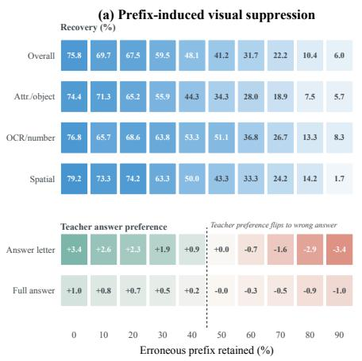

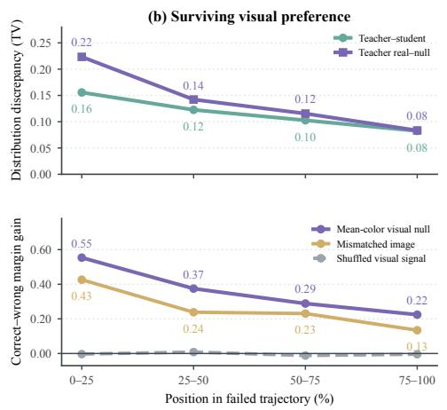  
Figure 1: Erroneous prefixes mask privileged visual supervision. (a) As failed reasoning accumulates, the teacher’s preference flips from the correct to the wrong answer. (b) The teacher–student discrepancy collapses, yet an intra-teacher visual contrast retains a strong preference for the correct answer. Token shuffling destroys this signal, confirming a token-specific visual preference.

The privileged teacher reliably recovers the correct answer from short prefixes, but this ability drops sharply as erroneous reasoning accumulates (Figure 1a). Near the midpoint of the response, its decision margin changes from positive to negative. The teacher no longer favors a visually grounded correction and instead prefers the student’s realized wrong answer. As both models follow the same erroneous branch, their predictions converge and the cross-model discrepancy that drives standard privileged OPD disappears precisely where correction is most needed.

This convergence creates the impression that visual evidence has ceased to matter. We test this possibility by comparing two changes under the same student prefix: the difference between the teacher and student predictions, and the difference between the same teacher evaluated with privileged evidence and a visual null. The cross-model discrepancy collapses, while the real–null change remains substantial and continues to favor the correct answer (Figure 1b). Replacing the visual null with a mismatched natural image preserves this direction, whereas shuffling the visual change across tokens destroys it. The surviving response is therefore a token-specific visual preference toward correction rather than undirected sensitivity to the input.

## 3 RECONSTRUCTING VISUAL SUPERVISION

We introduce OPD-Aha to reconstruct the visually grounded supervision that standard privileged OPD loses under an erroneous student prefix. As summarized in Figure 2, the method abandons the unreliable cross-model comparison and instead extracts the surviving visual preference by contrasting the privileged teacher’s predictions under real evidence and a visual null (Section 3.1). OPD-Aha translates this isolated preference into a KL-regularized distillation target that selectively suppresses image-inconsistent continuations while preserving a valid language distribution (Section 3.2). Training the student on this reconstructed target transfers the visual correction along the unchanged roll out.

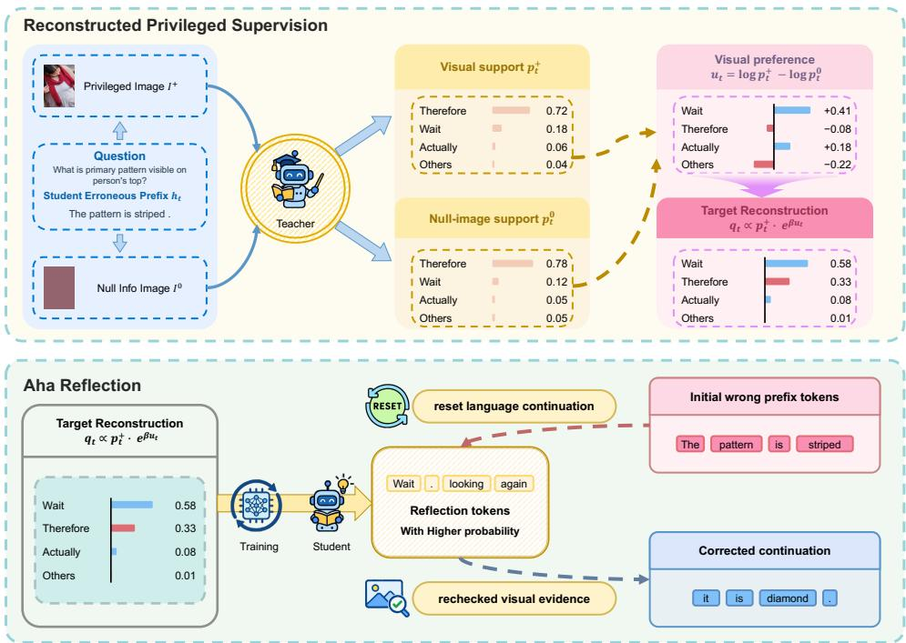  
Figure 2: Overview of the OPD-Aha framework.

## 3.1 ISOLATING VISUAL PREFERENCE

Teacher–student agreement under an erroneous prefix conceals how privileged evidence still shapes the teacher’s token preferences. Isolating this surviving visual signal requires a comparison that does not depend on the student’s distribution. We therefore evaluate the identical teacher under the same shared prefix and vary only the visual input (Yang et al., 2024; Zhao et al., 2025). We pair the privileged image $I ^ { + }$ with a visual nul

$$
I ^ { 0 } = { \mathcal { N } } ( I ^ { + } ) ,\tag{2}
$$

where the transformation $\mathcal { N }$ removes the visual content while preserving the input dimensions. We instantiate $\mathcal { N }$ by replacing the image with its mean RGB color. Under the same student prefix $h _ { t } .$ , we denote the teacher distributions for the privileged image and visual null, and the student distribution for the original image, respectively, by

$$
p _ { t } ^ { + } ( v ) = p _ { \phi } ( v \mid I ^ { + } , h _ { t } ) , \quad p _ { t } ^ { 0 } ( v ) = p _ { \phi } ( v \mid I ^ { 0 } , h _ { t } ) , \quad p _ { t } ^ { S } ( v ) = p _ { \theta } ( v \mid I , h _ { t } ) .\tag{3}
$$

The model and student prefix are shared across $p _ { t } ^ { + }$ and $p _ { t } ^ { 0 }$ , so their difference isolates how privileged evidence changes the teacher’s token preferences. We denote this visual preference signal by

$$
u _ { t } ( v ) = \log p _ { t } ^ { + } ( v ) - \log p _ { t } ^ { 0 } ( v ) .\tag{4}
$$

A positive $\boldsymbol { u } _ { t } ( \boldsymbol { v } )$ indicates that the evidence raises the teacher’s preference for token v, while a negative value indicates that the evidence suppresses it. Even when $p _ { t } ^ { + }$ and $p _ { t } ^ { S }$ are nearly indistinguishable, $u _ { t }$ can remain nonzero and reveal the visual preference hidden by their agreement.

Because $p _ { t } ^ { + }$ and $p _ { t } ^ { 0 }$ use the same teacher and student prefix, $u _ { t }$ attributes the prediction change to visual input rather than differences between models. A nonzero $u _ { t }$ is not necessarily corrective (Yin et al., 2025). It becomes useful when visual evidence favors tokens that leave the erroneous continuation over tokens that sustain it. The signal provides a signed direction over tokens, but it is not a normalized target and does not determine how far the target should move from the privileged teacher.

## 3.2 TARGET RECONSTRUCTION FROM VISUAL PREFERENCE

The visual preference signal $u _ { t } ( v )$ isolates a corrective direction over vocabulary tokens, but it is not a normalized target distribution. Following this direction alone would discard the structural knowledge of the language model, while directly distilling the privileged teacher $p _ { t } ^ { + }$ would retain the distribution already dominated by the erroneous student prefix. We reconstruct a valid distillation target by balancing a candidate distribution $q \in \Delta ( \mathcal { V } )$ between its alignment with the visual preference and its proximity to the original privileged teacher. This trade-off defines a KL-regularized objective:

$$
q _ { t } = \underset { q \in \Delta ( \mathcal { V } ) } { \arg \operatorname* { m a x } } \left. \beta \mathbb { E } _ { v \sim q } [ u _ { t } ( v ) ] - D _ { \mathrm { K L } } \big ( q \Vert p _ { t } ^ { + } \big ) \right. .\tag{5}
$$

The coefficient $\beta \geq 0$ controls the strength of the visual correction. Setting $\beta = 0$ leaves the base teacher distribution unchanged and recovers standard privileged OPD. Solving this objective applies an exponential tilt to the privileged target:

$$
q _ { t } ( v ) = \frac { p _ { t } ^ { + } ( v ) \exp ( \beta u _ { t } ( v ) ) } { \sum _ { w \in \mathcal { V } } p _ { t } ^ { + } ( w ) \exp ( \beta u _ { t } ( w ) ) } .\tag{6}
$$

Substituting the definition of $u _ { t }$ expands this solution into its component distributions:

$$
q _ { t } ( v ) = \mathrm { s o f t m a x } \left( ( 1 + \beta ) \log p _ { t } ^ { + } - \beta \log p _ { t } ^ { 0 } \right) _ { v } .\tag{7}
$$

This expanded form reveals the mechanics of target reconstruction. The base probability $p _ { t } ^ { + }$ preserves the teacher’s complete belief under real evidence, ensuring that the target remains a valid language distribution. The likelihood ratio $( p _ { t } ^ { + } / p _ { t } ^ { 0 } ) ^ { \beta }$ then selectively amplifies or suppresses tokens based on how the visual evidence changes the teacher’s preference. The target moves away from standard privileged OPD only along the directions favored by the visual input.

The effect of this selective amplification becomes clear when evaluating the relative odds of two competing tokens v and w:

$$
\log \frac { q _ { t } ( v ) } { q _ { t } ( w ) } = \log \frac { p _ { t } ^ { + } ( v ) } { p _ { t } ^ { + } ( w ) } + \beta \big ( u _ { t } ( v ) - u _ { t } ( w ) \big ) .\tag{8}
$$

This competition governs whether the student continues its current explanation or interrupts itself. If w is an image-inconsistent continuation heavily favored by the inherited prefix, the base teacher preference $\log \overline { { ( p _ { t } ^ { + } ( v ) / p _ { t } ^ { + } ( w ) ) } }$ will strongly support $w .$ Reconstruction can overturn this preference and promote a reflection token $v$ if the visual evidence suppresses the continuation strongly enough to make the second term dominant. The parameter $\beta$ determines how much visual separation is required to cross this threshold (Appendix A).

The reconstructed target $q _ { t }$ replaces the standard privileged teacher in the distillation divergence:

$$
\ell _ { t } = D _ { \mathrm { d i s t } } \big ( q _ { t } , p _ { t } ^ { S } \big ) .\tag{9}
$$

The training objective averages this loss over all valid response positions $M _ { t }$ :

$$
\mathcal { L } _ { O P D - A h a } = \frac { \sum _ { t } M _ { t } \ell _ { t } } { \sum _ { t } M _ { t } } ,\tag{10}
$$

The student optimizes this objective along its own unchanged rollout. The visual preference is transferred entirely through the adjusted target probabilities, allowing the student to learn visually grounded corrections without requiring auxiliary visual inputs during inference.

## 4 EMERGENT REFLECTION FROM RECONSTRUCTED SUPERVISION

## 4.1 RECONSTRUCTION SUSTAINS CORRECTIVE SUPERVISION

We test whether target reconstruction preserves support for the correct answer as erroneous reasoning accumulates. Starting from failed student responses, we retain progressively longer prefixes and compare the correct-answer probability under the standard privileged target $p _ { t } ^ { \dagger }$ and the reconstructed target $q _ { t }$ at the same prefix state. We also vary reconstruction strength $\beta$ during training and track response length and final benchmark accuracy to examine how changes in correct-answer probability relate to the student’s generation and performance.

Under the same short prefix, we find that both targets assign similar probabilities to the correct answer. As the erroneous prefix accumulates, standard privileged supervision sharply abandons the correct answer. The reconstructed target instead isolates the surviving visual preference, maintaining over an order of magnitude higher correct-answer probability at late-prefix states (Figure 3a,b). Support for the correct answer therefore remains stronger under the reconstructed target even after the student’s trajectory has deviated.

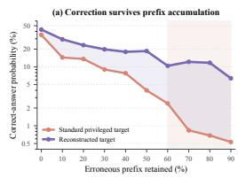

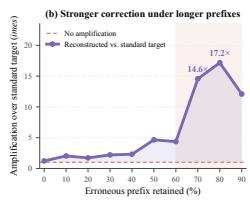

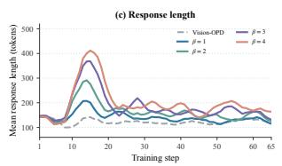

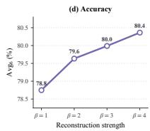  
Figure 3: Late-prefix target recovery and training trends. (a, b) As hallucinated text accumulates, standard privileged distillation abandons the correct answer, whereas target reconstruction isolates the surviving visual preference to selectively amplify the correct token. (c, d) Stronger reconstruction induces a larger transient increase in response length before stabilizing, ultimately yielding consistent improvements in final accuracy.

This sustained visual correction alters the student’s generation dynamics during training. Students trained with stronger reconstruction exhibit a larger transient increase in response length before their trajectories stabilize (Figure 3c). Across the same range of reconstruction strengths, overall accuracy averaged across the evaluated visual benchmarks improves consistently (Figure 3d). Preserving support for the correct answer along erroneous prefixes is thus accompanied by changes in generation and improved final performance.

## 4.2 SUPPRESSING ERRONEOUS CONTINUATIONS ELICITS REFLECTION

We examine whether reconstruction promotes reflection by raising its probability or suppressing the erroneous continuation more strongly. We compare how reconstruction changes token probabilities at positions immediately before reflection and at matched positions in responses without reflection (Figure 4a). For each token category, we measure the log-probability change from $p _ { t } ^ { + }$ to $q _ { t }$ , using its total probability. We evaluate the relative log-probability gain of reflection tokens over continuation tokens to quantify the competitive advantage of self-interruption. To examine how these local probability adjustments translate into generation behavior, we track the overall frequency of reflection tokens throughout training across reconstruction strengths.

At these pre-reflection states, we find that reflection gains a relative advantage because reconstruction suppresses the erroneous continuation more strongly, even as the total probability of reflection tokens decreases. The correct-answer probability also decreases at these positions (Figure 4a). The visual preference thus discourages continuing the image-inconsistent explanation without directly rewarding reflection. Matched positions without reflection do not show the same increase in reflection tokens’ relative probability.

This relative advantage is accompanied by more frequent reflection during training. As reconstruction strength increases, reflection tokens become more frequent during the transient phase and remain elevated for the stronger settings after stabilization, while Vision-OPD shows no comparable transition (Figure 4b). The student thus learns to interrupt its explanation when visual evidence reduces support for continuing it.

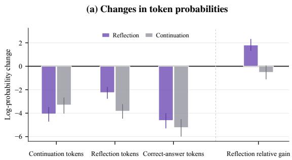

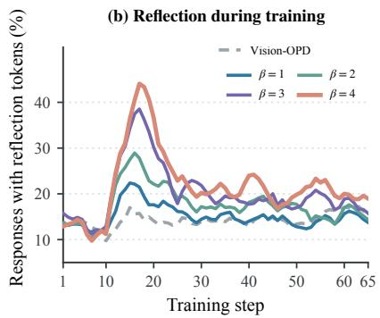  
Figure 4: Token probabilities and reflection during training. (a) Target reconstruction selectively suppresses erroneous continuations before reflection, granting reflection tokens a relative advantage absent at non-reflection positions. (b) Stronger reconstruction increases the frequency of reflection tokens during training before stabilizing.

## 4.3 REFLECTION RESTORES VISUAL RELIANCE

We examine whether reflection is followed by a shift from textual to visual reliance by aligning generated responses at their first reflection token and comparing subsequent tokens with matched positions in responses without reflection. At each position, we measure predictive support from the accumulated student prefix and support gained from visual evidence, tracking how their balance evolves after self-interruption.

We observe that this balance shifts toward visual evidence after reflection compared with matched positions in responses without reflection. Support from the accumulated student prefix decreases, followed by an increase in visual support after a short delay (Figure 5). Reflection therefore marks a transition toward visual evidence, with a temporal gap between self-interruption and the recovery of visual support.

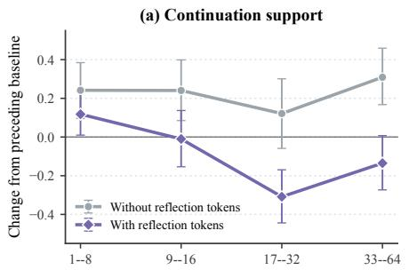

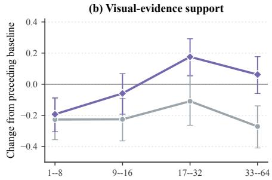  
Figure 5: Visual reliance after reflection. (a) Support from the accumulated student prefix decreases after reflection. (b) Support gained from visual evidence rises after a short delay.

## 5 EXPERIMENTS

## 5.1 PERFORMANCE ON FINE-GRAINED VISUAL REASONING

Reconstructing the distillation target from the teacher’s visual preference consistently translates into stronger downstream visual reasoning. OPD-Aha outperforms Vision-OPD across all six finegrained, high-resolution, and real-world benchmarks at both evaluated model scales (Table 1). Rather than relying on fragile cross-model discrepancies, the reconstructed supervision provides a broad advantage, yielding a 4.0% absolute increase in accuracy at 4B and a 3.2% increase at 9B.

Table 1: OPD-Aha consistently outperforms standard privileged distillation and zero-shot baselines across diverse visual reasoning benchmarks. All OPD-Aha results use $\beta = 4$
<table><tr><td rowspan="2">Models</td><td rowspan="2">Size</td><td colspan="2">Fine-Grained</td><td colspan="2">High-Resolution</td><td colspan="2">Real-World</td><td rowspan="2"> $\mathbf { A v g } _ { 6 }$ </td></tr><tr><td> $\mathbf { V } ^ { \star }$ </td><td>Zoom</td><td>HR-4K</td><td>HR-8K</td><td>MME-EN</td><td>MME-CN</td></tr><tr><td colspan="8">General-Purpose Models</td><td rowspan="3">78.7</td></tr><tr><td>Gemini 3.1 Pro (Google DeepMind, 2026)</td><td></td><td>88.2</td><td>61.6</td><td>88.8</td><td>85.8</td><td>75.1</td><td>72.5</td></tr><tr><td>GPT-5.4 (OpenAI, 2026)</td><td></td><td>81.4</td><td>55.1</td><td>85.3</td><td>77.9</td><td>74.2</td><td>70.8 74.1</td></tr><tr><td>Kimi-K2.6 (Moonshot ÁI, 2026)</td><td>1T</td><td>86.3</td><td>53.8</td><td>82.7</td><td>78.7</td><td>69.7</td><td>66.4</td></tr><tr><td colspan="8"></td></tr><tr><td>&quot;Thinking-with-Images&quot;Agentic Models</td><td></td><td></td><td></td><td></td><td></td><td></td><td></td><td>66.8</td></tr><tr><td>DeepEyes (Zheng et al., 2026)</td><td>7B</td><td>82.6</td><td>46.2 46.2</td><td>75.5 78.9</td><td>70.0 70.9</td><td>64.0 64.2</td><td>62.4</td><td>66.7</td></tr><tr><td>Thyme-RL (Zhang et al., 2025a) DeepEyesV2 (Hong et al., 2026)</td><td>7B 7B</td><td>78.5 78.0</td><td>46.1</td><td>79.8</td><td>72.6</td><td>64.3</td><td>61.4 61.9</td><td>67.1</td></tr><tr><td>SenseÑova-MARS (Chng et al., 2026)</td><td>8B</td><td>88.4</td><td>49.0</td><td>85.0</td><td>77.3</td><td>67.3</td><td>65.7</td><td>72.1</td></tr><tr><td></td><td></td><td>82.7</td><td>49.1</td><td>86.5</td><td>81.5</td><td>59.8</td><td></td><td></td></tr><tr><td>Qwen3.5 (Qwen Team, 2026) GRPO (Shao et al., 2024)</td><td>4B 4B</td><td>85.2</td><td>57.3</td><td>78.7</td><td>75.4</td><td>70.9</td><td>61.1 68.5</td><td>70.1 72.7</td></tr><tr><td>V-Zero (Sun et al., 2026)</td><td>4B</td><td>78.0</td><td>56.5</td><td>84.8</td><td>80.9</td><td>73.2</td><td>71.1</td><td>74.1</td></tr><tr><td>Vision-OPD (Yuan et al., 2026)</td><td>4B</td><td>89.0</td><td>59.5</td><td>83.4</td><td>80.5</td><td>74.6</td><td>71.6</td><td>76.4</td></tr><tr><td>OPD-Aha (Ours)</td><td>4B</td><td>93.7</td><td>62.5</td><td>88.6</td><td>84.8</td><td>77.7</td><td>74.9</td><td>80.4</td></tr><tr><td>Qwen3.5 (Qwen Team, 2026)</td><td>9B</td><td>85.3</td><td>52.2</td><td>86.0</td><td>81.6</td><td>71.3</td><td>67.5</td><td>74.0</td></tr><tr><td>GRPO (Shao et al., 2024)</td><td>9B</td><td>87.2</td><td>57.5</td><td>86.0</td><td>83.0</td><td>73.3</td><td>69.2</td><td>76.0</td></tr><tr><td>V-Zero (Sun et al., 2026)</td><td>9B</td><td>89.2</td><td>59.4</td><td>85.8</td><td>83.3</td><td>75.7</td><td>70.6</td><td>77.3</td></tr><tr><td>Vision-ÒPD (Yuan et al., 2026)</td><td>9B</td><td>91.1</td><td>62.5</td><td>87.0</td><td>86.1</td><td>73.2</td><td>69.5</td><td>78.2</td></tr><tr><td>OPD-Aha (Ours)</td><td>9B</td><td>94.8</td><td>63.9</td><td>88.9</td><td>87.5</td><td>78.3</td><td>75.2</td><td>81.4</td></tr></table>

## 5.2 COMPARISON OF RECONSTRUCTION SIGNALS

We compare targets reconstructed from the standard teacher–student discrepancy (log $p _ { t } ^ { + } - \log p _ { t } ^ { S } )$ and the intra-teacher real–null difference $( \log p _ { t } ^ { + } - \log p _ { t } ^ { 0 } )$ to verify that the downstream gains originate from the isolated visual preference. Evaluated at the same reconstruction strength $( \beta = 1 )$ amplifying the cross-model disagreement yields a marginal average increase over the standard privileged target, rising from 76.4% to 76.9%. Anchoring the reconstruction to the real–null difference produces consistent improvements across all six benchmarks and reaches an average accuracy of 78.8% (Table 2).

Table 2: The same-teacher real–null difference provides a more effective reconstruction signal than teacher–student disagreement. All reconstructed targets use $\beta = 1$
<table><tr><td>Target</td><td>Reference</td><td> $\mathbf { V } ^ { \star }$ </td><td>Zoom</td><td>HR-4K</td><td>HR-8K</td><td>MME-EN</td><td>MME-CN</td><td> $\mathbf { A v } \mathbf { g } _ { 6 }$ </td></tr><tr><td>Standard privileged target</td><td></td><td>89.0</td><td>59.5</td><td>83.4</td><td>80.5</td><td>74.6</td><td>71.6</td><td>76.4</td></tr><tr><td>Teacher-student discrepancy</td><td> $p _ { t } ^ { S }$ </td><td>91.6</td><td>59.2</td><td>84.5</td><td>79.3</td><td>74.9</td><td>71.8</td><td>76.9</td></tr><tr><td>Teacher real-null difference</td><td> $p _ { t } ^ { 0 }$ </td><td>93.2</td><td>61.5</td><td>86.0</td><td>82.0</td><td>76.5</td><td>73.2</td><td>78.8</td></tr></table>

## 5.3 GENERALIZATION TO MULTIMODAL REASONING

We evaluate zero-shot transfer on MathVerse (Zhang et al., 2024), MathVista (Lu et al., 2024), MathVision (Wang et al., 2024), WeMath (Qiao et al., 2025), and DynaMath (Zou et al., 2025). The benefits of target reconstruction extend robustly beyond the fine-grained perception domain used during training. When evaluated zero-shot on complex multimodal reasoning tasks, Vision-OPD degrades the 4B student’s reasoning capabilities, pushing its performance below the unaligned Base model across all eight metrics. This broad regression indicates that its supervision is shaped by domain-specific linguistic habits from the training data, which fail to transfer out of distribution.

Table 3: Target reconstruction enables zero-shot generalization to complex multimodal reasoning tasks. OPD-Aha improves over the base model on all evaluated reasoning metrics. All OPD-Aha results use $\beta = 4$
<table><tr><td rowspan="2">Method</td><td rowspan="2">Size</td><td rowspan="2">MathVerse</td><td rowspan="2">MathVista</td><td rowspan="2">MathVision</td><td colspan="3">WeMath</td><td colspan="2">DynaMath</td></tr><tr><td>Row Acc.</td><td>Strict</td><td>Loose</td><td>Avg.</td><td>Worst</td></tr><tr><td>Qwen3.5</td><td>4B</td><td>73.6</td><td>78.4</td><td>54.9</td><td>81.2</td><td>62.9</td><td>79.5</td><td>71.1</td><td>43.1</td></tr><tr><td>GRPO</td><td>4B</td><td>70.0</td><td>74.2</td><td>46.1</td><td>74.5</td><td>52.5</td><td>69.6</td><td>64.6</td><td>31.5</td></tr><tr><td>Vision-OPD</td><td>4B</td><td>71.0</td><td>74.4</td><td>50.3</td><td>80.0</td><td>59.8</td><td>77.9</td><td>67.3</td><td>38.5</td></tr><tr><td>OPD-Aha (Ours)</td><td>4B</td><td>75.7</td><td>80.0</td><td>55.6</td><td>84.7</td><td>69.4</td><td>81.6</td><td>72.6</td><td>44.5</td></tr><tr><td>Qwen3.5</td><td>9B</td><td>78.3</td><td>80.9</td><td>45.5</td><td>83.7</td><td>68.7</td><td>81.1</td><td>71.2</td><td>46.8</td></tr><tr><td>GRPO</td><td>9B</td><td>78.4</td><td>81.7</td><td>46.4</td><td>86.6</td><td>71.8</td><td>86.9</td><td>72.0</td><td>46.3</td></tr><tr><td>Vision-OPD</td><td>9B</td><td>77.8</td><td>82.8</td><td>46.7</td><td>86.0</td><td>71.1</td><td>85.7</td><td>71.9</td><td>44.7</td></tr><tr><td>OPD-Aha (Ours)</td><td>9B</td><td>78.5</td><td>82.6</td><td>47.4</td><td>86.8</td><td>72.5</td><td>84.9</td><td>72.8</td><td>47.7</td></tr></table>

OPD-Aha reverses this degradation and yields consistent positive transfer over the Base model across all unseen reasoning metrics at both scales (Table 3). By distilling the isolated visual preference rather than the teacher’s confounded output distribution, target reconstruction equips the student with a generalizable mechanism to re-anchor its generation on visual evidence. Consequently, the ability to suppress image-inconsistent continuations remains effective even when the underlying task semantics and reasoning complexity fundamentally change.

## 6 RELATED WORK

On-policy distillation with privileged information. Knowledge distillation transfers predictive structure from a stronger teacher to a deployable student, while learning with privileged information permits additional signals during training that are absent at inference (Hinton et al., 2015; Vapnik & Vashist, 2009). Generalized distillation connects these paradigms by casting privileged information as teacher supervision (Lopez-Paz et al., 2016). In imitation learning, DAgger addresses the distribution shift caused by a learner’s own predictions by gathering supervision on the states it visits (Ross et al., 2011). On-policy distillation supervises student-generated states (Chen et al., 2026a), while OPSD uses privileged context to provide dense self-distillation targets (Agarwal et al., 2024; Gu et al., 2024; Zhao et al., 2026; Jin et al., 2026; Li et al., 2026c). Autoregressive distillation includes sequence-level supervision from teacher-generated outputs (Kim & Rush, 2016) and objectives for efficient reuse of student-generated outputs (Ko et al., 2024), while recent work directly transfers behavior from privileged-information-conditioned language-model teachers (Penaloza et al., 2026). Recent vision-language OPD variants decompose language and visual gradients or project teacher corrections onto locally realizable visual directions (Yoon et al., 2026; Xue et al., 2026). Multimodal extensions transfer reasoning across modalities or instantiate the privilege as localized crops, recoverable visual cues, or generated visual-thought traces (Bousselham et al., 2025; Yuan et al., 2026; Tian et al., 2026; Li et al., 2026b).

Reflection in language and multimodal reasoning. Reflection has been elicited through selffeedback and reinforcement learning in language models (Madaan et al., 2023; Shinn et al., 2023; Guo et al., 2025a), and through reflection-aware reinforcement learning or iterative visual verification in multimodal models (Zhou et al., 2025; Wan et al., 2025; Zhang et al., 2026). Earlier approaches use tool-interactive critique, execution feedback, or backward verification to revise model outputs (Gou et al., 2024; Chen et al., 2024; Weng et al., 2023). Intrinsic self-correction can fail without reliable feedback, as controlled studies and reviews show (Huang et al., 2024; Kamoi et al., 2024). Multimodal self-training further uses reflected rationales or vision-aware resampling to learn from failed trajectories (Cheng et al., 2025; Zhong et al., 2026), while broad benchmarking shows that the benefit of self-correction varies across tasks and correction strategies (Tie et al., 2025). In our setting, reflection words are not explicitly supervised. They mark self-interruptions that become more likely when the reconstructed target suppresses an image-inconsistent continuation, followed by renewed visual reliance in subsequent tokens.

## 7 CONCLUSION

Privileged on-policy distillation suffers a supervision collapse when erroneous student prefixes overwhelm the teacher’s visual evidence. We find that a token-specific visual corrective preference survives this collapse. OPD-Aha isolates this signal through an intra-teacher contrast and reconstructs a distillation target that suppresses image-inconsistent continuations. The trained student learns to interrupt flawed reasoning with reflection tokens, followed by renewed visual reliance after a short delay. OPD-Aha achieves consistent improvements across fine-grained perception and complex multimodal reasoning benchmarks. These gains support the value of separating visual preference from confounded language priors to preserve corrective supervision under flawed student prefixes.

## REFERENCES

Rishabh Agarwal, Nino Vieillard, Yongchao Zhou, Piotr Stanczyk, Sabela Ramos Garea, Matthieu Geist, and Olivier Bachem. On-policy distillation of language models: Learning from selfgenerated mistakes. In The Twelfth International Conference on Learning Representations, ICLR 2024, Vienna, Austria, May 7-11, 2024. OpenReview.net, 2024. URL https:// openreview.net/forum?id=3zKtaqxLhW.

Jinze Bai, Shuai Bai, Shusheng Yang, Shijie Wang, Sinan Tan, Peng Wang, Junyang Lin, Chang Zhou, and Jingren Zhou. Qwen-vl: A frontier large vision-language model with versatile abilities. CoRR, abs/2308.12966, 2023. doi: 10.48550/ARXIV.2308.12966. URL https://doi.org/ 10.48550/arXiv.2308.12966.

Walid Bousselham, Hilde Kuehne, and Cordelia Schmid. VOLD: reasoning transfer from llms to vision-language models via on-policy distillation. CoRR, abs/2510.23497, 2025. doi: 10.48550/ ARXIV.2510.23497. URL https://doi.org/10.48550/arXiv.2510.23497.

Chishui Chen, Yaoyou Fan, Te Sun, Yi Yang, Chenghao Sun, Delin Mao, Hongbo Qiao, Zuowei Zhang, Junxi Wang, Chenxing Sun, Yangen Hu, Lu Pan, Xuyang Liu, and Linfeng Zhang. Look ahead before you distill: Future trajectory validation of teacher guidance for agentic on-policy distillation. CoRR, abs/2608.01953, 2026a. doi: 10.48550/ARXIV.2608.01953. URL https: //doi.org/10.48550/arXiv.2608.01953.

Xinrong Chen, Xu Chu, Yingmin Qiu, Hengyuan Zhang, Jing Xiong, Shiyu Tang, Shuai Liu, Shaokang Yang, Cheng Yang, Hayden Kwok-Hay So, and Ngai Wong. Residual decoding: Mitigating hallucinations in large vision-language models via history-aware residual guidance. CoRR, abs/2602.01047, 2026b. doi: 10.48550/ARXIV.2602.01047. URL https://doi.org/10. 48550/arXiv.2602.01047.

Xinyun Chen, Maxwell Lin, Nathanael Scharli, and Denny Zhou. Teaching large language models to¨ self-debug. In The Twelfth International Conference on Learning Representations, ICLR 2024, Vienna, Austria, May 7-11, 2024. OpenReview.net, 2024. URL https://openreview.net/ forum?id=KuPixIqPiq.

Kanzhi Cheng, Yantao Li, Fangzhi Xu, Jianbing Zhang, Hao Zhou, and Yang Liu. Vision-language models can self-improve reasoning via reflection. In Luis Chiruzzo, Alan Ritter, and Lu Wang (eds.), Proceedings ofthe 2025 Conference ofthe Nations ofthe Americas Chapter ofthe Association for Computational Linguistics: Human Language Technologies, NAACL 2025 - Volume 1: Long Papers, Albuquerque, New Mexico, USA, April 29 - May 4, 2025, pp. 8876–8892. Association for Computational Linguistics, 2025. doi: 10.18653/V1/2025.NAACL-LONG.447. URL https://doi.org/10.18653/v1/2025.naacl-long.447.

Alessandro Favero, Luca Zancato, Matthew Trager, Siddharth Choudhary, Pramuditha Perera, Alessandro Achille, Ashwin Swaminathan, and Stefano Soatto. Multi-modal hallucination control by visual information grounding. In IEEE/CVF Conference on Computer Vision and Pattern Recognition, CVPR 2024, Seattle, WA, USA, June 16-22, 2024, pp. 14303–14312. IEEE, 2024. doi: 10.1109/CVPR52733.2024.01356. URL https://doi.org/10.1109/CVPR52733. 2024.01356.

Zhibin Gou, Zhihong Shao, Yeyun Gong, Yelong Shen, Yujiu Yang, Nan Duan, and Weizhu Chen. CRITIC: large language models can self-correct with tool-interactive critiquing. In The Twelfth International Conference on Learning Representations, ICLR 2024, Vienna, Austria, May 7-11, 2024. OpenReview.net, 2024. URL https://openreview.net/forum?id= Sx038qxjek.

Yuxian Gu, Li Dong, Furu Wei, and Minlie Huang. Minillm: Knowledge distillation of large language models. In The Twelfth International Conference on Learning Representations, ICLR 2024,

Vienna, Austria, May 7-11, 2024. OpenReview.net, 2024. URL https://openreview. net/forum?id=5h0qf7IBZZ.

Daya Guo, Dejian Yang, Haowei Zhang, Junxiao Song, Peiyi Wang, Qihao Zhu, Runxin Xu, Ruoyu Zhang, Shirong Ma, Xiao Bi, Xiaokang Zhang, Xingkai Yu, Yu Wu, Z. F. Wu, Zhibin Gou, Zhihong Shao, Zhuoshu Li, Ziyi Gao, Aixin Liu, Bing Xue, Bingxuan Wang, Bochao Wu, Bei Feng, Chengda Lu, Chenggang Zhao, Chengqi Deng, Chong Ruan, Damai Dai, Deli Chen, Dongjie Ji, Erhang Li, Fangyun Lin, Fucong Dai, Fuli Luo, Guangbo Hao, Guanting Chen, Guowei Li, Hao Zhang, Hanwei Xu, Honghui Ding, Huazuo Gao, Hui Qu, Hui Li, Jianzhong Guo, Jiashi Li, Jingchang Chen, Jingyang Yuan, Jinhao Tu, Junjie Qiu, Junlong Li, J. L. Cai, Jiaqi Ni, Jian Liang, Jin Chen, Kai Dong, Kai Hu, Kaichao You, Kaige Gao, Kang Guan, Kexin Huang, Kuai Yu, Lean Wang, Lecong Zhang, Liang Zhao, Litong Wang, Liyue Zhang, Lei Xu, Leyi Xia, Mingchuan Zhang, Minghua Zhang, Minghui Tang, Mingxu Zhou, Meng Li, Miaojun Wang, Mingming Li, Ning Tian, Panpan Huang, Peng Zhang, Qiancheng Wang, Qinyu Chen, Qiushi Du, Ruiqi Ge, Ruisong Zhang, Ruizhe Pan, Runji Wang, R. J. Chen, R. L. Jin, Ruyi Chen, Shanghao Lu, Shangyan Zhou, Shanhuang Chen, Shengfeng Ye, Shiyu Wang, Shuiping Yu, Shunfeng Zhou, Shuting Pan, S. S. Li, Shuang Zhou, Shaoqing Wu, Tao Yun, Tian Pei, Tianyu Sun, Tao Wang, Wangding Zeng, Wen Liu, Wenfeng Liang, Wenjun Gao, Wenqin Yu, Wentao Zhang, W. L. Xiao, Wei An, Xiaodong Liu, Xiaohan Wang, Xiaokang Chen, Xiaotao Nie, Xin Cheng, Xin Liu, Xin Xie, Xingchao Liu, Xinyu Yang, Xinyuan Li, Xuecheng Su, Xuheng Lin, X. Q. Li, Xiangyue Jin, Xiaojin Shen, Xiaosha Chen, Xiaowen Sun, Xiaoxiang Wang, Xinnan Song, Xinyi Zhou, Xianzu Wang, Xinxia Shan, Y. K. Li, Y. Q. Wang, Y. X. Wei, Yang Zhang, Yanhong Xu, Yao Li, Yao Zhao, Yaofeng Sun, Yaohui Wang, Yi Yu, Yichao Zhang, Yifan Shi, Yiliang Xiong, Ying He, Yishi Piao, Yisong Wang, Yixuan Tan, Yiyang Ma, Yiyuan Liu, Yongqiang Guo, Yuan Ou, Yuduan Wang, Yue Gong, Yuheng Zou, Yujia He, Yunfan Xiong, Yuxiang Luo, Yuxiang You, Yuxuan Liu, Yuyang Zhou, Y. X. Zhu, Yanping Huang, Yaohui Li, Yi Zheng, Yuchen Zhu, Yunxian Ma, Ying Tang, Yukun Zha, Yuting Yan, Z. Z. Ren, Zehui Ren, Zhangli Sha, Zhe Fu, Zhean Xu, Zhenda Xie, Zhengyan Zhang, Zhewen Hao, Zhicheng Ma, Zhigang Yan, Zhiyu Wu, Zihui Gu, Zijia Zhu, Zijun Liu, Zilin Li, Ziwei Xie, Ziyang Song, Zizheng Pan, Zhen Huang, Zhipeng Xu, Zhongyu Zhang, and Zhen Zhang. Deepseek-r1 incentivizes reasoning in llms through reinforcement learning. Nat., 645(8081):633–638, 2025a. doi: 10.1038/S41586-025-09422-Z. URL https://doi.org/10.1038/s41586-025-09422-z.

Zhihui Guo, Xin Man, Hui Xu, and Jie Shao. LISA: A layer-wise integration and suppression approach for hallucination mitigation in multimodal large language models. CoRR, abs/2507.19110, 2025b. doi: 10.48550/ARXIV.2507.19110. URL https://doi.org/10.48550/arXiv. 2507.19110.

Jinghan He, Kuan Zhu, Haiyun Guo, Junfeng Fang, Zhenglin Hua, Yuheng Jia, Ming Tang, Tat-Seng Chua, and Jinqiao Wang. Cracking the code of hallucination in lvlms with vision-aware head divergence. In Wanxiang Che, Joyce Nabende, Ekaterina Shutova, and Mohammad Taher Pilehvar (eds.), Proceedings of the 63rd Annual Meeting of the Association for Computational Linguistics (Volume 1: Long Papers), ACL 2025, Vienna, Austria, July 27 - August 1, 2025, pp. 3488–3501. Association for Computational Linguistics, 2025. doi: 10.18653/V1/2025.ACL-LONG.175. URL https://doi.org/10.18653/v1/2025.acl-long.175.

Geoffrey E. Hinton, Oriol Vinyals, and Jeffrey Dean. Distilling the knowledge in a neural network. CoRR, abs/1503.02531, 2015. URL http://arxiv.org/abs/1503.02531.

Jie Huang, Xinyun Chen, Swaroop Mishra, Huaixiu Steven Zheng, Adams Wei Yu, Xinying Song, and Denny Zhou. Large language models cannot self-correct reasoning yet. In The Twelfth International Conference on Learning Representations, ICLR 2024, Vienna, Austria, May 7-11, 2024. OpenReview.net, 2024. URL https://openreview.net/forum?id=IkmD3fKBPQ.

Li Jiang, Haoran Xu, Yichuan Ding, and Amy Zhang. Trajectory-refined distillation. CoRR, abs/2606.08432, 2026. doi: 10.48550/ARXIV.2606.08432. URL https://doi.org/10. 48550/arXiv.2606.08432.

Woogyeol Jin, Taywon Min, Yongjin Yang, Swanand Ravindra Kadhe, Yi Zhou, Dennis Wei, Nathalie Baracaldo, and Kimin Lee. Entropy-aware on-policy distillation of language models. CoRR, abs/2603.07079, 2026. doi: 10.48550/ARXIV.2603.07079. URL https://doi.org/ 10.48550/arXiv.2603.07079.

Ryo Kamoi, Yusen Zhang, Nan Zhang, Jiawei Han, and Rui Zhang. When can llms Actually correct their own mistakes? A critical survey of self-correction of llms. Trans. Assoc. Comput. Linguistics, 12:1417–1440, 2024. doi: 10.1162/TACL\ A\ 00713. URL https: //doi.org/10.1162/tacl\_a\_00713.

Yoon Kim and Alexander M. Rush. Sequence-level knowledge distillation. In Jian Su, Xavier Carreras, and Kevin Duh (eds.), Proceedings of the 2016 Conference on Empirical Methods in Natural Language Processing, EMNLP 2016, Austin, Texas, USA, November 1-4, 2016, pp. 1317– 1327. The Association for Computational Linguistics, 2016. doi: 10.18653/V1/D16-1139. URL https://doi.org/10.18653/v1/d16-1139.

Jongwoo Ko, Sungnyun Kim, Tianyi Chen, and Se-Young Yun. Distillm: Towards streamlined distillation for large language models. In Ruslan Salakhutdinov, Zico Kolter, Katherine A. Heller, Adrian Weller, Nuria Oliver, Jonathan Scarlett, and Felix Berkenkamp (eds.), Forty-first International Conference on Machine Learning, ICML 2024, Vienna, Austria, July 21-27, 2024, volume 235 of Proceedings ofMachine Learning Research, pp. 24872–24895. PMLR / OpenReview.net, 2024. URL https://proceedings.mlr.press/v235/ko24c.html.

Sicong Leng, Hang Zhang, Guanzheng Chen, Xin Li, Shijian Lu, Chunyan Miao, and Lidong Bing. Mitigating object hallucinations in large vision-language models through visual contrastive decoding. In IEEE/CVF Conference on Computer Vision and Pattern Recognition, CVPR 2024, Seattle, WA, USA, June 16-22, 2024, pp. 13872–13882. IEEE, 2024. doi: 10.1109/CVPR52733. 2024.01316. URL https://doi.org/10.1109/CVPR52733.2024.01316.

Jiaze Li, Hao Yin, Haoran Xu, Boshen Xu, Wenhui Tan, Zewen He, Jianzhong Ju, Zhenbo Luo, and Jian Luan. Video-opd: Efficient post-training of multimodal large language models for temporal video grounding via on-policy distillation. CoRR, abs/2602.02994, 2026a. doi: 10.48550/ARXIV. 2602.02994. URL https://doi.org/10.48550/arXiv.2602.02994.

Junnan Li, Dongxu Li, Silvio Savarese, and Steven C. H. Hoi. BLIP-2: bootstrapping languageimage pre-training with frozen image encoders and large language models. In Andreas Krause, Emma Brunskill, Kyunghyun Cho, Barbara Engelhardt, Sivan Sabato, and Jonathan Scarlett (eds.), International Conference on Machine Learning, ICML 2023, 23-29 July 2023, Honolulu, Hawaii, USA, volume 202 of Proceedings of Machine Learning Research, pp. 19730–19742. PMLR, 2023a. URL https://proceedings.mlr.press/v202/li23q.html.

Pengyu Li, Zhitao Gao, Lingling Zhang, Muye Huang, Yuanming Li, Fangzhi Xu, and Jun Liu. Visual-opsd: Cross-modal on-policy self-distillation for efficient unified multimodal reasoning. CoRR, abs/2606.18974, 2026b. doi: 10.48550/ARXIV.2606.18974. URL https: //doi.org/10.48550/arXiv.2606.18974.

Yaxuan Li, Yuxin Zuo, Bingxiang He, Jinqian Zhang, Chaojun Xiao, Cheng Qian, Tianyu Yu, Huan-ang Gao, Wenkai Yang, Zhiyuan Liu, and Ning Ding. Rethinking on-policy distillation of large language models: Phenomenology, mechanism, and recipe. CoRR, abs/2604.13016, 2026c. doi: 10.48550/ARXIV.2604.13016. URL https://doi.org/10.48550/arXiv.2604. 13016.

Yifan Li, Yifan Du, Kun Zhou, Jinpeng Wang, Wayne Xin Zhao, and Ji-Rong Wen. Evaluating object hallucination in large vision-language models. In Houda Bouamor, Juan Pino, and Kalika Bali (eds.), Proceedings of the 2023 Conference on Empirical Methods in Natural Language Processing, EMNLP 2023, Singapore, December 6-10, 2023, pp. 292–305. Association for Computational Linguistics, 2023b. doi: 10.18653/V1/2023.EMNLP-MAIN.20. URL https://doi.org/10.18653/v1/2023.emnlp-main.20.

Yinghui Li, Jiayi Kuang, Peng Xing, Daixian Liu, Junnan Dong, Shu-Yu Guo, Yangning Li, Qingyu Zhou, Wenhao Jiang, Hai-Tao Zheng, Ying Shen, Liang Lin, and Philip S. Yu. Cog nitive mismatch in multimodal large language models for discrete symbol understanding. CoRR, abs/2603.18472, 2026d. doi: 10.48550/ARXIV.2603.18472. URL https://doi.org/10. 48550/arXiv.2603.18472.

Haotian Liu, Chunyuan Li, Qingyang Wu, and Yong Jae Lee. Visual instruction tuning. In Alice Oh, Tristan Naumann, Amir Globerson, Kate Saenko, Moritz Hardt, and Sergey Levine (eds.), Advances in Neural Information Processing Systems 36: Annual Conference on Neural Information Processing Systems 2023, NeurIPS 2023, New Orleans, LA, USA, December 10 - 16, 2023, 2023. URL http://papers.nips.cc/paper\_files/paper/2023/hash/ 6dcf277ea32ce3288914faf369fe6de0-Abstract-Conference.html.

David Lopez-Paz, Leon Bottou, Bernhard Sch´ olkopf, and Vladimir Vapnik. Unifying distillation and¨ privileged information. In Yoshua Bengio and Yann LeCun (eds.), 4th International Conference on Learning Representations, ICLR 2016, San Juan, Puerto Rico, May 2-4, 2016, Conference Track Proceedings, 2016. URL http://arxiv.org/abs/1511.03643.

Pan Lu, Hritik Bansal, Tony Xia, Jiacheng Liu, Chunyuan Li, Hannaneh Hajishirzi, Hao Cheng, Kai-Wei Chang, Michel Galley, and Jianfeng Gao. Mathvista: Evaluating mathematical reasoning of foundation models in visual contexts. In The Twelfth International Conference on Learning

Representations, ICLR 2024, Vienna, Austria, May 7-11, 2024. OpenReview.net, 2024. URL https://openreview.net/forum?id=KUNzEQMWU7.

Aman Madaan, Niket Tandon, Prakhar Gupta, Skyler Hallinan, Luyu Gao, Sarah Wiegreffe, Uri Alon, Nouha Dziri, Shrimai Prabhumoye, Yiming Yang, Sean Welleck, Bodhisattwa Prasad Majumder, Shashank Gupta, Amir Yazdanbakhsh, and Peter Clark. Self-refine: Iterative refinement with self-feedback. CoRR, abs/2303.17651, 2023. doi: 10.48550/ARXIV.2303.17651. URL https://doi.org/10.48550/arXiv.2303.17651.

Emiliano Penaloza, Dheeraj Vattikonda, Nicolas Gontier, Alexandre Lacoste, Laurent Charlin, and Massimo Caccia. Privileged information distillation for language models. CoRR, abs/2602.04942, 2026. doi: 10.48550/ARXIV.2602.04942. URL https://doi.org/10.48550/arXiv. 2602.04942.

Runqi Qiao, Qiuna Tan, Guanting Dong, Minhui Wu, Chong Sun, Xiaoshuai Song, Jiapeng Wang, Zhuoma Gongque, Shanglin Lei, Yifan Zhang, Zhe Wei, Miaoxuan Zhang, Runfeng Qiao, Xiao Zong, Yida Xu, Peiqing Yang, Zhimin Bao, Muxi Diao, Chen Li, and Honggang Zhang. Wemath: Does your large multimodal model achieve human-like mathematical reasoning? In Wanxiang Che, Joyce Nabende, Ekaterina Shutova, and Mohammad Taher Pilehvar (eds.), Proceed ings of the 63rd Annual Meeting of the Association for Computational Linguistics (Volume 1: Long Papers), ACL 2025, Vienna, Austria, July 27 - August 1, 2025, pp. 20023–20070. Association for Computational Linguistics, 2025. doi: 10.18653/V1/2025.ACL-LONG.983. URL https://doi.org/10.18653/v1/2025.acl-long.983.

Stephane Ross, Geoffrey J. Gordon, and Drew Bagnell. A reduction of imitation learning and´ structured prediction to no-regret online learning. In Geoffrey J. Gordon, David B. Dunson, and Miroslav Dud´ık (eds.), Proceedings of the Fourteenth International Conference on Artificial Intelligence and Statistics, AISTATS 2011, Fort Lauderdale, USA, April 11-13, 2011, volume 15 of JMLR Proceedings, pp. 627–635. JMLR.org, 2011. URL http://proceedings.mlr. press/v15/ross11a/ross11a.pdf.

Zhihong Shao, Peiyi Wang, Qihao Zhu, Runxin Xu, Junxiao Song, Mingchuan Zhang, Y. K. Li, Y. Wu, and Daya Guo. Deepseekmath: Pushing the limits of mathematical reasoning in open language models. CoRR, abs/2402.03300, 2024. doi: 10.48550/ARXIV.2402.03300. URL https://doi.org/10.48550/arXiv.2402.03300.

Noah Shinn, Federico Cassano, Ashwin Gopinath, Karthik Narasimhan, and Shunyu Yao. Reflexion: language agents with verbal reinforcement learning. In Alice Oh, Tristan Naumann, Amir Globerson, Kate Saenko, Moritz Hardt, and Sergey Levine (eds.), Advances in Neural Information Processing Systems 36: Annual Conference on Neural Information Processing Systems 2023, NeurIPS 2023, New Orleans, LA, USA, December 10 - 16, 2023, 2023. URL http://papers.nips.cc/paper\_files/paper/2023/hash/ 1b44b878bb782e6954cd888628510e90-Abstract-Conference.html.

Kanghui Tian, Siyuan Liu, Ziang Yan, Sheng Xia, Shuai Dong, and Yi Wang. Vicur: Visual cues as recoverable privilege for multimodal on-policy distillation. CoRR, abs/2606.05718, 2026. doi: 10. 48550/ARXIV.2606.05718. URL https://doi.org/10.48550/arXiv.2606.05718.

Guiyao Tie, Zenghui Yuan, Zeli Zhao, Chaoran Hu, Tianhe Gu, Ruihang Zhang, Sizhe Zhang, Junran Wu, Xiaoyue Tu, Ming Jin, Qingsong Wen, Lixing Chen, Pan Zhou, and Lichao Sun. Can llms correct themselves? A benchmark of self-correction in llms. CoRR, abs/2510.16062, 2025. doi: 10.48550/ARXIV.2510.16062. URL https://doi.org/10.48550/arXiv.2510. 16062.

Vladimir Vapnik and Akshay Vashist. A new learning paradigm: Learning using privileged information. Neural Networks, 22(5-6):544–557, 2009. doi: 10.1016/J.NEUNET.2009.06.042. URL https://doi.org/10.1016/j.neunet.2009.06.042.

Zhongwei Wan, Zhihao Dou, Che Liu, Yu Zhang, Dongfei Cui, Qinjian Zhao, Hui Shen, Jing Xiong, Yi Xin, Yifan Jiang, Chaofan Tao, Yangfan He, Mi Zhang, and Shen Yan. SRPO: enhancing multimodal LLM reasoning via reflection-aware reinforcement learning. CoRR, abs/2506.01713, 2025. doi: 10.48550/ARXIV.2506.01713. URL https://doi.org/10.48550/arXiv. 2506.01713.

Ke Wang, Junting Pan, Weikang Shi, Zimu Lu, Houxing Ren, Aojun Zhou, Mingjie Zhan, and Hongsheng Li. Measuring multimodal mathematical reasoning with math-vision dataset. In Amir Globersons, Lester Mackey, Danielle Belgrave, Angela Fan, Ulrich Paquet, Jakub M. Tomczak, and Cheng Zhang (eds.), Advances in Neural Information Processing Systems 37: Annual Conference on Neural Information Processing Systems 2024, NeurIPS 2024, Vancouver, BC, Canada, December 10 - 15, 2024, 2024. URL http://papers.nips.cc/paper\_files/paper/

2024/hash/ad0edc7d5fa1a783f063646968b7315b-Abstract-Datasets\_ and\_Benchmarks\_Track.html.

Wenbin Wang, Liang Ding, Minyan Zeng, Xiabin Zhou, Li Shen, Yong Luo, Wei Yu, and Dacheng Tao. Divide, conquer and combine: A training-free framework for high-resolution image perception in multimodal large language models. In Toby Walsh, Julie Shah, and Zico Kolter (eds.), Thirty-Ninth AAAI Conference on Artificial Intelligence, Thirty-Seventh Conference on Innovative Applications ofArtificial Intelligence, Fifteenth Symposium on Educational Advances in Artificial Intelligence, AAAI 2025, Philadelphia, PA, USA, February 25 - March 4, 2025, pp. 7907–7915. AAAI Press, 2025. doi: 10.1609/AAAI.V39I8.32852. URL https://doi.org/10.1609/ aaai.v39i8.32852.

Lai Wei, Liangbo He, Jun Lan, Lingzhong Dong, Yutong Cai, Siyuan Li, Huijia Zhu, Weiqiang Wang, Linghe Kong, Yue Wang, Zhuosheng Zhang, and Weiran Huang. Zooming without zooming: Region-to-image distillation for fine-grained multimodal perception. CoRR, abs/2602.11858, 2026. doi: 10.48550/ARXIV.2602.11858. URL https://doi.org/10.48550/arXiv. 2602.11858.

Yixuan Weng, Minjun Zhu, Fei Xia, Bin Li, Shizhu He, Shengping Liu, Bin Sun, Kang Liu, and Jun Zhao. Large language models are better reasoners with self-verification. In Houda Bouamor, Juan Pino, and Kalika Bali (eds.), Findings of the Association for Computational Linguistics: EMNLP 2023, Singapore, December 6-10, 2023, volume EMNLP 2023 of Findings of ACL, pp. 2550–2575. Association for Computational Linguistics, 2023. doi: 10.18653/V1/2023.FINDINGS-EMNLP.167. URL https://doi.org/10.18653/ v1/2023.findings-emnlp.167.

Penghao Wu and Saining Xie. V\*: Guided visual search as a core mechanism in multimodal llms. In IEEE/CVF Conference on Computer Vision and Pattern Recognition, CVPR 2024, Seattle, WA, USA, June 16-22, 2024, pp. 13084–13094. IEEE, 2024. doi: 10.1109/CVPR52733.2024.01243. URL https://doi.org/10.1109/CVPR52733.2024.01243.

Haolei Xu, Xiaowen Xu, Haiwen Hong, Zixuan Ni, Hongxing Li, Yiwen Qiu, Weiming Lu, and Yongliang Shen. Pass the baton: Trajectory-relayed on-policy distillation. CoRR, abs/2607.26057, 2026. doi: 10.48550/ARXIV.2607.26057. URL https://doi.org/10.48550/arXiv. 2607.26057.

Leyan Xue, Feng Xiong, Mingjun Ma, and Changqing Zhang. Distill what the student can see: Fisher-projected on-policy distillation for vision-language models. CoRR, abs/2608.01263, 2026. doi: 10.48550/ARXIV.2608.01263. URL https://doi.org/10.48550/arXiv.2608. 01263.

Dingchen Yang, Bowen Cao, Guang Chen, and Changjun Jiang. Pensieve: Retrospect-then-compare mitigates visual hallucination. CoRR, abs/2403.14401, 2024. doi: 10.48550/ARXIV.2403.14401. URL https://doi.org/10.48550/arXiv.2403.14401.

Hao Yin, Guangzong Si, and Zilei Wang. The mirage of performance gains: Why contrastive decoding fails to mitigate object hallucinations in mllms? In Danielle Belgrave, Cheng Zhang, Laura N. Montoya, Hsuan-Tien Lin, Razvan Pascanu, Piotr Koniusz, Marzyeh Ghassemi, Nancy Chen, Ivan Vladimir Meza Ru ´ ´ız, and Arturo Loaiza-Bonilla (eds.), Advances in Neural Information Processing Systems 38: Annual Conference on Neural Information Processing Systems 2025, NeurIPS 2025, San Diego, CA, USA, December 2-7, 2025 / Mexico City, Mexico, November 30 - December 5, 2025, 2025. URL http://papers.nips.cc/paper\_files/paper/2025/hash/ 2f89a23a19d1617e7fb16d4f7a049ce2-Abstract-Conference.html.

Hee Suk Yoon, Eunseop Yoon, Jaehyun Jang, SooHwan Eom, Ji Woo Hong, Mark Hasegawa-Johnson, Qi Dai, Chong Luo, and Chang D. Yoo. Decomposed on-policy distillation for visionlanguage reasoning: Steering gradients for visual grounding. CoRR, abs/2606.00564, 2026. doi: 10.48550/ARXIV.2606.00564. URL https://doi.org/10.48550/arXiv.2606. 00564.

Qianhao Yuan, Jie Lou, Xing Yu, Hongyu Lin, Le Sun, Xianpei Han, and Yaojie Lu. Visionopd: Learning to see fine details for multimodal llms via on-policy self-distillation. CoRR, abs/2605.18740, 2026. doi: 10.48550/ARXIV.2605.18740. URL https://doi.org/10. 48550/arXiv.2605.18740.

Haoyu Zhang, Yuwei Wu, Pengxiang Li, Xintong Zhang, Zhi Gao, Rui Gao, Mingyang Gao, Che Sun, and Yunde Jia. MIRROR: multimodal iterative reasoning via reflection on visual regions. CoRR, abs/2602.18746, 2026. doi: 10.48550/ARXIV.2602.18746. URL https://doi.org/ 10.48550/arXiv.2602.18746.

Renrui Zhang, Dongzhi Jiang, Yichi Zhang, Haokun Lin, Ziyu Guo, Pengshuo Qiu, Aojun Zhou, Pan Lu, Kai-Wei Chang, Yu Qiao, Peng Gao, and Hongsheng Li. MATHVERSE: does your multi-modal LLM truly see the diagrams in visual math problems? In Ales Leonardis, Elisa Ricci, Stefan Roth, Olga Russakovsky, Torsten Sattler, and Gul Varol (eds.),¨ Computer Vision - ECCV 2024 - 18th European Conference, Milan, Italy, September 29-October 4, 2024, Proceedings, Part VIII, volume 15066 of Lecture Notes in Computer Science, pp. 169–186. Springer, 2024. doi: 10.1007/978-3-031-73242-3\ 10. URL https://doi.org/10.1007/ 978-3-031-73242-3\_10.

Yifan Zhang, Huanyu Zhang, Haochen Tian, Chaoyou Fu, Shuangqing Zhang, Junfei Wu, Feng Li, Kun Wang, Qingsong Wen, Zhang Zhang, Liang Wang, and Rong Jin. Mme-realworld: Could your multimodal LLM challenge high-resolution real-world scenarios that are difficult for humans? In The Thirteenth International Conference on Learning Representations, ICLR 2025, Singapore, April 24-28, 2025. OpenReview.net, 2025. URL https://openreview.net/ forum?id=k5VHHgsRbi.

Jianfei Zhao, Feng Zhang, Xin Sun, and Chong Feng. Cross-image contrastive decoding: Precise, lossless suppression of language priors in large vision-language models. CoRR, abs/2505.10634, 2025. doi: 10.48550/ARXIV.2505.10634. URL https://doi.org/10.48550/arXiv. 2505.10634.

Siyan Zhao, Zhihui Xie, Mengchen Liu, Jing Huang, Guan Pang, Feiyu Chen, and Aditya Grover. Self-distilled reasoner: On-policy self-distillation for large language models. CoRR, abs/2601.18734, 2026. doi: 10.48550/ARXIV.2601.18734. URL https://doi.org/10. 48550/arXiv.2601.18734.

Qihuang Zhong, Liang Ding, Wenjie Xuan, Juhua Liu, Bo Du, and Dacheng Tao. Learn to think: Improving multimodal reasoning through vision-aware self-improvement training. CoRR, abs/2605.11931, 2026. doi: 10.48550/ARXIV.2605.11931. URL https://doi.org/10. 48550/arXiv.2605.11931.

Hengguang Zhou, Xirui Li, Ruochen Wang, Minhao Cheng, Tianyi Zhou, and Cho-Jui Hsieh. R1- zero’s ”aha moment” in visual reasoning on a 2b non-sft model. CoRR, abs/2503.05132, 2025. doi: 10.48550/ARXIV.2503.05132. URL https://doi.org/10.48550/arXiv.2503. 05132.

Chengke Zou, Xingang Guo, Rui Yang, Junyu Zhang, Bin Hu, and Huan Zhang. Dynamath: A dynamic visual benchmark for evaluating mathematical reasoning robustness of vision language models. In The Thirteenth International Conference on Learning Representations, ICLR 2025, Singapore, April 24-28, 2025. OpenReview.net, 2025. URL https://openreview.net/ forum?id=VOAMTA8jKu.

## A THEORETICAL PROPERTIES OF TARGET RECONSTRUCTION

The reconstructed target $q _ { t }$ uniquely maximizes the KL-regularized objective in Equation 5. To make its normalization and global optimality explicit, assume that the teacher softmax assigns positive probability over the vocabulary and introduce a multiplier λ for the simplex constraint:

$$
\begin{array} { l } { \displaystyle \mathcal { J } ( \boldsymbol { q } , \lambda ) = \beta \displaystyle \sum _ { v \in \mathcal { V } } q ( v ) u _ { t } ( v ) - \sum _ { v \in \mathcal { V } } q ( v ) \log \frac { q ( v ) } { p _ { t } ^ { + } ( v ) } } \\ { \displaystyle + \lambda \left( \sum _ { v \in \mathcal { V } } q ( v ) - 1 \right) . } \end{array}\tag{11}
$$

At the optimum, each token balances its visual preference against its log-probability shift from the privileged teacher:

$$
\frac { \partial \mathcal { I } } { \partial q ( v ) } = \beta u _ { t } ( v ) - \log \frac { q ( v ) } { p _ { t } ^ { + } ( v ) } - 1 + \lambda = 0 ,\tag{12}
$$

This balance yields $q ( v ) \propto p _ { t } ^ { + } ( v ) \exp ( \beta u _ { t } ( v ) )$ . The negative KL term is strictly concave on this support, while the expected visual alignment is linear in $q .$ The normalized distribution in Equation 6 is therefore the unique global optimum.

Target reconstruction reverses an erroneous teacher preference when the surviving visual separation is sufficiently strong. Let $v ^ { + }$ denote a token supporting the correct answer and $v ^ { - } \mathrm { ~ a ~ }$ token favored by the accumulated hallucination, with $u _ { t } ( v ^ { + } ) \bar { > } u _ { t } ( \bar { v } ^ { - } )$ . Even when the privileged teacher distribution favors $v ^ { - }$ , the reconstructed target prioritizes $v ^ { + }$ precisely when

$$
\beta > \frac { \log p _ { t } ^ { + } ( v ^ { - } ) - \log p _ { t } ^ { + } ( v ^ { + } ) } { u _ { t } ( v ^ { + } ) - u _ { t } ( v ^ { - } ) } .\tag{13}
$$

This threshold separates two regimes. When $p _ { t } ^ { + }$ still favors $v ^ { + }$ , the numerator is nonpositive and no positive minimum reconstruction strength is required. Once the accumulated student prefix shift the teacher toward $v ^ { - }$ , the threshold increases with the erroneous base preference and decreases with the surviving visual separation. Later prefix states therefore require stronger reconstruction whenever linguistic momentum intensifies or the visual separation weakens.

The reconstruction strength also determines the admissible departure from the privileged target. For every $\beta > 0$ , define $\varepsilon _ { \beta } = D _ { \mathrm { K L } } ( q _ { t } \parallel p _ { t } ^ { + } )$ . The reconstructed target solves

$$
q _ { t } = \underset { q \in \Delta ( \mathcal { V } ) } { \arg \operatorname* { m a x } } \mathbb { E } _ { v \sim q } [ u _ { t } ( v ) ] \quad \mathrm { ~ s u b j e c t ~ t o ~ } \quad D _ { \mathrm { K L } } \big ( q \| p _ { t } ^ { + } \big ) \leq \varepsilon _ { \beta } .\tag{14}
$$

Within this KL neighborhood, $q _ { t }$ attains the strongest expected alignment with the visual preference. The privileged teacher supplies the reference distribution, the real–null difference determines the direction of movement, and $\beta$ selects how far the target travels along that direction.

Across the resulting one-parameter family, stronger reconstruction monotonically increases both expected visual preference and departure from the privileged target. Let $q _ { t , \beta }$ denote the reconstructed target at strength $\beta \colon$

$$
\begin{array} { r l } & { \displaystyle \frac { \mathrm { d } } { \mathrm { d } \beta } \mathbb { E } _ { v \sim q _ { t , \beta } } [ u _ { t } ( v ) ] = \mathrm { V a r } _ { v \sim q _ { t , \beta } } [ u _ { t } ( v ) ] \geq 0 , } \\ & { \displaystyle \frac { \mathrm { d } } { \mathrm { d } \beta } D _ { \mathrm { K L } } ( q _ { t , \beta } | | p _ { t } ^ { + } ) = \beta \mathrm { V a r } _ { v \sim q _ { t , \beta } } [ u _ { t } ( v ) ] \geq 0 . } \end{array}\tag{15}
$$

Expected visual alignment and KL departure therefore vary monotonically with $\beta .$ . The reconstruction strength acts as a direct control parameter for how aggressively the target moves away from the privileged teacher distribution along the visual-preference direction.

## B EXTENDED ANALYSES OF THE CORRECTION MECHANISM

## B.1 LEARNING WHEN TO REFLECT

To understand whether the student learns to interrupt flawed reasoning or merely adopts a broader bias toward reflection vocabulary, we track its preference for reflection tokens across intermediate training checkpoints. We compare the student’s predictions on trajectories that ultimately lead to reflection against comparable non-reflection trajectories. This contrast isolates the underlying learning dynamic and reveals how the student internalizes the state-specific correction provided by the reconstructed target.

We observe a distinct two-stage behavioral shift during optimization. Early in training, the student raises the probability of reflection tokens across all evaluated positions. As training progresses, this broad increase diminishes at non-reflection states while remaining strongly elevated precisely at the states immediately preceding a reflection token (Figure 6a). The trained student therefore moves beyond a simple vocabulary shift. It learns to recognize the specific states where the current explanation conflicts with visual evidence and uses reflection to interrupt that explanation.

(a) Context-dependent reflection preference

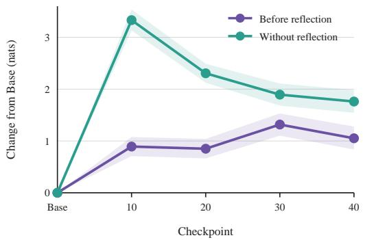

(b) Later prefixes require stronger reconstruction  
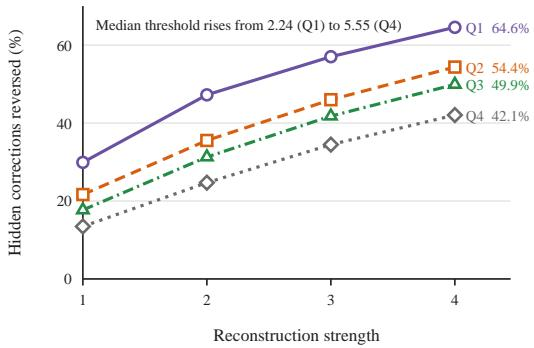  
Figure 6: Context-dependent reflection and late-prefix target recovery. (a) During training, the increase in reflection-token preference recedes at positions without reflection but remains elevated immediately before reflection. (b) Stronger reconstruction reverses more wrong teacher preferences, although later prefix quartiles require greater strength.

## B.2 RECONSTRUCTED SUPERVISION DRIVES EVIDENCE-SPECIFIC RECOVERY

Evidence-specific target recovery. To confirm that downstream corrections arise from the structured visual preference rather than a generic change in target magnitude or uncertainty, we isolate the token-level and spatial dependencies of the reconstructed target. We compare the true reconstructed target against alternatives that shuffle the token identities while preserving the magnitude or uncertainty of the target change. At the spatial level, we replace the task-relevant evidence crop with non-overlapping visual content from the same image to determine whether the correction relies on the designated evidence region.

We find that target recovery depends on the precise corrective direction and the relevant visual evidence. Stronger reconstruction overturns more erroneous teacher preferences and reaches later states under accumulated hallucinations (Figure 6b). Shuffling the visual preference removes most of the correct-option margin, even when the magnitude or uncertainty of the target change matches the original reconstruction (Figure 7a). Similarly, replacing the evidence crop with irrelevant spatial regions degrades the ability to reverse late erroneous preferences (Figure 8a). These results show that the student’s behavioral change is driven by the exact visual constraints extracted from the intra-teacher contrast rather than an undirected shift in the output distribution.

(b) Visual influence returns after reflection

(a) Shuffling tokens removes the gain  
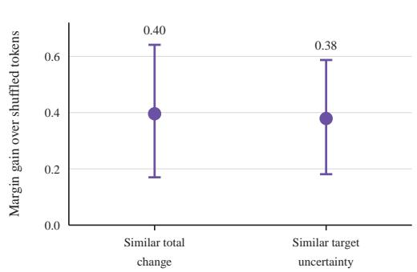

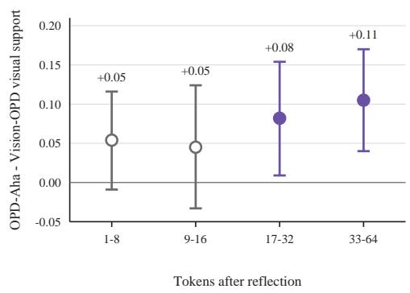  
Figure 7: Token-specific correction and renewed visual support. (a) The visual preference signal produces a larger correct-option margin than token-shuffled alternatives with comparable target change or uncertainty. (b) After reflection, OPD-Aha gains more visual support for its generated tokens than Vision-OPD.

Post-reflection dynamics of visual recovery. We further examine how this evidence-grounded correction unfolds across the generated response after a reflection token. We track both the visual support for subsequent tokens and the decision margin for the correct answer to characterize how the student’s continuation and answer preference evolve after self-interruption.

(a) Strong reconstruction isolates relevant evidence

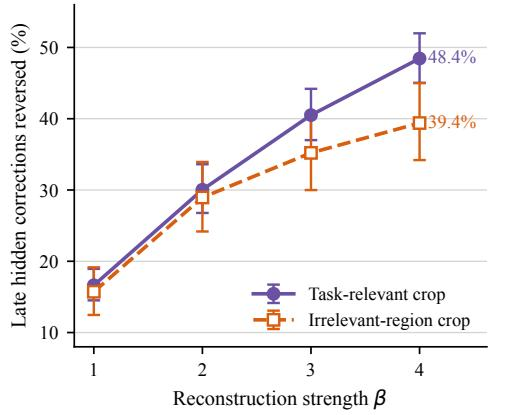  
(b) Decision-margin separation remains weaker

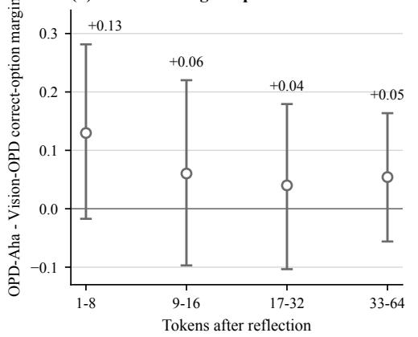  
Figure 8: Evidence specificity and answer-margin dynamics after reflection. (a) As reconstruction strengthens, the task-relevant crop reverses more late wrong preferences than a same-shaped, nonoverlapping crop from the same image. (b) At the same reflection prefixes, OPD-Aha maintains a larger correct-option margin than Vision-OPD.

We observe complementary changes in visual support and answer preference after reflection. Relative to Vision-OPD, OPD-Aha’s mean correct-option margin advantage is largest in the first 1–8 tokens and remains positive across the later windows (Figure 8b). Its visual-support advantage is larger in the later windows than immediately after reflection (Figure 7b). Thus, an early answermargin advantage accompanies a continuation that increasingly draws on visual evidence. Together, these trends connect self-interruption with renewed visual reliance and improved answer preference along the subsequent generation.

## C EXPERIMENTAL CONFIGURATIONS AND ROBUSTNESS EVALUATIONS

## C.1 EXPERIMENTAL SETUP

We evaluate OPD-Aha with Qwen3.5 students at the 4B and 9B scales on six fine-grained visual benchmarks: V⋆Bench (Wu & Xie, 2024), ZoomBench (Wei et al., 2026), HR-Bench-4K and HR-Bench-8K (Wang et al., 2025), and the English and Chinese splits of MME-RealWorld (Zhang et al., 2025). Our controlled comparison uses the 6,241 training examples released with Vision-OPD (Yuan et al., 2026) and holds the student initialization, rollout and update budgets, and decoding configuration fixed across GRPO (Shao et al., 2024), Vision-OPD, V-Zero, and OPD-Aha. The student generates from the original full image, while methods using privileged supervision receive the same localized evidence crop. OPD-Aha additionally constructs its visual null by replacing this crop with its mean RGB color. General-purpose and agentic multimodal models provide broader capability context. We report per-benchmark accuracy and the unweighted mean across the six benchmarks $\left( \mathrm { A v g _ { 6 } } \right)$ . Full training configurations are provided in Appendix C.2.

## C.2 TRAINING DETAILS

Reconstructing the distillation target requires separating the effect of visual evidence from modelspecific differences in capacity and calibration. Within each model scale, the same frozen copy of the initial student serves as the teacher for both the real-evidence and visual-null predictions. The model, shared student prefix, and token positions remain fixed, so the resulting change in token preference is attributable to the localized visual evidence. This correction is distilled along the unchanged student rollout, while inference retains only the student and the original full image. Table 4 summarizes the shared optimization configuration.

Table 4: Training configuration for OPD-Aha.
<table><tr><td>Configuration</td><td>Value</td></tr><tr><td>Student backbone</td><td>Qwen3.5-4B / Qwen3.5-9B</td></tr><tr><td>Teacher</td><td>Frozen copy of the initial student</td></tr><tr><td>Training data</td><td>Vision-OPD-6K (6,241 examples)</td></tr><tr><td>Student visual input</td><td>Original full image</td></tr><tr><td>Teacher real-evidence input</td><td>Localized evidence crop</td></tr><tr><td>Teacher visual-null input</td><td>Mean RGB crop with matched dimensions</td></tr><tr><td>Distillation objective</td><td>JSD (4B and 9B)</td></tr><tr><td>Distribution support</td><td>student top-100 tokens and one tail bucket</td></tr><tr><td>Learning rate</td><td> $2 \times 1 0 ^ { - 6 }$ </td></tr><tr><td>Global batch size</td><td>96</td></tr><tr><td>Rollouts per prompt</td><td>8</td></tr><tr><td>Maximum prompt / response length</td><td>8,192 / 1,024 tokens</td></tr><tr><td>Random seed</td><td>42</td></tr></table>

## C.3 TARGET RECONSTRUCTION REMAINS ROBUST ACROSS SUPERVISION GEOMETRIES

The reconstructed target defines the corrective token distribution, while the supervision divergence determines the optimization geometry used to align the student with that target. Contrasting the symmetric Jensen–Shannon divergence with the directional Forward and Reverse KL alternatives separates the benefit of target reconstruction from a particular loss formulation.

Table 5: Ablation of the supervision divergence at the 4B and 9B scales.
<table><tr><td>Divergence</td><td> $\mathbf { V } ^ { \star }$ </td><td>Zoom</td><td>HR-4K</td><td>HR-8K</td><td>MME-EN</td><td>MME-CN</td><td>Avg6</td></tr><tr><td colspan="8">Qwen3.5-4B</td></tr><tr><td>Forward KL</td><td>94.76</td><td>59.53</td><td>86.38</td><td>82.88</td><td>76.56</td><td>74.06</td><td>79.03</td></tr><tr><td>Reverse KL</td><td>93.72</td><td>62.01</td><td>87.00</td><td>84.88</td><td>76.31</td><td>73.89</td><td>79.63</td></tr><tr><td>JSD</td><td>93.70</td><td>62.50</td><td>88.60</td><td>84.80</td><td>77.70</td><td>74.90</td><td>80.40</td></tr><tr><td colspan="8">Qwen3.5-9B</td></tr><tr><td>Forward KL</td><td>89.01</td><td>57.99</td><td>83.00</td><td>79.88</td><td>70.38</td><td>71.15</td><td>75.23</td></tr><tr><td>Reverse KL</td><td>94.80</td><td>60.90</td><td>89.50</td><td>86.50</td><td>77.90</td><td>75.40</td><td>80.80</td></tr><tr><td>JSD</td><td>94.76</td><td>63.91</td><td>88.88</td><td>87.50</td><td>78.28</td><td>75.24</td><td>81.43</td></tr></table>

JSD achieves the highest $\mathrm { \ A v g _ { 6 } }$ at both 4B and 9B, while the best per-benchmark results remain distributed across divergence choices (Table 5). Multiple divergence choices nevertheless retain the gains of target reconstruction, showing that its benefit arises from the reconstructed visual preference rather than a single supervision geometry.

## C.4 LOG-PROBABILITY PRESERVES THE RELATIONAL STRUCTURE OF VISUAL EVIDENCE

Translating the visual preference into a valid training target requires choosing how to represent the evidence-induced prediction shift. Probability-space reconstruction treats this shift as an absolute displacement of probability mass, $q _ { t } ^ { \mathrm { p r o b } } ( \beta ; v ) \propto [ ( 1 + \beta ) p _ { t } ^ { + } ( v ) - \beta p _ { t } ^ { 0 } ( v ) ] _ { + }$ . Log-probability reconstruction instead represents the relative change between the real and visual-null predictions, $q _ { t } ^ { \log } ( \beta ; v ) \propto p _ { t } ^ { + } ( v ) \big ( p _ { t } ^ { + } ( v ) / p _ { t } ^ { 0 } ( v ) \big ) ^ { \beta }$

Table 6: Probability-space and log-probability reconstruction yield comparable aggregate gains.
<table><tr><td>Target</td><td>Representation</td><td>V*</td><td>Zoom</td><td>HR-4K</td><td>HR-8K</td><td>MME-EN</td><td>MME-CN</td><td> $\mathbf { A v } \mathbf { g } _ { 6 }$ </td></tr><tr><td>Standard privileged target</td><td></td><td>89.0</td><td>59.5</td><td>83.4</td><td>80.5</td><td>74.6</td><td>71.6</td><td>76.4</td></tr><tr><td>Probability-space target</td><td>Probability</td><td>95.8</td><td>60.8</td><td>85.3</td><td>82.0</td><td>75.6</td><td>72.5</td><td>78.7</td></tr><tr><td>Reconstructed target</td><td>Log-probability</td><td>93.2</td><td>61.5</td><td>86.0</td><td>82.0</td><td>76.5</td><td>73.2</td><td>78.8</td></tr></table>

Both representations improve over the standard privileged target and produce similar aggregate gains (Table 6). The log-probability form more directly preserves the multiplicative relation between the real and visual-null predictions. Absolute probability shifts depend on the initial scale of each token probability, whereas the log-probability formulation retains the privileged teacher distribution as a structural anchor and applies an exponential tilt along the visual preference.

## C.5 RECONSTRUCTED SUPERVISION IS ROBUST TO VISUAL-NULL CONSTRUCTIONS

The visual null removes task-relevant evidence while providing a reference for the same teacher under the shared student prefix. Alternative constructions test whether the corrective signal reflects the active contribution of privileged evidence or an artifact of a particular null input. We consider Gaussian noise, a mismatched natural image, a black image, and the mean-color transformation used by OPD-Aha.

Table 7: Ablation of the visual null.
<table><tr><td>Visual null  $I ^ { 0 }$ </td><td> $\mathbf { V } ^ { \star }$ </td><td>Zoom</td><td>HR-4K</td><td>HR-8K</td><td>MME-EN</td><td>MME-CN</td><td> $\mathbf { A v } \mathbf { g } _ { 6 }$ </td></tr><tr><td>Gaussian noise</td><td>95.3</td><td>61.0</td><td>86.5</td><td>83.8</td><td>77.3</td><td>74.9</td><td>79.8</td></tr><tr><td>Mismatched image</td><td>94.8</td><td>63.0</td><td>85.9</td><td>82.9</td><td>77.0</td><td>74.1</td><td>79.6</td></tr><tr><td>Black image</td><td>95.3</td><td>62.5</td><td>87.6</td><td>83.6</td><td>77.8</td><td>75.1</td><td>80.3</td></tr><tr><td>Mean RGB color (Ours)</td><td>93.7</td><td>62.5</td><td>88.6</td><td>84.8</td><td>77.7</td><td>74.9</td><td>80.4</td></tr></table>

The extracted visual preference produces similar aggregate improvements across all four constructions (Table 7). This stability shows that target reconstruction depends on removing the privileged visual content rather than on the specific appearance of the null input. The mean-color transformation therefore provides a simple and effective default without being a critical design choice.

## C.6 TRAINING DYNAMICS

At each update, we track the token-level JSD between the student and the reconstructed target, the actor gradient norm, and answer accuracy on generated rollouts. These trajectories connect the optimization process to changes in generation and final decisions.

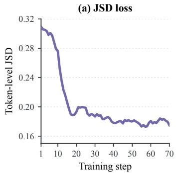

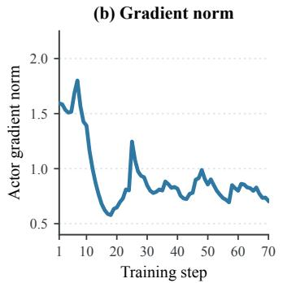

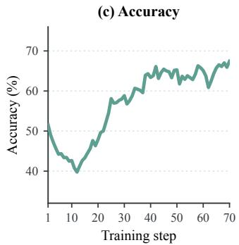  
Figure 9: Training dynamics of the 4B student with $\beta \ = \ 4 .$ (a) Token-level JSD falls sharply early in training and then stabilizes. (b) The actor gradient norm follows the same transition before settling into a lower range. (c) Answer accuracy on the generated rollouts initially decreases and then recovers.

The JSD and gradient activity decrease before accuracy begins to recover. This early interval overlaps with the transient response-length increase in Figure 3c. The reconstructed target therefore changes generation before improved decisions become visible in rollout accuracy.

## C.7 QUALITATIVE CASE STUDIES

We select three paired cases from HR-Bench-4K and HR-Bench-8K to examine how the reconstructed target changes generation beyond the final accuracy score. In each case, Vision-OPD produces an incorrect answer while OPD-Aha answers the same question correctly. Figures 10, 11, and 12 show the full image, the localized evidence crop, and the complete generated trajectories from both methods. Red marks the interpretation that supports the initial wrong commitment, purple marks the reflection that interrupts this continuation, and blue marks the rechecked visual evidence and corrected answer. The cases cover fine-grained text recognition, spatial viewpoint resolution, and distant clock reading.

Across the three cases, OPD-Aha revisits uncertain interpretations before committing to the final answer. The student recognizes that its current interpretation may be unreliable, then returns to the diagnostic region and rechecks the decision against visual evidence. The reflection token marks the pivot between these stages: it interrupts the uncertain continuation and precedes a renewed check of the visual evidence. Vision-OPD instead remains consistent with its first reading and turns an early perceptual mistake into a confident wrong answer. The trajectories illustrate how reconstructed supervision can lead from self-interruption to renewed use of visual evidence.

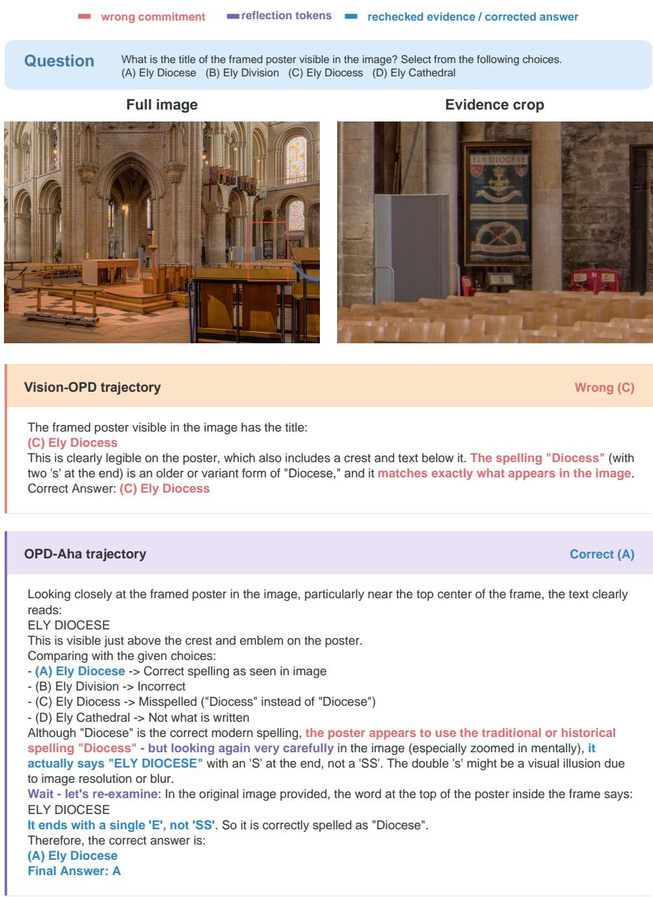  
Figure 10: Fine-grained text recognition. Vision-OPD commits to option C by reading the poster title as “Ely Diocess” and rationalizing the extra “s.” OPD-Aha initially reads “ELY DIOCESE” correctly, then questions the spelling and considers “Diocess.” After reflection, it re-examines the poster text, returns to its original reading, and selects option A. The trajectory shows a renewed check of the diagnostic letter sequence after an intervening mistaken interpretation.

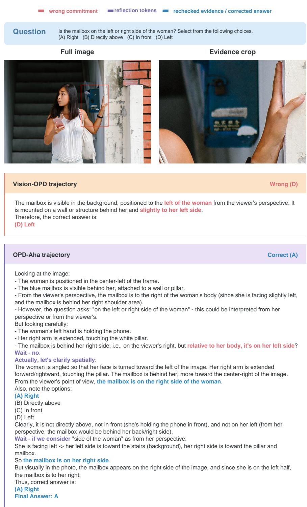  
Figure 11: Spatial viewpoint resolution. Vision-OPD anchors on the mailbox’s horizontal image position and selects option D, placing it on the woman’s left. OPD-Aha questions the reference frame, relates the mailbox to the woman’s body and outstretched right arm, and selects option A. During reflection, it rechecks both the woman’s pose and the mailbox’s image position to resolve the left–right ambiguity.

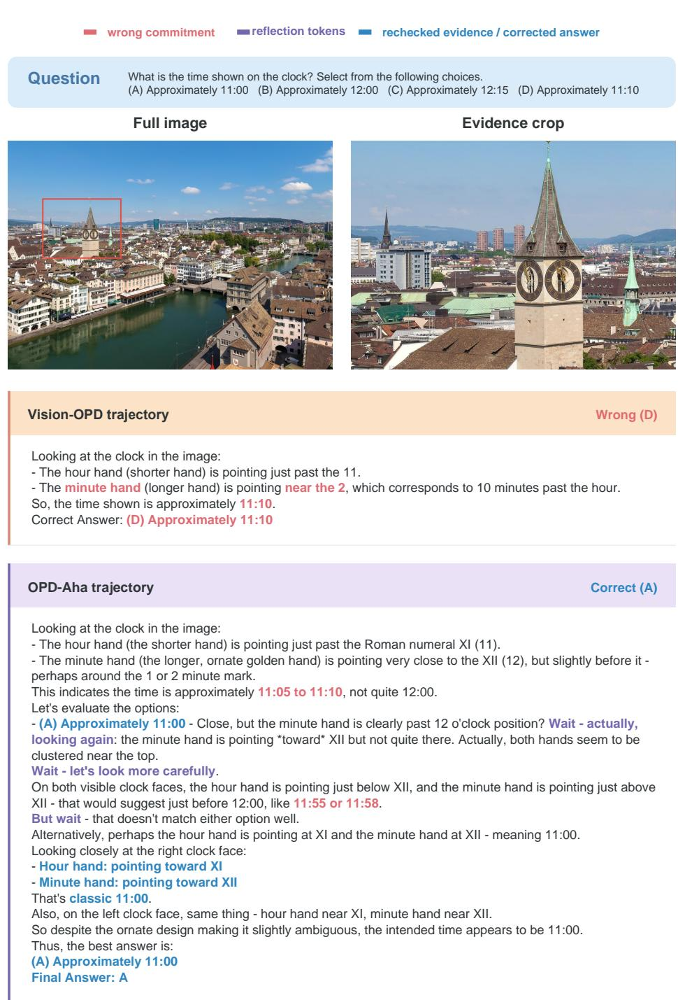  
Figure 12: Distant clock reading. Vision-OPD misreads the minute hand as pointing near II and selects approximately 11:10, option D. OPD-Aha revisits both visible clock faces, distinguishes the short hour hand near XI from the long minute hand near XII, and selects approximately 11:00, option A. Cross-checking the repeated visual evidence prevents one ambiguous hand estimate from determining the final answer.