# OPEN-1B: A Fully Auditable Training Run

John Donaghy1, Brian Wilcox1, Oğuzhan Ersoy1, Shikhar Rastogi1, Adam St Arnaud1, Alexey   
Titov1, Jordan Greenberg1, Ben Fielding1 and Harry Grieve1   
1Gensyn

Open-source language models have a reproducibility problem. Despite releasing weights, training data, and recipes, none of them are provably reproducible due to the non-associativity of floatingpoint arithmetic. Deep learning frameworks often ofer a deterministic execution mode, allowing reproducible operations on the same machines. Unfortunately, this determinism does not carry across hardware such that a user can verify that a released checkpoint was actually produced using the declared training recipe. This leaves room for undisclosed data, injected biases, or backdoors that existing techniques such as proof-of-learning or proof-of-training-data cannot rule out. We introduce a new tier of model transparency, fully auditable, in which every operation on every data sample during training is independently reproducible on heterogeneous commodity hardware with bitwise certainty. By imposing a definite order on the sources of training nondeterminism, GPU kernel reductions, data batch ordering across a data-parallel cluster, and inter/intra-node collective communication, we make it possible to replay any individual step of a large, distributed training run on a single piece of commodity hardware and check it against the published trajectory. Because replaying an entire run on one machine is infeasible, we support this with a collective verification scheme in which many independent auditors each certify individual steps, together covering the whole run. We release Open-1B, a model trained under this regime, together with its full pretraining dataset, every intermediate checkpoint, the training codebase, and the audit harness needed to reproduce and verify any step of its training.

Links: Code | Models | Audit App

## Contents

1 Introduction 2   
2 Reproducibility Across Heterogeneous Hardware 4   
2.1 Reproducible Operations 4   
2.2 RepOps for Neural Network Training 6   
2.3 The Topologically Invariant Reproducible Data Stream 6   
3 Open-1B 7   
3.1 Model Architecture 7   
3.2 Training Recipe 8   
3.3 Base 10   
3.3.1 Pretraining Data: Open-1B Mix 0626 10   
3.3.2 Base Evaluations 11   
3.4 Convergence Deep Dive 11   
3.4.1 Loss convergence 11   
3.4.2 Gradient behavior, Clipping, and Spike Protocol . 12   
3.4.3 Weight-norm evolution . 13   
Stability Deep Dive 14   
4.1 Gradient Creep 14   
4.2 Quantizer Step-Size Drift . 14   
4.3 int8 vs bf16 17   
5 The Cost of Reproducibility 17   
6 Audit 20   
Conclusion 21   
Deterministic Gradient Reduction 27   
A.1 Inter-Node All-Reduce over Replicas . 27   
A.2 Intra-Node Reduce-Scatter over Shards 28   
A.3 Average via Reciprocal Multiply 28   
B State-Hash Overhead 29

## 1. Introduction

The democratization of intelligence cannot be achieved without enabling access to both large language models (LLMs) and the transparency of their training process. The current state of AI has stratified into three tiers of transparency: closed models with constrained API access, open weight models where the model weights are accessible to users, and open source models where the training process is publicly available.

Closed models such as GPT Sol (OpenAI, 2026), Claude Opus (Anthropic, 2026a), Gemini (Google DeepMind, 2026) and Grok (xAI, 2026) are strictly controlled by the companies creating them. Users may gain access to a model through an API but cannot know its architecture or the trajectory which was taken to arrive at the model. The recent gatekeeping by Anthropic and OpenAI of their flagship models is an example of such restrictions (OpenAI, 2025; Anthropic, 2025) where they can even downgrade the served AI products for paid subscriptions (Anthropic, 2026b). The access limitations decided by a small number of companies hurt the development of open and free research, and AI usage in general. Furthermore, the companies, which claim to introduce these restrictions for safety reasons, are silently shifting the accountability and responsibilities to the users (Davidson et al., 2026).

Open weight models like Qwen (Yang et al., 2025), Kimi (Team et al., 2026), DeepSeek (DeepSeek-AI et al., 2026) and GLM (GLM-5-Team et al., 2026) provide transparency on the model weights, which are generally made available to users through the release of the final checkpoint’s weights. This allows users to run or fine-tune them on their own hardware. In the case of an open weight model, the data and methods used to train the model are of varying degrees of opacity. Some techniques and data may be openly discussed while others are held as proprietary information. Because of partial transparency of the data, the users cannot know the biases or preferences injected during the training process. Ideological biases of these models such as political opinions have already been analysed (Gurgurov et al., 2025; Qiu et al., 2026; Pan and Xu, 2026; Jensen et al., 2026). However, some of the preference biases are dificult, if not impossible, to detect until that specific domain has been analysed.

Open source models like OLMo (Olmo et al., 2026), Apertus (Hernández-Cano et al., 2026), Marin (Community, 2025) and Pythia (Biderman et al., 2023) provide better transparency across all tiers since the weights are released alongside the data and recipe that were followed to construct the final result. A user with enough resources would be able to reproduce a similar model by following the provided recipe. While these recipes are fundamental and greatly support open source AI development, because of the nondeterministic nature of training, their training processes are not fully reproducible. Specifically, since floating-point operations are nonassociative, even if a user follows the exact training recipe, they would end up with slightly diferent model weights (Srivastava et al., 2024); thus, it is not possible to check the correctness of these training steps. Existing heuristic verification techniques for the training process or data like proof-of-learning (Jia et al., 2021) or proof-of-training-data (Choi et al., 2024) can only provide probabilistic verification of the training process. However, they could fail to detect injection of a backdoor into the model, since a backdoor can be added with only a few data points (Souly et al., 2025). Therefore, unless the training is done via reproducible operators (Arun et al., 2025), even open source models are not fully verifiable and cannot guarantee the exact training process.

Here, we introduce the next tier of model disclosure: a fully auditable model where every single operation on every single data sample is verifiable by anyone. Our goal is to make available the first model whose final weights, training data, training recipe, evaluations, and entire pretrained compute graph are released in a verifiable manner. Along with the model, we are releasing an audit harness which allows a user to reproduce a single training step and with bitwise certainty assert that the results match what is attested to in the published training run. Ultimately, the entire training run results in a single hash, which definitively proves that the model was trained exactly as declared.

Since verification of the entire training run on commodity hardware is not feasible, we designed a collective verification system. Taking inspiration from open source software where a user may verify a particular module or function, we aim to collectively verify the run by decentralizing the audit. With many users certifying each step individually, we can arrive at the exact collective final state of the training run which produced the model.

We hope that this fully open regime of intelligence will be the first step of many towards the wide distribution of intelligence as a resource.

Our contributions to open source AI include:

• Infrastructure for auditable neural network training. We provide RepOps, our library for reproducible operations across heterogeneous hardware, a topologically invariant data loader, which provides a consistent batch ordering regardless of cluster parallelism, and deterministic, performant collective communications which may be replayed sequentially on a single device.

• The first fully auditable open source LLM, Open-1B. In addition to the final base model checkpoint, we provide the entire dataset used for pretraining, each intermediate checkpoint at intervals of 100 steps, and the full codebase used to train and evaluate the model.

• An open recipe for native quantization-aware pretraining. We adapt the Team OLMo et al. (2024) pretraining recipe with modifications to enable int8 quantization natively from the pretraining stage.

• A harness to audit any step of Open-1B’s pretraining run on commodity hardware. Supported hardware includes NVIDIA GPUs, x86 CPUs, ARM CPUs, and Apple Silicon via Metal.

## 2. Reproducibility Across Heterogeneous Hardware

Determinism and reproducibility are often conflated, but they are distinct properties. Determinism means a computation returns the same result every time it runs on the same machine with the same environment. Most machine-learning frameworks ofer a “deterministic mode” that provides this property. Reproducibility, on the other hand, is a stronger requirement. It implies that the computation returns the same result, bit for bit, across heterogeneous hardware, e.g. a processor and a GPU, or two diferent GPU models. Not to within one unit in the last place (ULP), but exactly the same result. We call this property bitwise reproducibility (BR).

Determinism does not imply reproducibility. A training run can be perfectly repeatable on its own GPU while disagreeing with an identical run on a processor or a diferent GPU model. A framework’s deterministic mode addresses only the first case.

This is a consequence of floating-point arithmetic. Floating point is a finite-precision format that represents only a subset of the real numbers exactly, so nearly every operation rounds its result to the nearest representable value. Two consequences of this break naive reproducibility.

Addition is not associative. With exact arithmetic, grouping does not matter: (� + �) + � equals � + (� + �). With floating point this can fail, since each addition rounds before the next one happens. Writing ⊕ for floating-point addition,

$$
( a \oplus b ) \oplus c \ \neq \ a \oplus ( b \oplus c ) { \mathrm { i n ~ g e n e r a l . } }
$$

The order in which a long sum is accumulated therefore changes its result in the last bits. This matters because hardware adds numbers in parallel, and diferent hardware assigns diferent orderings. A GPU may split a sum across thousands of lanes and combine them in a hardware-specific pattern, while a processor accumulates end to end, producing a diferent rounding sequence from the same inputs.

The same operation compiles to diferent instructions. A single high-level operation can be turned into diferent machine instructions on diferent hardware, each rounding a little diferently. See the fused multiply add of §2.1 as an example.

## 2.1. Reproducible Operations

RepOps is Gensyn’s library of reproducible operations. It provides a familiar API for mathematical operations with an autograd extension. Each operation is written so that it returns a BR result across processors, NVIDIA GPUs, and Apple GPUs.

What follows is a short summary of some numerical issues which prevent BR execution, and RepOps’ approach to resolving those issues.

Reduction order. Sums appear everywhere in a model: inside every matrix multiplication, inside normalization, and in the loss and gradient reductions. By the non-associativity above, each of these is order-sensitive. RepOps computes them in a fixed order on all hardware, so the sequence of roundings is identical everywhere, at some cost in speed relative to the hardware’s preferred order.

Fused multiply-add. Hardware can compute the common pattern � × � + � in two ways: as a single fused instruction that rounds once, or as a multiply followed by an add that rounds twice. The two results can difer by one ULP. Compilers apply fusion opportunistically, and make diferent choices on diferent backends. RepOps forces one convention. It disables fusion in the processor build and uses explicitly unfused multiply-and-add operations on the GPU, so the outcome is not left to the compiler.

Subnormals. Subnormal numbers (also called denormals) are the floating-point values very close to zero, below the smallest “normal” number the format can represent. They exist so that arithmetic degrades smoothly toward zero instead of snapping to it, but they are stored with reduced precision, and they are slow to compute with. Because they are slow, hardware disagrees about them: some processors compute with subnormals faithfully, while others treat any subnormal value as exactly zero. Two modes describe the discarding: flush-to-zero (FTZ), which zeroes a subnormal result, and denormals-are-zero (DAZ), which zeroes a subnormal input. Apple GPUs discard subnormals; processors and NVIDIA GPUs keep them by default.

This produces exactly the kind of reproducibility break an audit cannot tolerate. A value in the subnormal range is kept on one backend and zeroed on another, so the resulting operations difer, leading to diferent training trajectories.

RepOps resolves this by matching the least permissive backend. Apple turns on FTZ and DAZ by default, so RepOps matches the processor and NVIDIA paths’ behavior such that they flush subnormals to zero identically. This is the general shape of every BR decision: to be reproducible across a set of machines, adopt the behavior of the least capable one deliberately, even on hardware that would not otherwise need it.

Random number generation. Seeding alone does not make two platforms draw the same numbers, since each ships its own generator with its own internal state and layout: a processor, an NVIDIA GPU, and an Apple GPU produce three diferent sequences from the same seed.

The problem is not limited to cross-vendor diferences; a single vendor’s generator is not even consistent with itself. On an NVIDIA GPU, for example, the generator spreads its work across thousands of parallel lanes, and which lane draws which number depends on how the computation was parallelized.

For auditable training this is unworkable, since two runs that disagree on their random draws diverge immediately and completely. The resolution is a counter-based generator, in which the random value is a pure function of the seed and a fixed logical position: the value at index � is computed directly from (seed, �) with no running state, independent of how the work is split, how many lanes run, how large the tensor is, or which GPU executes it. This turns randomness from a per-platform, per-size artifact into a single stream that every backend reproduces.

Each of the issues above must be addressed in order to maintain BR execution which is verifiable across heterogeneous hardware. These are summarized in Table 1.

<table><tr><td>What breaks bit-for-bit equality</td><td>How RepOps holds it</td></tr><tr><td>Same-machine determinism is not cross-hardware</td><td>An explicit cross-hardware equality contract</td></tr><tr><td>Floating-point addition is not associative</td><td>One fixed reduction order on every backend</td></tr><tr><td>Fused vs. separate multiply-add</td><td>Enforcing a single convention</td></tr><tr><td>Subnormal numbers handled differently</td><td>Flush them to zero everywhere</td></tr><tr><td>Random draws differ by platform and sample size</td><td>One counter-based stream, indexed by position</td></tr></table>

Table 1 Issues and techniques to enforce the BR standard across heterogeneous hardware.

## 2.2. RepOps for Neural Network Training

At its core, training a neural network consists of a forward pass, gradient calculation, and weight updates. If any operation in the entire chain from initialization to convergence is not BR, then the entire training trajectory is not verifiable across hardware vendors.

This complexity has been reduced for the end user by providing abstractions for common optimizers, loss functions, and backward functions, in addition to the core neural network layers.

## 2.3. The Topologically Invariant Reproducible Data Stream

Bitwise reproducible operations are not enough to replay a training run on a single device. The replay must also process exactly the same tokens in exactly the same order as the cluster’s run. While conventional data loaders may generally return a deterministic batch ordering, the order is not consistent across cluster topologies. Changing the number of data parallel workers results in diferent batch orderings. Further, each rank has a diferent random number generator, worker prefetch queue, and rank-striped sharding.

Open-1B instead defines the training data as a single canonical stream forming a logical sequence of packed windows $W _ { 0 } , W _ { 1 } , W _ { 2 } , \ldots$ The stream is a function of the training seed and the corpus manifests. It does not depend on world size, rank, number of nodes, or any other property of the machine executing it. Training on any topology, resuming from any checkpoint, and replaying on a single consumer-grade device all enumerate the same windows with the same contents.

Succinctly, we implement a topologically invariant batch ordering. The invariance allows for an elastic cluster topology, so that the run can maintain reproducible execution across diferent cluster sizes. In the case of a hardware failure or resource re-allocation, the run can be re-sharded onto a diferent number of devices without perturbing the training data sequence.

Most importantly, this design is what makes the audit of section 6 possible. An auditor replaying a step on one device reconstructs the same micro-batches with the same ordering that the cluster-based training run consumed during the same step.

Construction. Three pseudorandom generators fully determine the stream, each seeded only by constants of the run:

1. Source interleaving. A single global mix RNG, seeded by the training seed alone, selects which source (web, code, math, . . . ) supplies the next document, with probabilities derived from the token-share weights of §3.3.1.

2. Shard order. For each source, an RNG seeded by (seed, �(source), epoch) permutes the order of that source’s shards, where � is a SHA-256 hash of the source name. Hashing the name, rather than using Python’s per-process randomized hash, is what keeps the permutation identical across processes, machines, and interpreter versions.

3. Document order. Within each shard, an RNG seeded by (seed, �(source), epoch, shard) permutes the documents. Concatenated in shard order, this yields one deterministic permutation of every document in the source per epoch.

Selected documents are concatenated into a flat token bufer with a separator token after each document, and windows are sliced of the front of the bufer at a fixed 4,097 tokens (inputs + labels).

Data parallelism. Parallelism is applied after the stream is defined. A deterministic schedule maps each optimizer step to a contiguous range of window indices, and within a step, data parallel rank � of an �-way data-parallel job owns window $W _ { m }$ if and only if � mod $R = r .$ . Changing the number of GPUs therefore changes only which rank loads window $W _ { m }$ . This comes with the caveat that the global batch size and the gradient accumulation must be carefully selected such that no worker becomes idle as the system scales. With � total microbatches and � gradient accumulation steps, we ideally want (� mod $R ) = 0$ such that each data parallel rank owns $g = M / R$ microbatches.

Resumable state. The complete position of the stream is captured by a small, rank-independent record which includes the number of documents consumed from each source, the per-source epoch counters, the exact bit-generator state of the mix RNG, and the partial window left in the packing bufer at save time. This state is used when reconstructing the global stream for a training restart/continuation or an audit replay.

## 3. Open-1B

## 3.1. Model Architecture

Open-1B has a decoder-only transformer architecture (Vaswani et al., 2017) where we take inspiration from Llama 3 (Grattafiori et al., 2024), OLMo 2 (Team OLMo et al., 2024), and Gemma (Gemma Team et al., 2025) models, with slight adjustments to make the training reproducible and stable under low-precision training. Table 2 provides an overview of the Open-1B architecture design and Table 3 describes the parameter sizes of our 1B-class model with 1.61B total parameters, 1.08B of which are non-embedding. Below is a full breakdown of each architectural component:

• No biases: We exclude all bias terms from our architecture (Chowdhery et al., 2023, inter alia).

• SwiGLU activation function: We use the SwiGLU activation function (Shazeer, 2020); the gate and up projections are computed as a single fused GEMM.

• Rotary positional embeddings (RoPE): We use rotary positional embeddings (RoPE; Su et al., 2024) with $\theta = 5 0 0 { , } 0 0 0$ , matching Grattafiori et al. (2024).

• Grouped-query attention (GQA): 16 query heads share 4 key/value heads (Ainslie et al., 2023) to reduce KV-cache and communication cost.

• RMSNorm: We use the RMSNorm (Zhang and Sennrich, 2019) variant of LayerNorm (Ba et al., 2016) without a bias term. We keep the standard pre-norm placement, normalizing the inputs to the attention and feedforward (MLP) layers. The formula for each transformer block is:

$$
\pmb { h } : = \pmb { x } + \mathrm { A t t e n t i o n } ( \mathrm { R M S N o r m } ( \pmb { x } ) )\tag{1}
$$

$$
\begin{array} { r } { h _ { \mathrm { o u t } } : = h + \mathrm { M L P } ( \mathrm { R M S N o r m } ( h ) ) } \end{array}\tag{2}
$$

where � is the input to the layer, � is an intermediate hidden state, and $\pmb { h } _ { \mathrm { o u t } }$ is the output. A final RMSNorm is applied before the language-modeling head.

• Gain-free QK-norm: Following Dehghani et al. (2023), we normalize the query and key projections with RMSNorm before calculating attention, preventing attention logits from growing too large. Unlike OLMo 2 and Qwen 3 (Yang et al., 2025), our QK-norm carries no learnable gain (as in Gemma 3; Gemma Team et al., 2025). The product of learned query and key gains acts as an unbounded attention temperature. We observed this behavior driving an attention-entropy collapse, which is elaborated upon in Section 4.1. The norm is applied per head, before RoPE.

• Embedding norm: We apply an additional RMSNorm to the output of the token embedding before the first transformer block. This bounds the magnitude of the residual stream entering the network, which we found necessary for stable activation quantization.

• Hybrid sliding-window attention: We use sliding-window attention with a 512-token window size. Every 5th layer and the final layer remain fully causal, following the local-global interleaving of Gemma 2 (Gemma Team et al., 2024; Beltagy et al., 2020).

<table><tr><td></td><td>OPEN-1B</td></tr><tr><td>Biases</td><td>None</td></tr><tr><td>Activation</td><td>SwiGLU</td></tr><tr><td>RoPE θ</td><td> $5 \cdot 1 0 ^ { 5 }$ </td></tr><tr><td>Attention</td><td> ${ \mathrm { G Q A } } ,$  hybrid SWA (512, 4:1)</td></tr><tr><td>QK Normalization</td><td>RMSNorm, gain-free</td></tr><tr><td>Layer Norm</td><td>RMSNorm</td></tr><tr><td>Layer Norm Applied to</td><td>Inputs (+ embedding output)</td></tr><tr><td>Z-Loss Weight</td><td> $1 0 ^ { - 4 }$ </td></tr><tr><td>Embeddings</td><td>Untied</td></tr><tr><td>Weight Decay on Embeddings</td><td>No (input only)</td></tr><tr><td>Linear-Layer Precision</td><td>int8 W8A8 (LSQ QAT)</td></tr></table>

Table 2 Summary of the Open-1B architecture. Changes were motivated by experiments showing improved training stability under int8 quantization-aware training, and by the requirement of bitwise-reproducible execution.

• Z-loss: Following Chowdhery et al. (2023) and Wortsman et al. (2023), we adopt z-loss regularization with weight $1 0 ^ { - 4 }$ , computed in the same fused, chunked pass as the cross-entropy loss so the [�, �] logit tensor is never materialized twice.

• Untied embeddings: The input embedding and language-modeling head are separate matrices. We exclude the input embedding from weight decay (Team OLMo et al., 2024) while the languagemodeling head retains it.

• int8 quantization-aware training: All attention and feedforward linear layers are trained with 8-bit weights and activations using learned step-size quantization (LSQ; Esser et al., 2020), with per-channel weight scales re-pinned to 2 · mean $( \vert w \vert ) / \sqrt { q _ { \mathrm { m a x } } }$ at every optimizer step. The � · � product inside flash attention is likewise computed on int8 tensor cores. The embedding and language-modeling head remain in full precision.

• Bitwise-reproducible execution: Every operator in the model, matrix multiplies, normalizations, activations, RoPE tables, the embedding backward, loss reductions, and gradient reduction across data-parallel ranks, routes through BR RepOps kernels. Together with a counter-based Philox initialization stream, this makes the entire training run bit-exact under replay, independent of device count and topology, enabling third-party audit of any training segment.

Weights are initialized from a truncated normal distribution with a mean of 0 and a standard deviation of 0.02 (truncated at ±2�), with no depth- or width-dependent scaling, following Team OLMo et al. (2024). Parameters are held in BF16 with FP32 gradient reduction; normalization and loss computations are performed in FP32.

Our tokenizer is a byte-level BPE with a vocabulary of 128,256, trained from scratch with a Llama-3-style pre-tokenizer.

## 3.2. Training Recipe

Open-1B is pretrained on 400B tokens at a sequence length of 4,096 across 48xH100 GPUs. The complete recipe below is the one that produced the released run.

Optimizer. We use AdamW (Loshchilov and Hutter, 2019) with $\beta _ { 1 } = 0 . 9 , \beta _ { 2 } = 0 . 9 5$ , and $\varepsilon = 1 0 ^ { - 8 }$ routed through a bitwise-reproducible fused kernel (§2.1). The decoupled weight-decay coeficient is 0.1, applied to all linear layers and the language-modeling head; the input embedding, normalization weights, and RoPE tables are excluded. Gradients are clipped to a global $\ell _ { 2 }$ norm of 1.0.

<table><tr><td></td><td>OPEN-1B</td></tr><tr><td>Layers</td><td>24</td></tr><tr><td>Hidden Size  $( d _ { m o d e l } )$ </td><td>2048</td></tr><tr><td>Attention Heads (Q/KV)</td><td>16 / 4 (GQA)</td></tr><tr><td>Head Dimension</td><td>128</td></tr><tr><td>FFN Hidden Size</td><td>5632</td></tr><tr><td>Vocabulary Size</td><td>128,256</td></tr><tr><td>Sequence Length</td><td>4096</td></tr><tr><td>Sliding Window</td><td>512 (full every 5th layer)</td></tr><tr><td>Gradient Clipping</td><td>1.0</td></tr><tr><td>Peak LR</td><td>4.5· 10⁻4</td></tr><tr><td>LR Warmup</td><td>667 steps</td></tr><tr><td>LR Schedule (Cosine)</td><td>400B tokens, to 10% peak</td></tr><tr><td>Total Parameters</td><td>1.61B (1.08B non-embedding)</td></tr></table>

Table 3 Open-1B hyperparameters.
<table><tr><td>Phase</td><td>Token range</td><td>Tokens/step (seqs)</td><td>Grad. accum.</td></tr><tr><td>Warmup</td><td>0-4B</td><td>3,145,728 (768)</td><td>4</td></tr><tr><td>Main</td><td>4B-360B</td><td>4,718,592 (1,152)</td><td>6</td></tr><tr><td>Late</td><td>360B-400B</td><td>9,437,184 (2,304)</td><td>12</td></tr></table>

Table 4 Global-batch schedule. All phases use 48 GPUs with a per-GPU micro-batch of 4 sequences of 4,096 tokens; only the gradient-accumulation depth changes.

Batch size. Each GPU processes micro-batches of 4 sequences, 16,384 tokens, and the global batch is ramped in three phases by raising the gradient-accumulation depth (Table 4). The phase boundaries are defined in consumed tokens: the small warmup batch is held until 4B tokens for early stability, the main batch carries the run to 360B tokens, and the batch is doubled for the final 10% of training.

Learning-rate schedule. The learning rate warms up linearly over 667 steps of the warmup-phase batch (∼2.1B tokens) to a peak of 4.5·10−4, then follows a single cosine decay to 10% of peak $( 4 . 5 \cdot 1 0 ^ { - 5 } )$ at the 400B-token budget. The schedule is anchored to consumed tokens rather than step counts, so the batch-size ramp does not desynchronize it.

Seeding. The released run uses a single global seed of 42. Every source of randomness in training is derived deterministically from this seed as described in §2.3.

Regularization. We use no dropout anywhere in the model (attention, hidden, or embedding), nor any other stochastic regularization such as stochastic depth or label smoothing. The only regularizers are weight decay and the z-loss (§3.1).

int8 computation. Each linear layer of the transformer block, including the attention Q/K/V/output projections and both feed-forward GEMMs, runs on int8 tensor cores in both the forward and backward passes. In the forward pass, weights are quantized to 8 bits with learned per-channel step sizes and activations with a per-tensor scale (LSQ; §3.1), and the GEMM accumulates in int32 before dequantization. In the backward pass, gradients flow through the quantizers via the straight-through estimator, and both STE gradient GEMMs $( \nabla _ { x }$ and $\nabla _ { W } )$ likewise execute in int8: a Walsh–Hadamard rotation along the contraction dimension flattens the gradient outliers that otherwise dominate int8 quantization error, reducing the relative error of the weight gradient from ∼5% to ∼1% at our shapes and making int8 viable for the largest kernels in the training step. Inside flash attention, the forward � · � product quantizes the attention weights and values to int8 per block and multiplies on int8 tensor cores, while the $Q K ^ { \top }$ logits and softmax remain in higher precision. The attention backward is not quantized; it is a straight-through estimator through the deterministic BF16 flash backward, which recomputes the attention weights in full precision and accumulates ∇� in 64-bit fixed point for bitwise reproducibility. The token embedding and the language-modeling head are excluded from quantization entirely and remain in BF16, as do all normalizations, RoPE tables, and the loss computation (FP32).

<table><tr><td>Source</td><td>Type</td><td>Tokens</td><td>Docs</td><td>Tok/Doc</td><td>Share</td></tr><tr><td rowspan="3">DCLM-Baseline FineWeb-Edu The Stack v2</td><td>Web pages</td><td>300.5B</td><td>240.0M</td><td>1,252</td><td>66.7%</td></tr><tr><td>Educational web</td><td>59.8B</td><td>59.5M</td><td>1,005</td><td>13.3%</td></tr><tr><td>Code</td><td>54.2B</td><td>27.4M</td><td>1,978</td><td>12.0%</td></tr><tr><td>Proof-Pile-2</td><td>STEM &amp; math</td><td>36.0B</td><td>5.3M</td><td>6,743</td><td>8.0%</td></tr><tr><td>Total</td><td></td><td>450.5B</td><td>332.2M</td><td>1,356</td><td>100%</td></tr></table>

Table 5 Composition of the pretraining data for Open-1B (the Open-1B Mix 0626). Token counts are measured with our 128,256-vocabulary BPE tokenizer; shares are token shares of the training mix. DCLM-Baseline comes from Li et al. (2024); FineWeb-Edu (Penedo et al., 2024) is filtered to an educational score of at least 3; The Stack v2 (Lozhkov et al., 2024) is restricted to permissively licensed files of at most 1MB; Proof-Pile-2 (Azerbayev et al., 2024) combines arXiv, OpenWebMath (Paster et al., 2024), and Algebraic Stack.

Optimizer-state precision. Parameters are held in BF16, but both Adam moments (�, �) are stored in FP32 irrespective of the parameter dtype. The fused optimizer step widens the BF16 parameter and gradient to FP32, performs the entire moment update and parameter update in FP32, and rounds the result back to BF16 once per step. Optimizer state is checkpointed and hashed in FP32; thus, an audit replay can reconstruct the moments exactly.

## 3.3. Base

## 3.3.1. Pretraining Data: Open-1B Mix 0626

The mix used for pretraining is shown in Table 5. It consists of approximately 450B tokens, with roughly 80% derived from web data. We refer to this set as the Open-1B Mix 0626. We combine four permissively licensed public sources: DCLM-Baseline (Li et al., 2024), the educational subset of FineWeb (FineWeb-Edu; Penedo et al., 2024), the permissively licensed subset of The Stack v2 (Lozhkov et al., 2024), and Proof-Pile-2 (Azerbayev et al., 2024), which itself combines arXiv papers, OpenWebMath (Paster et al., 2024), and Algebraic Stack in a 29:15:11 ratio.

We rely on the quality pipelines of the upstream releases rather than re-filtering: DCLM-Baseline applies RefinedWeb-style heuristics, Bloom-filter deduplication, and a fastText quality classifier; FineWeb-Edu applies the FineWeb heuristic and MinHash pipeline followed by an educational-quality classifier; The Stack v2 is deduplicated at the file level over the Software Heritage archive. On top of these, we apply only three filters at ingest: we keep FineWeb-Edu documents with an educational score of at least 3 (retaining roughly 25%), we restrict The Stack v2 to permissively licensed files of at most 1MB, and we drop empty documents. We perform no additional deduplication of our own, so near-duplicate overlap between DCLM-Baseline and FineWeb-Edu is not removed.

Source weights are specified as token shares of the training mix and set proportional to the on-disk size of each source. This weighting means that all sources are consumed at the same rate. With our 400B-token budget, each source completes 0.89 epochs and no document is seen twice during training.

Documents are drawn from a source with probability proportional to its token share divided by its mean document length, concatenated with an <|endoftext|> separator, and sliced into fixed 4,096-token training windows; attention remains causal across document boundaries. The resulting token stream is a pure function of the training seed. The document order is determined by per-source, per-shard pseudorandom permutations that are independent of world size and rank (see Section 2.3). This means that any segment of the run can be replayed exactly on a diferent cluster topology.

## 3.3.2. Base Evaluations

We evaluate the Open-1B base checkpoint on the same benchmark suite as Table 9 of the OLMo 2 report (Team OLMo et al., 2024), reproduced here in Table 6. The Open-1B pretraining row is run against the pretraining-only checkpoint at step 80,957 (400B tokens).

Following the OLMES standard (Gu et al., 2024), we evaluate each model using both the MCF and CF formulations and report the best-performing one. For eficiency reasons, we limit MMLU and the held-out multiple-choice evaluations to MCF only. OLMES is the 10-task OLMES-standard macro (bestof-MCF/CF on all ten tasks, including MMLU); since the OLMo 2 report does not publish five of its tasks, we computed the OLMo 2 1B macro ourselves by running the same pinned OLMES harness on the public allenai/OLMo-2-0425-1B stage1-step1907359-tokens4001B checkpoint. Our per-task scores reproduce Table 9 where formulations coincide (e.g. MMLU MCF 26.9 exactly).

Table 6 Open-1B base evaluation compared against OLMo 2 1B (Table 9 of Team OLMo et al., 2024). See the discussion above for the evaluation protocol and the OLMES macro definition.
<table><tr><td></td><td></td><td></td><td colspan="6">Dev Benchmarks</td><td colspan="4">Held-out Evals</td></tr><tr><td>Checkpoint</td><td>Tokens</td><td>Avg</td><td>OLMES</td><td>MMLU</td><td>HSwag</td><td>WinoG</td><td>NQ</td><td>DROP</td><td>AGIEval</td><td>GSM8K</td><td>MMLUPRO</td><td>TQA</td></tr><tr><td colspan="10"></td><td></td><td></td><td></td></tr><tr><td>Pretraining</td><td>4T</td><td>31.9</td><td>61.5</td><td>26.9</td><td>26.1 67.5</td><td>67.8</td><td>16.1</td><td>25.1</td><td>24.5</td><td>3.3</td><td>11.1</td><td>50.1</td></tr><tr><td colspan="10">OPEN-1B</td><td colspan="3"></td></tr><tr><td>Pretraining</td><td>400B</td><td>25.4</td><td>50.1</td><td>25.9</td><td>36.2 48.6</td><td>54.1</td><td>8.1</td><td>16.8</td><td>20.9</td><td>1.5</td><td>11.7</td><td>30.0</td></tr></table>

## 3.4. Convergence Deep Dive

The model was trained for 80,957 optimizer steps, consuming 400.0B tokens. Due to engineering issues, the run was completed in seven contiguous segments. Each segment was restarted from the latest historical checkpoint, which allowed us to validate the restart using hash comparisons on the steps which were repeated against the prior segment.

<table><tr><td>optimizer steps</td><td>80,957</td></tr><tr><td>tokens consumed</td><td>4.000 × 10¹1</td></tr><tr><td>final held-out CE (mixture probe)</td><td>2.580</td></tr><tr><td>final training CE (2k-step mean)</td><td>2.60</td></tr><tr><td>skipped optimizer steps</td><td>10 of 80,957 (two batch events, §3.4.2)</td></tr><tr><td>median step time</td><td>28.0 s (main stage); 47.1 s (late stage)</td></tr><tr><td>active training time</td><td>27.8 days (29.5-day calendar span, 7 segments)</td></tr></table>

Table 7 Training-run summary.

## 3.4.1. Loss convergence

The mixture-weighted held-out cross-entropy fell monotonically from 6.59 to 2.580 (Table 8, Figure 1a).

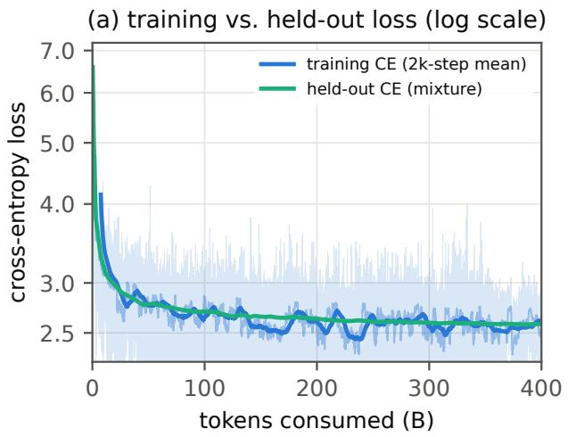

(b) power-law regime, T> 5B  
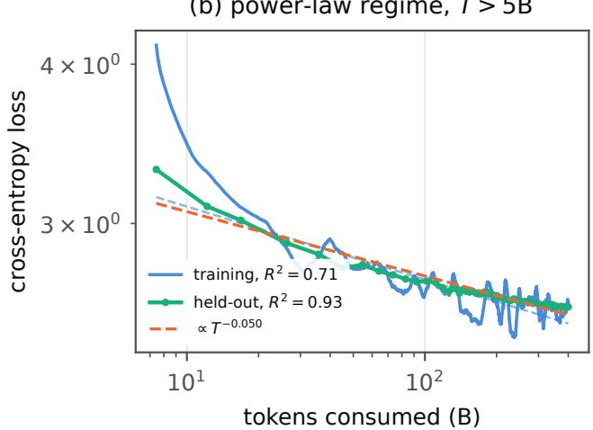  
Figure 1 Loss convergence, training vs. held-out. (a) Cross-entropy over the full 400B-token run (log scale): per-step training loss (light), its 100-step mean (medium) and 2,000-step mean (bold), with the held-out mixture CE overlaid. (b) Both series on log-log axes for $T > 5 \mathrm { B }$ with power-law fits; the fixed held-out set raises $R ^ { 2 }$ from 0.71 to 0.93.

Power-law fit to the training loss. We fit a two-parameter power law $L ( T ) = A T ^ { - \alpha }$ to the 2,000-step running mean of the training loss, where � is the cumulative number of training tokens in billions. The fit window is restricted to $T > 5 \mathrm { B } { : }$ the first 5B tokens span the learning-rate warmup and the initial batch-size increase, a transient regime not described by the steady-state trend. Over the remaining 395B tokens the fit gives

$$
L _ { \mathrm { t r a i n } } ( T ) \approx 3 . 5 3 T ^ { - 0 . 0 5 7 } , R ^ { 2 } = 0 . 7 1 ,
$$

with visibly structured residuals, largely reflecting data-mix heterogeneity in the sampled batches. We therefore use the training curve as a stability diagnostic only, and base every convergence statement on a held-out probe.

Power-law fit to the held-out loss. We fit the same two-parameter power law $L ( T ) = A T ^ { - \alpha }$ over the same window, to the mixture-weighted held-out cross-entropy. The fit gives

$$
L _ { \mathrm { h e l d - o u t } } ( T ) \approx 3 . 4 4 T ^ { - 0 . 0 5 0 } , R ^ { 2 } = 0 . 9 3
$$

and may be seen in Figure 1. The disparity between the train and held-out fit $( R ^ { 2 } = 0 . 7 1$ vs. 0.93) may be attributed to data-mix noise in the train set, which is not present in the held-out set. An additive asymptote $L _ { \infty }$ is not identifiable over this range.

## 3.4.2. Gradient behavior, Clipping, and Spike Protocol

Training used global-norm clipping at threshold 1.0 and a spike protocol that skips five optimizer steps when the pre-clip gradient norm exceeds 5. Figure 2 shows the pre-clip gradient-norm trajectory and its distribution; Table 9 gives the statistics.

Clipping was engaged on only 0.16% of steady-state steps, always as isolated single-step events with immediate recovery. This is consistent with batches which have a low unique-token ratio or another anomaly, rather than with instability. Only two batches in the entire run activated the skip protocol: pre-clip norm 5.78 at step 1,782 and 6.88 at step $4 3 , 7 3 7$ , resulting in ten associated optimizer step skips.

<table><tr><td>tokens (B)</td><td>step</td><td>training CE (2k-step mean)</td><td>held-out CE (mixture)</td></tr><tr><td>10</td><td>2,544</td><td>3.46</td><td>3.09</td></tr><tr><td>50</td><td>11,021</td><td>2.76</td><td>2.78</td></tr><tr><td>100</td><td>21,617</td><td>2.64</td><td>2.70</td></tr><tr><td>150</td><td>32,214</td><td>2.56</td><td>2.65</td></tr><tr><td>200</td><td>42,810</td><td>2.61</td><td>2.63</td></tr><tr><td>250</td><td>53,406</td><td>2.66</td><td>2.61</td></tr><tr><td>300</td><td>64,003</td><td>2.56</td><td>2.60</td></tr><tr><td>350</td><td>74,599</td><td>2.59</td><td>2.59</td></tr><tr><td>400</td><td>80,957</td><td>2.60</td><td>2.58</td></tr></table>

Table 8 Loss milestones. The training column is non-monotone due to data-mix heterogeneity rather than optimization regressions. The held-out column, scored on a fixed token set at every checkpoint, is monotone throughout.

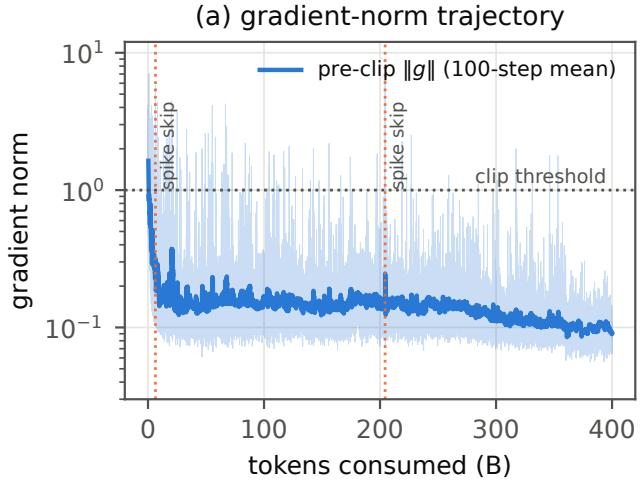

(b) gradient-norm distribution  
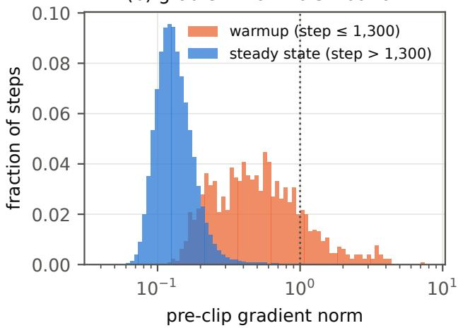  
Figure 2 Gradient-norm behavior. (a) Pre-clip global gradient norm (per-step, light; 100-step mean, bold; log scale). Dotted vertical lines mark the only two activations of the spike-skip protocol (steps 1,782 and 43,737). (b) Distribution of pre-clip norms, warmup vs. steady state.

## 3.4.3. Weight-norm evolution

Figure 3 shows the learning-rate and batch-size schedules together with the resulting efective weightupdate rate, defined as Δ log $\| W \| \approx \Delta \| W \| / \| W \|$ . Each parameter branch $( W _ { Q }$ $W _ { K }$ , ��, FFN, and token embeddings) has been aggregated across layers.

Figure 4 tracks per-layer Frobenius norms of the attention projections and the embedding matrices over the full run. Three regimes are visible and consistent across depth:

• Query/key projections. The $W _ { Q } / W _ { K }$ curves demonstrate a regime change near 120-180B tokens where their norms stop growing and the weight-decay term begins to dominate the raw gradient contribution. This is where the optimizer transitions from a norm-building phase to a decay-limited equilibrium regime, after which the update rate is set essentially by the weight decay coeficient (lr × �) and anneals with the schedule (Kosson et al., 2024; Wan et al., 2021).

• Value projections. The $W _ { V }$ curves grow monotonically at a decelerating rate, with later layers growing to larger magnitudes and at a faster rate.

• Embeddings. The untied input embedding saturates at ∼250B tokens and is essentially frozen thereafter (see Figure 3c). The unembedding peaks near 100B tokens and then declines under weight decay while the z-loss holds the logit scale flat for the remainder of the run.

<table><tr><td>full run</td><td>steady state (step &gt; 1,300)</td></tr><tr><td>median</td><td>0.129 0.128</td></tr><tr><td>mean 0.151</td><td>0.143</td></tr><tr><td>95th percentile</td><td>0.241 0.226</td></tr><tr><td>99th percentile</td><td>0.612 0.383</td></tr><tr><td>maximum 7.06 (step 247, warmup)</td><td>6.88</td></tr><tr><td>steps with  $\| g \| > 1$  (clip engaged) 343 (0.42%)</td><td>0.16%</td></tr><tr><td>steps with  $\| g \| > 2$ </td><td>89 33</td></tr><tr><td>skipped steps  $( \left. \lvert g \right. \rvert > 5 \mathrm { n e t } )$ </td><td>10 10</td></tr></table>

Table 9 Pre-clip gradient-norm statistics over 80,957 steps. The full-run clip-engagement rate is dominated by the 1,300-step warmup.

(a) LR schedule  
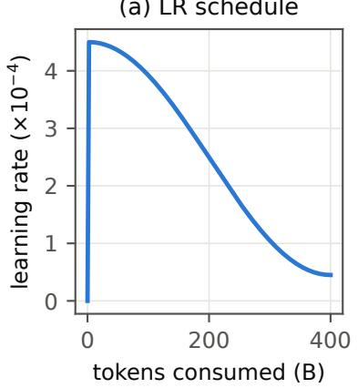

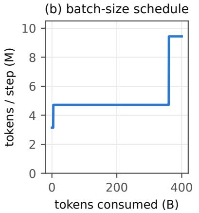

(c) relative weight-update rate  
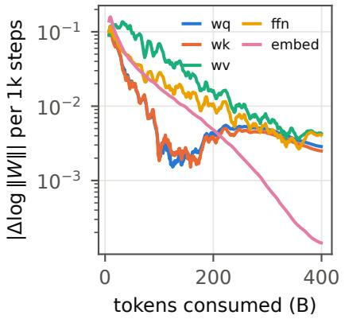  
Figure 3 (a) Learning-rate schedule. (b) Batch-size schedule in tokens per optimizer step. (c) Efective relative weight-update rate |Δ log ∥�∥| per 1,000 steps by parameter branch (20-point smoothed, log scale), computed from parameter norms logged every 100 steps.

## 4. Stability Deep Dive

## 4.1. Gradient Creep

Despite following the guidance of Section 3 in Team OLMo et al. (2024), we found that we still experienced a slowly increasing gradient beginning around 116B tokens (see Figure 5). Investigating the issue, we found that our backward flash attention implementation, when quantized at int8, was producing zero gradients along the query branch $( \nabla _ { Q } \mathcal { L } = \mathbf { 0 } )$ . This resulted in the gain parameter of the RMSNorm on the QK-norm growing monotonically to compensate. To fix this, we needed to introduce a scale factor to the gradient kernels which respected reproducibility across hardware. As an added precaution, we also removed the gain from QK-norm, an intervention originally introduced by Gemma Team et al. (2025).

## 4.2. Quantizer Step-Size Drift

A quantizer requires a step size, the width of one level of the integer grid. Learned step-size quantization (LSQ; Esser et al., 2020) treats that step size as a trainable parameter, one per output channel, updated by gradient descent together with the weights. Open-1B adopts this scheme for its linear layers. What follows is a description of the reason its per-channel scales are re-pinned each optimizer step, rather than trained as in LSQ (§3.1).

After approximately 2,000 optimizer steps, the gradient norm of the first block, comprising the embedding

per-layer weight norms — depth: layer 0 (light) → 23 (dark)

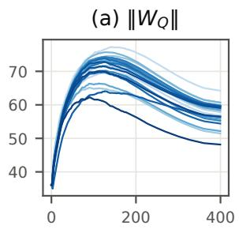  
tokens (B)

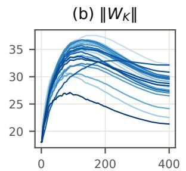  
tokens (B)

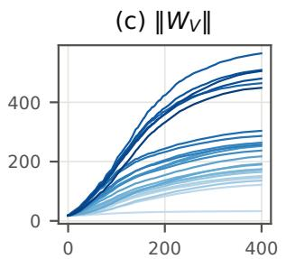  
tokens (B)

(d) embeddings  
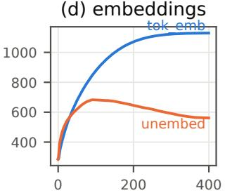  
tokens (B)  
Figure 4 Per-layer weight-norm evolution over the full 400B-token run for (a) query, (b) key, and (c) value projections, line shade encodes depth, layer 0 (light) to layer 23 (dark), and (d) the embedding matrices.

and its projections, grew to exceed 103 (Figure 6), while the remaining blocks continued to train normally. The integer attention kernel, the sliding-window attention pattern, the deterministic reduction order, the deterministic data sampler, and the learning rate were each eliminated as causes by direct substitution. Replacing the quantized linear layers with bf16 layers removed the instability, which identifies the weight quantizer as the cause. This is a distinct mechanism from the gradient creep of §4.1.

By normalizing updates against running gradient magnitudes, AdamW renders update sizes insensitive to gradient scale; update size is instead driven primarily by the learning rate. Small, consistent gradients thus produce sustained step-size drift.

Once the step size exceeds the weight range, quantization levels collapse and the signal-to-noise ratio plummets, leaving weights dominated by rounding error. The straight-through estimator then propagates this noise back into the gradients, triggering a self-reinforcing loop that causes the gradient norm to diverge without corrective feedback.

LSQ is normally applied during fine-tuning, where the weight distribution is approximately stationary and the number of steps is small. Pretraining satisfies neither condition. This is a plausible reason for the absence of the failure mode from the published literature.

To fix the quantization level collapse, we abandon training the step size. Instead, it is recomputed at each step from the current weights using the LSQ initialization formula, 2 · mean(|�|)/√�max, evaluated per output channel. The step size is then a function of the weights it quantizes and cannot diverge from them. Under this scheme, the run sustained a high signal-to-noise ratio for the duration of the main phase, with infrequent gradient clipping.

Implementation notes. Recomputation is performed at every step rather than at a fixed interval. Optimizer moment estimates for the step size are not reset, since the step size is no longer an optimized parameter. The measured cost is approximately 2% of step time. Disabling quantization, the alternative under consideration at the time, costs approximately 70%.

Relation to reproducibility. The standard remedy for instability in low-precision training is stochastic rounding, in which a value is rounded to an adjacent level with probability determined by its distance to that level, so that the expected update is unbiased. Randomness when rounding means that stochastic rounding is non-deterministic. It is incompatible with bitwise reproducibility unless it is driven by a counter-based generator of the kind described in §2.1, which requires introducing that generator into the optimizer. Recomputation of the step size requires no such mechanism. It is a deterministic arithmetic function of the weights and is subject to the same reproducibility constraints as the remaining operations.

Gradient norm (pre-clip)  
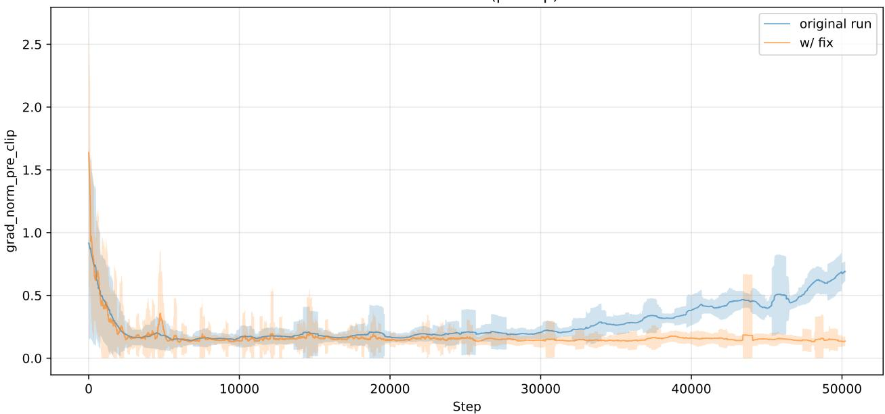  
Figure 5 Gradient norm (pre-clip) before (original run) and after (w/ fix) applying the gradient-creep fixes above, truncated to the shorter run’s length. Lines show the rolling mean and shaded bands show ±1 standard deviation, clipped at zero. The original run exhibits a steady upward drift in gradient norm from roughly 25k steps onward, which is absent after the fix.

Gradient norm (pre-clip) — raw  
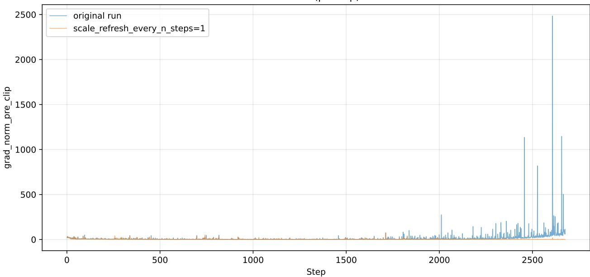  
Figure 6 Gradient norm (pre-clip) for the original run against a run recomputing the quantizer step size at every step (scale\_refresh\_every\_n\_steps=1). The original run departs from its baseline before step 2,500 and reaches a pre-clip norm above 300, while the recomputed-step-size run remains flat over the same interval.

## 4.3. int8 vs bf16

We have demonstrated convergence at int8 in §3.4; here we discuss the tradeof between pretraining at int8 and bf16. There is a non-negligible overhead when using reproducible training techniques, which we elaborate on in §5. It is demonstrated that using reproducible-bf16 is ≈ 1.6× slower than reproducible-int8. To avoid this overhead, we chose to pretrain at int8 precision.

Here, we demonstrate a comparison of the numeric stability between our int8 reproducible training runtime (RepOps) and PyTorch with the compiler training at bf16 precision. To make the comparison, we implement the same architecture using PyTorch and train with the same recipe. Enabling this comparison is the deterministic batch ordering described in Section 2.3.

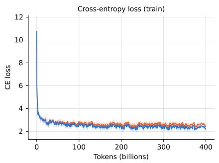

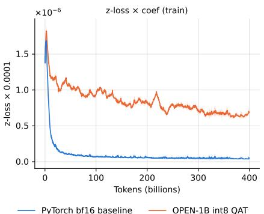

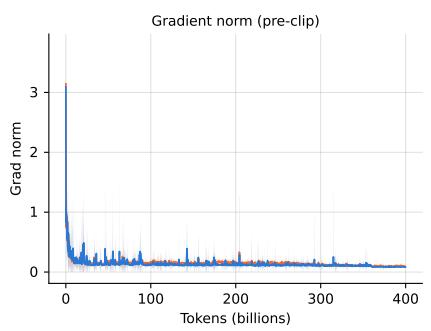  
Figure 7 Training curves for Open-1B (int8 QAT) versus the bf16 PyTorch baseline. Lines show the rolling mean and shaded bands show ±1 standard deviation. Left: train cross-entropy loss. Middle: train z-loss scaled by its coeficient (1e−4). Right: gradient norm pre-clip.

Figure 7 details the comparison between the PyTorch-bf16 implementation and our RepOps-int8 implementation. It is evident that Open-1B’s cross-entropy loss does slowly diverge from the bf16 implementation. After 400B tokens, there is a divergence of ≈ 0.2 nats between the two representations.

A notable standout is a large divergence between the z-loss at int8 and bf16. This is the natural outcome of training with quantization. Z-loss regularization is used to improve the stability of the model and has shown success in Chowdhery et al. (2023); Wortsman et al. (2023); Team OLMo et al. (2024). It aims to restrict the growth of the final softmax activations, and thus reduces the magnitude of the logit ofset. Under bf16 floating-point precision, the long-tail logits will be closer to zero due to the tighter spacing near zero. The spacing at int8 is uniform everywhere, and thus will cause z-loss to saturate at higher values.

## 5. The Cost of Reproducibility

To pretrain Open-1B, we used six a3-megagpu-8g nodes on GCP for a total wall-clock time of 29.5 days. Of the 29.5 days of wall-clock time, we spent 27.8 days actually running pretraining, with the diference being due to correcting failures and resolving other engineering issues. We maintained a running average of about 50% power usage with spikes up to 70%, or roughly 485 watts per GPU. Our MFU holds steady around 5%.

Notably, this MFU is an order of magnitude lower than that achieved using an optimized non-reproducible kernel set. We trade of compute performance for reproducibility.

Deterministic cross-replica all-reduce  
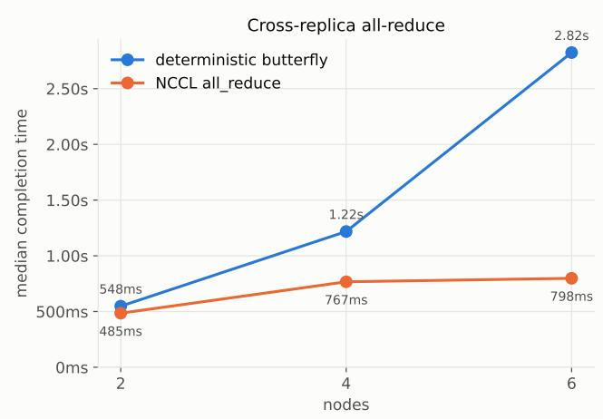

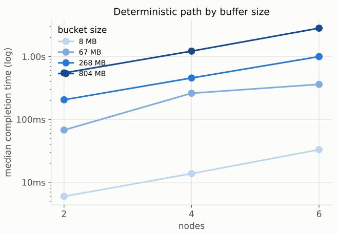  
Figure 8 Strong scaling of the deterministic cross-replica all-reduce on the socket fabric. Left: median completion time at 804 MB per-rank bucket vs. native NCCL on identical subgroups (eight concurrent groups, one per local rank). Right: the deterministic path across bucket sizes; the jump from 4 to 6 nodes reflects the non-power-of-two fold’s serialized hops, not bandwidth loss.

Here we quantify the overhead associated with the inter-node reduction by performing a strong-scaling study. Our cluster’s inter-node communications use NCCL over a socket fabric without GPUDirect, and thus add significantly more overhead than the intra-node communications. In what follows, we hold the Open-1B main-phase global batch fixed at 288 micro-batches (4,718,592 tokens per step) and scale from 1 to 6 nodes in the HSDP layout (dp\_replicate = � being the number of nodes and dp\_shard = 8 within a node). Each configuration ran twice, once performing the state hash each step and once with hashing disabled. Data points were collected by running for 30 steps total and averaging steps 4–30.

The deterministic all-reduce. NCCL’s ring all-reduce is asymptotically flat in �, hence its flat curve in Figure 8. Our deterministic path instead uses a recursive-doubling butterfly, which fixes the reduction order but sends the whole bufer on each of its log � hops rather than a 1/� segment. At power-of-two replica counts, this is cheap (1 hop at 2 nodes, 2 at 4), so the determinism premium stays modest. Non-power-of-two counts cost more: the algorithm folds � into the largest power-of-two block plus a remainder, and reconciling the two adds a cross-block combine and a binomial broadcast on top of the binary-block hops.

Strong Scaling. Figure 9 and Table 11 give the end-to-end result. When hashing every step, throughput scales from 40.0k tokens/s on one node to 169.4k on six, a strong-scaling eficiency of 71%. With hashing of, it reaches 217.4k (86%). The forward+backward operations, which contain the intra-node deterministic reduce-scatter, have a strong-scaling eficiency of 99.7%, so the cumulative eficiency loss is attributable to the state hash (constant ≈ 6.0 s, Appendix B) and the cross-node replicate reduce (2.6 s at 6 nodes).

Runtime overhead. Finally, we place the reproducible runtime against a well-optimized baseline. We use the same architecture, recipe, and data stream implemented in stock PyTorch bf16 (flex\_- attention, cuBLAS, fused AdamW, per-block torch.compile), run under the identical fixed-batch protocol, alongside a repop variant with the quantization recipe disabled (bf16 kernels, no QAT) that separates kernel eficiency from quantization. Figure 10 and Table 10 give all three curves; no arm computes state hashes. On a single node, the bitwise-reproducible bf16 kernels reach 3.3% MFU against stock PyTorch’s 40.5%, a 12.2× gap. The int8 QAT recipe reduces that overhead: its tensor-core GEMMs run the model ≈ 1.8× faster than repop’s bf16 path and 6.8× slower than stock PyTorch on one node. Scaling up towards six nodes, we see the overhead narrow to ≈ 5.0× that of PyTorch (91%/86% strong-scaling eficiency for the repop arms vs. 66% for the PyTorch arm). PyTorch scales less eficiently here because communication overhead becomes a larger relative fraction of its total step time when using the slow socket fabric without GPUDirect.

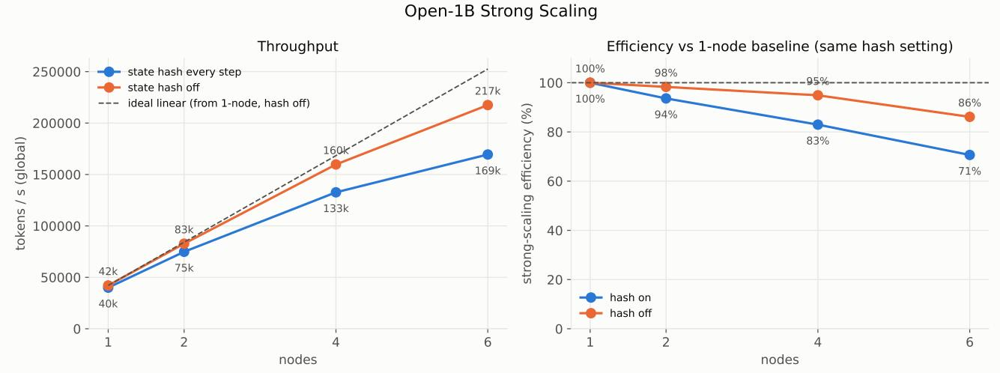

Figure 9 Full-stack strong scaling of Open-1B pretraining at the fixed main-phase global batch (4.72 M tokens/step), HSDP dp\_replicate = � × dp\_shard = 8, 8×H100 per node. Eficiency is measured against the one-node baseline at the same hash setting.
<table><tr><td rowspan="2">Nodes</td><td colspan="2">PyTorch + compile</td><td colspan="2">repop bf16</td><td colspan="2">repop int8 (prod.)</td><td rowspan="2">PT / int8</td></tr><tr><td>tok/s</td><td>MFU</td><td>tok/s</td><td>MFU</td><td>tok/s</td><td>MFU</td></tr><tr><td>1</td><td>288k</td><td>40.5%</td><td>23.6k</td><td>3.3%</td><td>42.1k</td><td>5.9%</td><td>6.8×</td></tr><tr><td>2</td><td>534k</td><td>37.5%</td><td>46.8k</td><td>3.3%</td><td>82.7k</td><td>5.8%</td><td>6.5×</td></tr><tr><td>4</td><td>923k</td><td>32.4%</td><td>91.8k</td><td>3.2%</td><td>159.7k</td><td>5.6%</td><td>5.8×</td></tr><tr><td>6</td><td>1136k</td><td>26.6%</td><td>129.1k</td><td>3.0%</td><td>217.5k</td><td>5.1%</td><td>5.2x</td></tr></table>

Table 10 Runtime implementation comparison at fixed global batch (4.72 M tokens/step; wall-clock rates, no state hashing in any arm). MFU is recomputed uniformly as flops/token × tok/s / (GPUs × 1 PFLOP/s).

Summary. Concisely, we have demonstrated that the Open-1B recipe implemented with reproducible runtime, deterministic communications, and state hashing scales with a 71% eficiency. The burden of reproducibility costs ≈ 5× more than optimized PyTorch. While there is further room for optimizations, the largest target for improvement is hashing. State hashing for Open-1B was implemented on the host, which incurs device-host memory transfer overhead. We aim to transition to on-device hashing in the future, nearly eliminating the ≈ 6s/step cost.

Runtime implementations at fixed global batch — strong scaling, 1→6 nodes  
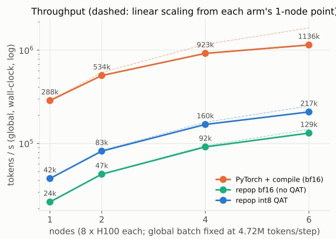

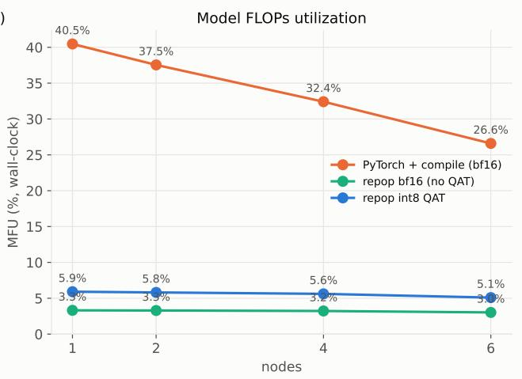

Figure 10 Runtime implementations at the fixed 4.72 M-token global batch, 1 → 6 nodes: stock PyTorch bf16 with torch.compile, repop bf16 (no QAT), and the int8-QAT configuration. Left: wall-clock throughput (log scale; dashed lines are linear scaling from each arm’s own one-node point). Right: MFU, computed uniformly from the wall-clock rates.
<table><tr><td rowspan="2"></td><td colspan="3">Deterministic all-reduce (804 MB)</td><td colspan="3">Full stack (fixed 4.72 M tok/step)</td></tr><tr><td>Nodes Det.</td><td>NCCL</td><td>Premium</td><td>Tok/s (hash on)</td><td>Tok/s (hash off)</td><td>Eff. on/off</td></tr><tr><td>1</td><td></td><td></td><td></td><td>40.0k</td><td>42.1k</td><td>100% / 100%</td></tr><tr><td>2</td><td>548 ms</td><td>485 ms</td><td>1.13×</td><td>74.9k</td><td>82.7k</td><td>94% / 98%</td></tr><tr><td>4</td><td>1218 ms</td><td>767 ms</td><td>1.59×</td><td>132.7k</td><td>159.7k</td><td>83% / 95%</td></tr><tr><td>6</td><td>2824 ms</td><td>798 ms</td><td>3.54×</td><td>169.4k</td><td>217.4k</td><td>71% /86%</td></tr></table>

Table 11 Strong-scaling summary. The all-reduce columns are median completion times of the isolated collective (eight concurrent replicate groups); the full-stack columns are sustained wall-clock rates of Open-1B pretraining, with the state hash computed every step (the released run’s setting) and disabled.

## 6. Audit

The key contribution of this work towards open source AI is the ability to completely audit every operation in the computational training graph. The ability to verify each operation with bitwise accuracy guarantees that the model was trained exactly as declared. It does not eliminate biases from the model, but it does allow an auditor to be absolutely certain which biases may be present. For the first time, we have the ability to detect backdoor injection attacks that use undisclosed data to compromise the model, which may have downstream efects.

As discussed previously, because of the non-associativity of floating-point operations, bitwise-reproducible audit requires assigning a definite order to the whole training process, including:

1. GPU kernel reductions, such as those of the GEMM kernels in linear layers or the sum-reductions in softmax.

2. data batching, such that the ordering in a data-parallel cluster environment matches the ordering of the single-device audit.

3. inter-/intra-node collective communications, specifically reduce-scatter and all-reduce.

RepOps (§2.1) allows us to sequentialize the kernel operations; the topologically invariant datastream (§2.3) takes care of batch ordering; and we implement deterministic collectives to handle communi cations. The provided audit harness combines these sequentializations, giving a user the ability to reproduce the work done by the entire cluster at step-wise granularity. This means it will replay the forward and backward passes of each GPU in the cluster’s training run in a sequential order, track gradients and collective communication reductions in local accumulators, and then apply the optimizer to advance the model’s weights.

Conceptually, the reduction has three levels: gradient accumulation across microbatches on a single device, an intra-node reduce-scatter over shards, and an inter-node all-reduce over replicas. We define a replica as the node and a shard as the data-parallel work unit within the FSDP grouping. In total, the data-parallel world size is therefore dp\_replicate × dp\_shard ranks.

Algorithm 1 sequentializes all three for a single step. The reduce-scatter is realized as a running sum carried across consecutive iterations of a single loop over virtual ranks in mesh order (replica-major, shard-minor). Because of this, there is at most one partial gradient resident in memory at a time. The fixed ascending-shard order is what lets it match the cluster’s deterministic reduce-scatter collective. The all-reduce over replicas is handled by TreeFold, a binary-carry fold that combines per-replica partials in the same pairing order as the cluster’s recursive-doubling all-reduce. We defer the full mechanism behind both reductions to Appendix A.

Algorithm 1 Audit replay of one training step   
Require: virtual rank count �, shard count dp\_shard, replica count dp\_replicate = �/dp\_shard, micro  
batches per rank accum   
1: fold ← new TreeFold   
2: inner ← ⊥   
3: for � = 0, . . . , � − 1 do ⊲ mesh order: � = rep · dp\_shard + shard   
4: shard ← � mod dp\_shard   
5: �� ← 0   
6: for � = 1, . . . , accum do ⊲ microbatch gradient accumulation, single device   
7: batch ← next microbatch for rank �   
8: � ← � + ∇� loss(batch)/accum   
9: end for   
10: if shard = 0 then   
11: inner ← ��   
12: else   
13: inner ← inner + �� ⊲ ascending sum over shards   
14: end if   
15: if shard = dp\_shard − 1 then   
16: inner ← inner/dp\_shard ⊲ reduce-scatter average   
17: fold.Push(inner) ⊲ inter-node all-reduce, see Algorithm 2   
18: inner ← ⊥   
19: end if   
20: end for   
21: � ← fold.Result()/dp\_replicate ⊲ all-reduce average   
22: return �

## 7. Conclusion

This report presented Open-1B, the first fully auditable open source LLM, and the infrastructure that trained it. The infrastructure includes RepOps, a proprietary library of bitwise-reproducible operations across CPU, NVIDIA GPU, and Apple GPU hardware (§2.1); a topologically invariant data loader that preserves batch ordering across cluster configurations (§2.3); and deterministic collective communications that can be replayed sequentially on a single device (§6). Alongside the model, we released the complete pretraining dataset, intermediate checkpoints at 100-step intervals, the full training and evaluation codebase, and a harness that lets anyone re-run and verify any step of the pretraining run on commodity hardware, including x86 and ARM CPUs, Apple Silicon, and consumergrade NVIDIA GPUs (§6).

As argued in §1, open weights and an open recipe are not enough for verifiability: floating-point nonassociativity means that even a faithfully followed recipe does not reproduce the same weights when run on diferent hardware. As a result, today’s open source models cannot be fully verified. Open-1B was trained such that every operation in the training trajectory, from initialization to the final checkpoint, is bitwise-reproducible. We provide hashes at a per-step cadence such that a third party can independently attest to the final outcome of Open-1B.

This guarantee comes with a trade-of. Enforcing bitwise reproducibility with native int8 quantizationaware training leaves Open-1B’s tensor-core GEMMs several times slower than an equivalent stock PyTorch bf16 baseline (§5). Because of this overhead and resource constraints, we have trained with an order of magnitude fewer tokens than OLMo 2 1B’s 4T-token budget, resulting in Open-1B trailing on downstream benchmarks (Table 6).

We hope that this early work is a step towards a fully open and transparent AI development process where claims about how a model was built can be verified rather than taken on trust.

## References

Joshua Ainslie, James Lee-Thorp, Michiel de Jong, Yury Zemlyanskiy, Federico Lebrón, and Sumit Sanghai. GQA: Training generalized multi-query transformer models from multi-head checkpoints. In Proceedings of the 2023 Conference on Empirical Methods in Natural Language Processing, pages 4895–4901, 2023.

Anthropic. Usage policy. https://www.anthropic.com/legal/aup, 2025.

Anthropic. System Card: Claude Opus 5, 2026a. URL https://www.anthropic.com/system-cards.

Anthropic. Why claude switched models in your conversation with fable 5. https://support.claude.com/en/ articles/15363606-why-claude-switched-models-in-your-conversation-with-fable-5, 2026b. Claude Help Center; accessed August 24, 2026.

Arasu Arun, Adam St. Arnaud, Alexey Titov, Brian Wilcox, Viktor Kolobaric, Marc Brinkmann, Oguzhan Ersoy, Ben Fielding, and Joseph Bonneau. Verde: Verification via refereed delegation for machine learning programs, 2025. URL https://arxiv.org/abs/2502.19405.

Zhangir Azerbayev, Hailey Schoelkopf, Keiran Paster, Marco Dos Santos, Stephen McAleer, Albert Q. Jiang, Jia Deng, Stella Biderman, and Sean Welleck. Llemma: An open language model for mathematics. In Internationa Conference on Learning Representations, 2024.

Jimmy Lei Ba, Jamie Ryan Kiros, and Geofrey E. Hinton. Layer normalization. arXiv preprint arXiv:1607.06450, 2016.

Iz Beltagy, Matthew E. Peters, and Arman Cohan. Longformer: The long-document transformer. arXiv preprint arXiv:2004.05150, 2020.

Stella Biderman, Hailey Schoelkopf, Quentin Gregory Anthony, Herbie Bradley, Kyle O’Brien, Eric Hallahan, Mohammad Aflah Khan, Shivanshu Purohit, Usvsn Sai Prashanth, Edward Raf, Aviya Skowron, Lintang Sutawika, and Oskar Van Der Wal. Pythia: A suite for analyzing large language models across training and scaling. In Andreas Krause, Emma Brunskill, Kyunghyun Cho, Barbara Engelhardt, Sivan Sabato, and Jonathan Scarlett, editors, Proceedings of the 40th International Conference on Machine Learning, volume 202 of Proceedings of Machine Learning Research, pages 2397–2430. PMLR, 23–29 Jul 2023. URL https: //proceedings.mlr.press/v202/biderman23a.html.

Dami Choi, Yonadav Shavit, and David Duvenaud. Tools for verifying neural models’ training data. In 37th International Conference on Neural Information Processing Systems, NeurIPS ’23, 2024.

Aakanksha Chowdhery, Sharan Narang, Jacob Devlin, Maarten Bosma, Gaurav Mishra, Adam Roberts, Paul Barham, Hyung Won Chung, Charles Sutton, Sebastian Gehrmann, et al. PaLM: Scaling language modeling with pathways. Journal of Machine Learning Research, 24(240):1–113, 2023.

Marin Community. Marin 32b, 2025. URL https://github.com/marin-community/marin.

Brittany I. Davidson, Kate Muir, Florian A. D. Burnat, and Adam N. Joinson. Regulatory gray areas of llm terms, 2026. URL https://arxiv.org/abs/2601.08415.

DeepSeek-AI, Anyi Xu, Bangcai Lin, Bing Xue, Bingxuan Wang, Bingzheng Xu, Bochao Wu, Bowei Zhang, Chaofan Lin, Chen Dong, Chenchen Ling, Chengda Lu, Chenggang Zhao, Chengqi Deng, Chengyu Hou, Chenhao Xu, Chenze Shao, Chong Ruan, Conner Sun, Damai Dai, Daya Guo, Dejian Yang, Deli Chen, Donghao Li, Dongjie Ji, Erhang Li, Fang Wei, Fangyun Lin, Fangzhou Yuan, Feiyu Xia, Fucong Dai, Guangbo Hao, Guanting Chen, Guoai Cao, Guolai Meng, Guowei Li, Han Yu, Han Zhang, Hanwei Xu, Hao Li, Haofen Liang, Haoling Zhang, Haoming Luo, Haoran Wei, Haotian Yuan, Haowei Zhang, Haowen Luo, Haoyu Chen, Haozhe Ji, Hengqing Zhang, Honghui Ding, Hongxuan Tang, Huanqi Cao, Huazuo Gao, Hui Qu, Hui Zeng, J Yang, JQ Zhu, Jia Luo, Jia Song, Jia Yu, Jialiang Huang, Jialu Cai, Jian Liang, Jiangting Zhou, Jiasheng Ye, Jiashi Li, Jiaxin Xu, Jiewen Hu, Jieyu Yang, Jin Chen, Jin Yan, Jingchang Chen, Jingli Zhou, Jingting Xiang, Jingyang Yuan, Jingyuan Cheng, Jingzi Zhou, Jinhua Zhu, Jiping Yu, Joseph Sun, Jun Ran, Junguang Jiang, Junjie Qiu, Junlong Li, Junmin Zheng, Junxiao Song, Kai Dong, Kaige Gao, Kang Guan, Kexing Zhou, Kezhao Huang, Kuai Yu, Lean Wang, Lecong Zhang, Lei Wang, Leyi Xia, Li Zhang, Liang Zhao, Lihua Guo, Lingxiao Luo, Linwang Ma, Linyan Zhu, Litong Wang, Liyu Cai, Liyue Zhang, Longhao Chen, MS Di, MY Xu, Max Mei, Miaojun Wang, Mingchuan Zhang, Minghua Zhang, Minghui Tang, Mingming Li, Mingxu Zhou, Minmin Han, Ning Wang, Panpan Huang, Panpan Wang, Peixin Cong, Peiyi Wang, Peng Zhang, Qiancheng Wang, Qihao Zhu, Qingyang Li, Qinyu Chen, Qiushi Du, Qiwei Jiang, Rui Tian, Ruifan Xu, Ruijie Lu, Ruiling Xu, Ruiqi Ge, Ruisong Zhang, Ruizhe Pan, Runji Wang, Runqian Chen, Runqiu Yin, Runxin Xu, Ruomeng Shen, Ruoyu Zhang, Ruyi Chen, SH Liu, Shanghao Lu, Shangmian Sun, Shangyan Zhou, Shanhuang Chen, Shaofei Cai, Shaoheng Nie, Shaoqing Wu, Shaoyuan Chen, Shengding Hu, Shengyu Liu, Shiqiang Hu, Shirong Ma, Shiyu Wang, Shuiping Yu, Shunfeng Zhou, Shuting Pan, Shuying Yu, Songyang Zhou, Tao Ni, Tao Yun, Tian Jin, Tian Pei, Tian Ye, Tianle Lin, Tianran Ji, Tianyi Cui, Tianyuan Yue, Tingting Yu, Tun Wang, W Zhang, WL Xiao, Wangding Zeng, Wei An, Weilin Zhao, Wen Liu, Wenfeng Liang, Wenjie Pang, Wenjing Luo, Wenjing Yao, Wenjun Gao, Wenkai Yang, Wenlve Huang, Wenqing Hou, Wentao Zhang, Wenting Ma, Xi Gao, Xiang He, Xiangwen Wang, Xianzu Wang, Xiao Bi, Xiaodong Liu, Xiaohan Wang, Xiaokang Chen, Xiaokang Zhang, Xiaotao Nie, Xiaowen Sun, Xiaoxiang Wang, Xin Cheng, Xin Liu, Xin Xie, Xingchao Liu, Xingchen Liu, Xingkai Yu, Xingyou Li, Xinyu Yang, Xinyu Zhang, Xu Chen, Xuanyu Wang, Xuecheng Su, Xueyin Chen, Xuheng Lin, Xuwei Fu, YC Yan, YQ Wang, YW Ma, Yanfeng Luo, Yang Zhang, Yanhong Xu, Yanru Ma, Yanwen Huang, Yao Li, Yao Li, Yao Xu, Yao Zhao, Yaofeng Sun, Yaohui Wang, Yi Qian, Yi Shao, Yi Yu, Yichao Zhang, Yifan Ding, Yifan Shi, Yijia Wu, Yiliang Xiong, Yiling Ma, Ying He, Ying Tang, Ying Zhou, Yingjia Luo, Yinmin Zhong, Yishi Piao, Yisong Wang, Yixiang Zhang, Yixiao Chen, Yixuan Tan, Yixuan Wei, Yiyang Ma, Yiyuan Liu, Yonglun Yang, Yongqiang Guo, Yongtong Wu, Yu Wu, YuKun Li, Yuan Cheng, Yuan Ou, Yuanfan Xu, Yuanhao Li, Yuduan Wang, Yuehan Yang, Yuer Xu, Yuhan Wu, Yuhao Meng, Yuheng Zou, Yukun Zha, Yunfan Xiong, Yupeng Chen, Yuping Lin, Yuqian Cao, Yuqian Wang, Yushun Zhang, Yuting Yan, Yutong Lin, Yuxian Gu, Yuxiang Luo, Yuxiang You, Yuxuan Liu, Yuxuan Zhou, Yuyang Zhou, Yuzhen Huang, ZF Wu, Zehao Wang, Zehua Zhao, Zehui Ren, Zekai Zhang, Zhangli Sha, Zhe Fu, Zhe Ju, Zhean Xu, Zhenda Xie, Zhengyan Zhang, Zheren Gao, Zhewen Hao, Zhibin Gou, Zhicheng Ma, Zhigang Yan, Zhihong Shao, Zhixian Huang, Zhixuan Chen, Zhiyu Wu, Zhizhou Ren, Zhongyu Wu, Zhuoshu Li, Zhuping Zhang, Zian Xu, Zihao Wang, Zihua Qu, Zihui Gu, Zijia Zhu, Zilin Li, Zipeng Zhang, Ziwei Xie, Ziyi Gao, Ziyi Wan, Zizheng Pan, and Zongqing Yao. Deepseek-v4: Towards highly eficient million-token context intelligence, 2026. URL https://arxiv.org/abs/2606.19348.

Mostafa Dehghani, Josip Djolonga, Basil Mustafa, Piotr Padlewski, Jonathan Heek, Justin Gilmer, Andreas Peter Steiner, Mathilde Caron, Robert Geirhos, Ibrahim Alabdulmohsin, et al. Scaling vision transformers to 22 billion parameters. In International Conference on Machine Learning, pages 7480–7512. PMLR, 2023.

Steven K. Esser, Jefrey L. McKinstry, Deepika Bablani, Rathinakumar Appuswamy, and Dharmendra S. Modha. Learned step size quantization. In International Conference on Learning Representations, 2020.

Gemma Team, Morgane Riviere, Shreya Pathak, Pier Giuseppe Sessa, Cassidy Hardin, Surya Bhupatiraju, Léonard Hussenot, Thomas Mesnard, Bobak Shahriari, Alexandre Ramé, et al. Gemma 2: Improving open language models at a practical size. arXiv preprint arXiv:2408.00118, 2024.

Gemma Team, Aishwarya Kamath, Johan Ferret, Shreya Pathak, Nino Vieillard, Ramona Merhej, Sarah Perrin, Tatiana Matejovicova, Alexandre Ramé, Morgane Rivière, et al. Gemma 3 technical report. arXiv preprint arXiv:2503.19786, 2025.

GLM-5-Team, Aohan Zeng, Xin Lv, Zhenyu Hou, Zhengxiao Du, Qinkai Zheng, Bin Chen, Da Yin, Chendi Ge, Chenghua Huang, Chengxing Xie, Chenzheng Zhu, Congfeng Yin, Cunxiang Wang, Gengzheng Pan, Hao Zeng, Haoke Zhang, Haoran Wang, Huilong Chen, Jiajie Zhang, Jian Jiao, Jiaqi Guo, Jingsen Wang, Jingzhao Du, Jinzhu Wu, Kedong Wang, Lei Li, Lin Fan, Lucen Zhong, Mingdao Liu, Mingming Zhao, Pengfan Du, Qian Dong, Rui Lu, Shuang-Li, Shulin Cao, Song Liu, Ting Jiang, Xiaodong Chen, Xiaohan Zhang, Xuancheng Huang, Xuezhen Dong, Yabo Xu, Yao Wei, Yifan An, Yilin Niu, Yitong Zhu, Yuanhao Wen, Yukuo Cen, Yush Bai, Zhongpei Qiao, Zihan Wang, Zikang Wang, Zilin Zhu, Ziqiang Liu, Zixuan Li, Bojie Wang, Bosi Wen, Can Huang, Changpeng Cai, Chao Yu, Chen Li, Chengwei Hu, Chenhui Zhang, Dan Zhang, Daoyan Lin, Dayong Yang, Di Wang, Ding Ai, Erle Zhu, Fangzhou Yi, Feiyu Chen, Guohong Wen, Hailong Sun, Haisha Zhao, Haiyi Hu, Hanchen Zhang, Hanrui Liu, Hanyu Zhang, Hao Peng, Hao Tai, Haobo Zhang, He Liu, Hongwei Wang, Hongxi Yan, Hongyu Ge, Huan Liu, Huanpeng Chu, Jia’ni Zhao, Jiachen Wang, Jiajing Zhao, Jiamin Ren, Jiapeng Wang, Jiaxin Zhang, Jiayi Gui, Jiayue Zhao, Jijie Li, Jing An, Jing Li, Jingwei Yuan, Jinhua Du, Jinxin Liu, Junkai Zhi, Junwen Duan, Kaiyue Zhou, Kangjian Wei, Ke Wang, Keyun Luo, Laiqiang Zhang, Leigang Sha, Liang Xu, Lindong Wu, Lintao Ding, Lu Chen, Minghao Li, Nianyi Lin, Pan Ta, Qiang Zou, Rongjun Song, Ruiqi Yang, Shangqing Tu, Shangtong Yang, Shaoxiang Wu, Shengyan Zhang, Shijie Li, Shuang Li, Shuyi Fan, Wei Qin, Wei Tian, Weining Zhang, Wenbo Yu, Wenjie Liang, Xiang Kuang, Xiangmeng Cheng, Xiangyang Li, Xiaoquan Yan, Xiaowei Hu, Xiaoying Ling, Xing Fan, Xingye Xia, Xinyuan Zhang, Xinze Zhang, Xirui Pan, Xu Zou, Xunkai Zhang, Yadi Liu, Yandong Wu, Yanfu Li, Yidong Wang, Yifan Zhu, Yijun Tan, Yilin Zhou, Yiming Pan, Ying Zhang, Yinpei Su, Yipeng Geng, Yong Yan, Yonglin Tan, Yuean Bi, Yuhan Shen, Yuhao Yang, Yujiang Li, Yunan Liu, Yunqing Wang, Yuntao Li, Yurong Wu, Yutao Zhang, Yuxi Duan, Yuxuan Zhang, Zezhen Liu, Zhengtao Jiang, Zhenhe Yan, Zheyu Zhang, Zhixiang Wei, Zhuo Chen, Zhuoer Feng, Zijun Yao, Ziwei Chai, Ziyuan Wang, Zuzhou Zhang, Bin Xu, Minlie Huang, Hongning Wang, Juanzi Li, Yuxiao Dong, and Jie Tang. Glm-5: from vibe coding to agentic engineering, 2026. URL https://arxiv.org/abs/2602.15763.

Google DeepMind. Gemini Model Cards, 2026. URL https://deepmind.google/models/model-cards/.

Aaron Grattafiori, Abhimanyu Dubey, Abhinav Jauhri, Abhinav Pandey, Abhishek Kadian, et al. The llama 3 herd of models. arXiv preprint arXiv:2407.21783, 2024.

Yuling Gu, Oyvind Tafjord, Bailey Kuehl, Dany Haddad, Jesse Dodge, and Hannaneh Hajishirzi. Olmes: A standard for language model evaluations, 2024. URL https://arxiv.org/abs/2406.08446.

Daniil Gurgurov, Katharina Trinley, Ivan Vykopal, Josef van Genabith, Simon Ostermann, and Roberto Zamparelli. Multilingual political views of large language models: Identification and steering. In Kentaro Inui, Sakriani Sakti, Haofen Wang, Derek F. Wong, Pushpak Bhattacharyya, Biplab Banerjee, Asif Ekbal, Tanmoy Chakraborty, and Dhirendra Pratap Singh, editors, Proceedings of the 14th International Joint Conference on Natural Language Processing and the 4th Conference of the Asia-Pacific Chapter of the Association for Computational Linguistics, pages 279–298, Mumbai, India, December 2025. The Asian Federation of Natural Language Processing and The Association for Computational Linguistics. ISBN 979-8-89176-303-6. doi: 10.18653/v1/2025.findings-ijcnlp.17. URL https://aclanthology.org/2025.findings-ijcnlp.17/.

Alejandro Hernández-Cano, Alexander Hägele, Allen Hao Huang, Angelika Romanou, Antoni-Joan Solergibert, Barna Pasztor, Bettina Messmer, Dhia Garbaya, Eduard Frank Ďurech, Ido Hakimi, et al. Apertus: Democratizing open and compliant llms for global language environments. In Proceedings of the 64th Annual Meeting of the Association for Computational Linguistics (Volume 1: Long Papers), pages 46877–46955, 2026.

Benjamin Jensen, Ian J. Reynolds, Yasir Atalan, Michael Garcia, Austin Woo, Anthony Chen, and Trevor Howarth. Critical foreign policy decision (CFPD) benchmark: Measuring diplomatic preferences of large language models. In Stelios Piperidis, Núria Bel, Henk van den Heuvel, Nancy Ide, Simon Krek, and Antonio Toral, editors, Proceedings of the Fifteenth Language Resources and Evaluation Conference, pages 10838–10852, Palma de Mallorca, Spain, May 2026. ELRA Language Resource Association. doi: 10.63317/2xw2yfabkain. URL https://aclanthology.org/2026.lrec-1.849/.

Hengrui Jia, Mohammad Yaghini, Christopher A. Choquette-Choo, Natalie Dullerud, Anvith Thudi, Varun Chandrasekaran, and Nicolas Papernot. Proof-of-Learning: Definitions and Practice. IEEE Symposium on Security and Privacy (S&P), pages 1039–1056, 2021. URL https://api.semanticscholar.org/CorpusID: 232168663.

Atli Kosson, Bettina Messmer, and Martin Jaggi. Rotational equilibrium: How weight decay balances learning rate in neural network training. In International Conference on Machine Learning, 2024.

Jefrey Li, Alex Fang, Georgios Smyrnis, Maor Ivgi, Matt Jordan, Samir Gadre, Hritik Bansal, Etash Guha, Sedrick Keh, Kushal Arora, et al. DataComp-LM: In search of the next generation of training sets for language models. arXiv preprint arXiv:2406.11794, 2024.

Ilya Loshchilov and Frank Hutter. Decoupled weight decay regularization. In International Conference on Learning Representations, 2019.

Anton Lozhkov, Raymond Li, Loubna Ben Allal, Federico Cassano, Joel Lamy-Poirier, Nouamane Tazi, Ao Tang, Dmytro Pykhtar, Jiawei Liu, Yuxiang Wei, et al. StarCoder 2 and The Stack v2: The next generation. arXiv preprint arXiv:2402.19173, 2024.

Team Olmo, Allyson Ettinger, Amanda Bertsch, Bailey Kuehl, David Graham, David Heineman, Dirk Groeneveld, Faeze Brahman, Finbarr Timbers, Hamish Ivison, Jacob Morrison, Jake Poznanski, Kyle Lo, Luca Soldaini, Matt Jordan, Mayee Chen, Michael Noukhovitch, Nathan Lambert, Pete Walsh, Pradeep Dasigi, Robert Berry, Saumya Malik, Saurabh Shah, Scott Geng, Shane Arora, Shashank Gupta, Taira Anderson, Teng Xiao, Tyler Murray, Tyler Romero, Victoria Graf, Akari Asai, Akshita Bhagia, Alexander Wettig, Alisa Liu, Aman Rangapur, Chloe Anastasiades, Costa Huang, Dustin Schwenk, Harsh Trivedi, Ian Magnusson, Jaron Lochner, Jiacheng Liu, Lester James V. Miranda, Maarten Sap, Malia Morgan, Michael Schmitz, Michal Guerquin, Michael Wilson, Regan Huf, Ronan Le Bras, Rui Xin, Rulin Shao, Sam Skjonsberg, Shannon Zejiang Shen, Shuyue Stella Li, Tucker Wilde, Valentina Pyatkin, Will Merrill, Yapei Chang, Yuling Gu, Zhiyuan Zeng, Ashish Sabharwal, Luke Zettlemoyer, Pang Wei Koh, Ali Farhadi, Noah A. Smith, and Hannaneh Hajishirzi. Olmo 3, 2026. URL https://arxiv.org/abs/2512.13961.

OpenAI. Usage policies. https://openai.com/policies/usage-policies/, 2025.

OpenAI. GPT-5.6 System Card, 2026. URL https://deploymentsafety.openai.com/gpt-5-6.

Jennifer Pan and Xu Xu. Political censorship in large language models originating from china. PNAS Nexus, 5(2): pgag013, 02 2026. ISSN 2752-6542. doi: 10.1093/pnasnexus/pgag013. URL https://doi.org/10.1093/ pnasnexus/pgag013.

Keiran Paster, Marco Dos Santos, Zhangir Azerbayev, and Jimmy Ba. OpenWebMath: An open dataset of high-quality mathematical web text. In International Conference on Learning Representations, 2024.

Guilherme Penedo, Hynek Kydlíček, Anton Lozhkov, Margaret Mitchell, Colin Rafel, Leandro Von Werra, Thomas Wolf, et al. The FineWeb datasets: Decanting the web for the finest text data at scale. In Advances in Neural Information Processing Systems, volume 37, 2024.

Peiran Qiu, Siyi Zhou, and Emilio Ferrara. Information suppression in large language models: Auditing, quantifying, and characterizing censorship in deepseek. Information Sciences, 724:122702, 2026. ISSN 0020-0255. doi: https://doi.org/10.1016/j.ins.2025.122702. URL https://www.sciencedirect.com/ science/article/pii/S0020025525008357.

Noam Shazeer. GLU variants improve transformer. arXiv preprint arXiv:2002.05202, 2020.

Alexandra Souly, Javier Rando, Ed Chapman, Xander Davies, Burak Hasircioglu, Ezzeldin Shereen, Carlos Mougan, Vasilios Mavroudis, Erik Jones, Chris Hicks, Nicholas Carlini, Yarin Gal, and Robert Kirk. Poisoning attacks on llms require a near-constant number of poison samples, 2025. URL https://arxiv.org/abs/2510.07192.

Megha Srivastava, Simran Arora, and Dan Boneh. Optimistic verifiable training by controlling hardware nondeterminism. In A. Globerson, L. Mackey, D. Belgrave, A. Fan, U. Paquet, J. Tomczak, and C. Zhang, editors, Advances in Neural Information Processing Systems, volume 37, pages 95639–95661. Curran Associates, Inc., 2024. doi: 10.52202/079017-3030. URL https://proceedings.neurips.cc/paper\_files/paper/2024/file/ ad885a9caafff30ee9cafdf0ee42fda2-Paper-Conference.pdf.

Jianlin Su, Murtadha Ahmed, Yu Lu, Shengfeng Pan, Wen Bo, and Yunfeng Liu. RoFormer: Enhanced transformer with rotary position embedding. Neurocomputing, 568:127063, 2024.

Kimi Team, Tongtong Bai, Yifan Bai, Yiping Bao, M. C., Jianfeng Cai, Xinyuan Cai, Peizhou Cao, Yuxuan Cao, Ziwei Chai, Y. Charles, H. S. Che, Guanduo Chen, Guangyu Chen, Guanzheng Chen, Huarong Chen, Jia Chen, Jianlong Chen, Jun Chen, Kexin Chen, Peng Chen, Ruijue Chen, Wentao Chen, Xin Chen, Yang Chen, Yanru Chen, Yifei Chen, Yingjiang Chen, Yuankun Chen, Yujie Chen, Yutian Chen, Zhirong Chen, Dazhi Cheng, Yean Cheng, Jialei Cui, Jingbing Cui, Anqi Dai, Jiaqi Deng, Hao Ding, Rui Ding, Shaofeng Ding, Mengfan Dong, Mengnan Dong, Yuhao Dong, Yuxin Dong, Angang Du, Chenzhuang Du, Dikang Du, Jusen Du, Yulun Du, Yu Fan, Jing Feng, Qiulin Feng, Yichen Feng, Kelin Fu, Qiang Fu, Fuxuan Gao, Hongcheng Gao, Jingyue Gao, Tong Gao, Weijia Gao, Shangyi Geng, Jie Gong, Linhu Gong, Shengao Gong, Xiaochen Gong, Qizheng Gu, Yicheng Gu, Shuhao Guan, Haiqing Guo, Shiqi Guo, Xiang Guo, Zhengyan Guo, Beixi Hao, Wenxin Hao, Xiaoru Hao, Dailan He, Haotian He, Lehan He, Qi He, Weiran He, Xinran He, Xinyi He, Yibo He, Yunjia He, Chao Hong, Tiange Hong, Hao Hu, Jiaxi Hu, Ruikun Hu, Weiming Hu, Yangyang Hu, Zhenxing Hu, Liang Hua Jinbin Huang, Ke Huang, Ruiyuan Huang, Siying Huang, Weixiao Huang, Yan Huang, Zhengjie Huang, Zhiqi Huang, Yulong Hui, Chaobo Jia, Yutong Jiang, Zhejun Jiang, Zuoyou Jiang, Wenyi Jin, Xinyi Jin, Yu Jing, Huanjun Kong, Guokun Lai, Aidi Li, Cheng Li, Chengyuan Li, Cong Li, Fang Li, Guanyu Li, Haoyang Li, Jia Li, Junxiong Li, Lei Li, Letian Li, Lincan Li, Weihong Li, Wentao Li, Xintong Li, Yang Li, Yishen Li, Yiwei Li, Yuxiao Li, Zhaowei Li, Zhaoxi Li, Zheming Li, Zhengxiao Li, Zhiyuan Li, Jiawei Lin, Xiaohan Lin, Yibo Lin, Zichao Lin, Ziyan Lin, Bill Liu, Boxiao Liu, Chuan Liu, Liang Liu, Shaowei Liu, Shudong Liu, Shuran Liu, Tianwei Liu Weizhou Liu, Yangyang Liu, Yanming Liu, Yibo Liu, Yipeng Liu, Zhengying Liu, Zhiheng Liu, Enzhe Lu, Haoyu Lu, Linqiang Lu, Tingzhan Lu, Zhiyuan Lu, Aotian Luo, G. Luo, Junyu Luo, Yifan Luo, B. Lyu, Wenzhou Lyu, Shaoguang Mao, Yuan Mei, Xin Men, Minqing Ni, Yixuan Niu, Siyuan Pan, Shujun Peng, Zhangyang Qi, Ruoyu Qin, ZeChao Qin, Zeyu Qin, Haiquan Qiu, Jianxin Qiu, Jiezhong Qiu, Bowen Qu, Yuhao Qu, Zeyu Shang, Youbo Shao, Han Shen, Jincheng Shi, Juanfeng Shi, Lidong Shi, Shengyuan Shi, Wingchun Siu, Pengwei Song, Xiaoxi Song, Jianlin Su, Yunfeng Su, Zhaochen Su, Lin Sui, Jingsong Sun, Junyao Sun, Shaoning Sun, Shuzhe Sun, Tongyu Sun, Yujun Sun, Yunpeng Tai, Chuning Tang, Heyi Tang, Sirui Tang, Zecheng Tang, Chaoran Tian, Rongpeng Tian, Yu Tian, Wei Tu, Chensi Wang, Chuang Wang, Chunjie Wang, Dinglu Wang, Feng Wang, Hailong Wang, Haiming Wang, Hao Wang, Hao Wang, Huaqing Wang, Hui Wang, Jiayi Wang, Jinglong Wang, Jinhong Wang, Jiuzheng Wang, Linian Wang, Shaobo Wang, Shenzhi Wang, Shuyi Wang, Si Wang, Siyuan Wang, Tianfu Wang, Wenjue Wang, Xingran Wang, Xinmei Wang, Xinyuan Wang, Xusheng Wang, Yalin Wang, Yangkun Wang, Yao Wang, Yaoyu Wang, Yejie Wang, Yiqin Wang, Yucheng Wang, Yuzhi Wang, Zhaoji Wang, Zhaowei Wang, Zhengtao Wang, Zhenhao Wang, Zhongsheng Wang, Zifan Wang, Chu Wei, Ming Wei, Shouxin Wei, Zichen Wen, Fan Wu, Haoning Wu, Rucong Wu, Wenhao Wu, Xiaoxue Wu, Yingcong Wu, Yongqi Wu, Yuxin Wu, Zijian Wu, Xinglang Xian, Chenxuan Xiang, Yuye Xiang, Bocheng Xiao, Chenjun Xiao, Xin Xiao, Jin Xie, Xiaotong Xie, Yifeng Xie, Zhe Xie, Bowei Xing, Yiming Xiong, Baosheng Xu, Boyu Xu, Jiale Xu, Jianfan Xu, Jing Xu, Jinjing Xu, L. H. Xu, Qingtao Xu, Shuyao Xu, Suting Xu, Tiantian Xu, Tianxiang Xu, Weixin Xu, Xinran Xu, Yangchuan Xu, Ye Xu, Yueni Xu, Ziyao Xu, Haonan Xue, Junjie Yan, Yaoyao Yan, Fan Yang, Guangyao Yang, Hao Yang, Junwei Yang, Ruoyu Yang, Wenjie Yang, Xiaofei Yang, Xinyu Yang, Yi Yang, Yiling Yang, Ying Yang, Yuchen Yang, Zhen Yang, Zhilin Yang, Zian Yang, Zuhao Yang, Haotian Yao, Dan Ye, Haoran Ye, Wenjie Ye, Zhanbo Ye, Bohong Yin, Haoxiang Yin, Xietong Yin, Chengzhen Yu, Haozhen Yu, Longhui Yu, Shengnan Yu, Shuying Yu, Tianxiang Yu, Enming Yuan, Mengjie Yuan, Tongtian Yue, Wei Yue, Yang Yue, Dunyuan Zha, Haobing Zhan, B. H. Zhang, Dehao Zhang, Fei Zhang, Hao Zhang, Haoyuan Zhang, Huanyu Zhang, Jiapei Zhang, Jiaxuan Zhang, Jin Zhang, Kaiyi Zhang, Miaozhen Zhang, Puqi Zhang, Qinglei Zhang, Rong Zhang, Rui Zhang, Shaoshuai Zhang, Shiyi Zhang, Xiaobin Zhang, Xiaoyun Zhang, Y. Zhang, Yangkun Zhang, Ye Zhang, Yichi Zhang, Yikun Zhang, Yizhi Zhang, Yongting Zhang, Yu Zhang, Yutao Zhang, Yutong Zhang, Zheng Zhang, Zijing Zhang, Bin Zhao, Chenguang Zhao, Feifan Zhao, Jinglun Zhao, Jinxiang Zhao, Shuai Zhao, Wenshuo Zhao, Xiangyu Zhao, Xuanle Zhao, Yikai Zhao, Zijia Zhao, Haozhi Zheng, Huabin Zheng, Ruihan Zheng, Shaojie Zheng, Tengyang Zheng, Haofeng Zhong, Lei Zhong, Longguang Zhong, M. Zhou, Qiankang Zhou, Runjie Zhou, Ruozhang Zhou, Xinyu Zhou, Yiqiao Zhou, Zaida Zhou, Jinguo Zhu, Liya Zhu Xinhao Zhu, Yangjunfeng Zhu, Yuxuan Zhu, Zhen Zhu, Chen Zhuang, Weiyu Zhuang, and Xinxing Zu. Kim k3: Open frontier intelligence, 2026. URL https://arxiv.org/abs/2607.24653.

Team OLMo, Pete Walsh, Luca Soldaini, Dirk Groeneveld, Kyle Lo, Shane Arora, Akshita Bhagia, Yuling Gu, Shengyi Huang, Matt Jordan, et al. 2 OLMo 2 furious. arXiv preprint arXiv:2501.00656, 2024.

Ashish Vaswani, Noam Shazeer, Niki Parmar, Jakob Uszkoreit, Llion Jones, Aidan N. Gomez, Łukasz Kaiser, and

Illia Polosukhin. Attention is all you need. In Advances in Neural Information Processing Systems, volume 30, 2017.

Ruosi Wan, Zhanxing Zhu, Xiangyu Zhang, and Jian Sun. Spherical motion dynamics: Learning dynamics of normalized neural network using SGD and weight decay. In Advances in Neural Information Processing Systems, 2021.

Mitchell Wortsman, Peter J. Liu, Lechao Xiao, Katie Everett, Alex Alemi, Ben Adlam, John D. Co-Reyes, Izzeddin Gur, Abhishek Kumar, Roman Novak, et al. Small-scale proxies for large-scale transformer training instabilities. arXiv preprint arXiv:2309.14322, 2023.

xAI. Model Card: Grok 4.6, 2026. URL https://x.ai/safety.

An Yang, Anfeng Li, Baosong Yang, Beichen Zhang, Binyuan Hui, Bo Zheng, Bowen Yu, Chang Gao, Chengen Huang, Chenxu Lv, Chujie Zheng, Dayiheng Liu, Fan Zhou, Fei Huang, Feng Hu, Hao Ge, Haoran Wei, Huan Lin, Jialong Tang, Jian Yang, Jianhong Tu, Jianwei Zhang, Jianxin Yang, Jiaxi Yang, Jing Zhou, Jingren Zhou, Junyang Lin, Kai Dang, Keqin Bao, Kexin Yang, Le Yu, Lianghao Deng, Mei Li, Mingfeng Xue, Mingze Li, Pei Zhang, Peng Wang, Qin Zhu, Rui Men, Ruize Gao, Shixuan Liu, Shuang Luo, Tianhao Li, Tianyi Tang, Wenbiao Yin, Xingzhang Ren, Xinyu Wang, Xinyu Zhang, Xuancheng Ren, Yang Fan, Yang Su, Yichang Zhang, Yinger Zhang, Yu Wan, Yuqiong Liu, Zekun Wang, Zeyu Cui, Zhenru Zhang, Zhipeng Zhou, and Zihan Qiu. Qwen3 technical report, 2025. URL https://arxiv.org/abs/2505.09388.

Biao Zhang and Rico Sennrich. Root mean square layer normalization. In Advances in Neural Information Processing Systems, volume 32, 2019.

## A. Deterministic Gradient Reduction

Algorithm 1 in section 6 sequentializes gradient reduction into a single loop over virtual ranks in mesh order (replica-major, shard-minor). Two of the three reduction levels are folded into that one loop rather than given loops of their own: the gradient accumulation and the intra-node reduce-scatter. The gradients are tracked as a running sum carried across consecutive iterations, finalized and averaged every dp\_shard ranks. The inter-node all-reduce over replicas mirrors the cluster-side collective communication, and is implemented as the push-based TreeFold defined below.

## A.1. Inter-Node All-Reduce over Replicas

Floating-point addition is not associative, so the order in which per-replica gradients are summed changes the result at the bit level. The cluster does not sum replicas in a flat left-to-right loop; it uses a recursive-doubling all-reduce, in which replicas are paired, the pairs’ sums are paired again, and so on, so the reduction tree has depth ⌈log2 dp\_replicate⌉. Reproducing the cluster’s result exactly therefore requires reproducing this pairing order.

TreeFold reconstructs that order online, without waiting for every replica’s partial gradient to be ready. As shown in Algorithm 2, each finished replica partial is pushed exactly once. Push maintains a stack of (level, partial) pairs, one per completed power-of-two block seen so far, and immediately combines the incoming partial with the top of the stack whenever the two are the same size (same level), carrying the combined result up a level, exactly as in binary counting. The lower-replica operand is always kept on the left of the addition, matching the cluster’s grouping, so the sum order is bit-for-bit identical regardless of the number of replicas processed. This keeps at most �(log dp\_replicate) full-gradient accumulators resident at once instead of all dp\_replicate of them, which is what makes the replay tractable in memory: at dp\_replicate = 8 the flat alternative needs 8 resident partials where the fold needs at most 4. The practical implementation spills dormant stack entries to disk so the two operands of the current addition are the only ones ever held in RAM.

When dp\_replicate is not a power of two, pushing all replicas leaves more than one entry on the stack, one per set bit of dp\_replicate in binary. Result combines these residual blocks in ascending level order (lowest level, i.e. largest block, first), again with the lower-replica block on the left. This matches the cluster’s own handling of non-power-of-two replica counts, so the fold is bit-exact for any dp\_replicate, not only powers of two.

Algorithm 2 Binary-carry tree fold over replicas   
1: stack ← empty list of (level, partial) pairs ⊲ persists across calls to Push   
2: procedure Push(part)   
3: level ← 0   
4: while stack is non-empty and top(stack).level = level do   
5: (level, lower) ← pop(stack)   
6: part ← lower + part ⊲ lower-replica operand stays on the left   
7: level ← level + 1   
8: end while   
9: push(stack, (level, part))   
10: end procedure   
11: procedure Result   
12: acc ← partial of the lowest-level entry remaining in stack   
13: for each remaining (level, part) in ascending level order do   
14: acc ← acc + part ⊲ combines leftover blocks when dp\_replicate is not a power of two   
15: end for   
16: return acc   
17: end procedure

## A.2. Intra-Node Reduce-Scatter over Shards

FSDP2’s default reduce-scatter routes through NCCL, whose cross-rank summation order depends on world size and on which algorithm and channels NCCL selects for that topology. As in the replicate case, non-associativity means a diferently ordered sum over the same addends disagrees with NCCL’s result at the bit level. A single-device sum over the shard partials reproduces NCCL’s reduce-scatter to roughly 10−11 relative error but not bitwise. A collective whose order is topology-dependent cannot be replayed on a single device at all, since the replay has no topology to key that order on.

On the cluster we therefore substitute a custom collective, DeterministicReduceScatter, wired into FSDP2 through its pluggable reduce-scatter interface. It decomposes the operation into two steps: an all-to-all transfer that routes every rank’s shard-destined chunks to their owning rank, and a local sum over the received per-shard contributions in a fixed ascending rank order. The all-to-all is pure data movement with no arithmetic, so it is bitwise deterministic and topology-independent on its own. Fixing the reduction in ascending order makes the inner accumulator in Algorithm 1 reproducible and topology-independent. For each fixed replica, shards 0, . . . , dp\_shard − 1 are added into inner in that ascending order, matching DeterministicReduceScatter’s fixed order bit for bit.

## A.3. Average via Reciprocal Multiply

Every average in Algorithm 1, the microbatch scaling by accum, the reduce-scatter average by dp\_shard, and the all-reduce average by dp\_replicate, is written as a division for readability, but none of them is implemented as one. Dividing a floating-point tensor by an integer scalar is not portable bit-for-bit across backends: CPU performs a correctly-rounded division, while CUDA lowers the same operation to a multiply by a host-computed reciprocal, and the two disagree by up to one ULP whenever the divisor is not a power of two. The cluster and the single-device replay therefore both compute every average in Algorithm 1 as an explicit multiply by a precomputed reciprocal constant, so the three divisions written there should be read as this reciprocal-multiply rather than the literal division operator.

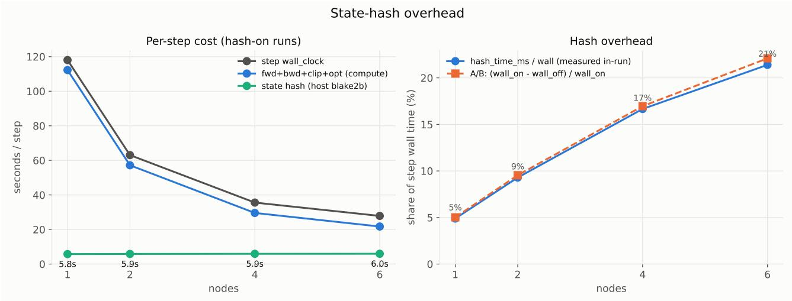  
Figure 11 State-hash overhead along the scaling curve. Left: the hash is a constant ≈ 6.0 s/step at every scale while the compute it accompanies shrinks. Right: its share of step wall time by two independent measurements, direct timer and hash-on/of A/B.

## B. State-Hash Overhead

Every training step of Open-1B is anchored by a sharded canonical hash that digests each rank’s own data batches, parameters, optimizer, and gradient shards. This is an auditing cost, not a reproducibility one: the deterministic kernels and collectives of section 5 would reproduce the run bit-for-bit whether or not the hash is computed, but without it there is nothing to check an audit against at intermediate steps.

The hash’s per-rank work is determined only by dp\_shard, so its absolute cost is flat (5.77–5.96 s/step) across all scales (Figure 11). At the fixed global batch used in the strong-scaling study of section 5, this constant overhead has a larger relative efect as node count increases and accumulation per node shrinks: 4.9%, 9.3%, 16.7%, and 21.4% of wall time at 1, 2, 4, and 6 nodes.