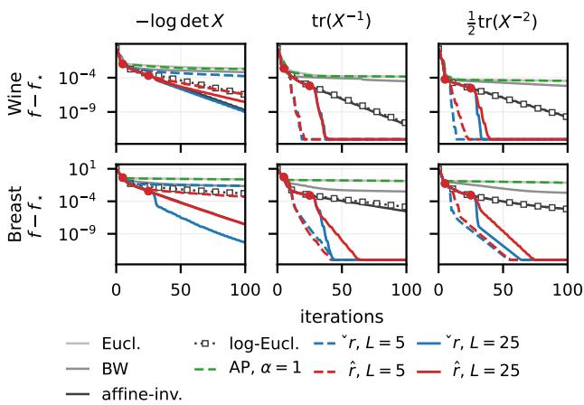
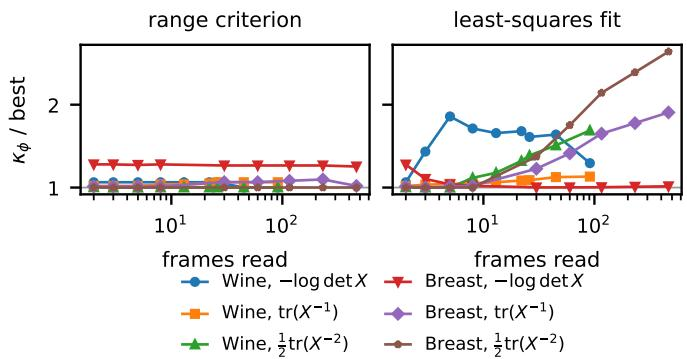
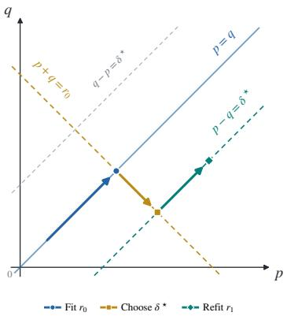
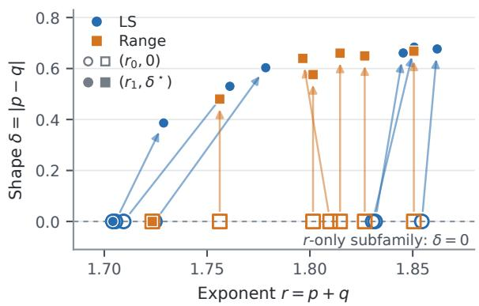
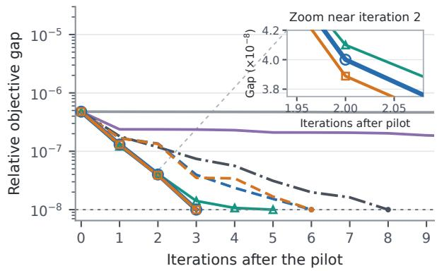
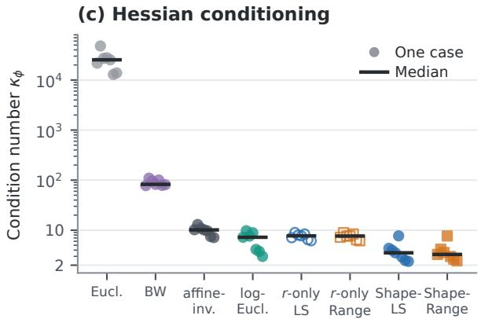
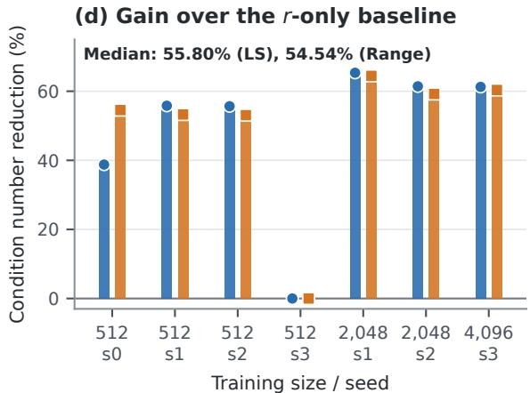

# OPTIMIZATION OVER COVARIANCE MATRICES WITH A PARAMETERIZED METRIC

Yibang Li<sup>1</sup>, Bamdev Mishra<sup>2</sup>, Pratik Jawanpuria<sup>3</sup> and Cyrus Mostajeran<sup>1</sup>

<sup>1</sup>Nanyang Technological University, Singapore <sup>2</sup>Microsoft India <sup>3</sup>Indian Institute of Technology Bombay, India yibang001@e.ntu.edu.sg bamdevm@microsoft.com pratik.jawanpuria@iitb.ac.in cyrussam.mostajeran@ntu.edu.sg

## ABSTRACT

The choice of Riemannian metric can strongly influence the convergence of gradient-based optimization over covariance matrices. Euclidean, Bures–Wasserstein and afine-invariant metrics are common choices, but their relative efectiveness depends on the objective. We introduce a two-parameter family defined by $X ^ { p } L X ^ { q } + \bar { X } ^ { q } L X ^ { p } =$ U, solved for L at each tangent vector U, that contains all three as exact members, at (0, 0), (1, 0) and (1, 1), and extends past them. We treat the choice of member as a particular way of preconditioning for a given problem. To this end, we analyze the conditioning of the Riemannian Hessian at the solution. We show that it obeys a lower bound that depends on (p, q) only through the exponent $r = p + q .$ When the Euclidean Hessian is a pure power that mixes no eigendirections, the member $p = q = r / 2$ attains that bound, and a closed-form criterion identifies the other members that do. We discuss ways to tune r for a given problem. Experiments on real covariance data confirm the predicted conditioning and the benefit of tuning r. A task covariance example shows a further gain from tuning the shape.

Index Terms— Covariance matrices, Riemannian optimization, preconditioning, Bures–Wasserstein, metric learning

## 1. INTRODUCTION

Symmetric positive-definite (SPD) matrices are the working object in covariance estimation, adaptive beamforming, radar detection, difusion tensor imaging [1], and brain–computer interfaces [2]. The set of SPD matrices forms a manifold S<sup>n</sup><sub>++</sub>, an open subset of the space S<sup>n</sup> of symmetric matrices, so S<sup>n</sup> is its tangent space at every point. Endowed with a metric, it has the structure of a Riemannian manifold. Minimizing a function $f \mathrm { o v e r } { \mathbb S } _ { + + } ^ { n }$ by gradient descent requires a choice of Riemannian metric, which determines the gradient and hence the descent direction.

Each metric in common use on the set of SPD matrices is often argued for on geometric grounds. Afine-invariant geometry is complete and congruence invariant. Bures–Wasserstein geometry is the covariance part of quadratic optimal transport between Gaussian measures [3, 4, 5]. Log-Euclidean geometry is widely used in imaging [6]. Thanwerdas and Pennec [7] classify the O(n)-invariant metrics and show that the kernel metrics of Hiai and Petz [8], each fixed by a single function of two eigenvalues, form a subclass containing most of the metrics in common use, and elsewhere they build continua that interpolate between named metrics [9, 10].

Since the metric is what converts ∇f into a search direction, it acts as an intrinsic preconditioner rather than a passive modeling choice [11]. Picking one is therefore an algorithmic decision rather than a geometric one. This is, for example, explored by Han et al.

[12] who compare Bures–Wasserstein (BW) and afine-invariant geometry and report that each wins on a diferent objective class, while [13] introduce a parameterized generalization. More concretely, preconditioning on manifolds has attracted much attention. Mishra and Sepulchre [11] build the metric from the Hessian of the Lagrangian. Shustin and Avron [14] choose the metric on the generalized Stiefel manifold through a preconditioning scheme, motivate the choice by the condition number of the Riemannian Hessian at the optimum, and identify the ideal preconditioner as the Euclidean Hessian there. Gao et al. [15] do the same on product manifolds. Closest to this work, Zhou et al. [16] discuss Alpha-Procrustes metrics (which include log-Euclidean and BW) for optimization, especially from a robustness viewpoint.

Contributions. We explore the question of metric choice for the SPD manifold. To this end, our contributions are the following. We introduce a two-parameter metric family containing Euclidean, Bures–Wasserstein and afine-invariant geometry as exact members. We show how the condition number of the Hessian depends on p and q, and motivate ways to approximate this. Finally, our experiments show the benefit of tuning the metric.

## 2. A PARAMETERIZED METRIC

The metric. Fix two real numbers p and q, and let $X \in \mathbb { S } _ { + + } ^ { n }$ be the point at which the metric is being defined. This follows the usual definition of Bures–Wasserstein geometry [5]. For a tangent vector $U \in \mathbb { S } ^ { n }$ let $L = L _ { p , q } ( U )$ solve the Sylvester-type equation

$$
X ^ { p } L X ^ { q } + X ^ { q } L X ^ { p } = U .\tag{1}
$$

For tangent vectors U and V , the Riemannian metric g is defined as

$$
\begin{array} { r } { g _ { X } ^ { ( p , q ) } ( U , V ) = \frac { 1 } { 2 } c _ { p , q } \mathrm { t r } \big ( L _ { p , q } ( U ) V \big ) , \qquad c _ { p , q } = 4 ^ { 1 - ( p - q ) ^ { 2 } } , } \end{array}\tag{2}
$$

where $c _ { p , q }$ is a normalizing constant. Let $d _ { 1 } , \ldots , d _ { n }$ and P hold the eigenvalues and eigenvectors of X, and write $M ^ { \prime } = P ^ { \top } M P$ for the eigenbasis coordinates of any $M \in \mathbb { S } ^ { n }$ . In this eigenbasis, the operator on the left-hand side of (1) acts entrywise, multiplying $L _ { i j } ^ { \prime }$ by $d _ { i } ^ { p } d _ { i } ^ { q } + d _ { i } ^ { q } d _ { i } ^ { p }$ . Since the eigenvalues of X are positive, these coeficients are strictly positive for all real $p$ and q. The operator is therefore self-adjoint, positive definite, and invertible, so (2) defines a Riemannian metric for every such pair. At $\left( p , q \right) = \left( 1 , 0 \right)$ , (1) reduces to $X L + L X = U$ , and (2) recovers the Bures–Wasserstein metric.

The weight. Solving (1) entry by entry puts (2) in the kernel form of Hiai and Petz [8],

$$
g _ { X } ^ { \phi } ( U , V ) = \sum _ { i , j } \frac { U _ { i j } ^ { \prime } V _ { i j } ^ { \prime } } { \phi ( d _ { i } , d _ { j } ) } , \qquad \phi = \phi _ { p , q } ,\tag{3}
$$

with the weight in the denominator,

$$
\begin{array} { r } { \phi _ { p , q } ( x , y ) = \frac { 1 } { 2 } 4 ^ { ( p - q ) ^ { 2 } } \big ( x ^ { p } y ^ { q } + x ^ { q } y ^ { p } \big ) , } \end{array}\tag{4}
$$

symmetric in $( p , q )$ and positively homogeneous of degree $r = p { + } q ,$ meaning $\phi _ { p , q } ( t x , t y ) = t ^ { r } \phi _ { p , q } ( x , y )$ for every $t > 0$ . We call r the exponent of the member of the metric family.

Named members. Evaluating (4) at $( p , q ) = ( 0 , 0 )$ , (1, 0) and (1, 1) gives the weights 1, $2 ( x + y )$ and xy, of degrees 0, 1 and 2. These are exactly the Euclidean, Bures–Wasserstein and afineinvariant metrics, respectively. The metric family interpolates between them, and since $p$ and $q$ may be any reals, it extends past them in every direction. On the diagonal $p = q = r / 2 ( 1 )$ reads $2 X ^ { r / 2 } L X ^ { r / 2 } = U .$ so $\begin{array} { r } { L = { \frac { 1 } { 2 } } X ^ { - r / 2 } U X ^ { - r / 2 } } \end{array}$ and (2) becomes the power family in closed form,

$$
g _ { X } ^ { \phi } ( U , V ) = \mathrm { t r } \bigl ( X ^ { - r / 2 } U X ^ { - r / 2 } V \bigr ) , \qquad \phi ( x , y ) = ( x y ) ^ { r / 2 } .\tag{5}
$$

Relation to known metric families. Every smooth positive $\phi$ defines a kernel metric [8], so (4) is a subfamily of a known class, singled out by the factorization

$$
\begin{array} { r } { \phi _ { p , q } ( x , y ) = 4 ^ { ( p - q ) ^ { 2 } } ( x y ) ^ { r / 2 } \cosh \bigl ( \frac { p - q } { 2 } \log ( x / y ) \bigr ) , } \end{array}\tag{6}
$$

in which r fixes the homogeneity degree and $p - q$ the shape at fixed degree. That separation is what makes the conditioning law of Section 3 possible. It is the separation rather than any individual member that is new. The family also shares members with the mixedpower-Euclidean family of [10]. The inverse-Euclidean metric is the pullback of the Euclidean metric under $X \mapsto X ^ { - 1 }$ . It is our diagonal member at $r = 4$ and the mixed-power-Euclidean member at $( - 1 , - 1 )$ . Of the diagonal, our member $\left( p , q \right) = \left( \textstyle { \frac { 1 } { 2 } } , 0 \right)$ agrees up to a constant factor with their member at $( 1 , { \frac { 1 } { 2 } } )$ . The family difers from the generalized Bures–Wasserstein geometry of [13], which deforms the metric by an SPD matrix parameter rather than by two scalars.

Descent on the metric family. Write G for the metric operator defined by $g _ { X } ^ { \phi } ( U , V ) = \operatorname { t r } ( { \mathcal { G } } [ U ] V )$ . By (3) it divides entrywise in the eigenbasis, so its inverse multiplies entrywise,

$$
\begin{array} { r } { \mathcal G ^ { - 1 } [ Z ] = P ( K \odot Z ^ { \prime } ) P ^ { \top } , \qquad K _ { i j } = \phi _ { p , q } ( d _ { i } , d _ { j } ) , } \end{array}\tag{7}
$$

where  is the entrywise product. The Riemannian gradient is grad $f = \mathcal { G } ^ { - 1 } [ G ] = \mathbf { \dot { P } } ( K \mathcal { \hat { O } } G ^ { \prime } ) P ^ { \top }$ for $G = \nabla f ( X )$ . The member $( p , q )$ enters Algorithm 1 only through the line that forms $K ,$ so one implementation covers the whole family at the cost of the eigendecomposition already incurred. For the objectives below that order is already paid to form $G ,$ so the metric adds no extra cost. Where the gradient is cheaper, the eigendecomposition sets the cost and limits the reachable n. Steps are taken with the retraction

$$
R x \left( V \right) = X + V + \textstyle { \frac { 1 } { 2 } } V X ^ { - 1 } V ,\tag{8}
$$

which stays positive definite for every symmetric V. It is a retraction in the usual sense, since $R _ { X } ( 0 ) = X$ and $\mathrm Ḋ R Ḍ _ { X } ( 0 ) [ V ] = V$ . Most members have no exponential map in closed form, and (8) replaces it at the price of one triple product.

## 3. THE ROLE OF r = p + q IN HESSIAN CONDITIONING

Finding the right $( p , q )$ for a given problem looks like a twodimensional search, scored by the conditioning of the Riemannian Hessian of the objective in the new metric. Below, we give a principled way to choose r, p and q.

```latex
Algorithm 1 Descent on $\mathbb { S } _ { + } ^ { n }$ in the metric (2)
Require: $f , X _ { 0 } \in \mathbb { S } _ { + + } ^ { n } ,$ member $( p , q )$ , steps $t _ { k }$
1: for $k = 0 , 1 , 2 , \ldots$ do
2: $G \gets \nabla f ( X _ { k } )$ ▷ Euclidean gradient
3: $( d , P )  \operatorname { e i g } ( X _ { k } )$ ▷ $O ( n ^ { 3 } )$
4: $K _ { i j } \gets \phi _ { p , q } ( d _ { i } , d _ { j } )$ ▷ weight (4)
5: $U \dot { \gets } P \dot { ( } \overrightarrow { K } \odot ( P ^ { \top } G P ) ) P ^ { \top }$ ▷ Riemannian gradient (7)
6: $\begin{array} { r } { X _ { k + 1 } \gets X _ { k } - t _ { k } U + \frac { t _ { k } ^ { 2 } } { 2 } U X _ { k } ^ { - 1 } U } \end{array}$ ▷ retract (8)
7: end for
```

The useful quantity is the condition number $\kappa _ { \phi }$ of the Riemannian Hessian at the solution, which governs the asymptotic rate of Riemannian gradient descent under the usual local assumptions [15].

Let X<sub>⋆</sub> be a critical point of $\underline { f } ,$ and write its eigendecomposition as $X _ { \star } = P \mathrm { d i a g } ( d _ { 1 } , \ldots , d _ { n } ) P ^ { \top }$ . With $e _ { 1 } , \ldots , e _ { n }$ the standard basis of $\mathbb { R } ^ { n }$ , let

$$
\begin{array} { r } { E _ { i i } = P e _ { i } e _ { i } ^ { \top } P ^ { \top } , \qquad E _ { i j } = \frac { 1 } { \sqrt { 2 } } P ( e _ { i } e _ { j } ^ { \top } + e _ { j } e _ { i } ^ { \top } ) P ^ { \top } \left( i < j \right) } \end{array}
$$

be the frames of $\mathbb { S } ^ { n }$ built from the eigenbasis of $X _ { \star }$ , one per unordered pair, so $m = n ( n + 1 ) / 2$ in all. They are orthonormal for the trace inner product. Write $\dot { \boldsymbol { B } } = \nabla ^ { 2 } f ( \boldsymbol { X } _ { \star } )$ for the Euclidean Hessian at $X _ { \star }$ , taken positive definite so that condition numbers are defined, and

$$
b _ { i j } = \mathrm { t r } \big ( E _ { i j } B [ E _ { i j } ] \big )\tag{9}
$$

for its diagonal on those frames. Call B a Schur multiplier when it rescales each entry of the eigenbasis without mixing entries, so that $B [ E _ { i j } ] = b _ { i j } E _ { i j }$

Proposition 1 (Riemannian Hessian at a critical point). At a critical point $X _ { \star } o f f$ , in every member of (4),

$$
\operatorname { H e s s } f ( X _ { \star } ) = { \mathcal { G } } ^ { - 1 } \circ B ,\tag{10}
$$

which is self-adjointfor $g ^ { \phi }$ and so has real spectrum. Its matrix in the $g ^ { \phi }$ -orthonormalframes is B scaled row and column by $\phi ( d _ { i } , d _ { j } ) ^ { 1 / 2 }$ so its diagonal there is

$$
\lambda _ { i j } = \phi ( d _ { i } , d _ { j } ) b _ { i j } .\tag{11}
$$

Proof. Since $\mathbb { S } _ { + + } ^ { n }$ is open in $\mathbb { S } ^ { n }$ , the Levi-Civita connection of $g ^ { \phi }$ is the directional derivative plus a term bilinear in its two arguments. Diferentiating grad $f \mathrm { ~ } = \mathrm { ~ \hat { \mathcal { G } } ^ { - 1 } [ \nabla } f ]$ therefore splits Hess ${ \dot { f } } ( X ) [ U ]$ into $\mathcal { G } ^ { - 1 } \bigl [ \nabla ^ { 2 } \overset { \cdot } { f } ( \overset { \cdot } { X } ) [ \overset { \cdot } { U } ] \bigr ]$ and a remainder of two pieces, the derivative of $\mathcal G ^ { - 1 }$ applied to $\nabla f ( X )$ and the connection term evaluated at grad $f ( X )$ . Both are linear in $\nabla f ( X )$ . At a critical point $\nabla f ( X _ { \star } ) =$ $0 ,$ so the remainder vanishes and (10) follows. The remainder carried every appearance of the derivative of the metric, which is why only $\mathcal { G } ^ { - 1 ^ { \bullet } } \mathrm { s u r v i v e s }$

Self-adjointness follows because

$$
g ^ { \phi } \bigl ( \mathcal { G } ^ { - 1 } [ \mathcal { B } [ U ] ] , V \bigr ) = \mathrm { t r } \bigl ( \mathcal { B } [ U ] V \bigr )
$$

is symmetric in $U$ and $V ,$ since B is a Euclidean Hessian. For the last claim, (7) gives ${ \mathcal G } ^ { - 1 } [ E _ { i j } ] = \phi ( d _ { i } , d _ { j } ) E _ { i j }$ , so the frames stay orthogonal under $g ^ { \phi }$ but carry $g ^ { \phi } ( \dot { E } _ { i j } , \dot { E _ { i j } } ) ~ = ~ 1 / \phi ( d _ { i } , d _ { j } )$ , and $\phi ( d _ { i } , d _ { j } ) ^ { 1 / 2 } E _ { i j }$ are the $g ^ { \phi }$ -orthonormal ones. In these orthonormal frames, (10) gives a rescaled version of the matrix of B in the frames $E _ { i j } .$ . Each row and column indexed by $( i , j )$ is multiplied by $\phi ( d _ { i } , d _ { j } ) ^ { 1 / 2 }$ . The diagonal entries are therefore $\phi ( d _ { i } , d _ { j } ) b _ { i j }$ , as in (11). □

Corollary 2 (Diagonal bound). The condition number $\kappa _ { \phi }$ ofthe Riemannian Hessian Hess $f ( X _ { \star } )$ obeys

$$
\kappa _ { \phi } \geq { \frac { \operatorname* { m a x } _ { i j } \lambda _ { i j } } { \operatorname* { m i n } _ { i j } \lambda _ { i j } } }\tag{12}
$$

for every B, since a diagonal entry of a symmetric matrix is a Rayleigh quotient. Equality holds when B is a Schur multiplier, where the frames are eigenvectors and the $\lambda _ { i j }$ are the whole spectrum.

The metric reaches the Hessian only through $\mathcal { G } ^ { - 1 }$ and never through its derivative, so choosing a member of (4) is always choosing a diagonal preconditioner in the eigenbasis of the current iterate, a valid local choice near the critical point. Write $\kappa _ { p , q }$ for $\kappa _ { \phi }$ at $\phi ~ = ~ \phi _ { p , q } ,$ , and $\kappa _ { r }$ when that member is the diagonal one $p = q = r / 2$ . Plain $\kappa = \kappa ( X _ { \star } ) = d _ { \mathrm { m a x } } / d _ { \mathrm { m i n } }$ is the condition number of X<sub>⋆</sub> itself. Two particular cases on B are useful to consider: (i) B has the diagonal pure power of degree $\gamma - 2$ when $b _ { i i } = c d _ { i } ^ { \gamma - 2 }$ for every i, and (ii) it has the full pure power when all entries of the frame diagonal obey $b _ { i j } = c \bar { ( } d _ { i } \bar { d _ { j } } ) ^ { ( \gamma \bar { - } 2 ) / 2 }$ . The second implies the first. Define $r ^ { \star } = 2 - \gamma$ throughout. Here $c > 0$ is a scale factor shared by all frames, and it afects no condition number below, since $\kappa _ { \phi }$ is a ratio of eigenvalues.

Proposition 3 (Conditioning floor). Let ϕ be any weight in (3) that is positively homogeneous of degree r, and let B have the diagonal pure power. Then

$$
\kappa _ { \phi } \geq \frac { \operatorname* { m a x } _ { i j } \lambda _ { i j } } { \operatorname* { m i n } _ { i j } \lambda _ { i j } } \geq \kappa ^ { | r - r ^ { \star } | } .\tag{13}
$$

This bound holds independently of the values of $\dot { } b _ { i j } f o r i < j$ and of the couplings between distinct frames.

Proof. The first inequality is (12). For the second, only the pairs $( i , i )$ are needed. Homogeneity gives $\phi ( d , d ) = d ^ { r } \phi ( 1 , 1 )$ , so $\lambda _ { i i } =$ $c \phi ( 1 , 1 ) d _ { i } ^ { r + \gamma - 2 }$ , whose ratio at $d _ { \mathrm { m a x } }$ and at $d _ { \mathrm { m i n } }$ is $\kappa ^ { r - r ^ { \star } }$ . The largest $\lambda _ { i j }$ over the smallest is therefore at least that ratio, and at least its reciprocal since either of the two may be the larger, hence at least $\kappa ^ { | r - r ^ { \star } | }$ □

It should be noted that the floor (right hand side) binds every kernel metric of degree r, not only members of (4). This is true for the Alpha-Procrustes metrics [16]. Their metric operator is diagonal in the frames $E _ { i j }$ and equal to $\bar { d } ^ { 2 \alpha - 2 }$ on the $E _ { i i }$ by [16, Theorem $^ { 4 ] , }$ so their weight carries degree $2 ( 1 - \alpha )$ and (13) puts their floor at $\kappa ^ { | 2 ( 1 - \alpha ) - r ^ { \star } | }$ , which at $r ^ { \star } = 0$ is the $\kappa ^ { 2 | \alpha - 1 | }$ law they report alongside [16, Theorem 6]. The paper [16] recommends $\alpha = 1$ , whose degree is zero, so the floor it inherits is $\kappa ^ { | \boldsymbol { r } ^ { \star } | }$ . For objectives with $r ^ { \star } = 0$ this is 1, and (13) leaves the member free.

Corollary 4 (When the floor is attained). Assume in addition that B is a Schur multiplier and has the full pure power. Every $\lambda _ { i j }$ is then the value at $( d _ { i } , d _ { j } )$ ofthe singlefunction

$$
\lambda ( x , y ) = c \phi ( x , y ) ( x y ) ^ { ( \gamma - 2 ) / 2 } , \qquad x , y > 0 .
$$

Furthermore, $i f \lambda$ is monotone in each argument, then both inequalities in (13) are equalities.

Proof. The first inequality becomes an equality by Corollary 2. For the second, a symmetric λ monotone in one argument is monotone the same way in the other, so its extremes over the pairs $\left( d _ { i } , d _ { j } \right)$ sit where both arguments are extreme, at $( d _ { \operatorname* { m a x } } , d _ { \operatorname* { m a x } } )$ and $( d _ { \mathrm { m i n } } , \dot { d } _ { \mathrm { m i n } } )$

Both extrema occur at diagonal frames $E _ { i i }$ . By the proof of Proposition 3, the ratio of the maximum to the minimum is $\kappa ^ { | r - r ^ { \star } | }$ |. Thus both inequalities in (13) are equalities. □

The diagonal member always meets this hypothesis. $\mathbf { A } \mathbf { t } p = q =$ $r / 2$ the function λ is the pure power $c \left( x y \right) ^ { ( r + \gamma - 2 ) / 2 }$ , hence monotone at every r.

The right-hand side of (13) is minimized at $\boldsymbol { r } ~ = ~ \boldsymbol { r } ^ { \star }$ , where it equals one. At other exponents, $\kappa _ { \phi }$ is at least $\kappa ^ { | r - r ^ { \star } | }$ . Minimizing the bound is not the same as minimizing $\kappa _ { \phi }$ , and the two coincide when both inequalities become equalities.

Whether a given member meets the monotonicity hypothesis is decidable in closed form. Under the full pure power, $r ^ { \star } = 2 - \gamma$ gives $( \gamma - 2 ) / 2 = - r ^ { \star } / 2$ . Multiplication by this factor shifts both exponents in (4) by $- \boldsymbol { r } ^ { \star } / 2$ . The function in Corollary 4 therefore becomes

$$
\begin{array} { r } { \lambda ( x , y ) \propto x ^ { \tilde { p } } y ^ { \tilde { q } } + x ^ { \tilde { q } } y ^ { \tilde { p } } , \quad \quad \tilde { p } = p - \frac { r ^ { \star } } { 2 } , \quad \tilde { q } = q - \frac { r ^ { \star } } { 2 } . } \end{array}\tag{14}
$$

The omitted positive factor is common to all frames and cancels from condition numbers. The shifted exponents carry the same two quantities as before, since $\tilde { p } + \tilde { q } = r - r ^ { \star }$ and $\tilde { p } - \tilde { q } = p - q$

Proposition 5 (Monotonicity criterion). Thefunction (14) is monotone in each argument on $( 0 , \infty ) ^ { 2 }$ ifand only $i f \tilde { p } \tilde { q } \geq 0 ,$ , equivalently

$$
| p - q | \leq | r - r ^ { \star } | .\tag{15}
$$

Proof. The derivative of λ in x is $\tilde { p } x ^ { \tilde { p } - 1 } y ^ { \tilde { q } } + \tilde { q } x ^ { \tilde { q } - 1 } y ^ { \tilde { p } }$ , nonnegative everywhere when $\tilde { p } , \tilde { q } \geq 0$ and nonpositive everywhere when $\tilde { p } , \tilde { q } \leq$ 0. If instead $\tilde { p } > 0 > \tilde { q }$ then $\tilde { p } - 1 > \tilde { q } - 1$ , so the first term dominates as $x \to \infty$ and the second, which is negative, dominates as $x \to 0 ^ { + }$ , and the derivative changes sign. The case $\tilde { q } > 0 > \tilde { p }$ is the same with the terms exchanged. The second form follows from $4 \tilde { p } \tilde { q } = ( r - r ^ { \star } ) ^ { 2 } - ( p - q ) ^ { 2 }$ □

How far a member may sit of the diagonal and stay monotone is therefore how far its exponent sits from optimal. The diagonal $p = q$ meets (15) at every exponent, which is why we fix $p = q = r / 2$ and tune r alone. Monotonicity is a suficient condition for attaining the floor, not a necessary one, and the next proposition specifies by how much.

Under the same hypotheses, the conditioning is available in closed form, which settles what happens of the diagonal rather than only when the floor is met.

Proposition 6 (Exact conditioning in the pure-power Schur regime). Assume B is a Schur multiplier with the full pure power, and write $s = r - r ^ { \star }$ for the degree error and $a = p - q f o r$ the shape. Then

$$
\begin{array} { r } { \kappa _ { \boldsymbol { p } , \boldsymbol { q } } = \operatorname* { m a x } \Bigl \{ \kappa ^ { | s | } , \kappa ^ { | s | / 2 } \cosh \bigl ( \frac { a } { 2 } \log \kappa \bigr ) \Bigr \} . } \end{array}\tag{16}
$$

In particular $\kappa _ { p , q } = \cosh ( \frac { a } { 2 } \log \kappa )$ at $r = r ^ { \star }$ , so once $\kappa > 1$ the diagonal member is the unique minimizer and every other member misses the floor by a factor that grows with $| p - q |$

Proof. Since B is a Schur multiplier, Corollary 2 makes the $\lambda _ { i j }$ the whole spectrum, so $\kappa _ { p , q }$ is the ratio of the largest eigenvalue to the smallest, and Corollary 4 makes each one $\lambda ( d _ { i } , d _ { j } )$ . Up to a positive constant, (14) is (4) with both exponents lowered by $r ^ { \star } / 2 ,$ , so the factorization (6) applies to it with s in place of r and a in place of $p - q .$

$$
\lambda ( x , y ) \propto ( x y ) ^ { s / 2 } \cosh \Bigl ( \frac { a } { 2 } \log \frac { x } { y } \Bigr ) ,\tag{17}
$$

the separation the family was built on, now read on the spectrum. What remains is the largest and the smallest of (17) over the frames, and a logarithm puts both within reach, since it turns that product into a sum. Write $\ell _ { i } = \log d _ { i }$ . At a frame $E _ { i j }$ the logarithm of (17) is an afine function of $( \ell _ { i } , \ell _ { j } )$ ) carrying s alone, plus log cosh $( a ( \ell _ { i } -$ $\ell _ { j } ) / 2 )$ , which is convex and nonnegative. The values below are scaled by $( d _ { \operatorname* { m i n } } d _ { \operatorname* { m a x } } ) ^ { - s / 2 }$ , which the ratio cancels.

Minimum. The afine part is least over the frames where $\sqrt { d _ { i } d _ { j } }$ is smallest if s $: \geq 0$ and largest if $s < 0$ , and either end forces $d _ { i } =$ $d _ { j } ,$ , where the convex part vanishes. The two are least together, at $\kappa ^ { - | s | / 2 }$

Maximum. The sum is convex on the square $[ \ell _ { \mathrm { m i n } } , \ell _ { \mathrm { m a x } } ] ^ { 2 }$ , so it is maximal at a corner, and every corner is a frame. The two diagonal corners are the $E _ { i i }$ at $d _ { \mathrm { m i n } }$ and at $d _ { \mathrm { m a x } }$ , with values $\kappa ^ { - s / 2 }$ and $\kappa ^ { s / 2 }$ , and the other two are the single frame pairing $d _ { \mathrm { m i n } }$ with $d _ { \operatorname* { m a x } } ,$ where the power in (17) cancels that scaling exactly and the value is cosh( <sup>a</sup> log κ). The maximum is therefore

$$
\begin{array} { r } { \operatorname* { m a x } \bigl \{ \kappa ^ { | s | / 2 } , \cosh \bigl ( \frac { a } { 2 } \log \kappa \bigr ) \bigr \} , } \end{array}
$$

and dividing it by the minimum gives (16).

□

Only κ enters, not the interior of the spectrum. By (16) a member meets the floor $\kappa ^ { | s | }$ exactly when cosh $\mathit { \Pi } _ { \cdot \frac { a } { 2 } } ^ { a }$ log $\kappa ) \ \stackrel { \cdot } { \leq } \ \kappa ^ { | s | / 2 }$ , that is when

$$
\begin{array} { r } { | p - q | \le \frac { 2 } { \log \kappa } \operatorname { a r c c o s h } \bigl ( \kappa ^ { | s | / 2 } \bigr ) = | r - r ^ { \star } | + \frac { 2 \log 2 } { \log \kappa } + O \bigl ( \kappa ^ { - | s | } \bigr ) . } \end{array}\tag{18}
$$

This is wider than the monotonicity budget (15) by 2 log 2/ log κ, so Proposition 5 is the limit of (18) as κ grows, and the slack it leaves out is the room a non-monotone member has to attain the floor anyway.

Inside that budget (16) returns $\kappa ^ { | s | }$ whatever the shape is, so $\kappa _ { p , q }$ is flat in $p - q$ across a band and grows like $\kappa ^ { | p - q | / 2 }$ only outside it. The band closes exactly at $\boldsymbol { r } = \boldsymbol { r } ^ { \star }$ , where (18) has width zero. Within the pure-power Schur regime, the diagonal member $p = q = r / 2$ minimizes $\kappa _ { p , q }$ at each fixed r. Thus it sufices to tune r. The same reading weighs the two parameters against each other: moving the degree by t costs $\kappa ^ { t }$ , while moving the shape by t costs cosh( <sup>t</sup> log κ), which carries half that exponent, so the degree is worth twice the shape.

## 4. SELECTION RULES FOR r, p AND q

In the pure-power Schur regime, Corollary 4 settles p and q once r is fixed, namely $p = q = r / 2$ . That member attains (13) at every $^ { r , }$ and at $r = r ^ { \star }$ it is the only member (15) admits. It is also the cheapest member, by (5), and it names the exponent as $r ^ { \star } = 2 - \gamma ,$ so only γ remains to be estimated.

A Hessian that is a power congruence. Proposition 3 constrains the frame diagonal, so a rule must be stated in those terms. The condition is that the Hessian act by congruence with a power of X,

$$
\nabla ^ { 2 } f ( X ) [ U ] = c X ^ { ( \gamma - 2 ) / 2 } U X ^ { ( \gamma - 2 ) / 2 }\tag{19}
$$

for some $c > 0 , \mathrm { a t } X = X _ { \star }$ , since that gives $b _ { i j } = c ( d _ { i } d _ { j } ) ^ { ( \gamma - 2 ) / 2 }$ exactly, which is the full pure power, and $r ^ { \star } = 2 - \gamma$ . Fix T and C in $\mathbb { S } _ { + + } ^ { n }$ . The Hessian of ${ \scriptstyle { \frac { 1 } { 2 } } } \hat { \| X - T \| _ { \mathrm { F } } ^ { 2 } } \mathrm { i s } U \mapsto U$ , so $\gamma = 2$ and $r ^ { \star } = 0$ The Hessian of $\operatorname { t r } ( C X ) -$ log det X is $U \mapsto X ^ { - 1 } U X ^ { - 1 }$ , s $) \gamma = 0$ and $r ^ { \star } = 2$ . The Hessian of $\begin{array} { r } { \frac 1 2 \| X ^ { - 1 } - T \| _ { \mathrm { F } } ^ { 2 } } \end{array}$ is $U \mapsto X ^ { - 2 } U X ^ { - 2 }$ at its minimizer ${ X } _ { \star } = { T } ^ { - 1 }$ . Thus $\gamma = - 2$ and $r ^ { \star } = 4$ , above the degrees 0, 1 and 2 of the Euclidean, Bures–Wasserstein and afineinvariant metrics, respectively. The first two meet (19) at every $X ,$ so they name $r ^ { \star }$ before X<sub>⋆</sub> is known, while the third meets it only at the minimizer.

A Hessian of mixed degree. A sum of terms of diferent degrees, such as an evidence lower bound or a regularized loss, meets no single (19), so the exponent has to be estimated rather than read of. Write $u _ { i j } = \log \sqrt { d _ { i } d _ { j } }$ . The diagonal member has $\phi ( d _ { i } , d _ { j } ) =$ $( d _ { i } d _ { j } ) ^ { r / 2 } = e ^ { r u _ { i j } }$ by (5), so (11) reads log $\lambda _ { i j } = r u _ { i j } + \log b _ { i j }$ afine in r. The spread of the frame diagonal in the logarithm, which is the spectrum itself only when B is a Schur multiplier, is then a quadratic in r with a closed-form minimizer,

$$
\hat { r } = \arg \operatorname* { m i n } _ { r } \sum _ { i \leq j } \bigl ( \log \lambda _ { i j } - \overline { { \log \lambda } } \bigr ) ^ { 2 } = - \frac { \sum _ { i \leq j } \bigl ( u _ { i j } - \bar { u } \bigr ) \log b _ { i j } } { \sum _ { i \leq j } \bigl ( u _ { i j } - \bar { u } \bigr ) ^ { 2 } } ,\tag{20}
$$

where a bar is the mean over the m frames. The right-hand side is the negative of the least-squares slope of log $b _ { i j }$ against $u _ { i j } .$ . Thus rˆ can be computed in a single pass over the frame data. The estimate is well defined when all $b _ { i j } > 0$ and the $u _ { i j }$ are not all equal. The latter condition fails precisely when $X = c \dot { I }$ for some $c > 0$ . In the pure power case, it recovers $r ^ { \star }$ exactly. From here we index the m frames by $k = 1 , \ldots , m$ and write $u _ { k }$ and $v _ { k } = \log b _ { k }$ for the pair each one carries, so that log $\lambda _ { k } = r u _ { k } + v _ { k }$

The sum of squares is a surrogate. What (12) depends on is the range of log $\lambda _ { k }$ rather than its spread, and minimizing that range,

$$
\begin{array} { r } { \begin{array} { r l } & { \qquad \check { r } = \mathop { \arg \operatorname* { m i n } } _ { r } R ( r ) , } \\ & { R ( r ) = \mathop { \operatorname* { m a x } } _ { k \leq m } \bigl ( r u _ { k } + v _ { k } \bigr ) - \mathop { \operatorname* { m i n } } _ { k \leq m } \bigl ( r u _ { k } + v _ { k } \bigr ) , } \end{array} } \end{array}\tag{21}
$$

is a one-dimensional convex problem on the same m numbers, since a maximum of afine functions is convex. Both criteria are minus the slope of v against $u , ( 2 0 )$ fitted in $\ell _ { 2 }$ and (21) in $\ell _ { \infty }$ . The logarithm of (12) is a range, and $R ( r ) = 2$ min<sub>c</sub> ma $\mathfrak { c } _ { k } | r u _ { k } + v _ { k } - c |$ depends on the two extreme frames alone, where the sum of squares depends on all m. Note this can be solved as a linear program [17].

A sampling approach to compute rˇ and rˆ eficiently. Both criteria read the same m numbers $b _ { i j }$ , one per frame, a count quadratic in n. A single eigendecomposition of X supplies the $d _ { i }$ and the frames, and each $b _ { i j }$ of (9) then costs one Hessian-vector product, since it pairs $E _ { i j }$ against $\nabla ^ { 2 } f ( X ) [ E _ { i j } ]$ , which a directional derivative of the gradient delivers without ever forming B. Tuning is therefore one eigendecomposition and m products, paid once against a run of many iterations. A slope is a two-point quantity, though, and the frames are far from equally informative about it, so it is worth asking what a subset costs.

Proposition 7 (Estimation with fewer frames). Fix $X \in \mathbb { S } _ { + + } ^ { n }$ with $\kappa = d _ { \mathrm { m a x } } / d _ { \mathrm { m i n } } > \mathrm { ~ . ~ }$ 1 and let $u _ { k } , ~ v _ { k }$ for $k = 1 , \dots , m$ be its frame data, so that log $\lambda _ { k } = r u _ { k } + v _ { k }$ on the diagonal member by (11) and (5). Write $S _ { 0 }$ for the pair of diagonal frames $E _ { i i }$ at $d _ { i } = d _ { \operatorname* { m i n } }$ and at $d _ { i } ~ = ~ d _ { \operatorname* { m a x } }$ . Since $u _ { i j } \ = \ { \textstyle \frac { 1 } { 2 } } ( u _ { i i } + u _ { j j } )$ , every u<sub>k</sub> lies in [log $d _ { \operatorname* { m i n } } , \log d _ { \operatorname* { m a x } } ]$ , and $S _ { 0 }$ attains both endpoints. Let rˆ and rˇ minimize (20) and (21) over all mframes, and let $\varepsilon \in \mathbb { R } ^ { m }$ be the residual of the fit,

$$
\varepsilon _ { k } = ( v _ { k } - \bar { v } ) + \hat { r } ( u _ { k } - \bar { u } ) .\tag{22}
$$

For a nonempty $S \subseteq \{ 1 , \dots , m \}$ write $\hat { r } _ { S }$ and ${ \check { r } } _ { S }$ for the minimizers of (20) and (21) taken over S alone, $l e t \varepsilon _ { S }$ and $R _ { S }$ be the residual and the range restricted to S, and put $\begin{array} { r } { \sigma _ { S } ^ { 2 } = \sum _ { k \in S } ( u _ { k } - \bar { u } _ { S } ) ^ { 2 } } \end{array}$ with u¯<sub>S</sub> the mean ofu on S. Then thefollowing hold.

(i) $I f \sigma _ { S } > 0 ,$ , then

$$
\left| { \hat { r } } _ { S } - { \hat { r } } \right| \leq { \frac { \| \varepsilon _ { S } \| _ { 2 } } { \sigma _ { S } } } .\tag{23}
$$

(ii) $I f S \supseteq S _ { 0 } ,$ , then

$$
0 \leq R ( { \check { r } } _ { S } ) - R ( { \check { r } } ) \leq 4 \| \varepsilon \| _ { \infty } .\tag{24}
$$

Proof. (i) Restricted least squares on $S$ is

$$
\hat { r } _ { S } = - \frac { 1 } { \sigma _ { S } ^ { 2 } } \sum _ { k \in S } ( u _ { k } - \bar { u } _ { S } ) v _ { k } .
$$

Substitute $v _ { k } = \bar { v } - \hat { r } ( u _ { k } - \bar { u } ) + \varepsilon _ { k }$ , which is (22) rearranged. The two constants vanish against $\begin{array} { r } { \sum _ { k \in S } ( u _ { k } - \bar { u } _ { S } ) = 0 } \end{array}$ and the linear term returns ${ \hat { r } } ,$ so

$$
\hat { r } _ { S } = \hat { r } - \frac { 1 } { \sigma _ { S } ^ { 2 } } \sum _ { k \in S } ( u _ { k } - \bar { u } _ { S } ) \varepsilon _ { k } ,
$$

and Cauchy–Schwarz bounds that sum by $\sigma _ { S } \| \varepsilon _ { S } \| _ { 2 }$

(ii) By (22), log $\lambda _ { k } = ( r - { \hat { r } } ) ( u _ { k } - { \bar { u } } ) + \varepsilon _ { k }$ up to a constant, which no range sees. A range of a sum is at most the sum of the ranges, so $R ( \bar { r } ) \leq | r - \hat { r } | \log \kappa + 2 \| \varepsilon \| _ { \infty }$ , while $R s ( r ) \geq R s _ { 0 } ( r ) \geq$ $| r - { \hat { r } } | \log \kappa - 2 \| \varepsilon \| _ { \infty }$ because u spans log κ already on $S _ { 0 }$ and enlarging a set only widens its range. Hence $R - R _ { S } \leq 4 \| \varepsilon \| _ { \infty }$ at every r. Dropping frames lowers a maximum and raises a minimum, so $R s \leq R$ pointwise and $R ( \check { r } ) \geq R s ( \check { r } ) \geq R s ( \check { r } s )$ . Subtracting that from $R ( \check { r } s )$ bounds it by $R ( \check { r } s ) - R s ( \check { r } s )$ and so by $4 \| \varepsilon \| _ { \infty } ,$ and rˇ minimizes R, which gives the first inequality. □

Note that on the extreme pair alone $\begin{array} { l l l } { \sigma _ { S _ { 0 } } ^ { 2 } } & { = } & { { \frac { 1 } { 2 } } \log ^ { 2 } } \end{array}$ κ and $\| \varepsilon _ { S _ { 0 } } \| _ { 2 } \leq \sqrt { 2 } \| \varepsilon \| _ { \infty , \mathrm { { s o } } ( 2 3 ) }$ leads to

$$
\begin{array} { r } { \left| \hat { r } _ { S _ { 0 } } - \hat { r } \right| \log \kappa \leq 2 \| \varepsilon \| _ { \infty } . } \end{array}\tag{25}
$$

An objective built from a distance. For a squared-distance objective, we use the metric that defines the distance. The Riemannian Hessian of ${ \scriptstyle { \frac { 1 } { 2 } } } \operatorname { d i s t } ^ { 2 } ( \cdot , T )$ at $X _ { \star } = T$ is the identity in the metric that defines dist, so that metric is exactly optimal for it. We call this reciprocity. A least-squares fit ${ \scriptstyle { \frac { 1 } { 2 } } } \| X - { \dot { T } } \| _ { \mathrm { F } } ^ { 2 }$ corresponds to the Euclidean metric, and $\textstyle { \frac { 1 } { 2 } } \mathrm { d i s t } _ { \mathrm { B W } } ^ { 2 } ( \cdot , { \bar { T } } )$ to Bures–Wasserstein, which the fitted exponent cannot reach because it sits of the diagonal $p = q .$ Likewise $\begin{array} { r } { { \frac { 1 } { 2 } } \mathop { \mathrm { d i s t } _ { \mathrm { A I } } ^ { 2 } } ( \cdot , T ) } \end{array}$ corresponds to afine-invariant geometry, and $\begin{array} { r } { \frac 1 2 \| \log X - \log T \| _ { F } ^ { 2 } } \end{array}$ to log-Euclidean, a weight the family does not contain at all. A Fréchet mean averages several such terms. Under the Euclidean and log-Euclidean metrics the Hessian is still the identity at the barycenter, so the match stays exact, while under the others the minimizer is none of the $T _ { i }$ and the match is only as close as the spread of the data allows. This observation is consistent with (19). $\mathtt { B y } \left( 5 \right)$ , that condition makes the Euclidean Hessian a positive multiple of the metric operator at $p = q = ( 2 - \gamma ) / 2$ . It therefore gives the same local Hessian matching within the diagonal family.

## 5. EXPERIMENTS

The experiments below score the tuned member against the named metrics a practitioner would otherwise pick.

Every run below uses Algorithm 1 with the retraction (8) and an Armijo line search [18, 19], starts from the same $X _ { 0 }$ and stops at the same tolerance, so only the weight difers. The tolerance is a relative objective gap. Conditioning is always $\kappa _ { \phi }$ at a common reference solution.

Table 1. The congruence rule on a real covariance, $n = 3 6$ and $\kappa ( X _ { \star } ) = 9 8 3 6$ . Entries are $\log _ { 1 0 } \kappa _ { \phi }$ , so (13) predicts $3 . 9 9 \left| \boldsymbol { r } - \boldsymbol { r } ^ { \star } \right|$ from the degree r of the weight alone. The three objectives are those of Section 4 in order, and AP is the Alpha-Procrustes member at $\alpha =$ 1. The tuned members in the first two rows are Euclidean $( r ^ { \star } = 0 )$ and afine-invariant $( r ^ { \star } = 2 )$ , respectively.
<table><tr><td>objective</td><td> $r ^ { \star }$ </td><td>Eucl.</td><td>BW</td><td></td><td>aff.-inv. log-Eucl.</td><td>AP</td><td>tuned</td></tr><tr><td>least squares</td><td>0</td><td>0</td><td>3.99</td><td>7.99</td><td>7.99</td><td>0.30</td><td>0</td></tr><tr><td>precision</td><td>2</td><td>7.99</td><td>3.99</td><td>0</td><td>2.07</td><td>7.99</td><td>0</td></tr><tr><td>inverse fit</td><td>4</td><td>15.97</td><td>11.98</td><td>7.99</td><td>7.99</td><td>15.97</td><td>0</td></tr></table>

## 5.1. The exponent read of the Hessian

We minimize the three objectives of Section 4, the least-squares fit, the Gaussian precision estimate and the inverse fit, whose powercongruence Hessians name $r ^ { \star } = 0 , 2$ and 4 before anything is run. Here $T = C$ is a real covariance, the class-conditional pixel covariance of a standard digits set at $n = 3 6 ,$ , and all three problems share $\kappa ( X _ { \star } ) = 9 8 3 6$ because $\kappa ( A ) = \kappa ( A ^ { - 1 } )$ , so the objective alone moves $r ^ { \star }$ . A power congruence is a full pure power and a Schur multiplier, so Proposition 6 gives $\kappa _ { p , q }$ in closed form, and for a diagonal weight of degree r it reduces to $\kappa ^ { | r - r ^ { \star } | }$ , which Table 1 confirms to the digit. Of the diagonal a weight of the right degree need not attain the floor, and the table shows both outcomes. Bures– Wasserstein does attain it, because the extreme $\lambda _ { i j }$ fall on the frames $E _ { i i }$ where its weight is a multiple of the diagonal one of the same degree. It does so in all three rows only because no r<sup>⋆</sup> among them lies near its own degree. Read at $\left( p , q \right) = \left( 1 , 0 \right)$ , (16) meets the floor exactly when $\begin{array} { r } { | \bar { 1 } - r ^ { \star } | \geq \frac { 2 } { \log \kappa } \log \cosh ( \frac { 1 } { 2 } \log \kappa ) } \end{array}$ , which is 0.85 here and rises toward 1 as κ grows, against the 1, 1 and 3 the three rows supply. $\boldsymbol { \mathrm { A t } } \boldsymbol { r } ^ { \star } = 1$ its degree is exactly right and it still pays cosh $\begin{array} { r } { ( \frac { 1 } { 2 } \bar { \log \kappa } ) = 4 9 . 6 } \end{array}$ where the diagonal member $\textstyle p = q = { \frac { 1 } { 2 } }$ pays 1, a penalty of order $\scriptstyle { \sqrt { \kappa } } / 2$ . Matching the degree is therefore never enough on its own. Log-Euclidean is the other outcome, carrying the right degree on the second objective and still missing the floor by 116 because it is built from the logarithmic rather than the geometric mean, so the degree is necessary and not suficient. The third row is the one to note. A standard estimator has $r ^ { \star } = 4 .$ , two degrees past afine-invariant, and there the best named weight is $9 . 7 \times \bar { 1 } 0 ^ { 7 }$ worse conditioned than the diagonal member at $r ^ { \star }$ . The frame diagonal is a pure power here, $\mathbf { S } \mathbf { O } \ v _ { k }$ is exactly afine in $u _ { k } .$ , the residual of Proposition 7 vanishes, and its pair $S _ { 0 }$ sufices: two Hessian-vector products in place of $m = 6 6 6$ return each of $r ^ { \star } = 0 , 2$ and 4 to twelve digits.

## 5.2. An exponent past every named metric

The objective is a Mahalanobis matrix learned from labeled triplets under a regularizer [20, 21],

$$
f ( X ) = \frac { 1 } { | T | } \sum _ { t \in \mathcal { T } } s \big ( 1 + \langle X , D _ { t } \rangle \big ) + \mu R ( X ) ,\tag{26}
$$

where $s ( z ) = \log ( 1 + e ^ { z } )$ is the softplus and $D _ { t } = ( x _ { a } - x _ { + } ) ( x _ { a } -$ $x _ { + } ) ^ { \top } - ( x _ { a } - x _ { - } ) ( x _ { a } - x _ { - } ) ^ { \top }$ for a triplet of an anchor $x _ { a } ,$ a positive $x _ { + }$ and a negative $x _ { - } .$ We use the Wine and Breast Cancer Wisconsin datasets from the UCI repository [22], as distributed with scikit-learn [23], with a stratified $7 0 / 3 0$ split repeated three times, $| \mathcal { T } | = 2 0 0 0$ triplets per split, $\mu = 0 . 0 1$ and $X _ { 0 } = I .$ . Features are centered. We consider three regularizers: R = tr X − log det $X ,$ tr $X + \operatorname { t r } ( X ^ { - 1 } )$ , and tr $X + { \textstyle \frac { 1 } { 2 } } \operatorname { t r } ( X ^ { - 2 } )$ . Their diagonal frame curvatures are $d _ { i } ^ { - 2 } , 2 d _ { i } ^ { - 3 }$ and $3 d _ { i } ^ { - 4 } .$ , respectively. For the regularizers alone, these correspond to $r ^ { \star } = 2 , 3$ and 4. We call the last two barriers. The log-determinant is the usual choice on $\mathbb { S } _ { + + } ^ { n }$ , and the exponent it sets is exactly afine-invariant, so nothing is left to tune there. The two barriers grow faster at the boundary and carry $r ^ { \star }$ past every named metric, which is what makes them worth running. The linear term adds nothing to the Hessian and is there only to bound $X _ { \star }$ above. The triplet loss carries no degree at all, so the sum carries none, no rule of Section 4 names the exponent and it has to be estimated, from the least-squares fit (20) or the range criterion (21). Both read the frame diagonal $b _ { i j }$ and the eigenvalues $d _ { i }$ at a point, and the point that matters is the solution being sought, so we run Algorithm 1 in two stages. Descend L steps from $X _ { 0 }$ at the default exponent $r = 2$ , evaluate the criterion at the point reached, then continue from that point at the exponent it returns. Every iteration count we report includes the L pilot steps. Reading the frame diagonal costs m Hessian-vector products in general, but they batch into one pass over the triplets here, so either criterion costs 0.9 to 1.5 iterations.

  
Fig. 1. Objective gap for (26) against iterations at $\mu = 0 . 0 1$ . Rows correspond to the two datasets, and columns to the three regularizers. The regularizers are labeled by $R - \operatorname { t r } X$ , as in Table 2. All runs start from $X _ { 0 } = I$ and use the same line search. The two-stage curves run at the default $r = 2$ , the afine-invariant weight, until the marker at L and branch there. A five-step pilot sufices on the barriers but not under the log-determinant, which is why $L = 2 5$ is used throughout. Log-Euclidean carries open squares because it can sit under afineinvariant to within half a percent.

Figure 1 plots the objective gap against iterations for all six settings. On the four barrier panels both criteria reach machine precision inside the budget and no named weight does, because the exponent they return sits near 3 or 4 and the nearest named degree is 2. The range criterion returns 3.45 and 4.15 on Wine and 3.10 and 4.05 on Breast under the two barriers, where the least-squares fit runs higher, to 4.87. Under the log-determinant both return near 2, and that column is where the criteria add least, since afine-invariant already carries that regularizer’s exponent.

Figure 2 varies the number of frames used for fitting from two to m. Each subset contains the pair $S _ { 0 }$ from Proposition 7. The remaining frames are sampled at random. Dropping frames costs little, and for one of the two criteria it gains. The range criterion is flat, so the extra frames are not required. The least-squares fit, on the other hand, is better of with fewer. No subset drawn violated (23), (24) or (25). Read with Table 1, where the residual vanishes so that any two Hessian-vector products reproduce every $r ^ { \star }$ exactly, the n diagonal frames sufice in both regimes.

  
Fig. 2. Conditioning delivered against the number of frames read, over the six settings of (26) at $\mu = 0 . 0 1$ , with the range criterion (21) on the left and the least-squares fit (20) on the right. Curves are named by dataset and by $R - \operatorname { t r } X$ as in Table 2. Each value is $\kappa _ { \phi }$ at the exponent the criterion returns, divided by the best any diagonal member attains, so 1 is the floor of the sweep. Each subset contains the pair $S _ { 0 }$ from Proposition 7. Additional frames are sampled at random. The curves show the median over twelve draws at each subset size. Reading more frames does nothing for the range criterion and hurts the least-squares fit.

Table 2 sweeps the regularization weight, since $\mu = 0 . 0 1$ is a single setting and the advantage need not survive elsewhere. Each entry is a gain, the condition number of the best named metric divided by the one the criterion delivers, so a value above one is the factor by which tuning improves the conditioning and a value below one is a loss. The two barriers gain in every setting, and by the widest margin where the regularization is weakest. The log-determinant is the exception, gaining little and sometimes losing, since afine-invariant already carries the exponent it sets.

On Alpha-Procrustes. The weights of [16] carry degree $2 ( 1 -$ α), so the member at $\alpha = 1$ they recommend has degree zero, like the Euclidean case. Its weights are given by $2 ( x ^ { 2 } + \bar { y } ^ { 2 } ) / ( x + y ) ^ { 2 }$ This equals 1 at $x = y$ and approaches 2 as $x / y$ tends to 0 or ∞. It agrees with the Euclidean weight on the diagonal frames $E _ { i i }$ , but difers on of-diagonal frames with $d _ { i } \neq d _ { j }$ . Table 1 compares the resulting Hessian condition numbers. For the precision and inversefit objectives, the extreme Hessian eigenvalues occur on the diagonal frames, so the two metrics have the same condition number. For the least-squares objective, B is the identity. Euclidean then has condition number 1, while the variation of the Alpha-Procrustes weight gives a condition number (close to) 2. Figure 1 also shows similar convergence curves for these two metrics from $X _ { 0 } = I $

## 5.3. Tuning the shape

We learn an SPD task covariance for the seven torque outputs in the SARCOS inverse-dynamics dataset [24]. A multi-output Gaussian process uses this matrix to model dependence between the outputs [25]. Let $Y \in \mathbb { R } ^ { N \times 7 }$ contain the standardized torques and let $\mathbf { y } = \operatorname { v e c } ( Y )$ ). For an input covariance matrix $\Gamma \in \mathbb { R } ^ { N \times \hat { N } }$ and noise variance $\nu ,$ the model has

$$
\Sigma ( X ) = X \otimes \Gamma + \nu I _ { 7 N } , \qquad X \in \mathbb { S } _ { + + } ^ { 7 } .\tag{27}
$$

Table 2. Conditioning gains from tuning the exponent for diferent regularization weights. Each entry is $\left( \operatorname* { m i n } _ { \phi } \kappa _ { \phi } \right) / \kappa _ { r }$ , where the minimum is taken over the Euclidean, Bures–Wasserstein and afineinvariant metrics. We select r after the $L = 2 5$ pilot using either the range criterion rˇ in (21) or the least-squares fit rˆ in (20). Both criteria use all m frames. A value above one gives the factor by which tuning improves the conditioning. The two criteria agree closely at $\mu = 1$ and separate as the regularizer weakens, with rˇ generally ahead.
<table><tr><td rowspan="2"> $R - \operatorname { t r } X$ </td><td colspan="2"> $\mu = 1$ </td><td colspan="2"> $\mu = 0 . 1$ </td><td colspan="2"> $\mu = 0 . 0 1$ </td></tr><tr><td>ř</td><td>τ</td><td>ř</td><td>τ</td><td> $\check { r }$ </td><td> $\hat { r }$ </td></tr><tr><td>Wine</td><td></td><td></td><td></td><td></td><td></td><td></td></tr><tr><td>− log det X  $\operatorname { t r } ( X ^ { - 1 } )$   $\scriptstyle { \frac { 1 } { 2 } } \dot { \operatorname { t r } } ( X ^ { - 2 } )$ </td><td>1.06 1.68 1.96</td><td>1.02 1.67 1.92</td><td>1.67 4.20 5.54</td><td>1.19 3.90</td><td>1.00 10.8</td><td>0.74 10.2</td></tr><tr><td></td><td></td><td></td><td></td><td>4.68</td><td>17.1</td><td>11.4</td></tr><tr><td>Breast</td><td></td><td></td><td></td><td></td><td></td><td></td></tr><tr><td>− log det X</td><td>1.04</td><td>1.02</td><td>1.05</td><td>1.04</td><td>0.92</td><td>0.98</td></tr><tr><td> $\operatorname { t r } ( X ^ { - 1 } )$ </td><td>2.63</td><td>2.36</td><td>6.43</td><td></td><td></td><td></td></tr><tr><td></td><td></td><td></td><td></td><td>4.38</td><td>14.3</td><td>7.32</td></tr><tr><td> $\scriptstyle { \frac { 1 } { 2 } } \dot { \operatorname { t r } } ( X ^ { - 2 } )$ </td><td>3.88</td><td>3.29</td><td>10.9</td><td>6.55</td><td>31.1</td><td>11.8</td></tr></table>

We minimize the Gaussian negative log marginal likelihood [26],

$$
f ( X ) = { \frac { 1 } { 2 N } } \left[ \log \operatorname* { d e t } \Sigma ( X ) + \mathbf { y } ^ { \top } \Sigma ( X ) ^ { - 1 } \mathbf { y } \right] .\tag{28}
$$

The input covariance Γ uses a radial basis function (RBF) kernel. We calibrate its parameters and ν once at $X = I$ , then hold them fixed across methods. We use seven training subsets, four with $N = 5 1 2 ,$ two with $N = 2 { , } 0 4 8$ and one with $N = 4 { , } 0 9 6$ . We standardize each training subset separately.

As in Section 5.2, we descend $L = 2 5$ steps from $X _ { 0 } = I$ at the afine-invariant exponent $r = 2$ , then tune at the point reached $X _ { L }$ The preceding experiments fit r on the diagonal $p = q$ . Here we also tune the shape $a = p - q$ of Proposition 6. Exchanging p and q leaves the metric unchanged, so we work with its magnitude $\delta = | a |$

The separation of exponent and shape suggests a tuning heuristic based on the frame data at $X _ { L }$ . After the first exponent fit, we use the shape to raise the smaller entries of the scaled diagonal toward their maximum. We then refit the exponent using the adjusted diagonal. $\mathbf { A } \mathbf { t } X _ { L }$ , read the frame diagonal $b _ { i j }$ and the eigenvalues $d _ { i }$ as in Section 4. All seven pilot points have positive frame curvatures and pass the numerical non-degeneracy checks for exponent fitting. Keep the frame data $u _ { k } , v _ { k }$ , with $b _ { k } = b _ { i j }$ for the frame associated with $( i , j )$ . Write $\begin{array} { r } { \xi _ { k } = \frac { 1 } { 2 } } \end{array}$ lo $\smash { \{ d _ { i } / d _ { j } \} }$ for that pair and evaluate the scaled diagonal (11) at $X _ { L }$ . The factorization (6) gives, after removing the common factor $4 ^ { \delta ^ { 2 } }$

$$
\widetilde { \lambda } _ { k } ( r , \delta ) = 4 ^ { - \delta ^ { 2 } } \lambda _ { k } ( r , \delta ) = e ^ { r u _ { k } + v _ { k } } \cosh ( \delta \xi _ { k } ) .\tag{29}
$$

The factor cancels from the ratio of the largest to the smallest entry. At $\delta = 0 ,$ , let $r _ { 0 }$ be rˆ from the least-squares fit (20) or rˇ from the range criterion (21). Set $W _ { 0 } = \operatorname* { m a x } _ { k } \widetilde { \lambda } _ { k } ( r _ { 0 } , 0 )$ . Choose the largest $\delta \geq 0$ for which every $\widetilde { \lambda } _ { k } ( r _ { 0 } , \delta )$ eis at most $W _ { 0 }$ . For a nonscalar spectrum, this gives

$$
\delta ^ { \star } = \operatorname* { m i n } _ { \xi _ { k } > 0 } \frac { \operatorname { a r c c o s h } \bigl ( W _ { 0 } / \widetilde { \lambda } _ { k } ( r _ { 0 } , 0 ) \bigr ) } { \xi _ { k } } .\tag{30}
$$

Each frame with $\xi _ { k } > 0$ gives an upper bound on δ. For $0 \leq \delta \leq$ $\delta ^ { \star }$ , the maximum normalized entry stays at $W _ { 0 }$ and the minimum is nondecreasing. Thus (30) minimizes their ratio over this interval.

  
Fig. 3. Selecting the exponent and shape in the $( p , q )$ family. Blue marks the first exponent fit on $p = q .$ Yellow selects $\delta ^ { \star }$ along $p + q =$ $r _ { 0 } , _ { \mathrm { { : } } }$ and green refits the exponent along $p - q = \delta ^ { \star }$ . The gray branch contains the same metrics with $p$ and q exchanged. The positions are schematic. The arrows give the selection order. The final fit can move in either direction along the green line.

To obtain $r _ { 1 } ,$ , repeat the fitting rule from the first step with $\delta = \delta ^ { \star }$ in (29). The selected metric has

$$
p = \frac { r _ { 1 } + \delta ^ { \star } } { 2 } , \qquad q = \frac { r _ { 1 } - \delta ^ { \star } } { 2 } .\tag{31}
$$

We select these parameters once and continue descent from $X _ { L }$ . In Figure 4, Shape-LS uses the least-squares fit and Shape-Range uses the range criterion. Figure 3 shows these three steps in the parameter plane. Geometrically, this three-step construction can reach any member of the $( p , q )$ family, up to exchanging p and q.

We use the diagonal members returned by the same fitting rules as the r-only baselines. We also compare with Euclidean, BW, afineinvariant and log-Euclidean. All eight methods continue from $X _ { L }$ with the same Armijo history. The four fitted methods read all $m =$ $7 ( 7 + 1 ) / 2 = 2 8$ entries $b _ { i j }$ of the frame diagonal. Runs stop when $[ \dot { f } ( X ) - f ( X _ { \mathrm { r e f } } ) ] / [ f ( I ) - \dot { f } ( X _ { \mathrm { r e f } } ) ] \le 1 0 ^ { - 8 }$ , with a total budget of 2,000 iterations. Here $X _ { \mathrm { r e f } }$ is a common numerical reference solution. We evaluate $\kappa _ { \phi }$ from the full preconditioned Hessian at $X _ { \mathrm { r e f } }$

With either fitting rule, the selected shape is positive in six cases (Fig. 4(a)). The remaining case, $N = 5 1 2$ with seed 3, gives $\delta ^ { \star } = 0 .$ The full condition number improves over the corresponding diagonal baseline in the six positive-shape cases and stays unchanged in the seventh. Median $\kappa _ { \phi }$ falls from 7.70 to 3.53 for the least-squares fit and from 7.64 to 3.28 for the range criterion (Fig. 4(c)). Relative to the corresponding diagonal member, the median reduction is 55.80% for the least-squares fit and 54.54% for the range criterion (Fig. 4(d)). Both choices need a median of 28 iterations, including the pilot. Each diagonal member needs 31, log-Euclidean needs 30 and afine-invariant needs 33.

Both fitting rules read the diagonal $b _ { i j }$ of the Euclidean Hessian in the frames $E _ { i j }$ . At a critical point where B is a Schur multiplier, the entries $\lambda _ { i j }$ give the whole Riemannian Hessian spectrum by Corollary 2. Coupling between frames makes the diagonal ratio a surrogate for $\kappa _ { \phi }$ . The diagonal ratio is non-increasing under the range refit. The least-squares refit minimizes the variance of the log diagonal.

Shape tuning reuses $d _ { i } ,$ the frames and the diagonal $b _ { i j }$ from the first exponent fit. It adds one exponent fit and an $O ( m )$ pass

$$
\underbrace { \phantom { i } \overline { { \phantom { i } } } } _ { \mathrm { ~ \tiny ~  ~  ~  ~ } } \mathrm { ~ \texttt ~ { ~ B W ~ } ~ } \underbrace { \overline { { \phantom { ~ 1 } } } } _ { \mathrm { ~ \tiny ~  ~  ~  ~ } } \mathrm { ~ \texttt ~ { ~ 2 ~ f i n e - i n v . ~ } ~ } \underbrace { - \phantom { \frac { ~ 1 } { ~ \tiny ~  ~  ~  ~  ~ } } r \mathrm { - ~ \tiny ~  ~  ~  ~ | \Im ~ } \mathrm { ~ \texttt ~ { ~ L S } ~ } } _ { \mathrm { ~ \tiny ~ - ~  ~  ~  ~ } \mathrm { ~ \tiny ~  ~  ~  ~  ~ } \mathrm { ~ \texttt ~ { ~ S ~ h a p e - L S } ~ } \mathrm { ~ } \mathrm { ~ \texttt ~ { ~ L ~ - ~ } ~ } } \underbrace { \overline { { \phantom { ~ 1 } } } } _ { \mathrm { ~ \tiny ~  ~  ~ | ~ } } \mathrm { ~ \texttt ~ { ~ 2 ~ f i n e - i n g e - i n g e - i n g e - i n g e } ~ } \underbrace { \overline { { \phantom { ~ 1 } } } } _ { \mathrm { ~ \tiny ~  ~  ~  ~ } } \mathrm { ~ \texttt ~ { ~ S h a p e - R a n g e - i n g e - i n g e - i n g e - i n g e - i n g e - i n g e - i n g e - i n g e - i n g e - i n g e - i n g e ~ ~ } } \underbrace {  \overline { { \phantom { ~ 1 } } } } _ { \mathrm { ~ \tiny ~  ~  ~  ~ } } \mathrm { ~ \texttt { ~ C ~ h a p e - s h a r g e - i n g e - i n g e - i n g e ~ - i n g e ~ - i n g e ~ - i n g e ~ - i n g e ~ ~ } } \mathrm { ~ \texttt ~ { ~ L ~ - ~ c o n g e ~ - i n g e ~ - i n g e ~ - i n g e ~ ~ } ~ } \mathrm { ~ \texttt ~ { ~ L ~ i ~ a p e - i n g e ~ - i n g e ~ ~ } ~ } \mathrm { ~ \texttt ~ { ~ a ~ i ~ n ~ ~ } }
$$

(a) Selected parameters  


(b) Convergence after the pilot  




  
Fig. 4. Exponent and shape tuning on SARCOS over seven cases. (a) Open markers show $( r _ { 0 } , 0 )$ and filled markers show $( r _ { 1 } , \delta ^ { \star } )$ . (b) Median relative objective gap after the shared 25-iteration afine-invariant pilot. Completed runs are held at $1 0 ^ { - 8 }$ for aggregation. The inset enlarges the second iteration after the pilot. (c) Condition number $\kappa _ { \phi }$ of the full preconditioned Hessian at $X _ { \mathrm { r e f } } .$ Each point is a case and black bars mark medians. (d) Percentage reduction $1 0 0 ( 1 - \kappa _ { \phi } / \kappa _ { r _ { 0 } } )$ relative to the corresponding r-only baseline. Each baseline uses the initial exponent $r _ { 0 }$ from the same fitting rule with $\delta = 0$

for (30). No additional Hessian-vector products are needed. Both least-squares fits are closed form, so the arithmetic after reading $b _ { i j }$ remains $O ( m )$ . For the range criterion, we solve two linear programs instead of one. The fitting data still require $O ( m )$ storage.

## 6. CONCLUSION

The family of metrics defined by $X ^ { p } L X ^ { q } + X ^ { q } L X ^ { p } = U$ contains Euclidean, Bures–Wasserstein and afine-invariant geometry as exact members and reaches past all three. Each iteration of Algorithm 1 uses an eigendecomposition and the retraction (8), which preserves positive definiteness. The conditioning of the Riemannian Hessian at the solution obeys a floor set by $r = p + q$ alone, and in the purepower Schur regime the diagonal member $p = q = r / 2$ attains that floor, so the two-parameter choice collapses to one number. We give principled ways to estimate r, and show where tuning it helps and where a named metric already sufices. The SARCOS example also shows a further gain from tuning the shape.

## 7. REFERENCES

[1] Xavier Pennec, Pierre Fillard, and Nicholas Ayache, “A Riemannian framework for tensor computing,” International Journal ofComputer Vision, vol. 66, no. 1, pp. 41–66, 2006.

[2] Alexandre Barachant, Stéphane Bonnet, Marco Congedo, and Christian Jutten, “Multiclass brain–computer interface classification by Riemannian geometry,” IEEE Transactions on Biomedical Engineering, vol. 59, no. 4, pp. 920–928, 2012.

[3] Asuka Takatsu, “Wasserstein geometry of Gaussian measures,” Osaka Journal ofMathematics, vol. 48, no. 4, pp. 1005–1026, 2011.

[4] Luigi Malagò, Luigi Montrucchio, and Giovanni Pistone, “Wasserstein Riemannian geometry of Gaussian densities,” Information Geometry, vol. 1, no. 2, pp. 137–179, 2018.

[5] Rajendra Bhatia, Tanvi Jain, and Yongdo Lim, “On the Bures–

Wasserstein distance between positive definite matrices,” Expositiones Mathematicae, vol. 37, no. 2, pp. 165–191, 2019.

[6] Vincent Arsigny, Pierre Fillard, Xavier Pennec, and Nicholas Ayache, “Geometric means in a novel vector space structure on symmetric positive-definite matrices,” SIAM Journal on Matrix Analysis and Applications, vol. 29, no. 1, pp. 328–347, 2007.

[7] Yann Thanwerdas and Xavier Pennec, “O(n)-invariant Riemannian metrics on SPD matrices,” Linear Algebra and its Applications, vol. 661, pp. 163–201, 2023.

[8] Fumio Hiai and Dénes Petz, “Riemannian metrics on positive definite matrices related to means,” Linear Algebra and its Applications, vol. 430, no. 11-12, pp. 3105–3130, 2009.

[9] Yann Thanwerdas and Xavier Pennec, “Is afine invariance well defined on SPD matrices? a principled continuum of metrics,” in Geometric Science ofInformation. 2019, pp. 502–510, Springer.

[10] Yann Thanwerdas and Xavier Pennec, “The geometry of mixed-Euclidean metrics on symmetric positive definite matrices,” Diferential Geometry and its Applications, vol. 81, pp. 101867, 2022.

[11] Bamdev Mishra and Rodolphe Sepulchre, “Riemannian preconditioning,” SIAM Journal on Optimization, vol. 26, no. 1, pp. 635–660, 2016.

[12] Andi Han, Bamdev Mishra, Pratik Jawanpuria, and Junbin Gao, “On Riemannian optimization over positive definite matrices with the Bures–Wasserstein geometry,” in Advances in Neural Information Processing Systems, 2021, vol. 34.

[13] Andi Han, Bamdev Mishra, Pratik Jawanpuria, and Junbin Gao, “Learning with symmetric positive definite matrices via generalized Bures–Wasserstein geometry,” in Geometric Science of Information. 2023, pp. 405–415, Springer.

[14] Boris Shustin and Haim Avron, “Riemannian optimization with a preconditioning scheme on the generalized Stiefel manifold,” Journal ofComputational and Applied Mathematics, vol. 423, pp. 114953, 2023.

[15] Bin Gao, Renfeng Peng, and Ya-xiang Yuan, “Optimization on product manifolds under a preconditioned metric,” SIAM Journal on Matrix Analysis and Applications, vol. 46, no. 3, pp. 1816–1845, 2025.

[16] Derun Zhou, Keisuke Yano, and Mahito Sugiyama, “Riemannian optimization over symmetric positive definite matrices with the Alpha-Procrustes geometry,” 2026, arXiv:2605.00396.

[17] Stephen Boyd and Lieven Vandenberghe, Convex Optimization, Cambridge University Press, 2004.

[18] P.-A. Absil, Robert Mahony, and Rodolphe Sepulchre, Optimization Algorithms on Matrix Manifolds, Princeton University Press, Princeton, NJ, 2008.

[19] Nicolas Boumal, An Introduction to Optimization on Smooth Manifolds, Cambridge University Press, 2023.

[20] Kilian Q. Weinberger and Lawrence K. Saul, “Distance metric learning for large margin nearest neighbor classification,” Journal of Machine Learning Research, vol. 10, pp. 207–244, 2009.

[21] Jason V. Davis, Brian Kulis, Prateek Jain, Suvrit Sra, and Inderjit S. Dhillon, “Information-theoretic metric learning,” in Proceedings of the 24th International Conference on Machine Learning, 2007, pp. 209–216.

[22] Dheeru Dua and Casey Graf, “UCI machine learning repository,” University of California, Irvine, School of Information and Computer Sciences, 2019.

[23] Fabian Pedregosa, Gaël Varoquaux, Alexandre Gramfort, Vincent Michel, Bertrand Thirion, Olivier Grisel, Mathieu Blondel, Peter Prettenhofer, Ron Weiss, Vincent Dubourg, Jake Vanderplas, Alexandre Passos, David Cournapeau, Matthieu Brucher, Matthieu Perrot, and Édouard Duchesnay, “Scikitlearn: Machine learning in Python,” Journal of Machine Learning Research, vol. 12, pp. 2825–2830, 2011.

[24] Sethu Vijayakumar and Stefan Schaal, “Locally weighted projection regression: Incremental real time learning in high dimensional space,” in ICML ’00 Proceedings of the Seventeenth International Conference on Machine Learning. 2000, pp. 1079–1086, Morgan Kaufmann Publishers Inc.

[25] Edwin Bonilla, Kian Chai, and Christopher Williams, “Multitask Gaussian process prediction,” in Advances in Neural Information Processing Systems, J. Platt, D. Koller, Y. Singer, and S. Roweis, Eds. 2007, vol. 20, Curran Associates, Inc.

[26] Carl Edward Rasmussen and Christopher K. I. Williams, Gaussian Processesfor Machine Learning, MIT Press, Cambridge, MA, 2006.