# QUANTUM-INSPIRED TRAINABLE AND PARAMETER-EFFICIENT TENSOR NETWORKS FOR IMAGE INPAINTING

Shiwen An iD and Konstantinos Slavakis iD

Institute of Science Tokyo, Department of Information and Communications Engineering, Yokohama, Japan

## ABSTRACT

This work introduces quantum-inspired tensor-network circuits as trainable transforms for image inpainting. Among the proposed architectures, the diagonal quantum Fourier transform (QFT) relaxation is invertible with $O ( \hat { N } ^ { 2 } \log N )$ computational cost for $N \times N$ images, inherently preserving minimum coherence throughout training via its circuit structure and eliminating the need for explicit coherence penalties. Unconstrained gradient-based phase optimization (Riemannian-optimization free) enables efficient learning from randomly sampled training data, allowing the learned transform to generalize to test images observed through fixed sampling masks. Numerical tests show that the learned models outperform fixed transforms and per-image optimization while matching the performance of much larger unitary architectures, yet with far fewer parameters.

Index Terms— Quantum, image inpainting, transforms, tensor network.

## 1. INTRODUCTION

Image inpainting reconstructs a digital image from a partial set of observed entries, inferring missing values by assuming a prior model of the image’s structure. Sparse recovery exploits transformdomain sparsity models, using wavelets [1] or learned dictionaries [2, 3], with recovery guarantees [4–6]. Low-rank matrix completion capitalizes on row-column correlations in the image matrix, with theoretical guarantees under incoherence and sampling conditions [7, 8]. Deep-learning approaches include trained inpainting networks [9], diffusion-based methods [10], and plug-and-play solvers with learned denoising priors [11]. Other methods optimize representations directly on individual test images, including deep image priors [12] and tensor-train approaches, such as low-rank decomposition [13] and coarse-to-fine refinement [14].

For transform-based recovery, sparsity alone does not determine which transform to use. A basis atom (column vector) of the transform localized to a few pixels does not appear in the transformdomain signal representation whenever samples miss its support. Coherence $\mu ( \cdot )$ measures the squared maximum modulus of correlation between basis atoms and the standard basis—see (2)— quantifying the localization of atoms in the image domain. The complexity of recovery is known to grow with coherence [15]— a fundamental tension in compressed sensing [16]. Empirically, wavelets (highly localized bases, thus high coherence) achieve sparser approximations than the DFT, yet produce worse inpainting results under the same solver—see Sec. 4. This gap motivates the design of trainable transforms with low coherence. Since sparsity also varies across bases, coherence is an indicative but not the sole factor determining inpainting performance.

Tensor networks offer a quantum-inspired and compact way to parameterize transforms—see Fig. 1. Writing pixel indices in binary represents an image as a tensor with one mode per index bit [17, 18]. A tensor network of unitary gates on these modes defines a basis shared across images. The basis retains two key properties of the FFT: fast application with $O ( N ^ { 2 } \log N )$ for $N \times N$ images, and invertibility via its adjoint. The quantum Fourier transform (QFT) circuit [19] achieves both through a factorization into Hadamard and controlled-phase gates. This circuit relaxes the diagonal gates while retaining one Hadamard per bit. Every resulting matrix yields coherence $\mu = 1$ , ensuring minimum coherence and unitarity under adaptation. Learnable butterfly factorizations [20] also adapt a fast transform, but their relaxed blocks do not guarantee minimum coherence.

Building on QFT-gate relaxations developed for compression [21], where tensor networks were trained via Riemannian optimization, this work extends those circuits into image inpainting. More specifically, the proposed contributions are threefold.

(a) First application to image inpainting. Quantum-inspired tensor-network circuits are adapted to image inpainting via gradientbased phase optimization for both phase-only and diagonal relaxations (Riemannian-optimization free unlike [21])—see Sec. 3.

(b) Guaranteed coherence. The diagonal QFT relaxation and its phase-only subfamily guarantee minimum coherence throughout training via the circuit topology, without requiring an explicit coherence penalty. This structural guarantee distinguishes the proposed tensor networks from both unconstrained learned dictionaries and from QFT circuits with free Hadamards, whose coherence can exceed the minimum bound (Prop. 1).

(c) Parameter-efficiency and performance. The proposed learned diagonal model outperforms fixed transform baselines and per-image optimization schemes while matching the performance of much larger unitary architectures, yet with far fewer parameters (Sec. 4).

## 2. THE IMAGE-INPAINTING PROBLEM

An image $\mathbf { X } \in \mathbb { R } ^ { N \times N }$ is observed partially, with entries known only on a subset of pixel indices Ω. The observation operator $P _ { \Omega } \dot { : } \mathbb { R } ^ { N \times N }  \mathbb { R } ^ { N \times \hat { N } }$ models this by $\mathbf { Y } : = P _ { \Omega } \mathbf { X } : = \mathbf { M } _ { \Omega } \odot \mathbf { X } .$ where $\mathbf { M } _ { \Omega } \in \{ 0 , 1 \} ^ { N \times N }$ is a binary mask with ones at observed locations Ω and zeroes elsewhere, and ⊙ denotes the Hadamard product. The sampling mask ${ \bf M } _ { \Omega }$ is viewed as a random variable (RV) to account for all possible sampling patterns. Typically, the entries of ${ \bf M } _ { \Omega }$ are modeled as independent Bernoulli RVs with p being the probability of success (appearance of 1s), also called sampling rate, so that $\dot { p } N ^ { 2 }$ pixels are observed on average. Image inpainting recovers X from the partial observations Y.

This work introduces tensor networks T(·)—see Fig. 1—for transform-based image inpainting. Unlike fixed classical transforms such as the DCT, the parameters $\theta \cot { \mathcal { T } } ( \theta )$ are learned from training data D by minimizing the loss $\mathcal { L } ( \cdot ) \colon$

$$
\begin{array} { r } { \pmb { \theta } _ { \star } \in \arg \operatorname* { m i n } _ { \pmb { \theta } } \mathcal { L } ( \pmb { \theta } ) , } \end{array}
$$

$$
\begin{array} { r } { \mathcal { L } ( \pmb { \theta } ) : = \frac { 1 } { | \mathcal { D } | } \sum _ { \mathbf { X } \in \mathcal { D } } \mathbb { E } _ { \Omega } \Big \{ \frac { 1 } { N ^ { 2 } } \| \widehat { \mathbf { X } } _ { K } ( \pmb { \theta } ; \mathbf { Y } , \Omega ) - \mathbf { X } \| _ { \mathrm { F } } ^ { 2 } \Big \} \ , } \end{array}\tag{1}
$$

where expectation $\mathbb { E } _ { \Omega } \{ \cdot \}$ averages over random sampling masks ${ \bf M } _ { \Omega }$ , and $\widehat { \mathbf { X } } _ { K } ( \pmb { \theta } ; \mathbf { Y } , \Omega )$ denotes the K-step recovered image from

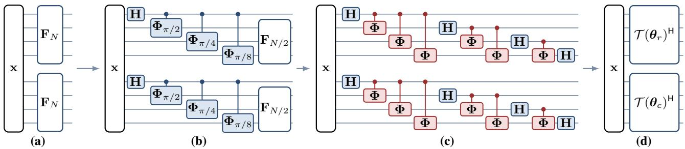  
Fig. 1: The construction of Sec. 3.1 for $n = 4$ per axis, depicted as four tensor networks progressing from specific to general (left to right), each applied to a copy of the vectorized image x $\mathbf { \Psi } : = \operatorname { v e c } ( \mathbf { X } )$ . (a) The separable 2D DFT, $\left( \mathbf { F } _ { N } \otimes \mathbf { F } _ { N } \right)$ x, from Step 1a. (b) One Cooley–Tukey level: the radix-2 decomposition (3) of Step 1b. (c) The circuit T(θ) of (4) up to the bit reversal B, with trainable diagonals (red) and fixed Hadamards (blue). It is unitary by (5) and satisfies $\mu = 1$ at every θ by Prop. 1. (d) The analysis map $\scriptstyle A _ { \theta }$ of Step 1d.

Algorithm 1. To manage computational budgets, stochastic/online gradient descent solves (1) by sampling a small batch of training images per step (to approximate the sum over all training data) and randomly drawing a sampling mask per image (to approximate $\mathbb { E } _ { \Omega } \{ \cdot \} )$ —see Algorithm 1. Once θ⋆ is learned, the network $ { \mathcal { T } } ( \theta _ { \star } )$ inpaints a test image $\mathbf { X } _ { \mathrm { t e s t } } \notin \mathcal { D }$ observed through a fixed sampling mask $\Omega _ { \mathrm { t e s t } }$ via the Recover $\mathbf { \Gamma } \cdot \left( P _ { \Omega _ { \mathrm { t e s t } } } \mathbf { X } _ { \mathrm { t e s t } } , \Omega _ { \mathrm { t e s t } } , \pmb { \theta } _ { \star } \right)$ function of Algorithm 1.

As explained in Sec. 1, coherence $\mu ( \cdot )$ quantifies the localization of basis atoms. For $\mathbf { U } = \left\lceil u _ { i j } \right\rceil \in U ( N )$ (where $U ( N )$ is the set of complex-valued $N \times N$ unitary matrices), coherence is defined as:

$$
\mu ( \mathbf { U } ) : = N \operatorname* { m a x } _ { i , j } | \mathbf { e } _ { i } ^ { \top } \mathbf { u } _ { j } | ^ { 2 } = N \operatorname* { m a x } _ { i , j } | u _ { i j } | ^ { 2 } \in [ 1 , N ] ,\tag{2}
$$

where $\{ { \mathbf { e } } _ { i } \} _ { i = } ^ { N }$ is the standard basis of $\mathbb { R } ^ { N }$ and uj is the jth column of U. Under sparsity and suitable sampling conditions, the sample complexity for recovery grows linearly with µ [15], motivating the design of transforms with low coherence. For images—which have both row and column structure—the 2D-coherence µ2D is defined as the product of coherences along each dimension. Correspondingly, the tensor-network parameter vector $\pmb { \theta } \ : = \ : ( \pmb { \theta } _ { r } , \pmb { \theta } _ { c } )$ factorizes into row and column components, respecting this 2D structure.

## 3. THE TENSOR NETWORKS

This section writes the DFT as a quantum Fourier circuit (Sec. 3.1), frees its gates one structure at a time (Sec. 3.2), trains the result through the recovery iteration (Sec. 3.3), and shows the two properties the design rests on, isometry at every parameter value (Sec. 3.4) and minimum coherence (Sec. 3.5), which single out QFT (diagonals) as the recommended model.

## 3.1. An FFT-factorized isometric family

Read the index of a length- $( N \ = \ 2 ^ { n } )$ axis $( n ~ \geq ~ 2 )$ as an n-bit string $b _ { 0 } b _ { 1 } \cdots b _ { n - 1 }$ , b0 the most significant bit, and draw one wire per bit; the n wires of an axis form a register. The network acts on the vectorized image $\mathbf { x } = \operatorname { v e c } ( \mathbf { X } ) \left( { \overline { { \mathbf { x } } } } \right)$ , the rows of X stacked, and a transform is a network of small unitary tensors on those wires [19, 21]. Throughout, ⊗ is the Kronecker product, and every product of gates is the ordinary matrix product, written in the order applied, the rightmost first. Fig. 1 draws the four steps.

Step 1a. The separable 2D DFT attaches one dense $\mathbf { F } _ { N } \mathbf { \nabla } \sqrt { \mathbf { F } _ { N } } \mathrm { ~ }$ $( { \bf F } _ { N } ) _ { j k } \stackrel { \bullet } { = } e ^ { 2 \pi i j k / N } / \sqrt { N }$ , to each register: $\mathbf { X } \mapsto \mathbf { F } _ { N } \mathbf { X } \mathbf { F } _ { N } ^ { \mathsf { T } } , \mathrm { i . e . }$ $\left( \mathbf { F } _ { N } \otimes \mathbf { F } _ { N } \right) \mathbf { x } .$ . No gate joins the two.

Step 1b. The Hadamard on wire q is ${ \bf H } _ { q } = { \bf I } _ { 2 ^ { q } } \otimes { \bf H } \otimes { \bf I } _ { 2 ^ { n - 1 - q } }$ H , with H $\begin{array} { r } { : = \frac { 1 } { \sqrt { 2 } } \left[ \begin{array} { c c } { 1 } & { 1 } \\ { 1 } & { - 1 } \end{array} \right] } \end{array}$ . The controlled phase on the wire pair $( p , q ) , \Phi _ { p q } ( \xi ) \lrcorner \_$ , is the phase gate $\mathrm { d i a g } ( 1 , 1 , 1 , e ^ { i \xi } )$ on wires p and q and $\mathbf { I } _ { 2 }$ on every other wire. One level of the Cooley–Tukey recursion factors each dense block into a Hadamard on the most significant bit, a controlled phase coupling it to each remaining bit $p$ at the angle $\pi / 2 , \pi / 4 , \ldots { \bar { , } } 2 \pi / 2 ^ { n }$ in turn, and a half-size $\mathbf { F } _ { N / 2 }$ on the rest, the angle of the pair $( p , q )$ being $\xi _ { p q } = 2 \pi / 2 ^ { p - q + 1 }$ . In matrix form this level is the classical radix-2 identity [22]

$$
\mathbf { F } _ { N } = \mathbf { S } \left( \mathbf { I } _ { 2 } \otimes \mathbf { F } _ { N / 2 } \right) \prod _ { p = 1 } ^ { n - 1 } \pmb { \Phi } _ { p 0 } \left( \xi _ { p 0 } \right) \mathbf { H } _ { 0 } ,\tag{3}
$$

with S the permutation matrix that moves bit 0 of the index to the last place, $b _ { 0 } b _ { 1 } \cdot \cdot \cdot b _ { n - 1 } \mapsto b _ { 1 } \cdot \cdot \cdot b _ { n - 1 }$ b0; the Φ factors are diagonal and commute.

Step 1c. Recursing until ${ \bf { F } } _ { 2 } ~ = ~ { \bf { H } }$ leaves nothing dense. Level q contributes Hq followed by its controlled phases $\scriptstyle \mathbf { D } _ { q } \ =$ $\begin{array} { r } { \prod _ { p = q + 1 } ^ { n - 1 } \Phi _ { p q } ( \xi _ { p q } ) } \end{array}$ , and its move of bit q to the last place, ${ \bf S } _ { q } ~ =$ ${ \bf { I } } _ { 2 ^ { q } } \stackrel { * } { \otimes } { \bf { S } }$ with S on the trailing $n - q$ bits; the moves compose into the bit reversal $\textbf { B } = \textbf { S } _ { 0 } \mathbf { S } _ { 1 } \cdot \cdot \cdot \mathbf { S } _ { n - 2 }$ . The levels compose in circuit order, the $q \ = \ 0$ factors rightmost and applied first: $\mathbf F _ { N } ~ = ~ \mathbf B \left( \mathbf D _ { n - 1 } \mathbf H _ { n - 1 } \right) \cdot \cdot \cdot \left( \mathbf D _ { 0 } \mathbf H _ { 0 } \right)$ , the quantum Fourier circuit [19].

Step 1d. Freeing the angle of every controlled phase, $\xi _ { p q } \mapsto$ $\theta _ { p q } .$ , gives the trainable network

$$
\mathscr { T } ( \pmb \theta ) : = \mathbf B \left( \mathbf D _ { n - 1 } ( \pmb \theta ) \mathbf H _ { n - 1 } \right) \cdot \cdot \cdot \left( \mathbf D _ { 0 } ( \pmb \theta ) \mathbf H _ { 0 } \right) ,\tag{4}
$$

with $\begin{array} { r } { \mathbf { D } _ { q } ( \pmb { \theta } ) = \prod _ { p = q + 1 } ^ { n - 1 } \pmb { \Phi } _ { p q } ( \theta _ { p q } ) } \end{array}$ , θ the parameter vector of Sec. 2 (its entries per model in Sec. 3.2), and $\mathcal { T } ( { \pmb \theta } ^ { 0 } ) = { \bf F } _ { N }$ at $\theta _ { p q } = \xi _ { p q } .$ Every factor is unitary at every parameter value, so

$$
\mathcal { T } ( \pmb { \theta } ) ^ { \sf H } \mathcal { T } ( \pmb { \theta } ) = \mathbf { I } , \quad \forall \pmb { \theta } .\tag{5}
$$

The analysis map applies ${ \cal T } ( \pmb \theta ) ^ { \sf H }$ on each register (Fig. 1(d)); with separate angles per axis,

$$
\mathcal { A } _ { \boldsymbol { \theta } } ( \mathbf { X } ) : = \mathcal { T } ( \boldsymbol { \theta } _ { r } ) ^ { \mathrm { H } } \mathbf { X } \overline { { \mathcal { T } ( \boldsymbol { \theta } _ { c } ) } } , \mathcal { A } _ { \boldsymbol { \theta } } ^ { - 1 } ( \mathbf { C } ) = \mathcal { T } ( \boldsymbol { \theta } _ { r } ) \mathbf { C } \mathcal { T } ( \boldsymbol { \theta } _ { c } ) ^ { \mathrm { T } } ,\tag{6}
$$

the second being the exact inverse of the first by (5).

## 3.2. A ladder of relaxations

Each model frees one structure of (4), and θ collects the free parameters of whichever model is meant:

QFT (phases) QFT (diagonals) QFT (rotations) pair diagonal $\left( 1 , 1 , 1 , e ^ { i \xi } \right) \quad ( e ^ { i \theta _ { 1 } } , \ldots , e ^ { i \theta _ { 4 } } ) \quad ( e ^ { i \theta _ { 1 } } , \ldots , e ^ { i \theta _ { 4 } } ) \quad$ wire gate H H $\mathbf { V } \in U ( 2 )$ count per axis $n ( n - 1 ) / 2 \qquad 2 n ( n - 1 ) \qquad 2 n ( n - 1 ) + 4 n$ QFT (phases) is (4) as written. QFT (diagonals) frees the other three phases of each pair, one per value $( b _ { p } , \dot { b } _ { q } )$ of the two bits Φ , initialized at $( 0 , 0 , 0 , \xi _ { p q } )$ , and pinning them at zero recovers QFT (phases). QFT (rotations) frees the Hadamards too, each $\mathbf { V } _ { q }$ initialized at H and held on $U ( 2 )$ by a Cayley retraction [23] as in [21], and can leave the complex Hadamard set. Every replacement is unitary, so (5) holds for all three, and all start at the DFT and minimize (1), each adjacent comparison in Table 1’s last block isolating one freedom.

Algorithm 1: Recovery and training for the phase-only   
and diagonal models   
Input: $\overline { { \mathcal { D } , p , k , K , T \left( \mathrm { S e c . } 4 \right) } }$   
1 function Recover $( \mathbf { Y } , \Omega , \theta )$ :   
2 $\mathbf { X } ^ { ( 0 ) }  \mathbf { Y }$   
3 for $\kappa = 0 , \ldots , K - 1$ do   
4 Update $\mathbf { X } ^ { ( \kappa + 1 ) }$ by (7)   
5 return $\widehat { \mathbf { X } } _ { K } ( \pmb { \theta } ; \mathbf { Y } , \Omega ) : = \mathbf { X } ^ { ( K ) }$   
6 $\dot { \pmb \theta }  \pmb \theta ^ { 0 }$ // the DFT   
7 for $\tau = 1 , \dots , T$ do   
8 Draw $\mathbf { X } \in \mathcal { D }$ and a fresh mask as in Sec. 2   
9 $\widehat { \mathbf { X } } _ { K } \gets \mathop { \mathrm { R e c o v e r } } { ( P _ { \Omega } \mathbf { X } , \Omega , \pmb { \theta } ) }$   
10 $\pmb { \theta } \gets \mathrm { A d a m } ( \pmb { \theta } , \nabla _ { \pmb { \theta } } \| \widehat { \mathbf { X } } _ { K } - \mathbf { X } \| _ { \mathrm { F } } ^ { 2 } / N ^ { 2 } )$ // support fixed   
Output: $\mathbf { \theta } _ { \mathbf { \star } } \gets \mathbf { \theta } ,$ with $\mu _ { \mathrm { 2 D } } = 1 ( \mathrm { P r o p . ~ } 1 )$

Tying the phase vectors of QFT (diagonals) by gate distance, $\theta _ { p q } \ = \ \psi _ { p - q }$ as in the DFT rule $\xi _ { p q }$ of Step 1b, gives $4 ( n - 1 )$ parameters per axis and, with the DFT phases at new distances, a basis at every resolution within Prop. 1’s hypothesis (Sec. 3.5).

## 3.3. Recovery as an unrolled map

Define the hard-thresholder $\mathcal { H } _ { k }$ to retain coefficients at or above the kth largest magnitude, including ties at the cutoff. Starting from $\mathbf { X } ^ { ( 0 ) } = \mathbf { Y }$ , the iterative update is:

$$
\mathbf { X } ^ { ( \kappa + 1 ) } : = P _ { \Omega } \mathbf { Y } + ( \mathrm { I d } - P _ { \Omega } ) \mathrm { R e } \{ \mathcal { A } _ { \theta } ^ { - 1 } ( \mathcal { H } _ { k } ( \mathcal { A } _ { \theta } ( \mathbf { X } ^ { ( \kappa ) } ) ) ) \}\tag{7}
$$

This update alternates transform-domain hard thresholding with data consistency on the observed pixels [5, 6]. The output matches observed entries but is not constrained to remain k-sparse. The Kth iterate yields $\widehat { \mathbf { X } } _ { K } ( \pmb { \theta } ; \mathbf { Y } , \Omega )$ from (1). Training requires derivatives with respect to $\theta ;$ since these arise from the iteration rather than a closed form, the iteration itself is differentiated. Fixing K unfolds the iteration into a finite computation graph—a piecewise differentiable map from gate angles to images, which defines algorithm unrolling [24]. Away from support changes, $\mathcal { H } _ { k } ( \mathbf { C } ) = \mathbf { M } _ { k } \odot \mathbf { C }$ for a fixed binary mask ${ { \bf { M } } _ { k } }$ , with derivative $D \mathcal { H } _ { k } ( { \bf C } ) [ \Delta { \bf C } ] = { \bf M } _ { k } \odot$ $\Delta \mathbf { C } .$ . Differentiation propagates through the retained support values via reverse mode over K iterations, rematerializing at each step.

## 3.4. Isometry without manifold optimization

The fully relaxed network searches the product manifold $U ( 2 ) ^ { n } \times$ $\left( U ( 1 ) ^ { 4 } \right) ^ { n ( n - 1 ) / 2 }$ per axis [21]. The diagonal relaxation pins the $\dot { U } ( 2 )$ factors at H and leaves a torus, parameterized by the periodic, redundant angles through $\theta \mapsto e ^ { i \theta ^ { i } }$ . Every Adam step [25] on these angles preserves gate unitarity, with no need for Riemannian tangent-space projections and retractions (Algorithm 1). The diagonal gates at each stage commute and combine into one diagonal, so applying the n Hadamards and n diagonals costs $O ( N ^ { 2 } \log N )$ per image, for the map or its adjoint, with no dense T formed.

## 3.5. Coherence is pinned

Proposition 1. Let $\mathbf { U } = \mathbf { B } \mathbf { G } _ { L } \cdot \cdot \cdot \mathbf { G } _ { 1 } ,$ , where B is a permutation matrix and everyfactor $\mathbf { G } _ { l }$ is either a unitary diagonal matrix or the Hadamard $\mathbf { H } _ { q }$ of Step 1b, each wire carrying exactly one Hadamard factor. Then $| ( \mathbf { U } ) _ { i j } | = 1 / \sqrt { N } , \forall ( i , j )$ , so that $\sqrt { N } \mathbf { U }$ is a complex

Hadamard matrix [26] with $\mu ( \mathbf { U } ) = 1$ . In particular $\mu = 1$ on $Q F T$ (diagonals) and its phase-only subfamily, tied $( S e c . 3 . 2 )$ or untied.

Proof. The proof is omitted due to lack of space.

Prop. 1 guarantees minimum coherence throughout training via the circuit topology alone, without requiring an explicit coherence penalty. Unconstrained learned dictionaries lack such guarantees. The QFT (rotations) architecture falls outside this guarantee because its free parameters $\mathbf { V } _ { q }$ replace the prescribed Hadamards, allowing coherence to exceed the minimum bound of 1—as observed in Sec. 4.4.

## 4. NUMERICAL TESTS AND DISCUSSION

## 4.1. Setup

Numerical tests use DIV2K [27], grayscale $5 1 2 \times 5 1 2$ crops: 750 for training, 50 for validation, and 100 test images. Each test image carries a single mask, drawn once randomly and then fixed, shared by every method and every budget in this paper, and there is one training seed throughout.

Each method is evaluated at its per-image budget optimum over sparsity levels $k / m \in \{ 0 . 0 1 5 , 0 . 0 \hat { 3 } , 0 . 0 6 2 5 , 0 . 1 2 5 , 0 . 2 \hat { 5 } , 0 . 5 \}$ where m is the observed pixel count. All transforms are evaluated at $K = 3 0 0$ iterations; the QFT models train at $K = 1 0 0 , T = 2 0 0$ steps over mini-batches of two images, $k = m / 8$ . Learning rates are tuned via validation-set PSNR over seven candidates, QFT (rotations) also over five Cayley steps. In Table $1 , \mu$ denotes coherence; “Fitted $\mathrm { o n } ^ { \mathrm { * } }$ indicates what each method uses to train its parameters (nothing, test images, or training images). All baselines are implemented in JAX [28].

4.2. Comparison with fixed transforms and per-image methods QFT (diagonals) outperforms the DFT by 2.02dB and the best fixed transform by 1.59dB in PSNR, and leads both in PSNR and MS-SSIM on all 100 test images. Fig. 2 shows all methods on a representative test image. The bases split by coherence into global (DFTlike) and localized (wavelet-like) families, the global family leading on PSNR and MS-SSIM [31], with single-scale SSIM [32] favoring the wavelets.

Per-image methods are not transforms. The tensor train [14] trails by 0.60dB in PSNR but leads by 0.005 in MS-SSIM. Among

Table 1: Completion on 100 DIV2K test images at $5 1 2 \times 5 1 2$ and $p = 1 0 \% \mathrm { . }$ fixed bases, per-image fits, trained transforms, and proposed QFT networks
<table><tr><td>Method</td><td>Trainable params</td><td>Fitted on  $\mu$ </td><td>MS- PSNR SSIM SSIM</td></tr><tr><td> $\mathrm { D F T } = \mathcal T ( \pmb { \theta } ^ { 0 } )$ </td><td>0</td><td></td><td>1 20.72 0.443 0.677</td></tr><tr><td>DCT-II</td><td>0</td><td></td><td>421.15 0.4540.693</td></tr><tr><td>Haar [1]</td><td>0</td><td></td><td>6553618.70 0.453 0.582</td></tr><tr><td>Daubechies-4 [1]</td><td>0</td><td></td><td>6845319.230.4720.616</td></tr><tr><td>Symlet-8 [1]</td><td>0</td><td></td><td>9564019.28 0.477 0.625</td></tr><tr><td>Tensor train [14]</td><td>[34–402]k test img</td><td></td><td>22.130.524 0.791</td></tr><tr><td>Nuclear norm [7, 29, 30] [1–109]k test img U(2) butterfly [20]</td><td>18432 tr. data</td><td></td><td>1 18.61 0.369 0.612 2.70 22.91 0.551 0.798</td></tr><tr><td>Transform learning [3]</td><td>524288 tr. data</td><td></td><td>1864221.03 0.4530.691</td></tr><tr><td>QFT (phases)</td><td></td><td>72 tr. data</td><td>1 22.62 0.532 0.781</td></tr><tr><td>QFT (diagonals)</td><td>288 tr. data</td><td></td><td>1 22.74 0.537 0.786</td></tr><tr><td>QFT (rotations)</td><td></td><td>360 tr. data</td><td>1.20 22.98 0.558 0.799</td></tr></table>

U(2) butterfly 21.0 dB

QFT (diagonals) 20.8 dB

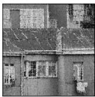

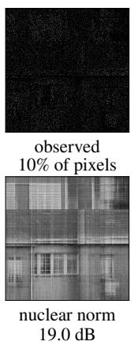

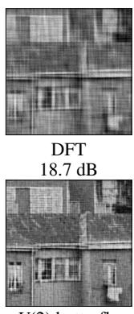

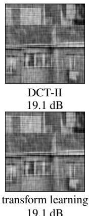

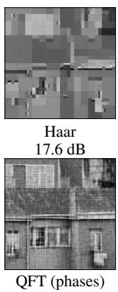

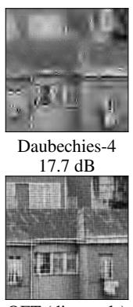

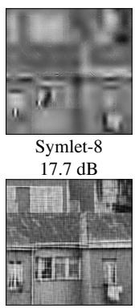  
Fig. 2: A DIV2K test image at sampling rate p = 10% and all methods in Table 1, each at its PSNR-optimal budget.  
QFT (diagonals), ours DFT tensor train U(2) butterfly transform learning nuclear norm

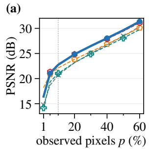

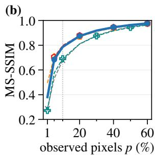

(c)  
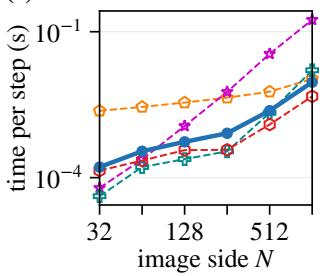

(d)  
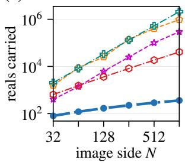  
Fig. 3: (a), (b) Mean PSNR and MS-SSIM over 100 test images vs. sampling rate (dotted: training rate). (c) Time per full-resolution step. (d) Reals each method carries, the transforms once, the per-image fits for every image.

the trained transforms, the butterfly factorization [20] (blocks constrained to $U ( 2 ) )$ leads by 0.17dB at 64× the parameters, but its unconstrained variant loses 8dB under a single-budget protocol; transform learning [3] achieves 0.1dB below the DCT.

Fig. 3(a, b) compares methods across sampling rates, with the transforms trained at $p = 1 0 \%$ applied unchanged. QFT (diagonals) leads the DFT at all rates on both metrics. The tensor train leads in PSNR only at 1% and in MS-SSIM up to 10%; the butterfly leads by 0.2–0.3dB up to 10%, matches at 20%, and trails above. Fig. 3(c, d) analyzes computational cost. QFT (diagonals) scales as $\breve { N } ^ { 1 . 7 }$ and costs two-fifths of the tensor train at $5 \bar { 1 2 } ^ { 2 }$ (which scales as $N ^ { 0 . 6 } ;$ a rank cap). QFT (diagonals) requires 288 trainable reals at $5 1 2 ^ { 2 }$ compared to 18,432 (butterfly) and 524,288 (transform learning). Training costs 741s, equivalent to ∼ 570 tensor-train fits.

## 4.3. The coherence-sparsity trade-off

Theory provides a fundamental trade-off: a k-sparse object is recovered from m random pixels when $m \gtrsim \mu ( \mathbf { U } )$ k log N [15]. At fixed sampling, workable sparsity decreases linearly with coherence. Wavelets achieve superior sparsity but suffer from high coherence— resulting in worse inpainting PSNR than the less-sparse but lowcoherence DFT. This reversal (wavelets win in compression, lose in inpainting) cannot be fully attributed to coherence alone, since sparsity and coherence vary together across bases. Isolating coherence’s effect requires trainable transforms rather than fixed bases. Standard coherence-reduction strategies also modify the sampling law [16], which i.i.d. masks preclude.

The comparison uses fixed-k hard-thresholding (7), applied uniformly to all methods. Soft thresholding improves all bases—the DFT gains 1.0dB at 10% and 0.9dB at 60% sampling; Symlet-8’s high-rate deficit narrows from 3.0 to 2.3dB at 60%—but does not reverse the two families’ relative order.

## 4.4. Freeing the QFT circuit: performance vs. structure

Table 1’s final block of rows compares architectures with increasing degrees of freedom. The phase-only model learns diagonal phase parameters while keeping Hadamards fixed. Freeing the diagonal gates adds +0.11dB over phase-only updates. Freeing the Hadamards as well (replacing them with learnable rotations, with both learning rates tuned) adds +0.24dB and 0.013 MS-SSIM, but at a cost: coherence rises with the Cayley step from 1.09 to 1.31, requiring Riemannian retractions at each iteration. At the largest step attempted, training diverges $( \mu = 6 9 7 , 1 2 . 5 \mathrm { d B } )$ . In contrast, the diagonal subfamily (phases + fixed Hadamards) maintains $\mu = 1$ unconditionally with only 0.24dB loss, using plain Adam without retractions.

## 5. CONCLUSION

The tension between sparsity and coherence in image inpainting motivated the design of trainable transforms adapted to image structure. This work introduced quantum-inspired tensor-network circuits as trainable transforms for the first time in this application. The diagonal QFT model achieved low coherence through circuit topology alone, guaranteeing minimum coherence at every parameter value without explicit penalties. This structural guarantee enabled efficient training with plain Adam and yielded competitive performance with far fewer parameters than alternative learned transforms, demonstrating that principled architectural choices can replace costly optimization constraints while establishing a new paradigm of quantuminspired methods to image reconstruction.

## ACKNOWLEDGMENT

S. An’s work was supported by JST SPRING, Japan, Grant Number JPMJSP2180. The authors thank Jin-Guo Liu, Zhongyi Ni and Huanhai Zhou of the Hong Kong University of Science and Technology (Guangzhou) for discussions.

## REFERENCES

[1] S. Mallat, A Wavelet Tour of Signal Processing: The Sparse Way, 3rd. Academic Press, 2008.

[2] M. Aharon, M. Elad, and A. Bruckstein, “K-SVD: an algorithm for designing overcomplete dictionaries for sparse representation,” IEEE Trans. Signal Process., vol. 54, no. 11, pp. 4311–4322, 2006.

[3] S. Ravishankar and Y. Bresler, “Closed-form solutions within sparsifying transform learning,” in Proc. IEEE Int. Conf. Acoust., Speech, Signal Process. (ICASSP), 2013, pp. 5378– 5382.

[4] E. J. Candès, J. Romberg, and T. Tao, “Robust uncertainty principles: Exact signal reconstruction from highly incomplete frequency information,” IEEE Trans. Inf. Theory, vol. 52, no. 2, pp. 489–509, 2006.

[5] T. Blumensath and M. E. Davies, “Iterative hard thresholding for compressed sensing,” Appl. Comput. Harmon. Anal., vol. 27, no. 3, pp. 265–274, 2009.

[6] O. G. Guleryuz, “Nonlinear approximation based image recovery using adaptive sparse reconstructions and iterated denoising—Part I: theory,” IEEE Trans. Image Process., vol. 15, no. 3, pp. 539–554, 2006.

[7] E. J. Candès and B. Recht, “Exact matrix completion via convex optimization,” Found. Comput. Math., vol. 9, no. 6, pp. 717–772, 2009.

[8] E. J. Candès and T. Tao, “The power of convex relaxation: Near-optimal matrix completion,” IEEE Trans. Inf. Theory, vol. 56, no. 5, pp. 2053–2080, 2010.

[9] R. Suvorov, E. Logacheva, A. Mashikhin, A. Remizova, A. Ashukha, A. Silvestrov, N. Kong, H. Goka, K. Park, and V. Lempitsky, “Resolution-robust large mask inpainting with Fourier convolutions,” in Proc. IEEE/CVF Winter Conf. Appl. Comput. Vis. (WACV), 2022, pp. 3172–3182.

[10] A. Lugmayr, M. Danelljan, A. Romero, F. Yu, R. Timofte, and L. Van Gool, “RePaint: inpainting using denoising diffusion probabilistic models,” in Proc. IEEE/CVF Conf. Comput. Vis. Pattern Recognit. (CVPR), 2022, pp. 11 451–11 461.

[11] S. Sreehari et al., “Plug-and-play priors for bright field electron tomography and sparse interpolation,” IEEE Trans. Comput. Imaging, vol. 2, no. 4, pp. 408–423, 2016.

[12] D. Ulyanov, A. Vedaldi, and V. Lempitsky, “Deep image prior,” in Proc. IEEE/CVF Conf. Comput. Vis. Pattern Recognit. (CVPR), 2018, pp. 9446–9454.

[13] J. A. Bengua, H. N. Phien, H. D. Tuan, and M. N. Do, “Efficient tensor completion for color image and video recovery: Low-rank tensor train,” IEEE Trans. Image Process., vol. 26, no. 5, pp. 2466–2479, 2017.

[14] S. Loeschcke, D. Wang, C. Leth-Espensen, S. Belongie, M. Kastoryano, and S. Benaim, “Coarse-to-fine tensor trains

for compact visual representations,” in Proc. 41st Int. Conf. Mach. Learn. (ICML), vol. 235, 2024, pp. 32 612–32 642.

[15] E. J. Candès and J. Romberg, “Sparsity and incoherence in compressive sampling,” Inverse Probl., vol. 23, no. 3, pp. 969–985, 2007.

[16] B. Adcock, A. C. Hansen, C. Poon, and B. Roman, “Breaking the coherence barrier: A new theory for compressed sensing,” Forum Math. Sigma, vol. 5, e4, 2017.

[17] I. V. Oseledets, “Tensor-train decomposition,” SIAM J. Sci. Comput., vol. 33, no. 5, pp. 2295–2317, 2011.

[18] B. N. Khoromskij, “O(d log N)-quantics approximation of N-d tensors in high-dimensional numerical modeling,” Constr. Approx., vol. 34, no. 2, pp. 257–280, 2011.

[19] M. A. Nielsen and I. L. Chuang, Quantum Computation and Quantum Information, 10th anniv. Cambridge Univ. Press, 2010.

[20] T. Dao, A. Gu, M. Eichhorn, A. Rudra, and C. Ré, “Learning fast algorithms for linear transforms using butterfly factorizations,” in Proc. 36th Int. Conf. Mach. Learn. (ICML), vol. 97, 2019, pp. 1517–1527.

[21] S. An, Z. Ni, H. Zhou, and J.-G. Liu, “Fast trainable multilinear bases for image compression,” arXiv:2608.00053, 2026.

[22] C. F. Van Loan, Computational Frameworks for the Fast Fourier Transform. SIAM, 1992.

[23] Z. Wen and W. Yin, “A feasible method for optimization with orthogonality constraints,” Math. Program., vol. 142, no. 1– 2, pp. 397–434, 2013.

[24] V. Monga, Y. Li, and Y. C. Eldar, “Algorithm unrolling: Interpretable, efficient deep learning for signal and image processing,” IEEE Signal Process. Mag., vol. 38, no. 2, pp. 18– 44, 2021.

[25] D. P. Kingma and J. Ba, “Adam: A method for stochastic optimization,” in Proc. Int. Conf. Learn. Represent. (ICLR), 2015.

[26] W. Tadej and K. Zyczkowski, “A concise guide to complex Hadamard matrices,” Open Syst. Inf. Dyn., vol. 13, no. 2, pp. 133–177, 2006.

[27] E. Agustsson and R. Timofte, “NTIRE 2017 challenge on single image super-resolution: Dataset and study,” in Proc. IEEE Conf. Comput. Vis. Pattern Recognit. Workshops (CVPRW), 2017, pp. 1122–1131.

[28] J. Bradbury et al., JAX: Composable transformations of Python+NumPy programs, 2018.

[29] P. Jain, R. Meka, and I. S. Dhillon, “Guaranteed rank minimization via singular value projection,” in Proc. Adv. Neural Inf. Process. Syst. (NIPS), vol. 23, 2010, pp. 937–945.

[30] K.-C. Toh and S. Yun, “An accelerated proximal gradient algorithm for nuclear norm regularized linear least squares problems,” Pac. J. Optim., vol. 6, no. 3, pp. 615–640, 2010.

[31] Z. Wang, E. P. Simoncelli, and A. C. Bovik, “Multiscale structural similarity for image quality assessment,” in Proc. 37th Asilomar Conf. Signals, Syst., Comput., vol. 2, 2003, pp. 1398–1402.

[32] Z. Wang, A. C. Bovik, H. R. Sheikh, and E. P. Simoncelli, “Image quality assessment: From error visibility to structural similarity,” IEEE Trans. Image Process., vol. 13, no. 4, pp. 600–612, 2004.