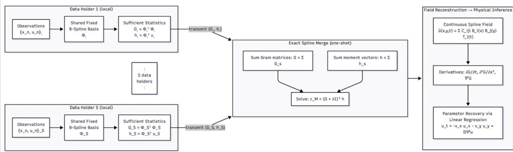
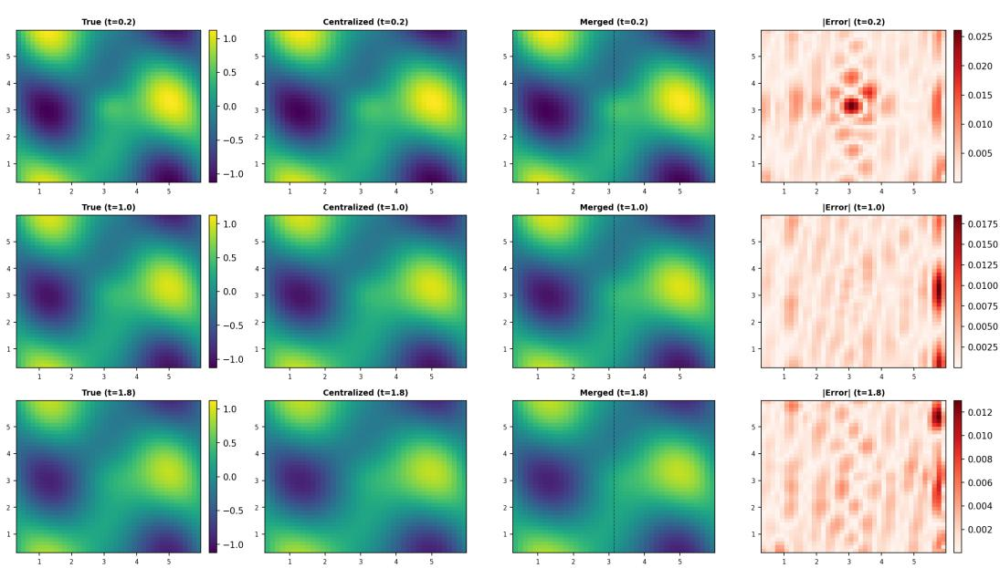
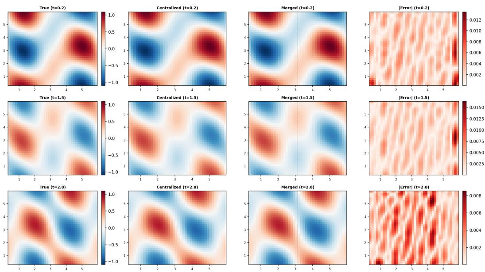
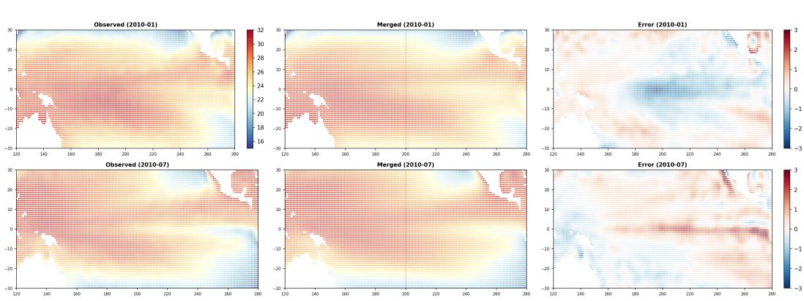

# RECOVERING PHYSICAL PARAMETERS FROM FRAG-MENTED OBSERVATIONS VIA EXACT DISTRIBUTED SPLINE MERGING

Naveen Mysore

University of California, Santa Barbara

Dyssonance AI

nmysore@ucsb.edu nmysore.work@gmail.com

## ABSTRACT

Scientific measurements are frequently distributed across locations, time periods, and institutions. Combining such fragments into a continuous, differentiable field enables recovering governing physical parameters from its derivatives. This paper makes two contributions toward that goal. First, the established additive structure of fixed-basis ridge-regression statistics is applied to tensor-product spline fields: each data holder computes a local Gram matrix and moment vector, and the merged solution is mathematically identical to centralized fitting, with no raw data shared and no iterative synchronization. This property is specific to the fixedfeature squared-error setting; the present derivation does not establish an analogous guarantee for general jointly trained multilayer networks. Second, a complete pipeline connects distributed observations to physical parameter inference through field reconstruction, derivative extraction, and linear regression. The diffusion coefficient is recovered to 0.11% error and wave speed to 0.12% error; in both cases, distributed merging introduces zero degradation relative to centralized fitting. Application to 41 years of NOAA sea-surface temperature data confirms the result on real spatiotemporal observations.

## 1 INTRODUCTION

Many scientific domains produce observations that are distributed across space, time, and institutions. Ocean temperature is measured by buoys, ships, and satellites operating in different regions. Atmospheric data comes from weather stations, radiosondes, and reanalysis systems with varying coverage. Medical imaging data is collected at separate hospitals under privacy constraints. No single observer has access to the full field, yet recovering governing dynamics benefits from a continuous, differentiable representation of the entire domain.

Several lines of work address parts of this problem. Federated learning (McMahan et al., 2017) iteratively synchronizes model parameters across multiple communication rounds. Model merging methods combine trained models in a single step: Model Soups (Wortsman et al., 2022) averages fine-tuned weights, and Git Re-Basin (Ainsworth et al., 2023) addresses permutation symmetry in hidden representations. These approaches address parameter averaging and representation alignment under particular training conditions, rather than providing the pooled-estimator identity con sidered here. RegMean (Jin et al., 2023) derives the fixed-feature Gram construction and applies related layer-wise operations within transformer models. Polar & Poluektov (2025) study merging Kolmogorov–Arnold Networks (Liu et al., 2024) trained on disjoint datasets. The additive struc ture of fixed-feature ridge-regression statistics is classical (Hoerl & Kennard, 1970) and has been explicitly formulated as one-shot federated aggregation by Alsulaimawi (2026). The present work applies this established construction to spatiotemporal field reconstruction and subsequent physical parameter estimation.

A separate body of work reconstructs fields and discovers governing equations. Physics-informed neural networks (Raissi et al., 2019) learn fields satisfying known PDEs through iterative optimization; distributed variants exist (Shukla et al., 2021), though they require iterative training rather than one-shot statistic sharing. Senseiver (Santos et al., 2023) reconstructs fields from sparse sensors using attention. SINDy (Brunton et al., 2016) and PDE-FIND (Rudy et al., 2017) identify governing equations from derivative measurements; weak-form alternatives (Messenger & Bortz, 2021) avoid pointwise derivative reconstruction entirely. These methods typically assume centralized access to the observation set.

For models linear in their parameters, specifically fixed-basis function expansions, both limitations dissolve. Each data holder computes two observation-count-independent summaries of its local data, a Gram matrix and a moment vector, and transmits only these. The merged solution, obtained by summing the summaries and solving a single linear system, is mathematically identical to centralized fitting.

Two distinct estimation problems are involved. The first recovers the field coefficients c from distributed observations; the exact aggregation guarantee applies here. The second estimates physical parameters θ (such as diffusivity or wave speed) from derivatives of the reconstructed field; this step is approximate and subject to field-approximation and derivative-estimation errors. Section 2 develops both constructions from first principles.

This paper makes two contributions:

1. Distributed field reconstruction. The established additive structure of ridge-regression statistics is applied to tensor-product spline fields and verified empirically: the distributed merge reproduces the centralized estimator on synthetic PDEs and real climate data.

2. End-to-end physics recovery. A complete pipeline connects distributed observations to governing parameter inference through field reconstruction, derivative extraction, and linear regression. The diffusion coefficient and wave speed are recovered to sub-percent accuracy from merged fields.

Section 3 additionally discusses how basis support constrains the possible sparsity of the Gram matrix, though the present experiments do not include a controlled basis-family comparison.

## 2 BACKGROUND

This section builds the core framework from first principles: basis function representations, the least-squares fitting problem, sufficient statistics, and why they compose exactly under distributed merging.

Problem setup. Multiple data holders observe the same scalar field in a common coordinate system. Each holder retains its own observation locations and measured values. Before fitting, all holders agree on the same fixed basis functions, coefficient ordering, and regularized fitting objective. The first goal is to recover the coefficients that would be obtained by pooling all observations and fitting one model. The second goal is to use the reconstructed field to estimate parameters of a specified governing equation. The term “data holder” is used throughout; in the experiments, a data holder may represent a spatial region, an institutional partition, or a class-conditional subset.

## 2.1 B-SPLINE BASIS FUNCTIONS

A B-spline basis function $B _ { k } ( x )$ is a piecewise polynomial defined over a sequence of knot points (de Boor, 2001). For cubic B-splines (degree 3) on a uniform grid with simple interior knots, each basis function has support over four adjacent knot intervals and is zero outside this region. This property, called compact support, means that each $B _ { k }$ responds only to nearby data. The resulting spline is $C ^ { 2 }$ -continuous (twice continuously differentiable) across interior knots, and the complete basis forms a partition of unity on its base interval.

A scalar field can then be represented as a weighted sum of these basis functions:

$$
u ( x ) = \sum _ { k = 1 } ^ { K } c _ { k } B _ { k } ( x ) .\tag{1}
$$

The representation can express nonlinear dependence on $x ,$ while remaining linear in its coefficients $\boldsymbol { c } = [ \dot { c _ { 1 } } , \dots , c _ { K } ] ^ { \top }$ . This distinction is the foundation of everything that follows.

## 2.2 FITTING AS LINEAR REGRESSION

Given N observations $\{ ( x _ { n } , u _ { n } ) \} _ { n = 1 } ^ { N } ,$ , the goal is to find coefficients c such that $u ( x _ { n } ) \ \approx \ u _ { n }$ Define thefeature matrix Φ $\in \mathbb { R } ^ { N \times K }$ with entries $\Phi _ { n k } = B _ { k } ( x _ { n } )$ , so that the model predictions are ${ \hat { u } } = \Phi c$ . The optimal coefficients minimize the regularized squared error:

$$
\mathcal { L } ( c ) = \| u - \Phi c \| ^ { 2 } + \lambda \| c \| ^ { 2 } ,\tag{2}
$$

where $\lambda > 0$ is a ridge regularization parameter (Hoerl & Kennard, 1970). With $\lambda > 0 .$ , the objective is strictly convex (the Hessian $2 ( \Phi ^ { \top } \Phi + \lambda I )$ is positive definite even when Φ is rank-deficient), ensuring a unique global minimum found by setting the gradient to zero:

$$
\frac { \partial \mathcal { L } } { \partial c } = - 2 \Phi ^ { \top } ( u - \Phi c ) + 2 \lambda c = 0 .\tag{3}
$$

Rearranging yields the normal equations:

$$
\left( \Phi ^ { \top } \Phi + \lambda I \right) c ^ { * } = \Phi ^ { \top } u .\tag{4}
$$

## 2.3 GRAM MATRIX, MOMENT VECTOR, AND SUFFICIENT STATISTICS

The solution in Eq. equation 4 depends on the observations only through two quantities:

$$
G = \Phi ^ { \top } \Phi \in \mathbb { R } ^ { K \times K } , \qquad h = \Phi ^ { \top } u \in \mathbb { R } ^ { K } .\tag{5}
$$

The Gram matrix G captures how the basis functions co-activate across the observation points: entry $\begin{array} { r } { G _ { i j } = \sum _ { n } B _ { i } ( x _ { n } ) B _ { j } \dot { ( x _ { n } ) } } \end{array}$ . The moment vector h captures how each basis function correlates with the observed values: $\begin{array} { r } { \dot { h } _ { k } = \sum _ { n } B _ { k } ( x _ { n } ) u _ { n } } \end{array}$

For the fixed-basis ridge-regression objective in Eq. equation 2, the pair $( G , h )$ is sufficient to compute $c ^ { * } { \mathrm { : } }$ the coefficient estimate depends on the observations only through these two summaries. Once computed, the raw observations $\left\{ \left( x _ { n } , u _ { n } \right) \right\}$ can be discarded without affecting the estimate. This sufficiency is specific to the chosen fitting objective; changing the basis, the loss function, or adding new analyses (such as computing the residual sum of squares, which requires $u ^ { \top } u )$ may require information not preserved in $( G , \bar { h } )$ . For a fixed basis, N observations reduce to a $K \times { \dot { K } }$ matrix and a K-vector, with the summary size independent of observation count. The term “sufficient statistics” is used here in the computational sense of sufficient for the specified ridge estimator; under a Gaussian linear observation model, the same quantities also arise as classical statistical sufficient statistics.

## 2.4 COMPOSABILITY: FROM SUFFICIENCY TO EXACT DISTRIBUTED MERGING

Sufficiency alone is useful for compression. Composability makes it useful for distributed computing.

Suppose observations come from two data holders, A and $B ,$ at different locations. If all data were pooled, the stacked feature matrix and observation vector would give normal equations:

$$
\left( \left[ \Phi _ { A } \right] ^ { \top } \left[ \Phi _ { A } \right] + \lambda I \right) c ^ { * } = \left[ \Phi _ { A } \right] ^ { \top } \left[ u _ { A } \right] .\tag{6}
$$

Expanding the block products:

$$
\underbrace { \left( \Phi _ { A } ^ { \top } \Phi _ { A } + \Phi _ { B } ^ { \top } \Phi _ { B } + \lambda I \right) c ^ { * } } _ { G _ { A } } = \underbrace { \Phi _ { A } ^ { \top } u _ { A } } _ { h _ { A } } + \underbrace { \Phi _ { B } ^ { \top } u _ { B } } _ { h _ { B } } .\tag{7}
$$

The sufficient statistics are additive. Each data holder computes its local $\left( G _ { s } , h _ { s } \right)$ independently and transmits only these compact summaries. The merged solution

$$
c _ { M } ^ { * } = ( G _ { A } + G _ { B } + \lambda I ) ^ { - 1 } ( h _ { A } + h _ { B } )\tag{8}
$$

is identical to the solution that would be obtained by fitting on all observations centrally. No raw data is shared. No iterative synchronization is needed. The merge requires a single matrix solve.

  
Figure 1: End-to-end pipeline. Each data holder independently computes sufficient statistics $( \bar { G } _ { s } , h _ { s } )$ from its local observations using a shared fixed B-spline basis. The statistics are transmitted (not the raw data) and summed to produce the exact centralized solution in a single matrix solve. The resulting continuous spline field yields derivatives for governing parameter estimation via linear regression.

This extends to any number of data holders S by induction: $\begin{array} { r } { c _ { M } ^ { * } = ( \sum _ { s = 1 } ^ { S } G _ { s } + \lambda I ) ^ { - 1 } \sum _ { s = 1 } ^ { S } h _ { s } } \end{array}$

Two merge variants. The formula above reconstructs the centralized data fit, using the moment vectors $h _ { s } = \Phi _ { s } ^ { \top } u _ { s }$ that summarize raw observations. A related variant preserves trained model predictions instead: if data holder s has already fitted local coefficients $c _ { s } .$ , the prediction-matching merge is $\begin{array} { r } { c _ { M } = ( \sum _ { s } G _ { s } + \lambda I ) ^ { - 1 } \sum _ { s } G _ { s } c _ { s } . } \end{array}$ The two coincide when each local fit is at its unregularized optimum $( G _ { s } c _ { s } = h _ { s } )$ . The experiments in this paper use the data merge.

The summary size per data holder is $O ( K ^ { 2 } )$ for the symmetric Gram matrix plus $O ( K )$ for the moment vector, independent of observation count. For an ordered univariate degree-p B-spline basis, compact support yields a Gram matrix with half-bandwidth at most $p .$ Tensor-product representations induce different sparsity patterns (Section 3). Note that dense summaries can exceed the raw data size when K is large relative to $N ;$ sparsity exploitation or structured transmission would be needed for a practical bandwidth advantage.

Fixed versus learned features. The aggregation derived above applies whenever the feature map is fixed and the coefficients enter a quadratic objective. This includes spline expansions, Fourier bases, and linear readouts on frozen neural representations. A fully trainable multi-layer network generally does not satisfy this condition: changing an earlier layer changes the features supplied to subsequent layers, so the Gram matrix from one parameter setting is no longer valid at another. The present construction therefore does not extend to exact whole-network merging in that setting.

From aggregation to physical inference. The preceding derivation concerns the first estimation problem: recovering field coefficients from distributed observations. Exact aggregation removes any discrepancy between distributed and centralized fitting. It does not, by itself, remove fieldapproximation error (the basis may not perfectly represent the true field), derivative-estimation error (finite differences or analytic derivatives of an approximate field), or identifiability issues in the physical regression (ill-conditioned derivative ratios). Section 3 specifies the field representation and the parameter-recovery procedure; the experiments then separate these error sources.

## 3 METHOD

The dimensionality of the input does not change the aggregation algebra. A 1D spline curve $u ( x ) =$ $\textstyle \sum _ { i } c _ { i } B _ { i } ( x )$ , a 2D surface $\begin{array} { r } { \bar { u ( x , y ) } = \sum _ { i , j } \bar { C _ { i j } B _ { i } ( x ) \bar { B _ { j } ( y ) } } } \end{array}$ , and a 3D spatiotemporal field all reduce to the same object: $f ( { \mathbf x } ) = \phi ( { \mathbf x } ) ^ { \top } c ,$ , where ϕ is a fixed feature vector and c is the coefficient vector to be estimated. The Gram merge applies identically in each case. This section specifies the three components: the field representation, the role of basis geometry, and the parameter-recovery procedure. Figure 1 illustrates the complete pipeline.

## 3.1 TENSOR-PRODUCT SPATIOTEMPORAL FIELDS

A scalar spatiotemporal field $u : \mathbb { R } ^ { d } \times \mathbb { R } $ R is represented using a tensor-product expansion. For a 2D spatial domain with one temporal dimension:

$$
u ( x , y , t ) = \sum _ { i = 1 } ^ { K _ { x } } \sum _ { j = 1 } ^ { K _ { y } } \sum _ { l = 1 } ^ { K _ { t } } C _ { i j l } B _ { i } ( x ) B _ { j } ( y ) T _ { l } ( t ) ,\tag{9}
$$

where $B _ { i }$ are cubic B-spline basis functions and $T _ { l }$ are temporal basis functions (either B-splines or Fourier harmonics). Defining the tensor-product feature $\dot { \phi } _ { i j l } ( x , y , t ) = B _ { i } ( x ) B _ { j } ( y ) T _ { l } ( \dot { t } )$ and flattening the coefficients into a vector $c = \operatorname { v e c } ( C ) \in \mathbb { R } ^ { P }$ where $P = K _ { x } \cdot K _ { y } \cdot K _ { t }$ , the field becomes $u = \phi ^ { \top } c$ . For N observations, the feature matrix $\Phi \in \mathbb { R } ^ { N \times P }$ has entries $\Phi _ { n , ( i , j , l ) } =$ $B _ { i } ( x _ { n } ) B _ { j } ( y _ { n } ) T _ { l } ( t _ { n } )$ , and the Gram merge from Section 2 applies directly.

B-spline basis functions are evaluated using the truncated power closed form described by Mysore (2026), implemented in the publicly available InKAN package. All experiments are implemented in PyTorch (Paszke et al., 2019) with NumPy (Harris et al., 2020) and SciPy (Virtanen et al., 2020) for numerical routines.

## 3.2 BASIS GEOMETRY AND MERGE STATISTICS

Basis support constrains the possible sparsity of the empirical feature-interaction statistics. For local B-splines (degree $p )$ , each $B _ { i } ( x )$ has compact support spanning at most $p + 1$ knot intervals, and the resulting Gram matrix is banded within each univariate block. For tensor-product representations, an interaction is zero when the basis supports fail to overlap in any coordinate. Global features such as cos(mωx) produce generally non-sparse Gram matrices whose conditioning depends on frequency selection, observation coverage, and weighting.

The actual entries, conditioning, and behavior of approximate merging methods additionally depend on the represented function space, regularization, and local fitting accuracy. Basis support alone is insufficient as a causal explanation for averaging performance. The present experiments demonstrate exact statistic aggregation for spline and hybrid representations; a controlled basis-family comparison is left to future work.

The NOAA experiment (Section 4.3) uses a hybrid representation: spatial B-splines crossed with temporal Fourier harmonics and polynomial trend terms, producing a tensor-product model with spatially varying seasonal amplitudes.

## 3.3 PHYSICAL PARAMETER RECOVERY

Given the fitted continuous field $u ( x , y , t )$ , spatial and temporal derivatives are computed via central finite differences on a regular evaluation grid (interior points only). Physical parameters that appear linearly in a specified PDE are then recovered by ordinary least squares. Let $\ell _ { i }$ denote the computed Laplacian $\nabla ^ { 2 } u$ at interior grid point i. For the diffusion equation $u _ { t } \ = \ D \nabla ^ { 2 } u$ , the recovered diffusion coefficient is:

$$
D _ { \mathrm { r e c } } = \frac { \sum _ { i } \ell _ { i } u _ { t , i } } { \sum _ { i } \ell _ { i } ^ { 2 } } .\tag{10}
$$

For the wave equation $u _ { t t } = c _ { w } ^ { 2 } \nabla ^ { 2 } u$ , the analogous formula yields $\begin{array} { r } { c _ { w , \mathrm { r e c } } ^ { 2 } = \sum _ { i } \ell _ { i } u _ { t t , i } / \sum _ { i } \ell _ { i } ^ { 2 } } \end{array}$ with $c _ { w , \mathrm { r e c } } = \sqrt { c _ { w , \mathrm { r e c } } ^ { 2 } }$ when the recovered value is non-negative and treated as invalid otherwise.

This is the second problem described in Section 2: the physical parameters are inferred from the reconstructed field, not from raw observations. The accuracy depends on field-approximation quality, derivative computation, and conditioning of $\textstyle \sum _ { i } \ell _ { i } ^ { 2 }$ . When the Laplacian is nearly zero everywhere, the denominator is small and the recovery is unreliable.

## 4 EXPERIMENTS

The pipeline is validated on two synthetic PDEs with known ground truth and on real climate data. Both synthetic experiments use analytic evolution of represented Fourier modes on a periodic $[ 0 , 2 \pi ] ^ { 2 }$ spatial domain. All PDE experiments use cubic B-splines with 8 spatial knot intervals per dimension and 8–10 temporal knot intervals, yielding $K = \mathrm { g r i d } \mathrm { s i z e } + 3$ basis functions per dimension. Ridge regularization is $\lambda = 1 0 ^ { - 4 }$ throughout. Observations are sampled uniformly at random; distributed merge experiments split the domain spatially at $x = \pi .$ , with 5,000 observations per data holder.

  
Figure 2: Diffusion equation $u _ { t } = D \nabla ^ { 2 } u \colon$ ground truth, centralized fit, Gram merge, and absolute error at three time steps. The white dashed line in the merged column marks the spatial partition boundary $( x = \pi ) ;$ Data Holder 1 observes the left half, Data Holder 2 the right. The field smooths as heat diffuses. Centralized and merged reconstructions are identical.

## 4.1 DIFFUSION EQUATION

The diffusion equation $u _ { t } = D ( u _ { x x } + u _ { y y } )$ with true diffusivity $D = 0 . 0 5$ is the simplest PDE in the pipeline: one governing parameter, first-order in time. Each Fourier mode evolves analytically, decaying as $\hat { u } ( \mathbf { k } , t ) = \hat { u } ( \mathbf { k } , 0 ) e ^ { - D | \mathbf { k } | ^ { 2 } t }$ . From 10,000 random spatiotemporal observations, a 3D tensor-product B-spline field $( K _ { x } { = } 1 1 , K _ { y } { = } 1 1 , K _ { t } { = } 1 1 ; P { = } 1 , 3 3 \bar { 1 } )$ is fitted and the diffusion coefficient is recovered via single-parameter regression: $D _ { \mathrm { r e c } } = 0 . 0 5 0 0 6 ( 0 . 1 1 \%$ relative error from unrounded value).

Figure 2 shows the field at three time steps. The initial structure smooths progressively as heat diffuses. The centralized fit and Gram merge are visually indistinguishable; the error panel reflects field-approximation error from the finite basis, not the merge.

## 4.2 WAVE EQUATION

The wave equation $u _ { t t } = c _ { w } ^ { 2 } ( u _ { x x } + u _ { y y } )$ with $c _ { w } = 1$ is solved by analytic evolution of its Fourier modes. From 10,000 observations with a spline basis $( K _ { x } { = } 1 1 , \stackrel { \cdot } { K } _ { y } { = } 1 1 , K _ { t } { = } 1 3 ; \ P { = } 1 , 5 7 3 )$ , the recovered wave speed is $c _ { w , \mathrm { r e c } } = 0 . 9 9 8 8 ( 0 . 1 2 \%$ error).

Figure 3 contrasts with the diffusion case: the undamped wave equation conserves energy, so the field structure persists rather than smoothing. Second time derivatives amplify noise; under sparse and noisy conditions (1,000 observations, $\sigma { = } 0 . 0 2 )$ , wave-speed recovery degrades to 8.6% error.

  
Figure 3: Wave equation $u _ { t t } = c _ { w } ^ { 2 } \nabla ^ { 2 } u \colon$ same layout as Figure 2. White dashed line indicates the partition boundary. Unlike diffusion, the undamped wave equation conserves total energy and modal amplitudes, so the field structure persists over time rather than smoothing. The merged field is identical to the centralized fit.

Table 1: Distributed merge: two data holders (5,000 observations each, left/right spatial split at $x = \pi )$ , Gram merge versus centralized fitting on the same pooled observations. $\delta _ { \mathrm { m a x } } \mathrm { : }$ maximum absolute prediction difference on the evaluation grid.
<table><tr><td>PDE</td><td>Method</td><td>RMSE</td><td>Recovered Parameter</td><td> $\delta _ { \mathrm { m a x } }$ </td></tr><tr><td rowspan="2">Diffusion</td><td>Centralized</td><td>0.00251</td><td> $D _ { \mathrm { r e c } } = 0 . 0 5 0 0 2$ </td><td></td></tr><tr><td>Gram merge</td><td>0.00251</td><td> $D _ { \mathrm { r e c } } = 0 . 0 5 0 0 2$ </td><td> $< 1 0 ^ { - 1 5 }$ </td></tr><tr><td rowspan="2">Wave</td><td>Centralized</td><td>0.00179</td><td> $c _ { w , \mathrm { r e c } } = 0 . 9 9 9 5$ </td><td></td></tr><tr><td>Gram merge</td><td>0.00179</td><td> $c _ { w , \mathrm { r e c } } = 0 . 9 9 9 5$ </td><td> $< 1 0 ^ { - 1 5 }$ </td></tr></table>

Table 1 confirms the central claim: the distributed Gram merge reproduces the centralized estimator to floating-point precision. The dense reconstruction experiments (Section 4.1–4.2) use a separate 10,000-observation random draw; the distributed experiments use a balanced 5,000+5,000 regional draw with a different seed, which is why the parameter estimates differ slightly between the main text and the table. Individual data holders fail as extrapolators outside their observed regions (RMSE >0.3), but the merged field recovers the full domain. An independent verification applying the same finite-difference stencils to exact analytic field values (without any spline fitting) yields 0.13% wave-speed error and 0.45% diffusion error from the derivative grid alone. These controls quantify a nonzero discretization contribution for the tested grids. They are not lower bounds on full-pipeline parameter error, because reconstruction and differentiation errors may reinforce or partially cancel one another.

## 4.3 REAL DATA: NOAA SEA-SURFACE TEMPERATURE

To test the framework beyond synthetic settings, it is applied to National Oceanic and Atmospheric Administration (NOAA) OI SST V2 monthly sea-surface temperature data (Reynolds et al., 2002), covering December 1981 to January 2023 over the tropical Pacific (30◦S–30◦N, 120◦E–280◦E).

  
Figure 4: NOAA SST reconstruction: observed temperature fields (left), Gram merge from two data holders split at 200◦E (center, white dashed line marks partition), and difference (right). Two months are shown (January and July 2010). The merged reconstruction closely matches the observed field across both data holders’ regions.

The representation uses 2D spatial B-splines $( K _ { \mathrm { l a t } } = 1 3 , K _ { \mathrm { l o n } } = 2 3 )$ combined with temporal Fourier harmonics and polynomial trend terms, totaling 2,093 parameters fitted to approximately 4.41 million ocean grid-month values (after excluding land cells using the product’s land–sea mask).

Figure 4 shows the observed and merged temperature fields for January and July 2010. The spatial temperature structure (warm equatorial waters, cooler mid-latitude waters, seasonal variation between hemispheres) is reproduced by the merged field. Partitioning the domain into west Pacific (120–200◦E) and east Pacific (200–280◦E) data holders, the Gram merge produces a field identi cal to centralized fitting (in-sample reconstruction RMSE 0.639◦C both, computed over all retained ocean grid-month values with each grid point weighted equally). Individual data holders fail outside their regions $( \mathrm { R M S E } > 1 6 ^ { \circ } \mathrm { C } )$ . Note that partitioning a gridded optimum-interpolation analysis simulates distributed data ownership; it does not demonstrate assimilation of independently held raw sensor records.

Sea-surface-temperature data were provided by the NOAA Physical Sciences Laboratory, Boulder, Colorado, USA (NOAA Physical Sciences Laboratory).

## 5 DISCUSSION

When does it work? The exact merge holds for fixed-feature models optimized under the quadratic objective in Eq. equation 2, including spline expansions, tensor-product fields, and hybrid spline+Fourier representations. It does not hold for multi-layer networks where independently trained hidden representations diverge, because changing an earlier layer invalidates the Gram matrices computed at later layers.

Basis geometry. Basis support constrains the possible sparsity of the Gram matrix and its structured transmission cost. However, the performance of approximate coefficient aggregation (such as naive averaging) depends on additional factors including the function space, observation coverage, regularization, and conditioning. A controlled experimental comparison of basis families is needed to establish quantitative rankings.

Limitations. Finite-difference derivative estimation limits physics recovery accuracy, particularly for second derivatives (Laplacian). The current InKAN implementation uses a compiled evaluation path that does not support higher-order automatic differentiation; this is an implementation constraint, not a mathematical limitation of B-spline differentiability. The NOAA SST experiment uses an already-interpolated product, not raw sensor measurements; the reported RMSE is in-sample reconstruction error, not held-out prediction. The protocol avoids transmitting individual observation records; privacy leakage through the shared statistics is not analyzed in this work.

Future directions. Analytic B-spline derivatives would remove the finite-difference approximation; their effect on parameter accuracy must be evaluated separately from field-approximation error. Periodic B-splines (cyclic boundary conditions) would provide cyclic-banded Gram structure for seasonal data. The framework could extend to vector fields (ocean currents, electromagnetic fields) by fitting multiple scalar components sharing the same spatial basis. Applying the pipeline to genuinely fragmented sensor networks (rather than artificial partitions of gridded data) would test the practical value of composable statistics.

## 6 CONCLUSION

Tensor-product spline fields admit composable sufficient statistics, enabling exact distributed merging and physical inference from fragmented observations. The framework connects three threads, distributed learning, interpretable field representation, and physics-informed inference, into a single pipeline validated from synthetic PDEs to real climate data. For fixed-feature squared-error fitting with a specified global regularizer, the merge protocol adds zero degradation relative to centralized fitting in exact arithmetic and requires communicating only Gram matrices and moment vectors. The basis geometry framework provides a principled way to reason about the tradeoffs between communication cost, approximation quality, and interpretability in distributed scientific sensing.

## REPRODUCIBILITY STATEMENT

All experiments use fixed random seeds. Synthetic solutions are generated by analytic evolution of represented Fourier modes; observation evaluation and derivative estimation introduce additional numerical approximations, assessed through the reference tests described in Section 4. The NOAA SST data is publicly available from NOAA/OAR/ESRL PSL. The InKAN B-spline package is publicly available (Mysore, 2026). Experiment code will be released upon acceptance. Hyperparameters (grid sizes, regularization strength, observation counts) are reported in each experiment description.

## ETHICS STATEMENT

This work involves no human subjects or private data. The NOAA SST dataset is publicly available. The distributed merging framework communicates sufficient statistics (Gram matrices and moment vectors) rather than individual observation records. Privacy leakage through the shared statistics is not analyzed in this work and no formal privacy guarantee is claimed.

## AI USE STATEMENT

The research concept, experimental design, and scientific analysis are the author’s own work. The author wrote the core implementation, ran all experiments, and performed the scholarly investigation including primary-source verification of all citations. Claude (Anthropic) and ChatGPT (OpenAI) were used as assistive tools for code debugging, literature search, prose editing, and mathematical cross-checks. The author takes responsibility for the final methods, results, and text.

## REFERENCES

Samuel K. Ainsworth, Jonathan Hayase, and Siddhartha Srinivasa. Git re-basin: Merging models modulo permutation symmetries. In International Conference on Learning Representations, 2023. URL https://openreview.net/forum?id=CQsmMYmlP5T.

Zahir Alsulaimawi. One-shot federated ridge regression: Exact recovery via sufficient statistic aggregation, 2026.

Steven L. Brunton, Joshua L. Proctor, and J. Nathan Kutz. Discovering governing equations from data by sparse identification of nonlinear dynamical systems. Proceedings of the National Academy of Sciences, 113(15):3932–3937, 2016. doi: 10.1073/pnas.1517384113.

Carl de Boor. A Practical Guide to Splines, volume 27 of Applied Mathematical Sciences. Springer, revised edition, 2001.

Charles R. Harris, K. Jarrod Millman, Stefan J. van der Walt, et al. Array programming with NumPy.´ Nature, 585:357–362, 2020. doi: 10.1038/s41586-020-2649-2.

Arthur E. Hoerl and Robert W. Kennard. Ridge regression: Biased estimation for nonorthogonal problems. Technometrics, 12(1):55–67, 1970. doi: 10.1080/00401706.1970.10488634.

Xisen Jin, Xiang Ren, Daniel Preotiuc-Pietro, and Pengxiang Cheng. Dataless knowledge fusion by merging weights of language models. In International Conference on Learning Representations, 2023. URL https://openreview.net/forum?id=FCnohuR6AnM.

Ziming Liu, Yixuan Wang, Sachin Vaidya, Fabian Ruehle, James Halverson, Marin Soljaciˇ c,´ Thomas Y. Hou, and Max Tegmark. KAN: Kolmogorov–Arnold networks, 2024.

Brendan McMahan, Eider Moore, Daniel Ramage, Seth Hampson, and Blaise Aguera y Arcas.¨ Communication-efficient learning of deep networks from decentralized data. In Proceedings of the 20th International Conference on Artificial Intelligence and Statistics, volume 54 of Proceedings ofMachine Learning Research, pp. 1273–1282. PMLR, 2017.

Daniel A. Messenger and David M. Bortz. Weak SINDy for partial differential equations. Journal of Computational Physics, 443:110525, 2021. doi: 10.1016/j.jcp.2021.110525.

Naveen Mysore. FlashKAN: B-spline KANs via truncated power form, 2026. Version 3, revised 5 September 2026. Software released as InKAN, https://pypi.org/project/inkan/.

NOAA Physical Sciences Laboratory. NOAA optimum interpolation (OI) SST V2: Monthly mean data. https://psl.noaa.gov/data/gridded/data.noaa.oisst.v2.html. Data file: sst.mnmean.nc.

Adam Paszke, Sam Gross, Francisco Massa, et al. PyTorch: An imperative style, high-performance deep learning library. In Advances in Neural Information Processing Systems, volume 32, 2019.

Andrew Polar and Michael Poluektov. Merging of Kolmogorov–Arnold networks trained on disjoint datasets, 2025. Version 1, 21 December 2025.

Maziar Raissi, Paris Perdikaris, and George E. Karniadakis. Physics-informed neural networks: A deep learning framework for solving forward and inverse problems involving nonlinear partial differential equations. Journal of Computational Physics, 378:686–707, 2019. doi: 10.1016/j. jcp.2018.10.045.

Richard W. Reynolds, Nick A. Rayner, Thomas M. Smith, Diane C. Stokes, and Wanqiu Wang. An improved in situ and satellite SST analysis for climate. Journal of Climate, 15(13):1609–1625, 2002. doi: 10.1175/1520-0442(2002)015⟨1609:AIISAS⟩2.0.CO;2.

Samuel H. Rudy, Steven L. Brunton, Joshua L. Proctor, and J. Nathan Kutz. Data-driven discovery of partial differential equations. Science Advances, 3(4):e1602614, 2017. doi: 10.1126/sciadv. 1602614.

Javier E. Santos, Zachary R. Fox, Arvind Mohan, Daniel O’Malley, Hari Viswanathan, and Nicholas Lubbers. Development of the Senseiver for efficient field reconstruction from sparse observations. Nature Machine Intelligence, 5:1317–1325, 2023. doi: 10.1038/s42256-023-00746-x.

Khemraj Shukla, Ameya D. Jagtap, and George Em. Karniadakis. Parallel physics-informed neural networks via domain decomposition, 2021.

Pauli Virtanen, Ralf Gommers, Travis E. Oliphant, et al. SciPy 1.0: Fundamental algorithms for scientific computing in Python. Nature Methods, 17:261–272, 2020. doi: 10.1038/ s41592-019-0686-2.

Mitchell Wortsman, Gabriel Ilharco, Samir Ya Gadre, Rebecca Roelofs, Raphael Gontijo-Lopes, Ari S. Morcos, Hongseok Namkoong, Ali Farhadi, Yair Carmon, Simon Kornblith, and Ludwig Schmidt. Model soups: Averaging weights of multiple fine-tuned models improves accuracy without increasing inference time. In Proceedings of the 39th International Conference on Machine Learning, volume 162 of Proceedings of Machine Learning Research, pp. 23965–23998. PMLR, 2022.