# RESLRP: THE ROLE OF RESIDUAL CANCELLATION IN ATTRIBUTION INSTABILITY IN VISION TRANSFORMERS

## A PREPRINT

Jim Berend<sup>1</sup>\* Reduan Achtibat<sup>1∗</sup> Daniel Schäffer<sup>1</sup> Alexander Binder<sup>3,5,6</sup> Wojciech Samek<sup>1,2,4</sup> Sebastian Lapuschkin<sup>1</sup> Maximilian Dreyer<sup>1</sup>

<sup>1</sup>Fraunhofer Heinrich Hertz Institute <sup>2</sup>Technische Universität Berlin <sup>3</sup>DSC ScaDS.AI, Leipzig University <sup>4</sup>BIFOLD – Berlin Institute for the Foundations of Learning and Data <sup>5</sup>ICT Cluster, Singapore Institute of Technology, Singapore <sup>6</sup>Institute for Cancer Genetics and Informatics (ICGI), Oslo, Norway maximilian.dreyer@hhi.fraunhofer.de

§ jim-berend/ResLRP

## ABSTRACT

Vision Transformers (ViTs) are central to most modern vision models, yet obtaining input attributions that are fine-grained, faithful, and stable remains challenging. Layer-wise Relevance Propagation (LRP) has been adapted to transformer attention, but in ViTs it often produces noisy, unfaithful explanations. We show that the missing ingredient is the treatment of residual connections: cancellation effects in residual pathways lead to attribution explosion. Moreover, we find that these cancellations are substantially stronger in ViTs than in language transformers. To address this issue, we introduce Residual-aware Layer-wise Relevance Propagation (ResLRP), a simple extension of LRP whose propagation rules explicitly account for cancellations in residual branches, are exactly conservative, and provably bound relevance explosion. Causal channel-wise interventions confirm that residual cancellation, not a generic regularization effect, drives the instability. ResLRP substantially improves attribution quality across faithfulness and localization, evaluated on ViT architectures spanning supervised, self-supervised, contrastive, hierarchical, and multimodal families, as well as on the ground-truth-controlled FunnyBirds benchmark. The largest gains arise in modern Vision Language Models (VLMs), with +27−29% localization and up to 3.4× faithfulness scores. Beyond benchmarks, ResLRP localizes Sparse Autoencoder (SAE) features in input space, and our residual amplification measure serves as an architecture-level diagnostic predicting where attribution degrades.

## 1 Introduction

Transformer architectures dominate machine learning, powering state-of-the-art models in natural language processing, computer vision, and multimodal learning [1, 2]. As they are increasingly deployed in scientific and high-stakes applications, understanding which input features drive their predictions becomes an important challenge [3]. Input attributions, visualized as “heatmaps”, are among the most widely used tools for this [4], supporting mechanistic analyses, concept-based interpretation, bias detection, and model debugging [5–7]. Gradient- and backpropagationbased methods are the most practical of these, as they scale efficiently to large models. For modern vision transformers, however, attributions that are both efficient and faithful remain difficult to obtain. Heatmaps often contain checkerboard artifacts, diffuse relevance, or fragmented high-frequency patterns that obscure the model’s decision process, as illustrated in Fig. 1a with Input×Grad [8] and Attention-aware Layer-wise Relevance Propagation (AttnLRP) [9].

Layer-wise Relevance Propagation (LRP) provides a principled framework for propagating prediction relevance through deep networks [10], and recent work has extended LRP rules to transformer attention [9, 11, 12]. Despite these advances,

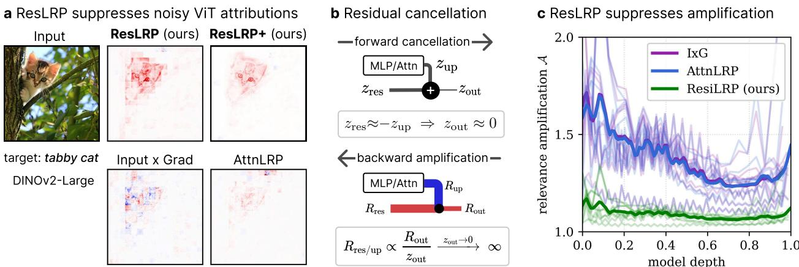  
Figure 1: ResLRP mitigates attribution noise from residual cancellations. a) Cleaner heatmaps and more precise localization than other methods, smoothing further when combined with DAVE [15], see Sec. A.4. b) A cancellation occurs when an attention or MLP update opposes the residual stream, leaving a small post-addition activation. Standard rules divide by it, amplifying opposing relevance terms. c) ResLRP reduces amplification per residual site, most strongly in early layers (Sec. 3).

LRP-based explanations for ViTs remain unstable and visually noisy. In this work, we argue that a key source of this instability is not the treatment of attention alone, but the treatment of residual connections.

Residual connections are essential for optimization and representation learning in deep networks [13]. In ViTs, however, we find that attention or MLP updates frequently oppose the incoming residual stream, partially canceling information and producing small combined activations. Such cancellations may be useful in the forward pass, where they remove, refine, or contrast features, but when large opposing contributions cancel, standard propagation rules assign relevance through a small effective denominator and amplify positive–negative relevance pairs. We refer to this effect as relevance explosion, which yields inflated, brittle, and fragmented attribution maps (Fig. 1). It is substantially stronger in ViTs than in language transformers and most pronounced in early layers, where representations remain sensitive to local image structure [14], so propagation rules that behave stably in language models transfer poorly to ViTs.

To address this, we introduce ResLRP, a residual-aware extension of LRP that explicitly accounts for cancellations between the residual stream and attention or MLP updates, bounding and suppressing relevance assigned to contradictory pathways and thereby yielding cleaner, more faithful maps (Fig. 1a). Beyond standard benchmarks, we demonstrate its value in two settings of growing importance, localizing sparse autoencoder features back to input space and explaining large vision–language models. The latter is where faithful attribution matters most, as VLMs are rapidly becoming the dominant deployed vision architecture, and exhibit the strongest residual cancellation we measure. As predicted by our analysis, they also show the largest gains from ResLRP.

In summary, our contributions are as follows: (1) We identify residual-path cancellation as a key source of noisy and unstable LRP-based attributions in ViTs, substantially stronger than in language transformers and concentrated in early layers, and establish its causal role through targeted channel-wise interventions and component ablations. (2) We introduce ResLRP, a simple residual-aware extension of LRP that accounts for cancellation in skip connections, is exactly conservative, and provably bounds cancellation-induced relevance amplification. (3) We show that ResLRP improves faithfulness and localization across supervised, self-supervised, contrastive, hierarchical, and multimodal architectures, on the ground-truth-controlled FunnyBirds benchmark, on three modern VLMs, and in SAE feature localization. (4) We show that our residual amplification measure acts as an architecture-level diagnostic, revealing that register tokens stabilize the residual stream itself and predicting where attribution degrades, most notably in VLMs.

## 2 Related Work

Input attributions for vision. Gradient-based methods such as saliency [16], Input×Grad (I×G) [8], and Integrated Gradients (IG) [17] are efficient but prone to gradient shattering [18], yielding noisy heatmaps, while perturbation surrogates such as LIME [19] and SHAP [20] are more robust but require hundreds of forward passes per explanation.

Explainability for transformers. Initial transformer methods focused on attention, such as Attention Rollout [21], gradient-weighted attention [3], or Layerwise Explainability Gradient (LeGrad) [22], while the Full-Gradient Saliency Maps for Convolutional Nets (FullGrad) family [23–25] aggregates intermediate gradients and bias terms with targeted pruning to restore gradient balance. Attention-based variants can be coarse or non-class-specific, and gradientaggregation methods are often not easily adapted to architecture variations such as missing cls-token or hierarchical processing.

LRP and the missing residual link. Unlike raw gradients, LRP modifies the backward gradient layer-by-layer for better stability via dedicated rules (see [26] for an overview). Recent works successfully adapted LRP to transformer models: Conservative Propagation LRP (CP-LRP) [27] and AttnLRP [9, 12] tackle attention non-linearities, Relative Absolute Magnitude Layer-Wise Relevance Propagation (absLRP) [28] corrects relative attribution magnitudes, and LRP has enabled circuit discovery in NLP [29–31]. However, these advances primarily target attention and NLP models. By overlooking residual pathways, prior works miss that standard LRP attributions may degrade because of destructive interference present in ViT residual streams. Related in spirit, register tokens [32] mitigate attention artifacts in the forward pass at training time, whereas we correct cancellation-induced instability in the backward pass of pretrained models. As we show in Sec. A.14, both perspectives are connected through the residual stream.

## 3 Residual Cancellations and Relevance Explosion in Vision Transformers

Transformer blocks repeatedly update the residual stream via additions $z _ { \mathrm { o u t } } = z _ { \mathrm { i n } } + z _ { \mathrm { u p } } ,$ , where $z _ { \mathrm { i n } }$ is the stream entering a sub-layer and $z _ { \mathrm { u p } }$ the update produced by an attention or MLP block (Fig. 1b). While residual connections preserve gradient flow and enable deeper networks, they induce a failure mode for relevance propagation when the two branches oppose each other. We say a residual cancellation occurs when $z _ { \mathrm { i n } } \approx - z _ { \mathrm { u p } } ,$ , so that $z _ { \mathrm { o u t } }$ is small in magnitude despite both branches having individually large magnitudes: the forward activation hides substantial internal computation.

Relevance propagation through a residual addition. LRP explains a prediction by redistributing relevance from the target output logit back to the inputs layer by layer, assigning each input a share proportional to its forward contribution and thereby conserving total relevance [4, 26]. Specialized rules such as the ε- and γ-rules improve stability in deep networks, and we refer to prior work for a comprehensive treatment [26]. At a residual addition, the classical ε-stabilized rule gives

$$
R _ { \mathrm { i n } } = \frac { z _ { \mathrm { i n } } } { z _ { \mathrm { o u t } } + \mathrm { s i g n } ( z _ { \mathrm { o u t } } ) \varepsilon } R _ { \mathrm { o u t } } , \qquad R _ { \mathrm { u p } } = \frac { z _ { \mathrm { u p } } } { z _ { \mathrm { o u t } } + \mathrm { s i g n } ( z _ { \mathrm { o u t } } ) \varepsilon } R _ { \mathrm { o u t } } .\tag{1}
$$

The denominator is the residual output after a potential cancellation, so a small $| z _ { \mathrm { o u t } } |$ inflates both redistribution factors and turns a small amount of output relevance into large opposing values on the two branches. We call this relevance amplification, or relevance explosion in the high-amplification regime. The propagation is thus ill-conditioned at cancellations, reacting highly sensitive to perturbations of the forward activations and to the choice of ε. As a result the attributions can be dominated by local cancellation structure, consuming attribution mass that would otherwise expose weaker but stable relevance patterns persisting across layers [33].

Quantifying cancellation and amplification. To quantify forward cancellation at a residual update and the relevance mass it creates in the backward pass, we define, over latent entries i,

$$
\mathcal { C } = \frac { \sum _ { i } \left( \left| z _ { \mathrm { i n } , i } \right| + \left| z _ { \mathrm { u p } , i } \right| \right) } { \sum _ { j } \left| z _ { \mathrm { o u t } , j } \right| } , \qquad \mathcal { A } = \frac { \sum _ { i } \left( \left| R _ { \mathrm { i n } , i } \right| + \left| R _ { \mathrm { u p } , i } \right| \right) } { \sum _ { j } \left| R _ { \mathrm { o u t } , j } \right| } .\tag{2}
$$

Both compare the summed pre-addition magnitude of the two residual branches with the magnitude remaining after the addition, in the forward pass for C and in the backward pass for A. Large C indicates that signal magnitude present before the addition is suppressed by destructive interference, with $\mathcal { C } = 1$ meaning no cancellation, while $\bar { \boldsymbol A } \gg 1$ indicates that a small amount of output relevance gives rise to large opposing relevance contributions in the preceding branches.

Comparing residual sites across ViTs and Large Language Modelss (LLMs) (details in Sec. A.1), we find pronounced cancellation in the early layers of ViTs, reaching $\mathcal { C } \approx 1 . 7$ against $\mathcal { C } \approx 1$ .4 for LLMs across layers (Fig. 2a). Across ViTs, C and A exhibit a Pearson correlation of 0.99 (Fig. 2b), so residual cancellations coincide with an increase in total absolute relevance during backpropagation.

Since both quantities are structurally coupled through the residual propagation rule, this correlation motivates our hypothesis but does not establish causality on its own. We therefore verify the causal role of residual cancellation through targeted interventions in Sec. 5.2. We further note that cancellation is necessary but not sufficient for relevance explosion. Under the standard rule, $\begin{array} { r } { R _ { \mathrm { i n } } = \frac { z _ { \mathrm { i n } } } { z _ { \mathrm { o u t } } } R _ { \mathrm { o u t } } } \end{array}$ , amplification depends on both the forward activations and the downstream relevance $R _ { \mathrm { o u t } }$ . If cancelled directions are unused downstream, with $R _ { \mathrm { o u t } } = 0$ , no explosion occurs at $R _ { \mathrm { i n } }$ This dissociation is visible in Fig. 2b, where Qwen2.5 exhibits strong cancellation but little amplification.

a Cancellations in early ViT layers

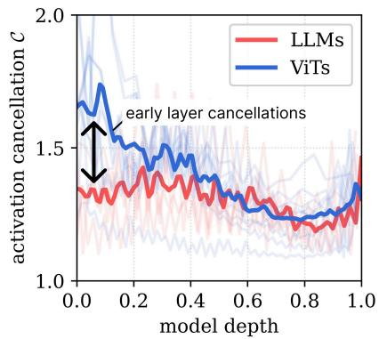

b Cancellations amplify attribution

c Artifacts of early processing

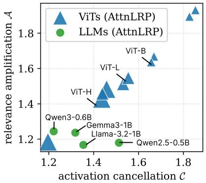

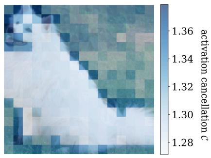  
ViT-L/14 CLIP  
Figure 2: Residual cancellations are a primary source of relevance amplification in ViTs. a) Cancellations peak in early ViT layers and are weaker in language transformers. b) Stronger cancellation implies larger amplification under standard AttnLRP, disproportionately affecting ViTs. Marker size denotes parameter count. c) In a ViT-L/14LIP model, block-2 cancellations activate on edges and the dog’s face (Sec. A.1).

These observations motivate us to introduce ResLRP and a dedicated propagation rule at residual additions in the next section.

## 4 Residual-Aware Layer-Wise Relevance Propagation

Motivated by the high relevance amplification observed at residual sites in ViTs, we next modify relevance propagation through residual additions. A desirable rule should preserve relevance conservation while avoiding amplification along branches whose contributions cancel in the forward pass. We therefore introduce Residual-aware Layer-wise Relevance Propagation (ResLRP), a residual-aware extension of the previous AttnLRP [9] method, by additionally suppressing and bounding relevance amplification induced by forward cancellations.

A residual addition takes two inputs $z _ { \mathrm { i n } } , z _ { \mathrm { u p } } \in \mathbb { R }$ and produces $z _ { \mathrm { o u t } } : = z _ { \mathrm { i n } } + z _ { \mathrm { u p } }$ . Under the standard LRP rule with $\varepsilon = 0$ relevance is propagated as $\begin{array} { r } { R _ { \mathrm { i n } } = \frac { z _ { \mathrm { i n } } } { z _ { \mathrm { o u t } } } R _ { \mathrm { o u t } } } \end{array}$ , with $R _ { \mathrm { u p } }$ defined analogously. As shown above, this becomes unstable when the two branches cancel, redistributing a small amount of output relevance into large contradictory positive–negative pairs that dominate subsequent propagation and overshadow more stable attribution signals. In contrast, when both branches contribute with the same sign as the output, the corresponding propagation factors remain well behaved.

To mitigate this effect, we adapt the $\mathrm { L R P - } \gamma$ rule [26] to residual additions. While this rule is usually applied to parametrized linear layers, we use it here to favor branches whose contribution has the same sign as the residual output. Let $\delta _ { P }$ denote the indicator of statement $P .$ . Unless stated otherwise, $R _ { \mathrm { u p } }$ is obtained from $R _ { \mathrm { i n } }$ by swapping the subscripts in and up:

$$
( \mathrm { L R P - } \gamma ) \qquad R _ { \mathrm { i n } } = \frac { \left( 1 + \gamma \delta _ { \mathrm { s i g n } ( z _ { \mathrm { i n } } ) = \mathrm { s i g n } ( z _ { \mathrm { o u t } } ) } \right) z _ { \mathrm { i n } } } { \left( 1 + \gamma \delta _ { \mathrm { s i g n } ( z _ { \mathrm { i n } } ) = \mathrm { s i g n } ( z _ { \mathrm { o u t } } ) } \right) z _ { \mathrm { i n } } + \left( 1 + \gamma \delta _ { \mathrm { s i g n } ( z _ { \mathrm { o u t } } ) = \mathrm { s i g n } ( z _ { \mathrm { o u t } } ) } \right) z _ { \mathrm { u p } } } R _ { \mathrm { o u t } } .\tag{3}
$$

By strengthening sign-consistent contributions, this rule suppresses relevance assigned to contradictory branches and, as shown next, bounds cancellation-induced relevance amplification. ResLRP requires only a single backward hook at each residual addition. A complete PyTorch implementation is given in Sec. A.3. This rule is highly robust to the choice of $\gamma ;$ based on the hyperparameter sweep in Sec. A.13, we choose $\gamma = 1$ and use it throughout this work.

## 4.1 Theoretical Guarantees

Proposition (Boundedness). Let $a , b \in \mathbb { R }$ with $c : = a + b \neq 0$ and $\gamma > 0$ , denote by $\delta _ { P } \in \{ 0 , 1 \}$ the indicator of statement $P ,$ and let

$$
\Phi ( a , b ) : = \frac { \left( 1 + \gamma \delta _ { \mathrm { s i g n } ( a ) = \mathrm { s i g n } ( c ) } \right) a } { \left( 1 + \gamma \delta _ { \mathrm { s i g n } ( a ) = \mathrm { s i g n } ( c ) } \right) a + \left( 1 + \gamma \delta _ { \mathrm { s i g n } ( b ) = \mathrm { s i g n } ( c ) } \right) b }\tag{4}
$$

denote the factor scaling $R _ { \mathrm { o u t } }$ in Eq. (3). Then it holds $\begin{array} { r } { - \frac { 1 } { \gamma } \leq \Phi ( a , b ) \leq 1 + \frac { 1 } { \gamma } , } \end{array}$ . A proof is given in Sec. A.2.

Corollary (Conservation and bounded amplification). The symmetry $\Phi ( a , b ) + \Phi ( b , a ) = 1$ follows directly from Eq. (4) and, with Eq. (3), implies exact conservation $R _ { \mathrm { { i n } } } + R _ { \mathrm { { u p } } } = R _ { \mathrm { { o u t } } } ^ { \circ }$ at every residual addition for all $\gamma > 0 .$ so

ResLRP inherits the conservation properties of AttnLRP. Together with the proposition this yields the tight per-merge bound

$$
\begin{array} { r } { \left| R _ { \mathrm { i n } } \right| + \left| R _ { \mathrm { u p } } \right| \le \left( 1 + \frac { 2 } { \gamma } \right) \left| R _ { \mathrm { o u t } } \right| , } \end{array}\tag{5}
$$

capping the measured amplification at $\mathcal { A } \leq 1 + 2 / \gamma$ per site $( \mathcal { A } \leq 3$ at the default $\gamma = 1 )$ , and at $( 1 + 2 / \gamma ) ^ { 2 L }$ over the 2L residual additions of an L-block transformer, monotonically decreasing in γ. The standard rule admits no finite bound at even a single cancellation site.

The parameter γ interpolates continuously between standard LRP, and thus AttnLRP, for γ → 0 and a non-amplifying, sign-consistent redistribution for $\gamma  \infty ,$ , with a monotonically tightening bound (Sec. A.13). Both guarantees are exact but local to the residual additions, and structural rather than faithfulness guarantees. Full-model attribution quality is established empirically in Secs. 5.1, 5.1.3 and 5.2.

## 5 Experiments and Results

Section 5.1 benchmarks faithfulness and localization against a broad set of attribution methods and validates against controlled ground-truth part importance on FunnyBirds [34]. Section 5.2 then establishes causally that the gains stem from correcting residual cancellation, Sec. 5.3 demonstrates compatibility with component-level attribution targets on SAE features, and Sec. 5.4 evaluates three modern VLMs. The appendix analyses sensitivity to the single hyperparameter γ (Sec. A.13) and shows that residual amplification acts as an architecture-level diagnostic (Sec. A.14).

## 5.1 Quantitative Evaluation of Attribution Quality

We compare ResLRP against a broad set of attribution methods across seven checkpoints spanning supervised, selfsupervised, contrastive, and hierarchical pre-training regimes on images of the ImageNet dataset [35]. Experimental details are given in Secs. A.5 and A.6, additional evaluation results in the appendix.

## 5.1.1 Faithfulness: Symmetric Relevance Gain

A faithful attribution should provide the input regions the model relies on for its prediction. We measure this with Symmetric Relevance Gain (SRG) [36], an occlusion-based benchmark that requires no human annotations and directly probes the model’s own decision process. Patches are ranked by their attribution score and progressively occluded in two orders: most-important-first (MIF) and least-important-first (LIF), with occluded regions replaced by the per-channel ImageNet mean. A faithful attribution causes a steep logit drop under MIF and a slow drop under LIF; SRG is the normalised area between these two curves: positive for a faithful method, zero for a random baseline, and negative when the ranking is anti-correlated with model importance. Occlusion units align exactly with ViT patch tokens. Full protocol details are given in Sec. A.7.

Table 1 reports SRG scores when explaining output logits. ResLRP achieves the highest faithfulness on six of seven models and is within one standard error of the best on the seventh (ViT-L/14, where LeGrad leads by 0.05), improving over AttnLRP by 0.7–4.7 SRG points. The gains are stable across model scales and pre-training regimes. LeGrad is the strongest competitor, matching ResLRP on the CLIP-pretrained ViTs but degrading on the remaining backbones, where it is either undefined or far behind.

## 5.1.2 Localization: Attribution Localization

While SRG evaluates whether an attribution correctly orders regions according to their importance to the model, localization captures a complementary, human-aligned notion of attribution quality: whether attribution mass is concentrated on semantically relevant regions, as identified by pixel-level ground-truth segmentation masks from ImageNet-S [37], independent of model behaviour. The score is the fraction of total absolute attribution mass that falls within the ground-truth object mask: a score of 1 means all attribution is inside the object, and a score equal to the relative mask area is the expected value for a spatially uniform attribution map. We evaluate on 500 correctly classified images across 50 randomly sampled classes; restricting to correctly classified samples ensures that attributions and segmentation masks refer to the same object. Full details are given in Sec. A.8.

Table 1 reports attribution localization scores. ResLRP achieves the highest or tied-highest localization on six of seven models, with scores of 0.51–0.64 compared to 0.32–0.47 for AttnLRP. The exception is DeiT3-L/16, where the rollout variants lead. On ViT-B/16, AttnLRP even falls below the random baseline (0.32 vs. 0.37), consistent with the relevance explosion analysis in Fig. 2.

Table 1: Attribution quality, reported as SRG / Loc.: SRG faithfulness (patch-wise occlusion, logit target) and localization, $n = 5 0 0$ images each, higher is better. Best per metric and model in bold, second-best underlined. Standard errors $\mathrm { a r e } \leq 0 . 1 6 \ \mathrm { a n d } \leq 0 . 0 1$ , full tables and additional backbones see Tabs. A.4 and $\mathrm { { A . 5 . \ddot { \Omega } n . \vec { a } . \vec { \Omega } ^ { \prime \prime } } }$ : method not defined.
<table><tr><td>SRG / Loc.</td><td>ViT-B/16</td><td>ViT-L/14</td><td>ViT-H/14</td><td>DeiT3-L/16</td><td>DINOv2-L</td><td>SigLIP2-L/16</td><td>SwinV2-L</td></tr><tr><td>ResLRP</td><td>3.20 / 0.62</td><td>3.53 / 0.61</td><td>3.31 / 0.61</td><td>3.38 / 0.55</td><td>4.72 / 0.59</td><td>5.26 / 0.51</td><td>2.36 / 0.64</td></tr><tr><td>AttnLRP</td><td>1.51 / 0.32</td><td>1.49 / 0.39</td><td>1.65 / 0.41</td><td>2.69 / 0.44</td><td>1.65 / 0.47</td><td>0.59 / 0.32</td><td>0.93 / 0.34</td></tr><tr><td>CP-LRP</td><td>1.33 / 0.36</td><td>1.23 / 0.46</td><td>1.33 / 0.41</td><td>2.97 / 0.54</td><td>0.36 / 0.44</td><td>0.49 / 0.32</td><td>0.80 / 0.32</td></tr><tr><td>Chefer-LRP</td><td>2.74 / 0.62</td><td>2.85 / 0.51</td><td>2.35 / 0.46</td><td>2.55 / 0.69</td><td>4.43 / 0.58</td><td>2.69 / 0.29</td><td>n.a.</td></tr><tr><td>CheferAttnRollout</td><td>2.74 / 0.50</td><td>2.85 / 0.46</td><td>2.35 / 0.44</td><td>2.65 / 0.61</td><td>4.44 / 0.51</td><td>n.a.</td><td>n.a.</td></tr><tr><td>GradAttnRollout</td><td>2.46 / 0.50</td><td>2.84 / 0.49</td><td>2.43 / 0.47</td><td>2.87 / 0.70</td><td>4.05 / 0.52</td><td>n.a.</td><td>n.a.</td></tr><tr><td>LibraFullGrad+</td><td>2.72 / 0.54</td><td>2.98 / 0.49</td><td>2.10 / 0.43</td><td>3.07 / 0.54</td><td>3.18 / 0.48</td><td>3.56 / 0.37</td><td>n.a.</td></tr><tr><td>LeGrad</td><td>3.18 / 0.53</td><td>3.58 / 0.47</td><td>3.16 / 0.46</td><td>3.12 / 0.51</td><td>n.a.</td><td>4.20 / 0.33</td><td>n.a.</td></tr><tr><td>IG</td><td>1.23 / 0.45</td><td>1.36 / 0.38</td><td>1.19 / 0.31</td><td>1.10 / 0.30</td><td>1.24 / 0.43</td><td>1.38 / 0.27</td><td>0.57 / 0.35</td></tr><tr><td>I×G</td><td>0.45 / 0.40</td><td>0.33 / 0.26</td><td>0.27 / 0.22</td><td>0.23 / 0.25</td><td>0.45 / 0.42</td><td>0.27 / 0.22</td><td>0.43 / 0.31</td></tr><tr><td>Random</td><td>-0.11 / 0.37</td><td>-0.03 / 0.34</td><td>-0.04 / 0.34</td><td>-0.05 / 0.34</td><td>-0.10 / 0.40</td><td>-0.04 / 0.29</td><td>0.02 / 0.39</td></tr></table>

## 5.1.3 Ground-Truth Evaluation on FunnyBirds

SRG measures faithfulness via occlusion and ImageNet-S localization measures spatial plausibility. Neither compares against known ground truth of what the model relies on. We therefore evaluate on the full FunnyBirds framework [34], a synthetic benchmark in which every bird consists of discrete parts that can be removed and re-rendered indistribution. The single-deletion (SD) score directly correlates attributed part importance with ground-truth causal importance obtained by intervention. As shown in Tab. 2, ResLRP achieves the best score on all four complete-

Table 2: FunnyBirds results using the official dataset, metric implementations, and ViT-B/16 checkpoint of Hesse et al. [34]. Higher is better for all metrics.
<table><tr><td>Method</td><td>CSDC</td><td>PC</td><td>DC</td><td>Distr.</td><td>SD</td><td>TS</td></tr><tr><td>ResLRP (ours)</td><td>0.942</td><td>0.954</td><td>0.916</td><td>0.937</td><td>0.774</td><td>0.950</td></tr><tr><td>AttnLRP</td><td>0.926</td><td>0.926</td><td>0.892</td><td>0.864</td><td>0.682</td><td>0.955</td></tr><tr><td>CP-LRP</td><td>0.803</td><td>0.620</td><td>0.610</td><td>0.440</td><td>0.437</td><td>0.831</td></tr><tr><td>I×G</td><td>0.743</td><td>0.584</td><td>0.602</td><td>0.432</td><td>0.510</td><td>0.669</td></tr><tr><td>IG</td><td>0.891</td><td>0.864</td><td>0.850</td><td>0.902</td><td>0.652</td><td>0.911</td></tr><tr><td>Rollout</td><td>0.856</td><td>0.804</td><td>0.820</td><td>0.797</td><td>0.756</td><td>0.000</td></tr><tr><td>Chefer-LRP</td><td>0.916</td><td>0.922</td><td>0.898</td><td>0.899</td><td>0.733</td><td>0.957</td></tr></table>

ness metrics and on correctness, with an SD of 0.774 versus 0.682 for AttnLRP, a +13% improvement, while on par with the best methods on contrastivity. Our three evidence types thus agree. Occlusion faithfulness, localization, and controlled causal ground truth all favour ResLRP. Protocol details are given in Sec. A.9.

## 5.2 Isolating Residual Cancellation as the Cause

The benchmarks above show that ResLRP improves attribution quality, but not yet that the improvement is driven by correcting residual cancellation rather than a generic regularization effect of the γ-rule. We establish this causally with two analyses.

Targeted channel-wise interventions. We apply the residual γ-rule only to selected channels at every residual merge. If the gains stemmed from generic regularization, treating more channels should help regardless of which ones are selected. Instead, Tab. A.8 shows the opposite on ViT-B/16. Correcting only the top 0.5% most cancellation-prone channels (92) improves SRG by +7.9% over AttnLRP, whereas correcting 75% of low-cancellation channels (13,824, a 150× larger set) decreases SRG by −5.5%. Across all interventions, SRG correlates much more strongly with the amount of unstable relevance removed (Spearman $\rho = 0 . 7 9 )$ than with the number of modified channels $( \rho = 0 . 5 0 )$ The pattern replicates on DINOv2-B (Sec. A.15). The gains of ResLRP therefore arise specifically from correcting residual cancellation.

Component ablations. We disable the AttnLRP attention and LayerNorm rules to assess their contribution relative to the residual γ-rule. While both components contribute to attribution quality, ResLRP is substantially more robust to their removal: ablating either rule causes a much smaller drop in SRG than the corresponding performance gap between ResLRP and AttnLRP. For example, on SigLIP2, ResLRP achieves an SRG of 3.27 compared to −0.004 for AttnLRP when the attention rule is removed. This indicates that the residual γ-rule itself captures substantially more of

a<sub>.</sub> Localizing SAE neurons

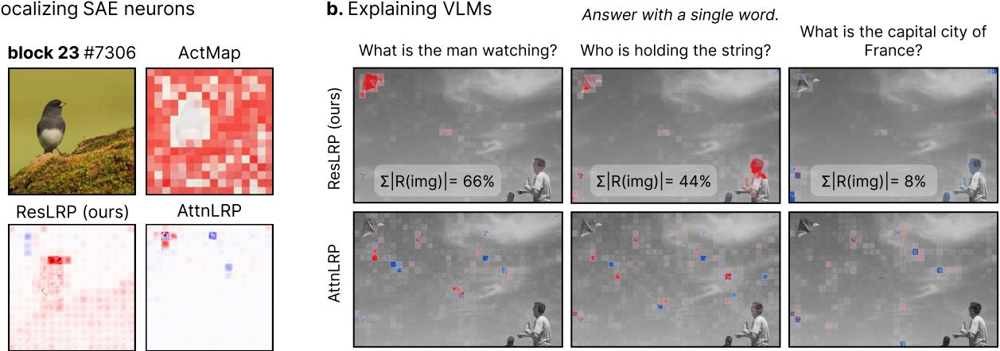  
Figure 3: Qualitative Examples. a) SAE activation maps (ActMap) need not align with the encoded concept (“bird”), whereas ResLRP highlights inputs faithful to the latent (cf. Tab. A.3). b) ResLRP grounds VLM text generation (Qwen3-VL-4B-Instruct) at pixel level, per output token (Sec. 5.4).

the stability and faithfulness measured by SRG than either the attention or LayerNorm rule individually, while the latter provide additional gains. Full tables are given in Sec. A.15.

## 5.3 Localizing SAE Features in Input Space

SAEs decompose activations into sparse, potentially interpretable features and have become a central tool in mechanistic interpretability [38, 39]. Latents are conventionally visualized by reshaping per-token SAE activations to the patch grid (ActMap) [40]. This can mislead: self-attention routes information across tokens before the SAE hook point, so the token with the highest activation need not correspond to the image region that caused it. Input attribution traces the full graph from pixels to the latent and recovers this link. We train TopK-SAEs [41] at three blocks of a frozen ViT-L/14 backbone, attribute the summed post-TopK activation of individual latents back to the input, and measure faithfulness with the SRG protocol using the latent activation in place of the classifier logit (full setup in Sec. A.10). ResLRP attains the best SRG and the best mean rank at all three blocks (Tab. A.3), e.g. 0.449 ± 0.006 versus 0.334 ± 0.006 for AttnLRP at blocks.15. The ActMap baseline collapses to −0.031 ± 0.006 at blocks.23, i.e. slightly anti-correlated with the very latent it is meant to visualize, confirming that activation maps lose spatial meaning at depth. Figure 3a shows the same effect qualitatively.

## 5.4 Faithful Attributions for Large Vision-Language Models

AttnLRP is, to our knowledge, one of the most widely deployed attribution methods for VLMs [42, 43], yet these composite architectures are deeper than any ViT evaluated above. We therefore repeat both evaluations on three instruction-tuned VLMs — Qwen2.5-VL-3B, Qwen3-VL-4B and Gemma-3-4B-it — attributing the logit of a single answer token with respect to the input pixels. Table 3 reports the results. ResLRP is best on both metrics on all three models. Localization improves over AttnLRP by +0.09 to +0.10 absolute (+27% to +29% relative), and SRG improves by a factor of 1.9 to 3.4. Every gap is significant under a two-sided Wilcoxon signed-rank test over per-image scores $( p \leq 1 . 7 \times 1 0 ^ { - 2 6 } )$ . Two observations sharpen the picture. First, the relative localization gain is remarkably uniform across three unrelated vision towers and two tokenisation schemes, which is what a mechanism rooted in the residual stream, rather than in any architectural particular, predicts. Second, on Gemma-3-4B-it AttnLRP does not separate from I×G on localization at all (0.352 vs. 0.352) and barely does on SRG (+0.21 vs. +0.17), the γ-rule on the residual merges is what recovers a usable map. This mirrors the ViT-B/16 A case in Tab. 1, where AttnLRP falls below the random baseline, and supports the same reading: once cancellation is severe enough, AttnLRP’s advantage over a plain gradient explanation disappears, and correcting the residual merge restores it. Because the three models differ in image tokenisation, and therefore in the natural occlusion unit, SRG magnitudes are comparable within a row but not down a column. The full protocol, including prompt design, sample selection and the per-model occlusion geometry, is given in Sec. A.11.

Table 3: Attribution quality on vision-language models. Attribution localization (Eq. (14)) and SRG (Eq. (13)) as Loc. / SRG, higher is better, mean ± one standard error, n = 500. SRG magnitudes are comparable within a row but not across rows, see Sec. A.11.
<table><tr><td>Loc. / SRG</td><td>I×G</td><td>AttnLRP</td><td>ResLRP</td></tr><tr><td>Qwen2.5-VL-3B</td><td> $0 . 2 5 6 { \pm } 0 . 0 1 2 / + 0 . 0 8 { \pm } 0 . 0 4$ </td><td> $0 . 3 6 5 { \pm } 0 . 0 1 1 / + 1 . 2 9 { \pm } 0 . 1 2$ </td><td> $\mathbf { 0 . 4 6 4 { \pm 0 . 0 1 1 } } / + 2 . 3 9 { \pm } 0 . 1 7$ </td></tr><tr><td>Qwen3-VL-4B-it</td><td> $0 . 2 7 4 { \pm } 0 . 0 1 3 / + 0 . 1 3 { \pm } 0 . 1 1$ </td><td> $0 . 3 2 5 { \pm } 0 . 0 1 2 / + 3 . 8 7 { \pm } 0 . 2 0$ </td><td> $\mathbf { 0 . 4 1 8 { \overset { . } { \mathop { \left( 0 . 0 1 0 / + 1 3 . 0 4 \pm 0 . 3 0 \right. } } } }$ </td></tr><tr><td> $\mathrm { G e m m a } - 3 { - } 4 \mathrm { B } { - } \mathrm { i } \mathrm { t }$ </td><td> $0 . 3 5 2 { \pm } 0 . 0 1 3 / + 0 . 1 7 { \pm } 0 . 0 6$ </td><td> $0 . 3 5 2 { \pm } 0 . 0 1 4 / + 0 . 2 1 { \pm } 0 . 0 4$ </td><td> $\mathbf { 0 . 4 5 5 \pm 0 . 0 1 2 / + 0 . 4 1 \pm 0 . 0 3 }$ </td></tr></table>

## 6 Conclusion

We identify a previously overlooked failure mode in LRP-based explanation of ViTs, namely attribution instability driven by residual cancellations. Destructive interference in the forward pass makes state-of-the-art LRP variants divide by near-zero activations, amplifying relevance into noisy, contradictory attributions that overshadow more stable signals, an effect most pronounced in early ViT layers and far weaker in language models. We address it with ResLRP, a bounded, γ-stabilized redistribution rule for residual additions that is exactly conservative and prevents local amplification from cascading through the network. Occlusion faithfulness, localization, and controlled ground truth on FunnyBirds all favour ResLRP, and targeted interventions confirm the gains come specifically from correcting residual cancellation. The largest gains appear in modern VLMs, where prior methods are either too noisy or too expensive to apply, opening follow-up work from bias detection to attribution-guided training for visual grounding.

Limitations & Outlook. The single hyperparameter γ shows a broad performance plateau with the untuned default γ = 1 near-optimal across all evaluated models (Sec. A.13), and ResLRP improves faithfulness and stability together rather than trading one for the other. Our guarantees are local to the residual additions, so full-model attribution quality rests on the three agreeing empirical evidence types. End-to-end conservation of the full pipeline is limited by the AttnLRP attention rule, and exact conservation is available by combining ResLRP with the CP-LRP attention rule at a known quality cost. We do not examine whether similar cancellations arise in other architectures, such as diffusion transformers or state-space models, where residual streams and update branches may interact differently, and note that strong residual cancellation may have broader implications for training dynamics and generalization. Finally, a better understanding of attribution failures could also be used to design models that produce convincing yet misleading explanations.

## Acknowledgments

This work was supported by the Federal Ministry of Research, Technology and Space (BMFTR) as grants [BIFOLD (01IS18025A, 01IS180371I), xJuRAG (16IS25015B)]; the European Union’s Horizon Europe research and innovation programme (EU Horizon Europe) as grant ACHILLES (101189689); and the German Research Foundation (DFG) as research unit DeSBi [KI-FOR 5363] (459422098).

## References

[1] Ashish Vaswani, Noam Shazeer, Niki Parmar, Jakob Uszkoreit, Llion Jones, Aidan N Gomez, Łukasz Kaiser, and Illia Polosukhin. Attention is all you need. Advances in neural information processing systems, 30, 2017.

[2] Alec Radford, Jong Wook Kim, Chris Hallacy, Aditya Ramesh, Gabriel Goh, Sandhini Agarwal, Girish Sastry, Amanda Askell, Pamela Mishkin, Jack Clark, et al. Learning transferable visual models from natural language supervision. In International conference on machine learning, pages 8748–8763. PMLR, 2021.

[3] Hila Chefer, Shir Gur, and Lior Wolf. Transformer interpretability beyond attention visualization. In Proceedings of the IEEE/CVF conference on computer vision and pattern recognition, pages 782–791, 2021.

[4] Sebastian Bach, Alexander Binder, Grégoire Montavon, Frederick Klauschen, Klaus-Robert Müller, and Wojciech Samek. On pixel-wise explanations for non-linear classifier decisions by layer-wise relevance propagation. PloS one, 10(7):e0130140, 2015.

[5] Reduan Achtibat, Maximilian Dreyer, Ilona Eisenbraun, Sebastian Bosse, Thomas Wiegand, Wojciech Samek, and Sebastian Lapuschkin. From attribution maps to human-understandable explanations through concept relevance propagation. Nature machine intelligence, 5(9):1006–1019, 2023.

[6] Waddah Saeed and Christian Omlin. Explainable ai (xai): A systematic meta-survey of current challenges and future opportunities. Knowledge-based systems, 263:110273, 2023.

[7] Leander Weber, Sebastian Lapuschkin, Alexander Binder, and Wojciech Samek. Beyond explaining: Opportunities and challenges of xai-based model improvement. Information Fusion, 92:154–176, 2023.

[8] Avanti Shrikumar, Peyton Greenside, and Anshul Kundaje. Learning important features through propagating activation differences. In International conference on machine learning, pages 3145–3153. PMlR, 2017.

[9] Reduan Achtibat, Sayed Mohammad Vakilzadeh Hatefi, Maximilian Dreyer, Aakriti Jain, Thomas Wiegand, Sebastian Lapuschkin, and Wojciech Samek. Attnlrp: Attention-aware layer-wise relevance propagation for transformers. In International Conference on Machine Learning, pages 135–168. PMLR, 2024.

[10] Grégoire Montavon, Sebastian Lapuschkin, Alexander Binder, Wojciech Samek, and Klaus-Robert Müller. Explaining nonlinear classification decisions with deep taylor decomposition. Pattern recognition, 65:211–222, 2017.

[11] Farnoush Rezaei Jafari, Grégoire Montavon, Klaus-Robert Müller, and Oliver Eberle. Mambalrp: Explaining selective state space sequence models. Advances in neural information processing systems, 37:118540–118570, 2024.

[12] Yarden Bakish, Itamar Zimerman, Hila Chefer, and Lior Wolf. Revisiting lrp: Positional attribution as the missing ingredient for transformer explainability. arXiv preprint arXiv:2506.02138, 2025.

[13] Kaiming He, Xiangyu Zhang, Shaoqing Ren, and Jian Sun. Deep residual learning for image recognition. In Proceedings ofthe IEEE conference on computer vision and pattern recognition, pages 770–778, 2016.

[14] Maithra Raghu, Thomas Unterthiner, Simon Kornblith, Chiyuan Zhang, and Alexey Dosovitskiy. Do vision transformers see like convolutional neural networks? Advances in neural information processing systems, 34: 12116–12128, 2021.

[15] Adam Wróbel, Siddhartha Gairola, Jacek Tabor, Bernt Schiele, Bartosz Zielinski, and Dawid Rymarczyk. DAVE:´ Distribution-aware Attribution via ViT Gradient Decomposition, February 2026. URL http://arxiv.org/ abs/2602.06613. arXiv:2602.06613 [cs].

[16] Karen Simonyan, Andrea Vedaldi, and Andrew Zisserman. Deep inside convolutional networks: Visualising image classification models and saliency maps. In Workshop at International Conference on Learning Representations, 2014.

[17] Mukund Sundararajan, Ankur Taly, and Qiqi Yan. Axiomatic attribution for deep networks. In International conference on machine learning, pages 3319–3328. PMLR, 2017.

[18] David Balduzzi, Marcus Frean, Lennox Leary, JP Lewis, Kurt Wan-Duo Ma, and Brian McWilliams. The shattered gradients problem: If resnets are the answer, then what is the question? In International conference on machine learning, pages 342–350. PMLR, 2017.

[19] Marco Tulio Ribeiro, Sameer Singh, and Carlos Guestrin. " why should i trust you?" explaining the predictions of any classifier. In Proceedings of the 22nd ACM SIGKDD international conference on knowledge discovery and data mining, pages 1135–1144, 2016.

[20] Scott M Lundberg and Su-In Lee. A unified approach to interpreting model predictions. Advances in neural information processing systems, 30, 2017.

[21] Samira Abnar and Willem Zuidema. Quantifying attention flow in transformers. In Proceedings ofthe 58th annual meeting ofthe associationfor computational linguistics, pages 4190–4197, 2020.

[22] Walid Bousselham, Angie Boggust, Sofian Chaybouti, Hendrik Strobelt, and Hilde Kuehne. Legrad: An explainability method for vision transformers via feature formation sensitivity. In Proceedings of the IEEE/CVF International Conference on Computer Vision, pages 20336–20345, 2025.

[23] Suraj Srinivas and François Fleuret. Full-gradient representation for neural network visualization. Advances in neural information processing systems, 32, 2019.

[24] Faridoun Mehri, Mohsen Fayyaz, Mahdieh Soleymani Baghshah, and Mohammad Taher Pilehvar. Skipplus: Skip the first few layers to better explain vision transformers. In Proceedings ofthe IEEE/CVF Conference on Computer Vision and Pattern Recognition, pages 204–215, 2024.

[25] Faridoun Mehri, Mahdieh Soleymani Baghshah, and Mohammad Taher Pilehvar. Libragrad: Balancing gradient flow for universally better vision transformer attributions. In Proceedings of the Computer Vision and Pattern Recognition Conference, pages 67–78, 2025.

[26] Grégoire Montavon, Alexander Binder, Sebastian Lapuschkin, Wojciech Samek, and Klaus-Robert Müller. Layerwise relevance propagation: an overview. Explainable AI: interpreting, explaining and visualizing deep learning, pages 193–209, 2019.

[27] Ameen Ali, Thomas Schnake, Oliver Eberle, Grégoire Montavon, Klaus-Robert Müller, and Lior Wolf. Xai for transformers: Better explanations through conservative propagation. In International Conference on Machine Learning, pages 435–451. PMLR, 2022.

[28] Davor Vukadin, Petar Afric, Marin Šili´ c, and Goran Dela´ c. Advancing attribution-based neural network explain-ˇ ability through relative absolute magnitude layer-wise relevance propagation and multi-component evaluation. ACM Transactions on Intelligent Systems and Technology, 15(3):1–30, 2024.

[29] Patrick Kahardipraja, Reduan Achtibat, Thomas Wiegand, Wojciech Samek, and Sebastian Lapuschkin. The atlas of in-context learning: How attention heads shape in-context retrieval augmentation. Advances in Neural Information Processing Systems, 38:118164–118208, 2026.

[30] Farnoush Rezaei Jafari, Oliver Eberle, Ashkan Khakzar, and Neel Nanda. Relp: Faithful and efficient circuit discovery in language models via relevance patching. arXiv preprint arXiv:2508.21258, 2025.

[31] Sayed Mohammad Vakilzadeh Hatefi, Maximilian Dreyer, Reduan Achtibat, Patrick Kahardipraja, Thomas Wiegand, Wojciech Samek, and Sebastian Lapuschkin. Attribution-guided pruning for compression, circuit discovery, and targeted correction in llms. arXiv preprint arXiv:2506.13727, 2025.

[32] Timothée Darcet, Maxime Oquab, Julien Mairal, and Piotr Bojanowski. Vision transformers need registers. ArXiv, abs/2309.16588, 2023. URL https://api.semanticscholar.org/CorpusID:263134283.

[33] Moritz Böhle, Mario Fritz, and Bernt Schiele. B-cos networks: Alignment is all we need for interpretability. In Proceedings ofthe IEEE/CVF Conference on Computer Vision and Pattern Recognition, pages 10329–10338, 2022.

[34] Robin Hesse, Simone Schaub-Meyer, and Stefan Roth. Funnybirds: A synthetic vision dataset for a part-based analysis of explainable ai methods. In Proceedings of the IEEE/CVF International Conference on Computer Vision, pages 3981–3991, 2023.

[35] Jia Deng, Wei Dong, Richard Socher, Li-Jia Li, Kai Li, and Li Fei-Fei. Imagenet: A large-scale hierarchical image database. In 2009 IEEE Conference on Computer Vision and Pattern Recognition, pages 248–255, 2009. doi: 10.1109/CVPR.2009.5206848.

[36] Stefan Blücher, Johanna Vielhaben, and Nils Strodthoff. Decoupling pixel flipping and occlusion strategy for consistent xai benchmarks. Transactions on machine learning research, (6):1–22, 2024.

[37] Shanghua Gao, Zhong-Yu Li, Ming-Hsuan Yang, Ming-Ming Cheng, Junwei Han, and Philip Torr. Large-scale unsupervised semantic segmentation. IEEE Transactions on Pattern Analysis and Machine Intelligence, 45(6): 7457–7476, 2023. doi: 10.1109/TPAMI.2022.3218275.

[38] Hoagy Cunningham, Aidan Ewart, Logan Riggs, Robert Huben, and Lee Sharkey. Sparse autoencoders find highly interpretable features in language models. arXiv preprint arXiv:2309.08600, 2023.

[39] Adly Templeton, Tom Conerly, Jonathan Marcus, Jack Lindsey, Trenton Bricken, Brian Chen, Adam Pearce, Craig Citro, Emmanuel Ameisen, Andy Jones, Hoagy Cunningham, Nicholas L Turner, Callum McDougall, Monte MacDiarmid, C. Daniel Freeman, Theodore R. Sumers, Edward Rees, Joshua Batson, Adam Jermyn, Shan Carter, Chris Olah, and Tom Henighan. Scaling monosemanticity: Extracting interpretable features from claude 3 sonnet. Transformer Circuits Thread, 2024. URL https://transformer-circuits.pub/2024/ scaling-monosemanticity/index.html.

[40] Hyesu Lim, Jinho Choi, Jaegul Choo, and Steffen Schneider. Sparse autoencoders reveal selective remapping of visual concepts during adaptation. In The Thirteenth International Conference on Learning Representations, 2025. URL https://openreview.net/forum?id=imT03YXlG2.

[41] Leo Gao, Tom Dupre la Tour, Henk Tillman, Gabriel Goh, Rajan Troll, Alec Radford, Ilya Sutskever, Jan Leike, and Jeffrey Wu. Scaling and evaluating sparse autoencoders. In The Thirteenth International Conference on Learning Representations, 2025. URL https://openreview.net/forum?id=tcsZt9ZNKD.

[42] Or Biton, Tomer Krichli, Itai Allouche, and Joseph Keshet. Hidden in the request: Explaining unethical llm compliance through token relevance. arXiv preprint arXiv:2608.23264, 2026.

[43] Shizhan Gong, Minda Hu, Qiyuan Zhang, Chen Ma, and Qi Dou. Saliency-r1: Enforcing interpretable and faithful vision-language reasoning via saliency-map alignment reward. arXiv preprint arXiv:2604.04500, 2026.

[44] Christopher J Anders, David Neumann, Wojciech Samek, Klaus-Robert Müller, and Sebastian Lapuschkin. Software for dataset-wide xai: from local explanations to global insights with zennit, corelay, and virelay. arXiv preprint arXiv:2106.13200, 2021.

[45] Ross Wightman. PyTorch Image Models. URL https://github.com/huggingface/ pytorch-image-models.

[46] Jacob Gildenblat. vit-explain explainability for vision transformers. https://github.com/jacobgil/vit-explain, 2020. Accessed on May 06, 2026.

[47] Anna Hedström, Leander Weber, Daniel Krakowczyk, Dilyara Bareeva, Franz Motzkus, Wojciech Samek, Sebastian Lapuschkin, and Marina M.-C. Höhne. Quantus: An explainable ai toolkit for responsible evaluation of neural network explanations and beyond. Journal ofMachine Learning Research, 24(34):1–11, 2023. URL http://jmlr.org/papers/v24/22-0142.html.

[48] Shuai Bai, Keqin Chen, Xuejing Liu, Jialin Wang, Wenbin Ge, Sibo Song, Kai Dang, Peng Wang, Shijie Wang, Jun Tang, Humen Zhong, Yuanzhi Zhu, Mingkun Yang, Zhaohai Li, Jianqiang Wan, Pengfei Wang, Wei Ding, Zheren Fu, Yiheng Xu, Jiabo Ye, Xi Zhang, Tianbao Xie, Zesen Cheng, Hang Zhang, Zhibo Yang, Haiyang Xu, and Junyang Lin. Qwen2.5-vl technical report, 2025. URL https://arxiv.org/abs/2502.13923.

## A Technical Appendices and Supplementary Material

This appendix collects the technical material supporting the main text, grouped into analysis and theory, experimental setup, metric definitions, protocols for the component-level and multimodal experiments, and extended results.

• Analysis and theory. Section A.1 measures residual cancellation and relevance amplification across ViTs and LLMs. Section A.2 proves the boundedness proposition stated in Sec. 4.1. Section A.3 gives the PyTorch implementation of the residual γ-rule. Section A.4 describes ResLRP+, the composition with gradient decomposition that removes patch-grid artifacts.

• Experimental setup. Section A.5 lists the model checkpoints, datasets, libraries, and hardware used for all benchmarks. Section A.6 gives formal descriptions of the baseline attribution methods.

• Metrics. Section A.7 formalizes the Symmetric Relevance Gain (SRG) faithfulness metric, including the MIF/LIF occlusion protocol and tie-breaking. Section A.8 describes the Attribution Localization score used to evaluate spatial grounding against ground-truth segmentations. Section A.9 details the FunnyBirds protocol and the six reported ground-truth metrics.

• Component-level and multimodal protocols. Section A.10 specifies the architecture, hyperparameters, and evaluation protocol for the SAEs. Section A.11 details the forced-choice localization design, the explained scalar, and the per-model occlusion geometry used for the VLMs.

• Extended results. Section A.12 reports the full per-model faithfulness and localization tables shortened in Tab. 1. Section A.13 sweeps the γ parameter. Section A.14 shows that register tokens reduce residual amplification. Section A.15 covers the intervention protocol, the replication on DINOv2-B, and the component ablations. Section A.16 collects qualitative attribution examples.

## A.1 Residual Cancellations

Residual cancellations are a primary source of relevance amplification in ViTs. We evaluate a diverse set of ViTs and autoregressive LLMs of comparable parameter scale, including standard ImageNet classifiers, CLIP-based vision transformers, and instruction-tuned language models.

In Figure A.1(a) we observe a near-perfect linear relationship between the degree of residual cancellation and relevance amplification, indicating that stronger cancellation effects directly lead to amplified attribution noise. Across both modalities, larger models generally exhibit weaker cancellation effects. Among the evaluated ViTs, vit\_huge\_patch14\_224.orig\_in21k shows the lowest cancellation despite substantially less training than the CLIP-based variants, whereas vit\_base\_patch16\_224.augreg\_in21k exhibits the strongest cancellation. Overall, CLIP-trained models tend to suffer from significantly higher cancellation compared to standard ImageNet-pretrained models.

In Figure A.1(b) qualitative heatmaps further illustrate this effect. For the model with the worst cancellation score, AttnLRP produces highly noisy and spatially diffuse explanations. In contrast, the best-performing ViT yields substantially cleaner and more localized relevance maps, demonstrating that reduced residual cancellation directly improves attribution quality.

a Cancellations amplify attribution  
b Attribution maps of ViTs with highest and lowest cancellation  
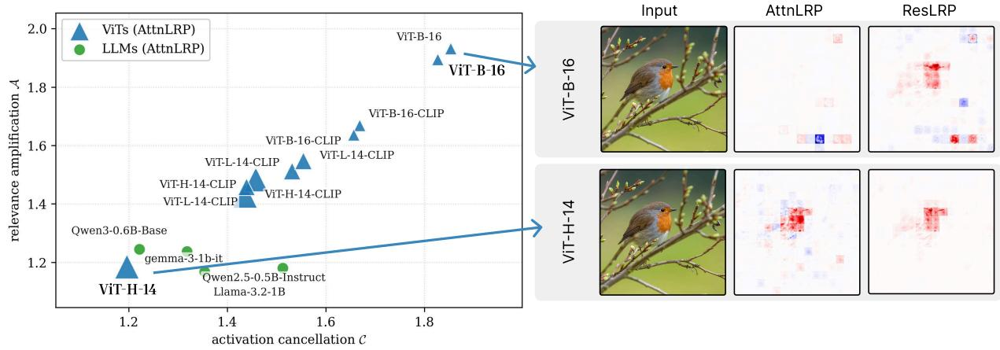  
Figure A.1: Residual cancellation correlates with relevance amplification in ViTs. (a) Across a diverse set of ViTs and LLMs, residual cancellation exhibits a near-perfect linear correlation with relevance amplification. Marker size corresponds to model parameter count. Larger models generally show reduced cancellation, while CLIP-based ViTs tend to exhibit substantially less effects than standard ImageNet-pretrained models. (b) Corresponding AttnLRP heatmaps for the best ViT (vit\_huge\_patch14\_224.orig\_in21k) and worst ViT (vit\_base\_patch16\_224.augreg\_in21k) demonstrate that strong cancellation leads to noisy and diffuse explanations, whereas reduced cancellation yields cleane and more localized relevance maps. The artifacts of ResLRP heatmap for ViT-B-16 emerge from register tokens [32].

## A.2 Proof of the Boundedness Proposition

We begin by noting the symmetry

$$
\Phi ( a , b ) + \Phi ( b , a ) = 1 ,\tag{6}
$$

which implies $\Phi ( b , a ) = 1 - \Phi ( a , b )$ . Since the interval $\textstyle { \left[ - { \frac { 1 } { \gamma } } , 1 + { \frac { 1 } { \gamma } } \right] }$ is invariant under $x \mapsto 1 - x .$ , it suffices to prove the bound for the case $| a | \geq | b |$ . (The degenerate case $| a | = | b |$ with opposing signs is excluded by $c \neq 0 . )$

We distinguish two cases.

Case $I \colon \mathrm { s i g n } ( a ) = \mathrm { s i g n } ( b )$ . Both signs agree with sign(c), so both indicators equal 1 and the factor $( 1 + \gamma )$ cancels. We obtain

$$
\Phi ( a , b ) = \frac { a } { a + b } \in [ 0 , 1 ] \subseteq \left[ - \frac { 1 } { \gamma } , 1 + \frac { 1 } { \gamma } \right] .
$$

Case 2: sign(a) ̸= sign(b) and $| a | > | b |$ . Then $\mathrm { s i g n } ( c ) = \mathrm { s i g n } ( a )$ , so the first indicator is 1 and the second is 0. Writing b = αa with $\alpha \in ( - 1 , 0 ]$ , we obtain

$$
\Phi ( a , b ) = \frac { ( 1 + \gamma ) a } { ( 1 + \gamma ) a + b } = \frac { 1 + \gamma } { 1 + \gamma + \alpha } .
$$

Since $\alpha \in ( - 1 , 0 ]$ , the denominator satisfies $\gamma < 1 + \gamma + \alpha \leq 1 + \gamma ,$ , yielding

$$
1 \leq \Phi ( a , b ) \leq \frac { 1 + \gamma } { \gamma } = 1 + \frac { 1 } { \gamma } .
$$

This establishes the bound for $| a | \geq | b |$ , the remaining case follows from the symmetry in Eq. (6).

## A.3 Implementation

ResLRP is implemented on top of AttnLRP with straight-through-estimator style .detach() tricks, so the forward pass is unchanged and only gradients are modified. The residual γ-rule of Eq. (3) adds a single backward hook per residual addition, as shown in Tab. A.1. We use zennit v1.0 [44] (GNU Lesser General Public License v3 or later) and LXT v2.1 [9] (BSD 3-Clause License) for computing LRP attributions.

Table A.1: PyTorch implementation of LRP using techniques inspired by straight-through estimators: the forward pass is unchanged, while .detach() modifies gradients to enforce LRP-style gradients. The γ-extension on the residual stream is applied via a backward hook. Finally, the input heatmap can be computed as the element-wise product of input embeddings and their gradients.  
```python
Operation PyTorch Implementation Trick
Standard AttnLRP Operations
LayerNorm y = (x - x.mean()) / [x.var().sqrt()].detach()
GELU y = x * [Φ(x)].detach()
Query-Key y = 0.5 * (s := Q @ K) + [0.5 * s].detach()
Attention y = 0.5 * (z := A @ V) + [0.5 * z].detach()
Proposed ResLRP Extension
Residual (γ) # Forward: y = x_in + x_up
# Scaling: w = lambda z: 1 + γ * (z * y > 0)
ρ = lambda z: w(z) / (w(x_in)*x_in + w(x_up)*x_up)
# Hooks: x_in.register_hook(lambda g: g * ρ(x_in))
x_up.register_hook(lambda g: g * ρ(x_up))
```

## A.4 ResLRP+: Composition with Gradient Decomposition

ResLRP corrects relevance where it is redistributed across residual merges, along the backward path. A complementary artifact arises at the very end of that path, where the patch embedding projects relevance back to pixels and imposes a blocky, patch-aligned structure. Distribution-aware Attribution via ViT Gradient Decomposition (DAVE) [15] addresses precisely this by decomposing the input gradient into locally equivariant and artifact-induced components, using 50 forward passes over spatially translated inputs. The two act on disjoint parts of the computation and compose directly, applying DAVE’s decomposition to the relevance ResLRP delivers at the patch embedding instead of the plain input-times-gradient step. We find that already onlyfour steps of spatial input translations without any additional transformation yield much reduced patch-artifacts. In contrast to the 50 forward passes used by DAVE, this requires only four forward passes, making the resulting correction substantially more computationally efficient. We denote this configuration ResLRP+. Figure A.2 illustrates this process and the resulting reduction in patch artifacts.

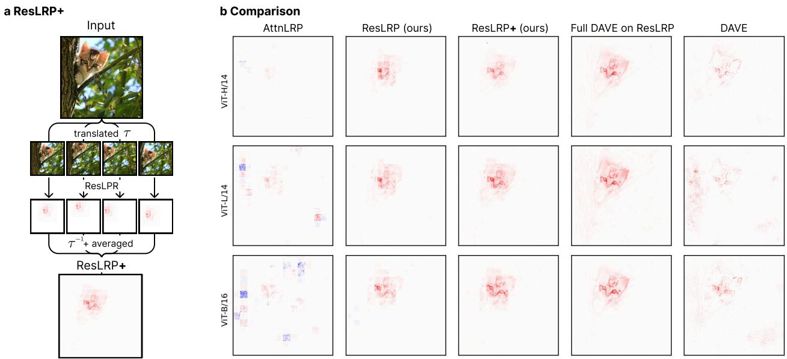  
Figure A.2: Removing patch artifacts. ResLRP yields clearer, more localized attribution maps than prior methods, by reducing attribution noise. ResLRP+ removes patch-grid artifacts by averaging attributions over four small spatial perturbations of the input, further improving localization and visual coherence.

## A.5 Experimental Setup

Models. We evaluate publicly available checkpoints spanning contrastive–multimodal (CLIP, SigLIP2), supervised (DeiT3), self-supervised (DINOv2, with and without register tokens), and hierarchical (SwinV2) pre-training, across patch sizes 14 and 16 and model scales from Small to Giant (Tab. A.2). Checkpoints are loaded via TIMM [45] or the HuggingFace Hub as indicated. Covering several families and recipes ensures that findings are not artefacts of a single training regime. Not every method is defined for every backbone, and not every backbone enters every experiment, cells marked “n.a.” in the result tables indicate the former.

Table A.2: Evaluated models, grouped by pre-training family. “(Reg.)” denotes a variant trained with register tokens [32].
<table><tr><td>Short name</td><td>Identifier</td></tr><tr><td colspan="2">Contrastive (CLIP), fine-tuned on ImageNet</td></tr><tr><td>ViT-B/16 ViT-L/14</td><td>timm/vit_base_patch16_clip_224.openai_ft_in12k_in1k timm/vit_large_patch14_clip_224.laion2b_ft_in1k</td></tr><tr><td>ViT-H/14</td><td>timm/vit_huge_patch14_clip_224.laion2b_ft_in1k</td></tr><tr><td colspan="2">Contrastive multimodal</td></tr><tr><td>SigLIP2-L/16 Supervised</td><td>google/siglip2-large-patch16-256</td></tr><tr><td>DeiT3-M/16 DeiT3-L/16</td><td>timm/deit3_medium_patch16_224.fb_in1k timm/deit3_large_patch16_224.fb_in22k_ft_in1k</td></tr><tr><td>Hierarchical</td><td></td></tr><tr><td>SwinV2-L</td><td>timm/swinv2_large_window12to16_192to256.ms_in22k_ft_in1k</td></tr><tr><td>Self-supervised (DINOv2), linear ImageNet-1k head</td><td></td></tr><tr><td>DINOv2-S</td><td>facebook/dinov2-small-imagenet1k-1-layer</td></tr><tr><td>DINOv2-S (Reg.)</td><td>facebook/dinov2-with-registers-small-imagenet1k-1-layer</td></tr><tr><td>DINOv2-B</td><td>facebook/dinov2-base-imagenet1k-1-layer</td></tr><tr><td>DINOv2-B (Reg.)</td><td>facebook/dinov2-with-registers-base-imagenet1k-1-layer</td></tr><tr><td>DINOv2-L</td><td>facebook/dinov2-large-imagenet1k-1-layer</td></tr><tr><td>DINOv2-L (Reg.)</td><td>facebook/dinov2-with-registers-large-imagenet1k-1-layer</td></tr><tr><td>DINOv2-G</td><td>facebook/dinov2-giant-imagenet1k-1-layer</td></tr><tr><td>DINOv2-G (Reg.)</td><td></td></tr><tr><td></td><td>facebook/dinov2-with-registers-giant-imagenet1k-1-layer</td></tr></table>

Datasets. The two metrics use different datasets suited to their evaluation protocol. SRG uses a stratified random subset of the ImageNet-1k validation split [35]: 500 images sampled with fixed seed 339306. Localization uses ImageNet-S [37]: 50 randomly selected classes (seed 754068), 10 correctly classified samples per class, for a total of 500 images (see Section A.8 for the sample selection rationale). In both cases each image is preprocessed with the model-specific TIMM transform (resize, centre-crop, normalisation).

LRP libraries. We use zennit v1.0 [44] (GNU Lesser General Public License v3 or later) and LXT v2.1 [9] (BSD 3-Clause License) for computing LRP attributions.

## A.6 Description of Baseline Attribution methods

I×G I×G is one of the most intuitive methods to determine how sensitive a trained model is to its input features. By multiplying the gradient by the corresponding input features, the method produces a local linear approximation of the model at the given input [16]:

$$
\mathbf { I } { \times } \mathbf { G } ( \mathbf { x } ) = \frac { \partial f _ { c } ( \mathbf { x } ) } { \partial \mathbf { x } } \times \mathbf { x }\tag{7}
$$

where $f _ { c } ( \mathbf { x } )$ is the model’s output for class c given input x.

This method is known to suffer from the gradient shattering effect [18], which produces very noisy heatmaps, especially in ReLU-based Convolutional Neural Networks (CNNs).

IG In order to reduce noise in the I×G method, the IG method integrates gradients along a trajectory from a baseline $\mathbf { x } ^ { \prime }$ to the input x, approximated by m interpolation steps [17]:

$$
\begin{array} { c } { { \displaystyle { \mathrm { I G } ( { \bf x } ) = ( { \bf x } - { \bf x ^ { \prime } } ) \int _ { \alpha = 0 } ^ { 1 } \frac { \partial f _ { j } ( { \bf x ^ { \prime } } + { \boldsymbol \alpha } \times ( { \bf x } - { \bf x ^ { \prime } } ) ) } { \partial { \bf x } } d { \bf x } } } } \\ { { \displaystyle { \approx ( { \bf x } - { \bf x ^ { \prime } } ) \sum _ { k = 1 } ^ { m } \frac { \partial f _ { j } \left( { \bf x ^ { \prime } } + \frac { k } { m } \times ( { \bf x } - { \bf x ^ { \prime } } ) \right) } { \partial { \bf x } } \times \frac { 1 } { m } } } } \end{array}\tag{8}
$$

LeGrad LeGrad computes the gradient of the model’s output with respect to the attention maps of individual ViT layers, using the gradient itself as the explainability signal. The method aggregates this signal across all layers, combining activations from both the intermediate and final tokens to produce a unified explainability map [22].

FullGrad FullGrad is an extension of I×G: it not only includes input features but also bias terms at each layer. The FullGrad attribution map is calculated as [23]:

$$
\mathrm { F u l l G r a d } ( \mathbf { x } ) = \mathbf { I } { \times } \mathbf { G } ( f _ { c } ) ( \mathbf { x } ) + \sum _ { l = 1 } ^ { L } \sum _ { b \in \mathcal { B } _ { l } } \mathbf { I } { \times } \mathbf { G } ( f _ { c } ^ { ( b ) } ) ( b )\tag{9}
$$

where $\mathrm { I } { \times } \mathrm { G } ( f _ { c } ^ { ( b ) } ) ( b )$ is the Input × Gradient attribution map of the sub-network $f _ { c } ^ { ( b ) }$ with a bias term b from layer l as input. Here, $f _ { c } ^ { ( b ) }$ denotes the sub-network of $f _ { c }$ starting from bias term b until the output, and $\boldsymbol { B } _ { l }$ denotes the set of all bias terms in layer l.

FullGrad+ FullGrad+ builds on FullGrad by incorporating the PLUS technique, which aggregates attribution maps for input and bias terms in every layer [24]:

$$
\mathrm { F u l l G r a d + } ( \mathbf { x } ) = \sum _ { l = 1 } ^ { L } \mathbf { I } { \times } \mathbf { G } ( f _ { l } ) ( \mathbf { x } _ { l } ) + \sum _ { l = 1 } ^ { L } \sum _ { b \in \mathcal { B } _ { l } } \mathbf { I } { \times } \mathbf { G } ( f _ { b } ) ( b )\tag{10}
$$

where $f _ { l }$ denotes the sub-network from layer l to the output, $\mathbf { x } _ { l }$ is the intermediate activation at layer l, and $f _ { b }$ denotes the sub-network from bias term b to the output.

Libra FullGrad+ Libra FullGrad+ applies the LibraGrad framework, which aims at restoring balanced gradients, to FullGrad+. LibraGrad restores FullGrad-completeness (FG-completeness), a property ensuring attributions faithfully decompose model outputs, which modern Transformers violate due to non-locally-affine operations. It does so by pruning and scaling backward paths without modifying the forward pass [25].

Attention Rollout and Gradient Attention Rollout Attention Rollout addresses the unreliability of raw attention weights in higher Transformer layers, where embeddings are mixtures of multiple input tokens. The method recursively multiplies attention matrices across layers to trace information back to the input. The attention rollout is computed as [21]:

$$
\tilde { A } ( l _ { i } ) = \left\{ \begin{array} { l l } { A ( l _ { i } ) \tilde { A } ( l _ { i - 1 } ) } & { \mathrm { i f } i > j } \\ { A ( l _ { i } ) } & { \mathrm { i f } i = j } \end{array} \right.\tag{11}
$$

where $\tilde { A } ( l _ { i } )$ denotes the attention rollout at layer $l _ { i } ,$ , A denotes raw attention, j denotes the starting layer of the rollout, and the multiplication is a matrix multiplication.

Gradient Attention Rollout [46] extends Attention Rollout by weighting each attention map by the gradient of the target class output, making it class-specific, and then averaging over the attention heads while masking out negative attentions.

Implementation details. Attributions are precomputed once per (model, method) pair and cached to disk; both SRG and localization evaluation load the cached tensors, avoiding redundant attribution computation. For SRG, occlusion curves use $T = 1 0 0$ evaluation steps per sample with the patch groups combined linearly where the total patch count exceeds this value; batch sizes are 64 for attribution computation, 32 for SRG evaluation (Base/Large), and 1 for Huge models. For localization, attribution maps are channel-summed and resized to the segmentation mask resolution when needed; the Quantus AttributionLocalisation metric is applied sample-by-sample with batch size 8 except for Huge models where we use again a batch size of 1. All experiments run on a single NVIDIA GeForce RTX 5090 with float32 precision.

## A.7 Faithfulness Metric: Symmetric Relevance Gain

A faithful attribution map should assign high scores to input regions the model genuinely relies on. We measure faithfulness via the Symmetric Relevance Gain (SRG) [36], an occlusion-based benchmark that requires no humanannotated ground truth and directly probes the model’s own decision process.

MIF and LIF occlusion curves. Let $\mathbf { x } \in \mathbb { R } ^ { C \times H \times W }$ be an input image and $A \in \mathbb { R } ^ { H \times W }$ the corresponding attribution map (channel-summed if the method produces a multi-channel output). The image is divided into N non-overlapping patches $\mathcal { P } = \{ p _ { 1 } , . . . , p _ { N } \}$ ; each patch $p _ { k }$ receives an importance score $\begin{array} { r } { s _ { k } = \sum _ { ( i , j ) \in p _ { k } } A _ { i j } } \end{array}$ . Two orderings are derived from these scores:

• Most-Important-First (MIF): patches sorted by $s _ { k }$ in descending order.

• Least-Important-First (LIF): patches sorted by $s _ { k }$ in ascending order.

Starting from the original image, patches are progressively replaced by a fixed background value (the per-channel ImageNet mean). Let $\mathbf { \bar { x } } _ { \mathrm { M I F } } ^ { ( t ) }$ denote the image after replacing the t highest-scored patches, and let $z _ { y } ( \mathbf { x } )$ be the model’s output logit for the true class $y .$ The MIF curve records the logit at each step:

$$
c _ { \mathrm { M I F } } ( t ) \ = \ z _ { y } \left( \mathbf { x } _ { \mathrm { M I F } } ^ { ( t ) } \right) , \quad t = 0 , 1 , \ldots , T ,\tag{12}
$$

where $t = 0$ is the unoccluded input and $t = T$ is the fully occluded (background-only) baseline. The LIF curve $c _ { \mathrm { L I F } } ( t )$ is defined analogously, removing the least-scored patches first.

SRG score. For a faithful method the MIF curve should fall steeply (removing important patches hurts quickly), while the LIF curve should remain high for longer (removing unimportant patches has little effect). This divergence is summarised by the Symmetric Relevance Gain:

$$
\mathrm { S R G } = \frac { \mathrm { A U C } ( c _ { \mathrm { L I F } } ) - \mathrm { A U C } ( c _ { \mathrm { M I F } } ) } { n } ,\tag{13}
$$

where AUC denotes the area under the curve computed via the trapezoidal rule and n is the number of evaluation steps (normalisation constant). SRG is positive for a faithful method, zero for a random one, and negative for a method anti-correlated with model importance.

Segmentation. Patches align exactly with the model’s own ViT tokenisation: for a model with patch size $p ,$ the image is divided into an $( H / p ) \times ( \mathbf { \bar { \cal { W } } } / p )$ non-overlapping grid using a GridSegmenter whose cell size is read directly from patch\_embed.proj.kernel\_size. This ensures each occlusion unit corresponds to one input token and avoids any resolution mismatch between the attribution granularity and the model’s processing granularity. A pixel-level variant (PixelSegmenter, percentile-based bins) is used in ablation experiments to verify that the results are not sensitive to segmentation granularity, rankings were consistent across all models and methods.

Background imputation. Occluded patches are filled with the per-channel ImageNet mean, applied identically under both MIF and LIF protocols. This choice follows the recommendation in [36]: using the dataset mean avoids introducing out-of-distribution low-level statistics while keeping the fill value independent of the sample, which is necessary for the LIF/MIF comparison to be unconfounded. A sample-mean imputer (replacing occluded tokens with their own per-channel average) was evaluated as an ablation; results were qualitatively consistent.

Tie-breaking. When multiple patches share identical attribution scores (common for sparse or quantized methods), their relative ordering is ambiguous. We break ties by adding a small uniform perturbation $\varepsilon \sim \mathcal { U } [ 0 , \delta / 2 ]$ to each patch score, where δ is half the smallest non-zero absolute difference between any two distinct scores in the sample. This perturbation never exceeds $1 0 ^ { - 6 }$ and therefore cannot alter any valid ordering; it only resolves ambiguities among truly tied entries.

Scoring variant. We report logit SRG: the curves record the raw output logit $z _ { y } ( \cdot )$ rather than the softmax-normalised probability. This avoids the compression effect of the softmax near 0 and 1, making the metric more sensitive to small changes in the model’s relative class preference. Prediction-probability SRG (using softmax $( z ) _ { y }$ instead) was also computed and yields consistent rankings.

## A.8 Localization Metric: Attribution Localization

Faithfulness (SRG) measures whether the attribution correctly predicts what the model responds to. It says nothing about whether those regions correspond to the semantically relevant object in the image. We therefore complement SRG with a spatial localization metric that evaluates how well attribution maps agree with pixel-level ground-truth segmentation masks, independent of model behaviour.

Metric definition. Given an attribution map $A \in \mathbb { R } ^ { H \times W }$ (obtained by summing over channels) and a binary segmentation mask $\mathcal { S } \subseteq \{ 1 , \dots , H \} \times \{ 1 , \dots , \overline { { \boldsymbol { W } } } \}$ , the Attribution Localization score is the fraction of total absolute attribution mass inside the object mask:

$$
\operatorname { L o c } ( A , S ) = { \frac { \sum _ { ( i , j ) \in S } | A _ { i j } | } { \sum _ { i , j } | A _ { i j } | } } .\tag{14}
$$

A score of 1 means all attribution is inside the object; a score equal to the relative mask area is the expected value for a spatially uniform (uninformative) attribution map. We use the implementation from the Quantus library [47] with all attribution values clipped with a minimal value of 0 (positive\_attributions=True) so that methods with signed outputs are treated symmetrically with those that produce strictly non-negative maps.

Dataset. Localization is evaluated on ImageNet-S [37], a subset of ImageNet-1k whose validation images come with high-quality pixel-level segmentation masks. For each model we select 50 classes uniformly at random (seed 754068) and retain the first 10 correctly classified samples per class, yielding 500 evaluation images in total. Restricting to correctly classified samples ensures that the model’s prediction and the segmentation mask refer to the same object: an image that the model misclassifies could legitimately produce attributions focused on a secondary object, which would be penalised unfairly by the localization metric. If the attribution map has a different spatial resolution than the mask (e.g. due to a different patch size), it is resized to the mask dimensions with bilinear interpolation before computing Equation (14).

## A.9 FunnyBirds Protocol

Dataset. FunnyBirds [34] is a synthetic dataset of 50 bird classes rendered at 256 × 256 resolution, with 50,000 training and 5,000 test images. Every bird is assembled from an inventory of 26 predefined parts grouped into five human-comprehensible categories, namely beak, wings, feet, eyes, and tail. Because each scene is rendered rather than photographed, any subset of parts can be removed and the bird re-rendered in distribution. Comparing the model’s output before and after such an intervention gives ground-truth part importance directly, which is precisely what SRG and ImageNet-S localization cannot supply.

Setup. We use the official dataset, the official metric implementations, and the ViT-B/16 checkpoint released by Hesse et al. [34], so our scores are directly comparable to the published baselines. The framework requires an attribution method to expose two entry points. get\_part\_importance returns one scalar per bird part, and get\_important\_parts returns the set of parts judged important, swept over roughly 80 thresholds. We obtain both by summing the attribution map over the renderer’s per-part segmentation masks.

Metrics. All six reported scores lie in [0, 1] and higher is better. Four constitute the completeness dimension. The controlled synthetic data check (CSDC) evaluates agreement on scenes constructed so that the causally relevant parts are known by design. The preservation check (PC) and the deletion check (DC) test whether the prediction survives when only the parts marked important are kept, and whether it changes when exactly those parts are removed. Distractibility (Distr.) measures whether parts irrelevant to the class are correctly left unattributed. Correctness is measured by single deletion (SD), the Spearman rank correlation between the attributed part importances and the change in the target output when each part is removed on its own, which makes SD the metric that compares an explanation against intervention-derived ground truth most directly. Contrastivity is measured by target sensitivity (TS), which checks that the explanation is specific to the explained class rather than shared across classes. We omit background independence, which the framework reports separately and which probes the backbone rather than the attribution rule.

Table A.3: SAE Latent SRG Benchmark. SRG: higher is better; Rank: lower is better (1 = best). Bold entries are within 1 standard error of the best.
<table><tr><td>Method</td><td></td><td></td><td>blocks.15 SRG blocks.19 SRG blocks.23 SRG | blocks.15 Rank blocks.19 Rank blocks.23 Rank</td><td></td><td></td><td></td></tr><tr><td>ResLRP</td><td> $\mathbf { 0 . 4 4 9 \ : \pm 0 . 0 0 6 }$ </td><td> $\mathbf { 0 . 3 6 6 \pm 0 . 0 0 6 }$ </td><td> $\mathbf { 0 . 2 2 7 \pm 0 . 0 0 6 }$ </td><td> ${ \bf 1 . 5 9 7 \pm 0 . 0 2 8 }$ </td><td> $\mathbf { 2 . 0 1 8 \pm 0 . 0 3 4 }$ </td><td> ${ \bf 2 . 3 6 4 \pm 0 . 0 3 9 }$ </td></tr><tr><td>AttnLRP</td><td> $0 . 3 3 4 \pm 0 . 0 0 6$ </td><td> $0 . 3 2 2 \pm 0 . 0 0 6$ </td><td> $0 . 2 0 7 \pm 0 . 0 0 5$ </td><td> $2 . 9 8 3 \pm 0 . 0 4 2$ </td><td> $2 . 5 8 9 \pm 0 . 0 4 3$ </td><td> $2 . 6 2 1 \pm 0 . 0 3 9$ </td></tr><tr><td>CP-LRP</td><td> $0 . 2 4 9 \pm 0 . 0 0 5$ </td><td> $0 . 2 3 8 \pm 0 . 0 0 5$ </td><td> $0 . 1 7 6 \pm 0 . 0 0 4$ </td><td> $3 . 9 7 2 \pm 0 . 0 3 6$ </td><td> $3 . 6 7 3 \pm 0 . 0 4 0$ </td><td> $3 . 0 4 0 \pm 0 . 0 4 0$ </td></tr><tr><td>ActMap</td><td> $0 . 2 7 9 \pm 0 . 0 0 6$ </td><td> $0 . 2 3 3 \pm 0 . 0 0 6$ </td><td> $- 0 . 0 3 1 \pm 0 . 0 0 6$ </td><td> $3 . 6 9 6 \pm 0 . 0 4 0$ </td><td> $3 . 6 3 6 \pm 0 . 0 4 3$ </td><td> $4 . 2 9 4 \pm 0 . 0 3 8$ </td></tr></table>

## A.10 SAE Training and Evaluation Details

Model. SAEs are trained on activations of the ViT-L/14 A backbone (see Tab. A.2).

Architecture. Each SAE operates on the token level, processing all tokens (including the CLS token): the batch and sequence dimensions of the activation tensor are flattened so that each token is processed independently. The SAE maps each 1024-dimensional token vector to a 32,768-dimensional sparse code (expansion factor 32) and back, enforcing k = 64 active features per token via the TopK activation function.

Training. Training uses Adam $( \mathrm { l r } = 3 \times 1 0 ^ { - 4 }$ , seed 23001) with a cosine warm-up schedule (100 warm-up steps) and gradient clipping at 1.0, on the full ImageNet-1k training set with an effective batch size of 512 (32 per device × 16 gradient accumulation steps). Dead features are periodically reanimated via an auxiliary loss term with coefficient $1 0 ^ { - 3 }$ , which adds a penalty proportional to the fraction of inactive features, encouraging them to recover non-zero activations. Training runs for 3 epochs (approx. 6 GPU hours on a two NVIDIA GeForce RTX 5090). After training, all features are active in every layer (dead ratio = 0) and reconstruction quality reaches $R ^ { 2 } > 0 . 8$ across all layers.

Evaluation protocol. We adapt the SRG protocol (Sec. A.7) by replacing the classifier logit with $s _ { d } ( \mathbf { x } )$ . The 16×16 occlusion grid aligns exactly with the ViT patch tokenisation (patch size 14 px at 224 px input), so each occlusion step directly corresponds to replacing one input token with the per-channel ImageNet mean. To make scores comparable across latents with different activation scales, curves are normalised for each (layer, latent) pair by the global maximum across all methods and all curve steps before computing the Area Under Curve (AUC). For each evaluated layer we select 200 strongly-activating latents and up to 5 high-activating images per latent (≥90th percentile of nonzero activations, minimum 2 images) from the ImageNet validation set. Results are reported as mean SRG and mean rank (1 = best) aggregated over all (latent, image) pairs per layer.

## A.11 Evaluation Protocol for Vision-Language Models

In this section we provide details on the VLM attribution evaluation. For the metric definitions we refer to Secs. A.7 and A.8.

Models and rule configuration. We evaluate

• Qwen/Qwen2.5-VL-3B-Instruct,

• Qwen/Qwen3-VL-4B-Instruct and

• google/gemma-3-4b-it,

all in bfloat16 on a single GPU without quantisation. In all three cases the γ-rule is applied to the residual merges of the vision tower only and the language model is propagated with unmodified AttnLRP $( \gamma _ { \mathrm { L L M } } = 0 )$ . No per-model tuning of γ, of the ϵ-stabiliser or of the linear rule is performed.

Explained scalar. For each image the model is queried, and the attribution target is the logit of one answer token at its own decoding position, back-propagated to the input pixels. Relevance reaching the image is summed over colour channels, and the model’s patchification is inverted analytically to recover a pixel-space map $A \in \mathbb { R } ^ { H \times W }$ . Because the image embedding and the language model are separate sub-graphs, the backward pass is performed in two stages: relevance is first propagated from the answer logit to the image-token embeddings, and those are then used as the incoming relevance for a second backward pass through the vision tower to the pixels.

Localization. To obtain an unambiguous, label-aligned target token, the models are evaluated in a forced-choice protocol. Fifty ImageNet-S classes are drawn at random (seed 754068) and each is assigned a code string that the model’s tokeniser encodes as exactly one token (single capital letters first, then two-letter combinations, verified at run time). The prompt shows the image together with the full code list and instructs the model to emit the code and nothing else, so that the first generated token identifies the predicted class, cf. listing 1. For each class the first ten images the model codes correctly are retained, giving 500 evaluation images. The attribution target is the logit of the ground-truth class code at the first answer position. As in the ViT experiments, restricting to correctly classified samples keeps prediction and segmentation mask referring to the same object.

<|im\_start|>system   
You are a helpful assistant.<|im\_end|>   
<|im\_start|>user   
<|vision\_start|><|image\_pad|><|vision\_end|>Identify the main object in the image.   
Use ONLY the code from the list below -- output the code and nothing else.   
A = isopod   
B = Scottish deerhound   
C = ant   
...   
AX = spoonbill<|im\_end|>   
<|im\_start|>assistant  
Listing 1: Evaluation prompt after chat-template expansion.

Faithfulness. The model is shown the image and asked “What is the main object in this photo? Answer with a single word.”, generates greedily, and the attribution target is the logit of the first content token of its own answer, i.e. the first token decoding to an alphabetic non-stopword. No correctness filter is applied, because the explained quantity is the model’s own answer rather than a fixed class. Images are resized to the vision tower’s native 896 × 896 resolution, giving a fixed 64 × 64 patch grid. The evaluation set is 500 ImageNet-S validation images spanning the same class sample.

The occlusion unit is one image token, as in Sec. A.7, but VLMs do not share a common token geometry, so the unit differs per model. All images are resized for consistency within models. For the Qwen models, whose processor emits a variable-length sequence of merged patch rows, occlusion is applied directly to those rows: the per-row relevance is the sum of the pixel relevance it carries, and occluded rows are set to the per-image mean of the preprocessed pixel values. For Gemma-3 the fixed 896 × 896 input is partitioned into a 16 × 16 grid of 56 × 56 pixel cells and occluded cells are set to the background value. In both cases the full model is re-evaluated at every occlusion step, and MIF and LIF curves are read at the same answer position and token as the attribution target. We use T = 20 occlusion steps for the Qwen models and T = 17 for Gemma-3.

Statistics. All tables report the mean over the evaluation set with the standard error ${ \hat { \sigma } } / { \sqrt { n } } .$ Significance is assessed per model and per metric with a two-sided Wilcoxon signed-rank test on the per-image scores of ResLRP against AttnLRP, paired image by image. A paired t-test gives the same conclusion in every case.

## A.12 Full Benchmark Tables

Table A.4: SRG faithfulness (patch-wise occlusion, logit target, seed 339306, n = 500 images) across models. Values denote Mean ± Stderr; higher is better. “n.a.” marks method/backbone combinations the method is not defined for; “–” marks runs that are missing. Bold: best mean. Underline: second-best mean.
<table><tr><td>Method</td><td>ViT-B/16</td><td>ViT-L/14</td><td>ViT-H/14</td><td>DeiT3-L/16</td><td>DINOv2-S</td><td>DINOv2-S (Reg.)</td><td>DINOv2-L</td><td>DINOv2-L (Reg.)</td><td>SigLIP2-L/16</td><td>SwinV2-L</td></tr><tr><td>ResLRP</td><td>3.20 ± 0.09</td><td>3.53 ± 0.09</td><td>3.31 ± 0.09</td><td>3.38 ± 0.08</td><td>6.90 ± 0.15</td><td>7.12 ± 0.16</td><td>4.72 ± 0.13</td><td>4.15 ± 0.14</td><td>5.26 ± 0.15</td><td>2.36 ± 0.07</td></tr><tr><td>AttnLRP</td><td>1.51 ± 0.07</td><td>1.49 ± 0.07</td><td>1.65 ± 0.07</td><td>2.69 ± 0.08</td><td>6.38 ± 0.15</td><td>6.62 ± 0.15</td><td>1.65 ± 0.09</td><td>1.89 ± 0.10</td><td>0.59 ± 0.10</td><td>0.93 ± 0.05</td></tr><tr><td>CP-LRP</td><td>1.33 ± 0.07</td><td>1.23 ± 0.07</td><td>1.33 ± 0.07</td><td>2.97 ± 0.08</td><td>4.05 ± 0.15</td><td>3.68 ± 0.16</td><td>0.36 ± 0.08</td><td>0.76 ± 0.07</td><td>0.49 ± 0.09</td><td>0.80 ± 0.04</td></tr><tr><td>Chefer-LRP</td><td>2.74 ± 0.09</td><td>2.85 ± 0.09</td><td>2.35 ± 0.09</td><td>2.55 ± 0.08</td><td>5.91 ± 0.16</td><td>6.19 ± 0.16</td><td>4.43 ± 0.13</td><td>4.45 ± 0.13</td><td>2.69 ± 0.16</td><td>n.a.</td></tr><tr><td>CheferAttnRollout</td><td>2.74 ± 0.09</td><td>2.85 ± 0.09</td><td>2.35 ± 0.09</td><td>2.65 ± 0.08</td><td>6.68 ± 0.15</td><td>6.95 ± 0.16</td><td>4.44 ± 0.13</td><td>4.62 ± 0.13</td><td>n.a.</td><td>n.a.</td></tr><tr><td>GradAttnRollout</td><td>2.46 ± 0.09</td><td>2.84 ± 0.09</td><td>2.43 ± 0.09</td><td>2.87 ± 0.08</td><td>6.25 ± 0.14</td><td>5.85 ± 0.15</td><td>4.05 ± 0.12</td><td>4.33 ± 0.13</td><td>n.a.</td><td>n.a.</td></tr><tr><td>LibraFullGrad+</td><td>2.72 ± 0.09</td><td>2.98 ± 0.09</td><td>2.10 ± 0.09</td><td>3.07 ± 0.08</td><td>5.77 ± 0.17</td><td>n.a.</td><td>3.18 ± 0.13</td><td>n.a.</td><td>3.56 ± 0.16</td><td>n.a.</td></tr><tr><td>LeGrad</td><td>3.18 ± 0.09</td><td>3.58 ± 0.09</td><td>3.16 ± 0.09</td><td>3.12 ± 0.07</td><td>n.a.</td><td>n.a.</td><td>n.a.</td><td>n.a.</td><td>4.20 ± 0.13</td><td>n.a.</td></tr><tr><td>IG</td><td>1.23 ± 0.07</td><td>1.36 ± 0.07</td><td>1.19 ± 0.07</td><td>1.10 ± 0.06</td><td>3.47 ± 0.10</td><td>3.57 ± 0.10</td><td>1.24 ± 0.06</td><td>1.13 ± 0.06</td><td>1.38 ± 0.07</td><td>0.57 ± 0.04</td></tr><tr><td>I×G</td><td>0.45 ± 0.05</td><td>0.33 ± 0.05</td><td>0.27 ± 0.04</td><td>0.23 ± 0.04</td><td>1.10 ± 0.08</td><td>1.19 ± 0.08</td><td>0.45 ± 0.05</td><td>0.41 ± 0.05</td><td>0.27 ± 0.06</td><td>0.43 ± 0.03</td></tr><tr><td>Random</td><td>-0.11 ± 0.03</td><td>-0.03 ± 0.03</td><td>-0.04 ± 0.03</td><td>-0.05 ± 0.03</td><td>0.01 ± 0.06</td><td>-0.04 ± 0.05</td><td>-0.10 ± 0.03</td><td>-0.09 ± 0.04</td><td>-0.04 ± 0.04</td><td>0.02 ± 0.02</td></tr></table>

Table A.5: Localization (relevance mass on the target-class ImageNet-S (IN-S) mask, $n = 5 0 0$ images) across models. Values denote Mean ± Stderr; higher is better. $\ " \mathrm { n . a . } \ " $ marks method/backbone combinations the method is not defined for; “–” marks runs that are missing. Bold: best mean. Underline: second-best mean.
<table><tr><td>Method</td><td>ViT-B/16</td><td>ViT-L/14</td><td>ViT-H/14</td><td>DeiT3-L/16</td><td>DINOv2-S</td><td>DINOv2-S (Reg.)</td><td>DINOv2-L</td><td>DINOv2-L (Reg.)</td><td>SigLIP2-L/16</td><td>SwinV2-L</td></tr><tr><td>ResLRP</td><td> $\mathbf { 0 . 6 2 \pm 0 . 0 1 }$ </td><td>0.61 ± 0.01</td><td> $\mathbf { 0 . 6 1 \pm 0 . 0 1 }$ </td><td> $0 . 5 5 \pm 0 . 0 1$ </td><td>0.63 ± 0.01</td><td> $\underline { { 0 . 6 0 \pm 0 . 0 1 } }$ </td><td> ${ \bf 0 . 5 9 \pm 0 . 0 1 }$ </td><td> $0 . 5 9 \pm 0 . 0 1$ </td><td> $\mathbf { 0 . 5 1 \pm 0 . 0 1 }$ </td><td> $\mathbf { 0 . 6 4 \pm 0 . 0 1 }$ </td></tr><tr><td>AttnLRP</td><td> $0 . 3 2 \pm 0 . 0 1$ </td><td> $0 . 3 9 \pm 0 . 0 1$ </td><td> $0 . 4 1 \pm 0 . 0 1$ </td><td> $0 . 4 4 \pm 0 . 0 1$ </td><td> $\overline { { 0 . 5 9 \pm 0 . 0 1 } }$ </td><td> $\overline { { 0 . 5 9 \pm 0 . 0 1 } }$ </td><td> $0 . 4 7 \pm 0 . 0 1$ </td><td> $\overline { { 0 . 5 6 \pm 0 . 0 1 } }$ </td><td> $0 . 3 2 \pm 0 . 0 1$ </td><td> $0 . 3 4 \pm 0 . 0 1$ </td></tr><tr><td>CP-LRP</td><td> $0 . 3 6 \pm 0 . 0 1$ </td><td> $0 . 4 6 \pm 0 . 0 1$ </td><td> $0 . 4 1 \pm 0 . 0 1$ </td><td> $0 . 5 4 \pm 0 . 0 1$ </td><td> $0 . 5 1 \pm 0 . 0 1$ </td><td> $0 . 4 8 \pm 0 . 0 1$ </td><td> $0 . 4 4 \pm 0 . 0 1$ </td><td> $0 . 4 5 \pm 0 . 0 1$ </td><td> $0 . 3 2 \pm 0 . 0 1$ </td><td> $0 . 3 2 \pm 0 . 0 1$ </td></tr><tr><td>Chefer-LRP</td><td> $\mathbf { 0 . 6 2 \pm 0 . 0 1 }$ </td><td> $0 . 5 1 \pm 0 . 0 1$ </td><td> $0 . 4 6 \pm 0 . 0 1$ </td><td> $0 . 6 9 \pm 0 . 0 1$ </td><td> $\mathbf { 0 . 6 7 \pm 0 . 0 1 }$ </td><td> $\mathbf { 0 . 6 7 \pm 0 . 0 1 }$ </td><td> $0 . 5 8 \pm 0 . 0 1$ </td><td> $\mathbf { 0 . 6 3 \pm 0 . 0 1 }$ </td><td> $0 . 2 9 \pm 0 . 0 1$ </td><td>n.a.</td></tr><tr><td>CheferAttnRollout</td><td> $0 . 5 0 \pm 0 . 0 1$ </td><td> $\overline { { 0 . 4 6 \pm 0 . 0 1 } }$ </td><td> $0 . 4 4 \pm 0 . 0 1$ </td><td> $\overline { { 0 . 6 1 \pm 0 . 0 1 } }$ </td><td> $0 . 6 0 \pm 0 . 0 1$ </td><td> $0 . 5 7 \pm 0 . 0 1$ </td><td> $\overline { { 0 . 5 1 \pm 0 . 0 1 } }$ </td><td> $0 . 5 5 \pm 0 . 0 1$ </td><td>n.a.</td><td>n.a.</td></tr><tr><td>GradAttnRollout</td><td> $0 . 5 0 \pm 0 . 0 1$ </td><td> $0 . 4 9 \pm 0 . 0 1$ </td><td> $0 . 4 7 \pm 0 . 0 1$ </td><td> ${ \bf 0 . 7 0 \pm 0 . 0 1 }$ </td><td> $0 . 5 9 \pm 0 . 0 1$ </td><td> $0 . 5 5 \pm 0 . 0 1$ </td><td> $0 . 5 2 \pm 0 . 0 1$ </td><td> $0 . 5 8 \pm 0 . 0 1$ </td><td>n.a.</td><td>n.a.</td></tr><tr><td>LibraFullGrad+</td><td>0.54 ± 0.01</td><td> $0 . 4 9 \pm 0 . 0 1$ </td><td> $\overline { { 0 . 4 3 \pm 0 . 0 1 } }$ </td><td> $0 . 5 4 \pm 0 . 0 1$ </td><td> $0 . 5 6 \pm 0 . 0 1$ </td><td>n.a.</td><td> $0 . 4 8 \pm 0 . 0 1$ </td><td> $\mathbf { n . a . }$ </td><td>0.37 ± 0.01</td><td>n.a.</td></tr><tr><td>LeGrad</td><td> $\frac { \cup . o . s . } { 0 . 5 3 \pm 0 . 0 1 }$  0.53 ± 0.01</td><td>0.47 ± 0.01</td><td> $0 . 4 6 \pm 0 . 0 1$ </td><td>0.51 ± 0.01</td><td>n.a.</td><td>n.a.</td><td> $\smash { \Lambda _ { 1 3 } ^ { \mathrm { ~ B ~ A ~ } } } _ { 1 \to \Lambda _ { 1 } }$ </td><td>n.a.</td><td> $\overline { { 0 . 3 3 \pm 0 . 0 1 } }$ </td><td>n.a.</td></tr><tr><td>IG</td><td> $0 . 4 5 \pm 0 . 0 1$ </td><td> $0 . 3 8 \pm 0 . 0 1$ </td><td> $0 . 3 1 \pm 0 . 0 1$ </td><td> $0 . 3 0 \pm 0 . 0 1$ </td><td> $0 . 4 9 \pm 0 . 0 1$ </td><td> $0 . 4 8 \pm 0 . 0 1$ </td><td> $0 . 4 3 \pm 0 . 0 1$ </td><td> $0 . 4 5 \pm 0 . 0 1$ </td><td> $0 . 2 7 \pm 0 . 0 1$ </td><td> $0 . 3 5 \pm 0 . 0 1$ </td></tr><tr><td>I×G</td><td> $0 . 4 0 \pm 0 . 0 1$ </td><td> $0 . 2 6 \pm 0 . 0 1$ </td><td> $0 . 2 2 \pm 0 . 0 1$ </td><td> $0 . 2 5 \pm 0 . 0 1$ </td><td> $0 . 4 6 \pm 0 . 0 1$ </td><td> $0 . 4 6 \pm 0 . 0 1$ </td><td> $0 . 4 2 \pm 0 . 0 1$ </td><td> $0 . 4 3 \pm 0 . 0 1$ </td><td> $0 . 2 2 \pm 0 . 0 1$ </td><td> $0 . 3 1 \pm 0 . 0 1$ </td></tr><tr><td>Random</td><td> $0 . 3 7 \pm 0 . 0 1$ </td><td> $0 . 3 4 \pm 0 . 0 1$ </td><td> $0 . 3 4 \pm 0 . 0 1$ </td><td> $0 . 3 4 \pm 0 . 0 1$ </td><td> $0 . 4 2 \pm 0 . 0 1$ </td><td> $0 . 4 1 \pm 0 . 0 1$ </td><td> $0 . 4 0 \pm 0 . 0 1$ </td><td> $0 . 4 0 \pm 0 . 0 1$ </td><td> $0 . 2 9 \pm 0 . 0 1$ </td><td> $\underline { { 0 . 3 9 \pm 0 . 0 1 } }$ </td></tr></table>

Table A.6: γ sensitivity summary, reported as SRG (logit) / ImageNet-S localization. Best denotes the best value over the sweep with its γ in parentheses. $\gamma = 0$ recovers AttnLRP. $n = 1 0 0$
<table><tr><td>Model</td><td> $\gamma = 0$ </td><td> $\gamma = 1$ </td><td>Best (γ)</td><td> $\gamma { = } 1 / \mathrm { B e s t }$ </td></tr><tr><td>ViT-B/16</td><td>2.29 / 0.342</td><td>3.74 / 0.589</td><td>3.77 (2) / 0.596 (5)</td><td>98% / 97%</td></tr><tr><td>ViT-L/14</td><td>1.49 / 0.393</td><td>3.53 / 0.611</td><td>3.58 (3) / 0.612 (1.25)</td><td>98% / 100%</td></tr><tr><td>ViT-H/14</td><td>1.65 / 0.407</td><td>3.31 / 0.609</td><td>3.32 (1.25) / 0.611 (0.5)</td><td>99% / 99%</td></tr><tr><td>SigLIP2-L</td><td>0.61 / 0.321</td><td>5.47 / 0.506</td><td>5.57 (5) / 0.510 (2)</td><td>98% / 98%</td></tr><tr><td>DeiT3-M</td><td>1.72 / 0.510</td><td>2.62 / 0.595</td><td>2.72 (10) / 0.595 (0.75)</td><td>90% / 100%</td></tr><tr><td>SwinV2-L</td><td>0.93 / 0.344</td><td>2.36 / 0.638</td><td>2.71 (10) / 0.663 (10)</td><td>80% / 92%</td></tr></table>

## A.13 Sensitivity to the γ Parameter

We sweep $\gamma \in \{ 0 , 0 . 2 5 , 0 . 5 , 0 . 7 5 , 1 , 1 . 2 5 , 1 . 5 , 2 , 3 , 5 , 1 0 \}$ on six models with both SRG and ImageNet-S localization. Every $\gamma > 0$ outperforms the AttnLRP baseline, recovered at $\gamma = 0$ , on all models and both metrics. Performance rises sharply to a universal knee near $\gamma \approx 0 . 2 5$ and then plateaus. As summarized in Tab. A.6, the untuned default $\gamma = 1$ attains 98–100% of the best-γ SRG for 5/7 models (80–90% for the remaining two) and 92–100% of the best-γ localization for all models. Increasing γ beyond 1 changes metrics only marginally in either direction, so no careful tuning is required. This is theoretically expected. As stated in Sec. 4.1, γ monotonically tightens the amplification bound $( 1 + \dot { 2 } / \gamma ) ^ { 2 L }$ while interpolating between standard LRP and a non-amplifying, sign-consistent redistribution.

## A.14 Registers Stabilize the Residual Stream

Beyond improving attribution, our amplification measure A serves as an architecture-level diagnostic. Register tokens were introduced to suppress attention artifacts [32]. Using A, we find that they also mitigate cancellation in the residual stream, an architectural effect previous attribution methods could not observe, as none defines a residual amplification measure. Across four matched DINOv2 pairs $( n = 5 0 0 )$ , registers consistently reduce residual amplification, and accordingly the models that need ResLRP most are those without registers (Tab. A.7). Hence, registers stabilize the residual stream itself, and A predicts where attribution degrades. This prediction extends to VLMs, which lack register-style mitigation, show the strongest residual cancellation we measured, and, as predicted, the largest gains from ResLRP, as we quantify next.

Table A.7: Register tokens reduce residual amplification A and, accordingly, the localization gain of ResLRP over AttnLRP, measured on four matched DINOv2 pairs $( n = 5 0 0 )$ . Full benchmark results in Sec. A.12.
<table><tr><td></td><td></td><td>DINOv2 A (w/o → w/ registers) ResLRP localization gain (w/o → w/ registers)</td></tr><tr><td>S</td><td> $1 . 5 8 \to 1 . 4 5$ </td><td> $+ 0 . 0 3 7  + 0 . 0 1 6$ </td></tr><tr><td>B</td><td> $1 . 4 9  1 . 3 9$ </td><td> $+ 0 . 1 3 3  + 0 . 0 3 4$ </td></tr><tr><td>L</td><td> $1 . 3 2  1 . 2 8 $ </td><td> $+ 0 . 1 3 2  + 0 . 0 4 0$ </td></tr><tr><td>G</td><td> $1 . 1 2  1 . 0 9$ </td><td> $+ 0 . 0 2 6  + 0 . 0 0 0$ </td></tr></table>

## A.15 Details on the Causal Analyses

Intervention protocol. For each residual merge, channels are ranked by their cancellation score C computed per channel over a held-out calibration set. The residual γ-rule is then applied only to the selected channel subset (topranked, bottom-ranked, or random), while all remaining channels use the standard propagation rule. Relevance covered denotes the fraction of exploding relevance mass affected by the intervention. SRG is evaluated with the protocol of Sec. A.7.

Replication on DINOv2-B. The intervention pattern reported for ViT-B/16 in Tab. A.8a replicates on DINOv2-B in Tab. A.8b. Correcting only the top 2% most cancellation-prone channels improves SRG by +9.9%, while treating 75% of low-cancellation channels yields only +8.1%.

Table A.8: Channel-wise intervention study. The residual γ-rule is applied only to the selected channels. Relevance covered denotes the fraction of exploding relevance mass affected by the intervention. (a) ViT-B/16. (b) DINOv2-B, showing the same pattern.  
(a)
<table><tr><td>ViT-B/16 intervention</td><td>γ-treated</td><td>Relevance covered</td><td>SRG↑</td></tr><tr><td>AttnLRP</td><td>0%</td><td>0%</td><td>0.127</td></tr><tr><td>Top cancellation</td><td>0.5% (92)</td><td>21%</td><td>0.137 (+7.9%)</td></tr><tr><td>Top cancellation</td><td>20% (3,686)</td><td>75%</td><td>0.168 (+32%)</td></tr><tr><td>Top cancellation</td><td>75% (13,824)</td><td>97%</td><td>0.313 (+146%)</td></tr><tr><td>Random</td><td>75% (13,824)</td><td>76%</td><td>0.252 (+98%)</td></tr><tr><td>Bottom cancellation</td><td>75% (13,824)</td><td>21%</td><td>0.120 (−5.5%)</td></tr><tr><td>ResLRP (ours)</td><td>100%</td><td>100%</td><td>0.303 (+138%)</td></tr></table>

(b)
<table><tr><td>DINOv2-B intervention</td><td>γ-treated</td><td>Relevance covered</td><td>SRG↑</td></tr><tr><td>AttnLRP</td><td>0%</td><td>0%</td><td>0.334</td></tr><tr><td>Top cancellation</td><td>2% (368)</td><td>23%</td><td>0.367 (+9.9%)</td></tr><tr><td>Top cancellation</td><td>50% (9,216)</td><td>84%</td><td>0.403 (+20.7%)</td></tr><tr><td>Top cancellation</td><td>75% (13,824)</td><td>96%</td><td>0.430 (+28.7%)</td></tr><tr><td>Random</td><td>75% (13,824)</td><td>77%</td><td>0.415 (+24.3%)</td></tr><tr><td>Bottom cancellation</td><td>75% (13,824)</td><td>36%</td><td>0.361 (+8.1%)</td></tr><tr><td>ResLRP (ours)</td><td>100%</td><td>100%</td><td>0.425 (+27.2%)</td></tr></table>

Component ablations. Table A.9 reports SRG when disabling the AttnLRP attention or LayerNorm rules. Both components are integral to the framework, but ResLRP remains substantially more faithful than AttnLRP under both ablations. The residual γ-rule therefore provides a robust gain beyond the existing rules.

Table A.9: LRP-component ablations, reported as SRG (logit). Percentages denote the relative change with respect to the full rule set.
<table><tr><td>SRG (logit)</td><td>All rules</td><td>w/o Attn</td><td>w/o LN</td></tr><tr><td>SigLIP2: AttnLRP</td><td>1.01</td><td>-0.004 (-100%)</td><td>0.29 (−71%)</td></tr><tr><td>SigLIP2: ResLRP</td><td>4.75</td><td>3.27 (-31%)</td><td>0.78 (−84%)</td></tr><tr><td>DINOv2-S: AttnLRP</td><td>6.32</td><td>0.61 (-90%)</td><td>1.58 (−75%)</td></tr><tr><td>DINOv2-S: ResLRP</td><td>6.83</td><td>3.79 (-45%)</td><td>1.74 (−74%)</td></tr></table>

## A.16 Qualitative ResLRP Attribution Examples

Qualitative examples of ResLRP (named AttnLRP-Gamma=1) attribution maps for different ViTs models are presented in Figs. A.4 and A.5. These examples correspond to Sec. 5.1 of the main manuscript. Figure A.3 additionally shows SAE feature localization and token-level grounding for Qwen2.5-VL, complementing Fig. 3.

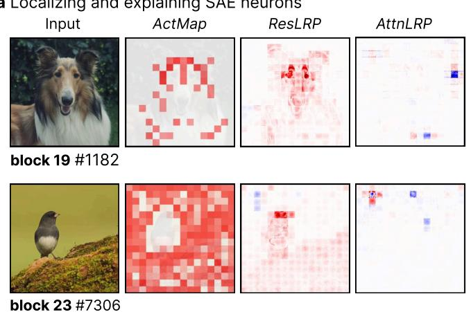

a Localizing and explaining SAE neurons  
b Explaining Vision-Language-Models  
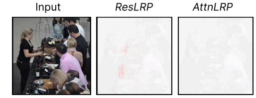  
Q: “What type of beverage is being displayed?” A: “wine”

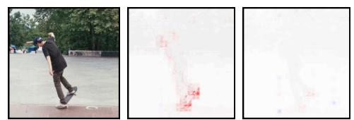  
Q: “What is the man doing?” A: “skateboarding”  
Figure A.3: Additional qualitative examples of ResLRP attributions. a) SAE activation maps (ActMap) do not always spatially align with the encoded semantic concepts (“dog eyes” and “bird”), whereas ResLRP highlights input features faithful to the SAE’s learned latent encoder (cf. Tab. A.3). b) ResLRP enables pixel-level grounding of free-form text generation in large vision-language models (here Qwen2.5-VL [48]).

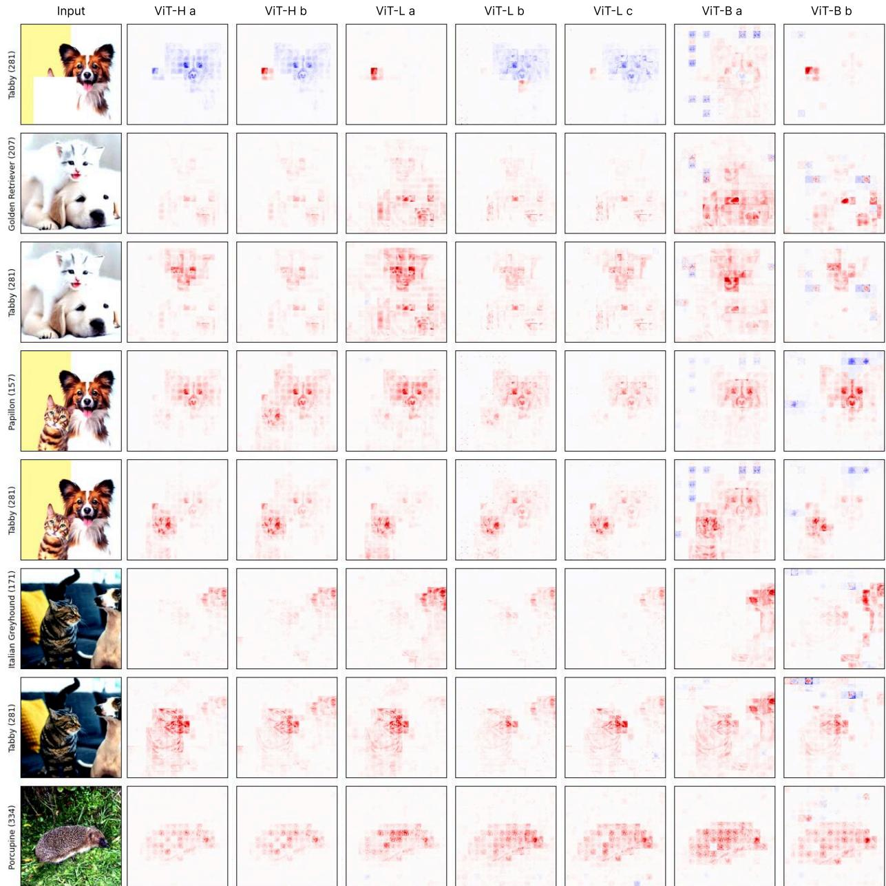  
Figure A.4: Qualitative examples of ResLRP attribution maps for different ViTs models. Explanation target is displayed on the left.

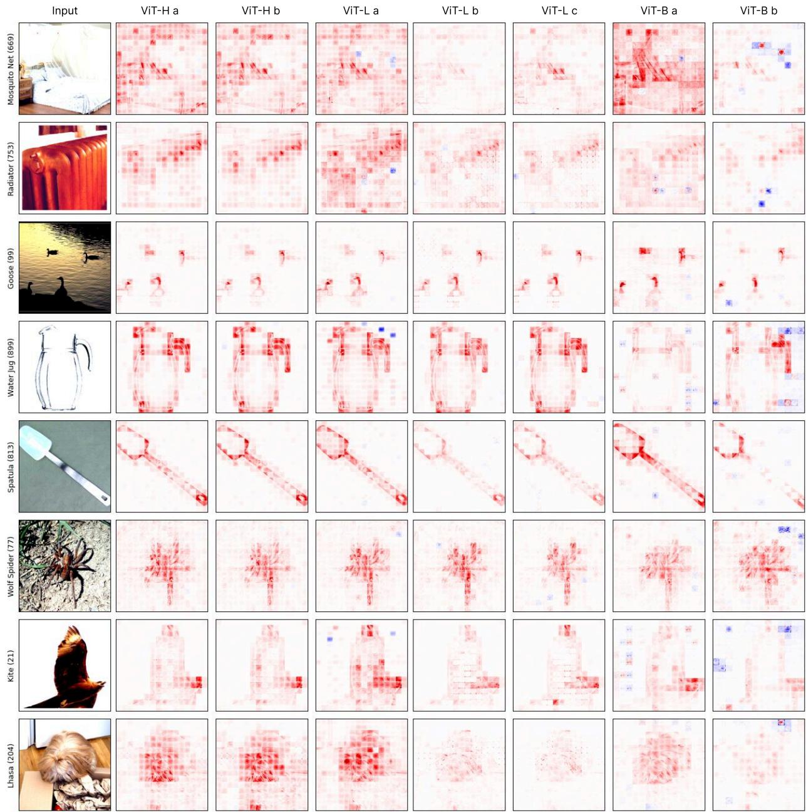  
Figure A.5: Qualitative examples of ResLRP attribution maps for different ViTs models. Explanation target is displayed on the left.