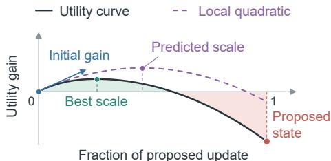
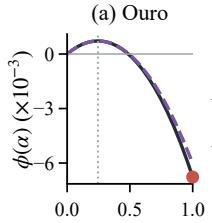
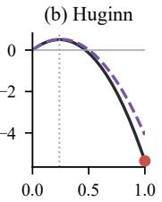
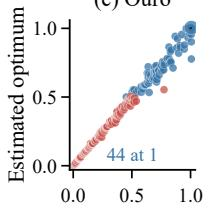
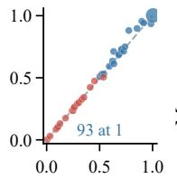
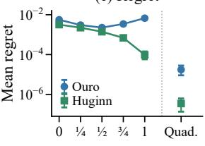
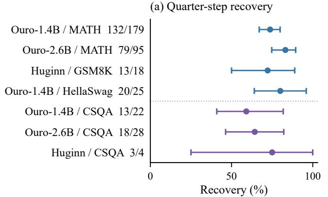
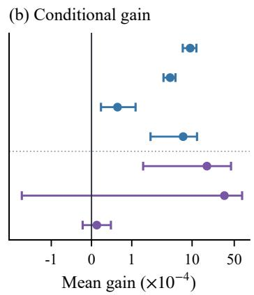
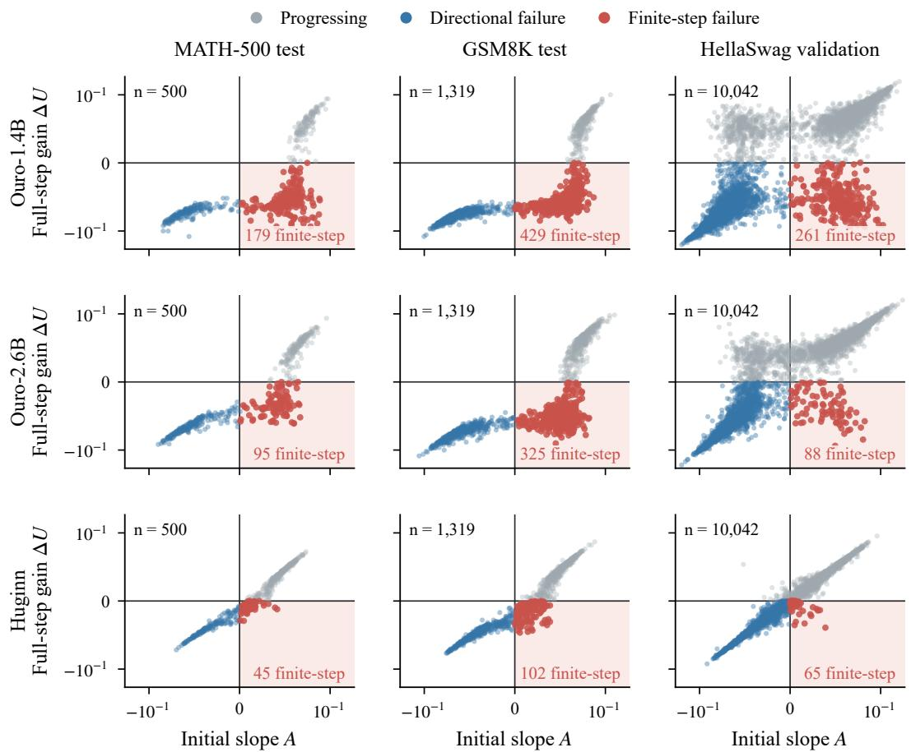

# Right Direction, Wrong Step: Geometric Analysis of Finite-Step Failure in Looped Transformers

Zhihao Guo1 Zonghan Wu2 Haizhou Du3 Huan Huo1, \* Yilei Shao2, \* Athanasios V. Vasilakos4 Qingsong Wen2, 5

1University of Technology Sydney, Australia 2East China Normal University, China 3Shanghai University of Electric Power, China 4University of Agder, Norway 5Squirrel AI Learning, USA

## ABSTRACT

Looped Transformers offer a parameter-efficient route to test-time scaling by reusing shared layers for iterative latent reasoning. However, additional iterations can reduce support for a reference answer, leaving unclear whether an update’s direction is locally unhelpful or its full displacement moves too far. We study this distinction by analysing reference utility, which measures this support, along the model’s own update direction, varying the fraction of the proposed displacement supplied to the readout. This reveals finite-step failures in which a locally improving direction produces a harmful full update. A pathwise curvature decomposition characterises how initial progress is lost, while a local quadratic model predicts fullstep gains and useful step scales. Bounds based on accumulated curvature variation characterise the approximation error of these predictions. Experiments across two model families reveal this separation on mathematical and commonsense tasks. A fixed quarter step recovers positive gains in reference utility for 72.2–83.2% of selected failures across four settings. These findings identify a mismatch between update direction and step scale as a mechanism of lost progress, explaining how some harmful updates retain useful computation.

## 1 INTRODUCTION

Looped Transformers models repeatedly apply shared Transformer layers, making computational depth an inference-time resource (Giannou et al., 2023). Following Universal Transformers (Dehghani et al., 2019), Huginn and Ouro bring recurrent computation to language-model pretraining (Geiping et al., 2025; Zhu et al., 2026), while pretrained models acquire recurrence through parametersharing conversions (Bae et al., 2025) or retrofitting with recurrence curricula (McLeish et al., 2025). Expressivity analyses (Giannou et al., 2023; Xu and Sato, 2025) and studies of in-context algorithm learning (Yang et al., 2024; Gatmiry et al., 2024) explain how repeated blocks support iterative computation. Empirical work connects recurrent depth to reasoning and generalisation across problem difficulty or length (Bansal et al., 2022; Fan et al., 2025; Saunshi et al., 2025). Connecting this extra computation to task progress requires understanding its learned updates.

Recent work (Yang et al., 2026) brings the fixed-point stability perspective developed for deep equilibrium models (Bai et al., 2019; 2021) to looped language models, combining Jacobian regularisation and random loop sampling to improve test-time scaling. Input-dependent depth selection (Elbayad et al., 2020) and time- and step-conditioned updates (Jeddi et al., 2026) adapt computation to different inputs and budgets, while learned correctness signals guide latent optimisation (Du et al., 2026). The effect of a recurrent update on support for a reference answer depends on both its direction and magnitude, leaving unclear whether scaling down the same update could strengthen that support.

  
Figure 1: A shorter step can recover progress. Utility gain measures the change in support for the reference answer relative to the current state (0). The proposed state is at (1).

Along the segment between the current and proposed states, support for the reference answer can have a positive initial slope yet end below its starting level, producing thefinite-stepfailure illustrated in Figure 1. A sufficiently negative accumulated curvature correction can outweigh the first-order gain. A shorter displacement along the same direction can then reach an intermediate state that supports the reference answer more strongly than both the current and proposed states. The initial slope and curvature suggest how far to move, while variation in curvature over the segment determines how faithfully this local prediction describes the change in support along the update.

We investigate this separation through pathwise analysis and fixed-direction interventions, using a reference utility that measures support for the reference answer. Finite-step failures occur in all nine model–task conditions, including those with positive mean gain. Local quadratic geometry predicts full-step gain and useful update scales, connecting the initial direction to the progress available within the displacement. A fixed quarter step restores positive utility in 72.2–83.2% of selected failures across four settings, and quadratic selection improves recovery and mean gain on an additional full test set. To characterise the error of the local predictions, we use bounds based on integrated curvature variation along the same path. Interventions measure reference utility after proposal computation and before further recurrence. Our contributions are:

1. Finite-step failure mechanism. Across nine model–task conditions, we identify harmful recurrent updates whose directions remain locally improving, and characterise their loss of progress through an exact pathwise curvature decomposition.

2. Local geometry of useful update scales. We use a local quadratic model of reference utility to predict useful scales along observed recurrent updates, and use integrated curvature variation to bound scale error and regret relative to the continuous optimum.

3. Progress recovery by step contraction. We demonstrate recovery of finite-step failures through fixed and curvature-selected step contractions, and use endpoint-oracle comparisons to quantify the additional value of intermediate scales.

## 2 RELATED WORK

Recurrent Computation and Overthinking. Shared recurrent computation supports depth and length generalisation (Schwarzschild et al., 2021; Bansal et al., 2022; Fan et al., 2025; Saunshi et al., 2025), while adaptive computation methods learn how much processing to allocate to each input (Graves, 2017; Banino et al., 2021; Elbayad et al., 2020). The benefits of additional computation, however, need not persist with increasing depth. Shallow-Deep Networks identify destructive overthinking when deeper processing turns correct predictions into errors (Kaya et al., 2019), and Think-at-Hard observes analogous reversals during latent iterations (Fu et al., 2026). To understand how additional recurrence loses task progress, we examine whether a harmful update follows an unhelpful direction or moves too far along a locally improving one.

Stability and Step Control. Building on deep equilibrium models (Bai et al., 2019; 2021), STARS (Yang et al., 2026) stabilises recurrence through Jacobian regularisation and random loop sampling. This dynamical perspective also informs when to stop recurrence: remaining path length and decoder margin yield conditions for answer stability (Viakhirev et al., 2026), while differences between successive updates provide an early-exit signal (Pappone et al., 2025). Alongside stopping decisions, recurrent models regulate how individual updates are applied through residual-dependent damping (Movahedi et al., 2026), input-dependent channel-wise gating (Park et al., 2026), and timeand step-conditioning (Jeddi et al., 2026). These approaches highlight the role of update control in recurrent computation. To understand why a smaller step can recover task progress, we analyse how reference utility changes along a proposed update while holding its direction and readout fixed.

Task Feedback and Update Geometry. Task feedback (Du et al., 2026; Ye et al., 2026; Wang et al., 2026) and representation geometry (Huang et al., 2025) have been used to guide internal-state refinement. Recent analysis of Tiny Recursive Models derives reference-token loss derivatives along an interpolation between pre- and post-update distributions (Asadulaev et al., 2026). Although our state interpolation induces the same distribution path under affine logit readouts, we extend the analysis to how accumulated curvature can reverse local utility improvement over a full update, and test whether shortening that update increases reference utility above its pre-update value.

## 3 METHOD

Each application of a looped Transformer’s shared block determines an update direction and a displacement magnitude. For a frozen model and a fixed readout, we define reference utility along the proposed update in § 3.1. We then use pathwise curvature to explain how local improvement can become full-step harm (§ 3.2), and analyse useful step scales through a local quadratic approximation and its error bounds (§ 3.3). Finally, fixed-direction interventions test whether shorter displacements recover immediate reference utility (§ 3.4).

## 3.1 RECURRENT UPDATES AND TASK UTILITY

Looped language models repeatedly apply a shared transformation (Geiping et al., 2025; Zhu et al., 2026). For a frozen model and a fixed input, write the recurrence as $\bar { H _ { t + 1 } } \bar { = _ { } } F ( H _ { t } )$ , where $H _ { t } \in { \mathcal { H } }$ is the hidden state after $t = 0 , 1 , \ldots$ iterations, $H _ { 0 }$ is the initial state, and H is a finite-dimensional real inner product space. The map $F : \mathcal H \to \mathcal H$ is fixed. We analyse a consecutive pair $H = H _ { t }$ $H ^ { + } = H _ { t + 1 } ^ { - }$ and its displacement

$$
H ^ { + } : = F ( H ) , \qquad D : = H ^ { + } - H .\tag{1}
$$

The fixed output layers, or readout, map hidden states to output scores. A scalar task utility $U : \Omega \to$ R evaluates these scores against a fixed reference, where $\Omega \subseteq { \mathcal { H } }$ is an open set containing the segment from H to $H ^ { + }$ . An increase in U defines task progress. The state representation, readout, and reference remain fixed throughout each comparison, and Appendix D.2 defines the utilities.

To isolate the effect of displacement magnitude, we preserve the direction proposed by the recurrent model. For a nonzero update, every displacement in the same direction is a positive scalar multiple of that update. We define the interpolated state and its utility gain at a dimensionless step scale α:

$$
\gamma ( \alpha ) : = H + \alpha D , \qquad \phi ( \alpha ) : = U ( \gamma ( \alpha ) ) - U ( H ) , \qquad \alpha \in [ 0 , 1 ] .\tag{2}
$$

Thus $\phi ( 0 ) = 0$ and $\phi ( 1 ) = \Delta U : = U ( H ^ { + } ) - U ( H )$ . An additional recurrent iteration takes the full displacement. For $D \neq 0 .$ , intermediate scales retain its direction while varying the state supplied to the readout, after both endpoints have been computed. We relate this path to its local derivatives under the following assumption.

Assumption 3.1 (Readout Regularity). The utility U is twice continuously differentiable on the open set Ω containing $\{ H + \alpha D : \overline { { \alpha } } \in [ \dot { 0 } , 1 ] \}$

The evaluated readouts consist of smooth operations under fixed attention masks, so their real-valued utilities satisfy this regularity (Appendix D.1). Since the proposed displacement is held fixed, no smoothness assumption on the recurrent map $\dot { F }$ is required. Assumption 3.1 gives $\phi \in C ^ { 2 } ( \mathcal { O } )$ on an open neighbourhood O of [0, 1]. The initial slope A and directional curvature $2 Q$ are

$$
A : = \phi ^ { \prime } ( 0 ) = \big \langle \nabla U ( H ) , D \big \rangle _ { \mathcal { H } } , \qquad Q : = \frac { 1 } { 2 } \phi ^ { \prime \prime } ( 0 ) = \frac { 1 } { 2 } \big \langle D , \nabla ^ { 2 } U ( H ) [ D ] \big \rangle _ { \mathcal { H } } .\tag{3}
$$

These coefficients measure the utility response to the shared block’s own displacement (derivation in Appendix $\mathbf { A . } 1 )$ . The direction is supplied by learned recurrence, and the utility derivatives assess its alignment with the task.

The sign of A describes the initial effect of following the update, whereas $\Delta U$ measures the result of the full displacement. We use their joint signs to distinguish two kinds of harmful update.

Definition 3.2 (Finite-Step Failure). An update is progressing if $\phi ( 1 ) > 0$ and neutral if $\phi ( 1 ) = 0 . \mathrm { \ : A }$ harmful update $( \phi ( 1 ) < 0 )$ is a directional failure if $A \leq 0$ and a finite-step failure if $A > 0$

In a finite-step failure, the shared block proposes a direction that initially improves utility, but taking its full displacement lowers utility at the next recurrent state. The curvature accumulated within this update determines how the initial improvement is lost.

## 3.2 DIRECTION–STEP COMPATIBILITY

A scale is compatible with task progress when $\phi ( \alpha ) \geq 0$ . The integral form of Taylor’s theorem expresses this gain as the initial linear gain plus a pathwise curvature correction.

Proposition 3.3 (Pathwise Progress Decomposition). Let $\mathcal { O } \subseteq \mathbb { R }$ be open with $[ 0 , 1 ] \subseteq { \mathcal { O } } .$ . If $\phi \in { \bar { C } } ^ { 2 } ( O )$ and $\phi ( 0 ) = 0 ;$ , then for every $\alpha \in [ 0 , 1 ]$

$$
\phi ( \alpha ) = \alpha A + \int _ { 0 } ^ { \alpha } ( \alpha - s ) \phi ^ { \prime \prime } ( s ) d s .\tag{4}
$$

In particular, a finite-step failure satisfies $\begin{array} { r } { \int _ { 0 } ^ { 1 } ( 1 - s ) \phi ^ { \prime \prime } ( s ) d s < - A < 0 . } \end{array}$

The proof is given in Appendix A.2. At $\alpha = 1$ , the integral corrects the local gain A for directional curvature accumulated across the full update. A finite-step failure occurs when this correction outweighs the positive linear term.

For an affine logit path, the curvature correction admits an exact interpretation in terms of the output distributions. Fix a question i with a finite nonempty set $M _ { i }$ of reference-token indices. Let $p _ { j } ( \alpha )$ denote the softmax distribution predicting reference token $j \in M _ { i }$ over a finite nonempty vocabulary.

Proposition 3.4 (Exact Endpoint Decomposition). Suppose the logits for every $j \in M _ { i }$ are affine in α and U is the mean reference-token log probability. Then

$$
\Delta U = A - \mathcal { C } , \qquad \mathcal { C } : = \frac { 1 } { | M _ { i } | } \sum _ { j \in M _ { i } } D _ { \mathrm { K L } } ( p _ { j } ( 0 ) | | p _ { j } ( 1 ) ) \geq 0 .\tag{5}
$$

Afinite-stepfailure occurs exactly when $0 < A < { \mathcal { C } } .$ . Moreover, $\begin{array} { r } { \mathcal { C } = - \int _ { 0 } ^ { 1 } ( 1 - s ) \phi ^ { \prime \prime } ( s ) d s } \end{array}$

Here $D _ { \mathrm { K L } }$ denotes Kullback–Leibler divergence. The proof is in Appendix C.2. The full update loses utility when the distributional correction exceeds the first-order gain. Since this correction uses only the endpoint distributions, it also provides a separate numerical check of the pathwise decomposition. For a general readout, we obtain an explicit sufficient range of improving scales by bounding negative directional curvature uniformly along the segment.

Corollary 3.5 (Beneficial Step Scales). Under Proposition 3.3, suppose $A > 0$ and $\phi ^ { \prime \prime } ( \alpha ) \geq - L _ { D }$ on [0, 1] for a constant $L _ { D } \geq 0$ . Then for every $\alpha \in [ 0 , 1 ]$

$$
\phi ( \alpha ) \geq \alpha A - { \frac { L _ { D } } { 2 } } \alpha ^ { 2 } .\tag{6}
$$

For $L _ { D } > 0$ , every $0 < \alpha \leq 1$ with $\alpha < 2 A / L _ { D }$ has positive utility gain. For $L _ { D } = 0 ,$ , every $\alpha \in ( 0 , 1 ]$ has positive gain.

The proof also appears in Appendix A.2. The sufficient range turns the directional diagnosis into an intervention: it specifies how far the proposed update can move while improving utility. A valid $L _ { D }$ requires a lower bound on directional curvature along the whole segment. The experiments obtain this bound from an FP64 derivative bound for Ouro’s affine readout and have no such bound for Huginn (Appendix E.5). The path defines the progress boundary, the endpoint of its largest initial interval of nonnegative gain:

$$
r _ { 1 } : = \operatorname* { s u p } \Big \{ r \in [ 0 , 1 ] : \phi ( \beta ) \geq 0 \quad \mathrm { f o r } \mathrm { e v e r y } \beta \in [ 0 , r ] \Big \} .\tag{7}
$$

For a finite-step failure, the positive initial derivative and negative endpoint give $0 < r _ { 1 } < 1$ . The argument is in Appendix A.3. This boundary describes how far progress persists. Selecting a scale further requires locating the utility maximum.

## 3.3 PREDICTING THE UTILITY-MAXIMISING SCALE

The quadratic model predicts αb for the path’s continuous optimum $\alpha ^ { \star } \cdot$

$$
q ( \alpha ) : = A \alpha + Q \alpha ^ { 2 } , \qquad \alpha ^ { \star } : = \operatorname* { m i n } \underset { \alpha \in [ 0 , 1 ] } { \operatorname { m a x } } \ : \mathrm { m a x } \ : \phi ( \alpha ) , \qquad \widehat { \alpha } : = \operatorname* { m i n } \underset { \alpha \in [ 0 , 1 ] } { \operatorname { m a x } } \ : \mathrm { m a x } \ : q ( \alpha ) .\tag{8}
$$

Both optimisation problems use the smallest maximiser to resolve ties. The same local model gives two predictions: $q ( 1 ) = A + Q$ for the gain of the full update and αb for the scale at which the gain is largest. For $Q < 0$ , the predicted scale is

$$
\widehat { \alpha } = \mathrm { c l i p } _ { [ 0 , 1 ] } \left( - \frac { A } { 2 Q } \right) .\tag{9}
$$

Here cl $\operatorname { p } _ { [ 0 , 1 ] } ( x ) : = \operatorname* { m i n } \{ 1 , \operatorname* { m a x } \{ 0 , x \} \}$ . For $Q \geq 0 .$ , αb is 1 if $A + Q > 0$ and 0 otherwise.

For $A > 0 , Q < 0$ , the ratio $- A / ( 2 Q )$ balances the initial slope against its decrease under the quadratic model. Clipping gives the best scale within the original displacement. The polynomial’s positive root, $r ^ { ( 2 ) } = - A / Q$ , predicts where that gain returns to zero. It is twice the unclipped maximising scale and may lie beyond the search interval. The scale bounds below do not apply to this root. Under a two-sided curvature bound, Appendix A.3 places $r ^ { ( 2 ) }$ and $r _ { 1 }$ in a common interval, and the experiments compare $r ^ { ( 2 ) }$ with the sampled path. Existence of the smallest maximisers and the derivation of Eq. (9) are given in Appendix A.4.

The accuracy of this prediction depends on how the directional slope changes along the segment. We measure the accumulated departure from the initial curvature by

$$
C ( a ) : = \int _ { 0 } ^ { a } | \phi ^ { \prime \prime } ( s ) - \phi ^ { \prime \prime } ( 0 ) | d s , \qquad a \in [ 0 , 1 ] .\tag{10}
$$

This quantity measures variation around the curvature already represented by q. A curved path can still have small approximation error: constant curvature gives $\dot { \cal C } ( 1 \dot { ) } = 0$ and makes q exact, as shown in Appendix A.5.5. Under Assumption 3.1, the full-update prediction error satisfies

$$
| \Delta U - ( A + Q ) | \leq C ( 1 ) .\tag{11}
$$

In particular, $A + Q$ has the same sign as $\Delta U$ whenever $| A + Q | > C ( 1 )$ (proof in Appendix $\mathsf { A } . 5 . 1 \mathsf { 1 }$ For $Q < 0$ , this deviation also bounds scale error and regret relative to the initial curvature.

Theorem 3.6 (Integrated Curvature Approximation). Let $\phi \in C ^ { 2 } ( \mathcal { O } )$ on an open neighbourhood $o f [ 0 , 1 ]$ , and set $A = \phi ^ { \prime } ( 0 )$ and $Q = \bar { \phi } ^ { \bar { \prime \prime } } ( 0 ) / 2 < 0 .$ . Set $\kappa : = - 2 Q > 0$ and use the maximisers in Eq. (8). Then

$$
| { \widehat { \alpha } } - \alpha ^ { \star } | \leq \operatorname* { m i n } \{ 1 , C ( 1 ) / \kappa \} , \qquad 0 \leq \phi ( \alpha ^ { \star } ) - \phi ( { \widehat { \alpha } } ) \leq { \frac { C ( 1 ) ^ { 2 } } { 2 \kappa } } .\tag{12}
$$

The bounds hold for every global maximiser of $\phi ,$ including endpoints, without assuming concavity.

The proof is given in Appendix A.5.3. The same accumulated deviation governs scale error linearly and regret quadratically, relative to the initial negative curvature $\kappa .$ The bound characterises when local utility geometry remains informative across the shared block’s full displacement. The predictor uses derivatives at the current recurrent state. Measurements along the resulting path quantify its approximation error. The pointwise location bound in Appendix $\bar { \mathbf { A . } } \bar { 5 . } 2$ additionally retains signed cancellation up to the true maximiser. Appendix A.5.5 treats zero deviation and the sensitivity of the maximising scale when $Q \geq 0$

Finite measurements can bound the accumulated deviation when variation between samples is controlled. Proposition A.6 constructs lower and upper sums for $C ( 1 )$ from endpoint curvatures and valid Lipschitz constants on each partition cell. Its upper sum $\overline { { C } }$ can replace $C ( 1 )$ in the endpoint, scale, and regret bounds. A bound on the signed slope residual retains cancellation of curvature deviations (Appendix E.9). Cellwise third-derivative bounds supply these constants, and a global bound M recovers $C ( a ) \ \leq \ M a ^ { 2 } / 2$ under $C ^ { 3 }$ regularity (Appendix A.5.6). The global bound applies worst-case derivative control throughout the segment. The integrated quantity accumulates the curvature deviation along the actual path. This distinction determines how tightly the path measurements can bound the error of a local prediction. These bounds concern real-valued functions. Their numerical evaluation requires separate floating-point error accounting.

## 3.4 PREDICTION AND FIXED-DIRECTION INTERVENTION

After computing the next recurrent state, we evaluate the local model on the resulting update. The endpoint comparison measures how closely $A + Q$ predicts $\Delta U$ . To evaluate the scale prediction, we additionally measure utility along the segment. These evaluations are made on a finite grid $\mathcal { A } \subseteq [ 0 , 1 ]$ containing 0 and 1, with the grid optimum as the comparison target:

$$
\alpha _ { \mathcal { A } } ^ { \star } : = \operatorname* { m i n } \arg \operatorname* { m a x } _ { \alpha \in \mathcal { A } } \phi ( \alpha ) .\tag{13}
$$

The grid target uses sampled utilities, while αb uses the derivatives at the current recurrent state $H$ Appendix B gives location and utility bounds relating this grid target to the continuous optimum $\alpha ^ { \star }$ under their respective path-shape conditions. We additionally refine the numerical optimum along the same segment, using the readout’s concavity when available and evaluating further candidate scales for a general readout. For $A > 0 , Q < 0 .$ , we also evaluate the root prediction $r ^ { ( 2 ) }$ on the same grid against the interval ending at the first observed negative gain. This compares the predicted extent of progress with the sampled path. Locating the continuous boundary $r _ { 1 }$ additionally requires controlling the behaviour between grid points.

The curve comparison evaluates a scale predicted separately for each update. We additionally measure recovery of finite-step failures under a common reduction in update magnitude. The local positivity argument in Appendix ${ \mathrm { A } } . 3$ guarantees a beneficial scale for each such failure. We assess recovery at a shared scale by choosing a prespecified fraction $\alpha _ { c } \in ( 0 , 1 )$ and evaluate the readout at $H + \alpha _ { c } D$ holding $H , D ,$ , and the readout fixed. This is the step-contraction intervention. A failure is recovered when $\phi ( \alpha _ { c } ) > 0$ . The recovery fraction is the proportion of selected failures satisfying this condition, and the mean gain averages $\phi ( \alpha _ { c } )$ over that same subset. When a uniform negative-curvature bound is available, we also select a scale separately for each update from the sufficient range in Corollary 3.5 and evaluate its measured gain.

Recovery quantifies improvement within the subset of updates whose local direction is favourable and whose full effect is harmful. To measure the value of intermediate scales over the whole collection of updates, we compare them with choosing the better of the current and next states. This endpoint choice already captures the gain from discarding a harmful full update. Let $B \subseteq [ 0 , 1 ]$ be a finite action set containing 0 and 1, and define

$$
U _ { \mathrm { h a l t } } : = \operatorname* { m a x } \{ U ( H ) , U ( H ^ { + } ) \} , \qquad U _ { \mathrm { s t e p } } : = \operatorname* { m a x } _ { \alpha \in \mathcal { B } } U ( H + \alpha D ) .\tag{14}
$$

Both oracles select an action using the measured reference utilities. The endpoint oracle chooses between H and $H ^ { + }$ , while the step oracle can also select an intermediate state. Since B includes both endpoints, $U _ { \mathrm { s t e p } } - U _ { \mathrm { h a l t } } \geq 0$ , and the endpoint comparison is proved in Appendix B. This difference measures the additional utility available from allowing intermediate scales, beyond the gain already available to endpoint selection. We evaluate it over all analysed updates alongside the conditional recovery measurements. All comparisons use the same reference utility before further recurrence.

## 4 EXPERIMENTS

We first trace utility across recurrent depth and examine the effect of one additional loop at fixed transitions $( \ S 4 . 2 )$ . Path measurements then test whether local geometry predicts useful scales within those updates $( \ S \ 4 . 3 )$ . Fixed-direction interventions evaluate whether changing the displacement recovers progress and adds value beyond endpoint selection (§ 4.4).

## 4.1 SETUP

Models, tasks, and transitions. We study Ouro-1.4B and 2.6B (Zhu et al., 2026) alongside Huginn 0125 (Geiping et al., 2025) to examine the mechanism across model families and scales, with different recurrent and readout designs. Following mathematical evaluations of looped language models (Yang et al., 2026), we use the complete MATH-500 (Lightman et al., 2024) test set $( N = 5 0 0 )$ and GSM8K (Cobbe et al., 2021) test set $( N = 1 3 1 9 )$ We extend the comparison to commonsense completion using the full HellaSwag (Zellers et al., 2019) validation set $( N = 1 0 0 4 2 )$ . All three models are evaluated on each task, giving nine conditions. For this matrix, transitions are fixed across tasks: $4  5$ for both Ouro models and $1 9  2 0$ for Huginn. A broader depth sweep covers seven labelled splits, including additional question-answering tasks, giving 21 conditions (Appendix E.1). Path and quarter-step analyses use MATH-500 test, 256 GSM8K training questions, and 1000 HellaSwag validation questions, with a CommonsenseQA (Talmor et al., 2019) training extension of 1024 questions.

Evaluation protocol. We follow the fixed-direction analysis in § 3.1 with frozen models. Under teacher forcing, utility is the mean reference-token log probability for mathematics and the logsoftmax of length-normalised option scores for multiple choice. Endpoint prediction compares A and $A + Q$ with $\Delta U$ using sign accuracy, Spearman correlation, and MAE. Scale predictions are compared with optima on the 21-point grid $\mathbf { \hat { \mathcal { A } } } = \{ 0 , 0 . 0 5 , \ldots , 1 \}$ , with regret evaluated at the nearest grid action to ${ \widehat { \alpha } } .$ . The main matrix uses BF16 recurrent states, FP32 readouts, and FP64 option-score log-softmax. Additional FP64 path analyses retain the recurrent endpoints and evaluate derivatives and utility with an FP64 readout. We report 95% confidence intervals from 2000 paired question-bootstrap resamples within each analysis population. Utility definitions and numerical protocols are detailed in Appendices D.2 and E.2.

Table 1: Finite-step failures and endpoint prediction. All nine conditions contain finite-step failures. For predicting $\Delta U .$ , adding Q improves sign accuracy and reduces MAE (bold). Counts are finite-step/harmful updates, and mean gain averages $\Delta U$ over all questions. Rank correlation is Spearman between $A + \bar { Q }$ and $\Delta U$
<table><tr><td rowspan="2">Model</td><td rowspan="2">Task</td><td rowspan="2">Mean gain  $( 1 0 ^ { - 3 } )$ </td><td colspan="2">Finite-step failures</td><td colspan="2">Sign accuracy (%) ↑</td><td rowspan="2">Rank corr. ↑</td><td colspan="2"> $\mathrm { M A E } \left( 1 0 ^ { - 4 } \right) \downarrow$ </td></tr><tr><td>Count</td><td>Share (%)</td><td>A</td><td> $A + Q$ </td><td>A</td><td> $A + Q$ </td></tr><tr><td rowspan="3">Ouro 1.4B</td><td>MATH-500</td><td>-8.73</td><td>179/364</td><td>49.18</td><td>64.20</td><td>98.20</td><td>0.9929</td><td>139.41</td><td>11.99</td></tr><tr><td>GSM8K</td><td>-14.47</td><td>429/1066</td><td>40.24</td><td>67.48</td><td>98.41</td><td>0.9985</td><td>147.51</td><td>6.20</td></tr><tr><td>HellaSwag</td><td>-7.75</td><td>261/5771</td><td>4.52</td><td>92.49</td><td>98.87</td><td>0.9983</td><td>73.11</td><td>12.45</td></tr><tr><td rowspan="3">Ouro 2.6B</td><td>MATH-500</td><td>-4.40</td><td>95/329</td><td>28.88</td><td>81.00</td><td>98.60</td><td>0.9973</td><td>51.12</td><td>4.10</td></tr><tr><td>GSM8K</td><td>-7.77</td><td>325/874</td><td>37.19</td><td>75.36</td><td>97.19</td><td>0.9952</td><td>114.61</td><td>13.13</td></tr><tr><td>HellaSwag</td><td>+1.49</td><td>88/4719</td><td>1.86</td><td>94.24</td><td>99.49</td><td>0.9995</td><td>29.56</td><td>3.05</td></tr><tr><td rowspan="3">Huginn 3.5B</td><td>MATH-500</td><td>+0.75</td><td>45/203</td><td>22.17</td><td>91.00</td><td>99.60</td><td>0.9998</td><td>6.81</td><td>0.23</td></tr><tr><td>GSM8K</td><td>-0.48</td><td>102/702</td><td>14.53</td><td>92.27</td><td>99.77</td><td>0.9998</td><td>10.39</td><td>0.42</td></tr><tr><td>HellaSwag</td><td>+0.34</td><td>65/4695</td><td>1.38</td><td>98.58</td><td>99.92</td><td>1.0000</td><td>2.06</td><td>0.17</td></tr></table>

## 4.2 RQ1: LOCAL DIRECTION VERSUS FINITE PROGRESS

Useful directions within harmful updates. Depth sweeps identify utility declines in 19 of 2 model–task conditions (Appendix E.1). To examine how progress is lost within an additional loop, we compare the initial utility slope with the full-step gain at the fixed transitions in Table 1. Finite-step failures as defined in Definition 3.2 occur in all nine conditions, accounting for 1.4–49.2% of harmful updates: the proposed direction initially improves reference utility, but its full displacement lower it. These failures also occur in all three conditions with positive mean gain, so the mechanism appears within individual updates even when the population average improves. A harmful full-step outcome can therefore conceal a direction along which a shorter move would improve reference utility. Additional effect-margin checks are reported in Appendix E.2.

Accumulated curvature and endpoint prediction. Proposition 3.3 decomposes full-step gain into the initial slope and an accumulated curvature correction. We test how well local curvature approximates this correction by comparing A and A + Q with the observed ∆U. Adding Q improves sign accuracy in all nine matched conditions, reaching 97.2–99.9%, and reduces MAE by factors of 5.9–29.8 (Table 1). The largest sign-accuracy gains occur on Ouro-1.4B’s mathematical tasks, where harmful full updates often have positive initial slopes. These results support the role of curvature in the mismatch between local improvement and full-step harm. Additional checks of the affine-readout identity in Proposition 3.4 are reported in Appendix E.2.

We also examine whether changes in hidden states and outputs track task progress. Across the four original intervention sets, state- and output-change diagnostics have absolute Spearman correlation at most 0.285 with $\Delta U$ , while the reference-based prediction A + Q exceeds 0.99 on the same teacherforced states. These results indicate that generic change measures provide limited information about the ranking of utility gains, motivating an analysis of utility along the update direction. Diagnostic definitions and detailed comparisons are provided in Appendix E.3.

## 4.3 RQ2: PREDICTING THE SCALE OF PROGRESS

Prediction along the fixed direction. Accurate endpoint prediction motivates evaluating scales inside the update. On the primary subset $A > 0 , Q < 0$ , we compare the quadratic maximiser with the measured grid optimum, keeping the initial coefficients fixed. The first-order rule takes the full step throughout this subset. On Ouro-1.4B/MATH-500 and Huginn/GSM8K, predicted and empirical scales have correlation above 0.995, and the quadratic rule reduces mean grid regret by more than two orders of magnitude relative to the first-order rule (Table 2). Figure 2(e) compares the quadratic rule with all five fixed scales. This grid-regret comparison evaluates the utility at the predicted scale, complementing the agreement in scale. Within the primary subset, it tests whether adding curvature to the first-order full-step choice improves utility. The best fixed scale in hindsight differs between these evaluation sets: 0.5 for Ouro and 1 for Huginn. Even against these separately selected choices, the quadratic rule reduces mean grid regret by more than two orders of magnitude. Its advantage therefore extends beyond replacing the full step with a uniformly smaller displacement. Appendix E.4 gives the comparison protocol and results on the additional tasks.

Table 2: Quadratic scale prediction against grid optima. Results on Ouro/MATH-500 test and Huginn/GSM8K train256, restricted to $\mathrm { \bar { \it { A } } } > 0 \mathrm { \bar { , } } Q < \mathrm { \bar { \it { 0 } } } .$ . Correlation and MAE compare predicted scales with 21-point grid optima. Regret is evaluated at the nearest grid action.
<table><tr><td>Model / task</td><td>n</td><td>Spearman</td><td>Scale MAE</td><td>Grid regret</td></tr><tr><td>Ouro-1.4B / MATH-500</td><td>315</td><td>0.9951</td><td>0.0211</td><td> $\mathbf { 1 . 7 4 7 \times 1 0 ^ { - 5 } }$ </td></tr><tr><td>Huginn / GSM8K</td><td>129</td><td>0.9998</td><td>0.0072</td><td> $\mathbf { 3 . 4 8 2 \times 1 0 ^ { - 7 } }$ </td></tr></table>

Measured Quadratic Finite-step failure Other primary

  
Scale α

  
Scale α

(c) Ouro  
  
Prediction α̂

(d) Huginn  
  
Prediction α̂

(e) Regret  
  
Scale / rule  
Figure 2: Scale prediction on Ouro/MATH-500 and Huginn/GSM8K. (a,b) Example utility paths and local quadratic approximations. (c,d) Predicted scales versus numerical optima. (e) Grid regret for fixed scales and quadratic selection. Labels in (c,d) count overlapping points at (1, 1).

Intermediate optima and prediction error. To test whether local quadratic geometry locates intermediate utility maxima, we examine paths whose numerical optima lie strictly inside [0, 1]. Mean scale error is below 0.019 across 269 Ouro-1.4B/MATH-500 cases and 0.018 across 36 Huginn/GSM8K cases (Table 10). These results support the prediction in Eq. (9): the initial slope and curvature contain information about how far to move along the proposed direction (Figure 2(a–d)). Theorem 3.6 relates scale-prediction error to accumulated curvature variation. We evaluate this bound for both Ouro models on the complete MATH-500 and GSM8K test sets. Across these four conditions, the integrated bound $\overline { { C } } / \kappa$ has median 0.058–0.114, compared with 2.84–4.61 for the global bound $M / ( 2 \bar { \kappa } )$ . It covers the numerical scale-error intervals of all 2034 primary updates and is below the full search range on 99.8% of them (Table 15). Thus, accounting for curvature variation along the path gives informative error bounds for the same local prediction. Appendix E.9 gives the bound distributions and numerical optimum checks for all four conditions.

## 4.4 RQ3: RECOVERING PROGRESS BY STEP CONTRACTION

The preceding analyses in RQ2 show that local geometry predicts both full-step utility change and useful intermediate scales. Here, we use fixed-direction interventions to test whether shorter updates recover the progress suggested by this geometry. Additional comparisons of the predicted zero crossing with sampled utility paths are reported in Appendix E.4.

A common step contraction across questions. Finite-step failure guarantees an improving neighbourhood along the proposed direction, but its extent varies across questions. The improving range in Corollary 3.5 motivates step contraction, although its extent depends on the update. Following the fixed-direction intervention in § 3.4, we first test how often a common scale $\alpha _ { c } = 0 . 2 5$ recovers reference utility. On the four original evaluation sets, this quarter step recovers 72.2–83.2% of finite-step failures (Figure 3). Each recovery gives an intermediate state with higher reference utility than both endpoints of the original harmful update. These results show that a single fraction reaches useful intermediate states across most selected failures in each evaluation set. Effect margins, task extensions, and transition selection are detailed in Appendix E.2.

Table 3: Scale selection on Ouro-1.4B. Utility units: $1 0 ^ { - 3 }$ . Recovery counts show quarter → selected (failure denominator); utility populations are listed separately. Brackets give paired 95% CIs. Bound selection uses FP64.
<table><tr><td>Task / rule</td><td>Recovered quarter → selected</td><td>Utility population</td><td>Mean gain</td><td>Advantage over quarter [95% CI]</td></tr><tr><td>GSM8K / Quadratic</td><td>306 → 406 (431)</td><td>All questions (1319)</td><td>2.770</td><td>3.610 [3.366, 3.881]</td></tr><tr><td>MATH-500 / Bound</td><td>132 → 179 (179)</td><td>Failures (179)</td><td>1.074</td><td>0.144 [0.061, 0.232]</td></tr></table>

Selecting a scale from local geometry. To test whether adapting the scale to each update improves recovery, we apply the quadratic rule in Eq. (8) using local derivatives of reference utility. On Ouro-1.4B/GSM8K test at 4 → 5, it recovers 94.2% of the 431 finite-step failures, compared with 71.0% for the quarter step. Across all 1319 questions, the rule also yields positive mean gain in reference utility and outperforms the quarter step (Table 3). The recovery phenomenon also appears on Ouro-2.6B/HellaSwag, where the quadratic rule recovers 88.0–100% of finite-step failures across four separately evaluated transitions from 1 → 2 through 4 → 5 (Appendix E.7). These results connect the scale prediction examined in RQ2 to improved recovery along the model’s own update directions. The intervention protocol is detailed in Appendix E.6.

Selecting a scale from a curvature bound. The quadratic rule in Eq. (8) estimates where utility is largest. We next test whether the sufficient improving range in Corollary 3.5 can also guide step selection. On Ouro-1.4B/MATH-500, we choose $\alpha _ { \mathrm { s a f e } } = \operatorname* { m i n } \{ 1 , 0 . 9 ( 2 A / L _ { D } ) \}$ from this range using the initial slope and the pathwise curvature bound, with the factor 0.9 fixed across questions. In the FP64 readout, the selected scales recover all 179 finite-step failures, compared with 132 for the quarter step. The mean paired advantage is $1 . 4 4 \times 1 0 ^ { - 4 }$ (Table 3). The recovered states have higher reference utility than both endpoints, linking the sufficient improving range to progress retained within the original update.

Additional value beyond endpoint selection. To determine whether contraction offers more than avoiding a harmful full step, we compare the endpoint and five-scale oracles in Eq. (14) over all questions in each evaluation set. Most aggregate gain is available through endpoint selection, while intermediate scales provide additional reference utility (Appendix E.10). On a finite-step failure, the endpoint oracle retains the current state, so an interior gain identifies useful progress that stopping would forgo. Supplementary experiments extend recovery to CommonsenseQA (Appendix E.2) and to token-level updates within Ouro’s four-step inference budget (Appendix E.8). These observations motivate using reference-defined geometry as offline supervision for learned exit and step-scale decisions, a future direction discussed in Appendix E.8. The reported gains concern immediate reference utility after proposal computation and before further recurrence. Extensions to generated trajectories and computation costs are discussed in Appendix F.

## 5 CONCLUSION

This work characterises finite-step failure in looped Transformers: an additional recurrent update can lower reference utility despite a locally improving direction. For a frozen model and a fixed readout, accumulated curvature explains this mismatch, while local quadratic geometry predicts useful step scales and curvature variation bounds approximation error. Under teacher forcing, we observe recovery of finite-step failures in both model families when evaluating shorter displacements along the same direction before further recurrence. A fixed quarter step recovers 72.2–83.2% of selected finite-step failures across four settings. On Ouro-1.4B/GSM8K test, quadratic scale selection raises recovery from 71.0% to 94.2% relative to the quarter step. An observed decline after another loop can therefore reflect excessive displacement along a useful direction. For looped Transformers, this distinction motivates evaluating how much of each proposed update to apply alongside how many loops to run, connecting step scale to the task progress obtained from additional shared computation.

## REFERENCES

Arip Asadulaev, Rayan Banerjee, Fakhri Karray, and Martin Taka´c. Latent reasoning in TRMsˇ is secretly a policy improvement operator. In Forty-third International Conference on Machine

Learning, 2026.

Sangmin Bae, Adam Fisch, Hrayr Harutyunyan, Ziwei Ji, Seungyeon Kim, and Tal Schuster. Relaxed recursive transformers: Effective parameter sharing with layer-wise lora. In 13th ICLR 2025: Singapore, 2025.

Shaojie Bai, J. Zico Kolter, and Vladlen Koltun. Deep equilibrium models. In Advances in Neural Information Processing Systems, 2019.

Shaojie Bai, Vladlen Koltun, and J. Zico Kolter. Stabilizing equilibrium models by jacobian regularization. In 38th ICML 2021: Virtual Event, pages 554–565, 2021.

Andrea Banino, Jan Balaguer, and Charles Blundell. PonderNet: Learning to Ponder. In ICML 2021 Workshops: AutoML, 2021.

Arpit Bansal, Avi Schwarzschild, Eitan Borgnia, Zeyad Emam, Furong Huang, Micah Goldblum, and Tom Goldstein. End-to-end algorithm synthesis with recurrent networks: Extrapolation without overthinking. In Advances in Neural Information Processing Systems, 2022.

Karl Cobbe, Vineet Kosaraju, Mohammad Bavarian, Mark Chen, Heewoo Jun, Lukasz Kaiser, Matthias Plappert, Jerry Tworek, Jacob Hilton, Reiichiro Nakano, Christopher Hesse, and John Schulman. Training verifiers to solve math word problems. arXiv preprint arXiv:2110.14168, 2021.

Mostafa Dehghani, Stephan Gouws, Oriol Vinyals, Jakob Uszkoreit, and Lukasz Kaiser. Universal transformers. In 7th ICLR 2019: New Orleans, LA, USA, 2019.

Hanwen Du, Yuxin Dong, and Xia Ning. Latent thinking optimization: Your latent reasoning language model secretly encodes reward signals in its latent thoughts. In International Conference on Learning Representations, 2026.

Maha Elbayad, Jiatao Gu, Edouard Grave, and Michael Auli. Depth-adaptive transformer. In International Conference on Learning Representations, 2020.

Ying Fan, Yilun Du, Kannan Ramchandran, and Kangwook Lee. Looped transformers for length generalization. In International Conference on Learning Representations, 2025.

Tianyu Fu, Yichen You, Zekai Chen, Guohao Dai, Huazhong Yang, and Yu Wang. Think-at-hard: Selective latent iterations to improve reasoning language models. In Forty-third International Conference on Machine Learning, 2026.

Khashayar Gatmiry, Nikunj Saunshi, Sashank J. Reddi, Stefanie Jegelka, and Sanjiv Kumar. Can looped transformers learn to implement multi-step gradient descent for in-context learning? In 41st ICML 2024: Vienna, Austria, pages 15130–15152, 2024.

Jonas Geiping, Sean McLeish, Neel Jain, John Kirchenbauer, Siddharth Singh, Brian Bartoldson, Bhavya Kailkhura, Abhinav Bhatele, and Tom Goldstein. Scaling up test-time compute with latent reasoning: A recurrent depth approach. In Conference on Neural Information Processing Systems, 2025.

Angeliki Giannou, Shashank Rajput, Jy yong Sohn, Kangwook Lee, Jason D. Lee, and Dimitris Papailiopoulos. Looped transformers as programmable computers. In 40th ICML 2023: Honolulu, HI, USA, pages 11398–11442, 2023.

Alex Graves. Adaptive computation time for recurrent neural networks, 2017.

Yao Huang, Huanran Chen, Shouwei Ruan, Yichi Zhang, Xingxing Wei, and Yinpeng Dong. Mitigating overthinking in large reasoning models via manifold steering. In Conference on Neural Information Processing Systems, 2025.

Ahmadreza Jeddi, Marco Ciccone, and Babak Taati. Loopformer: Elastic-depth looped transformers for latent reasoning via shortcut modulation. In International Conference on Learning Representations, 2026.

Yigitcan Kaya, Sanghyun Hong, and Tudor Dumitras. Shallow-deep networks: Understanding and mitigating network overthinking. In 36th ICML 2019: Long Beach, California, USA, pages 3301–3310, 2019.

Hunter Lightman, Vineet Kosaraju, Yuri Burda, Harrison Edwards, Bowen Baker, Teddy Lee, Jan Leike, John Schulman, Ilya Sutskever, and Karl Cobbe. Let’s verify step by step. In 12th ICLR 2024: Vienna, Austria, 2024.

Sean Michael McLeish, Ang Li, John Kirchenbauer, Dayal Singh Kalra, Brian R. Bartoldson, Bhavya Kailkhura, Avi Schwarzschild, Jonas Geiping, Micah Goldblum, and Tom Goldstein. Teaching pretrained language models to think deeper with retrofitted recurrence. In NeurIPS 2025 Workshop on Efficient Reasoning, 2025.

Sajad Movahedi, Vera Milovanovic, Shlomo Libo Feigin, Alexander Theus, Thomas Hofmann,´ Valentina Boeva, T. Konstantin Rusch, and Antonio Orvieto. Fixed-point reasoners: Stable and adaptive deep looped transformers, 2026.

Francesco Pappone, Donato Crisostomi, and Emanuele Rodola. Two-scale latent dynamics for \` recurrent-depth transformers. In UniReps: 3rd Edition of the Workshop on Unifying Representations in Neural Models, 2025.

Taekhyun Park, Yongjae Lee, Dohee Kim, and Hyerim Bae. Loopus: Recasting pretrained llms into looped latent refinement models, 2026.

Nikunj Saunshi, Nishanth Dikkala, Zhiyuan Li, Sanjiv Kumar, and Sashank J. Reddi. Reasoning with latent thoughts: On the power of looped transformers. In 13th ICLR 2025: Singapore, 2025.

Avi Schwarzschild, Eitan Borgnia, Arjun Gupta, Furong Huang, Uzi Vishkin, Micah Goldblum, and Tom Goldstein. Can you learn an algorithm? generalizing from easy to hard problems with recurrent networks. In Advances in Neural Information Processing Systems, 2021.

Alon Talmor, Jonathan Herzig, Nicholas Lourie, and Jonathan Berant. CommonsenseQA: A question answering challenge targeting commonsense knowledge. In Annual Conference of the North American Chapter ofthe Associationfor Computational Linguistics, 2019.

Ivan Viakhirev, Kirill Borodin, Amirah Almutairi, Serguei Barannikov, Maxim Abramov, and Grach Mkrtchian. Think shallow, solve deep: Controlling recurrent dynamics for reliable test-time depth, 2026.

Xinyuan Wang, Dongjie Wang, Wangyang Ying, Haoyue Bai, Nanxu Gong, Sixun Dong, Kunpeng Liu, and Yanjie Fu. Efficient post-training refinement of latent reasoning in large language models. In 40th AAAI 2026: Singapore, pages 33692–33700, 2026. doi: 10.1609/aaai.v40i40.40659.

Kevin Xu and Issei Sato. On expressive power of looped transformers: Theoretical analysis and enhancement via timestep encoding. In International Conference on Machine Learning, 2025.

Liu Yang, Kangwook Lee, Robert D. Nowak, and Dimitris Papailiopoulos. Looped transformers are better at learning learning algorithms. In International Conference on Learning Representations, 2024.

Xiao-Wen Yang, Ziyu Han, Xi-Hua Zhang, Wen-Da Wei, Jie-Jing Shao, Lan-Zhe Guo, and Yu-Feng Li. Stabilizing recurrent dynamics for test-time scalable latent reasoning in looped language models. In Forty-third International Conference on Machine Learning, 2026.

Wengao Ye, Yan Liang, and Lianlei Shan. Thinking on the fly: Test-time reasoning enhancement via latent thought policy optimization. In International Conference on Learning Representations, 2026.

Rowan Zellers, Ari Holtzman, Yonatan Bisk, Ali Farhadi, and Yejin Choi. HellaSwag: Can a machine really finish your sentence? In Annual Meeting of the Association for Computational Linguistics, 2019.

Rui-Jie Zhu, Zixuan Wang, Kai Hua, Tianyu Zhang, Ziniu Li, Haoran Que, Boyi Wei, Zixin Wen, Fan Yin, He Xing, Lu Li, Jiajun Shi, Kaijing Ma, Shanda Li, Taylor Kergan, Andrew Smith, Xingwei Qu, Mude Hui, Bohong Wu, Qiyang Min, Hongzhi Huang, Xun Zhou, Wei Ye, Jiaheng Liu, Jian Yang, Yunfeng Shi, Chenghua Lin, Enduo Zhao, Tianle Cai, Ge Zhang, Wenhao Huang, Yoshua Bengio, and Jason Eshraghian. Scaling latent reasoning via looped language models, 2026.

## A PROOFS OF THE PATH ANALYSIS

We use the state space, utility, displacement, and path defined in $\ S 3 . 1$ . In particular, $D = F ( H ) - H$ is fixed, $\phi ( \alpha ) = \bar { U } ( H + \alpha \bar { D } ) - \bar { U } ( H ) , A = \phi ^ { \prime } \bar { ( } 0 )$ , and $Q = \phi ^ { \prime \prime } ( 0 ) / 2$ . Smoothness is imposed on an open neighbourhood of the tested segment, and endpoint derivatives use the resulting real-valued continuation.

## A.1 DIRECTIONAL DERIVATIVES

Derivation of $E q . \ ( 3 )$ . The affine path has derivative $\gamma ^ { \prime } ( \alpha ) = D$ . Composing the differential of U with this path and subtracting the constant $U ( H )$ gives $\phi ^ { \prime } ( \alpha ) = d U _ { \gamma ( \alpha ) } [ D ]$ . In the inner product space, the differential is represented by the gradient. Differentiating its inner product with the fixed vector D then gives

$$
\phi ^ { \prime } ( \alpha ) = \big \langle \nabla U ( \gamma ( \alpha ) ) , D \big \rangle _ { \mathcal { H } } , \qquad \phi ^ { \prime \prime } ( \alpha ) = \big \langle D , \nabla ^ { 2 } U ( \gamma ( \alpha ) ) [ D ] \big \rangle _ { \mathcal { H } } .\tag{15}
$$

Evaluation at zero gives $A$ and $Q .$ . The identities involve the fixed vector $D$ and the derivatives of U at points of the segment. □

## A.2 FINITE PROGRESS AND BENEFICIAL SCALES

Lemma A.1 (Increment Comparison). Let $f , g$ be continuously differentiable on an open neighbourhood $o f [ 0 , 1 ] . \ I f f ^ { \prime } ( s ) \leq { \bar { g } } ^ { \prime } ( s ) f o r$ every $s \in [ 0 , 1 ]$ , then $f ( \alpha ) - f ( 0 ) \leq g ( \alpha ) - g ( 0 ) f o r$ every $\alpha \in [ 0 , 1 ]$

Proof. Continuity makes both derivatives integrable on $[ 0 , \alpha ]$ . The fundamental theorem of calculus and monotonicity of the integral give

$$
f ( \alpha ) - f ( 0 ) = \int _ { 0 } ^ { \alpha } f ^ { \prime } ( s ) d s \leq \int _ { 0 } ^ { \alpha } g ^ { \prime } ( s ) d s = g ( \alpha ) - g ( 0 ) .\tag{16}
$$

ProofofProposition 3.3. Fix $\alpha \in [ 0 , 1 ]$ and define $g _ { \alpha } ( s ) : = \phi ( s ) + ( \alpha - s ) \phi ^ { \prime } ( s )$ . The product rule gives $g _ { \alpha } ^ { \prime } ( s ) = ( \alpha - s ) \phi ^ { \prime \prime } ( s )$ . This derivative is continuous on $[ 0 , \alpha ]$ , so the fundamental theorem of calculus yields

$$
\int _ { 0 } ^ { \alpha } ( \alpha - s ) \phi ^ { \prime \prime } ( s ) d s = g _ { \alpha } ( \alpha ) - g _ { \alpha } ( 0 ) = \phi ( \alpha ) - \alpha A .\tag{17}
$$

The last equality uses $\phi ( 0 ) = 0$ and $\phi ^ { \prime } ( 0 ) = A$ . At a finite-step failure, $\phi ( 1 ) < 0$ and $A > 0$ , so $\begin{array} { r } { \int _ { 0 } ^ { 1 } ( 1 - s ) \phi ^ { \prime \prime } ( s ) d s = \phi ( 1 ) - A < - A < 0 } \end{array}$ □

ProofofCorollary 3.5. First compare the functions $s \mapsto - L _ { D } s$ and $s \mapsto \phi ^ { \prime } ( s )$ . Their derivatives satisfy $\bar { \mathbf { \Phi } } - L _ { D } \mathbf { \Phi } \leq \mathbf { \bar { \phi } } ^ { \prime \prime } ( s )$ , so Lemma A.1 gives $\phi ^ { \prime } ( s ) \geq A - L _ { D } s$ on $[ 0 , 1 ]$ . Next define $b ( s ) : =$ $A s - L _ { D } s ^ { 2 } / 2$ , whose derivative is $A - L _ { D } s$ . Applying the same comparison to b and ϕ, with $b ( 0 ) = \phi ( 0 ) \stackrel { . } { = } 0$ , gives

$$
\phi ( \alpha ) \geq \alpha A - \frac { L _ { D } } { 2 } \alpha ^ { 2 } = \alpha \left( A - \frac { L _ { D } } { 2 } \alpha \right) .\tag{18}
$$

For $L _ { D } > 0$ , this expression is positive whenever $0 < \alpha < 2 A / L _ { D }$ . For $L _ { D } = 0$ , it equals $\alpha A > 0$ at every positive scale in the interval. □

## A.3 THE CONTINUOUS PROGRESS BOUNDARY

Justification of $0 < r _ { 1 } < 1$ for afinite-stepfailure. Differentiability at zero, $\phi ( 0 ) = 0$ , and $A > 0$ imply $\phi ( \alpha ) / \alpha  A$ as $\alpha \downarrow 0$ . Hence $\phi ( \alpha ) > 0$ on some interval $( 0 , \varepsilon )$ . Set $r _ { 0 } = \operatorname* { m i n } \{ \varepsilon / 2 , 1 / 2 \}$ Then $r _ { 0 }$ belongs to the prefix set in Eq. (7). This set is nonempty and bounded above by one, so its supremum satisfies $r _ { 1 } \ge r _ { 0 } > 0$ . Since $\phi ( 1 ) < 0$ , continuity at one gives $\eta > 0$ such that $| \alpha - 1 | < \eta$ implies $\phi ( \alpha ) < 0$ . Put $b = 1 - \operatorname* { m i n } \{ \eta / 2 , 1 / 2 \}$ . Then $0 \leq b < 1$ and $\phi \dot { ( } b ) < 0$ . Every member of the prefix set is strictly less than $b ,$ making b an upper bound. Hence $r _ { 1 } \leq b < 1$ □

The local positive interval requires only the derivative at zero. The curvature bound in Corollary 3.5 additionally gives an explicit sufficient range of scales. A two-sided curvature bound also places the boundary and the quadratic root prediction in a common interval.

Proposition A.2 (Root Prediction under Two-Sided Curvature Bounds). Under Proposition 3.3, suppose $A > 0 a n d - L _ { D } \leq \phi ^ { \prime \prime } ( s ) \leq - \mu$ on $[ 0 , 1 ] f o r$ r constants $0 < \mu \leq L _ { D }$ . Then $\kappa = - \phi ^ { \prime \prime } ( 0 ) \in$ $[ \mu , L _ { D } ]$ , so $r ^ { ( 2 ) } = - A / Q = 2 A / \kappa \in [ 2 A / L _ { D } , 2 A / \mu ] .$ , and $r _ { 1 } \ge \mathrm { m i n } \{ 1 , 2 A / L _ { D } \}$ . If moreover $2 A / \mu < 1$ , then $r _ { 1 } \leq 2 A / \mu$ , and consequently

$$
\big | r ^ { ( 2 ) } - r _ { 1 } \big | \le 2 A \left( \frac { 1 } { \mu } - \frac { 1 } { L _ { D } } \right) .\tag{19}
$$

Proof. The membership of κ and hence of $r ^ { ( 2 ) }$ follows from the curvature bounds at $s = 0$ . For the lower bound on $r _ { 1 }$ , Corollary 3.5 gives $\phi ( \alpha ) \geq \alpha ( A - L _ { D } \alpha / 2 ) > 0$ for $0 < \alpha < 2 A / L _ { D }$ . With $\phi ( 0 ) = 0$ , every $r <$ < min $\left\{ 1 , \dot { 2 } A / \hat L _ { D } \right\}$ belongs to the prefix set in Eq. (7), so its supremum is at least min $\left\{ 1 , 2 A / L _ { D } \right\}$ . For the upper bound, apply Lemma A.1 to $\phi ^ { \prime }$ and $s \mapsto A - \mu s$ , whose derivatives satisfy $\phi ^ { \prime \prime } \leq - \mathrm { \bar { \mu } } .$ . This gives $\phi ^ { \prime } ( s ) \leq \bar { A } - \mu s$ on [0, 1]. Applying the same comparison to ϕ and $b ( s ) = A s - \mu s ^ { 2 } / 2$ gives $\phi ( \alpha ) \stackrel { } { \le } \alpha ( A - \mu \alpha / 2 )$ , which is negative for $\alpha > 2 A / \mu$ . If $2 A / \mu < 1$ then $\phi < 0$ on $( 2 A / \mu , 1 ]$ , so no $r > 2 A / \mu$ belongs to the prefix set and $r _ { 1 } \le 2 A / \mu$ . Both $r _ { 1 }$ and $r ^ { ( 2 ) }$ then lie in $[ 2 A / L _ { D } , 2 A { \bar { / } } \mu ]$ , whose length is the right-hand side of Eq. (19). □

In the affine-logit case, $\phi ^ { \prime \prime }$ is the negative mean variance in Eq. (53), so $\mu$ and $L _ { D }$ bound the minimum and maximum of that variance along the segment. The experiments evaluate only the upper envelope $L _ { D }$ and compare $r ^ { ( 2 ) }$ with the sampled crossings (Appendix E.4). No bound of the form Eq. (19) is computed.

## A.4 CONSTRAINED QUADRATIC MAXIMISATION

Existence and tie convention in $E q . ( \delta ) .$ . Let f be either ϕ or $q .$ Compactness of $[ 0 , 1 ]$ and continuity of f give a maximiser b. The set $\bar { S } = [ 0 , 1 ] \cap f ^ { - 1 } ( \{ f ( b ) \} )$ is a closed subset of a compact interval and contains b. Minimising the identity function on S gives a point $a \in S$ no larger than any other member. Since $f ( a ) = f { \bar { ( b ) } }$ , this point maximises f on $[ 0 , 1 ]$ and is its smallest maximiser. If a and ea both have this property, maximality gives $f ( a ) { \dot { = } } f ( { \widetilde { a } } )$ , and their respective minimality gives $a \leq \widetilde a$ and $\widetilde a \le a$ . Thus they coincide. □

Derivation of Eq. (9). Suppose $Q < 0$ . For any candidate $c \in [ 0 , 1 ]$

$$
q ( x ) - q ( c ) = ( A + 2 Q c ) ( x - c ) + Q ( x - c ) ^ { 2 } .\tag{20}
$$

If $\begin{array} { r } { ( A + 2 Q c ) ( x - c ) \leq 0 } \end{array}$ for every $x \in [ 0 , 1 ]$ , this identity makes c a maximiser, and the strict inequality $Q ( x - c ) ^ { 2 } < 0$ for $x \neq c$ makes it unique. Write $u = - A / ( 2 Q )$ , so $A + 2 Q u = 0$ . If $u \leq 0 .$ , then $A \leq 0$ and $c = 0$ satisfies the required inequality. If $u > 0$ and $u \geq 1$ , then $A + 2 Q \geq 0$ and $c = 1$ satisfies it. In the remaining case $0 < u < 1$ , take $c = u ,$ , where the derivative vanishes. These branches give the clipped formula.

For $Q \geq 0 ,$ , the inequality $x ^ { 2 } \leq x$ on [0, 1] gives $q ( x ) \leq x ( A + Q )$ . If $A + Q > 0$ , this is at most $A + Q = q ( 1 )$ , with strict inequality when $x < 1 . \operatorname { I f } A + Q \leq 0$ , it is at most zero, and $c = 0$ is the smallest maximiser. This includes $\mathrm { \bar { \boldsymbol { Q } } } = 0$ and the constant-zero quadratic. For $A > 0 , Q < 0$ , the factorisation $q ( \alpha ) = \alpha ( A + Q \alpha )$ also gives the positive root $r ^ { ( 2 ) } \stackrel { - } { = } - A / Q = 2 ( - A / ( 2 Q ) )$ □

## A.5 QUADRATIC APPROXIMATION ERROR

Lemma A.3 (Power Increment Bound). Let f be continuously differentiable on an open neighbourhood of[0, 1], and suppose $| f ^ { \prime } ( s ) | \leq B s ^ { n }$ on [0, 1]for $B \in \mathbb { R }$ and an integer n $\geq 0$ . Then

$$
| f ( \alpha ) - f ( 0 ) | \leq \frac { B } { n + 1 } \alpha ^ { n + 1 } , \qquad \alpha \in [ 0 , 1 ] .\tag{21}
$$

Proof. The derivative bounds are $- B s ^ { n } \leq f ^ { \prime } ( s ) \leq B s ^ { n }$ . The two bounding polynomials $g _ { \pm } ( s ) =$ $\pm B \bar { s } ^ { n + 1 } / ( n + 1 )$ ) have derivatives $\pm B s ^ { n }$ and vanish at zero. Applying Lemma A.1 first to $f , g _ { + }$ and then to $g _ { - } , f$ gives the two sides of the absolute-value inequality. □

## A.5.1 ENDPOINT PREDICTION ERROR

Derivation of $E q . ( l I )$ . Under Assumption 3.1, the fundamental theorem of calculus gives $\phi ^ { \prime } ( a ) -$ $\begin{array} { r } { q ^ { \prime } ( a ) = \int _ { 0 } ^ { a } [ \phi ^ { \prime \prime } ( s ) - \phi ^ { \prime \prime } ( 0 ) ] d s } \end{array}$ , whose absolute value is at most $C ( a ) \leq C ( 1 )$ on [0, 1]. Applying the mean value inequality to $\phi - q$ between zero and one, with $\phi ( 0 ) = q ( 0 ) = 0$ , yields $| \Delta U - ( A { + } Q ) | \leq$ $C ( 1 )$ . If $A + Q \supset C ( 1 )$ , then $\Delta U \ge A + Q - C ( 1 ) > 0$ , and if $A + Q \ < \ - C ( 1 )$ , then $\Delta { \dot { U } } \leq A + Q + C ( 1 ) < 0$ . This proves the sign statement without a sign restriction on A or Q.

## A.5.2 INTEGRATED CURVATURE DEVIATION

Proposition A.4 (Scale Error from Integrated Curvature Deviation). Let $\phi \in C ^ { 2 } ( \mathcal { O } )$ on an open neighbourhood $\mathcal { O } o f [ 0 , 1 ]$ , and suppose $\begin{array} { r } { \bar { \phi } ^ { \prime \prime } ( 0 ) < 0 . } \end{array}$ Set $\kappa : = - \phi ^ { \prime \prime } ( 0 ) = - 2 Q > 0 ,$ , and let $\alpha ^ { \star }$ and αb be as in Eq. (8). Then

$$
| { \widehat { \alpha } } - \alpha ^ { \star } | \leq { \frac { \left| \int _ { 0 } ^ { \alpha ^ { \star } } [ \phi ^ { \prime \prime } ( s ) - \phi ^ { \prime \prime } ( 0 ) ] d s \right| } { \kappa } } \leq { \frac { C ( \alpha ^ { \star } ) } { \kappa } } \leq { \frac { C ( 1 ) } { \kappa } } .\tag{22}
$$

The result includes endpoint maximisers and does not require concavity of ${ \dot { } } \phi .$

ProofofProposition A.4. Continuity on the compact interval ensures existence of both maximisers. The argument applies to any global maximiser $\alpha ^ { \star }$ of $\phi ,$ and the smallest-maximiser convention merely fixes its name. Since $\kappa = - \phi ^ { \prime \prime } ( 0 ) > 0$ , the quadratic $q ( \alpha ) = \phi ^ { \prime } ( 0 ) \alpha - \kappa \alpha ^ { 2 } / 2$ is strictly concave, so its constrained maximiser αb is unique.

First, let f be differentiable at a constrained maximiser $a \in [ 0 , 1 ]$ . For any $b \in [ 0 , 1 ]$ , the curve $t \mapsto a + t ( b - a )$ remains feasible for $t \in [ 0 , 1 ]$ ]. Optimality implies $\bar { f } ( a + t ( b - a ) ) ^ { \cdot } - \bar { f } ( a ) \leq 0$ for $t > 0$ . Dividing by t and taking $t \downarrow 0$ gives

$$
f ^ { \prime } ( a ) ( b - a ) \leq 0 .\tag{23}
$$

This reasoning uses only feasible one-sided displacements, so it also applies when $a = 0$ or $a = 1$ . It does not assert that $f ^ { \prime } ( a ) = 0$ there.

Put $\delta : = \widehat { \alpha } - \alpha ^ { \star }$ . Applying Eq. (23) first to $\phi$ and then to q yields

$$
\phi ^ { \prime } ( \alpha ^ { \star } ) \delta \leq 0 , \qquad q ^ { \prime } ( { \widehat { \alpha } } ) \delta \geq 0 .\tag{24}
$$

Since $q ^ { \prime } ( \alpha ) = \phi ^ { \prime } ( 0 ) - \kappa \alpha$ , we have $q ^ { \prime } ( \alpha ^ { \star } ) - q ^ { \prime } ( \widehat { \alpha } ) = \kappa \delta$ . Therefore

$$
\begin{array} { r l } & { \kappa \delta ^ { 2 } = \big ( q ^ { \prime } ( \alpha ^ { \star } ) - q ^ { \prime } ( \widehat \alpha ) \big ) \delta } \\ & { \qquad \leq q ^ { \prime } ( \alpha ^ { \star } ) \delta } \\ & { \qquad \leq \big ( q ^ { \prime } ( \alpha ^ { \star } ) - \phi ^ { \prime } ( \alpha ^ { \star } ) \big ) \delta } \\ & { \qquad \leq | q ^ { \prime } ( \alpha ^ { \star } ) - \phi ^ { \prime } ( \alpha ^ { \star } ) | | \delta | . } \end{array}\tag{25}
$$

For $\delta \neq 0 ,$ , division by $\kappa | \delta | > 0$ gives

$$
| \delta | \leq \frac { | \phi ^ { \prime } ( \alpha ^ { \star } ) - q ^ { \prime } ( \alpha ^ { \star } ) | } { \kappa } .\tag{26}
$$

For $\delta = 0$ , the same inequality holds because its right-hand side is nonnegative.

$\mathrm { N e x t , } q ^ { \prime } ( a ) = \phi ^ { \prime } ( 0 ) + \phi ^ { \prime \prime } ( 0 ) a$ and the fundamental theorem of calculus give, for every $a \in [ 0 , 1 ]$

$$
\phi ^ { \prime } ( a ) - q ^ { \prime } ( a ) = \phi ^ { \prime } ( a ) - \phi ^ { \prime } ( 0 ) - a \phi ^ { \prime \prime } ( 0 ) = \int _ { 0 } ^ { a } [ \phi ^ { \prime \prime } ( s ) - \phi ^ { \prime \prime } ( 0 ) ] d s .\tag{27}
$$

All integrands are continuous on the compact segment, hence integrable. Taking absolute values gives

$$
\left| \int _ { 0 } ^ { a } [ \phi ^ { \prime \prime } ( s ) - \phi ^ { \prime \prime } ( 0 ) ] d s \right| \leq \int _ { 0 } ^ { a } \left| \phi ^ { \prime \prime } ( s ) - \phi ^ { \prime \prime } ( 0 ) \right| d s = C ( a ) .\tag{28}
$$

For $\begin{array} { r } { 0 \leq a \leq b \leq 1 , C ( b ) - C ( a ) = \int _ { a } ^ { b } | \phi ^ { \prime \prime } ( s ) - \phi ^ { \prime \prime } ( 0 ) | d s \geq 0 } \end{array}$ . Thus $C ( \alpha ^ { \star } ) \leq C ( 1 )$ . Substitution into Eq. (26) proves the complete chain in Eq. (22). Neither this proof nor the distance conclusion uses $\phi ( 0 ) = \bar { 0 } , \phi ^ { \prime } ( 0 ) > 0$ , or concavity of the actual path. □

## A.5.3 INTEGRATED LOCATION AND REGRET BOUNDS

ProofofTheorem 3.6. Continuity on $[ 0 , 1 ]$ gives a global maximiser, and strict concavity of q gives its unique maximiser αb. Fix any global maximiser $\alpha ^ { \star }$ of $\phi .$ Define the derivative residual and value residual by $e ( a ) : = \phi ^ { \prime } ( a ) - q ^ { \prime } \dot { ( a ) }$ and $\mathcal { R } ( a ) : = \phi ( a ) - q ( a )$ ). Eq. (27) and monotonicity of C give $| e ( a ) | \leq C ( a ) \leq C ( 1 )$ on [0, 1]. Put $\varepsilon : = C ( 1 ) \geq 0 .$

Proposition A.4 bounds the location error by $\varepsilon / \kappa$ . Both maximisers belong to $[ 0 , 1 ]$ , so their distance is also at most one. This proves the first conclusion of Eq. (12).

For the value bound, $\mathcal { R } ^ { \prime } = e$ and the derivative bound on the convex interval imply, by the mean value inequality,

$$
| \mathcal { R } ( v ) - \mathcal { R } ( u ) | \leq \varepsilon | v - u | , \qquad u , v \in [ 0 , 1 ] .\tag{29}
$$

This step uses differentiability and the uniform derivative bound. It applies in either order of $u , v .$ The exact quadratic expansion at its constrained maximiser gives

$$
q ( a ) - q ( \widehat { \alpha } ) = q ^ { \prime } ( \widehat { \alpha } ) ( a - \widehat { \alpha } ) - \frac { \kappa } { 2 } ( a - \widehat { \alpha } ) ^ { 2 } \leq - \frac { \kappa } { 2 } ( a - \widehat { \alpha } ) ^ { 2 } .\tag{30}
$$

The inequality uses the feasible first-order condition in Eq. (23). With $d : = | \alpha ^ { \star } - \widehat { \alpha } |$ , decompose the utility difference into the residual increment and the quadratic gap:

$$
\begin{array} { c } { 0 \leq \phi ( \alpha ^ { \star } ) - \phi ( \widehat \alpha ) \leq \varepsilon d - \displaystyle \frac { \kappa } { 2 } d ^ { 2 } } \\ { = \displaystyle \frac { \varepsilon ^ { 2 } } { 2 \kappa } - \displaystyle \frac { \kappa } { 2 } ( d - \varepsilon / \kappa ) ^ { 2 } \leq \displaystyle \frac { \varepsilon ^ { 2 } } { 2 \kappa } . } \end{array}\tag{31}
$$

The lower bound follows from maximality of $\alpha ^ { \star }$ . Substitution of $\varepsilon = C ( 1 )$ proves the result. No value of $\phi ( 0 )$ enters the residual increment, so adding a constant to the utility leaves the argument unchanged. □

Corollary A.5 (Refinement by the Scale Domain). Under Theorem $3 . 6 ,$

$$
\phi ( \alpha ^ { \star } ) - \phi ( \widehat { \alpha } ) \leq \left\{ { C ( 1 ) ^ { 2 } } / { ( 2 \kappa ) } , \quad { C ( 1 ) } \leq \kappa , \right.\tag{32}
$$

The same conclusion holds with any upper bound ${ \overline { { C } } } \geq C ( 1 )$ in place $o f C ( 1 )$

Proof. The distance d in Eq. (31) belongs to $[ 0 , 1 ] . \mathrm { I f } \varepsilon \leq \kappa ,$ the quadratic in d has its maximum at $\varepsilon / \kappa . \mathrm { I f } \varepsilon > \kappa .$ its maximum on $[ 0 , 1 ] \ \mathrm { i s } \ \varepsilon - \kappa / 2$ at one. For an upper bound ${ \overline { { C } } } ,$ the same proof starts with $| e ( a ) | \le \overline { { C } }$ , and nonnegativity follows from $0 \leq C ( 1 ) \leq \overline { { C } }$ □

## A.5.4 FINITE-PARTITION ENCLOSURES

To connect this integral to finite measurements, let $g ( s ) : = \phi ^ { \prime \prime } ( s ) - \phi ^ { \prime \prime } ( 0 )$ and partition the interval as $0 = t _ { 0 } < \cdots < t _ { N } = 1$ , with $N \geq 1$ . For each cell $\ell = 0 , \ldots , N - 1$ , suppose $| g ( u ) - g ( v ) | \leq$ $L _ { \ell } | u - v |$ for all $u , v \in [ t _ { \ell } , t _ { \ell + 1 } ] .$ , where $L _ { \ell } \geq 0$ . Define

$$
h _ { \ell } : = t _ { \ell + 1 } - t _ { \ell } , \quad T _ { \ell } : = \frac { h _ { \ell } } { 2 } ( | g ( t _ { \ell } ) | + | g ( t _ { \ell + 1 } ) | ) , \quad P _ { \ell } : = \frac { L _ { \ell } h _ { \ell } ^ { 2 } } { 4 } .\tag{33}
$$

Proposition A.6 (Finite-Partition Curvature Bounds). Under the assumptions of Theorem 3.6 and these cellwise conditions,

$$
\underline { { C } } : = \sum _ { \ell = 0 } ^ { N - 1 } \operatorname* { m a x } \{ 0 , T _ { \ell } - P _ { \ell } \} \leq C ( 1 ) \leq \overline { { C } } : = \sum _ { \ell = 0 } ^ { N - 1 } ( T _ { \ell } + P _ { \ell } ) .\tag{34}
$$

Both bounds in Theorem $3 . 6$ remain valid when $C ( 1 )$ is replaced $b y \overline { { C } }$

Lemma A.7 (Nearest-Endpoint Integral Bound). Let $l < r$ and let g be L-Lipschitz on $[ l , r ]$ , with $L \geq 0 .$ For $h = r - l , T { \stackrel { - } { = } } h ( | g ( l ) | \stackrel { - } { + } | g ( r ) | ) / 2 ,$ , and $P = L h ^ { 2 } / 4$

$$
\left| \int _ { l } ^ { r } \left| g ( s ) \right| d s - T \right| \leq P , \qquad \operatorname* { m a x } \{ 0 , T - P \} \leq \int _ { l } ^ { r } \left| g ( s ) \right| d s \leq T + P .\tag{35}
$$

Proof. Set $m = ( l + r ) / 2$ . Lipschitz continuity and the reverse triangle inequality give $| | g ( s ) | -$ $| g ( l ) | | \le L ( s - l )$ on [l, m] and $\left| | g ( s ) | - | g ( r ) | \right| \leq L ( r - s )$ on $[ m , r ]$ . Integrating each half-interval and using the triangle inequality gives

$$
\left| \int _ { l } ^ { r } | g ( s ) | d s - T \right| \leq { \frac { L } { 2 } } ( m - l ) ^ { 2 } + { \frac { L } { 2 } } ( r - m ) ^ { 2 } = { \frac { L h ^ { 2 } } { 4 } } .\tag{36}
$$

The constant endpoint contributions sum to $T .$ . The absolute-value bound and nonnegativity of the integral give the two-sided enclosure. The proof requires no derivative of $| g |$ □

Proof of Proposition A.6. Apply Lemma $\mathrm { A } . 7$ on each cell, then sum the inequalities. Strictly increasing endpoints and additivity of adjacent integrals give

$$
C ( 1 ) = \sum _ { \ell = 0 } ^ { N - 1 } \int _ { t _ { \ell } } ^ { t _ { \ell + 1 } } | g ( s ) | d s .\tag{37}
$$

This proves Eq. (34). The residual bound $| e ( a ) | \leq C ( 1 ) \leq { \overline { { C } } }$ feeds directly into the location and regret arguments of Theorem 3.6.

For the third-derivative bound, suppose ϕ is $C ^ { 3 }$ on an open neighbourhood of $[ 0 , 1 ]$ and $| \phi ^ { \prime \prime \prime } ( s ) | \le L _ { \ell }$ at every point of each cell. Since ${ \bf { \dot { g } } ^ { \prime } } = \boldsymbol { \phi } ^ { \prime \prime \prime }$ , the mean value inequality makes g $L _ { \ell } { \mathrm { - L i p s c h i t z } }$ there. Every cell is contained in [0, 1], so these bounds supply exactly the hypotheses just used. □

The finite sum specifies an upper bound when its cellwise constants are valid throughout their intervals. A maximum over finitely many sampled third derivatives does not supply this condition. These bounds hold in exact arithmetic. Floating-point derivative evaluation and outward rounding require separate numerical error control.

## A.5.5 ZERO DEVIATION AND NONNEGATIVE INITIAL CURVATURE

Corollary A.8 (Zero Deviation and Multiple Maximisers). Under the $C ^ { 2 } s e t u p , C ( 1 ) = 0$ implies $\phi ( a ) = \dot { q ( a ) } + \phi ( 0 )$ on [0, 1]. Ifadditionally $Q < 0 ,$ , every true maximiser then equals αb. For any value $o f C ( 1 )$ , under $Q < 0$ and $\kappa = - 2 Q > 0 ,$ , any two global maximisers $a , b \in [ 0 , 1 ]$ satisfy $| a - b | \leq 2 C ( 1 ) / \kappa$

Proof. $\mathrm { I f } C ( 1 ) = 0$ , the residual derivative satisfies $| e ( a ) | \leq 0$ . The mean value inequality for $\phi - q$ with derivative zero, makes the value residual constant, proving the path identity. The zero-distance conclusion follows from Theorem 3.6. Applying its distance bound to each maximiser and using the triangle inequality through αb gives the diameter bound. □

Proposition A.9 (Location Instability for $Q \geq 0 )$ . For every $Q \geq 0$ and $\eta > 0 ,$ , the path $\phi ( a ) = $ $Q a ( \bar { a } - 1 ) + \eta a ^ { 3 }$ has Taylor quadratic $q ( a ) = Q a ( a - 1 )$ . Its smallest quadratic maximiser is zero and its unique true maximiser is one, while $| \phi ^ { \prime } ( a ) - q ^ { \prime } ( a ) | \leq 3 \eta$ on [0, 1].

Proof. Differentiation gives $\phi ^ { \prime } ( 0 ) = - Q$ and $\phi ^ { \prime \prime } ( 0 ) = 2 Q$ , identifying the Taylor model. Since $a ^ { 2 } \leq a { \mathrm { ~ o n ~ } } [ 0 , 1 ] , q ( a ) \leq 0 = q ( 0 ) = q ( 1 )$ , so its smallest maximiser is zero. Moreover $\phi ( a ) \leq$ $\eta a ^ { 3 } \leq \eta a \leq \bar { \eta } = \phi ( 1 )$ , and equality at a maximum forces $a \ = \ 1$ because $\eta > 0$ . Finally $\phi ^ { \prime } ( a ) - \dot { q } ^ { \prime } ( a ) = 3 \eta a ^ { 2 } \in [ 0 , 3 \eta ]$

Thus an arbitrarily small derivative residual does not imply a small location error when the initial quadratic curvature is nonnegative.

Proposition A.10 (Value Bound for an Arbitrary Quadratic). For any $A , Q ,$ , suppose ϕ is differentiable on a neighbourhood $o f [ 0 , 1 ]$ and $| \phi ^ { \prime } ( a ) - ( \dot { A } + \dot { 2 } Q a ) | \leq \varepsilon f o r$ every $a \in [ 0 , 1 ]$ , with $\varepsilon \geq 0 . \ I f \alpha ^ { \star }$ maximises ϕ and αb maximises $q ( a ) = A a + Q a ^ { 2 }$ , both on [0, 1], then $0 \leq \phi ( \alpha ^ { \star } ) - \phi ( \widehat { \alpha } ) \leq \varepsilon .$

Proof. The residual increment is at most $\varepsilon | \alpha ^ { \star } - \widehat { \alpha }$ by the mean value inequality, and the quadratic gap is nonpositive by maximality. Their sum is bounded by ε because both scales lie in [0, 1]. Maximality of $\alpha ^ { \star }$ gives nonnegativity. □

Corollary A.11 (Combined Integrated and Taylor Regret Bounds). Under Theorem 3.6 and Assumption A.13,

$$
\begin{array} { c l l } { \displaystyle \phi ( \alpha ^ { \star } ) - \phi ( \widehat \alpha ) \leq \operatorname* { m i n } \left\{ \frac { M } { 6 } \big ( ( \alpha ^ { \star } ) ^ { 3 } + \widehat \alpha ^ { 3 } \big ) , \frac { C ( 1 ) ^ { 2 } } { 2 \kappa } \right\} } \\ { \leq \operatorname* { m i n } \left\{ \frac { M } { 3 } , \frac { M ^ { 2 } } { 8 \kappa } \right\} . } \end{array}\tag{38}
$$

Proof. Apply the Taylor result in Theorem A.14 to the centred path $\phi - \phi ( 0 )$ . It has the same derivatives and maximisers, and centring cancels from its regret. Combining that bound with Theorem 3.6 gives the first minimum. Corollary A.12 gives $C ( 1 ) \leq M / 2$ , and the two scales are in [0, 1], giving the second minimum. □

Corollary A.12 (Third-Derivative Specialisation). Under Proposition A.4, suppose additionally that $\phi \in C ^ { 3 } ( \dot { \mathcal { O } } )$ and $\lvert \phi ^ { \prime \prime \prime } ( s ) \rvert \leq M$ on $[ \stackrel { \cdot } { 0 } , 1 ] f o r M \geq 0 .$ . Then, for every $a \in [ 0 , 1 ]$

$$
C ( a ) \leq \frac { M a ^ { 2 } } { 2 } , \qquad | \widehat { \alpha } - \alpha ^ { \star } | \leq \frac { M ( \alpha ^ { \star } ) ^ { 2 } } { 2 \kappa } \leq \frac { M } { 2 \kappa } .\tag{39}
$$

Proof. A further application of the fundamental theorem of calculus gives

$$
| \phi ^ { \prime \prime } ( s ) - \phi ^ { \prime \prime } ( 0 ) | = \left| \int _ { 0 } ^ { s } \phi ^ { \prime \prime \prime } ( u ) d u \right| \leq \int _ { 0 } ^ { s } | \phi ^ { \prime \prime \prime } ( u ) | d u \leq M s .\tag{40}
$$

Integrating this inequality from zero to a yields $\begin{array} { r } { C ( a ) \le \int _ { 0 } ^ { a } M s d s = M a ^ { 2 } / 2 } \end{array}$ . Proposition A.4, $\kappa > 0$ , and $0 \leq \alpha ^ { \star } \leq 1$ give the asserted distance bound. □

## A.5.6 UTILITY REGRET AND THE THIRD-DERIVATIVE BOUND

Assumption A.13 (Directional Curvature Variation). Let $\mathcal { O } \subseteq \mathbb { R }$ be open with $[ 0 , 1 ] \subseteq { \mathcal { O } }$ . The utility gain along the path satisfies $\phi \in C ^ { 3 } ( \mathcal { O } )$ , and there is a constant $M \geq 0$ such that

$$
| \phi ^ { \prime \prime \prime } ( \alpha ) | \leq M , \qquad \alpha \in [ 0 , 1 ] .\tag{41}
$$

Theorem A.14 (Quadratic Step-Scale Approximation). Under Assumption A.13, suppose $\phi ( 0 ) = 0$ With the quantities in $E q s . \ ( 3 )$ and (8),

$$
0 \leq \phi ( \alpha ^ { \star } ) - \phi ( \widehat \alpha ) \leq \frac { M } { 6 } \big ( ( \alpha ^ { \star } ) ^ { 3 } + \widehat \alpha ^ { 3 } \big ) \leq \frac { M } { 3 } .\tag{42}
$$

If additionally $Q < 0$ , let $\kappa : = - 2 Q > 0 .$ . Then

$$
| \widehat { \alpha } - \alpha ^ { \star } | \leq \frac { M } { 2 \kappa } ( \alpha ^ { \star } ) ^ { 2 } \leq \frac { M } { 2 \kappa } .\tag{43}
$$

Proof of Theorem A.14. Under Assumption $_ { \mathrm { A } . 1 3 . }$ , apply Lemma A.3 with $n = 0$ to $\phi ^ { \prime \prime }$ , whose derivative is bounded by M. This gives $| \phi ^ { \prime \prime } ( \alpha ) - \phi ^ { \dot { \prime } \prime } \dot { ( 0 ) } | \le M \alpha$ . The function $f _ { 1 } ( \alpha ) = \phi ^ { \prime } ( \alpha ) -$ $\phi ^ { \prime \prime } ( 0 ) \alpha$ has derivative $\bar { \phi ^ { \prime \prime } } ( \alpha ) - \phi ^ { \prime \prime } ( \mathbf { \bar { 0 } } )$ ). Applying the same lemma with $n = 1$ yields

$$
| \phi ^ { \prime } ( \alpha ) - ( A + \phi ^ { \prime \prime } ( 0 ) \alpha ) | \leq \frac { M } { 2 } \alpha ^ { 2 } .\tag{44}
$$

Next take $f _ { 2 } ( \alpha ) = \phi ( \alpha ) - q ( \alpha )$ ). Its derivative is the preceding error, and $f _ { 2 } ( 0 ) = 0$ . The lemma with $n = 2$ and coefficient $M / 2$ gives the function-value bound. Using $\phi ^ { \prime \prime } ( 0 ) = 2 Q$ , the two bounds are

$$
| \phi ( \alpha ) - q ( \alpha ) | \leq { \frac { M } { 6 } } \alpha ^ { 3 } , \qquad | \phi ^ { \prime } ( \alpha ) - q ^ { \prime } ( \alpha ) | \leq { \frac { M } { 2 } } \alpha ^ { 2 } .\tag{45}
$$

Optimality of $\alpha ^ { \star }$ gives the nonnegative lower bound in Eq. (42). Optimality of αb for q gives

$$
\phi ( \alpha ^ { \star } ) - \phi ( \widehat { \alpha } ) = \left[ \phi ( \alpha ^ { \star } ) - q ( \alpha ^ { \star } ) \right] + \left[ q ( \alpha ^ { \star } ) - q ( \widehat { \alpha } ) \right] + \left[ q ( \widehat { \alpha } ) - \phi ( \widehat { \alpha } ) \right]
$$

$$
\leq \frac { M } { 6 } \bigl ( ( \alpha ^ { \star } ) ^ { 3 } + \widehat { \alpha } ^ { 3 } \bigr ) \leq \frac { M } { 3 } .\tag{46}
$$

For the location bound, $Q < 0$ gives $\kappa = - 2 Q = - \phi ^ { \prime \prime } ( 0 ) > 0$ . Proposition A.4 and Corollary A.12 give directly

$$
| { \widehat { \alpha } } - \alpha ^ { \star } | \leq { \frac { C ( \alpha ^ { \star } ) } { \kappa } } \leq { \frac { M ( \alpha ^ { \star } ) ^ { 2 } } { 2 \kappa } } \leq { \frac { M } { 2 \kappa } } .\tag{47}
$$

This includes boundary maxima and requires no concavity of $\phi .$

□

## B FINITE ACTION SETS

Let $\mathcal { A } = \{ a _ { 0 } , \ldots , a _ { m } \}$ , with m $\geq 1$ , be ordered with $0 = a _ { 0 } < a _ { 1 } < \cdots < a _ { m } = 1$ , and let $h _ { \mathcal { A } } : = \operatorname* { m a x } _ { \ell = 0 , \ldots , m - 1 } \mathopen { } \mathclose \bgroup \left( a _ { \ell + 1 } - a _ { \ell } \aftergroup \egroup \right)$ . The sampled optimum $\alpha _ { A } ^ { \star }$ is defined in $\operatorname { E q . } \left( 1 3 \right)$

Proposition B.1 (Grid Resolution). $I f \phi$ is continuous and concave on [0, 1] with a unique maximiser $\alpha ^ { \star }$ , then

$$
| \alpha _ { \mathcal { A } } ^ { \star } - \alpha ^ { \star } | \leq h _ { \mathcal { A } } .\tag{48}
$$

Separately, $i f \phi \in C ^ { 2 } ( \mathcal { O } )$ for an open neighbourhood O of $[ 0 , 1 ] , \alpha ^ { \star } \in ( 0 , 1 )$ is a maximiser, and $| \bar { \phi ^ { \prime \prime } } ( \alpha ) | \leq \bar { B _ { \phi } }$ on [0, 1] with $B _ { \phi } \geq 0 ,$ , then

$$
0 \leq \phi ( \alpha ^ { \star } ) - \phi ( \alpha _ { A } ^ { \star } ) \leq \frac { B _ { \phi } } { 8 } h _ { \mathcal { A } } ^ { 2 } .\tag{49}
$$

Proof. For the location bound, take grid points $a _ { \mathrm { L } } , a _ { \mathrm { R } }$ bracketing $\alpha ^ { \star }$ , and write $g = \alpha _ { A } ^ { \star }$ . Uniqueness gives $\phi ( x ) \ : < \ : \phi ( \alpha ^ { \star } )$ whenever $x \neq \alpha ^ { \star }$ . Suppose $g \ < \ a _ { \mathrm { L } }$ . If $a _ { \mathrm { { L } } } = \alpha ^ { \star }$ , this contradicts grid optimality. I $\dot { \cdot } a _ { \mathrm { { L } } } < \alpha ^ { \star }$ , concavity and the strict value gap imply $\phi ( g ) < \phi ( a _ { \mathrm { L } } )$ , again contradicting grid optimality. The symmetric argument excludes $g > a _ { \mathrm { R } }$ . Thus $a _ { \mathrm { { L } } } \leq g \leq a _ { \mathrm { { R } } }$ , and $| g - \alpha ^ { \star } | \bar { \leq }$ $a _ { \mathrm { R } } - a _ { \mathrm { L } } \leq h _ { \mathcal { A } }$ . When $\alpha ^ { \star }$ is a grid point, take $a _ { \mathrm { L } } = a _ { \mathrm { R } } = \alpha ^ { \star }$

For the value bound, interior constrained optimality is local optimality on the real line, so $\phi ^ { \prime } ( \alpha ^ { \star } ) = 0$ Choose a nearest grid point b with $| b - \alpha ^ { \star } | \le h _ { { \cal A } } / 2$ and reparametrise the segment between these points:

$$
\psi ( u ) = \phi ( \alpha ^ { \star } + u ( b - \alpha ^ { \star } ) ) - \phi ( \alpha ^ { \star } ) , \qquad 0 \leq u \leq 1 .\tag{50}
$$

Its derivatives are $\psi ^ { \prime } ( u ) = \phi ^ { \prime } ( \alpha ^ { \star } + u ( b - \alpha ^ { \star } ) ) ( b - \alpha ^ { \star } )$ and $\psi ^ { \prime \prime } ( u ) = \phi ^ { \prime \prime } ( \alpha ^ { \star } + u ( b - \alpha ^ { \star } ) ) ( b - \alpha ^ { \star } ) ^ { 2 }$ The segment lies in [0, 1]. Hence ${ \psi ( 0 ) = \psi ^ { \prime } ( 0 ) = 0 }$ and $\psi ^ { \prime \prime } ( u ) \ge - B _ { \phi } ( b - \alpha ^ { \star } ) ^ { 2 }$ . The two increment comparisons used above give the lower-bound formula also for zero initial derivative. Applying it to ψ at one yields $\phi ( b ) - \mathrm { \bar { \phi } } ( \alpha ^ { \star } ) \geq - B _ { \phi } ( b - \alpha ^ { \star } ) ^ { 2 } / 2$ . Since $\phi ( g ) \geq \phi ( b )$ , the upper bound follows from the nearest-point distance. Continuous optimality gives the lower bound. □

Sampled crossings. Suppose consecutive grid points $\alpha _ { + } < \alpha _ { - }$ satisfy $\phi ( \alpha _ { + } ) \ge 0$ and $\phi ( \alpha _ { - } ) < 0$ Continuity guarantees at least one zero in $[ \alpha _ { + } , \alpha _ { - } )$ . Identifying that zero as the first positive zero requires additional control of the path between samples. Nonnegative values at every grid point establish nonnegativity on the sampled set.

Proof. The intermediate value theorem gives a zero in $[ \alpha _ { + } , \alpha _ { - } ]$ . The strict negative value at $\alpha _ { - }$ excludes that endpoint. □

Oracle endpoint comparison. The inclusion $\{ 0 , 1 \} \subseteq B$ implies $U _ { \mathrm { s t e p } } \geq U _ { \mathrm { h a l t } }$

Proof. Maximisation over B includes the utilities at both zero and one, so its value is at least their maximum. □

## C AFFINE-LOGIT UTILITIES

This section specialises the path analysis to an average of log-softmax utilities. Fix an example i, a finite nonempty reference-token index set $M _ { i } .$ , and a finite nonempty vocabulary V. For each $j \in M _ { i }$ let $z _ { 0 , j }$ and $v _ { j }$ be real vectors indexed by V, representing the initial logits and their displacement, respectively. Let $z _ { j } ( \alpha ) = z _ { 0 , j } + \alpha v _ { j }$ be the resulting affine logit path, $p _ { j } ( \alpha ) : = \mathrm { s o f t m a x } ( z _ { j } ( \alpha ) )$ its distribution, and $y _ { i , j } \in \mathcal { V }$ its reference label. The component $p _ { j , a } ( \alpha )$ is the probability of vocabulary entry a. Suppose the utility along the segment satisfies

$$
U ( \gamma ( \alpha ) ) = \frac { 1 } { | M _ { i } | } \sum _ { j \in M _ { i } } \log p _ { j , y _ { i , j } } ( \alpha ) .\tag{51}
$$

All softmax probabilities are strictly positive. For two such distributions, use the finite KL divergence $\begin{array} { r } { D _ { \mathrm { K L } } ( p \Vert \widetilde { p } ) \mathrel { \mathop : } = \sum _ { a \in \mathcal { V } } p _ { a } ( \log p _ { a } - \dot { \log } \widetilde { p } _ { a } ) } \end{array}$

## C.1 DIRECTIONAL CURVATURE

Write the probability-weighted variance of a logit displacement as

$$
V ( p , v ) : = \sum _ { a \in \mathcal { V } } p _ { a } v _ { a } ^ { 2 } - \left( \sum _ { a \in \mathcal { V } } p _ { a } v _ { a } \right) ^ { 2 } .\tag{52}
$$

For the basis vector $e _ { y _ { i , . } }$ of the reference label, the derivatives of each token utility are

$$
\begin{array} { l } { \displaystyle \frac { d } { d \alpha } \log p _ { j , y _ { i , j } } ( \alpha ) = ( e _ { y _ { i , j } } - p _ { j } ( \alpha ) ) ^ { \top } v _ { j } , } \\ { \displaystyle \frac { d ^ { 2 } } { d \alpha ^ { 2 } } \log p _ { j , y _ { i , j } } ( \alpha ) = - V ( p _ { j } ( \alpha ) , v _ { j } ) . } \end{array}\tag{53}
$$

The variance is nonnegative and is strictly positive when the displacement is nonconstant and all probabilities are positive.

Proof. The softmax derivative satisfies $p _ { j , a } ^ { \prime } ( \alpha ) \ : = \ : p _ { j , a } ( \alpha ) ( v _ { j , a } - p _ { j } ( \alpha ) ^ { \top } v _ { j } )$ . Positivity allows differentiation of its logarithm by division by $p _ { j , a } ( \alpha )$ . At the reference label, this gives the first formula in Eq. (53). Differentiate the resulting directional term:

$$
\begin{array} { l } { \displaystyle \frac { d } { d \alpha } \left( v _ { j , y _ { i , j } } - \sum _ { a } p _ { j , a } ( \alpha ) v _ { j , a } \right) = - \sum _ { a } p _ { j , a } ^ { \prime } ( \alpha ) v _ { j , a } } \\ { \displaystyle = - \sum _ { a } p _ { j , a } ( \alpha ) v _ { j , a } ^ { 2 } + \left( \sum _ { a } p _ { j , a } ( \alpha ) v _ { j , a } \right) ^ { 2 } . } \end{array}\tag{54}
$$

This is the negative variance in the second formula. For fixed $p , v ,$ put $\begin{array} { r } { \mu = \sum _ { a } p _ { a } v _ { a } } \end{array}$ . Expansion of the centred sum, using $\textstyle \sum _ { a } p _ { a } = 1$ , gives $\begin{array} { r } { V ( p , v ) = \sum _ { a } p _ { a } ( v _ { a } - \mu ) ^ { 2 } \ge 0 } \end{array}$ . If the variance were zero, every nonnegative summand would vanish. With all $p _ { a } > 0$ , this forces $v _ { a } = \mu$ for every a. A nonconstant displacement therefore has strictly positive variance. □

## C.2 ENDPOINT DECOMPOSITION AND SHAPE

Proof of Proposition 3.4. For a logit vector $z ,$ write $\begin{array} { r } { \Lambda ( z ) = \log \sum _ { a \in \mathcal { V } } \exp z _ { a } } \end{array}$ . The log-softmax identity is log $p _ { a } = z _ { a } - \Lambda ( z )$ . For arbitrary endpoint logits z, w and their distributions $p =$ softmax(z) and pe = softmax(w), substitution into the finite KL sum and use of $\textstyle \sum _ { a } p _ { a } = 1$ give

$$
D _ { \mathrm { K L } } ( p \Vert \widetilde { p } ) = \Lambda ( w ) - \Lambda ( z ) - \sum _ { a } p _ { a } ( w _ { a } - z _ { a } ) ,\tag{55}
$$

$$
\log \widetilde { p } _ { a } - \log p _ { a } = ( e _ { a } - p ) ^ { \top } ( w - z ) - D _ { \mathrm { K L } } ( p \Vert \widetilde { p } ) .
$$

To establish the sign, apply log $x \leq x - 1$ to $x = \widetilde { p } _ { a } / p _ { a } > 0 .$ , multiply by $p _ { a } .$ , and rearrange. This gives $p _ { a } - \widetilde { p } _ { a } \le p _ { a } \bigl ( \log p _ { a } - \log \widetilde { p } _ { a } \bigr )$ . Summing yields

$$
0 = \sum _ { a } ( p _ { a } - \widetilde { p } _ { a } ) \leq D _ { \mathrm { K L } } ( p \Vert \widetilde { p } ) .\tag{56}
$$

Apply the endpoint identity to $z = z _ { 0 , j } , w = z _ { 0 , j } + v _ { j }$ , and reference label $y _ { i , j }$ , then average over $M _ { i } .$ . Finite-sum differentiation in Eq. (53) identifies the average directional term with $A =$ $\phi ^ { \prime } ( 0 )$ . The result is $\Delta U = A - \mathcal { C }$ , with $\mathcal { C } \geq 0$ . The condition $A > 0 , \Delta U < 0$ is consequently equivalent to $0 < A < \mathcal { C }$ . Finally, the same finite-sum derivative chain has second derivative $\begin{array} { r } { - \dot { | { M _ { i } } | ^ { - 1 } } \sum _ { j } { V ( p _ { j } ( \alpha ) , v _ { j } ) } } \end{array}$ . Applying Eq. (4) to this chain at one and comparing with the endpoint identity gives the integral expression for C. □

Corollary C.1 (Shape of a Finite-Step Failure). Under $E q . ( 5 l )$ , suppose at least one $v _ { j }$ is nonconstant across the vocabulary. Then ϕ is strictly concave on [0, 1]. If additionally $A > 0$ and $\phi ( 1 ) < 0$ , it has a unique maximiser on [0, 1], lying in (0, 1), and a unique positive zero in (0, 1).

Proof. Equation (53) expresses $\phi ^ { \prime \prime }$ as the negative average of nonnegative variances. The nonconstant displacement makes at least one variance strictly positive at every scale. Thus $\phi ^ { \prime \prime } < 0$ and $\phi$ is strictly concave. Since $A > 0$ , the local positivity argument gives $\phi ( \alpha ) > 0$ for $0 < \alpha < \varepsilon$ . Choose $\alpha _ { 0 } = \mathrm { m i n } \{ \varepsilon / 2 , 1 / 2 \}$ . The smallest maximiser exists by $\mathbf { A } _ { \mathbf { l } }$ ppendix $\mathbf { A . } 4 .$ , and its value is at least $\phi ( \alpha _ { 0 } ) > 0$ . It is therefore different from both endpoints, whose values are zero and negative. Strict concavity gives uniqueness of the maximiser.

Continuity on $[ \alpha _ { 0 } , 1 ]$ gives a zero r in that interval. Since $\alpha _ { 0 } > 0$ and $\phi ( 1 ) < 0$ , it lies in $( 0 , 1 )$ . If $0 < r < s \leq 1$ were two zeros, then $r = ( 1 - r / s ) 0 + ( r / s ) \colon$ s lies strictly between zero and s. Strict concavity would give $\phi ( r ) > 0$ , contradicting its being a zero. Interchanging $r ,$ s excludes the reverse ordering, proving uniqueness. □

## D LOOPED LANGUAGE MODEL INSTANTIATION

## D.1 STATES AND READOUT BOUNDARIES

For a model with frozen parameters θ and example i, fix the input representation $E _ { i }$ , tokenisation, initialisation, and execution policy π, including batch composition and padding. An observed recurrent transition is

$$
H _ { i , t + 1 } = \widehat { F } _ { \theta , \pi } ( H _ { i , t } ; E _ { i } ) , \qquad D _ { i , t } = H _ { i , t + 1 } - H _ { i , t } .\tag{57}
$$

Here $\widehat { F } _ { \theta , \pi }$ is the implemented recurrent transition under execution policy $\pi ,$ and t counts recurrent iterations. Fixing $i , t , \theta , \pi , E _ { i }$ specifies the update $H ^ { + } = F ( H )$ in § 3.1. Let $n _ { i }$ be the sequence length and d the hidden dimension. The single-sequence state space is $\mathbb { R } ^ { n _ { i } \times d }$ with its Frobenius inner product. A joint option state belongs to the product of the option-specific sequence spaces, with inner product equal to the sum of the component Frobenius inner products.

For Ouro, the state boundary lies after the shared stack and its output normalisation, immediately before the linear language-model head. For Huginn it lies after the recurrent core and before the fixed nonlinear coda and output head. The recurrent endpoints are produced in BF16. The fixed readout is evaluated in FP32, and the final log-softmax over joint option scores is evaluated in float64. Derivatives hold the endpoints and their displacement fixed and pass only through the readout. The mathematical statements apply to the real-valued readout continuation under their stated smoothness conditions. The numerical calculations evaluate this analysis at the computed recurrent states.

## D.2 TASK UTILITIES

Reference solutions. Let V be the model’s finite nonempty vocabulary. For a mathematical problem $x _ { i }$ and its nonempty reference solution $y _ { i } ,$ let $M _ { i } \subseteq \{ 1 , \dotsc , | y _ { i } | \}$ be the nonempty set of evaluated solution-token indices. Define

$$
U _ { i } ( H ) : = \frac { 1 } { | M _ { i } | } \sum _ { j \in M _ { i } } \log p _ { \theta } ( y _ { i , j } \mid x _ { i } , y _ { i , < j } ; H ) .\tag{58}
$$

Here $p _ { \theta }$ is the model’s conditional token distribution, $y _ { i , j }$ is reference token $j ,$ and $y _ { i , < j }$ is its preceding reference prefix. The length $| y _ { i } |$ counts reference tokens. Each token is read at its preceding prediction position, and the complete reference solution is retained. With i fixed, this is the utility $\dot { U }$ used in the path analysis. Ouro’s linear head supplies the affine logits in Appendix C.

Joint options. For a problem x with $K \geq 1$ nonempty option sequences $y ^ { ( k ) }$ , write their teacherforced state tuple as $\bar { \mathbf { H } } = ( H ^ { ( 1 ) } , \ldots , H ^ { ( K ) } )$ and let $k ^ { \star } \in \{ 1 , \ldots , K \}$ be the correct option. Suppressing the example index, define

$$
s _ { k } ( H ^ { ( k ) } ) : = \frac { 1 } { | y ^ { ( k ) } | } \sum _ { j = 1 } ^ { | y ^ { ( k ) } | } \log p _ { \theta } ( y _ { j } ^ { ( k ) } \mid x , y _ { < j } ^ { ( k ) } ; H ^ { ( k ) } ) ,\tag{59}
$$

$$
U ( \mathbf { H } ) : = s _ { k ^ { \star } } ( H ^ { ( k ^ { \star } ) } ) - \log \sum _ { k = 1 } ^ { K } \exp s _ { k } ( H ^ { ( k ) } ) .
$$

The score $s _ { k }$ is the mean log probability of option $k ,$ and $y _ { < j } ^ { ( k ) }$ is that option’s prefix preceding token $j .$ These scores are evaluated under teacher forcing: the reference prefix is provided when the next token is scored. HellaSwag uses $K = 4$ . Differentiation and intervention act on the whole tuple, including the cross-option dependence introduced by log-softmax. The affine-logit special case concerns the reference-solution utility. Huginn’s nonlinear readout and the joint option utility use the general pathwise derivatives.

Both utilities measure support for the reference under teacher forcing. Generation accuracy and utility are separate outcomes. Comparisons hold the checkpoint, conditioning, state boundary, and utility fixed, and report magnitudes within each task setting.

## D.3 SCALES AND COMPARISONS

The step-scale prediction is evaluated on $\mathcal { A } = \{ 0 , 0 . 0 5 , \ldots , 1 \}$ , using the original $A , Q$ without refitting them to the measured curve. The primary subset has $\dot { A } > 0 , Q < 0$ . The error to the grid optimum is distinct from the continuous error in Theorem 3.6. Appendix B states the conditions under which grid resolution controls that difference. The measured prediction accuracy does not estimate $C ( 1 )$ or the third-derivative bound M. Those bounds are evaluated separately (Appendix E.9).

The intervention set is $B = \{ 0 , 0 . 2 5 , 0 . 5 , 0 . 7 5 , 1 \}$ , with prespecified step contraction $\alpha _ { c } = 0 . 2 5$ Every option of a joint state receives the same scale. Recovery frequency and mean gain are evaluated on the finite-step failures selected by Definition 3.2. Oracle comparisons use all analysed examples and the same fixed action set B. They use reference utility after the original displacement has been computed, with the effect measured before further recurrence.

## E ADDITIONAL EXPERIMENTAL DETAILS

## E.1 COVERAGE AND DEPTH SELECTION

The complete utility sweep evaluates the seven labelled splits in Table 4 for each of the three models. There are 19362 questions per model, giving 58086 model–question observations. Questions are shared across models. Both Ouro models are evaluated at depths one through eight, then 12, 16, 24, and 32. Huginn is evaluated at depths 4, 8, 16, 19, 20, 24, 32, 33, 34, 48, 64, 96, and 128. Every specified depth is retained, including depths after a measured loss. At each depth, the running-best comparison uses the earlier evaluated depth with the largest mean utility. The reported interval is the paired interval for the resulting per-question difference. Depths and datasets have been inspected during the study, and these pointwise intervals have no adjustment for selection or multiple comparisons.

The magnitude and interpretation of a decline depend on the task. Huginn’s first confirmed runningbest loss on HellaSwag is a cumulative $3 2  3 4$ change of approximately $- 8 . 4 5 \times 1 0 ^ { - 5 }$ . For Ouro-1.4B on BoolQ, the model predicts Yes on 3268 of 3270 questions at depths three and four, and on all questions at depth twelve. This response imbalance accompanies the utility curve and limits its interpretation as a deterioration of reasoning. The original Ouro-1.4B/HellaSwag validation set supplies a separate comparison between utility and discrete correctness. Across its 1000 questions, the $4  5$ mean utility change is −0.008006, with interval $\left[ - 0 . 0 1 0 8 3 8 , - 0 . 0 0 4 9 9 1 \right]$ ], while option accuracy rises from 68.4% to 69.2%. The smooth reference utility and the selected answer can therefore move differently under the same recurrent update. The main mechanism comparison instead holds the transition fixed across tasks within each model and includes all nine conditions, with 35583 model–question observations in total. It reuses the states and execution settings of the complete utility sweep.

Table 4: Depth-sweep coverage and observed utility declines. Peak is the evaluated depth with highest mean reference utility. Decline is the earliest running-best decrease with a pointwise 95% paired interval below zero; a dash indicates none on the evaluated grid. Non-adjacent depth pairs represent cumulative changes. Val. denotes validation.
<table><tr><td rowspan="2">Task</td><td rowspan="2">Split</td><td rowspan="2">N</td><td colspan="2">Ouro-1.4B</td><td colspan="2">Ouro-2.6B</td><td colspan="2">Huginn</td></tr><tr><td>Peak</td><td>Decline</td><td>Peak</td><td>Decline</td><td>Peak</td><td>Decline</td></tr><tr><td>MATH-500</td><td>Test</td><td>500</td><td>4</td><td>4 → 5</td><td>4</td><td>4 → 5</td><td>24</td><td>24 → 48</td></tr><tr><td>GSM8K</td><td>Test</td><td>1319</td><td>4</td><td>4 → 5</td><td>4</td><td>4 → 5</td><td>16</td><td>16 → 19</td></tr><tr><td>HellaSwag</td><td>Val.</td><td>10042</td><td>2</td><td>2 → 3</td><td>6</td><td>6 → 24</td><td>32</td><td>32 → 34</td></tr><tr><td>ARC-C</td><td>Test</td><td>1172</td><td>4</td><td>4 → 5</td><td>4</td><td>4 → 5</td><td>19</td><td></td></tr><tr><td>PIQA</td><td>Val.</td><td>1838</td><td>4</td><td>4 → 12</td><td>7</td><td>7 → 24</td><td>64</td><td></td></tr><tr><td>BoolQ</td><td>Val.</td><td>3270</td><td>1</td><td>1 → 3</td><td>4</td><td>4 → 5</td><td>24</td><td>24 → 32</td></tr><tr><td>CommonsenseQA</td><td>Val.</td><td>1221</td><td>4</td><td>4 → 5</td><td>1</td><td>1 → 2</td><td>20</td><td>20 → 24</td></tr></table>

## E.2 EVALUATION SETS AND NUMERICAL PROTOCOL

Transition and sample provenance. The original Ouro/MATH-500 study used an independent 128-question training pilot to identify the depth range around the 4 → 5 transition, then evaluated the full 500-question test set. The original Huginn/GSM8K evaluation set consists of 256 training questions: all 256 source identifiers match the training split and none match the test split. The 19 → 20 transition was the earliest consecutive decrease with a negative pointwise mean-gain interval within the examined 16–24 range on those same questions. The original Ouro-1.4B/HellaSwag study fixed 4 → 5 before measurement and evaluated 1000 validation questions. The CommonsenseQA extension evaluates 1024 training questions per model. Ouro retains $4 \  \ 5 .$ , and Huginn uses 33 → 34, selected by the earliest negative consecutive-change interval in a dense sweep of the same evaluation set. Earlier nested subsets of these questions do not provide independent replications.

The complete mechanism matrix applies 4 → 5 to both Ouro models and 19 → 20 to Huginn on each full split. A separate Huginn/GSM8K test evaluation also held 19 → 20 fixed and found 107 finite-step failures among 1319 questions. Its logged execution and initialisation settings differ from those of the complete matrix, which gives 102 such failures. Each result belongs to its own observed transitions, and the matrix uses only the latter run. The split distinction concerns evaluation provenance and does not establish absence from model pretraining.

Execution and differentiation. The complete matrix reconstructs each original batch with its recorded tokenisation, masks, candidate grouping, and natural padding width. For Huginn, the complete utility sweep initialises each question with a CPU BF16 truncated-normal state using seed 20260904 plus its source index, and candidate sequences share the question’s seed and initialisation rule. The original 256-question GSM8K study instead continues cached depth-eight states with batch size 32. Those settings are preserved when analysing its step contractions and scale predictions.

All nine mechanism conditions compute A and Q by automatic differentiation and a Hessian–vector product through the actual readout utility, without constructing a full Hessian. TF32 is disabled. For HellaSwag, the product includes the cross-candidate terms of the joint option utility. Replayed endpoint utilities differ from the source values by at most $8 . 8 9 \times 1 0 ^ { - 1 6 }$ . On the first 16 questions of each condition, an additional scalar second-derivative calculation along the normalised full validtoken chord agrees with the Hessian–vector calculation to absolute error at most $1 0 ^ { - 6 }$ or relative error at most $\overline { { 1 0 ^ { - 4 } } }$ , and all 144 checks pass this disjunctive criterion. These checks compare two derivative calculations through the same numerical readout.

Intervals and effect margins. For the complete matrix, bootstrap resampling uses whole question records with seed 20260904. Each replicate recomputes the number of finite-step failures divided by the number of harmful updates, so the denominator varies with the resample. Table 5 reports these intervals together with the count satisfying both $A > 1 0 ^ { - 4 } \mathrm { a n d } - \Delta U > \dot { 1 } 0 ^ { - 4 }$ . All nine conditions have zero neutral updates. Contraction intervals resample the selected finite-step failures, and primary scale-comparison intervals resample the $A > 0 , Q < 0$ subset. These conditional intervals describe the selected population and do not adjust for the earlier choice of transition.

Table 5: Finite-step failure shares and margin counts. Shares are relative to harmful updates. Margin counts require both $A > 1 0 ^ { - 4 } \mathrm { a n d } - \Delta \mathsf { \tilde { U } } > 1 0 ^ { - 4 }$ . Settings follow Table 1.
<table><tr><td>Model</td><td>Task</td><td>Failure share (%) with 95% CI</td><td>Failures beyond the margin</td></tr><tr><td rowspan="3">Ouro-1.4B</td><td>MATH-500</td><td>49.18 [44.29,54.10]</td><td>177</td></tr><tr><td>GSM8K</td><td>40.24 [37.35, 43.14]</td><td>421</td></tr><tr><td>HellaSwag</td><td>4.52 [3.97, 5.04]</td><td>253</td></tr><tr><td rowspan="3">Ouro-2.6B</td><td>MATH-500</td><td>28.88 [24.10,33.64]</td><td>90</td></tr><tr><td>GSM8K</td><td>37.19 [33.79, 40.32]</td><td>321</td></tr><tr><td>HellaSwag</td><td>1.86 [1.49, 2.27]</td><td>78</td></tr><tr><td rowspan="3">Huginn</td><td>MATH-500</td><td>22.17 [16.35, 27.89]</td><td>32</td></tr><tr><td>GSM8K</td><td>14.53 [12.02, 17.09]</td><td>84</td></tr><tr><td>HellaSwag</td><td>1.38 [1.05, 1.73]</td><td>24</td></tr></table>

  
Figure 3: Quarter-step recovery. Each update uses one quarter of its proposed displacement along the same direction. (a) Fraction of finite-step failures with positive gains in reference utility, with recovered/total counts. (b) Mean gain over the same failure set, including unrecovered cases, on a symmetric-log scale. Purple rows denote CommonsenseQA.

Figure 3 gives the quarter-step estimates and intervals for the original evaluation sets.

Task extensions and effect margins. Recovery at a shared scale varies across the examined paths. Nine of Huginn/GSM8K’s 13 original recoveries gain at most $1 0 ^ { - 4 } ,$ , while 19 of 20 HellaSwag recoveries exceed that margin. On the CommonsenseQA training subsets, the quarter step recovers 13 of 22 finite-step failures for Ouro-1.4B, 18 of 28 for Ouro-2.6B, and three of four for Huginn. These observations extend the recovery phenomenon to the additional model–task settings. Huginn’s 33 → 34 transition was selected on its training subset; evaluation on the complete validation split leaves the sign of the mean gain unresolved. Figure 3 displays the original quarter-step estimates and their uncertainty, including all three CommonsenseQA evaluation sets.

Exact KL correction for the affine readout. For the original Ouro/MATH-500 evaluation sets, we evaluate the mean KL term C in Eq. (5) using the endpoint logits and a log-sum-exp calculation. This computes the correction independently of the measured difference $A - \Delta U$ . Table 6 reports the maximum absolute residual of $\overset { \cdot } { \Delta U } - \left( \overset { \cdot } { A } - \mathcal { C } \right)$ and the number of finite-step failures satisfying the exact decomposition’s inequality numerically. The single exception on Ouro-2.6B has $\Delta U =$ $- 3 . 5 7 6 \times 1 0 ^ { - 7 }$ and signed residual $- 6 . 0 4 4 \times 1 \dot { 0 } ^ { - 7 }$ . Its full-step classification is retained, but the strict inequality is unresolved at this numerical precision. This calculation applies to the affine reference-token readout. The nine-condition comparison uses automatic differentiation of each actual utility, including the nonlinear coda and joint option readout.

Table 6: Numerical check of the exact endpoint correction. Both rows use the original MATH-500 test evaluation set $( N = 5 0 0 , 4  5 )$ . The residual is $| \Delta U - ( A - { \mathcal { C } } ) |$ , with C computed independently from endpoint logits. The last column counts finite-step failures satisfying $0 < A < \mathcal { C }$ numerically.
<table><tr><td>Model</td><td></td><td>Maximum residual Inequality satisfied</td></tr><tr><td>Ouro-1.4B</td><td> $2 . 6 6 1 \times 1 0 ^ { - 6 }$ </td><td>179/179</td></tr><tr><td>Ouro-2.6B</td><td> $3 . 3 4 8 \times 1 0 ^ { - 6 }$ </td><td>94/95</td></tr></table>

Table 7: State, output, and task-geometry diagnostics. Columns use the original MATH-500 test evaluation sets (N = 500 each), GSM8K training subset (N = 256), and HellaSwag validation set $( N = 1 0 0 0 )$ . Raw correlations retain signal orientation, and AUROC uses the fixed risk signs of Appendix E.3.

<table><tr><td>Signal</td><td>Ouro-1.4B MATH-500</td><td>Ouro-2.6B MATH-500</td><td>Huginn GSM8K</td><td>Ouro-1.4B HellaSwag</td></tr><tr><td colspan="5">Raw Spearman correlation with ∆U</td></tr><tr><td>Update norm Relative change</td><td>-0.2843 -0.2725</td><td>0.0471 -0.0620</td><td>0.1006 0.0010</td><td>-0.0090</td></tr><tr><td>Cosine change</td><td>-0.2724</td><td>-0.0640</td><td>0.0010</td><td>-0.0457 -0.0457</td></tr><tr><td>Output KL Entropy change</td><td>-0.2357 -0.1573</td><td>-0.0985 -0.0344</td><td>-0.1490 -0.0110</td><td>-0.0057 0.0350</td></tr><tr><td>A</td><td>0.8276</td><td>0.9640</td><td>0.9951</td><td>0.9622</td></tr><tr><td> $A + Q$ </td><td>0.9929</td><td>0.9973</td><td>0.9999</td><td>0.9982</td></tr><tr><td>Harmful-update AUROC</td><td></td><td></td><td></td><td></td></tr><tr><td>Update norm</td><td>0.2893</td><td>0.4852</td><td>0.5122</td><td>0.4983</td></tr><tr><td>Relative change</td><td>0.3438</td><td>0.5241</td><td>0.4701</td><td>0.4960</td></tr><tr><td>Cosine change</td><td>0.3440</td><td>0.5229</td><td>0.4701</td><td>0.4961</td></tr><tr><td>Output KL</td><td>0.4390</td><td>0.5290</td><td>0.4279</td><td>0.5119</td></tr><tr><td>Entropy change</td><td>0.5826</td><td>0.5357</td><td>0.5105</td><td>0.4848</td></tr><tr><td>A</td><td>0.9411</td><td>0.9764</td><td>0.9974</td><td>0.9811</td></tr><tr><td> $A + Q$ </td><td>0.9974</td><td>0.9990</td><td>0.9998</td><td>0.9988</td></tr></table>

## E.3 STATE AND OUTPUT DIAGNOSTICS

The diagnostic comparison uses all valid token positions in the original four evaluation sets. State norms use the Frobenius norm, with all candidate states concatenated for multiple-choice questions. The signals are ∥D∥, relative change $\lVert D \rVert / ( \lVert H \rVert + 1 0 ^ { - 1 2 } )$ , and cosine change $\dot { 1 } - \langle H , H ^ { + } \rangle / ( \lVert H \rVert \lVert H ^ { + } \rVert )$ . The norms in the cosine denominator are positive in these records. Output KL divergence uses the current token distribution as its first argument and the next-state distribution as its second, over the full vocabulary at prediction positions. Entropy change is nextstate entropy minus current-state entropy at those positions. For HellaSwag, output diagnostics first average over prediction tokens within each candidate, then equally over the four candidates.

Table 7 reports the raw signal’s Spearman correlation with ∆U and the harmful-update AUROC after a fixed risk orientation. Larger risk corresponds to the negative of each signal except entropy change, whose orientation is positive. Orientations are retained when AUROC is below 0.5, and no affine mapping is fitted to the evaluation outcomes. The derivative scores use the reference utility, and the state and output diagnostics omit that task-specific derivative information while sharing the same teacher-forced states.

## E.4 SCALE PREDICTION AND CURVATURE MEASUREMENTS

The CommonsenseQA extensions have scale correlations of 0.873 and 0.837 for the two Ouro models and 0.928 for Huginn, with 268 of 275 Huginn grid optima at one. These estimates use exploratory training subsets, as specified in Appendix E.2.

The quadratic rule maximises q on [0, 1] as specified in Eq. (9). It compares the endpoints and, when applicable, the interior concave maximum. Ties choose the smaller scale. Continuous scale errors are computed before mapping to the 21-point grid, and utility comparisons use the nearest grid point, with equal distances resolved toward the smaller point. Fixed-scale baselines use 0, 0.25, 0.5, 0.75, 1. Figure 2(e) compares all five choices with the quadratic rule on the original primary evaluation sets. The paired quadratic-minus-first-order utility gain is 0.006697 with interval [0.005622, 0.007794] for Ouro/MATH-500, and $9 . 6 4 6 \times 1 0 ^ { - 5 }$ with interval $[ 5 . 7 6 3 \times 1 0 ^ { - 5 }$ , 1 $. 4 2 7 \times 1 \dot { 0 } ^ { - 4 } ]$ for Huginn/GSM8K. Selecting the best fixed action on these same evaluation subsets gives a descriptive hindsight comparator.

Table 8: Local quadratic scale prediction. Primary subset $A > 0 , Q < 0 .$ . Correlation and scale MAE compare the continuous prediction with the 21-point grid optimum, and utility regret uses the nearest grid action. CommonsenseQA rows use exploratory training subsets.
<table><tr><td>Model / task</td><td></td><td>n Spearman Scale MAE</td><td>First-order regret</td><td>Quadratic regret</td></tr><tr><td> $\mathrm { O u r o - 1 . 4 B / M A T H { - } 5 0 0 }$  test,  $N = 5 0 0 , 4 \to 5$ </td><td>315</td><td>0.9951 0.0211</td><td> $6 . 7 1 4 \times 1 0 ^ { - 3 }$ </td><td> $\mathbf { 1 . 7 4 7 \times 1 0 ^ { - 5 } }$ </td></tr><tr><td>Huginn  $/ \mathrm { G S M 8 K }$  train,  $N = 2 5 6 , 1 9 \to 2 0$ </td><td>129</td><td>0.9998</td><td>0.0072  $9 . 6 8 1 \times 1 0 ^ { - 5 }$ </td><td> $\mathbf { 3 . 4 8 2 \times 1 0 ^ { - 7 } }$ </td></tr><tr><td>Ouro-  $\mathbf { \cdot 1 . 4 B / C o m m o n s e n s e Q A }$  train,  $N = 1 0 2 4 , 4 \to 5$ </td><td>302</td><td>0.8726</td><td>0.0146  $2 . 0 4 4 \times 1 0 ^ { - 3 }$ </td><td> $\mathbf { 1 . 9 1 9 \times 1 0 ^ { - 4 } }$ </td></tr><tr><td>Ouro  $- 2 . 6 \mathbf { B } / \mathbf { C o m m o n s e n s e Q A }$  train,  $N = 1 0 2 4 , 4 \to 5$ </td><td>380</td><td>0.8369</td><td>0.0155  $5 . 2 3 1 \times 1 0 ^ { - 3 }$ </td><td> $\mathbf { 7 . 3 1 4 \times 1 0 ^ { - 4 } }$ </td></tr><tr><td>Huginn  $/ \mathrm { C o m m o n s e n s e Q A }$  train,  $N = 1 0 2 4 , 3 3 \to 3 4$ </td><td>275</td><td>0.9275</td><td>0.0011  $5 . 7 4 2 \times 1 0 ^ { - 6 }$ </td><td> $\mathbf { 1 . 2 9 2 \times 1 0 ^ { - 7 } }$ </td></tr></table>

Table 9: Predicting the observed end of progress. Within $A > 0 , Q < 0 .$ , the quadratic root against the first observed nonnegative-to-negative crossing interval on the 21-point grid. Hits require the root to lie in that width-0.05 interval. The last column counts primary questions with no observed negative gain through scale one.

<table><tr><td>Model / task</td><td>Primary n</td><td>Crossings</td><td>Hits</td><td>Hit rate (%)</td><td>No negative gain observed</td></tr><tr><td>Ouro-1.4B / MATH-500 test,  $N = 5 0 0 , 4 \to 5$ </td><td>315</td><td>179</td><td>121</td><td>67.6</td><td>136</td></tr><tr><td>Huginn  $/ \mathrm { G S M 8 K }$  train,  $N = 2 5 6 , 1 9 \to 2 0$ </td><td>129</td><td>18</td><td>13</td><td>72.2</td><td>111</td></tr></table>

The all-question scale correlations and MAEs are 0.9932 and 0.0133 on Ouro/MATH-500, and 0.9983 and 0.0036 on Huginn/GSM8K. On the original Huginn primary subset, 93 of 129 questions have both predicted and empirical grid optima at one. Restricting descriptively to its 35 interior grid optima gives correlation 0.9924 and MAE 0.0262. Twelve Ouro questions have $A > 0$ but a grid optimum at zero: a grid with spacing 0.05 need not resolve the beneficial interval near the origin.

Predicting the progress boundary. Within each primary subset, we locate the first grid point with negative gain. Its immediately preceding grid point and this first negative point define the observed crossing interval. The numerical hit rule includes the lower endpoint and excludes the upper endpoint. Of 179 Ouro and 18 Huginn questions with an observed crossing, the predicted root $r ^ { ( 2 ) }$ lies in this interval for 121 and 13, respectively (Table 9). The remaining 136 Ouro and 111 Huginn primary questions have no observed negative gain through scale one, and their roots receive no numerical error by assigning the endpoint one as a target.

Continuity gives a zero in an observed crossing interval. In the affine reference-token case, concavity connects this crossing to the end of the nonnegative prefix. For a general nonlinear readout, negative excursions between earlier grid points are not excluded, so the interval need not locate the first continuous boundary $r _ { 1 }$ . Within $A > 0 , Q < 0$ , the condition $r ^ { ( 2 ) } < 1$ is algebraically equivalent to $A + Q < 0$ . Its classification accuracy therefore reuses the endpoint prediction, while interval hits assess the additional prediction of a location along the segment.

Directional curvature along the path. The five-point derivative measurements retain the original unnormalised D at every scale. The interquartile ranges of $\phi ^ { \prime \prime } ( 0 . 5 ) / \phi ^ { \prime \prime } ( 0 )$ are [1.003, 1.133] for Ouro and [0.954, 1.039] for Huginn on the primary subsets. The median maximum adjacent curvature difference, divided by $\left| \phi ^ { \prime \prime } ( 0 ) \right| + \varepsilon ,$ is 0.0951 and 0.0294, respectively. Here ε is $1 0 ^ { - 6 }$ times the median of the original |2Q| over the corresponding complete evaluation set, fixed before restricting to the primary subset. The adjacent difference is not divided by the scale spacing. Curvature ratios omit origins with $| \phi ^ { \prime \prime } ( 0 ) | \leq \bar { \varepsilon } .$ . Negative curvature is observed at every sampled point up to the empirical optimum in all 315 Ouro and 129 Huginn primary cases. Of these cases, 84 and seven, respectively, include only the current state in that check. This sampled-prefix observation does not establish concavity throughout the segment.

Table 10: Quadratic prediction against refined FP64 optimum estimates. Original evaluation sets of 500 Ouro-1.4B/MATH-500 test and 256 Huginn/GSM8K training questions, with primary-subset membership retained from the original analysis. Ouro entries are numerical intervals propagated from derivative-root brackets, and Huginn entries use the best evaluated candidate. These intervals are numerical, not confidence intervals. Interior and failure rows are descriptive subsets.
<table><tr><td>Model</td><td>Population</td><td>n</td><td>Mean scale error</td><td>Mean numerical regret</td></tr><tr><td>Ouro-1.4B</td><td>All</td><td>500</td><td>[0.010221, 0.010254]</td><td>[1.150383,1.150385]  $\times 1 0 ^ { - 5 }$ </td></tr><tr><td>Ouro-1.4B</td><td>Primary</td><td>315</td><td>[0.016224, 0.016276]</td><td>[1.826005,1.826008]  $\times 1 0 ^ { - 5 }$ </td></tr><tr><td>Ouro-1.4B</td><td>Interior</td><td>269</td><td>[0.018928,0.018989]</td><td>[2.134553, 2.134556]  $\times 1 0 ^ { - 5 }$ </td></tr><tr><td>Huginn</td><td>All</td><td>256</td><td>0.002447</td><td> $1 . 0 8 3 7 \times 1 0 ^ { - 7 }$ </td></tr><tr><td>Huginn</td><td>Primary</td><td>129</td><td>0.004855</td><td> $2 . 1 5 0 6 \times 1 0 ^ { - 7 }$ </td></tr><tr><td>Huginn</td><td>Interior</td><td>36</td><td>0.017399</td><td> $7 . 7 0 6 3 \times 1 0 ^ { - 7 }$ </td></tr><tr><td>Huginn</td><td>Finite-step failures</td><td>18</td><td>0.006354</td><td> $1 . 5 5 7 5 \times 1 0 ^ { - 7 }$ </td></tr></table>

## E.5 FP64 PATH ANALYSIS AND CURVATURE-BASED SCALE SELECTION

Fixed states and numerical readouts. The refined analysis uses all 500 original Ouro-1.4B/MATH 500 questions and all 256 original Huginn/GSM8K training questions at their respective $4  5$ and $1 9  2 0$ transitions. The recurrent computation and chosen endpoints are retained. Readout parameters and states are evaluated in FP64, with A, Q recomputed for that numerical path. For Huginn, the original recurrent batch size remains 32. The analysis readout processes two questions at a time at the original padding width, using explicit causal attention to support third-order differentiation. The maximum FP32 replay differences induced by the smaller readout batch are $1 . 7 8 9 \times 1 0 ^ { - 6 }$ at the current state and $1 . { \bar { 5 } } 5 0 { \cdot } \times 1 0 ^ { - 6 }$ at the endpoint, and the explicit-coda bridge differs by at most $1 . 0 1 4 \times 1 0 ^ { - 6 }$ . Primary membership and harmful-update labels are unchanged in both models. The maximum absolute FP64–FP32 differences in $A , Q , { \bar { \Delta } } U$ are, respectively, $2 . 3 3 1 \times 1 0 ^ { - 6 } , 7 . 0 9 8 \times 1 0 ^ { - 7 }$ and $2 . 7 2 4 \times 1 0 ^ { - 6 }$ for Ouro, and $ { 2 . 3 2 7 } \times 1 0 ^ { - 7 } ,  { 4 . 9 1 8 } \times 1 0 ^ { - 8 }$ , and $5 . 4 0 3 \times 1 0 ^ { - 6 }$ for Huginn. The maximum state-entry gaps between $H + D$ and the stored next state are $5 . 9 6 1 \times 1 0 ^ { - 8 }$ and $4 . 6 5 7 \times 1 0 ^ { - 1 0 }$ , respectively.

Refined numerical optima. Ouro uses concavity to select an endpoint or bracket a zero of $\phi ^ { \prime }$ The 269 interior brackets have width at most $1 0 ^ { - \overline { { 4 } } }$ , with positive left derivative and nonpositive right derivative numerically. Propagating these brackets gives the scale-error and regret intervals in Table 10. The remaining optima are 185 left endpoints and 46 right endpoints. Huginn uses 257 adaptive derivative locations per question, with additional local root refinement and evaluation of α. Its numerical optimum estimate is the smallest maximiser among the evaluated candidates: 126 estimates lie at zero, 94 at one, and 36 in the interior. The primary subset contains 93 right endpoints and all 36 interior estimates. Including $\widehat { \alpha }$ among the candidates ensures nonnegative numerical regret by construction. That regret is the best evaluated utility minus $\phi ( \widehat { \alpha } )$ , and a missed maximum could increase the true continuous regret. Equal numerical maxima select the smaller scale, so flat paths can make the reported location sensitive to finite-precision ties. Both models evaluate the continuous prediction without grid snapping. Ouro’s intervals propagate numerical root brackets, whereas Huginn’s entries compare with the searched candidate. Neither incorporates outward-rounded arithmetic or provides a floating-point certificate.

Figure construction. Figure 4 displays every record in the matched mechanism matrix, with identical symmetric-log transforms on the two axes. Figure 2(a–d) uses the separately recomputed FP64 paths. For each mathematical evaluation set, finite-step failures are ordered by their numerical optimum estimate, with record ID breaking ties, and the lower-median record supplies the example curve in panels (a,b). This selection does not use the quadratic approximation error. Lines connect the stored path evaluations. The quadratic is evaluated from the unchanged FP64 coefficients. Every primary prediction enters panels $^ { ( \mathrm { c } , \mathrm { d } ) }$ . Identical coordinates are combined with marker area increasing as the square root of their count. No jitter is applied. Ouro’s numerical root intervals are drawn vertically, and their midpoints provide display coordinates. Panel (e) uses the original 21-pointgrid regrets and conditional 95% bootstrap intervals on the original primary subsets. All displayed intervals are strictly positive, allowing a logarithmic axis; the zero-regret grid oracle is omitted. The quadratic action is displayed separately from the fixed-scale sequence. Its plotted regret is evaluated at the nearest grid action, matching Table 2. Figure 3 retains the original reported bootstrap intervals. The paired FP64 quarter-step and bound-selected gains are given in Table 11. The Python generator records the selected IDs and hashes of all input files.

  
Figure 4: Local improvement and full-step harm. Each point compares the initial slope A with the full-step gain $\Delta U$ for a model–question pair in Table 1. Red points mark updates whose directions locally increase reference utility but whose full steps decrease it. Blue points mark harmful updates with nonpositive initial slopes, and grey points mark full updates that increase reference utility.

Derivative envelopes and refinement. Ouro evaluates directional derivatives through softmax moments. The numerical envelope construction combines global moment bounds with a fourthderivative bound on each of 256 contiguous intervals covering [0, 1]. It returns upper bounds for $| \phi ^ { \prime \prime \prime } |$ and $- \phi ^ { \prime \prime }$ by propagating endpoint derivative values across each interval and taking the maximum of the interval bounds. The resulting constants are evaluated using ordinary FP64 arithmetic. On the primary subset, the median ratio of the computed $L _ { D }$ to the largest sampled $- \phi ^ { \prime \prime }$ is 1.0146. This ratio compares the envelope with sampled extrema, not with the exact continuous supremum. The same cellwise construction supplies the constants $L _ { \ell }$ of Proposition A.6. The resulting integrated and signed-residual scale bounds, and the regret bounds of Theorem $3 . 6 ,$ are evaluated on the complete mathematical benchmarks in Appendix E.9.

Table 11: Selecting a scale from the negative-curvature bound. Ouro-1.4B/MATH-500 with $\alpha _ { \mathrm { s a f e } } = \operatorname* { m i n } \{ 1 , 0 . 9 ( 2 A / L _ { D } ) \}$ . Both actions are evaluated in FP64 on the same records, and counts require positive utility gain. Gain columns are in units of $1 0 ^ { - 3 }$ with paired 95% question-bootstrap intervals.
<table><tr><td>Population</td><td>n</td><td>Quarter-step positive gains</td><td>Bound-selected positive gains</td><td>Mean gain [95% CI]</td><td>Gain over quarter [95% ČI]</td></tr><tr><td>Primary</td><td>315</td><td>268</td><td>315</td><td>5.1985 [4.2777,6.1934]</td><td>2.6278 [1.9928,3.3228]</td></tr><tr><td>Finite-step failures</td><td>179</td><td>132</td><td>179</td><td>1.0738 [0.8555, 1.3354]</td><td>0.1442 [0.0610,0.2317]</td></tr></table>

Huginn computes third derivatives by automatic differentiation. The median relative discrepancies with central differences of $\phi ^ { \prime \prime }$ are $7 . 1 \dot { 3 } 7 \times 1 0 ^ { - 6 } , 1 . 7 8 4 \times 1 0 ^ { - 6 }$ , and $4 . 4 6 0 \times 1 0 ^ { - 7 }$ at spacings 0.01, 0.005, and 0.0025. At the smallest spacing, the maximum absolute discrepancy is $1 . { \overset { \cdot } { 0 } } 6 9 \times { \overset { \cdot } { 1 } } 0 ^ { - 8 }$ Increasing the adaptive point count from 129 to 257 changes the best sampled utility by at most $3 . 7 1 8 \times \bar { 1 0 } ^ { - 1 0 }$ and its location by at most 0.000489. The sampled maxima of $\vert \phi ^ { \prime \prime \prime } \vert$ and $[ - \phi ^ { \prime \prime } ] _ { + }$ change by at most $5 . 3 1 9 \times 1 0 ^ { - 8 }$ and $2 . 3 3 1 \times 1 0 ^ { - 8 }$ , respectively. All measured curvatures are negative on the 129 primary questions, and this holds for 254 of 256 questions overall. The primary median sampled derivative extrema are $1 . 7 8 9 \times 1 0 ^ { - 4 }$ for $| \phi ^ { \prime \prime \prime } |$ and 0.001847 for $[ - \phi ^ { \prime \prime } ] _ { + }$ . No continuous derivative upper bounds, global optimality certificate, or bound-selected scale are assigned to Huginn.

Scale selected from the sufficient range. For Ouro questions with $A > 0$ , we use the envelope value as $L _ { D }$ in Corollary 3.5 and fix $\alpha _ { \mathrm { s a f e } } = \operatorname* { m i n } \{ 1 , 0 . 9 ( \bar { 2 } A / L _ { D } ) \}$ before evaluating the intervention. The factor 0.9 is unchanged across questions. The reported gains and the quarter-step comparator both use the same FP64 readout. All 315 primary gains exceed the computed sufficient lower bound $\alpha _ { \mathrm { s a f e } } A - L _ { D } \alpha _ { \mathrm { s a f e } } ^ { 2 } / 2$ , with minimum numerical margin $4 . 6 8 0 \times 1 0 ^ { - 8 }$ . Table 11 reports the primary and finite-step-failure populations separately, with 2000 paired question-bootstrap resamples and seed 20260904. On the 179 failures, the median selected scale is 0.32759, with interquartile range [0.15404, 0.50776] and range [0.005902, 0.821919]. Of the 179 positive gains, 142 exceed $1 0 ^ { - 4 }$ and 37 do not. This construction uses reference-dependent derivatives along the complete path and is evaluated before further recurrence.

## E.6 IMMEDIATE QUADRATIC SCALE SELECTION ON THE COMPLETE GSM8K TEST SET

This additional analysis evaluates the quadratic rule of § 3.3 on all 1319 GSM8K test questions with Ouro-1.4B at $4  5$ . Both actions share the original $H _ { 4 } , H _ { 5 }$ pair. The quarter step uses scale 0.25; the quadratic rule maximises $A \alpha + Q \alpha ^ { 2 }$ on [0, 1], with ties choosing the smaller scale. The selected scale depends only on the original $A , Q$ and is fixed before the intervention utility is evaluated.

Interpolation uses FP32 over all valid token positions, with padding retaining the original proposed state. The resulting state is cast to BF16 before evaluation by the FP32 affine readout, with ordered FP64 utility reductions. The utility uses the reference-token prediction positions defined in Appendix D.2. Table 12 reports the measured iteration-5 gain relative to the common $H _ { 4 }$ , rather than the ideal interpolant’s gain. Mean utility gains use all 1319 questions; recovery counts use the 431 finite-step failures of the original update. Intervals use 2000 paired question-bootstrap resamples.

## E.7 QUESTION-LEVEL INTERVENTIONS ACROSS HELLASWAG TRANSITIONS

This evaluation applies the quadratic rule to Ouro-2.6B on all 10042 HellaSwag validation questions at $1  2 , 2  3 , 3  4$ , and $4  5$ . Each question uses the joint option utility in Eq. (59), with one common scale across all four candidates. The derivatives include their coupling through the option-score log-softmax. Each transition uses its own pair of unmodified recurrent states and is evaluated immediately after scaling, before further recurrence. The first three transitions lie within the four-step inference configuration, and the last extends it by one step.

The recurrent endpoints use BF16. Candidate scores use the FP32 readout, followed by FP64 normalisation across options. The quadratic scale is computed from the original $A , Q ,$ maximising q on [0, 1] with ties choosing the smaller scale. All questions enter every transition, giving 40168 question–transition records. The joint scalar second derivative and Hessian–vector calculation agree in all 64 numerical checks under the stated tolerance. The original depth-selection readout is reproduced bitwise in all 5021 batches, and the four-step prefix is unchanged when computing the fifth state.

Table 12: Immediate utility under quadratic scale selection. Ouro-1.4B/GSM8K test, 4 → 5. Mean gains relative to $H _ { 4 }$ use all 1319 questions and are in units of 10−3, with paired 95% questionbootstrap intervals. Recovery counts use the 431 original finite-step failures. The last row reports the paired utility advantage and net recovery differences. Outcomes use the computed BF16 intervention states.
<table><tr><td>Action</td><td>Mean gain [95% CI]</td><td>Recovered / 431</td><td>Recovery (%)</td></tr><tr><td>Quarter step</td><td>-0.839  $[ - 1 . 0 8 7 , - 0 . 5 8 0 ]$ </td><td>306 / 431</td><td>71.00</td></tr><tr><td>Quadratic rule</td><td>+2.770  $\left[ + 2 . 4 3 8 , + 3 . 1 4 6 \right]$ </td><td>406 / 431</td><td>94.20</td></tr><tr><td>Quadratic — quarter</td><td>+3.610 [+3.366, +3.881]</td><td>+100</td><td>+23.20 pp</td></tr></table>

Table 13: Quadratic scale selection across HellaSwag transitions. Ouro-2.6B, all 10042 validation questions, with one scale shared by the four candidates. (a) Recovery counts use the original finitestep failures. Mean gains use all questions, in units of $1 0 ^ { - 3 } .$ . (b) Full-step sign accuracy and paired quadratic-minus-full gain with 95% question-bootstrap intervals. Each transition is an independent intervention before further recurrence.

<table><tr><td colspan="6">(a) Recovery and mean immediate gain</td></tr><tr><td>Transition</td><td>Failures</td><td>Recovered quarter → quadratic</td><td>Full</td><td>Quarter</td><td>Quadratic</td></tr><tr><td>1 → 2</td><td>322</td><td>231 → 297</td><td>59.317</td><td>17.370</td><td>99.763</td></tr><tr><td>2 → 3</td><td>209</td><td> $1 6 2  \mathbf { 1 8 4 }$ </td><td>2.337</td><td>-5.243</td><td>37.436</td></tr><tr><td>3 → 4</td><td>248</td><td> $\mathbf { 1 9 7 }  \mathbf { 2 4 2 }$ </td><td>4.799</td><td>0.731</td><td>18.956</td></tr><tr><td>4 → 5</td><td>88</td><td>67 → 88</td><td>1.492</td><td>0.167</td><td>9.296</td></tr><tr><td colspan="6">(b) Endpoint prediction and paired gain</td></tr><tr><td>Transition</td><td>Sign A (%)</td><td>Sign A + Q (%)</td><td></td><td></td><td>Quadratic — full [95% CI]</td></tr><tr><td>1 → 2</td><td>85.17</td><td></td><td>82.44</td><td></td><td>40.446 [38.531, 42.579]</td></tr><tr><td>2 → 3</td><td>84.43</td><td></td><td>91.85</td><td>35.099</td><td>[33.948, 36.268]</td></tr><tr><td>3 → 4</td><td>87.04</td><td></td><td>95.94</td><td></td><td>14.157 [13.655, 14.702]</td></tr><tr><td> $4  5$ </td><td>94.24</td><td></td><td>99.49</td><td></td><td>7.804 [7.508, 8.113]</td></tr></table>

Quadratic selection recovers more finite-step failures than the quarter step at each transition. It also gives higher observed mean utility gain over all questions than either the full or quarter step (Table 13). $\mathrm { A t } 4  5$ , the rule recovers all 88 recorded finite-step failures, including 62 with gain above 10−4. The first three transitions likewise contain recoveries above this margin, with 278, 170, and 211 cases, respectively. These observations extend step-contraction recovery to a joint multiple-choice utility at several recurrent depths.

Endpoint prediction and intervention measure different outcomes. At 1 → 2, A + Q has lower sign accuracy than A, although quadratic selection still recovers 297 of 322 finite-step failures. At $2  3$ , quadratic selection recovers more failures, while the mean gain over the original failure subset is 0.009511, compared with 0.009937 for the quarter step. Recovery counts and mean gains therefore retain their separate populations and interpretations. Reported paired intervals use 2000 question-bootstrap resamples with seed 20260904.

## E.8 TOKEN-LEVEL AUDIT OF EARLY RECURRENT UPDATES

This audit evaluates Ouro-1.4B on all 1319 GSM8K test questions at $1  2 , 2  3 ,$ , and $3  4 ,$ using the evaluated checkpoint’s original four-step depth-selection configuration. The CDF threshold is 1.0, with no fixed-exit override. All 167606 reference prediction positions continue through the three transitions and exit at depth 4. The gate’s training-stage provenance is unresolved, and the results are attributed to this checkpoint and configuration.

Table 14: Finite-step failures in early recurrent updates. Ouro-1.4B/GSM8K test, 1319 questions and 167606 continuing reference prediction positions per transition. (a) Failure rates use all continuing positions; recovery rates use the original failures. (b) Mean immediate gains and paired advantages are token-weighted reference log-probability increments, in units of $\mathrm { { 1 0 ^ { - 3 } } }$ . Paired 95% intervals resample questions, retaining their tokens together. Original CDF threshold: 1.0.
<table><tr><td colspan="7">(a) Failure counts and recovery</td></tr><tr><td>Transition</td><td colspan="3">Finite-step failures (%)</td><td>Quarter recovered (%)</td><td></td><td>Quadratic recovered (%)</td></tr><tr><td>1 → 2</td><td colspan="3"></td><td>12479 (79.70)</td><td></td><td>15517 (99.11)</td></tr><tr><td>2 → 3</td><td colspan="3"></td><td>12924 (77.76)</td><td></td><td>16377 (98.53)</td></tr><tr><td> $3 \to 4$ </td><td colspan="3"></td><td>10879 (75.17)</td><td></td><td>14150 (97.77)</td></tr><tr><td colspan="7">(b) Utility over all continuing prediction positions Quadratic — full Transition Full Quadratic</td></tr><tr><td></td><td></td><td>Quarter</td><td></td><td>[95% CI]</td><td></td><td>[95% CÍ]</td></tr><tr><td>1 → 2</td><td>637.812</td><td>305.453 66.697</td><td>651.649 183.909</td><td></td><td>13.837 [12.467, 15.184]</td><td>346.195 [339.764,352.695]</td></tr><tr><td>2 → 3</td><td>142.276</td><td></td><td></td><td></td><td>41.633 [40.670, 42.605]</td><td>117.212 [114.934, 119.489]</td></tr><tr><td>3 → 4</td><td>18.271</td><td>12.028</td><td>57.044</td><td></td><td>38.773 [37.941, 39.571]</td><td>45.016 [44.100, 45.946]</td></tr></table>

The original policy selects readout depth from a dense teacher-forced trajectory. Reconstructed selected states match the original readout inputs bitwise in all 660 batches. Gate probabilities and the CDF use the original BF16 arithmetic; an FP64 reconstruction gives the same exit decisions. This audit therefore measures the geometry of continuing updates under the stored policy, without a population of early exits against which to assess gate discrimination.

At each reference prediction position, utility is the log probability of the reference next token. The coefficients A, Q and gain ∆U are computed for this scalar utility along that position’s fixed displacement, using the FP32 affine readout. The quarter step uses scale 0.25, and the quadratic rule maximises its local model on [0, 1]. Each transition is evaluated independently from the original trajectory; the scaled states are read out immediately, with no further recurrence or cumulative intervention. Prompt positions contribute to policy coverage counts but not to the population used to evaluate reference utility.

Mean gains average over continuing prediction tokens. Failure rates use the same population, and recovery rates condition on the original finite-step failures in each transition. Confidence intervals use 2000 question-cluster bootstrap resamples with seed 20260904: all tokens of a resampled question are retained together, and each replicate recomputes the ratio of summed quantities to summed token counts. These token-weighted estimands differ from the question-weighted comparisons in the original evaluation sets.

All three transitions have positive mean full-step gain, while 8.64–9.92% of their continuing prediction positions exhibit finite-step failure. The quadratic rule recovers 97.77–99.11% of these failures and has positive paired mean advantages over both full and quarter steps on the entire continuing population (Table 14). A descriptive margin check requiring $A \bar { > } 1 0 ^ { - 4 }$ and $\Delta U < - 1 0 ^ { - 4 }$ retains 13938, 13002, and 9706 failures, respectively, within the original populations. These results locate recoverable utility losses in early recurrent updates with positive aggregate progress, providing a further test of the direction–step distinction within the four-step inference budget.

Future direction: geometry-guided adaptive computation. These findings motivate using reference-defined geometry as offline supervision for learned exit and step-scale decisions, complementing task-loss-based depth allocation in Ouro (Zhu et al., 2026). Learning such decisions from inference-time states and evaluating them on generated trajectories under matched computation budgets would connect this mechanism to task-aware adaptive computation.

## E.9 CURVATURE-BOUND EVALUATION ON THE COMPLETE MATHEMATICAL BENCHMARKS

The bound evaluation covers both Ouro models on the complete MATH-500 test and GSM8K test sets, with 3638 model–question records and 2034 primary records satisfying $A > 0 , Q < 0$ . All four conditions use 4 → 5, freshly computed CUDA BF16 endpoints at batch size two, and FP64 readout analysis with 257 partition nodes. These are separate computed paths from the original evaluation sets. The Ouro-1.4B/MATH-500 primary count of 315 equals that of the original evaluation set. Predictions, derivatives, and numerical optimum estimates are computed within this run. Table 15 compares three scale bounds for the same predictions: the global-third-derivative bound $M / ( 2 \kappa )$ , the integrated bound $\overline { { C } } / \kappa ,$ and the signed-residual bound $\overline { { S } } / \kappa$ defined below.

Table 15: Scale bounds on the complete mathematical benchmarks. Median and, in brackets, 75th percentile of each bound on $\begin{array} { r } { A { \bar { \bf \Phi } } > 0 , Q < 0 . } \end{array}$ , before the minimum with one in Theorem 3.6. Coverage counts bounds covering the original numerical scale-error upper endpoints; refinement of five cases is reported in Table 17. All four conditions use separately computed CUDA endpoints, $4  5$ , and FP64 analysis.
<table><tr><td>Model / task</td><td>n</td><td> $M / ( 2 \kappa )$ </td><td> $\overline { { C } } / \kappa$ </td><td> $\overline { { S } } / \kappa$ </td><td>C covers</td><td> $\overline { S }$  covers</td></tr><tr><td>Ouro-1.4B MATH-500</td><td>315</td><td>4.6108 [8.1823]</td><td>0.0967 [0.1744]</td><td>0.0852 [0.1578]</td><td>315/315</td><td>315/315</td></tr><tr><td>Ouro-1.4B GSM8K</td><td>683</td><td>3.6661 [4.6757]</td><td>0.0583 [0.0974]</td><td>0.0485 [0.0900]</td><td>683/683</td><td>680/683</td></tr><tr><td>Ouro-2.6B MATH-500</td><td>266</td><td>2.8436 [4.5339]</td><td>0.0602 [0.1031]</td><td>0.0520 [0.0949]</td><td>266/266</td><td>265/266</td></tr><tr><td>Ouro-2.6B GSM8K</td><td>770</td><td>2.8903 [4.0521]</td><td>0.1136 [0.1734]</td><td>0.1042 [0.1677]</td><td>770/770</td><td>769/770</td></tr></table>

Table 16: Distribution of the integrated bounds on Ouro-1.4B/MATH-500. The 315 primary records $( A > 0 , Q < 0 )$ . Scale bound $\overline { { C } } / \kappa ,$ , regret bound $\overline { { C } } ^ { 2 } / ( 2 \kappa )$ , and upper endpoint of the numerical regret $\phi ( \alpha ^ { \star } ) - \phi ( \widehat { \alpha } )$ ), before the minimum with one in Theorem 3.6. The regret columns compare distributions, not individual records.

<table><tr><td>Estimate</td><td> $\overline { { C } } / \kappa$ </td><td> $\overline { { C } } ^ { 2 } / ( 2 \kappa )$ </td><td>Numerical regret upper</td></tr><tr><td>Mean</td><td>0.1448</td><td> $8 . 7 4 7 \times 1 0 ^ { - 4 }$ </td><td> $1 . 8 3 1 \times 1 0 ^ { - 5 }$ </td></tr><tr><td>25th percentile</td><td>0.0556</td><td> $3 . 1 6 3 \times 1 0 ^ { - 5 }$ </td><td> $1 . 8 9 4 \times 1 0 ^ { - 9 }$ </td></tr><tr><td>Median</td><td>0.0967</td><td> $1 . 0 3 7 \times 1 0 ^ { - 4 }$ </td><td> $2 . 1 9 2 \times 1 0 ^ { - 7 }$ </td></tr><tr><td>75th percentile</td><td>0.1744</td><td> $3 . 0 9 0 \times 1 0 ^ { - 4 }$ </td><td> $6 . 1 1 3 \times 1 0 ^ { - 6 }$ </td></tr><tr><td>Maximum</td><td>2.7572</td><td> $5 . 8 7 7 \times 1 0 ^ { - 2 }$ </td><td> $1 . 4 5 2 \times 1 0 ^ { - 3 }$ </td></tr></table>

The integrated median lies between 0.0583 and 0.1136 and the signed median between 0.0485 and 0.1042, compared with 2.84–4.61 for the global bound. The integrated and signed bounds also have lower 75th percentiles in every condition. The integrated bound covers the numerical scale-error interval of all 2034 primary records. The signed bound covers 2029 records directly and the remaining five after the numerical refinement described below. These comparisons give tighter bounds for the same predictions and do not change the prediction errors. The four cell summaries match the aggregate summary exactly.

Distribution of the integrated bounds. With cellwise third-derivative bounds $L _ { \ell }$ on the partition $0 = t _ { 0 } < \cdots < t _ { N } = 1$ , the upper sum of Proposition A.6 is evaluated as

$$
\overline { { C } } = \sum _ { \ell = 0 } ^ { N - 1 } \left[ \frac { h _ { \ell } } { 2 } \big ( | g ( t _ { \ell } ) | + | g ( t _ { \ell + 1 } ) | \big ) + \frac { L _ { \ell } h _ { \ell } ^ { 2 } } { 4 } \right] , \qquad g ( s ) = \phi ^ { \prime \prime } ( s ) - \phi ^ { \prime \prime } ( 0 ) ,\tag{60}
$$

and enters the scale and regret bounds of Theorem 3.6. Table 16 reports the distribution of the scale bound $\overline { { C } } / \kappa$ and the regret bound $\overline { { C } } ^ { 2 } / ( 2 \kappa )$ over the 315 primary Ouro-1.4B/MATH-500 records, together with the numerical regret upper endpoints. The scale bound has median 0.097 and 75th percentile 0.174. The regret bound has median $1 . 0 4 \times 1 0 ^ { - 4 }$ , between two and three orders of magnitude above the median numerical regret and one order of magnitude below the magnitude of the mean utility change of the primary subset, $- 1 . 1 3 \times 1 0 ^ { - 3 }$ . The source summary records these distributions only, so the comparison of the regret bound with the numerical regret on individual records is not reported.

Table 17: Refinement of five numerical optimum intervals. The prediction and signed scale bound are unchanged. Endpoint derivatives and local curvature bounds refine the numerical optimum interval. Margin is bound minus refined error upper, in units of $1 0 ^ { - 5 }$ . Rows are identified by source row index.
<table><tr><td>Case / source row</td><td>Original error upper</td><td>Unchanged  $\overline { { S } } / \kappa$ </td><td>Refined error upper</td><td>Margin</td></tr><tr><td>Ouro-1.4B / GSM8K / 00670</td><td>0.00926876</td><td>0.00925708</td><td>0.00921537</td><td>4.171</td></tr><tr><td>Ouro-1.4B / GSM8K / 00716</td><td>0.03283225</td><td>0.03282935</td><td>0.03280362</td><td>2.573</td></tr><tr><td>Ouro-1.4B / GSM8K / 01136</td><td>0.00721219</td><td>0.00718848</td><td>0.00716065</td><td>2.783</td></tr><tr><td>Ouro-2.6B / GSM8K / 00909</td><td>0.03655533</td><td>0.03654823</td><td>0.03650648</td><td>4.175</td></tr><tr><td>Ouro-2.6B / MATH-500 / 00005</td><td>0.01955370</td><td>0.01955096</td><td>0.01949695</td><td>5.401</td></tr></table>

Signed-residual envelope. Let $e ( a ) : = \phi ^ { \prime } ( a ) - q ^ { \prime } ( a )$ on $[ 0 , 1 ]$ . Under the $C ^ { 3 }$ setup, $e ^ { \prime \prime } = \phi ^ { \prime \prime \prime }$ . Use the partition and valid nonnegative constants $L _ { \ell }$ of Proposition $_ { \mathrm { A . 6 , } }$ now obtained from $| \phi ^ { \prime \prime \prime } | \leq L _ { \ell }$ throughout each cell. Define

$$
\overline { { S } } : = \operatorname* { m i n } \left\{ \overline { { C } } , \operatorname* { m a x } _ { 0 \leq \ell < N } \left[ \operatorname* { m a x } \{ | e ( t _ { \ell } ) | , | e ( t _ { \ell + 1 } ) | \} + \frac { L _ { \ell } h _ { \ell } ^ { 2 } } { 8 } \right] \right\} .\tag{61}
$$

Proposition E.1 (Signed-Residual Approximation Bounds). Under these hypotheses and $Q < 0 ;$ $| e ( \bar { a } ) | \le \overline { { S } }$ for every $a \in [ 0 , 1 ] .$ . For every true global maximiser $\alpha ^ { \star }$

$$
| \widehat { \alpha } - \alpha ^ { \star } | \leq \operatorname* { m i n } \{ 1 , \overline { { S } } / \kappa \} , \qquad 0 \leq \phi ( \alpha ^ { \star } ) - \phi ( \widehat { \alpha } ) \leq \frac { \overline { { S } } ^ { 2 } } { 2 \kappa } .\tag{62}
$$

Proof. On a cell $[ l , r ]$ with $| e ^ { \prime \prime } | \leq L$ , let $I _ { e }$ be the linear interpolant of the endpoint values of $e .$ The functions $e ( a ) + { \dot { L } } a ^ { 2 } / 2$ and $- { \dot { e } } ( a ) + L a ^ { 2 } / 2$ are convex. Bounding each by its endpoint interpolant and subtracting the quadratic gives

$$
| e ( a ) - I _ { e } ( a ) | \leq \frac { L } { 2 } ( a - l ) ( r - a ) \leq \frac { L ( r - l ) ^ { 2 } } { 8 } .\tag{63}
$$

Since $| I _ { e } ( a ) | \leq \operatorname* { m a x } \{ | e ( l ) | , | e ( r ) | \}$ , the cell expression bounds $| e | .$ . Every point is covered by a partition cell, so taking the maximum gives a uniform residual bound. Independently, $| e ( a ) | \leq$ $C ( 1 ) \leq \overline { { C } }$ , so their minimum remains valid. The variational location bound and the residualincrement/quadratic-gap argument in Appendix A.5.3 apply with $\varepsilon = \overline { { S } }$ □

Refinement of the numerical optimum estimate. The original summary records integrated-bound coverage of all 2034 primary error-interval upper endpoints and signed-bound coverage of 2029. In the remaining five cases, the signed bound lies inside the original numerical error interval. We refine those optimum intervals using the stored endpoint derivatives and curvature bounds, keeping the predicted scale and its bound fixed. For an original root bracket $[ l , u ]$ , suppose $\phi ^ { \prime } ( l ) > 0 \supseteq \bar { \phi } ^ { \prime } ( u )$ and $- \nu \leq \phi ^ { \prime \prime } ( a ) \leq - \mu < 0$ throughout the bracket. The unique derivative zero belongs to the intersection of $[ l , u ]$ and

$$
\left[ l + \frac { \phi ^ { \prime } ( l ) } { \nu } , l + \frac { \phi ^ { \prime } ( l ) } { \mu } \right] , \qquad \left[ u + \frac { \phi ^ { \prime } ( u ) } { \mu } , u + \frac { \phi ^ { \prime } ( u ) } { \nu } \right] .\tag{64}
$$

These intervals follow by integrating the negative-curvature bounds from each endpoint. Their construction is independent of the predicted scale and its error bound. All five refined error upper endpoints lie below the unchanged signed bounds (Table 17). The original aggregate counts are retained, with this refinement reported as a supplementary check. It requires no additional model evaluation. The full-matrix metrics use the cloud summaries. Local record-level recomputation covers these five exported cases.

## E.10 ORACLE GAINS

The oracle comparison evaluates every question in its specified evaluation set, using the five-point action set B for both the gain over the full step and the gain over endpoint selection. Strict interior advantage requires an available interior scale to exceed both endpoint utilities. The final column of Table 18 is the ratio of mean gain over endpoint selection to mean gain over the full step. The mean advantage of intermediate scales accounts for 5.65% of the five-scale oracle’s gain over the full step on Ouro/MATH-500, and less than 0.5% on Huginn/GSM8K and Ouro/HellaSwag. For Huginn/CommonsenseQA, six questions have strict interior advantage, but none exceed $1 0 ^ { - 4 }$ , and its small mean advantage is retained at sufficient precision in the table.

Table 18: Intermediate scales beyond endpoint selection. Gain is $U _ { \mathrm { s t e p } } - U _ { \mathrm { h a l t } }$ on the five-point action set, in units of $1 0 ^ { - 4 }$ with 95% intervals. Interior counts require strict improvement over both endpoints. Share is mean gain over endpoint selection divided by mean gain over the full step.
<table><tr><td>Model</td><td>Evaluation set</td><td>N</td><td>Interior</td><td>Gain over halt [95% CI]</td><td>Share (%)</td></tr><tr><td>Ouro-1.4B</td><td>MATH-500 test</td><td>500</td><td>211</td><td>6.902 [5.762, 8.169]</td><td>5.65</td></tr><tr><td>Huginn</td><td>GSM8K train256</td><td>256</td><td>26</td><td>0.120 [0.065, 0.182]</td><td>0.44</td></tr><tr><td>Ouro-1.4B</td><td>HellaSwag validation1000</td><td>1000</td><td>44</td><td>0.948 [0.560, 1.369]</td><td>0.46</td></tr><tr><td>Ouro-1.4B</td><td>CommonsenseQA train1024</td><td>1024</td><td>32</td><td>1.260 [0.501, 2.200]</td><td>0.08</td></tr><tr><td>Ouro-2.6B</td><td>CommonsenseQA train1024</td><td>1024</td><td>31</td><td>2.723 [1.418, 4.323]</td><td>0.15</td></tr><tr><td>Huginn</td><td>CommonsenseQA train1024</td><td>1024</td><td>6</td><td>0.00153 [0.00009, 0.00348]</td><td>0.00195</td></tr></table>

## F LIMITATIONS

The study examines individual recurrent updates in frozen looped Transformers, using reference utility under teacher forcing to measure task progress. Each intervention scales an already computed proposal and evaluates the resulting state before further recurrence. This isolates the immediate effect of update magnitude along the model’s direction. Applying such interventions during generation would require evaluating their effects on subsequent states, answer quality, and computation cost. The present measurements identify recoverable losses within individual updates; how these losses accumulate over a recurrent trajectory remains to be established.